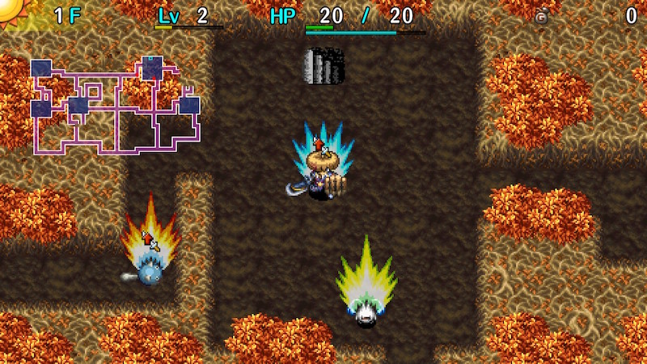

  

[Introduction]

<ul class="quickLinksUL">
  <li><a href="#overview">Overview</a></li>
  <li><a href="#strategy">Strategy</a></li>
  <li><a href="#monsters">Monsters</a></li>
  <li><a href="#items">Items</a></li>
  <li><a href="#traps">Traps</a></li>
</ul>

# Overview

<table class="dungeonOverview">
  <tr>
    <th>Unlock</th>
    <td class="highlightYellow">Clear Ouma Shrine and arrive in Nekomaneki Village.</td>
  </tr>
  <tr>
    <th>Entrance</th>
    <td class="highlightYellow">Nekomaneki Village (Woman in Dungeon Center)</td>
  </tr>
</table>

<table class="dungeonTable">
  <tr>
    <th>Floors</th>
    <td>10F (first) / 30F</td>
    <th>Day / Night</th>
    <td>Day</td>
  </tr>
  <tr>
    <th>Bring Items</th>
    <td>No</td>
    <th>Allies</th>
    <td>No</td>
  </tr>
  <tr>
    <th>Unidentified</th>
    <td>Bracelets</td>
    <th>New Items</th>
    <td>No</td>
  </tr>
  <tr>
    <th>Shops</th>
    <td>Regular, Elite, Pick-A-Choice</td>
    <th>Monster Houses</th>
    <td>Regular, Special, Sudden</td>
  </tr>
  <tr>
    <th>Initial Enemies</th>
    <td></td>
    <th>Spawn Rate</th>
    <td></td>
  </tr>
  <tr>
    <th>Ominous aura</th>
    <td></td>
    <th>Wind of Kron</th>
    <td>1st:  / 4th: </td>
  </tr>
  <tr>
    <th>Clear Icon</th>
    <td>None</td>
    <th>Reward</th>
    <td>Master's Mallet</td>
  </tr>
</table>

# Strategy

[Quick Links]

[Content]

# Monsters

[Monster Table]

# Items

[Item Table]

# Traps

[Trap Table]
