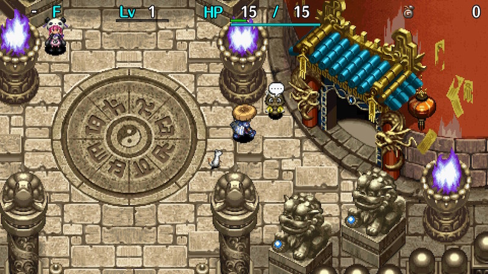
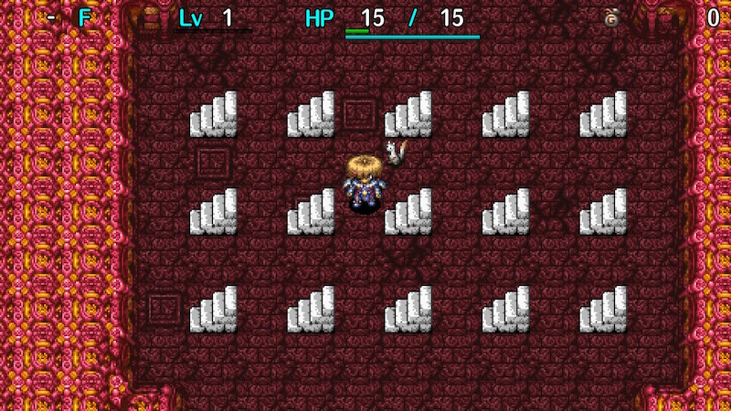

  

Dungeon where you progress through 15 floor ranges using special rules in the order of your choice. 
It's balanced so that the quality of items generally increases the further you progress.

The dungeon has both day and night, but time of day doesn't change based on elapsed turns. 
Field of view isn't restricted during the day except for Monster House floor ranges, 
and Monster Houses never get generated naturally outside of Monster House floor ranges.

<ul class="quickLinksUL">
  <li><a href="#overview">Overview</a></li>
  <li><a href="#strategy">Strategy</a>
    <ul>
      <li><a href="#general">General</a></li>
      <li><a href="#identifying-items">Identifying Items</a></li>
      <li><a href="#rules">Rules</a></li>
      <li><a href="#equipment">Equipment</a></li>
      <li><a href="#other-items">Other Items</a></li>
      <li><a href="#floor-guide">Floor Guide</a></li>
    </ul>
  </li>
  <li><a href="#monsters">Monsters</a>
    <ul>
      <li><a href="#day-monsters">Day Monsters</a></li>
      <li><a href="#night-monsters">Night Monsters</a></li>
    </ul>
  </li>
  <li><a href="#items">Items</a></li>
  <li><a href="#traps">Traps</a></li>
</ul>

# Overview

<table class="dungeonOverview">
  <tr>
    <th>Unlock</th>
    <td class="highlightYellow">1. Clear the main story. 2. Reach the top of Tower of Fortune with Tao. 3. View the event in the second floor of Sparrow's Inn. 4. Reach the top of Tower of Miracles. (Receive Upgrade Pot) 5. Talk to Tao at the Tower of Fortune Entrance. 6. Talk to the Tanuki in the same area.</td>
  </tr>
  <tr>
    <th>Entrance</th>
    <td class="highlightYellow">Tower of Fortune Entrance (Talk to the Tanuki)</td>
  </tr>
</table>

<table class="dungeonTable">
  <tr>
    <th>Floors</th>
    <td>45F</td>
    <th>Day / Night</th>
    <td>Both (Non-cycle)</td>
  </tr>
  <tr>
    <th>Bring Items</th>
    <td>No</td>
    <th>Allies</th>
    <td>No</td>
  </tr>
  <tr>
    <th>Unidentified</th>
    <td>Bracelets, Scrolls, Staves</td>
    <th>New Items</th>
    <td>No</td>
  </tr>
  <tr>
    <th>Shops</th>
    <td>Regular, Elite, Pick-A-Choice</td>
    <th>Monster Houses</th>
    <td>Regular, Special, Sudden</td>
  </tr>
  <tr>
    <th>Initial Enemies</th>
    <td>9</td>
    <th>Spawn Rate</th>
    <td>30</td>
  </tr>
  <tr>
    <th>Ominous aura</th>
    <td>No</td>
    <th>Wind of Kron</th>
    <td>1st: 1700 4th: 2000</td>
  </tr>
  <tr>
    <th>Clear Icon</th>
    <td class="clearIcon"></td>
    <th>Reward</th>
    <td>Sturdy Hammer</td>
  </tr>
</table>

# Strategy

<ul class="quickLinksUL">
  <li><a href="#general">General</a></li>
  <li><a href="#identifying-items">Identifying Items</a></li>
  <li><a href="#rules">Rules</a></li>
  <li><a href="#equipment">Equipment</a></li>
  <li><a href="#other-items">Other Items</a></li>
  <li><a href="#floor-guide">Floor Guide</a></li>
</ul>

### General

There are 15 stairs representing floor ranges at the start, and you're free to challenge them in any order. 
Each floor range can only be chosen once, and you must go through all 15 to clear the dungeon.

Stairs in red have a higher difficulty:

<table>
  <tr>
    <td>1</td>
    <td>2</td>
    <td>3</td>
    <td>4</td>
    <td>5</td>
  </tr>
  <tr>
    <td>6</td>
    <td>7</td>
    <td>8</td>
    <td>9</td>
    <td>10</td>
  </tr>
  <tr>
    <td>11</td>
    <td>12</td>
    <td>13</td>
    <td>14</td>
    <td>15</td>
  </tr>
</table>

 

1. Only weapons and shields on the ground. (1 floor)
2. Only weapons and shields on the ground. (3 floors)
3. Only grass on the ground. (3 floors)
4. Only scrolls on the ground. (1 floor)
5. Only scrolls on the ground. (3 floors)
6. Only pots on the ground. (1 floor)
7. Only pots on the ground. (3 floors)
8. Only Gitan on the ground. (4 floors)
9. HP doesn't regenerate, and lots of traps. (2 floors)
10. HP doesn't regenerate, and lots of traps. (4 floors)
11. It's always night. (3 floors)
12. Stores appear. (2 floors)
13. Mostly Mixer family monsters spawn. (5 floors)
14. Monster Houses appear. (3 floors)
15. Monster Houses appear. (7 floors)

Mixers appear on 8-10F, so plan a route that lets you obtain items for synthesis before that floor range.

Synthesis Pots are somewhat common, so if you're not struggling with synthesis, save the Mixer stairs for the 2nd half to get past floor ranges where tricky monsters spawn. (Ex: Ornery Tanks between 33-35F) The majority of spawns turn into Mixer monsters, which tend to be easier to deal with.

The Mixer floor range has a unique monster table. (30F+ is Mixermon, Mixergon, Kappa Pest, Green Zalokleft, and Concusschin)

Food, staves, and talismans can only be found on the ground within stairs 9-15, 
so be sure to check your remaining staff uses and food prior to choosing a new floor range. 
Gitan can only be found on the ground within stairs 8-12, so it's nice to visit 8-11 before 12. 
However, stairs 9-10 are dangerous zones, so don't overextend for the sake of Gitan.

Special Monster Houses are generated pretty often in Bizarre Tower. 
Consider ignoring Monster Houses if you didn't start in one / if the stairs isn't located in one. 
Doing so lowers risk, and lets you check other rooms without encountering many enemies.

Visit stairs 1-2 after you've obtained Synthesis Pots or when it overlaps with natural Mixer spawns, 
since you'll be able to synthesize the weapons and shields you find right away.

### Identifying Items

See [Identifying Items](/guides/identifying-items) for tips.

### Rules

#### Only weapons and shields on the ground (1 floor, 3 floors)

Popular choice to start with since you're guaranteed to find equipment. 
Status weapons can't be found on the ground, so upgrade value is the focus if chosen before Mixers.

#### Only grass on the ground (3 floors)

Easy rule since grasses are identified in this dungeon, but don't choose it when Grass Kids appear. 
Save Perception Grass for "HP doesn't regenerate, and lots of traps." floors. 
Not a bad choice to overlap it with the first Mixer zone (8-10F).

#### Only scrolls on the ground (1 floor, 3 floors)

Read unidentified scrolls while standing on the stairs in case it's a bad scroll like Swift Foe or Pot Dog. 
It's a bit uncommon to find 2 copies of a scroll due to the large variety of scrolls that can be found, 
so try to identify them without using them if possible.

#### Only pots on the ground (1 floor, 3 floors)

Preservation Pots to expand inventory, Identify Pots to identify items, Fever Pots to duplicate items, etc. 
Some choose this first to start with Preservation Pots instead of waiting until their inventory is full. 
Zalokleft Pots can be found, so consider visiting this zone before the "Stores appear." floors.

#### Only Gitan on the ground (4 floors)

Usually chosen before the "Stores appear." floors. 
Gitan bags are generally around 400-500G, so you can't use them to one-shot late game monsters.

#### HP doesn't regenerate, and lots of traps (2 floors, 4 floors)

Perception Grass and Trap Deletion Scrl make the "lots of traps" portion a non-issue. 
It's best to do these floors mid to late game, since HP regeneration slows down with higher max HP. 
However, some players prefer to clear them early while enemies aren't very threatening. 
This is one of the few locations where Trap Del. Staff has a chance to shine.

#### It's always night (3 floors)

Basically a bonus zone if you have good abilities, but there are some dangerous floors like 41-43F. 
Some like to get these floors over with in the first half so that they don't need to carry torches.

#### Stores appear (2 floors)

Nice for the first Mixer zone (8-10F), since price identification lets you figure out synthesis ingredients. 
Also a solid choice when you've collected lots of unidentified items and lack items to identify them. 
Don't choose this zone if dangerous monsters appear, since you might not get a chance to shop. 
If you're unlucky, the generated shops could be elite shops, meaning you won't be able to enter.

#### Mostly Mixer family monsters spawn (5 floors)

Can be used to avoid dangerous floor ranges by turning most enemies into Mixer monsters. 
Be warned that higher level Mixers have high attack, so don't get careless trying to synthesize.

#### Monster Houses appear (3 floors, 7 floors)

A Special Monster House at the start often ends the run, but waiting until the end is also risky. 
One option is to equip a torch and check what monsters are present before entering the room. 
Some choose 7 floors of Monster Houses right away, and then synthesize using Mixers afterward. 
Others who like a thrill can choose these stairs last to enjoy 10 floors of late game Monster Houses. 
In any case, avoid Tiger Tosser and Pumphantasm floors if challenging these stairs early on.

### Equipment

#### Weapon

Status weapons can only be found in shops, so they aren't likely to be a main weapon option. 
Weapons with 2 bracelet resonance are good, since many useful bracelets can be found on the ground. 
Bladite and Red Blade are shop-exclusive, so you'll often end up with Dotanuki, Beast Fang, or Katana. 
Water Cutter or Scythe are also solid choices, but other type effective weapons are a bit lackluster.

#### Weapon Runes

Prioritize status inflicting runes. (Paralyzing, Sedating, Bored, Confusing, etc.)  Anti-Aquatic and Anti-Floating are the best type effective runes, and Anti-Metal is nice for Ornery Tank. 
Have a Karakuroid (6-8F) create an Iron Arrow Trap to obtain an Iron Arrow for synthesis purposes.

#### Shield

Targite and Red Shield are shop-exclusive, so you'll often end up with Wolfshead, Beast Shield, or Iron Targe. 
Binary Shield makes for an effective main shield, provided you don't care about 2 bracelet resonance. 
If you visit stairs 12 (Stores appear) near the beginning and find a Day Shield, don't hesitate to use it.

#### Shield Runes

You can't go wrong with Anti-Blast, Bit, Agile, and Anti-Theft. 
This dungeon only has a depth of 45 floors, so others like Anti-Fire, Anti-Peck, and Rustproof 
aren't essential because higher level Dragons, Gyadons, and Mudkins don't spawn.

#### Bracelets

Monster Detector and Item Detector can be found on the ground, so pick up every unidentified bracelet. 
If you start with Monster House floors, use Strip, Spin, and Sleep traps to test for bracelet effects. 
You can also visit stairs 12 (Stores appear) after you've collected some bracelets and identify by price, 
or if you understand the risks of equipping a cursed bracelet, go ahead and equip them on the spot.

### Other Items

#### Projectiles

Collect arrows using traps found in Monster Houses or created by Karakuroids (6-8F). 
Poison Arrows help against late game monsters, and you'll want 1 Iron Arrow to synthesize Anti-Metal.

#### Scrolls

Chances to check prices are limited, so either read scrolls or use an Identify Scroll or Identify Pot. 
Scrolls with negative effects are common, so it's best to read scrolls while standing on the exit. Reading a Pot Dog Scroll near the beginning of the adventure can end the run.

#### Staves

Swap and Pinning staves are effective on floors that don't have walls. 
These two are nice for Monster House floor ranges in particular, since map generation can change.

#### Pots

Preservation, Heal, and fragrance pots are the essentials. 
Fever Pots can be found on the ground, making them more common than in other dungeons.

#### Talismans

Throwing a talisman carries some risk, but they're nice to have because scrolls are hard to identify. 
Sleep and Fear talismans can be used to effectively shut down most monsters.

#### Grass

It's good to carry some HP restoring grasses until you obtain Revival Grass, Swift Grass, and Heal Pot. 
There's little need for other grasses, but Perception Grass is nice for floors where HP doesn't regenerate.

### Floor Guide

#### Early Game

Choose Monster House floors early, since HP regenerates quickly and dangerous monsters don't appear. 
You'll also find a variety of items in time for the first Mixer zone (8-10F), helping with consistency. 
However, Special Monster Houses can appear, so expect to restart a few times before things go smoothly. 
Some players like to wait until they're able to defeat Mixers before attempting Monster House floors.

Monster House floors on 6-10F don't have walls, making it hard to collect arrows using Karakuroids (6-8F). 
Therefore, some postpone Monster House floors until after 8F so that they can collect more arrows.

Choose floors where HP doesn't regenerate around the time your HP regeneration slows down. 
Check for traps and take things one step at a time, ideally while keeping Super status active. 
Do these after stairs 3 (only grass) so you have Perception and HP restoring grasses on hand.

That said, it's not necessarily a bad idea to tackle stairs 9 and 10 right away. 
You should be able to defeat most enemies in 1 or 2 hits, and you'll hardly take damage with a shield. 
Monsters hit somewhat hard starting from 3F, so aim for a shield with at least 10 defense if possible.

Wood Arrow Traps appear between 1-5F, so walk along walls and check for traps to collect arrows. 
Arrow count and equipment strength comes down to luck when attempting stairs 10 early, 
so if you don't find what you need pretty quickly, you'll probably end up collapsed.

#### Mid Game

Avoid 3 (grass), 6-7 (pots), and 14-15 (Monster Houses) on Digestiphant and Kappa Pest floors (29-31F). 
Kappa Pest makes it hard to obtain items, so choose stairs that don't include valuable item categories. 
※ Stairs 8 (only Gitan) is safe on Kappa Pest floors, since Lv2 Bored Kappas don't throw Gitan.

#### Late Game

Stairs 13 (Mixers) can spawn powerful Mixergons from 30F, so it's not worth the risk to synthesize. 
If you're ready to rush stairs, choose stairs 13 when it overlaps with dangerous enemy floors. 
Examples: Ornery Tank (33-35F), MC Wizard (37-38F).

#### Other Notes

6-8F: Karakuroids appear, so collect arrows --- 1 Iron Arrow for Anti-Metal, at least.

6-10F: Maps on these floors don't have walls if you choose stairs 14 or 15 (Monster Houses). 
While it's easier to find items for synthesis on MH floors, it's harder to collect arrows using traps. Field of view is also limited on MH floors, so you risk getting items cursed by Curse Girls in hallways, 
and Fearabbits can end a run if you don't clear out enemies using arrows before entering the room. 
So all said, understand the added risk of choosing stairs 14 and 15 early.

24-27F: Power enemies like Ironhead, Hipadile, and Punisher start showing up, so use Poison Arrows.

33-35F: Ornery Tanks appear, so rush stairs unless you have a way to deal with them. 
One skip option is stairs 11 (It's always night), but be warned that Evil Poofy appears on 33F. 
The other option is stairs 13 (Mostly Mixer monsters), but Mixergon can be quite a threat too.

36F: Low risk if you have Rocks for Cave Mamels, so hunt Grass Poppas to stock up on grass. 
However, VeniScorp spawns, so be careful not to get stung if you don't have an Antidote Grass or Peach. 
Reading an Immunity Scroll helps reduce the risk of accidents if you plan on lingering a long time.

37-38F: MC Wizards appear, so rush stairs unless you have a way to deal with them. 
Similar to Ornery Tanks, one option is to choose stairs 11 (It's always night) to skip past them, 
but Bad Colocolums slain by other monsters can one-shot you by rolling into you if you're unlucky.

40-45F: This floor range is particularly dangerous at night. 
Dark Scarabbit, Vile Pumpanshee, and Sinister Porkon are major threats on 41-43F, 
and while not as bad as that combination, Dark Ornery Tanks appear on 44-45F. 
Dangers during the day include Nashagga (40-42F), Sky Dragons (41-43F), and Nigiri Boss (44-45F). Some players save stairs 13 (Mostly Mixer monsters) until this final stretch to have an easier time.

# Monsters

See [Monsters](/system/monsters) for individual monster details.

#### Day Monsters

Enemy Colors: Farming Situational Farming Destroys Items Dangerous Very Dangerous

<table class="dungeonMonsters">
  <thead>
    <tr>
      <th colspan="9">Day</th>
    </tr>
  </thead>
  <tbody>
    <tr>
      <td>1</td>
      <td class="highlightYellow">Mamel</td>
      <td class="highlightYellow">Seedie</td>
      <td class="highlightYellow">Sproutant</td>
      <td></td>
      <td></td>
      <td></td>
      <td></td>
      <td></td>
    </tr>
    <tr>
      <td>2</td>
      <td class="highlightYellow">Mamel</td>
      <td class="highlightYellow">Seedie</td>
      <td class="highlightYellow">Sproutant</td>
      <td class="highlightYellow">Colum</td>
      <td></td>
      <td></td>
      <td></td>
      <td></td>
    </tr>
    <tr>
      <td>3</td>
      <td class="highlightGreen">Pit Mamel</td>
      <td class="highlightYellow">Chintala</td>
      <td class="highlightYellow">Sproutant</td>
      <td class="highlightYellow">Colum</td>
      <td class="highlightBlue">Grass Kid</td>
      <td class="highlightYellow">Blade Bee</td>
      <td></td>
      <td></td>
    </tr>
    <tr>
      <td>4</td>
      <td class="highlightGreen">Pit Mamel</td>
      <td class="highlightYellow">Chintala</td>
      <td class="highlightYellow">Sweet Nut</td>
      <td></td>
      <td class="highlightBlue">Grass Kid</td>
      <td class="highlightYellow">Blade Bee</td>
      <td></td>
      <td></td>
    </tr>
    <tr>
      <td>5</td>
      <td class="highlightGreen">Pit Mamel</td>
      <td class="highlightYellow">Chintala</td>
      <td class="highlightYellow">Sweet Nut</td>
      <td></td>
      <td class="highlightBlue">Grass Kid</td>
      <td></td>
      <td></td>
      <td></td>
    </tr>
    <tr>
      <td>6</td>
      <td class="highlightYellow">Nigiri Baby</td>
      <td class="highlightYellow">Karakuroid</td>
      <td class="highlightYellow">Floaty</td>
      <td class="highlightYellow">Moseal</td>
      <td class="highlightGreen">Froggo</td>
      <td></td>
      <td></td>
      <td></td>
    </tr>
    <tr>
      <td>7</td>
      <td class="highlightYellow">Nigiri Baby</td>
      <td class="highlightYellow">Karakuroid</td>
      <td class="highlightYellow">Floaty</td>
      <td class="highlightYellow">Moseal</td>
      <td class="highlightGreen">Froggo</td>
      <td class="highlightYellow">Tiger Tosser</td>
      <td></td>
      <td></td>
    </tr>
    <tr>
      <td>8</td>
      <td class="highlightYellow">Nigiri Baby</td>
      <td class="highlightYellow">Karakuroid</td>
      <td class="highlightYellow">Floaty</td>
      <td class="highlightYellow">Moseal</td>
      <td class="highlightBlue">Mixer</td>
      <td class="highlightYellow">Tiger Tosser</td>
      <td class="highlightYellow">Pop Tank</td>
      <td class="highlightPurple3">Fearabbit Curse Girl</td>
    </tr>
    <tr>
      <td>9</td>
      <td class="highlightYellow">Gyaza</td>
      <td></td>
      <td></td>
      <td></td>
      <td class="highlightBlue">Mixer</td>
      <td class="highlightYellow">Tiger Tosser</td>
      <td class="highlightYellow">Pop Tank</td>
      <td class="highlightPurple3">Fearabbit Curse Girl</td>
    </tr>
    <tr>
      <td>10</td>
      <td class="highlightYellow">Gyaza</td>
      <td class="highlightYellow">Pumphantasm</td>
      <td class="highlightYellow">Kumonigiri</td>
      <td class="highlightYellow">Naptapir</td>
      <td class="highlightBlue">Mixer</td>
      <td class="highlightYellow">N'dubba</td>
      <td class="highlightYellow">Pop Tank</td>
      <td></td>
    </tr>
    <tr>
      <td>11</td>
      <td class="highlightYellow">Mutaikon</td>
      <td class="highlightYellow">Pumphantasm</td>
      <td class="highlightYellow">Kumonigiri</td>
      <td class="highlightYellow">Naptapir</td>
      <td></td>
      <td class="highlightYellow">N'dubba</td>
      <td></td>
      <td></td>
    </tr>
    <tr>
      <td>12</td>
      <td class="highlightYellow">Mutaikon</td>
      <td class="highlightYellow">Pumphantasm</td>
      <td class="highlightYellow">Kumonigiri</td>
      <td class="highlightYellow">Naptapir</td>
      <td class="highlightPurple3">Swordsman</td>
      <td class="highlightPurple3">Mudkin</td>
      <td class="highlightYellow">Metalhead</td>
      <td class="highlightYellow">Scorpion</td>
    </tr>
    <tr>
      <td>13</td>
      <td class="highlightBlue">Snacky</td>
      <td class="highlightYellow">Cheer-Ham</td>
      <td class="highlightYellow">Acrid Nut</td>
      <td class="highlightYellow">Cololum</td>
      <td class="highlightYellow">Polygon Spinna</td>
      <td class="highlightYellow">Mid Chintala</td>
      <td></td>
      <td></td>
    </tr>
    <tr>
      <td>14</td>
      <td class="highlightBlue">Snacky</td>
      <td class="highlightYellow">Cheer-Ham</td>
      <td class="highlightYellow">Acrid Nut</td>
      <td class="highlightYellow">Cololum</td>
      <td class="highlightYellow">Polygon Spinna</td>
      <td class="highlightYellow">Kid Squid</td>
      <td></td>
      <td></td>
    </tr>
    <tr>
      <td>15</td>
      <td class="highlightBlue">Snacky</td>
      <td class="highlightYellow">Cheer-Ham</td>
      <td class="highlightYellow">Bored Kappa</td>
      <td class="highlightOrange2">Foly</td>
      <td class="highlightYellow">Momoseal</td>
      <td class="highlightYellow">Kid Squid</td>
      <td></td>
      <td></td>
    </tr>
    <tr>
      <td>16</td>
      <td class="highlightYellow">Dagger Bee</td>
      <td class="highlightYellow">Yanpii</td>
      <td class="highlightYellow">Bored Kappa</td>
      <td class="highlightOrange2">Foly</td>
      <td class="highlightYellow">Momoseal</td>
      <td class="highlightYellow">Kid Squid</td>
      <td class="highlightYellow">Hopodile</td>
      <td></td>
    </tr>
    <tr>
      <td>17</td>
      <td class="highlightYellow">Dagger Bee</td>
      <td class="highlightYellow">Yanpii</td>
      <td class="highlightYellow">Bored Kappa</td>
      <td class="highlightOrange2">Foly</td>
      <td class="highlightPurple3">Scoopie</td>
      <td class="highlightYellow">Flamebird</td>
      <td class="highlightYellow">Hopodile</td>
      <td class="highlightBlue">Zalokleft</td>
    </tr>
    <tr>
      <td>18</td>
      <td class="highlightYellow">Dagger Bee</td>
      <td class="highlightYellow">Yanpii</td>
      <td class="highlightOrange2">Grampa Tank</td>
      <td></td>
      <td class="highlightPurple3">Scoopie</td>
      <td class="highlightYellow">Flamebird</td>
      <td class="highlightYellow">Hopodile</td>
      <td class="highlightBlue">Zalokleft</td>
    </tr>
    <tr>
      <td>19</td>
      <td class="highlightYellow">DJ Mage</td>
      <td class="highlightYellow">Eligan</td>
      <td class="highlightOrange2">Grampa Tank</td>
      <td class="highlightYellow">Beanie</td>
      <td class="highlightPurple3">Scoopie</td>
      <td></td>
      <td></td>
      <td></td>
    </tr>
    <tr>
      <td>20</td>
      <td class="highlightYellow">DJ Mage</td>
      <td class="highlightYellow">Eligan</td>
      <td class="highlightOrange2">Grampa Tank</td>
      <td class="highlightYellow">Beanie</td>
      <td class="highlightBlue">Grass Dude</td>
      <td></td>
      <td></td>
      <td></td>
    </tr>
    <tr>
      <td>21</td>
      <td class="highlightYellow">DJ Mage</td>
      <td class="highlightYellow">Eligan</td>
      <td class="highlightBlue">Green Zalokleft</td>
      <td class="highlightYellow">Sproutyrant</td>
      <td class="highlightBlue">Grass Dude</td>
      <td></td>
      <td></td>
      <td></td>
    </tr>
    <tr>
      <td>22</td>
      <td class="highlightYellow">Poofy</td>
      <td class="highlightYellow">Steamroid</td>
      <td class="highlightBlue">Green Zalokleft</td>
      <td class="highlightYellow">Sproutyrant</td>
      <td class="highlightBlue">Grass Dude</td>
      <td class="highlightPurple3">Nigiri Morph</td>
      <td></td>
      <td></td>
    </tr>
    <tr>
      <td>23</td>
      <td class="highlightYellow">Poofy</td>
      <td class="highlightYellow">Steamroid</td>
      <td class="highlightBlue">Green Zalokleft Froggucci</td>
      <td class="highlightYellow">Sproutyrant</td>
      <td class="highlightOrange2">Absorbiphant</td>
      <td class="highlightPurple3">Nigiri Morph</td>
      <td class="highlightPurple3">Snooztapir Gyadon</td>
      <td class="highlightGreen">Pandanigiri Boy Cart</td>
    </tr>
    <tr>
      <td>24</td>
      <td class="highlightYellow">Poofy</td>
      <td class="highlightYellow">Ironhead</td>
      <td class="highlightGreen">Froggucci</td>
      <td></td>
      <td class="highlightOrange2">Absorbiphant</td>
      <td></td>
      <td class="highlightPurple3">Snooztapir Gyadon</td>
      <td class="highlightGreen">Pandanigiri Boy Cart</td>
    </tr>
    <tr>
      <td>25</td>
      <td class="highlightOrange2">Hipadile</td>
      <td class="highlightYellow">Ironhead</td>
      <td class="highlightYellow">Punisher</td>
      <td class="highlightPurple3">Cursister</td>
      <td class="highlightOrange2">Absorbiphant</td>
      <td></td>
      <td></td>
      <td></td>
    </tr>
    <tr>
      <td>26</td>
      <td class="highlightOrange2">Hipadile</td>
      <td class="highlightPurple3">Muddy</td>
      <td class="highlightYellow">Punisher</td>
      <td class="highlightPurple3">Cursister</td>
      <td class="highlightYellow">Crow Tengu</td>
      <td class="highlightYellow">Firepuff</td>
      <td class="highlightYellow">Sr. Yanpii</td>
      <td class="highlightPurple3">Spadie</td>
    </tr>
    <tr>
      <td>27</td>
      <td class="highlightOrange2">Hipadile</td>
      <td class="highlightPurple3">Muddy</td>
      <td class="highlightYellow">Punisher</td>
      <td class="highlightYellow">Explochin</td>
      <td class="highlightYellow">Crow Tengu</td>
      <td class="highlightYellow">Firepuff</td>
      <td class="highlightYellow">Sr. Yanpii</td>
      <td class="highlightPurple3">Spadie</td>
    </tr>
    <tr>
      <td>28</td>
      <td class="highlightGreen">Cross Cart</td>
      <td class="highlightPurple3">Muddy</td>
      <td></td>
      <td class="highlightYellow">Explochin</td>
      <td class="highlightYellow">Crow Tengu</td>
      <td class="highlightYellow">Firepuff</td>
      <td class="highlightYellow">Sr. Yanpii</td>
      <td class="highlightPurple3">Spadie</td>
    </tr>
    <tr>
      <td>29</td>
      <td class="highlightGreen">Cross Cart</td>
      <td class="highlightOrange2">Kappa Pest</td>
      <td class="highlightOrange2">MC Mage</td>
      <td class="highlightYellow">Explochin</td>
      <td class="highlightYellow">Go-Ham!</td>
      <td class="highlightOrange2">Digestiphant</td>
      <td class="highlightOrange2">Scarabbit</td>
      <td class="highlightYellow">Zapdon</td>
    </tr>
    <tr>
      <td>30</td>
      <td class="highlightOrange2">N'twyn</td>
      <td class="highlightOrange2">Kappa Pest</td>
      <td class="highlightOrange2">MC Mage</td>
      <td></td>
      <td class="highlightYellow">Go-Ham!</td>
      <td class="highlightOrange2">Digestiphant</td>
      <td class="highlightOrange2">Scarabbit</td>
      <td class="highlightYellow">Zapdon</td>
    </tr>
    <tr>
      <td>31</td>
      <td class="highlightOrange2">N'twyn</td>
      <td class="highlightOrange2">Kappa Pest</td>
      <td class="highlightOrange2">MC Mage</td>
      <td class="highlightBlue">Mixermon</td>
      <td class="highlightYellow">Death Gyaza</td>
      <td class="highlightYellow">Katana Bee</td>
      <td class="highlightYellow">Dragon</td>
      <td class="highlightYellow">Shagga</td>
    </tr>
    <tr>
      <td>32</td>
      <td></td>
      <td></td>
      <td></td>
      <td class="highlightBlue">Mixermon</td>
      <td class="highlightYellow">Death Gyaza</td>
      <td class="highlightYellow">Katana Bee</td>
      <td class="highlightYellow">Dragon</td>
      <td class="highlightYellow">Shagga</td>
    </tr>
    <tr>
      <td>33</td>
      <td class="highlightRed">Ornery Tank</td>
      <td></td>
      <td></td>
      <td class="highlightBlue">Mixermon</td>
      <td class="highlightYellow">Death Gyaza</td>
      <td class="highlightYellow">Katana Bee</td>
      <td class="highlightYellow">Dragon</td>
      <td class="highlightYellow">Shagga</td>
    </tr>
    <tr>
      <td>34</td>
      <td class="highlightRed">Ornery Tank</td>
      <td class="highlightYellow">Falcon Tengu</td>
      <td class="highlightYellow">Flamepuff</td>
      <td class="highlightYellow">Pumphantom</td>
      <td class="highlightYellow">Dazikon</td>
      <td class="highlightYellow">Polygon Shaka</td>
      <td></td>
      <td></td>
    </tr>
    <tr>
      <td>35</td>
      <td class="highlightRed">Ornery Tank</td>
      <td class="highlightYellow">Falcon Tengu</td>
      <td class="highlightYellow">Flamepuff</td>
      <td class="highlightYellow">Pumphantom</td>
      <td class="highlightYellow">Dazikon</td>
      <td class="highlightYellow">Polygon Shaka</td>
      <td class="highlightYellow">VeniScorp</td>
      <td class="highlightYellow">Cave Mamel</td>
    </tr>
    <tr>
      <td>36</td>
      <td class="highlightYellow">Tiger Hurler</td>
      <td class="highlightYellow">Falcon Tengu</td>
      <td class="highlightYellow">Flamepuff</td>
      <td class="highlightBlue">Grass Poppa</td>
      <td></td>
      <td></td>
      <td class="highlightYellow">VeniScorp</td>
      <td class="highlightYellow">Cave Mamel</td>
    </tr>
    <tr>
      <td>37</td>
      <td class="highlightYellow">Tiger Hurler</td>
      <td class="highlightRed">MC Wizard</td>
      <td></td>
      <td class="highlightBlue">Grass Poppa</td>
      <td></td>
      <td></td>
      <td class="highlightYellow">VeniScorp</td>
      <td></td>
    </tr>
    <tr>
      <td>38</td>
      <td class="highlightYellow">Tiger Hurler</td>
      <td class="highlightRed">MC Wizard</td>
      <td class="highlightYellow">Huistdon</td>
      <td class="highlightBlue">Grass Poppa</td>
      <td class="highlightYellow">Eligagan</td>
      <td class="highlightPurple3">Gyairas</td>
      <td></td>
      <td></td>
    </tr>
    <tr>
      <td>39</td>
      <td></td>
      <td></td>
      <td class="highlightYellow">Huistdon</td>
      <td class="highlightYellow">Sparkbird</td>
      <td class="highlightYellow">Eligagan</td>
      <td class="highlightPurple3">Gyairas</td>
      <td></td>
      <td></td>
    </tr>
    <tr>
      <td>40</td>
      <td class="highlightYellow">Momomoseal</td>
      <td class="highlightOrange2">Nashagga</td>
      <td class="highlightYellow">Huistdon</td>
      <td class="highlightYellow">Sparkbird</td>
      <td class="highlightYellow">Eligagan</td>
      <td></td>
      <td></td>
      <td></td>
    </tr>
    <tr>
      <td>41</td>
      <td class="highlightYellow">Momomoseal</td>
      <td class="highlightOrange2">Nashagga</td>
      <td class="highlightYellow">Huistdon</td>
      <td class="highlightYellow">Steelhead</td>
      <td class="highlightOrange2">Sky Dragon</td>
      <td></td>
      <td></td>
      <td></td>
    </tr>
    <tr>
      <td>42</td>
      <td class="highlightYellow">Momomoseal</td>
      <td class="highlightOrange2">Nashagga</td>
      <td></td>
      <td class="highlightYellow">Steelhead</td>
      <td class="highlightOrange2">Sky Dragon</td>
      <td></td>
      <td></td>
      <td></td>
    </tr>
    <tr>
      <td>43</td>
      <td class="highlightYellow">Momomoseal</td>
      <td></td>
      <td></td>
      <td class="highlightYellow">Steelhead</td>
      <td class="highlightOrange2">Sky Dragon</td>
      <td></td>
      <td></td>
      <td></td>
    </tr>
    <tr>
      <td>44</td>
      <td class="highlightOrange2">Nigiri Boss</td>
      <td class="highlightYellow">Concusschin</td>
      <td class="highlightYellow">King Squid</td>
      <td class="highlightYellow">Nuttie</td>
      <td class="highlightYellow">Rally Ham</td>
      <td class="highlightYellow">Spicy Nut</td>
      <td></td>
      <td></td>
    </tr>
    <tr>
      <td>45</td>
      <td class="highlightOrange2">Nigiri Boss</td>
      <td class="highlightYellow">Concusschin</td>
      <td class="highlightYellow">King Squid</td>
      <td class="highlightYellow">Nuttie</td>
      <td class="highlightYellow">Rally Ham</td>
      <td class="highlightYellow">Spicy Nut</td>
      <td class="highlightYellow">Big Chintala</td>
      <td class="highlightBlue">Munchy</td>
    </tr>
  </tbody>
</table>

#### Night Monsters

Enemy Colors: Farming Situational Farming Destroys Items Dangerous Very Dangerous

<table class="dungeonMonsters">
  <thead>
    <tr>
      <th colspan="10" class="highlightBlack">Night (Unsorted)</th>
    </tr>
  </thead>
  <tbody>
    <tr>
      <td>1</td>
      <td class="highlightPurple">Dark Bored Kappa</td>
      <td class="highlightPurple">Bad Colum</td>
      <td class="highlightPurple">Dark Boy Cart</td>
      <td class="highlightPurple">Dark Mamel</td>
      <td class="highlightPurple">Evil Chintala</td>
      <td></td>
      <td></td>
      <td></td>
      <td></td>
    </tr>
    <tr>
      <td>2</td>
      <td class="highlightPurple">Dark Mamel</td>
      <td class="highlightPurple">Evil Chintala</td>
      <td class="highlightPurple">Bad Colum</td>
      <td class="highlightPurple">Dark Bored Kappa</td>
      <td class="highlightPurple">Evil Polyspinna</td>
      <td class="highlightPurple">Putrid Sweet Nut</td>
      <td class="highlightPurple">Dark Boy Cart</td>
      <td></td>
      <td></td>
    </tr>
    <tr>
      <td>3</td>
      <td class="highlightPurple">Dark Tosser</td>
      <td class="highlightPurple">Evil Chintala</td>
      <td class="highlightPurple">Putrid Sweet Nut</td>
      <td class="highlightPurple">Evil Polyspinna</td>
      <td class="highlightPurple">Evil Hopodile</td>
      <td class="highlightPurple">Dark Mamel</td>
      <td class="highlightPurple">Dark Bored Kappa</td>
      <td class="highlightPurple">Dark Naptapir</td>
      <td></td>
    </tr>
    <tr>
      <td>4</td>
      <td class="highlightPurple">Evil Hopodile</td>
      <td class="highlightPurple">Dark Karakuroid</td>
      <td class="highlightPurple">Dark Naptapir</td>
      <td class="highlightPurple">Dark Mamel</td>
      <td class="highlightPurple">Sinful Yanpii</td>
      <td class="highlightPurple">Dark Tosser</td>
      <td class="highlightPurple">Dark Absorbiphant</td>
      <td class="highlightPurple">Violent Gyadon</td>
      <td class="highlightPurple">Putrid Sweet Nut</td>
    </tr>
    <tr>
      <td>5</td>
      <td class="highlightPurple">Sinful Yanpii</td>
      <td class="highlightPurple">Dark Tosser</td>
      <td class="highlightPurple">Dark Mamel</td>
      <td class="highlightPurple">Violent Gyadon</td>
      <td class="highlightPurple">Dark Absorbiphant</td>
      <td class="highlightPurple">Dark Karakuroid</td>
      <td></td>
      <td></td>
      <td></td>
    </tr>
    <tr>
      <td>6</td>
      <td class="highlightPurple">Sinister Porky</td>
      <td class="highlightPurple">Dark Kumonigiri</td>
      <td class="highlightPurple">Shady Mudkin</td>
      <td class="highlightPurple">Dark Pop Tank</td>
      <td class="highlightPurple">Dark Tosser</td>
      <td class="highlightPurple">Dark Flamebird</td>
      <td class="highlightPurple">Evil Kid Squid</td>
      <td class="highlightPurple">Hell's Punisher</td>
      <td></td>
    </tr>
    <tr>
      <td>7</td>
      <td class="highlightPurple">Shady Mudkin</td>
      <td class="highlightPurple">Hell's Punisher</td>
      <td class="highlightPurple">Sinister Porky</td>
      <td class="highlightPurple">Evil Kid Squid</td>
      <td class="highlightPurple">Dark Pop Tank</td>
      <td class="highlightPurple">Dark Flamebird</td>
      <td class="highlightPurple">Dark Kumonigiri</td>
      <td></td>
      <td></td>
    </tr>
    <tr>
      <td>8</td>
      <td class="highlightPurple">Wicked Scoopie</td>
      <td class="highlightPurple">Dark Kumonigiri</td>
      <td class="highlightPurple">Shady Mudkin</td>
      <td class="highlightPurple">Dark Dj Mage</td>
      <td class="highlightPurple">Plump Chow</td>
      <td></td>
      <td></td>
      <td></td>
      <td></td>
    </tr>
    <tr>
      <td>9</td>
      <td class="highlightPurple">Wicked Scoopie</td>
      <td class="highlightPurple">Evil Floaty</td>
      <td class="highlightPurple">Dark Eligan</td>
      <td class="highlightPurple">Plump Chow</td>
      <td class="highlightPurple">Foul Nigiri Baby</td>
      <td class="highlightPurple">Dark Dj Mage</td>
      <td class="highlightPurple">Dark Mutaikon</td>
      <td class="highlightPurple">Evil Gazer</td>
      <td></td>
    </tr>
    <tr>
      <td>10</td>
      <td class="highlightPurple">Evil Floaty</td>
      <td class="highlightPurple">Evil Gazer</td>
      <td class="highlightPurple">Dark Eligan</td>
      <td class="highlightPurple">Foul Curse Girl</td>
      <td class="highlightPurple">Dark Mutaikon</td>
      <td class="highlightPurple">Foul Nigiri Baby</td>
      <td class="highlightPurple">Evil Firepuff</td>
      <td class="highlightPurple">Evil Mid Chintala</td>
      <td class="highlightPurple">Dark N'dubba</td>
    </tr>
    <tr>
      <td>11</td>
      <td class="highlightPurple">Evil Mid Chintala</td>
      <td class="highlightPurple">Foul Curse Girl</td>
      <td class="highlightPurple">Foul Nigiri Baby</td>
      <td class="highlightPurple">Evil Firepuff</td>
      <td class="highlightPurple">Dark N'dubba</td>
      <td></td>
      <td></td>
      <td></td>
      <td></td>
    </tr>
    <tr>
      <td>12</td>
      <td class="highlightPurple">Dark Blade Bee</td>
      <td class="highlightPurple">Foul Curse Girl</td>
      <td class="highlightPurple">Evil Firepuff</td>
      <td class="highlightPurple">Evil Mid Chintala</td>
      <td class="highlightPurple">Mean Cheer Ham</td>
      <td></td>
      <td></td>
      <td></td>
      <td></td>
    </tr>
    <tr>
      <td>13</td>
      <td class="highlightPurple">Foul Pin Kid</td>
      <td class="highlightPurple">Hateful Seedie</td>
      <td class="highlightPurple">Bad Moseal</td>
      <td class="highlightPurple">Dark Grass Kid</td>
      <td></td>
      <td></td>
      <td></td>
      <td></td>
      <td></td>
    </tr>
    <tr>
      <td>14</td>
      <td class="highlightPurple">Bad Crow Tengu</td>
      <td class="highlightPurple">Evil Hipadile</td>
      <td class="highlightPurple">Vile Sproutant</td>
      <td></td>
      <td></td>
      <td></td>
      <td></td>
      <td></td>
      <td></td>
    </tr>
    <tr>
      <td>15</td>
      <td class="highlightPurple">Bad Crow Tengu</td>
      <td class="highlightPurple">Evil Hipadile</td>
      <td class="highlightPurple">Vile Sproutant</td>
      <td></td>
      <td></td>
      <td></td>
      <td></td>
      <td></td>
      <td></td>
    </tr>
    <tr>
      <td>16</td>
      <td class="highlightPurple">Vile Sproutant</td>
      <td class="highlightPurple">Dark Pit Mamel</td>
      <td class="highlightPurple">Violent Gyairas</td>
      <td class="highlightPurple">Bad Crow Tengu</td>
      <td class="highlightPurple">Evil Hipadile</td>
      <td></td>
      <td></td>
      <td></td>
      <td></td>
    </tr>
    <tr>
      <td>17</td>
      <td class="highlightPurple">Dark Pit Mamel</td>
      <td class="highlightPurple">Bad Cololum</td>
      <td class="highlightPurple">Dark Cross Cart</td>
      <td class="highlightPurple">Violent Gyairas</td>
      <td class="highlightPurple">Dark Mixer</td>
      <td class="highlightPurple">Dark Mc Mage</td>
      <td class="highlightPurple">Dark Crow Tengu</td>
      <td></td>
      <td></td>
    </tr>
    <tr>
      <td>18</td>
      <td class="highlightPurple">Dark Mixer</td>
      <td class="highlightPurple">Bad Cololum</td>
      <td class="highlightPurple">Dark Cross Cart</td>
      <td class="highlightPurple">Dark Pit Mamel</td>
      <td class="highlightPurple">Dark Mc Mage</td>
      <td class="highlightPurple">Violent Gyairas</td>
      <td></td>
      <td></td>
      <td></td>
    </tr>
    <tr>
      <td>19</td>
      <td class="highlightPurple">Foul Nigiri Morph</td>
      <td class="highlightPurple">Evil Dragon</td>
      <td class="highlightPurple">Evil Gyaza</td>
      <td class="highlightPurple">Dark Zapdon</td>
      <td class="highlightPurple">Evil Super Gazer</td>
      <td></td>
      <td></td>
      <td></td>
      <td></td>
    </tr>
    <tr>
      <td>20</td>
      <td class="highlightPurple">Foul Nigiri Morph</td>
      <td class="highlightPurple">Evil Dragon</td>
      <td class="highlightPurple">Evil Gyaza</td>
      <td class="highlightPurple">Dark Zapdon</td>
      <td class="highlightPurple">Evil Super Gazer</td>
      <td></td>
      <td></td>
      <td></td>
      <td></td>
    </tr>
    <tr>
      <td>21</td>
      <td class="highlightPurple">Filthy Nashagga</td>
      <td class="highlightPurple">Dark Fearabbit</td>
      <td class="highlightPurple">Evil Dragon</td>
      <td class="highlightPurple">Evil Gyaza</td>
      <td class="highlightPurple">Sinister Porko</td>
      <td></td>
      <td></td>
      <td></td>
      <td></td>
    </tr>
    <tr>
      <td>22</td>
      <td class="highlightPurple">Filthy Nashagga</td>
      <td class="highlightPurple">Dark Fearabbit</td>
      <td class="highlightPurple">Sinister Porko</td>
      <td class="highlightPurple">Wicked Spadie</td>
      <td class="highlightPurple">Dark Hurler</td>
      <td class="highlightPurple">Evil Explochin</td>
      <td class="highlightPurple">Evil Polyshaka</td>
      <td></td>
      <td></td>
    </tr>
    <tr>
      <td>23</td>
      <td class="highlightPurple">Filthy Nashagga</td>
      <td class="highlightPurple">Dark Digestiphant</td>
      <td class="highlightPurple">Wicked Spadie</td>
      <td class="highlightPurple">Vile Pumphantasm</td>
      <td class="highlightPurple">Dark Hurler</td>
      <td class="highlightPurple">Evil Explochin</td>
      <td class="highlightPurple">Evil Polyshaka</td>
      <td></td>
      <td></td>
    </tr>
    <tr>
      <td>24</td>
      <td class="highlightPurple">Bad Zalokleft</td>
      <td class="highlightPurple">Sinful Sr. Yanpii</td>
      <td class="highlightPurple">Evil Squidfficial</td>
      <td class="highlightPurple">Dark Snooztapir</td>
      <td class="highlightPurple">Dark Hurler</td>
      <td class="highlightPurple">Dark Digestiphant</td>
      <td class="highlightPurple">Vile Pumphantasm</td>
      <td></td>
      <td></td>
    </tr>
    <tr>
      <td>25</td>
      <td class="highlightPurple">Bad Zalokleft</td>
      <td class="highlightPurple">Sinful Sr. Yanpii</td>
      <td class="highlightPurple">Evil Squidfficial</td>
      <td class="highlightPurple">Dark Snooztapir</td>
      <td class="highlightPurple">Dark Kappa Pest</td>
      <td class="highlightPurple">Evil Flamepuff</td>
      <td class="highlightPurple">Dark Grampa Tank</td>
      <td></td>
      <td></td>
    </tr>
    <tr>
      <td>26</td>
      <td class="highlightPurple">Dark Dazikon</td>
      <td class="highlightPurple">Dark Kappa Pest</td>
      <td class="highlightPurple">Evil Flamepuff</td>
      <td class="highlightPurple">Dark Grampa Tank</td>
      <td class="highlightPurple">εFO-U</td>
      <td></td>
      <td></td>
      <td></td>
      <td></td>
    </tr>
    <tr>
      <td>27</td>
      <td class="highlightPurple">Dark Dazikon</td>
      <td class="highlightPurple">Dark Cave Mamel</td>
      <td class="highlightPurple">Bad Momoseal</td>
      <td class="highlightPurple">Plump Snacky</td>
      <td class="highlightPurple">εFO-U</td>
      <td></td>
      <td></td>
      <td></td>
      <td></td>
    </tr>
    <tr>
      <td>28</td>
      <td class="highlightPurple">Dark Cave Mamel</td>
      <td class="highlightPurple">Bad Momoseal</td>
      <td class="highlightPurple">Plump Snacky</td>
      <td class="highlightPurple">Vile Pumphantom</td>
      <td></td>
      <td></td>
      <td></td>
      <td></td>
      <td></td>
    </tr>
    <tr>
      <td>29</td>
      <td class="highlightPurple">Dark Pandanigiri</td>
      <td class="highlightPurple">Dark Sparkbird</td>
      <td class="highlightPurple">Vile Pumphantom</td>
      <td class="highlightPurple">Plump Snacky</td>
      <td class="highlightPurple">Dark Dagger Bee</td>
      <td class="highlightPurple">Bad Momoseal</td>
      <td class="highlightPurple">Dark Cave Mamel</td>
      <td></td>
      <td></td>
    </tr>
    <tr>
      <td>30</td>
      <td class="highlightPurple">Foul Pin Dude</td>
      <td class="highlightPurple">Dark Sparkbird</td>
      <td class="highlightPurple">Dark Pandanigiri</td>
      <td class="highlightPurple">Dark Dagger Bee</td>
      <td class="highlightPurple">Dark Grass Dude</td>
      <td class="highlightPurple">Dark N'twyn</td>
      <td></td>
      <td></td>
      <td></td>
    </tr>
    <tr>
      <td>31</td>
      <td class="highlightPurple">Evil Fencer</td>
      <td class="highlightPurple">Dark Mc Wizard</td>
      <td class="highlightPurple">Dark Grass Dude</td>
      <td class="highlightPurple">Dark N'twyn</td>
      <td class="highlightPurple">Foul Pin Dude</td>
      <td></td>
      <td></td>
      <td></td>
      <td></td>
    </tr>
    <tr>
      <td>32</td>
      <td class="highlightPurple">Hateful Beanie</td>
      <td class="highlightPurple">Dark Veniscorp</td>
      <td class="highlightPurple">Shady Mudster</td>
      <td class="highlightPurple">Evil Poofy</td>
      <td class="highlightPurple">Evil Fencer</td>
      <td class="highlightPurple">Dark Mc Wizard</td>
      <td class="highlightPurple">Bad G. Zalokleft</td>
      <td></td>
      <td></td>
    </tr>
    <tr>
      <td>33</td>
      <td class="highlightPurple">Evil Poofy</td>
      <td class="highlightPurple">Shady Mudster</td>
      <td class="highlightPurple">Hateful Beanie</td>
      <td class="highlightPurple">Dark Veniscorp</td>
      <td class="highlightPurple">Evil Death Gyaza</td>
      <td class="highlightPurple">Evil Fencer</td>
      <td class="highlightPurple">Bad G. Zalokleft</td>
      <td></td>
      <td></td>
    </tr>
    <tr>
      <td>34</td>
      <td class="highlightPurple">Evil Death Gyaza</td>
      <td class="highlightPurple">Shady Mudster</td>
      <td class="highlightPurple">Hell's Debaser</td>
      <td class="highlightPurple">Evil Sky Dragon</td>
      <td class="highlightPurple">Dark Eligagan</td>
      <td class="highlightPurple">Bad Falcon Tengu</td>
      <td></td>
      <td></td>
      <td></td>
    </tr>
    <tr>
      <td>35</td>
      <td class="highlightPurple">Evil Sky Dragon</td>
      <td class="highlightPurple">Dark Eligagan</td>
      <td class="highlightPurple">Foul Cursister</td>
      <td class="highlightPurple">Putrid Acrid Nut</td>
      <td class="highlightPurple">Hell's Debaser</td>
      <td class="highlightPurple">Bad Falcon Tengu</td>
      <td></td>
      <td></td>
      <td></td>
    </tr>
    <tr>
      <td>36</td>
      <td class="highlightPurple">Bad Falcon Tengu</td>
      <td class="highlightPurple">Foul Cursister</td>
      <td class="highlightPurple">Putrid Acrid Nut</td>
      <td class="highlightPurple">Dark Steamroid</td>
      <td class="highlightPurple">Evil Sky Dragon</td>
      <td class="highlightPurple">Snide Froggucci</td>
      <td></td>
      <td></td>
      <td></td>
    </tr>
    <tr>
      <td>37</td>
      <td class="highlightPurple">Bad Colocolum</td>
      <td class="highlightPurple">Snide Froggucci</td>
      <td class="highlightPurple">Mean Go Ham!</td>
      <td class="highlightPurple">Dark Steamroid</td>
      <td></td>
      <td></td>
      <td></td>
      <td></td>
      <td></td>
    </tr>
    <tr>
      <td>38</td>
      <td class="highlightPurple">Mean Go Ham!</td>
      <td class="highlightPurple">Dark Ironhead</td>
      <td class="highlightPurple">Bad Colocolum</td>
      <td class="highlightPurple">Vile Sproutyrant</td>
      <td class="highlightPurple">Dark Mixermon</td>
      <td></td>
      <td></td>
      <td></td>
      <td></td>
    </tr>
    <tr>
      <td>39</td>
      <td class="highlightPurple">Dark Mixermon</td>
      <td class="highlightPurple">Dark Ironhead</td>
      <td class="highlightPurple">Evil Concusschin</td>
      <td class="highlightPurple">Vile Sproutyrant</td>
      <td class="highlightPurple">Wicked Trowelie</td>
      <td></td>
      <td></td>
      <td></td>
      <td></td>
    </tr>
    <tr>
      <td>40</td>
      <td class="highlightPurple">Wicked Trowelie</td>
      <td class="highlightPurple">Evil Concusschin</td>
      <td class="highlightPurple">Vile Sproutyrant</td>
      <td class="highlightPurple">Dark Chucker</td>
      <td></td>
      <td></td>
      <td></td>
      <td></td>
      <td></td>
    </tr>
    <tr>
      <td>41</td>
      <td class="highlightPurple">Wicked Trowelie</td>
      <td class="highlightPurple">Sinister Porkon</td>
      <td class="highlightPurple">Dark Scarabbit</td>
      <td class="highlightPurple">Dark Chucker</td>
      <td class="highlightPurple">Vile Pumpanshee</td>
      <td></td>
      <td></td>
      <td></td>
      <td></td>
    </tr>
    <tr>
      <td>42</td>
      <td class="highlightPurple">Dark Chucker</td>
      <td class="highlightPurple">Evil Blazepuff</td>
      <td class="highlightPurple">Dark Scarabbit</td>
      <td class="highlightPurple">Sinister Porkon</td>
      <td class="highlightPurple">Vile Pumpanshee</td>
      <td></td>
      <td></td>
      <td></td>
      <td></td>
    </tr>
    <tr>
      <td>43</td>
      <td class="highlightPurple">Sinister Porkon</td>
      <td class="highlightPurple">Vile Pumpanshee</td>
      <td class="highlightPurple">Evil Blazepuff</td>
      <td></td>
      <td></td>
      <td></td>
      <td></td>
      <td></td>
      <td></td>
    </tr>
    <tr>
      <td>44</td>
      <td class="highlightPurple">Dark Ornery Tank</td>
      <td class="highlightPurple">Dark Spongiderm</td>
      <td class="highlightPurple">Dark Steamroid</td>
      <td class="highlightPurple">Dark Doztapir</td>
      <td class="highlightPurple">Putrid Acrid Nut</td>
      <td></td>
      <td></td>
      <td></td>
      <td></td>
    </tr>
    <tr>
      <td>45</td>
      <td class="highlightPurple">Dark Ornery Tank</td>
      <td class="highlightPurple">Dark Spongiderm</td>
      <td class="highlightPurple">Plump Munchy</td>
      <td class="highlightPurple">Evil Hyper Gazer</td>
      <td class="highlightPurple">Dark Doztapir</td>
      <td class="highlightPurple">Dark Steamroid</td>
      <td class="highlightPurple">Mean Go Ham!</td>
      <td></td>
      <td></td>
    </tr>
  </tbody>
</table>

# Items

※ The datamine source of this item table may have inaccuracies.

The values like "1-5" in columns represent the floor range where the item can appear.

- F = Floor, Daytime monster drop
- S = Shop, Shiny Object (yellow), Night monster drop
- P = Presto Pot
- Z = Zalokleft drop
- E = Elite shop, Shiny Object (yellow, blue), Pick-A-Choice shop

 

<table class="dungeonItemTable">
  <tr>
    <th colspan="6" class="highlightPurple3">Weapon</th>
    <td rowspan="87" class="tableDivider"></td>
    <th colspan="6" class="highlightPurple3">Bracelet</th>
    <td rowspan="87" class="tableDivider"></td>
    <th colspan="6" class="highlightPurple3">Scroll</th>
  </tr>
  <tr>
    <th>Name</th>
    <th>F</th>
    <th>S</th>
    <th>P</th>
    <th>Z</th>
    <th>E</th>
    <th>Name</th>
    <th>F</th>
    <th>S</th>
    <th>P</th>
    <th>Z</th>
    <th>E</th>
    <th>Name</th>
    <th>F</th>
    <th>S</th>
    <th>P</th>
    <th>Z</th>
    <th>E</th>
  </tr>
  <tr>
    <td class="leftText">Ordinary Stick</td>
    <td>1-5</td>
    <td></td>
    <td>X</td>
    <td>X</td>
    <td></td>
    <td class="leftText">Cleansing Bracelet</td>
    <td>X</td>
    <td>X</td>
    <td>X</td>
    <td>X</td>
    <td></td>
    <td class="leftText">Confusion Scroll</td>
    <td>X</td>
    <td>X</td>
    <td>X</td>
    <td>X</td>
    <td></td>
  </tr>
  <tr>
    <td class="leftText">Tin Blade</td>
    <td>1-11</td>
    <td></td>
    <td>X</td>
    <td>X</td>
    <td></td>
    <td class="leftText">Anti-Cnf. Bracelet</td>
    <td>X</td>
    <td>X</td>
    <td>X</td>
    <td>X</td>
    <td></td>
    <td class="leftText">Slumber Scroll</td>
    <td>X</td>
    <td>X</td>
    <td>X</td>
    <td>X</td>
    <td></td>
  </tr>
  <tr>
    <td class="leftText">Katana</td>
    <td>X</td>
    <td>X</td>
    <td>X</td>
    <td>X</td>
    <td></td>
    <td class="leftText">Alert Bracelet</td>
    <td>X</td>
    <td>X</td>
    <td>X</td>
    <td>X</td>
    <td></td>
    <td class="leftText">Vacuum Slash Scrl</td>
    <td>X</td>
    <td>X</td>
    <td>X</td>
    <td>X</td>
    <td></td>
  </tr>
  <tr>
    <td class="leftText">Beast Fang</td>
    <td>X</td>
    <td>X</td>
    <td>X</td>
    <td>X</td>
    <td></td>
    <td class="leftText">Anti-Crs. Bracelet</td>
    <td></td>
    <td></td>
    <td></td>
    <td></td>
    <td>X</td>
    <td class="leftText">Fear Scroll</td>
    <td>X</td>
    <td>X</td>
    <td>X</td>
    <td>X</td>
    <td></td>
  </tr>
  <tr>
    <td class="leftText">Dotanuki</td>
    <td>X</td>
    <td>X</td>
    <td>X</td>
    <td>X</td>
    <td>X</td>
    <td class="leftText">Anti-Parry Brce.</td>
    <td></td>
    <td></td>
    <td></td>
    <td></td>
    <td>X</td>
    <td class="leftText">Navigation Scroll</td>
    <td>X</td>
    <td>X</td>
    <td>X</td>
    <td>X</td>
    <td></td>
  </tr>
  <tr>
    <td class="leftText">Bladite</td>
    <td></td>
    <td>X</td>
    <td></td>
    <td></td>
    <td>X</td>
    <td class="leftText">Staunch Bracelet</td>
    <td>X</td>
    <td>X</td>
    <td>X</td>
    <td>X</td>
    <td></td>
    <td class="leftText">Dispel Aura Scroll</td>
    <td>X</td>
    <td>X</td>
    <td>X</td>
    <td>X</td>
    <td></td>
  </tr>
  <tr>
    <td class="leftText">Red Blade</td>
    <td></td>
    <td></td>
    <td></td>
    <td></td>
    <td>X</td>
    <td class="leftText">Can. Arm Bracelet</td>
    <td>X</td>
    <td>X</td>
    <td>X</td>
    <td>X</td>
    <td></td>
    <td class="leftText">Trap Deletion Scrl</td>
    <td>X</td>
    <td>X</td>
    <td>X</td>
    <td>X</td>
    <td></td>
  </tr>
  <tr>
    <td class="leftText">Kabura Katana</td>
    <td></td>
    <td></td>
    <td></td>
    <td></td>
    <td>X</td>
    <td class="leftText">Inacc. Bracelet</td>
    <td>X</td>
    <td>X</td>
    <td>X</td>
    <td>X</td>
    <td></td>
    <td class="leftText">Desert Scroll</td>
    <td>X</td>
    <td>X</td>
    <td>X</td>
    <td>X</td>
    <td></td>
  </tr>
  <tr>
    <td class="leftText">Dull Gold Edge</td>
    <td>X</td>
    <td>X</td>
    <td>X</td>
    <td>X</td>
    <td></td>
    <td class="leftText">Strength Bracelet</td>
    <td>X</td>
    <td>X</td>
    <td>X</td>
    <td>X</td>
    <td></td>
    <td class="leftText">Swift Foe Scroll</td>
    <td>X</td>
    <td></td>
    <td>X</td>
    <td>X</td>
    <td></td>
  </tr>
  <tr>
    <td class="leftText">Bright Blade</td>
    <td>X</td>
    <td></td>
    <td>X</td>
    <td>X</td>
    <td></td>
    <td class="leftText">Growth Bracelet</td>
    <td>X</td>
    <td>X</td>
    <td>X</td>
    <td>X</td>
    <td>X</td>
    <td class="leftText">Mnster House Scrl</td>
    <td>X</td>
    <td></td>
    <td>X</td>
    <td>X</td>
    <td></td>
  </tr>
  <tr>
    <td class="leftText">Rusty Pickaxe</td>
    <td>X</td>
    <td></td>
    <td>X</td>
    <td>X</td>
    <td></td>
    <td class="leftText">Heal Bracelet</td>
    <td></td>
    <td></td>
    <td></td>
    <td></td>
    <td>X</td>
    <td class="leftText">Trap Scroll</td>
    <td>X</td>
    <td></td>
    <td>X</td>
    <td>X</td>
    <td></td>
  </tr>
  <tr>
    <td class="leftText">Old Mallet</td>
    <td>X</td>
    <td></td>
    <td>X</td>
    <td>X</td>
    <td></td>
    <td class="leftText">Bunch Bracelet</td>
    <td>X</td>
    <td>X</td>
    <td>X</td>
    <td>X</td>
    <td></td>
    <td class="leftText">Lost Scroll</td>
    <td>X</td>
    <td></td>
    <td>X</td>
    <td>X</td>
    <td></td>
  </tr>
  <tr>
    <td class="leftText">Sky Splitter</td>
    <td>X</td>
    <td></td>
    <td>X</td>
    <td>X</td>
    <td></td>
    <td class="leftText">Mojo Bracelet</td>
    <td>X</td>
    <td>X</td>
    <td>X</td>
    <td>X</td>
    <td></td>
    <td class="leftText">Identify Scroll</td>
    <td>X</td>
    <td>X</td>
    <td>X</td>
    <td>X</td>
    <td></td>
  </tr>
  <tr>
    <td class="leftText">Water Cutter</td>
    <td>X</td>
    <td></td>
    <td>X</td>
    <td>X</td>
    <td></td>
    <td class="leftText">Critical Bracelet</td>
    <td>X</td>
    <td>X</td>
    <td>X</td>
    <td>X</td>
    <td></td>
    <td class="leftText">Exorcism Scroll</td>
    <td>X</td>
    <td>X</td>
    <td>X</td>
    <td>X</td>
    <td></td>
  </tr>
  <tr>
    <td class="leftText">Scythe</td>
    <td>X</td>
    <td></td>
    <td>X</td>
    <td>X</td>
    <td></td>
    <td class="leftText">Monster Detector</td>
    <td>X</td>
    <td>X</td>
    <td>X</td>
    <td>X</td>
    <td></td>
    <td class="leftText">Fate Scroll</td>
    <td>X</td>
    <td>X</td>
    <td>X</td>
    <td>X</td>
    <td>X</td>
  </tr>
  <tr>
    <td class="leftText">Myopic Masher</td>
    <td>X</td>
    <td></td>
    <td>X</td>
    <td>X</td>
    <td></td>
    <td class="leftText">Item Detector</td>
    <td>X</td>
    <td>X</td>
    <td>X</td>
    <td>X</td>
    <td></td>
    <td class="leftText">Earth Scroll</td>
    <td>X</td>
    <td>X</td>
    <td>X</td>
    <td>X</td>
    <td>X</td>
  </tr>
  <tr>
    <td class="leftText">Magic Masher</td>
    <td>X</td>
    <td></td>
    <td>X</td>
    <td>X</td>
    <td></td>
    <td class="leftText">Scout Bracelet</td>
    <td></td>
    <td></td>
    <td></td>
    <td></td>
    <td>X</td>
    <td class="leftText">Plating Scroll</td>
    <td>X</td>
    <td>X</td>
    <td>X</td>
    <td>X</td>
    <td></td>
  </tr>
  <tr>
    <td class="leftText">Drain Dagger</td>
    <td>X</td>
    <td></td>
    <td>X</td>
    <td>X</td>
    <td></td>
    <td class="leftText">Blink Bracelet</td>
    <td>X</td>
    <td>X</td>
    <td>X</td>
    <td>X</td>
    <td></td>
    <td class="leftText">Sale Scroll</td>
    <td>X</td>
    <td></td>
    <td>X</td>
    <td>X</td>
    <td></td>
  </tr>
  <tr>
    <td class="leftText">Copper Cleaver</td>
    <td>X</td>
    <td></td>
    <td>X</td>
    <td>X</td>
    <td></td>
    <td class="leftText">Explosion Bracelet</td>
    <td>X</td>
    <td>X</td>
    <td>X</td>
    <td>X</td>
    <td></td>
    <td class="leftText">Onigiri Scroll</td>
    <td>X</td>
    <td></td>
    <td>X</td>
    <td>X</td>
    <td></td>
  </tr>
  <tr>
    <td class="leftText">Crescent Katana</td>
    <td>X</td>
    <td></td>
    <td>X</td>
    <td>X</td>
    <td></td>
    <td class="leftText">Trap Bracelet</td>
    <td>X</td>
    <td>X</td>
    <td>X</td>
    <td>X</td>
    <td></td>
    <td class="leftText">Pot God Scroll</td>
    <td>X</td>
    <td>X</td>
    <td>X</td>
    <td>X</td>
    <td></td>
  </tr>
  <tr>
    <td class="leftText">Lizard Lasher</td>
    <td>X</td>
    <td></td>
    <td>X</td>
    <td>X</td>
    <td></td>
    <td class="leftText">Monster Summoner</td>
    <td>X</td>
    <td>X</td>
    <td>X</td>
    <td>X</td>
    <td></td>
    <td class="leftText">Extraction Scroll</td>
    <td></td>
    <td>X</td>
    <td></td>
    <td></td>
    <td></td>
  </tr>
  <tr>
    <td class="leftText">Nap Rattle</td>
    <td></td>
    <td>X</td>
    <td></td>
    <td></td>
    <td></td>
    <td class="leftText">VIP Bracelet</td>
    <td></td>
    <td></td>
    <td></td>
    <td></td>
    <td>X</td>
    <td class="leftText">Blessing Scroll</td>
    <td>X</td>
    <td>X</td>
    <td>X</td>
    <td>X</td>
    <td>X</td>
  </tr>
  <tr>
    <td class="leftText">Shockuto</td>
    <td></td>
    <td>X</td>
    <td></td>
    <td></td>
    <td></td>
    <td class="leftText">Nonary Bracelet</td>
    <td>X</td>
    <td>X</td>
    <td>X</td>
    <td>X</td>
    <td></td>
    <td class="leftText">Curse Scroll</td>
    <td>X</td>
    <td></td>
    <td>X</td>
    <td>X</td>
    <td></td>
  </tr>
  <tr>
    <td class="leftText">Blurry Stick</td>
    <td></td>
    <td>X</td>
    <td></td>
    <td></td>
    <td></td>
    <td class="leftText">Monsterphobic</td>
    <td>X</td>
    <td>X</td>
    <td>X</td>
    <td>X</td>
    <td></td>
    <td class="leftText">Immunity Scroll</td>
    <td>X</td>
    <td>X</td>
    <td>X</td>
    <td>X</td>
    <td></td>
  </tr>
  <tr>
    <td class="leftText">Sealing Keisaku</td>
    <td></td>
    <td>X</td>
    <td></td>
    <td></td>
    <td></td>
    <td class="leftText">Itemphobic</td>
    <td>X</td>
    <td>X</td>
    <td>X</td>
    <td>X</td>
    <td></td>
    <td class="leftText">Muzzled Scroll</td>
    <td>X</td>
    <td></td>
    <td>X</td>
    <td>X</td>
    <td></td>
  </tr>
  <tr>
    <td class="leftText">Baffle Axe</td>
    <td></td>
    <td>X</td>
    <td></td>
    <td></td>
    <td></td>
    <td class="leftText">Dozer Bracelet</td>
    <td>X</td>
    <td>X</td>
    <td>X</td>
    <td>X</td>
    <td></td>
    <td class="leftText">Grounded Scroll</td>
    <td>X</td>
    <td></td>
    <td>X</td>
    <td>X</td>
    <td></td>
  </tr>
  <tr>
    <td class="leftText">Hatchet</td>
    <td></td>
    <td></td>
    <td></td>
    <td></td>
    <td>X</td>
    <th colspan="6" class="highlightPurple3">Grass</th>
    <td class="leftText">Attraction Scroll</td>
    <td></td>
    <td>X</td>
    <td></td>
    <td></td>
    <td></td>
  </tr>
  <tr>
    <td class="leftText">Shoddy Dirk</td>
    <td></td>
    <td>X</td>
    <td></td>
    <td></td>
    <td></td>
    <th>Name</th>
    <th>F</th>
    <th>S</th>
    <th>P</th>
    <th>Z</th>
    <th>E</th>
    <td class="leftText">Gathering Scroll</td>
    <td>X</td>
    <td></td>
    <td>X</td>
    <td>X</td>
    <td></td>
  </tr>
  <tr>
    <td class="leftText">Glass Dirk</td>
    <td></td>
    <td></td>
    <td></td>
    <td></td>
    <td>X</td>
    <td class="leftText">Herb</td>
    <td>X</td>
    <td>X</td>
    <td>X</td>
    <td>X</td>
    <td></td>
    <td class="leftText">Collection Scroll</td>
    <td>X</td>
    <td></td>
    <td>X</td>
    <td>X</td>
    <td></td>
  </tr>
  <tr>
    <td class="leftText">Dirk of Debts</td>
    <td></td>
    <td>X</td>
    <td></td>
    <td></td>
    <td>X</td>
    <td class="leftText">Otogiriso</td>
    <td>X</td>
    <td>X</td>
    <td>X</td>
    <td>X</td>
    <td></td>
    <td class="leftText">Oil Scroll</td>
    <td>X</td>
    <td>X</td>
    <td>X</td>
    <td></td>
    <td></td>
  </tr>
  <tr>
    <td class="leftText">Extreme Sword</td>
    <td></td>
    <td>X</td>
    <td></td>
    <td></td>
    <td></td>
    <td class="leftText">Heal Grass</td>
    <td>X</td>
    <td>X</td>
    <td>X</td>
    <td>X</td>
    <td></td>
    <td class="leftText">Sanctuary Scroll</td>
    <td></td>
    <td>X</td>
    <td></td>
    <td></td>
    <td>X</td>
  </tr>
  <tr>
    <td class="leftText">Violent Blade</td>
    <td></td>
    <td>X</td>
    <td></td>
    <td></td>
    <td></td>
    <td class="leftText">Life Grass</td>
    <td>X</td>
    <td>X</td>
    <td>X</td>
    <td>X</td>
    <td></td>
    <td class="leftText">Recommend. Letter</td>
    <td></td>
    <td>X</td>
    <td></td>
    <td></td>
    <td>X</td>
  </tr>
  <tr>
    <td class="leftText">Breeze Blade</td>
    <td></td>
    <td></td>
    <td></td>
    <td></td>
    <td>X</td>
    <td class="leftText">Strength Grass</td>
    <td>X</td>
    <td>X</td>
    <td>X</td>
    <td>X</td>
    <td></td>
    <td class="leftText">Fixer Scroll</td>
    <td>X</td>
    <td>X</td>
    <td>X</td>
    <td>X</td>
    <td></td>
  </tr>
  <tr>
    <td class="leftText">Burning Blade</td>
    <td></td>
    <td></td>
    <td></td>
    <td></td>
    <td>X</td>
    <td class="leftText">Antidote Grass</td>
    <td>X</td>
    <td>X</td>
    <td>X</td>
    <td>X</td>
    <td></td>
    <td class="leftText">Extinction Scroll</td>
    <td></td>
    <td></td>
    <td></td>
    <td></td>
    <td>X</td>
  </tr>
  <tr>
    <td class="leftText">Pathetic Blade</td>
    <td></td>
    <td></td>
    <td></td>
    <td></td>
    <td>X</td>
    <td class="leftText">Poison Grass</td>
    <td>X</td>
    <td>X</td>
    <td>X</td>
    <td>X</td>
    <td></td>
    <td class="leftText">Coupon Scroll</td>
    <td>X</td>
    <td></td>
    <td>X</td>
    <td>X</td>
    <td></td>
  </tr>
  <tr>
    <th colspan="6" class="highlightPurple3">Shield</th>
    <td class="leftText">Power Up Grass</td>
    <td>X</td>
    <td>X</td>
    <td>X</td>
    <td>X</td>
    <td></td>
    <td class="leftText">Mate Scroll</td>
    <td>X</td>
    <td>X</td>
    <td>X</td>
    <td>X</td>
    <td></td>
  </tr>
  <tr>
    <th>Name</th>
    <th>F</th>
    <th>S</th>
    <th>P</th>
    <th>Z</th>
    <th>E</th>
    <td class="leftText">Upgrade Seed</td>
    <td>X</td>
    <td>X</td>
    <td>X</td>
    <td>X</td>
    <td></td>
    <td class="leftText">Darth Scroll</td>
    <td>X</td>
    <td>X</td>
    <td>X</td>
    <td>X</td>
    <td></td>
  </tr>
  <tr>
    <td class="leftText">Plain Targe</td>
    <td>1-5</td>
    <td></td>
    <td>X</td>
    <td>X</td>
    <td></td>
    <td class="leftText">Perception Grass</td>
    <td>X</td>
    <td>X</td>
    <td>X</td>
    <td>X</td>
    <td></td>
    <td class="leftText">Pot Dog Scroll</td>
    <td>X</td>
    <td>X</td>
    <td>X</td>
    <td>X</td>
    <td></td>
  </tr>
  <tr>
    <td class="leftText">Tin Shield</td>
    <td>1-11</td>
    <td></td>
    <td>X</td>
    <td>X</td>
    <td></td>
    <td class="leftText">Invincible Grass</td>
    <td></td>
    <td>X</td>
    <td></td>
    <td></td>
    <td>X</td>
    <td class="leftText">Nixer Scroll</td>
    <td>X</td>
    <td>X</td>
    <td>X</td>
    <td>X</td>
    <td></td>
  </tr>
  <tr>
    <td class="leftText">Iron Targe</td>
    <td>X</td>
    <td>X</td>
    <td>X</td>
    <td>X</td>
    <td></td>
    <td class="leftText">Swift Grass</td>
    <td>X</td>
    <td>X</td>
    <td>X</td>
    <td>X</td>
    <td></td>
    <td class="leftText">Commend. Letter</td>
    <td>X</td>
    <td>X</td>
    <td>X</td>
    <td>X</td>
    <td></td>
  </tr>
  <tr>
    <td class="leftText">Wolfshead</td>
    <td>X</td>
    <td>X</td>
    <td>X</td>
    <td>X</td>
    <td></td>
    <td class="leftText">Warp Grass</td>
    <td>X</td>
    <td>X</td>
    <td>X</td>
    <td>X</td>
    <td></td>
    <td class="leftText">Bankruptcy Scroll</td>
    <td>X</td>
    <td>X</td>
    <td>X</td>
    <td>X</td>
    <td></td>
  </tr>
  <tr>
    <td class="leftText">Beast Shield</td>
    <td>X</td>
    <td>X</td>
    <td>X</td>
    <td>X</td>
    <td>X</td>
    <td class="leftText">Stomach Expander</td>
    <td>X</td>
    <td>X</td>
    <td>X</td>
    <td>X</td>
    <td></td>
    <th colspan="6" class="highlightPurple3">Pot</th>
  </tr>
  <tr>
    <td class="leftText">Targite</td>
    <td></td>
    <td>X</td>
    <td></td>
    <td></td>
    <td>X</td>
    <td class="leftText">Revival Grass</td>
    <td></td>
    <td>X</td>
    <td></td>
    <td></td>
    <td>X</td>
    <th>Name</th>
    <th>F</th>
    <th>S</th>
    <th>P</th>
    <th>Z</th>
    <th>E</th>
  </tr>
  <tr>
    <td class="leftText">Red Shield</td>
    <td></td>
    <td></td>
    <td></td>
    <td></td>
    <td>X</td>
    <td class="leftText">Undo Grass</td>
    <td></td>
    <td></td>
    <td></td>
    <td></td>
    <td>X</td>
    <td class="leftText">Preservation Pot</td>
    <td>X</td>
    <td>X</td>
    <td></td>
    <td>X</td>
    <td></td>
  </tr>
  <tr>
    <td class="leftText">Fuuma Shield</td>
    <td></td>
    <td></td>
    <td></td>
    <td></td>
    <td>X</td>
    <td class="leftText">Confusion Grass</td>
    <td>X</td>
    <td>X</td>
    <td>X</td>
    <td>X</td>
    <td></td>
    <td class="leftText">Ordinary Pot</td>
    <td>X</td>
    <td></td>
    <td></td>
    <td>X</td>
    <td></td>
  </tr>
  <tr>
    <td class="leftText">Gold Shield</td>
    <td>X</td>
    <td>X</td>
    <td>X</td>
    <td>X</td>
    <td></td>
    <td class="leftText">Blinding Grass</td>
    <td>X</td>
    <td>X</td>
    <td>X</td>
    <td>X</td>
    <td></td>
    <td class="leftText">Synthesis Pot</td>
    <td>X</td>
    <td>X</td>
    <td></td>
    <td>X</td>
    <td>X</td>
  </tr>
  <tr>
    <td class="leftText">Diet Shield</td>
    <td>X</td>
    <td></td>
    <td>X</td>
    <td>X</td>
    <td></td>
    <td class="leftText">Sleepy Grass</td>
    <td>X</td>
    <td>X</td>
    <td>X</td>
    <td>X</td>
    <td></td>
    <td class="leftText">Sale Pot</td>
    <td>X</td>
    <td></td>
    <td></td>
    <td>X</td>
    <td></td>
  </tr>
  <tr>
    <td class="leftText">Heavy Shield</td>
    <td>X</td>
    <td></td>
    <td>X</td>
    <td>X</td>
    <td></td>
    <td class="leftText">Rage Grass</td>
    <td>X</td>
    <td>X</td>
    <td>X</td>
    <td>X</td>
    <td></td>
    <td class="leftText">Presto Pot</td>
    <td>X</td>
    <td>X</td>
    <td></td>
    <td>X</td>
    <td></td>
  </tr>
  <tr>
    <td class="leftText">Midnight Shield</td>
    <td></td>
    <td>X</td>
    <td></td>
    <td></td>
    <td></td>
    <td class="leftText">Cheery Grass</td>
    <td></td>
    <td></td>
    <td></td>
    <td></td>
    <td>X</td>
    <td class="leftText">Identify Pot</td>
    <td>X</td>
    <td>X</td>
    <td></td>
    <td>X</td>
    <td></td>
  </tr>
  <tr>
    <td class="leftText">Day Shield</td>
    <td></td>
    <td>X</td>
    <td></td>
    <td></td>
    <td></td>
    <td class="leftText">Fine Grass</td>
    <td>X</td>
    <td>X</td>
    <td>X</td>
    <td>X</td>
    <td></td>
    <td class="leftText">Exorcism Pot</td>
    <td>X</td>
    <td>X</td>
    <td></td>
    <td>X</td>
    <td></td>
  </tr>
  <tr>
    <td class="leftText">Binary Shield</td>
    <td>X</td>
    <td></td>
    <td>X</td>
    <td>X</td>
    <td></td>
    <td class="leftText">Nymph Grass</td>
    <td>X</td>
    <td>X</td>
    <td>X</td>
    <td>X</td>
    <td></td>
    <td class="leftText">Blessing Pot</td>
    <td>X</td>
    <td>X</td>
    <td></td>
    <td>X</td>
    <td>X</td>
  </tr>
  <tr>
    <td class="leftText">Counter Shield</td>
    <td>X</td>
    <td></td>
    <td>X</td>
    <td>X</td>
    <td></td>
    <td class="leftText">Dracon Grass</td>
    <td>X</td>
    <td>X</td>
    <td>X</td>
    <td>X</td>
    <td></td>
    <td class="leftText">Fever Pot</td>
    <td>X</td>
    <td>X</td>
    <td></td>
    <td>X</td>
    <td>X</td>
  </tr>
  <tr>
    <td class="leftText">Student Shield</td>
    <td>X</td>
    <td>X</td>
    <td>X</td>
    <td>X</td>
    <td></td>
    <td class="leftText">Gut Grass</td>
    <td>X</td>
    <td>X</td>
    <td>X</td>
    <td>X</td>
    <td></td>
    <td class="leftText">Hide Pot</td>
    <td>X</td>
    <td>X</td>
    <td></td>
    <td>X</td>
    <td></td>
  </tr>
  <tr>
    <td class="leftText">Bowl Shield</td>
    <td>X</td>
    <td>X</td>
    <td>X</td>
    <td>X</td>
    <td></td>
    <th colspan="6" class="highlightPurple3">Talisman</th>
    <td class="leftText">Heal Pot</td>
    <td>X</td>
    <td>X</td>
    <td></td>
    <td>X</td>
    <td>X</td>
  </tr>
  <tr>
    <td class="leftText">Spry Shield</td>
    <td></td>
    <td>X</td>
    <td></td>
    <td></td>
    <td>X</td>
    <th>Name</th>
    <th>F</th>
    <th>S</th>
    <th>P</th>
    <th>Z</th>
    <th>E</th>
    <td class="leftText">Hilarious Pot</td>
    <td>X</td>
    <td>X</td>
    <td></td>
    <td>X</td>
    <td></td>
  </tr>
  <tr>
    <td class="leftText">Blast Shield</td>
    <td>X</td>
    <td></td>
    <td>X</td>
    <td>X</td>
    <td></td>
    <td class="leftText">Shadow Bind Tal.</td>
    <td>X</td>
    <td>X</td>
    <td>X</td>
    <td>X</td>
    <td></td>
    <td class="leftText">Zalokleft Pot</td>
    <td>X</td>
    <td></td>
    <td></td>
    <td>X</td>
    <td></td>
  </tr>
  <tr>
    <td class="leftText">Lock Shield</td>
    <td>X</td>
    <td></td>
    <td>X</td>
    <td>X</td>
    <td></td>
    <td class="leftText">Conf. Talisman</td>
    <td>X</td>
    <td>X</td>
    <td>X</td>
    <td>X</td>
    <td></td>
    <td class="leftText">Klein Pot</td>
    <td>X</td>
    <td>X</td>
    <td></td>
    <td>X</td>
    <td></td>
  </tr>
  <tr>
    <td class="leftText">Safe Shield</td>
    <td>X</td>
    <td></td>
    <td>X</td>
    <td>X</td>
    <td></td>
    <td class="leftText">Seal Talisman</td>
    <td>X</td>
    <td>X</td>
    <td>X</td>
    <td>X</td>
    <td></td>
    <td class="leftText">4-2-8 Pot</td>
    <td>X</td>
    <td>X</td>
    <td></td>
    <td>X</td>
    <td></td>
  </tr>
  <tr>
    <td class="leftText">Gyadon Blocker</td>
    <td>X</td>
    <td></td>
    <td>X</td>
    <td>X</td>
    <td></td>
    <td class="leftText">Fear Talisman</td>
    <td>X</td>
    <td>X</td>
    <td>X</td>
    <td>X</td>
    <td></td>
    <td class="leftText">Zen Pot</td>
    <td>X</td>
    <td>X</td>
    <td></td>
    <td>X</td>
    <td></td>
  </tr>
  <tr>
    <td class="leftText">Snake Shield</td>
    <td>X</td>
    <td></td>
    <td>X</td>
    <td>X</td>
    <td></td>
    <td class="leftText">Berserker Tal.</td>
    <td></td>
    <td>X</td>
    <td></td>
    <td></td>
    <td>X</td>
    <td class="leftText">Dodger Pot</td>
    <td>X</td>
    <td>X</td>
    <td></td>
    <td>X</td>
    <td></td>
  </tr>
  <tr>
    <td class="leftText">Steady Shield</td>
    <td></td>
    <td>X</td>
    <td></td>
    <td></td>
    <td></td>
    <td class="leftText">Inacc. Talisman</td>
    <td></td>
    <td>X</td>
    <td></td>
    <td></td>
    <td>X</td>
    <td class="leftText">Perceptive Pot</td>
    <td>X</td>
    <td>X</td>
    <td></td>
    <td>X</td>
    <td></td>
  </tr>
  <tr>
    <td class="leftText">Anti-Gaze Trge</td>
    <td></td>
    <td></td>
    <td></td>
    <td></td>
    <td>X</td>
    <td class="leftText">Sleep Talisman</td>
    <td>X</td>
    <td>X</td>
    <td>X</td>
    <td>X</td>
    <td></td>
    <td class="leftText">Reflection Pot</td>
    <td>X</td>
    <td>X</td>
    <td></td>
    <td>X</td>
    <td></td>
  </tr>
  <tr>
    <td class="leftText">Swap Shield</td>
    <td></td>
    <td></td>
    <td></td>
    <td></td>
    <td>X</td>
    <td class="leftText">Slumber Talisman</td>
    <td></td>
    <td>X</td>
    <td></td>
    <td></td>
    <td>X</td>
    <td class="leftText">Water Pot</td>
    <td></td>
    <td>X</td>
    <td></td>
    <td></td>
    <td></td>
  </tr>
  <tr>
    <td class="leftText">Shoddy Plank</td>
    <td></td>
    <td>X</td>
    <td></td>
    <td></td>
    <td></td>
    <td class="leftText">Slow Talisman</td>
    <td></td>
    <td>X</td>
    <td></td>
    <td></td>
    <td>X</td>
    <th colspan="6" class="highlightPurple3">Staff</th>
  </tr>
  <tr>
    <td class="leftText">Glass Buckler</td>
    <td></td>
    <td></td>
    <td></td>
    <td></td>
    <td>X</td>
    <th colspan="6" class="highlightPurple3">Food</th>
    <th>Name</th>
    <th>F</th>
    <th>S</th>
    <th>P</th>
    <th>Z</th>
    <th>E</th>
  </tr>
  <tr>
    <td class="leftText">Pauper's Plank</td>
    <td></td>
    <td>X</td>
    <td></td>
    <td></td>
    <td>X</td>
    <th>Name</th>
    <th>F</th>
    <th>S</th>
    <th>P</th>
    <th>Z</th>
    <th>E</th>
    <td class="leftText">Swap Staff</td>
    <td>X</td>
    <td>X</td>
    <td>X</td>
    <td>X</td>
    <td></td>
  </tr>
  <tr>
    <td class="leftText">Rush Shield</td>
    <td></td>
    <td>X</td>
    <td></td>
    <td></td>
    <td></td>
    <td class="leftText">Onigiri</td>
    <td>X</td>
    <td></td>
    <td>X</td>
    <td></td>
    <td></td>
    <td class="leftText">Knockback Staff</td>
    <td>X</td>
    <td>X</td>
    <td>X</td>
    <td>X</td>
    <td></td>
  </tr>
  <tr>
    <td class="leftText">Blazing Shield</td>
    <td></td>
    <td>X</td>
    <td></td>
    <td></td>
    <td>X</td>
    <td class="leftText">Large Onigiri</td>
    <td>X</td>
    <td>X</td>
    <td>X</td>
    <td></td>
    <td></td>
    <td class="leftText">Pinning Staff</td>
    <td>X</td>
    <td>X</td>
    <td>X</td>
    <td>X</td>
    <td></td>
  </tr>
  <tr>
    <td class="leftText">Pathetic Shield</td>
    <td></td>
    <td></td>
    <td></td>
    <td></td>
    <td>X</td>
    <td class="leftText">Huge Onigiri</td>
    <td></td>
    <td>X</td>
    <td></td>
    <td></td>
    <td>X</td>
    <td class="leftText">Transient Staff</td>
    <td>X</td>
    <td>X</td>
    <td>X</td>
    <td>X</td>
    <td></td>
  </tr>
  <tr>
    <th colspan="6" class="highlightPurple3">Projectile</th>
    <td class="leftText">Special Onigiri</td>
    <td></td>
    <td>X</td>
    <td></td>
    <td></td>
    <td>X</td>
    <td class="leftText">Seal Staff</td>
    <td>X</td>
    <td>X</td>
    <td>X</td>
    <td>X</td>
    <td>X</td>
  </tr>
  <tr>
    <th>Name</th>
    <th>F</th>
    <th>S</th>
    <th>P</th>
    <th>Z</th>
    <th>E</th>
    <td class="leftText">Hard Peach</td>
    <td>X</td>
    <td>X</td>
    <td>X</td>
    <td></td>
    <td></td>
    <td class="leftText">Clone Staff</td>
    <td></td>
    <td>X</td>
    <td></td>
    <td></td>
    <td>X</td>
  </tr>
  <tr>
    <td class="leftText">Wood Arrow</td>
    <td>X</td>
    <td></td>
    <td>X</td>
    <td>X</td>
    <td></td>
    <td class="leftText">Peach</td>
    <td>X</td>
    <td>X</td>
    <td>X</td>
    <td></td>
    <td></td>
    <td class="leftText">Paralysis Staff</td>
    <td>X</td>
    <td>X</td>
    <td>X</td>
    <td>X</td>
    <td>X</td>
  </tr>
  <tr>
    <td class="leftText">Iron Arrow</td>
    <td>X</td>
    <td>X</td>
    <td>X</td>
    <td>X</td>
    <td></td>
    <td class="leftText">Juicy Peach</td>
    <td>X</td>
    <td>X</td>
    <td>X</td>
    <td></td>
    <td></td>
    <td class="leftText">Empathy Staff</td>
    <td>X</td>
    <td>X</td>
    <td>X</td>
    <td>X</td>
    <td></td>
  </tr>
  <tr>
    <td class="leftText">Silver Arrow</td>
    <td></td>
    <td>X</td>
    <td>X</td>
    <td>X</td>
    <td>X</td>
    <th colspan="6" class="highlightPurple3">Other</th>
    <td class="leftText">Slow Staff</td>
    <td>X</td>
    <td>X</td>
    <td>X</td>
    <td>X</td>
    <td></td>
  </tr>
  <tr>
    <td class="leftText">Critical Arrow</td>
    <td></td>
    <td>X</td>
    <td>X</td>
    <td>X</td>
    <td>X</td>
    <th>Name</th>
    <th>F</th>
    <th>S</th>
    <th>P</th>
    <th>Z</th>
    <th>E</th>
    <td class="leftText">Unlucky Staff</td>
    <td></td>
    <td>X</td>
    <td></td>
    <td></td>
    <td>X</td>
  </tr>
  <tr>
    <td class="leftText">Poison Arrow</td>
    <td></td>
    <td>X</td>
    <td>X</td>
    <td>X</td>
    <td>X</td>
    <td class="leftText">Torch</td>
    <td></td>
    <td></td>
    <td>X</td>
    <td>X</td>
    <td></td>
    <td class="leftText">Mage Staff</td>
    <td>X</td>
    <td>X</td>
    <td>X</td>
    <td>X</td>
    <td></td>
  </tr>
  <tr>
    <td class="leftText">Knockback Arrow</td>
    <td></td>
    <td>X</td>
    <td>X</td>
    <td>X</td>
    <td>X</td>
    <td class="leftText">Fine Torch</td>
    <td>X</td>
    <td>X</td>
    <td>X</td>
    <td>X</td>
    <td></td>
    <td class="leftText">Electric Staff</td>
    <td>X</td>
    <td>X</td>
    <td>X</td>
    <td>X</td>
    <td>X</td>
  </tr>
  <tr>
    <td class="leftText">Truestrike Arrow</td>
    <td></td>
    <td>X</td>
    <td>X</td>
    <td>X</td>
    <td>X</td>
    <td class="leftText">Super Torch</td>
    <td>X</td>
    <td>X</td>
    <td>X</td>
    <td>X</td>
    <td></td>
    <td class="leftText">Trap Del. Staff</td>
    <td>X</td>
    <td>X</td>
    <td>X</td>
    <td>X</td>
    <td></td>
  </tr>
  <tr>
    <td class="leftText">Killer Arrow</td>
    <td></td>
    <td>X</td>
    <td>X</td>
    <td>X</td>
    <td>X</td>
    <td class="leftText">Red Cat</td>
    <td></td>
    <td></td>
    <td></td>
    <td></td>
    <td>X</td>
    <td class="leftText">Balance Staff</td>
    <td>X</td>
    <td>X</td>
    <td>X</td>
    <td>X</td>
    <td></td>
  </tr>
  <tr>
    <td class="leftText">Drain Arrow</td>
    <td></td>
    <td>X</td>
    <td>X</td>
    <td>X</td>
    <td>X</td>
    <td class="leftText">Orange Cat</td>
    <td></td>
    <td></td>
    <td></td>
    <td></td>
    <td>X</td>
    <td class="leftText">Boring Staff</td>
    <td>X</td>
    <td>X</td>
    <td>X</td>
    <td>X</td>
    <td></td>
  </tr>
  <tr>
    <td class="leftText">Random Arrow</td>
    <td></td>
    <td>X</td>
    <td>X</td>
    <td>X</td>
    <td>X</td>
    <td class="leftText">Yellow Cat</td>
    <td></td>
    <td></td>
    <td></td>
    <td></td>
    <td>X</td>
    <td class="leftText">Fort. Staff</td>
    <td></td>
    <td>X</td>
    <td></td>
    <td></td>
    <td>X</td>
  </tr>
  <tr>
    <td class="leftText">Suicide Arrow</td>
    <td></td>
    <td>X</td>
    <td>X</td>
    <td>X</td>
    <td></td>
    <td class="leftText">Green Cat</td>
    <td></td>
    <td></td>
    <td></td>
    <td></td>
    <td>X</td>
    <td class="leftText">Drama Staff</td>
    <td>X</td>
    <td>X</td>
    <td>X</td>
    <td>X</td>
    <td></td>
  </tr>
  <tr>
    <td class="leftText">Rock</td>
    <td>X</td>
    <td></td>
    <td>X</td>
    <td>X</td>
    <td></td>
    <td class="leftText">Blue Cat</td>
    <td></td>
    <td></td>
    <td></td>
    <td></td>
    <td>X</td>
    <td class="leftText">Staff of Sacrifice</td>
    <td>X</td>
    <td>X</td>
    <td>X</td>
    <td>X</td>
    <td></td>
  </tr>
  <tr>
    <td class="leftText">Porky Rock</td>
    <td>X</td>
    <td>X</td>
    <td>X</td>
    <td>X</td>
    <td></td>
    <td class="leftText">Indigo Cat</td>
    <td></td>
    <td></td>
    <td></td>
    <td></td>
    <td>X</td>
    <td class="leftText">Shocking Staff</td>
    <td>3+</td>
    <td>X</td>
    <td>X</td>
    <td>X</td>
    <td></td>
  </tr>
  <tr>
    <td class="leftText">Rightstone</td>
    <td></td>
    <td>X</td>
    <td>X</td>
    <td>X</td>
    <td></td>
    <td class="leftText">Purple Cat</td>
    <td></td>
    <td></td>
    <td></td>
    <td></td>
    <td>X</td>
    <td class="leftText">Nagging Staff</td>
    <td>X</td>
    <td>X</td>
    <td>X</td>
    <td>X</td>
    <td></td>
  </tr>
</table>

# Traps

See [Traps](/system/traps) for details.

<table class="dungeonItemTable">
  <tr>
    <th>Trap</th>
    <th>Floors</th>
    <td rowspan="10" class="tableDivider"></td>
    <th>Trap</th>
    <th>Floors</th>
    <td rowspan="10" class="tableDivider"></td>
    <th>Trap</th>
    <th>Floors</th>
  </tr>
  <tr>
    <td class="leftText highlightPurple">Trip</td>
    <td>1-5</td>
    <td class="leftText highlightPurple">Blind</td>
    <td>1-5, 31-45</td>
    <td class="leftText highlightPurple">Curse</td>
    <td>11-45</td>
  </tr>
  <tr>
    <td class="leftText highlightPurple">Log</td>
    <td>1-5</td>
    <td class="leftText highlightPurple">Shiny Object</td>
    <td>1-45</td>
    <td class="leftText highlightPurple">Summon</td>
    <td>11-45</td>
  </tr>
  <tr>
    <td class="leftText highlightPurple">Shadow Bind</td>
    <td>1-5</td>
    <td class="leftText highlightPurple">Iron Arrow</td>
    <td>6-10</td>
    <td class="leftText highlightPurple">Cure Monster</td>
    <td>11-45</td>
  </tr>
  <tr>
    <td class="leftText highlightPurple">Wood Arrow</td>
    <td>1-5</td>
    <td class="leftText highlightPurple">Rust</td>
    <td>6-45</td>
    <td class="leftText highlightPurple">Explosion</td>
    <td>11-45</td>
  </tr>
  <tr>
    <td class="leftText highlightPurple">Gauge Blind.</td>
    <td>1-10</td>
    <td class="leftText highlightPurple">Decay</td>
    <td>6-45</td>
    <td class="leftText highlightPurple">Hunger</td>
    <td>11-45</td>
  </tr>
  <tr>
    <td class="leftText highlightPurple">Poison Arrow</td>
    <td>1-20</td>
    <td class="leftText highlightPurple">Spring</td>
    <td>6-45</td>
    <td class="leftText highlightPurple">Multiplication</td>
    <td>15-45</td>
  </tr>
  <tr>
    <td class="leftText highlightPurple">Strip</td>
    <td>1-45</td>
    <td class="leftText highlightPurple">Slow</td>
    <td>6-45</td>
    <td class="leftText highlightPurple">Metal Block</td>
    <td>21-45</td>
  </tr>
  <tr>
    <td class="leftText highlightPurple">Spin</td>
    <td>1-10, 31-45</td>
    <td class="leftText highlightPurple">Rage</td>
    <td>6-45</td>
    <td class="leftText highlightPurple">Big Explosion</td>
    <td>21-45</td>
  </tr>
  <tr>
    <td class="leftText highlightPurple">Sleep</td>
    <td>1-45</td>
    <td class="leftText highlightPurple">Rockslide</td>
    <td>11-20</td>
    <td colspan="2" class="highlightGray"></td>
  </tr>
</table>
