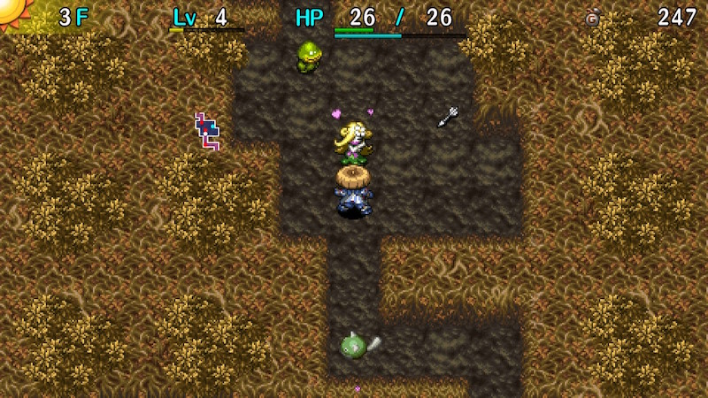

  

[Introduction]

<ul class="quickLinksUL">
  <li><a href="#overview">Overview</a></li>
  <li><a href="#strategy">Strategy</a></li>
  <li><a href="#monsters">Monsters</a></li>
  <li><a href="#items">Items</a></li>
  <li><a href="#traps">Traps</a></li>
</ul>

# Overview

<table class="dungeonOverview">
  <tr>
    <th>Unlock</th>
    <td class="highlightYellow">Clear Ouma Shrine and arrive in Nekomaneki Village. ※ Only available on Switch/Steam versions.</td>
  </tr>
  <tr>
    <th>Entrance</th>
    <td class="highlightYellow">Nekomaneki Village (Woman in Dungeon Center)</td>
  </tr>
</table>

<table class="dungeonTable">
  <tr>
    <th>Floors</th>
    <td>25F (first) / 99F</td>
    <th>Day / Night</th>
    <td>Day</td>
  </tr>
  <tr>
    <th>Bring Items</th>
    <td>No</td>
    <th>Allies</th>
    <td>No</td>
  </tr>
  <tr>
    <th>Unidentified</th>
    <td>Shields</td>
    <th>New Items</th>
    <td>No</td>
  </tr>
  <tr>
    <th>Shops</th>
    <td>Regular, Elite</td>
    <th>Monster Houses</th>
    <td>Regular</td>
  </tr>
  <tr>
    <th>Initial Enemies</th>
    <td></td>
    <th>Spawn Rate</th>
    <td></td>
  </tr>
  <tr>
    <th>Ominous aura</th>
    <td>No</td>
    <th>Wind of Kron</th>
    <td>1st: / 4th: </td>
  </tr>
  <tr>
    <th>Clear Icon</th>
    <td>None</td>
    <th>Reward</th>
    <td>David's Bullet x 10</td>
  </tr>
</table>

# Strategy

[Quick Links]

[Content]

# Monsters

See [Monsters](/system/monsters) for individual monster details.

Floor Colors: Fog Water No Walls Lava Enemy Colors: Special Farming Useful Destroys Items Dangerous Very Dangerous

<table class="monsterTable">
  <thead>
    <tr>
      <th>F</th>
      <th colspan="9">Monsters</th>
    </tr>
  </thead>
  <tbody>
    <tr>
      <td>1</td>
      <td class="">Mamel</td>
      <td class="">Sproutant</td>
      <td class="">Seedie</td>
      <td class="">Pit Mamel</td>
      <td class="highlightGray"></td>
      <td class="highlightGray"></td>
      <td class="highlightGray"></td>
      <td class="highlightGray"></td>
      <td class="highlightGray"></td>
    </tr>
    <tr>
      <td>2</td>
      <td class="">Mamel</td>
      <td class="">Sproutant</td>
      <td class="">Seedie</td>
      <td class="">Pit Mamel</td>
      <td class="">Curse Girl</td>
      <td class="highlightGray"></td>
      <td class="highlightGray"></td>
      <td class="highlightGray"></td>
      <td class="highlightGray"></td>
    </tr>
    <tr>
      <td>3</td>
      <td class="">Froggo</td>
      <td class="">Sproutant</td>
      <td class="">Seedie</td>
      <td class="">Pit Mamel</td>
      <td class="">Curse Girl</td>
      <td class="">Nigiri Baby</td>
      <td class="highlightGray"></td>
      <td class="highlightGray"></td>
      <td class="highlightGray"></td>
    </tr>
    <tr>
      <td>4</td>
      <td class="">Froggo</td>
      <td class="">Chintala</td>
      <td class="">Kumonigiri</td>
      <td class="">Pit Mamel</td>
      <td class="">Curse Girl</td>
      <td class="">Nigiri Baby</td>
      <td class="highlightGray"></td>
      <td class="highlightGray"></td>
      <td class="highlightGray"></td>
    </tr>
    <tr>
      <td>5</td>
      <td class="">Froggo</td>
      <td class="">Chintala</td>
      <td class="">Kumonigiri</td>
      <td class="">Karakuroid</td>
      <td class="">Curse Girl</td>
      <td class="">Nigiri Baby</td>
      <td class="highlightGray"></td>
      <td class="highlightGray"></td>
      <td class="highlightGray"></td>
    </tr>
    <tr>
      <td>6</td>
      <td class="">Bored Kappa</td>
      <td class="">Chintala</td>
      <td class="">Kumonigiri</td>
      <td class="">Karakuroid</td>
      <td class="">Tiger Tosser</td>
      <td class="">Nigiri Baby</td>
      <td class="highlightGray"></td>
      <td class="highlightGray"></td>
      <td class="highlightGray"></td>
    </tr>
    <tr>
      <td>7</td>
      <td class="">Bored Kappa</td>
      <td class="">Chintala</td>
      <td class="">Kumonigiri</td>
      <td class="">Karakuroid</td>
      <td class="">Tiger Tosser</td>
      <td class="highlightGray"></td>
      <td class="highlightGray"></td>
      <td class="highlightGray"></td>
      <td class="highlightGray"></td>
    </tr>
    <tr>
      <td>8</td>
      <td class="">Bored Kappa</td>
      <td class="">Kid Squid</td>
      <td class="">Kumonigiri</td>
      <td class="">Karakuroid</td>
      <td class="">Tiger Tosser</td>
      <td class="highlightGray"></td>
      <td class="highlightGray"></td>
      <td class="highlightGray"></td>
      <td class="highlightGray"></td>
    </tr>
    <tr>
      <td>9</td>
      <td class="">Bored Kappa</td>
      <td class="">Kid Squid</td>
      <td class="">Fearabbit</td>
      <td class="">Karakuroid</td>
      <td class="">Tiger Tosser</td>
      <td class="">Boy Cart</td>
      <td class="">Mid Chintala</td>
      <td class="">Yanpii</td>
      <td class="highlightGray"></td>
    </tr>
    <tr>
      <td>10</td>
      <td class="">Bored Kappa</td>
      <td class="">Kid Squid</td>
      <td class="">Fearabbit</td>
      <td class="highlightGray"></td>
      <td class="">Tiger Tosser</td>
      <td class="">Boy Cart</td>
      <td class="">Mid Chintala</td>
      <td class="">Yanpii</td>
      <td class="highlightOrange2">Gyaza</td>
    </tr>
    <tr>
      <td class="darkblueText">11</td>
      <td class="">Porky</td>
      <td class="">Kid Squid</td>
      <td class="">Fearabbit</td>
      <td class="">Absorbiphant</td>
      <td class="">Pumphantasm</td>
      <td class="">Boy Cart</td>
      <td class="">Mid Chintala</td>
      <td class="">Yanpii</td>
      <td class="">Polygon Spinna</td>
    </tr>
    <tr>
      <td class="darkblueText">12</td>
      <td class="">Porky</td>
      <td class="">Kid Squid</td>
      <td class="">Fearabbit</td>
      <td class="">Absorbiphant</td>
      <td class="">Pumphantasm</td>
      <td class="">Boy Cart</td>
      <td class="">Mid Chintala</td>
      <td class="">Yanpii</td>
      <td class="">Polygon Spinna</td>
    </tr>
    <tr>
      <td class="darkblueText">13</td>
      <td class="">Porky</td>
      <td class="">DJ Mage</td>
      <td class="">Fearabbit</td>
      <td class="">Absorbiphant</td>
      <td class="">Pumphantasm</td>
      <td class="">Boy Cart</td>
      <td class="">Mid Chintala</td>
      <td class="">Hopodile</td>
      <td class="">Polygon Spinna</td>
    </tr>
    <tr>
      <td class="darkblueText">14</td>
      <td class="">Porky</td>
      <td class="">DJ Mage</td>
      <td class="">Beanie</td>
      <td class="">Absorbiphant</td>
      <td class="">Pumphantasm</td>
      <td class="highlightGray"></td>
      <td class="highlightGray"></td>
      <td class="">Hopodile</td>
      <td class="">Polygon Spinna</td>
    </tr>
    <tr>
      <td class="darkblueText">15</td>
      <td class="">Porky</td>
      <td class="">DJ Mage</td>
      <td class="">Beanie</td>
      <td class="">Absorbiphant</td>
      <td class="">Pumphantasm</td>
      <td class="highlightGray"></td>
      <td class="highlightGray"></td>
      <td class="">Hopodile</td>
      <td class="highlightGray"></td>
    </tr>
    <tr>
      <td>16</td>
      <td class="">Dazikon</td>
      <td class="">DJ Mage</td>
      <td class="">Beanie</td>
      <td class="">Mixer</td>
      <td class="highlightGray"></td>
      <td class="highlightGray"></td>
      <td class="highlightGray"></td>
      <td class="">Hopodile</td>
      <td class="highlightGray"></td>
    </tr>
    <tr>
      <td>17</td>
      <td class="">Dazikon</td>
      <td class="">DJ Mage</td>
      <td class="">Beanie</td>
      <td class="">Mixer</td>
      <td class="highlightGray"></td>
      <td class="highlightGray"></td>
      <td class="highlightGray"></td>
      <td class="">Hopodile</td>
      <td class="highlightGray"></td>
    </tr>
    <tr>
      <td>18</td>
      <td class="">Dazikon</td>
      <td class="">Froggucci</td>
      <td class="">Beanie</td>
      <td class="">Mixer</td>
      <td class="">Grass Dude</td>
      <td class="highlightGray"></td>
      <td class="highlightGray"></td>
      <td class="highlightGray"></td>
      <td class="highlightGray"></td>
    </tr>
    <tr>
      <td>19</td>
      <td class="">Dazikon</td>
      <td class="">Froggucci</td>
      <td class="highlightGray"></td>
      <td class="highlightGray"></td>
      <td class="">Grass Dude</td>
      <td class="highlightGray"></td>
      <td class="highlightGray"></td>
      <td class="highlightGray"></td>
      <td class="highlightGray"></td>
    </tr>
    <tr>
      <td>20</td>
      <td class="highlightGray"></td>
      <td class="">Froggucci</td>
      <td class="highlightGray"></td>
      <td class="highlightGray"></td>
      <td class="">Grass Dude</td>
      <td class="">Yanpii</td>
      <td class="highlightOrange2">Gyaza</td>
      <td class="highlightGray"></td>
      <td class="highlightGray"></td>
    </tr>
    <tr>
      <td>21</td>
      <td class="">Zalokleft</td>
      <td class="">MC Mage</td>
      <td class="">Pandanigiri</td>
      <td class="highlightGray"></td>
      <td class="">Grass Dude</td>
      <td class="">Yanpii</td>
      <td class="highlightGray"></td>
      <td class="highlightGray"></td>
      <td class="highlightGray"></td>
    </tr>
    <tr>
      <td>22</td>
      <td class="">Zalokleft</td>
      <td class="">MC Mage</td>
      <td class="">Pandanigiri</td>
      <td class="highlightGray"></td>
      <td class="">Grass Dude</td>
      <td class="">Yanpii</td>
      <td class="highlightGray"></td>
      <td class="highlightGray"></td>
      <td class="highlightGray"></td>
    </tr>
    <tr>
      <td>23</td>
      <td class="">Zalokleft</td>
      <td class="">MC Mage</td>
      <td class="">Pandanigiri</td>
      <td class="">Nuttie</td>
      <td class="highlightGray"></td>
      <td class="">Yanpii</td>
      <td class="">FO-Uβ</td>
      <td class="highlightGray"></td>
      <td class="highlightGray"></td>
    </tr>
    <tr>
      <td>24</td>
      <td class="">Zalokleft</td>
      <td class="highlightGray"></td>
      <td class="">Pandanigiri</td>
      <td class="">Nuttie</td>
      <td class="">Boy Cart</td>
      <td class="highlightGray"></td>
      <td class="">FO-Uβ</td>
      <td class="highlightGray"></td>
      <td class="highlightGray"></td>
    </tr>
    <tr>
      <td>25</td>
      <td class="">Zalokleft</td>
      <td class="">Sr. Yanpii</td>
      <td class="">Pandanigiri</td>
      <td class="">Nuttie</td>
      <td class="">Boy Cart</td>
      <td class="highlightGray"></td>
      <td class="highlightGray"></td>
      <td class="highlightGray"></td>
      <td class="highlightGray"></td>
    </tr>
    <tr>
      <td>26</td>
      <td class="">Scarabbit</td>
      <td class="">Sr. Yanpii</td>
      <td class="">Curspinster</td>
      <td class="">Nuttie</td>
      <td class="">Boy Cart</td>
      <td class="">Digestiphant</td>
      <td class="highlightGray"></td>
      <td class="highlightGray"></td>
      <td class="highlightGray"></td>
    </tr>
    <tr>
      <td>27</td>
      <td class="">Scarabbit</td>
      <td class="">Sr. Yanpii</td>
      <td class="">Curspinster</td>
      <td class="">Nuttie</td>
      <td class="">Boy Cart</td>
      <td class="">Digestiphant</td>
      <td class="">Eligan</td>
      <td class="">Cave Mamel</td>
      <td class="highlightGray"></td>
    </tr>
    <tr>
      <td>28</td>
      <td class="">Scarabbit</td>
      <td class="">Sr. Yanpii</td>
      <td class="">Curspinster</td>
      <td class="highlightGray"></td>
      <td class="">Boy Cart</td>
      <td class="">Digestiphant</td>
      <td class="">Eligan</td>
      <td class="">Cave Mamel</td>
      <td class="highlightGray"></td>
    </tr>
    <tr>
      <td>29</td>
      <td class="">Scarabbit</td>
      <td class="">Sr. Yanpii</td>
      <td class="">Curspinster</td>
      <td class="">Momoseal</td>
      <td class="">Hipadile</td>
      <td class="">Digestiphant</td>
      <td class="">Eligan</td>
      <td class="">Cave Mamel</td>
      <td class="highlightGray"></td>
    </tr>
    <tr>
      <td>30</td>
      <td class="">Scarabbit</td>
      <td class="highlightGray"></td>
      <td class="">Curspinster</td>
      <td class="">Momoseal</td>
      <td class="">Hipadile</td>
      <td class="">Digestiphant</td>
      <td class="">Eligan</td>
      <td class="">Cave Mamel</td>
      <td class="highlightOrange2">Death Gyaza</td>
    </tr>
    <tr>
      <td>31</td>
      <td class="">Ironhead</td>
      <td class="">Froggucci</td>
      <td class="highlightGray"></td>
      <td class="">Momoseal</td>
      <td class="">Hipadile</td>
      <td class="highlightGray"></td>
      <td class="">Eligan</td>
      <td class="highlightGray"></td>
      <td class="highlightGray"></td>
    </tr>
    <tr>
      <td>32</td>
      <td class="">Ironhead</td>
      <td class="">Froggucci</td>
      <td class="">MC Mage</td>
      <td class="">Momoseal</td>
      <td class="">Hipadile</td>
      <td class="highlightGray"></td>
      <td class="highlightGray"></td>
      <td class="highlightGray"></td>
      <td class="highlightGray"></td>
    </tr>
    <tr>
      <td>33</td>
      <td class="">Ironhead</td>
      <td class="">Froggucci</td>
      <td class="">MC Mage</td>
      <td class="">Momoseal</td>
      <td class="">Hipadile</td>
      <td class="highlightGray"></td>
      <td class="highlightGray"></td>
      <td class="highlightGray"></td>
      <td class="highlightGray"></td>
    </tr>
    <tr>
      <td>34</td>
      <td class="">Ironhead</td>
      <td class="">Froggucci</td>
      <td class="">MC Mage</td>
      <td class="">Jouncy</td>
      <td class="highlightGray"></td>
      <td class="highlightGray"></td>
      <td class="highlightGray"></td>
      <td class="highlightGray"></td>
      <td class="highlightGray"></td>
    </tr>
    <tr>
      <td>35</td>
      <td class="">Ironhead</td>
      <td class="">Froggucci</td>
      <td class="">Huistdon</td>
      <td class="">Jouncy</td>
      <td class="">Grampa Tank</td>
      <td class="highlightGray"></td>
      <td class="highlightGray"></td>
      <td class="highlightGray"></td>
      <td class="highlightGray"></td>
    </tr>
    <tr>
      <td class="redText2">36</td>
      <td class="">Mixermon</td>
      <td class="">Spicy Nut</td>
      <td class="">Huistdon</td>
      <td class="">Jouncy</td>
      <td class="">Grampa Tank</td>
      <td class="highlightGray"></td>
      <td class="highlightGray"></td>
      <td class="highlightGray"></td>
      <td class="highlightGray"></td>
    </tr>
    <tr>
      <td class="redText2">37</td>
      <td class="">Mixermon</td>
      <td class="">Spicy Nut</td>
      <td class="">Huistdon</td>
      <td class="">Jouncy</td>
      <td class="">Grampa Tank</td>
      <td class="highlightGray"></td>
      <td class="highlightGray"></td>
      <td class="highlightGray"></td>
      <td class="highlightGray"></td>
    </tr>
    <tr>
      <td class="redText2">38</td>
      <td class="">Mixermon</td>
      <td class="">Spicy Nut</td>
      <td class="">Huistdon</td>
      <td class="">Jouncy</td>
      <td class="">Grampa Tank</td>
      <td class="">VeniScorp</td>
      <td class="highlightGray"></td>
      <td class="highlightGray"></td>
      <td class="highlightGray"></td>
    </tr>
    <tr>
      <td class="redText2">39</td>
      <td class="">Mixermon</td>
      <td class="">Spicy Nut</td>
      <td class="">Huistdon</td>
      <td class="highlightGray"></td>
      <td class="highlightGray"></td>
      <td class="">VeniScorp</td>
      <td class="highlightGray"></td>
      <td class="highlightGray"></td>
      <td class="highlightGray"></td>
    </tr>
    <tr>
      <td class="redText2">40</td>
      <td class="">Mixermon</td>
      <td class="">Spicy Nut</td>
      <td class="">Kodionigiri</td>
      <td class="">Steamroid</td>
      <td class="highlightGray"></td>
      <td class="">VeniScorp</td>
      <td class="highlightOrange2">Death Gyaza</td>
      <td class="highlightGray"></td>
      <td class="highlightGray"></td>
    </tr>
    <tr>
      <td>41</td>
      <td class="">Tiger Hurler</td>
      <td class="highlightGray"></td>
      <td class="">Kodionigiri</td>
      <td class="">Steamroid</td>
      <td class="highlightGray"></td>
      <td class="">VeniScorp</td>
      <td class="highlightGray"></td>
      <td class="highlightGray"></td>
      <td class="highlightGray"></td>
    </tr>
    <tr>
      <td>42</td>
      <td class="">Tiger Hurler</td>
      <td class="highlightGray"></td>
      <td class="">Kodionigiri</td>
      <td class="">Steamroid</td>
      <td class="highlightGray"></td>
      <td class="">VeniScorp</td>
      <td class="highlightGray"></td>
      <td class="highlightGray"></td>
      <td class="highlightGray"></td>
    </tr>
    <tr>
      <td>43</td>
      <td class="">Tiger Hurler</td>
      <td class="">Shagga</td>
      <td class="">Kodionigiri</td>
      <td class="">Steamroid</td>
      <td class="highlightGray"></td>
      <td class="highlightGray"></td>
      <td class="highlightGray"></td>
      <td class="highlightGray"></td>
      <td class="highlightGray"></td>
    </tr>
    <tr>
      <td>44</td>
      <td class="">Tiger Hurler</td>
      <td class="">Shagga</td>
      <td class="">Kodionigiri</td>
      <td class="">Steamroid</td>
      <td class="">Polygon Shaka</td>
      <td class="">FO-U</td>
      <td class="highlightGray"></td>
      <td class="highlightGray"></td>
      <td class="highlightGray"></td>
    </tr>
    <tr>
      <td>45</td>
      <td class="">Tiger Hurler</td>
      <td class="">Shagga</td>
      <td class="">Kodionigiri</td>
      <td class="">Debaser</td>
      <td class="">Polygon Shaka</td>
      <td class="">FO-U</td>
      <td class="highlightGray"></td>
      <td class="highlightGray"></td>
      <td class="highlightGray"></td>
    </tr>
    <tr>
      <td>46</td>
      <td class="">Porky</td>
      <td class="">Shagga</td>
      <td class="">Hipadile</td>
      <td class="">Debaser</td>
      <td class="">Polygon Shaka</td>
      <td class="">Boy Cart</td>
      <td class="highlightGray"></td>
      <td class="highlightGray"></td>
      <td class="highlightGray"></td>
    </tr>
    <tr>
      <td>47</td>
      <td class="">Porky</td>
      <td class="">Shagga</td>
      <td class="">Hipadile</td>
      <td class="">Debaser</td>
      <td class="">Polygon Shaka</td>
      <td class="">Boy Cart</td>
      <td class="">Concusschin</td>
      <td class="highlightGray"></td>
      <td class="highlightGray"></td>
    </tr>
    <tr>
      <td>48</td>
      <td class="">Porky</td>
      <td class="">Zanbeeto</td>
      <td class="">Hipadile</td>
      <td class="">Debaser</td>
      <td class="highlightGray"></td>
      <td class="">Boy Cart</td>
      <td class="">Concusschin</td>
      <td class="highlightGray"></td>
      <td class="highlightGray"></td>
    </tr>
    <tr>
      <td>49</td>
      <td class="">Porky</td>
      <td class="">Zanbeeto</td>
      <td class="">Hipadile</td>
      <td class="">Debaser</td>
      <td class="">Grainie</td>
      <td class="">Boy Cart</td>
      <td class="">Concusschin</td>
      <td class="highlightGray"></td>
      <td class="highlightGray"></td>
    </tr>
    <tr>
      <td>50</td>
      <td class="">Porky</td>
      <td class="">Zanbeeto</td>
      <td class="">Hipadile</td>
      <td class="">Pumphantom</td>
      <td class="">Grainie</td>
      <td class="">Boy Cart</td>
      <td class="">Concusschin</td>
      <td class="highlightOrange2">Death Gyaza</td>
      <td class="highlightGray"></td>
    </tr>
    <tr>
      <td class="lightblueText">51</td>
      <td class="">Cursenior</td>
      <td class="">Zanbeeto</td>
      <td class="">Green Zalokleft</td>
      <td class="">Pumphantom</td>
      <td class="">Grainie</td>
      <td class="">Vexing Kappa</td>
      <td class="">Concusschin</td>
      <td class="highlightGray"></td>
      <td class="highlightGray"></td>
    </tr>
    <tr>
      <td class="lightblueText">52</td>
      <td class="">Cursenior</td>
      <td class="">Zanbeeto</td>
      <td class="">Green Zalokleft</td>
      <td class="">Pumphantom</td>
      <td class="">Grainie</td>
      <td class="">Vexing Kappa</td>
      <td class="">Gitan Mamel</td>
      <td class="">Lt. Yanpii</td>
      <td class="highlightGray"></td>
    </tr>
    <tr>
      <td class="lightblueText">53</td>
      <td class="">Cursenior</td>
      <td class="highlightGray"></td>
      <td class="">Green Zalokleft</td>
      <td class="">Pumphantom</td>
      <td class="">Grainie</td>
      <td class="">Vexing Kappa</td>
      <td class="">Gitan Mamel</td>
      <td class="">Lt. Yanpii</td>
      <td class="highlightGray"></td>
    </tr>
    <tr>
      <td class="lightblueText">54</td>
      <td class="">Cursenior</td>
      <td class="highlightGray"></td>
      <td class="">Green Zalokleft</td>
      <td class="">Pumphantom</td>
      <td class="">Grass Poppa</td>
      <td class="">Vexing Kappa</td>
      <td class="">Gitan Mamel</td>
      <td class="">Lt. Yanpii</td>
      <td class="highlightGray"></td>
    </tr>
    <tr>
      <td class="lightblueText">55</td>
      <td class="">Cursenior</td>
      <td class="highlightGray"></td>
      <td class="">Green Zalokleft</td>
      <td class="">StunScorp</td>
      <td class="">Grass Poppa</td>
      <td class="">Vexing Kappa</td>
      <td class="">Gitan Mamel</td>
      <td class="">Lt. Yanpii</td>
      <td class="highlightGray"></td>
    </tr>
    <tr>
      <td>56</td>
      <td class="">Horrabbit</td>
      <td class="highlightGray"></td>
      <td class="highlightGray"></td>
      <td class="">StunScorp</td>
      <td class="">Grass Poppa</td>
      <td class="highlightGray"></td>
      <td class="">Trowelie</td>
      <td class="">Lt. Yanpii</td>
      <td class="highlightGray"></td>
    </tr>
    <tr>
      <td>57</td>
      <td class="">Horrabbit</td>
      <td class="">Electroid</td>
      <td class="highlightGray"></td>
      <td class="">StunScorp</td>
      <td class="highlightGray"></td>
      <td class="highlightGray"></td>
      <td class="">Trowelie</td>
      <td class="highlightGray"></td>
      <td class="highlightGray"></td>
    </tr>
    <tr>
      <td>58</td>
      <td class="">Horrabbit</td>
      <td class="">Electroid</td>
      <td class="highlightGray"></td>
      <td class="">StunScorp</td>
      <td class="">Gyandora</td>
      <td class="">Mixergon</td>
      <td class="">Trowelie</td>
      <td class="highlightGray"></td>
      <td class="highlightGray"></td>
    </tr>
    <tr>
      <td>59</td>
      <td class="">Horrabbit</td>
      <td class="">Electroid</td>
      <td class="highlightGray"></td>
      <td class="">StunScorp</td>
      <td class="">Gyandora</td>
      <td class="">Mixergon</td>
      <td class="">Trowelie</td>
      <td class="highlightGray"></td>
      <td class="highlightGray"></td>
    </tr>
    <tr>
      <td>60</td>
      <td class="">Horrabbit</td>
      <td class="">Electroid</td>
      <td class="">Grainie</td>
      <td class="">StunScorp</td>
      <td class="">Gyandora</td>
      <td class="">Mixergon</td>
      <td class="">Trowelie</td>
      <td class="">King Squid</td>
      <td class="highlightOrange2">Hell Gyaza</td>
    </tr>
    <tr>
      <td class="lightblueText">61</td>
      <td class="">Sky Dragon</td>
      <td class="">Electroid</td>
      <td class="">Grainie</td>
      <td class="highlightGray"></td>
      <td class="highlightGray"></td>
      <td class="highlightGray"></td>
      <td class="highlightGray"></td>
      <td class="">King Squid</td>
      <td class="highlightGray"></td>
    </tr>
    <tr>
      <td class="lightblueText">62</td>
      <td class="">Sky Dragon</td>
      <td class="">Pyrepuff</td>
      <td class="">Grainie</td>
      <td class="highlightGray"></td>
      <td class="highlightGray"></td>
      <td class="highlightGray"></td>
      <td class="highlightGray"></td>
      <td class="">King Squid</td>
      <td class="highlightGray"></td>
    </tr>
    <tr>
      <td class="lightblueText">63</td>
      <td class="">Sky Dragon</td>
      <td class="">Pyrepuff</td>
      <td class="">Grainie</td>
      <td class="highlightGray"></td>
      <td class="highlightGray"></td>
      <td class="highlightGray"></td>
      <td class="highlightGray"></td>
      <td class="">King Squid</td>
      <td class="highlightGray"></td>
    </tr>
    <tr>
      <td class="lightblueText">64</td>
      <td class="">Sky Dragon</td>
      <td class="">Pyrepuff</td>
      <td class="">Grainie</td>
      <td class="highlightGray"></td>
      <td class="highlightGray"></td>
      <td class="highlightGray"></td>
      <td class="highlightGray"></td>
      <td class="">King Squid</td>
      <td class="highlightGray"></td>
    </tr>
    <tr>
      <td class="lightblueText">65</td>
      <td class="">Sky Dragon</td>
      <td class="">Pyrepuff</td>
      <td class="">Bunchukdon</td>
      <td class="highlightGray"></td>
      <td class="highlightGray"></td>
      <td class="highlightGray"></td>
      <td class="highlightGray"></td>
      <td class="highlightGray"></td>
      <td class="highlightGray"></td>
    </tr>
    <tr>
      <td>66</td>
      <td class="">Cross Cart</td>
      <td class="">Pyrepuff</td>
      <td class="">Bunchukdon</td>
      <td class="">Tiger Chucker</td>
      <td class="">Oingodile</td>
      <td class="">Froggon</td>
      <td class="">FO-UZ</td>
      <td class="highlightGray"></td>
      <td class="highlightGray"></td>
    </tr>
    <tr>
      <td>67</td>
      <td class="">Cross Cart</td>
      <td class="highlightGray"></td>
      <td class="">Bunchukdon</td>
      <td class="">Tiger Chucker</td>
      <td class="">Oingodile</td>
      <td class="">Froggon</td>
      <td class="">FO-UZ</td>
      <td class="highlightGray"></td>
      <td class="highlightGray"></td>
    </tr>
    <tr>
      <td>68</td>
      <td class="">Cross Cart</td>
      <td class="">Fulminachin</td>
      <td class="">Bunchukdon</td>
      <td class="">Tiger Chucker</td>
      <td class="">Oingodile</td>
      <td class="">Froggon</td>
      <td class="">FO-UZ</td>
      <td class="highlightGray"></td>
      <td class="highlightGray"></td>
    </tr>
    <tr>
      <td>69</td>
      <td class="">Cross Cart</td>
      <td class="">Fulminachin</td>
      <td class="">Nashagga</td>
      <td class="">Tiger Chucker</td>
      <td class="">Oingodile</td>
      <td class="">Froggon</td>
      <td class="highlightGray"></td>
      <td class="highlightGray"></td>
      <td class="highlightGray"></td>
    </tr>
    <tr>
      <td>70</td>
      <td class="">Cross Cart</td>
      <td class="">Fulminachin</td>
      <td class="">Nashagga</td>
      <td class="">Tiger Chucker</td>
      <td class="">Oingodile</td>
      <td class="">Froggon</td>
      <td class="">Bouncy</td>
      <td class="highlightOrange2">Hell Gyaza</td>
      <td class="highlightGray"></td>
    </tr>
    <tr>
      <td class="redText2">71</td>
      <td class="">Iron Zalokleft</td>
      <td class="">Fulminachin</td>
      <td class="">Nashagga</td>
      <td class="highlightGray"></td>
      <td class="">Bitter Nut</td>
      <td class="highlightGray"></td>
      <td class="">Bouncy</td>
      <td class="highlightGray"></td>
      <td class="highlightGray"></td>
    </tr>
    <tr>
      <td class="redText2">72</td>
      <td class="">Iron Zalokleft</td>
      <td class="">Fulminachin</td>
      <td class="">Nashagga</td>
      <td class="">Eligagon</td>
      <td class="">Bitter Nut</td>
      <td class="highlightGray"></td>
      <td class="">Bouncy</td>
      <td class="highlightGray"></td>
      <td class="highlightGray"></td>
    </tr>
    <tr>
      <td class="redText2">73</td>
      <td class="">Iron Zalokleft</td>
      <td class="highlightGray"></td>
      <td class="">Nashagga</td>
      <td class="">Eligagon</td>
      <td class="">Bitter Nut</td>
      <td class="highlightGray"></td>
      <td class="">Bouncy</td>
      <td class="highlightGray"></td>
      <td class="highlightGray"></td>
    </tr>
    <tr>
      <td class="redText2">74</td>
      <td class="">Iron Zalokleft</td>
      <td class="">Ornery Tank</td>
      <td class="">Nashagga</td>
      <td class="">Eligagon</td>
      <td class="">Bitter Nut</td>
      <td class="highlightGray"></td>
      <td class="">Bouncy</td>
      <td class="highlightGray"></td>
      <td class="highlightGray"></td>
    </tr>
    <tr>
      <td class="redText2">75</td>
      <td class="">Iron Zalokleft</td>
      <td class="">Ornery Tank</td>
      <td class="">Nashagga</td>
      <td class="">Eligagon</td>
      <td class="">Bitter Nut</td>
      <td class="highlightGray"></td>
      <td class="">Gyandora</td>
      <td class="highlightGray"></td>
      <td class="highlightGray"></td>
    </tr>
    <tr>
      <td>76</td>
      <td class="">Porko</td>
      <td class="">Ornery Tank</td>
      <td class="">Nashagga</td>
      <td class="">Eligagon</td>
      <td class="">Cross Cart</td>
      <td class="">Ruiner</td>
      <td class="">Gyandora</td>
      <td class="">Kappa Troll</td>
      <td class="highlightGray"></td>
    </tr>
    <tr>
      <td>77</td>
      <td class="">Porko</td>
      <td class="">Ornery Tank</td>
      <td class="">MC Sorceror</td>
      <td class="highlightGray"></td>
      <td class="">Cross Cart</td>
      <td class="">Ruiner</td>
      <td class="">Gyandora</td>
      <td class="">Kappa Troll</td>
      <td class="highlightGray"></td>
    </tr>
    <tr>
      <td>78</td>
      <td class="">Porko</td>
      <td class="">Steelhead</td>
      <td class="">MC Sorceror</td>
      <td class="highlightGray"></td>
      <td class="">Cross Cart</td>
      <td class="">Ruiner</td>
      <td class="">Gyandora</td>
      <td class="">Kappa Troll</td>
      <td class="highlightGray"></td>
    </tr>
    <tr>
      <td>79</td>
      <td class="">Porko</td>
      <td class="">Steelhead</td>
      <td class="">MC Sorceror</td>
      <td class="highlightGray"></td>
      <td class="">Cross Cart</td>
      <td class="">Ruiner</td>
      <td class="highlightGray"></td>
      <td class="">Kappa Troll</td>
      <td class="highlightGray"></td>
    </tr>
    <tr>
      <td>80</td>
      <td class="">Porko</td>
      <td class="">Steelhead</td>
      <td class="">MC Sorceror</td>
      <td class="">Detonachin</td>
      <td class="">Cross Cart</td>
      <td class="">Ruiner</td>
      <td class="highlightGray"></td>
      <td class="">Kappa Troll</td>
      <td class="highlightOrange2">Hell Gyaza</td>
    </tr>
    <tr>
      <td class="darkblueText">81</td>
      <td class="">Terrabbit</td>
      <td class="">Steelhead</td>
      <td class="">Zalokleftis King</td>
      <td class="">Detonachin</td>
      <td class="highlightGray"></td>
      <td class="">Ruiner</td>
      <td class="highlightGray"></td>
      <td class="highlightGray"></td>
      <td class="highlightGray"></td>
    </tr>
    <tr>
      <td class="darkblueText">82</td>
      <td class="">Terrabbit</td>
      <td class="">Steelhead</td>
      <td class="">Zalokleftis King</td>
      <td class="">Detonachin</td>
      <td class="highlightGray"></td>
      <td class="highlightGray"></td>
      <td class="highlightGray"></td>
      <td class="highlightGray"></td>
      <td class="highlightGray"></td>
    </tr>
    <tr>
      <td class="darkblueText">83</td>
      <td class="">Terrabbit</td>
      <td class="">Steelhead</td>
      <td class="">Zalokleftis King</td>
      <td class="">Detonachin</td>
      <td class="">Grass Gramps</td>
      <td class="highlightGray"></td>
      <td class="highlightGray"></td>
      <td class="highlightGray"></td>
      <td class="highlightGray"></td>
    </tr>
    <tr>
      <td class="darkblueText">84</td>
      <td class="">Terrabbit</td>
      <td class="">Polygon Singa</td>
      <td class="">Zalokleftis King</td>
      <td class="highlightGray"></td>
      <td class="">Grass Gramps</td>
      <td class="highlightGray"></td>
      <td class="highlightGray"></td>
      <td class="highlightGray"></td>
      <td class="highlightGray"></td>
    </tr>
    <tr>
      <td class="darkblueText">85</td>
      <td class="">Terrabbit</td>
      <td class="">Polygon Singa</td>
      <td class="">Zalokleftis King</td>
      <td class="">Nigiri King</td>
      <td class="">Grass Gramps</td>
      <td class="highlightGray"></td>
      <td class="highlightGray"></td>
      <td class="highlightGray"></td>
      <td class="highlightGray"></td>
    </tr>
    <tr>
      <td class="redText2">86</td>
      <td class="highlightGray"></td>
      <td class="">Polygon Singa</td>
      <td class="">Tiger Ace</td>
      <td class="">Nigiri King</td>
      <td class="">Grass Gramps</td>
      <td class="">Bitter Nut</td>
      <td class="highlightGray"></td>
      <td class="highlightGray"></td>
      <td class="highlightGray"></td>
    </tr>
    <tr>
      <td class="redText2">87</td>
      <td class="highlightGray"></td>
      <td class="">Polygon Singa</td>
      <td class="">Tiger Ace</td>
      <td class="">Nigiri King</td>
      <td class="">Grass Gramps</td>
      <td class="">Bitter Nut</td>
      <td class="highlightGray"></td>
      <td class="highlightGray"></td>
      <td class="highlightGray"></td>
    </tr>
    <tr>
      <td class="redText2">88</td>
      <td class="">Ultra Gazer</td>
      <td class="">Lashagga</td>
      <td class="">Tiger Ace</td>
      <td class="">Nigiri King</td>
      <td class="highlightGray"></td>
      <td class="">Bitter Nut</td>
      <td class="">FO-UZZ</td>
      <td class="highlightGray"></td>
      <td class="highlightGray"></td>
    </tr>
    <tr>
      <td class="redText2">89</td>
      <td class="">Ultra Gazer</td>
      <td class="">Lashagga</td>
      <td class="">Tiger Ace</td>
      <td class="highlightGray"></td>
      <td class="highlightGray"></td>
      <td class="">Bitter Nut</td>
      <td class="">FO-UZZ</td>
      <td class="highlightGray"></td>
      <td class="highlightGray"></td>
    </tr>
    <tr>
      <td class="redText2">90</td>
      <td class="">Ultra Gazer</td>
      <td class="">Lashagga</td>
      <td class="">Tiger Ace</td>
      <td class="">Dozikon</td>
      <td class="">Sprouterror</td>
      <td class="">Bitter Nut</td>
      <td class="">FO-UZZ</td>
      <td class="highlightOrange2">Hell Gyaza</td>
      <td class="highlightGray"></td>
    </tr>
    <tr>
      <td class="highlightFog lightblueText">91</td>
      <td class="">Ultra Gazer</td>
      <td class="">Lashagga</td>
      <td class="">Boss Yanpii</td>
      <td class="">Dozikon</td>
      <td class="">Sprouterror</td>
      <td class="">Strong Cart</td>
      <td class="">Porkon</td>
      <td class="highlightGray"></td>
      <td class="highlightGray"></td>
    </tr>
    <tr>
      <td class="highlightFog lightblueText">92</td>
      <td class="">Ultra Gazer</td>
      <td class="">Lashagga</td>
      <td class="">Boss Yanpii</td>
      <td class="">Dozikon</td>
      <td class="">Sprouterror</td>
      <td class="">Strong Cart</td>
      <td class="">Porkon</td>
      <td class="">Cyberoid</td>
      <td class="highlightGray"></td>
    </tr>
    <tr>
      <td class="highlightFog lightblueText">93</td>
      <td class="">Ultra Gazer</td>
      <td class="highlightGray"></td>
      <td class="">Boss Yanpii</td>
      <td class="highlightGray"></td>
      <td class="">Sprouterror</td>
      <td class="">Strong Cart</td>
      <td class="">Porkon</td>
      <td class="">Cyberoid</td>
      <td class="highlightGray"></td>
    </tr>
    <tr>
      <td class="highlightFog lightblueText">94</td>
      <td class="">Ultra Gazer</td>
      <td class="">Shovelie</td>
      <td class="">Boss Yanpii</td>
      <td class="highlightGray"></td>
      <td class="">Sprouterror</td>
      <td class="">Strong Cart</td>
      <td class="">Porkon</td>
      <td class="">Cyberoid</td>
      <td class="highlightGray"></td>
    </tr>
    <tr>
      <td class="highlightFog lightblueText">95</td>
      <td class="">Ultra Gazer</td>
      <td class="">Shovelie</td>
      <td class="">Boss Yanpii</td>
      <td class="">Boingodile</td>
      <td class="highlightGray"></td>
      <td class="">Strong Cart</td>
      <td class="">Porkon</td>
      <td class="">Cyberoid</td>
      <td class="highlightGray"></td>
    </tr>
    <tr>
      <td class="highlightFog">96</td>
      <td class="">Ultra Gazer</td>
      <td class="">Shovelie</td>
      <td class="">Boss Yanpii</td>
      <td class="">Boingodile</td>
      <td class="">Kleptoad</td>
      <td class="highlightOrange2">Doom Gyaza</td>
      <td class="highlightGray"></td>
      <td class="">Cyberoid</td>
      <td class="highlightGray"></td>
    </tr>
    <tr>
      <td class="highlightFog">97</td>
      <td class="">Ultra Gazer</td>
      <td class="">Shovelie</td>
      <td class="">Boss Yanpii</td>
      <td class="">Boingodile</td>
      <td class="">Kleptoad</td>
      <td class="highlightOrange2">Doom Gyaza</td>
      <td class="highlightGray"></td>
      <td class="highlightGray"></td>
      <td class="highlightGray"></td>
    </tr>
    <tr>
      <td class="highlightFog">98</td>
      <td class="">Ultra Gazer</td>
      <td class="">Shovelie</td>
      <td class="">Boss Yanpii</td>
      <td class="highlightGray"></td>
      <td class="">Kleptoad</td>
      <td class="highlightOrange2">Doom Gyaza</td>
      <td class="highlightGray"></td>
      <td class="highlightGray"></td>
      <td class="highlightGray"></td>
    </tr>
    <tr>
      <td class="highlightFog">99</td>
      <td class="">Ultra Gazer</td>
      <td class="">Shovelie</td>
      <td class="">Boss Yanpii</td>
      <td class="highlightGray"></td>
      <td class="">Kleptoad</td>
      <td class="highlightOrange2">Doom Gyaza</td>
      <td class="highlightGray"></td>
      <td class="highlightGray"></td>
      <td class="highlightGray"></td>
    </tr>
  </tbody>
</table>

# Items

※ Item Table is incomplete. If you find a drop that isn't listed, please add it to the table.

- F = Floor, Monster (day)
- S = Shop, Maneater, Shiny Object (yellow)
- P = Presto Pot
- Z = Zalokleft
- E = Elite Shop, Shiny Object (blue)

#### Weapons

<table class="dungeonItems">
  <tr>
    <th>Name</th>
    <th>F</th>
    <th>S</th>
    <th>P</th>
    <th>Z</th>
    <th>E</th>
    <th rowspan="15" class="tableDivider"></th>
    <th>Name</th>
    <th>F</th>
    <th>S</th>
    <th>P</th>
    <th>Z</th>
    <th>E</th>
    <th rowspan="15" class="tableDivider"></th>
    <th>Name</th>
    <th>F</th>
    <th>S</th>
    <th>P</th>
    <th>Z</th>
    <th>E</th>
  </tr>
  <tr>
    <td class="leftText highlightGray">Ordinary Stick</td>
    <td></td>
    <td></td>
    <td></td>
    <td></td>
    <td></td>
    <td class="leftText highlightGray">Rusty Pickaxe</td>
    <td></td>
    <td></td>
    <td></td>
    <td></td>
    <td></td>
    <td class="leftText highlightGray">Shockuto</td>
    <td></td>
    <td></td>
    <td></td>
    <td></td>
    <td></td>
  </tr>
  <tr>
    <td class="leftText highlightGray">Tin Blade</td>
    <td></td>
    <td></td>
    <td></td>
    <td></td>
    <td></td>
    <td class="leftText highlightGray">Old Mallet</td>
    <td></td>
    <td></td>
    <td></td>
    <td></td>
    <td></td>
    <td class="leftText highlightGray">Blurry Stick</td>
    <td></td>
    <td></td>
    <td></td>
    <td></td>
    <td></td>
  </tr>
  <tr>
    <td class="leftText highlightGray">Katana</td>
    <td></td>
    <td></td>
    <td></td>
    <td></td>
    <td></td>
    <td class="leftText highlightGray">Sky Splitter</td>
    <td></td>
    <td></td>
    <td></td>
    <td></td>
    <td></td>
    <td class="leftText highlightGray">Sealing Keisaku</td>
    <td></td>
    <td></td>
    <td></td>
    <td></td>
    <td></td>
  </tr>
  <tr>
    <td class="leftText highlightGray">Beast Fang</td>
    <td></td>
    <td></td>
    <td></td>
    <td></td>
    <td></td>
    <td class="leftText highlightGray">Water Cutter</td>
    <td></td>
    <td></td>
    <td></td>
    <td></td>
    <td></td>
    <td class="leftText highlightGray">Baffle Axe</td>
    <td></td>
    <td></td>
    <td></td>
    <td></td>
    <td></td>
  </tr>
  <tr>
    <td class="leftText highlightGray">Dotanuki</td>
    <td></td>
    <td></td>
    <td></td>
    <td></td>
    <td></td>
    <td class="leftText highlightGray">Scythe</td>
    <td></td>
    <td></td>
    <td></td>
    <td></td>
    <td></td>
    <td class="leftText highlightGray">Hatchet</td>
    <td></td>
    <td></td>
    <td></td>
    <td></td>
    <td></td>
  </tr>
  <tr>
    <td class="leftText highlightGray">Bladite</td>
    <td></td>
    <td></td>
    <td></td>
    <td></td>
    <td></td>
    <td class="leftText highlightGray">Myopic Masher</td>
    <td></td>
    <td></td>
    <td></td>
    <td></td>
    <td></td>
    <td class="leftText highlightGray">Shoddy Dirk</td>
    <td></td>
    <td></td>
    <td></td>
    <td></td>
    <td></td>
  </tr>
  <tr>
    <td class="leftText highlightGray">Red Blade</td>
    <td></td>
    <td></td>
    <td></td>
    <td></td>
    <td></td>
    <td class="leftText highlightGray">Magic Masher</td>
    <td></td>
    <td></td>
    <td></td>
    <td></td>
    <td></td>
    <td class="leftText highlightGray">Glass Dirk</td>
    <td></td>
    <td></td>
    <td></td>
    <td></td>
    <td></td>
  </tr>
  <tr>
    <td class="leftText highlightGray">Kabura Katana</td>
    <td></td>
    <td></td>
    <td></td>
    <td></td>
    <td></td>
    <td class="leftText highlightGray">Drain Dagger</td>
    <td></td>
    <td></td>
    <td></td>
    <td></td>
    <td></td>
    <td class="leftText highlightGray">Dirk of Debts</td>
    <td></td>
    <td></td>
    <td></td>
    <td></td>
    <td></td>
  </tr>
  <tr>
    <td class="leftText highlightGray">Fuuma Sword</td>
    <td></td>
    <td></td>
    <td></td>
    <td></td>
    <td></td>
    <td class="leftText highlightGray">Copper Cleaver</td>
    <td></td>
    <td></td>
    <td></td>
    <td></td>
    <td></td>
    <td class="leftText highlightGray">Extreme Sword</td>
    <td></td>
    <td></td>
    <td></td>
    <td></td>
    <td></td>
  </tr>
  <tr>
    <td class="leftText highlightGray">Pathetic Blade</td>
    <td></td>
    <td></td>
    <td></td>
    <td></td>
    <td></td>
    <td class="leftText highlightGray">Crescent Katana</td>
    <td></td>
    <td></td>
    <td></td>
    <td></td>
    <td></td>
    <td class="leftText highlightGray">Violent Blade</td>
    <td></td>
    <td></td>
    <td></td>
    <td></td>
    <td></td>
  </tr>
  <tr>
    <td class="leftText highlightGray">Dull Gold Edge</td>
    <td></td>
    <td></td>
    <td></td>
    <td></td>
    <td></td>
    <td class="leftText highlightGray">Lizard Lasher</td>
    <td></td>
    <td></td>
    <td></td>
    <td></td>
    <td></td>
    <td class="leftText highlightGray">Breeze Blade</td>
    <td></td>
    <td></td>
    <td></td>
    <td></td>
    <td></td>
  </tr>
  <tr>
    <td class="leftText highlightGray">Bright Blade</td>
    <td></td>
    <td></td>
    <td></td>
    <td></td>
    <td></td>
    <td class="leftText highlightGray">Nap Rattle</td>
    <td></td>
    <td></td>
    <td></td>
    <td></td>
    <td></td>
    <td class="leftText highlightGray">Burning Blade</td>
    <td></td>
    <td></td>
    <td></td>
    <td></td>
    <td></td>
  </tr>
  <tr>
    <td class="leftText highlightGray">True Knife</td>
    <td></td>
    <td></td>
    <td></td>
    <td></td>
    <td></td>
    <td class="leftText highlightGray">Wonder Pick</td>
    <td></td>
    <td></td>
    <td></td>
    <td></td>
    <td></td>
    <td class="leftText highlightGray">Sturdy Hammer</td>
    <td></td>
    <td></td>
    <td></td>
    <td></td>
    <td></td>
  </tr>
  <tr>
    <td class="leftText highlightGray">Kaburagi</td>
    <td></td>
    <td></td>
    <td></td>
    <td></td>
    <td></td>
    <td colspan="6"></td>
    <td colspan="6"></td>
  </tr>
</table>

#### Shields

<table class="dungeonItems">
  <tr>
    <th>Name</th>
    <th>F</th>
    <th>S</th>
    <th>P</th>
    <th>Z</th>
    <th>E</th>
    <th rowspan="13" class="tableDivider"></th>
    <th>Name</th>
    <th>F</th>
    <th>S</th>
    <th>P</th>
    <th>Z</th>
    <th>E</th>
    <th rowspan="13" class="tableDivider"></th>
    <th>Name</th>
    <th>F</th>
    <th>S</th>
    <th>P</th>
    <th>Z</th>
    <th>E</th>
  </tr>
  <tr>
    <td class="leftText highlightGray">Plain Targe</td>
    <td></td>
    <td></td>
    <td></td>
    <td></td>
    <td></td>
    <td class="leftText highlightGray">Heavy Shield</td>
    <td></td>
    <td></td>
    <td></td>
    <td></td>
    <td></td>
    <td class="leftText highlightGray">Gyadon Blocker</td>
    <td></td>
    <td></td>
    <td></td>
    <td></td>
    <td></td>
  </tr>
  <tr>
    <td class="leftText highlightGray">Tin Shield</td>
    <td></td>
    <td></td>
    <td></td>
    <td></td>
    <td></td>
    <td class="leftText highlightGray">Midnight Shield</td>
    <td></td>
    <td></td>
    <td></td>
    <td></td>
    <td></td>
    <td class="leftText highlightGray">Snake Shield</td>
    <td></td>
    <td></td>
    <td></td>
    <td></td>
    <td></td>
  </tr>
  <tr>
    <td class="leftText highlightGray">Iron Targe</td>
    <td></td>
    <td></td>
    <td></td>
    <td></td>
    <td></td>
    <td class="leftText highlightGray">Day Shield</td>
    <td></td>
    <td></td>
    <td></td>
    <td></td>
    <td></td>
    <td class="leftText highlightGray">Steady Shield</td>
    <td></td>
    <td></td>
    <td></td>
    <td></td>
    <td></td>
  </tr>
  <tr>
    <td class="leftText highlightGray">Wolfshead</td>
    <td></td>
    <td></td>
    <td></td>
    <td></td>
    <td></td>
    <td class="leftText highlightGray">Binary Shield</td>
    <td></td>
    <td></td>
    <td></td>
    <td></td>
    <td></td>
    <td class="leftText highlightGray">Anti-Gaze Trge</td>
    <td></td>
    <td></td>
    <td></td>
    <td></td>
    <td></td>
  </tr>
  <tr>
    <td class="leftText highlightGray">Beast Shield</td>
    <td></td>
    <td></td>
    <td></td>
    <td></td>
    <td></td>
    <td class="leftText highlightGray">Counter Shield</td>
    <td></td>
    <td></td>
    <td></td>
    <td></td>
    <td></td>
    <td class="leftText highlightGray">Swap Shield</td>
    <td></td>
    <td></td>
    <td></td>
    <td></td>
    <td></td>
  </tr>
  <tr>
    <td class="leftText highlightGray">Targite</td>
    <td></td>
    <td></td>
    <td></td>
    <td></td>
    <td></td>
    <td class="leftText highlightGray">Student Shield</td>
    <td></td>
    <td></td>
    <td></td>
    <td></td>
    <td></td>
    <td class="leftText highlightGray">Shoddy Plank</td>
    <td></td>
    <td></td>
    <td></td>
    <td></td>
    <td></td>
  </tr>
  <tr>
    <td class="leftText highlightGray">Red Shield</td>
    <td></td>
    <td></td>
    <td></td>
    <td></td>
    <td></td>
    <td class="leftText highlightGray">Bowl Shield</td>
    <td></td>
    <td></td>
    <td></td>
    <td></td>
    <td></td>
    <td class="leftText highlightGray">Glass Buckler</td>
    <td></td>
    <td></td>
    <td></td>
    <td></td>
    <td></td>
  </tr>
  <tr>
    <td class="leftText highlightGray">Fuuma Shield</td>
    <td></td>
    <td></td>
    <td></td>
    <td></td>
    <td></td>
    <td class="leftText highlightGray">Spry Shield</td>
    <td></td>
    <td></td>
    <td></td>
    <td></td>
    <td></td>
    <td class="leftText highlightGray">Pauper's Plank</td>
    <td></td>
    <td></td>
    <td></td>
    <td></td>
    <td></td>
  </tr>
  <tr>
    <td class="leftText highlightGray">Pathetic Shield</td>
    <td></td>
    <td></td>
    <td></td>
    <td></td>
    <td></td>
    <td class="leftText highlightGray">Blast Shield</td>
    <td></td>
    <td></td>
    <td></td>
    <td></td>
    <td></td>
    <td class="leftText highlightGray">Rush Shield</td>
    <td></td>
    <td></td>
    <td></td>
    <td></td>
    <td></td>
  </tr>
  <tr>
    <td class="leftText highlightGray">Gold Shield</td>
    <td></td>
    <td></td>
    <td></td>
    <td></td>
    <td></td>
    <td class="leftText highlightGray">Lock Shield</td>
    <td></td>
    <td></td>
    <td></td>
    <td></td>
    <td></td>
    <td class="leftText highlightGray">Blazing Shield</td>
    <td></td>
    <td></td>
    <td></td>
    <td></td>
    <td></td>
  </tr>
  <tr>
    <td class="leftText highlightGray">Diet Shield</td>
    <td></td>
    <td></td>
    <td></td>
    <td></td>
    <td></td>
    <td class="leftText highlightGray">Safe Shield</td>
    <td></td>
    <td></td>
    <td></td>
    <td></td>
    <td></td>
    <td class="leftText highlightGray">Onigiri Shield</td>
    <td></td>
    <td></td>
    <td></td>
    <td></td>
    <td></td>
  </tr>
  <tr>
    <td class="leftText highlightGray">Helix Shield</td>
    <td></td>
    <td></td>
    <td></td>
    <td></td>
    <td></td>
    <td class="leftText highlightGray">Parry Shield</td>
    <td></td>
    <td></td>
    <td></td>
    <td></td>
    <td></td>
    <td class="leftText highlightGray">Nirvana Board</td>
    <td></td>
    <td></td>
    <td></td>
    <td></td>
    <td></td>
  </tr>
</table>

#### Bracelets

<table class="dungeonItems">
  <tr>
    <th>Name</th>
    <th>F</th>
    <th>S</th>
    <th>P</th>
    <th>Z</th>
    <th>E</th>
    <th rowspan="13" class="tableDivider"></th>
    <th>Name</th>
    <th>F</th>
    <th>S</th>
    <th>P</th>
    <th>Z</th>
    <th>E</th>
    <th rowspan="13" class="tableDivider"></th>
    <th>Name</th>
    <th>F</th>
    <th>S</th>
    <th>P</th>
    <th>Z</th>
    <th>E</th>
  </tr>
  <tr>
    <td class="leftText highlightGray">Strength Bracelet</td>
    <td></td>
    <td></td>
    <td></td>
    <td></td>
    <td></td>
    <td class="leftText highlightGray">Dozer Bracelet</td>
    <td></td>
    <td></td>
    <td></td>
    <td></td>
    <td></td>
    <td class="leftText highlightGray">Nonary Bracelet</td>
    <td></td>
    <td></td>
    <td></td>
    <td></td>
    <td></td>
  </tr>
  <tr>
    <td class="leftText highlightGray">Can. Arm Bracelet</td>
    <td></td>
    <td></td>
    <td></td>
    <td></td>
    <td></td>
    <td class="leftText highlightGray">Trap Bracelet</td>
    <td></td>
    <td></td>
    <td></td>
    <td></td>
    <td></td>
    <td class="leftText highlightGray">Growth Bracelet</td>
    <td></td>
    <td></td>
    <td></td>
    <td></td>
    <td></td>
  </tr>
  <tr>
    <td class="leftText highlightGray">Inacc. Bracelet</td>
    <td></td>
    <td></td>
    <td></td>
    <td></td>
    <td></td>
    <td class="leftText highlightGray">Monster Detector</td>
    <td></td>
    <td></td>
    <td></td>
    <td></td>
    <td></td>
    <td class="leftText highlightGray">Anti-Parry Brce.</td>
    <td></td>
    <td></td>
    <td></td>
    <td></td>
    <td></td>
  </tr>
  <tr>
    <td class="leftText highlightGray">Bunch Bracelet</td>
    <td></td>
    <td></td>
    <td></td>
    <td></td>
    <td></td>
    <td class="leftText highlightGray">Monsterphobic</td>
    <td></td>
    <td></td>
    <td></td>
    <td></td>
    <td></td>
    <td class="leftText highlightGray">Time Stop Bracelet</td>
    <td></td>
    <td></td>
    <td></td>
    <td></td>
    <td></td>
  </tr>
  <tr>
    <td class="leftText highlightGray">Cleansing Bracelet</td>
    <td></td>
    <td></td>
    <td></td>
    <td></td>
    <td></td>
    <td class="leftText highlightGray">Item Detector</td>
    <td></td>
    <td></td>
    <td></td>
    <td></td>
    <td></td>
    <td class="leftText highlightGray">Floating Bracelet</td>
    <td></td>
    <td></td>
    <td></td>
    <td></td>
    <td></td>
  </tr>
  <tr>
    <td class="leftText highlightGray">Anti-Cnf. Bracelet</td>
    <td></td>
    <td></td>
    <td></td>
    <td></td>
    <td></td>
    <td class="leftText highlightGray">Itemphobic</td>
    <td></td>
    <td></td>
    <td></td>
    <td></td>
    <td></td>
    <td class="leftText highlightGray">Night Ward</td>
    <td></td>
    <td></td>
    <td></td>
    <td></td>
    <td></td>
  </tr>
  <tr>
    <td class="leftText highlightGray">Alert Bracelet</td>
    <td></td>
    <td></td>
    <td></td>
    <td></td>
    <td></td>
    <td class="leftText highlightGray">Waterwalk Bracelet</td>
    <td></td>
    <td></td>
    <td></td>
    <td></td>
    <td></td>
    <td class="leftText highlightGray">Scout Bracelet</td>
    <td></td>
    <td></td>
    <td></td>
    <td></td>
    <td></td>
  </tr>
  <tr>
    <td class="leftText highlightGray">Anti-Crs. Bracelet</td>
    <td></td>
    <td></td>
    <td></td>
    <td></td>
    <td></td>
    <td class="leftText highlightGray">Wall Clip Bracelet</td>
    <td></td>
    <td></td>
    <td></td>
    <td></td>
    <td></td>
    <td class="leftText highlightGray">Trapper Bracelet</td>
    <td></td>
    <td></td>
    <td></td>
    <td></td>
    <td></td>
  </tr>
  <tr>
    <td class="leftText highlightGray">Staunch Bracelet</td>
    <td></td>
    <td></td>
    <td></td>
    <td></td>
    <td></td>
    <td class="leftText highlightGray">Heal Bracelet</td>
    <td></td>
    <td></td>
    <td></td>
    <td></td>
    <td></td>
    <td class="leftText highlightGray">Identify Bracelet</td>
    <td></td>
    <td></td>
    <td></td>
    <td></td>
    <td></td>
  </tr>
  <tr>
    <td class="leftText highlightGray">Critical Bracelet</td>
    <td></td>
    <td></td>
    <td></td>
    <td></td>
    <td></td>
    <td class="leftText highlightGray">Alleyway Bracelet</td>
    <td></td>
    <td></td>
    <td></td>
    <td></td>
    <td></td>
    <td class="leftText highlightGray">VIP Bracelet</td>
    <td></td>
    <td></td>
    <td></td>
    <td></td>
    <td></td>
  </tr>
  <tr>
    <td class="leftText highlightGray">Mojo Bracelet</td>
    <td></td>
    <td></td>
    <td></td>
    <td></td>
    <td></td>
    <td class="leftText highlightGray">Blink Bracelet</td>
    <td></td>
    <td></td>
    <td></td>
    <td></td>
    <td></td>
    <td rowspan="2" colspan="6"></td>
  </tr>
  <tr>
    <td class="leftText highlightGray">Monster Summoner</td>
    <td></td>
    <td></td>
    <td></td>
    <td></td>
    <td></td>
    <td class="leftText highlightGray">Explosion Bracelet</td>
    <td></td>
    <td></td>
    <td></td>
    <td></td>
    <td></td>
  </tr>
</table>

#### Projectiles

<table class="dungeonItems">
  <tr>
    <th>Name</th>
    <th>F</th>
    <th>S</th>
    <th>P</th>
    <th>Z</th>
    <th>E</th>
    <th rowspan="6" class="tableDivider"></th>
    <th>Name</th>
    <th>F</th>
    <th>S</th>
    <th>P</th>
    <th>Z</th>
    <th>E</th>
    <th rowspan="6" class="tableDivider"></th>
    <th>Name</th>
    <th>F</th>
    <th>S</th>
    <th>P</th>
    <th>Z</th>
    <th>E</th>
  </tr>
  <tr>
    <td class="leftText highlightGray">Wood Arrow</td>
    <td></td>
    <td></td>
    <td></td>
    <td></td>
    <td></td>
    <td class="leftText highlightGray">Knockback Arrow</td>
    <td></td>
    <td></td>
    <td></td>
    <td></td>
    <td></td>
    <td class="leftText highlightGray">Suicide Arrow</td>
    <td></td>
    <td></td>
    <td></td>
    <td></td>
    <td></td>
  </tr>
  <tr>
    <td class="leftText highlightGray">Iron Arrow</td>
    <td></td>
    <td></td>
    <td></td>
    <td></td>
    <td></td>
    <td class="leftText highlightGray">Truestrike Arrow</td>
    <td></td>
    <td></td>
    <td></td>
    <td></td>
    <td></td>
    <td class="leftText highlightGray">Rock</td>
    <td></td>
    <td></td>
    <td></td>
    <td></td>
    <td></td>
  </tr>
  <tr>
    <td class="leftText highlightGray">Silver Arrow</td>
    <td></td>
    <td></td>
    <td></td>
    <td></td>
    <td></td>
    <td class="leftText highlightGray">Killer Arrow</td>
    <td></td>
    <td></td>
    <td></td>
    <td></td>
    <td></td>
    <td class="leftText highlightGray">Porky Rock</td>
    <td></td>
    <td></td>
    <td></td>
    <td></td>
    <td></td>
  </tr>
  <tr>
    <td class="leftText highlightGray">Critical Arrow</td>
    <td></td>
    <td></td>
    <td></td>
    <td></td>
    <td></td>
    <td class="leftText highlightGray">Drain Arrow</td>
    <td></td>
    <td></td>
    <td></td>
    <td></td>
    <td></td>
    <td class="leftText highlightGray">Rightstone</td>
    <td></td>
    <td></td>
    <td></td>
    <td></td>
    <td></td>
  </tr>
  <tr>
    <td class="leftText highlightGray">Poison Arrow</td>
    <td></td>
    <td></td>
    <td></td>
    <td></td>
    <td></td>
    <td class="leftText highlightGray">Random Arrow</td>
    <td></td>
    <td></td>
    <td></td>
    <td></td>
    <td></td>
    <td class="leftText highlightGray">David's Bullet</td>
    <td></td>
    <td></td>
    <td></td>
    <td></td>
    <td></td>
  </tr>
</table>

#### Staves

<table class="dungeonItems">
  <tr>
    <th>Name</th>
    <th>F</th>
    <th>S</th>
    <th>P</th>
    <th>Z</th>
    <th>E</th>
    <th rowspan="9" class="tableDivider"></th>
    <th>Name</th>
    <th>F</th>
    <th>S</th>
    <th>P</th>
    <th>Z</th>
    <th>E</th>
    <th rowspan="9" class="tableDivider"></th>
    <th>Name</th>
    <th>F</th>
    <th>S</th>
    <th>P</th>
    <th>Z</th>
    <th>E</th>
  </tr>
  <tr>
    <td class="leftText highlightGray">Swap Staff</td>
    <td></td>
    <td></td>
    <td></td>
    <td></td>
    <td></td>
    <td class="leftText highlightGray">Drama Staff</td>
    <td></td>
    <td></td>
    <td></td>
    <td></td>
    <td></td>
    <td class="leftText highlightGray">Seal Staff</td>
    <td></td>
    <td></td>
    <td></td>
    <td></td>
    <td></td>
  </tr>
  <tr>
    <td class="leftText highlightGray">Knockback Staff</td>
    <td></td>
    <td></td>
    <td></td>
    <td></td>
    <td></td>
    <td class="leftText highlightGray">Nagging Staff</td>
    <td></td>
    <td></td>
    <td></td>
    <td></td>
    <td></td>
    <td class="leftText highlightGray">Clone Staff</td>
    <td></td>
    <td></td>
    <td></td>
    <td></td>
    <td></td>
  </tr>
  <tr>
    <td class="leftText highlightGray">Pinning Staff</td>
    <td></td>
    <td></td>
    <td></td>
    <td></td>
    <td></td>
    <td class="leftText highlightGray">Balance Staff</td>
    <td></td>
    <td></td>
    <td></td>
    <td></td>
    <td></td>
    <td class="leftText highlightGray">Staff of Sacrifice</td>
    <td></td>
    <td></td>
    <td></td>
    <td></td>
    <td></td>
  </tr>
  <tr>
    <td class="leftText highlightGray">Mage Staff</td>
    <td></td>
    <td></td>
    <td></td>
    <td></td>
    <td></td>
    <td class="leftText highlightGray">Empathy Staff</td>
    <td></td>
    <td></td>
    <td></td>
    <td></td>
    <td></td>
    <td class="leftText highlightGray">Glorious Staff</td>
    <td></td>
    <td></td>
    <td></td>
    <td></td>
    <td></td>
  </tr>
  <tr>
    <td class="leftText highlightGray">Slow Staff</td>
    <td></td>
    <td></td>
    <td></td>
    <td></td>
    <td></td>
    <td class="leftText highlightGray">Ordinary Staff</td>
    <td></td>
    <td></td>
    <td></td>
    <td></td>
    <td></td>
    <td class="leftText highlightGray">Unlucky Staff</td>
    <td></td>
    <td></td>
    <td></td>
    <td></td>
    <td></td>
  </tr>
  <tr>
    <td class="leftText highlightGray">Swift Staff</td>
    <td></td>
    <td></td>
    <td></td>
    <td></td>
    <td></td>
    <td class="leftText highlightGray">Trap Del. Staff</td>
    <td></td>
    <td></td>
    <td></td>
    <td></td>
    <td></td>
    <td class="leftText highlightGray">Boring Staff</td>
    <td></td>
    <td></td>
    <td></td>
    <td></td>
    <td></td>
  </tr>
  <tr>
    <td class="leftText highlightGray">Transient Staff</td>
    <td></td>
    <td></td>
    <td></td>
    <td></td>
    <td></td>
    <td class="leftText highlightGray">Electric Staff</td>
    <td></td>
    <td></td>
    <td></td>
    <td></td>
    <td></td>
    <td class="leftText highlightGray">Fort. Staff</td>
    <td></td>
    <td></td>
    <td></td>
    <td></td>
    <td></td>
  </tr>
  <tr>
    <td class="leftText highlightGray">Paralysis Staff</td>
    <td></td>
    <td></td>
    <td></td>
    <td></td>
    <td></td>
    <td class="leftText highlightGray">Shocking Staff</td>
    <td></td>
    <td></td>
    <td></td>
    <td></td>
    <td></td>
    <td class="leftText highlightGray">Sharing Staff</td>
    <td></td>
    <td></td>
    <td></td>
    <td></td>
    <td></td>
  </tr>
</table>

#### Talismans

<table class="dungeonItems">
  <tr>
    <th>Name</th>
    <th>F</th>
    <th>S</th>
    <th>P</th>
    <th>Z</th>
    <th>E</th>
    <th rowspan="6" class="tableDivider"></th>
    <th>Name</th>
    <th>F</th>
    <th>S</th>
    <th>P</th>
    <th>Z</th>
    <th>E</th>
    <th rowspan="6" class="tableDivider"></th>
    <th>Name</th>
    <th>F</th>
    <th>S</th>
    <th>P</th>
    <th>Z</th>
    <th>E</th>
  </tr>
  <tr>
    <td class="leftText highlightGray">Shadow Bind Tal.</td>
    <td></td>
    <td></td>
    <td></td>
    <td></td>
    <td></td>
    <td class="leftText highlightGray">Inacc. Talisman</td>
    <td></td>
    <td></td>
    <td></td>
    <td></td>
    <td></td>
    <td class="leftText highlightGray">Enraged Talisman</td>
    <td></td>
    <td></td>
    <td></td>
    <td></td>
    <td></td>
  </tr>
  <tr>
    <td class="leftText highlightGray">Conf. Talisman</td>
    <td></td>
    <td></td>
    <td></td>
    <td></td>
    <td></td>
    <td class="leftText highlightGray">Sleep Talisman</td>
    <td></td>
    <td></td>
    <td></td>
    <td></td>
    <td></td>
    <td class="leftText highlightGray">Furious Talisman</td>
    <td></td>
    <td></td>
    <td></td>
    <td></td>
    <td></td>
  </tr>
  <tr>
    <td class="leftText highlightGray">Seal Talisman</td>
    <td></td>
    <td></td>
    <td></td>
    <td></td>
    <td></td>
    <td class="leftText highlightGray">Slumber Talisman</td>
    <td></td>
    <td></td>
    <td></td>
    <td></td>
    <td></td>
    <td class="leftText highlightGray">Glorious Talisman</td>
    <td></td>
    <td></td>
    <td></td>
    <td></td>
    <td></td>
  </tr>
  <tr>
    <td class="leftText highlightGray">Fear Talisman</td>
    <td></td>
    <td></td>
    <td></td>
    <td></td>
    <td></td>
    <td class="leftText highlightGray">Slow Talisman</td>
    <td></td>
    <td></td>
    <td></td>
    <td></td>
    <td></td>
    <td rowspan="2" colspan="6"></td>
  </tr>
  <tr>
    <td class="leftText highlightGray">Berserker Tal.</td>
    <td></td>
    <td></td>
    <td></td>
    <td></td>
    <td></td>
    <td class="leftText highlightGray">Swift Talisman</td>
    <td></td>
    <td></td>
    <td></td>
    <td></td>
    <td></td>
  </tr>
</table>

#### Scrolls

<table class="dungeonItems">
  <tr>
    <th>Name</th>
    <th>F</th>
    <th>S</th>
    <th>P</th>
    <th>Z</th>
    <th>E</th>
    <th rowspan="18" class="tableDivider"></th>
    <th>Name</th>
    <th>F</th>
    <th>S</th>
    <th>P</th>
    <th>Z</th>
    <th>E</th>
    <th rowspan="18" class="tableDivider"></th>
    <th>Name</th>
    <th>F</th>
    <th>S</th>
    <th>P</th>
    <th>Z</th>
    <th>E</th>
  </tr>
  <tr>
    <td class="leftText highlightGray">Escape Scroll</td>
    <td></td>
    <td></td>
    <td></td>
    <td></td>
    <td></td>
    <td class="leftText highlightGray">Pot God Scroll</td>
    <td></td>
    <td></td>
    <td></td>
    <td></td>
    <td></td>
    <td class="leftText highlightGray">Vacuum Slash Scrl</td>
    <td></td>
    <td></td>
    <td></td>
    <td></td>
    <td></td>
  </tr>
  <tr>
    <td class="leftText highlightGray">Navigation Scroll</td>
    <td></td>
    <td></td>
    <td></td>
    <td></td>
    <td></td>
    <td class="leftText highlightGray">Extraction Scroll</td>
    <td></td>
    <td></td>
    <td></td>
    <td></td>
    <td></td>
    <td class="leftText highlightGray">Dispel Aura Scroll</td>
    <td></td>
    <td></td>
    <td></td>
    <td></td>
    <td></td>
  </tr>
  <tr>
    <td class="leftText highlightGray">Oil Scroll</td>
    <td></td>
    <td></td>
    <td></td>
    <td></td>
    <td></td>
    <td class="leftText highlightGray">Blessing Scroll</td>
    <td></td>
    <td></td>
    <td></td>
    <td></td>
    <td></td>
    <td class="leftText highlightGray">Night-Day Scroll</td>
    <td></td>
    <td></td>
    <td></td>
    <td></td>
    <td></td>
  </tr>
  <tr>
    <td class="leftText highlightGray">Light Scroll</td>
    <td></td>
    <td></td>
    <td></td>
    <td></td>
    <td></td>
    <td class="leftText highlightGray">Curse Scroll</td>
    <td></td>
    <td></td>
    <td></td>
    <td></td>
    <td></td>
    <td class="leftText highlightGray">Swift Foe Scroll</td>
    <td></td>
    <td></td>
    <td></td>
    <td></td>
    <td></td>
  </tr>
  <tr>
    <td class="leftText highlightGray">Recommend. Letter</td>
    <td></td>
    <td></td>
    <td></td>
    <td></td>
    <td></td>
    <td class="leftText highlightGray">Coupon Scroll</td>
    <td></td>
    <td></td>
    <td></td>
    <td></td>
    <td></td>
    <td class="leftText highlightGray">Mnster House Scrl</td>
    <td></td>
    <td></td>
    <td></td>
    <td></td>
    <td></td>
  </tr>
  <tr>
    <td class="leftText highlightGray">Commend. Letter</td>
    <td></td>
    <td></td>
    <td></td>
    <td></td>
    <td></td>
    <td class="leftText highlightGray">Mate Scroll</td>
    <td></td>
    <td></td>
    <td></td>
    <td></td>
    <td></td>
    <td class="leftText highlightGray">Immunity Scroll</td>
    <td></td>
    <td></td>
    <td></td>
    <td></td>
    <td></td>
  </tr>
  <tr>
    <td class="leftText highlightGray">Identify Scroll</td>
    <td></td>
    <td></td>
    <td></td>
    <td></td>
    <td></td>
    <td class="leftText highlightGray">Darth Scroll</td>
    <td></td>
    <td></td>
    <td></td>
    <td></td>
    <td></td>
    <td class="leftText highlightGray">Replenish Scroll</td>
    <td></td>
    <td></td>
    <td></td>
    <td></td>
    <td></td>
  </tr>
  <tr>
    <td class="leftText highlightGray">Gathering Scroll</td>
    <td></td>
    <td></td>
    <td></td>
    <td></td>
    <td></td>
    <td class="leftText highlightGray">Pot Dog Scroll</td>
    <td></td>
    <td></td>
    <td></td>
    <td></td>
    <td></td>
    <td class="leftText highlightGray">Fixer Scroll</td>
    <td></td>
    <td></td>
    <td></td>
    <td></td>
    <td></td>
  </tr>
  <tr>
    <td class="leftText highlightGray">Collection Scroll</td>
    <td></td>
    <td></td>
    <td></td>
    <td></td>
    <td></td>
    <td class="leftText highlightGray">Fear Scroll</td>
    <td></td>
    <td></td>
    <td></td>
    <td></td>
    <td></td>
    <td class="leftText highlightGray">Gambler's Scroll</td>
    <td></td>
    <td></td>
    <td></td>
    <td></td>
    <td></td>
  </tr>
  <tr>
    <td class="leftText highlightGray">Squid Sushi Scroll</td>
    <td></td>
    <td></td>
    <td></td>
    <td></td>
    <td></td>
    <td class="leftText highlightGray">Trap Deletion Scrl</td>
    <td></td>
    <td></td>
    <td></td>
    <td></td>
    <td></td>
    <td class="leftText highlightGray">Arbor Scroll</td>
    <td></td>
    <td></td>
    <td></td>
    <td></td>
    <td></td>
  </tr>
  <tr>
    <td class="leftText highlightGray">Exorcism Scroll</td>
    <td></td>
    <td></td>
    <td></td>
    <td></td>
    <td></td>
    <td class="leftText highlightGray">Desert Scroll</td>
    <td></td>
    <td></td>
    <td></td>
    <td></td>
    <td></td>
    <td class="leftText highlightGray">Nixer Scroll</td>
    <td></td>
    <td></td>
    <td></td>
    <td></td>
    <td></td>
  </tr>
  <tr>
    <td class="leftText highlightGray">Fate Scroll</td>
    <td></td>
    <td></td>
    <td></td>
    <td></td>
    <td></td>
    <td class="leftText highlightGray">Trap Scroll</td>
    <td></td>
    <td></td>
    <td></td>
    <td></td>
    <td></td>
    <td class="leftText highlightGray">Lost Scroll</td>
    <td></td>
    <td></td>
    <td></td>
    <td></td>
    <td></td>
  </tr>
  <tr>
    <td class="leftText highlightGray">Earth Scroll</td>
    <td></td>
    <td></td>
    <td></td>
    <td></td>
    <td></td>
    <td class="leftText highlightGray">Muzzled Scroll</td>
    <td></td>
    <td></td>
    <td></td>
    <td></td>
    <td></td>
    <td class="leftText highlightGray">Sanctuary Scroll</td>
    <td></td>
    <td></td>
    <td></td>
    <td></td>
    <td></td>
  </tr>
  <tr>
    <td class="leftText highlightGray">Plating Scroll</td>
    <td></td>
    <td></td>
    <td></td>
    <td></td>
    <td></td>
    <td class="leftText highlightGray">Grounded Scroll</td>
    <td></td>
    <td></td>
    <td></td>
    <td></td>
    <td></td>
    <td class="leftText highlightGray">Expulsion Scroll</td>
    <td></td>
    <td></td>
    <td></td>
    <td></td>
    <td></td>
  </tr>
  <tr>
    <td class="leftText highlightGray">Tag Scroll</td>
    <td></td>
    <td></td>
    <td></td>
    <td></td>
    <td></td>
    <td class="leftText highlightGray">Attraction Scroll</td>
    <td></td>
    <td></td>
    <td></td>
    <td></td>
    <td></td>
    <td class="leftText highlightGray">Bankruptcy Scroll</td>
    <td></td>
    <td></td>
    <td></td>
    <td></td>
    <td></td>
  </tr>
  <tr>
    <td class="leftText highlightGray">Sale Scroll</td>
    <td></td>
    <td></td>
    <td></td>
    <td></td>
    <td></td>
    <td class="leftText highlightGray">Confusion Scroll</td>
    <td></td>
    <td></td>
    <td></td>
    <td></td>
    <td></td>
    <td class="leftText highlightGray">Blank Scroll</td>
    <td></td>
    <td></td>
    <td></td>
    <td></td>
    <td></td>
  </tr>
  <tr>
    <td class="leftText highlightGray">Onigiri Scroll</td>
    <td></td>
    <td></td>
    <td></td>
    <td></td>
    <td></td>
    <td class="leftText highlightGray">Slumber Scroll</td>
    <td></td>
    <td></td>
    <td></td>
    <td></td>
    <td></td>
    <td class="leftText highlightGray">Extinction Scroll</td>
    <td></td>
    <td></td>
    <td></td>
    <td></td>
    <td></td>
  </tr>
</table>

#### Grass

<table class="dungeonItems">
  <tr>
    <th>Name</th>
    <th>F</th>
    <th>S</th>
    <th>P</th>
    <th>Z</th>
    <th>E</th>
    <th rowspan="13" class="tableDivider"></th>
    <th>Name</th>
    <th>F</th>
    <th>S</th>
    <th>P</th>
    <th>Z</th>
    <th>E</th>
    <th rowspan="13" class="tableDivider"></th>
    <th>Name</th>
    <th>F</th>
    <th>S</th>
    <th>P</th>
    <th>Z</th>
    <th>E</th>
  </tr>
  <tr>
    <td class="leftText highlightGray">Weeds</td>
    <td></td>
    <td></td>
    <td></td>
    <td></td>
    <td></td>
    <td class="leftText highlightGray">Stomach Expander</td>
    <td></td>
    <td></td>
    <td></td>
    <td></td>
    <td></td>
    <td class="leftText highlightGray">Revival Grass</td>
    <td></td>
    <td></td>
    <td></td>
    <td></td>
    <td></td>
  </tr>
  <tr>
    <td class="leftText highlightGray">Herb</td>
    <td></td>
    <td></td>
    <td></td>
    <td></td>
    <td></td>
    <td class="leftText highlightGray">Stomach Shrinker</td>
    <td></td>
    <td></td>
    <td></td>
    <td></td>
    <td></td>
    <td class="leftText highlightGray">Gut Grass</td>
    <td></td>
    <td></td>
    <td></td>
    <td></td>
    <td></td>
  </tr>
  <tr>
    <td class="leftText highlightGray">Fine Grass</td>
    <td></td>
    <td></td>
    <td></td>
    <td></td>
    <td></td>
    <td class="leftText highlightGray">Confusion Grass</td>
    <td></td>
    <td></td>
    <td></td>
    <td></td>
    <td></td>
    <td class="leftText highlightGray">Undo Grass</td>
    <td></td>
    <td></td>
    <td></td>
    <td></td>
    <td></td>
  </tr>
  <tr>
    <td class="leftText highlightGray">Otogiriso</td>
    <td></td>
    <td></td>
    <td></td>
    <td></td>
    <td></td>
    <td class="leftText highlightGray">Blinding Grass</td>
    <td></td>
    <td></td>
    <td></td>
    <td></td>
    <td></td>
    <td class="leftText highlightGray">Repeat Grass</td>
    <td></td>
    <td></td>
    <td></td>
    <td></td>
    <td></td>
  </tr>
  <tr>
    <td class="leftText highlightGray">Antidote Grass</td>
    <td></td>
    <td></td>
    <td></td>
    <td></td>
    <td></td>
    <td class="leftText highlightGray">Nymph Grass</td>
    <td></td>
    <td></td>
    <td></td>
    <td></td>
    <td></td>
    <td class="leftText highlightGray">Invincible Grass</td>
    <td></td>
    <td></td>
    <td></td>
    <td></td>
    <td></td>
  </tr>
  <tr>
    <td class="leftText highlightGray">Poison Grass</td>
    <td></td>
    <td></td>
    <td></td>
    <td></td>
    <td></td>
    <td class="leftText highlightGray">Life Grass</td>
    <td></td>
    <td></td>
    <td></td>
    <td></td>
    <td></td>
    <td class="leftText highlightGray">Cheery Grass</td>
    <td></td>
    <td></td>
    <td></td>
    <td></td>
    <td></td>
  </tr>
  <tr>
    <td class="leftText highlightGray">Warp Grass</td>
    <td></td>
    <td></td>
    <td></td>
    <td></td>
    <td></td>
    <td class="leftText highlightGray">Strength Grass</td>
    <td></td>
    <td></td>
    <td></td>
    <td></td>
    <td></td>
    <td class="leftText highlightGray">Unlucky Seed</td>
    <td></td>
    <td></td>
    <td></td>
    <td></td>
    <td></td>
  </tr>
  <tr>
    <td class="leftText highlightGray">Heal Grass</td>
    <td></td>
    <td></td>
    <td></td>
    <td></td>
    <td></td>
    <td class="leftText highlightGray">Dragon Grass</td>
    <td></td>
    <td></td>
    <td></td>
    <td></td>
    <td></td>
    <td class="leftText highlightGray">Amnesia Grass</td>
    <td></td>
    <td></td>
    <td></td>
    <td></td>
    <td></td>
  </tr>
  <tr>
    <td class="leftText highlightGray">Power Up Grass</td>
    <td></td>
    <td></td>
    <td></td>
    <td></td>
    <td></td>
    <td class="leftText highlightGray">Sleepy Grass</td>
    <td></td>
    <td></td>
    <td></td>
    <td></td>
    <td></td>
    <td class="leftText highlightGray">Imabikiso</td>
    <td></td>
    <td></td>
    <td></td>
    <td></td>
    <td></td>
  </tr>
  <tr>
    <td class="leftText highlightGray">Upgrade Seed</td>
    <td></td>
    <td></td>
    <td></td>
    <td></td>
    <td></td>
    <td class="leftText highlightGray">Rage Grass</td>
    <td></td>
    <td></td>
    <td></td>
    <td></td>
    <td></td>
    <td class="leftText highlightGray">Angel Seed</td>
    <td></td>
    <td></td>
    <td></td>
    <td></td>
    <td></td>
  </tr>
  <tr>
    <td class="leftText highlightGray">Perception Grass</td>
    <td></td>
    <td></td>
    <td></td>
    <td></td>
    <td></td>
    <td class="leftText highlightGray">Dracon Grass</td>
    <td></td>
    <td></td>
    <td></td>
    <td></td>
    <td></td>
    <td class="leftText highlightGray">SuperUnlucky Seed</td>
    <td></td>
    <td></td>
    <td></td>
    <td></td>
    <td></td>
  </tr>
  <tr>
    <td class="leftText highlightGray">Swift Grass</td>
    <td></td>
    <td></td>
    <td></td>
    <td></td>
    <td></td>
    <td colspan="6"></td>
    <td colspan="6"></td>
  </tr>
</table>

#### Pots

<table class="dungeonItems">
  <tr>
    <th>Name</th>
    <th>F</th>
    <th>S</th>
    <th>P</th>
    <th>Z</th>
    <th>E</th>
    <th rowspan="12" class="tableDivider"></th>
    <th>Name</th>
    <th>F</th>
    <th>S</th>
    <th>P</th>
    <th>Z</th>
    <th>E</th>
    <th rowspan="12" class="tableDivider"></th>
    <th>Name</th>
    <th>F</th>
    <th>S</th>
    <th>P</th>
    <th>Z</th>
    <th>E</th>
  </tr>
  <tr>
    <td class="leftText highlightGray">Preservation Pot</td>
    <td></td>
    <td></td>
    <td></td>
    <td></td>
    <td></td>
    <td class="leftText highlightGray">Fever Pot</td>
    <td></td>
    <td></td>
    <td></td>
    <td></td>
    <td></td>
    <td class="leftText highlightGray">Monster Pot</td>
    <td></td>
    <td></td>
    <td></td>
    <td></td>
    <td></td>
  </tr>
  <tr>
    <td class="leftText highlightGray">Ordinary Pot</td>
    <td></td>
    <td></td>
    <td></td>
    <td></td>
    <td></td>
    <td class="leftText highlightGray">Exorcism Pot</td>
    <td></td>
    <td></td>
    <td></td>
    <td></td>
    <td></td>
    <td class="leftText highlightGray">Hilarious Pot</td>
    <td></td>
    <td></td>
    <td></td>
    <td></td>
    <td></td>
  </tr>
  <tr>
    <td class="leftText highlightGray">Identify Pot</td>
    <td></td>
    <td></td>
    <td></td>
    <td></td>
    <td></td>
    <td class="leftText highlightGray">Blessing Pot</td>
    <td></td>
    <td></td>
    <td></td>
    <td></td>
    <td></td>
    <td class="leftText highlightGray">Klein Pot</td>
    <td></td>
    <td></td>
    <td></td>
    <td></td>
    <td></td>
  </tr>
  <tr>
    <td class="leftText highlightGray">Hide Pot</td>
    <td></td>
    <td></td>
    <td></td>
    <td></td>
    <td></td>
    <td class="leftText highlightGray">Curse Pot</td>
    <td></td>
    <td></td>
    <td></td>
    <td></td>
    <td></td>
    <td class="leftText highlightGray">Synthesis Pot</td>
    <td></td>
    <td></td>
    <td></td>
    <td></td>
    <td></td>
  </tr>
  <tr>
    <td class="leftText highlightGray">4-2-8 Pot</td>
    <td></td>
    <td></td>
    <td></td>
    <td></td>
    <td></td>
    <td class="leftText highlightGray">Water Pot</td>
    <td></td>
    <td></td>
    <td></td>
    <td></td>
    <td></td>
    <td class="leftText highlightGray">Modder's Pot</td>
    <td></td>
    <td></td>
    <td></td>
    <td></td>
    <td></td>
  </tr>
  <tr>
    <td class="leftText highlightGray">Sale Pot</td>
    <td></td>
    <td></td>
    <td></td>
    <td></td>
    <td></td>
    <td class="leftText highlightGray">Zen Pot</td>
    <td></td>
    <td></td>
    <td></td>
    <td></td>
    <td></td>
    <td class="leftText highlightGray">Upgrade Pot</td>
    <td></td>
    <td></td>
    <td></td>
    <td></td>
    <td></td>
  </tr>
  <tr>
    <td class="leftText highlightGray">Presto Pot</td>
    <td></td>
    <td></td>
    <td></td>
    <td></td>
    <td></td>
    <td class="leftText highlightGray">Dodger Pot</td>
    <td></td>
    <td></td>
    <td></td>
    <td></td>
    <td></td>
    <td class="leftText highlightGray">Degrade Pot</td>
    <td></td>
    <td></td>
    <td></td>
    <td></td>
    <td></td>
  </tr>
  <tr>
    <td class="leftText highlightGray">Sticky Pot</td>
    <td></td>
    <td></td>
    <td></td>
    <td></td>
    <td></td>
    <td class="leftText highlightGray">Perceptive Pot</td>
    <td></td>
    <td></td>
    <td></td>
    <td></td>
    <td></td>
    <td class="leftText highlightGray">Lucky Pot</td>
    <td></td>
    <td></td>
    <td></td>
    <td></td>
    <td></td>
  </tr>
  <tr>
    <td class="leftText highlightGray">Unbreakable Pot</td>
    <td></td>
    <td></td>
    <td></td>
    <td></td>
    <td></td>
    <td class="leftText highlightGray">Reflection Pot</td>
    <td></td>
    <td></td>
    <td></td>
    <td></td>
    <td></td>
    <td class="leftText highlightGray">Unlucky Pot</td>
    <td></td>
    <td></td>
    <td></td>
    <td></td>
    <td></td>
  </tr>
  <tr>
    <td class="leftText highlightGray">Floramorph Pot</td>
    <td></td>
    <td></td>
    <td></td>
    <td></td>
    <td></td>
    <td class="leftText highlightGray">Heal Pot</td>
    <td></td>
    <td></td>
    <td></td>
    <td></td>
    <td></td>
    <td class="leftText highlightGray">Grilling Pot</td>
    <td></td>
    <td></td>
    <td></td>
    <td></td>
    <td></td>
  </tr>
  <tr>
    <td class="leftText highlightGray">Black Hole Pot</td>
    <td></td>
    <td></td>
    <td></td>
    <td></td>
    <td></td>
    <td class="leftText highlightGray">Zalokleft Pot</td>
    <td></td>
    <td></td>
    <td></td>
    <td></td>
    <td></td>
    <td colspan="6"></td>
  </tr>
</table>

#### Food

<table class="dungeonItems">
  <tr>
    <th>Name</th>
    <th>F</th>
    <th>S</th>
    <th>P</th>
    <th>Z</th>
    <th>E</th>
    <th rowspan="5" class="tableDivider"></th>
    <th>Name</th>
    <th>F</th>
    <th>S</th>
    <th>P</th>
    <th>Z</th>
    <th>E</th>
    <th rowspan="5" class="tableDivider"></th>
    <th>Name</th>
    <th>F</th>
    <th>S</th>
    <th>P</th>
    <th>Z</th>
    <th>E</th>
  </tr>
  <tr>
    <td class="leftText highlightGray">Onigiri</td>
    <td></td>
    <td></td>
    <td></td>
    <td></td>
    <td></td>
    <td class="leftText highlightGray">Grilled Onigiri</td>
    <td></td>
    <td></td>
    <td></td>
    <td></td>
    <td></td>
    <td class="leftText highlightGray">Hard Peach</td>
    <td></td>
    <td></td>
    <td></td>
    <td></td>
    <td></td>
  </tr>
  <tr>
    <td class="leftText highlightGray">Large Onigiri</td>
    <td></td>
    <td></td>
    <td></td>
    <td></td>
    <td></td>
    <td class="leftText highlightGray">Special Onigiri</td>
    <td></td>
    <td></td>
    <td></td>
    <td></td>
    <td></td>
    <td class="leftText highlightGray">Peach</td>
    <td></td>
    <td></td>
    <td></td>
    <td></td>
    <td></td>
  </tr>
  <tr>
    <td class="leftText highlightGray">Huge Onigiri</td>
    <td></td>
    <td></td>
    <td></td>
    <td></td>
    <td></td>
    <td class="leftText highlightGray">Dog Onigiri</td>
    <td></td>
    <td></td>
    <td></td>
    <td></td>
    <td></td>
    <td class="leftText highlightGray">Juicy Peach</td>
    <td></td>
    <td></td>
    <td></td>
    <td></td>
    <td></td>
  </tr>
  <tr>
    <td class="leftText highlightGray">Rotten Onigiri</td>
    <td></td>
    <td></td>
    <td></td>
    <td></td>
    <td></td>
    <td colspan="6"></td>
    <td class="leftText highlightGray">Rotten Peach</td>
    <td></td>
    <td></td>
    <td></td>
    <td></td>
    <td></td>
  </tr>
</table>

# Traps

[Trap Table]
