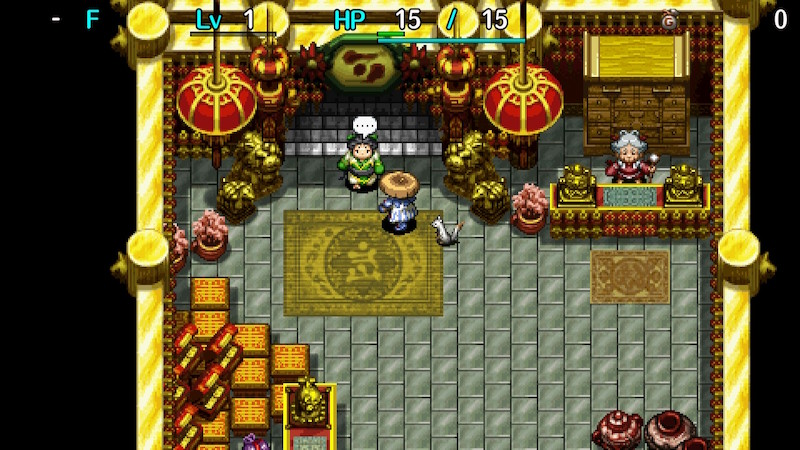

  

[Introduction]

<ul class="quickLinksUL">
  <li><a href="#overview">Overview</a></li>
  <li><a href="#strategy">Strategy</a></li>
  <li><a href="#monsters">Monsters</a></li>
  <li><a href="#items">Items</a></li>
  <li><a href="#traps">Traps</a></li>
</ul>

# Overview

<table class="dungeonOverview">
  <tr>
    <th>Unlock</th>
    <td class="highlightYellow">Clear Ouma Shrine and arrive in Nekomaneki Village.</td>
  </tr>
  <tr>
    <th>Entrance</th>
    <td class="highlightYellow">Nekomaneki Village (Woman in Dungeon Center)</td>
  </tr>
</table>

<table class="dungeonTable">
  <tr>
    <th>Floors</th>
    <td>99F</td>
    <th>Day / Night</th>
    <td>Day (Time Switch Trap)</td>
  </tr>
  <tr>
    <th>Bring Items</th>
    <td>No</td>
    <th>Allies</th>
    <td>No</td>
  </tr>
  <tr>
    <th>Unidentified</th>
    <td>All categories (No cursed items)</td>
    <th>New Items</th>
    <td>No</td>
  </tr>
  <tr>
    <th>Shops</th>
    <td>Regular, Elite, Pick-A-Choice</td>
    <th>Monster Houses</th>
    <td>Regular, Sudden</td>
  </tr>
  <tr>
    <th>Initial Enemies</th>
    <td>Varies</td>
    <th>Spawn Rate</th>
    <td></td>
  </tr>
  <tr>
    <th>Ominous aura</th>
    <td>Yes (600 turns)</td>
    <th>Wind of Kron</th>
    <td>1st: 300 turns remaining 4th: 0 turns remaining</td>
  </tr>
  <tr>
    <th>Clear Icon</th>
    <td>None</td>
    <th>Reward</th>
    <td>All-in Sword</td>
  </tr>
</table>

# Strategy

[Quick Links]

[Content]

# Monsters

See [Monsters](/system/monsters) for individual monster details.

M = Maneater Lv1 Lv2 Lv3 Lv4

Floor Colors: Fog Maze Traps Water No Walls Enemy Colors: Farming Useful Destroys Items Dangerous Very Dangerous

<table class="monsterTable">
  <thead>
    <tr>
      <th>F</th>
      <th colspan="8">Day</th>
      <th>M</th>
    </tr>
  </thead>
  <tbody>
    <tr>
      <td>1</td>
      <td class="">Mamel</td>
      <td class="">Pit Mamel</td>
      <td class="">Sproutant</td>
      <td class="highlightGray"></td>
      <td class="highlightGray"></td>
      <td class="highlightGray"></td>
      <td class="highlightGray"></td>
      <td class="highlightGray"></td>
      <td rowspan="25" class="monsterTableManeater">1</td>
    </tr>
    <tr>
      <td>2</td>
      <td class="">Mamel</td>
      <td class="">Pit Mamel</td>
      <td class="">Sproutant</td>
      <td class="">Seedie</td>
      <td class="">Colum</td>
      <td class="highlightGray"></td>
      <td class="highlightGray"></td>
      <td class="highlightGray"></td>
    </tr>
    <tr>
      <td>3</td>
      <td class="">Blade Bee</td>
      <td class="">Pit Mamel</td>
      <td class="">Sproutant</td>
      <td class="">Seedie</td>
      <td class="">Colum</td>
      <td class="highlightGray"></td>
      <td class="highlightGray"></td>
      <td class="highlightGray"></td>
    </tr>
    <tr>
      <td>4</td>
      <td class="">Blade Bee</td>
      <td class="">Pit Mamel</td>
      <td class="">Gazer</td>
      <td class="">Seedie</td>
      <td class="">Colum</td>
      <td class="">Grass Kid</td>
      <td class="highlightGray"></td>
      <td class="highlightGray"></td>
    </tr>
    <tr>
      <td>5</td>
      <td class="">Blade Bee</td>
      <td class="">Chintala</td>
      <td class="">Gazer</td>
      <td class="highlightGray"></td>
      <td class="">Colum</td>
      <td class="">Grass Kid</td>
      <td class="highlightGray"></td>
      <td class="highlightGray"></td>
    </tr>
    <tr>
      <td>6</td>
      <td class="">Blade Bee</td>
      <td class="">Chintala</td>
      <td class="">Gazer</td>
      <td class="highlightGray"></td>
      <td class="highlightGray"></td>
      <td class="">Grass Kid</td>
      <td class="highlightGray"></td>
      <td class="highlightGray"></td>
    </tr>
    <tr>
      <td>7</td>
      <td class="">Cheer-Ham</td>
      <td class="">Chintala</td>
      <td class="">Gazer</td>
      <td class="">Floaty</td>
      <td class="highlightGray"></td>
      <td class="">Grass Kid</td>
      <td class="">Nigiri Baby</td>
      <td class="highlightGray"></td>
    </tr>
    <tr>
      <td>8</td>
      <td class="">Cheer-Ham</td>
      <td class="">Chintala</td>
      <td class="">Gazer</td>
      <td class="">Floaty</td>
      <td class="highlightGray"></td>
      <td class="">Explochin</td>
      <td class="">Nigiri Baby</td>
      <td class="">Mixer</td>
    </tr>
    <tr>
      <td>9</td>
      <td class="">Cheer-Ham</td>
      <td class="highlightGray"></td>
      <td class="">Kumonigiri</td>
      <td class="">Floaty</td>
      <td class="">Moseal</td>
      <td class="">Explochin</td>
      <td class="">Nigiri Baby</td>
      <td class="">Sweet Nut</td>
    </tr>
    <tr>
      <td class="highlightGreen">10</td>
      <td class="">Cheer-Ham</td>
      <td class="">Mid Chintala</td>
      <td class="">Kumonigiri</td>
      <td class="">Pumphantasm</td>
      <td class="">Moseal</td>
      <td class="">Explochin</td>
      <td class="">Nigiri Baby</td>
      <td class="">Sweet Nut</td>
    </tr>
    <tr>
      <td>11</td>
      <td class="">Tiger Tosser</td>
      <td class="">Mid Chintala</td>
      <td class="">Kumonigiri</td>
      <td class="">Pumphantasm</td>
      <td class="">Moseal</td>
      <td class="">Explochin</td>
      <td class="highlightGray"></td>
      <td class="">Sweet Nut</td>
    </tr>
    <tr>
      <td>12</td>
      <td class="">Tiger Tosser</td>
      <td class="">Mid Chintala</td>
      <td class="">Kumonigiri</td>
      <td class="">Pumphantasm</td>
      <td class="">Moseal</td>
      <td class="">Curse Girl</td>
      <td class="">N'dubba</td>
      <td class="">Crow Tengu</td>
    </tr>
    <tr>
      <td>13</td>
      <td class="">Tiger Tosser</td>
      <td class="">Mid Chintala</td>
      <td class="">Polygon Spinna</td>
      <td class="">Pumphantasm</td>
      <td class="highlightGray"></td>
      <td class="">Curse Girl</td>
      <td class="">N'dubba</td>
      <td class="">Crow Tengu</td>
    </tr>
    <tr>
      <td>14</td>
      <td class="">Tiger Tosser</td>
      <td class="highlightGray"></td>
      <td class="">Polygon Spinna</td>
      <td class="">Pumphantasm</td>
      <td class="">Scoopie</td>
      <td class="">Curse Girl</td>
      <td class="">N'dubba</td>
      <td class="">Crow Tengu</td>
    </tr>
    <tr>
      <td>15</td>
      <td class="">Tiger Tosser</td>
      <td class="">Flamebird</td>
      <td class="">Polygon Spinna</td>
      <td class="">Gyadon</td>
      <td class="">Scoopie</td>
      <td class="">Curse Girl</td>
      <td class="">N'dubba</td>
      <td class="">Crow Tengu</td>
    </tr>
    <tr>
      <td>16</td>
      <td class="">Gyaza</td>
      <td class="">Flamebird</td>
      <td class="">Polygon Spinna</td>
      <td class="">Gyadon</td>
      <td class="">Scoopie</td>
      <td class="highlightGray"></td>
      <td class="">N'dubba</td>
      <td class="">Mixer</td>
    </tr>
    <tr>
      <td>17</td>
      <td class="">Gyaza</td>
      <td class="">Flamebird</td>
      <td class="">Porky</td>
      <td class="">Gyadon</td>
      <td class="">Poofy</td>
      <td class="">Scorpion</td>
      <td class="">N'dubba</td>
      <td class="highlightGray"></td>
    </tr>
    <tr>
      <td>18</td>
      <td class="">Gyaza</td>
      <td class="">Nigiri Morph</td>
      <td class="">Porky</td>
      <td class="highlightGray"></td>
      <td class="">Poofy</td>
      <td class="">Scorpion</td>
      <td class="">N'dubba</td>
      <td class="highlightGray"></td>
    </tr>
    <tr>
      <td>19</td>
      <td class="">Cursister</td>
      <td class="">Nigiri Morph</td>
      <td class="">Porky</td>
      <td class="highlightGray"></td>
      <td class="">Poofy</td>
      <td class="">Scorpion</td>
      <td class="">N'dubba</td>
      <td class="highlightGray"></td>
    </tr>
    <tr>
      <td class="highlightRed">20</td>
      <td class="">Cursister</td>
      <td class="">Nigiri Morph</td>
      <td class="">Porky</td>
      <td class="">Naptapir</td>
      <td class="">Cololum</td>
      <td class="">Scorpion</td>
      <td class="">Cave Mamel</td>
      <td class="highlightGray"></td>
    </tr>
    <tr>
      <td class="highlightFog">21</td>
      <td class="">Cursister</td>
      <td class="">Nigiri Morph</td>
      <td class="">Metalhead</td>
      <td class="">Naptapir</td>
      <td class="">Gyadon</td>
      <td class="">Dagger Bee</td>
      <td class="highlightGray"></td>
      <td class="highlightGray"></td>
    </tr>
    <tr>
      <td class="highlightFog">22</td>
      <td class="">Scoopie</td>
      <td class="">Boy Cart</td>
      <td class="">Metalhead</td>
      <td class="">Naptapir</td>
      <td class="">Gyadon</td>
      <td class="">Dagger Bee</td>
      <td class="highlightGray"></td>
      <td class="highlightGray"></td>
    </tr>
    <tr>
      <td class="highlightFog">23</td>
      <td class="">Scoopie</td>
      <td class="">Boy Cart</td>
      <td class="">Metalhead</td>
      <td class="">Digestiphant</td>
      <td class="">Gyadon</td>
      <td class="">Dagger Bee</td>
      <td class="">MC Mage</td>
      <td class="highlightGray"></td>
    </tr>
    <tr>
      <td class="highlightFog">24</td>
      <td class="">Scoopie</td>
      <td class="">Boy Cart</td>
      <td class="">Metalhead</td>
      <td class="">Digestiphant</td>
      <td class="highlightGray"></td>
      <td class="">Squidfficial</td>
      <td class="">MC Mage</td>
      <td class="">Mixermon</td>
    </tr>
    <tr>
      <td class="highlightFog">25</td>
      <td class="">Firepuff</td>
      <td class="">Boy Cart</td>
      <td class="highlightGray"></td>
      <td class="">Digestiphant</td>
      <td class="">Muddy</td>
      <td class="">Squidfficial</td>
      <td class="">MC Mage</td>
      <td class="highlightGray"></td>
    </tr>
    <tr>
      <td class="">26</td>
      <td class="">Firepuff</td>
      <td class="">Beanie</td>
      <td class="highlightGray"></td>
      <td class="">Digestiphant</td>
      <td class="">Muddy</td>
      <td class="">Squidfficial</td>
      <td class="">MC Mage</td>
      <td class="highlightGray"></td>
      <td rowspan="25" class="monsterTableVilleater">2</td>
    </tr>
    <tr>
      <td class="">27</td>
      <td class="">Firepuff</td>
      <td class="">Beanie</td>
      <td class="">Big Chintala</td>
      <td class="highlightGray"></td>
      <td class="">Muddy</td>
      <td class="">Squidfficial</td>
      <td class="">Pop Tank</td>
      <td class="highlightGray"></td>
    </tr>
    <tr>
      <td class="">28</td>
      <td class="">Firepuff</td>
      <td class="">Beanie</td>
      <td class="">Big Chintala</td>
      <td class="">Grass Dude</td>
      <td class="highlightGray"></td>
      <td class="">Punisher</td>
      <td class="">Pop Tank</td>
      <td class="highlightGray"></td>
    </tr>
    <tr>
      <td class="">29</td>
      <td class="highlightGray"></td>
      <td class="highlightGray"></td>
      <td class="">Big Chintala</td>
      <td class="">Grass Dude</td>
      <td class="highlightGray"></td>
      <td class="">Punisher</td>
      <td class="">Pop Tank</td>
      <td class="">Concusschin</td>
    </tr>
    <tr>
      <td class="highlightGreen">30</td>
      <td class="">Foly</td>
      <td class="">Zapdon</td>
      <td class="">Acrid Nut</td>
      <td class="">Grass Dude</td>
      <td class="">Eligan</td>
      <td class="">Punisher</td>
      <td class="">Pumphantom</td>
      <td class="">Concusschin</td>
    </tr>
    <tr>
      <td class="highlightFog">31</td>
      <td class="">Cross Cart</td>
      <td class="">Zapdon</td>
      <td class="">Acrid Nut</td>
      <td class="highlightGray"></td>
      <td class="">Eligan</td>
      <td class="">Punisher</td>
      <td class="">Pumphantom</td>
      <td class="">Concusschin</td>
    </tr>
    <tr>
      <td class="highlightFog">32</td>
      <td class="">Cross Cart</td>
      <td class="">Zapdon</td>
      <td class="">Acrid Nut</td>
      <td class="">Dazikon</td>
      <td class="">Eligan</td>
      <td class="highlightGray"></td>
      <td class="">Pumphantom</td>
      <td class="">Mixermon</td>
    </tr>
    <tr>
      <td class="highlightFog">33</td>
      <td class="">Cross Cart</td>
      <td class="">Zapdon</td>
      <td class="">Froggucci</td>
      <td class="">Dazikon</td>
      <td class="">Eligan</td>
      <td class="">Ironhead</td>
      <td class="">Pumphantom</td>
      <td class="">N'twyn</td>
    </tr>
    <tr>
      <td class="highlightFog">34</td>
      <td class="">Death Gyaza</td>
      <td class="highlightGray"></td>
      <td class="">Froggucci</td>
      <td class="">Dazikon</td>
      <td class="highlightGray"></td>
      <td class="">Ironhead</td>
      <td class="">Pumphantom</td>
      <td class="">N'twyn</td>
    </tr>
    <tr>
      <td class="highlightFog">35</td>
      <td class="">Death Gyaza</td>
      <td class="">FO-U</td>
      <td class="">Froggucci</td>
      <td class="highlightGray"></td>
      <td class="">Scarabbit</td>
      <td class="">Ironhead</td>
      <td class="">Pumphantom</td>
      <td class="">N'twyn</td>
    </tr>
    <tr>
      <td class="">36</td>
      <td class="">Death Gyaza</td>
      <td class="">FO-U</td>
      <td class="highlightGray"></td>
      <td class="">Kappa Pest</td>
      <td class="">Scarabbit</td>
      <td class="highlightGray"></td>
      <td class="">Pumphantom</td>
      <td class="">N'twyn</td>
    </tr>
    <tr>
      <td class="">37</td>
      <td class="">Steamroid</td>
      <td class="">FO-U</td>
      <td class="">Spadie</td>
      <td class="">Kappa Pest</td>
      <td class="">Scarabbit</td>
      <td class="highlightGray"></td>
      <td class="highlightGray"></td>
      <td class="">N'twyn</td>
    </tr>
    <tr>
      <td class="">38</td>
      <td class="">Steamroid</td>
      <td class="">FO-U</td>
      <td class="">Spadie</td>
      <td class="">Kappa Pest</td>
      <td class="highlightGray"></td>
      <td class="highlightGray"></td>
      <td class="highlightGray"></td>
      <td class="">N'twyn</td>
    </tr>
    <tr>
      <td class="">39</td>
      <td class="">Steamroid</td>
      <td class="highlightGray"></td>
      <td class="">Spadie</td>
      <td class="">Kappa Pest</td>
      <td class="">Colocolum</td>
      <td class="highlightGray"></td>
      <td class="highlightGray"></td>
      <td class="">N'twyn</td>
    </tr>
    <tr>
      <td class="highlightRed">40</td>
      <td class="">Steamroid</td>
      <td class="">Tiger Hurler</td>
      <td class="">Spadie</td>
      <td class="">Gyaza</td>
      <td class="">Colocolum</td>
      <td class="">Cave Mamel</td>
      <td class="">Mixermon</td>
      <td class="highlightGray"></td>
    </tr>
    <tr>
      <td class="">41</td>
      <td class="">Green Zalokleft</td>
      <td class="">Tiger Hurler</td>
      <td class="">Spadie</td>
      <td class="">Eagle Tengu</td>
      <td class="">Colocolum</td>
      <td class="highlightGray"></td>
      <td class="highlightGray"></td>
      <td class="highlightGray"></td>
    </tr>
    <tr>
      <td class="">42</td>
      <td class="">Green Zalokleft</td>
      <td class="">Tiger Hurler</td>
      <td class="highlightGray"></td>
      <td class="">Eagle Tengu</td>
      <td class="">Colocolum</td>
      <td class="">Polygon Shaka</td>
      <td class="highlightGray"></td>
      <td class="highlightGray"></td>
    </tr>
    <tr>
      <td class="">43</td>
      <td class="">Green Zalokleft</td>
      <td class="">Tiger Hurler</td>
      <td class="highlightGray"></td>
      <td class="">Eagle Tengu</td>
      <td class="">Pandanigiri</td>
      <td class="">Polygon Shaka</td>
      <td class="highlightGray"></td>
      <td class="highlightGray"></td>
    </tr>
    <tr>
      <td class="">44</td>
      <td class="">Green Zalokleft</td>
      <td class="">Flamepuff</td>
      <td class="">Grampa Tank</td>
      <td class="">Sparkbird</td>
      <td class="">Pandanigiri</td>
      <td class="">Polygon Shaka</td>
      <td class="highlightGray"></td>
      <td class="highlightGray"></td>
    </tr>
    <tr>
      <td class="">45</td>
      <td class="">Nigiri Boss</td>
      <td class="">Flamepuff</td>
      <td class="">Grampa Tank</td>
      <td class="">Sparkbird</td>
      <td class="">Pandanigiri</td>
      <td class="">Polygon Shaka</td>
      <td class="highlightGray"></td>
      <td class="highlightGray"></td>
    </tr>
    <tr>
      <td class="">46</td>
      <td class="">Nigiri Boss</td>
      <td class="">Flamepuff</td>
      <td class="">Grampa Tank</td>
      <td class="">Sparkbird</td>
      <td class="highlightGray"></td>
      <td class="">Hipadile</td>
      <td class="">Grass Poppa</td>
      <td class="highlightGray"></td>
    </tr>
    <tr>
      <td class="">47</td>
      <td class="">Nigiri Boss</td>
      <td class="">Flamepuff</td>
      <td class="">Momomoseal</td>
      <td class="">Sparkbird</td>
      <td class="highlightGray"></td>
      <td class="">Hipadile</td>
      <td class="">Grass Poppa</td>
      <td class="highlightGray"></td>
    </tr>
    <tr>
      <td class="">48</td>
      <td class="highlightGray"></td>
      <td class="">Super Gazer</td>
      <td class="">Momomoseal</td>
      <td class="">Sparkbird</td>
      <td class="">Dragon</td>
      <td class="">Hipadile</td>
      <td class="">Grass Poppa</td>
      <td class="">Mixergon</td>
    </tr>
    <tr>
      <td class="">49</td>
      <td class="highlightGray"></td>
      <td class="">Super Gazer</td>
      <td class="">Momomoseal</td>
      <td class="">Spicy Nut</td>
      <td class="">Dragon</td>
      <td class="">Hipadile</td>
      <td class="highlightGray"></td>
      <td class="highlightGray"></td>
    </tr>
    <tr>
      <td class="highlightGreen">50</td>
      <td class="">Foly2</td>
      <td class="">Super Gazer</td>
      <td class="">Momomoseal</td>
      <td class="">Spicy Nut</td>
      <td class="">Dragon</td>
      <td class="">Snooztapir</td>
      <td class="">Chow</td>
      <td class="">Concusschin</td>
    </tr>
    <tr>
      <td class="">51</td>
      <td class="">Foly2</td>
      <td class="highlightGray"></td>
      <td class="">Katana Bee</td>
      <td class="">Spicy Nut</td>
      <td class="highlightGray"></td>
      <td class="">Snooztapir</td>
      <td class="">Chow</td>
      <td class="highlightGray"></td>
      <td rowspan="25" class="monsterTableMounteater">3</td>
    </tr>
    <tr>
      <td class="">52</td>
      <td class="">Foly2</td>
      <td class="">VeniScorp</td>
      <td class="">Katana Bee</td>
      <td class="">Spicy Nut</td>
      <td class="highlightGray"></td>
      <td class="">Snooztapir</td>
      <td class="">Chow</td>
      <td class="highlightGray"></td>
    </tr>
    <tr>
      <td class="">53</td>
      <td class="">Foly2</td>
      <td class="">VeniScorp</td>
      <td class="">Katana Bee</td>
      <td class="">Shagga</td>
      <td class="highlightGray"></td>
      <td class="">Snooztapir</td>
      <td class="">Chow</td>
      <td class="highlightGray"></td>
    </tr>
    <tr>
      <td class="">54</td>
      <td class="">Foly2</td>
      <td class="">VeniScorp</td>
      <td class="">Gyairas</td>
      <td class="">Shagga</td>
      <td class="highlightGray"></td>
      <td class="">Snooztapir</td>
      <td class="">Chow</td>
      <td class="highlightGray"></td>
    </tr>
    <tr>
      <td class="">55</td>
      <td class="highlightGray"></td>
      <td class="">VeniScorp</td>
      <td class="">Gyairas</td>
      <td class="">Shagga</td>
      <td class="">Fencer</td>
      <td class="">Strong Cart</td>
      <td class="">Chow</td>
      <td class="highlightGray"></td>
    </tr>
    <tr>
      <td class="highlightFog">56</td>
      <td class="">Onigirizzly</td>
      <td class="highlightGray"></td>
      <td class="">Gyairas</td>
      <td class="">Shagga</td>
      <td class="">Fencer</td>
      <td class="">Strong Cart</td>
      <td class="">Sr. Yanpii</td>
      <td class="">Mixergon</td>
    </tr>
    <tr>
      <td class="highlightFog">57</td>
      <td class="">Onigirizzly</td>
      <td class="">Porko</td>
      <td class="highlightGray"></td>
      <td class="highlightGray"></td>
      <td class="">Fencer</td>
      <td class="">Strong Cart</td>
      <td class="">Sr. Yanpii</td>
      <td class="highlightGray"></td>
    </tr>
    <tr>
      <td class="highlightFog">58</td>
      <td class="">Onigirizzly</td>
      <td class="">Porko</td>
      <td class="">Huistdon</td>
      <td class="">Momomomoseal</td>
      <td class="">Fencer</td>
      <td class="highlightGray"></td>
      <td class="">Sr. Yanpii</td>
      <td class="highlightGray"></td>
    </tr>
    <tr>
      <td class="highlightFog">59</td>
      <td class="">Trowelie</td>
      <td class="">Porko</td>
      <td class="">Huistdon</td>
      <td class="">Momomomoseal</td>
      <td class="highlightGray"></td>
      <td class="">Debaser</td>
      <td class="">Sr. Yanpii</td>
      <td class="highlightGray"></td>
    </tr>
    <tr>
      <td class="highlightRed">60</td>
      <td class="">Trowelie</td>
      <td class="">Death Gyaza</td>
      <td class="">Huistdon</td>
      <td class="">Momomomoseal</td>
      <td class="">Steelhead</td>
      <td class="">Debaser</td>
      <td class="">Cave Mamel</td>
      <td class="">Gitan Mamel</td>
    </tr>
    <tr>
      <td class="darkblueText">61</td>
      <td class="">Trowelie</td>
      <td class="highlightGray"></td>
      <td class="">Huistdon</td>
      <td class="">Mudder</td>
      <td class="">Steelhead</td>
      <td class="">Debaser</td>
      <td class="highlightGray"></td>
      <td class="highlightGray"></td>
    </tr>
    <tr>
      <td class="darkblueText">62</td>
      <td class="">Trowelie</td>
      <td class="">Nuttie</td>
      <td class="">Curspinster</td>
      <td class="">Mudder</td>
      <td class="">Steelhead</td>
      <td class="">Iron Zalokleft</td>
      <td class="highlightGray"></td>
      <td class="highlightGray"></td>
    </tr>
    <tr>
      <td class="darkblueText">63</td>
      <td class="">Horrabbit</td>
      <td class="">Nuttie</td>
      <td class="">Curspinster</td>
      <td class="">Mudder</td>
      <td class="">Steelhead</td>
      <td class="">Iron Zalokleft</td>
      <td class="highlightGray"></td>
      <td class="highlightGray"></td>
    </tr>
    <tr>
      <td class="darkblueText">64</td>
      <td class="">Horrabbit</td>
      <td class="">Nuttie</td>
      <td class="">Curspinster</td>
      <td class="highlightGray"></td>
      <td class="">Pierce Cart</td>
      <td class="">Iron Zalokleft</td>
      <td class="">Mixergon</td>
      <td class="highlightGray"></td>
    </tr>
    <tr>
      <td class="darkblueText">65</td>
      <td class="">Horrabbit</td>
      <td class="">Nuttie</td>
      <td class="">Curspinster</td>
      <td class="">Jouncy</td>
      <td class="">Pierce Cart</td>
      <td class="">Tiger Chucker</td>
      <td class="highlightGray"></td>
      <td class="highlightGray"></td>
    </tr>
    <tr>
      <td class="highlightFog">66</td>
      <td class="">FO-UZ</td>
      <td class="">Pumpanshee</td>
      <td class="highlightGray"></td>
      <td class="">Jouncy</td>
      <td class="">Pierce Cart</td>
      <td class="">Tiger Chucker</td>
      <td class="highlightGray"></td>
      <td class="highlightGray"></td>
    </tr>
    <tr>
      <td class="highlightFog">67</td>
      <td class="">FO-UZ</td>
      <td class="">Pumpanshee</td>
      <td class="">MC Sorceror</td>
      <td class="">Jouncy</td>
      <td class="">Pierce Cart</td>
      <td class="">Tiger Chucker</td>
      <td class="highlightGray"></td>
      <td class="highlightGray"></td>
    </tr>
    <tr>
      <td class="highlightFog">68</td>
      <td class="">FO-UZ</td>
      <td class="">Pumpanshee</td>
      <td class="">MC Sorceror</td>
      <td class="">Grass Gramps</td>
      <td class="">Pierce Cart</td>
      <td class="">Tiger Chucker</td>
      <td class="highlightGray"></td>
      <td class="highlightGray"></td>
    </tr>
    <tr>
      <td class="highlightFog">69</td>
      <td class="highlightGray"></td>
      <td class="">Pumpanshee</td>
      <td class="">MC Sorceror</td>
      <td class="">Grass Gramps</td>
      <td class="">Bitter Nut</td>
      <td class="">Tiger Chucker</td>
      <td class="highlightGray"></td>
      <td class="highlightGray"></td>
    </tr>
    <tr>
      <td class="highlightGreen">70</td>
      <td class="">Foly2</td>
      <td class="">Pumpanshee</td>
      <td class="">Fulminachin</td>
      <td class="">Grass Gramps</td>
      <td class="">Bitter Nut</td>
      <td class="">Lt. Yanpii</td>
      <td class="highlightGray"></td>
      <td class="highlightGray"></td>
    </tr>
    <tr>
      <td class="">71</td>
      <td class="">Blazepuff</td>
      <td class="">Pumpanshee</td>
      <td class="">Fulminachin</td>
      <td class="">Grass Gramps</td>
      <td class="highlightGray"></td>
      <td class="">Lt. Yanpii</td>
      <td class="highlightGray"></td>
      <td class="highlightGray"></td>
    </tr>
    <tr>
      <td class="">72</td>
      <td class="">Blazepuff</td>
      <td class="">Hyper Gazer</td>
      <td class="">Spongiderm</td>
      <td class="highlightGray"></td>
      <td class="highlightGray"></td>
      <td class="">Lt. Yanpii</td>
      <td class="">Mixerdon</td>
      <td class="highlightGray"></td>
    </tr>
    <tr>
      <td class="">73</td>
      <td class="">Blazepuff</td>
      <td class="">Hyper Gazer</td>
      <td class="">Spongiderm</td>
      <td class="">Kodionigiri</td>
      <td class="highlightGray"></td>
      <td class="highlightGray"></td>
      <td class="">N'dup</td>
      <td class="highlightGray"></td>
    </tr>
    <tr>
      <td class="">74</td>
      <td class="">Oingodile</td>
      <td class="">Hyper Gazer</td>
      <td class="">Spongiderm</td>
      <td class="">Kodionigiri</td>
      <td class="">Colocolocolum</td>
      <td class="highlightGray"></td>
      <td class="">N'dup</td>
      <td class="highlightGray"></td>
    </tr>
    <tr>
      <td class="">75</td>
      <td class="">Oingodile</td>
      <td class="">Hyper Gazer</td>
      <td class="">StunScorp</td>
      <td class="">Kodionigiri</td>
      <td class="">Colocolocolum</td>
      <td class="highlightGray"></td>
      <td class="">N'dup</td>
      <td class="highlightGray"></td>
    </tr>
    <tr>
      <td class="highlightFog lightblueText">76</td>
      <td class="">Oingodile</td>
      <td class="">Polygon Singa</td>
      <td class="">StunScorp</td>
      <td class="">Osmammoth</td>
      <td class="">Colocolocolum</td>
      <td class="highlightGray"></td>
      <td class="">N'dup</td>
      <td class="highlightGray"></td>
      <td rowspan="24" class="monsterTableIsleater">4</td>
    </tr>
    <tr>
      <td class="highlightFog lightblueText">77</td>
      <td class="">Sky Dragon</td>
      <td class="">Polygon Singa</td>
      <td class="">StunScorp</td>
      <td class="">Osmammoth</td>
      <td class="highlightGray"></td>
      <td class="highlightGray"></td>
      <td class="">N'dup</td>
      <td class="highlightGray"></td>
    </tr>
    <tr>
      <td class="highlightFog lightblueText">78</td>
      <td class="">Sky Dragon</td>
      <td class="">Polygon Stunna</td>
      <td class="">Sproutitan</td>
      <td class="">Osmammoth</td>
      <td class="highlightGray"></td>
      <td class="highlightGray"></td>
      <td class="">N'dup</td>
      <td class="highlightGray"></td>
    </tr>
    <tr>
      <td class="highlightFog lightblueText">79</td>
      <td class="">Sky Dragon</td>
      <td class="">Polygon Stunna</td>
      <td class="">Sproutitan</td>
      <td class="">Osmammoth</td>
      <td class="highlightGray"></td>
      <td class="">Sensei</td>
      <td class="">N'dup</td>
      <td class="highlightGray"></td>
    </tr>
    <tr>
      <td class="highlightRed">80</td>
      <td class="">Sky Dragon</td>
      <td class="">Colocolum</td>
      <td class="">Sproutitan</td>
      <td class="">Dozikon</td>
      <td class="">Gitan Mamel</td>
      <td class="">Sensei</td>
      <td class="">Mixerdon</td>
      <td class="highlightGray"></td>
    </tr>
    <tr>
      <td class="highlightFog">81</td>
      <td class="">Ultra Gazer</td>
      <td class="">Grainie</td>
      <td class="">Colocolocolum</td>
      <td class="">Dozikon</td>
      <td class="">Bunchukdon</td>
      <td class="">Sensei</td>
      <td class="highlightGray"></td>
      <td class="highlightGray"></td>
    </tr>
    <tr>
      <td class="highlightFog">82</td>
      <td class="">Ultra Gazer</td>
      <td class="">Grainie</td>
      <td class="">Colocolocolum</td>
      <td class="">Dozikon</td>
      <td class="">Bunchukdon</td>
      <td class="">Hell Gyaza</td>
      <td class="highlightGray"></td>
      <td class="highlightGray"></td>
    </tr>
    <tr>
      <td class="highlightFog">83</td>
      <td class="">Ultra Gazer</td>
      <td class="">Grainie</td>
      <td class="">Colocolocolum</td>
      <td class="highlightGray"></td>
      <td class="">Bunchukdon</td>
      <td class="">Hell Gyaza</td>
      <td class="highlightGray"></td>
      <td class="highlightGray"></td>
    </tr>
    <tr>
      <td class="highlightFog">84</td>
      <td class="highlightGray"></td>
      <td class="">Grainie</td>
      <td class="">Colocolocolum</td>
      <td class="">Cursenior</td>
      <td class="">Bunchukdon</td>
      <td class="">Hell Gyaza</td>
      <td class="highlightGray"></td>
      <td class="highlightGray"></td>
    </tr>
    <tr>
      <td class="highlightFog">85</td>
      <td class="">Nashagga</td>
      <td class="">Grainie</td>
      <td class="">Colocolocolum</td>
      <td class="">Cursenior</td>
      <td class="">Zotdon</td>
      <td class="highlightGray"></td>
      <td class="highlightGray"></td>
      <td class="highlightGray"></td>
    </tr>
    <tr>
      <td class="highlightFog darkblueText">86</td>
      <td class="">Nashagga</td>
      <td class="">Tiger Ace</td>
      <td class="">Colocolocolum</td>
      <td class="">Cursenior</td>
      <td class="">Zotdon</td>
      <td class="">Ruiner</td>
      <td class="highlightGray"></td>
      <td class="highlightGray"></td>
    </tr>
    <tr>
      <td class="highlightFog darkblueText">87</td>
      <td class="">Nashagga</td>
      <td class="">Tiger Ace</td>
      <td class="">Detonachin</td>
      <td class="highlightGray"></td>
      <td class="">Zotdon</td>
      <td class="">Ruiner</td>
      <td class="">Squidperor</td>
      <td class="highlightGray"></td>
    </tr>
    <tr>
      <td class="highlightFog darkblueText">88</td>
      <td class="">Nashagga</td>
      <td class="">Tiger Ace</td>
      <td class="">Detonachin</td>
      <td class="highlightGray"></td>
      <td class="">Zotdon</td>
      <td class="">Ruiner</td>
      <td class="">Squidperor</td>
      <td class="">Mixerdon</td>
    </tr>
    <tr>
      <td class="highlightFog darkblueText">89</td>
      <td class="">Cranky Tank</td>
      <td class="">Tiger Ace</td>
      <td class="">Detonachin</td>
      <td class="">Comatapir</td>
      <td class="highlightGray"></td>
      <td class="">Ruiner</td>
      <td class="">Squidperor</td>
      <td class="highlightGray"></td>
    </tr>
    <tr>
      <td class="highlightGreen">90</td>
      <td class="">Cranky Tank</td>
      <td class="">Archdragon</td>
      <td class="">Detonachin</td>
      <td class="">Comatapir</td>
      <td class="">Bitter Nut</td>
      <td class="">Porgon</td>
      <td class="">Pumptergeist</td>
      <td class="">Foly2</td>
    </tr>
    <tr>
      <td class="highlightFog">91</td>
      <td class="">Cranky Tank</td>
      <td class="">Archdragon</td>
      <td class="">Terrabbit</td>
      <td class="">Comatapir</td>
      <td class="">Cyberoid</td>
      <td class="">Porgon</td>
      <td class="">Pumptergeist</td>
      <td class="highlightGray"></td>
    </tr>
    <tr>
      <td class="highlightFog">92</td>
      <td class="">Shovelie</td>
      <td class="">Archdragon</td>
      <td class="">Terrabbit</td>
      <td class="">Comatapir</td>
      <td class="">Cyberoid</td>
      <td class="">Porgon</td>
      <td class="">Pumptergeist</td>
      <td class="">Boss Yanpii</td>
    </tr>
    <tr>
      <td class="highlightFog">93</td>
      <td class="">Shovelie</td>
      <td class="">Archdragon</td>
      <td class="">Terrabbit</td>
      <td class="highlightGray"></td>
      <td class="">Cyberoid</td>
      <td class="">Snacky</td>
      <td class="">Pumptergeist</td>
      <td class="">Boss Yanpii</td>
    </tr>
    <tr>
      <td class="highlightFog">94</td>
      <td class="">Shovelie</td>
      <td class="highlightGray"></td>
      <td class="">Terrabbit</td>
      <td class="">Huge Chintala</td>
      <td class="">Cyberoid</td>
      <td class="">Snacky</td>
      <td class="">Pumptergeist</td>
      <td class="">Boss Yanpii</td>
    </tr>
    <tr>
      <td class="highlightFog">95</td>
      <td class="">Nigiri Master</td>
      <td class="highlightGray"></td>
      <td class="">Terrabbit</td>
      <td class="">Huge Chintala</td>
      <td class="">Cyberoid</td>
      <td class="">Snacky</td>
      <td class="">Pumptergeist</td>
      <td class="highlightGray"></td>
    </tr>
    <tr>
      <td class="highlightFog">96</td>
      <td class="">Nigiri Master</td>
      <td class="highlightGray"></td>
      <td class="">Terrabbit</td>
      <td class="">Huge Chintala</td>
      <td class="">Cyberoid</td>
      <td class="">Snacky</td>
      <td class="">Boingodile</td>
      <td class="">Mixerdon</td>
    </tr>
    <tr>
      <td class="highlightFog">97</td>
      <td class="">Nigiri Master</td>
      <td class="">Abyssal Dragon</td>
      <td class="">Terrabbit</td>
      <td class="">Huge Chintala</td>
      <td class="">Cyberoid</td>
      <td class="">Snacky</td>
      <td class="">Boingodile</td>
      <td class="highlightGray"></td>
    </tr>
    <tr>
      <td class="highlightFog">98</td>
      <td class="">Nigiri Master</td>
      <td class="">Abyssal Dragon</td>
      <td class="">Terrabbit</td>
      <td class="highlightGray"></td>
      <td class="">Cyberoid</td>
      <td class="">Snacky</td>
      <td class="">Boingodile</td>
      <td class="highlightGray"></td>
    </tr>
    <tr>
      <td class="highlightFog">99</td>
      <td class="">Nigiri Master</td>
      <td class="">Abyssal Dragon</td>
      <td class="">Terrabbit</td>
      <td class="highlightGray"></td>
      <td class="">Cyberoid</td>
      <td class="">Snacky</td>
      <td class="">Boingodile</td>
      <td class="highlightGray"></td>
    </tr>
  </tbody>
</table>

# Items

[Item Table]

# Traps

[Trap Table]
