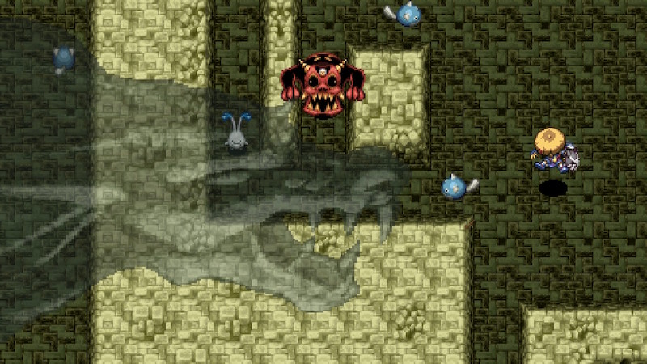

  

Popular dungeon where you set your own turn limit (1,000\~99,999) before entering the dungeon. Wind of Kron first blows when 300 turns remain, but Ominous Aura pressures you to keep moving forward. Leveled up equipment and rare items like Kaburagi, True Knife, Helix Shield can be found on deeper floors. There are many characteristics to this dungeon, including single room mazes, Mixers every 8 floors, Escape Scrolls being disabled, etc. --- Check <a href="#dungeon-mechanics">Dungeon Mechanics</a> for a full list with explanations.

<ul class="quickLinksUL">
  <li><a href="#overview">Overview</a></li>
  <li><a href="#strategy">Strategy</a></li>
  <li><a href="#monsters">Monsters</a></li>
  <li><a href="#items">Items</a></li>
  <li><a href="#traps">Traps</a></li>
</ul>

# Overview

<table class="dungeonOverview">
  <tr>
    <th>Unlock</th>
    <td class="highlightYellow">Clear Ouma Shrine and arrive in Nekomaneki Village. ※ Only available on Switch/Steam versions.</td>
  </tr>
  <tr>
    <th>Entrance</th>
    <td class="highlightYellow">Nekomaneki Village (Woman in Dungeon Center)</td>
  </tr>
</table>

<table class="dungeonTable">
  <tr>
    <th>Floors</th>
    <td>99F</td>
    <th>Day / Night</th>
    <td>Day (Time Switch Trap)</td>
  </tr>
  <tr>
    <th>Bring Items</th>
    <td>No</td>
    <th>Allies</th>
    <td>No</td>
  </tr>
  <tr>
    <th>Unidentified</th>
    <td>All categories (No cursed items)</td>
    <th>New Items</th>
    <td>No</td>
  </tr>
  <tr>
    <th>Shops</th>
    <td>Regular, Elite, Pick-A-Choice</td>
    <th>Monster Houses</th>
    <td>Regular, Sudden</td>
  </tr>
  <tr>
    <th>Initial Enemies</th>
    <td>Varies</td>
    <th>Spawn Rate</th>
    <td></td>
  </tr>
  <tr>
    <th>Ominous aura</th>
    <td>Yes (600 turns)</td>
    <th>Wind of Kron</th>
    <td>1st: 300 turns remaining 4th: 0 turns remaining</td>
  </tr>
  <tr>
    <th>Clear Icon</th>
    <td>None</td>
    <th>Reward</th>
    <td>All-in Sword</td>
  </tr>
</table>

# Strategy

[Quick Links]

### Dungeon Mechanics

#### Turn Limit

Once the remaining turn count reaches 0, you auto-fail the dungeon via Winds of Kron. However, Winds of Kron doesn't blow until 300 turns remain, no matter how long you linger on a floor. This means you can farm monsters as much as you'd like, provided you can deal with Maneaters. Ominous Aura occurs at 600 turns on any given floor, so act quickly if you want to avoid Maneaters.

#### Monster Table

The dungeon uses Primordial Chasm as a base, but includes changes to give the dungeon its own flavor. You'll sometimes see stronger enemies earlier (Pit Mamel on 1F), or weaker enemies later (Shagga on 53F). One notable characteristic is that Terrabbit appears on all floors between 91-99F, making for a frantic finale. Nigiri King and Abyss Dragon appear alongside it, so you can end up being turned into a Grilled Onigiri.

#### Mixers (Multiple of 8F)

Mixer type monsters appear on floors that are a multiple of 8. You'll generally have more chances to synthesize items throughout the run compared to other dungeons. Combined with leveled up equipment being in the item table, it's easier to transfer main equipment if desired.

#### Maze Floors (Odd Number x 10F)

Every floor that is odd and a multiple of 10 is a single giant maze. Lots of items can be found, and monsters that can break walls are always included in the monster table. It's a bonus stage if you set a lenient turn limit, but otherwise poses as a challenging turn burner stage. That said, Porgons and Archdragons both spawn on 90F, so you'll want to skip ahead in either case. Use Boring Staff or Pickaxe, throw rocks at Explochin or Sweet Nut types to make them explode, etc.

#### Trap Floors (Even Number x 10F)

Every floor that is even and a multiple of 10 is a floor with lots of Monster, Summon, and Multiplication traps. In addition, a Perception Grass is always generated somewhere on the floor, and a Monster House can appear. 40F and 80F are multiples of 8, so you can use traps to spawn Mixer types without having to wait around. It's best to keep some rocks on hand for Cave Mamels and Gitan Mamels that exclusively spawn here.

#### Time Switch Trap

Despite being a daytime dungeon, Time Switch Traps can be generated. (Night lasts 100 turns) Monsters that spawn at night are generally night versions of daytime monsters that appear on that floor. Since it's a daytime dungeon, you're unlikely to have a Torch equipped when you step on a Time Switch Trap, so there's risk of receiving heavy damage if a night monster appears next to you.

#### Other

Floors where field of view isn't limited are more common than other dungeons. Escape Scroll can't be found, and the escape effect is nullified if you write it on a Blank Scroll. Items (floor, shops, monster drops) are never cursed, but they can be generated in a blessed state. Number of items per floor decreases as you progress, with there being only \~4 items from 40F or so. It's likely designed this way to push the player to stock up on maze floors.

# Monsters

See [Monsters](/system/monsters) for individual monster details.

M = Maneater Lv1 Lv2 Lv3 Lv4

Floor Colors: Fog Maze Traps Water No Walls Enemy Colors: Farming Useful Destroys Items Dangerous Very Dangerous

<table class="monsterTable">
  <thead>
    <tr>
      <th>F</th>
      <th colspan="8">Day</th>
      <th>M</th>
    </tr>
  </thead>
  <tbody>
    <tr>
      <td>1</td>
      <td class="">Mamel</td>
      <td class="">Pit Mamel</td>
      <td class="">Sproutant</td>
      <td class="highlightGray"></td>
      <td class="highlightGray"></td>
      <td class="highlightGray"></td>
      <td class="highlightGray"></td>
      <td class="highlightGray"></td>
      <td rowspan="25" class="monsterTableManeater">1</td>
    </tr>
    <tr>
      <td>2</td>
      <td class="">Mamel</td>
      <td class="">Pit Mamel</td>
      <td class="">Sproutant</td>
      <td class="">Seedie</td>
      <td class="">Colum</td>
      <td class="highlightGray"></td>
      <td class="highlightGray"></td>
      <td class="highlightGray"></td>
    </tr>
    <tr>
      <td>3</td>
      <td class="">Blade Bee</td>
      <td class="">Pit Mamel</td>
      <td class="">Sproutant</td>
      <td class="">Seedie</td>
      <td class="">Colum</td>
      <td class="highlightGray"></td>
      <td class="highlightGray"></td>
      <td class="highlightGray"></td>
    </tr>
    <tr>
      <td>4</td>
      <td class="">Blade Bee</td>
      <td class="">Pit Mamel</td>
      <td class="">Gazer</td>
      <td class="">Seedie</td>
      <td class="">Colum</td>
      <td class="">Grass Kid</td>
      <td class="highlightGray"></td>
      <td class="highlightGray"></td>
    </tr>
    <tr>
      <td>5</td>
      <td class="">Blade Bee</td>
      <td class="">Chintala</td>
      <td class="">Gazer</td>
      <td class="highlightGray"></td>
      <td class="">Colum</td>
      <td class="">Grass Kid</td>
      <td class="highlightGray"></td>
      <td class="highlightGray"></td>
    </tr>
    <tr>
      <td>6</td>
      <td class="">Blade Bee</td>
      <td class="">Chintala</td>
      <td class="">Gazer</td>
      <td class="highlightGray"></td>
      <td class="highlightGray"></td>
      <td class="">Grass Kid</td>
      <td class="highlightGray"></td>
      <td class="highlightGray"></td>
    </tr>
    <tr>
      <td>7</td>
      <td class="">Cheer-Ham</td>
      <td class="">Chintala</td>
      <td class="">Gazer</td>
      <td class="">Floaty</td>
      <td class="highlightGray"></td>
      <td class="">Grass Kid</td>
      <td class="">Nigiri Baby</td>
      <td class="highlightGray"></td>
    </tr>
    <tr>
      <td>8</td>
      <td class="">Cheer-Ham</td>
      <td class="">Chintala</td>
      <td class="">Gazer</td>
      <td class="">Floaty</td>
      <td class="highlightGray"></td>
      <td class="">Explochin</td>
      <td class="">Nigiri Baby</td>
      <td class="">Mixer</td>
    </tr>
    <tr>
      <td>9</td>
      <td class="">Cheer-Ham</td>
      <td class="highlightGray"></td>
      <td class="">Kumonigiri</td>
      <td class="">Floaty</td>
      <td class="">Moseal</td>
      <td class="">Explochin</td>
      <td class="">Nigiri Baby</td>
      <td class="">Sweet Nut</td>
    </tr>
    <tr>
      <td class="highlightGreen">10</td>
      <td class="">Cheer-Ham</td>
      <td class="">Mid Chintala</td>
      <td class="">Kumonigiri</td>
      <td class="">Pumphantasm</td>
      <td class="">Moseal</td>
      <td class="">Explochin</td>
      <td class="">Nigiri Baby</td>
      <td class="">Sweet Nut</td>
    </tr>
    <tr>
      <td>11</td>
      <td class="">Tiger Tosser</td>
      <td class="">Mid Chintala</td>
      <td class="">Kumonigiri</td>
      <td class="">Pumphantasm</td>
      <td class="">Moseal</td>
      <td class="">Explochin</td>
      <td class="highlightGray"></td>
      <td class="">Sweet Nut</td>
    </tr>
    <tr>
      <td>12</td>
      <td class="">Tiger Tosser</td>
      <td class="">Mid Chintala</td>
      <td class="">Kumonigiri</td>
      <td class="">Pumphantasm</td>
      <td class="">Moseal</td>
      <td class="">Curse Girl</td>
      <td class="">N'dubba</td>
      <td class="">Crow Tengu</td>
    </tr>
    <tr>
      <td>13</td>
      <td class="">Tiger Tosser</td>
      <td class="">Mid Chintala</td>
      <td class="">Polygon Spinna</td>
      <td class="">Pumphantasm</td>
      <td class="highlightGray"></td>
      <td class="">Curse Girl</td>
      <td class="">N'dubba</td>
      <td class="">Crow Tengu</td>
    </tr>
    <tr>
      <td>14</td>
      <td class="">Tiger Tosser</td>
      <td class="highlightGray"></td>
      <td class="">Polygon Spinna</td>
      <td class="">Pumphantasm</td>
      <td class="">Scoopie</td>
      <td class="">Curse Girl</td>
      <td class="">N'dubba</td>
      <td class="">Crow Tengu</td>
    </tr>
    <tr>
      <td>15</td>
      <td class="">Tiger Tosser</td>
      <td class="">Flamebird</td>
      <td class="">Polygon Spinna</td>
      <td class="">Gyadon</td>
      <td class="">Scoopie</td>
      <td class="">Curse Girl</td>
      <td class="">N'dubba</td>
      <td class="">Crow Tengu</td>
    </tr>
    <tr>
      <td>16</td>
      <td class="">Gyaza</td>
      <td class="">Flamebird</td>
      <td class="">Polygon Spinna</td>
      <td class="">Gyadon</td>
      <td class="">Scoopie</td>
      <td class="highlightGray"></td>
      <td class="">N'dubba</td>
      <td class="">Mixer</td>
    </tr>
    <tr>
      <td>17</td>
      <td class="">Gyaza</td>
      <td class="">Flamebird</td>
      <td class="">Porky</td>
      <td class="">Gyadon</td>
      <td class="">Poofy</td>
      <td class="">Scorpion</td>
      <td class="">N'dubba</td>
      <td class="highlightGray"></td>
    </tr>
    <tr>
      <td>18</td>
      <td class="">Gyaza</td>
      <td class="">Nigiri Morph</td>
      <td class="">Porky</td>
      <td class="highlightGray"></td>
      <td class="">Poofy</td>
      <td class="">Scorpion</td>
      <td class="">N'dubba</td>
      <td class="highlightGray"></td>
    </tr>
    <tr>
      <td>19</td>
      <td class="">Cursister</td>
      <td class="">Nigiri Morph</td>
      <td class="">Porky</td>
      <td class="highlightGray"></td>
      <td class="">Poofy</td>
      <td class="">Scorpion</td>
      <td class="">N'dubba</td>
      <td class="highlightGray"></td>
    </tr>
    <tr>
      <td class="highlightRed">20</td>
      <td class="">Cursister</td>
      <td class="">Nigiri Morph</td>
      <td class="">Porky</td>
      <td class="">Naptapir</td>
      <td class="">Cololum</td>
      <td class="">Scorpion</td>
      <td class="">Cave Mamel</td>
      <td class="highlightGray"></td>
    </tr>
    <tr>
      <td class="highlightFog">21</td>
      <td class="">Cursister</td>
      <td class="">Nigiri Morph</td>
      <td class="">Metalhead</td>
      <td class="">Naptapir</td>
      <td class="">Gyadon</td>
      <td class="">Dagger Bee</td>
      <td class="highlightGray"></td>
      <td class="highlightGray"></td>
    </tr>
    <tr>
      <td class="highlightFog">22</td>
      <td class="">Scoopie</td>
      <td class="">Boy Cart</td>
      <td class="">Metalhead</td>
      <td class="">Naptapir</td>
      <td class="">Gyadon</td>
      <td class="">Dagger Bee</td>
      <td class="highlightGray"></td>
      <td class="highlightGray"></td>
    </tr>
    <tr>
      <td class="highlightFog">23</td>
      <td class="">Scoopie</td>
      <td class="">Boy Cart</td>
      <td class="">Metalhead</td>
      <td class="">Digestiphant</td>
      <td class="">Gyadon</td>
      <td class="">Dagger Bee</td>
      <td class="">MC Mage</td>
      <td class="highlightGray"></td>
    </tr>
    <tr>
      <td class="highlightFog">24</td>
      <td class="">Scoopie</td>
      <td class="">Boy Cart</td>
      <td class="">Metalhead</td>
      <td class="">Digestiphant</td>
      <td class="highlightGray"></td>
      <td class="">Squidfficial</td>
      <td class="">MC Mage</td>
      <td class="">Mixermon</td>
    </tr>
    <tr>
      <td class="highlightFog">25</td>
      <td class="">Firepuff</td>
      <td class="">Boy Cart</td>
      <td class="highlightGray"></td>
      <td class="">Digestiphant</td>
      <td class="">Muddy</td>
      <td class="">Squidfficial</td>
      <td class="">MC Mage</td>
      <td class="highlightGray"></td>
    </tr>
    <tr>
      <td class="">26</td>
      <td class="">Firepuff</td>
      <td class="">Beanie</td>
      <td class="highlightGray"></td>
      <td class="">Digestiphant</td>
      <td class="">Muddy</td>
      <td class="">Squidfficial</td>
      <td class="">MC Mage</td>
      <td class="highlightGray"></td>
      <td rowspan="25" class="monsterTableVilleater">2</td>
    </tr>
    <tr>
      <td class="">27</td>
      <td class="">Firepuff</td>
      <td class="">Beanie</td>
      <td class="">Big Chintala</td>
      <td class="highlightGray"></td>
      <td class="">Muddy</td>
      <td class="">Squidfficial</td>
      <td class="">Pop Tank</td>
      <td class="highlightGray"></td>
    </tr>
    <tr>
      <td class="">28</td>
      <td class="">Firepuff</td>
      <td class="">Beanie</td>
      <td class="">Big Chintala</td>
      <td class="">Grass Dude</td>
      <td class="highlightGray"></td>
      <td class="">Punisher</td>
      <td class="">Pop Tank</td>
      <td class="highlightGray"></td>
    </tr>
    <tr>
      <td class="">29</td>
      <td class="highlightGray"></td>
      <td class="highlightGray"></td>
      <td class="">Big Chintala</td>
      <td class="">Grass Dude</td>
      <td class="highlightGray"></td>
      <td class="">Punisher</td>
      <td class="">Pop Tank</td>
      <td class="">Concusschin</td>
    </tr>
    <tr>
      <td class="highlightGreen">30</td>
      <td class="">Foly</td>
      <td class="">Zapdon</td>
      <td class="">Acrid Nut</td>
      <td class="">Grass Dude</td>
      <td class="">Eligan</td>
      <td class="">Punisher</td>
      <td class="">Pumphantom</td>
      <td class="">Concusschin</td>
    </tr>
    <tr>
      <td class="highlightFog">31</td>
      <td class="">Cross Cart</td>
      <td class="">Zapdon</td>
      <td class="">Acrid Nut</td>
      <td class="highlightGray"></td>
      <td class="">Eligan</td>
      <td class="">Punisher</td>
      <td class="">Pumphantom</td>
      <td class="">Concusschin</td>
    </tr>
    <tr>
      <td class="highlightFog">32</td>
      <td class="">Cross Cart</td>
      <td class="">Zapdon</td>
      <td class="">Acrid Nut</td>
      <td class="">Dazikon</td>
      <td class="">Eligan</td>
      <td class="highlightGray"></td>
      <td class="">Pumphantom</td>
      <td class="">Mixermon</td>
    </tr>
    <tr>
      <td class="highlightFog">33</td>
      <td class="">Cross Cart</td>
      <td class="">Zapdon</td>
      <td class="">Froggucci</td>
      <td class="">Dazikon</td>
      <td class="">Eligan</td>
      <td class="">Ironhead</td>
      <td class="">Pumphantom</td>
      <td class="">N'twyn</td>
    </tr>
    <tr>
      <td class="highlightFog">34</td>
      <td class="">Death Gyaza</td>
      <td class="highlightGray"></td>
      <td class="">Froggucci</td>
      <td class="">Dazikon</td>
      <td class="highlightGray"></td>
      <td class="">Ironhead</td>
      <td class="">Pumphantom</td>
      <td class="">N'twyn</td>
    </tr>
    <tr>
      <td class="highlightFog">35</td>
      <td class="">Death Gyaza</td>
      <td class="">FO-U</td>
      <td class="">Froggucci</td>
      <td class="highlightGray"></td>
      <td class="">Scarabbit</td>
      <td class="">Ironhead</td>
      <td class="">Pumphantom</td>
      <td class="">N'twyn</td>
    </tr>
    <tr>
      <td class="">36</td>
      <td class="">Death Gyaza</td>
      <td class="">FO-U</td>
      <td class="highlightGray"></td>
      <td class="">Kappa Pest</td>
      <td class="">Scarabbit</td>
      <td class="highlightGray"></td>
      <td class="">Pumphantom</td>
      <td class="">N'twyn</td>
    </tr>
    <tr>
      <td class="">37</td>
      <td class="">Steamroid</td>
      <td class="">FO-U</td>
      <td class="">Spadie</td>
      <td class="">Kappa Pest</td>
      <td class="">Scarabbit</td>
      <td class="highlightGray"></td>
      <td class="highlightGray"></td>
      <td class="">N'twyn</td>
    </tr>
    <tr>
      <td class="">38</td>
      <td class="">Steamroid</td>
      <td class="">FO-U</td>
      <td class="">Spadie</td>
      <td class="">Kappa Pest</td>
      <td class="highlightGray"></td>
      <td class="highlightGray"></td>
      <td class="highlightGray"></td>
      <td class="">N'twyn</td>
    </tr>
    <tr>
      <td class="">39</td>
      <td class="">Steamroid</td>
      <td class="highlightGray"></td>
      <td class="">Spadie</td>
      <td class="">Kappa Pest</td>
      <td class="">Colocolum</td>
      <td class="highlightGray"></td>
      <td class="highlightGray"></td>
      <td class="">N'twyn</td>
    </tr>
    <tr>
      <td class="highlightRed">40</td>
      <td class="">Steamroid</td>
      <td class="">Tiger Hurler</td>
      <td class="">Spadie</td>
      <td class="">Gyaza</td>
      <td class="">Colocolum</td>
      <td class="">Cave Mamel</td>
      <td class="">Mixermon</td>
      <td class="highlightGray"></td>
    </tr>
    <tr>
      <td class="">41</td>
      <td class="">Green Zalokleft</td>
      <td class="">Tiger Hurler</td>
      <td class="">Spadie</td>
      <td class="">Eagle Tengu</td>
      <td class="">Colocolum</td>
      <td class="highlightGray"></td>
      <td class="highlightGray"></td>
      <td class="highlightGray"></td>
    </tr>
    <tr>
      <td class="">42</td>
      <td class="">Green Zalokleft</td>
      <td class="">Tiger Hurler</td>
      <td class="highlightGray"></td>
      <td class="">Eagle Tengu</td>
      <td class="">Colocolum</td>
      <td class="">Polygon Shaka</td>
      <td class="highlightGray"></td>
      <td class="highlightGray"></td>
    </tr>
    <tr>
      <td class="">43</td>
      <td class="">Green Zalokleft</td>
      <td class="">Tiger Hurler</td>
      <td class="highlightGray"></td>
      <td class="">Eagle Tengu</td>
      <td class="">Pandanigiri</td>
      <td class="">Polygon Shaka</td>
      <td class="highlightGray"></td>
      <td class="highlightGray"></td>
    </tr>
    <tr>
      <td class="">44</td>
      <td class="">Green Zalokleft</td>
      <td class="">Flamepuff</td>
      <td class="">Grampa Tank</td>
      <td class="">Sparkbird</td>
      <td class="">Pandanigiri</td>
      <td class="">Polygon Shaka</td>
      <td class="highlightGray"></td>
      <td class="highlightGray"></td>
    </tr>
    <tr>
      <td class="">45</td>
      <td class="">Nigiri Boss</td>
      <td class="">Flamepuff</td>
      <td class="">Grampa Tank</td>
      <td class="">Sparkbird</td>
      <td class="">Pandanigiri</td>
      <td class="">Polygon Shaka</td>
      <td class="highlightGray"></td>
      <td class="highlightGray"></td>
    </tr>
    <tr>
      <td class="">46</td>
      <td class="">Nigiri Boss</td>
      <td class="">Flamepuff</td>
      <td class="">Grampa Tank</td>
      <td class="">Sparkbird</td>
      <td class="highlightGray"></td>
      <td class="">Hipadile</td>
      <td class="">Grass Poppa</td>
      <td class="highlightGray"></td>
    </tr>
    <tr>
      <td class="">47</td>
      <td class="">Nigiri Boss</td>
      <td class="">Flamepuff</td>
      <td class="">Momomoseal</td>
      <td class="">Sparkbird</td>
      <td class="highlightGray"></td>
      <td class="">Hipadile</td>
      <td class="">Grass Poppa</td>
      <td class="highlightGray"></td>
    </tr>
    <tr>
      <td class="">48</td>
      <td class="highlightGray"></td>
      <td class="">Super Gazer</td>
      <td class="">Momomoseal</td>
      <td class="">Sparkbird</td>
      <td class="">Dragon</td>
      <td class="">Hipadile</td>
      <td class="">Grass Poppa</td>
      <td class="">Mixergon</td>
    </tr>
    <tr>
      <td class="">49</td>
      <td class="highlightGray"></td>
      <td class="">Super Gazer</td>
      <td class="">Momomoseal</td>
      <td class="">Spicy Nut</td>
      <td class="">Dragon</td>
      <td class="">Hipadile</td>
      <td class="highlightGray"></td>
      <td class="highlightGray"></td>
    </tr>
    <tr>
      <td class="highlightGreen">50</td>
      <td class="">Foly2</td>
      <td class="">Super Gazer</td>
      <td class="">Momomoseal</td>
      <td class="">Spicy Nut</td>
      <td class="">Dragon</td>
      <td class="">Snooztapir</td>
      <td class="">Chow</td>
      <td class="">Concusschin</td>
    </tr>
    <tr>
      <td class="">51</td>
      <td class="">Foly2</td>
      <td class="highlightGray"></td>
      <td class="">Katana Bee</td>
      <td class="">Spicy Nut</td>
      <td class="highlightGray"></td>
      <td class="">Snooztapir</td>
      <td class="">Chow</td>
      <td class="highlightGray"></td>
      <td rowspan="25" class="monsterTableMounteater">3</td>
    </tr>
    <tr>
      <td class="">52</td>
      <td class="">Foly2</td>
      <td class="">VeniScorp</td>
      <td class="">Katana Bee</td>
      <td class="">Spicy Nut</td>
      <td class="highlightGray"></td>
      <td class="">Snooztapir</td>
      <td class="">Chow</td>
      <td class="highlightGray"></td>
    </tr>
    <tr>
      <td class="">53</td>
      <td class="">Foly2</td>
      <td class="">VeniScorp</td>
      <td class="">Katana Bee</td>
      <td class="">Shagga</td>
      <td class="highlightGray"></td>
      <td class="">Snooztapir</td>
      <td class="">Chow</td>
      <td class="highlightGray"></td>
    </tr>
    <tr>
      <td class="">54</td>
      <td class="">Foly2</td>
      <td class="">VeniScorp</td>
      <td class="">Gyairas</td>
      <td class="">Shagga</td>
      <td class="highlightGray"></td>
      <td class="">Snooztapir</td>
      <td class="">Chow</td>
      <td class="highlightGray"></td>
    </tr>
    <tr>
      <td class="">55</td>
      <td class="highlightGray"></td>
      <td class="">VeniScorp</td>
      <td class="">Gyairas</td>
      <td class="">Shagga</td>
      <td class="">Fencer</td>
      <td class="">Strong Cart</td>
      <td class="">Chow</td>
      <td class="highlightGray"></td>
    </tr>
    <tr>
      <td class="highlightFog">56</td>
      <td class="">Onigirizzly</td>
      <td class="highlightGray"></td>
      <td class="">Gyairas</td>
      <td class="">Shagga</td>
      <td class="">Fencer</td>
      <td class="">Strong Cart</td>
      <td class="">Sr. Yanpii</td>
      <td class="">Mixergon</td>
    </tr>
    <tr>
      <td class="highlightFog">57</td>
      <td class="">Onigirizzly</td>
      <td class="">Porko</td>
      <td class="highlightGray"></td>
      <td class="highlightGray"></td>
      <td class="">Fencer</td>
      <td class="">Strong Cart</td>
      <td class="">Sr. Yanpii</td>
      <td class="highlightGray"></td>
    </tr>
    <tr>
      <td class="highlightFog">58</td>
      <td class="">Onigirizzly</td>
      <td class="">Porko</td>
      <td class="">Huistdon</td>
      <td class="">Momomomoseal</td>
      <td class="">Fencer</td>
      <td class="highlightGray"></td>
      <td class="">Sr. Yanpii</td>
      <td class="highlightGray"></td>
    </tr>
    <tr>
      <td class="highlightFog">59</td>
      <td class="">Trowelie</td>
      <td class="">Porko</td>
      <td class="">Huistdon</td>
      <td class="">Momomomoseal</td>
      <td class="highlightGray"></td>
      <td class="">Debaser</td>
      <td class="">Sr. Yanpii</td>
      <td class="highlightGray"></td>
    </tr>
    <tr>
      <td class="highlightRed">60</td>
      <td class="">Trowelie</td>
      <td class="">Death Gyaza</td>
      <td class="">Huistdon</td>
      <td class="">Momomomoseal</td>
      <td class="">Steelhead</td>
      <td class="">Debaser</td>
      <td class="">Cave Mamel</td>
      <td class="">Gitan Mamel</td>
    </tr>
    <tr>
      <td class="darkblueText">61</td>
      <td class="">Trowelie</td>
      <td class="highlightGray"></td>
      <td class="">Huistdon</td>
      <td class="">Mudder</td>
      <td class="">Steelhead</td>
      <td class="">Debaser</td>
      <td class="highlightGray"></td>
      <td class="highlightGray"></td>
    </tr>
    <tr>
      <td class="darkblueText">62</td>
      <td class="">Trowelie</td>
      <td class="">Nuttie</td>
      <td class="">Curspinster</td>
      <td class="">Mudder</td>
      <td class="">Steelhead</td>
      <td class="">Iron Zalokleft</td>
      <td class="highlightGray"></td>
      <td class="highlightGray"></td>
    </tr>
    <tr>
      <td class="darkblueText">63</td>
      <td class="">Horrabbit</td>
      <td class="">Nuttie</td>
      <td class="">Curspinster</td>
      <td class="">Mudder</td>
      <td class="">Steelhead</td>
      <td class="">Iron Zalokleft</td>
      <td class="highlightGray"></td>
      <td class="highlightGray"></td>
    </tr>
    <tr>
      <td class="darkblueText">64</td>
      <td class="">Horrabbit</td>
      <td class="">Nuttie</td>
      <td class="">Curspinster</td>
      <td class="highlightGray"></td>
      <td class="">Pierce Cart</td>
      <td class="">Iron Zalokleft</td>
      <td class="">Mixergon</td>
      <td class="highlightGray"></td>
    </tr>
    <tr>
      <td class="darkblueText">65</td>
      <td class="">Horrabbit</td>
      <td class="">Nuttie</td>
      <td class="">Curspinster</td>
      <td class="">Jouncy</td>
      <td class="">Pierce Cart</td>
      <td class="">Tiger Chucker</td>
      <td class="highlightGray"></td>
      <td class="highlightGray"></td>
    </tr>
    <tr>
      <td class="highlightFog">66</td>
      <td class="">FO-UZ</td>
      <td class="">Pumpanshee</td>
      <td class="highlightGray"></td>
      <td class="">Jouncy</td>
      <td class="">Pierce Cart</td>
      <td class="">Tiger Chucker</td>
      <td class="highlightGray"></td>
      <td class="highlightGray"></td>
    </tr>
    <tr>
      <td class="highlightFog">67</td>
      <td class="">FO-UZ</td>
      <td class="">Pumpanshee</td>
      <td class="">MC Sorceror</td>
      <td class="">Jouncy</td>
      <td class="">Pierce Cart</td>
      <td class="">Tiger Chucker</td>
      <td class="highlightGray"></td>
      <td class="highlightGray"></td>
    </tr>
    <tr>
      <td class="highlightFog">68</td>
      <td class="">FO-UZ</td>
      <td class="">Pumpanshee</td>
      <td class="">MC Sorceror</td>
      <td class="">Grass Gramps</td>
      <td class="">Pierce Cart</td>
      <td class="">Tiger Chucker</td>
      <td class="highlightGray"></td>
      <td class="highlightGray"></td>
    </tr>
    <tr>
      <td class="highlightFog">69</td>
      <td class="highlightGray"></td>
      <td class="">Pumpanshee</td>
      <td class="">MC Sorceror</td>
      <td class="">Grass Gramps</td>
      <td class="">Bitter Nut</td>
      <td class="">Tiger Chucker</td>
      <td class="highlightGray"></td>
      <td class="highlightGray"></td>
    </tr>
    <tr>
      <td class="highlightGreen">70</td>
      <td class="">Foly2</td>
      <td class="">Pumpanshee</td>
      <td class="">Fulminachin</td>
      <td class="">Grass Gramps</td>
      <td class="">Bitter Nut</td>
      <td class="">Lt. Yanpii</td>
      <td class="highlightGray"></td>
      <td class="highlightGray"></td>
    </tr>
    <tr>
      <td class="">71</td>
      <td class="">Blazepuff</td>
      <td class="">Pumpanshee</td>
      <td class="">Fulminachin</td>
      <td class="">Grass Gramps</td>
      <td class="highlightGray"></td>
      <td class="">Lt. Yanpii</td>
      <td class="highlightGray"></td>
      <td class="highlightGray"></td>
    </tr>
    <tr>
      <td class="">72</td>
      <td class="">Blazepuff</td>
      <td class="">Hyper Gazer</td>
      <td class="">Spongiderm</td>
      <td class="highlightGray"></td>
      <td class="highlightGray"></td>
      <td class="">Lt. Yanpii</td>
      <td class="">Mixerdon</td>
      <td class="highlightGray"></td>
    </tr>
    <tr>
      <td class="">73</td>
      <td class="">Blazepuff</td>
      <td class="">Hyper Gazer</td>
      <td class="">Spongiderm</td>
      <td class="">Kodionigiri</td>
      <td class="highlightGray"></td>
      <td class="highlightGray"></td>
      <td class="">N'dup</td>
      <td class="highlightGray"></td>
    </tr>
    <tr>
      <td class="">74</td>
      <td class="">Oingodile</td>
      <td class="">Hyper Gazer</td>
      <td class="">Spongiderm</td>
      <td class="">Kodionigiri</td>
      <td class="">Colocolocolum</td>
      <td class="highlightGray"></td>
      <td class="">N'dup</td>
      <td class="highlightGray"></td>
    </tr>
    <tr>
      <td class="">75</td>
      <td class="">Oingodile</td>
      <td class="">Hyper Gazer</td>
      <td class="">StunScorp</td>
      <td class="">Kodionigiri</td>
      <td class="">Colocolocolum</td>
      <td class="highlightGray"></td>
      <td class="">N'dup</td>
      <td class="highlightGray"></td>
    </tr>
    <tr>
      <td class="highlightFog lightblueText">76</td>
      <td class="">Oingodile</td>
      <td class="">Polygon Singa</td>
      <td class="">StunScorp</td>
      <td class="">Osmammoth</td>
      <td class="">Colocolocolum</td>
      <td class="highlightGray"></td>
      <td class="">N'dup</td>
      <td class="highlightGray"></td>
      <td rowspan="24" class="monsterTableIsleater">4</td>
    </tr>
    <tr>
      <td class="highlightFog lightblueText">77</td>
      <td class="">Sky Dragon</td>
      <td class="">Polygon Singa</td>
      <td class="">StunScorp</td>
      <td class="">Osmammoth</td>
      <td class="highlightGray"></td>
      <td class="highlightGray"></td>
      <td class="">N'dup</td>
      <td class="highlightGray"></td>
    </tr>
    <tr>
      <td class="highlightFog lightblueText">78</td>
      <td class="">Sky Dragon</td>
      <td class="">Polygon Stunna</td>
      <td class="">Sproutitan</td>
      <td class="">Osmammoth</td>
      <td class="highlightGray"></td>
      <td class="highlightGray"></td>
      <td class="">N'dup</td>
      <td class="highlightGray"></td>
    </tr>
    <tr>
      <td class="highlightFog lightblueText">79</td>
      <td class="">Sky Dragon</td>
      <td class="">Polygon Stunna</td>
      <td class="">Sproutitan</td>
      <td class="">Osmammoth</td>
      <td class="highlightGray"></td>
      <td class="">Sensei</td>
      <td class="">N'dup</td>
      <td class="highlightGray"></td>
    </tr>
    <tr>
      <td class="highlightRed">80</td>
      <td class="">Sky Dragon</td>
      <td class="">Colocolum</td>
      <td class="">Sproutitan</td>
      <td class="">Dozikon</td>
      <td class="">Gitan Mamel</td>
      <td class="">Sensei</td>
      <td class="">Mixerdon</td>
      <td class="highlightGray"></td>
    </tr>
    <tr>
      <td class="highlightFog">81</td>
      <td class="">Ultra Gazer</td>
      <td class="">Grainie</td>
      <td class="">Colocolocolum</td>
      <td class="">Dozikon</td>
      <td class="">Bunchukdon</td>
      <td class="">Sensei</td>
      <td class="highlightGray"></td>
      <td class="highlightGray"></td>
    </tr>
    <tr>
      <td class="highlightFog">82</td>
      <td class="">Ultra Gazer</td>
      <td class="">Grainie</td>
      <td class="">Colocolocolum</td>
      <td class="">Dozikon</td>
      <td class="">Bunchukdon</td>
      <td class="">Hell Gyaza</td>
      <td class="highlightGray"></td>
      <td class="highlightGray"></td>
    </tr>
    <tr>
      <td class="highlightFog">83</td>
      <td class="">Ultra Gazer</td>
      <td class="">Grainie</td>
      <td class="">Colocolocolum</td>
      <td class="highlightGray"></td>
      <td class="">Bunchukdon</td>
      <td class="">Hell Gyaza</td>
      <td class="highlightGray"></td>
      <td class="highlightGray"></td>
    </tr>
    <tr>
      <td class="highlightFog">84</td>
      <td class="highlightGray"></td>
      <td class="">Grainie</td>
      <td class="">Colocolocolum</td>
      <td class="">Cursenior</td>
      <td class="">Bunchukdon</td>
      <td class="">Hell Gyaza</td>
      <td class="highlightGray"></td>
      <td class="highlightGray"></td>
    </tr>
    <tr>
      <td class="highlightFog">85</td>
      <td class="">Nashagga</td>
      <td class="">Grainie</td>
      <td class="">Colocolocolum</td>
      <td class="">Cursenior</td>
      <td class="">Zotdon</td>
      <td class="highlightGray"></td>
      <td class="highlightGray"></td>
      <td class="highlightGray"></td>
    </tr>
    <tr>
      <td class="highlightFog darkblueText">86</td>
      <td class="">Nashagga</td>
      <td class="">Tiger Ace</td>
      <td class="">Colocolocolum</td>
      <td class="">Cursenior</td>
      <td class="">Zotdon</td>
      <td class="">Ruiner</td>
      <td class="highlightGray"></td>
      <td class="highlightGray"></td>
    </tr>
    <tr>
      <td class="highlightFog darkblueText">87</td>
      <td class="">Nashagga</td>
      <td class="">Tiger Ace</td>
      <td class="">Detonachin</td>
      <td class="highlightGray"></td>
      <td class="">Zotdon</td>
      <td class="">Ruiner</td>
      <td class="">Squidperor</td>
      <td class="highlightGray"></td>
    </tr>
    <tr>
      <td class="highlightFog darkblueText">88</td>
      <td class="">Nashagga</td>
      <td class="">Tiger Ace</td>
      <td class="">Detonachin</td>
      <td class="highlightGray"></td>
      <td class="">Zotdon</td>
      <td class="">Ruiner</td>
      <td class="">Squidperor</td>
      <td class="">Mixerdon</td>
    </tr>
    <tr>
      <td class="highlightFog darkblueText">89</td>
      <td class="">Cranky Tank</td>
      <td class="">Tiger Ace</td>
      <td class="">Detonachin</td>
      <td class="">Comatapir</td>
      <td class="highlightGray"></td>
      <td class="">Ruiner</td>
      <td class="">Squidperor</td>
      <td class="highlightGray"></td>
    </tr>
    <tr>
      <td class="highlightGreen">90</td>
      <td class="">Cranky Tank</td>
      <td class="">Archdragon</td>
      <td class="">Detonachin</td>
      <td class="">Comatapir</td>
      <td class="">Bitter Nut</td>
      <td class="">Porgon</td>
      <td class="">Pumptergeist</td>
      <td class="">Foly2</td>
    </tr>
    <tr>
      <td class="highlightFog">91</td>
      <td class="">Cranky Tank</td>
      <td class="">Archdragon</td>
      <td class="">Terrabbit</td>
      <td class="">Comatapir</td>
      <td class="">Cyberoid</td>
      <td class="">Porgon</td>
      <td class="">Pumptergeist</td>
      <td class="highlightGray"></td>
    </tr>
    <tr>
      <td class="highlightFog">92</td>
      <td class="">Shovelie</td>
      <td class="">Archdragon</td>
      <td class="">Terrabbit</td>
      <td class="">Comatapir</td>
      <td class="">Cyberoid</td>
      <td class="">Porgon</td>
      <td class="">Pumptergeist</td>
      <td class="">Boss Yanpii</td>
    </tr>
    <tr>
      <td class="highlightFog">93</td>
      <td class="">Shovelie</td>
      <td class="">Archdragon</td>
      <td class="">Terrabbit</td>
      <td class="highlightGray"></td>
      <td class="">Cyberoid</td>
      <td class="">Snacky</td>
      <td class="">Pumptergeist</td>
      <td class="">Boss Yanpii</td>
    </tr>
    <tr>
      <td class="highlightFog">94</td>
      <td class="">Shovelie</td>
      <td class="highlightGray"></td>
      <td class="">Terrabbit</td>
      <td class="">Huge Chintala</td>
      <td class="">Cyberoid</td>
      <td class="">Snacky</td>
      <td class="">Pumptergeist</td>
      <td class="">Boss Yanpii</td>
    </tr>
    <tr>
      <td class="highlightFog">95</td>
      <td class="">Nigiri King</td>
      <td class="highlightGray"></td>
      <td class="">Terrabbit</td>
      <td class="">Huge Chintala</td>
      <td class="">Cyberoid</td>
      <td class="">Snacky</td>
      <td class="">Pumptergeist</td>
      <td class="highlightGray"></td>
    </tr>
    <tr>
      <td class="highlightFog">96</td>
      <td class="">Nigiri King</td>
      <td class="highlightGray"></td>
      <td class="">Terrabbit</td>
      <td class="">Huge Chintala</td>
      <td class="">Cyberoid</td>
      <td class="">Snacky</td>
      <td class="">Boingodile</td>
      <td class="">Mixerdon</td>
    </tr>
    <tr>
      <td class="highlightFog">97</td>
      <td class="">Nigiri King</td>
      <td class="">Abyss Dragon</td>
      <td class="">Terrabbit</td>
      <td class="">Huge Chintala</td>
      <td class="">Cyberoid</td>
      <td class="">Snacky</td>
      <td class="">Boingodile</td>
      <td class="highlightGray"></td>
    </tr>
    <tr>
      <td class="highlightFog">98</td>
      <td class="">Nigiri King</td>
      <td class="">Abyss Dragon</td>
      <td class="">Terrabbit</td>
      <td class="highlightGray"></td>
      <td class="">Cyberoid</td>
      <td class="">Snacky</td>
      <td class="">Boingodile</td>
      <td class="highlightGray"></td>
    </tr>
    <tr>
      <td class="highlightFog">99</td>
      <td class="">Nigiri King</td>
      <td class="">Abyss Dragon</td>
      <td class="">Terrabbit</td>
      <td class="highlightGray"></td>
      <td class="">Cyberoid</td>
      <td class="">Snacky</td>
      <td class="">Boingodile</td>
      <td class="highlightGray"></td>
    </tr>
  </tbody>
</table>

# Items

※ Item Table is incomplete. If you find a drop that isn't listed, please add it to the table.

- F = Floor, Monster (day)
- S = Shop, Maneater, Shiny Object (yellow)
- P = Presto Pot
- Z = Zalokleft
- E = Elite Shop, Shiny Object (blue)

#### Weapons

<table class="dungeonItems">
  <tr>
    <th>Name</th>
    <th>F</th>
    <th>S</th>
    <th>P</th>
    <th>Z</th>
    <th>E</th>
    <th rowspan="15" class="tableDivider"></th>
    <th>Name</th>
    <th>F</th>
    <th>S</th>
    <th>P</th>
    <th>Z</th>
    <th>E</th>
    <th rowspan="15" class="tableDivider"></th>
    <th>Name</th>
    <th>F</th>
    <th>S</th>
    <th>P</th>
    <th>Z</th>
    <th>E</th>
  </tr>
  <tr>
    <td class="leftText highlightGray">Ordinary Stick</td>
    <td>X</td>
    <td></td>
    <td></td>
    <td></td>
    <td></td>
    <td class="leftText highlightGray">Rusty Pickaxe</td>
    <td>X</td>
    <td>X</td>
    <td></td>
    <td></td>
    <td>X</td>
    <td class="leftText highlightGray">Shockuto</td>
    <td>X</td>
    <td>X</td>
    <td></td>
    <td></td>
    <td>X</td>
  </tr>
  <tr>
    <td class="leftText highlightGray">Tin Blade</td>
    <td>X</td>
    <td></td>
    <td></td>
    <td></td>
    <td></td>
    <td class="leftText highlightGray">Old Mallet</td>
    <td>X</td>
    <td>X</td>
    <td></td>
    <td></td>
    <td></td>
    <td class="leftText highlightGray">Blurry Stick</td>
    <td>X</td>
    <td>X</td>
    <td></td>
    <td></td>
    <td>X</td>
  </tr>
  <tr>
    <td class="leftText highlightGray">Katana</td>
    <td>X</td>
    <td>X</td>
    <td></td>
    <td></td>
    <td></td>
    <td class="leftText highlightGray">Sky Splitter</td>
    <td>X</td>
    <td>X</td>
    <td></td>
    <td></td>
    <td></td>
    <td class="leftText highlightGray">Sealing Keisaku</td>
    <td>X</td>
    <td>X</td>
    <td></td>
    <td></td>
    <td>X</td>
  </tr>
  <tr>
    <td class="leftText highlightGray">Beast Fang</td>
    <td>X</td>
    <td>X</td>
    <td></td>
    <td></td>
    <td></td>
    <td class="leftText highlightGray">Water Cutter</td>
    <td>X</td>
    <td>X</td>
    <td></td>
    <td></td>
    <td></td>
    <td class="leftText highlightGray">Baffle Axe</td>
    <td>X</td>
    <td>X</td>
    <td></td>
    <td></td>
    <td></td>
  </tr>
  <tr>
    <td class="leftText highlightGray">Dotanuki</td>
    <td>X</td>
    <td>X</td>
    <td></td>
    <td></td>
    <td></td>
    <td class="leftText highlightGray">Scythe</td>
    <td>X</td>
    <td>X</td>
    <td></td>
    <td></td>
    <td>X</td>
    <td class="leftText highlightGray">Hatchet</td>
    <td>X</td>
    <td>X</td>
    <td></td>
    <td></td>
    <td></td>
  </tr>
  <tr>
    <td class="leftText highlightGray">Bladite</td>
    <td>X</td>
    <td>X</td>
    <td></td>
    <td></td>
    <td>X</td>
    <td class="leftText highlightGray">Myopic Masher</td>
    <td>X</td>
    <td>X</td>
    <td></td>
    <td></td>
    <td>X</td>
    <td class="leftText highlightGray">Shoddy Dirk</td>
    <td>X</td>
    <td>X</td>
    <td></td>
    <td></td>
    <td></td>
  </tr>
  <tr>
    <td class="leftText highlightGray">Red Blade</td>
    <td>X</td>
    <td>X</td>
    <td></td>
    <td></td>
    <td>X</td>
    <td class="leftText highlightGray">Magic Masher</td>
    <td>X</td>
    <td>X</td>
    <td></td>
    <td></td>
    <td>X</td>
    <td class="leftText highlightGray">Glass Dirk</td>
    <td>X</td>
    <td>X</td>
    <td></td>
    <td></td>
    <td>X</td>
  </tr>
  <tr>
    <td class="leftText highlightGray">Kabura Katana</td>
    <td>X</td>
    <td>X</td>
    <td></td>
    <td></td>
    <td></td>
    <td class="leftText highlightGray">Drain Dagger</td>
    <td>X</td>
    <td>X</td>
    <td></td>
    <td></td>
    <td></td>
    <td class="leftText highlightGray">Dirk of Debts</td>
    <td>X</td>
    <td>X</td>
    <td></td>
    <td></td>
    <td></td>
  </tr>
  <tr>
    <td class="leftText highlightGray">Fuuma Sword</td>
    <td>X</td>
    <td>X</td>
    <td></td>
    <td></td>
    <td></td>
    <td class="leftText highlightGray">Copper Cleaver</td>
    <td>X</td>
    <td>X</td>
    <td></td>
    <td></td>
    <td>X</td>
    <td class="leftText highlightGray">Extreme Sword</td>
    <td>X</td>
    <td>X</td>
    <td></td>
    <td></td>
    <td>X</td>
  </tr>
  <tr>
    <td class="leftText highlightGray">Pathetic Blade</td>
    <td>X</td>
    <td>X</td>
    <td></td>
    <td></td>
    <td></td>
    <td class="leftText highlightGray">Crescent Katana</td>
    <td>X</td>
    <td>X</td>
    <td></td>
    <td></td>
    <td>X</td>
    <td class="leftText highlightGray">Violent Blade</td>
    <td>X</td>
    <td>X</td>
    <td></td>
    <td></td>
    <td>X</td>
  </tr>
  <tr>
    <td class="leftText highlightGray">Dull Gold Edge</td>
    <td>X</td>
    <td>X</td>
    <td></td>
    <td></td>
    <td></td>
    <td class="leftText highlightGray">Lizard Lasher</td>
    <td>X</td>
    <td>X</td>
    <td></td>
    <td></td>
    <td></td>
    <td class="leftText highlightGray">Breeze Blade</td>
    <td>X</td>
    <td>X</td>
    <td></td>
    <td></td>
    <td></td>
  </tr>
  <tr>
    <td class="leftText highlightGray">Bright Blade</td>
    <td>X</td>
    <td>X</td>
    <td></td>
    <td></td>
    <td></td>
    <td class="leftText highlightGray">Nap Rattle</td>
    <td>X</td>
    <td>X</td>
    <td></td>
    <td></td>
    <td></td>
    <td class="leftText highlightGray">Burning Blade</td>
    <td>X</td>
    <td>X</td>
    <td></td>
    <td></td>
    <td></td>
  </tr>
  <tr>
    <td class="leftText highlightGray">True Knife</td>
    <td>X</td>
    <td>X</td>
    <td></td>
    <td></td>
    <td></td>
    <td class="leftText highlightGray">Wonder Pick</td>
    <td>X</td>
    <td>X</td>
    <td></td>
    <td></td>
    <td></td>
    <td class="leftText highlightGray">Sturdy Hammer</td>
    <td>X</td>
    <td></td>
    <td></td>
    <td></td>
    <td></td>
  </tr>
  <tr>
    <td class="leftText highlightGray">Kaburagi</td>
    <td>X</td>
    <td>X</td>
    <td></td>
    <td></td>
    <td></td>
    <td colspan="6"></td>
    <td colspan="6"></td>
  </tr>
</table>

※ Wonder Pick, True Knife, and other special equipment can be found from 30F+.

#### Shields

<table class="dungeonItems">
  <tr>
    <th>Name</th>
    <th>F</th>
    <th>S</th>
    <th>P</th>
    <th>Z</th>
    <th>E</th>
    <th rowspan="13" class="tableDivider"></th>
    <th>Name</th>
    <th>F</th>
    <th>S</th>
    <th>P</th>
    <th>Z</th>
    <th>E</th>
    <th rowspan="13" class="tableDivider"></th>
    <th>Name</th>
    <th>F</th>
    <th>S</th>
    <th>P</th>
    <th>Z</th>
    <th>E</th>
  </tr>
  <tr>
    <td class="leftText highlightGray">Plain Targe</td>
    <td>X</td>
    <td></td>
    <td></td>
    <td></td>
    <td></td>
    <td class="leftText highlightGray">Heavy Shield</td>
    <td>X</td>
    <td>X</td>
    <td></td>
    <td></td>
    <td></td>
    <td class="leftText highlightGray">Gyadon Blocker</td>
    <td>X</td>
    <td>X</td>
    <td></td>
    <td></td>
    <td></td>
  </tr>
  <tr>
    <td class="leftText highlightGray">Tin Shield</td>
    <td>X</td>
    <td></td>
    <td></td>
    <td></td>
    <td></td>
    <td class="leftText highlightGray">Midnight Shield</td>
    <td></td>
    <td></td>
    <td></td>
    <td></td>
    <td></td>
    <td class="leftText highlightGray">Snake Shield</td>
    <td>X</td>
    <td>X</td>
    <td></td>
    <td></td>
    <td></td>
  </tr>
  <tr>
    <td class="leftText highlightGray">Iron Targe</td>
    <td>X</td>
    <td>X</td>
    <td></td>
    <td></td>
    <td></td>
    <td class="leftText highlightGray">Day Shield</td>
    <td>X</td>
    <td>X</td>
    <td></td>
    <td></td>
    <td></td>
    <td class="leftText highlightGray">Steady Shield</td>
    <td>X</td>
    <td>X</td>
    <td></td>
    <td></td>
    <td></td>
  </tr>
  <tr>
    <td class="leftText highlightGray">Wolfshead</td>
    <td>X</td>
    <td>X</td>
    <td></td>
    <td></td>
    <td></td>
    <td class="leftText highlightGray">Binary Shield</td>
    <td>X</td>
    <td>X</td>
    <td></td>
    <td></td>
    <td>X</td>
    <td class="leftText highlightGray">Anti-Gaze Trge</td>
    <td>X</td>
    <td>X</td>
    <td></td>
    <td></td>
    <td>X</td>
  </tr>
  <tr>
    <td class="leftText highlightGray">Beast Shield</td>
    <td>X</td>
    <td>X</td>
    <td></td>
    <td></td>
    <td></td>
    <td class="leftText highlightGray">Counter Shield</td>
    <td>X</td>
    <td>X</td>
    <td></td>
    <td></td>
    <td></td>
    <td class="leftText highlightGray">Swap Shield</td>
    <td>X</td>
    <td>X</td>
    <td></td>
    <td></td>
    <td>X</td>
  </tr>
  <tr>
    <td class="leftText highlightGray">Targite</td>
    <td>X</td>
    <td>X</td>
    <td></td>
    <td></td>
    <td>X</td>
    <td class="leftText highlightGray">Student Shield</td>
    <td>X</td>
    <td>X</td>
    <td></td>
    <td></td>
    <td></td>
    <td class="leftText highlightGray">Shoddy Plank</td>
    <td>X</td>
    <td>X</td>
    <td></td>
    <td></td>
    <td>X</td>
  </tr>
  <tr>
    <td class="leftText highlightGray">Red Shield</td>
    <td>X</td>
    <td>X</td>
    <td></td>
    <td></td>
    <td>X</td>
    <td class="leftText highlightGray">Bowl Shield</td>
    <td>X</td>
    <td>X</td>
    <td></td>
    <td></td>
    <td>X</td>
    <td class="leftText highlightGray">Glass Buckler</td>
    <td>X</td>
    <td>X</td>
    <td></td>
    <td></td>
    <td></td>
  </tr>
  <tr>
    <td class="leftText highlightGray">Fuuma Shield</td>
    <td>X</td>
    <td>X</td>
    <td></td>
    <td></td>
    <td>X</td>
    <td class="leftText highlightGray">Spry Shield</td>
    <td>X</td>
    <td>X</td>
    <td></td>
    <td></td>
    <td>X</td>
    <td class="leftText highlightGray">Pauper's Plank</td>
    <td>X</td>
    <td>X</td>
    <td></td>
    <td></td>
    <td></td>
  </tr>
  <tr>
    <td class="leftText highlightGray">Pathetic Shield</td>
    <td>X</td>
    <td>X</td>
    <td></td>
    <td></td>
    <td></td>
    <td class="leftText highlightGray">Blast Shield</td>
    <td>X</td>
    <td>X</td>
    <td></td>
    <td></td>
    <td></td>
    <td class="leftText highlightGray">Rush Shield</td>
    <td>X</td>
    <td>X</td>
    <td></td>
    <td></td>
    <td>X</td>
  </tr>
  <tr>
    <td class="leftText highlightGray">Gold Shield</td>
    <td>X</td>
    <td>X</td>
    <td></td>
    <td></td>
    <td>X</td>
    <td class="leftText highlightGray">Lock Shield</td>
    <td>X</td>
    <td>X</td>
    <td></td>
    <td></td>
    <td></td>
    <td class="leftText highlightGray">Blazing Shield</td>
    <td></td>
    <td></td>
    <td></td>
    <td></td>
    <td></td>
  </tr>
  <tr>
    <td class="leftText highlightGray">Diet Shield</td>
    <td>X</td>
    <td>X</td>
    <td></td>
    <td></td>
    <td>X</td>
    <td class="leftText highlightGray">Safe Shield</td>
    <td>X</td>
    <td>X</td>
    <td></td>
    <td></td>
    <td>X</td>
    <td class="leftText highlightGray">Onigiri Shield</td>
    <td>X</td>
    <td>X</td>
    <td></td>
    <td></td>
    <td>X</td>
  </tr>
  <tr>
    <td class="leftText highlightGray">Helix Shield</td>
    <td></td>
    <td>X</td>
    <td></td>
    <td></td>
    <td></td>
    <td class="leftText highlightGray">Parry Shield</td>
    <td>X</td>
    <td>X</td>
    <td></td>
    <td></td>
    <td></td>
    <td class="leftText highlightGray">Nirvana Board</td>
    <td>X</td>
    <td></td>
    <td></td>
    <td></td>
    <td></td>
  </tr>
</table>

※ Helix Shield, Nirvana Board, and other special equipment can be found from 30F+.

#### Bracelets

<table class="dungeonItems">
  <tr>
    <th>Name</th>
    <th>F</th>
    <th>S</th>
    <th>P</th>
    <th>Z</th>
    <th>E</th>
    <th rowspan="13" class="tableDivider"></th>
    <th>Name</th>
    <th>F</th>
    <th>S</th>
    <th>P</th>
    <th>Z</th>
    <th>E</th>
    <th rowspan="13" class="tableDivider"></th>
    <th>Name</th>
    <th>F</th>
    <th>S</th>
    <th>P</th>
    <th>Z</th>
    <th>E</th>
  </tr>
  <tr>
    <td class="leftText highlightGray">Strength Bracelet</td>
    <td>X</td>
    <td>X</td>
    <td></td>
    <td></td>
    <td></td>
    <td class="leftText highlightGray">Dozer Bracelet</td>
    <td></td>
    <td></td>
    <td></td>
    <td></td>
    <td></td>
    <td class="leftText highlightGray">Nonary Bracelet</td>
    <td></td>
    <td></td>
    <td></td>
    <td></td>
    <td></td>
  </tr>
  <tr>
    <td class="leftText highlightGray">Can. Arm Bracelet</td>
    <td>X</td>
    <td>X</td>
    <td></td>
    <td></td>
    <td></td>
    <td class="leftText highlightGray">Trap Bracelet</td>
    <td>X</td>
    <td>X</td>
    <td></td>
    <td></td>
    <td></td>
    <td class="leftText highlightGray">Growth Bracelet</td>
    <td>X</td>
    <td>X</td>
    <td></td>
    <td></td>
    <td>X</td>
  </tr>
  <tr>
    <td class="leftText highlightGray">Inacc. Bracelet</td>
    <td>X</td>
    <td>X</td>
    <td></td>
    <td></td>
    <td></td>
    <td class="leftText highlightGray">Monster Detector</td>
    <td>X</td>
    <td>X</td>
    <td></td>
    <td></td>
    <td>X</td>
    <td class="leftText highlightGray">Anti-Parry Brce.</td>
    <td>X</td>
    <td>X</td>
    <td></td>
    <td></td>
    <td></td>
  </tr>
  <tr>
    <td class="leftText highlightGray">Bunch Bracelet</td>
    <td>X</td>
    <td>X</td>
    <td></td>
    <td></td>
    <td></td>
    <td class="leftText highlightGray">Monsterphobic</td>
    <td></td>
    <td></td>
    <td></td>
    <td></td>
    <td></td>
    <td class="leftText highlightGray">Time Stop Bracelet</td>
    <td></td>
    <td></td>
    <td></td>
    <td></td>
    <td></td>
  </tr>
  <tr>
    <td class="leftText highlightGray">Cleansing Bracelet</td>
    <td>X</td>
    <td>X</td>
    <td></td>
    <td></td>
    <td></td>
    <td class="leftText highlightGray">Item Detector</td>
    <td>X</td>
    <td>X</td>
    <td></td>
    <td></td>
    <td>X</td>
    <td class="leftText highlightGray">Floating Bracelet</td>
    <td></td>
    <td></td>
    <td></td>
    <td></td>
    <td></td>
  </tr>
  <tr>
    <td class="leftText highlightGray">Anti-Cnf. Bracelet</td>
    <td>X</td>
    <td>X</td>
    <td></td>
    <td></td>
    <td></td>
    <td class="leftText highlightGray">Itemphobic</td>
    <td></td>
    <td></td>
    <td></td>
    <td></td>
    <td></td>
    <td class="leftText highlightGray">Night Ward</td>
    <td></td>
    <td></td>
    <td></td>
    <td></td>
    <td></td>
  </tr>
  <tr>
    <td class="leftText highlightGray">Alert Bracelet</td>
    <td>X</td>
    <td>X</td>
    <td></td>
    <td></td>
    <td></td>
    <td class="leftText highlightGray">Waterwalk Bracelet</td>
    <td></td>
    <td>X</td>
    <td></td>
    <td></td>
    <td>X</td>
    <td class="leftText highlightGray">Scout Bracelet</td>
    <td>X</td>
    <td>X</td>
    <td></td>
    <td></td>
    <td>X</td>
  </tr>
  <tr>
    <td class="leftText highlightGray">Anti-Crs. Bracelet</td>
    <td>X</td>
    <td>X</td>
    <td></td>
    <td></td>
    <td></td>
    <td class="leftText highlightGray">Wall Clip Bracelet</td>
    <td></td>
    <td>X</td>
    <td></td>
    <td></td>
    <td>X</td>
    <td class="leftText highlightGray">Trapper Bracelet</td>
    <td></td>
    <td></td>
    <td></td>
    <td></td>
    <td></td>
  </tr>
  <tr>
    <td class="leftText highlightGray">Staunch Bracelet</td>
    <td>X</td>
    <td>X</td>
    <td></td>
    <td></td>
    <td></td>
    <td class="leftText highlightGray">Heal Bracelet</td>
    <td>X</td>
    <td>X</td>
    <td></td>
    <td></td>
    <td></td>
    <td class="leftText highlightGray">Identify Bracelet</td>
    <td></td>
    <td>X</td>
    <td></td>
    <td></td>
    <td>X</td>
  </tr>
  <tr>
    <td class="leftText highlightGray">Critical Bracelet</td>
    <td>X</td>
    <td>X</td>
    <td></td>
    <td></td>
    <td></td>
    <td class="leftText highlightGray">Alleyway Bracelet</td>
    <td></td>
    <td>X</td>
    <td></td>
    <td></td>
    <td>X</td>
    <td class="leftText highlightGray">VIP Bracelet</td>
    <td>X</td>
    <td>X</td>
    <td></td>
    <td></td>
    <td>X</td>
  </tr>
  <tr>
    <td class="leftText highlightGray">Mojo Bracelet</td>
    <td>X</td>
    <td>X</td>
    <td></td>
    <td></td>
    <td></td>
    <td class="leftText highlightGray">Blink Bracelet</td>
    <td>X</td>
    <td>X</td>
    <td></td>
    <td></td>
    <td></td>
    <td rowspan="2" colspan="6"></td>
  </tr>
  <tr>
    <td class="leftText highlightGray">Monster Summoner</td>
    <td>X</td>
    <td>X</td>
    <td></td>
    <td></td>
    <td></td>
    <td class="leftText highlightGray">Explosion Bracelet</td>
    <td>X</td>
    <td>X</td>
    <td></td>
    <td></td>
    <td></td>
  </tr>
</table>

#### Projectiles

<table class="dungeonItems">
  <tr>
    <th>Name</th>
    <th>F</th>
    <th>S</th>
    <th>P</th>
    <th>Z</th>
    <th>E</th>
    <th rowspan="6" class="tableDivider"></th>
    <th>Name</th>
    <th>F</th>
    <th>S</th>
    <th>P</th>
    <th>Z</th>
    <th>E</th>
    <th rowspan="6" class="tableDivider"></th>
    <th>Name</th>
    <th>F</th>
    <th>S</th>
    <th>P</th>
    <th>Z</th>
    <th>E</th>
  </tr>
  <tr>
    <td class="leftText highlightGray">Wood Arrow</td>
    <td>X</td>
    <td></td>
    <td></td>
    <td>X</td>
    <td></td>
    <td class="leftText highlightGray">Knockback Arrow</td>
    <td>X</td>
    <td></td>
    <td></td>
    <td></td>
    <td></td>
    <td class="leftText highlightGray">Suicide Arrow</td>
    <td></td>
    <td></td>
    <td></td>
    <td></td>
    <td></td>
  </tr>
  <tr>
    <td class="leftText highlightGray">Iron Arrow</td>
    <td>X</td>
    <td></td>
    <td></td>
    <td>X</td>
    <td></td>
    <td class="leftText highlightGray">Truestrike Arrow</td>
    <td>X</td>
    <td></td>
    <td></td>
    <td></td>
    <td></td>
    <td class="leftText highlightGray">Rock</td>
    <td>X</td>
    <td></td>
    <td></td>
    <td>X</td>
    <td></td>
  </tr>
  <tr>
    <td class="leftText highlightGray">Silver Arrow</td>
    <td>X</td>
    <td></td>
    <td></td>
    <td>X</td>
    <td></td>
    <td class="leftText highlightGray">Killer Arrow</td>
    <td>X</td>
    <td></td>
    <td></td>
    <td></td>
    <td></td>
    <td class="leftText highlightGray">Porky Rock</td>
    <td>X</td>
    <td></td>
    <td></td>
    <td>X</td>
    <td></td>
  </tr>
  <tr>
    <td class="leftText highlightGray">Critical Arrow</td>
    <td>X</td>
    <td></td>
    <td></td>
    <td></td>
    <td></td>
    <td class="leftText highlightGray">Drain Arrow</td>
    <td>X</td>
    <td></td>
    <td></td>
    <td></td>
    <td></td>
    <td class="leftText highlightGray">Rightstone</td>
    <td></td>
    <td></td>
    <td></td>
    <td></td>
    <td></td>
  </tr>
  <tr>
    <td class="leftText highlightGray">Poison Arrow</td>
    <td>X</td>
    <td></td>
    <td></td>
    <td>X</td>
    <td></td>
    <td class="leftText highlightGray">Random Arrow</td>
    <td>X</td>
    <td></td>
    <td></td>
    <td>X</td>
    <td></td>
    <td class="leftText highlightGray">David's Bullet</td>
    <td></td>
    <td></td>
    <td></td>
    <td></td>
    <td></td>
  </tr>
</table>

#### Staves

<table class="dungeonItems">
  <tr>
    <th>Name</th>
    <th>F</th>
    <th>S</th>
    <th>P</th>
    <th>Z</th>
    <th>E</th>
    <th rowspan="9" class="tableDivider"></th>
    <th>Name</th>
    <th>F</th>
    <th>S</th>
    <th>P</th>
    <th>Z</th>
    <th>E</th>
    <th rowspan="9" class="tableDivider"></th>
    <th>Name</th>
    <th>F</th>
    <th>S</th>
    <th>P</th>
    <th>Z</th>
    <th>E</th>
  </tr>
  <tr>
    <td class="leftText highlightGray">Swap Staff</td>
    <td>X</td>
    <td>X</td>
    <td></td>
    <td>X</td>
    <td></td>
    <td class="leftText highlightGray">Drama Staff</td>
    <td></td>
    <td></td>
    <td></td>
    <td></td>
    <td></td>
    <td class="leftText highlightGray">Seal Staff</td>
    <td>X</td>
    <td>X</td>
    <td></td>
    <td>X</td>
    <td>X</td>
  </tr>
  <tr>
    <td class="leftText highlightGray">Knockback Staff</td>
    <td>X</td>
    <td>X</td>
    <td></td>
    <td>X</td>
    <td>X</td>
    <td class="leftText highlightGray">Nagging Staff</td>
    <td></td>
    <td></td>
    <td></td>
    <td></td>
    <td></td>
    <td class="leftText highlightGray">Clone Staff</td>
    <td>X</td>
    <td>X</td>
    <td></td>
    <td>X</td>
    <td></td>
  </tr>
  <tr>
    <td class="leftText highlightGray">Pinning Staff</td>
    <td>X</td>
    <td>X</td>
    <td></td>
    <td>X</td>
    <td></td>
    <td class="leftText highlightGray">Balance Staff</td>
    <td>X</td>
    <td>X</td>
    <td></td>
    <td>X</td>
    <td></td>
    <td class="leftText highlightGray">Staff of Sacrifice</td>
    <td></td>
    <td></td>
    <td></td>
    <td></td>
    <td></td>
  </tr>
  <tr>
    <td class="leftText highlightGray">Mage Staff</td>
    <td>X</td>
    <td>X</td>
    <td></td>
    <td>X</td>
    <td></td>
    <td class="leftText highlightGray">Empathy Staff</td>
    <td>X</td>
    <td>X</td>
    <td></td>
    <td>X</td>
    <td></td>
    <td class="leftText highlightGray">Glorious Staff</td>
    <td>X</td>
    <td>X</td>
    <td></td>
    <td>X</td>
    <td></td>
  </tr>
  <tr>
    <td class="leftText highlightGray">Slow Staff</td>
    <td>X</td>
    <td>X</td>
    <td></td>
    <td>X</td>
    <td>X</td>
    <td class="leftText highlightGray">Ordinary Staff</td>
    <td>X</td>
    <td>X</td>
    <td></td>
    <td>X</td>
    <td></td>
    <td class="leftText highlightGray">Unlucky Staff</td>
    <td>X</td>
    <td>X</td>
    <td></td>
    <td>X</td>
    <td></td>
  </tr>
  <tr>
    <td class="leftText highlightGray">Swift Staff</td>
    <td>X</td>
    <td>X</td>
    <td></td>
    <td>X</td>
    <td></td>
    <td class="leftText highlightGray">Trap Del. Staff</td>
    <td>X</td>
    <td>X</td>
    <td></td>
    <td>X</td>
    <td></td>
    <td class="leftText highlightGray">Boring Staff</td>
    <td>X</td>
    <td>X</td>
    <td></td>
    <td>X</td>
    <td></td>
  </tr>
  <tr>
    <td class="leftText highlightGray">Transient Staff</td>
    <td>X</td>
    <td>X</td>
    <td></td>
    <td>X</td>
    <td>X</td>
    <td class="leftText highlightGray">Electric Staff</td>
    <td>X</td>
    <td>X</td>
    <td></td>
    <td>X</td>
    <td>X</td>
    <td class="leftText highlightGray">Fort. Staff</td>
    <td>X</td>
    <td>X</td>
    <td></td>
    <td>X</td>
    <td></td>
  </tr>
  <tr>
    <td class="leftText highlightGray">Paralysis Staff</td>
    <td>X</td>
    <td>X</td>
    <td></td>
    <td>X</td>
    <td></td>
    <td class="leftText highlightGray">Shocking Staff</td>
    <td></td>
    <td></td>
    <td></td>
    <td></td>
    <td></td>
    <td class="leftText highlightGray">Sharing Staff</td>
    <td></td>
    <td></td>
    <td></td>
    <td></td>
    <td></td>
  </tr>
</table>

#### Talismans

<table class="dungeonItems">
  <tr>
    <th>Name</th>
    <th>F</th>
    <th>S</th>
    <th>P</th>
    <th>Z</th>
    <th>E</th>
    <th rowspan="6" class="tableDivider"></th>
    <th>Name</th>
    <th>F</th>
    <th>S</th>
    <th>P</th>
    <th>Z</th>
    <th>E</th>
    <th rowspan="6" class="tableDivider"></th>
    <th>Name</th>
    <th>F</th>
    <th>S</th>
    <th>P</th>
    <th>Z</th>
    <th>E</th>
  </tr>
  <tr>
    <td class="leftText highlightGray">Shadow Bind Tal.</td>
    <td>X</td>
    <td>X</td>
    <td></td>
    <td>X</td>
    <td></td>
    <td class="leftText highlightGray">Inacc. Talisman</td>
    <td>X</td>
    <td>X</td>
    <td></td>
    <td>X</td>
    <td></td>
    <td class="leftText highlightGray">Enraged Talisman</td>
    <td>X</td>
    <td>X</td>
    <td></td>
    <td>X</td>
    <td></td>
  </tr>
  <tr>
    <td class="leftText highlightGray">Conf. Talisman</td>
    <td>X</td>
    <td>X</td>
    <td></td>
    <td>X</td>
    <td>X</td>
    <td class="leftText highlightGray">Sleep Talisman</td>
    <td>X</td>
    <td>X</td>
    <td></td>
    <td>X</td>
    <td></td>
    <td class="leftText highlightGray">Furious Talisman</td>
    <td>X</td>
    <td>X</td>
    <td></td>
    <td>X</td>
    <td></td>
  </tr>
  <tr>
    <td class="leftText highlightGray">Seal Talisman</td>
    <td>X</td>
    <td>X</td>
    <td></td>
    <td>X</td>
    <td></td>
    <td class="leftText highlightGray">Slumber Talisman</td>
    <td>X</td>
    <td>X</td>
    <td></td>
    <td>X</td>
    <td></td>
    <td class="leftText highlightGray">Glorious Talisman</td>
    <td>X</td>
    <td>X</td>
    <td></td>
    <td>X</td>
    <td>X</td>
  </tr>
  <tr>
    <td class="leftText highlightGray">Fear Talisman</td>
    <td>X</td>
    <td>X</td>
    <td></td>
    <td>X</td>
    <td>X</td>
    <td class="leftText highlightGray">Slow Talisman</td>
    <td>X</td>
    <td>X</td>
    <td></td>
    <td>X</td>
    <td></td>
    <td rowspan="2" colspan="6"></td>
  </tr>
  <tr>
    <td class="leftText highlightGray">Berserker Tal.</td>
    <td>X</td>
    <td>X</td>
    <td></td>
    <td>X</td>
    <td></td>
    <td class="leftText highlightGray">Swift Talisman</td>
    <td>X</td>
    <td>X</td>
    <td></td>
    <td>X</td>
    <td></td>
  </tr>
</table>

#### Scrolls

<table class="dungeonItems">
  <tr>
    <th>Name</th>
    <th>F</th>
    <th>S</th>
    <th>P</th>
    <th>Z</th>
    <th>E</th>
    <th rowspan="18" class="tableDivider"></th>
    <th>Name</th>
    <th>F</th>
    <th>S</th>
    <th>P</th>
    <th>Z</th>
    <th>E</th>
    <th rowspan="18" class="tableDivider"></th>
    <th>Name</th>
    <th>F</th>
    <th>S</th>
    <th>P</th>
    <th>Z</th>
    <th>E</th>
  </tr>
  <tr>
    <td class="leftText highlightGray">Escape Scroll</td>
    <td></td>
    <td></td>
    <td></td>
    <td></td>
    <td></td>
    <td class="leftText highlightGray">Pot God Scroll</td>
    <td>X</td>
    <td>X</td>
    <td></td>
    <td></td>
    <td></td>
    <td class="leftText highlightGray">Vacuum Slash Scrl</td>
    <td>X</td>
    <td>X</td>
    <td></td>
    <td></td>
    <td></td>
  </tr>
  <tr>
    <td class="leftText highlightGray">Navigation Scroll</td>
    <td>X</td>
    <td>X</td>
    <td></td>
    <td></td>
    <td></td>
    <td class="leftText highlightGray">Extraction Scroll</td>
    <td>X</td>
    <td>X</td>
    <td></td>
    <td></td>
    <td></td>
    <td class="leftText highlightGray">Dispel Aura Scroll</td>
    <td>X</td>
    <td>X</td>
    <td></td>
    <td></td>
    <td></td>
  </tr>
  <tr>
    <td class="leftText highlightGray">Oil Scroll</td>
    <td>X</td>
    <td>X</td>
    <td></td>
    <td></td>
    <td></td>
    <td class="leftText highlightGray">Blessing Scroll</td>
    <td>X</td>
    <td>X</td>
    <td></td>
    <td></td>
    <td></td>
    <td class="leftText highlightGray">Night-Day Scroll</td>
    <td>X</td>
    <td>X</td>
    <td></td>
    <td></td>
    <td></td>
  </tr>
  <tr>
    <td class="leftText highlightGray">Light Scroll</td>
    <td></td>
    <td></td>
    <td></td>
    <td></td>
    <td></td>
    <td class="leftText highlightGray">Curse Scroll</td>
    <td>X</td>
    <td>X</td>
    <td></td>
    <td></td>
    <td></td>
    <td class="leftText highlightGray">Swift Foe Scroll</td>
    <td>X</td>
    <td>X</td>
    <td></td>
    <td></td>
    <td></td>
  </tr>
  <tr>
    <td class="leftText highlightGray">Recommend. Letter</td>
    <td></td>
    <td>X</td>
    <td></td>
    <td></td>
    <td></td>
    <td class="leftText highlightGray">Coupon Scroll</td>
    <td>X</td>
    <td></td>
    <td></td>
    <td></td>
    <td></td>
    <td class="leftText highlightGray">Mnster House Scrl</td>
    <td>X</td>
    <td>X</td>
    <td></td>
    <td></td>
    <td></td>
  </tr>
  <tr>
    <td class="leftText highlightGray">Commend. Letter</td>
    <td></td>
    <td></td>
    <td></td>
    <td></td>
    <td></td>
    <td class="leftText highlightGray">Mate Scroll</td>
    <td></td>
    <td></td>
    <td></td>
    <td></td>
    <td></td>
    <td class="leftText highlightGray">Immunity Scroll</td>
    <td>X</td>
    <td>X</td>
    <td></td>
    <td></td>
    <td></td>
  </tr>
  <tr>
    <td class="leftText highlightGray">Identify Scroll</td>
    <td>X</td>
    <td>X</td>
    <td></td>
    <td></td>
    <td></td>
    <td class="leftText highlightGray">Darth Scroll</td>
    <td></td>
    <td></td>
    <td></td>
    <td></td>
    <td></td>
    <td class="leftText highlightGray">Replenish Scroll</td>
    <td></td>
    <td></td>
    <td></td>
    <td></td>
    <td></td>
  </tr>
  <tr>
    <td class="leftText highlightGray">Gathering Scroll</td>
    <td>X</td>
    <td>X</td>
    <td></td>
    <td></td>
    <td></td>
    <td class="leftText highlightGray">Pot Dog Scroll</td>
    <td></td>
    <td></td>
    <td></td>
    <td></td>
    <td></td>
    <td class="leftText highlightGray">Fixer Scroll</td>
    <td>X</td>
    <td>X</td>
    <td></td>
    <td></td>
    <td></td>
  </tr>
  <tr>
    <td class="leftText highlightGray">Collection Scroll</td>
    <td>X</td>
    <td>X</td>
    <td></td>
    <td></td>
    <td></td>
    <td class="leftText highlightGray">Fear Scroll</td>
    <td>X</td>
    <td>X</td>
    <td></td>
    <td></td>
    <td></td>
    <td class="leftText highlightGray">Gambler's Scroll</td>
    <td>X</td>
    <td>X</td>
    <td></td>
    <td></td>
    <td></td>
  </tr>
  <tr>
    <td class="leftText highlightGray">Squid Sushi Scroll</td>
    <td></td>
    <td></td>
    <td></td>
    <td></td>
    <td></td>
    <td class="leftText highlightGray">Trap Deletion Scrl</td>
    <td>X</td>
    <td>X</td>
    <td></td>
    <td></td>
    <td></td>
    <td class="leftText highlightGray">Arbor Scroll</td>
    <td></td>
    <td></td>
    <td></td>
    <td></td>
    <td></td>
  </tr>
  <tr>
    <td class="leftText highlightGray">Exorcism Scroll</td>
    <td>X</td>
    <td>X</td>
    <td></td>
    <td></td>
    <td></td>
    <td class="leftText highlightGray">Desert Scroll</td>
    <td>X</td>
    <td>X</td>
    <td></td>
    <td></td>
    <td></td>
    <td class="leftText highlightGray">Nixer Scroll</td>
    <td></td>
    <td></td>
    <td></td>
    <td></td>
    <td></td>
  </tr>
  <tr>
    <td class="leftText highlightGray">Fate Scroll</td>
    <td>X</td>
    <td>X</td>
    <td></td>
    <td></td>
    <td>X</td>
    <td class="leftText highlightGray">Trap Scroll</td>
    <td>X</td>
    <td>X</td>
    <td></td>
    <td></td>
    <td></td>
    <td class="leftText highlightGray">Lost Scroll</td>
    <td>X</td>
    <td>X</td>
    <td></td>
    <td></td>
    <td></td>
  </tr>
  <tr>
    <td class="leftText highlightGray">Earth Scroll</td>
    <td>X</td>
    <td>X</td>
    <td></td>
    <td></td>
    <td>X</td>
    <td class="leftText highlightGray">Muzzled Scroll</td>
    <td>X</td>
    <td>X</td>
    <td></td>
    <td></td>
    <td></td>
    <td class="leftText highlightGray">Sanctuary Scroll</td>
    <td>X</td>
    <td></td>
    <td></td>
    <td></td>
    <td>X</td>
  </tr>
  <tr>
    <td class="leftText highlightGray">Plating Scroll</td>
    <td>X</td>
    <td>X</td>
    <td></td>
    <td></td>
    <td></td>
    <td class="leftText highlightGray">Grounded Scroll</td>
    <td>X</td>
    <td>X</td>
    <td></td>
    <td></td>
    <td></td>
    <td class="leftText highlightGray">Expulsion Scroll</td>
    <td>X</td>
    <td>X</td>
    <td></td>
    <td></td>
    <td></td>
  </tr>
  <tr>
    <td class="leftText highlightGray">Tag Scroll</td>
    <td></td>
    <td></td>
    <td></td>
    <td></td>
    <td></td>
    <td class="leftText highlightGray">Attraction Scroll</td>
    <td>X</td>
    <td>X</td>
    <td></td>
    <td></td>
    <td></td>
    <td class="leftText highlightGray">Bankruptcy Scroll</td>
    <td></td>
    <td></td>
    <td></td>
    <td></td>
    <td></td>
  </tr>
  <tr>
    <td class="leftText highlightGray">Sale Scroll</td>
    <td>X</td>
    <td>X</td>
    <td></td>
    <td></td>
    <td></td>
    <td class="leftText highlightGray">Confusion Scroll</td>
    <td>X</td>
    <td>X</td>
    <td></td>
    <td></td>
    <td></td>
    <td class="leftText highlightGray">Blank Scroll</td>
    <td></td>
    <td>X</td>
    <td></td>
    <td></td>
    <td>X</td>
  </tr>
  <tr>
    <td class="leftText highlightGray">Onigiri Scroll</td>
    <td>X</td>
    <td>X</td>
    <td></td>
    <td></td>
    <td></td>
    <td class="leftText highlightGray">Slumber Scroll</td>
    <td>X</td>
    <td>X</td>
    <td></td>
    <td></td>
    <td></td>
    <td class="leftText highlightGray">Extinction Scroll</td>
    <td>X</td>
    <td>X</td>
    <td></td>
    <td></td>
    <td>X</td>
  </tr>
</table>

#### Grass

<table class="dungeonItems">
  <tr>
    <th>Name</th>
    <th>F</th>
    <th>S</th>
    <th>P</th>
    <th>Z</th>
    <th>E</th>
    <th rowspan="13" class="tableDivider"></th>
    <th>Name</th>
    <th>F</th>
    <th>S</th>
    <th>P</th>
    <th>Z</th>
    <th>E</th>
    <th rowspan="13" class="tableDivider"></th>
    <th>Name</th>
    <th>F</th>
    <th>S</th>
    <th>P</th>
    <th>Z</th>
    <th>E</th>
  </tr>
  <tr>
    <td class="leftText highlightGray">Weeds</td>
    <td></td>
    <td></td>
    <td></td>
    <td></td>
    <td></td>
    <td class="leftText highlightGray">Stomach Expander</td>
    <td>X</td>
    <td>X</td>
    <td></td>
    <td></td>
    <td></td>
    <td class="leftText highlightGray">Revival Grass</td>
    <td>X</td>
    <td>X</td>
    <td></td>
    <td></td>
    <td>X</td>
  </tr>
  <tr>
    <td class="leftText highlightGray">Herb</td>
    <td>X</td>
    <td>X</td>
    <td></td>
    <td></td>
    <td></td>
    <td class="leftText highlightGray">Stomach Shrinker</td>
    <td>X</td>
    <td>X</td>
    <td></td>
    <td></td>
    <td></td>
    <td class="leftText highlightGray">Gut Grass</td>
    <td></td>
    <td></td>
    <td></td>
    <td></td>
    <td></td>
  </tr>
  <tr>
    <td class="leftText highlightGray">Fine Grass</td>
    <td></td>
    <td></td>
    <td></td>
    <td></td>
    <td></td>
    <td class="leftText highlightGray">Confusion Grass</td>
    <td>X</td>
    <td>X</td>
    <td></td>
    <td></td>
    <td></td>
    <td class="leftText highlightGray">Undo Grass</td>
    <td></td>
    <td></td>
    <td></td>
    <td></td>
    <td></td>
  </tr>
  <tr>
    <td class="leftText highlightGray">Otogiriso</td>
    <td>X</td>
    <td>X</td>
    <td></td>
    <td></td>
    <td></td>
    <td class="leftText highlightGray">Blinding Grass</td>
    <td>X</td>
    <td>X</td>
    <td></td>
    <td></td>
    <td></td>
    <td class="leftText highlightGray">Repeat Grass</td>
    <td></td>
    <td></td>
    <td></td>
    <td></td>
    <td></td>
  </tr>
  <tr>
    <td class="leftText highlightGray">Antidote Grass</td>
    <td>X</td>
    <td>X</td>
    <td></td>
    <td></td>
    <td></td>
    <td class="leftText highlightGray">Nymph Grass</td>
    <td></td>
    <td></td>
    <td></td>
    <td></td>
    <td></td>
    <td class="leftText highlightGray">Invincible Grass</td>
    <td>X</td>
    <td>X</td>
    <td></td>
    <td></td>
    <td>X</td>
  </tr>
  <tr>
    <td class="leftText highlightGray">Poison Grass</td>
    <td>X</td>
    <td>X</td>
    <td></td>
    <td></td>
    <td></td>
    <td class="leftText highlightGray">Life Grass</td>
    <td>X</td>
    <td>X</td>
    <td></td>
    <td></td>
    <td>X</td>
    <td class="leftText highlightGray">Cheery Grass</td>
    <td>X</td>
    <td>X</td>
    <td></td>
    <td></td>
    <td>X</td>
  </tr>
  <tr>
    <td class="leftText highlightGray">Warp Grass</td>
    <td>X</td>
    <td>X</td>
    <td></td>
    <td></td>
    <td></td>
    <td class="leftText highlightGray">Strength Grass</td>
    <td>X</td>
    <td>X</td>
    <td></td>
    <td></td>
    <td></td>
    <td class="leftText highlightGray">Unlucky Seed</td>
    <td>X</td>
    <td>X</td>
    <td></td>
    <td></td>
    <td>X</td>
  </tr>
  <tr>
    <td class="leftText highlightGray">Heal Grass</td>
    <td>X</td>
    <td>X</td>
    <td></td>
    <td></td>
    <td>X</td>
    <td class="leftText highlightGray">Dragon Grass</td>
    <td>X</td>
    <td>X</td>
    <td></td>
    <td></td>
    <td></td>
    <td class="leftText highlightGray">Amnesia Grass</td>
    <td>X</td>
    <td>X</td>
    <td></td>
    <td></td>
    <td></td>
  </tr>
  <tr>
    <td class="leftText highlightGray">Power Up Grass</td>
    <td>X</td>
    <td>X</td>
    <td></td>
    <td></td>
    <td></td>
    <td class="leftText highlightGray">Sleepy Grass</td>
    <td>X</td>
    <td>X</td>
    <td></td>
    <td></td>
    <td></td>
    <td class="leftText highlightGray">Imabikiso</td>
    <td>X</td>
    <td>X</td>
    <td></td>
    <td></td>
    <td></td>
  </tr>
  <tr>
    <td class="leftText highlightGray">Upgrade Seed</td>
    <td>X</td>
    <td>X</td>
    <td></td>
    <td></td>
    <td></td>
    <td class="leftText highlightGray">Rage Grass</td>
    <td>X</td>
    <td>X</td>
    <td></td>
    <td></td>
    <td></td>
    <td class="leftText highlightGray">Angel Seed</td>
    <td>X</td>
    <td>X</td>
    <td></td>
    <td></td>
    <td>X</td>
  </tr>
  <tr>
    <td class="leftText highlightGray">Perception Grass</td>
    <td>X</td>
    <td>X</td>
    <td></td>
    <td></td>
    <td></td>
    <td class="leftText highlightGray">Dracon Grass</td>
    <td></td>
    <td></td>
    <td></td>
    <td></td>
    <td></td>
    <td class="leftText highlightGray">SuperUnlucky Seed</td>
    <td>X</td>
    <td>X</td>
    <td></td>
    <td></td>
    <td>X</td>
  </tr>
  <tr>
    <td class="leftText highlightGray">Swift Grass</td>
    <td>X</td>
    <td>X</td>
    <td></td>
    <td></td>
    <td>X</td>
    <td colspan="6"></td>
    <td colspan="6"></td>
  </tr>
</table>

#### Pots

<table class="dungeonItems">
  <tr>
    <th>Name</th>
    <th>F</th>
    <th>S</th>
    <th>P</th>
    <th>Z</th>
    <th>E</th>
    <th rowspan="12" class="tableDivider"></th>
    <th>Name</th>
    <th>F</th>
    <th>S</th>
    <th>P</th>
    <th>Z</th>
    <th>E</th>
    <th rowspan="12" class="tableDivider"></th>
    <th>Name</th>
    <th>F</th>
    <th>S</th>
    <th>P</th>
    <th>Z</th>
    <th>E</th>
  </tr>
  <tr>
    <td class="leftText highlightGray">Preservation Pot</td>
    <td>X</td>
    <td>X</td>
    <td></td>
    <td>X</td>
    <td></td>
    <td class="leftText highlightGray">Fever Pot</td>
    <td></td>
    <td>X</td>
    <td></td>
    <td>X</td>
    <td>X</td>
    <td class="leftText highlightGray">Monster Pot</td>
    <td></td>
    <td></td>
    <td></td>
    <td>X</td>
    <td></td>
  </tr>
  <tr>
    <td class="leftText highlightGray">Ordinary Pot</td>
    <td>X</td>
    <td>X</td>
    <td></td>
    <td></td>
    <td></td>
    <td class="leftText highlightGray">Exorcism Pot</td>
    <td>X</td>
    <td>X</td>
    <td></td>
    <td>X</td>
    <td></td>
    <td class="leftText highlightGray">Hilarious Pot</td>
    <td>X</td>
    <td>X</td>
    <td></td>
    <td>X</td>
    <td></td>
  </tr>
  <tr>
    <td class="leftText highlightGray">Identify Pot</td>
    <td>X</td>
    <td>X</td>
    <td></td>
    <td>X</td>
    <td></td>
    <td class="leftText highlightGray">Blessing Pot</td>
    <td>X</td>
    <td>X</td>
    <td></td>
    <td>X</td>
    <td></td>
    <td class="leftText highlightGray">Klein Pot</td>
    <td></td>
    <td></td>
    <td></td>
    <td></td>
    <td></td>
  </tr>
  <tr>
    <td class="leftText highlightGray">Hide Pot</td>
    <td>X</td>
    <td>X</td>
    <td></td>
    <td>X</td>
    <td></td>
    <td class="leftText highlightGray">Curse Pot</td>
    <td>X</td>
    <td>X</td>
    <td></td>
    <td>X</td>
    <td></td>
    <td class="leftText highlightGray">Synthesis Pot</td>
    <td>X</td>
    <td>X</td>
    <td></td>
    <td>X</td>
    <td>X</td>
  </tr>
  <tr>
    <td class="leftText highlightGray">4-2-8 Pot</td>
    <td></td>
    <td></td>
    <td></td>
    <td>X</td>
    <td></td>
    <td class="leftText highlightGray">Water Pot</td>
    <td></td>
    <td></td>
    <td></td>
    <td></td>
    <td></td>
    <td class="leftText highlightGray">Modder's Pot</td>
    <td></td>
    <td></td>
    <td></td>
    <td></td>
    <td></td>
  </tr>
  <tr>
    <td class="leftText highlightGray">Sale Pot</td>
    <td>X</td>
    <td>X</td>
    <td></td>
    <td></td>
    <td></td>
    <td class="leftText highlightGray">Zen Pot</td>
    <td>X</td>
    <td>X</td>
    <td></td>
    <td>X</td>
    <td></td>
    <td class="leftText highlightGray">Upgrade Pot</td>
    <td>X</td>
    <td>X</td>
    <td></td>
    <td>X</td>
    <td>X</td>
  </tr>
  <tr>
    <td class="leftText highlightGray">Presto Pot</td>
    <td>X</td>
    <td>X</td>
    <td></td>
    <td></td>
    <td></td>
    <td class="leftText highlightGray">Dodger Pot</td>
    <td>X</td>
    <td>X</td>
    <td></td>
    <td></td>
    <td></td>
    <td class="leftText highlightGray">Degrade Pot</td>
    <td></td>
    <td>X</td>
    <td></td>
    <td>X</td>
    <td>X</td>
  </tr>
  <tr>
    <td class="leftText highlightGray">Sticky Pot</td>
    <td></td>
    <td></td>
    <td></td>
    <td></td>
    <td></td>
    <td class="leftText highlightGray">Perceptive Pot</td>
    <td>X</td>
    <td>X</td>
    <td></td>
    <td>X</td>
    <td></td>
    <td class="leftText highlightGray">Lucky Pot</td>
    <td></td>
    <td>X</td>
    <td></td>
    <td>X</td>
    <td>X</td>
  </tr>
  <tr>
    <td class="leftText highlightGray">Unbreakable Pot</td>
    <td></td>
    <td></td>
    <td></td>
    <td></td>
    <td></td>
    <td class="leftText highlightGray">Reflection Pot</td>
    <td>X</td>
    <td>X</td>
    <td></td>
    <td>X</td>
    <td></td>
    <td class="leftText highlightGray">Unlucky Pot</td>
    <td></td>
    <td></td>
    <td></td>
    <td>X</td>
    <td>X</td>
  </tr>
  <tr>
    <td class="leftText highlightGray">Floramorph Pot</td>
    <td></td>
    <td></td>
    <td></td>
    <td></td>
    <td></td>
    <td class="leftText highlightGray">Heal Pot</td>
    <td>X</td>
    <td>X</td>
    <td></td>
    <td>X</td>
    <td>X</td>
    <td class="leftText highlightGray">Grilling Pot</td>
    <td></td>
    <td></td>
    <td></td>
    <td></td>
    <td></td>
  </tr>
  <tr>
    <td class="leftText highlightGray">Black Hole Pot</td>
    <td>X</td>
    <td></td>
    <td></td>
    <td>X</td>
    <td></td>
    <td class="leftText highlightGray">Zalokleft Pot</td>
    <td>X</td>
    <td></td>
    <td></td>
    <td></td>
    <td></td>
    <td colspan="6"></td>
  </tr>
</table>

#### Food

<table class="dungeonItems">
  <tr>
    <th>Name</th>
    <th>F</th>
    <th>S</th>
    <th>P</th>
    <th>Z</th>
    <th>E</th>
    <th rowspan="5" class="tableDivider"></th>
    <th>Name</th>
    <th>F</th>
    <th>S</th>
    <th>P</th>
    <th>Z</th>
    <th>E</th>
    <th rowspan="5" class="tableDivider"></th>
    <th>Name</th>
    <th>F</th>
    <th>S</th>
    <th>P</th>
    <th>Z</th>
    <th>E</th>
  </tr>
  <tr>
    <td class="leftText highlightGray">Onigiri</td>
    <td>X</td>
    <td>X</td>
    <td></td>
    <td></td>
    <td></td>
    <td class="leftText highlightGray">Grilled Onigiri</td>
    <td></td>
    <td></td>
    <td></td>
    <td></td>
    <td></td>
    <td class="leftText highlightGray">Hard Peach</td>
    <td>X</td>
    <td>X</td>
    <td></td>
    <td></td>
    <td></td>
  </tr>
  <tr>
    <td class="leftText highlightGray">Large Onigiri</td>
    <td>X</td>
    <td>X</td>
    <td></td>
    <td></td>
    <td>X</td>
    <td class="leftText highlightGray">Special Onigiri</td>
    <td></td>
    <td>X</td>
    <td></td>
    <td></td>
    <td>X</td>
    <td class="leftText highlightGray">Peach</td>
    <td>X</td>
    <td>X</td>
    <td></td>
    <td></td>
    <td></td>
  </tr>
  <tr>
    <td class="leftText highlightGray">Huge Onigiri</td>
    <td>X</td>
    <td>X</td>
    <td></td>
    <td></td>
    <td>X</td>
    <td class="leftText highlightGray">Dog Onigiri</td>
    <td>X</td>
    <td>X</td>
    <td></td>
    <td></td>
    <td></td>
    <td class="leftText highlightGray">Juicy Peach</td>
    <td></td>
    <td>X</td>
    <td></td>
    <td></td>
    <td></td>
  </tr>
  <tr>
    <td class="leftText highlightGray">Rotten Onigiri</td>
    <td>X</td>
    <td></td>
    <td></td>
    <td></td>
    <td></td>
    <td colspan="6"></td>
    <td class="leftText highlightGray">Rotten Peach</td>
    <td>X</td>
    <td></td>
    <td></td>
    <td></td>
    <td></td>
  </tr>
</table>

# Traps

[Trap Table]
