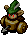
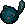
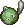
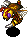
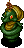
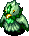
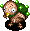
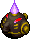

  

First real dungeon of the game. 
There are 5 floors total, and clearing this dungeon leads to the entrance of Tower of Fortune.

The first two floors only have point switches for traps, so it's a popular spot to collect points.

<ul class="quickLinksUL">
  <li><a href="#overview">Overview</a></li>
  <li><a href="#strategy">Strategy</a>
    <ul>
      <li><a href="#general">General</a></li>
      <li><a href="#farming">Farming</a></li>
    </ul>
  </li>
  <li><a href="#monsters">Monsters</a></li>
  <li><a href="#monster-list">Monster List</a></li>
  <li><a href="#items">Items</a></li>
  <li><a href="#traps">Traps</a></li>
  <li><a href="#npcs">NPCs</a></li>
</ul>

# Overview

<table class="dungeonOverview">
  <tr>
    <th>Unlock</th>
    <td class="highlightYellow">Available as soon as you arrive in Nekomaneki Village.</td>
  </tr>
  <tr>
    <th>Entrance</th>
    <td class="highlightYellow">Nekomaneki Village (North East)</td>
  </tr>
</table>

<table class="dungeonTable">
  <tr>
    <th>Floors</th>
    <td>5F</td>
    <th>Day / Night</th>
    <td>Day</td>
  </tr>
  <tr>
    <th>Bring Items</th>
    <td>Yes</td>
    <th>Allies</th>
    <td>3</td>
  </tr>
  <tr>
    <th>Unidentified</th>
    <td>Bracelets</td>
    <th>New Items</th>
    <td>Yes</td>
  </tr>
  <tr>
    <th>Shops</th>
    <td>None</td>
    <th>Monster Houses</th>
    <td>None</td>
  </tr>
  <tr>
    <th>Initial Enemies</th>
    <td>8</td>
    <th>Spawn Rate</th>
    <td>35 turns</td>
  </tr>
  <tr>
    <th>Ominous aura</th>
    <td>No</td>
    <th>Wind of Kron</th>
    <td>1st: 1700 4th: 2000</td>
  </tr>
</table>

※ Reading a Night-Day Scroll is the only way to change it to night. (Night lasts 5 turns) 
※ Reading a Mnster House Scrl is the only way to encounter a Monster House. 

# Strategy

### General

Point Switches are the only traps on 1-2F, and weapons and shields are commonly found on the ground. 
Enemies are weak and traps are pretty mild, so think of it like a safe preparation area.

However, there's still some risk of collapsing if you overextend or have exceptionally bad luck. 
Using a direct attack against a Blade Bee when your HP is low, throwing an item at an adjacent Sweet Nut, etc. 
There's also a high chance of losing items if you throw them in the direction of water tiles or at the exit.

Trip Traps can appear from 3F, so don't forget to bring a Balance Staff if you're bringing items. 
It'd be a shame if a valuable pot shattered from tripping.

Mixers appear on 1-3F of Tower of the Present, and 4-5F of Tower of the Future, so don't discard synthesis materials 
like grass items and weapons or shields with positive upgrade values. 
The remainder of your adventure becomes easier if synthesis goes well.

### Farming

You can collect Wood Arrows if you find a Wood Arrow Trap, and can hunt Grass Kids on 4-5F to collect grass items. 
Strength Grass is particularly good, since it increases the amount of damage you deal with direct attacks and arrows. 
If you brought a Growth Bracelet, you can linger on each floor until wind blows to get a head start on leveling up. 
Level up a Pit Mamel into a Cave Mamel using a Fear Scroll and use items like Swift Grass and Upgrade Seed 
to get an early start on leveling up your weapon and shield, etc. (See level up monsters for other ideas) 
Lastly, be careful of your remaining fullness and food when performing any of these techniques.

# Monsters

<button id="hideMonTblImgBtn" onClick={()=>{var mon_imgs = document.querySelectorAll('#monsterTable img');mon_imgs.forEach(e => e.classList.toggle('hidden'));}}>Toggle Monster Images</button>

Hover over or tap a monster's name for details. Monster Colors: Farming, Useful, Destroys Items, Dangerous, Very Dangerous

<table id="monsterTable" class="monsterTable">
  <thead>
    <tr>
      <th>F</th>
      <th colspan="5">Monsters</th>
    </tr>
  </thead>
  <tbody>
    <tr>
      <td rowspan="2" class="centeredText">1</td>
      <td class="day">
 Mamel
- Mamel - HP: 5 AP: 2 DP: 1 Exp: 2 GP: 1 Type: Normal Speed: Normal Sp.Atk Rate: 0% (near), 0% (far) Item Drop Rate: 4% ~ Ability ~ None.

</td>
      <td class="day">
 Seedie
- Seedie - HP: 7 AP: 7 DP: 1 Exp: 4 GP: 1 Type: Plant Speed: Normal Sp.Atk Rate: 0% (near), 0% (far) Item Drop Rate: 4% ~ Ability ~ None.

</td>
      <td class="day">
 Sproutant
- Sproutant - HP: 5 AP: 2 DP: 1 Exp: 3 GP: 2 Type: Plant Speed: Normal Sp.Atk Rate: 0% (near), 0% (far) Item Drop Rate: 4% ~ Ability ~ Monster family becomes immune to most recent status inflicted upon it, excluding Sealed status.

</td>
      <td class="highlightGray2"></td>
      <td class="highlightGray2"></td>
    </tr>
    <tr>
      <td class="night">
 Dark Boy Cart
- Dark Boy Cart - HP: 14 AP: 5 DP: 2 Exp: 3 GP: 8 Type: Normal Speed: Swift 1 Sp.Atk Rate: 100% (near), 80% (far) Item Drop Rate: 6% ~ Ability ~ Resists non-ability attacks. Shoots Wood Arrows. Moves away if Shiren gets close. Can use direct attacks, and attacks even in hallways. Only drops Wood Arrows.

</td>
      <td class="night">
 Dark Bored Kappa
- Dark Bored Kappa - HP: 14 AP: 5 DP: 2 Exp: 3 GP: 7 Type: Aquatic Speed: Normal Sp.Atk Rate: 0% (near), 0% (far) Item Drop Rate: 4% ~ Ability ~ Resists non-ability attacks. Stands on an item and throws it at Shiren when he gets within 3 tiles. Catches projectiles and throws them back at Shiren. Items it throws always miss. Cannot throw weapons, shields, or Gitan.

</td>
      <td class="night dangerNight">
 Bad Colum
- Bad Colum - HP: 14 AP: 5 DP: 2 Exp: 3 GP: 6 Type: Normal Speed: Normal Sp.Atk Rate: 0% (near), 0% (far) Item Drop Rate: 4% ~ Ability ~ Resists non-ability attacks. Rolls backward 10 tiles when slain by a direct attack, damaging anything it hits equal to damage received.

</td>
      <td class="night">
 Evil Chintala
- Evil Chintala - HP: 14 AP: 5 DP: 2 Exp: 3 GP: 4 Type: Normal Speed: Normal Sp.Atk Rate: 0% (near), 0% (far) Item Drop Rate: 4% ~ Ability ~ Resists non-ability attacks.

</td>
      <td class="night">
 Dark Mamel
- Dark Mamel - HP: 24 AP: 14 DP: 3 Exp: 22 GP: 15 Type: Normal Speed: Normal Sp.Atk Rate: 0% (near), 0% (far) Item Drop Rate: 4% ~ Ability ~ Resists non-ability attacks.

</td>
    </tr>
    <tr>
      <td colspan="6" class="purpleDivider"></td>
    </tr>
    <tr>
      <td rowspan="3" class="centeredText">2</td>
      <td class="day">
 Mamel
- Mamel - HP: 5 AP: 2 DP: 1 Exp: 2 GP: 1 Type: Normal Speed: Normal Sp.Atk Rate: 0% (near), 0% (far) Item Drop Rate: 4% ~ Ability ~ None.

</td>
      <td class="day">
 Seedie
- Seedie - HP: 7 AP: 7 DP: 1 Exp: 4 GP: 1 Type: Plant Speed: Normal Sp.Atk Rate: 0% (near), 0% (far) Item Drop Rate: 4% ~ Ability ~ None.

</td>
      <td class="day">
 Sproutant
- Sproutant - HP: 5 AP: 2 DP: 1 Exp: 3 GP: 2 Type: Plant Speed: Normal Sp.Atk Rate: 0% (near), 0% (far) Item Drop Rate: 4% ~ Ability ~ Monster family becomes immune to most recent status inflicted upon it, excluding Sealed status.

</td>
      <td class="day">
 Colum
- Colum - HP: 7 AP: 7 DP: 1 Exp: 4 GP: 2 Type: Normal Speed: Normal Sp.Atk Rate: 0% (near), 0% (far) Item Drop Rate: 4% ~ Ability ~ Rolls backward 10 tiles when slain by a direct attack, damaging anything it hits equal to damage received.

</td>
      <td class="highlightGray2"></td>
    </tr>
    <tr>
      <td class="night">
 Dark Boy Cart
- Dark Boy Cart - HP: 14 AP: 5 DP: 2 Exp: 3 GP: 8 Type: Normal Speed: Swift 1 Sp.Atk Rate: 100% (near), 80% (far) Item Drop Rate: 6% ~ Ability ~ Resists non-ability attacks. Shoots Wood Arrows. Moves away if Shiren gets close. Can use direct attacks, and attacks even in hallways. Only drops Wood Arrows.

</td>
      <td class="night">
 Dark Bored Kappa
- Dark Bored Kappa - HP: 14 AP: 5 DP: 2 Exp: 3 GP: 7 Type: Aquatic Speed: Normal Sp.Atk Rate: 0% (near), 0% (far) Item Drop Rate: 4% ~ Ability ~ Resists non-ability attacks. Stands on an item and throws it at Shiren when he gets within 3 tiles. Catches projectiles and throws them back at Shiren. Items it throws always miss. Cannot throw weapons, shields, or Gitan.

</td>
      <td class="night dangerNight">
 Bad Colum
- Bad Colum - HP: 14 AP: 5 DP: 2 Exp: 3 GP: 6 Type: Normal Speed: Normal Sp.Atk Rate: 0% (near), 0% (far) Item Drop Rate: 4% ~ Ability ~ Resists non-ability attacks. Rolls backward 10 tiles when slain by a direct attack, damaging anything it hits equal to damage received.

</td>
      <td class="night">
 Evil Chintala
- Evil Chintala - HP: 14 AP: 5 DP: 2 Exp: 3 GP: 4 Type: Normal Speed: Normal Sp.Atk Rate: 0% (near), 0% (far) Item Drop Rate: 4% ~ Ability ~ Resists non-ability attacks.

</td>
      <td class="night">
 Dark Mamel
- Dark Mamel - HP: 24 AP: 14 DP: 3 Exp: 22 GP: 15 Type: Normal Speed: Normal Sp.Atk Rate: 0% (near), 0% (far) Item Drop Rate: 4% ~ Ability ~ Resists non-ability attacks.

</td>
    </tr>
    <tr>
      <td class="night">
 Evil PolySpinna
- Evil PolySpinna - HP: 25 AP: 18 DP: 3 Exp: 26 GP: 13 Type: Drain/Magic Speed: Normal Sp.Atk Rate: 23% (near), 0% (far) Item Drop Rate: 4% ~ Ability ~ Resists non-ability attacks. Lowers Max HP by 2 or Max Fullness by 5 when adjacent. Occasionally warps in front of Shiren when in a room.

</td>
      <td class="night">
 Putrid Sweet Nut
- Putrid Sweet Nut - HP: 55 AP: 30 DP: 1 Exp: 70 GP: 35 Type: Plant/Explode Speed: Normal Sp.Atk Rate: 0% (near), 0% (far) Item Drop Rate: 0% ~ Ability ~ Resists non-ability attacks. Either doubles experience points (Max: x1024) or explodes (33% chance) each time it eats a thrown item.

</td>
      <td class="highlightGray2"></td>
      <td class="highlightGray2"></td>
      <td class="highlightGray2"></td>
    </tr>
    <tr>
      <td colspan="6" class="purpleDivider"></td>
    </tr>
    <tr>
      <td rowspan="3" class="centeredText">3</td>
      <td class="day">
 Pit Mamel
- Pit Mamel - HP: 11 AP: 6 DP: 3 Exp: 5 GP: 2 Type: Normal Speed: Normal Sp.Atk Rate: 0% (near), 0% (far) Item Drop Rate: 4% ~ Ability ~ None.

</td>
      <td class="day">
 Chintala
- Chintala - HP: 19 AP: 9 DP: 4 Exp: 12 GP: 6 Type: Normal Speed: Normal Sp.Atk Rate: 0% (near), 0% (far) Item Drop Rate: 4% ~ Ability ~ None.

</td>
      <td class="day">
 Sproutant
- Sproutant - HP: 5 AP: 2 DP: 1 Exp: 3 GP: 2 Type: Plant Speed: Normal Sp.Atk Rate: 0% (near), 0% (far) Item Drop Rate: 4% ~ Ability ~ Monster family becomes immune to most recent status inflicted upon it, excluding Sealed status.

</td>
      <td class="day">
 Colum
- Colum - HP: 7 AP: 7 DP: 1 Exp: 4 GP: 2 Type: Normal Speed: Normal Sp.Atk Rate: 0% (near), 0% (far) Item Drop Rate: 4% ~ Ability ~ Rolls backward 10 tiles when slain by a direct attack, damaging anything it hits equal to damage received.

</td>
      <td class="day">
 Blade Bee
- Blade Bee - HP: 28 AP: 10 DP: 1 Exp: 5 GP: 4 Type: Floating Speed: Normal Sp.Atk Rate: 16% (near), 0% (far) Item Drop Rate: 0% ~ Ability ~ Occasionally retreats after attacking. Stinger has double AP and inflicts Confused status, but it also collapses afterward.

</td>
    </tr>
    <tr>
      <td class="night">
 Dark Naptapir
- Dark Naptapir - HP: 24 AP: 14 DP: 3 Exp: 22 GP: 10 Type: Normal Speed: Normal Sp.Atk Rate: 23% (near), 0% (far) Item Drop Rate: 4% ~ Ability ~ Resists non-ability attacks. Initially Napping, will not wake up when Shiren enters or exits the room. Occasionally inflicts Asleep status in a 1 tile radius when it's Napping, Asleep, or Sound Asleep. Chance to yawn when slain, inflicting Asleep status in a 1 tile radius.

</td>
      <td class="night">
 Dark Bored Kappa
- Dark Bored Kappa - HP: 14 AP: 5 DP: 2 Exp: 3 GP: 7 Type: Aquatic Speed: Normal Sp.Atk Rate: 0% (near), 0% (far) Item Drop Rate: 4% ~ Ability ~ Resists non-ability attacks. Stands on an item and throws it at Shiren when he gets within 3 tiles. Catches projectiles and throws them back at Shiren. Items it throws always miss. Cannot throw weapons, shields, or Gitan.

</td>
      <td class="night">
 Evil Hopodile
- Evil Hopodile - HP: 24 AP: 12 DP: 3 Exp: 22 GP: 14 Type: Dragon/Aquatic Speed: Normal Sp.Atk Rate: 0% (near), 0% (far) Item Drop Rate: 4% ~ Ability ~ Resists non-ability attacks. Moves like a chess knight when Shiren is in view. Performs a 15 damage jumping attack when Shiren is in range of a chess knight hop.

</td>
      <td class="night">
 Evil Chintala
- Evil Chintala - HP: 14 AP: 5 DP: 2 Exp: 3 GP: 4 Type: Normal Speed: Normal Sp.Atk Rate: 0% (near), 0% (far) Item Drop Rate: 4% ~ Ability ~ Resists non-ability attacks.

</td>
      <td class="night">
 Dark Mamel
- Dark Mamel - HP: 24 AP: 14 DP: 3 Exp: 22 GP: 15 Type: Normal Speed: Normal Sp.Atk Rate: 0% (near), 0% (far) Item Drop Rate: 4% ~ Ability ~ Resists non-ability attacks.

</td>
    </tr>
    <tr>
      <td class="night">
 Evil PolySpinna
- Evil PolySpinna - HP: 25 AP: 18 DP: 3 Exp: 26 GP: 13 Type: Drain/Magic Speed: Normal Sp.Atk Rate: 23% (near), 0% (far) Item Drop Rate: 4% ~ Ability ~ Resists non-ability attacks. Lowers Max HP by 2 or Max Fullness by 5 when adjacent. Occasionally warps in front of Shiren when in a room.

</td>
      <td class="night">
 Putrid Sweet Nut
- Putrid Sweet Nut - HP: 55 AP: 30 DP: 1 Exp: 70 GP: 35 Type: Plant/Explode Speed: Normal Sp.Atk Rate: 0% (near), 0% (far) Item Drop Rate: 0% ~ Ability ~ Resists non-ability attacks. Either doubles experience points (Max: x1024) or explodes (33% chance) each time it eats a thrown item.

</td>
      <td class="night">
 Dark Tosser
- Dark Tosser - HP: 16 AP: 9 DP: 1 Exp: 10 GP: 18 Type: Normal Speed: Normal Sp.Atk Rate: 33% (near), 33% (far) Item Drop Rate: 4% ~ Ability ~ Resists non-ability attacks. Throws an adjacent creature at Shiren, or throws Shiren at another creature, onto a trap, or into a Monster House. Range of 5 tiles, deals 10 damage.

</td>
      <td class="highlightGray2"></td>
      <td class="highlightGray2"></td>
    </tr>
    <tr>
      <td colspan="6" class="purpleDivider"></td>
    </tr>
    <tr>
      <td rowspan="4" class="centeredText">4</td>
      <td class="day">
 Pit Mamel
- Pit Mamel - HP: 11 AP: 6 DP: 3 Exp: 5 GP: 2 Type: Normal Speed: Normal Sp.Atk Rate: 0% (near), 0% (far) Item Drop Rate: 4% ~ Ability ~ None.

</td>
      <td class="day">
 Chintala
- Chintala - HP: 19 AP: 9 DP: 4 Exp: 12 GP: 6 Type: Normal Speed: Normal Sp.Atk Rate: 0% (near), 0% (far) Item Drop Rate: 4% ~ Ability ~ None.

</td>
      <td class="day farm">
 Grass Kid
- Grass Kid - HP: 28 AP: 10 DP: 1 Exp: 5 GP: 3 Type: Plant Speed: Normal Sp.Atk Rate: 21% (near), 16% (far) Item Drop Rate: 0% ~ Ability ~ Spreads grass in a 1 tile radius when adjacent. Pierce-throws grass in a straight line at a distance. Carries 1 grass item. Becomes Pin Kid with 0 grass.

</td>
      <td class="day">
 Pin Kid
- Pin Kid - HP: 28 AP: 8 DP: 1 Exp: 5 GP: 1 Type: Plant Speed: Swift 1 Sp.Atk Rate: 0% (near), 0% (far) Item Drop Rate: 0% ~ Ability ~ Runs from Shiren, but attacks when adjacent. Becomes Grass Kid when it picks up a grass item.

</td>
      <td class="day">
 Blade Bee
- Blade Bee - HP: 28 AP: 10 DP: 1 Exp: 5 GP: 4 Type: Floating Speed: Normal Sp.Atk Rate: 16% (near), 0% (far) Item Drop Rate: 0% ~ Ability ~ Occasionally retreats after attacking. Stinger has double AP and inflicts Confused status, but it also collapses afterward.

</td>
    </tr>
    <tr>
      <td class="highlightGray2"></td>
      <td class="highlightGray2"></td>
      <td class="highlightGray2"></td>
      <td class="highlightGray2"></td>
      <td class="day">
 Sweet Nut
- Sweet Nut - HP: 16 AP: 11 DP: 5 Exp: 15 GP: 4 Type: Plant/Explode Speed: Normal Sp.Atk Rate: 0% (near), 0% (far) Item Drop Rate: 0% ~ Ability ~ Either doubles experience points (Max: x1024) or explodes (33% chance) each time it eats a thrown item.

</td>
    </tr>
    <tr>
      <td class="night">
 Dark Naptapir
- Dark Naptapir - HP: 24 AP: 14 DP: 3 Exp: 22 GP: 10 Type: Normal Speed: Normal Sp.Atk Rate: 23% (near), 0% (far) Item Drop Rate: 4% ~ Ability ~ Resists non-ability attacks. Initially Napping, will not wake up when Shiren enters or exits the room. Occasionally inflicts Asleep status in a 1 tile radius when it's Napping, Asleep, or Sound Asleep. Chance to yawn when slain, inflicting Asleep status in a 1 tile radius.

</td>
      <td class="night dangerNight">
 Dark Absorbiphant
- Dark Absorbiphant - HP: 10 AP: 5 DP: 1 Exp: 3 GP: 20 Type: Drain Speed: Normal Sp.Atk Rate: 100% (near), 100% (far) Item Drop Rate: 4% ~ Ability ~ Resists non-ability attacks. Absorbs status conditions inflicted on itself or from a creature within a 1 tile radius, fully restoring its own HP and raising AP by 1 stage.

</td>
      <td class="night">
 Evil Hopodile
- Evil Hopodile - HP: 24 AP: 12 DP: 3 Exp: 22 GP: 14 Type: Dragon/Aquatic Speed: Normal Sp.Atk Rate: 0% (near), 0% (far) Item Drop Rate: 4% ~ Ability ~ Resists non-ability attacks. Moves like a chess knight when Shiren is in view. Performs a 15 damage jumping attack when Shiren is in range of a chess knight hop.

</td>
      <td class="night">
 Dark Karakuroid
- Dark Karakuroid - HP: 10 AP: 8 DP: 1 Exp: 2 GP: 25 Type: Metal Speed: Swift 1 Sp.Atk Rate: 38% (near), 38% (far) Item Drop Rate: 4% ~ Ability ~ Resists non-ability attacks. Initially Napping, wakes when Shiren enters or exits the room. Creates a trap on the ground, then stops acting for 2 turns. Occasionally creates a trap when slain.

</td>
      <td class="night">
 Dark Mamel
- Dark Mamel - HP: 24 AP: 14 DP: 3 Exp: 22 GP: 15 Type: Normal Speed: Normal Sp.Atk Rate: 0% (near), 0% (far) Item Drop Rate: 4% ~ Ability ~ Resists non-ability attacks.

</td>
    </tr>
    <tr>
      <td class="night itemsNight">
 Violent Gyadon
- Violent Gyadon - HP: 10 AP: 5 DP: 1 Exp: 4 GP: 18 Type: Floating Speed: Normal Sp.Atk Rate: 21% (near), 0% (far) Item Drop Rate: 4% ~ Ability ~ Resists non-ability attacks. Pecks a staff from your inventory when adjacent, reducing its charges to 0.

</td>
      <td class="night">
 Putrid Sweet Nut
- Putrid Sweet Nut - HP: 55 AP: 30 DP: 1 Exp: 70 GP: 35 Type: Plant/Explode Speed: Normal Sp.Atk Rate: 0% (near), 0% (far) Item Drop Rate: 0% ~ Ability ~ Resists non-ability attacks. Either doubles experience points (Max: x1024) or explodes (33% chance) each time it eats a thrown item.

</td>
      <td class="night">
 Dark Tosser
- Dark Tosser - HP: 16 AP: 9 DP: 1 Exp: 10 GP: 18 Type: Normal Speed: Normal Sp.Atk Rate: 33% (near), 33% (far) Item Drop Rate: 4% ~ Ability ~ Resists non-ability attacks. Throws an adjacent creature at Shiren, or throws Shiren at another creature, onto a trap, or into a Monster House. Range of 5 tiles, deals 10 damage.

</td>
      <td class="night">
 Sinful Yanpii
- Sinful Yanpii - HP: 10 AP: 5 DP: 1 Exp: 10 GP: 40 Type: Normal Speed: Normal Sp.Atk Rate: 22% (near), 22% (far) Item Drop Rate: 4% ~ Ability ~ Resists non-ability attacks. Headbutts Shiren when lined up, dealing 15 damage and knockback based on distance traveled. If Shiren is knocked into a wall, go into the wall 1 tile and take an additional 10 damage.

</td>
      <td class="highlightGray2"></td>
    </tr>
    <tr>
      <td colspan="6" class="purpleDivider"></td>
    </tr>
    <tr>
      <td rowspan="3" class="centeredText">5</td>
      <td class="day">
 Pit Mamel
- Pit Mamel - HP: 11 AP: 6 DP: 3 Exp: 5 GP: 2 Type: Normal Speed: Normal Sp.Atk Rate: 0% (near), 0% (far) Item Drop Rate: 4% ~ Ability ~ None.

</td>
      <td class="day">
 Chintala
- Chintala - HP: 19 AP: 9 DP: 4 Exp: 12 GP: 6 Type: Normal Speed: Normal Sp.Atk Rate: 0% (near), 0% (far) Item Drop Rate: 4% ~ Ability ~ None.

</td>
      <td class="day farm">
 Grass Kid
- Grass Kid - HP: 28 AP: 10 DP: 1 Exp: 5 GP: 3 Type: Plant Speed: Normal Sp.Atk Rate: 21% (near), 16% (far) Item Drop Rate: 0% ~ Ability ~ Spreads grass in a 1 tile radius when adjacent. Pierce-throws grass in a straight line at a distance. Carries 1 grass item. Becomes Pin Kid with 0 grass.

</td>
      <td class="day">
 Pin Kid
- Pin Kid - HP: 28 AP: 8 DP: 1 Exp: 5 GP: 1 Type: Plant Speed: Swift 1 Sp.Atk Rate: 0% (near), 0% (far) Item Drop Rate: 0% ~ Ability ~ Runs from Shiren, but attacks when adjacent. Becomes Grass Kid when it picks up a grass item.

</td>
      <td class="day">
 Sweet Nut
- Sweet Nut - HP: 16 AP: 11 DP: 5 Exp: 15 GP: 4 Type: Plant/Explode Speed: Normal Sp.Atk Rate: 0% (near), 0% (far) Item Drop Rate: 0% ~ Ability ~ Either doubles experience points (Max: x1024) or explodes (33% chance) each time it eats a thrown item.

</td>
    </tr>
    <tr>
      <td class="night itemsNight">
 Violent Gyadon
- Violent Gyadon - HP: 10 AP: 5 DP: 1 Exp: 4 GP: 18 Type: Floating Speed: Normal Sp.Atk Rate: 21% (near), 0% (far) Item Drop Rate: 4% ~ Ability ~ Resists non-ability attacks. Pecks a staff from your inventory when adjacent, reducing its charges to 0.

</td>
      <td class="night dangerNight">
 Dark Absorbiphant
- Dark Absorbiphant - HP: 10 AP: 5 DP: 1 Exp: 3 GP: 20 Type: Drain Speed: Normal Sp.Atk Rate: 100% (near), 100% (far) Item Drop Rate: 4% ~ Ability ~ Resists non-ability attacks. Absorbs status conditions inflicted on itself or from a creature within a 1 tile radius, fully restoring its own HP and raising AP by 1 stage.

</td>
      <td class="night">
 Dark Tosser
- Dark Tosser - HP: 16 AP: 9 DP: 1 Exp: 10 GP: 18 Type: Normal Speed: Normal Sp.Atk Rate: 33% (near), 33% (far) Item Drop Rate: 4% ~ Ability ~ Resists non-ability attacks. Throws an adjacent creature at Shiren, or throws Shiren at another creature, onto a trap, or into a Monster House. Range of 5 tiles, deals 10 damage.

</td>
      <td class="night">
 Dark Karakuroid
- Dark Karakuroid - HP: 10 AP: 8 DP: 1 Exp: 2 GP: 25 Type: Metal Speed: Swift 1 Sp.Atk Rate: 38% (near), 38% (far) Item Drop Rate: 4% ~ Ability ~ Resists non-ability attacks. Initially Napping, wakes when Shiren enters or exits the room. Creates a trap on the ground, then stops acting for 2 turns. Occasionally creates a trap when slain.

</td>
      <td class="night">
 Dark Mamel
- Dark Mamel - HP: 24 AP: 14 DP: 3 Exp: 22 GP: 15 Type: Normal Speed: Normal Sp.Atk Rate: 0% (near), 0% (far) Item Drop Rate: 4% ~ Ability ~ Resists non-ability attacks.

</td>
    </tr>
    <tr>
      <td class="highlightGray2"></td>
      <td class="highlightGray2"></td>
      <td class="highlightGray2"></td>
      <td class="night">
 Sinful Yanpii
- Sinful Yanpii - HP: 10 AP: 5 DP: 1 Exp: 10 GP: 40 Type: Normal Speed: Normal Sp.Atk Rate: 22% (near), 22% (far) Item Drop Rate: 4% ~ Ability ~ Resists non-ability attacks. Headbutts Shiren when lined up, dealing 15 damage and knockback based on distance traveled. If Shiren is knocked into a wall, go into the wall 1 tile and take an additional 10 damage.

</td>
      <td class="highlightGray2"></td>
    </tr>
  </tbody>
</table>

※ Night-Day Scroll is required to encounter night monsters.

# Monster List

Orange: Dangerous, Blue: Beneficial

 

<table class="dungeonMonsterList">
  <tr>
    <th>F</th>
    <th>Name</th>
    <th>HP</th>
    <th>AP</th>
    <th>DP</th>
    <th>Exp</th>
    <th>GP</th>
    <th>Effective Rune / Item</th>
    <th>Notes</th>
  </tr>
  <tr>
    <td>1-2</td>
    <td class="highlightYellow">Mamel</td>
    <td>5</td>
    <td>2</td>
    <td>1</td>
    <td>2</td>
    <td>1</td>
    <td>-</td>
    <td>Easily defeated even at level 1.</td>
  </tr>
  <tr>
    <td>1-2</td>
    <td class="highlightYellow">Seedie</td>
    <td>7</td>
    <td>7</td>
    <td>1</td>
    <td>4</td>
    <td>1</td>
    <td>Anti-Plant</td>
    <td>Deals 6~8 damage to you when you're at level 1 without a shield. Loop attack→walk to restore HP→attack to defeat it safely.</td>
  </tr>
  <tr>
    <td>1-3</td>
    <td class="highlightYellow">Sproutant</td>
    <td>5</td>
    <td>2</td>
    <td>1</td>
    <td>3</td>
    <td>2</td>
    <td>Anti-Plant</td>
    <td>If you inflict it with a status condition, it'll become immune to it afterward. Inflicting a different status condition will overwrite the immunity.</td>
  </tr>
  <tr>
    <td>2-3</td>
    <td class="highlightYellow">Colum</td>
    <td>7</td>
    <td>7</td>
    <td>1</td>
    <td>4</td>
    <td>2</td>
    <td>-</td>
    <td>Rolls backward 10 tiles when slain, dealing damage to any creature it hits. (Damage is equal to the amount of damage it received when it was slain)</td>
  </tr>
  <tr>
    <td>3-4</td>
    <td class="highlightYellow">Blade Bee</td>
    <td>28</td>
    <td>10</td>
    <td>1</td>
    <td>5</td>
    <td>4</td>
    <td>Anti-Floating Anti-Cnf. Bracelet</td>
    <td>It can move over water tiles, and sometimes retreats 1 tile after attacking. Its special attack has double the attack power and inflicts <a href="/shiren-5/system/status-conditions#confused">Confused</a> status. The Blade Bee collapses after using its special attack.</td>
  </tr>
  <tr>
    <td>3-5</td>
    <td class="highlightYellow">Pit Mamel</td>
    <td>11</td>
    <td>6</td>
    <td>3</td>
    <td>5</td>
    <td>2</td>
    <td>-</td>
    <td>Apparently smells like menthol.</td>
  </tr>
  <tr>
    <td>3-5</td>
    <td class="highlightYellow">Chintala</td>
    <td>19</td>
    <td>9</td>
    <td>4</td>
    <td>12</td>
    <td>4</td>
    <td>-</td>
    <td>Basically a beefier Seedie.</td>
  </tr>
  <tr>
    <td>4-5</td>
    <td class="highlightYellow">Grass Kid</td>
    <td>28</td>
    <td>10</td>
    <td>1</td>
    <td>5</td>
    <td>3</td>
    <td>Anti-Plant</td>
    <td>Throws the grass item it's carrying from a distance with piercing properties, or spreads the effect to all creatures in a 1-tile radius if it's adjacent to you. Transforms into Pin Kid after using the grass item it was carrying. Always drops the grass item it's carrying when defeated.</td>
  </tr>
  <tr>
    <td>4-5</td>
    <td class="highlightYellow">Pin Kid</td>
    <td>28</td>
    <td>10</td>
    <td>1</td>
    <td>5</td>
    <td>1</td>
    <td>Anti-Plant</td>
    <td>Moves at double speed, but only attacks once. Transforms into Grass Kid if it finds a grass item, or if you throw grass at it. It generally tries to run away from Shiren, but will attack if you're adjacent to it.</td>
  </tr>
  <tr>
    <td>4-5</td>
    <td class="highlightYellow">Sweet Nut</td>
    <td>16</td>
    <td>11</td>
    <td>5</td>
    <td>15</td>
    <td>4</td>
    <td>Anti-Plant Anti-Explode</td>
    <td>Swallows thrown items and multiplies the amount of exp it gives when slain. However, there's a chance it'll explode when it swallows an item. (about 1/3 chance to explode, x2→x4→x8→...→x1024 exp at max)</td>
  </tr>
</table>

# Items

The values like "3-5" in columns represent the floor range where the item can appear.

- F = Floor, Daytime monster drop
- S = Shiny Object (yellow), Peddler
- P = Presto Pot
- E = Shiny Object (blue)

 

<table class="dungeonItemTable">
  <tr>
    <th colspan="5" class="highlightPurple3">Weapon</th>
    <th rowspan="64"></th>
    <th colspan="5" class="highlightPurple3">Bracelet</th>
    <th rowspan="64"></th>
    <th colspan="5" class="highlightPurple3">Staff</th>
  </tr>
  <tr>
    <th>Name</th>
    <th>F</th>
    <th>S</th>
    <th>P</th>
    <th>E</th>
    <th>Name</th>
    <th>F</th>
    <th>S</th>
    <th>P</th>
    <th>E</th>
    <th>Name</th>
    <th>F</th>
    <th>S</th>
    <th>P</th>
    <th>E</th>
  </tr>
  <tr>
    <td class="leftText">Ordinary Stick</td>
    <td>X</td>
    <td></td>
    <td>X</td>
    <td></td>
    <td class="leftText">Cleansing Bracelet</td>
    <td>X</td>
    <td></td>
    <td>X</td>
    <td></td>
    <td class="leftText">Swap Staff</td>
    <td>X</td>
    <td></td>
    <td>X</td>
    <td></td>
  </tr>
  <tr>
    <td class="leftText">Tin Blade</td>
    <td>X</td>
    <td></td>
    <td>X</td>
    <td></td>
    <td class="leftText">Anti-Cnf. Bracelet</td>
    <td>X</td>
    <td></td>
    <td>X</td>
    <td></td>
    <td class="leftText">Knockback Staff</td>
    <td>X</td>
    <td></td>
    <td>X</td>
    <td></td>
  </tr>
  <tr>
    <td class="leftText">Katana</td>
    <td>X</td>
    <td>X</td>
    <td>X</td>
    <td></td>
    <td class="leftText">Alert Bracelet</td>
    <td>X</td>
    <td></td>
    <td>X</td>
    <td></td>
    <td class="leftText">Transient Staff</td>
    <td>X</td>
    <td></td>
    <td></td>
    <td></td>
  </tr>
  <tr>
    <td class="leftText">Beast Fang</td>
    <td>X</td>
    <td>X</td>
    <td>X</td>
    <td>X</td>
    <td class="leftText">Anti-Crs. Bracelet</td>
    <td></td>
    <td></td>
    <td></td>
    <td>X</td>
    <td class="leftText">Seal Staff</td>
    <td></td>
    <td>X</td>
    <td></td>
    <td>X</td>
  </tr>
  <tr>
    <td class="leftText">Dotanuki</td>
    <td>X</td>
    <td>X</td>
    <td>X</td>
    <td>X</td>
    <td class="leftText">Staunch Bracelet</td>
    <td>X</td>
    <td></td>
    <td>X</td>
    <td></td>
    <td class="leftText">Clone Staff</td>
    <td></td>
    <td>X</td>
    <td></td>
    <td>X</td>
  </tr>
  <tr>
    <td class="leftText">Bladite</td>
    <td></td>
    <td></td>
    <td></td>
    <td>X</td>
    <td class="leftText">Can. Arm Bracelet</td>
    <td>X</td>
    <td>X</td>
    <td></td>
    <td>X</td>
    <td class="leftText">Paralysis Staff</td>
    <td></td>
    <td>X</td>
    <td></td>
    <td>X</td>
  </tr>
  <tr>
    <td class="leftText">Red Blade</td>
    <td></td>
    <td></td>
    <td></td>
    <td>X</td>
    <td class="leftText">Strength Bracelet</td>
    <td>X</td>
    <td>X</td>
    <td>X</td>
    <td></td>
    <td class="leftText">Empathy Staff</td>
    <td></td>
    <td>X</td>
    <td></td>
    <td>X</td>
  </tr>
  <tr>
    <td class="leftText">Kabura Katana</td>
    <td></td>
    <td></td>
    <td>X</td>
    <td>X</td>
    <td class="leftText">Growth Bracelet</td>
    <td>X</td>
    <td>X</td>
    <td></td>
    <td>X</td>
    <td class="leftText">Slow Staff</td>
    <td></td>
    <td>X</td>
    <td></td>
    <td>X</td>
  </tr>
  <tr>
    <td class="leftText">Dull Gold Edge</td>
    <td>X</td>
    <td>X</td>
    <td>X</td>
    <td></td>
    <td class="leftText">Heal Bracelet</td>
    <td></td>
    <td></td>
    <td></td>
    <td>X</td>
    <td class="leftText">Mage Staff</td>
    <td>X</td>
    <td></td>
    <td>X</td>
    <td>X</td>
  </tr>
  <tr>
    <td class="leftText">Bright Blade</td>
    <td>X</td>
    <td>X</td>
    <td></td>
    <td></td>
    <td class="leftText">Bunch Bracelet</td>
    <td></td>
    <td></td>
    <td></td>
    <td>X</td>
    <td class="leftText">Electric Staff</td>
    <td>X</td>
    <td>X</td>
    <td>X</td>
    <td>X</td>
  </tr>
  <tr>
    <td class="leftText">Old Mallet</td>
    <td>X</td>
    <td></td>
    <td></td>
    <td></td>
    <td class="leftText">Monster Detector</td>
    <td>X</td>
    <td>X</td>
    <td></td>
    <td>X</td>
    <td class="leftText">Balance Staff</td>
    <td>X</td>
    <td></td>
    <td></td>
    <td></td>
  </tr>
  <tr>
    <td class="leftText">Sky Splitter</td>
    <td>X</td>
    <td></td>
    <td>X</td>
    <td></td>
    <td class="leftText">Item Detector</td>
    <td>X</td>
    <td>X</td>
    <td></td>
    <td>X</td>
    <td class="leftText">Fort. Staff</td>
    <td></td>
    <td></td>
    <td></td>
    <td>X</td>
  </tr>
  <tr>
    <td class="leftText">Water Cutter</td>
    <td>X</td>
    <td></td>
    <td>X</td>
    <td></td>
    <th colspan="5" class="highlightPurple3">Scroll</th>
    <th colspan="5" class="highlightPurple3">Pot</th>
  </tr>
  <tr>
    <td class="leftText">Scythe</td>
    <td>X</td>
    <td></td>
    <td>X</td>
    <td></td>
    <th>Name</th>
    <th>F</th>
    <th>S</th>
    <th>P</th>
    <th>E</th>
    <th>Name</th>
    <th>F</th>
    <th>S</th>
    <th>P</th>
    <th>E</th>
  </tr>
  <tr>
    <td class="leftText">Myopic Masher</td>
    <td>X</td>
    <td></td>
    <td>X</td>
    <td></td>
    <td class="leftText">Confusion Scroll</td>
    <td>X</td>
    <td>X</td>
    <td>X</td>
    <td></td>
    <td class="leftText">Preservation Pot</td>
    <td>3-5</td>
    <td></td>
    <td></td>
    <td></td>
  </tr>
  <tr>
    <td class="leftText">Magic Masher</td>
    <td>X</td>
    <td></td>
    <td>X</td>
    <td></td>
    <td class="leftText">Slumber Scroll</td>
    <td>X</td>
    <td>X</td>
    <td>X</td>
    <td></td>
    <td class="leftText">Ordinary Pot</td>
    <td>3-5</td>
    <td></td>
    <td></td>
    <td></td>
  </tr>
  <tr>
    <td class="leftText">Drain Dagger</td>
    <td>X</td>
    <td></td>
    <td>X</td>
    <td></td>
    <td class="leftText">Vacuum Slash Scrl</td>
    <td>X</td>
    <td>X</td>
    <td>X</td>
    <td></td>
    <td class="leftText">Synthesis Pot</td>
    <td>3-5</td>
    <td></td>
    <td></td>
    <td>X</td>
  </tr>
  <tr>
    <td class="leftText">Copper Cleaver</td>
    <td>X</td>
    <td></td>
    <td>X</td>
    <td></td>
    <td class="leftText">Fear Scroll</td>
    <td>X</td>
    <td>X</td>
    <td>X</td>
    <td></td>
    <td class="leftText">Sale Pot</td>
    <td>3-5</td>
    <td></td>
    <td></td>
    <td></td>
  </tr>
  <tr>
    <td class="leftText">Crescent Katana</td>
    <td>X</td>
    <td></td>
    <td>X</td>
    <td></td>
    <td class="leftText">Escape Scroll</td>
    <td></td>
    <td>X</td>
    <td>X</td>
    <td></td>
    <td class="leftText">Presto Pot</td>
    <td>3-5</td>
    <td></td>
    <td></td>
    <td></td>
  </tr>
  <tr>
    <td class="leftText">Lizard Lasher</td>
    <td>X</td>
    <td></td>
    <td>X</td>
    <td></td>
    <td class="leftText">Navigation Scroll</td>
    <td>X</td>
    <td></td>
    <td>X</td>
    <td></td>
    <td class="leftText">Blessing Pot</td>
    <td></td>
    <td></td>
    <td></td>
    <td>X</td>
  </tr>
  <tr>
    <td class="leftText">Nap Rattle</td>
    <td></td>
    <td>X</td>
    <td></td>
    <td></td>
    <td class="leftText">Identify Scroll</td>
    <td>X</td>
    <td></td>
    <td>X</td>
    <td></td>
    <td class="leftText">Fever Pot</td>
    <td></td>
    <td></td>
    <td></td>
    <td>X</td>
  </tr>
  <tr>
    <td class="leftText">Shockuto</td>
    <td></td>
    <td>X</td>
    <td></td>
    <td></td>
    <td class="leftText">Fate Scroll</td>
    <td>X</td>
    <td>X</td>
    <td></td>
    <td>X</td>
    <td class="leftText">Hide Pot</td>
    <td>3-5</td>
    <td></td>
    <td></td>
    <td></td>
  </tr>
  <tr>
    <td class="leftText">Blurry Stick</td>
    <td></td>
    <td>X</td>
    <td></td>
    <td></td>
    <td class="leftText">Earth Scroll</td>
    <td>X</td>
    <td>X</td>
    <td></td>
    <td>X</td>
    <td class="leftText">Heal Pot</td>
    <td></td>
    <td></td>
    <td></td>
    <td>X</td>
  </tr>
  <tr>
    <td class="leftText">Sealing Keisaku</td>
    <td></td>
    <td>X</td>
    <td></td>
    <td></td>
    <td class="leftText">Plating Scroll</td>
    <td>X</td>
    <td>X</td>
    <td></td>
    <td>X</td>
    <td class="leftText">Hilarious Pot</td>
    <td>3-5</td>
    <td></td>
    <td></td>
    <td></td>
  </tr>
  <tr>
    <td class="leftText">Baffle Axe</td>
    <td></td>
    <td>X</td>
    <td></td>
    <td></td>
    <td class="leftText">Sale Scroll</td>
    <td>X</td>
    <td></td>
    <td>X</td>
    <td></td>
    <td class="leftText">Klein Pot</td>
    <td></td>
    <td></td>
    <td></td>
    <td>X</td>
  </tr>
  <tr>
    <td class="leftText">Hatchet</td>
    <td></td>
    <td></td>
    <td></td>
    <td>X</td>
    <td class="leftText">Pot God Scroll</td>
    <td>X</td>
    <td></td>
    <td></td>
    <td>X</td>
    <th colspan="5" class="highlightPurple3">Talisman</th>
  </tr>
  <tr>
    <td class="leftText">Shoddy Dirk</td>
    <td></td>
    <td>X</td>
    <td></td>
    <td></td>
    <td class="leftText">Blessing Scroll</td>
    <td>X</td>
    <td>X</td>
    <td></td>
    <td>X</td>
    <th>Name</th>
    <th>F</th>
    <th>S</th>
    <th>P</th>
    <th>E</th>
  </tr>
  <tr>
    <td class="leftText">Glass Dirk</td>
    <td></td>
    <td></td>
    <td></td>
    <td>X</td>
    <td class="leftText">Oil Scroll</td>
    <td>X</td>
    <td></td>
    <td>X</td>
    <td></td>
    <td class="leftText">Shadow Bind Tal.</td>
    <td></td>
    <td></td>
    <td>X</td>
    <td></td>
  </tr>
  <tr>
    <td class="leftText">Dirk of Debts</td>
    <td></td>
    <td></td>
    <td></td>
    <td>X</td>
    <td class="leftText">Sanctuary Scroll</td>
    <td></td>
    <td>X</td>
    <td></td>
    <td>X</td>
    <td class="leftText">Conf. Talisman</td>
    <td></td>
    <td></td>
    <td>X</td>
    <td></td>
  </tr>
  <tr>
    <td class="leftText">Breeze Blade</td>
    <td></td>
    <td></td>
    <td></td>
    <td>X</td>
    <td class="leftText">Recommend. Letter</td>
    <td></td>
    <td>X</td>
    <td></td>
    <td></td>
    <td class="leftText">Seal Talisman</td>
    <td></td>
    <td></td>
    <td>X</td>
    <td></td>
  </tr>
  <tr>
    <td class="leftText">Burning Blade</td>
    <td></td>
    <td></td>
    <td></td>
    <td>X</td>
    <td class="leftText">Fixer Scroll</td>
    <td>X</td>
    <td></td>
    <td></td>
    <td>X</td>
    <td class="leftText">Fear Talisman</td>
    <td></td>
    <td></td>
    <td></td>
    <td>X</td>
  </tr>
  <tr>
    <th colspan="5" class="highlightPurple3">Shield</th>
    <td class="leftText">Gambler's Scroll</td>
    <td></td>
    <td></td>
    <td></td>
    <td>X</td>
    <td class="leftText">Berserker Tal.</td>
    <td></td>
    <td></td>
    <td></td>
    <td>X</td>
  </tr>
  <tr>
    <th>Name</th>
    <th>F</th>
    <th>S</th>
    <th>P</th>
    <th>E</th>
    <td class="leftText">Extinction Scroll</td>
    <td></td>
    <td></td>
    <td></td>
    <td>X</td>
    <td class="leftText">Inacc. Talisman</td>
    <td></td>
    <td></td>
    <td></td>
    <td>X</td>
  </tr>
  <tr>
    <td class="leftText">Plain Targe</td>
    <td>X</td>
    <td></td>
    <td>X</td>
    <td></td>
    <td class="leftText">Blank Scroll</td>
    <td></td>
    <td>X</td>
    <td></td>
    <td>X</td>
    <td class="leftText">Sleep Talisman</td>
    <td></td>
    <td></td>
    <td></td>
    <td>X</td>
  </tr>
  <tr>
    <td class="leftText">Tin Shield</td>
    <td>X</td>
    <td></td>
    <td>X</td>
    <td></td>
    <th colspan="5" class="highlightPurple3">Grass</th>
    <td class="leftText">Slow Talisman</td>
    <td></td>
    <td></td>
    <td></td>
    <td>X</td>
  </tr>
  <tr>
    <td class="leftText">Iron Targe</td>
    <td>X</td>
    <td>X</td>
    <td>X</td>
    <td></td>
    <th>Name</th>
    <th>F</th>
    <th>S</th>
    <th>P</th>
    <th>E</th>
    <th colspan="5" class="highlightPurple3">Projectile</th>
  </tr>
  <tr>
    <td class="leftText">Wolfshead</td>
    <td>X</td>
    <td>X</td>
    <td>X</td>
    <td>X</td>
    <td class="leftText">Herb</td>
    <td>X</td>
    <td>X</td>
    <td>X</td>
    <td></td>
    <th>Name</th>
    <th>F</th>
    <th>S</th>
    <th>P</th>
    <th>E</th>
  </tr>
  <tr>
    <td class="leftText">Beast Shield</td>
    <td>X</td>
    <td>X</td>
    <td>X</td>
    <td>X</td>
    <td class="leftText">Otogiriso</td>
    <td>X</td>
    <td>X</td>
    <td>X</td>
    <td></td>
    <td class="leftText">Wood Arrow</td>
    <td></td>
    <td></td>
    <td>X</td>
    <td></td>
  </tr>
  <tr>
    <td class="leftText">Targite</td>
    <td></td>
    <td></td>
    <td></td>
    <td>X</td>
    <td class="leftText">Heal Grass</td>
    <td>X</td>
    <td>X</td>
    <td>X</td>
    <td>X</td>
    <td class="leftText">Iron Arrow</td>
    <td></td>
    <td></td>
    <td>X</td>
    <td></td>
  </tr>
  <tr>
    <td class="leftText">Red Shield</td>
    <td></td>
    <td></td>
    <td></td>
    <td>X</td>
    <td class="leftText">Life Grass</td>
    <td>X</td>
    <td>X</td>
    <td>X</td>
    <td>X</td>
    <td class="leftText">Silver Arrow</td>
    <td></td>
    <td></td>
    <td>X</td>
    <td></td>
  </tr>
  <tr>
    <td class="leftText">Fuuma Shield</td>
    <td></td>
    <td></td>
    <td>X</td>
    <td>X</td>
    <td class="leftText">Strength Grass</td>
    <td>X</td>
    <td>X</td>
    <td>X</td>
    <td>X</td>
    <td class="leftText">Critical Arrow</td>
    <td></td>
    <td></td>
    <td>X</td>
    <td></td>
  </tr>
  <tr>
    <td class="leftText">Gold Shield</td>
    <td>X</td>
    <td>X</td>
    <td>X</td>
    <td></td>
    <td class="leftText">Antidote Grass</td>
    <td>X</td>
    <td>X</td>
    <td>X</td>
    <td></td>
    <td class="leftText">Poison Arrow</td>
    <td></td>
    <td></td>
    <td>X</td>
    <td></td>
  </tr>
  <tr>
    <td class="leftText">Diet Shield</td>
    <td>X</td>
    <td>X</td>
    <td>X</td>
    <td></td>
    <td class="leftText">Power Up Grass</td>
    <td>X</td>
    <td></td>
    <td>X</td>
    <td></td>
    <td class="leftText">Knockback Arrow</td>
    <td></td>
    <td></td>
    <td>X</td>
    <td></td>
  </tr>
  <tr>
    <td class="leftText">Heavy Shield</td>
    <td>X</td>
    <td>X</td>
    <td>X</td>
    <td></td>
    <td class="leftText">Upgrade Seed</td>
    <td>X</td>
    <td></td>
    <td>X</td>
    <td></td>
    <td class="leftText">Truestrike Arrow</td>
    <td></td>
    <td></td>
    <td>X</td>
    <td></td>
  </tr>
  <tr>
    <td class="leftText">Day Shield</td>
    <td>X</td>
    <td>X</td>
    <td></td>
    <td></td>
    <td class="leftText">Perception Grass</td>
    <td>X</td>
    <td>X</td>
    <td>X</td>
    <td></td>
    <td class="leftText">Killer Arrow</td>
    <td></td>
    <td></td>
    <td>X</td>
    <td></td>
  </tr>
  <tr>
    <td class="leftText">Binary Shield</td>
    <td>X</td>
    <td>X</td>
    <td></td>
    <td></td>
    <td class="leftText">Invincible Grass</td>
    <td></td>
    <td>X</td>
    <td></td>
    <td>X</td>
    <td class="leftText">Drain Arrow</td>
    <td></td>
    <td></td>
    <td>X</td>
    <td></td>
  </tr>
  <tr>
    <td class="leftText">Counter Shield</td>
    <td>X</td>
    <td></td>
    <td>X</td>
    <td></td>
    <td class="leftText">Swift Grass</td>
    <td>X</td>
    <td>X</td>
    <td>X</td>
    <td>X</td>
    <td class="leftText">Random Arrow</td>
    <td></td>
    <td></td>
    <td>X</td>
    <td></td>
  </tr>
  <tr>
    <td class="leftText">Student Shield</td>
    <td>X</td>
    <td></td>
    <td></td>
    <td></td>
    <td class="leftText">Warp Grass</td>
    <td>X</td>
    <td></td>
    <td>X</td>
    <td></td>
    <td class="leftText">Rock</td>
    <td>3-5</td>
    <td></td>
    <td>X</td>
    <td></td>
  </tr>
  <tr>
    <td class="leftText">Bowl Shield</td>
    <td>X</td>
    <td></td>
    <td></td>
    <td></td>
    <td class="leftText">Dragon Grass</td>
    <td></td>
    <td></td>
    <td>X</td>
    <td></td>
    <td class="leftText">Porky Rock</td>
    <td></td>
    <td></td>
    <td>X</td>
    <td></td>
  </tr>
  <tr>
    <td class="leftText">Spry Shield</td>
    <td></td>
    <td>X</td>
    <td></td>
    <td></td>
    <td class="leftText">Stomach Expander</td>
    <td>X</td>
    <td></td>
    <td>X</td>
    <td></td>
    <th colspan="5" class="highlightPurple3">Other</th>
  </tr>
  <tr>
    <td class="leftText">Blast Shield</td>
    <td>X</td>
    <td></td>
    <td>X</td>
    <td></td>
    <td class="leftText">Revival Grass</td>
    <td>X</td>
    <td>X</td>
    <td></td>
    <td>X</td>
    <th>Name</th>
    <th>F</th>
    <th>S</th>
    <th>P</th>
    <th>E</th>
  </tr>
  <tr>
    <td class="leftText">Lock Shield</td>
    <td>X</td>
    <td>X</td>
    <td>X</td>
    <td></td>
    <td class="leftText">Undo Grass</td>
    <td></td>
    <td>X</td>
    <td></td>
    <td>X</td>
    <td class="leftText">Red Cat</td>
    <td></td>
    <td></td>
    <td></td>
    <td>X</td>
  </tr>
  <tr>
    <td class="leftText">Safe Shield</td>
    <td>X</td>
    <td>X</td>
    <td>X</td>
    <td></td>
    <td class="leftText">Cheery Grass</td>
    <td></td>
    <td>X</td>
    <td></td>
    <td>X</td>
    <td class="leftText">Orange Cat</td>
    <td></td>
    <td></td>
    <td></td>
    <td>X</td>
  </tr>
  <tr>
    <td class="leftText">Gyadon Blocker</td>
    <td>X</td>
    <td>X</td>
    <td>X</td>
    <td></td>
    <th colspan="5" class="highlightPurple3">Food</th>
    <td class="leftText">Yellow Cat</td>
    <td></td>
    <td></td>
    <td></td>
    <td>X</td>
  </tr>
  <tr>
    <td class="leftText">Snake Shield</td>
    <td>X</td>
    <td></td>
    <td></td>
    <td></td>
    <th>Name</th>
    <th>F</th>
    <th>S</th>
    <th>P</th>
    <th>E</th>
    <td class="leftText">Green Cat</td>
    <td></td>
    <td></td>
    <td></td>
    <td>X</td>
  </tr>
  <tr>
    <td class="leftText">Steady Shield</td>
    <td></td>
    <td>X</td>
    <td></td>
    <td></td>
    <td class="leftText">Onigiri</td>
    <td>X</td>
    <td>X</td>
    <td>X</td>
    <td></td>
    <td class="leftText">Blue Cat</td>
    <td></td>
    <td></td>
    <td></td>
    <td>X</td>
  </tr>
  <tr>
    <td class="leftText">Anti-Gaze Trge</td>
    <td></td>
    <td></td>
    <td></td>
    <td>X</td>
    <td class="leftText">Large Onigiri</td>
    <td>X</td>
    <td>X</td>
    <td>X</td>
    <td></td>
    <td class="leftText">Indigo Cat</td>
    <td></td>
    <td></td>
    <td></td>
    <td>X</td>
  </tr>
  <tr>
    <td class="leftText">Swap Shield</td>
    <td></td>
    <td></td>
    <td></td>
    <td>X</td>
    <td class="leftText">Special Onigiri</td>
    <td></td>
    <td>X</td>
    <td></td>
    <td></td>
    <td class="leftText">Purple Cat</td>
    <td></td>
    <td></td>
    <td></td>
    <td>X</td>
  </tr>
  <tr>
    <td class="leftText">Shoddy Plank</td>
    <td></td>
    <td>X</td>
    <td></td>
    <td></td>
    <td class="leftText">Hard Peach</td>
    <td>X</td>
    <td></td>
    <td>X</td>
    <td></td>
    <td class="leftText">Gitan</td>
    <td>X</td>
    <td></td>
    <td></td>
    <td></td>
  </tr>
  <tr>
    <td class="leftText">Glass Buckler</td>
    <td></td>
    <td></td>
    <td></td>
    <td>X</td>
    <td class="leftText">Peach</td>
    <td>X</td>
    <td>X</td>
    <td>X</td>
    <td></td>
    <td rowspan="3" colspan="5" class="highlightGray"></td>
  </tr>
  <tr>
    <td class="leftText">Pauper's Plank</td>
    <td></td>
    <td></td>
    <td></td>
    <td>X</td>
    <td class="leftText">Juicy Peach</td>
    <td>X</td>
    <td>X</td>
    <td></td>
    <td></td>
  </tr>
  <tr>
    <td class="leftText">Blazing Shield</td>
    <td></td>
    <td></td>
    <td></td>
    <td>X</td>
    <td colspan="5" class="highlightGray"></td>
  </tr>
</table>

# Traps

See [Traps](/system/traps) for details.

<table class="dungeonItemTable">
  <tr>
    <th>Trap</th>
    <th>Floors</th>
    <th rowspan="5"></th>
    <th>Trap</th>
    <th>Floors</th>
  </tr>
  <tr>
    <td class="leftText highlightPurple">Point Switch</td>
    <td>1-5</td>
    <td class="leftText highlightPurple">Spring</td>
    <td>3-5</td>
  </tr>
  <tr>
    <td class="leftText highlightPurple">Shiny Object</td>
    <td>1-5</td>
    <td class="leftText highlightPurple">Shadow Bind</td>
    <td>3-5</td>
  </tr>
  <tr>
    <td class="leftText highlightPurple">Trip</td>
    <td>3-5</td>
    <td class="leftText highlightPurple">Wood Arrow</td>
    <td>3-5</td>
  </tr>
  <tr>
    <td class="leftText highlightPurple">Strip</td>
    <td>3-5</td>
    <td colspan="2" class="highlightGray"></td>
  </tr>
</table>

# NPCs

See [NPCs](/system/npcs) for details.

<table class="dungeonItemTable">
  <tr>
    <th>NPC</th>
    <th>Floors</th>
    <th rowspan="11"></th>
    <th>NPC</th>
    <th>Floors</th>
  </tr>
  <tr>
    <td class="leftText highlightGreen">Tagger</td>
    <td>1-4</td>
    <td class="leftText highlightGreen">Blacksmith 2</td>
    <td>1-5</td>
  </tr>
  <tr>
    <td class="leftText highlightGreen">Kojirouta</td>
    <td>1-5</td>
    <td class="leftText highlightGreen">Peddler</td>
    <td>1-5</td>
  </tr>
  <tr>
    <td class="leftText highlightGreen">Gen</td>
    <td>1-5</td>
    <td class="leftText highlightGreen">Chiroro</td>
    <td>1-5</td>
  </tr>
  <tr>
    <td class="leftText highlightGreen">Tao</td>
    <td>1-5</td>
    <td class="leftText highlightGreen">Mekky</td>
    <td>1-5</td>
  </tr>
  <tr>
    <td class="leftText highlightGreen">Okon</td>
    <td>1-5</td>
    <td class="leftText highlightGreen">Researcher</td>
    <td>1-5</td>
  </tr>
  <tr>
    <td class="leftText highlightGreen">Koharu</td>
    <td>1-5</td>
    <td class="leftText highlightGreen">Connoisseur</td>
    <td>1-5</td>
  </tr>
  <tr>
    <td class="leftText highlightGreen">Apprentice</td>
    <td>1-5</td>
    <td class="leftText highlightGreen">Lost Soul</td>
    <td>1-5</td>
  </tr>
  <tr>
    <td class="leftText highlightGreen">Tradesman</td>
    <td>1-5</td>
    <td class="leftText highlightGreen">Gambler</td>
    <td>1-5</td>
  </tr>
  <tr>
    <td class="leftText highlightGreen">Upgrader</td>
    <td>1-5</td>
    <td class="leftText highlightGreen">Appraiser</td>
    <td>1-5</td>
  </tr>
  <tr>
    <td class="leftText highlightGreen">Blacksmith 1</td>
    <td>1-5</td>
    <td colspan="2" class="highlightGray"></td>
  </tr>
</table>
