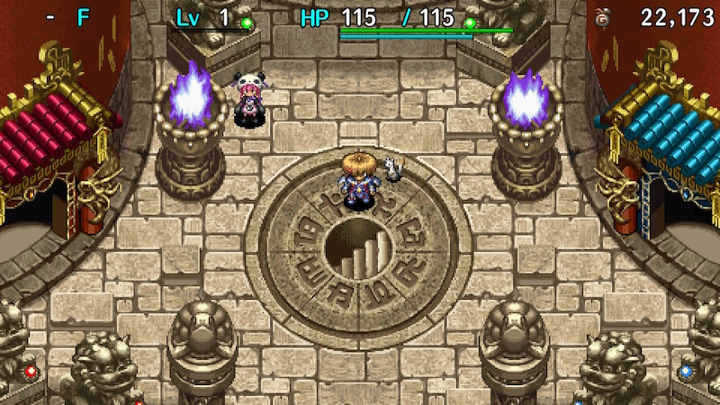
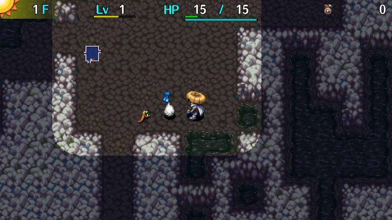
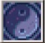

  

[Introduction]

<ul class="quickLinksUL">
  <li><a href="#overview">Overview</a></li>
  <li><a href="#strategy">Strategy</a></li>
  <li><a href="#monsters">Monsters</a></li>
  <li><a href="#items">Items</a></li>
  <li><a href="#traps">Traps</a></li>
</ul>

# Overview

<table class="dungeonOverview">
  <tr>
    <th>Unlock</th>
    <td class="highlightYellow">Wish to play a tougher dungeon in <a href="/shiren-5/dungeons/inori-cave">Inori Cave</a>.</td>
  </tr>
  <tr>
    <th>Entrance</th>
    <td class="highlightYellow">Tower of Fortune Entrance (Center stairs)</td>
  </tr>
</table>

<table class="dungeonTable">
  <tr>
    <th>Floors</th>
    <td>99F</td>
    <th>Day / Night</th>
    <td>Both</td>
  </tr>
  <tr>
    <th>Bring Items</th>
    <td>No</td>
    <th>Allies</th>
    <td>No</td>
  </tr>
  <tr>
    <th>Unidentified</th>
    <td>All categories</td>
    <th>New Items</th>
    <td>No</td>
  </tr>
  <tr>
    <th>Shops</th>
    <td>Regular, Elite, Pick-A-Choice</td>
    <th>Monster Houses</th>
    <td>Regular, Special, Sudden (3-99F)</td>
  </tr>
  <tr>
    <th>Initial Enemies</th>
    <td></td>
    <th>Spawn Rate</th>
    <td>30 day / 20 night</td>
  </tr>
  <tr>
    <th>Day Turns</th>
    <td>710 (620)</td>
    <th>Night Turns</th>
    <td>468 (410)</td>
  </tr>
  <tr>
    <th>Ominous aura</th>
    <td>Yes (700 turns)</td>
    <th>Wind of Kron</th>
    <td>1st: 1200 / 4th: 1500</td>
  </tr>
  <tr>
    <th>Clear Icon</th>
    <td class="clearIcon"></td>
    <th>Reward</th>
    <td>Full set of Catstones</td>
  </tr>
</table>

※ Numbers in () for day and night turns is when the warning is displayed.

# Strategy

<ul>
  <li><a href="#general">General</a></li>
  <li><a href="#abilities">Abilities</a></li>
  <li><a href="#identifying-items">Identifying Items</a></li>
  <li><a href="#equipment">Equipment</a></li>
  <li><a href="#other-items">Other Items</a></li>
  <li><a href="#farming">Farming</a></li>
  <li><a href="#floor-guide">Floor Guide</a></li>
</ul>

### General

### Abilities

[Note: This section will be expanded later]

Recommended sets:

#### 1. Crawling Electrocute

- Crawling Confusion
- Electrocute
- Stairlight
- Pot Party x 2
- Sticky Shot or Kaboom Bullet or Transmogrification x 3

#### 2. Crawling Electrocute + HP Recovery

- Crawling Confusion
- Electrocute
- Stairlight
- Room Healing Flash
- Pot Party x 2
- Kaboom Bullet or Transmogrification x 2

#### 3. No Crawling Electrocute

- Stairlight
- Chakra Cleanse
- Room Healing Flash or Self-Help
- Pot Party x 2
- Sticky Shot or Kaboom Bullet or Transmogrification x 3

### Identifying Items

### Equipment

### Other Items

### Farming

### Floor Guide

[Note: This section will be expanded later]

This section lists arrival and progressing times with the assumption you're using Fine Torches. Monsterphobic, Super Torches, and Navigation Scrolls can be used to progress at night until mid game if preferred.

The easiest strategy is to cycle time of day using items, and rush stairs at night. Powerful equipment like Day Shield and Dirk of Debts are shop exclusive and it's hard to upgrade equipment, so you likely won't be able to trade hits with late game monsters.

So all said, aim to progress at night for most of the dungeon after 16F. 
Use Transmogrification or search for floor items if you're running low on items.

#### Early Game

The road to Dark Mixers (14-16F), and the key is to avoid night if possible. 
Inventory space is limited, so prioritize shields with positive upgrade value as synthesis fodder.

##### 1-2F

Arrive: Day 
Progress: Day 

##### 3F

Arrive: Day 
Progress: Day

##### 4-6F

Arrive: Day 
Progress: Day

##### 7F

Arrive: Day or Night 
Progress: Day or Night

##### 8-9F

Arrive: Day or Night 
Progress: Day or Night

##### 10-13F

Arrive: Day 
Progress: Day or Night

##### 14-16F

Arrive: Day or Night 
Progress: Day or Night

#### Mid Game

Floor range where the focus is on collecting items. 
Aim for 3 Super Torches or a Monsterphobic before reaching late game.

##### 17-18F

Arrive: Day or Night 
Progress: Day

##### 19F

Arrive: Day or Night 
Progress: Night

##### 20-23F

Arrive: Day or Night 
Progress: Day

##### 24-25F

Arrive: Day 
Progress: Day or Night

##### 26-27F

Arrive: Night 
Progress: Night

##### 28-29F

Arrive: Night 
Progress: Night

##### 30F

Arrive: Night 
Progress: Night

##### 31-32F

Arrive: Day 
Progress: Day

##### 33-35F

Arrive: Day 
Progress: Day or Night

##### 36-37F

Arrive: Night 
Progress: Night

##### 38-39F

Arrive: Night 
Progress: Night

##### 40-43F

Arrive: Day or Night 
Progress: Both are dangerous

##### 44-46F

Arrive: Night 
Progress: Both are dangerous

##### 47-49F

Arrive: Night 
Progress: Night

##### 50-51F

Arrive: Day 
Progress: Day

#### Late Game

It's best to proceed at night with Super Torch or Monsterphobic. 
Check the monster table and inventory items to decide when to safely cycle time of day.

The deciding factor usually comes down to how you deal with Abyss Dragons (90-99F):

- Have Extinction Scroll
    - Basically don't need to worry, so progress like normal.
- Have Zen Pot
    - Wait for night on 88F, then dash to 95F to avoid Mesmerikons.
    - Use Zen Pot and cycle to night on 95F+ if it changes to day.
    - It's safe to cycle to night on 89-94F if you have an Immunity Scroll or Blessed Peach.
- Don't have Extinction Scroll or Zen Pot
    - Common case if you had bad luck or didn't farm enemies for item drops.
    - Wait for night on 88F, then don't stop until you reach the end.
    - Stairlight + Transient Staff + Swap Staff can be used to save time on 91-95F (no walls).
    - Can. Arm Bracelet + Swap Staff can be used on 96F+ too, so don't discard staves with 0 uses.

##### 52-54F

Arrive: Night 
Progress: Night

##### 55F

Arrive: Day or Night 
Progress: Day

##### 56-58F

Arrive: Night (Day with Steady Shield) 
Progress: Night (Day with Steady Shield)

##### 59-62F

Arrive: Night 
Progress: Day or Night

##### 63F

Arrive: Day or Night 
Progress: Day or Night

##### 64-66F

Arrive: Day (Night with Steady Shield or Crawling Confusion) 
Progress: Day (Night with Steady Shield or Crawling Confusion)

##### 67-68F

Arrive: Night 
Progress: Both are dangerous

##### 69-71F

Arrive: Night 
Progress: Day or Night

##### 72-74F

Arrive: Day 
Progress: Day

##### 75-76F

Arrive: Night 
Progress: Night

##### 77-78F

Arrive: Night 
Progress: Night

##### 79F

Arrive: Day or Night 
Progress: Day or Night

##### 80F

Arrive: Night 
Progress: Night

##### 81-82F

Arrive: Day or Night 
Progress: Both are dangerous

##### 83-85F

Arrive: Night 
Progress: Night

##### 86-87F

Arrive: Day (Night with Steady Shield or Crawling Confusion) 
Progress: Day (Night with Steady Shield or Crawling Confusion)

##### 88F

Arrive: Day 
Progress: Day

##### 89-91F

Arrive: Night 
Progress: Night

##### 92-94F

Arrive: Night 
Progress: Night

##### 95-96F

Arrive: Night 
Progress: Night

##### 97-99F

Arrive: Night 
Progress: Night

# Monsters

See [Monsters](/system/monsters) for individual monster details.

Floor Colors: Shop Water No Walls No Walls + Lava

Enemy Colors: Day Night Farming Useful Destroys Items Dangerous Very Dangerous

<table class="monsterTable">
  <thead>
    <tr>
      <th>F</th>
      <th colspan="6">Monsters</th>
    </tr>
  </thead>
  <tbody>
    <tr>
      <td rowspan="2">1</td>
      <td class="monsterDay">Mamel</td>
      <td class="monsterDay">Seedie</td>
      <td class="monsterDay">Sproutant</td>
      <td class="highlightGray"></td>
      <td class="highlightGray"></td>
      <td class="highlightGray"></td>
    </tr>
    <tr>
      <td class="monsterNight">Dark Mamel</td>
      <td class="monsterNight">Dark Bored Kappa</td>
      <td class="monsterNight">Evil Chintala</td>
      <td class="monsterNight">Bad Colum</td>
      <td class="monsterNight">Dark Boy Cart</td>
      <td class="highlightGray"></td>
    </tr>
    <tr>
      <td rowspan="2">2</td>
      <td class="monsterDay">Mamel</td>
      <td class="monsterDay">Seedie</td>
      <td class="monsterDay">Sproutant</td>
      <td class="monsterDay">Colum</td>
      <td class="farmingDay monsterDay">Chow</td>
      <td class="highlightGray"></td>
    </tr>
    <tr>
      <td class="monsterNight">Dark Mamel</td>
      <td class="monsterNight">Dark Bored Kappa</td>
      <td class="monsterNight">Evil Chintala</td>
      <td class="monsterNight">Bad Colum Evil PolySpinna</td>
      <td class="monsterNight">Dark Boy Cart</td>
      <td class="monsterNight">Putrid Sweet Nut</td>
    </tr>
    <tr>
      <td rowspan="2">3</td>
      <td class="usefulDay monsterDay">Pit Mamel</td>
      <td class="farmingDay monsterDay">Grass Kid</td>
      <td class="monsterDay">Sproutant Chintala</td>
      <td class="monsterDay">Colum Blade Bee</td>
      <td class="farmingDay monsterDay">Chow</td>
      <td class="highlightGray"></td>
    </tr>
    <tr>
      <td class="monsterNight">Dark Mamel</td>
      <td class="monsterNight">Dark Bored Kappa</td>
      <td class="monsterNight">Evil Chintala</td>
      <td class="monsterNight">Evil PolySpinna</td>
      <td class="monsterNight">Dark Naptapir Evil Hopodile</td>
      <td class="monsterNight">Putrid Sweet Nut Dark Tosser</td>
    </tr>
    <tr>
      <td rowspan="2">4</td>
      <td class="usefulDay monsterDay">Pit Mamel</td>
      <td class="farmingDay monsterDay">Grass Kid</td>
      <td class="monsterDay">Chintala</td>
      <td class="monsterDay">Blade Bee Sweet Nut</td>
      <td class="highlightGray"></td>
      <td class="highlightGray"></td>
    </tr>
    <tr>
      <td class="monsterNight">Dark Mamel</td>
      <td class="dangerNight monsterNight">Filthy Shagga</td>
      <td class="monsterNight">Dark Absorbiphant Violent Gyadon</td>
      <td class="monsterNight">Dark Karakuroid Sinful Yanpii</td>
      <td class="monsterNight">Dark Naptapir Evil Hopodile</td>
      <td class="monsterNight">Putrid Sweet Nut Dark Tosser</td>
    </tr>
    <tr>
      <td rowspan="2">5</td>
      <td class="usefulDay monsterDay">Pit Mamel</td>
      <td class="farmingDay monsterDay">Grass Kid</td>
      <td class="monsterDay">Chintala</td>
      <td class="monsterDay">Sweet Nut</td>
      <td class="highlightGray"></td>
      <td class="highlightGray"></td>
    </tr>
    <tr>
      <td class="monsterNight">Dark Mamel</td>
      <td class="dangerNight monsterNight">Filthy Shagga</td>
      <td class="monsterNight">Dark Absorbiphant Violent Gyadon</td>
      <td class="monsterNight">Dark Karakuroid Sinful Yanpii</td>
      <td class="monsterNight">Dark Field Knave</td>
      <td class="monsterNight">Dark Tosser</td>
    </tr>
    <tr>
      <td rowspan="2">6</td>
      <td class="usefulDay monsterDay">Karakuroid</td>
      <td class="monsterDay">Nigiri Baby</td>
      <td class="monsterDay">Moseal</td>
      <td class="monsterDay">Sweet Nut</td>
      <td class="farmingDay monsterDay">Froggo</td>
      <td class="highlightGray"></td>
    </tr>
    <tr>
      <td class="monsterNight">Dark Kumonigiri</td>
      <td class="monsterNight">Filthy Shagga Shady Mudkin</td>
      <td class="monsterNight">Evil Kid Squid Dark Myriman</td>
      <td class="monsterNight">Hell's Punisher Dark Flamebird</td>
      <td class="monsterNight">Dark Field Knave Sinister Porky</td>
      <td class="monsterNight">Dark Tosser Dark Pop Tank</td>
    </tr>
    <tr>
      <td rowspan="2">7</td>
      <td class="usefulDay monsterDay">Karakuroid</td>
      <td class="monsterDay">Nigiri Baby</td>
      <td class="monsterDay">Moseal</td>
      <td class="monsterDay">Sweet Nut</td>
      <td class="monsterDay">Froggo Tiger Tosser</td>
      <td class="monsterDay">Floaty</td>
    </tr>
    <tr>
      <td class="monsterNight">Dark Kumonigiri</td>
      <td class="monsterNight">Shady Mudkin</td>
      <td class="monsterNight">Evil Kid Squid</td>
      <td class="monsterNight">Hell's Punisher Dark Flamebird</td>
      <td class="monsterNight">Sinister Porky</td>
      <td class="monsterNight">Dark Pop Tank</td>
    </tr>
    <tr>
      <td rowspan="2">8</td>
      <td class="usefulDay monsterDay">Karakuroid</td>
      <td class="monsterDay">Nigiri Baby Curse Girl</td>
      <td class="monsterDay">Moseal Fearabbit</td>
      <td class="monsterDay">Sweet Nut Pop Tank</td>
      <td class="monsterDay">Tiger Tosser</td>
      <td class="monsterDay">Floaty</td>
    </tr>
    <tr>
      <td class="monsterNight">Dark Kumonigiri</td>
      <td class="monsterNight">Shady Mudkin</td>
      <td class="monsterNight">Plump Chow</td>
      <td class="monsterNight">Wicked Scoopie</td>
      <td class="monsterNight">Dark DJ Mage</td>
      <td class="highlightGray"></td>
    </tr>
    <tr>
      <td rowspan="2">9</td>
      <td class="monsterDay">Gyaza</td>
      <td class="itemDay monsterDay">Curse Girl</td>
      <td class="monsterDay">Fearabbit</td>
      <td class="monsterDay">Pop Tank</td>
      <td class="monsterDay">Tiger Tosser</td>
      <td class="highlightGray"></td>
    </tr>
    <tr>
      <td class="monsterNight">Foul Nigiri Baby</td>
      <td class="monsterNight">εFO-Uβ</td>
      <td class="monsterNight">Plump Chow</td>
      <td class="monsterNight">Wicked Scoopie Evil Gazer</td>
      <td class="monsterNight">Dark DJ Mage Dark Mutaikon</td>
      <td class="monsterNight">Dark Eligan Evil Floaty</td>
    </tr>
    <tr>
      <td rowspan="2">10</td>
      <td class="monsterDay">Gyaza</td>
      <td class="monsterDay">Pumphantasm</td>
      <td class="monsterDay">Naptapir</td>
      <td class="monsterDay">Pop Tank N'dubba</td>
      <td class="highlightGray"></td>
      <td class="highlightGray"></td>
    </tr>
    <tr>
      <td class="monsterNight">Foul Nigiri Baby</td>
      <td class="monsterNight">Dark N'dubba</td>
      <td class="monsterNight">Foul Curse Girl</td>
      <td class="monsterNight">Evil Gazer Evil Firepuff</td>
      <td class="monsterNight">Dark Mutaikon Evil Mid Chintala</td>
      <td class="monsterNight">Dark Eligan Evil Floaty</td>
    </tr>
    <tr>
      <td rowspan="2">11</td>
      <td class="monsterDay">Kumonigiri</td>
      <td class="monsterDay">Pumphantasm</td>
      <td class="monsterDay">Naptapir</td>
      <td class="monsterDay">N'dubba</td>
      <td class="monsterDay">Porky Mutaikon</td>
      <td class="highlightGray"></td>
    </tr>
    <tr>
      <td class="monsterNight">Foul Nigiri Baby</td>
      <td class="monsterNight">Dark N'dubba</td>
      <td class="monsterNight">Foul Curse Girl</td>
      <td class="monsterNight">Evil Firepuff</td>
      <td class="monsterNight">Evil Mid Chintala</td>
      <td class="highlightGray"></td>
    </tr>
    <tr>
      <td rowspan="2">12</td>
      <td class="monsterDay">Kumonigiri</td>
      <td class="monsterDay">Pumphantasm</td>
      <td class="monsterDay">Naptapir Metalhead</td>
      <td class="monsterDay">Swordsman Scorpion</td>
      <td class="monsterDay">Porky Mutaikon</td>
      <td class="monsterDay">Mudkin Myriman</td>
    </tr>
    <tr>
      <td class="monsterNight">Dark Blade Bee</td>
      <td class="monsterNight">Mean Cheer-Ham</td>
      <td class="monsterNight">Foul Curse Girl</td>
      <td class="monsterNight">Evil Firepuff</td>
      <td class="monsterNight">Evil Mid Chintala</td>
      <td class="highlightGray"></td>
    </tr>
    <tr>
      <td rowspan="2">13</td>
      <td class="monsterDay">Snacky</td>
      <td class="monsterDay">Cheer-Ham</td>
      <td class="monsterDay">Cololum</td>
      <td class="monsterDay">Swordsman Polygon Spinna</td>
      <td class="monsterDay">Mid Chintala FO-Uβ</td>
      <td class="monsterDay">Acrid Nut</td>
    </tr>
    <tr>
      <td class="monsterNight">Viloent Gyairas</td>
      <td class="monsterNight">Dark Grass Kid</td>
      <td class="monsterNight">Hateful Seedie</td>
      <td class="monsterNight">Bad Moseal</td>
      <td class="highlightGray"></td>
      <td class="highlightGray"></td>
    </tr>
    <tr>
      <td rowspan="2">14</td>
      <td class="monsterDay">Snacky</td>
      <td class="monsterDay">Cheer-Ham</td>
      <td class="monsterDay">Cololum</td>
      <td class="monsterDay">Polygon Spinna</td>
      <td class="monsterDay">Kid Squid</td>
      <td class="monsterDay">Acrid Nut</td>
    </tr>
    <tr>
      <td class="monsterNight">Viloent Gyairas</td>
      <td class="monsterNight">Dark Mixer</td>
      <td class="monsterNight">Evil Hipadile</td>
      <td class="monsterNight">Vile Sproutant</td>
      <td class="highlightGray"></td>
      <td class="highlightGray"></td>
    </tr>
    <tr>
      <td rowspan="2">15</td>
      <td class="monsterDay">Snacky</td>
      <td class="monsterDay">Cheer-Ham</td>
      <td class="monsterDay">Foly Field Knave</td>
      <td class="monsterDay">Bored Kappa</td>
      <td class="monsterDay">Kid Squid Momoseal</td>
      <td class="monsterDay">Acrid Nut</td>
    </tr>
    <tr>
      <td class="monsterNight">Viloent Gyairas</td>
      <td class="monsterNight">Dark Mixer</td>
      <td class="monsterNight">Evil Hipadile</td>
      <td class="monsterNight">Vile Sproutant</td>
      <td class="highlightGray"></td>
      <td class="highlightGray"></td>
    </tr>
    <tr>
      <td class="highlightNoWallsLava" rowspan="2">16</td>
      <td class="monsterDay">Dagger Bee</td>
      <td class="monsterDay">Hopodile</td>
      <td class="monsterDay">Foly Yanpii</td>
      <td class="monsterDay">Bored Kappa</td>
      <td class="monsterDay">Kid Squid Momoseal</td>
      <td class="monsterDay">Acrid Nut</td>
    </tr>
    <tr>
      <td class="monsterNight">Viloent Gyairas</td>
      <td class="monsterNight">Dark Mixer</td>
      <td class="monsterNight">Evil Hipadile</td>
      <td class="monsterNight">Vile Sproutant</td>
      <td class="monsterNight">Dark Pit Mamel</td>
      <td class="highlightGray"></td>
    </tr>
    <tr>
      <td class="highlightNoWallsLava" rowspan="2">17</td>
      <td class="monsterDay">Dagger Bee</td>
      <td class="monsterDay">Hopodile</td>
      <td class="monsterDay">Foly Yanpii</td>
      <td class="monsterDay">Bored Kappa Scoopie</td>
      <td class="monsterDay">Zalokleft Flamebird</td>
      <td class="monsterDay">Acrid Nut</td>
    </tr>
    <tr>
      <td class="monsterNight">Viloent Gyairas</td>
      <td class="monsterNight">Snide Froggo</td>
      <td class="monsterNight">Dark Cross Cart</td>
      <td class="monsterNight">Dark MC Mage</td>
      <td class="monsterNight">Dark Pit Mamel</td>
      <td class="monsterNight">Bad Cololum</td>
    </tr>
    <tr>
      <td class="highlightNoWallsLava" rowspan="2">18</td>
      <td class="monsterDay">Dagger Bee</td>
      <td class="monsterDay">Hopodile</td>
      <td class="monsterDay">Yanpii</td>
      <td class="monsterDay">Scoopie</td>
      <td class="monsterDay">Zalokleft Flamebird</td>
      <td class="monsterDay">Acrid Nut</td>
    </tr>
    <tr>
      <td class="monsterNight">Viloent Gyairas</td>
      <td class="monsterNight">Snide Froggo</td>
      <td class="monsterNight">Dark Cross Cart</td>
      <td class="monsterNight">Dark MC Mage</td>
      <td class="monsterNight">Dark Pit Mamel</td>
      <td class="monsterNight">Bad Cololum Dark Billman</td>
    </tr>
    <tr>
      <td class="highlightNoWallsLava" rowspan="2">19</td>
      <td class="monsterDay">DJ Mage</td>
      <td class="monsterDay">Eligan</td>
      <td class="monsterDay">Gazer?</td>
      <td class="monsterDay">Scoopie</td>
      <td class="monsterDay">Beanie</td>
      <td class="monsterDay">Boy Cart</td>
    </tr>
    <tr>
      <td class="monsterNight">Evil Super Gazer</td>
      <td class="monsterNight">Evil Dragon</td>
      <td class="monsterNight">Foul Nigiri Morph</td>
      <td class="monsterNight">Evil Gyaza</td>
      <td class="monsterNight">Dark Zapdon</td>
      <td class="highlightGray"></td>
    </tr>
    <tr>
      <td class="highlightNoWallsLava" rowspan="2">20</td>
      <td class="monsterDay">DJ Mage</td>
      <td class="monsterDay">Eligan</td>
      <td class="monsterDay">Gazer</td>
      <td class="monsterDay">Grass Dude</td>
      <td class="monsterDay">Beanie</td>
      <td class="monsterDay">Boy Cart Billman</td>
    </tr>
    <tr>
      <td class="monsterNight">Evil Super Gazer</td>
      <td class="monsterNight">Evil Dragon</td>
      <td class="monsterNight">Foul Nigiri Morph</td>
      <td class="monsterNight">Evil Gyaza</td>
      <td class="monsterNight">Dark Zapdon</td>
      <td class="highlightGray"></td>
    </tr>
    <tr>
      <td rowspan="2">21</td>
      <td class="monsterDay">DJ Mage</td>
      <td class="monsterDay">Eligan</td>
      <td class="monsterDay">Gazer</td>
      <td class="monsterDay">Grass Dude</td>
      <td class="monsterDay">Sproutyrant</td>
      <td class="monsterDay">Green Zalokleft</td>
    </tr>
    <tr>
      <td class="monsterNight">Filthy Nashagga</td>
      <td class="monsterNight">Evil Dragon</td>
      <td class="monsterNight">Dark Fearabbit</td>
      <td class="monsterNight">Evil Gyaza</td>
      <td class="monsterNight">Sinister Porko</td>
      <td class="highlightGray"></td>
    </tr>
    <tr>
      <td rowspan="2">22</td>
      <td class="monsterDay">Poofy</td>
      <td class="monsterDay">Steamroid</td>
      <td class="monsterDay">Nigiri Morph</td>
      <td class="monsterDay">Grass Dude</td>
      <td class="monsterDay">Sproutyrant</td>
      <td class="monsterDay">Green Zalokleft</td>
    </tr>
    <tr>
      <td class="monsterNight">Filthy Nashagga</td>
      <td class="monsterNight">Dark Hurler</td>
      <td class="monsterNight">Dark Fearabbit</td>
      <td class="monsterNight">Evil Explochin</td>
      <td class="monsterNight">Sinister Porko</td>
      <td class="monsterNight">Wicked Spadie Evil PolyShaka</td>
    </tr>
    <tr>
      <td rowspan="2">23</td>
      <td class="monsterDay">Poofy Snooztapir</td>
      <td class="monsterDay">Steamroid Absorbiphant</td>
      <td class="monsterDay">Nigiri Morph Grampa Tank</td>
      <td class="monsterDay">Froggucci Pandanigiri</td>
      <td class="monsterDay">Sproutyrant Gyadon</td>
      <td class="monsterDay">Green Zalokleft FO-U</td>
    </tr>
    <tr>
      <td class="monsterNight">Filthy Nashagga</td>
      <td class="monsterNight">Dark Hurler</td>
      <td class="monsterNight">Dark Digestiphant</td>
      <td class="monsterNight">Evil Explochin</td>
      <td class="monsterNight">Vile Pumphantasm</td>
      <td class="monsterNight">Wicked Spadie Evil PolyShaka</td>
    </tr>
    <tr>
      <td rowspan="2">24</td>
      <td class="monsterDay">Poofy Snooztapir</td>
      <td class="monsterDay">Absorbiphant</td>
      <td class="monsterDay">Grampa Tank</td>
      <td class="monsterDay">Froggucci Pandanigiri</td>
      <td class="monsterDay">Gyadon Ironhead</td>
      <td class="monsterDay">Squidfficial</td>
    </tr>
    <tr>
      <td class="monsterNight">Bad Zalokleft</td>
      <td class="monsterNight">Dark Hurler</td>
      <td class="monsterNight">Dark Digestiphant</td>
      <td class="monsterNight">Evil Squidfficial</td>
      <td class="monsterNight">Vile Pumphantasm</td>
      <td class="monsterNight">Sinful Sr. Yanpii Dark Snooztapir</td>
    </tr>
    <tr>
      <td class="highlightShop" rowspan="2">25</td>
      <td class="monsterDay">Hipadile</td>
      <td class="monsterDay">Absorbiphant</td>
      <td class="monsterDay">Punisher</td>
      <td class="monsterDay">Cursister</td>
      <td class="monsterDay">Ironhead</td>
      <td class="monsterDay">Squidfficial</td>
    </tr>
    <tr>
      <td class="monsterNight">Bad Zalokleft</td>
      <td class="monsterNight">Dark Kappa Pest</td>
      <td class="monsterNight">Evil Flamepuff</td>
      <td class="monsterNight">Evil Squidfficial</td>
      <td class="monsterNight">Dark Grampa Tank</td>
      <td class="monsterNight">Sinful Sr. Yanpii Dark Snooztapir</td>
    </tr>
    <tr>
      <td class="highlightWater" rowspan="2">26</td>
      <td class="monsterDay">Hipadile</td>
      <td class="monsterDay">Spadie</td>
      <td class="monsterDay">Punisher</td>
      <td class="monsterDay">Cursister Sr. Yanpii</td>
      <td class="monsterDay">Muddy</td>
      <td class="monsterDay">Firepuff Crow Tengu</td>
    </tr>
    <tr>
      <td class="monsterNight">εFO-U</td>
      <td class="monsterNight">Dark Kappa Pest</td>
      <td class="monsterNight">Evil Flamepuff</td>
      <td class="monsterNight">Dark Dazikon</td>
      <td class="monsterNight">Dark Grampa Tank</td>
      <td class="highlightGray"></td>
    </tr>
    <tr>
      <td class="highlightWater" rowspan="2">27</td>
      <td class="monsterDay">Hipadile</td>
      <td class="monsterDay">Spadie</td>
      <td class="monsterDay">Punisher Explochin</td>
      <td class="monsterDay">Sr. Yanpii</td>
      <td class="monsterDay">Muddy</td>
      <td class="monsterDay">Firepuff Crow Tengu</td>
    </tr>
    <tr>
      <td class="monsterNight">εFO-U</td>
      <td class="monsterNight">Plump Snacky</td>
      <td class="monsterNight">Bad Momoseal</td>
      <td class="monsterNight">Dark Dazikon</td>
      <td class="monsterNight">Dark Cave Mamel</td>
      <td class="highlightGray"></td>
    </tr>
    <tr>
      <td class="highlightWater" rowspan="2">28</td>
      <td class="monsterDay">Cross Cart</td>
      <td class="monsterDay">Spadie</td>
      <td class="monsterDay">Explochin</td>
      <td class="monsterDay">Sr. Yanpii</td>
      <td class="monsterDay">Muddy</td>
      <td class="monsterDay">Firepuff Crow Tengu</td>
    </tr>
    <tr>
      <td class="monsterNight">Vile Pumphantom</td>
      <td class="monsterNight">Plump Snacky</td>
      <td class="monsterNight">Bad Momoseal</td>
      <td class="highlightGray"></td>
      <td class="monsterNight">Dark Cave Mamel</td>
      <td class="highlightGray"></td>
    </tr>
    <tr>
      <td class="highlightWater" rowspan="2">29</td>
      <td class="monsterDay">Cross Cart</td>
      <td class="monsterDay">MC Mage</td>
      <td class="monsterDay">Explochin Kappa Pest</td>
      <td class="monsterDay">Digestiphant</td>
      <td class="monsterDay">Scarabbit</td>
      <td class="monsterDay">Go-Ham! Zapdon</td>
    </tr>
    <tr>
      <td class="monsterNight">Vile Pumphantom</td>
      <td class="monsterNight">Plump Snacky</td>
      <td class="monsterNight">Bad Momoseal Dark Dagger Bee</td>
      <td class="monsterNight">Dark Pandanigiri</td>
      <td class="monsterNight">Dark Cave Mamel Dark Sparkbird</td>
      <td class="highlightGray"></td>
    </tr>
    <tr>
      <td class="highlightWater" rowspan="2">30</td>
      <td class="monsterDay">N'twyn</td>
      <td class="monsterDay">MC Mage</td>
      <td class="monsterDay">Kappa Pest</td>
      <td class="monsterDay">Digestiphant</td>
      <td class="monsterDay">Scarabbit</td>
      <td class="monsterDay">Go-Ham! Zapdon</td>
    </tr>
    <tr>
      <td class="monsterNight">Dark N'twyn</td>
      <td class="monsterNight">Dark Grass Dude</td>
      <td class="monsterNight">Dark Dagger Bee</td>
      <td class="monsterNight">Dark Pandanigiri</td>
      <td class="monsterNight">Dark Sparkbird</td>
      <td class="highlightGray"></td>
    </tr>
    <tr>
      <td rowspan="2">31</td>
      <td class="monsterDay">N'twyn Porko</td>
      <td class="monsterDay">MC Mage Death Gyaza</td>
      <td class="monsterDay">Kappa Pest</td>
      <td class="monsterDay">Dragon</td>
      <td class="monsterDay">Katana Bee</td>
      <td class="highlightGray"></td>
    </tr>
    <tr>
      <td class="monsterNight">Dark N'twyn</td>
      <td class="monsterNight">Dark Grass Dude</td>
      <td class="extremeNight monsterNight">Dark MC Wizard</td>
      <td class="monsterNight">Evil Fencer</td>
      <td class="highlightGray"></td>
      <td class="highlightGray"></td>
    </tr>
    <tr>
      <td rowspan="2">32</td>
      <td class="monsterDay">Porko</td>
      <td class="monsterDay">Death Gyaza</td>
      <td class="highlightGray"></td>
      <td class="monsterDay">Dragon</td>
      <td class="monsterDay">Katana Bee</td>
      <td class="highlightGray"></td>
    </tr>
    <tr>
      <td class="monsterNight">Shady Mudster</td>
      <td class="monsterNight">Bad G. Zalokleft</td>
      <td class="extremeNight monsterNight">Dark MC Wizard</td>
      <td class="monsterNight">Evil Fencer</td>
      <td class="monsterNight">Evil Poofy Dark Pot Knave</td>
      <td class="monsterNight">Dark VeniScorp Hateful Beanie</td>
    </tr>
    <tr>
      <td rowspan="2">33</td>
      <td class="monsterDay">Porko</td>
      <td class="monsterDay">Death Gyaza</td>
      <td class="monsterDay">Pot Knave</td>
      <td class="monsterDay">Dragon</td>
      <td class="monsterDay">Katana Bee</td>
      <td class="highlightGray"></td>
    </tr>
    <tr>
      <td class="monsterNight">Shady Mudster</td>
      <td class="monsterNight">Bad G. Zalokleft</td>
      <td class="monsterNight">Evil Death Gyaza</td>
      <td class="monsterNight">Evil Fencer</td>
      <td class="monsterNight">Evil Poofy Dark Pot Knave</td>
      <td class="monsterNight">Dark VeniScorp Hateful Beanie</td>
    </tr>
    <tr>
      <td rowspan="2">34</td>
      <td class="monsterDay">Shagga</td>
      <td class="monsterDay">Flamepuff</td>
      <td class="monsterDay">Pot Knave Falcon Tengu</td>
      <td class="monsterDay">Pumphantom</td>
      <td class="monsterDay">Dazikon</td>
      <td class="monsterDay">Polygon Shaka</td>
    </tr>
    <tr>
      <td class="monsterNight">Shady Mudster</td>
      <td class="monsterNight">Evil Sky Dragon</td>
      <td class="monsterNight">Evil Death Gyaza</td>
      <td class="monsterNight">Dark Eligagan</td>
      <td class="monsterNight">Evil Poofy Hell's Debaser</td>
      <td class="monsterNight">Bad Falcon Tengu</td>
    </tr>
    <tr>
      <td rowspan="2">35</td>
      <td class="monsterDay">Shagga</td>
      <td class="monsterDay">Flamepuff</td>
      <td class="monsterDay">Falcon Tengu</td>
      <td class="monsterDay">Pumphantom VeniScorp</td>
      <td class="monsterDay">Dazikon</td>
      <td class="monsterDay">Polygon Shaka Cave Mamel</td>
    </tr>
    <tr>
      <td class="monsterNight">Putrid Acrid Nut</td>
      <td class="monsterNight">Evil Sky Dragon</td>
      <td class="monsterNight">Foul Cursister</td>
      <td class="monsterNight">Dark Eligagan</td>
      <td class="monsterNight">Hell's Debaser</td>
      <td class="monsterNight">Bad Falcon Tengu</td>
    </tr>
    <tr>
      <td rowspan="2">36</td>
      <td class="monsterDay">Shagga</td>
      <td class="monsterDay">Flamepuff Grass Poppa</td>
      <td class="monsterDay">Falcon Tengu</td>
      <td class="monsterDay">VeniScorp</td>
      <td class="monsterDay">Tiger Hurler</td>
      <td class="monsterDay">Cave Mamel</td>
    </tr>
    <tr>
      <td class="monsterNight">Putrid Acrid Nut</td>
      <td class="monsterNight">Evil Sky Dragon</td>
      <td class="monsterNight">Foul Cursister</td>
      <td class="monsterNight">Dark Eligagan? Dark Steamroid</td>
      <td class="monsterNight">Hell's Debaser? Snide Froggucci</td>
      <td class="monsterNight">Bad Falcon Tengu</td>
    </tr>
    <tr>
      <td rowspan="2">37</td>
      <td class="extremeDay monsterDay">MC Wizard</td>
      <td class="monsterDay">Grass Poppa</td>
      <td class="highlightGray"></td>
      <td class="monsterDay">VeniScorp</td>
      <td class="monsterDay">Tiger Hurler</td>
      <td class="highlightGray"></td>
    </tr>
    <tr>
      <td class="monsterNight">Putrid Acrid Nut</td>
      <td class="monsterNight">Bad Colocolum</td>
      <td class="monsterNight">Mean Go-Ham!</td>
      <td class="monsterNight">Dark Steamroid</td>
      <td class="monsterNight">Snide Froggucci</td>
      <td class="highlightGray"></td>
    </tr>
    <tr>
      <td rowspan="2">38</td>
      <td class="extremeDay monsterDay">MC Wizard</td>
      <td class="monsterDay">Grass Poppa</td>
      <td class="monsterDay">Huistdon</td>
      <td class="monsterDay">Eligagan</td>
      <td class="monsterDay">Tiger Hurler Gyairas</td>
      <td class="highlightGray"></td>
    </tr>
    <tr>
      <td class="monsterNight">Putrid Acrid Nut</td>
      <td class="monsterNight">Bad Colocolum</td>
      <td class="monsterNight">Mean Go-Ham!</td>
      <td class="monsterNight">Vile Sproutyrant</td>
      <td class="monsterNight">Dark Mixermon</td>
      <td class="monsterNight">Dark Ironhead</td>
    </tr>
    <tr>
      <td rowspan="2">39</td>
      <td class="monsterDay">Sparkbird</td>
      <td class="highlightGray"></td>
      <td class="monsterDay">Huistdon</td>
      <td class="monsterDay">Eligagan</td>
      <td class="monsterDay">Gyairas</td>
      <td class="highlightGray"></td>
    </tr>
    <tr>
      <td class="monsterNight">Putrid Acrid Nut</td>
      <td class="monsterNight">Evil Concusschin</td>
      <td class="monsterNight">Wicked Trowelie</td>
      <td class="monsterNight">Vile Sproutyrant</td>
      <td class="monsterNight">Dark Mixermon</td>
      <td class="monsterNight">Dark Ironhead</td>
    </tr>
    <tr>
      <td rowspan="2">40</td>
      <td class="monsterDay">Sparkbird</td>
      <td class="monsterDay">Momomoseal</td>
      <td class="monsterDay">Huistdon</td>
      <td class="monsterDay">Eligagan</td>
      <td class="highlightGray"></td>
      <td class="highlightGray"></td>
    </tr>
    <tr>
      <td class="monsterNight">Putrid Acrid Nut</td>
      <td class="monsterNight">Evil Concusschin</td>
      <td class="monsterNight">Wicked Trowelie</td>
      <td class="monsterNight">Vile Sproutyrant</td>
      <td class="monsterNight">Dark Chucker</td>
      <td class="monsterNight">Dark Trillman</td>
    </tr>
    <tr>
      <td rowspan="2">41</td>
      <td class="monsterDay">Sky Dragon</td>
      <td class="monsterDay">Momomoseal</td>
      <td class="monsterDay">Huistdon Steelhead</td>
      <td class="monsterDay">Fencer</td>
      <td class="highlightGray"></td>
      <td class="highlightGray"></td>
    </tr>
    <tr>
      <td class="monsterNight">Putrid Acrid Nut</td>
      <td class="monsterNight">Vile Pumpanshee</td>
      <td class="monsterNight">Wicked Trowelie</td>
      <td class="monsterNight">Sinister Porkon</td>
      <td class="monsterNight">Dark Chucker</td>
      <td class="monsterNight">Dark Scarabbit</td>
    </tr>
    <tr>
      <td rowspan="2">42</td>
      <td class="monsterDay">Sky Dragon</td>
      <td class="monsterDay">Momomoseal</td>
      <td class="monsterDay">Steelhead</td>
      <td class="monsterDay">Fencer</td>
      <td class="highlightGray"></td>
      <td class="highlightGray"></td>
    </tr>
    <tr>
      <td class="monsterNight">Putrid Acrid Nut</td>
      <td class="monsterNight">Vile Pumpanshee</td>
      <td class="monsterNight">Evil Blazepuff</td>
      <td class="monsterNight">Sinister Porkon</td>
      <td class="monsterNight">Dark Chucker</td>
      <td class="monsterNight">Dark Scarabbit</td>
    </tr>
    <tr>
      <td rowspan="2">43</td>
      <td class="monsterDay">Sky Dragon</td>
      <td class="monsterDay">Momomoseal</td>
      <td class="monsterDay">Steelhead</td>
      <td class="monsterDay">Fencer</td>
      <td class="monsterDay">Nashagga</td>
      <td class="monsterDay">FO-UZ</td>
    </tr>
    <tr>
      <td class="monsterNight">Putrid Acrid Nut</td>
      <td class="monsterNight">Vile Pumpanshee</td>
      <td class="monsterNight">Evil Blazepuff</td>
      <td class="monsterNight">Sinister Porkon</td>
      <td class="highlightGray"></td>
      <td class="highlightGray"></td>
    </tr>
    <tr>
      <td rowspan="2">44</td>
      <td class="monsterDay">Spicy Nut</td>
      <td class="monsterDay">Nigiri Boss</td>
      <td class="monsterDay">Rally Ham</td>
      <td class="monsterDay">Fencer Concusschin</td>
      <td class="monsterDay">Nashagga</td>
      <td class="monsterDay">Nuttie King Squid</td>
    </tr>
    <tr>
      <td class="extremeNight monsterNight">Dark Ornery Tank</td>
      <td class="monsterNight">Dark Spongiderm</td>
      <td class="monsterNight">Dark Doztapir</td>
      <td class="monsterNight">Dark Steamroid</td>
      <td class="highlightGray"></td>
      <td class="highlightGray"></td>
    </tr>
    <tr>
      <td rowspan="2">45</td>
      <td class="monsterDay">Spicy Nut</td>
      <td class="monsterDay">Nigiri Boss MC Wizard</td>
      <td class="monsterDay">Rally Ham</td>
      <td class="monsterDay">Concusschin Big Chintala</td>
      <td class="monsterDay">Nashagga Munchy</td>
      <td class="monsterDay">Nuttie King Squid</td>
    </tr>
    <tr>
      <td class="extremeNight monsterNight">Dark Ornery Tank</td>
      <td class="monsterNight">Dark Spongiderm</td>
      <td class="monsterNight">Dark Doztapir Evil Hyper Gazer</td>
      <td class="monsterNight">Dark Steamroid Bad Colocolum</td>
      <td class="monsterNight">Mean Go-Ham!</td>
      <td class="monsterNight">Plump Munchy</td>
    </tr>
    <tr>
      <td class="highlightWater" rowspan="2">46</td>
      <td class="monsterDay">Spicy Nut</td>
      <td class="extremeDay monsterDay">MC Wizard</td>
      <td class="monsterDay">Rally Ham Oingodile</td>
      <td class="monsterDay">Concusschin Big Chintala</td>
      <td class="monsterDay">Munchy Blazepuff</td>
      <td class="monsterDay">Nuttie Gyairas</td>
    </tr>
    <tr>
      <td class="extremeNight monsterNight">Dark Ornery Tank</td>
      <td class="monsterNight">Dark Spongiderm</td>
      <td class="monsterNight">Evil Hyper Gazer</td>
      <td class="monsterNight">Bad Colocolum Violent Gyandora</td>
      <td class="monsterNight">Mean Go-Ham! Dark Mixermon</td>
      <td class="monsterNight">Plump Munchy</td>
    </tr>
    <tr>
      <td class="highlightWater" rowspan="2">47</td>
      <td class="monsterDay">Spicy Nut</td>
      <td class="extremeDay monsterDay">Ornery Tank</td>
      <td class="monsterDay">Oingodile</td>
      <td class="monsterDay">Super Gazer</td>
      <td class="monsterDay">Blazepuff Trowelie</td>
      <td class="monsterDay">Gyairas Eagle Tengu</td>
    </tr>
    <tr>
      <td class="monsterNight">Evil Concusschin</td>
      <td class="monsterNight">Dark Katana Bee</td>
      <td class="monsterNight">Dark Huistdon</td>
      <td class="monsterNight">Violent Gyandora</td>
      <td class="monsterNight">Dark Mixermon</td>
      <td class="highlightGray"></td>
    </tr>
    <tr>
      <td class="highlightWater" rowspan="2">48</td>
      <td class="monsterDay">Spicy Nut</td>
      <td class="extremeDay monsterDay">Ornery Tank</td>
      <td class="monsterDay">Oingodile</td>
      <td class="monsterDay">Super Gazer</td>
      <td class="monsterDay">Blazepuff Trowelie</td>
      <td class="monsterDay">Eagle Tengu Colocolum</td>
    </tr>
    <tr>
      <td class="monsterNight">Evil Concusschin</td>
      <td class="monsterNight">Dark Katana Bee</td>
      <td class="monsterNight">Dark Huistdon</td>
      <td class="monsterNight">εFO-UZ</td>
      <td class="highlightGray"></td>
      <td class="highlightGray"></td>
    </tr>
    <tr>
      <td class="highlightWater" rowspan="2">49</td>
      <td class="monsterDay">Spicy Nut</td>
      <td class="extremeDay monsterDay">Ornery Tank</td>
      <td class="monsterDay">Strong Cart</td>
      <td class="monsterDay">Super Gazer Porkon</td>
      <td class="monsterDay">Trowelie Electroid</td>
      <td class="monsterDay">Eagle Tengu Colocolum</td>
    </tr>
    <tr>
      <td class="monsterNight">Evil Sensei</td>
      <td class="monsterNight">Dark Item Knave</td>
      <td class="monsterNight">Hateful Nuttie</td>
      <td class="monsterNight">εFO-UZ</td>
      <td class="highlightGray"></td>
      <td class="highlightGray"></td>
    </tr>
    <tr>
      <td class="highlightWater" rowspan="2">50</td>
      <td class="monsterDay">Doztapir</td>
      <td class="monsterDay">N'mach</td>
      <td class="monsterDay">Strong Cart</td>
      <td class="monsterDay">Porkon</td>
      <td class="monsterDay">Electroid</td>
      <td class="monsterDay">Colocolum</td>
    </tr>
    <tr>
      <td class="monsterNight">Evil Sensei</td>
      <td class="monsterNight">Dark Item Knave</td>
      <td class="monsterNight">Hateful Nuttie</td>
      <td class="monsterNight">Dark N'mach</td>
      <td class="monsterNight">Dark Vexing Kappa</td>
      <td class="monsterNight">Evil Squidfficial</td>
    </tr>
    <tr>
      <td class="highlightShop" rowspan="2">51</td>
      <td class="monsterDay">Doztapir</td>
      <td class="monsterDay">N'mach</td>
      <td class="monsterDay">Strong Cart</td>
      <td class="monsterDay">Jouncy</td>
      <td class="monsterDay">Debaser</td>
      <td class="highlightGray"></td>
    </tr>
    <tr>
      <td class="monsterNight">Evil Hell Gyaza</td>
      <td class="highlightGray"></td>
      <td class="highlightGray"></td>
      <td class="monsterNight">Dark N'mach</td>
      <td class="monsterNight">Dark Vexing Kappa</td>
      <td class="monsterNight">Evil Squidfficial</td>
    </tr>
    <tr>
      <td rowspan="2">52</td>
      <td class="monsterDay">Doztapir</td>
      <td class="monsterDay">MC Sorceror</td>
      <td class="monsterDay">Vexing Kappa</td>
      <td class="monsterDay">Jouncy</td>
      <td class="monsterDay">Debaser</td>
      <td class="monsterDay">Sprouterror</td>
    </tr>
    <tr>
      <td class="monsterNight">Evil Hell Gyaza</td>
      <td class="monsterNight">Evil PolySinga</td>
      <td class="monsterNight">Dark Flarebird</td>
      <td class="highlightGray"></td>
      <td class="highlightGray"></td>
      <td class="highlightGray"></td>
    </tr>
    <tr>
      <td rowspan="2">53</td>
      <td class="monsterDay">Mudster</td>
      <td class="monsterDay">MC Sorceror</td>
      <td class="monsterDay">Vexing Kappa</td>
      <td class="monsterDay">Jouncy</td>
      <td class="monsterDay">Debaser</td>
      <td class="monsterDay">Sprouterror Trillman</td>
    </tr>
    <tr>
      <td class="monsterNight">Evil Hell Gyaza</td>
      <td class="monsterNight">Evil PolySinga</td>
      <td class="monsterNight">Dark Flarebird</td>
      <td class="monsterNight">Dark Eligagon</td>
      <td class="monsterNight">Dark Grass Poppa</td>
      <td class="monsterNight">Sinful Lt. Yanpii</td>
    </tr>
    <tr>
      <td rowspan="2">54</td>
      <td class="monsterDay">Mudster</td>
      <td class="monsterDay">MC Sorceror Pyrepuff</td>
      <td class="monsterDay">Pierce Cart</td>
      <td class="monsterDay">Jouncy StunScorp</td>
      <td class="monsterDay">Debaser</td>
      <td class="highlightGray"></td>
    </tr>
    <tr>
      <td class="monsterNight">Evil Big Chintala</td>
      <td class="monsterNight">Dark Strong Cart</td>
      <td class="highlightGray"></td>
      <td class="monsterNight">Dark Eligagon</td>
      <td class="monsterNight">Dark Grass Poppa</td>
      <td class="monsterNight">Sinful Lt. Yanpii</td>
    </tr>
    <tr>
      <td rowspan="2">55</td>
      <td class="monsterDay">Tiger Chucker</td>
      <td class="monsterDay">Pyrepuff</td>
      <td class="monsterDay">Pierce Cart</td>
      <td class="monsterDay">StunScorp</td>
      <td class="highlightGray"></td>
      <td class="highlightGray"></td>
    </tr>
    <tr>
      <td class="monsterNight">Evil Big Chintala</td>
      <td class="monsterNight">Dark Strong Cart</td>
      <td class="extremeNight monsterNight">Dark Dozikon</td>
      <td class="monsterNight">Vile Sprouterror</td>
      <td class="monsterNight">Dark Grass Poppa</td>
      <td class="monsterNight">Sinful Lt. Yanpii</td>
    </tr>
    <tr>
      <td class="highlightNoWallsLava" rowspan="2">56</td>
      <td class="monsterDay">Tiger Chucker Pumpanshee</td>
      <td class="extremeDay monsterDay">Horrabbit</td>
      <td class="monsterDay">Pierce Cart</td>
      <td class="monsterDay">Curspinster</td>
      <td class="monsterDay">Momomomoseal</td>
      <td class="highlightGray"></td>
    </tr>
    <tr>
      <td class="monsterNight">Evil Big Chintala</td>
      <td class="monsterNight">Dark Strong Cart</td>
      <td class="extremeNight monsterNight">Dark Dozikon</td>
      <td class="monsterNight">Vile Sprouterror</td>
      <td class="extremeNight monsterNight">Evil Archdragon</td>
      <td class="monsterNight">Dark StunScorp</td>
    </tr>
    <tr>
      <td class="highlightNoWallsLava" rowspan="2">57</td>
      <td class="monsterDay">Tiger Chucker Pumpanshee</td>
      <td class="extremeDay monsterDay">Horrabbit</td>
      <td class="monsterDay">Spongiderm</td>
      <td class="monsterDay">Curspinster</td>
      <td class="monsterDay">Momomomoseal</td>
      <td class="monsterDay">Froggon</td>
    </tr>
    <tr>
      <td class="monsterNight">Putrid Spicy Nut</td>
      <td class="monsterNight">Evil Jouncy</td>
      <td class="monsterNight">Mean Rally Ham</td>
      <td class="monsterNight">Vile Sprouterror Snide Froggon</td>
      <td class="extremeNight monsterNight">Evil Archdragon</td>
      <td class="monsterNight">Dark StunScorp</td>
    </tr>
    <tr>
      <td class="highlightNoWallsLava" rowspan="2">58</td>
      <td class="monsterDay">Lashagga Pumpanshee</td>
      <td class="extremeDay monsterDay">Horrabbit</td>
      <td class="monsterDay">Spongiderm</td>
      <td class="monsterDay">Curspinster</td>
      <td class="monsterDay">Momomomoseal</td>
      <td class="monsterDay">Froggon</td>
    </tr>
    <tr>
      <td class="monsterNight">Putrid Spicy Nut</td>
      <td class="monsterNight">Evil Jouncy</td>
      <td class="monsterNight">Mean Rally Ham</td>
      <td class="monsterNight">Snide Froggon</td>
      <td class="monsterNight">Foul Nigiri Boss</td>
      <td class="monsterNight">Dark Steelhead</td>
    </tr>
    <tr>
      <td class="highlightNoWallsLava" rowspan="2">59</td>
      <td class="monsterDay">Lashagga</td>
      <td class="monsterDay">Item Knave</td>
      <td class="monsterDay">Spongiderm</td>
      <td class="monsterDay">Iron Zalokleft</td>
      <td class="monsterDay">Gyandora</td>
      <td class="monsterDay">Froggon Lt. Yanpii</td>
    </tr>
    <tr>
      <td class="monsterNight">Putrid Spicy Nut</td>
      <td class="monsterNight">Evil Jouncy Shady Mudder</td>
      <td class="monsterNight">Mean Rally Ham Evil Fulminachin</td>
      <td class="monsterNight">Snide Froggon</td>
      <td class="monsterNight">Foul Nigiri Boss</td>
      <td class="monsterNight">Dark Steelhead Hell's Ruiner</td>
    </tr>
    <tr>
      <td class="highlightNoWallsLava" rowspan="2">60</td>
      <td class="monsterDay">Lashagga</td>
      <td class="monsterDay">Item Knave</td>
      <td class="monsterDay">Zanbeeto</td>
      <td class="monsterDay">Iron Zalokleft</td>
      <td class="monsterDay">Gyandora</td>
      <td class="monsterDay">Lt. Yanpii</td>
    </tr>
    <tr>
      <td class="monsterNight">Putrid Spicy Nut</td>
      <td class="monsterNight">Shady Mudder</td>
      <td class="monsterNight">Evil Fulminachin</td>
      <td class="monsterNight">Dark Mixerdon</td>
      <td class="monsterNight">Plump Mealy Evil Oingodile</td>
      <td class="monsterNight">Dark Steelhead Hell's Ruiner</td>
    </tr>
    <tr>
      <td rowspan="2">61</td>
      <td class="monsterDay">Polygon Singa</td>
      <td class="monsterDay">Flarebird</td>
      <td class="monsterDay">Zanbeeto</td>
      <td class="monsterDay">Bunchukdon</td>
      <td class="monsterDay">Grass Gramps</td>
      <td class="monsterDay">Lt. Yanpii</td>
    </tr>
    <tr>
      <td class="monsterNight">Putrid Spicy Nut</td>
      <td class="monsterNight">Evil Pyrepuff</td>
      <td class="monsterNight">Foul Curspinster</td>
      <td class="monsterNight">Dark Mixerdon</td>
      <td class="monsterNight">Plump Mealy Evil Oingodile</td>
      <td class="monsterNight">Evil King Squid</td>
    </tr>
    <tr>
      <td rowspan="2">62</td>
      <td class="monsterDay">Polygon Singa</td>
      <td class="monsterDay">Flarebird</td>
      <td class="monsterDay">Sensei</td>
      <td class="monsterDay">Bunchukdon</td>
      <td class="monsterDay">Grass Gramps</td>
      <td class="highlightGray"></td>
    </tr>
    <tr>
      <td class="monsterNight">Putrid Spicy Nut</td>
      <td class="monsterNight">Evil Pyrepuff</td>
      <td class="monsterNight">Foul Curspinster</td>
      <td class="monsterNight">Dark Mixerdon</td>
      <td class="monsterNight">Bad Momomoseal</td>
      <td class="monsterNight">Evil King Squid</td>
    </tr>
    <tr>
      <td rowspan="2">63</td>
      <td class="monsterDay">Polygon Singa</td>
      <td class="monsterDay">Flarebird</td>
      <td class="monsterDay">Sensei</td>
      <td class="monsterDay">Bunchukdon Bouncy</td>
      <td class="monsterDay">Spirit Ham</td>
      <td class="highlightGray"></td>
    </tr>
    <tr>
      <td class="monsterNight">Putrid Spicy Nut</td>
      <td class="monsterNight">Evil Pyrepuff</td>
      <td class="monsterNight">Foul Curspinster</td>
      <td class="monsterNight">Dark Electroid</td>
      <td class="monsterNight">Bad Momomoseal</td>
      <td class="highlightGray"></td>
    </tr>
    <tr>
      <td rowspan="2">64</td>
      <td class="monsterDay">Bitter Nut</td>
      <td class="monsterDay">Onigirizzly</td>
      <td class="monsterDay">Sensei</td>
      <td class="monsterDay">Bouncy</td>
      <td class="monsterDay">Spirit Ham</td>
      <td class="highlightGray"></td>
    </tr>
    <tr>
      <td class="extremeNight monsterNight">Dark Horrabbit</td>
      <td class="monsterNight">Vile Pumptergeist</td>
      <td class="monsterNight">Bad I. Zalokleft</td>
      <td class="monsterNight">Dark Electroid</td>
      <td class="monsterNight">Bad Momomoseal</td>
      <td class="highlightGray"></td>
    </tr>
    <tr>
      <td rowspan="2">65</td>
      <td class="monsterDay">Bitter Nut</td>
      <td class="monsterDay">Onigirizzly</td>
      <td class="monsterDay">Hyper Gazer</td>
      <td class="monsterDay">Bouncy</td>
      <td class="monsterDay">Spirit Ham Fulminachin</td>
      <td class="highlightGray"></td>
    </tr>
    <tr>
      <td class="extremeNight monsterNight">Dark Horrabbit</td>
      <td class="monsterNight">Vile Pumptergeist</td>
      <td class="monsterNight">Bad I. Zalokleft</td>
      <td class="monsterNight">Dark Onigirizzly</td>
      <td class="monsterNight">Dark Googoman</td>
      <td class="highlightGray"></td>
    </tr>
    <tr>
      <td class="highlightWater" rowspan="2">66</td>
      <td class="monsterDay">Bitter Nut</td>
      <td class="extremeDay monsterDay">Archdragon</td>
      <td class="monsterDay">Hyper Gazer</td>
      <td class="monsterDay">Bouncy</td>
      <td class="monsterDay">Fulminachin Phoenix Tengu</td>
      <td class="highlightGray"></td>
    </tr>
    <tr>
      <td class="extremeNight monsterNight">Dark Horrabbit</td>
      <td class="monsterNight">Vile Pumptergeist</td>
      <td class="monsterNight">Bad I. Zalokleft</td>
      <td class="monsterNight">Dark Onigirizzly Bad Eagle Tengu</td>
      <td class="monsterNight">Dark Googoman Dark Ace</td>
      <td class="highlightGray"></td>
    </tr>
    <tr>
      <td class="highlightWater" rowspan="2">67</td>
      <td class="monsterDay">Bitter Nut</td>
      <td class="extremeDay monsterDay">Archdragon</td>
      <td class="monsterDay">Hyper Gazer</td>
      <td class="extremeDay monsterDay">Dozikon</td>
      <td class="monsterDay">Phoenix Tengu</td>
      <td class="highlightGray"></td>
    </tr>
    <tr>
      <td class="extremeNight monsterNight">Dark MC Sorceror</td>
      <td class="monsterNight">Bad Colocolocolum</td>
      <td class="monsterNight">Violent Gyandoron</td>
      <td class="monsterNight">Dark Onigirizzly Bad Eagle Tengu</td>
      <td class="monsterNight">Dark Googoman Dark Ace</td>
      <td class="highlightGray"></td>
    </tr>
    <tr>
      <td class="highlightWater" rowspan="2">68</td>
      <td class="monsterDay">Bitter Nut</td>
      <td class="extremeDay monsterDay">Archdragon</td>
      <td class="monsterDay">Comatapir</td>
      <td class="extremeDay monsterDay">Dozikon</td>
      <td class="monsterDay">Phoenix Tengu Grainie</td>
      <td class="highlightGray"></td>
    </tr>
    <tr>
      <td class="extremeNight monsterNight">Dark MC Sorceror</td>
      <td class="monsterNight">Bad Colocolocolum</td>
      <td class="monsterNight">Violent Gyandoron</td>
      <td class="monsterNight">Bad Eagle Tengu</td>
      <td class="monsterNight">Evil PolyStunna</td>
      <td class="highlightGray"></td>
    </tr>
    <tr>
      <td class="highlightWater" rowspan="2">69</td>
      <td class="monsterDay">Bitter Nut</td>
      <td class="monsterDay">Mudder</td>
      <td class="monsterDay">Comatapir</td>
      <td class="highlightGray"></td>
      <td class="monsterDay">Grainie</td>
      <td class="highlightGray"></td>
    </tr>
    <tr>
      <td class="extremeNight monsterNight">Dark MC Sorceror</td>
      <td class="monsterNight">Bad Colocolocolum</td>
      <td class="monsterNight">Violent Gyandoron?</td>
      <td class="monsterNight">Filthy Lashagga</td>
      <td class="monsterNight">Evil PolyStunna</td>
      <td class="highlightGray"></td>
    </tr>
    <tr>
      <td class="highlightWater" rowspan="2">70</td>
      <td class="monsterDay">N'dup</td>
      <td class="monsterDay">Mudder</td>
      <td class="monsterDay">Hell Gyaza</td>
      <td class="monsterDay">Huge Chintala</td>
      <td class="monsterDay">Grainie</td>
      <td class="highlightGray"></td>
    </tr>
    <tr>
      <td class="monsterNight">Dark N'dup</td>
      <td class="monsterNight">Sinister Porgon</td>
      <td class="monsterNight">Dark Comatapir</td>
      <td class="monsterNight">Filthy Lashagga</td>
      <td class="highlightGray"></td>
      <td class="highlightGray"></td>
    </tr>
    <tr>
      <td rowspan="2">71</td>
      <td class="monsterDay">N'dup</td>
      <td class="monsterDay">Mudder</td>
      <td class="monsterDay">Hell Gyaza</td>
      <td class="monsterDay">Huge Chintala</td>
      <td class="monsterDay">Eligagon</td>
      <td class="highlightGray"></td>
    </tr>
    <tr>
      <td class="monsterNight">Dark N'dup</td>
      <td class="monsterNight">Sinister Porgon</td>
      <td class="monsterNight">Dark Comatapir</td>
      <td class="monsterNight">Dark Zanbeeto</td>
      <td class="monsterNight">Wicked Shovelie</td>
      <td class="highlightGray"></td>
    </tr>
    <tr>
      <td rowspan="2">72</td>
      <td class="monsterDay">N'dup</td>
      <td class="monsterDay">Mudder</td>
      <td class="monsterDay">Hell Gyaza Cyberoid</td>
      <td class="monsterDay">Huge Chintala</td>
      <td class="monsterDay">Eligagon</td>
      <td class="monsterDay">FO-UZZ</td>
    </tr>
    <tr>
      <td class="monsterNight">Dark Osmammoth</td>
      <td class="monsterNight">Dark Pierce Cart</td>
      <td class="highlightGray"></td>
      <td class="monsterNight">Dark Zanbeeto</td>
      <td class="monsterNight">Wicked Shovelie</td>
      <td class="highlightGray"></td>
    </tr>
    <tr>
      <td rowspan="2">73</td>
      <td class="monsterDay">N'dup</td>
      <td class="monsterDay">Cursenior</td>
      <td class="monsterDay">Cyberoid</td>
      <td class="monsterDay">Detonachin</td>
      <td class="monsterDay">Eligagon</td>
      <td class="monsterDay">FO-UZZ</td>
    </tr>
    <tr>
      <td class="monsterNight">Dark Osmammoth</td>
      <td class="monsterNight">Dark Pierce Cart</td>
      <td class="extremeNight monsterNight">Evil Ultra Gazer</td>
      <td class="monsterNight">Evil Huge Chintala</td>
      <td class="monsterNight">Evil Doom Gyaza</td>
      <td class="highlightGray"></td>
    </tr>
    <tr>
      <td rowspan="2">74</td>
      <td class="extremeDay monsterDay">Porgon</td>
      <td class="monsterDay">Cursenior</td>
      <td class="monsterDay">Cyberoid</td>
      <td class="monsterDay">Detonachin</td>
      <td class="monsterDay">Sproutitan</td>
      <td class="monsterDay">Shovelie</td>
    </tr>
    <tr>
      <td class="monsterNight">Dark Osmammoth</td>
      <td class="monsterNight">Dark Bunchukdon</td>
      <td class="extremeNight monsterNight">Evil Ultra Gazer</td>
      <td class="monsterNight">Evil Huge Chintala</td>
      <td class="monsterNight">Evil Doom Gyaza</td>
      <td class="highlightGray"></td>
    </tr>
    <tr>
      <td rowspan="2">75</td>
      <td class="extremeDay monsterDay">Porgon</td>
      <td class="monsterDay">Cursenior Knave King</td>
      <td class="monsterDay">Ruiner</td>
      <td class="monsterDay">Mealy</td>
      <td class="monsterDay">Sproutitan</td>
      <td class="monsterDay">Shovelie</td>
    </tr>
    <tr>
      <td class="monsterNight">Dark Knave King</td>
      <td class="monsterNight">Dark Bunchukdon</td>
      <td class="monsterNight">Dark Kappa Troll</td>
      <td class="monsterNight">Dark Blazebird</td>
      <td class="monsterNight">Dark Steelhead</td>
      <td class="monsterNight">Evil Bouncy</td>
    </tr>
    <tr>
      <td class="highlightNoWallsLava" rowspan="2">76</td>
      <td class="extremeDay monsterDay">Porgon</td>
      <td class="monsterDay">Knave King</td>
      <td class="monsterDay">Ruiner</td>
      <td class="monsterDay">Mealy</td>
      <td class="monsterDay">Sproutitan</td>
      <td class="highlightGray"></td>
    </tr>
    <tr>
      <td class="monsterNight">Dark Knave King</td>
      <td class="monsterNight">εFO-UZZ</td>
      <td class="monsterNight">Dark Kappa Troll</td>
      <td class="monsterNight">Dark Blazebird</td>
      <td class="monsterNight">Dark Steelhead</td>
      <td class="monsterNight">Evil Bouncy</td>
    </tr>
    <tr>
      <td class="highlightNoWallsLava" rowspan="2">77</td>
      <td class="extremeDay monsterDay">Porgon</td>
      <td class="extremeDay monsterDay">Terrabbit</td>
      <td class="monsterDay">Ruiner</td>
      <td class="monsterDay">Boingodile</td>
      <td class="monsterDay">Pumptergeist</td>
      <td class="monsterDay">BlightScorp</td>
    </tr>
    <tr>
      <td class="monsterNight">Dark Grass Gramps</td>
      <td class="monsterNight">εFO-UZZ</td>
      <td class="monsterNight">Hateful Grainie</td>
      <td class="highlightGray"></td>
      <td class="highlightGray"></td>
      <td class="highlightGray"></td>
    </tr>
    <tr>
      <td class="highlightNoWallsLava" rowspan="2">78</td>
      <td class="monsterDay">Colocolocolum</td>
      <td class="extremeDay monsterDay">Terrabbit</td>
      <td class="monsterDay">Ruiner Squidperor</td>
      <td class="monsterDay">Boingodile</td>
      <td class="monsterDay">Pumptergeist</td>
      <td class="monsterDay">BlightScorp</td>
    </tr>
    <tr>
      <td class="monsterNight">Dark Grass Gramps</td>
      <td class="monsterNight">Evil Detonachin</td>
      <td class="monsterNight">Hateful Grainie</td>
      <td class="monsterNight">Evil Swordmaster</td>
      <td class="monsterNight">Bad Phoenix Tengu</td>
      <td class="highlightGray"></td>
    </tr>
    <tr>
      <td class="highlightNoWallsLava" rowspan="2">79</td>
      <td class="monsterDay">Colocolocolum</td>
      <td class="monsterDay">Kodionigiri</td>
      <td class="monsterDay">Squidperor</td>
      <td class="monsterDay">Boingodile</td>
      <td class="monsterDay">Pumptergeist</td>
      <td class="highlightGray"></td>
    </tr>
    <tr>
      <td class="monsterNight">Sinful Boss Yanpii</td>
      <td class="monsterNight">Evil Detonachin</td>
      <td class="monsterNight">Vile Sproutitan</td>
      <td class="monsterNight">Evil Swordmaster</td>
      <td class="monsterNight">Bad Phoenix Tengu</td>
      <td class="highlightGray"></td>
    </tr>
    <tr>
      <td class="highlightNoWallsLava" rowspan="2">80</td>
      <td class="monsterDay">Colocolocolum</td>
      <td class="monsterDay">Kodionigiri Kappa Troll</td>
      <td class="monsterDay">Osmammoth</td>
      <td class="monsterDay">Gitan Mamel</td>
      <td class="monsterDay">Kleptoad</td>
      <td class="highlightGray"></td>
    </tr>
    <tr>
      <td class="monsterNight">Sinful Boss Yanpii</td>
      <td class="monsterNight">Dark Cyberoid</td>
      <td class="monsterNight">Vile Sproutitan</td>
      <td class="monsterNight">Snide Kleptoad</td>
      <td class="highlightGray"></td>
      <td class="highlightGray"></td>
    </tr>
    <tr>
      <td rowspan="2">81</td>
      <td class="monsterDay">Doomhead</td>
      <td class="monsterDay">Kappa Troll</td>
      <td class="monsterDay">Osmammoth</td>
      <td class="monsterDay">Gitan Mamel</td>
      <td class="monsterDay">Kleptoad</td>
      <td class="highlightGray"></td>
    </tr>
    <tr>
      <td class="monsterNight">Sinful Boss Yanpii</td>
      <td class="monsterNight">Dark Cyberoid</td>
      <td class="extremeNight monsterNight">Dark Mesmerikon</td>
      <td class="monsterNight">Snide Kleptoad</td>
      <td class="highlightGray"></td>
      <td class="highlightGray"></td>
    </tr>
    <tr>
      <td rowspan="2">82</td>
      <td class="monsterDay">Doomhead</td>
      <td class="monsterDay">Googoman</td>
      <td class="monsterDay">Osmammoth</td>
      <td class="monsterDay">Gitan Mamel</td>
      <td class="monsterDay">Kleptoad</td>
      <td class="highlightGray"></td>
    </tr>
    <tr>
      <td class="monsterNight">Foul Nigiri King</td>
      <td class="monsterNight">Dark Cyberoid</td>
      <td class="extremeNight monsterNight">Dark Mesmerikon</td>
      <td class="monsterNight">Hell's Despoiler</td>
      <td class="highlightGray"></td>
      <td class="highlightGray"></td>
    </tr>
    <tr>
      <td rowspan="2">83</td>
      <td class="monsterDay">Doomhead</td>
      <td class="monsterDay">Googoman</td>
      <td class="monsterDay">Osmammoth</td>
      <td class="monsterDay">Gyandoron</td>
      <td class="highlightGray"></td>
      <td class="highlightGray"></td>
    </tr>
    <tr>
      <td class="monsterNight">Foul Nigiri King</td>
      <td class="monsterNight">Dark Cyberoid</td>
      <td class="monsterNight">Putrid Bitter Nut</td>
      <td class="monsterNight">Hell's Despoiler</td>
      <td class="monsterNight">Dark Elizgagon</td>
      <td class="highlightGray"></td>
    </tr>
    <tr>
      <td rowspan="2">84</td>
      <td class="monsterDay">Blazebird</td>
      <td class="monsterDay">Tiger Ace</td>
      <td class="monsterDay">Polygon Stunna</td>
      <td class="monsterDay">Gyandoron</td>
      <td class="highlightGray"></td>
      <td class="highlightGray"></td>
    </tr>
    <tr>
      <td class="monsterNight">Mean Spirit Ham</td>
      <td class="monsterNight">Foul Cursenior</td>
      <td class="monsterNight">Putrid Bitter Nut</td>
      <td class="monsterNight">Hell's Despoiler Dark Doomhead</td>
      <td class="monsterNight">Dark Elizgagon</td>
      <td class="highlightGray"></td>
    </tr>
    <tr>
      <td rowspan="2">85</td>
      <td class="monsterDay">Blazebird</td>
      <td class="monsterDay">Tiger Ace</td>
      <td class="monsterDay">Polygon Stunna</td>
      <td class="monsterDay">Gyandoron Zotdon</td>
      <td class="highlightGray"></td>
      <td class="highlightGray"></td>
    </tr>
    <tr>
      <td class="monsterNight">Mean Spirit Ham</td>
      <td class="monsterNight">Foul Cursenior</td>
      <td class="monsterNight">Putrid Bitter Nut</td>
      <td class="monsterNight">Dark Doomhead Bad Momomomoseal</td>
      <td class="monsterNight">Evil Boingodile</td>
      <td class="highlightGray"></td>
    </tr>
    <tr>
      <td rowspan="2">86</td>
      <td class="monsterDay">Nigiri King</td>
      <td class="monsterDay">Tiger Ace</td>
      <td class="monsterDay">Boss Yanpii</td>
      <td class="monsterDay">Zotdon</td>
      <td class="highlightGray"></td>
      <td class="highlightGray"></td>
    </tr>
    <tr>
      <td class="monsterNight">Mean Spirit Ham</td>
      <td class="extremeNight monsterNight">Dark Terrabbit</td>
      <td class="monsterNight">Putrid Bitter Nut Bad Zalokleft King</td>
      <td class="monsterNight">Dark Doomhead Bad Momomomoseal</td>
      <td class="monsterNight">Evil Boingodile</td>
      <td class="monsterNight">Dark BlightScorp</td>
    </tr>
    <tr>
      <td rowspan="2">87</td>
      <td class="monsterDay">Nigiri King</td>
      <td class="monsterDay">Zalokleft King</td>
      <td class="monsterDay">Boss Yanpii</td>
      <td class="monsterDay">Zotdon</td>
      <td class="highlightGray"></td>
      <td class="highlightGray"></td>
    </tr>
    <tr>
      <td class="monsterNight">Mean Spirit Ham</td>
      <td class="extremeNight monsterNight">Dark Terrabbit</td>
      <td class="monsterNight">Putrid Bitter Nut Bad Zalokleft King</td>
      <td class="monsterNight">Dark Doomhead Bad Momomomoseal</td>
      <td class="monsterNight">Dark Kodionigiri</td>
      <td class="monsterNight">Dark BlightScorp</td>
    </tr>
    <tr>
      <td rowspan="2">88</td>
      <td class="monsterDay">Nigiri King</td>
      <td class="monsterDay">Zalokleft King</td>
      <td class="monsterDay">Boss Yanpii</td>
      <td class="monsterDay">Zotdon</td>
      <td class="highlightGray"></td>
      <td class="highlightGray"></td>
    </tr>
    <tr>
      <td class="monsterNight">Mean Spirit Ham</td>
      <td class="extremeNight monsterNight">Evil Abyss Dragon</td>
      <td class="monsterNight">Putrid Bitter Nut</td>
      <td class="monsterNight">Dark Doomhead Bad Momomomoseal</td>
      <td class="monsterNight">Dark Kodionigiri Evil Squidperor</td>
      <td class="highlightGray"></td>
    </tr>
    <tr>
      <td rowspan="2">89</td>
      <td class="monsterDay">Despoiler</td>
      <td class="monsterDay">Zalokleft King</td>
      <td class="monsterDay">Boss Yanpii Elizgagon</td>
      <td class="extremeDay monsterDay">Mesmerikon</td>
      <td class="extremeDay monsterDay">Ultra Gazer</td>
      <td class="monsterDay">Doom Gyaza</td>
    </tr>
    <tr>
      <td class="monsterNight">Mean Spirit Ham</td>
      <td class="extremeNight monsterNight">Evil Abyss Dragon</td>
      <td class="monsterNight">Putrid Bitter Nut Dark Gitan Mamel</td>
      <td class="extremeNight monsterNight">Dark Cranky Tank</td>
      <td class="monsterNight">Evil Squidperor</td>
      <td class="highlightGray"></td>
    </tr>
    <tr>
      <td rowspan="2">90</td>
      <td class="monsterDay">Despoiler</td>
      <td class="extremeDay monsterDay">Abyss Dragon</td>
      <td class="monsterDay">Elizgagon</td>
      <td class="extremeDay monsterDay">Mesmerikon</td>
      <td class="monsterDay">Ultra Gazer Swordmaster</td>
      <td class="monsterDay">Doom Gyaza</td>
    </tr>
    <tr>
      <td class="monsterNight">Filthy Bashagga</td>
      <td class="extremeNight monsterNight">Evil Abyss Dragon</td>
      <td class="monsterNight">Dark Gitan Mamel</td>
      <td class="extremeNight monsterNight">Dark Cranky Tank</td>
      <td class="monsterNight">Evil Squidperor</td>
      <td class="highlightGray"></td>
    </tr>
    <tr>
      <td class="highlightNoWalls" rowspan="2">91</td>
      <td class="monsterDay">Despoiler</td>
      <td class="extremeDay monsterDay">Abyss Dragon</td>
      <td class="monsterDay">Elizgagon</td>
      <td class="extremeDay monsterDay">Mesmerikon</td>
      <td class="monsterDay">Ultra Gazer Swordmaster</td>
      <td class="monsterDay">Doom Gyaza</td>
    </tr>
    <tr>
      <td class="monsterNight">Filthy Bashagga</td>
      <td class="extremeNight monsterNight">Evil Abyss Dragon</td>
      <td class="monsterNight">Dark Gitan Mamel</td>
      <td class="highlightGray"></td>
      <td class="highlightGray"></td>
      <td class="highlightGray"></td>
    </tr>
    <tr>
      <td class="highlightNoWalls" rowspan="2">92</td>
      <td class="monsterDay">Despoiler</td>
      <td class="extremeDay monsterDay">Abyss Dragon</td>
      <td class="monsterDay">Elizgagon</td>
      <td class="extremeDay monsterDay">Mesmerikon</td>
      <td class="monsterDay">Swordmaster</td>
      <td class="highlightGray"></td>
    </tr>
    <tr>
      <td class="monsterNight">Filthy Bashagga</td>
      <td class="extremeNight monsterNight">Evil Abyss Dragon</td>
      <td class="monsterNight">Dark Zotdon</td>
      <td class="highlightGray"></td>
      <td class="highlightGray"></td>
      <td class="highlightGray"></td>
    </tr>
    <tr>
      <td class="highlightNoWalls" rowspan="2">93</td>
      <td class="monsterDay">Despoiler</td>
      <td class="extremeDay monsterDay">Abyss Dragon</td>
      <td class="monsterDay">Elizgagon</td>
      <td class="extremeDay monsterDay">Mesmerikon</td>
      <td class="highlightGray"></td>
      <td class="highlightGray"></td>
    </tr>
    <tr>
      <td class="monsterNight">Filthy Bashagga</td>
      <td class="extremeNight monsterNight">Evil Abyss Dragon</td>
      <td class="monsterNight">Dark Zotdon</td>
      <td class="highlightGray"></td>
      <td class="highlightGray"></td>
      <td class="highlightGray"></td>
    </tr>
    <tr>
      <td class="highlightNoWalls" rowspan="2">94</td>
      <td class="monsterDay">Despoiler</td>
      <td class="extremeDay monsterDay">Abyss Dragon</td>
      <td class="monsterDay">Elizgagon</td>
      <td class="extremeDay monsterDay">Mesmerikon</td>
      <td class="highlightGray"></td>
      <td class="highlightGray"></td>
    </tr>
    <tr>
      <td class="monsterNight">Filthy Bashagga</td>
      <td class="extremeNight monsterNight">Evil Abyss Dragon</td>
      <td class="monsterNight">Dark Zotdon</td>
      <td class="highlightGray"></td>
      <td class="highlightGray"></td>
      <td class="highlightGray"></td>
    </tr>
    <tr>
      <td class="highlightNoWalls" rowspan="2">95</td>
      <td class="monsterDay">Despoiler</td>
      <td class="extremeDay monsterDay">Abyss Dragon</td>
      <td class="monsterDay">Elizgagon</td>
      <td class="extremeDay monsterDay">Cranky Tank</td>
      <td class="highlightGray"></td>
      <td class="highlightGray"></td>
    </tr>
    <tr>
      <td class="monsterNight">Filthy Bashagga</td>
      <td class="extremeNight monsterNight">Evil Abyss Dragon</td>
      <td class="monsterNight">Dark Zotdon</td>
      <td class="highlightGray"></td>
      <td class="highlightGray"></td>
      <td class="highlightGray"></td>
    </tr>
    <tr>
      <td rowspan="2">96</td>
      <td class="monsterDay">Despoiler</td>
      <td class="extremeDay monsterDay">Abyss Dragon</td>
      <td class="monsterDay">Elizgagon</td>
      <td class="extremeDay monsterDay">Cranky Tank</td>
      <td class="highlightGray"></td>
      <td class="highlightGray"></td>
    </tr>
    <tr>
      <td class="monsterNight">Filthy Bashagga</td>
      <td class="extremeNight monsterNight">Evil Abyss Dragon</td>
      <td class="monsterNight">Dark Zotdon</td>
      <td class="highlightGray"></td>
      <td class="highlightGray"></td>
      <td class="highlightGray"></td>
    </tr>
    <tr>
      <td rowspan="2">97</td>
      <td class="monsterDay">Despoiler</td>
      <td class="extremeDay monsterDay">Abyss Dragon</td>
      <td class="monsterDay">Elizgagon</td>
      <td class="highlightGray"></td>
      <td class="highlightGray"></td>
      <td class="highlightGray"></td>
    </tr>
    <tr>
      <td class="monsterNight">Filthy Bashagga</td>
      <td class="extremeNight monsterNight">Evil Abyss Dragon</td>
      <td class="monsterNight">Dark Zotdon</td>
      <td class="highlightGray"></td>
      <td class="highlightGray"></td>
      <td class="highlightGray"></td>
    </tr>
    <tr>
      <td rowspan="2">98</td>
      <td class="monsterDay">Despoiler</td>
      <td class="extremeDay monsterDay">Abyss Dragon</td>
      <td class="monsterDay">Elizgagon</td>
      <td class="highlightGray"></td>
      <td class="highlightGray"></td>
      <td class="highlightGray"></td>
    </tr>
    <tr>
      <td class="monsterNight">Filthy Bashagga</td>
      <td class="extremeNight monsterNight">Evil Abyss Dragon</td>
      <td class="monsterNight">Dark Zotdon</td>
      <td class="highlightGray"></td>
      <td class="highlightGray"></td>
      <td class="highlightGray"></td>
    </tr>
    <tr>
      <td rowspan="2">99</td>
      <td class="monsterDay">Despoiler</td>
      <td class="extremeDay monsterDay">Abyss Dragon</td>
      <td class="monsterDay">Elizgagon</td>
      <td class="highlightGray"></td>
      <td class="highlightGray"></td>
      <td class="highlightGray"></td>
    </tr>
    <tr>
      <td class="monsterNight">Filthy Bashagga</td>
      <td class="extremeNight monsterNight">Evil Abyss Dragon</td>
      <td class="monsterNight">Dark Zotdon</td>
      <td class="highlightGray"></td>
      <td class="highlightGray"></td>
      <td class="highlightGray"></td>
    </tr>
  </tbody>
</table>

# Items

The values like "1-11" in columns represent the floor range where the item can appear. 
(Example: "12+" means the item can appear on any floor in the range of 12-99F)

- F = Floor, Daytime monster drop
- S = Shop, Shiny Object (yellow), Maneater drop
- P = Presto Pot
- Z = Zalokleft drop
- M = Mealy drop
- E = Elite shop, Shiny Object (yellow, blue), Pick-A-Choice shop

 

<table class="dungeonItemTable">
  <tr>
    <th colspan="7" class="highlightPurple3">Weapon</th>
    <th rowspan="100" class="tableDivider"></th>
    <th colspan="7" class="highlightPurple3">Scroll</th>
    <th rowspan="100" class="tableDivider"></th>
    <th colspan="7" class="highlightPurple3">Staff</th>
  </tr>
  <tr>
    <th>Name</th>
    <th>F</th>
    <th>S</th>
    <th>P</th>
    <th>Z</th>
    <th>M</th>
    <th>E</th>
    <th>Name</th>
    <th>F</th>
    <th>S</th>
    <th>P</th>
    <th>Z</th>
    <th>M</th>
    <th>E</th>
    <th>Name</th>
    <th>F</th>
    <th>S</th>
    <th>P</th>
    <th>Z</th>
    <th>M</th>
    <th>E</th>
  </tr>
  <tr>
    <td class="leftText">Ordinary Stick</td>
    <td>1-11</td>
    <td></td>
    <td>X</td>
    <td>X</td>
    <td></td>
    <td></td>
    <td class="leftText">Confusion Scroll</td>
    <td>X</td>
    <td>X</td>
    <td>X</td>
    <td>X</td>
    <td>X</td>
    <td></td>
    <td class="leftText">Swap Staff</td>
    <td>X</td>
    <td>X</td>
    <td>X</td>
    <td>X</td>
    <td>X</td>
    <td></td>
  </tr>
  <tr>
    <td class="leftText">Tin Blade</td>
    <td>1-23</td>
    <td></td>
    <td>X</td>
    <td>X</td>
    <td></td>
    <td></td>
    <td class="leftText">Slumber Scroll</td>
    <td>X</td>
    <td>X</td>
    <td>X</td>
    <td>X</td>
    <td>X</td>
    <td></td>
    <td class="leftText">Knockback Staff</td>
    <td>X</td>
    <td>X</td>
    <td>X</td>
    <td>X</td>
    <td>X</td>
    <td></td>
  </tr>
  <tr>
    <td class="leftText">Katana</td>
    <td>1-35</td>
    <td></td>
    <td>X</td>
    <td>X</td>
    <td></td>
    <td></td>
    <td class="leftText">Vacuum Slash Scrl</td>
    <td>X</td>
    <td>X</td>
    <td>X</td>
    <td>X</td>
    <td>X</td>
    <td></td>
    <td class="leftText">Pinning Staff</td>
    <td>X</td>
    <td>X</td>
    <td>X</td>
    <td>X</td>
    <td>X</td>
    <td></td>
  </tr>
  <tr>
    <td class="leftText">Beast Fang</td>
    <td>1-47</td>
    <td></td>
    <td>X</td>
    <td>X</td>
    <td></td>
    <td></td>
    <td class="leftText">Fear Scroll</td>
    <td>X</td>
    <td>X</td>
    <td>X</td>
    <td>X</td>
    <td>X</td>
    <td></td>
    <td class="leftText">Transient Staff</td>
    <td>X</td>
    <td>X</td>
    <td>X</td>
    <td>X</td>
    <td>X</td>
    <td></td>
  </tr>
  <tr>
    <td class="leftText">Dotanuki</td>
    <td>X</td>
    <td></td>
    <td>X</td>
    <td>X</td>
    <td>X</td>
    <td></td>
    <td class="leftText">Escape Scroll</td>
    <td>X</td>
    <td></td>
    <td></td>
    <td></td>
    <td></td>
    <td></td>
    <td class="leftText">Seal Staff</td>
    <td>X</td>
    <td>X</td>
    <td>X</td>
    <td>X</td>
    <td>X</td>
    <td></td>
  </tr>
  <tr>
    <td class="leftText">Bladite</td>
    <td>X</td>
    <td></td>
    <td></td>
    <td></td>
    <td>X</td>
    <td></td>
    <td class="leftText">Navigation Scroll</td>
    <td>X</td>
    <td>X</td>
    <td>X</td>
    <td>X</td>
    <td>X</td>
    <td></td>
    <td class="leftText">Clone Staff</td>
    <td>X</td>
    <td>X</td>
    <td>X</td>
    <td>X</td>
    <td>X</td>
    <td>X</td>
  </tr>
  <tr>
    <td class="leftText">Red Blade</td>
    <td>X</td>
    <td></td>
    <td></td>
    <td></td>
    <td>X</td>
    <td></td>
    <td class="leftText">Dispel Aura Scroll</td>
    <td>X</td>
    <td>X</td>
    <td>X</td>
    <td>X</td>
    <td>X</td>
    <td></td>
    <td class="leftText">Paralysis Staff</td>
    <td>X</td>
    <td>X</td>
    <td>X</td>
    <td>X</td>
    <td>X</td>
    <td>X</td>
  </tr>
  <tr>
    <td class="leftText">Kabura Katana</td>
    <td>X</td>
    <td></td>
    <td></td>
    <td></td>
    <td>X</td>
    <td>X</td>
    <td class="leftText">Trap Deletion Scrl</td>
    <td>X</td>
    <td>X</td>
    <td>X</td>
    <td>X</td>
    <td>X</td>
    <td></td>
    <td class="leftText">Empathy Staff</td>
    <td>X</td>
    <td>X</td>
    <td>X</td>
    <td>X</td>
    <td>X</td>
    <td></td>
  </tr>
  <tr>
    <td class="leftText">Dull Gold Edge</td>
    <td></td>
    <td>X</td>
    <td></td>
    <td></td>
    <td>X</td>
    <td></td>
    <td class="leftText">Desert Scroll</td>
    <td>X</td>
    <td>X</td>
    <td>X</td>
    <td>X</td>
    <td>X</td>
    <td></td>
    <td class="leftText">Slow Staff</td>
    <td>X</td>
    <td>X</td>
    <td>X</td>
    <td>X</td>
    <td>X</td>
    <td></td>
  </tr>
  <tr>
    <td class="leftText">Bright Blade</td>
    <td></td>
    <td>X</td>
    <td></td>
    <td></td>
    <td>X</td>
    <td></td>
    <td class="leftText">Swift Foe Scroll</td>
    <td>X</td>
    <td>X</td>
    <td>X</td>
    <td>X</td>
    <td>X</td>
    <td></td>
    <td class="leftText">Swift Staff</td>
    <td>X</td>
    <td>X</td>
    <td>X</td>
    <td>X</td>
    <td>X</td>
    <td></td>
  </tr>
  <tr>
    <td class="leftText">Rusty Pickaxe</td>
    <td></td>
    <td></td>
    <td>X</td>
    <td>X</td>
    <td>X</td>
    <td></td>
    <td class="leftText">Mnster House Scrl</td>
    <td>X</td>
    <td>X</td>
    <td>X</td>
    <td>X</td>
    <td>X</td>
    <td></td>
    <td class="leftText">Glorious Staff</td>
    <td>X</td>
    <td>X</td>
    <td>X</td>
    <td>X</td>
    <td>X</td>
    <td></td>
  </tr>
  <tr>
    <td class="leftText">Old Mallet</td>
    <td></td>
    <td>X</td>
    <td>X</td>
    <td>X</td>
    <td>X</td>
    <td></td>
    <td class="leftText">Trap Scroll</td>
    <td>X</td>
    <td>X</td>
    <td>X</td>
    <td>X</td>
    <td>X</td>
    <td></td>
    <td class="leftText">Unlucky Staff</td>
    <td>X</td>
    <td>X</td>
    <td>X</td>
    <td>X</td>
    <td>X</td>
    <td></td>
  </tr>
  <tr>
    <td class="leftText">Sky Splitter</td>
    <td></td>
    <td>X</td>
    <td></td>
    <td>X</td>
    <td>X</td>
    <td></td>
    <td class="leftText">Lost Scroll</td>
    <td>X</td>
    <td>X</td>
    <td>X</td>
    <td>X</td>
    <td>X</td>
    <td></td>
    <td class="leftText">Mage Staff</td>
    <td>X</td>
    <td>X</td>
    <td>X</td>
    <td>X</td>
    <td>X</td>
    <td></td>
  </tr>
  <tr>
    <td class="leftText">Water Cutter</td>
    <td></td>
    <td>X</td>
    <td></td>
    <td>X</td>
    <td>X</td>
    <td></td>
    <td class="leftText">Identify Scroll</td>
    <td>X</td>
    <td>X</td>
    <td>X</td>
    <td>X</td>
    <td></td>
    <td></td>
    <td class="leftText">Electric Staff</td>
    <td>X</td>
    <td>X</td>
    <td>X</td>
    <td>X</td>
    <td>X</td>
    <td></td>
  </tr>
  <tr>
    <td class="leftText">Scythe</td>
    <td></td>
    <td>X</td>
    <td></td>
    <td>X</td>
    <td>X</td>
    <td></td>
    <td class="leftText">Exorcism Scroll</td>
    <td>X</td>
    <td>X</td>
    <td>X</td>
    <td>X</td>
    <td></td>
    <td></td>
    <td class="leftText">Trap Del. Staff</td>
    <td>X</td>
    <td>X</td>
    <td>X</td>
    <td>X</td>
    <td>X</td>
    <td></td>
  </tr>
  <tr>
    <td class="leftText">Myopic Masher</td>
    <td></td>
    <td>X</td>
    <td></td>
    <td>X</td>
    <td>X</td>
    <td></td>
    <td class="leftText">Fate Scroll</td>
    <td>X</td>
    <td>X</td>
    <td>X</td>
    <td>X</td>
    <td>X</td>
    <td>X</td>
    <td class="leftText">Balance Staff</td>
    <td>X</td>
    <td>X</td>
    <td>X</td>
    <td>X</td>
    <td>X</td>
    <td></td>
  </tr>
  <tr>
    <td class="leftText">Magic Masher</td>
    <td></td>
    <td>X</td>
    <td></td>
    <td>X</td>
    <td>X</td>
    <td></td>
    <td class="leftText">Earth Scroll</td>
    <td>X</td>
    <td>X</td>
    <td>X</td>
    <td>X</td>
    <td>X</td>
    <td>X</td>
    <td class="leftText">Boring Staff</td>
    <td>X</td>
    <td></td>
    <td>X</td>
    <td>X</td>
    <td>X</td>
    <td></td>
  </tr>
  <tr>
    <td class="leftText">Drain Dagger</td>
    <td></td>
    <td>X</td>
    <td></td>
    <td>X</td>
    <td>X</td>
    <td></td>
    <td class="leftText">Plating Scroll</td>
    <td>X</td>
    <td>X</td>
    <td>X</td>
    <td>X</td>
    <td>X</td>
    <td></td>
    <td class="leftText">Fort. Staff</td>
    <td>X</td>
    <td>X</td>
    <td>X</td>
    <td>X</td>
    <td>X</td>
    <td>X</td>
  </tr>
  <tr>
    <td class="leftText">Copper Cleaver</td>
    <td></td>
    <td>X</td>
    <td></td>
    <td>X</td>
    <td>X</td>
    <td></td>
    <td class="leftText">Sale Scroll</td>
    <td>X</td>
    <td>X</td>
    <td>X</td>
    <td>X</td>
    <td>X</td>
    <td></td>
    <td class="leftText">Ordinary Staff</td>
    <td>X</td>
    <td>X</td>
    <td>X</td>
    <td>X</td>
    <td>X</td>
    <td></td>
  </tr>
  <tr>
    <td class="leftText">Crescent Katana</td>
    <td></td>
    <td>X</td>
    <td></td>
    <td>X</td>
    <td>X</td>
    <td></td>
    <td class="leftText">Onigiri Scroll</td>
    <td>X</td>
    <td>X</td>
    <td>X</td>
    <td>X</td>
    <td>X</td>
    <td></td>
    <td class="leftText">Drama Staff</td>
    <td>12+</td>
    <td>12+</td>
    <td>12+</td>
    <td>X</td>
    <td>X</td>
    <td></td>
  </tr>
  <tr>
    <td class="leftText">Lizard Lasher</td>
    <td></td>
    <td>X</td>
    <td></td>
    <td>X</td>
    <td>X</td>
    <td></td>
    <td class="leftText">Pot God Scroll</td>
    <td>X</td>
    <td>X</td>
    <td>X</td>
    <td>X</td>
    <td>X</td>
    <td></td>
    <td class="leftText">Sharing Staff</td>
    <td>12+</td>
    <td>12+</td>
    <td>12+</td>
    <td>X</td>
    <td>X</td>
    <td></td>
  </tr>
  <tr>
    <td class="leftText">Nap Rattle</td>
    <td></td>
    <td>X</td>
    <td>X</td>
    <td></td>
    <td>X</td>
    <td></td>
    <td class="leftText">Extraction Scroll</td>
    <td></td>
    <td>X</td>
    <td></td>
    <td></td>
    <td></td>
    <td></td>
    <td class="leftText">Staff of Sacrifice</td>
    <td>12+</td>
    <td>12+</td>
    <td>12+</td>
    <td>X</td>
    <td>X</td>
    <td></td>
  </tr>
  <tr>
    <td class="leftText">Shockuto</td>
    <td></td>
    <td>X</td>
    <td>X</td>
    <td></td>
    <td>X</td>
    <td></td>
    <td class="leftText">Blessing Scroll</td>
    <td>X</td>
    <td>X</td>
    <td>X</td>
    <td>X</td>
    <td>X</td>
    <td></td>
    <td class="leftText">Shocking Staff</td>
    <td>12+</td>
    <td>12+</td>
    <td>12+</td>
    <td>X</td>
    <td>X</td>
    <td></td>
  </tr>
  <tr>
    <td class="leftText">Blurry Stick</td>
    <td></td>
    <td>X</td>
    <td>X</td>
    <td></td>
    <td>X</td>
    <td></td>
    <td class="leftText">Curse Scroll</td>
    <td>X</td>
    <td>X</td>
    <td>X</td>
    <td>X</td>
    <td>X</td>
    <td></td>
    <td class="leftText">Nagging Staff</td>
    <td>12+</td>
    <td>12+</td>
    <td>12+</td>
    <td>X</td>
    <td>X</td>
    <td></td>
  </tr>
  <tr>
    <td class="leftText">Sealing Keisaku</td>
    <td></td>
    <td>X</td>
    <td>X</td>
    <td></td>
    <td>X</td>
    <td></td>
    <td class="leftText">Immunity Scroll</td>
    <td>X</td>
    <td>X</td>
    <td>X</td>
    <td>X</td>
    <td>X</td>
    <td></td>
    <th colspan="7" class="highlightPurple3">Pot</th>
  </tr>
  <tr>
    <td class="leftText">Baffle Axe</td>
    <td></td>
    <td>X</td>
    <td>X</td>
    <td></td>
    <td>X</td>
    <td></td>
    <td class="leftText">Muzzled Scroll</td>
    <td>X</td>
    <td>X</td>
    <td>X</td>
    <td>X</td>
    <td>X</td>
    <td></td>
    <th>Name</th>
    <th>F</th>
    <th>S</th>
    <th>P</th>
    <th>Z</th>
    <th>M</th>
    <th>E</th>
  </tr>
  <tr>
    <td class="leftText">Hatchet</td>
    <td></td>
    <td></td>
    <td></td>
    <td></td>
    <td></td>
    <td>X</td>
    <td class="leftText">Grounded Scroll</td>
    <td>X</td>
    <td>X</td>
    <td>X</td>
    <td>X</td>
    <td>X</td>
    <td></td>
    <td class="leftText">Preservation Pot</td>
    <td>X</td>
    <td>X</td>
    <td></td>
    <td>X</td>
    <td>X</td>
    <td></td>
  </tr>
  <tr>
    <td class="leftText">Shoddy Dirk</td>
    <td></td>
    <td>X</td>
    <td></td>
    <td></td>
    <td>X</td>
    <td></td>
    <td class="leftText">Attraction Scroll</td>
    <td>X</td>
    <td>X</td>
    <td>X</td>
    <td>X</td>
    <td>X</td>
    <td></td>
    <td class="leftText">Ordinary Pot</td>
    <td>X</td>
    <td>X</td>
    <td></td>
    <td>X</td>
    <td>X</td>
    <td></td>
  </tr>
  <tr>
    <td class="leftText">Glass Dirk</td>
    <td></td>
    <td>X</td>
    <td></td>
    <td></td>
    <td></td>
    <td>X</td>
    <td class="leftText">Collection Scroll</td>
    <td>X</td>
    <td>X</td>
    <td>X</td>
    <td>X</td>
    <td>X</td>
    <td></td>
    <td class="leftText">Synthesis Pot</td>
    <td>X</td>
    <td>X</td>
    <td></td>
    <td>X</td>
    <td>X</td>
    <td>X</td>
  </tr>
  <tr>
    <td class="leftText">Dirk of Debts</td>
    <td></td>
    <td>X</td>
    <td></td>
    <td></td>
    <td>X</td>
    <td></td>
    <td class="leftText">Oil Scroll</td>
    <td>X</td>
    <td>X</td>
    <td>X</td>
    <td></td>
    <td>X</td>
    <td></td>
    <td class="leftText">Sale Pot</td>
    <td>X</td>
    <td>X</td>
    <td></td>
    <td>X</td>
    <td>X</td>
    <td></td>
  </tr>
  <tr>
    <td class="leftText">Extreme Sword</td>
    <td></td>
    <td>X</td>
    <td></td>
    <td></td>
    <td>X</td>
    <td></td>
    <td class="leftText">Sanctuary Scroll</td>
    <td>X</td>
    <td>X</td>
    <td>X</td>
    <td></td>
    <td>X</td>
    <td>X</td>
    <td class="leftText">Presto Pot</td>
    <td>X</td>
    <td>X</td>
    <td></td>
    <td>X</td>
    <td>X</td>
    <td></td>
  </tr>
  <tr>
    <td class="leftText">Violent Blade</td>
    <td></td>
    <td>X</td>
    <td>X</td>
    <td>X</td>
    <td>X</td>
    <td></td>
    <td class="leftText">Light Scroll</td>
    <td>12+</td>
    <td>12+</td>
    <td>12+</td>
    <td></td>
    <td>X</td>
    <td></td>
    <td class="leftText">Identify Pot</td>
    <td>X</td>
    <td>X</td>
    <td></td>
    <td>X</td>
    <td>X</td>
    <td></td>
  </tr>
  <tr>
    <td class="leftText">Breeze Blade</td>
    <td></td>
    <td></td>
    <td></td>
    <td></td>
    <td></td>
    <td>X</td>
    <td class="leftText">Recommend. Letter</td>
    <td></td>
    <td>X</td>
    <td></td>
    <td></td>
    <td></td>
    <td></td>
    <td class="leftText">Exorcism Scroll</td>
    <td>X</td>
    <td>X</td>
    <td></td>
    <td>X</td>
    <td>X</td>
    <td></td>
  </tr>
  <tr>
    <td class="leftText">Burning Blade</td>
    <td></td>
    <td></td>
    <td></td>
    <td></td>
    <td></td>
    <td>X</td>
    <td class="leftText">Fixer Scroll</td>
    <td>X</td>
    <td>X</td>
    <td>X</td>
    <td>X</td>
    <td>X</td>
    <td></td>
    <td class="leftText">Blessing Pot</td>
    <td>X</td>
    <td>X</td>
    <td></td>
    <td>X</td>
    <td>X</td>
    <td></td>
  </tr>
  <tr>
    <td class="leftText">Pathetic Blade</td>
    <td>X</td>
    <td></td>
    <td></td>
    <td></td>
    <td>X</td>
    <td></td>
    <td class="leftText">Gambler's Scroll</td>
    <td>6+</td>
    <td>6+</td>
    <td>6+</td>
    <td>X</td>
    <td>X</td>
    <td>6+</td>
    <td class="leftText">Curse Pot</td>
    <td>X</td>
    <td>X</td>
    <td></td>
    <td>X</td>
    <td>X</td>
    <td></td>
  </tr>
  <tr>
    <th colspan="7" class="highlightPurple3">Shield</th>
    <td class="leftText">Extinction Scroll</td>
    <td></td>
    <td>X</td>
    <td></td>
    <td></td>
    <td></td>
    <td>X</td>
    <td class="leftText">Black Hole Pot</td>
    <td>X</td>
    <td></td>
    <td></td>
    <td>X</td>
    <td>X</td>
    <td></td>
  </tr>
  <tr>
    <th>Name</th>
    <th>F</th>
    <th>S</th>
    <th>P</th>
    <th>Z</th>
    <th>M</th>
    <th>E</th>
    <td class="leftText">Blank Scroll</td>
    <td></td>
    <td></td>
    <td></td>
    <td></td>
    <td></td>
    <td>X</td>
    <td class="leftText">Fever Pot</td>
    <td></td>
    <td>X</td>
    <td></td>
    <td></td>
    <td></td>
    <td>X</td>
  </tr>
  <tr>
    <td class="leftText">Plain Targe</td>
    <td>1-11</td>
    <td></td>
    <td>X</td>
    <td>X</td>
    <td></td>
    <td></td>
    <td class="leftText">Mate Scroll</td>
    <td>12+</td>
    <td>12+</td>
    <td>12+</td>
    <td>X</td>
    <td>X</td>
    <td></td>
    <td class="leftText">Sticky Pot</td>
    <td>X</td>
    <td>X</td>
    <td></td>
    <td>X</td>
    <td>X</td>
    <td></td>
  </tr>
  <tr>
    <td class="leftText">Tin Shield</td>
    <td>1-23</td>
    <td></td>
    <td>X</td>
    <td>X</td>
    <td></td>
    <td></td>
    <td class="leftText">Darth Scroll</td>
    <td>12+</td>
    <td>12+</td>
    <td>12+</td>
    <td>X</td>
    <td>X</td>
    <td></td>
    <td class="leftText">Hide Pot</td>
    <td>X</td>
    <td>X</td>
    <td></td>
    <td>X</td>
    <td>X</td>
    <td></td>
  </tr>
  <tr>
    <td class="leftText">Iron Targe</td>
    <td>1-35</td>
    <td></td>
    <td>X</td>
    <td>X</td>
    <td></td>
    <td></td>
    <td class="leftText">Pot Dog Scroll</td>
    <td>12+</td>
    <td>12+</td>
    <td>12+</td>
    <td>X</td>
    <td>X</td>
    <td></td>
    <td class="leftText">Unbreakable Pot</td>
    <td>X</td>
    <td>X</td>
    <td></td>
    <td>X</td>
    <td>X</td>
    <td></td>
  </tr>
  <tr>
    <td class="leftText">Wolfshead</td>
    <td>1-47</td>
    <td></td>
    <td>X</td>
    <td>X</td>
    <td>X</td>
    <td></td>
    <td class="leftText">Nixer Scroll</td>
    <td>12+</td>
    <td>12+</td>
    <td>12+</td>
    <td>X</td>
    <td>X</td>
    <td></td>
    <td class="leftText">Heal Pot</td>
    <td>X</td>
    <td>X</td>
    <td></td>
    <td>X</td>
    <td>X</td>
    <td>X</td>
  </tr>
  <tr>
    <td class="leftText">Beast Shield</td>
    <td>X</td>
    <td></td>
    <td>X</td>
    <td>X</td>
    <td>X</td>
    <td></td>
    <td class="leftText">Commend. Letter</td>
    <td>12+</td>
    <td>12+</td>
    <td>12+</td>
    <td>X</td>
    <td>X</td>
    <td></td>
    <td class="leftText">Hilarious Pot</td>
    <td>X</td>
    <td>X</td>
    <td></td>
    <td>X</td>
    <td>X</td>
    <td></td>
  </tr>
  <tr>
    <td class="leftText">Targite</td>
    <td>X</td>
    <td></td>
    <td></td>
    <td></td>
    <td>X</td>
    <td></td>
    <td class="leftText">Bankruptcy Scroll</td>
    <td>12+</td>
    <td>12+</td>
    <td>12+</td>
    <td>X</td>
    <td>X</td>
    <td></td>
    <td class="leftText">Zalokleft Pot</td>
    <td>X</td>
    <td></td>
    <td></td>
    <td>X</td>
    <td>X</td>
    <td></td>
  </tr>
  <tr>
    <td class="leftText">Red Shield</td>
    <td>X</td>
    <td></td>
    <td></td>
    <td></td>
    <td>X</td>
    <td></td>
    <th colspan="7" class="highlightPurple3">Grass</th>
    <td class="leftText">Klein Pot</td>
    <td></td>
    <td>X</td>
    <td></td>
    <td></td>
    <td></td>
    <td></td>
  </tr>
  <tr>
    <td class="leftText">Fuuma Shield</td>
    <td>X</td>
    <td></td>
    <td></td>
    <td></td>
    <td>X</td>
    <td>X</td>
    <th>Name</th>
    <th>F</th>
    <th>S</th>
    <th>P</th>
    <th>Z</th>
    <th>M</th>
    <th>E</th>
    <td class="leftText">Monster Pot</td>
    <td>X</td>
    <td>X</td>
    <td></td>
    <td>X</td>
    <td>X</td>
    <td></td>
  </tr>
  <tr>
    <td class="leftText">Gold Shield</td>
    <td></td>
    <td>X</td>
    <td></td>
    <td></td>
    <td>X</td>
    <td></td>
    <td class="leftText">Herb</td>
    <td>X</td>
    <td></td>
    <td>X</td>
    <td>X</td>
    <td>X</td>
    <td></td>
    <td class="leftText">Upgrade Pot</td>
    <td></td>
    <td>X</td>
    <td></td>
    <td></td>
    <td></td>
    <td>X</td>
  </tr>
  <tr>
    <td class="leftText">Diet Shield</td>
    <td></td>
    <td>X</td>
    <td>X</td>
    <td></td>
    <td>X</td>
    <td></td>
    <td class="leftText">Otogiriso</td>
    <td>X</td>
    <td></td>
    <td>X</td>
    <td>X</td>
    <td>X</td>
    <td></td>
    <td class="leftText">Degrade Pot</td>
    <td></td>
    <td>X</td>
    <td></td>
    <td></td>
    <td></td>
    <td>X</td>
  </tr>
  <tr>
    <td class="leftText">Heavy Shield</td>
    <td></td>
    <td>X</td>
    <td>X</td>
    <td></td>
    <td>X</td>
    <td></td>
    <td class="leftText">Heal Grass</td>
    <td>X</td>
    <td>X</td>
    <td>X</td>
    <td>X</td>
    <td>X</td>
    <td></td>
    <td class="leftText">Lucky Pot</td>
    <td></td>
    <td></td>
    <td></td>
    <td></td>
    <td></td>
    <td>X</td>
  </tr>
  <tr>
    <td class="leftText">Midnight Shield</td>
    <td></td>
    <td>X</td>
    <td></td>
    <td>X</td>
    <td>X</td>
    <td></td>
    <td class="leftText">Life Grass</td>
    <td>X</td>
    <td>X</td>
    <td>X</td>
    <td>X</td>
    <td>X</td>
    <td></td>
    <td class="leftText">Unlucky Pot</td>
    <td></td>
    <td></td>
    <td></td>
    <td></td>
    <td></td>
    <td>X</td>
  </tr>
  <tr>
    <td class="leftText">Day Shield</td>
    <td></td>
    <td>X</td>
    <td></td>
    <td>X</td>
    <td>X</td>
    <td></td>
    <td class="leftText">Strength Grass</td>
    <td>X</td>
    <td>X</td>
    <td>X</td>
    <td>X</td>
    <td>X</td>
    <td></td>
    <td class="leftText">4-2-8 Pot</td>
    <td>X</td>
    <td>X</td>
    <td></td>
    <td>X</td>
    <td>X</td>
    <td></td>
  </tr>
  <tr>
    <td class="leftText">Binary Shield</td>
    <td></td>
    <td>X</td>
    <td></td>
    <td>X</td>
    <td>X</td>
    <td></td>
    <td class="leftText">Antidote Grass</td>
    <td>X</td>
    <td>X</td>
    <td>X</td>
    <td>X</td>
    <td>X</td>
    <td></td>
    <td class="leftText">Zen Pot</td>
    <td>1-41</td>
    <td>1-41</td>
    <td></td>
    <td>X</td>
    <td></td>
    <td></td>
  </tr>
  <tr>
    <td class="leftText">Counter Shield</td>
    <td></td>
    <td>X</td>
    <td></td>
    <td>X</td>
    <td>X</td>
    <td></td>
    <td class="leftText">Poison Grass</td>
    <td>X</td>
    <td>X</td>
    <td>X</td>
    <td>X</td>
    <td>X</td>
    <td></td>
    <td class="leftText">Dodger Pot</td>
    <td>1-41</td>
    <td>1-41</td>
    <td></td>
    <td>X</td>
    <td></td>
    <td></td>
  </tr>
  <tr>
    <td class="leftText">Student Shield</td>
    <td></td>
    <td>X</td>
    <td></td>
    <td>X</td>
    <td>X</td>
    <td></td>
    <td class="leftText">Power Up Grass</td>
    <td>X</td>
    <td>X</td>
    <td>X</td>
    <td>X</td>
    <td>X</td>
    <td></td>
    <td class="leftText">Perceptive Pot</td>
    <td>1-41</td>
    <td>1-41</td>
    <td></td>
    <td>X</td>
    <td></td>
    <td></td>
  </tr>
  <tr>
    <td class="leftText">Bowl Shield</td>
    <td></td>
    <td>X</td>
    <td>X</td>
    <td></td>
    <td>X</td>
    <td></td>
    <td class="leftText">Upgrade Seed</td>
    <td>X</td>
    <td>X</td>
    <td>X</td>
    <td>X</td>
    <td>X</td>
    <td></td>
    <td class="leftText">Reflection Pot</td>
    <td>1-41</td>
    <td>1-41</td>
    <td></td>
    <td>X</td>
    <td></td>
    <td></td>
  </tr>
  <tr>
    <td class="leftText">Spry Shield</td>
    <td></td>
    <td></td>
    <td></td>
    <td></td>
    <td></td>
    <td>X</td>
    <td class="leftText">Perception Grass</td>
    <td>X</td>
    <td>X</td>
    <td>X</td>
    <td>X</td>
    <td>X</td>
    <td></td>
    <td class="leftText">Water Pot</td>
    <td></td>
    <td>X</td>
    <td></td>
    <td></td>
    <td></td>
    <td></td>
  </tr>
  <tr>
    <td class="leftText">Blast Shield</td>
    <td></td>
    <td>X</td>
    <td></td>
    <td>X</td>
    <td>X</td>
    <td></td>
    <td class="leftText">Invincible Grass</td>
    <td>X</td>
    <td>X</td>
    <td></td>
    <td></td>
    <td>X</td>
    <td>X</td>
    <td class="leftText">Modder's Pot</td>
    <td></td>
    <td>12+</td>
    <td></td>
    <td>X</td>
    <td>X</td>
    <td></td>
  </tr>
  <tr>
    <td class="leftText">Lock Shield</td>
    <td></td>
    <td>X</td>
    <td>X</td>
    <td></td>
    <td>X</td>
    <td></td>
    <td class="leftText">Swift Grass</td>
    <td>X</td>
    <td>X</td>
    <td>X</td>
    <td>X</td>
    <td>X</td>
    <td></td>
    <td class="leftText">Floramorph Pot</td>
    <td></td>
    <td>12+</td>
    <td></td>
    <td>X</td>
    <td>X</td>
    <td></td>
  </tr>
  <tr>
    <td class="leftText">Safe Shield</td>
    <td></td>
    <td>X</td>
    <td>X</td>
    <td></td>
    <td>X</td>
    <td></td>
    <td class="leftText">Warp Grass</td>
    <td>X</td>
    <td>X</td>
    <td>X</td>
    <td>X</td>
    <td>X</td>
    <td></td>
    <td class="leftText">Grilling Pot</td>
    <td></td>
    <td>12+</td>
    <td></td>
    <td></td>
    <td></td>
    <td></td>
  </tr>
  <tr>
    <td class="leftText">Gyadon Blocker</td>
    <td></td>
    <td>X</td>
    <td>X</td>
    <td></td>
    <td>X</td>
    <td></td>
    <td class="leftText">Dragon Grass</td>
    <td>6+</td>
    <td>X</td>
    <td>X</td>
    <td>X</td>
    <td>X</td>
    <td></td>
    <th colspan="7" class="highlightPurple3">Talisman</th>
  </tr>
  <tr>
    <td class="leftText">Snake Shield</td>
    <td></td>
    <td>X</td>
    <td></td>
    <td>X</td>
    <td>X</td>
    <td></td>
    <td class="leftText">Stomach Expander</td>
    <td>X</td>
    <td>X</td>
    <td>X</td>
    <td>X</td>
    <td>X</td>
    <td></td>
    <th>Name</th>
    <th>F</th>
    <th>S</th>
    <th>P</th>
    <th>Z</th>
    <th>M</th>
    <th>E</th>
  </tr>
  <tr>
    <td class="leftText">Steady Shield</td>
    <td></td>
    <td>X</td>
    <td>X</td>
    <td></td>
    <td>X</td>
    <td></td>
    <td class="leftText">Stomach Shrinker</td>
    <td>X</td>
    <td>X</td>
    <td>X</td>
    <td>X</td>
    <td>X</td>
    <td></td>
    <td class="leftText">Shadow Bind Tal.</td>
    <td>X</td>
    <td>X</td>
    <td>X</td>
    <td>X</td>
    <td>X</td>
    <td></td>
  </tr>
  <tr>
    <td class="leftText">Anti-Gaze Trge</td>
    <td></td>
    <td></td>
    <td></td>
    <td></td>
    <td></td>
    <td>X</td>
    <td class="leftText">Revival Grass</td>
    <td>X</td>
    <td>X</td>
    <td></td>
    <td></td>
    <td>X</td>
    <td>X</td>
    <td class="leftText">Conf. Talisman</td>
    <td>X</td>
    <td>X</td>
    <td>X</td>
    <td>X</td>
    <td>X</td>
    <td></td>
  </tr>
  <tr>
    <td class="leftText">Swap Shield</td>
    <td></td>
    <td></td>
    <td></td>
    <td></td>
    <td></td>
    <td>X</td>
    <td class="leftText">Confusion Grass</td>
    <td>X</td>
    <td>X</td>
    <td>X</td>
    <td>X</td>
    <td>X</td>
    <td></td>
    <td class="leftText">Seal Talisman</td>
    <td>X</td>
    <td>X</td>
    <td>X</td>
    <td>X</td>
    <td>X</td>
    <td>X</td>
  </tr>
  <tr>
    <td class="leftText">Shoddy Plank</td>
    <td></td>
    <td>X</td>
    <td></td>
    <td></td>
    <td>X</td>
    <td></td>
    <td class="leftText">Blinding Grass</td>
    <td>X</td>
    <td>X</td>
    <td>X</td>
    <td>X</td>
    <td>X</td>
    <td></td>
    <td class="leftText">Fear Talisman</td>
    <td>X</td>
    <td>X</td>
    <td>X</td>
    <td>X</td>
    <td>X</td>
    <td>X</td>
  </tr>
  <tr>
    <td class="leftText">Glass Buckler</td>
    <td></td>
    <td>X</td>
    <td></td>
    <td></td>
    <td></td>
    <td>X</td>
    <td class="leftText">Sleepy Grass</td>
    <td>X</td>
    <td>X</td>
    <td>X</td>
    <td>X</td>
    <td>X</td>
    <td></td>
    <td class="leftText">Berserker Tal.</td>
    <td>X</td>
    <td>X</td>
    <td>X</td>
    <td>X</td>
    <td>X</td>
    <td></td>
  </tr>
  <tr>
    <td class="leftText">Pauper's Plank</td>
    <td></td>
    <td>X</td>
    <td></td>
    <td></td>
    <td>X</td>
    <td></td>
    <td class="leftText">Rage Grass</td>
    <td>X</td>
    <td>X</td>
    <td>X</td>
    <td>X</td>
    <td>X</td>
    <td></td>
    <td class="leftText">Inacc. Talisman</td>
    <td>X</td>
    <td>X</td>
    <td>X</td>
    <td>X</td>
    <td>X</td>
    <td>X</td>
  </tr>
  <tr>
    <td class="leftText">Rush Shield</td>
    <td></td>
    <td>X</td>
    <td></td>
    <td></td>
    <td>X</td>
    <td></td>
    <td class="leftText">Cheery Grass</td>
    <td>X</td>
    <td>X</td>
    <td></td>
    <td></td>
    <td>X</td>
    <td>X</td>
    <td class="leftText">Sleep Talisman</td>
    <td>X</td>
    <td>X</td>
    <td>X</td>
    <td>X</td>
    <td>X</td>
    <td></td>
  </tr>
  <tr>
    <td class="leftText">Blazing Shield</td>
    <td></td>
    <td></td>
    <td></td>
    <td></td>
    <td></td>
    <td>X</td>
    <td class="leftText">Angel Seed</td>
    <td></td>
    <td>24+</td>
    <td></td>
    <td></td>
    <td></td>
    <td>X</td>
    <td class="leftText">Slumber Talisman</td>
    <td>X</td>
    <td>X</td>
    <td>X</td>
    <td>X</td>
    <td>X</td>
    <td>X</td>
  </tr>
  <tr>
    <td class="leftText">Pathetic Shield</td>
    <td>X</td>
    <td></td>
    <td></td>
    <td></td>
    <td>X</td>
    <td></td>
    <td class="leftText">Unlucky Seed</td>
    <td>X</td>
    <td>X</td>
    <td></td>
    <td></td>
    <td>X</td>
    <td>X</td>
    <td class="leftText">Slow Talisman</td>
    <td>X</td>
    <td>X</td>
    <td>X</td>
    <td>X</td>
    <td>X</td>
    <td>X</td>
  </tr>
  <tr>
    <th colspan="7" class="highlightPurple3">Bracelet</th>
    <td class="leftText">SuperUnlucky Seed</td>
    <td></td>
    <td>24+</td>
    <td></td>
    <td></td>
    <td></td>
    <td>X</td>
    <td class="leftText">Swift Talisman</td>
    <td>X</td>
    <td>X</td>
    <td>X</td>
    <td>X</td>
    <td>X</td>
    <td></td>
  </tr>
  <tr>
    <th>Name</th>
    <th>F</th>
    <th>S</th>
    <th>P</th>
    <th>Z</th>
    <th>M</th>
    <th>E</th>
    <td class="leftText">Amnesia Grass</td>
    <td></td>
    <td>12+</td>
    <td></td>
    <td></td>
    <td></td>
    <td></td>
    <td class="leftText">Enraged Talisman</td>
    <td>X</td>
    <td>X</td>
    <td>X</td>
    <td>X</td>
    <td>X</td>
    <td></td>
  </tr>
  <tr>
    <td class="leftText">Cleansing Bracelet</td>
    <td>X</td>
    <td>X</td>
    <td>X</td>
    <td>X</td>
    <td>X</td>
    <td></td>
    <td class="leftText">Imabikiso</td>
    <td></td>
    <td>12+</td>
    <td></td>
    <td></td>
    <td></td>
    <td></td>
    <td class="leftText">Furious Talisman</td>
    <td>X</td>
    <td>X</td>
    <td>X</td>
    <td>X</td>
    <td>X</td>
    <td></td>
  </tr>
  <tr>
    <td class="leftText">Anti-Cnf. Bracelet</td>
    <td>X</td>
    <td>X</td>
    <td>X</td>
    <td>X</td>
    <td>X</td>
    <td></td>
    <td class="leftText">Fine Grass</td>
    <td>12+</td>
    <td>12+</td>
    <td>12+</td>
    <td>X</td>
    <td>X</td>
    <td></td>
    <td class="leftText">Glorious Talisman</td>
    <td>X</td>
    <td>X</td>
    <td>X</td>
    <td>X</td>
    <td>X</td>
    <td></td>
  </tr>
  <tr>
    <td class="leftText">Alert Bracelet</td>
    <td>X</td>
    <td>X</td>
    <td>X</td>
    <td>X</td>
    <td>X</td>
    <td></td>
    <td class="leftText">Nymph Grass</td>
    <td>12+</td>
    <td>12+</td>
    <td>12+</td>
    <td>X</td>
    <td>X</td>
    <td></td>
    <th colspan="7" class="highlightPurple3">Food</th>
  </tr>
  <tr>
    <td class="leftText">Anti-Crs. Bracelet</td>
    <td></td>
    <td>X</td>
    <td></td>
    <td></td>
    <td></td>
    <td></td>
    <td class="leftText">Dracon Grass</td>
    <td>12+</td>
    <td>12+</td>
    <td>12+</td>
    <td>X</td>
    <td>X</td>
    <td></td>
    <th>Name</th>
    <th>F</th>
    <th>S</th>
    <th>P</th>
    <th>Z</th>
    <th>M</th>
    <th>E</th>
  </tr>
  <tr>
    <td class="leftText">Staunch Bracelet</td>
    <td>X</td>
    <td>X</td>
    <td>X</td>
    <td>X</td>
    <td>X</td>
    <td></td>
    <td class="leftText">Gut Grass</td>
    <td>12+</td>
    <td>12+</td>
    <td>12+</td>
    <td>X</td>
    <td>X</td>
    <td></td>
    <td class="leftText">Onigiri</td>
    <td>3+</td>
    <td></td>
    <td>X</td>
    <td></td>
    <td></td>
    <td></td>
  </tr>
  <tr>
    <td class="leftText">Can. Arm Bracelet</td>
    <td>X</td>
    <td>X</td>
    <td>X</td>
    <td>X</td>
    <td>X</td>
    <td></td>
    <td class="leftText">Repeat Grass</td>
    <td>12+</td>
    <td>12+</td>
    <td>12+</td>
    <td>X</td>
    <td>X</td>
    <td></td>
    <td class="leftText">Large Onigiri</td>
    <td>3+</td>
    <td></td>
    <td></td>
    <td></td>
    <td></td>
    <td></td>
  </tr>
  <tr>
    <td class="leftText">Inacc. Bracelet</td>
    <td>X</td>
    <td>X</td>
    <td>X</td>
    <td>X</td>
    <td>X</td>
    <td></td>
    <th colspan="7" class="highlightPurple3">Projectile</th>
    <td class="leftText">Huge Onigiri</td>
    <td></td>
    <td>X</td>
    <td></td>
    <td></td>
    <td></td>
    <td></td>
  </tr>
  <tr>
    <td class="leftText">Strength Bracelet</td>
    <td>X</td>
    <td>X</td>
    <td>X</td>
    <td>X</td>
    <td>X</td>
    <td></td>
    <th>Name</th>
    <th>F</th>
    <th>S</th>
    <th>P</th>
    <th>Z</th>
    <th>M</th>
    <th>E</th>
    <td class="leftText">Rotten Onigiri</td>
    <td>3+</td>
    <td></td>
    <td>X</td>
    <td></td>
    <td></td>
    <td></td>
  </tr>
  <tr>
    <td class="leftText">Growth Bracelet</td>
    <td>X</td>
    <td>X</td>
    <td></td>
    <td></td>
    <td>X</td>
    <td></td>
    <td class="leftText">Wood Arrow</td>
    <td>3+</td>
    <td></td>
    <td>X</td>
    <td>X</td>
    <td></td>
    <td></td>
    <td class="leftText">Special Onigiri</td>
    <td></td>
    <td>X</td>
    <td></td>
    <td></td>
    <td></td>
    <td></td>
  </tr>
  <tr>
    <td class="leftText">Heal Bracelet</td>
    <td></td>
    <td></td>
    <td></td>
    <td></td>
    <td></td>
    <td>X</td>
    <td class="leftText">Iron Arrow</td>
    <td></td>
    <td>X</td>
    <td>X</td>
    <td>X</td>
    <td></td>
    <td></td>
    <td class="leftText">Dog Onigiri</td>
    <td>3+</td>
    <td></td>
    <td></td>
    <td></td>
    <td></td>
    <td></td>
  </tr>
  <tr>
    <td class="leftText">Bunch Bracelet</td>
    <td>X</td>
    <td>X</td>
    <td>X</td>
    <td>X</td>
    <td>X</td>
    <td></td>
    <td class="leftText">Silver Arrow</td>
    <td>3+</td>
    <td>X</td>
    <td>X</td>
    <td>X</td>
    <td></td>
    <td>X</td>
    <td class="leftText">Hard Peach</td>
    <td>3+</td>
    <td>X</td>
    <td>X</td>
    <td></td>
    <td></td>
    <td></td>
  </tr>
  <tr>
    <td class="leftText">Mojo Bracelet</td>
    <td>X</td>
    <td>X</td>
    <td>X</td>
    <td>X</td>
    <td>X</td>
    <td></td>
    <td class="leftText">Critical Arrow</td>
    <td>3+</td>
    <td>X</td>
    <td>X</td>
    <td>X</td>
    <td></td>
    <td>X</td>
    <td class="leftText">Peach</td>
    <td>3+</td>
    <td>X</td>
    <td></td>
    <td></td>
    <td></td>
    <td></td>
  </tr>
  <tr>
    <td class="leftText">Critical Bracelet</td>
    <td>X</td>
    <td>X</td>
    <td>X</td>
    <td>X</td>
    <td>X</td>
    <td></td>
    <td class="leftText">Poison Arrow</td>
    <td>3+</td>
    <td>X</td>
    <td>X</td>
    <td>X</td>
    <td></td>
    <td>X</td>
    <td class="leftText">Juicy Peach</td>
    <td></td>
    <td>X</td>
    <td></td>
    <td></td>
    <td></td>
    <td></td>
  </tr>
  <tr>
    <td class="leftText">Alleyway Bracelet</td>
    <td>X</td>
    <td></td>
    <td>X</td>
    <td>X</td>
    <td>X</td>
    <td></td>
    <td class="leftText">Knockback Arrow</td>
    <td>3+</td>
    <td>X</td>
    <td>X</td>
    <td>X</td>
    <td></td>
    <td>X</td>
    <td class="leftText">Rotten Peach</td>
    <td>3+</td>
    <td></td>
    <td>X</td>
    <td></td>
    <td></td>
    <td></td>
  </tr>
  <tr>
    <td class="leftText">Blink Bracelet</td>
    <td>X</td>
    <td></td>
    <td>X</td>
    <td>X</td>
    <td>X</td>
    <td></td>
    <td class="leftText">Truestrike Arrow</td>
    <td>3+</td>
    <td>X</td>
    <td>X</td>
    <td>X</td>
    <td></td>
    <td>X</td>
    <th colspan="7" class="highlightPurple3">Other</th>
  </tr>
  <tr>
    <td class="leftText">Explosion Bracelet</td>
    <td>X</td>
    <td></td>
    <td>X</td>
    <td>X</td>
    <td>X</td>
    <td></td>
    <td class="leftText">Killer Arrow</td>
    <td>3+</td>
    <td>X</td>
    <td>X</td>
    <td>X</td>
    <td></td>
    <td>X</td>
    <th>Name</th>
    <th>F</th>
    <th>S</th>
    <th>P</th>
    <th>Z</th>
    <th>M</th>
    <th>E</th>
  </tr>
  <tr>
    <td class="leftText">Trap Bracelet</td>
    <td>X</td>
    <td>X</td>
    <td>X</td>
    <td>X</td>
    <td>X</td>
    <td></td>
    <td class="leftText">Drain Arrow</td>
    <td>3+</td>
    <td>X</td>
    <td>X</td>
    <td>X</td>
    <td></td>
    <td>X</td>
    <td class="leftText">Torch</td>
    <td></td>
    <td></td>
    <td>X</td>
    <td>X</td>
    <td></td>
    <td></td>
  </tr>
  <tr>
    <td class="leftText">Monster Summoner</td>
    <td>X</td>
    <td>X</td>
    <td>X</td>
    <td>X</td>
    <td>X</td>
    <td></td>
    <td class="leftText">Random Arrow</td>
    <td>3+</td>
    <td>X</td>
    <td>X</td>
    <td>X</td>
    <td></td>
    <td>X</td>
    <td class="leftText">Fine Torch</td>
    <td>3+</td>
    <td>X</td>
    <td>X</td>
    <td>X</td>
    <td></td>
    <td></td>
  </tr>
  <tr>
    <td class="leftText">Waterwalk Bracelet</td>
    <td></td>
    <td></td>
    <td></td>
    <td></td>
    <td></td>
    <td>X</td>
    <td class="leftText">Suicide Arrow</td>
    <td>3+</td>
    <td>X</td>
    <td>X</td>
    <td>X</td>
    <td></td>
    <td></td>
    <td class="leftText">Super Torch</td>
    <td>3+</td>
    <td>X</td>
    <td></td>
    <td></td>
    <td></td>
    <td></td>
  </tr>
  <tr>
    <td class="leftText">VIP Bracelet</td>
    <td></td>
    <td></td>
    <td></td>
    <td></td>
    <td></td>
    <td>X</td>
    <td class="leftText">Rock</td>
    <td>3+</td>
    <td></td>
    <td>X</td>
    <td>X</td>
    <td></td>
    <td></td>
    <td class="leftText">Red Cat</td>
    <td></td>
    <td></td>
    <td></td>
    <td></td>
    <td></td>
    <td>X</td>
  </tr>
  <tr>
    <td class="leftText">Nonary Bracelet</td>
    <td>X</td>
    <td>X</td>
    <td>X</td>
    <td>X</td>
    <td>X</td>
    <td></td>
    <td class="leftText">Porky Rock</td>
    <td></td>
    <td>X</td>
    <td>X</td>
    <td>X</td>
    <td></td>
    <td></td>
    <td class="leftText">Orange Cat</td>
    <td></td>
    <td></td>
    <td></td>
    <td></td>
    <td></td>
    <td>X</td>
  </tr>
  <tr>
    <td class="leftText">Monsterphobic</td>
    <td>12+</td>
    <td>12+</td>
    <td>12+</td>
    <td>X</td>
    <td>X</td>
    <td></td>
    <td class="leftText">Rightstone</td>
    <td>3+</td>
    <td>X</td>
    <td>X</td>
    <td>X</td>
    <td></td>
    <td></td>
    <td class="leftText">Yellow Cat</td>
    <td></td>
    <td></td>
    <td></td>
    <td></td>
    <td></td>
    <td>X</td>
  </tr>
  <tr>
    <td class="leftText">Itemphobic</td>
    <td>12+</td>
    <td>12+</td>
    <td>12+</td>
    <td>X</td>
    <td>X</td>
    <td></td>
    <td rowspan="5" colspan="7" class="highlightGray"></td>
    <td class="leftText">Green Cat</td>
    <td></td>
    <td></td>
    <td></td>
    <td></td>
    <td></td>
    <td>X</td>
  </tr>
  <tr>
    <td class="leftText">Dozer Bracelet</td>
    <td>12+</td>
    <td>12+</td>
    <td>12+</td>
    <td>X</td>
    <td>X</td>
    <td></td>
    <td class="leftText">Blue Cat</td>
    <td></td>
    <td></td>
    <td></td>
    <td></td>
    <td></td>
    <td>X</td>
  </tr>
  <tr>
    <td rowspan="3" colspan="7" class="highlightGray"></td>
    <td class="leftText">Indigo Cat</td>
    <td></td>
    <td></td>
    <td></td>
    <td></td>
    <td></td>
    <td>X</td>
  </tr>
  <tr>
    <td class="leftText">Purple Cat</td>
    <td></td>
    <td></td>
    <td></td>
    <td></td>
    <td></td>
    <td>X</td>
  </tr>
  <tr>
    <td class="leftText">Gitan</td>
    <td>X</td>
    <td></td>
    <td></td>
    <td></td>
    <td></td>
    <td></td>
  </tr>
</table>

# Traps

See [Traps](/system/traps) for details.

<table class="dungeonItemTable">
  <tr>
    <th>Trap</th>
    <th>Floors</th>
    <th rowspan="11" class="tableDivider"></th>
    <th>Trap</th>
    <th>Floors</th>
    <th rowspan="11" class="tableDivider"></th>
    <th>Trap</th>
    <th>Floors</th>
  </tr>
  <tr>
    <td class="leftText highlightPurple">Wood Arrow</td>
    <td>1-5</td>
    <td class="leftText highlightPurple">Rage</td>
    <td>1-90</td>
    <td class="leftText highlightPurple">Decay</td>
    <td>6-90</td>
  </tr>
  <tr>
    <td class="leftText highlightPurple">Log</td>
    <td>1-20</td>
    <td class="leftText highlightPurple">Hunger</td>
    <td>1-90</td>
    <td class="leftText highlightPurple">Monster</td>
    <td>6-90</td>
  </tr>
  <tr>
    <td class="leftText highlightPurple">Pit</td>
    <td>1-50</td>
    <td class="leftText highlightPurple">Strip</td>
    <td>1-99</td>
    <td class="leftText highlightPurple">Curse</td>
    <td>6-99</td>
  </tr>
  <tr>
    <td class="leftText highlightPurple">Poison Arrow</td>
    <td>1-50</td>
    <td class="leftText highlightPurple">Cure Monster</td>
    <td>1-99</td>
    <td class="leftText highlightPurple">Summon</td>
    <td>6-99</td>
  </tr>
  <tr>
    <td class="leftText highlightPurple">Trip</td>
    <td>1-90</td>
    <td class="leftText highlightPurple">Sleep</td>
    <td>1-99</td>
    <td class="leftText highlightPurple">Explosion</td>
    <td>6-99</td>
  </tr>
  <tr>
    <td class="leftText highlightPurple">Rust</td>
    <td>1-90</td>
    <td class="leftText highlightPurple">Slow</td>
    <td>1-99</td>
    <td class="leftText highlightPurple">Rockslide</td>
    <td>11-20</td>
  </tr>
  <tr>
    <td class="leftText highlightPurple">Multiplication</td>
    <td>1-90</td>
    <td class="leftText highlightPurple">Blind</td>
    <td>1-99</td>
    <td class="leftText highlightPurple">Big Explosion</td>
    <td>15-99</td>
  </tr>
  <tr>
    <td class="leftText highlightPurple">Spring</td>
    <td>1-90</td>
    <td class="leftText highlightPurple">Shiny object</td>
    <td>1-99</td>
    <td class="leftText highlightPurple">Onigiri</td>
    <td>20-99</td>
  </tr>
  <tr>
    <td class="leftText highlightPurple">Spin</td>
    <td>1-90</td>
    <td class="leftText highlightPurple">Iron Arrow</td>
    <td>6-10</td>
    <td class="leftText highlightPurple">Metal Block</td>
    <td>21-99</td>
  </tr>
  <tr>
    <td class="leftText highlightPurple">Shadow Bind</td>
    <td>1-90</td>
    <td class="leftText highlightPurple">Floor Warp</td>
    <td>6-70</td>
    <td class="leftText highlightPurple">Stairs?</td>
    <td>91-99</td>
  </tr>
</table>
