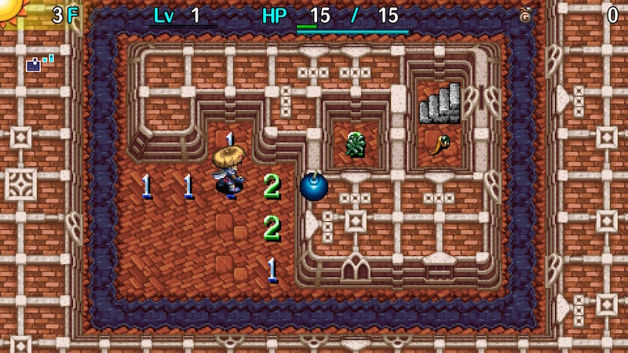

  

Minesweeper style mini-game dungeon.

HP doesn't regenerate, so you have a limited number of incorrect guesses before you collapse. The 5th floor features lots of reward items and significantly fewer bombs, so it's usually safe to use up your items in an effort to get to the stairs on 4F.

Explosion Rocks:

|Difficulty|Floors|Map Size|Bombs|Density|
|-|-|-|-|-|
|Novice|5|6x9|7~8|14.815%|
|Veteran|5|9x13|21~22|18.803%|
|Expert|5|12x19|50~51|22.368%|

Minesweeper, for reference:

|Difficulty|Map Size|Bombs|Density|
|-|-|-|-|
|Beginner|9x9|10|12.346%|
|Intermediate|16x16|40|15.625%|
|Expert|16x30|99|20.625%|

# Overview

<table class="dungeonOverview">
  <tr>
    <th>Unlock</th>
    <td class="highlightYellow">Available as soon as you arrive in Nekomaneki Village.</td>
  </tr>
  <tr>
    <th>Entrance</th>
    <td class="highlightYellow">Talk to the old woman inside the Dungeon Center.</td>
  </tr>
</table>

<table class="dungeonTable">
  <tr>
    <th>Floors</th>
    <td>5F</td>
    <th>Day / Night</th>
    <td>Day</td>
  </tr>
  <tr>
    <th>Bring Items</th>
    <td>No</td>
    <th>Allies</th>
    <td>No</td>
  </tr>
  <tr>
    <th>Unidentified</th>
    <td>None</td>
    <th>New Items</th>
    <td>No</td>
  </tr>
  <tr>
    <th>Shops</th>
    <td>None</td>
    <th>Monster Houses</th>
    <td>None</td>
  </tr>
  <tr>
    <th>Initial Enemies</th>
    <td></td>
    <th>Spawn Rate</th>
    <td>N/A</td>
  </tr>
  <tr>
    <th>Ominous aura</th>
    <td>No</td>
    <th>Wind of Kron</th>
    <td>1st: 1700 4th: 2000</td>
  </tr>
  <tr>
    <th>Clear Icon</th>
    <td class="clearIcon"></td>
    <th>Reward</th>
    <td>None (Keep items)</td>
  </tr>
</table>

# Strategy

#### Basic Rules

- Wall tiles break when punched, and bombs can be hidden inside wall tiles.
- Tiles with numbers indicate the number of bombs adjacent to that tile. (1 tile radius)
- The goal is to reach the stairs while avoiding punching wall tiles with bombs.

#### Controls

- Scout: (B + L) or (B + X)
- Flag: Press X while scouting

#### Important Items

- Onigiri --- Start with 1. Basically an extra life. (Explosion → Grilled Onigiri → Restore HP)
- 4-2-8 Pot --- Start with 2. Break wall tiles in a 1-tile radius without risk.
- Navigation Scroll --- Rare. Reveals bomb tiles where enemies are hidden on the map.
    - Can be used to level up and restore HP when you're at 1 HP.
- Invincible Grass --- Rare. Become invincible for 10 turns. Plan carefully when using it.
- Gitan --- Throw to deal 15 damage, or one-shot if it misses and target is standing on an Explosion Trap.
    - Hold B to step on top of Gitan without picking it up, then swap it with an inventory item.
    - Chintalas have 19 HP, so you can't one-shot them.

#### Techniques

The shortcut to getting better is to study [Minesweeper strategies](https://minesweepergame.com/strategy.php).

# Monster Table

<table>
  <tr>
    <th>1-5</th>
    <td>Pit Mamel</td>
    <td>Chintala</td>
    <td>Seedie</td>
  </tr>
</table>

# Items (1-4F)

#### Novice - 2 items per floor

<table class="itemTable">
  <thead>
    <tr>
      <th colspan="9" class="highlightGreen">Items</th>
    </tr>
  </thead>
  <tbody>
    <tr>
      <td>Onigiri</td>
      <td>Otogiriso</td>
      <td>Swift Grass</td>
      <td>Poison Grass</td>
      <td>Invincible Grass</td>
      <td>Revival Grass</td>
      <td>Paralysis Staff</td>
      <td>Squid Sushi Scroll</td>
      <td>Navigation Scroll</td>
    </tr>
  </tbody>
</table>

#### Veteran - 6 items per floor

<table class="itemTable">
  <thead>
    <tr>
      <th colspan="8" class="highlightOrange">Items</th>
    </tr>
  </thead>
  <tbody>
    <tr>
      <td>150G</td>
      <td>Onigiri</td>
      <td>Otogiriso</td>
      <td>Swift Grass</td>
      <td>Sleepy Grass</td>
      <td>Revival Grass</td>
      <td>Confusion Grass</td>
      <td>Power Up Grass</td>
    </tr>
    <tr>
      <td>Blinding Grass</td>
      <td>Dragon Grass</td>
      <td>Poison Grass</td>
      <td>Invincible Grass</td>
      <td>Paralysis Staff</td>
      <td>Squid Sushi Scroll</td>
      <td>Navigation Scroll</td>
      <td class="highlightGray"></td>
    </tr>
  </tbody>
</table>

#### Expert - 6 items per floor

<table class="itemTable">
  <thead>
    <tr>
      <th colspan="8" class="highlightPink">Items</th>
    </tr>
  </thead>
  <tbody>
    <tr>
      <td>150G</td>
      <td>Swift Grass</td>
      <td>Power Up Grass</td>
      <td>Sleepy Grass</td>
      <td>Dragon Grass</td>
      <td>Poison Grass</td>
    </tr>
    <tr>
      <td>Confusion Grass</td>
      <td>Blinding Grass</td>
      <td>Invincible Grass</td>
      <td>Squid Sushi Scroll</td>
      <td>Navigation Scroll</td>
      <td class="highlightGray"></td>
    </tr>
  </tbody>
</table>

# Items (5F)

#### Novice - 6 items

<table class="itemTable">
  <tr>
    <th class="highlightGreen">Weapon</th>
    <td class="tableDivider" rowspan="5"></td>
    <th class="highlightGreen">Shield</th>
    <td class="tableDivider" rowspan="5"></td>
    <th class="highlightGreen">Grass</th>
    <td class="tableDivider" rowspan="5"></td>
    <th class="highlightGreen">Scroll</th>
    <td class="tableDivider" rowspan="5"></td>
    <th class="highlightGreen">Talisman</th>
  </tr>
  <tr>
    <td>Ordinary Stick</td>
    <td>Plain Targe</td>
    <td>Otogiriso</td>
    <td>Fate Scroll</td>
    <td>Seal Talisman</td>
  </tr>
  <tr>
    <td>Tin Blade</td>
    <td>Tin Shield</td>
    <td>Invincible Grass</td>
    <td>Earth Scroll</td>
    <td>Conf. Talisman</td>
  </tr>
  <tr>
    <td>Katana</td>
    <td>Iron Targe</td>
    <td>Revival Grass</td>
    <td class="highlightGray" rowspan="2"></td>
    <td>Shadow Bind Tal.</td>
  </tr>
  <tr>
    <td>Beast Fang</td>
    <td>Wolfshead</td>
    <td class="highlightGray"></td>
    <td class="highlightGray"></td>
  </tr>
</table>

#### Veteran - 10 items

<table class="itemTable">
  <tr>
    <th class="highlightOrange">Weapon</th>
    <td class="tableDivider" rowspan="6"></td>
    <th class="highlightOrange">Shield</th>
    <td class="tableDivider" rowspan="6"></td>
    <th class="highlightOrange">Bracelet</th>
    <td class="tableDivider" rowspan="6"></td>
    <th class="highlightOrange">Grass</th>
    <td class="tableDivider" rowspan="6"></td>
    <th class="highlightOrange">Scroll</th>
  </tr>
  <tr>
    <td>Tin Blade</td>
    <td>Tin Shield</td>
    <td>Strength Bracelet</td>
    <td>Invincible Grass</td>
    <td>Fate Scroll</td>
  </tr>
  <tr>
    <td>Katana</td>
    <td>Iron Targe</td>
    <td>Cleansing Bracelet</td>
    <td>Revival Grass</td>
    <td>Earth Scroll</td>
  </tr>
  <tr>
    <td>Beast Fang</td>
    <td>Beast Shield</td>
    <td>Anti-Cnf. Bracelet</td>
    <td>Otogiriso</td>
    <td class="highlightGray" rowspan="3"></td>
  </tr>
  <tr>
    <td>Dotanuki</td>
    <td>Wolfshead</td>
    <td>Alert Bracelet</td>
    <td class="highlightGray" rowspan="2"></td>
  </tr>
  <tr>
    <td class="highlightGray"></td>
    <td class="highlightGray"></td>
    <td>Staunch Bracelet</td>
  </tr>
</table>

#### Expert - 15 items

<table class="itemTable">
  <tr>
    <th class="highlightPink">Weapon</th>
    <td class="tableDivider" rowspan="15"></td>
    <th class="highlightPink">Shield</th>
    <td class="tableDivider" rowspan="15"></td>
    <th class="highlightPink">Bracelet</th>
    <td class="tableDivider" rowspan="15"></td>
    <th class="highlightPink">Grass</th>
    <td class="tableDivider" rowspan="15"></td>
    <th class="highlightPink">Scroll</th>
  </tr>
  <tr>
    <td>Dotanuki</td>
    <td>Beast Shield</td>
    <td>Growth Bracelet</td>
    <td>Heal Grass</td>
    <td>Fate Scroll</td>
  </tr>
  <tr>
    <td>Bladite</td>
    <td>Targite</td>
    <td>Heal Bracelet</td>
    <td>Invincible Grass</td>
    <td>Earth Scroll</td>
  </tr>
  <tr>
    <td>Bright Blade</td>
    <td>Diet Shield</td>
    <td class="highlightGray" rowspan="12"></td>
    <td>Revival Grass</td>
    <td>Blessing Scroll</td>
  </tr>
  <tr>
    <td>Sky Splitter</td>
    <td>Heavy Shield</td>
    <td>Cheery Grass</td>
    <td>Pot God Scroll</td>
  </tr>
  <tr>
    <td>Water Cutter</td>
    <td>Binary Shield</td>
    <td class="highlightGray" rowspan="10"></td>
    <td class="highlightGray" rowspan="10"></td>
  </tr>
  <tr>
    <td>Scythe</td>
    <td>Counter Shield</td>
  </tr>
  <tr>
    <td>Myopic Masher</td>
    <td>Spry Shield</td>
  </tr>
  <tr>
    <td>Magic Masher</td>
    <td>Blast Shield</td>
  </tr>
  <tr>
    <td>Drain Dagger</td>
    <td>Lock Shield</td>
  </tr>
  <tr>
    <td>Copper Cleaver</td>
    <td>Safe Shield</td>
  </tr>
  <tr>
    <td>Crescent Katana</td>
    <td>Gyadon Blocker</td>
  </tr>
  <tr>
    <td>Lizard Lasher</td>
    <td>Snake Shield</td>
  </tr>
  <tr>
    <td>Breeze Blade</td>
    <td class="highlightGray" rowspan="2"></td>
  </tr>
  <tr>
    <td>Burning Blade</td>
  </tr>
</table>
