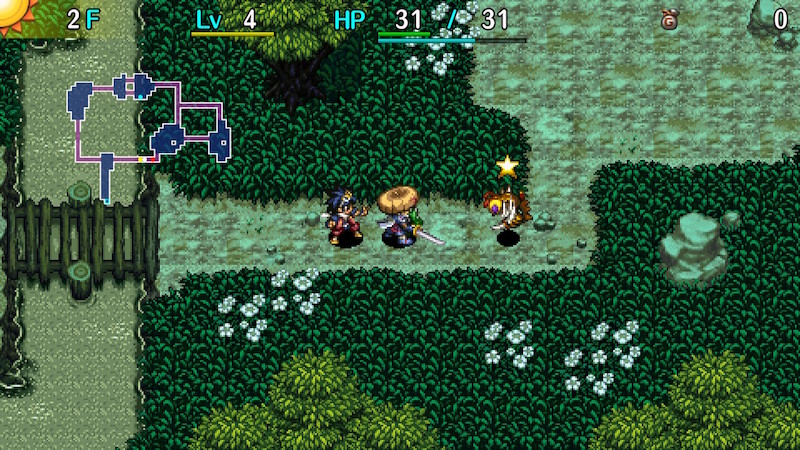

  

[Introduction]

<ul class="quickLinksUL">
  <li><a href="#overview">Overview</a></li>
  <li><a href="#strategy">Strategy</a></li>
  <li><a href="#monsters">Monsters</a></li>
  <li><a href="#items">Items</a></li>
  <li><a href="#traps">Traps</a></li>
</ul>

# Overview

<table class="dungeonOverview">
  <tr>
    <th>Unlock</th>
    <td class="highlightYellow">Clear the main story. ※ Only available on Switch/Steam versions.</td>
  </tr>
  <tr>
    <th>Entrance</th>
    <td class="highlightYellow">Nekomaneki Village (Woman in Dungeon Center)</td>
  </tr>
</table>

<table class="dungeonTable">
  <tr>
    <th>Floors</th>
    <td>50F (first) / 99F</td>
    <th>Day / Night</th>
    <td>Day (Time Switch Trap)</td>
  </tr>
  <tr>
    <th>Bring Items</th>
    <td>No</td>
    <th>Allies</th>
    <td>No (Recruit in dungeon)</td>
  </tr>
  <tr>
    <th>Unidentified</th>
    <td>All categories</td>
    <th>New Items</th>
    <td>Yes (51F+)</td>
  </tr>
  <tr>
    <th>Shops</th>
    <td>Regular, Elite</td>
    <th>Monster Houses</th>
    <td>Regular, Special, Sudden</td>
  </tr>
  <tr>
    <th>Initial Enemies</th>
    <td>8~11</td>
    <th>Spawn Rate</th>
    <td>30</td>
  </tr>
  <tr>
    <th>Ominous aura</th>
    <td>Yes (Turns vary by level)</td>
    <th>Wind of Kron</th>
    <td>1st: 1700 / 4th: 2000</td>
  </tr>
  <tr>
    <th>Clear Icon</th>
    <td>None</td>
    <th>Reward</th>
    <td>Rising Sun Shld</td>
  </tr>
</table>

# Strategy

[Quick Links]

[Content]

# Monsters

See [Monsters](/system/monsters) for individual monster details.

M = Maneater None Lv2 (800) Lv3 (700) Lv4 (700)

Floor Colors: Shuffle Dungeon Random Dungeon Limit break monsters Enemy Colors: Farming Useful Destroys Items Dangerous Very Dangerous

<table class="monsterTable">
  <thead>
    <tr>
      <th>F</th>
      <th colspan="9">Day</th>
      <th>M</th>
    </tr>
  </thead>
  <tbody>
    <tr>
      <td class="highlightGreen">1</td>
      <td class="">Mamel</td>
      <td class="">Pit Mamel</td>
      <td class="">Seedie</td>
      <td class="">Colum</td>
      <td class="">Sproutant</td>
      <td class="highlightGray"></td>
      <td class="highlightGray"></td>
      <td class="highlightGray"></td>
      <td class="highlightGray"></td>
      <td class="highlightBlack"></td>
    </tr>
    <tr>
      <td class="highlightGreen">2</td>
      <td class="">Mamel</td>
      <td class="">Pit Mamel</td>
      <td class="">Seedie</td>
      <td class="">Colum</td>
      <td class="">Sproutant</td>
      <td class="">Blade Bee</td>
      <td class="highlightGray"></td>
      <td class="highlightGray"></td>
      <td class="highlightGray"></td>
      <td class="highlightBlack"></td>
    </tr>
    <tr>
      <td class="highlightGreen">3</td>
      <td class="">Sweet Nut</td>
      <td class="">Pit Mamel</td>
      <td class="highlightGray"></td>
      <td class="">Colum</td>
      <td class="">Sproutant</td>
      <td class="">Blade Bee</td>
      <td class="highlightGray"></td>
      <td class="highlightGray"></td>
      <td class="highlightGray"></td>
      <td class="highlightBlack"></td>
    </tr>
    <tr>
      <td class="highlightGreen">4</td>
      <td class="">Sweet Nut</td>
      <td class="">Pit Mamel</td>
      <td class="">Grass Kid Pin Kid</td>
      <td class="">Chintala</td>
      <td class="">Sproutant</td>
      <td class="">Blade Bee</td>
      <td class="highlightGray"></td>
      <td class="highlightGray"></td>
      <td class="highlightGray"></td>
      <td class="highlightBlack"></td>
    </tr>
    <tr>
      <td class="highlightGreen">5</td>
      <td class="">Sweet Nut</td>
      <td class="highlightGray"></td>
      <td class="">Grass Kid Pin Kid</td>
      <td class="">Chintala</td>
      <td class="highlightGray"></td>
      <td class="">Blade Bee</td>
      <td class="highlightGray"></td>
      <td class="highlightGray"></td>
      <td class="highlightGray"></td>
      <td class="highlightBlack"></td>
    </tr>
    <tr>
      <td class="highlightOrange2">6</td>
      <td class="">Mudkin</td>
      <td class="">Nigiri Baby</td>
      <td class="highlightGray"></td>
      <td class="">Floaty</td>
      <td class="highlightGray"></td>
      <td class="">Mutaikon</td>
      <td class="highlightGray"></td>
      <td class="">N'dubba</td>
      <td class="">Chow</td>
      <td class="highlightBlack"></td>
    </tr>
    <tr>
      <td class="highlightOrange2">7</td>
      <td class="">Mudkin</td>
      <td class="">Nigiri Baby</td>
      <td class="highlightGray"></td>
      <td class="">Floaty</td>
      <td class="">Froggo</td>
      <td class="">Mutaikon</td>
      <td class="highlightGray"></td>
      <td class="">N'dubba</td>
      <td class="">Chow</td>
      <td class="highlightBlack"></td>
    </tr>
    <tr>
      <td class="highlightOrange2">8</td>
      <td class="">Mudkin</td>
      <td class="">Nigiri Baby</td>
      <td class="">Swordsman</td>
      <td class="">Floaty</td>
      <td class="">Froggo</td>
      <td class="">Mutaikon</td>
      <td class="highlightGray"></td>
      <td class="">N'dubba</td>
      <td class="">Chow</td>
      <td class="highlightBlack"></td>
    </tr>
    <tr>
      <td class="highlightOrange2">9</td>
      <td class="">Karakuroid</td>
      <td class="">Tiger Tosser</td>
      <td class="">Swordsman</td>
      <td class="">Floaty</td>
      <td class="">Froggo</td>
      <td class="">Mutaikon</td>
      <td class="highlightGray"></td>
      <td class="">N'dubba</td>
      <td class="">Chow</td>
      <td class="highlightBlack"></td>
    </tr>
    <tr>
      <td class="highlightOrange2">10</td>
      <td class="">Karakuroid</td>
      <td class="">Tiger Tosser</td>
      <td class="">Swordsman</td>
      <td class="">Kumonigiri</td>
      <td class="">Naptapir</td>
      <td class="">Mutaikon</td>
      <td class="highlightGray"></td>
      <td class="">N'dubba</td>
      <td class="">Chow</td>
      <td class="highlightBlack"></td>
    </tr>
    <tr>
      <td class="highlightOrange2">11</td>
      <td class="">Karakuroid</td>
      <td class="">Tiger Tosser</td>
      <td class="">Swordsman</td>
      <td class="">Kumonigiri</td>
      <td class="">Naptapir</td>
      <td class="highlightGray"></td>
      <td class="highlightGray"></td>
      <td class="">N'dubba</td>
      <td class="">Chow</td>
      <td class="highlightBlack"></td>
    </tr>
    <tr>
      <td class="highlightOrange2">12</td>
      <td class="">Mid Chintala</td>
      <td class="">Curse Girl</td>
      <td class="">Bored Kappa</td>
      <td class="highlightGray"></td>
      <td class="highlightGray"></td>
      <td class="">Gyaza</td>
      <td class="">Cololum</td>
      <td class="">Pumphantasm</td>
      <td class="">Chow</td>
      <td class="highlightBlack"></td>
    </tr>
    <tr>
      <td class="highlightOrange2">13</td>
      <td class="">Mid Chintala</td>
      <td class="">Curse Girl</td>
      <td class="">Bored Kappa</td>
      <td class="">Kid Squid</td>
      <td class="">Scorpion</td>
      <td class="">Gyaza</td>
      <td class="">Cololum</td>
      <td class="">Pumphantasm</td>
      <td class="">Chow</td>
      <td class="highlightBlack"></td>
    </tr>
    <tr>
      <td class="highlightOrange2">14</td>
      <td class="">Mid Chintala</td>
      <td class="">Curse Girl</td>
      <td class="">Bored Kappa</td>
      <td class="">Kid Squid</td>
      <td class="">Scorpion</td>
      <td class="">Gyaza</td>
      <td class="">Cololum</td>
      <td class="">Pumphantasm</td>
      <td class="">Metalhead Chow</td>
      <td class="highlightBlack"></td>
    </tr>
    <tr>
      <td class="highlightOrange2">15</td>
      <td class="">Mid Chintala</td>
      <td class="">Curse Girl</td>
      <td class="">Bored Kappa</td>
      <td class="">Kid Squid</td>
      <td class="">Scorpion</td>
      <td class="">Explochin</td>
      <td class="">Acrid Nut</td>
      <td class="">Pumphantasm</td>
      <td class="">Metalhead Chow</td>
      <td class="highlightBlack"></td>
    </tr>
    <tr>
      <td class="highlightOrange2">16</td>
      <td class="">Mid Chintala Fearabbit</td>
      <td class="">Curse Girl</td>
      <td class="">Bored Kappa</td>
      <td class="">Kid Squid</td>
      <td class="">Scorpion</td>
      <td class="">Explochin</td>
      <td class="">Acrid Nut</td>
      <td class="">Pumphantasm</td>
      <td class="">Metalhead Chow</td>
      <td class="highlightBlack"></td>
    </tr>
    <tr>
      <td class="highlightOrange2">17</td>
      <td class="">Fearabbit</td>
      <td class="highlightGray"></td>
      <td class="">Bored Kappa</td>
      <td class="highlightGray"></td>
      <td class="">Scorpion</td>
      <td class="">Explochin</td>
      <td class="">Acrid Nut</td>
      <td class="">Pumphantasm</td>
      <td class="">Metalhead Chow</td>
      <td class="highlightBlack"></td>
    </tr>
    <tr>
      <td class="highlightOrange2">18</td>
      <td class="">Mid Chintala</td>
      <td class="">Zalokleft</td>
      <td class="">Gazer</td>
      <td class="">Dagger Bee</td>
      <td class="highlightGray"></td>
      <td class="highlightGray"></td>
      <td class="highlightGray"></td>
      <td class="highlightGray"></td>
      <td class="">Mixer Chow</td>
      <td class="highlightBlack"></td>
    </tr>
    <tr>
      <td class="highlightOrange2">19</td>
      <td class="">Mid Chintala</td>
      <td class="">Zalokleft</td>
      <td class="">Gazer</td>
      <td class="">Dagger Bee</td>
      <td class="">Moseal</td>
      <td class="">Yanpii</td>
      <td class="">Flamebird</td>
      <td class="highlightGray"></td>
      <td class="">Mixer Chow</td>
      <td class="highlightBlack"></td>
    </tr>
    <tr>
      <td class="highlightOrange2">20</td>
      <td class="">Foly</td>
      <td class="">Zalokleft</td>
      <td class="">Hopodile</td>
      <td class="">Dagger Bee</td>
      <td class="">Moseal</td>
      <td class="">Yanpii</td>
      <td class="">Flamebird</td>
      <td class="">Polygon Spinna</td>
      <td class="">Mixer Chow</td>
      <td class="highlightBlack"></td>
    </tr>
    <tr>
      <td class="highlightOrange2">21</td>
      <td class="">Foly</td>
      <td class="">Scoopie</td>
      <td class="">Hopodile</td>
      <td class="">Cheer-Ham</td>
      <td class="">Moseal</td>
      <td class="">Yanpii</td>
      <td class="">Flamebird</td>
      <td class="">Polygon Spinna</td>
      <td class="">Chow</td>
      <td class="highlightBlack"></td>
    </tr>
    <tr>
      <td class="highlightOrange2">22</td>
      <td class="">Foly</td>
      <td class="">Scoopie</td>
      <td class="">Hopodile</td>
      <td class="">Cheer-Ham</td>
      <td class="">Moseal</td>
      <td class="">Yanpii</td>
      <td class="">Flamebird</td>
      <td class="">Polygon Spinna</td>
      <td class="">Chow</td>
      <td class="highlightBlack"></td>
    </tr>
    <tr>
      <td class="highlightOrange2">23</td>
      <td class="">Foly</td>
      <td class="">Scoopie</td>
      <td class="">Hopodile</td>
      <td class="">Cheer-Ham</td>
      <td class="">Moseal</td>
      <td class="">Yanpii</td>
      <td class="highlightGray"></td>
      <td class="highlightGray"></td>
      <td class="">Chow</td>
      <td class="highlightBlack"></td>
    </tr>
    <tr>
      <td class="highlightGreen">24</td>
      <td class="">Field Knave</td>
      <td class="">Gyadon</td>
      <td class="">Sproutyrant</td>
      <td class="">Pop Tank</td>
      <td class="">Beanie</td>
      <td class="">Momoseal</td>
      <td class="highlightGray"></td>
      <td class="highlightGray"></td>
      <td class="highlightGray"></td>
      <td rowspan="4" class="monsterTableVilleater">2</td>
    </tr>
    <tr>
      <td class="highlightGreen">25</td>
      <td class="">Field Knave</td>
      <td class="">Gyadon</td>
      <td class="">Sproutyrant</td>
      <td class="">Pop Tank</td>
      <td class="">Beanie</td>
      <td class="">Momoseal</td>
      <td class="">Crow Tengu</td>
      <td class="">Eligan</td>
      <td class="highlightGray"></td>
    </tr>
    <tr>
      <td class="highlightGreen">26</td>
      <td class="">Field Knave</td>
      <td class="">Gyadon</td>
      <td class="">Grass Dude Pin Dude</td>
      <td class="">Pop Tank</td>
      <td class="">Beanie</td>
      <td class="">Momoseal</td>
      <td class="">Crow Tengu</td>
      <td class="">Eligan</td>
      <td class="">Big Chintala</td>
    </tr>
    <tr>
      <td class="highlightGreen">27</td>
      <td class="">Field Knave</td>
      <td class="highlightGray"></td>
      <td class="">Grass Dude Pin Dude</td>
      <td class="">Pop Tank</td>
      <td class="highlightGray"></td>
      <td class="">Momoseal</td>
      <td class="">Crow Tengu</td>
      <td class="">Eligan</td>
      <td class="">Big Chintala</td>
    </tr>
    <tr>
      <td class="highlightOrange2">28</td>
      <td class="">DJ Mage</td>
      <td class="">Nigiri Morph</td>
      <td class="">Steamroid</td>
      <td class="">Poofy</td>
      <td class="">Froggucci</td>
      <td class="highlightGray"></td>
      <td class="">FO-Uβ</td>
      <td class="highlightGray"></td>
      <td class="">Snacky</td>
      <td class="highlightBlack"></td>
    </tr>
    <tr>
      <td class="highlightOrange2">29</td>
      <td class="">DJ Mage</td>
      <td class="">Nigiri Morph</td>
      <td class="">Steamroid</td>
      <td class="">Poofy</td>
      <td class="">Froggucci</td>
      <td class="">Porky</td>
      <td class="">FO-Uβ</td>
      <td class="highlightGray"></td>
      <td class="">Snacky</td>
      <td class="highlightBlack"></td>
    </tr>
    <tr>
      <td class="highlightOrange2">30</td>
      <td class="">Absorbiphant</td>
      <td class="">Snooztapir</td>
      <td class="">Ironhead</td>
      <td class="">Poofy</td>
      <td class="">Froggucci</td>
      <td class="">Porky</td>
      <td class="">Boy Cart FO-Uβ</td>
      <td class="highlightGray"></td>
      <td class="">Snacky</td>
      <td class="highlightBlack"></td>
    </tr>
    <tr>
      <td class="highlightOrange2">31</td>
      <td class="">Absorbiphant</td>
      <td class="">Snooztapir</td>
      <td class="">Ironhead</td>
      <td class="highlightGray"></td>
      <td class="highlightGray"></td>
      <td class="highlightGray"></td>
      <td class="">Boy Cart FO-Uβ</td>
      <td class="highlightGray"></td>
      <td class="">Snacky</td>
      <td class="highlightBlack"></td>
    </tr>
    <tr>
      <td class="highlightGreen">32</td>
      <td class="">Spicy Nut</td>
      <td class="">Sr. Yanpii Go-Ham!</td>
      <td class="">Cursister</td>
      <td class="">Muddy</td>
      <td class="">Spadie</td>
      <td class="highlightGray"></td>
      <td class="">Firepuff</td>
      <td class="">Punisher</td>
      <td class="">Falcon Tengu</td>
      <td rowspan="3" class="monsterTableVilleater">2</td>
    </tr>
    <tr>
      <td class="highlightGreen">33</td>
      <td class="">Digestiphant Spicy Nut</td>
      <td class="">Hipadile Go-Ham!</td>
      <td class="">Cursister</td>
      <td class="">MC Mage</td>
      <td class="">Spadie</td>
      <td class="">Zapdon</td>
      <td class="">Cross Cart</td>
      <td class="">Debaser</td>
      <td class="">Falcon Tengu</td>
    </tr>
    <tr>
      <td class="highlightGreen">34</td>
      <td class="">Digestiphant Spicy Nut</td>
      <td class="">Hipadile</td>
      <td class="">Cursister</td>
      <td class="highlightGray"></td>
      <td class="highlightGray"></td>
      <td class="">Zapdon</td>
      <td class="">Cross Cart</td>
      <td class="">Debaser</td>
      <td class="">Falcon Tengu</td>
    </tr>
    <tr>
      <td class="highlightOrange2">35</td>
      <td class="">Scarabbit</td>
      <td class="">Death Gyaza</td>
      <td class="">Squidfficial</td>
      <td class="">Pandanigiri</td>
      <td class="">Kappa Pest</td>
      <td class="highlightGray"></td>
      <td class="">FO-Uβ</td>
      <td class="">N'twyn</td>
      <td class="">Snacky</td>
      <td class="highlightBlack"></td>
    </tr>
    <tr>
      <td class="highlightOrange2">36</td>
      <td class="">Scarabbit</td>
      <td class="">Death Gyaza</td>
      <td class="">Squidfficial</td>
      <td class="">Pandanigiri</td>
      <td class="">Kappa Pest</td>
      <td class="">Katana Bee</td>
      <td class="">Mixermon FO-Uβ</td>
      <td class="">N'twyn</td>
      <td class="">Snacky</td>
      <td class="highlightBlack"></td>
    </tr>
    <tr>
      <td class="highlightOrange2">37</td>
      <td class="">Scarabbit</td>
      <td class="">Death Gyaza</td>
      <td class="">Dragon</td>
      <td class="">Pandanigiri</td>
      <td class="">Shagga</td>
      <td class="">Katana Bee</td>
      <td class="">Mixermon FO-Uβ</td>
      <td class="">N'twyn</td>
      <td class="">Snacky</td>
      <td class="highlightBlack"></td>
    </tr>
    <tr>
      <td class="highlightOrange2">38</td>
      <td class="highlightGray"></td>
      <td class="">Death Gyaza</td>
      <td class="">Dragon</td>
      <td class="highlightGray"></td>
      <td class="">Shagga</td>
      <td class="">Katana Bee</td>
      <td class="">FO-Uβ</td>
      <td class="">N'twyn</td>
      <td class="">Snacky</td>
      <td class="highlightBlack"></td>
    </tr>
    <tr>
      <td class="highlightOrange2">39</td>
      <td class="">Pot Knave</td>
      <td class="">Pumphantom</td>
      <td class="">Polygon Shaka</td>
      <td class="">Dazikon</td>
      <td class="highlightGray"></td>
      <td class="">Flamepuff</td>
      <td class="">FO-U</td>
      <td class="">Eagle Tengu</td>
      <td class="">Munchy</td>
      <td class="highlightBlack"></td>
    </tr>
    <tr>
      <td class="highlightOrange2">40</td>
      <td class="">Pot Knave</td>
      <td class="">Pumphantom</td>
      <td class="">Polygon Shaka</td>
      <td class="">Dazikon</td>
      <td class="highlightGray"></td>
      <td class="">Flamepuff</td>
      <td class="">FO-U</td>
      <td class="">Eagle Tengu</td>
      <td class="">Munchy</td>
      <td class="highlightBlack"></td>
    </tr>
    <tr>
      <td class="highlightOrange2">41</td>
      <td class="">Pot Knave</td>
      <td class="">Pumphantom</td>
      <td class="">Polygon Shaka</td>
      <td class="">Porko</td>
      <td class="highlightGray"></td>
      <td class="">Flamepuff</td>
      <td class="">Cave Mamel FO-U</td>
      <td class="">Eagle Tengu</td>
      <td class="">Munchy</td>
      <td class="highlightBlack"></td>
    </tr>
    <tr>
      <td class="highlightOrange2">42</td>
      <td class="">Pot Knave</td>
      <td class="">Pumphantom</td>
      <td class="">Polygon Shaka</td>
      <td class="">Porko</td>
      <td class="highlightGray"></td>
      <td class="highlightGray"></td>
      <td class="">Cave Mamel FO-U</td>
      <td class="highlightGray"></td>
      <td class="">Munchy</td>
      <td class="highlightBlack"></td>
    </tr>
    <tr>
      <td class="highlightGreen">43</td>
      <td class="">MC Wizard</td>
      <td class="">Rally Ham</td>
      <td class="">Gyairas</td>
      <td class="">Concusschin</td>
      <td class="">VeniScorp</td>
      <td class="">Tiger Hurler</td>
      <td class="highlightGray"></td>
      <td class="highlightGray"></td>
      <td class="highlightGray"></td>
      <td rowspan="4" class="monsterTableVilleater">2</td>
    </tr>
    <tr>
      <td class="highlightGreen">44</td>
      <td class="">MC Wizard</td>
      <td class="">Rally Ham</td>
      <td class="">Gyairas</td>
      <td class="">Concusschin</td>
      <td class="">VeniScorp</td>
      <td class="">Tiger Hurler</td>
      <td class="">Eligagan</td>
      <td class="">Strong Cart</td>
      <td class="">Momomoseal</td>
    </tr>
    <tr>
      <td class="highlightGreen">45</td>
      <td class="">MC Wizard</td>
      <td class="">Green Zalokleft</td>
      <td class="">Gyairas</td>
      <td class="">Grass Poppa Pin Poppa</td>
      <td class="highlightGray"></td>
      <td class="">Tiger Hurler</td>
      <td class="">Eligagan</td>
      <td class="">Strong Cart</td>
      <td class="">Momomoseal</td>
    </tr>
    <tr>
      <td class="highlightGreen">46</td>
      <td class="">MC Wizard</td>
      <td class="">Green Zalokleft</td>
      <td class="">Huistdon</td>
      <td class="">Grass Poppa Pin Poppa</td>
      <td class="highlightGray"></td>
      <td class="">Tiger Hurler</td>
      <td class="">Eligagan</td>
      <td class="">Strong Cart</td>
      <td class="highlightGray"></td>
    </tr>
    <tr>
      <td class="highlightOrange2">47</td>
      <td class="">Foly2</td>
      <td class="">Oingodile</td>
      <td class="">Fencer</td>
      <td class="">Nashagga</td>
      <td class="">Sparkbird</td>
      <td class="highlightGray"></td>
      <td class="">Pumpanshee FO-U</td>
      <td class="">Grampa Tank</td>
      <td class="">Colocolum Munchy</td>
      <td class="highlightBlack"></td>
    </tr>
    <tr>
      <td class="highlightOrange2">48</td>
      <td class="">Foly2</td>
      <td class="">Oingodile</td>
      <td class="">Fencer</td>
      <td class="">Nashagga</td>
      <td class="">Sparkbird</td>
      <td class="">Sky Dragon</td>
      <td class="">Pumpanshee FO-U</td>
      <td class="">Grampa Tank</td>
      <td class="">Colocolum Munchy</td>
      <td class="highlightBlack"></td>
    </tr>
    <tr>
      <td class="highlightOrange2">49</td>
      <td class="">Foly2</td>
      <td class="">Dozikon</td>
      <td class="">Fencer</td>
      <td class="">Nashagga</td>
      <td class="">Sparkbird</td>
      <td class="">Sky Dragon</td>
      <td class="">Pumpanshee FO-U</td>
      <td class="highlightGray"></td>
      <td class="">Steelhead Munchy</td>
      <td class="highlightBlack"></td>
    </tr>
    <tr>
      <td class="highlightOrange2">50</td>
      <td class="">Foly2</td>
      <td class="">Dozikon</td>
      <td class="">Fencer</td>
      <td class="highlightGray"></td>
      <td class="">Sparkbird</td>
      <td class="">Sky Dragon</td>
      <td class="">Pumpanshee FO-UZ</td>
      <td class="">Mixergon</td>
      <td class="">Steelhead Munchy</td>
      <td class="highlightBlack"></td>
    </tr>
    <tr>
      <td class="highlightGreen">51</td>
      <td class="">Curspinster</td>
      <td class="">Iron Zalokleft</td>
      <td class="">Grass Poppa Pin Poppa</td>
      <td class="">Gyandora</td>
      <td class="">Sensei</td>
      <td class="">Bitter Nut</td>
      <td class="">Froggon</td>
      <td class="">Mixergon</td>
      <td class="highlightGray"></td>
      <td rowspan="3" class="monsterTableMounteater">3</td>
    </tr>
    <tr>
      <td class="highlightGreen">52</td>
      <td class="">Curspinster</td>
      <td class="">Iron Zalokleft</td>
      <td class="">Grass Poppa Pin Poppa</td>
      <td class="">Gyandora</td>
      <td class="">Sensei</td>
      <td class="">Bitter Nut</td>
      <td class="">Froggon</td>
      <td class="">Mixergon</td>
      <td class="highlightGray"></td>
    </tr>
    <tr>
      <td class="highlightGreen">53</td>
      <td class="">Curspinster</td>
      <td class="">Iron Zalokleft</td>
      <td class="">Grass Poppa Pin Poppa</td>
      <td class="">Gyandora</td>
      <td class="">Sensei</td>
      <td class="">Bitter Nut</td>
      <td class="">Froggon</td>
      <td class="">Mixergon</td>
      <td class="highlightGray"></td>
    </tr>
    <tr>
      <td class="highlightOrange2">54</td>
      <td class="">Curspinster Tiger Chucker</td>
      <td class="">Spongiderm Pumpanshee</td>
      <td class="">Horrabbit</td>
      <td class="">Fulminachin</td>
      <td class="highlightGray"></td>
      <td class="highlightGray"></td>
      <td class="">Kleptoad</td>
      <td class="">N'mach</td>
      <td class="">Momomomoseal</td>
      <td class="highlightGray">?</td>
    </tr>
    <tr>
      <td class="highlightOrange2">55</td>
      <td class="">Curspinster Tiger Chucker</td>
      <td class="">Spongiderm Pumpanshee</td>
      <td class="">Horrabbit</td>
      <td class="">Item Knave</td>
      <td class="">Lashagga</td>
      <td class="">Gyandoron</td>
      <td class="">Kleptoad</td>
      <td class="">Zalokleftis King N'mach</td>
      <td class="">Momomomoseal</td>
      <td class="highlightGray">?</td>
    </tr>
    <tr>
      <td class="highlightOrange2">56</td>
      <td class="">Lt. Yanpii Tiger Chucker</td>
      <td class="">Spongiderm Polygon Singa</td>
      <td class="">Flarebird Bunchukdon</td>
      <td class="">Item Knave Zanbeeto</td>
      <td class="">Lashagga</td>
      <td class="">Gyandoron</td>
      <td class="">Nigiri Boss FO-UZ</td>
      <td class="">Zalokleftis King N'mach</td>
      <td class="">Grass Gramps Pin Gramps</td>
      <td class="highlightGray">?</td>
    </tr>
    <tr>
      <td class="highlightOrange2">57</td>
      <td class="">Jouncy</td>
      <td class="">Swordmaster Polygon Singa</td>
      <td class="">Flarebird Bunchukdon</td>
      <td class="">Super Gazer</td>
      <td class="">Spirit Ham</td>
      <td class="">Gyandoron</td>
      <td class="">Nigiri Boss FO-UZ</td>
      <td class="">N'mach</td>
      <td class="">Grass Gramps Pin Gramps</td>
      <td class="highlightGray">?</td>
    </tr>
    <tr>
      <td class="highlightOrange2">58</td>
      <td class="">Jouncy</td>
      <td class="">Swordmaster Polygon Singa</td>
      <td class="highlightGray"></td>
      <td class="">Super Gazer</td>
      <td class="">Spirit Ham</td>
      <td class="">Bitter Nut</td>
      <td class="">Onigirizzly</td>
      <td class="">N'mach</td>
      <td class="highlightGray"></td>
      <td class="highlightGray">?</td>
    </tr>
    <tr>
      <td class="highlightGreen">59</td>
      <td class="">Mudster</td>
      <td class="">Oingodile</td>
      <td class="">Vexing Kappa</td>
      <td class="highlightGray"></td>
      <td class="">Detonachin</td>
      <td class="">King Squid</td>
      <td class="">Hell Gyaza</td>
      <td class="">Zalokleftis King</td>
      <td class="">Momomomoseal</td>
      <td rowspan="2" class="monsterTableMounteater">3</td>
    </tr>
    <tr>
      <td class="highlightGreen">60</td>
      <td class="">Mudster</td>
      <td class="">Oingodile</td>
      <td class="">Vexing Kappa</td>
      <td class="highlightGray"></td>
      <td class="">Detonachin</td>
      <td class="">King Squid</td>
      <td class="">Hell Gyaza</td>
      <td class="">Zalokleftis King</td>
      <td class="">Momomomoseal</td>
    </tr>
    <tr>
      <td class="highlightOrange2">61</td>
      <td class="">Mudster</td>
      <td class="">Huge Chintala</td>
      <td class="highlightGray"></td>
      <td class="">Doom Gyaza</td>
      <td class="">Eligagon</td>
      <td class="">Mixerdon</td>
      <td class="">Trowelie Billman</td>
      <td class="">N'dup</td>
      <td class="">Mealy</td>
      <td class="highlightBlack"></td>
    </tr>
    <tr>
      <td class="highlightOrange2">62</td>
      <td class="">Mudster</td>
      <td class="">Huge Chintala</td>
      <td class="">Cursenior</td>
      <td class="">Electroid</td>
      <td class="">Eligagon</td>
      <td class="">Porkon</td>
      <td class="">Trowelie FO-UZZ</td>
      <td class="">N'dup</td>
      <td class="">Mealy</td>
      <td class="highlightGray">?</td>
    </tr>
    <tr>
      <td class="highlightOrange2">63</td>
      <td class="">Shovelie</td>
      <td class="">Knave King</td>
      <td class="">Cursenior</td>
      <td class="">Electroid</td>
      <td class="">Ruiner</td>
      <td class="">Porkon</td>
      <td class="">Detonachin</td>
      <td class="">Nuttie</td>
      <td class="">Sprouterror Mealy</td>
      <td class="highlightGray">?</td>
    </tr>
    <tr>
      <td class="highlightOrange2">64</td>
      <td class="">Horrabbit</td>
      <td class="">Knave King</td>
      <td class="">Pumptergeist</td>
      <td class="">Boingodile</td>
      <td class="">Ruiner</td>
      <td class="">Porkon</td>
      <td class="">Detonachin</td>
      <td class="highlightGray"></td>
      <td class="">Sprouterror Mealy</td>
      <td class="highlightGray">?</td>
    </tr>
    <tr>
      <td class="highlightOrange2">65</td>
      <td class="">Horrabbit</td>
      <td class="highlightGray"></td>
      <td class="">Pumptergeist</td>
      <td class="">Boingodile</td>
      <td class="">Ruiner</td>
      <td class="">Squidperor</td>
      <td class="highlightGray"></td>
      <td class="">Nuttie</td>
      <td class="">Colocolocolum</td>
      <td class="highlightGray">?</td>
    </tr>
    <tr>
      <td class="highlightGreen">66</td>
      <td class="">Blazebird</td>
      <td class="">Sky Dragon</td>
      <td class="">Ornery Tank</td>
      <td class="">Bitter Nut</td>
      <td class="highlightGray"></td>
      <td class="">Blazepuff</td>
      <td class="">Detonachin</td>
      <td class="highlightGray"></td>
      <td class="highlightGray"></td>
      <td rowspan="2" class="monsterTableMounteater">3</td>
    </tr>
    <tr>
      <td class="highlightGreen">67</td>
      <td class="">Blazebird</td>
      <td class="">Sky Dragon</td>
      <td class="">Ornery Tank</td>
      <td class="">Bitter Nut</td>
      <td class="highlightGray"></td>
      <td class="">Blazepuff</td>
      <td class="">Detonachin</td>
      <td class="highlightGray"></td>
      <td class="highlightGray"></td>
    </tr>
    <tr>
      <td class="highlightOrange2">68</td>
      <td class="">Blazebird</td>
      <td class="">Gyandoron</td>
      <td class="">StunScorp</td>
      <td class="">Grainie</td>
      <td class="">Tiger Ace</td>
      <td class="highlightGray"></td>
      <td class="">Bunchukdon</td>
      <td class="highlightGray"></td>
      <td class="highlightGray"></td>
      <td class="highlightGray">?</td>
    </tr>
    <tr>
      <td class="highlightOrange2">69</td>
      <td class="">Boss Yanpii</td>
      <td class="">Nigiri King</td>
      <td class="">StunScorp</td>
      <td class="">Grainie</td>
      <td class="">Tiger Ace</td>
      <td class="highlightGray"></td>
      <td class="">Bunchukdon</td>
      <td class="">Zalokleftis King</td>
      <td class="highlightGray"></td>
      <td class="highlightGray">?</td>
    </tr>
    <tr>
      <td class="highlightOrange2">70</td>
      <td class="">Boss Yanpii</td>
      <td class="">Nigiri King</td>
      <td class="">Ornery Tank</td>
      <td class="">Doom Gyaza</td>
      <td class="">Eligagon</td>
      <td class="highlightGray"></td>
      <td class="">Bunchukdon</td>
      <td class="">Zalokleftis King</td>
      <td class="">Hyper Gazer</td>
      <td class="highlightGray">?</td>
    </tr>
    <tr>
      <td class="highlightOrange2">71</td>
      <td class="">Porgon</td>
      <td class="">Swordmaster</td>
      <td class="">Ornery Tank</td>
      <td class="">Doom Gyaza</td>
      <td class="">Eligagon</td>
      <td class="highlightGray"></td>
      <td class="">Pyrepuff</td>
      <td class="">Squidperor</td>
      <td class="">Hyper Gazer</td>
      <td class="highlightGray">?</td>
    </tr>
    <tr>
      <td class="highlightOrange2">72</td>
      <td class="">Porgon Despoiler</td>
      <td class="">Swordmaster</td>
      <td class="highlightGray"></td>
      <td class="">Doom Gyaza</td>
      <td class="">Eligagon</td>
      <td class="highlightGray"></td>
      <td class="">Pyrepuff</td>
      <td class="">Squidperor</td>
      <td class="">Tiger Ace</td>
      <td class="highlightGray">?</td>
    </tr>
    <tr>
      <td class="highlightGreen">73</td>
      <td class="">Porgon Despoiler</td>
      <td class="">Dozikon</td>
      <td class="">Vexing Kappa</td>
      <td class="">Jouncy</td>
      <td class="">Pierce Cart</td>
      <td class="">Knave King</td>
      <td class="">Shovelie</td>
      <td class="">Grass Gramps Pin Gramps</td>
      <td class="">Tiger Ace</td>
      <td rowspan="2" class="monsterTableIsleater">4</td>
    </tr>
    <tr>
      <td class="highlightGreen">74</td>
      <td class="">Porgon</td>
      <td class="">Dozikon</td>
      <td class="">Vexing Kappa</td>
      <td class="">Jouncy</td>
      <td class="">Pierce Cart</td>
      <td class="">Knave King</td>
      <td class="">Shovelie</td>
      <td class="">Grass Gramps Pin Gramps</td>
      <td class="">Tiger Ace</td>
    </tr>
    <tr>
      <td class="highlightOrange2">75</td>
      <td class="">Terrabbit</td>
      <td class="highlightGray"></td>
      <td class="">Despoiler</td>
      <td class="">Gitan Mamel</td>
      <td class="">Electroid</td>
      <td class="">Elizgagon</td>
      <td class="highlightGray"></td>
      <td class="">Grass Gramps Pin Gramps</td>
      <td class="">Tiger Ace</td>
      <td class="highlightGray">?</td>
    </tr>
    <tr>
      <td class="highlightOrange2">76</td>
      <td class="">Terrabbit</td>
      <td class="">MC Sorceror</td>
      <td class="">Despoiler</td>
      <td class="highlightGray"></td>
      <td class="">Electroid</td>
      <td class="">Elizgagon</td>
      <td class="highlightGray"></td>
      <td class="">Maneater</td>
      <td class="">Tiger Ace Chow</td>
      <td class="highlightGray">?</td>
    </tr>
    <tr>
      <td class="highlightOrange2">77</td>
      <td class="">Terrabbit Doztapir</td>
      <td class="">MC Sorceror</td>
      <td class="">Despoiler</td>
      <td class="">Gitan Mamel</td>
      <td class="">Pierce Cart Cyberoid</td>
      <td class="">Mudster</td>
      <td class="">Kappa Troll Trillman</td>
      <td class="">Sprouterror Maneater</td>
      <td class="">Chow</td>
      <td class="highlightGray">?</td>
    </tr>
    <tr>
      <td class="highlightOrange2">78</td>
      <td class="">Terrabbit</td>
      <td class="">Bouncy</td>
      <td class="highlightGray"></td>
      <td class="">Gitan Mamel</td>
      <td class="">Pierce Cart Cyberoid</td>
      <td class="">Cursenior</td>
      <td class="">Kappa Troll</td>
      <td class="">Sprouterror Maneater</td>
      <td class="">Momomomoseal Chow</td>
      <td class="highlightGray">?</td>
    </tr>
    <tr>
      <td class="highlightOrange2">79</td>
      <td class="">Terrabbit</td>
      <td class="">Lashagga</td>
      <td class="highlightGray"></td>
      <td class="">Spongiderm</td>
      <td class="highlightGray"></td>
      <td class="">Cursenior</td>
      <td class="">Kleptoad</td>
      <td class="">BlightScorp Maneater</td>
      <td class="">Momomomoseal Chow</td>
      <td class="highlightGray">?</td>
    </tr>
    <tr>
      <td class="highlightGreen">80</td>
      <td class="">Foly2</td>
      <td class="">Gyandoron</td>
      <td class="">Blazebird</td>
      <td class="">Pyrepuff</td>
      <td class="">Zanbeeto</td>
      <td class="highlightGray"></td>
      <td class="highlightGray"></td>
      <td class="">Pumptergeist</td>
      <td class="">Phoenix Tengu</td>
      <td class="highlightGray">?</td>
    </tr>
    <tr>
      <td class="highlightGreen">81</td>
      <td class="">Foly2</td>
      <td class="">Gyandoron</td>
      <td class="">Blazebird</td>
      <td class="">Pyrepuff</td>
      <td class="">Zanbeeto</td>
      <td class="highlightGray"></td>
      <td class="highlightGray"></td>
      <td class="">Pumptergeist</td>
      <td class="">Phoenix Tengu</td>
      <td class="highlightGray">?</td>
    </tr>
    <tr>
      <td class="highlightOrange2">82</td>
      <td class="">Archdragon</td>
      <td class="">Ultra Gazer</td>
      <td class="">Blazebird</td>
      <td class="">Gitan Mamel</td>
      <td class="">Spirit Ham</td>
      <td class="">Bitter Nut</td>
      <td class="">Bouncy</td>
      <td class="">Polygon Singa Villeater</td>
      <td class="">Zotdon Chow</td>
      <td class="highlightGray">?</td>
    </tr>
    <tr>
      <td class="highlightOrange2">83</td>
      <td class="">Archdragon</td>
      <td class="">Ultra Gazer</td>
      <td class="highlightGray"></td>
      <td class="">Gitan Mamel</td>
      <td class="">Spirit Ham</td>
      <td class="">Bitter Nut</td>
      <td class="">Bouncy</td>
      <td class="">Phoenix Tengu Villeater</td>
      <td class="">Cyberoid Chow</td>
      <td class="highlightGray">?</td>
    </tr>
    <tr>
      <td class="highlightOrange2">84</td>
      <td class="">Abyssal Dragon</td>
      <td class="">Ultra Gazer</td>
      <td class="">Mesmerikon</td>
      <td class="">Gitan Mamel</td>
      <td class="highlightGray"></td>
      <td class="">Comatapir</td>
      <td class="highlightGray"></td>
      <td class="">Phoenix Tengu Mounteater</td>
      <td class="">Cyberoid Chow</td>
      <td class="highlightGray">?</td>
    </tr>
    <tr>
      <td class="highlightOrange2">85</td>
      <td class="">Abyssal Dragon</td>
      <td class="">MC Sorceror</td>
      <td class="">Mesmerikon</td>
      <td class="">Gitan Mamel</td>
      <td class="">Mudder</td>
      <td class="">Comatapir</td>
      <td class="">Mixerdon</td>
      <td class="">Huge Chintala Mounteater</td>
      <td class="">Cyberoid Chow</td>
      <td class="highlightGray">?</td>
    </tr>
    <tr>
      <td class="highlightOrange2">86</td>
      <td class="">Abyssal Dragon</td>
      <td class="">MC Sorceror</td>
      <td class="highlightGray"></td>
      <td class="">Gitan Mamel</td>
      <td class="">Mudder</td>
      <td class="">Elizgagon</td>
      <td class="">Mixerdon</td>
      <td class="">Huge Chintala Mounteater</td>
      <td class="">Cyberoid Chow</td>
      <td class="highlightGray">?</td>
    </tr>
    <tr>
      <td class="highlightGreen">87</td>
      <td class="">Swordmaster</td>
      <td class="">Gyandoron</td>
      <td class="">Osmammoth</td>
      <td class="">Cranky Tank</td>
      <td class="">Porgon</td>
      <td class="">Zotdon</td>
      <td class="">Despoiler</td>
      <td class="">Sproutitan</td>
      <td class="">Doom Gyaza BlightScorp</td>
      <td class="highlightGray">?</td>
    </tr>
    <tr>
      <td class="highlightGreen">88</td>
      <td class="">Bashagga</td>
      <td class="">Gyandoron</td>
      <td class="">Osmammoth</td>
      <td class="">Cranky Tank</td>
      <td class="">Porgon</td>
      <td class="">Elizgagon</td>
      <td class="">Despoiler</td>
      <td class="">Sproutitan</td>
      <td class="">Doomhead</td>
      <td class="highlightGray">?</td>
    </tr>
    <tr>
      <td class="limitBreak highlightOrange2">89</td>
      <td class="">Abyssal Dragon</td>
      <td class="">Mesmerikon</td>
      <td class="">Osmammoth Kodionigiri</td>
      <td class="">Gitan Mamel Squidperor</td>
      <td class="">Porgon N'dup</td>
      <td class="">Terrabbit Cyberoid</td>
      <td class="">Boingodile Despoiler</td>
      <td class="">Pumptergeist Isleater</td>
      <td class="">Colocolocolum BlightScorp</td>
      <td class="highlightGray">?</td>
    </tr>
    <tr>
      <td class="limitBreak highlightOrange2">90</td>
      <td class="">Abyssal Dragon</td>
      <td class="">Mesmerikon Kappa Troll</td>
      <td class="">Osmammoth Kodionigiri</td>
      <td class="">Gitan Mamel Squidperor</td>
      <td class="">Kleptoad N'dup</td>
      <td class="">Terrabbit</td>
      <td class="">Boingodile Despoiler</td>
      <td class="">Pumptergeist Isleater</td>
      <td class="">Colocolocolum</td>
      <td class="highlightGray">?</td>
    </tr>
    <tr>
      <td class="limitBreak highlightOrange2">91</td>
      <td class="">Abyssal Dragon</td>
      <td class="">Mesmerikon Kappa Troll</td>
      <td class="">Osmammoth</td>
      <td class="">Gitan Mamel</td>
      <td class="">Kleptoad N'dup</td>
      <td class="">Terrabbit Cyberoid</td>
      <td class="">Bashagga</td>
      <td class="">Googoman Isleater</td>
      <td class="">Polygon Stunna Doomhead</td>
      <td class="highlightGray">?</td>
    </tr>
    <tr>
      <td class="limitBreak highlightOrange2">92</td>
      <td class="">Abyssal Dragon</td>
      <td class="">Mesmerikon</td>
      <td class="">Osmammoth Gyandoron</td>
      <td class="">Gitan Mamel</td>
      <td class="">Blazebird N'dup</td>
      <td class="">Terrabbit Cyberoid</td>
      <td class="">Bashagga Tiger Ace</td>
      <td class="">Googoman</td>
      <td class="">Polygon Stunna Doomhead</td>
      <td class="highlightGray">?</td>
    </tr>
    <tr>
      <td class="limitBreak highlightOrange2">93</td>
      <td class="">Abyssal Dragon</td>
      <td class="">Mesmerikon</td>
      <td class="">Gyandoron</td>
      <td class="">Gitan Mamel Nigiri King</td>
      <td class="">Blazebird N'dup</td>
      <td class="">Terrabbit Cyberoid</td>
      <td class="">Bashagga Tiger Ace</td>
      <td class="">Boss Yanpii</td>
      <td class="">Polygon Stunna Zotdon</td>
      <td class="highlightGray">?</td>
    </tr>
    <tr>
      <td class="limitBreak highlightGreen">94</td>
      <td class="">Ultra Gazer</td>
      <td class="">MC Sorceror</td>
      <td class="">Osmammoth</td>
      <td class="">Shovelie</td>
      <td class="">Spirit Ham</td>
      <td class="">Terrabbit Cyberoid</td>
      <td class="">Detonachin</td>
      <td class="">Boss Yanpii Googoman</td>
      <td class="">Polygon Stunna BlightScorp</td>
      <td class="highlightGray">?</td>
    </tr>
    <tr>
      <td class="limitBreak highlightGreen">95</td>
      <td class="">Ultra Gazer</td>
      <td class="">MC Sorceror</td>
      <td class="">Osmammoth</td>
      <td class="">Shovelie</td>
      <td class="">Spirit Ham</td>
      <td class="">Terrabbit Cyberoid</td>
      <td class="">Detonachin</td>
      <td class="">Boss Yanpii Googoman</td>
      <td class="">Polygon Stunna BlightScorp</td>
      <td class="highlightGray">?</td>
    </tr>
    <tr>
      <td class="limitBreak highlightOrange2">96</td>
      <td class="">Ultra Gazer</td>
      <td class="">MC Sorceror</td>
      <td class="">Mesmerikon</td>
      <td class="">Gitan Mamel</td>
      <td class="">Blazebird</td>
      <td class="">Elizgagon Cyberoid</td>
      <td class="">Tiger Ace</td>
      <td class="">Swordmaster</td>
      <td class="">Chow</td>
      <td class="highlightGray">?</td>
    </tr>
    <tr>
      <td class="limitBreak highlightOrange2">97</td>
      <td class="">Abyssal Dragon</td>
      <td class="">MC Sorceror</td>
      <td class="">Mesmerikon</td>
      <td class="">Gitan Mamel</td>
      <td class="">Despoiler</td>
      <td class="">Elizgagon Cyberoid</td>
      <td class="">Tiger Ace</td>
      <td class="highlightGray"></td>
      <td class="">Chow</td>
      <td class="highlightGray">?</td>
    </tr>
    <tr>
      <td class="limitBreak highlightOrange2">98</td>
      <td class="">Abyssal Dragon</td>
      <td class="">MC Sorceror</td>
      <td class="">Mesmerikon</td>
      <td class="">Gitan Mamel</td>
      <td class="">Despoiler</td>
      <td class="">Elizgagon Cyberoid</td>
      <td class="">Cranky Tank</td>
      <td class="highlightGray"></td>
      <td class="">Chow</td>
      <td class="highlightGray">?</td>
    </tr>
    <tr>
      <td class="limitBreak highlightOrange2">99</td>
      <td class="">Abyssal Dragon</td>
      <td class="">MC Sorceror</td>
      <td class="highlightGray"></td>
      <td class="">Gitan Mamel</td>
      <td class="">Despoiler</td>
      <td class="">Elizgagon Cyberoid</td>
      <td class="highlightGray"></td>
      <td class="highlightGray"></td>
      <td class="">Chow</td>
      <td class="highlightBlack"></td>
    </tr>
  </tbody>
</table>

# Items

[Item Table]

# Traps

[Trap Table]
