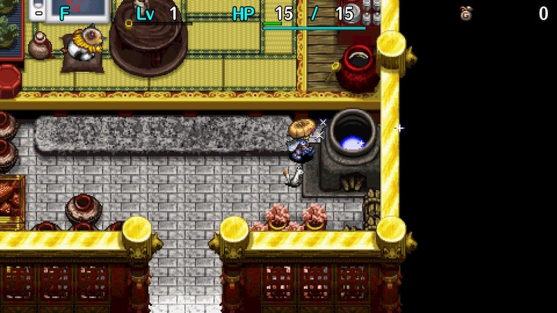
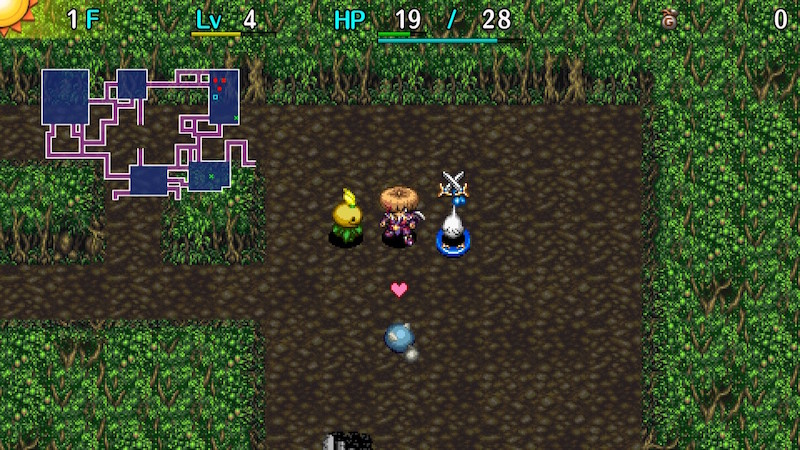
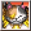

  

Dungeon where you use a combination of traps and Friendship Licenses to progress.

Shiren has Trapper Status in this dungeon, which lets him pick up and place traps on the ground, 
and monsters are the ones who trigger traps instead of Shiren.

It's among the easiest dungeons that don't allow carry-in items, but requires unique strategies. 
Once you become familiar with them, even a 99F run is nearly guaranteed to be cleared.

<ul class="quickLinksUL">
  <li><a href="#overview">Overview</a>
    <ul>
      <li><a href="#trapper-status">Trapper Status</a></li>
      <li><a href="#duelist-trap">Duelist Trap</a></li>
      <li><a href="#monster-license">Monster License</a></li>
    </ul>
  </li>
  <li><a href="#strategy">Strategy</a>
    <ul>
      <li><a href="#general">General</a></li>
      <li><a href="#progressing">Progressing</a></li>
      <li><a href="#equipment">Equipment</a></li>
      <li><a href="#other-items">Other Items</a></li>
      <li><a href="#traps">Traps</a></li>
    </ul>
  </li>
  <li><a href="#monsters">Monsters</a></li>
  <li><a href="#items">Items</a></li>
  <li><a href="#traps">Traps</a></li>
</ul>

# Overview

<table class="dungeonOverview">
  <tr>
    <th>Unlock</th>
    <td class="highlightYellow">Clear the main story, and give catnip juice to Gen. (Catnip juice is obtained in Inori Village) ※ Enter a dungeon and return after giving the juice.</td>
  </tr>
  <tr>
    <th>Entrance</th>
    <td class="highlightYellow">Gen's house in Nekomaneki Village. (Check the pot)</td>
  </tr>
</table>

<table class="dungeonTable">
  <tr>
    <th>Floors</th>
    <td>30F (first) / 99F</td>
    <th>Day / Night</th>
    <td>Day</td>
  </tr>
  <tr>
    <th>Bring Items</th>
    <td>No</td>
    <th>Allies</th>
    <td>No</td>
  </tr>
  <tr>
    <th>Unidentified</th>
    <td>None</td>
    <th>New Items</th>
    <td>No</td>
  </tr>
  <tr>
    <th>Shops</th>
    <td>Regular, Elite, Pick-A-Choice</td>
    <th>Monster Houses</th>
    <td>Regular, Special, Sudden</td>
  </tr>
  <tr>
    <th>Initial Enemies</th>
    <td></td>
    <th>Spawn Rate</th>
    <td>30</td>
  </tr>
  <tr>
    <th>Ominous aura</th>
    <td>Yes (1000 turns)</td>
    <th>Wind of Kron</th>
    <td>1st: 1700 4th: 2000</td>
  </tr>
  <tr>
    <th>Clear Icon</th>
    <td class="clearIcon"></td>
    <th>Reward</th>
    <td>Trapper Bracelet (1st clear)</td>
  </tr>
</table>

#### Trapper Status

Shiren has Trapper Status at all times in this dungeon, which has the following characteristics:

- Traps don't trigger when Shiren walks on them, and he can pick them up instead. (Can manually step on them to trigger them)
- Picked up traps are added to your inventory, and are placed using the Drop and DropFwd commands. (Doesn't end turn)
- Placed traps have a red mark in the lower right corner, and can't be picked up again.
- Enemies that step on traps will trigger them, and monsters hit by thrown traps will receive the effect of the trap.
    - Floating type monsters will also receive the effect of a trap if one is thrown at them.

#### Duelist Trap

A special trap called "Duelist Trap" appears in this dungeon. 
Monsters that step on this trap gain Dueling status for a limited amount of time, including Floating type monsters.

Dueling status grants a chance for the dueling monster to drop a Monster License when defeated, 
and this status can't be absorbed by Absorbiphant family monsters.

Duelist Traps won't break if they haven't been picked up, but placed Duelist Traps will always break after a single use. 
If you want to collect Monster Licenses, always lure monsters onto a Duelist Trap that hasn't been picked up.

#### Monster License

Monster Licenses (Monster-specific Friendship Licenses) cause that monster family to act as allies. 
(Example: "Mamel Lic." in inventory causes Mamel, Pit Mamel, Cave Mamel, and Gitan Mamel to attack enemies)

Ally monsters won't be attacked by enemies, and won't level up when they defeat enemies. (Shiren won't gain exp) 
If Shiren deals damage to an ally monster, all Monster Licenses for that family are destroyed, including those in pots. 
Licenses that are inside pots won't be active, and licenses on the ground won't be active either.

When you're carrying a Monster License for a monster that appears on the current floor, and advance to the next floor, 
a "Blank Scroll check" occurs, which causes a license to turn into a Blank Scroll if it succeeds. (Including those in pots) 
For example, if you're carrying a Mamel Lic. early on, a check is performed when you advance from: 
1F → 2F ・ 2F → 3F ・ 3F → 4F ・ 4F → 5F ・ 5F → 6F ・ 6F → 7F ・ 7F → 8F

Maneater Lic. will only have a Blank Scroll check when you change floors after they appear on the current floor.

The chance for a Monster License to turn into a Blank Scroll seems to be somewhere between 10\~20%.

# Strategy

<ul class="quickLinksUL">
  <li><a href="#general">General</a></li>
  <li><a href="#progressing">Progressing</a></li>
  <li><a href="#equipment">Equipment</a></li>
  <li><a href="#other-items">Other Items</a></li>
  <li><a href="#traps">Traps</a></li>
</ul>

### General

This dungeon is extremely unique, and many strategies used in other dungeons aren't needed. 
Instead, you'll want to learn Gen's Turf specific item collection techniques, and decision making for what items to keep. 
Some luck plays into it related to Blank Scroll checks and finding pots, but you can usually clear the 99F version 
without issues if you stick to the outlined strategies, and you'll take home Blank Scrolls and a set of +99 equipment.

If you're only aiming for the first clear (30F), go around the map to collect items and traps that help with run-away play, 
and then start rushing for the stairs. Staves are found identified, so it's generally not very difficult to escape situations. 
You don't need to go out of your way to obtain Monster Licenses, but it helps to obtain licenses for strong monsters.

If you're aiming for 99F, you'll want to collect Monster Licenses early game to make Blank Scrolls, and then 
read a Mnster House Scrl to collect more items and traps. This is usually repeated on every floor until 20F or so. 
The main idea is to use Fate, Earth, and blessed Extraction scrolls to strengthen equipment to +99, 
and then obtain multiple licenses for troublesome enemies like Bored Kappa, Dragon, Fearabbit, 
and finally read Navigation Scroll and Immunity Scroll to rush stairs until 99F.

### Progressing

Use Duelist Traps on 1F to collect as many Monster Licenses as you can. 
It's fine to eat the Large Onigiri on this floor, so stay until your fullness depletes to around 60. (1400 turns) 
You'll want a minimum of 6 licenses, and for at least 1 of them change into a Blank Scroll when you advance to 2F.

From 2F onward, write Mnster House Scrl on a Blank Scroll to collect even more items. 
The only items you need are a main weapon and shield, bracelets, pots to hold licenses, and food. 
There's no need to carry around grasses, talismans, or staves.

Food will likely be scarce for a while starting on 2F, so use Decay Traps + Explosion Traps to create Grilled Onigiri. 
Onigiri Traps + Explosion Traps can also be used, but it's trickier to perform since Onigiri status wears off over time. 
Try to increase max fullness at this point, and be sure to carry Decay Traps and Explosion Traps as backup early on.

Once you have some food stocked up, you can collect licenses until the wind blows on each floor. 
Insert licenses into any pots that can hold them, including Synthesis Pots. (Treat them like Ordinary Pots)

Keeping or discarding specific Monster Licenses is a constant decision making exercise due to Blank Scroll checks. 
Check the monster table, and prioritize monster families that appear across a longer floor range than others, 
and discard licenses if the target monster family won't appear again until much later.

When inserting licenses into pots other than Preservation Pots, it's best to group them by monster family 
in an effort to avoid having to sort inventory items when you break the pot to retrieve Blank Scrolls.

Once you have lots of Blank Scrolls, do blessed Extraction Scroll loops to increase pot capacity and upgrade value.

After upgrading equipment, collect licenses for more Blank Scrolls, and aim to obtain mutliple copies of licenses 
for troublesome monsters for the second half. (Dragons, Bored Kappas, Fearabbits, Tiger Tossers, Item Knaves, etc.) 
Basically, focus on monsters with dangerous special attacks that can't be nullified by reading an Immunity Scroll. 
Duelist Traps stop appearing from 70F, so use Nixer Scrolls instead if you need licenses for these monsters late game.

#### Blessed Extraction Scroll Loop

Technique where you use a blessed Extraction Scroll on a pot to bless its contents + another Extraction Scroll. 
The pot (capacity of 5) should have 4 scrolls you want to reuse, along with an Extraction Scroll (or Blank Scroll) inside. 
After using a blessed Extraction Scroll on the pot, you can reuse the 4 scrolls 1 time each, and can repeat the technique. 
If you have a Blessing Pot, use regular Extraction Scrolls on the Blessing Pot with 5 scrolls you want to reuse instead. 
※ It's technically not a loop since the Extraction Scroll is consumed, but it's easier to call it that to get the idea across.

The following scrolls are used in blessed Extraction Scroll loops for Gen's Turf:

- Blessing Scroll
    - Often needed to begin the technique, and you can never have too many of these scrolls. It's best to bless Blessing Scrolls instead of specific scrolls since they can be used on other items. (Example: Go with Fate Scroll x 1 and Blessing Scroll x 3 instead of Fate Scroll x 4)
- Fate Scroll, Earth Scroll, Darth Scroll
    - The main focus of this technique, and used to upgrade a weapon and shield to +99 in this dungeon.
- Mnster House Scrl
    - Lets you obtain lots of traps and items, and should be read on each floor until at least 10F.
- Pot God Scroll
    - Increase the capacity of Preservation and Blessing pots.
- Fixer Scroll
    - Fully restores fullness if read while starving.
- Onigiri Scroll
    - Alternative to Fixer Scroll, if you want to keep Super status.
- Immunity Scroll
    - Used to hunt Maneaters early game, and to secure safety on every floor during the second half.
- Navigation Scroll
    - Useful for locating monsters while collecting Monster Licenses, and for locating stairs.

### Equipment

#### Weapon / Shield

Type effective weapons can't be found on the ground, and shops are incredibly rare, so you don't have many options. 
Ordinary Stick + Plain Targe is the ideal set since it has a high starting max upgrade value, levels up quickly, 
and gains the CR Diet rune once it reaches Lv8.

Two bracelet resonance is a low priority in this dungeon, and it's easy to earn equipment experience points by hunting 
Maneaters and keeping Super status active, so it's fine to switch to mismatching equipment with higher base stats. 
That said, Dotanuki + Wolfshead and Beast Fang + Beast Shield sets can be found somewhat commonly, and the 
Bladite + Targite set can also rarely be found on the ground, so you likely won't be stuck with weak equipment.

#### Runes

You can brute force the dungeon with upgrade value and Blank Scrolls, so runes aren't too important. 
However, some shield runes are nice to have, so focus on adding the following runes:

- Anti-Theft, Anti-Burgle, Anti-Peck
    - Makes it easier to collect Zalokleft, Froggo, and Gyadon licenses. Lock Shield, Safe Shield, and Gyadon Blocker can be found on the ground.
- CR Diet
    - Plain Targe can only be found on the ground until 5F. If you didn't find one, get it from a Presto Pot. Diet Shield can't be found on the ground, but can be dropped by Maneaters.
- Unmoving
    - Steady Shield and Heavy Shield are both shop-exclusive, so you'll likely have to obtain them from Maneaters. Useful for collecting Fearabbit, Tiger Tosser, Yanpii family and DJ Mage licenses.
- Anti-Blast
    - Blast Shield can't be found on the ground, but this can be added by leveling a Lock Shield or Safe Shield to Lv8. It's nice to have this as insurance since Explochins explode in a chain-reaction when hit by an Explosion Trap. If you're concerned about Pop Tank family monsters, aim to add this rune when Mixers first appear. (9-10F)
- Anti-Fire
    - Dragon Grass can only be obtained from a Presto Pot or shop, and Snake Shield is exclusive to elite shops.
- Magi-Twister
    - Binary Shield isn't in this dungeon's item table, so you can't add Magi-Twister by leveling up a shield, and Swap Shield is exclusive to elite shops, so it's difficult to obtain this rune.

※ Keep in mind that Mixers you see walking around might have stepped on arrow traps. 　If you want to be safe, only synthesize using Mixers that were napping.

#### Bracelets

There are few options. Monster Detector (Monsterphobic) and Item Detector (Itemphobic) aren't in the item table. 
Immunity Scroll is an option, so prioritize bracelets that block special attacks that can't be blocked by Immune status, 
or bracelets that let you conserve Blessing Scrolls which would otherwise be used to bless Immunity Scrolls.

Keep in mind that carrying bracelets wastes inventory slots that could be used to carry more licenses, 
so if you choose to use them, discard them once you get past the floor range where the target monsters appear.

- Cleansing Bracelet
    - Mainly used for Mutaikon floors (9-14F), and is one of the more important bracelets. Also useful if you perform Grass Factory mid game.
- Anti-Cnf. Bracelet
    - Useful for Blade Bee floors (3-6F, 16-20F, 30-35F, 60-64F) and Dazikon floors (34-37F). MC Mage (29-32F) overlaps, so Immunity Scroll is needed to ensure safety even with this bracelet.
- Alert Bracelet
    - Useful for Naptapir floors (9-12F, 24-27F, 50-54F, 67-70F) and Dozikon floors (65-68F, 81-83F). MC Sorceror (51-55F) overlaps with Doztapir, and some prefer Immunity Scroll for 65-68F due to Gazers.
- Can. Arm Bracelet
    - Used to get rid of unneeded items and traps to make collecting Bored Kappa and Zalokleft licenses easier.
- Anti-Crs. Bracelet
    - Useful for Curse Girl floors (8-10F, 22-26F, 56-58F, 73-77F, 90-92F). However, it's shop-exclusive, and tends to waste an inventory slot since Curse Girl family floors are far apart.
- Staunch Bracelet
    - If you're worried about MC Wizard's level down magic bullet effect. (36-39F) 

### Other Items

- Arrows, Rocks, Grass, Staves, Talismans
    - Typically not used if you're progressing through the dungeon while collecting Blank Scrolls. You won't need these items for run-away play if you've upgraded your equipment, so only carry what you need to make collecting licenses easier.
- Scrolls
    - Keep scrolls listed in the earlier blessed Extraction Scroll loop section, and discard the rest. Remember, you have Blank Scrolls if you need to cover other situations.
- Pots
    - Preservation Pot is the key item for this dungeon, and always expand capacity to 5 using Pot God Scrolls. Synthesis, Exorcism, and Ordinary pots are used to carry licenses and Blank Scrolls, and Blessing Pot lets you conserve Blank Scrolls by using regular Extraction Scrolls instead of having to bless one each time. Dodger and Zen pots are nice, but you can use licenses to counter monsters with applicable special attacks. 

### Traps

This dungeon makes use of traps, but as mentioned earlier, you can clear it by using Blank Scrolls and licenses. 
The only traps worth carrying are Decay and Explosion to secure food early on, and the rest are a waste of space. 
...But perhaps you want to use traps instead, so this section covers traps while assuming no Blank Scroll usage.

Traps generated on the ground from the start of the floor won't break when enemies step on them. 
Once a trap is picked up and placed, you can't pick it up again, and it has a chance to break after it triggers. 
It seems traps vary in how likely they are to break. For example, Duelist Trap always breaks after a single use.

Traps can't be blessed, cursed, or sealed, and can't turn into Gitan (Sale Scroll), but can be turned into an onigiri. 
They'll turn into a different trap when inserted into a Presto Pot, and can activate fragrance pots. 
Place stat lowering traps on room entrance tiles, and status inflicting traps near Duelist Traps.

See Traps for details about traps that aren't listed below.

- Pit
    - By far the best trap in the dungeon, but rarely gets generated. Lets you steal, escape a bad situation, or simply advance to the next floor without risk. Only has a chance to appear until 30F.
- Spring
    - Used like Warp Grass. Be careful of placement, since enemies also warp if they step on it.
- Decay
    - Used alongside Sweet Nut explosions or Explosion / Big Explosion traps to create Grilled Onigiri. It's the best offensive trap, and works on Absorbiphants.
- Explosion, Big Explosion
    - Halves the HP of the creature that stepped on it, along with all creatures in a 1 tile radius. (Big Explosion reduces HP to 1) Often used to soften enemies so that they can be defeated with a single direct attack, and works on Gyazas. Can also be used to grill onigiri or destroy wall tiles.
- Onigiri
    - Useful for hunting Maneaters, and neutralizing high level enemies for experience points early on. Can be used alongside a Log Trap on floors with water tiles to create Rotten Onigiri. Breaks easily when placed, so make use of traps that were already on the ground. Nigiri Baby family monsters will gain Buffed status if they step on it. If you don't need it, throw it at an enemy standing on a water tile.
- Slow
    - Lets you safely defeat enemies using hit-and-away tactics. Unlike previous games, action speed changes last the entire duration of the current floor for monsters.
- Wood Arrow, Iron Arrow, Poison Arrow
    - Place it next to a wall and throw an item onto the trap to collect arrows. On floors where Sweet Nuts appear, step on it yourself so that the Sweet Nut eats arrows to increase experience points / change Rotten Onigiri into Grilled Onigiri. Wood and Iron arrow traps only appear until 30F, and projectiles can't be found on the ground.
- Duelist
    - Used to obtain Monster Licenses. Breaks after 1 activation when placed, but will never break if it was already on the ground. Works on all monsters, including Floating types and Absorbiphant, Gyaza, Sproutant families. Its chance to be generated decreases as you progress through the dungeon, and stops appearing from 70F. 

# Monsters

See [Monsters](/system/monsters) for individual monster details.

Enemy Colors: Farming Situational Farming Destroys Items Dangerous Very Dangerous

<table class="dungeonMonsters">
  <thead>
    <tr>
      <th colspan="10">Day</th>
    </tr>
  </thead>
  <tbody>
    <tr>
      <td>1</td>
      <td class="highlightYellow">Mamel</td>
      <td class="highlightYellow">Sproutant</td>
      <td class="highlightYellow">Seedie</td>
      <td></td>
      <td></td>
      <td></td>
      <td></td>
      <td></td>
      <td></td>
    </tr>
    <tr>
      <td>2</td>
      <td class="highlightYellow">Mamel</td>
      <td class="highlightYellow">Sproutant</td>
      <td class="highlightYellow">Seedie</td>
      <td class="highlightYellow">Colum</td>
      <td></td>
      <td></td>
      <td></td>
      <td></td>
      <td></td>
    </tr>
    <tr>
      <td>3</td>
      <td class="highlightYellow">Mamel</td>
      <td class="highlightYellow">Sproutant</td>
      <td class="highlightYellow">Seedie</td>
      <td class="highlightYellow">Colum</td>
      <td class="highlightYellow">Blade Bee</td>
      <td class="highlightBlue">Grass Kid</td>
      <td class="highlightGreen">Pit Mamel</td>
      <td class="highlightYellow">Chintala</td>
      <td></td>
    </tr>
    <tr>
      <td>4</td>
      <td class="highlightYellow">Mamel</td>
      <td class="highlightYellow">Sproutant</td>
      <td class="highlightYellow">Seedie</td>
      <td class="highlightYellow">Colum</td>
      <td class="highlightYellow">Blade Bee</td>
      <td class="highlightBlue">Grass Kid</td>
      <td class="highlightGreen">Pit Mamel</td>
      <td class="highlightYellow">Chintala</td>
      <td class="highlightYellow">Sweet Nut</td>
    </tr>
    <tr>
      <td>5</td>
      <td class="highlightYellow">Mamel</td>
      <td></td>
      <td class="highlightYellow">Nigiri Baby</td>
      <td class="highlightYellow">Colum</td>
      <td class="highlightYellow">Blade Bee</td>
      <td class="highlightBlue">Grass Kid</td>
      <td class="highlightGreen">Pit Mamel</td>
      <td class="highlightYellow">Chintala</td>
      <td class="highlightYellow">Sweet Nut</td>
    </tr>
    <tr>
      <td>6</td>
      <td class="highlightYellow">Moseal</td>
      <td class="highlightGreen">Froggo</td>
      <td class="highlightYellow">Nigiri Baby</td>
      <td class="highlightYellow">Tiger Tosser</td>
      <td class="highlightYellow">Blade Bee</td>
      <td class="highlightYellow">Floaty</td>
      <td class="highlightGreen">Pit Mamel</td>
      <td class="highlightYellow">Chintala</td>
      <td class="highlightYellow">Sweet Nut</td>
    </tr>
    <tr>
      <td>7</td>
      <td class="highlightYellow">Moseal</td>
      <td class="highlightGreen">Froggo</td>
      <td class="highlightYellow">Nigiri Baby</td>
      <td class="highlightYellow">Tiger Tosser</td>
      <td></td>
      <td class="highlightYellow">Floaty</td>
      <td class="highlightGreen">Pit Mamel</td>
      <td class="highlightYellow">Chintala</td>
      <td></td>
    </tr>
    <tr>
      <td>8</td>
      <td class="highlightYellow">Moseal</td>
      <td class="highlightYellow">Fearabbit</td>
      <td class="highlightYellow">Nigiri Baby</td>
      <td class="highlightYellow">Tiger Tosser</td>
      <td></td>
      <td class="highlightYellow">Floaty</td>
      <td class="highlightYellow">Gyaza</td>
      <td></td>
      <td class="highlightPurple3">Curse Girl</td>
    </tr>
    <tr>
      <td>9</td>
      <td class="highlightYellow">Moseal</td>
      <td class="highlightYellow">Fearabbit</td>
      <td class="highlightYellow">Mutaikon</td>
      <td class="highlightYellow">Tiger Tosser</td>
      <td></td>
      <td class="highlightYellow">Naptapir</td>
      <td class="highlightYellow">Gyaza</td>
      <td class="highlightBlue">Mixer</td>
      <td class="highlightPurple3">Curse Girl</td>
    </tr>
    <tr>
      <td>10</td>
      <td class="highlightYellow">Kumonigiri</td>
      <td class="highlightYellow">Fearabbit</td>
      <td class="highlightYellow">Mutaikon</td>
      <td class="highlightYellow">Pumphantasm</td>
      <td class="highlightYellow">N'dubba</td>
      <td class="highlightYellow">Naptapir</td>
      <td class="highlightYellow">Gyaza</td>
      <td class="highlightBlue">Mixer</td>
      <td class="highlightPurple3">Curse Girl</td>
    </tr>
    <tr>
      <td>11</td>
      <td class="highlightYellow">Kumonigiri</td>
      <td class="highlightYellow">Fearabbit</td>
      <td class="highlightYellow">Mutaikon</td>
      <td class="highlightYellow">Pumphantasm Metalhead</td>
      <td class="highlightYellow">N'dubba Mid Chintala</td>
      <td class="highlightYellow">Naptapir</td>
      <td class="highlightPurple3">Mudkin</td>
      <td class="highlightYellow">Pop Tank</td>
      <td class="highlightYellow">Scorpion</td>
    </tr>
    <tr>
      <td>12</td>
      <td class="highlightYellow">Kumonigiri</td>
      <td class="highlightYellow">Fearabbit</td>
      <td class="highlightYellow">Mutaikon</td>
      <td class="highlightYellow">Pumphantasm Metalhead</td>
      <td class="highlightYellow">Mid Chintala</td>
      <td class="highlightYellow">Naptapir Kid Squid</td>
      <td class="highlightPurple3">Mudkin Polygon Spinna</td>
      <td class="highlightYellow">Pop Tank Cololum</td>
      <td class="highlightYellow">Scorpion</td>
    </tr>
    <tr>
      <td>13</td>
      <td class="highlightYellow">Kumonigiri Cheer-Ham</td>
      <td class="highlightYellow">Acrid Nut</td>
      <td class="highlightBlue">Mutaikon Snacky</td>
      <td class="highlightPurple3">Metalhead Swordsman</td>
      <td class="highlightYellow">Mid Chintala</td>
      <td class="highlightYellow">Kid Squid</td>
      <td class="highlightYellow">Polygon Spinna</td>
      <td class="highlightYellow">Cololum</td>
      <td class="highlightYellow">Scorpion</td>
    </tr>
    <tr>
      <td>14</td>
      <td class="highlightYellow">Cheer-Ham</td>
      <td class="highlightYellow">Acrid Nut</td>
      <td class="highlightBlue">Mutaikon Snacky</td>
      <td class="highlightPurple3">Metalhead Swordsman</td>
      <td class="highlightYellow">Mid Chintala</td>
      <td class="highlightYellow">Kid Squid</td>
      <td class="highlightYellow">Polygon Spinna</td>
      <td class="highlightOrange2">Cololum Foly</td>
      <td class="highlightYellow">Scorpion</td>
    </tr>
    <tr>
      <td>15</td>
      <td class="highlightYellow">Cheer-Ham Bored Kappa</td>
      <td class="highlightYellow">Yanpii</td>
      <td class="highlightBlue">Snacky Momoseal</td>
      <td class="highlightPurple3">Swordsman Flamebird</td>
      <td></td>
      <td class="highlightYellow">Kid Squid</td>
      <td class="highlightYellow">Polygon Spinna</td>
      <td class="highlightOrange2">Foly</td>
      <td class="highlightYellow">Scorpion</td>
    </tr>
    <tr>
      <td>16</td>
      <td class="highlightYellow">Bored Kappa</td>
      <td class="highlightYellow">Yanpii</td>
      <td class="highlightYellow">Momoseal</td>
      <td class="highlightYellow">Flamebird</td>
      <td class="highlightYellow">Dagger Bee</td>
      <td class="highlightYellow">Kid Squid</td>
      <td class="highlightYellow">Hopodile</td>
      <td class="highlightOrange2">Foly</td>
      <td></td>
    </tr>
    <tr>
      <td>17</td>
      <td class="highlightYellow">Bored Kappa</td>
      <td class="highlightYellow">Yanpii</td>
      <td class="highlightYellow">Momoseal</td>
      <td class="highlightYellow">Flamebird</td>
      <td class="highlightYellow">Dagger Bee</td>
      <td class="highlightPurple3">Scoopie</td>
      <td class="highlightYellow">Hopodile</td>
      <td class="highlightOrange2">Foly</td>
      <td class="highlightBlue">Zalokleft</td>
    </tr>
    <tr>
      <td>18</td>
      <td class="highlightYellow">DJ Mage</td>
      <td class="highlightYellow">Yanpii</td>
      <td class="highlightYellow">Momoseal Beanie</td>
      <td class="highlightYellow">Flamebird Eligan</td>
      <td class="highlightYellow">Dagger Bee</td>
      <td class="highlightPurple3">Scoopie</td>
      <td class="highlightYellow">Hopodile</td>
      <td class="highlightOrange2">Grampa Tank</td>
      <td class="highlightBlue">Zalokleft</td>
    </tr>
    <tr>
      <td>19</td>
      <td class="highlightYellow">DJ Mage</td>
      <td class="highlightYellow">Yanpii</td>
      <td class="highlightYellow">Beanie</td>
      <td class="highlightYellow">Eligan</td>
      <td class="highlightYellow">Dagger Bee</td>
      <td class="highlightPurple3">Scoopie</td>
      <td class="highlightYellow">Hopodile</td>
      <td class="highlightOrange2">Grampa Tank</td>
      <td></td>
    </tr>
    <tr>
      <td>20</td>
      <td class="highlightYellow">DJ Mage</td>
      <td class="highlightPurple3">Gyadon</td>
      <td class="highlightYellow">Beanie</td>
      <td class="highlightYellow">Eligan</td>
      <td class="highlightBlue">Dagger Bee Grass Dude</td>
      <td class="highlightPurple3">Scoopie</td>
      <td class="highlightYellow">Hopodile</td>
      <td class="highlightOrange2">Grampa Tank</td>
      <td></td>
    </tr>
    <tr>
      <td>21</td>
      <td class="highlightYellow">DJ Mage</td>
      <td class="highlightPurple3">Gyadon</td>
      <td class="highlightYellow">Beanie</td>
      <td class="highlightYellow">Eligan</td>
      <td class="highlightBlue">Grass Dude</td>
      <td class="highlightYellow">Sproutyrant</td>
      <td class="highlightPurple3">Nigiri Morph</td>
      <td class="highlightOrange2">Grampa Tank</td>
      <td class="highlightBlue">Green Zalokleft</td>
    </tr>
    <tr>
      <td>22</td>
      <td class="highlightYellow">DJ Mage Pandanigiri</td>
      <td class="highlightPurple3">Gyadon</td>
      <td class="highlightPurple3">Beanie Cursister</td>
      <td class="highlightYellow">Eligan Ironhead</td>
      <td class="highlightBlue">Grass Dude</td>
      <td class="highlightYellow">Sproutyrant</td>
      <td class="highlightPurple3">Nigiri Morph</td>
      <td class="highlightYellow">Poofy</td>
      <td class="highlightBlue">Green Zalokleft</td>
    </tr>
    <tr>
      <td>23</td>
      <td class="highlightYellow">DJ Mage Pandanigiri</td>
      <td class="highlightPurple3">Gyadon Froggucci</td>
      <td class="highlightPurple3">Cursister Boy Cart</td>
      <td class="highlightYellow">Ironhead</td>
      <td class="highlightBlue">Grass Dude</td>
      <td class="highlightYellow">Sproutyrant</td>
      <td class="highlightPurple3">Nigiri Morph</td>
      <td class="highlightYellow">Poofy</td>
      <td class="highlightBlue">Green Zalokleft</td>
    </tr>
    <tr>
      <td>24</td>
      <td class="highlightYellow">Pandanigiri</td>
      <td class="highlightPurple3">Gyadon Froggucci</td>
      <td class="highlightPurple3">Cursister Boy Cart</td>
      <td class="highlightYellow">Ironhead</td>
      <td class="highlightBlue">Grass Dude Snooztapir</td>
      <td class="highlightYellow">Sproutyrant</td>
      <td class="highlightPurple3">Nigiri Morph Absorbiphant</td>
      <td class="highlightYellow">Poofy</td>
      <td></td>
    </tr>
    <tr>
      <td>25</td>
      <td class="highlightYellow">Pandanigiri</td>
      <td class="highlightYellow">Punisher</td>
      <td class="highlightPurple3">Cursister</td>
      <td class="highlightYellow">Ironhead</td>
      <td class="highlightYellow">Snooztapir</td>
      <td class="highlightYellow">Sproutyrant</td>
      <td class="highlightOrange2">Absorbiphant</td>
      <td class="highlightOrange2">Hipadile</td>
      <td></td>
    </tr>
    <tr>
      <td>26</td>
      <td class="highlightPurple3">Pandanigiri Spadie</td>
      <td class="highlightYellow">Punisher</td>
      <td class="highlightPurple3">Cursister Firepuff</td>
      <td class="highlightYellow">Sr. Yanpii</td>
      <td class="highlightPurple3">Snooztapir Muddy</td>
      <td class="highlightYellow">Sproutyrant</td>
      <td class="highlightOrange2">Absorbiphant</td>
      <td class="highlightOrange2">Hipadile</td>
      <td class="highlightYellow">Crow Tengu</td>
    </tr>
    <tr>
      <td>27</td>
      <td class="highlightPurple3">Spadie</td>
      <td class="highlightYellow">Punisher</td>
      <td class="highlightYellow">Firepuff</td>
      <td class="highlightYellow">Sr. Yanpii</td>
      <td class="highlightPurple3">Snooztapir Muddy</td>
      <td class="highlightYellow">Explochin</td>
      <td class="highlightOrange2">Absorbiphant</td>
      <td class="highlightOrange2">Hipadile Cross Cart</td>
      <td class="highlightYellow">Crow Tengu</td>
    </tr>
    <tr>
      <td>28</td>
      <td class="highlightPurple3">Spadie</td>
      <td class="highlightYellow">Punisher</td>
      <td class="highlightYellow">Firepuff</td>
      <td class="highlightYellow">Sr. Yanpii</td>
      <td class="highlightPurple3">Muddy</td>
      <td class="highlightYellow">Explochin</td>
      <td class="highlightOrange2">Absorbiphant</td>
      <td class="highlightGreen">Cross Cart</td>
      <td class="highlightYellow">Crow Tengu</td>
    </tr>
    <tr>
      <td>29</td>
      <td class="highlightPurple3">Spadie Digestiphant</td>
      <td class="highlightOrange2">Punisher Kappa Pest</td>
      <td class="highlightOrange2">Firepuff MC Mage</td>
      <td class="highlightYellow">Sr. Yanpii Go-Ham!</td>
      <td class="highlightOrange2">Scarabbit</td>
      <td class="highlightYellow">Explochin</td>
      <td class="highlightYellow">Zapdon</td>
      <td class="highlightGreen">Cross Cart</td>
      <td></td>
    </tr>
    <tr>
      <td>30</td>
      <td class="highlightPurple3">Spadie Digestiphant</td>
      <td class="highlightOrange2">Punisher Kappa Pest</td>
      <td class="highlightOrange2">MC Mage</td>
      <td class="highlightYellow">Sr. Yanpii Go-Ham!</td>
      <td class="highlightOrange2">Scarabbit Katana Bee</td>
      <td class="highlightYellow">Explochin</td>
      <td class="highlightYellow">Zapdon</td>
      <td class="highlightGreen">Cross Cart</td>
      <td class="highlightOrange2">N'twyn</td>
    </tr>
    <tr>
      <td>31</td>
      <td class="highlightOrange2">Digestiphant</td>
      <td class="highlightOrange2">Kappa Pest</td>
      <td class="highlightOrange2">MC Mage Shagga</td>
      <td class="highlightYellow">Go-Ham! Death Gyaza</td>
      <td class="highlightYellow">Katana Bee</td>
      <td class="highlightYellow">Explochin Polygon Shaka</td>
      <td class="highlightYellow">Dragon</td>
      <td class="highlightBlue">Mixermon</td>
      <td class="highlightOrange2">N'twyn</td>
    </tr>
    <tr>
      <td>32</td>
      <td class="highlightOrange2">Digestiphant</td>
      <td class="highlightOrange2">Kappa Pest</td>
      <td class="highlightOrange2">MC Mage Shagga</td>
      <td class="highlightYellow">Death Gyaza</td>
      <td class="highlightYellow">Katana Bee</td>
      <td class="highlightYellow">Explochin Polygon Shaka</td>
      <td class="highlightYellow">Dragon</td>
      <td class="highlightBlue">Mixermon</td>
      <td></td>
    </tr>
    <tr>
      <td>33</td>
      <td class="highlightOrange2">Digestiphant Cave Mamel</td>
      <td class="highlightOrange2">Kappa Pest</td>
      <td class="highlightYellow">Shagga</td>
      <td class="highlightYellow">Death Gyaza</td>
      <td class="highlightYellow">Katana Bee</td>
      <td class="highlightYellow">Polygon Shaka</td>
      <td class="highlightYellow">Dragon</td>
      <td class="highlightBlue">Mixermon</td>
      <td></td>
    </tr>
    <tr>
      <td>34</td>
      <td class="highlightYellow">Cave Mamel</td>
      <td class="highlightOrange2">Dazikon</td>
      <td class="highlightYellow">Shagga Flamepuff</td>
      <td class="highlightYellow">Death Gyaza</td>
      <td class="highlightYellow">Katana Bee</td>
      <td class="highlightYellow">Polygon Shaka</td>
      <td class="highlightYellow">Dragon</td>
      <td class="highlightYellow">Pumphantom</td>
      <td class="highlightYellow">Falcon Tengu</td>
    </tr>
    <tr>
      <td>35</td>
      <td class="highlightYellow">Cave Mamel</td>
      <td class="highlightOrange2">Dazikon</td>
      <td class="highlightYellow">Shagga Flamepuff</td>
      <td class="highlightYellow">Death Gyaza VeniScorp</td>
      <td class="highlightYellow">Katana Bee Tiger Hurler</td>
      <td class="highlightBlue">Polygon Shaka Grass Poppa</td>
      <td></td>
      <td class="highlightYellow">Pumphantom</td>
      <td class="highlightYellow">Falcon Tengu</td>
    </tr>
    <tr>
      <td>36</td>
      <td class="highlightYellow">Cave Mamel Huistdon</td>
      <td class="highlightOrange2">Dazikon</td>
      <td class="highlightYellow">Flamepuff</td>
      <td class="highlightYellow">VeniScorp</td>
      <td class="highlightYellow">Tiger Hurler</td>
      <td class="highlightBlue">Grass Poppa</td>
      <td class="highlightRed">Ornery Tank</td>
      <td class="highlightRed">MC Wizard</td>
      <td class="highlightYellow">Falcon Tengu</td>
    </tr>
    <tr>
      <td>37</td>
      <td class="highlightYellow">Cave Mamel Huistdon</td>
      <td class="highlightOrange2">Dazikon</td>
      <td class="highlightPurple3">Flamepuff Gyairas</td>
      <td class="highlightYellow">VeniScorp</td>
      <td class="highlightYellow">Tiger Hurler</td>
      <td class="highlightBlue">Grass Poppa Sparkbird</td>
      <td class="highlightRed">Ornery Tank</td>
      <td class="highlightRed">MC Wizard</td>
      <td class="highlightYellow">Eligagan</td>
    </tr>
    <tr>
      <td>38</td>
      <td class="highlightYellow">Huistdon</td>
      <td></td>
      <td class="highlightPurple3">Gyairas</td>
      <td class="highlightYellow">VeniScorp</td>
      <td class="highlightYellow">Tiger Hurler</td>
      <td class="highlightBlue">Grass Poppa Sparkbird</td>
      <td class="highlightRed">Ornery Tank</td>
      <td class="highlightRed">MC Wizard</td>
      <td class="highlightYellow">Eligagan</td>
    </tr>
    <tr>
      <td>39</td>
      <td class="highlightYellow">Huistdon</td>
      <td></td>
      <td class="highlightPurple3">Gyairas</td>
      <td class="highlightYellow">VeniScorp</td>
      <td class="highlightYellow">Tiger Hurler</td>
      <td class="highlightYellow">Sparkbird</td>
      <td class="highlightRed">Ornery Tank</td>
      <td class="highlightRed">MC Wizard</td>
      <td class="highlightYellow">Eligagan</td>
    </tr>
    <tr>
      <td>40</td>
      <td class="highlightYellow">Huistdon</td>
      <td></td>
      <td class="highlightPurple3">Gyairas</td>
      <td class="highlightYellow">Momomoseal</td>
      <td class="highlightOrange2">Nashagga</td>
      <td class="highlightYellow">Sparkbird</td>
      <td></td>
      <td></td>
      <td class="highlightYellow">Eligagan</td>
    </tr>
    <tr>
      <td>41</td>
      <td class="highlightYellow">Huistdon</td>
      <td></td>
      <td class="highlightPurple3">Gyairas</td>
      <td class="highlightYellow">Momomoseal</td>
      <td class="highlightOrange2">Nashagga</td>
      <td class="highlightYellow">Steelhead</td>
      <td class="highlightOrange2">Sky Dragon</td>
      <td></td>
      <td class="highlightYellow">Eligagan</td>
    </tr>
    <tr>
      <td>42</td>
      <td></td>
      <td></td>
      <td></td>
      <td class="highlightYellow">Momomoseal</td>
      <td class="highlightOrange2">Nashagga</td>
      <td class="highlightYellow">Steelhead</td>
      <td class="highlightOrange2">Sky Dragon</td>
      <td></td>
      <td class="highlightYellow">Eligagan</td>
    </tr>
    <tr>
      <td>43</td>
      <td class="highlightYellow">Big Chintala</td>
      <td></td>
      <td></td>
      <td class="highlightYellow">Momomoseal</td>
      <td class="highlightOrange2">Nashagga</td>
      <td class="highlightYellow">Steelhead</td>
      <td class="highlightOrange2">Sky Dragon</td>
      <td></td>
      <td></td>
    </tr>
    <tr>
      <td>44</td>
      <td class="highlightYellow">Big Chintala</td>
      <td class="highlightYellow">Rally Ham</td>
      <td class="highlightYellow">Spicy Nut</td>
      <td class="highlightOrange2">Nigiri Boss</td>
      <td class="highlightYellow">King Squid</td>
      <td class="highlightYellow">Steelhead</td>
      <td class="highlightOrange2">Sky Dragon</td>
      <td class="highlightYellow">Nuttie</td>
      <td class="highlightYellow">Concusschin</td>
    </tr>
    <tr>
      <td>45</td>
      <td class="highlightYellow">Big Chintala</td>
      <td class="highlightYellow">Rally Ham</td>
      <td class="highlightPurple3">Spicy Nut Super Gazer</td>
      <td class="highlightBlue">Nigiri Boss Munchy</td>
      <td class="highlightYellow">King Squid</td>
      <td class="highlightYellow">Steelhead</td>
      <td class="highlightOrange2">Sky Dragon</td>
      <td class="highlightYellow">Nuttie</td>
      <td class="highlightYellow">Concusschin</td>
    </tr>
    <tr>
      <td>46</td>
      <td class="highlightGreen">Big Chintala Strong Cart</td>
      <td class="highlightYellow">Rally Ham Blazepuff</td>
      <td class="highlightPurple3">Spicy Nut Super Gazer</td>
      <td class="highlightBlue">Nigiri Boss Munchy</td>
      <td class="highlightYellow">King Squid</td>
      <td class="highlightOrange2">Steelhead Oingodile</td>
      <td></td>
      <td class="highlightPurple3">Nuttie Gyairas</td>
      <td class="highlightYellow">Concusschin</td>
    </tr>
    <tr>
      <td>47</td>
      <td class="highlightGreen">Big Chintala Strong Cart</td>
      <td class="highlightYellow">Blazepuff Sparkbird</td>
      <td class="highlightPurple3">Super Gazer</td>
      <td class="highlightOrange2">Nigiri Boss Eagle Tengu</td>
      <td class="highlightPurple3">King Squid Trowelie</td>
      <td class="highlightOrange2">Oingodile</td>
      <td></td>
      <td class="highlightPurple3">Nuttie Gyairas</td>
      <td class="highlightYellow">Concusschin</td>
    </tr>
    <tr>
      <td>48</td>
      <td class="highlightGreen">Strong Cart Nashagga</td>
      <td class="highlightYellow">Blazepuff Sparkbird</td>
      <td class="highlightPurple3">Super Gazer</td>
      <td class="highlightOrange2">Nigiri Boss Eagle Tengu</td>
      <td class="highlightPurple3">King Squid Trowelie</td>
      <td class="highlightOrange2">Oingodile</td>
      <td class="highlightYellow">Colocolum</td>
      <td class="highlightPurple3">Nuttie Gyairas</td>
      <td class="highlightYellow">Concusschin</td>
    </tr>
    <tr>
      <td>49</td>
      <td class="highlightGreen">Strong Cart Nashagga</td>
      <td class="highlightYellow">Blazepuff Sparkbird</td>
      <td class="highlightPurple3">Super Gazer</td>
      <td class="highlightOrange2">Eagle Tengu N'mach</td>
      <td class="highlightPurple3">Trowelie Porkon</td>
      <td class="highlightOrange2">Oingodile</td>
      <td class="highlightYellow">Colocolum</td>
      <td class="highlightPurple3">Gyairas</td>
      <td class="highlightYellow">Concusschin</td>
    </tr>
    <tr>
      <td>50</td>
      <td class="highlightGreen">Strong Cart Nashagga</td>
      <td class="highlightYellow">Blazepuff</td>
      <td class="highlightPurple3">Super Gazer Doztapir</td>
      <td class="highlightOrange2">N'mach</td>
      <td class="highlightOrange2">Porkon</td>
      <td class="highlightOrange2">Oingodile</td>
      <td class="highlightYellow">Colocolum</td>
      <td class="highlightPurple3">Gyairas</td>
      <td class="highlightBlue">Mixergon</td>
    </tr>
    <tr>
      <td>51</td>
      <td class="highlightGreen">Strong Cart Debaser</td>
      <td class="highlightOrange2">Vexing Kappa</td>
      <td class="highlightYellow">Doztapir</td>
      <td class="highlightOrange2">N'mach</td>
      <td class="highlightOrange2">Porkon</td>
      <td class="highlightOrange2">Jouncy</td>
      <td class="highlightRed">MC Sorceror</td>
      <td class="highlightPurple3">Gyairas</td>
      <td class="highlightBlue">Mixergon</td>
    </tr>
    <tr>
      <td>52</td>
      <td class="highlightYellow">Debaser</td>
      <td class="highlightOrange2">Vexing Kappa</td>
      <td class="highlightYellow">Doztapir</td>
      <td class="highlightOrange2">N'mach</td>
      <td class="highlightOrange2">Porkon</td>
      <td class="highlightOrange2">Jouncy</td>
      <td class="highlightRed">MC Sorceror</td>
      <td class="highlightYellow">Sprouterror</td>
      <td></td>
    </tr>
    <tr>
      <td>53</td>
      <td class="highlightYellow">Debaser</td>
      <td class="highlightOrange2">Vexing Kappa</td>
      <td class="highlightYellow">Doztapir</td>
      <td class="highlightPurple3">Mudster</td>
      <td></td>
      <td class="highlightOrange2">Jouncy</td>
      <td class="highlightRed">MC Sorceror</td>
      <td class="highlightYellow">Sprouterror</td>
      <td></td>
    </tr>
    <tr>
      <td>54</td>
      <td class="highlightYellow">Debaser</td>
      <td class="highlightOrange2">Vexing Kappa</td>
      <td class="highlightYellow">Doztapir Pierce Cart</td>
      <td class="highlightPurple3">Mudster</td>
      <td class="highlightYellow">Pyrepuff</td>
      <td class="highlightOrange2">Jouncy</td>
      <td class="highlightRed">MC Sorceror</td>
      <td class="highlightYellow">Sprouterror</td>
      <td class="highlightYellow">StunScorp</td>
    </tr>
    <tr>
      <td>55</td>
      <td class="highlightYellow">Debaser</td>
      <td class="highlightOrange2">Vexing Kappa</td>
      <td class="highlightYellow">Pierce Cart</td>
      <td class="highlightPurple3">Mudster Tiger Chucker</td>
      <td class="highlightYellow">Pyrepuff</td>
      <td></td>
      <td class="highlightRed">MC Sorceror</td>
      <td class="highlightYellow">Sprouterror</td>
      <td class="highlightYellow">StunScorp</td>
    </tr>
    <tr>
      <td>56</td>
      <td class="highlightPurple3">Curspinster</td>
      <td class="highlightRed">Horrabbit</td>
      <td class="highlightYellow">Pierce Cart</td>
      <td class="highlightPurple3">Mudster Tiger Chucker</td>
      <td class="highlightYellow">Pyrepuff</td>
      <td class="highlightYellow">Momomomoseal</td>
      <td></td>
      <td class="highlightYellow">Pumpanshee</td>
      <td class="highlightYellow">StunScorp</td>
    </tr>
    <tr>
      <td>57</td>
      <td class="highlightPurple3">Curspinster</td>
      <td class="highlightRed">Horrabbit</td>
      <td class="highlightYellow">Pierce Cart</td>
      <td class="highlightPurple3">Mudster Tiger Chucker</td>
      <td class="highlightGreen">Pyrepuff Froggon</td>
      <td class="highlightYellow">Momomomoseal</td>
      <td class="highlightOrange2">Spongiderm</td>
      <td class="highlightOrange2">Pumpanshee Lashagga</td>
      <td class="highlightYellow">StunScorp</td>
    </tr>
    <tr>
      <td>58</td>
      <td class="highlightPurple3">Curspinster</td>
      <td class="highlightRed">Horrabbit</td>
      <td class="highlightPurple3">Pierce Cart Gyandora</td>
      <td class="highlightYellow">Tiger Chucker</td>
      <td class="highlightGreen">Froggon</td>
      <td class="highlightYellow">Momomomoseal</td>
      <td class="highlightOrange2">Spongiderm</td>
      <td class="highlightOrange2">Pumpanshee Lashagga</td>
      <td class="highlightYellow">StunScorp</td>
    </tr>
    <tr>
      <td>59</td>
      <td class="highlightBlue">Iron Zalokleft</td>
      <td class="highlightPurple3">Item Knave</td>
      <td class="highlightPurple3">Gyandora</td>
      <td class="highlightYellow">Tiger Chucker</td>
      <td class="highlightGreen">Froggon Lt. Yanpii</td>
      <td></td>
      <td class="highlightOrange2">Spongiderm</td>
      <td class="highlightOrange2">Pumpanshee Lashagga</td>
      <td class="highlightBlue">Grass Gramps</td>
    </tr>
    <tr>
      <td>60</td>
      <td class="highlightBlue">Iron Zalokleft</td>
      <td class="highlightPurple3">Item Knave</td>
      <td class="highlightPurple3">Gyandora Flarebird</td>
      <td class="highlightYellow">Tiger Chucker Zanbeeto</td>
      <td class="highlightYellow">Lt. Yanpii</td>
      <td class="highlightYellow">Polygon Singa</td>
      <td class="highlightOrange2">Spongiderm</td>
      <td class="highlightOrange2">Lashagga</td>
      <td class="highlightBlue">Grass Gramps</td>
    </tr>
    <tr>
      <td>61</td>
      <td class="highlightYellow">Spirit Ham</td>
      <td class="highlightPurple3">Item Knave Bunchukdon</td>
      <td class="highlightPurple3">Gyandora Flarebird</td>
      <td class="highlightYellow">Zanbeeto</td>
      <td class="highlightYellow">Lt. Yanpii</td>
      <td class="highlightYellow">Polygon Singa</td>
      <td class="highlightOrange2">Spongiderm</td>
      <td class="highlightPurple3">Lashagga Sensei</td>
      <td class="highlightBlue">Grass Gramps</td>
    </tr>
    <tr>
      <td>62</td>
      <td class="highlightYellow">Spirit Ham</td>
      <td class="highlightPurple3">Item Knave Bunchukdon</td>
      <td class="highlightOrange2">Flarebird</td>
      <td class="highlightYellow">Zanbeeto</td>
      <td class="highlightYellow">Lt. Yanpii</td>
      <td class="highlightYellow">Polygon Singa</td>
      <td class="highlightOrange2">Spongiderm</td>
      <td class="highlightPurple3">Sensei</td>
      <td class="highlightBlue">Grass Gramps</td>
    </tr>
    <tr>
      <td>63</td>
      <td class="highlightYellow">Spirit Ham</td>
      <td class="highlightYellow">Bunchukdon</td>
      <td class="highlightOrange2">Flarebird</td>
      <td class="highlightYellow">Zanbeeto</td>
      <td class="highlightYellow">Lt. Yanpii Onigirizzly</td>
      <td class="highlightYellow">Polygon Singa</td>
      <td class="highlightOrange2">Bouncy</td>
      <td class="highlightPurple3">Sensei</td>
      <td class="highlightYellow">Bitter Nut</td>
    </tr>
    <tr>
      <td>64</td>
      <td class="highlightYellow">Spirit Ham</td>
      <td class="highlightYellow">Bunchukdon</td>
      <td class="highlightOrange2">Flarebird</td>
      <td class="highlightYellow">Zanbeeto</td>
      <td class="highlightYellow">Onigirizzly</td>
      <td class="highlightYellow">Polygon Singa</td>
      <td class="highlightOrange2">Bouncy</td>
      <td class="highlightPurple3">Sensei</td>
      <td class="highlightYellow">Bitter Nut</td>
    </tr>
    <tr>
      <td>65</td>
      <td class="highlightYellow">Spirit Ham</td>
      <td class="highlightYellow">Bunchukdon Fulminachin</td>
      <td class="highlightRed">Dozikon</td>
      <td class="highlightRed">Archdragon</td>
      <td class="highlightYellow">Onigirizzly</td>
      <td class="highlightPurple3">Hyper Gazer</td>
      <td class="highlightOrange2">Bouncy</td>
      <td class="highlightPurple3">Sensei</td>
      <td class="highlightYellow">Bitter Nut</td>
    </tr>
    <tr>
      <td>66</td>
      <td class="highlightYellow">Phoenix Tengu</td>
      <td class="highlightYellow">Fulminachin</td>
      <td class="highlightRed">Dozikon</td>
      <td class="highlightRed">Archdragon</td>
      <td class="highlightYellow">Onigirizzly Grainie</td>
      <td class="highlightPurple3">Hyper Gazer</td>
      <td class="highlightOrange2">Bouncy</td>
      <td></td>
      <td class="highlightYellow">Bitter Nut</td>
    </tr>
    <tr>
      <td>67</td>
      <td class="highlightYellow">Phoenix Tengu</td>
      <td class="highlightYellow">Fulminachin</td>
      <td class="highlightRed">Dozikon</td>
      <td class="highlightRed">Archdragon</td>
      <td class="highlightYellow">Grainie</td>
      <td class="highlightPurple3">Hyper Gazer</td>
      <td class="highlightYellow">Comatapir</td>
      <td class="highlightBlue">Grass Gramps</td>
      <td></td>
    </tr>
    <tr>
      <td>68</td>
      <td class="highlightYellow">Phoenix Tengu</td>
      <td class="highlightYellow">Fulminachin</td>
      <td class="highlightRed">Dozikon</td>
      <td class="highlightRed">Archdragon</td>
      <td class="highlightYellow">Grainie</td>
      <td class="highlightPurple3">Hyper Gazer</td>
      <td class="highlightYellow">Comatapir</td>
      <td class="highlightBlue">Grass Gramps</td>
      <td></td>
    </tr>
    <tr>
      <td>69</td>
      <td class="highlightPurple3">Mudder</td>
      <td class="highlightYellow">Fulminachin</td>
      <td></td>
      <td class="highlightRed">Archdragon</td>
      <td class="highlightYellow">Grainie</td>
      <td class="highlightPurple3">Hyper Gazer</td>
      <td class="highlightYellow">Comatapir</td>
      <td class="highlightBlue">Grass Gramps</td>
      <td></td>
    </tr>
    <tr>
      <td>70</td>
      <td class="highlightPurple3">Mudder</td>
      <td class="highlightBlue">Mixerdon</td>
      <td class="highlightOrange2">N'dup</td>
      <td class="highlightYellow">Huge Chintala</td>
      <td class="highlightYellow">Grainie</td>
      <td class="highlightPurple3">Hyper Gazer</td>
      <td class="highlightYellow">Comatapir</td>
      <td class="highlightYellow">Hell Gyaza</td>
      <td></td>
    </tr>
    <tr>
      <td>71</td>
      <td class="highlightPurple3">Mudder</td>
      <td class="highlightBlue">Mixerdon</td>
      <td class="highlightOrange2">N'dup</td>
      <td class="highlightYellow">Huge Chintala</td>
      <td class="highlightYellow">Eligagon</td>
      <td class="highlightPurple3">Hyper Gazer</td>
      <td></td>
      <td class="highlightYellow">Hell Gyaza</td>
      <td></td>
    </tr>
    <tr>
      <td>72</td>
      <td class="highlightPurple3">Mudder</td>
      <td></td>
      <td class="highlightOrange2">N'dup</td>
      <td class="highlightYellow">Huge Chintala</td>
      <td class="highlightYellow">Eligagon</td>
      <td></td>
      <td></td>
      <td class="highlightYellow">Hell Gyaza</td>
      <td></td>
    </tr>
    <tr>
      <td>73</td>
      <td class="highlightYellow">Detonachin</td>
      <td class="highlightPurple3">Cursenior</td>
      <td class="highlightOrange2">N'dup</td>
      <td class="highlightYellow">Huge Chintala</td>
      <td class="highlightYellow">Eligagon</td>
      <td></td>
      <td></td>
      <td class="highlightYellow">Hell Gyaza</td>
      <td></td>
    </tr>
    <tr>
      <td>74</td>
      <td class="highlightYellow">Detonachin</td>
      <td class="highlightPurple3">Cursenior</td>
      <td class="highlightRed">Porgon</td>
      <td class="highlightYellow">Huge Chintala</td>
      <td class="highlightYellow">Eligagon</td>
      <td class="highlightYellow">Sproutitan</td>
      <td></td>
      <td class="highlightYellow">Hell Gyaza</td>
      <td class="highlightPurple3">Shovelie</td>
    </tr>
    <tr>
      <td>75</td>
      <td class="highlightYellow">Detonachin</td>
      <td class="highlightPurple3">Cursenior</td>
      <td class="highlightRed">Porgon</td>
      <td class="highlightYellow">Huge Chintala Ruiner</td>
      <td class="highlightYellow">Eligagon</td>
      <td class="highlightYellow">Sproutitan</td>
      <td class="highlightPurple3">Knave King</td>
      <td class="highlightBlue">Mealy</td>
      <td class="highlightPurple3">Shovelie</td>
    </tr>
    <tr>
      <td>76</td>
      <td class="highlightYellow">Detonachin</td>
      <td class="highlightPurple3">Cursenior</td>
      <td class="highlightRed">Porgon</td>
      <td class="highlightYellow">Ruiner</td>
      <td class="highlightYellow">Eligagon</td>
      <td class="highlightYellow">Sproutitan Squidperor</td>
      <td class="highlightPurple3">Knave King BlightScorp</td>
      <td class="highlightBlue">Mealy</td>
      <td class="highlightRed">Terrabbit</td>
    </tr>
    <tr>
      <td>77</td>
      <td class="highlightYellow">Detonachin</td>
      <td class="highlightPurple3">Cursenior</td>
      <td class="highlightRed">Porgon</td>
      <td class="highlightYellow">Ruiner</td>
      <td class="highlightOrange2">Boingodile</td>
      <td class="highlightYellow">Squidperor</td>
      <td class="highlightYellow">BlightScorp</td>
      <td class="highlightYellow">Pumptergeist</td>
      <td class="highlightRed">Terrabbit</td>
    </tr>
    <tr>
      <td>78</td>
      <td class="highlightYellow">Doomhead</td>
      <td class="highlightYellow">Colocolocolum</td>
      <td class="highlightRed">Porgon</td>
      <td class="highlightYellow">Ruiner</td>
      <td class="highlightOrange2">Boingodile</td>
      <td class="highlightYellow">Squidperor</td>
      <td class="highlightYellow">BlightScorp</td>
      <td class="highlightYellow">Pumptergeist</td>
      <td class="highlightRed">Terrabbit</td>
    </tr>
    <tr>
      <td>79</td>
      <td class="highlightYellow">Doomhead</td>
      <td class="highlightOrange2">Colocolocolum Gitan Mamel</td>
      <td class="highlightYellow">Kodionigiri</td>
      <td class="highlightOrange2">Kappa Troll</td>
      <td class="highlightOrange2">Boingodile</td>
      <td class="highlightYellow">Squidperor</td>
      <td class="highlightYellow">BlightScorp</td>
      <td class="highlightYellow">Pumptergeist</td>
      <td class="highlightRed">Terrabbit</td>
    </tr>
    <tr>
      <td>80</td>
      <td class="highlightPurple3">Doomhead Item Knave</td>
      <td class="highlightOrange2">Colocolocolum Gitan Mamel</td>
      <td class="highlightYellow">Kodionigiri</td>
      <td class="highlightOrange2">Kappa Troll</td>
      <td class="highlightGreen">Boingodile Kleptoad</td>
      <td class="highlightYellow">Squidperor</td>
      <td class="highlightYellow">BlightScorp</td>
      <td class="highlightOrange2">Osmammoth</td>
      <td class="highlightOrange2">Bashagga</td>
    </tr>
    <tr>
      <td>81</td>
      <td class="highlightPurple3">Doomhead Item Knave</td>
      <td class="highlightOrange2">Gitan Mamel</td>
      <td class="highlightYellow">Kodionigiri</td>
      <td class="highlightOrange2">Kappa Troll</td>
      <td class="highlightGreen">Boingodile Kleptoad</td>
      <td class="highlightRed">Dozikon</td>
      <td class="highlightPurple3">Gyandoron</td>
      <td class="highlightOrange2">Osmammoth</td>
      <td class="highlightOrange2">Bashagga</td>
    </tr>
    <tr>
      <td>82</td>
      <td class="highlightYellow">Doomhead</td>
      <td class="highlightOrange2">Gitan Mamel</td>
      <td></td>
      <td class="highlightOrange2">Kappa Troll</td>
      <td class="highlightGreen">Kleptoad</td>
      <td class="highlightRed">Dozikon</td>
      <td class="highlightPurple3">Gyandoron</td>
      <td class="highlightOrange2">Osmammoth</td>
      <td class="highlightOrange2">Bashagga</td>
    </tr>
    <tr>
      <td>83</td>
      <td class="highlightYellow">Doomhead</td>
      <td class="highlightYellow">Polygon Stunna</td>
      <td class="highlightYellow">Boss Yanpii</td>
      <td class="highlightOrange2">Kappa Troll</td>
      <td></td>
      <td class="highlightRed">Dozikon</td>
      <td class="highlightPurple3">Gyandoron</td>
      <td class="highlightOrange2">Osmammoth</td>
      <td class="highlightOrange2">Bashagga</td>
    </tr>
    <tr>
      <td>84</td>
      <td class="highlightYellow">Zotdon</td>
      <td class="highlightYellow">Polygon Stunna</td>
      <td class="highlightYellow">Boss Yanpii</td>
      <td class="highlightOrange2">Blazebird</td>
      <td class="highlightYellow">Tiger Ace</td>
      <td></td>
      <td class="highlightPurple3">Gyandoron</td>
      <td class="highlightOrange2">Osmammoth</td>
      <td class="highlightOrange2">Bashagga</td>
    </tr>
    <tr>
      <td>85</td>
      <td class="highlightYellow">Zotdon</td>
      <td class="highlightYellow">Polygon Stunna</td>
      <td class="highlightYellow">Boss Yanpii</td>
      <td class="highlightOrange2">Blazebird</td>
      <td class="highlightYellow">Tiger Ace</td>
      <td></td>
      <td class="highlightPurple3">Gyandoron</td>
      <td></td>
      <td class="highlightOrange2">Bashagga</td>
    </tr>
    <tr>
      <td>86</td>
      <td class="highlightYellow">Zotdon</td>
      <td class="highlightYellow">Polygon Stunna</td>
      <td class="highlightYellow">Boss Yanpii</td>
      <td class="highlightOrange2">Blazebird</td>
      <td class="highlightYellow">Tiger Ace</td>
      <td></td>
      <td class="highlightOrange2">Nigiri King</td>
      <td></td>
      <td></td>
    </tr>
    <tr>
      <td>87</td>
      <td class="highlightYellow">Zotdon</td>
      <td class="highlightYellow">Polygon Stunna</td>
      <td class="highlightYellow">Boss Yanpii</td>
      <td class="highlightOrange2">Blazebird</td>
      <td class="highlightYellow">Tiger Ace</td>
      <td></td>
      <td class="highlightOrange2">Nigiri King</td>
      <td class="highlightBlue">Zalokleftis King</td>
      <td></td>
    </tr>
    <tr>
      <td>88</td>
      <td class="highlightYellow">Zotdon</td>
      <td class="highlightOrange2">Vexing Kappa</td>
      <td class="highlightYellow">Boss Yanpii</td>
      <td></td>
      <td class="highlightYellow">Tiger Ace</td>
      <td></td>
      <td class="highlightOrange2">Nigiri King</td>
      <td class="highlightBlue">Zalokleftis King</td>
      <td></td>
    </tr>
    <tr>
      <td>89</td>
      <td class="highlightYellow">Elizgagon</td>
      <td class="highlightOrange2">Vexing Kappa Despoiler</td>
      <td class="highlightYellow">Boss Yanpii</td>
      <td class="highlightYellow">Doom Gyaza</td>
      <td class="highlightYellow">Tiger Ace</td>
      <td class="highlightRed">Ultra Gazer</td>
      <td class="highlightOrange2">Nigiri King</td>
      <td class="highlightBlue">Zalokleftis King</td>
      <td class="highlightYellow">Fulminachin</td>
    </tr>
    <tr>
      <td>90</td>
      <td class="highlightYellow">Elizgagon</td>
      <td class="highlightOrange2">Vexing Kappa Despoiler</td>
      <td class="highlightRed">Abyssal Dragon</td>
      <td class="highlightYellow">Doom Gyaza</td>
      <td class="highlightPurple3">Swordmaster</td>
      <td class="highlightRed">Ultra Gazer</td>
      <td class="highlightPurple3">Cursenior</td>
      <td></td>
      <td class="highlightYellow">Fulminachin</td>
    </tr>
    <tr>
      <td>91</td>
      <td class="highlightYellow">Elizgagon</td>
      <td class="highlightYellow">Despoiler</td>
      <td class="highlightRed">Abyssal Dragon</td>
      <td class="highlightYellow">Doom Gyaza</td>
      <td class="highlightPurple3">Swordmaster</td>
      <td class="highlightRed">Ultra Gazer</td>
      <td class="highlightPurple3">Cursenior</td>
      <td></td>
      <td class="highlightYellow">Fulminachin</td>
    </tr>
    <tr>
      <td>92</td>
      <td class="highlightYellow">Elizgagon</td>
      <td class="highlightYellow">Despoiler</td>
      <td class="highlightRed">Abyssal Dragon</td>
      <td class="highlightYellow">Doom Gyaza</td>
      <td class="highlightPurple3">Swordmaster</td>
      <td></td>
      <td class="highlightPurple3">Cursenior</td>
      <td></td>
      <td class="highlightYellow">Fulminachin</td>
    </tr>
    <tr>
      <td>93</td>
      <td class="highlightYellow">Elizgagon</td>
      <td class="highlightYellow">Despoiler</td>
      <td class="highlightRed">Abyssal Dragon</td>
      <td class="highlightYellow">Doom Gyaza</td>
      <td></td>
      <td></td>
      <td></td>
      <td></td>
      <td></td>
    </tr>
    <tr>
      <td>94</td>
      <td class="highlightYellow">Elizgagon</td>
      <td class="highlightYellow">Despoiler</td>
      <td class="highlightRed">Abyssal Dragon</td>
      <td class="highlightRed">Cranky Tank</td>
      <td></td>
      <td></td>
      <td></td>
      <td></td>
      <td></td>
    </tr>
    <tr>
      <td>95</td>
      <td class="highlightYellow">Elizgagon</td>
      <td class="highlightYellow">Despoiler</td>
      <td class="highlightRed">Abyssal Dragon</td>
      <td class="highlightRed">Cranky Tank</td>
      <td class="highlightOrange2">Osmammoth</td>
      <td></td>
      <td></td>
      <td></td>
      <td></td>
    </tr>
    <tr>
      <td>96</td>
      <td class="highlightYellow">Elizgagon</td>
      <td class="highlightYellow">Despoiler</td>
      <td class="highlightRed">Abyssal Dragon</td>
      <td class="highlightRed">Cranky Tank</td>
      <td class="highlightOrange2">Osmammoth</td>
      <td></td>
      <td></td>
      <td></td>
      <td></td>
    </tr>
    <tr>
      <td>97</td>
      <td class="highlightYellow">Elizgagon</td>
      <td class="highlightYellow">Despoiler</td>
      <td class="highlightRed">Abyssal Dragon</td>
      <td></td>
      <td></td>
      <td></td>
      <td></td>
      <td></td>
      <td></td>
    </tr>
    <tr>
      <td>98</td>
      <td class="highlightYellow">Elizgagon</td>
      <td class="highlightYellow">Despoiler</td>
      <td class="highlightRed">Abyssal Dragon</td>
      <td></td>
      <td></td>
      <td></td>
      <td></td>
      <td></td>
      <td></td>
    </tr>
    <tr>
      <td>99</td>
      <td class="highlightYellow">Elizgagon</td>
      <td class="highlightYellow">Despoiler</td>
      <td class="highlightRed">Abyssal Dragon</td>
      <td></td>
      <td></td>
      <td></td>
      <td></td>
      <td></td>
      <td></td>
    </tr>
  </tbody>
</table>

# Items

The values like "1-5" and "3+" in columns represent the floor range where the item can appear. 
(Example: "3+" means the item can appear on any floor in the range of 3-99F)

- F = Floor, Daytime monster drop
- S = Shop, Shiny Object (yellow), Maneater drop
- P = Presto Pot
- Z = Zalokleft drop
- M = Mealy drop
- E = Elite shop, Shiny Object (blue), Pick-A-Choice shop

 

<table class="dungeonItemTable">
  <tr>
    <th colspan="7" class="highlightPurple3">Weapon</th>
    <td rowspan="66" class="tableDivider"></td>
    <th colspan="7" class="highlightPurple3">Bracelet</th>
    <td rowspan="66" class="tableDivider"></td>
    <th colspan="7" class="highlightPurple3">Grass</th>
  </tr>
  <tr>
    <th>Name</th>
    <th>F</th>
    <th>S</th>
    <th>P</th>
    <th>Z</th>
    <th>M</th>
    <th>E</th>
    <th>Name</th>
    <th>F</th>
    <th>S</th>
    <th>P</th>
    <th>Z</th>
    <th>M</th>
    <th>E</th>
    <th>Name</th>
    <th>F</th>
    <th>S</th>
    <th>P</th>
    <th>Z</th>
    <th>M</th>
    <th>E</th>
  </tr>
  <tr>
    <td class="leftText">Ordinary Stick</td>
    <td>1-5</td>
    <td></td>
    <td>X</td>
    <td>X</td>
    <td></td>
    <td></td>
    <td class="leftText">Cleansing Bracelet</td>
    <td>X</td>
    <td></td>
    <td>X</td>
    <td>X</td>
    <td>X</td>
    <td></td>
    <td class="leftText">Herb</td>
    <td>X</td>
    <td>X</td>
    <td>X</td>
    <td>X</td>
    <td>X</td>
    <td></td>
  </tr>
  <tr>
    <td class="leftText">Tin Blade</td>
    <td>1-17</td>
    <td></td>
    <td>X</td>
    <td>X</td>
    <td></td>
    <td></td>
    <td class="leftText">Anti-Cnf. Bracelet</td>
    <td>X</td>
    <td></td>
    <td>X</td>
    <td>X</td>
    <td>X</td>
    <td></td>
    <td class="leftText">Otogiriso</td>
    <td>X</td>
    <td>X</td>
    <td>X</td>
    <td>X</td>
    <td>X</td>
    <td></td>
  </tr>
  <tr>
    <td class="leftText">Katana</td>
    <td>X</td>
    <td>1-17</td>
    <td>X</td>
    <td>X</td>
    <td>X</td>
    <td></td>
    <td class="leftText">Alert Bracelet</td>
    <td>X</td>
    <td></td>
    <td>X</td>
    <td>X</td>
    <td>X</td>
    <td></td>
    <td class="leftText">Heal Grass</td>
    <td>X</td>
    <td>X</td>
    <td>X</td>
    <td>X</td>
    <td>X</td>
    <td></td>
  </tr>
  <tr>
    <td class="leftText">Beast Fang</td>
    <td>X</td>
    <td>X</td>
    <td>X</td>
    <td>X</td>
    <td>X</td>
    <td>3+</td>
    <td class="leftText">Anti-Crs. Bracelet</td>
    <td></td>
    <td>X</td>
    <td></td>
    <td></td>
    <td></td>
    <td>X</td>
    <td class="leftText">Life Grass</td>
    <td>X</td>
    <td>X</td>
    <td>X</td>
    <td>X</td>
    <td>X</td>
    <td>X</td>
  </tr>
  <tr>
    <td class="leftText">Dotanuki</td>
    <td>X</td>
    <td>X</td>
    <td>X</td>
    <td>X</td>
    <td>X</td>
    <td></td>
    <td class="leftText">Anti-Parry Brce.</td>
    <td></td>
    <td></td>
    <td></td>
    <td></td>
    <td></td>
    <td>X</td>
    <td class="leftText">Strength Grass</td>
    <td>X</td>
    <td>X</td>
    <td>X</td>
    <td>X</td>
    <td>X</td>
    <td>X</td>
  </tr>
  <tr>
    <td class="leftText">Bladite</td>
    <td>X</td>
    <td></td>
    <td>X</td>
    <td>X</td>
    <td></td>
    <td>X</td>
    <td class="leftText">Staunch Bracelet</td>
    <td>X</td>
    <td></td>
    <td>X</td>
    <td>X</td>
    <td>X</td>
    <td></td>
    <td class="leftText">Antidote Grass</td>
    <td>X</td>
    <td>X</td>
    <td>X</td>
    <td>X</td>
    <td>X</td>
    <td></td>
  </tr>
  <tr>
    <td class="leftText">Red Blade</td>
    <td></td>
    <td></td>
    <td></td>
    <td></td>
    <td></td>
    <td>X</td>
    <td class="leftText">Can. Arm Bracelet</td>
    <td>X</td>
    <td></td>
    <td>X</td>
    <td>X</td>
    <td>X</td>
    <td></td>
    <td class="leftText">Poison Grass</td>
    <td>X</td>
    <td></td>
    <td>X</td>
    <td>X</td>
    <td>X</td>
    <td></td>
  </tr>
  <tr>
    <td class="leftText">Kabura Katana</td>
    <td></td>
    <td></td>
    <td>X</td>
    <td></td>
    <td></td>
    <td>X</td>
    <td class="leftText">Strength Bracelet</td>
    <td>X</td>
    <td>X</td>
    <td>X</td>
    <td>X</td>
    <td>X</td>
    <td></td>
    <td class="leftText">Power Up Grass</td>
    <td>X</td>
    <td></td>
    <td>X</td>
    <td>X</td>
    <td>X</td>
    <td></td>
  </tr>
  <tr>
    <td class="leftText">Dull Gold Edge</td>
    <td>X</td>
    <td>X</td>
    <td>X</td>
    <td>X</td>
    <td>X</td>
    <td></td>
    <td class="leftText">Growth Bracelet</td>
    <td></td>
    <td></td>
    <td></td>
    <td></td>
    <td></td>
    <td>X</td>
    <td class="leftText">Upgrade Seed</td>
    <td>X</td>
    <td></td>
    <td>X</td>
    <td>X</td>
    <td></td>
    <td></td>
  </tr>
  <tr>
    <td class="leftText">Bright Blade</td>
    <td>X</td>
    <td>X</td>
    <td></td>
    <td></td>
    <td>X</td>
    <td></td>
    <td class="leftText">Heal Bracelet</td>
    <td></td>
    <td></td>
    <td></td>
    <td></td>
    <td></td>
    <td>X</td>
    <td class="leftText">Perception Grass</td>
    <td>X</td>
    <td>X</td>
    <td>X</td>
    <td>X</td>
    <td>X</td>
    <td></td>
  </tr>
  <tr>
    <td class="leftText">Rusty Pickaxe</td>
    <td>X</td>
    <td></td>
    <td></td>
    <td></td>
    <td></td>
    <td></td>
    <td class="leftText">Bunch Bracelet</td>
    <td></td>
    <td>X</td>
    <td></td>
    <td></td>
    <td></td>
    <td>X</td>
    <td class="leftText">Invincible Grass</td>
    <td></td>
    <td>X</td>
    <td></td>
    <td></td>
    <td>X</td>
    <td>X</td>
  </tr>
  <tr>
    <td class="leftText">Old Mallet</td>
    <td>X</td>
    <td></td>
    <td></td>
    <td></td>
    <td>X</td>
    <td></td>
    <td class="leftText">Mojo Bracelet</td>
    <td></td>
    <td>X</td>
    <td></td>
    <td></td>
    <td></td>
    <td>X</td>
    <td class="leftText">Swift Grass</td>
    <td>X</td>
    <td>X</td>
    <td>X</td>
    <td>X</td>
    <td>X</td>
    <td></td>
  </tr>
  <tr>
    <td class="leftText">Sky Splitter</td>
    <td></td>
    <td>X</td>
    <td>X</td>
    <td>X</td>
    <td>X</td>
    <td></td>
    <td class="leftText">VIP Bracelet</td>
    <td></td>
    <td></td>
    <td></td>
    <td></td>
    <td></td>
    <td>X</td>
    <td class="leftText">Warp Grass</td>
    <td>X</td>
    <td></td>
    <td>X</td>
    <td>X</td>
    <td>X</td>
    <td></td>
  </tr>
  <tr>
    <td class="leftText">Water Cutter</td>
    <td></td>
    <td>X</td>
    <td>X</td>
    <td>X</td>
    <td>X</td>
    <td></td>
    <td class="leftText">Trapper Bracelet</td>
    <td></td>
    <td>36+</td>
    <td></td>
    <td></td>
    <td></td>
    <td>36+</td>
    <td class="leftText">Dragon Grass</td>
    <td></td>
    <td></td>
    <td>X</td>
    <td>X</td>
    <td>X</td>
    <td></td>
  </tr>
  <tr>
    <td class="leftText">Scythe</td>
    <td></td>
    <td>X</td>
    <td>X</td>
    <td>X</td>
    <td>X</td>
    <td></td>
    <th colspan="7" class="highlightPurple3">Scroll</th>
    <td class="leftText">Stomach Expander</td>
    <td>X</td>
    <td></td>
    <td>X</td>
    <td>X</td>
    <td>X</td>
    <td></td>
  </tr>
  <tr>
    <td class="leftText">Myopic Masher</td>
    <td></td>
    <td>X</td>
    <td>X</td>
    <td>X</td>
    <td>X</td>
    <td></td>
    <th>Name</th>
    <th>F</th>
    <th>S</th>
    <th>P</th>
    <th>Z</th>
    <th>M</th>
    <th>E</th>
    <td class="leftText">Revival Grass</td>
    <td>X</td>
    <td>X</td>
    <td>X</td>
    <td>X</td>
    <td>X</td>
    <td>X</td>
  </tr>
  <tr>
    <td class="leftText">Magic Masher</td>
    <td></td>
    <td>X</td>
    <td>X</td>
    <td>X</td>
    <td>X</td>
    <td></td>
    <td class="leftText">Confusion Scroll</td>
    <td>X</td>
    <td>X</td>
    <td>X</td>
    <td>X</td>
    <td>X</td>
    <td></td>
    <td class="leftText">Confusion Grass</td>
    <td>X</td>
    <td></td>
    <td>X</td>
    <td>X</td>
    <td>X</td>
    <td></td>
  </tr>
  <tr>
    <td class="leftText">Drain Dagger</td>
    <td></td>
    <td>X</td>
    <td>X</td>
    <td>X</td>
    <td>X</td>
    <td></td>
    <td class="leftText">Slumber Scroll</td>
    <td>X</td>
    <td>X</td>
    <td>X</td>
    <td>X</td>
    <td>X</td>
    <td></td>
    <td class="leftText">Blinding Grass</td>
    <td>X</td>
    <td></td>
    <td>X</td>
    <td>X</td>
    <td></td>
    <td></td>
  </tr>
  <tr>
    <td class="leftText">Copper Cleaver</td>
    <td></td>
    <td>X</td>
    <td>X</td>
    <td>X</td>
    <td>X</td>
    <td></td>
    <td class="leftText">Vacuum Slash Scrl</td>
    <td>X</td>
    <td>X</td>
    <td>X</td>
    <td>X</td>
    <td>X</td>
    <td></td>
    <td class="leftText">Sleepy Grass</td>
    <td>X</td>
    <td></td>
    <td>X</td>
    <td>X</td>
    <td>X</td>
    <td></td>
  </tr>
  <tr>
    <td class="leftText">Crescent Katana</td>
    <td></td>
    <td>X</td>
    <td>X</td>
    <td>X</td>
    <td>X</td>
    <td></td>
    <td class="leftText">Fear Scroll</td>
    <td>X</td>
    <td>X</td>
    <td>X</td>
    <td>X</td>
    <td>X</td>
    <td></td>
    <td class="leftText">Rage Grass</td>
    <td>X</td>
    <td></td>
    <td>X</td>
    <td>X</td>
    <td>X</td>
    <td></td>
  </tr>
  <tr>
    <td class="leftText">Lizard Lasher</td>
    <td></td>
    <td>X</td>
    <td>X</td>
    <td>X</td>
    <td>X</td>
    <td></td>
    <td class="leftText">Escape Scroll</td>
    <td>X</td>
    <td>X</td>
    <td>X</td>
    <td>X</td>
    <td></td>
    <td></td>
    <td class="leftText">Cheery Grass</td>
    <td>12+</td>
    <td>X</td>
    <td></td>
    <td></td>
    <td>X</td>
    <td></td>
  </tr>
  <tr>
    <td class="leftText">Hatchet</td>
    <td></td>
    <td></td>
    <td></td>
    <td></td>
    <td></td>
    <td>X</td>
    <td class="leftText">Navigation Scroll</td>
    <td>X</td>
    <td>X</td>
    <td>X</td>
    <td>X</td>
    <td>X</td>
    <td></td>
    <td class="leftText">Angel Seed</td>
    <td></td>
    <td></td>
    <td></td>
    <td></td>
    <td></td>
    <td>X</td>
  </tr>
  <tr>
    <td class="leftText">Shoddy Dirk</td>
    <td></td>
    <td>X</td>
    <td></td>
    <td></td>
    <td></td>
    <td></td>
    <td class="leftText">Dispel Aura Scroll</td>
    <td>X</td>
    <td>X</td>
    <td>X</td>
    <td>X</td>
    <td>X</td>
    <td></td>
    <th colspan="7" class="highlightPurple3">Staff</th>
  </tr>
  <tr>
    <td class="leftText">Glass Dirk</td>
    <td></td>
    <td></td>
    <td></td>
    <td></td>
    <td></td>
    <td>X</td>
    <td class="leftText">Trap Deletion Scrl</td>
    <td>X</td>
    <td>X</td>
    <td>X</td>
    <td>X</td>
    <td>X</td>
    <td></td>
    <th>Name</th>
    <th>F</th>
    <th>S</th>
    <th>P</th>
    <th>Z</th>
    <th>M</th>
    <th>E</th>
  </tr>
  <tr>
    <td class="leftText">Dirk of Debts</td>
    <td></td>
    <td></td>
    <td></td>
    <td></td>
    <td></td>
    <td>X</td>
    <td class="leftText">Desert Scroll</td>
    <td>X</td>
    <td>X</td>
    <td>X</td>
    <td>X</td>
    <td>X</td>
    <td></td>
    <td class="leftText">Swap Staff</td>
    <td>X</td>
    <td></td>
    <td>X</td>
    <td>X</td>
    <td>X</td>
    <td></td>
  </tr>
  <tr>
    <td class="leftText">Breeze Blade</td>
    <td></td>
    <td></td>
    <td></td>
    <td></td>
    <td></td>
    <td>X</td>
    <td class="leftText">Exorcism Scroll</td>
    <td>X</td>
    <td>X</td>
    <td>X</td>
    <td>X</td>
    <td>X</td>
    <td></td>
    <td class="leftText">Knockback Staff</td>
    <td>X</td>
    <td></td>
    <td>X</td>
    <td>X</td>
    <td>X</td>
    <td></td>
  </tr>
  <tr>
    <td class="leftText">Burning Blade</td>
    <td></td>
    <td></td>
    <td></td>
    <td></td>
    <td></td>
    <td>X</td>
    <td class="leftText">Fate Scroll</td>
    <td>X</td>
    <td>X</td>
    <td>X</td>
    <td>X</td>
    <td>X</td>
    <td>X</td>
    <td class="leftText">Pinning Staff</td>
    <td>X</td>
    <td></td>
    <td>X</td>
    <td>X</td>
    <td>X</td>
    <td></td>
  </tr>
  <tr>
    <th colspan="7" class="highlightPurple3">Shield</th>
    <td class="leftText">Earth Scroll</td>
    <td>X</td>
    <td>X</td>
    <td>X</td>
    <td>X</td>
    <td>X</td>
    <td>X</td>
    <td class="leftText">Transient Staff</td>
    <td>X</td>
    <td></td>
    <td>X</td>
    <td>X</td>
    <td>X</td>
    <td></td>
  </tr>
  <tr>
    <th>Name</th>
    <th>F</th>
    <th>S</th>
    <th>P</th>
    <th>Z</th>
    <th>M</th>
    <th>E</th>
    <td class="leftText">Plating Scroll</td>
    <td>X</td>
    <td>X</td>
    <td>X</td>
    <td>X</td>
    <td>X</td>
    <td></td>
    <td class="leftText">Seal Staff</td>
    <td>X</td>
    <td>X</td>
    <td>X</td>
    <td>X</td>
    <td>X</td>
    <td></td>
  </tr>
  <tr>
    <td class="leftText">Plain Targe</td>
    <td>1-5</td>
    <td></td>
    <td>X</td>
    <td>X</td>
    <td></td>
    <td></td>
    <td class="leftText">Sale Scroll</td>
    <td>X</td>
    <td></td>
    <td>X</td>
    <td>X</td>
    <td>X</td>
    <td></td>
    <td class="leftText">Clone Staff</td>
    <td>X</td>
    <td>X</td>
    <td>X</td>
    <td>X</td>
    <td>X</td>
    <td>X</td>
  </tr>
  <tr>
    <td class="leftText">Tin Shield</td>
    <td>1-17</td>
    <td></td>
    <td>X</td>
    <td>X</td>
    <td></td>
    <td></td>
    <td class="leftText">Pot God Scroll</td>
    <td></td>
    <td>X</td>
    <td></td>
    <td></td>
    <td></td>
    <td>X</td>
    <td class="leftText">Paralysis Staff</td>
    <td>X</td>
    <td>X</td>
    <td>X</td>
    <td>X</td>
    <td>X</td>
    <td>X</td>
  </tr>
  <tr>
    <td class="leftText">Iron Targe</td>
    <td>X</td>
    <td>1-17</td>
    <td>X</td>
    <td>X</td>
    <td>X</td>
    <td></td>
    <td class="leftText">Extraction Scroll</td>
    <td></td>
    <td>X</td>
    <td></td>
    <td></td>
    <td></td>
    <td></td>
    <td class="leftText">Empathy Staff</td>
    <td>X</td>
    <td>X</td>
    <td>X</td>
    <td>X</td>
    <td>X</td>
    <td></td>
  </tr>
  <tr>
    <td class="leftText">Wolfshead</td>
    <td>X</td>
    <td>X</td>
    <td>X</td>
    <td>X</td>
    <td>X</td>
    <td>3+</td>
    <td class="leftText">Blessing Scroll</td>
    <td>X</td>
    <td>X</td>
    <td>X</td>
    <td>X</td>
    <td>X</td>
    <td>X</td>
    <td class="leftText">Slow Staff</td>
    <td>X</td>
    <td></td>
    <td>X</td>
    <td>X</td>
    <td>X</td>
    <td></td>
  </tr>
  <tr>
    <td class="leftText">Beast Shield</td>
    <td>X</td>
    <td>X</td>
    <td>X</td>
    <td>X</td>
    <td>X</td>
    <td>3+</td>
    <td class="leftText">Immunity Scroll</td>
    <td>X</td>
    <td>X</td>
    <td>X</td>
    <td>X</td>
    <td>X</td>
    <td></td>
    <td class="leftText">Swift Staff</td>
    <td>X</td>
    <td></td>
    <td>X</td>
    <td>X</td>
    <td>X</td>
    <td></td>
  </tr>
  <tr>
    <td class="leftText">Targite</td>
    <td>X</td>
    <td></td>
    <td>X</td>
    <td>X</td>
    <td></td>
    <td>X</td>
    <td class="leftText">Attraction Scroll</td>
    <td>X</td>
    <td></td>
    <td>X</td>
    <td>X</td>
    <td>X</td>
    <td></td>
    <td class="leftText">Unlucky Staff</td>
    <td></td>
    <td>X</td>
    <td></td>
    <td></td>
    <td></td>
    <td></td>
  </tr>
  <tr>
    <td class="leftText">Red Shield</td>
    <td></td>
    <td></td>
    <td></td>
    <td></td>
    <td></td>
    <td>X</td>
    <td class="leftText">Gathering Scroll</td>
    <td>X</td>
    <td>X</td>
    <td>X</td>
    <td>X</td>
    <td>X</td>
    <td></td>
    <td class="leftText">Mage Staff</td>
    <td>X</td>
    <td>X</td>
    <td>X</td>
    <td>X</td>
    <td>X</td>
    <td>X</td>
  </tr>
  <tr>
    <td class="leftText">Fuuma Shield</td>
    <td></td>
    <td></td>
    <td>X</td>
    <td></td>
    <td></td>
    <td>X</td>
    <td class="leftText">Collection Scroll</td>
    <td>X</td>
    <td></td>
    <td>X</td>
    <td>X</td>
    <td>X</td>
    <td></td>
    <td class="leftText">Electric Staff</td>
    <td>X</td>
    <td>X</td>
    <td>X</td>
    <td>X</td>
    <td>X</td>
    <td></td>
  </tr>
  <tr>
    <td class="leftText">Gold Shield</td>
    <td>X</td>
    <td>X</td>
    <td>X</td>
    <td>X</td>
    <td>X</td>
    <td></td>
    <td class="leftText">Oil Scroll</td>
    <td>X</td>
    <td>X</td>
    <td>X</td>
    <td></td>
    <td>X</td>
    <td></td>
    <td class="leftText">Trap Del. Staff</td>
    <td>X</td>
    <td></td>
    <td>X</td>
    <td>X</td>
    <td>X</td>
    <td></td>
  </tr>
  <tr>
    <td class="leftText">Diet Shield</td>
    <td></td>
    <td>X</td>
    <td></td>
    <td></td>
    <td>X</td>
    <td></td>
    <td class="leftText">Sanctuary Scroll</td>
    <td></td>
    <td>X</td>
    <td></td>
    <td></td>
    <td></td>
    <td>X</td>
    <td class="leftText">Boring Staff</td>
    <td>X</td>
    <td></td>
    <td>X</td>
    <td>X</td>
    <td>X</td>
    <td></td>
  </tr>
  <tr>
    <td class="leftText">Heavy Shield</td>
    <td></td>
    <td>X</td>
    <td></td>
    <td></td>
    <td>X</td>
    <td></td>
    <td class="leftText">Recommend. Letter</td>
    <td></td>
    <td>X</td>
    <td></td>
    <td></td>
    <td></td>
    <td></td>
    <td class="leftText">Fort. Staff</td>
    <td></td>
    <td>X</td>
    <td></td>
    <td></td>
    <td></td>
    <td>X</td>
  </tr>
  <tr>
    <td class="leftText">Counter Shield</td>
    <td></td>
    <td>X</td>
    <td></td>
    <td></td>
    <td>X</td>
    <td></td>
    <td class="leftText">Fixer Scroll</td>
    <td>X</td>
    <td>X</td>
    <td>X</td>
    <td>X</td>
    <td>X</td>
    <td>X</td>
    <th colspan="7" class="highlightPurple3">Talisman</th>
  </tr>
  <tr>
    <td class="leftText">Spry Shield</td>
    <td></td>
    <td></td>
    <td></td>
    <td></td>
    <td></td>
    <td>X</td>
    <td class="leftText">Gambler's Scroll</td>
    <td></td>
    <td>X</td>
    <td></td>
    <td></td>
    <td></td>
    <td>X</td>
    <th>Name</th>
    <th>F</th>
    <th>S</th>
    <th>P</th>
    <th>Z</th>
    <th>M</th>
    <th>E</th>
  </tr>
  <tr>
    <td class="leftText">Blast Shield</td>
    <td></td>
    <td></td>
    <td></td>
    <td></td>
    <td></td>
    <td>X</td>
    <td class="leftText">Extinction Scroll</td>
    <td></td>
    <td></td>
    <td></td>
    <td></td>
    <td></td>
    <td>X</td>
    <td class="leftText">Shadow Bind Tal.</td>
    <td>X</td>
    <td></td>
    <td>X</td>
    <td>X</td>
    <td>X</td>
    <td></td>
  </tr>
  <tr>
    <td class="leftText">Lock Shield</td>
    <td>X</td>
    <td></td>
    <td>X</td>
    <td>X</td>
    <td>X</td>
    <td></td>
    <td class="leftText">Blank Scroll</td>
    <td></td>
    <td>X</td>
    <td></td>
    <td></td>
    <td></td>
    <td>X</td>
    <td class="leftText">Conf. Talisman</td>
    <td>X</td>
    <td></td>
    <td>X</td>
    <td>X</td>
    <td>X</td>
    <td></td>
  </tr>
  <tr>
    <td class="leftText">Safe Shield</td>
    <td>X</td>
    <td></td>
    <td>X</td>
    <td>X</td>
    <td>X</td>
    <td></td>
    <th colspan="7" class="highlightPurple3">Pot</th>
    <td class="leftText">Seal Talisman</td>
    <td>X</td>
    <td></td>
    <td>X</td>
    <td>X</td>
    <td>X</td>
    <td></td>
  </tr>
  <tr>
    <td class="leftText">Gyadon Blocker</td>
    <td>X</td>
    <td></td>
    <td>X</td>
    <td>X</td>
    <td>X</td>
    <td></td>
    <th>Name</th>
    <th>F</th>
    <th>S</th>
    <th>P</th>
    <th>Z</th>
    <th>M</th>
    <th>E</th>
    <td class="leftText">Fear Talisman</td>
    <td>X</td>
    <td></td>
    <td>X</td>
    <td>X</td>
    <td>X</td>
    <td></td>
  </tr>
  <tr>
    <td class="leftText">Snake Shield</td>
    <td></td>
    <td></td>
    <td></td>
    <td></td>
    <td></td>
    <td>X</td>
    <td class="leftText">Preservation Pot</td>
    <td>X</td>
    <td>X</td>
    <td></td>
    <td>X</td>
    <td>X</td>
    <td></td>
    <td class="leftText">Berserker Tal.</td>
    <td>X</td>
    <td></td>
    <td>X</td>
    <td>X</td>
    <td>X</td>
    <td></td>
  </tr>
  <tr>
    <td class="leftText">Steady Shield</td>
    <td></td>
    <td>X</td>
    <td></td>
    <td></td>
    <td></td>
    <td></td>
    <td class="leftText">Ordinary Pot</td>
    <td>X</td>
    <td>X</td>
    <td></td>
    <td>X</td>
    <td>X</td>
    <td></td>
    <td class="leftText">Inacc. Talisman</td>
    <td></td>
    <td>X</td>
    <td></td>
    <td></td>
    <td></td>
    <td>X</td>
  </tr>
  <tr>
    <td class="leftText">Anti-Gaze Trge</td>
    <td></td>
    <td></td>
    <td></td>
    <td></td>
    <td></td>
    <td>X</td>
    <td class="leftText">Synthesis Pot</td>
    <td>X</td>
    <td>X</td>
    <td></td>
    <td>X</td>
    <td>X</td>
    <td>X</td>
    <td class="leftText">Sleep Talisman</td>
    <td>X</td>
    <td></td>
    <td>X</td>
    <td>X</td>
    <td>X</td>
    <td></td>
  </tr>
  <tr>
    <td class="leftText">Swap Shield</td>
    <td></td>
    <td></td>
    <td></td>
    <td></td>
    <td></td>
    <td>X</td>
    <td class="leftText">Sale Pot</td>
    <td>X</td>
    <td></td>
    <td></td>
    <td>X</td>
    <td>X</td>
    <td></td>
    <td class="leftText">Slumber Talisman</td>
    <td></td>
    <td>X</td>
    <td></td>
    <td></td>
    <td></td>
    <td>X</td>
  </tr>
  <tr>
    <td class="leftText">Shoddy Plank</td>
    <td></td>
    <td>X</td>
    <td></td>
    <td></td>
    <td></td>
    <td></td>
    <td class="leftText">Presto Pot</td>
    <td>X</td>
    <td>X</td>
    <td></td>
    <td>X</td>
    <td>X</td>
    <td></td>
    <td class="leftText">Slow Talisman</td>
    <td></td>
    <td>X</td>
    <td></td>
    <td></td>
    <td></td>
    <td>X</td>
  </tr>
  <tr>
    <td class="leftText">Glass Buckler</td>
    <td></td>
    <td></td>
    <td></td>
    <td></td>
    <td></td>
    <td>X</td>
    <td class="leftText">Exorcism Pot</td>
    <td>X</td>
    <td>X</td>
    <td></td>
    <td>X</td>
    <td>X</td>
    <td></td>
    <td class="leftText">Swift Talisman</td>
    <td>X</td>
    <td></td>
    <td>X</td>
    <td>X</td>
    <td>X</td>
    <td></td>
  </tr>
  <tr>
    <td class="leftText">Pauper's Plank</td>
    <td></td>
    <td></td>
    <td></td>
    <td></td>
    <td></td>
    <td>X</td>
    <td class="leftText">Blessing Pot</td>
    <td></td>
    <td>X</td>
    <td></td>
    <td></td>
    <td></td>
    <td>X</td>
    <td class="leftText">Enraged Talisman</td>
    <td>X</td>
    <td></td>
    <td>X</td>
    <td>X</td>
    <td>X</td>
    <td></td>
  </tr>
  <tr>
    <th colspan="7" class="highlightPurple3">Food</th>
    <td class="leftText">Fever Pot</td>
    <td></td>
    <td>X</td>
    <td></td>
    <td></td>
    <td></td>
    <td>X</td>
    <td class="leftText">Furious Talisman</td>
    <td>X</td>
    <td></td>
    <td>X</td>
    <td>X</td>
    <td>X</td>
    <td></td>
  </tr>
  <tr>
    <th>Name</th>
    <th>F</th>
    <th>S</th>
    <th>P</th>
    <th>Z</th>
    <th>M</th>
    <th>E</th>
    <td class="leftText">Hide Pot</td>
    <td>X</td>
    <td></td>
    <td></td>
    <td>X</td>
    <td>X</td>
    <td></td>
    <th colspan="7" class="highlightPurple3">Other</th>
  </tr>
  <tr>
    <td class="leftText">Hard Peach</td>
    <td>3+</td>
    <td></td>
    <td>X</td>
    <td></td>
    <td></td>
    <td></td>
    <td class="leftText">Heal Pot</td>
    <td>X</td>
    <td>X</td>
    <td></td>
    <td>X</td>
    <td>X</td>
    <td>X</td>
    <th>Name</th>
    <th>F</th>
    <th>S</th>
    <th>P</th>
    <th>Z</th>
    <th>M</th>
    <th>E</th>
  </tr>
  <tr>
    <td class="leftText">Peach</td>
    <td>3+</td>
    <td>X</td>
    <td>X</td>
    <td></td>
    <td></td>
    <td></td>
    <td class="leftText">Hilarious Pot</td>
    <td>X</td>
    <td>X</td>
    <td></td>
    <td>X</td>
    <td>X</td>
    <td></td>
    <td class="leftText">Red Cat</td>
    <td></td>
    <td></td>
    <td></td>
    <td></td>
    <td></td>
    <td>X</td>
  </tr>
  <tr>
    <td class="leftText">Juicy Peach</td>
    <td></td>
    <td>X</td>
    <td></td>
    <td></td>
    <td></td>
    <td></td>
    <td class="leftText">Zalokleft Pot</td>
    <td>X</td>
    <td></td>
    <td></td>
    <td>X</td>
    <td>X</td>
    <td></td>
    <td class="leftText">Orange Cat</td>
    <td></td>
    <td></td>
    <td></td>
    <td></td>
    <td></td>
    <td>X</td>
  </tr>
  <tr>
    <td rowspan="6" colspan="7" class="highlightGray"></td>
    <td class="leftText">Klein Pot</td>
    <td></td>
    <td>X</td>
    <td></td>
    <td></td>
    <td></td>
    <td>X</td>
    <td class="leftText">Yellow Cat</td>
    <td></td>
    <td></td>
    <td></td>
    <td></td>
    <td></td>
    <td>X</td>
  </tr>
  <tr>
    <td class="leftText">Zen Pot</td>
    <td>X</td>
    <td>X</td>
    <td></td>
    <td>X</td>
    <td>X</td>
    <td></td>
    <td class="leftText">Green Cat</td>
    <td></td>
    <td></td>
    <td></td>
    <td></td>
    <td></td>
    <td>X</td>
  </tr>
  <tr>
    <td class="leftText">Dodger Pot</td>
    <td>X</td>
    <td>X</td>
    <td></td>
    <td>X</td>
    <td>X</td>
    <td></td>
    <td class="leftText">Blue Cat</td>
    <td></td>
    <td></td>
    <td></td>
    <td></td>
    <td></td>
    <td>X</td>
  </tr>
  <tr>
    <td class="leftText">Perceptive Pot</td>
    <td>X</td>
    <td>X</td>
    <td></td>
    <td>X</td>
    <td>X</td>
    <td></td>
    <td class="leftText">Indigo Cat</td>
    <td></td>
    <td></td>
    <td></td>
    <td></td>
    <td></td>
    <td>X</td>
  </tr>
  <tr>
    <td class="leftText">Reflection Pot</td>
    <td>X</td>
    <td>X</td>
    <td></td>
    <td>X</td>
    <td>X</td>
    <td></td>
    <td class="leftText">Purple Cat</td>
    <td></td>
    <td></td>
    <td></td>
    <td></td>
    <td></td>
    <td>X</td>
  </tr>
  <tr>
    <td colspan="7" class="highlightGray"></td>
    <td class="leftText">Gitan</td>
    <td>X</td>
    <td></td>
    <td></td>
    <td></td>
    <td></td>
    <td></td>
  </tr>
</table>

# Traps

See [Traps](/system/traps) for details.

<table class="dungeonItemTable">
  <tr>
    <th>Trap</th>
    <th>Floors</th>
    <td rowspan="9" class="tableDivider"></td>
    <th>Trap</th>
    <th>Floors</th>
    <td rowspan="9" class="tableDivider"></td>
    <th>Trap</th>
    <th>Floors</th>
  </tr>
  <tr>
    <td class="leftText highlightPurple">Strip</td>
    <td>1-30</td>
    <td class="leftText highlightPurple">Rust</td>
    <td>1-99</td>
    <td class="leftText highlightPurple">Blind</td>
    <td>1-99</td>
  </tr>
  <tr>
    <td class="leftText highlightPurple">Pit</td>
    <td>1-30</td>
    <td class="leftText highlightPurple">Curse</td>
    <td>1-99</td>
    <td class="leftText highlightPurple">Poison Arrow</td>
    <td>1-99</td>
  </tr>
  <tr>
    <td class="leftText highlightPurple">Log</td>
    <td>1-30</td>
    <td class="leftText highlightPurple">Decay</td>
    <td>1-99</td>
    <td class="leftText highlightPurple">Explosion</td>
    <td>1-99</td>
  </tr>
  <tr>
    <td class="leftText highlightPurple">Shadow Bind</td>
    <td>1-30</td>
    <td class="leftText highlightPurple">Spring</td>
    <td>1-99</td>
    <td class="leftText highlightPurple">Hunger</td>
    <td>1-99</td>
  </tr>
  <tr>
    <td class="leftText highlightPurple">Wood Arrow</td>
    <td>1-30</td>
    <td class="leftText highlightPurple">Spin</td>
    <td>1-99</td>
    <td class="leftText highlightPurple">Shiny Object</td>
    <td>1-99</td>
  </tr>
  <tr>
    <td class="leftText highlightPurple">Big Explosion</td>
    <td>1-30</td>
    <td class="leftText highlightPurple">Sleep</td>
    <td>1-99</td>
    <td class="leftText highlightPurple">Iron Arrow</td>
    <td>5-30</td>
  </tr>
  <tr>
    <td class="leftText highlightPurple">Gauge Blind.</td>
    <td>1-30</td>
    <td class="leftText highlightPurple">Slow</td>
    <td>1-99</td>
    <td class="leftText highlightPurple">Rockslide</td>
    <td>11-30</td>
  </tr>
  <tr>
    <td class="leftText highlightPurple">Duelist</td>
    <td>1-69</td>
    <td class="leftText highlightPurple">Onigiri</td>
    <td>1-99</td>
    <td class="leftText highlightPurple">Metal Block</td>
    <td>31-99</td>
  </tr>
</table>
