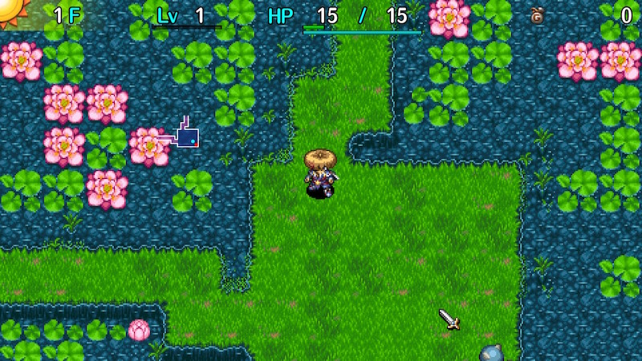
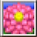

  

Dungeon with a special rule where items placed on the ground outside of shops vanish.

Most items dropped by defeated monsters are lost, and item collection techniques can't be performed. 
Mixer synthesis, hunting Froggo and Chow monsters for drops, throwing a pot to retrieve contents, 
collecting arrows using arrow traps or Dodger Pot, etc. can't be done outside of shops. 
※ Items eaten by Mixers or stolen by Zaloklefts won't vanish if they drop as a result of day and night switching.

Mixer family monsters appear on 10F, 20F, 40F, 50F, and 60F during the day, 
and shops have a higher chance of being generated compared to other dungeons.

It's similar to 置けずの洞窟 from Shiren 4, but some item categories are identified and [New Items](/system/new-items) appear, 
so as long as you've created strong New Items, it's easier than in Shiren 4... or so you might think. 
There are some pretty mean floors in this dungeon:

- Trip Traps appear starting on 51F and cause item loss, and Floor Warp Traps can disrupt day/night plans.
- There are many water floors, so you often get swarmed by Floating and Aquatic types at the start of a floor.
- Vexing Kappa, Kappa Troll, Ultra Gazer (appears for 10 floors), Swordsman, Fencer, and Sensei appear. These monsters all have the potential to cause your main weapon, shield, or bracelets to be lost.
- Presto Pots don't have a limited item table like in Shiren 4, so you can't aim for Navigation or Night-Day scrolls.

As you can see, there are some additions that increase the difficulty compared to Shiren 4's similar dungeon. 
If you play without New Items, the difficulty is on par with 置けずの洞窟, so give it a try if you're up for the challenge. 
That said, if you don't care to play at the intended balance and just want to clear it or obtain [Expert Badges](/system/expert-badges), 
it's best to create powerful New Item bracelets to drastically lower the difficulty.

<ul class="quickLinksUL">
  <li><a href="#overview">Overview</a></li>
  <li><a href="#strategy">Strategy</a>
    <ul>
      <li><a href="#abilities">Abilities</a></li>
      <li><a href="#identifying-items">Identifying Items</a></li>
      <li><a href="#equipment">Equipment</a></li>
      <li><a href="#other-items">Other Items</a></li>
      <li><a href="#floor-guide">Floor Guide</a></li>
    </ul>
  </li>
  <li><a href="#monsters">Monsters</a>
    <ul>
      <li><a href="#day-monsters">Day Monsters</a></li>
      <li><a href="#night-monsters">Night Monsters</a></li>
    </ul>
  </li>
  <li><a href="#items">Items</a></li>
  <li><a href="#traps">Traps</a></li>
  <li><a href="#npcs">NPCs</a></li>
</ul>

# Overview

<table class="dungeonOverview">
  <tr>
    <th>Unlock</th>
    <td class="highlightYellow">Clear the main story.</td>
  </tr>
  <tr>
    <th>Entrance</th>
    <td class="highlightYellow">Nekomaneki Village (Talk to Charon near Dungeon Center)</td>
  </tr>
</table>

<table class="dungeonTable">
  <tr>
    <th>Floors</th>
    <td>28F (first) / 99F</td>
    <th>Day / Night</th>
    <td>Both</td>
  </tr>
  <tr>
    <th>Bring Items</th>
    <td>No</td>
    <th>Allies</th>
    <td>No</td>
  </tr>
  <tr>
    <th>Unidentified</th>
    <td>Bracelets, Grass, Scrolls</td>
    <th>New Items</th>
    <td>Yes</td>
  </tr>
  <tr>
    <th>Shops</th>
    <td>Regular (Until 80F)</td>
    <th>Monster Houses</th>
    <td>Regular, Special, Sudden</td>
  </tr>
  <tr>
    <th>Initial Enemies</th>
    <td></td>
    <th>Spawn Rate</th>
    <td>30 day</td>
  </tr>
  <tr>
    <th>Day Turns</th>
    <td>810</td>
    <th>Night Turns</th>
    <td>368</td>
  </tr>
  <tr>
    <th>Ominous aura</th>
    <td>No</td>
    <th>Wind of Kron</th>
    <td>1st: 1700 4th: 2000</td>
  </tr>
  <tr>
    <th>Clear Icon</th>
    <td class="clearIcon"></td>
    <th>Reward</th>
    <td>Heavenly Pot</td>
  </tr>
</table>

# Strategy

<ul>
  <li><a href="#abilities">Abilities</a></li>
  <li><a href="#identifying-items">Identifying Items</a></li>
  <li><a href="#equipment">Equipment</a></li>
  <li><a href="#other-items">Other Items</a></li>
  <li><a href="#floor-guide">Floor Guide</a></li>
</ul>

### Abilities

See [Abilities](/system/necklace-abilities) for details about the mentioned ones.

It's fine to rush stairs using Pot Party and Stairlight as a base. 
Assign Self-Help, Chakra Cleanse, and attack abilities for the remaining slots.

Crawling Confusion isn't as useful in this dungeon since you can't collect monster drops, 
and Mixers also appear during the day so you don't necessarily have to synthesize at night. 
However, it can be used to get rid of Field Knave and Bored Kappa monsters at the start of a floor.

Transmogrification is still useful to one-shot enemies, even if you can't collect the dropped item 
unless you lure the night monster into a shop before using the ability.

### Identifying Items

Staves and talismans are identified from the start. 
This is especially nice for staves, since you can see remaining uses and whether or not the staff is sealed.

Grass, scrolls, and bracelets are found unidentified. 
Shops appear pretty frequently so you could wait until you come across one to identify items by price, 
but if you're struggling to manage your inventory, go ahead and use items to identify them.

### Equipment

#### Weapon Runes

- Breeze Blade (Tri-direction)
    - Field of view isn't limited in this dungeon, so it's extremely powerful. However, there are quite a few water floors, so corner-striking isn't applicable on those floors.
- Dirk of Debts (Costly)
    - It's easy to earn Gitan by stealing from shops, and it's extremely powerful as a main weapon. Great to have for floor ranges where you want to avoid nighttime.

#### Shield Runes

- Pauper's Plank (Costly)
    - It's easy to earn Gitan by stealing from shops, and it's extremely powerful as a main shield. Just don't accidentally read a Bankruptcy Scroll. (3000G)
- Gyadon Blocker (Anti-Peck)
    - If you want to avoid Dark Terrabbits (86-87F), you'll have to fight Gyandorons (83-88F) during the day. Gyandorons appear on water floors, so it's easy to get swarmed by them at the start of a floor.
- Steady Shield (Unmoving)
    - Found on the ground, or dropped by day monsters. You can avoid Fearabbit floors by cycling time of day, but Floor Warp Traps (51F+) can mess up your plans. Dark Horrabbit and Dark Terrabbit floors have strong monsters during the day, so it's best to equip this shield and progress during the night.
- Snake Shield (Anti-Fire)
    - Helps against Archdragon (90-99F) during the day, and Evil Abyss Dragon (88-99F) at night near the end.
- Anti-Gaze Trge (Anti-Hypno)
    - Lets you conserve items that would otherwise be used to deal with Gazers to avoid equipment loss. Especially important for Ultra Gazer (89-99F) near the end, since they appear for an extremely long time.

#### Bracelets

- Monster Detector, Monsterphobic
    - Basically changes nighttime into a bonus stage. Also frees up inventory space, since you won't need to carry torches.
- Waterwalk Bracelet
    - Mostly found in shops, since night monster drops usually vanish. Lets you avoid having to fight monsters aside from Floating and Aquatic types on water floors. The finale (90-99F) is all water floors, so this lets you safely dash to the stairs using Stairlight at night.
- Time Stop Bracelet
    - Mostly found in shops, since night monster drops usually vanish. Lets you avoid having to go through Ultra Gazer (89-99F) and Archdragon (90-99F) floors during the day. Evil Abyss Dragon (88-99F) is scary, but has a low chance to spawn and doesn't breathe fire often. Don't use Zen Pot unless you actually encounter an Evil Abyss Dragon or two and are far from the stairs. 

### Other Items

#### Projectiles

Dodger Pot can be found, so you can collect arrows from Boy Cart monsters if you see a shop on the same floor. 
Having arrows makes daytime floors easier, and you can also collect arrows by leveling down a Pop Tank. 
Use arrows on monsters like Scoopies since you can't place pots down to protect them, and Gazers because they can make you lose items by throwing them.

That said, Dodger Pots should mainly be saved for Kappa Pest, Vexing Kappa, and Kappa Troll floors, since they can cause equipment loss if Shiren equips the item when a weapon, shield, or bracelet is thrown.

#### Staves

- Paralysis Staff
    - Helps with waiting for night to fall, but you might need to consume many uses on water floors, since Floating and Aquatic type monsters can approach you from anywhere on the map. ※ Fort. Staff isn't in the item table.
- Balance Staff
    - Prevents item loss from Trip Traps that appear starting on 51F. There have been cases where players have lost pots filled with Revival Grass due to these traps.

#### Talismans

Helps when you're surrounded by Floating and Water types on water floors. 
Talismans that miss are lost, so it's easy to burn through them compared to other dungeons.

#### Pots

- Water Pot
    - Mostly found in shops, since night monster drops usually vanish. There's a large number of water floors in this dungeon, so it's easy to make use of it. Ex: Ripen peaches before picking them up to avoid having to take them in and out of Preservation Pots. (See [Water Pot](/items/pots#water-pot) for a list of things you can use it for) 

### Floor Guide

#### Early Game

3F: Blade Bees (3-4F) rush at you at the start of the floor, so try to prepare for it. 
If you haven't found a shield by the time you reach this floor, you're pretty likely to collapse. 
Have Grass Kids (3-5F) throw or spread the grass they're carrying before you defeat them.

Shops appear pretty frequently and often have powerful merchandise for sale at high prices, 
so keep any equipment you find that can be sold for a decent amount of Gitan.

Mixers appear on 10F and 20F, and Dark Mixers between 14-16F, so be sure to synthesize if you find a shop. 
If you have enough food, you can also synthesize outside of shops by waiting for day and night to switch. 
20F in particular has a very high chance to have a shop, so don't skip past that floor. 
If you don't synthesize here, it'll be more difficult to fight during the day without the help of other items.

#### Mid Game

Swordsman and higher level Field Knaves can cause item and equipment loss, and are extremely dangerous. 
Swordsman monsters often appear alongside Mixers, but field of view isn't limited during the day, 
so it should be manageable as long as you pay attention.

That said, Bored Kappa monsters are likely the most dangerous moster family in this dungeon. 
If Shiren equips a thrown weapon, shield, or bracelet, the item he previously had equipped falls to the ground, 
and in Heavenly Lake, that means the previously equipped item vanishes unless it happened while inside a shop. 
So it's best to save Dodger Pot uses for floors where these monsters appear. (Especially Kappa Troll floors)

If you don't have a Dodger Pot, consider keeping your equipment unequipped while you head for the stairs. 
There's no risk of being caught off guard while doing so during the day, since field of view isn't limited. 
Equipment isn't too important if you rush stairs at night, so don't give up even if you lose your equipment.

Swordsman floors:

- Swordsman - 20F
- Fencer - 40F, 60F
- Sensei - 80F

Item Knave floors:

- Item Knave - 59-60F
- Knave King - 75-76F
- Dark Item Knave - 49-50F
- Dark Knave King - 75-76F

Bored Kappa floors:

- Kappa Pest - 29-31F
- Vexing Kappa - 59-62F
- Kappa Troll - 80-84F
- Dark Kappa Pest - 25-26F
- Dark Vexing Kappa - 50-51F
- Dark Kappa Troll - 75-76F

Mixer floors:

- Mixer - 10F, 20F
- Mixermon - 40F, 60F
- Mixergon - 50-51F, 80F
- Dark Mixer - 14-16F
- Dark Mixermon - 38-39F
- Dark Mixergon - 46-47F
- Dark Mixerdon - 60-62F

#### Late Game

The following floors are the most notable ones, but check the monster table to get a complete picture.

50-51F: Dark Vexing Kappas

56-58F: Horrabbit

59-62F: Vexing Kappa, along with Item Knave (59-60F) and Fencer (60F).

64-66F: Dark Horrabbit

72-73F: Dark Pierce Cart and Dark Osmammoth overlap, so be careful how you deal with enemies at night.

75-76F: Knave King, along with Dark Kappa Troll at night.

77-79F: Terrabbit

80-84F: Kappa Troll, along with Sensei (80F).

81-99F: Shops no longer appear, so pots that you need to break to retrieve contents turn into wasted space. 
※ Don't discard pots that contain Revival Grass.

83-88F: Gyandoron appears, so be careful if you don't have the Anti-Peck rune.

86-87F: Dark Terrabbit

90-99F: Ultra Gazer (89-99F) and Archdragon (90-99F) overlap during the day, so it's best to proceed at night. 
Evil Abyss Dragon (88-99F) is scary at night, but it's still better than daytime.

# Monsters

See [Monsters](/system/monsters) for individual monster details.

#### Day Monsters

Floor Colors: Water

Enemy Colors: Farming Situational Farming Destroys Items Dangerous Very Dangerous

<table class="dungeonMonsters">
  <thead>
    <tr>
      <th colspan="9">Day</th>
    </tr>
  </thead>
  <tbody>
    <tr>
      <td class="highlightWater">1</td>
      <td class="highlightYellow">Mamel</td>
      <td class="highlightYellow">Seedie</td>
      <td class="highlightYellow">Sproutant</td>
      <td></td>
      <td></td>
      <td></td>
      <td></td>
      <td></td>
    </tr>
    <tr>
      <td class="highlightWater">2</td>
      <td class="highlightYellow">Mamel</td>
      <td class="highlightYellow">Seedie</td>
      <td class="highlightYellow">Sproutant</td>
      <td class="highlightYellow">Colum</td>
      <td></td>
      <td></td>
      <td></td>
      <td></td>
    </tr>
    <tr>
      <td class="highlightWater">3</td>
      <td class="highlightGreen">Pit Mamel</td>
      <td class="highlightYellow">Chintala</td>
      <td class="highlightYellow">Sproutant</td>
      <td class="highlightYellow">Colum</td>
      <td class="highlightBlue">Grass Kid</td>
      <td class="highlightYellow">Blade Bee</td>
      <td></td>
      <td></td>
    </tr>
    <tr>
      <td class="highlightWater">4</td>
      <td class="highlightGreen">Pit Mamel</td>
      <td class="highlightYellow">Chintala</td>
      <td class="highlightYellow">Sweet Nut</td>
      <td></td>
      <td class="highlightBlue">Grass Kid</td>
      <td class="highlightYellow">Blade Bee</td>
      <td></td>
      <td></td>
    </tr>
    <tr>
      <td class="highlightWater">5</td>
      <td class="highlightGreen">Pit Mamel</td>
      <td class="highlightYellow">Chintala</td>
      <td class="highlightYellow">Sweet Nut</td>
      <td></td>
      <td class="highlightBlue">Grass Kid</td>
      <td></td>
      <td></td>
      <td></td>
    </tr>
    <tr>
      <td>6</td>
      <td class="highlightYellow">Nigiri Baby</td>
      <td class="highlightYellow">Karakuroid</td>
      <td class="highlightYellow">Moseal</td>
      <td></td>
      <td></td>
      <td></td>
      <td></td>
      <td></td>
    </tr>
    <tr>
      <td>7</td>
      <td class="highlightYellow">Nigiri Baby</td>
      <td class="highlightYellow">Karakuroid</td>
      <td class="highlightYellow">Moseal</td>
      <td class="highlightYellow">Tiger Tosser</td>
      <td></td>
      <td></td>
      <td></td>
      <td></td>
    </tr>
    <tr>
      <td>8</td>
      <td class="highlightYellow">Nigiri Baby</td>
      <td class="highlightYellow">Karakuroid</td>
      <td class="highlightYellow">Moseal</td>
      <td class="highlightYellow">Tiger Tosser</td>
      <td class="highlightYellow">Fearabbit</td>
      <td></td>
      <td></td>
      <td></td>
    </tr>
    <tr>
      <td>9</td>
      <td class="highlightYellow">Gyaza</td>
      <td></td>
      <td></td>
      <td class="highlightYellow">Tiger Tosser</td>
      <td class="highlightYellow">Fearabbit</td>
      <td></td>
      <td></td>
      <td></td>
    </tr>
    <tr>
      <td>10</td>
      <td class="highlightYellow">Gyaza</td>
      <td class="highlightYellow">Naptapir</td>
      <td class="highlightYellow">Kumonigiri</td>
      <td class="highlightYellow">Pumphantasm</td>
      <td class="highlightYellow">N'dubba</td>
      <td class="highlightBlue">Mixer</td>
      <td></td>
      <td></td>
    </tr>
    <tr>
      <td>11</td>
      <td class="highlightYellow">Gyaza</td>
      <td class="highlightYellow">Naptapir</td>
      <td class="highlightYellow">Kumonigiri</td>
      <td class="highlightYellow">Pumphantasm</td>
      <td class="highlightYellow">N'dubba</td>
      <td class="highlightYellow">Mutaikon</td>
      <td></td>
      <td></td>
    </tr>
    <tr>
      <td>12</td>
      <td class="highlightYellow">Gyaza</td>
      <td class="highlightYellow">Naptapir</td>
      <td class="highlightYellow">Kumonigiri</td>
      <td class="highlightYellow">Pumphantasm</td>
      <td class="highlightYellow">Acrid Nut</td>
      <td class="highlightYellow">Mutaikon</td>
      <td class="highlightYellow">Scorpion</td>
      <td class="highlightYellow">Metalhead</td>
    </tr>
    <tr>
      <td>13</td>
      <td class="highlightYellow">Cheer-Ham</td>
      <td class="highlightBlue">Snacky</td>
      <td class="highlightYellow">Cololum</td>
      <td class="highlightYellow">Polygon Spinna</td>
      <td class="highlightYellow">Acrid Nut</td>
      <td class="highlightYellow">Mid Chintala</td>
      <td></td>
      <td></td>
    </tr>
    <tr>
      <td>14</td>
      <td class="highlightYellow">Cheer-Ham</td>
      <td class="highlightBlue">Snacky</td>
      <td class="highlightYellow">Cololum</td>
      <td class="highlightYellow">Polygon Spinna</td>
      <td class="highlightYellow">Acrid Nut</td>
      <td class="highlightYellow">Kid Squid</td>
      <td></td>
      <td></td>
    </tr>
    <tr>
      <td>15</td>
      <td class="highlightYellow">Cheer-Ham</td>
      <td class="highlightBlue">Snacky</td>
      <td class="highlightOrange2">Foly</td>
      <td class="highlightYellow">Momoseal</td>
      <td class="highlightYellow">Acrid Nut</td>
      <td class="highlightYellow">Kid Squid</td>
      <td></td>
      <td></td>
    </tr>
    <tr>
      <td>16</td>
      <td class="highlightYellow">Dagger Bee</td>
      <td class="highlightYellow">Yanpii</td>
      <td class="highlightOrange2">Foly</td>
      <td class="highlightYellow">Momoseal</td>
      <td class="highlightYellow">Acrid Nut</td>
      <td class="highlightYellow">Kid Squid</td>
      <td class="highlightYellow">Hopodile</td>
      <td></td>
    </tr>
    <tr>
      <td>17</td>
      <td class="highlightYellow">Dagger Bee</td>
      <td class="highlightYellow">Yanpii</td>
      <td class="highlightOrange2">Foly</td>
      <td class="highlightPurple3">Scoopie</td>
      <td class="highlightYellow">Flamebird</td>
      <td></td>
      <td class="highlightYellow">Hopodile</td>
      <td></td>
    </tr>
    <tr>
      <td>18</td>
      <td class="highlightYellow">Dagger Bee</td>
      <td class="highlightYellow">Yanpii</td>
      <td></td>
      <td class="highlightPurple3">Scoopie</td>
      <td class="highlightYellow">Flamebird</td>
      <td></td>
      <td class="highlightYellow">Hopodile</td>
      <td></td>
    </tr>
    <tr>
      <td>19</td>
      <td class="highlightYellow">Eligan</td>
      <td class="highlightYellow">DJ Mage</td>
      <td class="highlightYellow">Beanie</td>
      <td class="highlightPurple3">Scoopie</td>
      <td class="highlightGreen">Boy Cart</td>
      <td></td>
      <td></td>
      <td></td>
    </tr>
    <tr>
      <td>20</td>
      <td class="highlightGreen">Eligan Froggo</td>
      <td class="highlightYellow">DJ Mage</td>
      <td class="highlightYellow">Beanie</td>
      <td class="highlightBlue">Grass Dude</td>
      <td class="highlightGreen">Boy Cart</td>
      <td class="highlightBlue">Mixer</td>
      <td class="highlightYellow">Bored Kappa</td>
      <td class="highlightPurple3">Swordsman</td>
    </tr>
    <tr>
      <td>21</td>
      <td class="highlightYellow">Eligan</td>
      <td class="highlightYellow">DJ Mage</td>
      <td class="highlightYellow">Sproutyrant</td>
      <td class="highlightBlue">Grass Dude</td>
      <td></td>
      <td></td>
      <td></td>
      <td></td>
    </tr>
    <tr>
      <td>22</td>
      <td class="highlightYellow">Poofy</td>
      <td class="highlightYellow">Steamroid</td>
      <td class="highlightYellow">Sproutyrant</td>
      <td class="highlightBlue">Grass Dude</td>
      <td class="highlightPurple3">Nigiri Morph</td>
      <td></td>
      <td></td>
      <td></td>
    </tr>
    <tr>
      <td>23</td>
      <td class="highlightYellow">Poofy</td>
      <td class="highlightYellow">Steamroid</td>
      <td class="highlightYellow">Sproutyrant</td>
      <td class="highlightOrange2">Absorbiphant</td>
      <td class="highlightPurple3">Nigiri Morph</td>
      <td class="highlightYellow">Snooztapir</td>
      <td class="highlightYellow">Pandanigiri</td>
      <td class="highlightPurple3">Gyadon</td>
    </tr>
    <tr>
      <td>24</td>
      <td class="highlightYellow">Poofy</td>
      <td class="highlightYellow">Ironhead</td>
      <td class="highlightOrange2">Grampa Tank</td>
      <td class="highlightOrange2">Absorbiphant</td>
      <td></td>
      <td class="highlightYellow">Snooztapir</td>
      <td class="highlightYellow">Pandanigiri</td>
      <td class="highlightPurple3">Gyadon</td>
    </tr>
    <tr>
      <td>25</td>
      <td class="highlightOrange2">Hipadile</td>
      <td class="highlightYellow">Ironhead</td>
      <td class="highlightYellow">Punisher</td>
      <td class="highlightOrange2">Absorbiphant</td>
      <td class="highlightYellow">Acrid Nut</td>
      <td></td>
      <td></td>
      <td></td>
    </tr>
    <tr>
      <td class="highlightWater">26</td>
      <td class="highlightOrange2">Hipadile</td>
      <td class="highlightYellow">Crow Tengu</td>
      <td class="highlightYellow">Punisher</td>
      <td class="highlightYellow">Firepuff</td>
      <td class="highlightYellow">Acrid Nut</td>
      <td class="highlightYellow">Sr. Yanpii</td>
      <td class="highlightPurple3">Spadie</td>
      <td></td>
    </tr>
    <tr>
      <td class="highlightWater">27</td>
      <td class="highlightOrange2">Hipadile</td>
      <td class="highlightYellow">Crow Tengu</td>
      <td class="highlightYellow">Punisher</td>
      <td class="highlightYellow">Firepuff</td>
      <td class="highlightYellow">Acrid Nut</td>
      <td class="highlightYellow">Sr. Yanpii</td>
      <td class="highlightPurple3">Spadie</td>
      <td class="highlightYellow">Explochin</td>
    </tr>
    <tr>
      <td class="highlightWater">28</td>
      <td class="highlightGreen">Cross Cart</td>
      <td class="highlightYellow">Crow Tengu</td>
      <td></td>
      <td class="highlightYellow">Firepuff</td>
      <td></td>
      <td class="highlightYellow">Sr. Yanpii</td>
      <td class="highlightPurple3">Spadie</td>
      <td class="highlightYellow">Explochin</td>
    </tr>
    <tr>
      <td class="highlightWater">29</td>
      <td class="highlightGreen">Cross Cart</td>
      <td class="highlightOrange2">MC Mage</td>
      <td class="highlightOrange2">Kappa Pest</td>
      <td class="highlightYellow">Zapdon</td>
      <td class="highlightOrange2">Scarabbit</td>
      <td class="highlightOrange2">Digestiphant</td>
      <td class="highlightYellow">Go-Ham!</td>
      <td class="highlightYellow">Explochin</td>
    </tr>
    <tr>
      <td class="highlightWater">30</td>
      <td></td>
      <td class="highlightOrange2">MC Mage</td>
      <td class="highlightOrange2">Kappa Pest</td>
      <td class="highlightYellow">Zapdon</td>
      <td class="highlightOrange2">Scarabbit</td>
      <td class="highlightOrange2">Digestiphant</td>
      <td class="highlightYellow">Go-Ham!</td>
      <td class="highlightOrange2">N'twyn</td>
    </tr>
    <tr>
      <td>31</td>
      <td class="highlightYellow">Shagga</td>
      <td class="highlightOrange2">MC Mage</td>
      <td class="highlightOrange2">Kappa Pest</td>
      <td class="highlightYellow">Katana Bee</td>
      <td></td>
      <td></td>
      <td></td>
      <td class="highlightOrange2">N'twyn</td>
    </tr>
    <tr>
      <td>32</td>
      <td class="highlightYellow">Shagga</td>
      <td class="highlightYellow">Acrid Nut</td>
      <td></td>
      <td class="highlightYellow">Katana Bee</td>
      <td></td>
      <td></td>
      <td></td>
      <td></td>
    </tr>
    <tr>
      <td>33</td>
      <td class="highlightYellow">Shagga</td>
      <td class="highlightYellow">Acrid Nut</td>
      <td></td>
      <td class="highlightYellow">Katana Bee</td>
      <td></td>
      <td></td>
      <td></td>
      <td></td>
    </tr>
    <tr>
      <td>34</td>
      <td class="highlightYellow">Pumphantom</td>
      <td class="highlightYellow">Acrid Nut</td>
      <td class="highlightRed">Ornery Tank</td>
      <td class="highlightYellow">Flamepuff</td>
      <td class="highlightYellow">Falcon Tengu</td>
      <td class="highlightYellow">Dazikon</td>
      <td class="highlightYellow">Polygon Shaka</td>
      <td></td>
    </tr>
    <tr>
      <td>35</td>
      <td class="highlightYellow">Pumphantom</td>
      <td class="highlightYellow">VeniScorp</td>
      <td class="highlightYellow">Cave Mamel</td>
      <td class="highlightYellow">Flamepuff</td>
      <td class="highlightYellow">Falcon Tengu</td>
      <td class="highlightYellow">Dazikon</td>
      <td class="highlightYellow">Polygon Shaka</td>
      <td></td>
    </tr>
    <tr>
      <td>36</td>
      <td class="highlightYellow">Death Gyaza</td>
      <td class="highlightYellow">VeniScorp</td>
      <td class="highlightYellow">Cave Mamel</td>
      <td class="highlightYellow">Flamepuff</td>
      <td class="highlightYellow">Falcon Tengu</td>
      <td class="highlightYellow">Tiger Hurler</td>
      <td class="highlightBlue">Grass Poppa</td>
      <td></td>
    </tr>
    <tr>
      <td>37</td>
      <td class="highlightYellow">Death Gyaza</td>
      <td class="highlightYellow">VeniScorp</td>
      <td class="highlightRed">MC Wizard</td>
      <td class="highlightYellow">Flamepuff</td>
      <td></td>
      <td class="highlightYellow">Tiger Hurler</td>
      <td class="highlightBlue">Grass Poppa</td>
      <td></td>
    </tr>
    <tr>
      <td>38</td>
      <td class="highlightYellow">Death Gyaza</td>
      <td class="highlightYellow">Huistdon</td>
      <td class="highlightRed">MC Wizard</td>
      <td class="highlightYellow">Flamepuff</td>
      <td class="highlightYellow">Eligagan</td>
      <td class="highlightYellow">Tiger Hurler</td>
      <td class="highlightBlue">Grass Poppa</td>
      <td class="highlightPurple3">Gyairas</td>
    </tr>
    <tr>
      <td>39</td>
      <td class="highlightYellow">Death Gyaza</td>
      <td class="highlightYellow">Huistdon</td>
      <td></td>
      <td></td>
      <td class="highlightYellow">Eligagan</td>
      <td></td>
      <td class="highlightYellow">Sparkbird</td>
      <td class="highlightPurple3">Gyairas</td>
    </tr>
    <tr>
      <td>40</td>
      <td class="highlightGreen">Froggo Froggucci</td>
      <td class="highlightBlue">Huistdon Mixermon</td>
      <td class="highlightYellow">Momomoseal</td>
      <td class="highlightOrange2">Nashagga</td>
      <td class="highlightYellow">Eligagan</td>
      <td class="highlightPurple3">Fencer</td>
      <td class="highlightYellow">Sparkbird</td>
      <td class="highlightPurple3">Gyairas</td>
    </tr>
    <tr>
      <td class="highlightWater">41</td>
      <td></td>
      <td class="highlightYellow">Huistdon</td>
      <td class="highlightYellow">Momomoseal</td>
      <td class="highlightOrange2">Nashagga</td>
      <td></td>
      <td></td>
      <td></td>
      <td></td>
    </tr>
    <tr>
      <td class="highlightWater">42</td>
      <td></td>
      <td></td>
      <td class="highlightYellow">Momomoseal</td>
      <td class="highlightOrange2">Nashagga</td>
      <td></td>
      <td></td>
      <td></td>
      <td></td>
    </tr>
    <tr>
      <td class="highlightWater">43</td>
      <td class="highlightYellow">Nuttie</td>
      <td class="highlightYellow">Rally Ham</td>
      <td class="highlightYellow">Momomoseal</td>
      <td class="highlightOrange2">Nashagga</td>
      <td></td>
      <td></td>
      <td></td>
      <td></td>
    </tr>
    <tr>
      <td class="highlightWater">44</td>
      <td class="highlightYellow">Nuttie</td>
      <td class="highlightYellow">Rally Ham</td>
      <td class="highlightYellow">Big Chintala</td>
      <td class="highlightYellow">Concusschin</td>
      <td class="highlightYellow">Spicy Nut</td>
      <td class="highlightYellow">King Squid</td>
      <td></td>
      <td></td>
    </tr>
    <tr>
      <td class="highlightWater">45</td>
      <td class="highlightYellow">Nuttie</td>
      <td class="highlightYellow">Rally Ham</td>
      <td class="highlightYellow">Big Chintala</td>
      <td class="highlightYellow">Concusschin</td>
      <td class="highlightYellow">Spicy Nut</td>
      <td class="highlightYellow">King Squid</td>
      <td></td>
      <td class="highlightBlue">Munchy</td>
    </tr>
    <tr>
      <td>46</td>
      <td class="highlightYellow">Nuttie</td>
      <td class="highlightYellow">Rally Ham</td>
      <td class="highlightYellow">Big Chintala</td>
      <td class="highlightYellow">Concusschin</td>
      <td class="highlightYellow">Spicy Nut</td>
      <td class="highlightYellow">Blazepuff</td>
      <td class="highlightOrange2">Oingodile</td>
      <td class="highlightBlue">Munchy</td>
    </tr>
    <tr>
      <td>47</td>
      <td class="highlightYellow">Eagle Tengu</td>
      <td class="highlightPurple3">Super Gazer</td>
      <td class="highlightYellow">Big Chintala</td>
      <td></td>
      <td></td>
      <td class="highlightYellow">Blazepuff</td>
      <td class="highlightOrange2">Oingodile</td>
      <td class="highlightPurple3">Trowelie</td>
    </tr>
    <tr>
      <td>48</td>
      <td class="highlightYellow">Eagle Tengu</td>
      <td class="highlightPurple3">Super Gazer</td>
      <td></td>
      <td class="highlightYellow">Colocolum</td>
      <td></td>
      <td class="highlightYellow">Blazepuff</td>
      <td class="highlightOrange2">Oingodile</td>
      <td class="highlightPurple3">Trowelie</td>
    </tr>
    <tr>
      <td>49</td>
      <td class="highlightYellow">Eagle Tengu</td>
      <td class="highlightPurple3">Super Gazer</td>
      <td></td>
      <td class="highlightYellow">Colocolum</td>
      <td class="highlightGreen">Strong Cart</td>
      <td class="highlightOrange2">Porkon</td>
      <td class="highlightYellow">Electroid</td>
      <td class="highlightPurple3">Trowelie</td>
    </tr>
    <tr>
      <td>50</td>
      <td class="highlightYellow">Steelhead</td>
      <td class="highlightYellow">Doztapir</td>
      <td class="highlightOrange2">N'mach</td>
      <td class="highlightYellow">Colocolum</td>
      <td class="highlightGreen">Strong Cart</td>
      <td class="highlightOrange2">Porkon</td>
      <td class="highlightYellow">Electroid</td>
      <td class="highlightBlue">Mixergon</td>
    </tr>
    <tr>
      <td>51</td>
      <td class="highlightYellow">Steelhead</td>
      <td class="highlightYellow">Doztapir</td>
      <td class="highlightOrange2">N'mach</td>
      <td class="highlightOrange2">Jouncy</td>
      <td class="highlightGreen">Strong Cart</td>
      <td class="highlightYellow">Debaser</td>
      <td></td>
      <td class="highlightBlue">Mixergon</td>
    </tr>
    <tr>
      <td>52</td>
      <td class="highlightYellow">Steelhead</td>
      <td class="highlightYellow">Doztapir</td>
      <td class="highlightRed">MC Sorceror</td>
      <td class="highlightOrange2">Jouncy</td>
      <td class="highlightYellow">Sprouterror</td>
      <td class="highlightYellow">Debaser</td>
      <td></td>
      <td></td>
    </tr>
    <tr>
      <td>53</td>
      <td class="highlightYellow">Steelhead</td>
      <td class="highlightOrange2">Trillman</td>
      <td class="highlightRed">MC Sorceror</td>
      <td class="highlightOrange2">Jouncy</td>
      <td class="highlightYellow">Sprouterror</td>
      <td class="highlightYellow">Debaser</td>
      <td></td>
      <td></td>
    </tr>
    <tr>
      <td>54</td>
      <td class="highlightYellow">Steelhead</td>
      <td class="highlightOrange2">Pierce Cart</td>
      <td class="highlightRed">MC Sorceror</td>
      <td class="highlightOrange2">Jouncy</td>
      <td></td>
      <td class="highlightYellow">Debaser</td>
      <td class="highlightYellow">StunScorp</td>
      <td class="highlightYellow">Pyrepuff</td>
    </tr>
    <tr>
      <td>55</td>
      <td class="highlightOrange2">Nigiri Boss</td>
      <td class="highlightOrange2">Pierce Cart</td>
      <td class="highlightYellow">Tiger Chucker</td>
      <td></td>
      <td class="highlightYellow">Spicy Nut</td>
      <td></td>
      <td class="highlightYellow">StunScorp</td>
      <td class="highlightYellow">Pyrepuff</td>
    </tr>
    <tr>
      <td>56</td>
      <td class="highlightOrange2">Nigiri Boss</td>
      <td class="highlightOrange2">Pierce Cart</td>
      <td class="highlightYellow">Tiger Chucker</td>
      <td class="highlightYellow">Pumpanshee</td>
      <td class="highlightYellow">Spicy Nut</td>
      <td class="highlightRed">Horrabbit</td>
      <td class="highlightYellow">Momomomoseal</td>
      <td></td>
    </tr>
    <tr>
      <td>57</td>
      <td class="highlightOrange2">Nigiri Boss</td>
      <td class="highlightOrange2">Spongiderm</td>
      <td class="highlightYellow">Tiger Chucker</td>
      <td class="highlightYellow">Pumpanshee</td>
      <td class="highlightYellow">Spicy Nut</td>
      <td class="highlightRed">Horrabbit</td>
      <td class="highlightYellow">Momomomoseal</td>
      <td></td>
    </tr>
    <tr>
      <td>58</td>
      <td class="highlightOrange2">Nigiri Boss</td>
      <td class="highlightOrange2">Spongiderm</td>
      <td class="highlightOrange2">Lashagga</td>
      <td class="highlightYellow">Pumpanshee</td>
      <td></td>
      <td class="highlightRed">Horrabbit</td>
      <td class="highlightYellow">Momomomoseal</td>
      <td></td>
    </tr>
    <tr>
      <td>59</td>
      <td class="highlightOrange2">Nigiri Boss</td>
      <td class="highlightOrange2">Spongiderm</td>
      <td class="highlightOrange2">Lashagga</td>
      <td class="highlightOrange2">Vexing Kappa</td>
      <td class="highlightYellow">Lt. Yanpii</td>
      <td class="highlightPurple3">Gyandora</td>
      <td class="highlightPurple3">Item Knave</td>
      <td></td>
    </tr>
    <tr>
      <td>60</td>
      <td class="highlightGreen">Froggucci Froggon</td>
      <td class="highlightBlue">Mixermon Zanbeeto</td>
      <td class="highlightOrange2">Lashagga</td>
      <td class="highlightOrange2">Vexing Kappa</td>
      <td class="highlightYellow">Lt. Yanpii</td>
      <td class="highlightPurple3">Gyandora</td>
      <td class="highlightPurple3">Item Knave</td>
      <td class="highlightPurple3">Fencer</td>
    </tr>
    <tr>
      <td class="highlightWater">61</td>
      <td class="highlightYellow">Bunchukdon</td>
      <td class="highlightYellow">Zanbeeto</td>
      <td class="highlightOrange2">Flarebird</td>
      <td class="highlightOrange2">Vexing Kappa</td>
      <td class="highlightYellow">Lt. Yanpii</td>
      <td class="highlightYellow">Polygon Singa</td>
      <td class="highlightBlue">Grass Gramps</td>
      <td></td>
    </tr>
    <tr>
      <td class="highlightWater">62</td>
      <td class="highlightYellow">Bunchukdon</td>
      <td></td>
      <td class="highlightOrange2">Flarebird</td>
      <td class="highlightOrange2">Vexing Kappa</td>
      <td></td>
      <td class="highlightYellow">Polygon Singa</td>
      <td class="highlightBlue">Grass Gramps</td>
      <td></td>
    </tr>
    <tr>
      <td class="highlightWater">63</td>
      <td class="highlightYellow">Bunchukdon</td>
      <td class="highlightOrange2">Bouncy</td>
      <td class="highlightOrange2">Flarebird</td>
      <td class="highlightYellow">Spirit Ham</td>
      <td></td>
      <td class="highlightYellow">Polygon Singa</td>
      <td></td>
      <td></td>
    </tr>
    <tr>
      <td class="highlightWater">64</td>
      <td class="highlightYellow">Bitter Nut</td>
      <td class="highlightOrange2">Bouncy</td>
      <td class="highlightYellow">Onigirizzly</td>
      <td class="highlightYellow">Spirit Ham</td>
      <td></td>
      <td></td>
      <td></td>
      <td></td>
    </tr>
    <tr>
      <td class="highlightWater">65</td>
      <td class="highlightYellow">Bitter Nut</td>
      <td class="highlightOrange2">Bouncy</td>
      <td class="highlightYellow">Onigirizzly</td>
      <td class="highlightYellow">Spirit Ham</td>
      <td class="highlightPurple3">Hyper Gazer</td>
      <td class="highlightYellow">Fulminachin</td>
      <td></td>
      <td></td>
    </tr>
    <tr>
      <td>66</td>
      <td class="highlightYellow">Bitter Nut</td>
      <td class="highlightOrange2">Bouncy</td>
      <td></td>
      <td></td>
      <td class="highlightPurple3">Hyper Gazer</td>
      <td class="highlightYellow">Fulminachin</td>
      <td class="highlightYellow">Phoenix Tengu</td>
      <td></td>
    </tr>
    <tr>
      <td>67</td>
      <td class="highlightRed">Dozikon</td>
      <td></td>
      <td></td>
      <td></td>
      <td class="highlightPurple3">Hyper Gazer</td>
      <td></td>
      <td class="highlightYellow">Phoenix Tengu</td>
      <td></td>
    </tr>
    <tr>
      <td>68</td>
      <td class="highlightRed">Dozikon</td>
      <td></td>
      <td class="highlightYellow">Comatapir</td>
      <td class="highlightYellow">Grainie</td>
      <td></td>
      <td></td>
      <td class="highlightYellow">Phoenix Tengu</td>
      <td></td>
    </tr>
    <tr>
      <td>69</td>
      <td></td>
      <td></td>
      <td class="highlightYellow">Comatapir</td>
      <td class="highlightYellow">Grainie</td>
      <td></td>
      <td></td>
      <td></td>
      <td></td>
    </tr>
    <tr>
      <td>70</td>
      <td class="highlightYellow">Bitter Nut</td>
      <td class="highlightYellow">Hell Gyaza</td>
      <td class="highlightOrange2">N'dup</td>
      <td class="highlightYellow">Grainie</td>
      <td class="highlightYellow">Huge Chintala</td>
      <td></td>
      <td></td>
      <td></td>
    </tr>
    <tr>
      <td>71</td>
      <td class="highlightYellow">Bitter Nut</td>
      <td class="highlightYellow">Hell Gyaza</td>
      <td class="highlightOrange2">N'dup</td>
      <td class="highlightYellow">Eligagon</td>
      <td class="highlightYellow">Huge Chintala</td>
      <td></td>
      <td></td>
      <td></td>
    </tr>
    <tr>
      <td>72</td>
      <td class="highlightYellow">Bitter Nut</td>
      <td class="highlightYellow">Hell Gyaza</td>
      <td class="highlightOrange2">N'dup</td>
      <td class="highlightYellow">Eligagon</td>
      <td class="highlightYellow">Huge Chintala</td>
      <td class="highlightYellow">Cyberoid</td>
      <td class="highlightBlue">FO-UZZ</td>
      <td></td>
    </tr>
    <tr>
      <td>73</td>
      <td class="highlightYellow">Detonachin</td>
      <td class="highlightYellow">Hell Gyaza</td>
      <td class="highlightOrange2">N'dup</td>
      <td class="highlightYellow">Eligagon</td>
      <td></td>
      <td class="highlightYellow">Cyberoid</td>
      <td class="highlightBlue">FO-UZZ</td>
      <td></td>
    </tr>
    <tr>
      <td>74</td>
      <td class="highlightYellow">Detonachin</td>
      <td class="highlightYellow">Hell Gyaza</td>
      <td class="highlightRed">Porgon</td>
      <td class="highlightPurple3">Shovelie</td>
      <td></td>
      <td class="highlightYellow">Cyberoid</td>
      <td></td>
      <td></td>
    </tr>
    <tr>
      <td>75</td>
      <td class="highlightYellow">Pumptergeist</td>
      <td class="highlightBlue">Mealy</td>
      <td class="highlightRed">Porgon</td>
      <td class="highlightPurple3">Shovelie</td>
      <td class="highlightPurple3">Knave King</td>
      <td></td>
      <td></td>
      <td></td>
    </tr>
    <tr>
      <td>76</td>
      <td class="highlightYellow">Pumptergeist</td>
      <td class="highlightBlue">Mealy</td>
      <td class="highlightRed">Porgon</td>
      <td class="highlightOrange2">Boingodile</td>
      <td class="highlightPurple3">Knave King</td>
      <td class="highlightYellow">Squidperor</td>
      <td></td>
      <td></td>
    </tr>
    <tr>
      <td>77</td>
      <td class="highlightYellow">Pumptergeist</td>
      <td class="highlightRed">Terrabbit</td>
      <td class="highlightRed">Porgon</td>
      <td class="highlightOrange2">Boingodile</td>
      <td></td>
      <td class="highlightYellow">Squidperor</td>
      <td></td>
      <td></td>
    </tr>
    <tr>
      <td>78</td>
      <td class="highlightYellow">Pumptergeist</td>
      <td class="highlightRed">Terrabbit</td>
      <td class="highlightYellow">Colocolocolum</td>
      <td class="highlightOrange2">Boingodile</td>
      <td></td>
      <td class="highlightYellow">Squidperor</td>
      <td></td>
      <td></td>
    </tr>
    <tr>
      <td>79</td>
      <td class="highlightYellow">Pumptergeist</td>
      <td class="highlightRed">Terrabbit</td>
      <td class="highlightYellow">Colocolocolum</td>
      <td class="highlightOrange2">Boingodile</td>
      <td class="highlightYellow">Kodionigiri</td>
      <td class="highlightYellow">Squidperor</td>
      <td></td>
      <td></td>
    </tr>
    <tr>
      <td>80</td>
      <td class="highlightPurple3">Osmammoth Sensei</td>
      <td class="highlightOrange2">Kappa Troll</td>
      <td class="highlightYellow">Colocolocolum</td>
      <td class="highlightOrange2">Boingodile</td>
      <td class="highlightYellow">Kodionigiri</td>
      <td class="highlightOrange2">Gitan Mamel</td>
      <td class="highlightGreen">Kleptoad</td>
      <td class="highlightBlue">Mixergon</td>
    </tr>
    <tr>
      <td class="highlightWater">81</td>
      <td class="highlightOrange2">Osmammoth</td>
      <td class="highlightOrange2">Kappa Troll</td>
      <td class="highlightYellow">Colocolocolum</td>
      <td class="highlightOrange2">Boingodile</td>
      <td class="highlightYellow">Kodionigiri</td>
      <td class="highlightOrange2">Gitan Mamel</td>
      <td></td>
      <td></td>
    </tr>
    <tr>
      <td class="highlightWater">82</td>
      <td class="highlightOrange2">Osmammoth</td>
      <td class="highlightOrange2">Kappa Troll</td>
      <td class="highlightYellow">Colocolocolum</td>
      <td class="highlightOrange2">Googoman</td>
      <td class="highlightYellow">Kodionigiri</td>
      <td class="highlightOrange2">Gitan Mamel</td>
      <td></td>
      <td></td>
    </tr>
    <tr>
      <td class="highlightWater">83</td>
      <td class="highlightOrange2">Osmammoth</td>
      <td class="highlightOrange2">Kappa Troll</td>
      <td class="highlightYellow">Colocolocolum</td>
      <td class="highlightOrange2">Googoman</td>
      <td class="highlightPurple3">Gyandoron</td>
      <td class="highlightOrange2">Blazebird</td>
      <td></td>
      <td></td>
    </tr>
    <tr>
      <td class="highlightWater">84</td>
      <td class="highlightOrange2">Osmammoth</td>
      <td class="highlightOrange2">Kappa Troll</td>
      <td class="highlightYellow">Polygon Stunna</td>
      <td class="highlightOrange2">Googoman</td>
      <td class="highlightPurple3">Gyandoron</td>
      <td class="highlightOrange2">Blazebird</td>
      <td></td>
      <td></td>
    </tr>
    <tr>
      <td class="highlightWater">85</td>
      <td class="highlightYellow">Zotdon</td>
      <td></td>
      <td class="highlightYellow">Polygon Stunna</td>
      <td></td>
      <td class="highlightPurple3">Gyandoron</td>
      <td class="highlightOrange2">Blazebird</td>
      <td></td>
      <td></td>
    </tr>
    <tr>
      <td class="highlightWater">86</td>
      <td class="highlightYellow">Zotdon</td>
      <td class="highlightYellow">Sproutitan</td>
      <td></td>
      <td></td>
      <td class="highlightPurple3">Gyandoron</td>
      <td class="highlightYellow">Boss Yanpii</td>
      <td></td>
      <td></td>
    </tr>
    <tr>
      <td class="highlightWater">87</td>
      <td class="highlightYellow">Zotdon</td>
      <td class="highlightYellow">Sproutitan</td>
      <td></td>
      <td></td>
      <td class="highlightPurple3">Gyandoron</td>
      <td class="highlightYellow">Boss Yanpii</td>
      <td></td>
      <td></td>
    </tr>
    <tr>
      <td class="highlightWater">88</td>
      <td class="highlightYellow">Zotdon</td>
      <td class="highlightYellow">Sproutitan</td>
      <td></td>
      <td></td>
      <td class="highlightPurple3">Gyandoron</td>
      <td class="highlightYellow">Boss Yanpii</td>
      <td></td>
      <td></td>
    </tr>
    <tr>
      <td class="highlightWater">89</td>
      <td class="highlightYellow">Zotdon</td>
      <td class="highlightYellow">Sproutitan</td>
      <td class="highlightRed">Ultra Gazer</td>
      <td></td>
      <td></td>
      <td class="highlightYellow">Boss Yanpii</td>
      <td></td>
      <td></td>
    </tr>
    <tr>
      <td class="highlightWater">90</td>
      <td class="highlightYellow">Zotdon</td>
      <td class="highlightYellow">Sproutitan</td>
      <td class="highlightRed">Ultra Gazer</td>
      <td class="highlightOrange2">Nigiri King</td>
      <td class="highlightRed">Archdragon</td>
      <td class="highlightYellow">Boss Yanpii</td>
      <td></td>
      <td></td>
    </tr>
    <tr>
      <td class="highlightWater">91</td>
      <td class="highlightYellow">Zotdon</td>
      <td class="highlightYellow">Sproutitan</td>
      <td class="highlightRed">Ultra Gazer</td>
      <td class="highlightOrange2">Nigiri King</td>
      <td class="highlightRed">Archdragon</td>
      <td class="highlightYellow">Boss Yanpii</td>
      <td></td>
      <td></td>
    </tr>
    <tr>
      <td class="highlightWater">92</td>
      <td class="highlightYellow">Zotdon</td>
      <td class="highlightYellow">Sproutitan</td>
      <td class="highlightRed">Ultra Gazer</td>
      <td class="highlightOrange2">Nigiri King</td>
      <td class="highlightRed">Archdragon</td>
      <td></td>
      <td></td>
      <td></td>
    </tr>
    <tr>
      <td class="highlightWater">93</td>
      <td class="highlightYellow">Zotdon</td>
      <td class="highlightYellow">Sproutitan</td>
      <td class="highlightRed">Ultra Gazer</td>
      <td class="highlightOrange2">Nigiri King</td>
      <td class="highlightRed">Archdragon</td>
      <td></td>
      <td></td>
      <td></td>
    </tr>
    <tr>
      <td class="highlightWater">94</td>
      <td class="highlightYellow">Zotdon</td>
      <td class="highlightYellow">Sproutitan</td>
      <td class="highlightRed">Ultra Gazer</td>
      <td class="highlightOrange2">Nigiri King</td>
      <td class="highlightRed">Archdragon</td>
      <td></td>
      <td></td>
      <td></td>
    </tr>
    <tr>
      <td class="highlightWater">95</td>
      <td class="highlightYellow">Zotdon</td>
      <td class="highlightYellow">Sproutitan</td>
      <td class="highlightRed">Ultra Gazer</td>
      <td class="highlightOrange2">Nigiri King</td>
      <td class="highlightRed">Archdragon</td>
      <td class="highlightYellow">Doomhead</td>
      <td></td>
      <td></td>
    </tr>
    <tr>
      <td class="highlightWater">96</td>
      <td class="highlightYellow">Zotdon</td>
      <td class="highlightYellow">Sproutitan</td>
      <td class="highlightRed">Ultra Gazer</td>
      <td class="highlightOrange2">Nigiri King</td>
      <td class="highlightRed">Archdragon</td>
      <td class="highlightYellow">Doomhead</td>
      <td></td>
      <td></td>
    </tr>
    <tr>
      <td class="highlightWater">97</td>
      <td class="highlightYellow">Zotdon</td>
      <td class="highlightYellow">Sproutitan</td>
      <td class="highlightRed">Ultra Gazer</td>
      <td class="highlightOrange2">Nigiri King</td>
      <td class="highlightRed">Archdragon</td>
      <td class="highlightYellow">Doomhead</td>
      <td class="highlightYellow">BlightScorp</td>
      <td></td>
    </tr>
    <tr>
      <td class="highlightWater">98</td>
      <td class="highlightYellow">Zotdon</td>
      <td class="highlightYellow">Sproutitan</td>
      <td class="highlightRed">Ultra Gazer</td>
      <td class="highlightOrange2">Nigiri King</td>
      <td class="highlightRed">Archdragon</td>
      <td class="highlightYellow">Doomhead</td>
      <td class="highlightYellow">BlightScorp</td>
      <td></td>
    </tr>
    <tr>
      <td class="highlightWater">99</td>
      <td class="highlightYellow">Zotdon</td>
      <td class="highlightYellow">Sproutitan</td>
      <td class="highlightRed">Ultra Gazer</td>
      <td class="highlightOrange2">Nigiri King</td>
      <td class="highlightRed">Archdragon</td>
      <td class="highlightYellow">Doomhead</td>
      <td class="highlightYellow">BlightScorp</td>
      <td></td>
    </tr>
  </tbody>
</table>

#### Night Monsters

Floor Colors: Water

Enemy Colors: Farming Situational Farming Destroys Items Dangerous Very Dangerous

<table class="dungeonMonsters">
  <thead>
    <tr>
      <th colspan="8" class="highlightBlack">Night</th>
    </tr>
  </thead>
  <tbody>
    <tr>
      <td class="highlightWater">1</td>
      <td class="highlightPurple">Dark Mamel</td>
      <td class="highlightPurple">Evil Chintala</td>
      <td class="highlightPurple">Dark Bored Kappa</td>
      <td class="highlightPurple">Bad Colum</td>
      <td class="highlightPurple">Dark Boy Cart</td>
      <td></td>
      <td></td>
    </tr>
    <tr>
      <td class="highlightWater">2</td>
      <td class="highlightPurple">Dark Mamel</td>
      <td class="highlightPurple">Evil Chintala</td>
      <td class="highlightPurple">Dark Bored Kappa</td>
      <td class="highlightPurple">Bad Colum</td>
      <td class="highlightPurple">Dark Boy Cart</td>
      <td class="highlightPurple">Evil PolySpinna</td>
      <td class="highlightPurple">Putrid Sweet Nut</td>
    </tr>
    <tr>
      <td class="highlightWater">3</td>
      <td class="highlightPurple">Dark Mamel Dark Naptapir</td>
      <td class="highlightPurple">Evil Chintala</td>
      <td class="highlightPurple">Dark Bored Kappa</td>
      <td></td>
      <td class="highlightPurple">Dark Tosser</td>
      <td class="highlightPurple">Evil PolySpinna</td>
      <td class="highlightPurple">Putrid Sweet Nut Evil Hopodile</td>
    </tr>
    <tr>
      <td class="highlightWater">4</td>
      <td class="highlightPurple">Dark Mamel Dark Naptapir</td>
      <td class="highlightPurple">Sinful Yanpii</td>
      <td class="highlightPurple3">Violent Gyadon</td>
      <td class="highlightPurple">Dark Karakuroid</td>
      <td class="highlightPurple">Dark Tosser</td>
      <td class="highlightOrange2">Dark Absorbiphant</td>
      <td class="highlightPurple">Putrid Sweet Nut Evil Hopodile</td>
    </tr>
    <tr>
      <td class="highlightWater">5</td>
      <td class="highlightPurple">Dark Mamel</td>
      <td class="highlightPurple">Sinful Yanpii</td>
      <td class="highlightPurple3">Violent Gyadon</td>
      <td class="highlightPurple">Dark Karakuroid</td>
      <td class="highlightPurple">Dark Tosser</td>
      <td class="highlightOrange2">Dark Absorbiphant</td>
      <td></td>
    </tr>
    <tr>
      <td>6</td>
      <td class="highlightPurple">Hell's Punisher</td>
      <td class="highlightPurple">Dark Flamebird</td>
      <td class="highlightPurple">Dark Kumonigiri</td>
      <td class="highlightPurple">Sinister Porky</td>
      <td class="highlightPurple">Dark Tosser</td>
      <td class="highlightPurple">Dark Pop Tank</td>
      <td class="highlightPurple">Evil Kid Squid</td>
    </tr>
    <tr>
      <td>7</td>
      <td class="highlightPurple">Hell's Punisher</td>
      <td class="highlightPurple">Dark Flamebird</td>
      <td class="highlightPurple">Dark Kumonigiri</td>
      <td class="highlightPurple">Sinister Porky</td>
      <td></td>
      <td class="highlightPurple">Dark Pop Tank</td>
      <td class="highlightPurple">Evil Kid Squid</td>
    </tr>
    <tr>
      <td>8</td>
      <td class="highlightPurple3">Wicked Scoopie</td>
      <td class="highlightPurple">Dark DJ Mage</td>
      <td class="highlightPurple">Dark Kumonigiri</td>
      <td class="highlightBlue">Plump Chow</td>
      <td></td>
      <td></td>
      <td></td>
    </tr>
    <tr>
      <td>9</td>
      <td class="highlightPurple3">Wicked Scoopie</td>
      <td class="highlightPurple">Dark DJ Mage</td>
      <td class="highlightPurple">Foul Nigiri Baby</td>
      <td class="highlightBlue">Plump Chow</td>
      <td class="highlightPurple">Evil Floaty</td>
      <td class="highlightPurple3">Dark Eligan Evil Gazer</td>
      <td class="highlightPurple">Dark Mutaikon</td>
    </tr>
    <tr>
      <td>10</td>
      <td class="highlightPurple">Evil Mid Chintala</td>
      <td class="highlightPurple">Evil Firepuff</td>
      <td class="highlightPurple">Foul Nigiri Baby</td>
      <td class="highlightOrange2">Dark N'dubba</td>
      <td class="highlightPurple">Evil Floaty</td>
      <td class="highlightPurple3">Dark Eligan Evil Gazer</td>
      <td class="highlightPurple">Dark Mutaikon</td>
    </tr>
    <tr>
      <td>11</td>
      <td class="highlightPurple">Evil Mid Chintala</td>
      <td class="highlightPurple">Evil Firepuff</td>
      <td class="highlightPurple">Foul Nigiri Baby</td>
      <td class="highlightOrange2">Dark N'dubba</td>
      <td></td>
      <td></td>
      <td></td>
    </tr>
    <tr>
      <td>12</td>
      <td class="highlightPurple">Evil Mid Chintala</td>
      <td class="highlightPurple">Evil Firepuff</td>
      <td class="highlightPurple">Dark Blade Bee</td>
      <td class="highlightPurple">Mean Cheer-Ham</td>
      <td></td>
      <td></td>
      <td></td>
    </tr>
    <tr>
      <td>13</td>
      <td class="highlightBlue">Dark Grass Kid</td>
      <td class="highlightPurple">Bad Moseal</td>
      <td class="highlightPurple">Hateful Seedie</td>
      <td></td>
      <td></td>
      <td></td>
      <td></td>
    </tr>
    <tr>
      <td>14</td>
      <td></td>
      <td></td>
      <td class="highlightPurple">Vile Sproutant</td>
      <td class="highlightPurple">Evil Hipadile</td>
      <td class="highlightBlue">Dark Mixer</td>
      <td></td>
      <td></td>
    </tr>
    <tr>
      <td>15</td>
      <td></td>
      <td></td>
      <td class="highlightPurple">Vile Sproutant</td>
      <td class="highlightPurple">Evil Hipadile</td>
      <td class="highlightBlue">Dark Mixer</td>
      <td></td>
      <td></td>
    </tr>
    <tr>
      <td>16</td>
      <td class="highlightPurple">Dark Pit Mamel</td>
      <td class="highlightPurple3">Violent Gyairas</td>
      <td class="highlightPurple">Vile Sproutant</td>
      <td class="highlightPurple">Evil Hipadile</td>
      <td class="highlightBlue">Dark Mixer</td>
      <td></td>
      <td></td>
    </tr>
    <tr>
      <td>17</td>
      <td class="highlightPurple">Dark Pit Mamel</td>
      <td class="highlightPurple3">Violent Gyairas</td>
      <td class="highlightOrange2">Dark MC Mage</td>
      <td class="highlightPurple">Bad Cololum</td>
      <td></td>
      <td class="highlightPurple">Dark Cross Cart</td>
      <td></td>
    </tr>
    <tr>
      <td>18</td>
      <td class="highlightPurple">Dark Pit Mamel</td>
      <td class="highlightPurple3">Violent Gyairas</td>
      <td class="highlightOrange2">Dark MC Mage</td>
      <td class="highlightPurple">Bad Cololum</td>
      <td></td>
      <td class="highlightPurple">Dark Cross Cart</td>
      <td></td>
    </tr>
    <tr>
      <td>19</td>
      <td class="highlightPurple">Dark Zapdon</td>
      <td class="highlightPurple">Evil Dragon</td>
      <td class="highlightPurple">Evil Gyaza</td>
      <td class="highlightPurple3">Evil Super Gazer</td>
      <td class="highlightPurple">Foul Nigiri Morph</td>
      <td class="highlightPurple">Dark Cross Cart</td>
      <td></td>
    </tr>
    <tr>
      <td>20</td>
      <td class="highlightPurple">Dark Zapdon</td>
      <td class="highlightPurple">Evil Dragon</td>
      <td class="highlightPurple">Evil Gyaza</td>
      <td class="highlightPurple3">Evil Super Gazer</td>
      <td class="highlightPurple">Foul Nigiri Morph</td>
      <td></td>
      <td></td>
    </tr>
    <tr>
      <td>21</td>
      <td class="highlightOrange2">Filthy Nashagga</td>
      <td class="highlightPurple">Evil Dragon</td>
      <td class="highlightPurple">Evil Gyaza</td>
      <td class="highlightOrange2">Dark Fearabbit</td>
      <td class="highlightOrange2">Sinister Porko</td>
      <td></td>
      <td></td>
    </tr>
    <tr>
      <td>22</td>
      <td class="highlightOrange2">Filthy Nashagga</td>
      <td class="highlightOrange2">Evil Explochin</td>
      <td class="highlightPurple">Dark Hurler</td>
      <td class="highlightOrange2">Dark Fearabbit</td>
      <td class="highlightOrange2">Sinister Porko</td>
      <td class="highlightPurple">Evil PolyShaka</td>
      <td class="highlightPurple3">Wicked Spadie</td>
    </tr>
    <tr>
      <td>23</td>
      <td class="highlightOrange2">Filthy Nashagga</td>
      <td class="highlightOrange2">Evil Explochin</td>
      <td class="highlightPurple">Dark Hurler</td>
      <td class="highlightOrange2">Vile Pumphantasm</td>
      <td class="highlightOrange2">Dark Digestiphant</td>
      <td class="highlightPurple">Evil PolyShaka</td>
      <td class="highlightPurple3">Wicked Spadie</td>
    </tr>
    <tr>
      <td>24</td>
      <td class="highlightPurple">Evil Squidfficial</td>
      <td class="highlightPurple">Dark Snooztapir</td>
      <td class="highlightPurple">Dark Hurler</td>
      <td class="highlightOrange2">Vile Pumphantasm</td>
      <td class="highlightOrange2">Dark Digestiphant</td>
      <td class="highlightPurple">Sinful Sr. Yanpii</td>
      <td></td>
    </tr>
    <tr>
      <td>25</td>
      <td class="highlightPurple">Evil Squidfficial</td>
      <td class="highlightPurple">Dark Snooztapir</td>
      <td class="highlightPurple">Evil Flamepuff</td>
      <td class="highlightOrange2">Dark Kappa Pest</td>
      <td class="highlightOrange2">Dark Grampa Tank</td>
      <td class="highlightPurple">Sinful Sr. Yanpii</td>
      <td></td>
    </tr>
    <tr>
      <td class="highlightWater">26</td>
      <td class="highlightBlue">εFO-U</td>
      <td class="highlightPurple">Dark Dazikon</td>
      <td class="highlightPurple">Evil Flamepuff</td>
      <td class="highlightOrange2">Dark Kappa Pest</td>
      <td class="highlightOrange2">Dark Grampa Tank</td>
      <td></td>
      <td></td>
    </tr>
    <tr>
      <td class="highlightWater">27</td>
      <td class="highlightBlue">εFO-U</td>
      <td class="highlightPurple">Dark Dazikon</td>
      <td class="highlightPurple">Dark Cave Mamel</td>
      <td class="highlightBlue">Plump Snacky</td>
      <td></td>
      <td></td>
      <td class="highlightPurple">Bad Momoseal</td>
    </tr>
    <tr>
      <td class="highlightWater">28</td>
      <td></td>
      <td></td>
      <td class="highlightPurple">Dark Cave Mamel</td>
      <td class="highlightBlue">Plump Snacky</td>
      <td></td>
      <td class="highlightOrange2">Vile Pumphantom</td>
      <td class="highlightPurple">Bad Momoseal</td>
    </tr>
    <tr>
      <td class="highlightWater">29</td>
      <td class="highlightPurple">Dark Sparkbird</td>
      <td class="highlightPurple">Putrid Acrid Nut</td>
      <td class="highlightPurple">Dark Cave Mamel</td>
      <td class="highlightBlue">Plump Snacky</td>
      <td class="highlightPurple">Dark Dagger Bee</td>
      <td class="highlightOrange2">Vile Pumphantom Dark Pandanigiri</td>
      <td class="highlightPurple">Bad Momoseal</td>
    </tr>
    <tr>
      <td class="highlightWater">30</td>
      <td class="highlightPurple">Dark Sparkbird</td>
      <td class="highlightPurple">Putrid Acrid Nut</td>
      <td class="highlightOrange2">Dark N'twyn</td>
      <td class="highlightBlue">Dark Grass Dude</td>
      <td class="highlightPurple">Dark Dagger Bee</td>
      <td class="highlightPurple">Dark Pandanigiri</td>
      <td></td>
    </tr>
    <tr>
      <td>31</td>
      <td class="highlightPurple3">Evil Fencer</td>
      <td class="highlightPurple">Putrid Acrid Nut</td>
      <td class="highlightOrange2">Dark N'twyn</td>
      <td class="highlightBlue">Dark Grass Dude</td>
      <td class="highlightRed">Dark MC Wizard</td>
      <td></td>
      <td></td>
    </tr>
    <tr>
      <td>32</td>
      <td class="highlightPurple3">Evil Fencer</td>
      <td class="highlightPurple">Dark VeniScorp</td>
      <td class="highlightPurple">Hateful Beanie</td>
      <td class="highlightPurple">Evil Poofy</td>
      <td class="highlightRed">Dark MC Wizard</td>
      <td></td>
      <td></td>
    </tr>
    <tr>
      <td>33</td>
      <td class="highlightPurple3">Evil Fencer</td>
      <td class="highlightPurple">Dark VeniScorp</td>
      <td class="highlightPurple">Hateful Beanie</td>
      <td class="highlightPurple">Evil Poofy</td>
      <td class="highlightPurple">Evil Death Gyaza</td>
      <td></td>
      <td></td>
    </tr>
    <tr>
      <td>34</td>
      <td class="highlightPurple">Hell's Debaser</td>
      <td class="highlightOrange2">Evil Sky Dragon</td>
      <td class="highlightPurple">Bad Falcon Tengu</td>
      <td class="highlightPurple">Dark Eligagan</td>
      <td class="highlightPurple">Evil Death Gyaza</td>
      <td></td>
      <td></td>
    </tr>
    <tr>
      <td>35</td>
      <td class="highlightPurple">Hell's Debaser</td>
      <td class="highlightOrange2">Evil Sky Dragon</td>
      <td class="highlightPurple">Bad Falcon Tengu</td>
      <td class="highlightPurple">Dark Eligagan</td>
      <td class="highlightPurple">Putrid Acrid Nut</td>
      <td></td>
      <td></td>
    </tr>
    <tr>
      <td>36</td>
      <td class="highlightPurple">Dark Steamroid</td>
      <td class="highlightOrange2">Evil Sky Dragon</td>
      <td class="highlightPurple">Bad Falcon Tengu</td>
      <td class="highlightGreen">Snide Froggucci</td>
      <td class="highlightPurple">Putrid Acrid Nut</td>
      <td></td>
      <td></td>
    </tr>
    <tr>
      <td>37</td>
      <td class="highlightPurple">Dark Steamroid</td>
      <td class="highlightPurple">Bad Colocolum</td>
      <td class="highlightPurple">Mean Go-Ham!</td>
      <td class="highlightGreen">Snide Froggucci</td>
      <td class="highlightPurple">Putrid Acrid Nut</td>
      <td></td>
      <td></td>
    </tr>
    <tr>
      <td>38</td>
      <td class="highlightPurple">Vile Sproutyrant</td>
      <td class="highlightPurple">Bad Colocolum</td>
      <td class="highlightPurple">Mean Go-Ham!</td>
      <td class="highlightPurple">Dark Ironhead</td>
      <td class="highlightBlue">Dark Mixermon</td>
      <td></td>
      <td></td>
    </tr>
    <tr>
      <td>39</td>
      <td class="highlightPurple">Vile Sproutyrant</td>
      <td class="highlightOrange2">Evil Concusschin</td>
      <td class="highlightPurple3">Wicked Trowelie</td>
      <td class="highlightPurple">Dark Ironhead</td>
      <td class="highlightBlue">Dark Mixermon</td>
      <td></td>
      <td></td>
    </tr>
    <tr>
      <td>40</td>
      <td class="highlightPurple">Vile Sproutyrant</td>
      <td class="highlightOrange2">Evil Concusschin</td>
      <td class="highlightPurple3">Wicked Trowelie</td>
      <td class="highlightPurple">Dark Chucker</td>
      <td></td>
      <td></td>
      <td></td>
    </tr>
    <tr>
      <td class="highlightWater">41</td>
      <td class="highlightOrange2">Sinister Porkon</td>
      <td class="highlightOrange2">Vile Pumpanshee</td>
      <td class="highlightPurple3">Wicked Trowelie</td>
      <td class="highlightPurple">Dark Chucker</td>
      <td class="highlightOrange2">Dark Scarabbit</td>
      <td></td>
      <td></td>
    </tr>
    <tr>
      <td class="highlightWater">42</td>
      <td class="highlightOrange2">Sinister Porkon</td>
      <td class="highlightOrange2">Vile Pumpanshee</td>
      <td class="highlightPurple">Evil Blazepuff</td>
      <td class="highlightPurple">Dark Chucker</td>
      <td class="highlightOrange2">Dark Scarabbit</td>
      <td></td>
      <td></td>
    </tr>
    <tr>
      <td class="highlightWater">43</td>
      <td class="highlightOrange2">Sinister Porkon</td>
      <td class="highlightOrange2">Vile Pumpanshee</td>
      <td class="highlightPurple">Evil Blazepuff</td>
      <td></td>
      <td></td>
      <td></td>
      <td></td>
    </tr>
    <tr>
      <td class="highlightWater">44</td>
      <td class="highlightPurple">Dark Doztapir</td>
      <td class="highlightRed">Dark Ornery Tank</td>
      <td class="highlightOrange2">Dark Spongiderm</td>
      <td class="highlightPurple">Dark Steamroid</td>
      <td></td>
      <td></td>
      <td></td>
    </tr>
    <tr>
      <td class="highlightWater">45</td>
      <td class="highlightPurple">Dark Doztapir</td>
      <td class="highlightRed">Dark Ornery Tank</td>
      <td class="highlightOrange2">Dark Spongiderm</td>
      <td class="highlightPurple">Dark Steamroid</td>
      <td class="highlightBlue">Plump Munchy</td>
      <td class="highlightPurple3">Evil Hyper Gazer</td>
      <td class="highlightPurple">Mean Go-Ham!</td>
    </tr>
    <tr>
      <td>46</td>
      <td class="highlightPurple3">Violent Gyandora</td>
      <td class="highlightRed">Dark Ornery Tank</td>
      <td class="highlightOrange2">Dark Spongiderm</td>
      <td class="highlightBlue">Dark Mixergon</td>
      <td class="highlightBlue">Plump Munchy</td>
      <td class="highlightPurple3">Evil Hyper Gazer</td>
      <td class="highlightPurple">Mean Go-Ham!</td>
    </tr>
    <tr>
      <td>47</td>
      <td class="highlightPurple3">Violent Gyandora</td>
      <td class="highlightPurple">Dark Katana Bee</td>
      <td class="highlightPurple">Dark Huistdon</td>
      <td class="highlightBlue">Dark Mixergon</td>
      <td class="highlightOrange2">Evil Concusschin</td>
      <td></td>
      <td></td>
    </tr>
    <tr>
      <td>48</td>
      <td class="highlightBlue">εFO-UZ</td>
      <td class="highlightPurple">Dark Katana Bee</td>
      <td class="highlightPurple">Dark Huistdon</td>
      <td></td>
      <td class="highlightOrange2">Evil Concusschin</td>
      <td></td>
      <td></td>
    </tr>
    <tr>
      <td>49</td>
      <td class="highlightBlue">εFO-UZ</td>
      <td class="highlightPurple">Hateful Nuttie</td>
      <td></td>
      <td></td>
      <td class="highlightPurple3">Dark Item Knave</td>
      <td class="highlightPurple3">Evil Sensei</td>
      <td></td>
    </tr>
    <tr>
      <td>50</td>
      <td class="highlightPurple">Putrid Spicy Nut</td>
      <td class="highlightPurple">Hateful Nuttie</td>
      <td class="highlightOrange2">Dark Vexing Kappa</td>
      <td class="highlightOrange2">Dark N'mach</td>
      <td class="highlightPurple3">Dark Item Knave</td>
      <td class="highlightPurple3">Evil Sensei</td>
      <td class="highlightPurple">Evil Squidfficial</td>
    </tr>
    <tr>
      <td>51</td>
      <td class="highlightPurple">Putrid Spicy Nut</td>
      <td class="highlightPurple">Evil Hell Gyaza</td>
      <td class="highlightOrange2">Dark Vexing Kappa</td>
      <td class="highlightOrange2">Dark N'mach</td>
      <td></td>
      <td></td>
      <td class="highlightPurple">Evil Squidfficial</td>
    </tr>
    <tr>
      <td>52</td>
      <td class="highlightPurple">Putrid Spicy Nut</td>
      <td class="highlightPurple">Evil Hell Gyaza</td>
      <td class="highlightPurple">Evil PolySinga</td>
      <td></td>
      <td class="highlightOrange2">Dark Flarebird</td>
      <td></td>
      <td></td>
    </tr>
    <tr>
      <td>53</td>
      <td class="highlightPurple">Dark Eligagon</td>
      <td class="highlightPurple">Evil Hell Gyaza</td>
      <td class="highlightPurple">Evil PolySinga</td>
      <td class="highlightPurple">Sinful Lt. Yanpii</td>
      <td class="highlightOrange2">Dark Flarebird</td>
      <td class="highlightBlue">Dark Grass Poppa</td>
      <td></td>
    </tr>
    <tr>
      <td>54</td>
      <td class="highlightPurple">Dark Eligagon</td>
      <td class="highlightPurple">Evil Big Chintala</td>
      <td class="highlightOrange2">Dark Strong Cart</td>
      <td class="highlightPurple">Sinful Lt. Yanpii</td>
      <td></td>
      <td class="highlightBlue">Dark Grass Poppa</td>
      <td></td>
    </tr>
    <tr>
      <td>55</td>
      <td class="highlightPurple">Vile Sprouterror</td>
      <td class="highlightPurple">Evil Big Chintala</td>
      <td class="highlightOrange2">Dark Strong Cart</td>
      <td class="highlightPurple">Sinful Lt. Yanpii</td>
      <td class="highlightRed">Dark Dozikon</td>
      <td class="highlightBlue">Dark Grass Poppa</td>
      <td></td>
    </tr>
    <tr>
      <td>56</td>
      <td class="highlightPurple">Vile Sprouterror</td>
      <td class="highlightPurple">Evil Big Chintala</td>
      <td class="highlightOrange2">Dark Strong Cart</td>
      <td class="highlightRed">Evil Archdragon</td>
      <td class="highlightRed">Dark Dozikon</td>
      <td class="highlightPurple">Dark StunScorp</td>
      <td></td>
    </tr>
    <tr>
      <td>57</td>
      <td class="highlightPurple">Vile Sprouterror</td>
      <td class="highlightGreen">Snide Froggon</td>
      <td class="highlightPurple">Mean Rally Ham</td>
      <td class="highlightRed">Evil Archdragon</td>
      <td class="highlightPurple">Evil Jouncy</td>
      <td class="highlightPurple">Dark StunScorp</td>
      <td></td>
    </tr>
    <tr>
      <td>58</td>
      <td class="highlightPurple">Dark Steelhead</td>
      <td class="highlightGreen">Snide Froggon</td>
      <td class="highlightPurple">Mean Rally Ham</td>
      <td></td>
      <td class="highlightPurple">Evil Jouncy</td>
      <td></td>
      <td class="highlightOrange2">Foul Nigiri Boss</td>
    </tr>
    <tr>
      <td>59</td>
      <td class="highlightPurple">Dark Steelhead</td>
      <td class="highlightGreen">Snide Froggon</td>
      <td class="highlightPurple">Mean Rally Ham</td>
      <td class="highlightOrange2">Evil Fulminachin</td>
      <td class="highlightPurple">Evil Jouncy</td>
      <td class="highlightPurple">Hell's Ruiner</td>
      <td class="highlightOrange2">Foul Nigiri Boss</td>
    </tr>
    <tr>
      <td>60</td>
      <td class="highlightPurple">Dark Steelhead</td>
      <td class="highlightBlue">Dark Mixerdon</td>
      <td class="highlightPurple">Evil Oingodile</td>
      <td class="highlightOrange2">Evil Fulminachin</td>
      <td class="highlightBlue">Plump Mealy</td>
      <td class="highlightPurple">Hell's Ruiner</td>
      <td></td>
    </tr>
    <tr>
      <td class="highlightWater">61</td>
      <td class="highlightPurple">Evil Pyrepuff</td>
      <td class="highlightBlue">Dark Mixerdon</td>
      <td class="highlightPurple">Evil Oingodile</td>
      <td class="highlightPurple">Evil King Squid</td>
      <td class="highlightBlue">Plump Mealy</td>
      <td class="highlightPurple">Putrid Spicy Nut</td>
      <td></td>
    </tr>
    <tr>
      <td class="highlightWater">62</td>
      <td class="highlightPurple">Evil Pyrepuff</td>
      <td class="highlightBlue">Dark Mixerdon</td>
      <td class="highlightPurple">Bad Momomoseal</td>
      <td class="highlightPurple">Evil King Squid</td>
      <td></td>
      <td class="highlightPurple">Putrid Spicy Nut</td>
      <td></td>
    </tr>
    <tr>
      <td class="highlightWater">63</td>
      <td class="highlightPurple">Evil Pyrepuff</td>
      <td></td>
      <td class="highlightPurple">Bad Momomoseal</td>
      <td class="highlightPurple">Dark Electroid</td>
      <td></td>
      <td class="highlightPurple">Putrid Spicy Nut</td>
      <td></td>
    </tr>
    <tr>
      <td class="highlightWater">64</td>
      <td class="highlightRed">Dark Horrabbit</td>
      <td class="highlightOrange2">Vile Pumptergeist</td>
      <td class="highlightPurple">Bad Momomoseal</td>
      <td class="highlightPurple">Dark Electroid</td>
      <td></td>
      <td></td>
      <td></td>
    </tr>
    <tr>
      <td class="highlightWater">65</td>
      <td class="highlightRed">Dark Horrabbit</td>
      <td class="highlightOrange2">Vile Pumptergeist</td>
      <td></td>
      <td class="highlightPurple">Dark Googoman</td>
      <td></td>
      <td class="highlightPurple">Dark Onigirizzly</td>
      <td></td>
    </tr>
    <tr>
      <td>66</td>
      <td class="highlightRed">Dark Horrabbit</td>
      <td class="highlightOrange2">Vile Pumptergeist</td>
      <td class="highlightPurple">Bad Eagle Tengu</td>
      <td class="highlightPurple">Dark Googoman</td>
      <td></td>
      <td class="highlightPurple">Dark Onigirizzly</td>
      <td class="highlightPurple">Dark Ace</td>
    </tr>
    <tr>
      <td>67</td>
      <td class="highlightPurple">Bad Colocolocolum</td>
      <td class="highlightRed">Dark MC Sorceror</td>
      <td class="highlightPurple">Bad Eagle Tengu</td>
      <td class="highlightPurple">Dark Googoman</td>
      <td class="highlightPurple3">Violent Gyandoron</td>
      <td class="highlightPurple">Dark Onigirizzly</td>
      <td class="highlightPurple">Dark Ace</td>
    </tr>
    <tr>
      <td>68</td>
      <td class="highlightPurple">Bad Colocolocolum</td>
      <td class="highlightRed">Dark MC Sorceror</td>
      <td class="highlightPurple">Bad Eagle Tengu</td>
      <td class="highlightPurple">Evil PolyStunna</td>
      <td class="highlightPurple3">Violent Gyandoron</td>
      <td></td>
      <td></td>
    </tr>
    <tr>
      <td>69</td>
      <td class="highlightPurple">Bad Colocolocolum</td>
      <td class="highlightRed">Dark MC Sorceror</td>
      <td class="highlightOrange2">Filthy Lashagga</td>
      <td class="highlightPurple">Evil PolyStunna</td>
      <td></td>
      <td></td>
      <td></td>
    </tr>
    <tr>
      <td>70</td>
      <td class="highlightPurple">Dark Comatapir</td>
      <td class="highlightOrange2">Sinister Porgon</td>
      <td class="highlightOrange2">Filthy Lashagga</td>
      <td></td>
      <td class="highlightOrange2">Dark N'dup</td>
      <td></td>
      <td></td>
    </tr>
    <tr>
      <td>71</td>
      <td class="highlightPurple">Dark Comatapir</td>
      <td class="highlightOrange2">Sinister Porgon</td>
      <td class="highlightPurple3">Wicked Shovelie</td>
      <td class="highlightPurple">Dark Zanbeeto</td>
      <td class="highlightOrange2">Dark N'dup</td>
      <td></td>
      <td></td>
    </tr>
    <tr>
      <td>72</td>
      <td class="highlightOrange2">Dark Pierce Cart</td>
      <td class="highlightOrange2">Dark Osmammoth</td>
      <td class="highlightPurple3">Wicked Shovelie</td>
      <td class="highlightPurple">Dark Zanbeeto</td>
      <td></td>
      <td></td>
      <td></td>
    </tr>
    <tr>
      <td>73</td>
      <td class="highlightOrange2">Dark Pierce Cart</td>
      <td class="highlightOrange2">Dark Osmammoth</td>
      <td class="highlightRed">Evil Ultra Gazer</td>
      <td class="highlightPurple">Evil Doom Gyaza</td>
      <td class="highlightPurple">Evil Huge Chintala</td>
      <td></td>
      <td></td>
    </tr>
    <tr>
      <td>74</td>
      <td class="highlightPurple">Dark Bunchukdon</td>
      <td class="highlightOrange2">Dark Osmammoth</td>
      <td class="highlightRed">Evil Ultra Gazer</td>
      <td class="highlightPurple">Evil Doom Gyaza</td>
      <td class="highlightPurple">Evil Huge Chintala</td>
      <td></td>
      <td></td>
    </tr>
    <tr>
      <td>75</td>
      <td class="highlightPurple">Dark Bunchukdon</td>
      <td class="highlightPurple">Evil Bouncy</td>
      <td class="highlightOrange2">Dark Blazebird</td>
      <td class="highlightOrange2">Dark Kappa Troll</td>
      <td class="highlightPurple3">Dark Knave King</td>
      <td class="highlightPurple">Dark Steelhead</td>
      <td></td>
    </tr>
    <tr>
      <td>76</td>
      <td class="highlightBlue">εFO-UZZ</td>
      <td class="highlightPurple">Evil Bouncy</td>
      <td class="highlightOrange2">Dark Blazebird</td>
      <td class="highlightOrange2">Dark Kappa Troll</td>
      <td class="highlightPurple3">Dark Knave King</td>
      <td class="highlightPurple">Dark Steelhead</td>
      <td></td>
    </tr>
    <tr>
      <td>77</td>
      <td class="highlightBlue">εFO-UZZ</td>
      <td class="highlightBlue">Dark Grass Gramps</td>
      <td></td>
      <td class="highlightPurple">Hateful Grainie</td>
      <td></td>
      <td></td>
      <td></td>
    </tr>
    <tr>
      <td>78</td>
      <td class="highlightPurple">Bad Phoenix Tengu</td>
      <td class="highlightBlue">Dark Grass Gramps</td>
      <td class="highlightOrange2">Evil Detonachin</td>
      <td class="highlightPurple">Hateful Grainie</td>
      <td class="highlightPurple3">Evil Swordmaster</td>
      <td></td>
      <td></td>
    </tr>
    <tr>
      <td>79</td>
      <td class="highlightPurple">Bad Phoenix Tengu</td>
      <td class="highlightPurple">Sinful Boss Yanpii</td>
      <td class="highlightOrange2">Evil Detonachin</td>
      <td class="highlightPurple">Vile Sproutitan</td>
      <td class="highlightPurple3">Evil Swordmaster</td>
      <td></td>
      <td></td>
    </tr>
    <tr>
      <td>80</td>
      <td class="highlightPurple">Dark Cyberoid</td>
      <td class="highlightPurple">Sinful Boss Yanpii</td>
      <td class="highlightGreen">Snide Kleptoad</td>
      <td class="highlightPurple">Vile Sproutitan</td>
      <td></td>
      <td></td>
      <td></td>
    </tr>
    <tr>
      <td class="highlightWater">81</td>
      <td class="highlightPurple">Dark Cyberoid</td>
      <td class="highlightPurple">Sinful Boss Yanpii</td>
      <td class="highlightGreen">Snide Kleptoad</td>
      <td></td>
      <td class="highlightRed">Dark Mesmerikon</td>
      <td></td>
      <td></td>
    </tr>
    <tr>
      <td class="highlightWater">82</td>
      <td class="highlightPurple">Dark Cyberoid</td>
      <td class="highlightOrange2">Foul Nigiri King</td>
      <td></td>
      <td class="highlightPurple">Hell's Despoiler</td>
      <td class="highlightRed">Dark Mesmerikon</td>
      <td></td>
      <td></td>
    </tr>
    <tr>
      <td class="highlightWater">83</td>
      <td class="highlightPurple">Dark Cyberoid</td>
      <td class="highlightOrange2">Foul Nigiri King</td>
      <td class="highlightPurple">Dark Elizgagon</td>
      <td class="highlightPurple">Hell's Despoiler</td>
      <td></td>
      <td></td>
      <td></td>
    </tr>
    <tr>
      <td class="highlightWater">84</td>
      <td class="highlightPurple">Dark Doomhead</td>
      <td class="highlightPurple">Mean Spirit Ham</td>
      <td class="highlightPurple">Dark Elizgagon</td>
      <td class="highlightPurple">Hell's Despoiler</td>
      <td></td>
      <td></td>
      <td></td>
    </tr>
    <tr>
      <td class="highlightWater">85</td>
      <td class="highlightPurple">Dark Doomhead</td>
      <td class="highlightPurple">Mean Spirit Ham</td>
      <td class="highlightPurple">Bad Momomomoseal</td>
      <td></td>
      <td class="highlightPurple">Evil Boingodile</td>
      <td class="highlightPurple">Putrid Bitter Nut</td>
      <td></td>
    </tr>
    <tr>
      <td class="highlightWater">86</td>
      <td class="highlightPurple">Dark Doomhead</td>
      <td class="highlightPurple">Mean Spirit Ham</td>
      <td class="highlightPurple">Bad Momomomoseal</td>
      <td class="highlightPurple">Dark BlightScorp</td>
      <td class="highlightPurple">Evil Boingodile</td>
      <td class="highlightPurple">Putrid Bitter Nut</td>
      <td class="highlightRed">Dark Terrabbit</td>
    </tr>
    <tr>
      <td class="highlightWater">87</td>
      <td class="highlightPurple">Dark Doomhead</td>
      <td class="highlightPurple">Mean Spirit Ham</td>
      <td class="highlightPurple">Bad Momomomoseal</td>
      <td class="highlightPurple">Dark BlightScorp</td>
      <td class="highlightPurple">Dark Kodionigiri</td>
      <td class="highlightPurple">Putrid Bitter Nut</td>
      <td class="highlightRed">Dark Terrabbit</td>
    </tr>
    <tr>
      <td class="highlightWater">88</td>
      <td class="highlightRed">Evil Abyss Dragon</td>
      <td class="highlightPurple">Mean Spirit Ham</td>
      <td class="highlightPurple">Bad Momomomoseal</td>
      <td class="highlightPurple">Evil Squidperor</td>
      <td class="highlightPurple">Dark Kodionigiri</td>
      <td class="highlightPurple">Putrid Bitter Nut</td>
      <td></td>
    </tr>
    <tr>
      <td class="highlightWater">89</td>
      <td class="highlightRed">Evil Abyss Dragon</td>
      <td class="highlightPurple">Mean Spirit Ham</td>
      <td class="highlightOrange2">Dark Gitan Mamel</td>
      <td class="highlightPurple">Evil Squidperor</td>
      <td class="highlightRed">Dark Cranky Tank</td>
      <td class="highlightPurple">Putrid Bitter Nut</td>
      <td></td>
    </tr>
    <tr>
      <td class="highlightWater">90</td>
      <td class="highlightRed">Evil Abyss Dragon</td>
      <td class="highlightOrange2">Filthy Bashagga</td>
      <td class="highlightOrange2">Dark Gitan Mamel</td>
      <td class="highlightPurple">Evil Squidperor</td>
      <td class="highlightRed">Dark Cranky Tank</td>
      <td></td>
      <td></td>
    </tr>
    <tr>
      <td class="highlightWater">91</td>
      <td class="highlightRed">Evil Abyss Dragon</td>
      <td class="highlightOrange2">Filthy Bashagga</td>
      <td class="highlightOrange2">Dark Gitan Mamel</td>
      <td></td>
      <td></td>
      <td></td>
      <td></td>
    </tr>
    <tr>
      <td class="highlightWater">92</td>
      <td class="highlightRed">Evil Abyss Dragon</td>
      <td class="highlightOrange2">Filthy Bashagga</td>
      <td class="highlightPurple">Dark Zotdon</td>
      <td></td>
      <td></td>
      <td></td>
      <td></td>
    </tr>
    <tr>
      <td class="highlightWater">93</td>
      <td class="highlightRed">Evil Abyss Dragon</td>
      <td class="highlightOrange2">Filthy Bashagga</td>
      <td class="highlightPurple">Dark Zotdon</td>
      <td></td>
      <td></td>
      <td></td>
      <td></td>
    </tr>
    <tr>
      <td class="highlightWater">94</td>
      <td class="highlightRed">Evil Abyss Dragon</td>
      <td class="highlightOrange2">Filthy Bashagga</td>
      <td class="highlightPurple">Dark Zotdon</td>
      <td></td>
      <td></td>
      <td></td>
      <td></td>
    </tr>
    <tr>
      <td class="highlightWater">95</td>
      <td class="highlightRed">Evil Abyss Dragon</td>
      <td class="highlightOrange2">Filthy Bashagga</td>
      <td class="highlightPurple">Dark Zotdon</td>
      <td></td>
      <td></td>
      <td></td>
      <td></td>
    </tr>
    <tr>
      <td class="highlightWater">96</td>
      <td class="highlightRed">Evil Abyss Dragon</td>
      <td class="highlightOrange2">Filthy Bashagga</td>
      <td class="highlightPurple">Dark Zotdon</td>
      <td></td>
      <td></td>
      <td></td>
      <td></td>
    </tr>
    <tr>
      <td class="highlightWater">97</td>
      <td class="highlightRed">Evil Abyss Dragon</td>
      <td class="highlightOrange2">Filthy Bashagga</td>
      <td class="highlightPurple">Dark Zotdon</td>
      <td></td>
      <td></td>
      <td></td>
      <td></td>
    </tr>
    <tr>
      <td class="highlightWater">98</td>
      <td class="highlightRed">Evil Abyss Dragon</td>
      <td class="highlightOrange2">Filthy Bashagga</td>
      <td class="highlightPurple">Dark Zotdon</td>
      <td></td>
      <td></td>
      <td></td>
      <td></td>
    </tr>
    <tr>
      <td class="highlightWater">99</td>
      <td class="highlightRed">Evil Abyss Dragon</td>
      <td class="highlightOrange2">Filthy Bashagga</td>
      <td class="highlightPurple">Dark Zotdon</td>
      <td></td>
      <td></td>
      <td></td>
      <td></td>
    </tr>
  </tbody>
</table>

# Items

The values like "1-5" or "3+" in columns represent the floor range where the item can appear.

- F = Floor, Daytime monster drop
- S = Shop, Shiny Object (yellow), Peddler, Night monster drop
- P = Presto Pot
- E = Shiny Object (yellow, blue)

 

<table class="dungeonItemTable">
  <tr>
    <th colspan="5" class="highlightPurple3">Weapon</th>
    <td rowspan="91" class="tableDivider"></td>
    <th colspan="5" class="highlightPurple3">Bracelet</th>
    <td rowspan="91" class="tableDivider"></td>
    <th colspan="5" class="highlightPurple3">Scroll</th>
  </tr>
  <tr>
    <th>Name</th>
    <th>F</th>
    <th>S</th>
    <th>P</th>
    <th>E</th>
    <th>Name</th>
    <th>F</th>
    <th>S</th>
    <th>P</th>
    <th>E</th>
    <th>Name</th>
    <th>F</th>
    <th>S</th>
    <th>P</th>
    <th>E</th>
  </tr>
  <tr>
    <td class="leftText">Ordinary Stick</td>
    <td>1-5</td>
    <td></td>
    <td>X</td>
    <td></td>
    <td class="leftText">Cleansing Bracelet</td>
    <td>X</td>
    <td>X</td>
    <td>X</td>
    <td></td>
    <td class="leftText">Confusion Scroll</td>
    <td>X</td>
    <td>X</td>
    <td>X</td>
    <td></td>
  </tr>
  <tr>
    <td class="leftText">Tin Blade</td>
    <td>1-11</td>
    <td></td>
    <td>X</td>
    <td></td>
    <td class="leftText">Anti-Cnf. Bracelet</td>
    <td>X</td>
    <td>X</td>
    <td>X</td>
    <td></td>
    <td class="leftText">Slumber Scroll</td>
    <td>X</td>
    <td>X</td>
    <td>X</td>
    <td></td>
  </tr>
  <tr>
    <td class="leftText">Katana</td>
    <td>1-17</td>
    <td>1-11</td>
    <td>X</td>
    <td></td>
    <td class="leftText">Alert Bracelet</td>
    <td>X</td>
    <td>X</td>
    <td>X</td>
    <td></td>
    <td class="leftText">Vaccum Slash Scrl</td>
    <td>X</td>
    <td>X</td>
    <td>X</td>
    <td></td>
  </tr>
  <tr>
    <td class="leftText">Beast Fang</td>
    <td>X</td>
    <td>1-17</td>
    <td>X</td>
    <td></td>
    <td class="leftText">Anti-Crs. Bracelet</td>
    <td></td>
    <td>X</td>
    <td></td>
    <td></td>
    <td class="leftText">Fear Scroll</td>
    <td>X</td>
    <td>X</td>
    <td>X</td>
    <td></td>
  </tr>
  <tr>
    <td class="leftText">Dotanuki</td>
    <td>X</td>
    <td>X</td>
    <td>X</td>
    <td></td>
    <td class="leftText">Anti-Parry Brce.</td>
    <td></td>
    <td></td>
    <td></td>
    <td>X</td>
    <td class="leftText">Escape Scroll</td>
    <td>X</td>
    <td></td>
    <td></td>
    <td></td>
  </tr>
  <tr>
    <td class="leftText">Bladite</td>
    <td>X</td>
    <td>X</td>
    <td></td>
    <td>X</td>
    <td class="leftText">Staunch Bracelet</td>
    <td>X</td>
    <td>X</td>
    <td>X</td>
    <td></td>
    <td class="leftText">Navigation Scroll</td>
    <td>X</td>
    <td>X</td>
    <td>X</td>
    <td></td>
  </tr>
  <tr>
    <td class="leftText">Red Blade</td>
    <td>X</td>
    <td>X</td>
    <td></td>
    <td>X</td>
    <td class="leftText">Can. Arm Bracelet</td>
    <td>X</td>
    <td>X</td>
    <td>X</td>
    <td></td>
    <td class="leftText">Dispel Aura Scroll</td>
    <td>X</td>
    <td>X</td>
    <td>X</td>
    <td></td>
  </tr>
  <tr>
    <td class="leftText">Kabura Katana</td>
    <td>X</td>
    <td>X</td>
    <td></td>
    <td>X</td>
    <td class="leftText">Inacc. Bracelet</td>
    <td>X</td>
    <td>X</td>
    <td>X</td>
    <td></td>
    <td class="leftText">Trap Deletion Scrl</td>
    <td>X</td>
    <td>X</td>
    <td>X</td>
    <td></td>
  </tr>
  <tr>
    <td class="leftText">Dull Gold Edge</td>
    <td>X</td>
    <td></td>
    <td>X</td>
    <td></td>
    <td class="leftText">Strength Bracelet</td>
    <td>X</td>
    <td>X</td>
    <td>X</td>
    <td></td>
    <td class="leftText">Desert Scroll</td>
    <td>X</td>
    <td>X</td>
    <td>X</td>
    <td></td>
  </tr>
  <tr>
    <td class="leftText">Bright Blade</td>
    <td>X</td>
    <td></td>
    <td>X</td>
    <td></td>
    <td class="leftText">Growth Bracelet</td>
    <td>X</td>
    <td>X</td>
    <td></td>
    <td></td>
    <td class="leftText">Night-Day Scroll</td>
    <td>X</td>
    <td></td>
    <td>X</td>
    <td></td>
  </tr>
  <tr>
    <td class="leftText">Rusty Pickaxe</td>
    <td>X</td>
    <td></td>
    <td>X</td>
    <td></td>
    <td class="leftText">Heal Bracelet</td>
    <td></td>
    <td>X</td>
    <td></td>
    <td>X</td>
    <td class="leftText">Swift Foe Scroll</td>
    <td>X</td>
    <td>X</td>
    <td>X</td>
    <td></td>
  </tr>
  <tr>
    <td class="leftText">Old Mallet</td>
    <td>X</td>
    <td></td>
    <td>X</td>
    <td></td>
    <td class="leftText">Bunch Bracelet</td>
    <td>X</td>
    <td>X</td>
    <td>X</td>
    <td></td>
    <td class="leftText">Mnster House Scrl</td>
    <td>X</td>
    <td>X</td>
    <td>X</td>
    <td></td>
  </tr>
  <tr>
    <td class="leftText">Sky Splitter</td>
    <td>X</td>
    <td></td>
    <td>X</td>
    <td></td>
    <td class="leftText">Mojo Bracelet</td>
    <td>X</td>
    <td>X</td>
    <td>X</td>
    <td></td>
    <td class="leftText">Trap Scroll</td>
    <td>X</td>
    <td>X</td>
    <td>X</td>
    <td></td>
  </tr>
  <tr>
    <td class="leftText">Water Cutter</td>
    <td>X</td>
    <td></td>
    <td>X</td>
    <td></td>
    <td class="leftText">Identify Bracelet</td>
    <td></td>
    <td></td>
    <td></td>
    <td>X</td>
    <td class="leftText">Lost Scroll</td>
    <td>X</td>
    <td>X</td>
    <td>X</td>
    <td></td>
  </tr>
  <tr>
    <td class="leftText">Scythe</td>
    <td>X</td>
    <td></td>
    <td>X</td>
    <td></td>
    <td class="leftText">Critical Bracelet</td>
    <td>X</td>
    <td>X</td>
    <td>X</td>
    <td></td>
    <td class="leftText">Identify Scroll</td>
    <td>X</td>
    <td>X</td>
    <td>X</td>
    <td></td>
  </tr>
  <tr>
    <td class="leftText">Myopic Masher</td>
    <td>X</td>
    <td></td>
    <td>X</td>
    <td></td>
    <td class="leftText">Monster Detector</td>
    <td>X</td>
    <td>X</td>
    <td></td>
    <td></td>
    <td class="leftText">Exorcism Scroll</td>
    <td>X</td>
    <td>X</td>
    <td>X</td>
    <td></td>
  </tr>
  <tr>
    <td class="leftText">Magic Masher</td>
    <td>X</td>
    <td></td>
    <td>X</td>
    <td></td>
    <td class="leftText">Item Detector</td>
    <td>X</td>
    <td>X</td>
    <td></td>
    <td></td>
    <td class="leftText">Fate Scroll</td>
    <td>X</td>
    <td>X</td>
    <td>X</td>
    <td>X</td>
  </tr>
  <tr>
    <td class="leftText">Drain Dagger</td>
    <td>X</td>
    <td></td>
    <td>X</td>
    <td></td>
    <td class="leftText">Scout Bracelet</td>
    <td></td>
    <td></td>
    <td></td>
    <td>X</td>
    <td class="leftText">Earth Scroll</td>
    <td>X</td>
    <td>X</td>
    <td>X</td>
    <td>X</td>
  </tr>
  <tr>
    <td class="leftText">Copper Cleaver</td>
    <td>X</td>
    <td></td>
    <td>X</td>
    <td></td>
    <td class="leftText">Blink Bracelet</td>
    <td>X</td>
    <td></td>
    <td>X</td>
    <td></td>
    <td class="leftText">Plating Scroll</td>
    <td>X</td>
    <td>X</td>
    <td>X</td>
    <td></td>
  </tr>
  <tr>
    <td class="leftText">Crescent Katana</td>
    <td>X</td>
    <td></td>
    <td>X</td>
    <td></td>
    <td class="leftText">Explosion Bracelet</td>
    <td>X</td>
    <td></td>
    <td>X</td>
    <td></td>
    <td class="leftText">Sale Scroll</td>
    <td>X</td>
    <td>X</td>
    <td>X</td>
    <td></td>
  </tr>
  <tr>
    <td class="leftText">Lizard Lasher</td>
    <td>X</td>
    <td></td>
    <td>X</td>
    <td></td>
    <td class="leftText">Trap Bracelet</td>
    <td>X</td>
    <td>X</td>
    <td>X</td>
    <td></td>
    <td class="leftText">Onigiri Scroll</td>
    <td>X</td>
    <td>X</td>
    <td>X</td>
    <td></td>
  </tr>
  <tr>
    <td class="leftText">Nap Rattle</td>
    <td>X</td>
    <td>X</td>
    <td>X</td>
    <td></td>
    <td class="leftText">Monster Summoner</td>
    <td>X</td>
    <td>X</td>
    <td>X</td>
    <td></td>
    <td class="leftText">Pot God Scroll</td>
    <td>X</td>
    <td>X</td>
    <td>X</td>
    <td></td>
  </tr>
  <tr>
    <td class="leftText">Shockuto</td>
    <td>X</td>
    <td>X</td>
    <td>X</td>
    <td></td>
    <td class="leftText">Time Stop Bracelet</td>
    <td></td>
    <td>X</td>
    <td></td>
    <td>X</td>
    <td class="leftText">Extraction Scroll</td>
    <td></td>
    <td>X</td>
    <td></td>
    <td></td>
  </tr>
  <tr>
    <td class="leftText">Blurry Stick</td>
    <td>X</td>
    <td></td>
    <td>X</td>
    <td></td>
    <td class="leftText">Waterwalk Bracelet</td>
    <td></td>
    <td>X</td>
    <td></td>
    <td>X</td>
    <td class="leftText">Blessing Scroll</td>
    <td>X</td>
    <td>X</td>
    <td>X</td>
    <td></td>
  </tr>
  <tr>
    <td class="leftText">Sealing Keisaku</td>
    <td>X</td>
    <td></td>
    <td>X</td>
    <td></td>
    <td class="leftText">Wall Clip Bracelet</td>
    <td></td>
    <td></td>
    <td></td>
    <td>X</td>
    <td class="leftText">Curse Scroll</td>
    <td>X</td>
    <td>X</td>
    <td>X</td>
    <td></td>
  </tr>
  <tr>
    <td class="leftText">Baffle Axe</td>
    <td>X</td>
    <td></td>
    <td>X</td>
    <td></td>
    <td class="leftText">VIP Bracelet</td>
    <td></td>
    <td></td>
    <td></td>
    <td>X</td>
    <td class="leftText">Immunity Scroll</td>
    <td>X</td>
    <td>X</td>
    <td>X</td>
    <td></td>
  </tr>
  <tr>
    <td class="leftText">Hatchet</td>
    <td></td>
    <td>X</td>
    <td></td>
    <td>X</td>
    <td class="leftText">Nonary Bracelet</td>
    <td>X</td>
    <td>X</td>
    <td>X</td>
    <td></td>
    <td class="leftText">Replenish Scroll</td>
    <td>X</td>
    <td>X</td>
    <td>X</td>
    <td></td>
  </tr>
  <tr>
    <td class="leftText">Shoddy Dirk</td>
    <td>X</td>
    <td>X</td>
    <td>X</td>
    <td></td>
    <td class="leftText">Monsterphobic</td>
    <td>X</td>
    <td>X</td>
    <td>X</td>
    <td></td>
    <td class="leftText">Muzzled Scroll</td>
    <td>X</td>
    <td>X</td>
    <td>X</td>
    <td></td>
  </tr>
  <tr>
    <td class="leftText">Glass Dirk</td>
    <td></td>
    <td>X</td>
    <td></td>
    <td>X</td>
    <td class="leftText">Itemphobic</td>
    <td>X</td>
    <td>X</td>
    <td>X</td>
    <td></td>
    <td class="leftText">Grounded Scroll</td>
    <td>X</td>
    <td>X</td>
    <td>X</td>
    <td></td>
  </tr>
  <tr>
    <td class="leftText">Dirk of Debts</td>
    <td>X</td>
    <td>X</td>
    <td>X</td>
    <td></td>
    <td class="leftText">Dozer Bracelet</td>
    <td>X</td>
    <td>X</td>
    <td>X</td>
    <td></td>
    <td class="leftText">Attraction Scroll</td>
    <td>X</td>
    <td>X</td>
    <td>X</td>
    <td></td>
  </tr>
  <tr>
    <td class="leftText">Extreme Sword</td>
    <td>X</td>
    <td></td>
    <td>X</td>
    <td></td>
    <th colspan="5" class="highlightPurple3">Grass</th>
    <td class="leftText">Collection Scroll</td>
    <td>X</td>
    <td>X</td>
    <td>X</td>
    <td></td>
  </tr>
  <tr>
    <td class="leftText">Violent Blade</td>
    <td>X</td>
    <td></td>
    <td>X</td>
    <td></td>
    <th>Name</th>
    <th>F</th>
    <th>S</th>
    <th>P</th>
    <th>E</th>
    <td class="leftText">Fixer Scroll</td>
    <td>X</td>
    <td>X</td>
    <td>X</td>
    <td></td>
  </tr>
  <tr>
    <td class="leftText">Breeze Blade</td>
    <td>X</td>
    <td>X</td>
    <td>X</td>
    <td>X</td>
    <td class="leftText">Herb</td>
    <td>X</td>
    <td></td>
    <td>X</td>
    <td></td>
    <td class="leftText">Gambler's Scroll</td>
    <td>6+</td>
    <td>6+</td>
    <td>6+</td>
    <td>6+</td>
  </tr>
  <tr>
    <td class="leftText">Burning Blade</td>
    <td>X</td>
    <td>X</td>
    <td>X</td>
    <td>X</td>
    <td class="leftText">Otogiriso</td>
    <td>X</td>
    <td></td>
    <td>X</td>
    <td></td>
    <td class="leftText">Extinction Scroll</td>
    <td></td>
    <td>X</td>
    <td></td>
    <td>X</td>
  </tr>
  <tr>
    <td class="leftText">Pathetic Blade</td>
    <td>X</td>
    <td></td>
    <td>X</td>
    <td></td>
    <td class="leftText">Heal Grass</td>
    <td>X</td>
    <td>X</td>
    <td>X</td>
    <td></td>
    <td class="leftText">Blank Scroll</td>
    <td></td>
    <td></td>
    <td></td>
    <td>X</td>
  </tr>
  <tr>
    <th colspan="5" class="highlightPurple3">Shield</th>
    <td class="leftText">Life Grass</td>
    <td>X</td>
    <td>X</td>
    <td>X</td>
    <td></td>
    <td class="leftText">Coupon Scroll</td>
    <td>X</td>
    <td></td>
    <td>X</td>
    <td></td>
  </tr>
  <tr>
    <th>Name</th>
    <th>F</th>
    <th>S</th>
    <th>P</th>
    <th>E</th>
    <td class="leftText">Strength Grass</td>
    <td>X</td>
    <td>X</td>
    <td>X</td>
    <td></td>
    <td class="leftText">Arbor Scroll</td>
    <td>X</td>
    <td></td>
    <td>X</td>
    <td></td>
  </tr>
  <tr>
    <td class="leftText">Plain Targe</td>
    <td>1-5</td>
    <td></td>
    <td>X</td>
    <td></td>
    <td class="leftText">Antidote Grass</td>
    <td>X</td>
    <td>X</td>
    <td>X</td>
    <td></td>
    <td class="leftText">Mate Scroll</td>
    <td>X</td>
    <td>X</td>
    <td>X</td>
    <td></td>
  </tr>
  <tr>
    <td class="leftText">Tin Shield</td>
    <td>1-11</td>
    <td></td>
    <td>X</td>
    <td></td>
    <td class="leftText">Poison Grass</td>
    <td>X</td>
    <td>X</td>
    <td>X</td>
    <td></td>
    <td class="leftText">Darth Scroll</td>
    <td>X</td>
    <td>X</td>
    <td>X</td>
    <td></td>
  </tr>
  <tr>
    <td class="leftText">Iron Targe</td>
    <td>1-17</td>
    <td>1-11</td>
    <td>X</td>
    <td></td>
    <td class="leftText">Power Up Grass</td>
    <td>X</td>
    <td>X</td>
    <td>X</td>
    <td></td>
    <td class="leftText">Pot Dog Scroll</td>
    <td>X</td>
    <td>X</td>
    <td>X</td>
    <td></td>
  </tr>
  <tr>
    <td class="leftText">Wolfshead</td>
    <td>X</td>
    <td>1-17</td>
    <td>X</td>
    <td></td>
    <td class="leftText">Upgrade Seed</td>
    <td>X</td>
    <td>X</td>
    <td>X</td>
    <td></td>
    <td class="leftText">Nixer Scroll</td>
    <td>X</td>
    <td>X</td>
    <td>X</td>
    <td></td>
  </tr>
  <tr>
    <td class="leftText">Beast Shield</td>
    <td>X</td>
    <td>X</td>
    <td>X</td>
    <td></td>
    <td class="leftText">Perception Grass</td>
    <td>X</td>
    <td>X</td>
    <td>X</td>
    <td></td>
    <td class="leftText">Commend. Letter</td>
    <td>X</td>
    <td>X</td>
    <td>X</td>
    <td></td>
  </tr>
  <tr>
    <td class="leftText">Targite</td>
    <td>X</td>
    <td>X</td>
    <td></td>
    <td>X</td>
    <td class="leftText">Invincible Grass</td>
    <td>X</td>
    <td>X</td>
    <td></td>
    <td>X</td>
    <td class="leftText">Bankruptcy Scroll</td>
    <td>X</td>
    <td>X</td>
    <td>X</td>
    <td></td>
  </tr>
  <tr>
    <td class="leftText">Red Shield</td>
    <td>X</td>
    <td>X</td>
    <td></td>
    <td>X</td>
    <td class="leftText">Swift Grass</td>
    <td>X</td>
    <td>X</td>
    <td>X</td>
    <td></td>
    <th colspan="5" class="highlightPurple3">Staff</th>
  </tr>
  <tr>
    <td class="leftText">Fuuma Shield</td>
    <td>X</td>
    <td>X</td>
    <td></td>
    <td>X</td>
    <td class="leftText">Warp Grass</td>
    <td>X</td>
    <td>X</td>
    <td>X</td>
    <td></td>
    <th>Name</th>
    <th>F</th>
    <th>S</th>
    <th>P</th>
    <th>E</th>
  </tr>
  <tr>
    <td class="leftText">Gold Shield</td>
    <td>X</td>
    <td></td>
    <td>X</td>
    <td></td>
    <td class="leftText">Dragon Grass</td>
    <td></td>
    <td>X</td>
    <td>X</td>
    <td></td>
    <td class="leftText">Swap Staff</td>
    <td>X</td>
    <td>X</td>
    <td>X</td>
    <td></td>
  </tr>
  <tr>
    <td class="leftText">Diet Shield</td>
    <td>X</td>
    <td></td>
    <td>X</td>
    <td></td>
    <td class="leftText">Stomach Expander</td>
    <td>X</td>
    <td>X</td>
    <td>X</td>
    <td></td>
    <td class="leftText">Knockback Staff</td>
    <td>X</td>
    <td>X</td>
    <td>X</td>
    <td></td>
  </tr>
  <tr>
    <td class="leftText">Heavy Shield</td>
    <td>X</td>
    <td></td>
    <td>X</td>
    <td></td>
    <td class="leftText">Stomach Shrinker</td>
    <td>X</td>
    <td>X</td>
    <td>X</td>
    <td></td>
    <td class="leftText">Pinning Staff</td>
    <td>X</td>
    <td>X</td>
    <td>X</td>
    <td></td>
  </tr>
  <tr>
    <td class="leftText">Day Shield</td>
    <td>X</td>
    <td>X</td>
    <td>X</td>
    <td></td>
    <td class="leftText">Revival Grass</td>
    <td>X</td>
    <td>X</td>
    <td></td>
    <td>X</td>
    <td class="leftText">Transient Staff</td>
    <td>X</td>
    <td>X</td>
    <td>X</td>
    <td></td>
  </tr>
  <tr>
    <td class="leftText">Binary Shield</td>
    <td>X</td>
    <td></td>
    <td>X</td>
    <td></td>
    <td class="leftText">Confusion Grass</td>
    <td>X</td>
    <td>X</td>
    <td>X</td>
    <td></td>
    <td class="leftText">Seal Staff</td>
    <td>X</td>
    <td>X</td>
    <td>X</td>
    <td></td>
  </tr>
  <tr>
    <td class="leftText">Counter Shield</td>
    <td>X</td>
    <td></td>
    <td>X</td>
    <td></td>
    <td class="leftText">Blinding Grass</td>
    <td>X</td>
    <td>X</td>
    <td>X</td>
    <td></td>
    <td class="leftText">Clone Staff</td>
    <td>X</td>
    <td>X</td>
    <td>X</td>
    <td>X</td>
  </tr>
  <tr>
    <td class="leftText">Student Shield</td>
    <td>X</td>
    <td>X</td>
    <td>X</td>
    <td></td>
    <td class="leftText">Sleepy Grass</td>
    <td>X</td>
    <td>X</td>
    <td>X</td>
    <td></td>
    <td class="leftText">Paralysis Staff</td>
    <td>X</td>
    <td>X</td>
    <td>X</td>
    <td>X</td>
  </tr>
  <tr>
    <td class="leftText">Bowl Shield</td>
    <td>X</td>
    <td>X</td>
    <td>X</td>
    <td></td>
    <td class="leftText">Rage Grass</td>
    <td>X</td>
    <td>X</td>
    <td>X</td>
    <td></td>
    <td class="leftText">Empathy Staff</td>
    <td>X</td>
    <td>X</td>
    <td>X</td>
    <td></td>
  </tr>
  <tr>
    <td class="leftText">Spry Shield</td>
    <td>X</td>
    <td>X</td>
    <td>X</td>
    <td>X</td>
    <td class="leftText">Cheery Grass</td>
    <td>X</td>
    <td>X</td>
    <td></td>
    <td>X</td>
    <td class="leftText">Slow Staff</td>
    <td>X</td>
    <td>X</td>
    <td>X</td>
    <td></td>
  </tr>
  <tr>
    <td class="leftText">Blast Shield</td>
    <td>X</td>
    <td>X</td>
    <td>X</td>
    <td></td>
    <td class="leftText">Angel Seed</td>
    <td></td>
    <td></td>
    <td></td>
    <td>X</td>
    <td class="leftText">Unlucky Staff</td>
    <td>X</td>
    <td>X</td>
    <td>X</td>
    <td></td>
  </tr>
  <tr>
    <td class="leftText">Lock Shield</td>
    <td>X</td>
    <td></td>
    <td>X</td>
    <td></td>
    <td class="leftText">Unlucky Seed</td>
    <td>X</td>
    <td>X</td>
    <td></td>
    <td>X</td>
    <td class="leftText">Mage Staff</td>
    <td>X</td>
    <td>X</td>
    <td>X</td>
    <td>X</td>
  </tr>
  <tr>
    <td class="leftText">Safe Shield</td>
    <td>X</td>
    <td></td>
    <td>X</td>
    <td></td>
    <td class="leftText">SuperUnlucky Seed</td>
    <td></td>
    <td></td>
    <td></td>
    <td>X</td>
    <td class="leftText">Electric Staff</td>
    <td>X</td>
    <td>X</td>
    <td>X</td>
    <td>X</td>
  </tr>
  <tr>
    <td class="leftText">Gyadon Blocker</td>
    <td>X</td>
    <td></td>
    <td>X</td>
    <td></td>
    <td class="leftText">Fine Grass</td>
    <td>X</td>
    <td>X</td>
    <td>X</td>
    <td></td>
    <td class="leftText">Trap Del. Staff</td>
    <td>X</td>
    <td>X</td>
    <td>X</td>
    <td></td>
  </tr>
  <tr>
    <td class="leftText">Snake Shield</td>
    <td>X</td>
    <td>X</td>
    <td>X</td>
    <td></td>
    <td class="leftText">Nymph Grass</td>
    <td>X</td>
    <td>X</td>
    <td>X</td>
    <td></td>
    <td class="leftText">Balance Staff</td>
    <td>X</td>
    <td>X</td>
    <td>X</td>
    <td></td>
  </tr>
  <tr>
    <td class="leftText">Steady Shield</td>
    <td>X</td>
    <td></td>
    <td>X</td>
    <td></td>
    <td class="leftText">Dracon Grass</td>
    <td>X</td>
    <td>X</td>
    <td>X</td>
    <td></td>
    <td class="leftText">Boring Staff</td>
    <td>X</td>
    <td></td>
    <td>X</td>
    <td></td>
  </tr>
  <tr>
    <td class="leftText">Anti-Gaze Trge</td>
    <td>X</td>
    <td>X</td>
    <td>X</td>
    <td>X</td>
    <td class="leftText">Gut Grass</td>
    <td>X</td>
    <td>X</td>
    <td>X</td>
    <td></td>
    <th colspan="5" class="highlightPurple3">Pot</th>
  </tr>
  <tr>
    <td class="leftText">Swap Shield</td>
    <td>X</td>
    <td>X</td>
    <td>X</td>
    <td>X</td>
    <td class="leftText">Repeat Grass</td>
    <td>X</td>
    <td>X</td>
    <td>X</td>
    <td></td>
    <th>Name</th>
    <th>F</th>
    <th>S</th>
    <th>P</th>
    <th>E</th>
  </tr>
  <tr>
    <td class="leftText">Shoddy Plank</td>
    <td>X</td>
    <td>X</td>
    <td>X</td>
    <td></td>
    <th colspan="5" class="highlightPurple3">Projectile</th>
    <td class="leftText">Preservation Pot</td>
    <td>X</td>
    <td>X</td>
    <td></td>
    <td></td>
  </tr>
  <tr>
    <td class="leftText">Glass Buckler</td>
    <td></td>
    <td>X</td>
    <td></td>
    <td>X</td>
    <th>Name</th>
    <th>F</th>
    <th>S</th>
    <th>P</th>
    <th>E</th>
    <td class="leftText">Ordinary Pot</td>
    <td>X</td>
    <td></td>
    <td></td>
    <td></td>
  </tr>
  <tr>
    <td class="leftText">Pauper's Plank</td>
    <td>X</td>
    <td>X</td>
    <td>X</td>
    <td></td>
    <td class="leftText">Wood Arrow</td>
    <td>3+</td>
    <td></td>
    <td>X</td>
    <td></td>
    <td class="leftText">Synthesis Pot</td>
    <td>X</td>
    <td>X</td>
    <td></td>
    <td>X</td>
  </tr>
  <tr>
    <td class="leftText">Rush Shield</td>
    <td>X</td>
    <td></td>
    <td>X</td>
    <td></td>
    <td class="leftText">Iron Arrow</td>
    <td></td>
    <td>X</td>
    <td>X</td>
    <td></td>
    <td class="leftText">Sale Pot</td>
    <td>X</td>
    <td></td>
    <td></td>
    <td></td>
  </tr>
  <tr>
    <td class="leftText">Pathetic Shield</td>
    <td>X</td>
    <td></td>
    <td>X</td>
    <td></td>
    <td class="leftText">Silver Arrow</td>
    <td>3+</td>
    <td>X</td>
    <td>X</td>
    <td>X</td>
    <td class="leftText">Presto Pot</td>
    <td>X</td>
    <td>X</td>
    <td></td>
    <td></td>
  </tr>
  <tr>
    <th colspan="5" class="highlightPurple3">Talisman</th>
    <td class="leftText">Critical Arrow</td>
    <td>3+</td>
    <td>X</td>
    <td>X</td>
    <td>X</td>
    <td class="leftText">Identify Pot</td>
    <td>X</td>
    <td>X</td>
    <td></td>
    <td></td>
  </tr>
  <tr>
    <th>Name</th>
    <th>F</th>
    <th>S</th>
    <th>P</th>
    <th>E</th>
    <td class="leftText">Poison Arrow</td>
    <td>3+</td>
    <td>X</td>
    <td>X</td>
    <td>X</td>
    <td class="leftText">Exorcism Pot</td>
    <td>X</td>
    <td>X</td>
    <td></td>
    <td></td>
  </tr>
  <tr>
    <td class="leftText">Shadow Bind Tal.</td>
    <td>X</td>
    <td>X</td>
    <td>X</td>
    <td></td>
    <td class="leftText">Knockback Arrow</td>
    <td>3+</td>
    <td>X</td>
    <td>X</td>
    <td>X</td>
    <td class="leftText">Blessing Pot</td>
    <td>X</td>
    <td>X</td>
    <td></td>
    <td></td>
  </tr>
  <tr>
    <td class="leftText">Conf. Talisman</td>
    <td>X</td>
    <td>X</td>
    <td>X</td>
    <td></td>
    <td class="leftText">Truestrike Arrow</td>
    <td>3+</td>
    <td>X</td>
    <td>X</td>
    <td>X</td>
    <td class="leftText">Fever Pot</td>
    <td></td>
    <td>X</td>
    <td></td>
    <td>X</td>
  </tr>
  <tr>
    <td class="leftText">Seal Talisman</td>
    <td>X</td>
    <td>X</td>
    <td>X</td>
    <td>X</td>
    <td class="leftText">Killer Arrow</td>
    <td>3+</td>
    <td>X</td>
    <td>X</td>
    <td>X</td>
    <td class="leftText">Hide Pot</td>
    <td>X</td>
    <td></td>
    <td></td>
    <td></td>
  </tr>
  <tr>
    <td class="leftText">Fear Talisman</td>
    <td>X</td>
    <td>X</td>
    <td>X</td>
    <td>X</td>
    <td class="leftText">Drain Arrow</td>
    <td>3+</td>
    <td>X</td>
    <td>X</td>
    <td>X</td>
    <td class="leftText">Heal Pot</td>
    <td>X</td>
    <td>X</td>
    <td></td>
    <td>X</td>
  </tr>
  <tr>
    <td class="leftText">Inacc. Talisman</td>
    <td></td>
    <td>X</td>
    <td></td>
    <td>X</td>
    <td class="leftText">Random Arrow</td>
    <td>3+</td>
    <td>X</td>
    <td>X</td>
    <td>X</td>
    <td class="leftText">Hilarious Pot</td>
    <td>X</td>
    <td>X</td>
    <td></td>
    <td></td>
  </tr>
  <tr>
    <td class="leftText">Sleep Talisman</td>
    <td>X</td>
    <td>X</td>
    <td></td>
    <td></td>
    <td class="leftText">Rock</td>
    <td>3+</td>
    <td></td>
    <td>X</td>
    <td></td>
    <td class="leftText">Zalokleft Pot</td>
    <td>X</td>
    <td></td>
    <td></td>
    <td></td>
  </tr>
  <tr>
    <td class="leftText">Slumber Talisman</td>
    <td></td>
    <td>X</td>
    <td></td>
    <td>X</td>
    <td class="leftText">Porky Rock</td>
    <td></td>
    <td>X</td>
    <td>X</td>
    <td></td>
    <td class="leftText">Klein Pot</td>
    <td></td>
    <td>X</td>
    <td></td>
    <td></td>
  </tr>
  <tr>
    <td class="leftText">Slow Talisman</td>
    <td></td>
    <td>X</td>
    <td></td>
    <td>X</td>
    <th colspan="5" class="highlightPurple3">Other</th>
    <td class="leftText">Upgrade Pot</td>
    <td></td>
    <td>X</td>
    <td></td>
    <td>X</td>
  </tr>
  <tr>
    <th colspan="5" class="highlightPurple3">Food</th>
    <th>Name</th>
    <th>F</th>
    <th>S</th>
    <th>P</th>
    <th>E</th>
    <td class="leftText">Degrade Pot</td>
    <td></td>
    <td>X</td>
    <td></td>
    <td>X</td>
  </tr>
  <tr>
    <th>Name</th>
    <th>F</th>
    <th>S</th>
    <th>P</th>
    <th>E</th>
    <td class="leftText">Torch</td>
    <td></td>
    <td></td>
    <td>X</td>
    <td></td>
    <td class="leftText">Lucky Pot</td>
    <td></td>
    <td></td>
    <td></td>
    <td>X</td>
  </tr>
  <tr>
    <td class="leftText">Onigiri</td>
    <td>3+</td>
    <td></td>
    <td>X</td>
    <td></td>
    <td class="leftText">Fine Torch</td>
    <td>3+</td>
    <td>X</td>
    <td>X</td>
    <td></td>
    <td class="leftText">Unlucky Pot</td>
    <td></td>
    <td></td>
    <td></td>
    <td>X</td>
  </tr>
  <tr>
    <td class="leftText">Large Onigiri</td>
    <td>3+</td>
    <td></td>
    <td></td>
    <td></td>
    <td class="leftText">Super Torch</td>
    <td>3+</td>
    <td>X</td>
    <td></td>
    <td></td>
    <td class="leftText">Zen Pot</td>
    <td>X</td>
    <td>X</td>
    <td></td>
    <td></td>
  </tr>
  <tr>
    <td class="leftText">Huge Onigiri</td>
    <td></td>
    <td>X</td>
    <td></td>
    <td></td>
    <td class="leftText">Red Cat</td>
    <td></td>
    <td></td>
    <td></td>
    <td>X</td>
    <td class="leftText">Dodger Pot</td>
    <td>X</td>
    <td>X</td>
    <td></td>
    <td></td>
  </tr>
  <tr>
    <td class="leftText">Rotten Onigiri</td>
    <td></td>
    <td></td>
    <td>X</td>
    <td></td>
    <td class="leftText">Orange Cat</td>
    <td></td>
    <td></td>
    <td></td>
    <td>X</td>
    <td class="leftText">Perceptive Pot</td>
    <td>X</td>
    <td>X</td>
    <td></td>
    <td></td>
  </tr>
  <tr>
    <td class="leftText">Special Onigiri</td>
    <td></td>
    <td>X</td>
    <td></td>
    <td></td>
    <td class="leftText">Yellow Cat</td>
    <td></td>
    <td></td>
    <td></td>
    <td>X</td>
    <td class="leftText">Reflection Pot</td>
    <td>X</td>
    <td>X</td>
    <td></td>
    <td></td>
  </tr>
  <tr>
    <td class="leftText">Dog Onigiri</td>
    <td>3+</td>
    <td></td>
    <td></td>
    <td></td>
    <td class="leftText">Green Cat</td>
    <td></td>
    <td></td>
    <td></td>
    <td>X</td>
    <td class="leftText">Water Pot</td>
    <td></td>
    <td>X</td>
    <td></td>
    <td></td>
  </tr>
  <tr>
    <td class="leftText">Hard Peach</td>
    <td>3+</td>
    <td>X</td>
    <td>X</td>
    <td></td>
    <td class="leftText">Blue Cat</td>
    <td></td>
    <td></td>
    <td></td>
    <td>X</td>
    <td class="leftText">Grilling Pot</td>
    <td></td>
    <td>X</td>
    <td></td>
    <td></td>
  </tr>
  <tr>
    <td class="leftText">Peach</td>
    <td>3+</td>
    <td>X</td>
    <td></td>
    <td></td>
    <td class="leftText">Indigo Cat</td>
    <td></td>
    <td></td>
    <td></td>
    <td>X</td>
    <td rowspan="3" colspan="5" class="highlightGray"></td>
  </tr>
  <tr>
    <td class="leftText">Juicy Peach</td>
    <td></td>
    <td>X</td>
    <td></td>
    <td></td>
    <td class="leftText">Purple Cat</td>
    <td></td>
    <td></td>
    <td></td>
    <td>X</td>
  </tr>
  <tr>
    <td class="leftText">Rotten Peach</td>
    <td></td>
    <td></td>
    <td>X</td>
    <td></td>
    <td class="leftText">Gitan</td>
    <td>X</td>
    <td></td>
    <td></td>
    <td></td>
  </tr>
</table>

# Traps

See [Traps](/system/traps) for details.

<table class="dungeonItemTable">
  <tr>
    <th>Trap</th>
    <th>Floors</th>
    <td rowspan="10" class="tableDivider"></td>
    <th>Trap</th>
    <th>Floors</th>
    <td rowspan="10" class="tableDivider"></td>
    <th>Trap</th>
    <th>Floors</th>
  </tr>
  <tr>
    <td class="leftText highlightPurple">Wood Arrow</td>
    <td>1-10</td>
    <td class="leftText highlightPurple">Slow</td>
    <td>1-99</td>
    <td class="leftText highlightPurple">Summon</td>
    <td>6-99</td>
  </tr>
  <tr>
    <td class="leftText highlightPurple">Shadow Bind</td>
    <td>1-50</td>
    <td class="leftText highlightPurple">Rage</td>
    <td>1-99</td>
    <td class="leftText highlightPurple">Explosion</td>
    <td>6-99</td>
  </tr>
  <tr>
    <td class="leftText highlightPurple">Strip</td>
    <td>1-99</td>
    <td class="leftText highlightPurple">Blind</td>
    <td>1-99</td>
    <td class="leftText highlightPurple">Curse</td>
    <td>11-99</td>
  </tr>
  <tr>
    <td class="leftText highlightPurple">Monster</td>
    <td>1-99</td>
    <td class="leftText highlightPurple">Poison Arrow</td>
    <td>1-99</td>
    <td class="leftText highlightPurple">Multiplication</td>
    <td>11-99</td>
  </tr>
  <tr>
    <td class="leftText highlightPurple">Pit</td>
    <td>1-99</td>
    <td class="leftText highlightPurple">Hunger</td>
    <td>1-99</td>
    <td class="leftText highlightPurple">Big Explosion</td>
    <td>11-99</td>
  </tr>
  <tr>
    <td class="leftText highlightPurple">Spring</td>
    <td>1-99</td>
    <td class="leftText highlightPurple">Shiny Object</td>
    <td>1-99</td>
    <td class="leftText highlightPurple">Rockslide</td>
    <td>16-30</td>
  </tr>
  <tr>
    <td class="leftText highlightPurple">Cure Monster</td>
    <td>1-99</td>
    <td class="leftText highlightPurple">Iron Arrow</td>
    <td>6-20</td>
    <td class="leftText highlightPurple">Metal Block</td>
    <td>26-99</td>
  </tr>
  <tr>
    <td class="leftText highlightPurple">Spin</td>
    <td>1-99</td>
    <td class="leftText highlightPurple">Rust</td>
    <td>6-99</td>
    <td class="leftText highlightPurple">Trip</td>
    <td>51-99</td>
  </tr>
  <tr>
    <td class="leftText highlightPurple">Sleep</td>
    <td>1-99</td>
    <td class="leftText highlightPurple">Decay</td>
    <td>6-99</td>
    <td class="leftText highlightPurple">Floor Warp</td>
    <td>51-99</td>
  </tr>
</table>

# NPCs

See [NPCs](/system/npcs) for details.

<table class="dungeonItemTable">
  <tr>
    <th>NPC</th>
    <th>Floors</th>
    <td rowspan="8" class="highlightGray"></td>
    <th>NPC</th>
    <th>Floors</th>
  </tr>
  <tr>
    <td class="leftText highlightGreen">Apprentice</td>
    <td>1-14</td>
    <td class="leftText highlightGreen">Boy</td>
    <td>1-14</td>
  </tr>
  <tr>
    <td class="leftText highlightGreen">Tradesman</td>
    <td>1-14</td>
    <td class="leftText highlightGreen">Appraiser</td>
    <td>1-14</td>
  </tr>
  <tr>
    <td class="leftText highlightGreen">Master</td>
    <td>1-14</td>
    <td class="leftText highlightGreen">Curse Breaker</td>
    <td>1-14</td>
  </tr>
  <tr>
    <td class="leftText highlightGreen">Researcher</td>
    <td>1-14</td>
    <td class="leftText highlightGreen">Blacksmith 1</td>
    <td>4-14</td>
  </tr>
  <tr>
    <td class="leftText highlightGreen">Connoisseur</td>
    <td>1-14</td>
    <td class="leftText highlightGreen">Peddler</td>
    <td>4-14</td>
  </tr>
  <tr>
    <td class="leftText highlightGreen">Lost Soul</td>
    <td>1-14</td>
    <td class="leftText highlightGreen">Mekky</td>
    <td>4-14</td>
  </tr>
  <tr>
    <td class="leftText highlightGreen">Madam Ateska</td>
    <td>1-14</td>
    <td colspan="2" class="highlightGray"></td>
  </tr>
</table>
