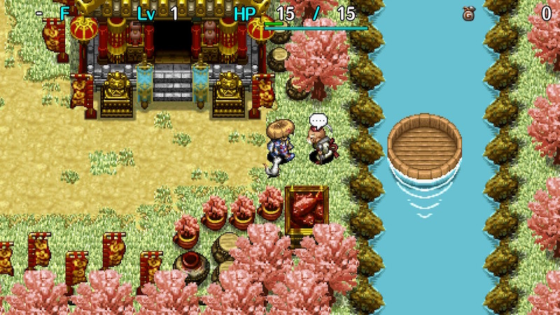

  

Dungeon with a special rule where items placed on the ground outside of shops vanish.

Most items dropped by defeated monsters are lost, and item collection techniques can't be performed. 
Mixer synthesis, hunting Froggo and Chow monsters for drops, throwing a pot to retrieve contents, 
collecting arrows using arrow traps or Dodger Pot, etc. can't be done outside of shops. 
※ Items eaten by Mixers or stolen by Zaloklefts won't vanish if they drop as a result of day and night switching.

Mixer family monsters appear on 10F, 20F, 40F, 50F, and 60F during the day, 
and shops have a higher chance of being generated compared to other dungeons.

It's similar to 置けずの洞窟 from Shiren 4, but some item categories are identified and [New Items](/system/new-items) appear, 
so as long as you've created strong New Items, it's easier than in Shiren 4... or so you might think. 
There are some pretty mean floors in this dungeon:

- Trip Traps appear starting on 51F and cause item loss, and Floor Warp Traps can disrupt day/night plans.
- There are many water floors, so you often get swarmed by Floating and Aquatic types at the start of a floor.
- Vexing Kappa, Kappa Troll, Ultra Gazer (appears for 10 floors), Swordsman, Fencer, and Sensei appear. These monsters all have the potential to cause your main weapon, shield, or bracelets to be lost.
- Presto Pots don't have a limited item table like in Shiren 4, so you can't aim for Navigation or Night-Day scrolls.

As you can see, there are some additions that increase the difficulty compared to Shiren 4's similar dungeon. 
If you play without New Items, the difficulty is on par with 置けずの洞窟, so give it a try if you're up for the challenge. 
That said, if you don't care to play at the intended balance and just want to clear it or obtain [Expert Badges](/system/expert-badges), 
it's best to create powerful New Item bracelets to drastically lower the difficulty.

<ul class="quickLinksUL">
  <li><a href="#overview">Overview</a></li>
  <li><a href="#strategy">Strategy</a>
    <ul>
      <li><a href="#abilities">Abilities</a></li>
      <li><a href="#identifying-items">Identifying Items</a></li>
      <li><a href="#equipment">Equipment</a></li>
      <li><a href="#other-items">Other Items</a></li>
      <li><a href="#floor-guide">Floor Guide</a></li>
    </ul>
  </li>
  <li><a href="#monsters">Monsters</a></li>
  <li><a href="#items">Items</a></li>
  <li><a href="#traps">Traps</a></li>
  <li><a href="#npcs">NPCs</a></li>
</ul>

# Overview

<table class="dungeonOverview">
  <tr>
    <th>Unlock</th>
    <td class="highlightYellow">Clear the main story.</td>
  </tr>
  <tr>
    <th>Entrance</th>
    <td class="highlightYellow">Nekomaneki Village (Talk to Charon near Dungeon Center)</td>
  </tr>
</table>

<table class="dungeonTable">
  <tr>
    <th>Floors</th>
    <td>28F (first) / 99F</td>
    <th>Day / Night</th>
    <td>Both</td>
  </tr>
  <tr>
    <th>Bring Items</th>
    <td>No</td>
    <th>Allies</th>
    <td>No</td>
  </tr>
  <tr>
    <th>Unidentified</th>
    <td>Bracelets, Grass, Scrolls</td>
    <th>New Items</th>
    <td>Yes</td>
  </tr>
  <tr>
    <th>Shops</th>
    <td>Regular (Until 80F)</td>
    <th>Monster Houses</th>
    <td>Regular, Special, Sudden</td>
  </tr>
  <tr>
    <th>Initial Enemies</th>
    <td></td>
    <th>Spawn Rate</th>
    <td>30 day</td>
  </tr>
  <tr>
    <th>Day Turns</th>
    <td>810</td>
    <th>Night Turns</th>
    <td>368</td>
  </tr>
  <tr>
    <th>Ominous aura</th>
    <td>No</td>
    <th>Wind of Kron</th>
    <td>1st: 1700 4th: 2000</td>
  </tr>
  <tr>
    <th>Clear Icon</th>
    <td class="clearIcon"></td>
    <th>Reward</th>
    <td>Heavenly Pot</td>
  </tr>
</table>

# Strategy

### Abilities

### Identifying Items

### Equipment

### Other Items

### Floor Guide

# Monsters

# Items

# Traps

# NPCs
