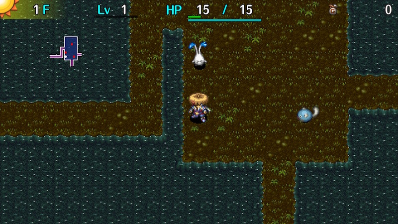

  

Dungeon where items can't be found on the ground, but monsters have a higher item drop rate. Enemies like Mudkin and Shopkeeper that normally never drop items can also drop items in this dungeon. There are lots of initial enemies, but new monsters require 180 turns to spawn, so there's little reason to linger. Every floor is a water floor, so Gazers, Swordsmans, and Zaloklefts can easily cause item loss. Shops can be generated, but there are usually fewer items for sale.

<ul class="quickLinksUL">
  <li><a href="#overview">Overview</a></li>
  <li><a href="#strategy">Strategy</a></li>
  <li><a href="#monsters">Monsters</a></li>
  <li><a href="#items">Items</a></li>
  <li><a href="#traps">Traps</a></li>
</ul>

# Overview

<table class="dungeonOverview">
  <tr>
    <th>Unlock</th>
    <td class="highlightYellow">Clear Ouma Shrine and arrive in Nekomaneki Village.</td>
  </tr>
  <tr>
    <th>Entrance</th>
    <td class="highlightYellow">Nekomaneki Village (Woman in Dungeon Center)</td>
  </tr>
</table>

<table class="dungeonTable">
  <tr>
    <th>Floors</th>
    <td>29F (first) / 50F</td>
    <th>Day / Night</th>
    <td>Day</td>
  </tr>
  <tr>
    <th>Bring Items</th>
    <td>No</td>
    <th>Allies</th>
    <td>No</td>
  </tr>
  <tr>
    <th>Unidentified</th>
    <td>Bracelets</td>
    <th>New Items</th>
    <td>No</td>
  </tr>
  <tr>
    <th>Shops</th>
    <td>Regular</td>
    <th>Monster Houses</th>
    <td>Regular</td>
  </tr>
  <tr>
    <th>Initial Enemies</th>
    <td></td>
    <th>Spawn Rate</th>
    <td>180</td>
  </tr>
  <tr>
    <th>Ominous aura</th>
    <td></td>
    <th>Wind of Kron</th>
    <td>1st: 1700 / 4th: 2000</td>
  </tr>
  <tr>
    <th>Clear Icon</th>
    <td>None</td>
    <th>Reward</th>
    <td>Heal Bracelet</td>
  </tr>
</table>

# Strategy

### General

The start is a bit luck-based - Not bad if you get decent equipment, but otherwise it can be rough. Gitan dropped by Froggo (3-5F) should be used as a projectile against Gazers (5-7F) and Fearabbits (5-7F). Don't worry about saving money - Shops are rare, and you can just sell equipment if you need Gitan. Don't try to hunt Zalokleft type monsters unless you have a Lock Shield.

Kumonigiri (7-9F) has a very high chance to drop Onigiri when defeated. If you manage to make it to this floor range, hunger issues usually ease up for a while. Don't eat extra Onigiri to raise max fullness - Instead, just keep the food on hand for later use.

Mixer (9-10F) overlaps with Crow Tengu on 10F, so check Mixer's movement near water to ensure it's real. Real Mixers can't walk on water tiles, so if the Mixer approaches through water, it's a Crow Tengu. Mixers are a bit rare, so you might be forced to linger despite the abysmal 180 turn spawn rate.

Since this dungeon lacks walls, you'll need to throw pots at enemies to retrieve contents. It helps to check for traps before throwing the pot to avoid accidents that might lead to item loss.

If a monster is on a water tile, you can swing a Clone Staff at it to have it warp to a random room and distract other monsters on the floor for a short while - Handy near the stairs in particular. Monster Detector plays well with Transient and Swap staves, as expected for a dungeon without walls.

The difficulty spikes upward from 23F where Hopodile and other aquatic and floating types appear. Water Cutter is worth using as a main weapon even if you're already past Mixer floors. It's especially great against Doom Gyaza, Oingodile, and Boingodile near the end of the 2nd clear. That said, you'll likely need high strength or a fully leveled Watter Cutter to one-shot Doom Gyaza. Lizard Lasher (w/Anti-Aquatic) is also good, since it excels against Hopodile type monsters. For other type-effective runes, prioritize Anti-Floating and Anti-Plant if possible.

### Farming

- Kumonigiri (7-9F)
    - Often drops Onigiri when defeated, which can be grilled by Pop Tank (13-15F) if desired.
- Mixer (9-10F)
    - Beware of Crow Tengu disguised as a Mixer.
- Karakuroid (13-15F), Steamroid (34-36F), Electroid (44-45F)
    - Have it create useful traps like Monster Trap, Decay Trap, etc.
- Muddy (25-27F), Mudster (41-43F)
    - Position it on a water tile and make it endlessly multiply for item drops.
- Flamebird (15-17F), Sparkbird (29-31F), Flarebird (42-44F)
    - Synthesize Anti-Blast+ and step on an Explosion Trap to have it multiply, then defeat for items.
    - Incredibly rare to obtain all of the needed items to set this up.
- Shopkeepers
    - Trigger Thief Mode, then hunt Shopkeepers that endlessly spawn for item drops.
    - Use a Fort. Staff + Breeze Blade or Burning Blade to ensure safety, along with a Juicy Peach.

# Monsters

See [Monsters](/system/monsters) for individual monster details.

- N = N'dubba Lv1 Lv2 Lv3 Lv4

Enemy Colors: Farming Useful Destroys Items Dangerous Very Dangerous

<table class="monsterTable">
  <thead>
    <tr>
      <th>F</th>
      <th colspan="6">Monsters</th>
      <th>N</th>
    </tr>
  </thead>
  <tbody>
    <tr>
      <td>1</td>
      <td>Mamel</td>
      <td>Colum</td>
      <td>Sproutant</td>
      <td>Seedie</td>
      <td class="highlightGray"></td>
      <td class="highlightGray"></td>
      <td class="highlightGray"></td>
    </tr>
    <tr>
      <td colspan="8" class="monsterDivider"></td>
    </tr>
    <tr>
      <td>2</td>
      <td>Mamel</td>
      <td>Colum</td>
      <td>Sproutant</td>
      <td>Seedie</td>
      <td class="highlightGray"></td>
      <td class="highlightGray"></td>
      <td class="highlightGray"></td>
    </tr>
    <tr>
      <td colspan="8" class="monsterDivider"></td>
    </tr>
    <tr>
      <td>3</td>
      <td>Pit Mamel</td>
      <td>Colum</td>
      <td>Froggo</td>
      <td>Seedie</td>
      <td>Blade Bee</td>
      <td class="highlightGray"></td>
      <td class="highlightGray"></td>
    </tr>
    <tr>
      <td colspan="8" class="monsterDivider"></td>
    </tr>
    <tr>
      <td>4</td>
      <td>Pit Mamel</td>
      <td class="highlightGray"></td>
      <td>Froggo</td>
      <td class="highlightGray"></td>
      <td>Blade Bee</td>
      <td>Chintala</td>
      <td class="highlightGray"></td>
    </tr>
    <tr>
      <td colspan="8" class="monsterDivider"></td>
    </tr>
    <tr>
      <td rowspan="2">5</td>
      <td>Pit Mamel</td>
      <td>Nigiri Baby</td>
      <td>Froggo</td>
      <td class="itemDay">Gazer</td>
      <td>Blade Bee</td>
      <td>Chintala</td>
      <td rowspan="2" class="highlightGray"></td>
    </tr>
    <tr>
      <td class="dangerDay">Fearabbit</td>
      <td class="highlightGray"></td>
      <td class="highlightGray"></td>
      <td class="highlightGray"></td>
      <td class="highlightGray"></td>
      <td class="highlightGray"></td>
    </tr>
    <tr>
      <td colspan="8" class="monsterDivider"></td>
    </tr>
    <tr>
      <td>6</td>
      <td class="dangerDay">Fearabbit</td>
      <td>Nigiri Baby</td>
      <td class="highlightGray"></td>
      <td class="itemDay">Gazer</td>
      <td class="highlightGray"></td>
      <td>Chintala</td>
      <td class="highlightGray"></td>
    </tr>
    <tr>
      <td colspan="8" class="monsterDivider"></td>
    </tr>
    <tr>
      <td rowspan="2">7</td>
      <td class="dangerDay">Fearabbit</td>
      <td>Nigiri Baby</td>
      <td class="farmingDay">Kumonigiri</td>
      <td class="itemDay">Gazer</td>
      <td class="highlightGray"></td>
      <td class="highlightGray"></td>
      <td rowspan="2" class="highlightGray"></td>
    </tr>
    <tr>
      <td class="itemDay">Swordsman</td>
      <td class="itemDay">Curse Girl</td>
      <td>Cheer-Ham</td>
      <td class="highlightGray"></td>
      <td class="highlightGray"></td>
      <td class="highlightGray"></td>
    </tr>
    <tr>
      <td colspan="8" class="monsterDivider"></td>
    </tr>
    <tr>
      <td rowspan="2">8</td>
      <td class="itemDay">Swordsman</td>
      <td class="itemDay">Curse Girl</td>
      <td class="farmingDay">Kumonigiri</td>
      <td class="highlightGray"></td>
      <td class="highlightGray"></td>
      <td class="highlightGray"></td>
      <td rowspan="2" class="highlightGray"></td>
    </tr>
    <tr>
      <td class="highlightGray"></td>
      <td class="highlightGray"></td>
      <td>Cheer-Ham</td>
      <td class="highlightGray"></td>
      <td class="highlightGray"></td>
      <td class="highlightGray"></td>
    </tr>
    <tr>
      <td colspan="8" class="monsterDivider"></td>
    </tr>
    <tr>
      <td rowspan="2">9</td>
      <td class="itemDay">Swordsman</td>
      <td class="itemDay">Curse Girl</td>
      <td class="farmingDay">Kumonigiri</td>
      <td class="usefulDay">Mixer</td>
      <td>Moseal</td>
      <td>Mid Chintala</td>
      <td rowspan="2" class="highlightGray"></td>
    </tr>
    <tr>
      <td>Yanpii</td>
      <td>Tiger Tosser</td>
      <td>Cheer-Ham</td>
      <td class="highlightGray"></td>
      <td class="highlightGray"></td>
      <td class="highlightGray"></td>
    </tr>
    <tr>
      <td colspan="8" class="monsterDivider"></td>
    </tr>
    <tr>
      <td rowspan="2">10</td>
      <td>Yanpii</td>
      <td>Tiger Tosser</td>
      <td class="dangerDay">Crow Tengu</td>
      <td class="usefulDay">Mixer</td>
      <td>Moseal</td>
      <td>Mid Chintala</td>
      <td rowspan="2" class="highlightGray"></td>
    </tr>
    <tr>
      <td class="highlightGray"></td>
      <td>Polygon Spinna</td>
      <td class="highlightGray"></td>
      <td class="highlightGray"></td>
      <td class="highlightGray"></td>
      <td class="highlightGray"></td>
    </tr>
    <tr>
      <td colspan="8" class="monsterDivider"></td>
    </tr>
    <tr>
      <td rowspan="2">11</td>
      <td class="itemDay">Scoopie</td>
      <td>Tiger Tosser</td>
      <td>Crow Tengu</td>
      <td class="highlightGray"></td>
      <td>Moseal</td>
      <td>Mid Chintala</td>
      <td rowspan="2" class="highlightGray"></td>
    </tr>
    <tr>
      <td class="highlightGray"></td>
      <td>Polygon Spinna</td>
      <td>Scorpion</td>
      <td class="highlightGray"></td>
      <td class="highlightGray"></td>
      <td class="highlightGray"></td>
    </tr>
    <tr>
      <td colspan="8" class="monsterDivider"></td>
    </tr>
    <tr>
      <td rowspan="2">12</td>
      <td class="itemDay">Scoopie</td>
      <td>Polygon Spinna</td>
      <td>Crow Tengu</td>
      <td class="highlightGray"></td>
      <td class="highlightGray"></td>
      <td class="highlightGray"></td>
      <td rowspan="2" class="highlightGray"></td>
    </tr>
    <tr>
      <td>Sproutyrant</td>
      <td class="highlightGray"></td>
      <td>Scorpion</td>
      <td class="highlightGray"></td>
      <td class="highlightGray"></td>
      <td class="highlightGray"></td>
    </tr>
    <tr>
      <td colspan="8" class="monsterDivider"></td>
    </tr>
    <tr>
      <td rowspan="2">13</td>
      <td class="itemDay">Scoopie</td>
      <td>Porky</td>
      <td>Scorpion</td>
      <td>N'dubba</td>
      <td>Pop Tank</td>
      <td class="usefulDay">Karakuroid</td>
      <td rowspan="2" class="monsterTableNdubba">1</td>
    </tr>
    <tr>
      <td>Sproutyrant</td>
      <td class="highlightGray"></td>
      <td class="highlightGray"></td>
      <td class="highlightGray"></td>
      <td class="highlightGray"></td>
      <td class="highlightGray"></td>
    </tr>
    <tr>
      <td colspan="8" class="monsterDivider"></td>
    </tr>
    <tr>
      <td>14</td>
      <td>Sproutyrant</td>
      <td>Porky</td>
      <td class="highlightGray"></td>
      <td>N'dubba</td>
      <td>Pop Tank</td>
      <td class="usefulDay">Karakuroid</td>
      <td class="monsterTableNdubba">1</td>
    </tr>
    <tr>
      <td colspan="8" class="monsterDivider"></td>
    </tr>
    <tr>
      <td rowspan="2">15</td>
      <td>Flamebird</td>
      <td>Porky</td>
      <td>Acrid Nut</td>
      <td>N'dubba</td>
      <td>Pop Tank</td>
      <td class="usefulDay">Karakuroid</td>
      <td rowspan="2" class="monsterTableNdubba">1</td>
    </tr>
    <tr>
      <td class="highlightGray"></td>
      <td>Go-Ham!</td>
      <td>Zapdon</td>
      <td class="highlightGray"></td>
      <td class="highlightGray"></td>
      <td class="highlightGray"></td>
    </tr>
    <tr>
      <td colspan="8" class="monsterDivider"></td>
    </tr>
    <tr>
      <td rowspan="2">16</td>
      <td>Flamebird</td>
      <td>Go-Ham!</td>
      <td>Acrid Nut</td>
      <td class="highlightGray"></td>
      <td class="highlightGray"></td>
      <td class="highlightGray"></td>
      <td rowspan="2" class="highlightGray"></td>
    </tr>
    <tr>
      <td>Mutaikon</td>
      <td>Pumphantasm</td>
      <td>Zapdon</td>
      <td class="highlightGray"></td>
      <td class="highlightGray"></td>
      <td class="highlightGray"></td>
    </tr>
    <tr>
      <td colspan="8" class="monsterDivider"></td>
    </tr>
    <tr>
      <td rowspan="2">17</td>
      <td>Flamebird</td>
      <td>Go-Ham!</td>
      <td>Zapdon</td>
      <td class="highlightGray"></td>
      <td>Metalhead</td>
      <td>Bored Kappa</td>
      <td rowspan="2" class="highlightGray"></td>
    </tr>
    <tr>
      <td>Mutaikon</td>
      <td>Pumphantasm</td>
      <td>Gyaza</td>
      <td class="highlightGray"></td>
      <td class="highlightGray"></td>
      <td class="highlightGray"></td>
    </tr>
    <tr>
      <td colspan="8" class="monsterDivider"></td>
    </tr>
    <tr>
      <td rowspan="2">18</td>
      <td>Mutaikon</td>
      <td>Pumphantasm</td>
      <td>Gyaza</td>
      <td class="highlightGray"></td>
      <td>Metalhead</td>
      <td>Bored Kappa</td>
      <td rowspan="2" class="highlightGray"></td>
    </tr>
    <tr>
      <td class="dangerDay">Scarabbit</td>
      <td class="highlightGray"></td>
      <td class="highlightGray"></td>
      <td class="highlightGray"></td>
      <td class="highlightGray"></td>
      <td class="highlightGray"></td>
    </tr>
    <tr>
      <td colspan="8" class="monsterDivider"></td>
    </tr>
    <tr>
      <td rowspan="2">19</td>
      <td class="dangerDay">Scarabbit</td>
      <td>Cololum</td>
      <td>Gyaza</td>
      <td class="itemDay">Cursister</td>
      <td>Metalhead</td>
      <td>Bored Kappa</td>
      <td rowspan="2" class="highlightGray"></td>
    </tr>
    <tr>
      <td class="highlightGray"></td>
      <td class="highlightGray"></td>
      <td class="dangerDay">Absorbiphant</td>
      <td class="highlightGray"></td>
      <td class="highlightGray"></td>
      <td class="highlightGray"></td>
    </tr>
    <tr>
      <td colspan="8" class="monsterDivider"></td>
    </tr>
    <tr>
      <td>20</td>
      <td class="dangerDay">Scarabbit</td>
      <td>Cololum</td>
      <td class="dangerDay">Absorbiphant</td>
      <td class="itemDay">Cursister</td>
      <td class="highlightGray"></td>
      <td class="highlightGray"></td>
      <td class="highlightGray"></td>
    </tr>
    <tr>
      <td colspan="8" class="monsterDivider"></td>
    </tr>
    <tr>
      <td rowspan="2">21</td>
      <td class="farmingDay">Green Zalokleft</td>
      <td>Cololum</td>
      <td class="dangerDay">Absorbiphant</td>
      <td class="itemDay">Cursister</td>
      <td class="highlightGray"></td>
      <td class="dangerDay">MC Mage</td>
      <td rowspan="2" class="highlightGray"></td>
    </tr>
    <tr>
      <td>Kid Squid</td>
      <td>Naptapir</td>
      <td class="highlightGray"></td>
      <td class="highlightGray"></td>
      <td class="highlightGray"></td>
      <td class="highlightGray"></td>
    </tr>
    <tr>
      <td colspan="8" class="monsterDivider"></td>
    </tr>
    <tr>
      <td rowspan="2">22</td>
      <td class="farmingDay">Green Zalokleft</td>
      <td>Naptapir</td>
      <td>Beanie</td>
      <td class="highlightGray"></td>
      <td class="highlightGray"></td>
      <td class="dangerDay">MC Mage</td>
      <td rowspan="2" class="highlightGray"></td>
    </tr>
    <tr>
      <td>Kid Squid</td>
      <td class="highlightGray"></td>
      <td class="highlightGray"></td>
      <td class="highlightGray"></td>
      <td class="highlightGray"></td>
      <td class="highlightGray"></td>
    </tr>
    <tr>
      <td colspan="8" class="monsterDivider"></td>
    </tr>
    <tr>
      <td rowspan="2">23</td>
      <td class="farmingDay">Green Zalokleft</td>
      <td>Naptapir</td>
      <td>Beanie</td>
      <td>Momoseal</td>
      <td class="dangerDay">Hopodile</td>
      <td class="dangerDay">MC Mage</td>
      <td rowspan="2" class="highlightGray"></td>
    </tr>
    <tr>
      <td>Kid Squid</td>
      <td class="itemDay">Nigiri Morph</td>
      <td class="highlightGray"></td>
      <td class="highlightGray"></td>
      <td class="highlightGray"></td>
      <td class="highlightGray"></td>
    </tr>
    <tr>
      <td colspan="8" class="monsterDivider"></td>
    </tr>
    <tr>
      <td>24</td>
      <td>Huistdon</td>
      <td class="itemDay">Nigiri Morph</td>
      <td>Beanie</td>
      <td>Momoseal</td>
      <td class="dangerDay">Hopodile</td>
      <td class="highlightGray"></td>
      <td class="highlightGray"></td>
    </tr>
    <tr>
      <td colspan="8" class="monsterDivider"></td>
    </tr>
    <tr>
      <td rowspan="2">25</td>
      <td>Huistdon</td>
      <td class="itemDay">Nigiri Morph</td>
      <td class="itemDay">Muddy</td>
      <td>Momoseal</td>
      <td class="dangerDay">Hopodile</td>
      <td>Boy Cart</td>
      <td rowspan="2" class="highlightGray"></td>
    </tr>
    <tr>
      <td class="highlightGray"></td>
      <td>Falcon Tengu</td>
      <td class="highlightGray"></td>
      <td class="highlightGray"></td>
      <td class="highlightGray"></td>
      <td class="highlightGray"></td>
    </tr>
    <tr>
      <td colspan="8" class="monsterDivider"></td>
    </tr>
    <tr>
      <td>26</td>
      <td>Huistdon</td>
      <td>Falcon Tengu</td>
      <td class="itemDay">Muddy</td>
      <td class="highlightGray"></td>
      <td class="dangerDay">Hopodile</td>
      <td>Boy Cart</td>
      <td class="highlightGray"></td>
    </tr>
    <tr>
      <td colspan="8" class="monsterDivider"></td>
    </tr>
    <tr>
      <td rowspan="2">27</td>
      <td class="itemDay">Gyadon</td>
      <td>Falcon Tengu</td>
      <td class="itemDay">Muddy</td>
      <td class="dangerDay">Death Gyaza</td>
      <td>Sproutyrant</td>
      <td>Boy Cart</td>
      <td rowspan="2" class="highlightGray"></td>
    </tr>
    <tr>
      <td class="highlightGray"></td>
      <td>DJ Mage</td>
      <td class="highlightGray"></td>
      <td class="highlightGray"></td>
      <td class="highlightGray"></td>
      <td class="highlightGray"></td>
    </tr>
    <tr>
      <td colspan="8" class="monsterDivider"></td>
    </tr>
    <tr>
      <td>28</td>
      <td class="itemDay">Gyadon</td>
      <td>DJ Mage</td>
      <td>Kappa Pest</td>
      <td class="dangerDay">Death Gyaza</td>
      <td>Sproutyrant</td>
      <td>Dagger Bee</td>
      <td class="highlightGray"></td>
    </tr>
    <tr>
      <td colspan="8" class="monsterDivider"></td>
    </tr>
    <tr>
      <td rowspan="2">29</td>
      <td class="itemDay">Gyadon</td>
      <td>DJ Mage</td>
      <td>Kappa Pest</td>
      <td class="dangerDay">Death Gyaza</td>
      <td>Sproutyrant</td>
      <td>Dagger Bee</td>
      <td rowspan="2" class="highlightGray"></td>
    </tr>
    <tr>
      <td>Polygon Shaka</td>
      <td>Sparkbird</td>
      <td>Firepuff</td>
      <td>Rally Ham</td>
      <td class="highlightGray"></td>
      <td class="highlightGray"></td>
    </tr>
    <tr>
      <td colspan="8" class="monsterDivider"></td>
    </tr>
    <tr>
      <td rowspan="2">30</td>
      <td>Polygon Shaka</td>
      <td>Sparkbird</td>
      <td>Kappa Pest</td>
      <td>Rally Ham</td>
      <td class="dangerDay">Katana Bee</td>
      <td>Dagger Bee</td>
      <td rowspan="2" class="highlightGray"></td>
    </tr>
    <tr>
      <td class="highlightGray"></td>
      <td class="highlightGray"></td>
      <td>Firepuff</td>
      <td class="highlightGray"></td>
      <td class="highlightGray"></td>
      <td class="highlightGray"></td>
    </tr>
    <tr>
      <td colspan="8" class="monsterDivider"></td>
    </tr>
    <tr>
      <td rowspan="2">31</td>
      <td>Polygon Shaka</td>
      <td>Sparkbird</td>
      <td>Firepuff</td>
      <td>Rally Ham</td>
      <td class="highlightGray"></td>
      <td>Dagger Bee</td>
      <td rowspan="2" class="highlightGray"></td>
    </tr>
    <tr>
      <td>Sr. Yanpii</td>
      <td class="highlightGray"></td>
      <td>Big Chintala</td>
      <td>Eligan</td>
      <td>Poofy</td>
      <td class="highlightGray"></td>
    </tr>
    <tr>
      <td colspan="8" class="monsterDivider"></td>
    </tr>
    <tr>
      <td rowspan="2">32</td>
      <td>Sr. Yanpii</td>
      <td class="highlightGray"></td>
      <td>Big Chintala</td>
      <td>Eligan</td>
      <td class="dangerDay">Katana Bee</td>
      <td class="highlightGray"></td>
      <td rowspan="2" class="highlightGray"></td>
    </tr>
    <tr>
      <td class="highlightGray"></td>
      <td class="highlightGray"></td>
      <td class="highlightGray"></td>
      <td class="highlightGray"></td>
      <td>Poofy</td>
      <td class="highlightGray"></td>
    </tr>
    <tr>
      <td colspan="8" class="monsterDivider"></td>
    </tr>
    <tr>
      <td rowspan="2">33</td>
      <td>Sr. Yanpii</td>
      <td class="dangerDay">MC Mage</td>
      <td>Big Chintala</td>
      <td>Eligan</td>
      <td>Poofy</td>
      <td>Punisher</td>
      <td rowspan="2" class="highlightGray"></td>
    </tr>
    <tr>
      <td class="highlightGray"></td>
      <td class="highlightGray"></td>
      <td>Zotdon</td>
      <td class="highlightGray"></td>
      <td>Cross Cart</td>
      <td class="highlightGray"></td>
    </tr>
    <tr>
      <td colspan="8" class="monsterDivider"></td>
    </tr>
    <tr>
      <td rowspan="2">34</td>
      <td>Pumphantom</td>
      <td class="dangerDay">MC Mage</td>
      <td>Zotdon</td>
      <td class="highlightGray"></td>
      <td>Cross Cart</td>
      <td>Punisher</td>
      <td rowspan="2" class="highlightGray"></td>
    </tr>
    <tr>
      <td class="highlightGray"></td>
      <td class="highlightGray"></td>
      <td class="usefulDay">Steamroid</td>
      <td class="highlightGray"></td>
      <td class="highlightGray"></td>
      <td class="highlightGray"></td>
    </tr>
    <tr>
      <td colspan="8" class="monsterDivider"></td>
    </tr>
    <tr>
      <td rowspan="2">35</td>
      <td>Pumphantom</td>
      <td class="dangerDay">MC Mage</td>
      <td>Zotdon</td>
      <td>Momomoseal</td>
      <td>Cross Cart</td>
      <td>Punisher</td>
      <td rowspan="2" class="highlightGray"></td>
    </tr>
    <tr>
      <td class="farmingDay">Pandanigiri</td>
      <td class="itemDay">Curspinster</td>
      <td class="usefulDay">Steamroid</td>
      <td class="highlightGray"></td>
      <td class="highlightGray"></td>
      <td class="highlightGray"></td>
    </tr>
    <tr>
      <td colspan="8" class="monsterDivider"></td>
    </tr>
    <tr>
      <td rowspan="2">36</td>
      <td>Pumphantom</td>
      <td class="itemDay">Curspinster</td>
      <td class="usefulDay">Steamroid</td>
      <td>Momomoseal</td>
      <td class="highlightGray"></td>
      <td>Debaser</td>
      <td rowspan="2" class="highlightGray"></td>
    </tr>
    <tr>
      <td class="farmingDay">Pandanigiri</td>
      <td class="highlightGray"></td>
      <td class="highlightGray"></td>
      <td class="highlightGray"></td>
      <td class="highlightGray"></td>
      <td class="highlightGray"></td>
    </tr>
    <tr>
      <td colspan="8" class="monsterDivider"></td>
    </tr>
    <tr>
      <td rowspan="2">37</td>
      <td>Pumphantom</td>
      <td class="itemDay">Curspinster</td>
      <td class="itemDay">Fencer</td>
      <td>Momomoseal</td>
      <td class="usefulDay">Mixermon</td>
      <td>Debaser</td>
      <td rowspan="2" class="monsterTableNtwyn">2</td>
    </tr>
    <tr>
      <td class="farmingDay">Pandanigiri</td>
      <td class="dangerDay">Eagle Tengu</td>
      <td class="itemDay">Super Gazer</td>
      <td>N'twyn</td>
      <td class="highlightGray"></td>
      <td class="highlightGray"></td>
    </tr>
    <tr>
      <td colspan="8" class="monsterDivider"></td>
    </tr>
    <tr>
      <td rowspan="2">38</td>
      <td class="highlightGray"></td>
      <td class="dangerDay">Eagle Tengu</td>
      <td class="itemDay">Fencer</td>
      <td>N'twyn</td>
      <td class="usefulDay">Mixermon</td>
      <td>Debaser</td>
      <td rowspan="2" class="monsterTableNtwyn">2</td>
    </tr>
    <tr>
      <td class="highlightGray"></td>
      <td class="highlightGray"></td>
      <td class="itemDay">Super Gazer</td>
      <td class="highlightGray"></td>
      <td class="highlightGray"></td>
      <td class="highlightGray"></td>
    </tr>
    <tr>
      <td colspan="8" class="monsterDivider"></td>
    </tr>
    <tr>
      <td rowspan="2">39</td>
      <td class="extremeDay">Dozikon</td>
      <td>Eagle Tengu</td>
      <td class="itemDay">Fencer</td>
      <td>N'twyn</td>
      <td class="highlightGray"></td>
      <td class="highlightGray"></td>
      <td rowspan="2" class="monsterTableNtwyn">2</td>
    </tr>
    <tr>
      <td>Lt. Yanpii</td>
      <td class="dangerDay">Nigiri Boss</td>
      <td class="itemDay">Super Gazer</td>
      <td>Colocolum</td>
      <td class="highlightGray"></td>
      <td class="highlightGray"></td>
    </tr>
    <tr>
      <td colspan="8" class="monsterDivider"></td>
    </tr>
    <tr>
      <td rowspan="2">40</td>
      <td class="extremeDay">Dozikon</td>
      <td class="dangerDay">Nigiri Boss</td>
      <td class="highlightGray"></td>
      <td>Colocolum</td>
      <td>Nuttie</td>
      <td class="highlightGray"></td>
      <td rowspan="2" class="highlightGray"></td>
    </tr>
    <tr>
      <td>Lt. Yanpii</td>
      <td class="highlightGray"></td>
      <td class="highlightGray"></td>
      <td class="highlightGray"></td>
      <td class="highlightGray"></td>
      <td class="highlightGray"></td>
    </tr>
    <tr>
      <td colspan="8" class="monsterDivider"></td>
    </tr>
    <tr>
      <td rowspan="2">41</td>
      <td class="extremeDay">Dozikon</td>
      <td class="dangerDay">Nigiri Boss</td>
      <td class="itemDay">Mudster</td>
      <td>Colocolum</td>
      <td>Nuttie</td>
      <td>Flamepuff</td>
      <td rowspan="2" class="highlightGray"></td>
    </tr>
    <tr>
      <td>Lt. Yanpii</td>
      <td class="highlightGray"></td>
      <td>Tiger Hurler</td>
      <td class="highlightGray"></td>
      <td class="highlightGray"></td>
      <td class="highlightGray"></td>
    </tr>
    <tr>
      <td colspan="8" class="monsterDivider"></td>
    </tr>
    <tr>
      <td rowspan="2">42</td>
      <td class="dangerDay">Flarebird</td>
      <td class="itemDay">Sensei</td>
      <td class="itemDay">Mudster</td>
      <td class="highlightGray"></td>
      <td>Nuttie</td>
      <td>Flamepuff</td>
      <td rowspan="2" class="highlightGray"></td>
    </tr>
    <tr>
      <td class="highlightGray"></td>
      <td class="highlightGray"></td>
      <td>Tiger Hurler</td>
      <td class="highlightGray"></td>
      <td class="highlightGray"></td>
      <td class="highlightGray"></td>
    </tr>
    <tr>
      <td colspan="8" class="monsterDivider"></td>
    </tr>
    <tr>
      <td rowspan="2">43</td>
      <td class="dangerDay">Flarebird</td>
      <td class="itemDay">Sensei</td>
      <td class="itemDay">Mudster</td>
      <td>Electroid</td>
      <td class="dangerDay">Hipadile</td>
      <td>Flamepuff</td>
      <td rowspan="2" class="highlightGray"></td>
    </tr>
    <tr>
      <td>Strong Cart</td>
      <td class="itemDay">Gyairas</td>
      <td>Tiger Hurler</td>
      <td class="highlightGray"></td>
      <td class="highlightGray"></td>
      <td class="highlightGray"></td>
    </tr>
    <tr>
      <td colspan="8" class="monsterDivider"></td>
    </tr>
    <tr>
      <td rowspan="2">44</td>
      <td class="dangerDay">Flarebird</td>
      <td class="itemDay">Sensei</td>
      <td class="highlightGray"></td>
      <td>Electroid</td>
      <td class="dangerDay">Hipadile</td>
      <td class="highlightGray"></td>
      <td rowspan="2" class="highlightGray"></td>
    </tr>
    <tr>
      <td>Strong Cart</td>
      <td class="itemDay">Gyairas</td>
      <td class="highlightGray"></td>
      <td>Phoenix Tengu</td>
      <td class="highlightGray"></td>
      <td class="highlightGray"></td>
    </tr>
    <tr>
      <td colspan="8" class="monsterDivider"></td>
    </tr>
    <tr>
      <td rowspan="2">45</td>
      <td>Strong Cart</td>
      <td class="itemDay">Sensei</td>
      <td>Pyrepuff</td>
      <td>Electroid</td>
      <td class="dangerDay">Hipadile</td>
      <td>Snooztapir</td>
      <td rowspan="2" class="highlightGray"></td>
    </tr>
    <tr>
      <td class="extremeDay">MC Sorceror</td>
      <td class="itemDay">Gyairas</td>
      <td class="extremeDay">Porkon</td>
      <td>Phoenix Tengu</td>
      <td class="highlightGray"></td>
      <td class="highlightGray"></td>
    </tr>
    <tr>
      <td colspan="8" class="monsterDivider"></td>
    </tr>
    <tr>
      <td rowspan="2">46</td>
      <td class="extremeDay">MC Sorceror</td>
      <td>Pumpanshee</td>
      <td>Pyrepuff</td>
      <td class="highlightGray"></td>
      <td class="highlightGray"></td>
      <td>Snooztapir</td>
      <td rowspan="2" class="highlightGray"></td>
    </tr>
    <tr>
      <td class="highlightGray"></td>
      <td class="highlightGray"></td>
      <td class="extremeDay">Porkon</td>
      <td class="highlightGray"></td>
      <td class="highlightGray"></td>
      <td class="highlightGray"></td>
    </tr>
    <tr>
      <td colspan="8" class="monsterDivider"></td>
    </tr>
    <tr>
      <td rowspan="2">47</td>
      <td class="extremeDay">MC Sorceror</td>
      <td>Pumpanshee</td>
      <td>Pyrepuff</td>
      <td class="highlightGray"></td>
      <td class="highlightGray"></td>
      <td>Snooztapir</td>
      <td rowspan="2" class="highlightGray"></td>
    </tr>
    <tr>
      <td class="highlightGray"></td>
      <td class="highlightGray"></td>
      <td class="extremeDay">Porkon</td>
      <td class="highlightGray"></td>
      <td class="highlightGray"></td>
      <td class="highlightGray"></td>
    </tr>
    <tr>
      <td colspan="8" class="monsterDivider"></td>
    </tr>
    <tr>
      <td>48</td>
      <td class="highlightGray"></td>
      <td>Pumpanshee</td>
      <td class="farmingDay">Zalokleft King</td>
      <td>Vexing Kappa</td>
      <td class="extremeDay">Doom Gyaza</td>
      <td class="dangerDay">King Squid</td>
      <td class="highlightGray"></td>
    </tr>
    <tr>
      <td colspan="8" class="monsterDivider"></td>
    </tr>
    <tr>
      <td>49</td>
      <td class="dangerDay">Oingodile</td>
      <td class="extremeDay">Boingodile</td>
      <td class="farmingDay">Zalokleft King</td>
      <td>Vexing Kappa</td>
      <td class="extremeDay">Doom Gyaza</td>
      <td class="dangerDay">King Squid</td>
      <td class="highlightGray"></td>
    </tr>
    <tr>
      <td colspan="8" class="monsterDivider"></td>
    </tr>
    <tr>
      <td>50</td>
      <td class="dangerDay">Oingodile</td>
      <td class="extremeDay">Boingodile</td>
      <td class="farmingDay">Zalokleft King</td>
      <td>Vexing Kappa</td>
      <td class="extremeDay">Doom Gyaza</td>
      <td class="dangerDay">King Squid</td>
      <td class="highlightGray"></td>
    </tr>
    <tr>
      <td colspan="8" class="monsterDivider"></td>
    </tr>
  </tbody>
</table>

※ Monster Table might be incomplete.

# Items

※ Item Table is incomplete. If you find a drop that isn't listed, please add it to the table.

- F = Monster (day)
- S = Shop, Maneater, Shiny Object (yellow)
- P = Presto Pot
- Z = Zalokleft

#### Weapons

<table class="dungeonItems">
  <tr>
    <th>Name</th>
    <th>F</th>
    <th>S</th>
    <th>P</th>
    <th>Z</th>
    <th rowspan="15" class="tableDivider"></th>
    <th>Name</th>
    <th>F</th>
    <th>S</th>
    <th>P</th>
    <th>Z</th>
    <th rowspan="15" class="tableDivider"></th>
    <th>Name</th>
    <th>F</th>
    <th>S</th>
    <th>P</th>
    <th>Z</th>
  </tr>
  <tr>
    <td class="leftText highlightGray">Ordinary Stick</td>
    <td>X</td>
    <td></td>
    <td></td>
    <td></td>
    <td class="leftText highlightGray">Rusty Pickaxe</td>
    <td></td>
    <td></td>
    <td></td>
    <td></td>
    <td class="leftText highlightGray">Shockuto</td>
    <td>X</td>
    <td></td>
    <td></td>
    <td></td>
  </tr>
  <tr>
    <td class="leftText highlightGray">Tin Blade</td>
    <td>X</td>
    <td></td>
    <td></td>
    <td></td>
    <td class="leftText highlightGray">Old Mallet</td>
    <td>X</td>
    <td></td>
    <td></td>
    <td></td>
    <td class="leftText highlightGray">Blurry Stick</td>
    <td></td>
    <td></td>
    <td></td>
    <td></td>
  </tr>
  <tr>
    <td class="leftText highlightGray">Katana</td>
    <td>X</td>
    <td></td>
    <td></td>
    <td></td>
    <td class="leftText highlightGray">Sky Splitter</td>
    <td>X</td>
    <td></td>
    <td></td>
    <td></td>
    <td class="leftText highlightGray">Sealing Keisaku</td>
    <td>X</td>
    <td></td>
    <td></td>
    <td></td>
  </tr>
  <tr>
    <td class="leftText highlightGray">Beast Fang</td>
    <td>X</td>
    <td></td>
    <td></td>
    <td></td>
    <td class="leftText highlightGray">Water Cutter</td>
    <td>X</td>
    <td></td>
    <td></td>
    <td></td>
    <td class="leftText highlightGray">Baffle Axe</td>
    <td>X</td>
    <td></td>
    <td></td>
    <td></td>
  </tr>
  <tr>
    <td class="leftText highlightGray">Dotanuki</td>
    <td>X</td>
    <td></td>
    <td></td>
    <td></td>
    <td class="leftText highlightGray">Scythe</td>
    <td>X</td>
    <td></td>
    <td></td>
    <td></td>
    <td class="leftText highlightGray">Hatchet</td>
    <td></td>
    <td></td>
    <td></td>
    <td></td>
  </tr>
  <tr>
    <td class="leftText highlightGray">Bladite</td>
    <td>X</td>
    <td></td>
    <td></td>
    <td></td>
    <td class="leftText highlightGray">Myopic Masher</td>
    <td></td>
    <td></td>
    <td></td>
    <td></td>
    <td class="leftText highlightGray">Shoddy Dirk</td>
    <td></td>
    <td></td>
    <td></td>
    <td></td>
  </tr>
  <tr>
    <td class="leftText highlightGray">Red Blade</td>
    <td></td>
    <td></td>
    <td></td>
    <td></td>
    <td class="leftText highlightGray">Magic Masher</td>
    <td>X</td>
    <td></td>
    <td></td>
    <td></td>
    <td class="leftText highlightGray">Glass Dirk</td>
    <td>X</td>
    <td></td>
    <td></td>
    <td></td>
  </tr>
  <tr>
    <td class="leftText highlightGray">Kabura Katana</td>
    <td></td>
    <td></td>
    <td></td>
    <td></td>
    <td class="leftText highlightGray">Drain Dagger</td>
    <td>X</td>
    <td></td>
    <td></td>
    <td></td>
    <td class="leftText highlightGray">Dirk of Debts</td>
    <td></td>
    <td></td>
    <td></td>
    <td></td>
  </tr>
  <tr>
    <td class="leftText highlightGray">Fuuma Sword</td>
    <td></td>
    <td></td>
    <td></td>
    <td></td>
    <td class="leftText highlightGray">Copper Cleaver</td>
    <td>X</td>
    <td></td>
    <td></td>
    <td></td>
    <td class="leftText highlightGray">Extreme Sword</td>
    <td>X</td>
    <td></td>
    <td></td>
    <td></td>
  </tr>
  <tr>
    <td class="leftText highlightGray">Pathetic Blade</td>
    <td></td>
    <td></td>
    <td></td>
    <td></td>
    <td class="leftText highlightGray">Crescent Katana</td>
    <td>X</td>
    <td></td>
    <td></td>
    <td></td>
    <td class="leftText highlightGray">Violent Blade</td>
    <td>X</td>
    <td></td>
    <td></td>
    <td></td>
  </tr>
  <tr>
    <td class="leftText highlightGray">Dull Gold Edge</td>
    <td>X</td>
    <td></td>
    <td></td>
    <td></td>
    <td class="leftText highlightGray">Lizard Lasher</td>
    <td>X</td>
    <td></td>
    <td></td>
    <td></td>
    <td class="leftText highlightGray">Breeze Blade</td>
    <td>X</td>
    <td></td>
    <td></td>
    <td></td>
  </tr>
  <tr>
    <td class="leftText highlightGray">Bright Blade</td>
    <td>X</td>
    <td></td>
    <td></td>
    <td></td>
    <td class="leftText highlightGray">Nap Rattle</td>
    <td>X</td>
    <td></td>
    <td></td>
    <td></td>
    <td class="leftText highlightGray">Burning Blade</td>
    <td>X</td>
    <td></td>
    <td></td>
    <td></td>
  </tr>
  <tr>
    <td class="leftText highlightGray">True Knife</td>
    <td></td>
    <td></td>
    <td></td>
    <td></td>
    <td class="leftText highlightGray">Wonder Pick</td>
    <td></td>
    <td></td>
    <td></td>
    <td></td>
    <td class="leftText highlightGray">Sturdy Hammer</td>
    <td></td>
    <td></td>
    <td></td>
    <td></td>
  </tr>
  <tr>
    <td class="leftText highlightGray">Kaburagi</td>
    <td></td>
    <td></td>
    <td></td>
    <td></td>
    <td colspan="6"></td>
    <td colspan="6"></td>
  </tr>
</table>

#### Shields

<table class="dungeonItems">
  <tr>
    <th>Name</th>
    <th>F</th>
    <th>S</th>
    <th>P</th>
    <th>Z</th>
    <th rowspan="13" class="tableDivider"></th>
    <th>Name</th>
    <th>F</th>
    <th>S</th>
    <th>P</th>
    <th>Z</th>
    <th rowspan="13" class="tableDivider"></th>
    <th>Name</th>
    <th>F</th>
    <th>S</th>
    <th>P</th>
    <th>Z</th>
  </tr>
  <tr>
    <td class="leftText highlightGray">Plain Targe</td>
    <td>X</td>
    <td></td>
    <td></td>
    <td></td>
    <td class="leftText highlightGray">Heavy Shield</td>
    <td>X</td>
    <td></td>
    <td></td>
    <td></td>
    <td class="leftText highlightGray">Gyadon Blocker</td>
    <td></td>
    <td></td>
    <td></td>
    <td></td>
  </tr>
  <tr>
    <td class="leftText highlightGray">Tin Shield</td>
    <td>X</td>
    <td></td>
    <td></td>
    <td></td>
    <td class="leftText highlightGray">Midnight Shield</td>
    <td></td>
    <td></td>
    <td></td>
    <td></td>
    <td class="leftText highlightGray">Snake Shield</td>
    <td>X</td>
    <td></td>
    <td></td>
    <td></td>
  </tr>
  <tr>
    <td class="leftText highlightGray">Iron Targe</td>
    <td>X</td>
    <td></td>
    <td></td>
    <td></td>
    <td class="leftText highlightGray">Day Shield</td>
    <td></td>
    <td></td>
    <td></td>
    <td></td>
    <td class="leftText highlightGray">Steady Shield</td>
    <td>X</td>
    <td></td>
    <td></td>
    <td></td>
  </tr>
  <tr>
    <td class="leftText highlightGray">Wolfshead</td>
    <td>X</td>
    <td></td>
    <td></td>
    <td></td>
    <td class="leftText highlightGray">Binary Shield</td>
    <td></td>
    <td></td>
    <td></td>
    <td></td>
    <td class="leftText highlightGray">Anti-Gaze Trge</td>
    <td>X</td>
    <td></td>
    <td></td>
    <td></td>
  </tr>
  <tr>
    <td class="leftText highlightGray">Beast Shield</td>
    <td>X</td>
    <td></td>
    <td></td>
    <td></td>
    <td class="leftText highlightGray">Counter Shield</td>
    <td></td>
    <td></td>
    <td></td>
    <td></td>
    <td class="leftText highlightGray">Swap Shield</td>
    <td></td>
    <td></td>
    <td></td>
    <td></td>
  </tr>
  <tr>
    <td class="leftText highlightGray">Targite</td>
    <td>X</td>
    <td></td>
    <td></td>
    <td></td>
    <td class="leftText highlightGray">Student Shield</td>
    <td></td>
    <td></td>
    <td></td>
    <td></td>
    <td class="leftText highlightGray">Shoddy Plank</td>
    <td>X</td>
    <td></td>
    <td></td>
    <td></td>
  </tr>
  <tr>
    <td class="leftText highlightGray">Red Shield</td>
    <td>X</td>
    <td></td>
    <td></td>
    <td></td>
    <td class="leftText highlightGray">Bowl Shield</td>
    <td>X</td>
    <td></td>
    <td></td>
    <td></td>
    <td class="leftText highlightGray">Glass Buckler</td>
    <td>X</td>
    <td></td>
    <td></td>
    <td></td>
  </tr>
  <tr>
    <td class="leftText highlightGray">Fuuma Shield</td>
    <td></td>
    <td>X</td>
    <td></td>
    <td></td>
    <td class="leftText highlightGray">Spry Shield</td>
    <td>X</td>
    <td></td>
    <td></td>
    <td></td>
    <td class="leftText highlightGray">Pauper's Plank</td>
    <td></td>
    <td></td>
    <td></td>
    <td></td>
  </tr>
  <tr>
    <td class="leftText highlightGray">Pathetic Shield</td>
    <td></td>
    <td></td>
    <td></td>
    <td></td>
    <td class="leftText highlightGray">Blast Shield</td>
    <td>X</td>
    <td></td>
    <td></td>
    <td></td>
    <td class="leftText highlightGray">Rush Shield</td>
    <td>X</td>
    <td></td>
    <td></td>
    <td></td>
  </tr>
  <tr>
    <td class="leftText highlightGray">Gold Shield</td>
    <td>X</td>
    <td></td>
    <td></td>
    <td></td>
    <td class="leftText highlightGray">Lock Shield</td>
    <td>X</td>
    <td></td>
    <td></td>
    <td></td>
    <td class="leftText highlightGray">Blazing Shield</td>
    <td></td>
    <td></td>
    <td></td>
    <td></td>
  </tr>
  <tr>
    <td class="leftText highlightGray">Diet Shield</td>
    <td>X</td>
    <td></td>
    <td></td>
    <td></td>
    <td class="leftText highlightGray">Safe Shield</td>
    <td>X</td>
    <td></td>
    <td></td>
    <td></td>
    <td class="leftText highlightGray">Onigiri Shield</td>
    <td>X</td>
    <td></td>
    <td></td>
    <td></td>
  </tr>
  <tr>
    <td class="leftText highlightGray">Helix Shield</td>
    <td></td>
    <td></td>
    <td></td>
    <td></td>
    <td class="leftText highlightGray">Parry Shield</td>
    <td>X</td>
    <td></td>
    <td></td>
    <td></td>
    <td class="leftText highlightGray">Nirvana Board</td>
    <td></td>
    <td></td>
    <td></td>
    <td></td>
  </tr>
</table>

#### Bracelets

<table class="dungeonItems">
  <tr>
    <th>Name</th>
    <th>F</th>
    <th>S</th>
    <th>P</th>
    <th>Z</th>
    <th rowspan="13" class="tableDivider"></th>
    <th>Name</th>
    <th>F</th>
    <th>S</th>
    <th>P</th>
    <th>Z</th>
    <th rowspan="13" class="tableDivider"></th>
    <th>Name</th>
    <th>F</th>
    <th>S</th>
    <th>P</th>
    <th>Z</th>
  </tr>
  <tr>
    <td class="leftText highlightGray">Strength Bracelet</td>
    <td>X</td>
    <td></td>
    <td></td>
    <td></td>
    <td class="leftText highlightGray">Dozer Bracelet</td>
    <td></td>
    <td></td>
    <td></td>
    <td></td>
    <td class="leftText highlightGray">Nonary Bracelet</td>
    <td></td>
    <td></td>
    <td></td>
    <td></td>
  </tr>
  <tr>
    <td class="leftText highlightGray">Can. Arm Bracelet</td>
    <td>X</td>
    <td></td>
    <td></td>
    <td></td>
    <td class="leftText highlightGray">Trap Bracelet</td>
    <td></td>
    <td></td>
    <td></td>
    <td></td>
    <td class="leftText highlightGray">Growth Bracelet</td>
    <td>X</td>
    <td></td>
    <td></td>
    <td></td>
  </tr>
  <tr>
    <td class="leftText highlightGray">Inacc. Bracelet</td>
    <td>X</td>
    <td></td>
    <td></td>
    <td></td>
    <td class="leftText highlightGray">Monster Detector</td>
    <td>X</td>
    <td></td>
    <td></td>
    <td></td>
    <td class="leftText highlightGray">Anti-Parry Brce.</td>
    <td>X</td>
    <td></td>
    <td></td>
    <td></td>
  </tr>
  <tr>
    <td class="leftText highlightGray">Bunch Bracelet</td>
    <td></td>
    <td></td>
    <td></td>
    <td></td>
    <td class="leftText highlightGray">Monsterphobic</td>
    <td></td>
    <td></td>
    <td></td>
    <td></td>
    <td class="leftText highlightGray">Time Stop Bracelet</td>
    <td></td>
    <td></td>
    <td></td>
    <td></td>
  </tr>
  <tr>
    <td class="leftText highlightGray">Cleansing Bracelet</td>
    <td>X</td>
    <td></td>
    <td></td>
    <td></td>
    <td class="leftText highlightGray">Item Detector</td>
    <td>X</td>
    <td></td>
    <td></td>
    <td></td>
    <td class="leftText highlightGray">Floating Bracelet</td>
    <td>X</td>
    <td></td>
    <td></td>
    <td></td>
  </tr>
  <tr>
    <td class="leftText highlightGray">Anti-Cnf. Bracelet</td>
    <td>X</td>
    <td></td>
    <td></td>
    <td></td>
    <td class="leftText highlightGray">Itemphobic</td>
    <td></td>
    <td></td>
    <td></td>
    <td></td>
    <td class="leftText highlightGray">Night Ward</td>
    <td></td>
    <td></td>
    <td></td>
    <td></td>
  </tr>
  <tr>
    <td class="leftText highlightGray">Alert Bracelet</td>
    <td>X</td>
    <td></td>
    <td></td>
    <td></td>
    <td class="leftText highlightGray">Waterwalk Bracelet</td>
    <td>X</td>
    <td></td>
    <td></td>
    <td></td>
    <td class="leftText highlightGray">Scout Bracelet</td>
    <td>X</td>
    <td></td>
    <td></td>
    <td></td>
  </tr>
  <tr>
    <td class="leftText highlightGray">Anti-Crs. Bracelet</td>
    <td>X</td>
    <td></td>
    <td></td>
    <td></td>
    <td class="leftText highlightGray">Wall Clip Bracelet</td>
    <td></td>
    <td></td>
    <td></td>
    <td></td>
    <td class="leftText highlightGray">Trapper Bracelet</td>
    <td></td>
    <td></td>
    <td></td>
    <td></td>
  </tr>
  <tr>
    <td class="leftText highlightGray">Staunch Bracelet</td>
    <td></td>
    <td></td>
    <td></td>
    <td></td>
    <td class="leftText highlightGray">Heal Bracelet</td>
    <td>X</td>
    <td></td>
    <td></td>
    <td></td>
    <td class="leftText highlightGray">Identify Bracelet</td>
    <td></td>
    <td></td>
    <td></td>
    <td></td>
  </tr>
  <tr>
    <td class="leftText highlightGray">Critical Bracelet</td>
    <td>X</td>
    <td></td>
    <td></td>
    <td></td>
    <td class="leftText highlightGray">Alleyway Bracelet</td>
    <td></td>
    <td></td>
    <td></td>
    <td></td>
    <td class="leftText highlightGray">VIP Bracelet</td>
    <td></td>
    <td></td>
    <td></td>
    <td></td>
  </tr>
  <tr>
    <td class="leftText highlightGray">Mojo Bracelet</td>
    <td>X</td>
    <td></td>
    <td></td>
    <td></td>
    <td class="leftText highlightGray">Blink Bracelet</td>
    <td>X</td>
    <td></td>
    <td></td>
    <td></td>
    <td rowspan="2" colspan="6"></td>
  </tr>
  <tr>
    <td class="leftText highlightGray">Monster Summoner</td>
    <td>X</td>
    <td></td>
    <td></td>
    <td></td>
    <td class="leftText highlightGray">Explosion Bracelet</td>
    <td>X</td>
    <td></td>
    <td></td>
    <td></td>
  </tr>
</table>

#### Projectiles

<table class="dungeonItems">
  <tr>
    <th>Name</th>
    <th>F</th>
    <th>S</th>
    <th>P</th>
    <th>Z</th>
    <th rowspan="6" class="tableDivider"></th>
    <th>Name</th>
    <th>F</th>
    <th>S</th>
    <th>P</th>
    <th>Z</th>
    <th rowspan="6" class="tableDivider"></th>
    <th>Name</th>
    <th>F</th>
    <th>S</th>
    <th>P</th>
    <th>Z</th>
  </tr>
  <tr>
    <td class="leftText highlightGray">Wood Arrow</td>
    <td>X</td>
    <td></td>
    <td></td>
    <td></td>
    <td class="leftText highlightGray">Knockback Arrow</td>
    <td></td>
    <td></td>
    <td></td>
    <td></td>
    <td class="leftText highlightGray">Suicide Arrow</td>
    <td></td>
    <td></td>
    <td></td>
    <td></td>
  </tr>
  <tr>
    <td class="leftText highlightGray">Iron Arrow</td>
    <td>X</td>
    <td></td>
    <td></td>
    <td></td>
    <td class="leftText highlightGray">Truestrike Arrow</td>
    <td></td>
    <td></td>
    <td></td>
    <td></td>
    <td class="leftText highlightGray">Rock</td>
    <td>X</td>
    <td></td>
    <td></td>
    <td></td>
  </tr>
  <tr>
    <td class="leftText highlightGray">Silver Arrow</td>
    <td>X</td>
    <td></td>
    <td></td>
    <td></td>
    <td class="leftText highlightGray">Killer Arrow</td>
    <td></td>
    <td></td>
    <td></td>
    <td></td>
    <td class="leftText highlightGray">Porky Rock</td>
    <td>X</td>
    <td></td>
    <td></td>
    <td></td>
  </tr>
  <tr>
    <td class="leftText highlightGray">Critical Arrow</td>
    <td></td>
    <td></td>
    <td></td>
    <td></td>
    <td class="leftText highlightGray">Drain Arrow</td>
    <td></td>
    <td></td>
    <td></td>
    <td></td>
    <td class="leftText highlightGray">Rightstone</td>
    <td></td>
    <td></td>
    <td></td>
    <td></td>
  </tr>
  <tr>
    <td class="leftText highlightGray">Poison Arrow</td>
    <td></td>
    <td></td>
    <td></td>
    <td></td>
    <td class="leftText highlightGray">Random Arrow</td>
    <td></td>
    <td></td>
    <td></td>
    <td></td>
    <td class="leftText highlightGray">David's Bullet</td>
    <td></td>
    <td></td>
    <td></td>
    <td></td>
  </tr>
</table>

#### Staves

<table class="dungeonItems">
  <tr>
    <th>Name</th>
    <th>F</th>
    <th>S</th>
    <th>P</th>
    <th>Z</th>
    <th rowspan="9" class="tableDivider"></th>
    <th>Name</th>
    <th>F</th>
    <th>S</th>
    <th>P</th>
    <th>Z</th>
    <th rowspan="9" class="tableDivider"></th>
    <th>Name</th>
    <th>F</th>
    <th>S</th>
    <th>P</th>
    <th>Z</th>
  </tr>
  <tr>
    <td class="leftText highlightGray">Swap Staff</td>
    <td>X</td>
    <td></td>
    <td></td>
    <td></td>
    <td class="leftText highlightGray">Drama Staff</td>
    <td></td>
    <td></td>
    <td></td>
    <td></td>
    <td class="leftText highlightGray">Seal Staff</td>
    <td>X</td>
    <td></td>
    <td></td>
    <td></td>
  </tr>
  <tr>
    <td class="leftText highlightGray">Knockback Staff</td>
    <td>X</td>
    <td></td>
    <td></td>
    <td></td>
    <td class="leftText highlightGray">Nagging Staff</td>
    <td></td>
    <td></td>
    <td></td>
    <td></td>
    <td class="leftText highlightGray">Clone Staff</td>
    <td></td>
    <td></td>
    <td></td>
    <td></td>
  </tr>
  <tr>
    <td class="leftText highlightGray">Pinning Staff</td>
    <td>X</td>
    <td></td>
    <td></td>
    <td></td>
    <td class="leftText highlightGray">Balance Staff</td>
    <td>X</td>
    <td></td>
    <td></td>
    <td></td>
    <td class="leftText highlightGray">Staff of Sacrifice</td>
    <td></td>
    <td></td>
    <td></td>
    <td></td>
  </tr>
  <tr>
    <td class="leftText highlightGray">Mage Staff</td>
    <td>X</td>
    <td></td>
    <td></td>
    <td></td>
    <td class="leftText highlightGray">Empathy Staff</td>
    <td>X</td>
    <td></td>
    <td></td>
    <td></td>
    <td class="leftText highlightGray">Glorious Staff</td>
    <td>X</td>
    <td></td>
    <td></td>
    <td></td>
  </tr>
  <tr>
    <td class="leftText highlightGray">Slow Staff</td>
    <td>X</td>
    <td></td>
    <td></td>
    <td></td>
    <td class="leftText highlightGray">Ordinary Staff</td>
    <td></td>
    <td></td>
    <td></td>
    <td></td>
    <td class="leftText highlightGray">Unlucky Staff</td>
    <td>X</td>
    <td></td>
    <td></td>
    <td></td>
  </tr>
  <tr>
    <td class="leftText highlightGray">Swift Staff</td>
    <td></td>
    <td></td>
    <td></td>
    <td></td>
    <td class="leftText highlightGray">Trap Del. Staff</td>
    <td></td>
    <td></td>
    <td></td>
    <td></td>
    <td class="leftText highlightGray">Boring Staff</td>
    <td></td>
    <td></td>
    <td></td>
    <td></td>
  </tr>
  <tr>
    <td class="leftText highlightGray">Transient Staff</td>
    <td>X</td>
    <td></td>
    <td></td>
    <td></td>
    <td class="leftText highlightGray">Electric Staff</td>
    <td>X</td>
    <td></td>
    <td></td>
    <td></td>
    <td class="leftText highlightGray">Fort. Staff</td>
    <td>X</td>
    <td></td>
    <td></td>
    <td></td>
  </tr>
  <tr>
    <td class="leftText highlightGray">Paralysis Staff</td>
    <td>X</td>
    <td></td>
    <td></td>
    <td></td>
    <td class="leftText highlightGray">Shocking Staff</td>
    <td></td>
    <td></td>
    <td></td>
    <td></td>
    <td class="leftText highlightGray">Sharing Staff</td>
    <td></td>
    <td></td>
    <td></td>
    <td></td>
  </tr>
</table>

#### Talismans

<table class="dungeonItems">
  <tr>
    <th>Name</th>
    <th>F</th>
    <th>S</th>
    <th>P</th>
    <th>Z</th>
    <th rowspan="6" class="tableDivider"></th>
    <th>Name</th>
    <th>F</th>
    <th>S</th>
    <th>P</th>
    <th>Z</th>
    <th rowspan="6" class="tableDivider"></th>
    <th>Name</th>
    <th>F</th>
    <th>S</th>
    <th>P</th>
    <th>Z</th>
  </tr>
  <tr>
    <td class="leftText highlightGray">Shadow Bind Tal.</td>
    <td>X</td>
    <td></td>
    <td></td>
    <td></td>
    <td class="leftText highlightGray">Inacc. Talisman</td>
    <td>X</td>
    <td></td>
    <td></td>
    <td></td>
    <td class="leftText highlightGray">Enraged Talisman</td>
    <td></td>
    <td></td>
    <td></td>
    <td></td>
  </tr>
  <tr>
    <td class="leftText highlightGray">Conf. Talisman</td>
    <td>X</td>
    <td></td>
    <td></td>
    <td></td>
    <td class="leftText highlightGray">Sleep Talisman</td>
    <td>X</td>
    <td></td>
    <td></td>
    <td></td>
    <td class="leftText highlightGray">Furious Talisman</td>
    <td></td>
    <td></td>
    <td></td>
    <td></td>
  </tr>
  <tr>
    <td class="leftText highlightGray">Seal Talisman</td>
    <td>X</td>
    <td></td>
    <td></td>
    <td></td>
    <td class="leftText highlightGray">Slumber Talisman</td>
    <td></td>
    <td></td>
    <td></td>
    <td></td>
    <td class="leftText highlightGray">Glorious Talisman</td>
    <td>X</td>
    <td></td>
    <td></td>
    <td></td>
  </tr>
  <tr>
    <td class="leftText highlightGray">Fear Talisman</td>
    <td>X</td>
    <td></td>
    <td></td>
    <td></td>
    <td class="leftText highlightGray">Slow Talisman</td>
    <td>X</td>
    <td></td>
    <td></td>
    <td></td>
    <td rowspan="2" colspan="6"></td>
  </tr>
  <tr>
    <td class="leftText highlightGray">Berserker Tal.</td>
    <td>X</td>
    <td></td>
    <td></td>
    <td></td>
    <td class="leftText highlightGray">Swift Talisman</td>
    <td></td>
    <td></td>
    <td></td>
    <td></td>
  </tr>
</table>

#### Scrolls

<table class="dungeonItems">
  <tr>
    <th>Name</th>
    <th>F</th>
    <th>S</th>
    <th>P</th>
    <th>Z</th>
    <th rowspan="18" class="tableDivider"></th>
    <th>Name</th>
    <th>F</th>
    <th>S</th>
    <th>P</th>
    <th>Z</th>
    <th rowspan="18" class="tableDivider"></th>
    <th>Name</th>
    <th>F</th>
    <th>S</th>
    <th>P</th>
    <th>Z</th>
  </tr>
  <tr>
    <td class="leftText highlightGray">Escape Scroll</td>
    <td>X</td>
    <td></td>
    <td></td>
    <td></td>
    <td class="leftText highlightGray">Pot God Scroll</td>
    <td></td>
    <td></td>
    <td></td>
    <td></td>
    <td class="leftText highlightGray">Vacuum Slash Scrl</td>
    <td>X</td>
    <td></td>
    <td></td>
    <td></td>
  </tr>
  <tr>
    <td class="leftText highlightGray">Navigation Scroll</td>
    <td>X</td>
    <td></td>
    <td></td>
    <td></td>
    <td class="leftText highlightGray">Extraction Scroll</td>
    <td></td>
    <td></td>
    <td></td>
    <td></td>
    <td class="leftText highlightGray">Dispel Aura Scroll</td>
    <td></td>
    <td></td>
    <td></td>
    <td></td>
  </tr>
  <tr>
    <td class="leftText highlightGray">Oil Scroll</td>
    <td></td>
    <td></td>
    <td></td>
    <td></td>
    <td class="leftText highlightGray">Blessing Scroll</td>
    <td>X</td>
    <td></td>
    <td></td>
    <td></td>
    <td class="leftText highlightGray">Night-Day Scroll</td>
    <td></td>
    <td></td>
    <td></td>
    <td></td>
  </tr>
  <tr>
    <td class="leftText highlightGray">Light Scroll</td>
    <td></td>
    <td></td>
    <td></td>
    <td></td>
    <td class="leftText highlightGray">Curse Scroll</td>
    <td></td>
    <td></td>
    <td></td>
    <td></td>
    <td class="leftText highlightGray">Swift Foe Scroll</td>
    <td>X</td>
    <td></td>
    <td></td>
    <td></td>
  </tr>
  <tr>
    <td class="leftText highlightGray">Recommend. Letter</td>
    <td></td>
    <td></td>
    <td></td>
    <td></td>
    <td class="leftText highlightGray">Coupon Scroll</td>
    <td></td>
    <td></td>
    <td></td>
    <td></td>
    <td class="leftText highlightGray">Mnster House Scrl</td>
    <td></td>
    <td></td>
    <td></td>
    <td></td>
  </tr>
  <tr>
    <td class="leftText highlightGray">Commend. Letter</td>
    <td></td>
    <td></td>
    <td></td>
    <td></td>
    <td class="leftText highlightGray">Mate Scroll</td>
    <td></td>
    <td></td>
    <td></td>
    <td></td>
    <td class="leftText highlightGray">Immunity Scroll</td>
    <td>X</td>
    <td></td>
    <td></td>
    <td></td>
  </tr>
  <tr>
    <td class="leftText highlightGray">Identify Scroll</td>
    <td>X</td>
    <td>X</td>
    <td></td>
    <td></td>
    <td class="leftText highlightGray">Darth Scroll</td>
    <td></td>
    <td></td>
    <td></td>
    <td></td>
    <td class="leftText highlightGray">Replenish Scroll</td>
    <td></td>
    <td></td>
    <td></td>
    <td></td>
  </tr>
  <tr>
    <td class="leftText highlightGray">Gathering Scroll</td>
    <td></td>
    <td></td>
    <td></td>
    <td></td>
    <td class="leftText highlightGray">Pot Dog Scroll</td>
    <td></td>
    <td></td>
    <td></td>
    <td></td>
    <td class="leftText highlightGray">Fixer Scroll</td>
    <td>X</td>
    <td></td>
    <td></td>
    <td></td>
  </tr>
  <tr>
    <td class="leftText highlightGray">Collection Scroll</td>
    <td>X</td>
    <td></td>
    <td></td>
    <td></td>
    <td class="leftText highlightGray">Fear Scroll</td>
    <td>X</td>
    <td></td>
    <td></td>
    <td></td>
    <td class="leftText highlightGray">Gambler's Scroll</td>
    <td></td>
    <td></td>
    <td></td>
    <td></td>
  </tr>
  <tr>
    <td class="leftText highlightGray">Squid Sushi Scroll</td>
    <td></td>
    <td></td>
    <td></td>
    <td></td>
    <td class="leftText highlightGray">Trap Deletion Scrl</td>
    <td>X</td>
    <td></td>
    <td></td>
    <td></td>
    <td class="leftText highlightGray">Arbor Scroll</td>
    <td></td>
    <td></td>
    <td></td>
    <td></td>
  </tr>
  <tr>
    <td class="leftText highlightGray">Exorcism Scroll</td>
    <td>X</td>
    <td></td>
    <td></td>
    <td></td>
    <td class="leftText highlightGray">Desert Scroll</td>
    <td>X</td>
    <td></td>
    <td></td>
    <td></td>
    <td class="leftText highlightGray">Nixer Scroll</td>
    <td></td>
    <td></td>
    <td></td>
    <td></td>
  </tr>
  <tr>
    <td class="leftText highlightGray">Fate Scroll</td>
    <td></td>
    <td></td>
    <td></td>
    <td></td>
    <td class="leftText highlightGray">Trap Scroll</td>
    <td>X</td>
    <td></td>
    <td></td>
    <td></td>
    <td class="leftText highlightGray">Lost Scroll</td>
    <td></td>
    <td></td>
    <td></td>
    <td></td>
  </tr>
  <tr>
    <td class="leftText highlightGray">Earth Scroll</td>
    <td>X</td>
    <td></td>
    <td></td>
    <td></td>
    <td class="leftText highlightGray">Muzzled Scroll</td>
    <td>X</td>
    <td></td>
    <td></td>
    <td></td>
    <td class="leftText highlightGray">Sanctuary Scroll</td>
    <td></td>
    <td></td>
    <td></td>
    <td></td>
  </tr>
  <tr>
    <td class="leftText highlightGray">Plating Scroll</td>
    <td></td>
    <td></td>
    <td></td>
    <td></td>
    <td class="leftText highlightGray">Grounded Scroll</td>
    <td></td>
    <td></td>
    <td></td>
    <td></td>
    <td class="leftText highlightGray">Expulsion Scroll</td>
    <td></td>
    <td></td>
    <td></td>
    <td></td>
  </tr>
  <tr>
    <td class="leftText highlightGray">Tag Scroll</td>
    <td></td>
    <td></td>
    <td></td>
    <td></td>
    <td class="leftText highlightGray">Attraction Scroll</td>
    <td></td>
    <td></td>
    <td></td>
    <td></td>
    <td class="leftText highlightGray">Bankruptcy Scroll</td>
    <td></td>
    <td></td>
    <td></td>
    <td></td>
  </tr>
  <tr>
    <td class="leftText highlightGray">Sale Scroll</td>
    <td>X</td>
    <td></td>
    <td></td>
    <td></td>
    <td class="leftText highlightGray">Confusion Scroll</td>
    <td>X</td>
    <td></td>
    <td></td>
    <td></td>
    <td class="leftText highlightGray">Blank Scroll</td>
    <td>X</td>
    <td></td>
    <td></td>
    <td></td>
  </tr>
  <tr>
    <td class="leftText highlightGray">Onigiri Scroll</td>
    <td>X</td>
    <td></td>
    <td></td>
    <td></td>
    <td class="leftText highlightGray">Slumber Scroll</td>
    <td>X</td>
    <td></td>
    <td></td>
    <td></td>
    <td class="leftText highlightGray">Extinction Scroll</td>
    <td></td>
    <td></td>
    <td></td>
    <td></td>
  </tr>
</table>

#### Grass

<table class="dungeonItems">
  <tr>
    <th>Name</th>
    <th>F</th>
    <th>S</th>
    <th>P</th>
    <th>Z</th>
    <th rowspan="13" class="tableDivider"></th>
    <th>Name</th>
    <th>F</th>
    <th>S</th>
    <th>P</th>
    <th>Z</th>
    <th rowspan="13" class="tableDivider"></th>
    <th>Name</th>
    <th>F</th>
    <th>S</th>
    <th>P</th>
    <th>Z</th>
  </tr>
  <tr>
    <td class="leftText highlightGray">Weeds</td>
    <td></td>
    <td></td>
    <td></td>
    <td></td>
    <td class="leftText highlightGray">Stomach Expander</td>
    <td>X</td>
    <td></td>
    <td></td>
    <td></td>
    <td class="leftText highlightGray">Revival Grass</td>
    <td>X</td>
    <td>X</td>
    <td></td>
    <td></td>
  </tr>
  <tr>
    <td class="leftText highlightGray">Herb</td>
    <td>X</td>
    <td></td>
    <td></td>
    <td></td>
    <td class="leftText highlightGray">Stomach Shrinker</td>
    <td>X</td>
    <td></td>
    <td></td>
    <td></td>
    <td class="leftText highlightGray">Gut Grass</td>
    <td></td>
    <td></td>
    <td></td>
    <td></td>
  </tr>
  <tr>
    <td class="leftText highlightGray">Fine Grass</td>
    <td></td>
    <td></td>
    <td></td>
    <td></td>
    <td class="leftText highlightGray">Confusion Grass</td>
    <td>X</td>
    <td></td>
    <td></td>
    <td></td>
    <td class="leftText highlightGray">Undo Grass</td>
    <td>X</td>
    <td></td>
    <td></td>
    <td></td>
  </tr>
  <tr>
    <td class="leftText highlightGray">Otogiriso</td>
    <td>X</td>
    <td></td>
    <td></td>
    <td></td>
    <td class="leftText highlightGray">Blinding Grass</td>
    <td></td>
    <td></td>
    <td></td>
    <td></td>
    <td class="leftText highlightGray">Repeat Grass</td>
    <td></td>
    <td></td>
    <td></td>
    <td></td>
  </tr>
  <tr>
    <td class="leftText highlightGray">Antidote Grass</td>
    <td>X</td>
    <td></td>
    <td></td>
    <td></td>
    <td class="leftText highlightGray">Nymph Grass</td>
    <td></td>
    <td></td>
    <td></td>
    <td></td>
    <td class="leftText highlightGray">Invincible Grass</td>
    <td></td>
    <td>X</td>
    <td></td>
    <td></td>
  </tr>
  <tr>
    <td class="leftText highlightGray">Poison Grass</td>
    <td>X</td>
    <td></td>
    <td></td>
    <td></td>
    <td class="leftText highlightGray">Life Grass</td>
    <td>X</td>
    <td></td>
    <td></td>
    <td></td>
    <td class="leftText highlightGray">Cheery Grass</td>
    <td></td>
    <td></td>
    <td></td>
    <td></td>
  </tr>
  <tr>
    <td class="leftText highlightGray">Warp Grass</td>
    <td></td>
    <td></td>
    <td></td>
    <td></td>
    <td class="leftText highlightGray">Strength Grass</td>
    <td>X</td>
    <td></td>
    <td></td>
    <td></td>
    <td class="leftText highlightGray">Unlucky Seed</td>
    <td>X</td>
    <td></td>
    <td></td>
    <td></td>
  </tr>
  <tr>
    <td class="leftText highlightGray">Heal Grass</td>
    <td>X</td>
    <td></td>
    <td></td>
    <td></td>
    <td class="leftText highlightGray">Dragon Grass</td>
    <td>X</td>
    <td></td>
    <td></td>
    <td></td>
    <td class="leftText highlightGray">Amnesia Grass</td>
    <td></td>
    <td></td>
    <td></td>
    <td></td>
  </tr>
  <tr>
    <td class="leftText highlightGray">Power Up Grass</td>
    <td>X</td>
    <td></td>
    <td></td>
    <td></td>
    <td class="leftText highlightGray">Sleepy Grass</td>
    <td>X</td>
    <td></td>
    <td></td>
    <td></td>
    <td class="leftText highlightGray">Imabikiso</td>
    <td></td>
    <td></td>
    <td></td>
    <td></td>
  </tr>
  <tr>
    <td class="leftText highlightGray">Upgrade Seed</td>
    <td>X</td>
    <td></td>
    <td></td>
    <td></td>
    <td class="leftText highlightGray">Rage Grass</td>
    <td></td>
    <td></td>
    <td></td>
    <td></td>
    <td class="leftText highlightGray">Angel Seed</td>
    <td>X</td>
    <td></td>
    <td></td>
    <td></td>
  </tr>
  <tr>
    <td class="leftText highlightGray">Perception Grass</td>
    <td>X</td>
    <td></td>
    <td></td>
    <td></td>
    <td class="leftText highlightGray">Dracon Grass</td>
    <td></td>
    <td></td>
    <td></td>
    <td></td>
    <td class="leftText highlightGray">SuperUnlucky Seed</td>
    <td>X</td>
    <td></td>
    <td></td>
    <td></td>
  </tr>
  <tr>
    <td class="leftText highlightGray">Swift Grass</td>
    <td>X</td>
    <td></td>
    <td></td>
    <td></td>
    <td colspan="6"></td>
    <td colspan="6"></td>
  </tr>
</table>

#### Pots

<table class="dungeonItems">
  <tr>
    <th>Name</th>
    <th>F</th>
    <th>S</th>
    <th>P</th>
    <th>Z</th>
    <th rowspan="12" class="tableDivider"></th>
    <th>Name</th>
    <th>F</th>
    <th>S</th>
    <th>P</th>
    <th>Z</th>
    <th rowspan="12" class="tableDivider"></th>
    <th>Name</th>
    <th>F</th>
    <th>S</th>
    <th>P</th>
    <th>Z</th>
  </tr>
  <tr>
    <td class="leftText highlightGray">Preservation Pot</td>
    <td>X</td>
    <td></td>
    <td></td>
    <td></td>
    <td class="leftText highlightGray">Fever Pot</td>
    <td></td>
    <td></td>
    <td></td>
    <td></td>
    <td class="leftText highlightGray">Monster Pot</td>
    <td></td>
    <td></td>
    <td></td>
    <td></td>
  </tr>
  <tr>
    <td class="leftText highlightGray">Ordinary Pot</td>
    <td>X</td>
    <td></td>
    <td></td>
    <td></td>
    <td class="leftText highlightGray">Exorcism Pot</td>
    <td>X</td>
    <td></td>
    <td></td>
    <td></td>
    <td class="leftText highlightGray">Hilarious Pot</td>
    <td></td>
    <td></td>
    <td></td>
    <td></td>
  </tr>
  <tr>
    <td class="leftText highlightGray">Identify Pot</td>
    <td>X</td>
    <td></td>
    <td></td>
    <td></td>
    <td class="leftText highlightGray">Blessing Pot</td>
    <td></td>
    <td></td>
    <td></td>
    <td></td>
    <td class="leftText highlightGray">Klein Pot</td>
    <td></td>
    <td></td>
    <td></td>
    <td></td>
  </tr>
  <tr>
    <td class="leftText highlightGray">Hide Pot</td>
    <td>X</td>
    <td></td>
    <td></td>
    <td></td>
    <td class="leftText highlightGray">Curse Pot</td>
    <td></td>
    <td></td>
    <td></td>
    <td></td>
    <td class="leftText highlightGray">Synthesis Pot</td>
    <td>X</td>
    <td></td>
    <td></td>
    <td></td>
  </tr>
  <tr>
    <td class="leftText highlightGray">4-2-8 Pot</td>
    <td></td>
    <td></td>
    <td></td>
    <td></td>
    <td class="leftText highlightGray">Water Pot</td>
    <td></td>
    <td></td>
    <td></td>
    <td></td>
    <td class="leftText highlightGray">Modder's Pot</td>
    <td></td>
    <td></td>
    <td></td>
    <td></td>
  </tr>
  <tr>
    <td class="leftText highlightGray">Sale Pot</td>
    <td>X</td>
    <td></td>
    <td></td>
    <td></td>
    <td class="leftText highlightGray">Zen Pot</td>
    <td></td>
    <td></td>
    <td></td>
    <td></td>
    <td class="leftText highlightGray">Upgrade Pot</td>
    <td>X</td>
    <td></td>
    <td></td>
    <td></td>
  </tr>
  <tr>
    <td class="leftText highlightGray">Presto Pot</td>
    <td>X</td>
    <td></td>
    <td></td>
    <td></td>
    <td class="leftText highlightGray">Dodger Pot</td>
    <td></td>
    <td></td>
    <td></td>
    <td></td>
    <td class="leftText highlightGray">Degrade Pot</td>
    <td></td>
    <td></td>
    <td></td>
    <td></td>
  </tr>
  <tr>
    <td class="leftText highlightGray">Sticky Pot</td>
    <td></td>
    <td></td>
    <td></td>
    <td></td>
    <td class="leftText highlightGray">Perceptive Pot</td>
    <td></td>
    <td></td>
    <td></td>
    <td></td>
    <td class="leftText highlightGray">Lucky Pot</td>
    <td></td>
    <td></td>
    <td></td>
    <td></td>
  </tr>
  <tr>
    <td class="leftText highlightGray">Unbreakable Pot</td>
    <td></td>
    <td></td>
    <td></td>
    <td></td>
    <td class="leftText highlightGray">Reflection Pot</td>
    <td></td>
    <td></td>
    <td></td>
    <td></td>
    <td class="leftText highlightGray">Unlucky Pot</td>
    <td></td>
    <td></td>
    <td></td>
    <td></td>
  </tr>
  <tr>
    <td class="leftText highlightGray">Floramorph Pot</td>
    <td></td>
    <td></td>
    <td></td>
    <td></td>
    <td class="leftText highlightGray">Heal Pot</td>
    <td>X</td>
    <td></td>
    <td></td>
    <td></td>
    <td class="leftText highlightGray">Grilling Pot</td>
    <td></td>
    <td></td>
    <td></td>
    <td></td>
  </tr>
  <tr>
    <td class="leftText highlightGray">Black Hole Pot</td>
    <td></td>
    <td></td>
    <td></td>
    <td></td>
    <td class="leftText highlightGray">Zalokleft Pot</td>
    <td></td>
    <td></td>
    <td></td>
    <td></td>
    <td colspan="6"></td>
  </tr>
</table>

#### Food

<table class="dungeonItems">
  <tr>
    <th>Name</th>
    <th>F</th>
    <th>S</th>
    <th>P</th>
    <th>Z</th>
    <th rowspan="5" class="tableDivider"></th>
    <th>Name</th>
    <th>F</th>
    <th>S</th>
    <th>P</th>
    <th>Z</th>
    <th rowspan="5" class="tableDivider"></th>
    <th>Name</th>
    <th>F</th>
    <th>S</th>
    <th>P</th>
    <th>Z</th>
  </tr>
  <tr>
    <td class="leftText highlightGray">Onigiri</td>
    <td>X</td>
    <td></td>
    <td></td>
    <td></td>
    <td class="leftText highlightGray">Grilled Onigiri</td>
    <td></td>
    <td></td>
    <td></td>
    <td></td>
    <td class="leftText highlightGray">Hard Peach</td>
    <td>X</td>
    <td></td>
    <td></td>
    <td></td>
  </tr>
  <tr>
    <td class="leftText highlightGray">Large Onigiri</td>
    <td>X</td>
    <td></td>
    <td></td>
    <td></td>
    <td class="leftText highlightGray">Special Onigiri</td>
    <td></td>
    <td></td>
    <td></td>
    <td></td>
    <td class="leftText highlightGray">Peach</td>
    <td>X</td>
    <td></td>
    <td></td>
    <td></td>
  </tr>
  <tr>
    <td class="leftText highlightGray">Huge Onigiri</td>
    <td></td>
    <td></td>
    <td></td>
    <td></td>
    <td class="leftText highlightGray">Dog Onigiri</td>
    <td></td>
    <td></td>
    <td></td>
    <td></td>
    <td class="leftText highlightGray">Juicy Peach</td>
    <td></td>
    <td></td>
    <td></td>
    <td></td>
  </tr>
  <tr>
    <td class="leftText highlightGray">Rotten Onigiri</td>
    <td></td>
    <td></td>
    <td></td>
    <td></td>
    <td colspan="6"></td>
    <td class="leftText highlightGray">Rotten Peach</td>
    <td></td>
    <td></td>
    <td></td>
    <td></td>
  </tr>
</table>

# Traps

[Trap Table]
