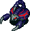
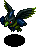

  

Dungeon where you can have a wish granted if you bring all 7 colors of Catstones to the end.

You can only have 1 wish granted per visit, and the Catstones vanish after the wish is granted. 
Just to be clear, bringing 2 sets of Catstones won't let you have multiple wishes granted.

The first clear is 42F, and a magic circle appears on each floor starting on 43F after the first clear. 
This magic circle can be used to warp to the end if you're only interested in having a wish granted. 
(The number of clears increases, but it doesn't count for Expert Badges)

If you don't have a set of Catstones when you reach the end, you'll receive Undo Grass.

The rare Onigiri Shield has a chance to appear in elite stores starting on 84F, 
which is otherwise only obtainable in Primordial Chasm or select PS Vita / Switch / Steam dungeons.

See Tips and Tricks for Catstone collection tips.

<ul class="quickLinksUL">
  <li><a href="#overview">Overview</a>
    <ul>
      <li><a href="#list-of-wishes">List of Wishes</a></li>
    </ul>
  </li>
  <li><a href="#strategy">Strategy</a>
    <ul>
      <li><a href="#general">General</a></li>
      <li><a href="#identifying-items">Identifying Items</a></li>
      <li><a href="#equipment">Equipment</a></li>
      <li><a href="#floor-guide">Floor Guide</a></li>
    </ul>
  </li>
  <li><a href="#monsters">Monsters</a></li>
  <li><a href="#items">Items</a></li>
  <li><a href="#traps">Traps</a></li>
  <li><a href="#npcs">NPCs</a></li>
</ul>

# Overview

<table class="dungeonOverview">
  <tr>
    <th>Unlock</th>
    <td class="highlightYellow">Clear the main story.</td>
  </tr>
  <tr>
    <th>Entrance</th>
    <td class="highlightYellow">Beginner House in Inori Village. (North wall)</td>
  </tr>
</table>

<table class="dungeonTable">
  <tr>
    <th>Floors</th>
    <td>42F / 99F (2nd+ Clear)</td>
    <th>Day / Night</th>
    <td>Both</td>
  </tr>
  <tr>
    <th>Bring Items</th>
    <td>Yes</td>
    <th>Allies</th>
    <td>3</td>
  </tr>
  <tr>
    <th>Unidentified</th>
    <td>Bracelets</td>
    <th>New Items</th>
    <td>Yes</td>
  </tr>
  <tr>
    <th>Shops</th>
    <td>Yes (Regular, Elite, Pick-A-Choice)</td>
    <th>Monster Houses</th>
    <td>Yes (Regular, Sudden)</td>
  </tr>
  <tr>
    <th>Initial Enemies</th>
    <td>6~15</td>
    <th>Spawn Rate</th>
    <td>30 Turns (Day) 20 Turns (Night)</td>
  </tr>
  <tr>
    <th>Day Duration</th>
    <td>810 Turns</td>
    <th>Night Duration</th>
    <td>368 Turns</td>
  </tr>
  <tr>
    <th>Ominous aura</th>
    <td>Yes</td>
    <th>Wind (1st Gust)</th>
    <td></td>
  </tr>
  <tr>
    <th>Clear Icon</th>
    <td class="clearIcon"></td>
    <th>Reward</th>
    <td>Undo Grass (No catstones) Wish granted (Catstones)</td>
  </tr>
</table>

#### List of Wishes

Making a wish requires all 7 colors of catstones each time.

<table class="dungeonTable">
  <thead>
    <tr>
      <th>Wish</th>
      <th>Effect</th>
      <th>Rating</th>
    </tr>
  </thead>
  <tbody>
    <tr>
      <td class="highlightGray">I wish for an unstoppable weapon.</td>
      <td>Obtain a <a href="/shiren-5/items/weapons#kaburagi">Kaburagi</a>.</td>
      <td>★★★☆☆</td>
    </tr>
    <tr>
      <td class="highlightGray">I wish for an invincible shield.</td>
      <td>Obtain a <a href="/shiren-5/items/shields#helix-shield">Helix Shield</a>.</td>
      <td>★★★☆☆</td>
    </tr>
    <tr>
      <td class="highlightGray">I wish to be totally blessed.</td>
      <td>All inventory items become blessed, including items in pots.</td>
      <td>★☆☆☆☆</td>
    </tr>
    <tr>
      <td class="highlightGray">I wish to learn the ultimate ability.</td>
      <td>Learn the Transmogrification <a href="/shiren-5/system/necklace-abilities">ability</a>. (Turns a monster in front of you into a floor table item) ※ You can only wish for this 1 time.</td>
      <td>★★★★★</td>
    </tr>
    <tr>
      <td class="highlightGray">I wish to play a tougher dungeon.</td>
      <td>Unlocks the <a href="/shiren-5/dungeons/destinys-descent">Destiny's Descent</a> dungeon. (Located at the Tower of Fortune entrance area) ※ You can only wish for this 1 time.</td>
      <td>★★★★☆</td>
    </tr>
    <tr>
      <td class="highlightGray">I wish to be popular with girls.</td>
      <td>Women in Nekomaneki Village will react differently. (Obtain a <a href="/shiren-5/items/pots#shrine-maid.-pot">Shrine Maid. Pot</a> if you visit the north west house)</td>
      <td>★★☆☆☆</td>
    </tr>
    <tr>
      <td class="highlightGray">I wish to be popular with guys.</td>
      <td>Men in Nekomaneki Village will react differently. (Obtain 9 <a href="/shiren-5/items/projectiles#david's-bullet">David's Bullet</a> from someone toward the south)</td>
      <td>★☆☆☆☆</td>
    </tr>
    <tr>
      <td class="highlightGray">I wish that I was rich.</td>
      <td>Your current Gitan total is increased to 999,999G.</td>
      <td>★☆☆☆☆</td>
    </tr>
    <tr>
      <td class="highlightGray">I wish to fight the Reeva Statue.</td>
      <td>Have a rematch with <a href="/shiren-5/system/monsters#gr-reeva-statue">Gr. Reeva Statue</a>.</td>
      <td>★☆☆☆☆</td>
    </tr>
    <tr>
      <td class="highlightGray">I wish to fight Gendolucika.</td>
      <td>Have a rematch with <a href="/shiren-5/system/monsters#gendolucika">Gendolucika</a>. ※ Option appears after clearing the <a href="/shiren-5/dungeons/old-road">Old Road</a> dungeon.</td>
      <td>★☆☆☆☆</td>
    </tr>
    <tr>
      <td class="highlightGray">I wish to fight Jack Wand monsters.</td>
      <td>Battle 1 of 7 <a href="/shiren-5/system/monsters#jack-wand">Jack Wand</a> boss monsters of your choice. (It'll be registered to your Monster Book if you defeat it)</td>
      <td>★★☆☆☆</td>
    </tr>
    <tr>
      <td class="highlightGray">I wish for the ability to fly.</td>
      <td>Obtain a <a href="/shiren-5/items/bracelets#floating-bracelet">Floating Bracelet</a>. (You can walk on water and air tiles, and won't trigger traps)</td>
      <td>★★★★☆</td>
    </tr>
    <tr>
      <td class="highlightGray">I don't wish for anything.</td>
      <td>Obtain a <a href="/shiren-5/items/bracelets#night-ward">Night Ward</a>. (Increases direct attack damage vs. night monsters to 25)</td>
      <td>★★☆☆☆</td>
    </tr>
  </tbody>
</table>

# Strategy

<ul class="quickLinksUL">
  <li><a href="#general">General</a></li>
  <li><a href="#identifying-items">Identifying Items</a></li>
  <li><a href="#equipment">Equipment</a></li>
  <li><a href="#floor-guide">Floor Guide</a></li>
</ul>

### General

The monster table for the first half is extremely similar to the main story dungeons: 
Destiny Trail 5F → Past 7F (12F) → Present 7F (19F) → Future 7F (26F) → Fortune 14F (40F) → Miracles 9F (49F) 
Based on this, Mixers appear where you'd expect them: Present 1-3F (13-15F) and Future 4-5F (23-24F)

The item table is pretty similar to story dungeons, though some additions were made. (Bracelets in particular) 
You'll likely be able to clear the dungeon without issues if you bring the equipment you used to clear the main story.

However, being a post-game dungeon that allows carry-in items, the difficulty ramps up starting on 50F. 
Select floors have extremely dangerous monster combinations, even surpassing Lost Well. 
So if you only care about having wishes granted, use the magic circle to skip to the end.

Shops are rare, and many floors have CHUNSOFT layouts, along with 12 and 13 room layouts. 
It's common to end up fighting enemies one after another due to the linear maps.

There are few shops, and the number of items on the ground quickly begin to dwindle as you progress. 
This means unless you have Transmogrification to restock items, you're likely to run out of torches. 
Mixers appear later than other dungeons, so it's common to have an inventory full of synthesis ingredients early on. 
Strong Carts don't appear, so you'll need to level up a Cross Cart if you want to collect Knockback Arrows. 
Archdragons, Bashaggas, and Ultra Gazers appear across a wide range of floors, and so on.

Stairlight will display the location of the magic circle along with the stairs from 43F, so it becomes less reliable. 
The number of hidden traps is higher than average, and Poison Arrow Traps are pretty common early on. 
So it might sound easy at first glance looking at the dungeon overview, but it has a surprising amount of bite to it.

#### Carry-In Items

Bring strengthened equipment, and plenty of Revival Grass / Undo Grass as insurance. 
You shouldn't run into problems if you've prepared well enough, but be careful of item loss.

To clear it quickly, use 2 bracelet resonance with Monster Detector + Time Stop Bracelet and rush stairs at night.

You'll want to pay attention on dangerous floors, so don't let your guard down too much. 
Otherwise, your equipment might get turned into Weeds, or a Catstone into a Large Onigiri, etc.

#### No Carry-In Items

Equipment is uncommon compared to other dungeons, so you'll often struggle to find reliable options. 
Fewer items are generated on floors as you progress, and shops are rare, so you have to know farming techniques.

While the monster table is somewhat lax, Maneaters can spawn on floors where Mixer and Nigiri Baby appear, 
and the ominous aura warning occurs sooner than some other dungeons, so it's difficult to synthesize or farm items. 
However, if you're able to hunt the Maneaters, you'll be able to quickly level up equipment and obtain items.

The monster table is unique starting from 50F, and usually comes down to how well 
you were able to collect items and level equipment for the second half.

### Identifying Items

The only unidentified items are bracelets, so there isn't much that needs to be identified. 
However, since shops are rare, don't expect to be able to identify them by price.

Identify Scrolls are uncommon, and Identify Pots can't be found. 
Many bracelets in this dungeon have negative effects, so equipping them comes with significant risk. 
Perhaps a viable option would be to disregard bracelets altogether.

### Equipment

Since it allows carry-in items, bringing strong equipment makes the dungeon very easy. 
Using 2 bracelet resonance with Monster Detector + Time Stop, Anti-Crs., Anti-Parry, etc. adds to consistency. 
Some players add the Unmoving shield rune to avoid accidents when Terrabbit and Knave King appear together.

If you're not bringing items, it's usually better to aim for a weapon and shield set that grants 2 bracelet resonance. 
A type effective weapon + Day Shield is viable as well, but you won't come across a Day Shield very often. 
Status inflicting weapons are only found in shops, so don't count on obtaining them.

Maneaters don't take long to spawn, and hunting them makes it easy to switch to a different main weapon, 
provided you create an environment where they can be defeated safely.

New items can be found in this dungeon, so you could use those items instead of playing the intended balance too.

### Floor Guide

#### Early Game (1-20F)

This floor range shouldn't give you trouble. 
The only noteworthy monster combination is Curse Girl + Fearabbit. (8-9F)

No Carry-In Items:

- Collect all items before proceeding to the next floor.

- The first Mixer floor range (13-15F) is later than many dungeons, so go ahead and use Synthesis Pots if you find some. Mixers are rare, and ominous auras appear quickly, so don't hesitate to move on if you're not seeing results.

- It's possible to perform Nigiri Morph Factory on floors where Nigiri Baby (6-8F) appears, but again, ominous auras usually put a stop to extended item collection techniques.

#### Mid Game (21-50F)

Nigiri Morphs appear between 30-32F, so be careful if you don't have the Anti-Onigiri shield rune. 
Worst case scenario, a Catstone gets transformed into a Large Onigiri and you have to start over from 1F.

The 36-40F floor range is a skywalk area. (no walls) 
It might be tempting to use a Floating Bracelet to take shortcuts, but Kappa Pests appear between 37-39F, 
and if it throws a shield or torch and forces you to equip it while on an air tile, your equipment will fall into the abyss. 
Even worse, if it throws a Hide Pot, you'll be trapped in the pot and will fall into the abyss, resulting in a failed adventure. 
So, it's best to avoid moving across air tiles on these floors.

No Carry-In Items:

- Both Mixers (23-24F) and Dark Mixers (22-24F) appear early into this floor range, so finish synthesizing the basics. Maneaters can spawn on these floors too, so it's difficult to remain on the floor for an extended time. Do your best to focus on synthesizing as fast as possible.

- Enemies begin to hit harder from around 30F, and Maneater floors remain an on-and-off threat. That said, there are some floors where you can safely hunt monsters for drops. (check monster table)

#### Late Game (51-99F)

For some mysterious reason, wandering NPCs can appear between 70-83F. 
They don't behave any differently than in other dungeons, so don't bother chasing them down to talk to them.

The combination of Horrabbit, Mudster, and Curspinster is quite scary on 56F during the day. 
Horrabbit's spawn rate is low, but you should still hurry to the next floor to avoid losing important runes.

Knave Kings appear between 75-76F, and 76F is particularly dangerous since Terrabbit can spawn alongside it. 
Throw an Extinction Scroll at a Knave King to prevent accidents such as your equipped items turning into Weeds. 
※ Tagged weapons and shields can't be recovered if they're turned into Weeds.

Dangerous floors:

- 56F (Day) - Horrabbit + Mudster
- 76F (Day) - Terrabbit + Knave King

These two floors feature floor-wide attraction Fearabbit monsters + equipment destroying monsters. 
Again, even if your weapon or shield is tagged, it can't be recovered if it's turned into Weeds, 
so either throw an Extinction Scroll at one of them, or go through these floors at night.

Other notable monsters and floors:

- Mudster - 52-56F
- Mudder - 69-72F
- Horrabbit - 56-58F
- Terrabbit - 76-79F
- Evil Archdragon - 56-57F
- Knave King - 75-76F
- Dark Knave King - 75-76F
- Archdragon - 80-85F
- Dark Mesmerikon - 81-82F
- Evil Abyss Dragon - 88-99F
- Ultra Gazer - 89-99F (If you don't have the Anti-Hypno shield rune)

No Carry-In Items:

- The monster table from this point rivals other post-game dungeons. They only last 1\~2 floors, but there are some extremely dangerous floor ranges.

- Bashaggas make an appearance during the day near the end, and are flat out terrifying. They attack 4 times per turn, and have very high HP so they can't be defeated in one hit. (Don't even try) Other significant threats that span a large number of floors include Ultra Gazer and Cranky Tank.

- Evil Abyss Dragon and Filthy Bashagga make an appearance at night and can be rough to deal with, but it's like being in heaven compared to daytime, so it's generally best to progress during the night.

# Monsters

<button id="hideMonTblImgBtn" onClick={()=>{var mon_imgs = document.querySelectorAll('#monsterTable img');mon_imgs.forEach(e => e.classList.toggle('hidden'));}}>Toggle Monster Images</button>

Hover over or tap a monster's table cell for details. Monster Colors: Farming, Useful, Destroys Items, Dangerous, Very Dangerous

<table id="monsterTable" class="monsterTable">
  <thead>
    <tr>
      <th>F</th>
      <th colspan="6">Monsters</th>
      <th>O</th>
    </tr>
  </thead>
  <tbody>
    <tr>
      <td rowspan="2" class="centeredText">1</td>
      <td class="day">
 Mamel
- Mamel - HP: 5 AP: 2 DP: 1 Exp: 2 GP: 1 Type: Normal Speed: Normal Sp.Atk Rate: 0% (near), 0% (far) Item Drop Rate: 4% ~ Ability ~ None.

</td>
      <td class="day">
 Seedie
- Seedie - HP: 7 AP: 7 DP: 1 Exp: 4 GP: 1 Type: Plant Speed: Normal Sp.Atk Rate: 0% (near), 0% (far) Item Drop Rate: 4% ~ Ability ~ None.

</td>
      <td class="day">
 Sproutant
- Sproutant - HP: 5 AP: 2 DP: 1 Exp: 3 GP: 2 Type: Plant Speed: Normal Sp.Atk Rate: 0% (near), 0% (far) Item Drop Rate: 4% ~ Ability ~ Monster family becomes immune to most recent status inflicted upon it, excluding Sealed status.

</td>
      <td class="highlightGray2"></td>
      <td class="highlightGray2"></td>
      <td class="highlightGray2"></td>
      <td rowspan="1" class="highlightGray2"></td>
    </tr>
    <tr>
      <td class="night">
 Dark Mamel
- Dark Mamel - HP: 24 AP: 14 DP: 3 Exp: 22 GP: 15 Type: Normal Speed: Normal Sp.Atk Rate: 0% (near), 0% (far) Item Drop Rate: 4% ~ Ability ~ Resists non-ability attacks.

</td>
      <td class="night">
 Evil Chintala
- Evil Chintala - HP: 14 AP: 5 DP: 2 Exp: 3 GP: 4 Type: Normal Speed: Normal Sp.Atk Rate: 0% (near), 0% (far) Item Drop Rate: 4% ~ Ability ~ Resists non-ability attacks.

</td>
      <td class="night">
 Dark Bored Kappa
- Dark Bored Kappa - HP: 14 AP: 5 DP: 2 Exp: 3 GP: 7 Type: Aquatic Speed: Normal Sp.Atk Rate: 0% (near), 0% (far) Item Drop Rate: 4% ~ Ability ~ Resists non-ability attacks. Stands on an item and throws it at Shiren when he gets within 3 tiles. Catches projectiles and throws them back at Shiren. Items it throws always miss. Cannot throw weapons, shields, or Gitan.

</td>
      <td class="night dangerNight">
 Bad Colum
- Bad Colum - HP: 14 AP: 5 DP: 2 Exp: 3 GP: 6 Type: Normal Speed: Normal Sp.Atk Rate: 0% (near), 0% (far) Item Drop Rate: 4% ~ Ability ~ Resists non-ability attacks. Rolls backward 10 tiles when slain by a direct attack, damaging anything it hits equal to damage received.

</td>
      <td class="night">
 Dark Boy Cart
- Dark Boy Cart - HP: 14 AP: 5 DP: 2 Exp: 3 GP: 8 Type: Normal Speed: Swift 1 Sp.Atk Rate: 100% (near), 80% (far) Item Drop Rate: 6% ~ Ability ~ Resists non-ability attacks. Shoots Wood Arrows. Moves away if Shiren gets close. Can use direct attacks, and attacks even in hallways. Only drops Wood Arrows.

</td>
      <td class="highlightGray2"></td>
      <td rowspan="1" class="highlightGray2"></td>
    </tr>
    <tr>
      <td colspan="8" class="purpleDivider"></td>
    </tr>
    <tr>
      <td rowspan="3" class="centeredText">2</td>
      <td class="day">
 Mamel
- Mamel - HP: 5 AP: 2 DP: 1 Exp: 2 GP: 1 Type: Normal Speed: Normal Sp.Atk Rate: 0% (near), 0% (far) Item Drop Rate: 4% ~ Ability ~ None.

</td>
      <td class="day">
 Seedie
- Seedie - HP: 7 AP: 7 DP: 1 Exp: 4 GP: 1 Type: Plant Speed: Normal Sp.Atk Rate: 0% (near), 0% (far) Item Drop Rate: 4% ~ Ability ~ None.

</td>
      <td class="day">
 Sproutant
- Sproutant - HP: 5 AP: 2 DP: 1 Exp: 3 GP: 2 Type: Plant Speed: Normal Sp.Atk Rate: 0% (near), 0% (far) Item Drop Rate: 4% ~ Ability ~ Monster family becomes immune to most recent status inflicted upon it, excluding Sealed status.

</td>
      <td class="day">
 Colum
- Colum - HP: 7 AP: 7 DP: 1 Exp: 4 GP: 2 Type: Normal Speed: Normal Sp.Atk Rate: 0% (near), 0% (far) Item Drop Rate: 4% ~ Ability ~ Rolls backward 10 tiles when slain by a direct attack, damaging anything it hits equal to damage received.

</td>
      <td class="highlightGray2"></td>
      <td class="highlightGray2"></td>
      <td rowspan="1" class="highlightGray2"></td>
    </tr>
    <tr>
      <td class="night">
 Dark Mamel
- Dark Mamel - HP: 24 AP: 14 DP: 3 Exp: 22 GP: 15 Type: Normal Speed: Normal Sp.Atk Rate: 0% (near), 0% (far) Item Drop Rate: 4% ~ Ability ~ Resists non-ability attacks.

</td>
      <td class="night">
 Evil Chintala
- Evil Chintala - HP: 14 AP: 5 DP: 2 Exp: 3 GP: 4 Type: Normal Speed: Normal Sp.Atk Rate: 0% (near), 0% (far) Item Drop Rate: 4% ~ Ability ~ Resists non-ability attacks.

</td>
      <td class="night">
 Dark Bored Kappa
- Dark Bored Kappa - HP: 14 AP: 5 DP: 2 Exp: 3 GP: 7 Type: Aquatic Speed: Normal Sp.Atk Rate: 0% (near), 0% (far) Item Drop Rate: 4% ~ Ability ~ Resists non-ability attacks. Stands on an item and throws it at Shiren when he gets within 3 tiles. Catches projectiles and throws them back at Shiren. Items it throws always miss. Cannot throw weapons, shields, or Gitan.

</td>
      <td class="night dangerNight">
 Bad Colum
- Bad Colum - HP: 14 AP: 5 DP: 2 Exp: 3 GP: 6 Type: Normal Speed: Normal Sp.Atk Rate: 0% (near), 0% (far) Item Drop Rate: 4% ~ Ability ~ Resists non-ability attacks. Rolls backward 10 tiles when slain by a direct attack, damaging anything it hits equal to damage received.

</td>
      <td class="night">
 Dark Boy Cart
- Dark Boy Cart - HP: 14 AP: 5 DP: 2 Exp: 3 GP: 8 Type: Normal Speed: Swift 1 Sp.Atk Rate: 100% (near), 80% (far) Item Drop Rate: 6% ~ Ability ~ Resists non-ability attacks. Shoots Wood Arrows. Moves away if Shiren gets close. Can use direct attacks, and attacks even in hallways. Only drops Wood Arrows.

</td>
      <td class="night">
 Evil PolySpinna
- Evil PolySpinna - HP: 25 AP: 18 DP: 3 Exp: 26 GP: 13 Type: Drain/Magic Speed: Normal Sp.Atk Rate: 23% (near), 0% (far) Item Drop Rate: 4% ~ Ability ~ Resists non-ability attacks. Lowers Max HP by 2 or Max Fullness by 5 when adjacent. Occasionally warps in front of Shiren when in a room.

</td>
      <td rowspan="2" class="highlightGray2"></td>
    </tr>
    <tr>
      <td class="night">
 Putrid Sweet Nut
- Putrid Sweet Nut - HP: 55 AP: 30 DP: 1 Exp: 70 GP: 35 Type: Plant/Explode Speed: Normal Sp.Atk Rate: 0% (near), 0% (far) Item Drop Rate: 0% ~ Ability ~ Resists non-ability attacks. Either doubles experience points (Max: x1024) or explodes (33% chance) each time it eats a thrown item.

</td>
      <td class="highlightGray2"></td>
      <td class="highlightGray2"></td>
      <td class="highlightGray2"></td>
      <td class="highlightGray2"></td>
      <td class="highlightGray2"></td>
    </tr>
    <tr>
      <td colspan="8" class="purpleDivider"></td>
    </tr>
    <tr>
      <td rowspan="3" class="centeredText">3</td>
      <td class="day">
 Pit Mamel
- Pit Mamel - HP: 11 AP: 6 DP: 3 Exp: 5 GP: 2 Type: Normal Speed: Normal Sp.Atk Rate: 0% (near), 0% (far) Item Drop Rate: 4% ~ Ability ~ None.

</td>
      <td class="day">
 Blade Bee
- Blade Bee - HP: 28 AP: 10 DP: 1 Exp: 5 GP: 4 Type: Floating Speed: Normal Sp.Atk Rate: 16% (near), 0% (far) Item Drop Rate: 0% ~ Ability ~ Occasionally retreats after attacking. Stinger has double AP and inflicts Confused status, but it also collapses afterward.

</td>
      <td class="day">
 Sproutant
- Sproutant - HP: 5 AP: 2 DP: 1 Exp: 3 GP: 2 Type: Plant Speed: Normal Sp.Atk Rate: 0% (near), 0% (far) Item Drop Rate: 4% ~ Ability ~ Monster family becomes immune to most recent status inflicted upon it, excluding Sealed status.

</td>
      <td class="day">
 Colum
- Colum - HP: 7 AP: 7 DP: 1 Exp: 4 GP: 2 Type: Normal Speed: Normal Sp.Atk Rate: 0% (near), 0% (far) Item Drop Rate: 4% ~ Ability ~ Rolls backward 10 tiles when slain by a direct attack, damaging anything it hits equal to damage received.

</td>
      <td class="day">
 Chintala
- Chintala - HP: 19 AP: 9 DP: 4 Exp: 12 GP: 6 Type: Normal Speed: Normal Sp.Atk Rate: 0% (near), 0% (far) Item Drop Rate: 4% ~ Ability ~ None.

</td>
      <td class="highlightGray2"></td>
      <td rowspan="1" class="highlightGray2"></td>
    </tr>
    <tr>
      <td class="night">
 Dark Mamel
- Dark Mamel - HP: 24 AP: 14 DP: 3 Exp: 22 GP: 15 Type: Normal Speed: Normal Sp.Atk Rate: 0% (near), 0% (far) Item Drop Rate: 4% ~ Ability ~ Resists non-ability attacks.

</td>
      <td class="night">
 Evil Chintala
- Evil Chintala - HP: 14 AP: 5 DP: 2 Exp: 3 GP: 4 Type: Normal Speed: Normal Sp.Atk Rate: 0% (near), 0% (far) Item Drop Rate: 4% ~ Ability ~ Resists non-ability attacks.

</td>
      <td class="night">
 Dark Bored Kappa
- Dark Bored Kappa - HP: 14 AP: 5 DP: 2 Exp: 3 GP: 7 Type: Aquatic Speed: Normal Sp.Atk Rate: 0% (near), 0% (far) Item Drop Rate: 4% ~ Ability ~ Resists non-ability attacks. Stands on an item and throws it at Shiren when he gets within 3 tiles. Catches projectiles and throws them back at Shiren. Items it throws always miss. Cannot throw weapons, shields, or Gitan.

</td>
      <td class="night">
 Dark Tosser
- Dark Tosser - HP: 16 AP: 9 DP: 1 Exp: 10 GP: 18 Type: Normal Speed: Normal Sp.Atk Rate: 33% (near), 33% (far) Item Drop Rate: 4% ~ Ability ~ Resists non-ability attacks. Throws an adjacent creature at Shiren, or throws Shiren at another creature, onto a trap, or into a Monster House. Range of 5 tiles, deals 10 damage.

</td>
      <td class="night">
 Dark Naptapir
- Dark Naptapir - HP: 24 AP: 14 DP: 3 Exp: 22 GP: 10 Type: Normal Speed: Normal Sp.Atk Rate: 23% (near), 0% (far) Item Drop Rate: 4% ~ Ability ~ Resists non-ability attacks. Initially Napping, will not wake up when Shiren enters or exits the room. Occasionally inflicts Asleep status in a 1 tile radius when it's Napping, Asleep, or Sound Asleep. Chance to yawn when slain, inflicting Asleep status in a 1 tile radius.

</td>
      <td class="night">
 Evil PolySpinna
- Evil PolySpinna - HP: 25 AP: 18 DP: 3 Exp: 26 GP: 13 Type: Drain/Magic Speed: Normal Sp.Atk Rate: 23% (near), 0% (far) Item Drop Rate: 4% ~ Ability ~ Resists non-ability attacks. Lowers Max HP by 2 or Max Fullness by 5 when adjacent. Occasionally warps in front of Shiren when in a room.

</td>
      <td rowspan="2" class="highlightGray2"></td>
    </tr>
    <tr>
      <td class="night">
 Putrid Sweet Nut
- Putrid Sweet Nut - HP: 55 AP: 30 DP: 1 Exp: 70 GP: 35 Type: Plant/Explode Speed: Normal Sp.Atk Rate: 0% (near), 0% (far) Item Drop Rate: 0% ~ Ability ~ Resists non-ability attacks. Either doubles experience points (Max: x1024) or explodes (33% chance) each time it eats a thrown item.

</td>
      <td class="night">
 Evil Hopodile
- Evil Hopodile - HP: 24 AP: 12 DP: 3 Exp: 22 GP: 14 Type: Dragon/Aquatic Speed: Normal Sp.Atk Rate: 0% (near), 0% (far) Item Drop Rate: 4% ~ Ability ~ Resists non-ability attacks. Moves like a chess knight when Shiren is in view. Performs a 15 damage jumping attack when Shiren is in range of a chess knight hop.

</td>
      <td class="highlightGray2"></td>
      <td class="highlightGray2"></td>
      <td class="highlightGray2"></td>
      <td class="highlightGray2"></td>
    </tr>
    <tr>
      <td colspan="8" class="purpleDivider"></td>
    </tr>
    <tr>
      <td rowspan="3" class="centeredText">4</td>
      <td class="day">
 Pit Mamel
- Pit Mamel - HP: 11 AP: 6 DP: 3 Exp: 5 GP: 2 Type: Normal Speed: Normal Sp.Atk Rate: 0% (near), 0% (far) Item Drop Rate: 4% ~ Ability ~ None.

</td>
      <td class="day">
 Blade Bee
- Blade Bee - HP: 28 AP: 10 DP: 1 Exp: 5 GP: 4 Type: Floating Speed: Normal Sp.Atk Rate: 16% (near), 0% (far) Item Drop Rate: 0% ~ Ability ~ Occasionally retreats after attacking. Stinger has double AP and inflicts Confused status, but it also collapses afterward.

</td>
      <td class="day farm">
 Grass Kid
- Grass Kid - HP: 28 AP: 10 DP: 1 Exp: 5 GP: 3 Type: Plant Speed: Normal Sp.Atk Rate: 21% (near), 16% (far) Item Drop Rate: 0% ~ Ability ~ Spreads grass in a 1 tile radius when adjacent. Pierce-throws grass in a straight line at a distance. Carries 1 grass item. Becomes Pin Kid with 0 grass.

</td>
      <td class="day">
 Pin Kid
- Pin Kid - HP: 28 AP: 8 DP: 1 Exp: 5 GP: 1 Type: Plant Speed: Swift 1 Sp.Atk Rate: 0% (near), 0% (far) Item Drop Rate: 0% ~ Ability ~ Runs from Shiren, but attacks when adjacent. Becomes Grass Kid when it picks up a grass item.

</td>
      <td class="day">
 Chintala
- Chintala - HP: 19 AP: 9 DP: 4 Exp: 12 GP: 6 Type: Normal Speed: Normal Sp.Atk Rate: 0% (near), 0% (far) Item Drop Rate: 4% ~ Ability ~ None.

</td>
      <td class="day">
 Sweet Nut
- Sweet Nut - HP: 16 AP: 11 DP: 5 Exp: 15 GP: 4 Type: Plant/Explode Speed: Normal Sp.Atk Rate: 0% (near), 0% (far) Item Drop Rate: 0% ~ Ability ~ Either doubles experience points (Max: x1024) or explodes (33% chance) each time it eats a thrown item.

</td>
      <td rowspan="1" class="highlightGray2"></td>
    </tr>
    <tr>
      <td class="night">
 Dark Mamel
- Dark Mamel - HP: 24 AP: 14 DP: 3 Exp: 22 GP: 15 Type: Normal Speed: Normal Sp.Atk Rate: 0% (near), 0% (far) Item Drop Rate: 4% ~ Ability ~ Resists non-ability attacks.

</td>
      <td class="night">
 Dark Karakuroid
- Dark Karakuroid - HP: 10 AP: 8 DP: 1 Exp: 2 GP: 25 Type: Metal Speed: Swift 1 Sp.Atk Rate: 38% (near), 38% (far) Item Drop Rate: 4% ~ Ability ~ Resists non-ability attacks. Initially Napping, wakes when Shiren enters or exits the room. Creates a trap on the ground, then stops acting for 2 turns. Occasionally creates a trap when slain.

</td>
      <td class="night dangerNight">
 Dark Absorbiphant
- Dark Absorbiphant - HP: 10 AP: 5 DP: 1 Exp: 3 GP: 20 Type: Drain Speed: Normal Sp.Atk Rate: 100% (near), 100% (far) Item Drop Rate: 4% ~ Ability ~ Resists non-ability attacks. Absorbs status conditions inflicted on itself or from a creature within a 1 tile radius, fully restoring its own HP and raising AP by 1 stage.

</td>
      <td class="night">
 Dark Tosser
- Dark Tosser - HP: 16 AP: 9 DP: 1 Exp: 10 GP: 18 Type: Normal Speed: Normal Sp.Atk Rate: 33% (near), 33% (far) Item Drop Rate: 4% ~ Ability ~ Resists non-ability attacks. Throws an adjacent creature at Shiren, or throws Shiren at another creature, onto a trap, or into a Monster House. Range of 5 tiles, deals 10 damage.

</td>
      <td class="night">
 Dark Naptapir
- Dark Naptapir - HP: 24 AP: 14 DP: 3 Exp: 22 GP: 10 Type: Normal Speed: Normal Sp.Atk Rate: 23% (near), 0% (far) Item Drop Rate: 4% ~ Ability ~ Resists non-ability attacks. Initially Napping, will not wake up when Shiren enters or exits the room. Occasionally inflicts Asleep status in a 1 tile radius when it's Napping, Asleep, or Sound Asleep. Chance to yawn when slain, inflicting Asleep status in a 1 tile radius.

</td>
      <td class="night itemsNight">
 Violent Gyadon
- Violent Gyadon - HP: 10 AP: 5 DP: 1 Exp: 4 GP: 18 Type: Floating Speed: Normal Sp.Atk Rate: 21% (near), 0% (far) Item Drop Rate: 4% ~ Ability ~ Resists non-ability attacks. Pecks a staff from your inventory when adjacent, reducing its charges to 0.

</td>
      <td rowspan="2" class="highlightGray2"></td>
    </tr>
    <tr>
      <td class="night">
 Putrid Sweet Nut
- Putrid Sweet Nut - HP: 55 AP: 30 DP: 1 Exp: 70 GP: 35 Type: Plant/Explode Speed: Normal Sp.Atk Rate: 0% (near), 0% (far) Item Drop Rate: 0% ~ Ability ~ Resists non-ability attacks. Either doubles experience points (Max: x1024) or explodes (33% chance) each time it eats a thrown item.

</td>
      <td class="night">
 Evil Hopodile
- Evil Hopodile - HP: 24 AP: 12 DP: 3 Exp: 22 GP: 14 Type: Dragon/Aquatic Speed: Normal Sp.Atk Rate: 0% (near), 0% (far) Item Drop Rate: 4% ~ Ability ~ Resists non-ability attacks. Moves like a chess knight when Shiren is in view. Performs a 15 damage jumping attack when Shiren is in range of a chess knight hop.

</td>
      <td class="highlightGray2"></td>
      <td class="highlightGray2"></td>
      <td class="night">
 Sinful Yanpii
- Sinful Yanpii - HP: 10 AP: 5 DP: 1 Exp: 10 GP: 40 Type: Normal Speed: Normal Sp.Atk Rate: 22% (near), 22% (far) Item Drop Rate: 4% ~ Ability ~ Resists non-ability attacks. Headbutts Shiren when lined up, dealing 15 damage and knockback based on distance traveled. If Shiren is knocked into a wall, go into the wall 1 tile and take an additional 10 damage.

</td>
      <td class="highlightGray2"></td>
    </tr>
    <tr>
      <td colspan="8" class="purpleDivider"></td>
    </tr>
    <tr>
      <td rowspan="2" class="centeredText">5</td>
      <td class="day">
 Pit Mamel
- Pit Mamel - HP: 11 AP: 6 DP: 3 Exp: 5 GP: 2 Type: Normal Speed: Normal Sp.Atk Rate: 0% (near), 0% (far) Item Drop Rate: 4% ~ Ability ~ None.

</td>
      <td class="day">
 Sweet Nut
- Sweet Nut - HP: 16 AP: 11 DP: 5 Exp: 15 GP: 4 Type: Plant/Explode Speed: Normal Sp.Atk Rate: 0% (near), 0% (far) Item Drop Rate: 0% ~ Ability ~ Either doubles experience points (Max: x1024) or explodes (33% chance) each time it eats a thrown item.

</td>
      <td class="day farm">
 Grass Kid
- Grass Kid - HP: 28 AP: 10 DP: 1 Exp: 5 GP: 3 Type: Plant Speed: Normal Sp.Atk Rate: 21% (near), 16% (far) Item Drop Rate: 0% ~ Ability ~ Spreads grass in a 1 tile radius when adjacent. Pierce-throws grass in a straight line at a distance. Carries 1 grass item. Becomes Pin Kid with 0 grass.

</td>
      <td class="day">
 Pin Kid
- Pin Kid - HP: 28 AP: 8 DP: 1 Exp: 5 GP: 1 Type: Plant Speed: Swift 1 Sp.Atk Rate: 0% (near), 0% (far) Item Drop Rate: 0% ~ Ability ~ Runs from Shiren, but attacks when adjacent. Becomes Grass Kid when it picks up a grass item.

</td>
      <td class="day">
 Chintala
- Chintala - HP: 19 AP: 9 DP: 4 Exp: 12 GP: 6 Type: Normal Speed: Normal Sp.Atk Rate: 0% (near), 0% (far) Item Drop Rate: 4% ~ Ability ~ None.

</td>
      <td class="highlightGray2"></td>
      <td rowspan="1" class="maneater">
 
- Maneater (5F) - HP: 100 AP: 67.5 DP: 31.25 Exp: 1040 GP: 400 Type: Normal Speed: Normal → Swift 1 Sp.Atk Rate: 18% (near), 32% (far) Item Drop Rate: 31% ~ Ability ~ Roars when Shiren is in the same room, inflicting Paralyzed status. Action speed changes to Swift 1 when Shiren is in view. Ignores Sanctuary Scroll. Only takes 10 damage from thrown Gitan. The item it drops is always a shop table item.

</td>
    </tr>
    <tr>
      <td class="night">
 Dark Mamel
- Dark Mamel - HP: 24 AP: 14 DP: 3 Exp: 22 GP: 15 Type: Normal Speed: Normal Sp.Atk Rate: 0% (near), 0% (far) Item Drop Rate: 4% ~ Ability ~ Resists non-ability attacks.

</td>
      <td class="night">
 Dark Karakuroid
- Dark Karakuroid - HP: 10 AP: 8 DP: 1 Exp: 2 GP: 25 Type: Metal Speed: Swift 1 Sp.Atk Rate: 38% (near), 38% (far) Item Drop Rate: 4% ~ Ability ~ Resists non-ability attacks. Initially Napping, wakes when Shiren enters or exits the room. Creates a trap on the ground, then stops acting for 2 turns. Occasionally creates a trap when slain.

</td>
      <td class="night dangerNight">
 Dark Absorbiphant
- Dark Absorbiphant - HP: 10 AP: 5 DP: 1 Exp: 3 GP: 20 Type: Drain Speed: Normal Sp.Atk Rate: 100% (near), 100% (far) Item Drop Rate: 4% ~ Ability ~ Resists non-ability attacks. Absorbs status conditions inflicted on itself or from a creature within a 1 tile radius, fully restoring its own HP and raising AP by 1 stage.

</td>
      <td class="night">
 Dark Tosser
- Dark Tosser - HP: 16 AP: 9 DP: 1 Exp: 10 GP: 18 Type: Normal Speed: Normal Sp.Atk Rate: 33% (near), 33% (far) Item Drop Rate: 4% ~ Ability ~ Resists non-ability attacks. Throws an adjacent creature at Shiren, or throws Shiren at another creature, onto a trap, or into a Monster House. Range of 5 tiles, deals 10 damage.

</td>
      <td class="night">
 Sinful Yanpii
- Sinful Yanpii - HP: 10 AP: 5 DP: 1 Exp: 10 GP: 40 Type: Normal Speed: Normal Sp.Atk Rate: 22% (near), 22% (far) Item Drop Rate: 4% ~ Ability ~ Resists non-ability attacks. Headbutts Shiren when lined up, dealing 15 damage and knockback based on distance traveled. If Shiren is knocked into a wall, go into the wall 1 tile and take an additional 10 damage.

</td>
      <td class="night itemsNight">
 Violent Gyadon
- Violent Gyadon - HP: 10 AP: 5 DP: 1 Exp: 4 GP: 18 Type: Floating Speed: Normal Sp.Atk Rate: 21% (near), 0% (far) Item Drop Rate: 4% ~ Ability ~ Resists non-ability attacks. Pecks a staff from your inventory when adjacent, reducing its charges to 0.

</td>
      <td rowspan="1" class="darkManeater">
 
- Dark Maneater (5F) - HP: 60 AP: 72.5 DP: 6.25 Exp: 55 GP: 500 Type: Normal Speed: Normal → Swift 1 Sp.Atk Rate: 18% (near), 32% (far) Item Drop Rate: 31% ~ Ability ~ Resists non-ability attacks. Roars when Shiren is in the same room, inflicting Paralyzed status. Action speed changes to Swift 1 when Shiren is in view. Ignores Sanctuary Scroll. The item it drops is always a shop table item.

</td>
    </tr>
    <tr>
      <td colspan="8" class="purpleDivider"></td>
    </tr>
    <tr>
      <td rowspan="3" class="centeredText">6</td>
      <td class="day useful">
 Karakuroid
- Karakuroid - HP: 32 AP: 14 DP: 8 Exp: 45 GP: 9 Type: Metal Speed: Swift 1 Sp.Atk Rate: 38% (near), 38% (far) Item Drop Rate: 4% ~ Ability ~ Initially Napping, wakes when Shiren enters or exits the room. Creates a trap on the ground, then stops acting for 2 turns. Occasionally creates a trap when slain.

</td>
      <td class="day">
 Sweet Nut
- Sweet Nut - HP: 16 AP: 11 DP: 5 Exp: 15 GP: 4 Type: Plant/Explode Speed: Normal Sp.Atk Rate: 0% (near), 0% (far) Item Drop Rate: 0% ~ Ability ~ Either doubles experience points (Max: x1024) or explodes (33% chance) each time it eats a thrown item.

</td>
      <td class="day farm">
 Grass Kid
- Grass Kid - HP: 28 AP: 10 DP: 1 Exp: 5 GP: 3 Type: Plant Speed: Normal Sp.Atk Rate: 21% (near), 16% (far) Item Drop Rate: 0% ~ Ability ~ Spreads grass in a 1 tile radius when adjacent. Pierce-throws grass in a straight line at a distance. Carries 1 grass item. Becomes Pin Kid with 0 grass.

</td>
      <td class="day">
 Pin Kid
- Pin Kid - HP: 28 AP: 8 DP: 1 Exp: 5 GP: 1 Type: Plant Speed: Swift 1 Sp.Atk Rate: 0% (near), 0% (far) Item Drop Rate: 0% ~ Ability ~ Runs from Shiren, but attacks when adjacent. Becomes Grass Kid when it picks up a grass item.

</td>
      <td class="day farm">
 Froggo
- Froggo - HP: 23 AP: 12 DP: 7 Exp: 18 GP: 1 Type: Normal Speed: Normal Sp.Atk Rate: 24% (near), 0% (far) Item Drop Rate: 100% ~ Ability ~ Steals Gitan when adjacent and warps, then runs from Shiren at swift speed. Stands on Gitan it finds the ground. Doesn't use direct attacks. Heals HP when hit by thrown Gitan.

</td>
      <td class="day">
 Nigiri Baby
- Nigiri Baby - HP: 23 AP: 12 DP: 7 Exp: 18 GP: 6 Type: Normal Speed: Normal Sp.Atk Rate: 0% (near), 0% (far) Item Drop Rate: 4% ~ Ability ~ Instantly collapses when hit by thrown onigiri.

</td>
      <td rowspan="1" class="maneater">
 
- Maneater (6F) - HP: 100 AP: 68.0 DP: 31.5 Exp: 1050 GP: 400 Type: Normal Speed: Normal → Swift 1 Sp.Atk Rate: 18% (near), 32% (far) Item Drop Rate: 31% ~ Ability ~ Roars when Shiren is in the same room, inflicting Paralyzed status. Action speed changes to Swift 1 when Shiren is in view. Ignores Sanctuary Scroll. Only takes 10 damage from thrown Gitan. The item it drops is always a shop table item.

</td>
    </tr>
    <tr>
      <td class="night">
 Dark Pop Tank
- Dark Pop Tank - HP: 20 AP: 18 DP: 2 Exp: 24 GP: 18 Type: Metal/Explode Speed: Slow Sp.Atk Rate: 75% (near), 55% (far) Item Drop Rate: 4% ~ Ability ~ Resists non-ability attacks. Fires a 30 damage cannon in a straight line whenever Shiren is in range of the 1 tile blast radius. Can use direct attacks.

</td>
      <td class="night">
 Evil Kid Squid
- Evil Kid Squid - HP: 20 AP: 18 DP: 2 Exp: 24 GP: 7 Type: Aquatic Speed: Normal Sp.Atk Rate: 23% (near), 0% (far) Item Drop Rate: 4% ~ Ability ~ Inflicts Blind status on an adjacent target. Turns into a Squid Sushi Scroll when hit by thrown onigiri.

</td>
      <td class="night itemsNight">
 Shady Mudkin
- Shady Mudkin - HP: 20 AP: 18 DP: 2 Exp: 24 GP: 13 Type: Aquatic Speed: Normal Sp.Atk Rate: 56% (near), 0% (far) Item Drop Rate: 0% ~ Ability ~ Resists non-ability attacks. Extinguishes an equipped torch. Lowers upgrade value of equipped weapon or shield by 2. May also remove the item's tag. Chance to multiply when attacked. Can use direct attacks.

</td>
      <td class="night">
 Dark Tosser
- Dark Tosser - HP: 16 AP: 9 DP: 1 Exp: 10 GP: 18 Type: Normal Speed: Normal Sp.Atk Rate: 33% (near), 33% (far) Item Drop Rate: 4% ~ Ability ~ Resists non-ability attacks. Throws an adjacent creature at Shiren, or throws Shiren at another creature, onto a trap, or into a Monster House. Range of 5 tiles, deals 10 damage.

</td>
      <td class="night">
 Dark Kumonigiri
- Dark Kumonigiri - HP: 20 AP: 18 DP: 2 Exp: 24 GP: 20 Type: Normal Speed: Normal Sp.Atk Rate: 0% (near), 0% (far) Item Drop Rate: 4% ~ Ability ~ Only drops Onigiri.

</td>
      <td class="night">
 Sinister Porky
- Sinister Porky - HP: 20 AP: 18 DP: 2 Exp: 50 GP: 30 Type: Normal Speed: Normal Sp.Atk Rate: 19% (near), 17% (far) Item Drop Rate: 6% ~ Ability ~ Resists non-ability attacks. Throws a Porky Rock that deals 20 damage within a 2 tile radius. Only drops Porky Rocks.

</td>
      <td rowspan="2" class="darkManeater">
 
- Dark Maneater (6F) - HP: 60 AP: 73.0 DP: 6.5 Exp: 65 GP: 500 Type: Normal Speed: Normal → Swift 1 Sp.Atk Rate: 18% (near), 32% (far) Item Drop Rate: 31% ~ Ability ~ Resists non-ability attacks. Roars when Shiren is in the same room, inflicting Paralyzed status. Action speed changes to Swift 1 when Shiren is in view. Ignores Sanctuary Scroll. The item it drops is always a shop table item.

</td>
    </tr>
    <tr>
      <td class="night">
 Dark Flamebird
- Dark Flamebird - HP: 20 AP: 16 DP: 2 Exp: 24 GP: 13 Type: Floating Speed: Normal Sp.Atk Rate: 56% (near), 0% (far) Item Drop Rate: 0% ~ Ability ~ Resists non-ability attacks. Heals an adjacent monster's HP by 40. Items thrown at it burn up. Fire damage restores its HP. Multiplies from explosions.

</td>
      <td class="highlightGray2"></td>
      <td class="highlightGray2"></td>
      <td class="night">
 Hell's Punisher
- Hell's Punisher - HP: 20 AP: 18 DP: 2 Exp: 24 GP: 30 Type: Normal Speed: Normal Sp.Atk Rate: 20% (near), 0% (far) Item Drop Rate: 4% ~ Ability ~ Resists non-ability attacks. Occasionally lands a critical hit that deals double damage.

</td>
      <td class="highlightGray2"></td>
      <td class="highlightGray2"></td>
    </tr>
    <tr>
      <td colspan="8" class="purpleDivider"></td>
    </tr>
    <tr>
      <td rowspan="3" class="centeredText">7</td>
      <td class="day useful">
 Karakuroid
- Karakuroid - HP: 32 AP: 14 DP: 8 Exp: 45 GP: 9 Type: Metal Speed: Swift 1 Sp.Atk Rate: 38% (near), 38% (far) Item Drop Rate: 4% ~ Ability ~ Initially Napping, wakes when Shiren enters or exits the room. Creates a trap on the ground, then stops acting for 2 turns. Occasionally creates a trap when slain.

</td>
      <td class="day">
 Sweet Nut
- Sweet Nut - HP: 16 AP: 11 DP: 5 Exp: 15 GP: 4 Type: Plant/Explode Speed: Normal Sp.Atk Rate: 0% (near), 0% (far) Item Drop Rate: 0% ~ Ability ~ Either doubles experience points (Max: x1024) or explodes (33% chance) each time it eats a thrown item.

</td>
      <td class="day">
 Tiger Tosser
- Tiger Tosser - HP: 32 AP: 16 DP: 10 Exp: 45 GP: 10 Type: Normal Speed: Normal Sp.Atk Rate: 33% (near), 33% (far) Item Drop Rate: 4% ~ Ability ~ Throws an adjacent creature at Shiren, or throws Shiren at another creature, onto a trap, or into a Monster House. Range of 5 tiles, deals 5 damage.

</td>
      <td class="day">
 Nigiri Baby
- Nigiri Baby - HP: 23 AP: 12 DP: 7 Exp: 18 GP: 6 Type: Normal Speed: Normal Sp.Atk Rate: 0% (near), 0% (far) Item Drop Rate: 4% ~ Ability ~ Instantly collapses when hit by thrown onigiri.

</td>
      <td class="day farm">
 Froggo
- Froggo - HP: 23 AP: 12 DP: 7 Exp: 18 GP: 1 Type: Normal Speed: Normal Sp.Atk Rate: 24% (near), 0% (far) Item Drop Rate: 100% ~ Ability ~ Steals Gitan when adjacent and warps, then runs from Shiren at swift speed. Stands on Gitan it finds the ground. Doesn't use direct attacks. Heals HP when hit by thrown Gitan.

</td>
      <td class="highlightGray2"></td>
      <td rowspan="1" class="maneater">
 
- Maneater (7F) - HP: 100 AP: 68.5 DP: 31.75 Exp: 1060 GP: 400 Type: Normal Speed: Normal → Swift 1 Sp.Atk Rate: 18% (near), 32% (far) Item Drop Rate: 31% ~ Ability ~ Roars when Shiren is in the same room, inflicting Paralyzed status. Action speed changes to Swift 1 when Shiren is in view. Ignores Sanctuary Scroll. Only takes 10 damage from thrown Gitan. The item it drops is always a shop table item.

</td>
    </tr>
    <tr>
      <td class="night">
 Dark Pop Tank
- Dark Pop Tank - HP: 20 AP: 18 DP: 2 Exp: 24 GP: 18 Type: Metal/Explode Speed: Slow Sp.Atk Rate: 75% (near), 55% (far) Item Drop Rate: 4% ~ Ability ~ Resists non-ability attacks. Fires a 30 damage cannon in a straight line whenever Shiren is in range of the 1 tile blast radius. Can use direct attacks.

</td>
      <td class="night">
 Evil Kid Squid
- Evil Kid Squid - HP: 20 AP: 18 DP: 2 Exp: 24 GP: 7 Type: Aquatic Speed: Normal Sp.Atk Rate: 23% (near), 0% (far) Item Drop Rate: 4% ~ Ability ~ Inflicts Blind status on an adjacent target. Turns into a Squid Sushi Scroll when hit by thrown onigiri.

</td>
      <td class="night itemsNight">
 Shady Mudkin
- Shady Mudkin - HP: 20 AP: 18 DP: 2 Exp: 24 GP: 13 Type: Aquatic Speed: Normal Sp.Atk Rate: 56% (near), 0% (far) Item Drop Rate: 0% ~ Ability ~ Resists non-ability attacks. Extinguishes an equipped torch. Lowers upgrade value of equipped weapon or shield by 2. May also remove the item's tag. Chance to multiply when attacked. Can use direct attacks.

</td>
      <td class="night">
 Hell's Punisher
- Hell's Punisher - HP: 20 AP: 18 DP: 2 Exp: 24 GP: 30 Type: Normal Speed: Normal Sp.Atk Rate: 20% (near), 0% (far) Item Drop Rate: 4% ~ Ability ~ Resists non-ability attacks. Occasionally lands a critical hit that deals double damage.

</td>
      <td class="night">
 Dark Kumonigiri
- Dark Kumonigiri - HP: 20 AP: 18 DP: 2 Exp: 24 GP: 20 Type: Normal Speed: Normal Sp.Atk Rate: 0% (near), 0% (far) Item Drop Rate: 4% ~ Ability ~ Only drops Onigiri.

</td>
      <td class="night">
 Sinister Porky
- Sinister Porky - HP: 20 AP: 18 DP: 2 Exp: 50 GP: 30 Type: Normal Speed: Normal Sp.Atk Rate: 19% (near), 17% (far) Item Drop Rate: 6% ~ Ability ~ Resists non-ability attacks. Throws a Porky Rock that deals 20 damage within a 2 tile radius. Only drops Porky Rocks.

</td>
      <td rowspan="2" class="darkManeater">
 
- Dark Maneater (7F) - HP: 60 AP: 73.5 DP: 6.75 Exp: 75 GP: 500 Type: Normal Speed: Normal → Swift 1 Sp.Atk Rate: 18% (near), 32% (far) Item Drop Rate: 31% ~ Ability ~ Resists non-ability attacks. Roars when Shiren is in the same room, inflicting Paralyzed status. Action speed changes to Swift 1 when Shiren is in view. Ignores Sanctuary Scroll. The item it drops is always a shop table item.

</td>
    </tr>
    <tr>
      <td class="night">
 Dark Flamebird
- Dark Flamebird - HP: 20 AP: 16 DP: 2 Exp: 24 GP: 13 Type: Floating Speed: Normal Sp.Atk Rate: 56% (near), 0% (far) Item Drop Rate: 0% ~ Ability ~ Resists non-ability attacks. Heals an adjacent monster's HP by 40. Items thrown at it burn up. Fire damage restores its HP. Multiplies from explosions.

</td>
      <td class="highlightGray2"></td>
      <td class="highlightGray2"></td>
      <td class="highlightGray2"></td>
      <td class="highlightGray2"></td>
      <td class="highlightGray2"></td>
    </tr>
    <tr>
      <td colspan="8" class="purpleDivider"></td>
    </tr>
    <tr>
      <td rowspan="2" class="centeredText">8</td>
      <td class="day useful">
 Karakuroid
- Karakuroid - HP: 32 AP: 14 DP: 8 Exp: 45 GP: 9 Type: Metal Speed: Swift 1 Sp.Atk Rate: 38% (near), 38% (far) Item Drop Rate: 4% ~ Ability ~ Initially Napping, wakes when Shiren enters or exits the room. Creates a trap on the ground, then stops acting for 2 turns. Occasionally creates a trap when slain.

</td>
      <td class="day danger">
 Fearabbit
- Fearabbit - HP: 20 AP: 15 DP: 4 Exp: 15 GP: 9 Type: Magic Speed: Normal Sp.Atk Rate: 21% (near), 21% (far) Item Drop Rate: 4% ~ Ability ~ Attracts up to 3 creatures including Shiren to itself from anywhere in the same room.

</td>
      <td class="day">
 Tiger Tosser
- Tiger Tosser - HP: 32 AP: 16 DP: 10 Exp: 45 GP: 10 Type: Normal Speed: Normal Sp.Atk Rate: 33% (near), 33% (far) Item Drop Rate: 4% ~ Ability ~ Throws an adjacent creature at Shiren, or throws Shiren at another creature, onto a trap, or into a Monster House. Range of 5 tiles, deals 5 damage.

</td>
      <td class="day">
 Nigiri Baby
- Nigiri Baby - HP: 23 AP: 12 DP: 7 Exp: 18 GP: 6 Type: Normal Speed: Normal Sp.Atk Rate: 0% (near), 0% (far) Item Drop Rate: 4% ~ Ability ~ Instantly collapses when hit by thrown onigiri.

</td>
      <td class="day items">
 Curse Girl
- Curse Girl - HP: 20 AP: 18 DP: 4 Exp: 24 GP: 7 Type: Normal Speed: Normal Sp.Atk Rate: 24% (near), 0% (far) Item Drop Rate: 0% ~ Ability ~ Curses or seals 1 item when adjacent.

</td>
      <td class="day">
 Floaty
- Floaty - HP: 23 AP: 12 DP: 7 Exp: 18 GP: 6 Type: Normal Speed: Swift 1 Sp.Atk Rate: 23% (near), 0% (far) Item Drop Rate: 4% ~ Ability ~ Initially Napping in a group of 3. Shiren can be warped 1~3 floors when surrounded by 3 Floaty monsters.

</td>
      <td rowspan="1" class="maneater">
 
- Maneater (8F) - HP: 100 AP: 69.0 DP: 32.0 Exp: 1070 GP: 400 Type: Normal Speed: Normal → Swift 1 Sp.Atk Rate: 18% (near), 32% (far) Item Drop Rate: 31% ~ Ability ~ Roars when Shiren is in the same room, inflicting Paralyzed status. Action speed changes to Swift 1 when Shiren is in view. Ignores Sanctuary Scroll. Only takes 10 damage from thrown Gitan. The item it drops is always a shop table item.

</td>
    </tr>
    <tr>
      <td class="night farmNight">
 Plump Chow
- Plump Chow - HP: 12 AP: 4 DP: 1 Exp: 1 GP: 5 Type: Floating Speed: Swift 1 Sp.Atk Rate: 0% (near), 0% (far) Item Drop Rate: 100% ~ Ability ~ Resists non-ability attacks. Runs away from other creatures. Monsters focus on Plump Chow instead of Shiren and will level up if they defeat Plump Chow. Can use direct attacks. Always drops a floor table item when slain by Shiren.

</td>
      <td class="night">
 Dark DJ Mage
- Dark DJ Mage - HP: 22 AP: 16 DP: 2 Exp: 22 GP: 18 Type: Magic Speed: Normal Sp.Atk Rate: 64% (near), 47% (far) Item Drop Rate: 6% ~ Ability ~ Resists non-ability attacks. Fires a magic bullet with a random effect in a straight line: Warp, knockback, switch positions, or increase action speed by 1 stage.

</td>
      <td class="night itemsNight">
 Shady Mudkin
- Shady Mudkin - HP: 20 AP: 18 DP: 2 Exp: 24 GP: 13 Type: Aquatic Speed: Normal Sp.Atk Rate: 56% (near), 0% (far) Item Drop Rate: 0% ~ Ability ~ Resists non-ability attacks. Extinguishes an equipped torch. Lowers upgrade value of equipped weapon or shield by 2. May also remove the item's tag. Chance to multiply when attacked. Can use direct attacks.

</td>
      <td class="night itemsNight">
 Wicked Scoopie
- Wicked Scoopie - HP: 22 AP: 16 DP: 2 Exp: 22 GP: 20 Type: Metal Speed: Normal Sp.Atk Rate: 16% (near), 0% (far) Item Drop Rate: 4% ~ Ability ~ Resists non-ability attacks. Shovels dirt at an adjacent target, which can hit through corners. Dirt fills 1 pot in your inventory when it hits Shiren, or inflicts Blind status when it hits an ally. Dirt in pots eventually changes to grass items when advancing floors.

</td>
      <td class="night">
 Dark Kumonigiri
- Dark Kumonigiri - HP: 20 AP: 18 DP: 2 Exp: 24 GP: 20 Type: Normal Speed: Normal Sp.Atk Rate: 0% (near), 0% (far) Item Drop Rate: 4% ~ Ability ~ Only drops Onigiri.

</td>
      <td class="highlightGray2"></td>
      <td rowspan="1" class="darkManeater">
 
- Dark Maneater (8F) - HP: 60 AP: 74.0 DP: 7.0 Exp: 85 GP: 500 Type: Normal Speed: Normal → Swift 1 Sp.Atk Rate: 18% (near), 32% (far) Item Drop Rate: 31% ~ Ability ~ Resists non-ability attacks. Roars when Shiren is in the same room, inflicting Paralyzed status. Action speed changes to Swift 1 when Shiren is in view. Ignores Sanctuary Scroll. The item it drops is always a shop table item.

</td>
    </tr>
    <tr>
      <td colspan="8" class="purpleDivider"></td>
    </tr>
    <tr>
      <td rowspan="3" class="centeredText">9</td>
      <td class="day">
 Pumphantasm
- Pumphantasm - HP: 35 AP: 20 DP: 12 Exp: 43 GP: 24 Type: Plant/Floating Speed: Normal Sp.Atk Rate: 0% (near), 0% (far) Item Drop Rate: 0% ~ Ability ~ Can pass through walls. Unpredictable movement, but slowly approaches Shiren.

</td>
      <td class="day danger">
 Fearabbit
- Fearabbit - HP: 20 AP: 15 DP: 4 Exp: 15 GP: 9 Type: Magic Speed: Normal Sp.Atk Rate: 21% (near), 21% (far) Item Drop Rate: 4% ~ Ability ~ Attracts up to 3 creatures including Shiren to itself from anywhere in the same room.

</td>
      <td class="day">
 Tiger Tosser
- Tiger Tosser - HP: 32 AP: 16 DP: 10 Exp: 45 GP: 10 Type: Normal Speed: Normal Sp.Atk Rate: 33% (near), 33% (far) Item Drop Rate: 4% ~ Ability ~ Throws an adjacent creature at Shiren, or throws Shiren at another creature, onto a trap, or into a Monster House. Range of 5 tiles, deals 5 damage.

</td>
      <td class="day">
 Gyaza
- Gyaza - HP: 28 AP: 19 DP: 10 Exp: 45 GP: 20 Type: Aquatic Speed: Normal Sp.Atk Rate: 0% (near), 0% (far) Item Drop Rate: 4% ~ Ability ~ Converts most effects received other than direct attacks to 2 damage.

</td>
      <td class="day items">
 Curse Girl
- Curse Girl - HP: 20 AP: 18 DP: 4 Exp: 24 GP: 7 Type: Normal Speed: Normal Sp.Atk Rate: 24% (near), 0% (far) Item Drop Rate: 0% ~ Ability ~ Curses or seals 1 item when adjacent.

</td>
      <td class="day">
 Floaty
- Floaty - HP: 23 AP: 12 DP: 7 Exp: 18 GP: 6 Type: Normal Speed: Swift 1 Sp.Atk Rate: 23% (near), 0% (far) Item Drop Rate: 4% ~ Ability ~ Initially Napping in a group of 3. Shiren can be warped 1~3 floors when surrounded by 3 Floaty monsters.

</td>
      <td rowspan="1" class="highlightGray2"></td>
    </tr>
    <tr>
      <td class="night farmNight">
 Plump Chow
- Plump Chow - HP: 12 AP: 4 DP: 1 Exp: 1 GP: 5 Type: Floating Speed: Swift 1 Sp.Atk Rate: 0% (near), 0% (far) Item Drop Rate: 100% ~ Ability ~ Resists non-ability attacks. Runs away from other creatures. Monsters focus on Plump Chow instead of Shiren and will level up if they defeat Plump Chow. Can use direct attacks. Always drops a floor table item when slain by Shiren.

</td>
      <td class="night">
 Dark DJ Mage
- Dark DJ Mage - HP: 22 AP: 16 DP: 2 Exp: 22 GP: 18 Type: Magic Speed: Normal Sp.Atk Rate: 64% (near), 47% (far) Item Drop Rate: 6% ~ Ability ~ Resists non-ability attacks. Fires a magic bullet with a random effect in a straight line: Warp, knockback, switch positions, or increase action speed by 1 stage.

</td>
      <td class="night itemsNight">
 Evil Gazer
- Evil Gazer - HP: 33 AP: 24 DP: 3 Exp: 40 GP: 10 Type: Cyclops/Magic Speed: Normal Sp.Atk Rate: 43% (near), 0% (far) Item Drop Rate: 2% ~ Ability ~ Resists non-ability attacks. Hypnotizes Shiren when adjacent, forcing either item usage or an attack in a random direction.

</td>
      <td class="night itemsNight">
 Wicked Scoopie
- Wicked Scoopie - HP: 22 AP: 16 DP: 2 Exp: 22 GP: 20 Type: Metal Speed: Normal Sp.Atk Rate: 16% (near), 0% (far) Item Drop Rate: 4% ~ Ability ~ Resists non-ability attacks. Shovels dirt at an adjacent target, which can hit through corners. Dirt fills 1 pot in your inventory when it hits Shiren, or inflicts Blind status when it hits an ally. Dirt in pots eventually changes to grass items when advancing floors.

</td>
      <td class="night">
 Foul Nigiri Baby
- Foul Nigiri Baby - HP: 33 AP: 24 DP: 4 Exp: 40 GP: 15 Type: Normal Speed: Normal Sp.Atk Rate: 0% (near), 0% (far) Item Drop Rate: 4% ~ Ability ~ Resists non-ability attacks. Instantly collapses when hit by thrown onigiri.

</td>
      <td class="night">
 Dark Mutaikon
- Dark Mutaikon - HP: 33 AP: 20 DP: 3 Exp: 40 GP: 7 Type: Plant Speed: Normal Sp.Atk Rate: 19% (near), 19% (far) Item Drop Rate: 6% ~ Ability ~ Resists non-ability attacks. Throws Poison Grass 2 tiles ahead. Only drops Poison Grass.

</td>
      <td rowspan="2" class="highlightGray2"></td>
    </tr>
    <tr>
      <td class="night">
 Dark Eligan
- Dark Eligan - HP: 33 AP: 24 DP: 4 Exp: 40 GP: 24 Type: Normal Speed: Normal Sp.Atk Rate: 0% (near), 0% (far) Item Drop Rate: 4% ~ Ability ~ Resists non-ability attacks.

</td>
      <td class="highlightGray2"></td>
      <td class="highlightGray2"></td>
      <td class="highlightGray2"></td>
      <td class="highlightGray2"></td>
      <td class="highlightGray2"></td>
    </tr>
    <tr>
      <td colspan="8" class="purpleDivider"></td>
    </tr>
    <tr>
      <td rowspan="3" class="centeredText">10</td>
      <td class="day">
 Pumphantasm
- Pumphantasm - HP: 35 AP: 20 DP: 12 Exp: 43 GP: 24 Type: Plant/Floating Speed: Normal Sp.Atk Rate: 0% (near), 0% (far) Item Drop Rate: 0% ~ Ability ~ Can pass through walls. Unpredictable movement, but slowly approaches Shiren.

</td>
      <td class="day danger">
 Fearabbit
- Fearabbit - HP: 20 AP: 15 DP: 4 Exp: 15 GP: 9 Type: Magic Speed: Normal Sp.Atk Rate: 21% (near), 21% (far) Item Drop Rate: 4% ~ Ability ~ Attracts up to 3 creatures including Shiren to itself from anywhere in the same room.

</td>
      <td class="day">
 N'dubba
- N'dubba - HP: 32 AP: 16 DP: 8 Exp: 16 GP: 8 Type: Metal Speed: Normal Sp.Atk Rate: 0% (near), 0% (far) Item Drop Rate: 0% ~ Ability ~ Disguises itself as an item. Reveals itself and attacks when Shiren tries to pick it up. Identified when advancing floors.

</td>
      <td class="day">
 Gyaza
- Gyaza - HP: 28 AP: 19 DP: 10 Exp: 45 GP: 20 Type: Aquatic Speed: Normal Sp.Atk Rate: 0% (near), 0% (far) Item Drop Rate: 4% ~ Ability ~ Converts most effects received other than direct attacks to 2 damage.

</td>
      <td class="day">
 Naptapir
- Naptapir - HP: 32 AP: 27 DP: 11 Exp: 46 GP: 10 Type: Normal Speed: Normal Sp.Atk Rate: 23% (near), 0% (far) Item Drop Rate: 4% ~ Ability ~ Initially Napping, will not wake up when Shiren enters or exits the room. Occasionally inflicts Asleep status in a 1 tile radius when it's Napping, Asleep, or Sound Asleep. Chance to yawn when slain, inflicting Asleep status in a 1 tile radius.

</td>
      <td class="day">
 Floaty
- Floaty - HP: 23 AP: 12 DP: 7 Exp: 18 GP: 6 Type: Normal Speed: Swift 1 Sp.Atk Rate: 23% (near), 0% (far) Item Drop Rate: 4% ~ Ability ~ Initially Napping in a group of 3. Shiren can be warped 1~3 floors when surrounded by 3 Floaty monsters.

</td>
      <td rowspan="1" class="highlightGray2"></td>
    </tr>
    <tr>
      <td class="night dangerNight">
 Dark N'dubba
- Dark N'dubba - HP: 35 AP: 32 DP: 4 Exp: 56 GP: 20 Type: Metal Speed: Normal Sp.Atk Rate: 0% (near), 0% (far) Item Drop Rate: 0% ~ Ability ~ Resists non-ability attacks. Disguises itself as an item. Reveals itself and attacks when Shiren tries to pick it up. Identified when advancing floors.

</td>
      <td class="night">
 Evil Mid Chintala
- Evil Mid Chintala - HP: 35 AP: 32 DP: 4 Exp: 56 GP: 50 Type: Normal Speed: Normal Sp.Atk Rate: 0% (near), 0% (far) Item Drop Rate: 8% ~ Ability ~ Resists non-ability attacks.

</td>
      <td class="night itemsNight">
 Evil Gazer
- Evil Gazer - HP: 33 AP: 24 DP: 3 Exp: 40 GP: 10 Type: Cyclops/Magic Speed: Normal Sp.Atk Rate: 43% (near), 0% (far) Item Drop Rate: 2% ~ Ability ~ Resists non-ability attacks. Hypnotizes Shiren when adjacent, forcing either item usage or an attack in a random direction.

</td>
      <td class="night">
 Evil Firepuff
- Evil Firepuff - HP: 33 AP: 24 DP: 4 Exp: 40 GP: 24 Type: Dragon/Floating Speed: Normal Sp.Atk Rate: 89% (near), 0% (far) Item Drop Rate: 4% ~ Ability ~ Resists non-ability attacks. Breathes 20 damage fire when adjacent, which can hit through corners. Occasionally fails at breathing fire.

</td>
      <td class="night">
 Foul Nigiri Baby
- Foul Nigiri Baby - HP: 33 AP: 24 DP: 4 Exp: 40 GP: 15 Type: Normal Speed: Normal Sp.Atk Rate: 0% (near), 0% (far) Item Drop Rate: 4% ~ Ability ~ Resists non-ability attacks. Instantly collapses when hit by thrown onigiri.

</td>
      <td class="night">
 Dark Mutaikon
- Dark Mutaikon - HP: 33 AP: 20 DP: 3 Exp: 40 GP: 7 Type: Plant Speed: Normal Sp.Atk Rate: 19% (near), 19% (far) Item Drop Rate: 6% ~ Ability ~ Resists non-ability attacks. Throws Poison Grass 2 tiles ahead. Only drops Poison Grass.

</td>
      <td rowspan="2" class="highlightGray2"></td>
    </tr>
    <tr>
      <td class="night">
 Dark Eligan
- Dark Eligan - HP: 33 AP: 24 DP: 4 Exp: 40 GP: 24 Type: Normal Speed: Normal Sp.Atk Rate: 0% (near), 0% (far) Item Drop Rate: 4% ~ Ability ~ Resists non-ability attacks.

</td>
      <td class="highlightGray2"></td>
      <td class="highlightGray2"></td>
      <td class="highlightGray2"></td>
      <td class="highlightGray2"></td>
      <td class="highlightGray2"></td>
    </tr>
    <tr>
      <td colspan="8" class="purpleDivider"></td>
    </tr>
    <tr>
      <td rowspan="2" class="centeredText">11</td>
      <td class="day">
 Pumphantasm
- Pumphantasm - HP: 35 AP: 20 DP: 12 Exp: 43 GP: 24 Type: Plant/Floating Speed: Normal Sp.Atk Rate: 0% (near), 0% (far) Item Drop Rate: 0% ~ Ability ~ Can pass through walls. Unpredictable movement, but slowly approaches Shiren.

</td>
      <td class="day">
 Mutaikon
- Mutaikon - HP: 42 AP: 15 DP: 12 Exp: 49 GP: 8 Type: Plant Speed: Normal Sp.Atk Rate: 19% (near), 19% (far) Item Drop Rate: 6% ~ Ability ~ Throws Poison Grass 2 tiles ahead. Only drops Poison Grass.

</td>
      <td class="day">
 N'dubba
- N'dubba - HP: 32 AP: 16 DP: 8 Exp: 16 GP: 8 Type: Metal Speed: Normal Sp.Atk Rate: 0% (near), 0% (far) Item Drop Rate: 0% ~ Ability ~ Disguises itself as an item. Reveals itself and attacks when Shiren tries to pick it up. Identified when advancing floors.

</td>
      <td class="highlightGray2"></td>
      <td class="day">
 Naptapir
- Naptapir - HP: 32 AP: 27 DP: 11 Exp: 46 GP: 10 Type: Normal Speed: Normal Sp.Atk Rate: 23% (near), 0% (far) Item Drop Rate: 4% ~ Ability ~ Initially Napping, will not wake up when Shiren enters or exits the room. Occasionally inflicts Asleep status in a 1 tile radius when it's Napping, Asleep, or Sound Asleep. Chance to yawn when slain, inflicting Asleep status in a 1 tile radius.

</td>
      <td class="highlightGray2"></td>
      <td rowspan="1" class="highlightGray2"></td>
    </tr>
    <tr>
      <td class="night dangerNight">
 Dark N'dubba
- Dark N'dubba - HP: 35 AP: 32 DP: 4 Exp: 56 GP: 20 Type: Metal Speed: Normal Sp.Atk Rate: 0% (near), 0% (far) Item Drop Rate: 0% ~ Ability ~ Resists non-ability attacks. Disguises itself as an item. Reveals itself and attacks when Shiren tries to pick it up. Identified when advancing floors.

</td>
      <td class="night">
 Evil Mid Chintala
- Evil Mid Chintala - HP: 35 AP: 32 DP: 4 Exp: 56 GP: 50 Type: Normal Speed: Normal Sp.Atk Rate: 0% (near), 0% (far) Item Drop Rate: 8% ~ Ability ~ Resists non-ability attacks.

</td>
      <td class="night">
 Putrid Acrid Nut
- Putrid Acrid Nut - HP: 60 AP: 40 DP: 3 Exp: 150 GP: 96 Type: Plant/Explode Speed: Normal Sp.Atk Rate: 0% (near), 0% (far) Item Drop Rate: 0% ~ Ability ~ Resists non-ability attacks. Either doubles experience points (Max: x1024) or explodes (33% chance) each time it eats a thrown item.

</td>
      <td class="night">
 Evil Firepuff
- Evil Firepuff - HP: 33 AP: 24 DP: 4 Exp: 40 GP: 24 Type: Dragon/Floating Speed: Normal Sp.Atk Rate: 89% (near), 0% (far) Item Drop Rate: 4% ~ Ability ~ Resists non-ability attacks. Breathes 20 damage fire when adjacent, which can hit through corners. Occasionally fails at breathing fire.

</td>
      <td class="night">
 Foul Nigiri Baby
- Foul Nigiri Baby - HP: 33 AP: 24 DP: 4 Exp: 40 GP: 15 Type: Normal Speed: Normal Sp.Atk Rate: 0% (near), 0% (far) Item Drop Rate: 4% ~ Ability ~ Resists non-ability attacks. Instantly collapses when hit by thrown onigiri.

</td>
      <td class="highlightGray2"></td>
      <td rowspan="1" class="highlightGray2"></td>
    </tr>
    <tr>
      <td colspan="8" class="purpleDivider"></td>
    </tr>
    <tr>
      <td rowspan="2" class="centeredText">12</td>
      <td class="day">
 Pumphantasm
- Pumphantasm - HP: 35 AP: 20 DP: 12 Exp: 43 GP: 24 Type: Plant/Floating Speed: Normal Sp.Atk Rate: 0% (near), 0% (far) Item Drop Rate: 0% ~ Ability ~ Can pass through walls. Unpredictable movement, but slowly approaches Shiren.

</td>
      <td class="day">
 Mutaikon
- Mutaikon - HP: 42 AP: 15 DP: 12 Exp: 49 GP: 8 Type: Plant Speed: Normal Sp.Atk Rate: 19% (near), 19% (far) Item Drop Rate: 6% ~ Ability ~ Throws Poison Grass 2 tiles ahead. Only drops Poison Grass.

</td>
      <td class="day">
 Scorpion
- Scorpion - HP: 45 AP: 21 DP: 9 Exp: 41 GP: 12 Type: Drain Speed: Normal Sp.Atk Rate: 19% (near), 0% (far) Item Drop Rate: 2% ~ Ability ~ Lowers Strength by 1 when adjacent.

</td>
      <td class="day items">
 Mudkin
- Mudkin - HP: 45 AP: 15 DP: 9 Exp: 33 GP: 7 Type: Aquatic Speed: Normal Sp.Atk Rate: 38% (near), 0% (far) Item Drop Rate: 0% ~ Ability ~ Lowers upgrade value of equipped weapon or shield by 1. May also remove the item's tag. Chance to multiply when attacked. Doesn't use direct attacks.

</td>
      <td class="day">
 Naptapir
- Naptapir - HP: 32 AP: 27 DP: 11 Exp: 46 GP: 10 Type: Normal Speed: Normal Sp.Atk Rate: 23% (near), 0% (far) Item Drop Rate: 4% ~ Ability ~ Initially Napping, will not wake up when Shiren enters or exits the room. Occasionally inflicts Asleep status in a 1 tile radius when it's Napping, Asleep, or Sound Asleep. Chance to yawn when slain, inflicting Asleep status in a 1 tile radius.

</td>
      <td class="day">
 Metalhead
- Metalhead - HP: 55 AP: 19 DP: 11 Exp: 55 GP: 15 Type: Cyclops Speed: Normal Sp.Atk Rate: 34% (near), 34% (far) Item Drop Rate: 4% ~ Ability ~ Attacks 2 tiles ahead and through corners. Charges strength to deal double damage on the next turn.

</td>
      <td rowspan="1" class="maneater">
 
- Maneater (12F) - HP: 100 AP: 71.0 DP: 33.0 Exp: 1110 GP: 400 Type: Normal Speed: Normal → Swift 1 Sp.Atk Rate: 18% (near), 32% (far) Item Drop Rate: 31% ~ Ability ~ Roars when Shiren is in the same room, inflicting Paralyzed status. Action speed changes to Swift 1 when Shiren is in view. Ignores Sanctuary Scroll. Only takes 10 damage from thrown Gitan. The item it drops is always a shop table item.

</td>
    </tr>
    <tr>
      <td class="night">
 Dark Blade Bee
- Dark Blade Bee - HP: 23 AP: 14 DP: 1 Exp: 18 GP: 15 Type: Floating Speed: Normal Sp.Atk Rate: 16% (near), 0% (far) Item Drop Rate: 4% ~ Ability ~ Resists non-ability attacks. Occasionally retreats after attacking. Stinger has double AP and inflicts Confused status, but it also collapses afterward.

</td>
      <td class="night">
 Evil Mid Chintala
- Evil Mid Chintala - HP: 35 AP: 32 DP: 4 Exp: 56 GP: 50 Type: Normal Speed: Normal Sp.Atk Rate: 0% (near), 0% (far) Item Drop Rate: 8% ~ Ability ~ Resists non-ability attacks.

</td>
      <td class="night">
 Putrid Acrid Nut
- Putrid Acrid Nut - HP: 60 AP: 40 DP: 3 Exp: 150 GP: 96 Type: Plant/Explode Speed: Normal Sp.Atk Rate: 0% (near), 0% (far) Item Drop Rate: 0% ~ Ability ~ Resists non-ability attacks. Either doubles experience points (Max: x1024) or explodes (33% chance) each time it eats a thrown item.

</td>
      <td class="night">
 Evil Firepuff
- Evil Firepuff - HP: 33 AP: 24 DP: 4 Exp: 40 GP: 24 Type: Dragon/Floating Speed: Normal Sp.Atk Rate: 89% (near), 0% (far) Item Drop Rate: 4% ~ Ability ~ Resists non-ability attacks. Breathes 20 damage fire when adjacent, which can hit through corners. Occasionally fails at breathing fire.

</td>
      <td class="highlightGray2"></td>
      <td class="highlightGray2"></td>
      <td rowspan="1" class="darkManeater">
 
- Dark Maneater (12F) - HP: 60 AP: 76.0 DP: 8.0 Exp: 125 GP: 500 Type: Normal Speed: Normal → Swift 1 Sp.Atk Rate: 18% (near), 32% (far) Item Drop Rate: 31% ~ Ability ~ Resists non-ability attacks. Roars when Shiren is in the same room, inflicting Paralyzed status. Action speed changes to Swift 1 when Shiren is in view. Ignores Sanctuary Scroll. The item it drops is always a shop table item.

</td>
    </tr>
    <tr>
      <td colspan="8" class="purpleDivider"></td>
    </tr>
    <tr>
      <td rowspan="3" class="centeredText">13</td>
      <td class="day">
 Pumphantasm
- Pumphantasm - HP: 35 AP: 20 DP: 12 Exp: 43 GP: 24 Type: Plant/Floating Speed: Normal Sp.Atk Rate: 0% (near), 0% (far) Item Drop Rate: 0% ~ Ability ~ Can pass through walls. Unpredictable movement, but slowly approaches Shiren.

</td>
      <td class="day">
 Mutaikon
- Mutaikon - HP: 42 AP: 15 DP: 12 Exp: 49 GP: 8 Type: Plant Speed: Normal Sp.Atk Rate: 19% (near), 19% (far) Item Drop Rate: 6% ~ Ability ~ Throws Poison Grass 2 tiles ahead. Only drops Poison Grass.

</td>
      <td class="day">
 Scorpion
- Scorpion - HP: 45 AP: 21 DP: 9 Exp: 41 GP: 12 Type: Drain Speed: Normal Sp.Atk Rate: 19% (near), 0% (far) Item Drop Rate: 2% ~ Ability ~ Lowers Strength by 1 when adjacent.

</td>
      <td class="day">
 Gyaza
- Gyaza - HP: 28 AP: 19 DP: 10 Exp: 45 GP: 20 Type: Aquatic Speed: Normal Sp.Atk Rate: 0% (near), 0% (far) Item Drop Rate: 4% ~ Ability ~ Converts most effects received other than direct attacks to 2 damage.

</td>
      <td class="day useful">
 Mixer
- Mixer - HP: 40 AP: 15 DP: 6 Exp: 15 GP: 8 Type: Normal Speed: Normal Sp.Atk Rate: 0% (near), 0% (far) Item Drop Rate: 0% ~ Ability ~ Eats up to 2 thrown items and synthesizes them. Gains 1 stage of Buffed status each time it eats an item.

</td>
      <td class="day items">
 Curse Girl
- Curse Girl - HP: 20 AP: 18 DP: 4 Exp: 24 GP: 7 Type: Normal Speed: Normal Sp.Atk Rate: 24% (near), 0% (far) Item Drop Rate: 0% ~ Ability ~ Curses or seals 1 item when adjacent.

</td>
      <td rowspan="1" class="maneater">
 
- Maneater (13F) - HP: 100 AP: 71.5 DP: 33.25 Exp: 1120 GP: 400 Type: Normal Speed: Normal → Swift 1 Sp.Atk Rate: 18% (near), 32% (far) Item Drop Rate: 31% ~ Ability ~ Roars when Shiren is in the same room, inflicting Paralyzed status. Action speed changes to Swift 1 when Shiren is in view. Ignores Sanctuary Scroll. Only takes 10 damage from thrown Gitan. The item it drops is always a shop table item.

</td>
    </tr>
    <tr>
      <td class="night">
 Evil Floaty
- Evil Floaty - HP: 33 AP: 24 DP: 2 Exp: 40 GP: 14 Type: Normal Speed: Swift 1 Sp.Atk Rate: 23% (near), 0% (far) Item Drop Rate: 4% ~ Ability ~ Resists non-ability attacks. Initially Napping in a group of 3. Shiren can be warped 1~3 floors when surrounded by 3 Evil Floaty monsters.

</td>
      <td class="night dangerNight">
 Dark Foly
- Dark Foly - HP: 33 AP: 24 DP: 4 Exp: 8 GP: 19 Type: Cyclops/Floating Speed: Swift 1 Sp.Atk Rate: 100% (near), 100% (far) Item Drop Rate: 0% ~ Ability ~ Resists non-ability attacks. Moves along the wall in rooms, changes color and abilities every 8 turns. Nullifies and reflects direct attacks. Drops 15 damage lightning on all creatures in the room after it acts. Heals Shiren's HP by 100 after being hit with a direct attack. Counters with Berserk, Grounded, Inaccurate, Confused, or Shadow Bound status after being hit with a direct attack.

</td>
      <td class="night">
 Putrid Acrid Nut
- Putrid Acrid Nut - HP: 60 AP: 40 DP: 3 Exp: 150 GP: 96 Type: Plant/Explode Speed: Normal Sp.Atk Rate: 0% (near), 0% (far) Item Drop Rate: 0% ~ Ability ~ Resists non-ability attacks. Either doubles experience points (Max: x1024) or explodes (33% chance) each time it eats a thrown item.

</td>
      <td class="night">
 Evil Firepuff
- Evil Firepuff - HP: 33 AP: 24 DP: 4 Exp: 40 GP: 24 Type: Dragon/Floating Speed: Normal Sp.Atk Rate: 89% (near), 0% (far) Item Drop Rate: 4% ~ Ability ~ Resists non-ability attacks. Breathes 20 damage fire when adjacent, which can hit through corners. Occasionally fails at breathing fire.

</td>
      <td class="night itemsNight">
 Evil Gazer
- Evil Gazer - HP: 33 AP: 24 DP: 3 Exp: 40 GP: 10 Type: Cyclops/Magic Speed: Normal Sp.Atk Rate: 43% (near), 0% (far) Item Drop Rate: 2% ~ Ability ~ Resists non-ability attacks. Hypnotizes Shiren when adjacent, forcing either item usage or an attack in a random direction.

</td>
      <td class="night">
 Dark DJ Mage
- Dark DJ Mage - HP: 22 AP: 16 DP: 2 Exp: 22 GP: 18 Type: Magic Speed: Normal Sp.Atk Rate: 64% (near), 47% (far) Item Drop Rate: 6% ~ Ability ~ Resists non-ability attacks. Fires a magic bullet with a random effect in a straight line: Warp, knockback, switch positions, or increase action speed by 1 stage.

</td>
      <td rowspan="2" class="darkManeater">
 
- Dark Maneater (13F) - HP: 60 AP: 76.5 DP: 8.25 Exp: 135 GP: 500 Type: Normal Speed: Normal → Swift 1 Sp.Atk Rate: 18% (near), 32% (far) Item Drop Rate: 31% ~ Ability ~ Resists non-ability attacks. Roars when Shiren is in the same room, inflicting Paralyzed status. Action speed changes to Swift 1 when Shiren is in view. Ignores Sanctuary Scroll. The item it drops is always a shop table item.

</td>
    </tr>
    <tr>
      <td class="night itemsNight">
 Wicked Scoopie
- Wicked Scoopie - HP: 22 AP: 16 DP: 2 Exp: 22 GP: 20 Type: Metal Speed: Normal Sp.Atk Rate: 16% (near), 0% (far) Item Drop Rate: 4% ~ Ability ~ Resists non-ability attacks. Shovels dirt at an adjacent target, which can hit through corners. Dirt fills 1 pot in your inventory when it hits Shiren, or inflicts Blind status when it hits an ally. Dirt in pots eventually changes to grass items when advancing floors.

</td>
      <td class="highlightGray2"></td>
      <td class="night">
 Dark Mutaikon
- Dark Mutaikon - HP: 33 AP: 20 DP: 3 Exp: 40 GP: 7 Type: Plant Speed: Normal Sp.Atk Rate: 19% (near), 19% (far) Item Drop Rate: 6% ~ Ability ~ Resists non-ability attacks. Throws Poison Grass 2 tiles ahead. Only drops Poison Grass.

</td>
      <td class="highlightGray2"></td>
      <td class="highlightGray2"></td>
      <td class="night">
 Dark Eligan
- Dark Eligan - HP: 33 AP: 24 DP: 4 Exp: 40 GP: 24 Type: Normal Speed: Normal Sp.Atk Rate: 0% (near), 0% (far) Item Drop Rate: 4% ~ Ability ~ Resists non-ability attacks.

</td>
    </tr>
    <tr>
      <td colspan="8" class="purpleDivider"></td>
    </tr>
    <tr>
      <td rowspan="2" class="centeredText">14</td>
      <td class="highlightGray2"></td>
      <td class="day">
 Mutaikon
- Mutaikon - HP: 42 AP: 15 DP: 12 Exp: 49 GP: 8 Type: Plant Speed: Normal Sp.Atk Rate: 19% (near), 19% (far) Item Drop Rate: 6% ~ Ability ~ Throws Poison Grass 2 tiles ahead. Only drops Poison Grass.

</td>
      <td class="day">
 Scorpion
- Scorpion - HP: 45 AP: 21 DP: 9 Exp: 41 GP: 12 Type: Drain Speed: Normal Sp.Atk Rate: 19% (near), 0% (far) Item Drop Rate: 2% ~ Ability ~ Lowers Strength by 1 when adjacent.

</td>
      <td class="day">
 Gyaza
- Gyaza - HP: 28 AP: 19 DP: 10 Exp: 45 GP: 20 Type: Aquatic Speed: Normal Sp.Atk Rate: 0% (near), 0% (far) Item Drop Rate: 4% ~ Ability ~ Converts most effects received other than direct attacks to 2 damage.

</td>
      <td class="day useful">
 Mixer
- Mixer - HP: 40 AP: 15 DP: 6 Exp: 15 GP: 8 Type: Normal Speed: Normal Sp.Atk Rate: 0% (near), 0% (far) Item Drop Rate: 0% ~ Ability ~ Eats up to 2 thrown items and synthesizes them. Gains 1 stage of Buffed status each time it eats an item.

</td>
      <td class="day items">
 Curse Girl
- Curse Girl - HP: 20 AP: 18 DP: 4 Exp: 24 GP: 7 Type: Normal Speed: Normal Sp.Atk Rate: 24% (near), 0% (far) Item Drop Rate: 0% ~ Ability ~ Curses or seals 1 item when adjacent.

</td>
      <td rowspan="1" class="maneater">
 
- Maneater (14F) - HP: 100 AP: 72.0 DP: 33.5 Exp: 1130 GP: 400 Type: Normal Speed: Normal → Swift 1 Sp.Atk Rate: 18% (near), 32% (far) Item Drop Rate: 31% ~ Ability ~ Roars when Shiren is in the same room, inflicting Paralyzed status. Action speed changes to Swift 1 when Shiren is in view. Ignores Sanctuary Scroll. Only takes 10 damage from thrown Gitan. The item it drops is always a shop table item.

</td>
    </tr>
    <tr>
      <td class="night">
 Evil Floaty
- Evil Floaty - HP: 33 AP: 24 DP: 2 Exp: 40 GP: 14 Type: Normal Speed: Swift 1 Sp.Atk Rate: 23% (near), 0% (far) Item Drop Rate: 4% ~ Ability ~ Resists non-ability attacks. Initially Napping in a group of 3. Shiren can be warped 1~3 floors when surrounded by 3 Evil Floaty monsters.

</td>
      <td class="night dangerNight">
 Dark Foly
- Dark Foly - HP: 33 AP: 24 DP: 4 Exp: 8 GP: 19 Type: Cyclops/Floating Speed: Swift 1 Sp.Atk Rate: 100% (near), 100% (far) Item Drop Rate: 0% ~ Ability ~ Resists non-ability attacks. Moves along the wall in rooms, changes color and abilities every 8 turns. Nullifies and reflects direct attacks. Drops 15 damage lightning on all creatures in the room after it acts. Heals Shiren's HP by 100 after being hit with a direct attack. Counters with Berserk, Grounded, Inaccurate, Confused, or Shadow Bound status after being hit with a direct attack.

</td>
      <td class="night">
 Dark Mutaikon
- Dark Mutaikon - HP: 33 AP: 20 DP: 3 Exp: 40 GP: 7 Type: Plant Speed: Normal Sp.Atk Rate: 19% (near), 19% (far) Item Drop Rate: 6% ~ Ability ~ Resists non-ability attacks. Throws Poison Grass 2 tiles ahead. Only drops Poison Grass.

</td>
      <td class="night">
 Evil Firepuff
- Evil Firepuff - HP: 33 AP: 24 DP: 4 Exp: 40 GP: 24 Type: Dragon/Floating Speed: Normal Sp.Atk Rate: 89% (near), 0% (far) Item Drop Rate: 4% ~ Ability ~ Resists non-ability attacks. Breathes 20 damage fire when adjacent, which can hit through corners. Occasionally fails at breathing fire.

</td>
      <td class="night itemsNight">
 Evil Gazer
- Evil Gazer - HP: 33 AP: 24 DP: 3 Exp: 40 GP: 10 Type: Cyclops/Magic Speed: Normal Sp.Atk Rate: 43% (near), 0% (far) Item Drop Rate: 2% ~ Ability ~ Resists non-ability attacks. Hypnotizes Shiren when adjacent, forcing either item usage or an attack in a random direction.

</td>
      <td class="night">
 Dark Eligan
- Dark Eligan - HP: 33 AP: 24 DP: 4 Exp: 40 GP: 24 Type: Normal Speed: Normal Sp.Atk Rate: 0% (near), 0% (far) Item Drop Rate: 4% ~ Ability ~ Resists non-ability attacks.

</td>
      <td rowspan="1" class="darkManeater">
 
- Dark Maneater (14F) - HP: 60 AP: 77.0 DP: 8.5 Exp: 145 GP: 500 Type: Normal Speed: Normal → Swift 1 Sp.Atk Rate: 18% (near), 32% (far) Item Drop Rate: 31% ~ Ability ~ Resists non-ability attacks. Roars when Shiren is in the same room, inflicting Paralyzed status. Action speed changes to Swift 1 when Shiren is in view. Ignores Sanctuary Scroll. The item it drops is always a shop table item.

</td>
    </tr>
    <tr>
      <td colspan="8" class="purpleDivider"></td>
    </tr>
    <tr>
      <td rowspan="2" class="centeredText">15</td>
      <td class="day">
 Naptapir
- Naptapir - HP: 32 AP: 27 DP: 11 Exp: 46 GP: 10 Type: Normal Speed: Normal Sp.Atk Rate: 23% (near), 0% (far) Item Drop Rate: 4% ~ Ability ~ Initially Napping, will not wake up when Shiren enters or exits the room. Occasionally inflicts Asleep status in a 1 tile radius when it's Napping, Asleep, or Sound Asleep. Chance to yawn when slain, inflicting Asleep status in a 1 tile radius.

</td>
      <td class="highlightGray2"></td>
      <td class="day">
 Scorpion
- Scorpion - HP: 45 AP: 21 DP: 9 Exp: 41 GP: 12 Type: Drain Speed: Normal Sp.Atk Rate: 19% (near), 0% (far) Item Drop Rate: 2% ~ Ability ~ Lowers Strength by 1 when adjacent.

</td>
      <td class="day">
 Gyaza
- Gyaza - HP: 28 AP: 19 DP: 10 Exp: 45 GP: 20 Type: Aquatic Speed: Normal Sp.Atk Rate: 0% (near), 0% (far) Item Drop Rate: 4% ~ Ability ~ Converts most effects received other than direct attacks to 2 damage.

</td>
      <td class="day useful">
 Mixer
- Mixer - HP: 40 AP: 15 DP: 6 Exp: 15 GP: 8 Type: Normal Speed: Normal Sp.Atk Rate: 0% (near), 0% (far) Item Drop Rate: 0% ~ Ability ~ Eats up to 2 thrown items and synthesizes them. Gains 1 stage of Buffed status each time it eats an item.

</td>
      <td class="day items">
 Curse Girl
- Curse Girl - HP: 20 AP: 18 DP: 4 Exp: 24 GP: 7 Type: Normal Speed: Normal Sp.Atk Rate: 24% (near), 0% (far) Item Drop Rate: 0% ~ Ability ~ Curses or seals 1 item when adjacent.

</td>
      <td rowspan="1" class="maneater">
 
- Maneater (15F) - HP: 100 AP: 72.5 DP: 33.75 Exp: 1140 GP: 400 Type: Normal Speed: Normal → Swift 1 Sp.Atk Rate: 18% (near), 32% (far) Item Drop Rate: 31% ~ Ability ~ Roars when Shiren is in the same room, inflicting Paralyzed status. Action speed changes to Swift 1 when Shiren is in view. Ignores Sanctuary Scroll. Only takes 10 damage from thrown Gitan. The item it drops is always a shop table item.

</td>
    </tr>
    <tr>
      <td class="night">
 Evil Floaty
- Evil Floaty - HP: 33 AP: 24 DP: 2 Exp: 40 GP: 14 Type: Normal Speed: Swift 1 Sp.Atk Rate: 23% (near), 0% (far) Item Drop Rate: 4% ~ Ability ~ Resists non-ability attacks. Initially Napping in a group of 3. Shiren can be warped 1~3 floors when surrounded by 3 Evil Floaty monsters.

</td>
      <td class="highlightGray2"></td>
      <td class="highlightGray2"></td>
      <td class="night">
 Evil Firepuff
- Evil Firepuff - HP: 33 AP: 24 DP: 4 Exp: 40 GP: 24 Type: Dragon/Floating Speed: Normal Sp.Atk Rate: 89% (near), 0% (far) Item Drop Rate: 4% ~ Ability ~ Resists non-ability attacks. Breathes 20 damage fire when adjacent, which can hit through corners. Occasionally fails at breathing fire.

</td>
      <td class="night">
 Hateful Seedie
- Hateful Seedie - HP: 35 AP: 30 DP: 4 Exp: 56 GP: 35 Type: Plant Speed: Normal Sp.Atk Rate: 0% (near), 0% (far) Item Drop Rate: 4% ~ Ability ~ Resists non-ability attacks.

</td>
      <td class="night">
 Dark Eligan
- Dark Eligan - HP: 33 AP: 24 DP: 4 Exp: 40 GP: 24 Type: Normal Speed: Normal Sp.Atk Rate: 0% (near), 0% (far) Item Drop Rate: 4% ~ Ability ~ Resists non-ability attacks.

</td>
      <td rowspan="1" class="darkManeater">
 
- Dark Maneater (15F) - HP: 60 AP: 77.5 DP: 8.75 Exp: 155 GP: 500 Type: Normal Speed: Normal → Swift 1 Sp.Atk Rate: 18% (near), 32% (far) Item Drop Rate: 31% ~ Ability ~ Resists non-ability attacks. Roars when Shiren is in the same room, inflicting Paralyzed status. Action speed changes to Swift 1 when Shiren is in view. Ignores Sanctuary Scroll. The item it drops is always a shop table item.

</td>
    </tr>
    <tr>
      <td colspan="8" class="purpleDivider"></td>
    </tr>
    <tr>
      <td rowspan="3" class="centeredText">16</td>
      <td class="day">
 Naptapir
- Naptapir - HP: 32 AP: 27 DP: 11 Exp: 46 GP: 10 Type: Normal Speed: Normal Sp.Atk Rate: 23% (near), 0% (far) Item Drop Rate: 4% ~ Ability ~ Initially Napping, will not wake up when Shiren enters or exits the room. Occasionally inflicts Asleep status in a 1 tile radius when it's Napping, Asleep, or Sound Asleep. Chance to yawn when slain, inflicting Asleep status in a 1 tile radius.

</td>
      <td class="day items">
 Swordsman
- Swordsman - HP: 45 AP: 15 DP: 9 Exp: 36 GP: 40 Type: Normal Speed: Normal Sp.Atk Rate: 19% (near), 0% (far) Item Drop Rate: 2% ~ Ability ~ Knocks away Shiren's equipped shield when adjacent, sending it 10 tiles backward.

</td>
      <td class="day">
 Metalhead
- Metalhead - HP: 55 AP: 19 DP: 11 Exp: 55 GP: 15 Type: Cyclops Speed: Normal Sp.Atk Rate: 34% (near), 34% (far) Item Drop Rate: 4% ~ Ability ~ Attacks 2 tiles ahead and through corners. Charges strength to deal double damage on the next turn.

</td>
      <td class="day items">
 Mudkin
- Mudkin - HP: 45 AP: 15 DP: 9 Exp: 33 GP: 7 Type: Aquatic Speed: Normal Sp.Atk Rate: 38% (near), 0% (far) Item Drop Rate: 0% ~ Ability ~ Lowers upgrade value of equipped weapon or shield by 1. May also remove the item's tag. Chance to multiply when attacked. Doesn't use direct attacks.

</td>
      <td class="day">
 Cololum
- Cololum - HP: 45 AP: 15 DP: 9 Exp: 33 GP: 16 Type: Normal Speed: Normal Sp.Atk Rate: 0% (near), 0% (far) Item Drop Rate: 4% ~ Ability ~ Rolls backward 10 tiles when slain by a direct attack, damaging anything it hits equal to damage received.

</td>
      <td class="day items">
 Curse Girl
- Curse Girl - HP: 20 AP: 18 DP: 4 Exp: 24 GP: 7 Type: Normal Speed: Normal Sp.Atk Rate: 24% (near), 0% (far) Item Drop Rate: 0% ~ Ability ~ Curses or seals 1 item when adjacent.

</td>
      <td rowspan="2" class="maneater">
 
- Maneater (16F) - HP: 100 AP: 73.0 DP: 34.0 Exp: 1150 GP: 400 Type: Normal Speed: Normal → Swift 1 Sp.Atk Rate: 18% (near), 32% (far) Item Drop Rate: 31% ~ Ability ~ Roars when Shiren is in the same room, inflicting Paralyzed status. Action speed changes to Swift 1 when Shiren is in view. Ignores Sanctuary Scroll. Only takes 10 damage from thrown Gitan. The item it drops is always a shop table item.

</td>
    </tr>
    <tr>
      <td class="day">
 Polygon Spinna
- Polygon Spinna - HP: 45 AP: 15 DP: 9 Exp: 33 GP: 11 Type: Drain/Magic Speed: Normal Sp.Atk Rate: 32% (near), 0% (far) Item Drop Rate: 2% ~ Ability ~ Lowers Max HP by 1 or Max Fullness by 3 when adjacent. Warps in front of Shiren when in a room.

</td>
      <td class="highlightGray2"></td>
      <td class="highlightGray2"></td>
      <td class="highlightGray2"></td>
      <td class="highlightGray2"></td>
      <td class="highlightGray2"></td>
    </tr>
    <tr>
      <td class="night">
 Bad Crow Tengu
- Bad Crow Tengu - HP: 35 AP: 40 DP: 4 Exp: 43 GP: 5 Type: Floating Speed: Normal Sp.Atk Rate: 0% (near), 0% (far) Item Drop Rate: 0% ~ Ability ~ Resists non-ability attacks. Disguises itself as a different monster, but it can't use special attacks of the monster it's disguised as.

</td>
      <td class="night">
 Dark Blade Bee
- Dark Blade Bee - HP: 23 AP: 14 DP: 1 Exp: 18 GP: 15 Type: Floating Speed: Normal Sp.Atk Rate: 16% (near), 0% (far) Item Drop Rate: 4% ~ Ability ~ Resists non-ability attacks. Occasionally retreats after attacking. Stinger has double AP and inflicts Confused status, but it also collapses afterward.

</td>
      <td class="highlightGray2"></td>
      <td class="night">
 Bad Moseal
- Bad Moseal - HP: 23 AP: 18 DP: 1 Exp: 18 GP: 30 Type: Aquatic Speed: Normal Sp.Atk Rate: 50% (near), 32% (far) Item Drop Rate: 4% ~ Ability ~ Resists non-ability attacks. Performs a tackle that deals 15 damage when lined up vertically. Turns Apathetic after tackling. Doesn't move on its own.

</td>
      <td class="night">
 Hateful Seedie
- Hateful Seedie - HP: 35 AP: 30 DP: 4 Exp: 56 GP: 35 Type: Plant Speed: Normal Sp.Atk Rate: 0% (near), 0% (far) Item Drop Rate: 4% ~ Ability ~ Resists non-ability attacks.

</td>
      <td class="highlightGray2"></td>
      <td rowspan="1" class="darkManeater">
 
- Dark Maneater (16F) - HP: 60 AP: 78.0 DP: 9.0 Exp: 165 GP: 500 Type: Normal Speed: Normal → Swift 1 Sp.Atk Rate: 18% (near), 32% (far) Item Drop Rate: 31% ~ Ability ~ Resists non-ability attacks. Roars when Shiren is in the same room, inflicting Paralyzed status. Action speed changes to Swift 1 when Shiren is in view. Ignores Sanctuary Scroll. The item it drops is always a shop table item.

</td>
    </tr>
    <tr>
      <td colspan="8" class="purpleDivider"></td>
    </tr>
    <tr>
      <td rowspan="3" class="centeredText">17</td>
      <td class="day">
 Mid Chintala
- Mid Chintala - HP: 45 AP: 15 DP: 9 Exp: 33 GP: 10 Type: Normal Speed: Normal Sp.Atk Rate: 0% (near), 0% (far) Item Drop Rate: 4% ~ Ability ~ None.

</td>
      <td class="day items">
 Swordsman
- Swordsman - HP: 45 AP: 15 DP: 9 Exp: 36 GP: 40 Type: Normal Speed: Normal Sp.Atk Rate: 19% (near), 0% (far) Item Drop Rate: 2% ~ Ability ~ Knocks away Shiren's equipped shield when adjacent, sending it 10 tiles backward.

</td>
      <td class="day">
 Metalhead
- Metalhead - HP: 55 AP: 19 DP: 11 Exp: 55 GP: 15 Type: Cyclops Speed: Normal Sp.Atk Rate: 34% (near), 34% (far) Item Drop Rate: 4% ~ Ability ~ Attacks 2 tiles ahead and through corners. Charges strength to deal double damage on the next turn.

</td>
      <td class="day items">
 Mudkin
- Mudkin - HP: 45 AP: 15 DP: 9 Exp: 33 GP: 7 Type: Aquatic Speed: Normal Sp.Atk Rate: 38% (near), 0% (far) Item Drop Rate: 0% ~ Ability ~ Lowers upgrade value of equipped weapon or shield by 1. May also remove the item's tag. Chance to multiply when attacked. Doesn't use direct attacks.

</td>
      <td class="day">
 Cololum
- Cololum - HP: 45 AP: 15 DP: 9 Exp: 33 GP: 16 Type: Normal Speed: Normal Sp.Atk Rate: 0% (near), 0% (far) Item Drop Rate: 4% ~ Ability ~ Rolls backward 10 tiles when slain by a direct attack, damaging anything it hits equal to damage received.

</td>
      <td class="day items">
 Curse Girl
- Curse Girl - HP: 20 AP: 18 DP: 4 Exp: 24 GP: 7 Type: Normal Speed: Normal Sp.Atk Rate: 24% (near), 0% (far) Item Drop Rate: 0% ~ Ability ~ Curses or seals 1 item when adjacent.

</td>
      <td rowspan="2" class="highlightGray2"></td>
    </tr>
    <tr>
      <td class="day">
 Polygon Spinna
- Polygon Spinna - HP: 45 AP: 15 DP: 9 Exp: 33 GP: 11 Type: Drain/Magic Speed: Normal Sp.Atk Rate: 32% (near), 0% (far) Item Drop Rate: 2% ~ Ability ~ Lowers Max HP by 1 or Max Fullness by 3 when adjacent. Warps in front of Shiren when in a room.

</td>
      <td class="highlightGray2"></td>
      <td class="highlightGray2"></td>
      <td class="highlightGray2"></td>
      <td class="highlightGray2"></td>
      <td class="day">
 Cheer-Ham
- Cheer-Ham - HP: 34 AP: 10 DP: 7 Exp: 28 GP: 5 Type: Normal Speed: Normal Sp.Atk Rate: 0% (near), 0% (far) Item Drop Rate: 4% ~ Ability ~ Runs away from Shiren, but attacks when cornered. Moves toward monsters in view. Cheers for adjacent creatures, raising AP by 1 stage and letting them survive a fatal hit.

</td>
    </tr>
    <tr>
      <td class="night">
 Bad Crow Tengu
- Bad Crow Tengu - HP: 35 AP: 40 DP: 4 Exp: 43 GP: 5 Type: Floating Speed: Normal Sp.Atk Rate: 0% (near), 0% (far) Item Drop Rate: 0% ~ Ability ~ Resists non-ability attacks. Disguises itself as a different monster, but it can't use special attacks of the monster it's disguised as.

</td>
      <td class="night">
 Dark Blade Bee
- Dark Blade Bee - HP: 23 AP: 14 DP: 1 Exp: 18 GP: 15 Type: Floating Speed: Normal Sp.Atk Rate: 16% (near), 0% (far) Item Drop Rate: 4% ~ Ability ~ Resists non-ability attacks. Occasionally retreats after attacking. Stinger has double AP and inflicts Confused status, but it also collapses afterward.

</td>
      <td class="night itemsNight">
 Evil Swordsman
- Evil Swordsman - HP: 35 AP: 15 DP: 1 Exp: 120 GP: 56 Type: Normal Speed: Normal Sp.Atk Rate: 19% (near), 0% (far) Item Drop Rate: 4% ~ Ability ~ Resists non-ability attacks. Knocks away Shiren's equipped shield when adjacent, sending it 10 tiles backward.

</td>
      <td class="night">
 Bad Moseal
- Bad Moseal - HP: 23 AP: 18 DP: 1 Exp: 18 GP: 30 Type: Aquatic Speed: Normal Sp.Atk Rate: 50% (near), 32% (far) Item Drop Rate: 4% ~ Ability ~ Resists non-ability attacks. Performs a tackle that deals 15 damage when lined up vertically. Turns Apathetic after tackling. Doesn't move on its own.

</td>
      <td class="night">
 Hateful Seedie
- Hateful Seedie - HP: 35 AP: 30 DP: 4 Exp: 56 GP: 35 Type: Plant Speed: Normal Sp.Atk Rate: 0% (near), 0% (far) Item Drop Rate: 4% ~ Ability ~ Resists non-ability attacks.

</td>
      <td class="highlightGray2"></td>
      <td rowspan="1" class="highlightGray2"></td>
    </tr>
    <tr>
      <td colspan="8" class="purpleDivider"></td>
    </tr>
    <tr>
      <td rowspan="2" class="centeredText">18</td>
      <td class="day">
 Mid Chintala
- Mid Chintala - HP: 45 AP: 15 DP: 9 Exp: 33 GP: 10 Type: Normal Speed: Normal Sp.Atk Rate: 0% (near), 0% (far) Item Drop Rate: 4% ~ Ability ~ None.

</td>
      <td class="day items">
 Swordsman
- Swordsman - HP: 45 AP: 15 DP: 9 Exp: 36 GP: 40 Type: Normal Speed: Normal Sp.Atk Rate: 19% (near), 0% (far) Item Drop Rate: 2% ~ Ability ~ Knocks away Shiren's equipped shield when adjacent, sending it 10 tiles backward.

</td>
      <td class="day">
 Metalhead
- Metalhead - HP: 55 AP: 19 DP: 11 Exp: 55 GP: 15 Type: Cyclops Speed: Normal Sp.Atk Rate: 34% (near), 34% (far) Item Drop Rate: 4% ~ Ability ~ Attacks 2 tiles ahead and through corners. Charges strength to deal double damage on the next turn.

</td>
      <td class="day items">
 Mudkin
- Mudkin - HP: 45 AP: 15 DP: 9 Exp: 33 GP: 7 Type: Aquatic Speed: Normal Sp.Atk Rate: 38% (near), 0% (far) Item Drop Rate: 0% ~ Ability ~ Lowers upgrade value of equipped weapon or shield by 1. May also remove the item's tag. Chance to multiply when attacked. Doesn't use direct attacks.

</td>
      <td class="day">
 Cololum
- Cololum - HP: 45 AP: 15 DP: 9 Exp: 33 GP: 16 Type: Normal Speed: Normal Sp.Atk Rate: 0% (near), 0% (far) Item Drop Rate: 4% ~ Ability ~ Rolls backward 10 tiles when slain by a direct attack, damaging anything it hits equal to damage received.

</td>
      <td class="day">
 Cheer-Ham
- Cheer-Ham - HP: 34 AP: 10 DP: 7 Exp: 28 GP: 5 Type: Normal Speed: Normal Sp.Atk Rate: 0% (near), 0% (far) Item Drop Rate: 4% ~ Ability ~ Runs away from Shiren, but attacks when cornered. Moves toward monsters in view. Cheers for adjacent creatures, raising AP by 1 stage and letting them survive a fatal hit.

</td>
      <td rowspan="1" class="highlightGray2"></td>
    </tr>
    <tr>
      <td class="night">
 Dark Metalhead
- Dark Metalhead - HP: 27 AP: 16 DP: 3 Exp: 28 GP: 40 Type: Cyclops Speed: Normal Sp.Atk Rate: 34% (near), 34% (far) Item Drop Rate: 4% ~ Ability ~ Resists non-ability attacks. Attacks 2 tiles ahead and through corners. Charges strength to deal double damage on the next turn.

</td>
      <td class="night itemsNight">
 Shady Muddy
- Shady Muddy - HP: 27 AP: 26 DP: 3 Exp: 28 GP: 48 Type: Aquatic Speed: Normal Sp.Atk Rate: 56% (near), 0% (far) Item Drop Rate: 0% ~ Ability ~ Resists non-ability attacks. Extinguishes an equipped torch. Lowers upgrade value of equipped weapon or shield by 4. May also remove the item's tag. Chance to multiply when attacked. Can use direct attacks.

</td>
      <td class="night itemsNight">
 Evil Swordsman
- Evil Swordsman - HP: 35 AP: 15 DP: 1 Exp: 120 GP: 56 Type: Normal Speed: Normal Sp.Atk Rate: 19% (near), 0% (far) Item Drop Rate: 4% ~ Ability ~ Resists non-ability attacks. Knocks away Shiren's equipped shield when adjacent, sending it 10 tiles backward.

</td>
      <td class="night">
 Dark Scorpion
- Dark Scorpion - HP: 27 AP: 16 DP: 2 Exp: 28 GP: 25 Type: Drain Speed: Normal Sp.Atk Rate: 19% (near), 0% (far) Item Drop Rate: 4% ~ Ability ~ Resists non-ability attacks. Lowers Strength by 2 when adjacent.

</td>
      <td class="night">
 Evil Hipadile
- Evil Hipadile - HP: 27 AP: 16 DP: 5 Exp: 100 GP: 75 Type: Dragon/Aquatic Speed: Normal Sp.Atk Rate: 0% (near), 0% (far) Item Drop Rate: 8% ~ Ability ~ Resists non-ability attacks. Moves like a chess knight when Shiren is in view. Performs a 25 damage jumping attack when Shiren is in range of a chess knight hop.

</td>
      <td class="highlightGray2"></td>
      <td rowspan="1" class="highlightGray2"></td>
    </tr>
    <tr>
      <td colspan="8" class="purpleDivider"></td>
    </tr>
    <tr>
      <td rowspan="2" class="centeredText">19</td>
      <td class="day">
 Mid Chintala
- Mid Chintala - HP: 45 AP: 15 DP: 9 Exp: 33 GP: 10 Type: Normal Speed: Normal Sp.Atk Rate: 0% (near), 0% (far) Item Drop Rate: 4% ~ Ability ~ None.

</td>
      <td class="day">
 Kid Squid
- Kid Squid - HP: 42 AP: 20 DP: 11 Exp: 66 GP: 5 Type: Aquatic Speed: Normal Sp.Atk Rate: 16% (near), 0% (far) Item Drop Rate: 4% ~ Ability ~ Inflicts Blind status on an adjacent target. Turns into a Squid Sushi Scroll when hit by thrown onigiri.

</td>
      <td class="day">
 Bored Kappa
- Bored Kappa - HP: 50 AP: 18 DP: 11 Exp: 48 GP: 7 Type: Aquatic Speed: Normal Sp.Atk Rate: 0% (near), 0% (far) Item Drop Rate: 4% ~ Ability ~ Stands on an item and throws it at Shiren when he gets within 3 tiles. Catches projectiles and throws them back at Shiren. Items it throws always miss. Cannot throw weapons, shields, or Gitan.

</td>
      <td class="highlightGray2"></td>
      <td class="highlightGray2"></td>
      <td class="day">
 Cheer-Ham
- Cheer-Ham - HP: 34 AP: 10 DP: 7 Exp: 28 GP: 5 Type: Normal Speed: Normal Sp.Atk Rate: 0% (near), 0% (far) Item Drop Rate: 4% ~ Ability ~ Runs away from Shiren, but attacks when cornered. Moves toward monsters in view. Cheers for adjacent creatures, raising AP by 1 stage and letting them survive a fatal hit.

</td>
      <td rowspan="1" class="highlightGray2"></td>
    </tr>
    <tr>
      <td class="night">
 Dark Metalhead
- Dark Metalhead - HP: 27 AP: 16 DP: 3 Exp: 28 GP: 40 Type: Cyclops Speed: Normal Sp.Atk Rate: 34% (near), 34% (far) Item Drop Rate: 4% ~ Ability ~ Resists non-ability attacks. Attacks 2 tiles ahead and through corners. Charges strength to deal double damage on the next turn.

</td>
      <td class="night itemsNight">
 Shady Muddy
- Shady Muddy - HP: 27 AP: 26 DP: 3 Exp: 28 GP: 48 Type: Aquatic Speed: Normal Sp.Atk Rate: 56% (near), 0% (far) Item Drop Rate: 0% ~ Ability ~ Resists non-ability attacks. Extinguishes an equipped torch. Lowers upgrade value of equipped weapon or shield by 4. May also remove the item's tag. Chance to multiply when attacked. Can use direct attacks.

</td>
      <td class="night itemsNight">
 Evil Swordsman
- Evil Swordsman - HP: 35 AP: 15 DP: 1 Exp: 120 GP: 56 Type: Normal Speed: Normal Sp.Atk Rate: 19% (near), 0% (far) Item Drop Rate: 4% ~ Ability ~ Resists non-ability attacks. Knocks away Shiren's equipped shield when adjacent, sending it 10 tiles backward.

</td>
      <td class="night">
 Dark Scorpion
- Dark Scorpion - HP: 27 AP: 16 DP: 2 Exp: 28 GP: 25 Type: Drain Speed: Normal Sp.Atk Rate: 19% (near), 0% (far) Item Drop Rate: 4% ~ Ability ~ Resists non-ability attacks. Lowers Strength by 2 when adjacent.

</td>
      <td class="night">
 Evil Hipadile
- Evil Hipadile - HP: 27 AP: 16 DP: 5 Exp: 100 GP: 75 Type: Dragon/Aquatic Speed: Normal Sp.Atk Rate: 0% (near), 0% (far) Item Drop Rate: 8% ~ Ability ~ Resists non-ability attacks. Moves like a chess knight when Shiren is in view. Performs a 25 damage jumping attack when Shiren is in range of a chess knight hop.

</td>
      <td class="highlightGray2"></td>
      <td rowspan="1" class="highlightGray2"></td>
    </tr>
    <tr>
      <td colspan="8" class="purpleDivider"></td>
    </tr>
    <tr>
      <td rowspan="3" class="centeredText">20</td>
      <td class="day">
 Mid Chintala
- Mid Chintala - HP: 45 AP: 15 DP: 9 Exp: 33 GP: 10 Type: Normal Speed: Normal Sp.Atk Rate: 0% (near), 0% (far) Item Drop Rate: 4% ~ Ability ~ None.

</td>
      <td class="day">
 Kid Squid
- Kid Squid - HP: 42 AP: 20 DP: 11 Exp: 66 GP: 5 Type: Aquatic Speed: Normal Sp.Atk Rate: 16% (near), 0% (far) Item Drop Rate: 4% ~ Ability ~ Inflicts Blind status on an adjacent target. Turns into a Squid Sushi Scroll when hit by thrown onigiri.

</td>
      <td class="day">
 Bored Kappa
- Bored Kappa - HP: 50 AP: 18 DP: 11 Exp: 48 GP: 7 Type: Aquatic Speed: Normal Sp.Atk Rate: 0% (near), 0% (far) Item Drop Rate: 4% ~ Ability ~ Stands on an item and throws it at Shiren when he gets within 3 tiles. Catches projectiles and throws them back at Shiren. Items it throws always miss. Cannot throw weapons, shields, or Gitan.

</td>
      <td class="day danger">
 Fearabbit
- Fearabbit - HP: 20 AP: 15 DP: 4 Exp: 15 GP: 9 Type: Magic Speed: Normal Sp.Atk Rate: 21% (near), 21% (far) Item Drop Rate: 4% ~ Ability ~ Attracts up to 3 creatures including Shiren to itself from anywhere in the same room.

</td>
      <td class="day">
 Cololum
- Cololum - HP: 45 AP: 15 DP: 9 Exp: 33 GP: 16 Type: Normal Speed: Normal Sp.Atk Rate: 0% (near), 0% (far) Item Drop Rate: 4% ~ Ability ~ Rolls backward 10 tiles when slain by a direct attack, damaging anything it hits equal to damage received.

</td>
      <td class="day">
 Cheer-Ham
- Cheer-Ham - HP: 34 AP: 10 DP: 7 Exp: 28 GP: 5 Type: Normal Speed: Normal Sp.Atk Rate: 0% (near), 0% (far) Item Drop Rate: 4% ~ Ability ~ Runs away from Shiren, but attacks when cornered. Moves toward monsters in view. Cheers for adjacent creatures, raising AP by 1 stage and letting them survive a fatal hit.

</td>
      <td rowspan="2" class="highlightGray2"></td>
    </tr>
    <tr>
      <td class="day">
 Polygon Spinna
- Polygon Spinna - HP: 45 AP: 15 DP: 9 Exp: 33 GP: 11 Type: Drain/Magic Speed: Normal Sp.Atk Rate: 32% (near), 0% (far) Item Drop Rate: 2% ~ Ability ~ Lowers Max HP by 1 or Max Fullness by 3 when adjacent. Warps in front of Shiren when in a room.

</td>
      <td class="day">
 Floaty
- Floaty - HP: 23 AP: 12 DP: 7 Exp: 18 GP: 6 Type: Normal Speed: Swift 1 Sp.Atk Rate: 23% (near), 0% (far) Item Drop Rate: 4% ~ Ability ~ Initially Napping in a group of 3. Shiren can be warped 1~3 floors when surrounded by 3 Floaty monsters.

</td>
      <td class="highlightGray2"></td>
      <td class="highlightGray2"></td>
      <td class="highlightGray2"></td>
      <td class="highlightGray2"></td>
    </tr>
    <tr>
      <td class="night farmNight">
 Dark Grass Kid
- Dark Grass Kid - HP: 23 AP: 14 DP: 1 Exp: 18 GP: 10 Type: Plant Speed: Normal Sp.Atk Rate: 21% (near), 16% (far) Item Drop Rate: 0% ~ Ability ~ Resists non-ability attacks. Spreads grass in a 1 tile radius when adjacent. Pierce-throws grass in a straight line at a distance. Carries 1 grass item. Becomes Foul Pin Kid with 0 grass.

</td>
      <td class="night">
 Foul Pin Kid
- Foul Pin Kid - HP: 23 AP: 14 DP: 1 Exp: 18 GP: 12 Type: Plant Speed: Swift 1 Sp.Atk Rate: 0% (near), 0% (far) Item Drop Rate: 0% ~ Ability ~ Resists non-ability attacks. Runs from Shiren, but attacks when adjacent. Becomes Dark Grass Kid when it picks up a grass item.

</td>
      <td class="highlightGray2"></td>
      <td class="night">
 Bad Moseal
- Bad Moseal - HP: 23 AP: 18 DP: 1 Exp: 18 GP: 30 Type: Aquatic Speed: Normal Sp.Atk Rate: 50% (near), 32% (far) Item Drop Rate: 4% ~ Ability ~ Resists non-ability attacks. Performs a tackle that deals 15 damage when lined up vertically. Turns Apathetic after tackling. Doesn't move on its own.

</td>
      <td class="night">
 Hateful Seedie
- Hateful Seedie - HP: 35 AP: 30 DP: 4 Exp: 56 GP: 35 Type: Plant Speed: Normal Sp.Atk Rate: 0% (near), 0% (far) Item Drop Rate: 4% ~ Ability ~ Resists non-ability attacks.

</td>
      <td class="highlightGray2"></td>
      <td rowspan="1" class="highlightGray2"></td>
    </tr>
    <tr>
      <td colspan="8" class="purpleDivider"></td>
    </tr>
    <tr>
      <td rowspan="3" class="centeredText">21</td>
      <td class="day">
 Mid Chintala
- Mid Chintala - HP: 45 AP: 15 DP: 9 Exp: 33 GP: 10 Type: Normal Speed: Normal Sp.Atk Rate: 0% (near), 0% (far) Item Drop Rate: 4% ~ Ability ~ None.

</td>
      <td class="day">
 Kid Squid
- Kid Squid - HP: 42 AP: 20 DP: 11 Exp: 66 GP: 5 Type: Aquatic Speed: Normal Sp.Atk Rate: 16% (near), 0% (far) Item Drop Rate: 4% ~ Ability ~ Inflicts Blind status on an adjacent target. Turns into a Squid Sushi Scroll when hit by thrown onigiri.

</td>
      <td class="day">
 Bored Kappa
- Bored Kappa - HP: 50 AP: 18 DP: 11 Exp: 48 GP: 7 Type: Aquatic Speed: Normal Sp.Atk Rate: 0% (near), 0% (far) Item Drop Rate: 4% ~ Ability ~ Stands on an item and throws it at Shiren when he gets within 3 tiles. Catches projectiles and throws them back at Shiren. Items it throws always miss. Cannot throw weapons, shields, or Gitan.

</td>
      <td class="day">
 Acrid Nut
- Acrid Nut - HP: 36 AP: 21 DP: 8 Exp: 35 GP: 18 Type: Plant/Explode Speed: Normal Sp.Atk Rate: 0% (near), 0% (far) Item Drop Rate: 0% ~ Ability ~ Either doubles experience points (Max: x1024) or explodes (33% chance) each time it eats a thrown item.

</td>
      <td class="day">
 Cololum
- Cololum - HP: 45 AP: 15 DP: 9 Exp: 33 GP: 16 Type: Normal Speed: Normal Sp.Atk Rate: 0% (near), 0% (far) Item Drop Rate: 4% ~ Ability ~ Rolls backward 10 tiles when slain by a direct attack, damaging anything it hits equal to damage received.

</td>
      <td class="day">
 Cheer-Ham
- Cheer-Ham - HP: 34 AP: 10 DP: 7 Exp: 28 GP: 5 Type: Normal Speed: Normal Sp.Atk Rate: 0% (near), 0% (far) Item Drop Rate: 4% ~ Ability ~ Runs away from Shiren, but attacks when cornered. Moves toward monsters in view. Cheers for adjacent creatures, raising AP by 1 stage and letting them survive a fatal hit.

</td>
      <td rowspan="2" class="highlightGray2"></td>
    </tr>
    <tr>
      <td class="day">
 Polygon Spinna
- Polygon Spinna - HP: 45 AP: 15 DP: 9 Exp: 33 GP: 11 Type: Drain/Magic Speed: Normal Sp.Atk Rate: 32% (near), 0% (far) Item Drop Rate: 2% ~ Ability ~ Lowers Max HP by 1 or Max Fullness by 3 when adjacent. Warps in front of Shiren when in a room.

</td>
      <td class="day">
 Floaty
- Floaty - HP: 23 AP: 12 DP: 7 Exp: 18 GP: 6 Type: Normal Speed: Swift 1 Sp.Atk Rate: 23% (near), 0% (far) Item Drop Rate: 4% ~ Ability ~ Initially Napping in a group of 3. Shiren can be warped 1~3 floors when surrounded by 3 Floaty monsters.

</td>
      <td class="highlightGray2"></td>
      <td class="highlightGray2"></td>
      <td class="highlightGray2"></td>
      <td class="highlightGray2"></td>
    </tr>
    <tr>
      <td class="night farmNight">
 Dark Grass Kid
- Dark Grass Kid - HP: 23 AP: 14 DP: 1 Exp: 18 GP: 10 Type: Plant Speed: Normal Sp.Atk Rate: 21% (near), 16% (far) Item Drop Rate: 0% ~ Ability ~ Resists non-ability attacks. Spreads grass in a 1 tile radius when adjacent. Pierce-throws grass in a straight line at a distance. Carries 1 grass item. Becomes Foul Pin Kid with 0 grass.

</td>
      <td class="night">
 Foul Pin Kid
- Foul Pin Kid - HP: 23 AP: 14 DP: 1 Exp: 18 GP: 12 Type: Plant Speed: Swift 1 Sp.Atk Rate: 0% (near), 0% (far) Item Drop Rate: 0% ~ Ability ~ Resists non-ability attacks. Runs from Shiren, but attacks when adjacent. Becomes Dark Grass Kid when it picks up a grass item.

</td>
      <td class="highlightGray2"></td>
      <td class="night">
 Bad Moseal
- Bad Moseal - HP: 23 AP: 18 DP: 1 Exp: 18 GP: 30 Type: Aquatic Speed: Normal Sp.Atk Rate: 50% (near), 32% (far) Item Drop Rate: 4% ~ Ability ~ Resists non-ability attacks. Performs a tackle that deals 15 damage when lined up vertically. Turns Apathetic after tackling. Doesn't move on its own.

</td>
      <td class="night">
 Hateful Seedie
- Hateful Seedie - HP: 35 AP: 30 DP: 4 Exp: 56 GP: 35 Type: Plant Speed: Normal Sp.Atk Rate: 0% (near), 0% (far) Item Drop Rate: 4% ~ Ability ~ Resists non-ability attacks.

</td>
      <td class="highlightGray2"></td>
      <td rowspan="1" class="highlightGray2"></td>
    </tr>
    <tr>
      <td colspan="8" class="purpleDivider"></td>
    </tr>
    <tr>
      <td rowspan="2" class="centeredText">22</td>
      <td class="day">
 Polygon Spinna
- Polygon Spinna - HP: 45 AP: 15 DP: 9 Exp: 33 GP: 11 Type: Drain/Magic Speed: Normal Sp.Atk Rate: 32% (near), 0% (far) Item Drop Rate: 2% ~ Ability ~ Lowers Max HP by 1 or Max Fullness by 3 when adjacent. Warps in front of Shiren when in a room.

</td>
      <td class="highlightGray2"></td>
      <td class="highlightGray2"></td>
      <td class="day">
 Acrid Nut
- Acrid Nut - HP: 36 AP: 21 DP: 8 Exp: 35 GP: 18 Type: Plant/Explode Speed: Normal Sp.Atk Rate: 0% (near), 0% (far) Item Drop Rate: 0% ~ Ability ~ Either doubles experience points (Max: x1024) or explodes (33% chance) each time it eats a thrown item.

</td>
      <td class="day">
 Cololum
- Cololum - HP: 45 AP: 15 DP: 9 Exp: 33 GP: 16 Type: Normal Speed: Normal Sp.Atk Rate: 0% (near), 0% (far) Item Drop Rate: 4% ~ Ability ~ Rolls backward 10 tiles when slain by a direct attack, damaging anything it hits equal to damage received.

</td>
      <td class="day">
 Cheer-Ham
- Cheer-Ham - HP: 34 AP: 10 DP: 7 Exp: 28 GP: 5 Type: Normal Speed: Normal Sp.Atk Rate: 0% (near), 0% (far) Item Drop Rate: 4% ~ Ability ~ Runs away from Shiren, but attacks when cornered. Moves toward monsters in view. Cheers for adjacent creatures, raising AP by 1 stage and letting them survive a fatal hit.

</td>
      <td rowspan="1" class="villeater">
 
- Villeater (22F) - HP: 120 AP: 81.0 DP: 35.5 Exp: 2210 GP: 600 Type: Normal Speed: Normal → Swift 1 Sp.Atk Rate: 18% (near), 32% (far) Item Drop Rate: 31% ~ Ability ~ Roars when Shiren is in the same room, inflicting Paralyzed status. Action speed changes to Swift 1 when Shiren is in view. Ignores Sanctuary Scroll. Only takes 10 damage from thrown Gitan. The item it drops is always a shop table item.

</td>
    </tr>
    <tr>
      <td class="night usefulNight">
 Dark Mixer
- Dark Mixer - HP: 45 AP: 20 DP: 4 Exp: 43 GP: 25 Type: Normal Speed: Normal Sp.Atk Rate: 0% (near), 0% (far) Item Drop Rate: 0% ~ Ability ~ Resists non-ability attacks. Eats up to 2 thrown items and synthesizes them. Gains 1 stage of Buffed status each time it eats an item.

</td>
      <td class="night">
 Vile Sproutant
- Vile Sproutant - HP: 35 AP: 30 DP: 3 Exp: 43 GP: 36 Type: Plant Speed: Normal Sp.Atk Rate: 0% (near), 0% (far) Item Drop Rate: 4% ~ Ability ~ Resists non-ability attacks. Monster family becomes immune to most recent status inflicted upon it, excluding Sealed status.

</td>
      <td class="highlightGray2"></td>
      <td class="highlightGray2"></td>
      <td class="night">
 Evil Hipadile
- Evil Hipadile - HP: 27 AP: 16 DP: 5 Exp: 100 GP: 75 Type: Dragon/Aquatic Speed: Normal Sp.Atk Rate: 0% (near), 0% (far) Item Drop Rate: 8% ~ Ability ~ Resists non-ability attacks. Moves like a chess knight when Shiren is in view. Performs a 25 damage jumping attack when Shiren is in range of a chess knight hop.

</td>
      <td class="highlightGray2"></td>
      <td rowspan="1" class="darkVilleater">
 
- Dark Villeater (22F) - HP: 85 AP: 91.0 DP: 14.5 Exp: 230 GP: 600 Type: Normal Speed: Normal → Swift 1 Sp.Atk Rate: 18% (near), 32% (far) Item Drop Rate: 31% ~ Ability ~ Resists non-ability attacks. Roars when Shiren is in the same room, inflicting Paralyzed status. Action speed changes to Swift 1 when Shiren is in view. Ignores Sanctuary Scroll. The item it drops is always a shop table item.

</td>
    </tr>
    <tr>
      <td colspan="8" class="purpleDivider"></td>
    </tr>
    <tr>
      <td rowspan="2" class="centeredText">23</td>
      <td class="day">
 Polygon Spinna
- Polygon Spinna - HP: 45 AP: 15 DP: 9 Exp: 33 GP: 11 Type: Drain/Magic Speed: Normal Sp.Atk Rate: 32% (near), 0% (far) Item Drop Rate: 2% ~ Ability ~ Lowers Max HP by 1 or Max Fullness by 3 when adjacent. Warps in front of Shiren when in a room.

</td>
      <td class="day danger">
 Foly
- Foly - HP: 46 AP: 20 DP: 2 Exp: 400 GP: 6 Type: Cyclops/Floating Speed: Swift 1 Sp.Atk Rate: 100% (near), 100% (far) Item Drop Rate: 0% ~ Ability ~ Moves along the wall in rooms, changes color and abilities every 8 turns. Nullifies and reflects direct attacks. Drops 15 damage lightning on all creatures in the room after it acts. Heals Shiren's HP by 100 after being hit with a direct attack. Counters with Berserk, Grounded, Inaccurate, Confused, or Shadow Bound status after being hit with a direct attack.

</td>
      <td class="day useful">
 Mixer
- Mixer - HP: 40 AP: 15 DP: 6 Exp: 15 GP: 8 Type: Normal Speed: Normal Sp.Atk Rate: 0% (near), 0% (far) Item Drop Rate: 0% ~ Ability ~ Eats up to 2 thrown items and synthesizes them. Gains 1 stage of Buffed status each time it eats an item.

</td>
      <td class="day">
 Acrid Nut
- Acrid Nut - HP: 36 AP: 21 DP: 8 Exp: 35 GP: 18 Type: Plant/Explode Speed: Normal Sp.Atk Rate: 0% (near), 0% (far) Item Drop Rate: 0% ~ Ability ~ Either doubles experience points (Max: x1024) or explodes (33% chance) each time it eats a thrown item.

</td>
      <td class="highlightGray2"></td>
      <td class="day">
 Cheer-Ham
- Cheer-Ham - HP: 34 AP: 10 DP: 7 Exp: 28 GP: 5 Type: Normal Speed: Normal Sp.Atk Rate: 0% (near), 0% (far) Item Drop Rate: 4% ~ Ability ~ Runs away from Shiren, but attacks when cornered. Moves toward monsters in view. Cheers for adjacent creatures, raising AP by 1 stage and letting them survive a fatal hit.

</td>
      <td rowspan="1" class="villeater">
 
- Villeater (23F) - HP: 120 AP: 81.5 DP: 35.75 Exp: 2220 GP: 600 Type: Normal Speed: Normal → Swift 1 Sp.Atk Rate: 18% (near), 32% (far) Item Drop Rate: 31% ~ Ability ~ Roars when Shiren is in the same room, inflicting Paralyzed status. Action speed changes to Swift 1 when Shiren is in view. Ignores Sanctuary Scroll. Only takes 10 damage from thrown Gitan. The item it drops is always a shop table item.

</td>
    </tr>
    <tr>
      <td class="night usefulNight">
 Dark Mixer
- Dark Mixer - HP: 45 AP: 20 DP: 4 Exp: 43 GP: 25 Type: Normal Speed: Normal Sp.Atk Rate: 0% (near), 0% (far) Item Drop Rate: 0% ~ Ability ~ Resists non-ability attacks. Eats up to 2 thrown items and synthesizes them. Gains 1 stage of Buffed status each time it eats an item.

</td>
      <td class="night">
 Vile Sproutant
- Vile Sproutant - HP: 35 AP: 30 DP: 3 Exp: 43 GP: 36 Type: Plant Speed: Normal Sp.Atk Rate: 0% (near), 0% (far) Item Drop Rate: 4% ~ Ability ~ Resists non-ability attacks. Monster family becomes immune to most recent status inflicted upon it, excluding Sealed status.

</td>
      <td class="highlightGray2"></td>
      <td class="highlightGray2"></td>
      <td class="night">
 Evil Hipadile
- Evil Hipadile - HP: 27 AP: 16 DP: 5 Exp: 100 GP: 75 Type: Dragon/Aquatic Speed: Normal Sp.Atk Rate: 0% (near), 0% (far) Item Drop Rate: 8% ~ Ability ~ Resists non-ability attacks. Moves like a chess knight when Shiren is in view. Performs a 25 damage jumping attack when Shiren is in range of a chess knight hop.

</td>
      <td class="highlightGray2"></td>
      <td rowspan="1" class="darkVilleater">
 
- Dark Villeater (23F) - HP: 85 AP: 91.5 DP: 14.75 Exp: 240 GP: 600 Type: Normal Speed: Normal → Swift 1 Sp.Atk Rate: 18% (near), 32% (far) Item Drop Rate: 31% ~ Ability ~ Resists non-ability attacks. Roars when Shiren is in the same room, inflicting Paralyzed status. Action speed changes to Swift 1 when Shiren is in view. Ignores Sanctuary Scroll. The item it drops is always a shop table item.

</td>
    </tr>
    <tr>
      <td colspan="8" class="purpleDivider"></td>
    </tr>
    <tr>
      <td rowspan="3" class="centeredText">24</td>
      <td class="day">
 Polygon Spinna
- Polygon Spinna - HP: 45 AP: 15 DP: 9 Exp: 33 GP: 11 Type: Drain/Magic Speed: Normal Sp.Atk Rate: 32% (near), 0% (far) Item Drop Rate: 2% ~ Ability ~ Lowers Max HP by 1 or Max Fullness by 3 when adjacent. Warps in front of Shiren when in a room.

</td>
      <td class="day danger">
 Foly
- Foly - HP: 46 AP: 20 DP: 2 Exp: 400 GP: 6 Type: Cyclops/Floating Speed: Swift 1 Sp.Atk Rate: 100% (near), 100% (far) Item Drop Rate: 0% ~ Ability ~ Moves along the wall in rooms, changes color and abilities every 8 turns. Nullifies and reflects direct attacks. Drops 15 damage lightning on all creatures in the room after it acts. Heals Shiren's HP by 100 after being hit with a direct attack. Counters with Berserk, Grounded, Inaccurate, Confused, or Shadow Bound status after being hit with a direct attack.

</td>
      <td class="day useful">
 Mixer
- Mixer - HP: 40 AP: 15 DP: 6 Exp: 15 GP: 8 Type: Normal Speed: Normal Sp.Atk Rate: 0% (near), 0% (far) Item Drop Rate: 0% ~ Ability ~ Eats up to 2 thrown items and synthesizes them. Gains 1 stage of Buffed status each time it eats an item.

</td>
      <td class="day">
 Acrid Nut
- Acrid Nut - HP: 36 AP: 21 DP: 8 Exp: 35 GP: 18 Type: Plant/Explode Speed: Normal Sp.Atk Rate: 0% (near), 0% (far) Item Drop Rate: 0% ~ Ability ~ Either doubles experience points (Max: x1024) or explodes (33% chance) each time it eats a thrown item.

</td>
      <td class="day farm">
 Dagger Bee
- Dagger Bee - HP: 46 AP: 27 DP: 14 Exp: 165 GP: 100 Type: Floating Speed: Normal Sp.Atk Rate: 16% (near), 0% (far) Item Drop Rate: 0% ~ Ability ~ Occasionally retreats after attacking. Stinger has double AP and inflicts Confused status, but it also collapses afterward.

</td>
      <td class="day">
 Hopodile
- Hopodile - HP: 50 AP: 22 DP: 10 Exp: 50 GP: 9 Type: Dragon/Aquatic Speed: Normal Sp.Atk Rate: 0% (near), 0% (far) Item Drop Rate: 4% ~ Ability ~ Moves like a chess knight when Shiren is in view. Performs a 10 damage jumping attack when Shiren is in range of a chess knight hop.

</td>
      <td rowspan="2" class="villeater">
 
- Villeater (24F) - HP: 120 AP: 82.0 DP: 36.0 Exp: 2230 GP: 600 Type: Normal Speed: Normal → Swift 1 Sp.Atk Rate: 18% (near), 32% (far) Item Drop Rate: 31% ~ Ability ~ Roars when Shiren is in the same room, inflicting Paralyzed status. Action speed changes to Swift 1 when Shiren is in view. Ignores Sanctuary Scroll. Only takes 10 damage from thrown Gitan. The item it drops is always a shop table item.

</td>
    </tr>
    <tr>
      <td class="highlightGray2"></td>
      <td class="highlightGray2"></td>
      <td class="day">
 Flamebird
- Flamebird - HP: 33 AP: 16 DP: 11 Exp: 75 GP: 9 Type: Floating Speed: Normal Sp.Atk Rate: 56% (near), 0% (far) Item Drop Rate: 0% ~ Ability ~ Heals an adjacent monster's HP by 30. Items thrown at it burn up. Fire damage restores its HP. Multiplies from explosions.

</td>
      <td class="highlightGray2"></td>
      <td class="highlightGray2"></td>
      <td class="highlightGray2"></td>
    </tr>
    <tr>
      <td class="night usefulNight">
 Dark Mixer
- Dark Mixer - HP: 45 AP: 20 DP: 4 Exp: 43 GP: 25 Type: Normal Speed: Normal Sp.Atk Rate: 0% (near), 0% (far) Item Drop Rate: 0% ~ Ability ~ Resists non-ability attacks. Eats up to 2 thrown items and synthesizes them. Gains 1 stage of Buffed status each time it eats an item.

</td>
      <td class="night">
 Vile Sproutant
- Vile Sproutant - HP: 35 AP: 30 DP: 3 Exp: 43 GP: 36 Type: Plant Speed: Normal Sp.Atk Rate: 0% (near), 0% (far) Item Drop Rate: 4% ~ Ability ~ Resists non-ability attacks. Monster family becomes immune to most recent status inflicted upon it, excluding Sealed status.

</td>
      <td class="night itemsNight">
 Violent Gyairas
- Violent Gyairas - HP: 51 AP: 42 DP: 6 Exp: 230 GP: 80 Type: Floating Speed: Normal Sp.Atk Rate: 21% (near), 0% (far) Item Drop Rate: 8% ~ Ability ~ Resists non-ability attacks. Pecks a scroll or talisman from your inventory when adjacent, turning it into a Piece of Paper.

</td>
      <td class="night">
 Dark Pit Mamel
- Dark Pit Mamel - HP: 35 AP: 30 DP: 4 Exp: 43 GP: 80 Type: Normal Speed: Normal Sp.Atk Rate: 0% (near), 0% (far) Item Drop Rate: 8% ~ Ability ~ Resists non-ability attacks.

</td>
      <td class="night">
 Evil Hipadile
- Evil Hipadile - HP: 27 AP: 16 DP: 5 Exp: 100 GP: 75 Type: Dragon/Aquatic Speed: Normal Sp.Atk Rate: 0% (near), 0% (far) Item Drop Rate: 8% ~ Ability ~ Resists non-ability attacks. Moves like a chess knight when Shiren is in view. Performs a 25 damage jumping attack when Shiren is in range of a chess knight hop.

</td>
      <td class="highlightGray2"></td>
      <td rowspan="1" class="darkVilleater">
 
- Dark Villeater (24F) - HP: 85 AP: 92.0 DP: 15.0 Exp: 250 GP: 600 Type: Normal Speed: Normal → Swift 1 Sp.Atk Rate: 18% (near), 32% (far) Item Drop Rate: 31% ~ Ability ~ Resists non-ability attacks. Roars when Shiren is in the same room, inflicting Paralyzed status. Action speed changes to Swift 1 when Shiren is in view. Ignores Sanctuary Scroll. The item it drops is always a shop table item.

</td>
    </tr>
    <tr>
      <td colspan="8" class="purpleDivider"></td>
    </tr>
    <tr>
      <td rowspan="3" class="centeredText">25</td>
      <td class="day items">
 Scoopie
- Scoopie - HP: 43 AP: 16 DP: 11 Exp: 75 GP: 9 Type: Metal Speed: Normal Sp.Atk Rate: 16% (near), 0% (far) Item Drop Rate: 4% ~ Ability ~ Shovels dirt at an adjacent target, which can hit through corners. Dirt fills 1 pot in your inventory when it hits Shiren, or inflicts Blind status when it hits an ally. Dirt in pots eventually changes to grass items when advancing floors.

</td>
      <td class="day danger">
 Foly
- Foly - HP: 46 AP: 20 DP: 2 Exp: 400 GP: 6 Type: Cyclops/Floating Speed: Swift 1 Sp.Atk Rate: 100% (near), 100% (far) Item Drop Rate: 0% ~ Ability ~ Moves along the wall in rooms, changes color and abilities every 8 turns. Nullifies and reflects direct attacks. Drops 15 damage lightning on all creatures in the room after it acts. Heals Shiren's HP by 100 after being hit with a direct attack. Counters with Berserk, Grounded, Inaccurate, Confused, or Shadow Bound status after being hit with a direct attack.

</td>
      <td class="day farm">
 Zalokleft
- Zalokleft - HP: 43 AP: 14 DP: 9 Exp: 50 GP: 3 Type: Aquatic Speed: Normal Sp.Atk Rate: 20% (near), 0% (far) Item Drop Rate: 100% ~ Ability ~ Initially Napping. Steals an item from Shiren when adjacent or picks up an item on the ground, then warps. Runs away from Shiren after stealing an item. Doesn't use direct attacks. Always drops an item from a unique table if slain before stealing an item, otherwise drops the stolen item.

</td>
      <td class="day">
 Acrid Nut
- Acrid Nut - HP: 36 AP: 21 DP: 8 Exp: 35 GP: 18 Type: Plant/Explode Speed: Normal Sp.Atk Rate: 0% (near), 0% (far) Item Drop Rate: 0% ~ Ability ~ Either doubles experience points (Max: x1024) or explodes (33% chance) each time it eats a thrown item.

</td>
      <td class="day farm">
 Dagger Bee
- Dagger Bee - HP: 46 AP: 27 DP: 14 Exp: 165 GP: 100 Type: Floating Speed: Normal Sp.Atk Rate: 16% (near), 0% (far) Item Drop Rate: 0% ~ Ability ~ Occasionally retreats after attacking. Stinger has double AP and inflicts Confused status, but it also collapses afterward.

</td>
      <td class="day">
 Hopodile
- Hopodile - HP: 50 AP: 22 DP: 10 Exp: 50 GP: 9 Type: Dragon/Aquatic Speed: Normal Sp.Atk Rate: 0% (near), 0% (far) Item Drop Rate: 4% ~ Ability ~ Moves like a chess knight when Shiren is in view. Performs a 10 damage jumping attack when Shiren is in range of a chess knight hop.

</td>
      <td rowspan="2" class="highlightGray2"></td>
    </tr>
    <tr>
      <td class="highlightGray2"></td>
      <td class="day">
 Yanpii
- Yanpii - HP: 36 AP: 22 DP: 15 Exp: 170 GP: 6 Type: Normal Speed: Normal Sp.Atk Rate: 22% (near), 22% (far) Item Drop Rate: 4% ~ Ability ~ Headbutts Shiren when lined up, dealing 10 damage and knockback based on distance traveled. If Shiren is knocked into a wall, go into the wall 1 tile and take an additional 10 damage.

</td>
      <td class="day">
 Flamebird
- Flamebird - HP: 33 AP: 16 DP: 11 Exp: 75 GP: 9 Type: Floating Speed: Normal Sp.Atk Rate: 56% (near), 0% (far) Item Drop Rate: 0% ~ Ability ~ Heals an adjacent monster's HP by 30. Items thrown at it burn up. Fire damage restores its HP. Multiplies from explosions.

</td>
      <td class="highlightGray2"></td>
      <td class="highlightGray2"></td>
      <td class="highlightGray2"></td>
    </tr>
    <tr>
      <td class="night dangerNight">
 Dark Cross Cart
- Dark Cross Cart - HP: 35 AP: 30 DP: 4 Exp: 43 GP: 18 Type: Normal Speed: Swift 1 Sp.Atk Rate: 100% (near), 80% (far) Item Drop Rate: 8% ~ Ability ~ Resists non-ability attacks. Shoots Iron Arrows. Moves away if Shiren gets close. Can use direct attacks, and attacks even in hallways. Only drops Iron Arrows.

</td>
      <td class="night dangerNight">
 Dark MC Mage
- Dark MC Mage - HP: 36 AP: 30 DP: 6 Exp: 50 GP: 72 Type: Magic Speed: Normal Sp.Atk Rate: 64% (near), 47% (far) Item Drop Rate: 8% ~ Ability ~ Resists non-ability attacks. Fires a magic bullet with a random effect in a straight line: Blind, confused, transient, or 20 damage.

</td>
      <td class="night itemsNight">
 Violent Gyairas
- Violent Gyairas - HP: 51 AP: 42 DP: 6 Exp: 230 GP: 80 Type: Floating Speed: Normal Sp.Atk Rate: 21% (near), 0% (far) Item Drop Rate: 8% ~ Ability ~ Resists non-ability attacks. Pecks a scroll or talisman from your inventory when adjacent, turning it into a Piece of Paper.

</td>
      <td class="night">
 Dark Pit Mamel
- Dark Pit Mamel - HP: 35 AP: 30 DP: 4 Exp: 43 GP: 80 Type: Normal Speed: Normal Sp.Atk Rate: 0% (near), 0% (far) Item Drop Rate: 8% ~ Ability ~ Resists non-ability attacks.

</td>
      <td class="night dangerNight">
 Bad Cololum
- Bad Cololum - HP: 50 AP: 33 DP: 3 Exp: 90 GP: 60 Type: Normal Speed: Normal Sp.Atk Rate: 0% (near), 0% (far) Item Drop Rate: 8% ~ Ability ~ Resists non-ability attacks. Rolls backward 10 tiles when slain by a direct attack, damaging anything it hits equal to damage received.

</td>
      <td class="highlightGray2"></td>
      <td rowspan="1" class="highlightGray2"></td>
    </tr>
    <tr>
      <td colspan="8" class="purpleDivider"></td>
    </tr>
    <tr>
      <td rowspan="3" class="centeredText">26</td>
      <td class="day items">
 Scoopie
- Scoopie - HP: 43 AP: 16 DP: 11 Exp: 75 GP: 9 Type: Metal Speed: Normal Sp.Atk Rate: 16% (near), 0% (far) Item Drop Rate: 4% ~ Ability ~ Shovels dirt at an adjacent target, which can hit through corners. Dirt fills 1 pot in your inventory when it hits Shiren, or inflicts Blind status when it hits an ally. Dirt in pots eventually changes to grass items when advancing floors.

</td>
      <td class="day">
 Yanpii
- Yanpii - HP: 36 AP: 22 DP: 15 Exp: 170 GP: 6 Type: Normal Speed: Normal Sp.Atk Rate: 22% (near), 22% (far) Item Drop Rate: 4% ~ Ability ~ Headbutts Shiren when lined up, dealing 10 damage and knockback based on distance traveled. If Shiren is knocked into a wall, go into the wall 1 tile and take an additional 10 damage.

</td>
      <td class="day farm">
 Zalokleft
- Zalokleft - HP: 43 AP: 14 DP: 9 Exp: 50 GP: 3 Type: Aquatic Speed: Normal Sp.Atk Rate: 20% (near), 0% (far) Item Drop Rate: 100% ~ Ability ~ Initially Napping. Steals an item from Shiren when adjacent or picks up an item on the ground, then warps. Runs away from Shiren after stealing an item. Doesn't use direct attacks. Always drops an item from a unique table if slain before stealing an item, otherwise drops the stolen item.

</td>
      <td class="day">
 Acrid Nut
- Acrid Nut - HP: 36 AP: 21 DP: 8 Exp: 35 GP: 18 Type: Plant/Explode Speed: Normal Sp.Atk Rate: 0% (near), 0% (far) Item Drop Rate: 0% ~ Ability ~ Either doubles experience points (Max: x1024) or explodes (33% chance) each time it eats a thrown item.

</td>
      <td class="day farm">
 Dagger Bee
- Dagger Bee - HP: 46 AP: 27 DP: 14 Exp: 165 GP: 100 Type: Floating Speed: Normal Sp.Atk Rate: 16% (near), 0% (far) Item Drop Rate: 0% ~ Ability ~ Occasionally retreats after attacking. Stinger has double AP and inflicts Confused status, but it also collapses afterward.

</td>
      <td class="day">
 Hopodile
- Hopodile - HP: 50 AP: 22 DP: 10 Exp: 50 GP: 9 Type: Dragon/Aquatic Speed: Normal Sp.Atk Rate: 0% (near), 0% (far) Item Drop Rate: 4% ~ Ability ~ Moves like a chess knight when Shiren is in view. Performs a 10 damage jumping attack when Shiren is in range of a chess knight hop.

</td>
      <td rowspan="2" class="highlightGray2"></td>
    </tr>
    <tr>
      <td class="highlightGray2"></td>
      <td class="highlightGray2"></td>
      <td class="day">
 Flamebird
- Flamebird - HP: 33 AP: 16 DP: 11 Exp: 75 GP: 9 Type: Floating Speed: Normal Sp.Atk Rate: 56% (near), 0% (far) Item Drop Rate: 0% ~ Ability ~ Heals an adjacent monster's HP by 30. Items thrown at it burn up. Fire damage restores its HP. Multiplies from explosions.

</td>
      <td class="highlightGray2"></td>
      <td class="highlightGray2"></td>
      <td class="highlightGray2"></td>
    </tr>
    <tr>
      <td class="night dangerNight">
 Dark Cross Cart
- Dark Cross Cart - HP: 35 AP: 30 DP: 4 Exp: 43 GP: 18 Type: Normal Speed: Swift 1 Sp.Atk Rate: 100% (near), 80% (far) Item Drop Rate: 8% ~ Ability ~ Resists non-ability attacks. Shoots Iron Arrows. Moves away if Shiren gets close. Can use direct attacks, and attacks even in hallways. Only drops Iron Arrows.

</td>
      <td class="night dangerNight">
 Dark MC Mage
- Dark MC Mage - HP: 36 AP: 30 DP: 6 Exp: 50 GP: 72 Type: Magic Speed: Normal Sp.Atk Rate: 64% (near), 47% (far) Item Drop Rate: 8% ~ Ability ~ Resists non-ability attacks. Fires a magic bullet with a random effect in a straight line: Blind, confused, transient, or 20 damage.

</td>
      <td class="night itemsNight">
 Violent Gyairas
- Violent Gyairas - HP: 51 AP: 42 DP: 6 Exp: 230 GP: 80 Type: Floating Speed: Normal Sp.Atk Rate: 21% (near), 0% (far) Item Drop Rate: 8% ~ Ability ~ Resists non-ability attacks. Pecks a scroll or talisman from your inventory when adjacent, turning it into a Piece of Paper.

</td>
      <td class="night">
 Dark Pit Mamel
- Dark Pit Mamel - HP: 35 AP: 30 DP: 4 Exp: 43 GP: 80 Type: Normal Speed: Normal Sp.Atk Rate: 0% (near), 0% (far) Item Drop Rate: 8% ~ Ability ~ Resists non-ability attacks.

</td>
      <td class="night dangerNight">
 Bad Cololum
- Bad Cololum - HP: 50 AP: 33 DP: 3 Exp: 90 GP: 60 Type: Normal Speed: Normal Sp.Atk Rate: 0% (near), 0% (far) Item Drop Rate: 8% ~ Ability ~ Resists non-ability attacks. Rolls backward 10 tiles when slain by a direct attack, damaging anything it hits equal to damage received.

</td>
      <td class="highlightGray2"></td>
      <td rowspan="1" class="highlightGray2"></td>
    </tr>
    <tr>
      <td colspan="8" class="purpleDivider"></td>
    </tr>
    <tr>
      <td rowspan="2" class="centeredText">27</td>
      <td class="day items">
 Scoopie
- Scoopie - HP: 43 AP: 16 DP: 11 Exp: 75 GP: 9 Type: Metal Speed: Normal Sp.Atk Rate: 16% (near), 0% (far) Item Drop Rate: 4% ~ Ability ~ Shovels dirt at an adjacent target, which can hit through corners. Dirt fills 1 pot in your inventory when it hits Shiren, or inflicts Blind status when it hits an ally. Dirt in pots eventually changes to grass items when advancing floors.

</td>
      <td class="day">
 Yanpii
- Yanpii - HP: 36 AP: 22 DP: 15 Exp: 170 GP: 6 Type: Normal Speed: Normal Sp.Atk Rate: 22% (near), 22% (far) Item Drop Rate: 4% ~ Ability ~ Headbutts Shiren when lined up, dealing 10 damage and knockback based on distance traveled. If Shiren is knocked into a wall, go into the wall 1 tile and take an additional 10 damage.

</td>
      <td class="day">
 Flamebird
- Flamebird - HP: 33 AP: 16 DP: 11 Exp: 75 GP: 9 Type: Floating Speed: Normal Sp.Atk Rate: 56% (near), 0% (far) Item Drop Rate: 0% ~ Ability ~ Heals an adjacent monster's HP by 30. Items thrown at it burn up. Fire damage restores its HP. Multiplies from explosions.

</td>
      <td class="day">
 Beanie
- Beanie - HP: 45 AP: 23 DP: 10 Exp: 125 GP: 50 Type: Plant Speed: Normal Sp.Atk Rate: 0% (near), 0% (far) Item Drop Rate: 4% ~ Ability ~ None.

</td>
      <td class="day">
 Eligan
- Eligan - HP: 58 AP: 32 DP: 16 Exp: 220 GP: 50 Type: Normal Speed: Normal Sp.Atk Rate: 0% (near), 0% (far) Item Drop Rate: 4% ~ Ability ~ None.

</td>
      <td class="highlightGray2"></td>
      <td rowspan="1" class="highlightGray2"></td>
    </tr>
    <tr>
      <td class="night itemsNight">
 Evil Super Gazer
- Evil Super Gazer - HP: 47 AP: 39 DP: 4 Exp: 120 GP: 35 Type: Cyclops/Magic Speed: Normal Sp.Atk Rate: 43% (near), 0% (far) Item Drop Rate: 2% ~ Ability ~ Resists non-ability attacks. Hypnotizes Shiren when adjacent, forcing either item usage or an attack in a random direction.

</td>
      <td class="night">
 Evil Dragon
- Evil Dragon - HP: 32 AP: 24 DP: 3 Exp: 100 GP: 100 Type: Dragon Speed: Normal Sp.Atk Rate: 20% (near), 33% (far) Item Drop Rate: 22% ~ Ability ~ Resists non-ability attacks. Spews a 50 damage flame that travels in a straight line.

</td>
      <td class="night itemsNight">
 Foul Nigiri Morph
- Foul Nigiri Morph - HP: 47 AP: 43 DP: 5 Exp: 120 GP: 20 Type: Normal Speed: Normal Sp.Atk Rate: 22% (near), 0% (far) Item Drop Rate: 8% ~ Ability ~ Resists non-ability attacks. Transforms an inventory item into Rotten Onigiri when adjacent, excluding equipped items. Instantly collapses when hit by thrown onigiri.

</td>
      <td class="night">
 Evil Gyaza
- Evil Gyaza - HP: 32 AP: 24 DP: 3 Exp: 34 GP: 40 Type: Aquatic Speed: Normal Sp.Atk Rate: 0% (near), 0% (far) Item Drop Rate: 4% ~ Ability ~ Resists non-ability attacks. Converts most effects received other than direct attacks to 2 damage.

</td>
      <td class="night">
 Dark Zapdon
- Dark Zapdon - HP: 47 AP: 43 DP: 4 Exp: 120 GP: 40 Type: Normal Speed: Slow Sp.Atk Rate: 100% (near), 100% (far) Item Drop Rate: 4% ~ Ability ~ Resists non-ability attacks. Counters with a 40 damage lightning attack after taking damage 3 times.

</td>
      <td class="highlightGray2"></td>
      <td rowspan="1" class="highlightGray2"></td>
    </tr>
    <tr>
      <td colspan="8" class="purpleDivider"></td>
    </tr>
    <tr>
      <td rowspan="3" class="centeredText">28</td>
      <td class="day items">
 Scoopie
- Scoopie - HP: 43 AP: 16 DP: 11 Exp: 75 GP: 9 Type: Metal Speed: Normal Sp.Atk Rate: 16% (near), 0% (far) Item Drop Rate: 4% ~ Ability ~ Shovels dirt at an adjacent target, which can hit through corners. Dirt fills 1 pot in your inventory when it hits Shiren, or inflicts Blind status when it hits an ally. Dirt in pots eventually changes to grass items when advancing floors.

</td>
      <td class="day">
 Yanpii
- Yanpii - HP: 36 AP: 22 DP: 15 Exp: 170 GP: 6 Type: Normal Speed: Normal Sp.Atk Rate: 22% (near), 22% (far) Item Drop Rate: 4% ~ Ability ~ Headbutts Shiren when lined up, dealing 10 damage and knockback based on distance traveled. If Shiren is knocked into a wall, go into the wall 1 tile and take an additional 10 damage.

</td>
      <td class="day items">
 Gyadon
- Gyadon - HP: 55 AP: 17 DP: 11 Exp: 165 GP: 19 Type: Floating Speed: Normal Sp.Atk Rate: 21% (near), 0% (far) Item Drop Rate: 4% ~ Ability ~ Pecks a staff from your inventory when adjacent, reducing its charges to 0.

</td>
      <td class="day">
 Beanie
- Beanie - HP: 45 AP: 23 DP: 10 Exp: 125 GP: 50 Type: Plant Speed: Normal Sp.Atk Rate: 0% (near), 0% (far) Item Drop Rate: 4% ~ Ability ~ None.

</td>
      <td class="day">
 Eligan
- Eligan - HP: 58 AP: 32 DP: 16 Exp: 220 GP: 50 Type: Normal Speed: Normal Sp.Atk Rate: 0% (near), 0% (far) Item Drop Rate: 4% ~ Ability ~ None.

</td>
      <td class="highlightGray2"></td>
      <td rowspan="2" class="highlightGray2"></td>
    </tr>
    <tr>
      <td class="day farm">
 Grass Dude
- Grass Dude - HP: 60 AP: 25 DP: 11 Exp: 160 GP: 40 Type: Plant Speed: Normal Sp.Atk Rate: 21% (near), 16% (far) Item Drop Rate: 0% ~ Ability ~ Spreads grass in a 1 tile radius when adjacent. Pierce-throws grass in a straight line at a distance. Carries up to 2 grass items. Becomes Pin Dude with 0 grass.

</td>
      <td class="day">
 Pin Dude
- Pin Dude - HP: 60 AP: 20 DP: 10 Exp: 100 GP: 20 Type: Plant Speed: Swift 1 Sp.Atk Rate: 0% (near), 0% (far) Item Drop Rate: 0% ~ Ability ~ Runs from Shiren, but attacks when adjacent. Becomes Grass Dude when it picks up a grass item.

</td>
      <td class="highlightGray2"></td>
      <td class="highlightGray2"></td>
      <td class="highlightGray2"></td>
      <td class="highlightGray2"></td>
    </tr>
    <tr>
      <td class="night itemsNight">
 Evil Super Gazer
- Evil Super Gazer - HP: 47 AP: 39 DP: 4 Exp: 120 GP: 35 Type: Cyclops/Magic Speed: Normal Sp.Atk Rate: 43% (near), 0% (far) Item Drop Rate: 2% ~ Ability ~ Resists non-ability attacks. Hypnotizes Shiren when adjacent, forcing either item usage or an attack in a random direction.

</td>
      <td class="night">
 Evil Dragon
- Evil Dragon - HP: 32 AP: 24 DP: 3 Exp: 100 GP: 100 Type: Dragon Speed: Normal Sp.Atk Rate: 20% (near), 33% (far) Item Drop Rate: 22% ~ Ability ~ Resists non-ability attacks. Spews a 50 damage flame that travels in a straight line.

</td>
      <td class="night itemsNight">
 Foul Nigiri Morph
- Foul Nigiri Morph - HP: 47 AP: 43 DP: 5 Exp: 120 GP: 20 Type: Normal Speed: Normal Sp.Atk Rate: 22% (near), 0% (far) Item Drop Rate: 8% ~ Ability ~ Resists non-ability attacks. Transforms an inventory item into Rotten Onigiri when adjacent, excluding equipped items. Instantly collapses when hit by thrown onigiri.

</td>
      <td class="night">
 Evil Gyaza
- Evil Gyaza - HP: 32 AP: 24 DP: 3 Exp: 34 GP: 40 Type: Aquatic Speed: Normal Sp.Atk Rate: 0% (near), 0% (far) Item Drop Rate: 4% ~ Ability ~ Resists non-ability attacks. Converts most effects received other than direct attacks to 2 damage.

</td>
      <td class="night">
 Dark Zapdon
- Dark Zapdon - HP: 47 AP: 43 DP: 4 Exp: 120 GP: 40 Type: Normal Speed: Slow Sp.Atk Rate: 100% (near), 100% (far) Item Drop Rate: 4% ~ Ability ~ Resists non-ability attacks. Counters with a 40 damage lightning attack after taking damage 3 times.

</td>
      <td class="highlightGray2"></td>
      <td rowspan="1" class="highlightGray2"></td>
    </tr>
    <tr>
      <td colspan="8" class="purpleDivider"></td>
    </tr>
    <tr>
      <td rowspan="3" class="centeredText">29</td>
      <td class="day items">
 Scoopie
- Scoopie - HP: 43 AP: 16 DP: 11 Exp: 75 GP: 9 Type: Metal Speed: Normal Sp.Atk Rate: 16% (near), 0% (far) Item Drop Rate: 4% ~ Ability ~ Shovels dirt at an adjacent target, which can hit through corners. Dirt fills 1 pot in your inventory when it hits Shiren, or inflicts Blind status when it hits an ally. Dirt in pots eventually changes to grass items when advancing floors.

</td>
      <td class="day">
 Yanpii
- Yanpii - HP: 36 AP: 22 DP: 15 Exp: 170 GP: 6 Type: Normal Speed: Normal Sp.Atk Rate: 22% (near), 22% (far) Item Drop Rate: 4% ~ Ability ~ Headbutts Shiren when lined up, dealing 10 damage and knockback based on distance traveled. If Shiren is knocked into a wall, go into the wall 1 tile and take an additional 10 damage.

</td>
      <td class="day items">
 Gyadon
- Gyadon - HP: 55 AP: 17 DP: 11 Exp: 165 GP: 19 Type: Floating Speed: Normal Sp.Atk Rate: 21% (near), 0% (far) Item Drop Rate: 4% ~ Ability ~ Pecks a staff from your inventory when adjacent, reducing its charges to 0.

</td>
      <td class="day">
 Sproutyrant
- Sproutyrant - HP: 60 AP: 22 DP: 10 Exp: 14 GP: 80 Type: Plant Speed: Normal Sp.Atk Rate: 0% (near), 0% (far) Item Drop Rate: 4% ~ Ability ~ Monster family becomes immune to most recent status inflicted upon it, excluding Sealed status.

</td>
      <td class="day">
 Eligan
- Eligan - HP: 58 AP: 32 DP: 16 Exp: 220 GP: 50 Type: Normal Speed: Normal Sp.Atk Rate: 0% (near), 0% (far) Item Drop Rate: 4% ~ Ability ~ None.

</td>
      <td class="highlightGray2"></td>
      <td rowspan="2" class="villeater">
 
- Villeater (29F) - HP: 120 AP: 84.5 DP: 37.25 Exp: 2280 GP: 600 Type: Normal Speed: Normal → Swift 1 Sp.Atk Rate: 18% (near), 32% (far) Item Drop Rate: 31% ~ Ability ~ Roars when Shiren is in the same room, inflicting Paralyzed status. Action speed changes to Swift 1 when Shiren is in view. Ignores Sanctuary Scroll. Only takes 10 damage from thrown Gitan. The item it drops is always a shop table item.

</td>
    </tr>
    <tr>
      <td class="day farm">
 Grass Dude
- Grass Dude - HP: 60 AP: 25 DP: 11 Exp: 160 GP: 40 Type: Plant Speed: Normal Sp.Atk Rate: 21% (near), 16% (far) Item Drop Rate: 0% ~ Ability ~ Spreads grass in a 1 tile radius when adjacent. Pierce-throws grass in a straight line at a distance. Carries up to 2 grass items. Becomes Pin Dude with 0 grass.

</td>
      <td class="day">
 Pin Dude
- Pin Dude - HP: 60 AP: 20 DP: 10 Exp: 100 GP: 20 Type: Plant Speed: Swift 1 Sp.Atk Rate: 0% (near), 0% (far) Item Drop Rate: 0% ~ Ability ~ Runs from Shiren, but attacks when adjacent. Becomes Grass Dude when it picks up a grass item.

</td>
      <td class="highlightGray2"></td>
      <td class="highlightGray2"></td>
      <td class="highlightGray2"></td>
      <td class="highlightGray2"></td>
    </tr>
    <tr>
      <td class="night dangerNight">
 Filthy Nashagga
- Filthy Nashagga - HP: 65 AP: 70 DP: 7 Exp: 320 GP: 300 Type: Dragon Speed: Normal Sp.Atk Rate: 0% (near), 0% (far) Item Drop Rate: 8% ~ Ability ~ Resists non-ability attacks. Attacks 2 times in 1 turn (single animation).

</td>
      <td class="night">
 Evil Dragon
- Evil Dragon - HP: 32 AP: 24 DP: 3 Exp: 100 GP: 100 Type: Dragon Speed: Normal Sp.Atk Rate: 20% (near), 33% (far) Item Drop Rate: 22% ~ Ability ~ Resists non-ability attacks. Spews a 50 damage flame that travels in a straight line.

</td>
      <td class="night dangerNight">
 Sinister Porko
- Sinister Porko - HP: 42 AP: 52 DP: 3 Exp: 100 GP: 140 Type: Normal Speed: Normal Sp.Atk Rate: 19% (near), 20% (far) Item Drop Rate: 8% ~ Ability ~ Resists non-ability attacks. Throws a Porky Rock that deals 20 damage within a 4 tile radius. Only drops Porky Rocks.

</td>
      <td class="night">
 Evil Gyaza
- Evil Gyaza - HP: 32 AP: 24 DP: 3 Exp: 34 GP: 40 Type: Aquatic Speed: Normal Sp.Atk Rate: 0% (near), 0% (far) Item Drop Rate: 4% ~ Ability ~ Resists non-ability attacks. Converts most effects received other than direct attacks to 2 damage.

</td>
      <td class="night dangerNight">
 Dark Fearabbit
- Dark Fearabbit - HP: 28 AP: 20 DP: 2 Exp: 32 GP: 56 Type: Magic Speed: Normal Sp.Atk Rate: 21% (near), 21% (far) Item Drop Rate: 4% ~ Ability ~ Resists non-ability attacks. Attracts up to 3 creatures including Shiren to itself from anywhere in the same room.

</td>
      <td class="highlightGray2"></td>
      <td rowspan="1" class="darkVilleater">
 
- Dark Villeater (29F) - HP: 85 AP: 94.5 DP: 16.25 Exp: 300 GP: 600 Type: Normal Speed: Normal → Swift 1 Sp.Atk Rate: 18% (near), 32% (far) Item Drop Rate: 31% ~ Ability ~ Resists non-ability attacks. Roars when Shiren is in the same room, inflicting Paralyzed status. Action speed changes to Swift 1 when Shiren is in view. Ignores Sanctuary Scroll. The item it drops is always a shop table item.

</td>
    </tr>
    <tr>
      <td colspan="8" class="purpleDivider"></td>
    </tr>
    <tr>
      <td rowspan="4" class="centeredText">30</td>
      <td class="day">
 DJ Mage
- DJ Mage - HP: 45 AP: 22 DP: 13 Exp: 110 GP: 8 Type: Magic Speed: Normal Sp.Atk Rate: 64% (near), 47% (far) Item Drop Rate: 6% ~ Ability ~ Fires a magic bullet with a random effect in a straight line: Warp, knockback, switch positions, or increase action speed by 1 stage.

</td>
      <td class="day">
 Boy Cart
- Boy Cart - HP: 43 AP: 20 DP: 11 Exp: 75 GP: 2 Type: Normal Speed: Swift 1 Sp.Atk Rate: 100% (near), 80% (far) Item Drop Rate: 6% ~ Ability ~ Shoots Wood Arrows. Moves away if Shiren gets close. Doesn't attack in hallways. Only drops Wood Arrows.

</td>
      <td class="day items">
 Nigiri Morph
- Nigiri Morph - HP: 55 AP: 20 DP: 11 Exp: 124 GP: 60 Type: Normal Speed: Normal Sp.Atk Rate: 18% (near), 0% (far) Item Drop Rate: 4% ~ Ability ~ Transforms an inventory item into Large Onigiri when adjacent, excluding equipped items. Instantly collapses when hit by thrown onigiri.

</td>
      <td class="day">
 Sproutyrant
- Sproutyrant - HP: 60 AP: 22 DP: 10 Exp: 14 GP: 80 Type: Plant Speed: Normal Sp.Atk Rate: 0% (near), 0% (far) Item Drop Rate: 4% ~ Ability ~ Monster family becomes immune to most recent status inflicted upon it, excluding Sealed status.

</td>
      <td class="day useful">
 Steamroid
- Steamroid - HP: 55 AP: 25 DP: 16 Exp: 240 GP: 35 Type: Metal Speed: Swift 1 Sp.Atk Rate: 38% (near), 38% (far) Item Drop Rate: 4% ~ Ability ~ Initially Napping, wakes when Shiren enters or exits the room. Creates a trap on the ground, then stops acting for 2 turns. Occasionally creates a trap when slain.

</td>
      <td class="day farm">
 Froggucci
- Froggucci - HP: 47 AP: 26 DP: 15 Exp: 215 GP: 5 Type: Normal Speed: Normal Sp.Atk Rate: 26% (near), 0% (far) Item Drop Rate: 100% ~ Ability ~ Steals Gitan when adjacent and warps, then runs from Shiren at swift speed. Stands on Gitan it finds the ground. Doesn't use direct attacks. Heals HP when hit by thrown Gitan.

</td>
      <td rowspan="2" class="villeater">
 
- Villeater (30F) - HP: 120 AP: 85.0 DP: 37.5 Exp: 2290 GP: 600 Type: Normal Speed: Normal → Swift 1 Sp.Atk Rate: 18% (near), 32% (far) Item Drop Rate: 31% ~ Ability ~ Roars when Shiren is in the same room, inflicting Paralyzed status. Action speed changes to Swift 1 when Shiren is in view. Ignores Sanctuary Scroll. Only takes 10 damage from thrown Gitan. The item it drops is always a shop table item.

</td>
    </tr>
    <tr>
      <td class="day farm">
 Grass Dude
- Grass Dude - HP: 60 AP: 25 DP: 11 Exp: 160 GP: 40 Type: Plant Speed: Normal Sp.Atk Rate: 21% (near), 16% (far) Item Drop Rate: 0% ~ Ability ~ Spreads grass in a 1 tile radius when adjacent. Pierce-throws grass in a straight line at a distance. Carries up to 2 grass items. Becomes Pin Dude with 0 grass.

</td>
      <td class="day">
 Pin Dude
- Pin Dude - HP: 60 AP: 20 DP: 10 Exp: 100 GP: 20 Type: Plant Speed: Swift 1 Sp.Atk Rate: 0% (near), 0% (far) Item Drop Rate: 0% ~ Ability ~ Runs from Shiren, but attacks when adjacent. Becomes Grass Dude when it picks up a grass item.

</td>
      <td class="day">
 Poofy
- Poofy - HP: 55 AP: 27 DP: 11 Exp: 24 GP: 40 Type: Normal Speed: Swift 1 Sp.Atk Rate: 23% (near), 0% (far) Item Drop Rate: 4% ~ Ability ~ Initially Napping in a group of 3. Shiren can be warped 1~3 floors when surrounded by 3 Poofy monsters.

</td>
      <td class="highlightGray2"></td>
      <td class="highlightGray2"></td>
      <td class="highlightGray2"></td>
    </tr>
    <tr>
      <td class="night dangerNight">
 Filthy Nashagga
- Filthy Nashagga - HP: 65 AP: 70 DP: 7 Exp: 320 GP: 300 Type: Dragon Speed: Normal Sp.Atk Rate: 0% (near), 0% (far) Item Drop Rate: 8% ~ Ability ~ Resists non-ability attacks. Attacks 2 times in 1 turn (single animation).

</td>
      <td class="night">
 Putrid Acrid Nut
- Putrid Acrid Nut - HP: 60 AP: 40 DP: 3 Exp: 150 GP: 96 Type: Plant/Explode Speed: Normal Sp.Atk Rate: 0% (near), 0% (far) Item Drop Rate: 0% ~ Ability ~ Resists non-ability attacks. Either doubles experience points (Max: x1024) or explodes (33% chance) each time it eats a thrown item.

</td>
      <td class="night dangerNight">
 Sinister Porko
- Sinister Porko - HP: 42 AP: 52 DP: 3 Exp: 100 GP: 140 Type: Normal Speed: Normal Sp.Atk Rate: 19% (near), 20% (far) Item Drop Rate: 8% ~ Ability ~ Resists non-ability attacks. Throws a Porky Rock that deals 20 damage within a 4 tile radius. Only drops Porky Rocks.

</td>
      <td class="night">
 Dark Hurler
- Dark Hurler - HP: 52 AP: 45 DP: 6 Exp: 130 GP: 35 Type: Normal Speed: Normal Sp.Atk Rate: 33% (near), 33% (far) Item Drop Rate: 8% ~ Ability ~ Resists non-ability attacks. Throws an adjacent creature at Shiren, or throws Shiren at another creature, onto a trap, or into a Monster House. Range of 10 tiles, deals 20 damage.

</td>
      <td class="night dangerNight">
 Dark Fearabbit
- Dark Fearabbit - HP: 28 AP: 20 DP: 2 Exp: 32 GP: 56 Type: Magic Speed: Normal Sp.Atk Rate: 21% (near), 21% (far) Item Drop Rate: 4% ~ Ability ~ Resists non-ability attacks. Attracts up to 3 creatures including Shiren to itself from anywhere in the same room.

</td>
      <td class="night">
 Evil PolyShaka
- Evil PolyShaka - HP: 45 AP: 33 DP: 4 Exp: 70 GP: 35 Type: Drain/Magic Speed: Normal Sp.Atk Rate: 23% (near), 0% (far) Item Drop Rate: 8% ~ Ability ~ Resists non-ability attacks. Lowers Max HP by 3 or Max Fullness by 7 when adjacent. Occasionally warps in front of Shiren when in a room.

</td>
      <td rowspan="2" class="darkVilleater">
 
- Dark Villeater (30F) - HP: 85 AP: 95.0 DP: 16.5 Exp: 310 GP: 600 Type: Normal Speed: Normal → Swift 1 Sp.Atk Rate: 18% (near), 32% (far) Item Drop Rate: 31% ~ Ability ~ Resists non-ability attacks. Roars when Shiren is in the same room, inflicting Paralyzed status. Action speed changes to Swift 1 when Shiren is in view. Ignores Sanctuary Scroll. The item it drops is always a shop table item.

</td>
    </tr>
    <tr>
      <td class="night itemsNight">
 Wicked Spadie
- Wicked Spadie - HP: 37 AP: 28 DP: 4 Exp: 210 GP: 100 Type: Metal Speed: Normal Sp.Atk Rate: 20% (near), 0% (far) Item Drop Rate: 8% ~ Ability ~ Resists non-ability attacks. Shovels dirt at an adjacent target, which can hit through corners. Dirt fills 1 pot in your inventory when it hits Shiren, or inflicts Blind status when it hits an ally. Dirt in pots eventually changes to grass items when advancing floors.

</td>
      <td class="highlightGray2"></td>
      <td class="highlightGray2"></td>
      <td class="highlightGray2"></td>
      <td class="night">
 Evil Explochin
- Evil Explochin - HP: 40 AP: 18 DP: 0 Exp: 35 GP: 49 Type: Aquatic/Cyclops/Explode Speed: Normal Sp.Atk Rate: 0% (near), 0% (far) Item Drop Rate: 0% ~ Ability ~ Resists non-ability attacks. Explodes after losing a certain amount of HP.

</td>
      <td class="highlightGray2"></td>
    </tr>
    <tr>
      <td colspan="8" class="purpleDivider"></td>
    </tr>
    <tr>
      <td rowspan="4" class="centeredText">31</td>
      <td class="day">
 DJ Mage
- DJ Mage - HP: 45 AP: 22 DP: 13 Exp: 110 GP: 8 Type: Magic Speed: Normal Sp.Atk Rate: 64% (near), 47% (far) Item Drop Rate: 6% ~ Ability ~ Fires a magic bullet with a random effect in a straight line: Warp, knockback, switch positions, or increase action speed by 1 stage.

</td>
      <td class="day">
 Boy Cart
- Boy Cart - HP: 43 AP: 20 DP: 11 Exp: 75 GP: 2 Type: Normal Speed: Swift 1 Sp.Atk Rate: 100% (near), 80% (far) Item Drop Rate: 6% ~ Ability ~ Shoots Wood Arrows. Moves away if Shiren gets close. Doesn't attack in hallways. Only drops Wood Arrows.

</td>
      <td class="day items">
 Nigiri Morph
- Nigiri Morph - HP: 55 AP: 20 DP: 11 Exp: 124 GP: 60 Type: Normal Speed: Normal Sp.Atk Rate: 18% (near), 0% (far) Item Drop Rate: 4% ~ Ability ~ Transforms an inventory item into Large Onigiri when adjacent, excluding equipped items. Instantly collapses when hit by thrown onigiri.

</td>
      <td class="day">
 Sproutyrant
- Sproutyrant - HP: 60 AP: 22 DP: 10 Exp: 14 GP: 80 Type: Plant Speed: Normal Sp.Atk Rate: 0% (near), 0% (far) Item Drop Rate: 4% ~ Ability ~ Monster family becomes immune to most recent status inflicted upon it, excluding Sealed status.

</td>
      <td class="day useful">
 Steamroid
- Steamroid - HP: 55 AP: 25 DP: 16 Exp: 240 GP: 35 Type: Metal Speed: Swift 1 Sp.Atk Rate: 38% (near), 38% (far) Item Drop Rate: 4% ~ Ability ~ Initially Napping, wakes when Shiren enters or exits the room. Creates a trap on the ground, then stops acting for 2 turns. Occasionally creates a trap when slain.

</td>
      <td class="day farm">
 Froggucci
- Froggucci - HP: 47 AP: 26 DP: 15 Exp: 215 GP: 5 Type: Normal Speed: Normal Sp.Atk Rate: 26% (near), 0% (far) Item Drop Rate: 100% ~ Ability ~ Steals Gitan when adjacent and warps, then runs from Shiren at swift speed. Stands on Gitan it finds the ground. Doesn't use direct attacks. Heals HP when hit by thrown Gitan.

</td>
      <td rowspan="2" class="villeater">
 
- Villeater (31F) - HP: 120 AP: 85.5 DP: 37.75 Exp: 2300 GP: 600 Type: Normal Speed: Normal → Swift 1 Sp.Atk Rate: 18% (near), 32% (far) Item Drop Rate: 31% ~ Ability ~ Roars when Shiren is in the same room, inflicting Paralyzed status. Action speed changes to Swift 1 when Shiren is in view. Ignores Sanctuary Scroll. Only takes 10 damage from thrown Gitan. The item it drops is always a shop table item.

</td>
    </tr>
    <tr>
      <td class="day danger">
 Absorbiphant
- Absorbiphant - HP: 43 AP: 22 DP: 10 Exp: 110 GP: 12 Type: Drain Speed: Normal Sp.Atk Rate: 100% (near), 100% (far) Item Drop Rate: 4% ~ Ability ~ Absorbs status conditions inflicted on itself or from a creature within a 1 tile radius, fully restoring its own HP and raising AP by 1 stage.

</td>
      <td class="day">
 Snooztapir
- Snooztapir - HP: 80 AP: 50 DP: 15 Exp: 480 GP: 89 Type: Normal Speed: Normal Sp.Atk Rate: 23% (near), 0% (far) Item Drop Rate: 4% ~ Ability ~ Initially Napping, will not wake up when Shiren enters or exits the room. Occasionally inflicts Asleep status in a 1 tile radius when it's Napping, Asleep, or Sound Asleep. Chance to yawn when slain, inflicting Asleep status in a 1 tile radius.

</td>
      <td class="day">
 Poofy
- Poofy - HP: 55 AP: 27 DP: 11 Exp: 24 GP: 40 Type: Normal Speed: Swift 1 Sp.Atk Rate: 23% (near), 0% (far) Item Drop Rate: 4% ~ Ability ~ Initially Napping in a group of 3. Shiren can be warped 1~3 floors when surrounded by 3 Poofy monsters.

</td>
      <td class="highlightGray2"></td>
      <td class="highlightGray2"></td>
      <td class="highlightGray2"></td>
    </tr>
    <tr>
      <td class="night dangerNight">
 Filthy Nashagga
- Filthy Nashagga - HP: 65 AP: 70 DP: 7 Exp: 320 GP: 300 Type: Dragon Speed: Normal Sp.Atk Rate: 0% (near), 0% (far) Item Drop Rate: 8% ~ Ability ~ Resists non-ability attacks. Attacks 2 times in 1 turn (single animation).

</td>
      <td class="night">
 Putrid Acrid Nut
- Putrid Acrid Nut - HP: 60 AP: 40 DP: 3 Exp: 150 GP: 96 Type: Plant/Explode Speed: Normal Sp.Atk Rate: 0% (near), 0% (far) Item Drop Rate: 0% ~ Ability ~ Resists non-ability attacks. Either doubles experience points (Max: x1024) or explodes (33% chance) each time it eats a thrown item.

</td>
      <td class="night">
 Vile Pumphantasm
- Vile Pumphantasm - HP: 43 AP: 35 DP: 2 Exp: 60 GP: 30 Type: Plant/Floating Speed: Normal Sp.Atk Rate: 0% (near), 0% (far) Item Drop Rate: 0% ~ Ability ~ Resists non-ability attacks. Can pass through walls. Unpredictable movement, but slowly approaches Shiren.

</td>
      <td class="night">
 Dark Hurler
- Dark Hurler - HP: 52 AP: 45 DP: 6 Exp: 130 GP: 35 Type: Normal Speed: Normal Sp.Atk Rate: 33% (near), 33% (far) Item Drop Rate: 8% ~ Ability ~ Resists non-ability attacks. Throws an adjacent creature at Shiren, or throws Shiren at another creature, onto a trap, or into a Monster House. Range of 10 tiles, deals 20 damage.

</td>
      <td class="night">
 Evil Explochin
- Evil Explochin - HP: 40 AP: 18 DP: 0 Exp: 35 GP: 49 Type: Aquatic/Cyclops/Explode Speed: Normal Sp.Atk Rate: 0% (near), 0% (far) Item Drop Rate: 0% ~ Ability ~ Resists non-ability attacks. Explodes after losing a certain amount of HP.

</td>
      <td class="night">
 Evil PolyShaka
- Evil PolyShaka - HP: 45 AP: 33 DP: 4 Exp: 70 GP: 35 Type: Drain/Magic Speed: Normal Sp.Atk Rate: 23% (near), 0% (far) Item Drop Rate: 8% ~ Ability ~ Resists non-ability attacks. Lowers Max HP by 3 or Max Fullness by 7 when adjacent. Occasionally warps in front of Shiren when in a room.

</td>
      <td rowspan="2" class="darkVilleater">
 
- Dark Villeater (31F) - HP: 85 AP: 95.5 DP: 16.75 Exp: 320 GP: 600 Type: Normal Speed: Normal → Swift 1 Sp.Atk Rate: 18% (near), 32% (far) Item Drop Rate: 31% ~ Ability ~ Resists non-ability attacks. Roars when Shiren is in the same room, inflicting Paralyzed status. Action speed changes to Swift 1 when Shiren is in view. Ignores Sanctuary Scroll. The item it drops is always a shop table item.

</td>
    </tr>
    <tr>
      <td class="night itemsNight">
 Wicked Spadie
- Wicked Spadie - HP: 37 AP: 28 DP: 4 Exp: 210 GP: 100 Type: Metal Speed: Normal Sp.Atk Rate: 20% (near), 0% (far) Item Drop Rate: 8% ~ Ability ~ Resists non-ability attacks. Shovels dirt at an adjacent target, which can hit through corners. Dirt fills 1 pot in your inventory when it hits Shiren, or inflicts Blind status when it hits an ally. Dirt in pots eventually changes to grass items when advancing floors.

</td>
      <td class="highlightGray2"></td>
      <td class="night dangerNight">
 Dark Digestiphant
- Dark Digestiphant - HP: 43 AP: 35 DP: 5 Exp: 60 GP: 60 Type: Drain Speed: Normal Sp.Atk Rate: 100% (near), 100% (far) Item Drop Rate: 8% ~ Ability ~ Resists non-ability attacks. Absorbs status conditions inflicted on itself or from a creature within a 1 tile radius, fully restoring its own HP and raising AP by 2 stages.

</td>
      <td class="highlightGray2"></td>
      <td class="highlightGray2"></td>
      <td class="highlightGray2"></td>
    </tr>
    <tr>
      <td colspan="8" class="purpleDivider"></td>
    </tr>
    <tr>
      <td rowspan="4" class="centeredText">32</td>
      <td class="day">
 DJ Mage
- DJ Mage - HP: 45 AP: 22 DP: 13 Exp: 110 GP: 8 Type: Magic Speed: Normal Sp.Atk Rate: 64% (near), 47% (far) Item Drop Rate: 6% ~ Ability ~ Fires a magic bullet with a random effect in a straight line: Warp, knockback, switch positions, or increase action speed by 1 stage.

</td>
      <td class="day">
 Boy Cart
- Boy Cart - HP: 43 AP: 20 DP: 11 Exp: 75 GP: 2 Type: Normal Speed: Swift 1 Sp.Atk Rate: 100% (near), 80% (far) Item Drop Rate: 6% ~ Ability ~ Shoots Wood Arrows. Moves away if Shiren gets close. Doesn't attack in hallways. Only drops Wood Arrows.

</td>
      <td class="day items">
 Nigiri Morph
- Nigiri Morph - HP: 55 AP: 20 DP: 11 Exp: 124 GP: 60 Type: Normal Speed: Normal Sp.Atk Rate: 18% (near), 0% (far) Item Drop Rate: 4% ~ Ability ~ Transforms an inventory item into Large Onigiri when adjacent, excluding equipped items. Instantly collapses when hit by thrown onigiri.

</td>
      <td class="day">
 Ironhead
- Ironhead - HP: 60 AP: 38 DP: 16 Exp: 230 GP: 70 Type: Cyclops Speed: Normal Sp.Atk Rate: 34% (near), 34% (far) Item Drop Rate: 4% ~ Ability ~ Attacks 2 tiles ahead and through corners. Charges strength to deal double damage on the next turn.

</td>
      <td class="highlightGray2"></td>
      <td class="day farm">
 Froggucci
- Froggucci - HP: 47 AP: 26 DP: 15 Exp: 215 GP: 5 Type: Normal Speed: Normal Sp.Atk Rate: 26% (near), 0% (far) Item Drop Rate: 100% ~ Ability ~ Steals Gitan when adjacent and warps, then runs from Shiren at swift speed. Stands on Gitan it finds the ground. Doesn't use direct attacks. Heals HP when hit by thrown Gitan.

</td>
      <td rowspan="2" class="villeater">
 
- Villeater (32F) - HP: 120 AP: 86.0 DP: 38.0 Exp: 2310 GP: 600 Type: Normal Speed: Normal → Swift 1 Sp.Atk Rate: 18% (near), 32% (far) Item Drop Rate: 31% ~ Ability ~ Roars when Shiren is in the same room, inflicting Paralyzed status. Action speed changes to Swift 1 when Shiren is in view. Ignores Sanctuary Scroll. Only takes 10 damage from thrown Gitan. The item it drops is always a shop table item.

</td>
    </tr>
    <tr>
      <td class="day danger">
 Absorbiphant
- Absorbiphant - HP: 43 AP: 22 DP: 10 Exp: 110 GP: 12 Type: Drain Speed: Normal Sp.Atk Rate: 100% (near), 100% (far) Item Drop Rate: 4% ~ Ability ~ Absorbs status conditions inflicted on itself or from a creature within a 1 tile radius, fully restoring its own HP and raising AP by 1 stage.

</td>
      <td class="day">
 Snooztapir
- Snooztapir - HP: 80 AP: 50 DP: 15 Exp: 480 GP: 89 Type: Normal Speed: Normal Sp.Atk Rate: 23% (near), 0% (far) Item Drop Rate: 4% ~ Ability ~ Initially Napping, will not wake up when Shiren enters or exits the room. Occasionally inflicts Asleep status in a 1 tile radius when it's Napping, Asleep, or Sound Asleep. Chance to yawn when slain, inflicting Asleep status in a 1 tile radius.

</td>
      <td class="day">
 Poofy
- Poofy - HP: 55 AP: 27 DP: 11 Exp: 24 GP: 40 Type: Normal Speed: Swift 1 Sp.Atk Rate: 23% (near), 0% (far) Item Drop Rate: 4% ~ Ability ~ Initially Napping in a group of 3. Shiren can be warped 1~3 floors when surrounded by 3 Poofy monsters.

</td>
      <td class="highlightGray2"></td>
      <td class="highlightGray2"></td>
      <td class="highlightGray2"></td>
    </tr>
    <tr>
      <td class="night farmNight">
 Bad Zalokleft
- Bad Zalokleft - HP: 48 AP: 28 DP: 2 Exp: 130 GP: 5 Type: Aquatic Speed: Normal Sp.Atk Rate: 48% (near), 0% (far) Item Drop Rate: 100% ~ Ability ~ Resists non-ability attacks. Initially Napping. Steals an item from Shiren when adjacent or picks up an item on the ground, then warps. The stolen item becomes cursed or sealed. Runs away from Shiren after stealing an item. Can use direct attacks. Always drops a blessed item from a unique table if slain before stealing an item, otherwise drops the stolen item.

</td>
      <td class="night">
 Sinful Sr. Yanpii
- Sinful Sr. Yanpii - HP: 48 AP: 53 DP: 2 Exp: 50 GP: 80 Type: Normal Speed: Normal Sp.Atk Rate: 22% (near), 22% (far) Item Drop Rate: 8% ~ Ability ~ Resists non-ability attacks. Headbutts Shiren when lined up, dealing 25 damage and knockback based on distance traveled. If Shiren is knocked into a wall, go into the wall 2 tiles and take an additional 20 damage.

</td>
      <td class="night">
 Vile Pumphantasm
- Vile Pumphantasm - HP: 43 AP: 35 DP: 2 Exp: 60 GP: 30 Type: Plant/Floating Speed: Normal Sp.Atk Rate: 0% (near), 0% (far) Item Drop Rate: 0% ~ Ability ~ Resists non-ability attacks. Can pass through walls. Unpredictable movement, but slowly approaches Shiren.

</td>
      <td class="night">
 Dark Hurler
- Dark Hurler - HP: 52 AP: 45 DP: 6 Exp: 130 GP: 35 Type: Normal Speed: Normal Sp.Atk Rate: 33% (near), 33% (far) Item Drop Rate: 8% ~ Ability ~ Resists non-ability attacks. Throws an adjacent creature at Shiren, or throws Shiren at another creature, onto a trap, or into a Monster House. Range of 10 tiles, deals 20 damage.

</td>
      <td class="highlightGray2"></td>
      <td class="night">
 Dark Snooztapir
- Dark Snooztapir - HP: 48 AP: 35 DP: 4 Exp: 150 GP: 152 Type: Normal Speed: Normal Sp.Atk Rate: 23% (near), 0% (far) Item Drop Rate: 8% ~ Ability ~ Resists non-ability attacks. Initially Napping, will not wake up when Shiren enters or exits the room. Occasionally inflicts Asleep status in a 1 tile radius when it's Napping, Asleep, or Sound Asleep. Chance to yawn when slain, inflicting Asleep status in a 1 tile radius.

</td>
      <td rowspan="2" class="darkVilleater">
 
- Dark Villeater (32F) - HP: 85 AP: 96.0 DP: 17.0 Exp: 330 GP: 600 Type: Normal Speed: Normal → Swift 1 Sp.Atk Rate: 18% (near), 32% (far) Item Drop Rate: 31% ~ Ability ~ Resists non-ability attacks. Roars when Shiren is in the same room, inflicting Paralyzed status. Action speed changes to Swift 1 when Shiren is in view. Ignores Sanctuary Scroll. The item it drops is always a shop table item.

</td>
    </tr>
    <tr>
      <td class="highlightGray2"></td>
      <td class="highlightGray2"></td>
      <td class="night dangerNight">
 Dark Digestiphant
- Dark Digestiphant - HP: 43 AP: 35 DP: 5 Exp: 60 GP: 60 Type: Drain Speed: Normal Sp.Atk Rate: 100% (near), 100% (far) Item Drop Rate: 8% ~ Ability ~ Resists non-ability attacks. Absorbs status conditions inflicted on itself or from a creature within a 1 tile radius, fully restoring its own HP and raising AP by 2 stages.

</td>
      <td class="highlightGray2"></td>
      <td class="highlightGray2"></td>
      <td class="highlightGray2"></td>
    </tr>
    <tr>
      <td colspan="8" class="purpleDivider"></td>
    </tr>
    <tr>
      <td rowspan="2" class="centeredText">33</td>
      <td class="day danger">
 Absorbiphant
- Absorbiphant - HP: 43 AP: 22 DP: 10 Exp: 110 GP: 12 Type: Drain Speed: Normal Sp.Atk Rate: 100% (near), 100% (far) Item Drop Rate: 4% ~ Ability ~ Absorbs status conditions inflicted on itself or from a creature within a 1 tile radius, fully restoring its own HP and raising AP by 1 stage.

</td>
      <td class="day items">
 Cursister
- Cursister - HP: 40 AP: 22 DP: 10 Exp: 110 GP: 20 Type: Normal Speed: Normal Sp.Atk Rate: 27% (near), 0% (far) Item Drop Rate: 0% ~ Ability ~ Curses or seals 1 item when adjacent.

</td>
      <td class="day">
 Hipadile
- Hipadile - HP: 60 AP: 48 DP: 15 Exp: 480 GP: 40 Type: Dragon/Aquatic Speed: Normal Sp.Atk Rate: 0% (near), 0% (far) Item Drop Rate: 4% ~ Ability ~ Moves like a chess knight when Shiren is in view. Performs a 20 damage jumping attack when Shiren is in range of a chess knight hop.

</td>
      <td class="day">
 Ironhead
- Ironhead - HP: 60 AP: 38 DP: 16 Exp: 230 GP: 70 Type: Cyclops Speed: Normal Sp.Atk Rate: 34% (near), 34% (far) Item Drop Rate: 4% ~ Ability ~ Attacks 2 tiles ahead and through corners. Charges strength to deal double damage on the next turn.

</td>
      <td class="day">
 Punisher
- Punisher - HP: 55 AP: 42 DP: 10 Exp: 210 GP: 90 Type: Normal Speed: Normal Sp.Atk Rate: 13% (near), 0% (far) Item Drop Rate: 4% ~ Ability ~ Occasionally lands a critical hit that deals double damage.

</td>
      <td class="highlightGray2"></td>
      <td rowspan="1" class="highlightGray2"></td>
    </tr>
    <tr>
      <td class="night farmNight">
 Bad Zalokleft
- Bad Zalokleft - HP: 48 AP: 28 DP: 2 Exp: 130 GP: 5 Type: Aquatic Speed: Normal Sp.Atk Rate: 48% (near), 0% (far) Item Drop Rate: 100% ~ Ability ~ Resists non-ability attacks. Initially Napping. Steals an item from Shiren when adjacent or picks up an item on the ground, then warps. The stolen item becomes cursed or sealed. Runs away from Shiren after stealing an item. Can use direct attacks. Always drops a blessed item from a unique table if slain before stealing an item, otherwise drops the stolen item.

</td>
      <td class="night">
 Sinful Sr. Yanpii
- Sinful Sr. Yanpii - HP: 48 AP: 53 DP: 2 Exp: 50 GP: 80 Type: Normal Speed: Normal Sp.Atk Rate: 22% (near), 22% (far) Item Drop Rate: 8% ~ Ability ~ Resists non-ability attacks. Headbutts Shiren when lined up, dealing 25 damage and knockback based on distance traveled. If Shiren is knocked into a wall, go into the wall 2 tiles and take an additional 20 damage.

</td>
      <td class="night dangerNight">
 Dark Grampa Tank
- Dark Grampa Tank - HP: 45 AP: 32 DP: 3 Exp: 130 GP: 35 Type: Metal/Explode Speed: Normal Sp.Atk Rate: 75% (near), 55% (far) Item Drop Rate: 8% ~ Ability ~ Resists non-ability attacks. Fires a 40 damage cannon in a straight line whenever Shiren is in range of the 1 tile blast radius. Can use direct attacks.

</td>
      <td class="night">
 Dark Kappa Pest
- Dark Kappa Pest - HP: 38 AP: 35 DP: 3 Exp: 50 GP: 25 Type: Aquatic Speed: Normal Sp.Atk Rate: 0% (near), 0% (far) Item Drop Rate: 8% ~ Ability ~ Resists non-ability attacks. Stands on an item and throws it at Shiren when he gets within 5 tiles. Catches projectiles and throws them back at Shiren. Cannot throw weapons or Gitan.

</td>
      <td class="night">
 Evil Flamepuff
- Evil Flamepuff - HP: 43 AP: 35 DP: 5 Exp: 80 GP: 45 Type: Dragon/Floating Speed: Normal Sp.Atk Rate: 89% (near), 0% (far) Item Drop Rate: 8% ~ Ability ~ Resists non-ability attacks. Breathes 40 damage fire when adjacent, which can hit through corners. Occasionally fails at breathing fire.

</td>
      <td class="night">
 Dark Snooztapir
- Dark Snooztapir - HP: 48 AP: 35 DP: 4 Exp: 150 GP: 152 Type: Normal Speed: Normal Sp.Atk Rate: 23% (near), 0% (far) Item Drop Rate: 8% ~ Ability ~ Resists non-ability attacks. Initially Napping, will not wake up when Shiren enters or exits the room. Occasionally inflicts Asleep status in a 1 tile radius when it's Napping, Asleep, or Sound Asleep. Chance to yawn when slain, inflicting Asleep status in a 1 tile radius.

</td>
      <td rowspan="1" class="highlightGray2"></td>
    </tr>
    <tr>
      <td colspan="8" class="purpleDivider"></td>
    </tr>
    <tr>
      <td rowspan="3" class="centeredText">34</td>
      <td class="day">
 Crow Tengu
- Crow Tengu - HP: 37 AP: 16 DP: 11 Exp: 24 GP: 6 Type: Floating Speed: Normal Sp.Atk Rate: 0% (near), 0% (far) Item Drop Rate: 0% ~ Ability ~ Disguises itself as a different monster, but it can't use special attacks of the monster it's disguised as.

</td>
      <td class="day items">
 Cursister
- Cursister - HP: 40 AP: 22 DP: 10 Exp: 110 GP: 20 Type: Normal Speed: Normal Sp.Atk Rate: 27% (near), 0% (far) Item Drop Rate: 0% ~ Ability ~ Curses or seals 1 item when adjacent.

</td>
      <td class="day">
 Hipadile
- Hipadile - HP: 60 AP: 48 DP: 15 Exp: 480 GP: 40 Type: Dragon/Aquatic Speed: Normal Sp.Atk Rate: 0% (near), 0% (far) Item Drop Rate: 4% ~ Ability ~ Moves like a chess knight when Shiren is in view. Performs a 20 damage jumping attack when Shiren is in range of a chess knight hop.

</td>
      <td class="day items">
 Muddy
- Muddy - HP: 55 AP: 17 DP: 11 Exp: 54 GP: 20 Type: Aquatic Speed: Normal Sp.Atk Rate: 38% (near), 0% (far) Item Drop Rate: 0% ~ Ability ~ Lowers upgrade value of equipped weapon or shield by 2. May also remove the item's tag. Chance to multiply when attacked. Doesn't use direct attacks.

</td>
      <td class="day">
 Punisher
- Punisher - HP: 55 AP: 42 DP: 10 Exp: 210 GP: 90 Type: Normal Speed: Normal Sp.Atk Rate: 13% (near), 0% (far) Item Drop Rate: 4% ~ Ability ~ Occasionally lands a critical hit that deals double damage.

</td>
      <td class="day">
 Firepuff
- Firepuff - HP: 50 AP: 25 DP: 20 Exp: 175 GP: 8 Type: Dragon/Floating Speed: Normal Sp.Atk Rate: 89% (near), 0% (far) Item Drop Rate: 4% ~ Ability ~ Breathes 10 damage fire when adjacent, which can hit through corners. Occasionally fails at breathing fire.

</td>
      <td rowspan="2" class="highlightGray2"></td>
    </tr>
    <tr>
      <td class="highlightGray2"></td>
      <td class="day">
 Spicy Nut
- Spicy Nut - HP: 57 AP: 52 DP: 16 Exp: 150 GP: 270 Type: Plant/Explode Speed: Normal Sp.Atk Rate: 0% (near), 0% (far) Item Drop Rate: 0% ~ Ability ~ Either doubles experience points (Max: x1024) or explodes (33% chance) each time it eats a thrown item.

</td>
      <td class="highlightGray2"></td>
      <td class="highlightGray2"></td>
      <td class="day">
 Sr. Yanpii
- Sr. Yanpii - HP: 49 AP: 33 DP: 17 Exp: 450 GP: 90 Type: Normal Speed: Normal Sp.Atk Rate: 22% (near), 22% (far) Item Drop Rate: 4% ~ Ability ~ Headbutts Shiren when lined up, dealing 20 damage and knockback based on distance traveled. If Shiren is knocked into a wall, go into the wall 2 tiles and take an additional 20 damage.

</td>
      <td class="highlightGray2"></td>
    </tr>
    <tr>
      <td class="night">
 Dark Dazikon
- Dark Dazikon - HP: 37 AP: 24 DP: 4 Exp: 100 GP: 100 Type: Plant Speed: Normal Sp.Atk Rate: 22% (near), 22% (far) Item Drop Rate: 8% ~ Ability ~ Resists non-ability attacks. Throws Confusion Grass within a 2 tile radius. Throws Poison Grass if Shiren has Confused status. Only drops Confusion Grass.

</td>
      <td class="night farmNight">
 εFO-U
- εFO-U - HP: 3 AP: 30 DP: 3 Exp: 100 GP: 300 Type: Metal/Floating Speed: Swift 2 Sp.Atk Rate: 0% (near), 0% (far) Item Drop Rate: 100% ~ Ability ~ Runs away from Shiren, and converts damage received to 1 damage. Warps when attacked, and occasionally summons a Dark Billman at the same time. Drops 1~3 Cheery Grass when slain. Can use direct attacks.

</td>
      <td class="night dangerNight">
 Dark Grampa Tank
- Dark Grampa Tank - HP: 45 AP: 32 DP: 3 Exp: 130 GP: 35 Type: Metal/Explode Speed: Normal Sp.Atk Rate: 75% (near), 55% (far) Item Drop Rate: 8% ~ Ability ~ Resists non-ability attacks. Fires a 40 damage cannon in a straight line whenever Shiren is in range of the 1 tile blast radius. Can use direct attacks.

</td>
      <td class="night">
 Dark Kappa Pest
- Dark Kappa Pest - HP: 38 AP: 35 DP: 3 Exp: 50 GP: 25 Type: Aquatic Speed: Normal Sp.Atk Rate: 0% (near), 0% (far) Item Drop Rate: 8% ~ Ability ~ Resists non-ability attacks. Stands on an item and throws it at Shiren when he gets within 5 tiles. Catches projectiles and throws them back at Shiren. Cannot throw weapons or Gitan.

</td>
      <td class="night">
 Evil Flamepuff
- Evil Flamepuff - HP: 43 AP: 35 DP: 5 Exp: 80 GP: 45 Type: Dragon/Floating Speed: Normal Sp.Atk Rate: 89% (near), 0% (far) Item Drop Rate: 8% ~ Ability ~ Resists non-ability attacks. Breathes 40 damage fire when adjacent, which can hit through corners. Occasionally fails at breathing fire.

</td>
      <td class="highlightGray2"></td>
      <td rowspan="1" class="highlightGray2"></td>
    </tr>
    <tr>
      <td colspan="8" class="purpleDivider"></td>
    </tr>
    <tr>
      <td rowspan="3" class="centeredText">35</td>
      <td class="day">
 Crow Tengu
- Crow Tengu - HP: 37 AP: 16 DP: 11 Exp: 24 GP: 6 Type: Floating Speed: Normal Sp.Atk Rate: 0% (near), 0% (far) Item Drop Rate: 0% ~ Ability ~ Disguises itself as a different monster, but it can't use special attacks of the monster it's disguised as.

</td>
      <td class="day">
 Spicy Nut
- Spicy Nut - HP: 57 AP: 52 DP: 16 Exp: 150 GP: 270 Type: Plant/Explode Speed: Normal Sp.Atk Rate: 0% (near), 0% (far) Item Drop Rate: 0% ~ Ability ~ Either doubles experience points (Max: x1024) or explodes (33% chance) each time it eats a thrown item.

</td>
      <td class="day">
 Hipadile
- Hipadile - HP: 60 AP: 48 DP: 15 Exp: 480 GP: 40 Type: Dragon/Aquatic Speed: Normal Sp.Atk Rate: 0% (near), 0% (far) Item Drop Rate: 4% ~ Ability ~ Moves like a chess knight when Shiren is in view. Performs a 20 damage jumping attack when Shiren is in range of a chess knight hop.

</td>
      <td class="day items">
 Muddy
- Muddy - HP: 55 AP: 17 DP: 11 Exp: 54 GP: 20 Type: Aquatic Speed: Normal Sp.Atk Rate: 38% (near), 0% (far) Item Drop Rate: 0% ~ Ability ~ Lowers upgrade value of equipped weapon or shield by 2. May also remove the item's tag. Chance to multiply when attacked. Doesn't use direct attacks.

</td>
      <td class="day">
 Punisher
- Punisher - HP: 55 AP: 42 DP: 10 Exp: 210 GP: 90 Type: Normal Speed: Normal Sp.Atk Rate: 13% (near), 0% (far) Item Drop Rate: 4% ~ Ability ~ Occasionally lands a critical hit that deals double damage.

</td>
      <td class="day">
 Firepuff
- Firepuff - HP: 50 AP: 25 DP: 20 Exp: 175 GP: 8 Type: Dragon/Floating Speed: Normal Sp.Atk Rate: 89% (near), 0% (far) Item Drop Rate: 4% ~ Ability ~ Breathes 10 damage fire when adjacent, which can hit through corners. Occasionally fails at breathing fire.

</td>
      <td rowspan="2" class="highlightGray2"></td>
    </tr>
    <tr>
      <td class="highlightGray2"></td>
      <td class="highlightGray2"></td>
      <td class="highlightGray2"></td>
      <td class="highlightGray2"></td>
      <td class="day">
 Sr. Yanpii
- Sr. Yanpii - HP: 49 AP: 33 DP: 17 Exp: 450 GP: 90 Type: Normal Speed: Normal Sp.Atk Rate: 22% (near), 22% (far) Item Drop Rate: 4% ~ Ability ~ Headbutts Shiren when lined up, dealing 20 damage and knockback based on distance traveled. If Shiren is knocked into a wall, go into the wall 2 tiles and take an additional 20 damage.

</td>
      <td class="highlightGray2"></td>
    </tr>
    <tr>
      <td class="night">
 Dark Dazikon
- Dark Dazikon - HP: 37 AP: 24 DP: 4 Exp: 100 GP: 100 Type: Plant Speed: Normal Sp.Atk Rate: 22% (near), 22% (far) Item Drop Rate: 8% ~ Ability ~ Resists non-ability attacks. Throws Confusion Grass within a 2 tile radius. Throws Poison Grass if Shiren has Confused status. Only drops Confusion Grass.

</td>
      <td class="night farmNight">
 εFO-U
- εFO-U - HP: 3 AP: 30 DP: 3 Exp: 100 GP: 300 Type: Metal/Floating Speed: Swift 2 Sp.Atk Rate: 0% (near), 0% (far) Item Drop Rate: 100% ~ Ability ~ Runs away from Shiren, and converts damage received to 1 damage. Warps when attacked, and occasionally summons a Dark Billman at the same time. Drops 1~3 Cheery Grass when slain. Can use direct attacks.

</td>
      <td class="night">
 Dark Cave Mamel
- Dark Cave Mamel - HP: 40 AP: 52 DP: 6 Exp: 220 GP: 450 Type: Normal Speed: Normal Sp.Atk Rate: 0% (near), 0% (far) Item Drop Rate: 16% ~ Ability ~ Resists non-ability attacks.

</td>
      <td class="night farmNight">
 Bad Momoseal
- Bad Momoseal - HP: 55 AP: 45 DP: 3 Exp: 1111 GP: 150 Type: Aquatic Speed: Normal Sp.Atk Rate: 50% (near), 32% (far) Item Drop Rate: 4% ~ Ability ~ Resists non-ability attacks. Performs a tackle that deals 25 damage when lined up vertically. Turns Apathetic after tackling. Doesn't move on its own.

</td>
      <td class="highlightGray2"></td>
      <td class="highlightGray2"></td>
      <td rowspan="1" class="highlightGray2"></td>
    </tr>
    <tr>
      <td colspan="8" class="purpleDivider"></td>
    </tr>
    <tr>
      <td rowspan="2" class="centeredText">36</td>
      <td class="day">
 Crow Tengu
- Crow Tengu - HP: 37 AP: 16 DP: 11 Exp: 24 GP: 6 Type: Floating Speed: Normal Sp.Atk Rate: 0% (near), 0% (far) Item Drop Rate: 0% ~ Ability ~ Disguises itself as a different monster, but it can't use special attacks of the monster it's disguised as.

</td>
      <td class="day">
 Spicy Nut
- Spicy Nut - HP: 57 AP: 52 DP: 16 Exp: 150 GP: 270 Type: Plant/Explode Speed: Normal Sp.Atk Rate: 0% (near), 0% (far) Item Drop Rate: 0% ~ Ability ~ Either doubles experience points (Max: x1024) or explodes (33% chance) each time it eats a thrown item.

</td>
      <td class="day">
 Cross Cart
- Cross Cart - HP: 56 AP: 28 DP: 17 Exp: 180 GP: 7 Type: Normal Speed: Swift 1 Sp.Atk Rate: 100% (near), 80% (far) Item Drop Rate: 6% ~ Ability ~ Shoots Iron Arrows. Moves away if Shiren gets close. Doesn't attack in hallways. Only drops Iron Arrows.

</td>
      <td class="day items">
 Muddy
- Muddy - HP: 55 AP: 17 DP: 11 Exp: 54 GP: 20 Type: Aquatic Speed: Normal Sp.Atk Rate: 38% (near), 0% (far) Item Drop Rate: 0% ~ Ability ~ Lowers upgrade value of equipped weapon or shield by 2. May also remove the item's tag. Chance to multiply when attacked. Doesn't use direct attacks.

</td>
      <td class="day">
 Sr. Yanpii
- Sr. Yanpii - HP: 49 AP: 33 DP: 17 Exp: 450 GP: 90 Type: Normal Speed: Normal Sp.Atk Rate: 22% (near), 22% (far) Item Drop Rate: 4% ~ Ability ~ Headbutts Shiren when lined up, dealing 20 damage and knockback based on distance traveled. If Shiren is knocked into a wall, go into the wall 2 tiles and take an additional 20 damage.

</td>
      <td class="day">
 Firepuff
- Firepuff - HP: 50 AP: 25 DP: 20 Exp: 175 GP: 8 Type: Dragon/Floating Speed: Normal Sp.Atk Rate: 89% (near), 0% (far) Item Drop Rate: 4% ~ Ability ~ Breathes 10 damage fire when adjacent, which can hit through corners. Occasionally fails at breathing fire.

</td>
      <td rowspan="1" class="highlightGray2"></td>
    </tr>
    <tr>
      <td class="night">
 Vile Pumphantom
- Vile Pumphantom - HP: 53 AP: 45 DP: 5 Exp: 120 GP: 100 Type: Plant/Floating Speed: Normal Sp.Atk Rate: 0% (near), 0% (far) Item Drop Rate: 0% ~ Ability ~ Resists non-ability attacks. Can pass through walls. Unpredictable movement, but slowly approaches Shiren.

</td>
      <td class="highlightGray2"></td>
      <td class="night">
 Dark Cave Mamel
- Dark Cave Mamel - HP: 40 AP: 52 DP: 6 Exp: 220 GP: 450 Type: Normal Speed: Normal Sp.Atk Rate: 0% (near), 0% (far) Item Drop Rate: 16% ~ Ability ~ Resists non-ability attacks.

</td>
      <td class="night farmNight">
 Bad Momoseal
- Bad Momoseal - HP: 55 AP: 45 DP: 3 Exp: 1111 GP: 150 Type: Aquatic Speed: Normal Sp.Atk Rate: 50% (near), 32% (far) Item Drop Rate: 4% ~ Ability ~ Resists non-ability attacks. Performs a tackle that deals 25 damage when lined up vertically. Turns Apathetic after tackling. Doesn't move on its own.

</td>
      <td class="highlightGray2"></td>
      <td class="highlightGray2"></td>
      <td rowspan="1" class="highlightGray2"></td>
    </tr>
    <tr>
      <td colspan="8" class="purpleDivider"></td>
    </tr>
    <tr>
      <td rowspan="3" class="centeredText">37</td>
      <td class="day danger">
 Digestiphant
- Digestiphant - HP: 56 AP: 28 DP: 17 Exp: 180 GP: 25 Type: Drain Speed: Normal Sp.Atk Rate: 100% (near), 100% (far) Item Drop Rate: 4% ~ Ability ~ Absorbs status conditions inflicted on itself or from a creature within a 1 tile radius, fully restoring its own HP and raising AP by 2 stages.

</td>
      <td class="day danger">
 Scarabbit
- Scarabbit - HP: 55 AP: 26 DP: 13 Exp: 130 GP: 35 Type: Magic Speed: Normal Sp.Atk Rate: 21% (near), 21% (far) Item Drop Rate: 4% ~ Ability ~ Attracts up to 5 creatures including Shiren to itself from anywhere in the same room.

</td>
      <td class="day">
 Cross Cart
- Cross Cart - HP: 56 AP: 28 DP: 17 Exp: 180 GP: 7 Type: Normal Speed: Swift 1 Sp.Atk Rate: 100% (near), 80% (far) Item Drop Rate: 6% ~ Ability ~ Shoots Iron Arrows. Moves away if Shiren gets close. Doesn't attack in hallways. Only drops Iron Arrows.

</td>
      <td class="day">
 Go-Ham!
- Go-Ham! - HP: 45 AP: 15 DP: 10 Exp: 50 GP: 20 Type: Normal Speed: Normal Sp.Atk Rate: 0% (near), 0% (far) Item Drop Rate: 4% ~ Ability ~ Runs away from Shiren, but attacks when cornered. Moves toward monsters in view. Cheers for adjacent creatures, raising AP by 2 stages and letting them survive a fatal hit.

</td>
      <td class="day">
 Zapdon
- Zapdon - HP: 79 AP: 59 DP: 22 Exp: 330 GP: 33 Type: Normal Speed: Slow Sp.Atk Rate: 100% (near), 100% (far) Item Drop Rate: 4% ~ Ability ~ Counters with a 25 damage lightning attack when Shiren is in view after taking damage 3 times.

</td>
      <td class="day">
 Kappa Pest
- Kappa Pest - HP: 65 AP: 25 DP: 17 Exp: 180 GP: 20 Type: Aquatic Speed: Normal Sp.Atk Rate: 0% (near), 0% (far) Item Drop Rate: 4% ~ Ability ~ Stands on an item and throws it at Shiren when he gets within 5 tiles. Catches projectiles and throws them back at Shiren. Cannot throw weapons or Gitan.

</td>
      <td rowspan="2" class="highlightGray2"></td>
    </tr>
    <tr>
      <td class="day danger">
 MC Mage
- MC Mage - HP: 56 AP: 26 DP: 17 Exp: 360 GP: 25 Type: Magic Speed: Normal Sp.Atk Rate: 64% (near), 47% (far) Item Drop Rate: 6% ~ Ability ~ Fires a magic bullet with a random effect in a straight line: Blind, confused, transient, or 20 damage.

</td>
      <td class="highlightGray2"></td>
      <td class="highlightGray2"></td>
      <td class="highlightGray2"></td>
      <td class="highlightGray2"></td>
      <td class="highlightGray2"></td>
    </tr>
    <tr>
      <td class="night">
 Vile Pumphantom
- Vile Pumphantom - HP: 53 AP: 45 DP: 5 Exp: 120 GP: 100 Type: Plant/Floating Speed: Normal Sp.Atk Rate: 0% (near), 0% (far) Item Drop Rate: 0% ~ Ability ~ Resists non-ability attacks. Can pass through walls. Unpredictable movement, but slowly approaches Shiren.

</td>
      <td class="night">
 Dark Pandanigiri
- Dark Pandanigiri - HP: 34 AP: 50 DP: 4 Exp: 100 GP: 75 Type: Normal Speed: Normal Sp.Atk Rate: 0% (near), 0% (far) Item Drop Rate: 8% ~ Ability ~ Only drops Onigiri.

</td>
      <td class="night">
 Dark Cave Mamel
- Dark Cave Mamel - HP: 40 AP: 52 DP: 6 Exp: 220 GP: 450 Type: Normal Speed: Normal Sp.Atk Rate: 0% (near), 0% (far) Item Drop Rate: 16% ~ Ability ~ Resists non-ability attacks.

</td>
      <td class="night farmNight">
 Bad Momoseal
- Bad Momoseal - HP: 55 AP: 45 DP: 3 Exp: 1111 GP: 150 Type: Aquatic Speed: Normal Sp.Atk Rate: 50% (near), 32% (far) Item Drop Rate: 4% ~ Ability ~ Resists non-ability attacks. Performs a tackle that deals 25 damage when lined up vertically. Turns Apathetic after tackling. Doesn't move on its own.

</td>
      <td class="night">
 Dark Sparkbird
- Dark Sparkbird - HP: 34 AP: 18 DP: 4 Exp: 40 GP: 60 Type: Floating Speed: Normal Sp.Atk Rate: 56% (near), 0% (far) Item Drop Rate: 0% ~ Ability ~ Resists non-ability attacks. Heals an adjacent monster's HP by 70. Items thrown at it burn up. Fire damage restores its HP. Multiplies from explosions.

</td>
      <td class="highlightGray2"></td>
      <td rowspan="1" class="highlightGray2"></td>
    </tr>
    <tr>
      <td colspan="8" class="purpleDivider"></td>
    </tr>
    <tr>
      <td rowspan="3" class="centeredText">38</td>
      <td class="day danger">
 Digestiphant
- Digestiphant - HP: 56 AP: 28 DP: 17 Exp: 180 GP: 25 Type: Drain Speed: Normal Sp.Atk Rate: 100% (near), 100% (far) Item Drop Rate: 4% ~ Ability ~ Absorbs status conditions inflicted on itself or from a creature within a 1 tile radius, fully restoring its own HP and raising AP by 2 stages.

</td>
      <td class="day danger">
 Scarabbit
- Scarabbit - HP: 55 AP: 26 DP: 13 Exp: 130 GP: 35 Type: Magic Speed: Normal Sp.Atk Rate: 21% (near), 21% (far) Item Drop Rate: 4% ~ Ability ~ Attracts up to 5 creatures including Shiren to itself from anywhere in the same room.

</td>
      <td class="day danger">
 N'twyn
- N'twyn - HP: 70 AP: 34 DP: 17 Exp: 360 GP: 20 Type: Metal Speed: Normal Sp.Atk Rate: 0% (near), 0% (far) Item Drop Rate: 0% ~ Ability ~ Disguises itself as an item. Reveals itself and attacks when Shiren tries to use or insert the item. Identified when advancing floors.

</td>
      <td class="day">
 Go-Ham!
- Go-Ham! - HP: 45 AP: 15 DP: 10 Exp: 50 GP: 20 Type: Normal Speed: Normal Sp.Atk Rate: 0% (near), 0% (far) Item Drop Rate: 4% ~ Ability ~ Runs away from Shiren, but attacks when cornered. Moves toward monsters in view. Cheers for adjacent creatures, raising AP by 2 stages and letting them survive a fatal hit.

</td>
      <td class="day">
 Zapdon
- Zapdon - HP: 79 AP: 59 DP: 22 Exp: 330 GP: 33 Type: Normal Speed: Slow Sp.Atk Rate: 100% (near), 100% (far) Item Drop Rate: 4% ~ Ability ~ Counters with a 25 damage lightning attack when Shiren is in view after taking damage 3 times.

</td>
      <td class="day">
 Kappa Pest
- Kappa Pest - HP: 65 AP: 25 DP: 17 Exp: 180 GP: 20 Type: Aquatic Speed: Normal Sp.Atk Rate: 0% (near), 0% (far) Item Drop Rate: 4% ~ Ability ~ Stands on an item and throws it at Shiren when he gets within 5 tiles. Catches projectiles and throws them back at Shiren. Cannot throw weapons or Gitan.

</td>
      <td rowspan="2" class="villeater">
 
- Villeater (38F) - HP: 120 AP: 89.0 DP: 39.5 Exp: 2370 GP: 600 Type: Normal Speed: Normal → Swift 1 Sp.Atk Rate: 18% (near), 32% (far) Item Drop Rate: 31% ~ Ability ~ Roars when Shiren is in the same room, inflicting Paralyzed status. Action speed changes to Swift 1 when Shiren is in view. Ignores Sanctuary Scroll. Only takes 10 damage from thrown Gitan. The item it drops is always a shop table item.

</td>
    </tr>
    <tr>
      <td class="day danger">
 MC Mage
- MC Mage - HP: 56 AP: 26 DP: 17 Exp: 360 GP: 25 Type: Magic Speed: Normal Sp.Atk Rate: 64% (near), 47% (far) Item Drop Rate: 6% ~ Ability ~ Fires a magic bullet with a random effect in a straight line: Blind, confused, transient, or 20 damage.

</td>
      <td class="highlightGray2"></td>
      <td class="highlightGray2"></td>
      <td class="highlightGray2"></td>
      <td class="highlightGray2"></td>
      <td class="highlightGray2"></td>
    </tr>
    <tr>
      <td class="night dangerNight">
 Dark N'twyn
- Dark N'twyn - HP: 45 AP: 45 DP: 5 Exp: 150 GP: 50 Type: Metal Speed: Normal Sp.Atk Rate: 0% (near), 0% (far) Item Drop Rate: 0% ~ Ability ~ Resists non-ability attacks. Disguises itself as an item. Reveals itself and attacks when Shiren tries to use or insert the item. Identified when advancing floors.

</td>
      <td class="night">
 Dark Pandanigiri
- Dark Pandanigiri - HP: 34 AP: 50 DP: 4 Exp: 100 GP: 75 Type: Normal Speed: Normal Sp.Atk Rate: 0% (near), 0% (far) Item Drop Rate: 8% ~ Ability ~ Only drops Onigiri.

</td>
      <td class="night farmNight">
 Dark Grass Dude
- Dark Grass Dude - HP: 43 AP: 26 DP: 2 Exp: 90 GP: 160 Type: Plant Speed: Normal Sp.Atk Rate: 21% (near), 16% (far) Item Drop Rate: 0% ~ Ability ~ Resists non-ability attacks. Spreads grass in a 1 tile radius when adjacent. Pierce-throws grass in a straight line at a distance. Carries up to 2 grass items. Becomes Foul Pin Dude with 0 grass.

</td>
      <td class="night">
 Foul Pin Dude
- Foul Pin Dude - HP: 37 AP: 24 DP: 2 Exp: 100 GP: 84 Type: Plant Speed: Swift 1 Sp.Atk Rate: 0% (near), 0% (far) Item Drop Rate: 0% ~ Ability ~ Resists non-ability attacks. Runs from Shiren, but attacks when adjacent. Becomes Dark Grass Dude when it picks up a grass item.

</td>
      <td class="night">
 Dark Sparkbird
- Dark Sparkbird - HP: 34 AP: 18 DP: 4 Exp: 40 GP: 60 Type: Floating Speed: Normal Sp.Atk Rate: 56% (near), 0% (far) Item Drop Rate: 0% ~ Ability ~ Resists non-ability attacks. Heals an adjacent monster's HP by 70. Items thrown at it burn up. Fire damage restores its HP. Multiplies from explosions.

</td>
      <td class="highlightGray2"></td>
      <td rowspan="1" class="darkVilleater">
 
- Dark Villeater (38F) - HP: 85 AP: 99.0 DP: 18.5 Exp: 390 GP: 600 Type: Normal Speed: Normal → Swift 1 Sp.Atk Rate: 18% (near), 32% (far) Item Drop Rate: 31% ~ Ability ~ Resists non-ability attacks. Roars when Shiren is in the same room, inflicting Paralyzed status. Action speed changes to Swift 1 when Shiren is in view. Ignores Sanctuary Scroll. The item it drops is always a shop table item.

</td>
    </tr>
    <tr>
      <td colspan="8" class="purpleDivider"></td>
    </tr>
    <tr>
      <td rowspan="3" class="centeredText">39</td>
      <td class="day">
 Death Gyaza
- Death Gyaza - HP: 55 AP: 37 DP: 20 Exp: 270 GP: 90 Type: Aquatic Speed: Normal Sp.Atk Rate: 0% (near), 0% (far) Item Drop Rate: 4% ~ Ability ~ Converts most effects received other than direct attacks to 2 damage.

</td>
      <td class="day">
 Dragon
- Dragon - HP: 75 AP: 42 DP: 22 Exp: 560 GP: 50 Type: Dragon Speed: Normal Sp.Atk Rate: 20% (near), 33% (far) Item Drop Rate: 22% ~ Ability ~ Spews a 20 damage flame that travels in a straight line.

</td>
      <td class="day danger">
 N'twyn
- N'twyn - HP: 70 AP: 34 DP: 17 Exp: 360 GP: 20 Type: Metal Speed: Normal Sp.Atk Rate: 0% (near), 0% (far) Item Drop Rate: 0% ~ Ability ~ Disguises itself as an item. Reveals itself and attacks when Shiren tries to use or insert the item. Identified when advancing floors.

</td>
      <td class="day">
 Katana Bee
- Katana Bee - HP: 75 AP: 47 DP: 20 Exp: 400 GP: 120 Type: Floating Speed: Normal Sp.Atk Rate: 16% (near), 0% (far) Item Drop Rate: 0% ~ Ability ~ Occasionally jumps to a tile within a 2 tile radius after attacking. Stinger has double AP and inflicts Confused status, but it also collapses afterward.

</td>
      <td class="day">
 Shagga
- Shagga - HP: 70 AP: 44 DP: 25 Exp: 480 GP: 100 Type: Dragon Speed: Normal Sp.Atk Rate: 0% (near), 0% (far) Item Drop Rate: 4% ~ Ability ~ None.

</td>
      <td class="day">
 Kappa Pest
- Kappa Pest - HP: 65 AP: 25 DP: 17 Exp: 180 GP: 20 Type: Aquatic Speed: Normal Sp.Atk Rate: 0% (near), 0% (far) Item Drop Rate: 4% ~ Ability ~ Stands on an item and throws it at Shiren when he gets within 5 tiles. Catches projectiles and throws them back at Shiren. Cannot throw weapons or Gitan.

</td>
      <td rowspan="2" class="villeater">
 
- Villeater (39F) - HP: 120 AP: 89.5 DP: 39.75 Exp: 2380 GP: 600 Type: Normal Speed: Normal → Swift 1 Sp.Atk Rate: 18% (near), 32% (far) Item Drop Rate: 31% ~ Ability ~ Roars when Shiren is in the same room, inflicting Paralyzed status. Action speed changes to Swift 1 when Shiren is in view. Ignores Sanctuary Scroll. Only takes 10 damage from thrown Gitan. The item it drops is always a shop table item.

</td>
    </tr>
    <tr>
      <td class="day danger">
 MC Mage
- MC Mage - HP: 56 AP: 26 DP: 17 Exp: 360 GP: 25 Type: Magic Speed: Normal Sp.Atk Rate: 64% (near), 47% (far) Item Drop Rate: 6% ~ Ability ~ Fires a magic bullet with a random effect in a straight line: Blind, confused, transient, or 20 damage.

</td>
      <td class="highlightGray2"></td>
      <td class="highlightGray2"></td>
      <td class="highlightGray2"></td>
      <td class="highlightGray2"></td>
      <td class="highlightGray2"></td>
    </tr>
    <tr>
      <td class="night dangerNight">
 Dark N'twyn
- Dark N'twyn - HP: 45 AP: 45 DP: 5 Exp: 150 GP: 50 Type: Metal Speed: Normal Sp.Atk Rate: 0% (near), 0% (far) Item Drop Rate: 0% ~ Ability ~ Resists non-ability attacks. Disguises itself as an item. Reveals itself and attacks when Shiren tries to use or insert the item. Identified when advancing floors.

</td>
      <td class="night extremeNight">
 Dark MC Wizard
- Dark MC Wizard - HP: 50 AP: 40 DP: 8 Exp: 150 GP: 130 Type: Magic Speed: Normal Sp.Atk Rate: 64% (near), 47% (far) Item Drop Rate: 16% ~ Ability ~ Resists non-ability attacks. Fires a magic bullet with a random effect in a straight line: Level-1, sealed, paralyzed, cloned, or berserk.

</td>
      <td class="night farmNight">
 Dark Grass Dude
- Dark Grass Dude - HP: 43 AP: 26 DP: 2 Exp: 90 GP: 160 Type: Plant Speed: Normal Sp.Atk Rate: 21% (near), 16% (far) Item Drop Rate: 0% ~ Ability ~ Resists non-ability attacks. Spreads grass in a 1 tile radius when adjacent. Pierce-throws grass in a straight line at a distance. Carries up to 2 grass items. Becomes Foul Pin Dude with 0 grass.

</td>
      <td class="night">
 Foul Pin Dude
- Foul Pin Dude - HP: 37 AP: 24 DP: 2 Exp: 100 GP: 84 Type: Plant Speed: Swift 1 Sp.Atk Rate: 0% (near), 0% (far) Item Drop Rate: 0% ~ Ability ~ Resists non-ability attacks. Runs from Shiren, but attacks when adjacent. Becomes Dark Grass Dude when it picks up a grass item.

</td>
      <td class="night itemsNight">
 Evil Fencer
- Evil Fencer - HP: 47 AP: 22 DP: 2 Exp: 220 GP: 140 Type: Normal Speed: Normal Sp.Atk Rate: 19% (near), 0% (far) Item Drop Rate: 8% ~ Ability ~ Resists non-ability attacks. Knocks away Shiren's equipped weapon or shield when adjacent, sending it 10 tiles backward.

</td>
      <td class="highlightGray2"></td>
      <td rowspan="1" class="darkVilleater">
 
- Dark Villeater (39F) - HP: 85 AP: 99.5 DP: 18.75 Exp: 400 GP: 600 Type: Normal Speed: Normal → Swift 1 Sp.Atk Rate: 18% (near), 32% (far) Item Drop Rate: 31% ~ Ability ~ Resists non-ability attacks. Roars when Shiren is in the same room, inflicting Paralyzed status. Action speed changes to Swift 1 when Shiren is in view. Ignores Sanctuary Scroll. The item it drops is always a shop table item.

</td>
    </tr>
    <tr>
      <td colspan="8" class="purpleDivider"></td>
    </tr>
    <tr>
      <td rowspan="2" class="centeredText">40</td>
      <td class="day">
 Death Gyaza
- Death Gyaza - HP: 55 AP: 37 DP: 20 Exp: 270 GP: 90 Type: Aquatic Speed: Normal Sp.Atk Rate: 0% (near), 0% (far) Item Drop Rate: 4% ~ Ability ~ Converts most effects received other than direct attacks to 2 damage.

</td>
      <td class="day">
 Dragon
- Dragon - HP: 75 AP: 42 DP: 22 Exp: 560 GP: 50 Type: Dragon Speed: Normal Sp.Atk Rate: 20% (near), 33% (far) Item Drop Rate: 22% ~ Ability ~ Spews a 20 damage flame that travels in a straight line.

</td>
      <td class="day items">
 Trowelie
- Trowelie - HP: 66 AP: 40 DP: 20 Exp: 550 GP: 130 Type: Metal Speed: Normal Sp.Atk Rate: 22% (near), 18% (far) Item Drop Rate: 4% ~ Ability ~ Shovels dirt at a visible target within a 4 tile radius. Dirt fills 1 pot in your inventory when it hits Shiren, or inflicts Blind status when it hits an ally. Dirt in pots eventually changes to grass items when advancing floors.

</td>
      <td class="day">
 Katana Bee
- Katana Bee - HP: 75 AP: 47 DP: 20 Exp: 400 GP: 120 Type: Floating Speed: Normal Sp.Atk Rate: 16% (near), 0% (far) Item Drop Rate: 0% ~ Ability ~ Occasionally jumps to a tile within a 2 tile radius after attacking. Stinger has double AP and inflicts Confused status, but it also collapses afterward.

</td>
      <td class="day">
 Shagga
- Shagga - HP: 70 AP: 44 DP: 25 Exp: 480 GP: 100 Type: Dragon Speed: Normal Sp.Atk Rate: 0% (near), 0% (far) Item Drop Rate: 4% ~ Ability ~ None.

</td>
      <td class="day">
 Poofy
- Poofy - HP: 55 AP: 27 DP: 11 Exp: 24 GP: 40 Type: Normal Speed: Swift 1 Sp.Atk Rate: 23% (near), 0% (far) Item Drop Rate: 4% ~ Ability ~ Initially Napping in a group of 3. Shiren can be warped 1~3 floors when surrounded by 3 Poofy monsters.

</td>
      <td rowspan="1" class="villeater">
 
- Villeater (40F) - HP: 120 AP: 90.0 DP: 40.0 Exp: 2390 GP: 600 Type: Normal Speed: Normal → Swift 1 Sp.Atk Rate: 18% (near), 32% (far) Item Drop Rate: 31% ~ Ability ~ Roars when Shiren is in the same room, inflicting Paralyzed status. Action speed changes to Swift 1 when Shiren is in view. Ignores Sanctuary Scroll. Only takes 10 damage from thrown Gitan. The item it drops is always a shop table item.

</td>
    </tr>
    <tr>
      <td class="night farmNight">
 Bad G. Zalokleft
- Bad G. Zalokleft - HP: 55 AP: 29 DP: 4 Exp: 250 GP: 20 Type: Aquatic Speed: Normal Sp.Atk Rate: 48% (near), 0% (far) Item Drop Rate: 100% ~ Ability ~ Resists non-ability attacks. Initially Napping. Steals an item from Shiren when adjacent or picks up an item on the ground, then warps. The stolen item becomes cursed or sealed. Runs away from Shiren after stealing an item. Can use direct attacks. Always drops a blessed item from a unique table if slain before stealing an item, otherwise drops the stolen item.

</td>
      <td class="night extremeNight">
 Dark MC Wizard
- Dark MC Wizard - HP: 50 AP: 40 DP: 8 Exp: 150 GP: 130 Type: Magic Speed: Normal Sp.Atk Rate: 64% (near), 47% (far) Item Drop Rate: 16% ~ Ability ~ Resists non-ability attacks. Fires a magic bullet with a random effect in a straight line: Level-1, sealed, paralyzed, cloned, or berserk.

</td>
      <td class="night">
 Dark VeniScorp
- Dark VeniScorp - HP: 65 AP: 55 DP: 5 Exp: 100 GP: 180 Type: Drain Speed: Normal Sp.Atk Rate: 19% (near), 0% (far) Item Drop Rate: 8% ~ Ability ~ Resists non-ability attacks. Lowers Strength by 3 when adjacent.

</td>
      <td class="night">
 Hateful Beanie
- Hateful Beanie - HP: 45 AP: 40 DP: 6 Exp: 130 GP: 100 Type: Plant Speed: Normal Sp.Atk Rate: 0% (near), 0% (far) Item Drop Rate: 8% ~ Ability ~ Resists non-ability attacks.

</td>
      <td class="night itemsNight">
 Evil Fencer
- Evil Fencer - HP: 47 AP: 22 DP: 2 Exp: 220 GP: 140 Type: Normal Speed: Normal Sp.Atk Rate: 19% (near), 0% (far) Item Drop Rate: 8% ~ Ability ~ Resists non-ability attacks. Knocks away Shiren's equipped weapon or shield when adjacent, sending it 10 tiles backward.

</td>
      <td class="highlightGray2"></td>
      <td rowspan="1" class="darkVilleater">
 
- Dark Villeater (40F) - HP: 85 AP: 100.0 DP: 19.0 Exp: 410 GP: 600 Type: Normal Speed: Normal → Swift 1 Sp.Atk Rate: 18% (near), 32% (far) Item Drop Rate: 31% ~ Ability ~ Resists non-ability attacks. Roars when Shiren is in the same room, inflicting Paralyzed status. Action speed changes to Swift 1 when Shiren is in view. Ignores Sanctuary Scroll. The item it drops is always a shop table item.

</td>
    </tr>
    <tr>
      <td colspan="8" class="purpleDivider"></td>
    </tr>
    <tr>
      <td rowspan="2" class="centeredText">41</td>
      <td class="day">
 Death Gyaza
- Death Gyaza - HP: 55 AP: 37 DP: 20 Exp: 270 GP: 90 Type: Aquatic Speed: Normal Sp.Atk Rate: 0% (near), 0% (far) Item Drop Rate: 4% ~ Ability ~ Converts most effects received other than direct attacks to 2 damage.

</td>
      <td class="day useful">
 Mixermon
- Mixermon - HP: 70 AP: 34 DP: 20 Exp: 360 GP: 20 Type: Normal Speed: Normal Sp.Atk Rate: 0% (near), 0% (far) Item Drop Rate: 0% ~ Ability ~ Eats up to 3 thrown items and synthesizes them. Gains 1 stage of Buffed status each time it eats an item.

</td>
      <td class="day items">
 Trowelie
- Trowelie - HP: 66 AP: 40 DP: 20 Exp: 550 GP: 130 Type: Metal Speed: Normal Sp.Atk Rate: 22% (near), 18% (far) Item Drop Rate: 4% ~ Ability ~ Shovels dirt at a visible target within a 4 tile radius. Dirt fills 1 pot in your inventory when it hits Shiren, or inflicts Blind status when it hits an ally. Dirt in pots eventually changes to grass items when advancing floors.

</td>
      <td class="highlightGray2"></td>
      <td class="day">
 Shagga
- Shagga - HP: 70 AP: 44 DP: 25 Exp: 480 GP: 100 Type: Dragon Speed: Normal Sp.Atk Rate: 0% (near), 0% (far) Item Drop Rate: 4% ~ Ability ~ None.

</td>
      <td class="highlightGray2"></td>
      <td rowspan="1" class="villeater">
 
- Villeater (41F) - HP: 120 AP: 90.5 DP: 40.25 Exp: 2400 GP: 600 Type: Normal Speed: Normal → Swift 1 Sp.Atk Rate: 18% (near), 32% (far) Item Drop Rate: 31% ~ Ability ~ Roars when Shiren is in the same room, inflicting Paralyzed status. Action speed changes to Swift 1 when Shiren is in view. Ignores Sanctuary Scroll. Only takes 10 damage from thrown Gitan. The item it drops is always a shop table item.

</td>
    </tr>
    <tr>
      <td class="night farmNight">
 Bad G. Zalokleft
- Bad G. Zalokleft - HP: 55 AP: 29 DP: 4 Exp: 250 GP: 20 Type: Aquatic Speed: Normal Sp.Atk Rate: 48% (near), 0% (far) Item Drop Rate: 100% ~ Ability ~ Resists non-ability attacks. Initially Napping. Steals an item from Shiren when adjacent or picks up an item on the ground, then warps. The stolen item becomes cursed or sealed. Runs away from Shiren after stealing an item. Can use direct attacks. Always drops a blessed item from a unique table if slain before stealing an item, otherwise drops the stolen item.

</td>
      <td class="highlightGray2"></td>
      <td class="night">
 Dark VeniScorp
- Dark VeniScorp - HP: 65 AP: 55 DP: 5 Exp: 100 GP: 180 Type: Drain Speed: Normal Sp.Atk Rate: 19% (near), 0% (far) Item Drop Rate: 8% ~ Ability ~ Resists non-ability attacks. Lowers Strength by 3 when adjacent.

</td>
      <td class="night">
 Hateful Beanie
- Hateful Beanie - HP: 45 AP: 40 DP: 6 Exp: 130 GP: 100 Type: Plant Speed: Normal Sp.Atk Rate: 0% (near), 0% (far) Item Drop Rate: 8% ~ Ability ~ Resists non-ability attacks.

</td>
      <td class="night itemsNight">
 Evil Fencer
- Evil Fencer - HP: 47 AP: 22 DP: 2 Exp: 220 GP: 140 Type: Normal Speed: Normal Sp.Atk Rate: 19% (near), 0% (far) Item Drop Rate: 8% ~ Ability ~ Resists non-ability attacks. Knocks away Shiren's equipped weapon or shield when adjacent, sending it 10 tiles backward.

</td>
      <td class="highlightGray2"></td>
      <td rowspan="1" class="darkVilleater">
 
- Dark Villeater (41F) - HP: 85 AP: 100.5 DP: 19.25 Exp: 420 GP: 600 Type: Normal Speed: Normal → Swift 1 Sp.Atk Rate: 18% (near), 32% (far) Item Drop Rate: 31% ~ Ability ~ Resists non-ability attacks. Roars when Shiren is in the same room, inflicting Paralyzed status. Action speed changes to Swift 1 when Shiren is in view. Ignores Sanctuary Scroll. The item it drops is always a shop table item.

</td>
    </tr>
    <tr>
      <td colspan="8" class="purpleDivider"></td>
    </tr>
    <tr>
      <td rowspan="2" class="centeredText">42</td>
      <td class="day">
 Pumphantom
- Pumphantom - HP: 66 AP: 39 DP: 18 Exp: 390 GP: 40 Type: Plant/Floating Speed: Normal Sp.Atk Rate: 0% (near), 0% (far) Item Drop Rate: 0% ~ Ability ~ Can pass through walls. Unpredictable movement, but slowly approaches Shiren.

</td>
      <td class="day useful">
 Mixermon
- Mixermon - HP: 70 AP: 34 DP: 20 Exp: 360 GP: 20 Type: Normal Speed: Normal Sp.Atk Rate: 0% (near), 0% (far) Item Drop Rate: 0% ~ Ability ~ Eats up to 3 thrown items and synthesizes them. Gains 1 stage of Buffed status each time it eats an item.

</td>
      <td class="day items">
 Trowelie
- Trowelie - HP: 66 AP: 40 DP: 20 Exp: 550 GP: 130 Type: Metal Speed: Normal Sp.Atk Rate: 22% (near), 18% (far) Item Drop Rate: 4% ~ Ability ~ Shovels dirt at a visible target within a 4 tile radius. Dirt fills 1 pot in your inventory when it hits Shiren, or inflicts Blind status when it hits an ally. Dirt in pots eventually changes to grass items when advancing floors.

</td>
      <td class="highlightGray2"></td>
      <td class="highlightGray2"></td>
      <td class="day">
 Poofy
- Poofy - HP: 55 AP: 27 DP: 11 Exp: 24 GP: 40 Type: Normal Speed: Swift 1 Sp.Atk Rate: 23% (near), 0% (far) Item Drop Rate: 4% ~ Ability ~ Initially Napping in a group of 3. Shiren can be warped 1~3 floors when surrounded by 3 Poofy monsters.

</td>
      <td rowspan="1" class="villeater">
 
- Villeater (42F) - HP: 120 AP: 91.0 DP: 40.5 Exp: 2410 GP: 600 Type: Normal Speed: Normal → Swift 1 Sp.Atk Rate: 18% (near), 32% (far) Item Drop Rate: 31% ~ Ability ~ Roars when Shiren is in the same room, inflicting Paralyzed status. Action speed changes to Swift 1 when Shiren is in view. Ignores Sanctuary Scroll. Only takes 10 damage from thrown Gitan. The item it drops is always a shop table item.

</td>
    </tr>
    <tr>
      <td class="night dangerNight">
 Evil Sky Dragon
- Evil Sky Dragon - HP: 55 AP: 38 DP: 5 Exp: 300 GP: 200 Type: Dragon Speed: Normal Sp.Atk Rate: 25% (near), 15% (far) Item Drop Rate: 22% ~ Ability ~ Resists non-ability attacks. Spews a homing 50 damage flame from anywhere in the same room.

</td>
      <td class="night">
 Dark Eligagan
- Dark Eligagan - HP: 45 AP: 38 DP: 5 Exp: 150 GP: 100 Type: Normal Speed: Normal Sp.Atk Rate: 0% (near), 0% (far) Item Drop Rate: 8% ~ Ability ~ Resists non-ability attacks.

</td>
      <td class="night">
 Bad Falcon Tengu
- Bad Falcon Tengu - HP: 45 AP: 50 DP: 5 Exp: 150 GP: 23 Type: Floating Speed: Normal Sp.Atk Rate: 0% (near), 0% (far) Item Drop Rate: 0% ~ Ability ~ Resists non-ability attacks. Disguises itself as a different monster, but it can't use special attacks of the monster it's disguised as.

</td>
      <td class="night">
 Hell's Debaser
- Hell's Debaser - HP: 45 AP: 38 DP: 3 Exp: 150 GP: 130 Type: Normal Speed: Normal Sp.Atk Rate: 20% (near), 0% (far) Item Drop Rate: 8% ~ Ability ~ Resists non-ability attacks. Occasionally lands a critical hit that deals double damage.

</td>
      <td class="highlightGray2"></td>
      <td class="highlightGray2"></td>
      <td rowspan="1" class="darkVilleater">
 
- Dark Villeater (42F) - HP: 85 AP: 101.0 DP: 19.5 Exp: 430 GP: 600 Type: Normal Speed: Normal → Swift 1 Sp.Atk Rate: 18% (near), 32% (far) Item Drop Rate: 31% ~ Ability ~ Resists non-ability attacks. Roars when Shiren is in the same room, inflicting Paralyzed status. Action speed changes to Swift 1 when Shiren is in view. Ignores Sanctuary Scroll. The item it drops is always a shop table item.

</td>
    </tr>
    <tr>
      <td colspan="8" class="purpleDivider"></td>
    </tr>
    <tr>
      <td rowspan="3" class="centeredText">43</td>
      <td class="day">
 Pumphantom
- Pumphantom - HP: 66 AP: 39 DP: 18 Exp: 390 GP: 40 Type: Plant/Floating Speed: Normal Sp.Atk Rate: 0% (near), 0% (far) Item Drop Rate: 0% ~ Ability ~ Can pass through walls. Unpredictable movement, but slowly approaches Shiren.

</td>
      <td class="day">
 VeniScorp
- VeniScorp - HP: 70 AP: 45 DP: 22 Exp: 480 GP: 30 Type: Drain Speed: Normal Sp.Atk Rate: 19% (near), 0% (far) Item Drop Rate: 2% ~ Ability ~ Lowers Strength by 2 when adjacent.

</td>
      <td class="day">
 Polygon Shaka
- Polygon Shaka - HP: 70 AP: 34 DP: 11 Exp: 360 GP: 35 Type: Drain/Magic Speed: Normal Sp.Atk Rate: 28% (near), 0% (far) Item Drop Rate: 2% ~ Ability ~ Lowers Max HP by 2 or Max Fullness by 5 when adjacent. Warps in front of Shiren when in a room.

</td>
      <td class="day danger">
 Dazikon
- Dazikon - HP: 46 AP: 23 DP: 16 Exp: 260 GP: 20 Type: Plant Speed: Normal Sp.Atk Rate: 22% (near), 22% (far) Item Drop Rate: 6% ~ Ability ~ Throws Confusion Grass within a 2 tile radius. Throws Poison Grass if Shiren has Confused status. Only drops Confusion Grass.

</td>
      <td class="day">
 Cave Mamel
- Cave Mamel - HP: 6 AP: 60 DP: 19 Exp: 888 GP: 100 Type: Normal Speed: Normal Sp.Atk Rate: 0% (near), 0% (far) Item Drop Rate: 4% ~ Ability ~ Converts non-fixed damage received to 1 damage.

</td>
      <td class="day">
 Flamepuff
- Flamepuff - HP: 64 AP: 39 DP: 22 Exp: 400 GP: 75 Type: Dragon/Floating Speed: Normal Sp.Atk Rate: 89% (near), 0% (far) Item Drop Rate: 4% ~ Ability ~ Breathes 20 damage fire when adjacent, which can hit through corners. Occasionally fails at breathing fire.

</td>
      <td rowspan="2" class="highlightGray2"></td>
    </tr>
    <tr>
      <td class="day">
 Falcon Tengu
- Falcon Tengu - HP: 55 AP: 17 DP: 11 Exp: 66 GP: 20 Type: Floating Speed: Normal Sp.Atk Rate: 0% (near), 0% (far) Item Drop Rate: 0% ~ Ability ~ Disguises itself as a different monster, but it can't use special attacks of the monster it's disguised as.

</td>
      <td class="highlightGray2"></td>
      <td class="highlightGray2"></td>
      <td class="highlightGray2"></td>
      <td class="highlightGray2"></td>
      <td class="highlightGray2"></td>
    </tr>
    <tr>
      <td class="night dangerNight">
 Evil Sky Dragon
- Evil Sky Dragon - HP: 55 AP: 38 DP: 5 Exp: 300 GP: 200 Type: Dragon Speed: Normal Sp.Atk Rate: 25% (near), 15% (far) Item Drop Rate: 22% ~ Ability ~ Resists non-ability attacks. Spews a homing 50 damage flame from anywhere in the same room.

</td>
      <td class="night">
 Dark Eligagan
- Dark Eligagan - HP: 45 AP: 38 DP: 5 Exp: 150 GP: 100 Type: Normal Speed: Normal Sp.Atk Rate: 0% (near), 0% (far) Item Drop Rate: 8% ~ Ability ~ Resists non-ability attacks.

</td>
      <td class="night">
 Bad Falcon Tengu
- Bad Falcon Tengu - HP: 45 AP: 50 DP: 5 Exp: 150 GP: 23 Type: Floating Speed: Normal Sp.Atk Rate: 0% (near), 0% (far) Item Drop Rate: 0% ~ Ability ~ Resists non-ability attacks. Disguises itself as a different monster, but it can't use special attacks of the monster it's disguised as.

</td>
      <td class="night">
 Hell's Debaser
- Hell's Debaser - HP: 45 AP: 38 DP: 3 Exp: 150 GP: 130 Type: Normal Speed: Normal Sp.Atk Rate: 20% (near), 0% (far) Item Drop Rate: 8% ~ Ability ~ Resists non-ability attacks. Occasionally lands a critical hit that deals double damage.

</td>
      <td class="night itemsNight">
 Foul Cursister
- Foul Cursister - HP: 39 AP: 30 DP: 4 Exp: 120 GP: 35 Type: Normal Speed: Normal Sp.Atk Rate: 27% (near), 0% (far) Item Drop Rate: 0% ~ Ability ~ Resists non-ability attacks. Curses or seals 1 item when adjacent.

</td>
      <td class="night">
 Putrid Acrid Nut
- Putrid Acrid Nut - HP: 60 AP: 40 DP: 3 Exp: 150 GP: 96 Type: Plant/Explode Speed: Normal Sp.Atk Rate: 0% (near), 0% (far) Item Drop Rate: 0% ~ Ability ~ Resists non-ability attacks. Either doubles experience points (Max: x1024) or explodes (33% chance) each time it eats a thrown item.

</td>
      <td rowspan="1" class="highlightGray2"></td>
    </tr>
    <tr>
      <td colspan="8" class="purpleDivider"></td>
    </tr>
    <tr>
      <td rowspan="3" class="centeredText">44</td>
      <td class="day">
 Tiger Hurler
- Tiger Hurler - HP: 68 AP: 45 DP: 18 Exp: 350 GP: 35 Type: Normal Speed: Normal Sp.Atk Rate: 33% (near), 33% (far) Item Drop Rate: 4% ~ Ability ~ Throws an adjacent creature at Shiren, or throws Shiren at another creature, onto a trap, or into a Monster House. Range of 10 tiles, deals 10 damage.

</td>
      <td class="day">
 VeniScorp
- VeniScorp - HP: 70 AP: 45 DP: 22 Exp: 480 GP: 30 Type: Drain Speed: Normal Sp.Atk Rate: 19% (near), 0% (far) Item Drop Rate: 2% ~ Ability ~ Lowers Strength by 2 when adjacent.

</td>
      <td class="day">
 Polygon Shaka
- Polygon Shaka - HP: 70 AP: 34 DP: 11 Exp: 360 GP: 35 Type: Drain/Magic Speed: Normal Sp.Atk Rate: 28% (near), 0% (far) Item Drop Rate: 2% ~ Ability ~ Lowers Max HP by 2 or Max Fullness by 5 when adjacent. Warps in front of Shiren when in a room.

</td>
      <td class="day danger">
 Dazikon
- Dazikon - HP: 46 AP: 23 DP: 16 Exp: 260 GP: 20 Type: Plant Speed: Normal Sp.Atk Rate: 22% (near), 22% (far) Item Drop Rate: 6% ~ Ability ~ Throws Confusion Grass within a 2 tile radius. Throws Poison Grass if Shiren has Confused status. Only drops Confusion Grass.

</td>
      <td class="day">
 Cave Mamel
- Cave Mamel - HP: 6 AP: 60 DP: 19 Exp: 888 GP: 100 Type: Normal Speed: Normal Sp.Atk Rate: 0% (near), 0% (far) Item Drop Rate: 4% ~ Ability ~ Converts non-fixed damage received to 1 damage.

</td>
      <td class="day">
 Flamepuff
- Flamepuff - HP: 64 AP: 39 DP: 22 Exp: 400 GP: 75 Type: Dragon/Floating Speed: Normal Sp.Atk Rate: 89% (near), 0% (far) Item Drop Rate: 4% ~ Ability ~ Breathes 20 damage fire when adjacent, which can hit through corners. Occasionally fails at breathing fire.

</td>
      <td rowspan="2" class="highlightGray2"></td>
    </tr>
    <tr>
      <td class="day">
 Falcon Tengu
- Falcon Tengu - HP: 55 AP: 17 DP: 11 Exp: 66 GP: 20 Type: Floating Speed: Normal Sp.Atk Rate: 0% (near), 0% (far) Item Drop Rate: 0% ~ Ability ~ Disguises itself as a different monster, but it can't use special attacks of the monster it's disguised as.

</td>
      <td class="highlightGray2"></td>
      <td class="highlightGray2"></td>
      <td class="highlightGray2"></td>
      <td class="day farm">
 Grass Poppa
- Grass Poppa - HP: 74 AP: 49 DP: 17 Exp: 640 GP: 210 Type: Plant Speed: Normal Sp.Atk Rate: 21% (near), 16% (far) Item Drop Rate: 0% ~ Ability ~ Spreads grass in a 1 tile radius when adjacent. Pierce-throws grass in a straight line at a distance. Carries up to 3 grass items. Becomes Pin Poppa with 0 grass.

</td>
      <td class="day">
 Pin Poppa
- Pin Poppa - HP: 76 AP: 48 DP: 16 Exp: 400 GP: 80 Type: Plant Speed: Swift 1 Sp.Atk Rate: 0% (near), 0% (far) Item Drop Rate: 0% ~ Ability ~ Runs from Shiren, but attacks when adjacent. Becomes Grass Poppa when it picks up a grass item. Generates its own grass as turns elapse.

</td>
    </tr>
    <tr>
      <td class="night dangerNight">
 Evil Sky Dragon
- Evil Sky Dragon - HP: 55 AP: 38 DP: 5 Exp: 300 GP: 200 Type: Dragon Speed: Normal Sp.Atk Rate: 25% (near), 15% (far) Item Drop Rate: 22% ~ Ability ~ Resists non-ability attacks. Spews a homing 50 damage flame from anywhere in the same room.

</td>
      <td class="night farmNight">
 Snide Froggucci
- Snide Froggucci - HP: 50 AP: 36 DP: 5 Exp: 10 GP: 20 Type: Normal Speed: Normal Sp.Atk Rate: 48% (near), 0% (far) Item Drop Rate: 100% ~ Ability ~ Resists non-ability attacks. Steals Gitan when adjacent and warps, then runs from Shiren at swift speed. Stands on Gitan it finds the ground. Can use direct attacks. Heals HP when hit by thrown Gitan.

</td>
      <td class="night">
 Bad Falcon Tengu
- Bad Falcon Tengu - HP: 45 AP: 50 DP: 5 Exp: 150 GP: 23 Type: Floating Speed: Normal Sp.Atk Rate: 0% (near), 0% (far) Item Drop Rate: 0% ~ Ability ~ Resists non-ability attacks. Disguises itself as a different monster, but it can't use special attacks of the monster it's disguised as.

</td>
      <td class="night">
 Dark Steamroid
- Dark Steamroid - HP: 42 AP: 36 DP: 3 Exp: 180 GP: 100 Type: Metal Speed: Swift 1 Sp.Atk Rate: 38% (near), 38% (far) Item Drop Rate: 8% ~ Ability ~ Resists non-ability attacks. Initially Napping, wakes when Shiren enters or exits the room. Creates a trap on the ground, then stops acting for 2 turns. Occasionally creates a trap when slain.

</td>
      <td class="night itemsNight">
 Foul Cursister
- Foul Cursister - HP: 39 AP: 30 DP: 4 Exp: 120 GP: 35 Type: Normal Speed: Normal Sp.Atk Rate: 27% (near), 0% (far) Item Drop Rate: 0% ~ Ability ~ Resists non-ability attacks. Curses or seals 1 item when adjacent.

</td>
      <td class="night">
 Putrid Acrid Nut
- Putrid Acrid Nut - HP: 60 AP: 40 DP: 3 Exp: 150 GP: 96 Type: Plant/Explode Speed: Normal Sp.Atk Rate: 0% (near), 0% (far) Item Drop Rate: 0% ~ Ability ~ Resists non-ability attacks. Either doubles experience points (Max: x1024) or explodes (33% chance) each time it eats a thrown item.

</td>
      <td rowspan="1" class="highlightGray2"></td>
    </tr>
    <tr>
      <td colspan="8" class="purpleDivider"></td>
    </tr>
    <tr>
      <td rowspan="2" class="centeredText">45</td>
      <td class="day">
 Tiger Hurler
- Tiger Hurler - HP: 68 AP: 45 DP: 18 Exp: 350 GP: 35 Type: Normal Speed: Normal Sp.Atk Rate: 33% (near), 33% (far) Item Drop Rate: 4% ~ Ability ~ Throws an adjacent creature at Shiren, or throws Shiren at another creature, onto a trap, or into a Monster House. Range of 10 tiles, deals 10 damage.

</td>
      <td class="day">
 VeniScorp
- VeniScorp - HP: 70 AP: 45 DP: 22 Exp: 480 GP: 30 Type: Drain Speed: Normal Sp.Atk Rate: 19% (near), 0% (far) Item Drop Rate: 2% ~ Ability ~ Lowers Strength by 2 when adjacent.

</td>
      <td class="day extreme">
 MC Wizard
- MC Wizard - HP: 62 AP: 32 DP: 20 Exp: 800 GP: 60 Type: Magic Speed: Normal Sp.Atk Rate: 64% (near), 47% (far) Item Drop Rate: 6% ~ Ability ~ Fires a magic bullet with a random effect in a straight line: Level-1, sealed, paralyzed, cloned, or berserk.

</td>
      <td class="highlightGray2"></td>
      <td class="day farm">
 Grass Poppa
- Grass Poppa - HP: 74 AP: 49 DP: 17 Exp: 640 GP: 210 Type: Plant Speed: Normal Sp.Atk Rate: 21% (near), 16% (far) Item Drop Rate: 0% ~ Ability ~ Spreads grass in a 1 tile radius when adjacent. Pierce-throws grass in a straight line at a distance. Carries up to 3 grass items. Becomes Pin Poppa with 0 grass.

</td>
      <td class="day">
 Pin Poppa
- Pin Poppa - HP: 76 AP: 48 DP: 16 Exp: 400 GP: 80 Type: Plant Speed: Swift 1 Sp.Atk Rate: 0% (near), 0% (far) Item Drop Rate: 0% ~ Ability ~ Runs from Shiren, but attacks when adjacent. Becomes Grass Poppa when it picks up a grass item. Generates its own grass as turns elapse.

</td>
      <td rowspan="1" class="highlightGray2"></td>
    </tr>
    <tr>
      <td class="night">
 Mean Go-Ham!
- Mean Go-Ham! - HP: 47 AP: 27 DP: 5 Exp: 36 GP: 60 Type: Normal Speed: Normal Sp.Atk Rate: 0% (near), 0% (far) Item Drop Rate: 8% ~ Ability ~ Resists non-ability attacks. Runs away from Shiren, but attacks when cornered. Moves toward monsters in view. Cheers for adjacent creatures, raising AP by 2 stages and letting them survive a fatal hit.

</td>
      <td class="night farmNight">
 Snide Froggucci
- Snide Froggucci - HP: 50 AP: 36 DP: 5 Exp: 10 GP: 20 Type: Normal Speed: Normal Sp.Atk Rate: 48% (near), 0% (far) Item Drop Rate: 100% ~ Ability ~ Resists non-ability attacks. Steals Gitan when adjacent and warps, then runs from Shiren at swift speed. Stands on Gitan it finds the ground. Can use direct attacks. Heals HP when hit by thrown Gitan.

</td>
      <td class="night dangerNight">
 Bad Colocolum
- Bad Colocolum - HP: 60 AP: 46 DP: 4 Exp: 180 GP: 120 Type: Normal Speed: Normal Sp.Atk Rate: 0% (near), 0% (far) Item Drop Rate: 16% ~ Ability ~ Resists non-ability attacks. Rolls backward 10 tiles when slain by a direct attack, damaging anything it hits equal to damage received.

</td>
      <td class="night">
 Dark Steamroid
- Dark Steamroid - HP: 42 AP: 36 DP: 3 Exp: 180 GP: 100 Type: Metal Speed: Swift 1 Sp.Atk Rate: 38% (near), 38% (far) Item Drop Rate: 8% ~ Ability ~ Resists non-ability attacks. Initially Napping, wakes when Shiren enters or exits the room. Creates a trap on the ground, then stops acting for 2 turns. Occasionally creates a trap when slain.

</td>
      <td class="highlightGray2"></td>
      <td class="highlightGray2"></td>
      <td rowspan="1" class="highlightGray2"></td>
    </tr>
    <tr>
      <td colspan="8" class="purpleDivider"></td>
    </tr>
    <tr>
      <td rowspan="3" class="centeredText">46</td>
      <td class="day">
 Tiger Hurler
- Tiger Hurler - HP: 68 AP: 45 DP: 18 Exp: 350 GP: 35 Type: Normal Speed: Normal Sp.Atk Rate: 33% (near), 33% (far) Item Drop Rate: 4% ~ Ability ~ Throws an adjacent creature at Shiren, or throws Shiren at another creature, onto a trap, or into a Monster House. Range of 10 tiles, deals 10 damage.

</td>
      <td class="day items">
 Gyairas
- Gyairas - HP: 64 AP: 49 DP: 22 Exp: 440 GP: 35 Type: Floating Speed: Normal Sp.Atk Rate: 21% (near), 0% (far) Item Drop Rate: 4% ~ Ability ~ Pecks a scroll or talisman from your inventory when adjacent, turning it into a Piece of Paper.

</td>
      <td class="day extreme">
 MC Wizard
- MC Wizard - HP: 62 AP: 32 DP: 20 Exp: 800 GP: 60 Type: Magic Speed: Normal Sp.Atk Rate: 64% (near), 47% (far) Item Drop Rate: 6% ~ Ability ~ Fires a magic bullet with a random effect in a straight line: Level-1, sealed, paralyzed, cloned, or berserk.

</td>
      <td class="day">
 Eligagan
- Eligagan - HP: 62 AP: 62 DP: 22 Exp: 680 GP: 100 Type: Normal Speed: Normal Sp.Atk Rate: 0% (near), 0% (far) Item Drop Rate: 4% ~ Ability ~ None.

</td>
      <td class="day farm">
 Grass Poppa
- Grass Poppa - HP: 74 AP: 49 DP: 17 Exp: 640 GP: 210 Type: Plant Speed: Normal Sp.Atk Rate: 21% (near), 16% (far) Item Drop Rate: 0% ~ Ability ~ Spreads grass in a 1 tile radius when adjacent. Pierce-throws grass in a straight line at a distance. Carries up to 3 grass items. Becomes Pin Poppa with 0 grass.

</td>
      <td class="day">
 Pin Poppa
- Pin Poppa - HP: 76 AP: 48 DP: 16 Exp: 400 GP: 80 Type: Plant Speed: Swift 1 Sp.Atk Rate: 0% (near), 0% (far) Item Drop Rate: 0% ~ Ability ~ Runs from Shiren, but attacks when adjacent. Becomes Grass Poppa when it picks up a grass item. Generates its own grass as turns elapse.

</td>
      <td rowspan="2" class="highlightGray2"></td>
    </tr>
    <tr>
      <td class="day">
 Huistdon
- Huistdon - HP: 108 AP: 69 DP: 25 Exp: 660 GP: 220 Type: Normal Speed: Slow Sp.Atk Rate: 100% (near), 100% (far) Item Drop Rate: 4% ~ Ability ~ Counters with a 30 damage lightning attack when Shiren is in view after taking damage 3 times.

</td>
      <td class="highlightGray2"></td>
      <td class="highlightGray2"></td>
      <td class="highlightGray2"></td>
      <td class="highlightGray2"></td>
      <td class="highlightGray2"></td>
    </tr>
    <tr>
      <td class="night">
 Mean Go-Ham!
- Mean Go-Ham! - HP: 47 AP: 27 DP: 5 Exp: 36 GP: 60 Type: Normal Speed: Normal Sp.Atk Rate: 0% (near), 0% (far) Item Drop Rate: 8% ~ Ability ~ Resists non-ability attacks. Runs away from Shiren, but attacks when cornered. Moves toward monsters in view. Cheers for adjacent creatures, raising AP by 2 stages and letting them survive a fatal hit.

</td>
      <td class="night">
 Vile Sproutyrant
- Vile Sproutyrant - HP: 37 AP: 40 DP: 4 Exp: 140 GP: 190 Type: Plant Speed: Normal Sp.Atk Rate: 0% (near), 0% (far) Item Drop Rate: 8% ~ Ability ~ Resists non-ability attacks. Monster family becomes immune to most recent status inflicted upon it, excluding Sealed status.

</td>
      <td class="night dangerNight">
 Bad Colocolum
- Bad Colocolum - HP: 60 AP: 46 DP: 4 Exp: 180 GP: 120 Type: Normal Speed: Normal Sp.Atk Rate: 0% (near), 0% (far) Item Drop Rate: 16% ~ Ability ~ Resists non-ability attacks. Rolls backward 10 tiles when slain by a direct attack, damaging anything it hits equal to damage received.

</td>
      <td class="night usefulNight">
 Dark Mixermon
- Dark Mixermon - HP: 60 AP: 40 DP: 6 Exp: 230 GP: 80 Type: Normal Speed: Normal Sp.Atk Rate: 0% (near), 0% (far) Item Drop Rate: 0% ~ Ability ~ Resists non-ability attacks. Eats up to 3 thrown items and synthesizes them. Gains 1 stage of Buffed status each time it eats an item.

</td>
      <td class="night">
 Dark Ironhead
- Dark Ironhead - HP: 66 AP: 59 DP: 7 Exp: 150 GP: 140 Type: Cyclops Speed: Normal Sp.Atk Rate: 34% (near), 34% (far) Item Drop Rate: 8% ~ Ability ~ Resists non-ability attacks. Attacks 2 tiles ahead and through corners. Charges strength to deal double damage on the next turn.

</td>
      <td class="highlightGray2"></td>
      <td rowspan="1" class="highlightGray2"></td>
    </tr>
    <tr>
      <td colspan="8" class="purpleDivider"></td>
    </tr>
    <tr>
      <td rowspan="2" class="centeredText">47</td>
      <td class="day">
 Huistdon
- Huistdon - HP: 108 AP: 69 DP: 25 Exp: 660 GP: 220 Type: Normal Speed: Slow Sp.Atk Rate: 100% (near), 100% (far) Item Drop Rate: 4% ~ Ability ~ Counters with a 30 damage lightning attack when Shiren is in view after taking damage 3 times.

</td>
      <td class="day items">
 Gyairas
- Gyairas - HP: 64 AP: 49 DP: 22 Exp: 440 GP: 35 Type: Floating Speed: Normal Sp.Atk Rate: 21% (near), 0% (far) Item Drop Rate: 4% ~ Ability ~ Pecks a scroll or talisman from your inventory when adjacent, turning it into a Piece of Paper.

</td>
      <td class="day">
 Sparkbird
- Sparkbird - HP: 43 AP: 20 DP: 25 Exp: 200 GP: 25 Type: Floating Speed: Normal Sp.Atk Rate: 56% (near), 0% (far) Item Drop Rate: 0% ~ Ability ~ Heals an adjacent monster's HP by 60. Items thrown at it burn up. Fire damage restores its HP. Multiplies from explosions.

</td>
      <td class="day">
 Eligagan
- Eligagan - HP: 62 AP: 62 DP: 22 Exp: 680 GP: 100 Type: Normal Speed: Normal Sp.Atk Rate: 0% (near), 0% (far) Item Drop Rate: 4% ~ Ability ~ None.

</td>
      <td class="highlightGray2"></td>
      <td class="highlightGray2"></td>
      <td rowspan="1" class="mounteater">
 
- Mounteater (47F) - HP: 140 AP: 98.5 DP: 41.75 Exp: 3460 GP: 800 Type: Normal Speed: Normal → Swift 1 Sp.Atk Rate: 18% (near), 32% (far) Item Drop Rate: 31% ~ Ability ~ Roars when Shiren is in the same room, inflicting Paralyzed status. Action speed changes to Swift 1 when Shiren is in view. Ignores Sanctuary Scroll. Only takes 10 damage from thrown Gitan. The item it drops is always a shop table item.

</td>
    </tr>
    <tr>
      <td class="night">
 Evil Concusschin
- Evil Concusschin - HP: 45 AP: 55 DP: 1 Exp: 70 GP: 80 Type: Aquatic/Cyclops/Explode Speed: Normal Sp.Atk Rate: 0% (near), 0% (far) Item Drop Rate: 0% ~ Ability ~ Resists non-ability attacks. Explodes after losing a certain amount of HP.

</td>
      <td class="night">
 Vile Sproutyrant
- Vile Sproutyrant - HP: 37 AP: 40 DP: 4 Exp: 140 GP: 190 Type: Plant Speed: Normal Sp.Atk Rate: 0% (near), 0% (far) Item Drop Rate: 8% ~ Ability ~ Resists non-ability attacks. Monster family becomes immune to most recent status inflicted upon it, excluding Sealed status.

</td>
      <td class="night itemsNight">
 Wicked Trowelie
- Wicked Trowelie - HP: 45 AP: 46 DP: 6 Exp: 320 GP: 200 Type: Metal Speed: Normal Sp.Atk Rate: 22% (near), 18% (far) Item Drop Rate: 16% ~ Ability ~ Resists non-ability attacks. Shovels dirt at a visible target within a 4 tile radius. Dirt fills 1 pot in your inventory when it hits Shiren, or inflicts Blind status when it hits an ally. Dirt in pots eventually changes to grass items when advancing floors.

</td>
      <td class="night usefulNight">
 Dark Mixermon
- Dark Mixermon - HP: 60 AP: 40 DP: 6 Exp: 230 GP: 80 Type: Normal Speed: Normal Sp.Atk Rate: 0% (near), 0% (far) Item Drop Rate: 0% ~ Ability ~ Resists non-ability attacks. Eats up to 3 thrown items and synthesizes them. Gains 1 stage of Buffed status each time it eats an item.

</td>
      <td class="night">
 Dark Ironhead
- Dark Ironhead - HP: 66 AP: 59 DP: 7 Exp: 150 GP: 140 Type: Cyclops Speed: Normal Sp.Atk Rate: 34% (near), 34% (far) Item Drop Rate: 8% ~ Ability ~ Resists non-ability attacks. Attacks 2 tiles ahead and through corners. Charges strength to deal double damage on the next turn.

</td>
      <td class="highlightGray2"></td>
      <td rowspan="1" class="darkMounteater">
 
- Dark Mounteater (47F) - HP: 110 AP: 113.5 DP: 24.75 Exp: 485 GP: 900 Type: Normal Speed: Normal → Swift 1 Sp.Atk Rate: 18% (near), 32% (far) Item Drop Rate: 31% ~ Ability ~ Resists non-ability attacks. Roars when Shiren is in the same room, inflicting Paralyzed status. Action speed changes to Swift 1 when Shiren is in view. Ignores Sanctuary Scroll. The item it drops is always a shop table item.

</td>
    </tr>
    <tr>
      <td colspan="8" class="purpleDivider"></td>
    </tr>
    <tr>
      <td rowspan="2" class="centeredText">48</td>
      <td class="day">
 Huistdon
- Huistdon - HP: 108 AP: 69 DP: 25 Exp: 660 GP: 220 Type: Normal Speed: Slow Sp.Atk Rate: 100% (near), 100% (far) Item Drop Rate: 4% ~ Ability ~ Counters with a 30 damage lightning attack when Shiren is in view after taking damage 3 times.

</td>
      <td class="day danger">
 Nashagga
- Nashagga - HP: 85 AP: 55 DP: 27 Exp: 1060 GP: 200 Type: Dragon Speed: Normal Sp.Atk Rate: 0% (near), 0% (far) Item Drop Rate: 4% ~ Ability ~ Attacks 2 times in 1 turn (single animation).

</td>
      <td class="day">
 Sparkbird
- Sparkbird - HP: 43 AP: 20 DP: 25 Exp: 200 GP: 25 Type: Floating Speed: Normal Sp.Atk Rate: 56% (near), 0% (far) Item Drop Rate: 0% ~ Ability ~ Heals an adjacent monster's HP by 60. Items thrown at it burn up. Fire damage restores its HP. Multiplies from explosions.

</td>
      <td class="day">
 Eligagan
- Eligagan - HP: 62 AP: 62 DP: 22 Exp: 680 GP: 100 Type: Normal Speed: Normal Sp.Atk Rate: 0% (near), 0% (far) Item Drop Rate: 4% ~ Ability ~ None.

</td>
      <td class="highlightGray2"></td>
      <td class="highlightGray2"></td>
      <td rowspan="1" class="mounteater">
 
- Mounteater (48F) - HP: 140 AP: 99.0 DP: 42.0 Exp: 3470 GP: 800 Type: Normal Speed: Normal → Swift 1 Sp.Atk Rate: 18% (near), 32% (far) Item Drop Rate: 31% ~ Ability ~ Roars when Shiren is in the same room, inflicting Paralyzed status. Action speed changes to Swift 1 when Shiren is in view. Ignores Sanctuary Scroll. Only takes 10 damage from thrown Gitan. The item it drops is always a shop table item.

</td>
    </tr>
    <tr>
      <td class="night">
 Evil Concusschin
- Evil Concusschin - HP: 45 AP: 55 DP: 1 Exp: 70 GP: 80 Type: Aquatic/Cyclops/Explode Speed: Normal Sp.Atk Rate: 0% (near), 0% (far) Item Drop Rate: 0% ~ Ability ~ Resists non-ability attacks. Explodes after losing a certain amount of HP.

</td>
      <td class="night">
 Vile Sproutyrant
- Vile Sproutyrant - HP: 37 AP: 40 DP: 4 Exp: 140 GP: 190 Type: Plant Speed: Normal Sp.Atk Rate: 0% (near), 0% (far) Item Drop Rate: 8% ~ Ability ~ Resists non-ability attacks. Monster family becomes immune to most recent status inflicted upon it, excluding Sealed status.

</td>
      <td class="night itemsNight">
 Wicked Trowelie
- Wicked Trowelie - HP: 45 AP: 46 DP: 6 Exp: 320 GP: 200 Type: Metal Speed: Normal Sp.Atk Rate: 22% (near), 18% (far) Item Drop Rate: 16% ~ Ability ~ Resists non-ability attacks. Shovels dirt at a visible target within a 4 tile radius. Dirt fills 1 pot in your inventory when it hits Shiren, or inflicts Blind status when it hits an ally. Dirt in pots eventually changes to grass items when advancing floors.

</td>
      <td class="night">
 Dark Chucker
- Dark Chucker - HP: 65 AP: 66 DP: 9 Exp: 260 GP: 220 Type: Normal Speed: Normal Sp.Atk Rate: 33% (near), 33% (far) Item Drop Rate: 16% ~ Ability ~ Resists non-ability attacks. Throws an adjacent creature at Shiren, or throws Shiren at another creature, onto a trap, or into a Monster House. Range of 15 tiles, deals 30 damage.

</td>
      <td class="highlightGray2"></td>
      <td class="highlightGray2"></td>
      <td rowspan="1" class="darkMounteater">
 
- Dark Mounteater (48F) - HP: 110 AP: 114.0 DP: 25.0 Exp: 495 GP: 900 Type: Normal Speed: Normal → Swift 1 Sp.Atk Rate: 18% (near), 32% (far) Item Drop Rate: 31% ~ Ability ~ Resists non-ability attacks. Roars when Shiren is in the same room, inflicting Paralyzed status. Action speed changes to Swift 1 when Shiren is in view. Ignores Sanctuary Scroll. The item it drops is always a shop table item.

</td>
    </tr>
    <tr>
      <td colspan="8" class="purpleDivider"></td>
    </tr>
    <tr>
      <td rowspan="2" class="centeredText">49</td>
      <td class="day danger">
 Sky Dragon
- Sky Dragon - HP: 80 AP: 55 DP: 26 Exp: 1600 GP: 120 Type: Dragon Speed: Normal Sp.Atk Rate: 25% (near), 15% (far) Item Drop Rate: 22% ~ Ability ~ Spews a homing 20 damage flame from anywhere in the same room.

</td>
      <td class="day danger">
 Nashagga
- Nashagga - HP: 85 AP: 55 DP: 27 Exp: 1060 GP: 200 Type: Dragon Speed: Normal Sp.Atk Rate: 0% (near), 0% (far) Item Drop Rate: 4% ~ Ability ~ Attacks 2 times in 1 turn (single animation).

</td>
      <td class="day">
 Steelhead
- Steelhead - HP: 65 AP: 58 DP: 25 Exp: 650 GP: 200 Type: Cyclops Speed: Normal Sp.Atk Rate: 34% (near), 34% (far) Item Drop Rate: 4% ~ Ability ~ Attacks 2 tiles ahead and through corners. Charges strength to deal double damage on the next turn.

</td>
      <td class="highlightGray2"></td>
      <td class="highlightGray2"></td>
      <td class="highlightGray2"></td>
      <td rowspan="1" class="mounteater">
 
- Mounteater (49F) - HP: 140 AP: 99.5 DP: 42.25 Exp: 3480 GP: 800 Type: Normal Speed: Normal → Swift 1 Sp.Atk Rate: 18% (near), 32% (far) Item Drop Rate: 31% ~ Ability ~ Roars when Shiren is in the same room, inflicting Paralyzed status. Action speed changes to Swift 1 when Shiren is in view. Ignores Sanctuary Scroll. Only takes 10 damage from thrown Gitan. The item it drops is always a shop table item.

</td>
    </tr>
    <tr>
      <td class="night">
 Vile Pumpanshee
- Vile Pumpanshee - HP: 65 AP: 62 DP: 4 Exp: 240 GP: 160 Type: Plant/Floating Speed: Normal Sp.Atk Rate: 0% (near), 0% (far) Item Drop Rate: 0% ~ Ability ~ Resists non-ability attacks. Can pass through walls. Unpredictable movement, but slowly approaches Shiren.

</td>
      <td class="night extremeNight">
 Sinister Porkon
- Sinister Porkon - HP: 62 AP: 72 DP: 4 Exp: 250 GP: 220 Type: Normal Speed: Normal Sp.Atk Rate: 19% (near), 23% (far) Item Drop Rate: 16% ~ Ability ~ Resists non-ability attacks. Throws a Porky Rock that deals 20 damage within a 6 tile radius. Only drops Porky Rocks.

</td>
      <td class="night itemsNight">
 Wicked Trowelie
- Wicked Trowelie - HP: 45 AP: 46 DP: 6 Exp: 320 GP: 200 Type: Metal Speed: Normal Sp.Atk Rate: 22% (near), 18% (far) Item Drop Rate: 16% ~ Ability ~ Resists non-ability attacks. Shovels dirt at a visible target within a 4 tile radius. Dirt fills 1 pot in your inventory when it hits Shiren, or inflicts Blind status when it hits an ally. Dirt in pots eventually changes to grass items when advancing floors.

</td>
      <td class="night">
 Dark Chucker
- Dark Chucker - HP: 65 AP: 66 DP: 9 Exp: 260 GP: 220 Type: Normal Speed: Normal Sp.Atk Rate: 33% (near), 33% (far) Item Drop Rate: 16% ~ Ability ~ Resists non-ability attacks. Throws an adjacent creature at Shiren, or throws Shiren at another creature, onto a trap, or into a Monster House. Range of 15 tiles, deals 30 damage.

</td>
      <td class="night dangerNight">
 Dark Scarabbit
- Dark Scarabbit - HP: 42 AP: 32 DP: 3 Exp: 160 GP: 80 Type: Magic Speed: Normal Sp.Atk Rate: 21% (near), 21% (far) Item Drop Rate: 8% ~ Ability ~ Resists non-ability attacks. Attracts up to 5 creatures including Shiren to itself from anywhere in the same room.

</td>
      <td class="highlightGray2"></td>
      <td rowspan="1" class="darkMounteater">
 
- Dark Mounteater (49F) - HP: 110 AP: 114.5 DP: 25.25 Exp: 505 GP: 900 Type: Normal Speed: Normal → Swift 1 Sp.Atk Rate: 18% (near), 32% (far) Item Drop Rate: 31% ~ Ability ~ Resists non-ability attacks. Roars when Shiren is in the same room, inflicting Paralyzed status. Action speed changes to Swift 1 when Shiren is in view. Ignores Sanctuary Scroll. The item it drops is always a shop table item.

</td>
    </tr>
    <tr>
      <td colspan="8" class="purpleDivider"></td>
    </tr>
    <tr>
      <td rowspan="2" class="centeredText">50</td>
      <td class="day danger">
 Sky Dragon
- Sky Dragon - HP: 80 AP: 55 DP: 26 Exp: 1600 GP: 120 Type: Dragon Speed: Normal Sp.Atk Rate: 25% (near), 15% (far) Item Drop Rate: 22% ~ Ability ~ Spews a homing 20 damage flame from anywhere in the same room.

</td>
      <td class="day danger">
 Nashagga
- Nashagga - HP: 85 AP: 55 DP: 27 Exp: 1060 GP: 200 Type: Dragon Speed: Normal Sp.Atk Rate: 0% (near), 0% (far) Item Drop Rate: 4% ~ Ability ~ Attacks 2 times in 1 turn (single animation).

</td>
      <td class="day">
 Steelhead
- Steelhead - HP: 65 AP: 58 DP: 25 Exp: 650 GP: 200 Type: Cyclops Speed: Normal Sp.Atk Rate: 34% (near), 34% (far) Item Drop Rate: 4% ~ Ability ~ Attacks 2 tiles ahead and through corners. Charges strength to deal double damage on the next turn.

</td>
      <td class="highlightGray2"></td>
      <td class="highlightGray2"></td>
      <td class="highlightGray2"></td>
      <td rowspan="1" class="highlightGray2"></td>
    </tr>
    <tr>
      <td class="night">
 Vile Pumpanshee
- Vile Pumpanshee - HP: 65 AP: 62 DP: 4 Exp: 240 GP: 160 Type: Plant/Floating Speed: Normal Sp.Atk Rate: 0% (near), 0% (far) Item Drop Rate: 0% ~ Ability ~ Resists non-ability attacks. Can pass through walls. Unpredictable movement, but slowly approaches Shiren.

</td>
      <td class="night extremeNight">
 Sinister Porkon
- Sinister Porkon - HP: 62 AP: 72 DP: 4 Exp: 250 GP: 220 Type: Normal Speed: Normal Sp.Atk Rate: 19% (near), 23% (far) Item Drop Rate: 16% ~ Ability ~ Resists non-ability attacks. Throws a Porky Rock that deals 20 damage within a 6 tile radius. Only drops Porky Rocks.

</td>
      <td class="night">
 Evil Blazepuff
- Evil Blazepuff - HP: 65 AP: 62 DP: 9 Exp: 160 GP: 100 Type: Dragon/Floating Speed: Normal Sp.Atk Rate: 89% (near), 0% (far) Item Drop Rate: 16% ~ Ability ~ Resists non-ability attacks. Breathes 60 damage fire when adjacent, which can hit through corners. Occasionally fails at breathing fire.

</td>
      <td class="night">
 Dark Chucker
- Dark Chucker - HP: 65 AP: 66 DP: 9 Exp: 260 GP: 220 Type: Normal Speed: Normal Sp.Atk Rate: 33% (near), 33% (far) Item Drop Rate: 16% ~ Ability ~ Resists non-ability attacks. Throws an adjacent creature at Shiren, or throws Shiren at another creature, onto a trap, or into a Monster House. Range of 15 tiles, deals 30 damage.

</td>
      <td class="night dangerNight">
 Dark Scarabbit
- Dark Scarabbit - HP: 42 AP: 32 DP: 3 Exp: 160 GP: 80 Type: Magic Speed: Normal Sp.Atk Rate: 21% (near), 21% (far) Item Drop Rate: 8% ~ Ability ~ Resists non-ability attacks. Attracts up to 5 creatures including Shiren to itself from anywhere in the same room.

</td>
      <td class="highlightGray2"></td>
      <td rowspan="1" class="highlightGray2"></td>
    </tr>
    <tr>
      <td colspan="8" class="purpleDivider"></td>
    </tr>
    <tr>
      <td rowspan="2" class="centeredText">51</td>
      <td class="day extreme">
 MC Sorceror
- MC Sorceror - HP: 73 AP: 45 DP: 21 Exp: 1000 GP: 100 Type: Magic Speed: Normal Sp.Atk Rate: 64% (near), 47% (far) Item Drop Rate: 6% ~ Ability ~ Fires a magic bullet with a random effect in a straight line: Level-3, empathy, onigiri, reduce HP to 1/4 of current value, or decrease action speed by 1 stage.

</td>
      <td class="day">
 Sprouterror
- Sprouterror - HP: 88 AP: 44 DP: 24 Exp: 680 GP: 240 Type: Plant Speed: Normal Sp.Atk Rate: 0% (near), 0% (far) Item Drop Rate: 4% ~ Ability ~ Monster family becomes immune to most recent status inflicted upon it, excluding Sealed status.

</td>
      <td class="day">
 Steelhead
- Steelhead - HP: 65 AP: 58 DP: 25 Exp: 650 GP: 200 Type: Cyclops Speed: Normal Sp.Atk Rate: 34% (near), 34% (far) Item Drop Rate: 4% ~ Ability ~ Attacks 2 tiles ahead and through corners. Charges strength to deal double damage on the next turn.

</td>
      <td class="day">
 Debaser
- Debaser - HP: 73 AP: 55 DP: 21 Exp: 680 GP: 240 Type: Normal Speed: Normal Sp.Atk Rate: 13% (near), 0% (far) Item Drop Rate: 4% ~ Ability ~ Occasionally lands a critical hit that deals double damage.

</td>
      <td class="day">
 Doztapir
- Doztapir - HP: 100 AP: 70 DP: 20 Exp: 800 GP: 170 Type: Normal Speed: Normal Sp.Atk Rate: 28% (near), 0% (far) Item Drop Rate: 4% ~ Ability ~ Initially Napping, will not wake up when Shiren enters or exits the room. Occasionally inflicts Asleep status in a 1 tile radius when it's Napping, Asleep, or Sound Asleep. Chance to yawn when slain, inflicting Asleep status in a 1 tile radius.

</td>
      <td class="highlightGray2"></td>
      <td rowspan="1" class="highlightGray2"></td>
    </tr>
    <tr>
      <td class="night">
 Vile Pumpanshee
- Vile Pumpanshee - HP: 65 AP: 62 DP: 4 Exp: 240 GP: 160 Type: Plant/Floating Speed: Normal Sp.Atk Rate: 0% (near), 0% (far) Item Drop Rate: 0% ~ Ability ~ Resists non-ability attacks. Can pass through walls. Unpredictable movement, but slowly approaches Shiren.

</td>
      <td class="highlightGray2"></td>
      <td class="night">
 Evil Blazepuff
- Evil Blazepuff - HP: 65 AP: 62 DP: 9 Exp: 160 GP: 100 Type: Dragon/Floating Speed: Normal Sp.Atk Rate: 89% (near), 0% (far) Item Drop Rate: 16% ~ Ability ~ Resists non-ability attacks. Breathes 60 damage fire when adjacent, which can hit through corners. Occasionally fails at breathing fire.

</td>
      <td class="highlightGray2"></td>
      <td class="highlightGray2"></td>
      <td class="highlightGray2"></td>
      <td rowspan="1" class="highlightGray2"></td>
    </tr>
    <tr>
      <td colspan="8" class="purpleDivider"></td>
    </tr>
    <tr>
      <td rowspan="3" class="centeredText">52</td>
      <td class="day extreme">
 MC Sorceror
- MC Sorceror - HP: 73 AP: 45 DP: 21 Exp: 1000 GP: 100 Type: Magic Speed: Normal Sp.Atk Rate: 64% (near), 47% (far) Item Drop Rate: 6% ~ Ability ~ Fires a magic bullet with a random effect in a straight line: Level-3, empathy, onigiri, reduce HP to 1/4 of current value, or decrease action speed by 1 stage.

</td>
      <td class="day">
 Sprouterror
- Sprouterror - HP: 88 AP: 44 DP: 24 Exp: 680 GP: 240 Type: Plant Speed: Normal Sp.Atk Rate: 0% (near), 0% (far) Item Drop Rate: 4% ~ Ability ~ Monster family becomes immune to most recent status inflicted upon it, excluding Sealed status.

</td>
      <td class="day">
 Steelhead
- Steelhead - HP: 65 AP: 58 DP: 25 Exp: 650 GP: 200 Type: Cyclops Speed: Normal Sp.Atk Rate: 34% (near), 34% (far) Item Drop Rate: 4% ~ Ability ~ Attacks 2 tiles ahead and through corners. Charges strength to deal double damage on the next turn.

</td>
      <td class="day">
 Debaser
- Debaser - HP: 73 AP: 55 DP: 21 Exp: 680 GP: 240 Type: Normal Speed: Normal Sp.Atk Rate: 13% (near), 0% (far) Item Drop Rate: 4% ~ Ability ~ Occasionally lands a critical hit that deals double damage.

</td>
      <td class="day">
 Doztapir
- Doztapir - HP: 100 AP: 70 DP: 20 Exp: 800 GP: 170 Type: Normal Speed: Normal Sp.Atk Rate: 28% (near), 0% (far) Item Drop Rate: 4% ~ Ability ~ Initially Napping, will not wake up when Shiren enters or exits the room. Occasionally inflicts Asleep status in a 1 tile radius when it's Napping, Asleep, or Sound Asleep. Chance to yawn when slain, inflicting Asleep status in a 1 tile radius.

</td>
      <td class="day">
 Jouncy
- Jouncy - HP: 73 AP: 45 DP: 21 Exp: 900 GP: 80 Type: Normal Speed: Swift 1 Sp.Atk Rate: 23% (near), 0% (far) Item Drop Rate: 4% ~ Ability ~ Initially Napping in a group of 3. Shiren can be warped 1~3 floors when surrounded by 3 Jouncy monsters.

</td>
      <td rowspan="2" class="highlightGray2"></td>
    </tr>
    <tr>
      <td class="day">
 Vexing Kappa
- Vexing Kappa - HP: 77 AP: 48 DP: 20 Exp: 800 GP: 60 Type: Aquatic Speed: Normal Sp.Atk Rate: 0% (near), 0% (far) Item Drop Rate: 4% ~ Ability ~ Stands on an item and throws it at Shiren when he gets within 10 tiles. Catches projectiles and throws them back at Shiren. Cannot throw Gitan.

</td>
      <td class="highlightGray2"></td>
      <td class="highlightGray2"></td>
      <td class="day items">
 Mudster
- Mudster - HP: 77 AP: 40 DP: 20 Exp: 150 GP: 30 Type: Aquatic Speed: Normal Sp.Atk Rate: 38% (near), 0% (far) Item Drop Rate: 0% ~ Ability ~ Lowers upgrade value of equipped weapon and shield by 1. Erases 1 rune from an equipped weapon or shield. May also remove the item's tag. Chance to multiply when attacked. Doesn't use direct attacks.

</td>
      <td class="highlightGray2"></td>
      <td class="highlightGray2"></td>
    </tr>
    <tr>
      <td class="night">
 Evil Hell Gyaza
- Evil Hell Gyaza - HP: 56 AP: 60 DP: 5 Exp: 450 GP: 350 Type: Aquatic Speed: Normal Sp.Atk Rate: 0% (near), 0% (far) Item Drop Rate: 16% ~ Ability ~ Resists non-ability attacks. Converts most effects received other than direct attacks to 2 damage.

</td>
      <td class="night">
 Evil PolySinga
- Evil PolySinga - HP: 63 AP: 60 DP: 8 Exp: 150 GP: 80 Type: Drain/Magic Speed: Normal Sp.Atk Rate: 23% (near), 0% (far) Item Drop Rate: 16% ~ Ability ~ Resists non-ability attacks. Lowers Max HP by 4 or Max Fullness by 10 when adjacent. Occasionally warps in front of Shiren when in a room.

</td>
      <td class="highlightGray2"></td>
      <td class="highlightGray2"></td>
      <td class="highlightGray2"></td>
      <td class="night dangerNight">
 Dark Flarebird
- Dark Flarebird - HP: 63 AP: 55 DP: 7 Exp: 120 GP: 130 Type: Floating Speed: Normal Sp.Atk Rate: 100% (near), 100% (far) Item Drop Rate: 0% ~ Ability ~ Resists non-ability attacks. Warps next to a monster within Shiren's view (3 tiles) and heals HP of all monsters within a 1 tile radius by 40. Items thrown at it burn up. Fire damage restores its HP. Multiplies from explosions.

</td>
      <td rowspan="1" class="highlightGray2"></td>
    </tr>
    <tr>
      <td colspan="8" class="purpleDivider"></td>
    </tr>
    <tr>
      <td rowspan="4" class="centeredText">53</td>
      <td class="day extreme">
 MC Sorceror
- MC Sorceror - HP: 73 AP: 45 DP: 21 Exp: 1000 GP: 100 Type: Magic Speed: Normal Sp.Atk Rate: 64% (near), 47% (far) Item Drop Rate: 6% ~ Ability ~ Fires a magic bullet with a random effect in a straight line: Level-3, empathy, onigiri, reduce HP to 1/4 of current value, or decrease action speed by 1 stage.

</td>
      <td class="day">
 Sprouterror
- Sprouterror - HP: 88 AP: 44 DP: 24 Exp: 680 GP: 240 Type: Plant Speed: Normal Sp.Atk Rate: 0% (near), 0% (far) Item Drop Rate: 4% ~ Ability ~ Monster family becomes immune to most recent status inflicted upon it, excluding Sealed status.

</td>
      <td class="day">
 Steelhead
- Steelhead - HP: 65 AP: 58 DP: 25 Exp: 650 GP: 200 Type: Cyclops Speed: Normal Sp.Atk Rate: 34% (near), 34% (far) Item Drop Rate: 4% ~ Ability ~ Attacks 2 tiles ahead and through corners. Charges strength to deal double damage on the next turn.

</td>
      <td class="day">
 Debaser
- Debaser - HP: 73 AP: 55 DP: 21 Exp: 680 GP: 240 Type: Normal Speed: Normal Sp.Atk Rate: 13% (near), 0% (far) Item Drop Rate: 4% ~ Ability ~ Occasionally lands a critical hit that deals double damage.

</td>
      <td class="day">
 Trillman
- Trillman - HP: 118 AP: 51 DP: 18 Exp: 1050 GP: 150 Type: Drain Speed: Normal Sp.Atk Rate: 21% (near), 0% (far) Item Drop Rate: 4% ~ Ability ~ Inflicts Staffnesia when adjacent, which prevents Shiren from using or throwing staff items for 100 turns.

</td>
      <td class="day">
 Jouncy
- Jouncy - HP: 73 AP: 45 DP: 21 Exp: 900 GP: 80 Type: Normal Speed: Swift 1 Sp.Atk Rate: 23% (near), 0% (far) Item Drop Rate: 4% ~ Ability ~ Initially Napping in a group of 3. Shiren can be warped 1~3 floors when surrounded by 3 Jouncy monsters.

</td>
      <td rowspan="2" class="highlightGray2"></td>
    </tr>
    <tr>
      <td class="day">
 Vexing Kappa
- Vexing Kappa - HP: 77 AP: 48 DP: 20 Exp: 800 GP: 60 Type: Aquatic Speed: Normal Sp.Atk Rate: 0% (near), 0% (far) Item Drop Rate: 4% ~ Ability ~ Stands on an item and throws it at Shiren when he gets within 10 tiles. Catches projectiles and throws them back at Shiren. Cannot throw Gitan.

</td>
      <td class="highlightGray2"></td>
      <td class="highlightGray2"></td>
      <td class="day items">
 Mudster
- Mudster - HP: 77 AP: 40 DP: 20 Exp: 150 GP: 30 Type: Aquatic Speed: Normal Sp.Atk Rate: 38% (near), 0% (far) Item Drop Rate: 0% ~ Ability ~ Lowers upgrade value of equipped weapon and shield by 1. Erases 1 rune from an equipped weapon or shield. May also remove the item's tag. Chance to multiply when attacked. Doesn't use direct attacks.

</td>
      <td class="highlightGray2"></td>
      <td class="highlightGray2"></td>
    </tr>
    <tr>
      <td class="night">
 Evil Hell Gyaza
- Evil Hell Gyaza - HP: 56 AP: 60 DP: 5 Exp: 450 GP: 350 Type: Aquatic Speed: Normal Sp.Atk Rate: 0% (near), 0% (far) Item Drop Rate: 16% ~ Ability ~ Resists non-ability attacks. Converts most effects received other than direct attacks to 2 damage.

</td>
      <td class="night">
 Evil PolySinga
- Evil PolySinga - HP: 63 AP: 60 DP: 8 Exp: 150 GP: 80 Type: Drain/Magic Speed: Normal Sp.Atk Rate: 23% (near), 0% (far) Item Drop Rate: 16% ~ Ability ~ Resists non-ability attacks. Lowers Max HP by 4 or Max Fullness by 10 when adjacent. Occasionally warps in front of Shiren when in a room.

</td>
      <td class="night farmNight">
 Dark Grass Poppa
- Dark Grass Poppa - HP: 56 AP: 43 DP: 3 Exp: 250 GP: 300 Type: Plant Speed: Normal Sp.Atk Rate: 21% (near), 16% (far) Item Drop Rate: 0% ~ Ability ~ Resists non-ability attacks. Spreads grass in a 1 tile radius when adjacent. Pierce-throws grass in a straight line at a distance. Carries up to 3 grass items. Becomes Foul Pin Poppa with 0 grass.

</td>
      <td class="night">
 Foul Pin Poppa
- Foul Pin Poppa - HP: 58 AP: 22 DP: 3 Exp: 220 GP: 110 Type: Plant Speed: Swift 1 Sp.Atk Rate: 0% (near), 0% (far) Item Drop Rate: 0% ~ Ability ~ Resists non-ability attacks. Runs from Shiren, but attacks when adjacent. Becomes Dark Grass Poppa when it picks up a grass item. Generates its own grass as turns elapse.

</td>
      <td class="night">
 Dark Eligagon
- Dark Eligagon - HP: 70 AP: 69 DP: 10 Exp: 220 GP: 180 Type: Normal Speed: Normal Sp.Atk Rate: 0% (near), 0% (far) Item Drop Rate: 16% ~ Ability ~ Resists non-ability attacks.

</td>
      <td class="night dangerNight">
 Dark Flarebird
- Dark Flarebird - HP: 63 AP: 55 DP: 7 Exp: 120 GP: 130 Type: Floating Speed: Normal Sp.Atk Rate: 100% (near), 100% (far) Item Drop Rate: 0% ~ Ability ~ Resists non-ability attacks. Warps next to a monster within Shiren's view (3 tiles) and heals HP of all monsters within a 1 tile radius by 40. Items thrown at it burn up. Fire damage restores its HP. Multiplies from explosions.

</td>
      <td rowspan="2" class="highlightGray2"></td>
    </tr>
    <tr>
      <td class="night">
 Sinful Lt. Yanpii
- Sinful Lt. Yanpii - HP: 56 AP: 75 DP: 4 Exp: 150 GP: 160 Type: Normal Speed: Normal Sp.Atk Rate: 22% (near), 22% (far) Item Drop Rate: 16% ~ Ability ~ Resists non-ability attacks. Headbutts Shiren when lined up, dealing 35 damage and knockback based on distance traveled. If Shiren is knocked into a wall, go into the wall 3 tiles and take an additional 30 damage.

</td>
      <td class="highlightGray2"></td>
      <td class="highlightGray2"></td>
      <td class="highlightGray2"></td>
      <td class="highlightGray2"></td>
      <td class="highlightGray2"></td>
    </tr>
    <tr>
      <td colspan="8" class="purpleDivider"></td>
    </tr>
    <tr>
      <td rowspan="3" class="centeredText">54</td>
      <td class="day extreme">
 MC Sorceror
- MC Sorceror - HP: 73 AP: 45 DP: 21 Exp: 1000 GP: 100 Type: Magic Speed: Normal Sp.Atk Rate: 64% (near), 47% (far) Item Drop Rate: 6% ~ Ability ~ Fires a magic bullet with a random effect in a straight line: Level-3, empathy, onigiri, reduce HP to 1/4 of current value, or decrease action speed by 1 stage.

</td>
      <td class="day">
 StunScorp
- StunScorp - HP: 80 AP: 60 DP: 25 Exp: 1100 GP: 80 Type: Drain Speed: Normal Sp.Atk Rate: 19% (near), 0% (far) Item Drop Rate: 2% ~ Ability ~ Lowers Max Strength by 1 when adjacent.

</td>
      <td class="day">
 Pierce Cart
- Pierce Cart - HP: 74 AP: 50 DP: 22 Exp: 1100 GP: 15 Type: Normal Speed: Swift 1 Sp.Atk Rate: 100% (near), 80% (far) Item Drop Rate: 6% ~ Ability ~ Shoots Silver Arrows. Moves away if Shiren gets close. Doesn't attack in hallways. Only drops Silver Arrows.

</td>
      <td class="day">
 Debaser
- Debaser - HP: 73 AP: 55 DP: 21 Exp: 680 GP: 240 Type: Normal Speed: Normal Sp.Atk Rate: 13% (near), 0% (far) Item Drop Rate: 4% ~ Ability ~ Occasionally lands a critical hit that deals double damage.

</td>
      <td class="day">
 Pyrepuff
- Pyrepuff - HP: 85 AP: 70 DP: 26 Exp: 2650 GP: 80 Type: Dragon/Floating Speed: Normal Sp.Atk Rate: 89% (near), 0% (far) Item Drop Rate: 4% ~ Ability ~ Breathes 40 damage fire when adjacent, which can hit through corners. Occasionally fails at breathing fire.

</td>
      <td class="day">
 Jouncy
- Jouncy - HP: 73 AP: 45 DP: 21 Exp: 900 GP: 80 Type: Normal Speed: Swift 1 Sp.Atk Rate: 23% (near), 0% (far) Item Drop Rate: 4% ~ Ability ~ Initially Napping in a group of 3. Shiren can be warped 1~3 floors when surrounded by 3 Jouncy monsters.

</td>
      <td rowspan="2" class="highlightGray2"></td>
    </tr>
    <tr>
      <td class="highlightGray2"></td>
      <td class="highlightGray2"></td>
      <td class="highlightGray2"></td>
      <td class="day items">
 Mudster
- Mudster - HP: 77 AP: 40 DP: 20 Exp: 150 GP: 30 Type: Aquatic Speed: Normal Sp.Atk Rate: 38% (near), 0% (far) Item Drop Rate: 0% ~ Ability ~ Lowers upgrade value of equipped weapon and shield by 1. Erases 1 rune from an equipped weapon or shield. May also remove the item's tag. Chance to multiply when attacked. Doesn't use direct attacks.

</td>
      <td class="highlightGray2"></td>
      <td class="highlightGray2"></td>
    </tr>
    <tr>
      <td class="night">
 Sinful Lt. Yanpii
- Sinful Lt. Yanpii - HP: 56 AP: 75 DP: 4 Exp: 150 GP: 160 Type: Normal Speed: Normal Sp.Atk Rate: 22% (near), 22% (far) Item Drop Rate: 16% ~ Ability ~ Resists non-ability attacks. Headbutts Shiren when lined up, dealing 35 damage and knockback based on distance traveled. If Shiren is knocked into a wall, go into the wall 3 tiles and take an additional 30 damage.

</td>
      <td class="night dangerNight">
 Dark Strong Cart
- Dark Strong Cart - HP: 50 AP: 41 DP: 8 Exp: 86 GP: 35 Type: Normal Speed: Swift 1 Sp.Atk Rate: 100% (near), 80% (far) Item Drop Rate: 16% ~ Ability ~ Resists non-ability attacks. Shoots Knockback Arrows. Moves away if Shiren gets close. Can use direct attacks, and attacks even in hallways. Only drops Knockback Arrows.

</td>
      <td class="night farmNight">
 Dark Grass Poppa
- Dark Grass Poppa - HP: 56 AP: 43 DP: 3 Exp: 250 GP: 300 Type: Plant Speed: Normal Sp.Atk Rate: 21% (near), 16% (far) Item Drop Rate: 0% ~ Ability ~ Resists non-ability attacks. Spreads grass in a 1 tile radius when adjacent. Pierce-throws grass in a straight line at a distance. Carries up to 3 grass items. Becomes Foul Pin Poppa with 0 grass.

</td>
      <td class="night">
 Foul Pin Poppa
- Foul Pin Poppa - HP: 58 AP: 22 DP: 3 Exp: 220 GP: 110 Type: Plant Speed: Swift 1 Sp.Atk Rate: 0% (near), 0% (far) Item Drop Rate: 0% ~ Ability ~ Resists non-ability attacks. Runs from Shiren, but attacks when adjacent. Becomes Dark Grass Poppa when it picks up a grass item. Generates its own grass as turns elapse.

</td>
      <td class="night">
 Dark Eligagon
- Dark Eligagon - HP: 70 AP: 69 DP: 10 Exp: 220 GP: 180 Type: Normal Speed: Normal Sp.Atk Rate: 0% (near), 0% (far) Item Drop Rate: 16% ~ Ability ~ Resists non-ability attacks.

</td>
      <td class="night">
 Evil Big Chintala
- Evil Big Chintala - HP: 50 AP: 56 DP: 8 Exp: 380 GP: 220 Type: Normal Speed: Normal Sp.Atk Rate: 0% (near), 0% (far) Item Drop Rate: 16% ~ Ability ~ Resists non-ability attacks.

</td>
      <td rowspan="1" class="highlightGray2"></td>
    </tr>
    <tr>
      <td colspan="8" class="purpleDivider"></td>
    </tr>
    <tr>
      <td rowspan="3" class="centeredText">55</td>
      <td class="day">
 Tiger Chucker
- Tiger Chucker - HP: 71 AP: 58 DP: 24 Exp: 850 GP: 60 Type: Normal Speed: Normal Sp.Atk Rate: 33% (near), 33% (far) Item Drop Rate: 4% ~ Ability ~ Throws an adjacent creature at Shiren, or throws Shiren at another creature, onto a trap, or into a Monster House. Range of 15 tiles, deals 15 damage.

</td>
      <td class="day">
 StunScorp
- StunScorp - HP: 80 AP: 60 DP: 25 Exp: 1100 GP: 80 Type: Drain Speed: Normal Sp.Atk Rate: 19% (near), 0% (far) Item Drop Rate: 2% ~ Ability ~ Lowers Max Strength by 1 when adjacent.

</td>
      <td class="day">
 Pierce Cart
- Pierce Cart - HP: 74 AP: 50 DP: 22 Exp: 1100 GP: 15 Type: Normal Speed: Swift 1 Sp.Atk Rate: 100% (near), 80% (far) Item Drop Rate: 6% ~ Ability ~ Shoots Silver Arrows. Moves away if Shiren gets close. Doesn't attack in hallways. Only drops Silver Arrows.

</td>
      <td class="day items">
 Mudster
- Mudster - HP: 77 AP: 40 DP: 20 Exp: 150 GP: 30 Type: Aquatic Speed: Normal Sp.Atk Rate: 38% (near), 0% (far) Item Drop Rate: 0% ~ Ability ~ Lowers upgrade value of equipped weapon and shield by 1. Erases 1 rune from an equipped weapon or shield. May also remove the item's tag. Chance to multiply when attacked. Doesn't use direct attacks.

</td>
      <td class="day">
 Pyrepuff
- Pyrepuff - HP: 85 AP: 70 DP: 26 Exp: 2650 GP: 80 Type: Dragon/Floating Speed: Normal Sp.Atk Rate: 89% (near), 0% (far) Item Drop Rate: 4% ~ Ability ~ Breathes 40 damage fire when adjacent, which can hit through corners. Occasionally fails at breathing fire.

</td>
      <td class="highlightGray2"></td>
      <td rowspan="1" class="highlightGray2">?</td>
    </tr>
    <tr>
      <td class="night">
 Sinful Lt. Yanpii
- Sinful Lt. Yanpii - HP: 56 AP: 75 DP: 4 Exp: 150 GP: 160 Type: Normal Speed: Normal Sp.Atk Rate: 22% (near), 22% (far) Item Drop Rate: 16% ~ Ability ~ Resists non-ability attacks. Headbutts Shiren when lined up, dealing 35 damage and knockback based on distance traveled. If Shiren is knocked into a wall, go into the wall 3 tiles and take an additional 30 damage.

</td>
      <td class="night dangerNight">
 Dark Strong Cart
- Dark Strong Cart - HP: 50 AP: 41 DP: 8 Exp: 86 GP: 35 Type: Normal Speed: Swift 1 Sp.Atk Rate: 100% (near), 80% (far) Item Drop Rate: 16% ~ Ability ~ Resists non-ability attacks. Shoots Knockback Arrows. Moves away if Shiren gets close. Can use direct attacks, and attacks even in hallways. Only drops Knockback Arrows.

</td>
      <td class="night farmNight">
 Dark Grass Poppa
- Dark Grass Poppa - HP: 56 AP: 43 DP: 3 Exp: 250 GP: 300 Type: Plant Speed: Normal Sp.Atk Rate: 21% (near), 16% (far) Item Drop Rate: 0% ~ Ability ~ Resists non-ability attacks. Spreads grass in a 1 tile radius when adjacent. Pierce-throws grass in a straight line at a distance. Carries up to 3 grass items. Becomes Foul Pin Poppa with 0 grass.

</td>
      <td class="night">
 Foul Pin Poppa
- Foul Pin Poppa - HP: 58 AP: 22 DP: 3 Exp: 220 GP: 110 Type: Plant Speed: Swift 1 Sp.Atk Rate: 0% (near), 0% (far) Item Drop Rate: 0% ~ Ability ~ Resists non-ability attacks. Runs from Shiren, but attacks when adjacent. Becomes Dark Grass Poppa when it picks up a grass item. Generates its own grass as turns elapse.

</td>
      <td class="night extremeNight">
 Dark Dozikon
- Dark Dozikon - HP: 56 AP: 45 DP: 6 Exp: 200 GP: 170 Type: Plant Speed: Normal Sp.Atk Rate: 25% (near), 25% (far) Item Drop Rate: 16% ~ Ability ~ Resists non-ability attacks. Throws Sleepy Grass within a 3 tile radius. Throws Poison Grass if Shiren has Asleep status. Only drops Sleepy Grass.

</td>
      <td class="night">
 Evil Big Chintala
- Evil Big Chintala - HP: 50 AP: 56 DP: 8 Exp: 380 GP: 220 Type: Normal Speed: Normal Sp.Atk Rate: 0% (near), 0% (far) Item Drop Rate: 16% ~ Ability ~ Resists non-ability attacks.

</td>
      <td rowspan="2" class="highlightGray2">?</td>
    </tr>
    <tr>
      <td class="night">
 Putrid Spicy Nut
- Putrid Spicy Nut - HP: 65 AP: 76 DP: 5 Exp: 320 GP: 350 Type: Plant/Explode Speed: Normal Sp.Atk Rate: 0% (near), 0% (far) Item Drop Rate: 0% ~ Ability ~ Resists non-ability attacks. Either doubles experience points (Max: x1024) or explodes (33% chance) each time it eats a thrown item.

</td>
      <td class="highlightGray2"></td>
      <td class="night">
 Vile Sprouterror
- Vile Sprouterror - HP: 56 AP: 50 DP: 5 Exp: 280 GP: 270 Type: Plant Speed: Normal Sp.Atk Rate: 0% (near), 0% (far) Item Drop Rate: 16% ~ Ability ~ Resists non-ability attacks. Monster family becomes immune to most recent status inflicted upon it, excluding Sealed status.

</td>
      <td class="highlightGray2"></td>
      <td class="highlightGray2"></td>
      <td class="highlightGray2"></td>
    </tr>
    <tr>
      <td colspan="8" class="purpleDivider"></td>
    </tr>
    <tr>
      <td rowspan="3" class="centeredText">56</td>
      <td class="day">
 Tiger Chucker
- Tiger Chucker - HP: 71 AP: 58 DP: 24 Exp: 850 GP: 60 Type: Normal Speed: Normal Sp.Atk Rate: 33% (near), 33% (far) Item Drop Rate: 4% ~ Ability ~ Throws an adjacent creature at Shiren, or throws Shiren at another creature, onto a trap, or into a Monster House. Range of 15 tiles, deals 15 damage.

</td>
      <td class="day extreme">
 Horrabbit
- Horrabbit - HP: 71 AP: 42 DP: 20 Exp: 850 GP: 80 Type: Magic Speed: Normal Sp.Atk Rate: 16% (near), 6% (far) Item Drop Rate: 4% ~ Ability ~ Attracts up to 3 creatures including Shiren to itself from anywhere on the current floor.

</td>
      <td class="day">
 Pierce Cart
- Pierce Cart - HP: 74 AP: 50 DP: 22 Exp: 1100 GP: 15 Type: Normal Speed: Swift 1 Sp.Atk Rate: 100% (near), 80% (far) Item Drop Rate: 6% ~ Ability ~ Shoots Silver Arrows. Moves away if Shiren gets close. Doesn't attack in hallways. Only drops Silver Arrows.

</td>
      <td class="day items">
 Mudster
- Mudster - HP: 77 AP: 40 DP: 20 Exp: 150 GP: 30 Type: Aquatic Speed: Normal Sp.Atk Rate: 38% (near), 0% (far) Item Drop Rate: 0% ~ Ability ~ Lowers upgrade value of equipped weapon and shield by 1. Erases 1 rune from an equipped weapon or shield. May also remove the item's tag. Chance to multiply when attacked. Doesn't use direct attacks.

</td>
      <td class="day">
 Pumpanshee
- Pumpanshee - HP: 77 AP: 52 DP: 20 Exp: 850 GP: 80 Type: Plant/Floating Speed: Normal Sp.Atk Rate: 0% (near), 0% (far) Item Drop Rate: 0% ~ Ability ~ Can pass through walls. Unpredictable movement, but slowly approaches Shiren.

</td>
      <td class="day items">
 Curspinster
- Curspinster - HP: 54 AP: 34 DP: 21 Exp: 820 GP: 60 Type: Normal Speed: Normal Sp.Atk Rate: 30% (near), 0% (far) Item Drop Rate: 0% ~ Ability ~ Curses or seals 2 items when adjacent.

</td>
      <td rowspan="2" class="mounteater">
 
- Mounteater (56F) - HP: 140 AP: 103.0 DP: 44.0 Exp: 3550 GP: 800 Type: Normal Speed: Normal → Swift 1 Sp.Atk Rate: 18% (near), 32% (far) Item Drop Rate: 31% ~ Ability ~ Roars when Shiren is in the same room, inflicting Paralyzed status. Action speed changes to Swift 1 when Shiren is in view. Ignores Sanctuary Scroll. Only takes 10 damage from thrown Gitan. The item it drops is always a shop table item.

</td>
    </tr>
    <tr>
      <td class="highlightGray2"></td>
      <td class="highlightGray2"></td>
      <td class="day">
 Momomomoseal
- Momomomoseal - HP: 90 AP: 37 DP: 15 Exp: 670 GP: 100 Type: Aquatic Speed: Normal Sp.Atk Rate: 50% (near), 32% (far) Item Drop Rate: 16% ~ Ability ~ Performs a tackle that deals 40 damage when lined up vertically within 25 tiles. Turns Apathetic after tackling. Doesn't move on its own.

</td>
      <td class="highlightGray2"></td>
      <td class="highlightGray2"></td>
      <td class="highlightGray2"></td>
    </tr>
    <tr>
      <td class="night extremeNight">
 Evil Archdragon
- Evil Archdragon - HP: 93 AP: 65 DP: 12 Exp: 600 GP: 300 Type: Dragon Speed: Normal Sp.Atk Rate: 30% (near), 6% (far) Item Drop Rate: 22% ~ Ability ~ Resists non-ability attacks. Spews a homing 60 damage flame from anywhere on the current floor.

</td>
      <td class="night dangerNight">
 Dark Strong Cart
- Dark Strong Cart - HP: 50 AP: 41 DP: 8 Exp: 86 GP: 35 Type: Normal Speed: Swift 1 Sp.Atk Rate: 100% (near), 80% (far) Item Drop Rate: 16% ~ Ability ~ Resists non-ability attacks. Shoots Knockback Arrows. Moves away if Shiren gets close. Can use direct attacks, and attacks even in hallways. Only drops Knockback Arrows.

</td>
      <td class="night">
 Vile Sprouterror
- Vile Sprouterror - HP: 56 AP: 50 DP: 5 Exp: 280 GP: 270 Type: Plant Speed: Normal Sp.Atk Rate: 0% (near), 0% (far) Item Drop Rate: 16% ~ Ability ~ Resists non-ability attacks. Monster family becomes immune to most recent status inflicted upon it, excluding Sealed status.

</td>
      <td class="night">
 Dark StunScorp
- Dark StunScorp - HP: 75 AP: 65 DP: 6 Exp: 260 GP: 260 Type: Drain Speed: Normal Sp.Atk Rate: 19% (near), 0% (far) Item Drop Rate: 16% ~ Ability ~ Resists non-ability attacks. Lowers Max Strength by 2 when adjacent.

</td>
      <td class="night extremeNight">
 Dark Dozikon
- Dark Dozikon - HP: 56 AP: 45 DP: 6 Exp: 200 GP: 170 Type: Plant Speed: Normal Sp.Atk Rate: 25% (near), 25% (far) Item Drop Rate: 16% ~ Ability ~ Resists non-ability attacks. Throws Sleepy Grass within a 3 tile radius. Throws Poison Grass if Shiren has Asleep status. Only drops Sleepy Grass.

</td>
      <td class="night">
 Evil Big Chintala
- Evil Big Chintala - HP: 50 AP: 56 DP: 8 Exp: 380 GP: 220 Type: Normal Speed: Normal Sp.Atk Rate: 0% (near), 0% (far) Item Drop Rate: 16% ~ Ability ~ Resists non-ability attacks.

</td>
      <td rowspan="1" class="darkMounteater">
 
- Dark Mounteater (56F) - HP: 110 AP: 118.0 DP: 27.0 Exp: 575 GP: 900 Type: Normal Speed: Normal → Swift 1 Sp.Atk Rate: 18% (near), 32% (far) Item Drop Rate: 31% ~ Ability ~ Resists non-ability attacks. Roars when Shiren is in the same room, inflicting Paralyzed status. Action speed changes to Swift 1 when Shiren is in view. Ignores Sanctuary Scroll. The item it drops is always a shop table item.

</td>
    </tr>
    <tr>
      <td colspan="8" class="purpleDivider"></td>
    </tr>
    <tr>
      <td rowspan="4" class="centeredText">57</td>
      <td class="day">
 Tiger Chucker
- Tiger Chucker - HP: 71 AP: 58 DP: 24 Exp: 850 GP: 60 Type: Normal Speed: Normal Sp.Atk Rate: 33% (near), 33% (far) Item Drop Rate: 4% ~ Ability ~ Throws an adjacent creature at Shiren, or throws Shiren at another creature, onto a trap, or into a Monster House. Range of 15 tiles, deals 15 damage.

</td>
      <td class="day extreme">
 Horrabbit
- Horrabbit - HP: 71 AP: 42 DP: 20 Exp: 850 GP: 80 Type: Magic Speed: Normal Sp.Atk Rate: 16% (near), 6% (far) Item Drop Rate: 4% ~ Ability ~ Attracts up to 3 creatures including Shiren to itself from anywhere on the current floor.

</td>
      <td class="day">
 Momomomoseal
- Momomomoseal - HP: 90 AP: 37 DP: 15 Exp: 670 GP: 100 Type: Aquatic Speed: Normal Sp.Atk Rate: 50% (near), 32% (far) Item Drop Rate: 16% ~ Ability ~ Performs a tackle that deals 40 damage when lined up vertically within 25 tiles. Turns Apathetic after tackling. Doesn't move on its own.

</td>
      <td class="day danger">
 Spongiderm
- Spongiderm - HP: 71 AP: 42 DP: 20 Exp: 850 GP: 50 Type: Drain Speed: Normal Sp.Atk Rate: 100% (near), 100% (far) Item Drop Rate: 4% ~ Ability ~ Absorbs status conditions inflicted on itself or from a creature within a 1 tile radius, fully restoring its own HP and raising AP and DP by 1 stage.

</td>
      <td class="day">
 Pumpanshee
- Pumpanshee - HP: 77 AP: 52 DP: 20 Exp: 850 GP: 80 Type: Plant/Floating Speed: Normal Sp.Atk Rate: 0% (near), 0% (far) Item Drop Rate: 0% ~ Ability ~ Can pass through walls. Unpredictable movement, but slowly approaches Shiren.

</td>
      <td class="day items">
 Curspinster
- Curspinster - HP: 54 AP: 34 DP: 21 Exp: 820 GP: 60 Type: Normal Speed: Normal Sp.Atk Rate: 30% (near), 0% (far) Item Drop Rate: 0% ~ Ability ~ Curses or seals 2 items when adjacent.

</td>
      <td rowspan="2" class="mounteater">
 
- Mounteater (57F) - HP: 140 AP: 103.5 DP: 44.25 Exp: 3560 GP: 800 Type: Normal Speed: Normal → Swift 1 Sp.Atk Rate: 18% (near), 32% (far) Item Drop Rate: 31% ~ Ability ~ Roars when Shiren is in the same room, inflicting Paralyzed status. Action speed changes to Swift 1 when Shiren is in view. Ignores Sanctuary Scroll. Only takes 10 damage from thrown Gitan. The item it drops is always a shop table item.

</td>
    </tr>
    <tr>
      <td class="day farm">
 Froggon
- Froggon - HP: 67 AP: 40 DP: 20 Exp: 850 GP: 20 Type: Normal Speed: Normal Sp.Atk Rate: 28% (near), 0% (far) Item Drop Rate: 100% ~ Ability ~ Steals Gitan when adjacent and warps, then runs from Shiren at swift speed. Stands on Gitan it finds the ground. Doesn't use direct attacks. Heals HP when hit by thrown Gitan.

</td>
      <td class="highlightGray2"></td>
      <td class="highlightGray2"></td>
      <td class="highlightGray2"></td>
      <td class="highlightGray2"></td>
      <td class="highlightGray2"></td>
    </tr>
    <tr>
      <td class="night extremeNight">
 Evil Archdragon
- Evil Archdragon - HP: 93 AP: 65 DP: 12 Exp: 600 GP: 300 Type: Dragon Speed: Normal Sp.Atk Rate: 30% (near), 6% (far) Item Drop Rate: 22% ~ Ability ~ Resists non-ability attacks. Spews a homing 60 damage flame from anywhere on the current floor.

</td>
      <td class="night">
 Mean Rally Ham
- Mean Rally Ham - HP: 50 AP: 36 DP: 5 Exp: 100 GP: 130 Type: Normal Speed: Normal Sp.Atk Rate: 0% (near), 0% (far) Item Drop Rate: 16% ~ Ability ~ Resists non-ability attacks. Runs away from Shiren, but attacks when cornered. Moves toward monsters in view. Cheers for adjacent creatures, raising AP and DP by 1 stage and letting them survive a fatal hit.

</td>
      <td class="night">
 Vile Sprouterror
- Vile Sprouterror - HP: 56 AP: 50 DP: 5 Exp: 280 GP: 270 Type: Plant Speed: Normal Sp.Atk Rate: 0% (near), 0% (far) Item Drop Rate: 16% ~ Ability ~ Resists non-ability attacks. Monster family becomes immune to most recent status inflicted upon it, excluding Sealed status.

</td>
      <td class="night">
 Dark StunScorp
- Dark StunScorp - HP: 75 AP: 65 DP: 6 Exp: 260 GP: 260 Type: Drain Speed: Normal Sp.Atk Rate: 19% (near), 0% (far) Item Drop Rate: 16% ~ Ability ~ Resists non-ability attacks. Lowers Max Strength by 2 when adjacent.

</td>
      <td class="night farmNight">
 Snide Froggon
- Snide Froggon - HP: 70 AP: 50 DP: 6 Exp: 15 GP: 90 Type: Normal Speed: Normal Sp.Atk Rate: 48% (near), 0% (far) Item Drop Rate: 100% ~ Ability ~ Resists non-ability attacks. Steals Gitan when adjacent and warps, then runs from Shiren at swift speed. Stands on Gitan it finds the ground. Can use direct attacks. Heals HP when hit by thrown Gitan.

</td>
      <td class="night">
 Evil Jouncy
- Evil Jouncy - HP: 55 AP: 47 DP: 5 Exp: 150 GP: 90 Type: Normal Speed: Swift 1 Sp.Atk Rate: 23% (near), 0% (far) Item Drop Rate: 16% ~ Ability ~ Resists non-ability attacks. Initially Napping in a group of 3. Shiren can be warped 1~3 floors when surrounded by 3 Evil Jouncy monsters.

</td>
      <td rowspan="2" class="darkMounteater">
 
- Dark Mounteater (57F) - HP: 110 AP: 118.5 DP: 27.25 Exp: 585 GP: 900 Type: Normal Speed: Normal → Swift 1 Sp.Atk Rate: 18% (near), 32% (far) Item Drop Rate: 31% ~ Ability ~ Resists non-ability attacks. Roars when Shiren is in the same room, inflicting Paralyzed status. Action speed changes to Swift 1 when Shiren is in view. Ignores Sanctuary Scroll. The item it drops is always a shop table item.

</td>
    </tr>
    <tr>
      <td class="night">
 Putrid Spicy Nut
- Putrid Spicy Nut - HP: 65 AP: 76 DP: 5 Exp: 320 GP: 350 Type: Plant/Explode Speed: Normal Sp.Atk Rate: 0% (near), 0% (far) Item Drop Rate: 0% ~ Ability ~ Resists non-ability attacks. Either doubles experience points (Max: x1024) or explodes (33% chance) each time it eats a thrown item.

</td>
      <td class="highlightGray2"></td>
      <td class="highlightGray2"></td>
      <td class="highlightGray2"></td>
      <td class="highlightGray2"></td>
      <td class="highlightGray2"></td>
    </tr>
    <tr>
      <td colspan="8" class="purpleDivider"></td>
    </tr>
    <tr>
      <td rowspan="3" class="centeredText">58</td>
      <td class="day danger">
 Lashagga
- Lashagga - HP: 106 AP: 70 DP: 32 Exp: 1980 GP: 300 Type: Dragon Speed: Normal Sp.Atk Rate: 0% (near), 0% (far) Item Drop Rate: 4% ~ Ability ~ Attacks 3 times in 1 turn (single animation).

</td>
      <td class="day extreme">
 Horrabbit
- Horrabbit - HP: 71 AP: 42 DP: 20 Exp: 850 GP: 80 Type: Magic Speed: Normal Sp.Atk Rate: 16% (near), 6% (far) Item Drop Rate: 4% ~ Ability ~ Attracts up to 3 creatures including Shiren to itself from anywhere on the current floor.

</td>
      <td class="day">
 Momomomoseal
- Momomomoseal - HP: 90 AP: 37 DP: 15 Exp: 670 GP: 100 Type: Aquatic Speed: Normal Sp.Atk Rate: 50% (near), 32% (far) Item Drop Rate: 16% ~ Ability ~ Performs a tackle that deals 40 damage when lined up vertically within 25 tiles. Turns Apathetic after tackling. Doesn't move on its own.

</td>
      <td class="day danger">
 Spongiderm
- Spongiderm - HP: 71 AP: 42 DP: 20 Exp: 850 GP: 50 Type: Drain Speed: Normal Sp.Atk Rate: 100% (near), 100% (far) Item Drop Rate: 4% ~ Ability ~ Absorbs status conditions inflicted on itself or from a creature within a 1 tile radius, fully restoring its own HP and raising AP and DP by 1 stage.

</td>
      <td class="day">
 Pumpanshee
- Pumpanshee - HP: 77 AP: 52 DP: 20 Exp: 850 GP: 80 Type: Plant/Floating Speed: Normal Sp.Atk Rate: 0% (near), 0% (far) Item Drop Rate: 0% ~ Ability ~ Can pass through walls. Unpredictable movement, but slowly approaches Shiren.

</td>
      <td class="day items">
 Curspinster
- Curspinster - HP: 54 AP: 34 DP: 21 Exp: 820 GP: 60 Type: Normal Speed: Normal Sp.Atk Rate: 30% (near), 0% (far) Item Drop Rate: 0% ~ Ability ~ Curses or seals 2 items when adjacent.

</td>
      <td rowspan="2" class="mounteater">
 
- Mounteater (58F) - HP: 140 AP: 104.0 DP: 44.5 Exp: 3570 GP: 800 Type: Normal Speed: Normal → Swift 1 Sp.Atk Rate: 18% (near), 32% (far) Item Drop Rate: 31% ~ Ability ~ Roars when Shiren is in the same room, inflicting Paralyzed status. Action speed changes to Swift 1 when Shiren is in view. Ignores Sanctuary Scroll. Only takes 10 damage from thrown Gitan. The item it drops is always a shop table item.

</td>
    </tr>
    <tr>
      <td class="day farm">
 Froggon
- Froggon - HP: 67 AP: 40 DP: 20 Exp: 850 GP: 20 Type: Normal Speed: Normal Sp.Atk Rate: 28% (near), 0% (far) Item Drop Rate: 100% ~ Ability ~ Steals Gitan when adjacent and warps, then runs from Shiren at swift speed. Stands on Gitan it finds the ground. Doesn't use direct attacks. Heals HP when hit by thrown Gitan.

</td>
      <td class="day farm">
 Iron Zalokleft
- Iron Zalokleft - HP: 71 AP: 42 DP: 13 Exp: 850 GP: 40 Type: Aquatic Speed: Normal Sp.Atk Rate: 33% (near), 0% (far) Item Drop Rate: 100% ~ Ability ~ Initially Napping. Steals an item from Shiren when adjacent or picks up an item on the ground, then warps. Runs away from Shiren after stealing an item. Doesn't use direct attacks. Always drops an item from a unique table if slain before stealing an item, otherwise drops the stolen item.

</td>
      <td class="highlightGray2"></td>
      <td class="highlightGray2"></td>
      <td class="highlightGray2"></td>
      <td class="highlightGray2"></td>
    </tr>
    <tr>
      <td class="highlightGray2"></td>
      <td class="night">
 Mean Rally Ham
- Mean Rally Ham - HP: 50 AP: 36 DP: 5 Exp: 100 GP: 130 Type: Normal Speed: Normal Sp.Atk Rate: 0% (near), 0% (far) Item Drop Rate: 16% ~ Ability ~ Resists non-ability attacks. Runs away from Shiren, but attacks when cornered. Moves toward monsters in view. Cheers for adjacent creatures, raising AP and DP by 1 stage and letting them survive a fatal hit.

</td>
      <td class="night">
 Foul Nigiri Boss
- Foul Nigiri Boss - HP: 63 AP: 55 DP: 7 Exp: 240 GP: 45 Type: Normal Speed: Normal Sp.Atk Rate: 40% (near), 0% (far) Item Drop Rate: 16% ~ Ability ~ Resists non-ability attacks. Inflicts Onigiri status when adjacent. Instantly collapses when hit by thrown onigiri.

</td>
      <td class="night">
 Dark Steelhead
- Dark Steelhead - HP: 74 AP: 72 DP: 9 Exp: 300 GP: 260 Type: Cyclops Speed: Normal Sp.Atk Rate: 34% (near), 34% (far) Item Drop Rate: 16% ~ Ability ~ Resists non-ability attacks. Attacks 2 tiles ahead and through corners. Charges strength to deal double damage on the next turn.

</td>
      <td class="night farmNight">
 Snide Froggon
- Snide Froggon - HP: 70 AP: 50 DP: 6 Exp: 15 GP: 90 Type: Normal Speed: Normal Sp.Atk Rate: 48% (near), 0% (far) Item Drop Rate: 100% ~ Ability ~ Resists non-ability attacks. Steals Gitan when adjacent and warps, then runs from Shiren at swift speed. Stands on Gitan it finds the ground. Can use direct attacks. Heals HP when hit by thrown Gitan.

</td>
      <td class="night">
 Evil Jouncy
- Evil Jouncy - HP: 55 AP: 47 DP: 5 Exp: 150 GP: 90 Type: Normal Speed: Swift 1 Sp.Atk Rate: 23% (near), 0% (far) Item Drop Rate: 16% ~ Ability ~ Resists non-ability attacks. Initially Napping in a group of 3. Shiren can be warped 1~3 floors when surrounded by 3 Evil Jouncy monsters.

</td>
      <td rowspan="1" class="darkMounteater">
 
- Dark Mounteater (58F) - HP: 110 AP: 119.0 DP: 27.5 Exp: 595 GP: 900 Type: Normal Speed: Normal → Swift 1 Sp.Atk Rate: 18% (near), 32% (far) Item Drop Rate: 31% ~ Ability ~ Resists non-ability attacks. Roars when Shiren is in the same room, inflicting Paralyzed status. Action speed changes to Swift 1 when Shiren is in view. Ignores Sanctuary Scroll. The item it drops is always a shop table item.

</td>
    </tr>
    <tr>
      <td colspan="8" class="purpleDivider"></td>
    </tr>
    <tr>
      <td rowspan="4" class="centeredText">59</td>
      <td class="day danger">
 Lashagga
- Lashagga - HP: 106 AP: 70 DP: 32 Exp: 1980 GP: 300 Type: Dragon Speed: Normal Sp.Atk Rate: 0% (near), 0% (far) Item Drop Rate: 4% ~ Ability ~ Attacks 3 times in 1 turn (single animation).

</td>
      <td class="day farm">
 Iron Zalokleft
- Iron Zalokleft - HP: 71 AP: 42 DP: 13 Exp: 850 GP: 40 Type: Aquatic Speed: Normal Sp.Atk Rate: 33% (near), 0% (far) Item Drop Rate: 100% ~ Ability ~ Initially Napping. Steals an item from Shiren when adjacent or picks up an item on the ground, then warps. Runs away from Shiren after stealing an item. Doesn't use direct attacks. Always drops an item from a unique table if slain before stealing an item, otherwise drops the stolen item.

</td>
      <td class="day items">
 Gyandora
- Gyandora - HP: 83 AP: 59 DP: 27 Exp: 1200 GP: 80 Type: Floating Speed: Normal Sp.Atk Rate: 21% (near), 0% (far) Item Drop Rate: 4% ~ Ability ~ Pecks a pot from your inventory when adjacent, reducing its capacity to 0.

</td>
      <td class="day danger">
 Spongiderm
- Spongiderm - HP: 71 AP: 42 DP: 20 Exp: 850 GP: 50 Type: Drain Speed: Normal Sp.Atk Rate: 100% (near), 100% (far) Item Drop Rate: 4% ~ Ability ~ Absorbs status conditions inflicted on itself or from a creature within a 1 tile radius, fully restoring its own HP and raising AP and DP by 1 stage.

</td>
      <td class="day items">
 Item Knave
- Item Knave - HP: 54 AP: 34 DP: 21 Exp: 820 GP: 40 Type: Normal Speed: Normal Sp.Atk Rate: 18% (near), 24% (far) Item Drop Rate: 2% ~ Ability ~ Transforms items on the ground into Weeds. Throws Weeds at Shiren in a straight line within 10 tiles, which knocks away an inventory item and takes that item's spot. Only drops Weeds.

</td>
      <td class="day">
 Lt. Yanpii
- Lt. Yanpii - HP: 78 AP: 60 DP: 21 Exp: 1200 GP: 180 Type: Normal Speed: Normal Sp.Atk Rate: 22% (near), 22% (far) Item Drop Rate: 4% ~ Ability ~ Headbutts Shiren when lined up, dealing 30 damage and knockback based on distance traveled. If Shiren is knocked into a wall, go into the wall 3 tiles and take an additional 30 damage.

</td>
      <td rowspan="2" class="mounteater">
 
- Mounteater (59F) - HP: 140 AP: 104.5 DP: 44.75 Exp: 3580 GP: 800 Type: Normal Speed: Normal → Swift 1 Sp.Atk Rate: 18% (near), 32% (far) Item Drop Rate: 31% ~ Ability ~ Roars when Shiren is in the same room, inflicting Paralyzed status. Action speed changes to Swift 1 when Shiren is in view. Ignores Sanctuary Scroll. Only takes 10 damage from thrown Gitan. The item it drops is always a shop table item.

</td>
    </tr>
    <tr>
      <td class="day farm">
 Froggon
- Froggon - HP: 67 AP: 40 DP: 20 Exp: 850 GP: 20 Type: Normal Speed: Normal Sp.Atk Rate: 28% (near), 0% (far) Item Drop Rate: 100% ~ Ability ~ Steals Gitan when adjacent and warps, then runs from Shiren at swift speed. Stands on Gitan it finds the ground. Doesn't use direct attacks. Heals HP when hit by thrown Gitan.

</td>
      <td class="highlightGray2"></td>
      <td class="highlightGray2"></td>
      <td class="highlightGray2"></td>
      <td class="highlightGray2"></td>
      <td class="highlightGray2"></td>
    </tr>
    <tr>
      <td class="night">
 Evil Fulminachin
- Evil Fulminachin - HP: 75 AP: 66 DP: 2 Exp: 150 GP: 160 Type: Aquatic/Cyclops/Explode Speed: Normal Sp.Atk Rate: 0% (near), 0% (far) Item Drop Rate: 0% ~ Ability ~ Resists non-ability attacks. Explodes after losing a certain amount of HP.

</td>
      <td class="night">
 Mean Rally Ham
- Mean Rally Ham - HP: 50 AP: 36 DP: 5 Exp: 100 GP: 130 Type: Normal Speed: Normal Sp.Atk Rate: 0% (near), 0% (far) Item Drop Rate: 16% ~ Ability ~ Resists non-ability attacks. Runs away from Shiren, but attacks when cornered. Moves toward monsters in view. Cheers for adjacent creatures, raising AP and DP by 1 stage and letting them survive a fatal hit.

</td>
      <td class="night">
 Foul Nigiri Boss
- Foul Nigiri Boss - HP: 63 AP: 55 DP: 7 Exp: 240 GP: 45 Type: Normal Speed: Normal Sp.Atk Rate: 40% (near), 0% (far) Item Drop Rate: 16% ~ Ability ~ Resists non-ability attacks. Inflicts Onigiri status when adjacent. Instantly collapses when hit by thrown onigiri.

</td>
      <td class="night">
 Dark Steelhead
- Dark Steelhead - HP: 74 AP: 72 DP: 9 Exp: 300 GP: 260 Type: Cyclops Speed: Normal Sp.Atk Rate: 34% (near), 34% (far) Item Drop Rate: 16% ~ Ability ~ Resists non-ability attacks. Attacks 2 tiles ahead and through corners. Charges strength to deal double damage on the next turn.

</td>
      <td class="night farmNight">
 Snide Froggon
- Snide Froggon - HP: 70 AP: 50 DP: 6 Exp: 15 GP: 90 Type: Normal Speed: Normal Sp.Atk Rate: 48% (near), 0% (far) Item Drop Rate: 100% ~ Ability ~ Resists non-ability attacks. Steals Gitan when adjacent and warps, then runs from Shiren at swift speed. Stands on Gitan it finds the ground. Can use direct attacks. Heals HP when hit by thrown Gitan.

</td>
      <td class="night">
 Evil Jouncy
- Evil Jouncy - HP: 55 AP: 47 DP: 5 Exp: 150 GP: 90 Type: Normal Speed: Swift 1 Sp.Atk Rate: 23% (near), 0% (far) Item Drop Rate: 16% ~ Ability ~ Resists non-ability attacks. Initially Napping in a group of 3. Shiren can be warped 1~3 floors when surrounded by 3 Evil Jouncy monsters.

</td>
      <td rowspan="2" class="darkMounteater">
 
- Dark Mounteater (59F) - HP: 110 AP: 119.5 DP: 27.75 Exp: 605 GP: 900 Type: Normal Speed: Normal → Swift 1 Sp.Atk Rate: 18% (near), 32% (far) Item Drop Rate: 31% ~ Ability ~ Resists non-ability attacks. Roars when Shiren is in the same room, inflicting Paralyzed status. Action speed changes to Swift 1 when Shiren is in view. Ignores Sanctuary Scroll. The item it drops is always a shop table item.

</td>
    </tr>
    <tr>
      <td class="night">
 Putrid Spicy Nut
- Putrid Spicy Nut - HP: 65 AP: 76 DP: 5 Exp: 320 GP: 350 Type: Plant/Explode Speed: Normal Sp.Atk Rate: 0% (near), 0% (far) Item Drop Rate: 0% ~ Ability ~ Resists non-ability attacks. Either doubles experience points (Max: x1024) or explodes (33% chance) each time it eats a thrown item.

</td>
      <td class="night itemsNight">
 Shady Mudder
- Shady Mudder - HP: 65 AP: 46 DP: 5 Exp: 450 GP: 190 Type: Aquatic Speed: Normal Sp.Atk Rate: 56% (near), 0% (far) Item Drop Rate: 0% ~ Ability ~ Resists non-ability attacks. Extinguishes an equipped torch. Lowers upgrade value of equipped weapon and shield by 3. Erases 1 rune from an equipped weapon or shield. May also remove the item's tag. Turns invisible on water tiles. Chance to multiply when attacked. Can use direct attacks.

</td>
      <td class="night">
 Hell's Ruiner
- Hell's Ruiner - HP: 60 AP: 56 DP: 5 Exp: 300 GP: 320 Type: Normal Speed: Normal Sp.Atk Rate: 20% (near), 0% (far) Item Drop Rate: 16% ~ Ability ~ Resists non-ability attacks. Occasionally lands a critical hit that deals double damage.

</td>
      <td class="highlightGray2"></td>
      <td class="highlightGray2"></td>
      <td class="highlightGray2"></td>
    </tr>
    <tr>
      <td colspan="8" class="purpleDivider"></td>
    </tr>
    <tr>
      <td rowspan="4" class="centeredText">60</td>
      <td class="day danger">
 Lashagga
- Lashagga - HP: 106 AP: 70 DP: 32 Exp: 1980 GP: 300 Type: Dragon Speed: Normal Sp.Atk Rate: 0% (near), 0% (far) Item Drop Rate: 4% ~ Ability ~ Attacks 3 times in 1 turn (single animation).

</td>
      <td class="day farm">
 Iron Zalokleft
- Iron Zalokleft - HP: 71 AP: 42 DP: 13 Exp: 850 GP: 40 Type: Aquatic Speed: Normal Sp.Atk Rate: 33% (near), 0% (far) Item Drop Rate: 100% ~ Ability ~ Initially Napping. Steals an item from Shiren when adjacent or picks up an item on the ground, then warps. Runs away from Shiren after stealing an item. Doesn't use direct attacks. Always drops an item from a unique table if slain before stealing an item, otherwise drops the stolen item.

</td>
      <td class="day items">
 Gyandora
- Gyandora - HP: 83 AP: 59 DP: 27 Exp: 1200 GP: 80 Type: Floating Speed: Normal Sp.Atk Rate: 21% (near), 0% (far) Item Drop Rate: 4% ~ Ability ~ Pecks a pot from your inventory when adjacent, reducing its capacity to 0.

</td>
      <td class="day">
 Zanbeeto
- Zanbeeto - HP: 83 AP: 63 DP: 27 Exp: 1200 GP: 250 Type: Floating Speed: Normal Sp.Atk Rate: 16% (near), 0% (far) Item Drop Rate: 0% ~ Ability ~ Occasionally jumps to a tile within a 2 tile radius after attacking. Stinger has double AP and inflicts Confused status, but it also collapses afterward.

</td>
      <td class="day items">
 Item Knave
- Item Knave - HP: 54 AP: 34 DP: 21 Exp: 820 GP: 40 Type: Normal Speed: Normal Sp.Atk Rate: 18% (near), 24% (far) Item Drop Rate: 2% ~ Ability ~ Transforms items on the ground into Weeds. Throws Weeds at Shiren in a straight line within 10 tiles, which knocks away an inventory item and takes that item's spot. Only drops Weeds.

</td>
      <td class="day">
 Lt. Yanpii
- Lt. Yanpii - HP: 78 AP: 60 DP: 21 Exp: 1200 GP: 180 Type: Normal Speed: Normal Sp.Atk Rate: 22% (near), 22% (far) Item Drop Rate: 4% ~ Ability ~ Headbutts Shiren when lined up, dealing 30 damage and knockback based on distance traveled. If Shiren is knocked into a wall, go into the wall 3 tiles and take an additional 30 damage.

</td>
      <td rowspan="2" class="highlightGray2"></td>
    </tr>
    <tr>
      <td class="day">
 Polygon Singa
- Polygon Singa - HP: 76 AP: 55 DP: 25 Exp: 820 GP: 60 Type: Drain/Magic Speed: Normal Sp.Atk Rate: 24% (near), 0% (far) Item Drop Rate: 2% ~ Ability ~ Lowers Max HP by 3 or Max Fullness by 7 when adjacent. Warps in front of Shiren when in a room.

</td>
      <td class="highlightGray2"></td>
      <td class="highlightGray2"></td>
      <td class="highlightGray2"></td>
      <td class="highlightGray2"></td>
      <td class="highlightGray2"></td>
    </tr>
    <tr>
      <td class="night">
 Evil Fulminachin
- Evil Fulminachin - HP: 75 AP: 66 DP: 2 Exp: 150 GP: 160 Type: Aquatic/Cyclops/Explode Speed: Normal Sp.Atk Rate: 0% (near), 0% (far) Item Drop Rate: 0% ~ Ability ~ Resists non-ability attacks. Explodes after losing a certain amount of HP.

</td>
      <td class="night usefulNight">
 Dark Mixerdon
- Dark Mixerdon - HP: 90 AP: 86 DP: 12 Exp: 780 GP: 220 Type: Normal Speed: Normal Sp.Atk Rate: 0% (near), 0% (far) Item Drop Rate: 0% ~ Ability ~ Resists non-ability attacks. Eats up to 5 thrown items and synthesizes them. Gains 1 stage of Buffed status each time it eats an item.

</td>
      <td class="night">
 Hell's Ruiner
- Hell's Ruiner - HP: 60 AP: 56 DP: 5 Exp: 300 GP: 320 Type: Normal Speed: Normal Sp.Atk Rate: 20% (near), 0% (far) Item Drop Rate: 16% ~ Ability ~ Resists non-ability attacks. Occasionally lands a critical hit that deals double damage.

</td>
      <td class="night">
 Dark Steelhead
- Dark Steelhead - HP: 74 AP: 72 DP: 9 Exp: 300 GP: 260 Type: Cyclops Speed: Normal Sp.Atk Rate: 34% (near), 34% (far) Item Drop Rate: 16% ~ Ability ~ Resists non-ability attacks. Attacks 2 tiles ahead and through corners. Charges strength to deal double damage on the next turn.

</td>
      <td class="night">
 Evil Oingodile
- Evil Oingodile - HP: 57 AP: 53 DP: 7 Exp: 220 GP: 180 Type: Dragon/Aquatic Speed: Normal Sp.Atk Rate: 0% (near), 0% (far) Item Drop Rate: 16% ~ Ability ~ Resists non-ability attacks. Moves like a chess knight when Shiren is in view. Performs a 35 damage jumping attack when Shiren is in range of a chess knight hop.

</td>
      <td class="night farmNight">
 Plump Mealy
- Plump Mealy - HP: 15 AP: 17 DP: 1 Exp: 1 GP: 8 Type: Floating Speed: Swift 1 Sp.Atk Rate: 0% (near), 0% (far) Item Drop Rate: 100% ~ Ability ~ Resists non-ability attacks. Runs away from other creatures. Monsters focus on Plump Mealy instead of Shiren and will level up if they defeat Plump Mealy. Can use direct attacks. Always drops a Mealy table item when slain by Shiren.

</td>
      <td rowspan="2" class="highlightGray2"></td>
    </tr>
    <tr>
      <td class="highlightGray2"></td>
      <td class="night itemsNight">
 Shady Mudder
- Shady Mudder - HP: 65 AP: 46 DP: 5 Exp: 450 GP: 190 Type: Aquatic Speed: Normal Sp.Atk Rate: 56% (near), 0% (far) Item Drop Rate: 0% ~ Ability ~ Resists non-ability attacks. Extinguishes an equipped torch. Lowers upgrade value of equipped weapon and shield by 3. Erases 1 rune from an equipped weapon or shield. May also remove the item's tag. Turns invisible on water tiles. Chance to multiply when attacked. Can use direct attacks.

</td>
      <td class="highlightGray2"></td>
      <td class="highlightGray2"></td>
      <td class="highlightGray2"></td>
      <td class="highlightGray2"></td>
    </tr>
    <tr>
      <td colspan="8" class="purpleDivider"></td>
    </tr>
    <tr>
      <td rowspan="4" class="centeredText">61</td>
      <td class="day">
 Polygon Singa
- Polygon Singa - HP: 76 AP: 55 DP: 25 Exp: 820 GP: 60 Type: Drain/Magic Speed: Normal Sp.Atk Rate: 24% (near), 0% (far) Item Drop Rate: 2% ~ Ability ~ Lowers Max HP by 3 or Max Fullness by 7 when adjacent. Warps in front of Shiren when in a room.

</td>
      <td class="day farm">
 Grass Gramps
- Grass Gramps - HP: 94 AP: 80 DP: 22 Exp: 1060 GP: 390 Type: Plant Speed: Normal Sp.Atk Rate: 21% (near), 16% (far) Item Drop Rate: 0% ~ Ability ~ Spreads grass in a 1 tile radius when adjacent. Pierce-throws grass in a straight line at a distance. Carries up to 4 grass items. Becomes Pin Gramps with 0 grass.

</td>
      <td class="day">
 Pin Gramps
- Pin Gramps - HP: 94 AP: 60 DP: 20 Exp: 860 GP: 140 Type: Plant Speed: Swift 1 Sp.Atk Rate: 0% (near), 0% (far) Item Drop Rate: 0% ~ Ability ~ Runs from Shiren, but attacks when adjacent. Becomes Grass Gramps when it picks up a grass item. Generates its own grass as turns elapse.

</td>
      <td class="day">
 Zanbeeto
- Zanbeeto - HP: 83 AP: 63 DP: 27 Exp: 1200 GP: 250 Type: Floating Speed: Normal Sp.Atk Rate: 16% (near), 0% (far) Item Drop Rate: 0% ~ Ability ~ Occasionally jumps to a tile within a 2 tile radius after attacking. Stinger has double AP and inflicts Confused status, but it also collapses afterward.

</td>
      <td class="day danger">
 Flarebird
- Flarebird - HP: 54 AP: 34 DP: 28 Exp: 820 GP: 80 Type: Floating Speed: Normal Sp.Atk Rate: 100% (near), 100% (far) Item Drop Rate: 0% ~ Ability ~ Warps next to a monster within Shiren's view (3 tiles) and heals HP of all monsters within a 1 tile radius by 30. Items thrown at it burn up. Fire damage restores its HP. Multiplies from explosions.

</td>
      <td class="day">
 Lt. Yanpii
- Lt. Yanpii - HP: 78 AP: 60 DP: 21 Exp: 1200 GP: 180 Type: Normal Speed: Normal Sp.Atk Rate: 22% (near), 22% (far) Item Drop Rate: 4% ~ Ability ~ Headbutts Shiren when lined up, dealing 30 damage and knockback based on distance traveled. If Shiren is knocked into a wall, go into the wall 3 tiles and take an additional 30 damage.

</td>
      <td rowspan="2" class="highlightGray2"></td>
    </tr>
    <tr>
      <td class="highlightGray2"></td>
      <td class="highlightGray2"></td>
      <td class="highlightGray2"></td>
      <td class="highlightGray2"></td>
      <td class="highlightGray2"></td>
      <td class="day">
 Bunchukdon
- Bunchukdon - HP: 137 AP: 79 DP: 28 Exp: 1280 GP: 400 Type: Normal Speed: Slow Sp.Atk Rate: 100% (near), 100% (far) Item Drop Rate: 4% ~ Ability ~ Counters with a 35 damage lightning attack when Shiren is in view after taking damage 3 times.

</td>
    </tr>
    <tr>
      <td class="night dangerNight">
 Evil King Squid
- Evil King Squid - HP: 55 AP: 56 DP: 4 Exp: 270 GP: 100 Type: Aquatic Speed: Normal Sp.Atk Rate: 23% (near), 18% (far) Item Drop Rate: 16% ~ Ability ~ Resists non-ability attacks. Inflicts Blind status on all targets in the same room. Turns into a Squid Sushi Scroll when hit by thrown onigiri.

</td>
      <td class="night usefulNight">
 Dark Mixerdon
- Dark Mixerdon - HP: 90 AP: 86 DP: 12 Exp: 780 GP: 220 Type: Normal Speed: Normal Sp.Atk Rate: 0% (near), 0% (far) Item Drop Rate: 0% ~ Ability ~ Resists non-ability attacks. Eats up to 5 thrown items and synthesizes them. Gains 1 stage of Buffed status each time it eats an item.

</td>
      <td class="night itemsNight">
 Foul Curspinster
- Foul Curspinster - HP: 55 AP: 46 DP: 5 Exp: 240 GP: 130 Type: Normal Speed: Normal Sp.Atk Rate: 30% (near), 0% (far) Item Drop Rate: 0% ~ Ability ~ Resists non-ability attacks. Curses or seals 2 items when adjacent.

</td>
      <td class="night">
 Evil Pyrepuff
- Evil Pyrepuff - HP: 73 AP: 71 DP: 11 Exp: 320 GP: 190 Type: Dragon/Floating Speed: Normal Sp.Atk Rate: 89% (near), 0% (far) Item Drop Rate: 20% ~ Ability ~ Resists non-ability attacks. Breathes 80 damage fire when adjacent, which can hit through corners. Occasionally fails at breathing fire.

</td>
      <td class="night">
 Evil Oingodile
- Evil Oingodile - HP: 57 AP: 53 DP: 7 Exp: 220 GP: 180 Type: Dragon/Aquatic Speed: Normal Sp.Atk Rate: 0% (near), 0% (far) Item Drop Rate: 16% ~ Ability ~ Resists non-ability attacks. Moves like a chess knight when Shiren is in view. Performs a 35 damage jumping attack when Shiren is in range of a chess knight hop.

</td>
      <td class="night farmNight">
 Plump Mealy
- Plump Mealy - HP: 15 AP: 17 DP: 1 Exp: 1 GP: 8 Type: Floating Speed: Swift 1 Sp.Atk Rate: 0% (near), 0% (far) Item Drop Rate: 100% ~ Ability ~ Resists non-ability attacks. Runs away from other creatures. Monsters focus on Plump Mealy instead of Shiren and will level up if they defeat Plump Mealy. Can use direct attacks. Always drops a Mealy table item when slain by Shiren.

</td>
      <td rowspan="2" class="highlightGray2"></td>
    </tr>
    <tr>
      <td class="night">
 Putrid Spicy Nut
- Putrid Spicy Nut - HP: 65 AP: 76 DP: 5 Exp: 320 GP: 350 Type: Plant/Explode Speed: Normal Sp.Atk Rate: 0% (near), 0% (far) Item Drop Rate: 0% ~ Ability ~ Resists non-ability attacks. Either doubles experience points (Max: x1024) or explodes (33% chance) each time it eats a thrown item.

</td>
      <td class="highlightGray2"></td>
      <td class="highlightGray2"></td>
      <td class="highlightGray2"></td>
      <td class="highlightGray2"></td>
      <td class="highlightGray2"></td>
    </tr>
    <tr>
      <td colspan="8" class="purpleDivider"></td>
    </tr>
    <tr>
      <td rowspan="3" class="centeredText">62</td>
      <td class="day">
 Polygon Singa
- Polygon Singa - HP: 76 AP: 55 DP: 25 Exp: 820 GP: 60 Type: Drain/Magic Speed: Normal Sp.Atk Rate: 24% (near), 0% (far) Item Drop Rate: 2% ~ Ability ~ Lowers Max HP by 3 or Max Fullness by 7 when adjacent. Warps in front of Shiren when in a room.

</td>
      <td class="day farm">
 Grass Gramps
- Grass Gramps - HP: 94 AP: 80 DP: 22 Exp: 1060 GP: 390 Type: Plant Speed: Normal Sp.Atk Rate: 21% (near), 16% (far) Item Drop Rate: 0% ~ Ability ~ Spreads grass in a 1 tile radius when adjacent. Pierce-throws grass in a straight line at a distance. Carries up to 4 grass items. Becomes Pin Gramps with 0 grass.

</td>
      <td class="day">
 Pin Gramps
- Pin Gramps - HP: 94 AP: 60 DP: 20 Exp: 860 GP: 140 Type: Plant Speed: Swift 1 Sp.Atk Rate: 0% (near), 0% (far) Item Drop Rate: 0% ~ Ability ~ Runs from Shiren, but attacks when adjacent. Becomes Grass Gramps when it picks up a grass item. Generates its own grass as turns elapse.

</td>
      <td class="day items">
 Sensei
- Sensei - HP: 75 AP: 55 DP: 30 Exp: 1500 GP: 250 Type: Normal Speed: Normal Sp.Atk Rate: 19% (near), 0% (far) Item Drop Rate: 2% ~ Ability ~ Knocks away Shiren's equipped weapon, shield, or bracelet when adjacent, sending it 10 tiles backward.

</td>
      <td class="day danger">
 Flarebird
- Flarebird - HP: 54 AP: 34 DP: 28 Exp: 820 GP: 80 Type: Floating Speed: Normal Sp.Atk Rate: 100% (near), 100% (far) Item Drop Rate: 0% ~ Ability ~ Warps next to a monster within Shiren's view (3 tiles) and heals HP of all monsters within a 1 tile radius by 30. Items thrown at it burn up. Fire damage restores its HP. Multiplies from explosions.

</td>
      <td class="day">
 Bunchukdon
- Bunchukdon - HP: 137 AP: 79 DP: 28 Exp: 1280 GP: 400 Type: Normal Speed: Slow Sp.Atk Rate: 100% (near), 100% (far) Item Drop Rate: 4% ~ Ability ~ Counters with a 35 damage lightning attack when Shiren is in view after taking damage 3 times.

</td>
      <td rowspan="1" class="highlightGray2"></td>
    </tr>
    <tr>
      <td class="night dangerNight">
 Evil King Squid
- Evil King Squid - HP: 55 AP: 56 DP: 4 Exp: 270 GP: 100 Type: Aquatic Speed: Normal Sp.Atk Rate: 23% (near), 18% (far) Item Drop Rate: 16% ~ Ability ~ Resists non-ability attacks. Inflicts Blind status on all targets in the same room. Turns into a Squid Sushi Scroll when hit by thrown onigiri.

</td>
      <td class="night usefulNight">
 Dark Mixerdon
- Dark Mixerdon - HP: 90 AP: 86 DP: 12 Exp: 780 GP: 220 Type: Normal Speed: Normal Sp.Atk Rate: 0% (near), 0% (far) Item Drop Rate: 0% ~ Ability ~ Resists non-ability attacks. Eats up to 5 thrown items and synthesizes them. Gains 1 stage of Buffed status each time it eats an item.

</td>
      <td class="night itemsNight">
 Foul Curspinster
- Foul Curspinster - HP: 55 AP: 46 DP: 5 Exp: 240 GP: 130 Type: Normal Speed: Normal Sp.Atk Rate: 30% (near), 0% (far) Item Drop Rate: 0% ~ Ability ~ Resists non-ability attacks. Curses or seals 2 items when adjacent.

</td>
      <td class="night">
 Evil Pyrepuff
- Evil Pyrepuff - HP: 73 AP: 71 DP: 11 Exp: 320 GP: 190 Type: Dragon/Floating Speed: Normal Sp.Atk Rate: 89% (near), 0% (far) Item Drop Rate: 20% ~ Ability ~ Resists non-ability attacks. Breathes 80 damage fire when adjacent, which can hit through corners. Occasionally fails at breathing fire.

</td>
      <td class="highlightGray2"></td>
      <td class="highlightGray2"></td>
      <td rowspan="2" class="highlightGray2"></td>
    </tr>
    <tr>
      <td class="night">
 Putrid Spicy Nut
- Putrid Spicy Nut - HP: 65 AP: 76 DP: 5 Exp: 320 GP: 350 Type: Plant/Explode Speed: Normal Sp.Atk Rate: 0% (near), 0% (far) Item Drop Rate: 0% ~ Ability ~ Resists non-ability attacks. Either doubles experience points (Max: x1024) or explodes (33% chance) each time it eats a thrown item.

</td>
      <td class="highlightGray2"></td>
      <td class="night">
 Bad Momomoseal
- Bad Momomoseal - HP: 80 AP: 55 DP: 5 Exp: 2222 GP: 300 Type: Aquatic Speed: Normal Sp.Atk Rate: 50% (near), 32% (far) Item Drop Rate: 4% ~ Ability ~ Resists non-ability attacks. Performs a tackle that deals 35 damage when lined up vertically. Turns Apathetic after tackling. Doesn't move on its own.

</td>
      <td class="highlightGray2"></td>
      <td class="highlightGray2"></td>
      <td class="highlightGray2"></td>
    </tr>
    <tr>
      <td colspan="8" class="purpleDivider"></td>
    </tr>
    <tr>
      <td rowspan="4" class="centeredText">63</td>
      <td class="day">
 Polygon Singa
- Polygon Singa - HP: 76 AP: 55 DP: 25 Exp: 820 GP: 60 Type: Drain/Magic Speed: Normal Sp.Atk Rate: 24% (near), 0% (far) Item Drop Rate: 2% ~ Ability ~ Lowers Max HP by 3 or Max Fullness by 7 when adjacent. Warps in front of Shiren when in a room.

</td>
      <td class="day">
 Spirit Ham
- Spirit Ham - HP: 65 AP: 39 DP: 20 Exp: 790 GP: 50 Type: Normal Speed: Normal Sp.Atk Rate: 0% (near), 0% (far) Item Drop Rate: 4% ~ Ability ~ Runs away from Shiren, but attacks when cornered. Moves toward monsters in view. Cheers for adjacent creatures, raising AP and DP by 2 stages and letting them survive a fatal hit.

</td>
      <td class="day items">
 Hyper Gazer
- Hyper Gazer - HP: 83 AP: 42 DP: 24 Exp: 1300 GP: 80 Type: Cyclops/Magic Speed: Normal Sp.Atk Rate: 43% (near), 0% (far) Item Drop Rate: 2% ~ Ability ~ Hypnotizes Shiren when adjacent, forcing either item usage or an attack in a random direction.

</td>
      <td class="day items">
 Sensei
- Sensei - HP: 75 AP: 55 DP: 30 Exp: 1500 GP: 250 Type: Normal Speed: Normal Sp.Atk Rate: 19% (near), 0% (far) Item Drop Rate: 2% ~ Ability ~ Knocks away Shiren's equipped weapon, shield, or bracelet when adjacent, sending it 10 tiles backward.

</td>
      <td class="day danger">
 Flarebird
- Flarebird - HP: 54 AP: 34 DP: 28 Exp: 820 GP: 80 Type: Floating Speed: Normal Sp.Atk Rate: 100% (near), 100% (far) Item Drop Rate: 0% ~ Ability ~ Warps next to a monster within Shiren's view (3 tiles) and heals HP of all monsters within a 1 tile radius by 30. Items thrown at it burn up. Fire damage restores its HP. Multiplies from explosions.

</td>
      <td class="day">
 Bunchukdon
- Bunchukdon - HP: 137 AP: 79 DP: 28 Exp: 1280 GP: 400 Type: Normal Speed: Slow Sp.Atk Rate: 100% (near), 100% (far) Item Drop Rate: 4% ~ Ability ~ Counters with a 35 damage lightning attack when Shiren is in view after taking damage 3 times.

</td>
      <td rowspan="2" class="highlightGray2"></td>
    </tr>
    <tr>
      <td class="day">
 Bouncy
- Bouncy - HP: 92 AP: 82 DP: 28 Exp: 4200 GP: 170 Type: Normal Speed: Swift 1 Sp.Atk Rate: 23% (near), 0% (far) Item Drop Rate: 4% ~ Ability ~ Initially Napping in a group of 3. Shiren can be warped 1~3 floors when surrounded by 3 Bouncy monsters.

</td>
      <td class="highlightGray2"></td>
      <td class="highlightGray2"></td>
      <td class="highlightGray2"></td>
      <td class="highlightGray2"></td>
      <td class="highlightGray2"></td>
    </tr>
    <tr>
      <td class="night">
 Putrid Spicy Nut
- Putrid Spicy Nut - HP: 65 AP: 76 DP: 5 Exp: 320 GP: 350 Type: Plant/Explode Speed: Normal Sp.Atk Rate: 0% (near), 0% (far) Item Drop Rate: 0% ~ Ability ~ Resists non-ability attacks. Either doubles experience points (Max: x1024) or explodes (33% chance) each time it eats a thrown item.

</td>
      <td class="night">
 Dark Electroid
- Dark Electroid - HP: 53 AP: 53 DP: 5 Exp: 360 GP: 190 Type: Metal Speed: Swift 1 Sp.Atk Rate: 38% (near), 38% (far) Item Drop Rate: 16% ~ Ability ~ Resists non-ability attacks. Initially Napping, wakes when Shiren enters or exits the room. Creates a trap on the ground, then stops acting for 2 turns. Occasionally creates a trap when slain.

</td>
      <td class="night itemsNight">
 Foul Curspinster
- Foul Curspinster - HP: 55 AP: 46 DP: 5 Exp: 240 GP: 130 Type: Normal Speed: Normal Sp.Atk Rate: 30% (near), 0% (far) Item Drop Rate: 0% ~ Ability ~ Resists non-ability attacks. Curses or seals 2 items when adjacent.

</td>
      <td class="night">
 Evil Pyrepuff
- Evil Pyrepuff - HP: 73 AP: 71 DP: 11 Exp: 320 GP: 190 Type: Dragon/Floating Speed: Normal Sp.Atk Rate: 89% (near), 0% (far) Item Drop Rate: 20% ~ Ability ~ Resists non-ability attacks. Breathes 80 damage fire when adjacent, which can hit through corners. Occasionally fails at breathing fire.

</td>
      <td class="highlightGray2"></td>
      <td class="highlightGray2"></td>
      <td rowspan="2" class="highlightGray2"></td>
    </tr>
    <tr>
      <td class="highlightGray2"></td>
      <td class="highlightGray2"></td>
      <td class="night">
 Bad Momomoseal
- Bad Momomoseal - HP: 80 AP: 55 DP: 5 Exp: 2222 GP: 300 Type: Aquatic Speed: Normal Sp.Atk Rate: 50% (near), 32% (far) Item Drop Rate: 4% ~ Ability ~ Resists non-ability attacks. Performs a tackle that deals 35 damage when lined up vertically. Turns Apathetic after tackling. Doesn't move on its own.

</td>
      <td class="highlightGray2"></td>
      <td class="highlightGray2"></td>
      <td class="highlightGray2"></td>
    </tr>
    <tr>
      <td colspan="8" class="purpleDivider"></td>
    </tr>
    <tr>
      <td rowspan="2" class="centeredText">64</td>
      <td class="day">
 Bouncy
- Bouncy - HP: 92 AP: 82 DP: 28 Exp: 4200 GP: 170 Type: Normal Speed: Swift 1 Sp.Atk Rate: 23% (near), 0% (far) Item Drop Rate: 4% ~ Ability ~ Initially Napping in a group of 3. Shiren can be warped 1~3 floors when surrounded by 3 Bouncy monsters.

</td>
      <td class="day">
 Spirit Ham
- Spirit Ham - HP: 65 AP: 39 DP: 20 Exp: 790 GP: 50 Type: Normal Speed: Normal Sp.Atk Rate: 0% (near), 0% (far) Item Drop Rate: 4% ~ Ability ~ Runs away from Shiren, but attacks when cornered. Moves toward monsters in view. Cheers for adjacent creatures, raising AP and DP by 2 stages and letting them survive a fatal hit.

</td>
      <td class="day items">
 Hyper Gazer
- Hyper Gazer - HP: 83 AP: 42 DP: 24 Exp: 1300 GP: 80 Type: Cyclops/Magic Speed: Normal Sp.Atk Rate: 43% (near), 0% (far) Item Drop Rate: 2% ~ Ability ~ Hypnotizes Shiren when adjacent, forcing either item usage or an attack in a random direction.

</td>
      <td class="day items">
 Sensei
- Sensei - HP: 75 AP: 55 DP: 30 Exp: 1500 GP: 250 Type: Normal Speed: Normal Sp.Atk Rate: 19% (near), 0% (far) Item Drop Rate: 2% ~ Ability ~ Knocks away Shiren's equipped weapon, shield, or bracelet when adjacent, sending it 10 tiles backward.

</td>
      <td class="day">
 Bitter Nut
- Bitter Nut - HP: 65 AP: 70 DP: 22 Exp: 400 GP: 430 Type: Plant/Explode Speed: Normal Sp.Atk Rate: 0% (near), 0% (far) Item Drop Rate: 0% ~ Ability ~ Either doubles experience points (Max: x1024) or explodes (33% chance) each time it eats a thrown item.

</td>
      <td class="day">
 Onigirizzly
- Onigirizzly - HP: 69 AP: 52 DP: 29 Exp: 700 GP: 250 Type: Normal Speed: Normal Sp.Atk Rate: 0% (near), 0% (far) Item Drop Rate: 4% ~ Ability ~ Only drops Onigiri.

</td>
      <td rowspan="1" class="highlightGray2"></td>
    </tr>
    <tr>
      <td class="night">
 Vile Pumptergeist
- Vile Pumptergeist - HP: 77 AP: 70 DP: 9 Exp: 380 GP: 260 Type: Plant/Floating Speed: Normal Sp.Atk Rate: 0% (near), 0% (far) Item Drop Rate: 0% ~ Ability ~ Resists non-ability attacks. Can pass through walls. Unpredictable movement, but slowly approaches Shiren.

</td>
      <td class="night">
 Dark Electroid
- Dark Electroid - HP: 53 AP: 53 DP: 5 Exp: 360 GP: 190 Type: Metal Speed: Swift 1 Sp.Atk Rate: 38% (near), 38% (far) Item Drop Rate: 16% ~ Ability ~ Resists non-ability attacks. Initially Napping, wakes when Shiren enters or exits the room. Creates a trap on the ground, then stops acting for 2 turns. Occasionally creates a trap when slain.

</td>
      <td class="night">
 Bad Momomoseal
- Bad Momomoseal - HP: 80 AP: 55 DP: 5 Exp: 2222 GP: 300 Type: Aquatic Speed: Normal Sp.Atk Rate: 50% (near), 32% (far) Item Drop Rate: 4% ~ Ability ~ Resists non-ability attacks. Performs a tackle that deals 35 damage when lined up vertically. Turns Apathetic after tackling. Doesn't move on its own.

</td>
      <td class="night extremeNight">
 Dark Horrabbit
- Dark Horrabbit - HP: 45 AP: 44 DP: 5 Exp: 320 GP: 130 Type: Magic Speed: Normal Sp.Atk Rate: 16% (near), 6% (far) Item Drop Rate: 16% ~ Ability ~ Resists non-ability attacks. Attracts up to 3 creatures including Shiren to itself from anywhere on the current floor.

</td>
      <td class="night farmNight">
 Bad I. Zalokleft
- Bad I. Zalokleft - HP: 65 AP: 30 DP: 5 Exp: 300 GP: 40 Type: Aquatic Speed: Normal Sp.Atk Rate: 48% (near), 0% (far) Item Drop Rate: 100% ~ Ability ~ Resists non-ability attacks. Initially Napping. Steals an item from Shiren when adjacent or picks up an item on the ground, then warps. The stolen item becomes cursed or sealed. Runs away from Shiren after stealing an item. Can use direct attacks. Always drops a blessed item from a unique table if slain before stealing an item, otherwise drops the stolen item.

</td>
      <td class="highlightGray2"></td>
      <td rowspan="1" class="highlightGray2"></td>
    </tr>
    <tr>
      <td colspan="8" class="purpleDivider"></td>
    </tr>
    <tr>
      <td rowspan="2" class="centeredText">65</td>
      <td class="day">
 Bouncy
- Bouncy - HP: 92 AP: 82 DP: 28 Exp: 4200 GP: 170 Type: Normal Speed: Swift 1 Sp.Atk Rate: 23% (near), 0% (far) Item Drop Rate: 4% ~ Ability ~ Initially Napping in a group of 3. Shiren can be warped 1~3 floors when surrounded by 3 Bouncy monsters.

</td>
      <td class="day">
 Spirit Ham
- Spirit Ham - HP: 65 AP: 39 DP: 20 Exp: 790 GP: 50 Type: Normal Speed: Normal Sp.Atk Rate: 0% (near), 0% (far) Item Drop Rate: 4% ~ Ability ~ Runs away from Shiren, but attacks when cornered. Moves toward monsters in view. Cheers for adjacent creatures, raising AP and DP by 2 stages and letting them survive a fatal hit.

</td>
      <td class="day items">
 Hyper Gazer
- Hyper Gazer - HP: 83 AP: 42 DP: 24 Exp: 1300 GP: 80 Type: Cyclops/Magic Speed: Normal Sp.Atk Rate: 43% (near), 0% (far) Item Drop Rate: 2% ~ Ability ~ Hypnotizes Shiren when adjacent, forcing either item usage or an attack in a random direction.

</td>
      <td class="day">
 Fulminachin
- Fulminachin - HP: 83 AP: 48 DP: 9 Exp: 1600 GP: 100 Type: Aquatic/Cyclops/Explode Speed: Normal Sp.Atk Rate: 0% (near), 0% (far) Item Drop Rate: 0% ~ Ability ~ Turns red and stops acting after losing 46~66 HP. Explodes after losing 67~82 HP.

</td>
      <td class="day">
 Bitter Nut
- Bitter Nut - HP: 65 AP: 70 DP: 22 Exp: 400 GP: 430 Type: Plant/Explode Speed: Normal Sp.Atk Rate: 0% (near), 0% (far) Item Drop Rate: 0% ~ Ability ~ Either doubles experience points (Max: x1024) or explodes (33% chance) each time it eats a thrown item.

</td>
      <td class="day">
 Onigirizzly
- Onigirizzly - HP: 69 AP: 52 DP: 29 Exp: 700 GP: 250 Type: Normal Speed: Normal Sp.Atk Rate: 0% (near), 0% (far) Item Drop Rate: 4% ~ Ability ~ Only drops Onigiri.

</td>
      <td rowspan="1" class="highlightGray2"></td>
    </tr>
    <tr>
      <td class="night">
 Vile Pumptergeist
- Vile Pumptergeist - HP: 77 AP: 70 DP: 9 Exp: 380 GP: 260 Type: Plant/Floating Speed: Normal Sp.Atk Rate: 0% (near), 0% (far) Item Drop Rate: 0% ~ Ability ~ Resists non-ability attacks. Can pass through walls. Unpredictable movement, but slowly approaches Shiren.

</td>
      <td class="night">
 Dark Onigirizzly
- Dark Onigirizzly - HP: 63 AP: 60 DP: 8 Exp: 220 GP: 180 Type: Normal Speed: Normal Sp.Atk Rate: 0% (near), 0% (far) Item Drop Rate: 16% ~ Ability ~ Only drops Onigiri.

</td>
      <td class="highlightGray2"></td>
      <td class="night extremeNight">
 Dark Horrabbit
- Dark Horrabbit - HP: 45 AP: 44 DP: 5 Exp: 320 GP: 130 Type: Magic Speed: Normal Sp.Atk Rate: 16% (near), 6% (far) Item Drop Rate: 16% ~ Ability ~ Resists non-ability attacks. Attracts up to 3 creatures including Shiren to itself from anywhere on the current floor.

</td>
      <td class="night farmNight">
 Bad I. Zalokleft
- Bad I. Zalokleft - HP: 65 AP: 30 DP: 5 Exp: 300 GP: 40 Type: Aquatic Speed: Normal Sp.Atk Rate: 48% (near), 0% (far) Item Drop Rate: 100% ~ Ability ~ Resists non-ability attacks. Initially Napping. Steals an item from Shiren when adjacent or picks up an item on the ground, then warps. The stolen item becomes cursed or sealed. Runs away from Shiren after stealing an item. Can use direct attacks. Always drops a blessed item from a unique table if slain before stealing an item, otherwise drops the stolen item.

</td>
      <td class="night">
 Dark Googoman
- Dark Googoman - HP: 70 AP: 60 DP: 6 Exp: 2020 GP: 420 Type: Drain Speed: Normal Sp.Atk Rate: 21% (near), 0% (far) Item Drop Rate: 20% ~ Ability ~ Resists non-ability attacks. Inflicts Potnesia when adjacent, which prevents Shiren from using or throwing pot items for 100 turns.

</td>
      <td rowspan="1" class="highlightGray2"></td>
    </tr>
    <tr>
      <td colspan="8" class="purpleDivider"></td>
    </tr>
    <tr>
      <td rowspan="3" class="centeredText">66</td>
      <td class="day">
 Bouncy
- Bouncy - HP: 92 AP: 82 DP: 28 Exp: 4200 GP: 170 Type: Normal Speed: Swift 1 Sp.Atk Rate: 23% (near), 0% (far) Item Drop Rate: 4% ~ Ability ~ Initially Napping in a group of 3. Shiren can be warped 1~3 floors when surrounded by 3 Bouncy monsters.

</td>
      <td class="day">
 Phoenix Tengu
- Phoenix Tengu - HP: 70 AP: 34 DP: 25 Exp: 360 GP: 100 Type: Floating Speed: Normal Sp.Atk Rate: 0% (near), 0% (far) Item Drop Rate: 0% ~ Ability ~ Disguises itself as a different monster, but it can't use special attacks of the monster it's disguised as.

</td>
      <td class="day items">
 Hyper Gazer
- Hyper Gazer - HP: 83 AP: 42 DP: 24 Exp: 1300 GP: 80 Type: Cyclops/Magic Speed: Normal Sp.Atk Rate: 43% (near), 0% (far) Item Drop Rate: 2% ~ Ability ~ Hypnotizes Shiren when adjacent, forcing either item usage or an attack in a random direction.

</td>
      <td class="day">
 Fulminachin
- Fulminachin - HP: 83 AP: 48 DP: 9 Exp: 1600 GP: 100 Type: Aquatic/Cyclops/Explode Speed: Normal Sp.Atk Rate: 0% (near), 0% (far) Item Drop Rate: 0% ~ Ability ~ Turns red and stops acting after losing 46~66 HP. Explodes after losing 67~82 HP.

</td>
      <td class="day">
 Bitter Nut
- Bitter Nut - HP: 65 AP: 70 DP: 22 Exp: 400 GP: 430 Type: Plant/Explode Speed: Normal Sp.Atk Rate: 0% (near), 0% (far) Item Drop Rate: 0% ~ Ability ~ Either doubles experience points (Max: x1024) or explodes (33% chance) each time it eats a thrown item.

</td>
      <td class="highlightGray2"></td>
      <td rowspan="1" class="mounteater">
 
- Mounteater (66F) - HP: 140 AP: 108.0 DP: 46.5 Exp: 3650 GP: 800 Type: Normal Speed: Normal → Swift 1 Sp.Atk Rate: 18% (near), 32% (far) Item Drop Rate: 31% ~ Ability ~ Roars when Shiren is in the same room, inflicting Paralyzed status. Action speed changes to Swift 1 when Shiren is in view. Ignores Sanctuary Scroll. Only takes 10 damage from thrown Gitan. The item it drops is always a shop table item.

</td>
    </tr>
    <tr>
      <td class="night">
 Vile Pumptergeist
- Vile Pumptergeist - HP: 77 AP: 70 DP: 9 Exp: 380 GP: 260 Type: Plant/Floating Speed: Normal Sp.Atk Rate: 0% (near), 0% (far) Item Drop Rate: 0% ~ Ability ~ Resists non-ability attacks. Can pass through walls. Unpredictable movement, but slowly approaches Shiren.

</td>
      <td class="night">
 Dark Onigirizzly
- Dark Onigirizzly - HP: 63 AP: 60 DP: 8 Exp: 220 GP: 180 Type: Normal Speed: Normal Sp.Atk Rate: 0% (near), 0% (far) Item Drop Rate: 16% ~ Ability ~ Only drops Onigiri.

</td>
      <td class="highlightGray2"></td>
      <td class="night extremeNight">
 Dark Horrabbit
- Dark Horrabbit - HP: 45 AP: 44 DP: 5 Exp: 320 GP: 130 Type: Magic Speed: Normal Sp.Atk Rate: 16% (near), 6% (far) Item Drop Rate: 16% ~ Ability ~ Resists non-ability attacks. Attracts up to 3 creatures including Shiren to itself from anywhere on the current floor.

</td>
      <td class="night farmNight">
 Bad I. Zalokleft
- Bad I. Zalokleft - HP: 65 AP: 30 DP: 5 Exp: 300 GP: 40 Type: Aquatic Speed: Normal Sp.Atk Rate: 48% (near), 0% (far) Item Drop Rate: 100% ~ Ability ~ Resists non-ability attacks. Initially Napping. Steals an item from Shiren when adjacent or picks up an item on the ground, then warps. The stolen item becomes cursed or sealed. Runs away from Shiren after stealing an item. Can use direct attacks. Always drops a blessed item from a unique table if slain before stealing an item, otherwise drops the stolen item.

</td>
      <td class="night">
 Dark Googoman
- Dark Googoman - HP: 70 AP: 60 DP: 6 Exp: 2020 GP: 420 Type: Drain Speed: Normal Sp.Atk Rate: 21% (near), 0% (far) Item Drop Rate: 20% ~ Ability ~ Resists non-ability attacks. Inflicts Potnesia when adjacent, which prevents Shiren from using or throwing pot items for 100 turns.

</td>
      <td rowspan="2" class="darkMounteater">
 
- Dark Mounteater (66F) - HP: 110 AP: 123.0 DP: 29.5 Exp: 675 GP: 900 Type: Normal Speed: Normal → Swift 1 Sp.Atk Rate: 18% (near), 32% (far) Item Drop Rate: 31% ~ Ability ~ Resists non-ability attacks. Roars when Shiren is in the same room, inflicting Paralyzed status. Action speed changes to Swift 1 when Shiren is in view. Ignores Sanctuary Scroll. The item it drops is always a shop table item.

</td>
    </tr>
    <tr>
      <td class="highlightGray2"></td>
      <td class="highlightGray2"></td>
      <td class="highlightGray2"></td>
      <td class="night">
 Bad Eagle Tengu
- Bad Eagle Tengu - HP: 73 AP: 60 DP: 11 Exp: 300 GP: 70 Type: Floating Speed: Normal Sp.Atk Rate: 0% (near), 0% (far) Item Drop Rate: 0% ~ Ability ~ Resists non-ability attacks. Disguises itself as a different monster, but it can't use special attacks of the monster it's disguised as.

</td>
      <td class="night">
 Dark Ace
- Dark Ace - HP: 73 AP: 75 DP: 11 Exp: 520 GP: 300 Type: Normal Speed: Normal Sp.Atk Rate: 33% (near), 33% (far) Item Drop Rate: 20% ~ Ability ~ Resists non-ability attacks. Throws an adjacent creature at Shiren, or throws Shiren at another creature, onto a trap, or into a Monster House. Range of 20 tiles, deals 40 damage.

</td>
      <td class="highlightGray2"></td>
    </tr>
    <tr>
      <td colspan="8" class="purpleDivider"></td>
    </tr>
    <tr>
      <td rowspan="3" class="centeredText">67</td>
      <td class="day extreme">
 Dozikon
- Dozikon - HP: 61 AP: 39 DP: 20 Exp: 790 GP: 80 Type: Plant Speed: Normal Sp.Atk Rate: 25% (near), 25% (far) Item Drop Rate: 6% ~ Ability ~ Throws Sleepy Grass within a 3 tile radius. Throws Poison Grass if Shiren has Asleep status. Only drops Sleepy Grass.

</td>
      <td class="day">
 Phoenix Tengu
- Phoenix Tengu - HP: 70 AP: 34 DP: 25 Exp: 360 GP: 100 Type: Floating Speed: Normal Sp.Atk Rate: 0% (near), 0% (far) Item Drop Rate: 0% ~ Ability ~ Disguises itself as a different monster, but it can't use special attacks of the monster it's disguised as.

</td>
      <td class="day items">
 Hyper Gazer
- Hyper Gazer - HP: 83 AP: 42 DP: 24 Exp: 1300 GP: 80 Type: Cyclops/Magic Speed: Normal Sp.Atk Rate: 43% (near), 0% (far) Item Drop Rate: 2% ~ Ability ~ Hypnotizes Shiren when adjacent, forcing either item usage or an attack in a random direction.

</td>
      <td class="highlightGray2"></td>
      <td class="highlightGray2"></td>
      <td class="highlightGray2"></td>
      <td rowspan="1" class="mounteater">
 
- Mounteater (67F) - HP: 140 AP: 108.5 DP: 46.75 Exp: 3660 GP: 800 Type: Normal Speed: Normal → Swift 1 Sp.Atk Rate: 18% (near), 32% (far) Item Drop Rate: 31% ~ Ability ~ Roars when Shiren is in the same room, inflicting Paralyzed status. Action speed changes to Swift 1 when Shiren is in view. Ignores Sanctuary Scroll. Only takes 10 damage from thrown Gitan. The item it drops is always a shop table item.

</td>
    </tr>
    <tr>
      <td class="night extremeNight">
 Dark MC Sorceror
- Dark MC Sorceror - HP: 70 AP: 66 DP: 10 Exp: 400 GP: 190 Type: Magic Speed: Normal Sp.Atk Rate: 64% (near), 47% (far) Item Drop Rate: 20% ~ Ability ~ Resists non-ability attacks. Fires a magic bullet with a random effect in a straight line: Level-3, empathy, onigiri, reduce HP to 1/4 of current value, or decrease action speed by 1 stage.

</td>
      <td class="night">
 Dark Onigirizzly
- Dark Onigirizzly - HP: 63 AP: 60 DP: 8 Exp: 220 GP: 180 Type: Normal Speed: Normal Sp.Atk Rate: 0% (near), 0% (far) Item Drop Rate: 16% ~ Ability ~ Only drops Onigiri.

</td>
      <td class="night dangerNight">
 Bad Colocolocolum
- Bad Colocolocolum - HP: 70 AP: 66 DP: 5 Exp: 360 GP: 450 Type: Normal Speed: Normal Sp.Atk Rate: 0% (near), 0% (far) Item Drop Rate: 20% ~ Ability ~ Resists non-ability attacks. Rolls backward 10 tiles when slain by a direct attack, damaging anything it hits equal to damage received.

</td>
      <td class="night">
 Bad Eagle Tengu
- Bad Eagle Tengu - HP: 73 AP: 60 DP: 11 Exp: 300 GP: 70 Type: Floating Speed: Normal Sp.Atk Rate: 0% (near), 0% (far) Item Drop Rate: 0% ~ Ability ~ Resists non-ability attacks. Disguises itself as a different monster, but it can't use special attacks of the monster it's disguised as.

</td>
      <td class="night">
 Dark Ace
- Dark Ace - HP: 73 AP: 75 DP: 11 Exp: 520 GP: 300 Type: Normal Speed: Normal Sp.Atk Rate: 33% (near), 33% (far) Item Drop Rate: 20% ~ Ability ~ Resists non-ability attacks. Throws an adjacent creature at Shiren, or throws Shiren at another creature, onto a trap, or into a Monster House. Range of 20 tiles, deals 40 damage.

</td>
      <td class="night">
 Dark Googoman
- Dark Googoman - HP: 70 AP: 60 DP: 6 Exp: 2020 GP: 420 Type: Drain Speed: Normal Sp.Atk Rate: 21% (near), 0% (far) Item Drop Rate: 20% ~ Ability ~ Resists non-ability attacks. Inflicts Potnesia when adjacent, which prevents Shiren from using or throwing pot items for 100 turns.

</td>
      <td rowspan="2" class="darkMounteater">
 
- Dark Mounteater (67F) - HP: 110 AP: 123.5 DP: 29.75 Exp: 685 GP: 900 Type: Normal Speed: Normal → Swift 1 Sp.Atk Rate: 18% (near), 32% (far) Item Drop Rate: 31% ~ Ability ~ Resists non-ability attacks. Roars when Shiren is in the same room, inflicting Paralyzed status. Action speed changes to Swift 1 when Shiren is in view. Ignores Sanctuary Scroll. The item it drops is always a shop table item.

</td>
    </tr>
    <tr>
      <td class="highlightGray2"></td>
      <td class="highlightGray2"></td>
      <td class="night itemsNight">
 Violent Gyandoron
- Violent Gyandoron - HP: 70 AP: 86 DP: 10 Exp: 480 GP: 220 Type: Floating Speed: Normal Sp.Atk Rate: 21% (near), 0% (far) Item Drop Rate: 20% ~ Ability ~ Resists non-ability attacks. Pecks a staff, scroll, talisman, pot, weapon, or shield from your inventory when adjacent. Staff: Charges reduced to 0. Scroll or Talisman: Turns into Piece of Paper. Pot: Capacity reduced to 0. Weapon or Shield: Erases 1 rune.

</td>
      <td class="highlightGray2"></td>
      <td class="highlightGray2"></td>
      <td class="highlightGray2"></td>
    </tr>
    <tr>
      <td colspan="8" class="purpleDivider"></td>
    </tr>
    <tr>
      <td rowspan="3" class="centeredText">68</td>
      <td class="day extreme">
 Dozikon
- Dozikon - HP: 61 AP: 39 DP: 20 Exp: 790 GP: 80 Type: Plant Speed: Normal Sp.Atk Rate: 25% (near), 25% (far) Item Drop Rate: 6% ~ Ability ~ Throws Sleepy Grass within a 3 tile radius. Throws Poison Grass if Shiren has Asleep status. Only drops Sleepy Grass.

</td>
      <td class="day">
 Phoenix Tengu
- Phoenix Tengu - HP: 70 AP: 34 DP: 25 Exp: 360 GP: 100 Type: Floating Speed: Normal Sp.Atk Rate: 0% (near), 0% (far) Item Drop Rate: 0% ~ Ability ~ Disguises itself as a different monster, but it can't use special attacks of the monster it's disguised as.

</td>
      <td class="day">
 Comatapir
- Comatapir - HP: 120 AP: 90 DP: 27 Exp: 1150 GP: 300 Type: Normal Speed: Normal Sp.Atk Rate: 28% (near), 0% (far) Item Drop Rate: 4% ~ Ability ~ Initially Napping, will not wake up when Shiren enters or exits the room. Occasionally inflicts Asleep status in a 1 tile radius when it's Napping, Asleep, or Sound Asleep. Chance to yawn when slain, inflicting Asleep status in a 1 tile radius.

</td>
      <td class="day">
 Grainie
- Grainie - HP: 83 AP: 70 DP: 27 Exp: 1250 GP: 250 Type: Plant Speed: Normal Sp.Atk Rate: 0% (near), 0% (far) Item Drop Rate: 4% ~ Ability ~ None.

</td>
      <td class="highlightGray2"></td>
      <td class="highlightGray2"></td>
      <td rowspan="1" class="highlightGray2"></td>
    </tr>
    <tr>
      <td class="night extremeNight">
 Dark MC Sorceror
- Dark MC Sorceror - HP: 70 AP: 66 DP: 10 Exp: 400 GP: 190 Type: Magic Speed: Normal Sp.Atk Rate: 64% (near), 47% (far) Item Drop Rate: 20% ~ Ability ~ Resists non-ability attacks. Fires a magic bullet with a random effect in a straight line: Level-3, empathy, onigiri, reduce HP to 1/4 of current value, or decrease action speed by 1 stage.

</td>
      <td class="night">
 Evil PolyStunna
- Evil PolyStunna - HP: 72 AP: 78 DP: 10 Exp: 300 GP: 160 Type: Drain/Magic Speed: Normal Sp.Atk Rate: 23% (near), 0% (far) Item Drop Rate: 20% ~ Ability ~ Resists non-ability attacks. Lowers Max HP by 6 or Max Fullness by 15 when adjacent. Occasionally warps in front of Shiren when in a room.

</td>
      <td class="night dangerNight">
 Bad Colocolocolum
- Bad Colocolocolum - HP: 70 AP: 66 DP: 5 Exp: 360 GP: 450 Type: Normal Speed: Normal Sp.Atk Rate: 0% (near), 0% (far) Item Drop Rate: 20% ~ Ability ~ Resists non-ability attacks. Rolls backward 10 tiles when slain by a direct attack, damaging anything it hits equal to damage received.

</td>
      <td class="night">
 Bad Eagle Tengu
- Bad Eagle Tengu - HP: 73 AP: 60 DP: 11 Exp: 300 GP: 70 Type: Floating Speed: Normal Sp.Atk Rate: 0% (near), 0% (far) Item Drop Rate: 0% ~ Ability ~ Resists non-ability attacks. Disguises itself as a different monster, but it can't use special attacks of the monster it's disguised as.

</td>
      <td class="highlightGray2"></td>
      <td class="highlightGray2"></td>
      <td rowspan="2" class="highlightGray2"></td>
    </tr>
    <tr>
      <td class="highlightGray2"></td>
      <td class="highlightGray2"></td>
      <td class="night itemsNight">
 Violent Gyandoron
- Violent Gyandoron - HP: 70 AP: 86 DP: 10 Exp: 480 GP: 220 Type: Floating Speed: Normal Sp.Atk Rate: 21% (near), 0% (far) Item Drop Rate: 20% ~ Ability ~ Resists non-ability attacks. Pecks a staff, scroll, talisman, pot, weapon, or shield from your inventory when adjacent. Staff: Charges reduced to 0. Scroll or Talisman: Turns into Piece of Paper. Pot: Capacity reduced to 0. Weapon or Shield: Erases 1 rune.

</td>
      <td class="highlightGray2"></td>
      <td class="highlightGray2"></td>
      <td class="highlightGray2"></td>
    </tr>
    <tr>
      <td colspan="8" class="purpleDivider"></td>
    </tr>
    <tr>
      <td rowspan="2" class="centeredText">69</td>
      <td class="highlightGray2"></td>
      <td class="day items">
 Mudder
- Mudder - HP: 83 AP: 50 DP: 24 Exp: 950 GP: 50 Type: Aquatic Speed: Normal Sp.Atk Rate: 38% (near), 0% (far) Item Drop Rate: 0% ~ Ability ~ Lowers upgrade value of equipped weapon and shield by 2. Erases 1 rune from an equipped weapon or shield. May also remove the item's tag. Turns invisible on water tiles. Chance to multiply when attacked. Doesn't use direct attacks.

</td>
      <td class="day">
 Comatapir
- Comatapir - HP: 120 AP: 90 DP: 27 Exp: 1150 GP: 300 Type: Normal Speed: Normal Sp.Atk Rate: 28% (near), 0% (far) Item Drop Rate: 4% ~ Ability ~ Initially Napping, will not wake up when Shiren enters or exits the room. Occasionally inflicts Asleep status in a 1 tile radius when it's Napping, Asleep, or Sound Asleep. Chance to yawn when slain, inflicting Asleep status in a 1 tile radius.

</td>
      <td class="day">
 Grainie
- Grainie - HP: 83 AP: 70 DP: 27 Exp: 1250 GP: 250 Type: Plant Speed: Normal Sp.Atk Rate: 0% (near), 0% (far) Item Drop Rate: 4% ~ Ability ~ None.

</td>
      <td class="highlightGray2"></td>
      <td class="highlightGray2"></td>
      <td rowspan="1" class="highlightGray2"></td>
    </tr>
    <tr>
      <td class="night extremeNight">
 Dark MC Sorceror
- Dark MC Sorceror - HP: 70 AP: 66 DP: 10 Exp: 400 GP: 190 Type: Magic Speed: Normal Sp.Atk Rate: 64% (near), 47% (far) Item Drop Rate: 20% ~ Ability ~ Resists non-ability attacks. Fires a magic bullet with a random effect in a straight line: Level-3, empathy, onigiri, reduce HP to 1/4 of current value, or decrease action speed by 1 stage.

</td>
      <td class="night">
 Evil PolyStunna
- Evil PolyStunna - HP: 72 AP: 78 DP: 10 Exp: 300 GP: 160 Type: Drain/Magic Speed: Normal Sp.Atk Rate: 23% (near), 0% (far) Item Drop Rate: 20% ~ Ability ~ Resists non-ability attacks. Lowers Max HP by 6 or Max Fullness by 15 when adjacent. Occasionally warps in front of Shiren when in a room.

</td>
      <td class="night dangerNight">
 Bad Colocolocolum
- Bad Colocolocolum - HP: 70 AP: 66 DP: 5 Exp: 360 GP: 450 Type: Normal Speed: Normal Sp.Atk Rate: 0% (near), 0% (far) Item Drop Rate: 20% ~ Ability ~ Resists non-ability attacks. Rolls backward 10 tiles when slain by a direct attack, damaging anything it hits equal to damage received.

</td>
      <td class="night dangerNight">
 Filthy Lashagga
- Filthy Lashagga - HP: 80 AP: 80 DP: 9 Exp: 480 GP: 400 Type: Dragon Speed: Normal Sp.Atk Rate: 0% (near), 0% (far) Item Drop Rate: 16% ~ Ability ~ Resists non-ability attacks. Attacks 3 times in 1 turn (single animation).

</td>
      <td class="highlightGray2"></td>
      <td class="highlightGray2"></td>
      <td rowspan="1" class="highlightGray2"></td>
    </tr>
    <tr>
      <td colspan="8" class="purpleDivider"></td>
    </tr>
    <tr>
      <td rowspan="2" class="centeredText">70</td>
      <td class="day useful">
 Mixerdon
- Mixerdon - HP: 92 AP: 82 DP: 35 Exp: 2200 GP: 100 Type: Normal Speed: Normal Sp.Atk Rate: 0% (near), 0% (far) Item Drop Rate: 0% ~ Ability ~ Eats up to 5 thrown items and synthesizes them. Gains 1 stage of Buffed status each time it eats an item.

</td>
      <td class="day items">
 Mudder
- Mudder - HP: 83 AP: 50 DP: 24 Exp: 950 GP: 50 Type: Aquatic Speed: Normal Sp.Atk Rate: 38% (near), 0% (far) Item Drop Rate: 0% ~ Ability ~ Lowers upgrade value of equipped weapon and shield by 2. Erases 1 rune from an equipped weapon or shield. May also remove the item's tag. Turns invisible on water tiles. Chance to multiply when attacked. Doesn't use direct attacks.

</td>
      <td class="day">
 Huge Chintala
- Huge Chintala - HP: 92 AP: 82 DP: 28 Exp: 3600 GP: 300 Type: Normal Speed: Normal Sp.Atk Rate: 0% (near), 0% (far) Item Drop Rate: 4% ~ Ability ~ None.

</td>
      <td class="day">
 Grainie
- Grainie - HP: 83 AP: 70 DP: 27 Exp: 1250 GP: 250 Type: Plant Speed: Normal Sp.Atk Rate: 0% (near), 0% (far) Item Drop Rate: 4% ~ Ability ~ None.

</td>
      <td class="day">
 Hell Gyaza
- Hell Gyaza - HP: 70 AP: 62 DP: 30 Exp: 1340 GP: 300 Type: Aquatic Speed: Normal Sp.Atk Rate: 0% (near), 0% (far) Item Drop Rate: 4% ~ Ability ~ Converts most effects received other than direct attacks to 2 damage.

</td>
      <td class="day danger">
 N'dup
- N'dup - HP: 92 AP: 60 DP: 28 Exp: 3200 GP: 80 Type: Metal Speed: Normal Sp.Atk Rate: 0% (near), 0% (far) Item Drop Rate: 0% ~ Ability ~ Has the ability of N'dubba, N'twyn, or N'mach selected at random.

</td>
      <td rowspan="1" class="highlightGray2"></td>
    </tr>
    <tr>
      <td class="highlightGray2"></td>
      <td class="night">
 Dark Comatapir
- Dark Comatapir - HP: 102 AP: 57 DP: 8 Exp: 450 GP: 484 Type: Normal Speed: Normal Sp.Atk Rate: 28% (near), 0% (far) Item Drop Rate: 20% ~ Ability ~ Resists non-ability attacks. Initially Napping, will not wake up when Shiren enters or exits the room. Occasionally inflicts Asleep status in a 1 tile radius when it's Napping, Asleep, or Sound Asleep. Chance to yawn when slain, inflicting Asleep status in a 1 tile radius.

</td>
      <td class="night extremeNight">
 Sinister Porgon
- Sinister Porgon - HP: 74 AP: 85 DP: 6 Exp: 500 GP: 350 Type: Normal Speed: Normal Sp.Atk Rate: 19% (near), 26% (far) Item Drop Rate: 20% ~ Ability ~ Resists non-ability attacks. Throws a Porky Rock that deals 20 damage within a 10 tile radius. Only drops Porky Rocks.

</td>
      <td class="night dangerNight">
 Filthy Lashagga
- Filthy Lashagga - HP: 80 AP: 80 DP: 9 Exp: 480 GP: 400 Type: Dragon Speed: Normal Sp.Atk Rate: 0% (near), 0% (far) Item Drop Rate: 16% ~ Ability ~ Resists non-ability attacks. Attacks 3 times in 1 turn (single animation).

</td>
      <td class="highlightGray2"></td>
      <td class="night dangerNight">
 Dark N'dup
- Dark N'dup - HP: 72 AP: 70 DP: 9 Exp: 450 GP: 260 Type: Metal Speed: Normal Sp.Atk Rate: 0% (near), 0% (far) Item Drop Rate: 0% ~ Ability ~ Resists non-ability attacks. Has the ability of N'dubba, N'twyn, or N'mach selected at random.

</td>
      <td rowspan="1" class="highlightGray2"></td>
    </tr>
    <tr>
      <td colspan="8" class="purpleDivider"></td>
    </tr>
    <tr>
      <td rowspan="2" class="centeredText">71</td>
      <td class="day useful">
 Mixerdon
- Mixerdon - HP: 92 AP: 82 DP: 35 Exp: 2200 GP: 100 Type: Normal Speed: Normal Sp.Atk Rate: 0% (near), 0% (far) Item Drop Rate: 0% ~ Ability ~ Eats up to 5 thrown items and synthesizes them. Gains 1 stage of Buffed status each time it eats an item.

</td>
      <td class="day items">
 Mudder
- Mudder - HP: 83 AP: 50 DP: 24 Exp: 950 GP: 50 Type: Aquatic Speed: Normal Sp.Atk Rate: 38% (near), 0% (far) Item Drop Rate: 0% ~ Ability ~ Lowers upgrade value of equipped weapon and shield by 2. Erases 1 rune from an equipped weapon or shield. May also remove the item's tag. Turns invisible on water tiles. Chance to multiply when attacked. Doesn't use direct attacks.

</td>
      <td class="day">
 Huge Chintala
- Huge Chintala - HP: 92 AP: 82 DP: 28 Exp: 3600 GP: 300 Type: Normal Speed: Normal Sp.Atk Rate: 0% (near), 0% (far) Item Drop Rate: 4% ~ Ability ~ None.

</td>
      <td class="day">
 Eligagon
- Eligagon - HP: 96 AP: 80 DP: 40 Exp: 3000 GP: 200 Type: Normal Speed: Normal Sp.Atk Rate: 0% (near), 0% (far) Item Drop Rate: 4% ~ Ability ~ None.

</td>
      <td class="day">
 Hell Gyaza
- Hell Gyaza - HP: 70 AP: 62 DP: 30 Exp: 1340 GP: 300 Type: Aquatic Speed: Normal Sp.Atk Rate: 0% (near), 0% (far) Item Drop Rate: 4% ~ Ability ~ Converts most effects received other than direct attacks to 2 damage.

</td>
      <td class="day danger">
 N'dup
- N'dup - HP: 92 AP: 60 DP: 28 Exp: 3200 GP: 80 Type: Metal Speed: Normal Sp.Atk Rate: 0% (near), 0% (far) Item Drop Rate: 0% ~ Ability ~ Has the ability of N'dubba, N'twyn, or N'mach selected at random.

</td>
      <td rowspan="1" class="isleater">
 
- Isleater (71F) - HP: 160 AP: 115.5 DP: 47.75 Exp: 4700 GP: 900 Type: Normal Speed: Normal → Swift 1 Sp.Atk Rate: 18% (near), 32% (far) Item Drop Rate: 31% ~ Ability ~ Roars when Shiren is in the same room, inflicting Paralyzed status. Action speed changes to Swift 1 when Shiren is in view. Ignores Sanctuary Scroll. Only takes 10 damage from thrown Gitan. The item it drops is always a shop table item.

</td>
    </tr>
    <tr>
      <td class="night itemsNight">
 Wicked Shovelie
- Wicked Shovelie - HP: 52 AP: 56 DP: 8 Exp: 420 GP: 300 Type: Metal Speed: Normal Sp.Atk Rate: 25% (near), 18% (far) Item Drop Rate: 20% ~ Ability ~ Resists non-ability attacks. Shovels dirt at a visible target within a 6 tile radius. Dirt fills 1 pot in your inventory when it hits Shiren, or inflicts Blind status when it hits an ally. Dirt in pots eventually changes to grass items when advancing floors.

</td>
      <td class="night">
 Dark Comatapir
- Dark Comatapir - HP: 102 AP: 57 DP: 8 Exp: 450 GP: 484 Type: Normal Speed: Normal Sp.Atk Rate: 28% (near), 0% (far) Item Drop Rate: 20% ~ Ability ~ Resists non-ability attacks. Initially Napping, will not wake up when Shiren enters or exits the room. Occasionally inflicts Asleep status in a 1 tile radius when it's Napping, Asleep, or Sound Asleep. Chance to yawn when slain, inflicting Asleep status in a 1 tile radius.

</td>
      <td class="night extremeNight">
 Sinister Porgon
- Sinister Porgon - HP: 74 AP: 85 DP: 6 Exp: 500 GP: 350 Type: Normal Speed: Normal Sp.Atk Rate: 19% (near), 26% (far) Item Drop Rate: 20% ~ Ability ~ Resists non-ability attacks. Throws a Porky Rock that deals 20 damage within a 10 tile radius. Only drops Porky Rocks.

</td>
      <td class="night">
 Dark Zanbeeto
- Dark Zanbeeto - HP: 52 AP: 76 DP: 5 Exp: 335 GP: 350 Type: Floating Speed: Normal Sp.Atk Rate: 16% (near), 0% (far) Item Drop Rate: 20% ~ Ability ~ Resists non-ability attacks. Occasionally jumps to a tile within a 2 tile radius after attacking. Stinger has double AP and inflicts Confused status, but it also collapses afterward.

</td>
      <td class="highlightGray2"></td>
      <td class="night dangerNight">
 Dark N'dup
- Dark N'dup - HP: 72 AP: 70 DP: 9 Exp: 450 GP: 260 Type: Metal Speed: Normal Sp.Atk Rate: 0% (near), 0% (far) Item Drop Rate: 0% ~ Ability ~ Resists non-ability attacks. Has the ability of N'dubba, N'twyn, or N'mach selected at random.

</td>
      <td rowspan="1" class="darkIsleater">
 
- Dark Isleater (71F) - HP: 123 AP: 145.5 DP: 34.75 Exp: 730 GP: 999 Type: Normal Speed: Normal → Swift 1 Sp.Atk Rate: 18% (near), 32% (far) Item Drop Rate: 31% ~ Ability ~ Resists non-ability attacks. Roars when Shiren is in the same room, inflicting Paralyzed status. Action speed changes to Swift 1 when Shiren is in view. Ignores Sanctuary Scroll. The item it drops is always a shop table item.

</td>
    </tr>
    <tr>
      <td colspan="8" class="purpleDivider"></td>
    </tr>
    <tr>
      <td rowspan="2" class="centeredText">72</td>
      <td class="day">
 Cyberoid
- Cyberoid - HP: 96 AP: 80 DP: 40 Exp: 3950 GP: 300 Type: Metal Speed: Swift 1 Sp.Atk Rate: 38% (near), 38% (far) Item Drop Rate: 4% ~ Ability ~ Initially Napping, wakes when Shiren enters or exits the room. Creates a trap on the ground, then stops acting for 2 turns. Occasionally creates a trap when slain.

</td>
      <td class="day items">
 Mudder
- Mudder - HP: 83 AP: 50 DP: 24 Exp: 950 GP: 50 Type: Aquatic Speed: Normal Sp.Atk Rate: 38% (near), 0% (far) Item Drop Rate: 0% ~ Ability ~ Lowers upgrade value of equipped weapon and shield by 2. Erases 1 rune from an equipped weapon or shield. May also remove the item's tag. Turns invisible on water tiles. Chance to multiply when attacked. Doesn't use direct attacks.

</td>
      <td class="day">
 Huge Chintala
- Huge Chintala - HP: 92 AP: 82 DP: 28 Exp: 3600 GP: 300 Type: Normal Speed: Normal Sp.Atk Rate: 0% (near), 0% (far) Item Drop Rate: 4% ~ Ability ~ None.

</td>
      <td class="day">
 Eligagon
- Eligagon - HP: 96 AP: 80 DP: 40 Exp: 3000 GP: 200 Type: Normal Speed: Normal Sp.Atk Rate: 0% (near), 0% (far) Item Drop Rate: 4% ~ Ability ~ None.

</td>
      <td class="day">
 Hell Gyaza
- Hell Gyaza - HP: 70 AP: 62 DP: 30 Exp: 1340 GP: 300 Type: Aquatic Speed: Normal Sp.Atk Rate: 0% (near), 0% (far) Item Drop Rate: 4% ~ Ability ~ Converts most effects received other than direct attacks to 2 damage.

</td>
      <td class="day danger">
 N'dup
- N'dup - HP: 92 AP: 60 DP: 28 Exp: 3200 GP: 80 Type: Metal Speed: Normal Sp.Atk Rate: 0% (near), 0% (far) Item Drop Rate: 0% ~ Ability ~ Has the ability of N'dubba, N'twyn, or N'mach selected at random.

</td>
      <td rowspan="1" class="isleater">
 
- Isleater (72F) - HP: 160 AP: 116.0 DP: 48.0 Exp: 4710 GP: 900 Type: Normal Speed: Normal → Swift 1 Sp.Atk Rate: 18% (near), 32% (far) Item Drop Rate: 31% ~ Ability ~ Roars when Shiren is in the same room, inflicting Paralyzed status. Action speed changes to Swift 1 when Shiren is in view. Ignores Sanctuary Scroll. Only takes 10 damage from thrown Gitan. The item it drops is always a shop table item.

</td>
    </tr>
    <tr>
      <td class="night itemsNight">
 Wicked Shovelie
- Wicked Shovelie - HP: 52 AP: 56 DP: 8 Exp: 420 GP: 300 Type: Metal Speed: Normal Sp.Atk Rate: 25% (near), 18% (far) Item Drop Rate: 20% ~ Ability ~ Resists non-ability attacks. Shovels dirt at a visible target within a 6 tile radius. Dirt fills 1 pot in your inventory when it hits Shiren, or inflicts Blind status when it hits an ally. Dirt in pots eventually changes to grass items when advancing floors.

</td>
      <td class="night extremeNight">
 Dark Pierce Cart
- Dark Pierce Cart - HP: 75 AP: 70 DP: 9 Exp: 150 GP: 80 Type: Normal Speed: Swift 1 Sp.Atk Rate: 100% (near), 80% (far) Item Drop Rate: 20% ~ Ability ~ Resists non-ability attacks. Shoots Silver Arrows. Moves away if Shiren gets close. Can use direct attacks, and attacks even in hallways. Only drops Silver Arrows.

</td>
      <td class="night dangerNight">
 Dark Osmammoth
- Dark Osmammoth - HP: 72 AP: 78 DP: 9 Exp: 444 GP: 220 Type: Drain Speed: Normal Sp.Atk Rate: 100% (near), 100% (far) Item Drop Rate: 20% ~ Ability ~ Resists non-ability attacks. Absorbs status conditions inflicted on itself or from a creature within a 1 tile radius, fully restoring its own HP and raising AP and DP by 2 stages.

</td>
      <td class="night">
 Dark Zanbeeto
- Dark Zanbeeto - HP: 52 AP: 76 DP: 5 Exp: 335 GP: 350 Type: Floating Speed: Normal Sp.Atk Rate: 16% (near), 0% (far) Item Drop Rate: 20% ~ Ability ~ Resists non-ability attacks. Occasionally jumps to a tile within a 2 tile radius after attacking. Stinger has double AP and inflicts Confused status, but it also collapses afterward.

</td>
      <td class="highlightGray2"></td>
      <td class="highlightGray2"></td>
      <td rowspan="1" class="darkIsleater">
 
- Dark Isleater (72F) - HP: 123 AP: 146.0 DP: 35.0 Exp: 740 GP: 999 Type: Normal Speed: Normal → Swift 1 Sp.Atk Rate: 18% (near), 32% (far) Item Drop Rate: 31% ~ Ability ~ Resists non-ability attacks. Roars when Shiren is in the same room, inflicting Paralyzed status. Action speed changes to Swift 1 when Shiren is in view. Ignores Sanctuary Scroll. The item it drops is always a shop table item.

</td>
    </tr>
    <tr>
      <td colspan="8" class="purpleDivider"></td>
    </tr>
    <tr>
      <td rowspan="2" class="centeredText">73</td>
      <td class="day">
 Cyberoid
- Cyberoid - HP: 96 AP: 80 DP: 40 Exp: 3950 GP: 300 Type: Metal Speed: Swift 1 Sp.Atk Rate: 38% (near), 38% (far) Item Drop Rate: 4% ~ Ability ~ Initially Napping, wakes when Shiren enters or exits the room. Creates a trap on the ground, then stops acting for 2 turns. Occasionally creates a trap when slain.

</td>
      <td class="day items">
 Cursenior
- Cursenior - HP: 78 AP: 39 DP: 24 Exp: 1800 GP: 130 Type: Normal Speed: Normal Sp.Atk Rate: 33% (near), 0% (far) Item Drop Rate: 0% ~ Ability ~ Curses or seals 2 items when adjacent.

</td>
      <td class="day">
 Detonachin
- Detonachin - HP: 96 AP: 70 DP: 10 Exp: 2300 GP: 130 Type: Aquatic/Cyclops/Explode Speed: Normal Sp.Atk Rate: 0% (near), 0% (far) Item Drop Rate: 0% ~ Ability ~ Turns red and stops acting after losing 53~76 HP. Explodes after losing 77~95 HP.

</td>
      <td class="day">
 Eligagon
- Eligagon - HP: 96 AP: 80 DP: 40 Exp: 3000 GP: 200 Type: Normal Speed: Normal Sp.Atk Rate: 0% (near), 0% (far) Item Drop Rate: 4% ~ Ability ~ None.

</td>
      <td class="day items">
 Shovelie
- Shovelie - HP: 86 AP: 85 DP: 35 Exp: 2345 GP: 345 Type: Metal Speed: Normal Sp.Atk Rate: 25% (near), 18% (far) Item Drop Rate: 4% ~ Ability ~ Shovels dirt at a visible target within a 6 tile radius. Dirt fills 1 pot in your inventory when it hits Shiren, or inflicts Blind status when it hits an ally. Dirt in pots eventually changes to grass items when advancing floors.

</td>
      <td class="day danger">
 N'dup
- N'dup - HP: 92 AP: 60 DP: 28 Exp: 3200 GP: 80 Type: Metal Speed: Normal Sp.Atk Rate: 0% (near), 0% (far) Item Drop Rate: 0% ~ Ability ~ Has the ability of N'dubba, N'twyn, or N'mach selected at random.

</td>
      <td rowspan="1" class="isleater">
 
- Isleater (73F) - HP: 160 AP: 116.5 DP: 48.25 Exp: 4720 GP: 900 Type: Normal Speed: Normal → Swift 1 Sp.Atk Rate: 18% (near), 32% (far) Item Drop Rate: 31% ~ Ability ~ Roars when Shiren is in the same room, inflicting Paralyzed status. Action speed changes to Swift 1 when Shiren is in view. Ignores Sanctuary Scroll. Only takes 10 damage from thrown Gitan. The item it drops is always a shop table item.

</td>
    </tr>
    <tr>
      <td class="night">
 Evil Huge Chintala
- Evil Huge Chintala - HP: 63 AP: 75 DP: 16 Exp: 500 GP: 300 Type: Normal Speed: Normal Sp.Atk Rate: 0% (near), 0% (far) Item Drop Rate: 20% ~ Ability ~ Resists non-ability attacks.

</td>
      <td class="night extremeNight">
 Dark Pierce Cart
- Dark Pierce Cart - HP: 75 AP: 70 DP: 9 Exp: 150 GP: 80 Type: Normal Speed: Swift 1 Sp.Atk Rate: 100% (near), 80% (far) Item Drop Rate: 20% ~ Ability ~ Resists non-ability attacks. Shoots Silver Arrows. Moves away if Shiren gets close. Can use direct attacks, and attacks even in hallways. Only drops Silver Arrows.

</td>
      <td class="night dangerNight">
 Dark Osmammoth
- Dark Osmammoth - HP: 72 AP: 78 DP: 9 Exp: 444 GP: 220 Type: Drain Speed: Normal Sp.Atk Rate: 100% (near), 100% (far) Item Drop Rate: 20% ~ Ability ~ Resists non-ability attacks. Absorbs status conditions inflicted on itself or from a creature within a 1 tile radius, fully restoring its own HP and raising AP and DP by 2 stages.

</td>
      <td class="night">
 Evil Doom Gyaza
- Evil Doom Gyaza - HP: 68 AP: 77 DP: 6 Exp: 600 GP: 500 Type: Aquatic Speed: Normal Sp.Atk Rate: 0% (near), 0% (far) Item Drop Rate: 20% ~ Ability ~ Resists non-ability attacks. Converts most effects received other than direct attacks to 2 damage.

</td>
      <td class="night extremeNight">
 Evil Ultra Gazer
- Evil Ultra Gazer - HP: 59 AP: 70 DP: 6 Exp: 390 GP: 260 Type: Cyclops/Magic Speed: Normal Sp.Atk Rate: 43% (near), 18% (far) Item Drop Rate: 100% ~ Ability ~ Resists non-ability attacks. Hypnotizes Shiren from anywhere in the same room, forcing either item usage or an attack in a random direction.

</td>
      <td class="highlightGray2"></td>
      <td rowspan="1" class="darkIsleater">
 
- Dark Isleater (73F) - HP: 123 AP: 146.5 DP: 35.25 Exp: 750 GP: 999 Type: Normal Speed: Normal → Swift 1 Sp.Atk Rate: 18% (near), 32% (far) Item Drop Rate: 31% ~ Ability ~ Resists non-ability attacks. Roars when Shiren is in the same room, inflicting Paralyzed status. Action speed changes to Swift 1 when Shiren is in view. Ignores Sanctuary Scroll. The item it drops is always a shop table item.

</td>
    </tr>
    <tr>
      <td colspan="8" class="purpleDivider"></td>
    </tr>
    <tr>
      <td rowspan="2" class="centeredText">74</td>
      <td class="day">
 Cyberoid
- Cyberoid - HP: 96 AP: 80 DP: 40 Exp: 3950 GP: 300 Type: Metal Speed: Swift 1 Sp.Atk Rate: 38% (near), 38% (far) Item Drop Rate: 4% ~ Ability ~ Initially Napping, wakes when Shiren enters or exits the room. Creates a trap on the ground, then stops acting for 2 turns. Occasionally creates a trap when slain.

</td>
      <td class="day items">
 Cursenior
- Cursenior - HP: 78 AP: 39 DP: 24 Exp: 1800 GP: 130 Type: Normal Speed: Normal Sp.Atk Rate: 33% (near), 0% (far) Item Drop Rate: 0% ~ Ability ~ Curses or seals 2 items when adjacent.

</td>
      <td class="day">
 Detonachin
- Detonachin - HP: 96 AP: 70 DP: 10 Exp: 2300 GP: 130 Type: Aquatic/Cyclops/Explode Speed: Normal Sp.Atk Rate: 0% (near), 0% (far) Item Drop Rate: 0% ~ Ability ~ Turns red and stops acting after losing 53~76 HP. Explodes after losing 77~95 HP.

</td>
      <td class="day">
 Eligagon
- Eligagon - HP: 96 AP: 80 DP: 40 Exp: 3000 GP: 200 Type: Normal Speed: Normal Sp.Atk Rate: 0% (near), 0% (far) Item Drop Rate: 4% ~ Ability ~ None.

</td>
      <td class="day items">
 Shovelie
- Shovelie - HP: 86 AP: 85 DP: 35 Exp: 2345 GP: 345 Type: Metal Speed: Normal Sp.Atk Rate: 25% (near), 18% (far) Item Drop Rate: 4% ~ Ability ~ Shovels dirt at a visible target within a 6 tile radius. Dirt fills 1 pot in your inventory when it hits Shiren, or inflicts Blind status when it hits an ally. Dirt in pots eventually changes to grass items when advancing floors.

</td>
      <td class="highlightGray2"></td>
      <td rowspan="1" class="isleater">
 
- Isleater (74F) - HP: 160 AP: 117.0 DP: 48.5 Exp: 4730 GP: 900 Type: Normal Speed: Normal → Swift 1 Sp.Atk Rate: 18% (near), 32% (far) Item Drop Rate: 31% ~ Ability ~ Roars when Shiren is in the same room, inflicting Paralyzed status. Action speed changes to Swift 1 when Shiren is in view. Ignores Sanctuary Scroll. Only takes 10 damage from thrown Gitan. The item it drops is always a shop table item.

</td>
    </tr>
    <tr>
      <td class="night">
 Evil Huge Chintala
- Evil Huge Chintala - HP: 63 AP: 75 DP: 16 Exp: 500 GP: 300 Type: Normal Speed: Normal Sp.Atk Rate: 0% (near), 0% (far) Item Drop Rate: 20% ~ Ability ~ Resists non-ability attacks.

</td>
      <td class="night">
 Dark Bunchukdon
- Dark Bunchukdon - HP: 72 AP: 78 DP: 9 Exp: 300 GP: 300 Type: Normal Speed: Slow Sp.Atk Rate: 100% (near), 100% (far) Item Drop Rate: 16% ~ Ability ~ Resists non-ability attacks. Counters with a 60 damage lightning attack after taking damage 3 times.

</td>
      <td class="night dangerNight">
 Dark Osmammoth
- Dark Osmammoth - HP: 72 AP: 78 DP: 9 Exp: 444 GP: 220 Type: Drain Speed: Normal Sp.Atk Rate: 100% (near), 100% (far) Item Drop Rate: 20% ~ Ability ~ Resists non-ability attacks. Absorbs status conditions inflicted on itself or from a creature within a 1 tile radius, fully restoring its own HP and raising AP and DP by 2 stages.

</td>
      <td class="night">
 Evil Doom Gyaza
- Evil Doom Gyaza - HP: 68 AP: 77 DP: 6 Exp: 600 GP: 500 Type: Aquatic Speed: Normal Sp.Atk Rate: 0% (near), 0% (far) Item Drop Rate: 20% ~ Ability ~ Resists non-ability attacks. Converts most effects received other than direct attacks to 2 damage.

</td>
      <td class="night extremeNight">
 Evil Ultra Gazer
- Evil Ultra Gazer - HP: 59 AP: 70 DP: 6 Exp: 390 GP: 260 Type: Cyclops/Magic Speed: Normal Sp.Atk Rate: 43% (near), 18% (far) Item Drop Rate: 100% ~ Ability ~ Resists non-ability attacks. Hypnotizes Shiren from anywhere in the same room, forcing either item usage or an attack in a random direction.

</td>
      <td class="highlightGray2"></td>
      <td rowspan="1" class="darkIsleater">
 
- Dark Isleater (74F) - HP: 123 AP: 147.0 DP: 35.5 Exp: 760 GP: 999 Type: Normal Speed: Normal → Swift 1 Sp.Atk Rate: 18% (near), 32% (far) Item Drop Rate: 31% ~ Ability ~ Resists non-ability attacks. Roars when Shiren is in the same room, inflicting Paralyzed status. Action speed changes to Swift 1 when Shiren is in view. Ignores Sanctuary Scroll. The item it drops is always a shop table item.

</td>
    </tr>
    <tr>
      <td colspan="8" class="purpleDivider"></td>
    </tr>
    <tr>
      <td rowspan="2" class="centeredText">75</td>
      <td class="day items">
 Knave King
- Knave King - HP: 78 AP: 39 DP: 24 Exp: 1800 GP: 90 Type: Normal Speed: Normal Sp.Atk Rate: 18% (near), 24% (far) Item Drop Rate: 2% ~ Ability ~ Transforms items on the ground into Weeds. Can transform 1 inventory item into Weeds when adjacent, including equipped items. Throws Weeds at Shiren in a straight line within 10 tiles, which knocks away an inventory item and takes that item's spot. Only drops Weeds.

</td>
      <td class="day items">
 Cursenior
- Cursenior - HP: 78 AP: 39 DP: 24 Exp: 1800 GP: 130 Type: Normal Speed: Normal Sp.Atk Rate: 33% (near), 0% (far) Item Drop Rate: 0% ~ Ability ~ Curses or seals 2 items when adjacent.

</td>
      <td class="day farm">
 Mealy
- Mealy - HP: 11 AP: 15 DP: 1 Exp: 1 GP: 4 Type: Floating Speed: Swift 1 Sp.Atk Rate: 0% (near), 0% (far) Item Drop Rate: 100% ~ Ability ~ Runs away from other creatures. Monsters focus on Mealy instead of Shiren and will level up if they defeat Mealy. Doesn't use direct attacks. Always drops a Mealy table item when slain by Shiren.

</td>
      <td class="day">
 Eligagon
- Eligagon - HP: 96 AP: 80 DP: 40 Exp: 3000 GP: 200 Type: Normal Speed: Normal Sp.Atk Rate: 0% (near), 0% (far) Item Drop Rate: 4% ~ Ability ~ None.

</td>
      <td class="day items">
 Shovelie
- Shovelie - HP: 86 AP: 85 DP: 35 Exp: 2345 GP: 345 Type: Metal Speed: Normal Sp.Atk Rate: 25% (near), 18% (far) Item Drop Rate: 4% ~ Ability ~ Shovels dirt at a visible target within a 6 tile radius. Dirt fills 1 pot in your inventory when it hits Shiren, or inflicts Blind status when it hits an ally. Dirt in pots eventually changes to grass items when advancing floors.

</td>
      <td class="day">
 Ruiner
- Ruiner - HP: 80 AP: 65 DP: 24 Exp: 1900 GP: 480 Type: Normal Speed: Normal Sp.Atk Rate: 18% (near), 0% (far) Item Drop Rate: 4% ~ Ability ~ Occasionally lands a critical hit that deals double damage.

</td>
      <td rowspan="1" class="isleater">
 
- Isleater (75F) - HP: 160 AP: 117.5 DP: 48.75 Exp: 4740 GP: 900 Type: Normal Speed: Normal → Swift 1 Sp.Atk Rate: 18% (near), 32% (far) Item Drop Rate: 31% ~ Ability ~ Roars when Shiren is in the same room, inflicting Paralyzed status. Action speed changes to Swift 1 when Shiren is in view. Ignores Sanctuary Scroll. Only takes 10 damage from thrown Gitan. The item it drops is always a shop table item.

</td>
    </tr>
    <tr>
      <td class="night itemsNight">
 Dark Knave King
- Dark Knave King - HP: 66 AP: 57 DP: 5 Exp: 700 GP: 190 Type: Normal Speed: Normal Sp.Atk Rate: 18% (near), 24% (far) Item Drop Rate: 2% ~ Ability ~ Resists non-ability attacks. Transforms items on the ground into Weeds. Can transform 1 inventory item into Weeds when adjacent, including equipped items. Throws Weeds at Shiren in a straight line within 10 tiles, which knocks away an inventory item and takes that item's spot. Only drops Weeds.

</td>
      <td class="night">
 Dark Bunchukdon
- Dark Bunchukdon - HP: 72 AP: 78 DP: 9 Exp: 300 GP: 300 Type: Normal Speed: Slow Sp.Atk Rate: 100% (near), 100% (far) Item Drop Rate: 16% ~ Ability ~ Resists non-ability attacks. Counters with a 60 damage lightning attack after taking damage 3 times.

</td>
      <td class="night dangerNight">
 Dark Kappa Troll
- Dark Kappa Troll - HP: 66 AP: 75 DP: 8 Exp: 200 GP: 160 Type: Aquatic Speed: Normal Sp.Atk Rate: 0% (near), 0% (far) Item Drop Rate: 20% ~ Ability ~ Resists non-ability attacks. Stands on an item and throws it at Shiren from anywhere on the current floor. Catches projectiles and throws them back at Shiren. Can throw any item category.

</td>
      <td class="night">
 Dark Steelhead
- Dark Steelhead - HP: 74 AP: 72 DP: 9 Exp: 300 GP: 260 Type: Cyclops Speed: Normal Sp.Atk Rate: 34% (near), 34% (far) Item Drop Rate: 16% ~ Ability ~ Resists non-ability attacks. Attacks 2 tiles ahead and through corners. Charges strength to deal double damage on the next turn.

</td>
      <td class="night">
 Evil Bouncy
- Evil Bouncy - HP: 86 AP: 88 DP: 14 Exp: 300 GP: 150 Type: Normal Speed: Swift 1 Sp.Atk Rate: 23% (near), 0% (far) Item Drop Rate: 20% ~ Ability ~ Resists non-ability attacks. Initially Napping in a group of 3. Shiren can be warped 1~3 floors when surrounded by 3 Evil Bouncy monsters.

</td>
      <td class="night dangerNight">
 Dark Blazebird
- Dark Blazebird - HP: 86 AP: 75 DP: 14 Exp: 240 GP: 190 Type: Floating Speed: Normal Sp.Atk Rate: 100% (near), 100% (far) Item Drop Rate: 0% ~ Ability ~ Resists non-ability attacks. Warps next to a monster within Shiren's view (3 tiles) and heals HP of all monsters within a 1 tile radius by 70. Items thrown at it burn up. Fire damage restores its HP. Multiplies from explosions.

</td>
      <td rowspan="1" class="darkIsleater">
 
- Dark Isleater (75F) - HP: 123 AP: 147.5 DP: 35.75 Exp: 770 GP: 999 Type: Normal Speed: Normal → Swift 1 Sp.Atk Rate: 18% (near), 32% (far) Item Drop Rate: 31% ~ Ability ~ Resists non-ability attacks. Roars when Shiren is in the same room, inflicting Paralyzed status. Action speed changes to Swift 1 when Shiren is in view. Ignores Sanctuary Scroll. The item it drops is always a shop table item.

</td>
    </tr>
    <tr>
      <td colspan="8" class="purpleDivider"></td>
    </tr>
    <tr>
      <td rowspan="2" class="centeredText">76</td>
      <td class="day items">
 Knave King
- Knave King - HP: 78 AP: 39 DP: 24 Exp: 1800 GP: 90 Type: Normal Speed: Normal Sp.Atk Rate: 18% (near), 24% (far) Item Drop Rate: 2% ~ Ability ~ Transforms items on the ground into Weeds. Can transform 1 inventory item into Weeds when adjacent, including equipped items. Throws Weeds at Shiren in a straight line within 10 tiles, which knocks away an inventory item and takes that item's spot. Only drops Weeds.

</td>
      <td class="day items">
 Cursenior
- Cursenior - HP: 78 AP: 39 DP: 24 Exp: 1800 GP: 130 Type: Normal Speed: Normal Sp.Atk Rate: 33% (near), 0% (far) Item Drop Rate: 0% ~ Ability ~ Curses or seals 2 items when adjacent.

</td>
      <td class="day farm">
 Mealy
- Mealy - HP: 11 AP: 15 DP: 1 Exp: 1 GP: 4 Type: Floating Speed: Swift 1 Sp.Atk Rate: 0% (near), 0% (far) Item Drop Rate: 100% ~ Ability ~ Runs away from other creatures. Monsters focus on Mealy instead of Shiren and will level up if they defeat Mealy. Doesn't use direct attacks. Always drops a Mealy table item when slain by Shiren.

</td>
      <td class="day extreme">
 Terrabbit
- Terrabbit - HP: 83 AP: 53 DP: 30 Exp: 1200 GP: 200 Type: Magic Speed: Normal Sp.Atk Rate: 16% (near), 6% (far) Item Drop Rate: 4% ~ Ability ~ Attracts up to 5 creatures including Shiren to itself from anywhere on the current floor.

</td>
      <td class="day items">
 Shovelie
- Shovelie - HP: 86 AP: 85 DP: 35 Exp: 2345 GP: 345 Type: Metal Speed: Normal Sp.Atk Rate: 25% (near), 18% (far) Item Drop Rate: 4% ~ Ability ~ Shovels dirt at a visible target within a 6 tile radius. Dirt fills 1 pot in your inventory when it hits Shiren, or inflicts Blind status when it hits an ally. Dirt in pots eventually changes to grass items when advancing floors.

</td>
      <td class="day">
 Ruiner
- Ruiner - HP: 80 AP: 65 DP: 24 Exp: 1900 GP: 480 Type: Normal Speed: Normal Sp.Atk Rate: 18% (near), 0% (far) Item Drop Rate: 4% ~ Ability ~ Occasionally lands a critical hit that deals double damage.

</td>
      <td rowspan="1" class="isleater">
 
- Isleater (76F) - HP: 160 AP: 118.0 DP: 49.0 Exp: 4750 GP: 900 Type: Normal Speed: Normal → Swift 1 Sp.Atk Rate: 18% (near), 32% (far) Item Drop Rate: 31% ~ Ability ~ Roars when Shiren is in the same room, inflicting Paralyzed status. Action speed changes to Swift 1 when Shiren is in view. Ignores Sanctuary Scroll. Only takes 10 damage from thrown Gitan. The item it drops is always a shop table item.

</td>
    </tr>
    <tr>
      <td class="night itemsNight">
 Dark Knave King
- Dark Knave King - HP: 66 AP: 57 DP: 5 Exp: 700 GP: 190 Type: Normal Speed: Normal Sp.Atk Rate: 18% (near), 24% (far) Item Drop Rate: 2% ~ Ability ~ Resists non-ability attacks. Transforms items on the ground into Weeds. Can transform 1 inventory item into Weeds when adjacent, including equipped items. Throws Weeds at Shiren in a straight line within 10 tiles, which knocks away an inventory item and takes that item's spot. Only drops Weeds.

</td>
      <td class="highlightGray2"></td>
      <td class="night dangerNight">
 Dark Kappa Troll
- Dark Kappa Troll - HP: 66 AP: 75 DP: 8 Exp: 200 GP: 160 Type: Aquatic Speed: Normal Sp.Atk Rate: 0% (near), 0% (far) Item Drop Rate: 20% ~ Ability ~ Resists non-ability attacks. Stands on an item and throws it at Shiren from anywhere on the current floor. Catches projectiles and throws them back at Shiren. Can throw any item category.

</td>
      <td class="night">
 Dark Steelhead
- Dark Steelhead - HP: 74 AP: 72 DP: 9 Exp: 300 GP: 260 Type: Cyclops Speed: Normal Sp.Atk Rate: 34% (near), 34% (far) Item Drop Rate: 16% ~ Ability ~ Resists non-ability attacks. Attacks 2 tiles ahead and through corners. Charges strength to deal double damage on the next turn.

</td>
      <td class="night">
 Evil Bouncy
- Evil Bouncy - HP: 86 AP: 88 DP: 14 Exp: 300 GP: 150 Type: Normal Speed: Swift 1 Sp.Atk Rate: 23% (near), 0% (far) Item Drop Rate: 20% ~ Ability ~ Resists non-ability attacks. Initially Napping in a group of 3. Shiren can be warped 1~3 floors when surrounded by 3 Evil Bouncy monsters.

</td>
      <td class="night dangerNight">
 Dark Blazebird
- Dark Blazebird - HP: 86 AP: 75 DP: 14 Exp: 240 GP: 190 Type: Floating Speed: Normal Sp.Atk Rate: 100% (near), 100% (far) Item Drop Rate: 0% ~ Ability ~ Resists non-ability attacks. Warps next to a monster within Shiren's view (3 tiles) and heals HP of all monsters within a 1 tile radius by 70. Items thrown at it burn up. Fire damage restores its HP. Multiplies from explosions.

</td>
      <td rowspan="1" class="darkIsleater">
 
- Dark Isleater (76F) - HP: 123 AP: 148.0 DP: 36.0 Exp: 780 GP: 999 Type: Normal Speed: Normal → Swift 1 Sp.Atk Rate: 18% (near), 32% (far) Item Drop Rate: 31% ~ Ability ~ Resists non-ability attacks. Roars when Shiren is in the same room, inflicting Paralyzed status. Action speed changes to Swift 1 when Shiren is in view. Ignores Sanctuary Scroll. The item it drops is always a shop table item.

</td>
    </tr>
    <tr>
      <td colspan="8" class="purpleDivider"></td>
    </tr>
    <tr>
      <td rowspan="2" class="centeredText">77</td>
      <td class="day">
 Pumptergeist
- Pumptergeist - HP: 84 AP: 80 DP: 24 Exp: 2500 GP: 170 Type: Plant/Floating Speed: Normal Sp.Atk Rate: 0% (near), 0% (far) Item Drop Rate: 0% ~ Ability ~ Can pass through walls. Unpredictable movement, but slowly approaches Shiren.

</td>
      <td class="day">
 Boingodile
- Boingodile - HP: 95 AP: 88 DP: 29 Exp: 4300 GP: 500 Type: Dragon/Aquatic Speed: Normal Sp.Atk Rate: 0% (near), 0% (far) Item Drop Rate: 4% ~ Ability ~ Moves like a chess knight when Shiren is in view. Performs a 40 damage jumping attack when Shiren is in range of a chess knight hop.

</td>
      <td class="highlightGray2"></td>
      <td class="day extreme">
 Terrabbit
- Terrabbit - HP: 83 AP: 53 DP: 30 Exp: 1200 GP: 200 Type: Magic Speed: Normal Sp.Atk Rate: 16% (near), 6% (far) Item Drop Rate: 4% ~ Ability ~ Attracts up to 5 creatures including Shiren to itself from anywhere on the current floor.

</td>
      <td class="day">
 Kodionigiri
- Kodionigiri - HP: 78 AP: 62 DP: 39 Exp: 1200 GP: 300 Type: Normal Speed: Normal Sp.Atk Rate: 0% (near), 0% (far) Item Drop Rate: 4% ~ Ability ~ Only drops Onigiri.

</td>
      <td class="day">
 Ruiner
- Ruiner - HP: 80 AP: 65 DP: 24 Exp: 1900 GP: 480 Type: Normal Speed: Normal Sp.Atk Rate: 18% (near), 0% (far) Item Drop Rate: 4% ~ Ability ~ Occasionally lands a critical hit that deals double damage.

</td>
      <td rowspan="1" class="isleater">
 
- Isleater (77F) - HP: 160 AP: 118.5 DP: 49.25 Exp: 4760 GP: 900 Type: Normal Speed: Normal → Swift 1 Sp.Atk Rate: 18% (near), 32% (far) Item Drop Rate: 31% ~ Ability ~ Roars when Shiren is in the same room, inflicting Paralyzed status. Action speed changes to Swift 1 when Shiren is in view. Ignores Sanctuary Scroll. Only takes 10 damage from thrown Gitan. The item it drops is always a shop table item.

</td>
    </tr>
    <tr>
      <td class="night farmNight">
 Dark Grass Gramps
- Dark Grass Gramps - HP: 66 AP: 57 DP: 5 Exp: 420 GP: 460 Type: Plant Speed: Normal Sp.Atk Rate: 21% (near), 16% (far) Item Drop Rate: 0% ~ Ability ~ Resists non-ability attacks. Spreads grass in a 1 tile radius when adjacent. Pierce-throws grass in a straight line at a distance. Carries up to 3 grass items. Becomes Foul Pin Gramps with 0 grass.

</td>
      <td class="night">
 Foul Pin Gramps
- Foul Pin Gramps - HP: 66 AP: 39 DP: 4 Exp: 440 GP: 240 Type: Plant Speed: Swift 1 Sp.Atk Rate: 0% (near), 0% (far) Item Drop Rate: 0% ~ Ability ~ Resists non-ability attacks. Runs from Shiren, but attacks when adjacent. Becomes Dark Grass Gramps when it picks up a grass item. Generates its own grass as turns elapse.

</td>
      <td class="highlightGray2"></td>
      <td class="highlightGray2"></td>
      <td class="night">
 Hateful Grainie
- Hateful Grainie - HP: 75 AP: 92 DP: 10 Exp: 380 GP: 420 Type: Plant Speed: Normal Sp.Atk Rate: 0% (near), 0% (far) Item Drop Rate: 20% ~ Ability ~ Resists non-ability attacks.

</td>
      <td class="highlightGray2"></td>
      <td rowspan="1" class="darkIsleater">
 
- Dark Isleater (77F) - HP: 123 AP: 148.5 DP: 36.25 Exp: 790 GP: 999 Type: Normal Speed: Normal → Swift 1 Sp.Atk Rate: 18% (near), 32% (far) Item Drop Rate: 31% ~ Ability ~ Resists non-ability attacks. Roars when Shiren is in the same room, inflicting Paralyzed status. Action speed changes to Swift 1 when Shiren is in view. Ignores Sanctuary Scroll. The item it drops is always a shop table item.

</td>
    </tr>
    <tr>
      <td colspan="8" class="purpleDivider"></td>
    </tr>
    <tr>
      <td rowspan="3" class="centeredText">78</td>
      <td class="day">
 Pumptergeist
- Pumptergeist - HP: 84 AP: 80 DP: 24 Exp: 2500 GP: 170 Type: Plant/Floating Speed: Normal Sp.Atk Rate: 0% (near), 0% (far) Item Drop Rate: 0% ~ Ability ~ Can pass through walls. Unpredictable movement, but slowly approaches Shiren.

</td>
      <td class="day">
 Boingodile
- Boingodile - HP: 95 AP: 88 DP: 29 Exp: 4300 GP: 500 Type: Dragon/Aquatic Speed: Normal Sp.Atk Rate: 0% (near), 0% (far) Item Drop Rate: 4% ~ Ability ~ Moves like a chess knight when Shiren is in view. Performs a 40 damage jumping attack when Shiren is in range of a chess knight hop.

</td>
      <td class="day">
 Colocolocolum
- Colocolocolum - HP: 130 AP: 75 DP: 22 Exp: 1300 GP: 330 Type: Normal Speed: Normal Sp.Atk Rate: 0% (near), 0% (far) Item Drop Rate: 4% ~ Ability ~ Rolls backward 10 tiles when slain by a direct attack, damaging anything it hits equal to damage received.

</td>
      <td class="day extreme">
 Terrabbit
- Terrabbit - HP: 83 AP: 53 DP: 30 Exp: 1200 GP: 200 Type: Magic Speed: Normal Sp.Atk Rate: 16% (near), 6% (far) Item Drop Rate: 4% ~ Ability ~ Attracts up to 5 creatures including Shiren to itself from anywhere on the current floor.

</td>
      <td class="day">
 Kodionigiri
- Kodionigiri - HP: 78 AP: 62 DP: 39 Exp: 1200 GP: 300 Type: Normal Speed: Normal Sp.Atk Rate: 0% (near), 0% (far) Item Drop Rate: 4% ~ Ability ~ Only drops Onigiri.

</td>
      <td class="day">
 Ruiner
- Ruiner - HP: 80 AP: 65 DP: 24 Exp: 1900 GP: 480 Type: Normal Speed: Normal Sp.Atk Rate: 18% (near), 0% (far) Item Drop Rate: 4% ~ Ability ~ Occasionally lands a critical hit that deals double damage.

</td>
      <td rowspan="2" class="isleater">
 
- Isleater (78F) - HP: 160 AP: 119.0 DP: 49.5 Exp: 4770 GP: 900 Type: Normal Speed: Normal → Swift 1 Sp.Atk Rate: 18% (near), 32% (far) Item Drop Rate: 31% ~ Ability ~ Roars when Shiren is in the same room, inflicting Paralyzed status. Action speed changes to Swift 1 when Shiren is in view. Ignores Sanctuary Scroll. Only takes 10 damage from thrown Gitan. The item it drops is always a shop table item.

</td>
    </tr>
    <tr>
      <td class="day danger">
 Squidperor
- Squidperor - HP: 85 AP: 72 DP: 30 Exp: 2200 GP: 200 Type: Aquatic Speed: Normal Sp.Atk Rate: 25% (near), 18% (far) Item Drop Rate: 4% ~ Ability ~ Inflicts Blind status on all targets in the same room. Turns into a Squid Sushi Scroll when hit by thrown onigiri.

</td>
      <td class="highlightGray2"></td>
      <td class="highlightGray2"></td>
      <td class="highlightGray2"></td>
      <td class="highlightGray2"></td>
      <td class="highlightGray2"></td>
    </tr>
    <tr>
      <td class="night farmNight">
 Dark Grass Gramps
- Dark Grass Gramps - HP: 66 AP: 57 DP: 5 Exp: 420 GP: 460 Type: Plant Speed: Normal Sp.Atk Rate: 21% (near), 16% (far) Item Drop Rate: 0% ~ Ability ~ Resists non-ability attacks. Spreads grass in a 1 tile radius when adjacent. Pierce-throws grass in a straight line at a distance. Carries up to 3 grass items. Becomes Foul Pin Gramps with 0 grass.

</td>
      <td class="night">
 Foul Pin Gramps
- Foul Pin Gramps - HP: 66 AP: 39 DP: 4 Exp: 440 GP: 240 Type: Plant Speed: Swift 1 Sp.Atk Rate: 0% (near), 0% (far) Item Drop Rate: 0% ~ Ability ~ Resists non-ability attacks. Runs from Shiren, but attacks when adjacent. Becomes Dark Grass Gramps when it picks up a grass item. Generates its own grass as turns elapse.

</td>
      <td class="night">
 Bad Phoenix Tengu
- Bad Phoenix Tengu - HP: 86 AP: 88 DP: 14 Exp: 450 GP: 190 Type: Floating Speed: Normal Sp.Atk Rate: 0% (near), 0% (far) Item Drop Rate: 0% ~ Ability ~ Resists non-ability attacks. Disguises itself as a different monster, but it can't use special attacks of the monster it's disguised as.

</td>
      <td class="night itemsNight">
 Evil Swordmaster
- Evil Swordmaster - HP: 86 AP: 88 DP: 14 Exp: 660 GP: 350 Type: Normal Speed: Normal Sp.Atk Rate: 19% (near), 0% (far) Item Drop Rate: 20% ~ Ability ~ Resists non-ability attacks. Knocks away Shiren's equipped weapon, shield, or bracelet when adjacent, sending it somewhere within a 10 tile radius.

</td>
      <td class="night">
 Hateful Grainie
- Hateful Grainie - HP: 75 AP: 92 DP: 10 Exp: 380 GP: 420 Type: Plant Speed: Normal Sp.Atk Rate: 0% (near), 0% (far) Item Drop Rate: 20% ~ Ability ~ Resists non-ability attacks.

</td>
      <td class="night">
 Evil Detonachin
- Evil Detonachin - HP: 85 AP: 75 DP: 3 Exp: 300 GP: 220 Type: Aquatic/Cyclops/Explode Speed: Normal Sp.Atk Rate: 0% (near), 0% (far) Item Drop Rate: 0% ~ Ability ~ Resists non-ability attacks. Explodes after losing a certain amount of HP.

</td>
      <td rowspan="1" class="darkIsleater">
 
- Dark Isleater (78F) - HP: 123 AP: 149.0 DP: 36.5 Exp: 800 GP: 999 Type: Normal Speed: Normal → Swift 1 Sp.Atk Rate: 18% (near), 32% (far) Item Drop Rate: 31% ~ Ability ~ Resists non-ability attacks. Roars when Shiren is in the same room, inflicting Paralyzed status. Action speed changes to Swift 1 when Shiren is in view. Ignores Sanctuary Scroll. The item it drops is always a shop table item.

</td>
    </tr>
    <tr>
      <td colspan="8" class="purpleDivider"></td>
    </tr>
    <tr>
      <td rowspan="3" class="centeredText">79</td>
      <td class="day">
 Pumptergeist
- Pumptergeist - HP: 84 AP: 80 DP: 24 Exp: 2500 GP: 170 Type: Plant/Floating Speed: Normal Sp.Atk Rate: 0% (near), 0% (far) Item Drop Rate: 0% ~ Ability ~ Can pass through walls. Unpredictable movement, but slowly approaches Shiren.

</td>
      <td class="day">
 Boingodile
- Boingodile - HP: 95 AP: 88 DP: 29 Exp: 4300 GP: 500 Type: Dragon/Aquatic Speed: Normal Sp.Atk Rate: 0% (near), 0% (far) Item Drop Rate: 4% ~ Ability ~ Moves like a chess knight when Shiren is in view. Performs a 40 damage jumping attack when Shiren is in range of a chess knight hop.

</td>
      <td class="day">
 Colocolocolum
- Colocolocolum - HP: 130 AP: 75 DP: 22 Exp: 1300 GP: 330 Type: Normal Speed: Normal Sp.Atk Rate: 0% (near), 0% (far) Item Drop Rate: 4% ~ Ability ~ Rolls backward 10 tiles when slain by a direct attack, damaging anything it hits equal to damage received.

</td>
      <td class="day extreme">
 Terrabbit
- Terrabbit - HP: 83 AP: 53 DP: 30 Exp: 1200 GP: 200 Type: Magic Speed: Normal Sp.Atk Rate: 16% (near), 6% (far) Item Drop Rate: 4% ~ Ability ~ Attracts up to 5 creatures including Shiren to itself from anywhere on the current floor.

</td>
      <td class="day">
 Kodionigiri
- Kodionigiri - HP: 78 AP: 62 DP: 39 Exp: 1200 GP: 300 Type: Normal Speed: Normal Sp.Atk Rate: 0% (near), 0% (far) Item Drop Rate: 4% ~ Ability ~ Only drops Onigiri.

</td>
      <td class="day">
 Ruiner
- Ruiner - HP: 80 AP: 65 DP: 24 Exp: 1900 GP: 480 Type: Normal Speed: Normal Sp.Atk Rate: 18% (near), 0% (far) Item Drop Rate: 4% ~ Ability ~ Occasionally lands a critical hit that deals double damage.

</td>
      <td rowspan="2" class="isleater">
 
- Isleater (79F) - HP: 160 AP: 119.5 DP: 49.75 Exp: 4780 GP: 900 Type: Normal Speed: Normal → Swift 1 Sp.Atk Rate: 18% (near), 32% (far) Item Drop Rate: 31% ~ Ability ~ Roars when Shiren is in the same room, inflicting Paralyzed status. Action speed changes to Swift 1 when Shiren is in view. Ignores Sanctuary Scroll. Only takes 10 damage from thrown Gitan. The item it drops is always a shop table item.

</td>
    </tr>
    <tr>
      <td class="day danger">
 Squidperor
- Squidperor - HP: 85 AP: 72 DP: 30 Exp: 2200 GP: 200 Type: Aquatic Speed: Normal Sp.Atk Rate: 25% (near), 18% (far) Item Drop Rate: 4% ~ Ability ~ Inflicts Blind status on all targets in the same room. Turns into a Squid Sushi Scroll when hit by thrown onigiri.

</td>
      <td class="highlightGray2"></td>
      <td class="highlightGray2"></td>
      <td class="highlightGray2"></td>
      <td class="highlightGray2"></td>
      <td class="highlightGray2"></td>
    </tr>
    <tr>
      <td class="night">
 Sinful Boss Yanpii
- Sinful Boss Yanpii - HP: 61 AP: 80 DP: 9 Exp: 360 GP: 260 Type: Normal Speed: Normal Sp.Atk Rate: 22% (near), 22% (far) Item Drop Rate: 20% ~ Ability ~ Resists non-ability attacks. Headbutts Shiren when lined up, dealing 45 damage and knockback based on distance traveled. If Shiren is knocked into a wall, go into the wall 4 tiles and take an additional 40 damage.

</td>
      <td class="night">
 Vile Sproutitan
- Vile Sproutitan - HP: 58 AP: 53 DP: 6 Exp: 360 GP: 360 Type: Plant Speed: Normal Sp.Atk Rate: 0% (near), 0% (far) Item Drop Rate: 20% ~ Ability ~ Resists non-ability attacks. Monster family becomes immune to most recent status inflicted upon it, excluding Sealed status.

</td>
      <td class="night">
 Bad Phoenix Tengu
- Bad Phoenix Tengu - HP: 86 AP: 88 DP: 14 Exp: 450 GP: 190 Type: Floating Speed: Normal Sp.Atk Rate: 0% (near), 0% (far) Item Drop Rate: 0% ~ Ability ~ Resists non-ability attacks. Disguises itself as a different monster, but it can't use special attacks of the monster it's disguised as.

</td>
      <td class="night itemsNight">
 Evil Swordmaster
- Evil Swordmaster - HP: 86 AP: 88 DP: 14 Exp: 660 GP: 350 Type: Normal Speed: Normal Sp.Atk Rate: 19% (near), 0% (far) Item Drop Rate: 20% ~ Ability ~ Resists non-ability attacks. Knocks away Shiren's equipped weapon, shield, or bracelet when adjacent, sending it somewhere within a 10 tile radius.

</td>
      <td class="highlightGray2"></td>
      <td class="night">
 Evil Detonachin
- Evil Detonachin - HP: 85 AP: 75 DP: 3 Exp: 300 GP: 220 Type: Aquatic/Cyclops/Explode Speed: Normal Sp.Atk Rate: 0% (near), 0% (far) Item Drop Rate: 0% ~ Ability ~ Resists non-ability attacks. Explodes after losing a certain amount of HP.

</td>
      <td rowspan="1" class="darkIsleater">
 
- Dark Isleater (79F) - HP: 123 AP: 149.5 DP: 36.75 Exp: 810 GP: 999 Type: Normal Speed: Normal → Swift 1 Sp.Atk Rate: 18% (near), 32% (far) Item Drop Rate: 31% ~ Ability ~ Resists non-ability attacks. Roars when Shiren is in the same room, inflicting Paralyzed status. Action speed changes to Swift 1 when Shiren is in view. Ignores Sanctuary Scroll. The item it drops is always a shop table item.

</td>
    </tr>
    <tr>
      <td colspan="8" class="purpleDivider"></td>
    </tr>
    <tr>
      <td rowspan="3" class="centeredText">80</td>
      <td class="day extreme">
 Archdragon
- Archdragon - HP: 92 AP: 82 DP: 30 Exp: 3333 GP: 240 Type: Dragon Speed: Normal Sp.Atk Rate: 30% (near), 6% (far) Item Drop Rate: 22% ~ Ability ~ Spews a homing 30 damage flame from anywhere on the current floor.

</td>
      <td class="day danger">
 Gitan Mamel
- Gitan Mamel - HP: 12 AP: 84 DP: 38 Exp: 5500 GP: 444 Type: Normal Speed: Swift 2 Sp.Atk Rate: 0% (near), 0% (far) Item Drop Rate: 100% ~ Ability ~ Converts non-fixed damage received to 1 damage.

</td>
      <td class="day">
 Colocolocolum
- Colocolocolum - HP: 130 AP: 75 DP: 22 Exp: 1300 GP: 330 Type: Normal Speed: Normal Sp.Atk Rate: 0% (near), 0% (far) Item Drop Rate: 4% ~ Ability ~ Rolls backward 10 tiles when slain by a direct attack, damaging anything it hits equal to damage received.

</td>
      <td class="day danger">
 Osmammoth
- Osmammoth - HP: 76 AP: 59 DP: 28 Exp: 1400 GP: 170 Type: Drain Speed: Normal Sp.Atk Rate: 100% (near), 100% (far) Item Drop Rate: 4% ~ Ability ~ Absorbs status conditions inflicted on itself or from a creature within a 1 tile radius, fully restoring its own HP and raising AP and DP by 2 stages.

</td>
      <td class="day">
 Kodionigiri
- Kodionigiri - HP: 78 AP: 62 DP: 39 Exp: 1200 GP: 300 Type: Normal Speed: Normal Sp.Atk Rate: 0% (near), 0% (far) Item Drop Rate: 4% ~ Ability ~ Only drops Onigiri.

</td>
      <td class="day farm">
 Kleptoad
- Kleptoad - HP: 80 AP: 55 DP: 17 Exp: 1000 GP: 100 Type: Normal Speed: Normal Sp.Atk Rate: 30% (near), 16% (far) Item Drop Rate: 100% ~ Ability ~ Picks up Gitan on the ground and throws it at Shiren in a straight line from up to 10 tiles away. Steals Gitan when adjacent and warps, then runs from Shiren at swift speed. Doesn't use direct attacks. Reflects thrown Gitan.

</td>
      <td rowspan="2" class="isleater">
 
- Isleater (80F) - HP: 160 AP: 120.0 DP: 50.0 Exp: 4790 GP: 900 Type: Normal Speed: Normal → Swift 1 Sp.Atk Rate: 18% (near), 32% (far) Item Drop Rate: 31% ~ Ability ~ Roars when Shiren is in the same room, inflicting Paralyzed status. Action speed changes to Swift 1 when Shiren is in view. Ignores Sanctuary Scroll. Only takes 10 damage from thrown Gitan. The item it drops is always a shop table item.

</td>
    </tr>
    <tr>
      <td class="highlightGray2"></td>
      <td class="highlightGray2"></td>
      <td class="day danger">
 Kappa Troll
- Kappa Troll - HP: 89 AP: 63 DP: 30 Exp: 1700 GP: 170 Type: Aquatic Speed: Normal Sp.Atk Rate: 0% (near), 0% (far) Item Drop Rate: 4% ~ Ability ~ Stands on an item and throws it at Shiren from anywhere on the current floor. Catches projectiles and throws them back at Shiren. Can throw any item category.

</td>
      <td class="highlightGray2"></td>
      <td class="day farm">
 FO-Uβ
- FO-Uβ - HP: 3 AP: 35 DP: 13 Exp: 111 GP: 50 Type: Metal/Floating Speed: Swift 2 Sp.Atk Rate: 0% (near), 0% (far) Item Drop Rate: 100% ~ Ability ~ Runs away from Shiren, and converts damage received to 1 damage. Warps when attacked, and occasionally summons a Myriman at the same time. Drops 1~3 Life Grass when slain.

</td>
      <td class="highlightGray2"></td>
    </tr>
    <tr>
      <td class="night">
 Sinful Boss Yanpii
- Sinful Boss Yanpii - HP: 61 AP: 80 DP: 9 Exp: 360 GP: 260 Type: Normal Speed: Normal Sp.Atk Rate: 22% (near), 22% (far) Item Drop Rate: 20% ~ Ability ~ Resists non-ability attacks. Headbutts Shiren when lined up, dealing 45 damage and knockback based on distance traveled. If Shiren is knocked into a wall, go into the wall 4 tiles and take an additional 40 damage.

</td>
      <td class="night">
 Vile Sproutitan
- Vile Sproutitan - HP: 58 AP: 53 DP: 6 Exp: 360 GP: 360 Type: Plant Speed: Normal Sp.Atk Rate: 0% (near), 0% (far) Item Drop Rate: 20% ~ Ability ~ Resists non-ability attacks. Monster family becomes immune to most recent status inflicted upon it, excluding Sealed status.

</td>
      <td class="night">
 Putrid Bitter Nut
- Putrid Bitter Nut - HP: 75 AP: 85 DP: 8 Exp: 700 GP: 543 Type: Plant/Explode Speed: Normal Sp.Atk Rate: 0% (near), 0% (far) Item Drop Rate: 0% ~ Ability ~ Resists non-ability attacks. Either doubles experience points (Max: x1024) or explodes (33% chance) each time it eats a thrown item.

</td>
      <td class="night farmNight">
 Snide Kleptoad
- Snide Kleptoad - HP: 85 AP: 65 DP: 8 Exp: 20 GP: 260 Type: Normal Speed: Normal Sp.Atk Rate: 48% (near), 21% (far) Item Drop Rate: 100% ~ Ability ~ Resists non-ability attacks. Picks up Gitan on the ground and throws it at Shiren in a straight line from up to 10 tiles away. Steals Gitan when adjacent and warps, then runs from Shiren at swift speed. Can use direct attacks. Reflects thrown Gitan.

</td>
      <td class="night farmNight">
 εFO-Uβ
- εFO-Uβ - HP: 3 AP: 24 DP: 2 Exp: 50 GP: 100 Type: Metal/Floating Speed: Swift 2 Sp.Atk Rate: 0% (near), 0% (far) Item Drop Rate: 100% ~ Ability ~ Runs away from Shiren, and converts damage received to 1 damage. Warps when attacked, and occasionally summons a Dark Myriman at the same time. Drops 1~3 Life Grass when slain. Can use direct attacks.

</td>
      <td class="night">
 Dark Cyberoid
- Dark Cyberoid - HP: 64 AP: 76 DP: 8 Exp: 500 GP: 260 Type: Metal Speed: Swift 1 Sp.Atk Rate: 38% (near), 38% (far) Item Drop Rate: 20% ~ Ability ~ Resists non-ability attacks. Initially Napping, wakes when Shiren enters or exits the room. Creates a trap on the ground, then stops acting for 2 turns. Occasionally creates a trap when slain.

</td>
      <td rowspan="1" class="darkIsleater">
 
- Dark Isleater (80F) - HP: 123 AP: 150.0 DP: 37.0 Exp: 820 GP: 999 Type: Normal Speed: Normal → Swift 1 Sp.Atk Rate: 18% (near), 32% (far) Item Drop Rate: 31% ~ Ability ~ Resists non-ability attacks. Roars when Shiren is in the same room, inflicting Paralyzed status. Action speed changes to Swift 1 when Shiren is in view. Ignores Sanctuary Scroll. The item it drops is always a shop table item.

</td>
    </tr>
    <tr>
      <td colspan="8" class="purpleDivider"></td>
    </tr>
    <tr>
      <td rowspan="2" class="centeredText">81</td>
      <td class="day extreme">
 Archdragon
- Archdragon - HP: 92 AP: 82 DP: 30 Exp: 3333 GP: 240 Type: Dragon Speed: Normal Sp.Atk Rate: 30% (near), 6% (far) Item Drop Rate: 22% ~ Ability ~ Spews a homing 30 damage flame from anywhere on the current floor.

</td>
      <td class="day danger">
 Gitan Mamel
- Gitan Mamel - HP: 12 AP: 84 DP: 38 Exp: 5500 GP: 444 Type: Normal Speed: Swift 2 Sp.Atk Rate: 0% (near), 0% (far) Item Drop Rate: 100% ~ Ability ~ Converts non-fixed damage received to 1 damage.

</td>
      <td class="day danger">
 Kappa Troll
- Kappa Troll - HP: 89 AP: 63 DP: 30 Exp: 1700 GP: 170 Type: Aquatic Speed: Normal Sp.Atk Rate: 0% (near), 0% (far) Item Drop Rate: 4% ~ Ability ~ Stands on an item and throws it at Shiren from anywhere on the current floor. Catches projectiles and throws them back at Shiren. Can throw any item category.

</td>
      <td class="day danger">
 Osmammoth
- Osmammoth - HP: 76 AP: 59 DP: 28 Exp: 1400 GP: 170 Type: Drain Speed: Normal Sp.Atk Rate: 100% (near), 100% (far) Item Drop Rate: 4% ~ Ability ~ Absorbs status conditions inflicted on itself or from a creature within a 1 tile radius, fully restoring its own HP and raising AP and DP by 2 stages.

</td>
      <td class="day farm">
 FO-Uβ
- FO-Uβ - HP: 3 AP: 35 DP: 13 Exp: 111 GP: 50 Type: Metal/Floating Speed: Swift 2 Sp.Atk Rate: 0% (near), 0% (far) Item Drop Rate: 100% ~ Ability ~ Runs away from Shiren, and converts damage received to 1 damage. Warps when attacked, and occasionally summons a Myriman at the same time. Drops 1~3 Life Grass when slain.

</td>
      <td class="day farm">
 Kleptoad
- Kleptoad - HP: 80 AP: 55 DP: 17 Exp: 1000 GP: 100 Type: Normal Speed: Normal Sp.Atk Rate: 30% (near), 16% (far) Item Drop Rate: 100% ~ Ability ~ Picks up Gitan on the ground and throws it at Shiren in a straight line from up to 10 tiles away. Steals Gitan when adjacent and warps, then runs from Shiren at swift speed. Doesn't use direct attacks. Reflects thrown Gitan.

</td>
      <td rowspan="1" class="isleater">
 
- Isleater (81F) - HP: 160 AP: 120.5 DP: 50.25 Exp: 4800 GP: 900 Type: Normal Speed: Normal → Swift 1 Sp.Atk Rate: 18% (near), 32% (far) Item Drop Rate: 31% ~ Ability ~ Roars when Shiren is in the same room, inflicting Paralyzed status. Action speed changes to Swift 1 when Shiren is in view. Ignores Sanctuary Scroll. Only takes 10 damage from thrown Gitan. The item it drops is always a shop table item.

</td>
    </tr>
    <tr>
      <td class="night">
 Sinful Boss Yanpii
- Sinful Boss Yanpii - HP: 61 AP: 80 DP: 9 Exp: 360 GP: 260 Type: Normal Speed: Normal Sp.Atk Rate: 22% (near), 22% (far) Item Drop Rate: 20% ~ Ability ~ Resists non-ability attacks. Headbutts Shiren when lined up, dealing 45 damage and knockback based on distance traveled. If Shiren is knocked into a wall, go into the wall 4 tiles and take an additional 40 damage.

</td>
      <td class="night extremeNight">
 Dark Mesmerikon
- Dark Mesmerikon - HP: 58 AP: 53 DP: 8 Exp: 400 GP: 220 Type: Plant Speed: Normal Sp.Atk Rate: 28% (near), 28% (far) Item Drop Rate: 20% ~ Ability ~ Resists non-ability attacks. Throws Rage Grass within a 5 tile radius. Throws Poison Grass if Shiren has Berserk status. Only drops Rage Grass.

</td>
      <td class="night">
 Putrid Bitter Nut
- Putrid Bitter Nut - HP: 75 AP: 85 DP: 8 Exp: 700 GP: 543 Type: Plant/Explode Speed: Normal Sp.Atk Rate: 0% (near), 0% (far) Item Drop Rate: 0% ~ Ability ~ Resists non-ability attacks. Either doubles experience points (Max: x1024) or explodes (33% chance) each time it eats a thrown item.

</td>
      <td class="night farmNight">
 Snide Kleptoad
- Snide Kleptoad - HP: 85 AP: 65 DP: 8 Exp: 20 GP: 260 Type: Normal Speed: Normal Sp.Atk Rate: 48% (near), 21% (far) Item Drop Rate: 100% ~ Ability ~ Resists non-ability attacks. Picks up Gitan on the ground and throws it at Shiren in a straight line from up to 10 tiles away. Steals Gitan when adjacent and warps, then runs from Shiren at swift speed. Can use direct attacks. Reflects thrown Gitan.

</td>
      <td class="night farmNight">
 εFO-Uβ
- εFO-Uβ - HP: 3 AP: 24 DP: 2 Exp: 50 GP: 100 Type: Metal/Floating Speed: Swift 2 Sp.Atk Rate: 0% (near), 0% (far) Item Drop Rate: 100% ~ Ability ~ Runs away from Shiren, and converts damage received to 1 damage. Warps when attacked, and occasionally summons a Dark Myriman at the same time. Drops 1~3 Life Grass when slain. Can use direct attacks.

</td>
      <td class="night">
 Dark Cyberoid
- Dark Cyberoid - HP: 64 AP: 76 DP: 8 Exp: 500 GP: 260 Type: Metal Speed: Swift 1 Sp.Atk Rate: 38% (near), 38% (far) Item Drop Rate: 20% ~ Ability ~ Resists non-ability attacks. Initially Napping, wakes when Shiren enters or exits the room. Creates a trap on the ground, then stops acting for 2 turns. Occasionally creates a trap when slain.

</td>
      <td rowspan="1" class="darkIsleater">
 
- Dark Isleater (81F) - HP: 123 AP: 150.5 DP: 37.25 Exp: 830 GP: 999 Type: Normal Speed: Normal → Swift 1 Sp.Atk Rate: 18% (near), 32% (far) Item Drop Rate: 31% ~ Ability ~ Resists non-ability attacks. Roars when Shiren is in the same room, inflicting Paralyzed status. Action speed changes to Swift 1 when Shiren is in view. Ignores Sanctuary Scroll. The item it drops is always a shop table item.

</td>
    </tr>
    <tr>
      <td colspan="8" class="purpleDivider"></td>
    </tr>
    <tr>
      <td rowspan="2" class="centeredText">82</td>
      <td class="day extreme">
 Archdragon
- Archdragon - HP: 92 AP: 82 DP: 30 Exp: 3333 GP: 240 Type: Dragon Speed: Normal Sp.Atk Rate: 30% (near), 6% (far) Item Drop Rate: 22% ~ Ability ~ Spews a homing 30 damage flame from anywhere on the current floor.

</td>
      <td class="day danger">
 Gitan Mamel
- Gitan Mamel - HP: 12 AP: 84 DP: 38 Exp: 5500 GP: 444 Type: Normal Speed: Swift 2 Sp.Atk Rate: 0% (near), 0% (far) Item Drop Rate: 100% ~ Ability ~ Converts non-fixed damage received to 1 damage.

</td>
      <td class="day danger">
 Kappa Troll
- Kappa Troll - HP: 89 AP: 63 DP: 30 Exp: 1700 GP: 170 Type: Aquatic Speed: Normal Sp.Atk Rate: 0% (near), 0% (far) Item Drop Rate: 4% ~ Ability ~ Stands on an item and throws it at Shiren from anywhere on the current floor. Catches projectiles and throws them back at Shiren. Can throw any item category.

</td>
      <td class="day danger">
 Osmammoth
- Osmammoth - HP: 76 AP: 59 DP: 28 Exp: 1400 GP: 170 Type: Drain Speed: Normal Sp.Atk Rate: 100% (near), 100% (far) Item Drop Rate: 4% ~ Ability ~ Absorbs status conditions inflicted on itself or from a creature within a 1 tile radius, fully restoring its own HP and raising AP and DP by 2 stages.

</td>
      <td class="day farm">
 FO-Uβ
- FO-Uβ - HP: 3 AP: 35 DP: 13 Exp: 111 GP: 50 Type: Metal/Floating Speed: Swift 2 Sp.Atk Rate: 0% (near), 0% (far) Item Drop Rate: 100% ~ Ability ~ Runs away from Shiren, and converts damage received to 1 damage. Warps when attacked, and occasionally summons a Myriman at the same time. Drops 1~3 Life Grass when slain.

</td>
      <td class="day farm">
 Kleptoad
- Kleptoad - HP: 80 AP: 55 DP: 17 Exp: 1000 GP: 100 Type: Normal Speed: Normal Sp.Atk Rate: 30% (near), 16% (far) Item Drop Rate: 100% ~ Ability ~ Picks up Gitan on the ground and throws it at Shiren in a straight line from up to 10 tiles away. Steals Gitan when adjacent and warps, then runs from Shiren at swift speed. Doesn't use direct attacks. Reflects thrown Gitan.

</td>
      <td rowspan="1" class="isleater">
 
- Isleater (82F) - HP: 160 AP: 121.0 DP: 50.5 Exp: 4810 GP: 900 Type: Normal Speed: Normal → Swift 1 Sp.Atk Rate: 18% (near), 32% (far) Item Drop Rate: 31% ~ Ability ~ Roars when Shiren is in the same room, inflicting Paralyzed status. Action speed changes to Swift 1 when Shiren is in view. Ignores Sanctuary Scroll. Only takes 10 damage from thrown Gitan. The item it drops is always a shop table item.

</td>
    </tr>
    <tr>
      <td class="night itemsNight">
 Foul Nigiri King
- Foul Nigiri King - HP: 73 AP: 88 DP: 12 Exp: 360 GP: 220 Type: Normal Speed: Normal Sp.Atk Rate: 22% (near), 0% (far) Item Drop Rate: 20% ~ Ability ~ Resists non-ability attacks. Inflicts Onigiri status or transforms an inventory item into Rotten Onigiri when adjacent. Instantly collapses when hit by thrown onigiri.

</td>
      <td class="night extremeNight">
 Dark Mesmerikon
- Dark Mesmerikon - HP: 58 AP: 53 DP: 8 Exp: 400 GP: 220 Type: Plant Speed: Normal Sp.Atk Rate: 28% (near), 28% (far) Item Drop Rate: 20% ~ Ability ~ Resists non-ability attacks. Throws Rage Grass within a 5 tile radius. Throws Poison Grass if Shiren has Berserk status. Only drops Rage Grass.

</td>
      <td class="highlightGray2"></td>
      <td class="night">
 Hell's Despoiler
- Hell's Despoiler - HP: 80 AP: 70 DP: 12 Exp: 450 GP: 600 Type: Normal Speed: Normal Sp.Atk Rate: 20% (near), 0% (far) Item Drop Rate: 20% ~ Ability ~ Resists non-ability attacks. Occasionally lands a critical hit that deals double damage.

</td>
      <td class="night farmNight">
 εFO-Uβ
- εFO-Uβ - HP: 3 AP: 24 DP: 2 Exp: 50 GP: 100 Type: Metal/Floating Speed: Swift 2 Sp.Atk Rate: 0% (near), 0% (far) Item Drop Rate: 100% ~ Ability ~ Runs away from Shiren, and converts damage received to 1 damage. Warps when attacked, and occasionally summons a Dark Myriman at the same time. Drops 1~3 Life Grass when slain. Can use direct attacks.

</td>
      <td class="night">
 Dark Cyberoid
- Dark Cyberoid - HP: 64 AP: 76 DP: 8 Exp: 500 GP: 260 Type: Metal Speed: Swift 1 Sp.Atk Rate: 38% (near), 38% (far) Item Drop Rate: 20% ~ Ability ~ Resists non-ability attacks. Initially Napping, wakes when Shiren enters or exits the room. Creates a trap on the ground, then stops acting for 2 turns. Occasionally creates a trap when slain.

</td>
      <td rowspan="1" class="darkIsleater">
 
- Dark Isleater (82F) - HP: 123 AP: 151.0 DP: 37.5 Exp: 840 GP: 999 Type: Normal Speed: Normal → Swift 1 Sp.Atk Rate: 18% (near), 32% (far) Item Drop Rate: 31% ~ Ability ~ Resists non-ability attacks. Roars when Shiren is in the same room, inflicting Paralyzed status. Action speed changes to Swift 1 when Shiren is in view. Ignores Sanctuary Scroll. The item it drops is always a shop table item.

</td>
    </tr>
    <tr>
      <td colspan="8" class="purpleDivider"></td>
    </tr>
    <tr>
      <td rowspan="2" class="centeredText">83</td>
      <td class="day extreme">
 Archdragon
- Archdragon - HP: 92 AP: 82 DP: 30 Exp: 3333 GP: 240 Type: Dragon Speed: Normal Sp.Atk Rate: 30% (near), 6% (far) Item Drop Rate: 22% ~ Ability ~ Spews a homing 30 damage flame from anywhere on the current floor.

</td>
      <td class="day items">
 Gyandoron
- Gyandoron - HP: 95 AP: 75 DP: 36 Exp: 2800 GP: 200 Type: Floating Speed: Normal Sp.Atk Rate: 21% (near), 0% (far) Item Drop Rate: 4% ~ Ability ~ Pecks a staff, scroll, talisman, pot, weapon, or shield from your inventory when adjacent. Staff: Charges reduced to 0. Scroll or Talisman: Turns into Piece of Paper. Pot: Capacity reduced to 0. Weapon or Shield: Erases 1 rune.

</td>
      <td class="day danger">
 Kappa Troll
- Kappa Troll - HP: 89 AP: 63 DP: 30 Exp: 1700 GP: 170 Type: Aquatic Speed: Normal Sp.Atk Rate: 0% (near), 0% (far) Item Drop Rate: 4% ~ Ability ~ Stands on an item and throws it at Shiren from anywhere on the current floor. Catches projectiles and throws them back at Shiren. Can throw any item category.

</td>
      <td class="day danger">
 Osmammoth
- Osmammoth - HP: 76 AP: 59 DP: 28 Exp: 1400 GP: 170 Type: Drain Speed: Normal Sp.Atk Rate: 100% (near), 100% (far) Item Drop Rate: 4% ~ Ability ~ Absorbs status conditions inflicted on itself or from a creature within a 1 tile radius, fully restoring its own HP and raising AP and DP by 2 stages.

</td>
      <td class="day farm">
 FO-Uβ
- FO-Uβ - HP: 3 AP: 35 DP: 13 Exp: 111 GP: 50 Type: Metal/Floating Speed: Swift 2 Sp.Atk Rate: 0% (near), 0% (far) Item Drop Rate: 100% ~ Ability ~ Runs away from Shiren, and converts damage received to 1 damage. Warps when attacked, and occasionally summons a Myriman at the same time. Drops 1~3 Life Grass when slain.

</td>
      <td class="highlightGray2"></td>
      <td rowspan="1" class="isleater">
 
- Isleater (83F) - HP: 160 AP: 121.5 DP: 50.75 Exp: 4820 GP: 900 Type: Normal Speed: Normal → Swift 1 Sp.Atk Rate: 18% (near), 32% (far) Item Drop Rate: 31% ~ Ability ~ Roars when Shiren is in the same room, inflicting Paralyzed status. Action speed changes to Swift 1 when Shiren is in view. Ignores Sanctuary Scroll. Only takes 10 damage from thrown Gitan. The item it drops is always a shop table item.

</td>
    </tr>
    <tr>
      <td class="night itemsNight">
 Foul Nigiri King
- Foul Nigiri King - HP: 73 AP: 88 DP: 12 Exp: 360 GP: 220 Type: Normal Speed: Normal Sp.Atk Rate: 22% (near), 0% (far) Item Drop Rate: 20% ~ Ability ~ Resists non-ability attacks. Inflicts Onigiri status or transforms an inventory item into Rotten Onigiri when adjacent. Instantly collapses when hit by thrown onigiri.

</td>
      <td class="night">
 Dark Elizgagon
- Dark Elizgagon - HP: 79 AP: 80 DP: 11 Exp: 330 GP: 420 Type: Normal Speed: Normal Sp.Atk Rate: 0% (near), 0% (far) Item Drop Rate: 20% ~ Ability ~ Resists non-ability attacks.

</td>
      <td class="highlightGray2"></td>
      <td class="night">
 Hell's Despoiler
- Hell's Despoiler - HP: 80 AP: 70 DP: 12 Exp: 450 GP: 600 Type: Normal Speed: Normal Sp.Atk Rate: 20% (near), 0% (far) Item Drop Rate: 20% ~ Ability ~ Resists non-ability attacks. Occasionally lands a critical hit that deals double damage.

</td>
      <td class="night farmNight">
 εFO-Uβ
- εFO-Uβ - HP: 3 AP: 24 DP: 2 Exp: 50 GP: 100 Type: Metal/Floating Speed: Swift 2 Sp.Atk Rate: 0% (near), 0% (far) Item Drop Rate: 100% ~ Ability ~ Runs away from Shiren, and converts damage received to 1 damage. Warps when attacked, and occasionally summons a Dark Myriman at the same time. Drops 1~3 Life Grass when slain. Can use direct attacks.

</td>
      <td class="night">
 Dark Cyberoid
- Dark Cyberoid - HP: 64 AP: 76 DP: 8 Exp: 500 GP: 260 Type: Metal Speed: Swift 1 Sp.Atk Rate: 38% (near), 38% (far) Item Drop Rate: 20% ~ Ability ~ Resists non-ability attacks. Initially Napping, wakes when Shiren enters or exits the room. Creates a trap on the ground, then stops acting for 2 turns. Occasionally creates a trap when slain.

</td>
      <td rowspan="1" class="darkIsleater">
 
- Dark Isleater (83F) - HP: 123 AP: 151.5 DP: 37.75 Exp: 850 GP: 999 Type: Normal Speed: Normal → Swift 1 Sp.Atk Rate: 18% (near), 32% (far) Item Drop Rate: 31% ~ Ability ~ Resists non-ability attacks. Roars when Shiren is in the same room, inflicting Paralyzed status. Action speed changes to Swift 1 when Shiren is in view. Ignores Sanctuary Scroll. The item it drops is always a shop table item.

</td>
    </tr>
    <tr>
      <td colspan="8" class="purpleDivider"></td>
    </tr>
    <tr>
      <td rowspan="3" class="centeredText">84</td>
      <td class="day extreme">
 Archdragon
- Archdragon - HP: 92 AP: 82 DP: 30 Exp: 3333 GP: 240 Type: Dragon Speed: Normal Sp.Atk Rate: 30% (near), 6% (far) Item Drop Rate: 22% ~ Ability ~ Spews a homing 30 damage flame from anywhere on the current floor.

</td>
      <td class="day items">
 Gyandoron
- Gyandoron - HP: 95 AP: 75 DP: 36 Exp: 2800 GP: 200 Type: Floating Speed: Normal Sp.Atk Rate: 21% (near), 0% (far) Item Drop Rate: 4% ~ Ability ~ Pecks a staff, scroll, talisman, pot, weapon, or shield from your inventory when adjacent. Staff: Charges reduced to 0. Scroll or Talisman: Turns into Piece of Paper. Pot: Capacity reduced to 0. Weapon or Shield: Erases 1 rune.

</td>
      <td class="day">
 Polygon Stunna
- Polygon Stunna - HP: 86 AP: 65 DP: 28 Exp: 1400 GP: 200 Type: Drain/Magic Speed: Normal Sp.Atk Rate: 20% (near), 0% (far) Item Drop Rate: 2% ~ Ability ~ Lowers Max HP by 5 or Max Fullness by 10 when adjacent. Warps in front of Shiren when in a room.

</td>
      <td class="day danger">
 Blazebird
- Blazebird - HP: 76 AP: 59 DP: 33 Exp: 1400 GP: 170 Type: Floating Speed: Normal Sp.Atk Rate: 100% (near), 100% (far) Item Drop Rate: 0% ~ Ability ~ Warps next to a monster within Shiren's view (3 tiles) and heals HP of all monsters within a 1 tile radius by 60. Items thrown at it burn up. Fire damage restores its HP. Multiplies from explosions.

</td>
      <td class="day farm">
 FO-Uβ
- FO-Uβ - HP: 3 AP: 35 DP: 13 Exp: 111 GP: 50 Type: Metal/Floating Speed: Swift 2 Sp.Atk Rate: 0% (near), 0% (far) Item Drop Rate: 100% ~ Ability ~ Runs away from Shiren, and converts damage received to 1 damage. Warps when attacked, and occasionally summons a Myriman at the same time. Drops 1~3 Life Grass when slain.

</td>
      <td class="day">
 Tiger Ace
- Tiger Ace - HP: 93 AP: 72 DP: 32 Exp: 2000 GP: 170 Type: Normal Speed: Normal Sp.Atk Rate: 33% (near), 33% (far) Item Drop Rate: 4% ~ Ability ~ Throws an adjacent creature at Shiren, or throws Shiren at another creature, onto a trap, or into a Monster House. Range of 20 tiles, deals 20 damage.

</td>
      <td rowspan="1" class="isleater">
 
- Isleater (84F) - HP: 160 AP: 122.0 DP: 51.0 Exp: 4830 GP: 900 Type: Normal Speed: Normal → Swift 1 Sp.Atk Rate: 18% (near), 32% (far) Item Drop Rate: 31% ~ Ability ~ Roars when Shiren is in the same room, inflicting Paralyzed status. Action speed changes to Swift 1 when Shiren is in view. Ignores Sanctuary Scroll. Only takes 10 damage from thrown Gitan. The item it drops is always a shop table item.

</td>
    </tr>
    <tr>
      <td class="night">
 Mean Spirit Ham
- Mean Spirit Ham - HP: 67 AP: 57 DP: 7 Exp: 126 GP: 220 Type: Normal Speed: Normal Sp.Atk Rate: 0% (near), 0% (far) Item Drop Rate: 20% ~ Ability ~ Resists non-ability attacks. Runs away from Shiren, but attacks when cornered. Moves toward monsters in view. Cheers for adjacent creatures, raising AP and DP by 2 stages and letting them survive a fatal hit.

</td>
      <td class="night">
 Dark Elizgagon
- Dark Elizgagon - HP: 79 AP: 80 DP: 11 Exp: 330 GP: 420 Type: Normal Speed: Normal Sp.Atk Rate: 0% (near), 0% (far) Item Drop Rate: 20% ~ Ability ~ Resists non-ability attacks.

</td>
      <td class="highlightGray2"></td>
      <td class="night">
 Hell's Despoiler
- Hell's Despoiler - HP: 80 AP: 70 DP: 12 Exp: 450 GP: 600 Type: Normal Speed: Normal Sp.Atk Rate: 20% (near), 0% (far) Item Drop Rate: 20% ~ Ability ~ Resists non-ability attacks. Occasionally lands a critical hit that deals double damage.

</td>
      <td class="night farmNight">
 εFO-Uβ
- εFO-Uβ - HP: 3 AP: 24 DP: 2 Exp: 50 GP: 100 Type: Metal/Floating Speed: Swift 2 Sp.Atk Rate: 0% (near), 0% (far) Item Drop Rate: 100% ~ Ability ~ Runs away from Shiren, and converts damage received to 1 damage. Warps when attacked, and occasionally summons a Dark Myriman at the same time. Drops 1~3 Life Grass when slain. Can use direct attacks.

</td>
      <td class="night itemsNight">
 Foul Cursenior
- Foul Cursenior - HP: 67 AP: 57 DP: 7 Exp: 360 GP: 160 Type: Normal Speed: Normal Sp.Atk Rate: 33% (near), 0% (far) Item Drop Rate: 0% ~ Ability ~ Resists non-ability attacks. Curses or seals 2 items when adjacent.

</td>
      <td rowspan="2" class="darkIsleater">
 
- Dark Isleater (84F) - HP: 123 AP: 152.0 DP: 38.0 Exp: 860 GP: 999 Type: Normal Speed: Normal → Swift 1 Sp.Atk Rate: 18% (near), 32% (far) Item Drop Rate: 31% ~ Ability ~ Resists non-ability attacks. Roars when Shiren is in the same room, inflicting Paralyzed status. Action speed changes to Swift 1 when Shiren is in view. Ignores Sanctuary Scroll. The item it drops is always a shop table item.

</td>
    </tr>
    <tr>
      <td class="highlightGray2"></td>
      <td class="highlightGray2"></td>
      <td class="highlightGray2"></td>
      <td class="night">
 Dark Doomhead
- Dark Doomhead - HP: 88 AP: 100 DP: 10 Exp: 450 GP: 500 Type: Cyclops Speed: Normal Sp.Atk Rate: 34% (near), 34% (far) Item Drop Rate: 20% ~ Ability ~ Resists non-ability attacks. Attacks 2 tiles ahead and through corners. Charges strength to deal double damage on the next turn.

</td>
      <td class="highlightGray2"></td>
      <td class="highlightGray2"></td>
    </tr>
    <tr>
      <td colspan="8" class="purpleDivider"></td>
    </tr>
    <tr>
      <td rowspan="3" class="centeredText">85</td>
      <td class="day extreme">
 Archdragon
- Archdragon - HP: 92 AP: 82 DP: 30 Exp: 3333 GP: 240 Type: Dragon Speed: Normal Sp.Atk Rate: 30% (near), 6% (far) Item Drop Rate: 22% ~ Ability ~ Spews a homing 30 damage flame from anywhere on the current floor.

</td>
      <td class="day items">
 Gyandoron
- Gyandoron - HP: 95 AP: 75 DP: 36 Exp: 2800 GP: 200 Type: Floating Speed: Normal Sp.Atk Rate: 21% (near), 0% (far) Item Drop Rate: 4% ~ Ability ~ Pecks a staff, scroll, talisman, pot, weapon, or shield from your inventory when adjacent. Staff: Charges reduced to 0. Scroll or Talisman: Turns into Piece of Paper. Pot: Capacity reduced to 0. Weapon or Shield: Erases 1 rune.

</td>
      <td class="day">
 Polygon Stunna
- Polygon Stunna - HP: 86 AP: 65 DP: 28 Exp: 1400 GP: 200 Type: Drain/Magic Speed: Normal Sp.Atk Rate: 20% (near), 0% (far) Item Drop Rate: 2% ~ Ability ~ Lowers Max HP by 5 or Max Fullness by 10 when adjacent. Warps in front of Shiren when in a room.

</td>
      <td class="day danger">
 Blazebird
- Blazebird - HP: 76 AP: 59 DP: 33 Exp: 1400 GP: 170 Type: Floating Speed: Normal Sp.Atk Rate: 100% (near), 100% (far) Item Drop Rate: 0% ~ Ability ~ Warps next to a monster within Shiren's view (3 tiles) and heals HP of all monsters within a 1 tile radius by 60. Items thrown at it burn up. Fire damage restores its HP. Multiplies from explosions.

</td>
      <td class="day farm">
 FO-Uβ
- FO-Uβ - HP: 3 AP: 35 DP: 13 Exp: 111 GP: 50 Type: Metal/Floating Speed: Swift 2 Sp.Atk Rate: 0% (near), 0% (far) Item Drop Rate: 100% ~ Ability ~ Runs away from Shiren, and converts damage received to 1 damage. Warps when attacked, and occasionally summons a Myriman at the same time. Drops 1~3 Life Grass when slain.

</td>
      <td class="day">
 Tiger Ace
- Tiger Ace - HP: 93 AP: 72 DP: 32 Exp: 2000 GP: 170 Type: Normal Speed: Normal Sp.Atk Rate: 33% (near), 33% (far) Item Drop Rate: 4% ~ Ability ~ Throws an adjacent creature at Shiren, or throws Shiren at another creature, onto a trap, or into a Monster House. Range of 20 tiles, deals 20 damage.

</td>
      <td rowspan="2" class="isleater">
 
- Isleater (85F) - HP: 160 AP: 122.5 DP: 51.25 Exp: 4840 GP: 900 Type: Normal Speed: Normal → Swift 1 Sp.Atk Rate: 18% (near), 32% (far) Item Drop Rate: 31% ~ Ability ~ Roars when Shiren is in the same room, inflicting Paralyzed status. Action speed changes to Swift 1 when Shiren is in view. Ignores Sanctuary Scroll. Only takes 10 damage from thrown Gitan. The item it drops is always a shop table item.

</td>
    </tr>
    <tr>
      <td class="day extreme">
 Porgon
- Porgon - HP: 86 AP: 85 DP: 35 Exp: 3700 GP: 400 Type: Normal Speed: Normal Sp.Atk Rate: 19% (near), 23% (far) Item Drop Rate: 6% ~ Ability ~ Throws a Porky Rock that deals 20 damage within a 10 tile radius. Only drops Porky Rocks.

</td>
      <td class="highlightGray2"></td>
      <td class="highlightGray2"></td>
      <td class="highlightGray2"></td>
      <td class="highlightGray2"></td>
      <td class="day">
 Zotdon
- Zotdon - HP: 165 AP: 90 DP: 35 Exp: 2222 GP: 600 Type: Normal Speed: Slow Sp.Atk Rate: 100% (near), 100% (far) Item Drop Rate: 4% ~ Ability ~ Counters with a 40 damage lightning attack when Shiren is in view after taking damage 3 times.

</td>
    </tr>
    <tr>
      <td class="night">
 Mean Spirit Ham
- Mean Spirit Ham - HP: 67 AP: 57 DP: 7 Exp: 126 GP: 220 Type: Normal Speed: Normal Sp.Atk Rate: 0% (near), 0% (far) Item Drop Rate: 20% ~ Ability ~ Resists non-ability attacks. Runs away from Shiren, but attacks when cornered. Moves toward monsters in view. Cheers for adjacent creatures, raising AP and DP by 2 stages and letting them survive a fatal hit.

</td>
      <td class="night">
 Evil Boingodile
- Evil Boingodile - HP: 61 AP: 65 DP: 9 Exp: 420 GP: 500 Type: Dragon/Aquatic Speed: Normal Sp.Atk Rate: 0% (near), 0% (far) Item Drop Rate: 20% ~ Ability ~ Resists non-ability attacks. Moves like a chess knight when Shiren is in view. Performs a 45 damage jumping attack when Shiren is in range of a chess knight hop.

</td>
      <td class="night">
 Bad Momomomoseal
- Bad Momomomoseal - HP: 90 AP: 70 DP: 7 Exp: 3333 GP: 500 Type: Aquatic Speed: Normal Sp.Atk Rate: 50% (near), 32% (far) Item Drop Rate: 4% ~ Ability ~ Resists non-ability attacks. Performs a tackle that deals 45 damage when lined up vertically. Turns Apathetic after tackling. Doesn't move on its own.

</td>
      <td class="night">
 Dark Doomhead
- Dark Doomhead - HP: 88 AP: 100 DP: 10 Exp: 450 GP: 500 Type: Cyclops Speed: Normal Sp.Atk Rate: 34% (near), 34% (far) Item Drop Rate: 20% ~ Ability ~ Resists non-ability attacks. Attacks 2 tiles ahead and through corners. Charges strength to deal double damage on the next turn.

</td>
      <td class="night farmNight">
 εFO-Uβ
- εFO-Uβ - HP: 3 AP: 24 DP: 2 Exp: 50 GP: 100 Type: Metal/Floating Speed: Swift 2 Sp.Atk Rate: 0% (near), 0% (far) Item Drop Rate: 100% ~ Ability ~ Runs away from Shiren, and converts damage received to 1 damage. Warps when attacked, and occasionally summons a Dark Myriman at the same time. Drops 1~3 Life Grass when slain. Can use direct attacks.

</td>
      <td class="night itemsNight">
 Foul Cursenior
- Foul Cursenior - HP: 67 AP: 57 DP: 7 Exp: 360 GP: 160 Type: Normal Speed: Normal Sp.Atk Rate: 33% (near), 0% (far) Item Drop Rate: 0% ~ Ability ~ Resists non-ability attacks. Curses or seals 2 items when adjacent.

</td>
      <td rowspan="1" class="darkIsleater">
 
- Dark Isleater (85F) - HP: 123 AP: 152.5 DP: 38.25 Exp: 870 GP: 999 Type: Normal Speed: Normal → Swift 1 Sp.Atk Rate: 18% (near), 32% (far) Item Drop Rate: 31% ~ Ability ~ Resists non-ability attacks. Roars when Shiren is in the same room, inflicting Paralyzed status. Action speed changes to Swift 1 when Shiren is in view. Ignores Sanctuary Scroll. The item it drops is always a shop table item.

</td>
    </tr>
    <tr>
      <td colspan="8" class="purpleDivider"></td>
    </tr>
    <tr>
      <td rowspan="4" class="centeredText">86</td>
      <td class="day extreme">
 Porgon
- Porgon - HP: 86 AP: 85 DP: 35 Exp: 3700 GP: 400 Type: Normal Speed: Normal Sp.Atk Rate: 19% (near), 23% (far) Item Drop Rate: 6% ~ Ability ~ Throws a Porky Rock that deals 20 damage within a 10 tile radius. Only drops Porky Rocks.

</td>
      <td class="day items">
 Gyandoron
- Gyandoron - HP: 95 AP: 75 DP: 36 Exp: 2800 GP: 200 Type: Floating Speed: Normal Sp.Atk Rate: 21% (near), 0% (far) Item Drop Rate: 4% ~ Ability ~ Pecks a staff, scroll, talisman, pot, weapon, or shield from your inventory when adjacent. Staff: Charges reduced to 0. Scroll or Talisman: Turns into Piece of Paper. Pot: Capacity reduced to 0. Weapon or Shield: Erases 1 rune.

</td>
      <td class="day items">
 Nigiri King
- Nigiri King - HP: 97 AP: 69 DP: 30 Exp: 3750 GP: 170 Type: Normal Speed: Normal Sp.Atk Rate: 18% (near), 0% (far) Item Drop Rate: 4% ~ Ability ~ Inflicts Onigiri status or transforms an inventory item (prioritizes pots) into Large Onigiri when adjacent. Instantly collapses when hit by thrown onigiri.

</td>
      <td class="day">
 Boss Yanpii
- Boss Yanpii - HP: 97 AP: 71 DP: 35 Exp: 3200 GP: 250 Type: Normal Speed: Normal Sp.Atk Rate: 22% (near), 22% (far) Item Drop Rate: 4% ~ Ability ~ Headbutts Shiren when lined up, dealing 40 damage and knockback based on distance traveled. If Shiren is knocked into a wall, go into the wall 4 tiles and take an additional 40 damage.

</td>
      <td class="day farm">
 FO-U
- FO-U - HP: 4 AP: 39 DP: 15 Exp: 444 GP: 150 Type: Metal/Floating Speed: Swift 2 Sp.Atk Rate: 0% (near), 0% (far) Item Drop Rate: 100% ~ Ability ~ Runs away from Shiren, and converts damage received to 1 damage. Warps when attacked, and occasionally summons a Billman at the same time. Drops 1~3 Cheery Grass when slain.

</td>
      <td class="day">
 Tiger Ace
- Tiger Ace - HP: 93 AP: 72 DP: 32 Exp: 2000 GP: 170 Type: Normal Speed: Normal Sp.Atk Rate: 33% (near), 33% (far) Item Drop Rate: 4% ~ Ability ~ Throws an adjacent creature at Shiren, or throws Shiren at another creature, onto a trap, or into a Monster House. Range of 20 tiles, deals 20 damage.

</td>
      <td rowspan="2" class="isleater">
 
- Isleater (86F) - HP: 160 AP: 123.0 DP: 51.5 Exp: 4850 GP: 900 Type: Normal Speed: Normal → Swift 1 Sp.Atk Rate: 18% (near), 32% (far) Item Drop Rate: 31% ~ Ability ~ Roars when Shiren is in the same room, inflicting Paralyzed status. Action speed changes to Swift 1 when Shiren is in view. Ignores Sanctuary Scroll. Only takes 10 damage from thrown Gitan. The item it drops is always a shop table item.

</td>
    </tr>
    <tr>
      <td class="highlightGray2"></td>
      <td class="highlightGray2"></td>
      <td class="highlightGray2"></td>
      <td class="highlightGray2"></td>
      <td class="highlightGray2"></td>
      <td class="day">
 Zotdon
- Zotdon - HP: 165 AP: 90 DP: 35 Exp: 2222 GP: 600 Type: Normal Speed: Slow Sp.Atk Rate: 100% (near), 100% (far) Item Drop Rate: 4% ~ Ability ~ Counters with a 40 damage lightning attack when Shiren is in view after taking damage 3 times.

</td>
    </tr>
    <tr>
      <td class="night">
 Mean Spirit Ham
- Mean Spirit Ham - HP: 67 AP: 57 DP: 7 Exp: 126 GP: 220 Type: Normal Speed: Normal Sp.Atk Rate: 0% (near), 0% (far) Item Drop Rate: 20% ~ Ability ~ Resists non-ability attacks. Runs away from Shiren, but attacks when cornered. Moves toward monsters in view. Cheers for adjacent creatures, raising AP and DP by 2 stages and letting them survive a fatal hit.

</td>
      <td class="night">
 Evil Boingodile
- Evil Boingodile - HP: 61 AP: 65 DP: 9 Exp: 420 GP: 500 Type: Dragon/Aquatic Speed: Normal Sp.Atk Rate: 0% (near), 0% (far) Item Drop Rate: 20% ~ Ability ~ Resists non-ability attacks. Moves like a chess knight when Shiren is in view. Performs a 45 damage jumping attack when Shiren is in range of a chess knight hop.

</td>
      <td class="night">
 Bad Momomomoseal
- Bad Momomomoseal - HP: 90 AP: 70 DP: 7 Exp: 3333 GP: 500 Type: Aquatic Speed: Normal Sp.Atk Rate: 50% (near), 32% (far) Item Drop Rate: 4% ~ Ability ~ Resists non-ability attacks. Performs a tackle that deals 45 damage when lined up vertically. Turns Apathetic after tackling. Doesn't move on its own.

</td>
      <td class="night">
 Dark Doomhead
- Dark Doomhead - HP: 88 AP: 100 DP: 10 Exp: 450 GP: 500 Type: Cyclops Speed: Normal Sp.Atk Rate: 34% (near), 34% (far) Item Drop Rate: 20% ~ Ability ~ Resists non-ability attacks. Attacks 2 tiles ahead and through corners. Charges strength to deal double damage on the next turn.

</td>
      <td class="night farmNight">
 εFO-U
- εFO-U - HP: 3 AP: 30 DP: 3 Exp: 100 GP: 300 Type: Metal/Floating Speed: Swift 2 Sp.Atk Rate: 0% (near), 0% (far) Item Drop Rate: 100% ~ Ability ~ Runs away from Shiren, and converts damage received to 1 damage. Warps when attacked, and occasionally summons a Dark Billman at the same time. Drops 1~3 Cheery Grass when slain. Can use direct attacks.

</td>
      <td class="night">
 Dark BlightScorp
- Dark BlightScorp - HP: 86 AP: 85 DP: 14 Exp: 520 GP: 420 Type: Drain Speed: Normal Sp.Atk Rate: 19% (near), 0% (far) Item Drop Rate: 20% ~ Ability ~ Resists non-ability attacks. Lowers Max Strength by 3 when adjacent.

</td>
      <td rowspan="2" class="darkIsleater">
 
- Dark Isleater (86F) - HP: 123 AP: 153.0 DP: 38.5 Exp: 880 GP: 999 Type: Normal Speed: Normal → Swift 1 Sp.Atk Rate: 18% (near), 32% (far) Item Drop Rate: 31% ~ Ability ~ Resists non-ability attacks. Roars when Shiren is in the same room, inflicting Paralyzed status. Action speed changes to Swift 1 when Shiren is in view. Ignores Sanctuary Scroll. The item it drops is always a shop table item.

</td>
    </tr>
    <tr>
      <td class="night farmNight">
 Bad Zalokleft King
- Bad Zalokleft King - HP: 70 AP: 31 DP: 6 Exp: 400 GP: 190 Type: Aquatic Speed: Normal Sp.Atk Rate: 48% (near), 0% (far) Item Drop Rate: 100% ~ Ability ~ Resists non-ability attacks. Initially Napping. Steals an item from Shiren when adjacent or picks up an item on the ground, then vanishes from the dungeon. Can use direct attacks. Always drops a blessed item from a unique table if slain before stealing an item.

</td>
      <td class="night extremeNight">
 Dark Terrabbit
- Dark Terrabbit - HP: 61 AP: 60 DP: 6 Exp: 400 GP: 220 Type: Magic Speed: Normal Sp.Atk Rate: 16% (near), 6% (far) Item Drop Rate: 20% ~ Ability ~ Resists non-ability attacks. Attracts up to 5 creatures including Shiren to itself from anywhere on the current floor.

</td>
      <td class="night">
 Putrid Bitter Nut
- Putrid Bitter Nut - HP: 75 AP: 85 DP: 8 Exp: 700 GP: 543 Type: Plant/Explode Speed: Normal Sp.Atk Rate: 0% (near), 0% (far) Item Drop Rate: 0% ~ Ability ~ Resists non-ability attacks. Either doubles experience points (Max: x1024) or explodes (33% chance) each time it eats a thrown item.

</td>
      <td class="highlightGray2"></td>
      <td class="highlightGray2"></td>
      <td class="highlightGray2"></td>
    </tr>
    <tr>
      <td colspan="8" class="purpleDivider"></td>
    </tr>
    <tr>
      <td rowspan="3" class="centeredText">87</td>
      <td class="day extreme">
 Porgon
- Porgon - HP: 86 AP: 85 DP: 35 Exp: 3700 GP: 400 Type: Normal Speed: Normal Sp.Atk Rate: 19% (near), 23% (far) Item Drop Rate: 6% ~ Ability ~ Throws a Porky Rock that deals 20 damage within a 10 tile radius. Only drops Porky Rocks.

</td>
      <td class="day items">
 Gyandoron
- Gyandoron - HP: 95 AP: 75 DP: 36 Exp: 2800 GP: 200 Type: Floating Speed: Normal Sp.Atk Rate: 21% (near), 0% (far) Item Drop Rate: 4% ~ Ability ~ Pecks a staff, scroll, talisman, pot, weapon, or shield from your inventory when adjacent. Staff: Charges reduced to 0. Scroll or Talisman: Turns into Piece of Paper. Pot: Capacity reduced to 0. Weapon or Shield: Erases 1 rune.

</td>
      <td class="day items">
 Nigiri King
- Nigiri King - HP: 97 AP: 69 DP: 30 Exp: 3750 GP: 170 Type: Normal Speed: Normal Sp.Atk Rate: 18% (near), 0% (far) Item Drop Rate: 4% ~ Ability ~ Inflicts Onigiri status or transforms an inventory item (prioritizes pots) into Large Onigiri when adjacent. Instantly collapses when hit by thrown onigiri.

</td>
      <td class="day">
 Boss Yanpii
- Boss Yanpii - HP: 97 AP: 71 DP: 35 Exp: 3200 GP: 250 Type: Normal Speed: Normal Sp.Atk Rate: 22% (near), 22% (far) Item Drop Rate: 4% ~ Ability ~ Headbutts Shiren when lined up, dealing 40 damage and knockback based on distance traveled. If Shiren is knocked into a wall, go into the wall 4 tiles and take an additional 40 damage.

</td>
      <td class="day farm">
 FO-U
- FO-U - HP: 4 AP: 39 DP: 15 Exp: 444 GP: 150 Type: Metal/Floating Speed: Swift 2 Sp.Atk Rate: 0% (near), 0% (far) Item Drop Rate: 100% ~ Ability ~ Runs away from Shiren, and converts damage received to 1 damage. Warps when attacked, and occasionally summons a Billman at the same time. Drops 1~3 Cheery Grass when slain.

</td>
      <td class="day">
 Zotdon
- Zotdon - HP: 165 AP: 90 DP: 35 Exp: 2222 GP: 600 Type: Normal Speed: Slow Sp.Atk Rate: 100% (near), 100% (far) Item Drop Rate: 4% ~ Ability ~ Counters with a 40 damage lightning attack when Shiren is in view after taking damage 3 times.

</td>
      <td rowspan="1" class="isleater">
 
- Isleater (87F) - HP: 160 AP: 123.5 DP: 51.75 Exp: 4860 GP: 900 Type: Normal Speed: Normal → Swift 1 Sp.Atk Rate: 18% (near), 32% (far) Item Drop Rate: 31% ~ Ability ~ Roars when Shiren is in the same room, inflicting Paralyzed status. Action speed changes to Swift 1 when Shiren is in view. Ignores Sanctuary Scroll. Only takes 10 damage from thrown Gitan. The item it drops is always a shop table item.

</td>
    </tr>
    <tr>
      <td class="night">
 Mean Spirit Ham
- Mean Spirit Ham - HP: 67 AP: 57 DP: 7 Exp: 126 GP: 220 Type: Normal Speed: Normal Sp.Atk Rate: 0% (near), 0% (far) Item Drop Rate: 20% ~ Ability ~ Resists non-ability attacks. Runs away from Shiren, but attacks when cornered. Moves toward monsters in view. Cheers for adjacent creatures, raising AP and DP by 2 stages and letting them survive a fatal hit.

</td>
      <td class="night">
 Dark Kodionigiri
- Dark Kodionigiri - HP: 72 AP: 78 DP: 9 Exp: 440 GP: 300 Type: Normal Speed: Normal Sp.Atk Rate: 0% (near), 0% (far) Item Drop Rate: 20% ~ Ability ~ Only drops Onigiri.

</td>
      <td class="night">
 Bad Momomomoseal
- Bad Momomomoseal - HP: 90 AP: 70 DP: 7 Exp: 3333 GP: 500 Type: Aquatic Speed: Normal Sp.Atk Rate: 50% (near), 32% (far) Item Drop Rate: 4% ~ Ability ~ Resists non-ability attacks. Performs a tackle that deals 45 damage when lined up vertically. Turns Apathetic after tackling. Doesn't move on its own.

</td>
      <td class="night">
 Dark Doomhead
- Dark Doomhead - HP: 88 AP: 100 DP: 10 Exp: 450 GP: 500 Type: Cyclops Speed: Normal Sp.Atk Rate: 34% (near), 34% (far) Item Drop Rate: 20% ~ Ability ~ Resists non-ability attacks. Attacks 2 tiles ahead and through corners. Charges strength to deal double damage on the next turn.

</td>
      <td class="night farmNight">
 εFO-U
- εFO-U - HP: 3 AP: 30 DP: 3 Exp: 100 GP: 300 Type: Metal/Floating Speed: Swift 2 Sp.Atk Rate: 0% (near), 0% (far) Item Drop Rate: 100% ~ Ability ~ Runs away from Shiren, and converts damage received to 1 damage. Warps when attacked, and occasionally summons a Dark Billman at the same time. Drops 1~3 Cheery Grass when slain. Can use direct attacks.

</td>
      <td class="night">
 Dark BlightScorp
- Dark BlightScorp - HP: 86 AP: 85 DP: 14 Exp: 520 GP: 420 Type: Drain Speed: Normal Sp.Atk Rate: 19% (near), 0% (far) Item Drop Rate: 20% ~ Ability ~ Resists non-ability attacks. Lowers Max Strength by 3 when adjacent.

</td>
      <td rowspan="2" class="darkIsleater">
 
- Dark Isleater (87F) - HP: 123 AP: 153.5 DP: 38.75 Exp: 890 GP: 999 Type: Normal Speed: Normal → Swift 1 Sp.Atk Rate: 18% (near), 32% (far) Item Drop Rate: 31% ~ Ability ~ Resists non-ability attacks. Roars when Shiren is in the same room, inflicting Paralyzed status. Action speed changes to Swift 1 when Shiren is in view. Ignores Sanctuary Scroll. The item it drops is always a shop table item.

</td>
    </tr>
    <tr>
      <td class="night farmNight">
 Bad Zalokleft King
- Bad Zalokleft King - HP: 70 AP: 31 DP: 6 Exp: 400 GP: 190 Type: Aquatic Speed: Normal Sp.Atk Rate: 48% (near), 0% (far) Item Drop Rate: 100% ~ Ability ~ Resists non-ability attacks. Initially Napping. Steals an item from Shiren when adjacent or picks up an item on the ground, then vanishes from the dungeon. Can use direct attacks. Always drops a blessed item from a unique table if slain before stealing an item.

</td>
      <td class="night extremeNight">
 Dark Terrabbit
- Dark Terrabbit - HP: 61 AP: 60 DP: 6 Exp: 400 GP: 220 Type: Magic Speed: Normal Sp.Atk Rate: 16% (near), 6% (far) Item Drop Rate: 20% ~ Ability ~ Resists non-ability attacks. Attracts up to 5 creatures including Shiren to itself from anywhere on the current floor.

</td>
      <td class="night">
 Putrid Bitter Nut
- Putrid Bitter Nut - HP: 75 AP: 85 DP: 8 Exp: 700 GP: 543 Type: Plant/Explode Speed: Normal Sp.Atk Rate: 0% (near), 0% (far) Item Drop Rate: 0% ~ Ability ~ Resists non-ability attacks. Either doubles experience points (Max: x1024) or explodes (33% chance) each time it eats a thrown item.

</td>
      <td class="highlightGray2"></td>
      <td class="highlightGray2"></td>
      <td class="highlightGray2"></td>
    </tr>
    <tr>
      <td colspan="8" class="purpleDivider"></td>
    </tr>
    <tr>
      <td rowspan="3" class="centeredText">88</td>
      <td class="day extreme">
 Porgon
- Porgon - HP: 86 AP: 85 DP: 35 Exp: 3700 GP: 400 Type: Normal Speed: Normal Sp.Atk Rate: 19% (near), 23% (far) Item Drop Rate: 6% ~ Ability ~ Throws a Porky Rock that deals 20 damage within a 10 tile radius. Only drops Porky Rocks.

</td>
      <td class="day items">
 Gyandoron
- Gyandoron - HP: 95 AP: 75 DP: 36 Exp: 2800 GP: 200 Type: Floating Speed: Normal Sp.Atk Rate: 21% (near), 0% (far) Item Drop Rate: 4% ~ Ability ~ Pecks a staff, scroll, talisman, pot, weapon, or shield from your inventory when adjacent. Staff: Charges reduced to 0. Scroll or Talisman: Turns into Piece of Paper. Pot: Capacity reduced to 0. Weapon or Shield: Erases 1 rune.

</td>
      <td class="day items">
 Nigiri King
- Nigiri King - HP: 97 AP: 69 DP: 30 Exp: 3750 GP: 170 Type: Normal Speed: Normal Sp.Atk Rate: 18% (near), 0% (far) Item Drop Rate: 4% ~ Ability ~ Inflicts Onigiri status or transforms an inventory item (prioritizes pots) into Large Onigiri when adjacent. Instantly collapses when hit by thrown onigiri.

</td>
      <td class="day">
 Boss Yanpii
- Boss Yanpii - HP: 97 AP: 71 DP: 35 Exp: 3200 GP: 250 Type: Normal Speed: Normal Sp.Atk Rate: 22% (near), 22% (far) Item Drop Rate: 4% ~ Ability ~ Headbutts Shiren when lined up, dealing 40 damage and knockback based on distance traveled. If Shiren is knocked into a wall, go into the wall 4 tiles and take an additional 40 damage.

</td>
      <td class="day farm">
 FO-U
- FO-U - HP: 4 AP: 39 DP: 15 Exp: 444 GP: 150 Type: Metal/Floating Speed: Swift 2 Sp.Atk Rate: 0% (near), 0% (far) Item Drop Rate: 100% ~ Ability ~ Runs away from Shiren, and converts damage received to 1 damage. Warps when attacked, and occasionally summons a Billman at the same time. Drops 1~3 Cheery Grass when slain.

</td>
      <td class="day">
 Zotdon
- Zotdon - HP: 165 AP: 90 DP: 35 Exp: 2222 GP: 600 Type: Normal Speed: Slow Sp.Atk Rate: 100% (near), 100% (far) Item Drop Rate: 4% ~ Ability ~ Counters with a 40 damage lightning attack when Shiren is in view after taking damage 3 times.

</td>
      <td rowspan="1" class="isleater">
 
- Isleater (88F) - HP: 160 AP: 124.0 DP: 52.0 Exp: 4870 GP: 900 Type: Normal Speed: Normal → Swift 1 Sp.Atk Rate: 18% (near), 32% (far) Item Drop Rate: 31% ~ Ability ~ Roars when Shiren is in the same room, inflicting Paralyzed status. Action speed changes to Swift 1 when Shiren is in view. Ignores Sanctuary Scroll. Only takes 10 damage from thrown Gitan. The item it drops is always a shop table item.

</td>
    </tr>
    <tr>
      <td class="night">
 Mean Spirit Ham
- Mean Spirit Ham - HP: 67 AP: 57 DP: 7 Exp: 126 GP: 220 Type: Normal Speed: Normal Sp.Atk Rate: 0% (near), 0% (far) Item Drop Rate: 20% ~ Ability ~ Resists non-ability attacks. Runs away from Shiren, but attacks when cornered. Moves toward monsters in view. Cheers for adjacent creatures, raising AP and DP by 2 stages and letting them survive a fatal hit.

</td>
      <td class="night">
 Dark Kodionigiri
- Dark Kodionigiri - HP: 72 AP: 78 DP: 9 Exp: 440 GP: 300 Type: Normal Speed: Normal Sp.Atk Rate: 0% (near), 0% (far) Item Drop Rate: 20% ~ Ability ~ Only drops Onigiri.

</td>
      <td class="night">
 Bad Momomomoseal
- Bad Momomomoseal - HP: 90 AP: 70 DP: 7 Exp: 3333 GP: 500 Type: Aquatic Speed: Normal Sp.Atk Rate: 50% (near), 32% (far) Item Drop Rate: 4% ~ Ability ~ Resists non-ability attacks. Performs a tackle that deals 45 damage when lined up vertically. Turns Apathetic after tackling. Doesn't move on its own.

</td>
      <td class="highlightGray2"></td>
      <td class="night farmNight">
 εFO-U
- εFO-U - HP: 3 AP: 30 DP: 3 Exp: 100 GP: 300 Type: Metal/Floating Speed: Swift 2 Sp.Atk Rate: 0% (near), 0% (far) Item Drop Rate: 100% ~ Ability ~ Runs away from Shiren, and converts damage received to 1 damage. Warps when attacked, and occasionally summons a Dark Billman at the same time. Drops 1~3 Cheery Grass when slain. Can use direct attacks.

</td>
      <td class="night dangerNight">
 Evil Squidperor
- Evil Squidperor - HP: 57 AP: 90 DP: 5 Exp: 540 GP: 190 Type: Aquatic Speed: Normal Sp.Atk Rate: 23% (near), 18% (far) Item Drop Rate: 20% ~ Ability ~ Resists non-ability attacks. Inflicts Blind status on all targets in the same room. Turns into a Squid Sushi Scroll when hit by thrown onigiri.

</td>
      <td rowspan="2" class="darkIsleater">
 
- Dark Isleater (88F) - HP: 123 AP: 154.0 DP: 39.0 Exp: 900 GP: 999 Type: Normal Speed: Normal → Swift 1 Sp.Atk Rate: 18% (near), 32% (far) Item Drop Rate: 31% ~ Ability ~ Resists non-ability attacks. Roars when Shiren is in the same room, inflicting Paralyzed status. Action speed changes to Swift 1 when Shiren is in view. Ignores Sanctuary Scroll. The item it drops is always a shop table item.

</td>
    </tr>
    <tr>
      <td class="night extremeNight">
 Evil Abyss Dragon
- Evil Abyss Dragon - HP: 104 AP: 81 DP: 14 Exp: 900 GP: 500 Type: Dragon Speed: Normal Sp.Atk Rate: 35% (near), 6% (far) Item Drop Rate: 22% ~ Ability ~ Resists non-ability attacks. Spews a homing 70 damage flame from anywhere on the current floor.

</td>
      <td class="highlightGray2"></td>
      <td class="night">
 Putrid Bitter Nut
- Putrid Bitter Nut - HP: 75 AP: 85 DP: 8 Exp: 700 GP: 543 Type: Plant/Explode Speed: Normal Sp.Atk Rate: 0% (near), 0% (far) Item Drop Rate: 0% ~ Ability ~ Resists non-ability attacks. Either doubles experience points (Max: x1024) or explodes (33% chance) each time it eats a thrown item.

</td>
      <td class="highlightGray2"></td>
      <td class="highlightGray2"></td>
      <td class="highlightGray2"></td>
    </tr>
    <tr>
      <td colspan="8" class="purpleDivider"></td>
    </tr>
    <tr>
      <td rowspan="3" class="centeredText">89</td>
      <td class="day extreme">
 Ultra Gazer
- Ultra Gazer - HP: 93 AP: 62 DP: 38 Exp: 1850 GP: 130 Type: Cyclops/Magic Speed: Normal Sp.Atk Rate: 43% (near), 18% (far) Item Drop Rate: 100% ~ Ability ~ Hypnotizes Shiren from anywhere in the same room, forcing either item usage or an attack in a random direction.

</td>
      <td class="day">
 Elizgagon
- Elizgagon - HP: 100 AP: 103 DP: 48 Exp: 5000 GP: 400 Type: Normal Speed: Normal Sp.Atk Rate: 0% (near), 0% (far) Item Drop Rate: 4% ~ Ability ~ None.

</td>
      <td class="highlightGray2"></td>
      <td class="day">
 Boss Yanpii
- Boss Yanpii - HP: 97 AP: 71 DP: 35 Exp: 3200 GP: 250 Type: Normal Speed: Normal Sp.Atk Rate: 22% (near), 22% (far) Item Drop Rate: 4% ~ Ability ~ Headbutts Shiren when lined up, dealing 40 damage and knockback based on distance traveled. If Shiren is knocked into a wall, go into the wall 4 tiles and take an additional 40 damage.

</td>
      <td class="day farm">
 FO-U
- FO-U - HP: 4 AP: 39 DP: 15 Exp: 444 GP: 150 Type: Metal/Floating Speed: Swift 2 Sp.Atk Rate: 0% (near), 0% (far) Item Drop Rate: 100% ~ Ability ~ Runs away from Shiren, and converts damage received to 1 damage. Warps when attacked, and occasionally summons a Billman at the same time. Drops 1~3 Cheery Grass when slain.

</td>
      <td class="highlightGray2"></td>
      <td rowspan="1" class="isleater">
 
- Isleater (89F) - HP: 160 AP: 124.5 DP: 52.25 Exp: 4880 GP: 900 Type: Normal Speed: Normal → Swift 1 Sp.Atk Rate: 18% (near), 32% (far) Item Drop Rate: 31% ~ Ability ~ Roars when Shiren is in the same room, inflicting Paralyzed status. Action speed changes to Swift 1 when Shiren is in view. Ignores Sanctuary Scroll. Only takes 10 damage from thrown Gitan. The item it drops is always a shop table item.

</td>
    </tr>
    <tr>
      <td class="night">
 Mean Spirit Ham
- Mean Spirit Ham - HP: 67 AP: 57 DP: 7 Exp: 126 GP: 220 Type: Normal Speed: Normal Sp.Atk Rate: 0% (near), 0% (far) Item Drop Rate: 20% ~ Ability ~ Resists non-ability attacks. Runs away from Shiren, but attacks when cornered. Moves toward monsters in view. Cheers for adjacent creatures, raising AP and DP by 2 stages and letting them survive a fatal hit.

</td>
      <td class="highlightGray2"></td>
      <td class="night dangerNight">
 Dark Gitan Mamel
- Dark Gitan Mamel - HP: 68 AP: 88 DP: 8 Exp: 600 GP: 500 Type: Normal Speed: Swift 2 Sp.Atk Rate: 0% (near), 0% (far) Item Drop Rate: 100% ~ Ability ~ Resists non-ability attacks.

</td>
      <td class="night extremeNight">
 Dark Cranky Tank
- Dark Cranky Tank - HP: 66 AP: 60 DP: 6 Exp: 500 GP: 260 Type: Metal/Explode Speed: Swift 2 Sp.Atk Rate: 75% (near), 55% (far) Item Drop Rate: 20% ~ Ability ~ Resists non-ability attacks. Fires a 60 damage cannon in a straight line whenever Shiren is in range of the 1 tile blast radius. Can use direct attacks.

</td>
      <td class="night farmNight">
 εFO-U
- εFO-U - HP: 3 AP: 30 DP: 3 Exp: 100 GP: 300 Type: Metal/Floating Speed: Swift 2 Sp.Atk Rate: 0% (near), 0% (far) Item Drop Rate: 100% ~ Ability ~ Runs away from Shiren, and converts damage received to 1 damage. Warps when attacked, and occasionally summons a Dark Billman at the same time. Drops 1~3 Cheery Grass when slain. Can use direct attacks.

</td>
      <td class="night dangerNight">
 Evil Squidperor
- Evil Squidperor - HP: 57 AP: 90 DP: 5 Exp: 540 GP: 190 Type: Aquatic Speed: Normal Sp.Atk Rate: 23% (near), 18% (far) Item Drop Rate: 20% ~ Ability ~ Resists non-ability attacks. Inflicts Blind status on all targets in the same room. Turns into a Squid Sushi Scroll when hit by thrown onigiri.

</td>
      <td rowspan="2" class="darkIsleater">
 
- Dark Isleater (89F) - HP: 123 AP: 154.5 DP: 39.25 Exp: 910 GP: 999 Type: Normal Speed: Normal → Swift 1 Sp.Atk Rate: 18% (near), 32% (far) Item Drop Rate: 31% ~ Ability ~ Resists non-ability attacks. Roars when Shiren is in the same room, inflicting Paralyzed status. Action speed changes to Swift 1 when Shiren is in view. Ignores Sanctuary Scroll. The item it drops is always a shop table item.

</td>
    </tr>
    <tr>
      <td class="night extremeNight">
 Evil Abyss Dragon
- Evil Abyss Dragon - HP: 104 AP: 81 DP: 14 Exp: 900 GP: 500 Type: Dragon Speed: Normal Sp.Atk Rate: 35% (near), 6% (far) Item Drop Rate: 22% ~ Ability ~ Resists non-ability attacks. Spews a homing 70 damage flame from anywhere on the current floor.

</td>
      <td class="highlightGray2"></td>
      <td class="night">
 Putrid Bitter Nut
- Putrid Bitter Nut - HP: 75 AP: 85 DP: 8 Exp: 700 GP: 543 Type: Plant/Explode Speed: Normal Sp.Atk Rate: 0% (near), 0% (far) Item Drop Rate: 0% ~ Ability ~ Resists non-ability attacks. Either doubles experience points (Max: x1024) or explodes (33% chance) each time it eats a thrown item.

</td>
      <td class="highlightGray2"></td>
      <td class="highlightGray2"></td>
      <td class="highlightGray2"></td>
    </tr>
    <tr>
      <td colspan="8" class="purpleDivider"></td>
    </tr>
    <tr>
      <td rowspan="2" class="centeredText">90</td>
      <td class="day extreme">
 Ultra Gazer
- Ultra Gazer - HP: 93 AP: 62 DP: 38 Exp: 1850 GP: 130 Type: Cyclops/Magic Speed: Normal Sp.Atk Rate: 43% (near), 18% (far) Item Drop Rate: 100% ~ Ability ~ Hypnotizes Shiren from anywhere in the same room, forcing either item usage or an attack in a random direction.

</td>
      <td class="day">
 Elizgagon
- Elizgagon - HP: 100 AP: 103 DP: 48 Exp: 5000 GP: 400 Type: Normal Speed: Normal Sp.Atk Rate: 0% (near), 0% (far) Item Drop Rate: 4% ~ Ability ~ None.

</td>
      <td class="day danger">
 Bashagga
- Bashagga - HP: 120 AP: 88 DP: 42 Exp: 4500 GP: 400 Type: Dragon Speed: Normal Sp.Atk Rate: 0% (near), 0% (far) Item Drop Rate: 4% ~ Ability ~ Attacks 4 times in 1 turn (single animation).

</td>
      <td class="day items">
 Swordmaster
- Swordmaster - HP: 100 AP: 85 DP: 36 Exp: 3300 GP: 400 Type: Normal Speed: Normal Sp.Atk Rate: 19% (near), 0% (far) Item Drop Rate: 2% ~ Ability ~ Knocks away Shiren's equipped weapon, shield, or bracelet when adjacent, sending it somewhere within a 10 tile radius.

</td>
      <td class="day farm">
 FO-U
- FO-U - HP: 4 AP: 39 DP: 15 Exp: 444 GP: 150 Type: Metal/Floating Speed: Swift 2 Sp.Atk Rate: 0% (near), 0% (far) Item Drop Rate: 100% ~ Ability ~ Runs away from Shiren, and converts damage received to 1 damage. Warps when attacked, and occasionally summons a Billman at the same time. Drops 1~3 Cheery Grass when slain.

</td>
      <td class="highlightGray2"></td>
      <td rowspan="1" class="isleater">
 
- Isleater (90F) - HP: 160 AP: 125.0 DP: 52.5 Exp: 4890 GP: 900 Type: Normal Speed: Normal → Swift 1 Sp.Atk Rate: 18% (near), 32% (far) Item Drop Rate: 31% ~ Ability ~ Roars when Shiren is in the same room, inflicting Paralyzed status. Action speed changes to Swift 1 when Shiren is in view. Ignores Sanctuary Scroll. Only takes 10 damage from thrown Gitan. The item it drops is always a shop table item.

</td>
    </tr>
    <tr>
      <td class="night extremeNight">
 Evil Abyss Dragon
- Evil Abyss Dragon - HP: 104 AP: 81 DP: 14 Exp: 900 GP: 500 Type: Dragon Speed: Normal Sp.Atk Rate: 35% (near), 6% (far) Item Drop Rate: 22% ~ Ability ~ Resists non-ability attacks. Spews a homing 70 damage flame from anywhere on the current floor.

</td>
      <td class="night dangerNight">
 Filthy Bashagga
- Filthy Bashagga - HP: 100 AP: 90 DP: 13 Exp: 600 GP: 600 Type: Dragon Speed: Normal Sp.Atk Rate: 0% (near), 0% (far) Item Drop Rate: 20% ~ Ability ~ Resists non-ability attacks. Attacks 4 times in 1 turn (single animation).

</td>
      <td class="night dangerNight">
 Dark Gitan Mamel
- Dark Gitan Mamel - HP: 68 AP: 88 DP: 8 Exp: 600 GP: 500 Type: Normal Speed: Swift 2 Sp.Atk Rate: 0% (near), 0% (far) Item Drop Rate: 100% ~ Ability ~ Resists non-ability attacks.

</td>
      <td class="night extremeNight">
 Dark Cranky Tank
- Dark Cranky Tank - HP: 66 AP: 60 DP: 6 Exp: 500 GP: 260 Type: Metal/Explode Speed: Swift 2 Sp.Atk Rate: 75% (near), 55% (far) Item Drop Rate: 20% ~ Ability ~ Resists non-ability attacks. Fires a 60 damage cannon in a straight line whenever Shiren is in range of the 1 tile blast radius. Can use direct attacks.

</td>
      <td class="night farmNight">
 εFO-U
- εFO-U - HP: 3 AP: 30 DP: 3 Exp: 100 GP: 300 Type: Metal/Floating Speed: Swift 2 Sp.Atk Rate: 0% (near), 0% (far) Item Drop Rate: 100% ~ Ability ~ Runs away from Shiren, and converts damage received to 1 damage. Warps when attacked, and occasionally summons a Dark Billman at the same time. Drops 1~3 Cheery Grass when slain. Can use direct attacks.

</td>
      <td class="night dangerNight">
 Evil Squidperor
- Evil Squidperor - HP: 57 AP: 90 DP: 5 Exp: 540 GP: 190 Type: Aquatic Speed: Normal Sp.Atk Rate: 23% (near), 18% (far) Item Drop Rate: 20% ~ Ability ~ Resists non-ability attacks. Inflicts Blind status on all targets in the same room. Turns into a Squid Sushi Scroll when hit by thrown onigiri.

</td>
      <td rowspan="1" class="darkIsleater">
 
- Dark Isleater (90F) - HP: 123 AP: 155.0 DP: 39.5 Exp: 920 GP: 999 Type: Normal Speed: Normal → Swift 1 Sp.Atk Rate: 18% (near), 32% (far) Item Drop Rate: 31% ~ Ability ~ Resists non-ability attacks. Roars when Shiren is in the same room, inflicting Paralyzed status. Action speed changes to Swift 1 when Shiren is in view. Ignores Sanctuary Scroll. The item it drops is always a shop table item.

</td>
    </tr>
    <tr>
      <td colspan="8" class="purpleDivider"></td>
    </tr>
    <tr>
      <td rowspan="2" class="centeredText">91</td>
      <td class="day extreme">
 Ultra Gazer
- Ultra Gazer - HP: 93 AP: 62 DP: 38 Exp: 1850 GP: 130 Type: Cyclops/Magic Speed: Normal Sp.Atk Rate: 43% (near), 18% (far) Item Drop Rate: 100% ~ Ability ~ Hypnotizes Shiren from anywhere in the same room, forcing either item usage or an attack in a random direction.

</td>
      <td class="day">
 Elizgagon
- Elizgagon - HP: 100 AP: 103 DP: 48 Exp: 5000 GP: 400 Type: Normal Speed: Normal Sp.Atk Rate: 0% (near), 0% (far) Item Drop Rate: 4% ~ Ability ~ None.

</td>
      <td class="day danger">
 Bashagga
- Bashagga - HP: 120 AP: 88 DP: 42 Exp: 4500 GP: 400 Type: Dragon Speed: Normal Sp.Atk Rate: 0% (near), 0% (far) Item Drop Rate: 4% ~ Ability ~ Attacks 4 times in 1 turn (single animation).

</td>
      <td class="day items">
 Swordmaster
- Swordmaster - HP: 100 AP: 85 DP: 36 Exp: 3300 GP: 400 Type: Normal Speed: Normal Sp.Atk Rate: 19% (near), 0% (far) Item Drop Rate: 2% ~ Ability ~ Knocks away Shiren's equipped weapon, shield, or bracelet when adjacent, sending it somewhere within a 10 tile radius.

</td>
      <td class="day farm">
 FO-UZ
- FO-UZ - HP: 5 AP: 42 DP: 17 Exp: 888 GP: 300 Type: Metal/Floating Speed: Swift 2 Sp.Atk Rate: 0% (near), 0% (far) Item Drop Rate: 100% ~ Ability ~ Runs away from Shiren, and converts damage received to 1 damage. Warps if Shiren gets within 3 tiles. Warps when attacked, and occasionally summons a Trillman at the same time. Drops 1~3 Strength Grass when slain.

</td>
      <td class="highlightGray2"></td>
      <td rowspan="1" class="isleater">
 
- Isleater (91F) - HP: 160 AP: 125.5 DP: 52.75 Exp: 4900 GP: 900 Type: Normal Speed: Normal → Swift 1 Sp.Atk Rate: 18% (near), 32% (far) Item Drop Rate: 31% ~ Ability ~ Roars when Shiren is in the same room, inflicting Paralyzed status. Action speed changes to Swift 1 when Shiren is in view. Ignores Sanctuary Scroll. Only takes 10 damage from thrown Gitan. The item it drops is always a shop table item.

</td>
    </tr>
    <tr>
      <td class="night extremeNight">
 Evil Abyss Dragon
- Evil Abyss Dragon - HP: 104 AP: 81 DP: 14 Exp: 900 GP: 500 Type: Dragon Speed: Normal Sp.Atk Rate: 35% (near), 6% (far) Item Drop Rate: 22% ~ Ability ~ Resists non-ability attacks. Spews a homing 70 damage flame from anywhere on the current floor.

</td>
      <td class="night dangerNight">
 Filthy Bashagga
- Filthy Bashagga - HP: 100 AP: 90 DP: 13 Exp: 600 GP: 600 Type: Dragon Speed: Normal Sp.Atk Rate: 0% (near), 0% (far) Item Drop Rate: 20% ~ Ability ~ Resists non-ability attacks. Attacks 4 times in 1 turn (single animation).

</td>
      <td class="night dangerNight">
 Dark Gitan Mamel
- Dark Gitan Mamel - HP: 68 AP: 88 DP: 8 Exp: 600 GP: 500 Type: Normal Speed: Swift 2 Sp.Atk Rate: 0% (near), 0% (far) Item Drop Rate: 100% ~ Ability ~ Resists non-ability attacks.

</td>
      <td class="highlightGray2"></td>
      <td class="night farmNight">
 εFO-UZ
- εFO-UZ - HP: 3 AP: 40 DP: 4 Exp: 130 GP: 450 Type: Metal/Floating Speed: Swift 2 Sp.Atk Rate: 0% (near), 0% (far) Item Drop Rate: 100% ~ Ability ~ Runs away from Shiren, and converts damage received to 1 damage. Warps if Shiren gets within 3 tiles. Warps when attacked, and occasionally summons a Dark Trillman at the same time. Drops 1~3 Strength Grass when slain. Can use direct attacks.

</td>
      <td class="highlightGray2"></td>
      <td rowspan="1" class="darkIsleater">
 
- Dark Isleater (91F) - HP: 123 AP: 155.5 DP: 39.75 Exp: 930 GP: 999 Type: Normal Speed: Normal → Swift 1 Sp.Atk Rate: 18% (near), 32% (far) Item Drop Rate: 31% ~ Ability ~ Resists non-ability attacks. Roars when Shiren is in the same room, inflicting Paralyzed status. Action speed changes to Swift 1 when Shiren is in view. Ignores Sanctuary Scroll. The item it drops is always a shop table item.

</td>
    </tr>
    <tr>
      <td colspan="8" class="purpleDivider"></td>
    </tr>
    <tr>
      <td rowspan="2" class="centeredText">92</td>
      <td class="day extreme">
 Ultra Gazer
- Ultra Gazer - HP: 93 AP: 62 DP: 38 Exp: 1850 GP: 130 Type: Cyclops/Magic Speed: Normal Sp.Atk Rate: 43% (near), 18% (far) Item Drop Rate: 100% ~ Ability ~ Hypnotizes Shiren from anywhere in the same room, forcing either item usage or an attack in a random direction.

</td>
      <td class="day">
 Elizgagon
- Elizgagon - HP: 100 AP: 103 DP: 48 Exp: 5000 GP: 400 Type: Normal Speed: Normal Sp.Atk Rate: 0% (near), 0% (far) Item Drop Rate: 4% ~ Ability ~ None.

</td>
      <td class="day danger">
 Bashagga
- Bashagga - HP: 120 AP: 88 DP: 42 Exp: 4500 GP: 400 Type: Dragon Speed: Normal Sp.Atk Rate: 0% (near), 0% (far) Item Drop Rate: 4% ~ Ability ~ Attacks 4 times in 1 turn (single animation).

</td>
      <td class="day items">
 Swordmaster
- Swordmaster - HP: 100 AP: 85 DP: 36 Exp: 3300 GP: 400 Type: Normal Speed: Normal Sp.Atk Rate: 19% (near), 0% (far) Item Drop Rate: 2% ~ Ability ~ Knocks away Shiren's equipped weapon, shield, or bracelet when adjacent, sending it somewhere within a 10 tile radius.

</td>
      <td class="day farm">
 FO-UZ
- FO-UZ - HP: 5 AP: 42 DP: 17 Exp: 888 GP: 300 Type: Metal/Floating Speed: Swift 2 Sp.Atk Rate: 0% (near), 0% (far) Item Drop Rate: 100% ~ Ability ~ Runs away from Shiren, and converts damage received to 1 damage. Warps if Shiren gets within 3 tiles. Warps when attacked, and occasionally summons a Trillman at the same time. Drops 1~3 Strength Grass when slain.

</td>
      <td class="highlightGray2"></td>
      <td rowspan="1" class="isleater">
 
- Isleater (92F) - HP: 160 AP: 126.0 DP: 53.0 Exp: 4910 GP: 900 Type: Normal Speed: Normal → Swift 1 Sp.Atk Rate: 18% (near), 32% (far) Item Drop Rate: 31% ~ Ability ~ Roars when Shiren is in the same room, inflicting Paralyzed status. Action speed changes to Swift 1 when Shiren is in view. Ignores Sanctuary Scroll. Only takes 10 damage from thrown Gitan. The item it drops is always a shop table item.

</td>
    </tr>
    <tr>
      <td class="night extremeNight">
 Evil Abyss Dragon
- Evil Abyss Dragon - HP: 104 AP: 81 DP: 14 Exp: 900 GP: 500 Type: Dragon Speed: Normal Sp.Atk Rate: 35% (near), 6% (far) Item Drop Rate: 22% ~ Ability ~ Resists non-ability attacks. Spews a homing 70 damage flame from anywhere on the current floor.

</td>
      <td class="night dangerNight">
 Filthy Bashagga
- Filthy Bashagga - HP: 100 AP: 90 DP: 13 Exp: 600 GP: 600 Type: Dragon Speed: Normal Sp.Atk Rate: 0% (near), 0% (far) Item Drop Rate: 20% ~ Ability ~ Resists non-ability attacks. Attacks 4 times in 1 turn (single animation).

</td>
      <td class="night">
 Dark Zotdon
- Dark Zotdon - HP: 82 AP: 96 DP: 13 Exp: 450 GP: 500 Type: Normal Speed: Slow Sp.Atk Rate: 100% (near), 100% (far) Item Drop Rate: 20% ~ Ability ~ Resists non-ability attacks. Counters with a 70 damage lightning attack after taking damage 3 times.

</td>
      <td class="highlightGray2"></td>
      <td class="night farmNight">
 εFO-UZ
- εFO-UZ - HP: 3 AP: 40 DP: 4 Exp: 130 GP: 450 Type: Metal/Floating Speed: Swift 2 Sp.Atk Rate: 0% (near), 0% (far) Item Drop Rate: 100% ~ Ability ~ Runs away from Shiren, and converts damage received to 1 damage. Warps if Shiren gets within 3 tiles. Warps when attacked, and occasionally summons a Dark Trillman at the same time. Drops 1~3 Strength Grass when slain. Can use direct attacks.

</td>
      <td class="highlightGray2"></td>
      <td rowspan="1" class="darkIsleater">
 
- Dark Isleater (92F) - HP: 123 AP: 156.0 DP: 40.0 Exp: 940 GP: 999 Type: Normal Speed: Normal → Swift 1 Sp.Atk Rate: 18% (near), 32% (far) Item Drop Rate: 31% ~ Ability ~ Resists non-ability attacks. Roars when Shiren is in the same room, inflicting Paralyzed status. Action speed changes to Swift 1 when Shiren is in view. Ignores Sanctuary Scroll. The item it drops is always a shop table item.

</td>
    </tr>
    <tr>
      <td colspan="8" class="purpleDivider"></td>
    </tr>
    <tr>
      <td rowspan="2" class="centeredText">93</td>
      <td class="day extreme">
 Ultra Gazer
- Ultra Gazer - HP: 93 AP: 62 DP: 38 Exp: 1850 GP: 130 Type: Cyclops/Magic Speed: Normal Sp.Atk Rate: 43% (near), 18% (far) Item Drop Rate: 100% ~ Ability ~ Hypnotizes Shiren from anywhere in the same room, forcing either item usage or an attack in a random direction.

</td>
      <td class="day">
 Elizgagon
- Elizgagon - HP: 100 AP: 103 DP: 48 Exp: 5000 GP: 400 Type: Normal Speed: Normal Sp.Atk Rate: 0% (near), 0% (far) Item Drop Rate: 4% ~ Ability ~ None.

</td>
      <td class="day danger">
 Bashagga
- Bashagga - HP: 120 AP: 88 DP: 42 Exp: 4500 GP: 400 Type: Dragon Speed: Normal Sp.Atk Rate: 0% (near), 0% (far) Item Drop Rate: 4% ~ Ability ~ Attacks 4 times in 1 turn (single animation).

</td>
      <td class="day extreme">
 Cranky Tank
- Cranky Tank - HP: 86 AP: 62 DP: 20 Exp: 3200 GP: 200 Type: Metal/Explode Speed: Swift 2 Sp.Atk Rate: 75% (near), 40% (far) Item Drop Rate: 2% ~ Ability ~ Fires a 50 damage cannon in a straight line whenever Shiren is in range of the 1 tile blast radius.

</td>
      <td class="day farm">
 FO-UZ
- FO-UZ - HP: 5 AP: 42 DP: 17 Exp: 888 GP: 300 Type: Metal/Floating Speed: Swift 2 Sp.Atk Rate: 0% (near), 0% (far) Item Drop Rate: 100% ~ Ability ~ Runs away from Shiren, and converts damage received to 1 damage. Warps if Shiren gets within 3 tiles. Warps when attacked, and occasionally summons a Trillman at the same time. Drops 1~3 Strength Grass when slain.

</td>
      <td class="highlightGray2"></td>
      <td rowspan="1" class="isleater">
 
- Isleater (93F) - HP: 160 AP: 126.5 DP: 53.25 Exp: 4920 GP: 900 Type: Normal Speed: Normal → Swift 1 Sp.Atk Rate: 18% (near), 32% (far) Item Drop Rate: 31% ~ Ability ~ Roars when Shiren is in the same room, inflicting Paralyzed status. Action speed changes to Swift 1 when Shiren is in view. Ignores Sanctuary Scroll. Only takes 10 damage from thrown Gitan. The item it drops is always a shop table item.

</td>
    </tr>
    <tr>
      <td class="night extremeNight">
 Evil Abyss Dragon
- Evil Abyss Dragon - HP: 104 AP: 81 DP: 14 Exp: 900 GP: 500 Type: Dragon Speed: Normal Sp.Atk Rate: 35% (near), 6% (far) Item Drop Rate: 22% ~ Ability ~ Resists non-ability attacks. Spews a homing 70 damage flame from anywhere on the current floor.

</td>
      <td class="night dangerNight">
 Filthy Bashagga
- Filthy Bashagga - HP: 100 AP: 90 DP: 13 Exp: 600 GP: 600 Type: Dragon Speed: Normal Sp.Atk Rate: 0% (near), 0% (far) Item Drop Rate: 20% ~ Ability ~ Resists non-ability attacks. Attacks 4 times in 1 turn (single animation).

</td>
      <td class="night">
 Dark Zotdon
- Dark Zotdon - HP: 82 AP: 96 DP: 13 Exp: 450 GP: 500 Type: Normal Speed: Slow Sp.Atk Rate: 100% (near), 100% (far) Item Drop Rate: 20% ~ Ability ~ Resists non-ability attacks. Counters with a 70 damage lightning attack after taking damage 3 times.

</td>
      <td class="highlightGray2"></td>
      <td class="night farmNight">
 εFO-UZ
- εFO-UZ - HP: 3 AP: 40 DP: 4 Exp: 130 GP: 450 Type: Metal/Floating Speed: Swift 2 Sp.Atk Rate: 0% (near), 0% (far) Item Drop Rate: 100% ~ Ability ~ Runs away from Shiren, and converts damage received to 1 damage. Warps if Shiren gets within 3 tiles. Warps when attacked, and occasionally summons a Dark Trillman at the same time. Drops 1~3 Strength Grass when slain. Can use direct attacks.

</td>
      <td class="highlightGray2"></td>
      <td rowspan="1" class="darkIsleater">
 
- Dark Isleater (93F) - HP: 123 AP: 156.5 DP: 40.25 Exp: 950 GP: 999 Type: Normal Speed: Normal → Swift 1 Sp.Atk Rate: 18% (near), 32% (far) Item Drop Rate: 31% ~ Ability ~ Resists non-ability attacks. Roars when Shiren is in the same room, inflicting Paralyzed status. Action speed changes to Swift 1 when Shiren is in view. Ignores Sanctuary Scroll. The item it drops is always a shop table item.

</td>
    </tr>
    <tr>
      <td colspan="8" class="purpleDivider"></td>
    </tr>
    <tr>
      <td rowspan="2" class="centeredText">94</td>
      <td class="day extreme">
 Ultra Gazer
- Ultra Gazer - HP: 93 AP: 62 DP: 38 Exp: 1850 GP: 130 Type: Cyclops/Magic Speed: Normal Sp.Atk Rate: 43% (near), 18% (far) Item Drop Rate: 100% ~ Ability ~ Hypnotizes Shiren from anywhere in the same room, forcing either item usage or an attack in a random direction.

</td>
      <td class="day">
 Elizgagon
- Elizgagon - HP: 100 AP: 103 DP: 48 Exp: 5000 GP: 400 Type: Normal Speed: Normal Sp.Atk Rate: 0% (near), 0% (far) Item Drop Rate: 4% ~ Ability ~ None.

</td>
      <td class="day danger">
 Bashagga
- Bashagga - HP: 120 AP: 88 DP: 42 Exp: 4500 GP: 400 Type: Dragon Speed: Normal Sp.Atk Rate: 0% (near), 0% (far) Item Drop Rate: 4% ~ Ability ~ Attacks 4 times in 1 turn (single animation).

</td>
      <td class="day extreme">
 Cranky Tank
- Cranky Tank - HP: 86 AP: 62 DP: 20 Exp: 3200 GP: 200 Type: Metal/Explode Speed: Swift 2 Sp.Atk Rate: 75% (near), 40% (far) Item Drop Rate: 2% ~ Ability ~ Fires a 50 damage cannon in a straight line whenever Shiren is in range of the 1 tile blast radius.

</td>
      <td class="day farm">
 FO-UZ
- FO-UZ - HP: 5 AP: 42 DP: 17 Exp: 888 GP: 300 Type: Metal/Floating Speed: Swift 2 Sp.Atk Rate: 0% (near), 0% (far) Item Drop Rate: 100% ~ Ability ~ Runs away from Shiren, and converts damage received to 1 damage. Warps if Shiren gets within 3 tiles. Warps when attacked, and occasionally summons a Trillman at the same time. Drops 1~3 Strength Grass when slain.

</td>
      <td class="highlightGray2"></td>
      <td rowspan="1" class="isleater">
 
- Isleater (94F) - HP: 160 AP: 127.0 DP: 53.5 Exp: 4930 GP: 900 Type: Normal Speed: Normal → Swift 1 Sp.Atk Rate: 18% (near), 32% (far) Item Drop Rate: 31% ~ Ability ~ Roars when Shiren is in the same room, inflicting Paralyzed status. Action speed changes to Swift 1 when Shiren is in view. Ignores Sanctuary Scroll. Only takes 10 damage from thrown Gitan. The item it drops is always a shop table item.

</td>
    </tr>
    <tr>
      <td class="night extremeNight">
 Evil Abyss Dragon
- Evil Abyss Dragon - HP: 104 AP: 81 DP: 14 Exp: 900 GP: 500 Type: Dragon Speed: Normal Sp.Atk Rate: 35% (near), 6% (far) Item Drop Rate: 22% ~ Ability ~ Resists non-ability attacks. Spews a homing 70 damage flame from anywhere on the current floor.

</td>
      <td class="night dangerNight">
 Filthy Bashagga
- Filthy Bashagga - HP: 100 AP: 90 DP: 13 Exp: 600 GP: 600 Type: Dragon Speed: Normal Sp.Atk Rate: 0% (near), 0% (far) Item Drop Rate: 20% ~ Ability ~ Resists non-ability attacks. Attacks 4 times in 1 turn (single animation).

</td>
      <td class="night">
 Dark Zotdon
- Dark Zotdon - HP: 82 AP: 96 DP: 13 Exp: 450 GP: 500 Type: Normal Speed: Slow Sp.Atk Rate: 100% (near), 100% (far) Item Drop Rate: 20% ~ Ability ~ Resists non-ability attacks. Counters with a 70 damage lightning attack after taking damage 3 times.

</td>
      <td class="highlightGray2"></td>
      <td class="night farmNight">
 εFO-UZ
- εFO-UZ - HP: 3 AP: 40 DP: 4 Exp: 130 GP: 450 Type: Metal/Floating Speed: Swift 2 Sp.Atk Rate: 0% (near), 0% (far) Item Drop Rate: 100% ~ Ability ~ Runs away from Shiren, and converts damage received to 1 damage. Warps if Shiren gets within 3 tiles. Warps when attacked, and occasionally summons a Dark Trillman at the same time. Drops 1~3 Strength Grass when slain. Can use direct attacks.

</td>
      <td class="highlightGray2"></td>
      <td rowspan="1" class="darkIsleater">
 
- Dark Isleater (94F) - HP: 123 AP: 157.0 DP: 40.5 Exp: 960 GP: 999 Type: Normal Speed: Normal → Swift 1 Sp.Atk Rate: 18% (near), 32% (far) Item Drop Rate: 31% ~ Ability ~ Resists non-ability attacks. Roars when Shiren is in the same room, inflicting Paralyzed status. Action speed changes to Swift 1 when Shiren is in view. Ignores Sanctuary Scroll. The item it drops is always a shop table item.

</td>
    </tr>
    <tr>
      <td colspan="8" class="purpleDivider"></td>
    </tr>
    <tr>
      <td rowspan="2" class="centeredText">95</td>
      <td class="day extreme">
 Ultra Gazer
- Ultra Gazer - HP: 93 AP: 62 DP: 38 Exp: 1850 GP: 130 Type: Cyclops/Magic Speed: Normal Sp.Atk Rate: 43% (near), 18% (far) Item Drop Rate: 100% ~ Ability ~ Hypnotizes Shiren from anywhere in the same room, forcing either item usage or an attack in a random direction.

</td>
      <td class="day">
 Elizgagon
- Elizgagon - HP: 100 AP: 103 DP: 48 Exp: 5000 GP: 400 Type: Normal Speed: Normal Sp.Atk Rate: 0% (near), 0% (far) Item Drop Rate: 4% ~ Ability ~ None.

</td>
      <td class="day danger">
 Bashagga
- Bashagga - HP: 120 AP: 88 DP: 42 Exp: 4500 GP: 400 Type: Dragon Speed: Normal Sp.Atk Rate: 0% (near), 0% (far) Item Drop Rate: 4% ~ Ability ~ Attacks 4 times in 1 turn (single animation).

</td>
      <td class="day extreme">
 Cranky Tank
- Cranky Tank - HP: 86 AP: 62 DP: 20 Exp: 3200 GP: 200 Type: Metal/Explode Speed: Swift 2 Sp.Atk Rate: 75% (near), 40% (far) Item Drop Rate: 2% ~ Ability ~ Fires a 50 damage cannon in a straight line whenever Shiren is in range of the 1 tile blast radius.

</td>
      <td class="day farm">
 FO-UZ
- FO-UZ - HP: 5 AP: 42 DP: 17 Exp: 888 GP: 300 Type: Metal/Floating Speed: Swift 2 Sp.Atk Rate: 0% (near), 0% (far) Item Drop Rate: 100% ~ Ability ~ Runs away from Shiren, and converts damage received to 1 damage. Warps if Shiren gets within 3 tiles. Warps when attacked, and occasionally summons a Trillman at the same time. Drops 1~3 Strength Grass when slain.

</td>
      <td class="day">
 BlightScorp
- BlightScorp - HP: 95 AP: 89 DP: 36 Exp: 2700 GP: 170 Type: Drain Speed: Normal Sp.Atk Rate: 19% (near), 0% (far) Item Drop Rate: 2% ~ Ability ~ Lowers Max Strength by 2 when adjacent.

</td>
      <td rowspan="1" class="isleater">
 
- Isleater (95F) - HP: 160 AP: 127.5 DP: 53.75 Exp: 4940 GP: 900 Type: Normal Speed: Normal → Swift 1 Sp.Atk Rate: 18% (near), 32% (far) Item Drop Rate: 31% ~ Ability ~ Roars when Shiren is in the same room, inflicting Paralyzed status. Action speed changes to Swift 1 when Shiren is in view. Ignores Sanctuary Scroll. Only takes 10 damage from thrown Gitan. The item it drops is always a shop table item.

</td>
    </tr>
    <tr>
      <td class="night extremeNight">
 Evil Abyss Dragon
- Evil Abyss Dragon - HP: 104 AP: 81 DP: 14 Exp: 900 GP: 500 Type: Dragon Speed: Normal Sp.Atk Rate: 35% (near), 6% (far) Item Drop Rate: 22% ~ Ability ~ Resists non-ability attacks. Spews a homing 70 damage flame from anywhere on the current floor.

</td>
      <td class="night dangerNight">
 Filthy Bashagga
- Filthy Bashagga - HP: 100 AP: 90 DP: 13 Exp: 600 GP: 600 Type: Dragon Speed: Normal Sp.Atk Rate: 0% (near), 0% (far) Item Drop Rate: 20% ~ Ability ~ Resists non-ability attacks. Attacks 4 times in 1 turn (single animation).

</td>
      <td class="night">
 Dark Zotdon
- Dark Zotdon - HP: 82 AP: 96 DP: 13 Exp: 450 GP: 500 Type: Normal Speed: Slow Sp.Atk Rate: 100% (near), 100% (far) Item Drop Rate: 20% ~ Ability ~ Resists non-ability attacks. Counters with a 70 damage lightning attack after taking damage 3 times.

</td>
      <td class="highlightGray2"></td>
      <td class="night farmNight">
 εFO-UZ
- εFO-UZ - HP: 3 AP: 40 DP: 4 Exp: 130 GP: 450 Type: Metal/Floating Speed: Swift 2 Sp.Atk Rate: 0% (near), 0% (far) Item Drop Rate: 100% ~ Ability ~ Runs away from Shiren, and converts damage received to 1 damage. Warps if Shiren gets within 3 tiles. Warps when attacked, and occasionally summons a Dark Trillman at the same time. Drops 1~3 Strength Grass when slain. Can use direct attacks.

</td>
      <td class="highlightGray2"></td>
      <td rowspan="1" class="darkIsleater">
 
- Dark Isleater (95F) - HP: 123 AP: 157.5 DP: 40.75 Exp: 970 GP: 999 Type: Normal Speed: Normal → Swift 1 Sp.Atk Rate: 18% (near), 32% (far) Item Drop Rate: 31% ~ Ability ~ Resists non-ability attacks. Roars when Shiren is in the same room, inflicting Paralyzed status. Action speed changes to Swift 1 when Shiren is in view. Ignores Sanctuary Scroll. The item it drops is always a shop table item.

</td>
    </tr>
    <tr>
      <td colspan="8" class="purpleDivider"></td>
    </tr>
    <tr>
      <td rowspan="3" class="centeredText">96</td>
      <td class="day extreme">
 Ultra Gazer
- Ultra Gazer - HP: 93 AP: 62 DP: 38 Exp: 1850 GP: 130 Type: Cyclops/Magic Speed: Normal Sp.Atk Rate: 43% (near), 18% (far) Item Drop Rate: 100% ~ Ability ~ Hypnotizes Shiren from anywhere in the same room, forcing either item usage or an attack in a random direction.

</td>
      <td class="day">
 Elizgagon
- Elizgagon - HP: 100 AP: 103 DP: 48 Exp: 5000 GP: 400 Type: Normal Speed: Normal Sp.Atk Rate: 0% (near), 0% (far) Item Drop Rate: 4% ~ Ability ~ None.

</td>
      <td class="day danger">
 Bashagga
- Bashagga - HP: 120 AP: 88 DP: 42 Exp: 4500 GP: 400 Type: Dragon Speed: Normal Sp.Atk Rate: 0% (near), 0% (far) Item Drop Rate: 4% ~ Ability ~ Attacks 4 times in 1 turn (single animation).

</td>
      <td class="day extreme">
 Cranky Tank
- Cranky Tank - HP: 86 AP: 62 DP: 20 Exp: 3200 GP: 200 Type: Metal/Explode Speed: Swift 2 Sp.Atk Rate: 75% (near), 40% (far) Item Drop Rate: 2% ~ Ability ~ Fires a 50 damage cannon in a straight line whenever Shiren is in range of the 1 tile blast radius.

</td>
      <td class="day farm">
 FO-UZZ
- FO-UZZ - HP: 6 AP: 80 DP: 40 Exp: 5555 GP: 777 Type: Metal/Floating Speed: Swift 2 Sp.Atk Rate: 0% (near), 0% (far) Item Drop Rate: 100% ~ Ability ~ Runs away from Shiren, and converts damage received to 1 damage. Warps if Shiren gets within 3 tiles. Warps when attacked, and occasionally summons a Googoman at the same time. Drops 1~3 Revival Grass when slain.

</td>
      <td class="day">
 BlightScorp
- BlightScorp - HP: 95 AP: 89 DP: 36 Exp: 2700 GP: 170 Type: Drain Speed: Normal Sp.Atk Rate: 19% (near), 0% (far) Item Drop Rate: 2% ~ Ability ~ Lowers Max Strength by 2 when adjacent.

</td>
      <td rowspan="2" class="isleater">
 
- Isleater (96F) - HP: 160 AP: 128.0 DP: 54.0 Exp: 4950 GP: 900 Type: Normal Speed: Normal → Swift 1 Sp.Atk Rate: 18% (near), 32% (far) Item Drop Rate: 31% ~ Ability ~ Roars when Shiren is in the same room, inflicting Paralyzed status. Action speed changes to Swift 1 when Shiren is in view. Ignores Sanctuary Scroll. Only takes 10 damage from thrown Gitan. The item it drops is always a shop table item.

</td>
    </tr>
    <tr>
      <td class="highlightGray2"></td>
      <td class="highlightGray2"></td>
      <td class="highlightGray2"></td>
      <td class="day">
 Doom Gyaza
- Doom Gyaza - HP: 85 AP: 80 DP: 35 Exp: 3200 GP: 600 Type: Aquatic Speed: Normal Sp.Atk Rate: 0% (near), 0% (far) Item Drop Rate: 4% ~ Ability ~ Converts most effects received other than direct attacks to 2 damage.

</td>
      <td class="highlightGray2"></td>
      <td class="highlightGray2"></td>
    </tr>
    <tr>
      <td class="night extremeNight">
 Evil Abyss Dragon
- Evil Abyss Dragon - HP: 104 AP: 81 DP: 14 Exp: 900 GP: 500 Type: Dragon Speed: Normal Sp.Atk Rate: 35% (near), 6% (far) Item Drop Rate: 22% ~ Ability ~ Resists non-ability attacks. Spews a homing 70 damage flame from anywhere on the current floor.

</td>
      <td class="night dangerNight">
 Filthy Bashagga
- Filthy Bashagga - HP: 100 AP: 90 DP: 13 Exp: 600 GP: 600 Type: Dragon Speed: Normal Sp.Atk Rate: 0% (near), 0% (far) Item Drop Rate: 20% ~ Ability ~ Resists non-ability attacks. Attacks 4 times in 1 turn (single animation).

</td>
      <td class="night">
 Dark Zotdon
- Dark Zotdon - HP: 82 AP: 96 DP: 13 Exp: 450 GP: 500 Type: Normal Speed: Slow Sp.Atk Rate: 100% (near), 100% (far) Item Drop Rate: 20% ~ Ability ~ Resists non-ability attacks. Counters with a 70 damage lightning attack after taking damage 3 times.

</td>
      <td class="highlightGray2"></td>
      <td class="night farmNight">
 εFO-UZZ
- εFO-UZZ - HP: 3 AP: 50 DP: 5 Exp: 200 GP: 600 Type: Metal/Floating Speed: Swift 2 Sp.Atk Rate: 0% (near), 0% (far) Item Drop Rate: 100% ~ Ability ~ Runs away from Shiren, and converts damage received to 1 damage. Warps if Shiren gets within 3 tiles. Warps when attacked, and occasionally summons a Dark Googoman at the same time. Drops 1~3 Revival Grass when slain. Can use direct attacks.

</td>
      <td class="highlightGray2"></td>
      <td rowspan="1" class="darkIsleater">
 
- Dark Isleater (96F) - HP: 123 AP: 158.0 DP: 41.0 Exp: 980 GP: 999 Type: Normal Speed: Normal → Swift 1 Sp.Atk Rate: 18% (near), 32% (far) Item Drop Rate: 31% ~ Ability ~ Resists non-ability attacks. Roars when Shiren is in the same room, inflicting Paralyzed status. Action speed changes to Swift 1 when Shiren is in view. Ignores Sanctuary Scroll. The item it drops is always a shop table item.

</td>
    </tr>
    <tr>
      <td colspan="8" class="purpleDivider"></td>
    </tr>
    <tr>
      <td rowspan="3" class="centeredText">97</td>
      <td class="day extreme">
 Ultra Gazer
- Ultra Gazer - HP: 93 AP: 62 DP: 38 Exp: 1850 GP: 130 Type: Cyclops/Magic Speed: Normal Sp.Atk Rate: 43% (near), 18% (far) Item Drop Rate: 100% ~ Ability ~ Hypnotizes Shiren from anywhere in the same room, forcing either item usage or an attack in a random direction.

</td>
      <td class="day">
 Elizgagon
- Elizgagon - HP: 100 AP: 103 DP: 48 Exp: 5000 GP: 400 Type: Normal Speed: Normal Sp.Atk Rate: 0% (near), 0% (far) Item Drop Rate: 4% ~ Ability ~ None.

</td>
      <td class="day danger">
 Bashagga
- Bashagga - HP: 120 AP: 88 DP: 42 Exp: 4500 GP: 400 Type: Dragon Speed: Normal Sp.Atk Rate: 0% (near), 0% (far) Item Drop Rate: 4% ~ Ability ~ Attacks 4 times in 1 turn (single animation).

</td>
      <td class="day extreme">
 Cranky Tank
- Cranky Tank - HP: 86 AP: 62 DP: 20 Exp: 3200 GP: 200 Type: Metal/Explode Speed: Swift 2 Sp.Atk Rate: 75% (near), 40% (far) Item Drop Rate: 2% ~ Ability ~ Fires a 50 damage cannon in a straight line whenever Shiren is in range of the 1 tile blast radius.

</td>
      <td class="day farm">
 FO-UZZ
- FO-UZZ - HP: 6 AP: 80 DP: 40 Exp: 5555 GP: 777 Type: Metal/Floating Speed: Swift 2 Sp.Atk Rate: 0% (near), 0% (far) Item Drop Rate: 100% ~ Ability ~ Runs away from Shiren, and converts damage received to 1 damage. Warps if Shiren gets within 3 tiles. Warps when attacked, and occasionally summons a Googoman at the same time. Drops 1~3 Revival Grass when slain.

</td>
      <td class="day">
 BlightScorp
- BlightScorp - HP: 95 AP: 89 DP: 36 Exp: 2700 GP: 170 Type: Drain Speed: Normal Sp.Atk Rate: 19% (near), 0% (far) Item Drop Rate: 2% ~ Ability ~ Lowers Max Strength by 2 when adjacent.

</td>
      <td rowspan="2" class="isleater">
 
- Isleater (97F) - HP: 160 AP: 128.5 DP: 54.25 Exp: 4960 GP: 900 Type: Normal Speed: Normal → Swift 1 Sp.Atk Rate: 18% (near), 32% (far) Item Drop Rate: 31% ~ Ability ~ Roars when Shiren is in the same room, inflicting Paralyzed status. Action speed changes to Swift 1 when Shiren is in view. Ignores Sanctuary Scroll. Only takes 10 damage from thrown Gitan. The item it drops is always a shop table item.

</td>
    </tr>
    <tr>
      <td class="highlightGray2"></td>
      <td class="highlightGray2"></td>
      <td class="highlightGray2"></td>
      <td class="day">
 Doom Gyaza
- Doom Gyaza - HP: 85 AP: 80 DP: 35 Exp: 3200 GP: 600 Type: Aquatic Speed: Normal Sp.Atk Rate: 0% (near), 0% (far) Item Drop Rate: 4% ~ Ability ~ Converts most effects received other than direct attacks to 2 damage.

</td>
      <td class="highlightGray2"></td>
      <td class="highlightGray2"></td>
    </tr>
    <tr>
      <td class="night extremeNight">
 Evil Abyss Dragon
- Evil Abyss Dragon - HP: 104 AP: 81 DP: 14 Exp: 900 GP: 500 Type: Dragon Speed: Normal Sp.Atk Rate: 35% (near), 6% (far) Item Drop Rate: 22% ~ Ability ~ Resists non-ability attacks. Spews a homing 70 damage flame from anywhere on the current floor.

</td>
      <td class="night dangerNight">
 Filthy Bashagga
- Filthy Bashagga - HP: 100 AP: 90 DP: 13 Exp: 600 GP: 600 Type: Dragon Speed: Normal Sp.Atk Rate: 0% (near), 0% (far) Item Drop Rate: 20% ~ Ability ~ Resists non-ability attacks. Attacks 4 times in 1 turn (single animation).

</td>
      <td class="night">
 Dark Zotdon
- Dark Zotdon - HP: 82 AP: 96 DP: 13 Exp: 450 GP: 500 Type: Normal Speed: Slow Sp.Atk Rate: 100% (near), 100% (far) Item Drop Rate: 20% ~ Ability ~ Resists non-ability attacks. Counters with a 70 damage lightning attack after taking damage 3 times.

</td>
      <td class="highlightGray2"></td>
      <td class="night farmNight">
 εFO-UZZ
- εFO-UZZ - HP: 3 AP: 50 DP: 5 Exp: 200 GP: 600 Type: Metal/Floating Speed: Swift 2 Sp.Atk Rate: 0% (near), 0% (far) Item Drop Rate: 100% ~ Ability ~ Runs away from Shiren, and converts damage received to 1 damage. Warps if Shiren gets within 3 tiles. Warps when attacked, and occasionally summons a Dark Googoman at the same time. Drops 1~3 Revival Grass when slain. Can use direct attacks.

</td>
      <td class="highlightGray2"></td>
      <td rowspan="1" class="darkIsleater">
 
- Dark Isleater (97F) - HP: 123 AP: 158.5 DP: 41.25 Exp: 990 GP: 999 Type: Normal Speed: Normal → Swift 1 Sp.Atk Rate: 18% (near), 32% (far) Item Drop Rate: 31% ~ Ability ~ Resists non-ability attacks. Roars when Shiren is in the same room, inflicting Paralyzed status. Action speed changes to Swift 1 when Shiren is in view. Ignores Sanctuary Scroll. The item it drops is always a shop table item.

</td>
    </tr>
    <tr>
      <td colspan="8" class="purpleDivider"></td>
    </tr>
    <tr>
      <td rowspan="3" class="centeredText">98</td>
      <td class="day extreme">
 Ultra Gazer
- Ultra Gazer - HP: 93 AP: 62 DP: 38 Exp: 1850 GP: 130 Type: Cyclops/Magic Speed: Normal Sp.Atk Rate: 43% (near), 18% (far) Item Drop Rate: 100% ~ Ability ~ Hypnotizes Shiren from anywhere in the same room, forcing either item usage or an attack in a random direction.

</td>
      <td class="day">
 Elizgagon
- Elizgagon - HP: 100 AP: 103 DP: 48 Exp: 5000 GP: 400 Type: Normal Speed: Normal Sp.Atk Rate: 0% (near), 0% (far) Item Drop Rate: 4% ~ Ability ~ None.

</td>
      <td class="day danger">
 Bashagga
- Bashagga - HP: 120 AP: 88 DP: 42 Exp: 4500 GP: 400 Type: Dragon Speed: Normal Sp.Atk Rate: 0% (near), 0% (far) Item Drop Rate: 4% ~ Ability ~ Attacks 4 times in 1 turn (single animation).

</td>
      <td class="day extreme">
 Cranky Tank
- Cranky Tank - HP: 86 AP: 62 DP: 20 Exp: 3200 GP: 200 Type: Metal/Explode Speed: Swift 2 Sp.Atk Rate: 75% (near), 40% (far) Item Drop Rate: 2% ~ Ability ~ Fires a 50 damage cannon in a straight line whenever Shiren is in range of the 1 tile blast radius.

</td>
      <td class="day farm">
 FO-UZZ
- FO-UZZ - HP: 6 AP: 80 DP: 40 Exp: 5555 GP: 777 Type: Metal/Floating Speed: Swift 2 Sp.Atk Rate: 0% (near), 0% (far) Item Drop Rate: 100% ~ Ability ~ Runs away from Shiren, and converts damage received to 1 damage. Warps if Shiren gets within 3 tiles. Warps when attacked, and occasionally summons a Googoman at the same time. Drops 1~3 Revival Grass when slain.

</td>
      <td class="day">
 BlightScorp
- BlightScorp - HP: 95 AP: 89 DP: 36 Exp: 2700 GP: 170 Type: Drain Speed: Normal Sp.Atk Rate: 19% (near), 0% (far) Item Drop Rate: 2% ~ Ability ~ Lowers Max Strength by 2 when adjacent.

</td>
      <td rowspan="2" class="isleater">
 
- Isleater (98F) - HP: 160 AP: 129.0 DP: 54.5 Exp: 4970 GP: 900 Type: Normal Speed: Normal → Swift 1 Sp.Atk Rate: 18% (near), 32% (far) Item Drop Rate: 31% ~ Ability ~ Roars when Shiren is in the same room, inflicting Paralyzed status. Action speed changes to Swift 1 when Shiren is in view. Ignores Sanctuary Scroll. Only takes 10 damage from thrown Gitan. The item it drops is always a shop table item.

</td>
    </tr>
    <tr>
      <td class="highlightGray2"></td>
      <td class="highlightGray2"></td>
      <td class="highlightGray2"></td>
      <td class="day">
 Doom Gyaza
- Doom Gyaza - HP: 85 AP: 80 DP: 35 Exp: 3200 GP: 600 Type: Aquatic Speed: Normal Sp.Atk Rate: 0% (near), 0% (far) Item Drop Rate: 4% ~ Ability ~ Converts most effects received other than direct attacks to 2 damage.

</td>
      <td class="highlightGray2"></td>
      <td class="highlightGray2"></td>
    </tr>
    <tr>
      <td class="night extremeNight">
 Evil Abyss Dragon
- Evil Abyss Dragon - HP: 104 AP: 81 DP: 14 Exp: 900 GP: 500 Type: Dragon Speed: Normal Sp.Atk Rate: 35% (near), 6% (far) Item Drop Rate: 22% ~ Ability ~ Resists non-ability attacks. Spews a homing 70 damage flame from anywhere on the current floor.

</td>
      <td class="night dangerNight">
 Filthy Bashagga
- Filthy Bashagga - HP: 100 AP: 90 DP: 13 Exp: 600 GP: 600 Type: Dragon Speed: Normal Sp.Atk Rate: 0% (near), 0% (far) Item Drop Rate: 20% ~ Ability ~ Resists non-ability attacks. Attacks 4 times in 1 turn (single animation).

</td>
      <td class="night">
 Dark Zotdon
- Dark Zotdon - HP: 82 AP: 96 DP: 13 Exp: 450 GP: 500 Type: Normal Speed: Slow Sp.Atk Rate: 100% (near), 100% (far) Item Drop Rate: 20% ~ Ability ~ Resists non-ability attacks. Counters with a 70 damage lightning attack after taking damage 3 times.

</td>
      <td class="highlightGray2"></td>
      <td class="night farmNight">
 εFO-UZZ
- εFO-UZZ - HP: 3 AP: 50 DP: 5 Exp: 200 GP: 600 Type: Metal/Floating Speed: Swift 2 Sp.Atk Rate: 0% (near), 0% (far) Item Drop Rate: 100% ~ Ability ~ Runs away from Shiren, and converts damage received to 1 damage. Warps if Shiren gets within 3 tiles. Warps when attacked, and occasionally summons a Dark Googoman at the same time. Drops 1~3 Revival Grass when slain. Can use direct attacks.

</td>
      <td class="highlightGray2"></td>
      <td rowspan="1" class="darkIsleater">
 
- Dark Isleater (98F) - HP: 123 AP: 159.0 DP: 41.5 Exp: 1000 GP: 999 Type: Normal Speed: Normal → Swift 1 Sp.Atk Rate: 18% (near), 32% (far) Item Drop Rate: 31% ~ Ability ~ Resists non-ability attacks. Roars when Shiren is in the same room, inflicting Paralyzed status. Action speed changes to Swift 1 when Shiren is in view. Ignores Sanctuary Scroll. The item it drops is always a shop table item.

</td>
    </tr>
    <tr>
      <td colspan="8" class="purpleDivider"></td>
    </tr>
    <tr>
      <td rowspan="2" class="centeredText">99</td>
      <td class="day extreme">
 Ultra Gazer
- Ultra Gazer - HP: 93 AP: 62 DP: 38 Exp: 1850 GP: 130 Type: Cyclops/Magic Speed: Normal Sp.Atk Rate: 43% (near), 18% (far) Item Drop Rate: 100% ~ Ability ~ Hypnotizes Shiren from anywhere in the same room, forcing either item usage or an attack in a random direction.

</td>
      <td class="day">
 Elizgagon
- Elizgagon - HP: 100 AP: 103 DP: 48 Exp: 5000 GP: 400 Type: Normal Speed: Normal Sp.Atk Rate: 0% (near), 0% (far) Item Drop Rate: 4% ~ Ability ~ None.

</td>
      <td class="day danger">
 Bashagga
- Bashagga - HP: 120 AP: 88 DP: 42 Exp: 4500 GP: 400 Type: Dragon Speed: Normal Sp.Atk Rate: 0% (near), 0% (far) Item Drop Rate: 4% ~ Ability ~ Attacks 4 times in 1 turn (single animation).

</td>
      <td class="day">
 Doom Gyaza
- Doom Gyaza - HP: 85 AP: 80 DP: 35 Exp: 3200 GP: 600 Type: Aquatic Speed: Normal Sp.Atk Rate: 0% (near), 0% (far) Item Drop Rate: 4% ~ Ability ~ Converts most effects received other than direct attacks to 2 damage.

</td>
      <td class="day farm">
 FO-UZZ
- FO-UZZ - HP: 6 AP: 80 DP: 40 Exp: 5555 GP: 777 Type: Metal/Floating Speed: Swift 2 Sp.Atk Rate: 0% (near), 0% (far) Item Drop Rate: 100% ~ Ability ~ Runs away from Shiren, and converts damage received to 1 damage. Warps if Shiren gets within 3 tiles. Warps when attacked, and occasionally summons a Googoman at the same time. Drops 1~3 Revival Grass when slain.

</td>
      <td class="day">
 BlightScorp
- BlightScorp - HP: 95 AP: 89 DP: 36 Exp: 2700 GP: 170 Type: Drain Speed: Normal Sp.Atk Rate: 19% (near), 0% (far) Item Drop Rate: 2% ~ Ability ~ Lowers Max Strength by 2 when adjacent.

</td>
      <td rowspan="1" class="isleater">
 
- Isleater (99F) - HP: 160 AP: 129.5 DP: 54.75 Exp: 4980 GP: 900 Type: Normal Speed: Normal → Swift 1 Sp.Atk Rate: 18% (near), 32% (far) Item Drop Rate: 31% ~ Ability ~ Roars when Shiren is in the same room, inflicting Paralyzed status. Action speed changes to Swift 1 when Shiren is in view. Ignores Sanctuary Scroll. Only takes 10 damage from thrown Gitan. The item it drops is always a shop table item.

</td>
    </tr>
    <tr>
      <td class="night extremeNight">
 Evil Abyss Dragon
- Evil Abyss Dragon - HP: 104 AP: 81 DP: 14 Exp: 900 GP: 500 Type: Dragon Speed: Normal Sp.Atk Rate: 35% (near), 6% (far) Item Drop Rate: 22% ~ Ability ~ Resists non-ability attacks. Spews a homing 70 damage flame from anywhere on the current floor.

</td>
      <td class="night dangerNight">
 Filthy Bashagga
- Filthy Bashagga - HP: 100 AP: 90 DP: 13 Exp: 600 GP: 600 Type: Dragon Speed: Normal Sp.Atk Rate: 0% (near), 0% (far) Item Drop Rate: 20% ~ Ability ~ Resists non-ability attacks. Attacks 4 times in 1 turn (single animation).

</td>
      <td class="night">
 Dark Zotdon
- Dark Zotdon - HP: 82 AP: 96 DP: 13 Exp: 450 GP: 500 Type: Normal Speed: Slow Sp.Atk Rate: 100% (near), 100% (far) Item Drop Rate: 20% ~ Ability ~ Resists non-ability attacks. Counters with a 70 damage lightning attack after taking damage 3 times.

</td>
      <td class="highlightGray2"></td>
      <td class="night farmNight">
 εFO-UZZ
- εFO-UZZ - HP: 3 AP: 50 DP: 5 Exp: 200 GP: 600 Type: Metal/Floating Speed: Swift 2 Sp.Atk Rate: 0% (near), 0% (far) Item Drop Rate: 100% ~ Ability ~ Runs away from Shiren, and converts damage received to 1 damage. Warps if Shiren gets within 3 tiles. Warps when attacked, and occasionally summons a Dark Googoman at the same time. Drops 1~3 Revival Grass when slain. Can use direct attacks.

</td>
      <td class="highlightGray2"></td>
      <td rowspan="1" class="darkIsleater">
 
- Dark Isleater (99F) - HP: 123 AP: 159.5 DP: 41.75 Exp: 1010 GP: 999 Type: Normal Speed: Normal → Swift 1 Sp.Atk Rate: 18% (near), 32% (far) Item Drop Rate: 31% ~ Ability ~ Resists non-ability attacks. Roars when Shiren is in the same room, inflicting Paralyzed status. Action speed changes to Swift 1 when Shiren is in view. Ignores Sanctuary Scroll. The item it drops is always a shop table item.

</td>
    </tr>
  </tbody>
</table>

# Items

The values like "1-11" or "3+" in columns represent the floor range where the item can appear.

- F = Floor, Daytime monster drop
- S = Shop, Shiny Object (yellow), Peddler, Maneater drop, Night monster drop
- P = Presto Pot
- Z = Zalokleft drop
- M = Mealy drop
- E = Elite shop, Shiny Object (blue), Pick-A-Choice shop

 

<table class="dungeonItemTable">
  <tr>
    <th colspan="7" class="highlightPurple3">Weapon</th>
    <td rowspan="81" class="tableDivider"></td>
    <th colspan="7" class="highlightPurple3">Bracelet</th>
    <td rowspan="81" class="tableDivider"></td>
    <th colspan="7" class="highlightPurple3">Grass</th>
  </tr>
  <tr>
    <th>Name</th>
    <th>F</th>
    <th>S</th>
    <th>P</th>
    <th>Z</th>
    <th>M</th>
    <th>E</th>
    <th>Name</th>
    <th>F</th>
    <th>S</th>
    <th>P</th>
    <th>Z</th>
    <th>M</th>
    <th>E</th>
    <th>Name</th>
    <th>F</th>
    <th>S</th>
    <th>P</th>
    <th>Z</th>
    <th>M</th>
    <th>E</th>
  </tr>
  <tr>
    <td class="leftText">Ordinary Stick</td>
    <td>1-11</td>
    <td></td>
    <td>X</td>
    <td>X</td>
    <td></td>
    <td></td>
    <td class="leftText">Cleansing Bracelet</td>
    <td>X</td>
    <td></td>
    <td>X</td>
    <td>X</td>
    <td>X</td>
    <td></td>
    <td class="leftText">Herb</td>
    <td>X</td>
    <td>X</td>
    <td>X</td>
    <td>X</td>
    <td>X</td>
    <td></td>
  </tr>
  <tr>
    <td class="leftText">Tin Blade</td>
    <td>1-23</td>
    <td></td>
    <td>X</td>
    <td>X</td>
    <td></td>
    <td></td>
    <td class="leftText">Anti-Cnf. Bracelet</td>
    <td>X</td>
    <td></td>
    <td>X</td>
    <td>X</td>
    <td>X</td>
    <td></td>
    <td class="leftText">Otogiriso</td>
    <td>X</td>
    <td>X</td>
    <td>X</td>
    <td>X</td>
    <td>X</td>
    <td></td>
  </tr>
  <tr>
    <td class="leftText">Katana</td>
    <td>X</td>
    <td>1-23</td>
    <td>X</td>
    <td>X</td>
    <td>X</td>
    <td></td>
    <td class="leftText">Alert Bracelet</td>
    <td>X</td>
    <td></td>
    <td>X</td>
    <td>X</td>
    <td>X</td>
    <td></td>
    <td class="leftText">Heal Grass</td>
    <td>X</td>
    <td>X</td>
    <td>X</td>
    <td>X</td>
    <td>X</td>
    <td></td>
  </tr>
  <tr>
    <td class="leftText">Beast Fang</td>
    <td>X</td>
    <td>X</td>
    <td>X</td>
    <td>X</td>
    <td>X</td>
    <td>X</td>
    <td class="leftText">Anti-Crs. Bracelet</td>
    <td></td>
    <td>X</td>
    <td></td>
    <td></td>
    <td></td>
    <td>X</td>
    <td class="leftText">Life Grass</td>
    <td>X</td>
    <td>X</td>
    <td>X</td>
    <td>X</td>
    <td>X</td>
    <td>X</td>
  </tr>
  <tr>
    <td class="leftText">Dotanuki</td>
    <td>X</td>
    <td>X</td>
    <td>X</td>
    <td>X</td>
    <td>X</td>
    <td>X</td>
    <td class="leftText">Anti-Parry Brce.</td>
    <td></td>
    <td></td>
    <td></td>
    <td></td>
    <td></td>
    <td>X</td>
    <td class="leftText">Strength Grass</td>
    <td>X</td>
    <td>X</td>
    <td>X</td>
    <td>X</td>
    <td>X</td>
    <td>X</td>
  </tr>
  <tr>
    <td class="leftText">Bladite</td>
    <td>X</td>
    <td></td>
    <td>X</td>
    <td>X</td>
    <td></td>
    <td>X</td>
    <td class="leftText">Staunch Bracelet</td>
    <td>X</td>
    <td></td>
    <td>X</td>
    <td>X</td>
    <td>X</td>
    <td></td>
    <td class="leftText">Antidote Grass</td>
    <td>X</td>
    <td>X</td>
    <td>X</td>
    <td>X</td>
    <td>X</td>
    <td></td>
  </tr>
  <tr>
    <td class="leftText">Red Blade</td>
    <td></td>
    <td></td>
    <td></td>
    <td></td>
    <td></td>
    <td>X</td>
    <td class="leftText">Can. Arm Bracelet</td>
    <td>X</td>
    <td></td>
    <td>X</td>
    <td>X</td>
    <td>X</td>
    <td></td>
    <td class="leftText">Poison Grass</td>
    <td>X</td>
    <td></td>
    <td>X</td>
    <td>X</td>
    <td>X</td>
    <td></td>
  </tr>
  <tr>
    <td class="leftText">Kabura Katana</td>
    <td></td>
    <td></td>
    <td>X</td>
    <td></td>
    <td></td>
    <td>X</td>
    <td class="leftText">Inacc. Bracelet</td>
    <td>X</td>
    <td></td>
    <td>X</td>
    <td>X</td>
    <td>X</td>
    <td></td>
    <td class="leftText">Power Up Grass</td>
    <td>X</td>
    <td></td>
    <td>X</td>
    <td>X</td>
    <td>X</td>
    <td></td>
  </tr>
  <tr>
    <td class="leftText">Dull Gold Edge</td>
    <td>X</td>
    <td>X</td>
    <td>X</td>
    <td>X</td>
    <td>X</td>
    <td></td>
    <td class="leftText">Strength Bracelet</td>
    <td>X</td>
    <td></td>
    <td>X</td>
    <td>X</td>
    <td>X</td>
    <td></td>
    <td class="leftText">Upgrade Seed</td>
    <td>X</td>
    <td></td>
    <td>X</td>
    <td>X</td>
    <td></td>
    <td></td>
  </tr>
  <tr>
    <td class="leftText">Bright Blade</td>
    <td>X</td>
    <td>X</td>
    <td></td>
    <td></td>
    <td>X</td>
    <td></td>
    <td class="leftText">Growth Bracelet</td>
    <td>X</td>
    <td>X</td>
    <td>X</td>
    <td>X</td>
    <td>X</td>
    <td>X</td>
    <td class="leftText">Perception Grass</td>
    <td>X</td>
    <td>X</td>
    <td>X</td>
    <td>X</td>
    <td>X</td>
    <td></td>
  </tr>
  <tr>
    <td class="leftText">Rusty Pickaxe</td>
    <td>X</td>
    <td></td>
    <td></td>
    <td></td>
    <td></td>
    <td></td>
    <td class="leftText">Heal Bracelet</td>
    <td></td>
    <td></td>
    <td></td>
    <td></td>
    <td></td>
    <td>X</td>
    <td class="leftText">Invincible Grass</td>
    <td></td>
    <td>X</td>
    <td></td>
    <td></td>
    <td>X</td>
    <td>X</td>
  </tr>
  <tr>
    <td class="leftText">Old Mallet</td>
    <td>X</td>
    <td></td>
    <td></td>
    <td></td>
    <td>X</td>
    <td></td>
    <td class="leftText">Bunch Bracelet</td>
    <td></td>
    <td>X</td>
    <td></td>
    <td></td>
    <td></td>
    <td>X</td>
    <td class="leftText">Swift Grass</td>
    <td>X</td>
    <td>X</td>
    <td>X</td>
    <td>X</td>
    <td>X</td>
    <td></td>
  </tr>
  <tr>
    <td class="leftText">Sky Splitter</td>
    <td>X</td>
    <td></td>
    <td>X</td>
    <td>X</td>
    <td>X</td>
    <td></td>
    <td class="leftText">Mojo Bracelet</td>
    <td></td>
    <td>X</td>
    <td></td>
    <td></td>
    <td></td>
    <td>X</td>
    <td class="leftText">Warp Grass</td>
    <td>X</td>
    <td></td>
    <td>X</td>
    <td>X</td>
    <td>X</td>
    <td></td>
  </tr>
  <tr>
    <td class="leftText">Water Cutter</td>
    <td>X</td>
    <td></td>
    <td>X</td>
    <td>X</td>
    <td>X</td>
    <td></td>
    <td class="leftText">Critical Bracelet</td>
    <td>X</td>
    <td></td>
    <td>X</td>
    <td>X</td>
    <td>X</td>
    <td></td>
    <td class="leftText">Dragon Grass</td>
    <td></td>
    <td></td>
    <td>X</td>
    <td>X</td>
    <td>X</td>
    <td></td>
  </tr>
  <tr>
    <td class="leftText">Scythe</td>
    <td>X</td>
    <td></td>
    <td>X</td>
    <td>X</td>
    <td>X</td>
    <td></td>
    <td class="leftText">Monster Detector</td>
    <td>X</td>
    <td>X</td>
    <td>X</td>
    <td>X</td>
    <td>X</td>
    <td></td>
    <td class="leftText">Stomach Expander</td>
    <td>X</td>
    <td></td>
    <td>X</td>
    <td>X</td>
    <td>X</td>
    <td></td>
  </tr>
  <tr>
    <td class="leftText">Myopic Masher</td>
    <td>X</td>
    <td></td>
    <td>X</td>
    <td>X</td>
    <td>X</td>
    <td></td>
    <td class="leftText">Item Detector</td>
    <td>X</td>
    <td>X</td>
    <td>X</td>
    <td>X</td>
    <td>X</td>
    <td></td>
    <td class="leftText">Revival Grass</td>
    <td>X</td>
    <td>X</td>
    <td>X</td>
    <td>X</td>
    <td>X</td>
    <td>X</td>
  </tr>
  <tr>
    <td class="leftText">Magic Masher</td>
    <td>X</td>
    <td></td>
    <td>X</td>
    <td>X</td>
    <td>X</td>
    <td></td>
    <td class="leftText">Alleyway Bracelet</td>
    <td>X</td>
    <td>X</td>
    <td></td>
    <td></td>
    <td>X</td>
    <td></td>
    <td class="leftText">Confusion Grass</td>
    <td>X</td>
    <td></td>
    <td>X</td>
    <td>X</td>
    <td>X</td>
    <td></td>
  </tr>
  <tr>
    <td class="leftText">Drain Dagger</td>
    <td>X</td>
    <td></td>
    <td>X</td>
    <td>X</td>
    <td>X</td>
    <td></td>
    <td class="leftText">Scout Bracelet</td>
    <td></td>
    <td></td>
    <td></td>
    <td></td>
    <td></td>
    <td>X</td>
    <td class="leftText">Blinding Grass</td>
    <td>X</td>
    <td></td>
    <td>X</td>
    <td>X</td>
    <td></td>
    <td></td>
  </tr>
  <tr>
    <td class="leftText">Copper Cleaver</td>
    <td>X</td>
    <td></td>
    <td>X</td>
    <td>X</td>
    <td>X</td>
    <td></td>
    <td class="leftText">Blink Bracelet</td>
    <td>X</td>
    <td></td>
    <td>X</td>
    <td>X</td>
    <td>X</td>
    <td></td>
    <td class="leftText">Sleepy Grass</td>
    <td>X</td>
    <td></td>
    <td>X</td>
    <td>X</td>
    <td>X</td>
    <td></td>
  </tr>
  <tr>
    <td class="leftText">Crescent Katana</td>
    <td>X</td>
    <td></td>
    <td>X</td>
    <td>X</td>
    <td>X</td>
    <td></td>
    <td class="leftText">Explosion Bracelet</td>
    <td>X</td>
    <td></td>
    <td>X</td>
    <td>X</td>
    <td>X</td>
    <td></td>
    <td class="leftText">Rage Grass</td>
    <td>X</td>
    <td></td>
    <td>X</td>
    <td>X</td>
    <td>X</td>
    <td></td>
  </tr>
  <tr>
    <td class="leftText">Lizard Lasher</td>
    <td>X</td>
    <td></td>
    <td>X</td>
    <td>X</td>
    <td>X</td>
    <td></td>
    <td class="leftText">Trap Bracelet</td>
    <td>X</td>
    <td></td>
    <td>X</td>
    <td>X</td>
    <td>X</td>
    <td></td>
    <td class="leftText">Cheery Grass</td>
    <td></td>
    <td>X</td>
    <td></td>
    <td></td>
    <td>X</td>
    <td>X</td>
  </tr>
  <tr>
    <td class="leftText">Nap Rattle</td>
    <td></td>
    <td>X</td>
    <td></td>
    <td></td>
    <td></td>
    <td></td>
    <td class="leftText">Monster Summoner</td>
    <td>X</td>
    <td></td>
    <td>X</td>
    <td>X</td>
    <td>X</td>
    <td></td>
    <th colspan="7" class="highlightPurple3">Staff</th>
  </tr>
  <tr>
    <td class="leftText">Shockuto</td>
    <td></td>
    <td>X</td>
    <td></td>
    <td></td>
    <td></td>
    <td></td>
    <td class="leftText">Time Stop Bracelet</td>
    <td></td>
    <td></td>
    <td></td>
    <td></td>
    <td></td>
    <td>X</td>
    <th>Name</th>
    <th>F</th>
    <th>S</th>
    <th>P</th>
    <th>Z</th>
    <th>M</th>
    <th>E</th>
  </tr>
  <tr>
    <td class="leftText">Blurry Stick</td>
    <td></td>
    <td>X</td>
    <td></td>
    <td></td>
    <td></td>
    <td></td>
    <td class="leftText">Waterwalk Bracelet</td>
    <td></td>
    <td>X</td>
    <td></td>
    <td></td>
    <td></td>
    <td></td>
    <td class="leftText">Swap Staff</td>
    <td>X</td>
    <td></td>
    <td>X</td>
    <td>X</td>
    <td>X</td>
    <td></td>
  </tr>
  <tr>
    <td class="leftText">Sealing Keisaku</td>
    <td></td>
    <td>X</td>
    <td></td>
    <td></td>
    <td></td>
    <td></td>
    <td class="leftText">Wall Clip Bracelet</td>
    <td></td>
    <td></td>
    <td></td>
    <td></td>
    <td></td>
    <td>X</td>
    <td class="leftText">Knockback Staff</td>
    <td>X</td>
    <td></td>
    <td>X</td>
    <td>X</td>
    <td>X</td>
    <td></td>
  </tr>
  <tr>
    <td class="leftText">Baffle Axe</td>
    <td></td>
    <td>X</td>
    <td></td>
    <td></td>
    <td></td>
    <td></td>
    <td class="leftText">VIP Bracelet</td>
    <td></td>
    <td></td>
    <td></td>
    <td></td>
    <td></td>
    <td>X</td>
    <td class="leftText">Pinning Staff</td>
    <td>X</td>
    <td></td>
    <td>X</td>
    <td>X</td>
    <td>X</td>
    <td></td>
  </tr>
  <tr>
    <td class="leftText">Hatchet</td>
    <td></td>
    <td></td>
    <td></td>
    <td></td>
    <td></td>
    <td>X</td>
    <td class="leftText">Nonary Bracelet</td>
    <td>X</td>
    <td></td>
    <td></td>
    <td></td>
    <td></td>
    <td></td>
    <td class="leftText">Transient Staff</td>
    <td>X</td>
    <td></td>
    <td>X</td>
    <td>X</td>
    <td>X</td>
    <td></td>
  </tr>
  <tr>
    <td class="leftText">Shoddy Dirk</td>
    <td></td>
    <td>X</td>
    <td></td>
    <td></td>
    <td></td>
    <td></td>
    <td class="leftText">Monsterphobic</td>
    <td>X</td>
    <td></td>
    <td>X</td>
    <td>X</td>
    <td>X</td>
    <td></td>
    <td class="leftText">Seal Staff</td>
    <td>X</td>
    <td>X</td>
    <td>X</td>
    <td>X</td>
    <td>X</td>
    <td></td>
  </tr>
  <tr>
    <td class="leftText">Glass Dirk</td>
    <td></td>
    <td></td>
    <td></td>
    <td></td>
    <td></td>
    <td>X</td>
    <td class="leftText">Itemphobic</td>
    <td>X</td>
    <td></td>
    <td>X</td>
    <td>X</td>
    <td>X</td>
    <td></td>
    <td class="leftText">Clone Staff</td>
    <td>X</td>
    <td>X</td>
    <td>X</td>
    <td>X</td>
    <td>X</td>
    <td>X</td>
  </tr>
  <tr>
    <td class="leftText">Dirk of Debts</td>
    <td></td>
    <td></td>
    <td></td>
    <td></td>
    <td></td>
    <td>X</td>
    <td class="leftText">Dozer Bracelet</td>
    <td>X</td>
    <td></td>
    <td>X</td>
    <td>X</td>
    <td>X</td>
    <td></td>
    <td class="leftText">Paralysis Staff</td>
    <td>X</td>
    <td>X</td>
    <td>X</td>
    <td>X</td>
    <td>X</td>
    <td>X</td>
  </tr>
  <tr>
    <td class="leftText">Breeze Blade</td>
    <td></td>
    <td></td>
    <td></td>
    <td></td>
    <td></td>
    <td>X</td>
    <th colspan="7" class="highlightPurple3">Scroll</th>
    <td class="leftText">Empathy Staff</td>
    <td>X</td>
    <td>X</td>
    <td>X</td>
    <td>X</td>
    <td>X</td>
    <td></td>
  </tr>
  <tr>
    <td class="leftText">Burning Blade</td>
    <td></td>
    <td></td>
    <td></td>
    <td></td>
    <td></td>
    <td>X</td>
    <th>Name</th>
    <th>F</th>
    <th>S</th>
    <th>P</th>
    <th>Z</th>
    <th>M</th>
    <th>E</th>
    <td class="leftText">Slow Staff</td>
    <td>X</td>
    <td></td>
    <td>X</td>
    <td>X</td>
    <td>X</td>
    <td></td>
  </tr>
  <tr>
    <th colspan="7" class="highlightPurple3">Shield</th>
    <td class="leftText">Confusion Scroll</td>
    <td>X</td>
    <td>X</td>
    <td>X</td>
    <td>X</td>
    <td>X</td>
    <td></td>
    <td class="leftText">Unlucky Staff</td>
    <td>X</td>
    <td>X</td>
    <td>X</td>
    <td>X</td>
    <td>X</td>
    <td></td>
  </tr>
  <tr>
    <th>Name</th>
    <th>F</th>
    <th>S</th>
    <th>P</th>
    <th>Z</th>
    <th>M</th>
    <th>E</th>
    <td class="leftText">Slumber Scroll</td>
    <td>X</td>
    <td>X</td>
    <td>X</td>
    <td>X</td>
    <td>X</td>
    <td></td>
    <td class="leftText">Mage Staff</td>
    <td>X</td>
    <td>X</td>
    <td>X</td>
    <td>X</td>
    <td>X</td>
    <td>X</td>
  </tr>
  <tr>
    <td class="leftText">Plain Targe</td>
    <td>1-11</td>
    <td></td>
    <td>X</td>
    <td>X</td>
    <td></td>
    <td></td>
    <td class="leftText">Vacuum Slash Scrl</td>
    <td>X</td>
    <td>X</td>
    <td>X</td>
    <td>X</td>
    <td>X</td>
    <td></td>
    <td class="leftText">Electric Staff</td>
    <td>X</td>
    <td>X</td>
    <td>X</td>
    <td>X</td>
    <td>X</td>
    <td></td>
  </tr>
  <tr>
    <td class="leftText">Tin Shield</td>
    <td>1-23</td>
    <td></td>
    <td>X</td>
    <td>X</td>
    <td></td>
    <td></td>
    <td class="leftText">Fear Scroll</td>
    <td>X</td>
    <td>X</td>
    <td>X</td>
    <td>X</td>
    <td>X</td>
    <td></td>
    <td class="leftText">Trap Del. Staff</td>
    <td>X</td>
    <td></td>
    <td>X</td>
    <td>X</td>
    <td>X</td>
    <td></td>
  </tr>
  <tr>
    <td class="leftText">Iron Targe</td>
    <td>X</td>
    <td>1-23</td>
    <td>X</td>
    <td>X</td>
    <td>X</td>
    <td></td>
    <td class="leftText">Escape Scroll</td>
    <td>X</td>
    <td>X</td>
    <td>X</td>
    <td>X</td>
    <td></td>
    <td></td>
    <td class="leftText">Balance Staff</td>
    <td>X</td>
    <td>X</td>
    <td>X</td>
    <td>X</td>
    <td>X</td>
    <td></td>
  </tr>
  <tr>
    <td class="leftText">Wolfshead</td>
    <td>X</td>
    <td>X</td>
    <td>X</td>
    <td>X</td>
    <td>X</td>
    <td>X</td>
    <td class="leftText">Navigation Scroll</td>
    <td>X</td>
    <td>X</td>
    <td>X</td>
    <td>X</td>
    <td>X</td>
    <td></td>
    <td class="leftText">Boring Staff</td>
    <td>X</td>
    <td></td>
    <td>X</td>
    <td>X</td>
    <td>X</td>
    <td></td>
  </tr>
  <tr>
    <td class="leftText">Beast Shield</td>
    <td>X</td>
    <td>X</td>
    <td>X</td>
    <td>X</td>
    <td>X</td>
    <td>X</td>
    <td class="leftText">Dispel Aura Scroll</td>
    <td>X</td>
    <td>X</td>
    <td>X</td>
    <td>X</td>
    <td>X</td>
    <td></td>
    <td class="leftText">Fort. Staff</td>
    <td></td>
    <td>X</td>
    <td></td>
    <td></td>
    <td></td>
    <td>X</td>
  </tr>
  <tr>
    <td class="leftText">Targite</td>
    <td>X</td>
    <td></td>
    <td>X</td>
    <td>X</td>
    <td></td>
    <td>X</td>
    <td class="leftText">Trap Deletion Scrl</td>
    <td>X</td>
    <td>X</td>
    <td>X</td>
    <td>X</td>
    <td>X</td>
    <td></td>
    <th colspan="7" class="highlightPurple3">Pot</th>
  </tr>
  <tr>
    <td class="leftText">Red Shield</td>
    <td></td>
    <td></td>
    <td></td>
    <td></td>
    <td></td>
    <td>X</td>
    <td class="leftText">Desert Scroll</td>
    <td>X</td>
    <td>X</td>
    <td>X</td>
    <td>X</td>
    <td>X</td>
    <td></td>
    <th>Name</th>
    <th>F</th>
    <th>S</th>
    <th>P</th>
    <th>Z</th>
    <th>M</th>
    <th>E</th>
  </tr>
  <tr>
    <td class="leftText">Fuuma Shield</td>
    <td></td>
    <td></td>
    <td>X</td>
    <td></td>
    <td></td>
    <td>X</td>
    <td class="leftText">Night-Day Scroll</td>
    <td>X</td>
    <td></td>
    <td>X</td>
    <td>X</td>
    <td></td>
    <td></td>
    <td class="leftText">Preservation Pot</td>
    <td>X</td>
    <td>X</td>
    <td></td>
    <td>X</td>
    <td>X</td>
    <td></td>
  </tr>
  <tr>
    <td class="leftText">Gold Shield</td>
    <td>X</td>
    <td>X</td>
    <td>X</td>
    <td>X</td>
    <td>X</td>
    <td></td>
    <td class="leftText">Identify Scroll</td>
    <td>X</td>
    <td>X</td>
    <td>X</td>
    <td>X</td>
    <td>X</td>
    <td></td>
    <td class="leftText">Ordinary Pot</td>
    <td>X</td>
    <td>X</td>
    <td></td>
    <td>X</td>
    <td>X</td>
    <td></td>
  </tr>
  <tr>
    <td class="leftText">Diet Shield</td>
    <td>X</td>
    <td>X</td>
    <td>X</td>
    <td>X</td>
    <td>X</td>
    <td></td>
    <td class="leftText">Exorcism Scroll</td>
    <td>X</td>
    <td>X</td>
    <td>X</td>
    <td>X</td>
    <td>X</td>
    <td></td>
    <td class="leftText">Synthesis Pot</td>
    <td>X</td>
    <td>X</td>
    <td></td>
    <td>X</td>
    <td>X</td>
    <td>X</td>
  </tr>
  <tr>
    <td class="leftText">Heavy Shield</td>
    <td>X</td>
    <td>X</td>
    <td>X</td>
    <td>X</td>
    <td>X</td>
    <td></td>
    <td class="leftText">Fate Scroll</td>
    <td>X</td>
    <td>X</td>
    <td>X</td>
    <td>X</td>
    <td>X</td>
    <td>X</td>
    <td class="leftText">Sale Pot</td>
    <td>X</td>
    <td></td>
    <td></td>
    <td>X</td>
    <td>X</td>
    <td></td>
  </tr>
  <tr>
    <td class="leftText">Day Shield</td>
    <td>X</td>
    <td>X</td>
    <td></td>
    <td></td>
    <td>X</td>
    <td></td>
    <td class="leftText">Earth Scroll</td>
    <td>X</td>
    <td>X</td>
    <td>X</td>
    <td>X</td>
    <td>X</td>
    <td>X</td>
    <td class="leftText">Presto Pot</td>
    <td>X</td>
    <td>X</td>
    <td></td>
    <td>X</td>
    <td>X</td>
    <td></td>
  </tr>
  <tr>
    <td class="leftText">Binary Shield</td>
    <td>X</td>
    <td>X</td>
    <td></td>
    <td></td>
    <td>X</td>
    <td></td>
    <td class="leftText">Plating Scroll</td>
    <td>X</td>
    <td>X</td>
    <td>X</td>
    <td>X</td>
    <td>X</td>
    <td></td>
    <td class="leftText">Exorcism Pot</td>
    <td>X</td>
    <td>X</td>
    <td></td>
    <td>X</td>
    <td>X</td>
    <td></td>
  </tr>
  <tr>
    <td class="leftText">Counter Shield</td>
    <td>X</td>
    <td></td>
    <td>X</td>
    <td>X</td>
    <td>X</td>
    <td></td>
    <td class="leftText">Sale Scroll</td>
    <td>X</td>
    <td></td>
    <td>X</td>
    <td>X</td>
    <td>X</td>
    <td></td>
    <td class="leftText">Blessing Pot</td>
    <td></td>
    <td>X</td>
    <td></td>
    <td></td>
    <td></td>
    <td>X</td>
  </tr>
  <tr>
    <td class="leftText">Student Shield</td>
    <td>X</td>
    <td></td>
    <td></td>
    <td></td>
    <td>X</td>
    <td></td>
    <td class="leftText">Pot God Scroll</td>
    <td></td>
    <td>X</td>
    <td></td>
    <td></td>
    <td></td>
    <td>X</td>
    <td class="leftText">Fever Pot</td>
    <td></td>
    <td>X</td>
    <td></td>
    <td></td>
    <td></td>
    <td>X</td>
  </tr>
  <tr>
    <td class="leftText">Bowl Shield</td>
    <td>X</td>
    <td></td>
    <td></td>
    <td></td>
    <td>X</td>
    <td></td>
    <td class="leftText">Extraction Scroll</td>
    <td></td>
    <td>X</td>
    <td></td>
    <td></td>
    <td></td>
    <td></td>
    <td class="leftText">Hide Pot</td>
    <td>X</td>
    <td></td>
    <td></td>
    <td>X</td>
    <td>X</td>
    <td></td>
  </tr>
  <tr>
    <td class="leftText">Spry Shield</td>
    <td></td>
    <td>X</td>
    <td></td>
    <td></td>
    <td></td>
    <td></td>
    <td class="leftText">Blessing Scroll</td>
    <td>X</td>
    <td>X</td>
    <td>X</td>
    <td>X</td>
    <td>X</td>
    <td>X</td>
    <td class="leftText">Heal Pot</td>
    <td>X</td>
    <td>X</td>
    <td></td>
    <td>X</td>
    <td>X</td>
    <td>X</td>
  </tr>
  <tr>
    <td class="leftText">Blast Shield</td>
    <td>X</td>
    <td></td>
    <td>X</td>
    <td>X</td>
    <td>X</td>
    <td></td>
    <td class="leftText">Immunity Scroll</td>
    <td>X</td>
    <td>X</td>
    <td>X</td>
    <td>X</td>
    <td>X</td>
    <td></td>
    <td class="leftText">Hilarious Pot</td>
    <td>X</td>
    <td>X</td>
    <td></td>
    <td>X</td>
    <td>X</td>
    <td></td>
  </tr>
  <tr>
    <td class="leftText">Lock Shield</td>
    <td>X</td>
    <td>X</td>
    <td>X</td>
    <td>X</td>
    <td>X</td>
    <td></td>
    <td class="leftText">Replenish Scroll</td>
    <td>X</td>
    <td>X</td>
    <td>X</td>
    <td>X</td>
    <td>X</td>
    <td></td>
    <td class="leftText">Zalokleft Pot</td>
    <td>X</td>
    <td></td>
    <td></td>
    <td>X</td>
    <td>X</td>
    <td></td>
  </tr>
  <tr>
    <td class="leftText">Safe Shield</td>
    <td>X</td>
    <td>X</td>
    <td>X</td>
    <td>X</td>
    <td>X</td>
    <td></td>
    <td class="leftText">Attraction Scroll</td>
    <td>X</td>
    <td></td>
    <td>X</td>
    <td>X</td>
    <td>X</td>
    <td></td>
    <td class="leftText">Klein Pot</td>
    <td></td>
    <td>X</td>
    <td></td>
    <td></td>
    <td></td>
    <td>X</td>
  </tr>
  <tr>
    <td class="leftText">Gyadon Blocker</td>
    <td>X</td>
    <td>X</td>
    <td>X</td>
    <td>X</td>
    <td>X</td>
    <td></td>
    <td class="leftText">Gathering Scroll</td>
    <td>X</td>
    <td>X</td>
    <td>X</td>
    <td>X</td>
    <td>X</td>
    <td></td>
    <td class="leftText">Zen Pot</td>
    <td>X</td>
    <td>X</td>
    <td></td>
    <td>X</td>
    <td>X</td>
    <td></td>
  </tr>
  <tr>
    <td class="leftText">Snake Shield</td>
    <td>X</td>
    <td></td>
    <td></td>
    <td></td>
    <td>X</td>
    <td></td>
    <td class="leftText">Oil Scroll</td>
    <td>X</td>
    <td>X</td>
    <td>X</td>
    <td></td>
    <td>X</td>
    <td></td>
    <td class="leftText">Dodger Pot</td>
    <td>X</td>
    <td>X</td>
    <td></td>
    <td>X</td>
    <td>X</td>
    <td></td>
  </tr>
  <tr>
    <td class="leftText">Steady Shield</td>
    <td></td>
    <td>X</td>
    <td></td>
    <td></td>
    <td></td>
    <td></td>
    <td class="leftText">Sanctuary Scroll</td>
    <td></td>
    <td>X</td>
    <td></td>
    <td></td>
    <td></td>
    <td>X</td>
    <td class="leftText">Perceptive Pot</td>
    <td>X</td>
    <td>X</td>
    <td></td>
    <td>X</td>
    <td>X</td>
    <td></td>
  </tr>
  <tr>
    <td class="leftText">Anti-Gaze Trge</td>
    <td></td>
    <td></td>
    <td></td>
    <td></td>
    <td></td>
    <td>X</td>
    <td class="leftText">Light Scroll</td>
    <td>X</td>
    <td>X</td>
    <td></td>
    <td></td>
    <td>X</td>
    <td></td>
    <td class="leftText">Reflection Pot</td>
    <td>X</td>
    <td>X</td>
    <td></td>
    <td>X</td>
    <td>X</td>
    <td></td>
  </tr>
  <tr>
    <td class="leftText">Swap Shield</td>
    <td></td>
    <td></td>
    <td></td>
    <td></td>
    <td></td>
    <td>X</td>
    <td class="leftText">Recommend. Letter</td>
    <td></td>
    <td>X</td>
    <td></td>
    <td></td>
    <td></td>
    <td></td>
    <th colspan="7" class="highlightPurple3">Talisman</th>
  </tr>
  <tr>
    <td class="leftText">Shoddy Plank</td>
    <td></td>
    <td>X</td>
    <td></td>
    <td></td>
    <td></td>
    <td></td>
    <td class="leftText">Fixer Scroll</td>
    <td>X</td>
    <td>X</td>
    <td>X</td>
    <td>X</td>
    <td>X</td>
    <td>X</td>
    <th>Name</th>
    <th>F</th>
    <th>S</th>
    <th>P</th>
    <th>Z</th>
    <th>M</th>
    <th>E</th>
  </tr>
  <tr>
    <td class="leftText">Glass Buckler</td>
    <td></td>
    <td></td>
    <td></td>
    <td></td>
    <td></td>
    <td>X</td>
    <td class="leftText">Gambler's Scroll</td>
    <td></td>
    <td>X</td>
    <td></td>
    <td></td>
    <td></td>
    <td>X</td>
    <td class="leftText">Shadow Bind Tal.</td>
    <td>X</td>
    <td></td>
    <td>X</td>
    <td>X</td>
    <td>X</td>
    <td></td>
  </tr>
  <tr>
    <td class="leftText">Pauper's Plank</td>
    <td></td>
    <td></td>
    <td></td>
    <td></td>
    <td></td>
    <td>X</td>
    <td class="leftText">Extinction Scroll</td>
    <td></td>
    <td></td>
    <td></td>
    <td></td>
    <td></td>
    <td>X</td>
    <td class="leftText">Conf. Talisman</td>
    <td>X</td>
    <td></td>
    <td>X</td>
    <td>X</td>
    <td>X</td>
    <td></td>
  </tr>
  <tr>
    <td class="leftText">Blazing Shield</td>
    <td></td>
    <td></td>
    <td></td>
    <td></td>
    <td></td>
    <td>X</td>
    <td class="leftText">Blank Scroll</td>
    <td></td>
    <td>X</td>
    <td></td>
    <td></td>
    <td></td>
    <td>X</td>
    <td class="leftText">Seal Talisman</td>
    <td>X</td>
    <td></td>
    <td>X</td>
    <td>X</td>
    <td>X</td>
    <td></td>
  </tr>
  <tr>
    <td class="leftText">Onigiri Shield</td>
    <td></td>
    <td></td>
    <td></td>
    <td></td>
    <td></td>
    <td>84+</td>
    <th colspan="7" class="highlightPurple3">Projectile</th>
    <td class="leftText">Fear Talisman</td>
    <td>X</td>
    <td></td>
    <td>X</td>
    <td>X</td>
    <td>X</td>
    <td></td>
  </tr>
  <tr>
    <th colspan="7" class="highlightPurple3">Other</th>
    <th>Name</th>
    <th>F</th>
    <th>S</th>
    <th>P</th>
    <th>Z</th>
    <th>M</th>
    <th>E</th>
    <td class="leftText">Inacc. Talisman</td>
    <td></td>
    <td>X</td>
    <td></td>
    <td></td>
    <td></td>
    <td>X</td>
  </tr>
  <tr>
    <th>Name</th>
    <th>F</th>
    <th>S</th>
    <th>P</th>
    <th>Z</th>
    <th>M</th>
    <th>E</th>
    <td class="leftText">Wood Arrow</td>
    <td>3+</td>
    <td></td>
    <td>X</td>
    <td>X</td>
    <td></td>
    <td></td>
    <td class="leftText">Sleep Talisman</td>
    <td>X</td>
    <td></td>
    <td>X</td>
    <td>X</td>
    <td>X</td>
    <td></td>
  </tr>
  <tr>
    <td class="leftText">Torch</td>
    <td></td>
    <td></td>
    <td>X</td>
    <td>X</td>
    <td></td>
    <td></td>
    <td class="leftText">Iron Arrow</td>
    <td></td>
    <td>X</td>
    <td>X</td>
    <td>X</td>
    <td></td>
    <td></td>
    <td class="leftText">Slumber Talisman</td>
    <td></td>
    <td>X</td>
    <td></td>
    <td></td>
    <td></td>
    <td>X</td>
  </tr>
  <tr>
    <td class="leftText">Fine Torch</td>
    <td>3+</td>
    <td>X</td>
    <td>X</td>
    <td>X</td>
    <td></td>
    <td></td>
    <td class="leftText">Silver Arrow</td>
    <td>3+</td>
    <td>X</td>
    <td>X</td>
    <td>X</td>
    <td></td>
    <td>X</td>
    <td class="leftText">Slow Talisman</td>
    <td></td>
    <td>X</td>
    <td></td>
    <td></td>
    <td></td>
    <td>X</td>
  </tr>
  <tr>
    <td class="leftText">Super Torch</td>
    <td>3+</td>
    <td>X</td>
    <td></td>
    <td></td>
    <td></td>
    <td></td>
    <td class="leftText">Critical Arrow</td>
    <td>3+</td>
    <td>X</td>
    <td>X</td>
    <td>X</td>
    <td></td>
    <td>X</td>
    <th colspan="7" class="highlightPurple3">Food</th>
  </tr>
  <tr>
    <td class="leftText">Red Cat</td>
    <td></td>
    <td></td>
    <td></td>
    <td></td>
    <td></td>
    <td>X</td>
    <td class="leftText">Poison Arrow</td>
    <td>3+</td>
    <td>X</td>
    <td>X</td>
    <td>X</td>
    <td></td>
    <td>X</td>
    <th>Name</th>
    <th>F</th>
    <th>S</th>
    <th>P</th>
    <th>Z</th>
    <th>M</th>
    <th>E</th>
  </tr>
  <tr>
    <td class="leftText">Orange Cat</td>
    <td></td>
    <td></td>
    <td></td>
    <td></td>
    <td></td>
    <td>X</td>
    <td class="leftText">Knockback Arrow</td>
    <td>3+</td>
    <td>X</td>
    <td>X</td>
    <td>X</td>
    <td></td>
    <td>X</td>
    <td class="leftText">Onigiri</td>
    <td>3+</td>
    <td></td>
    <td>X</td>
    <td></td>
    <td></td>
    <td></td>
  </tr>
  <tr>
    <td class="leftText">Yellow Cat</td>
    <td></td>
    <td></td>
    <td></td>
    <td></td>
    <td></td>
    <td>X</td>
    <td class="leftText">Truestrike Arrow</td>
    <td>3+</td>
    <td>X</td>
    <td>X</td>
    <td>X</td>
    <td></td>
    <td>X</td>
    <td class="leftText">Large Onigiri</td>
    <td>3+</td>
    <td>X</td>
    <td>X</td>
    <td></td>
    <td></td>
    <td></td>
  </tr>
  <tr>
    <td class="leftText">Green Cat</td>
    <td></td>
    <td></td>
    <td></td>
    <td></td>
    <td></td>
    <td>X</td>
    <td class="leftText">Killer Arrow</td>
    <td>3+</td>
    <td>X</td>
    <td>X</td>
    <td>X</td>
    <td></td>
    <td>X</td>
    <td class="leftText">Huge Onigiri</td>
    <td></td>
    <td>X</td>
    <td></td>
    <td></td>
    <td></td>
    <td></td>
  </tr>
  <tr>
    <td class="leftText">Blue Cat</td>
    <td></td>
    <td></td>
    <td></td>
    <td></td>
    <td></td>
    <td>X</td>
    <td class="leftText">Drain Arrow</td>
    <td>3+</td>
    <td>X</td>
    <td>X</td>
    <td>X</td>
    <td></td>
    <td>X</td>
    <td class="leftText">Special Onigiri</td>
    <td></td>
    <td>X</td>
    <td></td>
    <td></td>
    <td></td>
    <td></td>
  </tr>
  <tr>
    <td class="leftText">Indigo Cat</td>
    <td></td>
    <td></td>
    <td></td>
    <td></td>
    <td></td>
    <td>X</td>
    <td class="leftText">Random Arrow</td>
    <td>3+</td>
    <td>X</td>
    <td>X</td>
    <td>X</td>
    <td></td>
    <td>X</td>
    <td class="leftText">Hard Peach</td>
    <td>3+</td>
    <td></td>
    <td>X</td>
    <td></td>
    <td></td>
    <td></td>
  </tr>
  <tr>
    <td class="leftText">Purple Cat</td>
    <td></td>
    <td></td>
    <td></td>
    <td></td>
    <td></td>
    <td>X</td>
    <td class="leftText">Suicide Arrow</td>
    <td></td>
    <td>X</td>
    <td></td>
    <td></td>
    <td></td>
    <td></td>
    <td class="leftText">Peach</td>
    <td>3+</td>
    <td>X</td>
    <td>X</td>
    <td></td>
    <td></td>
    <td></td>
  </tr>
  <tr>
    <td class="leftText">Gitan</td>
    <td>X</td>
    <td></td>
    <td></td>
    <td></td>
    <td></td>
    <td></td>
    <td class="leftText">Rock</td>
    <td>3+</td>
    <td>X</td>
    <td>X</td>
    <td>X</td>
    <td></td>
    <td></td>
    <td class="leftText">Juicy Peach</td>
    <td></td>
    <td>X</td>
    <td></td>
    <td></td>
    <td></td>
    <td></td>
  </tr>
  <tr>
    <td rowspan="2" colspan="7" class="highlightGray"></td>
    <td class="leftText">Porky Rock</td>
    <td></td>
    <td>X</td>
    <td>X</td>
    <td>X</td>
    <td></td>
    <td></td>
    <td rowspan="2" colspan="7" class="highlightGray"></td>
  </tr>
  <tr>
    <td class="leftText">Rightstone</td>
    <td></td>
    <td></td>
    <td>X</td>
    <td>X</td>
    <td></td>
    <td></td>
  </tr>
</table>

# Traps

See [Traps](/system/traps) for details.

<table class="dungeonItemTable">
  <tr>
    <th>Trap</th>
    <th>Floors</th>
    <td rowspan="15" class="tableDivider"></td>
    <th>Trap</th>
    <th>Floors</th>
  </tr>
  <tr>
    <td class="leftText highlightPurple">Point Switch</td>
    <td>1-99</td>
    <td class="leftText highlightPurple">Blind</td>
    <td>6-12, 38-99</td>
  </tr>
  <tr>
    <td class="leftText highlightPurple">Shiny Object</td>
    <td>1-99</td>
    <td class="leftText highlightPurple">Poison Arrow</td>
    <td>6-99</td>
  </tr>
  <tr>
    <td class="leftText highlightPurple">Wood Arrow</td>
    <td>1-5</td>
    <td class="leftText highlightPurple">Hunger</td>
    <td>6-99</td>
  </tr>
  <tr>
    <td class="leftText highlightPurple">Log</td>
    <td>1-12</td>
    <td class="leftText highlightPurple">Decay</td>
    <td>13-27, 38-99</td>
  </tr>
  <tr>
    <td class="leftText highlightPurple">Trip</td>
    <td>1-5, 13-99</td>
    <td class="leftText highlightPurple">Rockslide</td>
    <td>16-27</td>
  </tr>
  <tr>
    <td class="leftText highlightPurple">Strip</td>
    <td>1-99</td>
    <td class="leftText highlightPurple">Summon</td>
    <td>16-99</td>
  </tr>
  <tr>
    <td class="leftText highlightPurple">Spin</td>
    <td>1-5, 13-15, 38-99</td>
    <td class="leftText highlightPurple">Explosion</td>
    <td>16-99</td>
  </tr>
  <tr>
    <td class="leftText highlightPurple">Shadow Bind</td>
    <td>1-5, 38-99</td>
    <td class="leftText highlightPurple">Cure Monster</td>
    <td>28-99</td>
  </tr>
  <tr>
    <td class="leftText highlightPurple">Iron Arrow</td>
    <td>6-12</td>
    <td class="leftText highlightPurple">Onigiri</td>
    <td>28-99</td>
  </tr>
  <tr>
    <td class="leftText highlightPurple">Rust</td>
    <td>6-27, 38-99</td>
    <td class="leftText highlightPurple">Metal Block</td>
    <td>28-99</td>
  </tr>
  <tr>
    <td class="leftText highlightPurple">Spring</td>
    <td>6-12, 16-99</td>
    <td class="leftText highlightPurple">Big Explosion</td>
    <td>28-99</td>
  </tr>
  <tr>
    <td class="leftText highlightPurple">Sleep</td>
    <td>6-15, 28-99</td>
    <td class="leftText highlightPurple">Curse</td>
    <td>38-99</td>
  </tr>
  <tr>
    <td class="leftText highlightPurple">Slow</td>
    <td>6-12, 38-99</td>
    <td class="leftText highlightPurple">Multiplication</td>
    <td>38-99</td>
  </tr>
  <tr>
    <td class="leftText highlightPurple">Rage</td>
    <td>6-12, 16-99</td>
    <th colspan="2"></th>
  </tr>
</table>

# NPCs

See [NPCs](/system/npcs) for details.

<table class="dungeonItemTable">
  <tr>
    <th>NPC</th>
    <th>Floors</th>
    <td rowspan="11" class="tableDivider"></td>
    <th>NPC</th>
    <th>Floors</th>
  </tr>
  <tr>
    <td class="leftText highlightGreen">Gachagacha</td>
    <td>70-83</td>
    <td class="leftText highlightGreen">Boy</td>
    <td>70-83</td>
  </tr>
  <tr>
    <td class="leftText highlightGreen">Apprentice</td>
    <td>70-83</td>
    <td class="leftText highlightGreen">Appraiser</td>
    <td>70-83</td>
  </tr>
  <tr>
    <td class="leftText highlightGreen">Tradesman</td>
    <td>70-83</td>
    <td class="leftText highlightGreen">Curse Breaker</td>
    <td>70-83</td>
  </tr>
  <tr>
    <td class="leftText highlightGreen">Master</td>
    <td>70-83</td>
    <td class="leftText highlightGreen">Calligrapher</td>
    <td>70-83</td>
  </tr>
  <tr>
    <td class="leftText highlightGreen">Upgrader</td>
    <td>70-83</td>
    <td class="leftText highlightGreen">Blacksmith 1</td>
    <td>73-83</td>
  </tr>
  <tr>
    <td class="leftText highlightGreen">Researcher</td>
    <td>70-83</td>
    <td class="leftText highlightGreen">Blacksmith 2</td>
    <td>73-83</td>
  </tr>
  <tr>
    <td class="leftText highlightGreen">Connoisseur</td>
    <td>70-83</td>
    <td class="leftText highlightGreen">Peddler</td>
    <td>73-83</td>
  </tr>
  <tr>
    <td class="leftText highlightGreen">Lost Soul</td>
    <td>70-83</td>
    <td class="leftText highlightGreen">Chiroro</td>
    <td>73-83</td>
  </tr>
  <tr>
    <td class="leftText highlightGreen">Tagger</td>
    <td>70-83</td>
    <td class="leftText highlightGreen">Mekky</td>
    <td>73-83</td>
  </tr>
  <tr>
    <td class="leftText highlightGreen">Madam Ateska</td>
    <td>70-83</td>
    <td class="leftText highlightGreen">Digger Don</td>
    <td>74-83</td>
  </tr>
</table>
