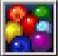

  

Dungeon where you can have a wish granted if you bring all 7 colors of Catstones to the end.

You can only have 1 wish granted per visit, and the Catstones vanish after the wish is granted. 
Just to be clear, bringing 2 sets of Catstones won't let you have multiple wishes granted.

The first clear is 42F, and a magic circle appears on each floor starting on 43F after the first clear. 
This magic circle can be used to warp to the end if you're only interested in having a wish granted. 
(The number of clears increases, but it doesn't count for Expert Badges)

If you don't have a set of Catstones when you reach the end, you'll receive Undo Grass.

The rare Onigiri Shield has a chance to appear in elite stores starting on 84F, 
which is otherwise only obtainable in Primordial Chasm or select PS Vita / Switch / Steam dungeons.

See Tips and Tricks for Catstone collection tips.

<ul class="quickLinksUL">
  <li><a href="#overview">Overview</a>
    <ul>
      <li><a href="#list-of-wishes">List of Wishes</a></li>
    </ul>
  </li>
  <li><a href="#strategy">Strategy</a>
    <ul>
      <li><a href="#general">General</a></li>
      <li><a href="#identifying-items">Identifying Items</a></li>
      <li><a href="#equipment">Equipment</a></li>
      <li><a href="#floor-guide">Floor Guide</a></li>
    </ul>
  </li>
  <li><a href="#monsters">Monsters</a>
    <ul>
      <li><a href="#day-monsters">Day Monsters</a></li>
      <li><a href="#night-monsters">Night Monsters</a></li>
    </ul>
  </li>
  <li><a href="#items">Items</a></li>
  <li><a href="#traps">Traps</a></li>
  <li><a href="#npcs">NPCs</a></li>
</ul>

# Overview

<table class="dungeonOverview">
  <tr>
    <th>Unlock</th>
    <td class="highlightYellow">Clear the main story.</td>
  </tr>
  <tr>
    <th>Entrance</th>
    <td class="highlightYellow">Beginner House in Inori Village. (North)</td>
  </tr>
</table>

<table class="dungeonTable">
  <tr>
    <th>Floors</th>
    <td>42F (first) / 99F</td>
    <th>Day / Night</th>
    <td>Both</td>
  </tr>
  <tr>
    <th>Bring Items</th>
    <td>Yes</td>
    <th>Allies</th>
    <td>3</td>
  </tr>
  <tr>
    <th>Unidentified</th>
    <td>Weapons, Shields, Bracelets</td>
    <th>New Items</th>
    <td>Yes</td>
  </tr>
  <tr>
    <th>Shops</th>
    <td>Regular, Elite, Pick-A-Choice</td>
    <th>Monster Houses</th>
    <td>Regular, Sudden, Special</td>
  </tr>
  <tr>
    <th>Initial Enemies</th>
    <td>6~15</td>
    <th>Spawn Rate</th>
    <td>30 day / 20 night</td>
  </tr>
  <tr>
    <th>Day Turns</th>
    <td></td>
    <th>Night Turns</th>
    <td></td>
  </tr>
  <tr>
    <th>Ominous aura</th>
    <td>Yes</td>
    <th>Wind of Kron</th>
    <td>1st:  4th: </td>
  </tr>
  <tr>
    <th>Clear Icon</th>
    <td class="clearIcon"></td>
    <th>Reward</th>
    <td>None</td>
  </tr>
</table>

#### List of Wishes

Making a wish requires all 7 colors of catstones each time.

<table class="dungeonTable">
  <thead>
    <tr>
      <th>Wish</th>
      <th>Effect</th>
    </tr>
  </thead>
  <tbody>
    <tr>
      <td class="highlightGray">I wish for an unstoppable weapon.</td>
      <td>Obtain a <a href="/shiren-5/items/weapons#kaburagi">Kaburagi</a>.</td>
    </tr>
    <tr>
      <td class="highlightGray">I wish for an invincible shield.</td>
      <td>Obtain a <a href="/shiren-5/items/shields#helix-shield">Helix Shield</a>.</td>
    </tr>
    <tr>
      <td class="highlightGray">I wish to be totally blessed.</td>
      <td>All inventory items become blessed, including items in pots.</td>
    </tr>
    <tr>
      <td class="highlightGray">I wish to learn the ultimate ability.</td>
      <td>Learn the Transmogrification <a href="/shiren-5/system/necklace-abilities">ability</a>. (Turns a monster in front of you into an item) ※ You can only wish for this one time.</td>
    </tr>
    <tr>
      <td class="highlightGray">I wish to play a tougher dungeon.</td>
      <td>Unlocks the <a href="/shiren-5/dungeons/destinys-descent">Destiny's Descent</a> dungeon. (Located at the Tower of Fortune entrance area) ※ You can only wish for this one time.</td>
    </tr>
    <tr>
      <td class="highlightGray">I wish to be popular with girls.</td>
      <td>Female characters in Nekomaneki Village will react differently. (Obtain a <a href="/shiren-5/items/pots#shrine-maid.-pot">Shrine Maid. Pot</a> if you visit the north west house)</td>
    </tr>
    <tr>
      <td class="highlightGray">I wish to be popular with guys.</td>
      <td>Male characters in Nekomaneki Village will react differently. (Obtain 9 <a href="/shiren-5/items/projectiles#david's-bullet">David's Bullet</a> from someone toward the south)</td>
    </tr>
    <tr>
      <td class="highlightGray">I wish that I was rich.</td>
      <td>Your current Gitan total is increased to 999,999G.</td>
    </tr>
    <tr>
      <td class="highlightGray">I wish to fight the Reeva Statue.</td>
      <td>Have a rematch with <a href="/shiren-5/system/monsters#gr-reeva-statue">Gr. Reeva Statue</a>.</td>
    </tr>
    <tr>
      <td class="highlightGray">I wish to fight Gendolucika.</td>
      <td>Have a rematch with <a href="/shiren-5/system/monsters#gendolucika">Gendolucika</a>. ※ Option appears after clearing the <a href="/shiren-5/dungeons/old-road">Old Road</a> dungeon.</td>
    </tr>
    <tr>
      <td class="highlightGray">I wish to fight Jack Wand monsters.</td>
      <td>Battle 1 of the 7 <a href="/shiren-5/system/monsters#jack-wand">Jack Wand</a> boss monsters of your choosing. (It'll be registered to your Monster Book if you defeat it)</td>
    </tr>
    <tr>
      <td class="highlightGray">I wish for the ability to fly.</td>
      <td>Obtain a <a href="/shiren-5/items/bracelets#floating-bracelet">Floating Bracelet</a>. (You can walk on water and air tiles, and won't trigger traps)</td>
    </tr>
    <tr>
      <td class="highlightGray">I don't wish for anything.</td>
      <td>Obtain a <a href="/shiren-5/items/bracelets#night-ward">Night Ward</a>. (Increases direct attack damage against night monsters)</td>
    </tr>
  </tbody>
</table>

# Strategy

<ul class="quickLinksUL">
  <li><a href="#general">General</a></li>
  <li><a href="#identifying-items">Identifying Items</a></li>
  <li><a href="#equipment">Equipment</a></li>
  <li><a href="#floor-guide">Floor Guide</a></li>
</ul>

### General

The monster table for the first half is extremely similar to the main story dungeons: 
Destiny Trail 5F → Past 7F (12F) → Present 7F (19F) → Future 7F (26F) → Fortune 14F (40F) → Miracles 9F (49F) 
Based on this, Mixers appear where you'd expect them: Present 1-3F (13-15F) and Future 4-5F (23-24F)

The item table is pretty similar to story dungeons, though some additions were made. (Bracelets in particular) 
You'll likely be able to clear the dungeon without issues if you bring the equipment you used to clear the main story.

However, being a post-game dungeon that allows carry-in items, the difficulty ramps up starting on 50F. 
Select floors have extremely dangerous monster combinations, even surpassing Lost Well. 
So if you only care about having wishes granted, use the magic circle to skip to the end.

Shops are rare, and many floors have CHUNSOFT layouts, along with 12 and 13 room layouts. 
It's common to end up fighting enemies one after another due to the linear maps.

There are few shops, and the number of items on the ground quickly begin to dwindle as you progress. 
This means unless you have Transmogrification to restock items, you're likely to run out of torches. 
Mixers appear later than other dungeons, so it's common to have an inventory full of synthesis ingredients early on. 
Strong Carts don't appear, so you'll need to level up a Cross Cart if you want to collect Knockback Arrows. 
Archdragons, Bashaggas, and Ultra Gazers appear across a wide range of floors, and so on.

Stairlight will display the location of the magic circle along with the stairs from 43F, so it becomes less reliable. 
The number of hidden traps is higher than average, and Poison Arrow Traps are pretty common early on. 
So it might sound easy at first glance looking at the dungeon overview, but it has a surprising amount of bite to it.

#### Carry-In Items

Bring strengthened equipment, and plenty of Revival Grass / Undo Grass as insurance. 
You shouldn't run into problems if you've prepared well enough, but be careful of item loss.

To clear it quickly, use 2 bracelet resonance with Monster Detector + Time Stop Bracelet and rush stairs at night.

You'll want to pay attention on dangerous floors, so don't let your guard down too much. 
Otherwise, your equipment might get turned into Weeds, or a Catstone into a Large Onigiri, etc.

#### No Carry-In Items

Equipment is uncommon compared to other dungeons, so you'll often struggle to find reliable options. 
Fewer items are generated on floors as you progress, and shops are rare, so you have to know farming techniques.

While the monster table is somewhat lax, Maneaters can spawn on floors where Mixer and Nigiri Baby appear, 
and the ominous aura warning occurs sooner than some other dungeons, so it's difficult to synthesize or farm items. 
However, if you're able to hunt the Maneaters, you'll be able to quickly level up equipment and obtain items.

The monster table is unique starting from 50F, and usually comes down to how well 
you were able to collect items and level equipment for the second half.

### Identifying Items

The only unidentified items are bracelets, so there isn't much that needs to be identified. 
However, since shops are rare, don't expect to be able to identify them by price.

Identify Scrolls are uncommon, and Identify Pots can't be found. 
Many bracelets in this dungeon have negative effects, so equipping them comes with significant risk. 
Perhaps a viable option would be to disregard bracelets altogether.

### Equipment

Since it allows carry-in items, bringing strong equipment makes the dungeon very easy. 
Using 2 bracelet resonance with Monster Detector + Time Stop, Anti-Crs., Anti-Parry, etc. adds to consistency. 
Some players add the Unmoving shield rune to avoid accidents when Terrabbit and Knave King appear together.

If you're not bringing items, it's usually better to aim for a weapon and shield set that grants 2 bracelet resonance. 
A type effective weapon + Day Shield is viable as well, but you won't come across a Day Shield very often. 
Status inflicting weapons are only found in shops, so don't count on obtaining them.

Maneaters don't take long to spawn, and hunting them makes it easy to switch to a different main weapon, 
provided you create an environment where they can be defeated safely.

New items can be found in this dungeon, so you could use those items instead of playing the intended balance too.

### Floor Guide

#### Early Game (1-20F)

This floor range shouldn't give you trouble. 
The only noteworthy monster combination is Curse Girl + Fearabbit. (8-9F)

No Carry-In Items:

- Collect all items before proceeding to the next floor.

- The first Mixer floor range (13-15F) is later than many dungeons, so go ahead and use Synthesis Pots if you find some. Mixers are rare, and ominous auras appear quickly, so don't hesitate to move on if you're not seeing results.

- It's possible to perform Nigiri Morph Factory on floors where Nigiri Baby (6-8F) appears, but again, ominous auras usually put a stop to extended item collection techniques.

#### Mid Game (21-50F)

Nigiri Morphs appear between 30-32F, so be careful if you don't have the Anti-Onigiri shield rune. 
Worst case scenario, a Catstone gets transformed into a Large Onigiri and you have to start over from 1F.

The 36-40F floor range is a skywalk area. (no walls) 
It might be tempting to use a Floating Bracelet to take shortcuts, but Kappa Pests appear between 37-39F, 
and if it throws a shield or torch and forces you to equip it while on an air tile, your equipment will fall into the abyss. 
Even worse, if it throws a Hide Pot, you'll be trapped in the pot and will fall into the abyss, resulting in a failed adventure. 
So, it's best to avoid moving across air tiles on these floors.

No Carry-In Items:

- Both Mixers (23-24F) and Dark Mixers (22-24F) appear early into this floor range, so finish synthesizing the basics. Maneaters can spawn on these floors too, so it's difficult to remain on the floor for an extended time. Do your best to focus on synthesizing as fast as possible.

- Enemies begin to hit harder from around 30F, and Maneater floors remain an on-and-off threat. That said, there are some floors where you can safely hunt monsters for drops. (check monster table)

#### Late Game (51-99F)

For some mysterious reason, wandering NPCs can appear between 70-83F. 
They don't behave any differently than in other dungeons, so don't bother chasing them down to talk to them.

The combination of Horrabbit, Mudster, and Curspinster is quite scary on 56F during the day. 
Horrabbit's spawn rate is low, but you should still hurry to the next floor to avoid losing important runes.

Knave Kings appear between 75-76F, and 76F is particularly dangerous since Terrabbit can spawn alongside it. 
Throw an Extinction Scroll at a Knave King to prevent accidents such as your equipped items turning into Weeds. 
※ Tagged weapons and shields can't be recovered if they're turned into Weeds.

Dangerous floors:

- 56F (Day) - Horrabbit + Mudster
- 76F (Day) - Terrabbit + Knave King

These two floors feature floor-wide attraction Fearabbit monsters + equipment destroying monsters. 
Again, even if your weapon or shield is tagged, it can't be recovered if it's turned into Weeds, 
so either throw an Extinction Scroll at one of them, or go through these floors at night.

Other notable monsters and floors:

- Mudster - 52-56F
- Mudder - 69-72F
- Horrabbit - 56-58F
- Terrabbit - 76-79F
- Evil Archdragon - 56-57F
- Knave King - 75-76F
- Dark Knave King - 75-76F
- Archdragon - 80-85F
- Dark Mesmerikon - 81-82F
- Evil Abyss Dragon - 88-99F
- Ultra Gazer - 89-99F (If you don't have the Anti-Hypno shield rune)

No Carry-In Items:

- The monster table from this point rivals other post-game dungeons. They only last 1\~2 floors, but there are some extremely dangerous floor ranges.

- Bashaggas make an appearance during the day near the end, and are flat out terrifying. They attack 4 times per turn, and have very high HP so they can't be defeated in one hit. (Don't even try) Other significant threats that span a large number of floors include Ultra Gazer and Cranky Tank.

- Evil Abyss Dragon and Filthy Bashagga make an appearance at night and can be rough to deal with, but it's like being in heaven compared to daytime, so it's generally best to progress during the night.

# Monsters

See [Monsters](/system/monsters) for individual monster details.

<ul class="quickLinksUL">
  <li><a href="#day-monsters">Day Monsters</a></li>
  <li><a href="#night-monsters">Night Monsters</a></li>
</ul>

#### Day Monsters

Enemy Colors: Farming, Situational Farming, Destroys Items, Dangerous, Very Dangerous

<table class="dungeonMonsters">
  <tr>
    <th colspan="10">Day (Semi-Sorted)</th>
  </tr>
  <tr>
    <td>1</td>
    <td class="highlightYellow">Mamel</td>
    <td class="highlightYellow">Seedie</td>
    <td class="highlightYellow">Sproutant</td>
    <td></td>
    <td></td>
    <td></td>
    <td></td>
    <td></td>
    <td></td>
  </tr>
  <tr>
    <td>2</td>
    <td class="highlightYellow">Mamel</td>
    <td class="highlightYellow">Seedie</td>
    <td class="highlightYellow">Sproutant</td>
    <td class="highlightYellow">Colum</td>
    <td></td>
    <td></td>
    <td></td>
    <td></td>
    <td></td>
  </tr>
  <tr>
    <td>3</td>
    <td class="highlightYellow">Blade Bee</td>
    <td class="highlightGreen">Pit Mamel</td>
    <td class="highlightYellow">Sproutant</td>
    <td class="highlightYellow">Colum</td>
    <td class="highlightYellow">Chintala</td>
    <td></td>
    <td></td>
    <td></td>
    <td></td>
  </tr>
  <tr>
    <td>4</td>
    <td class="highlightYellow">Blade Bee</td>
    <td class="highlightGreen">Pit Mamel</td>
    <td class="highlightBlue">Grass Kid</td>
    <td class="highlightYellow">Pin Kid</td>
    <td class="highlightYellow">Chintala</td>
    <td class="highlightYellow">Sweet Nut</td>
    <td></td>
    <td></td>
    <td></td>
  </tr>
  <tr>
    <td>5</td>
    <td></td>
    <td class="highlightGreen">Pit Mamel</td>
    <td class="highlightBlue">Grass Kid</td>
    <td class="highlightYellow">Pin Kid</td>
    <td class="highlightYellow">Chintala</td>
    <td class="highlightYellow">Sweet Nut</td>
    <td></td>
    <td></td>
    <td></td>
  </tr>
  <tr>
    <td>6</td>
    <td class="highlightGreen">Froggo</td>
    <td class="highlightYellow">Nigiri Baby</td>
    <td class="highlightBlue">Grass Kid</td>
    <td class="highlightYellow">Pin Kid</td>
    <td class="highlightYellow">Karakuroid</td>
    <td class="highlightYellow">Sweet Nut</td>
    <td></td>
    <td></td>
    <td></td>
  </tr>
  <tr>
    <td>7</td>
    <td class="highlightGreen">Froggo</td>
    <td class="highlightYellow">Nigiri Baby</td>
    <td class="highlightYellow">Tiger Tosser</td>
    <td></td>
    <td class="highlightYellow">Karakuroid</td>
    <td class="highlightYellow">Sweet Nut</td>
    <td></td>
    <td></td>
    <td></td>
  </tr>
  <tr>
    <td>8</td>
    <td class="highlightPurple3">Curse Girl</td>
    <td class="highlightYellow">Nigiri Baby</td>
    <td class="highlightYellow">Tiger Tosser</td>
    <td class="highlightYellow">Fearabbit</td>
    <td class="highlightYellow">Karakuroid</td>
    <td class="highlightYellow">Floaty</td>
    <td></td>
    <td></td>
    <td></td>
  </tr>
  <tr>
    <td>9</td>
    <td class="highlightPurple3">Curse Girl</td>
    <td class="highlightYellow">Pumphantasm</td>
    <td class="highlightYellow">Tiger Tosser</td>
    <td class="highlightYellow">Fearabbit</td>
    <td class="highlightYellow">Gyaza</td>
    <td class="highlightYellow">Floaty</td>
    <td></td>
    <td></td>
    <td></td>
  </tr>
  <tr>
    <td>10</td>
    <td class="highlightYellow">N'dubba</td>
    <td class="highlightYellow">Pumphantasm</td>
    <td class="highlightYellow">Naptapir</td>
    <td class="highlightYellow">Fearabbit</td>
    <td class="highlightYellow">Gyaza</td>
    <td class="highlightYellow">Floaty</td>
    <td></td>
    <td></td>
    <td></td>
  </tr>
  <tr>
    <td>11</td>
    <td class="highlightYellow">N'dubba</td>
    <td class="highlightYellow">Pumphantasm</td>
    <td class="highlightYellow">Naptapir</td>
    <td class="highlightYellow">Mutaikon</td>
    <td></td>
    <td></td>
    <td></td>
    <td></td>
    <td></td>
  </tr>
  <tr>
    <td>12</td>
    <td class="highlightYellow">Scorpion</td>
    <td class="highlightYellow">Pumphantasm</td>
    <td class="highlightYellow">Naptapir</td>
    <td class="highlightYellow">Mutaikon</td>
    <td class="highlightPurple3">Mudkin</td>
    <td class="highlightYellow">Metalhead</td>
    <td></td>
    <td></td>
    <td></td>
  </tr>
  <tr>
    <td>13</td>
    <td class="highlightPurple3">Curse Girl</td>
    <td class="highlightYellow">Pumphantasm</td>
    <td class="highlightYellow">Scorpion</td>
    <td class="highlightYellow">Mutaikon</td>
    <td class="highlightYellow">Gyaza</td>
    <td class="highlightBlue">Mixer</td>
    <td></td>
    <td></td>
    <td></td>
  </tr>
  <tr>
    <td>14</td>
    <td class="highlightPurple3">Curse Girl</td>
    <td class="highlightYellow">Scorpion</td>
    <td></td>
    <td class="highlightYellow">Mutaikon</td>
    <td class="highlightYellow">Gyaza</td>
    <td class="highlightBlue">Mixer</td>
    <td></td>
    <td></td>
    <td></td>
  </tr>
  <tr>
    <td>15</td>
    <td class="highlightPurple3">Curse Girl</td>
    <td class="highlightYellow">Scorpion</td>
    <td class="highlightYellow">Naptapir</td>
    <td></td>
    <td class="highlightYellow">Gyaza</td>
    <td class="highlightBlue">Mixer</td>
    <td></td>
    <td></td>
    <td></td>
  </tr>
  <tr>
    <td>16</td>
    <td class="highlightPurple3">Curse Girl</td>
    <td class="highlightPurple3">Swordsman</td>
    <td class="highlightYellow">Naptapir</td>
    <td class="highlightYellow">Cololum</td>
    <td class="highlightPurple3">Mudkin</td>
    <td class="highlightYellow">Metalhead</td>
    <td class="highlightYellow">Polygon Spinna</td>
    <td></td>
    <td></td>
  </tr>
  <tr>
    <td>17</td>
    <td class="highlightPurple3">Curse Girl</td>
    <td class="highlightPurple3">Swordsman</td>
    <td class="highlightYellow">Mid Chintala</td>
    <td class="highlightYellow">Cololum</td>
    <td class="highlightPurple3">Mudkin</td>
    <td class="highlightYellow">Metalhead</td>
    <td class="highlightYellow">Polygon Spinna</td>
    <td class="highlightYellow">Cheer-Ham</td>
    <td></td>
  </tr>
  <tr>
    <td>18</td>
    <td></td>
    <td class="highlightPurple3">Swordsman</td>
    <td class="highlightYellow">Mid Chintala</td>
    <td class="highlightYellow">Cololum</td>
    <td class="highlightPurple3">Mudkin</td>
    <td class="highlightYellow">Metalhead</td>
    <td></td>
    <td class="highlightYellow">Cheer-Ham</td>
    <td></td>
  </tr>
  <tr>
    <td>19</td>
    <td class="highlightYellow">Bored Kappa</td>
    <td class="highlightYellow">Kid Squid</td>
    <td class="highlightYellow">Mid Chintala</td>
    <td></td>
    <td></td>
    <td></td>
    <td></td>
    <td class="highlightYellow">Cheer-Ham</td>
    <td></td>
  </tr>
  <tr>
    <td>20</td>
    <td class="highlightYellow">Cololum</td>
    <td class="highlightYellow">Bored Kappa</td>
    <td class="highlightYellow">Mid Chintala</td>
    <td class="highlightYellow">Fearabbit</td>
    <td class="highlightYellow">Kid Squid</td>
    <td class="highlightYellow">Floaty</td>
    <td class="highlightYellow">Polygon Spinna</td>
    <td class="highlightYellow">Cheer-Ham</td>
    <td></td>
  </tr>
  <tr>
    <td>21</td>
    <td class="highlightYellow">Bored Kappa</td>
    <td class="highlightYellow">Kid Squid</td>
    <td class="highlightYellow">Mid Chintala</td>
    <td class="highlightYellow">Cololum</td>
    <td class="highlightYellow">Acrid Nut</td>
    <td class="highlightYellow">Floaty</td>
    <td class="highlightYellow">Polygon Spinna</td>
    <td class="highlightYellow">Cheer-Ham</td>
    <td></td>
  </tr>
  <tr>
    <td>22</td>
    <td></td>
    <td></td>
    <td></td>
    <td class="highlightYellow">Cololum</td>
    <td class="highlightYellow">Acrid Nut</td>
    <td></td>
    <td class="highlightYellow">Polygon Spinna</td>
    <td class="highlightYellow">Cheer-Ham</td>
    <td></td>
  </tr>
  <tr>
    <td>23</td>
    <td class="highlightOrange2">Foly</td>
    <td></td>
    <td></td>
    <td></td>
    <td class="highlightYellow">Acrid Nut</td>
    <td class="highlightBlue">Mixer</td>
    <td class="highlightYellow">Polygon Spinna</td>
    <td class="highlightYellow">Cheer-Ham</td>
    <td></td>
  </tr>
  <tr>
    <td>24</td>
    <td class="highlightOrange2">Foly</td>
    <td class="highlightYellow">Dagger Bee</td>
    <td class="highlightYellow">Hopodile</td>
    <td class="highlightYellow">Flamebird</td>
    <td class="highlightYellow">Acrid Nut</td>
    <td class="highlightBlue">Mixer</td>
    <td class="highlightYellow">Polygon Spinna</td>
    <td></td>
    <td></td>
  </tr>
  <tr>
    <td>25</td>
    <td class="highlightOrange2">Foly</td>
    <td class="highlightYellow">Dagger Bee</td>
    <td class="highlightYellow">Hopodile</td>
    <td class="highlightYellow">Flamebird</td>
    <td class="highlightYellow">Acrid Nut</td>
    <td class="highlightBlue">Zalokleft</td>
    <td class="highlightYellow">Yanpii</td>
    <td class="highlightPurple3">Scoopie</td>
    <td></td>
  </tr>
  <tr>
    <td>26</td>
    <td></td>
    <td class="highlightYellow">Dagger Bee</td>
    <td class="highlightYellow">Hopodile</td>
    <td class="highlightYellow">Flamebird</td>
    <td class="highlightYellow">Acrid Nut</td>
    <td class="highlightBlue">Zalokleft</td>
    <td class="highlightYellow">Yanpii</td>
    <td class="highlightPurple3">Scoopie</td>
    <td></td>
  </tr>
  <tr>
    <td>27</td>
    <td class="highlightYellow">Beanie</td>
    <td class="highlightYellow">Eligan</td>
    <td></td>
    <td class="highlightYellow">Flamebird</td>
    <td></td>
    <td></td>
    <td class="highlightYellow">Yanpii</td>
    <td class="highlightPurple3">Scoopie</td>
    <td></td>
  </tr>
  <tr>
    <td>28</td>
    <td class="highlightYellow">Beanie</td>
    <td class="highlightYellow">Eligan</td>
    <td class="highlightPurple3">Gyadon</td>
    <td class="highlightBlue">Grass Dude</td>
    <td class="highlightYellow">Pin Dude</td>
    <td></td>
    <td class="highlightYellow">Yanpii</td>
    <td class="highlightPurple3">Scoopie</td>
    <td></td>
  </tr>
  <tr>
    <td>29</td>
    <td class="highlightYellow">Sproutyrant</td>
    <td class="highlightYellow">Eligan</td>
    <td class="highlightPurple3">Gyadon</td>
    <td class="highlightBlue">Grass Dude</td>
    <td class="highlightYellow">Pin Dude</td>
    <td></td>
    <td class="highlightYellow">Yanpii</td>
    <td class="highlightPurple3">Scoopie</td>
    <td></td>
  </tr>
  <tr>
    <td>30</td>
    <td class="highlightYellow">Sproutyrant</td>
    <td class="highlightYellow">Steamroid</td>
    <td class="highlightPurple3">Nigiri Morph</td>
    <td class="highlightBlue">Grass Dude</td>
    <td class="highlightYellow">Pin Dude</td>
    <td class="highlightGreen">Froggucci</td>
    <td class="highlightGreen">Boy Cart</td>
    <td class="highlightYellow">DJ Mage</td>
    <td class="highlightYellow">Poofy</td>
  </tr>
  <tr>
    <td>31</td>
    <td class="highlightYellow">Sproutyrant</td>
    <td class="highlightYellow">Steamroid</td>
    <td class="highlightPurple3">Nigiri Morph</td>
    <td class="highlightYellow">Snooztapir</td>
    <td class="highlightOrange2">Absorbiphant</td>
    <td class="highlightGreen">Froggucci</td>
    <td class="highlightGreen">Boy Cart</td>
    <td class="highlightYellow">DJ Mage</td>
    <td class="highlightYellow">Poofy</td>
  </tr>
  <tr>
    <td>32</td>
    <td class="highlightYellow">Ironhead</td>
    <td></td>
    <td class="highlightPurple3">Nigiri Morph</td>
    <td class="highlightYellow">Snooztapir</td>
    <td class="highlightOrange2">Absorbiphant</td>
    <td class="highlightGreen">Froggucci</td>
    <td class="highlightGreen">Boy Cart</td>
    <td class="highlightYellow">DJ Mage</td>
    <td class="highlightYellow">Poofy</td>
  </tr>
  <tr>
    <td>33</td>
    <td class="highlightYellow">Ironhead</td>
    <td class="highlightPurple3">Cursister</td>
    <td class="highlightOrange2">Hipadile</td>
    <td class="highlightYellow">Punisher</td>
    <td class="highlightOrange2">Absorbiphant</td>
    <td></td>
    <td></td>
    <td></td>
    <td></td>
  </tr>
  <tr>
    <td>34</td>
    <td class="highlightPurple3">Muddy</td>
    <td class="highlightPurple3">Cursister</td>
    <td class="highlightOrange2">Hipadile</td>
    <td class="highlightYellow">Punisher</td>
    <td class="highlightYellow">Crow Tengu</td>
    <td class="highlightYellow">Firepuff</td>
    <td class="highlightYellow">Sr. Yanpii</td>
    <td class="highlightYellow">Spicy Nut</td>
    <td></td>
  </tr>
  <tr>
    <td>35</td>
    <td class="highlightPurple3">Muddy</td>
    <td></td>
    <td class="highlightOrange2">Hipadile</td>
    <td class="highlightYellow">Punisher</td>
    <td class="highlightYellow">Crow Tengu</td>
    <td class="highlightYellow">Firepuff</td>
    <td class="highlightYellow">Sr. Yanpii</td>
    <td class="highlightYellow">Spicy Nut</td>
    <td></td>
  </tr>
  <tr>
    <td>36</td>
    <td class="highlightPurple3">Muddy</td>
    <td class="highlightGreen">Cross Cart</td>
    <td></td>
    <td></td>
    <td class="highlightYellow">Crow Tengu</td>
    <td class="highlightYellow">Firepuff</td>
    <td class="highlightYellow">Sr. Yanpii</td>
    <td class="highlightYellow">Spicy Nut</td>
    <td></td>
  </tr>
  <tr>
    <td>37</td>
    <td class="highlightYellow">Go-Ham!</td>
    <td class="highlightGreen">Cross Cart</td>
    <td class="highlightOrange2">Digestiphant</td>
    <td class="highlightOrange2">Scarabbit</td>
    <td class="highlightYellow">Zapdon</td>
    <td class="highlightOrange2">Kappa Pest</td>
    <td class="highlightOrange2">MC Mage</td>
    <td></td>
    <td></td>
  </tr>
  <tr>
    <td>38</td>
    <td class="highlightYellow">Go-Ham!</td>
    <td class="highlightOrange2">N'twyn</td>
    <td class="highlightOrange2">Digestiphant</td>
    <td class="highlightOrange2">Scarabbit</td>
    <td class="highlightYellow">Zapdon</td>
    <td class="highlightOrange2">Kappa Pest</td>
    <td class="highlightOrange2">MC Mage</td>
    <td></td>
    <td></td>
  </tr>
  <tr>
    <td>39</td>
    <td class="highlightYellow">Katana Bee</td>
    <td class="highlightOrange2">N'twyn</td>
    <td class="highlightYellow">Dragon</td>
    <td class="highlightYellow">Death Gyaza</td>
    <td class="highlightYellow">Shagga</td>
    <td class="highlightOrange2">Kappa Pest</td>
    <td class="highlightOrange2">MC Mage</td>
    <td></td>
    <td></td>
  </tr>
  <tr>
    <td>40</td>
    <td class="highlightYellow">Katana Bee</td>
    <td class="highlightPurple3">Trowelie</td>
    <td class="highlightYellow">Dragon</td>
    <td class="highlightYellow">Death Gyaza</td>
    <td class="highlightYellow">Shagga</td>
    <td></td>
    <td></td>
    <td></td>
    <td class="highlightYellow">Poofy</td>
  </tr>
  <tr>
    <td>41</td>
    <td class="highlightBlue">Mixermon</td>
    <td class="highlightPurple3">Trowelie</td>
    <td></td>
    <td class="highlightYellow">Death Gyaza</td>
    <td class="highlightYellow">Shagga</td>
    <td></td>
    <td></td>
    <td></td>
    <td></td>
  </tr>
  <tr>
    <td>42</td>
    <td class="highlightBlue">Mixermon</td>
    <td class="highlightPurple3">Trowelie</td>
    <td class="highlightYellow">Pumphantom</td>
    <td></td>
    <td></td>
    <td></td>
    <td></td>
    <td></td>
    <td class="highlightYellow">Poofy</td>
  </tr>
  <tr>
    <td>43</td>
    <td class="highlightYellow">Cave Mamel</td>
    <td class="highlightYellow">Falcon Tengu</td>
    <td class="highlightYellow">Pumphantom</td>
    <td class="highlightYellow">Polygon Shaka</td>
    <td class="highlightYellow">Flamepuff</td>
    <td class="highlightYellow">Dazikon</td>
    <td class="highlightYellow">VeniScorp</td>
    <td></td>
    <td></td>
  </tr>
  <tr>
    <td>44</td>
    <td class="highlightYellow">Cave Mamel</td>
    <td class="highlightYellow">Falcon Tengu</td>
    <td class="highlightYellow">Tiger Hurler</td>
    <td class="highlightYellow">Polygon Shaka</td>
    <td class="highlightYellow">Flamepuff</td>
    <td class="highlightYellow">Dazikon</td>
    <td class="highlightYellow">VeniScorp</td>
    <td class="highlightBlue">Grass Poppa</td>
    <td class="highlightYellow">Pin Poppa</td>
  </tr>
  <tr>
    <td>45</td>
    <td class="highlightRed">MC Wizard</td>
    <td></td>
    <td class="highlightYellow">Tiger Hurler</td>
    <td></td>
    <td></td>
    <td></td>
    <td class="highlightYellow">VeniScorp</td>
    <td class="highlightBlue">Grass Poppa</td>
    <td class="highlightYellow">Pin Poppa</td>
  </tr>
  <tr>
    <td>46</td>
    <td class="highlightRed">MC Wizard</td>
    <td class="highlightPurple3">Gyairas</td>
    <td class="highlightYellow">Tiger Hurler</td>
    <td class="highlightYellow">Eligagan</td>
    <td class="highlightYellow">Huistdon</td>
    <td></td>
    <td></td>
    <td class="highlightBlue">Grass Poppa</td>
    <td class="highlightYellow">Pin Poppa</td>
  </tr>
  <tr>
    <td>47</td>
    <td class="highlightYellow">Sparkbird</td>
    <td class="highlightPurple3">Gyairas</td>
    <td></td>
    <td class="highlightYellow">Eligagan</td>
    <td class="highlightYellow">Huistdon</td>
    <td></td>
    <td></td>
    <td></td>
    <td></td>
  </tr>
  <tr>
    <td>48</td>
    <td class="highlightYellow">Sparkbird</td>
    <td class="highlightOrange2">Nashagga</td>
    <td></td>
    <td class="highlightYellow">Eligagan</td>
    <td class="highlightYellow">Huistdon</td>
    <td></td>
    <td></td>
    <td></td>
    <td></td>
  </tr>
  <tr>
    <td>49</td>
    <td class="highlightOrange2">Sky Dragon</td>
    <td class="highlightOrange2">Nashagga</td>
    <td class="highlightYellow">Steelhead</td>
    <td></td>
    <td></td>
    <td></td>
    <td></td>
    <td></td>
    <td></td>
  </tr>
  <tr>
    <td>50</td>
    <td class="highlightOrange2">Sky Dragon</td>
    <td class="highlightOrange2">Nashagga</td>
    <td class="highlightYellow">Steelhead</td>
    <td></td>
    <td></td>
    <td></td>
    <td></td>
    <td></td>
    <td></td>
  </tr>
  <tr>
    <td>51</td>
    <td class="highlightYellow">Doztapir</td>
    <td class="highlightYellow">Sprouterror</td>
    <td class="highlightYellow">Steelhead</td>
    <td class="highlightRed">MC Sorceror</td>
    <td class="highlightYellow">Debaser</td>
    <td></td>
    <td></td>
    <td></td>
    <td></td>
  </tr>
  <tr>
    <td>52</td>
    <td class="highlightYellow">Doztapir</td>
    <td class="highlightYellow">Sprouterror</td>
    <td class="highlightYellow">Steelhead</td>
    <td class="highlightRed">MC Sorceror</td>
    <td class="highlightYellow">Debaser</td>
    <td class="highlightOrange2">Vexing Kappa</td>
    <td class="highlightOrange2">Jouncy</td>
    <td class="highlightPurple3">Mudster</td>
    <td></td>
  </tr>
  <tr>
    <td>53</td>
    <td class="highlightOrange2">Trillman</td>
    <td class="highlightYellow">Sprouterror</td>
    <td class="highlightYellow">Steelhead</td>
    <td class="highlightRed">MC Sorceror</td>
    <td class="highlightYellow">Debaser</td>
    <td class="highlightOrange2">Vexing Kappa</td>
    <td class="highlightOrange2">Jouncy</td>
    <td class="highlightPurple3">Mudster</td>
    <td></td>
  </tr>
  <tr>
    <td>54</td>
    <td class="highlightYellow">StunScorp</td>
    <td class="highlightYellow">Pyrepuff</td>
    <td class="highlightOrange2">Pierce Cart</td>
    <td class="highlightRed">MC Sorceror</td>
    <td class="highlightYellow">Debaser</td>
    <td></td>
    <td class="highlightOrange2">Jouncy</td>
    <td class="highlightPurple3">Mudster</td>
    <td></td>
  </tr>
  <tr>
    <td>55</td>
    <td class="highlightYellow">StunScorp</td>
    <td class="highlightYellow">Pyrepuff</td>
    <td class="highlightOrange2">Pierce Cart</td>
    <td class="highlightYellow">Tiger Chucker</td>
    <td></td>
    <td></td>
    <td></td>
    <td class="highlightPurple3">Mudster</td>
    <td></td>
  </tr>
  <tr>
    <td>56</td>
    <td class="highlightPurple3">Curspinster</td>
    <td class="highlightYellow">Pumpanshee</td>
    <td class="highlightOrange2">Pierce Cart</td>
    <td class="highlightYellow">Tiger Chucker</td>
    <td class="highlightRed">Horrabbit</td>
    <td class="highlightYellow">Momomomoseal</td>
    <td></td>
    <td class="highlightPurple3">Mudster</td>
    <td></td>
  </tr>
  <tr>
    <td>57</td>
    <td class="highlightPurple3">Curspinster</td>
    <td class="highlightYellow">Pumpanshee</td>
    <td class="highlightGreen">Froggon</td>
    <td class="highlightYellow">Tiger Chucker</td>
    <td class="highlightRed">Horrabbit</td>
    <td class="highlightYellow">Momomomoseal</td>
    <td class="highlightOrange2">Spongiderm</td>
    <td></td>
    <td></td>
  </tr>
  <tr>
    <td>58</td>
    <td class="highlightPurple3">Curspinster</td>
    <td class="highlightYellow">Pumpanshee</td>
    <td class="highlightGreen">Froggon</td>
    <td class="highlightBlue">Iron Zalokleft</td>
    <td class="highlightRed">Horrabbit</td>
    <td class="highlightYellow">Momomomoseal</td>
    <td class="highlightOrange2">Spongiderm</td>
    <td class="highlightOrange2">Lashagga</td>
    <td></td>
  </tr>
  <tr>
    <td>59</td>
    <td class="highlightPurple3">Item Knave</td>
    <td class="highlightPurple3">Gyandora</td>
    <td class="highlightGreen">Froggon</td>
    <td class="highlightBlue">Iron Zalokleft</td>
    <td class="highlightYellow">Lt. Yanpii</td>
    <td></td>
    <td class="highlightOrange2">Spongiderm</td>
    <td class="highlightOrange2">Lashagga</td>
    <td></td>
  </tr>
  <tr>
    <td>60</td>
    <td class="highlightPurple3">Item Knave</td>
    <td class="highlightPurple3">Gyandora</td>
    <td class="highlightYellow">Zanbeeto</td>
    <td class="highlightBlue">Iron Zalokleft</td>
    <td class="highlightYellow">Lt. Yanpii</td>
    <td class="highlightYellow">Polygon Singa</td>
    <td></td>
    <td class="highlightOrange2">Lashagga</td>
    <td></td>
  </tr>
  <tr>
    <td>61</td>
    <td class="highlightBlue">Grass Gramps</td>
    <td class="highlightYellow">Pin Gramps</td>
    <td class="highlightYellow">Zanbeeto</td>
    <td class="highlightOrange2">Flarebird</td>
    <td class="highlightYellow">Lt. Yanpii</td>
    <td class="highlightYellow">Polygon Singa</td>
    <td class="highlightYellow">Bunchukdon</td>
    <td></td>
    <td></td>
  </tr>
  <tr>
    <td>62</td>
    <td class="highlightBlue">Grass Gramps</td>
    <td class="highlightYellow">Pin Gramps</td>
    <td class="highlightPurple3">Sensei</td>
    <td class="highlightOrange2">Flarebird</td>
    <td></td>
    <td class="highlightYellow">Polygon Singa</td>
    <td class="highlightYellow">Bunchukdon</td>
    <td></td>
    <td></td>
  </tr>
  <tr>
    <td>63</td>
    <td class="highlightYellow">Spirit Ham</td>
    <td class="highlightOrange2">Bouncy</td>
    <td class="highlightPurple3">Sensei</td>
    <td class="highlightOrange2">Flarebird</td>
    <td class="highlightPurple3">Hyper Gazer</td>
    <td class="highlightYellow">Polygon Singa</td>
    <td class="highlightYellow">Bunchukdon</td>
    <td></td>
    <td></td>
  </tr>
  <tr>
    <td>64</td>
    <td class="highlightYellow">Spirit Ham</td>
    <td class="highlightOrange2">Bouncy</td>
    <td class="highlightPurple3">Sensei</td>
    <td class="highlightYellow">Onigirizzly</td>
    <td class="highlightPurple3">Hyper Gazer</td>
    <td class="highlightYellow">Bitter Nut</td>
    <td></td>
    <td></td>
    <td></td>
  </tr>
  <tr>
    <td>65</td>
    <td class="highlightYellow">Spirit Ham</td>
    <td class="highlightOrange2">Bouncy</td>
    <td class="highlightYellow">Fulminachin</td>
    <td class="highlightYellow">Onigirizzly</td>
    <td class="highlightPurple3">Hyper Gazer</td>
    <td class="highlightYellow">Bitter Nut</td>
    <td></td>
    <td></td>
    <td></td>
  </tr>
  <tr>
    <td>66</td>
    <td class="highlightYellow">Phoenix Tengu</td>
    <td class="highlightOrange2">Bouncy</td>
    <td class="highlightYellow">Fulminachin</td>
    <td></td>
    <td class="highlightPurple3">Hyper Gazer</td>
    <td class="highlightYellow">Bitter Nut</td>
    <td></td>
    <td></td>
    <td></td>
  </tr>
  <tr>
    <td>67</td>
    <td class="highlightYellow">Phoenix Tengu</td>
    <td class="highlightRed">Dozikon</td>
    <td></td>
    <td></td>
    <td class="highlightPurple3">Hyper Gazer</td>
    <td></td>
    <td></td>
    <td></td>
    <td></td>
  </tr>
  <tr>
    <td>68</td>
    <td class="highlightYellow">Phoenix Tengu</td>
    <td class="highlightRed">Dozikon</td>
    <td class="highlightYellow">Comatapir</td>
    <td class="highlightYellow">Grainie</td>
    <td></td>
    <td></td>
    <td></td>
    <td></td>
    <td></td>
  </tr>
  <tr>
    <td>69</td>
    <td class="highlightPurple3">Mudder</td>
    <td></td>
    <td class="highlightYellow">Comatapir</td>
    <td class="highlightYellow">Grainie</td>
    <td></td>
    <td></td>
    <td></td>
    <td></td>
    <td></td>
  </tr>
  <tr>
    <td>70</td>
    <td class="highlightPurple3">Mudder</td>
    <td class="highlightBlue">Mixerdon</td>
    <td class="highlightYellow">Huge Chintala</td>
    <td class="highlightYellow">Grainie</td>
    <td class="highlightYellow">Hell Gyaza</td>
    <td class="highlightOrange2">N'dup</td>
    <td></td>
    <td></td>
    <td></td>
  </tr>
  <tr>
    <td>71</td>
    <td class="highlightPurple3">Mudder</td>
    <td class="highlightBlue">Mixerdon</td>
    <td class="highlightYellow">Huge Chintala</td>
    <td class="highlightYellow">Eligagon</td>
    <td class="highlightYellow">Hell Gyaza</td>
    <td class="highlightOrange2">N'dup</td>
    <td></td>
    <td></td>
    <td></td>
  </tr>
  <tr>
    <td>72</td>
    <td class="highlightPurple3">Mudder</td>
    <td class="highlightYellow">Cyberoid</td>
    <td class="highlightYellow">Huge Chintala</td>
    <td class="highlightYellow">Eligagon</td>
    <td class="highlightYellow">Hell Gyaza</td>
    <td class="highlightOrange2">N'dup</td>
    <td></td>
    <td></td>
    <td></td>
  </tr>
  <tr>
    <td>73</td>
    <td class="highlightYellow">Detonachin</td>
    <td class="highlightYellow">Cyberoid</td>
    <td class="highlightPurple3">Cursenior</td>
    <td class="highlightYellow">Eligagon</td>
    <td class="highlightPurple3">Shovelie</td>
    <td class="highlightOrange2">N'dup</td>
    <td></td>
    <td></td>
    <td></td>
  </tr>
  <tr>
    <td>74</td>
    <td class="highlightYellow">Detonachin</td>
    <td class="highlightYellow">Cyberoid</td>
    <td class="highlightPurple3">Cursenior</td>
    <td class="highlightYellow">Eligagon</td>
    <td class="highlightPurple3">Shovelie</td>
    <td></td>
    <td></td>
    <td></td>
    <td></td>
  </tr>
  <tr>
    <td>75</td>
    <td class="highlightPurple3">Knave King</td>
    <td class="highlightBlue">Mealy</td>
    <td class="highlightPurple3">Cursenior</td>
    <td class="highlightYellow">Eligagon</td>
    <td class="highlightPurple3">Shovelie</td>
    <td class="highlightYellow">Ruiner</td>
    <td></td>
    <td></td>
    <td></td>
  </tr>
  <tr>
    <td>76</td>
    <td class="highlightPurple3">Knave King</td>
    <td class="highlightBlue">Mealy</td>
    <td class="highlightPurple3">Cursenior</td>
    <td class="highlightRed">Terrabbit</td>
    <td class="highlightPurple3">Shovelie</td>
    <td class="highlightYellow">Ruiner</td>
    <td></td>
    <td></td>
    <td></td>
  </tr>
  <tr>
    <td>77</td>
    <td class="highlightYellow">Pumptergeist</td>
    <td class="highlightOrange2">Boingodile</td>
    <td class="highlightYellow">Kodionigiri</td>
    <td class="highlightRed">Terrabbit</td>
    <td></td>
    <td class="highlightYellow">Ruiner</td>
    <td></td>
    <td></td>
    <td></td>
  </tr>
  <tr>
    <td>78</td>
    <td class="highlightYellow">Pumptergeist</td>
    <td class="highlightOrange2">Boingodile</td>
    <td class="highlightYellow">Kodionigiri</td>
    <td class="highlightRed">Terrabbit</td>
    <td class="highlightYellow">Squidperor</td>
    <td class="highlightYellow">Ruiner</td>
    <td class="highlightYellow">Colocolocolum</td>
    <td></td>
    <td></td>
  </tr>
  <tr>
    <td>79</td>
    <td class="highlightYellow">Pumptergeist</td>
    <td class="highlightOrange2">Boingodile</td>
    <td class="highlightYellow">Kodionigiri</td>
    <td class="highlightRed">Terrabbit</td>
    <td class="highlightYellow">Squidperor</td>
    <td class="highlightYellow">Ruiner</td>
    <td class="highlightYellow">Colocolocolum</td>
    <td></td>
    <td></td>
  </tr>
  <tr>
    <td>80</td>
    <td class="highlightOrange2">Gitan Mamel</td>
    <td class="highlightGreen">Kleptoad</td>
    <td class="highlightYellow">Kodionigiri</td>
    <td class="highlightOrange2">Kappa Troll</td>
    <td class="highlightOrange2">Osmammoth</td>
    <td class="highlightRed">Archdragon</td>
    <td class="highlightYellow">Colocolocolum</td>
    <td class="highlightBlue">FO-Uβ</td>
    <td></td>
  </tr>
  <tr>
    <td>81</td>
    <td class="highlightOrange2">Gitan Mamel</td>
    <td class="highlightGreen">Kleptoad</td>
    <td></td>
    <td class="highlightOrange2">Kappa Troll</td>
    <td class="highlightOrange2">Osmammoth</td>
    <td class="highlightRed">Archdragon</td>
    <td></td>
    <td class="highlightBlue">FO-Uβ</td>
    <td></td>
  </tr>
  <tr>
    <td>82</td>
    <td class="highlightOrange2">Gitan Mamel</td>
    <td class="highlightGreen">Kleptoad</td>
    <td></td>
    <td class="highlightOrange2">Kappa Troll</td>
    <td class="highlightOrange2">Osmammoth</td>
    <td class="highlightRed">Archdragon</td>
    <td></td>
    <td class="highlightBlue">FO-Uβ</td>
    <td></td>
  </tr>
  <tr>
    <td>83</td>
    <td class="highlightPurple3">Gyandoron</td>
    <td></td>
    <td></td>
    <td class="highlightOrange2">Kappa Troll</td>
    <td class="highlightOrange2">Osmammoth</td>
    <td class="highlightRed">Archdragon</td>
    <td></td>
    <td class="highlightBlue">FO-Uβ</td>
    <td></td>
  </tr>
  <tr>
    <td>84</td>
    <td class="highlightPurple3">Gyandoron</td>
    <td class="highlightYellow">Polygon Stunna</td>
    <td class="highlightOrange2">Blazebird</td>
    <td class="highlightYellow">Tiger Ace</td>
    <td></td>
    <td class="highlightRed">Archdragon</td>
    <td></td>
    <td class="highlightBlue">FO-Uβ</td>
    <td></td>
  </tr>
  <tr>
    <td>85</td>
    <td class="highlightPurple3">Gyandoron</td>
    <td class="highlightYellow">Polygon Stunna</td>
    <td class="highlightOrange2">Blazebird</td>
    <td class="highlightYellow">Tiger Ace</td>
    <td class="highlightRed">Porgon</td>
    <td class="highlightRed">Archdragon</td>
    <td class="highlightYellow">Zotdon</td>
    <td class="highlightBlue">FO-Uβ</td>
    <td></td>
  </tr>
  <tr>
    <td>86</td>
    <td class="highlightPurple3">Gyandoron</td>
    <td class="highlightOrange2">Nigiri King</td>
    <td class="highlightYellow">Boss Yanpii</td>
    <td class="highlightYellow">Tiger Ace</td>
    <td class="highlightRed">Porgon</td>
    <td class="highlightBlue">FO-U</td>
    <td class="highlightYellow">Zotdon</td>
    <td></td>
    <td></td>
  </tr>
  <tr>
    <td>87</td>
    <td class="highlightPurple3">Gyandoron</td>
    <td class="highlightOrange2">Nigiri King</td>
    <td class="highlightYellow">Boss Yanpii</td>
    <td></td>
    <td class="highlightRed">Porgon</td>
    <td class="highlightBlue">FO-U</td>
    <td class="highlightYellow">Zotdon</td>
    <td></td>
    <td></td>
  </tr>
  <tr>
    <td>88</td>
    <td class="highlightPurple3">Gyandoron</td>
    <td class="highlightOrange2">Nigiri King</td>
    <td class="highlightYellow">Boss Yanpii</td>
    <td></td>
    <td class="highlightRed">Porgon</td>
    <td class="highlightBlue">FO-U</td>
    <td class="highlightYellow">Zotdon</td>
    <td></td>
    <td></td>
  </tr>
  <tr>
    <td>89</td>
    <td class="highlightRed">Ultra Gazer</td>
    <td class="highlightYellow">Elizgagon</td>
    <td class="highlightYellow">Boss Yanpii</td>
    <td></td>
    <td></td>
    <td class="highlightBlue">FO-U</td>
    <td></td>
    <td></td>
    <td></td>
  </tr>
  <tr>
    <td>90</td>
    <td class="highlightRed">Ultra Gazer</td>
    <td class="highlightYellow">Elizgagon</td>
    <td class="highlightPurple3">Swordmaster</td>
    <td class="highlightOrange2">Bashagga</td>
    <td></td>
    <td class="highlightBlue">FO-U</td>
    <td></td>
    <td></td>
    <td></td>
  </tr>
  <tr>
    <td>91</td>
    <td class="highlightRed">Ultra Gazer</td>
    <td class="highlightYellow">Elizgagon</td>
    <td class="highlightPurple3">Swordmaster</td>
    <td class="highlightOrange2">Bashagga</td>
    <td class="highlightBlue">FO-UZ</td>
    <td></td>
    <td></td>
    <td></td>
    <td></td>
  </tr>
  <tr>
    <td>92</td>
    <td class="highlightRed">Ultra Gazer</td>
    <td class="highlightYellow">Elizgagon</td>
    <td class="highlightPurple3">Swordmaster</td>
    <td class="highlightOrange2">Bashagga</td>
    <td class="highlightBlue">FO-UZ</td>
    <td></td>
    <td></td>
    <td></td>
    <td></td>
  </tr>
  <tr>
    <td>93</td>
    <td class="highlightRed">Ultra Gazer</td>
    <td class="highlightYellow">Elizgagon</td>
    <td class="highlightRed">Cranky Tank</td>
    <td class="highlightOrange2">Bashagga</td>
    <td class="highlightBlue">FO-UZ</td>
    <td></td>
    <td></td>
    <td></td>
    <td></td>
  </tr>
  <tr>
    <td>94</td>
    <td class="highlightRed">Ultra Gazer</td>
    <td class="highlightYellow">Elizgagon</td>
    <td class="highlightRed">Cranky Tank</td>
    <td class="highlightOrange2">Bashagga</td>
    <td class="highlightBlue">FO-UZ</td>
    <td></td>
    <td></td>
    <td></td>
    <td></td>
  </tr>
  <tr>
    <td>95</td>
    <td class="highlightRed">Ultra Gazer</td>
    <td class="highlightYellow">Elizgagon</td>
    <td class="highlightRed">Cranky Tank</td>
    <td class="highlightOrange2">Bashagga</td>
    <td class="highlightBlue">FO-UZ</td>
    <td class="highlightYellow">BlightScorp</td>
    <td></td>
    <td></td>
    <td></td>
  </tr>
  <tr>
    <td>96</td>
    <td class="highlightRed">Ultra Gazer</td>
    <td class="highlightYellow">Elizgagon</td>
    <td class="highlightRed">Cranky Tank</td>
    <td class="highlightOrange2">Bashagga</td>
    <td class="highlightYellow">Doom Gyaza</td>
    <td class="highlightYellow">BlightScorp</td>
    <td class="highlightBlue">FO-UZZ</td>
    <td></td>
    <td></td>
  </tr>
  <tr>
    <td>97</td>
    <td class="highlightRed">Ultra Gazer</td>
    <td class="highlightYellow">Elizgagon</td>
    <td class="highlightRed">Cranky Tank</td>
    <td class="highlightOrange2">Bashagga</td>
    <td class="highlightYellow">Doom Gyaza</td>
    <td class="highlightYellow">BlightScorp</td>
    <td class="highlightBlue">FO-UZZ</td>
    <td></td>
    <td></td>
  </tr>
  <tr>
    <td>98</td>
    <td class="highlightRed">Ultra Gazer</td>
    <td class="highlightYellow">Elizgagon</td>
    <td class="highlightRed">Cranky Tank</td>
    <td class="highlightOrange2">Bashagga</td>
    <td class="highlightYellow">Doom Gyaza</td>
    <td class="highlightYellow">BlightScorp</td>
    <td class="highlightBlue">FO-UZZ</td>
    <td></td>
    <td></td>
  </tr>
  <tr>
    <td>99</td>
    <td class="highlightRed">Ultra Gazer</td>
    <td class="highlightYellow">Elizgagon</td>
    <td></td>
    <td class="highlightOrange2">Bashagga</td>
    <td class="highlightYellow">Doom Gyaza</td>
    <td class="highlightYellow">BlightScorp</td>
    <td class="highlightBlue">FO-UZZ</td>
    <td></td>
    <td></td>
  </tr>
</table>

 

#### Night Monsters

Enemy Colors: Farming, Situational Farming, Destroys Items, Dangerous, Very Dangerous

<table class="dungeonMonsters">
  <tr>
    <th colspan="10" class="highlightBlack">Night (Semi-Sorted)</th>
  </tr>
  <tr>
    <td>1</td>
    <td class="highlightPurple">Dark Boy Cart</td>
    <td class="highlightPurple">Bad Colum</td>
    <td class="highlightPurple">Evil Chintala</td>
    <td class="highlightPurple">Dark Bored Kappa</td>
    <td class="highlightPurple">Dark Mamel</td>
    <td></td>
    <td></td>
    <td></td>
    <td></td>
  </tr>
  <tr>
    <td>2</td>
    <td class="highlightPurple">Dark Boy Cart</td>
    <td class="highlightPurple">Bad Colum</td>
    <td class="highlightPurple">Evil Chintala</td>
    <td class="highlightPurple">Dark Bored Kappa</td>
    <td class="highlightPurple">Dark Mamel</td>
    <td class="highlightPurple">Evil PolySpinna</td>
    <td class="highlightPurple">Putrid Sweet Nut</td>
    <td></td>
    <td></td>
  </tr>
  <tr>
    <td>3</td>
    <td class="highlightPurple">Evil Hopodile</td>
    <td class="highlightPurple">Dark Naptapir</td>
    <td class="highlightPurple">Evil Chintala</td>
    <td class="highlightPurple">Dark Bored Kappa</td>
    <td class="highlightPurple">Dark Mamel</td>
    <td class="highlightPurple">Evil PolySpinna</td>
    <td class="highlightPurple">Putrid Sweet Nut</td>
    <td class="highlightPurple">Dark Tosser</td>
    <td></td>
  </tr>
  <tr>
    <td>4</td>
    <td class="highlightPurple">Evil Hopodile</td>
    <td class="highlightPurple">Dark Naptapir</td>
    <td class="highlightPurple">Dark Karakuroid</td>
    <td class="highlightPurple3">Violent Gyadon</td>
    <td class="highlightPurple">Dark Mamel</td>
    <td class="highlightOrange2">Dark Absorbiphant</td>
    <td class="highlightPurple">Putrid Sweet Nut</td>
    <td class="highlightPurple">Dark Tosser</td>
    <td class="highlightPurple">Sinful Yanpii</td>
  </tr>
  <tr>
    <td>5</td>
    <td></td>
    <td></td>
    <td class="highlightPurple">Dark Karakuroid</td>
    <td class="highlightPurple3">Violent Gyadon</td>
    <td class="highlightPurple">Dark Mamel</td>
    <td class="highlightOrange2">Dark Absorbiphant</td>
    <td></td>
    <td class="highlightPurple">Dark Tosser</td>
    <td class="highlightPurple">Sinful Yanpii</td>
  </tr>
  <tr>
    <td>6</td>
    <td class="highlightPurple">Dark Pop Tank</td>
    <td class="highlightPurple">Evil Kid Squid</td>
    <td class="highlightPurple">Sinister Porky</td>
    <td class="highlightPurple">Dark Flamebird</td>
    <td class="highlightPurple">Hell's Punisher</td>
    <td class="highlightPurple3">Shady Mudkin</td>
    <td class="highlightPurple">Dark Kumonigiri</td>
    <td class="highlightPurple">Dark Tosser</td>
    <td></td>
  </tr>
  <tr>
    <td>7</td>
    <td class="highlightPurple">Dark Pop Tank</td>
    <td class="highlightPurple">Evil Kid Squid</td>
    <td class="highlightPurple">Sinister Porky</td>
    <td class="highlightPurple">Dark Flamebird</td>
    <td class="highlightPurple">Hell's Punisher</td>
    <td class="highlightPurple3">Shady Mudkin</td>
    <td class="highlightPurple">Dark Kumonigiri</td>
    <td></td>
    <td></td>
  </tr>
  <tr>
    <td>8</td>
    <td class="highlightBlue">Plump Chow</td>
    <td class="highlightPurple">Dark DJ Mage</td>
    <td class="highlightPurple3">Wicked Scoopie</td>
    <td></td>
    <td></td>
    <td class="highlightPurple3">Shady Mudkin</td>
    <td class="highlightPurple">Dark Kumonigiri</td>
    <td></td>
    <td></td>
  </tr>
  <tr>
    <td>9</td>
    <td class="highlightBlue">Plump Chow</td>
    <td class="highlightPurple">Dark DJ Mage</td>
    <td class="highlightPurple3">Wicked Scoopie</td>
    <td class="highlightPurple">Foul Nigiri Baby</td>
    <td class="highlightPurple3">Evil Gazer</td>
    <td class="highlightPurple">Dark Mutaikon</td>
    <td class="highlightPurple">Dark Eligan</td>
    <td></td>
    <td></td>
  </tr>
  <tr>
    <td>10</td>
    <td class="highlightOrange2">Dark N'dubba</td>
    <td class="highlightPurple">Evil Mid Chintala</td>
    <td class="highlightPurple">Evil Firepuff</td>
    <td class="highlightPurple">Foul Nigiri Baby</td>
    <td class="highlightPurple3">Evil Gazer</td>
    <td class="highlightPurple">Dark Mutaikon</td>
    <td class="highlightPurple">Dark Eligan</td>
    <td></td>
    <td></td>
  </tr>
  <tr>
    <td>11</td>
    <td class="highlightOrange2">Dark N'dubba</td>
    <td class="highlightPurple">Evil Mid Chintala</td>
    <td class="highlightPurple">Evil Firepuff</td>
    <td class="highlightPurple">Foul Nigiri Baby</td>
    <td class="highlightPurple">Putrid Acrid Nut</td>
    <td></td>
    <td></td>
    <td></td>
    <td></td>
  </tr>
  <tr>
    <td>12</td>
    <td class="highlightPurple">Dark Blade Bee</td>
    <td class="highlightPurple">Evil Mid Chintala</td>
    <td class="highlightPurple">Evil Firepuff</td>
    <td></td>
    <td class="highlightPurple">Putrid Acrid Nut</td>
    <td></td>
    <td></td>
    <td></td>
    <td></td>
  </tr>
  <tr>
    <td>13</td>
    <td class="highlightPurple">Evil Firepuff</td>
    <td class="highlightPurple">Dark DJ Mage</td>
    <td class="highlightPurple3">Wicked Scoopie</td>
    <td class="highlightPurple">Putrid Acrid Nut</td>
    <td class="highlightPurple3">Evil Gazer</td>
    <td class="highlightPurple">Dark Mutaikon</td>
    <td class="highlightPurple">Dark Eligan</td>
    <td class="highlightPurple">Dark Foly</td>
    <td class="highlightPurple">Evil Floaty</td>
  </tr>
  <tr>
    <td>14</td>
    <td></td>
    <td></td>
    <td class="highlightPurple">Evil Firepuff</td>
    <td></td>
    <td class="highlightPurple3">Evil Gazer</td>
    <td class="highlightPurple">Dark Mutaikon</td>
    <td class="highlightPurple">Dark Eligan</td>
    <td class="highlightPurple">Dark Foly</td>
    <td class="highlightPurple">Evil Floaty</td>
  </tr>
  <tr>
    <td>15</td>
    <td class="highlightPurple">Hateful Seedie</td>
    <td></td>
    <td class="highlightPurple">Evil Firepuff</td>
    <td></td>
    <td></td>
    <td></td>
    <td class="highlightPurple">Dark Eligan</td>
    <td></td>
    <td class="highlightPurple">Evil Floaty</td>
  </tr>
  <tr>
    <td>16</td>
    <td class="highlightPurple">Dark Blade Bee</td>
    <td class="highlightPurple">Hateful Seedie</td>
    <td class="highlightPurple">Bad Crow Tengu</td>
    <td class="highlightPurple">Bad Moseal</td>
    <td></td>
    <td></td>
    <td></td>
    <td></td>
    <td></td>
  </tr>
  <tr>
    <td>17</td>
    <td class="highlightPurple">Dark Blade Bee</td>
    <td class="highlightPurple">Hateful Seedie</td>
    <td class="highlightPurple">Bad Crow Tengu</td>
    <td class="highlightPurple">Bad Moseal</td>
    <td class="highlightPurple3">Evil Swordsman</td>
    <td></td>
    <td></td>
    <td></td>
    <td></td>
  </tr>
  <tr>
    <td>18</td>
    <td class="highlightPurple3">Shady Muddy</td>
    <td class="highlightPurple">Dark Metalhead</td>
    <td class="highlightPurple">Dark Scorpion</td>
    <td class="highlightPurple">Evil Hipadile</td>
    <td class="highlightPurple3">Evil Swordsman</td>
    <td></td>
    <td></td>
    <td></td>
    <td></td>
  </tr>
  <tr>
    <td>19</td>
    <td class="highlightPurple3">Shady Muddy</td>
    <td class="highlightPurple">Dark Metalhead</td>
    <td class="highlightPurple">Dark Scorpion</td>
    <td class="highlightPurple">Evil Hipadile</td>
    <td class="highlightPurple3">Evil Swordsman</td>
    <td></td>
    <td></td>
    <td></td>
    <td></td>
  </tr>
  <tr>
    <td>20</td>
    <td class="highlightPurple">Hateful Seedie</td>
    <td class="highlightBlue">Dark Grass Kid</td>
    <td class="highlightPurple">Foul Pin Kid</td>
    <td class="highlightPurple">Bad Moseal</td>
    <td></td>
    <td></td>
    <td></td>
    <td></td>
    <td></td>
  </tr>
  <tr>
    <td>21</td>
    <td class="highlightPurple">Hateful Seedie</td>
    <td class="highlightBlue">Dark Grass Kid</td>
    <td class="highlightPurple">Foul Pin Kid</td>
    <td class="highlightPurple">Bad Moseal</td>
    <td></td>
    <td></td>
    <td></td>
    <td></td>
    <td></td>
  </tr>
  <tr>
    <td>22</td>
    <td class="highlightBlue">Dark Mixer</td>
    <td class="highlightPurple">Vile Sproutant</td>
    <td></td>
    <td class="highlightPurple">Evil Hipadile</td>
    <td></td>
    <td></td>
    <td></td>
    <td></td>
    <td></td>
  </tr>
  <tr>
    <td>23</td>
    <td class="highlightBlue">Dark Mixer</td>
    <td class="highlightPurple">Vile Sproutant</td>
    <td></td>
    <td class="highlightPurple">Evil Hipadile</td>
    <td></td>
    <td></td>
    <td></td>
    <td></td>
    <td></td>
  </tr>
  <tr>
    <td>24</td>
    <td class="highlightBlue">Dark Mixer</td>
    <td class="highlightPurple">Vile Sproutant</td>
    <td class="highlightPurple">Dark Pit Mamel</td>
    <td class="highlightPurple">Evil Hipadile</td>
    <td class="highlightPurple3">Violent Gyairas</td>
    <td></td>
    <td></td>
    <td></td>
    <td></td>
  </tr>
  <tr>
    <td>25</td>
    <td class="highlightPurple">Dark Cross Cart</td>
    <td class="highlightOrange2">Dark MC Mage</td>
    <td class="highlightPurple">Dark Pit Mamel</td>
    <td class="highlightPurple">Bad Cololum</td>
    <td class="highlightPurple3">Violent Gyairas</td>
    <td></td>
    <td></td>
    <td></td>
    <td></td>
  </tr>
  <tr>
    <td>26</td>
    <td class="highlightPurple">Dark Cross Cart</td>
    <td class="highlightOrange2">Dark MC Mage</td>
    <td class="highlightPurple">Dark Pit Mamel</td>
    <td class="highlightPurple">Bad Cololum</td>
    <td class="highlightPurple3">Violent Gyairas</td>
    <td></td>
    <td></td>
    <td></td>
    <td></td>
  </tr>
  <tr>
    <td>27</td>
    <td class="highlightPurple">Foul Nigiri Morph</td>
    <td class="highlightPurple3">Evil Super Gazer</td>
    <td class="highlightPurple">Dark Zapdon</td>
    <td class="highlightPurple">Evil Gyaza</td>
    <td class="highlightPurple">Evil Dragon</td>
    <td></td>
    <td></td>
    <td></td>
    <td></td>
  </tr>
  <tr>
    <td>28</td>
    <td class="highlightPurple">Foul Nigiri Morph</td>
    <td class="highlightPurple3">Evil Super Gazer</td>
    <td class="highlightPurple">Dark Zapdon</td>
    <td class="highlightPurple">Evil Gyaza</td>
    <td class="highlightPurple">Evil Dragon</td>
    <td></td>
    <td></td>
    <td></td>
    <td></td>
  </tr>
  <tr>
    <td>29</td>
    <td class="highlightOrange2">Sinister Porko</td>
    <td class="highlightOrange2">Dark Fearabbit</td>
    <td class="highlightOrange2">Filthy Nashagga</td>
    <td class="highlightPurple">Evil Gyaza</td>
    <td class="highlightPurple">Evil Dragon</td>
    <td></td>
    <td></td>
    <td></td>
    <td></td>
  </tr>
  <tr>
    <td>30</td>
    <td class="highlightOrange2">Sinister Porko</td>
    <td class="highlightOrange2">Dark Fearabbit</td>
    <td class="highlightOrange2">Filthy Nashagga</td>
    <td class="highlightOrange2">Evil Explochin</td>
    <td class="highlightPurple">Putrid Acrid Nut</td>
    <td class="highlightPurple">Evil PolyShaka</td>
    <td class="highlightPurple3">Wicked Spadie</td>
    <td class="highlightPurple">Dark Hurler</td>
    <td></td>
  </tr>
  <tr>
    <td>31</td>
    <td class="highlightOrange2">Vile Pumphantasm</td>
    <td class="highlightOrange2">Dark Digestiphant</td>
    <td class="highlightOrange2">Filthy Nashagga</td>
    <td class="highlightOrange2">Evil Explochin</td>
    <td class="highlightPurple">Putrid Acrid Nut</td>
    <td class="highlightPurple">Evil PolyShaka</td>
    <td class="highlightPurple3">Wicked Spadie</td>
    <td class="highlightPurple">Dark Hurler</td>
    <td></td>
  </tr>
  <tr>
    <td>32</td>
    <td class="highlightOrange2">Vile Pumphantasm</td>
    <td class="highlightOrange2">Dark Digestiphant</td>
    <td class="highlightBlue">Bad Zalokleft</td>
    <td class="highlightPurple">Sinful Sr. Yanpii</td>
    <td class="highlightPurple">Dark Snooztapir</td>
    <td></td>
    <td></td>
    <td class="highlightPurple">Dark Hurler</td>
    <td></td>
  </tr>
  <tr>
    <td>33</td>
    <td class="highlightOrange2">Dark Grampa Tank</td>
    <td class="highlightOrange2">Dark Kappa Pest</td>
    <td class="highlightBlue">Bad Zalokleft</td>
    <td class="highlightPurple">Sinful Sr. Yanpii</td>
    <td class="highlightPurple">Dark Snooztapir</td>
    <td class="highlightPurple">Evil Flamepuff</td>
    <td></td>
    <td></td>
    <td></td>
  </tr>
  <tr>
    <td>34</td>
    <td class="highlightOrange2">Dark Grampa Tank</td>
    <td class="highlightOrange2">Dark Kappa Pest</td>
    <td class="highlightPurple">Dark Dazikon</td>
    <td class="highlightBlue">εFO-U</td>
    <td></td>
    <td class="highlightPurple">Evil Flamepuff</td>
    <td></td>
    <td></td>
    <td></td>
  </tr>
  <tr>
    <td>35</td>
    <td class="highlightPurple">Dark Cave Mamel</td>
    <td class="highlightPurple">Bad Momoseal</td>
    <td class="highlightPurple">Dark Dazikon</td>
    <td class="highlightBlue">εFO-U</td>
    <td></td>
    <td></td>
    <td></td>
    <td></td>
    <td></td>
  </tr>
  <tr>
    <td>36</td>
    <td class="highlightPurple">Dark Cave Mamel</td>
    <td class="highlightPurple">Bad Momoseal</td>
    <td class="highlightOrange2">Vile Pumphantom</td>
    <td></td>
    <td></td>
    <td></td>
    <td></td>
    <td></td>
    <td></td>
  </tr>
  <tr>
    <td>37</td>
    <td class="highlightPurple">Dark Cave Mamel</td>
    <td class="highlightPurple">Bad Momoseal</td>
    <td class="highlightOrange2">Vile Pumphantom</td>
    <td class="highlightPurple">Dark Sparkbird</td>
    <td class="highlightPurple">Dark Pandanigiri</td>
    <td></td>
    <td></td>
    <td></td>
    <td></td>
  </tr>
  <tr>
    <td>38</td>
    <td class="highlightOrange2">Dark N'twyn</td>
    <td class="highlightBlue">Dark Grass Dude</td>
    <td class="highlightPurple">Foul Pin Dude</td>
    <td class="highlightPurple">Dark Sparkbird</td>
    <td class="highlightPurple">Dark Pandanigiri</td>
    <td></td>
    <td></td>
    <td></td>
    <td></td>
  </tr>
  <tr>
    <td>39</td>
    <td class="highlightOrange2">Dark N'twyn</td>
    <td class="highlightBlue">Dark Grass Dude</td>
    <td class="highlightPurple">Foul Pin Dude</td>
    <td class="highlightRed">Dark MC Wizard</td>
    <td class="highlightPurple3">Evil Fencer</td>
    <td></td>
    <td></td>
    <td></td>
    <td></td>
  </tr>
  <tr>
    <td>40</td>
    <td class="highlightBlue">Bad G. Zalokleft</td>
    <td class="highlightPurple">Dark VeniScorp</td>
    <td class="highlightPurple">Hateful Beanie</td>
    <td class="highlightRed">Dark MC Wizard</td>
    <td class="highlightPurple3">Evil Fencer</td>
    <td></td>
    <td></td>
    <td></td>
    <td></td>
  </tr>
  <tr>
    <td>41</td>
    <td class="highlightBlue">Bad G. Zalokleft</td>
    <td class="highlightPurple">Dark VeniScorp</td>
    <td class="highlightPurple">Hateful Beanie</td>
    <td></td>
    <td class="highlightPurple3">Evil Fencer</td>
    <td></td>
    <td></td>
    <td></td>
    <td></td>
  </tr>
  <tr>
    <td>42</td>
    <td class="highlightPurple">Dark Eligagan</td>
    <td class="highlightPurple">Hell's Debaser</td>
    <td class="highlightPurple">Bad Falcon Tengu</td>
    <td class="highlightOrange2">Evil Sky Dragon</td>
    <td></td>
    <td></td>
    <td></td>
    <td></td>
    <td></td>
  </tr>
  <tr>
    <td>43</td>
    <td class="highlightPurple">Dark Eligagan</td>
    <td class="highlightPurple">Hell's Debaser</td>
    <td class="highlightPurple">Bad Falcon Tengu</td>
    <td class="highlightOrange2">Evil Sky Dragon</td>
    <td class="highlightPurple">Putrid Acrid Nut</td>
    <td class="highlightPurple3">Foul Cursister</td>
    <td></td>
    <td></td>
    <td></td>
  </tr>
  <tr>
    <td>44</td>
    <td class="highlightGreen">Snide Froggucci</td>
    <td class="highlightPurple">Dark Steamroid</td>
    <td class="highlightPurple">Bad Falcon Tengu</td>
    <td class="highlightOrange2">Evil Sky Dragon</td>
    <td class="highlightPurple">Putrid Acrid Nut</td>
    <td class="highlightPurple3">Foul Cursister</td>
    <td></td>
    <td></td>
    <td></td>
  </tr>
  <tr>
    <td>45</td>
    <td class="highlightGreen">Snide Froggucci</td>
    <td class="highlightPurple">Dark Steamroid</td>
    <td class="highlightPurple">Mean Go-Ham!</td>
    <td class="highlightPurple">Bad Colocolum</td>
    <td></td>
    <td></td>
    <td></td>
    <td></td>
    <td></td>
  </tr>
  <tr>
    <td>46</td>
    <td class="highlightBlue">Dark Mixermon</td>
    <td class="highlightPurple">Dark Ironhead</td>
    <td class="highlightPurple">Mean Go-Ham!</td>
    <td class="highlightPurple">Bad Colocolum</td>
    <td class="highlightPurple">Vile Sproutyrant</td>
    <td></td>
    <td></td>
    <td></td>
    <td></td>
  </tr>
  <tr>
    <td>47</td>
    <td class="highlightBlue">Dark Mixermon</td>
    <td class="highlightPurple">Dark Ironhead</td>
    <td class="highlightOrange2">Evil Concusschin</td>
    <td class="highlightPurple3">Wicked Trowelie</td>
    <td class="highlightPurple">Vile Sproutyrant</td>
    <td></td>
    <td></td>
    <td></td>
    <td></td>
  </tr>
  <tr>
    <td>48</td>
    <td class="highlightPurple">Dark Chucker</td>
    <td></td>
    <td class="highlightOrange2">Evil Concusschin</td>
    <td class="highlightPurple3">Wicked Trowelie</td>
    <td class="highlightPurple">Vile Sproutyrant</td>
    <td></td>
    <td></td>
    <td></td>
    <td></td>
  </tr>
  <tr>
    <td>49</td>
    <td class="highlightPurple">Dark Chucker</td>
    <td class="highlightOrange2">Sinister Porkon</td>
    <td class="highlightOrange2">Dark Scarabbit</td>
    <td class="highlightPurple3">Wicked Trowelie</td>
    <td class="highlightOrange2">Vile Pumpanshee</td>
    <td></td>
    <td></td>
    <td></td>
    <td></td>
  </tr>
  <tr>
    <td>50</td>
    <td class="highlightPurple">Dark Chucker</td>
    <td class="highlightOrange2">Sinister Porkon</td>
    <td class="highlightOrange2">Dark Scarabbit</td>
    <td class="highlightPurple">Evil Blazepuff</td>
    <td class="highlightOrange2">Vile Pumpanshee</td>
    <td></td>
    <td></td>
    <td></td>
    <td></td>
  </tr>
  <tr>
    <td>51</td>
    <td></td>
    <td></td>
    <td></td>
    <td class="highlightPurple">Evil Blazepuff</td>
    <td class="highlightOrange2">Vile Pumpanshee</td>
    <td></td>
    <td></td>
    <td></td>
    <td></td>
  </tr>
  <tr>
    <td>52</td>
    <td class="highlightPurple">Evil Hell Gyaza</td>
    <td class="highlightPurple">Evil PolySinga</td>
    <td class="highlightOrange2">Dark Flarebird</td>
    <td></td>
    <td></td>
    <td></td>
    <td></td>
    <td></td>
    <td></td>
  </tr>
  <tr>
    <td>53</td>
    <td class="highlightPurple">Evil Hell Gyaza</td>
    <td class="highlightPurple">Evil PolySinga</td>
    <td class="highlightOrange2">Dark Flarebird</td>
    <td class="highlightPurple">Dark Eligagon</td>
    <td class="highlightPurple">Sinful Lt. Yanpii</td>
    <td class="highlightBlue">Dark Grass Poppa</td>
    <td class="highlightPurple">Foul Pin Poppa</td>
    <td></td>
    <td></td>
  </tr>
  <tr>
    <td>54</td>
    <td class="highlightPurple">Evil Big Chintala</td>
    <td class="highlightOrange2">Dark Strong Cart</td>
    <td></td>
    <td class="highlightPurple">Dark Eligagon</td>
    <td class="highlightPurple">Sinful Lt. Yanpii</td>
    <td class="highlightBlue">Dark Grass Poppa</td>
    <td class="highlightPurple">Foul Pin Poppa</td>
    <td></td>
    <td></td>
  </tr>
  <tr>
    <td>55</td>
    <td class="highlightPurple">Evil Big Chintala</td>
    <td class="highlightOrange2">Dark Strong Cart</td>
    <td class="highlightRed">Dark Dozikon</td>
    <td class="highlightPurple">Vile Sprouterror</td>
    <td class="highlightPurple">Sinful Lt. Yanpii</td>
    <td class="highlightBlue">Dark Grass Poppa</td>
    <td class="highlightPurple">Foul Pin Poppa</td>
    <td class="highlightPurple">Putrid Spicy Nut</td>
    <td></td>
  </tr>
  <tr>
    <td>56</td>
    <td class="highlightPurple">Evil Big Chintala</td>
    <td class="highlightOrange2">Dark Strong Cart</td>
    <td class="highlightRed">Dark Dozikon</td>
    <td class="highlightPurple">Vile Sprouterror</td>
    <td class="highlightPurple">Dark StunScorp</td>
    <td class="highlightRed">Evil Archdragon</td>
    <td></td>
    <td></td>
    <td></td>
  </tr>
  <tr>
    <td>57</td>
    <td class="highlightGreen">Snide Froggon</td>
    <td class="highlightPurple">Mean Rally Ham</td>
    <td class="highlightPurple">Evil Jouncy</td>
    <td class="highlightPurple">Vile Sprouterror</td>
    <td class="highlightPurple">Dark StunScorp</td>
    <td class="highlightRed">Evil Archdragon</td>
    <td></td>
    <td class="highlightPurple">Putrid Spicy Nut</td>
    <td></td>
  </tr>
  <tr>
    <td>58</td>
    <td class="highlightGreen">Snide Froggon</td>
    <td class="highlightPurple">Mean Rally Ham</td>
    <td class="highlightPurple">Evil Jouncy</td>
    <td class="highlightOrange2">Foul Nigiri Boss</td>
    <td class="highlightPurple">Dark Steelhead</td>
    <td></td>
    <td></td>
    <td></td>
    <td></td>
  </tr>
  <tr>
    <td>59</td>
    <td class="highlightGreen">Snide Froggon</td>
    <td class="highlightPurple">Mean Rally Ham</td>
    <td class="highlightPurple">Evil Jouncy</td>
    <td class="highlightOrange2">Foul Nigiri Boss</td>
    <td class="highlightPurple">Dark Steelhead</td>
    <td class="highlightOrange2">Evil Fulminachin</td>
    <td class="highlightPurple3">Shady Mudder</td>
    <td class="highlightPurple">Putrid Spicy Nut</td>
    <td class="highlightPurple">Hell's Ruiner</td>
  </tr>
  <tr>
    <td>60</td>
    <td class="highlightBlue">Plump Mealy</td>
    <td class="highlightPurple">Evil Oingodile</td>
    <td class="highlightBlue">Dark Mixerdon</td>
    <td></td>
    <td class="highlightPurple">Dark Steelhead</td>
    <td class="highlightOrange2">Evil Fulminachin</td>
    <td class="highlightPurple3">Shady Mudder</td>
    <td></td>
    <td class="highlightPurple">Hell's Ruiner</td>
  </tr>
  <tr>
    <td>61</td>
    <td class="highlightBlue">Plump Mealy</td>
    <td class="highlightPurple">Evil Oingodile</td>
    <td class="highlightBlue">Dark Mixerdon</td>
    <td class="highlightPurple">Evil King Squid</td>
    <td class="highlightPurple">Evil Pyrepuff</td>
    <td class="highlightPurple3">Foul Curspinster</td>
    <td></td>
    <td class="highlightPurple">Putrid Spicy Nut</td>
    <td></td>
  </tr>
  <tr>
    <td>62</td>
    <td class="highlightPurple">Bad Momomoseal</td>
    <td></td>
    <td class="highlightBlue">Dark Mixerdon</td>
    <td class="highlightPurple">Evil King Squid</td>
    <td class="highlightPurple">Evil Pyrepuff</td>
    <td class="highlightPurple3">Foul Curspinster</td>
    <td></td>
    <td class="highlightPurple">Putrid Spicy Nut</td>
    <td></td>
  </tr>
  <tr>
    <td>63</td>
    <td class="highlightPurple">Bad Momomoseal</td>
    <td class="highlightPurple">Dark Electroid</td>
    <td></td>
    <td></td>
    <td class="highlightPurple">Evil Pyrepuff</td>
    <td class="highlightPurple3">Foul Curspinster</td>
    <td></td>
    <td class="highlightPurple">Putrid Spicy Nut</td>
    <td></td>
  </tr>
  <tr>
    <td>64</td>
    <td class="highlightPurple">Bad Momomoseal</td>
    <td class="highlightPurple">Dark Electroid</td>
    <td class="highlightBlue">Bad I. Zalokleft</td>
    <td class="highlightOrange2">Vile Pumptergeist</td>
    <td class="highlightRed">Dark Horrabbit</td>
    <td></td>
    <td></td>
    <td></td>
    <td></td>
  </tr>
  <tr>
    <td>65</td>
    <td class="highlightPurple">Dark Onigirizzly</td>
    <td class="highlightPurple">Dark Googoman</td>
    <td class="highlightBlue">Bad I. Zalokleft</td>
    <td class="highlightOrange2">Vile Pumptergeist</td>
    <td class="highlightRed">Dark Horrabbit</td>
    <td></td>
    <td></td>
    <td></td>
    <td></td>
  </tr>
  <tr>
    <td>66</td>
    <td class="highlightPurple">Dark Onigirizzly</td>
    <td class="highlightPurple">Dark Googoman</td>
    <td class="highlightBlue">Bad I. Zalokleft</td>
    <td class="highlightOrange2">Vile Pumptergeist</td>
    <td class="highlightRed">Dark Horrabbit</td>
    <td class="highlightPurple">Dark Ace</td>
    <td class="highlightPurple">Bad Eagle Tengu</td>
    <td></td>
    <td></td>
  </tr>
  <tr>
    <td>67</td>
    <td class="highlightPurple">Dark Onigirizzly</td>
    <td class="highlightPurple">Dark Googoman</td>
    <td class="highlightPurple3">Violent Gyandoron</td>
    <td class="highlightRed">Dark MC Sorceror</td>
    <td class="highlightPurple">Bad Colocolocolum</td>
    <td class="highlightPurple">Dark Ace</td>
    <td class="highlightPurple">Bad Eagle Tengu</td>
    <td></td>
    <td></td>
  </tr>
  <tr>
    <td>68</td>
    <td class="highlightPurple">Evil PolyStunna</td>
    <td></td>
    <td class="highlightPurple3">Violent Gyandoron</td>
    <td class="highlightRed">Dark MC Sorceror</td>
    <td class="highlightPurple">Bad Colocolocolum</td>
    <td></td>
    <td class="highlightPurple">Bad Eagle Tengu</td>
    <td></td>
    <td></td>
  </tr>
  <tr>
    <td>69</td>
    <td class="highlightPurple">Evil PolyStunna</td>
    <td class="highlightOrange2">Filthy Lashagga</td>
    <td></td>
    <td class="highlightRed">Dark MC Sorceror</td>
    <td class="highlightPurple">Bad Colocolocolum</td>
    <td></td>
    <td></td>
    <td></td>
    <td></td>
  </tr>
  <tr>
    <td>70</td>
    <td class="highlightOrange2">Dark N'dup</td>
    <td class="highlightOrange2">Filthy Lashagga</td>
    <td class="highlightOrange2">Sinister Porgon</td>
    <td class="highlightPurple">Dark Comatapir</td>
    <td></td>
    <td></td>
    <td></td>
    <td></td>
    <td></td>
  </tr>
  <tr>
    <td>71</td>
    <td class="highlightOrange2">Dark N'dup</td>
    <td class="highlightPurple">Dark Zanbeeto</td>
    <td class="highlightOrange2">Sinister Porgon</td>
    <td class="highlightPurple">Dark Comatapir</td>
    <td class="highlightPurple3">Wicked Shovelie</td>
    <td></td>
    <td></td>
    <td></td>
    <td></td>
  </tr>
  <tr>
    <td>72</td>
    <td class="highlightOrange2">Dark Pierce Cart</td>
    <td class="highlightPurple">Dark Zanbeeto</td>
    <td class="highlightOrange2">Dark Osmammoth</td>
    <td></td>
    <td class="highlightPurple3">Wicked Shovelie</td>
    <td></td>
    <td></td>
    <td></td>
    <td></td>
  </tr>
  <tr>
    <td>73</td>
    <td class="highlightOrange2">Dark Pierce Cart</td>
    <td class="highlightPurple">Evil Huge Chintala</td>
    <td class="highlightOrange2">Dark Osmammoth</td>
    <td class="highlightPurple">Evil Doom Gyaza</td>
    <td class="highlightRed">Evil Ultra Gazer</td>
    <td></td>
    <td></td>
    <td></td>
    <td></td>
  </tr>
  <tr>
    <td>74</td>
    <td class="highlightPurple">Dark Bunchukdon</td>
    <td class="highlightPurple">Evil Huge Chintala</td>
    <td class="highlightOrange2">Dark Osmammoth</td>
    <td class="highlightPurple">Evil Doom Gyaza</td>
    <td class="highlightRed">Evil Ultra Gazer</td>
    <td></td>
    <td></td>
    <td></td>
    <td></td>
  </tr>
  <tr>
    <td>75</td>
    <td class="highlightPurple">Dark Bunchukdon</td>
    <td class="highlightPurple3">Dark Knave King</td>
    <td class="highlightOrange2">Dark Kappa Troll</td>
    <td class="highlightOrange2">Dark Blazebird</td>
    <td class="highlightPurple">Dark Steelhead</td>
    <td class="highlightPurple">Evil Bouncy</td>
    <td></td>
    <td></td>
    <td></td>
  </tr>
  <tr>
    <td>76</td>
    <td></td>
    <td class="highlightPurple3">Dark Knave King</td>
    <td class="highlightOrange2">Dark Kappa Troll</td>
    <td class="highlightOrange2">Dark Blazebird</td>
    <td class="highlightPurple">Dark Steelhead</td>
    <td class="highlightPurple">Evil Bouncy</td>
    <td></td>
    <td></td>
    <td></td>
  </tr>
  <tr>
    <td>77</td>
    <td class="highlightPurple">Hateful Grainie</td>
    <td class="highlightBlue">Dark Grass Gramps</td>
    <td class="highlightPurple">Foul Pin Gramps</td>
    <td></td>
    <td></td>
    <td></td>
    <td></td>
    <td></td>
    <td></td>
  </tr>
  <tr>
    <td>78</td>
    <td class="highlightPurple">Hateful Grainie</td>
    <td class="highlightBlue">Dark Grass Gramps</td>
    <td class="highlightPurple">Foul Pin Gramps</td>
    <td class="highlightPurple3">Evil Swordmaster</td>
    <td class="highlightOrange2">Evil Detonachin</td>
    <td class="highlightPurple">Bad Phoenix Tengu</td>
    <td></td>
    <td></td>
    <td></td>
  </tr>
  <tr>
    <td>79</td>
    <td class="highlightPurple">Vile Sproutitan</td>
    <td class="highlightPurple">Sinful Boss Yanpii</td>
    <td></td>
    <td class="highlightPurple3">Evil Swordmaster</td>
    <td class="highlightOrange2">Evil Detonachin</td>
    <td class="highlightPurple">Bad Phoenix Tengu</td>
    <td></td>
    <td></td>
    <td></td>
  </tr>
  <tr>
    <td>80</td>
    <td class="highlightPurple">Vile Sproutitan</td>
    <td class="highlightPurple">Sinful Boss Yanpii</td>
    <td class="highlightGreen">Snide Kleptoad</td>
    <td class="highlightPurple">Dark Cyberoid</td>
    <td class="highlightBlue">εFO-Uβ</td>
    <td class="highlightPurple">Putrid Bitter Nut</td>
    <td></td>
    <td></td>
    <td></td>
  </tr>
  <tr>
    <td>81</td>
    <td class="highlightRed">Dark Mesmerikon</td>
    <td class="highlightPurple">Sinful Boss Yanpii</td>
    <td class="highlightGreen">Snide Kleptoad</td>
    <td class="highlightPurple">Dark Cyberoid</td>
    <td class="highlightBlue">εFO-Uβ</td>
    <td class="highlightPurple">Putrid Bitter Nut</td>
    <td></td>
    <td></td>
    <td></td>
  </tr>
  <tr>
    <td>82</td>
    <td class="highlightRed">Dark Mesmerikon</td>
    <td class="highlightOrange2">Foul Nigiri King</td>
    <td class="highlightPurple">Hell's Despoiler</td>
    <td class="highlightPurple">Dark Cyberoid</td>
    <td class="highlightBlue">εFO-Uβ</td>
    <td></td>
    <td></td>
    <td></td>
    <td></td>
  </tr>
  <tr>
    <td>83</td>
    <td class="highlightPurple">Dark Elizgagon</td>
    <td class="highlightOrange2">Foul Nigiri King</td>
    <td class="highlightPurple">Hell's Despoiler</td>
    <td class="highlightPurple">Dark Cyberoid</td>
    <td class="highlightBlue">εFO-Uβ</td>
    <td></td>
    <td></td>
    <td></td>
    <td></td>
  </tr>
  <tr>
    <td>84</td>
    <td class="highlightPurple">Dark Elizgagon</td>
    <td class="highlightPurple3">Foul Cursenior</td>
    <td class="highlightPurple">Hell's Despoiler</td>
    <td class="highlightPurple">Dark Doomhead</td>
    <td class="highlightBlue">εFO-Uβ</td>
    <td class="highlightPurple">Mean Spirit Ham</td>
    <td></td>
    <td></td>
    <td></td>
  </tr>
  <tr>
    <td>85</td>
    <td class="highlightPurple">Evil Boingodile</td>
    <td class="highlightPurple3">Foul Cursenior</td>
    <td class="highlightPurple">Bad Momomomoseal</td>
    <td class="highlightPurple">Dark Doomhead</td>
    <td class="highlightBlue">εFO-Uβ</td>
    <td class="highlightPurple">Mean Spirit Ham</td>
    <td></td>
    <td></td>
    <td></td>
  </tr>
  <tr>
    <td>86</td>
    <td class="highlightPurple">Dark Doomhead</td>
    <td class="highlightPurple">Mean Spirit Ham</td>
    <td class="highlightPurple">Evil Boingodile</td>
    <td class="highlightBlue">εFO-U</td>
    <td class="highlightPurple">Bad Momomomoseal</td>
    <td class="highlightPurple">Putrid Bitter Nut</td>
    <td class="highlightBlue">Bad Zalokleft King</td>
    <td class="highlightPurple">Dark BlightScorp</td>
    <td class="highlightRed">Dark Terrabbit</td>
  </tr>
  <tr>
    <td>87</td>
    <td class="highlightPurple">Dark Doomhead</td>
    <td class="highlightPurple">Mean Spirit Ham</td>
    <td class="highlightPurple">Bad Momomomoseal</td>
    <td class="highlightBlue">εFO-U</td>
    <td class="highlightPurple">Dark Kodionigiri</td>
    <td class="highlightPurple">Putrid Bitter Nut</td>
    <td class="highlightBlue">Bad Zalokleft King</td>
    <td class="highlightPurple">Dark BlightScorp</td>
    <td class="highlightRed">Dark Terrabbit</td>
  </tr>
  <tr>
    <td>88</td>
    <td class="highlightPurple">Mean Spirit Ham</td>
    <td class="highlightPurple">Evil Squidperor</td>
    <td class="highlightPurple">Bad Momomomoseal</td>
    <td class="highlightBlue">εFO-U</td>
    <td class="highlightPurple">Dark Kodionigiri</td>
    <td class="highlightPurple">Putrid Bitter Nut</td>
    <td class="highlightRed">Evil Abyss Dragon</td>
    <td></td>
    <td></td>
  </tr>
  <tr>
    <td>89</td>
    <td class="highlightPurple">Mean Spirit Ham</td>
    <td class="highlightPurple">Evil Squidperor</td>
    <td class="highlightRed">Dark Cranky Tank</td>
    <td class="highlightBlue">εFO-U</td>
    <td class="highlightOrange2">Dark Gitan Mamel</td>
    <td class="highlightPurple">Putrid Bitter Nut</td>
    <td class="highlightRed">Evil Abyss Dragon</td>
    <td></td>
    <td></td>
  </tr>
  <tr>
    <td>90</td>
    <td class="highlightOrange2">Filthy Bashagga</td>
    <td class="highlightPurple">Evil Squidperor</td>
    <td class="highlightRed">Dark Cranky Tank</td>
    <td class="highlightBlue">εFO-U</td>
    <td class="highlightOrange2">Dark Gitan Mamel</td>
    <td></td>
    <td class="highlightRed">Evil Abyss Dragon</td>
    <td></td>
    <td></td>
  </tr>
  <tr>
    <td>91</td>
    <td class="highlightOrange2">Filthy Bashagga</td>
    <td class="highlightBlue">εFO-UZ</td>
    <td></td>
    <td></td>
    <td class="highlightOrange2">Dark Gitan Mamel</td>
    <td></td>
    <td class="highlightRed">Evil Abyss Dragon</td>
    <td></td>
    <td></td>
  </tr>
  <tr>
    <td>92</td>
    <td class="highlightOrange2">Filthy Bashagga</td>
    <td class="highlightBlue">εFO-UZ</td>
    <td class="highlightPurple">Dark Zotdon</td>
    <td></td>
    <td></td>
    <td></td>
    <td class="highlightRed">Evil Abyss Dragon</td>
    <td></td>
    <td></td>
  </tr>
  <tr>
    <td>93</td>
    <td class="highlightOrange2">Filthy Bashagga</td>
    <td class="highlightBlue">εFO-UZ</td>
    <td class="highlightPurple">Dark Zotdon</td>
    <td></td>
    <td></td>
    <td></td>
    <td class="highlightRed">Evil Abyss Dragon</td>
    <td></td>
    <td></td>
  </tr>
  <tr>
    <td>94</td>
    <td class="highlightOrange2">Filthy Bashagga</td>
    <td class="highlightBlue">εFO-UZ</td>
    <td class="highlightPurple">Dark Zotdon</td>
    <td></td>
    <td></td>
    <td></td>
    <td class="highlightRed">Evil Abyss Dragon</td>
    <td></td>
    <td></td>
  </tr>
  <tr>
    <td>95</td>
    <td class="highlightOrange2">Filthy Bashagga</td>
    <td class="highlightBlue">εFO-UZ</td>
    <td class="highlightPurple">Dark Zotdon</td>
    <td></td>
    <td></td>
    <td></td>
    <td class="highlightRed">Evil Abyss Dragon</td>
    <td></td>
    <td></td>
  </tr>
  <tr>
    <td>96</td>
    <td class="highlightOrange2">Filthy Bashagga</td>
    <td class="highlightBlue">εFO-UZZ</td>
    <td class="highlightPurple">Dark Zotdon</td>
    <td></td>
    <td></td>
    <td></td>
    <td class="highlightRed">Evil Abyss Dragon</td>
    <td></td>
    <td></td>
  </tr>
  <tr>
    <td>97</td>
    <td class="highlightOrange2">Filthy Bashagga</td>
    <td class="highlightBlue">εFO-UZZ</td>
    <td class="highlightPurple">Dark Zotdon</td>
    <td></td>
    <td></td>
    <td></td>
    <td class="highlightRed">Evil Abyss Dragon</td>
    <td></td>
    <td></td>
  </tr>
  <tr>
    <td>98</td>
    <td class="highlightOrange2">Filthy Bashagga</td>
    <td class="highlightBlue">εFO-UZZ</td>
    <td class="highlightPurple">Dark Zotdon</td>
    <td></td>
    <td></td>
    <td></td>
    <td class="highlightRed">Evil Abyss Dragon</td>
    <td></td>
    <td></td>
  </tr>
  <tr>
    <td>99</td>
    <td class="highlightOrange2">Filthy Bashagga</td>
    <td class="highlightBlue">εFO-UZZ</td>
    <td class="highlightPurple">Dark Zotdon</td>
    <td></td>
    <td></td>
    <td></td>
    <td class="highlightRed">Evil Abyss Dragon</td>
    <td></td>
    <td></td>
  </tr>
</table>

# Items

The values like "1-11" or "3+" in columns represent the floor range where the item can appear.

- F = Floor, Daytime monster drop
- S = Shop, Shiny Object (yellow), Peddler, Maneater drop, Night monster drop
- P = Presto Pot
- Z = Zalokleft drop
- M = Mealy drop
- E = Elite shop, Shiny Object (blue), Pick-A-Choice shop

 

<table class="dungeonItemTable">
  <tr>
    <th colspan="7" class="highlightPurple3">Weapon</th>
    <td rowspan="81" class="tableDivider"></td>
    <th colspan="7" class="highlightPurple3">Bracelet</th>
    <td rowspan="81" class="tableDivider"></td>
    <th colspan="7" class="highlightPurple3">Grass</th>
  </tr>
  <tr>
    <th>Name</th>
    <th>F</th>
    <th>S</th>
    <th>P</th>
    <th>Z</th>
    <th>M</th>
    <th>E</th>
    <th>Name</th>
    <th>F</th>
    <th>S</th>
    <th>P</th>
    <th>Z</th>
    <th>M</th>
    <th>E</th>
    <th>Name</th>
    <th>F</th>
    <th>S</th>
    <th>P</th>
    <th>Z</th>
    <th>M</th>
    <th>E</th>
  </tr>
  <tr>
    <td class="leftText">Ordinary Stick</td>
    <td>1-11</td>
    <td></td>
    <td>X</td>
    <td>X</td>
    <td></td>
    <td></td>
    <td class="leftText">Cleansing Bracelet</td>
    <td>X</td>
    <td></td>
    <td>X</td>
    <td>X</td>
    <td>X</td>
    <td></td>
    <td class="leftText">Herb</td>
    <td>X</td>
    <td>X</td>
    <td>X</td>
    <td>X</td>
    <td>X</td>
    <td></td>
  </tr>
  <tr>
    <td class="leftText">Tin Blade</td>
    <td>1-23</td>
    <td></td>
    <td>X</td>
    <td>X</td>
    <td></td>
    <td></td>
    <td class="leftText">Anti-Cnf. Bracelet</td>
    <td>X</td>
    <td></td>
    <td>X</td>
    <td>X</td>
    <td>X</td>
    <td></td>
    <td class="leftText">Otogiriso</td>
    <td>X</td>
    <td>X</td>
    <td>X</td>
    <td>X</td>
    <td>X</td>
    <td></td>
  </tr>
  <tr>
    <td class="leftText">Katana</td>
    <td>X</td>
    <td>1-23</td>
    <td>X</td>
    <td>X</td>
    <td>X</td>
    <td></td>
    <td class="leftText">Alert Bracelet</td>
    <td>X</td>
    <td></td>
    <td>X</td>
    <td>X</td>
    <td>X</td>
    <td></td>
    <td class="leftText">Heal Grass</td>
    <td>X</td>
    <td>X</td>
    <td>X</td>
    <td>X</td>
    <td>X</td>
    <td></td>
  </tr>
  <tr>
    <td class="leftText">Beast Fang</td>
    <td>X</td>
    <td>X</td>
    <td>X</td>
    <td>X</td>
    <td>X</td>
    <td>X</td>
    <td class="leftText">Anti-Crs. Bracelet</td>
    <td></td>
    <td>X</td>
    <td></td>
    <td></td>
    <td></td>
    <td>X</td>
    <td class="leftText">Life Grass</td>
    <td>X</td>
    <td>X</td>
    <td>X</td>
    <td>X</td>
    <td>X</td>
    <td>X</td>
  </tr>
  <tr>
    <td class="leftText">Dotanuki</td>
    <td>X</td>
    <td>X</td>
    <td>X</td>
    <td>X</td>
    <td>X</td>
    <td>X</td>
    <td class="leftText">Anti-Parry Brce.</td>
    <td></td>
    <td></td>
    <td></td>
    <td></td>
    <td></td>
    <td>X</td>
    <td class="leftText">Strength Grass</td>
    <td>X</td>
    <td>X</td>
    <td>X</td>
    <td>X</td>
    <td>X</td>
    <td>X</td>
  </tr>
  <tr>
    <td class="leftText">Bladite</td>
    <td>X</td>
    <td></td>
    <td>X</td>
    <td>X</td>
    <td></td>
    <td>X</td>
    <td class="leftText">Staunch Bracelet</td>
    <td>X</td>
    <td></td>
    <td>X</td>
    <td>X</td>
    <td>X</td>
    <td></td>
    <td class="leftText">Antidote Grass</td>
    <td>X</td>
    <td>X</td>
    <td>X</td>
    <td>X</td>
    <td>X</td>
    <td></td>
  </tr>
  <tr>
    <td class="leftText">Red Blade</td>
    <td></td>
    <td></td>
    <td></td>
    <td></td>
    <td></td>
    <td>X</td>
    <td class="leftText">Can. Arm Bracelet</td>
    <td>X</td>
    <td></td>
    <td>X</td>
    <td>X</td>
    <td>X</td>
    <td></td>
    <td class="leftText">Poison Grass</td>
    <td>X</td>
    <td></td>
    <td>X</td>
    <td>X</td>
    <td>X</td>
    <td></td>
  </tr>
  <tr>
    <td class="leftText">Kabura Katana</td>
    <td></td>
    <td></td>
    <td>X</td>
    <td></td>
    <td></td>
    <td>X</td>
    <td class="leftText">Inacc. Bracelet</td>
    <td>X</td>
    <td></td>
    <td>X</td>
    <td>X</td>
    <td>X</td>
    <td></td>
    <td class="leftText">Power Up Grass</td>
    <td>X</td>
    <td></td>
    <td>X</td>
    <td>X</td>
    <td>X</td>
    <td></td>
  </tr>
  <tr>
    <td class="leftText">Dull Gold Edge</td>
    <td>X</td>
    <td>X</td>
    <td>X</td>
    <td>X</td>
    <td>X</td>
    <td></td>
    <td class="leftText">Strength Bracelet</td>
    <td>X</td>
    <td></td>
    <td>X</td>
    <td>X</td>
    <td>X</td>
    <td></td>
    <td class="leftText">Upgrade Seed</td>
    <td>X</td>
    <td></td>
    <td>X</td>
    <td>X</td>
    <td></td>
    <td></td>
  </tr>
  <tr>
    <td class="leftText">Bright Blade</td>
    <td>X</td>
    <td>X</td>
    <td></td>
    <td></td>
    <td>X</td>
    <td></td>
    <td class="leftText">Growth Bracelet</td>
    <td>X</td>
    <td>X</td>
    <td>X</td>
    <td>X</td>
    <td>X</td>
    <td>X</td>
    <td class="leftText">Perception Grass</td>
    <td>X</td>
    <td>X</td>
    <td>X</td>
    <td>X</td>
    <td>X</td>
    <td></td>
  </tr>
  <tr>
    <td class="leftText">Rusty Pickaxe</td>
    <td>X</td>
    <td></td>
    <td></td>
    <td></td>
    <td></td>
    <td></td>
    <td class="leftText">Heal Bracelet</td>
    <td></td>
    <td></td>
    <td></td>
    <td></td>
    <td></td>
    <td>X</td>
    <td class="leftText">Invincible Grass</td>
    <td></td>
    <td>X</td>
    <td></td>
    <td></td>
    <td>X</td>
    <td>X</td>
  </tr>
  <tr>
    <td class="leftText">Old Mallet</td>
    <td>X</td>
    <td></td>
    <td></td>
    <td></td>
    <td>X</td>
    <td></td>
    <td class="leftText">Bunch Bracelet</td>
    <td></td>
    <td>X</td>
    <td></td>
    <td></td>
    <td></td>
    <td>X</td>
    <td class="leftText">Swift Grass</td>
    <td>X</td>
    <td>X</td>
    <td>X</td>
    <td>X</td>
    <td>X</td>
    <td></td>
  </tr>
  <tr>
    <td class="leftText">Sky Splitter</td>
    <td>X</td>
    <td></td>
    <td>X</td>
    <td>X</td>
    <td>X</td>
    <td></td>
    <td class="leftText">Mojo Bracelet</td>
    <td></td>
    <td>X</td>
    <td></td>
    <td></td>
    <td></td>
    <td>X</td>
    <td class="leftText">Warp Grass</td>
    <td>X</td>
    <td></td>
    <td>X</td>
    <td>X</td>
    <td>X</td>
    <td></td>
  </tr>
  <tr>
    <td class="leftText">Water Cutter</td>
    <td>X</td>
    <td></td>
    <td>X</td>
    <td>X</td>
    <td>X</td>
    <td></td>
    <td class="leftText">Critical Bracelet</td>
    <td>X</td>
    <td></td>
    <td>X</td>
    <td>X</td>
    <td>X</td>
    <td></td>
    <td class="leftText">Dragon Grass</td>
    <td></td>
    <td></td>
    <td>X</td>
    <td>X</td>
    <td>X</td>
    <td></td>
  </tr>
  <tr>
    <td class="leftText">Scythe</td>
    <td>X</td>
    <td></td>
    <td>X</td>
    <td>X</td>
    <td>X</td>
    <td></td>
    <td class="leftText">Monster Detector</td>
    <td>X</td>
    <td>X</td>
    <td>X</td>
    <td>X</td>
    <td>X</td>
    <td></td>
    <td class="leftText">Stomach Expander</td>
    <td>X</td>
    <td></td>
    <td>X</td>
    <td>X</td>
    <td>X</td>
    <td></td>
  </tr>
  <tr>
    <td class="leftText">Myopic Masher</td>
    <td>X</td>
    <td></td>
    <td>X</td>
    <td>X</td>
    <td>X</td>
    <td></td>
    <td class="leftText">Item Detector</td>
    <td>X</td>
    <td>X</td>
    <td>X</td>
    <td>X</td>
    <td>X</td>
    <td></td>
    <td class="leftText">Revival Grass</td>
    <td>X</td>
    <td>X</td>
    <td>X</td>
    <td>X</td>
    <td>X</td>
    <td>X</td>
  </tr>
  <tr>
    <td class="leftText">Magic Masher</td>
    <td>X</td>
    <td></td>
    <td>X</td>
    <td>X</td>
    <td>X</td>
    <td></td>
    <td class="leftText">Alleyway Bracelet</td>
    <td>X</td>
    <td>X</td>
    <td></td>
    <td></td>
    <td>X</td>
    <td></td>
    <td class="leftText">Confusion Grass</td>
    <td>X</td>
    <td></td>
    <td>X</td>
    <td>X</td>
    <td>X</td>
    <td></td>
  </tr>
  <tr>
    <td class="leftText">Drain Dagger</td>
    <td>X</td>
    <td></td>
    <td>X</td>
    <td>X</td>
    <td>X</td>
    <td></td>
    <td class="leftText">Scout Bracelet</td>
    <td></td>
    <td></td>
    <td></td>
    <td></td>
    <td></td>
    <td>X</td>
    <td class="leftText">Blinding Grass</td>
    <td>X</td>
    <td></td>
    <td>X</td>
    <td>X</td>
    <td></td>
    <td></td>
  </tr>
  <tr>
    <td class="leftText">Copper Cleaver</td>
    <td>X</td>
    <td></td>
    <td>X</td>
    <td>X</td>
    <td>X</td>
    <td></td>
    <td class="leftText">Blink Bracelet</td>
    <td>X</td>
    <td></td>
    <td>X</td>
    <td>X</td>
    <td>X</td>
    <td></td>
    <td class="leftText">Sleepy Grass</td>
    <td>X</td>
    <td></td>
    <td>X</td>
    <td>X</td>
    <td>X</td>
    <td></td>
  </tr>
  <tr>
    <td class="leftText">Crescent Katana</td>
    <td>X</td>
    <td></td>
    <td>X</td>
    <td>X</td>
    <td>X</td>
    <td></td>
    <td class="leftText">Explosion Bracelet</td>
    <td>X</td>
    <td></td>
    <td>X</td>
    <td>X</td>
    <td>X</td>
    <td></td>
    <td class="leftText">Rage Grass</td>
    <td>X</td>
    <td></td>
    <td>X</td>
    <td>X</td>
    <td>X</td>
    <td></td>
  </tr>
  <tr>
    <td class="leftText">Lizard Lasher</td>
    <td>X</td>
    <td></td>
    <td>X</td>
    <td>X</td>
    <td>X</td>
    <td></td>
    <td class="leftText">Trap Bracelet</td>
    <td>X</td>
    <td></td>
    <td>X</td>
    <td>X</td>
    <td>X</td>
    <td></td>
    <td class="leftText">Cheery Grass</td>
    <td></td>
    <td>X</td>
    <td></td>
    <td></td>
    <td>X</td>
    <td>X</td>
  </tr>
  <tr>
    <td class="leftText">Nap Rattle</td>
    <td></td>
    <td>X</td>
    <td></td>
    <td></td>
    <td></td>
    <td></td>
    <td class="leftText">Monster Summoner</td>
    <td>X</td>
    <td></td>
    <td>X</td>
    <td>X</td>
    <td>X</td>
    <td></td>
    <th colspan="7" class="highlightPurple3">Staff</th>
  </tr>
  <tr>
    <td class="leftText">Shockuto</td>
    <td></td>
    <td>X</td>
    <td></td>
    <td></td>
    <td></td>
    <td></td>
    <td class="leftText">Time Stop Bracelet</td>
    <td></td>
    <td></td>
    <td></td>
    <td></td>
    <td></td>
    <td>X</td>
    <th>Name</th>
    <th>F</th>
    <th>S</th>
    <th>P</th>
    <th>Z</th>
    <th>M</th>
    <th>E</th>
  </tr>
  <tr>
    <td class="leftText">Blurry Stick</td>
    <td></td>
    <td>X</td>
    <td></td>
    <td></td>
    <td></td>
    <td></td>
    <td class="leftText">Waterwalk Bracelet</td>
    <td></td>
    <td>X</td>
    <td></td>
    <td></td>
    <td></td>
    <td></td>
    <td class="leftText">Swap Staff</td>
    <td>X</td>
    <td></td>
    <td>X</td>
    <td>X</td>
    <td>X</td>
    <td></td>
  </tr>
  <tr>
    <td class="leftText">Sealing Keisaku</td>
    <td></td>
    <td>X</td>
    <td></td>
    <td></td>
    <td></td>
    <td></td>
    <td class="leftText">Wall Clip Bracelet</td>
    <td></td>
    <td></td>
    <td></td>
    <td></td>
    <td></td>
    <td>X</td>
    <td class="leftText">Knockback Staff</td>
    <td>X</td>
    <td></td>
    <td>X</td>
    <td>X</td>
    <td>X</td>
    <td></td>
  </tr>
  <tr>
    <td class="leftText">Baffle Axe</td>
    <td></td>
    <td>X</td>
    <td></td>
    <td></td>
    <td></td>
    <td></td>
    <td class="leftText">VIP Bracelet</td>
    <td></td>
    <td></td>
    <td></td>
    <td></td>
    <td></td>
    <td>X</td>
    <td class="leftText">Pinning Staff</td>
    <td>X</td>
    <td></td>
    <td>X</td>
    <td>X</td>
    <td>X</td>
    <td></td>
  </tr>
  <tr>
    <td class="leftText">Hatchet</td>
    <td></td>
    <td></td>
    <td></td>
    <td></td>
    <td></td>
    <td>X</td>
    <td class="leftText">Nonary Bracelet</td>
    <td>X</td>
    <td></td>
    <td></td>
    <td></td>
    <td></td>
    <td></td>
    <td class="leftText">Transient Staff</td>
    <td>X</td>
    <td></td>
    <td>X</td>
    <td>X</td>
    <td>X</td>
    <td></td>
  </tr>
  <tr>
    <td class="leftText">Shoddy Dirk</td>
    <td></td>
    <td>X</td>
    <td></td>
    <td></td>
    <td></td>
    <td></td>
    <td class="leftText">Monsterphobic</td>
    <td>X</td>
    <td></td>
    <td>X</td>
    <td>X</td>
    <td>X</td>
    <td></td>
    <td class="leftText">Seal Staff</td>
    <td>X</td>
    <td>X</td>
    <td>X</td>
    <td>X</td>
    <td>X</td>
    <td></td>
  </tr>
  <tr>
    <td class="leftText">Glass Dirk</td>
    <td></td>
    <td></td>
    <td></td>
    <td></td>
    <td></td>
    <td>X</td>
    <td class="leftText">Itemphobic</td>
    <td>X</td>
    <td></td>
    <td>X</td>
    <td>X</td>
    <td>X</td>
    <td></td>
    <td class="leftText">Clone Staff</td>
    <td>X</td>
    <td>X</td>
    <td>X</td>
    <td>X</td>
    <td>X</td>
    <td>X</td>
  </tr>
  <tr>
    <td class="leftText">Dirk of Debts</td>
    <td></td>
    <td></td>
    <td></td>
    <td></td>
    <td></td>
    <td>X</td>
    <td class="leftText">Dozer Bracelet</td>
    <td>X</td>
    <td></td>
    <td>X</td>
    <td>X</td>
    <td>X</td>
    <td></td>
    <td class="leftText">Paralysis Staff</td>
    <td>X</td>
    <td>X</td>
    <td>X</td>
    <td>X</td>
    <td>X</td>
    <td>X</td>
  </tr>
  <tr>
    <td class="leftText">Breeze Blade</td>
    <td></td>
    <td></td>
    <td></td>
    <td></td>
    <td></td>
    <td>X</td>
    <th colspan="7" class="highlightPurple3">Scroll</th>
    <td class="leftText">Empathy Staff</td>
    <td>X</td>
    <td>X</td>
    <td>X</td>
    <td>X</td>
    <td>X</td>
    <td></td>
  </tr>
  <tr>
    <td class="leftText">Burning Blade</td>
    <td></td>
    <td></td>
    <td></td>
    <td></td>
    <td></td>
    <td>X</td>
    <th>Name</th>
    <th>F</th>
    <th>S</th>
    <th>P</th>
    <th>Z</th>
    <th>M</th>
    <th>E</th>
    <td class="leftText">Slow Staff</td>
    <td>X</td>
    <td></td>
    <td>X</td>
    <td>X</td>
    <td>X</td>
    <td></td>
  </tr>
  <tr>
    <th colspan="7" class="highlightPurple3">Shield</th>
    <td class="leftText">Confusion Scroll</td>
    <td>X</td>
    <td>X</td>
    <td>X</td>
    <td>X</td>
    <td>X</td>
    <td></td>
    <td class="leftText">Unlucky Staff</td>
    <td>X</td>
    <td>X</td>
    <td>X</td>
    <td>X</td>
    <td>X</td>
    <td></td>
  </tr>
  <tr>
    <th>Name</th>
    <th>F</th>
    <th>S</th>
    <th>P</th>
    <th>Z</th>
    <th>M</th>
    <th>E</th>
    <td class="leftText">Slumber Scroll</td>
    <td>X</td>
    <td>X</td>
    <td>X</td>
    <td>X</td>
    <td>X</td>
    <td></td>
    <td class="leftText">Mage Staff</td>
    <td>X</td>
    <td>X</td>
    <td>X</td>
    <td>X</td>
    <td>X</td>
    <td>X</td>
  </tr>
  <tr>
    <td class="leftText">Plain Targe</td>
    <td>1-11</td>
    <td></td>
    <td>X</td>
    <td>X</td>
    <td></td>
    <td></td>
    <td class="leftText">Vacuum Slash Scrl</td>
    <td>X</td>
    <td>X</td>
    <td>X</td>
    <td>X</td>
    <td>X</td>
    <td></td>
    <td class="leftText">Electric Staff</td>
    <td>X</td>
    <td>X</td>
    <td>X</td>
    <td>X</td>
    <td>X</td>
    <td></td>
  </tr>
  <tr>
    <td class="leftText">Tin Shield</td>
    <td>1-23</td>
    <td></td>
    <td>X</td>
    <td>X</td>
    <td></td>
    <td></td>
    <td class="leftText">Fear Scroll</td>
    <td>X</td>
    <td>X</td>
    <td>X</td>
    <td>X</td>
    <td>X</td>
    <td></td>
    <td class="leftText">Trap Del. Staff</td>
    <td>X</td>
    <td></td>
    <td>X</td>
    <td>X</td>
    <td>X</td>
    <td></td>
  </tr>
  <tr>
    <td class="leftText">Iron Targe</td>
    <td>X</td>
    <td>1-23</td>
    <td>X</td>
    <td>X</td>
    <td>X</td>
    <td></td>
    <td class="leftText">Escape Scroll</td>
    <td>X</td>
    <td>X</td>
    <td>X</td>
    <td>X</td>
    <td></td>
    <td></td>
    <td class="leftText">Balance Staff</td>
    <td>X</td>
    <td>X</td>
    <td>X</td>
    <td>X</td>
    <td>X</td>
    <td></td>
  </tr>
  <tr>
    <td class="leftText">Wolfshead</td>
    <td>X</td>
    <td>X</td>
    <td>X</td>
    <td>X</td>
    <td>X</td>
    <td>X</td>
    <td class="leftText">Navigation Scroll</td>
    <td>X</td>
    <td>X</td>
    <td>X</td>
    <td>X</td>
    <td>X</td>
    <td></td>
    <td class="leftText">Boring Staff</td>
    <td>X</td>
    <td></td>
    <td>X</td>
    <td>X</td>
    <td>X</td>
    <td></td>
  </tr>
  <tr>
    <td class="leftText">Beast Shield</td>
    <td>X</td>
    <td>X</td>
    <td>X</td>
    <td>X</td>
    <td>X</td>
    <td>X</td>
    <td class="leftText">Dispel Aura Scroll</td>
    <td>X</td>
    <td>X</td>
    <td>X</td>
    <td>X</td>
    <td>X</td>
    <td></td>
    <td class="leftText">Fort. Staff</td>
    <td></td>
    <td>X</td>
    <td></td>
    <td></td>
    <td></td>
    <td>X</td>
  </tr>
  <tr>
    <td class="leftText">Targite</td>
    <td>X</td>
    <td></td>
    <td>X</td>
    <td>X</td>
    <td></td>
    <td>X</td>
    <td class="leftText">Trap Deletion Scrl</td>
    <td>X</td>
    <td>X</td>
    <td>X</td>
    <td>X</td>
    <td>X</td>
    <td></td>
    <th colspan="7" class="highlightPurple3">Pot</th>
  </tr>
  <tr>
    <td class="leftText">Red Shield</td>
    <td></td>
    <td></td>
    <td></td>
    <td></td>
    <td></td>
    <td>X</td>
    <td class="leftText">Desert Scroll</td>
    <td>X</td>
    <td>X</td>
    <td>X</td>
    <td>X</td>
    <td>X</td>
    <td></td>
    <th>Name</th>
    <th>F</th>
    <th>S</th>
    <th>P</th>
    <th>Z</th>
    <th>M</th>
    <th>E</th>
  </tr>
  <tr>
    <td class="leftText">Fuuma Shield</td>
    <td></td>
    <td></td>
    <td>X</td>
    <td></td>
    <td></td>
    <td>X</td>
    <td class="leftText">Night-Day Scroll</td>
    <td>X</td>
    <td></td>
    <td>X</td>
    <td>X</td>
    <td></td>
    <td></td>
    <td class="leftText">Preservation Pot</td>
    <td>X</td>
    <td>X</td>
    <td></td>
    <td>X</td>
    <td>X</td>
    <td></td>
  </tr>
  <tr>
    <td class="leftText">Gold Shield</td>
    <td>X</td>
    <td>X</td>
    <td>X</td>
    <td>X</td>
    <td>X</td>
    <td></td>
    <td class="leftText">Identify Scroll</td>
    <td>X</td>
    <td>X</td>
    <td>X</td>
    <td>X</td>
    <td>X</td>
    <td></td>
    <td class="leftText">Ordinary Pot</td>
    <td>X</td>
    <td>X</td>
    <td></td>
    <td>X</td>
    <td>X</td>
    <td></td>
  </tr>
  <tr>
    <td class="leftText">Diet Shield</td>
    <td>X</td>
    <td>X</td>
    <td>X</td>
    <td>X</td>
    <td>X</td>
    <td></td>
    <td class="leftText">Exorcism Scroll</td>
    <td>X</td>
    <td>X</td>
    <td>X</td>
    <td>X</td>
    <td>X</td>
    <td></td>
    <td class="leftText">Synthesis Pot</td>
    <td>X</td>
    <td>X</td>
    <td></td>
    <td>X</td>
    <td>X</td>
    <td>X</td>
  </tr>
  <tr>
    <td class="leftText">Heavy Shield</td>
    <td>X</td>
    <td>X</td>
    <td>X</td>
    <td>X</td>
    <td>X</td>
    <td></td>
    <td class="leftText">Fate Scroll</td>
    <td>X</td>
    <td>X</td>
    <td>X</td>
    <td>X</td>
    <td>X</td>
    <td>X</td>
    <td class="leftText">Sale Pot</td>
    <td>X</td>
    <td></td>
    <td></td>
    <td>X</td>
    <td>X</td>
    <td></td>
  </tr>
  <tr>
    <td class="leftText">Day Shield</td>
    <td>X</td>
    <td>X</td>
    <td></td>
    <td></td>
    <td>X</td>
    <td></td>
    <td class="leftText">Earth Scroll</td>
    <td>X</td>
    <td>X</td>
    <td>X</td>
    <td>X</td>
    <td>X</td>
    <td>X</td>
    <td class="leftText">Presto Pot</td>
    <td>X</td>
    <td>X</td>
    <td></td>
    <td>X</td>
    <td>X</td>
    <td></td>
  </tr>
  <tr>
    <td class="leftText">Binary Shield</td>
    <td>X</td>
    <td>X</td>
    <td></td>
    <td></td>
    <td>X</td>
    <td></td>
    <td class="leftText">Plating Scroll</td>
    <td>X</td>
    <td>X</td>
    <td>X</td>
    <td>X</td>
    <td>X</td>
    <td></td>
    <td class="leftText">Exorcism Pot</td>
    <td>X</td>
    <td>X</td>
    <td></td>
    <td>X</td>
    <td>X</td>
    <td></td>
  </tr>
  <tr>
    <td class="leftText">Counter Shield</td>
    <td>X</td>
    <td></td>
    <td>X</td>
    <td>X</td>
    <td>X</td>
    <td></td>
    <td class="leftText">Sale Scroll</td>
    <td>X</td>
    <td></td>
    <td>X</td>
    <td>X</td>
    <td>X</td>
    <td></td>
    <td class="leftText">Blessing Pot</td>
    <td></td>
    <td>X</td>
    <td></td>
    <td></td>
    <td></td>
    <td>X</td>
  </tr>
  <tr>
    <td class="leftText">Student Shield</td>
    <td>X</td>
    <td></td>
    <td></td>
    <td></td>
    <td>X</td>
    <td></td>
    <td class="leftText">Pot God Scroll</td>
    <td></td>
    <td>X</td>
    <td></td>
    <td></td>
    <td></td>
    <td>X</td>
    <td class="leftText">Fever Pot</td>
    <td></td>
    <td>X</td>
    <td></td>
    <td></td>
    <td></td>
    <td>X</td>
  </tr>
  <tr>
    <td class="leftText">Bowl Shield</td>
    <td>X</td>
    <td></td>
    <td></td>
    <td></td>
    <td>X</td>
    <td></td>
    <td class="leftText">Extraction Scroll</td>
    <td></td>
    <td>X</td>
    <td></td>
    <td></td>
    <td></td>
    <td></td>
    <td class="leftText">Hide Pot</td>
    <td>X</td>
    <td></td>
    <td></td>
    <td>X</td>
    <td>X</td>
    <td></td>
  </tr>
  <tr>
    <td class="leftText">Spry Shield</td>
    <td></td>
    <td>X</td>
    <td></td>
    <td></td>
    <td></td>
    <td></td>
    <td class="leftText">Blessing Scroll</td>
    <td>X</td>
    <td>X</td>
    <td>X</td>
    <td>X</td>
    <td>X</td>
    <td>X</td>
    <td class="leftText">Heal Pot</td>
    <td>X</td>
    <td>X</td>
    <td></td>
    <td>X</td>
    <td>X</td>
    <td>X</td>
  </tr>
  <tr>
    <td class="leftText">Blast Shield</td>
    <td>X</td>
    <td></td>
    <td>X</td>
    <td>X</td>
    <td>X</td>
    <td></td>
    <td class="leftText">Immunity Scroll</td>
    <td>X</td>
    <td>X</td>
    <td>X</td>
    <td>X</td>
    <td>X</td>
    <td></td>
    <td class="leftText">Hilarious Pot</td>
    <td>X</td>
    <td>X</td>
    <td></td>
    <td>X</td>
    <td>X</td>
    <td></td>
  </tr>
  <tr>
    <td class="leftText">Lock Shield</td>
    <td>X</td>
    <td>X</td>
    <td>X</td>
    <td>X</td>
    <td>X</td>
    <td></td>
    <td class="leftText">Replenish Scroll</td>
    <td>X</td>
    <td>X</td>
    <td>X</td>
    <td>X</td>
    <td>X</td>
    <td></td>
    <td class="leftText">Zalokleft Pot</td>
    <td>X</td>
    <td></td>
    <td></td>
    <td>X</td>
    <td>X</td>
    <td></td>
  </tr>
  <tr>
    <td class="leftText">Safe Shield</td>
    <td>X</td>
    <td>X</td>
    <td>X</td>
    <td>X</td>
    <td>X</td>
    <td></td>
    <td class="leftText">Attraction Scroll</td>
    <td>X</td>
    <td></td>
    <td>X</td>
    <td>X</td>
    <td>X</td>
    <td></td>
    <td class="leftText">Klein Pot</td>
    <td></td>
    <td>X</td>
    <td></td>
    <td></td>
    <td></td>
    <td>X</td>
  </tr>
  <tr>
    <td class="leftText">Gyadon Blocker</td>
    <td>X</td>
    <td>X</td>
    <td>X</td>
    <td>X</td>
    <td>X</td>
    <td></td>
    <td class="leftText">Gathering Scroll</td>
    <td>X</td>
    <td>X</td>
    <td>X</td>
    <td>X</td>
    <td>X</td>
    <td></td>
    <td class="leftText">Zen Pot</td>
    <td>X</td>
    <td>X</td>
    <td></td>
    <td>X</td>
    <td>X</td>
    <td></td>
  </tr>
  <tr>
    <td class="leftText">Snake Shield</td>
    <td>X</td>
    <td></td>
    <td></td>
    <td></td>
    <td>X</td>
    <td></td>
    <td class="leftText">Oil Scroll</td>
    <td>X</td>
    <td>X</td>
    <td>X</td>
    <td></td>
    <td>X</td>
    <td></td>
    <td class="leftText">Dodger Pot</td>
    <td>X</td>
    <td>X</td>
    <td></td>
    <td>X</td>
    <td>X</td>
    <td></td>
  </tr>
  <tr>
    <td class="leftText">Steady Shield</td>
    <td></td>
    <td>X</td>
    <td></td>
    <td></td>
    <td></td>
    <td></td>
    <td class="leftText">Sanctuary Scroll</td>
    <td></td>
    <td>X</td>
    <td></td>
    <td></td>
    <td></td>
    <td>X</td>
    <td class="leftText">Perceptive Pot</td>
    <td>X</td>
    <td>X</td>
    <td></td>
    <td>X</td>
    <td>X</td>
    <td></td>
  </tr>
  <tr>
    <td class="leftText">Anti-Gaze Trge</td>
    <td></td>
    <td></td>
    <td></td>
    <td></td>
    <td></td>
    <td>X</td>
    <td class="leftText">Light Scroll</td>
    <td>X</td>
    <td>X</td>
    <td></td>
    <td></td>
    <td>X</td>
    <td></td>
    <td class="leftText">Reflection Pot</td>
    <td>X</td>
    <td>X</td>
    <td></td>
    <td>X</td>
    <td>X</td>
    <td></td>
  </tr>
  <tr>
    <td class="leftText">Swap Shield</td>
    <td></td>
    <td></td>
    <td></td>
    <td></td>
    <td></td>
    <td>X</td>
    <td class="leftText">Recommend. Letter</td>
    <td></td>
    <td>X</td>
    <td></td>
    <td></td>
    <td></td>
    <td></td>
    <th colspan="7" class="highlightPurple3">Talisman</th>
  </tr>
  <tr>
    <td class="leftText">Shoddy Plank</td>
    <td></td>
    <td>X</td>
    <td></td>
    <td></td>
    <td></td>
    <td></td>
    <td class="leftText">Fixer Scroll</td>
    <td>X</td>
    <td>X</td>
    <td>X</td>
    <td>X</td>
    <td>X</td>
    <td>X</td>
    <th>Name</th>
    <th>F</th>
    <th>S</th>
    <th>P</th>
    <th>Z</th>
    <th>M</th>
    <th>E</th>
  </tr>
  <tr>
    <td class="leftText">Glass Buckler</td>
    <td></td>
    <td></td>
    <td></td>
    <td></td>
    <td></td>
    <td>X</td>
    <td class="leftText">Gambler's Scroll</td>
    <td></td>
    <td>X</td>
    <td></td>
    <td></td>
    <td></td>
    <td>X</td>
    <td class="leftText">Shadow Bind Tal.</td>
    <td>X</td>
    <td></td>
    <td>X</td>
    <td>X</td>
    <td>X</td>
    <td></td>
  </tr>
  <tr>
    <td class="leftText">Pauper's Plank</td>
    <td></td>
    <td></td>
    <td></td>
    <td></td>
    <td></td>
    <td>X</td>
    <td class="leftText">Extinction Scroll</td>
    <td></td>
    <td></td>
    <td></td>
    <td></td>
    <td></td>
    <td>X</td>
    <td class="leftText">Conf. Talisman</td>
    <td>X</td>
    <td></td>
    <td>X</td>
    <td>X</td>
    <td>X</td>
    <td></td>
  </tr>
  <tr>
    <td class="leftText">Blazing Shield</td>
    <td></td>
    <td></td>
    <td></td>
    <td></td>
    <td></td>
    <td>X</td>
    <td class="leftText">Blank Scroll</td>
    <td></td>
    <td>X</td>
    <td></td>
    <td></td>
    <td></td>
    <td>X</td>
    <td class="leftText">Seal Talisman</td>
    <td>X</td>
    <td></td>
    <td>X</td>
    <td>X</td>
    <td>X</td>
    <td></td>
  </tr>
  <tr>
    <td class="leftText">Onigiri Shield</td>
    <td></td>
    <td></td>
    <td></td>
    <td></td>
    <td></td>
    <td>84+</td>
    <th colspan="7" class="highlightPurple3">Projectile</th>
    <td class="leftText">Fear Talisman</td>
    <td>X</td>
    <td></td>
    <td>X</td>
    <td>X</td>
    <td>X</td>
    <td></td>
  </tr>
  <tr>
    <th colspan="7" class="highlightPurple3">Other</th>
    <th>Name</th>
    <th>F</th>
    <th>S</th>
    <th>P</th>
    <th>Z</th>
    <th>M</th>
    <th>E</th>
    <td class="leftText">Inacc. Talisman</td>
    <td></td>
    <td>X</td>
    <td></td>
    <td></td>
    <td></td>
    <td>X</td>
  </tr>
  <tr>
    <th>Name</th>
    <th>F</th>
    <th>S</th>
    <th>P</th>
    <th>Z</th>
    <th>M</th>
    <th>E</th>
    <td class="leftText">Wood Arrow</td>
    <td>3+</td>
    <td></td>
    <td>X</td>
    <td>X</td>
    <td></td>
    <td></td>
    <td class="leftText">Sleep Talisman</td>
    <td>X</td>
    <td></td>
    <td>X</td>
    <td>X</td>
    <td>X</td>
    <td></td>
  </tr>
  <tr>
    <td class="leftText">Torch</td>
    <td></td>
    <td></td>
    <td>X</td>
    <td>X</td>
    <td></td>
    <td></td>
    <td class="leftText">Iron Arrow</td>
    <td></td>
    <td>X</td>
    <td>X</td>
    <td>X</td>
    <td></td>
    <td></td>
    <td class="leftText">Slumber Talisman</td>
    <td></td>
    <td>X</td>
    <td></td>
    <td></td>
    <td></td>
    <td>X</td>
  </tr>
  <tr>
    <td class="leftText">Fine Torch</td>
    <td>3+</td>
    <td>X</td>
    <td>X</td>
    <td>X</td>
    <td></td>
    <td></td>
    <td class="leftText">Silver Arrow</td>
    <td>3+</td>
    <td>X</td>
    <td>X</td>
    <td>X</td>
    <td></td>
    <td>X</td>
    <td class="leftText">Slow Talisman</td>
    <td></td>
    <td>X</td>
    <td></td>
    <td></td>
    <td></td>
    <td>X</td>
  </tr>
  <tr>
    <td class="leftText">Super Torch</td>
    <td>3+</td>
    <td>X</td>
    <td></td>
    <td></td>
    <td></td>
    <td></td>
    <td class="leftText">Critical Arrow</td>
    <td>3+</td>
    <td>X</td>
    <td>X</td>
    <td>X</td>
    <td></td>
    <td>X</td>
    <th colspan="7" class="highlightPurple3">Food</th>
  </tr>
  <tr>
    <td class="leftText">Red Cat</td>
    <td></td>
    <td></td>
    <td></td>
    <td></td>
    <td></td>
    <td>X</td>
    <td class="leftText">Poison Arrow</td>
    <td>3+</td>
    <td>X</td>
    <td>X</td>
    <td>X</td>
    <td></td>
    <td>X</td>
    <th>Name</th>
    <th>F</th>
    <th>S</th>
    <th>P</th>
    <th>Z</th>
    <th>M</th>
    <th>E</th>
  </tr>
  <tr>
    <td class="leftText">Orange Cat</td>
    <td></td>
    <td></td>
    <td></td>
    <td></td>
    <td></td>
    <td>X</td>
    <td class="leftText">Knockback Arrow</td>
    <td>3+</td>
    <td>X</td>
    <td>X</td>
    <td>X</td>
    <td></td>
    <td>X</td>
    <td class="leftText">Onigiri</td>
    <td>3+</td>
    <td></td>
    <td>X</td>
    <td></td>
    <td></td>
    <td></td>
  </tr>
  <tr>
    <td class="leftText">Yellow Cat</td>
    <td></td>
    <td></td>
    <td></td>
    <td></td>
    <td></td>
    <td>X</td>
    <td class="leftText">Truestrike Arrow</td>
    <td>3+</td>
    <td>X</td>
    <td>X</td>
    <td>X</td>
    <td></td>
    <td>X</td>
    <td class="leftText">Large Onigiri</td>
    <td>3+</td>
    <td>X</td>
    <td>X</td>
    <td></td>
    <td></td>
    <td></td>
  </tr>
  <tr>
    <td class="leftText">Green Cat</td>
    <td></td>
    <td></td>
    <td></td>
    <td></td>
    <td></td>
    <td>X</td>
    <td class="leftText">Killer Arrow</td>
    <td>3+</td>
    <td>X</td>
    <td>X</td>
    <td>X</td>
    <td></td>
    <td>X</td>
    <td class="leftText">Huge Onigiri</td>
    <td></td>
    <td>X</td>
    <td></td>
    <td></td>
    <td></td>
    <td></td>
  </tr>
  <tr>
    <td class="leftText">Blue Cat</td>
    <td></td>
    <td></td>
    <td></td>
    <td></td>
    <td></td>
    <td>X</td>
    <td class="leftText">Drain Arrow</td>
    <td>3+</td>
    <td>X</td>
    <td>X</td>
    <td>X</td>
    <td></td>
    <td>X</td>
    <td class="leftText">Special Onigiri</td>
    <td></td>
    <td>X</td>
    <td></td>
    <td></td>
    <td></td>
    <td></td>
  </tr>
  <tr>
    <td class="leftText">Indigo Cat</td>
    <td></td>
    <td></td>
    <td></td>
    <td></td>
    <td></td>
    <td>X</td>
    <td class="leftText">Random Arrow</td>
    <td>3+</td>
    <td>X</td>
    <td>X</td>
    <td>X</td>
    <td></td>
    <td>X</td>
    <td class="leftText">Hard Peach</td>
    <td>3+</td>
    <td></td>
    <td>X</td>
    <td></td>
    <td></td>
    <td></td>
  </tr>
  <tr>
    <td class="leftText">Purple Cat</td>
    <td></td>
    <td></td>
    <td></td>
    <td></td>
    <td></td>
    <td>X</td>
    <td class="leftText">Suicide Arrow</td>
    <td></td>
    <td>X</td>
    <td></td>
    <td></td>
    <td></td>
    <td></td>
    <td class="leftText">Peach</td>
    <td>3+</td>
    <td>X</td>
    <td>X</td>
    <td></td>
    <td></td>
    <td></td>
  </tr>
  <tr>
    <td class="leftText">Gitan</td>
    <td>X</td>
    <td></td>
    <td></td>
    <td></td>
    <td></td>
    <td></td>
    <td class="leftText">Rock</td>
    <td>3+</td>
    <td>X</td>
    <td>X</td>
    <td>X</td>
    <td></td>
    <td></td>
    <td class="leftText">Juicy Peach</td>
    <td></td>
    <td>X</td>
    <td></td>
    <td></td>
    <td></td>
    <td></td>
  </tr>
  <tr>
    <td rowspan="2" colspan="7" class="highlightGray"></td>
    <td class="leftText">Porky Rock</td>
    <td></td>
    <td>X</td>
    <td>X</td>
    <td>X</td>
    <td></td>
    <td></td>
    <td rowspan="2" colspan="7" class="highlightGray"></td>
  </tr>
  <tr>
    <td class="leftText">Rightstone</td>
    <td></td>
    <td></td>
    <td>X</td>
    <td>X</td>
    <td></td>
    <td></td>
  </tr>
</table>

# Traps

See [Traps](/system/traps) for details.

<table class="dungeonItemTable">
  <tr>
    <th>Trap</th>
    <th>Floors</th>
    <td rowspan="15" class="tableDivider"></td>
    <th>Trap</th>
    <th>Floors</th>
  </tr>
  <tr>
    <td class="leftText highlightPurple">Point Switch</td>
    <td>1-99</td>
    <td class="leftText highlightPurple">Blind</td>
    <td>6-12, 38-99</td>
  </tr>
  <tr>
    <td class="leftText highlightPurple">Shiny Object</td>
    <td>1-99</td>
    <td class="leftText highlightPurple">Poison Arrow</td>
    <td>6-99</td>
  </tr>
  <tr>
    <td class="leftText highlightPurple">Wood Arrow</td>
    <td>1-5</td>
    <td class="leftText highlightPurple">Hunger</td>
    <td>6-99</td>
  </tr>
  <tr>
    <td class="leftText highlightPurple">Log</td>
    <td>1-12</td>
    <td class="leftText highlightPurple">Decay</td>
    <td>13-27, 38-99</td>
  </tr>
  <tr>
    <td class="leftText highlightPurple">Trip</td>
    <td>1-5, 13-99</td>
    <td class="leftText highlightPurple">Rockslide</td>
    <td>16-27</td>
  </tr>
  <tr>
    <td class="leftText highlightPurple">Strip</td>
    <td>1-99</td>
    <td class="leftText highlightPurple">Summon</td>
    <td>16-99</td>
  </tr>
  <tr>
    <td class="leftText highlightPurple">Spin</td>
    <td>1-5, 13-15, 38-99</td>
    <td class="leftText highlightPurple">Explosion</td>
    <td>16-99</td>
  </tr>
  <tr>
    <td class="leftText highlightPurple">Shadow Bind</td>
    <td>1-5, 38-99</td>
    <td class="leftText highlightPurple">Cure Monster</td>
    <td>28-99</td>
  </tr>
  <tr>
    <td class="leftText highlightPurple">Iron Arrow</td>
    <td>6-12</td>
    <td class="leftText highlightPurple">Onigiri</td>
    <td>28-99</td>
  </tr>
  <tr>
    <td class="leftText highlightPurple">Rust</td>
    <td>6-27, 38-99</td>
    <td class="leftText highlightPurple">Metal Block</td>
    <td>28-99</td>
  </tr>
  <tr>
    <td class="leftText highlightPurple">Spring</td>
    <td>6-12, 16-99</td>
    <td class="leftText highlightPurple">Big Explosion</td>
    <td>28-99</td>
  </tr>
  <tr>
    <td class="leftText highlightPurple">Sleep</td>
    <td>6-15, 28-99</td>
    <td class="leftText highlightPurple">Curse</td>
    <td>38-99</td>
  </tr>
  <tr>
    <td class="leftText highlightPurple">Slow</td>
    <td>6-12, 38-99</td>
    <td class="leftText highlightPurple">Multiplication</td>
    <td>38-99</td>
  </tr>
  <tr>
    <td class="leftText highlightPurple">Rage</td>
    <td>6-12, 16-99</td>
    <th colspan="2"></th>
  </tr>
</table>

# NPCs

See [NPCs](/system/npcs) for details.

<table class="dungeonItemTable">
  <tr>
    <th>NPC</th>
    <th>Floors</th>
    <td rowspan="11" class="tableDivider"></td>
    <th>NPC</th>
    <th>Floors</th>
  </tr>
  <tr>
    <td class="leftText highlightGreen">Gachagacha</td>
    <td>70-83</td>
    <td class="leftText highlightGreen">Boy</td>
    <td>70-83</td>
  </tr>
  <tr>
    <td class="leftText highlightGreen">Apprentice</td>
    <td>70-83</td>
    <td class="leftText highlightGreen">Appraiser</td>
    <td>70-83</td>
  </tr>
  <tr>
    <td class="leftText highlightGreen">Tradesman</td>
    <td>70-83</td>
    <td class="leftText highlightGreen">Curse Breaker</td>
    <td>70-83</td>
  </tr>
  <tr>
    <td class="leftText highlightGreen">Master</td>
    <td>70-83</td>
    <td class="leftText highlightGreen">Calligrapher</td>
    <td>70-83</td>
  </tr>
  <tr>
    <td class="leftText highlightGreen">Upgrader</td>
    <td>70-83</td>
    <td class="leftText highlightGreen">Blacksmith 1</td>
    <td>73-83</td>
  </tr>
  <tr>
    <td class="leftText highlightGreen">Researcher</td>
    <td>70-83</td>
    <td class="leftText highlightGreen">Blacksmith 2</td>
    <td>73-83</td>
  </tr>
  <tr>
    <td class="leftText highlightGreen">Connoisseur</td>
    <td>70-83</td>
    <td class="leftText highlightGreen">Peddler</td>
    <td>73-83</td>
  </tr>
  <tr>
    <td class="leftText highlightGreen">Lost Soul</td>
    <td>70-83</td>
    <td class="leftText highlightGreen">Chiroro</td>
    <td>73-83</td>
  </tr>
  <tr>
    <td class="leftText highlightGreen">Tagger</td>
    <td>70-83</td>
    <td class="leftText highlightGreen">Mekky</td>
    <td>73-83</td>
  </tr>
  <tr>
    <td class="leftText highlightGreen">Madam Ateska</td>
    <td>70-83</td>
    <td class="leftText highlightGreen">Digger Don</td>
    <td>74-83</td>
  </tr>
</table>
