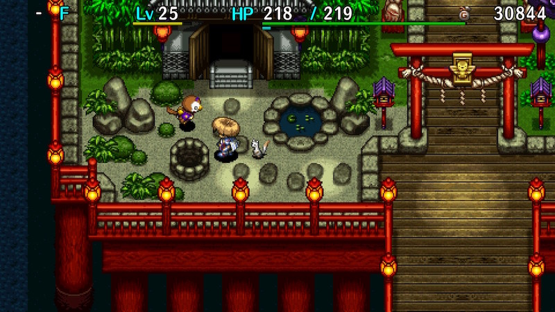
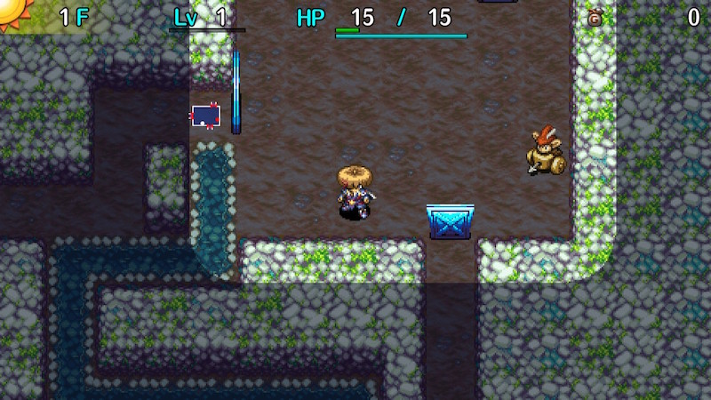
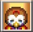

  

Dungeon where strong monsters appear from the very first floor.

Initial enemy count and the number of hidden traps are both higher than average. 
Maneaters and limit broken (above Lv4) monsters appear as regular enemies on later floors.

You're expected to bring strong equipment and loads of items, but some players 
have managed to clear it in one pass starting empty-handed from Destiny Trail. 
(This restricted play is called 破壊的素潜り - Hakaiteki Challenge)

Duelist Traps can be found, so you can obtain Friendship Licenses if you bring a Trapper Bracelet.

※ Shiren's level is reset when you enter the dungeon.

<ul class="quickLinksUL">
  <li><a href="#overview">Overview</a></li>
  <li><a href="#strategy">Strategy</a>
    <ul>
      <li><a href="#general">General</a></li>
      <li><a href="#identifying-items">Identifying Items</a></li>
      <li><a href="#equipment">Equipment</a></li>
      <li><a href="#other-items">Other Items</a></li>
      <li><a href="#farming">Farming</a></li>
      <li><a href="#floor-guide">Floor Guide</a></li>
    </ul>
  </li>
  <li><a href="#monsters">Monsters</a>
    <ul>
      <li><a href="#day-monsters">Day Monsters</a></li>
      <li><a href="#night-monsters">Night Monsters</a></li>
    </ul>
  </li>
  <li><a href="#items">Items</a></li>
  <li><a href="#traps">Traps</a></li>
  <li><a href="#npcs">NPCs</a></li>
</ul>

# Overview

<table class="dungeonOverview">
  <tr>
    <th>Unlock</th>
    <td class="highlightYellow">Clear the main story.</td>
  </tr>
  <tr>
    <th>Entrance</th>
    <td class="highlightYellow">Sparrow's Inn (Talk to the Sparrow near the well)</td>
  </tr>
</table>

<table class="dungeonTable">
  <tr>
    <th>Floors</th>
    <td>30F (first) / 99F</td>
    <th>Day / Night</th>
    <td>Both</td>
  </tr>
  <tr>
    <th>Bring Items</th>
    <td>Yes</td>
    <th>Allies</th>
    <td>1</td>
  </tr>
  <tr>
    <th>Unidentified</th>
    <td>All items</td>
    <th>New Items</th>
    <td>Yes</td>
  </tr>
  <tr>
    <th>Shops</th>
    <td>Regular, Elite, Pick-A-Choice</td>
    <th>Monster Houses</th>
    <td>Regular, Special, Sudden</td>
  </tr>
  <tr>
    <th>Initial Enemies</th>
    <td></td>
    <th>Spawn Rate</th>
    <td></td>
  </tr>
  <tr>
    <th>Day Turns</th>
    <td>410</td>
    <th>Night Turns</th>
    <td>468</td>
  </tr>
  <tr>
    <th>Ominous aura</th>
    <td>Yes (1000 turns)</td>
    <th>Wind of Kron</th>
    <td>1st:  4th: </td>
  </tr>
  <tr>
    <th>Clear Icon</th>
    <td class="clearIcon"></td>
    <th>Reward</th>
    <td>Parry Shield (1st clear)</td>
  </tr>
</table>

# Strategy

<ul class="quickLinksUL">
  <li><a href="#general">General</a></li>
  <li><a href="#identifying-items">Identifying Items</a></li>
  <li><a href="#equipment">Equipment</a></li>
  <li><a href="#other-items">Other Items</a></li>
  <li><a href="#farming">Farming</a></li>
  <li><a href="#floor-guide">Floor Guide</a></li>
</ul>

### General

Regular weapons, shields, and bracelets can only be obtained in elite or Pick-A-Choice shops. 
Torches and food items are pretty common, so it's fine to be easy going about their usage. 
Floor table items are mostly junk (not even Otogiriso or Heal Grass), and the number of items per floor 
quickly begin to dwindle in number as you progress (about 1\~3 items per floor from around 20F), 
so it's best to bring strong equipment and all of the items you'll need before entering.

Dangerous traps like Onigiri and Curse traps appear right away, so Floating or Trapper bracelet is recommended. 
It's fine to just rush stairs if a shop isn't present, but step on Point Switches if you see them. 
You'll usually end up with at least 10,000 points if you complete a 99F run.

One ally is allowed, but the only viable ally for mid\~late game floors is a fully leveled Koharu. 
Gen can be decent for night gameplay, but in general you'll end up relying on yourself more than an ally.

Hunt Ultra Gazers to stockpile Gitan bags that can one-shot most monsters, or just to save up some cash. 
This can be done on floors with Gitan Mamel and Kleptoad too, but be careful of Kappa Trolls.

### Identifying Items

Items with negative effects appear, so don't use unidentified items. 
This includes Bankruptcy Scroll and Commend. Letter, which both reduce your Gitan total to 0. 
It's best to only rely on the items you brought, rather than trying to make use of floor items.

### Equipment

#### Weapon

Most upgraded weapons work as long as you can defeat daytime monsters relatively fast. 
Shiren's level increases quickly, but his attack power remains somewhat low since Strength Grass can't be found. 
For example, even a Kaburasutegi+99 can't defeat Zotdon or Elizgagon in a single hit at times.

To give an idea, Lv50, 8 strength, Kaburasutegi+99 (Enhancing, Augmenting, Costly), resonance effect, 
no critical, and without Buffed status deals roughly 110 damage to Elizgagon2.

- Shugoseki Swd
    - Used with Shugoseki Shld for 2 bracelet resonance.
- Gitan Gorger
    - Highest damage output in the game, and can one-shot Elizgagon2. Bring a ton of Gitan, since you'll need enough to last 99 floors at 250G per hit. 

#### Weapon Runes

Type effective and status inflicting runes are top priority, and runes that increase max HP help you survive. 
Runes like Tri-direction, Critical, and Dispersing are harder to obtain, but they make things a lot easier. 
Multi-item recipe runes like Healing, Quick Hitting, and Blue Flame are worth the trouble. 
The Accurate rune significantly helps with consistency, but it requires clearing Pitfall of Life. 
Scout Bracelet or Item Detector + Max Wall Dig will let you collect items buried in walls easily.

(See [Runes](/system/synthesis-runes#weapon) for details)

#### Shield

High defense is important, but you'll take notable damage even with an Infinautilus+99 on late game floors, 
so shields that reduce damage by a percentage have more value than raw defense.

- Shugoseki Shld
    - Used with Shugoseki Swd for 2 bracelet resonance.
- Daytime Queen
    - Most daytime enemies can't get through this shield's damage reduction, even on late game floors. However, night becomes more dangerous.
- The Burninator
    - Secondary shield for night. Some players like to carry two shields and swap between them when time of day changes.
- Night Lord
    - Secondary shield for night. Filthy Bashaggas are still dangerous, even with this shield's damage reduction. 

#### Shield Runes

Runes that block special attacks like Anti-Onigiri, Magi-Twister, Anti-Hypno, Anti-Peck, etc. are top priority, 
since losing items or getting afflicted by a status condition can quickly lead to being in a bad spot. 
Damage reduction runes are also very important, such as Anti-Fire, Anti-Blast※, Bit, Diurnal, etc. 
Some players like Retribution for Gitan Mamels and late game monsters, but it slows down the pace of the game. 
Fearabbits, Yanpiis, Tiger Tossers, and Strong Cart are easier with Unmoving, but it's better on a secondary shield. 
Runes that increase max HP will help you survive, so don't forget to synthesize them.

(See [Runes](/system/synthesis-runes#shield) for details)

#### Bracelets

If you use [New Items](/system/new-items), combine these abilities into 1 or 2 bracelets to eliminate having to switch bracelets.

- Scout Bracelet
    - Enemies hit harder than in other dungeons, so it's important to avoid surprise attacks. This also lets you avoid giving the first action to dangerous monsters like Mudder and Knave King. Catstones and other items can be buried in walls, so this bracelet is needed to locate those items. It can be purchased for 10,000 points at the Point Shop in Nekomaneki Village. (See Collecting Points)
- Floating Bracelet, Trapper Bracelet
    - Both of these bracelets are used to evade traps, and to help maintain Super status. Floating Bracelet lets you shake off pursuing enemies to some degree by cutting across water or air tiles. Trapper Bracelet lets you trap monsters and collect items like Friendship Licenses to gain an advantage. So, Floating Bracelet if you want to evade enemies, and Trapper Bracelet if you want to defeat them.
- Time Stop Bracelet
    - For those who don't like night gameplay, or if you want to rush stairs at night.
- Wall Clip Bracelet
    - Lets you collect items inside walls, and escape from bad situations. However, Strong Cart's Knockback Arrows and Yanpii's headbutt can lead to major damage, so be sure to unequip it on floors where those monsters can appear.
- Identify Bracelet
    - Nice to have if you're curious about what the items on the floor are.
- VIP Bracelet
    - Elite stores have higher value items and Catstones, so it's nice to have this bracelet to ensure entry. But it's not necessary if you brought a lot of Blank Scrolls.

Other decent options include bracelets that prevent status conditions like Alert and Anti-Cnf. bracelets, 
or bracelets that block special attacks such as Anti-Crs. Bracelet and Anti-Parry Brce.

### Other Items

- Knockback Arrow, Poison Arrow
    - Knockback Arrows let you have a one-sided fight against an enemy, and a single Poison Arrow reduces a target's damage output by 50%. Equip a Can. Arm Bracelet to increase their effectiveness. Optional if you have the Blue Flame weapon rune.
- Blank Scroll
    - Perform the blessed Extraction Scroll technique if the blessings for Revival Grass or Undo Grass wear off. Can be used to adapt to a variety of situations, so bring lots of these scrolls.
- Balance Staff
    - Pots have a high chance to shatter when you trip in Shiren 5, so don't forget to bring this staff. You'll want at least 5 uses, but you can skip it if you have a Floating Bracelet.
- Boring Staff
    - Lets you collect items that are buried in walls, and also used to create shortcuts while rushing stairs.
- Preservation Pot
    - It can be a chore to sort items if Preservation Pots shatter from an Item Knave's special attack, so don't fill your entire inventory with these pots.
- Heal Pot
    - Used to restore HP, strength, and cure some status conditions such as Confused and Blind.
- Heavenly Pot
    - Basically an upgraded Heal Pot. This is one of the few dungeons where you have a chance to put it to use, but be careful not to shatter it from an Item Knave's special attack.
- Shrine Maid. Pot
    - Can be useful as a recovery item, and as an item that lets you safely run to the stairs at night. Again, be careful not to shatter it from an Item Knave's special attack.
- Fear Talisman, Slumber Talisman
    - Easiest talismans to use, and works on all monsters except Gyazas and Abrosbiphants if it hits. Can also be used to remove enemy auras.
- Undo Grass, Revival Grass
    - Whatever your intention is for entering the dungeon, you should bring at least 1 pot full of blessed grass. 

### Farming

Strong Carts appear on 1F, so you can collect Knockback Arrows using a Dodger Pot. 
Even if you don't have a Time Stop Bracelet, you can average 600 arrows or so if you linger until the wind blows.

Mixergons also appear on 1F, so you can enter this dungeon to quickly synthesize items, 
provided you have strong equipment and max HP increasing runes for safety.

### Floor Guide

This section assumes your shield has runes like Anti-Onigiri, Anti-Hypno, Anti-Peck, Magi-Twister, Anti-Blast※, etc.

#### Early Game (1-25F)

Monsters that typically appear around 50F in other dungeons show up right away on 1F. 
Strong Cart can quickly make you collapse if you start with 15 HP, so you'll want max HP increasing runes. 
Grass Kid monsters throw grasses like Rage Grass and Sleepy Grass in this dungeon, so avoid lining up with them.

You generally won't have problems if your equipment is strong, but be careful around monsters that ruin items, 
such as Mudster (4-5F), Curspinster (7-9F), Item Knave (10-11F), Sensei (13-15F), and Mudder (20-23F). 
※ Horrabbit appears alongside Curspinster between 7-9F, so keep an Anti-Crs. Bracelet equipped.

If your equipment isn't up to par, also be careful of Lashagga (9-11F) and Archdragon (17-19F).

Monsters to watch out for at night include Dark Item Knave (1F), Evil Sensei (1-2F), Shady Mudder (10-11F), 
Foul Curspinster (12-14F), Dark Horrabbit (15-17F), and Wicked Shovelie (22-23F).

#### Mid Game (26-49F)

Mainly Lv4 versions of each monster family appear. 
You still shouldn't have problems with strong equipment, but like 1-25F, be careful around monsters that ruin items. 
Cursenior (24-26F), Shovelie (25-26F), Knave King (26-27F), Swordmaster (41-43F), etc. 
Knave King is particularly dangerous, since it can turn equipped items into Weeds which can't be recovered with tags. 
You could throw an Extinction Scroll or read a Nixer Scroll if you're worried about them.

Monsters to watch out for at night include Dark Knave King (26-27F), Evil Swordmaster (29-30F), 
Dark Mesmerikon (32-33F), Foul Cursenior (35-36F), Dark Terrabbit (37-38F), Evil Abyss Dragon (39-99F), etc. 
※ Nixer Scroll doesn't work at night.

#### Late Game (50-74F)

Both day and night are mostly a repeat of the 1-25F monster table. 
However, Maneater monsters appear as regular enemies, and some monsters appear until 99F from this point on, 
including Cyberoid (46F+), Gitan Mamel (50F+), Abyss Dragon (60F+), and MC Sorceror (52-54F, 70F+).

Abyss Dragon has a low spawn rate, but is still worth making extinct since Evil Abyss Dragon also appears at night.

Keep in mind that Maneater roars can paralyze you, turning you into a sitting duck against monsters that ruin items. 
Item ruining monsters include Mudster (53-54F), Curspinster (56-58F), Item Knave (59-60F), and Mudder (69-72F). 
※ Horrabbit appears alongside Curspinster between 56-58F, so keep an Anti-Crs. Bracelet equipped.

Monsters to watch out for at night include Shady Mudder (59-60F), Foul Curspinster (61-63F), 
Dark Horrabbit (64-66F), and Wicked Shovelie (71-72F).

#### End Game (75-99F)

Both day and night are mostly a repeat of 26-49F, but all monsters except Ruiner are limit broken. (ex: Zotdon2) 
Limit broken monsters have increased attack and defense. (ex: Elizgagon: 103 Atk, 48 Def - Elizgagon2: 206 Atk, 60 Def) 
Power monsters like Elizgagon2 deal \~100 damage even with an Infinautilus+99, so don't fight more than 1 at a time. 
※ Terrabbit appears between 77-78F.

It's best to hurry to the stairs, keeping an eye out for Point Switches and shops.

# Monsters

See [Monsters](/system/monsters) for individual monster details.

<ul class="quickLinksUL">
  <li><a href="#day-monsters">Day Monsters</a></li>
  <li><a href="#night-monsters">Night Monsters</a></li>
</ul>

#### Day Monsters

Enemy Colors: Farming Situational Farming Destroys Items Dangerous Very Dangerous

<table class="dungeonMonsters">
  <thead>
    <tr>
      <th colspan="11">Day</th>
    </tr>
  </thead>
  <tbody>
    <tr>
      <td>1</td>
      <td class="highlightYellow">Electroid</td>
      <td class="highlightYellow">Colocolum</td>
      <td class="highlightYellow">Doztapir</td>
      <td class="highlightGreen">Strong Cart</td>
      <td class="highlightBlue">Mixergon</td>
      <td class="highlightOrange2">N'mach</td>
      <td></td>
      <td></td>
      <td></td>
      <td></td>
    </tr>
    <tr>
      <td>2</td>
      <td class="highlightOrange2">Jouncy</td>
      <td class="highlightYellow">Debaser</td>
      <td class="highlightYellow">Doztapir</td>
      <td class="highlightGreen">Strong Cart</td>
      <td class="highlightBlue">Mixergon</td>
      <td class="highlightOrange2">N'mach</td>
      <td class="highlightOrange2">Vexing Kappa</td>
      <td class="highlightOrange2">Porkon</td>
      <td></td>
      <td></td>
    </tr>
    <tr>
      <td>3</td>
      <td class="highlightOrange2">Jouncy</td>
      <td class="highlightYellow">Debaser</td>
      <td class="highlightYellow">Doztapir</td>
      <td class="highlightRed">MC Sorceror</td>
      <td></td>
      <td class="highlightYellow">Sprouterror</td>
      <td class="highlightOrange2">Vexing Kappa</td>
      <td></td>
      <td></td>
      <td></td>
    </tr>
    <tr>
      <td>4</td>
      <td class="highlightOrange2">Jouncy</td>
      <td class="highlightYellow">Debaser</td>
      <td class="highlightPurple3">Mudster</td>
      <td class="highlightRed">MC Sorceror</td>
      <td class="highlightOrange2">Trillman</td>
      <td class="highlightYellow">Sprouterror</td>
      <td class="highlightOrange2">Vexing Kappa</td>
      <td></td>
      <td></td>
      <td></td>
    </tr>
    <tr>
      <td>5</td>
      <td class="highlightOrange2">Jouncy</td>
      <td class="highlightYellow">Debaser</td>
      <td class="highlightPurple3">Mudster</td>
      <td class="highlightRed">MC Sorceror</td>
      <td class="highlightOrange2">Pierce Cart</td>
      <td class="highlightYellow">StunScorp</td>
      <td></td>
      <td></td>
      <td></td>
      <td></td>
    </tr>
    <tr>
      <td>6</td>
      <td class="highlightYellow">Tiger Chucker</td>
      <td></td>
      <td></td>
      <td></td>
      <td class="highlightOrange2">Pierce Cart</td>
      <td class="highlightYellow">StunScorp</td>
      <td></td>
      <td></td>
      <td></td>
      <td></td>
    </tr>
    <tr>
      <td>7</td>
      <td class="highlightYellow">Tiger Chucker</td>
      <td class="highlightYellow">Pumpanshee</td>
      <td class="highlightPurple3">Curspinster</td>
      <td class="highlightRed">Horrabbit</td>
      <td class="highlightOrange2">Pierce Cart</td>
      <td class="highlightYellow">Momomomoseal</td>
      <td></td>
      <td></td>
      <td></td>
      <td></td>
    </tr>
    <tr>
      <td>8</td>
      <td class="highlightYellow">Tiger Chucker</td>
      <td class="highlightYellow">Pumpanshee</td>
      <td class="highlightPurple3">Curspinster</td>
      <td class="highlightRed">Horrabbit</td>
      <td class="highlightGreen">Froggon</td>
      <td class="highlightYellow">Momomomoseal</td>
      <td class="highlightOrange2">Spongiderm</td>
      <td></td>
      <td></td>
      <td></td>
    </tr>
    <tr>
      <td>9</td>
      <td class="highlightYellow">Tiger Chucker</td>
      <td class="highlightYellow">Pumpanshee</td>
      <td class="highlightPurple3">Curspinster</td>
      <td class="highlightRed">Horrabbit</td>
      <td class="highlightGreen">Froggon</td>
      <td class="highlightYellow">Momomomoseal</td>
      <td class="highlightOrange2">Spongiderm</td>
      <td class="highlightOrange2">Lashagga</td>
      <td></td>
      <td></td>
    </tr>
    <tr>
      <td>10</td>
      <td class="highlightYellow">Tiger Chucker</td>
      <td class="highlightYellow">Lt. Yanpii</td>
      <td class="highlightPurple3">Gyandora</td>
      <td class="highlightPurple3">Item Knave</td>
      <td class="highlightGreen">Froggon</td>
      <td class="highlightBlue">Iron Zalokleft</td>
      <td class="highlightOrange2">Spongiderm</td>
      <td class="highlightOrange2">Lashagga</td>
      <td></td>
      <td></td>
    </tr>
    <tr>
      <td>11</td>
      <td class="highlightYellow">Tiger Chucker</td>
      <td class="highlightYellow">Lt. Yanpii</td>
      <td class="highlightPurple3">Gyandora</td>
      <td class="highlightPurple3">Item Knave</td>
      <td class="highlightYellow">Zanbeeto</td>
      <td class="highlightBlue">Iron Zalokleft</td>
      <td></td>
      <td class="highlightOrange2">Lashagga</td>
      <td></td>
      <td></td>
    </tr>
    <tr>
      <td>12</td>
      <td class="highlightYellow">Tiger Chucker</td>
      <td class="highlightYellow">Lt. Yanpii</td>
      <td class="highlightYellow">Bunchukdon</td>
      <td class="highlightYellow">Polygon Singa</td>
      <td class="highlightYellow">Zanbeeto</td>
      <td class="highlightOrange2">Flarebird</td>
      <td class="highlightBlue">Grass Gramps</td>
      <td></td>
      <td></td>
      <td></td>
    </tr>
    <tr>
      <td>13</td>
      <td class="highlightPurple3">Sensei</td>
      <td></td>
      <td class="highlightYellow">Bunchukdon</td>
      <td class="highlightYellow">Polygon Singa</td>
      <td></td>
      <td class="highlightOrange2">Flarebird</td>
      <td class="highlightBlue">Grass Gramps</td>
      <td></td>
      <td></td>
      <td></td>
    </tr>
    <tr>
      <td>14</td>
      <td class="highlightPurple3">Sensei</td>
      <td class="highlightOrange2">Bouncy</td>
      <td class="highlightYellow">Bunchukdon</td>
      <td class="highlightYellow">Polygon Singa</td>
      <td class="highlightYellow">Spirit Ham</td>
      <td class="highlightOrange2">Flarebird</td>
      <td></td>
      <td></td>
      <td></td>
      <td></td>
    </tr>
    <tr>
      <td>15</td>
      <td class="highlightPurple3">Sensei</td>
      <td class="highlightOrange2">Bouncy</td>
      <td class="highlightYellow">Onigirizzly</td>
      <td class="highlightYellow">Bitter Nut</td>
      <td class="highlightYellow">Spirit Ham</td>
      <td></td>
      <td></td>
      <td></td>
      <td></td>
      <td></td>
    </tr>
    <tr>
      <td>16</td>
      <td class="highlightPurple3">Hyper Gazer</td>
      <td class="highlightOrange2">Bouncy</td>
      <td class="highlightYellow">Onigirizzly</td>
      <td class="highlightYellow">Bitter Nut</td>
      <td class="highlightYellow">Spirit Ham</td>
      <td class="highlightYellow">Fulminachin</td>
      <td></td>
      <td></td>
      <td></td>
      <td></td>
    </tr>
    <tr>
      <td>17</td>
      <td class="highlightPurple3">Hyper Gazer</td>
      <td class="highlightOrange2">Bouncy</td>
      <td class="highlightYellow">Phoenix Tengu</td>
      <td class="highlightYellow">Bitter Nut</td>
      <td class="highlightRed">Archdragon</td>
      <td class="highlightYellow">Fulminachin</td>
      <td></td>
      <td></td>
      <td></td>
      <td></td>
    </tr>
    <tr>
      <td>18</td>
      <td class="highlightPurple3">Hyper Gazer</td>
      <td class="highlightRed">Dozikon</td>
      <td class="highlightYellow">Phoenix Tengu</td>
      <td></td>
      <td class="highlightRed">Archdragon</td>
      <td></td>
      <td></td>
      <td></td>
      <td></td>
      <td></td>
    </tr>
    <tr>
      <td>19</td>
      <td class="highlightYellow">Grainie</td>
      <td class="highlightRed">Dozikon</td>
      <td class="highlightYellow">Phoenix Tengu</td>
      <td class="highlightYellow">Comatapir</td>
      <td class="highlightRed">Archdragon</td>
      <td></td>
      <td></td>
      <td></td>
      <td></td>
      <td></td>
    </tr>
    <tr>
      <td>20</td>
      <td class="highlightYellow">Grainie</td>
      <td class="highlightPurple3">Mudder</td>
      <td></td>
      <td class="highlightYellow">Comatapir</td>
      <td></td>
      <td></td>
      <td></td>
      <td></td>
      <td></td>
      <td></td>
    </tr>
    <tr>
      <td>21</td>
      <td class="highlightYellow">Grainie</td>
      <td class="highlightPurple3">Mudder</td>
      <td class="highlightOrange2">N'dup</td>
      <td class="highlightYellow">Huge Chintala</td>
      <td class="highlightBlue">Mixerdon</td>
      <td class="highlightYellow">Hell Gyaza</td>
      <td></td>
      <td></td>
      <td></td>
      <td></td>
    </tr>
    <tr>
      <td>22</td>
      <td class="highlightBlue">Mealy</td>
      <td class="highlightPurple3">Mudder</td>
      <td class="highlightOrange2">N'dup</td>
      <td class="highlightYellow">Huge Chintala</td>
      <td class="highlightBlue">Mixerdon</td>
      <td class="highlightYellow">Hell Gyaza</td>
      <td class="highlightYellow">Eligagon</td>
      <td></td>
      <td></td>
      <td></td>
    </tr>
    <tr>
      <td>23</td>
      <td class="highlightBlue">Mealy</td>
      <td class="highlightPurple3">Mudder</td>
      <td class="highlightOrange2">N'dup</td>
      <td class="highlightYellow">Huge Chintala</td>
      <td class="highlightBlue">FO-UZZ</td>
      <td class="highlightYellow">Hell Gyaza</td>
      <td class="highlightYellow">Eligagon</td>
      <td class="highlightYellow">Cyberoid</td>
      <td></td>
      <td></td>
    </tr>
    <tr>
      <td>24</td>
      <td class="highlightBlue">Mealy</td>
      <td class="highlightYellow">Detonachin</td>
      <td class="highlightOrange2">N'dup</td>
      <td class="highlightPurple3">Cursenior</td>
      <td class="highlightBlue">FO-UZZ</td>
      <td></td>
      <td class="highlightYellow">Eligagon</td>
      <td class="highlightYellow">Cyberoid</td>
      <td></td>
      <td></td>
    </tr>
    <tr>
      <td>25</td>
      <td class="highlightBlue">Mealy</td>
      <td class="highlightYellow">Detonachin</td>
      <td class="highlightRed">Porgon</td>
      <td class="highlightPurple3">Cursenior</td>
      <td class="highlightYellow">Sproutitan</td>
      <td class="highlightPurple3">Shovelie</td>
      <td></td>
      <td class="highlightYellow">Cyberoid</td>
      <td></td>
      <td></td>
    </tr>
    <tr>
      <td>26</td>
      <td class="highlightBlue">Mealy</td>
      <td class="highlightYellow">Ruiner</td>
      <td class="highlightRed">Porgon</td>
      <td class="highlightPurple3">Cursenior</td>
      <td class="highlightYellow">Sproutitan</td>
      <td class="highlightPurple3">Shovelie</td>
      <td class="highlightPurple3">Knave King</td>
      <td></td>
      <td></td>
      <td></td>
    </tr>
    <tr>
      <td>27</td>
      <td class="highlightBlue">Mealy</td>
      <td class="highlightYellow">Ruiner</td>
      <td class="highlightRed">Porgon</td>
      <td></td>
      <td class="highlightYellow">Sproutitan</td>
      <td></td>
      <td class="highlightPurple3">Knave King</td>
      <td></td>
      <td></td>
      <td></td>
    </tr>
    <tr>
      <td>28</td>
      <td class="highlightYellow">Pumptergeist</td>
      <td class="highlightYellow">Ruiner</td>
      <td class="highlightRed">Porgon</td>
      <td class="highlightRed">Terrabbit</td>
      <td></td>
      <td class="highlightOrange2">Boingodile</td>
      <td></td>
      <td></td>
      <td></td>
      <td></td>
    </tr>
    <tr>
      <td>29</td>
      <td class="highlightYellow">Pumptergeist</td>
      <td class="highlightYellow">Ruiner</td>
      <td class="highlightYellow">Colocolocolum</td>
      <td class="highlightRed">Terrabbit</td>
      <td></td>
      <td class="highlightOrange2">Boingodile</td>
      <td class="highlightYellow">Squidperor</td>
      <td></td>
      <td></td>
      <td></td>
    </tr>
    <tr>
      <td>30</td>
      <td class="highlightYellow">Pumptergeist</td>
      <td class="highlightYellow">Kodionigiri</td>
      <td class="highlightYellow">Colocolocolum</td>
      <td></td>
      <td></td>
      <td class="highlightOrange2">Boingodile</td>
      <td class="highlightYellow">Squidperor</td>
      <td></td>
      <td></td>
      <td></td>
    </tr>
    <tr>
      <td>31</td>
      <td class="highlightOrange2">Osmammoth</td>
      <td class="highlightYellow">Kodionigiri</td>
      <td class="highlightYellow">Colocolocolum</td>
      <td class="highlightGreen">Kleptoad</td>
      <td class="highlightOrange2">Kappa Troll</td>
      <td class="highlightOrange2">Gitan Mamel</td>
      <td></td>
      <td></td>
      <td></td>
      <td></td>
    </tr>
    <tr>
      <td>32</td>
      <td class="highlightOrange2">Osmammoth</td>
      <td></td>
      <td class="highlightYellow">Doomhead</td>
      <td class="highlightGreen">Kleptoad</td>
      <td class="highlightOrange2">Kappa Troll</td>
      <td class="highlightOrange2">Gitan Mamel</td>
      <td></td>
      <td></td>
      <td></td>
      <td></td>
    </tr>
    <tr>
      <td>33</td>
      <td class="highlightOrange2">Osmammoth</td>
      <td class="highlightOrange2">Bashagga</td>
      <td class="highlightYellow">Doomhead</td>
      <td class="highlightGreen">Kleptoad</td>
      <td class="highlightOrange2">Googoman</td>
      <td class="highlightOrange2">Gitan Mamel</td>
      <td></td>
      <td></td>
      <td></td>
      <td></td>
    </tr>
    <tr>
      <td>34</td>
      <td class="highlightOrange2">Osmammoth</td>
      <td class="highlightOrange2">Bashagga</td>
      <td class="highlightYellow">Doomhead</td>
      <td class="highlightPurple3">Gyandoron</td>
      <td class="highlightOrange2">Googoman</td>
      <td></td>
      <td></td>
      <td></td>
      <td></td>
      <td></td>
    </tr>
    <tr>
      <td>35</td>
      <td class="highlightOrange2">Blazebird</td>
      <td class="highlightOrange2">Bashagga</td>
      <td class="highlightYellow">Tiger Ace</td>
      <td class="highlightPurple3">Gyandoron</td>
      <td></td>
      <td></td>
      <td></td>
      <td></td>
      <td></td>
      <td></td>
    </tr>
    <tr>
      <td>36</td>
      <td class="highlightOrange2">Blazebird</td>
      <td class="highlightOrange2">Bashagga</td>
      <td class="highlightYellow">Tiger Ace</td>
      <td class="highlightPurple3">Gyandoron</td>
      <td class="highlightYellow">Zotdon</td>
      <td></td>
      <td></td>
      <td></td>
      <td></td>
      <td></td>
    </tr>
    <tr>
      <td>37</td>
      <td class="highlightOrange2">Nigiri King</td>
      <td class="highlightYellow">Boss Yanpii</td>
      <td class="highlightYellow">Tiger Ace</td>
      <td></td>
      <td class="highlightYellow">Zotdon</td>
      <td></td>
      <td></td>
      <td></td>
      <td></td>
      <td></td>
    </tr>
    <tr>
      <td>38</td>
      <td class="highlightOrange2">Nigiri King</td>
      <td class="highlightYellow">Boss Yanpii</td>
      <td class="highlightYellow">Tiger Ace</td>
      <td class="highlightBlue">Zalokleft King</td>
      <td class="highlightYellow">Zotdon</td>
      <td></td>
      <td></td>
      <td></td>
      <td></td>
      <td></td>
    </tr>
    <tr>
      <td>39</td>
      <td class="highlightOrange2">Nigiri King</td>
      <td class="highlightYellow">Boss Yanpii</td>
      <td class="highlightYellow">Tiger Ace</td>
      <td class="highlightBlue">Zalokleft King</td>
      <td class="highlightYellow">Zotdon</td>
      <td></td>
      <td></td>
      <td></td>
      <td></td>
      <td></td>
    </tr>
    <tr>
      <td>40</td>
      <td class="highlightYellow">Doom Gyaza</td>
      <td class="highlightYellow">Boss Yanpii</td>
      <td class="highlightYellow">Tiger Ace</td>
      <td class="highlightBlue">Zalokleft King</td>
      <td class="highlightYellow">Elizgagon</td>
      <td class="highlightYellow">Despoiler</td>
      <td class="highlightRed">Ultra Gazer</td>
      <td></td>
      <td></td>
      <td></td>
    </tr>
    <tr>
      <td>41</td>
      <td class="highlightYellow">Doom Gyaza</td>
      <td class="highlightPurple3">Swordmaster</td>
      <td class="highlightYellow">Tiger Ace</td>
      <td></td>
      <td class="highlightYellow">Elizgagon</td>
      <td class="highlightYellow">Despoiler</td>
      <td class="highlightRed">Ultra Gazer</td>
      <td></td>
      <td></td>
      <td></td>
    </tr>
    <tr>
      <td>42</td>
      <td class="highlightYellow">Doom Gyaza</td>
      <td class="highlightPurple3">Swordmaster</td>
      <td class="highlightYellow">Tiger Ace</td>
      <td></td>
      <td class="highlightYellow">Elizgagon</td>
      <td class="highlightYellow">Despoiler</td>
      <td class="highlightRed">Ultra Gazer</td>
      <td></td>
      <td></td>
      <td></td>
    </tr>
    <tr>
      <td>43</td>
      <td></td>
      <td class="highlightPurple3">Swordmaster</td>
      <td class="highlightYellow">Tiger Ace</td>
      <td></td>
      <td class="highlightYellow">Elizgagon</td>
      <td class="highlightYellow">Despoiler</td>
      <td></td>
      <td></td>
      <td></td>
      <td></td>
    </tr>
    <tr>
      <td>44</td>
      <td></td>
      <td></td>
      <td class="highlightYellow">Tiger Ace</td>
      <td></td>
      <td class="highlightYellow">Elizgagon</td>
      <td class="highlightYellow">Despoiler</td>
      <td></td>
      <td></td>
      <td></td>
      <td></td>
    </tr>
    <tr>
      <td>45</td>
      <td></td>
      <td></td>
      <td class="highlightYellow">Tiger Ace</td>
      <td></td>
      <td class="highlightYellow">Elizgagon</td>
      <td class="highlightYellow">Despoiler</td>
      <td></td>
      <td></td>
      <td></td>
      <td></td>
    </tr>
    <tr>
      <td>46</td>
      <td class="highlightYellow">Cyberoid</td>
      <td class="highlightRed">Cranky Tank</td>
      <td class="highlightYellow">Tiger Ace</td>
      <td></td>
      <td class="highlightYellow">Elizgagon</td>
      <td class="highlightYellow">Despoiler</td>
      <td></td>
      <td></td>
      <td></td>
      <td></td>
    </tr>
    <tr>
      <td>47</td>
      <td class="highlightYellow">Cyberoid</td>
      <td class="highlightRed">Cranky Tank</td>
      <td class="highlightYellow">Tiger Ace</td>
      <td></td>
      <td class="highlightYellow">Elizgagon</td>
      <td class="highlightYellow">Despoiler</td>
      <td></td>
      <td></td>
      <td></td>
      <td></td>
    </tr>
    <tr>
      <td>48</td>
      <td class="highlightYellow">Cyberoid</td>
      <td></td>
      <td class="highlightYellow">Tiger Ace</td>
      <td></td>
      <td class="highlightYellow">Elizgagon</td>
      <td class="highlightYellow">Despoiler</td>
      <td></td>
      <td></td>
      <td></td>
      <td></td>
    </tr>
    <tr>
      <td>49</td>
      <td class="highlightYellow">Cyberoid</td>
      <td></td>
      <td class="highlightYellow">Tiger Ace</td>
      <td></td>
      <td class="highlightYellow">Elizgagon</td>
      <td class="highlightYellow">Despoiler</td>
      <td></td>
      <td></td>
      <td></td>
      <td></td>
    </tr>
    <tr>
      <td>50</td>
      <td class="highlightYellow">Cyberoid</td>
      <td class="highlightOrange2">Gitan Mamel</td>
      <td class="highlightYellow">Tiger Ace</td>
      <td></td>
      <td class="highlightYellow">Elizgagon</td>
      <td class="highlightYellow">Despoiler</td>
      <td></td>
      <td></td>
      <td></td>
      <td></td>
    </tr>
    <tr>
      <td>51</td>
      <td class="highlightYellow">Cyberoid</td>
      <td class="highlightOrange2">Gitan Mamel</td>
      <td class="highlightYellow">Tiger Ace</td>
      <td></td>
      <td class="highlightYellow">Elizgagon</td>
      <td class="highlightYellow">Despoiler</td>
      <td></td>
      <td></td>
      <td class="highlightYellow">Maneater</td>
      <td class="highlightBlue">Chow</td>
    </tr>
    <tr>
      <td>52</td>
      <td class="highlightYellow">Cyberoid</td>
      <td class="highlightOrange2">Gitan Mamel</td>
      <td class="highlightOrange2">Jouncy</td>
      <td class="highlightOrange2">Vexing Kappa</td>
      <td class="highlightRed">MC Sorceror</td>
      <td class="highlightYellow">Doztapir</td>
      <td></td>
      <td class="highlightYellow">Sprouterror</td>
      <td class="highlightYellow">Maneater</td>
      <td class="highlightBlue">Chow</td>
    </tr>
    <tr>
      <td>53</td>
      <td class="highlightYellow">Cyberoid</td>
      <td class="highlightOrange2">Gitan Mamel</td>
      <td class="highlightOrange2">Jouncy</td>
      <td class="highlightOrange2">Vexing Kappa</td>
      <td class="highlightRed">MC Sorceror</td>
      <td class="highlightPurple3">Mudster</td>
      <td class="highlightOrange2">Trillman</td>
      <td class="highlightYellow">Sprouterror</td>
      <td class="highlightYellow">Maneater</td>
      <td class="highlightBlue">Chow</td>
    </tr>
    <tr>
      <td>54</td>
      <td class="highlightYellow">Cyberoid</td>
      <td class="highlightOrange2">Gitan Mamel</td>
      <td class="highlightOrange2">Jouncy</td>
      <td class="highlightOrange2">Pierce Cart</td>
      <td class="highlightRed">MC Sorceror</td>
      <td class="highlightPurple3">Mudster</td>
      <td></td>
      <td></td>
      <td class="highlightYellow">Maneater</td>
      <td class="highlightBlue">Chow</td>
    </tr>
    <tr>
      <td>55</td>
      <td class="highlightYellow">Cyberoid</td>
      <td class="highlightOrange2">Gitan Mamel</td>
      <td></td>
      <td class="highlightOrange2">Pierce Cart</td>
      <td></td>
      <td></td>
      <td></td>
      <td></td>
      <td class="highlightYellow">Maneater</td>
      <td class="highlightBlue">Chow</td>
    </tr>
    <tr>
      <td>56</td>
      <td class="highlightYellow">Cyberoid</td>
      <td class="highlightOrange2">Gitan Mamel</td>
      <td></td>
      <td class="highlightOrange2">Pierce Cart</td>
      <td class="highlightRed">Horrabbit</td>
      <td class="highlightYellow">Momomomoseal</td>
      <td class="highlightPurple3">Curspinster</td>
      <td></td>
      <td class="highlightYellow">Maneater</td>
      <td class="highlightBlue">Chow</td>
    </tr>
    <tr>
      <td>57</td>
      <td class="highlightYellow">Cyberoid</td>
      <td class="highlightOrange2">Gitan Mamel</td>
      <td class="highlightYellow">BlightScorp</td>
      <td class="highlightOrange2">Spongiderm</td>
      <td class="highlightRed">Horrabbit</td>
      <td class="highlightYellow">Momomomoseal</td>
      <td class="highlightPurple3">Curspinster</td>
      <td class="highlightGreen">Froggon</td>
      <td class="highlightYellow">Maneater</td>
      <td class="highlightBlue">Chow</td>
    </tr>
    <tr>
      <td>58</td>
      <td class="highlightYellow">Cyberoid</td>
      <td class="highlightOrange2">Gitan Mamel</td>
      <td class="highlightOrange2">BlightScorp Lashagga</td>
      <td class="highlightOrange2">Spongiderm</td>
      <td class="highlightRed">Horrabbit</td>
      <td class="highlightYellow">Momomomoseal</td>
      <td class="highlightPurple3">Curspinster</td>
      <td class="highlightGreen">Froggon</td>
      <td class="highlightYellow">Maneater</td>
      <td class="highlightBlue">Chow</td>
    </tr>
    <tr>
      <td>59</td>
      <td class="highlightYellow">Cyberoid</td>
      <td class="highlightOrange2">Gitan Mamel</td>
      <td class="highlightOrange2">Lashagga</td>
      <td class="highlightOrange2">Spongiderm</td>
      <td class="highlightPurple3">Item Knave</td>
      <td class="highlightBlue">Iron Zalokleft</td>
      <td></td>
      <td class="highlightGreen">Froggon</td>
      <td class="highlightYellow">Maneater</td>
      <td class="highlightBlue">Chow</td>
    </tr>
    <tr>
      <td>60</td>
      <td class="highlightYellow">Cyberoid</td>
      <td class="highlightOrange2">Gitan Mamel</td>
      <td class="highlightOrange2">Lashagga</td>
      <td class="highlightRed">Abyss Dragon</td>
      <td class="highlightPurple3">Item Knave</td>
      <td class="highlightBlue">Iron Zalokleft</td>
      <td></td>
      <td></td>
      <td class="highlightYellow">Villeater</td>
      <td class="highlightBlue">Chow</td>
    </tr>
    <tr>
      <td>61</td>
      <td class="highlightYellow">Cyberoid</td>
      <td class="highlightOrange2">Gitan Mamel</td>
      <td class="highlightYellow">Polygon Singa</td>
      <td class="highlightRed">Abyss Dragon</td>
      <td class="highlightBlue">Grass Gramps</td>
      <td class="highlightOrange2">Flarebird</td>
      <td class="highlightYellow">Bunchukdon</td>
      <td></td>
      <td class="highlightYellow">Villeater</td>
      <td class="highlightBlue">Chow</td>
    </tr>
    <tr>
      <td>62</td>
      <td class="highlightYellow">Cyberoid</td>
      <td class="highlightOrange2">Gitan Mamel</td>
      <td class="highlightYellow">Polygon Singa</td>
      <td class="highlightRed">Abyss Dragon</td>
      <td class="highlightBlue">Grass Gramps</td>
      <td class="highlightOrange2">Flarebird</td>
      <td class="highlightYellow">Bunchukdon</td>
      <td></td>
      <td class="highlightYellow">Villeater</td>
      <td class="highlightBlue">Chow</td>
    </tr>
    <tr>
      <td>63</td>
      <td class="highlightYellow">Cyberoid</td>
      <td class="highlightOrange2">Gitan Mamel</td>
      <td class="highlightYellow">Polygon Singa</td>
      <td class="highlightRed">Abyss Dragon</td>
      <td class="highlightYellow">Spirit Ham</td>
      <td class="highlightOrange2">Flarebird</td>
      <td class="highlightYellow">Bunchukdon</td>
      <td class="highlightOrange2">Bouncy</td>
      <td class="highlightYellow">Villeater</td>
      <td class="highlightBlue">Chow</td>
    </tr>
    <tr>
      <td>64</td>
      <td class="highlightYellow">Cyberoid</td>
      <td class="highlightOrange2">Gitan Mamel</td>
      <td class="highlightYellow">Bitter Nut</td>
      <td class="highlightRed">Abyss Dragon</td>
      <td class="highlightYellow">Spirit Ham</td>
      <td class="highlightPurple3">Hyper Gazer</td>
      <td></td>
      <td class="highlightOrange2">Bouncy</td>
      <td class="highlightYellow">Villeater</td>
      <td class="highlightBlue">Chow</td>
    </tr>
    <tr>
      <td>65</td>
      <td class="highlightYellow">Cyberoid</td>
      <td class="highlightOrange2">Gitan Mamel</td>
      <td class="highlightYellow">Bitter Nut</td>
      <td class="highlightRed">Abyss Dragon</td>
      <td class="highlightYellow">Spirit Ham</td>
      <td class="highlightPurple3">Hyper Gazer</td>
      <td class="highlightYellow">Fulminachin</td>
      <td class="highlightOrange2">Bouncy</td>
      <td class="highlightYellow">Villeater</td>
      <td class="highlightBlue">Chow</td>
    </tr>
    <tr>
      <td>66</td>
      <td class="highlightYellow">Cyberoid</td>
      <td class="highlightOrange2">Gitan Mamel</td>
      <td class="highlightYellow">Bitter Nut</td>
      <td class="highlightRed">Abyss Dragon</td>
      <td class="highlightYellow">Phoenix Tengu</td>
      <td class="highlightPurple3">Hyper Gazer</td>
      <td class="highlightYellow">Fulminachin</td>
      <td class="highlightRed">Bouncy Archdragon</td>
      <td class="highlightYellow">Villeater</td>
      <td class="highlightBlue">Chow</td>
    </tr>
    <tr>
      <td>67</td>
      <td class="highlightYellow">Cyberoid</td>
      <td class="highlightOrange2">Gitan Mamel</td>
      <td class="highlightRed">Dozikon</td>
      <td class="highlightRed">Abyss Dragon</td>
      <td class="highlightYellow">Phoenix Tengu</td>
      <td class="highlightPurple3">Hyper Gazer</td>
      <td></td>
      <td class="highlightRed">Archdragon</td>
      <td class="highlightYellow">Mounteater</td>
      <td class="highlightBlue">Chow</td>
    </tr>
    <tr>
      <td>68</td>
      <td class="highlightYellow">Cyberoid</td>
      <td class="highlightOrange2">Gitan Mamel</td>
      <td class="highlightRed">Dozikon</td>
      <td class="highlightRed">Abyss Dragon</td>
      <td class="highlightYellow">Phoenix Tengu</td>
      <td class="highlightYellow">Comatapir</td>
      <td></td>
      <td class="highlightRed">Archdragon</td>
      <td class="highlightYellow">Mounteater</td>
      <td class="highlightBlue">Chow</td>
    </tr>
    <tr>
      <td>69</td>
      <td class="highlightYellow">Cyberoid</td>
      <td class="highlightOrange2">Gitan Mamel</td>
      <td class="highlightRed">Dozikon</td>
      <td class="highlightRed">Abyss Dragon</td>
      <td class="highlightPurple3">Mudder</td>
      <td class="highlightYellow">Comatapir</td>
      <td></td>
      <td></td>
      <td class="highlightYellow">Mounteater</td>
      <td class="highlightBlue">Chow</td>
    </tr>
    <tr>
      <td>70</td>
      <td class="highlightYellow">Cyberoid</td>
      <td class="highlightOrange2">Gitan Mamel</td>
      <td class="highlightRed">MC Sorceror</td>
      <td class="highlightRed">Abyss Dragon</td>
      <td class="highlightPurple3">Mudder</td>
      <td class="highlightYellow">Huge Chintala</td>
      <td class="highlightBlue">Mixerdon</td>
      <td></td>
      <td class="highlightYellow">Mounteater</td>
      <td class="highlightBlue">Chow</td>
    </tr>
    <tr>
      <td>71</td>
      <td class="highlightYellow">Cyberoid</td>
      <td class="highlightOrange2">Gitan Mamel</td>
      <td class="highlightRed">MC Sorceror</td>
      <td class="highlightRed">Abyss Dragon</td>
      <td class="highlightPurple3">Mudder</td>
      <td class="highlightYellow">Huge Chintala</td>
      <td class="highlightBlue">Mixerdon</td>
      <td class="highlightYellow">Eligagon</td>
      <td class="highlightRed">Isleater</td>
      <td class="highlightBlue">Chow</td>
    </tr>
    <tr>
      <td>72</td>
      <td class="highlightYellow">Cyberoid</td>
      <td class="highlightOrange2">Gitan Mamel</td>
      <td class="highlightRed">MC Sorceror</td>
      <td class="highlightRed">Abyss Dragon</td>
      <td class="highlightPurple3">Mudder</td>
      <td class="highlightYellow">Huge Chintala</td>
      <td class="highlightBlue">FO-UZZ</td>
      <td class="highlightYellow">Eligagon</td>
      <td class="highlightRed">Isleater</td>
      <td class="highlightBlue">Chow</td>
    </tr>
    <tr>
      <td>73</td>
      <td class="highlightYellow">Cyberoid</td>
      <td class="highlightOrange2">Gitan Mamel</td>
      <td class="highlightRed">MC Sorceror</td>
      <td class="highlightRed">Abyss Dragon</td>
      <td class="highlightYellow">Detonachin</td>
      <td class="highlightPurple3">Cursenior</td>
      <td class="highlightBlue">FO-UZZ</td>
      <td class="highlightYellow">Eligagon</td>
      <td class="highlightRed">Isleater</td>
      <td class="highlightBlue">Chow</td>
    </tr>
    <tr>
      <td>74</td>
      <td class="highlightYellow">Cyberoid</td>
      <td class="highlightOrange2">Gitan Mamel</td>
      <td class="highlightRed">MC Sorceror</td>
      <td class="highlightRed">Abyss Dragon</td>
      <td class="highlightYellow">Detonachin</td>
      <td class="highlightPurple3">Cursenior</td>
      <td class="highlightRed">Porgon</td>
      <td class="highlightYellow">Sproutitan</td>
      <td class="highlightPurple3">Isleater Shovelie</td>
      <td class="highlightBlue">Chow</td>
    </tr>
    <tr>
      <td>75</td>
      <td class="highlightYellow">Cyberoid</td>
      <td class="highlightOrange2">Gitan Mamel</td>
      <td class="highlightRed">MC Sorceror</td>
      <td class="highlightRed">Abyss Dragon</td>
      <td class="highlightOrange2">N'dup</td>
      <td class="highlightPurple3">Cursenior Knave King</td>
      <td class="highlightRed">Porgon</td>
      <td class="highlightYellow">Sproutitan</td>
      <td class="highlightPurple3">Shovelie</td>
      <td class="highlightBlue">Chow Ruiner</td>
    </tr>
    <tr>
      <td>76</td>
      <td class="highlightYellow">Cyberoid</td>
      <td class="highlightOrange2">Gitan Mamel</td>
      <td class="highlightRed">MC Sorceror</td>
      <td class="highlightRed">Abyss Dragon</td>
      <td class="highlightOrange2">N'dup</td>
      <td class="highlightPurple3">Knave King</td>
      <td class="highlightRed">Porgon</td>
      <td class="highlightYellow">Sproutitan</td>
      <td></td>
      <td class="highlightBlue">Chow Ruiner</td>
    </tr>
    <tr>
      <td>77</td>
      <td class="highlightYellow">Cyberoid</td>
      <td class="highlightOrange2">Gitan Mamel</td>
      <td class="highlightRed">MC Sorceror</td>
      <td class="highlightRed">Abyss Dragon</td>
      <td class="highlightOrange2">N'dup</td>
      <td class="highlightYellow">Pumptergeist</td>
      <td class="highlightRed">Porgon</td>
      <td class="highlightRed">Terrabbit</td>
      <td class="highlightOrange2">Boingodile</td>
      <td class="highlightYellow">Ruiner BlightScorp</td>
    </tr>
    <tr>
      <td>78</td>
      <td class="highlightYellow">Cyberoid</td>
      <td class="highlightOrange2">Gitan Mamel</td>
      <td class="highlightRed">MC Sorceror</td>
      <td class="highlightRed">Abyss Dragon</td>
      <td class="highlightOrange2">N'dup Squidperor</td>
      <td class="highlightYellow">Pumptergeist</td>
      <td class="highlightYellow">Colocolocolum</td>
      <td class="highlightRed">Terrabbit</td>
      <td class="highlightOrange2">Boingodile</td>
      <td class="highlightYellow">Ruiner BlightScorp</td>
    </tr>
    <tr>
      <td>79</td>
      <td class="highlightYellow">Cyberoid</td>
      <td class="highlightOrange2">Gitan Mamel</td>
      <td class="highlightRed">MC Sorceror</td>
      <td class="highlightRed">Abyss Dragon</td>
      <td class="highlightYellow">Squidperor</td>
      <td class="highlightYellow">Pumptergeist</td>
      <td class="highlightYellow">Colocolocolum</td>
      <td class="highlightYellow">Kodionigiri</td>
      <td class="highlightOrange2">Boingodile</td>
      <td></td>
    </tr>
    <tr>
      <td>80</td>
      <td class="highlightYellow">Cyberoid</td>
      <td class="highlightOrange2">Gitan Mamel</td>
      <td class="highlightRed">MC Sorceror</td>
      <td class="highlightRed">Abyss Dragon</td>
      <td class="highlightOrange2">Osmammoth</td>
      <td class="highlightGreen">Kleptoad</td>
      <td class="highlightYellow">Colocolocolum</td>
      <td class="highlightYellow">Kodionigiri</td>
      <td class="highlightOrange2">Kappa Troll</td>
      <td></td>
    </tr>
    <tr>
      <td>81</td>
      <td class="highlightYellow">Cyberoid</td>
      <td class="highlightOrange2">Gitan Mamel</td>
      <td class="highlightRed">MC Sorceror</td>
      <td class="highlightRed">Abyss Dragon</td>
      <td class="highlightOrange2">Osmammoth</td>
      <td class="highlightGreen">Kleptoad</td>
      <td></td>
      <td class="highlightYellow">Doomhead</td>
      <td class="highlightOrange2">Kappa Troll</td>
      <td></td>
    </tr>
    <tr>
      <td>82</td>
      <td class="highlightYellow">Cyberoid</td>
      <td class="highlightOrange2">Gitan Mamel</td>
      <td class="highlightRed">MC Sorceror</td>
      <td class="highlightRed">Abyss Dragon</td>
      <td class="highlightOrange2">Osmammoth</td>
      <td class="highlightGreen">Kleptoad</td>
      <td class="highlightOrange2">Bashagga</td>
      <td class="highlightYellow">Doomhead</td>
      <td class="highlightOrange2">Googoman</td>
      <td class="highlightYellow">Polygon Stunna</td>
    </tr>
    <tr>
      <td>83</td>
      <td class="highlightYellow">Cyberoid</td>
      <td class="highlightOrange2">Gitan Mamel</td>
      <td class="highlightRed">MC Sorceror</td>
      <td class="highlightRed">Abyss Dragon</td>
      <td class="highlightOrange2">Osmammoth</td>
      <td class="highlightPurple3">Gyandoron</td>
      <td class="highlightOrange2">Bashagga</td>
      <td class="highlightYellow">Doomhead</td>
      <td class="highlightOrange2">Googoman</td>
      <td class="highlightYellow">Polygon Stunna</td>
    </tr>
    <tr>
      <td>84</td>
      <td class="highlightYellow">Cyberoid</td>
      <td class="highlightOrange2">Gitan Mamel</td>
      <td class="highlightRed">MC Sorceror</td>
      <td class="highlightRed">Abyss Dragon</td>
      <td class="highlightOrange2">Blazebird</td>
      <td class="highlightPurple3">Gyandoron</td>
      <td class="highlightOrange2">Bashagga</td>
      <td class="highlightYellow">Tiger Ace</td>
      <td></td>
      <td class="highlightYellow">Polygon Stunna</td>
    </tr>
    <tr>
      <td>85</td>
      <td class="highlightYellow">Cyberoid</td>
      <td class="highlightOrange2">Gitan Mamel</td>
      <td class="highlightRed">MC Sorceror</td>
      <td class="highlightRed">Abyss Dragon</td>
      <td class="highlightOrange2">Blazebird</td>
      <td class="highlightPurple3">Gyandoron</td>
      <td class="highlightOrange2">Bashagga</td>
      <td class="highlightYellow">Tiger Ace</td>
      <td class="highlightYellow">Zotdon</td>
      <td class="highlightYellow">Polygon Stunna</td>
    </tr>
    <tr>
      <td>86</td>
      <td class="highlightYellow">Cyberoid</td>
      <td class="highlightOrange2">Gitan Mamel</td>
      <td class="highlightRed">MC Sorceror</td>
      <td class="highlightRed">Abyss Dragon</td>
      <td class="highlightOrange2">Nigiri King</td>
      <td></td>
      <td class="highlightYellow">Boss Yanpii</td>
      <td class="highlightYellow">Tiger Ace</td>
      <td class="highlightYellow">Zotdon</td>
      <td class="highlightYellow">Polygon Stunna</td>
    </tr>
    <tr>
      <td>87</td>
      <td class="highlightYellow">Cyberoid</td>
      <td class="highlightOrange2">Gitan Mamel</td>
      <td class="highlightRed">MC Sorceror</td>
      <td class="highlightRed">Abyss Dragon</td>
      <td class="highlightOrange2">Nigiri King</td>
      <td class="highlightYellow">Doom Gyaza</td>
      <td class="highlightYellow">Boss Yanpii</td>
      <td class="highlightYellow">Tiger Ace</td>
      <td class="highlightYellow">Zotdon</td>
      <td class="highlightBlue">Zalokleft King</td>
    </tr>
    <tr>
      <td>88</td>
      <td class="highlightYellow">Cyberoid</td>
      <td class="highlightOrange2">Gitan Mamel</td>
      <td class="highlightRed">MC Sorceror</td>
      <td class="highlightRed">Abyss Dragon</td>
      <td class="highlightOrange2">Nigiri King</td>
      <td class="highlightYellow">Doom Gyaza</td>
      <td class="highlightYellow">Boss Yanpii</td>
      <td class="highlightYellow">Tiger Ace</td>
      <td class="highlightYellow">Zotdon</td>
      <td class="highlightBlue">Zalokleft King</td>
    </tr>
    <tr>
      <td>89</td>
      <td class="highlightYellow">Cyberoid</td>
      <td class="highlightOrange2">Gitan Mamel</td>
      <td class="highlightRed">MC Sorceror</td>
      <td class="highlightRed">Abyss Dragon</td>
      <td class="highlightYellow">Elizgagon</td>
      <td class="highlightYellow">Doom Gyaza Despoiler</td>
      <td class="highlightYellow">Boss Yanpii</td>
      <td class="highlightYellow">Tiger Ace</td>
      <td class="highlightRed">Ultra Gazer</td>
      <td class="highlightBlue">Zalokleft King</td>
    </tr>
    <tr>
      <td>90</td>
      <td class="highlightYellow">Cyberoid</td>
      <td class="highlightOrange2">Gitan Mamel</td>
      <td class="highlightRed">MC Sorceror</td>
      <td class="highlightRed">Abyss Dragon</td>
      <td class="highlightYellow">Elizgagon</td>
      <td class="highlightYellow">Despoiler</td>
      <td></td>
      <td class="highlightYellow">Tiger Ace</td>
      <td class="highlightRed">Ultra Gazer</td>
      <td class="highlightPurple3">Swordmaster</td>
    </tr>
    <tr>
      <td>91</td>
      <td class="highlightYellow">Cyberoid</td>
      <td class="highlightOrange2">Gitan Mamel</td>
      <td class="highlightRed">MC Sorceror</td>
      <td class="highlightRed">Abyss Dragon</td>
      <td class="highlightYellow">Elizgagon</td>
      <td class="highlightYellow">Despoiler</td>
      <td class="highlightBlue">Chow</td>
      <td class="highlightYellow">Tiger Ace</td>
      <td class="highlightRed">Ultra Gazer</td>
      <td class="highlightPurple3">Swordmaster</td>
    </tr>
    <tr>
      <td>92</td>
      <td class="highlightYellow">Cyberoid</td>
      <td class="highlightOrange2">Gitan Mamel</td>
      <td class="highlightRed">MC Sorceror</td>
      <td class="highlightRed">Abyss Dragon</td>
      <td class="highlightYellow">Elizgagon</td>
      <td class="highlightYellow">Despoiler</td>
      <td class="highlightBlue">Chow</td>
      <td class="highlightYellow">Tiger Ace</td>
      <td></td>
      <td class="highlightPurple3">Swordmaster</td>
    </tr>
    <tr>
      <td>93</td>
      <td class="highlightYellow">Cyberoid</td>
      <td class="highlightOrange2">Gitan Mamel</td>
      <td class="highlightRed">MC Sorceror</td>
      <td class="highlightRed">Abyss Dragon</td>
      <td class="highlightYellow">Elizgagon</td>
      <td class="highlightYellow">Despoiler</td>
      <td class="highlightBlue">Chow</td>
      <td class="highlightYellow">Tiger Ace</td>
      <td></td>
      <td></td>
    </tr>
    <tr>
      <td>94</td>
      <td class="highlightYellow">Cyberoid</td>
      <td class="highlightOrange2">Gitan Mamel</td>
      <td class="highlightRed">MC Sorceror</td>
      <td class="highlightRed">Abyss Dragon</td>
      <td class="highlightYellow">Elizgagon</td>
      <td class="highlightYellow">Despoiler</td>
      <td class="highlightBlue">Chow</td>
      <td></td>
      <td></td>
      <td></td>
    </tr>
    <tr>
      <td>95</td>
      <td class="highlightYellow">Cyberoid</td>
      <td class="highlightOrange2">Gitan Mamel</td>
      <td class="highlightRed">MC Sorceror</td>
      <td class="highlightRed">Abyss Dragon</td>
      <td class="highlightYellow">Elizgagon</td>
      <td class="highlightYellow">Despoiler</td>
      <td class="highlightBlue">Chow</td>
      <td class="highlightRed">Cranky Tank</td>
      <td></td>
      <td></td>
    </tr>
    <tr>
      <td>96</td>
      <td class="highlightYellow">Cyberoid</td>
      <td class="highlightOrange2">Gitan Mamel</td>
      <td class="highlightRed">MC Sorceror</td>
      <td class="highlightRed">Abyss Dragon</td>
      <td class="highlightYellow">Elizgagon</td>
      <td class="highlightYellow">Despoiler</td>
      <td class="highlightBlue">Chow</td>
      <td class="highlightRed">Cranky Tank</td>
      <td></td>
      <td></td>
    </tr>
    <tr>
      <td>97</td>
      <td class="highlightYellow">Cyberoid</td>
      <td class="highlightOrange2">Gitan Mamel</td>
      <td class="highlightRed">MC Sorceror</td>
      <td class="highlightRed">Abyss Dragon</td>
      <td class="highlightYellow">Elizgagon</td>
      <td class="highlightYellow">Despoiler</td>
      <td class="highlightBlue">Chow</td>
      <td></td>
      <td></td>
      <td></td>
    </tr>
    <tr>
      <td>98</td>
      <td class="highlightYellow">Cyberoid</td>
      <td class="highlightOrange2">Gitan Mamel</td>
      <td class="highlightRed">MC Sorceror</td>
      <td class="highlightRed">Abyss Dragon</td>
      <td class="highlightYellow">Elizgagon</td>
      <td class="highlightYellow">Despoiler</td>
      <td class="highlightBlue">Chow</td>
      <td></td>
      <td></td>
      <td></td>
    </tr>
    <tr>
      <td>99</td>
      <td class="highlightYellow">Cyberoid</td>
      <td class="highlightOrange2">Gitan Mamel</td>
      <td class="highlightRed">MC Sorceror</td>
      <td class="highlightRed">Abyss Dragon</td>
      <td class="highlightYellow">Elizgagon</td>
      <td class="highlightYellow">Despoiler</td>
      <td class="highlightBlue">Chow</td>
      <td></td>
      <td></td>
      <td></td>
    </tr>
  </tbody>
</table>

#### Night Monsters

Enemy Colors: Farming Situational Farming Destroys Items Dangerous Very Dangerous

<table class="dungeonMonsters">
  <thead>
    <tr>
      <th colspan="11" class="highlightBlack">Night</th>
    </tr>
  </thead>
  <tbody>
    <tr>
      <td>1</td>
      <td class="highlightOrange2">Dark N'mach</td>
      <td class="highlightPurple3">Evil Sensei</td>
      <td class="highlightOrange2">Dark Vexing Kappa</td>
      <td class="highlightPurple">Evil Squidfficial</td>
      <td class="highlightPurple">Hateful Nuttie</td>
      <td class="highlightPurple3">Dark Item Knave</td>
      <td></td>
      <td></td>
      <td></td>
      <td></td>
    </tr>
    <tr>
      <td>2</td>
      <td class="highlightOrange2">Dark N'mach</td>
      <td class="highlightPurple3">Evil Sensei</td>
      <td class="highlightOrange2">Dark Vexing Kappa</td>
      <td class="highlightPurple">Evil Squidfficial</td>
      <td class="highlightPurple">Evil Hell Gyaza</td>
      <td></td>
      <td></td>
      <td></td>
      <td></td>
      <td></td>
    </tr>
    <tr>
      <td>3</td>
      <td class="highlightOrange2">Dark Flarebird</td>
      <td class="highlightPurple">Evil PolySinga</td>
      <td></td>
      <td></td>
      <td class="highlightPurple">Evil Hell Gyaza</td>
      <td></td>
      <td></td>
      <td></td>
      <td></td>
      <td></td>
    </tr>
    <tr>
      <td>4</td>
      <td class="highlightOrange2">Dark Flarebird</td>
      <td class="highlightPurple">Evil PolySinga</td>
      <td class="highlightPurple">Sinful Lt. Yanpii</td>
      <td class="highlightBlue">Dark Grass Poppa</td>
      <td class="highlightPurple">Evil Hell Gyaza</td>
      <td class="highlightPurple">Dark Eligagon</td>
      <td></td>
      <td></td>
      <td></td>
      <td></td>
    </tr>
    <tr>
      <td>5</td>
      <td class="highlightOrange2">Dark Strong Cart</td>
      <td class="highlightPurple">Evil Big Chintala</td>
      <td class="highlightPurple">Sinful Lt. Yanpii</td>
      <td class="highlightBlue">Dark Grass Poppa</td>
      <td></td>
      <td class="highlightPurple">Dark Eligagon</td>
      <td></td>
      <td></td>
      <td></td>
      <td></td>
    </tr>
    <tr>
      <td>6</td>
      <td class="highlightOrange2">Dark Strong Cart</td>
      <td class="highlightPurple">Evil Big Chintala</td>
      <td class="highlightPurple">Sinful Lt. Yanpii</td>
      <td class="highlightBlue">Dark Grass Poppa</td>
      <td class="highlightPurple">Vile Sprouterror</td>
      <td class="highlightRed">Dark Dozikon</td>
      <td></td>
      <td></td>
      <td></td>
      <td></td>
    </tr>
    <tr>
      <td>7</td>
      <td class="highlightOrange2">Dark Strong Cart</td>
      <td class="highlightPurple">Evil Big Chintala</td>
      <td class="highlightRed">Evil Archdragon</td>
      <td class="highlightPurple">Dark StunScorp</td>
      <td class="highlightPurple">Vile Sprouterror</td>
      <td class="highlightRed">Dark Dozikon</td>
      <td></td>
      <td></td>
      <td></td>
      <td></td>
    </tr>
    <tr>
      <td>8</td>
      <td class="highlightGreen">Snide Froggon</td>
      <td class="highlightPurple">Mean Rally Ham</td>
      <td class="highlightRed">Evil Archdragon</td>
      <td class="highlightPurple">Dark StunScorp</td>
      <td class="highlightPurple">Vile Sprouterror</td>
      <td class="highlightPurple">Evil Jouncy</td>
      <td></td>
      <td></td>
      <td></td>
      <td></td>
    </tr>
    <tr>
      <td>9</td>
      <td class="highlightGreen">Snide Froggon</td>
      <td class="highlightPurple">Mean Rally Ham</td>
      <td class="highlightOrange2">Foul Nigiri Boss</td>
      <td class="highlightPurple">Dark Steelhead</td>
      <td></td>
      <td class="highlightPurple">Evil Jouncy</td>
      <td></td>
      <td></td>
      <td></td>
      <td></td>
    </tr>
    <tr>
      <td>10</td>
      <td class="highlightGreen">Snide Froggon</td>
      <td class="highlightPurple">Mean Rally Ham</td>
      <td class="highlightOrange2">Foul Nigiri Boss</td>
      <td class="highlightPurple">Dark Steelhead</td>
      <td class="highlightPurple">Hell's Ruiner</td>
      <td class="highlightPurple">Evil Jouncy</td>
      <td class="highlightOrange2">Evil Fulminachin</td>
      <td class="highlightPurple3">Shady Mudder</td>
      <td></td>
      <td></td>
    </tr>
    <tr>
      <td>11</td>
      <td class="highlightBlue">Dark Mixerdon</td>
      <td class="highlightBlue">Plump Mealy</td>
      <td class="highlightPurple">Evil Oingodile</td>
      <td class="highlightPurple">Dark Steelhead</td>
      <td class="highlightPurple">Hell's Ruiner</td>
      <td></td>
      <td class="highlightOrange2">Evil Fulminachin</td>
      <td class="highlightPurple3">Shady Mudder</td>
      <td></td>
      <td></td>
    </tr>
    <tr>
      <td>12</td>
      <td class="highlightBlue">Dark Mixerdon</td>
      <td class="highlightBlue">Plump Mealy</td>
      <td class="highlightPurple">Evil Oingodile</td>
      <td class="highlightPurple">Evil Pyrepuff</td>
      <td class="highlightPurple3">Foul Curspinster</td>
      <td class="highlightPurple">Putrid Spicy Nut</td>
      <td class="highlightPurple">Evil King Squid</td>
      <td></td>
      <td></td>
      <td></td>
    </tr>
    <tr>
      <td>13</td>
      <td class="highlightBlue">Dark Mixerdon</td>
      <td class="highlightPurple">Bad Momomoseal</td>
      <td></td>
      <td class="highlightPurple">Evil Pyrepuff</td>
      <td class="highlightPurple3">Foul Curspinster</td>
      <td class="highlightPurple">Putrid Spicy Nut</td>
      <td class="highlightPurple">Evil King Squid</td>
      <td></td>
      <td></td>
      <td></td>
    </tr>
    <tr>
      <td>14</td>
      <td class="highlightPurple">Dark Electroid</td>
      <td class="highlightPurple">Bad Momomoseal</td>
      <td></td>
      <td class="highlightPurple">Evil Pyrepuff</td>
      <td class="highlightPurple3">Foul Curspinster</td>
      <td class="highlightPurple">Putrid Spicy Nut</td>
      <td></td>
      <td></td>
      <td></td>
      <td></td>
    </tr>
    <tr>
      <td>15</td>
      <td class="highlightPurple">Dark Electroid</td>
      <td class="highlightPurple">Bad Momomoseal</td>
      <td class="highlightBlue">Bad I. Zalokleft</td>
      <td class="highlightOrange2">Vile Pumptergeist</td>
      <td class="highlightRed">Dark Horrabbit</td>
      <td></td>
      <td></td>
      <td></td>
      <td></td>
      <td></td>
    </tr>
    <tr>
      <td>16</td>
      <td class="highlightPurple3">Violent Gyandoron</td>
      <td class="highlightPurple">Dark Googoman</td>
      <td class="highlightBlue">Bad I. Zalokleft</td>
      <td class="highlightOrange2">Vile Pumptergeist</td>
      <td class="highlightRed">Dark Horrabbit</td>
      <td class="highlightPurple">Dark Onigirizzly</td>
      <td></td>
      <td></td>
      <td></td>
      <td></td>
    </tr>
    <tr>
      <td>17</td>
      <td class="highlightPurple3">Violent Gyandoron</td>
      <td class="highlightPurple">Dark Googoman</td>
      <td class="highlightBlue">Bad I. Zalokleft</td>
      <td class="highlightOrange2">Vile Pumptergeist</td>
      <td class="highlightRed">Dark Horrabbit</td>
      <td class="highlightPurple">Dark Onigirizzly</td>
      <td class="highlightPurple">Dark Ace</td>
      <td class="highlightPurple">Bad Eagle Tengu</td>
      <td></td>
      <td></td>
    </tr>
    <tr>
      <td>18</td>
      <td class="highlightPurple3">Violent Gyandoron</td>
      <td class="highlightPurple">Dark Googoman</td>
      <td class="highlightPurple">Bad Colocolocolum</td>
      <td class="highlightRed">Dark MC Sorceror</td>
      <td></td>
      <td class="highlightPurple">Dark Onigirizzly</td>
      <td class="highlightPurple">Dark Ace</td>
      <td class="highlightPurple">Bad Eagle Tengu</td>
      <td></td>
      <td></td>
    </tr>
    <tr>
      <td>19</td>
      <td class="highlightPurple3">Violent Gyandoron</td>
      <td class="highlightPurple">Evil PolyStunna</td>
      <td class="highlightPurple">Bad Colocolocolum</td>
      <td class="highlightRed">Dark MC Sorceror</td>
      <td></td>
      <td></td>
      <td class="highlightPurple">Dark Ace</td>
      <td class="highlightPurple">Bad Eagle Tengu</td>
      <td></td>
      <td></td>
    </tr>
    <tr>
      <td>20</td>
      <td class="highlightOrange2">Filthy Lashagga</td>
      <td class="highlightPurple">Evil PolyStunna</td>
      <td class="highlightPurple">Bad Colocolocolum</td>
      <td class="highlightRed">Dark MC Sorceror</td>
      <td></td>
      <td></td>
      <td class="highlightPurple">Dark Ace</td>
      <td></td>
      <td></td>
      <td></td>
    </tr>
    <tr>
      <td>21</td>
      <td class="highlightOrange2">Filthy Lashagga</td>
      <td class="highlightOrange2">Dark N'dup</td>
      <td class="highlightOrange2">Sinister Porgon</td>
      <td class="highlightPurple">Dark Comatapir</td>
      <td></td>
      <td></td>
      <td class="highlightPurple">Dark Ace</td>
      <td></td>
      <td></td>
      <td></td>
    </tr>
    <tr>
      <td>22</td>
      <td class="highlightPurple3">Wicked Shovelie</td>
      <td class="highlightOrange2">Dark N'dup</td>
      <td class="highlightOrange2">Sinister Porgon</td>
      <td class="highlightPurple">Dark Comatapir</td>
      <td class="highlightPurple">Dark Zanbeeto</td>
      <td></td>
      <td class="highlightPurple">Dark Ace</td>
      <td class="highlightBlue">Plump Munchy</td>
      <td></td>
      <td></td>
    </tr>
    <tr>
      <td>23</td>
      <td class="highlightPurple3">Wicked Shovelie</td>
      <td></td>
      <td class="highlightOrange2">Dark Pierce Cart</td>
      <td class="highlightOrange2">Dark Osmammoth</td>
      <td class="highlightPurple">Dark Zanbeeto</td>
      <td></td>
      <td></td>
      <td class="highlightBlue">Plump Munchy</td>
      <td></td>
      <td></td>
    </tr>
    <tr>
      <td>24</td>
      <td></td>
      <td></td>
      <td class="highlightOrange2">Dark Pierce Cart</td>
      <td class="highlightOrange2">Dark Osmammoth</td>
      <td class="highlightPurple">Dark Zanbeeto</td>
      <td class="highlightPurple">Evil Doom Gyaza</td>
      <td class="highlightRed">Evil Ultra Gazer</td>
      <td class="highlightBlue">Plump Munchy</td>
      <td class="highlightPurple">Evil Huge Chintala</td>
      <td></td>
    </tr>
    <tr>
      <td>25</td>
      <td class="highlightPurple">Dark Bunchukdon</td>
      <td></td>
      <td></td>
      <td class="highlightOrange2">Dark Osmammoth</td>
      <td class="highlightPurple">Dark Zanbeeto</td>
      <td class="highlightPurple">Evil Doom Gyaza</td>
      <td class="highlightRed">Evil Ultra Gazer</td>
      <td class="highlightBlue">Plump Munchy</td>
      <td class="highlightPurple">Evil Huge Chintala</td>
      <td></td>
    </tr>
    <tr>
      <td>26</td>
      <td class="highlightPurple">Dark Bunchukdon</td>
      <td class="highlightPurple">Dark Steelhead</td>
      <td class="highlightPurple3">Dark Knave King</td>
      <td class="highlightOrange2">Dark Kappa Troll</td>
      <td class="highlightOrange2">Dark Blazebird</td>
      <td class="highlightPurple">Evil Bouncy</td>
      <td class="highlightRed">Evil Ultra Gazer</td>
      <td class="highlightBlue">Plump Munchy</td>
      <td></td>
      <td></td>
    </tr>
    <tr>
      <td>27</td>
      <td class="highlightBlue">εFO-UZZ</td>
      <td class="highlightPurple">Dark Steelhead</td>
      <td class="highlightPurple3">Dark Knave King</td>
      <td class="highlightOrange2">Dark Kappa Troll</td>
      <td class="highlightOrange2">Dark Blazebird</td>
      <td class="highlightPurple">Evil Bouncy</td>
      <td class="highlightRed">Evil Ultra Gazer</td>
      <td class="highlightBlue">Plump Munchy</td>
      <td></td>
      <td></td>
    </tr>
    <tr>
      <td>28</td>
      <td class="highlightBlue">εFO-UZZ</td>
      <td class="highlightPurple">Dark Steelhead</td>
      <td class="highlightPurple">Hateful Grainie</td>
      <td class="highlightBlue">Dark Grass Gramps</td>
      <td></td>
      <td></td>
      <td></td>
      <td></td>
      <td></td>
      <td></td>
    </tr>
    <tr>
      <td>29</td>
      <td class="highlightPurple">Bad Phoenix Tengu</td>
      <td class="highlightPurple">Dark Steelhead</td>
      <td class="highlightPurple">Hateful Grainie</td>
      <td class="highlightBlue">Dark Grass Gramps</td>
      <td class="highlightOrange2">Evil Detonachin</td>
      <td class="highlightPurple3">Evil Swordmaster</td>
      <td></td>
      <td></td>
      <td></td>
      <td></td>
    </tr>
    <tr>
      <td>30</td>
      <td class="highlightPurple">Bad Phoenix Tengu</td>
      <td class="highlightPurple">Vile Sproutitan</td>
      <td class="highlightPurple">Sinful Boss Yanpii</td>
      <td></td>
      <td class="highlightOrange2">Evil Detonachin</td>
      <td class="highlightPurple3">Evil Swordmaster</td>
      <td></td>
      <td></td>
      <td></td>
      <td></td>
    </tr>
    <tr>
      <td>31</td>
      <td class="highlightPurple">Bad Phoenix Tengu</td>
      <td class="highlightPurple">Vile Sproutitan</td>
      <td class="highlightPurple">Sinful Boss Yanpii</td>
      <td class="highlightPurple">Dark Cyberoid</td>
      <td class="highlightGreen">Snide Kleptoad</td>
      <td></td>
      <td></td>
      <td></td>
      <td></td>
      <td></td>
    </tr>
    <tr>
      <td>32</td>
      <td class="highlightPurple">Bad Phoenix Tengu</td>
      <td class="highlightRed">Dark Mesmerikon</td>
      <td class="highlightPurple">Sinful Boss Yanpii</td>
      <td class="highlightPurple">Dark Cyberoid</td>
      <td class="highlightGreen">Snide Kleptoad</td>
      <td></td>
      <td></td>
      <td></td>
      <td></td>
      <td></td>
    </tr>
    <tr>
      <td>33</td>
      <td class="highlightPurple">Hell's Despoiler</td>
      <td class="highlightRed">Dark Mesmerikon</td>
      <td class="highlightOrange2">Foul Nigiri King</td>
      <td class="highlightPurple">Dark Cyberoid</td>
      <td></td>
      <td></td>
      <td></td>
      <td></td>
      <td></td>
      <td></td>
    </tr>
    <tr>
      <td>34</td>
      <td class="highlightPurple">Hell's Despoiler</td>
      <td class="highlightPurple">Dark Elizgagon</td>
      <td class="highlightOrange2">Foul Nigiri King</td>
      <td class="highlightPurple">Dark Cyberoid</td>
      <td></td>
      <td></td>
      <td></td>
      <td></td>
      <td></td>
      <td></td>
    </tr>
    <tr>
      <td>35</td>
      <td class="highlightPurple">Hell's Despoiler</td>
      <td class="highlightPurple">Dark Elizgagon</td>
      <td class="highlightPurple">Dark Doomhead</td>
      <td class="highlightPurple3">Foul Cursenior</td>
      <td></td>
      <td class="highlightPurple">Mean Spirit Ham</td>
      <td></td>
      <td></td>
      <td></td>
      <td></td>
    </tr>
    <tr>
      <td>36</td>
      <td class="highlightPurple">Evil Boingodile</td>
      <td class="highlightPurple">Bad Momomomoseal</td>
      <td class="highlightPurple">Dark Doomhead</td>
      <td class="highlightPurple3">Foul Cursenior</td>
      <td></td>
      <td class="highlightPurple">Mean Spirit Ham</td>
      <td></td>
      <td></td>
      <td></td>
      <td></td>
    </tr>
    <tr>
      <td>37</td>
      <td class="highlightPurple">Evil Boingodile</td>
      <td class="highlightPurple">Bad Momomomoseal</td>
      <td class="highlightPurple">Dark Doomhead</td>
      <td class="highlightBlue">Bad Zalokleft King</td>
      <td class="highlightPurple">Dark BlightScorp</td>
      <td class="highlightPurple">Mean Spirit Ham</td>
      <td class="highlightRed">Dark Terrabbit</td>
      <td></td>
      <td></td>
      <td></td>
    </tr>
    <tr>
      <td>38</td>
      <td></td>
      <td class="highlightPurple">Bad Momomomoseal</td>
      <td class="highlightPurple">Dark Doomhead</td>
      <td class="highlightBlue">Bad Zalokleft King</td>
      <td class="highlightPurple">Dark BlightScorp</td>
      <td class="highlightPurple">Mean Spirit Ham</td>
      <td class="highlightRed">Dark Terrabbit</td>
      <td class="highlightPurple">Dark Kodionigiri</td>
      <td></td>
      <td></td>
    </tr>
    <tr>
      <td>39</td>
      <td class="highlightRed">Evil Abyss Dragon</td>
      <td class="highlightPurple">Bad Momomomoseal</td>
      <td></td>
      <td></td>
      <td class="highlightPurple">Putrid Bitter Nut</td>
      <td class="highlightPurple">Mean Spirit Ham</td>
      <td class="highlightPurple">Evil Squidperor</td>
      <td class="highlightPurple">Dark Kodionigiri</td>
      <td></td>
      <td></td>
    </tr>
    <tr>
      <td>40</td>
      <td class="highlightRed">Evil Abyss Dragon</td>
      <td class="highlightPurple">Evil Huge Chintala</td>
      <td class="highlightOrange2">Dark Gitan Mamel</td>
      <td class="highlightRed">Dark Cranky Tank</td>
      <td class="highlightPurple">Putrid Bitter Nut</td>
      <td class="highlightPurple">Mean Spirit Ham</td>
      <td class="highlightPurple">Evil Squidperor</td>
      <td></td>
      <td></td>
      <td></td>
    </tr>
    <tr>
      <td>41</td>
      <td class="highlightRed">Evil Abyss Dragon</td>
      <td class="highlightPurple">Evil Huge Chintala</td>
      <td class="highlightOrange2">Dark Gitan Mamel</td>
      <td class="highlightRed">Dark Cranky Tank</td>
      <td class="highlightOrange2">Filthy Bashagga</td>
      <td></td>
      <td class="highlightPurple">Evil Squidperor</td>
      <td></td>
      <td></td>
      <td></td>
    </tr>
    <tr>
      <td>42</td>
      <td class="highlightRed">Evil Abyss Dragon</td>
      <td class="highlightPurple">Evil Huge Chintala</td>
      <td class="highlightOrange2">Dark Gitan Mamel</td>
      <td></td>
      <td class="highlightOrange2">Filthy Bashagga</td>
      <td></td>
      <td></td>
      <td></td>
      <td></td>
      <td></td>
    </tr>
    <tr>
      <td>43</td>
      <td class="highlightRed">Evil Abyss Dragon</td>
      <td></td>
      <td></td>
      <td></td>
      <td class="highlightOrange2">Filthy Bashagga</td>
      <td class="highlightPurple">Dark Zotdon</td>
      <td></td>
      <td></td>
      <td></td>
      <td></td>
    </tr>
    <tr>
      <td>44</td>
      <td class="highlightRed">Evil Abyss Dragon</td>
      <td></td>
      <td></td>
      <td></td>
      <td class="highlightOrange2">Filthy Bashagga</td>
      <td class="highlightPurple">Dark Zotdon</td>
      <td></td>
      <td></td>
      <td></td>
      <td></td>
    </tr>
    <tr>
      <td>45</td>
      <td class="highlightRed">Evil Abyss Dragon</td>
      <td></td>
      <td></td>
      <td></td>
      <td class="highlightOrange2">Filthy Bashagga</td>
      <td class="highlightPurple">Dark Zotdon</td>
      <td></td>
      <td></td>
      <td></td>
      <td></td>
    </tr>
    <tr>
      <td>46</td>
      <td class="highlightRed">Evil Abyss Dragon</td>
      <td class="highlightPurple">Dark Cyberoid</td>
      <td></td>
      <td></td>
      <td class="highlightOrange2">Filthy Bashagga</td>
      <td class="highlightPurple">Dark Zotdon</td>
      <td></td>
      <td></td>
      <td></td>
      <td></td>
    </tr>
    <tr>
      <td>47</td>
      <td class="highlightRed">Evil Abyss Dragon</td>
      <td class="highlightPurple">Dark Cyberoid</td>
      <td></td>
      <td></td>
      <td class="highlightOrange2">Filthy Bashagga</td>
      <td class="highlightPurple">Dark Zotdon</td>
      <td></td>
      <td></td>
      <td></td>
      <td></td>
    </tr>
    <tr>
      <td>48</td>
      <td class="highlightRed">Evil Abyss Dragon</td>
      <td class="highlightPurple">Dark Cyberoid</td>
      <td></td>
      <td></td>
      <td class="highlightOrange2">Filthy Bashagga</td>
      <td class="highlightPurple">Dark Zotdon</td>
      <td></td>
      <td></td>
      <td></td>
      <td></td>
    </tr>
    <tr>
      <td>49</td>
      <td class="highlightRed">Evil Abyss Dragon</td>
      <td class="highlightPurple">Dark Cyberoid</td>
      <td></td>
      <td class="highlightBlue">Dark Mixerdon</td>
      <td class="highlightOrange2">Filthy Bashagga</td>
      <td class="highlightPurple">Dark Zotdon</td>
      <td></td>
      <td></td>
      <td></td>
      <td></td>
    </tr>
    <tr>
      <td>50</td>
      <td class="highlightRed">Evil Abyss Dragon</td>
      <td class="highlightPurple">Dark Cyberoid</td>
      <td class="highlightOrange2">Dark Gitan Mamel</td>
      <td class="highlightBlue">Dark Mixerdon</td>
      <td class="highlightOrange2">Filthy Bashagga</td>
      <td class="highlightPurple">Dark Zotdon</td>
      <td></td>
      <td></td>
      <td></td>
      <td></td>
    </tr>
    <tr>
      <td>51</td>
      <td class="highlightRed">Evil Abyss Dragon</td>
      <td class="highlightPurple">Dark Cyberoid</td>
      <td class="highlightOrange2">Dark Gitan Mamel</td>
      <td class="highlightBlue">Dark Mixerdon</td>
      <td class="highlightOrange2">Filthy Bashagga</td>
      <td></td>
      <td></td>
      <td></td>
      <td></td>
      <td class="highlightPurple">Dark Maneater</td>
    </tr>
    <tr>
      <td>52</td>
      <td class="highlightRed">Evil Abyss Dragon</td>
      <td class="highlightPurple">Dark Cyberoid</td>
      <td class="highlightOrange2">Dark Gitan Mamel</td>
      <td class="highlightPurple">Evil Hell Gyaza</td>
      <td class="highlightPurple">Evil PolySinga</td>
      <td class="highlightOrange2">Dark Flarebird</td>
      <td class="highlightPurple">Dark StunScorp</td>
      <td></td>
      <td></td>
      <td class="highlightPurple">Dark Maneater</td>
    </tr>
    <tr>
      <td>53</td>
      <td class="highlightRed">Evil Abyss Dragon</td>
      <td class="highlightPurple">Dark Cyberoid</td>
      <td class="highlightOrange2">Dark Gitan Mamel</td>
      <td class="highlightPurple">Evil Hell Gyaza</td>
      <td class="highlightPurple">Evil PolySinga</td>
      <td class="highlightOrange2">Dark Flarebird</td>
      <td class="highlightPurple">Dark StunScorp</td>
      <td class="highlightPurple">Sinful Lt. Yanpii</td>
      <td class="highlightBlue">Dark Grass Poppa</td>
      <td class="highlightPurple">Dark Maneater</td>
    </tr>
    <tr>
      <td>54</td>
      <td class="highlightRed">Evil Abyss Dragon</td>
      <td class="highlightPurple">Dark Cyberoid</td>
      <td class="highlightOrange2">Dark Gitan Mamel</td>
      <td class="highlightPurple">Evil Big Chintala</td>
      <td></td>
      <td></td>
      <td></td>
      <td class="highlightPurple">Sinful Lt. Yanpii</td>
      <td class="highlightBlue">Dark Grass Poppa</td>
      <td class="highlightPurple">Dark Maneater</td>
    </tr>
    <tr>
      <td>55</td>
      <td class="highlightRed">Evil Abyss Dragon</td>
      <td class="highlightPurple">Dark Cyberoid</td>
      <td class="highlightOrange2">Dark Gitan Mamel</td>
      <td class="highlightPurple">Evil Big Chintala</td>
      <td class="highlightRed">Dark Dozikon</td>
      <td class="highlightPurple">Vile Sprouterror</td>
      <td></td>
      <td class="highlightPurple">Sinful Lt. Yanpii</td>
      <td class="highlightBlue">Dark Grass Poppa</td>
      <td class="highlightPurple">Dark Maneater</td>
    </tr>
    <tr>
      <td>56</td>
      <td class="highlightRed">Evil Abyss Dragon</td>
      <td class="highlightPurple">Dark Cyberoid</td>
      <td class="highlightOrange2">Dark Gitan Mamel</td>
      <td class="highlightPurple">Evil Big Chintala</td>
      <td class="highlightRed">Dark Dozikon</td>
      <td class="highlightPurple">Vile Sprouterror</td>
      <td></td>
      <td></td>
      <td></td>
      <td class="highlightPurple">Dark Maneater</td>
    </tr>
    <tr>
      <td>57</td>
      <td class="highlightRed">Evil Abyss Dragon</td>
      <td class="highlightPurple">Dark Cyberoid</td>
      <td class="highlightOrange2">Dark Gitan Mamel</td>
      <td class="highlightPurple">Dark Eligagon</td>
      <td class="highlightGreen">Snide Froggon</td>
      <td class="highlightPurple">Vile Sprouterror</td>
      <td class="highlightPurple">Mean Rally Ham</td>
      <td class="highlightPurple">Evil Jouncy</td>
      <td class="highlightPurple">Dark Steelhead</td>
      <td class="highlightPurple">Dark Maneater</td>
    </tr>
    <tr>
      <td>58</td>
      <td class="highlightRed">Evil Abyss Dragon</td>
      <td class="highlightPurple">Dark Cyberoid</td>
      <td class="highlightOrange2">Dark Gitan Mamel</td>
      <td class="highlightPurple">Dark Eligagon</td>
      <td class="highlightGreen">Snide Froggon</td>
      <td class="highlightOrange2">Foul Nigiri Boss</td>
      <td class="highlightPurple">Mean Rally Ham</td>
      <td class="highlightPurple">Evil Jouncy</td>
      <td class="highlightPurple">Dark Steelhead</td>
      <td class="highlightPurple">Dark Maneater</td>
    </tr>
    <tr>
      <td>59</td>
      <td class="highlightRed">Evil Abyss Dragon</td>
      <td class="highlightPurple">Dark Cyberoid</td>
      <td class="highlightOrange2">Dark Gitan Mamel</td>
      <td class="highlightPurple">Dark Eligagon</td>
      <td class="highlightPurple3">Snide Froggon Shady Mudder</td>
      <td class="highlightOrange2">Foul Nigiri Boss</td>
      <td class="highlightPurple">Mean Rally Ham</td>
      <td class="highlightPurple">Evil Jouncy</td>
      <td class="highlightOrange2">Evil Fulminachin</td>
      <td class="highlightPurple">Dark Maneater</td>
    </tr>
    <tr>
      <td>60</td>
      <td class="highlightRed">Evil Abyss Dragon</td>
      <td class="highlightPurple">Dark Cyberoid</td>
      <td class="highlightOrange2">Dark Gitan Mamel</td>
      <td class="highlightPurple">Dark Ace</td>
      <td class="highlightPurple3">Shady Mudder</td>
      <td class="highlightBlue">Plump Mealy</td>
      <td class="highlightPurple">Evil Oingodile</td>
      <td class="highlightBlue">Dark Mixerdon</td>
      <td class="highlightOrange2">Evil Fulminachin</td>
      <td class="highlightPurple">Dark Villeater</td>
    </tr>
    <tr>
      <td>61</td>
      <td class="highlightRed">Evil Abyss Dragon</td>
      <td class="highlightPurple">Dark Cyberoid</td>
      <td class="highlightOrange2">Dark Gitan Mamel</td>
      <td class="highlightPurple">Dark Ace</td>
      <td class="highlightPurple">Evil Pyrepuff</td>
      <td class="highlightBlue">Plump Mealy Foul Curspinster</td>
      <td class="highlightPurple">Evil Oingodile Putrid Spicy Nut</td>
      <td class="highlightBlue">Dark Mixerdon</td>
      <td class="highlightPurple">Evil Squid King</td>
      <td class="highlightPurple">Dark Villeater</td>
    </tr>
    <tr>
      <td>62</td>
      <td class="highlightRed">Evil Abyss Dragon</td>
      <td class="highlightPurple">Dark Cyberoid</td>
      <td class="highlightOrange2">Dark Gitan Mamel</td>
      <td class="highlightPurple">Dark Ace</td>
      <td class="highlightPurple">Evil Pyrepuff</td>
      <td class="highlightPurple3">Foul Curspinster</td>
      <td class="highlightPurple">Putrid Spicy Nut</td>
      <td class="highlightBlue">Dark Mixerdon Bad Momomoseal</td>
      <td class="highlightPurple">Evil Squid King</td>
      <td class="highlightPurple">Dark Villeater</td>
    </tr>
    <tr>
      <td>63</td>
      <td class="highlightRed">Evil Abyss Dragon</td>
      <td class="highlightPurple">Dark Cyberoid</td>
      <td class="highlightOrange2">Dark Gitan Mamel</td>
      <td class="highlightPurple">Dark Ace</td>
      <td class="highlightPurple">Evil Pyrepuff</td>
      <td class="highlightPurple3">Foul Curspinster</td>
      <td class="highlightPurple">Putrid Spicy Nut</td>
      <td class="highlightPurple">Bad Momomoseal</td>
      <td></td>
      <td class="highlightPurple">Dark Villeater</td>
    </tr>
    <tr>
      <td>64</td>
      <td class="highlightRed">Evil Abyss Dragon</td>
      <td class="highlightPurple">Dark Cyberoid</td>
      <td class="highlightOrange2">Dark Gitan Mamel</td>
      <td class="highlightPurple">Dark Ace</td>
      <td class="highlightBlue">Bad I. Zalokleft</td>
      <td class="highlightRed">Dark Horrabbit</td>
      <td class="highlightOrange2">Vile Pumptergeist</td>
      <td class="highlightPurple">Bad Momomoseal</td>
      <td></td>
      <td class="highlightPurple">Dark Villeater</td>
    </tr>
    <tr>
      <td>65</td>
      <td class="highlightRed">Evil Abyss Dragon</td>
      <td class="highlightPurple">Dark Cyberoid</td>
      <td class="highlightOrange2">Dark Gitan Mamel</td>
      <td class="highlightPurple">Dark Ace</td>
      <td class="highlightBlue">Bad I. Zalokleft</td>
      <td class="highlightRed">Dark Horrabbit</td>
      <td class="highlightOrange2">Vile Pumptergeist</td>
      <td class="highlightPurple">Dark Onigirizzly</td>
      <td class="highlightPurple">Dark Googoman</td>
      <td class="highlightPurple">Dark Villeater</td>
    </tr>
    <tr>
      <td>66</td>
      <td class="highlightRed">Evil Abyss Dragon</td>
      <td class="highlightPurple">Dark Cyberoid</td>
      <td class="highlightOrange2">Dark Gitan Mamel</td>
      <td class="highlightPurple">Dark Ace</td>
      <td class="highlightBlue">Bad I. Zalokleft</td>
      <td class="highlightRed">Dark Horrabbit Bad Eagle Tengu</td>
      <td class="highlightOrange2">Vile Pumptergeist</td>
      <td class="highlightPurple">Dark Onigirizzly</td>
      <td class="highlightPurple">Dark Googoman</td>
      <td class="highlightPurple">Dark Villeater</td>
    </tr>
    <tr>
      <td>67</td>
      <td class="highlightRed">Evil Abyss Dragon</td>
      <td class="highlightPurple">Dark Cyberoid</td>
      <td class="highlightOrange2">Dark Gitan Mamel</td>
      <td class="highlightPurple">Dark Ace</td>
      <td class="highlightPurple3">Violent Gyandoron</td>
      <td class="highlightPurple">Bad Eagle Tengu</td>
      <td class="highlightPurple">Bad Colocolocolum</td>
      <td class="highlightPurple">Dark Onigirizzly</td>
      <td class="highlightRed">Dark Googoman Dark MC Sorceror</td>
      <td class="highlightPurple">Dark Mounteater</td>
    </tr>
    <tr>
      <td>68</td>
      <td class="highlightRed">Evil Abyss Dragon</td>
      <td class="highlightPurple">Dark Cyberoid</td>
      <td class="highlightOrange2">Dark Gitan Mamel</td>
      <td class="highlightPurple">Dark Ace</td>
      <td class="highlightPurple3">Violent Gyandoron Evil PolyStunna</td>
      <td class="highlightPurple">Bad Eagle Tengu</td>
      <td class="highlightPurple">Bad Colocolocolum</td>
      <td></td>
      <td class="highlightRed">Dark MC Sorceror</td>
      <td class="highlightPurple">Dark Mounteater</td>
    </tr>
    <tr>
      <td>69</td>
      <td class="highlightRed">Evil Abyss Dragon</td>
      <td class="highlightPurple">Dark Cyberoid</td>
      <td class="highlightOrange2">Dark Gitan Mamel</td>
      <td class="highlightPurple">Dark Ace</td>
      <td class="highlightPurple">Evil PolyStunna</td>
      <td class="highlightOrange2">Filthy Lashagga</td>
      <td class="highlightPurple">Bad Colocolocolum</td>
      <td></td>
      <td class="highlightRed">Dark MC Sorceror</td>
      <td class="highlightPurple">Dark Mounteater</td>
    </tr>
    <tr>
      <td>70</td>
      <td class="highlightRed">Evil Abyss Dragon</td>
      <td class="highlightPurple">Dark Cyberoid</td>
      <td class="highlightOrange2">Dark Gitan Mamel</td>
      <td class="highlightOrange2">Dark N'dup</td>
      <td class="highlightOrange2">Sinister Porgon</td>
      <td class="highlightOrange2">Filthy Lashagga</td>
      <td class="highlightPurple">Dark Comatapir</td>
      <td></td>
      <td></td>
      <td class="highlightPurple">Dark Mounteater</td>
    </tr>
    <tr>
      <td>71</td>
      <td class="highlightRed">Evil Abyss Dragon</td>
      <td class="highlightPurple">Dark Cyberoid</td>
      <td class="highlightOrange2">Dark Gitan Mamel</td>
      <td class="highlightOrange2">Dark N'dup</td>
      <td class="highlightOrange2">Sinister Porgon</td>
      <td class="highlightPurple">Dark Zanbeeto</td>
      <td class="highlightPurple">Dark Comatapir</td>
      <td class="highlightPurple3">Wicked Shovelie</td>
      <td class="highlightOrange2">Dark Pierce Cart</td>
      <td class="highlightPurple">Dark Isleater</td>
    </tr>
    <tr>
      <td>72</td>
      <td class="highlightRed">Evil Abyss Dragon</td>
      <td class="highlightPurple">Dark Cyberoid</td>
      <td class="highlightOrange2">Dark Gitan Mamel</td>
      <td></td>
      <td class="highlightOrange2">Dark Osmammoth</td>
      <td class="highlightPurple">Dark Zanbeeto</td>
      <td></td>
      <td class="highlightPurple3">Wicked Shovelie</td>
      <td class="highlightOrange2">Dark Pierce Cart</td>
      <td class="highlightPurple">Dark Isleater</td>
    </tr>
    <tr>
      <td>73</td>
      <td class="highlightRed">Evil Abyss Dragon</td>
      <td class="highlightPurple">Dark Cyberoid</td>
      <td class="highlightOrange2">Dark Gitan Mamel</td>
      <td></td>
      <td class="highlightOrange2">Dark Osmammoth</td>
      <td class="highlightPurple">Evil Huge Chintala</td>
      <td class="highlightPurple">Evil Doom Gyaza</td>
      <td class="highlightRed">Evil Ultra Gazer</td>
      <td></td>
      <td class="highlightPurple">Dark Isleater</td>
    </tr>
    <tr>
      <td>74</td>
      <td class="highlightRed">Evil Abyss Dragon</td>
      <td class="highlightPurple">Dark Cyberoid</td>
      <td class="highlightOrange2">Dark Gitan Mamel</td>
      <td class="highlightPurple">Dark Bunchukdon</td>
      <td class="highlightOrange2">Dark Osmammoth</td>
      <td class="highlightPurple">Evil Huge Chintala</td>
      <td class="highlightPurple">Evil Doom Gyaza</td>
      <td class="highlightRed">Evil Ultra Gazer</td>
      <td></td>
      <td class="highlightPurple">Dark Isleater</td>
    </tr>
    <tr>
      <td>75</td>
      <td class="highlightRed">Evil Abyss Dragon</td>
      <td class="highlightPurple">Dark Cyberoid</td>
      <td class="highlightOrange2">Dark Gitan Mamel</td>
      <td class="highlightPurple">Dark Bunchukdon</td>
      <td class="highlightPurple">Dark Steelhead</td>
      <td class="highlightPurple3">Dark Knave King</td>
      <td class="highlightOrange2">Dark Kappa Troll</td>
      <td class="highlightOrange2">Dark Blazebird</td>
      <td class="highlightPurple">Evil Bouncy</td>
      <td></td>
    </tr>
    <tr>
      <td>76</td>
      <td class="highlightRed">Evil Abyss Dragon</td>
      <td class="highlightPurple">Dark Cyberoid</td>
      <td class="highlightOrange2">Dark Gitan Mamel</td>
      <td class="highlightBlue">εFO-UZZ</td>
      <td class="highlightPurple">Dark Steelhead</td>
      <td class="highlightPurple3">Dark Knave King</td>
      <td class="highlightOrange2">Dark Kappa Troll</td>
      <td class="highlightOrange2">Dark Blazebird</td>
      <td class="highlightPurple">Evil Bouncy</td>
      <td></td>
    </tr>
    <tr>
      <td>77</td>
      <td class="highlightRed">Evil Abyss Dragon</td>
      <td class="highlightPurple">Dark Cyberoid</td>
      <td class="highlightOrange2">Dark Gitan Mamel</td>
      <td class="highlightBlue">εFO-UZZ</td>
      <td class="highlightPurple">Hateful Grainie</td>
      <td class="highlightBlue">Dark Grass Gramps</td>
      <td></td>
      <td></td>
      <td></td>
      <td></td>
    </tr>
    <tr>
      <td>78</td>
      <td class="highlightRed">Evil Abyss Dragon</td>
      <td class="highlightPurple">Dark Cyberoid</td>
      <td class="highlightOrange2">Dark Gitan Mamel</td>
      <td class="highlightPurple">Bad Phoenix Tengu</td>
      <td class="highlightPurple">Hateful Grainie</td>
      <td class="highlightBlue">Dark Grass Gramps</td>
      <td class="highlightOrange2">Evil Detonachin</td>
      <td class="highlightPurple3">Evil Swordmaster</td>
      <td></td>
      <td></td>
    </tr>
    <tr>
      <td>79</td>
      <td class="highlightRed">Evil Abyss Dragon</td>
      <td class="highlightPurple">Dark Cyberoid</td>
      <td class="highlightOrange2">Dark Gitan Mamel</td>
      <td class="highlightPurple">Bad Phoenix Tengu</td>
      <td class="highlightPurple">Vile Sproutitan</td>
      <td class="highlightPurple">Sinful Boss Yanpii</td>
      <td class="highlightOrange2">Evil Detonachin</td>
      <td class="highlightPurple3">Evil Swordmaster</td>
      <td></td>
      <td></td>
    </tr>
    <tr>
      <td>80</td>
      <td class="highlightRed">Evil Abyss Dragon</td>
      <td class="highlightPurple">Dark Cyberoid</td>
      <td class="highlightOrange2">Dark Gitan Mamel</td>
      <td class="highlightRed">Dark MC Sorceror</td>
      <td class="highlightPurple">Vile Sproutitan</td>
      <td class="highlightPurple">Sinful Boss Yanpii</td>
      <td class="highlightGreen">Snide Kleptoad</td>
      <td></td>
      <td></td>
      <td></td>
    </tr>
    <tr>
      <td>81</td>
      <td class="highlightRed">Evil Abyss Dragon</td>
      <td class="highlightPurple">Dark Cyberoid</td>
      <td class="highlightOrange2">Dark Gitan Mamel</td>
      <td class="highlightRed">Dark MC Sorceror</td>
      <td class="highlightRed">Dark Mesmerikon</td>
      <td class="highlightPurple">Sinful Boss Yanpii</td>
      <td class="highlightGreen">Snide Kleptoad</td>
      <td></td>
      <td></td>
      <td></td>
    </tr>
    <tr>
      <td>82</td>
      <td class="highlightRed">Evil Abyss Dragon</td>
      <td class="highlightPurple">Dark Cyberoid</td>
      <td class="highlightOrange2">Dark Gitan Mamel</td>
      <td class="highlightRed">Dark MC Sorceror</td>
      <td class="highlightRed">Dark Mesmerikon</td>
      <td class="highlightPurple">Hell's Despoiler</td>
      <td class="highlightOrange2">Foul Nigiri King</td>
      <td class="highlightPurple">Evil PolyStunna</td>
      <td></td>
      <td></td>
    </tr>
    <tr>
      <td>83</td>
      <td class="highlightRed">Evil Abyss Dragon</td>
      <td class="highlightPurple">Dark Cyberoid</td>
      <td class="highlightOrange2">Dark Gitan Mamel</td>
      <td class="highlightRed">Dark MC Sorceror</td>
      <td class="highlightPurple">Dark Elizgagon</td>
      <td class="highlightPurple">Hell's Despoiler</td>
      <td class="highlightOrange2">Foul Nigiri King</td>
      <td class="highlightPurple">Evil PolyStunna</td>
      <td></td>
      <td></td>
    </tr>
    <tr>
      <td>84</td>
      <td class="highlightRed">Evil Abyss Dragon</td>
      <td class="highlightPurple">Dark Cyberoid</td>
      <td class="highlightOrange2">Dark Gitan Mamel</td>
      <td class="highlightRed">Dark MC Sorceror</td>
      <td class="highlightPurple">Dark Elizgagon</td>
      <td class="highlightPurple">Hell's Despoiler</td>
      <td class="highlightPurple">Mean Spirit Ham</td>
      <td class="highlightPurple">Evil PolyStunna</td>
      <td class="highlightPurple3">Foul Cursenior</td>
      <td class="highlightPurple">Dark Doomhead</td>
    </tr>
    <tr>
      <td>85</td>
      <td class="highlightRed">Evil Abyss Dragon</td>
      <td class="highlightPurple">Dark Cyberoid</td>
      <td class="highlightOrange2">Dark Gitan Mamel</td>
      <td class="highlightRed">Dark MC Sorceror</td>
      <td class="highlightPurple">Evil Boingodile</td>
      <td class="highlightPurple">Bad Momomomoseal</td>
      <td class="highlightPurple">Mean Spirit Ham</td>
      <td class="highlightPurple">Evil PolyStunna</td>
      <td class="highlightPurple3">Foul Cursenior</td>
      <td class="highlightPurple">Dark Doomhead</td>
    </tr>
    <tr>
      <td>86</td>
      <td class="highlightRed">Evil Abyss Dragon Dark BlightScorp</td>
      <td class="highlightPurple">Dark Cyberoid Bad Zalokleft King</td>
      <td class="highlightOrange2">Dark Gitan Mamel</td>
      <td class="highlightRed">Dark MC Sorceror</td>
      <td class="highlightPurple">Evil Boingodile</td>
      <td class="highlightPurple">Bad Momomomoseal</td>
      <td class="highlightPurple">Mean Spirit Ham</td>
      <td class="highlightPurple">Evil PolyStunna</td>
      <td class="highlightRed">Dark Terrabbit</td>
      <td class="highlightPurple">Dark Doomhead</td>
    </tr>
    <tr>
      <td>87</td>
      <td class="highlightRed">Evil Abyss Dragon Dark BlightScorp</td>
      <td class="highlightPurple">Dark Cyberoid Bad Zalokleft King</td>
      <td class="highlightOrange2">Dark Gitan Mamel</td>
      <td class="highlightRed">Dark MC Sorceror</td>
      <td></td>
      <td class="highlightPurple">Bad Momomomoseal</td>
      <td class="highlightPurple">Mean Spirit Ham</td>
      <td class="highlightPurple">Dark Kodionigiri</td>
      <td class="highlightRed">Dark Terrabbit</td>
      <td class="highlightPurple">Dark Doomhead</td>
    </tr>
    <tr>
      <td>88</td>
      <td class="highlightRed">Evil Abyss Dragon</td>
      <td class="highlightPurple">Dark Cyberoid</td>
      <td class="highlightOrange2">Dark Gitan Mamel</td>
      <td class="highlightRed">Dark MC Sorceror</td>
      <td></td>
      <td class="highlightPurple">Bad Momomomoseal</td>
      <td class="highlightPurple">Mean Spirit Ham Dark Ace</td>
      <td class="highlightPurple">Dark Kodionigiri</td>
      <td class="highlightPurple">Putrid Bitter Nut</td>
      <td class="highlightPurple">Evil Squidperor</td>
    </tr>
    <tr>
      <td>89</td>
      <td class="highlightRed">Evil Abyss Dragon</td>
      <td class="highlightPurple">Dark Cyberoid</td>
      <td class="highlightOrange2">Dark Gitan Mamel</td>
      <td class="highlightRed">Dark MC Sorceror</td>
      <td></td>
      <td class="highlightRed">Dark Cranky Tank</td>
      <td class="highlightPurple">Mean Spirit Ham Dark Ace</td>
      <td></td>
      <td class="highlightPurple">Putrid Bitter Nut</td>
      <td class="highlightPurple">Evil Squidperor</td>
    </tr>
    <tr>
      <td>90</td>
      <td class="highlightRed">Evil Abyss Dragon</td>
      <td class="highlightPurple">Dark Cyberoid</td>
      <td class="highlightOrange2">Dark Gitan Mamel</td>
      <td class="highlightRed">Dark MC Sorceror</td>
      <td class="highlightOrange2">Filthy Bashagga</td>
      <td class="highlightRed">Dark Cranky Tank</td>
      <td class="highlightPurple">Dark Ace</td>
      <td></td>
      <td></td>
      <td class="highlightPurple">Evil Squidperor</td>
    </tr>
    <tr>
      <td>91</td>
      <td class="highlightRed">Evil Abyss Dragon</td>
      <td class="highlightPurple">Dark Cyberoid</td>
      <td class="highlightOrange2">Dark Gitan Mamel</td>
      <td class="highlightRed">Dark MC Sorceror</td>
      <td class="highlightOrange2">Filthy Bashagga</td>
      <td></td>
      <td class="highlightPurple">Dark Ace</td>
      <td></td>
      <td></td>
      <td></td>
    </tr>
    <tr>
      <td>92</td>
      <td class="highlightRed">Evil Abyss Dragon</td>
      <td class="highlightPurple">Dark Cyberoid</td>
      <td class="highlightOrange2">Dark Gitan Mamel</td>
      <td class="highlightRed">Dark MC Sorceror</td>
      <td class="highlightOrange2">Filthy Bashagga</td>
      <td class="highlightPurple">Dark Zotdon</td>
      <td class="highlightPurple">Dark Ace</td>
      <td></td>
      <td></td>
      <td></td>
    </tr>
    <tr>
      <td>93</td>
      <td class="highlightRed">Evil Abyss Dragon</td>
      <td class="highlightPurple">Dark Cyberoid</td>
      <td class="highlightOrange2">Dark Gitan Mamel</td>
      <td class="highlightRed">Dark MC Sorceror</td>
      <td class="highlightOrange2">Filthy Bashagga</td>
      <td class="highlightPurple">Dark Zotdon</td>
      <td class="highlightPurple">Dark Ace</td>
      <td></td>
      <td></td>
      <td></td>
    </tr>
    <tr>
      <td>94</td>
      <td class="highlightRed">Evil Abyss Dragon</td>
      <td class="highlightPurple">Dark Cyberoid</td>
      <td class="highlightOrange2">Dark Gitan Mamel</td>
      <td class="highlightRed">Dark MC Sorceror</td>
      <td class="highlightOrange2">Filthy Bashagga</td>
      <td class="highlightPurple">Dark Zotdon</td>
      <td></td>
      <td></td>
      <td></td>
      <td></td>
    </tr>
    <tr>
      <td>95</td>
      <td class="highlightRed">Evil Abyss Dragon</td>
      <td class="highlightPurple">Dark Cyberoid</td>
      <td class="highlightOrange2">Dark Gitan Mamel</td>
      <td class="highlightRed">Dark MC Sorceror</td>
      <td class="highlightOrange2">Filthy Bashagga</td>
      <td class="highlightPurple">Dark Zotdon</td>
      <td></td>
      <td></td>
      <td></td>
      <td></td>
    </tr>
    <tr>
      <td>96</td>
      <td class="highlightRed">Evil Abyss Dragon</td>
      <td class="highlightPurple">Dark Cyberoid</td>
      <td class="highlightOrange2">Dark Gitan Mamel</td>
      <td class="highlightRed">Dark MC Sorceror</td>
      <td class="highlightOrange2">Filthy Bashagga</td>
      <td class="highlightPurple">Dark Zotdon</td>
      <td></td>
      <td></td>
      <td></td>
      <td></td>
    </tr>
    <tr>
      <td>97</td>
      <td class="highlightRed">Evil Abyss Dragon</td>
      <td class="highlightPurple">Dark Cyberoid</td>
      <td class="highlightOrange2">Dark Gitan Mamel</td>
      <td class="highlightRed">Dark MC Sorceror</td>
      <td class="highlightOrange2">Filthy Bashagga</td>
      <td class="highlightPurple">Dark Zotdon</td>
      <td></td>
      <td></td>
      <td></td>
      <td></td>
    </tr>
    <tr>
      <td>98</td>
      <td class="highlightRed">Evil Abyss Dragon</td>
      <td class="highlightPurple">Dark Cyberoid</td>
      <td class="highlightOrange2">Dark Gitan Mamel</td>
      <td class="highlightRed">Dark MC Sorceror</td>
      <td class="highlightOrange2">Filthy Bashagga</td>
      <td class="highlightPurple">Dark Zotdon</td>
      <td></td>
      <td></td>
      <td></td>
      <td></td>
    </tr>
    <tr>
      <td>99</td>
      <td class="highlightRed">Evil Abyss Dragon</td>
      <td class="highlightPurple">Dark Cyberoid</td>
      <td class="highlightOrange2">Dark Gitan Mamel</td>
      <td class="highlightRed">Dark MC Sorceror</td>
      <td class="highlightOrange2">Filthy Bashagga</td>
      <td class="highlightPurple">Dark Zotdon</td>
      <td></td>
      <td></td>
      <td></td>
      <td></td>
    </tr>
  </tbody>
</table>

# Items

The values like "1-2" or "90+" in columns represent the floor range where the item can appear.

- F = Floor, Daytime monster drop
- S = Shop, Shiny Object (yellow), Peddler, Maneater drop, Night monster drop
- P = Presto Pot
- Z = Zalokleft drop
- M = Mealy drop
- E = Elite shop, Shiny Object (blue), Pick-A-Choice shop

 

<table class="dungeonItemTable">
  <tr>
    <th colspan="7" class="highlightPurple3">Weapon</th>
    <td rowspan="60" class="tableDivider"></td>
    <th colspan="7" class="highlightPurple3">Scroll</th>
    <td rowspan="60" class="tableDivider"></td>
    <th colspan="7" class="highlightPurple3">Grass</th>
  </tr>
  <tr>
    <th>Name</th>
    <th>F</th>
    <th>S</th>
    <th>P</th>
    <th>Z</th>
    <th>M</th>
    <th>E</th>
    <th>Name</th>
    <th>F</th>
    <th>S</th>
    <th>P</th>
    <th>Z</th>
    <th>M</th>
    <th>E</th>
    <th>Name</th>
    <th>F</th>
    <th>S</th>
    <th>P</th>
    <th>Z</th>
    <th>M</th>
    <th>E</th>
  </tr>
  <tr>
    <td class="leftText">Kabura Katana</td>
    <td></td>
    <td></td>
    <td></td>
    <td></td>
    <td></td>
    <td>X</td>
    <td class="leftText">Confusion Scroll</td>
    <td>X</td>
    <td></td>
    <td>X</td>
    <td>X</td>
    <td>X</td>
    <td></td>
    <td class="leftText">Otogiriso</td>
    <td></td>
    <td>X</td>
    <td></td>
    <td></td>
    <td></td>
    <td></td>
  </tr>
  <tr>
    <td class="leftText">Hatchet</td>
    <td></td>
    <td></td>
    <td></td>
    <td></td>
    <td></td>
    <td>X</td>
    <td class="leftText">Slumber Scroll</td>
    <td>X</td>
    <td></td>
    <td>X</td>
    <td>X</td>
    <td>X</td>
    <td></td>
    <td class="leftText">Heal Grass</td>
    <td></td>
    <td>X</td>
    <td></td>
    <td></td>
    <td></td>
    <td></td>
  </tr>
  <tr>
    <td class="leftText">Glass Dirk</td>
    <td></td>
    <td></td>
    <td></td>
    <td></td>
    <td></td>
    <td>X</td>
    <td class="leftText">Vacuum Slash Scrl</td>
    <td>X</td>
    <td></td>
    <td>X</td>
    <td>X</td>
    <td>X</td>
    <td></td>
    <td class="leftText">Life Grass</td>
    <td></td>
    <td></td>
    <td></td>
    <td></td>
    <td></td>
    <td>X</td>
  </tr>
  <tr>
    <td class="leftText">Breeze Blade</td>
    <td></td>
    <td></td>
    <td></td>
    <td></td>
    <td></td>
    <td>X</td>
    <td class="leftText">Fear Scroll</td>
    <td>X</td>
    <td></td>
    <td>X</td>
    <td>X</td>
    <td>X</td>
    <td></td>
    <td class="leftText">Strength Grass</td>
    <td></td>
    <td></td>
    <td></td>
    <td></td>
    <td></td>
    <td>X</td>
  </tr>
  <tr>
    <td class="leftText">Burning Blade</td>
    <td></td>
    <td></td>
    <td></td>
    <td></td>
    <td></td>
    <td>X</td>
    <td class="leftText">Navigation Scroll</td>
    <td>X</td>
    <td></td>
    <td>X</td>
    <td>X</td>
    <td>X</td>
    <td></td>
    <td class="leftText">Antidote Grass</td>
    <td></td>
    <td>X</td>
    <td></td>
    <td></td>
    <td></td>
    <td></td>
  </tr>
  <tr>
    <th colspan="7" class="highlightPurple3">Shield</th>
    <td class="leftText">Dispel Aura Scroll</td>
    <td>X</td>
    <td></td>
    <td>X</td>
    <td>X</td>
    <td>X</td>
    <td></td>
    <td class="leftText">Power Up Grass</td>
    <td></td>
    <td>X</td>
    <td></td>
    <td></td>
    <td></td>
    <td></td>
  </tr>
  <tr>
    <th>Name</th>
    <th>F</th>
    <th>S</th>
    <th>P</th>
    <th>Z</th>
    <th>M</th>
    <th>E</th>
    <td class="leftText">Trap Deletion Scrl</td>
    <td>X</td>
    <td></td>
    <td>X</td>
    <td>X</td>
    <td>X</td>
    <td></td>
    <td class="leftText">Upgrade Seed</td>
    <td></td>
    <td>X</td>
    <td></td>
    <td></td>
    <td></td>
    <td></td>
  </tr>
  <tr>
    <td class="leftText">Fuuma Shield</td>
    <td></td>
    <td></td>
    <td></td>
    <td></td>
    <td></td>
    <td>X</td>
    <td class="leftText">Desert Scroll</td>
    <td>X</td>
    <td>X</td>
    <td>X</td>
    <td>X</td>
    <td>X</td>
    <td></td>
    <td class="leftText">Perception Grass</td>
    <td></td>
    <td>X</td>
    <td></td>
    <td></td>
    <td></td>
    <td></td>
  </tr>
  <tr>
    <td class="leftText">Midnight Shield</td>
    <td></td>
    <td></td>
    <td></td>
    <td></td>
    <td></td>
    <td>X</td>
    <td class="leftText">Night-Day Scroll</td>
    <td>X</td>
    <td></td>
    <td>X</td>
    <td>X</td>
    <td>X</td>
    <td>X</td>
    <td class="leftText">Invincible Grass</td>
    <td></td>
    <td>X</td>
    <td></td>
    <td></td>
    <td></td>
    <td></td>
  </tr>
  <tr>
    <td class="leftText">Anti-Gaze Trge</td>
    <td></td>
    <td></td>
    <td></td>
    <td></td>
    <td></td>
    <td>X</td>
    <td class="leftText">Swift Foe Scroll</td>
    <td>X</td>
    <td></td>
    <td>X</td>
    <td>X</td>
    <td>X</td>
    <td></td>
    <td class="leftText">Swift Grass</td>
    <td></td>
    <td>X</td>
    <td></td>
    <td></td>
    <td></td>
    <td></td>
  </tr>
  <tr>
    <td class="leftText">Swap Shield</td>
    <td></td>
    <td></td>
    <td></td>
    <td></td>
    <td></td>
    <td>X</td>
    <td class="leftText">Mnster House Scrl</td>
    <td>X</td>
    <td></td>
    <td>X</td>
    <td>X</td>
    <td>X</td>
    <td></td>
    <td class="leftText">Dragon Grass</td>
    <td>X</td>
    <td></td>
    <td>1-2</td>
    <td></td>
    <td></td>
    <td></td>
  </tr>
  <tr>
    <td class="leftText">Blazing Shield</td>
    <td></td>
    <td></td>
    <td></td>
    <td></td>
    <td></td>
    <td>X</td>
    <td class="leftText">Trap Scroll</td>
    <td>X</td>
    <td></td>
    <td>X</td>
    <td>X</td>
    <td>X</td>
    <td></td>
    <td class="leftText">Stomach Expander</td>
    <td></td>
    <td>X</td>
    <td></td>
    <td></td>
    <td></td>
    <td></td>
  </tr>
  <tr>
    <td class="leftText">Parry Shield</td>
    <td></td>
    <td></td>
    <td></td>
    <td></td>
    <td></td>
    <td>90+</td>
    <td class="leftText">Lost Scroll</td>
    <td>X</td>
    <td></td>
    <td>X</td>
    <td>X</td>
    <td>X</td>
    <td></td>
    <td class="leftText">Revival Grass</td>
    <td></td>
    <td></td>
    <td></td>
    <td></td>
    <td></td>
    <td>X</td>
  </tr>
  <tr>
    <th colspan="7" class="highlightPurple3">Bracelet</th>
    <td class="leftText">Identify Scroll</td>
    <td>X</td>
    <td></td>
    <td>X</td>
    <td>X</td>
    <td>X</td>
    <td></td>
    <td class="leftText">Confusion Grass</td>
    <td>X</td>
    <td></td>
    <td>1-2</td>
    <td></td>
    <td></td>
    <td></td>
  </tr>
  <tr>
    <th>Name</th>
    <th>F</th>
    <th>S</th>
    <th>P</th>
    <th>Z</th>
    <th>M</th>
    <th>E</th>
    <td class="leftText">Exorcism Scroll</td>
    <td>X</td>
    <td>X</td>
    <td>X</td>
    <td>X</td>
    <td>X</td>
    <td></td>
    <td class="leftText">Blinding Grass</td>
    <td>X</td>
    <td></td>
    <td>1-2</td>
    <td></td>
    <td></td>
    <td></td>
  </tr>
  <tr>
    <td class="leftText">Anti-Parry Brce.</td>
    <td></td>
    <td></td>
    <td></td>
    <td></td>
    <td></td>
    <td>X</td>
    <td class="leftText">Fate Scroll</td>
    <td></td>
    <td>X</td>
    <td></td>
    <td></td>
    <td></td>
    <td></td>
    <td class="leftText">Sleepy Grass</td>
    <td>X</td>
    <td></td>
    <td>1-2</td>
    <td></td>
    <td></td>
    <td></td>
  </tr>
  <tr>
    <td class="leftText">Heal Bracelet</td>
    <td></td>
    <td></td>
    <td></td>
    <td></td>
    <td></td>
    <td>X</td>
    <td class="leftText">Earth Scroll</td>
    <td></td>
    <td>X</td>
    <td></td>
    <td></td>
    <td></td>
    <td></td>
    <td class="leftText">Rage Grass</td>
    <td>X</td>
    <td></td>
    <td>1-2</td>
    <td></td>
    <td></td>
    <td></td>
  </tr>
  <tr>
    <td class="leftText">Scout Bracelet</td>
    <td></td>
    <td></td>
    <td></td>
    <td></td>
    <td></td>
    <td>X</td>
    <td class="leftText">Plating Scroll</td>
    <td></td>
    <td>X</td>
    <td></td>
    <td></td>
    <td></td>
    <td></td>
    <td class="leftText">Cheery Grass</td>
    <td></td>
    <td></td>
    <td></td>
    <td></td>
    <td></td>
    <td>X</td>
  </tr>
  <tr>
    <td class="leftText">VIP Bracelet</td>
    <td></td>
    <td></td>
    <td></td>
    <td></td>
    <td></td>
    <td>X</td>
    <td class="leftText">Sale Scroll</td>
    <td>X</td>
    <td></td>
    <td>X</td>
    <td>X</td>
    <td>X</td>
    <td></td>
    <td class="leftText">Nymph Grass</td>
    <td></td>
    <td>X</td>
    <td></td>
    <td></td>
    <td></td>
    <td></td>
  </tr>
  <tr>
    <th colspan="7" class="highlightPurple3">Talisman</th>
    <td class="leftText">Onigiri Scroll</td>
    <td>X</td>
    <td></td>
    <td>X</td>
    <td>X</td>
    <td>X</td>
    <td></td>
    <td class="leftText">Dracon Grass</td>
    <td></td>
    <td>X</td>
    <td></td>
    <td></td>
    <td></td>
    <td></td>
  </tr>
  <tr>
    <th>Name</th>
    <th>F</th>
    <th>S</th>
    <th>P</th>
    <th>Z</th>
    <th>M</th>
    <th>E</th>
    <td class="leftText">Pot God Scroll</td>
    <td></td>
    <td>X</td>
    <td></td>
    <td></td>
    <td></td>
    <td></td>
    <th colspan="7" class="highlightPurple3">Staff</th>
  </tr>
  <tr>
    <td class="leftText">Shadow Bind Tal.</td>
    <td>X</td>
    <td></td>
    <td>X</td>
    <td>X</td>
    <td>X</td>
    <td></td>
    <td class="leftText">Extraction Scroll</td>
    <td></td>
    <td>X</td>
    <td></td>
    <td></td>
    <td></td>
    <td></td>
    <th>Name</th>
    <th>F</th>
    <th>S</th>
    <th>P</th>
    <th>Z</th>
    <th>M</th>
    <th>E</th>
  </tr>
  <tr>
    <td class="leftText">Conf. Talisman</td>
    <td>X</td>
    <td>X</td>
    <td>X</td>
    <td>X</td>
    <td>X</td>
    <td></td>
    <td class="leftText">Blessing Scroll</td>
    <td>X</td>
    <td></td>
    <td>X</td>
    <td>X</td>
    <td>X</td>
    <td>X</td>
    <td class="leftText">Swap Staff</td>
    <td>X</td>
    <td></td>
    <td>X</td>
    <td>X</td>
    <td>X</td>
    <td></td>
  </tr>
  <tr>
    <td class="leftText">Seal Talisman</td>
    <td>X</td>
    <td></td>
    <td>X</td>
    <td>X</td>
    <td>X</td>
    <td>X</td>
    <td class="leftText">Curse Scroll</td>
    <td>X</td>
    <td></td>
    <td>X</td>
    <td>X</td>
    <td>X</td>
    <td></td>
    <td class="leftText">Knockback Staff</td>
    <td>X</td>
    <td></td>
    <td>X</td>
    <td>X</td>
    <td>X</td>
    <td></td>
  </tr>
  <tr>
    <td class="leftText">Fear Talisman</td>
    <td>X</td>
    <td>X</td>
    <td>X</td>
    <td>X</td>
    <td>X</td>
    <td></td>
    <td class="leftText">Immunity Scroll</td>
    <td></td>
    <td>X</td>
    <td></td>
    <td></td>
    <td></td>
    <td></td>
    <td class="leftText">Pinning Staff</td>
    <td>X</td>
    <td></td>
    <td>X</td>
    <td>X</td>
    <td>X</td>
    <td></td>
  </tr>
  <tr>
    <td class="leftText">Berserker Tal.</td>
    <td>X</td>
    <td>X</td>
    <td>X</td>
    <td>X</td>
    <td>X</td>
    <td></td>
    <td class="leftText">Replenish Scroll</td>
    <td>X</td>
    <td></td>
    <td>X</td>
    <td>X</td>
    <td>X</td>
    <td></td>
    <td class="leftText">Transient Staff</td>
    <td>X</td>
    <td></td>
    <td>X</td>
    <td>X</td>
    <td>X</td>
    <td></td>
  </tr>
  <tr>
    <td class="leftText">Inacc. Talisman</td>
    <td>X</td>
    <td>X</td>
    <td>X</td>
    <td>X</td>
    <td>X</td>
    <td>X</td>
    <td class="leftText">Muzzled Scroll</td>
    <td>X</td>
    <td></td>
    <td>X</td>
    <td>X</td>
    <td>X</td>
    <td></td>
    <td class="leftText">Seal Staff</td>
    <td>X</td>
    <td>X</td>
    <td>X</td>
    <td>X</td>
    <td>X</td>
    <td></td>
  </tr>
  <tr>
    <td class="leftText">Sleep Talisman</td>
    <td>X</td>
    <td></td>
    <td>X</td>
    <td>X</td>
    <td>X</td>
    <td></td>
    <td class="leftText">Grounded Scroll</td>
    <td>X</td>
    <td></td>
    <td>X</td>
    <td>X</td>
    <td>X</td>
    <td></td>
    <td class="leftText">Clone Staff</td>
    <td>X</td>
    <td>X</td>
    <td>X</td>
    <td>X</td>
    <td>X</td>
    <td>X</td>
  </tr>
  <tr>
    <td class="leftText">Slumber Talisman</td>
    <td>X</td>
    <td>X</td>
    <td>X</td>
    <td>X</td>
    <td>X</td>
    <td>X</td>
    <td class="leftText">Attraction Scroll</td>
    <td>X</td>
    <td></td>
    <td>X</td>
    <td>X</td>
    <td>X</td>
    <td></td>
    <td class="leftText">Paralysis Staff</td>
    <td>X</td>
    <td>X</td>
    <td>X</td>
    <td>X</td>
    <td>X</td>
    <td>X</td>
  </tr>
  <tr>
    <td class="leftText">Slow Talisman</td>
    <td>X</td>
    <td></td>
    <td>X</td>
    <td>X</td>
    <td>X</td>
    <td>X</td>
    <td class="leftText">Gathering Scroll</td>
    <td>X</td>
    <td></td>
    <td>X</td>
    <td>X</td>
    <td>X</td>
    <td></td>
    <td class="leftText">Empathy Staff</td>
    <td>X</td>
    <td>X</td>
    <td>X</td>
    <td>X</td>
    <td>X</td>
    <td></td>
  </tr>
  <tr>
    <td class="leftText">Swift Talisman</td>
    <td>X</td>
    <td></td>
    <td>X</td>
    <td>X</td>
    <td>X</td>
    <td></td>
    <td class="leftText">Collection Scroll</td>
    <td>X</td>
    <td></td>
    <td>X</td>
    <td>X</td>
    <td>X</td>
    <td></td>
    <td class="leftText">Slow Staff</td>
    <td>X</td>
    <td>X</td>
    <td>X</td>
    <td>X</td>
    <td>X</td>
    <td>X</td>
  </tr>
  <tr>
    <td class="leftText">Enraged Talisman</td>
    <td>X</td>
    <td></td>
    <td>X</td>
    <td>X</td>
    <td>X</td>
    <td></td>
    <td class="leftText">Oil Scroll</td>
    <td>X</td>
    <td></td>
    <td>X</td>
    <td></td>
    <td>X</td>
    <td></td>
    <td class="leftText">Swift Staff</td>
    <td>X</td>
    <td></td>
    <td>X</td>
    <td>X</td>
    <td>X</td>
    <td></td>
  </tr>
  <tr>
    <td class="leftText">Furious Talisman</td>
    <td>X</td>
    <td></td>
    <td>X</td>
    <td>X</td>
    <td>X</td>
    <td></td>
    <td class="leftText">Sanctuary Scroll</td>
    <td>X</td>
    <td>X</td>
    <td>X</td>
    <td></td>
    <td>X</td>
    <td></td>
    <td class="leftText">Glorious Staff</td>
    <td>X</td>
    <td></td>
    <td>X</td>
    <td>X</td>
    <td>X</td>
    <td></td>
  </tr>
  <tr>
    <td class="leftText">Glorious Talisman</td>
    <td>X</td>
    <td></td>
    <td>X</td>
    <td>X</td>
    <td>X</td>
    <td></td>
    <td class="leftText">Light Scroll</td>
    <td>X</td>
    <td></td>
    <td>X</td>
    <td></td>
    <td>X</td>
    <td></td>
    <td class="leftText">Unlucky Staff</td>
    <td>X</td>
    <td>X</td>
    <td>X</td>
    <td>X</td>
    <td>X</td>
    <td></td>
  </tr>
  <tr>
    <th colspan="7" class="highlightPurple3">Projectile</th>
    <td class="leftText">Recommend. Letter</td>
    <td></td>
    <td>X</td>
    <td></td>
    <td></td>
    <td></td>
    <td></td>
    <td class="leftText">Mage Staff</td>
    <td>X</td>
    <td>X</td>
    <td>X</td>
    <td>X</td>
    <td>X</td>
    <td></td>
  </tr>
  <tr>
    <th>Name</th>
    <th>F</th>
    <th>S</th>
    <th>P</th>
    <th>Z</th>
    <th>M</th>
    <th>E</th>
    <td class="leftText">Fixer Scroll</td>
    <td>X</td>
    <td></td>
    <td>X</td>
    <td>X</td>
    <td>X</td>
    <td>X</td>
    <td class="leftText">Electric Staff</td>
    <td>X</td>
    <td>X</td>
    <td>X</td>
    <td>X</td>
    <td>X</td>
    <td></td>
  </tr>
  <tr>
    <td class="leftText">Critical Arrow</td>
    <td></td>
    <td>X</td>
    <td></td>
    <td></td>
    <td></td>
    <td></td>
    <td class="leftText">Gambler's Scroll</td>
    <td>X</td>
    <td></td>
    <td>X</td>
    <td>X</td>
    <td>X</td>
    <td>X</td>
    <td class="leftText">Trap Del. Staff</td>
    <td>X</td>
    <td></td>
    <td>X</td>
    <td>X</td>
    <td>X</td>
    <td></td>
  </tr>
  <tr>
    <td class="leftText">Poison Arrow</td>
    <td></td>
    <td>X</td>
    <td></td>
    <td></td>
    <td></td>
    <td></td>
    <td class="leftText">Arbor Scroll</td>
    <td>X</td>
    <td></td>
    <td>X</td>
    <td>X</td>
    <td>X</td>
    <td></td>
    <td class="leftText">Balance Staff</td>
    <td>X</td>
    <td>X</td>
    <td>X</td>
    <td>X</td>
    <td>X</td>
    <td></td>
  </tr>
  <tr>
    <td class="leftText">Knockback Arrow</td>
    <td></td>
    <td>X</td>
    <td></td>
    <td></td>
    <td></td>
    <td></td>
    <td class="leftText">Mate Scroll</td>
    <td>X</td>
    <td></td>
    <td>X</td>
    <td>X</td>
    <td>X</td>
    <td></td>
    <td class="leftText">Boring Staff</td>
    <td>X</td>
    <td></td>
    <td>X</td>
    <td>X</td>
    <td>X</td>
    <td></td>
  </tr>
  <tr>
    <td class="leftText">Truestrike Arrow</td>
    <td></td>
    <td>X</td>
    <td></td>
    <td></td>
    <td></td>
    <td></td>
    <td class="leftText">Darth Scroll</td>
    <td>X</td>
    <td></td>
    <td>X</td>
    <td>X</td>
    <td>X</td>
    <td></td>
    <td class="leftText">Fort. Staff</td>
    <td>X</td>
    <td>X</td>
    <td>X</td>
    <td>X</td>
    <td>X</td>
    <td>X</td>
  </tr>
  <tr>
    <td class="leftText">Killer Arrow</td>
    <td></td>
    <td>X</td>
    <td></td>
    <td></td>
    <td></td>
    <td></td>
    <td class="leftText">Pot Dog Scroll</td>
    <td>X</td>
    <td></td>
    <td>X</td>
    <td>X</td>
    <td>X</td>
    <td></td>
    <td class="leftText">Ordinary Staff</td>
    <td>X</td>
    <td></td>
    <td>X</td>
    <td>X</td>
    <td>X</td>
    <td></td>
  </tr>
  <tr>
    <td class="leftText">Drain Arrow</td>
    <td></td>
    <td>X</td>
    <td></td>
    <td></td>
    <td></td>
    <td></td>
    <td class="leftText">Nixer Scroll</td>
    <td>X</td>
    <td></td>
    <td>X</td>
    <td>X</td>
    <td>X</td>
    <td></td>
    <td class="leftText">Drama Staff</td>
    <td>X</td>
    <td></td>
    <td>X</td>
    <td>X</td>
    <td>X</td>
    <td></td>
  </tr>
  <tr>
    <td class="leftText">Random Arrow</td>
    <td></td>
    <td>X</td>
    <td></td>
    <td></td>
    <td></td>
    <td></td>
    <td class="leftText">Commend. Letter</td>
    <td></td>
    <td>X</td>
    <td></td>
    <td></td>
    <td></td>
    <td></td>
    <td class="leftText">Sharing Staff</td>
    <td>X</td>
    <td></td>
    <td>X</td>
    <td>X</td>
    <td>X</td>
    <td></td>
  </tr>
  <tr>
    <td class="leftText">Suicide Arrow</td>
    <td></td>
    <td>X</td>
    <td></td>
    <td></td>
    <td></td>
    <td></td>
    <td class="leftText">Bankruptcy Scroll</td>
    <td>X</td>
    <td></td>
    <td>X</td>
    <td>X</td>
    <td>X</td>
    <td></td>
    <td class="leftText">Staff of Sacrifice</td>
    <td>X</td>
    <td></td>
    <td>X</td>
    <td>X</td>
    <td>X</td>
    <td></td>
  </tr>
  <tr>
    <td class="leftText">Porky Rock</td>
    <td></td>
    <td>X</td>
    <td></td>
    <td></td>
    <td></td>
    <td></td>
    <th colspan="7" class="highlightPurple3">Pot</th>
    <td class="leftText">Shocking Staff</td>
    <td>3+</td>
    <td></td>
    <td>X</td>
    <td>X</td>
    <td>X</td>
    <td></td>
  </tr>
  <tr>
    <td class="leftText">Rightstone</td>
    <td></td>
    <td>X</td>
    <td></td>
    <td></td>
    <td></td>
    <td></td>
    <th>Name</th>
    <th>F</th>
    <th>S</th>
    <th>P</th>
    <th>Z</th>
    <th>M</th>
    <th>E</th>
    <td class="leftText">Nagging Staff</td>
    <td>X</td>
    <td></td>
    <td>X</td>
    <td>X</td>
    <td>X</td>
    <td></td>
  </tr>
  <tr>
    <th colspan="7" class="highlightPurple3">Food</th>
    <td class="leftText">Synthesis Pot</td>
    <td></td>
    <td></td>
    <td></td>
    <td></td>
    <td></td>
    <td>X</td>
    <th colspan="7" class="highlightPurple3">Other</th>
  </tr>
  <tr>
    <th>Name</th>
    <th>F</th>
    <th>S</th>
    <th>P</th>
    <th>Z</th>
    <th>M</th>
    <th>E</th>
    <td class="leftText">Sale Pot</td>
    <td></td>
    <td>X</td>
    <td></td>
    <td></td>
    <td></td>
    <td></td>
    <th>Name</th>
    <th>F</th>
    <th>S</th>
    <th>P</th>
    <th>Z</th>
    <th>M</th>
    <th>E</th>
  </tr>
  <tr>
    <td class="leftText">Onigiri</td>
    <td>X</td>
    <td></td>
    <td>X</td>
    <td>X</td>
    <td>X</td>
    <td></td>
    <td class="leftText">Presto Pot</td>
    <td></td>
    <td>X</td>
    <td></td>
    <td></td>
    <td></td>
    <td></td>
    <td class="leftText">Torch</td>
    <td>X</td>
    <td>X</td>
    <td>X</td>
    <td>X</td>
    <td>X</td>
    <td></td>
  </tr>
  <tr>
    <td class="leftText">Large Onigiri</td>
    <td>X</td>
    <td>X</td>
    <td>X</td>
    <td>X</td>
    <td>X</td>
    <td></td>
    <td class="leftText">Identify Pot</td>
    <td></td>
    <td>X</td>
    <td></td>
    <td></td>
    <td></td>
    <td>X</td>
    <td class="leftText">Fine Torch</td>
    <td>X</td>
    <td>X</td>
    <td>X</td>
    <td>X</td>
    <td>X</td>
    <td></td>
  </tr>
  <tr>
    <td class="leftText">Special Onigiri</td>
    <td></td>
    <td>X</td>
    <td></td>
    <td></td>
    <td></td>
    <td></td>
    <td class="leftText">Exorcism Pot</td>
    <td></td>
    <td>X</td>
    <td></td>
    <td></td>
    <td></td>
    <td></td>
    <td class="leftText">Super Torch</td>
    <td>X</td>
    <td>X</td>
    <td>X</td>
    <td>X</td>
    <td>X</td>
    <td></td>
  </tr>
  <tr>
    <td class="leftText">Dog Onigiri</td>
    <td>X</td>
    <td></td>
    <td></td>
    <td></td>
    <td></td>
    <td></td>
    <td class="leftText">Fever Pot</td>
    <td></td>
    <td></td>
    <td></td>
    <td></td>
    <td></td>
    <td>X</td>
    <td class="leftText">Red Cat</td>
    <td></td>
    <td></td>
    <td></td>
    <td></td>
    <td></td>
    <td>X</td>
  </tr>
  <tr>
    <td class="leftText">Hard Peach</td>
    <td>X</td>
    <td></td>
    <td>X</td>
    <td>X</td>
    <td>X</td>
    <td></td>
    <td class="leftText">Hide Pot</td>
    <td></td>
    <td>X</td>
    <td></td>
    <td></td>
    <td></td>
    <td></td>
    <td class="leftText">Orange Cat</td>
    <td></td>
    <td></td>
    <td></td>
    <td></td>
    <td></td>
    <td>X</td>
  </tr>
  <tr>
    <td class="leftText">Peach</td>
    <td></td>
    <td>X</td>
    <td></td>
    <td></td>
    <td></td>
    <td></td>
    <td class="leftText">Heal Pot</td>
    <td></td>
    <td>X</td>
    <td></td>
    <td></td>
    <td></td>
    <td>X</td>
    <td class="leftText">Yellow Cat</td>
    <td></td>
    <td></td>
    <td></td>
    <td></td>
    <td></td>
    <td>X</td>
  </tr>
  <tr>
    <td class="leftText">Juicy Peach</td>
    <td></td>
    <td>X</td>
    <td></td>
    <td></td>
    <td></td>
    <td></td>
    <td class="leftText">Klein Pot</td>
    <td></td>
    <td>X</td>
    <td></td>
    <td></td>
    <td></td>
    <td></td>
    <td class="leftText">Green Cat</td>
    <td></td>
    <td></td>
    <td></td>
    <td></td>
    <td></td>
    <td>X</td>
  </tr>
  <tr>
    <td rowspan="3" colspan="7" class="highlightGray"></td>
    <td rowspan="3" colspan="7" class="highlightGray"></td>
    <td class="leftText">Blue Cat</td>
    <td></td>
    <td></td>
    <td></td>
    <td></td>
    <td></td>
    <td>X</td>
  </tr>
  <tr>
    <td class="leftText">Indigo Cat</td>
    <td></td>
    <td></td>
    <td></td>
    <td></td>
    <td></td>
    <td>X</td>
  </tr>
  <tr>
    <td class="leftText">Purple Cat</td>
    <td></td>
    <td></td>
    <td></td>
    <td></td>
    <td></td>
    <td>X</td>
  </tr>
</table>

# Traps

See [Traps](/system/traps) for details.

<table class="dungeonItemTable">
  <tr>
    <th>Trap</th>
    <th>Floors</th>
    <td rowspan="9" class="tableDivider"></td>
    <th>Trap</th>
    <th>Floors</th>
    <td rowspan="9" class="tableDivider"></td>
    <th>Trap</th>
    <th>Floors</th>
  </tr>
  <tr>
    <td class="leftText highlightPurple">Iron Arrow</td>
    <td>1-2</td>
    <td class="leftText highlightPurple">Shadow Bind</td>
    <td>1-90</td>
    <td class="leftText highlightPurple">Stairs?</td>
    <td>1-99</td>
  </tr>
  <tr>
    <td class="leftText highlightPurple">Duelist</td>
    <td>1-20, 75-84</td>
    <td class="leftText highlightPurple">Poison Arrow</td>
    <td>1-90</td>
    <td class="leftText highlightPurple">Point Switch</td>
    <td>1-99</td>
  </tr>
  <tr>
    <td class="leftText highlightPurple">Trip</td>
    <td>1-90</td>
    <td class="leftText highlightPurple">Hunger</td>
    <td>1-90</td>
    <td class="leftText highlightPurple">Shiny Object</td>
    <td>1-99</td>
  </tr>
  <tr>
    <td class="leftText highlightPurple">Strip</td>
    <td>1-90</td>
    <td class="leftText highlightPurple">Curse</td>
    <td>1-99</td>
    <td class="leftText highlightPurple">Rockslide</td>
    <td>3-5</td>
  </tr>
  <tr>
    <td class="leftText highlightPurple">Multiplication</td>
    <td>1-90</td>
    <td class="leftText highlightPurple">Summon</td>
    <td>1-99</td>
    <td class="leftText highlightPurple">Metal Block</td>
    <td>6-90</td>
  </tr>
  <tr>
    <td class="leftText highlightPurple">Cure Monster</td>
    <td>1-90</td>
    <td class="leftText highlightPurple">Slow</td>
    <td>1-99</td>
    <td class="leftText highlightPurple">Explosion</td>
    <td>11-99</td>
  </tr>
  <tr>
    <td class="leftText highlightPurple">Spin</td>
    <td>1-90</td>
    <td class="leftText highlightPurple">Onigiri</td>
    <td>1-99</td>
    <td class="leftText highlightPurple">Big Explosion</td>
    <td>11-99</td>
  </tr>
  <tr>
    <td class="leftText highlightPurple">Sleep</td>
    <td>1-90</td>
    <td class="leftText highlightPurple">Blind</td>
    <td>1-99</td>
    <td colspan="2" class="highlightGray"></td>
  </tr>
</table>

# NPCs

See [NPCs](/system/npcs) for details.

<table class="dungeonItemTable">
  <tr>
    <th>NPC</th>
    <th>Floors</th>
    <td rowspan="11" class="tableDivider"></td>
    <th>NPC</th>
    <th>Floors</th>
  </tr>
  <tr>
    <td class="leftText highlightGreen">Gachagacha</td>
    <td>1-14</td>
    <td class="leftText highlightGreen">Boy</td>
    <td>1-14</td>
  </tr>
  <tr>
    <td class="leftText highlightGreen">Apprentice</td>
    <td>1-14</td>
    <td class="leftText highlightGreen">Appraiser</td>
    <td>1-14</td>
  </tr>
  <tr>
    <td class="leftText highlightGreen">Tradesman</td>
    <td>1-14</td>
    <td class="leftText highlightGreen">Curse Breaker</td>
    <td>1-14</td>
  </tr>
  <tr>
    <td class="leftText highlightGreen">Master</td>
    <td>1-14</td>
    <td class="leftText highlightGreen">Calligrapher</td>
    <td>1-14</td>
  </tr>
  <tr>
    <td class="leftText highlightGreen">Upgrader</td>
    <td>1-14</td>
    <td class="leftText highlightGreen">Blacksmith 1</td>
    <td>4-14</td>
  </tr>
  <tr>
    <td class="leftText highlightGreen">Researcher</td>
    <td>1-14</td>
    <td class="leftText highlightGreen">Blacksmith 2</td>
    <td>4-14</td>
  </tr>
  <tr>
    <td class="leftText highlightGreen">Connoisseur</td>
    <td>1-14</td>
    <td class="leftText highlightGreen">Peddler</td>
    <td>4-14</td>
  </tr>
  <tr>
    <td class="leftText highlightGreen">Lost Soul</td>
    <td>1-14</td>
    <td class="leftText highlightGreen">Chiroro</td>
    <td>4-14</td>
  </tr>
  <tr>
    <td class="leftText highlightGreen">Tagger</td>
    <td>1-14</td>
    <td class="leftText highlightGreen">Mekky</td>
    <td>4-14</td>
  </tr>
  <tr>
    <td class="leftText highlightGreen">Madam Ateska</td>
    <td>1-14</td>
    <td class="leftText highlightGreen">Digger Don</td>
    <td>6-14</td>
  </tr>
</table>
