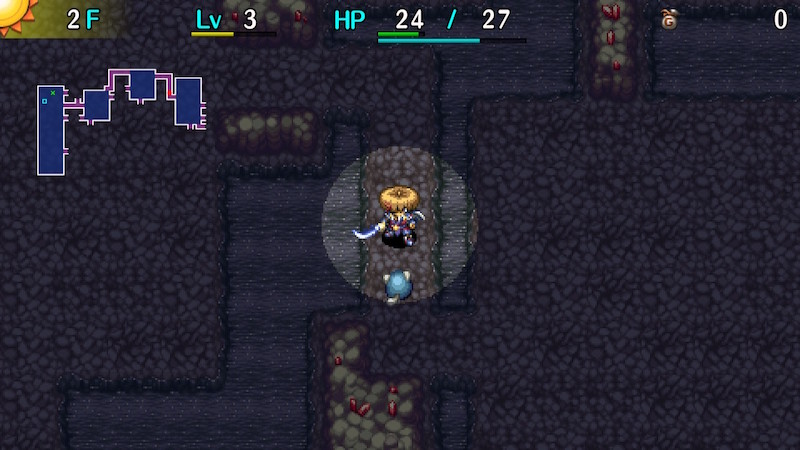

  

Dungeon where most HP recovery items are excluded from the item table. However, Grilled Onigiri, Revival Grass, and Undo Grass can be obtained normally. Wind of Kron blows earlier than Primordial Chasm, so farming techniques must be done quickly. The monster table is identical to Primordial Chasm, but limit broken monsters spawn from 76F. That said, the first clear is only 50F, so you don't have to fight them to obtain a Nirvana Board.

<ul class="quickLinksUL">
  <li><a href="#overview">Overview</a></li>
  <li><a href="#strategy">Strategy</a></li>
  <li><a href="#monsters">Monsters</a></li>
  <li><a href="#items">Items</a></li>
  <li><a href="#traps">Traps</a></li>
</ul>

# Overview

<table class="dungeonOverview">
  <tr>
    <th>Unlock</th>
    <td class="highlightYellow">Clear Ouma Shrine and arrive in Nekomaneki Village.</td>
  </tr>
  <tr>
    <th>Entrance</th>
    <td class="highlightYellow">Nekomaneki Village (Woman in Dungeon Center)</td>
  </tr>
</table>

<table class="dungeonTable">
  <tr>
    <th>Floors</th>
    <td>50F (first) / 99F</td>
    <th>Day</th>
    <td>Day</td>
  </tr>
  <tr>
    <th>Bring Items</th>
    <td>No</td>
    <th>Allies</th>
    <td>No</td>
  </tr>
  <tr>
    <th>Unidentified</th>
    <td>All categories</td>
    <th>New Items</th>
    <td>No</td>
  </tr>
  <tr>
    <th>Shops</th>
    <td>Regular, Elite, Pick-A-Choice</td>
    <th>Monster Houses</th>
    <td>Regular, Special, Sudden</td>
  </tr>
  <tr>
    <th>Initial Enemies</th>
    <td></td>
    <th>Spawn Rate</th>
    <td>30</td>
  </tr>
  <tr>
    <th>Ominous aura</th>
    <td>Yes (800 turns)</td>
    <th>Wind of Kron</th>
    <td>1st: 950 / 4th: 1250</td>
  </tr>
  <tr>
    <th>Clear Icon</th>
    <td>None</td>
    <th>Reward</th>
    <td>Nirvana Board</td>
  </tr>
</table>

# Strategy

[Quick Links]

[Content]

# Monsters

See [Monsters](/system/monsters) for individual monster details.

Floor Colors: Limit break monsters Enemy Colors: Farming Situational Farming Destroys Items Dangerous Very Dangerous

<table class="dungeonMonsters">
  <tr>
    <th>F</th>
    <th colspan="8">Monsters</th>
  </tr>
  <tr>
    <td>1</td>
    <td class="highlightYellow">Mamel</td>
    <td class="highlightYellow">Seedie</td>
    <td class="highlightYellow">Sproutant</td>
    <td></td>
    <td></td>
    <td></td>
    <td></td>
    <td></td>
  </tr>
  <tr>
    <td>2</td>
    <td class="highlightYellow">Mamel</td>
    <td class="highlightYellow">Seedie</td>
    <td class="highlightYellow">Sproutant</td>
    <td class="highlightYellow">Colum</td>
    <td></td>
    <td></td>
    <td></td>
    <td></td>
  </tr>
  <tr>
    <td>3</td>
    <td class="highlightYellow">Blade Bee</td>
    <td class="highlightGreen">Pit Mamel</td>
    <td class="highlightYellow">Sproutant</td>
    <td class="highlightYellow">Colum</td>
    <td class="highlightYellow">Chintala</td>
    <td class="highlightBlue">Grass Kid</td>
    <td class="highlightYellow">Pin Kid</td>
    <td></td>
  </tr>
  <tr>
    <td>4</td>
    <td class="highlightYellow">Blade Bee</td>
    <td class="highlightGreen">Pit Mamel</td>
    <td class="highlightYellow">Sweet Nut</td>
    <td></td>
    <td class="highlightYellow">Chintala</td>
    <td class="highlightBlue">Grass Kid</td>
    <td class="highlightYellow">Pin Kid</td>
    <td></td>
  </tr>
  <tr>
    <td>5</td>
    <td></td>
    <td class="highlightGreen">Pit Mamel</td>
    <td class="highlightYellow">Sweet Nut</td>
    <td></td>
    <td class="highlightYellow">Chintala</td>
    <td class="highlightBlue">Grass Kid</td>
    <td class="highlightYellow">Pin Kid</td>
    <td></td>
  </tr>
  <tr>
    <td>6</td>
    <td class="highlightGreen">Froggo</td>
    <td class="highlightGreen">Nigiri Baby</td>
    <td class="highlightGreen">Karakuroid</td>
    <td class="highlightYellow">Moseal</td>
    <td></td>
    <td></td>
    <td></td>
    <td></td>
  </tr>
  <tr>
    <td>7</td>
    <td class="highlightGreen">Froggo</td>
    <td class="highlightGreen">Nigiri Baby</td>
    <td class="highlightGreen">Karakuroid</td>
    <td class="highlightYellow">Moseal</td>
    <td class="highlightYellow">Tiger Tosser</td>
    <td></td>
    <td></td>
    <td></td>
  </tr>
  <tr>
    <td>8</td>
    <td class="highlightPurple3">Curse Girl</td>
    <td class="highlightGreen">Nigiri Baby</td>
    <td class="highlightGreen">Karakuroid</td>
    <td class="highlightYellow">Moseal</td>
    <td class="highlightYellow">Tiger Tosser</td>
    <td class="highlightYellow">Fearabbit</td>
    <td class="highlightBlue">Mixer</td>
    <td class="highlightYellow">Pop Tank</td>
  </tr>
  <tr>
    <td>9</td>
    <td class="highlightPurple3">Curse Girl</td>
    <td class="highlightYellow">Gyaza</td>
    <td></td>
    <td></td>
    <td class="highlightYellow">Tiger Tosser</td>
    <td class="highlightYellow">Fearabbit</td>
    <td class="highlightBlue">Mixer</td>
    <td class="highlightYellow">Pop Tank</td>
  </tr>
  <tr>
    <td>10</td>
    <td class="highlightYellow">N'dubba</td>
    <td class="highlightYellow">Gyaza</td>
    <td class="highlightYellow">Pumphantasm</td>
    <td class="highlightYellow">Kumonigiri</td>
    <td class="highlightYellow">Naptapir</td>
    <td></td>
    <td class="highlightBlue">Mixer</td>
    <td class="highlightYellow">Pop Tank</td>
  </tr>
  <tr>
    <td>11</td>
    <td class="highlightYellow">N'dubba</td>
    <td class="highlightYellow">Mutaikon</td>
    <td class="highlightYellow">Pumphantasm</td>
    <td class="highlightYellow">Kumonigiri</td>
    <td class="highlightYellow">Naptapir</td>
    <td></td>
    <td></td>
    <td></td>
  </tr>
  <tr>
    <td>12</td>
    <td class="highlightPurple3">Swordsman</td>
    <td class="highlightYellow">Mutaikon</td>
    <td class="highlightYellow">Pumphantasm</td>
    <td class="highlightYellow">Kumonigiri</td>
    <td class="highlightYellow">Naptapir</td>
    <td class="highlightPurple3">Mudkin</td>
    <td class="highlightYellow">Metalhead</td>
    <td class="highlightYellow">Scorpion</td>
  </tr>
  <tr>
    <td>13</td>
    <td class="highlightYellow">Mid Chintala</td>
    <td class="highlightYellow">Polygon Spinna</td>
    <td class="highlightYellow">Cololum</td>
    <td class="highlightYellow">Acrid Nut</td>
    <td class="highlightBlue">Snacky</td>
    <td class="highlightYellow">Cheer-Ham</td>
    <td></td>
    <td></td>
  </tr>
  <tr>
    <td>14</td>
    <td class="highlightYellow">Kid Squid</td>
    <td class="highlightYellow">Polygon Spinna</td>
    <td class="highlightYellow">Cololum</td>
    <td class="highlightYellow">Acrid Nut</td>
    <td class="highlightBlue">Snacky</td>
    <td class="highlightYellow">Cheer-Ham</td>
    <td></td>
    <td></td>
  </tr>
  <tr>
    <td>15</td>
    <td class="highlightYellow">Kid Squid</td>
    <td class="highlightYellow">Momoseal</td>
    <td class="highlightYellow">Bored Kappa</td>
    <td class="highlightOrange2">Foly</td>
    <td class="highlightBlue">Snacky</td>
    <td class="highlightYellow">Cheer-Ham</td>
    <td></td>
    <td></td>
  </tr>
  <tr>
    <td>16</td>
    <td class="highlightYellow">Kid Squid</td>
    <td class="highlightYellow">Momoseal</td>
    <td class="highlightYellow">Bored Kappa</td>
    <td class="highlightOrange2">Foly</td>
    <td class="highlightYellow">Dagger Bee</td>
    <td class="highlightYellow">Yanpii</td>
    <td class="highlightYellow">Hopodile</td>
    <td></td>
  </tr>
  <tr>
    <td>17</td>
    <td class="highlightBlue">Zalokleft</td>
    <td class="highlightYellow">Flamebird</td>
    <td class="highlightYellow">Bored Kappa</td>
    <td class="highlightOrange2">Foly</td>
    <td class="highlightYellow">Dagger Bee</td>
    <td class="highlightYellow">Yanpii</td>
    <td class="highlightYellow">Hopodile</td>
    <td class="highlightPurple3">Scoopie</td>
  </tr>
  <tr>
    <td>18</td>
    <td class="highlightBlue">Zalokleft</td>
    <td class="highlightYellow">Flamebird</td>
    <td></td>
    <td></td>
    <td class="highlightYellow">Dagger Bee</td>
    <td class="highlightYellow">Yanpii</td>
    <td class="highlightYellow">Hopodile</td>
    <td class="highlightPurple3">Scoopie</td>
  </tr>
  <tr>
    <td>19</td>
    <td class="highlightGreen">Boy Cart</td>
    <td class="highlightYellow">Beanie</td>
    <td class="highlightYellow">DJ Mage</td>
    <td class="highlightYellow">Eligan</td>
    <td></td>
    <td></td>
    <td></td>
    <td class="highlightPurple3">Scoopie</td>
  </tr>
  <tr>
    <td>20</td>
    <td class="highlightGreen">Boy Cart</td>
    <td class="highlightYellow">Beanie</td>
    <td class="highlightYellow">DJ Mage</td>
    <td class="highlightYellow">Eligan</td>
    <td class="highlightBlue">Grass Dude</td>
    <td class="highlightYellow">Pin Dude</td>
    <td></td>
    <td></td>
  </tr>
  <tr>
    <td>21</td>
    <td class="highlightBlue">Green Zalokleft</td>
    <td class="highlightYellow">Sproutyrant</td>
    <td class="highlightYellow">DJ Mage</td>
    <td class="highlightYellow">Eligan</td>
    <td class="highlightBlue">Grass Dude</td>
    <td class="highlightYellow">Pin Dude</td>
    <td></td>
    <td></td>
  </tr>
  <tr>
    <td>22</td>
    <td class="highlightBlue">Green Zalokleft</td>
    <td class="highlightYellow">Sproutyrant</td>
    <td class="highlightPurple3">Nigiri Morph</td>
    <td class="highlightYellow">Steamroid</td>
    <td class="highlightBlue">Grass Dude</td>
    <td class="highlightYellow">Pin Dude</td>
    <td class="highlightYellow">Poofy</td>
    <td></td>
  </tr>
  <tr>
    <td>23</td>
    <td class="highlightBlue">Green Zalokleft</td>
    <td class="highlightYellow">Sproutyrant Pandanigiri</td>
    <td class="highlightPurple3">Nigiri Morph</td>
    <td class="highlightYellow">Steamroid Snooztapir</td>
    <td class="highlightGreen">Froggucci</td>
    <td class="highlightOrange2">Grampa Tank</td>
    <td class="highlightOrange2">Poofy Absorbiphant</td>
    <td class="highlightPurple3">Gyadon</td>
  </tr>
  <tr>
    <td>24</td>
    <td class="highlightYellow">Ironhead</td>
    <td class="highlightYellow">Pandanigiri</td>
    <td></td>
    <td class="highlightYellow">Snooztapir</td>
    <td class="highlightGreen">Froggucci</td>
    <td class="highlightOrange2">Grampa Tank</td>
    <td class="highlightOrange2">Poofy Absorbiphant</td>
    <td class="highlightPurple3">Gyadon</td>
  </tr>
  <tr>
    <td>25</td>
    <td class="highlightYellow">Ironhead</td>
    <td class="highlightPurple3">Cursister</td>
    <td class="highlightOrange2">Hipadile</td>
    <td class="highlightYellow">Punisher</td>
    <td></td>
    <td></td>
    <td class="highlightOrange2">Absorbiphant</td>
    <td></td>
  </tr>
  <tr>
    <td>26</td>
    <td class="highlightPurple3">Muddy</td>
    <td class="highlightPurple3">Cursister</td>
    <td class="highlightOrange2">Hipadile</td>
    <td class="highlightYellow">Punisher</td>
    <td class="highlightYellow">Crow Tengu</td>
    <td class="highlightYellow">Firepuff</td>
    <td class="highlightYellow">Sr. Yanpii</td>
    <td class="highlightPurple3">Spadie</td>
  </tr>
  <tr>
    <td>27</td>
    <td class="highlightPurple3">Muddy</td>
    <td class="highlightYellow">Explochin</td>
    <td class="highlightOrange2">Hipadile</td>
    <td class="highlightYellow">Punisher</td>
    <td class="highlightYellow">Crow Tengu</td>
    <td class="highlightYellow">Firepuff</td>
    <td class="highlightYellow">Sr. Yanpii</td>
    <td class="highlightPurple3">Spadie</td>
  </tr>
  <tr>
    <td>28</td>
    <td class="highlightPurple3">Muddy</td>
    <td class="highlightYellow">Explochin</td>
    <td class="highlightGreen">Cross Cart</td>
    <td class="highlightOrange2">Kappa Pest</td>
    <td class="highlightYellow">Crow Tengu</td>
    <td class="highlightYellow">Firepuff</td>
    <td class="highlightYellow">Sr. Yanpii</td>
    <td class="highlightPurple3">Spadie</td>
  </tr>
  <tr>
    <td>29</td>
    <td class="highlightYellow">Go-Ham!</td>
    <td class="highlightYellow">Explochin</td>
    <td class="highlightGreen">Cross Cart</td>
    <td class="highlightOrange2">Kappa Pest</td>
    <td class="highlightOrange2">Digestiphant</td>
    <td class="highlightOrange2">Scarabbit</td>
    <td class="highlightYellow">Zapdon</td>
    <td class="highlightOrange2">MC Mage</td>
  </tr>
  <tr>
    <td>30</td>
    <td class="highlightYellow">Go-Ham!</td>
    <td class="highlightOrange2">N'twyn</td>
    <td></td>
    <td class="highlightOrange2">Kappa Pest</td>
    <td class="highlightOrange2">Digestiphant</td>
    <td class="highlightOrange2">Scarabbit</td>
    <td class="highlightYellow">Zapdon</td>
    <td class="highlightOrange2">MC Mage</td>
  </tr>
  <tr>
    <td>31</td>
    <td class="highlightBlue">Mixermon</td>
    <td class="highlightOrange2">N'twyn</td>
    <td class="highlightYellow">Death Gyaza</td>
    <td class="highlightYellow">Katana Bee</td>
    <td class="highlightYellow">Dragon</td>
    <td></td>
    <td></td>
    <td class="highlightOrange2">MC Mage</td>
  </tr>
  <tr>
    <td>32</td>
    <td class="highlightBlue">Mixermon</td>
    <td class="highlightOrange2">N'twyn</td>
    <td class="highlightYellow">Death Gyaza</td>
    <td class="highlightYellow">Katana Bee</td>
    <td class="highlightYellow">Dragon</td>
    <td></td>
    <td></td>
    <td></td>
  </tr>
  <tr>
    <td>33</td>
    <td class="highlightBlue">Mixermon</td>
    <td></td>
    <td class="highlightYellow">Death Gyaza</td>
    <td class="highlightYellow">Katana Bee</td>
    <td class="highlightYellow">Dragon</td>
    <td></td>
    <td></td>
    <td></td>
  </tr>
  <tr>
    <td>34</td>
    <td class="highlightYellow">Polygon Shaka</td>
    <td class="highlightYellow">Dazikon</td>
    <td class="highlightYellow">Pumphantom</td>
    <td class="highlightYellow">Falcon Tengu</td>
    <td class="highlightYellow">Flamepuff</td>
    <td class="highlightYellow">Shagga</td>
    <td></td>
    <td></td>
  </tr>
  <tr>
    <td>35</td>
    <td class="highlightYellow">Polygon Shaka</td>
    <td class="highlightYellow">Dazikon</td>
    <td class="highlightYellow">Pumphantom</td>
    <td class="highlightYellow">Falcon Tengu</td>
    <td class="highlightYellow">Flamepuff</td>
    <td class="highlightYellow">Shagga</td>
    <td class="highlightYellow">Cave Mamel</td>
    <td class="highlightYellow">VeniScorp</td>
  </tr>
  <tr>
    <td>36</td>
    <td class="highlightYellow">Tiger Hurler</td>
    <td class="highlightBlue">Grass Poppa</td>
    <td class="highlightYellow">Pin Poppa</td>
    <td class="highlightYellow">Falcon Tengu</td>
    <td class="highlightYellow">Flamepuff</td>
    <td class="highlightYellow">Shagga</td>
    <td class="highlightYellow">Cave Mamel</td>
    <td class="highlightYellow">VeniScorp</td>
  </tr>
  <tr>
    <td>37</td>
    <td class="highlightYellow">Tiger Hurler</td>
    <td class="highlightBlue">Grass Poppa</td>
    <td class="highlightYellow">Pin Poppa</td>
    <td class="highlightRed">MC Wizard</td>
    <td></td>
    <td></td>
    <td></td>
    <td class="highlightYellow">VeniScorp</td>
  </tr>
  <tr>
    <td>38</td>
    <td class="highlightYellow">Tiger Hurler</td>
    <td class="highlightBlue">Grass Poppa</td>
    <td class="highlightYellow">Pin Poppa</td>
    <td class="highlightRed">MC Wizard</td>
    <td class="highlightPurple3">Gyairas</td>
    <td class="highlightYellow">Eligagan</td>
    <td class="highlightYellow">Huistdon</td>
    <td></td>
  </tr>
  <tr>
    <td>39</td>
    <td class="highlightYellow">Sparkbird</td>
    <td></td>
    <td></td>
    <td></td>
    <td class="highlightPurple3">Gyairas</td>
    <td class="highlightYellow">Eligagan</td>
    <td class="highlightYellow">Huistdon</td>
    <td></td>
  </tr>
  <tr>
    <td>40</td>
    <td class="highlightYellow">Sparkbird</td>
    <td class="highlightYellow">Momomoseal</td>
    <td class="highlightYellow">Spicy Nut</td>
    <td></td>
    <td></td>
    <td class="highlightYellow">Eligagan</td>
    <td class="highlightYellow">Huistdon</td>
    <td></td>
  </tr>
  <tr>
    <td>41</td>
    <td class="highlightYellow">Steelhead</td>
    <td class="highlightYellow">Momomoseal</td>
    <td class="highlightYellow">Spicy Nut</td>
    <td class="highlightOrange2">Sky Dragon</td>
    <td></td>
    <td></td>
    <td class="highlightYellow">Huistdon</td>
    <td></td>
  </tr>
  <tr>
    <td>42</td>
    <td class="highlightYellow">Steelhead</td>
    <td class="highlightYellow">Momomoseal</td>
    <td class="highlightYellow">Spicy Nut</td>
    <td class="highlightOrange2">Sky Dragon</td>
    <td></td>
    <td></td>
    <td></td>
    <td></td>
  </tr>
  <tr>
    <td>43</td>
    <td class="highlightYellow">Steelhead</td>
    <td class="highlightYellow">Momomoseal</td>
    <td class="highlightYellow">Spicy Nut</td>
    <td class="highlightOrange2">Sky Dragon</td>
    <td class="highlightOrange2">Nashagga</td>
    <td></td>
    <td></td>
    <td></td>
  </tr>
  <tr>
    <td>44</td>
    <td class="highlightOrange2">Nigiri Boss</td>
    <td class="highlightYellow">King Squid</td>
    <td class="highlightYellow">Spicy Nut</td>
    <td class="highlightYellow">Concusschin</td>
    <td class="highlightOrange2">Nashagga</td>
    <td class="highlightYellow">Nuttie</td>
    <td class="highlightYellow">Rally Ham</td>
    <td></td>
  </tr>
  <tr>
    <td>45</td>
    <td class="highlightOrange2">Nigiri Boss</td>
    <td class="highlightYellow">King Squid</td>
    <td class="highlightYellow">Spicy Nut</td>
    <td class="highlightYellow">Concusschin</td>
    <td class="highlightOrange2">Nashagga</td>
    <td class="highlightYellow">Nuttie</td>
    <td class="highlightYellow">Rally Ham</td>
    <td class="highlightBlue">Big Chintala Munchy</td>
  </tr>
  <tr>
    <td>46</td>
    <td class="highlightYellow">Blazepuff</td>
    <td class="highlightOrange2">Oingodile</td>
    <td class="highlightYellow">Spicy Nut</td>
    <td class="highlightYellow">Concusschin</td>
    <td></td>
    <td class="highlightYellow">Nuttie</td>
    <td class="highlightYellow">Rally Ham</td>
    <td class="highlightBlue">Big Chintala Munchy</td>
  </tr>
  <tr>
    <td>47</td>
    <td class="highlightYellow">Blazepuff</td>
    <td class="highlightOrange2">Oingodile</td>
    <td class="highlightYellow">Spicy Nut</td>
    <td class="highlightRed">Ornery Tank</td>
    <td class="highlightYellow">Eagle Tengu</td>
    <td class="highlightPurple3">Super Gazer</td>
    <td class="highlightPurple3">Trowelie</td>
    <td></td>
  </tr>
  <tr>
    <td>48</td>
    <td class="highlightYellow">Blazepuff</td>
    <td class="highlightOrange2">Oingodile</td>
    <td class="highlightYellow">Spicy Nut</td>
    <td class="highlightRed">Ornery Tank</td>
    <td class="highlightYellow">Eagle Tengu</td>
    <td class="highlightPurple3">Super Gazer</td>
    <td class="highlightPurple3">Trowelie</td>
    <td class="highlightYellow">Colocolum</td>
  </tr>
  <tr>
    <td>49</td>
    <td class="highlightYellow">Electroid</td>
    <td class="highlightOrange2">Porkon</td>
    <td class="highlightYellow">Spicy Nut</td>
    <td class="highlightRed">Ornery Tank</td>
    <td class="highlightYellow">Eagle Tengu</td>
    <td class="highlightPurple3">Super Gazer</td>
    <td class="highlightPurple3">Trowelie</td>
    <td class="highlightYellow">Colocolum</td>
  </tr>
  <tr>
    <td>50</td>
    <td class="highlightYellow">Electroid</td>
    <td class="highlightOrange2">Porkon</td>
    <td class="highlightOrange2">N'mach</td>
    <td class="highlightBlue">Mixergon</td>
    <td class="highlightYellow">Doztapir</td>
    <td></td>
    <td></td>
    <td class="highlightYellow">Colocolum</td>
  </tr>
  <tr>
    <td>51</td>
    <td class="highlightGreen">Strong Cart</td>
    <td class="highlightOrange2">Jouncy</td>
    <td class="highlightOrange2">N'mach</td>
    <td class="highlightBlue">Mixergon</td>
    <td class="highlightYellow">Doztapir</td>
    <td class="highlightYellow">Debaser</td>
    <td></td>
    <td></td>
  </tr>
  <tr>
    <td>52</td>
    <td class="highlightGreen">Strong Cart</td>
    <td class="highlightOrange2">Jouncy</td>
    <td class="highlightYellow">Spicy Nut</td>
    <td class="highlightOrange2">Vexing Kappa</td>
    <td class="highlightYellow">Doztapir</td>
    <td class="highlightYellow">Debaser</td>
    <td class="highlightYellow">Sprouterror</td>
    <td class="highlightRed">MC Sorceror</td>
  </tr>
  <tr>
    <td>53</td>
    <td class="highlightOrange2">Trillman</td>
    <td class="highlightOrange2">Jouncy</td>
    <td class="highlightPurple3">Mudster</td>
    <td class="highlightOrange2">Vexing Kappa</td>
    <td></td>
    <td class="highlightYellow">Debaser</td>
    <td class="highlightYellow">Sprouterror</td>
    <td class="highlightRed">MC Sorceror</td>
  </tr>
  <tr>
    <td>54</td>
    <td></td>
    <td class="highlightOrange2">Jouncy</td>
    <td class="highlightPurple3">Mudster Spicy Nut</td>
    <td class="highlightYellow">StunScorp</td>
    <td class="highlightYellow">Pyrepuff</td>
    <td class="highlightYellow">Debaser</td>
    <td></td>
    <td class="highlightRed">MC Sorceror</td>
  </tr>
  <tr>
    <td>55</td>
    <td class="highlightYellow">Tiger Chucker</td>
    <td></td>
    <td></td>
    <td class="highlightYellow">StunScorp</td>
    <td class="highlightYellow">Pyrepuff</td>
    <td></td>
    <td></td>
    <td></td>
  </tr>
  <tr>
    <td>56</td>
    <td class="highlightYellow">Tiger Chucker</td>
    <td class="highlightOrange2">Pierce Cart</td>
    <td class="highlightYellow">Spicy Nut</td>
    <td class="highlightPurple3">Curspinster</td>
    <td class="highlightYellow">Pumpanshee</td>
    <td class="highlightRed">Horrabbit</td>
    <td class="highlightYellow">Momomomoseal</td>
    <td></td>
  </tr>
  <tr>
    <td>57</td>
    <td class="highlightYellow">Tiger Chucker</td>
    <td class="highlightOrange2">Pierce Cart</td>
    <td class="highlightGreen">Froggon</td>
    <td class="highlightPurple3">Curspinster</td>
    <td class="highlightYellow">Pumpanshee</td>
    <td class="highlightRed">Horrabbit</td>
    <td class="highlightYellow">Momomomoseal</td>
    <td class="highlightOrange2">Spongiderm</td>
  </tr>
  <tr>
    <td>58</td>
    <td></td>
    <td class="highlightOrange2">Pierce Cart</td>
    <td class="highlightGreen">Froggon Spicy Nut</td>
    <td class="highlightPurple3">Curspinster</td>
    <td class="highlightYellow">Pumpanshee</td>
    <td class="highlightRed">Horrabbit</td>
    <td class="highlightOrange2">Momomomoseal Lashagga</td>
    <td class="highlightOrange2">Spongiderm</td>
  </tr>
  <tr>
    <td>59</td>
    <td class="highlightPurple3">Item Knave</td>
    <td class="highlightBlue">Iron Zalokleft</td>
    <td class="highlightGreen">Froggon</td>
    <td class="highlightPurple3">Gyandora</td>
    <td class="highlightYellow">Lt. Yanpii</td>
    <td></td>
    <td class="highlightOrange2">Lashagga</td>
    <td class="highlightOrange2">Spongiderm</td>
  </tr>
  <tr>
    <td>60</td>
    <td class="highlightPurple3">Item Knave</td>
    <td class="highlightBlue">Iron Zalokleft</td>
    <td class="highlightYellow">Zanbeeto</td>
    <td class="highlightPurple3">Gyandora</td>
    <td class="highlightYellow">Lt. Yanpii</td>
    <td></td>
    <td class="highlightOrange2">Lashagga</td>
    <td></td>
  </tr>
  <tr>
    <td>61</td>
    <td class="highlightBlue">Grass Gramps</td>
    <td class="highlightYellow">Pin Gramps</td>
    <td class="highlightYellow">Zanbeeto</td>
    <td class="highlightYellow">Polygon Singa</td>
    <td class="highlightYellow">Lt. Yanpii</td>
    <td class="highlightOrange2">Flarebird</td>
    <td class="highlightYellow">Bunchukdon</td>
    <td></td>
  </tr>
  <tr>
    <td>62</td>
    <td class="highlightBlue">Grass Gramps</td>
    <td class="highlightYellow">Pin Gramps</td>
    <td class="highlightPurple3">Sensei</td>
    <td class="highlightYellow">Polygon Singa</td>
    <td></td>
    <td class="highlightOrange2">Flarebird</td>
    <td class="highlightYellow">Bunchukdon</td>
    <td></td>
  </tr>
  <tr>
    <td>63</td>
    <td class="highlightYellow">Spirit Ham</td>
    <td class="highlightOrange2">Bouncy</td>
    <td class="highlightPurple3">Sensei</td>
    <td class="highlightYellow">Polygon Singa</td>
    <td></td>
    <td class="highlightOrange2">Flarebird</td>
    <td class="highlightYellow">Bunchukdon</td>
    <td></td>
  </tr>
  <tr>
    <td>64</td>
    <td class="highlightYellow">Spirit Ham</td>
    <td class="highlightOrange2">Bouncy</td>
    <td class="highlightPurple3">Sensei</td>
    <td class="highlightYellow">Onigirizzly</td>
    <td class="highlightYellow">Bitter Nut</td>
    <td></td>
    <td></td>
    <td></td>
  </tr>
  <tr>
    <td>65</td>
    <td class="highlightYellow">Spirit Ham</td>
    <td class="highlightOrange2">Bouncy</td>
    <td class="highlightYellow">Fulminachin</td>
    <td class="highlightYellow">Onigirizzly</td>
    <td class="highlightYellow">Bitter Nut</td>
    <td class="highlightPurple3">Hyper Gazer</td>
    <td></td>
    <td></td>
  </tr>
  <tr>
    <td>66</td>
    <td class="highlightYellow">Phoenix Tengu</td>
    <td class="highlightOrange2">Bouncy</td>
    <td class="highlightYellow">Fulminachin</td>
    <td class="highlightRed">Archdragon</td>
    <td class="highlightYellow">Bitter Nut</td>
    <td class="highlightPurple3">Hyper Gazer</td>
    <td></td>
    <td></td>
  </tr>
  <tr>
    <td>67</td>
    <td class="highlightYellow">Phoenix Tengu</td>
    <td class="highlightRed">Dozikon</td>
    <td></td>
    <td class="highlightRed">Archdragon</td>
    <td class="highlightYellow">Bitter Nut</td>
    <td class="highlightPurple3">Hyper Gazer</td>
    <td></td>
    <td></td>
  </tr>
  <tr>
    <td>68</td>
    <td class="highlightYellow">Phoenix Tengu</td>
    <td class="highlightRed">Dozikon</td>
    <td class="highlightYellow">Comatapir</td>
    <td class="highlightRed">Archdragon</td>
    <td class="highlightYellow">Bitter Nut</td>
    <td class="highlightYellow">Grainie</td>
    <td></td>
    <td></td>
  </tr>
  <tr>
    <td>69</td>
    <td class="highlightPurple3">Mudder</td>
    <td></td>
    <td class="highlightYellow">Comatapir</td>
    <td></td>
    <td class="highlightYellow">Bitter Nut</td>
    <td class="highlightYellow">Grainie</td>
    <td></td>
    <td></td>
  </tr>
  <tr>
    <td>70</td>
    <td class="highlightPurple3">Mudder</td>
    <td class="highlightBlue">Mixerdon</td>
    <td class="highlightYellow">Huge Chintala</td>
    <td class="highlightYellow">Hell Gyaza</td>
    <td class="highlightYellow">Bitter Nut</td>
    <td class="highlightYellow">Grainie</td>
    <td class="highlightOrange2">N'dup</td>
    <td></td>
  </tr>
  <tr>
    <td>71</td>
    <td class="highlightPurple3">Mudder</td>
    <td class="highlightBlue">Mixerdon</td>
    <td class="highlightYellow">Huge Chintala</td>
    <td class="highlightYellow">Hell Gyaza</td>
    <td class="highlightYellow">Eligagon</td>
    <td></td>
    <td class="highlightOrange2">N'dup</td>
    <td></td>
  </tr>
  <tr>
    <td>72</td>
    <td class="highlightPurple3">Mudder</td>
    <td class="highlightBlue">FO-UZZ</td>
    <td class="highlightYellow">Huge Chintala</td>
    <td class="highlightYellow">Hell Gyaza</td>
    <td class="highlightYellow">Eligagon</td>
    <td class="highlightYellow">Cyberoid</td>
    <td class="highlightOrange2">N'dup</td>
    <td></td>
  </tr>
  <tr>
    <td>73</td>
    <td class="highlightYellow">Detonachin</td>
    <td class="highlightBlue">FO-UZZ</td>
    <td class="highlightPurple3">Cursenior</td>
    <td></td>
    <td class="highlightYellow">Eligagon</td>
    <td class="highlightYellow">Cyberoid</td>
    <td class="highlightOrange2">N'dup</td>
    <td></td>
  </tr>
  <tr>
    <td>74</td>
    <td class="highlightYellow">Detonachin</td>
    <td class="highlightPurple3">Shovelie</td>
    <td class="highlightPurple3">Cursenior</td>
    <td class="highlightYellow">Sproutitan</td>
    <td class="highlightRed">Porgon</td>
    <td class="highlightYellow">Cyberoid</td>
    <td></td>
    <td></td>
  </tr>
  <tr>
    <td class="limitBreak">75</td>
    <td class="highlightPurple3">Knave King2</td>
    <td class="highlightPurple3">Shovelie2</td>
    <td class="highlightPurple3">Cursenior2</td>
    <td class="highlightYellow">Sproutitan2</td>
    <td class="highlightRed">Porgon2</td>
    <td class="highlightBlue">Mealy2</td>
    <td class="highlightYellow">Ruiner</td>
    <td></td>
  </tr>
  <tr>
    <td class="limitBreak">76</td>
    <td class="highlightPurple3">Knave King2</td>
    <td></td>
    <td></td>
    <td class="highlightYellow">Sproutitan2</td>
    <td class="highlightRed">Porgon2</td>
    <td class="highlightBlue">Mealy2</td>
    <td class="highlightYellow">Ruiner</td>
    <td></td>
  </tr>
  <tr>
    <td class="limitBreak">77</td>
    <td class="highlightYellow">BlightScorp2</td>
    <td class="highlightRed">Terrabbit2</td>
    <td class="highlightYellow">Pumptergeist2</td>
    <td class="highlightOrange2">Boingodile2</td>
    <td class="highlightRed">Porgon2</td>
    <td></td>
    <td class="highlightYellow">Ruiner</td>
    <td></td>
  </tr>
  <tr>
    <td class="limitBreak">78</td>
    <td class="highlightYellow">BlightScorp2</td>
    <td class="highlightRed">Terrabbit2</td>
    <td class="highlightYellow">Pumptergeist2</td>
    <td class="highlightOrange2">Boingodile2</td>
    <td class="highlightYellow">Squidperor2</td>
    <td class="highlightYellow">Colocolocolum2</td>
    <td class="highlightYellow">Ruiner</td>
    <td></td>
  </tr>
  <tr>
    <td class="limitBreak">79</td>
    <td class="highlightYellow">Kodionigiri2</td>
    <td></td>
    <td class="highlightYellow">Pumptergeist2</td>
    <td class="highlightOrange2">Boingodile2</td>
    <td class="highlightYellow">Squidperor2</td>
    <td class="highlightYellow">Colocolocolum2</td>
    <td></td>
    <td></td>
  </tr>
  <tr>
    <td class="limitBreak">80</td>
    <td class="highlightYellow">Kodionigiri2</td>
    <td class="highlightOrange2">Kappa Troll2</td>
    <td class="highlightOrange2">Gitan Mamel2</td>
    <td class="highlightGreen">Kleptoad2</td>
    <td class="highlightOrange2">Osmammoth2</td>
    <td class="highlightYellow">Colocolocolum2</td>
    <td></td>
    <td></td>
  </tr>
  <tr>
    <td class="limitBreak">81</td>
    <td class="highlightYellow">Doomhead2</td>
    <td class="highlightOrange2">Kappa Troll2</td>
    <td class="highlightOrange2">Gitan Mamel2</td>
    <td class="highlightGreen">Kleptoad2</td>
    <td class="highlightOrange2">Osmammoth2</td>
    <td></td>
    <td></td>
    <td></td>
  </tr>
  <tr>
    <td class="limitBreak">82</td>
    <td class="highlightYellow">Doomhead2</td>
    <td class="highlightOrange2">Googoman2</td>
    <td class="highlightOrange2">Gitan Mamel2</td>
    <td class="highlightGreen">Kleptoad2</td>
    <td class="highlightOrange2">Osmammoth2</td>
    <td></td>
    <td></td>
    <td></td>
  </tr>
  <tr>
    <td class="limitBreak">83</td>
    <td class="highlightYellow">Doomhead2</td>
    <td class="highlightOrange2">Googoman2</td>
    <td class="highlightPurple3">Gyandoron2</td>
    <td></td>
    <td class="highlightOrange2">Osmammoth2</td>
    <td></td>
    <td></td>
    <td></td>
  </tr>
  <tr>
    <td class="limitBreak">84</td>
    <td class="highlightYellow">Tiger Ace2</td>
    <td class="highlightOrange2">Blazebird2</td>
    <td class="highlightPurple3">Gyandoron2</td>
    <td class="highlightYellow">Polygon Stunna2</td>
    <td class="highlightOrange2">Osmammoth2</td>
    <td></td>
    <td></td>
    <td></td>
  </tr>
  <tr>
    <td class="limitBreak">85</td>
    <td class="highlightYellow">Tiger Ace2</td>
    <td class="highlightOrange2">Blazebird2</td>
    <td class="highlightPurple3">Gyandoron2</td>
    <td class="highlightYellow">Polygon Stunna2</td>
    <td class="highlightYellow">Zotdon2</td>
    <td></td>
    <td></td>
    <td></td>
  </tr>
  <tr>
    <td class="limitBreak">86</td>
    <td class="highlightYellow">Tiger Ace2</td>
    <td class="highlightOrange2">Blazebird2</td>
    <td class="highlightPurple3">Gyandoron2</td>
    <td class="highlightYellow">Polygon Stunna2</td>
    <td class="highlightYellow">Zotdon2</td>
    <td class="highlightOrange2">Nigiri King2</td>
    <td class="highlightYellow">Boss Yanpii2</td>
    <td></td>
  </tr>
  <tr>
    <td class="limitBreak">87</td>
    <td class="highlightBlue">Zalokleft King2</td>
    <td class="highlightOrange2">Blazebird2</td>
    <td class="highlightPurple3">Gyandoron2</td>
    <td class="highlightYellow">Polygon Stunna2</td>
    <td class="highlightYellow">Zotdon2</td>
    <td class="highlightOrange2">Nigiri King2</td>
    <td class="highlightYellow">Boss Yanpii2</td>
    <td></td>
  </tr>
  <tr>
    <td class="limitBreak">88</td>
    <td class="highlightBlue">Zalokleft King2</td>
    <td class="highlightRed">Ultra Gazer2</td>
    <td class="highlightPurple3">Gyandoron2</td>
    <td class="highlightYellow">Polygon Stunna2</td>
    <td class="highlightYellow">Zotdon2</td>
    <td class="highlightOrange2">Nigiri King2</td>
    <td class="highlightYellow">Boss Yanpii2</td>
    <td></td>
  </tr>
  <tr>
    <td class="limitBreak">89</td>
    <td class="highlightBlue">Zalokleft King2</td>
    <td class="highlightRed">Ultra Gazer2</td>
    <td class="highlightPurple3">Gyandoron2</td>
    <td class="highlightYellow">Polygon Stunna2</td>
    <td class="highlightYellow">Doom Gyaza2</td>
    <td class="highlightYellow">Elizgagon2</td>
    <td class="highlightYellow">Boss Yanpii2</td>
    <td class="highlightYellow">Despoiler2</td>
  </tr>
  <tr>
    <td class="limitBreak">90</td>
    <td class="highlightPurple3">Swordmaster2</td>
    <td class="highlightRed">Ultra Gazer2</td>
    <td></td>
    <td></td>
    <td class="highlightYellow">Doom Gyaza2</td>
    <td class="highlightYellow">Elizgagon2</td>
    <td></td>
    <td class="highlightYellow">Despoiler2</td>
  </tr>
  <tr>
    <td class="limitBreak">91</td>
    <td class="highlightPurple3">Swordmaster2</td>
    <td class="highlightRed">Ultra Gazer2</td>
    <td></td>
    <td></td>
    <td class="highlightYellow">Doom Gyaza2</td>
    <td class="highlightYellow">Elizgagon2</td>
    <td></td>
    <td class="highlightYellow">Despoiler2</td>
  </tr>
  <tr>
    <td class="limitBreak">92</td>
    <td class="highlightPurple3">Swordmaster2</td>
    <td class="highlightRed">Ultra Gazer2</td>
    <td></td>
    <td></td>
    <td></td>
    <td class="highlightYellow">Elizgagon2</td>
    <td></td>
    <td class="highlightYellow">Despoiler2</td>
  </tr>
  <tr>
    <td class="limitBreak">93</td>
    <td class="highlightRed">Cranky Tank2</td>
    <td class="highlightRed">Ultra Gazer2</td>
    <td></td>
    <td></td>
    <td></td>
    <td class="highlightYellow">Elizgagon2</td>
    <td></td>
    <td class="highlightYellow">Despoiler2</td>
  </tr>
  <tr>
    <td class="limitBreak">94</td>
    <td class="highlightRed">Cranky Tank2</td>
    <td></td>
    <td></td>
    <td></td>
    <td></td>
    <td class="highlightYellow">Elizgagon2</td>
    <td></td>
    <td class="highlightYellow">Despoiler2</td>
  </tr>
  <tr>
    <td class="limitBreak">95</td>
    <td class="highlightRed">Cranky Tank2</td>
    <td class="highlightRed">Abyss Dragon2</td>
    <td></td>
    <td></td>
    <td></td>
    <td class="highlightYellow">Elizgagon2</td>
    <td></td>
    <td class="highlightYellow">Despoiler2</td>
  </tr>
  <tr>
    <td class="limitBreak">96</td>
    <td class="highlightRed">Cranky Tank2</td>
    <td class="highlightRed">Abyss Dragon2</td>
    <td></td>
    <td></td>
    <td></td>
    <td class="highlightYellow">Elizgagon2</td>
    <td></td>
    <td class="highlightYellow">Despoiler2</td>
  </tr>
  <tr>
    <td class="limitBreak">97</td>
    <td></td>
    <td class="highlightRed">Abyss Dragon2</td>
    <td></td>
    <td></td>
    <td></td>
    <td class="highlightYellow">Elizgagon2</td>
    <td></td>
    <td class="highlightYellow">Despoiler2</td>
  </tr>
  <tr>
    <td class="limitBreak">98</td>
    <td></td>
    <td class="highlightRed">Abyss Dragon2</td>
    <td></td>
    <td></td>
    <td></td>
    <td class="highlightYellow">Elizgagon2</td>
    <td></td>
    <td class="highlightYellow">Despoiler2</td>
  </tr>
  <tr>
    <td class="limitBreak">99</td>
    <td></td>
    <td class="highlightRed">Abyss Dragon2</td>
    <td></td>
    <td></td>
    <td></td>
    <td class="highlightYellow">Elizgagon2</td>
    <td></td>
    <td class="highlightYellow">Despoiler2</td>
  </tr>
</table>

# Items

※ Item Table is incomplete. If you find a drop that isn't listed, please add it to the table.

- F = Floor, Monster (day)
- S = Shop, Maneater, Shiny Object (yellow)
- P = Presto Pot
- Z = Zalokleft
- E = Elite Shop, Shiny Object (blue)

#### Weapons

<table class="dungeonItems">
  <tr>
    <th>Name</th>
    <th>F</th>
    <th>S</th>
    <th>P</th>
    <th>Z</th>
    <th>E</th>
    <th rowspan="15" class="tableDivider"></th>
    <th>Name</th>
    <th>F</th>
    <th>S</th>
    <th>P</th>
    <th>Z</th>
    <th>E</th>
    <th rowspan="15" class="tableDivider"></th>
    <th>Name</th>
    <th>F</th>
    <th>S</th>
    <th>P</th>
    <th>Z</th>
    <th>E</th>
  </tr>
  <tr>
    <td class="leftText highlightGray">Ordinary Stick</td>
    <td></td>
    <td></td>
    <td></td>
    <td></td>
    <td></td>
    <td class="leftText highlightGray">Rusty Pickaxe</td>
    <td></td>
    <td></td>
    <td></td>
    <td></td>
    <td></td>
    <td class="leftText highlightGray">Shockuto</td>
    <td></td>
    <td></td>
    <td></td>
    <td></td>
    <td></td>
  </tr>
  <tr>
    <td class="leftText highlightGray">Tin Blade</td>
    <td></td>
    <td></td>
    <td></td>
    <td></td>
    <td></td>
    <td class="leftText highlightGray">Old Mallet</td>
    <td></td>
    <td></td>
    <td></td>
    <td></td>
    <td></td>
    <td class="leftText highlightGray">Blurry Stick</td>
    <td></td>
    <td></td>
    <td></td>
    <td></td>
    <td></td>
  </tr>
  <tr>
    <td class="leftText highlightGray">Katana</td>
    <td></td>
    <td></td>
    <td></td>
    <td></td>
    <td></td>
    <td class="leftText highlightGray">Sky Splitter</td>
    <td></td>
    <td></td>
    <td></td>
    <td></td>
    <td></td>
    <td class="leftText highlightGray">Sealing Keisaku</td>
    <td></td>
    <td></td>
    <td></td>
    <td></td>
    <td></td>
  </tr>
  <tr>
    <td class="leftText highlightGray">Beast Fang</td>
    <td></td>
    <td></td>
    <td></td>
    <td></td>
    <td></td>
    <td class="leftText highlightGray">Water Cutter</td>
    <td></td>
    <td></td>
    <td></td>
    <td></td>
    <td></td>
    <td class="leftText highlightGray">Baffle Axe</td>
    <td></td>
    <td></td>
    <td></td>
    <td></td>
    <td></td>
  </tr>
  <tr>
    <td class="leftText highlightGray">Dotanuki</td>
    <td></td>
    <td></td>
    <td></td>
    <td></td>
    <td></td>
    <td class="leftText highlightGray">Scythe</td>
    <td></td>
    <td></td>
    <td></td>
    <td></td>
    <td></td>
    <td class="leftText highlightGray">Hatchet</td>
    <td></td>
    <td></td>
    <td></td>
    <td></td>
    <td></td>
  </tr>
  <tr>
    <td class="leftText highlightGray">Bladite</td>
    <td></td>
    <td></td>
    <td></td>
    <td></td>
    <td></td>
    <td class="leftText highlightGray">Myopic Masher</td>
    <td></td>
    <td></td>
    <td></td>
    <td></td>
    <td></td>
    <td class="leftText highlightGray">Shoddy Dirk</td>
    <td></td>
    <td></td>
    <td></td>
    <td></td>
    <td></td>
  </tr>
  <tr>
    <td class="leftText highlightGray">Red Blade</td>
    <td></td>
    <td></td>
    <td></td>
    <td></td>
    <td></td>
    <td class="leftText highlightGray">Magic Masher</td>
    <td></td>
    <td></td>
    <td></td>
    <td></td>
    <td></td>
    <td class="leftText highlightGray">Glass Dirk</td>
    <td></td>
    <td></td>
    <td></td>
    <td></td>
    <td></td>
  </tr>
  <tr>
    <td class="leftText highlightGray">Kabura Katana</td>
    <td></td>
    <td></td>
    <td></td>
    <td></td>
    <td></td>
    <td class="leftText highlightGray">Drain Dagger</td>
    <td></td>
    <td></td>
    <td></td>
    <td></td>
    <td></td>
    <td class="leftText highlightGray">Dirk of Debts</td>
    <td></td>
    <td></td>
    <td></td>
    <td></td>
    <td></td>
  </tr>
  <tr>
    <td class="leftText highlightGray">Fuuma Sword</td>
    <td></td>
    <td></td>
    <td></td>
    <td></td>
    <td></td>
    <td class="leftText highlightGray">Copper Cleaver</td>
    <td></td>
    <td></td>
    <td></td>
    <td></td>
    <td></td>
    <td class="leftText highlightGray">Extreme Sword</td>
    <td></td>
    <td></td>
    <td></td>
    <td></td>
    <td></td>
  </tr>
  <tr>
    <td class="leftText highlightGray">Pathetic Blade</td>
    <td></td>
    <td></td>
    <td></td>
    <td></td>
    <td></td>
    <td class="leftText highlightGray">Crescent Katana</td>
    <td></td>
    <td></td>
    <td></td>
    <td></td>
    <td></td>
    <td class="leftText highlightGray">Violent Blade</td>
    <td></td>
    <td></td>
    <td></td>
    <td></td>
    <td></td>
  </tr>
  <tr>
    <td class="leftText highlightGray">Dull Gold Edge</td>
    <td></td>
    <td></td>
    <td></td>
    <td></td>
    <td></td>
    <td class="leftText highlightGray">Lizard Lasher</td>
    <td></td>
    <td></td>
    <td></td>
    <td></td>
    <td></td>
    <td class="leftText highlightGray">Breeze Blade</td>
    <td></td>
    <td></td>
    <td></td>
    <td></td>
    <td></td>
  </tr>
  <tr>
    <td class="leftText highlightGray">Bright Blade</td>
    <td></td>
    <td></td>
    <td></td>
    <td></td>
    <td></td>
    <td class="leftText highlightGray">Nap Rattle</td>
    <td></td>
    <td></td>
    <td></td>
    <td></td>
    <td></td>
    <td class="leftText highlightGray">Burning Blade</td>
    <td></td>
    <td></td>
    <td></td>
    <td></td>
    <td></td>
  </tr>
  <tr>
    <td class="leftText highlightGray">True Knife</td>
    <td></td>
    <td></td>
    <td></td>
    <td></td>
    <td></td>
    <td class="leftText highlightGray">Wonder Pick</td>
    <td></td>
    <td></td>
    <td></td>
    <td></td>
    <td></td>
    <td class="leftText highlightGray">Sturdy Hammer</td>
    <td></td>
    <td></td>
    <td></td>
    <td></td>
    <td></td>
  </tr>
  <tr>
    <td class="leftText highlightGray">Kaburagi</td>
    <td></td>
    <td></td>
    <td></td>
    <td></td>
    <td></td>
    <td colspan="6"></td>
    <td colspan="6"></td>
  </tr>
</table>

#### Shields

<table class="dungeonItems">
  <tr>
    <th>Name</th>
    <th>F</th>
    <th>S</th>
    <th>P</th>
    <th>Z</th>
    <th>E</th>
    <th rowspan="13" class="tableDivider"></th>
    <th>Name</th>
    <th>F</th>
    <th>S</th>
    <th>P</th>
    <th>Z</th>
    <th>E</th>
    <th rowspan="13" class="tableDivider"></th>
    <th>Name</th>
    <th>F</th>
    <th>S</th>
    <th>P</th>
    <th>Z</th>
    <th>E</th>
  </tr>
  <tr>
    <td class="leftText highlightGray">Plain Targe</td>
    <td></td>
    <td></td>
    <td></td>
    <td></td>
    <td></td>
    <td class="leftText highlightGray">Heavy Shield</td>
    <td></td>
    <td></td>
    <td></td>
    <td></td>
    <td></td>
    <td class="leftText highlightGray">Gyadon Blocker</td>
    <td></td>
    <td></td>
    <td></td>
    <td></td>
    <td></td>
  </tr>
  <tr>
    <td class="leftText highlightGray">Tin Shield</td>
    <td></td>
    <td></td>
    <td></td>
    <td></td>
    <td></td>
    <td class="leftText highlightGray">Midnight Shield</td>
    <td></td>
    <td></td>
    <td></td>
    <td></td>
    <td></td>
    <td class="leftText highlightGray">Snake Shield</td>
    <td></td>
    <td></td>
    <td></td>
    <td></td>
    <td></td>
  </tr>
  <tr>
    <td class="leftText highlightGray">Iron Targe</td>
    <td></td>
    <td></td>
    <td></td>
    <td></td>
    <td></td>
    <td class="leftText highlightGray">Day Shield</td>
    <td></td>
    <td></td>
    <td></td>
    <td></td>
    <td></td>
    <td class="leftText highlightGray">Steady Shield</td>
    <td></td>
    <td></td>
    <td></td>
    <td></td>
    <td></td>
  </tr>
  <tr>
    <td class="leftText highlightGray">Wolfshead</td>
    <td></td>
    <td></td>
    <td></td>
    <td></td>
    <td></td>
    <td class="leftText highlightGray">Binary Shield</td>
    <td></td>
    <td></td>
    <td></td>
    <td></td>
    <td></td>
    <td class="leftText highlightGray">Anti-Gaze Trge</td>
    <td></td>
    <td></td>
    <td></td>
    <td></td>
    <td></td>
  </tr>
  <tr>
    <td class="leftText highlightGray">Beast Shield</td>
    <td></td>
    <td></td>
    <td></td>
    <td></td>
    <td></td>
    <td class="leftText highlightGray">Counter Shield</td>
    <td></td>
    <td></td>
    <td></td>
    <td></td>
    <td></td>
    <td class="leftText highlightGray">Swap Shield</td>
    <td></td>
    <td></td>
    <td></td>
    <td></td>
    <td></td>
  </tr>
  <tr>
    <td class="leftText highlightGray">Targite</td>
    <td></td>
    <td></td>
    <td></td>
    <td></td>
    <td></td>
    <td class="leftText highlightGray">Student Shield</td>
    <td></td>
    <td></td>
    <td></td>
    <td></td>
    <td></td>
    <td class="leftText highlightGray">Shoddy Plank</td>
    <td></td>
    <td></td>
    <td></td>
    <td></td>
    <td></td>
  </tr>
  <tr>
    <td class="leftText highlightGray">Red Shield</td>
    <td></td>
    <td></td>
    <td></td>
    <td></td>
    <td></td>
    <td class="leftText highlightGray">Bowl Shield</td>
    <td></td>
    <td></td>
    <td></td>
    <td></td>
    <td></td>
    <td class="leftText highlightGray">Glass Buckler</td>
    <td></td>
    <td></td>
    <td></td>
    <td></td>
    <td></td>
  </tr>
  <tr>
    <td class="leftText highlightGray">Fuuma Shield</td>
    <td></td>
    <td></td>
    <td></td>
    <td></td>
    <td></td>
    <td class="leftText highlightGray">Spry Shield</td>
    <td></td>
    <td></td>
    <td></td>
    <td></td>
    <td></td>
    <td class="leftText highlightGray">Pauper's Plank</td>
    <td></td>
    <td></td>
    <td></td>
    <td></td>
    <td></td>
  </tr>
  <tr>
    <td class="leftText highlightGray">Pathetic Shield</td>
    <td></td>
    <td></td>
    <td></td>
    <td></td>
    <td></td>
    <td class="leftText highlightGray">Blast Shield</td>
    <td></td>
    <td></td>
    <td></td>
    <td></td>
    <td></td>
    <td class="leftText highlightGray">Rush Shield</td>
    <td></td>
    <td></td>
    <td></td>
    <td></td>
    <td></td>
  </tr>
  <tr>
    <td class="leftText highlightGray">Gold Shield</td>
    <td></td>
    <td></td>
    <td></td>
    <td></td>
    <td></td>
    <td class="leftText highlightGray">Lock Shield</td>
    <td></td>
    <td></td>
    <td></td>
    <td></td>
    <td></td>
    <td class="leftText highlightGray">Blazing Shield</td>
    <td></td>
    <td></td>
    <td></td>
    <td></td>
    <td></td>
  </tr>
  <tr>
    <td class="leftText highlightGray">Diet Shield</td>
    <td></td>
    <td></td>
    <td></td>
    <td></td>
    <td></td>
    <td class="leftText highlightGray">Safe Shield</td>
    <td></td>
    <td></td>
    <td></td>
    <td></td>
    <td></td>
    <td class="leftText highlightGray">Onigiri Shield</td>
    <td></td>
    <td></td>
    <td></td>
    <td></td>
    <td></td>
  </tr>
  <tr>
    <td class="leftText highlightGray">Helix Shield</td>
    <td></td>
    <td></td>
    <td></td>
    <td></td>
    <td></td>
    <td class="leftText highlightGray">Parry Shield</td>
    <td></td>
    <td></td>
    <td></td>
    <td></td>
    <td></td>
    <td class="leftText highlightGray">Nirvana Board</td>
    <td></td>
    <td></td>
    <td></td>
    <td></td>
    <td></td>
  </tr>
</table>

#### Bracelets

<table class="dungeonItems">
  <tr>
    <th>Name</th>
    <th>F</th>
    <th>S</th>
    <th>P</th>
    <th>Z</th>
    <th>E</th>
    <th rowspan="13" class="tableDivider"></th>
    <th>Name</th>
    <th>F</th>
    <th>S</th>
    <th>P</th>
    <th>Z</th>
    <th>E</th>
    <th rowspan="13" class="tableDivider"></th>
    <th>Name</th>
    <th>F</th>
    <th>S</th>
    <th>P</th>
    <th>Z</th>
    <th>E</th>
  </tr>
  <tr>
    <td class="leftText highlightGray">Strength Bracelet</td>
    <td></td>
    <td></td>
    <td></td>
    <td></td>
    <td></td>
    <td class="leftText highlightGray">Dozer Bracelet</td>
    <td></td>
    <td></td>
    <td></td>
    <td></td>
    <td></td>
    <td class="leftText highlightGray">Nonary Bracelet</td>
    <td></td>
    <td></td>
    <td></td>
    <td></td>
    <td></td>
  </tr>
  <tr>
    <td class="leftText highlightGray">Can. Arm Bracelet</td>
    <td></td>
    <td></td>
    <td></td>
    <td></td>
    <td></td>
    <td class="leftText highlightGray">Trap Bracelet</td>
    <td></td>
    <td></td>
    <td></td>
    <td></td>
    <td></td>
    <td class="leftText highlightGray">Growth Bracelet</td>
    <td></td>
    <td></td>
    <td></td>
    <td></td>
    <td></td>
  </tr>
  <tr>
    <td class="leftText highlightGray">Inacc. Bracelet</td>
    <td></td>
    <td></td>
    <td></td>
    <td></td>
    <td></td>
    <td class="leftText highlightGray">Monster Detector</td>
    <td></td>
    <td></td>
    <td></td>
    <td></td>
    <td></td>
    <td class="leftText highlightGray">Anti-Parry Brce.</td>
    <td></td>
    <td></td>
    <td></td>
    <td></td>
    <td></td>
  </tr>
  <tr>
    <td class="leftText highlightGray">Bunch Bracelet</td>
    <td></td>
    <td></td>
    <td></td>
    <td></td>
    <td></td>
    <td class="leftText highlightGray">Monsterphobic</td>
    <td></td>
    <td></td>
    <td></td>
    <td></td>
    <td></td>
    <td class="leftText highlightGray">Time Stop Bracelet</td>
    <td></td>
    <td></td>
    <td></td>
    <td></td>
    <td></td>
  </tr>
  <tr>
    <td class="leftText highlightGray">Cleansing Bracelet</td>
    <td></td>
    <td></td>
    <td></td>
    <td></td>
    <td></td>
    <td class="leftText highlightGray">Item Detector</td>
    <td></td>
    <td></td>
    <td></td>
    <td></td>
    <td></td>
    <td class="leftText highlightGray">Floating Bracelet</td>
    <td></td>
    <td></td>
    <td></td>
    <td></td>
    <td></td>
  </tr>
  <tr>
    <td class="leftText highlightGray">Anti-Cnf. Bracelet</td>
    <td></td>
    <td></td>
    <td></td>
    <td></td>
    <td></td>
    <td class="leftText highlightGray">Itemphobic</td>
    <td></td>
    <td></td>
    <td></td>
    <td></td>
    <td></td>
    <td class="leftText highlightGray">Night Ward</td>
    <td></td>
    <td></td>
    <td></td>
    <td></td>
    <td></td>
  </tr>
  <tr>
    <td class="leftText highlightGray">Alert Bracelet</td>
    <td></td>
    <td></td>
    <td></td>
    <td></td>
    <td></td>
    <td class="leftText highlightGray">Waterwalk Bracelet</td>
    <td></td>
    <td></td>
    <td></td>
    <td></td>
    <td></td>
    <td class="leftText highlightGray">Scout Bracelet</td>
    <td></td>
    <td></td>
    <td></td>
    <td></td>
    <td></td>
  </tr>
  <tr>
    <td class="leftText highlightGray">Anti-Crs. Bracelet</td>
    <td></td>
    <td></td>
    <td></td>
    <td></td>
    <td></td>
    <td class="leftText highlightGray">Wall Clip Bracelet</td>
    <td></td>
    <td></td>
    <td></td>
    <td></td>
    <td></td>
    <td class="leftText highlightGray">Trapper Bracelet</td>
    <td></td>
    <td></td>
    <td></td>
    <td></td>
    <td></td>
  </tr>
  <tr>
    <td class="leftText highlightGray">Staunch Bracelet</td>
    <td></td>
    <td></td>
    <td></td>
    <td></td>
    <td></td>
    <td class="leftText highlightGray">Heal Bracelet</td>
    <td></td>
    <td></td>
    <td></td>
    <td></td>
    <td></td>
    <td class="leftText highlightGray">Identify Bracelet</td>
    <td></td>
    <td></td>
    <td></td>
    <td></td>
    <td></td>
  </tr>
  <tr>
    <td class="leftText highlightGray">Critical Bracelet</td>
    <td></td>
    <td></td>
    <td></td>
    <td></td>
    <td></td>
    <td class="leftText highlightGray">Alleyway Bracelet</td>
    <td></td>
    <td></td>
    <td></td>
    <td></td>
    <td></td>
    <td class="leftText highlightGray">VIP Bracelet</td>
    <td></td>
    <td></td>
    <td></td>
    <td></td>
    <td></td>
  </tr>
  <tr>
    <td class="leftText highlightGray">Mojo Bracelet</td>
    <td></td>
    <td></td>
    <td></td>
    <td></td>
    <td></td>
    <td class="leftText highlightGray">Blink Bracelet</td>
    <td></td>
    <td></td>
    <td></td>
    <td></td>
    <td></td>
    <td rowspan="2" colspan="6"></td>
  </tr>
  <tr>
    <td class="leftText highlightGray">Monster Summoner</td>
    <td></td>
    <td></td>
    <td></td>
    <td></td>
    <td></td>
    <td class="leftText highlightGray">Explosion Bracelet</td>
    <td></td>
    <td></td>
    <td></td>
    <td></td>
    <td></td>
  </tr>
</table>

#### Projectiles

<table class="dungeonItems">
  <tr>
    <th>Name</th>
    <th>F</th>
    <th>S</th>
    <th>P</th>
    <th>Z</th>
    <th>E</th>
    <th rowspan="6" class="tableDivider"></th>
    <th>Name</th>
    <th>F</th>
    <th>S</th>
    <th>P</th>
    <th>Z</th>
    <th>E</th>
    <th rowspan="6" class="tableDivider"></th>
    <th>Name</th>
    <th>F</th>
    <th>S</th>
    <th>P</th>
    <th>Z</th>
    <th>E</th>
  </tr>
  <tr>
    <td class="leftText highlightGray">Wood Arrow</td>
    <td></td>
    <td></td>
    <td></td>
    <td></td>
    <td></td>
    <td class="leftText highlightGray">Knockback Arrow</td>
    <td></td>
    <td></td>
    <td></td>
    <td></td>
    <td></td>
    <td class="leftText highlightGray">Suicide Arrow</td>
    <td></td>
    <td></td>
    <td></td>
    <td></td>
    <td></td>
  </tr>
  <tr>
    <td class="leftText highlightGray">Iron Arrow</td>
    <td></td>
    <td></td>
    <td></td>
    <td></td>
    <td></td>
    <td class="leftText highlightGray">Truestrike Arrow</td>
    <td></td>
    <td></td>
    <td></td>
    <td></td>
    <td></td>
    <td class="leftText highlightGray">Rock</td>
    <td></td>
    <td></td>
    <td></td>
    <td></td>
    <td></td>
  </tr>
  <tr>
    <td class="leftText highlightGray">Silver Arrow</td>
    <td></td>
    <td></td>
    <td></td>
    <td></td>
    <td></td>
    <td class="leftText highlightGray">Killer Arrow</td>
    <td></td>
    <td></td>
    <td></td>
    <td></td>
    <td></td>
    <td class="leftText highlightGray">Porky Rock</td>
    <td></td>
    <td></td>
    <td></td>
    <td></td>
    <td></td>
  </tr>
  <tr>
    <td class="leftText highlightGray">Critical Arrow</td>
    <td></td>
    <td></td>
    <td></td>
    <td></td>
    <td></td>
    <td class="leftText highlightGray">Drain Arrow</td>
    <td></td>
    <td></td>
    <td></td>
    <td></td>
    <td></td>
    <td class="leftText highlightGray">Rightstone</td>
    <td></td>
    <td></td>
    <td></td>
    <td></td>
    <td></td>
  </tr>
  <tr>
    <td class="leftText highlightGray">Poison Arrow</td>
    <td></td>
    <td></td>
    <td></td>
    <td></td>
    <td></td>
    <td class="leftText highlightGray">Random Arrow</td>
    <td></td>
    <td></td>
    <td></td>
    <td></td>
    <td></td>
    <td class="leftText highlightGray">David's Bullet</td>
    <td></td>
    <td></td>
    <td></td>
    <td></td>
    <td></td>
  </tr>
</table>

#### Staves

<table class="dungeonItems">
  <tr>
    <th>Name</th>
    <th>F</th>
    <th>S</th>
    <th>P</th>
    <th>Z</th>
    <th>E</th>
    <th rowspan="9" class="tableDivider"></th>
    <th>Name</th>
    <th>F</th>
    <th>S</th>
    <th>P</th>
    <th>Z</th>
    <th>E</th>
    <th rowspan="9" class="tableDivider"></th>
    <th>Name</th>
    <th>F</th>
    <th>S</th>
    <th>P</th>
    <th>Z</th>
    <th>E</th>
  </tr>
  <tr>
    <td class="leftText highlightGray">Swap Staff</td>
    <td></td>
    <td></td>
    <td></td>
    <td></td>
    <td></td>
    <td class="leftText highlightGray">Drama Staff</td>
    <td></td>
    <td></td>
    <td></td>
    <td></td>
    <td></td>
    <td class="leftText highlightGray">Seal Staff</td>
    <td></td>
    <td></td>
    <td></td>
    <td></td>
    <td></td>
  </tr>
  <tr>
    <td class="leftText highlightGray">Knockback Staff</td>
    <td></td>
    <td></td>
    <td></td>
    <td></td>
    <td></td>
    <td class="leftText highlightGray">Nagging Staff</td>
    <td></td>
    <td></td>
    <td></td>
    <td></td>
    <td></td>
    <td class="leftText highlightGray">Clone Staff</td>
    <td></td>
    <td></td>
    <td></td>
    <td></td>
    <td></td>
  </tr>
  <tr>
    <td class="leftText highlightGray">Pinning Staff</td>
    <td></td>
    <td></td>
    <td></td>
    <td></td>
    <td></td>
    <td class="leftText highlightGray">Balance Staff</td>
    <td></td>
    <td></td>
    <td></td>
    <td></td>
    <td></td>
    <td class="leftText highlightGray">Staff of Sacrifice</td>
    <td></td>
    <td></td>
    <td></td>
    <td></td>
    <td></td>
  </tr>
  <tr>
    <td class="leftText highlightGray">Mage Staff</td>
    <td></td>
    <td></td>
    <td></td>
    <td></td>
    <td></td>
    <td class="leftText highlightGray">Empathy Staff</td>
    <td></td>
    <td></td>
    <td></td>
    <td></td>
    <td></td>
    <td class="leftText highlightGray">Glorious Staff</td>
    <td></td>
    <td></td>
    <td></td>
    <td></td>
    <td></td>
  </tr>
  <tr>
    <td class="leftText highlightGray">Slow Staff</td>
    <td></td>
    <td></td>
    <td></td>
    <td></td>
    <td></td>
    <td class="leftText highlightGray">Ordinary Staff</td>
    <td></td>
    <td></td>
    <td></td>
    <td></td>
    <td></td>
    <td class="leftText highlightGray">Unlucky Staff</td>
    <td></td>
    <td></td>
    <td></td>
    <td></td>
    <td></td>
  </tr>
  <tr>
    <td class="leftText highlightGray">Swift Staff</td>
    <td></td>
    <td></td>
    <td></td>
    <td></td>
    <td></td>
    <td class="leftText highlightGray">Trap Del. Staff</td>
    <td></td>
    <td></td>
    <td></td>
    <td></td>
    <td></td>
    <td class="leftText highlightGray">Boring Staff</td>
    <td></td>
    <td></td>
    <td></td>
    <td></td>
    <td></td>
  </tr>
  <tr>
    <td class="leftText highlightGray">Transient Staff</td>
    <td></td>
    <td></td>
    <td></td>
    <td></td>
    <td></td>
    <td class="leftText highlightGray">Electric Staff</td>
    <td></td>
    <td></td>
    <td></td>
    <td></td>
    <td></td>
    <td class="leftText highlightGray">Fort. Staff</td>
    <td></td>
    <td></td>
    <td></td>
    <td></td>
    <td></td>
  </tr>
  <tr>
    <td class="leftText highlightGray">Paralysis Staff</td>
    <td></td>
    <td></td>
    <td></td>
    <td></td>
    <td></td>
    <td class="leftText highlightGray">Shocking Staff</td>
    <td></td>
    <td></td>
    <td></td>
    <td></td>
    <td></td>
    <td class="leftText highlightGray">Sharing Staff</td>
    <td></td>
    <td></td>
    <td></td>
    <td></td>
    <td></td>
  </tr>
</table>

#### Talismans

<table class="dungeonItems">
  <tr>
    <th>Name</th>
    <th>F</th>
    <th>S</th>
    <th>P</th>
    <th>Z</th>
    <th>E</th>
    <th rowspan="6" class="tableDivider"></th>
    <th>Name</th>
    <th>F</th>
    <th>S</th>
    <th>P</th>
    <th>Z</th>
    <th>E</th>
    <th rowspan="6" class="tableDivider"></th>
    <th>Name</th>
    <th>F</th>
    <th>S</th>
    <th>P</th>
    <th>Z</th>
    <th>E</th>
  </tr>
  <tr>
    <td class="leftText highlightGray">Shadow Bind Tal.</td>
    <td></td>
    <td></td>
    <td></td>
    <td></td>
    <td></td>
    <td class="leftText highlightGray">Inacc. Talisman</td>
    <td></td>
    <td></td>
    <td></td>
    <td></td>
    <td></td>
    <td class="leftText highlightGray">Enraged Talisman</td>
    <td></td>
    <td></td>
    <td></td>
    <td></td>
    <td></td>
  </tr>
  <tr>
    <td class="leftText highlightGray">Conf. Talisman</td>
    <td></td>
    <td></td>
    <td></td>
    <td></td>
    <td></td>
    <td class="leftText highlightGray">Sleep Talisman</td>
    <td></td>
    <td></td>
    <td></td>
    <td></td>
    <td></td>
    <td class="leftText highlightGray">Furious Talisman</td>
    <td></td>
    <td></td>
    <td></td>
    <td></td>
    <td></td>
  </tr>
  <tr>
    <td class="leftText highlightGray">Seal Talisman</td>
    <td></td>
    <td></td>
    <td></td>
    <td></td>
    <td></td>
    <td class="leftText highlightGray">Slumber Talisman</td>
    <td></td>
    <td></td>
    <td></td>
    <td></td>
    <td></td>
    <td class="leftText highlightGray">Glorious Talisman</td>
    <td></td>
    <td></td>
    <td></td>
    <td></td>
    <td></td>
  </tr>
  <tr>
    <td class="leftText highlightGray">Fear Talisman</td>
    <td></td>
    <td></td>
    <td></td>
    <td></td>
    <td></td>
    <td class="leftText highlightGray">Slow Talisman</td>
    <td></td>
    <td></td>
    <td></td>
    <td></td>
    <td></td>
    <td rowspan="2" colspan="6"></td>
  </tr>
  <tr>
    <td class="leftText highlightGray">Berserker Tal.</td>
    <td></td>
    <td></td>
    <td></td>
    <td></td>
    <td></td>
    <td class="leftText highlightGray">Swift Talisman</td>
    <td></td>
    <td></td>
    <td></td>
    <td></td>
    <td></td>
  </tr>
</table>

#### Scrolls

<table class="dungeonItems">
  <tr>
    <th>Name</th>
    <th>F</th>
    <th>S</th>
    <th>P</th>
    <th>Z</th>
    <th>E</th>
    <th rowspan="18" class="tableDivider"></th>
    <th>Name</th>
    <th>F</th>
    <th>S</th>
    <th>P</th>
    <th>Z</th>
    <th>E</th>
    <th rowspan="18" class="tableDivider"></th>
    <th>Name</th>
    <th>F</th>
    <th>S</th>
    <th>P</th>
    <th>Z</th>
    <th>E</th>
  </tr>
  <tr>
    <td class="leftText highlightGray">Escape Scroll</td>
    <td></td>
    <td></td>
    <td></td>
    <td></td>
    <td></td>
    <td class="leftText highlightGray">Pot God Scroll</td>
    <td></td>
    <td></td>
    <td></td>
    <td></td>
    <td></td>
    <td class="leftText highlightGray">Vacuum Slash Scrl</td>
    <td></td>
    <td></td>
    <td></td>
    <td></td>
    <td></td>
  </tr>
  <tr>
    <td class="leftText highlightGray">Navigation Scroll</td>
    <td></td>
    <td></td>
    <td></td>
    <td></td>
    <td></td>
    <td class="leftText highlightGray">Extraction Scroll</td>
    <td></td>
    <td></td>
    <td></td>
    <td></td>
    <td></td>
    <td class="leftText highlightGray">Dispel Aura Scroll</td>
    <td></td>
    <td></td>
    <td></td>
    <td></td>
    <td></td>
  </tr>
  <tr>
    <td class="leftText highlightGray">Oil Scroll</td>
    <td></td>
    <td></td>
    <td></td>
    <td></td>
    <td></td>
    <td class="leftText highlightGray">Blessing Scroll</td>
    <td></td>
    <td></td>
    <td></td>
    <td></td>
    <td></td>
    <td class="leftText highlightGray">Night-Day Scroll</td>
    <td></td>
    <td></td>
    <td></td>
    <td></td>
    <td></td>
  </tr>
  <tr>
    <td class="leftText highlightGray">Light Scroll</td>
    <td></td>
    <td></td>
    <td></td>
    <td></td>
    <td></td>
    <td class="leftText highlightGray">Curse Scroll</td>
    <td></td>
    <td></td>
    <td></td>
    <td></td>
    <td></td>
    <td class="leftText highlightGray">Swift Foe Scroll</td>
    <td></td>
    <td></td>
    <td></td>
    <td></td>
    <td></td>
  </tr>
  <tr>
    <td class="leftText highlightGray">Recommend. Letter</td>
    <td></td>
    <td></td>
    <td></td>
    <td></td>
    <td></td>
    <td class="leftText highlightGray">Coupon Scroll</td>
    <td></td>
    <td></td>
    <td></td>
    <td></td>
    <td></td>
    <td class="leftText highlightGray">Mnster House Scrl</td>
    <td></td>
    <td></td>
    <td></td>
    <td></td>
    <td></td>
  </tr>
  <tr>
    <td class="leftText highlightGray">Commend. Letter</td>
    <td></td>
    <td></td>
    <td></td>
    <td></td>
    <td></td>
    <td class="leftText highlightGray">Mate Scroll</td>
    <td></td>
    <td></td>
    <td></td>
    <td></td>
    <td></td>
    <td class="leftText highlightGray">Immunity Scroll</td>
    <td></td>
    <td></td>
    <td></td>
    <td></td>
    <td></td>
  </tr>
  <tr>
    <td class="leftText highlightGray">Identify Scroll</td>
    <td></td>
    <td></td>
    <td></td>
    <td></td>
    <td></td>
    <td class="leftText highlightGray">Darth Scroll</td>
    <td></td>
    <td></td>
    <td></td>
    <td></td>
    <td></td>
    <td class="leftText highlightGray">Replenish Scroll</td>
    <td></td>
    <td></td>
    <td></td>
    <td></td>
    <td></td>
  </tr>
  <tr>
    <td class="leftText highlightGray">Gathering Scroll</td>
    <td></td>
    <td></td>
    <td></td>
    <td></td>
    <td></td>
    <td class="leftText highlightGray">Pot Dog Scroll</td>
    <td></td>
    <td></td>
    <td></td>
    <td></td>
    <td></td>
    <td class="leftText highlightGray">Fixer Scroll</td>
    <td></td>
    <td></td>
    <td></td>
    <td></td>
    <td></td>
  </tr>
  <tr>
    <td class="leftText highlightGray">Collection Scroll</td>
    <td></td>
    <td></td>
    <td></td>
    <td></td>
    <td></td>
    <td class="leftText highlightGray">Fear Scroll</td>
    <td></td>
    <td></td>
    <td></td>
    <td></td>
    <td></td>
    <td class="leftText highlightGray">Gambler's Scroll</td>
    <td></td>
    <td></td>
    <td></td>
    <td></td>
    <td></td>
  </tr>
  <tr>
    <td class="leftText highlightGray">Squid Sushi Scroll</td>
    <td></td>
    <td></td>
    <td></td>
    <td></td>
    <td></td>
    <td class="leftText highlightGray">Trap Deletion Scrl</td>
    <td></td>
    <td></td>
    <td></td>
    <td></td>
    <td></td>
    <td class="leftText highlightGray">Arbor Scroll</td>
    <td></td>
    <td></td>
    <td></td>
    <td></td>
    <td></td>
  </tr>
  <tr>
    <td class="leftText highlightGray">Exorcism Scroll</td>
    <td></td>
    <td></td>
    <td></td>
    <td></td>
    <td></td>
    <td class="leftText highlightGray">Desert Scroll</td>
    <td></td>
    <td></td>
    <td></td>
    <td></td>
    <td></td>
    <td class="leftText highlightGray">Nixer Scroll</td>
    <td></td>
    <td></td>
    <td></td>
    <td></td>
    <td></td>
  </tr>
  <tr>
    <td class="leftText highlightGray">Fate Scroll</td>
    <td></td>
    <td></td>
    <td></td>
    <td></td>
    <td></td>
    <td class="leftText highlightGray">Trap Scroll</td>
    <td></td>
    <td></td>
    <td></td>
    <td></td>
    <td></td>
    <td class="leftText highlightGray">Lost Scroll</td>
    <td></td>
    <td></td>
    <td></td>
    <td></td>
    <td></td>
  </tr>
  <tr>
    <td class="leftText highlightGray">Earth Scroll</td>
    <td></td>
    <td></td>
    <td></td>
    <td></td>
    <td></td>
    <td class="leftText highlightGray">Muzzled Scroll</td>
    <td></td>
    <td></td>
    <td></td>
    <td></td>
    <td></td>
    <td class="leftText highlightGray">Sanctuary Scroll</td>
    <td></td>
    <td></td>
    <td></td>
    <td></td>
    <td></td>
  </tr>
  <tr>
    <td class="leftText highlightGray">Plating Scroll</td>
    <td></td>
    <td></td>
    <td></td>
    <td></td>
    <td></td>
    <td class="leftText highlightGray">Grounded Scroll</td>
    <td></td>
    <td></td>
    <td></td>
    <td></td>
    <td></td>
    <td class="leftText highlightGray">Expulsion Scroll</td>
    <td></td>
    <td></td>
    <td></td>
    <td></td>
    <td></td>
  </tr>
  <tr>
    <td class="leftText highlightGray">Tag Scroll</td>
    <td></td>
    <td></td>
    <td></td>
    <td></td>
    <td></td>
    <td class="leftText highlightGray">Attraction Scroll</td>
    <td></td>
    <td></td>
    <td></td>
    <td></td>
    <td></td>
    <td class="leftText highlightGray">Bankruptcy Scroll</td>
    <td></td>
    <td></td>
    <td></td>
    <td></td>
    <td></td>
  </tr>
  <tr>
    <td class="leftText highlightGray">Sale Scroll</td>
    <td></td>
    <td></td>
    <td></td>
    <td></td>
    <td></td>
    <td class="leftText highlightGray">Confusion Scroll</td>
    <td></td>
    <td></td>
    <td></td>
    <td></td>
    <td></td>
    <td class="leftText highlightGray">Blank Scroll</td>
    <td></td>
    <td></td>
    <td></td>
    <td></td>
    <td></td>
  </tr>
  <tr>
    <td class="leftText highlightGray">Onigiri Scroll</td>
    <td></td>
    <td></td>
    <td></td>
    <td></td>
    <td></td>
    <td class="leftText highlightGray">Slumber Scroll</td>
    <td></td>
    <td></td>
    <td></td>
    <td></td>
    <td></td>
    <td class="leftText highlightGray">Extinction Scroll</td>
    <td></td>
    <td></td>
    <td></td>
    <td></td>
    <td></td>
  </tr>
</table>

#### Grass

<table class="dungeonItems">
  <tr>
    <th>Name</th>
    <th>F</th>
    <th>S</th>
    <th>P</th>
    <th>Z</th>
    <th>E</th>
    <th rowspan="13" class="tableDivider"></th>
    <th>Name</th>
    <th>F</th>
    <th>S</th>
    <th>P</th>
    <th>Z</th>
    <th>E</th>
    <th rowspan="13" class="tableDivider"></th>
    <th>Name</th>
    <th>F</th>
    <th>S</th>
    <th>P</th>
    <th>Z</th>
    <th>E</th>
  </tr>
  <tr>
    <td class="leftText highlightGray">Weeds</td>
    <td></td>
    <td></td>
    <td></td>
    <td></td>
    <td></td>
    <td class="leftText highlightGray">Stomach Expander</td>
    <td></td>
    <td></td>
    <td></td>
    <td></td>
    <td></td>
    <td class="leftText highlightGray">Revival Grass</td>
    <td></td>
    <td></td>
    <td></td>
    <td></td>
    <td></td>
  </tr>
  <tr>
    <td class="leftText highlightGray">Herb</td>
    <td></td>
    <td></td>
    <td></td>
    <td></td>
    <td></td>
    <td class="leftText highlightGray">Stomach Shrinker</td>
    <td></td>
    <td></td>
    <td></td>
    <td></td>
    <td></td>
    <td class="leftText highlightGray">Gut Grass</td>
    <td></td>
    <td></td>
    <td></td>
    <td></td>
    <td></td>
  </tr>
  <tr>
    <td class="leftText highlightGray">Fine Grass</td>
    <td></td>
    <td></td>
    <td></td>
    <td></td>
    <td></td>
    <td class="leftText highlightGray">Confusion Grass</td>
    <td></td>
    <td></td>
    <td></td>
    <td></td>
    <td></td>
    <td class="leftText highlightGray">Undo Grass</td>
    <td></td>
    <td></td>
    <td></td>
    <td></td>
    <td></td>
  </tr>
  <tr>
    <td class="leftText highlightGray">Otogiriso</td>
    <td></td>
    <td></td>
    <td></td>
    <td></td>
    <td></td>
    <td class="leftText highlightGray">Blinding Grass</td>
    <td></td>
    <td></td>
    <td></td>
    <td></td>
    <td></td>
    <td class="leftText highlightGray">Repeat Grass</td>
    <td></td>
    <td></td>
    <td></td>
    <td></td>
    <td></td>
  </tr>
  <tr>
    <td class="leftText highlightGray">Antidote Grass</td>
    <td></td>
    <td></td>
    <td></td>
    <td></td>
    <td></td>
    <td class="leftText highlightGray">Nymph Grass</td>
    <td></td>
    <td></td>
    <td></td>
    <td></td>
    <td></td>
    <td class="leftText highlightGray">Invincible Grass</td>
    <td></td>
    <td></td>
    <td></td>
    <td></td>
    <td></td>
  </tr>
  <tr>
    <td class="leftText highlightGray">Poison Grass</td>
    <td></td>
    <td></td>
    <td></td>
    <td></td>
    <td></td>
    <td class="leftText highlightGray">Life Grass</td>
    <td></td>
    <td></td>
    <td></td>
    <td></td>
    <td></td>
    <td class="leftText highlightGray">Cheery Grass</td>
    <td></td>
    <td></td>
    <td></td>
    <td></td>
    <td></td>
  </tr>
  <tr>
    <td class="leftText highlightGray">Warp Grass</td>
    <td></td>
    <td></td>
    <td></td>
    <td></td>
    <td></td>
    <td class="leftText highlightGray">Strength Grass</td>
    <td></td>
    <td></td>
    <td></td>
    <td></td>
    <td></td>
    <td class="leftText highlightGray">Unlucky Seed</td>
    <td></td>
    <td></td>
    <td></td>
    <td></td>
    <td></td>
  </tr>
  <tr>
    <td class="leftText highlightGray">Heal Grass</td>
    <td></td>
    <td></td>
    <td></td>
    <td></td>
    <td></td>
    <td class="leftText highlightGray">Dragon Grass</td>
    <td></td>
    <td></td>
    <td></td>
    <td></td>
    <td></td>
    <td class="leftText highlightGray">Amnesia Grass</td>
    <td></td>
    <td></td>
    <td></td>
    <td></td>
    <td></td>
  </tr>
  <tr>
    <td class="leftText highlightGray">Power Up Grass</td>
    <td></td>
    <td></td>
    <td></td>
    <td></td>
    <td></td>
    <td class="leftText highlightGray">Sleepy Grass</td>
    <td></td>
    <td></td>
    <td></td>
    <td></td>
    <td></td>
    <td class="leftText highlightGray">Imabikiso</td>
    <td></td>
    <td></td>
    <td></td>
    <td></td>
    <td></td>
  </tr>
  <tr>
    <td class="leftText highlightGray">Upgrade Seed</td>
    <td></td>
    <td></td>
    <td></td>
    <td></td>
    <td></td>
    <td class="leftText highlightGray">Rage Grass</td>
    <td></td>
    <td></td>
    <td></td>
    <td></td>
    <td></td>
    <td class="leftText highlightGray">Angel Seed</td>
    <td></td>
    <td></td>
    <td></td>
    <td></td>
    <td></td>
  </tr>
  <tr>
    <td class="leftText highlightGray">Perception Grass</td>
    <td></td>
    <td></td>
    <td></td>
    <td></td>
    <td></td>
    <td class="leftText highlightGray">Dracon Grass</td>
    <td></td>
    <td></td>
    <td></td>
    <td></td>
    <td></td>
    <td class="leftText highlightGray">SuperUnlucky Seed</td>
    <td></td>
    <td></td>
    <td></td>
    <td></td>
    <td></td>
  </tr>
  <tr>
    <td class="leftText highlightGray">Swift Grass</td>
    <td></td>
    <td></td>
    <td></td>
    <td></td>
    <td></td>
    <td colspan="6"></td>
    <td colspan="6"></td>
  </tr>
</table>

#### Pots

<table class="dungeonItems">
  <tr>
    <th>Name</th>
    <th>F</th>
    <th>S</th>
    <th>P</th>
    <th>Z</th>
    <th>E</th>
    <th rowspan="12" class="tableDivider"></th>
    <th>Name</th>
    <th>F</th>
    <th>S</th>
    <th>P</th>
    <th>Z</th>
    <th>E</th>
    <th rowspan="12" class="tableDivider"></th>
    <th>Name</th>
    <th>F</th>
    <th>S</th>
    <th>P</th>
    <th>Z</th>
    <th>E</th>
  </tr>
  <tr>
    <td class="leftText highlightGray">Preservation Pot</td>
    <td></td>
    <td></td>
    <td></td>
    <td></td>
    <td></td>
    <td class="leftText highlightGray">Fever Pot</td>
    <td></td>
    <td></td>
    <td></td>
    <td></td>
    <td></td>
    <td class="leftText highlightGray">Monster Pot</td>
    <td></td>
    <td></td>
    <td></td>
    <td></td>
    <td></td>
  </tr>
  <tr>
    <td class="leftText highlightGray">Ordinary Pot</td>
    <td></td>
    <td></td>
    <td></td>
    <td></td>
    <td></td>
    <td class="leftText highlightGray">Exorcism Pot</td>
    <td></td>
    <td></td>
    <td></td>
    <td></td>
    <td></td>
    <td class="leftText highlightGray">Hilarious Pot</td>
    <td></td>
    <td></td>
    <td></td>
    <td></td>
    <td></td>
  </tr>
  <tr>
    <td class="leftText highlightGray">Identify Pot</td>
    <td></td>
    <td></td>
    <td></td>
    <td></td>
    <td></td>
    <td class="leftText highlightGray">Blessing Pot</td>
    <td></td>
    <td></td>
    <td></td>
    <td></td>
    <td></td>
    <td class="leftText highlightGray">Klein Pot</td>
    <td></td>
    <td></td>
    <td></td>
    <td></td>
    <td></td>
  </tr>
  <tr>
    <td class="leftText highlightGray">Hide Pot</td>
    <td></td>
    <td></td>
    <td></td>
    <td></td>
    <td></td>
    <td class="leftText highlightGray">Curse Pot</td>
    <td></td>
    <td></td>
    <td></td>
    <td></td>
    <td></td>
    <td class="leftText highlightGray">Synthesis Pot</td>
    <td></td>
    <td></td>
    <td></td>
    <td></td>
    <td></td>
  </tr>
  <tr>
    <td class="leftText highlightGray">4-2-8 Pot</td>
    <td></td>
    <td></td>
    <td></td>
    <td></td>
    <td></td>
    <td class="leftText highlightGray">Water Pot</td>
    <td></td>
    <td></td>
    <td></td>
    <td></td>
    <td></td>
    <td class="leftText highlightGray">Modder's Pot</td>
    <td></td>
    <td></td>
    <td></td>
    <td></td>
    <td></td>
  </tr>
  <tr>
    <td class="leftText highlightGray">Sale Pot</td>
    <td></td>
    <td></td>
    <td></td>
    <td></td>
    <td></td>
    <td class="leftText highlightGray">Zen Pot</td>
    <td></td>
    <td></td>
    <td></td>
    <td></td>
    <td></td>
    <td class="leftText highlightGray">Upgrade Pot</td>
    <td></td>
    <td></td>
    <td></td>
    <td></td>
    <td></td>
  </tr>
  <tr>
    <td class="leftText highlightGray">Presto Pot</td>
    <td></td>
    <td></td>
    <td></td>
    <td></td>
    <td></td>
    <td class="leftText highlightGray">Dodger Pot</td>
    <td></td>
    <td></td>
    <td></td>
    <td></td>
    <td></td>
    <td class="leftText highlightGray">Degrade Pot</td>
    <td></td>
    <td></td>
    <td></td>
    <td></td>
    <td></td>
  </tr>
  <tr>
    <td class="leftText highlightGray">Sticky Pot</td>
    <td></td>
    <td></td>
    <td></td>
    <td></td>
    <td></td>
    <td class="leftText highlightGray">Perceptive Pot</td>
    <td></td>
    <td></td>
    <td></td>
    <td></td>
    <td></td>
    <td class="leftText highlightGray">Lucky Pot</td>
    <td></td>
    <td></td>
    <td></td>
    <td></td>
    <td></td>
  </tr>
  <tr>
    <td class="leftText highlightGray">Unbreakable Pot</td>
    <td></td>
    <td></td>
    <td></td>
    <td></td>
    <td></td>
    <td class="leftText highlightGray">Reflection Pot</td>
    <td></td>
    <td></td>
    <td></td>
    <td></td>
    <td></td>
    <td class="leftText highlightGray">Unlucky Pot</td>
    <td></td>
    <td></td>
    <td></td>
    <td></td>
    <td></td>
  </tr>
  <tr>
    <td class="leftText highlightGray">Floramorph Pot</td>
    <td></td>
    <td></td>
    <td></td>
    <td></td>
    <td></td>
    <td class="leftText highlightGray">Heal Pot</td>
    <td></td>
    <td></td>
    <td></td>
    <td></td>
    <td></td>
    <td class="leftText highlightGray">Grilling Pot</td>
    <td></td>
    <td></td>
    <td></td>
    <td></td>
    <td></td>
  </tr>
  <tr>
    <td class="leftText highlightGray">Black Hole Pot</td>
    <td></td>
    <td></td>
    <td></td>
    <td></td>
    <td></td>
    <td class="leftText highlightGray">Zalokleft Pot</td>
    <td></td>
    <td></td>
    <td></td>
    <td></td>
    <td></td>
    <td colspan="6"></td>
  </tr>
</table>

#### Food

<table class="dungeonItems">
  <tr>
    <th>Name</th>
    <th>F</th>
    <th>S</th>
    <th>P</th>
    <th>Z</th>
    <th>E</th>
    <th rowspan="5" class="tableDivider"></th>
    <th>Name</th>
    <th>F</th>
    <th>S</th>
    <th>P</th>
    <th>Z</th>
    <th>E</th>
    <th rowspan="5" class="tableDivider"></th>
    <th>Name</th>
    <th>F</th>
    <th>S</th>
    <th>P</th>
    <th>Z</th>
    <th>E</th>
  </tr>
  <tr>
    <td class="leftText highlightGray">Onigiri</td>
    <td></td>
    <td></td>
    <td></td>
    <td></td>
    <td></td>
    <td class="leftText highlightGray">Grilled Onigiri</td>
    <td></td>
    <td></td>
    <td></td>
    <td></td>
    <td></td>
    <td class="leftText highlightGray">Hard Peach</td>
    <td></td>
    <td></td>
    <td></td>
    <td></td>
    <td></td>
  </tr>
  <tr>
    <td class="leftText highlightGray">Large Onigiri</td>
    <td></td>
    <td></td>
    <td></td>
    <td></td>
    <td></td>
    <td class="leftText highlightGray">Special Onigiri</td>
    <td></td>
    <td></td>
    <td></td>
    <td></td>
    <td></td>
    <td class="leftText highlightGray">Peach</td>
    <td></td>
    <td></td>
    <td></td>
    <td></td>
    <td></td>
  </tr>
  <tr>
    <td class="leftText highlightGray">Huge Onigiri</td>
    <td></td>
    <td></td>
    <td></td>
    <td></td>
    <td></td>
    <td class="leftText highlightGray">Dog Onigiri</td>
    <td></td>
    <td></td>
    <td></td>
    <td></td>
    <td></td>
    <td class="leftText highlightGray">Juicy Peach</td>
    <td></td>
    <td></td>
    <td></td>
    <td></td>
    <td></td>
  </tr>
  <tr>
    <td class="leftText highlightGray">Rotten Onigiri</td>
    <td></td>
    <td></td>
    <td></td>
    <td></td>
    <td></td>
    <td colspan="6"></td>
    <td class="leftText highlightGray">Rotten Peach</td>
    <td></td>
    <td></td>
    <td></td>
    <td></td>
    <td></td>
  </tr>
</table>

# Traps

[Trap Table]
