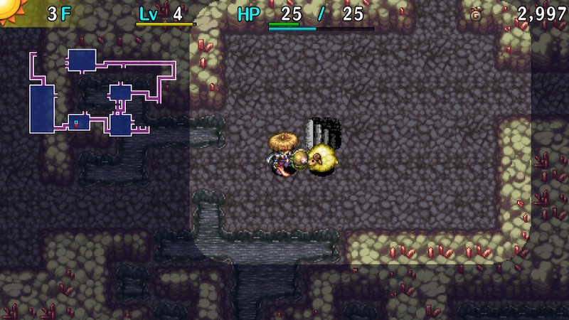

  

Dungeon where only weapons, shields, bracelets, pots, and Gitan can be found on the ground. Consumable items can generally only be obtained from Presto Pots, shops, and fixed monster drops. Carry-in items are allowed, so the limited item pool isn't a problem unless you're entering empty-handed. Limit broken enemies appear from 75F, but if you bring powerful items, they aren't very threatening. Overall, it's a nice place to visit to collect equipment and pots to prepare for post-game content.

<ul class="quickLinksUL">
  <li><a href="#overview">Overview</a></li>
  <li><a href="#strategy">Strategy</a></li>
  <li><a href="#monsters">Monsters</a></li>
  <li><a href="#items">Items</a></li>
  <li><a href="#traps">Traps</a></li>
</ul>

# Overview

<table class="dungeonOverview">
  <tr>
    <th>Unlock</th>
    <td class="highlightYellow">Clear Ouma Shrine and arrive in Nekomaneki Village.</td>
  </tr>
  <tr>
    <th>Entrance</th>
    <td class="highlightYellow">Nekomaneki Village (Woman in Dungeon Center)</td>
  </tr>
</table>

<table class="dungeonTable">
  <tr>
    <th>Floors</th>
    <td>50F (first) / 99F</td>
    <th>Day / Night</th>
    <td>Day</td>
  </tr>
  <tr>
    <th>Bring Items</th>
    <td>Yes</td>
    <th>Allies</th>
    <td>No</td>
  </tr>
  <tr>
    <th>Unidentified</th>
    <td>All categories</td>
    <th>New Items</th>
    <td>No</td>
  </tr>
  <tr>
    <th>Shops</th>
    <td>Regular, Elite, Pick-A-Choice</td>
    <th>Monster Houses</th>
    <td>Regular, Special, Sudden</td>
  </tr>
  <tr>
    <th>Initial Enemies</th>
    <td></td>
    <th>Spawn Rate</th>
    <td>30</td>
  </tr>
  <tr>
    <th>Ominous aura</th>
    <td>Yes ()</td>
    <th>Wind of Kron</th>
    <td>1st: 950 / 4th: 1250 </td>
  </tr>
  <tr>
    <th>Clear Icon</th>
    <td>None</td>
    <th>Reward</th>
    <td>Wonder Pick</td>
  </tr>
</table>

# Strategy

The floor item table includes weapons, shields, bracelets, and pots. (Heal Pot can't be found) Consumable items can only be obtained from Presto Pots or shops, excluding fixed monster drops.

If you bring a Trapper Bracelet, you can collect Floor Warp Traps + Pit Traps and use those to skip floors. Or if you have a [New Item](/system/new-items) staff with Transient + Swap effects, you can just use that to skip to the end. Otherwise, as long as you bring strong equipment and some useful staves + scrolls, it should be easy.

#### Before Clearing Main Story

This dungeon is a great place to obtain strong equipment like Bladite + Targite or Red Blade + Red Shield. Rare rune ingredients like Breeze Blade (Tri-direction) and Swap Shield (Magi-Twister) can also be found. Unlike [Tower of the Future](/dungeons/tower-of-the-future), Foly doesn't spawn on Mixer floors (8-10F) here, so synthesis is a bit easier. So if you're struggling with the main story, consider entering here to obtain / upgrade equipment. ※ Don't forget to bring an Undo Grass or Escape Scroll.

#### No Carry-In Items

This dungeon is actually balanced well enough for players to be able to clear it without bringing items. Limit broken monsters appear from 75F, but it's easy to increase upgrade value so it's more manageable than in dungeons like Rousing Paradise and Storm Forest - Dirk of Debts and Day Shield can also be found. In addition, Extinction Scroll can be found in regular shops.

Early game does involve a good amount of luck since food and healing items can only be found in shops, but you can have Karakuroids (6-8F) create Decay Traps and use Pop Tank (8-10F) to grill Rotten Onigiri. The best method to turn monsters into Rotten Onigiri via traps is to use an Inacc. Bracelet or Dodger Pot. Mutaikon (11-12F) can also be used to replenish fullness if you have a Cleansing Bracelet.

Insert unidentified bracelets into Identify or Exorcism pots before equipping them. This ensures you won't get stuck with a cursed Nonary Bracelet, Monsterphobic, or Itemphobic.

HP restoring items are rare, so you'll want to keep Zen and Dodger pots on hand for fixed damage zones. Zen: Ornery Tank (47-49F), Archdragon (66-68F), Cranky Tank2 (93-96F), Abyss Dragon2 (95-99F). Dodger: Porkon (49-50F), Porgon (74-77F).

Weapons, shields, and Gitan are common, so Kappa Troll2 (80-81F) floors are a bit more dangerous. Save Juicy Peaches for those floors if possible, and if you find Revival Grass in a shop, be sure to bless it.

#### Pick-A-Choice Shop Items

|Category|Items|
|-|-|
|Weapon|Glass Dirk, Bladite, Kabura Katana, Red Blade, Hatchet, Burning Blade, Breeze Blade|
|Shield|Glass Buckler, Spry Shield, Fuuma Shield, Swap Shield, Red Shield, Targite, Anti-Gaze Trge, Onigiri Shield|
|Bracelet|VIP, Anti-Parry, Wall Clip, Identify, Waterwalk, Monster Detector, Item Detector|
|Grass|Undo Grass, Revival Grass, Invincible Grass, Cheery Grass, Angel Seed|
|Scroll|Extinction, Blank, Sanctuary, Fate, Earth|
|Pot|Upgrade, Degrade, Lucky, Unlucky, Fever, Synthesis|
|Staff|Clone, Paralysis, Fort.|
|Talisman|Seal, Slumber, Slow, Inacc.|
|Projectile|Poison Arrow, Random Arrow, Killer Arrow, Drain Arrow, Silver Arrow|
|Other|Catstones (Lower chance than Lost Well)|

# Monsters

See [Monsters](/system/monsters) for individual monster details.

M = Maneater None Lv1 Lv2 Lv3 Lv4

Floor Colors: Limit break monsters Enemy Colors: Farming Useful Destroys Items Dangerous Very Dangerous

<table class="monsterTable">
  <thead>
    <tr>
      <th>F</th>
      <th colspan="5">Monsters</th>
      <th>M</th>
    </tr>
  </thead>
  <tbody>
    <tr>
      <td>1</td>
      <td>Mamel</td>
      <td>Seedie</td>
      <td>Sproutant</td>
      <td class="highlightGray"></td>
      <td class="highlightGray"></td>
      <td class="highlightBlack"></td>
    </tr>
    <tr>
      <td>2</td>
      <td>Mamel</td>
      <td>Seedie</td>
      <td>Sproutant</td>
      <td>Colum</td>
      <td class="highlightGray"></td>
      <td class="highlightBlack"></td>
    </tr>
    <tr>
      <td>3</td>
      <td>Pit Mamel</td>
      <td>Pin Kid</td>
      <td>Sproutant Chintala</td>
      <td>Colum</td>
      <td>Blade Bee</td>
      <td class="highlightBlack"></td>
    </tr>
    <tr>
      <td>4</td>
      <td>Pit Mamel</td>
      <td>Pin Kid</td>
      <td>Chintala</td>
      <td>Sweet Nut</td>
      <td>Blade Bee</td>
      <td class="highlightBlack"></td>
    </tr>
    <tr>
      <td>5</td>
      <td>Pit Mamel</td>
      <td>Pin Kid</td>
      <td>Chintala</td>
      <td>Sweet Nut</td>
      <td class="highlightGray"></td>
      <td class="highlightBlack"></td>
    </tr>
    <tr>
      <td>6</td>
      <td>Nigiri Baby</td>
      <td>Moseal</td>
      <td>Karakuroid</td>
      <td>Froggo</td>
      <td class="highlightGray"></td>
      <td class="highlightBlack"></td>
    </tr>
    <tr>
      <td>7</td>
      <td>Nigiri Baby</td>
      <td>Moseal</td>
      <td>Karakuroid</td>
      <td>Froggo</td>
      <td>Tiger Tosser</td>
      <td class="highlightBlack"></td>
    </tr>
    <tr>
      <td>8</td>
      <td>Nigiri Baby</td>
      <td>Moseal Mixer</td>
      <td>Karakuroid Pop Tank</td>
      <td>Curse Girl Fearabbit</td>
      <td>Tiger Tosser</td>
      <td class="highlightBlack"></td>
    </tr>
    <tr>
      <td>9</td>
      <td>Gyaza</td>
      <td>Mixer</td>
      <td>Pop Tank</td>
      <td>Curse Girl Fearabbit</td>
      <td>Tiger Tosser</td>
      <td class="highlightBlack"></td>
    </tr>
    <tr>
      <td>10</td>
      <td>Gyaza Pumphantasm</td>
      <td>Mixer</td>
      <td>Kumonigiri Pop Tank</td>
      <td>Naptapir</td>
      <td>N'dubba</td>
      <td class="highlightBlack"></td>
    </tr>
    <tr>
      <td>11</td>
      <td>Pumphantasm</td>
      <td>Mutaikon</td>
      <td>Kumonigiri</td>
      <td>Naptapir</td>
      <td>N'dubba</td>
      <td class="highlightBlack"></td>
    </tr>
    <tr>
      <td>12</td>
      <td>Pumphantasm</td>
      <td>Mutaikon</td>
      <td>Kumonigiri Scorpion</td>
      <td>Naptapir Metalhead</td>
      <td>Swordsman Mudkin</td>
      <td class="highlightBlack"></td>
    </tr>
    <tr>
      <td>13</td>
      <td>Snacky</td>
      <td>Cheer-Ham</td>
      <td>Polygon Spinna</td>
      <td>Acrid Nut</td>
      <td>Cololum Mid Chintala</td>
      <td class="highlightBlack"></td>
    </tr>
    <tr>
      <td>14</td>
      <td>Snacky</td>
      <td>Cheer-Ham</td>
      <td>Polygon Spinna</td>
      <td>Acrid Nut</td>
      <td>Cololum Kid Squid</td>
      <td rowspan="3" class="monsterTableManeater">1</td>
    </tr>
    <tr>
      <td>15</td>
      <td>Snacky</td>
      <td>Cheer-Ham</td>
      <td>Foly</td>
      <td>Bored Kappa</td>
      <td>Momoseal Kid Squid</td>
    </tr>
    <tr>
      <td>16</td>
      <td>Dagger Bee</td>
      <td>Yanpii</td>
      <td>Foly</td>
      <td>Bored Kappa Hopodile</td>
      <td>Momoseal Kid Squid</td>
    </tr>
    <tr>
      <td>17</td>
      <td>Dagger Bee</td>
      <td>Yanpii</td>
      <td>Zalokleft Foly</td>
      <td>Bored Kappa Hopodile</td>
      <td>Scoopie Flamebird</td>
      <td class="highlightBlack"></td>
    </tr>
    <tr>
      <td>18</td>
      <td>Dagger Bee</td>
      <td>Yanpii</td>
      <td>Zalokleft</td>
      <td>Hopodile</td>
      <td>Scoopie Flamebird</td>
      <td class="highlightBlack"></td>
    </tr>
    <tr>
      <td>19</td>
      <td>DJ Mage</td>
      <td>Eligan</td>
      <td>Boy Cart</td>
      <td>Beanie</td>
      <td>Scoopie</td>
      <td class="highlightBlack"></td>
    </tr>
    <tr>
      <td>20</td>
      <td>DJ Mage</td>
      <td>Eligan</td>
      <td>Boy Cart</td>
      <td>Beanie</td>
      <td>Pin Dude</td>
      <td rowspan="6" class="monsterTableVilleater">2</td>
    </tr>
    <tr>
      <td>21</td>
      <td>DJ Mage</td>
      <td>Eligan</td>
      <td>Green Zalokleft</td>
      <td>Sproutyrant</td>
      <td>Pin Dude</td>
    </tr>
    <tr>
      <td>22</td>
      <td>Steamroid</td>
      <td>Nigiri Morph</td>
      <td>Green Zalokleft</td>
      <td>Sproutyrant Poofy</td>
      <td>Pin Dude</td>
    </tr>
    <tr>
      <td>23</td>
      <td>Steamroid Grampa Tank</td>
      <td>Nigiri Morph Gyadon</td>
      <td>Green Zalokleft Absorbiphant</td>
      <td>Sproutyrant Snooztapir Poofy</td>
      <td>Froggucci Pandanigiri</td>
    </tr>
    <tr>
      <td>24</td>
      <td>Grampa Tank</td>
      <td>Ironhead Gyadon</td>
      <td>Absorbiphant</td>
      <td>Snooztapir Poofy</td>
      <td>Froggucci Pandanigiri</td>
    </tr>
    <tr>
      <td>25</td>
      <td>Hipadile</td>
      <td>Ironhead</td>
      <td>Absorbiphant</td>
      <td>Cursister</td>
      <td>Punisher</td>
    </tr>
    <tr>
      <td>26</td>
      <td>Hipadile</td>
      <td>Crow Tengu Firepuff</td>
      <td>Sr. Yanpii Spadie</td>
      <td>Muddy Cursister</td>
      <td>Punisher</td>
      <td class="highlightBlack"></td>
    </tr>
    <tr>
      <td>27</td>
      <td>Hipadile</td>
      <td>Crow Tengu Firepuff</td>
      <td>Sr. Yanpii Spadie</td>
      <td>Muddy Explochin</td>
      <td>Punisher</td>
      <td class="highlightBlack"></td>
    </tr>
    <tr>
      <td>28</td>
      <td>Kappa Pest</td>
      <td>Crow Tengu Firepuff</td>
      <td>Sr. Yanpii Spadie</td>
      <td>Muddy Explochin</td>
      <td>Cross Cart</td>
      <td class="highlightBlack"></td>
    </tr>
    <tr>
      <td>29</td>
      <td>Kappa Pest</td>
      <td>MC Mage</td>
      <td>Zapdon Go-Ham!</td>
      <td>Scarabbit Explochin</td>
      <td>Cross Cart Digestiphant</td>
      <td class="highlightBlack"></td>
    </tr>
    <tr>
      <td>30</td>
      <td>Kappa Pest</td>
      <td>MC Mage</td>
      <td>Zapdon Go-Ham!</td>
      <td>Scarabbit N'twyn</td>
      <td>Digestiphant</td>
      <td class="highlightBlack"></td>
    </tr>
    <tr>
      <td>31</td>
      <td>Death Gyaza</td>
      <td>MC Mage Mixermon</td>
      <td>Katana Bee</td>
      <td>N'twyn</td>
      <td>Dragon</td>
      <td class="highlightBlack"></td>
    </tr>
    <tr>
      <td>32</td>
      <td>Death Gyaza</td>
      <td>Mixermon</td>
      <td>Katana Bee</td>
      <td>N'twyn</td>
      <td>Dragon</td>
      <td class="highlightBlack"></td>
    </tr>
    <tr>
      <td>33</td>
      <td>Death Gyaza</td>
      <td>Mixermon</td>
      <td>Katana Bee</td>
      <td class="highlightGray"></td>
      <td>Dragon</td>
      <td rowspan="6" class="monsterTableVilleater">2</td>
    </tr>
    <tr>
      <td>34</td>
      <td>Pumphantom</td>
      <td>Polygon Shaka</td>
      <td>Dazikon</td>
      <td>Shagga Flamepuff</td>
      <td>Falcon Tengu</td>
    </tr>
    <tr>
      <td>35</td>
      <td>Pumphantom</td>
      <td>Polygon Shaka VeniScorp</td>
      <td>Dazikon</td>
      <td>Shagga Flamepuff</td>
      <td>Falcon Tengu Cave Mamel</td>
    </tr>
    <tr>
      <td>36</td>
      <td class="highlightGray"></td>
      <td>VeniScorp</td>
      <td>Tiger Hurler</td>
      <td>Shagga Flamepuff</td>
      <td>Falcon Tengu Cave Mamel</td>
    </tr>
    <tr>
      <td>37</td>
      <td class="highlightGray"></td>
      <td>VeniScorp</td>
      <td>Tiger Hurler</td>
      <td>MC Wizard</td>
      <td class="highlightGray"></td>
    </tr>
    <tr>
      <td>38</td>
      <td class="highlightGray"></td>
      <td>Eligagan</td>
      <td>Tiger Hurler Huistdon</td>
      <td>MC Wizard Gyairas</td>
      <td class="highlightGray"></td>
    </tr>
    <tr>
      <td>39</td>
      <td>Sparkbird</td>
      <td>Eligagan</td>
      <td>Huistdon</td>
      <td>Gyairas</td>
      <td class="highlightGray"></td>
      <td class="highlightBlack"></td>
    </tr>
    <tr>
      <td>40</td>
      <td>Sparkbird Spicy Nut</td>
      <td>Eligagan</td>
      <td>Huistdon</td>
      <td>Momomoseal</td>
      <td class="highlightGray"></td>
      <td class="highlightBlack"></td>
    </tr>
    <tr>
      <td>41</td>
      <td>Spicy Nut</td>
      <td>Sky Dragon</td>
      <td>Steelhead Huistdon</td>
      <td>Momomoseal</td>
      <td class="highlightGray"></td>
      <td class="highlightBlack"></td>
    </tr>
    <tr>
      <td>42</td>
      <td>Spicy Nut</td>
      <td>Sky Dragon</td>
      <td>Steelhead</td>
      <td>Momomoseal</td>
      <td class="highlightGray"></td>
      <td class="highlightBlack"></td>
    </tr>
    <tr>
      <td>43</td>
      <td>Spicy Nut</td>
      <td>Sky Dragon</td>
      <td>Steelhead</td>
      <td>Momomoseal</td>
      <td>Nashagga</td>
      <td class="highlightBlack"></td>
    </tr>
    <tr>
      <td>44</td>
      <td>Spicy Nut</td>
      <td>Rally Ham</td>
      <td>Nuttie Concusschin</td>
      <td>Nigiri Boss</td>
      <td>Nashagga King Squid</td>
      <td class="highlightBlack"></td>
    </tr>
    <tr>
      <td>45</td>
      <td>Spicy Nut Munchy</td>
      <td>Rally Ham Big Chintala</td>
      <td>Nuttie Concusschin</td>
      <td>Nigiri Boss</td>
      <td>Nashagga King Squid</td>
      <td class="highlightBlack"></td>
    </tr>
    <tr>
      <td>46</td>
      <td>Spicy Nut Munchy</td>
      <td>Rally Ham Big Chintala</td>
      <td>Nuttie Concusschin</td>
      <td>Oingodile</td>
      <td>Blazepuff</td>
      <td class="highlightBlack"></td>
    </tr>
    <tr>
      <td>47</td>
      <td>Spicy Nut Trowelie</td>
      <td>Super Gazer</td>
      <td>Ornery Tank</td>
      <td>Oingodile</td>
      <td>Blazepuff Eagle Tengu</td>
      <td rowspan="6" class="monsterTableMounteater">3</td>
    </tr>
    <tr>
      <td>48</td>
      <td>Spicy Nut Trowelie</td>
      <td>Super Gazer Colocolum</td>
      <td>Ornery Tank Electroid?</td>
      <td>Oingodile Porkon?</td>
      <td>Blazepuff Eagle Tengu</td>
    </tr>
    <tr>
      <td>49</td>
      <td>Spicy Nut Trowelie</td>
      <td>Super Gazer Colocolum</td>
      <td>Ornery Tank Electroid</td>
      <td>Porkon</td>
      <td>Eagle Tengu</td>
    </tr>
    <tr>
      <td>50</td>
      <td>Doztapir</td>
      <td>Colocolum</td>
      <td>N'mach Electroid</td>
      <td>Porkon</td>
      <td>Mixergon</td>
    </tr>
    <tr>
      <td>51</td>
      <td>Doztapir</td>
      <td>Strong Cart</td>
      <td>N'mach</td>
      <td>Jouncy</td>
      <td>Mixergon Debaser</td>
    </tr>
    <tr>
      <td>52</td>
      <td>Doztapir Vexing Kappa</td>
      <td>Strong Cart</td>
      <td>MC Sorceror</td>
      <td>Jouncy Sprouterror</td>
      <td>Spicy Nut Debaser</td>
    </tr>
    <tr>
      <td>53</td>
      <td>Vexing Kappa</td>
      <td>Mudster</td>
      <td>MC Sorceror</td>
      <td>Jouncy Sprouterror</td>
      <td>Trillman Debaser</td>
      <td class="highlightBlack"></td>
    </tr>
    <tr>
      <td>54</td>
      <td>StunScorp</td>
      <td>Mudster Pyrepuff</td>
      <td>MC Sorceror</td>
      <td>Jouncy Sprouterror?</td>
      <td>Spicy Nut Debaser</td>
      <td class="highlightBlack"></td>
    </tr>
    <tr>
      <td>55</td>
      <td>StunScorp</td>
      <td>Pyrepuff</td>
      <td class="highlightGray"></td>
      <td>Tiger Chucker</td>
      <td class="highlightGray"></td>
      <td class="highlightBlack"></td>
    </tr>
    <tr>
      <td>56</td>
      <td>Pierce Cart</td>
      <td>Curspinster</td>
      <td>Horrabbit</td>
      <td>Tiger Chucker Pumpanshee</td>
      <td>Spicy Nut Momomomoseal</td>
      <td class="highlightBlack"></td>
    </tr>
    <tr>
      <td>57</td>
      <td>Spongiderm Pierce Cart</td>
      <td>Froggon Curspinster</td>
      <td>Horrabbit</td>
      <td>Tiger Chucker Pumpanshee</td>
      <td>Momomomoseal</td>
      <td class="highlightBlack"></td>
    </tr>
    <tr>
      <td>58</td>
      <td>Spongiderm Pierce Cart</td>
      <td>Froggon Curspinster</td>
      <td>Horrabbit</td>
      <td>Lashagga Pumpanshee</td>
      <td>Spicy Nut Momomomoseal</td>
      <td class="highlightBlack"></td>
    </tr>
    <tr>
      <td>59</td>
      <td>Spongiderm</td>
      <td>Froggon Iron Zalokleft</td>
      <td>Lt. Yanpii</td>
      <td>Lashagga</td>
      <td>Item Knave Gyandora</td>
      <td class="highlightBlack"></td>
    </tr>
    <tr>
      <td>60</td>
      <td>Zanbeeto</td>
      <td>Iron Zalokleft</td>
      <td>Lt. Yanpii</td>
      <td>Lashagga</td>
      <td>Item Knave Gyandora</td>
      <td class="highlightBlack"></td>
    </tr>
    <tr>
      <td>61</td>
      <td>Zanbeeto</td>
      <td>Flarebird</td>
      <td>Lt. Yanpii</td>
      <td>Polygon Singa</td>
      <td>Bunchukdon</td>
      <td class="highlightBlack"></td>
    </tr>
    <tr>
      <td>62</td>
      <td>Sensei</td>
      <td>Flarebird</td>
      <td class="highlightGray"></td>
      <td>Polygon Singa</td>
      <td>Bunchukdon</td>
      <td rowspan="3" class="monsterTableMounteater">3</td>
    </tr>
    <tr>
      <td>63</td>
      <td>Sensei</td>
      <td>Flarebird</td>
      <td>Bouncy</td>
      <td>Polygon Singa Spirit Ham</td>
      <td>Bunchukdon</td>
    </tr>
    <tr>
      <td>64</td>
      <td>Sensei</td>
      <td>Bitter Nut</td>
      <td>Bouncy</td>
      <td>Spirit Ham</td>
      <td>Onigirizzly</td>
    </tr>
    <tr>
      <td>65</td>
      <td>Hyper Gazer</td>
      <td>Bitter Nut</td>
      <td>Bouncy</td>
      <td>Spirit Ham</td>
      <td>Onigirizzly Fulminachin</td>
      <td class="highlightBlack"></td>
    </tr>
    <tr>
      <td>66</td>
      <td>Hyper Gazer</td>
      <td>Bitter Nut</td>
      <td>Bouncy</td>
      <td>Archdragon</td>
      <td>Phoenix Tengu Fulminachin</td>
      <td class="highlightBlack"></td>
    </tr>
    <tr>
      <td>67</td>
      <td>Hyper Gazer</td>
      <td>Bitter Nut</td>
      <td>Dozikon</td>
      <td>Archdragon</td>
      <td>Phoenix Tengu</td>
      <td rowspan="3" class="monsterTableMounteater">3</td>
    </tr>
    <tr>
      <td>68</td>
      <td>Grainie</td>
      <td>Bitter Nut</td>
      <td>Dozikon</td>
      <td>Archdragon Comatapir</td>
      <td>Phoenix Tengu</td>
    </tr>
    <tr>
      <td>69</td>
      <td>Grainie</td>
      <td>Bitter Nut</td>
      <td>Mudder</td>
      <td>Comatapir</td>
      <td class="highlightGray"></td>
    </tr>
    <tr>
      <td>70</td>
      <td>Grainie</td>
      <td>Bitter Nut Huge Chintala</td>
      <td>Mudder Hell Gyaza</td>
      <td>N'dup</td>
      <td>Mixerdon</td>
      <td class="highlightBlack"></td>
    </tr>
    <tr>
      <td>71</td>
      <td>Eligagon</td>
      <td>Huge Chintala</td>
      <td>Mudder Hell Gyaza</td>
      <td>N'dup</td>
      <td>Mixerdon</td>
      <td class="highlightBlack"></td>
    </tr>
    <tr>
      <td>72</td>
      <td>Eligagon</td>
      <td>Huge Chintala</td>
      <td>Mudder Hell Gyaza</td>
      <td>N'dup Cyberoid</td>
      <td>FO-UZZ</td>
      <td class="highlightBlack"></td>
    </tr>
    <tr>
      <td>73</td>
      <td>Eligagon</td>
      <td>Cursenior</td>
      <td>Detonachin</td>
      <td>N'dup Cyberoid</td>
      <td>FO-UZZ</td>
      <td class="highlightBlack"></td>
    </tr>
    <tr>
      <td>74</td>
      <td>Porgon</td>
      <td>Cursenior</td>
      <td>Detonachin Sproutitan</td>
      <td>Cyberoid</td>
      <td>Shovelie</td>
      <td class="highlightBlack"></td>
    </tr>
    <tr>
      <td class="limitBreak">75</td>
      <td>Porgon2</td>
      <td>Cursenior2 Mealy2</td>
      <td>Ruiner Sproutitan2</td>
      <td>Knave King2</td>
      <td>Shovelie2</td>
      <td rowspan="5" class="monsterTableIsleater">4</td>
    </tr>
    <tr>
      <td class="limitBreak">76</td>
      <td>Porgon2</td>
      <td>Mealy2</td>
      <td>Ruiner Sproutitan2</td>
      <td>Knave King2</td>
      <td class="highlightGray"></td>
    </tr>
    <tr>
      <td class="limitBreak">77</td>
      <td>Porgon2</td>
      <td>Terrabbit2</td>
      <td>Ruiner</td>
      <td>Boingodile2</td>
      <td>Pumptergeist2 BlightScorp2</td>
    </tr>
    <tr>
      <td class="limitBreak">78</td>
      <td>Squidperor2</td>
      <td>Terrabbit2</td>
      <td>Ruiner Colocolocolum2</td>
      <td>Boingodile2</td>
      <td>Pumptergeist2 BlightScorp2</td>
    </tr>
    <tr>
      <td class="limitBreak">79</td>
      <td>Squidperor2</td>
      <td>Kodionigiri2</td>
      <td>Colocolocolum2</td>
      <td>Boingodile2</td>
      <td>Pumptergeist2</td>
    </tr>
    <tr>
      <td class="limitBreak">80</td>
      <td>Osmammoth2</td>
      <td>Gitan Mamel2 Kodionigiri2</td>
      <td>Kappa Troll2 Colocolocolum2</td>
      <td>Kleptoad2</td>
      <td class="highlightGray"></td>
      <td class="highlightBlack"></td>
    </tr>
    <tr>
      <td class="limitBreak">81</td>
      <td>Osmammoth2</td>
      <td>Gitan Mamel2</td>
      <td>Kappa Troll2</td>
      <td>Kleptoad2</td>
      <td>Doomhead2</td>
      <td class="highlightBlack"></td>
    </tr>
    <tr>
      <td class="limitBreak">82</td>
      <td>Osmammoth2</td>
      <td>Gitan Mamel2</td>
      <td>Googoman2</td>
      <td>Kleptoad2</td>
      <td>Doomhead2</td>
      <td class="highlightBlack"></td>
    </tr>
    <tr>
      <td class="limitBreak">83</td>
      <td>Osmammoth2</td>
      <td>Gyandoron2</td>
      <td>Googoman2</td>
      <td class="highlightGray"></td>
      <td>Doomhead2</td>
      <td class="highlightBlack"></td>
    </tr>
    <tr>
      <td class="limitBreak">84</td>
      <td>Osmammoth2</td>
      <td>Gyandoron2</td>
      <td>Blazebird2</td>
      <td>Polygon Stunna2</td>
      <td>Tiger Ace2</td>
      <td class="highlightBlack"></td>
    </tr>
    <tr>
      <td class="limitBreak">85</td>
      <td>Nigiri King2?</td>
      <td>Gyandoron2</td>
      <td>Blazebird2</td>
      <td>Polygon Stunna2</td>
      <td>Zotdon2 Tiger Ace2</td>
      <td class="highlightBlack"></td>
    </tr>
    <tr>
      <td class="limitBreak">86</td>
      <td>Nigiri King2</td>
      <td>Gyandoron2</td>
      <td>Blazebird2</td>
      <td>Polygon Stunna2 Boss Yanpii2</td>
      <td>Zotdon2 Tiger Ace2</td>
      <td class="highlightBlack"></td>
    </tr>
    <tr>
      <td class="limitBreak">87</td>
      <td>Nigiri King2</td>
      <td>Gyandoron2</td>
      <td>Blazebird2</td>
      <td>Polygon Stunna2 Boss Yanpii2</td>
      <td>Zotdon2 Zalokleft King2</td>
      <td class="highlightBlack"></td>
    </tr>
    <tr>
      <td class="limitBreak">88</td>
      <td>Nigiri King2</td>
      <td>Gyandoron2</td>
      <td>Ultra Gazer2</td>
      <td>Polygon Stunna2 Boss Yanpii2</td>
      <td>Zotdon2 Zalokleft King2</td>
      <td rowspan="6" class="monsterTableIsleater">4</td>
    </tr>
    <tr>
      <td class="limitBreak">89</td>
      <td>Elizgagon2</td>
      <td>Gyandoron2 Despoiler2</td>
      <td>Ultra Gazer2</td>
      <td>Polygon Stunna2 Boss Yanpii2</td>
      <td>Doom Gyaza2 Zalokleft King2</td>
    </tr>
    <tr>
      <td class="limitBreak">90</td>
      <td>Elizgagon2</td>
      <td>Despoiler2</td>
      <td>Ultra Gazer2</td>
      <td>Swordmaster2</td>
      <td>Doom Gyaza2</td>
    </tr>
    <tr>
      <td class="limitBreak">91</td>
      <td>Elizgagon2</td>
      <td>Despoiler2</td>
      <td>Ultra Gazer2</td>
      <td>Swordmaster2</td>
      <td>Doom Gyaza2</td>
    </tr>
    <tr>
      <td class="limitBreak">92</td>
      <td>Elizgagon2</td>
      <td>Despoiler2</td>
      <td>Ultra Gazer2</td>
      <td>Swordmaster2</td>
      <td class="highlightGray"></td>
    </tr>
    <tr>
      <td class="limitBreak">93</td>
      <td>Elizgagon2</td>
      <td>Despoiler2</td>
      <td>Ultra Gazer2</td>
      <td>Cranky Tank2</td>
      <td class="highlightGray"></td>
    </tr>
    <tr>
      <td class="limitBreak">94</td>
      <td>Elizgagon2</td>
      <td>Despoiler2</td>
      <td class="highlightGray"></td>
      <td>Cranky Tank2</td>
      <td class="highlightGray"></td>
      <td class="highlightBlack"></td>
    </tr>
    <tr>
      <td class="limitBreak">95</td>
      <td>Elizgagon2</td>
      <td>Despoiler2</td>
      <td>Abyss Dragon2</td>
      <td>Cranky Tank2</td>
      <td class="highlightGray"></td>
      <td class="highlightBlack"></td>
    </tr>
    <tr>
      <td class="limitBreak">96</td>
      <td>Elizgagon2</td>
      <td>Despoiler2</td>
      <td>Abyss Dragon2</td>
      <td>Cranky Tank2</td>
      <td class="highlightGray"></td>
      <td class="highlightBlack"></td>
    </tr>
    <tr>
      <td class="limitBreak">97</td>
      <td>Elizgagon2</td>
      <td>Despoiler2</td>
      <td>Abyss Dragon2</td>
      <td class="highlightGray"></td>
      <td class="highlightGray"></td>
      <td class="highlightBlack"></td>
    </tr>
    <tr>
      <td class="limitBreak">98</td>
      <td>Elizgagon2</td>
      <td>Despoiler2</td>
      <td>Abyss Dragon2</td>
      <td class="highlightGray"></td>
      <td class="highlightGray"></td>
      <td class="highlightBlack"></td>
    </tr>
    <tr>
      <td class="limitBreak">99</td>
      <td>Elizgagon2</td>
      <td>Despoiler2</td>
      <td>Abyss Dragon2</td>
      <td class="highlightGray"></td>
      <td class="highlightGray"></td>
      <td class="highlightBlack"></td>
    </tr>
  </tbody>
</table>

※ Monster Table might be incomplete.

# Items

※ Item Table is incomplete. If you find a drop that isn't listed, please add it to the table.

- F = Floor, Monster (day)
- S = Shop, Maneater, Shiny Object (yellow)
- P = Presto Pot
- Z = Zalokleft
- E = Elite Shop, Pick-A-Choice, Shiny Object (blue)

#### Weapons

<table class="dungeonItems">
  <tr>
    <th>Name</th>
    <th>F</th>
    <th>S</th>
    <th>P</th>
    <th>Z</th>
    <th>E</th>
    <th rowspan="15" class="tableDivider"></th>
    <th>Name</th>
    <th>F</th>
    <th>S</th>
    <th>P</th>
    <th>Z</th>
    <th>E</th>
    <th rowspan="15" class="tableDivider"></th>
    <th>Name</th>
    <th>F</th>
    <th>S</th>
    <th>P</th>
    <th>Z</th>
    <th>E</th>
  </tr>
  <tr>
    <td class="leftText highlightGray">Ordinary Stick</td>
    <td>X</td>
    <td></td>
    <td></td>
    <td></td>
    <td></td>
    <td class="leftText highlightGray">Rusty Pickaxe</td>
    <td>X</td>
    <td></td>
    <td></td>
    <td></td>
    <td></td>
    <td class="leftText highlightGray">Shockuto</td>
    <td>X</td>
    <td></td>
    <td></td>
    <td></td>
    <td></td>
  </tr>
  <tr>
    <td class="leftText highlightGray">Tin Blade</td>
    <td>X</td>
    <td></td>
    <td></td>
    <td></td>
    <td></td>
    <td class="leftText highlightGray">Old Mallet</td>
    <td>X</td>
    <td></td>
    <td></td>
    <td></td>
    <td></td>
    <td class="leftText highlightGray">Blurry Stick</td>
    <td></td>
    <td></td>
    <td></td>
    <td></td>
    <td></td>
  </tr>
  <tr>
    <td class="leftText highlightGray">Katana</td>
    <td>X</td>
    <td></td>
    <td></td>
    <td></td>
    <td></td>
    <td class="leftText highlightGray">Sky Splitter</td>
    <td>X</td>
    <td></td>
    <td></td>
    <td></td>
    <td></td>
    <td class="leftText highlightGray">Sealing Keisaku</td>
    <td></td>
    <td></td>
    <td></td>
    <td></td>
    <td></td>
  </tr>
  <tr>
    <td class="leftText highlightGray">Beast Fang</td>
    <td>X</td>
    <td></td>
    <td></td>
    <td></td>
    <td></td>
    <td class="leftText highlightGray">Water Cutter</td>
    <td></td>
    <td></td>
    <td></td>
    <td></td>
    <td></td>
    <td class="leftText highlightGray">Baffle Axe</td>
    <td></td>
    <td></td>
    <td></td>
    <td></td>
    <td></td>
  </tr>
  <tr>
    <td class="leftText highlightGray">Dotanuki</td>
    <td>X</td>
    <td></td>
    <td></td>
    <td></td>
    <td></td>
    <td class="leftText highlightGray">Scythe</td>
    <td>X</td>
    <td></td>
    <td></td>
    <td></td>
    <td></td>
    <td class="leftText highlightGray">Hatchet</td>
    <td></td>
    <td></td>
    <td></td>
    <td></td>
    <td>X</td>
  </tr>
  <tr>
    <td class="leftText highlightGray">Bladite</td>
    <td>X</td>
    <td></td>
    <td></td>
    <td></td>
    <td>X</td>
    <td class="leftText highlightGray">Myopic Masher</td>
    <td>X</td>
    <td></td>
    <td></td>
    <td></td>
    <td></td>
    <td class="leftText highlightGray">Shoddy Dirk</td>
    <td>X</td>
    <td></td>
    <td></td>
    <td></td>
    <td></td>
  </tr>
  <tr>
    <td class="leftText highlightGray">Red Blade</td>
    <td>X</td>
    <td></td>
    <td></td>
    <td></td>
    <td>X</td>
    <td class="leftText highlightGray">Magic Masher</td>
    <td></td>
    <td></td>
    <td></td>
    <td></td>
    <td></td>
    <td class="leftText highlightGray">Glass Dirk</td>
    <td></td>
    <td></td>
    <td></td>
    <td></td>
    <td>X</td>
  </tr>
  <tr>
    <td class="leftText highlightGray">Kabura Katana</td>
    <td>X</td>
    <td></td>
    <td></td>
    <td></td>
    <td>X</td>
    <td class="leftText highlightGray">Drain Dagger</td>
    <td>X</td>
    <td></td>
    <td></td>
    <td></td>
    <td></td>
    <td class="leftText highlightGray">Dirk of Debts</td>
    <td>X</td>
    <td></td>
    <td></td>
    <td></td>
    <td></td>
  </tr>
  <tr>
    <td class="leftText highlightGray">Fuuma Sword</td>
    <td></td>
    <td></td>
    <td></td>
    <td></td>
    <td></td>
    <td class="leftText highlightGray">Copper Cleaver</td>
    <td>X</td>
    <td></td>
    <td></td>
    <td></td>
    <td></td>
    <td class="leftText highlightGray">Extreme Sword</td>
    <td></td>
    <td></td>
    <td></td>
    <td></td>
    <td></td>
  </tr>
  <tr>
    <td class="leftText highlightGray">Pathetic Blade</td>
    <td>X</td>
    <td></td>
    <td></td>
    <td></td>
    <td></td>
    <td class="leftText highlightGray">Crescent Katana</td>
    <td></td>
    <td></td>
    <td></td>
    <td></td>
    <td></td>
    <td class="leftText highlightGray">Violent Blade</td>
    <td></td>
    <td></td>
    <td></td>
    <td></td>
    <td></td>
  </tr>
  <tr>
    <td class="leftText highlightGray">Dull Gold Edge</td>
    <td>X</td>
    <td></td>
    <td></td>
    <td></td>
    <td></td>
    <td class="leftText highlightGray">Lizard Lasher</td>
    <td>X</td>
    <td></td>
    <td></td>
    <td></td>
    <td></td>
    <td class="leftText highlightGray">Breeze Blade</td>
    <td>X</td>
    <td></td>
    <td></td>
    <td></td>
    <td>X</td>
  </tr>
  <tr>
    <td class="leftText highlightGray">Bright Blade</td>
    <td>X</td>
    <td></td>
    <td></td>
    <td></td>
    <td></td>
    <td class="leftText highlightGray">Nap Rattle</td>
    <td></td>
    <td></td>
    <td></td>
    <td></td>
    <td></td>
    <td class="leftText highlightGray">Burning Blade</td>
    <td>X</td>
    <td></td>
    <td></td>
    <td></td>
    <td>X</td>
  </tr>
  <tr>
    <td class="leftText highlightGray">True Knife</td>
    <td></td>
    <td></td>
    <td></td>
    <td></td>
    <td></td>
    <td class="leftText highlightGray">Wonder Pick</td>
    <td></td>
    <td></td>
    <td></td>
    <td></td>
    <td></td>
    <td class="leftText highlightGray">Sturdy Hammer</td>
    <td></td>
    <td></td>
    <td></td>
    <td></td>
    <td></td>
  </tr>
  <tr>
    <td class="leftText highlightGray">Kaburagi</td>
    <td></td>
    <td></td>
    <td></td>
    <td></td>
    <td></td>
    <td colspan="6"></td>
    <td colspan="6"></td>
  </tr>
</table>

#### Shields

<table class="dungeonItems">
  <tr>
    <th>Name</th>
    <th>F</th>
    <th>S</th>
    <th>P</th>
    <th>Z</th>
    <th>E</th>
    <th rowspan="13" class="tableDivider"></th>
    <th>Name</th>
    <th>F</th>
    <th>S</th>
    <th>P</th>
    <th>Z</th>
    <th>E</th>
    <th rowspan="13" class="tableDivider"></th>
    <th>Name</th>
    <th>F</th>
    <th>S</th>
    <th>P</th>
    <th>Z</th>
    <th>E</th>
  </tr>
  <tr>
    <td class="leftText highlightGray">Plain Targe</td>
    <td>X</td>
    <td></td>
    <td></td>
    <td></td>
    <td></td>
    <td class="leftText highlightGray">Heavy Shield</td>
    <td>X</td>
    <td></td>
    <td></td>
    <td></td>
    <td></td>
    <td class="leftText highlightGray">Gyadon Blocker</td>
    <td>X</td>
    <td></td>
    <td></td>
    <td></td>
    <td></td>
  </tr>
  <tr>
    <td class="leftText highlightGray">Tin Shield</td>
    <td>X</td>
    <td></td>
    <td></td>
    <td></td>
    <td></td>
    <td class="leftText highlightGray">Midnight Shield</td>
    <td></td>
    <td></td>
    <td></td>
    <td></td>
    <td></td>
    <td class="leftText highlightGray">Snake Shield</td>
    <td>X</td>
    <td></td>
    <td></td>
    <td></td>
    <td></td>
  </tr>
  <tr>
    <td class="leftText highlightGray">Iron Targe</td>
    <td>X</td>
    <td></td>
    <td></td>
    <td></td>
    <td></td>
    <td class="leftText highlightGray">Day Shield</td>
    <td>X</td>
    <td></td>
    <td></td>
    <td></td>
    <td></td>
    <td class="leftText highlightGray">Steady Shield</td>
    <td></td>
    <td></td>
    <td></td>
    <td></td>
    <td></td>
  </tr>
  <tr>
    <td class="leftText highlightGray">Wolfshead</td>
    <td>X</td>
    <td></td>
    <td></td>
    <td></td>
    <td></td>
    <td class="leftText highlightGray">Binary Shield</td>
    <td>X</td>
    <td></td>
    <td></td>
    <td></td>
    <td></td>
    <td class="leftText highlightGray">Anti-Gaze Trge</td>
    <td>X</td>
    <td></td>
    <td></td>
    <td></td>
    <td>X</td>
  </tr>
  <tr>
    <td class="leftText highlightGray">Beast Shield</td>
    <td>X</td>
    <td></td>
    <td></td>
    <td></td>
    <td></td>
    <td class="leftText highlightGray">Counter Shield</td>
    <td>X</td>
    <td></td>
    <td></td>
    <td></td>
    <td></td>
    <td class="leftText highlightGray">Swap Shield</td>
    <td>X</td>
    <td></td>
    <td></td>
    <td></td>
    <td></td>
  </tr>
  <tr>
    <td class="leftText highlightGray">Targite</td>
    <td>X</td>
    <td></td>
    <td></td>
    <td></td>
    <td>X</td>
    <td class="leftText highlightGray">Student Shield</td>
    <td>X</td>
    <td></td>
    <td></td>
    <td></td>
    <td></td>
    <td class="leftText highlightGray">Shoddy Plank</td>
    <td>X</td>
    <td></td>
    <td></td>
    <td></td>
    <td></td>
  </tr>
  <tr>
    <td class="leftText highlightGray">Red Shield</td>
    <td>X</td>
    <td></td>
    <td></td>
    <td></td>
    <td>X</td>
    <td class="leftText highlightGray">Bowl Shield</td>
    <td>X</td>
    <td></td>
    <td></td>
    <td></td>
    <td></td>
    <td class="leftText highlightGray">Glass Buckler</td>
    <td></td>
    <td></td>
    <td></td>
    <td></td>
    <td>X</td>
  </tr>
  <tr>
    <td class="leftText highlightGray">Fuuma Shield</td>
    <td>X</td>
    <td></td>
    <td></td>
    <td></td>
    <td>X</td>
    <td class="leftText highlightGray">Spry Shield</td>
    <td>X</td>
    <td></td>
    <td></td>
    <td></td>
    <td>X</td>
    <td class="leftText highlightGray">Pauper's Plank</td>
    <td>X</td>
    <td></td>
    <td></td>
    <td></td>
    <td></td>
  </tr>
  <tr>
    <td class="leftText highlightGray">Pathetic Shield</td>
    <td>X</td>
    <td></td>
    <td></td>
    <td></td>
    <td></td>
    <td class="leftText highlightGray">Blast Shield</td>
    <td>X</td>
    <td></td>
    <td></td>
    <td></td>
    <td></td>
    <td class="leftText highlightGray">Rush Shield</td>
    <td></td>
    <td></td>
    <td></td>
    <td></td>
    <td></td>
  </tr>
  <tr>
    <td class="leftText highlightGray">Gold Shield</td>
    <td>X</td>
    <td></td>
    <td></td>
    <td></td>
    <td></td>
    <td class="leftText highlightGray">Lock Shield</td>
    <td>X</td>
    <td></td>
    <td></td>
    <td></td>
    <td></td>
    <td class="leftText highlightGray">Blazing Shield</td>
    <td></td>
    <td></td>
    <td></td>
    <td></td>
    <td></td>
  </tr>
  <tr>
    <td class="leftText highlightGray">Diet Shield</td>
    <td>X</td>
    <td></td>
    <td></td>
    <td></td>
    <td></td>
    <td class="leftText highlightGray">Safe Shield</td>
    <td></td>
    <td></td>
    <td></td>
    <td></td>
    <td></td>
    <td class="leftText highlightGray">Onigiri Shield</td>
    <td></td>
    <td></td>
    <td></td>
    <td></td>
    <td>X</td>
  </tr>
  <tr>
    <td class="leftText highlightGray">Helix Shield</td>
    <td></td>
    <td></td>
    <td></td>
    <td></td>
    <td></td>
    <td class="leftText highlightGray">Parry Shield</td>
    <td></td>
    <td></td>
    <td></td>
    <td></td>
    <td></td>
    <td class="leftText highlightGray">Nirvana Board</td>
    <td></td>
    <td></td>
    <td></td>
    <td></td>
    <td></td>
  </tr>
</table>

#### Bracelets

<table class="dungeonItems">
  <tr>
    <th>Name</th>
    <th>F</th>
    <th>S</th>
    <th>P</th>
    <th>Z</th>
    <th>E</th>
    <th rowspan="13" class="tableDivider"></th>
    <th>Name</th>
    <th>F</th>
    <th>S</th>
    <th>P</th>
    <th>Z</th>
    <th>E</th>
    <th rowspan="13" class="tableDivider"></th>
    <th>Name</th>
    <th>F</th>
    <th>S</th>
    <th>P</th>
    <th>Z</th>
    <th>E</th>
  </tr>
  <tr>
    <td class="leftText highlightGray">Strength Bracelet</td>
    <td>X</td>
    <td></td>
    <td></td>
    <td></td>
    <td></td>
    <td class="leftText highlightGray">Dozer Bracelet</td>
    <td>X</td>
    <td></td>
    <td></td>
    <td></td>
    <td></td>
    <td class="leftText highlightGray">Nonary Bracelet</td>
    <td>X</td>
    <td></td>
    <td></td>
    <td></td>
    <td></td>
  </tr>
  <tr>
    <td class="leftText highlightGray">Can. Arm Bracelet</td>
    <td>X</td>
    <td></td>
    <td></td>
    <td></td>
    <td></td>
    <td class="leftText highlightGray">Trap Bracelet</td>
    <td>X</td>
    <td></td>
    <td></td>
    <td></td>
    <td></td>
    <td class="leftText highlightGray">Growth Bracelet</td>
    <td></td>
    <td></td>
    <td></td>
    <td></td>
    <td></td>
  </tr>
  <tr>
    <td class="leftText highlightGray">Inacc. Bracelet</td>
    <td>X</td>
    <td></td>
    <td></td>
    <td></td>
    <td></td>
    <td class="leftText highlightGray">Monster Detector</td>
    <td></td>
    <td></td>
    <td></td>
    <td></td>
    <td>X</td>
    <td class="leftText highlightGray">Anti-Parry Brce.</td>
    <td></td>
    <td></td>
    <td></td>
    <td></td>
    <td>X</td>
  </tr>
  <tr>
    <td class="leftText highlightGray">Bunch Bracelet</td>
    <td>X</td>
    <td></td>
    <td></td>
    <td></td>
    <td></td>
    <td class="leftText highlightGray">Monsterphobic</td>
    <td></td>
    <td></td>
    <td></td>
    <td></td>
    <td></td>
    <td class="leftText highlightGray">Time Stop Bracelet</td>
    <td></td>
    <td></td>
    <td></td>
    <td></td>
    <td></td>
  </tr>
  <tr>
    <td class="leftText highlightGray">Cleansing Bracelet</td>
    <td>X</td>
    <td></td>
    <td></td>
    <td></td>
    <td></td>
    <td class="leftText highlightGray">Item Detector</td>
    <td></td>
    <td></td>
    <td></td>
    <td></td>
    <td>X</td>
    <td class="leftText highlightGray">Floating Bracelet</td>
    <td></td>
    <td></td>
    <td></td>
    <td></td>
    <td></td>
  </tr>
  <tr>
    <td class="leftText highlightGray">Anti-Cnf. Bracelet</td>
    <td>X</td>
    <td></td>
    <td></td>
    <td></td>
    <td></td>
    <td class="leftText highlightGray">Itemphobic</td>
    <td>X</td>
    <td></td>
    <td></td>
    <td></td>
    <td></td>
    <td class="leftText highlightGray">Night Ward</td>
    <td></td>
    <td></td>
    <td></td>
    <td></td>
    <td></td>
  </tr>
  <tr>
    <td class="leftText highlightGray">Alert Bracelet</td>
    <td>X</td>
    <td></td>
    <td></td>
    <td></td>
    <td></td>
    <td class="leftText highlightGray">Waterwalk Bracelet</td>
    <td></td>
    <td></td>
    <td></td>
    <td></td>
    <td>X</td>
    <td class="leftText highlightGray">Scout Bracelet</td>
    <td></td>
    <td></td>
    <td></td>
    <td></td>
    <td>X</td>
  </tr>
  <tr>
    <td class="leftText highlightGray">Anti-Crs. Bracelet</td>
    <td></td>
    <td></td>
    <td></td>
    <td></td>
    <td></td>
    <td class="leftText highlightGray">Wall Clip Bracelet</td>
    <td></td>
    <td></td>
    <td></td>
    <td></td>
    <td></td>
    <td class="leftText highlightGray">Trapper Bracelet</td>
    <td></td>
    <td></td>
    <td></td>
    <td></td>
    <td></td>
  </tr>
  <tr>
    <td class="leftText highlightGray">Staunch Bracelet</td>
    <td>X</td>
    <td></td>
    <td></td>
    <td></td>
    <td></td>
    <td class="leftText highlightGray">Heal Bracelet</td>
    <td></td>
    <td></td>
    <td></td>
    <td></td>
    <td></td>
    <td class="leftText highlightGray">Identify Bracelet</td>
    <td></td>
    <td></td>
    <td></td>
    <td></td>
    <td>X</td>
  </tr>
  <tr>
    <td class="leftText highlightGray">Critical Bracelet</td>
    <td>X</td>
    <td></td>
    <td></td>
    <td></td>
    <td></td>
    <td class="leftText highlightGray">Alleyway Bracelet</td>
    <td>X</td>
    <td></td>
    <td></td>
    <td></td>
    <td></td>
    <td class="leftText highlightGray">VIP Bracelet</td>
    <td></td>
    <td></td>
    <td></td>
    <td></td>
    <td>X</td>
  </tr>
  <tr>
    <td class="leftText highlightGray">Mojo Bracelet</td>
    <td>X</td>
    <td></td>
    <td></td>
    <td></td>
    <td></td>
    <td class="leftText highlightGray">Blink Bracelet</td>
    <td>X</td>
    <td></td>
    <td></td>
    <td></td>
    <td></td>
    <td rowspan="2" colspan="6"></td>
  </tr>
  <tr>
    <td class="leftText highlightGray">Monster Summoner</td>
    <td>X</td>
    <td></td>
    <td></td>
    <td></td>
    <td></td>
    <td class="leftText highlightGray">Explosion Bracelet</td>
    <td>X</td>
    <td></td>
    <td></td>
    <td></td>
    <td></td>
  </tr>
</table>

#### Projectiles

<table class="dungeonItems">
  <tr>
    <th>Name</th>
    <th>F</th>
    <th>S</th>
    <th>P</th>
    <th>Z</th>
    <th>E</th>
    <th rowspan="6" class="tableDivider"></th>
    <th>Name</th>
    <th>F</th>
    <th>S</th>
    <th>P</th>
    <th>Z</th>
    <th>E</th>
    <th rowspan="6" class="tableDivider"></th>
    <th>Name</th>
    <th>F</th>
    <th>S</th>
    <th>P</th>
    <th>Z</th>
    <th>E</th>
  </tr>
  <tr>
    <td class="leftText highlightGray">Wood Arrow</td>
    <td></td>
    <td></td>
    <td></td>
    <td></td>
    <td></td>
    <td class="leftText highlightGray">Knockback Arrow</td>
    <td></td>
    <td></td>
    <td></td>
    <td></td>
    <td>X</td>
    <td class="leftText highlightGray">Suicide Arrow</td>
    <td></td>
    <td></td>
    <td></td>
    <td></td>
    <td></td>
  </tr>
  <tr>
    <td class="leftText highlightGray">Iron Arrow</td>
    <td></td>
    <td></td>
    <td></td>
    <td></td>
    <td></td>
    <td class="leftText highlightGray">Truestrike Arrow</td>
    <td></td>
    <td></td>
    <td></td>
    <td></td>
    <td>X</td>
    <td class="leftText highlightGray">Rock</td>
    <td></td>
    <td></td>
    <td></td>
    <td></td>
    <td></td>
  </tr>
  <tr>
    <td class="leftText highlightGray">Silver Arrow</td>
    <td></td>
    <td></td>
    <td></td>
    <td></td>
    <td></td>
    <td class="leftText highlightGray">Killer Arrow</td>
    <td></td>
    <td></td>
    <td></td>
    <td></td>
    <td>X</td>
    <td class="leftText highlightGray">Porky Rock</td>
    <td></td>
    <td></td>
    <td></td>
    <td></td>
    <td></td>
  </tr>
  <tr>
    <td class="leftText highlightGray">Critical Arrow</td>
    <td></td>
    <td></td>
    <td></td>
    <td></td>
    <td>X</td>
    <td class="leftText highlightGray">Drain Arrow</td>
    <td></td>
    <td></td>
    <td></td>
    <td></td>
    <td>X</td>
    <td class="leftText highlightGray">Rightstone</td>
    <td></td>
    <td></td>
    <td></td>
    <td></td>
    <td></td>
  </tr>
  <tr>
    <td class="leftText highlightGray">Poison Arrow</td>
    <td></td>
    <td></td>
    <td></td>
    <td></td>
    <td>X</td>
    <td class="leftText highlightGray">Random Arrow</td>
    <td></td>
    <td></td>
    <td></td>
    <td></td>
    <td>X</td>
    <td class="leftText highlightGray">David's Bullet</td>
    <td></td>
    <td></td>
    <td></td>
    <td></td>
    <td></td>
  </tr>
</table>

#### Staves

<table class="dungeonItems">
  <tr>
    <th>Name</th>
    <th>F</th>
    <th>S</th>
    <th>P</th>
    <th>Z</th>
    <th>E</th>
    <th rowspan="9" class="tableDivider"></th>
    <th>Name</th>
    <th>F</th>
    <th>S</th>
    <th>P</th>
    <th>Z</th>
    <th>E</th>
    <th rowspan="9" class="tableDivider"></th>
    <th>Name</th>
    <th>F</th>
    <th>S</th>
    <th>P</th>
    <th>Z</th>
    <th>E</th>
  </tr>
  <tr>
    <td class="leftText highlightGray">Swap Staff</td>
    <td></td>
    <td>X</td>
    <td></td>
    <td></td>
    <td></td>
    <td class="leftText highlightGray">Drama Staff</td>
    <td></td>
    <td>X</td>
    <td></td>
    <td></td>
    <td></td>
    <td class="leftText highlightGray">Seal Staff</td>
    <td></td>
    <td>X</td>
    <td></td>
    <td></td>
    <td></td>
  </tr>
  <tr>
    <td class="leftText highlightGray">Knockback Staff</td>
    <td></td>
    <td>X</td>
    <td></td>
    <td></td>
    <td></td>
    <td class="leftText highlightGray">Nagging Staff</td>
    <td></td>
    <td>X</td>
    <td></td>
    <td></td>
    <td></td>
    <td class="leftText highlightGray">Clone Staff</td>
    <td></td>
    <td>X</td>
    <td></td>
    <td></td>
    <td></td>
  </tr>
  <tr>
    <td class="leftText highlightGray">Pinning Staff</td>
    <td></td>
    <td>X</td>
    <td></td>
    <td></td>
    <td></td>
    <td class="leftText highlightGray">Balance Staff</td>
    <td></td>
    <td>X</td>
    <td></td>
    <td></td>
    <td></td>
    <td class="leftText highlightGray">Staff of Sacrifice</td>
    <td></td>
    <td>X</td>
    <td></td>
    <td></td>
    <td></td>
  </tr>
  <tr>
    <td class="leftText highlightGray">Mage Staff</td>
    <td></td>
    <td>X</td>
    <td></td>
    <td></td>
    <td></td>
    <td class="leftText highlightGray">Empathy Staff</td>
    <td></td>
    <td>X</td>
    <td></td>
    <td></td>
    <td></td>
    <td class="leftText highlightGray">Glorious Staff</td>
    <td></td>
    <td>X</td>
    <td></td>
    <td></td>
    <td></td>
  </tr>
  <tr>
    <td class="leftText highlightGray">Slow Staff</td>
    <td></td>
    <td>X</td>
    <td></td>
    <td></td>
    <td></td>
    <td class="leftText highlightGray">Ordinary Staff</td>
    <td></td>
    <td>X</td>
    <td></td>
    <td></td>
    <td></td>
    <td class="leftText highlightGray">Unlucky Staff</td>
    <td></td>
    <td>X</td>
    <td></td>
    <td></td>
    <td></td>
  </tr>
  <tr>
    <td class="leftText highlightGray">Swift Staff</td>
    <td></td>
    <td>X</td>
    <td></td>
    <td></td>
    <td></td>
    <td class="leftText highlightGray">Trap Del. Staff</td>
    <td></td>
    <td>X</td>
    <td></td>
    <td></td>
    <td></td>
    <td class="leftText highlightGray">Boring Staff</td>
    <td></td>
    <td></td>
    <td></td>
    <td></td>
    <td></td>
  </tr>
  <tr>
    <td class="leftText highlightGray">Transient Staff</td>
    <td></td>
    <td>X</td>
    <td></td>
    <td></td>
    <td></td>
    <td class="leftText highlightGray">Electric Staff</td>
    <td></td>
    <td>X</td>
    <td></td>
    <td></td>
    <td></td>
    <td class="leftText highlightGray">Fort. Staff</td>
    <td></td>
    <td>X</td>
    <td></td>
    <td></td>
    <td></td>
  </tr>
  <tr>
    <td class="leftText highlightGray">Paralysis Staff</td>
    <td></td>
    <td>X</td>
    <td></td>
    <td></td>
    <td></td>
    <td class="leftText highlightGray">Shocking Staff</td>
    <td></td>
    <td>X</td>
    <td></td>
    <td></td>
    <td></td>
    <td class="leftText highlightGray">Sharing Staff</td>
    <td></td>
    <td></td>
    <td></td>
    <td></td>
    <td></td>
  </tr>
</table>

#### Talismans

<table class="dungeonItems">
  <tr>
    <th>Name</th>
    <th>F</th>
    <th>S</th>
    <th>P</th>
    <th>Z</th>
    <th>E</th>
    <th rowspan="6" class="tableDivider"></th>
    <th>Name</th>
    <th>F</th>
    <th>S</th>
    <th>P</th>
    <th>Z</th>
    <th>E</th>
    <th rowspan="6" class="tableDivider"></th>
    <th>Name</th>
    <th>F</th>
    <th>S</th>
    <th>P</th>
    <th>Z</th>
    <th>E</th>
  </tr>
  <tr>
    <td class="leftText highlightGray">Shadow Bind Tal.</td>
    <td></td>
    <td>X</td>
    <td></td>
    <td></td>
    <td></td>
    <td class="leftText highlightGray">Inacc. Talisman</td>
    <td></td>
    <td>X</td>
    <td></td>
    <td></td>
    <td>X</td>
    <td class="leftText highlightGray">Enraged Talisman</td>
    <td></td>
    <td>X</td>
    <td></td>
    <td></td>
    <td></td>
  </tr>
  <tr>
    <td class="leftText highlightGray">Conf. Talisman</td>
    <td></td>
    <td>X</td>
    <td></td>
    <td></td>
    <td></td>
    <td class="leftText highlightGray">Sleep Talisman</td>
    <td></td>
    <td>X</td>
    <td></td>
    <td></td>
    <td></td>
    <td class="leftText highlightGray">Furious Talisman</td>
    <td></td>
    <td></td>
    <td></td>
    <td></td>
    <td></td>
  </tr>
  <tr>
    <td class="leftText highlightGray">Seal Talisman</td>
    <td></td>
    <td>X</td>
    <td></td>
    <td></td>
    <td>X</td>
    <td class="leftText highlightGray">Slumber Talisman</td>
    <td></td>
    <td>X</td>
    <td></td>
    <td></td>
    <td>X</td>
    <td class="leftText highlightGray">Glorious Talisman</td>
    <td></td>
    <td>X</td>
    <td></td>
    <td></td>
    <td></td>
  </tr>
  <tr>
    <td class="leftText highlightGray">Fear Talisman</td>
    <td></td>
    <td>X</td>
    <td></td>
    <td></td>
    <td>X</td>
    <td class="leftText highlightGray">Slow Talisman</td>
    <td></td>
    <td>X</td>
    <td></td>
    <td></td>
    <td>X</td>
    <td rowspan="2" colspan="6"></td>
  </tr>
  <tr>
    <td class="leftText highlightGray">Berserker Tal.</td>
    <td></td>
    <td>X</td>
    <td></td>
    <td></td>
    <td></td>
    <td class="leftText highlightGray">Swift Talisman</td>
    <td></td>
    <td>X</td>
    <td></td>
    <td></td>
    <td></td>
  </tr>
</table>

#### Scrolls

<table class="dungeonItems">
  <tr>
    <th>Name</th>
    <th>F</th>
    <th>S</th>
    <th>P</th>
    <th>Z</th>
    <th>E</th>
    <th rowspan="18" class="tableDivider"></th>
    <th>Name</th>
    <th>F</th>
    <th>S</th>
    <th>P</th>
    <th>Z</th>
    <th>E</th>
    <th rowspan="18" class="tableDivider"></th>
    <th>Name</th>
    <th>F</th>
    <th>S</th>
    <th>P</th>
    <th>Z</th>
    <th>E</th>
  </tr>
  <tr>
    <td class="leftText highlightGray">Escape Scroll</td>
    <td></td>
    <td></td>
    <td></td>
    <td></td>
    <td></td>
    <td class="leftText highlightGray">Pot God Scroll</td>
    <td></td>
    <td>X</td>
    <td></td>
    <td></td>
    <td></td>
    <td class="leftText highlightGray">Vacuum Slash Scrl</td>
    <td></td>
    <td>X</td>
    <td></td>
    <td></td>
    <td></td>
  </tr>
  <tr>
    <td class="leftText highlightGray">Navigation Scroll</td>
    <td></td>
    <td>X</td>
    <td></td>
    <td></td>
    <td></td>
    <td class="leftText highlightGray">Extraction Scroll</td>
    <td></td>
    <td>X</td>
    <td></td>
    <td></td>
    <td></td>
    <td class="leftText highlightGray">Dispel Aura Scroll</td>
    <td></td>
    <td>X</td>
    <td></td>
    <td></td>
    <td></td>
  </tr>
  <tr>
    <td class="leftText highlightGray">Oil Scroll</td>
    <td></td>
    <td></td>
    <td></td>
    <td></td>
    <td></td>
    <td class="leftText highlightGray">Blessing Scroll</td>
    <td></td>
    <td>X</td>
    <td></td>
    <td></td>
    <td></td>
    <td class="leftText highlightGray">Night-Day Scroll</td>
    <td></td>
    <td></td>
    <td></td>
    <td></td>
    <td></td>
  </tr>
  <tr>
    <td class="leftText highlightGray">Light Scroll</td>
    <td></td>
    <td></td>
    <td></td>
    <td></td>
    <td></td>
    <td class="leftText highlightGray">Curse Scroll</td>
    <td></td>
    <td>X</td>
    <td></td>
    <td></td>
    <td></td>
    <td class="leftText highlightGray">Swift Foe Scroll</td>
    <td></td>
    <td>X</td>
    <td></td>
    <td></td>
    <td></td>
  </tr>
  <tr>
    <td class="leftText highlightGray">Recommend. Letter</td>
    <td></td>
    <td>X</td>
    <td></td>
    <td></td>
    <td></td>
    <td class="leftText highlightGray">Coupon Scroll</td>
    <td></td>
    <td></td>
    <td></td>
    <td></td>
    <td></td>
    <td class="leftText highlightGray">Mnster House Scrl</td>
    <td></td>
    <td>X</td>
    <td></td>
    <td></td>
    <td></td>
  </tr>
  <tr>
    <td class="leftText highlightGray">Commend. Letter</td>
    <td></td>
    <td>X</td>
    <td></td>
    <td></td>
    <td></td>
    <td class="leftText highlightGray">Mate Scroll</td>
    <td></td>
    <td></td>
    <td></td>
    <td></td>
    <td></td>
    <td class="leftText highlightGray">Immunity Scroll</td>
    <td></td>
    <td>X</td>
    <td></td>
    <td></td>
    <td></td>
  </tr>
  <tr>
    <td class="leftText highlightGray">Identify Scroll</td>
    <td></td>
    <td>X</td>
    <td></td>
    <td></td>
    <td></td>
    <td class="leftText highlightGray">Darth Scroll</td>
    <td></td>
    <td>X</td>
    <td></td>
    <td></td>
    <td></td>
    <td class="leftText highlightGray">Replenish Scroll</td>
    <td></td>
    <td></td>
    <td></td>
    <td></td>
    <td></td>
  </tr>
  <tr>
    <td class="leftText highlightGray">Gathering Scroll</td>
    <td></td>
    <td></td>
    <td></td>
    <td></td>
    <td></td>
    <td class="leftText highlightGray">Pot Dog Scroll</td>
    <td></td>
    <td>X</td>
    <td></td>
    <td></td>
    <td></td>
    <td class="leftText highlightGray">Fixer Scroll</td>
    <td></td>
    <td></td>
    <td></td>
    <td></td>
    <td></td>
  </tr>
  <tr>
    <td class="leftText highlightGray">Collection Scroll</td>
    <td></td>
    <td>X</td>
    <td></td>
    <td></td>
    <td></td>
    <td class="leftText highlightGray">Fear Scroll</td>
    <td></td>
    <td>X</td>
    <td></td>
    <td></td>
    <td></td>
    <td class="leftText highlightGray">Gambler's Scroll</td>
    <td></td>
    <td>X</td>
    <td></td>
    <td></td>
    <td></td>
  </tr>
  <tr>
    <td class="leftText highlightGray">Squid Sushi Scroll</td>
    <td></td>
    <td></td>
    <td></td>
    <td></td>
    <td></td>
    <td class="leftText highlightGray">Trap Deletion Scrl</td>
    <td></td>
    <td>X</td>
    <td></td>
    <td></td>
    <td></td>
    <td class="leftText highlightGray">Arbor Scroll</td>
    <td></td>
    <td></td>
    <td></td>
    <td></td>
    <td></td>
  </tr>
  <tr>
    <td class="leftText highlightGray">Exorcism Scroll</td>
    <td></td>
    <td>X</td>
    <td></td>
    <td></td>
    <td></td>
    <td class="leftText highlightGray">Desert Scroll</td>
    <td></td>
    <td>X</td>
    <td></td>
    <td></td>
    <td></td>
    <td class="leftText highlightGray">Nixer Scroll</td>
    <td></td>
    <td>X</td>
    <td></td>
    <td></td>
    <td></td>
  </tr>
  <tr>
    <td class="leftText highlightGray">Fate Scroll</td>
    <td></td>
    <td>X</td>
    <td></td>
    <td></td>
    <td>X</td>
    <td class="leftText highlightGray">Trap Scroll</td>
    <td></td>
    <td>X</td>
    <td></td>
    <td></td>
    <td></td>
    <td class="leftText highlightGray">Lost Scroll</td>
    <td></td>
    <td>X</td>
    <td></td>
    <td></td>
    <td></td>
  </tr>
  <tr>
    <td class="leftText highlightGray">Earth Scroll</td>
    <td></td>
    <td>X</td>
    <td></td>
    <td></td>
    <td>X</td>
    <td class="leftText highlightGray">Muzzled Scroll</td>
    <td></td>
    <td>X</td>
    <td></td>
    <td></td>
    <td></td>
    <td class="leftText highlightGray">Sanctuary Scroll</td>
    <td></td>
    <td>X</td>
    <td></td>
    <td></td>
    <td>X</td>
  </tr>
  <tr>
    <td class="leftText highlightGray">Plating Scroll</td>
    <td></td>
    <td>X</td>
    <td></td>
    <td></td>
    <td></td>
    <td class="leftText highlightGray">Grounded Scroll</td>
    <td></td>
    <td>X</td>
    <td></td>
    <td></td>
    <td></td>
    <td class="leftText highlightGray">Expulsion Scroll</td>
    <td></td>
    <td></td>
    <td></td>
    <td></td>
    <td></td>
  </tr>
  <tr>
    <td class="leftText highlightGray">Tag Scroll</td>
    <td></td>
    <td></td>
    <td></td>
    <td></td>
    <td></td>
    <td class="leftText highlightGray">Attraction Scroll</td>
    <td></td>
    <td>X</td>
    <td></td>
    <td></td>
    <td></td>
    <td class="leftText highlightGray">Bankruptcy Scroll</td>
    <td></td>
    <td>X</td>
    <td></td>
    <td></td>
    <td></td>
  </tr>
  <tr>
    <td class="leftText highlightGray">Sale Scroll</td>
    <td></td>
    <td>X</td>
    <td></td>
    <td></td>
    <td></td>
    <td class="leftText highlightGray">Confusion Scroll</td>
    <td></td>
    <td>X</td>
    <td></td>
    <td></td>
    <td></td>
    <td class="leftText highlightGray">Blank Scroll</td>
    <td></td>
    <td></td>
    <td></td>
    <td></td>
    <td>X</td>
  </tr>
  <tr>
    <td class="leftText highlightGray">Onigiri Scroll</td>
    <td></td>
    <td>X</td>
    <td></td>
    <td></td>
    <td></td>
    <td class="leftText highlightGray">Slumber Scroll</td>
    <td></td>
    <td>X</td>
    <td></td>
    <td></td>
    <td></td>
    <td class="leftText highlightGray">Extinction Scroll</td>
    <td></td>
    <td>X</td>
    <td></td>
    <td></td>
    <td>X</td>
  </tr>
</table>

#### Grass

<table class="dungeonItems">
  <tr>
    <th>Name</th>
    <th>F</th>
    <th>S</th>
    <th>P</th>
    <th>Z</th>
    <th>E</th>
    <th rowspan="13" class="tableDivider"></th>
    <th>Name</th>
    <th>F</th>
    <th>S</th>
    <th>P</th>
    <th>Z</th>
    <th>E</th>
    <th rowspan="13" class="tableDivider"></th>
    <th>Name</th>
    <th>F</th>
    <th>S</th>
    <th>P</th>
    <th>Z</th>
    <th>E</th>
  </tr>
  <tr>
    <td class="leftText highlightGray">Weeds</td>
    <td></td>
    <td></td>
    <td></td>
    <td></td>
    <td></td>
    <td class="leftText highlightGray">Stomach Expander</td>
    <td></td>
    <td>X</td>
    <td></td>
    <td></td>
    <td></td>
    <td class="leftText highlightGray">Revival Grass</td>
    <td></td>
    <td>X</td>
    <td></td>
    <td></td>
    <td>X</td>
  </tr>
  <tr>
    <td class="leftText highlightGray">Herb</td>
    <td></td>
    <td>X</td>
    <td></td>
    <td></td>
    <td></td>
    <td class="leftText highlightGray">Stomach Shrinker</td>
    <td></td>
    <td>X</td>
    <td></td>
    <td></td>
    <td></td>
    <td class="leftText highlightGray">Gut Grass</td>
    <td></td>
    <td>X</td>
    <td></td>
    <td></td>
    <td></td>
  </tr>
  <tr>
    <td class="leftText highlightGray">Fine Grass</td>
    <td></td>
    <td>X</td>
    <td></td>
    <td></td>
    <td></td>
    <td class="leftText highlightGray">Confusion Grass</td>
    <td></td>
    <td>X</td>
    <td></td>
    <td></td>
    <td></td>
    <td class="leftText highlightGray">Undo Grass</td>
    <td></td>
    <td>X</td>
    <td></td>
    <td></td>
    <td>X</td>
  </tr>
  <tr>
    <td class="leftText highlightGray">Otogiriso</td>
    <td></td>
    <td></td>
    <td></td>
    <td></td>
    <td></td>
    <td class="leftText highlightGray">Blinding Grass</td>
    <td></td>
    <td>X</td>
    <td></td>
    <td></td>
    <td></td>
    <td class="leftText highlightGray">Repeat Grass</td>
    <td></td>
    <td>X</td>
    <td></td>
    <td></td>
    <td></td>
  </tr>
  <tr>
    <td class="leftText highlightGray">Antidote Grass</td>
    <td></td>
    <td>X</td>
    <td></td>
    <td></td>
    <td></td>
    <td class="leftText highlightGray">Nymph Grass</td>
    <td></td>
    <td>X</td>
    <td></td>
    <td></td>
    <td></td>
    <td class="leftText highlightGray">Invincible Grass</td>
    <td></td>
    <td>X</td>
    <td></td>
    <td></td>
    <td>X</td>
  </tr>
  <tr>
    <td class="leftText highlightGray">Poison Grass</td>
    <td></td>
    <td>X</td>
    <td></td>
    <td></td>
    <td></td>
    <td class="leftText highlightGray">Life Grass</td>
    <td></td>
    <td>X</td>
    <td></td>
    <td></td>
    <td></td>
    <td class="leftText highlightGray">Cheery Grass</td>
    <td></td>
    <td>X</td>
    <td></td>
    <td></td>
    <td>X</td>
  </tr>
  <tr>
    <td class="leftText highlightGray">Warp Grass</td>
    <td></td>
    <td>X</td>
    <td></td>
    <td></td>
    <td></td>
    <td class="leftText highlightGray">Strength Grass</td>
    <td></td>
    <td>X</td>
    <td></td>
    <td></td>
    <td></td>
    <td class="leftText highlightGray">Unlucky Seed</td>
    <td></td>
    <td>X</td>
    <td></td>
    <td></td>
    <td></td>
  </tr>
  <tr>
    <td class="leftText highlightGray">Heal Grass</td>
    <td></td>
    <td></td>
    <td></td>
    <td></td>
    <td></td>
    <td class="leftText highlightGray">Dragon Grass</td>
    <td></td>
    <td>X</td>
    <td></td>
    <td></td>
    <td></td>
    <td class="leftText highlightGray">Amnesia Grass</td>
    <td></td>
    <td>X</td>
    <td></td>
    <td></td>
    <td></td>
  </tr>
  <tr>
    <td class="leftText highlightGray">Power Up Grass</td>
    <td></td>
    <td>X</td>
    <td></td>
    <td></td>
    <td></td>
    <td class="leftText highlightGray">Sleepy Grass</td>
    <td></td>
    <td>X</td>
    <td></td>
    <td></td>
    <td></td>
    <td class="leftText highlightGray">Imabikiso</td>
    <td></td>
    <td>X</td>
    <td></td>
    <td></td>
    <td></td>
  </tr>
  <tr>
    <td class="leftText highlightGray">Upgrade Seed</td>
    <td></td>
    <td>X</td>
    <td></td>
    <td></td>
    <td></td>
    <td class="leftText highlightGray">Rage Grass</td>
    <td></td>
    <td>X</td>
    <td></td>
    <td></td>
    <td></td>
    <td class="leftText highlightGray">Angel Seed</td>
    <td></td>
    <td>X</td>
    <td></td>
    <td></td>
    <td>X</td>
  </tr>
  <tr>
    <td class="leftText highlightGray">Perception Grass</td>
    <td></td>
    <td>X</td>
    <td></td>
    <td></td>
    <td></td>
    <td class="leftText highlightGray">Dracon Grass</td>
    <td></td>
    <td>X</td>
    <td></td>
    <td></td>
    <td></td>
    <td class="leftText highlightGray">SuperUnlucky Seed</td>
    <td></td>
    <td>X</td>
    <td></td>
    <td></td>
    <td></td>
  </tr>
  <tr>
    <td class="leftText highlightGray">Swift Grass</td>
    <td></td>
    <td>X</td>
    <td></td>
    <td></td>
    <td></td>
    <td colspan="6"></td>
    <td colspan="6"></td>
  </tr>
</table>

#### Pots

<table class="dungeonItems">
  <tr>
    <th>Name</th>
    <th>F</th>
    <th>S</th>
    <th>P</th>
    <th>Z</th>
    <th>E</th>
    <th rowspan="12" class="tableDivider"></th>
    <th>Name</th>
    <th>F</th>
    <th>S</th>
    <th>P</th>
    <th>Z</th>
    <th>E</th>
    <th rowspan="12" class="tableDivider"></th>
    <th>Name</th>
    <th>F</th>
    <th>S</th>
    <th>P</th>
    <th>Z</th>
    <th>E</th>
  </tr>
  <tr>
    <td class="leftText highlightGray">Preservation Pot</td>
    <td>X</td>
    <td></td>
    <td></td>
    <td></td>
    <td></td>
    <td class="leftText highlightGray">Fever Pot</td>
    <td></td>
    <td></td>
    <td></td>
    <td></td>
    <td>X</td>
    <td class="leftText highlightGray">Monster Pot</td>
    <td>X</td>
    <td></td>
    <td></td>
    <td></td>
    <td></td>
  </tr>
  <tr>
    <td class="leftText highlightGray">Ordinary Pot</td>
    <td>X</td>
    <td></td>
    <td></td>
    <td></td>
    <td></td>
    <td class="leftText highlightGray">Exorcism Pot</td>
    <td>X</td>
    <td></td>
    <td></td>
    <td></td>
    <td></td>
    <td class="leftText highlightGray">Hilarious Pot</td>
    <td>X</td>
    <td></td>
    <td></td>
    <td></td>
    <td></td>
  </tr>
  <tr>
    <td class="leftText highlightGray">Identify Pot</td>
    <td>X</td>
    <td></td>
    <td></td>
    <td></td>
    <td></td>
    <td class="leftText highlightGray">Blessing Pot</td>
    <td>X</td>
    <td></td>
    <td></td>
    <td></td>
    <td></td>
    <td class="leftText highlightGray">Klein Pot</td>
    <td></td>
    <td></td>
    <td></td>
    <td></td>
    <td></td>
  </tr>
  <tr>
    <td class="leftText highlightGray">Hide Pot</td>
    <td>X</td>
    <td></td>
    <td></td>
    <td></td>
    <td></td>
    <td class="leftText highlightGray">Curse Pot</td>
    <td></td>
    <td></td>
    <td></td>
    <td></td>
    <td></td>
    <td class="leftText highlightGray">Synthesis Pot</td>
    <td>X</td>
    <td></td>
    <td></td>
    <td></td>
    <td>X</td>
  </tr>
  <tr>
    <td class="leftText highlightGray">4-2-8 Pot</td>
    <td>X</td>
    <td></td>
    <td></td>
    <td></td>
    <td></td>
    <td class="leftText highlightGray">Water Pot</td>
    <td></td>
    <td></td>
    <td></td>
    <td></td>
    <td></td>
    <td class="leftText highlightGray">Modder's Pot</td>
    <td></td>
    <td></td>
    <td></td>
    <td></td>
    <td></td>
  </tr>
  <tr>
    <td class="leftText highlightGray">Sale Pot</td>
    <td>X</td>
    <td></td>
    <td></td>
    <td></td>
    <td></td>
    <td class="leftText highlightGray">Zen Pot</td>
    <td>X</td>
    <td></td>
    <td></td>
    <td></td>
    <td></td>
    <td class="leftText highlightGray">Upgrade Pot</td>
    <td></td>
    <td></td>
    <td></td>
    <td></td>
    <td>X</td>
  </tr>
  <tr>
    <td class="leftText highlightGray">Presto Pot</td>
    <td>X</td>
    <td></td>
    <td></td>
    <td></td>
    <td></td>
    <td class="leftText highlightGray">Dodger Pot</td>
    <td>X</td>
    <td></td>
    <td></td>
    <td></td>
    <td></td>
    <td class="leftText highlightGray">Degrade Pot</td>
    <td></td>
    <td></td>
    <td></td>
    <td></td>
    <td>X</td>
  </tr>
  <tr>
    <td class="leftText highlightGray">Sticky Pot</td>
    <td>X</td>
    <td></td>
    <td></td>
    <td></td>
    <td></td>
    <td class="leftText highlightGray">Perceptive Pot</td>
    <td>X</td>
    <td></td>
    <td></td>
    <td></td>
    <td></td>
    <td class="leftText highlightGray">Lucky Pot</td>
    <td></td>
    <td></td>
    <td></td>
    <td></td>
    <td>X</td>
  </tr>
  <tr>
    <td class="leftText highlightGray">Unbreakable Pot</td>
    <td>X</td>
    <td></td>
    <td></td>
    <td></td>
    <td></td>
    <td class="leftText highlightGray">Reflection Pot</td>
    <td>X</td>
    <td></td>
    <td></td>
    <td></td>
    <td></td>
    <td class="leftText highlightGray">Unlucky Pot</td>
    <td></td>
    <td></td>
    <td></td>
    <td></td>
    <td>X</td>
  </tr>
  <tr>
    <td class="leftText highlightGray">Floramorph Pot</td>
    <td></td>
    <td></td>
    <td></td>
    <td></td>
    <td></td>
    <td class="leftText highlightGray">Heal Pot</td>
    <td></td>
    <td></td>
    <td></td>
    <td></td>
    <td></td>
    <td class="leftText highlightGray">Grilling Pot</td>
    <td></td>
    <td></td>
    <td></td>
    <td></td>
    <td></td>
  </tr>
  <tr>
    <td class="leftText highlightGray">Black Hole Pot</td>
    <td>X</td>
    <td></td>
    <td></td>
    <td></td>
    <td></td>
    <td class="leftText highlightGray">Zalokleft Pot</td>
    <td>X</td>
    <td></td>
    <td></td>
    <td></td>
    <td></td>
    <td colspan="6"></td>
  </tr>
</table>

#### Food

<table class="dungeonItems">
  <tr>
    <th>Name</th>
    <th>F</th>
    <th>S</th>
    <th>P</th>
    <th>Z</th>
    <th>E</th>
    <th rowspan="5" class="tableDivider"></th>
    <th>Name</th>
    <th>F</th>
    <th>S</th>
    <th>P</th>
    <th>Z</th>
    <th>E</th>
    <th rowspan="5" class="tableDivider"></th>
    <th>Name</th>
    <th>F</th>
    <th>S</th>
    <th>P</th>
    <th>Z</th>
    <th>E</th>
  </tr>
  <tr>
    <td class="leftText highlightGray">Onigiri</td>
    <td></td>
    <td></td>
    <td></td>
    <td></td>
    <td></td>
    <td class="leftText highlightGray">Grilled Onigiri</td>
    <td></td>
    <td></td>
    <td></td>
    <td></td>
    <td></td>
    <td class="leftText highlightGray">Hard Peach</td>
    <td></td>
    <td>X</td>
    <td></td>
    <td></td>
    <td></td>
  </tr>
  <tr>
    <td class="leftText highlightGray">Large Onigiri</td>
    <td></td>
    <td></td>
    <td></td>
    <td></td>
    <td></td>
    <td class="leftText highlightGray">Special Onigiri</td>
    <td></td>
    <td></td>
    <td></td>
    <td></td>
    <td></td>
    <td class="leftText highlightGray">Peach</td>
    <td></td>
    <td>X</td>
    <td></td>
    <td></td>
    <td></td>
  </tr>
  <tr>
    <td class="leftText highlightGray">Huge Onigiri</td>
    <td></td>
    <td>X</td>
    <td></td>
    <td></td>
    <td></td>
    <td class="leftText highlightGray">Dog Onigiri</td>
    <td></td>
    <td></td>
    <td></td>
    <td></td>
    <td></td>
    <td class="leftText highlightGray">Juicy Peach</td>
    <td></td>
    <td>X</td>
    <td></td>
    <td></td>
    <td></td>
  </tr>
  <tr>
    <td class="leftText highlightGray">Rotten Onigiri</td>
    <td></td>
    <td></td>
    <td></td>
    <td></td>
    <td></td>
    <td colspan="6"></td>
    <td class="leftText highlightGray">Rotten Peach</td>
    <td></td>
    <td></td>
    <td></td>
    <td></td>
    <td></td>
  </tr>
</table>

# Traps

[Trap Table]
