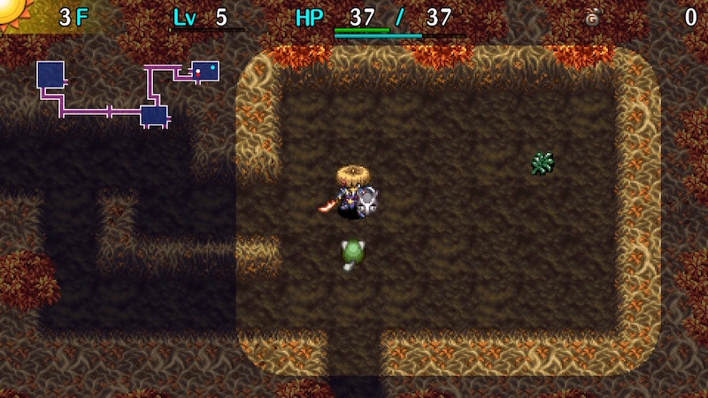

  

Dungeon where fixed Monster Houses appear on floors where the last digit is 9. 
A guaranteed shop appears every 10 floors, so you're pretty unlikely to run out of items. 
All item categories except bracelets are found identified, and negative effect items are very rare. Day Shield can't be found, so it's slightly harder to brute force than other day-only dungeons, but there are plenty of chances to farm experience points, skill points, and items. Overall, it's one of the easiest 99F dungeons, and makes for decent practice.

<ul class="quickLinksUL">
  <li><a href="#overview">Overview</a></li>
  <li><a href="#strategy">Strategy</a></li>
  <li><a href="#monsters">Monsters</a></li>
  <li><a href="#items">Items</a></li>
  <li><a href="#traps">Traps</a></li>
</ul>

# Overview

<table class="dungeonOverview">
  <tr>
    <th>Unlock</th>
    <td class="highlightYellow">Clear Ouma Shrine and arrive in Nekomaneki Village.</td>
  </tr>
  <tr>
    <th>Entrance</th>
    <td class="highlightYellow">Nekomaneki Village (Woman in Dungeon Center)</td>
  </tr>
</table>

<table class="dungeonTable">
  <tr>
    <th>Floors</th>
    <td>99F</td>
    <th>Day</th>
    <td>Day</td>
  </tr>
  <tr>
    <th>Bring Items</th>
    <td>No</td>
    <th>Allies</th>
    <td>No</td>
  </tr>
  <tr>
    <th>Unidentified</th>
    <td>Bracelets</td>
    <th>New Items</th>
    <td>No</td>
  </tr>
  <tr>
    <th>Shops</th>
    <td>Regular, Elite, Pick-A-Choice Fixed (Every N x 10 + 10F)</td>
    <th>Monster Houses</th>
    <td>Regular, Special, Sudden Fixed (Every N x 10 + 9F)</td>
  </tr>
  <tr>
    <th>Initial Enemies</th>
    <td></td>
    <th>Spawn Rate</th>
    <td>30</td>
  </tr>
  <tr>
    <th>Ominous aura</th>
    <td>No</td>
    <th>Wind of Kron</th>
    <td>1st: 1700 / 4th: 2000</td>
  </tr>
  <tr>
    <th>Clear Icon</th>
    <td>None</td>
    <th>Reward</th>
    <td>VIP Bracelet</td>
  </tr>
</table>

# Strategy

[Quick Links]

[Content]

# Monsters

See [Monsters](/system/monsters) for individual monster details.

- N = N'dubba Lv1 Lv2 Lv3 Lv4

Floor Colors: Monster House Shop Enemy Colors: Farming Useful Destroys Items Dangerous Very Dangerous

<table class="monsterTable">
  <thead>
    <tr>
      <th>F</th>
      <th colspan="5">Monsters</th>
      <th>N</th>
    </tr>
  </thead>
  <tbody>
    <tr>
      <td>1</td>
      <td>Mamel</td>
      <td>Seedie</td>
      <td>Sproutant</td>
      <td class="highlightGray"></td>
      <td class="highlightGray"></td>
      <td class="highlightGray"></td>
    </tr>
    <tr>
      <td>2</td>
      <td>Mamel</td>
      <td>Seedie</td>
      <td>Sproutant</td>
      <td>Colum</td>
      <td class="highlightGray"></td>
      <td class="highlightGray"></td>
    </tr>
    <tr>
      <td>3</td>
      <td>Mamel Grass Kid</td>
      <td>Pit Mamel Blade Bee</td>
      <td>Sproutant</td>
      <td>Colum</td>
      <td>Chintala</td>
      <td class="highlightGray"></td>
    </tr>
    <tr>
      <td>4</td>
      <td>Sweet Nut Grass Kid</td>
      <td>Pit Mamel Blade Bee</td>
      <td class="highlightGray"></td>
      <td>Colum</td>
      <td>Chintala</td>
      <td class="highlightGray"></td>
    </tr>
    <tr>
      <td>5</td>
      <td>Sweet Nut Grass Kid</td>
      <td>Pit Mamel</td>
      <td>Nigiri Baby</td>
      <td>Colum</td>
      <td>Chintala</td>
      <td class="highlightGray"></td>
    </tr>
    <tr>
      <td>6</td>
      <td>Sweet Nut Tiger Tosser</td>
      <td>Karakuroid Froggo</td>
      <td>Nigiri Baby</td>
      <td>Moseal</td>
      <td>Chintala</td>
      <td rowspan="2" class="monsterTableNdubba">1</td>
    </tr>
    <tr>
      <td>7</td>
      <td>Curse Girl Tiger Tosser</td>
      <td>Karakuroid Froggo</td>
      <td>Nigiri Baby</td>
      <td>Moseal</td>
      <td class="highlightGray"></td>
    </tr>
    <tr>
      <td>8</td>
      <td>Curse Girl Tiger Tosser</td>
      <td>Karakuroid Froggo</td>
      <td>Pumphantasm Mudkin</td>
      <td>Moseal</td>
      <td>Mixer</td>
      <td class="highlightGray"></td>
    </tr>
    <tr>
      <td class="highlightGreen" rowspan="2">9</td>
      <td class="highlightGray" colspan="5">Monster House (Regular)</td>
      <td class="highlightGray"></td>
    </tr>
    <tr>
      <td>Curse Girl Gyaza</td>
      <td>Karakuroid Metalhead</td>
      <td>Pumphantasm Mudkin</td>
      <td>Fearabbit</td>
      <td>Mixer</td>
      <td class="highlightGray"></td>
    </tr>
    <tr>
      <td class="highlightShop">10</td>
      <td>Naptapir Gyaza</td>
      <td>Kumonigiri Metalhead</td>
      <td>Pumphantasm Mudkin</td>
      <td>Fearabbit</td>
      <td>Mixer</td>
      <td class="highlightGray"></td>
    </tr>
    <tr>
      <td>11</td>
      <td>Naptapir Gyaza</td>
      <td>Kumonigiri Metalhead</td>
      <td>Mutaikon</td>
      <td>Fearabbit</td>
      <td>Pop Tank</td>
      <td class="highlightGray"></td>
    </tr>
    <tr>
      <td>12</td>
      <td>Naptapir Cheer-Ham</td>
      <td>Kumonigiri Acrid Nut</td>
      <td>Mutaikon Scorpion</td>
      <td>Fearabbit Swordsman</td>
      <td>Pop Tank</td>
      <td class="highlightGray"></td>
    </tr>
    <tr>
      <td>13</td>
      <td>Naptapir Cheer-Ham</td>
      <td>Cololum Acrid Nut</td>
      <td>Mutaikon Scorpion</td>
      <td>Mid Chintala Swordsman</td>
      <td>Snacky Polygon Spinna</td>
      <td class="highlightGray"></td>
    </tr>
    <tr>
      <td>14</td>
      <td>Bored Kappa Cheer-Ham</td>
      <td>Cololum Acrid Nut</td>
      <td>Scorpion</td>
      <td>Mid Chintala</td>
      <td>Snacky Polygon Spinna</td>
      <td class="highlightGray"></td>
    </tr>
    <tr>
      <td>15</td>
      <td>Bored Kappa Cheer-Ham</td>
      <td>Cololum Yanpii</td>
      <td>Momoseal Kid Squid</td>
      <td>Mid Chintala</td>
      <td>Snacky</td>
      <td class="highlightGray"></td>
    </tr>
    <tr>
      <td>16</td>
      <td>Bored Kappa Cheer-Ham</td>
      <td>Cololum Yanpii</td>
      <td>Momoseal Kid Squid</td>
      <td>Dagger Bee Hopodile</td>
      <td>Scoopie</td>
      <td class="highlightGray"></td>
    </tr>
    <tr>
      <td>17</td>
      <td>Bored Kappa Zalokleft</td>
      <td>Flamebird Yanpii</td>
      <td>Momoseal Foly</td>
      <td>Dagger Bee Hopodile</td>
      <td>Scoopie</td>
      <td class="highlightGray"></td>
    </tr>
    <tr>
      <td>18</td>
      <td>Beanie Zalokleft</td>
      <td>Flamebird Eligan</td>
      <td>Momoseal Foly</td>
      <td>Dagger Bee Hopodile</td>
      <td>Scoopie</td>
      <td class="highlightGray"></td>
    </tr>
    <tr>
      <td class="highlightGreen" rowspan="2">19</td>
      <td class="highlightGray" colspan="5">Monster House (Greed Lv2)</td>
      <td class="highlightGray"></td>
    </tr>
    <tr>
      <td>Beanie</td>
      <td>Flamebird Eligan</td>
      <td>DJ Mage</td>
      <td>Sproutyrant</td>
      <td>Boy Cart</td>
      <td class="highlightGray"></td>
    </tr>
    <tr>
      <td class="highlightShop">20</td>
      <td>Beanie</td>
      <td>Grass Dude Eligan</td>
      <td>DJ Mage</td>
      <td>Sproutyrant</td>
      <td>Boy Cart</td>
      <td class="highlightGray"></td>
    </tr>
    <tr>
      <td>21</td>
      <td>Beanie Steamroid</td>
      <td>Grass Dude Snooztapir</td>
      <td>DJ Mage</td>
      <td>Sproutyrant</td>
      <td>Nigiri Morph</td>
      <td class="highlightGray"></td>
    </tr>
    <tr>
      <td>22</td>
      <td>Poofy Steamroid</td>
      <td>Grass Dude Snooztapir</td>
      <td>Green Zalokleft</td>
      <td>Gyadon</td>
      <td>Nigiri Morph</td>
      <td class="highlightGray"></td>
    </tr>
    <tr>
      <td>23</td>
      <td>Poofy Steamroid</td>
      <td>Froggucci Absorbiphant</td>
      <td>Green Zalokleft Grampa Tank</td>
      <td>Gyadon</td>
      <td>Nigiri Morph</td>
      <td class="highlightGray"></td>
    </tr>
    <tr>
      <td>24</td>
      <td>Poofy Ironhead</td>
      <td>Froggucci Absorbiphant</td>
      <td>Green Zalokleft Grampa Tank</td>
      <td>Gyadon Pandanigiri</td>
      <td>Nigiri Morph</td>
      <td class="highlightGray"></td>
    </tr>
    <tr>
      <td>25</td>
      <td>Sr. Yanpii Ironhead</td>
      <td>Froggucci Absorbiphant</td>
      <td>Cursister</td>
      <td>Pandanigiri</td>
      <td>Punisher</td>
      <td class="highlightGray"></td>
    </tr>
    <tr>
      <td>26</td>
      <td>Sr. Yanpii Muddy</td>
      <td>Froggucci Hipadile</td>
      <td>Cursister Spadie</td>
      <td>Crow Tengu</td>
      <td>Punisher</td>
      <td class="highlightGray"></td>
    </tr>
    <tr>
      <td>27</td>
      <td>Sr. Yanpii Muddy</td>
      <td>Firepuff Hipadile</td>
      <td>Cursister Spadie</td>
      <td>Crow Tengu Explochin</td>
      <td>Punisher Cross Cart</td>
      <td class="highlightGray"></td>
    </tr>
    <tr>
      <td>28</td>
      <td>Kappa Pest Muddy</td>
      <td>Firepuff Hipadile</td>
      <td>Scarabbit Spadie</td>
      <td>Crow Tengu Explochin</td>
      <td>MC Mage Cross Cart</td>
      <td class="highlightGray"></td>
    </tr>
    <tr>
      <td class="highlightGreen" rowspan="2">29</td>
      <td class="highlightGray" colspan="5">Monster House (Harassment Lv2)</td>
      <td class="highlightGray"></td>
    </tr>
    <tr>
      <td>Kappa Pest Muddy</td>
      <td>Firepuff Go-Ham!</td>
      <td>Scarabbit Zapdon</td>
      <td>Crow Tengu Explochin</td>
      <td>MC Mage</td>
      <td class="highlightGray"></td>
    </tr>
    <tr>
      <td class="highlightShop">30</td>
      <td>Kappa Pest</td>
      <td>Digestiphant Go-Ham!</td>
      <td>Scarabbit Zapdon</td>
      <td>Katana Bee</td>
      <td>MC Mage</td>
      <td class="highlightGray"></td>
    </tr>
    <tr>
      <td>31</td>
      <td>Kappa Pest Dragon</td>
      <td>Digestiphant Go-Ham!</td>
      <td>Scarabbit Zapdon</td>
      <td>Katana Bee</td>
      <td>Death Gyaza</td>
      <td rowspan="3" class="monsterTableNtwyn">2</td>
    </tr>
    <tr>
      <td>32</td>
      <td>Flamepuff Dragon</td>
      <td>Digestiphant Go-Ham!</td>
      <td>Polygon Shaka</td>
      <td>Mixermon</td>
      <td>Death Gyaza</td>
    </tr>
    <tr>
      <td>33</td>
      <td>Flamepuff Dragon</td>
      <td>Dazikon</td>
      <td>Polygon Shaka</td>
      <td>Mixermon</td>
      <td>Death Gyaza</td>
    </tr>
    <tr>
      <td>34</td>
      <td>Flamepuff Cave Mamel</td>
      <td>Dazikon</td>
      <td>Polygon Shaka</td>
      <td>Mixermon</td>
      <td>Shagga</td>
      <td class="highlightGray"></td>
    </tr>
    <tr>
      <td>35</td>
      <td>Flamepuff Cave Mamel</td>
      <td>Dazikon VeniScorp</td>
      <td>Falcon Tengu</td>
      <td>Pumphantom</td>
      <td>Shagga</td>
      <td class="highlightGray"></td>
    </tr>
    <tr>
      <td>36</td>
      <td>Tiger Hurler Cave Mamel</td>
      <td>MC Wizard VeniScorp</td>
      <td>Falcon Tengu</td>
      <td>Pumphantom</td>
      <td>Shagga</td>
      <td class="highlightGray"></td>
    </tr>
    <tr>
      <td>37</td>
      <td>Tiger Hurler Grass Poppa</td>
      <td>MC Wizard VeniScorp</td>
      <td>Falcon Tengu</td>
      <td>Pumphantom</td>
      <td>Sparkbird</td>
      <td class="highlightGray"></td>
    </tr>
    <tr>
      <td>38</td>
      <td>Tiger Hurler Grass Poppa</td>
      <td>MC Wizard Eligagan</td>
      <td>Falcon Tengu Gyairas</td>
      <td>Momomoseal</td>
      <td>Sparkbird</td>
      <td class="highlightGray"></td>
    </tr>
    <tr>
      <td class="highlightGreen" rowspan="2">39</td>
      <td class="highlightGray" colspan="5">Monster House (Explosive Lv2)</td>
      <td class="highlightGray"></td>
    </tr>
    <tr>
      <td>Tiger Hurler</td>
      <td>Huistdon Eligagan</td>
      <td>Falcon Tengu Gyairas</td>
      <td>Momomoseal</td>
      <td>Sparkbird</td>
      <td class="highlightGray"></td>
    </tr>
    <tr>
      <td class="highlightShop">40</td>
      <td class="highlightGray"></td>
      <td>Huistdon Eligagan</td>
      <td>Falcon Tengu Gyairas</td>
      <td>Momomoseal</td>
      <td class="highlightGray"></td>
      <td class="highlightGray"></td>
    </tr>
    <tr>
      <td>41</td>
      <td>Rally Ham</td>
      <td>Huistdon</td>
      <td>Steelhead</td>
      <td>Momomoseal</td>
      <td>Sky Dragon</td>
      <td class="highlightGray"></td>
    </tr>
    <tr>
      <td>42</td>
      <td>Rally Ham Nigiri Boss</td>
      <td>Spicy Nut</td>
      <td>Steelhead</td>
      <td>Nuttie</td>
      <td>Sky Dragon</td>
      <td class="highlightGray"></td>
    </tr>
    <tr>
      <td>43</td>
      <td>Rally Ham Nigiri Boss</td>
      <td>Spicy Nut Nashagga</td>
      <td>Steelhead Munchy</td>
      <td>Nuttie</td>
      <td>Sky Dragon</td>
      <td class="highlightGray"></td>
    </tr>
    <tr>
      <td>44</td>
      <td>Rally Ham Nigiri Boss</td>
      <td>Spicy Nut Nashagga</td>
      <td>Steelhead Munchy</td>
      <td>Nuttie King Squid</td>
      <td>Big Chintala</td>
      <td class="highlightGray"></td>
    </tr>
    <tr>
      <td>45</td>
      <td>Concusschin Nigiri Boss</td>
      <td>Spicy Nut Nashagga</td>
      <td>Munchy</td>
      <td>Nuttie King Squid</td>
      <td>Big Chintala</td>
      <td class="highlightGray"></td>
    </tr>
    <tr>
      <td>46</td>
      <td>Concusschin</td>
      <td>Colocolum</td>
      <td>Eagle Tengu</td>
      <td>Oingodile King Squid</td>
      <td>Big Chintala</td>
      <td class="highlightGray"></td>
    </tr>
    <tr>
      <td>47</td>
      <td>Blazepuff Ornery Tank</td>
      <td>Colocolum Trowelie</td>
      <td>Eagle Tengu Super Gazer</td>
      <td>Oingodile</td>
      <td>Big Chintala</td>
      <td class="highlightGray"></td>
    </tr>
    <tr>
      <td>48</td>
      <td>Blazepuff Ornery Tank</td>
      <td>Colocolum Trowelie</td>
      <td>Eagle Tengu Super Gazer</td>
      <td>Oingodile</td>
      <td>Electroid</td>
      <td class="highlightGray"></td>
    </tr>
    <tr>
      <td class="highlightGreen" rowspan="2">49</td>
      <td class="highlightGray" colspan="5">Monster House (Aquatic Lv3)</td>
      <td class="highlightGray"></td>
    </tr>
    <tr>
      <td>Blazepuff Ornery Tank</td>
      <td>Colocolum Trowelie</td>
      <td>Eagle Tengu Super Gazer</td>
      <td>Porkon</td>
      <td>Electroid</td>
      <td class="highlightGray"></td>
    </tr>
    <tr>
      <td class="highlightShop">50</td>
      <td>Blazepuff Mixergon</td>
      <td>Jouncy</td>
      <td>Doztapir</td>
      <td>Porkon</td>
      <td>Electroid</td>
      <td rowspan="3" class="monsterTableNmach">3</td>
    </tr>
    <tr>
      <td>51</td>
      <td>Debaser Mixergon</td>
      <td>Jouncy</td>
      <td>Doztapir</td>
      <td>Porkon</td>
      <td>Strong Cart</td>
    </tr>
    <tr>
      <td>52</td>
      <td>Debaser Vexing Kappa</td>
      <td>Jouncy</td>
      <td>Doztapir</td>
      <td>MC Sorceror</td>
      <td>Strong Cart</td>
    </tr>
    <tr>
      <td>53</td>
      <td>Debaser Vexing Kappa</td>
      <td>Jouncy Mudster</td>
      <td>Doztapir Trillman</td>
      <td>MC Sorceror</td>
      <td>Sprouterror</td>
      <td class="highlightGray"></td>
    </tr>
    <tr>
      <td>54</td>
      <td>Debaser Pyrepuff</td>
      <td>Tiger Chucker Mudster</td>
      <td>StunScorp Trillman</td>
      <td>MC Sorceror</td>
      <td>Sprouterror</td>
      <td class="highlightGray"></td>
    </tr>
    <tr>
      <td>55</td>
      <td>Momomomoseal Pyrepuff</td>
      <td>Tiger Chucker</td>
      <td>StunScorp</td>
      <td>MC Sorceror</td>
      <td>Pierce Cart</td>
      <td class="highlightGray"></td>
    </tr>
    <tr>
      <td>56</td>
      <td>Momomomoseal Curspinster</td>
      <td>Tiger Chucker Pumpanshee</td>
      <td>StunScorp</td>
      <td>Horrabbit</td>
      <td>Pierce Cart</td>
      <td class="highlightGray"></td>
    </tr>
    <tr>
      <td>57</td>
      <td>Momomomoseal Curspinster</td>
      <td>Froggon Pumpanshee</td>
      <td>Spongiderm</td>
      <td>Horrabbit</td>
      <td class="highlightGray"></td>
      <td class="highlightGray"></td>
    </tr>
    <tr>
      <td>58</td>
      <td>Momomomoseal Curspinster</td>
      <td>Froggon Pumpanshee</td>
      <td>Spongiderm Lt. Yanpii</td>
      <td>Horrabbit</td>
      <td>Lashagga</td>
      <td class="highlightGray"></td>
    </tr>
    <tr>
      <td class="highlightGreen" rowspan="2">59</td>
      <td class="highlightGray" colspan="5">Monster House (Projectile Lv3)</td>
      <td class="highlightGray"></td>
    </tr>
    <tr>
      <td>Item Knave</td>
      <td>Froggon</td>
      <td>Iron Zalokleft Lt. Yanpii</td>
      <td>Gyandora</td>
      <td>Lashagga</td>
      <td class="highlightGray"></td>
    </tr>
    <tr>
      <td class="highlightShop">60</td>
      <td>Item Knave Flarebird</td>
      <td>Froggon Zanbeeto</td>
      <td>Iron Zalokleft Lt. Yanpii</td>
      <td>Gyandora</td>
      <td>Lashagga</td>
      <td class="highlightGray"></td>
    </tr>
    <tr>
      <td>61</td>
      <td>Item Knave Flarebird</td>
      <td>Polygon Singa Zanbeeto</td>
      <td>Bunchukdon</td>
      <td>Gyandora</td>
      <td class="highlightGray"></td>
      <td class="highlightGray"></td>
    </tr>
    <tr>
      <td>62</td>
      <td>Spirit Ham Flarebird</td>
      <td>Polygon Singa</td>
      <td>Bunchukdon</td>
      <td>Sensei</td>
      <td class="highlightGray"></td>
      <td class="highlightGray"></td>
    </tr>
    <tr>
      <td>63</td>
      <td>Spirit Ham Flarebird</td>
      <td>Polygon Singa Grass Gramps</td>
      <td>Bunchukdon</td>
      <td>Sensei</td>
      <td>Bouncy</td>
      <td class="highlightGray"></td>
    </tr>
    <tr>
      <td>64</td>
      <td>Spirit Ham</td>
      <td>Fulminachin Grass Gramps</td>
      <td>Onigirizzly</td>
      <td>Sensei</td>
      <td>Bouncy</td>
      <td class="highlightGray"></td>
    </tr>
    <tr>
      <td>65</td>
      <td>Spirit Ham Dozikon</td>
      <td>Fulminachin</td>
      <td>Onigirizzly</td>
      <td>Hyper Gazer</td>
      <td>Bouncy</td>
      <td class="highlightGray"></td>
    </tr>
    <tr>
      <td>66</td>
      <td>Archdragon Dozikon</td>
      <td>Fulminachin</td>
      <td>Phoenix Tengu</td>
      <td>Hyper Gazer</td>
      <td>Bouncy</td>
      <td class="highlightGray"></td>
    </tr>
    <tr>
      <td>67</td>
      <td>Archdragon Comatapir</td>
      <td>Grainie</td>
      <td>Phoenix Tengu</td>
      <td>Hyper Gazer</td>
      <td>Bitter Nut</td>
      <td class="highlightGray"></td>
    </tr>
    <tr>
      <td>68</td>
      <td>Archdragon Comatapir</td>
      <td>Grainie</td>
      <td>Phoenix Tengu</td>
      <td class="highlightGray"></td>
      <td>Bitter Nut</td>
      <td class="highlightGray"></td>
    </tr>
    <tr>
      <td class="highlightGreen" rowspan="2">69</td>
      <td class="highlightGray" colspan="5">Monster House (Power Lv3)</td>
      <td class="highlightGray"></td>
    </tr>
    <tr>
      <td>Mudder Comatapir</td>
      <td>Grainie</td>
      <td>Phoenix Tengu</td>
      <td>Mixerdon</td>
      <td>Bitter Nut</td>
      <td class="highlightGray"></td>
    </tr>
    <tr>
      <td class="highlightShop">70</td>
      <td>Mudder Huge Chintala</td>
      <td>Grainie</td>
      <td class="highlightGray"></td>
      <td>Mixerdon</td>
      <td>Bitter Nut</td>
      <td rowspan="4" class="monsterTableNdup">4</td>
    </tr>
    <tr>
      <td>71</td>
      <td>Mudder Huge Chintala</td>
      <td>Eligagon Detonachin</td>
      <td class="highlightGray"></td>
      <td>Mixerdon</td>
      <td>Hell Gyaza</td>
    </tr>
    <tr>
      <td>72</td>
      <td>Mudder Huge Chintala</td>
      <td>Eligagon Detonachin</td>
      <td>Cyberoid</td>
      <td>Cursenior FO-UZZ</td>
      <td>Hell Gyaza</td>
    </tr>
    <tr>
      <td>73</td>
      <td>Sproutitan</td>
      <td>Eligagon</td>
      <td>Cyberoid</td>
      <td>Cursenior FO-UZZ</td>
      <td>Hell Gyaza</td>
    </tr>
    <tr>
      <td>74</td>
      <td>Sproutitan</td>
      <td>Eligagon</td>
      <td>Mealy Cyberoid</td>
      <td>Cursenior</td>
      <td class="highlightGray"></td>
      <td class="highlightGray"></td>
    </tr>
    <tr>
      <td>75</td>
      <td>Sproutitan Shovelie</td>
      <td>Porgon</td>
      <td>Mealy</td>
      <td>Cursenior</td>
      <td>BlightScorp</td>
      <td class="highlightGray"></td>
    </tr>
    <tr>
      <td>76</td>
      <td>Sproutitan Shovelie</td>
      <td>Porgon Pumptergeist</td>
      <td>Mealy Terrabbit</td>
      <td>Ruiner Knave King</td>
      <td>BlightScorp</td>
      <td class="highlightGray"></td>
    </tr>
    <tr>
      <td>77</td>
      <td>Kodionigiri Shovelie</td>
      <td>Porgon Pumptergeist</td>
      <td>Terrabbit</td>
      <td>Ruiner Knave King</td>
      <td>BlightScorp</td>
      <td class="highlightGray"></td>
    </tr>
    <tr>
      <td>78</td>
      <td>Kodionigiri</td>
      <td>Porgon Pumptergeist</td>
      <td>Squidperor Terrabbit</td>
      <td>Ruiner Knave King</td>
      <td class="highlightGray"></td>
      <td class="highlightGray"></td>
    </tr>
    <tr>
      <td class="highlightGreen" rowspan="2">79</td>
      <td class="highlightGray" colspan="5">Monster House (Sky Lv4)</td>
      <td class="highlightGray"></td>
    </tr>
    <tr>
      <td>Kodionigiri Boingodile</td>
      <td>Colocolocolum Pumptergeist</td>
      <td>Squidperor</td>
      <td>Ruiner</td>
      <td>Kappa Troll</td>
      <td class="highlightGray"></td>
    </tr>
    <tr>
      <td class="highlightShop">80</td>
      <td>Osmammoth Boingodile</td>
      <td>Colocolocolum</td>
      <td>Gitan Mamel</td>
      <td>Ruiner</td>
      <td>Kappa Troll</td>
      <td class="highlightGray"></td>
    </tr>
    <tr>
      <td>81</td>
      <td>Osmammoth</td>
      <td>Colocolocolum</td>
      <td>Gitan Mamel</td>
      <td>Kleptoad</td>
      <td>Kappa Troll</td>
      <td class="highlightGray"></td>
    </tr>
    <tr>
      <td>82</td>
      <td>Osmammoth</td>
      <td>Colocolocolum</td>
      <td>Gitan Mamel</td>
      <td>Kleptoad</td>
      <td>Googoman</td>
      <td class="highlightGray"></td>
    </tr>
    <tr>
      <td>83</td>
      <td>Osmammoth Nigiri King</td>
      <td>Colocolocolum Blazebird</td>
      <td>Gyandoron</td>
      <td>Kleptoad</td>
      <td>Googoman</td>
      <td class="highlightGray"></td>
    </tr>
    <tr>
      <td>84</td>
      <td>Osmammoth Nigiri King</td>
      <td>Blazebird</td>
      <td>Gyandoron</td>
      <td>Kleptoad</td>
      <td>Googoman</td>
      <td class="highlightGray"></td>
    </tr>
    <tr>
      <td>85</td>
      <td>Polygon Stunna Nigiri King</td>
      <td>Tiger Ace Blazebird</td>
      <td>Gyandoron</td>
      <td>Zotdon</td>
      <td class="highlightGray"></td>
      <td class="highlightGray"></td>
    </tr>
    <tr>
      <td>86</td>
      <td>Polygon Stunna Nigiri King</td>
      <td>Tiger Ace Blazebird</td>
      <td>Gyandoron Lt. Yanpii</td>
      <td>Zotdon</td>
      <td class="highlightGray"></td>
      <td class="highlightGray"></td>
    </tr>
    <tr>
      <td>87</td>
      <td>Polygon Stunna Nigiri King</td>
      <td>Tiger Ace Blazebird</td>
      <td>Gyandoron Lt. Yanpii</td>
      <td>Zotdon Zalokleft King</td>
      <td>Ultra Gazer</td>
      <td class="highlightGray"></td>
    </tr>
    <tr>
      <td>88</td>
      <td>Polygon Stunna</td>
      <td>Tiger Ace</td>
      <td>Gyandoron Lt. Yanpii</td>
      <td>Zotdon Zalokleft King</td>
      <td>Ultra Gazer</td>
      <td class="highlightGray"></td>
    </tr>
    <tr>
      <td class="highlightGreen" rowspan="2">89</td>
      <td class="highlightGray" colspan="5">Monster House (Regular or Special)</td>
      <td class="highlightGray"></td>
    </tr>
    <tr>
      <td>Polygon Stunna</td>
      <td>Despoiler</td>
      <td>Doom Gyaza Lt. Yanpii</td>
      <td>Zotdon Zalokleft King</td>
      <td>Ultra Gazer</td>
      <td class="highlightGray"></td>
    </tr>
    <tr>
      <td class="highlightShop">90</td>
      <td>Elizgagon</td>
      <td>Despoiler</td>
      <td>Doom Gyaza</td>
      <td>Swordmaster</td>
      <td>Ultra Gazer</td>
      <td class="highlightGray"></td>
    </tr>
    <tr>
      <td>91</td>
      <td>Elizgagon</td>
      <td>Despoiler</td>
      <td>Doom Gyaza</td>
      <td>Swordmaster</td>
      <td>Ultra Gazer</td>
      <td class="highlightGray"></td>
    </tr>
    <tr>
      <td>92</td>
      <td>Elizgagon</td>
      <td>Despoiler</td>
      <td>Doom Gyaza</td>
      <td>Swordmaster</td>
      <td class="highlightGray"></td>
      <td class="highlightGray"></td>
    </tr>
    <tr>
      <td>93</td>
      <td>Elizgagon</td>
      <td>Despoiler</td>
      <td>Doom Gyaza</td>
      <td>Swordmaster</td>
      <td>Cranky Tank</td>
      <td class="highlightGray"></td>
    </tr>
    <tr>
      <td>94</td>
      <td>Elizgagon</td>
      <td>Despoiler</td>
      <td class="highlightGray"></td>
      <td>Swordmaster</td>
      <td>Cranky Tank</td>
      <td class="highlightGray"></td>
    </tr>
    <tr>
      <td>95</td>
      <td>Elizgagon Doomhead</td>
      <td>Despoiler</td>
      <td>Abyss Dragon</td>
      <td>Swordmaster</td>
      <td>Cranky Tank</td>
      <td class="highlightGray"></td>
    </tr>
    <tr>
      <td>96</td>
      <td>Elizgagon Doomhead</td>
      <td>Despoiler</td>
      <td>Abyss Dragon</td>
      <td class="highlightGray"></td>
      <td>Cranky Tank</td>
      <td class="highlightGray"></td>
    </tr>
    <tr>
      <td>97</td>
      <td>Elizgagon Doomhead</td>
      <td>Despoiler</td>
      <td>Abyss Dragon</td>
      <td class="highlightGray"></td>
      <td class="highlightGray"></td>
      <td class="highlightGray"></td>
    </tr>
    <tr>
      <td>98</td>
      <td>Elizgagon Doomhead</td>
      <td>Despoiler</td>
      <td>Abyss Dragon</td>
      <td class="highlightGray"></td>
      <td class="highlightGray"></td>
      <td class="highlightGray"></td>
    </tr>
    <tr>
      <td class="highlightGreen" rowspan="2">99</td>
      <td class="highlightGray" colspan="5">Monster House (Regular or Special)</td>
      <td class="highlightGray"></td>
    </tr>
    <tr>
      <td>Elizgagon Doomhead</td>
      <td>Despoiler</td>
      <td>Abyss Dragon</td>
      <td class="highlightGray"></td>
      <td class="highlightGray"></td>
      <td class="highlightGray"></td>
    </tr>
  </tbody>
</table>

※ Monster Table might be incomplete.

# Items

※ Item Table is incomplete. If you find a drop that isn't listed, please add it to the table.

- F = Floor, Monster (day)
- S = Shop, Maneater, Shiny Object (yellow)
- P = Presto Pot
- Z = Zalokleft
- E = Elite Shop, Shiny Object (blue)

#### Weapons

<table class="dungeonItems">
  <tr>
    <th>Name</th>
    <th>F</th>
    <th>S</th>
    <th>P</th>
    <th>Z</th>
    <th>E</th>
    <th rowspan="15" class="tableDivider"></th>
    <th>Name</th>
    <th>F</th>
    <th>S</th>
    <th>P</th>
    <th>Z</th>
    <th>E</th>
    <th rowspan="15" class="tableDivider"></th>
    <th>Name</th>
    <th>F</th>
    <th>S</th>
    <th>P</th>
    <th>Z</th>
    <th>E</th>
  </tr>
  <tr>
    <td class="leftText highlightGray">Ordinary Stick</td>
    <td></td>
    <td></td>
    <td></td>
    <td></td>
    <td></td>
    <td class="leftText highlightGray">Rusty Pickaxe</td>
    <td></td>
    <td></td>
    <td></td>
    <td></td>
    <td></td>
    <td class="leftText highlightGray">Shockuto</td>
    <td></td>
    <td></td>
    <td></td>
    <td></td>
    <td></td>
  </tr>
  <tr>
    <td class="leftText highlightGray">Tin Blade</td>
    <td></td>
    <td></td>
    <td></td>
    <td></td>
    <td></td>
    <td class="leftText highlightGray">Old Mallet</td>
    <td></td>
    <td></td>
    <td></td>
    <td></td>
    <td></td>
    <td class="leftText highlightGray">Blurry Stick</td>
    <td></td>
    <td></td>
    <td></td>
    <td></td>
    <td></td>
  </tr>
  <tr>
    <td class="leftText highlightGray">Katana</td>
    <td></td>
    <td></td>
    <td></td>
    <td></td>
    <td></td>
    <td class="leftText highlightGray">Sky Splitter</td>
    <td></td>
    <td></td>
    <td></td>
    <td></td>
    <td></td>
    <td class="leftText highlightGray">Sealing Keisaku</td>
    <td></td>
    <td></td>
    <td></td>
    <td></td>
    <td></td>
  </tr>
  <tr>
    <td class="leftText highlightGray">Beast Fang</td>
    <td></td>
    <td></td>
    <td></td>
    <td></td>
    <td></td>
    <td class="leftText highlightGray">Water Cutter</td>
    <td></td>
    <td></td>
    <td></td>
    <td></td>
    <td></td>
    <td class="leftText highlightGray">Baffle Axe</td>
    <td></td>
    <td></td>
    <td></td>
    <td></td>
    <td></td>
  </tr>
  <tr>
    <td class="leftText highlightGray">Dotanuki</td>
    <td></td>
    <td></td>
    <td></td>
    <td></td>
    <td></td>
    <td class="leftText highlightGray">Scythe</td>
    <td></td>
    <td></td>
    <td></td>
    <td></td>
    <td></td>
    <td class="leftText highlightGray">Hatchet</td>
    <td></td>
    <td></td>
    <td></td>
    <td></td>
    <td></td>
  </tr>
  <tr>
    <td class="leftText highlightGray">Bladite</td>
    <td></td>
    <td></td>
    <td></td>
    <td></td>
    <td></td>
    <td class="leftText highlightGray">Myopic Masher</td>
    <td></td>
    <td></td>
    <td></td>
    <td></td>
    <td></td>
    <td class="leftText highlightGray">Shoddy Dirk</td>
    <td></td>
    <td></td>
    <td></td>
    <td></td>
    <td></td>
  </tr>
  <tr>
    <td class="leftText highlightGray">Red Blade</td>
    <td></td>
    <td></td>
    <td></td>
    <td></td>
    <td></td>
    <td class="leftText highlightGray">Magic Masher</td>
    <td></td>
    <td></td>
    <td></td>
    <td></td>
    <td></td>
    <td class="leftText highlightGray">Glass Dirk</td>
    <td></td>
    <td></td>
    <td></td>
    <td></td>
    <td></td>
  </tr>
  <tr>
    <td class="leftText highlightGray">Kabura Katana</td>
    <td></td>
    <td></td>
    <td></td>
    <td></td>
    <td></td>
    <td class="leftText highlightGray">Drain Dagger</td>
    <td></td>
    <td></td>
    <td></td>
    <td></td>
    <td></td>
    <td class="leftText highlightGray">Dirk of Debts</td>
    <td></td>
    <td></td>
    <td></td>
    <td></td>
    <td></td>
  </tr>
  <tr>
    <td class="leftText highlightGray">Fuuma Sword</td>
    <td></td>
    <td></td>
    <td></td>
    <td></td>
    <td></td>
    <td class="leftText highlightGray">Copper Cleaver</td>
    <td></td>
    <td></td>
    <td></td>
    <td></td>
    <td></td>
    <td class="leftText highlightGray">Extreme Sword</td>
    <td></td>
    <td></td>
    <td></td>
    <td></td>
    <td></td>
  </tr>
  <tr>
    <td class="leftText highlightGray">Pathetic Blade</td>
    <td></td>
    <td></td>
    <td></td>
    <td></td>
    <td></td>
    <td class="leftText highlightGray">Crescent Katana</td>
    <td></td>
    <td></td>
    <td></td>
    <td></td>
    <td></td>
    <td class="leftText highlightGray">Violent Blade</td>
    <td></td>
    <td></td>
    <td></td>
    <td></td>
    <td></td>
  </tr>
  <tr>
    <td class="leftText highlightGray">Dull Gold Edge</td>
    <td></td>
    <td></td>
    <td></td>
    <td></td>
    <td></td>
    <td class="leftText highlightGray">Lizard Lasher</td>
    <td></td>
    <td></td>
    <td></td>
    <td></td>
    <td></td>
    <td class="leftText highlightGray">Breeze Blade</td>
    <td></td>
    <td></td>
    <td></td>
    <td></td>
    <td></td>
  </tr>
  <tr>
    <td class="leftText highlightGray">Bright Blade</td>
    <td></td>
    <td></td>
    <td></td>
    <td></td>
    <td></td>
    <td class="leftText highlightGray">Nap Rattle</td>
    <td></td>
    <td></td>
    <td></td>
    <td></td>
    <td></td>
    <td class="leftText highlightGray">Burning Blade</td>
    <td></td>
    <td></td>
    <td></td>
    <td></td>
    <td></td>
  </tr>
  <tr>
    <td class="leftText highlightGray">True Knife</td>
    <td></td>
    <td></td>
    <td></td>
    <td></td>
    <td></td>
    <td class="leftText highlightGray">Wonder Pick</td>
    <td></td>
    <td></td>
    <td></td>
    <td></td>
    <td></td>
    <td class="leftText highlightGray">Sturdy Hammer</td>
    <td></td>
    <td></td>
    <td></td>
    <td></td>
    <td></td>
  </tr>
  <tr>
    <td class="leftText highlightGray">Kaburagi</td>
    <td></td>
    <td></td>
    <td></td>
    <td></td>
    <td></td>
    <td colspan="6"></td>
    <td colspan="6"></td>
  </tr>
</table>

#### Shields

<table class="dungeonItems">
  <tr>
    <th>Name</th>
    <th>F</th>
    <th>S</th>
    <th>P</th>
    <th>Z</th>
    <th>E</th>
    <th rowspan="13" class="tableDivider"></th>
    <th>Name</th>
    <th>F</th>
    <th>S</th>
    <th>P</th>
    <th>Z</th>
    <th>E</th>
    <th rowspan="13" class="tableDivider"></th>
    <th>Name</th>
    <th>F</th>
    <th>S</th>
    <th>P</th>
    <th>Z</th>
    <th>E</th>
  </tr>
  <tr>
    <td class="leftText highlightGray">Plain Targe</td>
    <td></td>
    <td></td>
    <td></td>
    <td></td>
    <td></td>
    <td class="leftText highlightGray">Heavy Shield</td>
    <td></td>
    <td></td>
    <td></td>
    <td></td>
    <td></td>
    <td class="leftText highlightGray">Gyadon Blocker</td>
    <td></td>
    <td></td>
    <td></td>
    <td></td>
    <td></td>
  </tr>
  <tr>
    <td class="leftText highlightGray">Tin Shield</td>
    <td></td>
    <td></td>
    <td></td>
    <td></td>
    <td></td>
    <td class="leftText highlightGray">Midnight Shield</td>
    <td></td>
    <td></td>
    <td></td>
    <td></td>
    <td></td>
    <td class="leftText highlightGray">Snake Shield</td>
    <td></td>
    <td></td>
    <td></td>
    <td></td>
    <td></td>
  </tr>
  <tr>
    <td class="leftText highlightGray">Iron Targe</td>
    <td></td>
    <td></td>
    <td></td>
    <td></td>
    <td></td>
    <td class="leftText highlightGray">Day Shield</td>
    <td></td>
    <td></td>
    <td></td>
    <td></td>
    <td></td>
    <td class="leftText highlightGray">Steady Shield</td>
    <td></td>
    <td></td>
    <td></td>
    <td></td>
    <td></td>
  </tr>
  <tr>
    <td class="leftText highlightGray">Wolfshead</td>
    <td></td>
    <td></td>
    <td></td>
    <td></td>
    <td></td>
    <td class="leftText highlightGray">Binary Shield</td>
    <td></td>
    <td></td>
    <td></td>
    <td></td>
    <td></td>
    <td class="leftText highlightGray">Anti-Gaze Trge</td>
    <td></td>
    <td></td>
    <td></td>
    <td></td>
    <td></td>
  </tr>
  <tr>
    <td class="leftText highlightGray">Beast Shield</td>
    <td></td>
    <td></td>
    <td></td>
    <td></td>
    <td></td>
    <td class="leftText highlightGray">Counter Shield</td>
    <td></td>
    <td></td>
    <td></td>
    <td></td>
    <td></td>
    <td class="leftText highlightGray">Swap Shield</td>
    <td></td>
    <td></td>
    <td></td>
    <td></td>
    <td></td>
  </tr>
  <tr>
    <td class="leftText highlightGray">Targite</td>
    <td></td>
    <td></td>
    <td></td>
    <td></td>
    <td></td>
    <td class="leftText highlightGray">Student Shield</td>
    <td></td>
    <td></td>
    <td></td>
    <td></td>
    <td></td>
    <td class="leftText highlightGray">Shoddy Plank</td>
    <td></td>
    <td></td>
    <td></td>
    <td></td>
    <td></td>
  </tr>
  <tr>
    <td class="leftText highlightGray">Red Shield</td>
    <td></td>
    <td></td>
    <td></td>
    <td></td>
    <td></td>
    <td class="leftText highlightGray">Bowl Shield</td>
    <td></td>
    <td></td>
    <td></td>
    <td></td>
    <td></td>
    <td class="leftText highlightGray">Glass Buckler</td>
    <td></td>
    <td></td>
    <td></td>
    <td></td>
    <td></td>
  </tr>
  <tr>
    <td class="leftText highlightGray">Fuuma Shield</td>
    <td></td>
    <td></td>
    <td></td>
    <td></td>
    <td></td>
    <td class="leftText highlightGray">Spry Shield</td>
    <td></td>
    <td></td>
    <td></td>
    <td></td>
    <td></td>
    <td class="leftText highlightGray">Pauper's Plank</td>
    <td></td>
    <td></td>
    <td></td>
    <td></td>
    <td></td>
  </tr>
  <tr>
    <td class="leftText highlightGray">Pathetic Shield</td>
    <td></td>
    <td></td>
    <td></td>
    <td></td>
    <td></td>
    <td class="leftText highlightGray">Blast Shield</td>
    <td></td>
    <td></td>
    <td></td>
    <td></td>
    <td></td>
    <td class="leftText highlightGray">Rush Shield</td>
    <td></td>
    <td></td>
    <td></td>
    <td></td>
    <td></td>
  </tr>
  <tr>
    <td class="leftText highlightGray">Gold Shield</td>
    <td></td>
    <td></td>
    <td></td>
    <td></td>
    <td></td>
    <td class="leftText highlightGray">Lock Shield</td>
    <td></td>
    <td></td>
    <td></td>
    <td></td>
    <td></td>
    <td class="leftText highlightGray">Blazing Shield</td>
    <td></td>
    <td></td>
    <td></td>
    <td></td>
    <td></td>
  </tr>
  <tr>
    <td class="leftText highlightGray">Diet Shield</td>
    <td></td>
    <td></td>
    <td></td>
    <td></td>
    <td></td>
    <td class="leftText highlightGray">Safe Shield</td>
    <td></td>
    <td></td>
    <td></td>
    <td></td>
    <td></td>
    <td class="leftText highlightGray">Onigiri Shield</td>
    <td></td>
    <td></td>
    <td></td>
    <td></td>
    <td></td>
  </tr>
  <tr>
    <td class="leftText highlightGray">Helix Shield</td>
    <td></td>
    <td></td>
    <td></td>
    <td></td>
    <td></td>
    <td class="leftText highlightGray">Parry Shield</td>
    <td></td>
    <td></td>
    <td></td>
    <td></td>
    <td></td>
    <td class="leftText highlightGray">Nirvana Board</td>
    <td></td>
    <td></td>
    <td></td>
    <td></td>
    <td></td>
  </tr>
</table>

#### Bracelets

<table class="dungeonItems">
  <tr>
    <th>Name</th>
    <th>F</th>
    <th>S</th>
    <th>P</th>
    <th>Z</th>
    <th>E</th>
    <th rowspan="13" class="tableDivider"></th>
    <th>Name</th>
    <th>F</th>
    <th>S</th>
    <th>P</th>
    <th>Z</th>
    <th>E</th>
    <th rowspan="13" class="tableDivider"></th>
    <th>Name</th>
    <th>F</th>
    <th>S</th>
    <th>P</th>
    <th>Z</th>
    <th>E</th>
  </tr>
  <tr>
    <td class="leftText highlightGray">Strength Bracelet</td>
    <td></td>
    <td></td>
    <td></td>
    <td></td>
    <td></td>
    <td class="leftText highlightGray">Dozer Bracelet</td>
    <td></td>
    <td></td>
    <td></td>
    <td></td>
    <td></td>
    <td class="leftText highlightGray">Nonary Bracelet</td>
    <td></td>
    <td></td>
    <td></td>
    <td></td>
    <td></td>
  </tr>
  <tr>
    <td class="leftText highlightGray">Can. Arm Bracelet</td>
    <td></td>
    <td></td>
    <td></td>
    <td></td>
    <td></td>
    <td class="leftText highlightGray">Trap Bracelet</td>
    <td></td>
    <td></td>
    <td></td>
    <td></td>
    <td></td>
    <td class="leftText highlightGray">Growth Bracelet</td>
    <td></td>
    <td></td>
    <td></td>
    <td></td>
    <td></td>
  </tr>
  <tr>
    <td class="leftText highlightGray">Inacc. Bracelet</td>
    <td></td>
    <td></td>
    <td></td>
    <td></td>
    <td></td>
    <td class="leftText highlightGray">Monster Detector</td>
    <td></td>
    <td></td>
    <td></td>
    <td></td>
    <td></td>
    <td class="leftText highlightGray">Anti-Parry Brce.</td>
    <td></td>
    <td></td>
    <td></td>
    <td></td>
    <td></td>
  </tr>
  <tr>
    <td class="leftText highlightGray">Bunch Bracelet</td>
    <td></td>
    <td></td>
    <td></td>
    <td></td>
    <td></td>
    <td class="leftText highlightGray">Monsterphobic</td>
    <td></td>
    <td></td>
    <td></td>
    <td></td>
    <td></td>
    <td class="leftText highlightGray">Time Stop Bracelet</td>
    <td></td>
    <td></td>
    <td></td>
    <td></td>
    <td></td>
  </tr>
  <tr>
    <td class="leftText highlightGray">Cleansing Bracelet</td>
    <td></td>
    <td></td>
    <td></td>
    <td></td>
    <td></td>
    <td class="leftText highlightGray">Item Detector</td>
    <td></td>
    <td></td>
    <td></td>
    <td></td>
    <td></td>
    <td class="leftText highlightGray">Floating Bracelet</td>
    <td></td>
    <td></td>
    <td></td>
    <td></td>
    <td></td>
  </tr>
  <tr>
    <td class="leftText highlightGray">Anti-Cnf. Bracelet</td>
    <td></td>
    <td></td>
    <td></td>
    <td></td>
    <td></td>
    <td class="leftText highlightGray">Itemphobic</td>
    <td></td>
    <td></td>
    <td></td>
    <td></td>
    <td></td>
    <td class="leftText highlightGray">Night Ward</td>
    <td></td>
    <td></td>
    <td></td>
    <td></td>
    <td></td>
  </tr>
  <tr>
    <td class="leftText highlightGray">Alert Bracelet</td>
    <td></td>
    <td></td>
    <td></td>
    <td></td>
    <td></td>
    <td class="leftText highlightGray">Waterwalk Bracelet</td>
    <td></td>
    <td></td>
    <td></td>
    <td></td>
    <td></td>
    <td class="leftText highlightGray">Scout Bracelet</td>
    <td></td>
    <td></td>
    <td></td>
    <td></td>
    <td></td>
  </tr>
  <tr>
    <td class="leftText highlightGray">Anti-Crs. Bracelet</td>
    <td></td>
    <td></td>
    <td></td>
    <td></td>
    <td></td>
    <td class="leftText highlightGray">Wall Clip Bracelet</td>
    <td></td>
    <td></td>
    <td></td>
    <td></td>
    <td></td>
    <td class="leftText highlightGray">Trapper Bracelet</td>
    <td></td>
    <td></td>
    <td></td>
    <td></td>
    <td></td>
  </tr>
  <tr>
    <td class="leftText highlightGray">Staunch Bracelet</td>
    <td></td>
    <td></td>
    <td></td>
    <td></td>
    <td></td>
    <td class="leftText highlightGray">Heal Bracelet</td>
    <td></td>
    <td></td>
    <td></td>
    <td></td>
    <td></td>
    <td class="leftText highlightGray">Identify Bracelet</td>
    <td></td>
    <td></td>
    <td></td>
    <td></td>
    <td></td>
  </tr>
  <tr>
    <td class="leftText highlightGray">Critical Bracelet</td>
    <td></td>
    <td></td>
    <td></td>
    <td></td>
    <td></td>
    <td class="leftText highlightGray">Alleyway Bracelet</td>
    <td></td>
    <td></td>
    <td></td>
    <td></td>
    <td></td>
    <td class="leftText highlightGray">VIP Bracelet</td>
    <td></td>
    <td></td>
    <td></td>
    <td></td>
    <td></td>
  </tr>
  <tr>
    <td class="leftText highlightGray">Mojo Bracelet</td>
    <td></td>
    <td></td>
    <td></td>
    <td></td>
    <td></td>
    <td class="leftText highlightGray">Blink Bracelet</td>
    <td></td>
    <td></td>
    <td></td>
    <td></td>
    <td></td>
    <td rowspan="2" colspan="6"></td>
  </tr>
  <tr>
    <td class="leftText highlightGray">Monster Summoner</td>
    <td></td>
    <td></td>
    <td></td>
    <td></td>
    <td></td>
    <td class="leftText highlightGray">Explosion Bracelet</td>
    <td></td>
    <td></td>
    <td></td>
    <td></td>
    <td></td>
  </tr>
</table>

#### Projectiles

<table class="dungeonItems">
  <tr>
    <th>Name</th>
    <th>F</th>
    <th>S</th>
    <th>P</th>
    <th>Z</th>
    <th>E</th>
    <th rowspan="6" class="tableDivider"></th>
    <th>Name</th>
    <th>F</th>
    <th>S</th>
    <th>P</th>
    <th>Z</th>
    <th>E</th>
    <th rowspan="6" class="tableDivider"></th>
    <th>Name</th>
    <th>F</th>
    <th>S</th>
    <th>P</th>
    <th>Z</th>
    <th>E</th>
  </tr>
  <tr>
    <td class="leftText highlightGray">Wood Arrow</td>
    <td></td>
    <td></td>
    <td></td>
    <td></td>
    <td></td>
    <td class="leftText highlightGray">Knockback Arrow</td>
    <td></td>
    <td></td>
    <td></td>
    <td></td>
    <td></td>
    <td class="leftText highlightGray">Suicide Arrow</td>
    <td></td>
    <td></td>
    <td></td>
    <td></td>
    <td></td>
  </tr>
  <tr>
    <td class="leftText highlightGray">Iron Arrow</td>
    <td></td>
    <td></td>
    <td></td>
    <td></td>
    <td></td>
    <td class="leftText highlightGray">Truestrike Arrow</td>
    <td></td>
    <td></td>
    <td></td>
    <td></td>
    <td></td>
    <td class="leftText highlightGray">Rock</td>
    <td></td>
    <td></td>
    <td></td>
    <td></td>
    <td></td>
  </tr>
  <tr>
    <td class="leftText highlightGray">Silver Arrow</td>
    <td></td>
    <td></td>
    <td></td>
    <td></td>
    <td></td>
    <td class="leftText highlightGray">Killer Arrow</td>
    <td></td>
    <td></td>
    <td></td>
    <td></td>
    <td></td>
    <td class="leftText highlightGray">Porky Rock</td>
    <td></td>
    <td></td>
    <td></td>
    <td></td>
    <td></td>
  </tr>
  <tr>
    <td class="leftText highlightGray">Critical Arrow</td>
    <td></td>
    <td></td>
    <td></td>
    <td></td>
    <td></td>
    <td class="leftText highlightGray">Drain Arrow</td>
    <td></td>
    <td></td>
    <td></td>
    <td></td>
    <td></td>
    <td class="leftText highlightGray">Rightstone</td>
    <td></td>
    <td></td>
    <td></td>
    <td></td>
    <td></td>
  </tr>
  <tr>
    <td class="leftText highlightGray">Poison Arrow</td>
    <td></td>
    <td></td>
    <td></td>
    <td></td>
    <td></td>
    <td class="leftText highlightGray">Random Arrow</td>
    <td></td>
    <td></td>
    <td></td>
    <td></td>
    <td></td>
    <td class="leftText highlightGray">David's Bullet</td>
    <td></td>
    <td></td>
    <td></td>
    <td></td>
    <td></td>
  </tr>
</table>

#### Staves

<table class="dungeonItems">
  <tr>
    <th>Name</th>
    <th>F</th>
    <th>S</th>
    <th>P</th>
    <th>Z</th>
    <th>E</th>
    <th rowspan="9" class="tableDivider"></th>
    <th>Name</th>
    <th>F</th>
    <th>S</th>
    <th>P</th>
    <th>Z</th>
    <th>E</th>
    <th rowspan="9" class="tableDivider"></th>
    <th>Name</th>
    <th>F</th>
    <th>S</th>
    <th>P</th>
    <th>Z</th>
    <th>E</th>
  </tr>
  <tr>
    <td class="leftText highlightGray">Swap Staff</td>
    <td></td>
    <td></td>
    <td></td>
    <td></td>
    <td></td>
    <td class="leftText highlightGray">Drama Staff</td>
    <td></td>
    <td></td>
    <td></td>
    <td></td>
    <td></td>
    <td class="leftText highlightGray">Seal Staff</td>
    <td></td>
    <td></td>
    <td></td>
    <td></td>
    <td></td>
  </tr>
  <tr>
    <td class="leftText highlightGray">Knockback Staff</td>
    <td></td>
    <td></td>
    <td></td>
    <td></td>
    <td></td>
    <td class="leftText highlightGray">Nagging Staff</td>
    <td></td>
    <td></td>
    <td></td>
    <td></td>
    <td></td>
    <td class="leftText highlightGray">Clone Staff</td>
    <td></td>
    <td></td>
    <td></td>
    <td></td>
    <td></td>
  </tr>
  <tr>
    <td class="leftText highlightGray">Pinning Staff</td>
    <td></td>
    <td></td>
    <td></td>
    <td></td>
    <td></td>
    <td class="leftText highlightGray">Balance Staff</td>
    <td></td>
    <td></td>
    <td></td>
    <td></td>
    <td></td>
    <td class="leftText highlightGray">Staff of Sacrifice</td>
    <td></td>
    <td></td>
    <td></td>
    <td></td>
    <td></td>
  </tr>
  <tr>
    <td class="leftText highlightGray">Mage Staff</td>
    <td></td>
    <td></td>
    <td></td>
    <td></td>
    <td></td>
    <td class="leftText highlightGray">Empathy Staff</td>
    <td></td>
    <td></td>
    <td></td>
    <td></td>
    <td></td>
    <td class="leftText highlightGray">Glorious Staff</td>
    <td></td>
    <td></td>
    <td></td>
    <td></td>
    <td></td>
  </tr>
  <tr>
    <td class="leftText highlightGray">Slow Staff</td>
    <td></td>
    <td></td>
    <td></td>
    <td></td>
    <td></td>
    <td class="leftText highlightGray">Ordinary Staff</td>
    <td></td>
    <td></td>
    <td></td>
    <td></td>
    <td></td>
    <td class="leftText highlightGray">Unlucky Staff</td>
    <td></td>
    <td></td>
    <td></td>
    <td></td>
    <td></td>
  </tr>
  <tr>
    <td class="leftText highlightGray">Swift Staff</td>
    <td></td>
    <td></td>
    <td></td>
    <td></td>
    <td></td>
    <td class="leftText highlightGray">Trap Del. Staff</td>
    <td></td>
    <td></td>
    <td></td>
    <td></td>
    <td></td>
    <td class="leftText highlightGray">Boring Staff</td>
    <td></td>
    <td></td>
    <td></td>
    <td></td>
    <td></td>
  </tr>
  <tr>
    <td class="leftText highlightGray">Transient Staff</td>
    <td></td>
    <td></td>
    <td></td>
    <td></td>
    <td></td>
    <td class="leftText highlightGray">Electric Staff</td>
    <td></td>
    <td></td>
    <td></td>
    <td></td>
    <td></td>
    <td class="leftText highlightGray">Fort. Staff</td>
    <td></td>
    <td></td>
    <td></td>
    <td></td>
    <td></td>
  </tr>
  <tr>
    <td class="leftText highlightGray">Paralysis Staff</td>
    <td></td>
    <td></td>
    <td></td>
    <td></td>
    <td></td>
    <td class="leftText highlightGray">Shocking Staff</td>
    <td></td>
    <td></td>
    <td></td>
    <td></td>
    <td></td>
    <td class="leftText highlightGray">Sharing Staff</td>
    <td></td>
    <td></td>
    <td></td>
    <td></td>
    <td></td>
  </tr>
</table>

#### Talismans

<table class="dungeonItems">
  <tr>
    <th>Name</th>
    <th>F</th>
    <th>S</th>
    <th>P</th>
    <th>Z</th>
    <th>E</th>
    <th rowspan="6" class="tableDivider"></th>
    <th>Name</th>
    <th>F</th>
    <th>S</th>
    <th>P</th>
    <th>Z</th>
    <th>E</th>
    <th rowspan="6" class="tableDivider"></th>
    <th>Name</th>
    <th>F</th>
    <th>S</th>
    <th>P</th>
    <th>Z</th>
    <th>E</th>
  </tr>
  <tr>
    <td class="leftText highlightGray">Shadow Bind Tal.</td>
    <td></td>
    <td></td>
    <td></td>
    <td></td>
    <td></td>
    <td class="leftText highlightGray">Inacc. Talisman</td>
    <td></td>
    <td></td>
    <td></td>
    <td></td>
    <td></td>
    <td class="leftText highlightGray">Enraged Talisman</td>
    <td></td>
    <td></td>
    <td></td>
    <td></td>
    <td></td>
  </tr>
  <tr>
    <td class="leftText highlightGray">Conf. Talisman</td>
    <td></td>
    <td></td>
    <td></td>
    <td></td>
    <td></td>
    <td class="leftText highlightGray">Sleep Talisman</td>
    <td></td>
    <td></td>
    <td></td>
    <td></td>
    <td></td>
    <td class="leftText highlightGray">Furious Talisman</td>
    <td></td>
    <td></td>
    <td></td>
    <td></td>
    <td></td>
  </tr>
  <tr>
    <td class="leftText highlightGray">Seal Talisman</td>
    <td></td>
    <td></td>
    <td></td>
    <td></td>
    <td></td>
    <td class="leftText highlightGray">Slumber Talisman</td>
    <td></td>
    <td></td>
    <td></td>
    <td></td>
    <td></td>
    <td class="leftText highlightGray">Glorious Talisman</td>
    <td></td>
    <td></td>
    <td></td>
    <td></td>
    <td></td>
  </tr>
  <tr>
    <td class="leftText highlightGray">Fear Talisman</td>
    <td></td>
    <td></td>
    <td></td>
    <td></td>
    <td></td>
    <td class="leftText highlightGray">Slow Talisman</td>
    <td></td>
    <td></td>
    <td></td>
    <td></td>
    <td></td>
    <td rowspan="2" colspan="6"></td>
  </tr>
  <tr>
    <td class="leftText highlightGray">Berserker Tal.</td>
    <td></td>
    <td></td>
    <td></td>
    <td></td>
    <td></td>
    <td class="leftText highlightGray">Swift Talisman</td>
    <td></td>
    <td></td>
    <td></td>
    <td></td>
    <td></td>
  </tr>
</table>

#### Scrolls

<table class="dungeonItems">
  <tr>
    <th>Name</th>
    <th>F</th>
    <th>S</th>
    <th>P</th>
    <th>Z</th>
    <th>E</th>
    <th rowspan="18" class="tableDivider"></th>
    <th>Name</th>
    <th>F</th>
    <th>S</th>
    <th>P</th>
    <th>Z</th>
    <th>E</th>
    <th rowspan="18" class="tableDivider"></th>
    <th>Name</th>
    <th>F</th>
    <th>S</th>
    <th>P</th>
    <th>Z</th>
    <th>E</th>
  </tr>
  <tr>
    <td class="leftText highlightGray">Escape Scroll</td>
    <td></td>
    <td></td>
    <td></td>
    <td></td>
    <td></td>
    <td class="leftText highlightGray">Pot God Scroll</td>
    <td></td>
    <td></td>
    <td></td>
    <td></td>
    <td></td>
    <td class="leftText highlightGray">Vacuum Slash Scrl</td>
    <td></td>
    <td></td>
    <td></td>
    <td></td>
    <td></td>
  </tr>
  <tr>
    <td class="leftText highlightGray">Navigation Scroll</td>
    <td></td>
    <td></td>
    <td></td>
    <td></td>
    <td></td>
    <td class="leftText highlightGray">Extraction Scroll</td>
    <td></td>
    <td></td>
    <td></td>
    <td></td>
    <td></td>
    <td class="leftText highlightGray">Dispel Aura Scroll</td>
    <td></td>
    <td></td>
    <td></td>
    <td></td>
    <td></td>
  </tr>
  <tr>
    <td class="leftText highlightGray">Oil Scroll</td>
    <td></td>
    <td></td>
    <td></td>
    <td></td>
    <td></td>
    <td class="leftText highlightGray">Blessing Scroll</td>
    <td></td>
    <td></td>
    <td></td>
    <td></td>
    <td></td>
    <td class="leftText highlightGray">Night-Day Scroll</td>
    <td></td>
    <td></td>
    <td></td>
    <td></td>
    <td></td>
  </tr>
  <tr>
    <td class="leftText highlightGray">Light Scroll</td>
    <td></td>
    <td></td>
    <td></td>
    <td></td>
    <td></td>
    <td class="leftText highlightGray">Curse Scroll</td>
    <td></td>
    <td></td>
    <td></td>
    <td></td>
    <td></td>
    <td class="leftText highlightGray">Swift Foe Scroll</td>
    <td></td>
    <td></td>
    <td></td>
    <td></td>
    <td></td>
  </tr>
  <tr>
    <td class="leftText highlightGray">Recommend. Letter</td>
    <td></td>
    <td></td>
    <td></td>
    <td></td>
    <td></td>
    <td class="leftText highlightGray">Coupon Scroll</td>
    <td></td>
    <td></td>
    <td></td>
    <td></td>
    <td></td>
    <td class="leftText highlightGray">Mnster House Scrl</td>
    <td></td>
    <td></td>
    <td></td>
    <td></td>
    <td></td>
  </tr>
  <tr>
    <td class="leftText highlightGray">Commend. Letter</td>
    <td></td>
    <td></td>
    <td></td>
    <td></td>
    <td></td>
    <td class="leftText highlightGray">Mate Scroll</td>
    <td></td>
    <td></td>
    <td></td>
    <td></td>
    <td></td>
    <td class="leftText highlightGray">Immunity Scroll</td>
    <td></td>
    <td></td>
    <td></td>
    <td></td>
    <td></td>
  </tr>
  <tr>
    <td class="leftText highlightGray">Identify Scroll</td>
    <td></td>
    <td></td>
    <td></td>
    <td></td>
    <td></td>
    <td class="leftText highlightGray">Darth Scroll</td>
    <td></td>
    <td></td>
    <td></td>
    <td></td>
    <td></td>
    <td class="leftText highlightGray">Replenish Scroll</td>
    <td></td>
    <td></td>
    <td></td>
    <td></td>
    <td></td>
  </tr>
  <tr>
    <td class="leftText highlightGray">Gathering Scroll</td>
    <td></td>
    <td></td>
    <td></td>
    <td></td>
    <td></td>
    <td class="leftText highlightGray">Pot Dog Scroll</td>
    <td></td>
    <td></td>
    <td></td>
    <td></td>
    <td></td>
    <td class="leftText highlightGray">Fixer Scroll</td>
    <td></td>
    <td></td>
    <td></td>
    <td></td>
    <td></td>
  </tr>
  <tr>
    <td class="leftText highlightGray">Collection Scroll</td>
    <td></td>
    <td></td>
    <td></td>
    <td></td>
    <td></td>
    <td class="leftText highlightGray">Fear Scroll</td>
    <td></td>
    <td></td>
    <td></td>
    <td></td>
    <td></td>
    <td class="leftText highlightGray">Gambler's Scroll</td>
    <td></td>
    <td></td>
    <td></td>
    <td></td>
    <td></td>
  </tr>
  <tr>
    <td class="leftText highlightGray">Squid Sushi Scroll</td>
    <td></td>
    <td></td>
    <td></td>
    <td></td>
    <td></td>
    <td class="leftText highlightGray">Trap Deletion Scrl</td>
    <td></td>
    <td></td>
    <td></td>
    <td></td>
    <td></td>
    <td class="leftText highlightGray">Arbor Scroll</td>
    <td></td>
    <td></td>
    <td></td>
    <td></td>
    <td></td>
  </tr>
  <tr>
    <td class="leftText highlightGray">Exorcism Scroll</td>
    <td></td>
    <td></td>
    <td></td>
    <td></td>
    <td></td>
    <td class="leftText highlightGray">Desert Scroll</td>
    <td></td>
    <td></td>
    <td></td>
    <td></td>
    <td></td>
    <td class="leftText highlightGray">Nixer Scroll</td>
    <td></td>
    <td></td>
    <td></td>
    <td></td>
    <td></td>
  </tr>
  <tr>
    <td class="leftText highlightGray">Fate Scroll</td>
    <td></td>
    <td></td>
    <td></td>
    <td></td>
    <td></td>
    <td class="leftText highlightGray">Trap Scroll</td>
    <td></td>
    <td></td>
    <td></td>
    <td></td>
    <td></td>
    <td class="leftText highlightGray">Lost Scroll</td>
    <td></td>
    <td></td>
    <td></td>
    <td></td>
    <td></td>
  </tr>
  <tr>
    <td class="leftText highlightGray">Earth Scroll</td>
    <td></td>
    <td></td>
    <td></td>
    <td></td>
    <td></td>
    <td class="leftText highlightGray">Muzzled Scroll</td>
    <td></td>
    <td></td>
    <td></td>
    <td></td>
    <td></td>
    <td class="leftText highlightGray">Sanctuary Scroll</td>
    <td></td>
    <td></td>
    <td></td>
    <td></td>
    <td></td>
  </tr>
  <tr>
    <td class="leftText highlightGray">Plating Scroll</td>
    <td></td>
    <td></td>
    <td></td>
    <td></td>
    <td></td>
    <td class="leftText highlightGray">Grounded Scroll</td>
    <td></td>
    <td></td>
    <td></td>
    <td></td>
    <td></td>
    <td class="leftText highlightGray">Expulsion Scroll</td>
    <td></td>
    <td></td>
    <td></td>
    <td></td>
    <td></td>
  </tr>
  <tr>
    <td class="leftText highlightGray">Tag Scroll</td>
    <td></td>
    <td></td>
    <td></td>
    <td></td>
    <td></td>
    <td class="leftText highlightGray">Attraction Scroll</td>
    <td></td>
    <td></td>
    <td></td>
    <td></td>
    <td></td>
    <td class="leftText highlightGray">Bankruptcy Scroll</td>
    <td></td>
    <td></td>
    <td></td>
    <td></td>
    <td></td>
  </tr>
  <tr>
    <td class="leftText highlightGray">Sale Scroll</td>
    <td></td>
    <td></td>
    <td></td>
    <td></td>
    <td></td>
    <td class="leftText highlightGray">Confusion Scroll</td>
    <td></td>
    <td></td>
    <td></td>
    <td></td>
    <td></td>
    <td class="leftText highlightGray">Blank Scroll</td>
    <td></td>
    <td></td>
    <td></td>
    <td></td>
    <td></td>
  </tr>
  <tr>
    <td class="leftText highlightGray">Onigiri Scroll</td>
    <td></td>
    <td></td>
    <td></td>
    <td></td>
    <td></td>
    <td class="leftText highlightGray">Slumber Scroll</td>
    <td></td>
    <td></td>
    <td></td>
    <td></td>
    <td></td>
    <td class="leftText highlightGray">Extinction Scroll</td>
    <td></td>
    <td></td>
    <td></td>
    <td></td>
    <td></td>
  </tr>
</table>

#### Grass

<table class="dungeonItems">
  <tr>
    <th>Name</th>
    <th>F</th>
    <th>S</th>
    <th>P</th>
    <th>Z</th>
    <th>E</th>
    <th rowspan="13" class="tableDivider"></th>
    <th>Name</th>
    <th>F</th>
    <th>S</th>
    <th>P</th>
    <th>Z</th>
    <th>E</th>
    <th rowspan="13" class="tableDivider"></th>
    <th>Name</th>
    <th>F</th>
    <th>S</th>
    <th>P</th>
    <th>Z</th>
    <th>E</th>
  </tr>
  <tr>
    <td class="leftText highlightGray">Weeds</td>
    <td></td>
    <td></td>
    <td></td>
    <td></td>
    <td></td>
    <td class="leftText highlightGray">Stomach Expander</td>
    <td></td>
    <td></td>
    <td></td>
    <td></td>
    <td></td>
    <td class="leftText highlightGray">Revival Grass</td>
    <td></td>
    <td></td>
    <td></td>
    <td></td>
    <td></td>
  </tr>
  <tr>
    <td class="leftText highlightGray">Herb</td>
    <td></td>
    <td></td>
    <td></td>
    <td></td>
    <td></td>
    <td class="leftText highlightGray">Stomach Shrinker</td>
    <td></td>
    <td></td>
    <td></td>
    <td></td>
    <td></td>
    <td class="leftText highlightGray">Gut Grass</td>
    <td></td>
    <td></td>
    <td></td>
    <td></td>
    <td></td>
  </tr>
  <tr>
    <td class="leftText highlightGray">Fine Grass</td>
    <td></td>
    <td></td>
    <td></td>
    <td></td>
    <td></td>
    <td class="leftText highlightGray">Confusion Grass</td>
    <td></td>
    <td></td>
    <td></td>
    <td></td>
    <td></td>
    <td class="leftText highlightGray">Undo Grass</td>
    <td></td>
    <td></td>
    <td></td>
    <td></td>
    <td></td>
  </tr>
  <tr>
    <td class="leftText highlightGray">Otogiriso</td>
    <td></td>
    <td></td>
    <td></td>
    <td></td>
    <td></td>
    <td class="leftText highlightGray">Blinding Grass</td>
    <td></td>
    <td></td>
    <td></td>
    <td></td>
    <td></td>
    <td class="leftText highlightGray">Repeat Grass</td>
    <td></td>
    <td></td>
    <td></td>
    <td></td>
    <td></td>
  </tr>
  <tr>
    <td class="leftText highlightGray">Antidote Grass</td>
    <td></td>
    <td></td>
    <td></td>
    <td></td>
    <td></td>
    <td class="leftText highlightGray">Nymph Grass</td>
    <td></td>
    <td></td>
    <td></td>
    <td></td>
    <td></td>
    <td class="leftText highlightGray">Invincible Grass</td>
    <td></td>
    <td></td>
    <td></td>
    <td></td>
    <td></td>
  </tr>
  <tr>
    <td class="leftText highlightGray">Poison Grass</td>
    <td></td>
    <td></td>
    <td></td>
    <td></td>
    <td></td>
    <td class="leftText highlightGray">Life Grass</td>
    <td></td>
    <td></td>
    <td></td>
    <td></td>
    <td></td>
    <td class="leftText highlightGray">Cheery Grass</td>
    <td></td>
    <td></td>
    <td></td>
    <td></td>
    <td></td>
  </tr>
  <tr>
    <td class="leftText highlightGray">Warp Grass</td>
    <td></td>
    <td></td>
    <td></td>
    <td></td>
    <td></td>
    <td class="leftText highlightGray">Strength Grass</td>
    <td></td>
    <td></td>
    <td></td>
    <td></td>
    <td></td>
    <td class="leftText highlightGray">Unlucky Seed</td>
    <td></td>
    <td></td>
    <td></td>
    <td></td>
    <td></td>
  </tr>
  <tr>
    <td class="leftText highlightGray">Heal Grass</td>
    <td></td>
    <td></td>
    <td></td>
    <td></td>
    <td></td>
    <td class="leftText highlightGray">Dragon Grass</td>
    <td></td>
    <td></td>
    <td></td>
    <td></td>
    <td></td>
    <td class="leftText highlightGray">Amnesia Grass</td>
    <td></td>
    <td></td>
    <td></td>
    <td></td>
    <td></td>
  </tr>
  <tr>
    <td class="leftText highlightGray">Power Up Grass</td>
    <td></td>
    <td></td>
    <td></td>
    <td></td>
    <td></td>
    <td class="leftText highlightGray">Sleepy Grass</td>
    <td></td>
    <td></td>
    <td></td>
    <td></td>
    <td></td>
    <td class="leftText highlightGray">Imabikiso</td>
    <td></td>
    <td></td>
    <td></td>
    <td></td>
    <td></td>
  </tr>
  <tr>
    <td class="leftText highlightGray">Upgrade Seed</td>
    <td></td>
    <td></td>
    <td></td>
    <td></td>
    <td></td>
    <td class="leftText highlightGray">Rage Grass</td>
    <td></td>
    <td></td>
    <td></td>
    <td></td>
    <td></td>
    <td class="leftText highlightGray">Angel Seed</td>
    <td></td>
    <td></td>
    <td></td>
    <td></td>
    <td></td>
  </tr>
  <tr>
    <td class="leftText highlightGray">Perception Grass</td>
    <td></td>
    <td></td>
    <td></td>
    <td></td>
    <td></td>
    <td class="leftText highlightGray">Dracon Grass</td>
    <td></td>
    <td></td>
    <td></td>
    <td></td>
    <td></td>
    <td class="leftText highlightGray">SuperUnlucky Seed</td>
    <td></td>
    <td></td>
    <td></td>
    <td></td>
    <td></td>
  </tr>
  <tr>
    <td class="leftText highlightGray">Swift Grass</td>
    <td></td>
    <td></td>
    <td></td>
    <td></td>
    <td></td>
    <td colspan="6"></td>
    <td colspan="6"></td>
  </tr>
</table>

#### Pots

<table class="dungeonItems">
  <tr>
    <th>Name</th>
    <th>F</th>
    <th>S</th>
    <th>P</th>
    <th>Z</th>
    <th>E</th>
    <th rowspan="12" class="tableDivider"></th>
    <th>Name</th>
    <th>F</th>
    <th>S</th>
    <th>P</th>
    <th>Z</th>
    <th>E</th>
    <th rowspan="12" class="tableDivider"></th>
    <th>Name</th>
    <th>F</th>
    <th>S</th>
    <th>P</th>
    <th>Z</th>
    <th>E</th>
  </tr>
  <tr>
    <td class="leftText highlightGray">Preservation Pot</td>
    <td></td>
    <td></td>
    <td></td>
    <td></td>
    <td></td>
    <td class="leftText highlightGray">Fever Pot</td>
    <td></td>
    <td></td>
    <td></td>
    <td></td>
    <td></td>
    <td class="leftText highlightGray">Monster Pot</td>
    <td></td>
    <td></td>
    <td></td>
    <td></td>
    <td></td>
  </tr>
  <tr>
    <td class="leftText highlightGray">Ordinary Pot</td>
    <td></td>
    <td></td>
    <td></td>
    <td></td>
    <td></td>
    <td class="leftText highlightGray">Exorcism Pot</td>
    <td></td>
    <td></td>
    <td></td>
    <td></td>
    <td></td>
    <td class="leftText highlightGray">Hilarious Pot</td>
    <td></td>
    <td></td>
    <td></td>
    <td></td>
    <td></td>
  </tr>
  <tr>
    <td class="leftText highlightGray">Identify Pot</td>
    <td></td>
    <td></td>
    <td></td>
    <td></td>
    <td></td>
    <td class="leftText highlightGray">Blessing Pot</td>
    <td></td>
    <td></td>
    <td></td>
    <td></td>
    <td></td>
    <td class="leftText highlightGray">Klein Pot</td>
    <td></td>
    <td></td>
    <td></td>
    <td></td>
    <td></td>
  </tr>
  <tr>
    <td class="leftText highlightGray">Hide Pot</td>
    <td></td>
    <td></td>
    <td></td>
    <td></td>
    <td></td>
    <td class="leftText highlightGray">Curse Pot</td>
    <td></td>
    <td></td>
    <td></td>
    <td></td>
    <td></td>
    <td class="leftText highlightGray">Synthesis Pot</td>
    <td></td>
    <td></td>
    <td></td>
    <td></td>
    <td></td>
  </tr>
  <tr>
    <td class="leftText highlightGray">4-2-8 Pot</td>
    <td></td>
    <td></td>
    <td></td>
    <td></td>
    <td></td>
    <td class="leftText highlightGray">Water Pot</td>
    <td></td>
    <td></td>
    <td></td>
    <td></td>
    <td></td>
    <td class="leftText highlightGray">Modder's Pot</td>
    <td></td>
    <td></td>
    <td></td>
    <td></td>
    <td></td>
  </tr>
  <tr>
    <td class="leftText highlightGray">Sale Pot</td>
    <td></td>
    <td></td>
    <td></td>
    <td></td>
    <td></td>
    <td class="leftText highlightGray">Zen Pot</td>
    <td></td>
    <td></td>
    <td></td>
    <td></td>
    <td></td>
    <td class="leftText highlightGray">Upgrade Pot</td>
    <td></td>
    <td></td>
    <td></td>
    <td></td>
    <td></td>
  </tr>
  <tr>
    <td class="leftText highlightGray">Presto Pot</td>
    <td></td>
    <td></td>
    <td></td>
    <td></td>
    <td></td>
    <td class="leftText highlightGray">Dodger Pot</td>
    <td></td>
    <td></td>
    <td></td>
    <td></td>
    <td></td>
    <td class="leftText highlightGray">Degrade Pot</td>
    <td></td>
    <td></td>
    <td></td>
    <td></td>
    <td></td>
  </tr>
  <tr>
    <td class="leftText highlightGray">Sticky Pot</td>
    <td></td>
    <td></td>
    <td></td>
    <td></td>
    <td></td>
    <td class="leftText highlightGray">Perceptive Pot</td>
    <td></td>
    <td></td>
    <td></td>
    <td></td>
    <td></td>
    <td class="leftText highlightGray">Lucky Pot</td>
    <td></td>
    <td></td>
    <td></td>
    <td></td>
    <td></td>
  </tr>
  <tr>
    <td class="leftText highlightGray">Unbreakable Pot</td>
    <td></td>
    <td></td>
    <td></td>
    <td></td>
    <td></td>
    <td class="leftText highlightGray">Reflection Pot</td>
    <td></td>
    <td></td>
    <td></td>
    <td></td>
    <td></td>
    <td class="leftText highlightGray">Unlucky Pot</td>
    <td></td>
    <td></td>
    <td></td>
    <td></td>
    <td></td>
  </tr>
  <tr>
    <td class="leftText highlightGray">Floramorph Pot</td>
    <td></td>
    <td></td>
    <td></td>
    <td></td>
    <td></td>
    <td class="leftText highlightGray">Heal Pot</td>
    <td></td>
    <td></td>
    <td></td>
    <td></td>
    <td></td>
    <td class="leftText highlightGray">Grilling Pot</td>
    <td></td>
    <td></td>
    <td></td>
    <td></td>
    <td></td>
  </tr>
  <tr>
    <td class="leftText highlightGray">Black Hole Pot</td>
    <td></td>
    <td></td>
    <td></td>
    <td></td>
    <td></td>
    <td class="leftText highlightGray">Zalokleft Pot</td>
    <td></td>
    <td></td>
    <td></td>
    <td></td>
    <td></td>
    <td colspan="6"></td>
  </tr>
</table>

#### Food

<table class="dungeonItems">
  <tr>
    <th>Name</th>
    <th>F</th>
    <th>S</th>
    <th>P</th>
    <th>Z</th>
    <th>E</th>
    <th rowspan="5" class="tableDivider"></th>
    <th>Name</th>
    <th>F</th>
    <th>S</th>
    <th>P</th>
    <th>Z</th>
    <th>E</th>
    <th rowspan="5" class="tableDivider"></th>
    <th>Name</th>
    <th>F</th>
    <th>S</th>
    <th>P</th>
    <th>Z</th>
    <th>E</th>
  </tr>
  <tr>
    <td class="leftText highlightGray">Onigiri</td>
    <td></td>
    <td></td>
    <td></td>
    <td></td>
    <td></td>
    <td class="leftText highlightGray">Grilled Onigiri</td>
    <td></td>
    <td></td>
    <td></td>
    <td></td>
    <td></td>
    <td class="leftText highlightGray">Hard Peach</td>
    <td></td>
    <td></td>
    <td></td>
    <td></td>
    <td></td>
  </tr>
  <tr>
    <td class="leftText highlightGray">Large Onigiri</td>
    <td></td>
    <td></td>
    <td></td>
    <td></td>
    <td></td>
    <td class="leftText highlightGray">Special Onigiri</td>
    <td></td>
    <td></td>
    <td></td>
    <td></td>
    <td></td>
    <td class="leftText highlightGray">Peach</td>
    <td></td>
    <td></td>
    <td></td>
    <td></td>
    <td></td>
  </tr>
  <tr>
    <td class="leftText highlightGray">Huge Onigiri</td>
    <td></td>
    <td></td>
    <td></td>
    <td></td>
    <td></td>
    <td class="leftText highlightGray">Dog Onigiri</td>
    <td></td>
    <td></td>
    <td></td>
    <td></td>
    <td></td>
    <td class="leftText highlightGray">Juicy Peach</td>
    <td></td>
    <td></td>
    <td></td>
    <td></td>
    <td></td>
  </tr>
  <tr>
    <td class="leftText highlightGray">Rotten Onigiri</td>
    <td></td>
    <td></td>
    <td></td>
    <td></td>
    <td></td>
    <td colspan="6"></td>
    <td class="leftText highlightGray">Rotten Peach</td>
    <td></td>
    <td></td>
    <td></td>
    <td></td>
    <td></td>
  </tr>
</table>

# Traps

[Trap Table]
