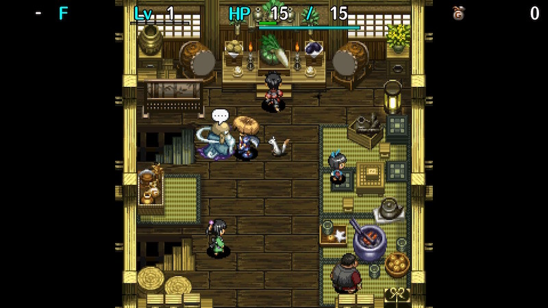
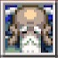

  

Tutorial dungeon where you're given advice about the basics of night gameplay.

Once cleared, you'll learn the Jack in the Box ability.

# Overview

<table class="dungeonOverview">
  <tr>
    <th>Unlock</th>
    <td class="highlightYellow">Available after reaching Hermit's Hermitage.</td>
  </tr>
  <tr>
    <th>Entrance</th>
    <td class="highlightYellow">Inori Village (Beginner House)</td>
  </tr>
</table>

<table class="dungeonTable">
  <tr>
    <th>Floors</th>
    <td>5F</td>
    <th>Day / Night</th>
    <td>Both</td>
  </tr>
  <tr>
    <th>Bring Items</th>
    <td>No</td>
    <th>Allies</th>
    <td>No</td>
  </tr>
  <tr>
    <th>Clear Icon</th>
    <td class="clearIcon"></td>
    <th>Reward</th>
    <td>Jack in the Box (Ability)</td>
  </tr>
</table>

※ You can't keep any items from the dungeon.

# Monster Table

<table>
  <tr>
    <th>Day</th>
    <th>F</th>
    <th>Night</th>
  </tr>
  <tr>
    <td>Pit Mamel</td>
    <td class="highlightGray">1</td>
    <td></td>
  </tr>
  <tr>
    <td></td>
    <td class="highlightGray">2</td>
    <td></td>
  </tr>
  <tr>
    <td></td>
    <td class="highlightGray">3</td>
    <td>Dark Mamel</td>
  </tr>
  <tr>
    <td></td>
    <td class="highlightGray">4</td>
    <td>Dark Mamel</td>
  </tr>
  <tr>
    <td></td>
    <td class="highlightGray">5</td>
    <td>Dark Mamel</td>
  </tr>
</table>

# Items

<table>
  <tr>
    <th>Items</th>
  </tr>
  <tr>
    <td>Torch</td>
  </tr>
  <tr>
    <td>Fine Torch</td>
  </tr>
  <tr>
    <td>Peach</td>
  </tr>
</table>
