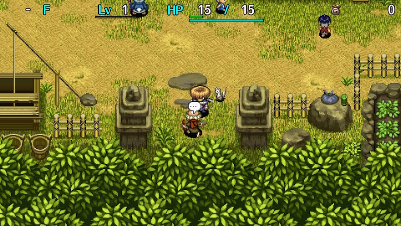
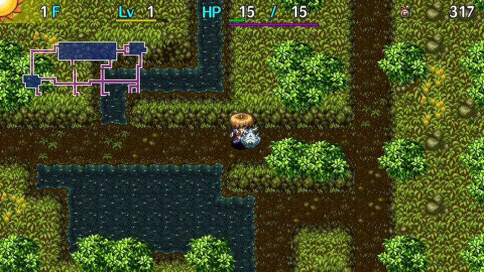
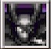

  

Dungeon with a special rule where fullness depletes in real time instead of being based on turns. 
The fullness depletion occurs in 1 minute intervals, and max fullness decreases by 4 every 3 floors.

Equipment without special abilities are exclusive to shops and Presto Pots, 
and items dropped by night monsters are selected from the shop item table.

[New Items](/system/new-items) can be found, so the difficulty can be drastically lowered by creating powerful items.

Players might feel pressured by the real time fullness depletion at first, but it's actually very lenient and 
there's almost no risk of collapsing from starvation unless you play incredibly slowly or let the game idle.

Fullness being a non-issue can be used to easily heal HP by stepping in place or cycle time of day, 
and makes item collection techniques and equipment leveling easy to perform.

<ul class="quickLinksUL">
  <li><a href="#overview">Overview</a></li>
  <li><a href="#strategy">Strategy</a>
    <ul>
      <li><a href="#general">General</a></li>
      <li><a href="#identifying-items">Identifying Items</a></li>
      <li><a href="#equipment">Equipment</a></li>
      <li><a href="#other-items">Other Items</a></li>
      <li><a href="#abilities">Abilities</a></li>
      <li><a href="#farming">Farming</a></li>
      <li><a href="#day-/-night-cycling">Day / Night Cycling</a></li>
      <li><a href="#floor-guide">Floor Guide</a></li>
      <li><a href="#boss">Boss</a></li>
    </ul>
  </li>
  <li><a href="#monsters">Monsters</a>
    <ul>
      <li><a href="#day-monsters">Day Monsters</a></li>
      <li><a href="#night-monsters">Night Monsters</a></li>
    </ul>
  </li>
  <li><a href="#items">Items</a></li>
  <li><a href="#traps">Traps</a></li>
  <li><a href="#npcs">NPCs</a></li>
</ul>

# Overview

<table class="dungeonOverview">
  <tr>
    <th>Unlock</th>
    <td class="highlightYellow">1. Clear the main story. 2. Have Okon, Koharu, and Gen join you as allies. 3. Level Okon and Gen to Lv10, and Koharu to Lv2. 4. Go to Hotel Nekomaneki → Gen's House. (check the letter on the ground) ※ Okon, Koharu, and Gen will be unavailable until you clear Old Road. ※ Gen's Turf dungeon will be unavailable until you clear Old Road.</td>
  </tr>
  <tr>
    <th>Entrance</th>
    <td class="highlightYellow">Inori Village (South entrance)</td>
  </tr>
</table>

<table class="dungeonTable">
  <tr>
    <th>Floors</th>
    <td>38F (first) / 99F</td>
    <th>Day / Night</th>
    <td>Both</td>
  </tr>
  <tr>
    <th>Bring Items</th>
    <td>No</td>
    <th>Allies</th>
    <td>No</td>
  </tr>
  <tr>
    <th>Unidentified</th>
    <td>Talismans, Staves, Pots, Bracelets</td>
    <th>New Items</th>
    <td>Yes</td>
  </tr>
  <tr>
    <th>Shops</th>
    <td>Regular, Elite, Pick-A-Choice</td>
    <th>Monster Houses</th>
    <td>Regular, Special, Sudden</td>
  </tr>
  <tr>
    <th>Initial Enemies</th>
    <td></td>
    <th>Spawn Rate</th>
    <td></td>
  </tr>
  <tr>
    <th>Day Turns</th>
    <td>810</td>
    <th>Night Turns</th>
    <td>368</td>
  </tr>
  <tr>
    <th>Ominous aura</th>
    <td>Yes (1200 turns)</td>
    <th>Wind of Kron</th>
    <td>1st: 1700 4th: 2000</td>
  </tr>
  <tr>
    <th>Clear Icon</th>
    <td class="clearIcon"></td>
    <th>Reward</th>
    <td>None</td>
  </tr>
</table>

# Strategy

<ul class="quickLinksUL">
  <li><a href="#general">General</a></li>
  <li><a href="#identifying-items">Identifying Items</a></li>
  <li><a href="#equipment">Equipment</a></li>
  <li><a href="#other-items">Other Items</a></li>
  <li><a href="#abilities">Abilities</a></li>
  <li><a href="#farming">Farming</a></li>
  <li><a href="#day-/-night-cycling">Day / Night Cycling</a></li>
  <li><a href="#floor-guide">Floor Guide</a></li>
  <li><a href="#boss">Boss</a></li>
</ul>

### General

Fullness depletes by 4 per minute. (Occurs at once instead of gradually depleting) 
You might feel pressured to act fast, but once you try it, you'll see that you barely need to think about fullness. 
If you're still concerned, open the menu and set Walk to Fast. (Other → Options → Dungeon Settings 1)

Take advantage of the fact that you don't lose fullness by stepping in place often. 
One onigiri is plenty to keep on hand, and extra food should be used to increase max fullness.

Heal Bracelet, Diet Shield, and Heavy Shield still affect fullness depletion. 
However, fullness depletion is only affected if they're equipped the moment the depletion occurs. 
For example, as long as you unequip a Heal Bracelet before the 1 minute is up, only 4 fullness will be depleted.

Similar to Onigiri Hollow, only equipment with special abilities can be found on the ground, 
but the quality of weapons is generally higher in Old Road. (Examples: Hatchet, Breeze Blade) 
Diet, Steady, and Blazing shields can be found on the ground, but Day and Midnight shields are shop-exclusive.

Stepping in place in a hallway or other safe area is an effective strategy at night. 
It's usually better to check rooms and progress during the day, unless you're on particularly dangerous floors. 
Keep in mind that items dropped by night monsters are selected from the shop item table, 
and that monsters can still drop items when they defeat each other. (Excluding Chow family) 
Step in place at night, and then collect items that dropped during daytime.

Maneaters appear starting on 3F, and it can be tricky to tell when the Ominous Aura is going to occur because the real time fullness depletion makes it hard to track the number of elapsed turns. 
However, there's usually enough time to complete a day and night cycle with a bit extra.

### Identifying Items

#### Early Game

Grasses and scrolls are identified, making it easy to save items for Mixer synthesis and avoid bad effects. 
Most staves and talismans can be identified safely by using them on a monster from 2 steps away. 
Only swing unidentified staves when your HP is above 25 from 3F onward to avoid Shocking Staff accidents.

For pots, it's recommended to first insert a named but still unidentified talisman. 
This identifies most pots besides Synthesis, Modder's, Ordinary, 4-2-8, Unbreakable, Exorcism, Curse, and Blessing. 
Next, if initial capacity was 3\~4, insert Gitan or an unneeded grass or scroll item that isn't blessed or sealed. 
If nothing happened, this narrows it down to Ordinary, 4-2-8, Modder's, Unbreakable, or Exorcism pots. 
Then, if you have a cursed item, insert that to check for Exorcism Pot. 
After that, either wait for a shop and identify by price, or give it a frivolous name and throw it at a wall. 
If it shatters, it's either Ordinary or Exorcism, and if it doesn't break, it's either Unbreakable or Modder's. 
If the initial capacity was 5, it's best to wait until you find a shop since it could be a Synthesis Pot. 
Only identify pots in the stairs room, since it could be a Sticky Pot, or Fever Pot if dropped by a night monster.

For bracelets, it's best to wait to equip them until Karakuroid (6-8F) floors so that a Strip Trap is available in case it's Monsterphobic, Itemphobic, or Nonary Bracelet. 
If you find an Identify Pot, prioritize inserting bracelets.

See [Identifying Items](/guides/identifying-items) for more identification tips.

#### Mid Game

Basically the same as early game. 
Don't equip unidentified bracelets unless you have a way to unequip them.

#### Late Game

Continue identifying pots if you still haven't found all fragrance pots. 
Ignore bracelets unless you haven't found a Monster Detector, or Alert Bracelet for Dozikon floors (67-68F).

### Equipment

Type effective weapons and equipment that activate 2 bracelet resonance are shop-exclusive, 
so you'll want to either main a status weapon, or aim for shops / night monster drops for normal equipment. 
Thankfully night monsters drop rates are pretty decent, so you shouldn't have much trouble finding equipment, 
provided you cycle day and night once per floor and have night monsters defeat each other. 
The ideal setup is 2 bracelet resonance with Monster Detector + Time Stop Bracelet. 
Of course, if you have powerful New Item equipment, you can just use that instead.

#### Weapon

Only weapons with innate runes can be found on the ground, but the quality of weapons is on the decent side. 
It's common to end up maining a status weapon early on, and since grasses are identified, weapons with high initial rune slots tend to offer a greater advantage.

- Baffle Axe
    - Among the best status weapons. High rune count, above average attack, and levels up quickly. Its growth rate shines in particular, since your ability to level up weapons is a bit limited due to night.
- Blurry Stick
    - Slower growth rate than Baffle Axe, but high rune count that turns into ∞ at Lv8. The gap between Blurry Stick and Baffle Axe is just 1 base attack at Lv8. You'll want to make a conscious effort to fight enemies during the day to level it up.
- Nap Rattle
    - Low rune count, base attack, and slow growth rate. However, if the effect activates, you're nearly guaranteed to defeat an enemy in a 1-on-1 fight. Choose your runes carefully if you decide to main it, since it has a max rune count of 11 even at Lv8.
- Shockuto
    - Similar downsides as Nap Rattle, but it lets you create safe areas to step in place or cycle time of day. Likely the best main weapon option if you prefer run-away play.
- Hatchet
    - It can be found on the ground so it's an option, but its base attack and rune count are lacking. It's fine if you land critical hits, but if it doesn't activate, you might find yourself getting worn down. Think carefully whether you want to use it as a main weapon if you have other options on hand.
- Type effective weapons
    - Shop-exclusive. Roughly: Water > Scythe >> Drain > Lizard > Copper > Magic > Myopic > Sky > Crescent. Water Cutter in particular has fast growth, high rune count, decent attack, and a wide range of effectiveness. Water Cutter and Scythe are solid options, but consider switching off of others if you find a better weapon. Lizard Lasher isn't as valuable in this dungeon, since Abyss Dragons don't appear during the day.
- Red Blade, Bladite, Dotanuki
    - Shop-exclusive. Ideally used with a corresponding shield to activate 2 bracelet resonance. However, be wary of Flame Shot if you go with Red Blade, since it can cause accidents.
- Beast Fang and lower
    - Shop-exclusive. These weapons aren't unviable, but there's little reason to choose them. Beast Fang gains Rustproof at Lv5, so you could level it and synthesize it into your main weapon.
- Burning Blade
    - Shop-exclusive. It's worth leveling if you obtain it early on, but its growth rate is very slow. Keep in mind that you don't gain skill points if you defeat enemies using Flame Shot. Extremely powerful as a main weapon once it's leveled up.

#### Weapon Runes

- Tri-direction
    - Breeze Blade can be found on the ground, so it's easier to synthesize than in other dungeons. Extremely powerful, and should be synthesized before anything else.
- Critical
    - Hatchet can be found on the ground, so it's easier to synthesize than in other dungeons. The critical hit rate is pretty high even as a rune, so it should be among the first runes you synthesize.
- Quick Hitting
    - So-so activation rate, but extremely powerful if it activates. It's easy to synthesize since grasses are identified and you can obtain Swift Grass from Grass Kids. If you find Swift Staff or Swift Talisman early, hunt Grass Kids until you obtain Stomach Expander and Swift Grass, then synthesize this rune on the first Mixer floor.
- Sedating, Bored
    - Shuts down a target for 6 turns. These should be synthesized before other status inflicting runes. Grasses are identified, so hunt Grass Kids to obtain Sleepy Grass before the first Mixer floor. Bored requires a Blank Scroll, so think carefully before synthesizing it.
- Paralyzing
    - Effective at creating safe areas to cycle time of day. It's not as easy to synthesize as Sedating, Confusing, or Blinding, but go for it if you get the chance. Keep in mind that it doesn't play well with Flame Shot if you use Red Blade or Burning Blade.
- Confusing, Blinding
    - Confused or blind enemies can still hit you if you're unlucky, but these stop their pursuit. Synthesize them if you get the chance, but if you're low on rune slots, consider skipping one of them.
- Anti-Floating
    - Effective against a wide range of monsters, and Warp Grass is easily obtained by hunting Grass Kids. Priority wise, this should be the first type effective rune you synthesize.
- Anti-Aquatic
    - Effective against a wide range of monsters, including those with troublesome abilities like Gyazas. It's harder to synthesize since it requires a Desert Scroll or Water Cutter.
- Anti-Drain
    - Limited range of effectiveness, but counters Absorbiphants - great if you have status inflicting runes. Scorpions and Polygon Spinnas can be a pain too, so synthesize it if you obtain Antidote Grass.
- Other type effective runes
    - Synthesize them as you get the chance, but leave enough open rune slots for the essentials first. Anti-Plant is very powerful, but it's harder to synthesize since it requires Weeds or a Scythe. Priority wise: Anti-Plant >>> Anti-Dragon ≧ Anti-Metal > Anti-Magic ≧ Anti-Cyclops >> Anti-Explode.
- Dispersing
    - Very high priority if you find a Sharing Staff, especially if you have Critical and/or type effective runes. Damage spreads from the enemy in front of you, so if you want to prevent dispersing damage, you can hit an enemy from the side using the Tri-direction rune.
- Healing
    - Consuming a Heal Bracelet is extremely wasteful in this dungeon due to its unique hunger mechanic, so only synthesize this rune if you happen to find 2 Heal Bracelets.
- Costly
    - Very powerful, provided you have enough Gitan to utilize it. Be sure to manage your remaining Gitan well if you synthesize it, stealing from shops if necessary.

#### Shield

Shop-exclusive shields are generally better as a main shield than those found on the ground. 
It's recommended to carry two shields - one for day, and one for night.

- Day Shield
    - Shop-exclusive. Use this as a main shield, unless you're aiming for 2 bracelet resonance. Hunger isn't turn-based, so step in place at night to cycle to daytime.
- Binary Shield
    - High defense and a strong ability makes it a solid choice among those that can be found on the ground. It gains Magi-Twister at Lv6, making it an effective counter to higher level DJ Mage monsters. It has a slower growth rate, so it'll take some effort to level it up.
- Heavy Shield
    - The increased fullness depletion does take place, but you're still unlikely to collapse from starvation. High defense and an exceptional rune count makes it a great main shield option. However, it gains Unmoving at Lv8, which can cause problems if you need to use staves to run away. It's a liability if you're aiming for 99F, but can be an advantage during the boss fight for the first clear.
- Red Shield
    - Shop-exclusive. Strongest shield among those that activate 2 bracelet resonance. Dragon Grass and Snake Shield are shop-exclusive, so the Anti-Fire rune it gains at Lv8 is a nice backup. Anti-Peck is also fantastic if you haven't found a Gyadon Blocker by the time it reaches Lv8. End game is far easier if you can match this with Red Blade + Monster Detector + Time Stop Bracelet.
- Targite
    - Shop-exclusive. Ideal shield if you're using a Bladite as a main weapon. It gains Anti-Theft at Lv8 which isn't very important, but Rustproof at Lv5 is quite nice.
- Beast Shield and lower
    - Can be used as a main shield if you have the corresponding weapon to activate 2 bracelet resonance. Wolfshead gains Rustproof at Lv4, so you can level it as synthesis fodder if you can't find a Plating Scroll.
- Blazing Shield
    - Can be found on the ground, and makes for an excellent shield at night until you find a Monster Detector. Its resonance with torches lights up the area as if it were daytime, and if you're out of torches, you can burn an item to light up a 1-tile radius to lower the amount of damage dealt by night monsters. There's little reason to level it up, but it's good to synthesize Nocturnal and Anti-Fire if possible. Unmoving is also a solid option that lets you walk around at night without fear of Dark Fearabbits.
- Midnight Shield
    - Shop-exclusive. Resonates with torches like Blazing Shield, but the increased evasion isn't very notable. Lets you withstand night monster attacks a decent amount once it's leveled up, but it's tricky to level up since it requires fighting daytime monsters while taking more damage due to the shield's innate ability. Therefore, it's often used as synthesis fodder for Blazing Shield instead of using it as a main shield.
- Pauper's Plank
    - Its damage reduction isn't as strong as Day Shield or Midnight Shield, but it can be used anytime. It's better as a night shield since you shouldn't get hit much, reducing the amount of Gitan loss. Consider using it as synthesis fodder to add Costly to Midnight Shield or Blazing Shield.

#### Shield Runes

- Anti-Fire
    - The synthesis ingredients are rare, but it's key to reducing the amount of damage you take from Dragons. Dragon Grass and Snake Shield are rare, so you might have to choose between a day or night shield. The strongest Dragon during the day is the Lv3 Archdragon, but night goes up to Lv4 Evil Abyss Dragons. So choose carefully, taking into account your remaining Zen Pot and Extinction Scroll uses.
- Magi-Twister
    - Swap Shield is shop-exclusive, so it's hard to synthesize this unless you level a Binary Shield. If you're able to synthesize it, DJ Mage monsters will become a non-issue. DJ Mages use special attacks more often during the day, so it's best to synthesize it onto a day shield.
- Anti-Blast, Anti-Blast※
    - Blast Shield is shop-exclusive. Daytime Pop Tanks have smart AI, so synthesize it onto a day shield first. Dark Pop Tanks aren't as bad, so synthesizing it onto a night shield is mainly to cover Big Explosion Traps. Explosion damage immunity from Anti-Blast※ is extremely good, but don't count on finding the ingredients.
- Anti-Hypno
    - Gazers only appear on a few floors, and can be avoided by managing time of day, so it's not essential. However, Time Switch Traps can mess up your plans, so there's no harm in synthesizing it.
- Anti-Theft, Anti-Peck
    - Both of these prevent item loss related accidents. Higher priority if you have open rune slots.
- Agile, Bit
    - Both effectively reduce the amount of damage you receive. Synthesize them if you can.
- Diurnal
    - You'll want to use Day Shield as a main shield instead of synthesizing it under most circumstances. However, if you prefer 2 bracelet resonance, go ahead and synthesize Diurnal onto your main day shield.
- Nocturnal
    - Rune that basically exists to be synthesized onto a Blazing Shield. Don't count on being able to withstand higher level night monster attacks even with this rune.
- Rustproof
    - Protecting upgrade value is a given, but it also helps protect runes against Mudster and Mudder, which both commonly appear on floors with water tiles.
- CR Diet
    - Diet Shield can be found on the ground, so this rune is on the easier side to synthesize. There's little risk of starving, so it mostly serves as insurance for when your max fullness is reduced. It's usually more effective to synthesize it onto a night shield.
- Unmoving
    - Key rune to counter high level Fearabbit monsters. It nullifies movement effects including those from items, so don't synthesize it onto your main shield. It's best to take things one step at a time at night anyway, so it's fine to synthesize it onto a night shield. It stops knockback during the boss fight, so synthesize it onto your shield if attempting the first clear.
- Costly
    - Can be used both during the day and at night, but recommended to synthesize it onto a night shield. If synthesized onto a Midnight Shield, you'll be able to withstand stronger hits if equipped with a torch.

#### Bracelets

- Heal Bracelet
    - Exclusively found in elite shops. It's safe to say that this is the most powerful bracelet in Old Road. Fullness won't deplete at a higher rate unless it's equipped in the exact moment fullness decreases, which occurs every minute. So there's little risk, and it makes your adventure much more consistent.
- Monster Detector, Monsterphobic
    - Both of these can be found on the ground, and significantly decrease the difficulty at night. Of course, it goes without saying that they help during the daytime as well.
- Time Stop Bracelet
    - Can be paired with a Monster Detector and Stairlight at night to breeze through the dungeon. Also helps when aiming for a Nirvana Board drop from night monsters near the end.
- Item Detector
    - Lets you plan an efficient route to check rooms for items, and helps you locate items dropped by night monsters before you've filled in the map.
- Waterwalk Bracelet
    - Shop-exclusive, but it's on the common side. Can be used to ripen peaches. There's a decent amount of floors with water tiles, so it can be used to safely cycle time of day.
- Alert Bracelet
    - Counters Dozikons and Sleep Traps. Some players like to keep it equipped at all times.
- Cleansing Bracelet
    - Mesmerikons only appear at night, and restoring fullness using Mutaikons is unnecessary, so it's mostly used to counter Scorpion monsters once you get past Mutaikon floors.
- Anti-Cnf. Bracelet, Anti-Crs. Bracelet
    - Used to counter their corresponding monsters. Equip Anti-Crs. Bracelet on 56-58F if you lack Steady Shield, since Curspinster and Horrabit overlap.
- Monster Summoner
    - Equip it on floors where farmable monsters appear. Grass Kid for grass, Mixer for synthesis, Zalokleft for items, Froggo for Gitan, Dagger Bee for skill points. Effectively grants more chances for a Nirvana Board drop from night monsters near the end.
- Wall Clip Bracelet
    - Exclusively found in elite shops. Extremely powerful, but incredibly rare. Use it with a pickaxe to create safe areas to cycle time of day, or to defeat enemies without getting hit.

### Other Items

#### Food

Keep 1 Juicy Peach and 1 Peach on hand to replenish abilities and cure ailments in a pinch. 
If you have extras, go ahead and eat a Juicy Peach as insurance while cycling time of day at night. 
Onigiri should be used to increase max fullness, but keep one on hand to replenish fullness.

#### Projectiles

1 stack of rocks and 1\~3 stacks of arrows should be enough. 
Knockback Arrows are advantageous since they can push night monsters back. 
Collect arrows whenever you find arrow traps, and on Boy Cart floors if you have a Dodger Pot.

#### Scrolls

This section lists notable scrolls for Old Road in particular. 
There are other useful scrolls, but they're generally the same across dungeons, so they aren't listed.

- Night-Day Scroll
    - Wipes out all monsters on the floor and immediately changes time of day. It's pretty rare, so think carefully before using it if you manage to obtain one. (Example: recovering from a Time Switch Trap on dangerous floors)
- Sanctuary Scroll
    - Nice for Mixer synthesis and Monster Houses, and to create a safe area to cycle time of day.
- Trap Deletion Scrl
    - Removes risk of stepping on Time Switch Traps on floors where you don't want to change time of day.

#### Staves

There aren't many staves that take particular advantage of Old Road's mechanics, 
so simply carry a number of movement related staves, and staves that shut down dangerous monsters.

- Balance Staff (First clear)
    - Tricky to identify, but protects you from the boss's tripping special attack.
- Paralysis Staff
    - Shuts down most monsters, and is used to create a safe area to cycle time of day during daytime. Also helps when cycling time of day at night, but it's less reliable since monsters hit each other.
- Fort. Staff
    - The best option to create safe areas to cycle time of day. Pick up any that you come across. Needed to synthesize Anti-Blast※, so keep one on hand even if remaining uses reaches 0.

#### Pots

- Zen Pot
    - Key item to survive Evil Abyss Dragon floors (88-99F) if you don't have an Extinction Scroll. Don't discard it even if capacity is reduced to 0, since capacity can be increased using Pot God Scrolls. Dragons have a high item drop rate, so use this instead of an Extinction Scroll if aiming for Nirvana Board.
- Dodger Pot
    - Use it to collect arrows, and counter higher level Mutaikon and Porky monsters. Try to protect it from Bored Kappas and Scoopies until you reach the floor ranges where it's needed.
- Reflection Pot
    - Ultra Gazers can be avoided by managing time of day, so it's used to counter higher level DJ Mages. However, it's still good to keep one on hand as insurance until you get past the Ultra Gazer floors.

#### Talismans

The type of talisman you carry comes down to personal preference, but limit it to 1 or 2 types to conserve space. 
Unhelpful effect talismans can occasionally come in handy, since they still remove enemy auras. 
(Example: reduce a normally regular speed Swift 2 yellow aura monster to Swift 1 by throwing a Swift Talisman) 
Enemy auras are more dangerous on deeper floors, so always keep at least 1 type of talisman on hand.

- Berserker Tal. (First clear)
    - Throw it at non-boss monsters from a distance during the boss fight to make them attack the boss.

#### Grass

- Perception Grass
    - Keep some on hand to eliminate the risk of stepping on Time Switch Traps on dangerous floors. It's easy to forget, but Farseeing status also lets you read scrolls at night without light.

### Abilities

It's easier to get by at night compared to other dungeons since you can step in place without hunter issues, 
but it still helps to choose a balanced set of abilities to give you more options to deal with situations. 

#### Good Abilities

- Kaboom Bullet
    - No special effect, but infinite range and can one-shot most monsters that don't have a blue aura.
- Sticky Shot
    - Weaker than Kaboom Bullet, but it's still strong enough to one-shot a decent number of enemies. The target will be left paralyzed if they survive, making it very effective against blue aura monsters. Aim to include 1~2 infinite range options like Sticky Shot or Kaboom Bullet.
- Mine! Mine! Mine!
    - Steals the target's aura, and has close to the same power as Sticky Shot. Nice for blue aura Absorbiphants if you haven't learned Transmogrification or Three Screams. Finding monsters with auras isn't guaranteed, but the boost you gain is powerful when it does happen.
- Pot Party
    - Deals damage and then inflicts Hiding status on all enemies in the room. (1-tile radius in hallways) Enemies with Hiding status can't act until the pot is hit by an attack or effect such as a magic bullet. Other enemies don't detect the pot as an enemy, so it can be used as a wall depending on its position. It works against Pumphantasms inside walls, so only Absorbiphants are immune to it. The effect can be undone by lava, Flamebirds, Absorbiphants, traps, and blind or confused enemies, but it's otherwise extremely reliable, so most players include 1~2 copies of the ability in their set.
- Transmogrification
    - Turns an enemy in front of you into an item. It can't hit through corners, and the target must be adjacent. You don't gain experience points, but the target is instantly defeated, so it's great against blue auras. The item is chosen from the dungeon's floor / daytime drop table (F column), so it's not high quality. Mixers that ate, Zaloklefts or Froggos that stole, and select monsters drop their corresponding items.
- Concussive Cannon
    - Medium power 3-tile wide blast that has infinite range and pierces through terrain. The lack of power is noticeable, but it's a decent option for long and narrow CHUNSOFT maps. One use can wipe out a line of enemies if you have boosted attack from Super status.
- Electrocute
    - Deals damage to an enemy in front of you, and then damages all enemies adjacent to the target. It can't hit through corners, and has somewhat low power when used against a single target. However, it gets stronger based on the number of enemies it hits, so it's great with Crawling Confusion. It can wipe out a smaller Monster House, but you don't move around much at night in Old Road, so using it for that purpose is uncommon compared to other dungeons.
- Crawling Confusion
    - Inflicts Confused status and attracts all monsters on the current floor to your surroundings. You'll want to use Electrocute or Pot Party to deal with the monsters after they warp to you. It's a great way to clear out a floor before you check rooms, or to deal with high level Dark Fearabbits. However, you're likely to get hit by a confused enemy on the same turn, and if you're really unlucky, you could get hit from all 8 directions, so it's important to weigh the risk - some don't include it. Don't use it on floors where Dark Absorbiphants and strong monsters appear. (Ex: Filthy Nashagga) Using items like Invincible Grass or Swift Grass beforehand reduces the risk.
- Stairlight
    - Displays the location of the stairs on the map, making it essential for rushing stairs at night. It's a simple yet extremely powerful effect, so always include this ability.

#### Ability Sets

The common balance is 4~5 offensive and 3~4 defensive / support abilities. 
Stairlight and Pot Party are extremely popular and are included in almost every set. 
Transmogrification is decently popular and helps early game, but the items are low quality and never blessed, 
so some skip it to increase the number of chances for Shop (S column) table drops from night monsters.

See [Sets](/system/necklace-abilities#sets) for examples of popular sets.

### Farming

#### Full Day / Night Cycle Farming

Method used to obtain extra items, and is particularly effective early game. 
Basically, do a full day / night cycle per floor and collect items dropped by night monsters defeating each other. 
Simply find a relatively safe and out of the way spot, and then step in place at night. 
However, keep track of the number of turns that elapse - Maneaters spawn on certain floor ranges. 
It's not uncommon to obtain items that directly lead to a successful run using this method, 
since items dropped by night monsters are selected from the shop table.

### Day / Night Cycling

See Cycling Day / Night for more ideas.

#### Waiting for Night

Day monsters can be dealt with normally, so you shouldn't have too much trouble. 
For example, retreat to a dead end room or hallway and block the entrance using a paralysis staff.

#### Waiting for Day

Day methods can be used at night, but it's tricky to position night monsters due to their random movement. 
Paralysis is often undone by other monsters attacking the target, so it's best to use Pot Party.

If you're waiting for daytime by stepping in place, do so near a corner so that you can see incoming enemies.

<pre class="diagram">
            S = Shiren 
            1.　　　　　　　　　 2.　　　　　　　　　3.　　　　　　　　　4. 
            ■ ■ ■ ■ ■ ■ ■　　 ■ ■ ■ ■ ■ ■ ■　　 ■ ■ □ ■ ■ ■ ■　　 ■ ■ ■ □ ■ ■ ■ 
            □ □ □ □ □ □ □　　 ■ ■ □ ■ ■ ■ ■　　 ■ ■ □ ■ ■ ■ ■　　 ■ ■ ■ □ ■ ■ ■ 
            ■ ■ ■ S ■ ■ ■　　 ■ ■ S ■ ■ ■ ■　　 ■ ■ □ S □ ■ ■　　 ■ □ S □ □ □ ■ 
            □ □ □ □ □ □ □　　 ■ ■ □ □ □ □ □　　 ■ ■ ■ ■ □ ■ ■　　 ■ □ □ □ □ □ ■ 
            ■ ■ ■ ■ ■ ■ ■　　 ■ ■ ■ ■ ■ ■ ■　　 ■ ■ ■ ■ □ ■ ■　　 ■ ■ ■ ■ ■ ■ ■
</pre>

Positioning yourself like this helps ensure safety against enemies that can only hit you when they're adjacent. 
If you inflict Hiding status on the approaching monster, your safety is guaranteed until time of day changes, 
provided the floor doesn't have enemies with special attacks that can undo Hiding status. (Diagram 2 and 4)

This doesn't work against swift enemies, those with long-range attacks or attacks that hit through corners, 
and monsters that can approach without using hallways like Pumphantasm. So on such floors, equip a Fine Torch or Super Torch, read a Navigation Scroll, or use Monster Detector.

Pickaxes can be used to dig branches in hallways to lower the chance of enemies moving in your direction, 
but night monsters already have unpredictable movement, so it's not 100% reliable.

### Floor Guide

#### Early Game (1-20F)

Be sure to go around the entire map for items on each floor early on.

It's best to do a full day / night cycle on each floor in an attempt to obtain night monster drops. 
There's risk of getting ambushed by a yellow aura monster, so wait near a hallway corner for safety.

Success often comes down to how much you grind early on, so perform techniques diligently and you'll be set. 
However, if you have powerful New Items (weapon, shield, bracelets), you don't need to grind.

Notable Monsters:

Grass Kid (3-5F) appears, so hunt them to collect grasses that can be used for synthesis. 
You could try to obtain 2 Poison Grass and 1 Rage Grass if you want to perform Nigiri Morph Factory to increase max fullness using a Nigiri Baby (6-8F), but it's completely optional. Maneaters can spawn on these floors, so don't linger too long.

Hunt Froggos (6-7F) for Gitan, and use Karakuroids (6-8F) to collect arrows from traps. 
If a Time Switch Trap is created, use it to adjust time of day to either collect more Gitan and arrows, 
or to obtain night monster drops by stepping in place inside a hallway during the night. 
Maneaters don't spawn between 6-8F, so you can collect items until the wind blows.

Mixers (8-10F) appear and have a high spawn rate, so you shouldn't have issues synthesizing. ※ Items eaten by Mixers are not lost when time of day changes.

Plump Chow (8-9F) appears at night, so aim for drops using Crawling Confusion + Electrocute. 
Curse Girl (8-9F) appears during the day, so avoid having your equipped weapon become cursed, 
since you won't be able to synthesize or equip torches if that happens.

Evil Floaty (9-10F) appears at night, and can ambush you in hallways with its swift movement. 
Keep a Fine Torch or Super Torch equipped if you haven't secured a safe spot to wait for daytime. 
Maneaters can spawn, so don't linger too long.

Mutaikon (11-12F), Mudkin (12F), and Scorpion (12F) appear. 
You can try to collect items if you have a Cleansing Bracelet and the Rustproof rune, 
but this floor range includes lava, so items on the ground often burn up before you reach them. 
Some prefer to simply skip past these floors while adjusting time of day as needed.

Dark Grass Kid (13F) appears at night, and since there are only 4 monsters in the night table, 
the chance to obtain grass is high - be sure to obtain grasses for synthesis you missed earlier. 
It's a lava floor so you need to hurry to rooms if you see item drops, but it's usually worth the trouble. 
Use torches and peaches if needed to make it to the dropped grass before it's destroyed by lava.

Dark Mixer (14-16F) appears at night, and 14-15F only includes 3 monsters in the table, so they're common. 
However, 14-15F are also lava floors, so you'll need to be careful of the timing if you defeat them in a room. 
This rarely happens, but a Bored Kappa can level up during the day by defeating a Snacky on 15F, 
so it's best to collect your synthesized shield quickly so that it doesn't get thrown by a Kappa Pest. 
There's nothing to be particularly wary of on 16F, so you can synthesize as you see fit.

Hunt Zaloklefts (17-18F) for items, and use Boy Carts (19-20F) to collect arrows if you can. 
Level up a Boy Cart into a Strong Cart and collect Knockback Arrows using a Dodger Pot for an advantage. 
Night is full of dangerous monsters like Dark Cross Cart, Dark MC Mage, and Bad Cololum between 17-18F, 
and Evil Dragon, Evil Super Gazer, and Foul Nigiri Morph between 19-20F, so avoid moving around at night.

#### Mid Game (21-50F)

Some of the more dangerous monsters begin to show up. 
If you lack runes that block their special attacks, be careful not to run out of items that seal or disable them.

Hunt Grass Dude (20-22F) and Green Zaloklefts (21-23F) for items. 
However, Dark Fearabbit (21-22F) also appears, and can cause accidents at night.

Nigiri Morph (22-27F) appears for 6 floors in a row, and can be used to increase max fullness. 
However, Gyadon (23-24F), Cursister (25-26F), Muddy (26-28F), and Spadie (26-28F) also appear, 
so you'll have to watch for those if you perform Nigiri Morph Factory on a floor other than 22F.

From this point on, check the monster table to get an idea of what monsters you're up against.

Dangerous monsters appear both during the day and at night starting from around 36F. 
If you're just aiming for the first clear (38F), feel free to rush to the stairs on those final floors.

See [Boss](#boss) for tips against the boss.

#### Late Game (51-99F)

Preparations should be complete by now, so rush stairs, switching between day and night as needed. 
Look at the monster table to get an idea which floors are better to progress through during day or night, 
and consider using items like Black Hole Pot to skip past floors that are dangerous both times. 
Don't fight monsters during the day unless you have a Day Shield or powerful New Item equipment.

Nirvana Board can only be obtained from night monsters or shops starting on 90F. 
If you're aiming for it, you'll want to prepare some specific items before you reach this floor range.

#### Nirvana Board (90-99F)

New Items can be found in this dungeon, unlike Primordial Chasm or Onigiri Hollow. 
Field of view and the dungeon's monster table are kinder than either of those dungeons too. 
So while Nirvana Board can only be found in shops between 90-99F, it's easier to obtain than 
Onigiri Shield or Wonder Pick, especially since night monster drops are selected from the shop table.

Needed Items / Cautions:

The first thing you need to deal with is Evil Abyss Dragon's fire breath at night. (88-99F) 
It doesn't breathe fire often, but your HP will be chipped away if you step in place at night, 
so use a Zen Pot or Extinction Scroll. (Zen Pot is better, since Dragons have a high item drop rate)

If you plan on lingering until Isleaters appear, you'll also need Immunity Scrolls or blessed Peaches. 
Other helpful items include Time Stop Bracelet, Monster Summoner, Fort. Staff, Night-Day and Collection scrolls. 
Create a safe area using Fort. Staff and equip Time Stop Bracelet + Monster Summoner (2 bracelet resonance), 
and read Collection Scrolls to gather item drops before advancing to the next floor.

90-95F: 
Ominous Auras don't occur, so you can't take advantage of Isleater's high item drop rate. 
This floor range also has lava, so drops typically burn up before you get to them.

95-96F: 
Cranky Tanks appear during the day, so be careful about items getting destroyed by explosions.

96-99F: 
Iseaters appear, but rooms are usually larger and there are more hallways than 90-95F, 
so night monsters don't have as many opportunities to attack each other compared to earlier floors.

So given the above, it's hard to say that a specific floor range is better than the others. 
But it's easy to aim for drops on any of these floors if you have the needed items, 
so just go for it whenever possible instead of worrying too much.

### Boss

The boss encounter occurs after you descend the stairs on 38F. 
Okon, Koharu, and Gen are unavailable until you clear Old Road after unlocking it, so level them beforehand. 
The unlock condition is Lv10 for Okon and Gen, and Lv2 for Koharu. 
It's best to level Okon to Lv54, since her Naptapir transformation puts all enemies in a 1 tile radius to sleep. 
If you unlocked the dungeon before leveling allies, it'll be a solo fight, so you'll need more preparation.

Boss: Gendolucika

<table class="dungeonTable">
  <thead>
    <tr>
      <th>HP</th>
      <th>Atk</th>
      <th>Def</th>
      <th>Exp</th>
      <th>Notes</th>
    </tr>
  </thead>
  <tbody>
    <tr>
      <td class="centeredText">600</td>
      <td class="centeredText">70</td>
      <td class="centeredText">15</td>
      <td class="centeredText">0</td>
      <td>Immune to select status conditions. Cures status conditions after 1 turn. Converts explosions like 4-2-8 pot to 50 damage. Summons monsters. Moves away from Shiren to keep a set distance. Performs a piercing attack that deals 40 damage and makes you trip when you're lined up. Performs an attack that deals knockback if adjacent. Nullifies Sanctuary Scroll, takes 2 damage from Gitan.</td>
    </tr>
  </tbody>
</table>

It's recommended to fight with Gen behind you to prevent being knocked back, since he has higher HP. However, Gen can be defeated by other monsters, so the ideal solution is to use a shield with Unmoving.

The fight starts with 2 Dragons and 2 Debasers placed near the boss. 
Gendolucika has a move that summons 2\~4 Dragons, Debasers, or Gyandoras in a single turn, 
so you'll want to inflict a status condition on him to prevent him from swarming you with monsters. 
He cures ailments in 1 turn, so eat Swift Grass and loop attack → inflict status to have a one-sided fight. 
Items like Invincible Grass and Hilarious Pot also help, but remember, the key is to focus on the boss. 
A prolonged fight usually ends up with an arena full of monsters with no way to approach the boss.

# Monsters

See [Monsters](/system/monsters) for individual monster details.

#### Day Monsters

Enemy Colors: Farming Situational Farming Destroys Items Dangerous Very Dangerous

<table class="dungeonMonsters">
  <tr>
    <th colspan="10">Day (Semi-sorted)</th>
  </tr>
  <tr>
    <td>1</td>
    <td class="highlightYellow">Mamel</td>
    <td class="highlightYellow">Seedie</td>
    <td class="highlightYellow">Sproutant</td>
    <td></td>
    <td></td>
    <td></td>
    <td></td>
    <td></td>
    <td></td>
  </tr>
  <tr>
    <td>2</td>
    <td class="highlightYellow">Mamel</td>
    <td class="highlightYellow">Seedie</td>
    <td class="highlightYellow">Sproutant</td>
    <td class="highlightYellow">Colum</td>
    <td></td>
    <td></td>
    <td></td>
    <td></td>
    <td></td>
  </tr>
  <tr>
    <td>3</td>
    <td class="highlightYellow">Blade Bee</td>
    <td class="highlightGreen">Pit Mamel</td>
    <td class="highlightYellow">Sproutant</td>
    <td class="highlightYellow">Colum</td>
    <td class="highlightYellow">Chintala</td>
    <td class="highlightBlue">Grass Kid</td>
    <td class="highlightYellow">Pin Kid</td>
    <td></td>
    <td></td>
  </tr>
  <tr>
    <td>4</td>
    <td class="highlightYellow">Blade Bee</td>
    <td class="highlightGreen">Pit Mamel</td>
    <td class="highlightYellow">Sweet Nut</td>
    <td></td>
    <td class="highlightYellow">Chintala</td>
    <td class="highlightBlue">Grass Kid</td>
    <td class="highlightYellow">Pin Kid</td>
    <td></td>
    <td></td>
  </tr>
  <tr>
    <td>5</td>
    <td></td>
    <td class="highlightGreen">Pit Mamel</td>
    <td class="highlightYellow">Sweet Nut</td>
    <td></td>
    <td class="highlightYellow">Chintala</td>
    <td class="highlightBlue">Grass Kid</td>
    <td class="highlightYellow">Pin Kid</td>
    <td></td>
    <td></td>
  </tr>
  <tr>
    <td>6</td>
    <td class="highlightGreen">Froggo</td>
    <td class="highlightYellow">Nigiri Baby</td>
    <td class="highlightYellow">Sweet Nut</td>
    <td class="highlightYellow">Karakuroid</td>
    <td class="highlightYellow">Moseal</td>
    <td></td>
    <td></td>
    <td></td>
    <td></td>
  </tr>
  <tr>
    <td>7</td>
    <td class="highlightGreen">Froggo</td>
    <td class="highlightYellow">Nigiri Baby</td>
    <td class="highlightYellow">Sweet Nut</td>
    <td class="highlightYellow">Karakuroid</td>
    <td class="highlightYellow">Moseal</td>
    <td class="highlightYellow">Tiger Tosser</td>
    <td></td>
    <td></td>
    <td></td>
  </tr>
  <tr>
    <td>8</td>
    <td class="highlightPurple3">Curse Girl</td>
    <td class="highlightYellow">Nigiri Baby</td>
    <td class="highlightYellow">Sweet Nut</td>
    <td class="highlightYellow">Karakuroid</td>
    <td class="highlightYellow">Moseal</td>
    <td class="highlightYellow">Tiger Tosser</td>
    <td class="highlightYellow">Fearabbit</td>
    <td class="highlightBlue">Mixer</td>
    <td class="highlightYellow">Pop Tank</td>
  </tr>
  <tr>
    <td>9</td>
    <td class="highlightPurple3">Curse Girl</td>
    <td></td>
    <td class="highlightYellow">Sweet Nut</td>
    <td></td>
    <td></td>
    <td class="highlightYellow">Tiger Tosser</td>
    <td class="highlightYellow">Fearabbit</td>
    <td class="highlightBlue">Mixer</td>
    <td class="highlightYellow">Pop Tank</td>
  </tr>
  <tr>
    <td>10</td>
    <td class="highlightYellow">N'dubba</td>
    <td class="highlightYellow">Pumphantasm</td>
    <td class="highlightYellow">Kumonigiri</td>
    <td class="highlightYellow">Naptapir</td>
    <td></td>
    <td></td>
    <td></td>
    <td class="highlightBlue">Mixer</td>
    <td class="highlightYellow">Pop Tank</td>
  </tr>
  <tr>
    <td>11</td>
    <td class="highlightYellow">N'dubba</td>
    <td class="highlightYellow">Pumphantasm</td>
    <td class="highlightYellow">Kumonigiri</td>
    <td class="highlightYellow">Naptapir</td>
    <td class="highlightYellow">Mutaikon</td>
    <td></td>
    <td></td>
    <td></td>
    <td></td>
  </tr>
  <tr>
    <td>12</td>
    <td class="highlightPurple3">Mudkin</td>
    <td class="highlightYellow">Pumphantasm</td>
    <td class="highlightYellow">Kumonigiri</td>
    <td class="highlightYellow">Naptapir</td>
    <td class="highlightYellow">Mutaikon</td>
    <td class="highlightYellow">Metalhead</td>
    <td class="highlightYellow">Scorpion</td>
    <td></td>
    <td></td>
  </tr>
  <tr>
    <td>13</td>
    <td class="highlightYellow">Mid Chintala</td>
    <td class="highlightYellow">Polygon Spinna</td>
    <td class="highlightYellow">Cololum</td>
    <td class="highlightBlue">Snacky</td>
    <td class="highlightYellow">Cheer-Ham</td>
    <td class="highlightYellow">Acrid Nut</td>
    <td></td>
    <td></td>
    <td></td>
  </tr>
  <tr>
    <td>14</td>
    <td class="highlightYellow">Mid Chintala</td>
    <td class="highlightYellow">Polygon Spinna</td>
    <td class="highlightYellow">Cololum</td>
    <td class="highlightBlue">Snacky</td>
    <td class="highlightYellow">Cheer-Ham</td>
    <td class="highlightYellow">Acrid Nut</td>
    <td class="highlightYellow">Kid Squid</td>
    <td></td>
    <td></td>
  </tr>
  <tr>
    <td>15</td>
    <td class="highlightYellow">Momoseal</td>
    <td class="highlightYellow">Bored Kappa</td>
    <td class="highlightOrange2">Foly</td>
    <td class="highlightBlue">Snacky</td>
    <td class="highlightYellow">Cheer-Ham</td>
    <td class="highlightYellow">Acrid Nut</td>
    <td class="highlightYellow">Kid Squid</td>
    <td></td>
    <td></td>
  </tr>
  <tr>
    <td>16</td>
    <td class="highlightYellow">Momoseal</td>
    <td class="highlightYellow">Bored Kappa</td>
    <td class="highlightOrange2">Foly</td>
    <td class="highlightYellow">Dagger Bee</td>
    <td class="highlightYellow">Yanpii</td>
    <td class="highlightYellow">Acrid Nut</td>
    <td class="highlightYellow">Kid Squid</td>
    <td class="highlightYellow">Hopodile</td>
    <td></td>
  </tr>
  <tr>
    <td>17</td>
    <td class="highlightBlue">Zalokleft</td>
    <td class="highlightYellow">Bored Kappa</td>
    <td class="highlightOrange2">Foly</td>
    <td class="highlightYellow">Dagger Bee</td>
    <td class="highlightYellow">Yanpii</td>
    <td class="highlightYellow">Acrid Nut</td>
    <td class="highlightYellow">Flamebird</td>
    <td class="highlightYellow">Hopodile</td>
    <td class="highlightPurple3">Scoopie</td>
  </tr>
  <tr>
    <td>18</td>
    <td class="highlightBlue">Zalokleft</td>
    <td></td>
    <td></td>
    <td class="highlightYellow">Dagger Bee</td>
    <td class="highlightYellow">Yanpii</td>
    <td></td>
    <td class="highlightYellow">Flamebird</td>
    <td class="highlightYellow">Hopodile</td>
    <td class="highlightPurple3">Scoopie</td>
  </tr>
  <tr>
    <td>19</td>
    <td class="highlightGreen">Boy Cart</td>
    <td class="highlightYellow">Beanie</td>
    <td class="highlightYellow">DJ Mage</td>
    <td class="highlightYellow">Eligan</td>
    <td></td>
    <td></td>
    <td></td>
    <td></td>
    <td class="highlightPurple3">Scoopie</td>
  </tr>
  <tr>
    <td>20</td>
    <td class="highlightGreen">Boy Cart</td>
    <td class="highlightYellow">Beanie</td>
    <td class="highlightYellow">DJ Mage</td>
    <td class="highlightYellow">Eligan</td>
    <td class="highlightBlue">Grass Dude</td>
    <td class="highlightYellow">Pin Dude</td>
    <td></td>
    <td></td>
    <td></td>
  </tr>
  <tr>
    <td>21</td>
    <td class="highlightBlue">Green Zalokleft</td>
    <td class="highlightYellow">Sproutyrant</td>
    <td class="highlightYellow">DJ Mage</td>
    <td class="highlightYellow">Eligan</td>
    <td class="highlightBlue">Grass Dude</td>
    <td class="highlightYellow">Pin Dude</td>
    <td></td>
    <td></td>
    <td></td>
  </tr>
  <tr>
    <td>22</td>
    <td class="highlightBlue">Green Zalokleft</td>
    <td class="highlightYellow">Sproutyrant</td>
    <td class="highlightYellow">Steamroid</td>
    <td class="highlightYellow">Poofy</td>
    <td class="highlightBlue">Grass Dude</td>
    <td class="highlightYellow">Pin Dude</td>
    <td class="highlightPurple3">Nigiri Morph</td>
    <td></td>
    <td></td>
  </tr>
  <tr>
    <td>23</td>
    <td class="highlightBlue">Green Zalokleft</td>
    <td class="highlightYellow">Sproutyrant</td>
    <td class="highlightYellow">Steamroid</td>
    <td class="highlightYellow">Poofy</td>
    <td class="highlightGreen">Froggucci</td>
    <td class="highlightPurple3">Gyadon</td>
    <td class="highlightPurple3">Nigiri Morph</td>
    <td class="highlightYellow">Pandanigiri</td>
    <td class="highlightOrange2">Snooztapir Absorbiphant</td>
  </tr>
  <tr>
    <td>24</td>
    <td class="highlightYellow">Ironhead</td>
    <td></td>
    <td></td>
    <td class="highlightYellow">Poofy</td>
    <td class="highlightGreen">Froggucci</td>
    <td class="highlightPurple3">Gyadon</td>
    <td class="highlightPurple3">Nigiri Morph</td>
    <td class="highlightYellow">Pandanigiri</td>
    <td class="highlightOrange2">Snooztapir Absorbiphant</td>
  </tr>
  <tr>
    <td>25</td>
    <td class="highlightYellow">Ironhead</td>
    <td class="highlightPurple3">Cursister</td>
    <td class="highlightOrange2">Hipadile</td>
    <td class="highlightYellow">Punisher</td>
    <td></td>
    <td></td>
    <td class="highlightPurple3">Nigiri Morph</td>
    <td></td>
    <td class="highlightOrange2">Absorbiphant</td>
  </tr>
  <tr>
    <td>26</td>
    <td class="highlightPurple3">Muddy</td>
    <td class="highlightPurple3">Cursister</td>
    <td class="highlightOrange2">Hipadile</td>
    <td class="highlightYellow">Punisher</td>
    <td class="highlightYellow">Crow Tengu</td>
    <td class="highlightYellow">Firepuff</td>
    <td class="highlightPurple3">Nigiri Morph</td>
    <td class="highlightYellow">Sr. Yanpii</td>
    <td class="highlightPurple3">Spadie</td>
  </tr>
  <tr>
    <td>27</td>
    <td class="highlightPurple3">Muddy</td>
    <td class="highlightYellow">Explochin</td>
    <td class="highlightOrange2">Hipadile</td>
    <td class="highlightYellow">Punisher</td>
    <td class="highlightYellow">Crow Tengu</td>
    <td class="highlightYellow">Firepuff</td>
    <td class="highlightPurple3">Nigiri Morph</td>
    <td class="highlightYellow">Sr. Yanpii</td>
    <td class="highlightPurple3">Spadie</td>
  </tr>
  <tr>
    <td>28</td>
    <td class="highlightPurple3">Muddy</td>
    <td class="highlightYellow">Explochin</td>
    <td class="highlightGreen">Cross Cart</td>
    <td></td>
    <td class="highlightYellow">Crow Tengu</td>
    <td class="highlightYellow">Firepuff</td>
    <td></td>
    <td class="highlightYellow">Sr. Yanpii</td>
    <td class="highlightPurple3">Spadie</td>
  </tr>
  <tr>
    <td>29</td>
    <td class="highlightYellow">Go-Ham!</td>
    <td class="highlightYellow">Explochin</td>
    <td class="highlightGreen">Cross Cart</td>
    <td class="highlightOrange2">Digestiphant</td>
    <td class="highlightOrange2">Scarabbit</td>
    <td class="highlightYellow">Zapdon</td>
    <td class="highlightOrange2">Kappa Pest</td>
    <td class="highlightOrange2">MC Mage</td>
    <td></td>
  </tr>
  <tr>
    <td>30</td>
    <td class="highlightYellow">Go-Ham!</td>
    <td class="highlightOrange2">N'twyn</td>
    <td></td>
    <td class="highlightOrange2">Digestiphant</td>
    <td class="highlightOrange2">Scarabbit</td>
    <td class="highlightYellow">Zapdon</td>
    <td class="highlightOrange2">Kappa Pest</td>
    <td class="highlightOrange2">MC Mage</td>
    <td></td>
  </tr>
  <tr>
    <td>31</td>
    <td class="highlightBlue">Mixermon</td>
    <td class="highlightOrange2">N'twyn</td>
    <td class="highlightYellow">Death Gyaza</td>
    <td class="highlightYellow">Katana Bee</td>
    <td class="highlightYellow">Dragon</td>
    <td class="highlightYellow">Shagga</td>
    <td class="highlightOrange2">Kappa Pest</td>
    <td class="highlightOrange2">MC Mage</td>
    <td></td>
  </tr>
  <tr>
    <td>32</td>
    <td class="highlightBlue">Mixermon</td>
    <td></td>
    <td class="highlightYellow">Death Gyaza</td>
    <td class="highlightYellow">Katana Bee</td>
    <td class="highlightYellow">Dragon</td>
    <td class="highlightYellow">Shagga</td>
    <td></td>
    <td></td>
    <td></td>
  </tr>
  <tr>
    <td>33</td>
    <td class="highlightBlue">Mixermon</td>
    <td></td>
    <td class="highlightYellow">Death Gyaza</td>
    <td class="highlightYellow">Katana Bee</td>
    <td class="highlightYellow">Dragon</td>
    <td class="highlightYellow">Shagga</td>
    <td></td>
    <td></td>
    <td></td>
  </tr>
  <tr>
    <td>34</td>
    <td class="highlightYellow">Polygon Shaka</td>
    <td class="highlightYellow">Dazikon</td>
    <td class="highlightYellow">Pumphantom</td>
    <td class="highlightYellow">Falcon Tengu</td>
    <td class="highlightYellow">Flamepuff</td>
    <td></td>
    <td></td>
    <td></td>
    <td></td>
  </tr>
  <tr>
    <td>35</td>
    <td class="highlightYellow">Polygon Shaka</td>
    <td class="highlightYellow">Dazikon</td>
    <td class="highlightYellow">Pumphantom</td>
    <td class="highlightYellow">Falcon Tengu</td>
    <td class="highlightYellow">Flamepuff</td>
    <td class="highlightYellow">Cave Mamel</td>
    <td class="highlightYellow">VeniScorp</td>
    <td></td>
    <td></td>
  </tr>
  <tr>
    <td>36</td>
    <td class="highlightYellow">Tiger Hurler</td>
    <td class="highlightBlue">Grass Poppa</td>
    <td class="highlightYellow">Pin Poppa</td>
    <td class="highlightYellow">Falcon Tengu</td>
    <td class="highlightYellow">Flamepuff</td>
    <td class="highlightYellow">Cave Mamel</td>
    <td class="highlightYellow">VeniScorp</td>
    <td></td>
    <td></td>
  </tr>
  <tr>
    <td>37</td>
    <td class="highlightYellow">Tiger Hurler</td>
    <td class="highlightBlue">Grass Poppa</td>
    <td class="highlightYellow">Pin Poppa</td>
    <td class="highlightRed">MC Wizard</td>
    <td></td>
    <td></td>
    <td class="highlightYellow">VeniScorp</td>
    <td></td>
    <td></td>
  </tr>
  <tr>
    <td>38</td>
    <td class="highlightYellow">Tiger Hurler</td>
    <td class="highlightBlue">Grass Poppa</td>
    <td class="highlightYellow">Pin Poppa</td>
    <td class="highlightRed">MC Wizard</td>
    <td class="highlightPurple3">Gyairas</td>
    <td class="highlightYellow">Eligagan</td>
    <td class="highlightYellow">Huistdon</td>
    <td></td>
    <td></td>
  </tr>
  <tr>
    <td>39</td>
    <td class="highlightYellow">Sparkbird</td>
    <td class="highlightRed">Ornery Tank</td>
    <td></td>
    <td></td>
    <td class="highlightPurple3">Gyairas</td>
    <td class="highlightYellow">Eligagan</td>
    <td class="highlightYellow">Huistdon</td>
    <td></td>
    <td></td>
  </tr>
  <tr>
    <td>40</td>
    <td class="highlightYellow">Sparkbird</td>
    <td class="highlightRed">Ornery Tank</td>
    <td class="highlightOrange2">Nashagga</td>
    <td class="highlightYellow">Momomoseal</td>
    <td></td>
    <td class="highlightYellow">Eligagan</td>
    <td class="highlightYellow">Huistdon</td>
    <td></td>
    <td></td>
  </tr>
  <tr>
    <td>41</td>
    <td class="highlightYellow">Steelhead</td>
    <td class="highlightRed">Ornery Tank</td>
    <td class="highlightOrange2">Nashagga</td>
    <td class="highlightYellow">Momomoseal</td>
    <td class="highlightOrange2">Sky Dragon</td>
    <td></td>
    <td class="highlightYellow">Huistdon</td>
    <td></td>
    <td></td>
  </tr>
  <tr>
    <td>42</td>
    <td class="highlightYellow">Steelhead</td>
    <td></td>
    <td class="highlightOrange2">Nashagga</td>
    <td class="highlightYellow">Momomoseal</td>
    <td class="highlightOrange2">Sky Dragon</td>
    <td></td>
    <td></td>
    <td></td>
    <td></td>
  </tr>
  <tr>
    <td>43</td>
    <td class="highlightYellow">Steelhead</td>
    <td></td>
    <td></td>
    <td class="highlightYellow">Momomoseal</td>
    <td class="highlightOrange2">Sky Dragon</td>
    <td></td>
    <td></td>
    <td></td>
    <td></td>
  </tr>
  <tr>
    <td>44</td>
    <td class="highlightYellow">King Squid</td>
    <td class="highlightYellow">Concusschin</td>
    <td class="highlightYellow">Nuttie</td>
    <td class="highlightYellow">Rally Ham</td>
    <td class="highlightYellow">Spicy Nut</td>
    <td class="highlightOrange2">Nigiri Boss</td>
    <td></td>
    <td></td>
    <td></td>
  </tr>
  <tr>
    <td>45</td>
    <td class="highlightYellow">King Squid</td>
    <td class="highlightYellow">Concusschin</td>
    <td class="highlightYellow">Nuttie</td>
    <td class="highlightYellow">Rally Ham</td>
    <td class="highlightYellow">Spicy Nut</td>
    <td class="highlightOrange2">Nigiri Boss</td>
    <td class="highlightYellow">Big Chintala</td>
    <td class="highlightBlue">Munchy</td>
    <td></td>
  </tr>
  <tr>
    <td>46</td>
    <td class="highlightYellow">Blazepuff</td>
    <td class="highlightYellow">Concusschin</td>
    <td class="highlightYellow">Nuttie</td>
    <td class="highlightYellow">Rally Ham</td>
    <td class="highlightYellow">Spicy Nut</td>
    <td class="highlightOrange2">Nigiri Boss</td>
    <td class="highlightYellow">Big Chintala</td>
    <td class="highlightBlue">Munchy</td>
    <td class="highlightOrange2">Oingodile</td>
  </tr>
  <tr>
    <td>47</td>
    <td class="highlightYellow">Blazepuff</td>
    <td class="highlightYellow">Eagle Tengu</td>
    <td class="highlightPurple3">Super Gazer</td>
    <td class="highlightPurple3">Trowelie</td>
    <td></td>
    <td class="highlightOrange2">Nigiri Boss</td>
    <td></td>
    <td></td>
    <td class="highlightOrange2">Oingodile</td>
  </tr>
  <tr>
    <td>48</td>
    <td class="highlightYellow">Blazepuff</td>
    <td class="highlightYellow">Eagle Tengu</td>
    <td class="highlightPurple3">Super Gazer</td>
    <td class="highlightPurple3">Trowelie</td>
    <td class="highlightYellow">Colocolum</td>
    <td class="highlightOrange2">Nigiri Boss</td>
    <td></td>
    <td></td>
    <td class="highlightOrange2">Oingodile</td>
  </tr>
  <tr>
    <td>49</td>
    <td class="highlightYellow">Electroid</td>
    <td class="highlightYellow">Eagle Tengu</td>
    <td class="highlightPurple3">Super Gazer</td>
    <td class="highlightPurple3">Trowelie</td>
    <td class="highlightYellow">Colocolum</td>
    <td class="highlightOrange2">Nigiri Boss</td>
    <td class="highlightOrange2">Porkon</td>
    <td class="highlightGreen">Strong Cart</td>
    <td></td>
  </tr>
  <tr>
    <td>50</td>
    <td class="highlightYellow">Electroid</td>
    <td class="highlightOrange2">N'mach</td>
    <td class="highlightBlue">Mixergon</td>
    <td class="highlightYellow">Doztapir</td>
    <td class="highlightYellow">Colocolum</td>
    <td class="highlightOrange2">Nigiri Boss</td>
    <td class="highlightOrange2">Porkon</td>
    <td class="highlightGreen">Strong Cart</td>
    <td></td>
  </tr>
  <tr>
    <td>51</td>
    <td class="highlightOrange2">Jouncy</td>
    <td class="highlightOrange2">N'mach</td>
    <td class="highlightBlue">Mixergon</td>
    <td class="highlightYellow">Doztapir</td>
    <td class="highlightYellow">Debaser</td>
    <td></td>
    <td></td>
    <td class="highlightGreen">Strong Cart</td>
    <td></td>
  </tr>
  <tr>
    <td>52</td>
    <td class="highlightOrange2">Jouncy</td>
    <td class="highlightOrange2">Vexing Kappa</td>
    <td class="highlightYellow">Sprouterror</td>
    <td class="highlightYellow">Doztapir</td>
    <td class="highlightYellow">Debaser</td>
    <td class="highlightRed">MC Sorceror</td>
    <td></td>
    <td></td>
    <td></td>
  </tr>
  <tr>
    <td>53</td>
    <td class="highlightOrange2">Jouncy</td>
    <td class="highlightOrange2">Vexing Kappa</td>
    <td class="highlightYellow">Sprouterror</td>
    <td class="highlightOrange2">Trillman</td>
    <td class="highlightYellow">Debaser</td>
    <td class="highlightRed">MC Sorceror</td>
    <td class="highlightPurple3">Mudster</td>
    <td></td>
    <td></td>
  </tr>
  <tr>
    <td>54</td>
    <td class="highlightOrange2">Jouncy</td>
    <td class="highlightYellow">StunScorp</td>
    <td class="highlightYellow">Pyrepuff</td>
    <td class="highlightOrange2">Pierce Cart</td>
    <td class="highlightYellow">Debaser</td>
    <td class="highlightRed">MC Sorceror</td>
    <td class="highlightPurple3">Mudster</td>
    <td></td>
    <td></td>
  </tr>
  <tr>
    <td>55</td>
    <td class="highlightYellow">Tiger Chucker</td>
    <td class="highlightYellow">StunScorp</td>
    <td class="highlightYellow">Pyrepuff</td>
    <td class="highlightOrange2">Pierce Cart</td>
    <td></td>
    <td></td>
    <td></td>
    <td></td>
    <td></td>
  </tr>
  <tr>
    <td>56</td>
    <td class="highlightYellow">Tiger Chucker</td>
    <td class="highlightPurple3">Curspinster</td>
    <td class="highlightYellow">Pumpanshee</td>
    <td class="highlightOrange2">Pierce Cart</td>
    <td class="highlightRed">Horrabbit</td>
    <td class="highlightYellow">Momomomoseal</td>
    <td></td>
    <td></td>
    <td></td>
  </tr>
  <tr>
    <td>57</td>
    <td class="highlightYellow">Tiger Chucker</td>
    <td class="highlightPurple3">Curspinster</td>
    <td class="highlightYellow">Pumpanshee</td>
    <td class="highlightGreen">Froggon</td>
    <td class="highlightRed">Horrabbit</td>
    <td class="highlightYellow">Momomomoseal</td>
    <td class="highlightOrange2">Spongiderm</td>
    <td></td>
    <td></td>
  </tr>
  <tr>
    <td>58</td>
    <td class="highlightOrange2">Lashagga</td>
    <td class="highlightPurple3">Curspinster</td>
    <td class="highlightYellow">Pumpanshee</td>
    <td class="highlightGreen">Froggon</td>
    <td class="highlightRed">Horrabbit</td>
    <td class="highlightYellow">Momomomoseal</td>
    <td class="highlightOrange2">Spongiderm</td>
    <td></td>
    <td></td>
  </tr>
  <tr>
    <td>59</td>
    <td class="highlightOrange2">Lashagga</td>
    <td class="highlightPurple3">Item Knave</td>
    <td class="highlightBlue">Iron Zalokleft</td>
    <td class="highlightGreen">Froggon</td>
    <td class="highlightPurple3">Gyandora</td>
    <td class="highlightYellow">Lt. Yanpii</td>
    <td class="highlightOrange2">Spongiderm</td>
    <td></td>
    <td></td>
  </tr>
  <tr>
    <td>60</td>
    <td class="highlightOrange2">Lashagga</td>
    <td class="highlightPurple3">Item Knave</td>
    <td class="highlightBlue">Iron Zalokleft</td>
    <td class="highlightYellow">Zanbeeto</td>
    <td class="highlightPurple3">Gyandora</td>
    <td class="highlightYellow">Lt. Yanpii</td>
    <td></td>
    <td></td>
    <td></td>
  </tr>
  <tr>
    <td>61</td>
    <td class="highlightBlue">Grass Gramps</td>
    <td class="highlightYellow">Pin Gramps</td>
    <td class="highlightYellow">Polygon Singa</td>
    <td class="highlightYellow">Zanbeeto</td>
    <td class="highlightOrange2">Flarebird</td>
    <td class="highlightYellow">Lt. Yanpii</td>
    <td class="highlightYellow">Bunchukdon</td>
    <td></td>
    <td></td>
  </tr>
  <tr>
    <td>62</td>
    <td class="highlightBlue">Grass Gramps</td>
    <td class="highlightYellow">Pin Gramps</td>
    <td class="highlightYellow">Polygon Singa</td>
    <td class="highlightPurple3">Sensei</td>
    <td class="highlightOrange2">Flarebird</td>
    <td></td>
    <td class="highlightYellow">Bunchukdon</td>
    <td></td>
    <td></td>
  </tr>
  <tr>
    <td>63</td>
    <td class="highlightYellow">Spirit Ham</td>
    <td class="highlightOrange2">Bouncy</td>
    <td class="highlightYellow">Polygon Singa</td>
    <td class="highlightPurple3">Sensei</td>
    <td class="highlightOrange2">Flarebird</td>
    <td></td>
    <td class="highlightYellow">Bunchukdon</td>
    <td></td>
    <td></td>
  </tr>
  <tr>
    <td>64</td>
    <td class="highlightYellow">Spirit Ham</td>
    <td class="highlightOrange2">Bouncy</td>
    <td class="highlightYellow">Onigirizzly</td>
    <td class="highlightPurple3">Sensei</td>
    <td class="highlightYellow">Bitter Nut</td>
    <td></td>
    <td></td>
    <td></td>
    <td></td>
  </tr>
  <tr>
    <td>65</td>
    <td class="highlightYellow">Spirit Ham</td>
    <td class="highlightOrange2">Bouncy</td>
    <td class="highlightYellow">Onigirizzly</td>
    <td class="highlightYellow">Fulminachin</td>
    <td class="highlightYellow">Bitter Nut</td>
    <td class="highlightPurple3">Hyper Gazer</td>
    <td></td>
    <td></td>
    <td></td>
  </tr>
  <tr>
    <td>66</td>
    <td class="highlightYellow">Phoenix Tengu</td>
    <td class="highlightOrange2">Bouncy</td>
    <td class="highlightRed">Archdragon</td>
    <td class="highlightYellow">Fulminachin</td>
    <td class="highlightYellow">Bitter Nut</td>
    <td class="highlightPurple3">Hyper Gazer</td>
    <td></td>
    <td></td>
    <td></td>
  </tr>
  <tr>
    <td>67</td>
    <td class="highlightYellow">Phoenix Tengu</td>
    <td class="highlightRed">Dozikon</td>
    <td class="highlightRed">Archdragon</td>
    <td></td>
    <td></td>
    <td class="highlightPurple3">Hyper Gazer</td>
    <td></td>
    <td></td>
    <td></td>
  </tr>
  <tr>
    <td>68</td>
    <td class="highlightYellow">Phoenix Tengu</td>
    <td class="highlightRed">Dozikon</td>
    <td class="highlightRed">Archdragon</td>
    <td class="highlightYellow">Comatapir</td>
    <td class="highlightYellow">Grainie</td>
    <td></td>
    <td></td>
    <td></td>
    <td></td>
  </tr>
  <tr>
    <td>69</td>
    <td class="highlightPurple3">Mudder</td>
    <td></td>
    <td></td>
    <td class="highlightYellow">Comatapir</td>
    <td class="highlightYellow">Grainie</td>
    <td></td>
    <td></td>
    <td></td>
    <td></td>
  </tr>
  <tr>
    <td>70</td>
    <td class="highlightPurple3">Mudder</td>
    <td class="highlightBlue">Mixerdon</td>
    <td class="highlightYellow">Huge Chintala</td>
    <td class="highlightYellow">Hell Gyaza</td>
    <td class="highlightYellow">Grainie</td>
    <td class="highlightOrange2">N'dup</td>
    <td></td>
    <td></td>
    <td></td>
  </tr>
  <tr>
    <td>71</td>
    <td class="highlightPurple3">Mudder</td>
    <td class="highlightBlue">Mixerdon</td>
    <td class="highlightYellow">Huge Chintala</td>
    <td class="highlightYellow">Hell Gyaza</td>
    <td class="highlightYellow">Eligagon</td>
    <td class="highlightOrange2">N'dup</td>
    <td></td>
    <td></td>
    <td></td>
  </tr>
  <tr>
    <td>72</td>
    <td class="highlightPurple3">Mudder</td>
    <td class="highlightBlue">FO-UZZ</td>
    <td class="highlightYellow">Huge Chintala</td>
    <td class="highlightYellow">Hell Gyaza</td>
    <td class="highlightYellow">Eligagon</td>
    <td class="highlightOrange2">N'dup</td>
    <td class="highlightYellow">Cyberoid</td>
    <td></td>
    <td></td>
  </tr>
  <tr>
    <td>73</td>
    <td class="highlightYellow">Detonachin</td>
    <td class="highlightBlue">FO-UZZ</td>
    <td class="highlightPurple3">Cursenior</td>
    <td></td>
    <td class="highlightYellow">Eligagon</td>
    <td class="highlightOrange2">N'dup</td>
    <td class="highlightYellow">Cyberoid</td>
    <td></td>
    <td></td>
  </tr>
  <tr>
    <td>74</td>
    <td class="highlightYellow">Detonachin</td>
    <td class="highlightPurple3">Shovelie</td>
    <td class="highlightPurple3">Cursenior</td>
    <td class="highlightYellow">Sproutitan</td>
    <td class="highlightRed">Porgon</td>
    <td></td>
    <td class="highlightYellow">Cyberoid</td>
    <td></td>
    <td></td>
  </tr>
  <tr>
    <td>75</td>
    <td class="highlightPurple3">Knave King</td>
    <td class="highlightPurple3">Shovelie</td>
    <td class="highlightPurple3">Cursenior</td>
    <td class="highlightYellow">Sproutitan</td>
    <td class="highlightRed">Porgon</td>
    <td class="highlightBlue">Mealy</td>
    <td class="highlightYellow">Ruiner</td>
    <td></td>
    <td></td>
  </tr>
  <tr>
    <td>76</td>
    <td class="highlightPurple3">Knave King</td>
    <td></td>
    <td></td>
    <td class="highlightYellow">Sproutitan</td>
    <td class="highlightRed">Porgon</td>
    <td class="highlightBlue">Mealy</td>
    <td class="highlightYellow">Ruiner</td>
    <td></td>
    <td></td>
  </tr>
  <tr>
    <td>77</td>
    <td class="highlightYellow">BlightScorp</td>
    <td class="highlightRed">Terrabbit</td>
    <td class="highlightYellow">Pumptergeist</td>
    <td class="highlightOrange2">Boingodile</td>
    <td class="highlightRed">Porgon</td>
    <td></td>
    <td class="highlightYellow">Ruiner</td>
    <td></td>
    <td></td>
  </tr>
  <tr>
    <td>78</td>
    <td class="highlightYellow">BlightScorp</td>
    <td class="highlightRed">Terrabbit</td>
    <td class="highlightYellow">Pumptergeist</td>
    <td class="highlightOrange2">Boingodile</td>
    <td class="highlightYellow">Squidperor</td>
    <td class="highlightYellow">Colocolocolum</td>
    <td class="highlightYellow">Ruiner</td>
    <td></td>
    <td></td>
  </tr>
  <tr>
    <td>79</td>
    <td class="highlightYellow">Kodionigiri</td>
    <td></td>
    <td class="highlightYellow">Pumptergeist</td>
    <td class="highlightOrange2">Boingodile</td>
    <td class="highlightYellow">Squidperor</td>
    <td class="highlightYellow">Colocolocolum</td>
    <td></td>
    <td></td>
    <td></td>
  </tr>
  <tr>
    <td>80</td>
    <td class="highlightYellow">Kodionigiri</td>
    <td class="highlightOrange2">Kappa Troll</td>
    <td class="highlightOrange2">Gitan Mamel</td>
    <td class="highlightGreen">Kleptoad</td>
    <td class="highlightOrange2">Osmammoth</td>
    <td class="highlightYellow">Colocolocolum</td>
    <td></td>
    <td></td>
    <td></td>
  </tr>
  <tr>
    <td>81</td>
    <td class="highlightYellow">Doomhead</td>
    <td class="highlightOrange2">Kappa Troll</td>
    <td class="highlightOrange2">Gitan Mamel</td>
    <td class="highlightGreen">Kleptoad</td>
    <td class="highlightOrange2">Osmammoth</td>
    <td></td>
    <td></td>
    <td></td>
    <td></td>
  </tr>
  <tr>
    <td>82</td>
    <td class="highlightYellow">Doomhead</td>
    <td class="highlightOrange2">Googoman</td>
    <td class="highlightOrange2">Gitan Mamel</td>
    <td class="highlightGreen">Kleptoad</td>
    <td class="highlightOrange2">Osmammoth</td>
    <td></td>
    <td></td>
    <td></td>
    <td></td>
  </tr>
  <tr>
    <td>83</td>
    <td class="highlightYellow">Doomhead</td>
    <td class="highlightOrange2">Googoman</td>
    <td class="highlightPurple3">Gyandoron</td>
    <td class="highlightYellow">Polygon Stunna</td>
    <td class="highlightOrange2">Osmammoth</td>
    <td></td>
    <td></td>
    <td></td>
    <td></td>
  </tr>
  <tr>
    <td>84</td>
    <td class="highlightYellow">Doomhead</td>
    <td class="highlightOrange2">Blazebird</td>
    <td class="highlightPurple3">Gyandoron</td>
    <td class="highlightYellow">Polygon Stunna</td>
    <td class="highlightYellow">Tiger Ace</td>
    <td></td>
    <td></td>
    <td></td>
    <td></td>
  </tr>
  <tr>
    <td>85</td>
    <td class="highlightYellow">Doomhead</td>
    <td class="highlightOrange2">Blazebird</td>
    <td class="highlightPurple3">Gyandoron</td>
    <td class="highlightYellow">Polygon Stunna</td>
    <td class="highlightYellow">Tiger Ace</td>
    <td class="highlightYellow">Zotdon</td>
    <td></td>
    <td></td>
    <td></td>
  </tr>
  <tr>
    <td>86</td>
    <td class="highlightYellow">Boss Yanpii</td>
    <td class="highlightOrange2">Nigiri King</td>
    <td></td>
    <td class="highlightYellow">Polygon Stunna</td>
    <td class="highlightYellow">Tiger Ace</td>
    <td class="highlightYellow">Zotdon</td>
    <td></td>
    <td></td>
    <td></td>
  </tr>
  <tr>
    <td>87</td>
    <td class="highlightYellow">Boss Yanpii</td>
    <td class="highlightOrange2">Nigiri King</td>
    <td class="highlightBlue">Zalokleftis King</td>
    <td class="highlightYellow">Polygon Stunna</td>
    <td></td>
    <td class="highlightYellow">Zotdon</td>
    <td></td>
    <td></td>
    <td></td>
  </tr>
  <tr>
    <td>88</td>
    <td class="highlightYellow">Boss Yanpii</td>
    <td class="highlightOrange2">Nigiri King</td>
    <td class="highlightBlue">Zalokleftis King</td>
    <td class="highlightYellow">Polygon Stunna</td>
    <td></td>
    <td class="highlightYellow">Zotdon</td>
    <td></td>
    <td></td>
    <td></td>
  </tr>
  <tr>
    <td>89</td>
    <td class="highlightYellow">Boss Yanpii</td>
    <td class="highlightOrange2">Nigiri King</td>
    <td class="highlightBlue">Zalokleftis King</td>
    <td class="highlightRed">Ultra Gazer</td>
    <td class="highlightYellow">Doom Gyaza</td>
    <td class="highlightYellow">Zotdon</td>
    <td></td>
    <td></td>
    <td></td>
  </tr>
  <tr>
    <td>90</td>
    <td class="highlightPurple3">Swordmaster</td>
    <td class="highlightOrange2">Nigiri King</td>
    <td></td>
    <td class="highlightRed">Ultra Gazer</td>
    <td class="highlightYellow">Doom Gyaza</td>
    <td class="highlightYellow">Zotdon</td>
    <td></td>
    <td></td>
    <td></td>
  </tr>
  <tr>
    <td>91</td>
    <td class="highlightPurple3">Swordmaster</td>
    <td class="highlightOrange2">Nigiri King</td>
    <td></td>
    <td class="highlightRed">Ultra Gazer</td>
    <td class="highlightYellow">Doom Gyaza</td>
    <td class="highlightYellow">Zotdon</td>
    <td></td>
    <td></td>
    <td></td>
  </tr>
  <tr>
    <td>92</td>
    <td class="highlightPurple3">Swordmaster</td>
    <td class="highlightOrange2">Nigiri King</td>
    <td></td>
    <td></td>
    <td class="highlightYellow">Doom Gyaza</td>
    <td class="highlightYellow">Zotdon</td>
    <td></td>
    <td></td>
    <td></td>
  </tr>
  <tr>
    <td>93</td>
    <td class="highlightPurple3">Swordmaster</td>
    <td class="highlightOrange2">Nigiri King</td>
    <td class="highlightYellow">Despoiler</td>
    <td></td>
    <td class="highlightYellow">Doom Gyaza</td>
    <td class="highlightYellow">Zotdon</td>
    <td></td>
    <td></td>
    <td></td>
  </tr>
  <tr>
    <td>94</td>
    <td class="highlightPurple3">Swordmaster</td>
    <td></td>
    <td class="highlightYellow">Despoiler</td>
    <td></td>
    <td class="highlightYellow">Doom Gyaza</td>
    <td class="highlightYellow">Zotdon</td>
    <td></td>
    <td></td>
    <td></td>
  </tr>
  <tr>
    <td>95</td>
    <td class="highlightRed">Cranky Tank</td>
    <td class="highlightYellow">Elizgagon</td>
    <td class="highlightYellow">Despoiler</td>
    <td></td>
    <td></td>
    <td></td>
    <td></td>
    <td></td>
    <td></td>
  </tr>
  <tr>
    <td>96</td>
    <td class="highlightRed">Cranky Tank</td>
    <td class="highlightYellow">Elizgagon</td>
    <td class="highlightYellow">Despoiler</td>
    <td></td>
    <td></td>
    <td></td>
    <td></td>
    <td></td>
    <td></td>
  </tr>
  <tr>
    <td>97</td>
    <td></td>
    <td class="highlightYellow">Elizgagon</td>
    <td class="highlightYellow">Despoiler</td>
    <td></td>
    <td></td>
    <td></td>
    <td></td>
    <td></td>
    <td></td>
  </tr>
  <tr>
    <td>98</td>
    <td></td>
    <td class="highlightYellow">Elizgagon</td>
    <td class="highlightYellow">Despoiler</td>
    <td></td>
    <td></td>
    <td></td>
    <td></td>
    <td></td>
    <td></td>
  </tr>
  <tr>
    <td>99</td>
    <td></td>
    <td class="highlightYellow">Elizgagon</td>
    <td class="highlightYellow">Despoiler</td>
    <td></td>
    <td></td>
    <td></td>
    <td></td>
    <td></td>
    <td></td>
  </tr>
</table>

#### Night Monsters

Enemy Colors: Farming Situational Farming Destroys Items Dangerous Very Dangerous

<table class="dungeonMonsters">
  <thead>
    <tr>
      <th colspan="8" class="highlightBlack">Night</th>
    </tr>
  </thead>
  <tbody>
    <tr>
      <td>1</td>
      <td class="highlightPurple">Dark Mamel</td>
      <td class="highlightPurple">Evil Chintala</td>
      <td class="highlightPurple">Dark Bored Kappa</td>
      <td class="highlightPurple">Bad Colum</td>
      <td class="highlightPurple">Dark Boy Cart</td>
      <td></td>
      <td></td>
    </tr>
    <tr>
      <td>2</td>
      <td class="highlightPurple">Dark Mamel</td>
      <td class="highlightPurple">Evil Chintala</td>
      <td class="highlightPurple">Dark Bored Kappa</td>
      <td class="highlightPurple">Bad Colum</td>
      <td class="highlightPurple">Dark Boy Cart</td>
      <td class="highlightPurple">Putrid Sweet Nut</td>
      <td class="highlightPurple">Evil PolySpinna</td>
    </tr>
    <tr>
      <td>3</td>
      <td class="highlightPurple">Dark Mamel</td>
      <td class="highlightPurple">Evil Chintala</td>
      <td class="highlightPurple">Dark Bored Kappa</td>
      <td class="highlightPurple">Dark Tosser</td>
      <td class="highlightPurple">Dark Naptapir</td>
      <td class="highlightPurple">Putrid Sweet Nut Evil Hopodile</td>
      <td class="highlightPurple">Evil PolySpinna</td>
    </tr>
    <tr>
      <td>4</td>
      <td class="highlightPurple">Dark Mamel</td>
      <td class="highlightOrange2">Dark Absorbiphant</td>
      <td class="highlightPurple">Sinful Yanpii</td>
      <td class="highlightPurple">Dark Tosser</td>
      <td class="highlightPurple">Dark Naptapir</td>
      <td class="highlightPurple">Putrid Sweet Nut Evil Hopodile</td>
      <td class="highlightPurple3">Violent Gyadon Dark Karakuroid</td>
    </tr>
    <tr>
      <td>5</td>
      <td class="highlightPurple">Dark Mamel</td>
      <td class="highlightOrange2">Dark Absorbiphant</td>
      <td class="highlightPurple">Sinful Yanpii</td>
      <td class="highlightPurple">Dark Tosser</td>
      <td></td>
      <td></td>
      <td class="highlightPurple3">Violent Gyadon Dark Karakuroid</td>
    </tr>
    <tr>
      <td>6</td>
      <td class="highlightPurple">Dark Kumonigiri</td>
      <td class="highlightPurple3">Shady Mudkin</td>
      <td class="highlightPurple">Hell's Punisher</td>
      <td class="highlightPurple">Dark Tosser</td>
      <td class="highlightPurple">Dark Flamebird</td>
      <td class="highlightPurple">Sinister Porky</td>
      <td class="highlightPurple">Evil Kid Squid Dark Pop Tank</td>
    </tr>
    <tr>
      <td>7</td>
      <td class="highlightPurple">Dark Kumonigiri</td>
      <td class="highlightPurple3">Shady Mudkin</td>
      <td class="highlightPurple">Hell's Punisher</td>
      <td></td>
      <td class="highlightPurple">Dark Flamebird</td>
      <td class="highlightPurple">Sinister Porky</td>
      <td class="highlightPurple">Evil Kid Squid Dark Pop Tank</td>
    </tr>
    <tr>
      <td>8</td>
      <td class="highlightPurple">Dark Kumonigiri</td>
      <td class="highlightPurple3">Shady Mudkin</td>
      <td class="highlightBlue">Plump Chow</td>
      <td class="highlightPurple">Dark DJ Mage</td>
      <td class="highlightPurple3">Wicked Scoopie</td>
      <td></td>
      <td></td>
    </tr>
    <tr>
      <td>9</td>
      <td class="highlightPurple">Foul Nigiri Baby</td>
      <td class="highlightPurple">Evil Floaty</td>
      <td class="highlightBlue">Plump Chow</td>
      <td class="highlightPurple">Dark DJ Mage</td>
      <td class="highlightPurple3">Wicked Scoopie</td>
      <td class="highlightPurple3">Dark Eligan Evil Gazer</td>
      <td class="highlightPurple">Dark Mutaikon</td>
    </tr>
    <tr>
      <td>10</td>
      <td class="highlightPurple">Foul Nigiri Baby</td>
      <td class="highlightPurple">Evil Floaty</td>
      <td class="highlightPurple3">Foul Curse Girl</td>
      <td class="highlightPurple">Evil Firepuff</td>
      <td class="highlightPurple">Evil Mid Chintala</td>
      <td class="highlightPurple3">Dark Eligan Evil Gazer</td>
      <td class="highlightOrange2">Dark Mutaikon Dark N'dubba</td>
    </tr>
    <tr>
      <td>11</td>
      <td class="highlightPurple">Foul Nigiri Baby</td>
      <td></td>
      <td class="highlightPurple3">Foul Curse Girl</td>
      <td class="highlightPurple">Evil Firepuff</td>
      <td class="highlightPurple">Evil Mid Chintala</td>
      <td></td>
      <td class="highlightOrange2">Dark N'dubba</td>
    </tr>
    <tr>
      <td>12</td>
      <td class="highlightPurple">Dark Blade Bee</td>
      <td class="highlightPurple">Mean Cheer-Ham</td>
      <td class="highlightPurple3">Foul Curse Girl</td>
      <td class="highlightPurple">Evil Firepuff</td>
      <td class="highlightPurple">Evil Mid Chintala</td>
      <td></td>
      <td></td>
    </tr>
    <tr>
      <td>13</td>
      <td class="highlightPurple">Hateful Seedie</td>
      <td class="highlightPurple">Bad Moseal</td>
      <td class="highlightBlue">Dark Grass Kid</td>
      <td></td>
      <td></td>
      <td></td>
      <td></td>
    </tr>
    <tr>
      <td>14</td>
      <td class="highlightBlue">Dark Mixer</td>
      <td class="highlightPurple">Evil Hipadile</td>
      <td class="highlightPurple">Vile Sproutant</td>
      <td></td>
      <td></td>
      <td></td>
      <td></td>
    </tr>
    <tr>
      <td>15</td>
      <td class="highlightBlue">Dark Mixer</td>
      <td class="highlightPurple">Evil Hipadile</td>
      <td class="highlightPurple">Vile Sproutant</td>
      <td></td>
      <td></td>
      <td></td>
      <td></td>
    </tr>
    <tr>
      <td>16</td>
      <td class="highlightBlue">Dark Mixer</td>
      <td class="highlightPurple">Evil Hipadile</td>
      <td class="highlightPurple">Vile Sproutant</td>
      <td class="highlightPurple">Dark Pit Mamel</td>
      <td class="highlightPurple3">Violent Gyairas</td>
      <td></td>
      <td></td>
    </tr>
    <tr>
      <td>17</td>
      <td class="highlightPurple">Dark Cross Cart</td>
      <td class="highlightOrange2">Dark MC Mage</td>
      <td class="highlightPurple">Bad Cololum</td>
      <td class="highlightPurple">Dark Pit Mamel</td>
      <td class="highlightPurple3">Violent Gyairas</td>
      <td></td>
      <td></td>
    </tr>
    <tr>
      <td>18</td>
      <td class="highlightPurple">Dark Cross Cart</td>
      <td class="highlightOrange2">Dark MC Mage</td>
      <td class="highlightPurple">Bad Cololum</td>
      <td class="highlightPurple">Dark Pit Mamel</td>
      <td class="highlightPurple3">Violent Gyairas</td>
      <td></td>
      <td></td>
    </tr>
    <tr>
      <td>19</td>
      <td class="highlightPurple">Evil Gyaza</td>
      <td class="highlightPurple">Evil Dragon</td>
      <td class="highlightPurple">Dark Zapdon</td>
      <td class="highlightPurple3">Evil Super Gazer</td>
      <td class="highlightPurple">Foul Nigiri Morph</td>
      <td></td>
      <td></td>
    </tr>
    <tr>
      <td>20</td>
      <td class="highlightPurple">Evil Gyaza</td>
      <td class="highlightPurple">Evil Dragon</td>
      <td class="highlightPurple">Dark Zapdon</td>
      <td class="highlightPurple3">Evil Super Gazer</td>
      <td class="highlightPurple">Foul Nigiri Morph</td>
      <td></td>
      <td></td>
    </tr>
    <tr>
      <td>21</td>
      <td class="highlightPurple">Evil Gyaza</td>
      <td class="highlightPurple">Evil Dragon</td>
      <td class="highlightOrange2">Filthy Nashagga</td>
      <td class="highlightOrange2">Dark Fearabbit</td>
      <td class="highlightOrange2">Sinister Porko</td>
      <td></td>
      <td></td>
    </tr>
    <tr>
      <td>22</td>
      <td class="highlightPurple">Dark Hurler</td>
      <td class="highlightPurple3">Wicked Spadie</td>
      <td class="highlightOrange2">Filthy Nashagga</td>
      <td class="highlightOrange2">Dark Fearabbit</td>
      <td class="highlightOrange2">Sinister Porko</td>
      <td class="highlightPurple">Evil PolyShaka</td>
      <td class="highlightOrange2">Evil Explochin</td>
    </tr>
    <tr>
      <td>23</td>
      <td class="highlightPurple">Dark Hurler</td>
      <td class="highlightPurple3">Wicked Spadie</td>
      <td class="highlightOrange2">Filthy Nashagga</td>
      <td class="highlightOrange2">Vile Pumphantasm</td>
      <td class="highlightOrange2">Dark Digestiphant</td>
      <td class="highlightPurple">Evil PolyShaka</td>
      <td class="highlightOrange2">Evil Explochin</td>
    </tr>
    <tr>
      <td>24</td>
      <td class="highlightPurple">Dark Hurler</td>
      <td class="highlightPurple">Evil Squidfficial</td>
      <td class="highlightPurple">Dark Snooztapir</td>
      <td class="highlightOrange2">Vile Pumphantasm</td>
      <td class="highlightOrange2">Dark Digestiphant</td>
      <td class="highlightPurple">Sinful Sr. Yanpii</td>
      <td class="highlightBlue">Bad Zalokleft</td>
    </tr>
    <tr>
      <td>25</td>
      <td class="highlightOrange2">Dark Grampa Tank</td>
      <td class="highlightPurple">Evil Squidfficial</td>
      <td class="highlightPurple">Dark Snooztapir</td>
      <td class="highlightOrange2">Dark Kappa Pest</td>
      <td class="highlightPurple">Evil Flamepuff</td>
      <td class="highlightPurple">Sinful Sr. Yanpii</td>
      <td class="highlightBlue">Bad Zalokleft</td>
    </tr>
    <tr>
      <td>26</td>
      <td class="highlightOrange2">Dark Grampa Tank</td>
      <td class="highlightPurple">Dark Dazikon</td>
      <td class="highlightBlue">εFO-U</td>
      <td class="highlightOrange2">Dark Kappa Pest</td>
      <td class="highlightPurple">Evil Flamepuff</td>
      <td></td>
      <td></td>
    </tr>
    <tr>
      <td>27</td>
      <td class="highlightPurple">Dark Cave Mamel</td>
      <td class="highlightPurple">Dark Dazikon</td>
      <td class="highlightBlue">εFO-U</td>
      <td class="highlightBlue">Plump Snacky</td>
      <td class="highlightPurple">Bad Momoseal</td>
      <td></td>
      <td></td>
    </tr>
    <tr>
      <td>28</td>
      <td class="highlightPurple">Dark Cave Mamel</td>
      <td class="highlightOrange2">Vile Pumphantom</td>
      <td></td>
      <td class="highlightBlue">Plump Snacky</td>
      <td class="highlightPurple">Bad Momoseal</td>
      <td></td>
      <td></td>
    </tr>
    <tr>
      <td>29</td>
      <td class="highlightPurple">Dark Cave Mamel</td>
      <td class="highlightOrange2">Vile Pumphantom</td>
      <td class="highlightPurple">Dark Dagger Bee</td>
      <td class="highlightBlue">Plump Snacky</td>
      <td class="highlightPurple">Bad Momoseal</td>
      <td class="highlightPurple">Dark Sparkbird</td>
      <td class="highlightPurple">Dark Pandanigiri</td>
    </tr>
    <tr>
      <td>30</td>
      <td class="highlightOrange2">Dark N'twyn</td>
      <td class="highlightBlue">Dark Grass Dude</td>
      <td class="highlightPurple">Dark Dagger Bee</td>
      <td></td>
      <td></td>
      <td class="highlightPurple">Dark Sparkbird</td>
      <td class="highlightPurple">Dark Pandanigiri</td>
    </tr>
    <tr>
      <td>31</td>
      <td class="highlightOrange2">Dark N'twyn</td>
      <td class="highlightBlue">Dark Grass Dude</td>
      <td></td>
      <td class="highlightPurple3">Evil Fencer</td>
      <td class="highlightRed">Dark MC Wizard</td>
      <td></td>
      <td></td>
    </tr>
    <tr>
      <td>32</td>
      <td class="highlightPurple3">Shady Mudster</td>
      <td class="highlightPurple">Evil Poofy</td>
      <td class="highlightPurple">Hateful Beanie</td>
      <td class="highlightPurple3">Evil Fencer</td>
      <td class="highlightRed">Dark MC Wizard</td>
      <td class="highlightPurple">Dark VeniScorp</td>
      <td class="highlightBlue">Bad G. Zalokleft</td>
    </tr>
    <tr>
      <td>33</td>
      <td class="highlightPurple3">Shady Mudster</td>
      <td class="highlightPurple">Evil Poofy</td>
      <td class="highlightPurple">Hateful Beanie</td>
      <td class="highlightPurple3">Evil Fencer</td>
      <td></td>
      <td class="highlightPurple">Dark VeniScorp</td>
      <td class="highlightBlue">Bad G. Zalokleft Evil Death Gyaza</td>
    </tr>
    <tr>
      <td>34</td>
      <td class="highlightPurple3">Shady Mudster</td>
      <td></td>
      <td class="highlightPurple">Dark Eligagan</td>
      <td class="highlightPurple">Hell's Debaser</td>
      <td class="highlightPurple">Bad Falcon Tengu</td>
      <td class="highlightOrange2">Evil Sky Dragon</td>
      <td class="highlightPurple">Evil Death Gyaza</td>
    </tr>
    <tr>
      <td>35</td>
      <td class="highlightPurple">Putrid Acrid Nut</td>
      <td class="highlightPurple3">Foul Cursister</td>
      <td class="highlightPurple">Dark Eligagan</td>
      <td class="highlightPurple">Hell's Debaser</td>
      <td class="highlightPurple">Bad Falcon Tengu</td>
      <td class="highlightOrange2">Evil Sky Dragon</td>
      <td></td>
    </tr>
    <tr>
      <td>36</td>
      <td class="highlightPurple">Putrid Acrid Nut</td>
      <td class="highlightPurple3">Foul Cursister</td>
      <td class="highlightGreen">Snide Froggucci</td>
      <td class="highlightPurple">Dark Steamroid</td>
      <td class="highlightPurple">Bad Falcon Tengu</td>
      <td class="highlightOrange2">Evil Sky Dragon</td>
      <td></td>
    </tr>
    <tr>
      <td>37</td>
      <td class="highlightPurple">Bad Colocolum</td>
      <td class="highlightPurple">Mean Go-Ham!</td>
      <td class="highlightGreen">Snide Froggucci</td>
      <td class="highlightPurple">Dark Steamroid</td>
      <td></td>
      <td></td>
      <td></td>
    </tr>
    <tr>
      <td>38</td>
      <td class="highlightPurple">Bad Colocolum</td>
      <td class="highlightPurple">Mean Go-Ham!</td>
      <td class="highlightPurple">Vile Sproutyrant</td>
      <td class="highlightPurple">Dark Ironhead</td>
      <td class="highlightBlue">Dark Mixermon</td>
      <td></td>
      <td></td>
    </tr>
    <tr>
      <td>39</td>
      <td class="highlightPurple3">Wicked Trowelie</td>
      <td class="highlightOrange2">Evil Concusschin</td>
      <td class="highlightPurple">Vile Sproutyrant</td>
      <td class="highlightPurple">Dark Ironhead</td>
      <td class="highlightBlue">Dark Mixermon</td>
      <td></td>
      <td></td>
    </tr>
    <tr>
      <td>40</td>
      <td class="highlightPurple3">Wicked Trowelie</td>
      <td class="highlightOrange2">Evil Concusschin</td>
      <td class="highlightPurple">Vile Sproutyrant</td>
      <td></td>
      <td class="highlightPurple">Dark Chucker</td>
      <td></td>
      <td></td>
    </tr>
    <tr>
      <td>41</td>
      <td class="highlightPurple3">Wicked Trowelie</td>
      <td class="highlightOrange2">Vile Pumpanshee</td>
      <td class="highlightOrange2">Sinister Porkon</td>
      <td class="highlightOrange2">Dark Scarabbit</td>
      <td class="highlightPurple">Dark Chucker</td>
      <td></td>
      <td></td>
    </tr>
    <tr>
      <td>42</td>
      <td></td>
      <td class="highlightOrange2">Vile Pumpanshee</td>
      <td class="highlightOrange2">Sinister Porkon</td>
      <td class="highlightOrange2">Dark Scarabbit</td>
      <td class="highlightPurple">Dark Chucker</td>
      <td class="highlightPurple">Evil Blazepuff</td>
      <td></td>
    </tr>
    <tr>
      <td>43</td>
      <td></td>
      <td class="highlightOrange2">Vile Pumpanshee</td>
      <td class="highlightOrange2">Sinister Porkon</td>
      <td></td>
      <td></td>
      <td class="highlightPurple">Evil Blazepuff</td>
      <td></td>
    </tr>
    <tr>
      <td>44</td>
      <td class="highlightPurple">Putrid Acrid Nut</td>
      <td></td>
      <td class="highlightRed">Dark Ornery Tank</td>
      <td class="highlightPurple">Dark Steamroid</td>
      <td class="highlightOrange2">Dark Spongiderm</td>
      <td class="highlightPurple">Dark Doztapir</td>
      <td></td>
    </tr>
    <tr>
      <td>45</td>
      <td class="highlightPurple3">Evil Hyper Gazer</td>
      <td class="highlightPurple">Mean Go-Ham!</td>
      <td class="highlightRed">Dark Ornery Tank</td>
      <td class="highlightPurple">Dark Steamroid</td>
      <td class="highlightOrange2">Dark Spongiderm</td>
      <td class="highlightPurple">Dark Doztapir</td>
      <td class="highlightBlue">Plump Munchy</td>
    </tr>
    <tr>
      <td>46</td>
      <td class="highlightPurple3">Evil Hyper Gazer</td>
      <td class="highlightPurple">Mean Go-Ham!</td>
      <td class="highlightRed">Dark Ornery Tank</td>
      <td class="highlightBlue">Dark Mixergon</td>
      <td class="highlightOrange2">Dark Spongiderm</td>
      <td class="highlightPurple3">Violent Gyandora</td>
      <td class="highlightBlue">Plump Munchy</td>
    </tr>
    <tr>
      <td>47</td>
      <td class="highlightPurple">Dark Katana Bee</td>
      <td class="highlightOrange2">Evil Concusschin</td>
      <td class="highlightPurple">Dark Huistdon</td>
      <td class="highlightBlue">Dark Mixergon</td>
      <td></td>
      <td class="highlightPurple3">Violent Gyandora</td>
      <td></td>
    </tr>
    <tr>
      <td>48</td>
      <td class="highlightPurple">Dark Katana Bee</td>
      <td class="highlightOrange2">Evil Concusschin</td>
      <td class="highlightPurple">Dark Huistdon</td>
      <td class="highlightBlue">εFO-UZ</td>
      <td></td>
      <td></td>
      <td></td>
    </tr>
    <tr>
      <td>49</td>
      <td class="highlightPurple3">Evil Sensei</td>
      <td></td>
      <td class="highlightPurple3">Dark Item Knave</td>
      <td class="highlightBlue">εFO-UZ</td>
      <td class="highlightPurple">Hateful Nuttie</td>
      <td></td>
      <td></td>
    </tr>
    <tr>
      <td>50</td>
      <td class="highlightPurple3">Evil Sensei</td>
      <td class="highlightPurple">Evil Squidfficial</td>
      <td class="highlightPurple3">Dark Item Knave</td>
      <td class="highlightOrange2">Dark N'mach</td>
      <td class="highlightPurple">Hateful Nuttie</td>
      <td class="highlightOrange2">Dark Vexing Kappa</td>
      <td></td>
    </tr>
    <tr>
      <td>51</td>
      <td class="highlightPurple">Evil Hell Gyaza</td>
      <td class="highlightPurple">Evil Squidfficial</td>
      <td></td>
      <td class="highlightOrange2">Dark N'mach</td>
      <td></td>
      <td class="highlightOrange2">Dark Vexing Kappa</td>
      <td></td>
    </tr>
    <tr>
      <td>52</td>
      <td class="highlightPurple">Evil Hell Gyaza</td>
      <td class="highlightOrange2">Dark Flarebird</td>
      <td class="highlightPurple">Evil PolySinga</td>
      <td></td>
      <td></td>
      <td></td>
      <td></td>
    </tr>
    <tr>
      <td>53</td>
      <td class="highlightPurple">Evil Hell Gyaza</td>
      <td class="highlightOrange2">Dark Flarebird</td>
      <td class="highlightPurple">Evil PolySinga</td>
      <td class="highlightBlue">Dark Grass Poppa</td>
      <td class="highlightPurple">Sinful Lt. Yanpii</td>
      <td class="highlightPurple">Dark Eligagon</td>
      <td></td>
    </tr>
    <tr>
      <td>54</td>
      <td class="highlightPurple">Evil Big Chintala</td>
      <td class="highlightOrange2">Dark Strong Cart</td>
      <td></td>
      <td class="highlightBlue">Dark Grass Poppa</td>
      <td class="highlightPurple">Sinful Lt. Yanpii</td>
      <td class="highlightPurple">Dark Eligagon</td>
      <td></td>
    </tr>
    <tr>
      <td>55</td>
      <td class="highlightPurple">Evil Big Chintala</td>
      <td class="highlightOrange2">Dark Strong Cart</td>
      <td class="highlightPurple">Vile Sprouterror</td>
      <td class="highlightBlue">Dark Grass Poppa</td>
      <td class="highlightPurple">Sinful Lt. Yanpii</td>
      <td class="highlightRed">Dark Dozikon</td>
      <td></td>
    </tr>
    <tr>
      <td>56</td>
      <td class="highlightPurple">Evil Big Chintala</td>
      <td class="highlightOrange2">Dark Strong Cart</td>
      <td class="highlightPurple">Vile Sprouterror</td>
      <td class="highlightPurple">Dark StunScorp</td>
      <td class="highlightRed">Evil Archdragon</td>
      <td class="highlightRed">Dark Dozikon</td>
      <td></td>
    </tr>
    <tr>
      <td>57</td>
      <td class="highlightPurple">Evil Jouncy</td>
      <td class="highlightPurple">Mean Rally Ham</td>
      <td class="highlightPurple">Vile Sprouterror</td>
      <td class="highlightPurple">Dark StunScorp</td>
      <td class="highlightRed">Evil Archdragon</td>
      <td class="highlightGreen">Snide Froggon</td>
      <td></td>
    </tr>
    <tr>
      <td>58</td>
      <td class="highlightPurple">Evil Jouncy</td>
      <td class="highlightPurple">Mean Rally Ham</td>
      <td class="highlightPurple">Dark Steelhead</td>
      <td class="highlightOrange2">Foul Nigiri Boss</td>
      <td></td>
      <td class="highlightGreen">Snide Froggon</td>
      <td></td>
    </tr>
    <tr>
      <td>59</td>
      <td class="highlightPurple">Evil Jouncy</td>
      <td class="highlightPurple">Mean Rally Ham</td>
      <td class="highlightPurple">Dark Steelhead</td>
      <td class="highlightOrange2">Foul Nigiri Boss</td>
      <td class="highlightOrange2">Evil Fulminachin</td>
      <td class="highlightGreen">Snide Froggon</td>
      <td class="highlightPurple3">Shady Mudder Hell's Ruiner</td>
    </tr>
    <tr>
      <td>60</td>
      <td class="highlightBlue">Dark Mixerdon</td>
      <td class="highlightPurple">Evil Oingodile</td>
      <td class="highlightPurple">Dark Steelhead</td>
      <td class="highlightBlue">Plump Mealy</td>
      <td class="highlightOrange2">Evil Fulminachin</td>
      <td></td>
      <td class="highlightPurple3">Shady Mudder Hell's Ruiner</td>
    </tr>
    <tr>
      <td>61</td>
      <td class="highlightBlue">Dark Mixerdon</td>
      <td class="highlightPurple">Evil Oingodile</td>
      <td class="highlightPurple">Putrid Spicy Nut</td>
      <td class="highlightBlue">Plump Mealy</td>
      <td class="highlightPurple3">Foul Curspinster</td>
      <td class="highlightPurple">Evil Pyrepuff</td>
      <td class="highlightPurple">Evil King Squid</td>
    </tr>
    <tr>
      <td>62</td>
      <td class="highlightBlue">Dark Mixerdon</td>
      <td class="highlightPurple">Bad Momomoseal</td>
      <td class="highlightPurple">Putrid Spicy Nut</td>
      <td></td>
      <td class="highlightPurple3">Foul Curspinster</td>
      <td class="highlightPurple">Evil Pyrepuff</td>
      <td class="highlightPurple">Evil King Squid</td>
    </tr>
    <tr>
      <td>63</td>
      <td></td>
      <td class="highlightPurple">Bad Momomoseal</td>
      <td class="highlightPurple">Putrid Spicy Nut</td>
      <td class="highlightPurple">Dark Electroid</td>
      <td class="highlightPurple3">Foul Curspinster</td>
      <td class="highlightPurple">Evil Pyrepuff</td>
      <td></td>
    </tr>
    <tr>
      <td>64</td>
      <td class="highlightBlue">Bad I. Zalokleft</td>
      <td class="highlightPurple">Bad Momomoseal</td>
      <td class="highlightRed">Dark Horrabbit</td>
      <td class="highlightPurple">Dark Electroid</td>
      <td></td>
      <td class="highlightOrange2">Vile Pumptergeist</td>
      <td></td>
    </tr>
    <tr>
      <td>65</td>
      <td class="highlightBlue">Bad I. Zalokleft</td>
      <td></td>
      <td class="highlightRed">Dark Horrabbit</td>
      <td class="highlightPurple">Dark Onigirizzly</td>
      <td class="highlightPurple">Dark Googoman</td>
      <td class="highlightOrange2">Vile Pumptergeist</td>
      <td></td>
    </tr>
    <tr>
      <td>66</td>
      <td class="highlightBlue">Bad I. Zalokleft</td>
      <td></td>
      <td class="highlightRed">Dark Horrabbit</td>
      <td class="highlightPurple">Dark Onigirizzly</td>
      <td class="highlightPurple">Dark Googoman</td>
      <td class="highlightOrange2">Vile Pumptergeist</td>
      <td class="highlightPurple">Dark Ace Bad Eagle Tengu</td>
    </tr>
    <tr>
      <td>67</td>
      <td class="highlightPurple">Bad Colocolocolum</td>
      <td class="highlightRed">Dark MC Sorceror</td>
      <td class="highlightPurple3">Violent Gyandoron</td>
      <td class="highlightPurple">Dark Onigirizzly</td>
      <td class="highlightPurple">Dark Googoman</td>
      <td></td>
      <td class="highlightPurple">Dark Ace Bad Eagle Tengu</td>
    </tr>
    <tr>
      <td>68</td>
      <td class="highlightPurple">Bad Colocolocolum</td>
      <td class="highlightRed">Dark MC Sorceror</td>
      <td class="highlightPurple3">Violent Gyandoron</td>
      <td class="highlightPurple">Evil PolyStunna</td>
      <td></td>
      <td></td>
      <td class="highlightPurple">Bad Eagle Tengu</td>
    </tr>
    <tr>
      <td>69</td>
      <td class="highlightPurple">Bad Colocolocolum</td>
      <td class="highlightRed">Dark MC Sorceror</td>
      <td class="highlightOrange2">Filthy Lashagga</td>
      <td class="highlightPurple">Evil PolyStunna</td>
      <td></td>
      <td></td>
      <td></td>
    </tr>
    <tr>
      <td>70</td>
      <td class="highlightOrange2">Dark N'dup</td>
      <td class="highlightOrange2">Sinister Porgon</td>
      <td class="highlightOrange2">Filthy Lashagga</td>
      <td class="highlightPurple">Dark Comatapir</td>
      <td></td>
      <td></td>
      <td></td>
    </tr>
    <tr>
      <td>71</td>
      <td class="highlightOrange2">Dark N'dup</td>
      <td class="highlightOrange2">Sinister Porgon</td>
      <td class="highlightPurple">Dark Zanbeeto</td>
      <td class="highlightPurple">Dark Comatapir</td>
      <td class="highlightPurple3">Wicked Shovelie</td>
      <td></td>
      <td></td>
    </tr>
    <tr>
      <td>72</td>
      <td class="highlightOrange2">Dark Osmammoth</td>
      <td class="highlightOrange2">Dark Pierce Cart</td>
      <td class="highlightPurple">Dark Zanbeeto</td>
      <td></td>
      <td class="highlightPurple3">Wicked Shovelie</td>
      <td></td>
      <td></td>
    </tr>
    <tr>
      <td>73</td>
      <td class="highlightOrange2">Dark Osmammoth</td>
      <td class="highlightOrange2">Dark Pierce Cart</td>
      <td class="highlightPurple">Evil Huge Chintala</td>
      <td class="highlightPurple">Evil Doom Gyaza</td>
      <td class="highlightRed">Evil Ultra Gazer</td>
      <td></td>
      <td></td>
    </tr>
    <tr>
      <td>74</td>
      <td class="highlightOrange2">Dark Osmammoth</td>
      <td class="highlightPurple">Dark Bunchukdon</td>
      <td class="highlightPurple">Evil Huge Chintala</td>
      <td class="highlightPurple">Evil Doom Gyaza</td>
      <td class="highlightRed">Evil Ultra Gazer</td>
      <td></td>
      <td></td>
    </tr>
    <tr>
      <td>75</td>
      <td class="highlightPurple3">Dark Knave King</td>
      <td class="highlightPurple">Dark Bunchukdon</td>
      <td class="highlightPurple">Dark Steelhead</td>
      <td class="highlightOrange2">Dark Kappa Troll</td>
      <td class="highlightOrange2">Dark Blazebird</td>
      <td class="highlightPurple">Evil Bouncy</td>
      <td></td>
    </tr>
    <tr>
      <td>76</td>
      <td class="highlightPurple3">Dark Knave King</td>
      <td class="highlightBlue">εFO-UZZ</td>
      <td class="highlightPurple">Dark Steelhead</td>
      <td class="highlightOrange2">Dark Kappa Troll</td>
      <td class="highlightOrange2">Dark Blazebird</td>
      <td class="highlightPurple">Evil Bouncy</td>
      <td></td>
    </tr>
    <tr>
      <td>77</td>
      <td class="highlightPurple">Hateful Grainie</td>
      <td class="highlightBlue">εFO-UZZ</td>
      <td class="highlightBlue">Dark Grass Gramps</td>
      <td></td>
      <td></td>
      <td></td>
      <td></td>
    </tr>
    <tr>
      <td>78</td>
      <td class="highlightPurple">Hateful Grainie</td>
      <td class="highlightPurple3">Evil Swordmaster</td>
      <td class="highlightBlue">Dark Grass Gramps</td>
      <td class="highlightOrange2">Evil Detonachin</td>
      <td class="highlightPurple">Bad Phoenix Tengu</td>
      <td></td>
      <td></td>
    </tr>
    <tr>
      <td>79</td>
      <td class="highlightPurple">Sinful Boss Yanpii</td>
      <td class="highlightPurple3">Evil Swordmaster</td>
      <td class="highlightPurple">Vile Sproutitan</td>
      <td class="highlightOrange2">Evil Detonachin</td>
      <td class="highlightPurple">Bad Phoenix Tengu</td>
      <td></td>
      <td></td>
    </tr>
    <tr>
      <td>80</td>
      <td class="highlightPurple">Sinful Boss Yanpii</td>
      <td class="highlightPurple">Dark Cyberoid</td>
      <td class="highlightPurple">Vile Sproutitan</td>
      <td class="highlightGreen">Snide Kleptoad</td>
      <td></td>
      <td></td>
      <td></td>
    </tr>
    <tr>
      <td>81</td>
      <td class="highlightPurple">Sinful Boss Yanpii</td>
      <td class="highlightPurple">Dark Cyberoid</td>
      <td class="highlightRed">Dark Mesmerikon</td>
      <td class="highlightGreen">Snide Kleptoad</td>
      <td></td>
      <td></td>
      <td></td>
    </tr>
    <tr>
      <td>82</td>
      <td class="highlightPurple">Hell's Despoiler</td>
      <td class="highlightPurple">Dark Cyberoid</td>
      <td class="highlightRed">Dark Mesmerikon</td>
      <td class="highlightOrange2">Foul Nigiri King</td>
      <td></td>
      <td></td>
      <td></td>
    </tr>
    <tr>
      <td>83</td>
      <td class="highlightPurple">Hell's Despoiler</td>
      <td class="highlightPurple">Dark Cyberoid</td>
      <td class="highlightPurple">Dark Elizgagon</td>
      <td class="highlightOrange2">Foul Nigiri King</td>
      <td></td>
      <td></td>
      <td></td>
    </tr>
    <tr>
      <td>84</td>
      <td class="highlightPurple">Hell's Despoiler</td>
      <td class="highlightPurple">Mean Spirit Ham</td>
      <td class="highlightPurple">Dark Elizgagon</td>
      <td class="highlightPurple">Dark Doomhead</td>
      <td class="highlightPurple3">Foul Cursenior</td>
      <td></td>
      <td></td>
    </tr>
    <tr>
      <td>85</td>
      <td class="highlightPurple">Bad Momomomoseal</td>
      <td class="highlightPurple">Mean Spirit Ham</td>
      <td class="highlightPurple">Evil Boingodile</td>
      <td class="highlightPurple">Dark Doomhead</td>
      <td class="highlightPurple3">Foul Cursenior</td>
      <td></td>
      <td></td>
    </tr>
    <tr>
      <td>86</td>
      <td class="highlightPurple">Bad Momomomoseal</td>
      <td class="highlightPurple">Mean Spirit Ham</td>
      <td class="highlightPurple">Evil Boingodile</td>
      <td class="highlightPurple">Dark Doomhead</td>
      <td class="highlightBlue">Bad Zalokleft King</td>
      <td class="highlightPurple">Dark BlightScorp</td>
      <td class="highlightRed">Dark Terrabbit</td>
    </tr>
    <tr>
      <td>87</td>
      <td class="highlightPurple">Bad Momomomoseal</td>
      <td class="highlightPurple">Mean Spirit Ham</td>
      <td class="highlightPurple">Dark Kodionigiri</td>
      <td class="highlightPurple">Dark Doomhead</td>
      <td class="highlightBlue">Bad Zalokleft King</td>
      <td class="highlightPurple">Dark BlightScorp</td>
      <td class="highlightRed">Dark Terrabbit</td>
    </tr>
    <tr>
      <td>88</td>
      <td class="highlightRed">Bad Momomomoseal Evil Abyss Dragon</td>
      <td class="highlightPurple">Mean Spirit Ham</td>
      <td class="highlightPurple">Dark Kodionigiri</td>
      <td class="highlightPurple">Putrid Bitter Nut</td>
      <td class="highlightPurple">Evil Squidperor</td>
      <td></td>
      <td></td>
    </tr>
    <tr>
      <td>89</td>
      <td class="highlightRed">Evil Abyss Dragon</td>
      <td class="highlightPurple">Mean Spirit Ham</td>
      <td class="highlightOrange2">Dark Gitan Mamel</td>
      <td class="highlightPurple">Putrid Bitter Nut</td>
      <td class="highlightPurple">Evil Squidperor</td>
      <td class="highlightRed">Dark Cranky Tank</td>
      <td></td>
    </tr>
    <tr>
      <td>90</td>
      <td class="highlightRed">Evil Abyss Dragon</td>
      <td class="highlightOrange2">Filthy Bashagga</td>
      <td class="highlightOrange2">Dark Gitan Mamel</td>
      <td></td>
      <td class="highlightPurple">Evil Squidperor</td>
      <td class="highlightRed">Dark Cranky Tank</td>
      <td></td>
    </tr>
    <tr>
      <td>91</td>
      <td class="highlightRed">Evil Abyss Dragon</td>
      <td class="highlightOrange2">Filthy Bashagga</td>
      <td class="highlightOrange2">Dark Gitan Mamel</td>
      <td></td>
      <td></td>
      <td></td>
      <td></td>
    </tr>
    <tr>
      <td>92</td>
      <td class="highlightRed">Evil Abyss Dragon</td>
      <td class="highlightOrange2">Filthy Bashagga</td>
      <td class="highlightPurple">Dark Zotdon</td>
      <td></td>
      <td></td>
      <td></td>
      <td></td>
    </tr>
    <tr>
      <td>93</td>
      <td class="highlightRed">Evil Abyss Dragon</td>
      <td class="highlightOrange2">Filthy Bashagga</td>
      <td class="highlightPurple">Dark Zotdon</td>
      <td></td>
      <td></td>
      <td></td>
      <td></td>
    </tr>
    <tr>
      <td>94</td>
      <td class="highlightRed">Evil Abyss Dragon</td>
      <td class="highlightOrange2">Filthy Bashagga</td>
      <td class="highlightPurple">Dark Zotdon</td>
      <td></td>
      <td></td>
      <td></td>
      <td></td>
    </tr>
    <tr>
      <td>95</td>
      <td class="highlightRed">Evil Abyss Dragon</td>
      <td class="highlightOrange2">Filthy Bashagga</td>
      <td class="highlightPurple">Dark Zotdon</td>
      <td></td>
      <td></td>
      <td></td>
      <td></td>
    </tr>
    <tr>
      <td>96</td>
      <td class="highlightRed">Evil Abyss Dragon</td>
      <td class="highlightOrange2">Filthy Bashagga</td>
      <td class="highlightPurple">Dark Zotdon</td>
      <td></td>
      <td></td>
      <td></td>
      <td></td>
    </tr>
    <tr>
      <td>97</td>
      <td class="highlightRed">Evil Abyss Dragon</td>
      <td class="highlightOrange2">Filthy Bashagga</td>
      <td class="highlightPurple">Dark Zotdon</td>
      <td></td>
      <td></td>
      <td></td>
      <td></td>
    </tr>
    <tr>
      <td>98</td>
      <td class="highlightRed">Evil Abyss Dragon</td>
      <td class="highlightOrange2">Filthy Bashagga</td>
      <td class="highlightPurple">Dark Zotdon</td>
      <td></td>
      <td></td>
      <td></td>
      <td></td>
    </tr>
    <tr>
      <td>99</td>
      <td class="highlightRed">Evil Abyss Dragon</td>
      <td class="highlightOrange2">Filthy Bashagga</td>
      <td class="highlightPurple">Dark Zotdon</td>
      <td></td>
      <td></td>
      <td></td>
      <td></td>
    </tr>
  </tbody>
</table>

# Items

The values like "90+" in columns represent the floor range where the item can appear.

- F = Floor, Daytime monster drop
- S = Shop, Shiny Object (yellow), Maneater drop, Night monster drop
- P = Presto Pot
- Z = Zalokleft drop
- M = Mealy drop
- E = Elite shop, Shiny Object (blue), Pick-A-Choice shop

 

<table class="dungeonItemTable">
  <tr>
    <th colspan="7" class="highlightPurple3">Weapon</th>
    <td rowspan="89" class="tableDivider"></td>
    <th colspan="7" class="highlightPurple3">Bracelet</th>
    <td rowspan="89" class="tableDivider"></td>
    <th colspan="7" class="highlightPurple3">Scroll</th>
  </tr>
  <tr>
    <th>Name</th>
    <th>F</th>
    <th>S</th>
    <th>P</th>
    <th>Z</th>
    <th>M</th>
    <th>E</th>
    <th>Name</th>
    <th>F</th>
    <th>S</th>
    <th>P</th>
    <th>Z</th>
    <th>M</th>
    <th>E</th>
    <th>Name</th>
    <th>F</th>
    <th>S</th>
    <th>P</th>
    <th>Z</th>
    <th>M</th>
    <th>E</th>
  </tr>
  <tr>
    <td class="leftText">Ordinary Stick</td>
    <td></td>
    <td></td>
    <td>X</td>
    <td>X</td>
    <td></td>
    <td></td>
    <td class="leftText">Cleansing Bracelet</td>
    <td>X</td>
    <td></td>
    <td>X</td>
    <td>X</td>
    <td>X</td>
    <td></td>
    <td class="leftText">Confusion Scroll</td>
    <td>X</td>
    <td>X</td>
    <td>X</td>
    <td>X</td>
    <td>X</td>
    <td></td>
  </tr>
  <tr>
    <td class="leftText">Tin Blade</td>
    <td></td>
    <td></td>
    <td>X</td>
    <td>X</td>
    <td></td>
    <td></td>
    <td class="leftText">Anti-Cnf. Bracelet</td>
    <td>X</td>
    <td></td>
    <td>X</td>
    <td>X</td>
    <td>X</td>
    <td></td>
    <td class="leftText">Slumber Scroll</td>
    <td>X</td>
    <td>X</td>
    <td>X</td>
    <td>X</td>
    <td>X</td>
    <td></td>
  </tr>
  <tr>
    <td class="leftText">Katana</td>
    <td></td>
    <td></td>
    <td>X</td>
    <td>X</td>
    <td>X</td>
    <td></td>
    <td class="leftText">Alert Bracelet</td>
    <td>X</td>
    <td></td>
    <td>X</td>
    <td>X</td>
    <td>X</td>
    <td></td>
    <td class="leftText">Vacuum Slash Scrl</td>
    <td>X</td>
    <td>X</td>
    <td>X</td>
    <td>X</td>
    <td>X</td>
    <td></td>
  </tr>
  <tr>
    <td class="leftText">Beast Fang</td>
    <td></td>
    <td>X</td>
    <td>X</td>
    <td>X</td>
    <td>X</td>
    <td></td>
    <td class="leftText">Anti-Crs. Bracelet</td>
    <td></td>
    <td>X</td>
    <td></td>
    <td></td>
    <td></td>
    <td>X</td>
    <td class="leftText">Fear Scroll</td>
    <td>X</td>
    <td>X</td>
    <td>X</td>
    <td>X</td>
    <td>X</td>
    <td></td>
  </tr>
  <tr>
    <td class="leftText">Dotanuki</td>
    <td></td>
    <td>X</td>
    <td>X</td>
    <td>X</td>
    <td>X</td>
    <td></td>
    <td class="leftText">Anti-Parry Brce.</td>
    <td></td>
    <td></td>
    <td></td>
    <td></td>
    <td></td>
    <td>X</td>
    <td class="leftText">Escape Scroll</td>
    <td>6+</td>
    <td>X</td>
    <td>X</td>
    <td>X</td>
    <td></td>
    <td></td>
  </tr>
  <tr>
    <td class="leftText">Bladite</td>
    <td></td>
    <td>X</td>
    <td></td>
    <td></td>
    <td></td>
    <td>X</td>
    <td class="leftText">Staunch Bracelet</td>
    <td>X</td>
    <td></td>
    <td>X</td>
    <td>X</td>
    <td>X</td>
    <td></td>
    <td class="leftText">Navigation Scroll</td>
    <td>X</td>
    <td>X</td>
    <td>X</td>
    <td>X</td>
    <td>X</td>
    <td></td>
  </tr>
  <tr>
    <td class="leftText">Red Blade</td>
    <td></td>
    <td>X</td>
    <td></td>
    <td></td>
    <td></td>
    <td>X</td>
    <td class="leftText">Can. Arm Bracelet</td>
    <td>X</td>
    <td></td>
    <td>X</td>
    <td>X</td>
    <td>X</td>
    <td></td>
    <td class="leftText">Dispel Aura Scroll</td>
    <td>X</td>
    <td>X</td>
    <td>X</td>
    <td>X</td>
    <td>X</td>
    <td></td>
  </tr>
  <tr>
    <td class="leftText">Kabura Katana</td>
    <td></td>
    <td></td>
    <td>X</td>
    <td>X</td>
    <td></td>
    <td>X</td>
    <td class="leftText">Inacc. Bracelet</td>
    <td>X</td>
    <td></td>
    <td>X</td>
    <td>X</td>
    <td>X</td>
    <td></td>
    <td class="leftText">Trap Deletion Scrl</td>
    <td>X</td>
    <td>X</td>
    <td>X</td>
    <td>X</td>
    <td>X</td>
    <td></td>
  </tr>
  <tr>
    <td class="leftText">Dull Gold Edge</td>
    <td>X</td>
    <td></td>
    <td>X</td>
    <td>X</td>
    <td>X</td>
    <td></td>
    <td class="leftText">Strength Bracelet</td>
    <td>X</td>
    <td></td>
    <td>X</td>
    <td>X</td>
    <td>X</td>
    <td></td>
    <td class="leftText">Desert Scroll</td>
    <td></td>
    <td>X</td>
    <td></td>
    <td></td>
    <td></td>
    <td></td>
  </tr>
  <tr>
    <td class="leftText">Rusty Pickaxe</td>
    <td>X</td>
    <td></td>
    <td>X</td>
    <td>X</td>
    <td>X</td>
    <td></td>
    <td class="leftText">Growth Bracelet</td>
    <td>X</td>
    <td>X</td>
    <td>X</td>
    <td>X</td>
    <td>X</td>
    <td>X</td>
    <td class="leftText">Night-Day Scroll</td>
    <td>X</td>
    <td></td>
    <td>X</td>
    <td>X</td>
    <td></td>
    <td></td>
  </tr>
  <tr>
    <td class="leftText">Old Mallet</td>
    <td>X</td>
    <td></td>
    <td></td>
    <td></td>
    <td>X</td>
    <td></td>
    <td class="leftText">Heal Bracelet</td>
    <td></td>
    <td></td>
    <td></td>
    <td></td>
    <td></td>
    <td>X</td>
    <td class="leftText">Identify Scroll</td>
    <td>X</td>
    <td>X</td>
    <td>X</td>
    <td>X</td>
    <td>X</td>
    <td></td>
  </tr>
  <tr>
    <td class="leftText">Sky Splitter</td>
    <td></td>
    <td>X</td>
    <td>X</td>
    <td>X</td>
    <td></td>
    <td></td>
    <td class="leftText">Bunch Bracelet</td>
    <td></td>
    <td>X</td>
    <td></td>
    <td></td>
    <td></td>
    <td>X</td>
    <td class="leftText">Exorcism Scroll</td>
    <td>X</td>
    <td>X</td>
    <td>X</td>
    <td>X</td>
    <td>X</td>
    <td></td>
  </tr>
  <tr>
    <td class="leftText">Water Cutter</td>
    <td></td>
    <td>X</td>
    <td>X</td>
    <td>X</td>
    <td></td>
    <td></td>
    <td class="leftText">Mojo Bracelet</td>
    <td></td>
    <td>X</td>
    <td></td>
    <td></td>
    <td></td>
    <td>X</td>
    <td class="leftText">Fate Scroll</td>
    <td>X</td>
    <td>X</td>
    <td>X</td>
    <td>X</td>
    <td>X</td>
    <td>X</td>
  </tr>
  <tr>
    <td class="leftText">Scythe</td>
    <td></td>
    <td>X</td>
    <td>X</td>
    <td>X</td>
    <td></td>
    <td></td>
    <td class="leftText">Critical Bracelet</td>
    <td>X</td>
    <td></td>
    <td>X</td>
    <td>X</td>
    <td>X</td>
    <td></td>
    <td class="leftText">Earth Scroll</td>
    <td>X</td>
    <td>X</td>
    <td>X</td>
    <td>X</td>
    <td>X</td>
    <td>X</td>
  </tr>
  <tr>
    <td class="leftText">Myopic Masher</td>
    <td></td>
    <td>X</td>
    <td>X</td>
    <td>X</td>
    <td></td>
    <td></td>
    <td class="leftText">Monster Detector</td>
    <td>X</td>
    <td>X</td>
    <td>X</td>
    <td>X</td>
    <td>X</td>
    <td></td>
    <td class="leftText">Plating Scroll</td>
    <td>X</td>
    <td>X</td>
    <td>X</td>
    <td>X</td>
    <td>X</td>
    <td></td>
  </tr>
  <tr>
    <td class="leftText">Magic Masher</td>
    <td></td>
    <td>X</td>
    <td>X</td>
    <td>X</td>
    <td></td>
    <td></td>
    <td class="leftText">Item Detector</td>
    <td>X</td>
    <td>X</td>
    <td>X</td>
    <td>X</td>
    <td>X</td>
    <td></td>
    <td class="leftText">Sale Scroll</td>
    <td>X</td>
    <td></td>
    <td>X</td>
    <td>X</td>
    <td>X</td>
    <td></td>
  </tr>
  <tr>
    <td class="leftText">Drain Dagger</td>
    <td></td>
    <td>X</td>
    <td>X</td>
    <td>X</td>
    <td></td>
    <td></td>
    <td class="leftText">Alleyway Bracelet</td>
    <td>X</td>
    <td>X</td>
    <td></td>
    <td></td>
    <td>X</td>
    <td></td>
    <td class="leftText">Pot God Scroll</td>
    <td></td>
    <td>X</td>
    <td></td>
    <td></td>
    <td></td>
    <td>X</td>
  </tr>
  <tr>
    <td class="leftText">Copper Cleaver</td>
    <td></td>
    <td>X</td>
    <td>X</td>
    <td>X</td>
    <td></td>
    <td></td>
    <td class="leftText">Scout Bracelet</td>
    <td></td>
    <td></td>
    <td></td>
    <td></td>
    <td></td>
    <td>X</td>
    <td class="leftText">Extraction Scroll</td>
    <td></td>
    <td>X</td>
    <td></td>
    <td></td>
    <td></td>
    <td></td>
  </tr>
  <tr>
    <td class="leftText">Crescent Katana</td>
    <td></td>
    <td>X</td>
    <td>X</td>
    <td>X</td>
    <td></td>
    <td></td>
    <td class="leftText">Blink Bracelet</td>
    <td>X</td>
    <td></td>
    <td>X</td>
    <td>X</td>
    <td>X</td>
    <td></td>
    <td class="leftText">Blessing Scroll</td>
    <td>X</td>
    <td>X</td>
    <td>X</td>
    <td>X</td>
    <td>X</td>
    <td>X</td>
  </tr>
  <tr>
    <td class="leftText">Lizard Lasher</td>
    <td></td>
    <td>X</td>
    <td>X</td>
    <td>X</td>
    <td></td>
    <td></td>
    <td class="leftText">Explosion Bracelet</td>
    <td>X</td>
    <td></td>
    <td>X</td>
    <td>X</td>
    <td>X</td>
    <td></td>
    <td class="leftText">Immunity Scroll</td>
    <td>X</td>
    <td>X</td>
    <td>X</td>
    <td>X</td>
    <td>X</td>
    <td></td>
  </tr>
  <tr>
    <td class="leftText">Nap Rattle</td>
    <td>X</td>
    <td></td>
    <td></td>
    <td></td>
    <td>X</td>
    <td></td>
    <td class="leftText">Trap Bracelet</td>
    <td>X</td>
    <td></td>
    <td>X</td>
    <td>X</td>
    <td>X</td>
    <td></td>
    <td class="leftText">Attraction Scroll</td>
    <td>X</td>
    <td></td>
    <td>X</td>
    <td>X</td>
    <td>X</td>
    <td></td>
  </tr>
  <tr>
    <td class="leftText">Shockuto</td>
    <td>X</td>
    <td></td>
    <td></td>
    <td></td>
    <td>X</td>
    <td></td>
    <td class="leftText">Monster Summoner</td>
    <td>X</td>
    <td></td>
    <td>X</td>
    <td>X</td>
    <td>X</td>
    <td></td>
    <td class="leftText">Sanctuary Scroll</td>
    <td></td>
    <td>X</td>
    <td></td>
    <td></td>
    <td></td>
    <td>X</td>
  </tr>
  <tr>
    <td class="leftText">Blurry Stick</td>
    <td>X</td>
    <td></td>
    <td></td>
    <td></td>
    <td>X</td>
    <td></td>
    <td class="leftText">Time Stop Bracelet</td>
    <td></td>
    <td>X</td>
    <td></td>
    <td></td>
    <td></td>
    <td>X</td>
    <td class="leftText">Light Scroll</td>
    <td>X</td>
    <td>X</td>
    <td></td>
    <td></td>
    <td>X</td>
    <td></td>
  </tr>
  <tr>
    <td class="leftText">Sealing Keisaku</td>
    <td>X</td>
    <td></td>
    <td></td>
    <td></td>
    <td>X</td>
    <td></td>
    <td class="leftText">Waterwalk Bracelet</td>
    <td></td>
    <td>X</td>
    <td></td>
    <td></td>
    <td></td>
    <td></td>
    <td class="leftText">Recommend. Letter</td>
    <td></td>
    <td>X</td>
    <td></td>
    <td></td>
    <td></td>
    <td></td>
  </tr>
  <tr>
    <td class="leftText">Baffle Axe</td>
    <td>X</td>
    <td></td>
    <td></td>
    <td></td>
    <td>X</td>
    <td></td>
    <td class="leftText">Wall Clip Bracelet</td>
    <td></td>
    <td></td>
    <td></td>
    <td></td>
    <td></td>
    <td>X</td>
    <td class="leftText">Fixer Scroll</td>
    <td>X</td>
    <td>X</td>
    <td>X</td>
    <td>X</td>
    <td>X</td>
    <td>X</td>
  </tr>
  <tr>
    <td class="leftText">Hatchet</td>
    <td>X</td>
    <td></td>
    <td></td>
    <td></td>
    <td>X</td>
    <td>X</td>
    <td class="leftText">VIP Bracelet</td>
    <td></td>
    <td></td>
    <td></td>
    <td></td>
    <td></td>
    <td>X</td>
    <td class="leftText">Gambler's Scroll</td>
    <td></td>
    <td>X</td>
    <td></td>
    <td></td>
    <td></td>
    <td>X</td>
  </tr>
  <tr>
    <td class="leftText">Shoddy Dirk</td>
    <td></td>
    <td>X</td>
    <td></td>
    <td></td>
    <td></td>
    <td></td>
    <td class="leftText">Nonary Bracelet</td>
    <td>X</td>
    <td></td>
    <td></td>
    <td></td>
    <td></td>
    <td></td>
    <td class="leftText">Extinction Scroll</td>
    <td></td>
    <td></td>
    <td></td>
    <td></td>
    <td></td>
    <td>X</td>
  </tr>
  <tr>
    <td class="leftText">Glass Dirk</td>
    <td></td>
    <td></td>
    <td></td>
    <td></td>
    <td></td>
    <td>X</td>
    <td class="leftText">Monsterphobic</td>
    <td>X</td>
    <td></td>
    <td>X</td>
    <td>X</td>
    <td>X</td>
    <td></td>
    <td class="leftText">Blank Scroll</td>
    <td></td>
    <td>X</td>
    <td></td>
    <td></td>
    <td></td>
    <td>X</td>
  </tr>
  <tr>
    <td class="leftText">Dirk of Debts</td>
    <td></td>
    <td>X</td>
    <td></td>
    <td></td>
    <td></td>
    <td>X</td>
    <td class="leftText">Itemphobic</td>
    <td>X</td>
    <td></td>
    <td>X</td>
    <td>X</td>
    <td>X</td>
    <td></td>
    <th colspan="7" class="highlightPurple3">Grass</th>
  </tr>
  <tr>
    <td class="leftText">Extreme Sword</td>
    <td>X</td>
    <td></td>
    <td></td>
    <td></td>
    <td>X</td>
    <td></td>
    <td class="leftText">Dozer Bracelet</td>
    <td>X</td>
    <td></td>
    <td>X</td>
    <td>X</td>
    <td>X</td>
    <td></td>
    <th>Name</th>
    <th>F</th>
    <th>S</th>
    <th>P</th>
    <th>Z</th>
    <th>M</th>
    <th>E</th>
  </tr>
  <tr>
    <td class="leftText">Violent Blade</td>
    <td>X</td>
    <td></td>
    <td></td>
    <td></td>
    <td>X</td>
    <td></td>
    <th colspan="7" class="highlightPurple3">Pot</th>
    <td class="leftText">Herb</td>
    <td>X</td>
    <td>X</td>
    <td>X</td>
    <td>X</td>
    <td>X</td>
    <td></td>
  </tr>
  <tr>
    <td class="leftText">Breeze Blade</td>
    <td>X</td>
    <td></td>
    <td></td>
    <td></td>
    <td>X</td>
    <td>X</td>
    <th>Name</th>
    <th>F</th>
    <th>S</th>
    <th>P</th>
    <th>Z</th>
    <th>M</th>
    <th>E</th>
    <td class="leftText">Otogiriso</td>
    <td>X</td>
    <td>X</td>
    <td>X</td>
    <td>X</td>
    <td>X</td>
    <td></td>
  </tr>
  <tr>
    <td class="leftText">Burning Blade</td>
    <td></td>
    <td>X</td>
    <td></td>
    <td></td>
    <td></td>
    <td>X</td>
    <td class="leftText">Preservation Pot</td>
    <td>X</td>
    <td>X</td>
    <td></td>
    <td>X</td>
    <td>X</td>
    <td></td>
    <td class="leftText">Heal Grass</td>
    <td>X</td>
    <td>X</td>
    <td>X</td>
    <td>X</td>
    <td>X</td>
    <td></td>
  </tr>
  <tr>
    <td class="leftText">Pathetic Blade</td>
    <td>X</td>
    <td></td>
    <td></td>
    <td></td>
    <td>X</td>
    <td></td>
    <td class="leftText">Ordinary Pot</td>
    <td>X</td>
    <td>X</td>
    <td></td>
    <td>X</td>
    <td>X</td>
    <td></td>
    <td class="leftText">Life Grass</td>
    <td>X</td>
    <td>X</td>
    <td>X</td>
    <td>X</td>
    <td>X</td>
    <td>X</td>
  </tr>
  <tr>
    <th colspan="7" class="highlightPurple3">Shield</th>
    <td class="leftText">Synthesis Pot</td>
    <td>X</td>
    <td>X</td>
    <td></td>
    <td>X</td>
    <td>X</td>
    <td>X</td>
    <td class="leftText">Strength Grass</td>
    <td>X</td>
    <td>X</td>
    <td>X</td>
    <td>X</td>
    <td>X</td>
    <td>X</td>
  </tr>
  <tr>
    <th>Name</th>
    <th>F</th>
    <th>S</th>
    <th>P</th>
    <th>Z</th>
    <th>M</th>
    <th>E</th>
    <td class="leftText">Sale Pot</td>
    <td>X</td>
    <td></td>
    <td></td>
    <td>X</td>
    <td>X</td>
    <td></td>
    <td class="leftText">Antidote Grass</td>
    <td>X</td>
    <td>X</td>
    <td>X</td>
    <td>X</td>
    <td>X</td>
    <td></td>
  </tr>
  <tr>
    <td class="leftText">Plain Targe</td>
    <td></td>
    <td></td>
    <td>X</td>
    <td>X</td>
    <td></td>
    <td></td>
    <td class="leftText">Presto Pot</td>
    <td>X</td>
    <td>X</td>
    <td></td>
    <td>X</td>
    <td>X</td>
    <td></td>
    <td class="leftText">Poison Grass</td>
    <td>X</td>
    <td></td>
    <td>X</td>
    <td>X</td>
    <td>X</td>
    <td></td>
  </tr>
  <tr>
    <td class="leftText">Tin Shield</td>
    <td></td>
    <td></td>
    <td>X</td>
    <td>X</td>
    <td></td>
    <td></td>
    <td class="leftText">Identify Pot</td>
    <td>X</td>
    <td>X</td>
    <td></td>
    <td>X</td>
    <td>X</td>
    <td></td>
    <td class="leftText">Power Up Grass</td>
    <td>X</td>
    <td></td>
    <td>X</td>
    <td>X</td>
    <td>X</td>
    <td></td>
  </tr>
  <tr>
    <td class="leftText">Iron Targe</td>
    <td></td>
    <td></td>
    <td>X</td>
    <td>X</td>
    <td>X</td>
    <td></td>
    <td class="leftText">Exorcism Pot</td>
    <td>X</td>
    <td>X</td>
    <td></td>
    <td>X</td>
    <td>X</td>
    <td></td>
    <td class="leftText">Upgrade Seed</td>
    <td>X</td>
    <td></td>
    <td>X</td>
    <td>X</td>
    <td></td>
    <td></td>
  </tr>
  <tr>
    <td class="leftText">Wolfshead</td>
    <td></td>
    <td>X</td>
    <td>X</td>
    <td>X</td>
    <td>X</td>
    <td></td>
    <td class="leftText">Blessing Pot</td>
    <td>X</td>
    <td>X</td>
    <td></td>
    <td>X</td>
    <td>X</td>
    <td>X</td>
    <td class="leftText">Perception Grass</td>
    <td>X</td>
    <td>X</td>
    <td>X</td>
    <td>X</td>
    <td>X</td>
    <td></td>
  </tr>
  <tr>
    <td class="leftText">Beast Shield</td>
    <td></td>
    <td>X</td>
    <td>X</td>
    <td>X</td>
    <td>X</td>
    <td></td>
    <td class="leftText">Curse Pot</td>
    <td>X</td>
    <td></td>
    <td></td>
    <td>X</td>
    <td>X</td>
    <td></td>
    <td class="leftText">Invincible Grass</td>
    <td></td>
    <td>X</td>
    <td></td>
    <td></td>
    <td>X</td>
    <td>X</td>
  </tr>
  <tr>
    <td class="leftText">Targite</td>
    <td></td>
    <td>X</td>
    <td></td>
    <td></td>
    <td></td>
    <td>X</td>
    <td class="leftText">Black Hole Pot</td>
    <td>X</td>
    <td></td>
    <td></td>
    <td>X</td>
    <td>X</td>
    <td></td>
    <td class="leftText">Swift Grass</td>
    <td>X</td>
    <td>X</td>
    <td>X</td>
    <td>X</td>
    <td>X</td>
    <td></td>
  </tr>
  <tr>
    <td class="leftText">Red Shield</td>
    <td></td>
    <td>X</td>
    <td></td>
    <td></td>
    <td></td>
    <td>X</td>
    <td class="leftText">Fever Pot</td>
    <td></td>
    <td>X</td>
    <td></td>
    <td></td>
    <td></td>
    <td>X</td>
    <td class="leftText">Warp Grass</td>
    <td>X</td>
    <td></td>
    <td>X</td>
    <td>X</td>
    <td>X</td>
    <td></td>
  </tr>
  <tr>
    <td class="leftText">Fuuma Shield</td>
    <td></td>
    <td></td>
    <td>X</td>
    <td>X</td>
    <td></td>
    <td>X</td>
    <td class="leftText">Sticky Pot</td>
    <td>X</td>
    <td></td>
    <td></td>
    <td>X</td>
    <td>X</td>
    <td></td>
    <td class="leftText">Dragon Grass</td>
    <td></td>
    <td></td>
    <td>X</td>
    <td>X</td>
    <td>X</td>
    <td></td>
  </tr>
  <tr>
    <td class="leftText">Gold Shield</td>
    <td>X</td>
    <td></td>
    <td></td>
    <td></td>
    <td>X</td>
    <td></td>
    <td class="leftText">Hide Pot</td>
    <td>X</td>
    <td>X</td>
    <td></td>
    <td>X</td>
    <td>X</td>
    <td></td>
    <td class="leftText">Stomach Expander</td>
    <td>X</td>
    <td></td>
    <td>X</td>
    <td>X</td>
    <td>X</td>
    <td></td>
  </tr>
  <tr>
    <td class="leftText">Diet Shield</td>
    <td>X</td>
    <td></td>
    <td></td>
    <td></td>
    <td>X</td>
    <td></td>
    <td class="leftText">Unbreakable Pot</td>
    <td>X</td>
    <td></td>
    <td></td>
    <td>X</td>
    <td>X</td>
    <td></td>
    <td class="leftText">Revival Grass</td>
    <td>X</td>
    <td>X</td>
    <td>X</td>
    <td>X</td>
    <td>X</td>
    <td>X</td>
  </tr>
  <tr>
    <td class="leftText">Heavy Shield</td>
    <td>X</td>
    <td></td>
    <td></td>
    <td></td>
    <td>X</td>
    <td></td>
    <td class="leftText">Heal Pot</td>
    <td>X</td>
    <td>X</td>
    <td></td>
    <td>X</td>
    <td>X</td>
    <td>X</td>
    <td class="leftText">Confusion Grass</td>
    <td>X</td>
    <td></td>
    <td>X</td>
    <td>X</td>
    <td>X</td>
    <td></td>
  </tr>
  <tr>
    <td class="leftText">Midnight Shield</td>
    <td></td>
    <td>X</td>
    <td>X</td>
    <td>X</td>
    <td></td>
    <td></td>
    <td class="leftText">Hilarious Pot</td>
    <td>X</td>
    <td>X</td>
    <td></td>
    <td>X</td>
    <td>X</td>
    <td></td>
    <td class="leftText">Blinding Grass</td>
    <td>X</td>
    <td></td>
    <td>X</td>
    <td>X</td>
    <td></td>
    <td></td>
  </tr>
  <tr>
    <td class="leftText">Day Shield</td>
    <td></td>
    <td>X</td>
    <td>X</td>
    <td>X</td>
    <td></td>
    <td></td>
    <td class="leftText">Zalokleft Pot</td>
    <td>X</td>
    <td></td>
    <td></td>
    <td>X</td>
    <td>X</td>
    <td></td>
    <td class="leftText">Sleepy Grass</td>
    <td>X</td>
    <td></td>
    <td>X</td>
    <td>X</td>
    <td>X</td>
    <td></td>
  </tr>
  <tr>
    <td class="leftText">Binary Shield</td>
    <td>X</td>
    <td></td>
    <td></td>
    <td></td>
    <td>X</td>
    <td></td>
    <td class="leftText">Klein Pot</td>
    <td></td>
    <td>X</td>
    <td></td>
    <td></td>
    <td></td>
    <td>X</td>
    <td class="leftText">Rage Grass</td>
    <td>X</td>
    <td></td>
    <td>X</td>
    <td>X</td>
    <td>X</td>
    <td></td>
  </tr>
  <tr>
    <td class="leftText">Counter Shield</td>
    <td>X</td>
    <td></td>
    <td></td>
    <td></td>
    <td>X</td>
    <td></td>
    <td class="leftText">Monster Pot</td>
    <td>X</td>
    <td></td>
    <td></td>
    <td>X</td>
    <td>X</td>
    <td></td>
    <td class="leftText">Cheery Grass</td>
    <td></td>
    <td>X</td>
    <td></td>
    <td></td>
    <td>X</td>
    <td>X</td>
  </tr>
  <tr>
    <td class="leftText">Student Shield</td>
    <td>X</td>
    <td></td>
    <td></td>
    <td></td>
    <td>X</td>
    <td></td>
    <td class="leftText">Upgrade Pot</td>
    <td></td>
    <td></td>
    <td></td>
    <td></td>
    <td></td>
    <td>X</td>
    <th colspan="7" class="highlightPurple3">Talisman</th>
  </tr>
  <tr>
    <td class="leftText">Bowl Shield</td>
    <td>X</td>
    <td></td>
    <td></td>
    <td></td>
    <td>X</td>
    <td></td>
    <td class="leftText">Degrade Pot</td>
    <td></td>
    <td></td>
    <td></td>
    <td></td>
    <td></td>
    <td>X</td>
    <th>Name</th>
    <th>F</th>
    <th>S</th>
    <th>P</th>
    <th>Z</th>
    <th>M</th>
    <th>E</th>
  </tr>
  <tr>
    <td class="leftText">Spry Shield</td>
    <td>X</td>
    <td></td>
    <td></td>
    <td></td>
    <td>X</td>
    <td></td>
    <td class="leftText">4-2-8 Pot</td>
    <td>X</td>
    <td></td>
    <td></td>
    <td>X</td>
    <td>X</td>
    <td></td>
    <td class="leftText">Shadow Bind Tal.</td>
    <td>X</td>
    <td></td>
    <td>X</td>
    <td>X</td>
    <td>X</td>
    <td></td>
  </tr>
  <tr>
    <td class="leftText">Blast Shield</td>
    <td></td>
    <td>X</td>
    <td>X</td>
    <td>X</td>
    <td></td>
    <td></td>
    <td class="leftText">Zen Pot</td>
    <td>X</td>
    <td>X</td>
    <td></td>
    <td>X</td>
    <td>X</td>
    <td></td>
    <td class="leftText">Conf. Talisman</td>
    <td>X</td>
    <td></td>
    <td>X</td>
    <td>X</td>
    <td>X</td>
    <td></td>
  </tr>
  <tr>
    <td class="leftText">Lock Shield</td>
    <td>X</td>
    <td></td>
    <td></td>
    <td></td>
    <td>X</td>
    <td></td>
    <td class="leftText">Dodger Pot</td>
    <td>X</td>
    <td>X</td>
    <td></td>
    <td>X</td>
    <td>X</td>
    <td></td>
    <td class="leftText">Seal Talisman</td>
    <td>X</td>
    <td></td>
    <td>X</td>
    <td>X</td>
    <td>X</td>
    <td></td>
  </tr>
  <tr>
    <td class="leftText">Safe Shield</td>
    <td>X</td>
    <td></td>
    <td></td>
    <td></td>
    <td>X</td>
    <td></td>
    <td class="leftText">Perceptive Pot</td>
    <td>X</td>
    <td>X</td>
    <td></td>
    <td>X</td>
    <td>X</td>
    <td></td>
    <td class="leftText">Fear Talisman</td>
    <td>X</td>
    <td></td>
    <td>X</td>
    <td>X</td>
    <td>X</td>
    <td></td>
  </tr>
  <tr>
    <td class="leftText">Gyadon Blocker</td>
    <td>X</td>
    <td></td>
    <td></td>
    <td></td>
    <td>X</td>
    <td></td>
    <td class="leftText">Reflection Pot</td>
    <td>X</td>
    <td>X</td>
    <td></td>
    <td>X</td>
    <td>X</td>
    <td></td>
    <td class="leftText">Berserker Tal.</td>
    <td>X</td>
    <td></td>
    <td>X</td>
    <td>X</td>
    <td>X</td>
    <td></td>
  </tr>
  <tr>
    <td class="leftText">Snake Shield</td>
    <td></td>
    <td>X</td>
    <td>X</td>
    <td>X</td>
    <td></td>
    <td></td>
    <td class="leftText">Water Pot</td>
    <td></td>
    <td>X</td>
    <td></td>
    <td></td>
    <td></td>
    <td></td>
    <td class="leftText">Inacc. Talisman</td>
    <td>X</td>
    <td>X</td>
    <td>X</td>
    <td>X</td>
    <td>X</td>
    <td>X</td>
  </tr>
  <tr>
    <td class="leftText">Steady Shield</td>
    <td>X</td>
    <td></td>
    <td></td>
    <td></td>
    <td>X</td>
    <td></td>
    <td class="leftText">Modder's Pot</td>
    <td>X</td>
    <td></td>
    <td></td>
    <td>X</td>
    <td>X</td>
    <td></td>
    <td class="leftText">Sleep Talisman</td>
    <td>X</td>
    <td></td>
    <td>X</td>
    <td>X</td>
    <td>X</td>
    <td></td>
  </tr>
  <tr>
    <td class="leftText">Anti-Gaze Trge</td>
    <td></td>
    <td></td>
    <td></td>
    <td></td>
    <td></td>
    <td>X</td>
    <td class="leftText">Floramorph Pot</td>
    <td>X</td>
    <td></td>
    <td></td>
    <td>X</td>
    <td>X</td>
    <td></td>
    <td class="leftText">Slumber Talisman</td>
    <td>X</td>
    <td>X</td>
    <td>X</td>
    <td>X</td>
    <td>X</td>
    <td>X</td>
  </tr>
  <tr>
    <td class="leftText">Swap Shield</td>
    <td></td>
    <td></td>
    <td></td>
    <td></td>
    <td></td>
    <td>X</td>
    <td class="leftText">Grilling Pot</td>
    <td></td>
    <td></td>
    <td></td>
    <td></td>
    <td></td>
    <td>X</td>
    <td class="leftText">Slow Talisman</td>
    <td>X</td>
    <td>X</td>
    <td>X</td>
    <td>X</td>
    <td>X</td>
    <td>X</td>
  </tr>
  <tr>
    <td class="leftText">Shoddy Plank</td>
    <td></td>
    <td>X</td>
    <td>X</td>
    <td>X</td>
    <td></td>
    <td></td>
    <th colspan="7" class="highlightPurple3">Staff</th>
    <td class="leftText">Swift Talisman</td>
    <td>X</td>
    <td></td>
    <td>X</td>
    <td>X</td>
    <td>X</td>
    <td></td>
  </tr>
  <tr>
    <td class="leftText">Glass Buckler</td>
    <td></td>
    <td></td>
    <td></td>
    <td></td>
    <td></td>
    <td>X</td>
    <th>Name</th>
    <th>F</th>
    <th>S</th>
    <th>P</th>
    <th>Z</th>
    <th>M</th>
    <th>E</th>
    <td class="leftText">Enraged Talisman</td>
    <td>X</td>
    <td></td>
    <td>X</td>
    <td>X</td>
    <td>X</td>
    <td></td>
  </tr>
  <tr>
    <td class="leftText">Pauper's Plank</td>
    <td></td>
    <td>X</td>
    <td>X</td>
    <td>X</td>
    <td></td>
    <td>X</td>
    <td class="leftText">Swap Staff</td>
    <td>X</td>
    <td></td>
    <td>X</td>
    <td>X</td>
    <td>X</td>
    <td></td>
    <td class="leftText">Furious Talisman</td>
    <td>X</td>
    <td></td>
    <td>X</td>
    <td>X</td>
    <td>X</td>
    <td></td>
  </tr>
  <tr>
    <td class="leftText">Rush Shield</td>
    <td>X</td>
    <td></td>
    <td></td>
    <td></td>
    <td>X</td>
    <td></td>
    <td class="leftText">Knockback Staff</td>
    <td>X</td>
    <td></td>
    <td>X</td>
    <td>X</td>
    <td>X</td>
    <td></td>
    <th colspan="7" class="highlightPurple3">Food</th>
  </tr>
  <tr>
    <td class="leftText">Blazing Shield</td>
    <td>X</td>
    <td></td>
    <td></td>
    <td></td>
    <td>X</td>
    <td>X</td>
    <td class="leftText">Pinning Staff</td>
    <td>X</td>
    <td></td>
    <td>X</td>
    <td>X</td>
    <td>X</td>
    <td></td>
    <th>Name</th>
    <th>F</th>
    <th>S</th>
    <th>P</th>
    <th>Z</th>
    <th>M</th>
    <th>E</th>
  </tr>
  <tr>
    <td class="leftText">Nirvana Board</td>
    <td></td>
    <td>90+</td>
    <td></td>
    <td></td>
    <td></td>
    <td>90+</td>
    <td class="leftText">Transient Staff</td>
    <td>X</td>
    <td></td>
    <td>X</td>
    <td>X</td>
    <td>X</td>
    <td></td>
    <td class="leftText">Onigiri</td>
    <td>3+</td>
    <td></td>
    <td>X</td>
    <td></td>
    <td></td>
    <td></td>
  </tr>
  <tr>
    <td class="leftText">Pathetic Shield</td>
    <td>X</td>
    <td></td>
    <td></td>
    <td></td>
    <td>X</td>
    <td></td>
    <td class="leftText">Seal Staff</td>
    <td>X</td>
    <td>X</td>
    <td>X</td>
    <td>X</td>
    <td>X</td>
    <td></td>
    <td class="leftText">Large Onigiri</td>
    <td>3+</td>
    <td>X</td>
    <td>X</td>
    <td></td>
    <td></td>
    <td></td>
  </tr>
  <tr>
    <th colspan="7" class="highlightPurple3">Projectile</th>
    <td class="leftText">Clone Staff</td>
    <td>X</td>
    <td>X</td>
    <td>X</td>
    <td>X</td>
    <td>X</td>
    <td>X</td>
    <td class="leftText">Huge Onigiri</td>
    <td></td>
    <td>X</td>
    <td></td>
    <td></td>
    <td></td>
    <td></td>
  </tr>
  <tr>
    <th>Name</th>
    <th>F</th>
    <th>S</th>
    <th>P</th>
    <th>Z</th>
    <th>M</th>
    <th>E</th>
    <td class="leftText">Paralysis Staff</td>
    <td>X</td>
    <td>X</td>
    <td>X</td>
    <td>X</td>
    <td>X</td>
    <td>X</td>
    <td class="leftText">Special Onigiri</td>
    <td></td>
    <td>X</td>
    <td></td>
    <td></td>
    <td></td>
    <td></td>
  </tr>
  <tr>
    <td class="leftText">Wood Arrow</td>
    <td>3+</td>
    <td></td>
    <td>X</td>
    <td>X</td>
    <td></td>
    <td></td>
    <td class="leftText">Empathy Staff</td>
    <td>X</td>
    <td>X</td>
    <td>X</td>
    <td>X</td>
    <td>X</td>
    <td></td>
    <td class="leftText">Hard Peach</td>
    <td>3+</td>
    <td></td>
    <td>X</td>
    <td></td>
    <td></td>
    <td></td>
  </tr>
  <tr>
    <td class="leftText">Iron Arrow</td>
    <td></td>
    <td>X</td>
    <td>X</td>
    <td>X</td>
    <td></td>
    <td></td>
    <td class="leftText">Slow Staff</td>
    <td>X</td>
    <td></td>
    <td>X</td>
    <td>X</td>
    <td>X</td>
    <td></td>
    <td class="leftText">Peach</td>
    <td>3+</td>
    <td>X</td>
    <td>X</td>
    <td></td>
    <td></td>
    <td></td>
  </tr>
  <tr>
    <td class="leftText">Silver Arrow</td>
    <td>3+</td>
    <td>X</td>
    <td>X</td>
    <td>X</td>
    <td></td>
    <td>X</td>
    <td class="leftText">Swift Staff</td>
    <td>X</td>
    <td></td>
    <td>X</td>
    <td>X</td>
    <td>X</td>
    <td></td>
    <td class="leftText">Juicy Peach</td>
    <td></td>
    <td>X</td>
    <td></td>
    <td></td>
    <td></td>
    <td></td>
  </tr>
  <tr>
    <td class="leftText">Critical Arrow</td>
    <td>3+</td>
    <td>X</td>
    <td>X</td>
    <td>X</td>
    <td></td>
    <td>X</td>
    <td class="leftText">Unlucky Staff</td>
    <td>X</td>
    <td>X</td>
    <td>X</td>
    <td>X</td>
    <td>X</td>
    <td></td>
    <th colspan="7" class="highlightPurple3">Other</th>
  </tr>
  <tr>
    <td class="leftText">Poison Arrow</td>
    <td>3+</td>
    <td>X</td>
    <td>X</td>
    <td>X</td>
    <td></td>
    <td>X</td>
    <td class="leftText">Mage Staff</td>
    <td>X</td>
    <td>X</td>
    <td>X</td>
    <td>X</td>
    <td>X</td>
    <td>X</td>
    <th>Name</th>
    <th>F</th>
    <th>S</th>
    <th>P</th>
    <th>Z</th>
    <th>M</th>
    <th>E</th>
  </tr>
  <tr>
    <td class="leftText">Knockback Arrow</td>
    <td>3+</td>
    <td>X</td>
    <td>X</td>
    <td>X</td>
    <td></td>
    <td>X</td>
    <td class="leftText">Electric Staff</td>
    <td>X</td>
    <td>X</td>
    <td>X</td>
    <td>X</td>
    <td>X</td>
    <td></td>
    <td class="leftText">Torch</td>
    <td></td>
    <td></td>
    <td>X</td>
    <td>X</td>
    <td></td>
    <td></td>
  </tr>
  <tr>
    <td class="leftText">Truestrike Arrow</td>
    <td>3+</td>
    <td>X</td>
    <td>X</td>
    <td>X</td>
    <td></td>
    <td>X</td>
    <td class="leftText">Trap Del. Staff</td>
    <td>X</td>
    <td></td>
    <td>X</td>
    <td>X</td>
    <td>X</td>
    <td></td>
    <td class="leftText">Fine Torch</td>
    <td>3+</td>
    <td>X</td>
    <td>X</td>
    <td>X</td>
    <td></td>
    <td></td>
  </tr>
  <tr>
    <td class="leftText">Killer Arrow</td>
    <td>3+</td>
    <td>X</td>
    <td>X</td>
    <td>X</td>
    <td></td>
    <td>X</td>
    <td class="leftText">Balance Staff</td>
    <td>X</td>
    <td>X</td>
    <td>X</td>
    <td>X</td>
    <td>X</td>
    <td></td>
    <td class="leftText">Super Torch</td>
    <td>3+</td>
    <td>X</td>
    <td></td>
    <td></td>
    <td></td>
    <td></td>
  </tr>
  <tr>
    <td class="leftText">Drain Arrow</td>
    <td>3+</td>
    <td>X</td>
    <td>X</td>
    <td>X</td>
    <td></td>
    <td>X</td>
    <td class="leftText">Boring Staff</td>
    <td>X</td>
    <td></td>
    <td>X</td>
    <td>X</td>
    <td>X</td>
    <td></td>
    <td class="leftText">Red Cat</td>
    <td></td>
    <td></td>
    <td></td>
    <td></td>
    <td></td>
    <td>X</td>
  </tr>
  <tr>
    <td class="leftText">Random Arrow</td>
    <td>3+</td>
    <td>X</td>
    <td>X</td>
    <td>X</td>
    <td></td>
    <td>X</td>
    <td class="leftText">Fort. Staff</td>
    <td></td>
    <td>X</td>
    <td></td>
    <td></td>
    <td></td>
    <td>X</td>
    <td class="leftText">Orange Cat</td>
    <td></td>
    <td></td>
    <td></td>
    <td></td>
    <td></td>
    <td>X</td>
  </tr>
  <tr>
    <td class="leftText">Suicide Arrow</td>
    <td>3+</td>
    <td>X</td>
    <td></td>
    <td></td>
    <td></td>
    <td></td>
    <td class="leftText">Ordinary Staff</td>
    <td>X</td>
    <td></td>
    <td>X</td>
    <td>X</td>
    <td>X</td>
    <td></td>
    <td class="leftText">Yellow Cat</td>
    <td></td>
    <td></td>
    <td></td>
    <td></td>
    <td></td>
    <td>X</td>
  </tr>
  <tr>
    <td class="leftText">Rock</td>
    <td>3+</td>
    <td>X</td>
    <td>X</td>
    <td>X</td>
    <td></td>
    <td></td>
    <td class="leftText">Drama Staff</td>
    <td>X</td>
    <td></td>
    <td>X</td>
    <td>X</td>
    <td>X</td>
    <td></td>
    <td class="leftText">Green Cat</td>
    <td></td>
    <td></td>
    <td></td>
    <td></td>
    <td></td>
    <td>X</td>
  </tr>
  <tr>
    <td class="leftText">Porky Rock</td>
    <td></td>
    <td>X</td>
    <td>X</td>
    <td>X</td>
    <td></td>
    <td></td>
    <td class="leftText">Sharing Staff</td>
    <td>X</td>
    <td></td>
    <td>X</td>
    <td>X</td>
    <td>X</td>
    <td></td>
    <td class="leftText">Blue Cat</td>
    <td></td>
    <td></td>
    <td></td>
    <td></td>
    <td></td>
    <td>X</td>
  </tr>
  <tr>
    <td class="leftText">Rightstone</td>
    <td>3+</td>
    <td></td>
    <td>X</td>
    <td>X</td>
    <td></td>
    <td></td>
    <td class="leftText">Staff of Sacrifice</td>
    <td>X</td>
    <td></td>
    <td>X</td>
    <td>X</td>
    <td>X</td>
    <td></td>
    <td class="leftText">Indigo Cat</td>
    <td></td>
    <td></td>
    <td></td>
    <td></td>
    <td></td>
    <td>X</td>
  </tr>
  <tr>
    <td rowspan="2" colspan="7" class="highlightGray"></td>
    <td class="leftText">Shocking Staff</td>
    <td>3+</td>
    <td>X</td>
    <td>X</td>
    <td>X</td>
    <td>X</td>
    <td></td>
    <td class="leftText">Purple Cat</td>
    <td></td>
    <td></td>
    <td></td>
    <td></td>
    <td></td>
    <td>X</td>
  </tr>
  <tr>
    <td class="leftText">Nagging Staff</td>
    <td>X</td>
    <td></td>
    <td>X</td>
    <td>X</td>
    <td>X</td>
    <td></td>
    <td class="leftText">Gitan</td>
    <td>X</td>
    <td></td>
    <td></td>
    <td></td>
    <td></td>
    <td></td>
  </tr>
</table>

# Traps

See [Traps](/system/traps) for details.

<table class="dungeonItemTable">
  <tr>
    <th>Trap</th>
    <th>Floors</th>
    <td rowspan="10" class="tableDivider"></td>
    <th>Trap</th>
    <th>Floors</th>
    <td rowspan="10" class="tableDivider"></td>
    <th>Trap</th>
    <th>Floors</th>
  </tr>
  <tr>
    <td class="leftText highlightPurple">Wood Arrow</td>
    <td>1-10</td>
    <td class="leftText highlightPurple">Cure Monster</td>
    <td>1-99</td>
    <td class="leftText highlightPurple">Gauge Blind.</td>
    <td>1-99</td>
  </tr>
  <tr>
    <td class="leftText highlightPurple">Trip</td>
    <td>1-99</td>
    <td class="leftText highlightPurple">Spin</td>
    <td>1-99</td>
    <td class="leftText highlightPurple">Time Switch</td>
    <td>1-99</td>
  </tr>
  <tr>
    <td class="leftText highlightPurple">Rust</td>
    <td>1-99</td>
    <td class="leftText highlightPurple">Sleep</td>
    <td>1-99</td>
    <td class="leftText highlightPurple">Shiny Object</td>
    <td>1-99</td>
  </tr>
  <tr>
    <td class="leftText highlightPurple">Strip</td>
    <td>1-99</td>
    <td class="leftText highlightPurple">Slow</td>
    <td>1-99</td>
    <td class="leftText highlightPurple">Iron Arrow</td>
    <td>6-15</td>
  </tr>
  <tr>
    <td class="leftText highlightPurple">Curse</td>
    <td>1-99</td>
    <td class="leftText highlightPurple">Shadow Bind</td>
    <td>1-99</td>
    <td class="leftText highlightPurple">Explosion</td>
    <td>6-99</td>
  </tr>
  <tr>
    <td class="leftText highlightPurple">Summon</td>
    <td>1-99</td>
    <td class="leftText highlightPurple">Onigiri</td>
    <td>1-99</td>
    <td class="leftText highlightPurple">Rockslide</td>
    <td>11-99</td>
  </tr>
  <tr>
    <td class="leftText highlightPurple">Multiplication</td>
    <td>1-99</td>
    <td class="leftText highlightPurple">Rage</td>
    <td>1-99</td>
    <td class="leftText highlightPurple">Big Explosion</td>
    <td>11-99</td>
  </tr>
  <tr>
    <td class="leftText highlightPurple">Spring</td>
    <td>1-99</td>
    <td class="leftText highlightPurple">Blind</td>
    <td>1-99</td>
    <td class="leftText highlightPurple">Metal Block</td>
    <td>16-99</td>
  </tr>
  <tr>
    <td class="leftText highlightPurple">Log</td>
    <td>1-99</td>
    <td class="leftText highlightPurple">Poison Arrow</td>
    <td>1-99</td>
    <td colspan="2" class="highlightGray"></td>
  </tr>
</table>
