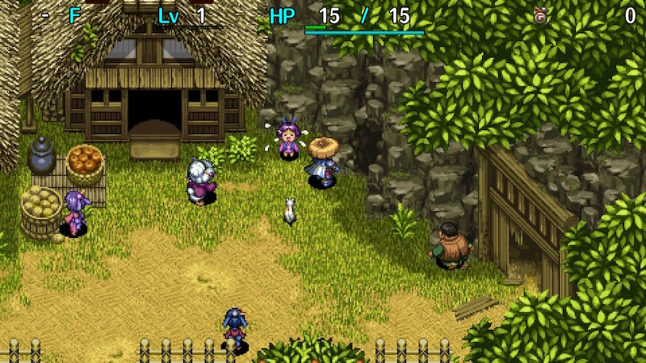
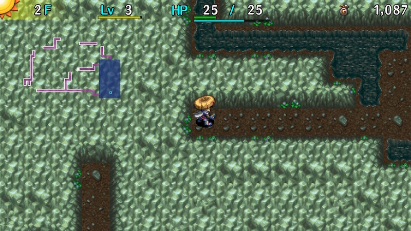
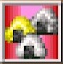

  

Dungeon where the map layout is always visible, and rooms collapse when you exit them.

Shops and the room with the exit stairs will never collapse. 
Traps and water tiles in rooms vanish when the room collapses, but items and monster drops remain.

Onigiri can't be found, but can be obtained from Nigiri Baby and Kumonigiri families, and Decay Traps. 
Diet Shield can't be found, but Plain Targe appears so it's still possible to obtain the CR Diet rune.

Only equipment with innate abilities can be found on the ground. 
Equipment that activates 2 bracelet resonance and type effective weapons are mostly shop-exclusive. 
Rusty Pickaxe, Boring Staff, Warp Grass, Black Hole Pot, and Fort. Staff are pretty common.

[Wonder Pick](/items/weapons#wonder-pick) can only be found in shops between 90-99F of this dungeon in the base game. 
(It can be obtained by simply clearing [Merchant's Hideout](/dungeons/merchants-hideout) on PS Vita and Switch / Steam)

<ul class="quickLinksUL">
  <li><a href="#overview">Overview</a></li>
  <li><a href="#strategy">Strategy</a>
    <ul>
      <li><a href="#collapsing-rooms">Collapsing Rooms</a></li>
      <li><a href="#avoiding-game-overs">Avoiding Game Overs</a></li>
      <li><a href="#food-management">Food Management</a></li>
      <li><a href="#monster-spawns">Monster Spawns</a></li>
      <li><a href="#monster-houses">Monster Houses</a></li>
      <li><a href="#identifying-items">Identifying Items</a></li>
      <li><a href="#stealing">Stealing</a></li>
      <li><a href="#equipment">Equipment</a></li>
      <li><a href="#other-items">Other Items</a></li>
      <li><a href="#floor-guide">Floor Guide</a></li>
    </ul>
  </li>
  <li><a href="#monsters">Monsters</a></li>
  <li><a href="#items">Items</a></li>
  <li><a href="#traps">Traps</a></li>
  <li><a href="#npcs">NPCs</a></li>
</ul>

# Overview

<table class="dungeonOverview">
  <tr>
    <th>Unlock</th>
    <td class="highlightYellow">1. Talk to the girl near Nekomaneki Village's warehouse → ※ → Talk to her again. 2. Talk to Decchi (north west) → ※ → Talk to him again (south west) 3. Pray to the 6 cat statues inside the village. (Point Shop, Dungeon Center, Hotel) 4. Check the large cat statue to obtain Revival Grass → ※ 5. Talk to Decchi (south east) to obtain Undo Grass → ※ 6. Talk to the girl from earlier to learn that Decchi went to Inori Village → ※ 7. Talk to Decchi in Inori Village (west) → ※ → Talk to him again (east) 8. Clap twice at all 7 pots → Check the well to obtain a Kabura Katana → ※ 9. The Onigiri Hollow unlock event plays when you return to the village. ※ means enter a dungeon and return.</td>
  </tr>
  <tr>
    <th>Entrance</th>
    <td class="highlightYellow">Talk to the girl who lost her onigiri. (Inori Village)</td>
  </tr>
</table>

<table class="dungeonTable">
  <tr>
    <th>Floors</th>
    <td>20F (first) / 99F</td>
    <th>Day / Night</th>
    <td>Day</td>
  </tr>
  <tr>
    <th>Bring Items</th>
    <td>No</td>
    <th>Allies</th>
    <td>No</td>
  </tr>
  <tr>
    <th>Unidentified</th>
    <td>Bracelets, Pots, Staves, Grass</td>
    <th>New Items</th>
    <td>No</td>
  </tr>
  <tr>
    <th>Shops</th>
    <td>Regular, Elite, Pick-A-Choice</td>
    <th>Monster Houses</th>
    <td>Regular, Special</td>
  </tr>
  <tr>
    <th>Initial Enemies</th>
    <td>4~14</td>
    <th>Spawn Rate</th>
    <td>30</td>
  </tr>
  <tr>
    <th>Ominous aura</th>
    <td>Yes (1200 turns)</td>
    <th>Wind of Kron</th>
    <td>1st: 1700 4th: 2000</td>
  </tr>
  <tr>
    <th>Clear Icon</th>
    <td class="clearIcon"></td>
    <th>Reward</th>
    <td>Gold Onigiri Silver Onigiri</td>
  </tr>
</table>

You're given 3 options when you reach the goal for the first time. 
Choosing Gold Onigiri makes all equipment in your inventory rust, but you then get a Plating Scroll. 
Choosing Silver Onigiri results in all inventory items becoming sealed, but you then get an Exorcism Scroll. 
※ Reaching the goal after the 1st clear results in obtaining either a Gold Onigiri or Silver Onigiri. (50% chance)

# Strategy

The dungeon's rule limits routes you can take to check rooms, so look at the map first and plan carefully. 
If the route is a one-way path, you can't retreat into the hallway you came from once you enter a room, 
so unless you have an item like Boring Staff, expect to fight all enemies in the room at once.

<ul>
  <li><a href="#collapsing-rooms">Collapsing Rooms</a></li>
  <li><a href="#avoiding-game-overs">Avoiding Game Overs</a></li>
  <li><a href="#food-management">Food Management</a></li>
  <li><a href="#monster-spawns">Monster Spawns</a></li>
  <li><a href="#monster-houses">Monster Houses</a></li>
  <li><a href="#identifying-items">Identifying Items</a></li>
  <li><a href="#stealing">Stealing</a></li>
  <li><a href="#equipment">Equipment</a></li>
  <li><a href="#other-items">Other Items</a></li>
  <li><a href="#floor-guide">Floor Guide</a></li>
</ul>

### Collapsing Rooms

All rooms besides shops and the stairs room collapse when you exit them, no matter how you left the room. 
Traps and monsters in the room vanish when the room collapses, but items will remain buried in the walls, 
so it's possible to dig the items out using items like pickaxes or Boring Staff after the room collapses. 
This can be used to obtain island items, and items dropped by enemies such as FO-UZZ and Mixers.

### Avoiding Game Overs

It's possible to end up in a situation where there's no way to advance to the next floor in this dungeon.

Many things can hinder a route, and the following cause a game over if you don't have items to recover:

- Warping to an isolated room due to a Spring Trap, DJ Mage, Grass Kid, or higher level Bored Kappa.
- Moving to a dead end hallway due to a Fearabbit, Yanpii, Tiger Tosser, Log Trap, or Berserk status.

Pickaxes, Boring Staff, Warp Grass, and Black Hole Pot are the basics to recover from these situations. 
All four items are commonly found in Onigiri Hollow and are easy to use without major drawbacks. 
These can also be used to help you navigate your route or to escape bad situations in general.

- Boring Staff: Creates a 10 tile deep tunnel when the magic bullet hits a wall. Found with 4~6 uses.
- Pickaxe: Can be used to dig through walls, but has a chance to break while digging.
- Warp Grass: Warps you to a different room on the current floor. Beware if eating unidentified grasses.
- Black Hole Pot: A number of Pit Traps equal to capacity appear when it breaks. Found with 2\~4 capacity.

Other ways to recover from a game over situation:

- Land on a water or air tile using a Pinning Staff, Swap Staff, or Staff of Sacrifice to warp.
- Charge through wall tiles using a Wall Clip Bracelet and HP restoring items as needed.
- Step onto a water tile using a Waterwalk Bracelet, and then unequip the bracelet to warp.
- Get hit by Yanpii's headbutt to land on a water or air tile to warp.
- Get hit by the magic bullet from a DJ Mage or MC Mage to warp.
- Destroy wall tiles using an Explosion Bracelet or Pop Tank monster.
- Equip a Blink Bracelet to warp.

Blink Bracelet in particular has unlimited uses, and lets you check every room on each floor. 
However, you'll still want to carry Black Hole Pots or items that can dig walls in case the bracelet gets sealed.

※ Sticky Pot has the potential to cause a game over if your hand gets stuck while inside a closed off room.

### Food Management

Food management is a secondary theme of Onigiri Hollow that helps give the dungeon its unique flavor.

Onigiri generally can't be found, so peaches are your main food source. 
Preservation Pots are uncommon, making it difficult to manage peach ripeness. 
At the same time, there are a number of floors where you'll want to linger and farm if possible, 
so it's tricky to find the right balance between farming and avoiding starvation early to mid game.

The following 3 items are key to alleviating hunger issues:

- Preservation Pot: Store peaches inside to keep them from ripening into Rotten Peaches.
- Inacc. Bracelet: Create Rotten Onigiri using Decay Traps.
    - Karakuroid (6-10F), Steamroid (22-24F), Electroid (49-53F), Cyberoid (72-77F)
- Dodger Pot: Use it to create Rotten Onigiri like Inacc. Bracelet, and to collect arrows.

The following 5 items are also helpful:

- Plain Targe: Gains CR Diet at Lv8. Obtained from Presto Pots or Zaloklefts. (Diet Shield doesn't appear)
- Water Pot: Use it to ripen any peach into a Juicy Peach, except for Rotten Peach. Shop-exclusive.
- Waterwalk Bracelet: Same as Water Pot. Shop-exclusive.
- Unlucky Staff: Level down a Nigiri Boss (44-45F) or Nigiri King (86-91F) to perform Nigiri Morph Factory.
- Level up items: Level up a Nigiri Baby (6-8F) to perform Nigiri Morph Factory.

Nigiri Morph Factory is the most consistent way to obtain food, so plan ahead and perform it on 22F. 
Decay Traps are another reliable food source, so watch for them while collecting arrows using Karakuroids. 
Use Inacc. Bracelet or Dodger Pot with Strip or Hunger traps to weaken Karakuroids and Nigiri Morphs.

Be careful how you handle the Nigiri Morph when you encounter one - use a Paralysis or Transient staff 
if you need more time to prepare, as opposed to slaying it and hoping for another spawn once you're ready. 
If you're unlucky with spawns, you could end up starving even if you started with around 50 fullness.

Nigiri Baby appears between 6-8F, but is rare on 8F due to Mixers and others being added to the table. 
Similarly, Nigiri Morphs have a lower spawn rate on 23F compared to 22F, so treat 8F and 23F as backups 
in case you step on a Pit Trap, and aim to perform the technique on earlier floors.

If you want to farm on a floor but it's not possible to plan a route that leaves only the stairs room, 
consider farming in the starting room before checking any others rooms instead. 
However, napping enemies can block room exits, so it's important to call it quits if you're not seeing results.

### Monster Spawns

Generally, 1 monster is generated every 30 turns in a room where Shiren isn't present. 
If the stairs room is the only room left on the floor, monsters can still spawn outside of Shiren's view. 
Monster density can be somewhat controlled by collapsing rooms, but if you take too long, 
the stairs room can end up being packed with monsters by the time you arrive. 
Collapsing all rooms lets you efficiently farm monsters like Maneaters.

#### Controlling Stairs Room Spawns

Monsters stop spawning if the stairs room is the only room left and Shiren is currently in the room. 
However, there's an exception to this where monsters will continue to spawn even if Shiren is in the room, 
which occurs when you destroy a wall tile after the stairs room becomes the only room left on the floor.

This can lead to some problematic situations:

- You'd like to step in place to heal HP before advancing, but monsters keep spawning.
- Enemy spawns get in the way of safely performing techniques like Nigiri Morph Factory.

Conversely, there are ways to take advantage of it:

- Zaloklefts and other napping types will be generated with Napping status even if you're in the room.
- You can stand on a Sanctuary Scroll away from a room entrance to safely spawn monsters.

So, if you want to dig paths but don't want monsters to spawn in the stairs room, 
simply destroy the wall tiles before the stairs room becomes the last room on the current floor.

If the room is small enough to be visible on screen, enemies won't spawn even with the above condition. 
Position Shiren in the center to prevent spawns, and move him to a corner or hallway to allow spawns.

### Monster Houses

Sudden Monster Houses don't appear in Onigiri Hollow, but Special Monster Houses can be generated. 

#### Stairs Room

Easy to collect items, since the room doesn't collapse when you retreat into a hallway. 
Can be conquered in a similar fashion to Monster Houses in other dungeons, 
but you might have fewer escape options thanks to dead end hallways.

#### Non-Stairs Room

The room collapses when you exit, so you can easily escape from otherwise dire Monster Houses. 
However, you can't retreat if you want to collect items, so it can be tricky to overcome the situation. 
It helps to thin out enemies before entering the room using arrows, rocks, staves, talismans, etc. 
Use Pickaxes and Boring Staff to dig in ways that let you shoot projectiles from additional angles. 
If an enemy is at the entrance, a Hilarious Pot can be used to wake up the entire room.

### Identifying Items

See [Identifying Items](/guides/identifying-items) for the basics.

Unlike some other dungeons, imitation items such as Dracon Grass can appear as early as 1F. 
Items generated in walls are chosen from a unique item table, so there's a chance you'll find an item 
that isn't listed in the floor or shop columns in the item table.

#### Grass

- 1500
    - Undo Grass can't be found, so it's always Repeat Grass.

#### Bracelets

- 2000
    - Can. Arm and Inacc. bracelets can't be found in shops.
    - Shops only sell Strength and Bunch bracelets in this price range.
- 3000
    - Anti-Crs. Bracelet is shop-exclusive.
    - Monster Summoner, Trap, and Critical bracelets can't be found in shops.
- 5000
    - Wall Clip Bracelet is exclusive to elite shops.
    - Heal and Waterwalk bracelets can only be found in shops or elite shops.
    - Monster Detector and Item Detector can also be found on the ground.
    - Monsterphobic, Itemphobic, Explosion, and Blink bracelets can't be found in shops.

#### Pots

- 600
    - Hide and 4-2-8 pots can't be found in shops.
- 1000
    - Fever Pot can only be found in shops.
    - Black Hole, Sale, Sticky, Floramorph, Unbreakable pots can't be found in shops. (Shops only sell Presto or Fever pots in this price range)
- 1600
    - Exorcism and Curse pots can't be found in shops. (Shops only sell Blessing Pot in this price range)
- 3500
    - Zalokleft, Monster, and Hilarious pots can't be found in shops.
- 6000
    - Modder's Pot can't be found in shops, but it can be found on the ground as early as 1F.

### Stealing

See [Stealing](/guides/stealing) for more ideas.

#### Elite Shop + Swap Staff

Swing a Swap Staff at the Shopkeeper while standing in a room to instantly bury the Shopkeeper.

<pre class="diagram">
S = Shiren　　E = Shopkeeper 
 
■ ■ ■ ■ ■ ■ ■ 
□ S □ □ □ E ■ 
□ □ ■ ■ ■ ■ ■ 
□ □ ■ ■ ■ ■ ■ 
□ □ ■ ■ ■ ■ ■
</pre>

Other Shopkeepers won't be able to reach you since the room collapses behind you, 
so you're free to steal items and advance to the next floor using a Black Hole Pot when you're done. 
It's also possible to dig a path to the stairs room once you're done stealing items, but it's risky.

#### Character Limit

Method that takes advantage of the fact that only 20 characters can be present on a floor at a time. 
Collapse rooms in a way that leaves one room that isn't connected to the shop or stairs room, 
and then step in place in the stairs room to spawn monsters in the disconnected room.

When Thief Mode is triggered, the enemies in the disconnected room will turn into Shopkeepers, 
and new Shopkeepers won't spawn elsewhere due to the character limit. 
However, Shopkeepers transformed from enemies that were on a water, air, or wall tile will warp.

Keep in mind that this technique requires around 60 fullness to perform. 
If you're short on food, it's best to use a different method, purchase items normally, or skip the shop.

### Equipment

Weapons found on the ground are typically Rusty Pickaxes or status inflicting weapons. 
2 bracelet resonance and type effective weapons are exclusive to shops, Presto Pots, and Zaloklefts.

#### Weapon

- Rusty Pickaxe
    - High rune count and levels up extremely quickly. Just be careful not to accidentally hit a wall.
- Dirk of Debts
    - Incredibly powerful, and Gitan isn't an issue since it's easy to steal from shops.
- Violent Blade
    - Unusable elsewhere, but an okay option here since you don't retreat into hallways as much, and it prevents Boy Cart monsters from running away.

#### Weapon Runes

- Tri-direction
    - Field of view isn't limited, so it's easy to take advantage of the ability to attack around corners. However, the inability to retreat can hinder its usage on occasion.
- Anti-Floating
    - Warp Grass is common, so it's easy to synthesize this rune.
- Anti-Aquatic
    - Scrolls are found identified, so it's easier to synthesize this rune compared to other dungeons.
- Anti-Dragon
    - Dragon Grass is basically exclusive to shops, so it's difficult to synthesize this rune.

#### Shield

- Day Shield
    - Strongest shield in the game for day-only dungeons. Use it as a main shield if you find it.
- Binary Shield
    - Next best option after Day Shield among shields that can be found on the ground. Gains Magi-Twister at Lv6.
- Red Shield
    - Only found in shops or elite shops. Gains Anti-Fire at Lv8, making it worth leveling up even if you don't use it as a main shield.
- Lock Shield, Safe Shield, Gyadon Blocker
    - Most shields found on the ground are very weak aside from Day Shield and Binary Shield, but sometimes you won't find a better option than one of these three shields. They all gain a defensive rune at Lv8, at least.

#### Shield Runes

- Anti-Hypno
    - Anti-Gaze Trge is exclusive to elite shops. Ultra Gazer appears for 11 floors in a row near the end, so synthesize this rune if possible.
- Magi-Twister
    - Swap Shield is elite shop exclusive, but this can also be obtained by leveling Binary Shield to Lv6.
- Anti-Peck
    - Helps against higher level Gyadon family monsters.
- Anti-Fire
    - Difficult to synthesize compared to other dungeons because Snake Shield is shop-exclusive, and Dragon Grass can only be obtained from shops, Presto Pots, or Zaloklefts.
- Anti-Blast
    - Blast Shield is shop-exclusive, but this can also be obtained by leveling Lock or Safe shield to Lv8.
- CR Diet
    - Since Diet Shield can't be found, the only way to obtain this is to level a Plain Targe to Lv8. Hunt enemies like Maneaters while you have Tinkerer status to quickly level the shield, and then synthesize it once you reach Mixermon floors (31-33F).
- Anti-Blast※
    - Fort. Staff is somewhat common and scrolls are identified, so synthesizing it is realistic. Explosion Bracelet is useful for avoiding game overs, so think carefully before synthesizing it.

#### Bracelets

- Blink Bracelet
    - Extremely powerful since it speeds up checking rooms, and eliminates game over situations. Its only weakness is getting sealed, and that you can't control when it activates or where you land.
- Wall Clip Bracelet
    - Exclusive to elite shops. Use it to move and attack through corners, and to escape otherwise game over situations. Can be used with a Fort. Staff or item that destroys walls to create a safe spot to attack enemies.
- Item Detector, Itemphobic
    - Helps you plan a more informed room checking route at the start of a floor. Lets you locate shops, along with items that were generated in walls.
- Monster Detector, Monsterphobic
    - Field of view isn't limited, but these bracelets still help you navigate around enemies. Lets you locate shops at a glance.
- Explosion Bracelet
    - Lets you destroy wall tiles at the exchange of half of your HP per explosion. Can be used to one-shot Shopkeepers, and grill onigiri without losing Super status.
- Alert Bracelet
    - Nice to have on Dozikon floors (67-68F).
- Monster Summoner
    - Improves efficiency when hunting monsters for item drops or skill points.
- Trap Bracelet
    - It's easy to locate new traps when the only room left on the floor is the stairs room.
- Inacc. Bracelet
    - Lets you make use of traps created by Karakuroid monsters (6-10F, 22-24F, 49-53F, 72-77F). Food can be an issue in Onigiri Hollow, so this bracelet is quite valuable.

### Other Items

#### Projectiles

- Rock, Porky Rock
    - Used to wake up monsters near the entrances of rooms.
- Poison Arrow
    - Collect them between 6-10F using Karakuroids. A single arrow roughly halves the damage you receive from an enemy's direct attack.

#### Scrolls

- Immunity Scroll
    - Makes you immune to Ultra Gazer's hypnosis, the paralyzing effect of Maneater roars, etc. Keep 1 on hand in case you find the other items needed to synthesize Anti-Blast※.
- Vacuum Slash Scrl
    - Useful when you want to avoid retreating into a hallway.
- Collection Scroll
    - Works on buried items, so it's a fast way to collect items from a collapsed Monster House.
- Desert Scroll
    - Used as a synthesis ingredient to create the Anti-Aquatic rune. Can occasionally be used to escape a game over situation if there are waterways.

#### Staves

- Boring Staff
    - It's best to carry as many of these as you can, combining them using Mixers when possible. Used to avoid game overs, dig escape routes, misdirect pursuing enemies, obtain buried items.
- Pinning Staff
    - Escape from a game over situation by landing on a water or air tile to warp.
- Transient Staff
    - Send monsters like Nigiri Morph, Mixer, Boy Cart to the stairs until you're ready to utilize them. Can be used with a Reflection Pot to steal or escape from a game over situation.
- Swap Staff
    - Switch positions with a target in a hallway while standing in a room to bury the target. Can be used to warp by switching places with a monster on a water or air tile.
- Knockback Staff
    - Use with a Reflection Pot to escape from a game over situation if there are water or air tiles.
- Staff of Sacrifice
    - Used to escape from a game over situation, or when you need to run away from enemies.
- Unlucky Staff
    - Lets you perform Nigiri Morph Factory on Nigiri Boss (44-45F) or Nigiri King (86-91F) floors, which is particularly nice if you're planning on hunting Isleaters for a Wonder Pick.

#### Pots

- Preservation Pot
    - Useful for preventing peaches from turning into Rotten Peaches. Somewhat uncommon.
- Black Hole Pot
    - Escape from a game over situation, steal from a shop without risk, skip dangerous floors, etc. Pit Traps appear even if it's sealed, so seal it to protect the pot from Bored Kappas and Scoopies, and to avoid losing important items due to Gazer hypnosis forcing you to insert items. Sealing the pot also contributes toward the critical hit rate of Mojo Bracelet.
- Reflection Pot
    - Counters DJ Mages and Gazers, and is very nice to have for Ultra Gazer floors near the end. Can be used with a variety of staves to escape from game over situations.
- Dodger Pot
    - Counters Mutaikon and Porky monsters, and is also used to collect arrows from Boy Carts. Field of view isn't limited, so collecting Knockback Arrows makes your adventure much easier.
- Zen Pot
    - Makes you immune to Dragon and Pop Tank special attacks. Also lets you destroy walls using an Explosion Bracelet without taking damage. However, Abyss Dragons doesn't appear, and Pop Tank monsters only appear on 5 floors.
- Water Pot
    - Shop-exclusive. One splash of water shuts down dangerous monsters like Shaggas and Punishers. Ripens a peach by 1 stage. Water tiles are a bit uncommon, so it can be a struggle to refill it.

### Floor Guide

#### Early Game (1-21F)

There are few options to avoid game over situations at first, so you might not be able to check all rooms.

##### 1-5F

Floors generate 7\~8 items until 3F. Hurry to the next floor after collecting items to conserve fullness. 
If you find Gitan, step on it and swap it with an inventory item instead of picking it up. 
Throwing Gitan lets you easily defeat Grass Kids or higher level Mamels.

- Level up a Pit Mamel (3-5F) 
Create a Cave Mamel or Gitan Mamel, then throw a Rock or Gitan bag, or use a Boring Staff to defeat it. 
Thrown items can miss, so it's best to throw from a distance or use a staff. 
If you're using a Glorious Staff to level it up, save one use for Nigiri Morph Factory on 6F. 
Berserker and Glorious talismans can't be found, so there are few opportunities to pull this off.

- Swing Staves at Pit Mamels from a Distance 
The first reason is that if the staff was a Glorious Staff, one of its uses won't go to waste. 
The second reason is that Unlucky Staff can be identified since Pit Mamel is a Lv2 monster.

- Grass Kids (3-5F) 
Grass Kids always drop grass items, which helps with identifying and obtaining synthesis ingredients. 
In particular, you'll want to identify Warp Grass as soon as possible. 
Throw 280+ Gitan or use Rocks or arrows in hallways to defeat it without giving it a chance to act. 
Go ahead and linger for a while if you have extra food, but beware of getting hit by Warp Grass.

- Managing Peach Ripeness 
If you don't have a Preservation Pot, you'll just have to eat peaches before they turn into Rotten Peaches. 
It takes 3 floors to ripen a Hard Peach into a Peach, and 2 floors for the others.

##### 6-10F

Karakuroid (6-10F) 
Useful monster that creates visible traps, and appears on more floors than in other dungeons. 
It's rare to obtain a strong shield this early, so you'll need an alternate way to reduce the damage you take.

- Eat a Hard Peach to increase defense.
- Reduce its action speed with a Slow Staff or Slow Talisman.
- Throw an item while it's on a Slow, Hunger, or Strip trap in hopes of it missing and triggering the trap.
- Shoot Poison Arrows.

...and so on.

There's a 64 trap limit per floor, at which point Karakuroids stop creating traps. 
Use Trap Deletion Scrl and Trap Del. Staff to erase unneeded traps so that new traps can be created.

Useful traps include the following:

- Wood Arrow, Iron Arrow, Poison Arrow
    - Collecting arrows is the primary reason to utilize Karakuroids. Poison Arrows lower enemy attack power, and are used for Nigiri Morph Factory. Be sure to obtain at least 1 Iron Arrow to synthesize the Anti-Metal rune. Have the Karakuroid create traps along the wall if you don't have Rocks.
- Strip
    - Equip weapons, shields, and bracelets to check stats and effects without worrying about curses.
- Decay
    - Trigger the trap while an enemy is standing on it to create Rotten Onigiri. Inacc. Bracelet, Dodger Pot, Killer Arrow are ideal, but throwing items until you miss works too. Throwing a pot containing items result in the trap being triggered whether it hits or misses. Use an Explosion Trap or Explosion Bracelet to turn Rotten Onigiri into Grilled Onigiri.
- Explosion
    - Step on it to turn Rotten Onigiri into Grilled Onigiri.
- Spin, Sleep
    - Check if an unidentified bracelet is an Anti-Cnf. Bracelet or Alert Bracelet.
- Curse
    - Seal items to raise the critical hit rate of Mojo Bracelet.
    - Seal a Shoddy Dirk or Shoddy Plank to use the equipment without lowering upgrade value.
    - Change an equipped item's curse to a seal so that you can unequip the item. Always place all other items on the ground before stepping on the trap.

Nigiri Morph Factory (6-8F) 
Level up a Nigiri Baby using Glorious Staff, Rage Grass, Clone Staff, etc. 
Perform it in the stairs room after collapsing all other rooms to avoid Tiger Tosser (7-9F) accidents. 
Some players prefer to do it on 8F despite the lower Nigiri Baby spawn rate and greater risks so that they can synthesize using Mixers to free up inventory space and carry more onigiri. 
Keep in mind that if the stairs room is large, monsters can spawn even if it's the only room left.

Maneater (5-7F) 
The first floor range where Ominous Auras can occur is 5-7F, which overlaps with Nigiri Baby floors. 
There's little danger if the stairs room is the only room left and you're standing in the room, 
and it seems the only floor where Maneaters have a higher chance of appearing is 7F.

Mixers (8-10F) 
Synthesize equipment and combine staves to free up inventory space. 
Mixers have the highest spawn rate on 9F, so it's recommended to synthesize on that floor. Unlike Primordial Chasm, there isn't a guaranteed shop on 10F in Onigiri Hollow.

##### 11-21F

Mutaikon (11-12F) 
Replenish fullness by having a Mutaikon throw Poison Grass at you if you have a Cleansing Bracelet.

12F has a troublesome monster combination of Mudkin, Swordsman, Mutaikon, and Scorpion. 
Field of view isn't limited so it shouldn't be too bad, but be careful not to lose your shield.

Snacky (13-15F) 
It always drops a shop table item when defeated by Shiren. 
It's possible to obtain items like Breeze Blade and Heal Bracelet, so linger if you have extra food. 
However, be warned that Ominous Auras can occur between 14\~16F.

Zalokleft (17-18F) Linger and hunt them for item drops if you have enough food to do so. 
It's most convenient to collapse all rooms besides the stairs room when hunting them. 
Scoopies also appear, so place pots on the ground in a hallway to protect them.

DJ Mage (19-21F) 
Its special attack can potentially cause a game over situation by making you warp. 
Try to avoid getting hit be their magic bullet as much as possible.

Grass Dude (20-22F), Green Zaloklefts (21-23F), Nigiri Morphs (22-23F) 
Perform Nigiri Morph Factory and linger until the wind blows to obtain items.

Boy Cart (20-21F) 
Overlaps with some of the above, but it can be leveled up into a Strong Cart for Knockback Arrows. 
You'll have another chance later on, but a Scoopie monster can ruin your Dodger Pot before you reach that floor range, so it's best to collect arrows here if possible.

#### Mid Game (22-51F)

Nigiri Morph (22-23F) 
It was mentioned in the previous section, but it's important enough to be repeated. 
Always collapse all other rooms besides the stairs room before performing Nigiri Morph Factory, 
because otherwise a Grass Dude can cause an accident by throwing Warp Grass. 
Ominous Auras don't occur on Nigiri Morph floors in Onigiri Hollow.

Sr. Yanpii (26-28F) 
It can potentially cause a game over if they headbutt you into a wall from inside a room, 
so use the Scout command if there are distant enemies and avoid lining up with them. 
Spadies also appear, so it may be best to rush stairs instead of risking losing pots. 
※ You won't get pushed into the wall if you get hit diagonally.

Villeater (25-27F) 
If you plan to hunt them, do so on 26F to avoid Grampa Tanks and Explochins. 
This is the ideal time to level equipment like Plain Targe or Binary Shield for their added runes. 
Place pots on the ground if you plan on lingering for a while to protect them from Spadies.

Cross Cart (28-29F) 
Level it up into a Strong Cart and collect Knockback Arrows if possible. 
Again, it's best to collapse all other rooms besides the stairs room beforehand.

Mixermon (31-33F) 
It appears alongside power monsters like Katana Bee, Shagga, Dragon, and Death Gyaza. 
Sanctuary Scroll can be used to synthesize items with minimal risk, and all of these monsters offer lots of skill points, so it's a great spot to level equipment if you have Super status. 
MC Mages appear on 31F, so it's best to hunt monsters between 32-33F instead.

Dazikon (34-35F) 
Replenish fullness by having it throw Confusion Grass if you have an Anti-Cnf. Bracelet.

Ornery Tank, Scarabbit (35-36F) Rooms are very dangerous, so aim to fight enemies in hallways instead.

Grass Poppa (36-38F) 
It's questionable if Grass Factory is worth doing, since Strength Grass is uncommon in this dungeon. 
If you go for it, do so in the stairs room after collapsing all other rooms to prevent Warp Grass accidents. 
If you have a Fort. Staff, you can trap a Grass Poppa in the corner and equip a Cleansing Bracelet.

MC Wizard (37-38F) 
It can cause a game over situation if their magic bullet inflicts Berserk status.

Munchy (45-46F) 
Only hunt them on 46F to avoid Nigiri Boss (44-45F).

Porkon (49-50F), Trowelie (47-49F), Strong Cart (49-51F) 
These 3 monters overlap on 49F, so use a Dodger Pot if you have one. 
However, Super Gazer (47-49F) also appears, so some players prefer not to use a Dodger Pot on 49F 
so that they can use projectiles to deal with Super Gazers. In either case, it's best rush stairs on 49F. 
If you intend to collect Knockback Arrows, do so in the stairs room after collapsing all other rooms.

Mixergon (50-51F) 
Finish synthesizing equipment and combine staves to free up inventory space. 
N'machs (50-51F) also spawn, so either ignore ground items or insert them into designated pots 
so that you can easily tell which items in your inventory carry the risk of being a N'mach.

Electroid (49-53F) Use it to obtain onigiri or trap other monsters using a Dodger Pot. In particular, some players like to use traps to hunt Mounteaters (51-53F).

#### Late Game (52-99F)

Dangerous monsters show up one after the next, but you'll need a plan for Ultra Gazers 
in particular since they appear for 10 floors in a row.

##### 52-99F

MC Sorceror (52-54F) If you plan on making Gazer monsters extinct using an Extinction Scroll, 
go ahead and use up any Reflection Pots you have to counter MC Sorcerors here.

Horrabbit (56-58F) It attracts you from anywhere on the floor, so rush stairs if you don't have a Steady Shield. 
Curspinsters (56-58F) can curse items on the turn you're attracted, so equip an Anti-Crs. Bracelet. 
Lashaggas (58-60F) are extremely dangerous when combined with Horrabbits on 58F, so break a Black Hole Pot to skip the floor.

Bouncy (63-66F), Spirit Ham (63-65F) 
If you take a long time to check rooms, you can end up with a stairs room full of these monsters. 
Use projectiles or an item like Electric Staff before entering the room to split them up.

Hyper Gazer (65-67F) 
Throw Extinction Scroll on 65F if you plan on doing so to avoid being tricked by Phoenix Tengu (66-68F). Otherwise, you'll want to check by sealing it or hitting it with a weapon that has the Anti-Floating rune.

Archdragon (66-68F), Dozikon (67-68F) 
Rush stairs if you don't have items like Zen Pot, Dodger Pot, or Alert Bracelet. 
If you have those items, you can replenish fullness using Sleepy Grass or hunt Archdragons for items. (Archdragons have a high item drop rate)

Mixerdon (70-71F) 
Equipment synthesis should be done by this point, so they're basically just regular enemies that happen to be immune to projectiles. Mudders (69-72F) also appear, so just rush stairs.

FO-UZZ (72-73F) 
They're a rare spawn, but hunt any that you see to obtain Revival Grass. 
Collapse all rooms besides the stairs room so that you don't need to chase FO-UZZs around the map.

Porgon (74-77F), Shovelie (75-75F), Knave King (75-76F). 
Don't hesitate to use Dodger Pots if you happen to still have some on hand. 
Always use a staff when adjacent to Knave King to avoid your items being turned into Weeds.

Terrabbit (77-78F) 
Rush stairs if you don't have a Steady Shield.

Gitan Mamel (80-82F), Kleptoad (80-82F), Kappa Troll (80-81F) 
If you use a Dodger Pot, you won't need to worry about Kappa Trolls and Kleptoads throwing Gitan, 
but you won't be able to use projectiles against Gitan Mamels, so it's not recommended unless 
you also have items like Electric Staff or Seal Staff. (Boring Staff only deals 10 damage)

Tiger Ace (84-92F), Gyandoron (82-86F), Zalokleftis King (87-89F), Swordmaster (90-96F), Nigiri King (86-91F) 
Being adjacent to any of these monsters is dangerous, so consider throwing an Extinction Scroll at Tiger Ace 
if you have other ways to deal with Ultra Gazers such as Immunity Scrolls or Reflection Pots. If you plan on hunting Isleaters for Wonder Pick, stock up on onigiri using a Nigiri King. 
(Use an Unlucky Staff to create a Nigiri Morph and perform Nigiri Morph Factory)

Ultra Gazer (89-99F) It always drops 5000 Gitan when defeated, which can be thrown to one-shot most monsters. 
If you don't have an Extinction Scroll, use blessed Peaches, Immunity Scrolls, or Reflection Pots.

Cranky Tank (96F) 
It only appears on 1 floor, so don't throw an Extinction Scroll at it.

CHUNSOFT maps are common near the end, so you're likely to encounter multiple monsters in a row. 
Clear out monsters before entering a room if possible, and be careful of Swordmasters in particular.

If you're aiming for Wonder Pick, go around the map and check for shops on each floor starting on 90F. 
You'll also want to hunt Isleaters (90-92F and 97-99F) to have a chance at obtaining the weapon as a drop. 
If you only have a few blessed Peaches or Immunity Scrolls, save them for Isleater floors. 
※ That said, you can obtain a Wonder Pick by clearing Merchant's Hideout on PS Vita/Switch/Steam.

# Monsters

See [Monsters](/system/monsters) for individual monster details.

Enemy Colors: Farming Situational Farming Destroys Items Dangerous Very Dangerous

<table class="dungeonMonsters">
  <thead>
    <tr>
      <th colspan="9">Day</th>
    </tr>
  </thead>
  <tbody>
    <tr>
      <td>1</td>
      <td class="highlightYellow">Mamel</td>
      <td class="highlightYellow">Seedie</td>
      <td class="highlightYellow">Sproutant</td>
      <td></td>
      <td></td>
      <td></td>
      <td></td>
      <td></td>
    </tr>
    <tr>
      <td>2</td>
      <td class="highlightYellow">Mamel</td>
      <td class="highlightYellow">Seedie</td>
      <td class="highlightYellow">Sproutant</td>
      <td class="highlightYellow">Colum</td>
      <td></td>
      <td></td>
      <td></td>
      <td></td>
    </tr>
    <tr>
      <td>3</td>
      <td class="highlightGreen">Pit Mamel</td>
      <td class="highlightBlue">Grass Kid</td>
      <td class="highlightYellow">Sproutant</td>
      <td class="highlightYellow">Colum</td>
      <td class="highlightYellow">Chintala</td>
      <td></td>
      <td></td>
      <td></td>
    </tr>
    <tr>
      <td>4</td>
      <td class="highlightGreen">Pit Mamel</td>
      <td class="highlightBlue">Grass Kid</td>
      <td class="highlightYellow">Sweet Nut</td>
      <td></td>
      <td class="highlightYellow">Chintala</td>
      <td></td>
      <td></td>
      <td></td>
    </tr>
    <tr>
      <td>5</td>
      <td class="highlightGreen">Pit Mamel</td>
      <td class="highlightBlue">Grass Kid</td>
      <td class="highlightYellow">Sweet Nut</td>
      <td></td>
      <td class="highlightYellow">Chintala</td>
      <td></td>
      <td></td>
      <td></td>
    </tr>
    <tr>
      <td>6</td>
      <td class="highlightYellow">Karakuroid</td>
      <td class="highlightGreen">Froggo</td>
      <td class="highlightYellow">Moseal</td>
      <td class="highlightGreen">Nigiri Baby</td>
      <td></td>
      <td></td>
      <td></td>
      <td></td>
    </tr>
    <tr>
      <td>7</td>
      <td class="highlightYellow">Karakuroid</td>
      <td class="highlightGreen">Froggo</td>
      <td class="highlightYellow">Moseal</td>
      <td class="highlightGreen">Nigiri Baby</td>
      <td class="highlightYellow">Tiger Tosser</td>
      <td></td>
      <td></td>
      <td></td>
    </tr>
    <tr>
      <td>8</td>
      <td class="highlightYellow">Karakuroid</td>
      <td class="highlightGreen">Froggo</td>
      <td class="highlightYellow">Moseal</td>
      <td class="highlightGreen">Nigiri Baby</td>
      <td class="highlightYellow">Tiger Tosser</td>
      <td class="highlightPurple3">Curse Girl</td>
      <td class="highlightBlue">Mixer</td>
      <td class="highlightYellow">Fearabbit</td>
    </tr>
    <tr>
      <td>9</td>
      <td class="highlightYellow">Karakuroid</td>
      <td></td>
      <td></td>
      <td></td>
      <td class="highlightYellow">Tiger Tosser</td>
      <td class="highlightPurple3">Curse Girl</td>
      <td class="highlightBlue">Mixer</td>
      <td class="highlightYellow">Fearabbit Gyaza</td>
    </tr>
    <tr>
      <td>10</td>
      <td class="highlightYellow">Karakuroid</td>
      <td class="highlightYellow">Kumonigiri</td>
      <td class="highlightYellow">Naptapir</td>
      <td class="highlightYellow">Pumphantasm</td>
      <td class="highlightYellow">Floaty</td>
      <td class="highlightYellow">N'dubba</td>
      <td class="highlightBlue">Mixer</td>
      <td class="highlightYellow">Gyaza</td>
    </tr>
    <tr>
      <td>11</td>
      <td class="highlightYellow">Mutaikon</td>
      <td class="highlightYellow">Kumonigiri</td>
      <td class="highlightYellow">Naptapir</td>
      <td class="highlightYellow">Pumphantasm</td>
      <td class="highlightYellow">Floaty</td>
      <td class="highlightYellow">N'dubba</td>
      <td></td>
      <td></td>
    </tr>
    <tr>
      <td>12</td>
      <td class="highlightYellow">Mutaikon</td>
      <td class="highlightYellow">Kumonigiri</td>
      <td class="highlightYellow">Naptapir</td>
      <td class="highlightYellow">Pumphantasm</td>
      <td class="highlightPurple3">Swordsman</td>
      <td class="highlightPurple3">Mudkin</td>
      <td class="highlightYellow">Metalhead</td>
      <td class="highlightYellow">Scorpion</td>
    </tr>
    <tr>
      <td>13</td>
      <td class="highlightBlue">Snacky</td>
      <td class="highlightYellow">Acrid Nut</td>
      <td></td>
      <td class="highlightYellow">Polygon Spinna</td>
      <td class="highlightYellow">Mid Chintala</td>
      <td class="highlightYellow">Cololum</td>
      <td></td>
      <td></td>
    </tr>
    <tr>
      <td>14</td>
      <td class="highlightBlue">Snacky</td>
      <td class="highlightYellow">Acrid Nut</td>
      <td></td>
      <td class="highlightYellow">Polygon Spinna</td>
      <td class="highlightYellow">Kid Squid</td>
      <td class="highlightYellow">Cololum</td>
      <td></td>
      <td></td>
    </tr>
    <tr>
      <td>15</td>
      <td class="highlightBlue">Snacky</td>
      <td class="highlightYellow">Flamebird</td>
      <td class="highlightYellow">Bored Kappa</td>
      <td class="highlightYellow">Momoseal</td>
      <td class="highlightYellow">Kid Squid</td>
      <td></td>
      <td></td>
      <td></td>
    </tr>
    <tr>
      <td>16</td>
      <td class="highlightYellow">Beanie</td>
      <td class="highlightYellow">Flamebird</td>
      <td class="highlightYellow">Bored Kappa</td>
      <td class="highlightYellow">Momoseal</td>
      <td class="highlightYellow">Kid Squid</td>
      <td class="highlightYellow">Hopodile</td>
      <td class="highlightYellow">Dagger Bee</td>
      <td></td>
    </tr>
    <tr>
      <td>17</td>
      <td class="highlightYellow">Beanie</td>
      <td class="highlightYellow">Flamebird</td>
      <td class="highlightYellow">Bored Kappa</td>
      <td class="highlightPurple3">Scoopie</td>
      <td class="highlightBlue">Zalokleft</td>
      <td class="highlightYellow">Hopodile</td>
      <td class="highlightYellow">Dagger Bee</td>
      <td></td>
    </tr>
    <tr>
      <td>18</td>
      <td class="highlightYellow">Beanie</td>
      <td class="highlightYellow">Flamebird</td>
      <td></td>
      <td class="highlightPurple3">Scoopie</td>
      <td class="highlightBlue">Zalokleft</td>
      <td class="highlightYellow">Hopodile</td>
      <td class="highlightYellow">Dagger Bee</td>
      <td></td>
    </tr>
    <tr>
      <td>19</td>
      <td class="highlightYellow">Beanie</td>
      <td class="highlightRed">DJ Mage</td>
      <td class="highlightYellow">Eligan</td>
      <td class="highlightPurple3">Scoopie</td>
      <td></td>
      <td></td>
      <td></td>
      <td></td>
    </tr>
    <tr>
      <td>20</td>
      <td class="highlightYellow">Beanie</td>
      <td class="highlightRed">DJ Mage</td>
      <td class="highlightYellow">Eligan</td>
      <td class="highlightBlue">Grass Dude</td>
      <td class="highlightGreen">Boy Cart</td>
      <td></td>
      <td></td>
      <td></td>
    </tr>
    <tr>
      <td>21</td>
      <td class="highlightBlue">Green Zalokleft</td>
      <td class="highlightRed">DJ Mage</td>
      <td class="highlightYellow">Eligan</td>
      <td class="highlightBlue">Grass Dude</td>
      <td class="highlightGreen">Boy Cart</td>
      <td class="highlightYellow">Sproutyrant</td>
      <td></td>
      <td></td>
    </tr>
    <tr>
      <td>22</td>
      <td class="highlightBlue">Green Zalokleft</td>
      <td class="highlightYellow">Steamroid</td>
      <td class="highlightGreen">Nigiri Morph</td>
      <td class="highlightBlue">Grass Dude</td>
      <td></td>
      <td class="highlightYellow">Sproutyrant</td>
      <td></td>
      <td></td>
    </tr>
    <tr>
      <td>23</td>
      <td class="highlightBlue">Green Zalokleft</td>
      <td class="highlightYellow">Steamroid</td>
      <td class="highlightGreen">Nigiri Morph</td>
      <td class="highlightOrange2">Absorbiphant</td>
      <td class="highlightYellow">Pandanigiri</td>
      <td class="highlightYellow">Sproutyrant</td>
      <td class="highlightGreen">Snooztapir Froggucci</td>
      <td class="highlightPurple3">Gyadon</td>
    </tr>
    <tr>
      <td>24</td>
      <td class="highlightOrange2">Grampa Tank</td>
      <td class="highlightYellow">Steamroid</td>
      <td class="highlightYellow">Ironhead</td>
      <td class="highlightOrange2">Absorbiphant</td>
      <td class="highlightYellow">Pandanigiri</td>
      <td class="highlightYellow">Poofy</td>
      <td class="highlightGreen">Snooztapir Froggucci</td>
      <td class="highlightPurple3">Gyadon</td>
    </tr>
    <tr>
      <td>25</td>
      <td class="highlightOrange2">Grampa Tank</td>
      <td class="highlightOrange2">Hipadile</td>
      <td class="highlightYellow">Ironhead</td>
      <td class="highlightOrange2">Absorbiphant</td>
      <td class="highlightYellow">Pandanigiri</td>
      <td class="highlightYellow">Poofy</td>
      <td class="highlightYellow">Punisher</td>
      <td class="highlightPurple3">Cursister</td>
    </tr>
    <tr>
      <td>26</td>
      <td class="highlightPurple3">Muddy</td>
      <td class="highlightOrange2">Hipadile</td>
      <td class="highlightYellow">Crow Tengu</td>
      <td class="highlightYellow">Firepuff</td>
      <td class="highlightRed">Sr. Yanpii</td>
      <td class="highlightYellow">Poofy</td>
      <td class="highlightPurple3">Punisher Spadie</td>
      <td class="highlightPurple3">Cursister</td>
    </tr>
    <tr>
      <td>27</td>
      <td class="highlightPurple3">Muddy</td>
      <td class="highlightOrange2">Hipadile</td>
      <td class="highlightYellow">Crow Tengu</td>
      <td class="highlightYellow">Firepuff</td>
      <td class="highlightRed">Sr. Yanpii</td>
      <td class="highlightYellow">Explochin</td>
      <td class="highlightPurple3">Punisher Spadie</td>
      <td></td>
    </tr>
    <tr>
      <td>28</td>
      <td class="highlightPurple3">Muddy</td>
      <td class="highlightGreen">Cross Cart</td>
      <td class="highlightYellow">Crow Tengu</td>
      <td class="highlightYellow">Firepuff</td>
      <td class="highlightRed">Sr. Yanpii</td>
      <td class="highlightYellow">Explochin</td>
      <td class="highlightPurple3">Spadie</td>
      <td></td>
    </tr>
    <tr>
      <td>29</td>
      <td class="highlightOrange2">Kappa Pest</td>
      <td class="highlightGreen">Cross Cart</td>
      <td class="highlightOrange2">MC Mage</td>
      <td class="highlightYellow">Zapdon</td>
      <td class="highlightOrange2">Digestiphant</td>
      <td class="highlightYellow">Explochin</td>
      <td class="highlightYellow">Go-Ham!</td>
      <td></td>
    </tr>
    <tr>
      <td>30</td>
      <td class="highlightOrange2">Kappa Pest</td>
      <td class="highlightOrange2">N'twyn</td>
      <td class="highlightOrange2">MC Mage</td>
      <td class="highlightYellow">Zapdon</td>
      <td class="highlightOrange2">Digestiphant</td>
      <td></td>
      <td class="highlightYellow">Go-Ham!</td>
      <td></td>
    </tr>
    <tr>
      <td>31</td>
      <td class="highlightOrange2">Kappa Pest</td>
      <td class="highlightOrange2">N'twyn</td>
      <td class="highlightOrange2">MC Mage</td>
      <td class="highlightBlue">Mixermon</td>
      <td class="highlightYellow">Death Gyaza</td>
      <td class="highlightYellow">Katana Bee</td>
      <td class="highlightYellow">Dragon</td>
      <td class="highlightYellow">Shagga</td>
    </tr>
    <tr>
      <td>32</td>
      <td></td>
      <td></td>
      <td></td>
      <td class="highlightBlue">Mixermon</td>
      <td class="highlightYellow">Death Gyaza</td>
      <td class="highlightYellow">Katana Bee</td>
      <td class="highlightYellow">Dragon</td>
      <td class="highlightYellow">Shagga</td>
    </tr>
    <tr>
      <td>33</td>
      <td></td>
      <td></td>
      <td></td>
      <td class="highlightBlue">Mixermon</td>
      <td class="highlightYellow">Death Gyaza</td>
      <td class="highlightYellow">Katana Bee</td>
      <td class="highlightYellow">Dragon</td>
      <td class="highlightYellow">Shagga</td>
    </tr>
    <tr>
      <td>34</td>
      <td class="highlightYellow">Pumphantom</td>
      <td class="highlightYellow">Flamepuff</td>
      <td class="highlightYellow">Polygon Shaka</td>
      <td class="highlightYellow">Falcon Tengu</td>
      <td class="highlightYellow">Dazikon</td>
      <td></td>
      <td></td>
      <td></td>
    </tr>
    <tr>
      <td>35</td>
      <td class="highlightYellow">Pumphantom</td>
      <td class="highlightYellow">Flamepuff</td>
      <td class="highlightYellow">Polygon Shaka</td>
      <td class="highlightOrange2">Falcon Tengu Scarabbit</td>
      <td class="highlightYellow">Dazikon</td>
      <td class="highlightYellow">VeniScorp Cave Mamel</td>
      <td></td>
      <td class="highlightRed">Ornery Tank</td>
    </tr>
    <tr>
      <td>36</td>
      <td class="highlightYellow">Pumphantom</td>
      <td class="highlightYellow">Flamepuff</td>
      <td class="highlightYellow">Polygon Shaka</td>
      <td class="highlightOrange2">Falcon Tengu Scarabbit</td>
      <td class="highlightYellow">Tiger Hurler</td>
      <td class="highlightYellow">VeniScorp Cave Mamel</td>
      <td class="highlightBlue">Grass Poppa</td>
      <td class="highlightRed">Ornery Tank</td>
    </tr>
    <tr>
      <td>37</td>
      <td class="highlightYellow">Pumphantom</td>
      <td class="highlightYellow">Flamepuff</td>
      <td class="highlightRed">MC Wizard</td>
      <td></td>
      <td class="highlightYellow">Tiger Hurler</td>
      <td class="highlightYellow">VeniScorp</td>
      <td class="highlightBlue">Grass Poppa</td>
      <td></td>
    </tr>
    <tr>
      <td>38</td>
      <td class="highlightYellow">Pumphantom</td>
      <td class="highlightYellow">Huistdon</td>
      <td class="highlightRed">MC Wizard</td>
      <td class="highlightYellow">Eligagan</td>
      <td class="highlightYellow">Tiger Hurler</td>
      <td class="highlightPurple3">Gyairas</td>
      <td class="highlightBlue">Grass Poppa</td>
      <td></td>
    </tr>
    <tr>
      <td>39</td>
      <td class="highlightYellow">Sparkbird</td>
      <td class="highlightYellow">Huistdon</td>
      <td></td>
      <td class="highlightYellow">Eligagan</td>
      <td class="highlightYellow">Tiger Hurler</td>
      <td class="highlightPurple3">Gyairas</td>
      <td></td>
      <td></td>
    </tr>
    <tr>
      <td>40</td>
      <td class="highlightYellow">Sparkbird</td>
      <td class="highlightYellow">Huistdon</td>
      <td class="highlightYellow">Momomoseal</td>
      <td class="highlightYellow">Eligagan</td>
      <td class="highlightYellow">Tiger Hurler</td>
      <td class="highlightOrange2">Nashagga</td>
      <td></td>
      <td></td>
    </tr>
    <tr>
      <td>41</td>
      <td class="highlightYellow">King Squid</td>
      <td class="highlightYellow">Huistdon</td>
      <td class="highlightYellow">Momomoseal</td>
      <td class="highlightOrange2">Sky Dragon</td>
      <td class="highlightYellow">Steelhead</td>
      <td class="highlightOrange2">Nashagga</td>
      <td></td>
      <td></td>
    </tr>
    <tr>
      <td>42</td>
      <td class="highlightYellow">King Squid</td>
      <td></td>
      <td class="highlightYellow">Momomoseal</td>
      <td class="highlightOrange2">Sky Dragon</td>
      <td class="highlightYellow">Steelhead</td>
      <td class="highlightOrange2">Nashagga</td>
      <td></td>
      <td></td>
    </tr>
    <tr>
      <td>43</td>
      <td class="highlightYellow">King Squid</td>
      <td></td>
      <td class="highlightYellow">Momomoseal</td>
      <td class="highlightOrange2">Sky Dragon</td>
      <td class="highlightYellow">Steelhead</td>
      <td></td>
      <td></td>
      <td></td>
    </tr>
    <tr>
      <td>44</td>
      <td class="highlightYellow">King Squid</td>
      <td class="highlightYellow">Spicy Nut</td>
      <td class="highlightYellow">Rally Ham</td>
      <td class="highlightYellow">Nuttie</td>
      <td class="highlightYellow">Concusschin</td>
      <td class="highlightGreen">Nigiri Boss</td>
      <td></td>
      <td></td>
    </tr>
    <tr>
      <td>45</td>
      <td class="highlightYellow">King Squid</td>
      <td class="highlightYellow">Spicy Nut</td>
      <td class="highlightYellow">Rally Ham</td>
      <td class="highlightYellow">Nuttie</td>
      <td class="highlightYellow">Concusschin</td>
      <td class="highlightGreen">Nigiri Boss</td>
      <td class="highlightYellow">Big Chintala</td>
      <td class="highlightBlue">Munchy</td>
    </tr>
    <tr>
      <td>46</td>
      <td class="highlightYellow">Blazepuff</td>
      <td class="highlightYellow">Spicy Nut</td>
      <td class="highlightYellow">Rally Ham</td>
      <td class="highlightYellow">Nuttie</td>
      <td class="highlightYellow">Concusschin</td>
      <td class="highlightOrange2">Oingodile</td>
      <td class="highlightYellow">Big Chintala</td>
      <td class="highlightBlue">Munchy</td>
    </tr>
    <tr>
      <td>47</td>
      <td class="highlightYellow">Blazepuff</td>
      <td class="highlightYellow">Eagle Tengu</td>
      <td class="highlightPurple3">Super Gazer</td>
      <td class="highlightPurple3">Trowelie</td>
      <td></td>
      <td class="highlightOrange2">Oingodile</td>
      <td></td>
      <td></td>
    </tr>
    <tr>
      <td>48</td>
      <td class="highlightYellow">Blazepuff</td>
      <td class="highlightYellow">Eagle Tengu</td>
      <td class="highlightPurple3">Super Gazer</td>
      <td class="highlightPurple3">Trowelie</td>
      <td class="highlightYellow">Colocolum</td>
      <td class="highlightOrange2">Oingodile</td>
      <td></td>
      <td></td>
    </tr>
    <tr>
      <td>49</td>
      <td class="highlightYellow">Electroid</td>
      <td class="highlightYellow">Eagle Tengu</td>
      <td class="highlightPurple3">Super Gazer</td>
      <td class="highlightPurple3">Trowelie</td>
      <td class="highlightYellow">Colocolum</td>
      <td class="highlightGreen">Strong Cart</td>
      <td class="highlightOrange2">Porkon</td>
      <td></td>
    </tr>
    <tr>
      <td>50</td>
      <td class="highlightYellow">Electroid</td>
      <td class="highlightYellow">Doztapir</td>
      <td class="highlightBlue">Mixergon</td>
      <td class="highlightOrange2">N'mach</td>
      <td class="highlightYellow">Colocolum</td>
      <td class="highlightGreen">Strong Cart</td>
      <td class="highlightOrange2">Porkon</td>
      <td></td>
    </tr>
    <tr>
      <td>51</td>
      <td class="highlightYellow">Electroid</td>
      <td class="highlightYellow">Doztapir</td>
      <td class="highlightBlue">Mixergon</td>
      <td class="highlightOrange2">N'mach</td>
      <td class="highlightOrange2">Jouncy</td>
      <td class="highlightGreen">Strong Cart</td>
      <td class="highlightYellow">Debaser</td>
      <td></td>
    </tr>
    <tr>
      <td>52</td>
      <td class="highlightYellow">Electroid</td>
      <td class="highlightYellow">Doztapir</td>
      <td class="highlightRed">MC Sorceror</td>
      <td class="highlightYellow">Sprouterror</td>
      <td class="highlightOrange2">Jouncy</td>
      <td class="highlightOrange2">Vexing Kappa</td>
      <td class="highlightYellow">Debaser</td>
      <td></td>
    </tr>
    <tr>
      <td>53</td>
      <td class="highlightYellow">Electroid</td>
      <td class="highlightPurple3">Mudster</td>
      <td class="highlightRed">MC Sorceror</td>
      <td class="highlightYellow">Sprouterror</td>
      <td class="highlightOrange2">Jouncy</td>
      <td class="highlightOrange2">Vexing Kappa</td>
      <td class="highlightYellow">Debaser</td>
      <td class="highlightOrange2">Trillman</td>
    </tr>
    <tr>
      <td>54</td>
      <td class="highlightOrange2">Pierce Cart</td>
      <td class="highlightPurple3">Mudster</td>
      <td class="highlightRed">MC Sorceror</td>
      <td class="highlightYellow">Pyrepuff</td>
      <td class="highlightOrange2">Jouncy</td>
      <td class="highlightYellow">StunScorp</td>
      <td class="highlightYellow">Debaser</td>
      <td></td>
    </tr>
    <tr>
      <td>55</td>
      <td class="highlightOrange2">Pierce Cart</td>
      <td class="highlightYellow">Tiger Chucker</td>
      <td></td>
      <td class="highlightYellow">Pyrepuff</td>
      <td></td>
      <td class="highlightYellow">StunScorp</td>
      <td></td>
      <td></td>
    </tr>
    <tr>
      <td>56</td>
      <td class="highlightOrange2">Pierce Cart</td>
      <td class="highlightYellow">Tiger Chucker</td>
      <td class="highlightPurple3">Curspinster</td>
      <td class="highlightYellow">Pumpanshee</td>
      <td class="highlightRed">Horrabbit</td>
      <td class="highlightYellow">Momomomoseal</td>
      <td></td>
      <td></td>
    </tr>
    <tr>
      <td>57</td>
      <td class="highlightGreen">Froggon</td>
      <td class="highlightYellow">Tiger Chucker</td>
      <td class="highlightPurple3">Curspinster</td>
      <td class="highlightYellow">Pumpanshee</td>
      <td class="highlightRed">Horrabbit</td>
      <td class="highlightYellow">Momomomoseal</td>
      <td class="highlightOrange2">Spongiderm</td>
      <td></td>
    </tr>
    <tr>
      <td>58</td>
      <td class="highlightGreen">Froggon</td>
      <td class="highlightYellow">Tiger Chucker</td>
      <td class="highlightPurple3">Curspinster</td>
      <td class="highlightYellow">Pumpanshee</td>
      <td class="highlightRed">Horrabbit</td>
      <td class="highlightYellow">Momomomoseal</td>
      <td class="highlightOrange2">Spongiderm</td>
      <td class="highlightOrange2">Lashagga</td>
    </tr>
    <tr>
      <td>59</td>
      <td class="highlightGreen">Froggon</td>
      <td class="highlightYellow">Tiger Chucker</td>
      <td class="highlightPurple3">Item Knave</td>
      <td class="highlightBlue">Iron Zalokleft</td>
      <td class="highlightPurple3">Gyandora</td>
      <td class="highlightRed">Lt. Yanpii</td>
      <td class="highlightOrange2">Spongiderm</td>
      <td class="highlightOrange2">Lashagga</td>
    </tr>
    <tr>
      <td>60</td>
      <td class="highlightYellow">Zanbeeto</td>
      <td></td>
      <td class="highlightPurple3">Item Knave</td>
      <td class="highlightBlue">Iron Zalokleft</td>
      <td class="highlightPurple3">Gyandora</td>
      <td class="highlightRed">Lt. Yanpii</td>
      <td></td>
      <td class="highlightOrange2">Lashagga</td>
    </tr>
    <tr>
      <td>61</td>
      <td class="highlightYellow">Zanbeeto</td>
      <td class="highlightYellow">Bunchukdon</td>
      <td class="highlightOrange2">Flarebird</td>
      <td class="highlightYellow">Polygon Singa</td>
      <td class="highlightBlue">Grass Gramps</td>
      <td class="highlightRed">Lt. Yanpii</td>
      <td></td>
      <td></td>
    </tr>
    <tr>
      <td>62</td>
      <td class="highlightPurple3">Sensei</td>
      <td class="highlightYellow">Bunchukdon</td>
      <td class="highlightOrange2">Flarebird</td>
      <td class="highlightYellow">Polygon Singa</td>
      <td class="highlightBlue">Grass Gramps</td>
      <td></td>
      <td></td>
      <td></td>
    </tr>
    <tr>
      <td>63</td>
      <td class="highlightPurple3">Sensei</td>
      <td class="highlightYellow">Bunchukdon</td>
      <td class="highlightOrange2">Flarebird</td>
      <td class="highlightYellow">Polygon Singa</td>
      <td class="highlightOrange2">Bouncy</td>
      <td class="highlightYellow">Spirit Ham</td>
      <td></td>
      <td></td>
    </tr>
    <tr>
      <td>64</td>
      <td class="highlightPurple3">Sensei</td>
      <td class="highlightYellow">Bitter Nut</td>
      <td class="highlightYellow">Onigirizzly</td>
      <td></td>
      <td class="highlightOrange2">Bouncy</td>
      <td class="highlightYellow">Spirit Ham</td>
      <td></td>
      <td></td>
    </tr>
    <tr>
      <td>65</td>
      <td class="highlightPurple3">Hyper Gazer</td>
      <td class="highlightYellow">Bitter Nut</td>
      <td class="highlightYellow">Onigirizzly</td>
      <td class="highlightYellow">Fulminachin</td>
      <td class="highlightOrange2">Bouncy</td>
      <td class="highlightYellow">Spirit Ham</td>
      <td></td>
      <td></td>
    </tr>
    <tr>
      <td>66</td>
      <td class="highlightPurple3">Hyper Gazer</td>
      <td class="highlightYellow">Bitter Nut</td>
      <td class="highlightYellow">Phoenix Tengu</td>
      <td class="highlightYellow">Fulminachin</td>
      <td class="highlightOrange2">Bouncy</td>
      <td class="highlightRed">Archdragon</td>
      <td></td>
      <td></td>
    </tr>
    <tr>
      <td>67</td>
      <td class="highlightPurple3">Hyper Gazer</td>
      <td class="highlightRed">Dozikon</td>
      <td class="highlightYellow">Phoenix Tengu</td>
      <td></td>
      <td></td>
      <td class="highlightRed">Archdragon</td>
      <td></td>
      <td></td>
    </tr>
    <tr>
      <td>68</td>
      <td class="highlightYellow">Grainie</td>
      <td class="highlightRed">Dozikon</td>
      <td class="highlightYellow">Phoenix Tengu</td>
      <td class="highlightYellow">Comatapir</td>
      <td></td>
      <td class="highlightRed">Archdragon</td>
      <td></td>
      <td></td>
    </tr>
    <tr>
      <td>69</td>
      <td class="highlightYellow">Grainie</td>
      <td class="highlightPurple3">Mudder</td>
      <td></td>
      <td class="highlightYellow">Comatapir</td>
      <td></td>
      <td></td>
      <td></td>
      <td></td>
    </tr>
    <tr>
      <td>70</td>
      <td class="highlightYellow">Grainie</td>
      <td class="highlightPurple3">Mudder</td>
      <td class="highlightOrange2">N'dup</td>
      <td class="highlightYellow">Hell Gyaza</td>
      <td class="highlightYellow">Huge Chintala</td>
      <td class="highlightBlue">Mixerdon</td>
      <td></td>
      <td></td>
    </tr>
    <tr>
      <td>71</td>
      <td class="highlightYellow">Eligagon</td>
      <td class="highlightPurple3">Mudder</td>
      <td class="highlightOrange2">N'dup</td>
      <td class="highlightYellow">Hell Gyaza</td>
      <td class="highlightYellow">Huge Chintala</td>
      <td class="highlightBlue">Mixerdon</td>
      <td></td>
      <td></td>
    </tr>
    <tr>
      <td>72</td>
      <td class="highlightYellow">Eligagon</td>
      <td class="highlightPurple3">Mudder</td>
      <td class="highlightOrange2">N'dup</td>
      <td class="highlightYellow">Hell Gyaza</td>
      <td class="highlightYellow">Huge Chintala</td>
      <td class="highlightYellow">Cyberoid</td>
      <td class="highlightBlue">FO-UZZ</td>
      <td></td>
    </tr>
    <tr>
      <td>73</td>
      <td class="highlightYellow">Eligagon</td>
      <td class="highlightPurple3">Cursenior</td>
      <td class="highlightOrange2">N'dup</td>
      <td class="highlightYellow">Detonachin</td>
      <td></td>
      <td class="highlightYellow">Cyberoid</td>
      <td class="highlightBlue">FO-UZZ</td>
      <td></td>
    </tr>
    <tr>
      <td>74</td>
      <td class="highlightOrange2">Boingodile</td>
      <td class="highlightPurple3">Cursenior</td>
      <td class="highlightRed">Porgon</td>
      <td class="highlightYellow">Detonachin</td>
      <td class="highlightYellow">Sproutitan</td>
      <td class="highlightYellow">Cyberoid</td>
      <td class="highlightPurple3">Shovelie</td>
      <td></td>
    </tr>
    <tr>
      <td>75</td>
      <td class="highlightOrange2">Boingodile</td>
      <td class="highlightPurple3">Cursenior</td>
      <td class="highlightRed">Porgon</td>
      <td class="highlightYellow">Ruiner</td>
      <td class="highlightYellow">Sproutitan</td>
      <td class="highlightYellow">Cyberoid</td>
      <td class="highlightPurple3">Shovelie Knave King</td>
      <td class="highlightBlue">Mealy</td>
    </tr>
    <tr>
      <td>76</td>
      <td class="highlightOrange2">Boingodile</td>
      <td></td>
      <td class="highlightRed">Porgon</td>
      <td class="highlightYellow">Ruiner</td>
      <td class="highlightYellow">Sproutitan</td>
      <td class="highlightYellow">Cyberoid</td>
      <td class="highlightPurple3">Knave King</td>
      <td class="highlightBlue">Mealy</td>
    </tr>
    <tr>
      <td>77</td>
      <td class="highlightOrange2">Boingodile</td>
      <td class="highlightYellow">Pumptergeist</td>
      <td class="highlightRed">Porgon</td>
      <td class="highlightYellow">Ruiner</td>
      <td class="highlightRed">Terrabbit</td>
      <td class="highlightYellow">Cyberoid</td>
      <td class="highlightYellow">BlightScorp</td>
      <td></td>
    </tr>
    <tr>
      <td>78</td>
      <td class="highlightOrange2">Boingodile</td>
      <td class="highlightYellow">Pumptergeist</td>
      <td class="highlightYellow">Colocolocolum</td>
      <td class="highlightYellow">Ruiner</td>
      <td class="highlightRed">Terrabbit</td>
      <td class="highlightYellow">Squidperor</td>
      <td class="highlightYellow">BlightScorp</td>
      <td></td>
    </tr>
    <tr>
      <td>79</td>
      <td class="highlightOrange2">Boingodile</td>
      <td class="highlightYellow">Pumptergeist</td>
      <td class="highlightYellow">Colocolocolum</td>
      <td class="highlightYellow">Kodionigiri</td>
      <td></td>
      <td class="highlightYellow">Squidperor</td>
      <td></td>
      <td></td>
    </tr>
    <tr>
      <td>80</td>
      <td class="highlightOrange2">Osmammoth</td>
      <td class="highlightGreen">Kleptoad</td>
      <td class="highlightYellow">Colocolocolum</td>
      <td class="highlightYellow">Kodionigiri</td>
      <td class="highlightOrange2">Gitan Mamel</td>
      <td class="highlightOrange2">Kappa Troll</td>
      <td></td>
      <td></td>
    </tr>
    <tr>
      <td>81</td>
      <td class="highlightOrange2">Osmammoth</td>
      <td class="highlightGreen">Kleptoad</td>
      <td class="highlightYellow">Doomhead</td>
      <td></td>
      <td class="highlightOrange2">Gitan Mamel</td>
      <td class="highlightOrange2">Kappa Troll</td>
      <td></td>
      <td></td>
    </tr>
    <tr>
      <td>82</td>
      <td class="highlightOrange2">Osmammoth</td>
      <td class="highlightGreen">Kleptoad</td>
      <td class="highlightYellow">Doomhead</td>
      <td class="highlightPurple3">Gyandoron</td>
      <td class="highlightOrange2">Gitan Mamel</td>
      <td class="highlightOrange2">Googoman</td>
      <td></td>
      <td></td>
    </tr>
    <tr>
      <td>83</td>
      <td class="highlightOrange2">Osmammoth</td>
      <td></td>
      <td class="highlightYellow">Doomhead</td>
      <td class="highlightPurple3">Gyandoron</td>
      <td></td>
      <td class="highlightOrange2">Googoman</td>
      <td></td>
      <td></td>
    </tr>
    <tr>
      <td>84</td>
      <td></td>
      <td class="highlightOrange2">Blazebird</td>
      <td class="highlightYellow">Polygon Stunna</td>
      <td class="highlightPurple3">Gyandoron</td>
      <td class="highlightYellow">Tiger Ace</td>
      <td class="highlightRed">Boss Yanpii</td>
      <td></td>
      <td></td>
    </tr>
    <tr>
      <td>85</td>
      <td class="highlightYellow">Zotdon</td>
      <td class="highlightOrange2">Blazebird</td>
      <td class="highlightYellow">Polygon Stunna</td>
      <td class="highlightPurple3">Gyandoron</td>
      <td class="highlightYellow">Tiger Ace</td>
      <td class="highlightRed">Boss Yanpii</td>
      <td></td>
      <td></td>
    </tr>
    <tr>
      <td>86</td>
      <td class="highlightYellow">Zotdon</td>
      <td></td>
      <td></td>
      <td class="highlightPurple3">Gyandoron</td>
      <td class="highlightYellow">Tiger Ace</td>
      <td class="highlightRed">Boss Yanpii</td>
      <td class="highlightOrange2">Nigiri King</td>
      <td></td>
    </tr>
    <tr>
      <td>87</td>
      <td class="highlightYellow">Zotdon</td>
      <td></td>
      <td></td>
      <td class="highlightBlue">Zalokleftis King</td>
      <td class="highlightYellow">Tiger Ace</td>
      <td class="highlightRed">Boss Yanpii</td>
      <td class="highlightOrange2">Nigiri King</td>
      <td></td>
    </tr>
    <tr>
      <td>88</td>
      <td class="highlightYellow">Zotdon</td>
      <td></td>
      <td></td>
      <td class="highlightBlue">Zalokleftis King</td>
      <td class="highlightYellow">Tiger Ace</td>
      <td class="highlightRed">Boss Yanpii</td>
      <td class="highlightOrange2">Nigiri King</td>
      <td></td>
    </tr>
    <tr>
      <td>89</td>
      <td class="highlightRed">Ultra Gazer</td>
      <td class="highlightYellow">Elizgagon</td>
      <td class="highlightYellow">Despoiler</td>
      <td class="highlightBlue">Zalokleftis King</td>
      <td class="highlightYellow">Tiger Ace</td>
      <td class="highlightRed">Boss Yanpii</td>
      <td class="highlightOrange2">Nigiri King</td>
      <td class="highlightYellow">Doom Gyaza</td>
    </tr>
    <tr>
      <td>90</td>
      <td class="highlightRed">Ultra Gazer</td>
      <td class="highlightYellow">Elizgagon</td>
      <td class="highlightYellow">Despoiler</td>
      <td class="highlightPurple3">Swordmaster</td>
      <td class="highlightYellow">Tiger Ace</td>
      <td class="highlightRed">Boss Yanpii</td>
      <td class="highlightOrange2">Nigiri King</td>
      <td class="highlightYellow">Doom Gyaza</td>
    </tr>
    <tr>
      <td>91</td>
      <td class="highlightRed">Ultra Gazer</td>
      <td class="highlightYellow">Elizgagon</td>
      <td class="highlightYellow">Despoiler</td>
      <td class="highlightPurple3">Swordmaster</td>
      <td class="highlightYellow">Tiger Ace</td>
      <td></td>
      <td class="highlightOrange2">Nigiri King</td>
      <td class="highlightYellow">Doom Gyaza</td>
    </tr>
    <tr>
      <td>92</td>
      <td class="highlightRed">Ultra Gazer</td>
      <td class="highlightYellow">Elizgagon</td>
      <td class="highlightYellow">Despoiler</td>
      <td class="highlightPurple3">Swordmaster</td>
      <td class="highlightYellow">Tiger Ace</td>
      <td></td>
      <td></td>
      <td></td>
    </tr>
    <tr>
      <td>93</td>
      <td class="highlightRed">Ultra Gazer</td>
      <td class="highlightYellow">Elizgagon</td>
      <td class="highlightYellow">Despoiler</td>
      <td class="highlightPurple3">Swordmaster</td>
      <td></td>
      <td></td>
      <td></td>
      <td></td>
    </tr>
    <tr>
      <td>94</td>
      <td class="highlightRed">Ultra Gazer</td>
      <td class="highlightYellow">Elizgagon</td>
      <td class="highlightYellow">Despoiler</td>
      <td class="highlightPurple3">Swordmaster</td>
      <td></td>
      <td></td>
      <td></td>
      <td></td>
    </tr>
    <tr>
      <td>95</td>
      <td class="highlightRed">Ultra Gazer</td>
      <td class="highlightYellow">Elizgagon</td>
      <td class="highlightYellow">Despoiler</td>
      <td class="highlightPurple3">Swordmaster</td>
      <td></td>
      <td></td>
      <td></td>
      <td></td>
    </tr>
    <tr>
      <td>96</td>
      <td class="highlightRed">Ultra Gazer</td>
      <td class="highlightYellow">Elizgagon</td>
      <td class="highlightYellow">Despoiler</td>
      <td class="highlightPurple3">Swordmaster</td>
      <td class="highlightRed">Cranky Tank</td>
      <td></td>
      <td></td>
      <td></td>
    </tr>
    <tr>
      <td>97</td>
      <td class="highlightRed">Ultra Gazer</td>
      <td class="highlightYellow">Elizgagon</td>
      <td class="highlightYellow">Despoiler</td>
      <td></td>
      <td></td>
      <td></td>
      <td></td>
      <td></td>
    </tr>
    <tr>
      <td>98</td>
      <td class="highlightRed">Ultra Gazer</td>
      <td class="highlightYellow">Elizgagon</td>
      <td class="highlightYellow">Despoiler</td>
      <td></td>
      <td></td>
      <td></td>
      <td></td>
      <td></td>
    </tr>
    <tr>
      <td>99</td>
      <td class="highlightRed">Ultra Gazer</td>
      <td class="highlightYellow">Elizgagon</td>
      <td class="highlightYellow">Despoiler</td>
      <td></td>
      <td></td>
      <td></td>
      <td></td>
      <td></td>
    </tr>
  </tbody>
</table>

# Items

The values like "90+" in columns represent the floor range where the item can appear.

- F = Floor, Daytime monster drop
- S = Shop, Shiny Object (yellow), Peddler, Maneater drop
- P = Presto Pot
- Z = Zalokleft drop
- M = Mealy drop
- E = Elite shop, Shiny Object (yellow, blue), Pick-A-Choice shop

 

<table class="dungeonItemTable">
  <tr>
    <th colspan="7" class="highlightPurple3">Weapon</th>
    <td rowspan="89" class="tableDivider"></td>
    <th colspan="7" class="highlightPurple3">Bracelet</th>
    <td rowspan="89" class="tableDivider"></td>
    <th colspan="7" class="highlightPurple3">Scroll</th>
  </tr>
  <tr>
    <th>Name</th>
    <th>F</th>
    <th>S</th>
    <th>P</th>
    <th>Z</th>
    <th>M</th>
    <th>E</th>
    <th>Name</th>
    <th>F</th>
    <th>S</th>
    <th>P</th>
    <th>Z</th>
    <th>M</th>
    <th>E</th>
    <th>Name</th>
    <th>F</th>
    <th>S</th>
    <th>P</th>
    <th>Z</th>
    <th>M</th>
    <th>E</th>
  </tr>
  <tr>
    <td class="leftText">Ordinary Stick</td>
    <td></td>
    <td></td>
    <td>X</td>
    <td>X</td>
    <td></td>
    <td></td>
    <td class="leftText">Cleansing Bracelet</td>
    <td>X</td>
    <td>X</td>
    <td>X</td>
    <td>X</td>
    <td>X</td>
    <td></td>
    <td class="leftText">Confusion Scroll</td>
    <td>X</td>
    <td>X</td>
    <td>X</td>
    <td>X</td>
    <td>X</td>
    <td></td>
  </tr>
  <tr>
    <td class="leftText">Tin Blade</td>
    <td></td>
    <td></td>
    <td>X</td>
    <td>X</td>
    <td></td>
    <td></td>
    <td class="leftText">Anti-Cnf. Bracelet</td>
    <td>X</td>
    <td>X</td>
    <td>X</td>
    <td>X</td>
    <td>X</td>
    <td></td>
    <td class="leftText">Slumber Scroll</td>
    <td>X</td>
    <td>X</td>
    <td>X</td>
    <td>X</td>
    <td>X</td>
    <td></td>
  </tr>
  <tr>
    <td class="leftText">Katana</td>
    <td></td>
    <td>X</td>
    <td>X</td>
    <td>X</td>
    <td></td>
    <td></td>
    <td class="leftText">Alert Bracelet</td>
    <td>X</td>
    <td>X</td>
    <td>X</td>
    <td>X</td>
    <td>X</td>
    <td></td>
    <td class="leftText">Vacuum Slash Scrl</td>
    <td>X</td>
    <td>X</td>
    <td>X</td>
    <td>X</td>
    <td>X</td>
    <td></td>
  </tr>
  <tr>
    <td class="leftText">Beast Fang</td>
    <td></td>
    <td>X</td>
    <td>X</td>
    <td>X</td>
    <td></td>
    <td></td>
    <td class="leftText">Anti-Crs. Bracelet</td>
    <td></td>
    <td>X</td>
    <td></td>
    <td></td>
    <td></td>
    <td></td>
    <td class="leftText">Fear Scroll</td>
    <td>X</td>
    <td>X</td>
    <td>X</td>
    <td>X</td>
    <td>X</td>
    <td></td>
  </tr>
  <tr>
    <td class="leftText">Dotanuki</td>
    <td></td>
    <td>X</td>
    <td>X</td>
    <td>X</td>
    <td></td>
    <td>X</td>
    <td class="leftText">Anti-Parry Brce.</td>
    <td></td>
    <td></td>
    <td></td>
    <td></td>
    <td></td>
    <td>X</td>
    <td class="leftText">Escape Scroll</td>
    <td>X</td>
    <td></td>
    <td></td>
    <td></td>
    <td></td>
    <td></td>
  </tr>
  <tr>
    <td class="leftText">Bladite</td>
    <td></td>
    <td>X</td>
    <td></td>
    <td></td>
    <td></td>
    <td>X</td>
    <td class="leftText">Staunch Bracelet</td>
    <td>X</td>
    <td>X</td>
    <td>X</td>
    <td>X</td>
    <td>X</td>
    <td></td>
    <td class="leftText">Dispel Aura Scroll</td>
    <td>X</td>
    <td>X</td>
    <td>X</td>
    <td>X</td>
    <td>X</td>
    <td></td>
  </tr>
  <tr>
    <td class="leftText">Red Blade</td>
    <td></td>
    <td>X</td>
    <td></td>
    <td></td>
    <td></td>
    <td>X</td>
    <td class="leftText">Can. Arm Bracelet</td>
    <td>X</td>
    <td></td>
    <td>X</td>
    <td>X</td>
    <td>X</td>
    <td></td>
    <td class="leftText">Trap Deletion Scrl</td>
    <td>X</td>
    <td>X</td>
    <td>X</td>
    <td>X</td>
    <td>X</td>
    <td></td>
  </tr>
  <tr>
    <td class="leftText">Kabura Katana</td>
    <td></td>
    <td></td>
    <td></td>
    <td></td>
    <td></td>
    <td>X</td>
    <td class="leftText">Inacc. Bracelet</td>
    <td>X</td>
    <td></td>
    <td>X</td>
    <td>X</td>
    <td>X</td>
    <td></td>
    <td class="leftText">Desert Scroll</td>
    <td>X</td>
    <td>X</td>
    <td>X</td>
    <td>X</td>
    <td>X</td>
    <td></td>
  </tr>
  <tr>
    <td class="leftText">Dull Gold Edge</td>
    <td>X</td>
    <td></td>
    <td>X</td>
    <td>X</td>
    <td>X</td>
    <td></td>
    <td class="leftText">Strength Bracelet</td>
    <td>X</td>
    <td>X</td>
    <td>X</td>
    <td>X</td>
    <td>X</td>
    <td></td>
    <td class="leftText">Identify Scroll</td>
    <td>X</td>
    <td>X</td>
    <td>X</td>
    <td>X</td>
    <td></td>
    <td></td>
  </tr>
  <tr>
    <td class="leftText">Bright Blade</td>
    <td></td>
    <td>X</td>
    <td></td>
    <td></td>
    <td></td>
    <td></td>
    <td class="leftText">Growth Bracelet</td>
    <td>X</td>
    <td>X</td>
    <td></td>
    <td></td>
    <td>X</td>
    <td></td>
    <td class="leftText">Exorcism Scroll</td>
    <td>X</td>
    <td>X</td>
    <td>X</td>
    <td>X</td>
    <td></td>
    <td></td>
  </tr>
  <tr>
    <td class="leftText">Rusty Pickaxe</td>
    <td>X</td>
    <td></td>
    <td>X</td>
    <td>X</td>
    <td>X</td>
    <td></td>
    <td class="leftText">Heal Bracelet</td>
    <td></td>
    <td>X</td>
    <td></td>
    <td></td>
    <td></td>
    <td>X</td>
    <td class="leftText">Fate Scroll</td>
    <td>X</td>
    <td>X</td>
    <td>X</td>
    <td>X</td>
    <td>X</td>
    <td></td>
  </tr>
  <tr>
    <td class="leftText">Old Mallet</td>
    <td>X</td>
    <td></td>
    <td>X</td>
    <td>X</td>
    <td>X</td>
    <td></td>
    <td class="leftText">Bunch Bracelet</td>
    <td>X</td>
    <td>X</td>
    <td>X</td>
    <td>X</td>
    <td>X</td>
    <td></td>
    <td class="leftText">Earth Scroll</td>
    <td>X</td>
    <td>X</td>
    <td>X</td>
    <td>X</td>
    <td>X</td>
    <td></td>
  </tr>
  <tr>
    <td class="leftText">Sky Splitter</td>
    <td></td>
    <td>X</td>
    <td></td>
    <td></td>
    <td></td>
    <td></td>
    <td class="leftText">Mojo Bracelet</td>
    <td>X</td>
    <td>X</td>
    <td>X</td>
    <td>X</td>
    <td>X</td>
    <td></td>
    <td class="leftText">Plating Scroll</td>
    <td>X</td>
    <td>X</td>
    <td>X</td>
    <td>X</td>
    <td>X</td>
    <td></td>
  </tr>
  <tr>
    <td class="leftText">Water Cutter</td>
    <td></td>
    <td>X</td>
    <td></td>
    <td></td>
    <td></td>
    <td></td>
    <td class="leftText">Identify Bracelet</td>
    <td></td>
    <td></td>
    <td></td>
    <td></td>
    <td></td>
    <td>X</td>
    <td class="leftText">Sale Scroll</td>
    <td>X</td>
    <td></td>
    <td>X</td>
    <td>X</td>
    <td></td>
    <td></td>
  </tr>
  <tr>
    <td class="leftText">Scythe</td>
    <td></td>
    <td>X</td>
    <td></td>
    <td></td>
    <td></td>
    <td></td>
    <td class="leftText">Critical Bracelet</td>
    <td>X</td>
    <td></td>
    <td>X</td>
    <td>X</td>
    <td>X</td>
    <td></td>
    <td class="leftText">Pot God Scroll</td>
    <td>X</td>
    <td>X</td>
    <td>X</td>
    <td>X</td>
    <td>X</td>
    <td></td>
  </tr>
  <tr>
    <td class="leftText">Myopic Masher</td>
    <td></td>
    <td>X</td>
    <td></td>
    <td></td>
    <td></td>
    <td></td>
    <td class="leftText">Monster Detector</td>
    <td>X</td>
    <td>X</td>
    <td></td>
    <td></td>
    <td>X</td>
    <td></td>
    <td class="leftText">Extraction Scroll</td>
    <td></td>
    <td>X</td>
    <td></td>
    <td></td>
    <td></td>
    <td></td>
  </tr>
  <tr>
    <td class="leftText">Magic Masher</td>
    <td></td>
    <td>X</td>
    <td></td>
    <td></td>
    <td></td>
    <td></td>
    <td class="leftText">Item Detector</td>
    <td>X</td>
    <td>X</td>
    <td></td>
    <td></td>
    <td>X</td>
    <td></td>
    <td class="leftText">Blessing Scroll</td>
    <td>X</td>
    <td>X</td>
    <td>X</td>
    <td>X</td>
    <td>X</td>
    <td></td>
  </tr>
  <tr>
    <td class="leftText">Drain Dagger</td>
    <td></td>
    <td>X</td>
    <td></td>
    <td></td>
    <td></td>
    <td></td>
    <td class="leftText">Scout Bracelet</td>
    <td></td>
    <td></td>
    <td></td>
    <td></td>
    <td></td>
    <td>X</td>
    <td class="leftText">Immunity Scroll</td>
    <td>X</td>
    <td>X</td>
    <td>X</td>
    <td>X</td>
    <td>X</td>
    <td></td>
  </tr>
  <tr>
    <td class="leftText">Copper Cleaver</td>
    <td></td>
    <td>X</td>
    <td></td>
    <td></td>
    <td></td>
    <td></td>
    <td class="leftText">Blink Bracelet</td>
    <td>X</td>
    <td></td>
    <td>X</td>
    <td>X</td>
    <td>X</td>
    <td></td>
    <td class="leftText">Attraction Scroll</td>
    <td>X</td>
    <td>X</td>
    <td>X</td>
    <td>X</td>
    <td>X</td>
    <td></td>
  </tr>
  <tr>
    <td class="leftText">Crescent Katana</td>
    <td></td>
    <td>X</td>
    <td></td>
    <td></td>
    <td></td>
    <td></td>
    <td class="leftText">Explosion Bracelet</td>
    <td>X</td>
    <td></td>
    <td>X</td>
    <td>X</td>
    <td>X</td>
    <td></td>
    <td class="leftText">Collection Scroll</td>
    <td>X</td>
    <td></td>
    <td>X</td>
    <td>X</td>
    <td></td>
    <td></td>
  </tr>
  <tr>
    <td class="leftText">Lizard Lasher</td>
    <td></td>
    <td>X</td>
    <td></td>
    <td></td>
    <td></td>
    <td></td>
    <td class="leftText">Trap Bracelet</td>
    <td>X</td>
    <td></td>
    <td>X</td>
    <td>X</td>
    <td>X</td>
    <td></td>
    <td class="leftText">Oil Scroll</td>
    <td>X</td>
    <td></td>
    <td>X</td>
    <td></td>
    <td>X</td>
    <td></td>
  </tr>
  <tr>
    <td class="leftText">Nap Rattle</td>
    <td>X</td>
    <td></td>
    <td>X</td>
    <td>X</td>
    <td>X</td>
    <td></td>
    <td class="leftText">Monster Summoner</td>
    <td>X</td>
    <td></td>
    <td>X</td>
    <td>X</td>
    <td>X</td>
    <td></td>
    <td class="leftText">Sanctuary Scroll</td>
    <td>X</td>
    <td>X</td>
    <td>X</td>
    <td></td>
    <td>X</td>
    <td>X</td>
  </tr>
  <tr>
    <td class="leftText">Shockuto</td>
    <td>X</td>
    <td></td>
    <td>X</td>
    <td>X</td>
    <td>X</td>
    <td></td>
    <td class="leftText">Waterwalk Bracelet</td>
    <td></td>
    <td>X</td>
    <td></td>
    <td></td>
    <td></td>
    <td>X</td>
    <td class="leftText">Recommend. Letter</td>
    <td></td>
    <td>X</td>
    <td></td>
    <td></td>
    <td></td>
    <td></td>
  </tr>
  <tr>
    <td class="leftText">Blurry Stick</td>
    <td>X</td>
    <td></td>
    <td>X</td>
    <td>X</td>
    <td>X</td>
    <td></td>
    <td class="leftText">Wall Clip Bracelet</td>
    <td></td>
    <td></td>
    <td></td>
    <td></td>
    <td></td>
    <td>X</td>
    <td class="leftText">Fixer Scroll</td>
    <td>X</td>
    <td>X</td>
    <td>X</td>
    <td>X</td>
    <td>X</td>
    <td></td>
  </tr>
  <tr>
    <td class="leftText">Sealing Keisaku</td>
    <td>X</td>
    <td></td>
    <td>X</td>
    <td>X</td>
    <td>X</td>
    <td></td>
    <td class="leftText">VIP Bracelet</td>
    <td></td>
    <td></td>
    <td></td>
    <td></td>
    <td></td>
    <td>X</td>
    <td class="leftText">Gambler's Scroll</td>
    <td>X</td>
    <td>X</td>
    <td>X</td>
    <td>X</td>
    <td>X</td>
    <td>X</td>
  </tr>
  <tr>
    <td class="leftText">Baffle Axe</td>
    <td>X</td>
    <td></td>
    <td>X</td>
    <td>X</td>
    <td>X</td>
    <td></td>
    <td class="leftText">Monsterphobic</td>
    <td>X</td>
    <td></td>
    <td>X</td>
    <td>X</td>
    <td>X</td>
    <td></td>
    <td class="leftText">Extinction Scroll</td>
    <td></td>
    <td>X</td>
    <td></td>
    <td></td>
    <td></td>
    <td>X</td>
  </tr>
  <tr>
    <td class="leftText">Hatchet</td>
    <td></td>
    <td></td>
    <td></td>
    <td></td>
    <td></td>
    <td>X</td>
    <td class="leftText">Itemphobic</td>
    <td>X</td>
    <td></td>
    <td>X</td>
    <td>X</td>
    <td>X</td>
    <td></td>
    <td class="leftText">Blank Scroll</td>
    <td></td>
    <td></td>
    <td></td>
    <td></td>
    <td></td>
    <td>X</td>
  </tr>
  <tr>
    <td class="leftText">Shoddy Dirk</td>
    <td></td>
    <td>X</td>
    <td></td>
    <td></td>
    <td></td>
    <td></td>
    <td class="leftText">Dozer Bracelet</td>
    <td>X</td>
    <td></td>
    <td>X</td>
    <td>X</td>
    <td>X</td>
    <td></td>
    <th colspan="7" class="highlightPurple3">Pot</th>
  </tr>
  <tr>
    <td class="leftText">Glass Dirk</td>
    <td></td>
    <td></td>
    <td></td>
    <td></td>
    <td></td>
    <td>X</td>
    <th colspan="7" class="highlightPurple3">Grass</th>
    <th>Name</th>
    <th>F</th>
    <th>S</th>
    <th>P</th>
    <th>Z</th>
    <th>M</th>
    <th>E</th>
  </tr>
  <tr>
    <td class="leftText">Dirk of Debts</td>
    <td></td>
    <td>X</td>
    <td></td>
    <td></td>
    <td></td>
    <td>X</td>
    <th>Name</th>
    <th>F</th>
    <th>S</th>
    <th>P</th>
    <th>Z</th>
    <th>M</th>
    <th>E</th>
    <td class="leftText">Preservation Pot</td>
    <td>X</td>
    <td>X</td>
    <td></td>
    <td>X</td>
    <td>X</td>
    <td></td>
  </tr>
  <tr>
    <td class="leftText">Extreme Sword</td>
    <td>X</td>
    <td></td>
    <td>X</td>
    <td>X</td>
    <td>X</td>
    <td></td>
    <td class="leftText">Herb</td>
    <td>X</td>
    <td></td>
    <td>X</td>
    <td>X</td>
    <td>X</td>
    <td></td>
    <td class="leftText">Ordinary Pot</td>
    <td>X</td>
    <td>X</td>
    <td></td>
    <td>X</td>
    <td>X</td>
    <td></td>
  </tr>
  <tr>
    <td class="leftText">Violent Blade</td>
    <td>X</td>
    <td></td>
    <td>X</td>
    <td>X</td>
    <td>X</td>
    <td></td>
    <td class="leftText">Otogiriso</td>
    <td>X</td>
    <td></td>
    <td>X</td>
    <td>X</td>
    <td>X</td>
    <td></td>
    <td class="leftText">Synthesis Pot</td>
    <td>X</td>
    <td>X</td>
    <td></td>
    <td>X</td>
    <td>X</td>
    <td>X</td>
  </tr>
  <tr>
    <td class="leftText">Breeze Blade</td>
    <td></td>
    <td>X</td>
    <td></td>
    <td></td>
    <td></td>
    <td>X</td>
    <td class="leftText">Heal Grass</td>
    <td>X</td>
    <td>X</td>
    <td>X</td>
    <td>X</td>
    <td>X</td>
    <td></td>
    <td class="leftText">Sale Pot</td>
    <td>X</td>
    <td></td>
    <td></td>
    <td>X</td>
    <td>X</td>
    <td></td>
  </tr>
  <tr>
    <td class="leftText">Burning Blade</td>
    <td></td>
    <td></td>
    <td></td>
    <td></td>
    <td></td>
    <td>X</td>
    <td class="leftText">Life Grass</td>
    <td>X</td>
    <td>X</td>
    <td>X</td>
    <td>X</td>
    <td>X</td>
    <td></td>
    <td class="leftText">Presto Pot</td>
    <td>X</td>
    <td>X</td>
    <td></td>
    <td>X</td>
    <td>X</td>
    <td></td>
  </tr>
  <tr>
    <td class="leftText">Wonder Pick</td>
    <td></td>
    <td>90+</td>
    <td></td>
    <td></td>
    <td></td>
    <td>90+</td>
    <td class="leftText">Strength Grass</td>
    <td>X</td>
    <td>X</td>
    <td>X</td>
    <td>X</td>
    <td>X</td>
    <td></td>
    <td class="leftText">Identify Pot</td>
    <td>X</td>
    <td>X</td>
    <td></td>
    <td>X</td>
    <td>X</td>
    <td></td>
  </tr>
  <tr>
    <td class="leftText">Pathetic Blade</td>
    <td>X</td>
    <td></td>
    <td></td>
    <td></td>
    <td></td>
    <td></td>
    <td class="leftText">Antidote Grass</td>
    <td>X</td>
    <td>X</td>
    <td>X</td>
    <td>X</td>
    <td>X</td>
    <td></td>
    <td class="leftText">Exorcism Pot</td>
    <td>X</td>
    <td></td>
    <td></td>
    <td>X</td>
    <td>X</td>
    <td></td>
  </tr>
  <tr>
    <th colspan="7" class="highlightPurple3">Shield</th>
    <td class="leftText">Poison Grass</td>
    <td>X</td>
    <td></td>
    <td>X</td>
    <td>X</td>
    <td>X</td>
    <td></td>
    <td class="leftText">Blessing Pot</td>
    <td>X</td>
    <td>X</td>
    <td></td>
    <td>X</td>
    <td>X</td>
    <td></td>
  </tr>
  <tr>
    <th>Name</th>
    <th>F</th>
    <th>S</th>
    <th>P</th>
    <th>Z</th>
    <th>M</th>
    <th>E</th>
    <td class="leftText">Power Up Grass</td>
    <td>X</td>
    <td>X</td>
    <td>X</td>
    <td>X</td>
    <td>X</td>
    <td></td>
    <td class="leftText">Curse Pot</td>
    <td>X</td>
    <td></td>
    <td></td>
    <td>X</td>
    <td>X</td>
    <td></td>
  </tr>
  <tr>
    <td class="leftText">Plain Targe</td>
    <td></td>
    <td></td>
    <td>X</td>
    <td>X</td>
    <td>X</td>
    <td></td>
    <td class="leftText">Upgrade Seed</td>
    <td>X</td>
    <td>X</td>
    <td>X</td>
    <td>X</td>
    <td>X</td>
    <td></td>
    <td class="leftText">Black Hole Pot</td>
    <td>X</td>
    <td></td>
    <td></td>
    <td>X</td>
    <td>X</td>
    <td></td>
  </tr>
  <tr>
    <td class="leftText">Tin Shield</td>
    <td></td>
    <td></td>
    <td>X</td>
    <td>X</td>
    <td>X</td>
    <td></td>
    <td class="leftText">Perception Grass</td>
    <td>X</td>
    <td>X</td>
    <td>X</td>
    <td>X</td>
    <td>X</td>
    <td></td>
    <td class="leftText">Fever Pot</td>
    <td></td>
    <td>X</td>
    <td></td>
    <td></td>
    <td></td>
    <td>X</td>
  </tr>
  <tr>
    <td class="leftText">Iron Targe</td>
    <td></td>
    <td>X</td>
    <td>X</td>
    <td>X</td>
    <td>X</td>
    <td></td>
    <td class="leftText">Invincible Grass</td>
    <td></td>
    <td>X</td>
    <td></td>
    <td></td>
    <td></td>
    <td>X</td>
    <td class="leftText">Sticky Pot</td>
    <td>X</td>
    <td></td>
    <td></td>
    <td>X</td>
    <td>X</td>
    <td></td>
  </tr>
  <tr>
    <td class="leftText">Wolfshead</td>
    <td></td>
    <td>X</td>
    <td>X</td>
    <td>X</td>
    <td>X</td>
    <td></td>
    <td class="leftText">Swift Grass</td>
    <td>X</td>
    <td>X</td>
    <td>X</td>
    <td>X</td>
    <td>X</td>
    <td></td>
    <td class="leftText">Hide Pot</td>
    <td>X</td>
    <td></td>
    <td></td>
    <td>X</td>
    <td>X</td>
    <td></td>
  </tr>
  <tr>
    <td class="leftText">Beast Shield</td>
    <td></td>
    <td>X</td>
    <td>X</td>
    <td>X</td>
    <td>X</td>
    <td>X</td>
    <td class="leftText">Warp Grass</td>
    <td>X</td>
    <td>X</td>
    <td>X</td>
    <td>X</td>
    <td>X</td>
    <td></td>
    <td class="leftText">Unbreakable Pot</td>
    <td>X</td>
    <td></td>
    <td></td>
    <td>X</td>
    <td>X</td>
    <td></td>
  </tr>
  <tr>
    <td class="leftText">Targite</td>
    <td></td>
    <td>X</td>
    <td></td>
    <td></td>
    <td></td>
    <td>X</td>
    <td class="leftText">Dragon Grass</td>
    <td></td>
    <td>X</td>
    <td>X</td>
    <td>X</td>
    <td>X</td>
    <td></td>
    <td class="leftText">Heal Pot</td>
    <td>X</td>
    <td>X</td>
    <td></td>
    <td>X</td>
    <td>X</td>
    <td></td>
  </tr>
  <tr>
    <td class="leftText">Red Shield</td>
    <td></td>
    <td>X</td>
    <td></td>
    <td></td>
    <td></td>
    <td>X</td>
    <td class="leftText">Stomach Expander</td>
    <td>X</td>
    <td>X</td>
    <td>X</td>
    <td>X</td>
    <td>X</td>
    <td></td>
    <td class="leftText">Hilarious Pot</td>
    <td>X</td>
    <td></td>
    <td></td>
    <td>X</td>
    <td>X</td>
    <td></td>
  </tr>
  <tr>
    <td class="leftText">Fuuma Shield</td>
    <td></td>
    <td></td>
    <td></td>
    <td></td>
    <td></td>
    <td>X</td>
    <td class="leftText">Stomach Shrinker</td>
    <td>X</td>
    <td></td>
    <td>X</td>
    <td>X</td>
    <td>X</td>
    <td></td>
    <td class="leftText">Zalokleft Pot</td>
    <td>X</td>
    <td></td>
    <td></td>
    <td>X</td>
    <td>X</td>
    <td></td>
  </tr>
  <tr>
    <td class="leftText">Gold Shield</td>
    <td>X</td>
    <td></td>
    <td>X</td>
    <td>X</td>
    <td>X</td>
    <td></td>
    <td class="leftText">Revival Grass</td>
    <td>X</td>
    <td>X</td>
    <td>X</td>
    <td>X</td>
    <td>X</td>
    <td>X</td>
    <td class="leftText">Klein Pot</td>
    <td></td>
    <td>X</td>
    <td></td>
    <td></td>
    <td></td>
    <td></td>
  </tr>
  <tr>
    <td class="leftText">Day Shield</td>
    <td>X</td>
    <td></td>
    <td>X</td>
    <td>X</td>
    <td>X</td>
    <td></td>
    <td class="leftText">Confusion Grass</td>
    <td>X</td>
    <td></td>
    <td>X</td>
    <td>X</td>
    <td>X</td>
    <td></td>
    <td class="leftText">Monster Pot</td>
    <td>X</td>
    <td></td>
    <td></td>
    <td>X</td>
    <td>X</td>
    <td></td>
  </tr>
  <tr>
    <td class="leftText">Binary Shield</td>
    <td>X</td>
    <td></td>
    <td>X</td>
    <td>X</td>
    <td>X</td>
    <td></td>
    <td class="leftText">Blinding Grass</td>
    <td>X</td>
    <td></td>
    <td>X</td>
    <td>X</td>
    <td>X</td>
    <td></td>
    <td class="leftText">Upgrade Pot</td>
    <td></td>
    <td>X</td>
    <td></td>
    <td></td>
    <td></td>
    <td>X</td>
  </tr>
  <tr>
    <td class="leftText">Counter Shield</td>
    <td>X</td>
    <td></td>
    <td>X</td>
    <td>X</td>
    <td>X</td>
    <td></td>
    <td class="leftText">Sleepy Grass</td>
    <td>X</td>
    <td></td>
    <td>X</td>
    <td>X</td>
    <td>X</td>
    <td></td>
    <td class="leftText">Degrade Pot</td>
    <td></td>
    <td>X</td>
    <td></td>
    <td></td>
    <td></td>
    <td>X</td>
  </tr>
  <tr>
    <td class="leftText">Student Shield</td>
    <td></td>
    <td>X</td>
    <td></td>
    <td></td>
    <td></td>
    <td></td>
    <td class="leftText">Rage Grass</td>
    <td>X</td>
    <td></td>
    <td>X</td>
    <td>X</td>
    <td>X</td>
    <td></td>
    <td class="leftText">Lucky Pot</td>
    <td></td>
    <td></td>
    <td></td>
    <td></td>
    <td></td>
    <td>X</td>
  </tr>
  <tr>
    <td class="leftText">Bowl Shield</td>
    <td></td>
    <td>X</td>
    <td></td>
    <td></td>
    <td></td>
    <td></td>
    <td class="leftText">Cheery Grass</td>
    <td></td>
    <td>X</td>
    <td></td>
    <td></td>
    <td></td>
    <td>X</td>
    <td class="leftText">Unlucky Pot</td>
    <td></td>
    <td></td>
    <td></td>
    <td></td>
    <td></td>
    <td>X</td>
  </tr>
  <tr>
    <td class="leftText">Spry Shield</td>
    <td></td>
    <td>X</td>
    <td></td>
    <td></td>
    <td></td>
    <td></td>
    <td class="leftText">Angel Seed</td>
    <td></td>
    <td></td>
    <td></td>
    <td></td>
    <td></td>
    <td>X</td>
    <td class="leftText">4-2-8 Pot</td>
    <td>X</td>
    <td></td>
    <td></td>
    <td>X</td>
    <td>X</td>
    <td></td>
  </tr>
  <tr>
    <td class="leftText">Blast Shield</td>
    <td></td>
    <td>X</td>
    <td></td>
    <td></td>
    <td></td>
    <td></td>
    <td class="leftText">Unlucky Seed</td>
    <td></td>
    <td>X</td>
    <td></td>
    <td></td>
    <td></td>
    <td></td>
    <td class="leftText">Zen Pot</td>
    <td>X</td>
    <td>X</td>
    <td></td>
    <td>X</td>
    <td>X</td>
    <td></td>
  </tr>
  <tr>
    <td class="leftText">Lock Shield</td>
    <td>X</td>
    <td></td>
    <td>X</td>
    <td>X</td>
    <td>X</td>
    <td></td>
    <td class="leftText">Fine Grass</td>
    <td>X</td>
    <td></td>
    <td>X</td>
    <td>X</td>
    <td>X</td>
    <td></td>
    <td class="leftText">Dodger Pot</td>
    <td>X</td>
    <td>X</td>
    <td></td>
    <td>X</td>
    <td>X</td>
    <td></td>
  </tr>
  <tr>
    <td class="leftText">Safe Shield</td>
    <td>X</td>
    <td></td>
    <td>X</td>
    <td>X</td>
    <td>X</td>
    <td></td>
    <td class="leftText">Nymph Grass</td>
    <td>X</td>
    <td></td>
    <td>X</td>
    <td>X</td>
    <td>X</td>
    <td></td>
    <td class="leftText">Perceptive Pot</td>
    <td>X</td>
    <td>X</td>
    <td></td>
    <td>X</td>
    <td>X</td>
    <td></td>
  </tr>
  <tr>
    <td class="leftText">Gyadon Blocker</td>
    <td>X</td>
    <td></td>
    <td>X</td>
    <td>X</td>
    <td>X</td>
    <td></td>
    <td class="leftText">Dracon Grass</td>
    <td>X</td>
    <td></td>
    <td>X</td>
    <td>X</td>
    <td>X</td>
    <td></td>
    <td class="leftText">Reflection Pot</td>
    <td>X</td>
    <td>X</td>
    <td></td>
    <td>X</td>
    <td>X</td>
    <td></td>
  </tr>
  <tr>
    <td class="leftText">Snake Shield</td>
    <td></td>
    <td>X</td>
    <td></td>
    <td></td>
    <td></td>
    <td></td>
    <td class="leftText">Gut Grass</td>
    <td>X</td>
    <td></td>
    <td>X</td>
    <td>X</td>
    <td>X</td>
    <td></td>
    <td class="leftText">Water Pot</td>
    <td></td>
    <td>X</td>
    <td></td>
    <td></td>
    <td></td>
    <td></td>
  </tr>
  <tr>
    <td class="leftText">Steady Shield</td>
    <td></td>
    <td>X</td>
    <td></td>
    <td></td>
    <td></td>
    <td></td>
    <td class="leftText">Repeat Grass</td>
    <td>X</td>
    <td></td>
    <td>X</td>
    <td>X</td>
    <td>X</td>
    <td></td>
    <td class="leftText">Modder's Pot</td>
    <td>X</td>
    <td></td>
    <td></td>
    <td>X</td>
    <td>X</td>
    <td></td>
  </tr>
  <tr>
    <td class="leftText">Anti-Gaze Trge</td>
    <td></td>
    <td></td>
    <td></td>
    <td></td>
    <td></td>
    <td>X</td>
    <th colspan="7" class="highlightPurple3">Staff</th>
    <td class="leftText">Floramorph Pot</td>
    <td>X</td>
    <td></td>
    <td></td>
    <td>X</td>
    <td>X</td>
    <td></td>
  </tr>
  <tr>
    <td class="leftText">Swap Shield</td>
    <td></td>
    <td></td>
    <td></td>
    <td></td>
    <td></td>
    <td>X</td>
    <th>Name</th>
    <th>F</th>
    <th>S</th>
    <th>P</th>
    <th>Z</th>
    <th>M</th>
    <th>E</th>
    <td class="leftText">Grilling Pot</td>
    <td></td>
    <td>X</td>
    <td></td>
    <td></td>
    <td></td>
    <td></td>
  </tr>
  <tr>
    <td class="leftText">Shoddy Plank</td>
    <td></td>
    <td>X</td>
    <td></td>
    <td></td>
    <td></td>
    <td></td>
    <td class="leftText">Swap Staff</td>
    <td>X</td>
    <td></td>
    <td>X</td>
    <td>X</td>
    <td>X</td>
    <td></td>
    <th colspan="7" class="highlightPurple3">Talisman</th>
  </tr>
  <tr>
    <td class="leftText">Glass Buckler</td>
    <td></td>
    <td></td>
    <td></td>
    <td></td>
    <td></td>
    <td>X</td>
    <td class="leftText">Knockback Staff</td>
    <td>X</td>
    <td></td>
    <td>X</td>
    <td>X</td>
    <td>X</td>
    <td></td>
    <th>Name</th>
    <th>F</th>
    <th>S</th>
    <th>P</th>
    <th>Z</th>
    <th>M</th>
    <th>E</th>
  </tr>
  <tr>
    <td class="leftText">Pauper's Plank</td>
    <td></td>
    <td>X</td>
    <td></td>
    <td></td>
    <td></td>
    <td>X</td>
    <td class="leftText">Pinning Staff</td>
    <td>X</td>
    <td></td>
    <td>X</td>
    <td>X</td>
    <td>X</td>
    <td></td>
    <td class="leftText">Shadow Bind Tal.</td>
    <td>X</td>
    <td></td>
    <td>X</td>
    <td>X</td>
    <td>X</td>
    <td></td>
  </tr>
  <tr>
    <td class="leftText">Rush Shield</td>
    <td>X</td>
    <td></td>
    <td>X</td>
    <td>X</td>
    <td>X</td>
    <td></td>
    <td class="leftText">Transient Staff</td>
    <td>X</td>
    <td></td>
    <td>X</td>
    <td>X</td>
    <td>X</td>
    <td></td>
    <td class="leftText">Conf. Talisman</td>
    <td>X</td>
    <td></td>
    <td>X</td>
    <td>X</td>
    <td>X</td>
    <td></td>
  </tr>
  <tr>
    <td class="leftText">Pathetic Shield</td>
    <td>X</td>
    <td></td>
    <td>X</td>
    <td>X</td>
    <td>X</td>
    <td></td>
    <td class="leftText">Seal Staff</td>
    <td>X</td>
    <td></td>
    <td>X</td>
    <td>X</td>
    <td>X</td>
    <td></td>
    <td class="leftText">Seal Talisman</td>
    <td>X</td>
    <td>X</td>
    <td>X</td>
    <td>X</td>
    <td>X</td>
    <td>X</td>
  </tr>
  <tr>
    <th colspan="7" class="highlightPurple3">Projectile</th>
    <td class="leftText">Clone Staff</td>
    <td>X</td>
    <td>X</td>
    <td>X</td>
    <td>X</td>
    <td>X</td>
    <td>X</td>
    <td class="leftText">Fear Talisman</td>
    <td>X</td>
    <td>X</td>
    <td>X</td>
    <td>X</td>
    <td>X</td>
    <td>X</td>
  </tr>
  <tr>
    <th>Name</th>
    <th>F</th>
    <th>S</th>
    <th>P</th>
    <th>Z</th>
    <th>M</th>
    <th>E</th>
    <td class="leftText">Paralysis Staff</td>
    <td>X</td>
    <td>X</td>
    <td>X</td>
    <td>X</td>
    <td>X</td>
    <td>X</td>
    <td class="leftText">Inacc. Talisman</td>
    <td></td>
    <td>X</td>
    <td></td>
    <td></td>
    <td></td>
    <td>X</td>
  </tr>
  <tr>
    <td class="leftText">Wood Arrow</td>
    <td>3+</td>
    <td></td>
    <td>X</td>
    <td>X</td>
    <td></td>
    <td></td>
    <td class="leftText">Empathy Staff</td>
    <td>X</td>
    <td></td>
    <td>X</td>
    <td>X</td>
    <td>X</td>
    <td></td>
    <td class="leftText">Sleep Talisman</td>
    <td>X</td>
    <td></td>
    <td>X</td>
    <td>X</td>
    <td>X</td>
    <td></td>
  </tr>
  <tr>
    <td class="leftText">Iron Arrow</td>
    <td></td>
    <td>X</td>
    <td>X</td>
    <td>X</td>
    <td></td>
    <td></td>
    <td class="leftText">Slow Staff</td>
    <td>X</td>
    <td></td>
    <td>X</td>
    <td>X</td>
    <td>X</td>
    <td></td>
    <td class="leftText">Slumber Talisman</td>
    <td></td>
    <td>X</td>
    <td></td>
    <td></td>
    <td></td>
    <td>X</td>
  </tr>
  <tr>
    <td class="leftText">Silver Arrow</td>
    <td>3+</td>
    <td>X</td>
    <td>X</td>
    <td>X</td>
    <td></td>
    <td>X</td>
    <td class="leftText">Swift Staff</td>
    <td>X</td>
    <td></td>
    <td>X</td>
    <td>X</td>
    <td>X</td>
    <td></td>
    <td class="leftText">Slow Talisman</td>
    <td></td>
    <td>X</td>
    <td></td>
    <td></td>
    <td></td>
    <td>X</td>
  </tr>
  <tr>
    <td class="leftText">Critical Arrow</td>
    <td>3+</td>
    <td>X</td>
    <td>X</td>
    <td>X</td>
    <td></td>
    <td>X</td>
    <td class="leftText">Glorious Staff</td>
    <td>X</td>
    <td></td>
    <td>X</td>
    <td>X</td>
    <td>X</td>
    <td></td>
    <th colspan="7" class="highlightPurple3">Other</th>
  </tr>
  <tr>
    <td class="leftText">Poison Arrow</td>
    <td>3+</td>
    <td>X</td>
    <td>X</td>
    <td>X</td>
    <td></td>
    <td>X</td>
    <td class="leftText">Unlucky Staff</td>
    <td>X</td>
    <td></td>
    <td>X</td>
    <td>X</td>
    <td>X</td>
    <td></td>
    <th>Name</th>
    <th>F</th>
    <th>S</th>
    <th>P</th>
    <th>Z</th>
    <th>M</th>
    <th>E</th>
  </tr>
  <tr>
    <td class="leftText">Knockback Arrow</td>
    <td>3+</td>
    <td>X</td>
    <td>X</td>
    <td>X</td>
    <td></td>
    <td>X</td>
    <td class="leftText">Mage Staff</td>
    <td>X</td>
    <td>X</td>
    <td>X</td>
    <td>X</td>
    <td>X</td>
    <td></td>
    <td class="leftText">Red Cat</td>
    <td></td>
    <td></td>
    <td></td>
    <td></td>
    <td></td>
    <td>X</td>
  </tr>
  <tr>
    <td class="leftText">Truestrike Arrow</td>
    <td>3+</td>
    <td>X</td>
    <td>X</td>
    <td>X</td>
    <td></td>
    <td>X</td>
    <td class="leftText">Electric Staff</td>
    <td>X</td>
    <td>X</td>
    <td>X</td>
    <td>X</td>
    <td>X</td>
    <td></td>
    <td class="leftText">Orange Cat</td>
    <td></td>
    <td></td>
    <td></td>
    <td></td>
    <td></td>
    <td>X</td>
  </tr>
  <tr>
    <td class="leftText">Killer Arrow</td>
    <td>3+</td>
    <td>X</td>
    <td>X</td>
    <td>X</td>
    <td></td>
    <td>X</td>
    <td class="leftText">Trap Del. Staff</td>
    <td>X</td>
    <td></td>
    <td>X</td>
    <td>X</td>
    <td>X</td>
    <td></td>
    <td class="leftText">Yellow Cat</td>
    <td></td>
    <td></td>
    <td></td>
    <td></td>
    <td></td>
    <td>X</td>
  </tr>
  <tr>
    <td class="leftText">Drain Arrow</td>
    <td>3+</td>
    <td>X</td>
    <td>X</td>
    <td>X</td>
    <td></td>
    <td>X</td>
    <td class="leftText">Balance Staff</td>
    <td>X</td>
    <td>X</td>
    <td>X</td>
    <td>X</td>
    <td>X</td>
    <td></td>
    <td class="leftText">Green Cat</td>
    <td></td>
    <td></td>
    <td></td>
    <td></td>
    <td></td>
    <td>X</td>
  </tr>
  <tr>
    <td class="leftText">Random Arrow</td>
    <td>3+</td>
    <td>X</td>
    <td>X</td>
    <td>X</td>
    <td></td>
    <td>X</td>
    <td class="leftText">Boring Staff</td>
    <td>X</td>
    <td></td>
    <td>X</td>
    <td>X</td>
    <td>X</td>
    <td></td>
    <td class="leftText">Blue Cat</td>
    <td></td>
    <td></td>
    <td></td>
    <td></td>
    <td></td>
    <td>X</td>
  </tr>
  <tr>
    <td class="leftText">Suicide Arrow</td>
    <td>3+</td>
    <td>X</td>
    <td>X</td>
    <td>X</td>
    <td></td>
    <td></td>
    <td class="leftText">Fort. Staff</td>
    <td>X</td>
    <td>X</td>
    <td>X</td>
    <td>X</td>
    <td>X</td>
    <td>X</td>
    <td class="leftText">Indigo Cat</td>
    <td></td>
    <td></td>
    <td></td>
    <td></td>
    <td></td>
    <td>X</td>
  </tr>
  <tr>
    <td class="leftText">Rock</td>
    <td>3+</td>
    <td></td>
    <td>X</td>
    <td>X</td>
    <td></td>
    <td></td>
    <td class="leftText">Ordinary Staff</td>
    <td>X</td>
    <td></td>
    <td>X</td>
    <td>X</td>
    <td>X</td>
    <td></td>
    <td class="leftText">Purple Cat</td>
    <td></td>
    <td></td>
    <td></td>
    <td></td>
    <td></td>
    <td>X</td>
  </tr>
  <tr>
    <td class="leftText">Porky Rock</td>
    <td></td>
    <td>X</td>
    <td>X</td>
    <td>X</td>
    <td></td>
    <td>X</td>
    <td class="leftText">Drama Staff</td>
    <td>X</td>
    <td></td>
    <td>X</td>
    <td>X</td>
    <td>X</td>
    <td></td>
    <td class="leftText">Gitan</td>
    <td>X</td>
    <td></td>
    <td></td>
    <td></td>
    <td></td>
    <td></td>
  </tr>
  <tr>
    <td class="leftText">Rightstone</td>
    <td>3+</td>
    <td>X</td>
    <td>X</td>
    <td>X</td>
    <td></td>
    <td></td>
    <td class="leftText">Sharing Staff</td>
    <td>X</td>
    <td></td>
    <td>X</td>
    <td>X</td>
    <td>X</td>
    <td></td>
    <td rowspan="6" colspan="7" class="highlightGray"></td>
  </tr>
  <tr>
    <th colspan="7" class="highlightPurple3">Food</th>
    <td class="leftText">Staff of Sacrifice</td>
    <td>X</td>
    <td></td>
    <td>X</td>
    <td>X</td>
    <td>X</td>
    <td></td>
  </tr>
  <tr>
    <th>Name</th>
    <th>F</th>
    <th>S</th>
    <th>P</th>
    <th>Z</th>
    <th>M</th>
    <th>E</th>
    <td class="leftText">Shocking Staff</td>
    <td>3+</td>
    <td></td>
    <td>X</td>
    <td>X</td>
    <td>X</td>
    <td></td>
  </tr>
  <tr>
    <td class="leftText">Hard Peach</td>
    <td>3+</td>
    <td>X</td>
    <td>X</td>
    <td></td>
    <td></td>
    <td></td>
    <td class="leftText">Nagging Staff</td>
    <td>X</td>
    <td></td>
    <td>X</td>
    <td>X</td>
    <td>X</td>
    <td></td>
  </tr>
  <tr>
    <td class="leftText">Peach</td>
    <td>3+</td>
    <td>X</td>
    <td>X</td>
    <td></td>
    <td></td>
    <td></td>
    <td rowspan="2" colspan="7" class="highlightGray"></td>
  </tr>
  <tr>
    <td class="leftText">Juicy Peach</td>
    <td>3+</td>
    <td>X</td>
    <td>X</td>
    <td></td>
    <td></td>
    <td></td>
  </tr>
</table>

# Traps

See [Traps](/system/traps) for details.

<table class="dungeonItemTable">
  <tr>
    <th>Trap</th>
    <th>Floors</th>
    <td rowspan="10" class="tableDivider"></td>
    <th>Trap</th>
    <th>Floors</th>
    <td rowspan="10" class="tableDivider"></td>
    <th>Trap</th>
    <th>Floors</th>
  </tr>
  <tr>
    <td class="leftText highlightPurple">Wood Arrow</td>
    <td>1-3</td>
    <td class="leftText highlightPurple">Iron Arrow</td>
    <td>4-13</td>
    <td class="leftText highlightPurple">Curse</td>
    <td>14-99</td>
  </tr>
  <tr>
    <td class="leftText highlightPurple">Shadow Bind</td>
    <td>1-13</td>
    <td class="leftText highlightPurple">Decay</td>
    <td>4-99</td>
    <td class="leftText highlightPurple">Cure Monster</td>
    <td>14-99</td>
  </tr>
  <tr>
    <td class="leftText highlightPurple">Log</td>
    <td>1-30</td>
    <td class="leftText highlightPurple">Slow</td>
    <td>4-99</td>
    <td class="leftText highlightPurple">Sleep</td>
    <td>14-99</td>
  </tr>
  <tr>
    <td class="leftText highlightPurple">Poison Arrow</td>
    <td>1-30</td>
    <td class="leftText highlightPurple">Hunger</td>
    <td>4-99</td>
    <td class="leftText highlightPurple">Blind</td>
    <td>14-99</td>
  </tr>
  <tr>
    <td class="leftText highlightPurple">Spring</td>
    <td>1-50</td>
    <td class="leftText highlightPurple">Pit</td>
    <td>5-99</td>
    <td class="leftText highlightPurple">Metal Block</td>
    <td>21-99</td>
  </tr>
  <tr>
    <td class="leftText highlightPurple">Trip</td>
    <td>1-13, 51-99</td>
    <td class="leftText highlightPurple">Rockslide</td>
    <td>9-30</td>
    <td class="leftText highlightPurple">Multiplication</td>
    <td>21-99</td>
  </tr>
  <tr>
    <td class="leftText highlightPurple">Strip</td>
    <td>1-13, 51-99</td>
    <td class="leftText highlightPurple">Explosion</td>
    <td>9-99</td>
    <td class="leftText highlightPurple">Big Explosion</td>
    <td>31-99</td>
  </tr>
  <tr>
    <td class="leftText highlightPurple">Spin</td>
    <td>1-99</td>
    <td class="leftText highlightPurple">Monster</td>
    <td>14-50</td>
    <td class="leftText highlightPurple">Summon</td>
    <td>51-99</td>
  </tr>
  <tr>
    <td class="leftText highlightPurple">Shiny Object</td>
    <td>1-99</td>
    <td class="leftText highlightPurple">Rust</td>
    <td>14-99</td>
    <td class="leftText highlightPurple">Onigiri</td>
    <td>51-99</td>
  </tr>
</table>

# NPCs

See [NPCs](/system/npcs) for details.

<table class="dungeonItemTable">
  <tr>
    <th>NPC</th>
    <th>Floors</th>
    <td rowspan="7" class="tableDivider"></td>
    <th>NPC</th>
    <th>Floors</th>
  </tr>
  <tr>
    <td class="leftText highlightGreen">Researcher</td>
    <td>1-14</td>
    <td class="leftText highlightGreen">Curse Breaker</td>
    <td>1-14</td>
  </tr>
  <tr>
    <td class="leftText highlightGreen">Connoisseur</td>
    <td>1-14</td>
    <td class="leftText highlightGreen">Blacksmith 1</td>
    <td>5-14</td>
  </tr>
  <tr>
    <td class="leftText highlightGreen">Lost Soul</td>
    <td>1-14</td>
    <td class="leftText highlightGreen">Peddler</td>
    <td>5-14</td>
  </tr>
  <tr>
    <td class="leftText highlightGreen">Madam Ateska</td>
    <td>1-14</td>
    <td class="leftText highlightGreen">Mekky</td>
    <td>5-14</td>
  </tr>
  <tr>
    <td class="leftText highlightGreen">Boy</td>
    <td>1-14</td>
    <td class="leftText highlightGreen">Digger Don</td>
    <td>5-14</td>
  </tr>
  <tr>
    <td class="leftText highlightGreen">Appraiser</td>
    <td>1-14</td>
    <td colspan="2" class="highlightGray"></td>
  </tr>
</table>
