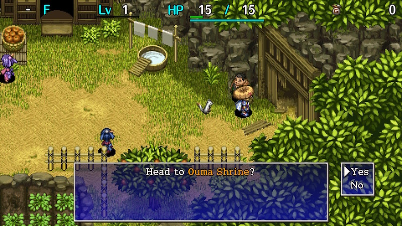

  

Tutorial dungeon where Koppa gives you advice about the basics of dungeon gameplay.

Once cleared, you can never return to this dungeon.

# Overview

<table class="dungeonOverview">
  <tr>
    <th>Unlock</th>
    <td colspan="3" class="highlightYellow">Enter Oyu's house in Inori Village.</td>
  </tr>
  <tr>
    <th>Entrance</th>
    <td colspan="3" class="highlightYellow">Inori Village (east)</td>
  </tr>
</table>

<table class="dungeonTable">
  <tr>
    <th>Floors</th>
    <td>3F</td>
    <th>Day / Night</th>
    <td>Day</td>
  </tr>
  <tr>
    <th>Bring Items</th>
    <td>Yes</td>
    <th></th>
    <td></td>
  </tr>
</table>

# Monster Table

<table>
  <tr>
    <th>1</th>
    <td>Mamel</td>
    <td></td>
  </tr>
  <tr>
    <th>2</th>
    <td>Mamel</td>
    <td>Sproutant</td>
  </tr>
  <tr>
    <th>3</th>
    <td>Mamel</td>
    <td>Sproutant</td>
  </tr>
</table>

# Items

<table>
  <tr>
    <th>Items</th>
  </tr>
  <tr>
    <td>Ordinary Stick</td>
  </tr>
  <tr>
    <td>Tin Shield</td>
  </tr>
  <tr>
    <td>Herb</td>
  </tr>
  <tr>
    <td>Onigiri</td>
  </tr>
  <tr>
    <td>Gitan</td>
  </tr>
</table>
