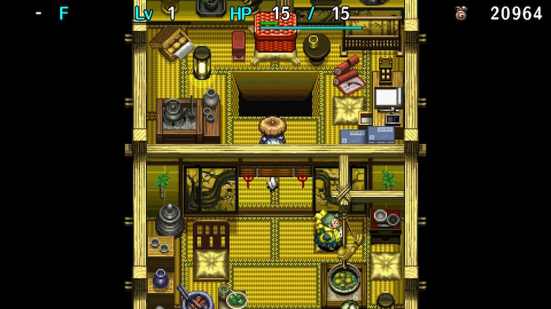
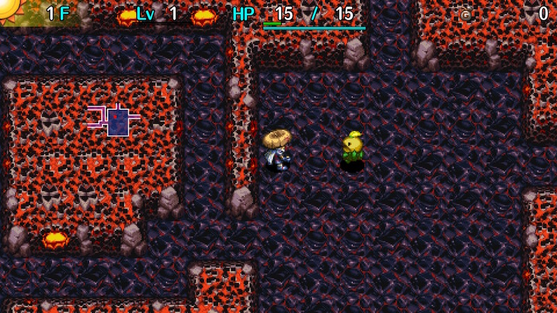
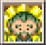

  

Dungeon with a special rule where you can't earn any experience points to level up.

The [Synthesis Pot](/items/pots#synthesis-pot) you start with serves as a hint on how to progress, 
as the dungeon expects you to synthesize and rapidly upgrade equipment to make up for the lack of level ups.

The item table includes lots of equipment, items to upgrade weapons, shields, and strength, and Synthesis Pots. 
Some odd effect items like [Dracon Grass](/items/grass#dracon-grass) appear, but items are identified so you likely won't get caught off guard. 
Negative items like Furious Talisman and Sticky Pot generally don't appear, but Sleepy Grass, Confusion Grass, 
and Poison Grass can be obtained from Mutaikon family monsters and Presto Pots. 
Cheery Grass and Unlucky Seed can't be found in this dungeon.

The clear reward ([True Knife](/items/weapons#true-knife)) can be obtained every time you clear the dungeon.

<ul class="quickLinksUL">
  <li><a href="#overview">Overview</a>
    <ul>
      <li><a href="#path-to-unlocking">Path to Unlocking</a></li>
    </ul>
  </li>
  <li><a href="#strategy">Strategy</a>
    <ul>
      <li><a href="#general">General</a></li>
      <li><a href="#farming-grass">Farming Grass</a></li>
      <li><a href="#equipment">Equipment</a></li>
      <li><a href="#other-items">Other Items</a></li>
      <li><a href="#floor-guide">Floor Guide</a></li>
    </ul>
  </li>
  <li><a href="#monsters">Monsters</a></li>
  <li><a href="#items">Items</a></li>
  <li><a href="#traps">Traps</a></li>
  <li><a href="#npcs">NPCs</a></li>
</ul>

# Overview

<table class="dungeonOverview">
  <tr>
    <th>Unlock</th>
    <td class="highlightYellow">1. Clear the main story. 2. Reach the top of Tower of Fortune → Miracles with Kojirouta.</td>
  </tr>
  <tr>
    <th>Entrance</th>
    <td class="highlightYellow">Rich man's house in Inori Village. (Choose to fall)</td>
  </tr>
</table>

<table class="dungeonTable">
  <tr>
    <th>Floors</th>
    <td>25F (first) / 99F</td>
    <th>Day / Night</th>
    <td>Day</td>
  </tr>
  <tr>
    <th>Bring Items</th>
    <td>No</td>
    <th>Allies</th>
    <td>No</td>
  </tr>
  <tr>
    <th>Unidentified</th>
    <td>None</td>
    <th>New Items</th>
    <td>No</td>
  </tr>
  <tr>
    <th>Shops</th>
    <td>Regular, Elite</td>
    <th>Monster Houses</th>
    <td>Regular, Special, Sudden</td>
  </tr>
  <tr>
    <th>Initial Enemies</th>
    <td></td>
    <th>Spawn Rate</th>
    <td></td>
  </tr>
  <tr>
    <th>Ominous aura</th>
    <td>No</td>
    <th>Wind of Kron</th>
    <td>1st: 1700 4th: 2000</td>
  </tr>
  <tr>
    <th>Clear Icon</th>
    <td class="clearIcon"></td>
    <th>Reward</th>
    <td>True Knife</td>
  </tr>
</table>

#### Path to Unlocking

[Kojirouta](/system/allies#kojirouta) disappears if you use the Sparrow's Shuttle, so you'll have to either start from the beginning, 
or randomly find him roaming around between 1-3F of Tower of Fortune (Unexplored Area).

He has an offensive AI type, which likes to charge at monsters and attack at all times. 
Allies act before monsters, so if you step in place to lure an enemy closer, Kojirouta will step into the enemy's attack. 
So it's best to fight in hallways to keep enemies out of Kojirouta's view as much as possible. 
He has paper thin defense, so he often gets one-shot on the upper floors even at higher levels.

The safest method is to bring a [New Item](/system/new-items) staff with the Transient + Swap effects with enough uses to reach the top. 
Throwing a Hide Pot at Kojirouta mostly ensures his safety for the current floor, and is especially helpful near the end. 
If you don't have those items, use a Monster Detector + Transient Staff to rush to the stairs. 
Kojirouta follows you at night, so [abilities](/system/necklace-abilities) like Stairlight and Pot Party are very effective.

Other helpful items include Attraction and Gathering scrolls for when you become separated, 
Shagga Lic. to avoid getting one-shot by Nashagga, Confusion and Slumber scrolls for when you're surrounded, 
Swap Staff to change positions if Kojirouta runs ahead, Hard Peaches to throw at Kojirouta to raise his defense, 
and a Reflection Pot to prevent DJ Mage family monsters from causing accidents.

# Strategy

<ul class="quickLinksUL">
  <li><a href="#general">General</a></li>
  <li><a href="#farming-grass">Farming Grass</a></li>
  <li><a href="#equipment">Equipment</a></li>
  <li><a href="#other-items">Other Items</a></li>
  <li><a href="#floor-guide">Floor Guide</a></li>
</ul>

### General

Shiren can't level up, so you'll need to rely on grass items to raise max HP and strength, 
and upgrade your main weapon and shield using [synthesis](/system/gameplay-basics#synthesis) and Fate or Earth scrolls.

Mixer synthesis, collecting arrows, and performing Nigiri Morph Factory aren't necessary to clear this dungeon. 
Instead, you're expected to employ unique strategies, which are all easy to perform once you learn them. 
This is considered to be the second easiest dungeon after [Gen's Turf](/dungeons/gens-turf) among post-game dungeons, 
and is a good starting point since you'll end up with upgraded equipment and a True Knife.

The key to success is like Gen's Turf, where you do blessed Extraction Scroll loops and read Mnster House Scrls. 
There's also a technique called Grass Factory, which lets you easily attain 50 strength and high max HP.

So given these techniques, your main concern is reaching a floor range where you can perform Grass Factory, 
and then planning how you're going to deal with troublesome monsters in the final stretch.

### Farming Grass

An easy technique to increase Shiren's strength and max HP. 
This technique makes the dungeon so trivial, some players prefer not to use it so that the dungeon keeps its flavor. 
Since this site aims to help players of all skill levels clear dungeons, we'll assume Grass Factory is performed. 
※ Pitfall of Life is balanced in a way where you can still clear it without using this technique.

#### What is Grass Factory?

Pin Poppa (Lv3) and Pin Gramps (Lv4) generate their own grass and transform into Grass Poppa or Grass Gramps. 
Grass Kid family monsters throw the grass they're wearing if they're lined up with Shiren. 
If Shiren is hit by the thrown grass, he receives the effect of the grass as if he used it as an item. 
Pitfall of Life's item table mostly doesn't include negative effect grasses like Stomach Shrinker or Unlucky Seed, 
but does include Strength Grass and grasses that increase max HP at a high rate.

So the idea is to find a way to keep Pin Poppa in the room, and repeat letting it generate its own grass and throwing the grass to increase Shiren's strength to 50, along with increasing max HP.

#### Requirements

- Pin Poppa (or a way to level up Pin Kid / Pin Dude on earlier floors)
    - You don't need to prepare anything if you perform this technique on 36F.
    - Cheery Grass, Glorious Staff, and Glorious Talisman can't be found, so you'll be using a Clone Staff instead.
    - Pin Kid monsters have unique AI, where they run away from Shiren even if Fake Shiren is in the room.
    - However, if you place a grass item down while Fake Shiren is in the room, they'll attack Fake Shiren.
    - So, paralyze an enemy on top of a grass item, and then swing a Clone Staff at a different enemy.
    - It's possible to level up a Pin Kid using Afraid status, but it's tricky to control Pin Kid's position, and Fear Scroll / Fear Talisman are shop-exclusive, so you're unlikely to use such a method.
- Something to restrict Pin Poppa or Grass Poppa's movement.
    - The easiest method is to simply perform this technique is a large room.
    - Pin Poppa will approach Shiren once it transforms into Grass Poppa, but it usually throws its grass before it reaches Shiren if there's plenty of distance, and will then run back to the corner of the room.
    - Large rooms aren't guaranteed, so the better method is to lure a monster on top of a grass item in the corner, and then swing a Paralysis Staff or throw a Hide Pot to lock their position in place, resulting in Pin Poppa hanging out on that side of the room - watch where you stand so that thrown grass doesn't undo the paralysis.
    - Transient Staff can be used instead if you haven't found a Paralysis Staff or Hide Pot. Place grass on the upper-left tile from the stairs, and then swing a Transient Staff while you're on the stairs.
    - Fixer Scroll can be used, but remember that paralysis only occurs if there are 2 or more adjacent monsters.

Fullness is restored by 5 when you get hit by grass, so you can perform this technique until the wind blows. 
Being able to perform this technique comes down to early game item luck on Pin Kid floors, but you'll usually 
have obtained Clone and Paralysis staves by the time you reach Pin Dude floors.

The only negative grasses are Blinding Grass and Warp Grass, and a Steady Shield helps with the latter. 
That said, watch out for Dracon Grass, since it grants Cannon Arm status for the duration of the current floor. 
Don't throw Blessing or Synthesis pots after doing this technique, since you'll likely have Cannon Arm status. 
If you're unsure, open the menu and select Other → Current State to check.

### Equipment

#### Weapon

Shiren's attack won't naturally increase since he can't level up, so you'll want a weapon with decent base attack. 
Dotanuki at minimum, and Bladite or Red Blade are ideal - otherwise early\~mid game will be a struggle. 
Weapons with special abilities are very uncommon on the ground, so aim for 2 bracelet resonance.

#### Shield

Shield upgrade value can be increased easily, so it's more important to activate 2 bracelet resonance. 
This applies even if you find a Day Shield - it's fine to synthesize it onto a Targite or Red Shield. 
Base defense is extremely important for early game, and Day Shield's defense is low and its damage reduction can't really be felt without leveling it / increasing max HP.

#### Runes

Strength and upgrade value can be increased, so status inflicting runes aren't necessary. 
Type effective runes are good options, since they increase the amount of damage you deal with direct attacks. 
If you find a Plating Scroll, go ahead and use it on your main weapon right away. 
Gitan can't be found on the ground, so think carefully before synthesizing Costly - you'll need to hunt Froggos. 
Max HP increasing runes aren't necessary, since performing Grass Factory raises your max HP. 
The Anti-Blast and Magi-Twister runes are very important, but Blast Shield and Swap Shield are quite rare, 
so you might need to level up a Lock Shield, Safe Shield, or Binary Shield to obtain them.

#### Bracelets

Mutaikon family monsters appear until the very end, so Cleansing Bracelet sees a lot of use. 
Alert and Anti-Cnf. bracelets are also important, and should be swapped as needed using 2 bracelet resonance. 
Negative effect bracelets like Monsterphobic and Itemphobic appear, but all items are identified in this dungeon, 
so there's no worry of unknowingly equipping a cursed bracelet.

Fort. Staff isn't in the item table to synthesize the Anti-Blast+ rune, so it's fine to discard Explosion Bracelets. 
Wall Clip Bracelet can appear in regular shops, so purchase it if you happen to come across one. 
Anti-Parry Brce. is more common in shops than other dungeons, so buy it if you see it in a shop. 
Losing your main weapon or shield is devastating in this dungeon.

### Other Items

#### Projectiles

Mostly unnecessary, since your direct attacks will be dealing a lot of damage. 
There's also no need to collect arrows using Karakuroid or Boy Cart family monsters. 
If you decide to carry arrows anyway, just use Wood Arrows you find on the ground. 
Don't carry multiple types of arrows, since inventory space should be used for more valuable items.

#### Scrolls

Scrolls related to upgrading equipment like Fate, Earth, Blessing, and Extraction are more common, 
and scrolls to help escape tricky situations like Confusion and Slumber are harder to find. 
You'll often have extra Blessing Pots on hand after you're done upgrading equipment, 
so go ahead and bless scrolls that help you escape difficult situations at that point.

It's best to bless Pot God Scroll, since it lets you reuse fragrance pots to counter end game monsters. 
Pot God Scroll isn't too common, so always bless the scroll before using it so that it can be reused. 
Between Blessing Pot and Blessing Scroll, it's far easier to keep the scroll blessed instead of finding more copies. 
Blessing Scroll is another good option to insert into Blessing Pots, since they can be used for a variety of purposes.

Mnster House Scrl is great if you find it early on, since it lets you obtain lots of items - always bless it before using it. 
You're likely to obtain an item from the Monster House that lets you bless the scroll and reuse it on the next floor.

#### Staves

Since scrolls that affect enemies are uncommon, staves will see a lot more use. 
Combine same name staves into 1 staff using Synthesis Pots to save inventory space.

Enemy special attacks can be a problem even when you have high attack and defense, so Seal Staff is valuable. 
Clone Staff is used to level up monsters to perform Grass Factory, and to escape situations like Monster Houses, 
so be sure to keep one on hand without using up its remaining uses if possible.

#### Pots

Preservation Pots are uncommon, so always increase capacity to 5 using Pot God Scrolls. 
On the other hand, Synthesis Pots are very common, so it's fine to use them as a simple container like Ordinary Pot. 
Blessing Pots are pretty common, and you can reuse the pot using Extraction Scrolls, so increase its capacity to 5. 
If you find additional Blessing Pots, it's fine to use them a little more carelessly.

Unlike other dungeons, Fever Pots are somewhat common and can be found on the ground. 
Duplicate Strength Grass if early game, and Peaches or Blessing Scrolls from around mid\~late game. 
Increase Fever Pot's capacity using Pot God Scrolls to duplicate more Extraction and Blessing Scrolls.

The 4 types of fragrance pots are quite valuable, and can be reused by reading Pot God Scrolls, 
so don't discard them even if capacity reaches 0 from usage or a Scoopie monster throwing dirt into them. 
They really help with consistency for the second half of the dungeon.

#### Talismans

Talismans are somewhat rare, so you likely won't naturally end up with a large stack of them. 
Use them if you can, but it's fine to discard them if your inventory is getting full. 
Don't insert them into Fever Pots, since there are far better options.

#### Grass

Strength Grass appears frequently, and increasing strength is one of the keys to getting through early game. 
It's best to keep some on hand for when you come across items like Blessing Pot, Blessing Scroll, and Fever Pot.

Grasses that increase max HP like Life Grass are also pretty common, and should be used as you find them. 
It's far more important to raise max HP early to get through 12F instead of saving them for Mixer synthesis on 13F.

If you'd like to level up equipment using Dagger Bees, go ahead and save some blessed Upgrade Seeds.

### Floor Guide

Since Preservation Pots are somewhat uncommon, it's important to keep your inventory light. 
Use Life Grass and HP recovery grasses as you find them to raise max HP instead of saving them for Mixer synthesis. 
Blessing Life Grass or Heal Grass early on isn't necessarily a bad idea, but it's better to bless Strength Grass. 
Shiren's damage output changes when strength is an even number, so raising it by 1 doesn't always boost damage. 
Without strength, you'll quickly start to struggle against monsters with higher HP even in the single digit floor range. 
If you find a Fever Pot, go ahead and duplicate Strength Grass.

Monsters with higher attack start appearing as early as 2F, so you'll want a Wolfshead at minimum. 
Without decent defense, you're likely to collapse from a Pin Kid in a hallway, or from being stung by a Blade Bee. 
If you weren't able to find a shield on 1F, you might want to abandon and retry for a better start.

#### 2-4F

Pin Kid appears, so if you found the needed items, you can perform Grass Factory right away. 
If you manage to do so, you should be able to increase strength to 20 or so.

#### 5-8F

N'dubbas can be disguised as items, and have high attack for this floor range. 
They get the first hit, so watch your remaining HP when you pick up items if your shield upgrade value is low.

#### 9-12F

Mudkins appear for 4 floors, and have the potential to be very problematic without the Rustproof rune. 
You'll hardly deal damage without a weapon if your strength is low, causing them to rapidly multiply. 
So if you find a Plating Scroll, use it on your weapon first instead of a shield. 
Otherwise, fixed damage like Rocks might deal more damage than punches, and Seal Staff shuts them down. 
You're likely to struggle from this point onward if you haven't been able to raise your max strength.

#### 9-17F

Foly appears, and can one-shot you with its 15 damage lightning if you haven't increased your max HP. 
This is why you should use Life Grass and HP recovery grasses to raise max HP right away instead of saving them. 
Avoid large rooms if possible, and if you're worried, eat a Juicy Peach for Enduring status to survive a surprise attack. 
Only one Foly can be present on a floor at a time, so if you paralyze it, you won't need to worry about it for that floor.

#### 13-15F

Mixers have a low chance to spawn. 
Mixer synthesis isn't too important here, but add type effective or max HP increasing runes if you have the items.

#### 14-16F

Dagger Bees can be hunted to level up equipment. 
Use a blessed Upgrade Seed, and stick to 15-16F so Polygon Spinna doesn't lower max HP or fullness.

#### 16-20F

Every floor in this range is a water floor, so you can't perform actions that make use of walls. 
However, you can still break pots by throwing them at monsters, but check for a hidden trap beforehand. 
Aquatic and Floating types head straight toward Shiren, so be prepared to fight multiple enemies at once.

#### 17-18F

Zaloklefts appear, and are actually quite dangerous if you don't have the Anti-Theft rune. 
If a Zalokleft steals an item on a water floor, it likely can't be recovered since it runs to the corner of the map. 
So if you don't have that rune, do everything you can to protect inventory items.

#### 20-22F

Pin Dude appears, so you can perform Grass Factory if you have the required items. 
If you manage to increase strength to 50 and reach 3-digit max HP, the upcoming Ornery Tank floors will be easier. 
Lava appears from 21F, so do Grass Factory in the stairs room where it doesn't get generated. 
It's best to do it on 22F so that you don't need to worry about MC Mage (19-21F).

#### 31-33F

Mixermons have a low chance to spawn. 
It's not necessary to synthesize using Mixers at this point, especially if you performed Grass Factory.

#### 33-35F

Ornery Tanks appear, far earlier than in other dungeons. 
It moves at double speed, and its cannonballs deal 40 damage - terrifying if you haven't increased your max HP. 
If you're planning on performing Grass Factory on 36F, consider Ornery Tank to be the final boss of the dungeon. 
Don't hesitate to use items like Seal Staff or Paralysis Staff, and try not to rely on thrown items since they can miss. 
If you don't have a Zen Pot or Monster Detector, it's best to rush to the stairs.

#### 36-38F

Pin Poppa appears, and can be used to easily perform Grass Factory. 
If you don't have a Reflection Pot, stick to 36F so that you don't need to worry about MC Wizard (37-38F).

#### 43-47F

Nigiri Boss can be found on these floors. 
You'll instantly collapse if you receive fire damage while you're afflicted with Onigiri status, 
so be especially careful on 43F (Sky Dragons) and 46-47F (lava floors).

#### 48-52F

Trowelie appears, and can throw dirt into pots from up to 5 tiles away. 
It's generally worse than Bored Kappa monsters, so use a Dodger Pot if you have one on hand. 
If you don't have a Dodger Pot, but have valuable pots like Fever or other fragrance pots, rush to the stairs. 
Strong Carts spawn on these floors, so consider collecting Knockback Arrows if you've increased your strength. 
Once you get past this floor range, the only monsters that aim for pots are Gyandora and Lv3-4 Bored Kappas.

#### 50-51F

This is your last chance to synthesize using Mixer family monsters. 
By this point, you can just skip ahead.

#### 52-54F

MC Sorceror spawns alongside Vexing Kappa. 
Choose which one you dislike more, since Reflection and Dodger pots can't be active at the same time. 
If you want to ensure safety, eat a blessed Peach to gain Immune status, and then use a Dodger Pot.

#### 56-58F

Horrabbit appears, so rush to the stairs. 
Don't forget to equip a Steady Shield if you have one on hand.

#### 61-62F

Pin Gramps makes an appearance, and can be used to perform Grass Factory one last time. 
Strength should already be at 50, so it would just be to increase max HP. (Aim for 200+ HP for the final push) 
Be sure to use a Perceptive Pot, or else the combination of Dracon Grass + Sensei will result in equipment loss.

#### 66-68F

Phoenix Tengu and Mudder both appear. 
Unequipping items in front of Mudder can be dangerous, since it could be a disguised Phoenix Tengu.

#### 74-77F

Porgon appears, along with Knave King between 75-76F. 
Use a Dodger Pot to evade Porky Rocks and Weeds.

#### 77-78F

Terrabbit appears, so again, rush to the stairs. 
Don't forget to equip a Steady Shield if you have one on hand.

#### 80-82F

MC Sorceror returns alongside Kappa Troll (80-85F), and Gitan Mamel (80-82F) is added to the mix. 
Being turned into an onigiri can easily end your adventure, so use a blessed Peach or Reflection Pot. 
Keep a space open in a pot, or use Dodger Pot instead of Reflection Pot if you're more worried about Kappa Trolls. 
Make quick work of Gitan Mamels by swinging a Seal or Electric staff.

#### 86-88F

Nigiri King appears and can turn Shiren or items into onigiri, so don't let it get adjacent to you. 
However, that might be easier said than done, since Tiger Ace likes to throw other monsters at Shiren, 
which can result in Tiger Ace throwing a Nigiri King → Shiren being turned into an onigiri on the same turn. 
If you have a decent number of blessed Peaches, consider using some if you want to look for items.

#### 86-99F

Ultra Gazer (86-91F), Mesmerikon (90-99F), Swordmaster (91-97F), and Cranky Tank (98-99F) appear for the finale. 
Blank Scrolls can only be obtained from Madam Ateska's fortune, and Extinction Scrolls are shop-exclusive, 
so you probably won't be able to make any of these monsters extinct on the last 14 floors.

Items that counter each monster:

- Mesmerikon
    - Dodger Pot, blessed Peach, Cleansing Bracelet (Can't block Berserk status, but prevents Slow status)
- Ultra Gazer
    - Anti-Gaze Trge (Anti-Hypno rune), blessed Peach, Reflection Pot
- Swordmaster
    - Anti-Parry Brce., Perceptive Pot
- Cranky Tank
    - Zen Pot

Vexing Kappas and Kappa Trolls usually reduce fragrance pot capacity to 0 before you reach this floor range, 
but you can just use a blessed Pot God Scroll to make the pot usable again, so never discard fragrance pots.

So, choose which fragrance pot to use, and come up with a plan for how you'll deal with the other monsters. 
That said, Dodger Pot should be prioritized, since Berserk status makes you lose control of Shiren. 
You can also use Fever Pots to duplicate Peaches and bless them to deal with Mesmerikon and Ultra Gazer. 
If you don't have enough items for Mesmerikon, keep an Anti-Parry Brce. and Cleansing Bracelet equipped.

#### 92-97F

Ultra Gazer and Cranky Tank aren't present on these floors, so Mesmerikon is the main concern. 
It's best to use a Dodger Pot and save 2 blessed Peaches for the final 2 floors.

#### 91-99F

Lava can appear on some of the floors in this range, so be careful around Swordmaster (91-97F). 
If your equipment gets disarmed, there's a chance it'll get destroyed due to lava before you're able to pick it up.

#### 98-99F

Mesmerikon and Cranky Tank overlap, so use a Zen Pot + blessed Peach to shut both of them down.

# Monsters

See [Monsters](/system/monsters) for individual monster details.

Floor Colors: Water Lava No Walls

Enemy Colors: Farming Situational Farming Destroys Items Dangerous Very Dangerous

<table class="dungeonMonsters">
  <thead>
    <tr>
      <th colspan="9">Day</th>
    </tr>
  </thead>
  <tbody>
    <tr>
      <td>1</td>
      <td class="highlightYellow">Mamel</td>
      <td class="highlightYellow">Seedie</td>
      <td class="highlightYellow">Sproutant</td>
      <td></td>
      <td></td>
      <td></td>
      <td></td>
      <td></td>
    </tr>
    <tr>
      <td>2</td>
      <td class="highlightYellow">Mamel</td>
      <td class="highlightYellow">Seedie</td>
      <td class="highlightYellow">Sproutant</td>
      <td class="highlightBlue">Pin Kid</td>
      <td class="highlightYellow">Blade Bee</td>
      <td class="highlightYellow">Colum</td>
      <td></td>
      <td></td>
    </tr>
    <tr>
      <td>3</td>
      <td class="highlightGreen">Pit Mamel</td>
      <td class="highlightYellow">Chintala</td>
      <td class="highlightYellow">Sproutant</td>
      <td class="highlightBlue">Pin Kid</td>
      <td class="highlightYellow">Blade Bee</td>
      <td class="highlightYellow">Colum</td>
      <td></td>
      <td></td>
    </tr>
    <tr>
      <td>4</td>
      <td></td>
      <td class="highlightYellow">Chintala</td>
      <td></td>
      <td class="highlightBlue">Pin Kid</td>
      <td></td>
      <td></td>
      <td></td>
      <td></td>
    </tr>
    <tr>
      <td>5</td>
      <td class="highlightYellow">N'dubba</td>
      <td class="highlightYellow">Chintala</td>
      <td class="highlightGreen">Froggo</td>
      <td class="highlightYellow">Nigiri Baby</td>
      <td></td>
      <td></td>
      <td></td>
      <td></td>
    </tr>
    <tr>
      <td>6</td>
      <td class="highlightYellow">N'dubba</td>
      <td class="highlightYellow">Moseal</td>
      <td class="highlightGreen">Froggo</td>
      <td class="highlightYellow">Nigiri Baby</td>
      <td></td>
      <td></td>
      <td></td>
      <td></td>
    </tr>
    <tr>
      <td>7</td>
      <td class="highlightYellow">N'dubba Karakuroid</td>
      <td class="highlightYellow">Moseal</td>
      <td class="highlightGreen">Froggo Tiger Tosser</td>
      <td class="highlightYellow">Nigiri Baby</td>
      <td class="highlightYellow">Fearabbit</td>
      <td class="highlightPurple3">Curse Girl</td>
      <td class="highlightYellow">Pumphantasm</td>
      <td class="highlightYellow">Gyaza</td>
    </tr>
    <tr>
      <td>8</td>
      <td class="highlightYellow">N'dubba Karakuroid</td>
      <td class="highlightYellow">Moseal</td>
      <td class="highlightYellow">Tiger Tosser</td>
      <td class="highlightYellow">Scorpion</td>
      <td class="highlightYellow">Fearabbit</td>
      <td class="highlightPurple3">Curse Girl</td>
      <td class="highlightYellow">Pumphantasm</td>
      <td class="highlightYellow">Gyaza</td>
    </tr>
    <tr>
      <td>9</td>
      <td class="highlightOrange2">Foly</td>
      <td class="highlightPurple3">Mudkin</td>
      <td class="highlightPurple3">Swordsman</td>
      <td class="highlightYellow">Scorpion</td>
      <td class="highlightYellow">Fearabbit</td>
      <td class="highlightPurple3">Curse Girl</td>
      <td class="highlightYellow">Pumphantasm</td>
      <td class="highlightYellow">Gyaza</td>
    </tr>
    <tr>
      <td>10</td>
      <td class="highlightOrange2">Foly</td>
      <td class="highlightPurple3">Mudkin</td>
      <td class="highlightPurple3">Swordsman Naptapir</td>
      <td class="highlightYellow">Scorpion</td>
      <td class="highlightYellow">Fearabbit</td>
      <td class="highlightPurple3">Curse Girl</td>
      <td class="highlightYellow">Metalhead</td>
      <td class="highlightYellow">Kumonigiri</td>
    </tr>
    <tr>
      <td>11</td>
      <td class="highlightOrange2">Foly</td>
      <td class="highlightPurple3">Mudkin</td>
      <td class="highlightYellow">Naptapir</td>
      <td class="highlightYellow">Scorpion</td>
      <td class="highlightYellow">Mutaikon</td>
      <td class="highlightYellow">Hopodile</td>
      <td class="highlightYellow">Metalhead</td>
      <td class="highlightYellow">Kumonigiri</td>
    </tr>
    <tr>
      <td>12</td>
      <td class="highlightOrange2">Foly</td>
      <td class="highlightPurple3">Mudkin</td>
      <td class="highlightYellow">Naptapir</td>
      <td></td>
      <td class="highlightYellow">Mutaikon</td>
      <td class="highlightYellow">Hopodile</td>
      <td class="highlightYellow">Metalhead</td>
      <td class="highlightYellow">Kumonigiri</td>
    </tr>
    <tr>
      <td>13</td>
      <td class="highlightOrange2">Foly</td>
      <td class="highlightBlue">Chow</td>
      <td class="highlightYellow">Cheer-Ham</td>
      <td class="highlightYellow">Yanpii Mid Chintala</td>
      <td class="highlightYellow">Mutaikon Polygon Spinna</td>
      <td class="highlightYellow">Hopodile</td>
      <td class="highlightBlue">Mixer</td>
      <td class="highlightYellow">Cololum</td>
    </tr>
    <tr>
      <td>14</td>
      <td class="highlightOrange2">Foly</td>
      <td class="highlightBlue">Chow</td>
      <td class="highlightYellow">Cheer-Ham</td>
      <td class="highlightYellow">Yanpii</td>
      <td class="highlightYellow">Polygon Spinna Kid Squid</td>
      <td class="highlightYellow">Dagger Bee</td>
      <td class="highlightBlue">Mixer</td>
      <td class="highlightYellow">Cololum</td>
    </tr>
    <tr>
      <td>15</td>
      <td class="highlightOrange2">Foly</td>
      <td class="highlightBlue">Chow Momoseal</td>
      <td class="highlightYellow">Cheer-Ham Sproutyrant</td>
      <td class="highlightYellow">Yanpii</td>
      <td class="highlightYellow">Kid Squid</td>
      <td class="highlightYellow">Dagger Bee</td>
      <td class="highlightBlue">Mixer</td>
      <td class="highlightYellow">Bored Kappa</td>
    </tr>
    <tr>
      <td class="highlightWater">16</td>
      <td class="highlightOrange2">Foly</td>
      <td class="highlightYellow">Momoseal</td>
      <td class="highlightYellow">Sproutyrant</td>
      <td></td>
      <td class="highlightYellow">Kid Squid</td>
      <td class="highlightYellow">Dagger Bee</td>
      <td></td>
      <td class="highlightYellow">Bored Kappa</td>
    </tr>
    <tr>
      <td class="highlightWater">17</td>
      <td class="highlightOrange2">Foly</td>
      <td class="highlightYellow">Momoseal</td>
      <td class="highlightYellow">Sproutyrant</td>
      <td class="highlightPurple3">Scoopie</td>
      <td class="highlightBlue">Zalokleft</td>
      <td class="highlightYellow">Flamebird</td>
      <td></td>
      <td class="highlightYellow">Bored Kappa</td>
    </tr>
    <tr>
      <td class="highlightWater">18</td>
      <td></td>
      <td></td>
      <td></td>
      <td class="highlightPurple3">Scoopie</td>
      <td class="highlightBlue">Zalokleft</td>
      <td class="highlightYellow">Flamebird</td>
      <td></td>
      <td></td>
    </tr>
    <tr>
      <td class="highlightWater">19</td>
      <td class="highlightYellow">Eligan</td>
      <td class="highlightYellow">Beanie</td>
      <td class="highlightOrange2">MC Mage</td>
      <td class="highlightPurple3">Scoopie</td>
      <td></td>
      <td></td>
      <td></td>
      <td></td>
    </tr>
    <tr>
      <td class="highlightWater">20</td>
      <td class="highlightYellow">Eligan</td>
      <td class="highlightYellow">Beanie</td>
      <td class="highlightOrange2">MC Mage</td>
      <td class="highlightYellow">Punisher</td>
      <td class="highlightBlue">Pin Dude</td>
      <td class="highlightYellow">Snooztapir</td>
      <td></td>
      <td></td>
    </tr>
    <tr>
      <td class="highlightLava">21</td>
      <td class="highlightYellow">Eligan</td>
      <td class="highlightBlue">Chow</td>
      <td class="highlightOrange2">MC Mage</td>
      <td class="highlightYellow">Punisher</td>
      <td class="highlightBlue">Pin Dude</td>
      <td class="highlightYellow">Snooztapir</td>
      <td class="highlightBlue">Green Zalokleft</td>
      <td></td>
    </tr>
    <tr>
      <td class="highlightLava">22</td>
      <td class="highlightPurple3">Cursister</td>
      <td class="highlightBlue">Chow</td>
      <td class="highlightYellow">Poofy</td>
      <td class="highlightYellow">Punisher</td>
      <td class="highlightYellow">Pin Dude Steamroid</td>
      <td class="highlightPurple3">Fencer</td>
      <td class="highlightBlue">Green Zalokleft</td>
      <td class="highlightPurple3">Nigiri Morph</td>
    </tr>
    <tr>
      <td class="highlightLava">23</td>
      <td class="highlightPurple3">Cursister</td>
      <td class="highlightBlue">Chow Absorbiphant</td>
      <td class="highlightYellow">Poofy Ironhead</td>
      <td class="highlightOrange2">Punisher Grampa Tank</td>
      <td class="highlightYellow">Steamroid Pandanigiri</td>
      <td class="highlightPurple3">Fencer</td>
      <td class="highlightBlue">Green Zalokleft Froggucci</td>
      <td class="highlightPurple3">Nigiri Morph Gyadon</td>
    </tr>
    <tr>
      <td class="highlightLava">24</td>
      <td class="highlightPurple3">Cursister</td>
      <td class="highlightOrange2">Absorbiphant</td>
      <td class="highlightYellow">Poofy Ironhead</td>
      <td class="highlightOrange2">Punisher Grampa Tank</td>
      <td class="highlightYellow">Pandanigiri</td>
      <td class="highlightPurple3">Fencer</td>
      <td class="highlightGreen">Froggucci</td>
      <td class="highlightPurple3">Gyadon</td>
    </tr>
    <tr>
      <td class="highlightLava">25</td>
      <td class="highlightPurple3">Cursister</td>
      <td class="highlightOrange2">Absorbiphant</td>
      <td class="highlightYellow">Ironhead</td>
      <td class="highlightOrange2">Grampa Tank</td>
      <td class="highlightOrange2">N'twyn</td>
      <td class="highlightOrange2">Hipadile</td>
      <td></td>
      <td></td>
    </tr>
    <tr>
      <td>26</td>
      <td class="highlightPurple3">Cursister</td>
      <td class="highlightYellow">Sr. Yanpii</td>
      <td class="highlightYellow">Crow Tengu</td>
      <td class="highlightPurple3">Muddy</td>
      <td class="highlightOrange2">N'twyn</td>
      <td class="highlightOrange2">Hipadile</td>
      <td class="highlightGreen">Cross Cart</td>
      <td></td>
    </tr>
    <tr>
      <td>27</td>
      <td class="highlightYellow">Zapdon</td>
      <td class="highlightYellow">Sr. Yanpii</td>
      <td class="highlightYellow">Crow Tengu</td>
      <td class="highlightPurple3">Muddy</td>
      <td class="highlightOrange2">N'twyn</td>
      <td class="highlightOrange2">Hipadile</td>
      <td class="highlightGreen">Cross Cart</td>
      <td class="highlightYellow">Explochin</td>
    </tr>
    <tr>
      <td>28</td>
      <td class="highlightYellow">Zapdon</td>
      <td class="highlightYellow">Sr. Yanpii</td>
      <td class="highlightYellow">Crow Tengu</td>
      <td class="highlightPurple3">Muddy</td>
      <td class="highlightOrange2">N'twyn</td>
      <td class="highlightPurple3">Spadie</td>
      <td class="highlightGreen">Cross Cart</td>
      <td class="highlightYellow">Explochin</td>
    </tr>
    <tr>
      <td>29</td>
      <td class="highlightYellow">Zapdon</td>
      <td class="highlightOrange2">Kappa Pest</td>
      <td class="highlightRed">MC Wizard</td>
      <td class="highlightYellow">Go-Ham!</td>
      <td class="highlightOrange2">Digestiphant</td>
      <td class="highlightPurple3">Spadie</td>
      <td class="highlightOrange2">Scarabbit</td>
      <td class="highlightYellow">Explochin</td>
    </tr>
    <tr>
      <td>30</td>
      <td class="highlightYellow">Zapdon</td>
      <td class="highlightOrange2">Kappa Pest</td>
      <td class="highlightRed">MC Wizard</td>
      <td class="highlightYellow">Go-Ham!</td>
      <td class="highlightOrange2">Digestiphant</td>
      <td class="highlightPurple3">Spadie</td>
      <td class="highlightOrange2">Scarabbit</td>
      <td></td>
    </tr>
    <tr>
      <td>31</td>
      <td class="highlightYellow">Dazikon</td>
      <td class="highlightOrange2">Kappa Pest</td>
      <td class="highlightRed">MC Wizard</td>
      <td class="highlightYellow">Shagga</td>
      <td class="highlightYellow">Katana Bee</td>
      <td class="highlightPurple3">Spadie</td>
      <td class="highlightYellow">Death Gyaza</td>
      <td class="highlightBlue">Mixermon</td>
    </tr>
    <tr>
      <td>32</td>
      <td class="highlightYellow">Dazikon</td>
      <td class="highlightBlue">Chow</td>
      <td></td>
      <td class="highlightYellow">Shagga</td>
      <td class="highlightYellow">Katana Bee</td>
      <td class="highlightPurple3">Spadie</td>
      <td class="highlightYellow">Death Gyaza</td>
      <td class="highlightBlue">Mixermon</td>
    </tr>
    <tr>
      <td>33</td>
      <td class="highlightYellow">Dazikon</td>
      <td class="highlightBlue">Chow</td>
      <td></td>
      <td class="highlightYellow">Shagga</td>
      <td class="highlightYellow">Katana Bee</td>
      <td class="highlightRed">Ornery Tank</td>
      <td class="highlightYellow">Death Gyaza</td>
      <td class="highlightBlue">Mixermon</td>
    </tr>
    <tr>
      <td>34</td>
      <td class="highlightYellow">Dazikon</td>
      <td class="highlightBlue">Chow</td>
      <td class="highlightYellow">Pumphantom</td>
      <td class="highlightYellow">VeniScorp</td>
      <td class="highlightYellow">Falcon Tengu</td>
      <td class="highlightRed">Ornery Tank</td>
      <td class="highlightYellow">Polygon Shaka</td>
      <td></td>
    </tr>
    <tr>
      <td>35</td>
      <td class="highlightYellow">Dazikon</td>
      <td class="highlightYellow">Cave Mamel</td>
      <td class="highlightYellow">Pumphantom</td>
      <td class="highlightYellow">VeniScorp</td>
      <td class="highlightYellow">Falcon Tengu</td>
      <td class="highlightRed">Ornery Tank</td>
      <td class="highlightYellow">Polygon Shaka</td>
      <td></td>
    </tr>
    <tr>
      <td>36</td>
      <td class="highlightYellow">Steelhead</td>
      <td class="highlightYellow">Cave Mamel</td>
      <td class="highlightYellow">Pumphantom</td>
      <td class="highlightPurple3">Gyairas</td>
      <td class="highlightYellow">Falcon Tengu</td>
      <td class="highlightYellow">Tiger Hurler</td>
      <td class="highlightYellow">Polygon Shaka</td>
      <td class="highlightBlue">Pin Poppa</td>
    </tr>
    <tr>
      <td>37</td>
      <td class="highlightYellow">Steelhead</td>
      <td></td>
      <td class="highlightRed">MC Wizard</td>
      <td class="highlightPurple3">Gyairas</td>
      <td></td>
      <td class="highlightYellow">Tiger Hurler</td>
      <td></td>
      <td class="highlightBlue">Pin Poppa</td>
    </tr>
    <tr>
      <td>38</td>
      <td class="highlightYellow">Steelhead</td>
      <td class="highlightYellow">Huistdon</td>
      <td class="highlightRed">MC Wizard</td>
      <td class="highlightPurple3">Gyairas</td>
      <td class="highlightYellow">Eligagan</td>
      <td class="highlightYellow">Tiger Hurler</td>
      <td class="highlightYellow">Sparkbird</td>
      <td class="highlightBlue">Pin Poppa</td>
    </tr>
    <tr>
      <td>39</td>
      <td class="highlightYellow">Steelhead</td>
      <td class="highlightYellow">Huistdon</td>
      <td></td>
      <td class="highlightPurple3">Gyairas</td>
      <td class="highlightYellow">Eligagan</td>
      <td class="highlightYellow">Tiger Hurler</td>
      <td class="highlightYellow">Sparkbird</td>
      <td></td>
    </tr>
    <tr>
      <td>40</td>
      <td class="highlightYellow">Steelhead</td>
      <td class="highlightYellow">Huistdon</td>
      <td class="highlightYellow">Big Chintala</td>
      <td class="highlightPurple3">Gyairas</td>
      <td class="highlightYellow">Eligagan</td>
      <td class="highlightYellow">Momomoseal</td>
      <td class="highlightYellow">Sparkbird</td>
      <td class="highlightOrange2">Nashagga</td>
    </tr>
    <tr>
      <td>41</td>
      <td class="highlightYellow">Steelhead</td>
      <td class="highlightYellow">Huistdon</td>
      <td class="highlightYellow">Big Chintala</td>
      <td class="highlightOrange2">Sky Dragon</td>
      <td></td>
      <td class="highlightYellow">Momomoseal</td>
      <td></td>
      <td class="highlightOrange2">Nashagga</td>
    </tr>
    <tr>
      <td>42</td>
      <td class="highlightYellow">Steelhead</td>
      <td></td>
      <td class="highlightYellow">Big Chintala</td>
      <td class="highlightOrange2">Sky Dragon</td>
      <td></td>
      <td class="highlightYellow">Momomoseal</td>
      <td></td>
      <td class="highlightOrange2">Nashagga</td>
    </tr>
    <tr>
      <td>43</td>
      <td></td>
      <td class="highlightYellow">King Squid</td>
      <td class="highlightYellow">Big Chintala</td>
      <td class="highlightOrange2">Sky Dragon</td>
      <td class="highlightOrange2">Nigiri Boss</td>
      <td class="highlightYellow">Momomoseal</td>
      <td></td>
      <td></td>
    </tr>
    <tr>
      <td>44</td>
      <td class="highlightYellow">Nuttie</td>
      <td class="highlightYellow">King Squid</td>
      <td class="highlightYellow">Big Chintala</td>
      <td class="highlightYellow">Rally Ham</td>
      <td class="highlightOrange2">Nigiri Boss</td>
      <td class="highlightYellow">Concusschin</td>
      <td></td>
      <td></td>
    </tr>
    <tr>
      <td>45</td>
      <td class="highlightYellow">Nuttie</td>
      <td class="highlightYellow">King Squid</td>
      <td class="highlightYellow">Big Chintala</td>
      <td class="highlightYellow">Rally Ham</td>
      <td class="highlightOrange2">Nigiri Boss</td>
      <td class="highlightYellow">Concusschin</td>
      <td class="highlightBlue">Munchy</td>
      <td></td>
    </tr>
    <tr>
      <td class="highlightLava">46</td>
      <td class="highlightPurple3">Nuttie Super Gazer</td>
      <td class="highlightYellow">King Squid</td>
      <td class="highlightYellow">Big Chintala</td>
      <td class="highlightYellow">Rally Ham</td>
      <td class="highlightOrange2">Nigiri Boss</td>
      <td class="highlightYellow">Concusschin</td>
      <td class="highlightBlue">Munchy</td>
      <td class="highlightOrange2">Oingodile</td>
    </tr>
    <tr>
      <td class="highlightLava">47</td>
      <td class="highlightPurple3">Super Gazer</td>
      <td class="highlightYellow">Eagle Tengu</td>
      <td class="highlightGreen">Strong Cart</td>
      <td></td>
      <td class="highlightOrange2">Nigiri Boss</td>
      <td></td>
      <td></td>
      <td class="highlightOrange2">Oingodile</td>
    </tr>
    <tr>
      <td class="highlightLava">48</td>
      <td class="highlightPurple3">Super Gazer</td>
      <td class="highlightYellow">Eagle Tengu</td>
      <td class="highlightGreen">Strong Cart</td>
      <td class="highlightPurple3">Trowelie</td>
      <td class="highlightYellow">Colocolum</td>
      <td></td>
      <td></td>
      <td class="highlightOrange2">Oingodile</td>
    </tr>
    <tr>
      <td class="highlightLava">49</td>
      <td class="highlightPurple3">Super Gazer</td>
      <td class="highlightYellow">Eagle Tengu</td>
      <td class="highlightGreen">Strong Cart</td>
      <td class="highlightPurple3">Trowelie</td>
      <td class="highlightYellow">Colocolum</td>
      <td class="highlightYellow">Electroid</td>
      <td class="highlightOrange2">Porkon</td>
      <td></td>
    </tr>
    <tr>
      <td class="highlightLava">50</td>
      <td class="highlightPurple3">Super Gazer</td>
      <td class="highlightBlue">Chow</td>
      <td class="highlightBlue">Strong Cart Mixergon</td>
      <td class="highlightPurple3">Trowelie</td>
      <td class="highlightOrange2">Colocolum N'mach</td>
      <td class="highlightYellow">Electroid</td>
      <td class="highlightOrange2">Porkon</td>
      <td class="highlightYellow">Doztapir</td>
    </tr>
    <tr>
      <td>51</td>
      <td class="highlightPurple3">Super Gazer</td>
      <td class="highlightBlue">Chow</td>
      <td class="highlightBlue">Strong Cart Mixergon</td>
      <td class="highlightPurple3">Trowelie</td>
      <td class="highlightOrange2">N'mach</td>
      <td class="highlightOrange2">Jouncy</td>
      <td class="highlightYellow">Debaser</td>
      <td class="highlightYellow">Doztapir</td>
    </tr>
    <tr>
      <td>52</td>
      <td class="highlightOrange2">Vexing Kappa</td>
      <td class="highlightBlue">Chow</td>
      <td class="highlightRed">MC Sorceror</td>
      <td class="highlightPurple3">Trowelie</td>
      <td class="highlightYellow">Sprouterror</td>
      <td class="highlightOrange2">Jouncy</td>
      <td class="highlightYellow">Debaser</td>
      <td class="highlightYellow">Doztapir</td>
    </tr>
    <tr>
      <td>53</td>
      <td class="highlightOrange2">Vexing Kappa</td>
      <td></td>
      <td class="highlightRed">MC Sorceror</td>
      <td class="highlightOrange2">Trillman</td>
      <td class="highlightYellow">Sprouterror</td>
      <td class="highlightOrange2">Jouncy</td>
      <td class="highlightYellow">Debaser</td>
      <td class="highlightPurple3">Mudster</td>
    </tr>
    <tr>
      <td>54</td>
      <td class="highlightOrange2">Vexing Kappa</td>
      <td class="highlightOrange2">Pierce Cart</td>
      <td class="highlightRed">MC Sorceror</td>
      <td class="highlightYellow">StunScorp</td>
      <td></td>
      <td class="highlightOrange2">Jouncy</td>
      <td class="highlightYellow">Debaser</td>
      <td class="highlightPurple3">Mudster</td>
    </tr>
    <tr>
      <td>55</td>
      <td class="highlightOrange2">Vexing Kappa</td>
      <td class="highlightOrange2">Pierce Cart</td>
      <td class="highlightYellow">Tiger Chucker</td>
      <td class="highlightYellow">StunScorp</td>
      <td></td>
      <td></td>
      <td></td>
      <td></td>
    </tr>
    <tr>
      <td>56</td>
      <td class="highlightOrange2">Vexing Kappa</td>
      <td class="highlightOrange2">Pierce Cart</td>
      <td class="highlightYellow">Tiger Chucker</td>
      <td class="highlightPurple3">Curspinster</td>
      <td class="highlightYellow">Pumpanshee</td>
      <td class="highlightRed">Horrabbit</td>
      <td class="highlightYellow">Momomomoseal</td>
      <td></td>
    </tr>
    <tr>
      <td>57</td>
      <td class="highlightPurple3">Vexing Kappa Gyandora</td>
      <td class="highlightOrange2">Pierce Cart Spongiderm</td>
      <td class="highlightYellow">Tiger Chucker</td>
      <td class="highlightPurple3">Curspinster</td>
      <td class="highlightYellow">Pumpanshee</td>
      <td class="highlightRed">Horrabbit</td>
      <td class="highlightYellow">Momomomoseal</td>
      <td class="highlightGreen">Froggon</td>
    </tr>
    <tr>
      <td>58</td>
      <td class="highlightPurple3">Gyandora</td>
      <td class="highlightOrange2">Pierce Cart Spongiderm</td>
      <td class="highlightYellow">Tiger Chucker</td>
      <td class="highlightPurple3">Curspinster Lashagga</td>
      <td class="highlightPurple3">Pumpanshee Sensei</td>
      <td class="highlightRed">Horrabbit</td>
      <td class="highlightYellow">Momomomoseal</td>
      <td class="highlightGreen">Froggon</td>
    </tr>
    <tr>
      <td>59</td>
      <td class="highlightPurple3">Gyandora</td>
      <td class="highlightOrange2">Pierce Cart Spongiderm</td>
      <td class="highlightYellow">Tiger Chucker</td>
      <td class="highlightOrange2">Lashagga</td>
      <td class="highlightPurple3">Sensei</td>
      <td class="highlightBlue">Iron Zalokleft</td>
      <td class="highlightYellow">Lt. Yanpii</td>
      <td class="highlightPurple3">Froggon Item Knave</td>
    </tr>
    <tr>
      <td>60</td>
      <td class="highlightPurple3">Gyandora</td>
      <td class="highlightYellow">Zanbeeto</td>
      <td class="highlightYellow">Tiger Chucker</td>
      <td class="highlightOrange2">Lashagga</td>
      <td class="highlightPurple3">Sensei</td>
      <td class="highlightBlue">Iron Zalokleft</td>
      <td class="highlightYellow">Lt. Yanpii</td>
      <td class="highlightPurple3">Item Knave</td>
    </tr>
    <tr>
      <td>61</td>
      <td class="highlightPurple3">Gyandora</td>
      <td class="highlightYellow">Zanbeeto</td>
      <td class="highlightYellow">Bunchukdon</td>
      <td class="highlightOrange2">Flarebird</td>
      <td class="highlightPurple3">Sensei</td>
      <td class="highlightBlue">Iron Zalokleft</td>
      <td class="highlightBlue">Lt. Yanpii Pin Gramps</td>
      <td class="highlightYellow">Polygon Singa</td>
    </tr>
    <tr>
      <td>62</td>
      <td class="highlightPurple3">Gyandora</td>
      <td class="highlightYellow">Zanbeeto</td>
      <td class="highlightYellow">Bunchukdon</td>
      <td class="highlightOrange2">Flarebird</td>
      <td class="highlightPurple3">Sensei</td>
      <td class="highlightBlue">Iron Zalokleft</td>
      <td class="highlightBlue">Pin Gramps</td>
      <td class="highlightYellow">Polygon Singa</td>
    </tr>
    <tr>
      <td>63</td>
      <td class="highlightPurple3">Gyandora</td>
      <td class="highlightPurple3">Zanbeeto Mudder</td>
      <td class="highlightYellow">Bunchukdon</td>
      <td class="highlightOrange2">Flarebird</td>
      <td class="highlightPurple3">Sensei</td>
      <td class="highlightOrange2">Bouncy</td>
      <td class="highlightYellow">Spirit Ham</td>
      <td class="highlightYellow">Polygon Singa</td>
    </tr>
    <tr>
      <td>64</td>
      <td class="highlightPurple3">Gyandora</td>
      <td class="highlightPurple3">Mudder</td>
      <td class="highlightYellow">Onigirizzly</td>
      <td></td>
      <td></td>
      <td class="highlightOrange2">Bouncy</td>
      <td class="highlightYellow">Spirit Ham</td>
      <td></td>
    </tr>
    <tr>
      <td>65</td>
      <td class="highlightYellow">Fulminachin</td>
      <td class="highlightPurple3">Mudder</td>
      <td class="highlightYellow">Onigirizzly</td>
      <td class="highlightPurple3">Hyper Gazer</td>
      <td></td>
      <td class="highlightOrange2">Bouncy</td>
      <td class="highlightYellow">Spirit Ham</td>
      <td></td>
    </tr>
    <tr>
      <td>66</td>
      <td class="highlightYellow">Fulminachin</td>
      <td class="highlightPurple3">Mudder</td>
      <td class="highlightYellow">Phoenix Tengu</td>
      <td class="highlightPurple3">Hyper Gazer</td>
      <td></td>
      <td class="highlightOrange2">Bouncy</td>
      <td></td>
      <td></td>
    </tr>
    <tr>
      <td>67</td>
      <td class="highlightRed">Dozikon</td>
      <td class="highlightPurple3">Mudder</td>
      <td class="highlightYellow">Phoenix Tengu</td>
      <td class="highlightPurple3">Hyper Gazer</td>
      <td></td>
      <td></td>
      <td></td>
      <td></td>
    </tr>
    <tr>
      <td>68</td>
      <td class="highlightRed">Dozikon</td>
      <td class="highlightPurple3">Mudder</td>
      <td class="highlightYellow">Phoenix Tengu</td>
      <td class="highlightYellow">Sproutitan</td>
      <td class="highlightYellow">Grainie</td>
      <td class="highlightYellow">Comatapir</td>
      <td></td>
      <td></td>
    </tr>
    <tr>
      <td>69</td>
      <td></td>
      <td class="highlightPurple3">Mudder</td>
      <td></td>
      <td class="highlightYellow">Sproutitan</td>
      <td class="highlightYellow">Grainie</td>
      <td class="highlightYellow">Comatapir</td>
      <td></td>
      <td></td>
    </tr>
    <tr>
      <td>70</td>
      <td class="highlightOrange2">Foly</td>
      <td class="highlightOrange2">N'dup</td>
      <td class="highlightYellow">Hell Gyaza</td>
      <td class="highlightYellow">Sproutitan</td>
      <td class="highlightYellow">Grainie</td>
      <td class="highlightYellow">Comatapir</td>
      <td class="highlightYellow">Huge Chintala</td>
      <td></td>
    </tr>
    <tr>
      <td class="highlightLava">71</td>
      <td class="highlightOrange2">Foly</td>
      <td class="highlightOrange2">N'dup</td>
      <td class="highlightYellow">Hell Gyaza</td>
      <td class="highlightYellow">Sproutitan</td>
      <td class="highlightYellow">Grainie</td>
      <td class="highlightYellow">Comatapir</td>
      <td class="highlightYellow">Huge Chintala</td>
      <td class="highlightYellow">Eligagon</td>
    </tr>
    <tr>
      <td class="highlightLava">72</td>
      <td class="highlightOrange2">Foly</td>
      <td class="highlightOrange2">N'dup</td>
      <td class="highlightYellow">Hell Gyaza</td>
      <td class="highlightYellow">Sproutitan</td>
      <td class="highlightYellow">Grainie</td>
      <td class="highlightBlue">FO-UZZ</td>
      <td class="highlightYellow">Huge Chintala Cyberoid</td>
      <td class="highlightYellow">Eligagon</td>
    </tr>
    <tr>
      <td class="highlightLava">73</td>
      <td class="highlightOrange2">Foly</td>
      <td class="highlightOrange2">N'dup Detonachin</td>
      <td class="highlightPurple3">Cursenior</td>
      <td class="highlightYellow">Sproutitan</td>
      <td class="highlightYellow">Grainie</td>
      <td class="highlightBlue">FO-UZZ</td>
      <td class="highlightYellow">Cyberoid</td>
      <td class="highlightYellow">Eligagon</td>
    </tr>
    <tr>
      <td class="highlightLava">74</td>
      <td class="highlightOrange2">Foly</td>
      <td class="highlightYellow">Detonachin</td>
      <td class="highlightPurple3">Cursenior</td>
      <td class="highlightYellow">Sproutitan</td>
      <td class="highlightRed">Porgon</td>
      <td></td>
      <td class="highlightYellow">Cyberoid</td>
      <td></td>
    </tr>
    <tr>
      <td class="highlightLava">75</td>
      <td class="highlightOrange2">Foly</td>
      <td class="highlightOrange2">Boingodile</td>
      <td class="highlightPurple3">Cursenior</td>
      <td class="highlightYellow">Sproutitan</td>
      <td class="highlightRed">Porgon</td>
      <td class="highlightYellow">Ruiner</td>
      <td class="highlightBlue">Mealy</td>
      <td class="highlightPurple3">Knave King</td>
    </tr>
    <tr>
      <td>76</td>
      <td class="highlightYellow">Squidperor</td>
      <td class="highlightOrange2">Boingodile</td>
      <td></td>
      <td class="highlightYellow">Sproutitan</td>
      <td class="highlightRed">Porgon</td>
      <td class="highlightYellow">Ruiner</td>
      <td class="highlightBlue">Mealy</td>
      <td class="highlightPurple3">Knave King</td>
    </tr>
    <tr>
      <td>77</td>
      <td class="highlightYellow">Squidperor</td>
      <td class="highlightOrange2">Boingodile</td>
      <td class="highlightYellow">Pumptergeist</td>
      <td class="highlightRed">Terrabbit</td>
      <td class="highlightRed">Porgon</td>
      <td class="highlightYellow">Ruiner</td>
      <td class="highlightYellow">BlightScorp</td>
      <td></td>
    </tr>
    <tr>
      <td>78</td>
      <td class="highlightYellow">Squidperor</td>
      <td class="highlightOrange2">Boingodile</td>
      <td class="highlightYellow">Pumptergeist</td>
      <td class="highlightRed">Terrabbit</td>
      <td class="highlightPurple3">Gyandoron</td>
      <td class="highlightYellow">Ruiner</td>
      <td class="highlightYellow">BlightScorp</td>
      <td></td>
    </tr>
    <tr>
      <td>79</td>
      <td class="highlightYellow">Squidperor</td>
      <td class="highlightOrange2">Boingodile</td>
      <td class="highlightYellow">Pumptergeist</td>
      <td class="highlightYellow">Kodionigiri</td>
      <td class="highlightPurple3">Gyandoron</td>
      <td></td>
      <td></td>
      <td></td>
    </tr>
    <tr>
      <td>80</td>
      <td class="highlightOrange2">Blazebird</td>
      <td class="highlightBlue">Chow</td>
      <td class="highlightRed">MC Sorceror</td>
      <td class="highlightOrange2">Kodionigiri Gitan Mamel</td>
      <td class="highlightPurple3">Gyandoron</td>
      <td class="highlightOrange2">Kappa Troll</td>
      <td class="highlightOrange2">Osmammoth</td>
      <td class="highlightGreen">Kleptoad</td>
    </tr>
    <tr>
      <td class="highlightNoWalls">81</td>
      <td class="highlightOrange2">Blazebird</td>
      <td class="highlightBlue">Chow Polygon Stunna</td>
      <td class="highlightRed">MC Sorceror Doomhead</td>
      <td class="highlightOrange2">Gitan Mamel</td>
      <td class="highlightPurple3">Gyandoron</td>
      <td class="highlightOrange2">Kappa Troll</td>
      <td class="highlightOrange2">Osmammoth</td>
      <td class="highlightGreen">Kleptoad</td>
    </tr>
    <tr>
      <td class="highlightNoWalls">82</td>
      <td class="highlightOrange2">Blazebird</td>
      <td class="highlightBlue">Chow Polygon Stunna</td>
      <td class="highlightRed">MC Sorceror Doomhead</td>
      <td class="highlightOrange2">Gitan Mamel</td>
      <td class="highlightPurple3">Gyandoron</td>
      <td class="highlightOrange2">Kappa Troll</td>
      <td class="highlightOrange2">Osmammoth</td>
      <td class="highlightGreen">Kleptoad Googoman</td>
    </tr>
    <tr>
      <td class="highlightNoWalls">83</td>
      <td class="highlightOrange2">Blazebird</td>
      <td class="highlightYellow">Polygon Stunna</td>
      <td class="highlightYellow">Doomhead</td>
      <td></td>
      <td class="highlightPurple3">Gyandoron</td>
      <td class="highlightOrange2">Kappa Troll</td>
      <td class="highlightOrange2">Osmammoth</td>
      <td class="highlightOrange2">Googoman</td>
    </tr>
    <tr>
      <td class="highlightNoWalls">84</td>
      <td class="highlightOrange2">Blazebird</td>
      <td class="highlightYellow">Polygon Stunna</td>
      <td></td>
      <td></td>
      <td></td>
      <td class="highlightOrange2">Kappa Troll</td>
      <td></td>
      <td></td>
    </tr>
    <tr>
      <td class="highlightNoWalls">85</td>
      <td class="highlightOrange2">Blazebird</td>
      <td class="highlightYellow">Polygon Stunna</td>
      <td class="highlightYellow">Tiger Ace</td>
      <td class="highlightYellow">Zotdon</td>
      <td class="highlightYellow">Boss Yanpii</td>
      <td class="highlightOrange2">Kappa Troll</td>
      <td></td>
      <td></td>
    </tr>
    <tr>
      <td>86</td>
      <td class="highlightRed">Ultra Gazer</td>
      <td></td>
      <td class="highlightYellow">Tiger Ace</td>
      <td class="highlightYellow">Zotdon</td>
      <td class="highlightYellow">Boss Yanpii</td>
      <td></td>
      <td class="highlightOrange2">Nigiri King</td>
      <td></td>
    </tr>
    <tr>
      <td>87</td>
      <td class="highlightRed">Ultra Gazer</td>
      <td></td>
      <td class="highlightYellow">Tiger Ace</td>
      <td class="highlightYellow">Zotdon</td>
      <td class="highlightYellow">Boss Yanpii</td>
      <td class="highlightBlue">Zalokleft King</td>
      <td class="highlightOrange2">Nigiri King</td>
      <td></td>
    </tr>
    <tr>
      <td>88</td>
      <td class="highlightRed">Ultra Gazer</td>
      <td></td>
      <td class="highlightYellow">Tiger Ace</td>
      <td class="highlightYellow">Zotdon</td>
      <td class="highlightYellow">Boss Yanpii</td>
      <td class="highlightBlue">Zalokleft King</td>
      <td class="highlightOrange2">Nigiri King</td>
      <td></td>
    </tr>
    <tr>
      <td>89</td>
      <td class="highlightRed">Ultra Gazer</td>
      <td class="highlightYellow">Elizgagon</td>
      <td class="highlightYellow">Tiger Ace</td>
      <td class="highlightYellow">Zotdon</td>
      <td class="highlightYellow">Boss Yanpii</td>
      <td class="highlightBlue">Zalokleft King</td>
      <td></td>
      <td class="highlightYellow">Doom Gyaza</td>
    </tr>
    <tr>
      <td>90</td>
      <td class="highlightRed">Ultra Gazer</td>
      <td class="highlightYellow">Elizgagon</td>
      <td class="highlightYellow">Tiger Ace</td>
      <td class="highlightYellow">Zotdon</td>
      <td class="highlightYellow">Boss Yanpii</td>
      <td class="highlightRed">Mesmerikon</td>
      <td class="highlightPurple3">Swordmaster</td>
      <td class="highlightYellow">Doom Gyaza</td>
    </tr>
    <tr>
      <td>91</td>
      <td class="highlightRed">Ultra Gazer</td>
      <td class="highlightYellow">Elizgagon</td>
      <td class="highlightYellow">Tiger Ace</td>
      <td class="highlightYellow">Zotdon</td>
      <td></td>
      <td class="highlightRed">Mesmerikon</td>
      <td class="highlightPurple3">Swordmaster</td>
      <td class="highlightYellow">Doom Gyaza</td>
    </tr>
    <tr>
      <td>92</td>
      <td></td>
      <td class="highlightYellow">Elizgagon</td>
      <td class="highlightYellow">Tiger Ace</td>
      <td></td>
      <td></td>
      <td class="highlightRed">Mesmerikon</td>
      <td class="highlightPurple3">Swordmaster</td>
      <td class="highlightYellow">Doom Gyaza</td>
    </tr>
    <tr>
      <td>93</td>
      <td></td>
      <td class="highlightYellow">Elizgagon</td>
      <td></td>
      <td></td>
      <td></td>
      <td class="highlightRed">Mesmerikon</td>
      <td class="highlightPurple3">Swordmaster</td>
      <td class="highlightYellow">Doom Gyaza</td>
    </tr>
    <tr>
      <td>94</td>
      <td></td>
      <td class="highlightYellow">Elizgagon</td>
      <td></td>
      <td></td>
      <td></td>
      <td class="highlightRed">Mesmerikon</td>
      <td class="highlightPurple3">Swordmaster</td>
      <td class="highlightYellow">Doom Gyaza</td>
    </tr>
    <tr>
      <td>95</td>
      <td class="highlightOrange2">Foly</td>
      <td class="highlightYellow">Elizgagon</td>
      <td></td>
      <td></td>
      <td></td>
      <td class="highlightRed">Mesmerikon</td>
      <td class="highlightPurple3">Swordmaster</td>
      <td class="highlightYellow">Doom Gyaza</td>
    </tr>
    <tr>
      <td class="highlightLava">96</td>
      <td class="highlightOrange2">Foly</td>
      <td class="highlightYellow">Elizgagon</td>
      <td></td>
      <td></td>
      <td></td>
      <td class="highlightRed">Mesmerikon</td>
      <td class="highlightPurple3">Swordmaster</td>
      <td class="highlightYellow">Doom Gyaza</td>
    </tr>
    <tr>
      <td class="highlightLava">97</td>
      <td class="highlightOrange2">Foly</td>
      <td class="highlightYellow">Elizgagon</td>
      <td></td>
      <td></td>
      <td></td>
      <td class="highlightRed">Mesmerikon</td>
      <td class="highlightPurple3">Swordmaster</td>
      <td></td>
    </tr>
    <tr>
      <td class="highlightLava">98</td>
      <td class="highlightRed">Cranky Tank</td>
      <td class="highlightYellow">Elizgagon</td>
      <td></td>
      <td></td>
      <td></td>
      <td class="highlightRed">Mesmerikon</td>
      <td></td>
      <td></td>
    </tr>
    <tr>
      <td class="highlightLava">99</td>
      <td class="highlightRed">Cranky Tank</td>
      <td class="highlightYellow">Elizgagon</td>
      <td></td>
      <td></td>
      <td></td>
      <td class="highlightRed">Mesmerikon</td>
      <td></td>
      <td></td>
    </tr>
  </tbody>
</table>

# Items

The values like "6+" in columns represent the floor range where the item can appear.

- F = Floor, Daytime monster drop
- S = Shop, Shiny Object (yellow), Peddler
- P = Presto Pot
- Z = Zalokleft drop
- M = Mealy drop
- E = Elite shop, Shiny Object (blue)

 

<table class="dungeonItemTable">
  <tr>
    <th colspan="7" class="highlightPurple3">Weapon</th>
    <td rowspan="72" class="tableDivider"></td>
    <th colspan="7" class="highlightPurple3">Bracelet</th>
    <td rowspan="72" class="tableDivider"></td>
    <th colspan="7" class="highlightPurple3">Staff</th>
  </tr>
  <tr>
    <th>Name</th>
    <th>F</th>
    <th>S</th>
    <th>P</th>
    <th>Z</th>
    <th>M</th>
    <th>E</th>
    <th>Name</th>
    <th>F</th>
    <th>S</th>
    <th>P</th>
    <th>Z</th>
    <th>M</th>
    <th>E</th>
    <th>Name</th>
    <th>F</th>
    <th>S</th>
    <th>P</th>
    <th>Z</th>
    <th>M</th>
    <th>E</th>
  </tr>
  <tr>
    <td class="leftText">Ordinary Stick</td>
    <td></td>
    <td></td>
    <td>X</td>
    <td>X</td>
    <td></td>
    <td></td>
    <td class="leftText">Cleansing Bracelet</td>
    <td>X</td>
    <td></td>
    <td>X</td>
    <td>X</td>
    <td>X</td>
    <td></td>
    <td class="leftText">Swap Staff</td>
    <td>X</td>
    <td>X</td>
    <td>X</td>
    <td>X</td>
    <td>X</td>
    <td>X</td>
  </tr>
  <tr>
    <td class="leftText">Tin Blade</td>
    <td></td>
    <td></td>
    <td>X</td>
    <td>X</td>
    <td></td>
    <td></td>
    <td class="leftText">Anti-Cnf. Bracelet</td>
    <td>X</td>
    <td></td>
    <td>X</td>
    <td>X</td>
    <td>X</td>
    <td></td>
    <td class="leftText">Knockback Staff</td>
    <td>X</td>
    <td>X</td>
    <td>X</td>
    <td>X</td>
    <td>X</td>
    <td>X</td>
  </tr>
  <tr>
    <td class="leftText">Katana</td>
    <td></td>
    <td></td>
    <td>X</td>
    <td>X</td>
    <td></td>
    <td></td>
    <td class="leftText">Alert Bracelet</td>
    <td>X</td>
    <td></td>
    <td>X</td>
    <td>X</td>
    <td>X</td>
    <td></td>
    <td class="leftText">Pinning Staff</td>
    <td>X</td>
    <td>X</td>
    <td>X</td>
    <td>X</td>
    <td>X</td>
    <td>X</td>
  </tr>
  <tr>
    <td class="leftText">Beast Fang</td>
    <td>X</td>
    <td></td>
    <td>X</td>
    <td>X</td>
    <td>X</td>
    <td></td>
    <td class="leftText">Anti-Crs. Bracelet</td>
    <td>X</td>
    <td></td>
    <td>X</td>
    <td>X</td>
    <td>X</td>
    <td></td>
    <td class="leftText">Transient Staff</td>
    <td>X</td>
    <td>X</td>
    <td>X</td>
    <td>X</td>
    <td>X</td>
    <td>X</td>
  </tr>
  <tr>
    <td class="leftText">Dotanuki</td>
    <td>X</td>
    <td></td>
    <td>X</td>
    <td>X</td>
    <td>X</td>
    <td></td>
    <td class="leftText">Anti-Parry Brce.</td>
    <td></td>
    <td>X</td>
    <td></td>
    <td></td>
    <td></td>
    <td>X</td>
    <td class="leftText">Seal Staff</td>
    <td>X</td>
    <td>X</td>
    <td>X</td>
    <td>X</td>
    <td>X</td>
    <td>X</td>
  </tr>
  <tr>
    <td class="leftText">Bladite</td>
    <td>X</td>
    <td>X</td>
    <td></td>
    <td></td>
    <td>X</td>
    <td></td>
    <td class="leftText">Staunch Bracelet</td>
    <td>X</td>
    <td></td>
    <td>X</td>
    <td>X</td>
    <td>X</td>
    <td></td>
    <td class="leftText">Clone Staff</td>
    <td>X</td>
    <td>X</td>
    <td>X</td>
    <td>X</td>
    <td>X</td>
    <td>X</td>
  </tr>
  <tr>
    <td class="leftText">Red Blade</td>
    <td>X</td>
    <td>X</td>
    <td></td>
    <td></td>
    <td>X</td>
    <td>X</td>
    <td class="leftText">Can. Arm Bracelet</td>
    <td>X</td>
    <td></td>
    <td>X</td>
    <td>X</td>
    <td>X</td>
    <td></td>
    <td class="leftText">Paralysis Staff</td>
    <td>X</td>
    <td>X</td>
    <td>X</td>
    <td>X</td>
    <td>X</td>
    <td>X</td>
  </tr>
  <tr>
    <td class="leftText">Kabura Katana</td>
    <td></td>
    <td>X</td>
    <td></td>
    <td></td>
    <td></td>
    <td>X</td>
    <td class="leftText">Strength Bracelet</td>
    <td>X</td>
    <td>X</td>
    <td>X</td>
    <td>X</td>
    <td>X</td>
    <td></td>
    <td class="leftText">Empathy Staff</td>
    <td>X</td>
    <td>X</td>
    <td>X</td>
    <td>X</td>
    <td>X</td>
    <td>X</td>
  </tr>
  <tr>
    <td class="leftText">Dull Gold Edge</td>
    <td>X</td>
    <td></td>
    <td>X</td>
    <td>X</td>
    <td>X</td>
    <td></td>
    <td class="leftText">Heal Bracelet</td>
    <td></td>
    <td>X</td>
    <td></td>
    <td></td>
    <td></td>
    <td>X</td>
    <td class="leftText">Slow Staff</td>
    <td>X</td>
    <td>X</td>
    <td>X</td>
    <td>X</td>
    <td>X</td>
    <td>X</td>
  </tr>
  <tr>
    <td class="leftText">Bright Blade</td>
    <td>X</td>
    <td></td>
    <td>X</td>
    <td>X</td>
    <td>X</td>
    <td></td>
    <td class="leftText">Bunch Bracelet</td>
    <td>X</td>
    <td>X</td>
    <td></td>
    <td></td>
    <td>X</td>
    <td>X</td>
    <td class="leftText">Mage Staff</td>
    <td>X</td>
    <td>X</td>
    <td>X</td>
    <td>X</td>
    <td>X</td>
    <td>X</td>
  </tr>
  <tr>
    <td class="leftText">Rusty Pickaxe</td>
    <td>X</td>
    <td></td>
    <td>X</td>
    <td>X</td>
    <td>X</td>
    <td></td>
    <td class="leftText">Mojo Bracelet</td>
    <td></td>
    <td>X</td>
    <td></td>
    <td></td>
    <td>X</td>
    <td>X</td>
    <td class="leftText">Electric Staff</td>
    <td>X</td>
    <td>X</td>
    <td>X</td>
    <td>X</td>
    <td>X</td>
    <td>X</td>
  </tr>
  <tr>
    <td class="leftText">Old Mallet</td>
    <td>X</td>
    <td></td>
    <td>X</td>
    <td>X</td>
    <td>X</td>
    <td></td>
    <td class="leftText">Monster Detector</td>
    <td>X</td>
    <td>X</td>
    <td></td>
    <td></td>
    <td>X</td>
    <td>X</td>
    <td class="leftText">Staff of Sacrifice</td>
    <td>X</td>
    <td></td>
    <td>X</td>
    <td>X</td>
    <td>X</td>
    <td></td>
  </tr>
  <tr>
    <td class="leftText">Sky Splitter</td>
    <td>X</td>
    <td>X</td>
    <td>X</td>
    <td>X</td>
    <td>X</td>
    <td></td>
    <td class="leftText">Item Detector</td>
    <td>X</td>
    <td>X</td>
    <td></td>
    <td></td>
    <td>X</td>
    <td>X</td>
    <td class="leftText">Shocking Staff</td>
    <td>X</td>
    <td></td>
    <td>X</td>
    <td>X</td>
    <td>X</td>
    <td></td>
  </tr>
  <tr>
    <td class="leftText">Water Cutter</td>
    <td>X</td>
    <td>X</td>
    <td>X</td>
    <td>X</td>
    <td>X</td>
    <td></td>
    <td class="leftText">Blink Bracelet</td>
    <td>X</td>
    <td></td>
    <td>X</td>
    <td>X</td>
    <td>X</td>
    <td></td>
    <th colspan="7" class="highlightPurple3">Pot</th>
  </tr>
  <tr>
    <td class="leftText">Scythe</td>
    <td>X</td>
    <td>X</td>
    <td>X</td>
    <td>X</td>
    <td>X</td>
    <td></td>
    <td class="leftText">Explosion Bracelet</td>
    <td>X</td>
    <td></td>
    <td>X</td>
    <td>X</td>
    <td>X</td>
    <td></td>
    <th>Name</th>
    <th>F</th>
    <th>S</th>
    <th>P</th>
    <th>Z</th>
    <th>M</th>
    <th>E</th>
  </tr>
  <tr>
    <td class="leftText">Myopic Masher</td>
    <td>X</td>
    <td>X</td>
    <td>X</td>
    <td>X</td>
    <td>X</td>
    <td></td>
    <td class="leftText">Waterwalk Bracelet</td>
    <td></td>
    <td>X</td>
    <td></td>
    <td></td>
    <td></td>
    <td>X</td>
    <td class="leftText">Preservation Pot</td>
    <td>X</td>
    <td>X</td>
    <td></td>
    <td>X</td>
    <td>X</td>
    <td></td>
  </tr>
  <tr>
    <td class="leftText">Magic Masher</td>
    <td>X</td>
    <td>X</td>
    <td>X</td>
    <td>X</td>
    <td>X</td>
    <td></td>
    <td class="leftText">Wall Clip Bracelet</td>
    <td></td>
    <td>X</td>
    <td></td>
    <td></td>
    <td></td>
    <td>X</td>
    <td class="leftText">Ordinary Pot</td>
    <td>X</td>
    <td></td>
    <td></td>
    <td>X</td>
    <td></td>
    <td></td>
  </tr>
  <tr>
    <td class="leftText">Drain Dagger</td>
    <td>X</td>
    <td>X</td>
    <td>X</td>
    <td>X</td>
    <td>X</td>
    <td></td>
    <td class="leftText">VIP Bracelet</td>
    <td></td>
    <td></td>
    <td></td>
    <td></td>
    <td></td>
    <td>X</td>
    <td class="leftText">Synthesis Pot</td>
    <td>X</td>
    <td>X</td>
    <td></td>
    <td>X</td>
    <td>X</td>
    <td>X</td>
  </tr>
  <tr>
    <td class="leftText">Copper Cleaver</td>
    <td>X</td>
    <td>X</td>
    <td>X</td>
    <td>X</td>
    <td>X</td>
    <td></td>
    <td class="leftText">Monsterphobic</td>
    <td>X</td>
    <td>X</td>
    <td></td>
    <td></td>
    <td>X</td>
    <td></td>
    <td class="leftText">Sale Pot</td>
    <td>X</td>
    <td></td>
    <td></td>
    <td>X</td>
    <td>X</td>
    <td></td>
  </tr>
  <tr>
    <td class="leftText">Crescent Katana</td>
    <td>X</td>
    <td>X</td>
    <td>X</td>
    <td>X</td>
    <td>X</td>
    <td></td>
    <td class="leftText">Itemphobic</td>
    <td>X</td>
    <td>X</td>
    <td></td>
    <td></td>
    <td>X</td>
    <td></td>
    <td class="leftText">Presto Pot</td>
    <td>X</td>
    <td></td>
    <td></td>
    <td>X</td>
    <td>X</td>
    <td></td>
  </tr>
  <tr>
    <td class="leftText">Lizard Lasher</td>
    <td>X</td>
    <td>X</td>
    <td>X</td>
    <td>X</td>
    <td>X</td>
    <td></td>
    <th colspan="7" class="highlightPurple3">Scroll</th>
    <td class="leftText">Blessing Pot</td>
    <td>X</td>
    <td>X</td>
    <td></td>
    <td>X</td>
    <td>X</td>
    <td>X</td>
  </tr>
  <tr>
    <td class="leftText">Nap Rattle</td>
    <td>X</td>
    <td>X</td>
    <td>X</td>
    <td>X</td>
    <td>X</td>
    <td>X</td>
    <th>Name</th>
    <th>F</th>
    <th>S</th>
    <th>P</th>
    <th>Z</th>
    <th>M</th>
    <th>E</th>
    <td class="leftText">Fever Pot</td>
    <td>X</td>
    <td>X</td>
    <td></td>
    <td>X</td>
    <td>X</td>
    <td>X</td>
  </tr>
  <tr>
    <td class="leftText">Shockuto</td>
    <td>X</td>
    <td>X</td>
    <td>X</td>
    <td>X</td>
    <td>X</td>
    <td>X</td>
    <td class="leftText">Confusion Scroll</td>
    <td>X</td>
    <td></td>
    <td>X</td>
    <td>X</td>
    <td>X</td>
    <td></td>
    <td class="leftText">Hide Pot</td>
    <td>X</td>
    <td></td>
    <td></td>
    <td>X</td>
    <td>X</td>
    <td></td>
  </tr>
  <tr>
    <td class="leftText">Blurry Stick</td>
    <td>X</td>
    <td>X</td>
    <td>X</td>
    <td>X</td>
    <td>X</td>
    <td>X</td>
    <td class="leftText">Slumber Scroll</td>
    <td>X</td>
    <td></td>
    <td>X</td>
    <td>X</td>
    <td>X</td>
    <td></td>
    <td class="leftText">Heal Pot</td>
    <td>X</td>
    <td>X</td>
    <td></td>
    <td>X</td>
    <td>X</td>
    <td>X</td>
  </tr>
  <tr>
    <td class="leftText">Sealing Keisaku</td>
    <td>X</td>
    <td>X</td>
    <td>X</td>
    <td>X</td>
    <td>X</td>
    <td>X</td>
    <td class="leftText">Vacuum Slash Scrl</td>
    <td>X</td>
    <td></td>
    <td>X</td>
    <td>X</td>
    <td>X</td>
    <td></td>
    <td class="leftText">Hilarious Pot</td>
    <td>X</td>
    <td>X</td>
    <td></td>
    <td>X</td>
    <td>X</td>
    <td></td>
  </tr>
  <tr>
    <td class="leftText">Baffle Axe</td>
    <td>X</td>
    <td>X</td>
    <td>X</td>
    <td>X</td>
    <td>X</td>
    <td>X</td>
    <td class="leftText">Fear Scroll</td>
    <td></td>
    <td>X</td>
    <td></td>
    <td></td>
    <td></td>
    <td></td>
    <td class="leftText">Zalokleft Pot</td>
    <td>X</td>
    <td></td>
    <td></td>
    <td></td>
    <td>X</td>
    <td></td>
  </tr>
  <tr>
    <td class="leftText">Hatchet</td>
    <td></td>
    <td>X</td>
    <td></td>
    <td></td>
    <td></td>
    <td>X</td>
    <td class="leftText">Navigation Scroll</td>
    <td>X</td>
    <td></td>
    <td>X</td>
    <td>X</td>
    <td>X</td>
    <td></td>
    <td class="leftText">Upgrade Pot</td>
    <td></td>
    <td></td>
    <td></td>
    <td></td>
    <td></td>
    <td>X</td>
  </tr>
  <tr>
    <td class="leftText">Shoddy Dirk</td>
    <td></td>
    <td>X</td>
    <td></td>
    <td></td>
    <td></td>
    <td>X</td>
    <td class="leftText">Dispel Aura Scroll</td>
    <td>X</td>
    <td>X</td>
    <td>X</td>
    <td>X</td>
    <td>X</td>
    <td></td>
    <td class="leftText">Zen Pot</td>
    <td>X</td>
    <td>X</td>
    <td></td>
    <td>X</td>
    <td>X</td>
    <td>X</td>
  </tr>
  <tr>
    <td class="leftText">Glass Dirk</td>
    <td></td>
    <td>X</td>
    <td></td>
    <td></td>
    <td></td>
    <td>X</td>
    <td class="leftText">Trap Deletion Scrl</td>
    <td></td>
    <td>X</td>
    <td></td>
    <td></td>
    <td></td>
    <td></td>
    <td class="leftText">Dodger Pot</td>
    <td>X</td>
    <td>X</td>
    <td></td>
    <td>X</td>
    <td>X</td>
    <td>X</td>
  </tr>
  <tr>
    <td class="leftText">Dirk of Debts</td>
    <td>X</td>
    <td>X</td>
    <td>X</td>
    <td>X</td>
    <td>X</td>
    <td>X</td>
    <td class="leftText">Desert Scroll</td>
    <td></td>
    <td></td>
    <td>X</td>
    <td>X</td>
    <td></td>
    <td></td>
    <td class="leftText">Perceptive Pot</td>
    <td>X</td>
    <td>X</td>
    <td></td>
    <td>X</td>
    <td>X</td>
    <td>X</td>
  </tr>
  <tr>
    <td class="leftText">Extreme Sword</td>
    <td>X</td>
    <td>X</td>
    <td>X</td>
    <td>X</td>
    <td>X</td>
    <td>X</td>
    <td class="leftText">Mnster House Scrl</td>
    <td>X</td>
    <td>X</td>
    <td></td>
    <td></td>
    <td>X</td>
    <td>X</td>
    <td class="leftText">Reflection Pot</td>
    <td>X</td>
    <td>X</td>
    <td></td>
    <td>X</td>
    <td>X</td>
    <td>X</td>
  </tr>
  <tr>
    <td class="leftText">Violent Blade</td>
    <td>X</td>
    <td>X</td>
    <td>X</td>
    <td>X</td>
    <td>X</td>
    <td></td>
    <td class="leftText">Exorcism Scroll</td>
    <td>X</td>
    <td></td>
    <td>X</td>
    <td>X</td>
    <td>X</td>
    <td></td>
    <td class="leftText">Water Pot</td>
    <td></td>
    <td>X</td>
    <td></td>
    <td></td>
    <td></td>
    <td></td>
  </tr>
  <tr>
    <td class="leftText">Breeze Blade</td>
    <td>X</td>
    <td>X</td>
    <td>X</td>
    <td>X</td>
    <td>X</td>
    <td>X</td>
    <td class="leftText">Fate Scroll</td>
    <td>X</td>
    <td>X</td>
    <td>X</td>
    <td>X</td>
    <td>X</td>
    <td>X</td>
    <td class="leftText">Modder's Pot</td>
    <td>X</td>
    <td></td>
    <td></td>
    <td>X</td>
    <td>X</td>
    <td></td>
  </tr>
  <tr>
    <td class="leftText">Burning Blade</td>
    <td></td>
    <td>X</td>
    <td></td>
    <td></td>
    <td></td>
    <td>X</td>
    <td class="leftText">Earth Scroll</td>
    <td>X</td>
    <td>X</td>
    <td>X</td>
    <td>X</td>
    <td>X</td>
    <td>X</td>
    <th colspan="7" class="highlightPurple3">Talisman</th>
  </tr>
  <tr>
    <td class="leftText">Pathetic Blade</td>
    <td></td>
    <td>X</td>
    <td></td>
    <td></td>
    <td></td>
    <td>X</td>
    <td class="leftText">Plating Scroll</td>
    <td>X</td>
    <td>X</td>
    <td>X</td>
    <td>X</td>
    <td>X</td>
    <td></td>
    <th>Name</th>
    <th>F</th>
    <th>S</th>
    <th>P</th>
    <th>Z</th>
    <th>M</th>
    <th>E</th>
  </tr>
  <tr>
    <th colspan="7" class="highlightPurple3">Shield</th>
    <td class="leftText">Pot God Scroll</td>
    <td>X</td>
    <td>X</td>
    <td>X</td>
    <td>X</td>
    <td>X</td>
    <td>X</td>
    <td class="leftText">Sahdow Bind Tal.</td>
    <td>X</td>
    <td>X</td>
    <td></td>
    <td></td>
    <td></td>
    <td>X</td>
  </tr>
  <tr>
    <th>Name</th>
    <th>F</th>
    <th>S</th>
    <th>P</th>
    <th>Z</th>
    <th>M</th>
    <th>E</th>
    <td class="leftText">Extraction Scroll</td>
    <td>X</td>
    <td>X</td>
    <td>X</td>
    <td>X</td>
    <td>X</td>
    <td>X</td>
    <td class="leftText">Conf. Talisman</td>
    <td>X</td>
    <td>X</td>
    <td></td>
    <td></td>
    <td></td>
    <td>X</td>
  </tr>
  <tr>
    <td class="leftText">Plain Targe</td>
    <td></td>
    <td></td>
    <td>X</td>
    <td>X</td>
    <td></td>
    <td></td>
    <td class="leftText">Blessing Scroll</td>
    <td>X</td>
    <td>X</td>
    <td>X</td>
    <td>X</td>
    <td>X</td>
    <td>X</td>
    <td class="leftText">Seal Talisman</td>
    <td>X</td>
    <td>X</td>
    <td></td>
    <td></td>
    <td></td>
    <td>X</td>
  </tr>
  <tr>
    <td class="leftText">Tin Shield</td>
    <td></td>
    <td></td>
    <td>X</td>
    <td>X</td>
    <td></td>
    <td></td>
    <td class="leftText">Immunity Scroll</td>
    <td></td>
    <td></td>
    <td></td>
    <td></td>
    <td></td>
    <td>X</td>
    <td class="leftText">Fear Talisman</td>
    <td></td>
    <td>X</td>
    <td></td>
    <td></td>
    <td></td>
    <td>X</td>
  </tr>
  <tr>
    <td class="leftText">Iron Targe</td>
    <td></td>
    <td></td>
    <td>X</td>
    <td>X</td>
    <td></td>
    <td></td>
    <td class="leftText">Attraction Scroll</td>
    <td></td>
    <td></td>
    <td>X</td>
    <td>X</td>
    <td></td>
    <td></td>
    <td class="leftText">Inacc. Talisman</td>
    <td></td>
    <td>X</td>
    <td></td>
    <td></td>
    <td></td>
    <td>X</td>
  </tr>
  <tr>
    <td class="leftText">Wolfshead</td>
    <td>X</td>
    <td></td>
    <td>X</td>
    <td>X</td>
    <td>X</td>
    <td></td>
    <td class="leftText">Sanctuary Scroll</td>
    <td></td>
    <td>X</td>
    <td></td>
    <td></td>
    <td></td>
    <td>X</td>
    <td class="leftText">Sleep Talisman</td>
    <td></td>
    <td>X</td>
    <td></td>
    <td></td>
    <td></td>
    <td>X</td>
  </tr>
  <tr>
    <td class="leftText">Beast Shield</td>
    <td>X</td>
    <td></td>
    <td>X</td>
    <td>X</td>
    <td>X</td>
    <td></td>
    <td class="leftText">Recommend. Letter</td>
    <td></td>
    <td>X</td>
    <td></td>
    <td></td>
    <td></td>
    <td></td>
    <td class="leftText">Slumber Talisman</td>
    <td></td>
    <td>X</td>
    <td></td>
    <td></td>
    <td></td>
    <td>X</td>
  </tr>
  <tr>
    <td class="leftText">Targite</td>
    <td>X</td>
    <td>X</td>
    <td></td>
    <td></td>
    <td>X</td>
    <td></td>
    <td class="leftText">Fixer Scroll</td>
    <td>X</td>
    <td></td>
    <td>X</td>
    <td>X</td>
    <td>X</td>
    <td>X</td>
    <td class="leftText">Slow Talisman</td>
    <td></td>
    <td>X</td>
    <td></td>
    <td></td>
    <td></td>
    <td>X</td>
  </tr>
  <tr>
    <td class="leftText">Red Shield</td>
    <td>X</td>
    <td>X</td>
    <td></td>
    <td></td>
    <td>X</td>
    <td>X</td>
    <td class="leftText">Gambler's Scroll</td>
    <td>X</td>
    <td>X</td>
    <td>X</td>
    <td>X</td>
    <td>X</td>
    <td>X</td>
    <th colspan="7" class="highlightPurple3">Projectile</th>
  </tr>
  <tr>
    <td class="leftText">Fuuma Shield</td>
    <td></td>
    <td>X</td>
    <td></td>
    <td></td>
    <td></td>
    <td>X</td>
    <td class="leftText">Extinction Scroll</td>
    <td></td>
    <td>X</td>
    <td></td>
    <td></td>
    <td></td>
    <td>X</td>
    <th>Name</th>
    <th>F</th>
    <th>S</th>
    <th>P</th>
    <th>Z</th>
    <th>M</th>
    <th>E</th>
  </tr>
  <tr>
    <td class="leftText">Gold Shield</td>
    <td>X</td>
    <td></td>
    <td>X</td>
    <td>X</td>
    <td>X</td>
    <td></td>
    <td class="leftText">Coupon Scroll</td>
    <td>X</td>
    <td></td>
    <td></td>
    <td></td>
    <td>X</td>
    <td></td>
    <td class="leftText">Wood Arrow</td>
    <td>6+</td>
    <td></td>
    <td>X</td>
    <td>X</td>
    <td></td>
    <td></td>
  </tr>
  <tr>
    <td class="leftText">Diet Shield</td>
    <td>X</td>
    <td>X</td>
    <td>X</td>
    <td>X</td>
    <td>X</td>
    <td>X</td>
    <td class="leftText">Bankruptcy Scroll</td>
    <td>X</td>
    <td></td>
    <td>X</td>
    <td>X</td>
    <td>X</td>
    <td></td>
    <td class="leftText">Iron Arrow</td>
    <td></td>
    <td></td>
    <td>X</td>
    <td></td>
    <td></td>
    <td></td>
  </tr>
  <tr>
    <td class="leftText">Heavy Shield</td>
    <td>X</td>
    <td>X</td>
    <td>X</td>
    <td>X</td>
    <td>X</td>
    <td></td>
    <th colspan="7" class="highlightPurple3">Grass</th>
    <td class="leftText">Rock</td>
    <td>6+</td>
    <td></td>
    <td>X</td>
    <td>X</td>
    <td></td>
    <td></td>
  </tr>
  <tr>
    <td class="leftText">Day Shield</td>
    <td>X</td>
    <td>X</td>
    <td>X</td>
    <td>X</td>
    <td>X</td>
    <td>X</td>
    <th>Name</th>
    <th>F</th>
    <th>S</th>
    <th>P</th>
    <th>Z</th>
    <th>M</th>
    <th>E</th>
    <td class="leftText">Porky Rock</td>
    <td></td>
    <td></td>
    <td>X</td>
    <td></td>
    <td></td>
    <td></td>
  </tr>
  <tr>
    <td class="leftText">Binary Shield</td>
    <td>X</td>
    <td>X</td>
    <td>X</td>
    <td>X</td>
    <td>X</td>
    <td>X</td>
    <td class="leftText">Herb</td>
    <td>X</td>
    <td></td>
    <td>X</td>
    <td>X</td>
    <td>X</td>
    <td></td>
    <th colspan="7" class="highlightPurple3">Food</th>
  </tr>
  <tr>
    <td class="leftText">Counter Shield</td>
    <td>X</td>
    <td>X</td>
    <td>X</td>
    <td>X</td>
    <td>X</td>
    <td></td>
    <td class="leftText">Otogiriso</td>
    <td>X</td>
    <td></td>
    <td>X</td>
    <td>X</td>
    <td>X</td>
    <td></td>
    <th>Name</th>
    <th>F</th>
    <th>S</th>
    <th>P</th>
    <th>Z</th>
    <th>M</th>
    <th>E</th>
  </tr>
  <tr>
    <td class="leftText">Bowl Shield</td>
    <td>X</td>
    <td>X</td>
    <td>X</td>
    <td>X</td>
    <td>X</td>
    <td>X</td>
    <td class="leftText">Heal Grass</td>
    <td>X</td>
    <td>X</td>
    <td>X</td>
    <td>X</td>
    <td>X</td>
    <td></td>
    <td class="leftText">Onigiri</td>
    <td>3+</td>
    <td></td>
    <td>X</td>
    <td></td>
    <td></td>
    <td></td>
  </tr>
  <tr>
    <td class="leftText">Spry Shield</td>
    <td>X</td>
    <td>X</td>
    <td>X</td>
    <td>X</td>
    <td>X</td>
    <td>X</td>
    <td class="leftText">Life Grass</td>
    <td>X</td>
    <td>X</td>
    <td>X</td>
    <td>X</td>
    <td>X</td>
    <td>X</td>
    <td class="leftText">Large Onigiri</td>
    <td>3+</td>
    <td>X</td>
    <td>X</td>
    <td></td>
    <td></td>
    <td></td>
  </tr>
  <tr>
    <td class="leftText">Blast Shield</td>
    <td>X</td>
    <td>X</td>
    <td>X</td>
    <td>X</td>
    <td>X</td>
    <td>X</td>
    <td class="leftText">Strength Grass</td>
    <td>X</td>
    <td>X</td>
    <td>X</td>
    <td>X</td>
    <td>X</td>
    <td>X</td>
    <td class="leftText">Huge Onigiri</td>
    <td></td>
    <td>X</td>
    <td></td>
    <td></td>
    <td></td>
    <td>X</td>
  </tr>
  <tr>
    <td class="leftText">Lock Shield</td>
    <td>X</td>
    <td>X</td>
    <td>X</td>
    <td>X</td>
    <td>X</td>
    <td></td>
    <td class="leftText">Antidote Grass</td>
    <td>X</td>
    <td></td>
    <td>X</td>
    <td>X</td>
    <td>X</td>
    <td></td>
    <td class="leftText">Special Onigiri</td>
    <td></td>
    <td></td>
    <td></td>
    <td></td>
    <td></td>
    <td>X</td>
  </tr>
  <tr>
    <td class="leftText">Safe Shield</td>
    <td>X</td>
    <td>X</td>
    <td>X</td>
    <td>X</td>
    <td>X</td>
    <td></td>
    <td class="leftText">Poison Grass</td>
    <td></td>
    <td></td>
    <td>X</td>
    <td>X</td>
    <td></td>
    <td></td>
    <td class="leftText">Dog Onigiri</td>
    <td>3+</td>
    <td></td>
    <td></td>
    <td></td>
    <td></td>
    <td></td>
  </tr>
  <tr>
    <td class="leftText">Gyadon Blocker</td>
    <td>X</td>
    <td>X</td>
    <td>X</td>
    <td>X</td>
    <td>X</td>
    <td></td>
    <td class="leftText">Power Up Grass</td>
    <td>X</td>
    <td></td>
    <td>X</td>
    <td>X</td>
    <td>X</td>
    <td></td>
    <td class="leftText">Hard Peach</td>
    <td>3+</td>
    <td>X</td>
    <td>X</td>
    <td></td>
    <td></td>
    <td></td>
  </tr>
  <tr>
    <td class="leftText">Snake Shield</td>
    <td>X</td>
    <td>X</td>
    <td>X</td>
    <td>X</td>
    <td>X</td>
    <td>X</td>
    <td class="leftText">Upgrade Seed</td>
    <td>X</td>
    <td></td>
    <td>X</td>
    <td>X</td>
    <td>X</td>
    <td></td>
    <td class="leftText">Peach</td>
    <td>3+</td>
    <td>X</td>
    <td></td>
    <td></td>
    <td></td>
    <td>X</td>
  </tr>
  <tr>
    <td class="leftText">Steady Shield</td>
    <td>X</td>
    <td></td>
    <td>X</td>
    <td>X</td>
    <td>X</td>
    <td></td>
    <td class="leftText">Perception Grass</td>
    <td>X</td>
    <td>X</td>
    <td>X</td>
    <td>X</td>
    <td>X</td>
    <td></td>
    <td class="leftText">Juicy Peach</td>
    <td></td>
    <td></td>
    <td></td>
    <td></td>
    <td></td>
    <td>X</td>
  </tr>
  <tr>
    <td class="leftText">Anti-Gaze Trge</td>
    <td></td>
    <td>X</td>
    <td></td>
    <td></td>
    <td></td>
    <td>X</td>
    <td class="leftText">Invincible Grass</td>
    <td></td>
    <td>X</td>
    <td></td>
    <td></td>
    <td></td>
    <td>X</td>
    <th colspan="7" class="highlightPurple3">Other</th>
  </tr>
  <tr>
    <td class="leftText">Swap Shield</td>
    <td></td>
    <td>X</td>
    <td></td>
    <td></td>
    <td></td>
    <td>X</td>
    <td class="leftText">Swift Grass</td>
    <td>X</td>
    <td>X</td>
    <td>X</td>
    <td>X</td>
    <td>X</td>
    <td></td>
    <th>Name</th>
    <th>F</th>
    <th>S</th>
    <th>P</th>
    <th>Z</th>
    <th>M</th>
    <th>E</th>
  </tr>
  <tr>
    <td class="leftText">Shoddy Plank</td>
    <td></td>
    <td>X</td>
    <td></td>
    <td></td>
    <td></td>
    <td>X</td>
    <td class="leftText">Warp Grass</td>
    <td>X</td>
    <td></td>
    <td>X</td>
    <td>X</td>
    <td>X</td>
    <td></td>
    <td class="leftText">Red Cat</td>
    <td></td>
    <td></td>
    <td></td>
    <td></td>
    <td></td>
    <td>X</td>
  </tr>
  <tr>
    <td class="leftText">Glass Buckler</td>
    <td></td>
    <td>X</td>
    <td></td>
    <td></td>
    <td></td>
    <td>X</td>
    <td class="leftText">Dragon Grass</td>
    <td></td>
    <td>X</td>
    <td></td>
    <td></td>
    <td></td>
    <td></td>
    <td class="leftText">Orange Cat</td>
    <td></td>
    <td></td>
    <td></td>
    <td></td>
    <td></td>
    <td>X</td>
  </tr>
  <tr>
    <td class="leftText">Pauper's Plank</td>
    <td>X</td>
    <td>X</td>
    <td>X</td>
    <td>X</td>
    <td>X</td>
    <td>X</td>
    <td class="leftText">Stomach Expander</td>
    <td>X</td>
    <td></td>
    <td>X</td>
    <td>X</td>
    <td>X</td>
    <td></td>
    <td class="leftText">Yellow Cat</td>
    <td></td>
    <td></td>
    <td></td>
    <td></td>
    <td></td>
    <td>X</td>
  </tr>
  <tr>
    <td class="leftText">Rush Shield</td>
    <td>X</td>
    <td>X</td>
    <td>X</td>
    <td>X</td>
    <td>X</td>
    <td>X</td>
    <td class="leftText">Revival Grass</td>
    <td>X</td>
    <td>X</td>
    <td>X</td>
    <td>X</td>
    <td>X</td>
    <td>X</td>
    <td class="leftText">Green Cat</td>
    <td></td>
    <td></td>
    <td></td>
    <td></td>
    <td></td>
    <td>X</td>
  </tr>
  <tr>
    <td class="leftText">Pathetic Shield</td>
    <td></td>
    <td>X</td>
    <td></td>
    <td></td>
    <td></td>
    <td>X</td>
    <td class="leftText">Confusion Grass</td>
    <td></td>
    <td></td>
    <td>X</td>
    <td>X</td>
    <td></td>
    <td></td>
    <td class="leftText">Blue Cat</td>
    <td></td>
    <td></td>
    <td></td>
    <td></td>
    <td></td>
    <td>X</td>
  </tr>
  <tr>
    <td rowspan="4" colspan="7" class="highlightGray"></td>
    <td class="leftText">Blinding Grass</td>
    <td>X</td>
    <td></td>
    <td>X</td>
    <td>X</td>
    <td>X</td>
    <td></td>
    <td class="leftText">Indigo Cat</td>
    <td></td>
    <td></td>
    <td></td>
    <td></td>
    <td></td>
    <td>X</td>
  </tr>
  <tr>
    <td class="leftText">Sleepy Grass</td>
    <td></td>
    <td></td>
    <td>X</td>
    <td>X</td>
    <td></td>
    <td></td>
    <td class="leftText">Purple Cat</td>
    <td></td>
    <td></td>
    <td></td>
    <td></td>
    <td></td>
    <td>X</td>
  </tr>
  <tr>
    <td class="leftText">Nymph Grass</td>
    <td>X</td>
    <td></td>
    <td>X</td>
    <td>X</td>
    <td>X</td>
    <td></td>
    <td rowspan="2" colspan="7" class="highlightGray"></td>
  </tr>
  <tr>
    <td class="leftText">Dracon Grass</td>
    <td>X</td>
    <td></td>
    <td>X</td>
    <td>X</td>
    <td>X</td>
    <td></td>
  </tr>
</table>

# Traps

See [Traps](/system/traps) for details.

<table class="dungeonItemTable">
  <tr>
    <th>Trap</th>
    <th>Floors</th>
    <td rowspan="8" class="tableDivider"></td>
    <th>Trap</th>
    <th>Floors</th>
    <td rowspan="8" class="tableDivider"></td>
    <th>Trap</th>
    <th>Floors</th>
  </tr>
  <tr>
    <td class="leftText highlightPurple">Shadow Bind</td>
    <td>1-4</td>
    <td class="leftText highlightPurple">Spin</td>
    <td>1-99</td>
    <td class="leftText highlightPurple">Summon</td>
    <td>5-99</td>
  </tr>
  <tr>
    <td class="leftText highlightPurple">Wood Arrow</td>
    <td>1-4</td>
    <td class="leftText highlightPurple">Sleep</td>
    <td>1-99</td>
    <td class="leftText highlightPurple">Rockslide</td>
    <td>11-20</td>
  </tr>
  <tr>
    <td class="leftText highlightPurple">Log</td>
    <td>1-30</td>
    <td class="leftText highlightPurple">Slow</td>
    <td>1-99</td>
    <td class="leftText highlightPurple">Decay</td>
    <td>21-99</td>
  </tr>
  <tr>
    <td class="leftText highlightPurple">Trip</td>
    <td>1-99</td>
    <td class="leftText highlightPurple">Blind</td>
    <td>1-99</td>
    <td class="leftText highlightPurple">Metal Block</td>
    <td>21-99</td>
  </tr>
  <tr>
    <td class="leftText highlightPurple">Strip</td>
    <td>1-99</td>
    <td class="leftText highlightPurple">Shiny Object</td>
    <td>1-99</td>
    <td class="leftText highlightPurple">Onigiri</td>
    <td>31-99</td>
  </tr>
  <tr>
    <td class="leftText highlightPurple">Spring</td>
    <td>1-99</td>
    <td class="leftText highlightPurple">Iron Arrow</td>
    <td>5-10</td>
    <td class="leftText highlightPurple">Explosion</td>
    <td>31-99</td>
  </tr>
  <tr>
    <td class="leftText highlightPurple">Cure Monster</td>
    <td>1-99</td>
    <td class="leftText highlightPurple">Hunger</td>
    <td>5-30</td>
    <td colspan="2" class="highlightGray"></td>
  </tr>
</table>

# NPCs

See [NPCs](/system/npcs) for details.

<table class="dungeonItemTable">
  <tr>
    <th>NPC</th>
    <th>Floors</th>
    <td rowspan="6" class="highlightGray"></td>
    <th>NPC</th>
    <th>Floors</th>
  </tr>
  <tr>
    <td class="leftText highlightGreen">Researcher</td>
    <td>1-13</td>
    <td class="leftText highlightGreen">Curse Breaker</td>
    <td>1-13</td>
  </tr>
  <tr>
    <td class="leftText highlightGreen">Connoisseur</td>
    <td>1-13</td>
    <td class="leftText highlightGreen">Blacksmith 1</td>
    <td>4-13</td>
  </tr>
  <tr>
    <td class="leftText highlightGreen">Lost Soul</td>
    <td>1-13</td>
    <td class="leftText highlightGreen">Peddler</td>
    <td>4-13</td>
  </tr>
  <tr>
    <td class="leftText highlightGreen">Madam Ateska</td>
    <td>1-13</td>
    <td class="leftText highlightGreen">Mekky</td>
    <td>4-13</td>
  </tr>
  <tr>
    <td class="leftText highlightGreen">Boy</td>
    <td>1-13</td>
    <td class="leftText highlightGreen">Digger Don</td>
    <td>5-13</td>
  </tr>
</table>
