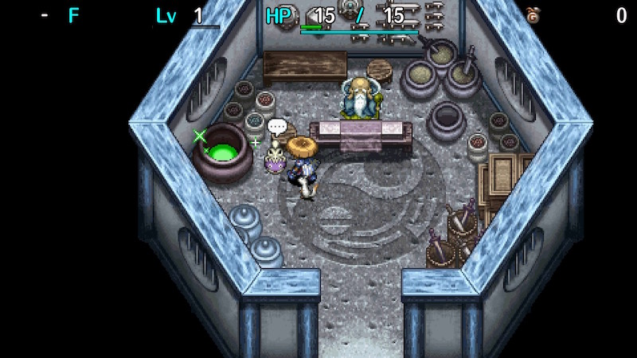
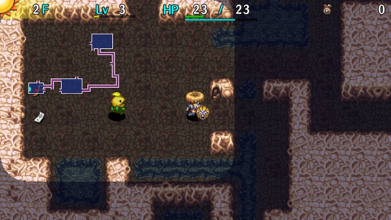
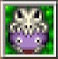

  

Shiren 5's version of the series favorite unidentified items post-game dungeon. 
It's always daytime, the item table features a wide variety of items, and NPCs don't appear. 
The first clear only requires you to reach 50F, and then the full 99F version is unlocked.

It's a standard dungeon, but the variety of strategies that can be used to clear it makes it extremely popular. 
There are many weapon and shield options, and lots of ways to tailor the experience to your playstyle. 
It tests identification, synthesis, Nigiri Morph Factory, collecting arrows, rushing stairs, and other techniques. 
Grinding can be effective, but Wind of Kron and Ominous Auras both occur earlier than in other dungeons.

<ul class="quickLinksUL">
  <li><a href="#overview">Overview</a></li>
  <li><a href="#identifying">Identifying</a></li>
  <li><a href="#equipment">Equipment</a></li>
  <li><a href="#farming">Farming</a></li>
  <li><a href="#floor-guide">Floor Guide</a></li>
  <li><a href="#monsters">Monsters</a></li>
  <li><a href="#items">Items</a></li>
  <li><a href="#traps">Traps</a></li>
  <li><a href="#npcs">NPCs</a></li>
</ul>

# Overview

<table class="dungeonOverview">
  <tr>
    <th>Unlock</th>
    <td class="highlightYellow">Clear the main story.</td>
  </tr>
  <tr>
    <th>Entrance</th>
    <td class="highlightYellow">Hermit's Hermitage (Blacksmith)</td>
  </tr>
</table>

<table class="dungeonTable">
  <tr>
    <th>Floors</th>
    <td>50F (first) / 99F</td>
    <th>Day / Night</th>
    <td>Day</td>
  </tr>
  <tr>
    <th>Bring Items</th>
    <td>No</td>
    <th>Allies</th>
    <td>No</td>
  </tr>
  <tr>
    <th>Unidentified</th>
    <td>All items</td>
    <th>New Items</th>
    <td>No</td>
  </tr>
  <tr>
    <th>Shops</th>
    <td>Regular, Elite, Pick-A-Choice</td>
    <th>Monster Houses</th>
    <td>Regular, Special, Sudden</td>
  </tr>
  <tr>
    <th>Initial Enemies</th>
    <td></td>
    <th>Spawn Rate</th>
    <td>30</td>
  </tr>
  <tr>
    <th>Ominous aura</th>
    <td>Yes (800 turns)</td>
    <th>Wind of Kron</th>
    <td>1st: 1200 / 4th: 1500</td>
  </tr>
  <tr>
    <th>Clear Icon</th>
    <td class="clearIcon"></td>
    <th>Reward</th>
    <td>Onigiri Shield (1st clear)</td>
  </tr>
</table>

 

- A shop is guaranteed to be generated on 10F, 25F, 50F, and 75F.
- Imitation / odd effect items (Dracon Grass, Bankruptcy Scroll, etc.) can appear starting on 18F.

# Identifying

　

See [Identifying Items](/guides/identifying-items) for the basics. Shops appear quite often, so being able to identify by price is also important.

Imitation items like Dracon Grass can appear starting on 18F, 
so some players ignore unidentified items after 17F if they managed to identify the essentials.

#### Trial Method

Identify Scroll or Identify Pot can identify items, and possibilities can be narrowed by checking prices. However, both of the above are unidentified at first, and if you have an inventory full of unidentified items, your run is likely to end if you encounter a tough situation where you need to use an item. Grasses and scrolls are consumed, but staves and talismans remain on hand.

When using unidentified items, there's no way to avoid using a negative effect item. The key is to put yourself in a position that limits how much a negative effect affects you beforehand. ※ Items like Imabikiso and Amnesia Grass can only be found in shops (and Snacky, Maneater) here.

It's not realistic to account for every possible case, but the following are standard precautions:

<table class="dungeonTable">
  <thead>
    <tr>
      <th>Category</th>
      <th>Precaution</th>
      <th>What it watches out for</th>
    </tr>
  </thead>
  <tbody>
    <tr>
      <td rowspan="2">All items</td>
      <td>Use after checking rooms.</td>
      <td>Items that hinder exploring the floor like Muzzled Scroll or Grounded Scroll. You don't want to miss a MH or shop.</td>
    </tr>
    <tr>
      <td>Use after wiping out nearby enemies.</td>
      <td>Items that hinder combat like Sleepy Grass and Swift Foe Scroll.</td>
    </tr>
    <tr>
      <td>Pot, Scroll (Select-type)</td>
      <td>Choose an unneeded item</td>
      <td>There's a chance you'll lose the item. Pot: 4-2-8, Black Hole, fragrance, etc. Scroll: Sale, Onigiri, Curse, etc.</td>
    </tr>
    <tr>
      <td rowspan="2">Staff, Talisman</td>
      <td>Use it on an enemy you can defeat if it happens to level up.</td>
      <td>Glorious Staff, Glorious Talisman</td>
    </tr>
    <tr>
      <td>Use it on a distant and weak enemy.</td>
      <td>Items that put you in a disadvantage like Pinning Staff and Swift Talisman.</td>
    </tr>
  </tbody>
</table>

#### Grass

Grass items are important synthesis ingredients, so avoid using them until Mixer (8-10F) floors. But if you find multiple copies of the same grass, it's fine to think about using one of them. Once you're past Mixer floors, it's generally fine to use grass after exploring the floor. The price range for good synthesis ingredients are 100, 300, and 500.

Unidentified items are auto-identified if synthesis is successful, and Revival Grass is more common, so you tend to miss out and make the adventure harder for yourself if you use grasses early on. It's fine to eat grass that couldn't be synthesized, but don't use 500G grasses on floors where a shop is present, since Rage Grass could easily end your run.

Prices to remember:

<table class="dungeonTable">
  <thead>
    <tr>
      <th>Buy (Sell)</th>
      <th>Grass</th>
    </tr>
  </thead>
  <tbody>
    <tr>
      <td>50 (17)</td>
      <td>Herb or Fine Grass (18F+)</td>
    </tr>
    <tr>
      <td>100 (35)</td>
      <td>Antidote Grass (Anti-Drain), Warp Grass (Anti-Floating), Otogiriso (Uplifting), 1 other.</td>
    </tr>
    <tr>
      <td>200 (70)</td>
      <td>Heal Grass</td>
    </tr>
    <tr>
      <td>300 (105)</td>
      <td>Confusion Grass (Confusing), Blinding Grass (Blinding), Perception Grass (Anti-Cyclops), 6 others.</td>
    </tr>
    <tr>
      <td>500 (175)</td>
      <td>Sleepy Grass (Sedating), Dragon Grass (Anti-Dragon), Life Grass (Energizing), 3 others.</td>
    </tr>
    <tr>
      <td>1000 (350)</td>
      <td>Revival Grass or Gut Grass (18F+)</td>
    </tr>
    <tr>
      <td>1500 (525)</td>
      <td>Undo Grass or Repeat Grass (18F+)</td>
    </tr>
  </tbody>
</table>

Amnesia Grass and Imabikiso can appear in shops from 12F, and SuperUnlucky Seed from 30F. Snacky, Munchy, and Maneaters drop shop table items, so don't let your guard down.

#### Scrolls

Few scrolls can be identified via synthesis, so you tend to use scrolls to identify them. Read unidentified scrolls while standing on the stairs in case it's Muzzled or Grounded, or at the entrance of a room if you want to see if it's a Mnster House Scrl.

Prices to remember:

<table class="dungeonTable">
  <thead>
    <tr>
      <th>Buy (Sell)</th>
      <th>Scroll</th>
    </tr>
  </thead>
  <tbody>
    <tr>
      <td>100 (35)</td>
      <td>Navigation Scroll or Oil Scroll</td>
    </tr>
    <tr>
      <td>200 (70)</td>
      <td>Identify Scroll</td>
    </tr>
    <tr>
      <td>300 (105)</td>
      <td>Collection Scroll</td>
    </tr>
    <tr>
      <td>500 (175)</td>
      <td>(Select-type scrolls)</td>
    </tr>
    <tr>
      <td>800 (280)</td>
      <td>Desert Scroll (Anti-Aquatic), 6 others.</td>
    </tr>
    <tr>
      <td>1000 (350)</td>
      <td>Confusion Scroll, Fixer Scroll, Immunity Scroll, Mnster House Scrl, 6 others.</td>
    </tr>
    <tr>
      <td>3000 (1050)</td>
      <td>Lost Scroll (Bored), 2 others.</td>
    </tr>
  </tbody>
</table>

#### Bracelets

It's fine to equip unidentified bracelets up until 8F since Karakuroids (6-8F) can create Strip Traps, but it's best to wait until you encounter a shop to identify by price from 9F onward. ※ Never equip unidentified bracelets starting on 18F - it could be Itemphobic, Dozer Bracelet, etc.

Prices to remember:

<table class="dungeonTable">
  <thead>
    <tr>
      <th>Buy (Sell)</th>
      <th>Bracelet</th>
    </tr>
  </thead>
  <tbody>
    <tr>
      <td>2000 (700)</td>
      <td>Can. Arm, Inacc., Strength, Bunch</td>
    </tr>
    <tr>
      <td>3000 (1050)</td>
      <td>Mojo, Alert, Cleansing, Anti-Cnf., Anti-Crs., Staunch, 4 others.</td>
    </tr>
    <tr>
      <td>5000 (1750)</td>
      <td>Floor (Before 18F): Alleyway, Blink, Explosion, Nonary Shop (Before 18F): Monster Detector, Item Detector, Heal, Waterwalk On or after 18F: Monsterphobic, Itemphobic, Dozer are also possible. Elite exclusive: Wall Clip</td>
    </tr>
  </tbody>
</table>

The 3000G bracelets are harder to identify, so they're a good candidate for Identify Pots.

#### Pots

Modder's Pot and Fever Pot can't be found on the ground. It's best to insert items other than arrows and talismans to identify pots.

Prices to remember:

<table class="dungeonTable">
  <thead>
    <tr>
      <th>Buy (Sell)</th>
      <th>Pot</th>
    </tr>
  </thead>
  <tbody>
    <tr>
      <td>600~750 (210~262)</td>
      <td>Preservation, Ordinary, Identify, Hide, 4-2-8</td>
    </tr>
    <tr>
      <td>1000~1250 (350~437)</td>
      <td>Sale, Presto, Sticky, Unbreakable Floor exclusive: Black Hole Shop exclusive: Fever</td>
    </tr>
    <tr>
      <td>1600~2000 (560~700)</td>
      <td>Exorcism, Blessing, Curse</td>
    </tr>
    <tr>
      <td>2500~3125 (875~1093)</td>
      <td>Zen, Dodger, Reflection, Perceptive</td>
    </tr>
    <tr>
      <td>3500~4375 (1225~1531)</td>
      <td>Heal, Hilarious, Monster, Zalokleft, Klein</td>
    </tr>
    <tr>
      <td>6000~7500 (2100~2625)</td>
      <td>Synthesis (always 5 capacity), Modder's (shops 18F+)</td>
    </tr>
  </tbody>
</table>

# Equipment

　

See [Rune Details](/system/synthesis-runes#rune-details) to get an idea of synthesis priority.

Monster Detector, Wall Clip Bracelet, and Heal Bracelet are the 3 "sacred treasures" of the dungeon, but Wall Clip Bracelet is exclusively found in elite shops, so you're unlikely to obtain it. Therefore, equipment sets that activate 2 bracelet resonance aren't a high priority. Instead, the ideal pairing is any weapon that gains ∞ rune slots at Lv8 + Day Shield.

#### Weapon

Best: Bladite, Dotanuki, Dirk of Debts (Only use if you steal from shops) Good: Red Blade, Beast Fang, Baffle Axe, Water Cutter, Scythe, Drain Dagger Decent: Myopic Masher, Lizard Lasher, Blurry Stick

#### Shield

Best: Day Shield, Binary Shield, Pauper's Plank (Only use if you steal from shops) Good: Red Shield, Targite Decent: Beast Shield

Some shields are nice to level as synthesis ingredients thanks to their added runes.

- Plain Targe
    - Gains CR Diet at Lv8.
- Binary Shield
    - Gains Magi-Twister at Lv6.
- Red Shield
    - Gains Anti-Fire and Anti-Peck at Lv8.

#### Bracelets

Best: Monster Detector (Monsterphobic), Heal, Wall Clip, Identify, Alert Good: Item Detector (Itemphobic), Mojo, Anti-Crs., Cleansing, Inacc., Can. Arm Decent: Anti-Cnf., Waterwalk, Blink, Explosion, Staunch, Strength

# Farming

　

#### Grass Kid Hunting

##### Grass Kids (3-5F)

Hunt Grass Kids between 3\~5F for grass items. 
This lets you collect synthesis ingredients and identify quite a few grasses. 
However, you'll want to save some food for Mixer floors, so don't overdo it. 
The spawn rate for Grass Kids from highest to lowest is 5F > 4F > 3F.

##### Grass Factory

Level up a Grass Kid into a Grass Poppa, then have it repeatedly throw grass at you. 
※ Don't bother performing this technique in Primordial Chasm.

#### Collect Arrows

##### Karakuroid Monsters

Have Karakuroids create arrow traps, then throw rocks or items onto the trap to collect arrows. 
Wood Arrow (1-10F) and Iron Arrow (6-15F) traps only appear near the beginning, and Poison Arrow Trap (1-50F) no longer appears starting on 51F.

- 6\~8F - Karakuroid
- 22\~23F - Steamroid
- 48\~50F - Electroid

##### Dodger Pot

Use a Dodger Pot on a floor where Boy Cart or Porky appears, then collect arrows or Porky Rocks. Level up the Boy Cart before using the Dodger Pot, and keep in mind your projectiles miss too. One use can result in hundreds of arrows, giving your run a significant push toward success. It can be handy to know that Pop Tank turns into a Pierce Cart when leveled down. It's best to create a Strong Cart to collect Knockback Arrows.

- 19\~20F - Boy Cart
- 28\~29F - Cross Cart
- 51\~52F - Strong Cart

#### Nigiri Morph Factory

Have a Nigiri Morph transform unneeded items into Large Onigiri. 
Increase max fullness to at least 120 to help with maintaining Super status, though 200 is best. 
This can be done on any floor where a Nigiri Baby monster appears, but the standard floor range is either 22\~23F (Nigiri Morph) or 6\~8F (level up a Nigiri Baby and lower its attack power).

- 6\~8F - Nigiri Baby
- 22\~23F - Nigiri Morph
- 44\~45F - Nigiri Boss

#### Rotten Onigiri

Have a Karakuroid create a Decay Trap, then use projectiles at monsters who are standing on the trap to turn them into Rotten Onigiri, then get hit by fire or explosion damage to grill the onigiri. Projectile accuracy is 84%, so it can be done without Inacc. Bracelet or Killer Arrows. Karakuroid and Pop Tank overlap on 8F, making it the ideal floor for this technique.

- 6\~8F - Karakuroid
- 22\~23F - Steamroid
- 48\~50F - Electroid
- 72\~74F - Cyberoid

#### Super Status

The idea is to create a situation where you can safely defeat lots of enemies to trigger Super status. 
Mudkins spawn on 12F and water tiles are common, so position them on a water tile if available and punch them to have them duplicate and restore HP at the same time.

#### FO-UZZ for Revival Grass

FO-UZZ (72\~73F) drops 1\~3 Revival Grass when defeated. 
It's easiest on 73F, since you can paralyze it and then have a Detonachin explode to one-shot it. Another method is to inflict Sealed status and use arrows from a distance.

#### Maneater Hunting

Defeat Maneaters using direct attacks to quickly level up equipment. It's possible to reach Lv8 on 1 floor with Tinkerer status from a blessed Upgrade Seed or Super status. Maneaters have a 31% item drop rate, and always drop a shop table item which are often higher quality. However, beware of grass item drops, since the shop table includes Imabikiso and Amnesia Grass. The standard floors to perform this technique are around 14F, 22F, or 33F.

They have very high attack power, inflict Paralyzed status by roaring, and ignore Sanctuary Scroll. Maneaters act once per turn, but change to Swift 1 when Shiren is in view, so Slow status is pointless. Therefore, you need to create a situation where you don't get hit, or can withstand its attacks.

If you see a Snacky on 14F, trap it in the corner of a room using Fort. Staff or paralyzed monsters to safely hunt Maneaters without having to use any other items. (Stairs room is ideal) This can also be done on 15F, but Foly can defeat the Snacky using lightning if left unparalyzed.

The following items help:

- Blessed Peach or Immunity Scroll
    - Makes you immune to Paralyzed status inflicted by roars.
- Blessed Upgrade Seed
    - Grants Tinkerer status for the duration of the floor - not needed if you have it from Super status.
- Monster Detector or Navigation Scroll
    - Weaken or disable Maneaters from within hallways if you don't have Immune status.
- Hard Peach
    - Grants Bolstered status, reducing the amount of damage you receive.
    - Eat 3~4 of them to be able to trade hits, and it's even better if you have a Day Shield.
- Poison Arrow
    - Lower Maneater's attack power by shooting multiple arrows.
- Fort. Staff + Tri-direction
    - Create a barricade using Fort. Staff, then attack through corners and defeat Maneaters risk-free.
    - A Paralyzed monster can be used instead of a Fort. Staff, but be careful not to hit it.
- Clone Staff, Conf. Talisman, Blinding Grass, Fear Scroll, etc.
    - Ailments only last 1/2 the normal duration when Maneater is Swift 1 from Shiren being in view, so short duration statuses like Sleep, Laughing, and Inaccurate aren't effective.
    - Maneaters return to regular speed when Blind, since they lose sight of Shiren.
- Inacc. Bracelet or Dodger Pot or Killer Arrow
    - Throw an item or shoot an arrow while a Maneater is standing on a trap to defeat it safely. Steamroids overlap with Ominous Aura on 22F, making it the ideal floor for this method.
    - Sleep Trap is the best option, but Spin or Blind can be used as well. Hunger and Strip only lower stats by 1 stage, so they're not particularly effective.
    - Swift Maneater movement is unpredictable since they can spend turns roaring instead of moving, so it can be tricky to position them on a trap, and there's a pretty high risk of getting hit.

#### Zalokleft Hunting

Hunt Zalokleft monsters for item drops.

- 17\~18F - Zalokleft
- 21\~23F - Green Zalokleft
- 59\~60F - Iron Zalokleft
- 87\~89F - Zalokleft King

# Floor Guide

This section is mostly written with the 2nd clear in mind - Some techniques are overkill for the 1st clear. The monster list under floor ranges lists notable monsters, not necessarily all monsters.

## Early Game (1-21F)

　

Floor range where the focus is on identifying and synthesizing items. 
Key monsters appear one after the next, including Grass Kids (3-5F), Karakuroids (6-8F), Mixers (8-10F). 10F is the most important early game floor, since a guaranteed shop overlaps with Mixers. ※ If you find a second Identify Scroll, save it for the shop on 10F instead of reading it.

### 1-5F

<table class="dungeonTable">
  <tr>
    <td>Pit Mamel (3-5F), Grass Kid (3-5F), Blade Bee (3-5F)</td>
  </tr>
</table>

Generally check every room for items, then advance to the next floor. There isn't a whole lot you can do yet, but there are a few things to watch for.

- Step on Gitan and swap it with an inventory item instead of picking it up. 
    - Can be thrown to one-shot Gitan Mamel or Grass Kid.
    - Froggos can't steal from you if you stay at 0 Gitan.
    - It's not a complete waste if an unidentified scroll was Fixer Scroll.

- Use staves and talismans to identify them soon after picking them up. 
    - These categories remain in your inventory even after you use them once to identify them.
    - Pit Mamel is the best target, since level changes are visible and higher levels are easy to defeat.

- Level up a Pit Mamel (3\~5F) and defeat it to gain lots of experience points. 
    - Use Glorious Staff, Glorious Talisman, Fear Scroll, Clone Staff, Rage Grass, etc. to create a Gitan Mamel, then defeat it by throwing a bag of Gitan or a Rock to gain lots of experience points.
    - Projectiles can miss, so it's best to keep some distance or use a staff.
    - Save 1 Glorious Staff or Glorious Talisman use for Nigiri Baby on 6F to perform Nigiri Morph Factory.

- Hunt Grass Kids (3\~5F) for grass items. 
    - Grass Kids always drop grass, so hunt them to help with identification and synthesis.
    - Throw 280+ Gitan to one-shot it, or use arrows and rocks in a hallway to ensure you get the grass.
    - If you have extra food, it's worth lingering until the wind blows. (Spawn rates are 5F > 4F > 3F)

### 6-7F

<table class="dungeonTable">
  <tr>
    <td>Karakuroid (6-8F), Froggo (6-7F), Nigiri Baby (6-8F), Tiger Tosser (7-10F)</td>
  </tr>
</table>

6F is great for collecting arrows and performing Nigiri Morph Factory. 
Test unidentified pots with 2\~4 capacity on 6F in case it's a Dodger Pot, which lets you trap monsters. Perceptive Pot is also nice, since you can hunt Froggos without losing Gitan. Don't read unidentified scrolls - Grounded or Muzzled scroll can instantly ruin your plans.

##### Karakuroid (6-8F)

Have Karakuroid create arrow traps and other useful traps. Use Hard Peach, Poison Arrow, Slow Staff, or Slow Talisman for safety if desired.

|Trap|Use|
|-|-|
|Wood Arrow Iron Arrow Poison Arrow|Collect arrows by throwing rocks or items. (Thrown items travel 10 tiles) 1 Iron Arrow is needed to synthesize the Anti-Metal weapon rune.|
|Strip|Check if your weapons, shields, and bracelets are cursed.|
|Decay|Lure a monster onto the trap, then shoot an arrow. If the arrow misses, the monster will turn into a Rotten Onigiri. Rotten Onigiri can be grilled using a Pop Tank on 8F.|
|Explosion|Can be used to grill Rotten Onigiri.|
|Spin, Sleep|Check for Anti-Cnf. Bracelet and Alert Bracelet.|
|Curse|Change a curse to a seal to unequip a cursed item. (Drop all other items first) Curse items to boost Mojo Bracelet's critical hit chance. Seal a Shoddy Dirk or Shoddy Plank to use early game.|
|Hunger|Lure a monster onto it and trigger it to reduce the monster's attack power.|

##### Froggo (6-7F)

Froggo sits on Gitan, so it can be used as a stationary target when leveling up a different monster. It can also be used to block a room entrance to ensure safety while performing Nigiri Morph Factory. Of course, it's good to hunt Froggos to earn Gitan for the upcoming guaranteed shop on 10F too.

##### Nigiri Morph Factory (6-8F)

Optional - Perform Nigiri Morph Factory on 6F. Use Glorious Staff, Berserker Tal., Clone Staff or such to create a Nigiri Morph, then make Large Onigiri. Aim for at least 120+ max fullness and 4~5 Large Onigiri if you take the time to perform this technique. Weaken Nigiri Morph using Poison Arrows or Hunger or Strip traps - 6F is best to avoid Tiger Tossers.

### 8-10F

<table class="dungeonTable">
  <tr>
    <td>Karakuroid (6-8F), Tiger Tosser (7-10F), Curse Girl (8-9F), Mixer (8-10F), Pop Tank (8-10F), Fearabbit (8-9F)</td>
  </tr>
</table>

Mixer Zone and Guaranteed shop on 10F - Identify items by price, then synthesize using Mixers. If you have an Identify Scroll, give it to the Shopkeeper to have them identify all merchandise. Expect any onigiri that are outside of pots to become grilled due to Pop Tanks.

##### Mixer (8-10F)

Mixers eat and synthesize up to 2 thrown items - Ingredients get auto-identified if successful. Prioritize already identified items on 8-9F to free up inventory space, and weapon + grass on 10F. ※ Mixers have high attack power after eating items, so be careful.

Grass:

|Price|Runes|
|-|-|
|100 (35)|Warp Grass (Anti-Floating), Antidote Grass (Anti-Drain), Otogiriso (Uplifting)|
|300 (105)|Blinding Grass (Blinding), Confusion Grass (Confusing), Perception Grass (Anti-Cyclops)|
|500 (175)|Sleepy Grass (Sedating), Dragon Grass (Anti-Dragon), Life Grass (Energizing)|
|2000 (700)|Cheery Grass (Enhancing), Unlucky Seed (Stupefying)|

Scroll:

|Price|Runes|
|-|-|
|800 (280)|Desert Scroll (Anti-Aquatic)|
|3000 (1050)|Lost Scroll (Bored)|

### 11-21F

<table class="dungeonTable">
  <tr>
    <td>Mutaikon (11-12F), Snacky (13-15F), Bored Kappa (15-17F), Foly (15-17F), Dagger Bee (16-18F), Zalokleft (17-18F), Scoopie (17-19F), Boy Cart (19-20F), Grass Dude (20-22F), Green Zalokleft (21-23F)</td>
  </tr>
</table>

 Lava between 16-20F , dangerous items like Bankruptcy Scroll can appear from 18F+. Itemphobic is usually cursed when generated, so don't equip unidentified bracelets. ※ Lava tiles are never generated in the stairs room.

##### Mutaikon (11-12F)

If you have a Cleansing Bracelet, have Mutaikon throw Poison Grass at you to replenish fullness.

##### Snacky (13-15F)

Always drops a shop table item when defeated - Linger and hunt these if possible. Beware of grasses dropped by Snacky, since it could be Amnesia Grass or Imabikiso.

##### Bored Kappa (15-17F)

Items thrown by Lv1 Bored Kappas always miss, but if there's a trap underfoot, the trap will activate.

##### Foly (15-17F)

Avoid large rooms - Only 1 Foly can spawn at a time, so paralyze it to make it a non-issue.

##### Dagger Bee (16-18F)

High attack and HP, but provides 100 skill points when defeated - Nice for leveling equipment. If you have the Tinkerer effect from Super status, linger as long as possible.

##### Zalokleft (17-18F) / Green Zalokleft (21-23F)

Always drops a Zalokleft table item when defeated - Note that it never drops food.

##### Scoopie (17-19F)

Fills an open pot with dirt when adjacent - Beware if you have fragrance pots like Dodger Pot. Some players drop important pots in the stairs room or a hallway, but that can be risky too.

##### Boy Cart (19-20F)

Level it up and collect Iron Arrows or Knockback Arrows if you have a Dodger Pot.

##### Grass Dude (20-22F)

Another chance to collect synthesis ingredients and HP restoring grasses.

## Mid Game (22-51F)

　

This is usually the point where novice wanderers begin to struggle. Power types that require strategies besides trading hits (unless you have a Day Shield) appear, along with monsters with more problematic special attacks and abilities.

22F provides a huge chance to farm items and enemies in particular:

- Nigiri Morph - Large Onigiri
- Green Zalokleft - Drops a Z table item
- Steamroid - Creates useful traps
- Grass Dude - Drops grass
- Villeater - Skill points

Linger as long as possible to prepare for the guaranteed shop on 25F and Mixermons on 31-33F. It's tedious, but if you have Super status, check for traps and you'll have a much smoother time.

### 22-30F

<table class="dungeonTable">
  <tr>
    <td>Grass Dude (20-22F), Green Zalokleft (21-23F), Nigiri Morph (22-23F), Steamroid (22-23F), Villeater (20-25F), Grampa Tank (23-24F), Gyadon (23-24F), Absorbiphant (23-25F), Hipadile (25-27F), Spadie (26-28F), Muddy (26-28F), Explochin (27-29F), Cross Cart (28-29F), Kappa Pest (28-30F), Scarabbit (29-30F), MC Mage (29-31F)</td>
  </tr>
</table>

Guaranteed shop on 25F - Sell unidentified items and give the Shopkeeper an Identify Scroll to identify them. 500G scrolls and 3,000G bracelets are good to identify in particular at this point.

##### Steamroid (22-23F)

Arrow traps besides Poison Arrow Trap can't be generated on these floors, so not as useful as early game. However, if you have an Inacc. Bracelet, you can use Sleep Trap or such to safely hunt Villeaters.

##### Nigiri Morph (22-23F)

Its special attack that turns an item into a Large Onigiri can be useful as long as it's done on your terms. Shoot arrows before it becomes adjacent if you want to avoid its special attack.

##### Gyadon (23-24F)

Only pecks staves - Keep staves inside pots and they'll be safe.

##### Absorbiphant (23-25F)

If you have status inflicting runes, you might need to shoot an arrow or punch without a weapon to weaken it before finishing it off with your weapon to avoid the Absorbiphant powering up.

##### Pandanigiri (23-24F) / Hipadile (25-27F) / Punisher (25-27F)

Pandanigiri (40 atk), Hipadile (48 atk), and Punisher (42 atk) are "power type" monsters for these floors. They hit hard, and you'll be worn down if you trade hits - Use arrows to soften them and avoid damage. Comparison: Eligan on 19-21F (32 atk), Poofy on 22-24F (27 atk), Sr. Yanpii on 26-28F (33 atk).

##### Spadie (26-28F)

Higher special attack use rate than Scoopie, but still only uses its special when adjacent. This time there isn't lava, so it's safer to place pots on the ground aside from Kappa Pests on 28F.

##### Muddy (26-28F)

Unequip items that lack Rustproof, but be careful of your surroundings. If you keep 2 slots open in a Preservation Pot, you can insert both your weapon and shield at once.

##### Explochin (27-29F)

Similar to Absorbiphants, pay attention to how much damage you deal with a weapon. 50\~61 damage makes it explode, and 35\~49 damage makes it turn red and stop moving.

##### Cross Cart (28-29F)

Collect Iron Arrows or level it up for Knockback Arrows if you have a Dodger Pot. Probably better to do this on 28F instead of 29F to avoid MC Mage (29-31F).

##### Kappa Pest (28-30F)

Items thrown by Kappa Pests can hit you, so leave some room open in pots. Kappa Pests become a non-issue if you use a Dodger Pot to collect arrows from Cross Cart.

##### MC Mage (29-31F)

Magic bullet effects include Blind, Confused, Transient, and 20 damage. Easy to lose Super status if you get hit, so consider rushing to the stairs on 29F and 30F.

### 31-33F

<table class="dungeonTable">
  <tr>
    <td>N'twyn (30-32F), Mixermon (31-33F), Dragon (31-33F), Death Gyaza (31-33F), Katana Bee (31-33F), Villeater (33-38F)</td>
  </tr>
</table>

Mixermon Zone - 32-33F is also a great floor range to level up your weapon and shield. Mixermons have a high spawn rate, so you should have plenty of synthesis opportunities.

Best shield runes (prioritize runes in blue if you have limited slots):

<table class="dungeonTable">
  <thead>
    <tr>
      <th>Rune</th>
      <th>Ingredients</th>
    </tr>
  </thead>
  <tbody>
    <tr>
      <td>Anti-Blast※</td>
      <td>Immunity Scroll + Fort. Staff + Explosion Bracelet (Requires a Stomach Expander or Mixergon)</td>
    </tr>
    <tr>
      <td>Anti-Blast</td>
      <td>Blast Shield (Skip if you have Anti-Blast※)</td>
    </tr>
    <tr>
      <td>Magi-Twister</td>
      <td>Swap Shield or Binary Shield (Lv6)</td>
    </tr>
    <tr>
      <td>Anti-Fire</td>
      <td>Dragon Grass or Snake Shield or Red Shield (Lv8)</td>
    </tr>
    <tr>
      <td>Anti-Hypno</td>
      <td>Anti-Gaze Trge</td>
    </tr>
    <tr>
      <td>Anti-Peck</td>
      <td>Gyadon Blocker or Red Shield (Lv8)</td>
    </tr>
    <tr>
      <td>Anti-Theft</td>
      <td>Lock Shield or Targite (Lv8)</td>
    </tr>
    <tr>
      <td>CR Diet</td>
      <td>Diet Shield or Plain Targe (Lv8)</td>
    </tr>
    <tr>
      <td>Bit</td>
      <td>Binary Shield</td>
    </tr>
    <tr>
      <td>Agile</td>
      <td>Perception Grass x 2 or Spry Shield</td>
    </tr>
    <tr>
      <td>Rustproof</td>
      <td>Gold Shield or Plating Scroll</td>
    </tr>
    <tr>
      <td>Costly</td>
      <td>Pauper's Plank (Only use if you steal from shops)</td>
    </tr>
  </tbody>
</table>

※ Diurnal isn't listed because you should use Day Shield as a main shield if you find it.

### 34-38F

<table class="dungeonTable">
  <tr>
    <td>Dazikon (34-35F), Cave Mamel (35-36F), VeniScorp (35-37F), Grass Poppa (36-38F), MC Wizard (37-38F)</td>
  </tr>
</table>

##### Dazikon (34-35F)

Anti-Cnf. Bracelet (or Cleansing Bracelet) protects against its special attack. You can shoot arrows, throw items, and swing staves like normal even while confused.

##### Cave Mamel (35-36F)

Use items like Rock, Seal Staff, or Knockback Arrow + direct attack to defeat it without taking damage. It has 60 attack, so whatever you do, don't trade hits with it.

##### Grass Poppa (36-38F)

Generates its own grass as turns elapse, so it's possible to reuse the same Grass Poppa for stat gains. They have 74 HP and 49 attack, so be careful if you hunt them - Water Pot lowers their attack power. Grass Poppa = 210 skill points, Pin Poppa = 70 skill points.

##### MC Wizard (37-38F)

Magic bullet effects include Level -1, Sealed, Paralyzed, Cloned (Confused), and Berserk. Use Reflection Pot if you have one, and keep Anti-Cnf. Bracelet equipped if you have one. Consider using an Immunity Scroll or blessed Peach if you want to hunt Grass Poppas on 37-38F. Otherwise, if you lack items to deal with MC Wizards, rush to the stairs.

### 39-43F

<table class="dungeonTable">
  <tr>
    <td>Sparkbird (39-40F), Spicy Nut (40-49F), Huistdon (38-41F), Sky Dragon (41-43F), Steelhead (41-43F), Nashagga (43-45F)</td>
  </tr>
</table>

Mostly monsters who lack special attacks and provide lots of skill points. If you have Super status and are able to hunt enemies without issues, linger to level equipment. Sky Dragon's flame deals 20 damage from anywhere in the room. Nashagga can deal upwards of \~100 damage, so don't get hit by its attacks.

### 44-49F

<table class="dungeonTable">
  <tr>
    <td>Nashagga (43-45F), Nigiri Boss (44-45F), Ornery Tank (47-49F), Trowelie (47-49F), Super Gazer (47-49F), Porkon (49-50F)</td>
  </tr>
</table>

Rush stairs - Lots of monsters with dangerous special attacks. However, 46F is relatively safe, so some players like to linger and hunt Munchy for items there.

##### Ornery Tank (47-49F)

Deals 40 damage per cannonball, Swift 1 action speed. If you're aiming for the first clear, go ahead and use Zen Pot here instead of saving it. That said, you might want to use Dodger Pot instead to shut down Trowelie and Porkon. ※ Save 1 Dodger Pot use for Strong Carts on 51F.

### 50-51F

<table class="dungeonTable">
  <tr>
    <td>Porkon (49-50F), Electroid (49-50F), Mixergon (50-51F), Strong Cart (51-52F), Jouncy (51-54F), Debaser (51-54F)</td>
  </tr>
</table>

Mixergon Zone and Guaranteed shop on 50F - Finalize your weapon and shield here. If you're low on food, have an Electroid create a Decay Trap and use it to obtain Rotten Onigiri. After this floor range, players are generally mostly going to be rushing stairs until the end.

##### Strong Cart (51-52F)

If you have a Dodger Pot, collect a few stacks of Knockback Arrows on 51F. (MC Sorceror spawns on 52F) Collecting Knockback Arrows here is one of the best ways to increase consistency for the 2nd half.

## Late Game (52-99F)

　

Monsters with very powerful special attacks which require counters appear. There's a guaranteed shop on 75F, and Stairs? Traps can be generated between 91-99F. You'll generally want to rush stairs to conserve items at this point instead of trying to farm anything.

### 52-54F

<table class="dungeonTable">
  <tr>
    <td>Vexing Kappa (52-53F), MC Sorceror (52-54F), Jouncy (51-54F), Mudster (53-54F), StunScorp (54-55F)</td>
  </tr>
</table>

Rush stairs.

##### MC Sorceror (52-54F)

Magic bullet effects include Empathy, Onigiri, Slow, Level -3, and reduce HP to 1/4 of current HP. Immunity Scroll can't block the level down or 1/4 HP effects.

##### Mudster (53-54F)

It has 77 HP and can erase runes, including Rustproof. Inflict Sealed status before hitting it, since it can multiply when it receives damage.

### 55F

<table class="dungeonTable">
  <tr>
    <td>Pyrepuff (54-55F), StunScorp (54-55F), Tiger Chucker (55-56F)</td>
  </tr>
</table>

The calm before the Horrabbit storm, though there's no reason to linger despite the easier monster table. Equip a Steady Shield if you have one on hand, then descend the stairs.

### 56-58F

<table class="dungeonTable">
  <tr>
    <td>Horrabbit (56-58F), Curspinster (56-58F), Pierce Cart (56-58F), Spongiderm (57-59F), Lashagga (58-60F)</td>
  </tr>
</table>

Rush stairs.

Keep Steady Shield equipped while searching for the stairs if you have one on hand. If you don't have one, use Black Hole Pot to skip floors or Transient Staff to quickly locate the stairs. Recommended to eat a Juicy Peach on 58F if you don't have a Steady Shield.

### 59-60F

<table class="dungeonTable">
  <tr>
    <td>Spongiderm (57-59F), Lashagga (58-60F), Iron Zalokleft (59-60F), Item Knave (59-60F), Gyandora (59-60F)</td>
  </tr>
</table>

Iron Zaloklefts appear so it might look like a farming floor range, but don't bother.

### 61-65F

<table class="dungeonTable">
  <tr>
    <td>Flarebird (61-63F), Grass Gramps (61-62F), Sensei (62-64F), Bouncy (63-66F), Spirit Ham (63-65F), Hyper Gazer (65-67F)</td>
  </tr>
</table>

It's possible to hunt Grass Gramps for grass, but be warned that it has 94 HP and 80 attack. Flarebirds (54 HP) can be a problem if you don't have high enough attack power to one-shot them. Archdragons and Dozikons are up next, so consider having Bouncy warp you on 65F to skip floors.

### 66-68F

<table class="dungeonTable">
  <tr>
    <td>Bouncy (63-66F), Hyper Gazer (65-67F), Archdragon (66-68F), Dozikon (67-68F), Phoenix Tengu (66-68F)</td>
  </tr>
</table>

Rush stairs - But if you have both Zen Pot + Alert Bracelet, you can farm Archdragons using Sleepy Grass.

##### Archdragon (66-68F)

It can breathe fire (30 damage) from anywhere on the floor. Zen Pot protects against its flame, but it's still formidable at 92 HP, 82 attack, and 30 defense.

##### Dozikon (67-68F)

Throws Sleepy Grass → Poison Grass if you're already asleep. Keep Alert Bracelet (or Cleansing Bracelet) equipped if you have one on hand.

### 69-73F

<table class="dungeonTable">
  <tr>
    <td>N'dup (70-73), Mudder (69-72F), Mixerdon (70-71F), FO-UZZ (72-73F), Cyberoid (72-74F), Cursenior (73-75F)</td>
  </tr>
</table>

FO-UZZ Zone - Nice chance to obtain Revival Grass. FO-UZZ has 6 HP and 80 attack, so be careful if you decide to seal it to make it easier to hunt. Mudder turns invisible on water tiles unless you have a Monster Detector equipped. N'dup appears between 70-73F, so organize the items you find appropriately, or skip picking up items.

### 74-78F

<table class="dungeonTable">
  <tr>
    <td>Cursenior (73-75F), Shovelie (74-75F), Porgon (74-77F), Knave King (75-76F), Terrabbit (77-78F), Squidperor (78-79F)</td>
  </tr>
</table>

Rush stairs - (Guaranteed shop on 75F) It's fine to stop by the shop if you have a Dodger Pot, but otherwise consider the risk of Porgons. Terrabbit appears with Squidperor on 78F, so beware of the attraction → blind combo. Read an Immunity Scroll or eat a blessed Peach at the start of the floor for safety.

### 80-82F

<table class="dungeonTable">
  <tr>
    <td>Gitan Mamel (80-82F), Kappa Troll (80-81F), Kleptoad (80-82F), Osmammoth (80-84F), Doomhead (81-83F)</td>
  </tr>
</table>

Pick up Gitan dropped by Gitan Mamels and Kleptoads if you want to avoid getting hit by flying Gitan. Dodger Pot is a bad idea - It makes you unable to one-shot Gitan Mamels using rocks.

### 83-89F

<table class="dungeonTable">
  <tr>
    <td>Blazebird (84-87F), Tiger Ace (84-86F), Nigiri King (85-88F), Zalokleft King (87-89F), Ultra Gazer (88-93F)</td>
  </tr>
</table>

Use an item if you become adjacent to Nigiri King - Don't give it a chance to act. Tiger Ace can potentially toss a Nigiri King, who can then turn you into an Onigiri on the same turn. If you're low on items and have the Anti-Theft rune, hunt Zalokleft Kings for drops on 87F.

##### Ultra Gazer (88-93F)

Ultra Gazer (93 HP) can hypnotize you from anywhere in the room. If you don't have the Anti-Hypno rune, use items like Immunity Scroll or blessed Peach. Reflection Pot and Extinction Scroll are also effective counters.

### 90-99F

<table class="dungeonTable">
  <tr>
    <td>Ultra Gazer (88-93F), Swordmaster (90-92F), Cranky Tank (93-96F), Abyss Dragon (95-99F), Despoiler (89-99F)</td>
  </tr>
</table>

Rush stairs - But remember that Stairs? Traps appear between 91-99F. Zen Pot protects against Cranky Tank's cannonballs (50 damage) + Abyss Dragon's flame (40 damage). If you don't have a Zen Pot, use Navigation Scroll or Monster Detector + Transient Staff to locate stairs.

If you synthesized the Anti-Blast※ rune earlier, Cranky Tanks can be used to defeat other enemies. If you then throw an Extinction Scroll at Abyss Dragon, it's pretty much a guaranteed clear.

# Monsters

See [Monsters](/system/monsters) for individual monster details.

- F = Shop is guaranteed
- N = N'dubba Lv1 Lv2 Lv3 Lv4
- M = Maneater Lv1 Lv2 Lv3 Lv4

Numbers in brackets are HP values. Enemy Colors: Day Farming Useful Destroys Items Dangerous Very Dangerous

<table class="monsterTable">
  <thead>
    <tr>
      <th>F</th>
      <th colspan="5">Monsters</th>
      <th>N</th>
      <th>M</th>
    </tr>
  </thead>
  <tbody>
    <tr>
      <td>1</td>
      <td class="monsterDay">Mamel [5]</td>
      <td class="monsterDay">Seedie [7]</td>
      <td class="monsterDay">Sproutant [5]</td>
      <td class="highlightGray"></td>
      <td class="highlightGray"></td>
      <td class="highlightGray"></td>
      <td class="highlightGray"></td>
    </tr>
    <tr>
      <td colspan="10" class="monsterDivider"></td>
    </tr>
    <tr>
      <td>2</td>
      <td class="monsterDay">Mamel [5]</td>
      <td class="monsterDay">Seedie [7]</td>
      <td class="monsterDay">Sproutant [5]</td>
      <td class="monsterDay">Colum [7]</td>
      <td class="highlightGray"></td>
      <td class="highlightGray"></td>
      <td class="highlightGray"></td>
    </tr>
    <tr>
      <td colspan="10" class="monsterDivider"></td>
    </tr>
    <tr>
      <td rowspan="2">3</td>
      <td class="monsterDay usefulDay">Pit Mamel [11]</td>
      <td class="monsterDay farmingDay">Grass Kid [28]</td>
      <td class="monsterDay">Sproutant [5]</td>
      <td class="monsterDay">Colum [7]</td>
      <td class="monsterDay">Blade Bee [28]</td>
      <td rowspan="2" class="highlightGray"></td>
      <td rowspan="2" class="highlightGray"></td>
    </tr>
    <tr>
      <td class="highlightGray"></td>
      <td class="monsterDay">Pin Kid [28]</td>
      <td class="monsterDay">Chintala [19]</td>
      <td class="highlightGray"></td>
      <td class="highlightGray"></td>
    </tr>
    <tr>
      <td colspan="10" class="monsterDivider"></td>
    </tr>
    <tr>
      <td rowspan="2">4</td>
      <td class="monsterDay usefulDay">Pit Mamel [11]</td>
      <td class="monsterDay farmingDay">Grass Kid [28]</td>
      <td class="monsterDay">Chintala [19]</td>
      <td class="monsterDay">Sweet Nut [16]</td>
      <td class="monsterDay">Blade Bee [28]</td>
      <td rowspan="2" class="highlightGray"></td>
      <td rowspan="2" class="highlightGray"></td>
    </tr>
    <tr>
      <td class="highlightGray"></td>
      <td class="monsterDay">Pin Kid [28]</td>
      <td class="highlightGray"></td>
      <td class="highlightGray"></td>
      <td class="highlightGray"></td>
    </tr>
    <tr>
      <td colspan="10" class="monsterDivider"></td>
    </tr>
    <tr>
      <td rowspan="2">5</td>
      <td class="monsterDay usefulDay">Pit Mamel [11]</td>
      <td class="monsterDay farmingDay">Grass Kid [28]</td>
      <td class="monsterDay">Chintala [19]</td>
      <td class="monsterDay">Sweet Nut [16]</td>
      <td class="monsterDay">Blade Bee [28]</td>
      <td rowspan="2" class="highlightGray"></td>
      <td rowspan="2" class="highlightGray"></td>
    </tr>
    <tr>
      <td class="highlightGray"></td>
      <td class="monsterDay">Pin Kid [28]</td>
      <td class="highlightGray"></td>
      <td class="highlightGray"></td>
      <td class="highlightGray"></td>
    </tr>
    <tr>
      <td colspan="10" class="monsterDivider"></td>
    </tr>
    <tr>
      <td>6</td>
      <td class="monsterDay">Nigiri Baby [23]</td>
      <td class="monsterDay">Moseal [60]</td>
      <td class="monsterDay usefulDay">Karakuroid [32]</td>
      <td class="monsterDay farmingDay">Froggo [23]</td>
      <td class="highlightGray"></td>
      <td class="highlightGray"></td>
      <td class="highlightGray"></td>
    </tr>
    <tr>
      <td colspan="10" class="monsterDivider"></td>
    </tr>
    <tr>
      <td>7</td>
      <td class="monsterDay">Nigiri Baby [23]</td>
      <td class="monsterDay">Moseal [60]</td>
      <td class="monsterDay usefulDay">Karakuroid [32]</td>
      <td class="monsterDay farmingDay">Froggo [23]</td>
      <td class="monsterDay">Tiger Tosser [32]</td>
      <td class="highlightGray"></td>
      <td class="highlightGray"></td>
    </tr>
    <tr>
      <td colspan="10" class="monsterDivider"></td>
    </tr>
    <tr>
      <td rowspan="2">8</td>
      <td class="monsterDay">Nigiri Baby [23]</td>
      <td class="monsterDay">Moseal [60]</td>
      <td class="monsterDay usefulDay">Karakuroid [32]</td>
      <td class="monsterDay itemDay">Curse Girl [20]</td>
      <td class="monsterDay">Tiger Tosser [32]</td>
      <td rowspan="2" class="highlightGray"></td>
      <td rowspan="2" class="highlightGray"></td>
    </tr>
    <tr>
      <td class="highlightGray"></td>
      <td class="monsterDay usefulDay">Mixer [40]</td>
      <td class="monsterDay">Pop Tank [40]</td>
      <td class="monsterDay">Fearabbit [20]</td>
      <td class="highlightGray"></td>
    </tr>
    <tr>
      <td colspan="10" class="monsterDivider"></td>
    </tr>
    <tr>
      <td rowspan="2">9</td>
      <td class="monsterDay">Gyaza [28]</td>
      <td class="monsterDay usefulDay">Mixer [40]</td>
      <td class="monsterDay">Pop Tank [40]</td>
      <td class="monsterDay itemDay">Curse Girl [20]</td>
      <td class="monsterDay">Tiger Tosser [32]</td>
      <td rowspan="2" class="highlightGray"></td>
      <td rowspan="2" class="highlightGray"></td>
    </tr>
    <tr>
      <td class="highlightGray"></td>
      <td class="highlightGray"></td>
      <td class="highlightGray"></td>
      <td class="monsterDay">Fearabbit [20]</td>
      <td class="highlightGray"></td>
    </tr>
    <tr>
      <td colspan="10" class="monsterDivider"></td>
    </tr>
    <tr>
      <td rowspan="2" class="highlightShop2">10</td>
      <td class="monsterDay">Gyaza [28]</td>
      <td class="monsterDay usefulDay">Mixer [40]</td>
      <td class="monsterDay">Pop Tank [40]</td>
      <td class="monsterDay">Naptapir [32]</td>
      <td class="monsterDay">Tiger Tosser [32]</td>
      <td rowspan="2" class="monsterTableNdubba">1</td>
      <td rowspan="2" class="highlightGray"></td>
    </tr>
    <tr>
      <td class="monsterDay">Pumphantasm [35]</td>
      <td class="highlightGray"></td>
      <td class="monsterDay">Kumonigiri [25]</td>
      <td class="highlightGray"></td>
      <td class="highlightGray"></td>
    </tr>
    <tr>
      <td colspan="10" class="monsterDivider"></td>
    </tr>
    <tr>
      <td>11</td>
      <td class="monsterDay">Pumphantasm [35]</td>
      <td class="monsterDay">Mutaikon [42]</td>
      <td class="monsterDay">Kumonigiri [25]</td>
      <td class="monsterDay">Naptapir [32]</td>
      <td class="highlightGray"></td>
      <td class="monsterTableNdubba">1</td>
      <td class="highlightGray"></td>
    </tr>
    <tr>
      <td colspan="10" class="monsterDivider"></td>
    </tr>
    <tr>
      <td rowspan="2">12</td>
      <td class="monsterDay">Pumphantasm [35]</td>
      <td class="monsterDay">Mutaikon [42]</td>
      <td class="monsterDay">Kumonigiri [25]</td>
      <td class="monsterDay">Naptapir [32]</td>
      <td class="monsterDay itemDay">Swordsman [45]</td>
      <td rowspan="2" class="highlightGray"></td>
      <td rowspan="2" class="highlightGray"></td>
    </tr>
    <tr>
      <td class="highlightGray"></td>
      <td class="highlightGray"></td>
      <td class="monsterDay">Scorpion [45]</td>
      <td class="monsterDay">Metalhead [55]</td>
      <td class="monsterDay itemDay">Mudkin [45]</td>
    </tr>
    <tr>
      <td colspan="10" class="monsterDivider"></td>
    </tr>
    <tr>
      <td rowspan="2">13</td>
      <td class="monsterDay farmingDay">Snacky [9]</td>
      <td class="monsterDay">Cheer-Ham [34]</td>
      <td class="monsterDay">Polygon Spinna [45]</td>
      <td class="monsterDay">Acrid Nut [36]</td>
      <td class="monsterDay">Cololum [45]</td>
      <td rowspan="2" class="highlightGray"></td>
      <td rowspan="2" class="highlightGray"></td>
    </tr>
    <tr>
      <td class="highlightGray"></td>
      <td class="highlightGray"></td>
      <td class="highlightGray"></td>
      <td class="highlightGray"></td>
      <td class="monsterDay">Mid Chintala [45]</td>
    </tr>
    <tr>
      <td colspan="10" class="monsterDivider"></td>
    </tr>
    <tr>
      <td rowspan="2">14</td>
      <td class="monsterDay farmingDay">Snacky [9]</td>
      <td class="monsterDay">Cheer-Ham [34]</td>
      <td class="monsterDay">Polygon Spinna [45]</td>
      <td class="monsterDay">Acrid Nut [36]</td>
      <td class="monsterDay">Cololum [45]</td>
      <td rowspan="2" class="highlightGray"></td>
      <td rowspan="2" class="monsterTableManeater">1</td>
    </tr>
    <tr>
      <td class="highlightGray"></td>
      <td class="highlightGray"></td>
      <td class="highlightGray"></td>
      <td class="highlightGray"></td>
      <td class="monsterDay">Kid Squid [42]</td>
    </tr>
    <tr>
      <td colspan="10" class="monsterDivider"></td>
    </tr>
    <tr>
      <td rowspan="2">15</td>
      <td class="monsterDay farmingDay">Snacky [9]</td>
      <td class="monsterDay">Cheer-Ham [34]</td>
      <td class="monsterDay dangerDay">Foly [46]</td>
      <td class="monsterDay">Bored Kappa [50]</td>
      <td class="monsterDay">Momoseal [70]</td>
      <td rowspan="2" class="highlightGray"></td>
      <td rowspan="2" class="monsterTableManeater">1</td>
    </tr>
    <tr>
      <td class="highlightGray"></td>
      <td class="highlightGray"></td>
      <td class="highlightGray"></td>
      <td class="highlightGray"></td>
      <td class="monsterDay">Kid Squid [42]</td>
    </tr>
    <tr>
      <td colspan="10" class="monsterDivider"></td>
    </tr>
    <tr>
      <td rowspan="2">16</td>
      <td class="monsterDay">Dagger Bee [46]</td>
      <td class="monsterDay">Yanpii [36]</td>
      <td class="monsterDay dangerDay">Foly [46]</td>
      <td class="monsterDay">Bored Kappa [50]</td>
      <td class="monsterDay">Momoseal [70]</td>
      <td rowspan="2" class="highlightGray"></td>
      <td rowspan="2" class="monsterTableManeater">1</td>
    </tr>
    <tr>
      <td class="highlightGray"></td>
      <td class="highlightGray"></td>
      <td class="highlightGray"></td>
      <td class="monsterDay">Hopodile [50]</td>
      <td class="monsterDay">Kid Squid [42]</td>
    </tr>
    <tr>
      <td colspan="10" class="monsterDivider"></td>
    </tr>
    <tr>
      <td rowspan="2">17</td>
      <td class="monsterDay">Dagger Bee [46]</td>
      <td class="monsterDay">Yanpii [36]</td>
      <td class="monsterDay dangerDay">Foly [46]</td>
      <td class="monsterDay">Bored Kappa [50]</td>
      <td class="monsterDay itemDay">Scoopie [43]</td>
      <td rowspan="2" class="highlightGray"></td>
      <td rowspan="2" class="highlightGray"></td>
    </tr>
    <tr>
      <td class="highlightGray"></td>
      <td class="highlightGray"></td>
      <td class="monsterDay farmingDay">Zalokleft [43]</td>
      <td class="monsterDay">Hopodile [50]</td>
      <td class="monsterDay">Flamebird [33]</td>
    </tr>
    <tr>
      <td colspan="10" class="monsterDivider"></td>
    </tr>
    <tr>
      <td rowspan="2">18</td>
      <td class="monsterDay">Dagger Bee [46]</td>
      <td class="monsterDay">Yanpii [36]</td>
      <td class="monsterDay farmingDay">Zalokleft [43]</td>
      <td class="monsterDay">Hopodile [50]</td>
      <td class="monsterDay itemDay">Scoopie [43]</td>
      <td rowspan="2" class="highlightGray"></td>
      <td rowspan="2" class="highlightGray"></td>
    </tr>
    <tr>
      <td class="highlightGray"></td>
      <td class="highlightGray"></td>
      <td class="highlightGray"></td>
      <td class="highlightGray"></td>
      <td class="monsterDay">Flamebird [33]</td>
    </tr>
    <tr>
      <td colspan="10" class="monsterDivider"></td>
    </tr>
    <tr>
      <td>19</td>
      <td class="monsterDay">DJ Mage [45]</td>
      <td class="monsterDay">Eligan [58]</td>
      <td class="monsterDay usefulDay">Boy Cart [43]</td>
      <td class="monsterDay">Beanie [45]</td>
      <td class="monsterDay itemDay">Scoopie [43]</td>
      <td class="highlightGray"></td>
      <td class="highlightGray"></td>
    </tr>
    <tr>
      <td colspan="10" class="monsterDivider"></td>
    </tr>
    <tr>
      <td rowspan="2">20</td>
      <td class="monsterDay">DJ Mage [45]</td>
      <td class="monsterDay">Eligan [58]</td>
      <td class="monsterDay usefulDay">Boy Cart [43]</td>
      <td class="monsterDay">Beanie [45]</td>
      <td class="monsterDay farmingDay">Grass Dude [60]</td>
      <td rowspan="2" class="highlightGray"></td>
      <td rowspan="2" class="monsterTableVilleater">2</td>
    </tr>
    <tr>
      <td class="highlightGray"></td>
      <td class="highlightGray"></td>
      <td class="highlightGray"></td>
      <td class="highlightGray"></td>
      <td class="monsterDay">Pin Dude [60]</td>
    </tr>
    <tr>
      <td colspan="10" class="monsterDivider"></td>
    </tr>
    <tr>
      <td rowspan="2">21</td>
      <td class="monsterDay">DJ Mage [45]</td>
      <td class="monsterDay">Eligan [58]</td>
      <td class="monsterDay farmingDay">Green Zalokleft [55]</td>
      <td class="monsterDay">Sproutyrant [60]</td>
      <td class="monsterDay farmingDay">Grass Dude [60]</td>
      <td rowspan="2" class="highlightGray"></td>
      <td rowspan="2" class="monsterTableVilleater">2</td>
    </tr>
    <tr>
      <td class="highlightGray"></td>
      <td class="highlightGray"></td>
      <td class="highlightGray"></td>
      <td class="highlightGray"></td>
      <td class="monsterDay">Pin Dude [60]</td>
    </tr>
    <tr>
      <td colspan="10" class="monsterDivider"></td>
    </tr>
    <tr>
      <td rowspan="2">22</td>
      <td class="monsterDay usefulDay">Steamroid [55]</td>
      <td class="monsterDay itemDay">Nigiri Morph [55]</td>
      <td class="monsterDay farmingDay">Green Zalokleft [55]</td>
      <td class="monsterDay">Sproutyrant [60]</td>
      <td class="monsterDay farmingDay">Grass Dude [60]</td>
      <td rowspan="2" class="highlightGray"></td>
      <td rowspan="2" class="monsterTableVilleater">2</td>
    </tr>
    <tr>
      <td class="highlightGray"></td>
      <td class="highlightGray"></td>
      <td class="highlightGray"></td>
      <td class="monsterDay">Poofy [55]</td>
      <td class="monsterDay">Pin Dude [60]</td>
    </tr>
    <tr>
      <td colspan="10" class="monsterDivider"></td>
    </tr>
    <tr>
      <td rowspan="3">23</td>
      <td class="monsterDay usefulDay">Steamroid [55]</td>
      <td class="monsterDay itemDay">Nigiri Morph [55]</td>
      <td class="monsterDay farmingDay">Green Zalokleft [55]</td>
      <td class="monsterDay">Sproutyrant [60]</td>
      <td class="monsterDay farmingDay">Froggucci [47]</td>
      <td rowspan="3" class="highlightGray"></td>
      <td rowspan="3" class="monsterTableVilleater">2</td>
    </tr>
    <tr>
      <td class="monsterDay dangerDay">Grampa Tank [60]</td>
      <td class="monsterDay itemDay">Gyadon [55]</td>
      <td class="monsterDay dangerDay">Absorbiphant [43]</td>
      <td class="monsterDay">Poofy [55]</td>
      <td class="monsterDay">Pandanigiri [55]</td>
    </tr>
    <tr>
      <td class="highlightGray"></td>
      <td class="highlightGray"></td>
      <td class="highlightGray"></td>
      <td class="monsterDay">Snooztapir [80]</td>
      <td class="highlightGray"></td>
    </tr>
    <tr>
      <td colspan="10" class="monsterDivider"></td>
    </tr>
    <tr>
      <td rowspan="2">24</td>
      <td class="monsterDay dangerDay">Grampa Tank [60]</td>
      <td class="monsterDay itemDay">Gyadon [55]</td>
      <td class="monsterDay dangerDay">Absorbiphant [43]</td>
      <td class="monsterDay">Poofy [55]</td>
      <td class="monsterDay farmingDay">Froggucci [47]</td>
      <td rowspan="2" class="highlightGray"></td>
      <td rowspan="2" class="monsterTableVilleater">2</td>
    </tr>
    <tr>
      <td class="highlightGray"></td>
      <td class="monsterDay">Ironhead [60]</td>
      <td class="highlightGray"></td>
      <td class="monsterDay">Snooztapir [80]</td>
      <td class="monsterDay">Pandanigiri [55]</td>
    </tr>
    <tr>
      <td colspan="10" class="monsterDivider"></td>
    </tr>
    <tr>
      <td class="highlightShop2">25</td>
      <td class="monsterDay dangerDay">Hipadile [60]</td>
      <td class="monsterDay">Ironhead [60]</td>
      <td class="monsterDay dangerDay">Absorbiphant [43]</td>
      <td class="monsterDay itemDay">Cursister [40]</td>
      <td class="monsterDay">Punisher [55]</td>
      <td class="highlightGray"></td>
      <td class="monsterTableVilleater">2</td>
    </tr>
    <tr>
      <td colspan="10" class="monsterDivider"></td>
    </tr>
    <tr>
      <td rowspan="2">26</td>
      <td class="monsterDay dangerDay">Hipadile [60]</td>
      <td class="monsterDay">Crow Tengu [37]</td>
      <td class="monsterDay">Sr. Yanpii [49]</td>
      <td class="monsterDay itemDay">Cursister [40]</td>
      <td class="monsterDay">Punisher [55]</td>
      <td rowspan="2" class="highlightGray"></td>
      <td rowspan="2" class="highlightGray"></td>
    </tr>
    <tr>
      <td class="highlightGray"></td>
      <td class="monsterDay">Firepuff [50]</td>
      <td class="monsterDay itemDay">Spadie [49]</td>
      <td class="monsterDay itemDay">Muddy [55]</td>
      <td class="highlightGray"></td>
    </tr>
    <tr>
      <td colspan="10" class="monsterDivider"></td>
    </tr>
    <tr>
      <td rowspan="2">27</td>
      <td class="monsterDay dangerDay">Hipadile [60]</td>
      <td class="monsterDay">Crow Tengu [37]</td>
      <td class="monsterDay">Sr. Yanpii [49]</td>
      <td class="monsterDay itemDay">Muddy [55]</td>
      <td class="monsterDay">Punisher [55]</td>
      <td rowspan="2" class="highlightGray"></td>
      <td rowspan="2" class="highlightGray"></td>
    </tr>
    <tr>
      <td class="highlightGray"></td>
      <td class="monsterDay">Firepuff [50]</td>
      <td class="monsterDay itemDay">Spadie [49]</td>
      <td class="monsterDay">Explochin [62]</td>
      <td class="highlightGray"></td>
    </tr>
    <tr>
      <td colspan="10" class="monsterDivider"></td>
    </tr>
    <tr>
      <td rowspan="2">28</td>
      <td class="monsterDay">Kappa Pest [65]</td>
      <td class="monsterDay">Crow Tengu [37]</td>
      <td class="monsterDay">Sr. Yanpii [49]</td>
      <td class="monsterDay itemDay">Muddy [55]</td>
      <td class="monsterDay usefulDay">Cross Cart [56]</td>
      <td rowspan="2" class="highlightGray"></td>
      <td rowspan="2" class="highlightGray"></td>
    </tr>
    <tr>
      <td class="highlightGray"></td>
      <td class="monsterDay">Firepuff [50]</td>
      <td class="monsterDay itemDay">Spadie [49]</td>
      <td class="monsterDay">Explochin [62]</td>
      <td class="highlightGray"></td>
    </tr>
    <tr>
      <td colspan="10" class="monsterDivider"></td>
    </tr>
    <tr>
      <td rowspan="2">29</td>
      <td class="monsterDay">Kappa Pest [65]</td>
      <td class="monsterDay dangerDay">MC Mage [56]</td>
      <td class="monsterDay">Huistdon [108]</td>
      <td class="monsterDay dangerDay">Scarabbit [55]</td>
      <td class="monsterDay usefulDay">Cross Cart [56]</td>
      <td rowspan="2" class="highlightGray"></td>
      <td rowspan="2" class="highlightGray"></td>
    </tr>
    <tr>
      <td class="highlightGray"></td>
      <td class="highlightGray"></td>
      <td class="monsterDay">Go-Ham! [45]</td>
      <td class="monsterDay">Explochin [62]</td>
      <td class="monsterDay dangerDay">Digestiphant [56]</td>
    </tr>
    <tr>
      <td colspan="10" class="monsterDivider"></td>
    </tr>
    <tr>
      <td rowspan="2">30</td>
      <td class="monsterDay">Kappa Pest [65]</td>
      <td class="monsterDay dangerDay">MC Mage [56]</td>
      <td class="monsterDay">Huistdon [108]</td>
      <td class="monsterDay dangerDay">Scarabbit [55]</td>
      <td class="monsterDay dangerDay">Digestiphant [56]</td>
      <td rowspan="2" class="monsterTableNtwyn">2</td>
      <td rowspan="2" class="highlightGray"></td>
    </tr>
    <tr>
      <td class="highlightGray"></td>
      <td class="highlightGray"></td>
      <td class="monsterDay">Go-Ham! [45]</td>
      <td class="highlightGray"></td>
      <td class="highlightGray"></td>
    </tr>
    <tr>
      <td colspan="10" class="monsterDivider"></td>
    </tr>
    <tr>
      <td rowspan="2">31</td>
      <td class="monsterDay">Death Gyaza [55]</td>
      <td class="monsterDay dangerDay">MC Mage [56]</td>
      <td class="monsterDay">Katana Bee [75]</td>
      <td class="highlightGray"></td>
      <td class="monsterDay">Dragon [75]</td>
      <td rowspan="2" class="monsterTableNtwyn">2</td>
      <td rowspan="2" class="highlightGray"></td>
    </tr>
    <tr>
      <td class="highlightGray"></td>
      <td class="monsterDay usefulDay">Mixermon [70]</td>
      <td class="highlightGray"></td>
      <td class="highlightGray"></td>
      <td class="highlightGray"></td>
    </tr>
    <tr>
      <td colspan="10" class="monsterDivider"></td>
    </tr>
    <tr>
      <td>32</td>
      <td class="monsterDay">Death Gyaza [55]</td>
      <td class="monsterDay usefulDay">Mixermon [70]</td>
      <td class="monsterDay">Katana Bee [75]</td>
      <td class="highlightGray"></td>
      <td class="monsterDay">Dragon [75]</td>
      <td class="monsterTableNtwyn">2</td>
      <td class="highlightGray"></td>
    </tr>
    <tr>
      <td colspan="10" class="monsterDivider"></td>
    </tr>
    <tr>
      <td>33</td>
      <td class="monsterDay">Death Gyaza [55]</td>
      <td class="monsterDay usefulDay">Mixermon [70]</td>
      <td class="monsterDay">Katana Bee [75]</td>
      <td class="highlightGray"></td>
      <td class="monsterDay">Dragon [75]</td>
      <td class="highlightGray"></td>
      <td class="monsterTableVilleater">2</td>
    </tr>
    <tr>
      <td colspan="10" class="monsterDivider"></td>
    </tr>
    <tr>
      <td rowspan="2">34</td>
      <td class="monsterDay">Pumphantom [66]</td>
      <td class="monsterDay">Polygon Shaka [70]</td>
      <td class="monsterDay">Dazikon [46]</td>
      <td class="monsterDay">Shagga [70]</td>
      <td class="monsterDay">Falcon Tengu [55]</td>
      <td rowspan="2" class="highlightGray"></td>
      <td rowspan="2" class="monsterTableVilleater">2</td>
    </tr>
    <tr>
      <td class="highlightGray"></td>
      <td class="highlightGray"></td>
      <td class="highlightGray"></td>
      <td class="monsterDay">Flamepuff [64]</td>
      <td class="highlightGray"></td>
    </tr>
    <tr>
      <td colspan="10" class="monsterDivider"></td>
    </tr>
    <tr>
      <td rowspan="2">35</td>
      <td class="monsterDay">Pumphantom [66]</td>
      <td class="monsterDay">Polygon Shaka [70]</td>
      <td class="monsterDay">Dazikon [46]</td>
      <td class="monsterDay">Shagga [70]</td>
      <td class="monsterDay">Falcon Tengu [55]</td>
      <td rowspan="2" class="highlightGray"></td>
      <td rowspan="2" class="monsterTableVilleater">2</td>
    </tr>
    <tr>
      <td class="highlightGray"></td>
      <td class="monsterDay">VeniScorp [70]</td>
      <td class="highlightGray"></td>
      <td class="monsterDay">Flamepuff [64]</td>
      <td class="monsterDay">Cave Mamel [6]</td>
    </tr>
    <tr>
      <td colspan="10" class="monsterDivider"></td>
    </tr>
    <tr>
      <td rowspan="2">36</td>
      <td class="monsterDay farmingDay">Grass Poppa [74]</td>
      <td class="monsterDay">VeniScorp [70]</td>
      <td class="monsterDay">Tiger Hurler [68]</td>
      <td class="monsterDay">Shagga [70]</td>
      <td class="monsterDay">Falcon Tengu [55]</td>
      <td rowspan="2" class="highlightGray"></td>
      <td rowspan="2" class="monsterTableVilleater">2</td>
    </tr>
    <tr>
      <td class="monsterDay">Pin Poppa [76]</td>
      <td class="highlightGray"></td>
      <td class="highlightGray"></td>
      <td class="monsterDay">Flamepuff [64]</td>
      <td class="monsterDay">Cave Mamel [6]</td>
    </tr>
    <tr>
      <td colspan="10" class="monsterDivider"></td>
    </tr>
    <tr>
      <td rowspan="2">37</td>
      <td class="monsterDay farmingDay">Grass Poppa [74]</td>
      <td class="monsterDay">VeniScorp [70]</td>
      <td class="monsterDay">Tiger Hurler [68]</td>
      <td class="monsterDay extremeDay">MC Wizard [62]</td>
      <td class="highlightGray"></td>
      <td rowspan="2" class="highlightGray"></td>
      <td rowspan="2" class="monsterTableVilleater">2</td>
    </tr>
    <tr>
      <td class="monsterDay">Pin Poppa [76]</td>
      <td class="highlightGray"></td>
      <td class="highlightGray"></td>
      <td class="highlightGray"></td>
      <td class="highlightGray"></td>
    </tr>
    <tr>
      <td colspan="10" class="monsterDivider"></td>
    </tr>
    <tr>
      <td rowspan="2">38</td>
      <td class="monsterDay farmingDay">Grass Poppa [74]</td>
      <td class="monsterDay">Eligagan [62]</td>
      <td class="monsterDay">Tiger Hurler [68]</td>
      <td class="monsterDay extremeDay">MC Wizard [62]</td>
      <td class="monsterDay itemDay">Gyairas [64]</td>
      <td rowspan="2" class="highlightGray"></td>
      <td rowspan="2" class="monsterTableVilleater">2</td>
    </tr>
    <tr>
      <td class="monsterDay">Pin Poppa [76]</td>
      <td class="highlightGray"></td>
      <td class="monsterDay">Huistdon [108]</td>
      <td class="highlightGray"></td>
      <td class="highlightGray"></td>
    </tr>
    <tr>
      <td colspan="10" class="monsterDivider"></td>
    </tr>
    <tr>
      <td>39</td>
      <td class="monsterDay">Sparkbird [43]</td>
      <td class="monsterDay">Eligagan [62]</td>
      <td class="monsterDay">Huistdon [108]</td>
      <td class="highlightGray"></td>
      <td class="monsterDay itemDay">Gyairas [64]</td>
      <td class="highlightGray"></td>
      <td class="highlightGray"></td>
    </tr>
    <tr>
      <td colspan="10" class="monsterDivider"></td>
    </tr>
    <tr>
      <td rowspan="2">40</td>
      <td class="monsterDay">Sparkbird [43]</td>
      <td class="monsterDay">Eligagan [62]</td>
      <td class="monsterDay">Huistdon [108]</td>
      <td class="monsterDay">Momomoseal [80]</td>
      <td class="highlightGray"></td>
      <td rowspan="2" class="highlightGray"></td>
      <td rowspan="2" class="highlightGray"></td>
    </tr>
    <tr>
      <td class="monsterDay">Spicy Nut [57]</td>
      <td class="highlightGray"></td>
      <td class="highlightGray"></td>
      <td class="highlightGray"></td>
      <td class="highlightGray"></td>
    </tr>
    <tr>
      <td colspan="10" class="monsterDivider"></td>
    </tr>
    <tr>
      <td rowspan="2">41</td>
      <td class="monsterDay">Spicy Nut [57]</td>
      <td class="monsterDay dangerDay">Sky Dragon [80]</td>
      <td class="monsterDay">Huistdon [108]</td>
      <td class="monsterDay">Momomoseal [80]</td>
      <td class="highlightGray"></td>
      <td rowspan="2" class="highlightGray"></td>
      <td rowspan="2" class="highlightGray"></td>
    </tr>
    <tr>
      <td class="highlightGray"></td>
      <td class="highlightGray"></td>
      <td class="monsterDay">Steelhead [65]</td>
      <td class="highlightGray"></td>
      <td class="highlightGray"></td>
    </tr>
    <tr>
      <td colspan="10" class="monsterDivider"></td>
    </tr>
    <tr>
      <td>42</td>
      <td class="monsterDay">Spicy Nut [57]</td>
      <td class="monsterDay dangerDay">Sky Dragon [80]</td>
      <td class="monsterDay">Steelhead [65]</td>
      <td class="monsterDay">Momomoseal [80]</td>
      <td class="highlightGray"></td>
      <td class="highlightGray"></td>
      <td class="highlightGray"></td>
    </tr>
    <tr>
      <td colspan="10" class="monsterDivider"></td>
    </tr>
    <tr>
      <td>43</td>
      <td class="monsterDay">Spicy Nut [57]</td>
      <td class="monsterDay dangerDay">Sky Dragon [80]</td>
      <td class="monsterDay">Steelhead [65]</td>
      <td class="monsterDay">Momomoseal [80]</td>
      <td class="monsterDay dangerDay">Nashagga [85]</td>
      <td class="highlightGray"></td>
      <td class="highlightGray"></td>
    </tr>
    <tr>
      <td colspan="10" class="monsterDivider"></td>
    </tr>
    <tr>
      <td rowspan="2">44</td>
      <td class="monsterDay">Spicy Nut [57]</td>
      <td class="monsterDay dangerDay">Rally Ham [55]</td>
      <td class="monsterDay">Nuttie [57]</td>
      <td class="monsterDay dangerDay">Nigiri Boss [66]</td>
      <td class="monsterDay dangerDay">Nashagga [85]</td>
      <td rowspan="2" class="highlightGray"></td>
      <td rowspan="2" class="highlightGray"></td>
    </tr>
    <tr>
      <td class="highlightGray"></td>
      <td class="highlightGray"></td>
      <td class="monsterDay">Concusschin [72]</td>
      <td class="highlightGray"></td>
      <td class="monsterDay">King Squid [65]</td>
    </tr>
    <tr>
      <td colspan="10" class="monsterDivider"></td>
    </tr>
    <tr>
      <td rowspan="2">45</td>
      <td class="monsterDay">Spicy Nut [57]</td>
      <td class="monsterDay dangerDay">Rally Ham [55]</td>
      <td class="monsterDay">Nuttie [57]</td>
      <td class="monsterDay dangerDay">Nigiri Boss [66]</td>
      <td class="monsterDay dangerDay">Nashagga [85]</td>
      <td rowspan="2" class="highlightGray"></td>
      <td rowspan="2" class="highlightGray"></td>
    </tr>
    <tr>
      <td class="monsterDay farmingDay">Munchy [10]</td>
      <td class="monsterDay">Big Chintala</td>
      <td class="monsterDay">Concusschin [72]</td>
      <td class="highlightGray"></td>
      <td class="monsterDay">King Squid [65]</td>
    </tr>
    <tr>
      <td colspan="10" class="monsterDivider"></td>
    </tr>
    <tr>
      <td rowspan="2">46</td>
      <td class="monsterDay">Spicy Nut [57]</td>
      <td class="monsterDay dangerDay">Rally Ham [55]</td>
      <td class="monsterDay">Nuttie [57]</td>
      <td class="monsterDay dangerDay">Oingodile [77]</td>
      <td class="monsterDay">Blazepuff [73]</td>
      <td rowspan="2" class="highlightGray"></td>
      <td rowspan="2" class="highlightGray"></td>
    </tr>
    <tr>
      <td class="monsterDay farmingDay">Munchy [10]</td>
      <td class="monsterDay">Big Chintala</td>
      <td class="monsterDay">Concusschin [72]</td>
      <td class="highlightGray"></td>
      <td class="highlightGray"></td>
    </tr>
    <tr>
      <td colspan="10" class="monsterDivider"></td>
    </tr>
    <tr>
      <td rowspan="2">47</td>
      <td class="monsterDay">Spicy Nut [57]</td>
      <td class="monsterDay itemDay">Super Gazer [66]</td>
      <td class="monsterDay extremeDay">Ornery Tank [83]</td>
      <td class="monsterDay dangerDay">Oingodile [77]</td>
      <td class="monsterDay">Blazepuff [73]</td>
      <td rowspan="2" class="highlightGray"></td>
      <td rowspan="2" class="monsterTableMounteater">3</td>
    </tr>
    <tr>
      <td class="monsterDay itemDay">Trowelie [66]</td>
      <td class="highlightGray"></td>
      <td class="highlightGray"></td>
      <td class="highlightGray"></td>
      <td class="monsterDay">Eagle Tengu [65]</td>
    </tr>
    <tr>
      <td colspan="10" class="monsterDivider"></td>
    </tr>
    <tr>
      <td rowspan="2">48</td>
      <td class="monsterDay">Spicy Nut [57]</td>
      <td class="monsterDay itemDay">Super Gazer [66]</td>
      <td class="monsterDay extremeDay">Ornery Tank [83]</td>
      <td class="monsterDay dangerDay">Oingodile [77]</td>
      <td class="monsterDay">Blazepuff [73]</td>
      <td rowspan="2" class="highlightGray"></td>
      <td rowspan="2" class="monsterTableMounteater">3</td>
    </tr>
    <tr>
      <td class="monsterDay itemDay">Trowelie [66]</td>
      <td class="monsterDay">Colocolum [66]</td>
      <td class="highlightGray"></td>
      <td class="highlightGray"></td>
      <td class="monsterDay">Eagle Tengu [65]</td>
    </tr>
    <tr>
      <td colspan="10" class="monsterDivider"></td>
    </tr>
    <tr>
      <td rowspan="2">49</td>
      <td class="monsterDay">Spicy Nut [57]</td>
      <td class="monsterDay itemDay">Super Gazer [66]</td>
      <td class="monsterDay extremeDay">Ornery Tank [83]</td>
      <td class="monsterDay extremeDay">Porkon [75]</td>
      <td class="monsterDay">Eagle Tengu [65]</td>
      <td rowspan="2" class="highlightGray"></td>
      <td rowspan="2" class="monsterTableMounteater">3</td>
    </tr>
    <tr>
      <td class="monsterDay itemDay">Trowelie [66]</td>
      <td class="monsterDay">Colocolum [66]</td>
      <td class="monsterDay">Electroid [65]</td>
      <td class="highlightGray"></td>
      <td class="highlightGray"></td>
    </tr>
    <tr>
      <td colspan="10" class="monsterDivider"></td>
    </tr>
    <tr>
      <td class="highlightShop2">50</td>
      <td class="monsterDay">Doztapir [100]</td>
      <td class="monsterDay">Colocolum [66]</td>
      <td class="monsterDay">Electroid [65]</td>
      <td class="monsterDay extremeDay">Porkon [75]</td>
      <td class="monsterDay usefulDay">Mixergon [77]</td>
      <td class="monsterTableNmach">3</td>
      <td class="monsterTableMounteater">3</td>
    </tr>
    <tr>
      <td colspan="10" class="monsterDivider"></td>
    </tr>
    <tr>
      <td rowspan="2">51</td>
      <td class="monsterDay">Doztapir [100]</td>
      <td class="monsterDay usefulDay">Strong Cart [65]</td>
      <td class="highlightGray"></td>
      <td class="monsterDay dangerDay">Jouncy [73]</td>
      <td class="monsterDay usefulDay">Mixergon [77]</td>
      <td rowspan="2" class="monsterTableNmach">3</td>
      <td rowspan="2" class="monsterTableMounteater">3</td>
    </tr>
    <tr>
      <td class="highlightGray"></td>
      <td class="highlightGray"></td>
      <td class="highlightGray"></td>
      <td class="highlightGray"></td>
      <td class="monsterDay">Debaser [73]</td>
    </tr>
    <tr>
      <td colspan="10" class="monsterDivider"></td>
    </tr>
    <tr>
      <td rowspan="2">52</td>
      <td class="monsterDay">Doztapir [100]</td>
      <td class="monsterDay usefulDay">Strong Cart [65]</td>
      <td class="monsterDay extremeDay">MC Sorceror [73]</td>
      <td class="monsterDay dangerDay">Jouncy [73]</td>
      <td class="monsterDay">Spicy Nut [57]</td>
      <td rowspan="2" class="highlightGray"></td>
      <td rowspan="2" class="monsterTableMounteater">3</td>
    </tr>
    <tr>
      <td class="monsterDay dangerDay">Vexing Kappa [77]</td>
      <td class="highlightGray"></td>
      <td class="highlightGray"></td>
      <td class="monsterDay">Sprouterror [88]</td>
      <td class="monsterDay">Debaser [73]</td>
    </tr>
    <tr>
      <td colspan="10" class="monsterDivider"></td>
    </tr>
    <tr>
      <td rowspan="2">53</td>
      <td class="monsterDay dangerDay">Vexing Kappa [77]</td>
      <td class="monsterDay itemDay">Mudster [77]</td>
      <td class="monsterDay extremeDay">MC Sorceror [73]</td>
      <td class="monsterDay dangerDay">Jouncy [73]</td>
      <td class="monsterDay">Trillman [118]</td>
      <td rowspan="2" class="highlightGray"></td>
      <td rowspan="2" class="highlightGray"></td>
    </tr>
    <tr>
      <td class="highlightGray"></td>
      <td class="highlightGray"></td>
      <td class="highlightGray"></td>
      <td class="monsterDay">Sprouterror [88]</td>
      <td class="monsterDay">Debaser [73]</td>
    </tr>
    <tr>
      <td colspan="10" class="monsterDivider"></td>
    </tr>
    <tr>
      <td rowspan="2">54</td>
      <td class="monsterDay">StunScorp [80]</td>
      <td class="monsterDay itemDay">Mudster [77]</td>
      <td class="monsterDay extremeDay">MC Sorceror [73]</td>
      <td class="monsterDay dangerDay">Jouncy [73]</td>
      <td class="monsterDay">Spicy Nut [57]</td>
      <td rowspan="2" class="highlightGray"></td>
      <td rowspan="2" class="highlightGray"></td>
    </tr>
    <tr>
      <td class="highlightGray"></td>
      <td class="monsterDay">Pyrepuff [83]</td>
      <td class="highlightGray"></td>
      <td class="highlightGray"></td>
      <td class="monsterDay">Debaser [73]</td>
    </tr>
    <tr>
      <td colspan="10" class="monsterDivider"></td>
    </tr>
    <tr>
      <td>55</td>
      <td class="monsterDay">StunScorp [80]</td>
      <td class="monsterDay">Pyrepuff [83]</td>
      <td class="highlightGray"></td>
      <td class="monsterDay">Tiger Chucker [71]</td>
      <td class="highlightGray"></td>
      <td class="highlightGray"></td>
      <td class="highlightGray"></td>
    </tr>
    <tr>
      <td colspan="10" class="monsterDivider"></td>
    </tr>
    <tr>
      <td rowspan="2">56</td>
      <td class="monsterDay dangerDay">Pierce Cart [74]</td>
      <td class="monsterDay itemDay">Curspinster [54]</td>
      <td class="monsterDay extremeDay">Horrabbit [71]</td>
      <td class="monsterDay">Tiger Chucker [71]</td>
      <td class="monsterDay">Spicy Nut [57]</td>
      <td rowspan="2" class="highlightGray"></td>
      <td rowspan="2" class="highlightGray"></td>
    </tr>
    <tr>
      <td class="highlightGray"></td>
      <td class="highlightGray"></td>
      <td class="highlightGray"></td>
      <td class="monsterDay">Pumpanshee [77]</td>
      <td class="monsterDay">Momomomoseal [90]</td>
    </tr>
    <tr>
      <td colspan="10" class="monsterDivider"></td>
    </tr>
    <tr>
      <td rowspan="2">57</td>
      <td class="monsterDay dangerDay">Pierce Cart [74]</td>
      <td class="monsterDay itemDay">Curspinster [54]</td>
      <td class="monsterDay extremeDay">Horrabbit [71]</td>
      <td class="monsterDay">Pumpanshee [77]</td>
      <td class="monsterDay">Momomomoseal [90]</td>
      <td rowspan="2" class="highlightGray"></td>
      <td rowspan="2" class="highlightGray"></td>
    </tr>
    <tr>
      <td class="monsterDay dangerDay">Spongiderm [71]</td>
      <td class="monsterDay farmingDay">Froggon [67]</td>
      <td class="highlightGray"></td>
      <td class="highlightGray"></td>
      <td class="highlightGray"></td>
    </tr>
    <tr>
      <td colspan="10" class="monsterDivider"></td>
    </tr>
    <tr>
      <td rowspan="2">58</td>
      <td class="monsterDay dangerDay">Pierce Cart [74]</td>
      <td class="monsterDay itemDay">Curspinster [54]</td>
      <td class="monsterDay extremeDay">Horrabbit [71]</td>
      <td class="monsterDay">Pumpanshee [77]</td>
      <td class="monsterDay">Spicy Nut [57]</td>
      <td rowspan="2" class="highlightGray"></td>
      <td rowspan="2" class="highlightGray"></td>
    </tr>
    <tr>
      <td class="monsterDay dangerDay">Spongiderm [71]</td>
      <td class="monsterDay farmingDay">Froggon [67]</td>
      <td class="highlightGray"></td>
      <td class="monsterDay dangerDay">Lashagga [106]</td>
      <td class="monsterDay">Momomomoseal [90]</td>
    </tr>
    <tr>
      <td colspan="10" class="monsterDivider"></td>
    </tr>
    <tr>
      <td rowspan="2">59</td>
      <td class="monsterDay dangerDay">Spongiderm [71]</td>
      <td class="monsterDay farmingDay">Froggon [67]</td>
      <td class="monsterDay">Lt. Yanpii [78]</td>
      <td class="monsterDay dangerDay">Lashagga [106]</td>
      <td class="monsterDay itemDay">Item Knave [54]</td>
      <td rowspan="2" class="highlightGray"></td>
      <td rowspan="2" class="highlightGray"></td>
    </tr>
    <tr>
      <td class="highlightGray"></td>
      <td class="monsterDay farmingDay">Iron Zalokleft [71]</td>
      <td class="highlightGray"></td>
      <td class="highlightGray"></td>
      <td class="monsterDay itemDay">Gyandora [83]</td>
    </tr>
    <tr>
      <td colspan="10" class="monsterDivider"></td>
    </tr>
    <tr>
      <td rowspan="2">60</td>
      <td class="monsterDay">Zanbeeto [83]</td>
      <td class="monsterDay farmingDay">Iron Zalokleft [71]</td>
      <td class="monsterDay">Lt. Yanpii [78]</td>
      <td class="monsterDay dangerDay">Lashagga [106]</td>
      <td class="monsterDay itemDay">Item Knave [54]</td>
      <td rowspan="2" class="highlightGray"></td>
      <td rowspan="2" class="highlightGray"></td>
    </tr>
    <tr>
      <td class="highlightGray"></td>
      <td class="highlightGray"></td>
      <td class="highlightGray"></td>
      <td class="highlightGray"></td>
      <td class="monsterDay itemDay">Gyandora [83]</td>
    </tr>
    <tr>
      <td colspan="10" class="monsterDivider"></td>
    </tr>
    <tr>
      <td rowspan="2">61</td>
      <td class="monsterDay">Zanbeeto [83]</td>
      <td class="monsterDay dangerDay">Flarebird [54]</td>
      <td class="monsterDay">Lt. Yanpii [78]</td>
      <td class="monsterDay farmingDay">Grass Gramps [94]</td>
      <td class="monsterDay">Bunchukdon [137]</td>
      <td rowspan="2" class="highlightGray"></td>
      <td rowspan="2" class="highlightGray"></td>
    </tr>
    <tr>
      <td class="highlightGray"></td>
      <td class="highlightGray"></td>
      <td class="monsterDay">Polygon Singa [76]</td>
      <td class="monsterDay">Pin Gramps [94]</td>
      <td class="highlightGray"></td>
    </tr>
    <tr>
      <td colspan="10" class="monsterDivider"></td>
    </tr>
    <tr>
      <td rowspan="2">62</td>
      <td class="monsterDay itemDay">Sensei [75]</td>
      <td class="monsterDay dangerDay">Flarebird [54]</td>
      <td class="monsterDay">Polygon Singa [76]</td>
      <td class="monsterDay farmingDay">Grass Gramps [94]</td>
      <td class="monsterDay">Bunchukdon [137]</td>
      <td rowspan="2" class="highlightGray"></td>
      <td rowspan="2" class="monsterTableMounteater">3</td>
    </tr>
    <tr>
      <td class="highlightGray"></td>
      <td class="highlightGray"></td>
      <td class="highlightGray"></td>
      <td class="monsterDay">Pin Gramps [94]</td>
      <td class="highlightGray"></td>
    </tr>
    <tr>
      <td colspan="10" class="monsterDivider"></td>
    </tr>
    <tr>
      <td rowspan="2">63</td>
      <td class="monsterDay itemDay">Sensei [75]</td>
      <td class="monsterDay dangerDay">Flarebird [54]</td>
      <td class="monsterDay">Polygon Singa [76]</td>
      <td class="monsterDay dangerDay">Bouncy [92]</td>
      <td class="monsterDay">Bunchukdon [137]</td>
      <td rowspan="2" class="highlightGray"></td>
      <td rowspan="2" class="monsterTableMounteater">3</td>
    </tr>
    <tr>
      <td class="highlightGray"></td>
      <td class="highlightGray"></td>
      <td class="monsterDay dangerDay">Spirit Ham [65]</td>
      <td class="highlightGray"></td>
      <td class="highlightGray"></td>
    </tr>
    <tr>
      <td colspan="10" class="monsterDivider"></td>
    </tr>
    <tr>
      <td>64</td>
      <td class="monsterDay itemDay">Sensei [75]</td>
      <td class="monsterDay">Bitter Nut [65]</td>
      <td class="monsterDay dangerDay">Spirit Ham [65]</td>
      <td class="monsterDay dangerDay">Bouncy [92]</td>
      <td class="monsterDay">Onigirizzly [69]</td>
      <td class="highlightGray"></td>
      <td class="monsterTableMounteater">3</td>
    </tr>
    <tr>
      <td colspan="10" class="monsterDivider"></td>
    </tr>
    <tr>
      <td rowspan="2">65</td>
      <td class="monsterDay itemDay">Hyper Gazer [83]</td>
      <td class="monsterDay">Bitter Nut [65]</td>
      <td class="monsterDay dangerDay">Spirit Ham [65]</td>
      <td class="monsterDay dangerDay">Bouncy [92]</td>
      <td class="monsterDay">Onigirizzly [69]</td>
      <td rowspan="2" class="highlightGray"></td>
      <td rowspan="2" class="highlightGray"></td>
    </tr>
    <tr>
      <td class="highlightGray"></td>
      <td class="highlightGray"></td>
      <td class="highlightGray"></td>
      <td class="highlightGray"></td>
      <td class="monsterDay">Fulminachin [83]</td>
    </tr>
    <tr>
      <td colspan="10" class="monsterDivider"></td>
    </tr>
    <tr>
      <td rowspan="2">66</td>
      <td class="monsterDay itemDay">Hyper Gazer [83]</td>
      <td class="monsterDay">Bitter Nut [65]</td>
      <td class="monsterDay extremeDay">Archdragon [92]</td>
      <td class="monsterDay dangerDay">Bouncy [92]</td>
      <td class="monsterDay">Fulminachin [83]</td>
      <td rowspan="2" class="highlightGray"></td>
      <td rowspan="2" class="highlightGray"></td>
    </tr>
    <tr>
      <td class="highlightGray"></td>
      <td class="highlightGray"></td>
      <td class="highlightGray"></td>
      <td class="highlightGray"></td>
      <td class="monsterDay">Phoenix Tengu [77]</td>
    </tr>
    <tr>
      <td colspan="10" class="monsterDivider"></td>
    </tr>
    <tr>
      <td>67</td>
      <td class="monsterDay itemDay">Hyper Gazer [83]</td>
      <td class="monsterDay">Bitter Nut [65]</td>
      <td class="monsterDay extremeDay">Archdragon [92]</td>
      <td class="monsterDay extremeDay">Dozikon [61]</td>
      <td class="monsterDay">Phoenix Tengu [77]</td>
      <td class="highlightGray"></td>
      <td class="monsterTableMounteater">3</td>
    </tr>
    <tr>
      <td colspan="10" class="monsterDivider"></td>
    </tr>
    <tr>
      <td rowspan="2">68</td>
      <td class="monsterDay">Grainie [83]</td>
      <td class="monsterDay">Bitter Nut [65]</td>
      <td class="monsterDay extremeDay">Archdragon [92]</td>
      <td class="monsterDay extremeDay">Dozikon [61]</td>
      <td class="monsterDay">Phoenix Tengu [77]</td>
      <td rowspan="2" class="highlightGray"></td>
      <td rowspan="2" class="monsterTableMounteater">3</td>
    </tr>
    <tr>
      <td class="highlightGray"></td>
      <td class="highlightGray"></td>
      <td class="monsterDay">Comatapir [120]</td>
      <td class="highlightGray"></td>
      <td class="highlightGray"></td>
    </tr>
    <tr>
      <td colspan="10" class="monsterDivider"></td>
    </tr>
    <tr>
      <td>69</td>
      <td class="monsterDay">Grainie [83]</td>
      <td class="monsterDay">Bitter Nut [65]</td>
      <td class="monsterDay">Comatapir [120]</td>
      <td class="monsterDay itemDay">Mudder [83]</td>
      <td class="highlightGray"></td>
      <td class="highlightGray"></td>
      <td class="monsterTableMounteater">3</td>
    </tr>
    <tr>
      <td colspan="10" class="monsterDivider"></td>
    </tr>
    <tr>
      <td rowspan="2">70</td>
      <td class="monsterDay">Grainie [83]</td>
      <td class="monsterDay">Bitter Nut [65]</td>
      <td class="monsterDay">Hell Gyaza [70]</td>
      <td class="monsterDay itemDay">Mudder [83]</td>
      <td class="monsterDay usefulDay">Mixerdon [92]</td>
      <td rowspan="2" class="monsterTableNdup">4</td>
      <td rowspan="2" class="highlightGray"></td>
    </tr>
    <tr>
      <td class="highlightGray"></td>
      <td class="monsterDay">Huge Chintala [92]</td>
      <td class="highlightGray"></td>
      <td class="highlightGray"></td>
      <td class="highlightGray"></td>
    </tr>
    <tr>
      <td colspan="10" class="monsterDivider"></td>
    </tr>
    <tr>
      <td>71</td>
      <td class="monsterDay">Eligagon [96]</td>
      <td class="monsterDay">Huge Chintala [92]</td>
      <td class="monsterDay">Hell Gyaza [70]</td>
      <td class="monsterDay itemDay">Mudder [83]</td>
      <td class="monsterDay usefulDay">Mixerdon [92]</td>
      <td class="monsterTableNdup">4</td>
      <td class="highlightGray"></td>
    </tr>
    <tr>
      <td colspan="10" class="monsterDivider"></td>
    </tr>
    <tr>
      <td rowspan="2">72</td>
      <td class="monsterDay">Eligagon [96]</td>
      <td class="monsterDay">Huge Chintala [92]</td>
      <td class="monsterDay">Hell Gyaza [70]</td>
      <td class="monsterDay itemDay">Mudder [83]</td>
      <td class="monsterDay farmingDay">FO-UZZ [6]</td>
      <td rowspan="2" class="monsterTableNdup">4</td>
      <td rowspan="2" class="highlightGray"></td>
    </tr>
    <tr>
      <td class="highlightGray"></td>
      <td class="highlightGray"></td>
      <td class="highlightGray"></td>
      <td class="monsterDay">Cyberoid [96]</td>
      <td class="highlightGray"></td>
    </tr>
    <tr>
      <td colspan="10" class="monsterDivider"></td>
    </tr>
    <tr>
      <td rowspan="2">73</td>
      <td class="monsterDay">Eligagon [96]</td>
      <td class="monsterDay itemDay">Cursenior [78]</td>
      <td class="monsterDay">Detonachin [96]</td>
      <td class="monsterDay">Cyberoid [96]</td>
      <td class="monsterDay farmingDay">FO-UZZ [6]</td>
      <td rowspan="2" class="monsterTableNdup">4</td>
      <td rowspan="2" class="highlightGray"></td>
    </tr>
    <tr>
      <td class="highlightGray"></td>
      <td class="highlightGray"></td>
      <td class="highlightGray"></td>
      <td class="highlightGray"></td>
      <td class="highlightGray"></td>
    </tr>
    <tr>
      <td colspan="10" class="monsterDivider"></td>
    </tr>
    <tr>
      <td rowspan="2">74</td>
      <td class="monsterDay extremeDay">Porgon [86]</td>
      <td class="monsterDay itemDay">Cursenior [78]</td>
      <td class="monsterDay">Detonachin [96]</td>
      <td class="monsterDay">Cyberoid [96]</td>
      <td class="monsterDay itemDay">Shovelie [86]</td>
      <td rowspan="2" class="highlightGray"></td>
      <td rowspan="2" class="highlightGray"></td>
    </tr>
    <tr>
      <td class="highlightGray"></td>
      <td class="highlightGray"></td>
      <td class="monsterDay">Sproutitan [99]</td>
      <td class="highlightGray"></td>
      <td class="highlightGray"></td>
    </tr>
    <tr>
      <td colspan="10" class="monsterDivider"></td>
    </tr>
    <tr>
      <td rowspan="2" class="highlightShop2">75</td>
      <td class="monsterDay extremeDay">Porgon [86]</td>
      <td class="monsterDay itemDay">Cursenior [78]</td>
      <td class="monsterDay">Sproutitan [99]</td>
      <td class="monsterDay itemDay">Knave King [78]</td>
      <td class="monsterDay itemDay">Shovelie [86]</td>
      <td rowspan="2" class="highlightGray"></td>
      <td rowspan="2" class="monsterTableIsleater">4</td>
    </tr>
    <tr>
      <td class="highlightGray"></td>
      <td class="monsterDay farmingDay">Mealy [11]</td>
      <td class="monsterDay">Ruiner [80]</td>
      <td class="highlightGray"></td>
      <td class="highlightGray"></td>
    </tr>
    <tr>
      <td colspan="10" class="monsterDivider"></td>
    </tr>
    <tr>
      <td rowspan="2">76</td>
      <td class="monsterDay extremeDay">Porgon [86]</td>
      <td class="monsterDay farmingDay">Mealy [11]</td>
      <td class="monsterDay">Sproutitan [99]</td>
      <td class="monsterDay itemDay">Knave King [78]</td>
      <td class="highlightGray"></td>
      <td rowspan="2" class="highlightGray"></td>
      <td rowspan="2" class="monsterTableIsleater">4</td>
    </tr>
    <tr>
      <td class="highlightGray"></td>
      <td class="highlightGray"></td>
      <td class="monsterDay">Ruiner [80]</td>
      <td class="highlightGray"></td>
      <td class="highlightGray"></td>
    </tr>
    <tr>
      <td colspan="10" class="monsterDivider"></td>
    </tr>
    <tr>
      <td rowspan="2">77</td>
      <td class="monsterDay extremeDay">Porgon [86]</td>
      <td class="monsterDay extremeDay">Terrabbit [83]</td>
      <td class="monsterDay">Ruiner [80]</td>
      <td class="monsterDay dangerDay">Boingodile [95]</td>
      <td class="monsterDay">Pumptergeist [84]</td>
      <td rowspan="2" class="highlightGray"></td>
      <td rowspan="2" class="monsterTableIsleater">4</td>
    </tr>
    <tr>
      <td class="highlightGray"></td>
      <td class="highlightGray"></td>
      <td class="highlightGray"></td>
      <td class="highlightGray"></td>
      <td class="monsterDay">BlightScorp [95]</td>
    </tr>
    <tr>
      <td colspan="10" class="monsterDivider"></td>
    </tr>
    <tr>
      <td rowspan="2">78</td>
      <td class="monsterDay">Squidperor [85]</td>
      <td class="monsterDay extremeDay">Terrabbit [83]</td>
      <td class="monsterDay">Ruiner [80]</td>
      <td class="monsterDay dangerDay">Boingodile [95]</td>
      <td class="monsterDay">Pumptergeist [84]</td>
      <td rowspan="2" class="highlightGray"></td>
      <td rowspan="2" class="monsterTableIsleater">4</td>
    </tr>
    <tr>
      <td class="highlightGray"></td>
      <td class="highlightGray"></td>
      <td class="monsterDay">Colocolocolum [130]</td>
      <td class="highlightGray"></td>
      <td class="monsterDay">BlightScorp [95]</td>
    </tr>
    <tr>
      <td colspan="10" class="monsterDivider"></td>
    </tr>
    <tr>
      <td rowspan="2">79</td>
      <td class="monsterDay">Squidperor [85]</td>
      <td class="monsterDay">Kodionigiri [78]</td>
      <td class="monsterDay">Colocolocolum [130]</td>
      <td class="monsterDay dangerDay">Boingodile [95]</td>
      <td class="monsterDay">Pumptergeist [84]</td>
      <td rowspan="2" class="highlightGray"></td>
      <td rowspan="2" class="monsterTableIsleater">4</td>
    </tr>
    <tr>
      <td class="highlightGray"></td>
      <td class="highlightGray"></td>
      <td class="highlightGray"></td>
      <td class="highlightGray"></td>
      <td class="highlightGray"></td>
    </tr>
    <tr>
      <td colspan="10" class="monsterDivider"></td>
    </tr>
    <tr>
      <td rowspan="2">80</td>
      <td class="monsterDay dangerDay">Osmammoth [76]</td>
      <td class="monsterDay">Kodionigiri [78]</td>
      <td class="monsterDay">Colocolocolum [130]</td>
      <td class="monsterDay farmingDay">Kleptoad [80]</td>
      <td class="highlightGray"></td>
      <td rowspan="2" class="highlightGray"></td>
      <td rowspan="2" class="highlightGray"></td>
    </tr>
    <tr>
      <td class="highlightGray"></td>
      <td class="monsterDay dangerDay">Gitan Mamel [12]</td>
      <td class="monsterDay dangerDay">Kappa Troll [89]</td>
      <td class="highlightGray"></td>
      <td class="highlightGray"></td>
    </tr>
    <tr>
      <td colspan="10" class="monsterDivider"></td>
    </tr>
    <tr>
      <td>81</td>
      <td class="monsterDay dangerDay">Osmammoth [76]</td>
      <td class="monsterDay dangerDay">Gitan Mamel [12]</td>
      <td class="monsterDay dangerDay">Kappa Troll [89]</td>
      <td class="monsterDay farmingDay">Kleptoad [80]</td>
      <td class="monsterDay">Doomhead [73]</td>
      <td class="highlightGray"></td>
      <td class="highlightGray"></td>
    </tr>
    <tr>
      <td colspan="10" class="monsterDivider"></td>
    </tr>
    <tr>
      <td>82</td>
      <td class="monsterDay dangerDay">Osmammoth [76]</td>
      <td class="monsterDay dangerDay">Gitan Mamel [12]</td>
      <td class="monsterDay">Googoman [128]</td>
      <td class="monsterDay farmingDay">Kleptoad [80]</td>
      <td class="monsterDay">Doomhead [73]</td>
      <td class="highlightGray"></td>
      <td class="highlightGray"></td>
    </tr>
    <tr>
      <td colspan="10" class="monsterDivider"></td>
    </tr>
    <tr>
      <td>83</td>
      <td class="monsterDay dangerDay">Osmammoth [76]</td>
      <td class="monsterDay itemDay">Gyandoron [95]</td>
      <td class="monsterDay">Googoman [128]</td>
      <td class="highlightGray"></td>
      <td class="monsterDay">Doomhead [73]</td>
      <td class="highlightGray"></td>
      <td class="highlightGray"></td>
    </tr>
    <tr>
      <td colspan="10" class="monsterDivider"></td>
    </tr>
    <tr>
      <td>84</td>
      <td class="monsterDay dangerDay">Osmammoth [76]</td>
      <td class="monsterDay itemDay">Gyandoron [95]</td>
      <td class="monsterDay">Polygon Stunna [86]</td>
      <td class="monsterDay dangerDay">Blazebird [76]</td>
      <td class="monsterDay">Tiger Ace [93]</td>
      <td class="highlightGray"></td>
      <td class="highlightGray"></td>
    </tr>
    <tr>
      <td colspan="10" class="monsterDivider"></td>
    </tr>
    <tr>
      <td rowspan="2">85</td>
      <td class="monsterDay dangerDay">Nigiri King [76]</td>
      <td class="monsterDay itemDay">Gyandoron [95]</td>
      <td class="monsterDay">Polygon Stunna [86]</td>
      <td class="monsterDay dangerDay">Blazebird [76]</td>
      <td class="monsterDay">Tiger Ace [93]</td>
      <td rowspan="2" class="highlightGray"></td>
      <td rowspan="2" class="highlightGray"></td>
    </tr>
    <tr>
      <td class="highlightGray"></td>
      <td class="highlightGray"></td>
      <td class="highlightGray"></td>
      <td class="highlightGray"></td>
      <td class="monsterDay">Zotdon [165]</td>
    </tr>
    <tr>
      <td colspan="10" class="monsterDivider"></td>
    </tr>
    <tr>
      <td rowspan="2">86</td>
      <td class="monsterDay dangerDay">Nigiri King [76]</td>
      <td class="monsterDay itemDay">Gyandoron [95]</td>
      <td class="monsterDay">Polygon Stunna [86]</td>
      <td class="monsterDay dangerDay">Blazebird [76]</td>
      <td class="monsterDay">Tiger Ace [93]</td>
      <td rowspan="2" class="highlightGray"></td>
      <td rowspan="2" class="highlightGray"></td>
    </tr>
    <tr>
      <td class="highlightGray"></td>
      <td class="highlightGray"></td>
      <td class="monsterDay">Boss Yanpii [97]</td>
      <td class="highlightGray"></td>
      <td class="monsterDay">Zotdon [165]</td>
    </tr>
    <tr>
      <td colspan="10" class="monsterDivider"></td>
    </tr>
    <tr>
      <td rowspan="2">87</td>
      <td class="monsterDay dangerDay">Nigiri King [76]</td>
      <td class="monsterDay itemDay">Gyandoron [95]</td>
      <td class="monsterDay">Polygon Stunna [86]</td>
      <td class="monsterDay dangerDay">Blazebird [76]</td>
      <td class="monsterDay">Zotdon [165]</td>
      <td rowspan="2" class="highlightGray"></td>
      <td rowspan="2" class="highlightGray"></td>
    </tr>
    <tr>
      <td class="highlightGray"></td>
      <td class="highlightGray"></td>
      <td class="monsterDay">Boss Yanpii [97]</td>
      <td class="highlightGray"></td>
      <td class="monsterDay farmingDay">Zalokleft King [80]</td>
    </tr>
    <tr>
      <td colspan="10" class="monsterDivider"></td>
    </tr>
    <tr>
      <td rowspan="2">88</td>
      <td class="monsterDay dangerDay">Nigiri King [76]</td>
      <td class="monsterDay itemDay">Gyandoron [95]</td>
      <td class="monsterDay">Polygon Stunna [86]</td>
      <td class="monsterDay extremeDay">Ultra Gazer [93]</td>
      <td class="monsterDay">Zotdon [165]</td>
      <td rowspan="2" class="highlightGray"></td>
      <td rowspan="2" class="monsterTableIsleater">4</td>
    </tr>
    <tr>
      <td class="highlightGray"></td>
      <td class="highlightGray"></td>
      <td class="monsterDay">Boss Yanpii [97]</td>
      <td class="highlightGray"></td>
      <td class="monsterDay farmingDay">Zalokleft King [80]</td>
    </tr>
    <tr>
      <td colspan="10" class="monsterDivider"></td>
    </tr>
    <tr>
      <td rowspan="2">89</td>
      <td class="monsterDay">Elizgagon [100]</td>
      <td class="monsterDay itemDay">Gyandoron [95]</td>
      <td class="monsterDay">Polygon Stunna [86]</td>
      <td class="monsterDay extremeDay">Ultra Gazer [93]</td>
      <td class="monsterDay farmingDay">Zalokleft King [80]</td>
      <td rowspan="2" class="highlightGray"></td>
      <td rowspan="2" class="monsterTableIsleater">4</td>
    </tr>
    <tr>
      <td class="highlightGray"></td>
      <td class="monsterDay">Despoiler [95]</td>
      <td class="monsterDay">Boss Yanpii [97]</td>
      <td class="highlightGray"></td>
      <td class="monsterDay">Doom Gyaza [85]</td>
    </tr>
    <tr>
      <td colspan="10" class="monsterDivider"></td>
    </tr>
    <tr>
      <td>90</td>
      <td class="monsterDay">Elizgagon [100]</td>
      <td class="monsterDay">Despoiler [95]</td>
      <td class="monsterDay itemDay">Swordmaster [100]</td>
      <td class="monsterDay extremeDay">Ultra Gazer [93]</td>
      <td class="monsterDay">Doom Gyaza [85]</td>
      <td class="highlightGray"></td>
      <td class="monsterTableIsleater">4</td>
    </tr>
    <tr>
      <td colspan="10" class="monsterDivider"></td>
    </tr>
    <tr>
      <td>91</td>
      <td class="monsterDay">Elizgagon [100]</td>
      <td class="monsterDay">Despoiler [95]</td>
      <td class="monsterDay itemDay">Swordmaster [100]</td>
      <td class="monsterDay extremeDay">Ultra Gazer [93]</td>
      <td class="monsterDay">Doom Gyaza [85]</td>
      <td class="highlightGray"></td>
      <td class="monsterTableIsleater">4</td>
    </tr>
    <tr>
      <td colspan="10" class="monsterDivider"></td>
    </tr>
    <tr>
      <td>92</td>
      <td class="monsterDay">Elizgagon [100]</td>
      <td class="monsterDay">Despoiler [95]</td>
      <td class="monsterDay itemDay">Swordmaster [100]</td>
      <td class="monsterDay extremeDay">Ultra Gazer [93]</td>
      <td class="highlightGray"></td>
      <td class="highlightGray"></td>
      <td class="monsterTableIsleater">4</td>
    </tr>
    <tr>
      <td colspan="10" class="monsterDivider"></td>
    </tr>
    <tr>
      <td>93</td>
      <td class="monsterDay">Elizgagon [100]</td>
      <td class="monsterDay">Despoiler [95]</td>
      <td class="monsterDay extremeDay">Cranky Tank [86]</td>
      <td class="monsterDay extremeDay">Ultra Gazer [93]</td>
      <td class="highlightGray"></td>
      <td class="highlightGray"></td>
      <td class="monsterTableIsleater">4</td>
    </tr>
    <tr>
      <td colspan="10" class="monsterDivider"></td>
    </tr>
    <tr>
      <td>94</td>
      <td class="monsterDay">Elizgagon [100]</td>
      <td class="monsterDay">Despoiler [95]</td>
      <td class="monsterDay extremeDay">Cranky Tank [86]</td>
      <td class="highlightGray"></td>
      <td class="highlightGray"></td>
      <td class="highlightGray"></td>
      <td class="highlightGray"></td>
    </tr>
    <tr>
      <td colspan="10" class="monsterDivider"></td>
    </tr>
    <tr>
      <td>95</td>
      <td class="monsterDay">Elizgagon [100]</td>
      <td class="monsterDay">Despoiler [95]</td>
      <td class="monsterDay extremeDay">Cranky Tank [86]</td>
      <td class="monsterDay extremeDay">Abyss Dragon [120]</td>
      <td class="highlightGray"></td>
      <td class="highlightGray"></td>
      <td class="highlightGray"></td>
    </tr>
    <tr>
      <td colspan="10" class="monsterDivider"></td>
    </tr>
    <tr>
      <td>96</td>
      <td class="monsterDay">Elizgagon [100]</td>
      <td class="monsterDay">Despoiler [95]</td>
      <td class="monsterDay extremeDay">Cranky Tank [86]</td>
      <td class="monsterDay extremeDay">Abyss Dragon [120]</td>
      <td class="highlightGray"></td>
      <td class="highlightGray"></td>
      <td class="highlightGray"></td>
    </tr>
    <tr>
      <td colspan="10" class="monsterDivider"></td>
    </tr>
    <tr>
      <td>97</td>
      <td class="monsterDay">Elizgagon [100]</td>
      <td class="monsterDay">Despoiler [95]</td>
      <td class="highlightGray"></td>
      <td class="monsterDay extremeDay">Abyss Dragon [120]</td>
      <td class="highlightGray"></td>
      <td class="highlightGray"></td>
      <td class="highlightGray"></td>
    </tr>
    <tr>
      <td colspan="10" class="monsterDivider"></td>
    </tr>
    <tr>
      <td>98</td>
      <td class="monsterDay">Elizgagon [100]</td>
      <td class="monsterDay">Despoiler [95]</td>
      <td class="highlightGray"></td>
      <td class="monsterDay extremeDay">Abyss Dragon [120]</td>
      <td class="highlightGray"></td>
      <td class="highlightGray"></td>
      <td class="highlightGray"></td>
    </tr>
    <tr>
      <td colspan="10" class="monsterDivider"></td>
    </tr>
    <tr>
      <td>99</td>
      <td class="monsterDay">Elizgagon [100]</td>
      <td class="monsterDay">Despoiler [95]</td>
      <td class="highlightGray"></td>
      <td class="monsterDay extremeDay">Abyss Dragon [120]</td>
      <td class="highlightGray"></td>
      <td class="highlightGray"></td>
      <td class="highlightGray"></td>
    </tr>
    <tr>
      <td colspan="10" class="monsterDivider"></td>
    </tr>
  </tbody>
</table>

# Items

The values like "1-5" in columns represent the floor range where the item can appear. 
(Example: "3+" means the item can appear on any floor in the range of 3-99F)

- F = Floor, Daytime monster drop
- S = Shop, Shiny Object (yellow), Maneater drop
- P = Presto Pot
- Z = Zalokleft drop
- M = Mealy drop
- E = Elite shop, Shiny Object (yellow, blue), Pick-A-Choice shop

 

<table class="dungeonItemTable">
  <tr>
    <th colspan="7" class="highlightPurple3">Weapon</th>
    <td rowspan="101" class="tableDivider"></td>
    <th colspan="7" class="highlightPurple3">Scroll</th>
    <td rowspan="101" class="tableDivider"></td>
    <th colspan="7" class="highlightPurple3">Staff</th>
  </tr>
  <tr>
    <th>Name</th>
    <th>F</th>
    <th>S</th>
    <th>P</th>
    <th>Z</th>
    <th>M</th>
    <th>E</th>
    <th>Name</th>
    <th>F</th>
    <th>S</th>
    <th>P</th>
    <th>Z</th>
    <th>M</th>
    <th>E</th>
    <th>Name</th>
    <th>F</th>
    <th>S</th>
    <th>P</th>
    <th>Z</th>
    <th>M</th>
    <th>E</th>
  </tr>
  <tr>
    <td class="leftText">Ordinary Stick</td>
    <td>1-5</td>
    <td></td>
    <td>X</td>
    <td>X</td>
    <td></td>
    <td></td>
    <td class="leftText">Confusion Scroll</td>
    <td>X</td>
    <td>X</td>
    <td>X</td>
    <td>X</td>
    <td>X</td>
    <td></td>
    <td class="leftText">Swap Staff</td>
    <td>X</td>
    <td>X</td>
    <td>X</td>
    <td>X</td>
    <td>X</td>
    <td></td>
  </tr>
  <tr>
    <td class="leftText">Tin Blade</td>
    <td>1-17</td>
    <td></td>
    <td>X</td>
    <td>X</td>
    <td></td>
    <td></td>
    <td class="leftText">Slumber Scroll</td>
    <td>X</td>
    <td>X</td>
    <td>X</td>
    <td>X</td>
    <td>X</td>
    <td></td>
    <td class="leftText">Knockback Staff</td>
    <td>X</td>
    <td>X</td>
    <td>X</td>
    <td>X</td>
    <td>X</td>
    <td></td>
  </tr>
  <tr>
    <td class="leftText">Katana</td>
    <td>1-29</td>
    <td>1-29</td>
    <td>X</td>
    <td>X</td>
    <td></td>
    <td></td>
    <td class="leftText">Vacuum Slash Scrl</td>
    <td>X</td>
    <td>X</td>
    <td>X</td>
    <td>X</td>
    <td>X</td>
    <td></td>
    <td class="leftText">Pinning Staff</td>
    <td>X</td>
    <td>X</td>
    <td>X</td>
    <td>X</td>
    <td>X</td>
    <td></td>
  </tr>
  <tr>
    <td class="leftText">Beast Fang</td>
    <td>X</td>
    <td>X</td>
    <td>X</td>
    <td>X</td>
    <td>X</td>
    <td></td>
    <td class="leftText">Fear Scroll</td>
    <td>X</td>
    <td>X</td>
    <td>X</td>
    <td>X</td>
    <td>X</td>
    <td></td>
    <td class="leftText">Transient Staff</td>
    <td>X</td>
    <td>X</td>
    <td>X</td>
    <td>X</td>
    <td>X</td>
    <td></td>
  </tr>
  <tr>
    <td class="leftText">Dotanuki</td>
    <td>X</td>
    <td>X</td>
    <td>X</td>
    <td>X</td>
    <td>X</td>
    <td></td>
    <td class="leftText">Escape Scroll</td>
    <td>3+</td>
    <td></td>
    <td></td>
    <td></td>
    <td></td>
    <td></td>
    <td class="leftText">Seal Staff</td>
    <td>X</td>
    <td>X</td>
    <td>X</td>
    <td>X</td>
    <td>X</td>
    <td></td>
  </tr>
  <tr>
    <td class="leftText">Bladite</td>
    <td>X</td>
    <td>X</td>
    <td></td>
    <td></td>
    <td>X</td>
    <td>X</td>
    <td class="leftText">Navigation Scroll</td>
    <td>X</td>
    <td>X</td>
    <td>X</td>
    <td>X</td>
    <td>X</td>
    <td></td>
    <td class="leftText">Clone Staff</td>
    <td>X</td>
    <td>X</td>
    <td>X</td>
    <td>X</td>
    <td>X</td>
    <td>X</td>
  </tr>
  <tr>
    <td class="leftText">Red Blade</td>
    <td>X</td>
    <td>X</td>
    <td></td>
    <td></td>
    <td>X</td>
    <td>X</td>
    <td class="leftText">Dispel Aura Scroll</td>
    <td>X</td>
    <td>X</td>
    <td>X</td>
    <td>X</td>
    <td>X</td>
    <td></td>
    <td class="leftText">Paralysis Staff</td>
    <td>X</td>
    <td>X</td>
    <td>X</td>
    <td>X</td>
    <td>X</td>
    <td>X</td>
  </tr>
  <tr>
    <td class="leftText">Kabura Katana</td>
    <td>X</td>
    <td>X</td>
    <td></td>
    <td></td>
    <td>X</td>
    <td>X</td>
    <td class="leftText">Trap Deletion Scrl</td>
    <td>X</td>
    <td>X</td>
    <td>X</td>
    <td>X</td>
    <td>X</td>
    <td></td>
    <td class="leftText">Empathy Staff</td>
    <td>X</td>
    <td>X</td>
    <td>X</td>
    <td>X</td>
    <td>X</td>
    <td></td>
  </tr>
  <tr>
    <td class="leftText">Dull Gold Edge</td>
    <td>X</td>
    <td></td>
    <td>X</td>
    <td>X</td>
    <td>X</td>
    <td></td>
    <td class="leftText">Desert Scroll</td>
    <td>X</td>
    <td>X</td>
    <td>X</td>
    <td>X</td>
    <td>X</td>
    <td></td>
    <td class="leftText">Slow Staff</td>
    <td>X</td>
    <td>X</td>
    <td>X</td>
    <td>X</td>
    <td>X</td>
    <td></td>
  </tr>
  <tr>
    <td class="leftText">Bright Blade</td>
    <td>X</td>
    <td></td>
    <td>X</td>
    <td>X</td>
    <td>X</td>
    <td></td>
    <td class="leftText">Swift Foe Scroll</td>
    <td>X</td>
    <td>X</td>
    <td>X</td>
    <td>X</td>
    <td>X</td>
    <td></td>
    <td class="leftText">Swift Staff</td>
    <td>X</td>
    <td>X</td>
    <td>X</td>
    <td>X</td>
    <td>X</td>
    <td></td>
  </tr>
  <tr>
    <td class="leftText">Rusty Pickaxe</td>
    <td>X</td>
    <td></td>
    <td>X</td>
    <td>X</td>
    <td>X</td>
    <td></td>
    <td class="leftText">Mnster House Scrl</td>
    <td>X</td>
    <td>X</td>
    <td>X</td>
    <td>X</td>
    <td>X</td>
    <td></td>
    <td class="leftText">Glorious Staff</td>
    <td>X</td>
    <td>X</td>
    <td>X</td>
    <td>X</td>
    <td>X</td>
    <td></td>
  </tr>
  <tr>
    <td class="leftText">Old Mallet</td>
    <td>X</td>
    <td></td>
    <td>X</td>
    <td>X</td>
    <td>X</td>
    <td></td>
    <td class="leftText">Trap Scroll</td>
    <td>X</td>
    <td>X</td>
    <td>X</td>
    <td>X</td>
    <td>X</td>
    <td></td>
    <td class="leftText">Unlucky Staff</td>
    <td>X</td>
    <td>X</td>
    <td>X</td>
    <td>X</td>
    <td>X</td>
    <td></td>
  </tr>
  <tr>
    <td class="leftText">Sky Splitter</td>
    <td>X</td>
    <td></td>
    <td>X</td>
    <td>X</td>
    <td>X</td>
    <td></td>
    <td class="leftText">Lost Scroll</td>
    <td>X</td>
    <td>X</td>
    <td>X</td>
    <td>X</td>
    <td>X</td>
    <td></td>
    <td class="leftText">Mage Staff</td>
    <td>X</td>
    <td>X</td>
    <td>X</td>
    <td>X</td>
    <td>X</td>
    <td></td>
  </tr>
  <tr>
    <td class="leftText">Water Cutter</td>
    <td>X</td>
    <td></td>
    <td>X</td>
    <td>X</td>
    <td>X</td>
    <td></td>
    <td class="leftText">Identify Scroll</td>
    <td>X</td>
    <td>X</td>
    <td>X</td>
    <td>X</td>
    <td></td>
    <td></td>
    <td class="leftText">Electric Staff</td>
    <td>X</td>
    <td>X</td>
    <td>X</td>
    <td>X</td>
    <td>X</td>
    <td></td>
  </tr>
  <tr>
    <td class="leftText">Scythe</td>
    <td>X</td>
    <td></td>
    <td>X</td>
    <td>X</td>
    <td>X</td>
    <td></td>
    <td class="leftText">Exorcism Scroll</td>
    <td>X</td>
    <td>X</td>
    <td>X</td>
    <td>X</td>
    <td></td>
    <td></td>
    <td class="leftText">Trap Del. Staff</td>
    <td>X</td>
    <td>X</td>
    <td>X</td>
    <td>X</td>
    <td>X</td>
    <td></td>
  </tr>
  <tr>
    <td class="leftText">Myopic Masher</td>
    <td>X</td>
    <td></td>
    <td>X</td>
    <td>X</td>
    <td>X</td>
    <td></td>
    <td class="leftText">Fate Scroll</td>
    <td>X</td>
    <td>X</td>
    <td>X</td>
    <td>X</td>
    <td>X</td>
    <td>X</td>
    <td class="leftText">Balance Staff</td>
    <td>X</td>
    <td>X</td>
    <td>X</td>
    <td>X</td>
    <td>X</td>
    <td></td>
  </tr>
  <tr>
    <td class="leftText">Magic Masher</td>
    <td>X</td>
    <td></td>
    <td>X</td>
    <td>X</td>
    <td>X</td>
    <td></td>
    <td class="leftText">Earth Scroll</td>
    <td>X</td>
    <td>X</td>
    <td>X</td>
    <td>X</td>
    <td>X</td>
    <td>X</td>
    <td class="leftText">Boring Staff</td>
    <td>X</td>
    <td></td>
    <td>X</td>
    <td>X</td>
    <td>X</td>
    <td></td>
  </tr>
  <tr>
    <td class="leftText">Drain Dagger</td>
    <td>X</td>
    <td></td>
    <td>X</td>
    <td>X</td>
    <td>X</td>
    <td></td>
    <td class="leftText">Plating Scroll</td>
    <td>X</td>
    <td>X</td>
    <td>X</td>
    <td>X</td>
    <td>X</td>
    <td></td>
    <td class="leftText">Fort. Staff</td>
    <td>X</td>
    <td>X</td>
    <td>X</td>
    <td>X</td>
    <td>X</td>
    <td>X</td>
  </tr>
  <tr>
    <td class="leftText">Copper Cleaver</td>
    <td>X</td>
    <td></td>
    <td>X</td>
    <td>X</td>
    <td>X</td>
    <td></td>
    <td class="leftText">Sale Scroll</td>
    <td>X</td>
    <td>X</td>
    <td>X</td>
    <td>X</td>
    <td>X</td>
    <td></td>
    <td class="leftText">Ordinary Staff</td>
    <td>X</td>
    <td>X</td>
    <td>X</td>
    <td>X</td>
    <td>X</td>
    <td></td>
  </tr>
  <tr>
    <td class="leftText">Crescent Katana</td>
    <td>X</td>
    <td></td>
    <td>X</td>
    <td>X</td>
    <td>X</td>
    <td></td>
    <td class="leftText">Onigiri Scroll</td>
    <td>X</td>
    <td>X</td>
    <td>X</td>
    <td>X</td>
    <td>X</td>
    <td></td>
    <td class="leftText">Drama Staff</td>
    <td>18+</td>
    <td>18+</td>
    <td>18+</td>
    <td>X</td>
    <td>X</td>
    <td></td>
  </tr>
  <tr>
    <td class="leftText">Lizard Lasher</td>
    <td>X</td>
    <td></td>
    <td>X</td>
    <td>X</td>
    <td>X</td>
    <td></td>
    <td class="leftText">Pot God Scroll</td>
    <td>X</td>
    <td>X</td>
    <td>X</td>
    <td>X</td>
    <td>X</td>
    <td></td>
    <td class="leftText">Sharing Staff</td>
    <td>18+</td>
    <td>18+</td>
    <td>18+</td>
    <td>X</td>
    <td>X</td>
    <td></td>
  </tr>
  <tr>
    <td class="leftText">Nap Rattle</td>
    <td>X</td>
    <td>X</td>
    <td>X</td>
    <td>X</td>
    <td>X</td>
    <td></td>
    <td class="leftText">Extraction Scroll</td>
    <td></td>
    <td>X</td>
    <td></td>
    <td></td>
    <td></td>
    <td></td>
    <td class="leftText">Staff of Sacrifice</td>
    <td>18+</td>
    <td>18+</td>
    <td>18+</td>
    <td>X</td>
    <td>X</td>
    <td></td>
  </tr>
  <tr>
    <td class="leftText">Shockuto</td>
    <td>X</td>
    <td>X</td>
    <td>X</td>
    <td>X</td>
    <td>X</td>
    <td></td>
    <td class="leftText">Blessing Scroll</td>
    <td>X</td>
    <td>X</td>
    <td>X</td>
    <td>X</td>
    <td>X</td>
    <td></td>
    <td class="leftText">Shocking Staff</td>
    <td>18+</td>
    <td>18+</td>
    <td>18+</td>
    <td>X</td>
    <td>X</td>
    <td></td>
  </tr>
  <tr>
    <td class="leftText">Blurry Stick</td>
    <td>X</td>
    <td></td>
    <td>X</td>
    <td>X</td>
    <td>X</td>
    <td></td>
    <td class="leftText">Curse Scroll</td>
    <td>X</td>
    <td>X</td>
    <td>X</td>
    <td>X</td>
    <td>X</td>
    <td></td>
    <td class="leftText">Nagging Staff</td>
    <td>18+</td>
    <td>18+</td>
    <td>18+</td>
    <td>X</td>
    <td>X</td>
    <td></td>
  </tr>
  <tr>
    <td class="leftText">Sealing Keisaku</td>
    <td>X</td>
    <td></td>
    <td>X</td>
    <td>X</td>
    <td>X</td>
    <td></td>
    <td class="leftText">Immunity Scroll</td>
    <td>X</td>
    <td>X</td>
    <td>X</td>
    <td>X</td>
    <td>X</td>
    <td></td>
    <th colspan="7" class="highlightPurple3">Pot</th>
  </tr>
  <tr>
    <td class="leftText">Baffle Axe</td>
    <td>X</td>
    <td></td>
    <td>X</td>
    <td>X</td>
    <td>X</td>
    <td></td>
    <td class="leftText">Muzzled Scroll</td>
    <td>X</td>
    <td>X</td>
    <td>X</td>
    <td>X</td>
    <td>X</td>
    <td></td>
    <th>Name</th>
    <th>F</th>
    <th>S</th>
    <th>P</th>
    <th>Z</th>
    <th>M</th>
    <th>E</th>
  </tr>
  <tr>
    <td class="leftText">Hatchet</td>
    <td></td>
    <td>X</td>
    <td></td>
    <td></td>
    <td></td>
    <td>X</td>
    <td class="leftText">Grounded Scroll</td>
    <td>X</td>
    <td>X</td>
    <td>X</td>
    <td>X</td>
    <td>X</td>
    <td></td>
    <td class="leftText">Preservation Pot</td>
    <td>X</td>
    <td>X</td>
    <td></td>
    <td>X</td>
    <td>X</td>
    <td></td>
  </tr>
  <tr>
    <td class="leftText">Shoddy Dirk</td>
    <td>X</td>
    <td>X</td>
    <td>X</td>
    <td>X</td>
    <td>X</td>
    <td></td>
    <td class="leftText">Attraction Scroll</td>
    <td>X</td>
    <td>X</td>
    <td>X</td>
    <td>X</td>
    <td>X</td>
    <td></td>
    <td class="leftText">Ordinary Pot</td>
    <td>X</td>
    <td>X</td>
    <td></td>
    <td>X</td>
    <td>X</td>
    <td></td>
  </tr>
  <tr>
    <td class="leftText">Glass Dirk</td>
    <td></td>
    <td>X</td>
    <td></td>
    <td></td>
    <td></td>
    <td>X</td>
    <td class="leftText">Collection Scroll</td>
    <td>X</td>
    <td>X</td>
    <td>X</td>
    <td>X</td>
    <td>X</td>
    <td></td>
    <td class="leftText">Synthesis Pot</td>
    <td>X</td>
    <td>X</td>
    <td></td>
    <td>X</td>
    <td>X</td>
    <td>X</td>
  </tr>
  <tr>
    <td class="leftText">Dirk of Debts</td>
    <td>X</td>
    <td>X</td>
    <td>X</td>
    <td>X</td>
    <td>X</td>
    <td></td>
    <td class="leftText">Oil Scroll</td>
    <td>X</td>
    <td>X</td>
    <td>X</td>
    <td></td>
    <td>X</td>
    <td></td>
    <td class="leftText">Sale Pot</td>
    <td>X</td>
    <td>X</td>
    <td></td>
    <td>X</td>
    <td>X</td>
    <td></td>
  </tr>
  <tr>
    <td class="leftText">Extreme Sword</td>
    <td>X</td>
    <td></td>
    <td>X</td>
    <td>X</td>
    <td>X</td>
    <td></td>
    <td class="leftText">Sanctuary Scroll</td>
    <td>X</td>
    <td>X</td>
    <td>X</td>
    <td></td>
    <td>X</td>
    <td>X</td>
    <td class="leftText">Presto Pot</td>
    <td>X</td>
    <td>X</td>
    <td></td>
    <td>X</td>
    <td>X</td>
    <td></td>
  </tr>
  <tr>
    <td class="leftText">Violent Blade</td>
    <td>X</td>
    <td></td>
    <td>X</td>
    <td>X</td>
    <td>X</td>
    <td></td>
    <td class="leftText">Recommend. Letter</td>
    <td></td>
    <td>X</td>
    <td></td>
    <td></td>
    <td></td>
    <td></td>
    <td class="leftText">Identify Pot</td>
    <td>X</td>
    <td>X</td>
    <td></td>
    <td>X</td>
    <td>X</td>
    <td></td>
  </tr>
  <tr>
    <td class="leftText">Breeze Blade</td>
    <td>X</td>
    <td>X</td>
    <td>X</td>
    <td>X</td>
    <td>X</td>
    <td>X</td>
    <td class="leftText">Fixer Scroll</td>
    <td>X</td>
    <td>X</td>
    <td>X</td>
    <td>X</td>
    <td>X</td>
    <td></td>
    <td class="leftText">Exorcism Pot</td>
    <td>X</td>
    <td>X</td>
    <td></td>
    <td>X</td>
    <td>X</td>
    <td></td>
  </tr>
  <tr>
    <td class="leftText">Burning Blade</td>
    <td>X</td>
    <td>X</td>
    <td>X</td>
    <td>X</td>
    <td>X</td>
    <td>X</td>
    <td class="leftText">Gambler's Scroll</td>
    <td>6+</td>
    <td>6+</td>
    <td>6+</td>
    <td>X</td>
    <td>X</td>
    <td></td>
    <td class="leftText">Blessing Pot</td>
    <td>X</td>
    <td>X</td>
    <td></td>
    <td>X</td>
    <td>X</td>
    <td></td>
  </tr>
  <tr>
    <td class="leftText">Pathetic Blade</td>
    <td>X</td>
    <td></td>
    <td>X</td>
    <td>X</td>
    <td>X</td>
    <td></td>
    <td class="leftText">Extinction Scroll</td>
    <td></td>
    <td>X</td>
    <td></td>
    <td></td>
    <td></td>
    <td>X</td>
    <td class="leftText">Curse Pot</td>
    <td>X</td>
    <td>X</td>
    <td></td>
    <td>X</td>
    <td>X</td>
    <td></td>
  </tr>
  <tr>
    <th colspan="7" class="highlightPurple3">Shield</th>
    <td class="leftText">Blank Scroll</td>
    <td></td>
    <td>X</td>
    <td>X</td>
    <td></td>
    <td></td>
    <td>X</td>
    <td class="leftText">Black Hole Pot</td>
    <td>X</td>
    <td></td>
    <td></td>
    <td>X</td>
    <td>X</td>
    <td></td>
  </tr>
  <tr>
    <th>Name</th>
    <th>F</th>
    <th>S</th>
    <th>P</th>
    <th>Z</th>
    <th>M</th>
    <th>E</th>
    <td class="leftText">Coupon Scroll</td>
    <td>18+</td>
    <td></td>
    <td>18+</td>
    <td>X</td>
    <td>X</td>
    <td></td>
    <td class="leftText">Fever Pot</td>
    <td></td>
    <td>X</td>
    <td></td>
    <td></td>
    <td></td>
    <td>X</td>
  </tr>
  <tr>
    <td class="leftText">Plain Targe</td>
    <td>1-5</td>
    <td></td>
    <td>X</td>
    <td>X</td>
    <td></td>
    <td></td>
    <td class="leftText">Mate Scroll</td>
    <td>18+</td>
    <td>18+</td>
    <td>18+</td>
    <td>X</td>
    <td>X</td>
    <td></td>
    <td class="leftText">Sticky Pot</td>
    <td>X</td>
    <td>X</td>
    <td></td>
    <td>X</td>
    <td>X</td>
    <td></td>
  </tr>
  <tr>
    <td class="leftText">Tin Shield</td>
    <td>1-17</td>
    <td></td>
    <td>X</td>
    <td>X</td>
    <td></td>
    <td></td>
    <td class="leftText">Darth Scroll</td>
    <td>18+</td>
    <td>18+</td>
    <td>18+</td>
    <td>X</td>
    <td>X</td>
    <td></td>
    <td class="leftText">Hide Pot</td>
    <td>X</td>
    <td>X</td>
    <td></td>
    <td>X</td>
    <td>X</td>
    <td></td>
  </tr>
  <tr>
    <td class="leftText">Iron Targe</td>
    <td>1-29</td>
    <td>1-29</td>
    <td>X</td>
    <td>X</td>
    <td></td>
    <td></td>
    <td class="leftText">Pot Dog Scroll</td>
    <td>18+</td>
    <td>18+</td>
    <td>18+</td>
    <td>X</td>
    <td>X</td>
    <td></td>
    <td class="leftText">Unbreakable Pot</td>
    <td>X</td>
    <td>X</td>
    <td></td>
    <td>X</td>
    <td>X</td>
    <td></td>
  </tr>
  <tr>
    <td class="leftText">Wolfshead</td>
    <td>X</td>
    <td>X</td>
    <td>X</td>
    <td>X</td>
    <td>X</td>
    <td></td>
    <td class="leftText">Nixer Scroll</td>
    <td>18+</td>
    <td>18+</td>
    <td>18+</td>
    <td>X</td>
    <td>X</td>
    <td></td>
    <td class="leftText">Heal Pot</td>
    <td>X</td>
    <td>X</td>
    <td></td>
    <td>X</td>
    <td>X</td>
    <td>X</td>
  </tr>
  <tr>
    <td class="leftText">Beast Shield</td>
    <td>X</td>
    <td>X</td>
    <td>X</td>
    <td>X</td>
    <td>X</td>
    <td></td>
    <td class="leftText">Commend. Letter</td>
    <td>18+</td>
    <td>18+</td>
    <td>18+</td>
    <td>X</td>
    <td>X</td>
    <td></td>
    <td class="leftText">Hilarious Pot</td>
    <td>X</td>
    <td>X</td>
    <td></td>
    <td>X</td>
    <td>X</td>
    <td></td>
  </tr>
  <tr>
    <td class="leftText">Targite</td>
    <td>X</td>
    <td>X</td>
    <td></td>
    <td></td>
    <td>X</td>
    <td>X</td>
    <td class="leftText">Bankruptcy Scroll</td>
    <td>18+</td>
    <td>18+</td>
    <td>18+</td>
    <td>X</td>
    <td>X</td>
    <td></td>
    <td class="leftText">Zalokleft Pot</td>
    <td>X</td>
    <td></td>
    <td></td>
    <td>X</td>
    <td>X</td>
    <td></td>
  </tr>
  <tr>
    <td class="leftText">Red Shield</td>
    <td>X</td>
    <td>X</td>
    <td></td>
    <td></td>
    <td>X</td>
    <td>X</td>
    <th colspan="7" class="highlightPurple3">Grass</th>
    <td class="leftText">Klein Pot</td>
    <td></td>
    <td>X</td>
    <td></td>
    <td></td>
    <td></td>
    <td></td>
  </tr>
  <tr>
    <td class="leftText">Fuuma Shield</td>
    <td>X</td>
    <td>X</td>
    <td></td>
    <td></td>
    <td>X</td>
    <td>X</td>
    <th>Name</th>
    <th>F</th>
    <th>S</th>
    <th>P</th>
    <th>Z</th>
    <th>M</th>
    <th>E</th>
    <td class="leftText">Monster Pot</td>
    <td>X</td>
    <td>X</td>
    <td></td>
    <td>X</td>
    <td>X</td>
    <td></td>
  </tr>
  <tr>
    <td class="leftText">Gold Shield</td>
    <td>X</td>
    <td></td>
    <td>X</td>
    <td>X</td>
    <td>X</td>
    <td></td>
    <td class="leftText">Herb</td>
    <td>X</td>
    <td></td>
    <td>X</td>
    <td>X</td>
    <td>X</td>
    <td></td>
    <td class="leftText">Upgrade Pot</td>
    <td></td>
    <td>X</td>
    <td></td>
    <td></td>
    <td></td>
    <td>X</td>
  </tr>
  <tr>
    <td class="leftText">Diet Shield</td>
    <td>X</td>
    <td></td>
    <td>X</td>
    <td>X</td>
    <td>X</td>
    <td></td>
    <td class="leftText">Otogiriso</td>
    <td>X</td>
    <td></td>
    <td>X</td>
    <td>X</td>
    <td>X</td>
    <td></td>
    <td class="leftText">Degrade Pot</td>
    <td></td>
    <td>X</td>
    <td></td>
    <td></td>
    <td></td>
    <td>X</td>
  </tr>
  <tr>
    <td class="leftText">Heavy Shield</td>
    <td>X</td>
    <td></td>
    <td>X</td>
    <td>X</td>
    <td>X</td>
    <td></td>
    <td class="leftText">Heal Grass</td>
    <td>X</td>
    <td>X</td>
    <td>X</td>
    <td>X</td>
    <td>X</td>
    <td></td>
    <td class="leftText">Lucky Pot</td>
    <td></td>
    <td></td>
    <td></td>
    <td></td>
    <td></td>
    <td>X</td>
  </tr>
  <tr>
    <td class="leftText">Day Shield</td>
    <td>X</td>
    <td>X</td>
    <td>X</td>
    <td>X</td>
    <td>X</td>
    <td></td>
    <td class="leftText">Life Grass</td>
    <td>X</td>
    <td>X</td>
    <td>X</td>
    <td>X</td>
    <td>X</td>
    <td></td>
    <td class="leftText">Unlucky Pot</td>
    <td></td>
    <td></td>
    <td></td>
    <td></td>
    <td></td>
    <td>X</td>
  </tr>
  <tr>
    <td class="leftText">Binary Shield</td>
    <td>X</td>
    <td></td>
    <td>X</td>
    <td>X</td>
    <td>X</td>
    <td></td>
    <td class="leftText">Strength Grass</td>
    <td>X</td>
    <td>X</td>
    <td>X</td>
    <td>X</td>
    <td>X</td>
    <td></td>
    <td class="leftText">4-2-8 Pot</td>
    <td>X</td>
    <td>X</td>
    <td></td>
    <td>X</td>
    <td>X</td>
    <td></td>
  </tr>
  <tr>
    <td class="leftText">Counter Shield</td>
    <td>X</td>
    <td></td>
    <td>X</td>
    <td>X</td>
    <td>X</td>
    <td></td>
    <td class="leftText">Antidote Grass</td>
    <td>X</td>
    <td>X</td>
    <td>X</td>
    <td>X</td>
    <td>X</td>
    <td></td>
    <td class="leftText">Zen Pot</td>
    <td>X</td>
    <td>X</td>
    <td></td>
    <td>X</td>
    <td>X</td>
    <td></td>
  </tr>
  <tr>
    <td class="leftText">Student Shield</td>
    <td>X</td>
    <td>X</td>
    <td>X</td>
    <td>X</td>
    <td>X</td>
    <td></td>
    <td class="leftText">Poison Grass</td>
    <td>X</td>
    <td>X</td>
    <td>X</td>
    <td>X</td>
    <td>X</td>
    <td></td>
    <td class="leftText">Dodger Pot</td>
    <td>X</td>
    <td>X</td>
    <td></td>
    <td>X</td>
    <td>X</td>
    <td></td>
  </tr>
  <tr>
    <td class="leftText">Bowl Shield</td>
    <td>X</td>
    <td>X</td>
    <td>X</td>
    <td>X</td>
    <td>X</td>
    <td></td>
    <td class="leftText">Power Up Grass</td>
    <td>X</td>
    <td>X</td>
    <td>X</td>
    <td>X</td>
    <td>X</td>
    <td></td>
    <td class="leftText">Perceptive Pot</td>
    <td>X</td>
    <td>X</td>
    <td></td>
    <td>X</td>
    <td>X</td>
    <td></td>
  </tr>
  <tr>
    <td class="leftText">Spry Shield</td>
    <td>X</td>
    <td>X</td>
    <td>X</td>
    <td>X</td>
    <td>X</td>
    <td>X</td>
    <td class="leftText">Upgrade Seed</td>
    <td>X</td>
    <td>X</td>
    <td>X</td>
    <td>X</td>
    <td>X</td>
    <td></td>
    <td class="leftText">Reflection Pot</td>
    <td>X</td>
    <td>X</td>
    <td></td>
    <td>X</td>
    <td>X</td>
    <td></td>
  </tr>
  <tr>
    <td class="leftText">Blast Shield</td>
    <td>X</td>
    <td>X</td>
    <td>X</td>
    <td>X</td>
    <td>X</td>
    <td></td>
    <td class="leftText">Perception Grass</td>
    <td>X</td>
    <td>X</td>
    <td>X</td>
    <td>X</td>
    <td>X</td>
    <td></td>
    <td class="leftText">Water Pot</td>
    <td></td>
    <td>X</td>
    <td></td>
    <td></td>
    <td></td>
    <td></td>
  </tr>
  <tr>
    <td class="leftText">Lock Shield</td>
    <td>X</td>
    <td></td>
    <td>X</td>
    <td>X</td>
    <td>X</td>
    <td></td>
    <td class="leftText">Invincible Grass</td>
    <td>X</td>
    <td>X</td>
    <td></td>
    <td></td>
    <td>X</td>
    <td>X</td>
    <td class="leftText">Modder's Pot</td>
    <td></td>
    <td>18+</td>
    <td></td>
    <td>X</td>
    <td>X</td>
    <td></td>
  </tr>
  <tr>
    <td class="leftText">Safe Shield</td>
    <td>X</td>
    <td></td>
    <td>X</td>
    <td>X</td>
    <td>X</td>
    <td></td>
    <td class="leftText">Swift Grass</td>
    <td>X</td>
    <td>X</td>
    <td>X</td>
    <td>X</td>
    <td>X</td>
    <td></td>
    <td class="leftText">Floramorph Pot</td>
    <td></td>
    <td>18+</td>
    <td></td>
    <td>X</td>
    <td>X</td>
    <td></td>
  </tr>
  <tr>
    <td class="leftText">Gyadon Blocker</td>
    <td>X</td>
    <td></td>
    <td>X</td>
    <td>X</td>
    <td>X</td>
    <td></td>
    <td class="leftText">Warp Grass</td>
    <td>X</td>
    <td>X</td>
    <td>X</td>
    <td>X</td>
    <td>X</td>
    <td></td>
    <td class="leftText">Grilling Pot</td>
    <td></td>
    <td>18+</td>
    <td></td>
    <td></td>
    <td></td>
    <td></td>
  </tr>
  <tr>
    <td class="leftText">Snake Shield</td>
    <td>X</td>
    <td>X</td>
    <td>X</td>
    <td>X</td>
    <td>X</td>
    <td></td>
    <td class="leftText">Dragon Grass</td>
    <td>6+</td>
    <td>X</td>
    <td>X</td>
    <td>X</td>
    <td>X</td>
    <td></td>
    <th colspan="7" class="highlightPurple3">Talisman</th>
  </tr>
  <tr>
    <td class="leftText">Steady Shield</td>
    <td>X</td>
    <td></td>
    <td>X</td>
    <td>X</td>
    <td>X</td>
    <td></td>
    <td class="leftText">Stomach Expander</td>
    <td>X</td>
    <td>X</td>
    <td>X</td>
    <td>X</td>
    <td>X</td>
    <td></td>
    <th>Name</th>
    <th>F</th>
    <th>S</th>
    <th>P</th>
    <th>Z</th>
    <th>M</th>
    <th>E</th>
  </tr>
  <tr>
    <td class="leftText">Anti-Gaze Trge</td>
    <td>X</td>
    <td>X</td>
    <td>X</td>
    <td>X</td>
    <td>X</td>
    <td>X</td>
    <td class="leftText">Stomach Shrinker</td>
    <td>X</td>
    <td>X</td>
    <td>X</td>
    <td>X</td>
    <td>X</td>
    <td></td>
    <td class="leftText">Shadow Bind Tal.</td>
    <td>X</td>
    <td>X</td>
    <td>X</td>
    <td>X</td>
    <td>X</td>
    <td></td>
  </tr>
  <tr>
    <td class="leftText">Swap Shield</td>
    <td>X</td>
    <td>X</td>
    <td>X</td>
    <td>X</td>
    <td>X</td>
    <td>X</td>
    <td class="leftText">Revival Grass</td>
    <td>X</td>
    <td>X</td>
    <td></td>
    <td></td>
    <td>X</td>
    <td>X</td>
    <td class="leftText">Conf. Talisman</td>
    <td>X</td>
    <td>X</td>
    <td>X</td>
    <td>X</td>
    <td>X</td>
    <td></td>
  </tr>
  <tr>
    <td class="leftText">Shoddy Plank</td>
    <td>X</td>
    <td>X</td>
    <td>X</td>
    <td>X</td>
    <td>X</td>
    <td></td>
    <td class="leftText">Undo Grass</td>
    <td>X</td>
    <td>X</td>
    <td></td>
    <td></td>
    <td></td>
    <td>X</td>
    <td class="leftText">Seal Talisman</td>
    <td>X</td>
    <td>X</td>
    <td>X</td>
    <td>X</td>
    <td>X</td>
    <td>X</td>
  </tr>
  <tr>
    <td class="leftText">Glass Buckler</td>
    <td></td>
    <td>X</td>
    <td></td>
    <td></td>
    <td></td>
    <td>X</td>
    <td class="leftText">Confusion Grass</td>
    <td>X</td>
    <td>X</td>
    <td>X</td>
    <td>X</td>
    <td>X</td>
    <td></td>
    <td class="leftText">Fear Talisman</td>
    <td>X</td>
    <td>X</td>
    <td>X</td>
    <td>X</td>
    <td>X</td>
    <td>X</td>
  </tr>
  <tr>
    <td class="leftText">Pauper's Plank</td>
    <td>X</td>
    <td>X</td>
    <td>X</td>
    <td>X</td>
    <td>X</td>
    <td></td>
    <td class="leftText">Blinding Grass</td>
    <td>X</td>
    <td>X</td>
    <td>X</td>
    <td>X</td>
    <td>X</td>
    <td></td>
    <td class="leftText">Berserker Tal.</td>
    <td>X</td>
    <td>X</td>
    <td>X</td>
    <td>X</td>
    <td>X</td>
    <td></td>
  </tr>
  <tr>
    <td class="leftText">Rush Shield</td>
    <td>X</td>
    <td></td>
    <td>X</td>
    <td>X</td>
    <td>X</td>
    <td></td>
    <td class="leftText">Sleepy Grass</td>
    <td>X</td>
    <td>X</td>
    <td>X</td>
    <td>X</td>
    <td>X</td>
    <td></td>
    <td class="leftText">Inacc. Talisman</td>
    <td>X</td>
    <td>X</td>
    <td>X</td>
    <td>X</td>
    <td>X</td>
    <td>X</td>
  </tr>
  <tr>
    <td class="leftText">Onigiri Shield</td>
    <td></td>
    <td>90+</td>
    <td></td>
    <td></td>
    <td></td>
    <td>48+</td>
    <td class="leftText">Rage Grass</td>
    <td>X</td>
    <td>X</td>
    <td>X</td>
    <td>X</td>
    <td>X</td>
    <td></td>
    <td class="leftText">Sleep Talisman</td>
    <td>X</td>
    <td>X</td>
    <td>X</td>
    <td>X</td>
    <td>X</td>
    <td></td>
  </tr>
  <tr>
    <td class="leftText">Pathetic Shield</td>
    <td>X</td>
    <td></td>
    <td>X</td>
    <td>X</td>
    <td>X</td>
    <td></td>
    <td class="leftText">Cheery Grass</td>
    <td>X</td>
    <td>X</td>
    <td></td>
    <td></td>
    <td>X</td>
    <td>X</td>
    <td class="leftText">Slumber Talisman</td>
    <td>X</td>
    <td>X</td>
    <td>X</td>
    <td>X</td>
    <td>X</td>
    <td>X</td>
  </tr>
  <tr>
    <th colspan="7" class="highlightPurple3">Bracelet</th>
    <td class="leftText">Angel Seed</td>
    <td></td>
    <td>30+</td>
    <td></td>
    <td></td>
    <td></td>
    <td>X</td>
    <td class="leftText">Slow Talisman</td>
    <td>X</td>
    <td>X</td>
    <td>X</td>
    <td>X</td>
    <td>X</td>
    <td>X</td>
  </tr>
  <tr>
    <th>Name</th>
    <th>F</th>
    <th>S</th>
    <th>P</th>
    <th>Z</th>
    <th>M</th>
    <th>E</th>
    <td class="leftText">Unlucky Seed</td>
    <td>X</td>
    <td>X</td>
    <td></td>
    <td></td>
    <td>X</td>
    <td></td>
    <td class="leftText">Swift Talisman</td>
    <td>X</td>
    <td>X</td>
    <td>X</td>
    <td>X</td>
    <td>X</td>
    <td></td>
  </tr>
  <tr>
    <td class="leftText">Cleansing Bracelet</td>
    <td>X</td>
    <td>X</td>
    <td>X</td>
    <td>X</td>
    <td>X</td>
    <td></td>
    <td class="leftText">SuperUnlucky Seed</td>
    <td></td>
    <td>30+</td>
    <td></td>
    <td></td>
    <td></td>
    <td></td>
    <td class="leftText">Enraged Talisman</td>
    <td>X</td>
    <td>X</td>
    <td>X</td>
    <td>X</td>
    <td>X</td>
    <td></td>
  </tr>
  <tr>
    <td class="leftText">Anti-Cnf. Bracelet</td>
    <td>X</td>
    <td>X</td>
    <td>X</td>
    <td>X</td>
    <td>X</td>
    <td></td>
    <td class="leftText">Amnesia Grass</td>
    <td></td>
    <td>12+</td>
    <td></td>
    <td></td>
    <td></td>
    <td></td>
    <td class="leftText">Furious Talisman</td>
    <td>X</td>
    <td>X</td>
    <td>X</td>
    <td>X</td>
    <td>X</td>
    <td></td>
  </tr>
  <tr>
    <td class="leftText">Alert Bracelet</td>
    <td>X</td>
    <td>X</td>
    <td>X</td>
    <td>X</td>
    <td>X</td>
    <td></td>
    <td class="leftText">Imabikiso</td>
    <td></td>
    <td>12+</td>
    <td></td>
    <td></td>
    <td></td>
    <td></td>
    <td class="leftText">Glorious Talisman</td>
    <td>X</td>
    <td>X</td>
    <td>X</td>
    <td>X</td>
    <td>X</td>
    <td></td>
  </tr>
  <tr>
    <td class="leftText">Anti-Crs. Bracelet</td>
    <td></td>
    <td>X</td>
    <td></td>
    <td></td>
    <td></td>
    <td></td>
    <td class="leftText">Fine Grass</td>
    <td>18+</td>
    <td>18+</td>
    <td>18+</td>
    <td>X</td>
    <td>X</td>
    <td></td>
    <th colspan="7" class="highlightPurple3">Food</th>
  </tr>
  <tr>
    <td class="leftText">Anti-Parry Brce.</td>
    <td></td>
    <td>12+</td>
    <td></td>
    <td></td>
    <td></td>
    <td>X</td>
    <td class="leftText">Nymph Grass</td>
    <td>18+</td>
    <td>18+</td>
    <td>18+</td>
    <td>X</td>
    <td>X</td>
    <td></td>
    <th>Name</th>
    <th>F</th>
    <th>S</th>
    <th>P</th>
    <th>Z</th>
    <th>M</th>
    <th>E</th>
  </tr>
  <tr>
    <td class="leftText">Staunch Bracelet</td>
    <td>X</td>
    <td>X</td>
    <td>X</td>
    <td>X</td>
    <td>X</td>
    <td></td>
    <td class="leftText">Dracon Grass</td>
    <td>18+</td>
    <td>18+</td>
    <td>18+</td>
    <td>X</td>
    <td>X</td>
    <td></td>
    <td class="leftText">Onigiri</td>
    <td>3+</td>
    <td></td>
    <td>X</td>
    <td></td>
    <td></td>
    <td></td>
  </tr>
  <tr>
    <td class="leftText">Can. Arm Bracelet</td>
    <td>X</td>
    <td>X</td>
    <td>X</td>
    <td>X</td>
    <td>X</td>
    <td></td>
    <td class="leftText">Gut Grass</td>
    <td>18+</td>
    <td>18+</td>
    <td>18+</td>
    <td>X</td>
    <td>X</td>
    <td></td>
    <td class="leftText">Large Onigiri</td>
    <td>3+</td>
    <td></td>
    <td></td>
    <td></td>
    <td></td>
    <td></td>
  </tr>
  <tr>
    <td class="leftText">Inacc. Bracelet</td>
    <td>X</td>
    <td>X</td>
    <td>X</td>
    <td>X</td>
    <td>X</td>
    <td></td>
    <td class="leftText">Repeat Grass</td>
    <td>18+</td>
    <td>18+</td>
    <td>18+</td>
    <td>X</td>
    <td>X</td>
    <td></td>
    <td class="leftText">Huge Onigiri</td>
    <td></td>
    <td>X</td>
    <td></td>
    <td></td>
    <td></td>
    <td></td>
  </tr>
  <tr>
    <td class="leftText">Strength Bracelet</td>
    <td>X</td>
    <td>X</td>
    <td>X</td>
    <td>X</td>
    <td>X</td>
    <td></td>
    <th colspan="7" class="highlightPurple3">Projectile</th>
    <td class="leftText">Rotten Onigiri</td>
    <td>3+</td>
    <td></td>
    <td>X</td>
    <td></td>
    <td></td>
    <td></td>
  </tr>
  <tr>
    <td class="leftText">Growth Bracelet</td>
    <td>X</td>
    <td>X</td>
    <td></td>
    <td></td>
    <td>X</td>
    <td></td>
    <th>Name</th>
    <th>F</th>
    <th>S</th>
    <th>P</th>
    <th>Z</th>
    <th>M</th>
    <th>E</th>
    <td class="leftText">Special Onigiri</td>
    <td></td>
    <td>X</td>
    <td></td>
    <td></td>
    <td></td>
    <td></td>
  </tr>
  <tr>
    <td class="leftText">Heal Bracelet</td>
    <td></td>
    <td>X</td>
    <td></td>
    <td></td>
    <td></td>
    <td>X</td>
    <td class="leftText">Wood Arrow</td>
    <td>3+</td>
    <td></td>
    <td>X</td>
    <td>X</td>
    <td></td>
    <td></td>
    <td class="leftText">Dog Onigiri</td>
    <td>3+</td>
    <td></td>
    <td></td>
    <td></td>
    <td></td>
    <td></td>
  </tr>
  <tr>
    <td class="leftText">Bunch Bracelet</td>
    <td>X</td>
    <td>X</td>
    <td>X</td>
    <td>X</td>
    <td>X</td>
    <td></td>
    <td class="leftText">Iron Arrow</td>
    <td></td>
    <td>X</td>
    <td>X</td>
    <td>X</td>
    <td></td>
    <td></td>
    <td class="leftText">Hard Peach</td>
    <td>3+</td>
    <td>X</td>
    <td>X</td>
    <td></td>
    <td></td>
    <td></td>
  </tr>
  <tr>
    <td class="leftText">Mojo Bracelet</td>
    <td>X</td>
    <td>X</td>
    <td>X</td>
    <td>X</td>
    <td>X</td>
    <td></td>
    <td class="leftText">Silver Arrow</td>
    <td>3+</td>
    <td>X</td>
    <td>X</td>
    <td>X</td>
    <td></td>
    <td>X</td>
    <td class="leftText">Peach</td>
    <td>3+</td>
    <td>X</td>
    <td></td>
    <td></td>
    <td></td>
    <td></td>
  </tr>
  <tr>
    <td class="leftText">Identify Bracelet</td>
    <td></td>
    <td>12+</td>
    <td></td>
    <td></td>
    <td></td>
    <td>X</td>
    <td class="leftText">Critical Arrow</td>
    <td>3+</td>
    <td>X</td>
    <td>X</td>
    <td>X</td>
    <td></td>
    <td>X</td>
    <td class="leftText">Juicy Peach</td>
    <td></td>
    <td>X</td>
    <td></td>
    <td></td>
    <td></td>
    <td></td>
  </tr>
  <tr>
    <td class="leftText">Critical Bracelet</td>
    <td>X</td>
    <td>X</td>
    <td>X</td>
    <td>X</td>
    <td>X</td>
    <td></td>
    <td class="leftText">Poison Arrow</td>
    <td>3+</td>
    <td>X</td>
    <td>X</td>
    <td>X</td>
    <td></td>
    <td>X</td>
    <td class="leftText">Rotten Peach</td>
    <td>3+</td>
    <td></td>
    <td>X</td>
    <td></td>
    <td></td>
    <td></td>
  </tr>
  <tr>
    <td class="leftText">Monster Detector</td>
    <td></td>
    <td>X</td>
    <td></td>
    <td></td>
    <td>X</td>
    <td>X</td>
    <td class="leftText">Knockback Arrow</td>
    <td>3+</td>
    <td>X</td>
    <td>X</td>
    <td>X</td>
    <td></td>
    <td>X</td>
    <th colspan="7" class="highlightPurple3">Other</th>
  </tr>
  <tr>
    <td class="leftText">Item Detector</td>
    <td></td>
    <td>X</td>
    <td></td>
    <td></td>
    <td>X</td>
    <td>X</td>
    <td class="leftText">Truestrike Arrow</td>
    <td>3+</td>
    <td>X</td>
    <td>X</td>
    <td>X</td>
    <td></td>
    <td>X</td>
    <th>Name</th>
    <th>F</th>
    <th>S</th>
    <th>P</th>
    <th>Z</th>
    <th>M</th>
    <th>E</th>
  </tr>
  <tr>
    <td class="leftText">Alleyway Bracelet</td>
    <td>X</td>
    <td></td>
    <td>X</td>
    <td>X</td>
    <td>X</td>
    <td></td>
    <td class="leftText">Killer Arrow</td>
    <td>3+</td>
    <td>X</td>
    <td>X</td>
    <td>X</td>
    <td></td>
    <td>X</td>
    <td class="leftText">Red Cat</td>
    <td></td>
    <td></td>
    <td></td>
    <td></td>
    <td></td>
    <td>X</td>
  </tr>
  <tr>
    <td class="leftText">Blink Bracelet</td>
    <td>X</td>
    <td></td>
    <td>X</td>
    <td>X</td>
    <td>X</td>
    <td></td>
    <td class="leftText">Drain Arrow</td>
    <td>3+</td>
    <td>X</td>
    <td>X</td>
    <td>X</td>
    <td></td>
    <td>X</td>
    <td class="leftText">Orange Cat</td>
    <td></td>
    <td></td>
    <td></td>
    <td></td>
    <td></td>
    <td>X</td>
  </tr>
  <tr>
    <td class="leftText">Explosion Bracelet</td>
    <td>X</td>
    <td></td>
    <td>X</td>
    <td>X</td>
    <td>X</td>
    <td></td>
    <td class="leftText">Random Arrow</td>
    <td>3+</td>
    <td>X</td>
    <td>X</td>
    <td>X</td>
    <td></td>
    <td>X</td>
    <td class="leftText">Yellow Cat</td>
    <td></td>
    <td></td>
    <td></td>
    <td></td>
    <td></td>
    <td>X</td>
  </tr>
  <tr>
    <td class="leftText">Trap Bracelet</td>
    <td>X</td>
    <td>X</td>
    <td>X</td>
    <td>X</td>
    <td>X</td>
    <td></td>
    <td class="leftText">Suicide Arrow</td>
    <td>3+</td>
    <td>X</td>
    <td>X</td>
    <td>X</td>
    <td></td>
    <td></td>
    <td class="leftText">Green Cat</td>
    <td></td>
    <td></td>
    <td></td>
    <td></td>
    <td></td>
    <td>X</td>
  </tr>
  <tr>
    <td class="leftText">Monster Summoner</td>
    <td>X</td>
    <td>X</td>
    <td>X</td>
    <td>X</td>
    <td>X</td>
    <td></td>
    <td class="leftText">Rock</td>
    <td>3+</td>
    <td></td>
    <td>X</td>
    <td>X</td>
    <td></td>
    <td></td>
    <td class="leftText">Blue Cat</td>
    <td></td>
    <td></td>
    <td></td>
    <td></td>
    <td></td>
    <td>X</td>
  </tr>
  <tr>
    <td class="leftText">Waterwalk Bracelet</td>
    <td></td>
    <td>X</td>
    <td></td>
    <td></td>
    <td></td>
    <td>X</td>
    <td class="leftText">Porky Rock</td>
    <td></td>
    <td>X</td>
    <td>X</td>
    <td>X</td>
    <td></td>
    <td></td>
    <td class="leftText">Indigo Cat</td>
    <td></td>
    <td></td>
    <td></td>
    <td></td>
    <td></td>
    <td>X</td>
  </tr>
  <tr>
    <td class="leftText">Wall Clip Bracelet</td>
    <td></td>
    <td></td>
    <td></td>
    <td></td>
    <td></td>
    <td>X</td>
    <td class="leftText">Rightstone</td>
    <td>3+</td>
    <td>X</td>
    <td>X</td>
    <td>X</td>
    <td></td>
    <td></td>
    <td class="leftText">Purple Cat</td>
    <td></td>
    <td></td>
    <td></td>
    <td></td>
    <td></td>
    <td>X</td>
  </tr>
  <tr>
    <td class="leftText">VIP Bracelet</td>
    <td></td>
    <td></td>
    <td></td>
    <td></td>
    <td></td>
    <td>X</td>
    <td rowspan="5" colspan="7" class="highlightGray"></td>
    <td class="leftText">Gitan</td>
    <td>X</td>
    <td></td>
    <td></td>
    <td></td>
    <td></td>
    <td></td>
  </tr>
  <tr>
    <td class="leftText">Nonary Bracelet</td>
    <td>X</td>
    <td>X</td>
    <td>X</td>
    <td>X</td>
    <td>X</td>
    <td></td>
    <td rowspan="4" colspan="7" class="highlightGray"></td>
  </tr>
  <tr>
    <td class="leftText">Monsterphobic</td>
    <td>18+</td>
    <td>18+</td>
    <td>18+</td>
    <td>X</td>
    <td>X</td>
    <td></td>
  </tr>
  <tr>
    <td class="leftText">Itemphobic</td>
    <td>18+</td>
    <td>18+</td>
    <td>18+</td>
    <td>X</td>
    <td>X</td>
    <td></td>
  </tr>
  <tr>
    <td class="leftText">Dozer Bracelet</td>
    <td>18+</td>
    <td>18+</td>
    <td>18+</td>
    <td>X</td>
    <td>X</td>
    <td></td>
  </tr>
</table>

# Traps

See [Traps](/system/traps) for details.

<table class="dungeonItemTable">
  <tr>
    <th>Trap</th>
    <th>Floors</th>
    <td rowspan="11" class="tableDivider"></td>
    <th>Trap</th>
    <th>Floors</th>
    <td rowspan="11" class="tableDivider"></td>
    <th>Trap</th>
    <th>Floors</th>
  </tr>
  <tr>
    <td class="leftText highlightPurple">Wood Arrow</td>
    <td>1-10</td>
    <td class="leftText highlightPurple">Sleep</td>
    <td>1-99</td>
    <td class="leftText highlightPurple">Decay</td>
    <td>6-99</td>
  </tr>
  <tr>
    <td class="leftText highlightPurple">Log</td>
    <td>1-20</td>
    <td class="leftText highlightPurple">Slow</td>
    <td>1-99</td>
    <td class="leftText highlightPurple">Monster</td>
    <td>6-99</td>
  </tr>
  <tr>
    <td class="leftText highlightPurple">Pit</td>
    <td>1-50</td>
    <td class="leftText highlightPurple">Shadow Bind</td>
    <td>1-99</td>
    <td class="leftText highlightPurple">Summon</td>
    <td>6-99</td>
  </tr>
  <tr>
    <td class="leftText highlightPurple">Poison Arrow</td>
    <td>1-50</td>
    <td class="leftText highlightPurple">Rage</td>
    <td>1-99</td>
    <td class="leftText highlightPurple">Explosion</td>
    <td>6-99</td>
  </tr>
  <tr>
    <td class="leftText highlightPurple">Trip</td>
    <td>1-99</td>
    <td class="leftText highlightPurple">Blind</td>
    <td>1-99</td>
    <td class="leftText highlightPurple">Rockslide</td>
    <td>11-25</td>
  </tr>
  <tr>
    <td class="leftText highlightPurple">Rust</td>
    <td>1-99</td>
    <td class="leftText highlightPurple">Hunger</td>
    <td>1-99</td>
    <td class="leftText highlightPurple">Multiplication</td>
    <td>11-99</td>
  </tr>
  <tr>
    <td class="leftText highlightPurple">Strip</td>
    <td>1-99</td>
    <td class="leftText highlightPurple">Shiny Object</td>
    <td>1-99</td>
    <td class="leftText highlightPurple">Big Explosion</td>
    <td>15-99</td>
  </tr>
  <tr>
    <td class="leftText highlightPurple">Spring</td>
    <td>1-99</td>
    <td class="leftText highlightPurple">Iron Arrow</td>
    <td>6-15</td>
    <td class="leftText highlightPurple">Metal Block</td>
    <td>21-99</td>
  </tr>
  <tr>
    <td class="leftText highlightPurple">Cure Monster</td>
    <td>1-99</td>
    <td class="leftText highlightPurple">Floor Warp</td>
    <td>6-70</td>
    <td class="leftText highlightPurple">Onigiri</td>
    <td>31-99</td>
  </tr>
  <tr>
    <td class="leftText highlightPurple">Spin</td>
    <td>1-99</td>
    <td class="leftText highlightPurple">Curse</td>
    <td>6-99</td>
    <td class="leftText highlightPurple">Stairs?</td>
    <td>91-99</td>
  </tr>
</table>
