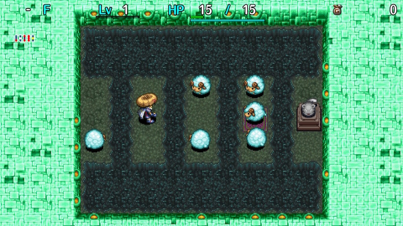

  

Mini-game dungeon where you punch Mamel statues to move them onto goal tiles. Puzzles often require utilizing items, monsters, and traps, so it can be played to gain knowledge.

Items cannot be taken outside of the dungeon, but they do get recorded in the Item Book. However, scrolls you read won't be registered to the Blank Scroll list.

You'll receive 1 random item upon clearing a puzzle, and harder puzzles often give higher quality items. If you clear all 150 puzzles, you'll be rewarded with a Fuuma Shield.

# Overview

<table class="dungeonOverview">
  <tr>
    <th>Unlock</th>
    <td class="highlightYellow">Available as soon as you arrive in Nekomaneki Village.</td>
  </tr>
  <tr>
    <th>Entrance</th>
    <td class="highlightYellow">Talk to the girl inside the Dungeon Center.</td>
  </tr>
</table>

<table class="dungeonTable">
  <tr>
    <th>Puzzles</th>
    <td>150</td>
    <th>Day / Night</th>
    <td>Day</td>
  </tr>
  <tr>
    <th>Bring Items</th>
    <td>No</td>
    <th>Allies</th>
    <td>No</td>
  </tr>
  <tr>
    <th>Unidentified</th>
    <td>None</td>
    <th>New Items</th>
    <td>No</td>
  </tr>
  <tr>
    <th>Shops</th>
    <td>None</td>
    <th>Monster Houses</th>
    <td>None</td>
  </tr>
  <tr>
    <th>Initial Enemies</th>
    <td>Varies by puzzle</td>
    <th>Spawn Rate</th>
    <td>N/A</td>
  </tr>
  <tr>
    <th>Ominous aura</th>
    <td>No</td>
    <th>Wind of Kron</th>
    <td>4th: 2000 turns</td>
  </tr>
  <tr>
    <th>Clear Icon</th>
    <td class="clearIcon"></td>
    <th>Reward</th>
    <td>1 random item (1st clear) Fuuma Shield (clear all)</td>
  </tr>
</table>

#### Mamel Statues

- Punch the statue to make it move 1 tile in the direction of the punch.
    - The statue also moves if it's hit by a monster or log.
- The statue cannot be pushed in diagonal directions by punches.
    - Staves and logs can be used to push them diagonally.
- The statue will erase any item or trap that is present on a destination tile when pushed.
- The statue cannot be pushed onto a water or air tile - it'll warp instead.
- You cannot move diagonally through statue corners, even with a Wall Clip Bracelet.
- Magic bullets from staves work as expected, but thrown staves must have piercing properties.
    - Simply throwing a staff at the statue will do nothing, and the staff falls to the ground.

#### Map Characteristics

- The puzzle is treated as 1 room, and monsters detect Shiren from anywhere on the map.
- Some maps have walls that can be destroyed by direct attacks.
- Shiren will always warp to a specific location if he warps.

# Puzzle Solutions

[Statue Cave Solutions (Video)](https://www.youtube.com/watch?v=aj6Y36oC2sk)
