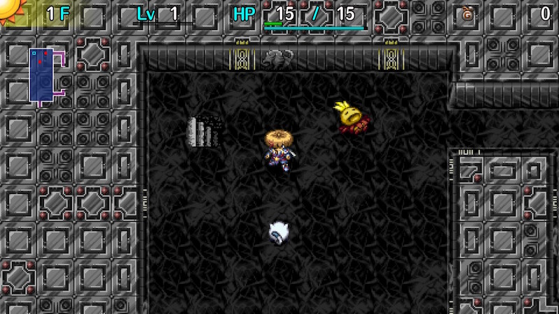

  

Dungeon where you run away from enemies instead of fighting them. Mid game monsters appear from 1F, and defeating monsters doesn't grant experience points. You start with 3 Hide Pots in your inventory, and items you throw are guaranteed to hit the target. [Wanderer Awaiting Rescue](/system/wanderer-rescue#wanderer-awaiting-rescue) can be used to easily obtain Scout Bracelets if you haven't made a deep run. Generally, the first clear is easy, but 99F is a bit much to maintain focus and avoid starvation and traps.

<ul class="quickLinksUL">
  <li><a href="#overview">Overview</a></li>
  <li><a href="#strategy">Strategy</a></li>
  <li><a href="#monsters">Monsters</a></li>
  <li><a href="#items">Items</a></li>
  <li><a href="#traps">Traps</a></li>
</ul>

# Overview

<table class="dungeonOverview">
  <tr>
    <th>Unlock</th>
    <td class="highlightYellow">Clear Ouma Shrine and arrive in Nekomaneki Village.</td>
  </tr>
  <tr>
    <th>Entrance</th>
    <td class="highlightYellow">Nekomaneki Village (Woman in Dungeon Center)</td>
  </tr>
</table>

<table class="dungeonTable">
  <tr>
    <th>Floors</th>
    <td>10F (first) / 99F</td>
    <th>Day / Night</th>
    <td>Day</td>
  </tr>
  <tr>
    <th>Bring Items</th>
    <td>No</td>
    <th>Allies</th>
    <td>No</td>
  </tr>
  <tr>
    <th>Unidentified</th>
    <td>None</td>
    <th>New Items</th>
    <td>No</td>
  </tr>
  <tr>
    <th>Shops</th>
    <td>None</td>
    <th>Monster Houses</th>
    <td>None</td>
  </tr>
  <tr>
    <th>Initial Enemies</th>
    <td></td>
    <th>Spawn Rate</th>
    <td></td>
  </tr>
  <tr>
    <th>Ominous aura</th>
    <td></td>
    <th>Wind of Kron</th>
    <td>1st: / 4th: </td>
  </tr>
  <tr>
    <th>Clear Icon</th>
    <td>None</td>
    <th>Reward</th>
    <td>Developer Pot</td>
  </tr>
</table>

# Strategy

[Quick Links]

[Content]

# Monsters

See [Monsters](/system/monsters) for additional details.

<table class="dungeonMonsterList monsterListDay">
  <thead>
    <tr>
      <th>F</th>
      <th>Name</th>
      <th>HP</th>
      <th>Atk</th>
      <th>Def</th>
      <th>Exp</th>
      <th>Notes</th>
    </tr>
  </thead>
  <tbody>
    <tr>
      <td>1-99</td>
      <td>Cave Mamel</td>
      <td>6</td>
      <td>60</td>
      <td>19</td>
      <td>0</td>
      <td class="leftText">Instant collapse. Can be defeated by swinging Knockback Staff twice.</td>
    </tr>
    <tr>
      <td>1-99</td>
      <td>Pumphantom</td>
      <td>66</td>
      <td>39</td>
      <td>18</td>
      <td>0</td>
      <td class="leftText">Instant collapse. Can be difficult to spot due to tile set.</td>
    </tr>
    <tr>
      <td>1-99</td>
      <td>Moseal</td>
      <td>60</td>
      <td>10</td>
      <td>6</td>
      <td>0</td>
      <td class="leftText">Survive 1 hit if you're at full HP.</td>
    </tr>
    <tr>
      <td>1-99</td>
      <td>Punisher</td>
      <td>55</td>
      <td>42</td>
      <td>10</td>
      <td>0</td>
      <td class="leftText">Instant collapse.</td>
    </tr>
    <tr>
      <td>1-9</td>
      <td>Mid Chintala</td>
      <td>45</td>
      <td>15</td>
      <td>9</td>
      <td>0</td>
      <td class="leftText">Deals 13~17 damage, so you might survive.</td>
    </tr>
    <tr>
      <td>1-99</td>
      <td>Cololum</td>
      <td>45</td>
      <td>15</td>
      <td>9</td>
      <td>0</td>
      <td class="leftText">Deals 13~17 damage, so you might survive.</td>
    </tr>
    <tr>
      <td>1-99</td>
      <td>Beanie</td>
      <td>45</td>
      <td>23</td>
      <td>10</td>
      <td>0</td>
      <td class="leftText">Instant collapse.</td>
    </tr>
    <tr>
      <td>1-9</td>
      <td>Eligan</td>
      <td>58</td>
      <td>32</td>
      <td>16</td>
      <td>0</td>
      <td class="leftText">Instant collapse.</td>
    </tr>
    <tr>
      <td>10-99</td>
      <td>Eligagan</td>
      <td>62</td>
      <td>62</td>
      <td>22</td>
      <td>0</td>
      <td class="leftText">Instant collapse. Replaces Eligan.</td>
    </tr>
    <tr>
      <td>10-99</td>
      <td>Shagga</td>
      <td>70</td>
      <td>44</td>
      <td>25</td>
      <td>0</td>
      <td class="leftText">Instant collapse. Replaces Mid Chintala.</td>
    </tr>
    <tr>
      <td>31-99</td>
      <td>Gyaza</td>
      <td>28</td>
      <td>19</td>
      <td>10</td>
      <td>0</td>
      <td class="leftText">Instant collapse. Immune to all items found in this dungeon. It seems more spawn the deeper you progress.</td>
    </tr>
  </tbody>
</table>

# Items

- F = Floor, Monster (day)

#### Bracelets

<table class="dungeonItems">
  <tr>
    <th>Name</th>
    <th>F</th>
    <th rowspan="13" class="tableDivider"></th>
    <th>Name</th>
    <th>F</th>
    <th rowspan="13" class="tableDivider"></th>
    <th>Name</th>
    <th>F</th>
  </tr>
  <tr>
    <td class="leftText highlightGray">Strength Bracelet</td>
    <td></td>
    <td class="leftText highlightGray">Dozer Bracelet</td>
    <td></td>
    <td class="leftText highlightGray">Nonary Bracelet</td>
    <td></td>
  </tr>
  <tr>
    <td class="leftText highlightGray">Can. Arm Bracelet</td>
    <td>X</td>
    <td class="leftText highlightGray">Trap Bracelet</td>
    <td></td>
    <td class="leftText highlightGray">Growth Bracelet</td>
    <td></td>
  </tr>
  <tr>
    <td class="leftText highlightGray">Inacc. Bracelet</td>
    <td></td>
    <td class="leftText highlightGray">Monster Detector</td>
    <td></td>
    <td class="leftText highlightGray">Anti-Parry Brce.</td>
    <td></td>
  </tr>
  <tr>
    <td class="leftText highlightGray">Bunch Bracelet</td>
    <td></td>
    <td class="leftText highlightGray">Monsterphobic</td>
    <td></td>
    <td class="leftText highlightGray">Time Stop Bracelet</td>
    <td></td>
  </tr>
  <tr>
    <td class="leftText highlightGray">Cleansing Bracelet</td>
    <td></td>
    <td class="leftText highlightGray">Item Detector</td>
    <td></td>
    <td class="leftText highlightGray">Floating Bracelet</td>
    <td></td>
  </tr>
  <tr>
    <td class="leftText highlightGray">Anti-Cnf. Bracelet</td>
    <td></td>
    <td class="leftText highlightGray">Itemphobic</td>
    <td></td>
    <td class="leftText highlightGray">Night Ward</td>
    <td></td>
  </tr>
  <tr>
    <td class="leftText highlightGray">Alert Bracelet</td>
    <td></td>
    <td class="leftText highlightGray">Waterwalk Bracelet</td>
    <td>X</td>
    <td class="leftText highlightGray">Scout Bracelet</td>
    <td>X</td>
  </tr>
  <tr>
    <td class="leftText highlightGray">Anti-Crs. Bracelet</td>
    <td></td>
    <td class="leftText highlightGray">Wall Clip Bracelet</td>
    <td></td>
    <td class="leftText highlightGray">Trapper Bracelet</td>
    <td></td>
  </tr>
  <tr>
    <td class="leftText highlightGray">Staunch Bracelet</td>
    <td></td>
    <td class="leftText highlightGray">Heal Bracelet</td>
    <td></td>
    <td class="leftText highlightGray">Identify Bracelet</td>
    <td></td>
  </tr>
  <tr>
    <td class="leftText highlightGray">Critical Bracelet</td>
    <td></td>
    <td class="leftText highlightGray">Alleyway Bracelet</td>
    <td></td>
    <td class="leftText highlightGray">VIP Bracelet</td>
    <td></td>
  </tr>
  <tr>
    <td class="leftText highlightGray">Mojo Bracelet</td>
    <td></td>
    <td class="leftText highlightGray">Blink Bracelet</td>
    <td></td>
    <td rowspan="2" colspan="6"></td>
  </tr>
  <tr>
    <td class="leftText highlightGray">Monster Summoner</td>
    <td></td>
    <td class="leftText highlightGray">Explosion Bracelet</td>
    <td></td>
  </tr>
</table>

#### Staves

<table class="dungeonItems">
  <tr>
    <th>Name</th>
    <th>F</th>
    <th rowspan="9" class="tableDivider"></th>
    <th>Name</th>
    <th>F</th>
    <th rowspan="9" class="tableDivider"></th>
    <th>Name</th>
    <th>F</th>
  </tr>
  <tr>
    <td class="leftText highlightGray">Swap Staff</td>
    <td>X</td>
    <td class="leftText highlightGray">Drama Staff</td>
    <td></td>
    <td class="leftText highlightGray">Seal Staff</td>
    <td></td>
  </tr>
  <tr>
    <td class="leftText highlightGray">Knockback Staff</td>
    <td>X</td>
    <td class="leftText highlightGray">Nagging Staff</td>
    <td></td>
    <td class="leftText highlightGray">Clone Staff</td>
    <td>X</td>
  </tr>
  <tr>
    <td class="leftText highlightGray">Pinning Staff</td>
    <td>X</td>
    <td class="leftText highlightGray">Balance Staff</td>
    <td></td>
    <td class="leftText highlightGray">Staff of Sacrifice</td>
    <td></td>
  </tr>
  <tr>
    <td class="leftText highlightGray">Mage Staff</td>
    <td></td>
    <td class="leftText highlightGray">Empathy Staff</td>
    <td></td>
    <td class="leftText highlightGray">Glorious Staff</td>
    <td></td>
  </tr>
  <tr>
    <td class="leftText highlightGray">Slow Staff</td>
    <td></td>
    <td class="leftText highlightGray">Ordinary Staff</td>
    <td></td>
    <td class="leftText highlightGray">Unlucky Staff</td>
    <td></td>
  </tr>
  <tr>
    <td class="leftText highlightGray">Swift Staff</td>
    <td></td>
    <td class="leftText highlightGray">Trap Del. Staff</td>
    <td></td>
    <td class="leftText highlightGray">Boring Staff</td>
    <td></td>
  </tr>
  <tr>
    <td class="leftText highlightGray">Transient Staff</td>
    <td>X</td>
    <td class="leftText highlightGray">Electric Staff</td>
    <td></td>
    <td class="leftText highlightGray">Fort. Staff</td>
    <td></td>
  </tr>
  <tr>
    <td class="leftText highlightGray">Paralysis Staff</td>
    <td>X</td>
    <td class="leftText highlightGray">Shocking Staff</td>
    <td></td>
    <td class="leftText highlightGray">Sharing Staff</td>
    <td></td>
  </tr>
</table>

#### Scrolls

<table class="dungeonItems">
  <tr>
    <th>Name</th>
    <th>F</th>
    <th rowspan="18" class="tableDivider"></th>
    <th>Name</th>
    <th>F</th>
    <th rowspan="18" class="tableDivider"></th>
    <th>Name</th>
    <th>F</th>
  </tr>
  <tr>
    <td class="leftText highlightGray">Escape Scroll</td>
    <td></td>
    <td class="leftText highlightGray">Pot God Scroll</td>
    <td></td>
    <td class="leftText highlightGray">Vacuum Slash Scrl</td>
    <td></td>
  </tr>
  <tr>
    <td class="leftText highlightGray">Navigation Scroll</td>
    <td>X</td>
    <td class="leftText highlightGray">Extraction Scroll</td>
    <td></td>
    <td class="leftText highlightGray">Dispel Aura Scroll</td>
    <td></td>
  </tr>
  <tr>
    <td class="leftText highlightGray">Oil Scroll</td>
    <td></td>
    <td class="leftText highlightGray">Blessing Scroll</td>
    <td></td>
    <td class="leftText highlightGray">Night-Day Scroll</td>
    <td></td>
  </tr>
  <tr>
    <td class="leftText highlightGray">Light Scroll</td>
    <td></td>
    <td class="leftText highlightGray">Curse Scroll</td>
    <td></td>
    <td class="leftText highlightGray">Swift Foe Scroll</td>
    <td></td>
  </tr>
  <tr>
    <td class="leftText highlightGray">Recommend. Letter</td>
    <td></td>
    <td class="leftText highlightGray">Coupon Scroll</td>
    <td></td>
    <td class="leftText highlightGray">Mnster House Scrl</td>
    <td></td>
  </tr>
  <tr>
    <td class="leftText highlightGray">Commend. Letter</td>
    <td></td>
    <td class="leftText highlightGray">Mate Scroll</td>
    <td></td>
    <td class="leftText highlightGray">Immunity Scroll</td>
    <td></td>
  </tr>
  <tr>
    <td class="leftText highlightGray">Identify Scroll</td>
    <td></td>
    <td class="leftText highlightGray">Darth Scroll</td>
    <td></td>
    <td class="leftText highlightGray">Replenish Scroll</td>
    <td></td>
  </tr>
  <tr>
    <td class="leftText highlightGray">Gathering Scroll</td>
    <td></td>
    <td class="leftText highlightGray">Pot Dog Scroll</td>
    <td></td>
    <td class="leftText highlightGray">Fixer Scroll</td>
    <td></td>
  </tr>
  <tr>
    <td class="leftText highlightGray">Collection Scroll</td>
    <td></td>
    <td class="leftText highlightGray">Fear Scroll</td>
    <td></td>
    <td class="leftText highlightGray">Gambler's Scroll</td>
    <td></td>
  </tr>
  <tr>
    <td class="leftText highlightGray">Squid Sushi Scroll</td>
    <td></td>
    <td class="leftText highlightGray">Trap Deletion Scrl</td>
    <td></td>
    <td class="leftText highlightGray">Arbor Scroll</td>
    <td></td>
  </tr>
  <tr>
    <td class="leftText highlightGray">Exorcism Scroll</td>
    <td></td>
    <td class="leftText highlightGray">Desert Scroll</td>
    <td></td>
    <td class="leftText highlightGray">Nixer Scroll</td>
    <td></td>
  </tr>
  <tr>
    <td class="leftText highlightGray">Fate Scroll</td>
    <td></td>
    <td class="leftText highlightGray">Trap Scroll</td>
    <td></td>
    <td class="leftText highlightGray">Lost Scroll</td>
    <td></td>
  </tr>
  <tr>
    <td class="leftText highlightGray">Earth Scroll</td>
    <td></td>
    <td class="leftText highlightGray">Muzzled Scroll</td>
    <td></td>
    <td class="leftText highlightGray">Sanctuary Scroll</td>
    <td></td>
  </tr>
  <tr>
    <td class="leftText highlightGray">Plating Scroll</td>
    <td></td>
    <td class="leftText highlightGray">Grounded Scroll</td>
    <td></td>
    <td class="leftText highlightGray">Expulsion Scroll</td>
    <td></td>
  </tr>
  <tr>
    <td class="leftText highlightGray">Tag Scroll</td>
    <td></td>
    <td class="leftText highlightGray">Attraction Scroll</td>
    <td></td>
    <td class="leftText highlightGray">Bankruptcy Scroll</td>
    <td></td>
  </tr>
  <tr>
    <td class="leftText highlightGray">Sale Scroll</td>
    <td></td>
    <td class="leftText highlightGray">Confusion Scroll</td>
    <td></td>
    <td class="leftText highlightGray">Blank Scroll</td>
    <td></td>
  </tr>
  <tr>
    <td class="leftText highlightGray">Onigiri Scroll</td>
    <td></td>
    <td class="leftText highlightGray">Slumber Scroll</td>
    <td></td>
    <td class="leftText highlightGray">Extinction Scroll</td>
    <td></td>
  </tr>
</table>

#### Grass

<table class="dungeonItems">
  <tr>
    <th>Name</th>
    <th>F</th>
    <th rowspan="13" class="tableDivider"></th>
    <th>Name</th>
    <th>F</th>
    <th rowspan="13" class="tableDivider"></th>
    <th>Name</th>
    <th>F</th>
  </tr>
  <tr>
    <td class="leftText highlightGray">Weeds</td>
    <td></td>
    <td class="leftText highlightGray">Stomach Expander</td>
    <td></td>
    <td class="leftText highlightGray">Revival Grass</td>
    <td></td>
  </tr>
  <tr>
    <td class="leftText highlightGray">Herb</td>
    <td></td>
    <td class="leftText highlightGray">Stomach Shrinker</td>
    <td></td>
    <td class="leftText highlightGray">Gut Grass</td>
    <td></td>
  </tr>
  <tr>
    <td class="leftText highlightGray">Fine Grass</td>
    <td></td>
    <td class="leftText highlightGray">Confusion Grass</td>
    <td></td>
    <td class="leftText highlightGray">Undo Grass</td>
    <td></td>
  </tr>
  <tr>
    <td class="leftText highlightGray">Otogiriso</td>
    <td></td>
    <td class="leftText highlightGray">Blinding Grass</td>
    <td>X</td>
    <td class="leftText highlightGray">Repeat Grass</td>
    <td></td>
  </tr>
  <tr>
    <td class="leftText highlightGray">Antidote Grass</td>
    <td></td>
    <td class="leftText highlightGray">Nymph Grass</td>
    <td></td>
    <td class="leftText highlightGray">Invincible Grass</td>
    <td></td>
  </tr>
  <tr>
    <td class="leftText highlightGray">Poison Grass</td>
    <td></td>
    <td class="leftText highlightGray">Life Grass</td>
    <td></td>
    <td class="leftText highlightGray">Cheery Grass</td>
    <td></td>
  </tr>
  <tr>
    <td class="leftText highlightGray">Warp Grass</td>
    <td>X</td>
    <td class="leftText highlightGray">Strength Grass</td>
    <td></td>
    <td class="leftText highlightGray">Unlucky Seed</td>
    <td></td>
  </tr>
  <tr>
    <td class="leftText highlightGray">Heal Grass</td>
    <td></td>
    <td class="leftText highlightGray">Dragon Grass</td>
    <td></td>
    <td class="leftText highlightGray">Amnesia Grass</td>
    <td></td>
  </tr>
  <tr>
    <td class="leftText highlightGray">Power Up Grass</td>
    <td></td>
    <td class="leftText highlightGray">Sleepy Grass</td>
    <td></td>
    <td class="leftText highlightGray">Imabikiso</td>
    <td></td>
  </tr>
  <tr>
    <td class="leftText highlightGray">Upgrade Seed</td>
    <td></td>
    <td class="leftText highlightGray">Rage Grass</td>
    <td></td>
    <td class="leftText highlightGray">Angel Seed</td>
    <td></td>
  </tr>
  <tr>
    <td class="leftText highlightGray">Perception Grass</td>
    <td>X</td>
    <td class="leftText highlightGray">Dracon Grass</td>
    <td></td>
    <td class="leftText highlightGray">SuperUnlucky Seed</td>
    <td></td>
  </tr>
  <tr>
    <td class="leftText highlightGray">Swift Grass</td>
    <td></td>
    <td colspan="2"></td>
    <td colspan="2"></td>
  </tr>
</table>

#### Pots

<table class="dungeonItems">
  <tr>
    <th>Name</th>
    <th>F</th>
    <th rowspan="12" class="tableDivider"></th>
    <th>Name</th>
    <th>F</th>
    <th rowspan="12" class="tableDivider"></th>
    <th>Name</th>
    <th>F</th>
  </tr>
  <tr>
    <td class="leftText highlightGray">Preservation Pot</td>
    <td></td>
    <td class="leftText highlightGray">Fever Pot</td>
    <td></td>
    <td class="leftText highlightGray">Monster Pot</td>
    <td></td>
  </tr>
  <tr>
    <td class="leftText highlightGray">Ordinary Pot</td>
    <td></td>
    <td class="leftText highlightGray">Exorcism Pot</td>
    <td></td>
    <td class="leftText highlightGray">Hilarious Pot</td>
    <td></td>
  </tr>
  <tr>
    <td class="leftText highlightGray">Identify Pot</td>
    <td></td>
    <td class="leftText highlightGray">Blessing Pot</td>
    <td></td>
    <td class="leftText highlightGray">Klein Pot</td>
    <td></td>
  </tr>
  <tr>
    <td class="leftText highlightGray">Hide Pot</td>
    <td>X</td>
    <td class="leftText highlightGray">Curse Pot</td>
    <td></td>
    <td class="leftText highlightGray">Synthesis Pot</td>
    <td></td>
  </tr>
  <tr>
    <td class="leftText highlightGray">4-2-8 Pot</td>
    <td></td>
    <td class="leftText highlightGray">Water Pot</td>
    <td></td>
    <td class="leftText highlightGray">Modder's Pot</td>
    <td></td>
  </tr>
  <tr>
    <td class="leftText highlightGray">Sale Pot</td>
    <td></td>
    <td class="leftText highlightGray">Zen Pot</td>
    <td></td>
    <td class="leftText highlightGray">Upgrade Pot</td>
    <td></td>
  </tr>
  <tr>
    <td class="leftText highlightGray">Presto Pot</td>
    <td></td>
    <td class="leftText highlightGray">Dodger Pot</td>
    <td></td>
    <td class="leftText highlightGray">Degrade Pot</td>
    <td></td>
  </tr>
  <tr>
    <td class="leftText highlightGray">Sticky Pot</td>
    <td></td>
    <td class="leftText highlightGray">Perceptive Pot</td>
    <td></td>
    <td class="leftText highlightGray">Lucky Pot</td>
    <td></td>
  </tr>
  <tr>
    <td class="leftText highlightGray">Unbreakable Pot</td>
    <td></td>
    <td class="leftText highlightGray">Reflection Pot</td>
    <td></td>
    <td class="leftText highlightGray">Unlucky Pot</td>
    <td></td>
  </tr>
  <tr>
    <td class="leftText highlightGray">Floramorph Pot</td>
    <td></td>
    <td class="leftText highlightGray">Heal Pot</td>
    <td></td>
    <td class="leftText highlightGray">Grilling Pot</td>
    <td></td>
  </tr>
  <tr>
    <td class="leftText highlightGray">Black Hole Pot</td>
    <td>X</td>
    <td class="leftText highlightGray">Zalokleft Pot</td>
    <td></td>
    <td colspan="2"></td>
  </tr>
</table>

#### Food

<table class="dungeonItems">
  <tr>
    <th>Name</th>
    <th>F</th>
    <th rowspan="5" class="tableDivider"></th>
    <th>Name</th>
    <th>F</th>
    <th rowspan="5" class="tableDivider"></th>
    <th>Name</th>
    <th>F</th>
  </tr>
  <tr>
    <td class="leftText highlightGray">Onigiri</td>
    <td>X</td>
    <td class="leftText highlightGray">Grilled Onigiri</td>
    <td></td>
    <td class="leftText highlightGray">Hard Peach</td>
    <td></td>
  </tr>
  <tr>
    <td class="leftText highlightGray">Large Onigiri</td>
    <td>X</td>
    <td class="leftText highlightGray">Special Onigiri</td>
    <td></td>
    <td class="leftText highlightGray">Peach</td>
    <td></td>
  </tr>
  <tr>
    <td class="leftText highlightGray">Huge Onigiri</td>
    <td></td>
    <td class="leftText highlightGray">Dog Onigiri</td>
    <td></td>
    <td class="leftText highlightGray">Juicy Peach</td>
    <td></td>
  </tr>
  <tr>
    <td class="leftText highlightGray">Rotten Onigiri</td>
    <td></td>
    <td colspan="2"></td>
    <td class="leftText highlightGray">Rotten Peach</td>
    <td></td>
  </tr>
</table>

# Traps

[Trap Table]
