

  

Tower you can challenge after obtaining the Dice of Fate.

You'll progress in the order of Unexplored Area → Tower Area 1 → Tower Skywalk → Tower Area 2. 
Unexplored Area and Tower Skywalk are Shuffle Dungeons, which are maps selected from a set of patterns. 
Tower Areas 1 and 2 are Random Dungeons, which are procedurally generated maps.

From this point forward, day and night will begin to switch as turns elapse. 
※ It's highly recommended to go through <a href="/shiren-5/dungeons/night-training-facility">Night Training Facility</a> from Hermit's Hermitage before proceeding.

<ul class="quickLinksUL">
  <li><a href="#overview">Overview</a></li>
  <li><a href="#strategy">Strategy</a>
    <ul>
      <li><a href="#night">Night</a></li>
      <li><a href="#farming">Farming</a></li>
      <li><a href="#floor-guide">Floor Guide</a>
        <ul>
          <li><a href="#unexplored-area-(1-3f)">Unexplored Area (1-3F)</a></li>
          <li><a href="#tower-area-1-(4-6f)">Tower Area 1 (4-6F)</a></li>
          <li><a href="#tower-skywalk-(7-11f)">Tower Skywalk (7-11F)</a></li>
          <li><a href="#tower-area-2-(12-14f)">Tower Area 2 (12-14F)</a></li>
        </ul>
      </li>
      <li><a href="#boss">Boss</a></li>
    </ul>
  </li>
  <li><a href="#monsters">Monsters</a></li>
  <li><a href="#monster-list">Monster List</a>
    <ul>
      <li><a href="#list-(day)">List (Day)</a></li>
      <li><a href="#list-(night)">List (Night)</a></li>
    </ul>
  </li>
  <li><a href="#items">Items</a></li>
  <li><a href="#traps">Traps</a></li>
  <li><a href="#npcs">NPCs</a></li>
</ul>

# Overview

<table class="dungeonOverview">
  <tr>
    <th>Unlock</th>
    <td class="highlightYellow">Available as soon as you arrive at Hermit's Hermitage.</td>
  </tr>
  <tr>
    <th>Entrance</th>
    <td class="highlightYellow">Hermit's Hermitage (North)</td>
  </tr>
</table>

<table class="dungeonTable">
  <tr>
    <th>Floors</th>
    <td>14F</td>
    <th>Day / Night</th>
    <td>Both</td>
  </tr>
  <tr>
    <th>Bring Items</th>
    <td>Yes</td>
    <th>Allies</th>
    <td>3</td>
  </tr>
  <tr>
    <th>Unidentified</th>
    <td>Bracelets</td>
    <th>New Items</th>
    <td>Yes</td>
  </tr>
  <tr>
    <th>Shops</th>
    <td>Regular, Elite (4-6F, 12-14F)</td>
    <th>Monster Houses</th>
    <td>Regular, Sudden (Only inside tower)</td>
  </tr>
  <tr>
    <th>Initial Enemies</th>
    <td>Skywalk: 10 Tower Area 2: 10-13</td>
    <th>Spawn Rate</th>
    <td>Skywalk: 25 turns Tower Area 2: 25 turns</td>
  </tr>
  <tr>
    <th>Day Turns</th>
    <td></td>
    <th>Night Turns</th>
    <td></td>
  </tr>
  <tr>
    <th>Ominous aura</th>
    <td>No</td>
    <th>Wind of Kron</th>
    <td>1st: 1700 4th: 2000</td>
  </tr>
  <tr>
    <th>Clear Icon</th>
    <td class="clearIcon"></td>
    <th>Reward</th>
    <td>None</td>
  </tr>
</table>

# Strategy

<ul class="quickLinksUL">
  <li><a href="#night">Night</a></li>
  <li><a href="#farming">Farming</a></li>
  <li><a href="#floor-guide">Floor Guide</a>
    <ul>
      <li><a href="#unexplored-area-(1-3f)">Unexplored Area (1-3F)</a></li>
      <li><a href="#tower-area-1-(4-6f)">Tower Area 1 (4-6F)</a></li>
      <li><a href="#tower-skywalk-(7-11f)">Tower Skywalk (7-11F)</a></li>
      <li><a href="#tower-area-2-(12-14f)">Tower Area 2 (12-14F)</a></li>
    </ul>
  </li>
  <li><a href="#boss">Boss</a></li>
</ul>

### Night

  

The basics are covered in <a href="/shiren-5/dungeons/night-training-facility">Night Training Facility</a> which can be accessed from Hermit's Hermitage.

Direct attacks are ineffective against night monsters, so you need to use <a href="/system/necklace-abilities">abilities</a> to deal damage. Each ability can only be used 1 time per floor, but they can be refreshed by using a peach or Replenish Scroll. Since abilities are limited, don't aim to defeat every monster you encounter - ignore them whenever possible. Night monsters can't see well, so they don't relentlessly follow you like day monsters.

Even if you have a Monster Detector, your field of view will be limited to a 1 tile radius without a torch, 
making it difficult to locate items or the stairs unless you use an Item Detector or Transient Staff. 
Scrolls other than Fixer Scroll can't be read at night without a torch, and you'll also take more damage from night monsters without a torch.

Keep multiple torches on hand in case you step on a Strip Trap or Rust Trap, and if you're out of torches 
and don't have a Monster Detector, you'll want to wait for daytime in a safe place like a hallway.

Recommended starter ability set:

- Mine! Mine! Mine! x 6
- Electrocute x 2

Mine! Mine! Mine! is the default ability, and Electrocute is learned at Lv16. 
If you happen to learn Sticky Shot from the Apprentice NPC, change all Mine! Mine! Mine! slots to Sticky Shot. Other abilities you learn at first tend to be weaker or more situational, so it's best to keep things simple.

While nighttime sounds inconvenient, it's often easier to progress during the night since abilities 
usually one-shot or disable night monsters, so keep that in mind if you're having a hard time during the day.

### Farming

You'll need to hunt Filthy Shagga, Bad Momoseal, and Dark Grass Dude to complete the Staccato Wave sidequest. 
It's easiest to do so after clearing the main story, since you can obtain a Monster Summoner in post-game dungeons.

Grass Dudes appear between 2-4F, but Nigiri Morphs also appear on 2-3F (night) and 4-5F (day), 
so it's not recommended to try and collect grass items unless you have a Monster Detector.

Bad Zaloklefts appear between 6-7F at night, and always drop a blessed item when defeated. 
It's tricky to linger on a floor very long at night without peaches to replenish abilities, but try for it if you can. 
However, be careful of enemies that can approach while ignoring terrain, or monsters with long-range attacks.

The 12-14F range is a high risk but high return zone.

- 12F - Dark Grass Dude. Night monsters aren't a threat, but Kappa Pests can throw grass when it changes back to day, which has the potential to one-shot you or allies if they throw blessed Dragon Grass.

- 13F - Dark Grass Dude, Mixermon. Daytime monsters have high attack and are quite dangerous. If you have Super status, eat a blessed Upgrade Seed and Perception Grass to level equipment. Dark MC Wizard is extremely dangerous at night, so be very careful if you don't have a Reflection Pot.

- 14F - Mixermon, Bad G. Zalokleft. Poofy makes a return in place of MC Mage, Kappa Pest, and N'twyn. This is another good floor to use Upgrade Seed and Perception Grass if you have Super status. Dark VeniScorp has high attack and HP so it tends to limit break easily, and can survive weaker abilities. (Example: Electrocute)

### Floor Guide

#### Unexplored Area (1-3F)

Eligan hits hard, so you'll ideally want a shield with at least 15 defense. 
But the bigger problem is Yanpii, since getting knocked off the cliff and onto an air tile makes you warp. 
It's simple for Shiren to avoid its headbutt, but allies are tricky to control and can easily become separated. 
Allies are more likely to collapse if they're alone, so it's best to fight Yanpii 1-on-1 with your back against an ally.

Be careful of Gyadon between 2-3F, since its pecking special attack can reduce a staff's use count to 0. 
Protect staves by storing them inside Preservation Pots if you don't have the Anti-Peck rune. 
If you don't have enough pots, place important staves like Balance Staff on the ground beforehand. 
Field of view isn't limited here, so there's usually plenty of time to place staves if you act carefully.

Evil Super Gazer and Foul Nigiri Morph appear at night. 
They're easily defeated using abilities, but can cause item loss with their special attacks, 
so you'll ideally want to get through this area before it changes to night to minimize risk.

The next area is safer at night, so it's recommended to change the time of day right before proceeding past 3F. 
However, the time of day will always be set to daytime the first time you reach 4F.

#### Tower Area 1 (4-6F)

Nigiri Morphs appear between 4-5F, and can transform a non-equipped item in your inventory into a Large Onigiri. 
Have Jirokichi fight them, or use projectiles or inflict a status condition to prevent it from using its special attack. 
If you don't want to deal with Nigiri Morphs at all, change the time of day to night before proceeding past 3F 
and hurry through 4-5F before it changes to daytime.

DJ Mage's magic bullet effect that warps a target can be a problem if you have allies. 
Keep an eye on ally HP (Select or ZL button), and if they're in danger, read a Gathering Scroll or Attraction Scroll.

Night is safe if you have a field of view of at least 2 tiles, but a Dark Hurler can surprise you with a thrown monster. 
Bad Zaloklefts appear between 6-7F, and always drop a blessed item when they're defeated. 
Go ahead and linger to hunt some - but if they steal an item, the stolen item will become cursed or sealed.

#### Tower Skywalk (7-11F)

Hipadile has high HP, mobility, and top notch attack for mid range floors. 
It might not look as intimidating as Ironhead or Punisher, but it's a much more serious threat.

Sr. Yanpii can headbutt allies off of the path and make them warp like before, so use the Scout command in rooms. 
A Knockback Staff can be used to send non-floating type monsters off of the path to warp them to a different room.

More monsters with troublesome special attacks appear from 11F. 
Keep an eye out for Digestiphants before inflicting status conditions if you get attracted by a Scarabbit, since they can absorb almost any status condition to restore their HP and power up.

Sinful Sr. Yanpiis appear between 8-10F at night. 
They can headbutt you or allies from outside your view, and an isolated ally a night pretty much guarantees their collapse, so immediately read a Gathering Scroll or Attraction Scroll if you become separated.

Dark Grampa Tanks appear between 7-8F. They can fire cannonballs that deal 40 damage (20 with Anti-Blast rune) from outside your view in rooms. 
Explosions deal damage in a 1 tile radius, so allies often get caught in the blast when Shiren gets hit. 
Allies generally have lower max HP than Shiren, so 40 damage can quickly drop them down to critical HP. 
It's best to wait for daytime in hallways instead of moving through rooms at night unless you have room-wide abilities. 
Grampa Tanks won't fire as often since these floors lack walls, but still, take things one step at a time.

It's quite rare, but there's a chance to receive a lot of damage from an item thrown by a limit broken Dark Kappa Pest. 
(Example: Get hit by a blessed Fine Torch thrown by a Dark Kappa Pest4 for \~200 damage) 
Leave an open slot in a pot for a chance to catch the thrown item, but otherwise there isn't a sure way to avoid it 
other than wasting a Dodger Pot use, so it's likely best to wait for daytime in a hallway if you want to play it safe.

#### Tower Area 2 (12-14F)

Scarabbit and MC Mage continue to appear, and 13F introduces multiple high power monsters. 
It depends on equipment strength, but it's common to lose more HP than you can recover from this point on. 
You might not be able to defeat Shaggas in 2 hits without the Anti-Dragon rune, so don't hesitate to use arrows. 
Water from a Water Pot lowers Shagga's attack by 8 stages, but water sources are uncommon, so don't rely on it.

Dark MC Wizards appear between 13-14F at night, and are extremely dangerous. 
It doesn't use its special attack often, but its magic can inflict Berserk which nearly guarantees a collapse at night. 
It's strongly recommended to wait for daytime in a hallway unless you're close to starving without food items. 
Reflection Pot can be used to remove the worry and help against MC Mages during the day.

N'twyn (day) and Dark N'twyn (night) appear between 12-13F. 
They're not too bad during the day, but can be devastating at night, so avoid using items you found on the ground. 
Their spawn rate is very high, so it's best to assume all items between 12-13F are N'twyn monsters. 
However, items dropped by defeated monsters can't be N'twyn, so you don't need to be cautious about those items.

Dark Grass Dude (12-13F), Mixermon (13-14F), and Bad G. Zalokleft (14F) also appear. 
It's a dangerous floor range, but it's also a great chance to strengthen equipment and collect blessed items before the boss fight, so try to utilize these three monsters if you can.

### Boss

Boss: Reeva Statue + 2 Shagga + 2 Death Gyaza 

<table class="dungeonMonsterList">
  <thead>
    <tr>
      <th>Name</th>
      <th>HP</th>
      <th>AP</th>
      <th>DP</th>
      <th>Exp</th>
      <th>GP</th>
      <th>Rune / Item</th>
      <th>Notes</th>
    </tr>
  </thead>
  <tbody>
    <tr>
      <td>Reeva Statue</td>
      <td>600</td>
      <td>70</td>
      <td>10</td>
      <td>0</td>
      <td>0</td>
      <td>-</td>
      <td>See below.</td>
    </tr>
    <tr>
      <td>Shagga</td>
      <td>70</td>
      <td>44</td>
      <td>25</td>
      <td>480</td>
      <td>100</td>
      <td>Anti-Dragon Water Pot</td>
      <td>-</td>
    </tr>
    <tr>
      <td>Death Gyaza</td>
      <td>55</td>
      <td>37</td>
      <td>20</td>
      <td>270</td>
      <td>90</td>
      <td>Anti-Aquatic</td>
      <td>Converts non-direct attack effects into 2 damage.</td>
    </tr>
  </tbody>
</table>

Reeva Statue Moves:

- Direct attack - High power.
- Light bullet - High power ranged attack, inflicts one status condition like Blind, Slow, Confused.
- Beam - Medium power piercing ranged attack.
- Shockwave - 15 damage + knockback.
- Warp to a different position in the room.
- Summon monsters - Multiple Shaggas or Death Gyazas.

Many status conditions work on Reeva Statue (excluding some like Cloned), but it'll cure the status after 1 turn. 
Use Swift Grass and loop inflicting an ailment (talismans, staves, scrolls) → direct attack to have a one-sided fight. 
You can also place an Oil Scroll on the ground and swing a Swap Staff to inflict Tottering status. Other boosting item can be helpful, such as Power Up Grass, Hard Peach, and Invincible Grass. ※ Invincible Grass can be obtained by playing Explosion Rocks.

Keep in mind that status conditions other than Slow aren't effective unless you use Swift Grass, since all you'd be doing is wasting a turn while letting Shaggas and Death Gyazas act.

Common status inflicting items that prevent Reeva Statue from using special attacks include Seal Staff, 
Confusion Scroll, Fear Scroll, Fear Talisman, Conf. Talisman, and Seal Talisman. 
Talismans are a little risky since they don't have 100% accuracy, but can help keep Shaggas in check. 
Transient Staff can be used to paralyze and warp Shaggas away from you as well.

You can continue the story even if Jirokichi collapses during the boss fight, so don't worry about reviving him. If you struggle against Death Gyazas, consider playing Explosion Rocks and bringing 4-2-8 Pots, since explosions one-shot them like any other non-boss monster.

# Monsters

<button id="hideMonTblImgBtn" onClick={()=>{var mon_imgs = document.querySelectorAll('#monsterTable img');mon_imgs.forEach(e => e.classList.toggle('hidden'));}}>Toggle Monster Images</button>

Hover over or tap a monster's name for details. Floor Colors: Boss Floor Monster Colors: Farming, Useful, Destroys Items, Dangerous, Very Dangerous

<table id="monsterTable" class="monsterTable">
  <thead>
    <tr>
      <th>F</th>
      <th colspan="5">Monsters</th>
    </tr>
  </thead>
  <tbody>
    <tr>
      <td rowspan="2" class="centeredText">1</td>
      <td class="day">
 Eligan
- Eligan - HP: 58 AP: 32 DP: 16 Exp: 220 GP: 50 Type: Normal Speed: Normal Sp.Atk Rate: 0% (near), 0% (far) Item Drop Rate: 4% ~ Ability ~ None.

</td>
      <td class="day">
 Beanie
- Beanie - HP: 45 AP: 23 DP: 10 Exp: 125 GP: 50 Type: Plant Speed: Normal Sp.Atk Rate: 0% (near), 0% (far) Item Drop Rate: 4% ~ Ability ~ None.

</td>
      <td class="day">
 Yanpii
- Yanpii - HP: 36 AP: 22 DP: 15 Exp: 170 GP: 6 Type: Normal Speed: Normal Sp.Atk Rate: 22% (near), 22% (far) Item Drop Rate: 4% ~ Ability ~ Headbutts Shiren when lined up, dealing 10 damage and knockback based on distance traveled. If Shiren is knocked into a wall, go into the wall 1 tile and take an additional 10 damage.

</td>
      <td class="day items">
 Scoopie
- Scoopie - HP: 43 AP: 16 DP: 11 Exp: 75 GP: 9 Type: Metal Speed: Normal Sp.Atk Rate: 16% (near), 0% (far) Item Drop Rate: 4% ~ Ability ~ Shovels dirt at an adjacent target, which can hit through corners. Dirt fills 1 pot in your inventory when it hits Shiren, or inflicts Blind status when it hits an ally. Dirt in pots eventually changes to grass items when advancing floors.

</td>
      <td></td>
    </tr>
    <tr>
      <td class="highlightGray3">
 Evil Dragon
- Evil Dragon - HP: 32 AP: 24 DP: 3 Exp: 100 GP: 100 Type: Dragon Speed: Normal Sp.Atk Rate: 20% (near), 33% (far) Item Drop Rate: 22% ~ Ability ~ Resists non-ability attacks. Spews a 50 damage flame that travels in a straight line.

</td>
      <td class="highlightGray3">
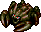 Evil Gyaza
- Evil Gyaza - HP: 32 AP: 24 DP: 3 Exp: 34 GP: 40 Type: Aquatic Speed: Normal Sp.Atk Rate: 0% (near), 0% (far) Item Drop Rate: 4% ~ Ability ~ Resists non-ability attacks. Converts most effects received other than direct attacks to 2 damage.

</td>
      <td class="highlightGray3">
 Dark Zapdon
- Dark Zapdon - HP: 47 AP: 43 DP: 4 Exp: 120 GP: 40 Type: Normal Speed: Slow Sp.Atk Rate: 100% (near), 100% (far) Item Drop Rate: 4% ~ Ability ~ Resists non-ability attacks. Counters with a 40 damage lightning attack after taking damage 3 times.

</td>
      <td class="highlightGray3 itemsNight">
 Evil Super Gazer
- Evil Super Gazer - HP: 47 AP: 39 DP: 4 Exp: 120 GP: 35 Type: Cyclops/Magic Speed: Normal Sp.Atk Rate: 43% (near), 0% (far) Item Drop Rate: 2% ~ Ability ~ Resists non-ability attacks. Hypnotizes Shiren when adjacent, forcing either item usage or an attack in a random direction.

</td>
      <td class="highlightGray3 itemsNight">
 Foul Nigiri Morph
- Foul Nigiri Morph - HP: 47 AP: 43 DP: 5 Exp: 120 GP: 20 Type: Normal Speed: Normal Sp.Atk Rate: 22% (near), 0% (far) Item Drop Rate: 8% ~ Ability ~ Resists non-ability attacks. Transforms an inventory item into Rotten Onigiri when adjacent, excluding equipped items. Instantly collapses when hit by thrown onigiri.

</td>
    </tr>
    <tr>
      <td colspan="6" class="purpleDivider"></td>
    </tr>
    <tr>
      <td rowspan="3" class="centeredText">2</td>
      <td class="day">
 Eligan
- Eligan - HP: 58 AP: 32 DP: 16 Exp: 220 GP: 50 Type: Normal Speed: Normal Sp.Atk Rate: 0% (near), 0% (far) Item Drop Rate: 4% ~ Ability ~ None.

</td>
      <td class="day">
 Beanie
- Beanie - HP: 45 AP: 23 DP: 10 Exp: 125 GP: 50 Type: Plant Speed: Normal Sp.Atk Rate: 0% (near), 0% (far) Item Drop Rate: 4% ~ Ability ~ None.

</td>
      <td class="day">
 Yanpii
- Yanpii - HP: 36 AP: 22 DP: 15 Exp: 170 GP: 6 Type: Normal Speed: Normal Sp.Atk Rate: 22% (near), 22% (far) Item Drop Rate: 4% ~ Ability ~ Headbutts Shiren when lined up, dealing 10 damage and knockback based on distance traveled. If Shiren is knocked into a wall, go into the wall 1 tile and take an additional 10 damage.

</td>
      <td class="day farm">
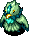 Grass Dude
- Grass Dude - HP: 60 AP: 25 DP: 11 Exp: 160 GP: 40 Type: Plant Speed: Normal Sp.Atk Rate: 21% (near), 16% (far) Item Drop Rate: 0% ~ Ability ~ Spreads grass in a 1 tile radius when adjacent. Pierce-throws grass in a straight line at a distance. Carries up to 2 grass items. Becomes Pin Dude with 0 grass.

</td>
      <td class="day">
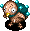 Pin Dude
- Pin Dude - HP: 60 AP: 20 DP: 10 Exp: 100 GP: 20 Type: Plant Speed: Swift 1 Sp.Atk Rate: 0% (near), 0% (far) Item Drop Rate: 0% ~ Ability ~ Runs from Shiren, but attacks when adjacent. Becomes Grass Dude when it picks up a grass item.

</td>
    </tr>
    <tr>
      <td class="day items">
 Gyadon
- Gyadon - HP: 55 AP: 17 DP: 11 Exp: 165 GP: 19 Type: Floating Speed: Normal Sp.Atk Rate: 21% (near), 0% (far) Item Drop Rate: 4% ~ Ability ~ Pecks a staff from your inventory when adjacent, reducing its charges to 0.

</td>
      <td></td>
      <td></td>
      <td></td>
      <td></td>
    </tr>
    <tr>
      <td class="highlightGray3">
 Evil Dragon
- Evil Dragon - HP: 32 AP: 24 DP: 3 Exp: 100 GP: 100 Type: Dragon Speed: Normal Sp.Atk Rate: 20% (near), 33% (far) Item Drop Rate: 22% ~ Ability ~ Resists non-ability attacks. Spews a 50 damage flame that travels in a straight line.

</td>
      <td class="highlightGray3">
 Evil Gyaza
- Evil Gyaza - HP: 32 AP: 24 DP: 3 Exp: 34 GP: 40 Type: Aquatic Speed: Normal Sp.Atk Rate: 0% (near), 0% (far) Item Drop Rate: 4% ~ Ability ~ Resists non-ability attacks. Converts most effects received other than direct attacks to 2 damage.

</td>
      <td class="highlightGray3">
 Dark Zapdon
- Dark Zapdon - HP: 47 AP: 43 DP: 4 Exp: 120 GP: 40 Type: Normal Speed: Slow Sp.Atk Rate: 100% (near), 100% (far) Item Drop Rate: 4% ~ Ability ~ Resists non-ability attacks. Counters with a 40 damage lightning attack after taking damage 3 times.

</td>
      <td class="highlightGray3 itemsNight">
 Evil Super Gazer
- Evil Super Gazer - HP: 47 AP: 39 DP: 4 Exp: 120 GP: 35 Type: Cyclops/Magic Speed: Normal Sp.Atk Rate: 43% (near), 0% (far) Item Drop Rate: 2% ~ Ability ~ Resists non-ability attacks. Hypnotizes Shiren when adjacent, forcing either item usage or an attack in a random direction.

</td>
      <td class="highlightGray3 itemsNight">
 Foul Nigiri Morph
- Foul Nigiri Morph - HP: 47 AP: 43 DP: 5 Exp: 120 GP: 20 Type: Normal Speed: Normal Sp.Atk Rate: 22% (near), 0% (far) Item Drop Rate: 8% ~ Ability ~ Resists non-ability attacks. Transforms an inventory item into Rotten Onigiri when adjacent, excluding equipped items. Instantly collapses when hit by thrown onigiri.

</td>
    </tr>
    <tr>
      <td colspan="6" class="purpleDivider"></td>
    </tr>
    <tr>
      <td rowspan="3" class="centeredText">3</td>
      <td class="day">
 Eligan
- Eligan - HP: 58 AP: 32 DP: 16 Exp: 220 GP: 50 Type: Normal Speed: Normal Sp.Atk Rate: 0% (near), 0% (far) Item Drop Rate: 4% ~ Ability ~ None.

</td>
      <td class="day">
 Sproutyrant
- Sproutyrant - HP: 60 AP: 22 DP: 10 Exp: 14 GP: 80 Type: Plant Speed: Normal Sp.Atk Rate: 0% (near), 0% (far) Item Drop Rate: 4% ~ Ability ~ Monster family becomes immune to most recent status inflicted upon it, excluding Sealed status.

</td>
      <td class="day">
 Yanpii
- Yanpii - HP: 36 AP: 22 DP: 15 Exp: 170 GP: 6 Type: Normal Speed: Normal Sp.Atk Rate: 22% (near), 22% (far) Item Drop Rate: 4% ~ Ability ~ Headbutts Shiren when lined up, dealing 10 damage and knockback based on distance traveled. If Shiren is knocked into a wall, go into the wall 1 tile and take an additional 10 damage.

</td>
      <td class="day farm">
 Grass Dude
- Grass Dude - HP: 60 AP: 25 DP: 11 Exp: 160 GP: 40 Type: Plant Speed: Normal Sp.Atk Rate: 21% (near), 16% (far) Item Drop Rate: 0% ~ Ability ~ Spreads grass in a 1 tile radius when adjacent. Pierce-throws grass in a straight line at a distance. Carries up to 2 grass items. Becomes Pin Dude with 0 grass.

</td>
      <td class="day">
 Pin Dude
- Pin Dude - HP: 60 AP: 20 DP: 10 Exp: 100 GP: 20 Type: Plant Speed: Swift 1 Sp.Atk Rate: 0% (near), 0% (far) Item Drop Rate: 0% ~ Ability ~ Runs from Shiren, but attacks when adjacent. Becomes Grass Dude when it picks up a grass item.

</td>
    </tr>
    <tr>
      <td class="day items">
 Gyadon
- Gyadon - HP: 55 AP: 17 DP: 11 Exp: 165 GP: 19 Type: Floating Speed: Normal Sp.Atk Rate: 21% (near), 0% (far) Item Drop Rate: 4% ~ Ability ~ Pecks a staff from your inventory when adjacent, reducing its charges to 0.

</td>
      <td></td>
      <td></td>
      <td></td>
      <td></td>
    </tr>
    <tr>
      <td class="highlightGray3">
 Evil Dragon
- Evil Dragon - HP: 32 AP: 24 DP: 3 Exp: 100 GP: 100 Type: Dragon Speed: Normal Sp.Atk Rate: 20% (near), 33% (far) Item Drop Rate: 22% ~ Ability ~ Resists non-ability attacks. Spews a 50 damage flame that travels in a straight line.

</td>
      <td class="highlightGray3">
 Evil Gyaza
- Evil Gyaza - HP: 32 AP: 24 DP: 3 Exp: 34 GP: 40 Type: Aquatic Speed: Normal Sp.Atk Rate: 0% (near), 0% (far) Item Drop Rate: 4% ~ Ability ~ Resists non-ability attacks. Converts most effects received other than direct attacks to 2 damage.

</td>
      <td class="highlightGray3 dangerNight">
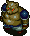 Sinister Porko
- Sinister Porko - HP: 42 AP: 52 DP: 3 Exp: 100 GP: 140 Type: Normal Speed: Normal Sp.Atk Rate: 19% (near), 20% (far) Item Drop Rate: 8% ~ Ability ~ Resists non-ability attacks. Throws a Porky Rock that deals 20 damage within a 4 tile radius. Only drops Porky Rocks.

</td>
      <td class="highlightGray3 dangerNight">
 Filthy Shagga
- Filthy Shagga - HP: 52 AP: 65 DP: 6 Exp: 160 GP: 200 Type: Dragon Speed: Normal Sp.Atk Rate: 0% (near), 0% (far) Item Drop Rate: 4% ~ Ability ~ Resists non-ability attacks.

</td>
      <td class="highlightGray3 dangerNight">
 Dark Fearabbit
- Dark Fearabbit - HP: 28 AP: 20 DP: 2 Exp: 32 GP: 56 Type: Magic Speed: Normal Sp.Atk Rate: 21% (near), 21% (far) Item Drop Rate: 4% ~ Ability ~ Resists non-ability attacks. Attracts up to 3 creatures including Shiren to itself from anywhere in the same room.

</td>
    </tr>
    <tr>
      <td colspan="6" class="purpleDivider"></td>
    </tr>
    <tr>
      <td rowspan="4" class="centeredText">4</td>
      <td class="day">
 DJ Mage
- DJ Mage - HP: 45 AP: 22 DP: 13 Exp: 110 GP: 8 Type: Magic Speed: Normal Sp.Atk Rate: 64% (near), 47% (far) Item Drop Rate: 6% ~ Ability ~ Fires a magic bullet with a random effect in a straight line: Warp, knockback, switch positions, or increase action speed by 1 stage.

</td>
      <td class="day">
 Sproutyrant
- Sproutyrant - HP: 60 AP: 22 DP: 10 Exp: 14 GP: 80 Type: Plant Speed: Normal Sp.Atk Rate: 0% (near), 0% (far) Item Drop Rate: 4% ~ Ability ~ Monster family becomes immune to most recent status inflicted upon it, excluding Sealed status.

</td>
      <td class="day items">
 Nigiri Morph
- Nigiri Morph - HP: 55 AP: 20 DP: 11 Exp: 124 GP: 60 Type: Normal Speed: Normal Sp.Atk Rate: 18% (near), 0% (far) Item Drop Rate: 4% ~ Ability ~ Transforms an inventory item into Large Onigiri when adjacent, excluding equipped items. Instantly collapses when hit by thrown onigiri.

</td>
      <td class="day farm">
 Grass Dude
- Grass Dude - HP: 60 AP: 25 DP: 11 Exp: 160 GP: 40 Type: Plant Speed: Normal Sp.Atk Rate: 21% (near), 16% (far) Item Drop Rate: 0% ~ Ability ~ Spreads grass in a 1 tile radius when adjacent. Pierce-throws grass in a straight line at a distance. Carries up to 2 grass items. Becomes Pin Dude with 0 grass.

</td>
      <td class="day">
 Pin Dude
- Pin Dude - HP: 60 AP: 20 DP: 10 Exp: 100 GP: 20 Type: Plant Speed: Swift 1 Sp.Atk Rate: 0% (near), 0% (far) Item Drop Rate: 0% ~ Ability ~ Runs from Shiren, but attacks when adjacent. Becomes Grass Dude when it picks up a grass item.

</td>
    </tr>
    <tr>
      <td class="day useful">
 Steamroid
- Steamroid - HP: 55 AP: 25 DP: 16 Exp: 240 GP: 35 Type: Metal Speed: Swift 1 Sp.Atk Rate: 38% (near), 38% (far) Item Drop Rate: 4% ~ Ability ~ Initially Napping, wakes when Shiren enters or exits the room. Creates a trap on the ground, then stops acting for 2 turns. Occasionally creates a trap when slain.

</td>
      <td class="day">
 Poofy
- Poofy - HP: 55 AP: 27 DP: 11 Exp: 24 GP: 40 Type: Normal Speed: Swift 1 Sp.Atk Rate: 23% (near), 0% (far) Item Drop Rate: 4% ~ Ability ~ Initially Napping in a group of 3. Shiren can be warped 1~3 floors when surrounded by 3 Poofy monsters.

</td>
      <td></td>
      <td></td>
      <td></td>
    </tr>
    <tr>
      <td class="highlightGray3">
 Evil PolySpinna
- Evil PolySpinna - HP: 25 AP: 18 DP: 3 Exp: 26 GP: 13 Type: Drain/Magic Speed: Normal Sp.Atk Rate: 23% (near), 0% (far) Item Drop Rate: 4% ~ Ability ~ Resists non-ability attacks. Lowers Max HP by 2 or Max Fullness by 5 when adjacent. Occasionally warps in front of Shiren when in a room.

</td>
      <td class="highlightGray3">
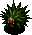 Evil Explochin
- Evil Explochin - HP: 40 AP: 18 DP: 0 Exp: 35 GP: 49 Type: Aquatic/Cyclops/Explode Speed: Normal Sp.Atk Rate: 0% (near), 0% (far) Item Drop Rate: 0% ~ Ability ~ Resists non-ability attacks. Explodes after losing a certain amount of HP.

</td>
      <td class="highlightGray3 dangerNight">
 Sinister Porko
- Sinister Porko - HP: 42 AP: 52 DP: 3 Exp: 100 GP: 140 Type: Normal Speed: Normal Sp.Atk Rate: 19% (near), 20% (far) Item Drop Rate: 8% ~ Ability ~ Resists non-ability attacks. Throws a Porky Rock that deals 20 damage within a 4 tile radius. Only drops Porky Rocks.

</td>
      <td class="highlightGray3 dangerNight">
 Filthy Shagga
- Filthy Shagga - HP: 52 AP: 65 DP: 6 Exp: 160 GP: 200 Type: Dragon Speed: Normal Sp.Atk Rate: 0% (near), 0% (far) Item Drop Rate: 4% ~ Ability ~ Resists non-ability attacks.

</td>
      <td class="highlightGray3 dangerNight">
 Dark Fearabbit
- Dark Fearabbit - HP: 28 AP: 20 DP: 2 Exp: 32 GP: 56 Type: Magic Speed: Normal Sp.Atk Rate: 21% (near), 21% (far) Item Drop Rate: 4% ~ Ability ~ Resists non-ability attacks. Attracts up to 3 creatures including Shiren to itself from anywhere in the same room.

</td>
    </tr>
    <tr>
      <td class="highlightGray3 itemsNight">
 Wicked Spadie
- Wicked Spadie - HP: 37 AP: 28 DP: 4 Exp: 210 GP: 100 Type: Metal Speed: Normal Sp.Atk Rate: 20% (near), 0% (far) Item Drop Rate: 8% ~ Ability ~ Resists non-ability attacks. Shovels dirt at an adjacent target, which can hit through corners. Dirt fills 1 pot in your inventory when it hits Shiren, or inflicts Blind status when it hits an ally. Dirt in pots eventually changes to grass items when advancing floors.

</td>
      <td class="highlightGray3">
 Dark Hurler
- Dark Hurler - HP: 52 AP: 45 DP: 6 Exp: 130 GP: 35 Type: Normal Speed: Normal Sp.Atk Rate: 33% (near), 33% (far) Item Drop Rate: 8% ~ Ability ~ Resists non-ability attacks. Throws an adjacent creature at Shiren, or throws Shiren at another creature, onto a trap, or into a Monster House. Range of 10 tiles, deals 20 damage.

</td>
      <td></td>
      <td></td>
      <td></td>
    </tr>
    <tr>
      <td colspan="6" class="purpleDivider"></td>
    </tr>
    <tr>
      <td rowspan="4" class="centeredText">5</td>
      <td class="day">
 DJ Mage
- DJ Mage - HP: 45 AP: 22 DP: 13 Exp: 110 GP: 8 Type: Magic Speed: Normal Sp.Atk Rate: 64% (near), 47% (far) Item Drop Rate: 6% ~ Ability ~ Fires a magic bullet with a random effect in a straight line: Warp, knockback, switch positions, or increase action speed by 1 stage.

</td>
      <td class="day">
 Sproutyrant
- Sproutyrant - HP: 60 AP: 22 DP: 10 Exp: 14 GP: 80 Type: Plant Speed: Normal Sp.Atk Rate: 0% (near), 0% (far) Item Drop Rate: 4% ~ Ability ~ Monster family becomes immune to most recent status inflicted upon it, excluding Sealed status.

</td>
      <td class="day items">
 Nigiri Morph
- Nigiri Morph - HP: 55 AP: 20 DP: 11 Exp: 124 GP: 60 Type: Normal Speed: Normal Sp.Atk Rate: 18% (near), 0% (far) Item Drop Rate: 4% ~ Ability ~ Transforms an inventory item into Large Onigiri when adjacent, excluding equipped items. Instantly collapses when hit by thrown onigiri.

</td>
      <td class="day farm">
 Froggucci
- Froggucci - HP: 47 AP: 26 DP: 15 Exp: 215 GP: 5 Type: Normal Speed: Normal Sp.Atk Rate: 26% (near), 0% (far) Item Drop Rate: 100% ~ Ability ~ Steals Gitan when adjacent and warps, then runs from Shiren at swift speed. Stands on Gitan it finds the ground. Doesn't use direct attacks. Heals HP when hit by thrown Gitan.

</td>
      <td class="day">
 Boy Cart
- Boy Cart - HP: 43 AP: 20 DP: 11 Exp: 75 GP: 2 Type: Normal Speed: Swift 1 Sp.Atk Rate: 100% (near), 80% (far) Item Drop Rate: 6% ~ Ability ~ Shoots Wood Arrows. Moves away if Shiren gets close. Doesn't attack in hallways. Only drops Wood Arrows.

</td>
    </tr>
    <tr>
      <td class="day useful">
 Steamroid
- Steamroid - HP: 55 AP: 25 DP: 16 Exp: 240 GP: 35 Type: Metal Speed: Swift 1 Sp.Atk Rate: 38% (near), 38% (far) Item Drop Rate: 4% ~ Ability ~ Initially Napping, wakes when Shiren enters or exits the room. Creates a trap on the ground, then stops acting for 2 turns. Occasionally creates a trap when slain.

</td>
      <td class="day">
 Poofy
- Poofy - HP: 55 AP: 27 DP: 11 Exp: 24 GP: 40 Type: Normal Speed: Swift 1 Sp.Atk Rate: 23% (near), 0% (far) Item Drop Rate: 4% ~ Ability ~ Initially Napping in a group of 3. Shiren can be warped 1~3 floors when surrounded by 3 Poofy monsters.

</td>
      <td class="day">
 Snooztapir
- Snooztapir - HP: 80 AP: 50 DP: 15 Exp: 480 GP: 89 Type: Normal Speed: Normal Sp.Atk Rate: 23% (near), 0% (far) Item Drop Rate: 4% ~ Ability ~ Initially Napping, will not wake up when Shiren enters or exits the room. Occasionally inflicts Asleep status in a 1 tile radius when it's Napping, Asleep, or Sound Asleep. Chance to yawn when slain, inflicting Asleep status in a 1 tile radius.

</td>
      <td class="day danger">
 Absorbiphant
- Absorbiphant - HP: 43 AP: 22 DP: 10 Exp: 110 GP: 12 Type: Drain Speed: Normal Sp.Atk Rate: 100% (near), 100% (far) Item Drop Rate: 4% ~ Ability ~ Absorbs status conditions inflicted on itself or from a creature within a 1 tile radius, fully restoring its own HP and raising AP by 1 stage.

</td>
      <td></td>
    </tr>
    <tr>
      <td class="highlightGray3">
 Evil PolySpinna
- Evil PolySpinna - HP: 25 AP: 18 DP: 3 Exp: 26 GP: 13 Type: Drain/Magic Speed: Normal Sp.Atk Rate: 23% (near), 0% (far) Item Drop Rate: 4% ~ Ability ~ Resists non-ability attacks. Lowers Max HP by 2 or Max Fullness by 5 when adjacent. Occasionally warps in front of Shiren when in a room.

</td>
      <td class="highlightGray3">
 Evil Explochin
- Evil Explochin - HP: 40 AP: 18 DP: 0 Exp: 35 GP: 49 Type: Aquatic/Cyclops/Explode Speed: Normal Sp.Atk Rate: 0% (near), 0% (far) Item Drop Rate: 0% ~ Ability ~ Resists non-ability attacks. Explodes after losing a certain amount of HP.

</td>
      <td class="highlightGray3">
 Vile Pumphantasm
- Vile Pumphantasm - HP: 43 AP: 35 DP: 2 Exp: 60 GP: 30 Type: Plant/Floating Speed: Normal Sp.Atk Rate: 0% (near), 0% (far) Item Drop Rate: 0% ~ Ability ~ Resists non-ability attacks. Can pass through walls. Unpredictable movement, but slowly approaches Shiren.

</td>
      <td class="highlightGray3 dangerNight">
 Filthy Shagga
- Filthy Shagga - HP: 52 AP: 65 DP: 6 Exp: 160 GP: 200 Type: Dragon Speed: Normal Sp.Atk Rate: 0% (near), 0% (far) Item Drop Rate: 4% ~ Ability ~ Resists non-ability attacks.

</td>
      <td class="highlightGray3 dangerNight">
 Dark Digestiphant
- Dark Digestiphant - HP: 43 AP: 35 DP: 5 Exp: 60 GP: 60 Type: Drain Speed: Normal Sp.Atk Rate: 100% (near), 100% (far) Item Drop Rate: 8% ~ Ability ~ Resists non-ability attacks. Absorbs status conditions inflicted on itself or from a creature within a 1 tile radius, fully restoring its own HP and raising AP by 2 stages.

</td>
    </tr>
    <tr>
      <td class="highlightGray3 itemsNight">
 Wicked Spadie
- Wicked Spadie - HP: 37 AP: 28 DP: 4 Exp: 210 GP: 100 Type: Metal Speed: Normal Sp.Atk Rate: 20% (near), 0% (far) Item Drop Rate: 8% ~ Ability ~ Resists non-ability attacks. Shovels dirt at an adjacent target, which can hit through corners. Dirt fills 1 pot in your inventory when it hits Shiren, or inflicts Blind status when it hits an ally. Dirt in pots eventually changes to grass items when advancing floors.

</td>
      <td class="highlightGray3">
 Dark Hurler
- Dark Hurler - HP: 52 AP: 45 DP: 6 Exp: 130 GP: 35 Type: Normal Speed: Normal Sp.Atk Rate: 33% (near), 33% (far) Item Drop Rate: 8% ~ Ability ~ Resists non-ability attacks. Throws an adjacent creature at Shiren, or throws Shiren at another creature, onto a trap, or into a Monster House. Range of 10 tiles, deals 20 damage.

</td>
      <td></td>
      <td></td>
      <td></td>
    </tr>
    <tr>
      <td colspan="6" class="purpleDivider"></td>
    </tr>
    <tr>
      <td rowspan="4" class="centeredText">6</td>
      <td class="day">
 DJ Mage
- DJ Mage - HP: 45 AP: 22 DP: 13 Exp: 110 GP: 8 Type: Magic Speed: Normal Sp.Atk Rate: 64% (near), 47% (far) Item Drop Rate: 6% ~ Ability ~ Fires a magic bullet with a random effect in a straight line: Warp, knockback, switch positions, or increase action speed by 1 stage.

</td>
      <td class="day">
 Ironhead
- Ironhead - HP: 60 AP: 38 DP: 16 Exp: 230 GP: 70 Type: Cyclops Speed: Normal Sp.Atk Rate: 34% (near), 34% (far) Item Drop Rate: 4% ~ Ability ~ Attacks 2 tiles ahead and through corners. Charges strength to deal double damage on the next turn.

</td>
      <td class="day">
 Snooztapir
- Snooztapir - HP: 80 AP: 50 DP: 15 Exp: 480 GP: 89 Type: Normal Speed: Normal Sp.Atk Rate: 23% (near), 0% (far) Item Drop Rate: 4% ~ Ability ~ Initially Napping, will not wake up when Shiren enters or exits the room. Occasionally inflicts Asleep status in a 1 tile radius when it's Napping, Asleep, or Sound Asleep. Chance to yawn when slain, inflicting Asleep status in a 1 tile radius.

</td>
      <td class="day farm">
 Froggucci
- Froggucci - HP: 47 AP: 26 DP: 15 Exp: 215 GP: 5 Type: Normal Speed: Normal Sp.Atk Rate: 26% (near), 0% (far) Item Drop Rate: 100% ~ Ability ~ Steals Gitan when adjacent and warps, then runs from Shiren at swift speed. Stands on Gitan it finds the ground. Doesn't use direct attacks. Heals HP when hit by thrown Gitan.

</td>
      <td class="day">
 Boy Cart
- Boy Cart - HP: 43 AP: 20 DP: 11 Exp: 75 GP: 2 Type: Normal Speed: Swift 1 Sp.Atk Rate: 100% (near), 80% (far) Item Drop Rate: 6% ~ Ability ~ Shoots Wood Arrows. Moves away if Shiren gets close. Doesn't attack in hallways. Only drops Wood Arrows.

</td>
    </tr>
    <tr>
      <td></td>
      <td class="day">
 Poofy
- Poofy - HP: 55 AP: 27 DP: 11 Exp: 24 GP: 40 Type: Normal Speed: Swift 1 Sp.Atk Rate: 23% (near), 0% (far) Item Drop Rate: 4% ~ Ability ~ Initially Napping in a group of 3. Shiren can be warped 1~3 floors when surrounded by 3 Poofy monsters.

</td>
      <td></td>
      <td class="day danger">
 Absorbiphant
- Absorbiphant - HP: 43 AP: 22 DP: 10 Exp: 110 GP: 12 Type: Drain Speed: Normal Sp.Atk Rate: 100% (near), 100% (far) Item Drop Rate: 4% ~ Ability ~ Absorbs status conditions inflicted on itself or from a creature within a 1 tile radius, fully restoring its own HP and raising AP by 1 stage.

</td>
      <td></td>
    </tr>
    <tr>
      <td class="highlightGray3 farmNight">
 Bad Zalokleft
- Bad Zalokleft - HP: 48 AP: 28 DP: 2 Exp: 130 GP: 5 Type: Aquatic Speed: Normal Sp.Atk Rate: 48% (near), 0% (far) Item Drop Rate: 100% ~ Ability ~ Resists non-ability attacks. Initially Napping. Steals an item from Shiren when adjacent or picks up an item on the ground, then warps. The stolen item becomes cursed or sealed. Runs away from Shiren after stealing an item. Can use direct attacks. Always drops a blessed item from a unique table if slain before stealing an item, otherwise drops the stolen item.

</td>
      <td class="highlightGray3">
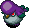 Sinful Sr. Yanpii
- Sinful Sr. Yanpii - HP: 48 AP: 53 DP: 2 Exp: 50 GP: 80 Type: Normal Speed: Normal Sp.Atk Rate: 22% (near), 22% (far) Item Drop Rate: 8% ~ Ability ~ Resists non-ability attacks. Headbutts Shiren when lined up, dealing 25 damage and knockback based on distance traveled. If Shiren is knocked into a wall, go into the wall 2 tiles and take an additional 20 damage.

</td>
      <td class="highlightGray3">
 Vile Pumphantasm
- Vile Pumphantasm - HP: 43 AP: 35 DP: 2 Exp: 60 GP: 30 Type: Plant/Floating Speed: Normal Sp.Atk Rate: 0% (near), 0% (far) Item Drop Rate: 0% ~ Ability ~ Resists non-ability attacks. Can pass through walls. Unpredictable movement, but slowly approaches Shiren.

</td>
      <td class="highlightGray3">
 Dark Hurler
- Dark Hurler - HP: 52 AP: 45 DP: 6 Exp: 130 GP: 35 Type: Normal Speed: Normal Sp.Atk Rate: 33% (near), 33% (far) Item Drop Rate: 8% ~ Ability ~ Resists non-ability attacks. Throws an adjacent creature at Shiren, or throws Shiren at another creature, onto a trap, or into a Monster House. Range of 10 tiles, deals 20 damage.

</td>
      <td class="highlightGray3 dangerNight">
 Dark Digestiphant
- Dark Digestiphant - HP: 43 AP: 35 DP: 5 Exp: 60 GP: 60 Type: Drain Speed: Normal Sp.Atk Rate: 100% (near), 100% (far) Item Drop Rate: 8% ~ Ability ~ Resists non-ability attacks. Absorbs status conditions inflicted on itself or from a creature within a 1 tile radius, fully restoring its own HP and raising AP by 2 stages.

</td>
    </tr>
    <tr>
      <td class="highlightGray3">
 Dark Snooztapir
- Dark Snooztapir - HP: 48 AP: 35 DP: 4 Exp: 150 GP: 152 Type: Normal Speed: Normal Sp.Atk Rate: 23% (near), 0% (far) Item Drop Rate: 8% ~ Ability ~ Resists non-ability attacks. Initially Napping, will not wake up when Shiren enters or exits the room. Occasionally inflicts Asleep status in a 1 tile radius when it's Napping, Asleep, or Sound Asleep. Chance to yawn when slain, inflicting Asleep status in a 1 tile radius.

</td>
      <td></td>
      <td></td>
      <td></td>
      <td></td>
    </tr>
    <tr>
      <td colspan="6" class="purpleDivider"></td>
    </tr>
    <tr>
      <td rowspan="3" class="centeredText">7</td>
      <td class="day">
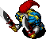 Punisher
- Punisher - HP: 55 AP: 42 DP: 10 Exp: 210 GP: 90 Type: Normal Speed: Normal Sp.Atk Rate: 13% (near), 0% (far) Item Drop Rate: 4% ~ Ability ~ Occasionally lands a critical hit that deals double damage.

</td>
      <td class="day">
 Ironhead
- Ironhead - HP: 60 AP: 38 DP: 16 Exp: 230 GP: 70 Type: Cyclops Speed: Normal Sp.Atk Rate: 34% (near), 34% (far) Item Drop Rate: 4% ~ Ability ~ Attacks 2 tiles ahead and through corners. Charges strength to deal double damage on the next turn.

</td>
      <td class="day items">
 Cursister
- Cursister - HP: 40 AP: 22 DP: 10 Exp: 110 GP: 20 Type: Normal Speed: Normal Sp.Atk Rate: 27% (near), 0% (far) Item Drop Rate: 0% ~ Ability ~ Curses or seals 1 item when adjacent.

</td>
      <td class="day danger">
 Absorbiphant
- Absorbiphant - HP: 43 AP: 22 DP: 10 Exp: 110 GP: 12 Type: Drain Speed: Normal Sp.Atk Rate: 100% (near), 100% (far) Item Drop Rate: 4% ~ Ability ~ Absorbs status conditions inflicted on itself or from a creature within a 1 tile radius, fully restoring its own HP and raising AP by 1 stage.

</td>
      <td class="day">
 Hipadile
- Hipadile - HP: 60 AP: 48 DP: 15 Exp: 480 GP: 40 Type: Dragon/Aquatic Speed: Normal Sp.Atk Rate: 0% (near), 0% (far) Item Drop Rate: 4% ~ Ability ~ Moves like a chess knight when Shiren is in view. Performs a 20 damage jumping attack when Shiren is in range of a chess knight hop.

</td>
    </tr>
    <tr>
      <td class="highlightGray3 farmNight">
 Bad Zalokleft
- Bad Zalokleft - HP: 48 AP: 28 DP: 2 Exp: 130 GP: 5 Type: Aquatic Speed: Normal Sp.Atk Rate: 48% (near), 0% (far) Item Drop Rate: 100% ~ Ability ~ Resists non-ability attacks. Initially Napping. Steals an item from Shiren when adjacent or picks up an item on the ground, then warps. The stolen item becomes cursed or sealed. Runs away from Shiren after stealing an item. Can use direct attacks. Always drops a blessed item from a unique table if slain before stealing an item, otherwise drops the stolen item.

</td>
      <td class="highlightGray3">
 Sinful Sr. Yanpii
- Sinful Sr. Yanpii - HP: 48 AP: 53 DP: 2 Exp: 50 GP: 80 Type: Normal Speed: Normal Sp.Atk Rate: 22% (near), 22% (far) Item Drop Rate: 8% ~ Ability ~ Resists non-ability attacks. Headbutts Shiren when lined up, dealing 25 damage and knockback based on distance traveled. If Shiren is knocked into a wall, go into the wall 2 tiles and take an additional 20 damage.

</td>
      <td class="highlightGray3 dangerNight">
 Dark Grampa Tank
- Dark Grampa Tank - HP: 45 AP: 32 DP: 3 Exp: 130 GP: 35 Type: Metal/Explode Speed: Normal Sp.Atk Rate: 75% (near), 55% (far) Item Drop Rate: 8% ~ Ability ~ Resists non-ability attacks. Fires a 40 damage cannon in a straight line whenever Shiren is in range of the 1 tile blast radius. Can use direct attacks.

</td>
      <td class="highlightGray3">
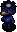 Dark Kappa Pest
- Dark Kappa Pest - HP: 38 AP: 35 DP: 3 Exp: 50 GP: 25 Type: Aquatic Speed: Normal Sp.Atk Rate: 0% (near), 0% (far) Item Drop Rate: 8% ~ Ability ~ Resists non-ability attacks. Stands on an item and throws it at Shiren when he gets within 5 tiles. Catches projectiles and throws them back at Shiren. Cannot throw weapons or Gitan.

</td>
      <td class="highlightGray3">
 Evil Flamepuff
- Evil Flamepuff - HP: 43 AP: 35 DP: 5 Exp: 80 GP: 45 Type: Dragon/Floating Speed: Normal Sp.Atk Rate: 89% (near), 0% (far) Item Drop Rate: 8% ~ Ability ~ Resists non-ability attacks. Breathes 40 damage fire when adjacent, which can hit through corners. Occasionally fails at breathing fire.

</td>
    </tr>
    <tr>
      <td class="highlightGray3">
 Dark Snooztapir
- Dark Snooztapir - HP: 48 AP: 35 DP: 4 Exp: 150 GP: 152 Type: Normal Speed: Normal Sp.Atk Rate: 23% (near), 0% (far) Item Drop Rate: 8% ~ Ability ~ Resists non-ability attacks. Initially Napping, will not wake up when Shiren enters or exits the room. Occasionally inflicts Asleep status in a 1 tile radius when it's Napping, Asleep, or Sound Asleep. Chance to yawn when slain, inflicting Asleep status in a 1 tile radius.

</td>
      <td></td>
      <td></td>
      <td></td>
      <td></td>
    </tr>
    <tr>
      <td colspan="6" class="purpleDivider"></td>
    </tr>
    <tr>
      <td rowspan="3" class="centeredText">8</td>
      <td class="day">
 Punisher
- Punisher - HP: 55 AP: 42 DP: 10 Exp: 210 GP: 90 Type: Normal Speed: Normal Sp.Atk Rate: 13% (near), 0% (far) Item Drop Rate: 4% ~ Ability ~ Occasionally lands a critical hit that deals double damage.

</td>
      <td class="day items">
 Spadie
- Spadie - HP: 49 AP: 23 DP: 17 Exp: 190 GP: 45 Type: Metal Speed: Normal Sp.Atk Rate: 20% (near), 0% (far) Item Drop Rate: 4% ~ Ability ~ Shovels dirt at an adjacent target, which can hit through corners. Dirt fills 1 pot in your inventory when it hits Shiren, or inflicts Blind status when it hits an ally. Dirt in pots eventually changes to grass items when advancing floors.

</td>
      <td class="day items">
 Cursister
- Cursister - HP: 40 AP: 22 DP: 10 Exp: 110 GP: 20 Type: Normal Speed: Normal Sp.Atk Rate: 27% (near), 0% (far) Item Drop Rate: 0% ~ Ability ~ Curses or seals 1 item when adjacent.

</td>
      <td class="day">
 Crow Tengu
- Crow Tengu - HP: 37 AP: 16 DP: 11 Exp: 24 GP: 6 Type: Floating Speed: Normal Sp.Atk Rate: 0% (near), 0% (far) Item Drop Rate: 0% ~ Ability ~ Disguises itself as a different monster, but it can't use special attacks of the monster it's disguised as.

</td>
      <td class="day">
 Hipadile
- Hipadile - HP: 60 AP: 48 DP: 15 Exp: 480 GP: 40 Type: Dragon/Aquatic Speed: Normal Sp.Atk Rate: 0% (near), 0% (far) Item Drop Rate: 4% ~ Ability ~ Moves like a chess knight when Shiren is in view. Performs a 20 damage jumping attack when Shiren is in range of a chess knight hop.

</td>
    </tr>
    <tr>
      <td class="day">
 Sr. Yanpii
- Sr. Yanpii - HP: 49 AP: 33 DP: 17 Exp: 450 GP: 90 Type: Normal Speed: Normal Sp.Atk Rate: 22% (near), 22% (far) Item Drop Rate: 4% ~ Ability ~ Headbutts Shiren when lined up, dealing 20 damage and knockback based on distance traveled. If Shiren is knocked into a wall, go into the wall 2 tiles and take an additional 20 damage.

</td>
      <td class="day items">
 Muddy
- Muddy - HP: 55 AP: 17 DP: 11 Exp: 54 GP: 20 Type: Aquatic Speed: Normal Sp.Atk Rate: 38% (near), 0% (far) Item Drop Rate: 0% ~ Ability ~ Lowers upgrade value of equipped weapon or shield by 2. May also remove the item's tag. Chance to multiply when attacked. Doesn't use direct attacks.

</td>
      <td class="day">
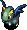 Firepuff
- Firepuff - HP: 50 AP: 25 DP: 20 Exp: 175 GP: 8 Type: Dragon/Floating Speed: Normal Sp.Atk Rate: 89% (near), 0% (far) Item Drop Rate: 4% ~ Ability ~ Breathes 10 damage fire when adjacent, which can hit through corners. Occasionally fails at breathing fire.

</td>
      <td></td>
      <td></td>
    </tr>
    <tr>
      <td></td>
      <td class="highlightGray3">
 Dark Dazikon
- Dark Dazikon - HP: 37 AP: 24 DP: 4 Exp: 100 GP: 100 Type: Plant Speed: Normal Sp.Atk Rate: 22% (near), 22% (far) Item Drop Rate: 8% ~ Ability ~ Resists non-ability attacks. Throws Confusion Grass within a 2 tile radius. Throws Poison Grass if Shiren has Confused status. Only drops Confusion Grass.

</td>
      <td class="highlightGray3 dangerNight">
 Dark Grampa Tank
- Dark Grampa Tank - HP: 45 AP: 32 DP: 3 Exp: 130 GP: 35 Type: Metal/Explode Speed: Normal Sp.Atk Rate: 75% (near), 55% (far) Item Drop Rate: 8% ~ Ability ~ Resists non-ability attacks. Fires a 40 damage cannon in a straight line whenever Shiren is in range of the 1 tile blast radius. Can use direct attacks.

</td>
      <td class="highlightGray3">
 Dark Kappa Pest
- Dark Kappa Pest - HP: 38 AP: 35 DP: 3 Exp: 50 GP: 25 Type: Aquatic Speed: Normal Sp.Atk Rate: 0% (near), 0% (far) Item Drop Rate: 8% ~ Ability ~ Resists non-ability attacks. Stands on an item and throws it at Shiren when he gets within 5 tiles. Catches projectiles and throws them back at Shiren. Cannot throw weapons or Gitan.

</td>
      <td class="highlightGray3">
 Evil Flamepuff
- Evil Flamepuff - HP: 43 AP: 35 DP: 5 Exp: 80 GP: 45 Type: Dragon/Floating Speed: Normal Sp.Atk Rate: 89% (near), 0% (far) Item Drop Rate: 8% ~ Ability ~ Resists non-ability attacks. Breathes 40 damage fire when adjacent, which can hit through corners. Occasionally fails at breathing fire.

</td>
    </tr>
    <tr>
      <td colspan="6" class="purpleDivider"></td>
    </tr>
    <tr>
      <td rowspan="3" class="centeredText">9</td>
      <td class="day">
 Punisher
- Punisher - HP: 55 AP: 42 DP: 10 Exp: 210 GP: 90 Type: Normal Speed: Normal Sp.Atk Rate: 13% (near), 0% (far) Item Drop Rate: 4% ~ Ability ~ Occasionally lands a critical hit that deals double damage.

</td>
      <td class="day items">
 Spadie
- Spadie - HP: 49 AP: 23 DP: 17 Exp: 190 GP: 45 Type: Metal Speed: Normal Sp.Atk Rate: 20% (near), 0% (far) Item Drop Rate: 4% ~ Ability ~ Shovels dirt at an adjacent target, which can hit through corners. Dirt fills 1 pot in your inventory when it hits Shiren, or inflicts Blind status when it hits an ally. Dirt in pots eventually changes to grass items when advancing floors.

</td>
      <td class="day">
 Firepuff
- Firepuff - HP: 50 AP: 25 DP: 20 Exp: 175 GP: 8 Type: Dragon/Floating Speed: Normal Sp.Atk Rate: 89% (near), 0% (far) Item Drop Rate: 4% ~ Ability ~ Breathes 10 damage fire when adjacent, which can hit through corners. Occasionally fails at breathing fire.

</td>
      <td class="day">
 Crow Tengu
- Crow Tengu - HP: 37 AP: 16 DP: 11 Exp: 24 GP: 6 Type: Floating Speed: Normal Sp.Atk Rate: 0% (near), 0% (far) Item Drop Rate: 0% ~ Ability ~ Disguises itself as a different monster, but it can't use special attacks of the monster it's disguised as.

</td>
      <td class="day">
 Hipadile
- Hipadile - HP: 60 AP: 48 DP: 15 Exp: 480 GP: 40 Type: Dragon/Aquatic Speed: Normal Sp.Atk Rate: 0% (near), 0% (far) Item Drop Rate: 4% ~ Ability ~ Moves like a chess knight when Shiren is in view. Performs a 20 damage jumping attack when Shiren is in range of a chess knight hop.

</td>
    </tr>
    <tr>
      <td class="day">
 Sr. Yanpii
- Sr. Yanpii - HP: 49 AP: 33 DP: 17 Exp: 450 GP: 90 Type: Normal Speed: Normal Sp.Atk Rate: 22% (near), 22% (far) Item Drop Rate: 4% ~ Ability ~ Headbutts Shiren when lined up, dealing 20 damage and knockback based on distance traveled. If Shiren is knocked into a wall, go into the wall 2 tiles and take an additional 20 damage.

</td>
      <td class="day items">
 Muddy
- Muddy - HP: 55 AP: 17 DP: 11 Exp: 54 GP: 20 Type: Aquatic Speed: Normal Sp.Atk Rate: 38% (near), 0% (far) Item Drop Rate: 0% ~ Ability ~ Lowers upgrade value of equipped weapon or shield by 2. May also remove the item's tag. Chance to multiply when attacked. Doesn't use direct attacks.

</td>
      <td></td>
      <td></td>
      <td></td>
    </tr>
    <tr>
      <td class="highlightGray3">
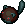 Dark Cave Mamel
- Dark Cave Mamel - HP: 40 AP: 52 DP: 6 Exp: 220 GP: 450 Type: Normal Speed: Normal Sp.Atk Rate: 0% (near), 0% (far) Item Drop Rate: 16% ~ Ability ~ Resists non-ability attacks.

</td>
      <td class="highlightGray3">
 Dark Dazikon
- Dark Dazikon - HP: 37 AP: 24 DP: 4 Exp: 100 GP: 100 Type: Plant Speed: Normal Sp.Atk Rate: 22% (near), 22% (far) Item Drop Rate: 8% ~ Ability ~ Resists non-ability attacks. Throws Confusion Grass within a 2 tile radius. Throws Poison Grass if Shiren has Confused status. Only drops Confusion Grass.

</td>
      <td class="highlightGray3 farmNight">
 Bad Momoseal
- Bad Momoseal - HP: 55 AP: 45 DP: 3 Exp: 1111 GP: 150 Type: Aquatic Speed: Normal Sp.Atk Rate: 50% (near), 32% (far) Item Drop Rate: 4% ~ Ability ~ Resists non-ability attacks. Performs a tackle that deals 25 damage when lined up vertically. Turns Apathetic after tackling. Doesn't move on its own.

</td>
      <td></td>
      <td></td>
    </tr>
    <tr>
      <td colspan="6" class="purpleDivider"></td>
    </tr>
    <tr>
      <td rowspan="3" class="centeredText">10</td>
      <td class="day items">
 Muddy
- Muddy - HP: 55 AP: 17 DP: 11 Exp: 54 GP: 20 Type: Aquatic Speed: Normal Sp.Atk Rate: 38% (near), 0% (far) Item Drop Rate: 0% ~ Ability ~ Lowers upgrade value of equipped weapon or shield by 2. May also remove the item's tag. Chance to multiply when attacked. Doesn't use direct attacks.

</td>
      <td class="day items">
 Spadie
- Spadie - HP: 49 AP: 23 DP: 17 Exp: 190 GP: 45 Type: Metal Speed: Normal Sp.Atk Rate: 20% (near), 0% (far) Item Drop Rate: 4% ~ Ability ~ Shovels dirt at an adjacent target, which can hit through corners. Dirt fills 1 pot in your inventory when it hits Shiren, or inflicts Blind status when it hits an ally. Dirt in pots eventually changes to grass items when advancing floors.

</td>
      <td class="day">
 Firepuff
- Firepuff - HP: 50 AP: 25 DP: 20 Exp: 175 GP: 8 Type: Dragon/Floating Speed: Normal Sp.Atk Rate: 89% (near), 0% (far) Item Drop Rate: 4% ~ Ability ~ Breathes 10 damage fire when adjacent, which can hit through corners. Occasionally fails at breathing fire.

</td>
      <td class="day">
 Crow Tengu
- Crow Tengu - HP: 37 AP: 16 DP: 11 Exp: 24 GP: 6 Type: Floating Speed: Normal Sp.Atk Rate: 0% (near), 0% (far) Item Drop Rate: 0% ~ Ability ~ Disguises itself as a different monster, but it can't use special attacks of the monster it's disguised as.

</td>
      <td class="day">
 Cross Cart
- Cross Cart - HP: 56 AP: 28 DP: 17 Exp: 180 GP: 7 Type: Normal Speed: Swift 1 Sp.Atk Rate: 100% (near), 80% (far) Item Drop Rate: 6% ~ Ability ~ Shoots Iron Arrows. Moves away if Shiren gets close. Doesn't attack in hallways. Only drops Iron Arrows.

</td>
    </tr>
    <tr>
      <td class="day">
 Sr. Yanpii
- Sr. Yanpii - HP: 49 AP: 33 DP: 17 Exp: 450 GP: 90 Type: Normal Speed: Normal Sp.Atk Rate: 22% (near), 22% (far) Item Drop Rate: 4% ~ Ability ~ Headbutts Shiren when lined up, dealing 20 damage and knockback based on distance traveled. If Shiren is knocked into a wall, go into the wall 2 tiles and take an additional 20 damage.

</td>
      <td></td>
      <td></td>
      <td></td>
      <td></td>
    </tr>
    <tr>
      <td class="highlightGray3">
 Dark Cave Mamel
- Dark Cave Mamel - HP: 40 AP: 52 DP: 6 Exp: 220 GP: 450 Type: Normal Speed: Normal Sp.Atk Rate: 0% (near), 0% (far) Item Drop Rate: 16% ~ Ability ~ Resists non-ability attacks.

</td>
      <td class="highlightGray3">
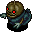 Vile Pumphantom
- Vile Pumphantom - HP: 53 AP: 45 DP: 5 Exp: 120 GP: 100 Type: Plant/Floating Speed: Normal Sp.Atk Rate: 0% (near), 0% (far) Item Drop Rate: 0% ~ Ability ~ Resists non-ability attacks. Can pass through walls. Unpredictable movement, but slowly approaches Shiren.

</td>
      <td class="highlightGray3 farmNight">
 Bad Momoseal
- Bad Momoseal - HP: 55 AP: 45 DP: 3 Exp: 1111 GP: 150 Type: Aquatic Speed: Normal Sp.Atk Rate: 50% (near), 32% (far) Item Drop Rate: 4% ~ Ability ~ Resists non-ability attacks. Performs a tackle that deals 25 damage when lined up vertically. Turns Apathetic after tackling. Doesn't move on its own.

</td>
      <td></td>
      <td></td>
    </tr>
    <tr>
      <td colspan="6" class="purpleDivider"></td>
    </tr>
    <tr>
      <td rowspan="3" class="centeredText">11</td>
      <td class="day">
 Kappa Pest
- Kappa Pest - HP: 65 AP: 25 DP: 17 Exp: 180 GP: 20 Type: Aquatic Speed: Normal Sp.Atk Rate: 0% (near), 0% (far) Item Drop Rate: 4% ~ Ability ~ Stands on an item and throws it at Shiren when he gets within 5 tiles. Catches projectiles and throws them back at Shiren. Cannot throw weapons or Gitan.

</td>
      <td class="day">
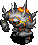 Zapdon
- Zapdon - HP: 79 AP: 59 DP: 22 Exp: 330 GP: 33 Type: Normal Speed: Slow Sp.Atk Rate: 100% (near), 100% (far) Item Drop Rate: 4% ~ Ability ~ Counters with a 25 damage lightning attack when Shiren is in view after taking damage 3 times.

</td>
      <td class="day danger">
 MC Mage
- MC Mage - HP: 56 AP: 26 DP: 17 Exp: 360 GP: 25 Type: Magic Speed: Normal Sp.Atk Rate: 64% (near), 47% (far) Item Drop Rate: 6% ~ Ability ~ Fires a magic bullet with a random effect in a straight line: Blind, confused, transient, or 20 damage.

</td>
      <td class="day">
 Go-Ham!
- Go-Ham! - HP: 45 AP: 15 DP: 10 Exp: 50 GP: 20 Type: Normal Speed: Normal Sp.Atk Rate: 0% (near), 0% (far) Item Drop Rate: 4% ~ Ability ~ Runs away from Shiren, but attacks when cornered. Moves toward monsters in view. Cheers for adjacent creatures, raising AP by 2 stages and letting them survive a fatal hit.

</td>
      <td class="day">
 Cross Cart
- Cross Cart - HP: 56 AP: 28 DP: 17 Exp: 180 GP: 7 Type: Normal Speed: Swift 1 Sp.Atk Rate: 100% (near), 80% (far) Item Drop Rate: 6% ~ Ability ~ Shoots Iron Arrows. Moves away if Shiren gets close. Doesn't attack in hallways. Only drops Iron Arrows.

</td>
    </tr>
    <tr>
      <td class="day danger">
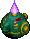 Digestiphant
- Digestiphant - HP: 56 AP: 28 DP: 17 Exp: 180 GP: 25 Type: Drain Speed: Normal Sp.Atk Rate: 100% (near), 100% (far) Item Drop Rate: 4% ~ Ability ~ Absorbs status conditions inflicted on itself or from a creature within a 1 tile radius, fully restoring its own HP and raising AP by 2 stages.

</td>
      <td class="day danger">
 Scarabbit
- Scarabbit - HP: 55 AP: 26 DP: 13 Exp: 130 GP: 35 Type: Magic Speed: Normal Sp.Atk Rate: 21% (near), 21% (far) Item Drop Rate: 4% ~ Ability ~ Attracts up to 5 creatures including Shiren to itself from anywhere in the same room.

</td>
      <td></td>
      <td></td>
      <td></td>
    </tr>
    <tr>
      <td class="highlightGray3">
 Dark Cave Mamel
- Dark Cave Mamel - HP: 40 AP: 52 DP: 6 Exp: 220 GP: 450 Type: Normal Speed: Normal Sp.Atk Rate: 0% (near), 0% (far) Item Drop Rate: 16% ~ Ability ~ Resists non-ability attacks.

</td>
      <td class="highlightGray3">
 Vile Pumphantom
- Vile Pumphantom - HP: 53 AP: 45 DP: 5 Exp: 120 GP: 100 Type: Plant/Floating Speed: Normal Sp.Atk Rate: 0% (near), 0% (far) Item Drop Rate: 0% ~ Ability ~ Resists non-ability attacks. Can pass through walls. Unpredictable movement, but slowly approaches Shiren.

</td>
      <td class="highlightGray3 farmNight">
 Bad Momoseal
- Bad Momoseal - HP: 55 AP: 45 DP: 3 Exp: 1111 GP: 150 Type: Aquatic Speed: Normal Sp.Atk Rate: 50% (near), 32% (far) Item Drop Rate: 4% ~ Ability ~ Resists non-ability attacks. Performs a tackle that deals 25 damage when lined up vertically. Turns Apathetic after tackling. Doesn't move on its own.

</td>
      <td class="highlightGray3">
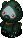 Dark Pandanigiri
- Dark Pandanigiri - HP: 34 AP: 50 DP: 4 Exp: 100 GP: 75 Type: Normal Speed: Normal Sp.Atk Rate: 0% (near), 0% (far) Item Drop Rate: 8% ~ Ability ~ Only drops Onigiri.

</td>
      <td class="highlightGray3">
 Dark Sparkbird
- Dark Sparkbird - HP: 34 AP: 18 DP: 4 Exp: 40 GP: 60 Type: Floating Speed: Normal Sp.Atk Rate: 56% (near), 0% (far) Item Drop Rate: 0% ~ Ability ~ Resists non-ability attacks. Heals an adjacent monster's HP by 70. Items thrown at it burn up. Fire damage restores its HP. Multiplies from explosions.

</td>
    </tr>
    <tr>
      <td colspan="6" class="purpleDivider"></td>
    </tr>
    <tr>
      <td rowspan="3" class="centeredText">12</td>
      <td class="day">
 Kappa Pest
- Kappa Pest - HP: 65 AP: 25 DP: 17 Exp: 180 GP: 20 Type: Aquatic Speed: Normal Sp.Atk Rate: 0% (near), 0% (far) Item Drop Rate: 4% ~ Ability ~ Stands on an item and throws it at Shiren when he gets within 5 tiles. Catches projectiles and throws them back at Shiren. Cannot throw weapons or Gitan.

</td>
      <td class="day">
 Zapdon
- Zapdon - HP: 79 AP: 59 DP: 22 Exp: 330 GP: 33 Type: Normal Speed: Slow Sp.Atk Rate: 100% (near), 100% (far) Item Drop Rate: 4% ~ Ability ~ Counters with a 25 damage lightning attack when Shiren is in view after taking damage 3 times.

</td>
      <td class="day danger">
 MC Mage
- MC Mage - HP: 56 AP: 26 DP: 17 Exp: 360 GP: 25 Type: Magic Speed: Normal Sp.Atk Rate: 64% (near), 47% (far) Item Drop Rate: 6% ~ Ability ~ Fires a magic bullet with a random effect in a straight line: Blind, confused, transient, or 20 damage.

</td>
      <td class="day">
 Go-Ham!
- Go-Ham! - HP: 45 AP: 15 DP: 10 Exp: 50 GP: 20 Type: Normal Speed: Normal Sp.Atk Rate: 0% (near), 0% (far) Item Drop Rate: 4% ~ Ability ~ Runs away from Shiren, but attacks when cornered. Moves toward monsters in view. Cheers for adjacent creatures, raising AP by 2 stages and letting them survive a fatal hit.

</td>
      <td class="day danger">
 N'twyn
- N'twyn - HP: 70 AP: 34 DP: 17 Exp: 360 GP: 20 Type: Metal Speed: Normal Sp.Atk Rate: 0% (near), 0% (far) Item Drop Rate: 0% ~ Ability ~ Disguises itself as an item. Reveals itself and attacks when Shiren tries to use or insert the item. Identified when advancing floors.

</td>
    </tr>
    <tr>
      <td class="day danger">
 Digestiphant
- Digestiphant - HP: 56 AP: 28 DP: 17 Exp: 180 GP: 25 Type: Drain Speed: Normal Sp.Atk Rate: 100% (near), 100% (far) Item Drop Rate: 4% ~ Ability ~ Absorbs status conditions inflicted on itself or from a creature within a 1 tile radius, fully restoring its own HP and raising AP by 2 stages.

</td>
      <td class="day danger">
 Scarabbit
- Scarabbit - HP: 55 AP: 26 DP: 13 Exp: 130 GP: 35 Type: Magic Speed: Normal Sp.Atk Rate: 21% (near), 21% (far) Item Drop Rate: 4% ~ Ability ~ Attracts up to 5 creatures including Shiren to itself from anywhere in the same room.

</td>
      <td></td>
      <td></td>
      <td></td>
    </tr>
    <tr>
      <td class="highlightGray3 farmNight">
 Dark Grass Dude
- Dark Grass Dude - HP: 43 AP: 26 DP: 2 Exp: 90 GP: 160 Type: Plant Speed: Normal Sp.Atk Rate: 21% (near), 16% (far) Item Drop Rate: 0% ~ Ability ~ Resists non-ability attacks. Spreads grass in a 1 tile radius when adjacent. Pierce-throws grass in a straight line at a distance. Carries up to 2 grass items. Becomes Foul Pin Dude with 0 grass.

</td>
      <td class="highlightGray3 dangerNight">
 Dark N'twyn
- Dark N'twyn - HP: 45 AP: 45 DP: 5 Exp: 150 GP: 50 Type: Metal Speed: Normal Sp.Atk Rate: 0% (near), 0% (far) Item Drop Rate: 0% ~ Ability ~ Resists non-ability attacks. Disguises itself as an item. Reveals itself and attacks when Shiren tries to use or insert the item. Identified when advancing floors.

</td>
      <td></td>
      <td class="highlightGray3">
 Dark Pandanigiri
- Dark Pandanigiri - HP: 34 AP: 50 DP: 4 Exp: 100 GP: 75 Type: Normal Speed: Normal Sp.Atk Rate: 0% (near), 0% (far) Item Drop Rate: 8% ~ Ability ~ Only drops Onigiri.

</td>
      <td class="highlightGray3">
 Dark Sparkbird
- Dark Sparkbird - HP: 34 AP: 18 DP: 4 Exp: 40 GP: 60 Type: Floating Speed: Normal Sp.Atk Rate: 56% (near), 0% (far) Item Drop Rate: 0% ~ Ability ~ Resists non-ability attacks. Heals an adjacent monster's HP by 70. Items thrown at it burn up. Fire damage restores its HP. Multiplies from explosions.

</td>
    </tr>
    <tr>
      <td colspan="6" class="purpleDivider"></td>
    </tr>
    <tr>
      <td rowspan="3" class="centeredText">13</td>
      <td class="day">
 Kappa Pest
- Kappa Pest - HP: 65 AP: 25 DP: 17 Exp: 180 GP: 20 Type: Aquatic Speed: Normal Sp.Atk Rate: 0% (near), 0% (far) Item Drop Rate: 4% ~ Ability ~ Stands on an item and throws it at Shiren when he gets within 5 tiles. Catches projectiles and throws them back at Shiren. Cannot throw weapons or Gitan.

</td>
      <td class="day">
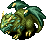 Dragon
- Dragon - HP: 75 AP: 42 DP: 22 Exp: 560 GP: 50 Type: Dragon Speed: Normal Sp.Atk Rate: 20% (near), 33% (far) Item Drop Rate: 22% ~ Ability ~ Spews a 20 damage flame that travels in a straight line.

</td>
      <td class="day danger">
 MC Mage
- MC Mage - HP: 56 AP: 26 DP: 17 Exp: 360 GP: 25 Type: Magic Speed: Normal Sp.Atk Rate: 64% (near), 47% (far) Item Drop Rate: 6% ~ Ability ~ Fires a magic bullet with a random effect in a straight line: Blind, confused, transient, or 20 damage.

</td>
      <td class="day">
 Katana Bee
- Katana Bee - HP: 75 AP: 47 DP: 20 Exp: 400 GP: 120 Type: Floating Speed: Normal Sp.Atk Rate: 16% (near), 0% (far) Item Drop Rate: 0% ~ Ability ~ Occasionally jumps to a tile within a 2 tile radius after attacking. Stinger has double AP and inflicts Confused status, but it also collapses afterward.

</td>
      <td class="day danger">
 N'twyn
- N'twyn - HP: 70 AP: 34 DP: 17 Exp: 360 GP: 20 Type: Metal Speed: Normal Sp.Atk Rate: 0% (near), 0% (far) Item Drop Rate: 0% ~ Ability ~ Disguises itself as an item. Reveals itself and attacks when Shiren tries to use or insert the item. Identified when advancing floors.

</td>
    </tr>
    <tr>
      <td class="day">
 Shagga
- Shagga - HP: 70 AP: 44 DP: 25 Exp: 480 GP: 100 Type: Dragon Speed: Normal Sp.Atk Rate: 0% (near), 0% (far) Item Drop Rate: 4% ~ Ability ~ None.

</td>
      <td class="day">
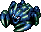 Death Gyaza
- Death Gyaza - HP: 55 AP: 37 DP: 20 Exp: 270 GP: 90 Type: Aquatic Speed: Normal Sp.Atk Rate: 0% (near), 0% (far) Item Drop Rate: 4% ~ Ability ~ Converts most effects received other than direct attacks to 2 damage.

</td>
      <td class="day useful">
 Mixermon
- Mixermon - HP: 70 AP: 34 DP: 20 Exp: 360 GP: 20 Type: Normal Speed: Normal Sp.Atk Rate: 0% (near), 0% (far) Item Drop Rate: 0% ~ Ability ~ Eats up to 3 thrown items and synthesizes them. Gains 1 stage of Buffed status each time it eats an item.

</td>
      <td></td>
      <td></td>
    </tr>
    <tr>
      <td class="highlightGray3 farmNight">
 Dark Grass Dude
- Dark Grass Dude - HP: 43 AP: 26 DP: 2 Exp: 90 GP: 160 Type: Plant Speed: Normal Sp.Atk Rate: 21% (near), 16% (far) Item Drop Rate: 0% ~ Ability ~ Resists non-ability attacks. Spreads grass in a 1 tile radius when adjacent. Pierce-throws grass in a straight line at a distance. Carries up to 2 grass items. Becomes Foul Pin Dude with 0 grass.

</td>
      <td class="highlightGray3 dangerNight">
 Dark N'twyn
- Dark N'twyn - HP: 45 AP: 45 DP: 5 Exp: 150 GP: 50 Type: Metal Speed: Normal Sp.Atk Rate: 0% (near), 0% (far) Item Drop Rate: 0% ~ Ability ~ Resists non-ability attacks. Disguises itself as an item. Reveals itself and attacks when Shiren tries to use or insert the item. Identified when advancing floors.

</td>
      <td class="highlightGray3 extremeNight">
 Dark MC Wizard
- Dark MC Wizard - HP: 50 AP: 40 DP: 8 Exp: 150 GP: 130 Type: Magic Speed: Normal Sp.Atk Rate: 64% (near), 47% (far) Item Drop Rate: 16% ~ Ability ~ Resists non-ability attacks. Fires a magic bullet with a random effect in a straight line: Level-1, sealed, paralyzed, cloned, or berserk.

</td>
      <td class="highlightGray3 itemsNight">
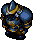 Evil Fencer
- Evil Fencer - HP: 47 AP: 22 DP: 2 Exp: 220 GP: 140 Type: Normal Speed: Normal Sp.Atk Rate: 19% (near), 0% (far) Item Drop Rate: 8% ~ Ability ~ Resists non-ability attacks. Knocks away Shiren's equipped weapon or shield when adjacent, sending it 10 tiles backward.

</td>
      <td></td>
    </tr>
    <tr>
      <td colspan="6" class="purpleDivider"></td>
    </tr>
    <tr>
      <td rowspan="3" class="centeredText">14</td>
      <td class="day">
 Shagga
- Shagga - HP: 70 AP: 44 DP: 25 Exp: 480 GP: 100 Type: Dragon Speed: Normal Sp.Atk Rate: 0% (near), 0% (far) Item Drop Rate: 4% ~ Ability ~ None.

</td>
      <td class="day">
 Dragon
- Dragon - HP: 75 AP: 42 DP: 22 Exp: 560 GP: 50 Type: Dragon Speed: Normal Sp.Atk Rate: 20% (near), 33% (far) Item Drop Rate: 22% ~ Ability ~ Spews a 20 damage flame that travels in a straight line.

</td>
      <td class="day useful">
 Mixermon
- Mixermon - HP: 70 AP: 34 DP: 20 Exp: 360 GP: 20 Type: Normal Speed: Normal Sp.Atk Rate: 0% (near), 0% (far) Item Drop Rate: 0% ~ Ability ~ Eats up to 3 thrown items and synthesizes them. Gains 1 stage of Buffed status each time it eats an item.

</td>
      <td class="day">
 Katana Bee
- Katana Bee - HP: 75 AP: 47 DP: 20 Exp: 400 GP: 120 Type: Floating Speed: Normal Sp.Atk Rate: 16% (near), 0% (far) Item Drop Rate: 0% ~ Ability ~ Occasionally jumps to a tile within a 2 tile radius after attacking. Stinger has double AP and inflicts Confused status, but it also collapses afterward.

</td>
      <td class="day">
 Poofy
- Poofy - HP: 55 AP: 27 DP: 11 Exp: 24 GP: 40 Type: Normal Speed: Swift 1 Sp.Atk Rate: 23% (near), 0% (far) Item Drop Rate: 4% ~ Ability ~ Initially Napping in a group of 3. Shiren can be warped 1~3 floors when surrounded by 3 Poofy monsters.

</td>
    </tr>
    <tr>
      <td></td>
      <td class="day">
 Death Gyaza
- Death Gyaza - HP: 55 AP: 37 DP: 20 Exp: 270 GP: 90 Type: Aquatic Speed: Normal Sp.Atk Rate: 0% (near), 0% (far) Item Drop Rate: 4% ~ Ability ~ Converts most effects received other than direct attacks to 2 damage.

</td>
      <td></td>
      <td></td>
      <td></td>
    </tr>
    <tr>
      <td class="highlightGray3">
 Hateful Beanie
- Hateful Beanie - HP: 45 AP: 40 DP: 6 Exp: 130 GP: 100 Type: Plant Speed: Normal Sp.Atk Rate: 0% (near), 0% (far) Item Drop Rate: 8% ~ Ability ~ Resists non-ability attacks.

</td>
      <td class="highlightGray3">
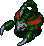 Dark VeniScorp
- Dark VeniScorp - HP: 65 AP: 55 DP: 5 Exp: 100 GP: 180 Type: Drain Speed: Normal Sp.Atk Rate: 19% (near), 0% (far) Item Drop Rate: 8% ~ Ability ~ Resists non-ability attacks. Lowers Strength by 3 when adjacent.

</td>
      <td class="highlightGray3 extremeNight">
 Dark MC Wizard
- Dark MC Wizard - HP: 50 AP: 40 DP: 8 Exp: 150 GP: 130 Type: Magic Speed: Normal Sp.Atk Rate: 64% (near), 47% (far) Item Drop Rate: 16% ~ Ability ~ Resists non-ability attacks. Fires a magic bullet with a random effect in a straight line: Level-1, sealed, paralyzed, cloned, or berserk.

</td>
      <td class="highlightGray3 itemsNight">
 Evil Fencer
- Evil Fencer - HP: 47 AP: 22 DP: 2 Exp: 220 GP: 140 Type: Normal Speed: Normal Sp.Atk Rate: 19% (near), 0% (far) Item Drop Rate: 8% ~ Ability ~ Resists non-ability attacks. Knocks away Shiren's equipped weapon or shield when adjacent, sending it 10 tiles backward.

</td>
      <td class="highlightGray3 farmNight">
 Bad G. Zalokleft
- Bad G. Zalokleft - HP: 55 AP: 29 DP: 4 Exp: 250 GP: 20 Type: Aquatic Speed: Normal Sp.Atk Rate: 48% (near), 0% (far) Item Drop Rate: 100% ~ Ability ~ Resists non-ability attacks. Initially Napping. Steals an item from Shiren when adjacent or picks up an item on the ground, then warps. The stolen item becomes cursed or sealed. Runs away from Shiren after stealing an item. Can use direct attacks. Always drops a blessed item from a unique table if slain before stealing an item, otherwise drops the stolen item.

</td>
    </tr>
    <tr>
      <td colspan="6" class="purpleDivider"></td>
    </tr>
    <tr>
      <td rowspan="1" class="centeredText highlightOrange2">15</td>
      <td class="day extreme">
 Reeva Statue
- Reeva Statue - HP: 600 AP: 70 DP: 10 Exp: 0 GP: 0 Type: Normal Speed: Normal Sp.Atk Rate: 46% (near), 46% (far) Item Drop Rate: 0% ~ Ability ~ Immune to select statuses. Cures ailments after 1 turn. Special attacks include Light Bullet (ranged, inflicts ailment), Beam (ranged, pierces), Shockwave (15 damage + knockback), Warp, and Summon (Shaggas and Death Gyazas).

</td>
      <td class="day">
 Shagga
- Shagga - HP: 70 AP: 44 DP: 25 Exp: 480 GP: 100 Type: Dragon Speed: Normal Sp.Atk Rate: 0% (near), 0% (far) Item Drop Rate: 4% ~ Ability ~ None.

</td>
      <td class="day">
 Death Gyaza
- Death Gyaza - HP: 55 AP: 37 DP: 20 Exp: 270 GP: 90 Type: Aquatic Speed: Normal Sp.Atk Rate: 0% (near), 0% (far) Item Drop Rate: 4% ~ Ability ~ Converts most effects received other than direct attacks to 2 damage.

</td>
      <td></td>
      <td></td>
    </tr>
  </tbody>
</table>

# Monster List

Red: Very Dangerous, Orange: Dangerous, Blue: Beneficial

#### List (Day)

<table class="dungeonMonsterList">
  <tr>
    <th>F</th>
    <th>Name</th>
    <th>HP</th>
    <th>AP</th>
    <th>DP</th>
    <th>Exp</th>
    <th>GP</th>
    <th>Rune / Item</th>
    <th>Notes</th>
  </tr>
  <tr>
    <td>1</td>
    <td class="highlightYellow orangeText2">Scoopie</td>
    <td>43</td>
    <td>16</td>
    <td>11</td>
    <td>75</td>
    <td>9</td>
    <td>Anti-Metal Dodger Pot</td>
    <td>Throws dirt into a pot 1 tile in front.</td>
  </tr>
  <tr>
    <td>1-2</td>
    <td class="highlightYellow">Beanie</td>
    <td>45</td>
    <td>23</td>
    <td>10</td>
    <td>125</td>
    <td>50</td>
    <td>Anti-Plant</td>
    <td>-</td>
  </tr>
  <tr>
    <td>1-3</td>
    <td class="highlightYellow">Yanpii</td>
    <td>36</td>
    <td>22</td>
    <td>15</td>
    <td>170</td>
    <td>6</td>
    <td>Unmoving</td>
    <td>Headbutts, dealing 10 damage and knockback.</td>
  </tr>
  <tr>
    <td>1-3</td>
    <td class="highlightYellow orangeText2">Eligan</td>
    <td>58</td>
    <td>32</td>
    <td>16</td>
    <td>220</td>
    <td>50</td>
    <td>-</td>
    <td>-</td>
  </tr>
  <tr>
    <td>2-3</td>
    <td class="highlightYellow">Gyadon</td>
    <td>55</td>
    <td>17</td>
    <td>11</td>
    <td>165</td>
    <td>19</td>
    <td>Anti-Floating Anti-Peck</td>
    <td>Lowers a staff's use count to 0.</td>
  </tr>
  <tr>
    <td>2-4</td>
    <td class="highlightYellow blueText2">Grass Dude</td>
    <td>60</td>
    <td>25</td>
    <td>11</td>
    <td>160</td>
    <td>40</td>
    <td>Anti-Plant</td>
    <td>Throws grass, drops up to 2 grass items.</td>
  </tr>
  <tr>
    <td>2-4</td>
    <td class="highlightYellow">Pin Dude</td>
    <td>60</td>
    <td>20</td>
    <td>10</td>
    <td>100</td>
    <td>20</td>
    <td>Anti-Plant</td>
    <td>Swift 1, becomes Grass Dude if it finds grass.</td>
  </tr>
  <tr>
    <td>3-5</td>
    <td class="highlightYellow">Sproutyrant</td>
    <td>60</td>
    <td>22</td>
    <td>10</td>
    <td>14</td>
    <td>80</td>
    <td>Anti-Plant</td>
    <td>Resists status condition after one is inflicted.</td>
  </tr>
  <tr>
    <td>4-5</td>
    <td class="highlightYellow orangeText2">Nigiri Morph</td>
    <td>55</td>
    <td>20</td>
    <td>11</td>
    <td>124</td>
    <td>60</td>
    <td>Anti-Onigiri Bless items</td>
    <td>Turns an item into a Large Onigiri.</td>
  </tr>
  <tr>
    <td>4-5</td>
    <td class="highlightYellow">Steamroid</td>
    <td>55</td>
    <td>25</td>
    <td>16</td>
    <td>240</td>
    <td>35</td>
    <td>Anti-Metal</td>
    <td>Swift 1, creates traps.</td>
  </tr>
  <tr>
    <td>4-6</td>
    <td class="highlightYellow">DJ Mage</td>
    <td>45</td>
    <td>22</td>
    <td>13</td>
    <td>110</td>
    <td>8</td>
    <td>Anti-Magic Magi-Twister Reflection Pot</td>
    <td>Warp, knockback, swap places, or swift by 1 stage.</td>
  </tr>
  <tr>
    <td>4-6</td>
    <td class="highlightYellow">Poofy</td>
    <td>55</td>
    <td>27</td>
    <td>11</td>
    <td>24</td>
    <td>40</td>
    <td>-</td>
    <td>Swift 1, always generated in a group of 3.</td>
  </tr>
  <tr>
    <td>5-6</td>
    <td class="highlightYellow">Froggucci</td>
    <td>47</td>
    <td>26</td>
    <td>15</td>
    <td>215</td>
    <td>5</td>
    <td>Anti-Burgle Perceptive Pot</td>
    <td>Steals Gitan and warps away.</td>
  </tr>
  <tr>
    <td>5-6</td>
    <td class="highlightYellow">Boy Cart</td>
    <td>43</td>
    <td>20</td>
    <td>11</td>
    <td>75</td>
    <td>2</td>
    <td>-</td>
    <td>Swift 1, shoots Wood Arrows.</td>
  </tr>
  <tr>
    <td>5-6</td>
    <td class="highlightYellow">Snooztapir</td>
    <td>80</td>
    <td>50</td>
    <td>15</td>
    <td>480</td>
    <td>89</td>
    <td>Alert Bracelet</td>
    <td>Inflicts Asleep when you're next to it.</td>
  </tr>
  <tr>
    <td>5-7</td>
    <td class="highlightYellow orangeText2">Absorbiphant</td>
    <td>43</td>
    <td>22</td>
    <td>10</td>
    <td>110</td>
    <td>12</td>
    <td>Anti-Drain</td>
    <td>Absorbs status. (Heal HP, boost attack by 1 stage)</td>
  </tr>
  <tr>
    <td>6-7</td>
    <td class="highlightYellow">Ironhead</td>
    <td>60</td>
    <td>38</td>
    <td>16</td>
    <td>230</td>
    <td>70</td>
    <td>Anti-Cyclops</td>
    <td>Hits targets 2 tiles away, charges strength.</td>
  </tr>
  <tr>
    <td>7-8</td>
    <td class="highlightYellow">Cursister</td>
    <td>40</td>
    <td>22</td>
    <td>10</td>
    <td>110</td>
    <td>20</td>
    <td>Anti-Crs. Bracelet</td>
    <td>Curses or seals 1 item.</td>
  </tr>
  <tr>
    <td>7-9</td>
    <td class="highlightYellow orangeText2">Hipadile</td>
    <td>60</td>
    <td>48</td>
    <td>15</td>
    <td>480</td>
    <td>40</td>
    <td>Anti-Dragon Anti-Aquatic</td>
    <td>Chess knight movement, 20 damage body slam.</td>
  </tr>
  <tr>
    <td>7-9</td>
    <td class="highlightYellow orangeText2">Punisher</td>
    <td>55</td>
    <td>42</td>
    <td>10</td>
    <td>210</td>
    <td>90</td>
    <td>Water Pot</td>
    <td>Chance to deal a critical hit.</td>
  </tr>
  <tr>
    <td>8-10</td>
    <td class="highlightYellow orangeText2">Muddy</td>
    <td>55</td>
    <td>17</td>
    <td>11</td>
    <td>54</td>
    <td>20</td>
    <td>Anti-Aquatic Rustproof</td>
    <td>Lowers weapon or shield upgrade value by 2.</td>
  </tr>
  <tr>
    <td>8-10</td>
    <td class="highlightYellow">Crow Tengu</td>
    <td>37</td>
    <td>16</td>
    <td>11</td>
    <td>24</td>
    <td>6</td>
    <td>Anti-Floating</td>
    <td>Disguises itself as a different monster.</td>
  </tr>
  <tr>
    <td>8-10</td>
    <td class="highlightYellow">Firepuff</td>
    <td>50</td>
    <td>25</td>
    <td>20</td>
    <td>175</td>
    <td>8</td>
    <td>Anti-Floating Anti-Dragon Anti-Fire</td>
    <td>10 damage fire 1 tile in front.</td>
  </tr>
  <tr>
    <td>8-10</td>
    <td class="highlightYellow">Sr. Yanpii</td>
    <td>49</td>
    <td>33</td>
    <td>17</td>
    <td>450</td>
    <td>90</td>
    <td>Unmoving</td>
    <td>Headbutts, dealing 20 damage and knockback.</td>
  </tr>
  <tr>
    <td>8-10</td>
    <td class="highlightYellow orangeText2">Spadie</td>
    <td>49</td>
    <td>23</td>
    <td>17</td>
    <td>190</td>
    <td>45</td>
    <td>Anti-Metal Dodger Pot</td>
    <td>Throws dirt into a pot 1 tile in front.</td>
  </tr>
  <tr>
    <td>10-11</td>
    <td class="highlightYellow">Cross Cart</td>
    <td>56</td>
    <td>28</td>
    <td>17</td>
    <td>180</td>
    <td>7</td>
    <td>-</td>
    <td>Swift 1, shoots Iron Arrows.</td>
  </tr>
  <tr>
    <td>11-12</td>
    <td class="highlightYellow">Go-Ham!</td>
    <td>45</td>
    <td>15</td>
    <td>10</td>
    <td>50</td>
    <td>20</td>
    <td>-</td>
    <td>Raises attack by 2 stages, grants Enduring.</td>
  </tr>
  <tr>
    <td>11-12</td>
    <td class="highlightYellow orangeText2">Digestiphant</td>
    <td>56</td>
    <td>28</td>
    <td>17</td>
    <td>180</td>
    <td>25</td>
    <td>Anti-Drain</td>
    <td>Absorbs status. (Heal HP, boost attack by 2 stages)</td>
  </tr>
  <tr>
    <td>11-12</td>
    <td class="highlightYellow orangeText2">Scarabbit</td>
    <td>55</td>
    <td>26</td>
    <td>13</td>
    <td>130</td>
    <td>35</td>
    <td>Anti-Magic Unmoving</td>
    <td>Attracts creatures in the room to itself</td>
  </tr>
  <tr>
    <td>11-12</td>
    <td class="highlightYellow">Zapdon</td>
    <td>79</td>
    <td>59</td>
    <td>22</td>
    <td>330</td>
    <td>33</td>
    <td>-</td>
    <td>Slow, 25 damage counter after 3 hits.</td>
  </tr>
  <tr>
    <td>11-13</td>
    <td class="highlightYellow orangeText2">Kappa Pest</td>
    <td>65</td>
    <td>25</td>
    <td>17</td>
    <td>180</td>
    <td>20</td>
    <td>Anti-Aquatic</td>
    <td>Throws items in a 5 tile radius.</td>
  </tr>
  <tr>
    <td>11-13</td>
    <td class="highlightYellow orangeText2">MC Mage</td>
    <td>56</td>
    <td>26</td>
    <td>17</td>
    <td>360</td>
    <td>25</td>
    <td>Anti-Magic Magi-Twister Reflection Pot</td>
    <td>Confused, Blind, transient effect, or 20 damage.</td>
  </tr>
  <tr>
    <td>12-13</td>
    <td class="highlightYellow orangeText2">N'twyn</td>
    <td>70</td>
    <td>34</td>
    <td>17</td>
    <td>360</td>
    <td>20</td>
    <td>Anti-Metal</td>
    <td>Doesn't reveal itself until you use the item.</td>
  </tr>
  <tr>
    <td>13-14</td>
    <td class="highlightYellow blueText2">Mixermon</td>
    <td>70</td>
    <td>34</td>
    <td>20</td>
    <td>360</td>
    <td>20</td>
    <td>-</td>
    <td>Eats up to 3 items and synthesizes them.</td>
  </tr>
  <tr>
    <td>13-14</td>
    <td class="highlightYellow">Death Gyaza</td>
    <td>55</td>
    <td>37</td>
    <td>20</td>
    <td>270</td>
    <td>90</td>
    <td>Anti-Aquatic</td>
    <td>Converts non-direct attack effects into 2 damage.</td>
  </tr>
  <tr>
    <td>13-14</td>
    <td class="highlightYellow">Katana Bee</td>
    <td>75</td>
    <td>47</td>
    <td>20</td>
    <td>400</td>
    <td>120</td>
    <td>Anti-Floating Anti-Cnf. Bracelet</td>
    <td>Stinger inflicts Confused, and then it collapses.</td>
  </tr>
  <tr>
    <td>13-14</td>
    <td class="highlightYellow">Dragon</td>
    <td>75</td>
    <td>42</td>
    <td>22</td>
    <td>560</td>
    <td>50</td>
    <td>Anti-Dragon Anti-Fire</td>
    <td>20 damage fire in a straight line.</td>
  </tr>
  <tr>
    <td>13-14</td>
    <td class="highlightYellow">Shagga</td>
    <td>70</td>
    <td>44</td>
    <td>25</td>
    <td>480</td>
    <td>100</td>
    <td>Anti-Dragon Water Pot</td>
    <td>-</td>
  </tr>
  <tr>
    <td>14</td>
    <td class="highlightYellow">Poofy</td>
    <td>55</td>
    <td>27</td>
    <td>11</td>
    <td>24</td>
    <td>40</td>
    <td>-</td>
    <td>Swift 1, always generated in a group of 3.</td>
  </tr>
</table>

#### List (Night)

<table class="dungeonMonsterList">
  <tr>
    <th>F</th>
    <th>Name</th>
    <th>HP</th>
    <th>AP</th>
    <th>DP</th>
    <th>Exp</th>
    <th>GP</th>
    <th>Rune / Item</th>
    <th>Notes</th>
  </tr>
  <tr>
    <td>1-2</td>
    <td class="highlightNight orangeText2">Foul Nigiri Morph</td>
    <td>47</td>
    <td>43</td>
    <td>5</td>
    <td>120</td>
    <td>20</td>
    <td>Anti-Onigiri Bless items</td>
    <td>Turns an item into a Rotten Onigiri.</td>
  </tr>
  <tr>
    <td>1-2</td>
    <td class="highlightNight orangeText2">Evil Super Gazer</td>
    <td>47</td>
    <td>39</td>
    <td>4</td>
    <td>120</td>
    <td>35</td>
    <td>Anti-Hypno</td>
    <td>Inflicts Hypnotized status 1 tile in front.</td>
  </tr>
  <tr>
    <td>1-2</td>
    <td class="highlightNight">Dark Zapdon</td>
    <td>47</td>
    <td>43</td>
    <td>4</td>
    <td>120</td>
    <td>40</td>
    <td>-</td>
    <td>Slow, 40 damage counter after 3 hits.</td>
  </tr>
  <tr>
    <td>1-3</td>
    <td class="highlightNight">Evil Gyaza</td>
    <td>32</td>
    <td>24</td>
    <td>3</td>
    <td>34</td>
    <td>40</td>
    <td>-</td>
    <td>Converts non-ability effects into 2 damage.</td>
  </tr>
  <tr>
    <td>1-3</td>
    <td class="highlightNight">Evil Dragon</td>
    <td>32</td>
    <td>24</td>
    <td>3</td>
    <td>100</td>
    <td>100</td>
    <td>Anti-Fire</td>
    <td>50 damage fire in a straight line.</td>
  </tr>
  <tr>
    <td>3-4</td>
    <td class="highlightNight">Sinister Porko</td>
    <td>42</td>
    <td>52</td>
    <td>3</td>
    <td>100</td>
    <td>140</td>
    <td>Dodger Pot</td>
    <td>Throws 20 damage Porky Rock, range of 4 tiles.</td>
  </tr>
  <tr>
    <td>3-4</td>
    <td class="highlightNight">Dark Fearabbit</td>
    <td>28</td>
    <td>20</td>
    <td>2</td>
    <td>32</td>
    <td>56</td>
    <td>Unmoving</td>
    <td>Attracts creatures in the room to itself</td>
  </tr>
  <tr>
    <td>3-5</td>
    <td class="highlightNight orangeText2">Filthy Shagga</td>
    <td>52</td>
    <td>65</td>
    <td>6</td>
    <td>160</td>
    <td>200</td>
    <td>-</td>
    <td>-</td>
  </tr>
  <tr>
    <td>4-5</td>
    <td class="highlightNight orangeText2">Evil Explochin</td>
    <td>40</td>
    <td>18</td>
    <td>0</td>
    <td>35</td>
    <td>49</td>
    <td>Anti-Blast</td>
    <td>Stops moving after it loses a certain amount of HP. Explodes after it loses even more HP.</td>
  </tr>
  <tr>
    <td>4-5</td>
    <td class="highlightNight">Evil PolySpinna</td>
    <td>45</td>
    <td>33</td>
    <td>4</td>
    <td>70</td>
    <td>35</td>
    <td>Staunch Bracelet</td>
    <td>Lowers max HP by 2, or max fullness by 5.</td>
  </tr>
  <tr>
    <td>4-5</td>
    <td class="highlightNight">Wicked Spadie</td>
    <td>37</td>
    <td>28</td>
    <td>4</td>
    <td>210</td>
    <td>100</td>
    <td>Dodger Pot</td>
    <td>Throws dirt into a pot 1 tile in front.</td>
  </tr>
  <tr>
    <td>4-6</td>
    <td class="highlightNight">Dark Hurler</td>
    <td>52</td>
    <td>45</td>
    <td>6</td>
    <td>130</td>
    <td>35</td>
    <td>Unmoving</td>
    <td>Throws creatures up to 10 tiles away.</td>
  </tr>
  <tr>
    <td>5-6</td>
    <td class="highlightNight">Vile Pumphantasm</td>
    <td>43</td>
    <td>35</td>
    <td>2</td>
    <td>60</td>
    <td>30</td>
    <td>-</td>
    <td>Moves through walls, unpredictable movement.</td>
  </tr>
  <tr>
    <td>5-6</td>
    <td class="highlightNight orangeText2">Dark Digestiphant</td>
    <td>43</td>
    <td>35</td>
    <td>5</td>
    <td>60</td>
    <td>60</td>
    <td>-</td>
    <td>Absorbs status. (Heal HP, boost attack by 2 stages)</td>
  </tr>
  <tr>
    <td>6-7</td>
    <td class="highlightNight blueText2">Bad Zalokleft</td>
    <td>48</td>
    <td>28</td>
    <td>2</td>
    <td>130</td>
    <td>5</td>
    <td>Anti-Theft Perceptive Pot</td>
    <td>Steals an item and warps away.</td>
  </tr>
  <tr>
    <td>6-7</td>
    <td class="highlightNight">Sinful Sr. Yanpii</td>
    <td>48</td>
    <td>53</td>
    <td>2</td>
    <td>50</td>
    <td>80</td>
    <td>Unmoving</td>
    <td>Headbutts, dealing 25 damage and knockback.</td>
  </tr>
  <tr>
    <td>6-7</td>
    <td class="highlightNight">Dark Snooztapir</td>
    <td>48</td>
    <td>35</td>
    <td>4</td>
    <td>150</td>
    <td>152</td>
    <td>Alert Bracelet</td>
    <td>Inflicts Asleep when you're next to it.</td>
  </tr>
  <tr>
    <td>7-8</td>
    <td class="highlightNight orangeText2">Dark Grampa Tank</td>
    <td>45</td>
    <td>32</td>
    <td>3</td>
    <td>130</td>
    <td>35</td>
    <td>Anti-Blast</td>
    <td>Fires 40 damage cannonballs.</td>
  </tr>
  <tr>
    <td>7-8</td>
    <td class="highlightNight orangeText2">Dark Kappa Pest</td>
    <td>38</td>
    <td>35</td>
    <td>3</td>
    <td>50</td>
    <td>25</td>
    <td>Dodger Pot</td>
    <td>Throws items in a 5 tile radius.</td>
  </tr>
  <tr>
    <td>7-8</td>
    <td class="highlightNight">Evil Flamepuff</td>
    <td>43</td>
    <td>35</td>
    <td>5</td>
    <td>80</td>
    <td>45</td>
    <td>Anti-Fire</td>
    <td>40 damage fire 1 tile in front.</td>
  </tr>
  <tr>
    <td>8-9</td>
    <td class="highlightNight orangeText2">Dark Dazikon</td>
    <td>37</td>
    <td>24</td>
    <td>4</td>
    <td>100</td>
    <td>100</td>
    <td>Anti-Cnf. Bracelet Cleansing Bracelet Dodger Pot</td>
    <td>Throws Confusion Grass in a 2 tile radius.</td>
  </tr>
  <tr>
    <td>9-11</td>
    <td class="highlightNight">Dark Cave Mamel</td>
    <td>40</td>
    <td>52</td>
    <td>6</td>
    <td>220</td>
    <td>450</td>
    <td>-</td>
    <td>-</td>
  </tr>
  <tr>
    <td>9-11</td>
    <td class="highlightNight blueText2">Bad Momoseal</td>
    <td>55</td>
    <td>45</td>
    <td>3</td>
    <td>1111</td>
    <td>150</td>
    <td>-</td>
    <td>25 damage tackle.</td>
  </tr>
  <tr>
    <td>10-11</td>
    <td class="highlightNight orangeText2">Vile Pumphantom</td>
    <td>53</td>
    <td>45</td>
    <td>5</td>
    <td>120</td>
    <td>100</td>
    <td>-</td>
    <td>Moves through walls, unpredictable movement.</td>
  </tr>
  <tr>
    <td>11-12</td>
    <td class="highlightNight">Dark Sparkbird</td>
    <td>34</td>
    <td>18</td>
    <td>4</td>
    <td>40</td>
    <td>60</td>
    <td>-</td>
    <td>Heals a monster's HP by 70.</td>
  </tr>
  <tr>
    <td>11-12</td>
    <td class="highlightNight">Dark Pandanigiri</td>
    <td>34</td>
    <td>50</td>
    <td>4</td>
    <td>100</td>
    <td>75</td>
    <td>-</td>
    <td>Chance to drop an Onigiri.</td>
  </tr>
  <tr>
    <td>12-13</td>
    <td class="highlightNight orangeText2">Dark N'twyn</td>
    <td>45</td>
    <td>45</td>
    <td>5</td>
    <td>150</td>
    <td>50</td>
    <td>-</td>
    <td>Doesn't reveal itself until you use the item.</td>
  </tr>
  <tr>
    <td>12-13</td>
    <td class="highlightNight blueText2">Dark Grass Dude</td>
    <td>43</td>
    <td>26</td>
    <td>2</td>
    <td>90</td>
    <td>160</td>
    <td>-</td>
    <td>Throws grass, drops up to 2 grass items.</td>
  </tr>
  <tr>
    <td>12-13</td>
    <td class="highlightNight">Foul Pin Dude</td>
    <td>37</td>
    <td>24</td>
    <td>2</td>
    <td>100</td>
    <td>84</td>
    <td>-</td>
    <td>Swift 1, becomes Dark Grass Dude if it finds grass.</td>
  </tr>
  <tr>
    <td>13-14</td>
    <td class="highlightNight orangeText2">Evil Fencer</td>
    <td>47</td>
    <td>22</td>
    <td>2</td>
    <td>220</td>
    <td>140</td>
    <td>Anti-Parry Brce. Perceptive Pot Tag equipment</td>
    <td>Disarms your weapon or shield.</td>
  </tr>
  <tr>
    <td>13-14</td>
    <td class="highlightNight redText2">Dark MC Wizard</td>
    <td>50</td>
    <td>40</td>
    <td>8</td>
    <td>150</td>
    <td>130</td>
    <td>Magi-Twister Reflection Pot</td>
    <td>Berserk, Sealed, Paralyzed, Cloned, or level down by 1.</td>
  </tr>
  <tr>
    <td>14</td>
    <td class="highlightNight blueText2">Bad G. Zalokleft</td>
    <td>55</td>
    <td>29</td>
    <td>4</td>
    <td>250</td>
    <td>20</td>
    <td>Anti-Theft Perceptive Pot</td>
    <td>Steals an item and warps away.</td>
  </tr>
  <tr>
    <td>14</td>
    <td class="highlightNight">Dark VeniScorp</td>
    <td>65</td>
    <td>55</td>
    <td>5</td>
    <td>100</td>
    <td>180</td>
    <td>Cleansing Bracelet</td>
    <td>Decreases strength by 3.</td>
  </tr>
  <tr>
    <td>14</td>
    <td class="highlightNight">Hateful Beanie</td>
    <td>45</td>
    <td>40</td>
    <td>6</td>
    <td>130</td>
    <td>100</td>
    <td>-</td>
    <td>-</td>
  </tr>
</table>

# Items

- F = Floor, Daytime monster drop
- S = Shop, Shiny Object (yellow), Night monster drop
- P = Presto Pot
- Z = Zalokleft drop
- E = Elite shop, Shiny Object (blue)

 

<table class="dungeonItemTable">
  <tr>
    <th colspan="6" class="highlightPurple3">Weapon</th>
    <th rowspan="72"></th>
    <th colspan="6" class="highlightPurple3">Bracelet</th>
    <th rowspan="72"></th>
    <th colspan="6" class="highlightPurple3">Staff</th>
  </tr>
  <tr>
    <th>Name</th>
    <th>F</th>
    <th>S</th>
    <th>P</th>
    <th>Z</th>
    <th>E</th>
    <th>Name</th>
    <th>F</th>
    <th>S</th>
    <th>P</th>
    <th>Z</th>
    <th>E</th>
    <th>Name</th>
    <th>F</th>
    <th>S</th>
    <th>P</th>
    <th>Z</th>
    <th>E</th>
  </tr>
  <tr>
    <td class="leftText">Ordinary Stick</td>
    <td></td>
    <td></td>
    <td>X</td>
    <td>X</td>
    <td></td>
    <td class="leftText">Cleansing Bracelet</td>
    <td>X</td>
    <td></td>
    <td>X</td>
    <td>X</td>
    <td></td>
    <td class="leftText">Swap Staff</td>
    <td>X</td>
    <td></td>
    <td>X</td>
    <td>X</td>
    <td></td>
  </tr>
  <tr>
    <td class="leftText">Tin Blade</td>
    <td></td>
    <td></td>
    <td>X</td>
    <td>X</td>
    <td></td>
    <td class="leftText">Anti-Cnf. Bracelet</td>
    <td>X</td>
    <td></td>
    <td>X</td>
    <td>X</td>
    <td></td>
    <td class="leftText">Knockback Staff</td>
    <td>X</td>
    <td></td>
    <td>X</td>
    <td>X</td>
    <td></td>
  </tr>
  <tr>
    <td class="leftText">Katana</td>
    <td>X</td>
    <td></td>
    <td>X</td>
    <td>X</td>
    <td></td>
    <td class="leftText">Alert Bracelet</td>
    <td>X</td>
    <td></td>
    <td>X</td>
    <td>X</td>
    <td></td>
    <td class="leftText">Pinning Staff</td>
    <td>X</td>
    <td></td>
    <td></td>
    <td></td>
    <td></td>
  </tr>
  <tr>
    <td class="leftText">Beast Fang</td>
    <td>X</td>
    <td>X</td>
    <td>X</td>
    <td>X</td>
    <td></td>
    <td class="leftText">Anti-Crs. Bracelet</td>
    <td></td>
    <td></td>
    <td></td>
    <td></td>
    <td>X</td>
    <td class="leftText">Transient Staff</td>
    <td>X</td>
    <td></td>
    <td></td>
    <td>X</td>
    <td></td>
  </tr>
  <tr>
    <td class="leftText">Dotanuki</td>
    <td>X</td>
    <td>X</td>
    <td>X</td>
    <td>X</td>
    <td>X</td>
    <td class="leftText">Staunch Bracelet</td>
    <td>X</td>
    <td></td>
    <td>X</td>
    <td>X</td>
    <td></td>
    <td class="leftText">Seal Staff</td>
    <td></td>
    <td>X</td>
    <td></td>
    <td>X</td>
    <td>X</td>
  </tr>
  <tr>
    <td class="leftText">Bladite</td>
    <td>X</td>
    <td>X</td>
    <td></td>
    <td></td>
    <td>X</td>
    <td class="leftText">Can. Arm Bracelet</td>
    <td>X</td>
    <td>X</td>
    <td></td>
    <td>X</td>
    <td>X</td>
    <td class="leftText">Clone Staff</td>
    <td></td>
    <td>X</td>
    <td></td>
    <td></td>
    <td>X</td>
  </tr>
  <tr>
    <td class="leftText">Red Blade</td>
    <td></td>
    <td></td>
    <td></td>
    <td></td>
    <td>X</td>
    <td class="leftText">Strength Bracelet</td>
    <td>X</td>
    <td>X</td>
    <td>X</td>
    <td>X</td>
    <td></td>
    <td class="leftText">Paralysis Staff</td>
    <td></td>
    <td>X</td>
    <td></td>
    <td>X</td>
    <td>X</td>
  </tr>
  <tr>
    <td class="leftText">Kabura Katana</td>
    <td></td>
    <td></td>
    <td>X</td>
    <td></td>
    <td>X</td>
    <td class="leftText">Growth Bracelet</td>
    <td>X</td>
    <td>X</td>
    <td></td>
    <td>X</td>
    <td>X</td>
    <td class="leftText">Empathy Staff</td>
    <td></td>
    <td>X</td>
    <td></td>
    <td>X</td>
    <td>X</td>
  </tr>
  <tr>
    <td class="leftText">Dull Gold Edge</td>
    <td>X</td>
    <td>X</td>
    <td>X</td>
    <td>X</td>
    <td></td>
    <td class="leftText">Heal Bracelet</td>
    <td></td>
    <td></td>
    <td></td>
    <td></td>
    <td>X</td>
    <td class="leftText">Slow Staff</td>
    <td></td>
    <td>X</td>
    <td></td>
    <td>X</td>
    <td>X</td>
  </tr>
  <tr>
    <td class="leftText">Bright Blade</td>
    <td>X</td>
    <td>X</td>
    <td></td>
    <td></td>
    <td></td>
    <td class="leftText">Bunch Bracelet</td>
    <td></td>
    <td></td>
    <td></td>
    <td></td>
    <td>X</td>
    <td class="leftText">Mage Staff</td>
    <td>X</td>
    <td></td>
    <td>X</td>
    <td>X</td>
    <td>X</td>
  </tr>
  <tr>
    <td class="leftText">Rusty Pickaxe</td>
    <td>X</td>
    <td></td>
    <td></td>
    <td></td>
    <td></td>
    <td class="leftText">Monster Detector</td>
    <td>X</td>
    <td>X</td>
    <td></td>
    <td>X</td>
    <td>X</td>
    <td class="leftText">Electric Staff</td>
    <td>X</td>
    <td>X</td>
    <td>X</td>
    <td>X</td>
    <td>X</td>
  </tr>
  <tr>
    <td class="leftText">Old Mallet</td>
    <td>X</td>
    <td></td>
    <td></td>
    <td></td>
    <td></td>
    <td class="leftText">Item Detector</td>
    <td>X</td>
    <td>X</td>
    <td></td>
    <td>X</td>
    <td>X</td>
    <td class="leftText">Trap Del. Staff</td>
    <td>X</td>
    <td></td>
    <td></td>
    <td></td>
    <td></td>
  </tr>
  <tr>
    <td class="leftText">Sky Splitter</td>
    <td>X</td>
    <td></td>
    <td>X</td>
    <td>X</td>
    <td></td>
    <th colspan="6" class="highlightPurple3">Scroll</th>
    <td class="leftText">Balance Staff</td>
    <td>X</td>
    <td></td>
    <td></td>
    <td></td>
    <td></td>
  </tr>
  <tr>
    <td class="leftText">Water Cutter</td>
    <td>X</td>
    <td></td>
    <td>X</td>
    <td>X</td>
    <td></td>
    <th>Name</th>
    <th>F</th>
    <th>S</th>
    <th>P</th>
    <th>Z</th>
    <th>E</th>
    <td class="leftText">Fort. Staff</td>
    <td></td>
    <td></td>
    <td></td>
    <td></td>
    <td>X</td>
  </tr>
  <tr>
    <td class="leftText">Scythe</td>
    <td>X</td>
    <td></td>
    <td>X</td>
    <td>X</td>
    <td></td>
    <td class="leftText">Confusion Scroll</td>
    <td>X</td>
    <td>X</td>
    <td>X</td>
    <td>X</td>
    <td></td>
    <th colspan="6" class="highlightPurple3">Pot</th>
  </tr>
  <tr>
    <td class="leftText">Myopic Masher</td>
    <td>X</td>
    <td></td>
    <td>X</td>
    <td>X</td>
    <td></td>
    <td class="leftText">Slumber Scroll</td>
    <td>X</td>
    <td>X</td>
    <td>X</td>
    <td>X</td>
    <td></td>
    <th>Name</th>
    <th>F</th>
    <th>S</th>
    <th>P</th>
    <th>Z</th>
    <th>E</th>
  </tr>
  <tr>
    <td class="leftText">Magic Masher</td>
    <td>X</td>
    <td></td>
    <td>X</td>
    <td>X</td>
    <td></td>
    <td class="leftText">Vacuum Slash Scrl</td>
    <td>X</td>
    <td>X</td>
    <td>X</td>
    <td>X</td>
    <td></td>
    <td class="leftText">Preservation Pot</td>
    <td>X</td>
    <td>X</td>
    <td></td>
    <td>X</td>
    <td></td>
  </tr>
  <tr>
    <td class="leftText">Drain Dagger</td>
    <td>X</td>
    <td></td>
    <td>X</td>
    <td>X</td>
    <td></td>
    <td class="leftText">Fear Scroll</td>
    <td>X</td>
    <td>X</td>
    <td>X</td>
    <td>X</td>
    <td></td>
    <td class="leftText">Ordinary Pot</td>
    <td>X</td>
    <td>X</td>
    <td></td>
    <td>X</td>
    <td></td>
  </tr>
  <tr>
    <td class="leftText">Copper Cleaver</td>
    <td>X</td>
    <td></td>
    <td>X</td>
    <td>X</td>
    <td></td>
    <td class="leftText">Escape Scroll</td>
    <td>X</td>
    <td>X</td>
    <td>X</td>
    <td>X</td>
    <td></td>
    <td class="leftText">Synthesis Pot</td>
    <td>X</td>
    <td>X</td>
    <td></td>
    <td>X</td>
    <td>X</td>
  </tr>
  <tr>
    <td class="leftText">Crescent Katana</td>
    <td>X</td>
    <td></td>
    <td>X</td>
    <td>X</td>
    <td></td>
    <td class="leftText">Navigation Scroll</td>
    <td>X</td>
    <td></td>
    <td>X</td>
    <td>X</td>
    <td></td>
    <td class="leftText">Sale Pot</td>
    <td>X</td>
    <td>X</td>
    <td></td>
    <td>X</td>
    <td></td>
  </tr>
  <tr>
    <td class="leftText">Lizard Lasher</td>
    <td>X</td>
    <td></td>
    <td>X</td>
    <td>X</td>
    <td></td>
    <td class="leftText">Dispel Aura Scroll</td>
    <td>X</td>
    <td>X</td>
    <td></td>
    <td></td>
    <td></td>
    <td class="leftText">Presto Pot</td>
    <td>X</td>
    <td></td>
    <td></td>
    <td></td>
    <td></td>
  </tr>
  <tr>
    <td class="leftText">Nap Rattle</td>
    <td></td>
    <td>X</td>
    <td></td>
    <td></td>
    <td></td>
    <td class="leftText">Trap Deletion Scrl</td>
    <td>X</td>
    <td></td>
    <td></td>
    <td></td>
    <td></td>
    <td class="leftText">Blessing Pot</td>
    <td></td>
    <td></td>
    <td></td>
    <td></td>
    <td>X</td>
  </tr>
  <tr>
    <td class="leftText">Shockuto</td>
    <td></td>
    <td>X</td>
    <td></td>
    <td></td>
    <td></td>
    <td class="leftText">Identify Scroll</td>
    <td>X</td>
    <td></td>
    <td>X</td>
    <td>X</td>
    <td></td>
    <td class="leftText">Fever Pot</td>
    <td></td>
    <td></td>
    <td></td>
    <td></td>
    <td>X</td>
  </tr>
  <tr>
    <td class="leftText">Blurry Stick</td>
    <td></td>
    <td>X</td>
    <td></td>
    <td></td>
    <td></td>
    <td class="leftText">Exorcism Scroll</td>
    <td>X</td>
    <td>X</td>
    <td>X</td>
    <td>X</td>
    <td></td>
    <td class="leftText">Hide Pot</td>
    <td>X</td>
    <td>X</td>
    <td></td>
    <td>X</td>
    <td></td>
  </tr>
  <tr>
    <td class="leftText">Sealing Keisaku</td>
    <td></td>
    <td>X</td>
    <td></td>
    <td></td>
    <td></td>
    <td class="leftText">Fate Scroll</td>
    <td>X</td>
    <td>X</td>
    <td></td>
    <td>X</td>
    <td>X</td>
    <td class="leftText">Heal Pot</td>
    <td>X</td>
    <td>X</td>
    <td></td>
    <td></td>
    <td>X</td>
  </tr>
  <tr>
    <td class="leftText">Baffle Axe</td>
    <td></td>
    <td>X</td>
    <td></td>
    <td></td>
    <td></td>
    <td class="leftText">Earth Scroll</td>
    <td>X</td>
    <td>X</td>
    <td></td>
    <td>X</td>
    <td>X</td>
    <td class="leftText">Hilarious Pot</td>
    <td>X</td>
    <td>X</td>
    <td></td>
    <td>X</td>
    <td></td>
  </tr>
  <tr>
    <td class="leftText">Hatchet</td>
    <td></td>
    <td></td>
    <td></td>
    <td></td>
    <td>X</td>
    <td class="leftText">Plating Scroll</td>
    <td>X</td>
    <td>X</td>
    <td></td>
    <td>X</td>
    <td>X</td>
    <td class="leftText">Zalokleft Pot</td>
    <td></td>
    <td></td>
    <td></td>
    <td>X</td>
    <td></td>
  </tr>
  <tr>
    <td class="leftText">Shoddy Dirk</td>
    <td></td>
    <td>X</td>
    <td></td>
    <td></td>
    <td></td>
    <td class="leftText">Tag Scroll</td>
    <td>X</td>
    <td></td>
    <td></td>
    <td></td>
    <td></td>
    <td class="leftText">Klein Pot</td>
    <td></td>
    <td></td>
    <td></td>
    <td></td>
    <td>X</td>
  </tr>
  <tr>
    <td class="leftText">Glass Dirk</td>
    <td></td>
    <td></td>
    <td></td>
    <td></td>
    <td>X</td>
    <td class="leftText">Sale Scroll</td>
    <td>X</td>
    <td></td>
    <td>X</td>
    <td>X</td>
    <td></td>
    <td class="leftText">Zen Pot</td>
    <td>X</td>
    <td>X</td>
    <td></td>
    <td></td>
    <td></td>
  </tr>
  <tr>
    <td class="leftText">Dirk of Debts</td>
    <td></td>
    <td></td>
    <td></td>
    <td></td>
    <td>X</td>
    <td class="leftText">Pot God Scroll</td>
    <td>X</td>
    <td></td>
    <td></td>
    <td>X</td>
    <td>X</td>
    <td class="leftText">Dodger Pot</td>
    <td>X</td>
    <td>X</td>
    <td></td>
    <td></td>
    <td></td>
  </tr>
  <tr>
    <td class="leftText">Breeze Blade</td>
    <td></td>
    <td></td>
    <td></td>
    <td></td>
    <td>X</td>
    <td class="leftText">Blessing Scroll</td>
    <td>X</td>
    <td>X</td>
    <td></td>
    <td>X</td>
    <td>X</td>
    <td class="leftText">Perceptive Pot</td>
    <td>X</td>
    <td>X</td>
    <td></td>
    <td></td>
    <td></td>
  </tr>
  <tr>
    <td class="leftText">Burning Blade</td>
    <td></td>
    <td></td>
    <td></td>
    <td></td>
    <td>X</td>
    <td class="leftText">Immunity Scroll</td>
    <td>X</td>
    <td>X</td>
    <td></td>
    <td></td>
    <td></td>
    <td class="leftText">Reflection Pot</td>
    <td>X</td>
    <td>X</td>
    <td></td>
    <td></td>
    <td></td>
  </tr>
  <tr>
    <th colspan="6" class="highlightPurple3">Shield</th>
    <td class="leftText">Attraction Scroll</td>
    <td>X</td>
    <td></td>
    <td></td>
    <td></td>
    <td></td>
    <td class="leftText">Water Pot</td>
    <td></td>
    <td>X</td>
    <td></td>
    <td></td>
    <td></td>
  </tr>
  <tr>
    <th>Name</th>
    <th>F</th>
    <th>S</th>
    <th>P</th>
    <th>Z</th>
    <th>E</th>
    <td class="leftText">Gathering Scroll</td>
    <td>X</td>
    <td>X</td>
    <td></td>
    <td></td>
    <td></td>
    <th colspan="6" class="highlightPurple3">Talisman</th>
  </tr>
  <tr>
    <td class="leftText">Plain Targe</td>
    <td></td>
    <td></td>
    <td>X</td>
    <td>X</td>
    <td></td>
    <td class="leftText">Collection Scroll</td>
    <td>X</td>
    <td></td>
    <td></td>
    <td></td>
    <td></td>
    <th>Name</th>
    <th>F</th>
    <th>S</th>
    <th>P</th>
    <th>Z</th>
    <th>E</th>
  </tr>
  <tr>
    <td class="leftText">Tin Shield</td>
    <td></td>
    <td></td>
    <td>X</td>
    <td>X</td>
    <td></td>
    <td class="leftText">Oil Scroll</td>
    <td>X</td>
    <td></td>
    <td>X</td>
    <td></td>
    <td></td>
    <td class="leftText">Shadow Bind Tal.</td>
    <td>X</td>
    <td></td>
    <td>X</td>
    <td>X</td>
    <td></td>
  </tr>
  <tr>
    <td class="leftText">Iron Targe</td>
    <td>X</td>
    <td></td>
    <td>X</td>
    <td>X</td>
    <td></td>
    <td class="leftText">Sanctuary Scroll</td>
    <td></td>
    <td>X</td>
    <td></td>
    <td></td>
    <td>X</td>
    <td class="leftText">Conf. Talisman</td>
    <td>X</td>
    <td></td>
    <td>X</td>
    <td>X</td>
    <td></td>
  </tr>
  <tr>
    <td class="leftText">Wolfshead</td>
    <td>X</td>
    <td>X</td>
    <td>X</td>
    <td>X</td>
    <td></td>
    <td class="leftText">Recommend. Letter</td>
    <td></td>
    <td>X</td>
    <td></td>
    <td></td>
    <td></td>
    <td class="leftText">Seal Talisman</td>
    <td>X</td>
    <td></td>
    <td>X</td>
    <td>X</td>
    <td></td>
  </tr>
  <tr>
    <td class="leftText">Beast Shield</td>
    <td>X</td>
    <td>X</td>
    <td>X</td>
    <td>X</td>
    <td>X</td>
    <td class="leftText">Fixer Scroll</td>
    <td>X</td>
    <td></td>
    <td></td>
    <td>X</td>
    <td>X</td>
    <td class="leftText">Fear Talisman</td>
    <td></td>
    <td>X</td>
    <td></td>
    <td></td>
    <td>X</td>
  </tr>
  <tr>
    <td class="leftText">Targite</td>
    <td>X</td>
    <td>X</td>
    <td></td>
    <td></td>
    <td>X</td>
    <td class="leftText">Gambler's Scroll</td>
    <td></td>
    <td></td>
    <td></td>
    <td></td>
    <td>X</td>
    <td class="leftText">Berserker Tal.</td>
    <td></td>
    <td></td>
    <td></td>
    <td></td>
    <td>X</td>
  </tr>
  <tr>
    <td class="leftText">Red Shield</td>
    <td></td>
    <td></td>
    <td></td>
    <td></td>
    <td>X</td>
    <td class="leftText">Extinction Scroll</td>
    <td></td>
    <td></td>
    <td></td>
    <td></td>
    <td>X</td>
    <td class="leftText">Inacc. Talisman</td>
    <td></td>
    <td></td>
    <td></td>
    <td></td>
    <td>X</td>
  </tr>
  <tr>
    <td class="leftText">Fuuma Shield</td>
    <td></td>
    <td></td>
    <td>X</td>
    <td></td>
    <td>X</td>
    <td class="leftText">Blank Scroll</td>
    <td></td>
    <td>X</td>
    <td></td>
    <td></td>
    <td>X</td>
    <td class="leftText">Sleep Talisman</td>
    <td></td>
    <td>X</td>
    <td></td>
    <td></td>
    <td>X</td>
  </tr>
  <tr>
    <td class="leftText">Gold Shield</td>
    <td>X</td>
    <td>X</td>
    <td>X</td>
    <td>X</td>
    <td></td>
    <th colspan="6" class="highlightPurple3">Grass</th>
    <td class="leftText">Slow Talisman</td>
    <td></td>
    <td>X</td>
    <td></td>
    <td></td>
    <td>X</td>
  </tr>
  <tr>
    <td class="leftText">Diet Shield</td>
    <td>X</td>
    <td>X</td>
    <td>X</td>
    <td>X</td>
    <td></td>
    <th>Name</th>
    <th>F</th>
    <th>S</th>
    <th>P</th>
    <th>Z</th>
    <th>E</th>
    <th colspan="6" class="highlightPurple3">Projectile</th>
  </tr>
  <tr>
    <td class="leftText">Heavy Shield</td>
    <td>X</td>
    <td>X</td>
    <td>X</td>
    <td>X</td>
    <td></td>
    <td class="leftText">Herb</td>
    <td></td>
    <td></td>
    <td>X</td>
    <td>X</td>
    <td></td>
    <th>Name</th>
    <th>F</th>
    <th>S</th>
    <th>P</th>
    <th>Z</th>
    <th>E</th>
  </tr>
  <tr>
    <td class="leftText">Day Shield</td>
    <td>X</td>
    <td>X</td>
    <td></td>
    <td></td>
    <td></td>
    <td class="leftText">Otogiriso</td>
    <td>X</td>
    <td></td>
    <td>X</td>
    <td>X</td>
    <td></td>
    <td class="leftText">Wood Arrow</td>
    <td>X</td>
    <td>X</td>
    <td>X</td>
    <td>X</td>
    <td></td>
  </tr>
  <tr>
    <td class="leftText">Binary Shield</td>
    <td>X</td>
    <td>X</td>
    <td></td>
    <td></td>
    <td></td>
    <td class="leftText">Heal Grass</td>
    <td>X</td>
    <td>X</td>
    <td>X</td>
    <td>X</td>
    <td>X</td>
    <td class="leftText">Iron Arrow</td>
    <td>X</td>
    <td>X</td>
    <td>X</td>
    <td>X</td>
    <td></td>
  </tr>
  <tr>
    <td class="leftText">Counter Shield</td>
    <td>X</td>
    <td></td>
    <td>X</td>
    <td>X</td>
    <td></td>
    <td class="leftText">Life Grass</td>
    <td>X</td>
    <td>X</td>
    <td>X</td>
    <td>X</td>
    <td>X</td>
    <td class="leftText">Silver Arrow</td>
    <td>X</td>
    <td>X</td>
    <td>X</td>
    <td>X</td>
    <td></td>
  </tr>
  <tr>
    <td class="leftText">Student Shield</td>
    <td>X</td>
    <td></td>
    <td></td>
    <td></td>
    <td></td>
    <td class="leftText">Strength Grass</td>
    <td>X</td>
    <td>X</td>
    <td>X</td>
    <td>X</td>
    <td>X</td>
    <td class="leftText">Critical Arrow</td>
    <td>X</td>
    <td>X</td>
    <td>X</td>
    <td>X</td>
    <td></td>
  </tr>
  <tr>
    <td class="leftText">Bowl Shield</td>
    <td>X</td>
    <td></td>
    <td></td>
    <td></td>
    <td></td>
    <td class="leftText">Antidote Grass</td>
    <td>X</td>
    <td>X</td>
    <td>X</td>
    <td>X</td>
    <td></td>
    <td class="leftText">Poison Arrow</td>
    <td>X</td>
    <td>X</td>
    <td>X</td>
    <td>X</td>
    <td></td>
  </tr>
  <tr>
    <td class="leftText">Spry Shield</td>
    <td></td>
    <td>X</td>
    <td></td>
    <td></td>
    <td></td>
    <td class="leftText">Power Up Grass</td>
    <td>X</td>
    <td></td>
    <td>X</td>
    <td>X</td>
    <td></td>
    <td class="leftText">Knockback Arrow</td>
    <td>X</td>
    <td>X</td>
    <td>X</td>
    <td>X</td>
    <td></td>
  </tr>
  <tr>
    <td class="leftText">Blast Shield</td>
    <td>X</td>
    <td></td>
    <td>X</td>
    <td>X</td>
    <td></td>
    <td class="leftText">Upgrade Seed</td>
    <td>X</td>
    <td></td>
    <td>X</td>
    <td>X</td>
    <td></td>
    <td class="leftText">Truestrike Arrow</td>
    <td>X</td>
    <td>X</td>
    <td>X</td>
    <td>X</td>
    <td></td>
  </tr>
  <tr>
    <td class="leftText">Lock Shield</td>
    <td>X</td>
    <td>X</td>
    <td>X</td>
    <td>X</td>
    <td></td>
    <td class="leftText">Perception Grass</td>
    <td>X</td>
    <td>X</td>
    <td>X</td>
    <td>X</td>
    <td></td>
    <td class="leftText">Killer Arrow</td>
    <td>X</td>
    <td>X</td>
    <td>X</td>
    <td>X</td>
    <td></td>
  </tr>
  <tr>
    <td class="leftText">Safe Shield</td>
    <td>X</td>
    <td>X</td>
    <td>X</td>
    <td>X</td>
    <td></td>
    <td class="leftText">Invincible Grass</td>
    <td></td>
    <td>X</td>
    <td></td>
    <td></td>
    <td>X</td>
    <td class="leftText">Drain Arrow</td>
    <td>X</td>
    <td>X</td>
    <td>X</td>
    <td>X</td>
    <td></td>
  </tr>
  <tr>
    <td class="leftText">Gyadon Blocker</td>
    <td>X</td>
    <td>X</td>
    <td>X</td>
    <td>X</td>
    <td></td>
    <td class="leftText">Swift Grass</td>
    <td>X</td>
    <td>X</td>
    <td>X</td>
    <td>X</td>
    <td>X</td>
    <td class="leftText">Random Arrow</td>
    <td>X</td>
    <td>X</td>
    <td>X</td>
    <td>X</td>
    <td></td>
  </tr>
  <tr>
    <td class="leftText">Snake Shield</td>
    <td>X</td>
    <td></td>
    <td></td>
    <td></td>
    <td></td>
    <td class="leftText">Warp Grass</td>
    <td>X</td>
    <td></td>
    <td>X</td>
    <td>X</td>
    <td></td>
    <td class="leftText">Rock</td>
    <td></td>
    <td></td>
    <td>X</td>
    <td>X</td>
    <td></td>
  </tr>
  <tr>
    <td class="leftText">Steady Shield</td>
    <td></td>
    <td>X</td>
    <td></td>
    <td></td>
    <td></td>
    <td class="leftText">Dragon Grass</td>
    <td>X</td>
    <td></td>
    <td>X</td>
    <td>X</td>
    <td></td>
    <td class="leftText">Porky Rock</td>
    <td></td>
    <td></td>
    <td>X</td>
    <td>X</td>
    <td></td>
  </tr>
  <tr>
    <td class="leftText">Anti-Gaze Trge</td>
    <td></td>
    <td></td>
    <td></td>
    <td></td>
    <td>X</td>
    <td class="leftText">Stomach Expander</td>
    <td>X</td>
    <td></td>
    <td>X</td>
    <td>X</td>
    <td></td>
    <th colspan="6" class="highlightPurple3">Other</th>
  </tr>
  <tr>
    <td class="leftText">Swap Shield</td>
    <td></td>
    <td></td>
    <td></td>
    <td></td>
    <td>X</td>
    <td class="leftText">Revival Grass</td>
    <td>X</td>
    <td>X</td>
    <td></td>
    <td>X</td>
    <td>X</td>
    <th>Name</th>
    <th>F</th>
    <th>S</th>
    <th>P</th>
    <th>Z</th>
    <th>E</th>
  </tr>
  <tr>
    <td class="leftText">Shoddy Plank</td>
    <td></td>
    <td>X</td>
    <td></td>
    <td></td>
    <td></td>
    <td class="leftText">Undo Grass</td>
    <td></td>
    <td>X</td>
    <td></td>
    <td></td>
    <td>X</td>
    <td class="leftText">Torch</td>
    <td></td>
    <td></td>
    <td>X</td>
    <td>X</td>
    <td></td>
  </tr>
  <tr>
    <td class="leftText">Glass Buckler</td>
    <td></td>
    <td></td>
    <td></td>
    <td></td>
    <td>X</td>
    <td class="leftText">Cheery Grass</td>
    <td></td>
    <td>X</td>
    <td></td>
    <td></td>
    <td>X</td>
    <td class="leftText">Fine Torch</td>
    <td>X</td>
    <td>X</td>
    <td>X</td>
    <td>X</td>
    <td></td>
  </tr>
  <tr>
    <td class="leftText">Pauper's Plank</td>
    <td></td>
    <td></td>
    <td></td>
    <td></td>
    <td>X</td>
    <th colspan="6" class="highlightPurple3">Food</th>
    <td class="leftText">Super Torch</td>
    <td>X</td>
    <td>X</td>
    <td>X</td>
    <td>X</td>
    <td></td>
  </tr>
  <tr>
    <td class="leftText">Blazing Shield</td>
    <td></td>
    <td></td>
    <td></td>
    <td></td>
    <td>X</td>
    <th>Name</th>
    <th>F</th>
    <th>S</th>
    <th>P</th>
    <th>Z</th>
    <th>E</th>
    <td class="leftText">Red Cat</td>
    <td></td>
    <td></td>
    <td></td>
    <td></td>
    <td>X</td>
  </tr>
  <tr>
    <td rowspan="7" colspan="6" class="highlightGray"></td>
    <td class="leftText">Onigiri</td>
    <td>X</td>
    <td>X</td>
    <td>X</td>
    <td></td>
    <td></td>
    <td class="leftText">Orange Cat</td>
    <td></td>
    <td></td>
    <td></td>
    <td></td>
    <td>X</td>
  </tr>
  <tr>
    <td class="leftText">Large Onigiri</td>
    <td>X</td>
    <td>X</td>
    <td>X</td>
    <td></td>
    <td></td>
    <td class="leftText">Yellow Cat</td>
    <td></td>
    <td></td>
    <td></td>
    <td></td>
    <td>X</td>
  </tr>
  <tr>
    <td class="leftText">Special Onigiri</td>
    <td></td>
    <td>X</td>
    <td></td>
    <td></td>
    <td></td>
    <td class="leftText">Green Cat</td>
    <td></td>
    <td></td>
    <td></td>
    <td></td>
    <td>X</td>
  </tr>
  <tr>
    <td class="leftText">Hard Peach</td>
    <td>X</td>
    <td></td>
    <td>X</td>
    <td></td>
    <td></td>
    <td class="leftText">Blue Cat</td>
    <td></td>
    <td></td>
    <td></td>
    <td></td>
    <td>X</td>
  </tr>
  <tr>
    <td class="leftText">Peach</td>
    <td>X</td>
    <td>X</td>
    <td>X</td>
    <td></td>
    <td></td>
    <td class="leftText">Indigo Cat</td>
    <td></td>
    <td></td>
    <td></td>
    <td></td>
    <td>X</td>
  </tr>
  <tr>
    <td class="leftText">Juicy Peach</td>
    <td>X</td>
    <td>X</td>
    <td></td>
    <td></td>
    <td></td>
    <td class="leftText">Purple Cat</td>
    <td></td>
    <td></td>
    <td></td>
    <td></td>
    <td>X</td>
  </tr>
  <tr>
    <td colspan="6" class="highlightGray"></td>
    <td class="leftText">Gitan</td>
    <td>X</td>
    <td></td>
    <td></td>
    <td></td>
    <td></td>
  </tr>
</table>

# Traps

See [Traps](/system/traps) for details.

<table class="dungeonItemTable">
  <tr>
    <th>Trap</th>
    <th>Floors</th>
    <th rowspan="9"></th>
    <th>Trap</th>
    <th>Floors</th>
  </tr>
  <tr>
    <td class="leftText highlightPurple">Spin</td>
    <td>1-3</td>
    <td class="leftText highlightPurple">Point Switch</td>
    <td>1-14</td>
  </tr>
  <tr>
    <td class="leftText highlightPurple">Sleep</td>
    <td>1-3</td>
    <td class="leftText highlightPurple">Shiny Object</td>
    <td>1-14</td>
  </tr>
  <tr>
    <td class="leftText highlightPurple">Trip</td>
    <td>1-14</td>
    <td class="leftText highlightPurple">Summon</td>
    <td>4-14</td>
  </tr>
  <tr>
    <td class="leftText highlightPurple">Rust</td>
    <td>1-14</td>
    <td class="leftText highlightPurple">Spring</td>
    <td>4-14</td>
  </tr>
  <tr>
    <td class="leftText highlightPurple">Strip</td>
    <td>1-14</td>
    <td class="leftText highlightPurple">Rage</td>
    <td>4-14</td>
  </tr>
  <tr>
    <td class="leftText highlightPurple">Decay</td>
    <td>1-14</td>
    <td class="leftText highlightPurple">Rockslide</td>
    <td>4-14</td>
  </tr>
  <tr>
    <td class="leftText highlightPurple">Poison Arrow</td>
    <td>1-14</td>
    <td class="leftText highlightPurple">Explosion</td>
    <td>4-14</td>
  </tr>
  <tr>
    <td class="leftText highlightPurple">Hunger</td>
    <td>1-14</td>
    <td colspan="2" class="highlightGray"></td>
  </tr>
</table>

# NPCs

See [NPCs](/system/npcs) for details.

<table class="dungeonItemTable">
  <tr>
    <th>NPC</th>
    <th>Floors</th>
    <th rowspan="11"></th>
    <th>NPC</th>
    <th>Floors</th>
  </tr>
  <tr>
    <td class="leftText highlightGreen">Madam Ateska</td>
    <td>1-2</td>
    <td class="leftText highlightGreen">Researcher</td>
    <td>1-3</td>
  </tr>
  <tr>
    <td class="leftText highlightGreen">Kojirouta</td>
    <td>1-3</td>
    <td class="leftText highlightGreen">Connoisseur</td>
    <td>1-3</td>
  </tr>
  <tr>
    <td class="leftText highlightGreen">Gen</td>
    <td>1-3</td>
    <td class="leftText highlightGreen">Lost Soul</td>
    <td>1-3</td>
  </tr>
  <tr>
    <td class="leftText highlightGreen">Tao</td>
    <td>1-3</td>
    <td class="leftText highlightGreen">Gambler</td>
    <td>1-3</td>
  </tr>
  <tr>
    <td class="leftText highlightGreen">Okon</td>
    <td>1-3</td>
    <td class="leftText highlightGreen">Tagger</td>
    <td>1-3</td>
  </tr>
  <tr>
    <td class="leftText highlightGreen">Koharu</td>
    <td>1-3</td>
    <td class="leftText highlightGreen">Appraiser</td>
    <td>1-3</td>
  </tr>
  <tr>
    <td class="leftText highlightGreen">Gachagacha</td>
    <td>1-3</td>
    <td class="leftText highlightGreen">Curse Breaker</td>
    <td>1-3</td>
  </tr>
  <tr>
    <td class="leftText highlightGreen">Apprentice</td>
    <td>1-3</td>
    <td class="leftText highlightGreen">Calligrapher</td>
    <td>1-3</td>
  </tr>
  <tr>
    <td class="leftText highlightGreen">Tradesman</td>
    <td>1-3</td>
    <td class="leftText highlightGreen">Sparrow</td>
    <td>1-14</td>
  </tr>
  <tr>
    <td class="leftText highlightGreen">Master</td>
    <td>1-3</td>
    <td colspan="2" class="highlightGray"></td>
  </tr>
</table>
