

  

Final dungeon of the main story, continued from Tower of Fortune.

Powerful monsters appear in an effort to live up to being the finale of the story. 
Similar to Tower of Fortune, this dungeon is split into areas with a skywalk zone in the middle. 
Tower areas are Random type maps, and the skywalk is Shuffle type maps.

An overworld resting area called Sparrow's Inn is located after 3F. 
It includes an inn, item shop, and warehouse, so be sure to take a moment to prepare for the final stretch. 
Staying at the inn occasionally increases max HP, max strength, or max fullness.

<ul class="quickLinksUL">
  <li><a href="#overview">Overview</a></li>
  <li><a href="#strategy">Strategy</a>
    <ul>
      <li><a href="#equipment">Equipment</a></li>
      <li><a href="#floor-guide">Floor Guide</a>
        <ul>
          <li><a href="#tower-area-1-(1-3f)">Tower Area 1 (1-3F)</a></li>
          <li><a href="#tower-skywalk-(4-6f)">Tower Skywalk (4-6F)</a></li>
          <li><a href="#tower-area-2-(7-9f)">Tower Area 2 (7-9F)</a></li>
        </ul>
      </li>
      <li><a href="#boss">Boss</a></li>
    </ul>
  </li>
  <li><a href="#monsters">Monsters</a></li>
  <li><a href="#monster-list">Monster List</a>
    <ul>
      <li><a href="#list-(day)">List (Day)</a></li>
      <li><a href="#list-(night)">List (Night)</a></li>
    </ul>
  </li>
  <li><a href="#items">Items</a></li>
  <li><a href="#traps">Traps</a></li>
</ul>

# Overview

<table class="dungeonOverview">
  <tr>
    <th>Unlock</th>
    <td class="highlightYellow">Defeat the boss of Tower of Fortune.</td>
  </tr>
  <tr>
    <th>Entrance</th>
    <td class="highlightYellow">Automatically proceed from Tower of Fortune.</td>
  </tr>
</table>

<table class="dungeonTable">
  <tr>
    <th>Floors</th>
    <td>9F</td>
    <th>Day / Night</th>
    <td>Both</td>
  </tr>
  <tr>
    <th>Bring Items</th>
    <td>Yes</td>
    <th>Allies</th>
    <td>3</td>
  </tr>
  <tr>
    <th>Unidentified</th>
    <td>Bracelets</td>
    <th>New Items</th>
    <td>Yes</td>
  </tr>
  <tr>
    <th>Shops</th>
    <td>No</td>
    <th>Monster Houses</th>
    <td>Regular, Sudden (Only inside tower)</td>
  </tr>
  <tr>
    <th>Initial Enemies</th>
    <td></td>
    <th>Spawn Rate</th>
    <td></td>
  </tr>
  <tr>
    <th>Day Turns</th>
    <td></td>
    <th>Night Turns</th>
    <td></td>
  </tr>
  <tr>
    <th>Ominous aura</th>
    <td>No</td>
    <th>Wind of Kron</th>
    <td>1st:  4th: </td>
  </tr>
  <tr>
    <th>Clear Icon</th>
    <td class="clearIcon"></td>
    <th>Reward</th>
    <td>None</td>
  </tr>
</table>

# Strategy

<ul class="quickLinksUL">
  <li><a href="#equipment">Equipment</a></li>
  <li><a href="#floor-guide">Floor Guide</a>
    <ul>
      <li><a href="#tower-area-1-(1-3f)">Tower Area 1 (1-3F)</a></li>
      <li><a href="#tower-skywalk-(4-6f)">Tower Skywalk (4-6F)</a></li>
      <li><a href="#tower-area-2-(7-9f)">Tower Area 2 (7-9F)</a></li>
    </ul>
  </li>
  <li><a href="#boss">Boss</a></li>
</ul>

### Equipment

#### Important Runes

- Anti-Dragon
    - Effective against Nashaggas and Sky Dragons. However, it's dangerous to trade attacks with them even if you have this rune. Synthesized by throwing a weapon and Dragon Grass at a Mixer.
- Sedating, Paralyzing, Confusing
    - You want to avoid getting hit, so these runes help prevent the target from attacking back. Synthesized by throwing a weapon and Sleepy Grass, Paralysis Staff, or Confusion Grass at a Mixer.
- Anti-Fire
    - Mainly used to halve fire damage from Sky Dragons, but also helps against Flamepuffs. Synthesized by throwing a shield and Dragon Grass at a Mixer.

### Floor Guide

#### Tower Area 1 (1-3F)

There are fewer starting enemies, and lots of items on the ground. 
Hidden hallways are common, and can leave unfamiliar players feeling like they got an unwinnable map. 
Dash along the wall, and if Shiren stops before reaching the other end, there's a hidden hallway. 
Once you've identified the entrance, simply perform a direct attack at the wall to reveal the hallway.

Cave Mamels appear between 2-3F, and only take 1 damage from direct attacks. 
You can deal damage normally if you inflict Sealed status, but it's best to save Seal Staff for later. 
So instead, use items that deal fixed damage like Rock, Porky Rock, and Electric Staff to one-shot them. 
They have 6 HP, so a Knockback Staff use (5 damage if it hits a wall) + one direct attack can defeat them too. 
Another option is to equip a Counter Shield (Retribution rune), but be warned that Cave Mamels hit hard.

Dazikons appear between 2-3F, and their 2 tile radius Confusion Grass throw can be tricky to deal with. 
Use ranged attacks like arrows to defeat them before they get close enough to throw Confusion Grass at you. 
Approaching with direct attacks will likely cause you to lose Super status and strength.

If you have an Anti-Cnf. Bracelet or Alert Bracelet, try to obtain Confusion Grass or Sleepy Grass for synthesis. 
Dark Mixermons appear between 5-6F, so you still have one more chance to synthesize items before the boss. 
Dazikon can be leveled up into Dozikon using items like Clone Staff, Cheery Grass, Fear Scroll, etc.

Evil Sky Dragons appear between 1-3F at night, and can deal 50 fire damage from anywhere in the room. 
Avoid them by hurrying through these 3 floors before it changes to night, skipping some items if needed. 
If you don't make it through before it changes to night, it's recommended to wait for daytime in a hallway.

#### Tower Skywalk (4-6F)

Shuffle type map where you step on launch pads that send you flying to different sections of the map. 
It's easy to get separated from allies, so do your best to keep an eye on them so that they don't get defeated. 
Hidden traps can be generated on destination tiles as well, so it's a bit scary.

MC Wizards appear between 4-5F, and are extremely dangerous. 
They fire magic bullets much more frequently than their night counterparts, and can inflict Berserk status. 
Shiren is very likely to defeat allies if he goes Berserk, and can be defeated by a Berserk ally if his shield is weak. 
The Cloned magic bullet effect inflicts Shiren with Confused status, limiting his movement options. This is the last area with Magic type monsters, so use up Reflection Pot and Immunity Scroll if you have them.

Dark Mixermons appear between 5-6F at night. 
This is your last chance to synthesize items during the main story without a Synthesis Pot. 
Dark Ironhead hits hard from up to 2 tiles away, so use a Monster Detector, Super Torch, or Navigation Scroll. 
It's best to synthesize on 6F to avoid Bad Colocolum rolling into you when it's defeated by other night monsters. 
Eat a Juicy Peach to ensure you don't get one-shot by a rolling Bad Colocolum if you're worried. 
Wicked Trowelies appear on 6F, but shouldn't be an issue if you keep Preservation Pots full.

#### Tower Area 2 (7-9F)

The final stretch - Recommended to rush stairs instead of checking rooms for items. Special blue doors appear on these floors, which lock you in a room until all monsters are defeated. 
Use items like Zen Pot or Confusion Scroll if you get locked in a large room with Sky Dragons.

Nashagga (7-9F), Sky Dragon (8-9F), and Steelhead (8-9F) all have high attack power. 
Nashagga in particular is extremely dangerous, since it attacks twice in 1 turn - avoid getting hit at all costs. 
Use arrows to lower its HP before it's adjacent, and use a staff or scroll if it's next to you. (Talismans can miss) 
Sky Dragons and Steelheads are weaker than in Shiren 4, but they still hit hard, so keep an eye on your remaining HP.

Night is full of very annoying monsters. 
Dark Scarrabit attracts you and other monsters in the room, Dark Chucker throws limit broken monsters at you, 
and Vile Pumpanshee and Sinister Porkon ruin any plans to wait for daytime in hallways. 
It's hard to predict what will happen at night, so it's recommended to eat a Juicy Peach if you have one. 
If you don't have a Monster Detector, don't hesitate to use Navigation Scrolls.

### Boss

Boss: Gr. Reeva Statue

<table class="dungeonMonsterList">
  <thead>
    <tr>
      <th>Name</th>
      <th>HP</th>
      <th>AP</th>
      <th>DP</th>
      <th>Exp</th>
      <th>GP</th>
      <th>Rune / Item</th>
      <th>Notes</th>
    </tr>
  </thead>
  <tbody>
    <tr>
      <td>Gr. Reeva Statue</td>
      <td>1200</td>
      <td>75</td>
      <td>20</td>
      <td>0</td>
      <td>0</td>
      <td>-</td>
      <td>See below.</td>
    </tr>
    <tr>
      <td>Sky Dragon</td>
      <td>80</td>
      <td>55</td>
      <td>26</td>
      <td>1600</td>
      <td>120</td>
      <td>Anti-Dragon Anti-Fire Zen Pot</td>
      <td>20 damage fire from anywhere in the room.</td>
    </tr>
  </tbody>
</table>

※ Gr. Reeva Statue reflects projectiles and thrown items. 
※ All of your equipment becomes unequipped at the start of the fight.

Gr. Reeva Statue Moves:

- Direct attack - High power.
- Shockwave - 15 damage + knockback.
- Prophecy:
    - Earthquake - All of your equipment becomes unequipped.
    - Gust - Deals knockback, and 5 damage if you collide with a wall.
    - Stray Missile - A cannonball similar to the ones fired by Pop Tanks flies at you, dealing 40 damage.
    - Lightning - High power attack that deals damage to every creature in the room except Gr. Reeva Statue.
    - Monsters - Summons multiple Sky Dragons. (If the Dragon family is extinct, summons Trillmans instead)
    - Tidal Wave - Character positions are shuffled, equipment rusts, and scrolls become wet. (DS version only)

Many status conditions work on Gr. Reeva Statue (excluding some like Cloned), but it'll cure the status after 1 turn. 
Use Swift Grass and loop inflicting an ailment (staves, scrolls) → direct attack to have a one-sided fight. 
You can also place an Oil Scroll on the ground and swing a Swap Staff to inflict Tottering status. 
Other boosting item can be helpful, such as Power Up Grass, Hard Peach, and Invincible Grass. ※ Invincible Grass can be obtained by playing Explosion Rocks.

Keep in mind that status conditions other than Slow aren't effective unless you use Swift Grass, since all you'd be doing is wasting a turn while letting summoned Sky Dragons act.

Common status inflicting items that stop Gr. Reeva Statue from using special attacks include Seal Staff, Confusion Scroll, and Fear Scroll - Talismans will be reflected, so don't throw them at Gr. Reeva Statue. 
Slow Staff can be used to increase the number of turns you have before it cures the status condition. 
Paralysis or Transient staves and talismans are effective against Sky Dragons.

If you have a Juicy Peach, blessed Gitan, and Empathy Staff on hand, you can intentionally get hit by reflected Gitan to deal significant damage. (Eat the peach, inflict Empathetic status, and throw the blessed Gitan) ※ Blessed Gitan is dropped by Snide Froggucci (Tower of Miracles 3-4F) at night.

If you played Page of Youth and have Nixer Scrolls or Blank Scrolls on hand, you can turn Sky Dragons into allies and have them defeat Gr. Reeva Statue for you - Just be sure not to hit any of the ally Sky Dragons.

You can continue the story even if Jirokichi collapses during the boss fight, so don't worry about reviving him.

# Monsters

<button id="hideMonTblImgBtn" onClick={()=>{var mon_imgs = document.querySelectorAll('#monsterTable img');mon_imgs.forEach(e => e.classList.toggle('hidden'));}}>Toggle Monster Images</button>

Hover over or tap a monster's name for details. Floor Colors: Boss Floor Monster Colors: Farming, Useful, Destroys Items, Dangerous, Very Dangerous

<table id="monsterTable" class="monsterTable">
  <thead>
    <tr>
      <th>F</th>
      <th colspan="5">Monsters</th>
    </tr>
  </thead>
  <tbody>
    <tr>
      <td rowspan="2" class="centeredText">1</td>
      <td class="day">
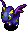 Flamepuff
- Flamepuff - HP: 64 AP: 39 DP: 22 Exp: 400 GP: 75 Type: Dragon/Floating Speed: Normal Sp.Atk Rate: 89% (near), 0% (far) Item Drop Rate: 4% ~ Ability ~ Breathes 20 damage fire when adjacent, which can hit through corners. Occasionally fails at breathing fire.

</td>
      <td class="day">
 Pumphantom
- Pumphantom - HP: 66 AP: 39 DP: 18 Exp: 390 GP: 40 Type: Plant/Floating Speed: Normal Sp.Atk Rate: 0% (near), 0% (far) Item Drop Rate: 0% ~ Ability ~ Can pass through walls. Unpredictable movement, but slowly approaches Shiren.

</td>
      <td></td>
      <td></td>
      <td></td>
    </tr>
    <tr>
      <td class="highlightGray3 dangerNight">
 Evil Sky Dragon
- Evil Sky Dragon - HP: 55 AP: 38 DP: 5 Exp: 300 GP: 200 Type: Dragon Speed: Normal Sp.Atk Rate: 25% (near), 15% (far) Item Drop Rate: 22% ~ Ability ~ Resists non-ability attacks. Spews a homing 50 damage flame from anywhere in the same room.

</td>
      <td class="highlightGray3">
 Dark Eligagan
- Dark Eligagan - HP: 45 AP: 38 DP: 5 Exp: 150 GP: 100 Type: Normal Speed: Normal Sp.Atk Rate: 0% (near), 0% (far) Item Drop Rate: 8% ~ Ability ~ Resists non-ability attacks.

</td>
      <td class="highlightGray3">
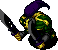 Hell's Debaser
- Hell's Debaser - HP: 45 AP: 38 DP: 3 Exp: 150 GP: 130 Type: Normal Speed: Normal Sp.Atk Rate: 20% (near), 0% (far) Item Drop Rate: 8% ~ Ability ~ Resists non-ability attacks. Occasionally lands a critical hit that deals double damage.

</td>
      <td class="highlightGray3">
 Bad Falcon Tengu
- Bad Falcon Tengu - HP: 45 AP: 50 DP: 5 Exp: 150 GP: 23 Type: Floating Speed: Normal Sp.Atk Rate: 0% (near), 0% (far) Item Drop Rate: 0% ~ Ability ~ Resists non-ability attacks. Disguises itself as a different monster, but it can't use special attacks of the monster it's disguised as.

</td>
      <td></td>
    </tr>
    <tr>
      <td colspan="6" class="purpleDivider"></td>
    </tr>
    <tr>
      <td rowspan="4" class="centeredText">2</td>
      <td class="day">
 Flamepuff
- Flamepuff - HP: 64 AP: 39 DP: 22 Exp: 400 GP: 75 Type: Dragon/Floating Speed: Normal Sp.Atk Rate: 89% (near), 0% (far) Item Drop Rate: 4% ~ Ability ~ Breathes 20 damage fire when adjacent, which can hit through corners. Occasionally fails at breathing fire.

</td>
      <td class="day">
 Pumphantom
- Pumphantom - HP: 66 AP: 39 DP: 18 Exp: 390 GP: 40 Type: Plant/Floating Speed: Normal Sp.Atk Rate: 0% (near), 0% (far) Item Drop Rate: 0% ~ Ability ~ Can pass through walls. Unpredictable movement, but slowly approaches Shiren.

</td>
      <td class="day">
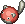 Cave Mamel
- Cave Mamel - HP: 6 AP: 60 DP: 19 Exp: 888 GP: 100 Type: Normal Speed: Normal Sp.Atk Rate: 0% (near), 0% (far) Item Drop Rate: 4% ~ Ability ~ Converts non-fixed damage received to 1 damage.

</td>
      <td class="day">
 Falcon Tengu
- Falcon Tengu - HP: 55 AP: 17 DP: 11 Exp: 66 GP: 20 Type: Floating Speed: Normal Sp.Atk Rate: 0% (near), 0% (far) Item Drop Rate: 0% ~ Ability ~ Disguises itself as a different monster, but it can't use special attacks of the monster it's disguised as.

</td>
      <td class="day">
 VeniScorp
- VeniScorp - HP: 70 AP: 45 DP: 22 Exp: 480 GP: 30 Type: Drain Speed: Normal Sp.Atk Rate: 19% (near), 0% (far) Item Drop Rate: 2% ~ Ability ~ Lowers Strength by 2 when adjacent.

</td>
    </tr>
    <tr>
      <td class="day danger">
 Dazikon
- Dazikon - HP: 46 AP: 23 DP: 16 Exp: 260 GP: 20 Type: Plant Speed: Normal Sp.Atk Rate: 22% (near), 22% (far) Item Drop Rate: 6% ~ Ability ~ Throws Confusion Grass within a 2 tile radius. Throws Poison Grass if Shiren has Confused status. Only drops Confusion Grass.

</td>
      <td class="day">
 Polygon Shaka
- Polygon Shaka - HP: 70 AP: 34 DP: 11 Exp: 360 GP: 35 Type: Drain/Magic Speed: Normal Sp.Atk Rate: 28% (near), 0% (far) Item Drop Rate: 2% ~ Ability ~ Lowers Max HP by 2 or Max Fullness by 5 when adjacent. Warps in front of Shiren when in a room.

</td>
      <td class="day">
 Poofy
- Poofy - HP: 55 AP: 27 DP: 11 Exp: 24 GP: 40 Type: Normal Speed: Swift 1 Sp.Atk Rate: 23% (near), 0% (far) Item Drop Rate: 4% ~ Ability ~ Initially Napping in a group of 3. Shiren can be warped 1~3 floors when surrounded by 3 Poofy monsters.

</td>
      <td></td>
      <td></td>
    </tr>
    <tr>
      <td class="highlightGray3 dangerNight">
 Evil Sky Dragon
- Evil Sky Dragon - HP: 55 AP: 38 DP: 5 Exp: 300 GP: 200 Type: Dragon Speed: Normal Sp.Atk Rate: 25% (near), 15% (far) Item Drop Rate: 22% ~ Ability ~ Resists non-ability attacks. Spews a homing 50 damage flame from anywhere in the same room.

</td>
      <td class="highlightGray3">
 Dark Eligagan
- Dark Eligagan - HP: 45 AP: 38 DP: 5 Exp: 150 GP: 100 Type: Normal Speed: Normal Sp.Atk Rate: 0% (near), 0% (far) Item Drop Rate: 8% ~ Ability ~ Resists non-ability attacks.

</td>
      <td class="highlightGray3">
 Hell's Debaser
- Hell's Debaser - HP: 45 AP: 38 DP: 3 Exp: 150 GP: 130 Type: Normal Speed: Normal Sp.Atk Rate: 20% (near), 0% (far) Item Drop Rate: 8% ~ Ability ~ Resists non-ability attacks. Occasionally lands a critical hit that deals double damage.

</td>
      <td class="highlightGray3">
 Bad Falcon Tengu
- Bad Falcon Tengu - HP: 45 AP: 50 DP: 5 Exp: 150 GP: 23 Type: Floating Speed: Normal Sp.Atk Rate: 0% (near), 0% (far) Item Drop Rate: 0% ~ Ability ~ Resists non-ability attacks. Disguises itself as a different monster, but it can't use special attacks of the monster it's disguised as.

</td>
      <td class="highlightGray3 itemsNight">
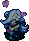 Foul Cursister
- Foul Cursister - HP: 39 AP: 30 DP: 4 Exp: 120 GP: 35 Type: Normal Speed: Normal Sp.Atk Rate: 27% (near), 0% (far) Item Drop Rate: 0% ~ Ability ~ Resists non-ability attacks. Curses or seals 1 item when adjacent.

</td>
    </tr>
    <tr>
      <td class="highlightGray3">
 Putrid Acrid Nut
- Putrid Acrid Nut - HP: 60 AP: 40 DP: 3 Exp: 150 GP: 96 Type: Plant/Explode Speed: Normal Sp.Atk Rate: 0% (near), 0% (far) Item Drop Rate: 0% ~ Ability ~ Resists non-ability attacks. Either doubles experience points (Max: x1024) or explodes (33% chance) each time it eats a thrown item.

</td>
      <td></td>
      <td></td>
      <td></td>
      <td></td>
    </tr>
    <tr>
      <td colspan="6" class="purpleDivider"></td>
    </tr>
    <tr>
      <td rowspan="4" class="centeredText">3</td>
      <td class="day">
 Flamepuff
- Flamepuff - HP: 64 AP: 39 DP: 22 Exp: 400 GP: 75 Type: Dragon/Floating Speed: Normal Sp.Atk Rate: 89% (near), 0% (far) Item Drop Rate: 4% ~ Ability ~ Breathes 20 damage fire when adjacent, which can hit through corners. Occasionally fails at breathing fire.

</td>
      <td class="day">
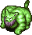 Tiger Hurler
- Tiger Hurler - HP: 68 AP: 45 DP: 18 Exp: 350 GP: 35 Type: Normal Speed: Normal Sp.Atk Rate: 33% (near), 33% (far) Item Drop Rate: 4% ~ Ability ~ Throws an adjacent creature at Shiren, or throws Shiren at another creature, onto a trap, or into a Monster House. Range of 10 tiles, deals 10 damage.

</td>
      <td class="day">
 Cave Mamel
- Cave Mamel - HP: 6 AP: 60 DP: 19 Exp: 888 GP: 100 Type: Normal Speed: Normal Sp.Atk Rate: 0% (near), 0% (far) Item Drop Rate: 4% ~ Ability ~ Converts non-fixed damage received to 1 damage.

</td>
      <td class="day">
 Falcon Tengu
- Falcon Tengu - HP: 55 AP: 17 DP: 11 Exp: 66 GP: 20 Type: Floating Speed: Normal Sp.Atk Rate: 0% (near), 0% (far) Item Drop Rate: 0% ~ Ability ~ Disguises itself as a different monster, but it can't use special attacks of the monster it's disguised as.

</td>
      <td class="day">
 VeniScorp
- VeniScorp - HP: 70 AP: 45 DP: 22 Exp: 480 GP: 30 Type: Drain Speed: Normal Sp.Atk Rate: 19% (near), 0% (far) Item Drop Rate: 2% ~ Ability ~ Lowers Strength by 2 when adjacent.

</td>
    </tr>
    <tr>
      <td class="day danger">
 Dazikon
- Dazikon - HP: 46 AP: 23 DP: 16 Exp: 260 GP: 20 Type: Plant Speed: Normal Sp.Atk Rate: 22% (near), 22% (far) Item Drop Rate: 6% ~ Ability ~ Throws Confusion Grass within a 2 tile radius. Throws Poison Grass if Shiren has Confused status. Only drops Confusion Grass.

</td>
      <td class="day">
 Polygon Shaka
- Polygon Shaka - HP: 70 AP: 34 DP: 11 Exp: 360 GP: 35 Type: Drain/Magic Speed: Normal Sp.Atk Rate: 28% (near), 0% (far) Item Drop Rate: 2% ~ Ability ~ Lowers Max HP by 2 or Max Fullness by 5 when adjacent. Warps in front of Shiren when in a room.

</td>
      <td class="day farm">
 Grass Poppa
- Grass Poppa - HP: 74 AP: 49 DP: 17 Exp: 640 GP: 210 Type: Plant Speed: Normal Sp.Atk Rate: 21% (near), 16% (far) Item Drop Rate: 0% ~ Ability ~ Spreads grass in a 1 tile radius when adjacent. Pierce-throws grass in a straight line at a distance. Carries up to 3 grass items. Becomes Pin Poppa with 0 grass.

</td>
      <td class="day">
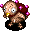 Pin Poppa
- Pin Poppa - HP: 76 AP: 48 DP: 16 Exp: 400 GP: 80 Type: Plant Speed: Swift 1 Sp.Atk Rate: 0% (near), 0% (far) Item Drop Rate: 0% ~ Ability ~ Runs from Shiren, but attacks when adjacent. Becomes Grass Poppa when it picks up a grass item. Generates its own grass as turns elapse.

</td>
      <td></td>
    </tr>
    <tr>
      <td class="highlightGray3 dangerNight">
 Evil Sky Dragon
- Evil Sky Dragon - HP: 55 AP: 38 DP: 5 Exp: 300 GP: 200 Type: Dragon Speed: Normal Sp.Atk Rate: 25% (near), 15% (far) Item Drop Rate: 22% ~ Ability ~ Resists non-ability attacks. Spews a homing 50 damage flame from anywhere in the same room.

</td>
      <td class="highlightGray3 farmNight">
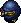 Snide Froggucci
- Snide Froggucci - HP: 50 AP: 36 DP: 5 Exp: 10 GP: 20 Type: Normal Speed: Normal Sp.Atk Rate: 48% (near), 0% (far) Item Drop Rate: 100% ~ Ability ~ Resists non-ability attacks. Steals Gitan when adjacent and warps, then runs from Shiren at swift speed. Stands on Gitan it finds the ground. Can use direct attacks. Heals HP when hit by thrown Gitan.

</td>
      <td class="highlightGray3">
 Dark Steamroid
- Dark Steamroid - HP: 42 AP: 36 DP: 3 Exp: 180 GP: 100 Type: Metal Speed: Swift 1 Sp.Atk Rate: 38% (near), 38% (far) Item Drop Rate: 8% ~ Ability ~ Resists non-ability attacks. Initially Napping, wakes when Shiren enters or exits the room. Creates a trap on the ground, then stops acting for 2 turns. Occasionally creates a trap when slain.

</td>
      <td class="highlightGray3">
 Bad Falcon Tengu
- Bad Falcon Tengu - HP: 45 AP: 50 DP: 5 Exp: 150 GP: 23 Type: Floating Speed: Normal Sp.Atk Rate: 0% (near), 0% (far) Item Drop Rate: 0% ~ Ability ~ Resists non-ability attacks. Disguises itself as a different monster, but it can't use special attacks of the monster it's disguised as.

</td>
      <td class="highlightGray3 itemsNight">
 Foul Cursister
- Foul Cursister - HP: 39 AP: 30 DP: 4 Exp: 120 GP: 35 Type: Normal Speed: Normal Sp.Atk Rate: 27% (near), 0% (far) Item Drop Rate: 0% ~ Ability ~ Resists non-ability attacks. Curses or seals 1 item when adjacent.

</td>
    </tr>
    <tr>
      <td class="highlightGray3">
 Putrid Acrid Nut
- Putrid Acrid Nut - HP: 60 AP: 40 DP: 3 Exp: 150 GP: 96 Type: Plant/Explode Speed: Normal Sp.Atk Rate: 0% (near), 0% (far) Item Drop Rate: 0% ~ Ability ~ Resists non-ability attacks. Either doubles experience points (Max: x1024) or explodes (33% chance) each time it eats a thrown item.

</td>
      <td></td>
      <td></td>
      <td></td>
      <td></td>
    </tr>
    <tr>
      <td colspan="6" class="grayDivider"></td>
    </tr>
    <tr>
      <td class="monsterTableVillage"></td>
      <td colspan="5" class="monsterTableVillage centeredText">Sparrow's Inn</td>
    </tr>
    <tr>
      <td colspan="6" class="grayDivider"></td>
    </tr>
    <tr>
      <td rowspan="2" class="centeredText">4</td>
      <td class="day extreme">
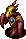 MC Wizard
- MC Wizard - HP: 62 AP: 32 DP: 20 Exp: 800 GP: 60 Type: Magic Speed: Normal Sp.Atk Rate: 64% (near), 47% (far) Item Drop Rate: 6% ~ Ability ~ Fires a magic bullet with a random effect in a straight line: Level-1, sealed, paralyzed, cloned, or berserk.

</td>
      <td class="day">
 Tiger Hurler
- Tiger Hurler - HP: 68 AP: 45 DP: 18 Exp: 350 GP: 35 Type: Normal Speed: Normal Sp.Atk Rate: 33% (near), 33% (far) Item Drop Rate: 4% ~ Ability ~ Throws an adjacent creature at Shiren, or throws Shiren at another creature, onto a trap, or into a Monster House. Range of 10 tiles, deals 10 damage.

</td>
      <td class="day farm">
 Grass Poppa
- Grass Poppa - HP: 74 AP: 49 DP: 17 Exp: 640 GP: 210 Type: Plant Speed: Normal Sp.Atk Rate: 21% (near), 16% (far) Item Drop Rate: 0% ~ Ability ~ Spreads grass in a 1 tile radius when adjacent. Pierce-throws grass in a straight line at a distance. Carries up to 3 grass items. Becomes Pin Poppa with 0 grass.

</td>
      <td class="day">
 Pin Poppa
- Pin Poppa - HP: 76 AP: 48 DP: 16 Exp: 400 GP: 80 Type: Plant Speed: Swift 1 Sp.Atk Rate: 0% (near), 0% (far) Item Drop Rate: 0% ~ Ability ~ Runs from Shiren, but attacks when adjacent. Becomes Grass Poppa when it picks up a grass item. Generates its own grass as turns elapse.

</td>
      <td class="day">
 VeniScorp
- VeniScorp - HP: 70 AP: 45 DP: 22 Exp: 480 GP: 30 Type: Drain Speed: Normal Sp.Atk Rate: 19% (near), 0% (far) Item Drop Rate: 2% ~ Ability ~ Lowers Strength by 2 when adjacent.

</td>
    </tr>
    <tr>
      <td class="highlightGray3 dangerNight">
 Bad Colocolum
- Bad Colocolum - HP: 60 AP: 46 DP: 4 Exp: 180 GP: 120 Type: Normal Speed: Normal Sp.Atk Rate: 0% (near), 0% (far) Item Drop Rate: 16% ~ Ability ~ Resists non-ability attacks. Rolls backward 10 tiles when slain by a direct attack, damaging anything it hits equal to damage received.

</td>
      <td class="highlightGray3 farmNight">
 Snide Froggucci
- Snide Froggucci - HP: 50 AP: 36 DP: 5 Exp: 10 GP: 20 Type: Normal Speed: Normal Sp.Atk Rate: 48% (near), 0% (far) Item Drop Rate: 100% ~ Ability ~ Resists non-ability attacks. Steals Gitan when adjacent and warps, then runs from Shiren at swift speed. Stands on Gitan it finds the ground. Can use direct attacks. Heals HP when hit by thrown Gitan.

</td>
      <td class="highlightGray3">
 Dark Steamroid
- Dark Steamroid - HP: 42 AP: 36 DP: 3 Exp: 180 GP: 100 Type: Metal Speed: Swift 1 Sp.Atk Rate: 38% (near), 38% (far) Item Drop Rate: 8% ~ Ability ~ Resists non-ability attacks. Initially Napping, wakes when Shiren enters or exits the room. Creates a trap on the ground, then stops acting for 2 turns. Occasionally creates a trap when slain.

</td>
      <td class="highlightGray3">
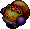 Mean Go-Ham!
- Mean Go-Ham! - HP: 47 AP: 27 DP: 5 Exp: 36 GP: 60 Type: Normal Speed: Normal Sp.Atk Rate: 0% (near), 0% (far) Item Drop Rate: 8% ~ Ability ~ Resists non-ability attacks. Runs away from Shiren, but attacks when cornered. Moves toward monsters in view. Cheers for adjacent creatures, raising AP by 2 stages and letting them survive a fatal hit.

</td>
      <td></td>
    </tr>
    <tr>
      <td colspan="6" class="purpleDivider"></td>
    </tr>
    <tr>
      <td rowspan="3" class="centeredText">5</td>
      <td class="day extreme">
 MC Wizard
- MC Wizard - HP: 62 AP: 32 DP: 20 Exp: 800 GP: 60 Type: Magic Speed: Normal Sp.Atk Rate: 64% (near), 47% (far) Item Drop Rate: 6% ~ Ability ~ Fires a magic bullet with a random effect in a straight line: Level-1, sealed, paralyzed, cloned, or berserk.

</td>
      <td class="day">
 Tiger Hurler
- Tiger Hurler - HP: 68 AP: 45 DP: 18 Exp: 350 GP: 35 Type: Normal Speed: Normal Sp.Atk Rate: 33% (near), 33% (far) Item Drop Rate: 4% ~ Ability ~ Throws an adjacent creature at Shiren, or throws Shiren at another creature, onto a trap, or into a Monster House. Range of 10 tiles, deals 10 damage.

</td>
      <td class="day farm">
 Grass Poppa
- Grass Poppa - HP: 74 AP: 49 DP: 17 Exp: 640 GP: 210 Type: Plant Speed: Normal Sp.Atk Rate: 21% (near), 16% (far) Item Drop Rate: 0% ~ Ability ~ Spreads grass in a 1 tile radius when adjacent. Pierce-throws grass in a straight line at a distance. Carries up to 3 grass items. Becomes Pin Poppa with 0 grass.

</td>
      <td class="day">
 Pin Poppa
- Pin Poppa - HP: 76 AP: 48 DP: 16 Exp: 400 GP: 80 Type: Plant Speed: Swift 1 Sp.Atk Rate: 0% (near), 0% (far) Item Drop Rate: 0% ~ Ability ~ Runs from Shiren, but attacks when adjacent. Becomes Grass Poppa when it picks up a grass item. Generates its own grass as turns elapse.

</td>
      <td class="day items">
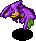 Gyairas
- Gyairas - HP: 64 AP: 49 DP: 22 Exp: 440 GP: 35 Type: Floating Speed: Normal Sp.Atk Rate: 21% (near), 0% (far) Item Drop Rate: 4% ~ Ability ~ Pecks a scroll or talisman from your inventory when adjacent, turning it into a Piece of Paper.

</td>
    </tr>
    <tr>
      <td></td>
      <td class="day">
 Eligagan
- Eligagan - HP: 62 AP: 62 DP: 22 Exp: 680 GP: 100 Type: Normal Speed: Normal Sp.Atk Rate: 0% (near), 0% (far) Item Drop Rate: 4% ~ Ability ~ None.

</td>
      <td></td>
      <td class="day">
 Huistdon
- Huistdon - HP: 108 AP: 69 DP: 25 Exp: 660 GP: 220 Type: Normal Speed: Slow Sp.Atk Rate: 100% (near), 100% (far) Item Drop Rate: 4% ~ Ability ~ Counters with a 30 damage lightning attack when Shiren is in view after taking damage 3 times.

</td>
      <td></td>
    </tr>
    <tr>
      <td class="highlightGray3 dangerNight">
 Bad Colocolum
- Bad Colocolum - HP: 60 AP: 46 DP: 4 Exp: 180 GP: 120 Type: Normal Speed: Normal Sp.Atk Rate: 0% (near), 0% (far) Item Drop Rate: 16% ~ Ability ~ Resists non-ability attacks. Rolls backward 10 tiles when slain by a direct attack, damaging anything it hits equal to damage received.

</td>
      <td class="highlightGray3">
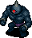 Dark Ironhead
- Dark Ironhead - HP: 66 AP: 59 DP: 7 Exp: 150 GP: 140 Type: Cyclops Speed: Normal Sp.Atk Rate: 34% (near), 34% (far) Item Drop Rate: 8% ~ Ability ~ Resists non-ability attacks. Attacks 2 tiles ahead and through corners. Charges strength to deal double damage on the next turn.

</td>
      <td class="highlightGray3 usefulNight">
 Dark Mixermon
- Dark Mixermon - HP: 60 AP: 40 DP: 6 Exp: 230 GP: 80 Type: Normal Speed: Normal Sp.Atk Rate: 0% (near), 0% (far) Item Drop Rate: 0% ~ Ability ~ Resists non-ability attacks. Eats up to 3 thrown items and synthesizes them. Gains 1 stage of Buffed status each time it eats an item.

</td>
      <td class="highlightGray3">
 Mean Go-Ham!
- Mean Go-Ham! - HP: 47 AP: 27 DP: 5 Exp: 36 GP: 60 Type: Normal Speed: Normal Sp.Atk Rate: 0% (near), 0% (far) Item Drop Rate: 8% ~ Ability ~ Resists non-ability attacks. Runs away from Shiren, but attacks when cornered. Moves toward monsters in view. Cheers for adjacent creatures, raising AP by 2 stages and letting them survive a fatal hit.

</td>
      <td class="highlightGray3">
 Vile Sproutyrant
- Vile Sproutyrant - HP: 37 AP: 40 DP: 4 Exp: 140 GP: 190 Type: Plant Speed: Normal Sp.Atk Rate: 0% (near), 0% (far) Item Drop Rate: 8% ~ Ability ~ Resists non-ability attacks. Monster family becomes immune to most recent status inflicted upon it, excluding Sealed status.

</td>
    </tr>
    <tr>
      <td colspan="6" class="purpleDivider"></td>
    </tr>
    <tr>
      <td rowspan="2" class="centeredText">6</td>
      <td class="day">
 Sparkbird
- Sparkbird - HP: 43 AP: 20 DP: 25 Exp: 200 GP: 25 Type: Floating Speed: Normal Sp.Atk Rate: 56% (near), 0% (far) Item Drop Rate: 0% ~ Ability ~ Heals an adjacent monster's HP by 60. Items thrown at it burn up. Fire damage restores its HP. Multiplies from explosions.

</td>
      <td class="day">
 Eligagan
- Eligagan - HP: 62 AP: 62 DP: 22 Exp: 680 GP: 100 Type: Normal Speed: Normal Sp.Atk Rate: 0% (near), 0% (far) Item Drop Rate: 4% ~ Ability ~ None.

</td>
      <td></td>
      <td class="day">
 Huistdon
- Huistdon - HP: 108 AP: 69 DP: 25 Exp: 660 GP: 220 Type: Normal Speed: Slow Sp.Atk Rate: 100% (near), 100% (far) Item Drop Rate: 4% ~ Ability ~ Counters with a 30 damage lightning attack when Shiren is in view after taking damage 3 times.

</td>
      <td class="day items">
 Gyairas
- Gyairas - HP: 64 AP: 49 DP: 22 Exp: 440 GP: 35 Type: Floating Speed: Normal Sp.Atk Rate: 21% (near), 0% (far) Item Drop Rate: 4% ~ Ability ~ Pecks a scroll or talisman from your inventory when adjacent, turning it into a Piece of Paper.

</td>
    </tr>
    <tr>
      <td class="highlightGray3 itemsNight">
 Wicked Trowelie
- Wicked Trowelie - HP: 45 AP: 46 DP: 6 Exp: 320 GP: 200 Type: Metal Speed: Normal Sp.Atk Rate: 22% (near), 18% (far) Item Drop Rate: 16% ~ Ability ~ Resists non-ability attacks. Shovels dirt at a visible target within a 4 tile radius. Dirt fills 1 pot in your inventory when it hits Shiren, or inflicts Blind status when it hits an ally. Dirt in pots eventually changes to grass items when advancing floors.

</td>
      <td class="highlightGray3">
 Dark Ironhead
- Dark Ironhead - HP: 66 AP: 59 DP: 7 Exp: 150 GP: 140 Type: Cyclops Speed: Normal Sp.Atk Rate: 34% (near), 34% (far) Item Drop Rate: 8% ~ Ability ~ Resists non-ability attacks. Attacks 2 tiles ahead and through corners. Charges strength to deal double damage on the next turn.

</td>
      <td class="highlightGray3 usefulNight">
 Dark Mixermon
- Dark Mixermon - HP: 60 AP: 40 DP: 6 Exp: 230 GP: 80 Type: Normal Speed: Normal Sp.Atk Rate: 0% (near), 0% (far) Item Drop Rate: 0% ~ Ability ~ Resists non-ability attacks. Eats up to 3 thrown items and synthesizes them. Gains 1 stage of Buffed status each time it eats an item.

</td>
      <td class="highlightGray3">
 Evil Concusschin
- Evil Concusschin - HP: 45 AP: 55 DP: 1 Exp: 70 GP: 80 Type: Aquatic/Cyclops/Explode Speed: Normal Sp.Atk Rate: 0% (near), 0% (far) Item Drop Rate: 0% ~ Ability ~ Resists non-ability attacks. Explodes after losing a certain amount of HP.

</td>
      <td class="highlightGray3">
 Vile Sproutyrant
- Vile Sproutyrant - HP: 37 AP: 40 DP: 4 Exp: 140 GP: 190 Type: Plant Speed: Normal Sp.Atk Rate: 0% (near), 0% (far) Item Drop Rate: 8% ~ Ability ~ Resists non-ability attacks. Monster family becomes immune to most recent status inflicted upon it, excluding Sealed status.

</td>
    </tr>
    <tr>
      <td colspan="6" class="purpleDivider"></td>
    </tr>
    <tr>
      <td rowspan="2" class="centeredText">7</td>
      <td class="day">
 Sparkbird
- Sparkbird - HP: 43 AP: 20 DP: 25 Exp: 200 GP: 25 Type: Floating Speed: Normal Sp.Atk Rate: 56% (near), 0% (far) Item Drop Rate: 0% ~ Ability ~ Heals an adjacent monster's HP by 60. Items thrown at it burn up. Fire damage restores its HP. Multiplies from explosions.

</td>
      <td class="day">
 Eligagan
- Eligagan - HP: 62 AP: 62 DP: 22 Exp: 680 GP: 100 Type: Normal Speed: Normal Sp.Atk Rate: 0% (near), 0% (far) Item Drop Rate: 4% ~ Ability ~ None.

</td>
      <td class="day danger">
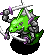 Nashagga
- Nashagga - HP: 85 AP: 55 DP: 27 Exp: 1060 GP: 200 Type: Dragon Speed: Normal Sp.Atk Rate: 0% (near), 0% (far) Item Drop Rate: 4% ~ Ability ~ Attacks 2 times in 1 turn (single animation).

</td>
      <td class="day">
 Huistdon
- Huistdon - HP: 108 AP: 69 DP: 25 Exp: 660 GP: 220 Type: Normal Speed: Slow Sp.Atk Rate: 100% (near), 100% (far) Item Drop Rate: 4% ~ Ability ~ Counters with a 30 damage lightning attack when Shiren is in view after taking damage 3 times.

</td>
      <td></td>
    </tr>
    <tr>
      <td class="highlightGray3 itemsNight">
 Wicked Trowelie
- Wicked Trowelie - HP: 45 AP: 46 DP: 6 Exp: 320 GP: 200 Type: Metal Speed: Normal Sp.Atk Rate: 22% (near), 18% (far) Item Drop Rate: 16% ~ Ability ~ Resists non-ability attacks. Shovels dirt at a visible target within a 4 tile radius. Dirt fills 1 pot in your inventory when it hits Shiren, or inflicts Blind status when it hits an ally. Dirt in pots eventually changes to grass items when advancing floors.

</td>
      <td class="highlightGray3">
 Dark Chucker
- Dark Chucker - HP: 65 AP: 66 DP: 9 Exp: 260 GP: 220 Type: Normal Speed: Normal Sp.Atk Rate: 33% (near), 33% (far) Item Drop Rate: 16% ~ Ability ~ Resists non-ability attacks. Throws an adjacent creature at Shiren, or throws Shiren at another creature, onto a trap, or into a Monster House. Range of 15 tiles, deals 30 damage.

</td>
      <td></td>
      <td class="highlightGray3">
 Evil Concusschin
- Evil Concusschin - HP: 45 AP: 55 DP: 1 Exp: 70 GP: 80 Type: Aquatic/Cyclops/Explode Speed: Normal Sp.Atk Rate: 0% (near), 0% (far) Item Drop Rate: 0% ~ Ability ~ Resists non-ability attacks. Explodes after losing a certain amount of HP.

</td>
      <td class="highlightGray3">
 Vile Sproutyrant
- Vile Sproutyrant - HP: 37 AP: 40 DP: 4 Exp: 140 GP: 190 Type: Plant Speed: Normal Sp.Atk Rate: 0% (near), 0% (far) Item Drop Rate: 8% ~ Ability ~ Resists non-ability attacks. Monster family becomes immune to most recent status inflicted upon it, excluding Sealed status.

</td>
    </tr>
    <tr>
      <td colspan="6" class="purpleDivider"></td>
    </tr>
    <tr>
      <td rowspan="2" class="centeredText">8</td>
      <td class="day danger">
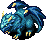 Sky Dragon
- Sky Dragon - HP: 80 AP: 55 DP: 26 Exp: 1600 GP: 120 Type: Dragon Speed: Normal Sp.Atk Rate: 25% (near), 15% (far) Item Drop Rate: 22% ~ Ability ~ Spews a homing 20 damage flame from anywhere in the same room.

</td>
      <td class="day">
 Steelhead
- Steelhead - HP: 65 AP: 58 DP: 25 Exp: 650 GP: 200 Type: Cyclops Speed: Normal Sp.Atk Rate: 34% (near), 34% (far) Item Drop Rate: 4% ~ Ability ~ Attacks 2 tiles ahead and through corners. Charges strength to deal double damage on the next turn.

</td>
      <td class="day danger">
 Nashagga
- Nashagga - HP: 85 AP: 55 DP: 27 Exp: 1060 GP: 200 Type: Dragon Speed: Normal Sp.Atk Rate: 0% (near), 0% (far) Item Drop Rate: 4% ~ Ability ~ Attacks 2 times in 1 turn (single animation).

</td>
      <td class="day">
 Huistdon
- Huistdon - HP: 108 AP: 69 DP: 25 Exp: 660 GP: 220 Type: Normal Speed: Slow Sp.Atk Rate: 100% (near), 100% (far) Item Drop Rate: 4% ~ Ability ~ Counters with a 30 damage lightning attack when Shiren is in view after taking damage 3 times.

</td>
      <td></td>
    </tr>
    <tr>
      <td class="highlightGray3 itemsNight">
 Wicked Trowelie
- Wicked Trowelie - HP: 45 AP: 46 DP: 6 Exp: 320 GP: 200 Type: Metal Speed: Normal Sp.Atk Rate: 22% (near), 18% (far) Item Drop Rate: 16% ~ Ability ~ Resists non-ability attacks. Shovels dirt at a visible target within a 4 tile radius. Dirt fills 1 pot in your inventory when it hits Shiren, or inflicts Blind status when it hits an ally. Dirt in pots eventually changes to grass items when advancing floors.

</td>
      <td class="highlightGray3">
 Dark Chucker
- Dark Chucker - HP: 65 AP: 66 DP: 9 Exp: 260 GP: 220 Type: Normal Speed: Normal Sp.Atk Rate: 33% (near), 33% (far) Item Drop Rate: 16% ~ Ability ~ Resists non-ability attacks. Throws an adjacent creature at Shiren, or throws Shiren at another creature, onto a trap, or into a Monster House. Range of 15 tiles, deals 30 damage.

</td>
      <td class="highlightGray3 dangerNight">
 Dark Scarabbit
- Dark Scarabbit - HP: 42 AP: 32 DP: 3 Exp: 160 GP: 80 Type: Magic Speed: Normal Sp.Atk Rate: 21% (near), 21% (far) Item Drop Rate: 8% ~ Ability ~ Resists non-ability attacks. Attracts up to 5 creatures including Shiren to itself from anywhere in the same room.

</td>
      <td class="highlightGray3">
 Vile Pumpanshee
- Vile Pumpanshee - HP: 65 AP: 62 DP: 4 Exp: 240 GP: 160 Type: Plant/Floating Speed: Normal Sp.Atk Rate: 0% (near), 0% (far) Item Drop Rate: 0% ~ Ability ~ Resists non-ability attacks. Can pass through walls. Unpredictable movement, but slowly approaches Shiren.

</td>
      <td class="highlightGray3 extremeNight">
 Sinister Porkon
- Sinister Porkon - HP: 62 AP: 72 DP: 4 Exp: 250 GP: 220 Type: Normal Speed: Normal Sp.Atk Rate: 19% (near), 23% (far) Item Drop Rate: 16% ~ Ability ~ Resists non-ability attacks. Throws a Porky Rock that deals 20 damage within a 6 tile radius. Only drops Porky Rocks.

</td>
    </tr>
    <tr>
      <td colspan="6" class="purpleDivider"></td>
    </tr>
    <tr>
      <td rowspan="2" class="centeredText">9</td>
      <td class="day danger">
 Sky Dragon
- Sky Dragon - HP: 80 AP: 55 DP: 26 Exp: 1600 GP: 120 Type: Dragon Speed: Normal Sp.Atk Rate: 25% (near), 15% (far) Item Drop Rate: 22% ~ Ability ~ Spews a homing 20 damage flame from anywhere in the same room.

</td>
      <td class="day">
 Steelhead
- Steelhead - HP: 65 AP: 58 DP: 25 Exp: 650 GP: 200 Type: Cyclops Speed: Normal Sp.Atk Rate: 34% (near), 34% (far) Item Drop Rate: 4% ~ Ability ~ Attacks 2 tiles ahead and through corners. Charges strength to deal double damage on the next turn.

</td>
      <td class="day danger">
 Nashagga
- Nashagga - HP: 85 AP: 55 DP: 27 Exp: 1060 GP: 200 Type: Dragon Speed: Normal Sp.Atk Rate: 0% (near), 0% (far) Item Drop Rate: 4% ~ Ability ~ Attacks 2 times in 1 turn (single animation).

</td>
      <td></td>
      <td></td>
    </tr>
    <tr>
      <td class="highlightGray3">
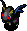 Evil Blazepuff
- Evil Blazepuff - HP: 65 AP: 62 DP: 9 Exp: 160 GP: 100 Type: Dragon/Floating Speed: Normal Sp.Atk Rate: 89% (near), 0% (far) Item Drop Rate: 16% ~ Ability ~ Resists non-ability attacks. Breathes 60 damage fire when adjacent, which can hit through corners. Occasionally fails at breathing fire.

</td>
      <td class="highlightGray3">
 Dark Chucker
- Dark Chucker - HP: 65 AP: 66 DP: 9 Exp: 260 GP: 220 Type: Normal Speed: Normal Sp.Atk Rate: 33% (near), 33% (far) Item Drop Rate: 16% ~ Ability ~ Resists non-ability attacks. Throws an adjacent creature at Shiren, or throws Shiren at another creature, onto a trap, or into a Monster House. Range of 15 tiles, deals 30 damage.

</td>
      <td class="highlightGray3 dangerNight">
 Dark Scarabbit
- Dark Scarabbit - HP: 42 AP: 32 DP: 3 Exp: 160 GP: 80 Type: Magic Speed: Normal Sp.Atk Rate: 21% (near), 21% (far) Item Drop Rate: 8% ~ Ability ~ Resists non-ability attacks. Attracts up to 5 creatures including Shiren to itself from anywhere in the same room.

</td>
      <td class="highlightGray3">
 Vile Pumpanshee
- Vile Pumpanshee - HP: 65 AP: 62 DP: 4 Exp: 240 GP: 160 Type: Plant/Floating Speed: Normal Sp.Atk Rate: 0% (near), 0% (far) Item Drop Rate: 0% ~ Ability ~ Resists non-ability attacks. Can pass through walls. Unpredictable movement, but slowly approaches Shiren.

</td>
      <td class="highlightGray3 extremeNight">
 Sinister Porkon
- Sinister Porkon - HP: 62 AP: 72 DP: 4 Exp: 250 GP: 220 Type: Normal Speed: Normal Sp.Atk Rate: 19% (near), 23% (far) Item Drop Rate: 16% ~ Ability ~ Resists non-ability attacks. Throws a Porky Rock that deals 20 damage within a 6 tile radius. Only drops Porky Rocks.

</td>
    </tr>
    <tr>
      <td colspan="6" class="purpleDivider"></td>
    </tr>
    <tr>
      <td rowspan="1" class="centeredText highlightOrange2">10</td>
      <td class="day extreme">
 Gr. Reeva Statue
- Gr. Reeva Statue - HP: 1200 AP: 75 DP: 20 Exp: 0 GP: 0 Type: Normal Speed: Normal Sp.Atk Rate: 46% (near), 46% (far) Item Drop Rate: 0% ~ Ability ~ Immune to select statuses. Cures ailments after 1 turn. Reflects projectiles. Special attacks include Shockwave (15 damage + knockback), Lightning (damage to all creatures), Earthquake (Shiren's items become unequipped), Gust (knockback), Stray Missile (40 damage cannonball), Summon (Sky Dragons).

</td>
      <td class="day danger">
 Sky Dragon
- Sky Dragon - HP: 80 AP: 55 DP: 26 Exp: 1600 GP: 120 Type: Dragon Speed: Normal Sp.Atk Rate: 25% (near), 15% (far) Item Drop Rate: 22% ~ Ability ~ Spews a homing 20 damage flame from anywhere in the same room.

</td>
      <td></td>
      <td></td>
      <td></td>
    </tr>
  </tbody>
</table>

# Monster List

Red: Very Dangerous, Orange: Dangerous, Blue: Beneficial

#### List (Day)

<table class="dungeonMonsterList">
  <tr>
    <th>F</th>
    <th>Name</th>
    <th>HP</th>
    <th>AP</th>
    <th>DP</th>
    <th>Exp</th>
    <th>GP</th>
    <th>Rune / Item</th>
    <th>Notes</th>
  </tr>
  <tr>
    <td>1-2</td>
    <td class="highlightYellow">Pumphantom</td>
    <td>66</td>
    <td>39</td>
    <td>18</td>
    <td>390</td>
    <td>40</td>
    <td>Anti-Plant Anti-Floating</td>
    <td>Moves through walls, unpredictable movement.</td>
  </tr>
  <tr>
    <td>1-3</td>
    <td class="highlightYellow">Flamepuff</td>
    <td>64</td>
    <td>39</td>
    <td>22</td>
    <td>400</td>
    <td>75</td>
    <td>Anti-Floating Anti-Dragon Anti-Fire Zen Pot</td>
    <td>20 damage fire 1 tile in front.</td>
  </tr>
  <tr>
    <td>2</td>
    <td class="highlightYellow">Poofy</td>
    <td>55</td>
    <td>27</td>
    <td>11</td>
    <td>24</td>
    <td>40</td>
    <td>-</td>
    <td>Swift 1, always generated in a group of 3.</td>
  </tr>
  <tr>
    <td>2-3</td>
    <td class="highlightYellow">Cave Mamel</td>
    <td>6</td>
    <td>60</td>
    <td>19</td>
    <td>888</td>
    <td>100</td>
    <td>-</td>
    <td>Direct attacks deal 1 damage.</td>
  </tr>
  <tr>
    <td>2-3</td>
    <td class="highlightYellow">Falcon Tengu</td>
    <td>55</td>
    <td>17</td>
    <td>11</td>
    <td>66</td>
    <td>20</td>
    <td>Anti-Floating</td>
    <td>Disguises itself as a different monster.</td>
  </tr>
  <tr>
    <td>2-3</td>
    <td class="highlightYellow">Polygon Shaka</td>
    <td>70</td>
    <td>34</td>
    <td>11</td>
    <td>360</td>
    <td>35</td>
    <td>Anti-Drain Anti-Magic Staunch Bracelet</td>
    <td>Lowers max HP by 2, or max fullness by 5.</td>
  </tr>
  <tr>
    <td>2-3</td>
    <td class="highlightYellow orangeText2">Dazikon</td>
    <td>46</td>
    <td>23</td>
    <td>16</td>
    <td>260</td>
    <td>20</td>
    <td>Anti-Plant Anti-Cnf. Bracelet Cleansing Bracelet Dodger Pot</td>
    <td>Throws Confusion Grass in a 2 tile radius.</td>
  </tr>
  <tr>
    <td>2-4</td>
    <td class="highlightYellow">VeniScorp</td>
    <td>70</td>
    <td>45</td>
    <td>22</td>
    <td>480</td>
    <td>30</td>
    <td>Anti-Drain Cleansing Bracelet</td>
    <td>Decreases strength by 2.</td>
  </tr>
  <tr>
    <td>3-5</td>
    <td class="highlightYellow">Tiger Hurler</td>
    <td>68</td>
    <td>45</td>
    <td>18</td>
    <td>350</td>
    <td>35</td>
    <td>Unmoving</td>
    <td>Throws creatures up to 10 tiles away.</td>
  </tr>
  <tr>
    <td>3-5</td>
    <td class="highlightYellow blueText2">Grass Poppa</td>
    <td>74</td>
    <td>49</td>
    <td>17</td>
    <td>640</td>
    <td>210</td>
    <td>Anti-Plant</td>
    <td>Throws grass, drops up to 3 grass items.</td>
  </tr>
  <tr>
    <td>3-5</td>
    <td class="highlightYellow">Pin Poppa</td>
    <td>76</td>
    <td>48</td>
    <td>16</td>
    <td>400</td>
    <td>80</td>
    <td>Anti-Plant</td>
    <td>Swift 1, becomes Grass Poppa if it finds grass.</td>
  </tr>
  <tr>
    <td>4-5</td>
    <td class="highlightYellow redText2 orangeText2">MC Wizard</td>
    <td>62</td>
    <td>32</td>
    <td>20</td>
    <td>800</td>
    <td>60</td>
    <td>Anti-Magic Magi-Twister Reflection Pot</td>
    <td>Berserk, Sealed, Paralyzed, Cloned, or level down by 1.</td>
  </tr>
  <tr>
    <td>5-6</td>
    <td class="highlightYellow">Gyairas</td>
    <td>64</td>
    <td>49</td>
    <td>22</td>
    <td>440</td>
    <td>35</td>
    <td>Anti-Floating Anti-Peck Perceptive Pot</td>
    <td>Turns a scroll or talisman into a Piece of Paper.</td>
  </tr>
  <tr>
    <td>5-7</td>
    <td class="highlightYellow">Eligagan</td>
    <td>62</td>
    <td>62</td>
    <td>22</td>
    <td>680</td>
    <td>100</td>
    <td>-</td>
    <td>-</td>
  </tr>
  <tr>
    <td>5-8</td>
    <td class="highlightYellow">Huistdon</td>
    <td>108</td>
    <td>69</td>
    <td>25</td>
    <td>660</td>
    <td>220</td>
    <td>-</td>
    <td>Slow, 30 damage counter after 3 hits.</td>
  </tr>
  <tr>
    <td>6-7</td>
    <td class="highlightYellow">Sparkbird</td>
    <td>43</td>
    <td>20</td>
    <td>25</td>
    <td>200</td>
    <td>25</td>
    <td>Anti-Floating</td>
    <td>Heals a monster's HP by 60.</td>
  </tr>
  <tr>
    <td>7-9</td>
    <td class="highlightYellow redText2 orangeText2">Nashagga</td>
    <td>85</td>
    <td>55</td>
    <td>27</td>
    <td>1060</td>
    <td>200</td>
    <td>Anti-Dragon Water Pot</td>
    <td>Attacks 2 times in a single turn.</td>
  </tr>
  <tr>
    <td>8-9</td>
    <td class="highlightYellow">Steelhead</td>
    <td>65</td>
    <td>58</td>
    <td>25</td>
    <td>650</td>
    <td>200</td>
    <td>Anti-Cyclops</td>
    <td>Hits targets 2 tiles away, charges strength.</td>
  </tr>
  <tr>
    <td>8-9</td>
    <td class="highlightYellow orangeText2">Sky Dragon</td>
    <td>80</td>
    <td>55</td>
    <td>26</td>
    <td>1600</td>
    <td>120</td>
    <td>Anti-Dragon Anti-Fire Zen Pot</td>
    <td>20 damage fire from anywhere in the room.</td>
  </tr>
</table>

#### List (Night)

<table class="dungeonMonsterList">
  <tr>
    <th>F</th>
    <th>Name</th>
    <th>HP</th>
    <th>AP</th>
    <th>DP</th>
    <th>Exp</th>
    <th>GP</th>
    <th>Rune / Item</th>
    <th>Notes</th>
  </tr>
  <tr>
    <td>1-2</td>
    <td class="highlightNight">Dark Eligagan</td>
    <td>45</td>
    <td>38</td>
    <td>5</td>
    <td>150</td>
    <td>100</td>
    <td>-</td>
    <td>-</td>
  </tr>
  <tr>
    <td>1-2</td>
    <td class="highlightNight">Hell's Debaser</td>
    <td>45</td>
    <td>38</td>
    <td>3</td>
    <td>150</td>
    <td>130</td>
    <td>Water Pot</td>
    <td>Chance to deal a critical hit.</td>
  </tr>
  <tr>
    <td>1-3</td>
    <td class="highlightNight">Bad Falcon Tengu</td>
    <td>45</td>
    <td>50</td>
    <td>5</td>
    <td>150</td>
    <td>23</td>
    <td>-</td>
    <td>Disguises itself as a different monster.</td>
  </tr>
  <tr>
    <td>1-3</td>
    <td class="highlightNight orangeText2">Evil Sky Dragon</td>
    <td>55</td>
    <td>38</td>
    <td>5</td>
    <td>300</td>
    <td>200</td>
    <td>Anti-Fire Zen Pot</td>
    <td>50 damage fire from anywhere in the room.</td>
  </tr>
  <tr>
    <td>2-3</td>
    <td class="highlightNight">Foul Cursister</td>
    <td>39</td>
    <td>30</td>
    <td>4</td>
    <td>120</td>
    <td>35</td>
    <td>Anti-Crs. Bracelet</td>
    <td>Curses or seals 1 item.</td>
  </tr>
  <tr>
    <td>2-3</td>
    <td class="highlightNight">Putrid Acrid Nut</td>
    <td>60</td>
    <td>40</td>
    <td>3</td>
    <td>150</td>
    <td>96</td>
    <td>-</td>
    <td>Eats thrown items to multiply exp, but might explode.</td>
  </tr>
  <tr>
    <td>3-4</td>
    <td class="highlightNight">Snide Froggucci</td>
    <td>50</td>
    <td>36</td>
    <td>5</td>
    <td>10</td>
    <td>20</td>
    <td>Anti-Burgle</td>
    <td>Steals Gitan and warps away.</td>
  </tr>
  <tr>
    <td>3-4</td>
    <td class="highlightNight">Dark Steamroid</td>
    <td>42</td>
    <td>36</td>
    <td>3</td>
    <td>180</td>
    <td>100</td>
    <td>Water Pot</td>
    <td>Swift 1, creates traps.</td>
  </tr>
  <tr>
    <td>4-5</td>
    <td class="highlightNight">Mean Go-Ham!</td>
    <td>47</td>
    <td>27</td>
    <td>5</td>
    <td>36</td>
    <td>60</td>
    <td>-</td>
    <td>Raises attack by 2 stages, grants Enduring.</td>
  </tr>
  <tr>
    <td>4-5</td>
    <td class="highlightNight">Bad Colocolum</td>
    <td>60</td>
    <td>46</td>
    <td>4</td>
    <td>180</td>
    <td>120</td>
    <td>-</td>
    <td>Rolls backward 10 tiles when defeated.</td>
  </tr>
  <tr>
    <td>5-6</td>
    <td class="highlightNight">Dark Ironhead</td>
    <td>66</td>
    <td>59</td>
    <td>7</td>
    <td>150</td>
    <td>140</td>
    <td>-</td>
    <td>Hits targets 2 tiles away, charges strength.</td>
  </tr>
  <tr>
    <td>5-6</td>
    <td class="highlightNight blueText2">Dark Mixermon</td>
    <td>60</td>
    <td>40</td>
    <td>6</td>
    <td>320</td>
    <td>80</td>
    <td>-</td>
    <td>Eats up to 3 items and synthesizes them.</td>
  </tr>
  <tr>
    <td>5-7</td>
    <td class="highlightNight">Vile Sproutyrant</td>
    <td>37</td>
    <td>40</td>
    <td>4</td>
    <td>140</td>
    <td>190</td>
    <td>-</td>
    <td>Resists status condition after one is inflicted.</td>
  </tr>
  <tr>
    <td>6-7</td>
    <td class="highlightNight orangeText2">Evil Concusschin</td>
    <td>45</td>
    <td>55</td>
    <td>1</td>
    <td>70</td>
    <td>80</td>
    <td>Anti-Blast</td>
    <td>Stops moving after it loses a certain amount of HP. Explodes after it loses even more HP.</td>
  </tr>
  <tr>
    <td>6-8</td>
    <td class="highlightNight orangeText2">Wicked Trowelie</td>
    <td>45</td>
    <td>46</td>
    <td>6</td>
    <td>320</td>
    <td>200</td>
    <td>Dodger Pot</td>
    <td>Throws dirt into a pot, range of 5 tiles.</td>
  </tr>
  <tr>
    <td>7-9</td>
    <td class="highlightNight orangeText2">Dark Chucker</td>
    <td>65</td>
    <td>66</td>
    <td>9</td>
    <td>260</td>
    <td>220</td>
    <td>Unmoving</td>
    <td>Throws creatures up to 15 tiles away.</td>
  </tr>
  <tr>
    <td>8-9</td>
    <td class="highlightNight orangeText2">Dark Scarabbit</td>
    <td>42</td>
    <td>32</td>
    <td>3</td>
    <td>160</td>
    <td>80</td>
    <td>Unmoving</td>
    <td>Attracts creatures in the room to itself.</td>
  </tr>
  <tr>
    <td>8-9</td>
    <td class="highlightNight orangeText2">Vile Pumpanshee</td>
    <td>65</td>
    <td>62</td>
    <td>4</td>
    <td>240</td>
    <td>160</td>
    <td>-</td>
    <td>Moves through walls, unpredictable movement.</td>
  </tr>
  <tr>
    <td>8-9</td>
    <td class="highlightNight orangeText2">Sinister Porkon</td>
    <td>62</td>
    <td>72</td>
    <td>4</td>
    <td>250</td>
    <td>220</td>
    <td>Dodger Pot</td>
    <td>Throws 20 damage Porky Rock, range of 6 tiles.</td>
  </tr>
  <tr>
    <td>9</td>
    <td class="highlightNight">Evil Blazepuff</td>
    <td>65</td>
    <td>62</td>
    <td>9</td>
    <td>160</td>
    <td>100</td>
    <td>Anti-Fire Zen Pot</td>
    <td>60 damage fire 1 tile in front.</td>
  </tr>
</table>

# Items

- F = Floor, Daytime monster drop
- S = Shiny Object (yellow), Night monster drop
- P = Presto Pot

 

<table class="dungeonItemTable">
  <tr>
    <th colspan="4" class="highlightPurple3">Weapon</th>
    <th rowspan="61"></th>
    <th colspan="4" class="highlightPurple3">Bracelet</th>
    <th rowspan="61"></th>
    <th colspan="4" class="highlightPurple3">Staff</th>
  </tr>
  <tr>
    <th>Name</th>
    <th>F</th>
    <th>S</th>
    <th>P</th>
    <th>Name</th>
    <th>F</th>
    <th>S</th>
    <th>P</th>
    <th>Name</th>
    <th>F</th>
    <th>S</th>
    <th>P</th>
  </tr>
  <tr>
    <td class="leftText">Ordinary Stick</td>
    <td></td>
    <td></td>
    <td>X</td>
    <td class="leftText">Cleansing Bracelet</td>
    <td>X</td>
    <td></td>
    <td>X</td>
    <td class="leftText">Swap Staff</td>
    <td>X</td>
    <td></td>
    <td>X</td>
  </tr>
  <tr>
    <td class="leftText">Tin Blade</td>
    <td></td>
    <td></td>
    <td>X</td>
    <td class="leftText">Anti-Cnf. Bracelet</td>
    <td>X</td>
    <td></td>
    <td>X</td>
    <td class="leftText">Knockback Staff</td>
    <td>X</td>
    <td></td>
    <td>X</td>
  </tr>
  <tr>
    <td class="leftText">Katana</td>
    <td></td>
    <td></td>
    <td>X</td>
    <td class="leftText">Alert Bracelet</td>
    <td>X</td>
    <td></td>
    <td>X</td>
    <td class="leftText">Pinning Staff</td>
    <td>X</td>
    <td></td>
    <td></td>
  </tr>
  <tr>
    <td class="leftText">Beast Fang</td>
    <td>X</td>
    <td></td>
    <td>X</td>
    <td class="leftText">Staunch Bracelet</td>
    <td>X</td>
    <td></td>
    <td>X</td>
    <td class="leftText">Transient Staff</td>
    <td>X</td>
    <td></td>
    <td></td>
  </tr>
  <tr>
    <td class="leftText">Dotanuki</td>
    <td>X</td>
    <td>X</td>
    <td>X</td>
    <td class="leftText">Can. Arm Bracelet</td>
    <td>X</td>
    <td>X</td>
    <td></td>
    <td class="leftText">Seal Staff</td>
    <td></td>
    <td>X</td>
    <td></td>
  </tr>
  <tr>
    <td class="leftText">Bladite</td>
    <td>X</td>
    <td>X</td>
    <td></td>
    <td class="leftText">Strength Bracelet</td>
    <td>X</td>
    <td>X</td>
    <td>X</td>
    <td class="leftText">Clone Staff</td>
    <td></td>
    <td>X</td>
    <td></td>
  </tr>
  <tr>
    <td class="leftText">Red Blade</td>
    <td></td>
    <td>X</td>
    <td></td>
    <td class="leftText">Growth Bracelet</td>
    <td>X</td>
    <td>X</td>
    <td></td>
    <td class="leftText">Paralysis Staff</td>
    <td></td>
    <td>X</td>
    <td></td>
  </tr>
  <tr>
    <td class="leftText">Kabura Katana</td>
    <td></td>
    <td></td>
    <td>X</td>
    <td class="leftText">Monster Detector</td>
    <td>X</td>
    <td>X</td>
    <td></td>
    <td class="leftText">Empathy Staff</td>
    <td></td>
    <td>X</td>
    <td></td>
  </tr>
  <tr>
    <td class="leftText">Dull Gold Edge</td>
    <td>X</td>
    <td>X</td>
    <td>X</td>
    <td class="leftText">Item Detector</td>
    <td>X</td>
    <td>X</td>
    <td></td>
    <td class="leftText">Slow Staff</td>
    <td></td>
    <td>X</td>
    <td></td>
  </tr>
  <tr>
    <td class="leftText">Bright Blade</td>
    <td>X</td>
    <td>X</td>
    <td></td>
    <th colspan="4" class="highlightPurple3">Scroll</th>
    <td class="leftText">Mage Staff</td>
    <td>X</td>
    <td></td>
    <td>X</td>
  </tr>
  <tr>
    <td class="leftText">Rusty Pickaxe</td>
    <td>X</td>
    <td></td>
    <td></td>
    <th>Name</th>
    <th>F</th>
    <th>S</th>
    <th>P</th>
    <td class="leftText">Electric Staff</td>
    <td>X</td>
    <td>X</td>
    <td>X</td>
  </tr>
  <tr>
    <td class="leftText">Old Mallet</td>
    <td>X</td>
    <td></td>
    <td></td>
    <td class="leftText">Confusion Scroll</td>
    <td>X</td>
    <td>X</td>
    <td>X</td>
    <td class="leftText">Trap Del. Staff</td>
    <td>X</td>
    <td></td>
    <td></td>
  </tr>
  <tr>
    <td class="leftText">Sky Splitter</td>
    <td>X</td>
    <td></td>
    <td>X</td>
    <td class="leftText">Slumber Scroll</td>
    <td>X</td>
    <td>X</td>
    <td>X</td>
    <td class="leftText">Balance Staff</td>
    <td>X</td>
    <td></td>
    <td></td>
  </tr>
  <tr>
    <td class="leftText">Water Cutter</td>
    <td>X</td>
    <td></td>
    <td>X</td>
    <td class="leftText">Vacuum Slash Scrl</td>
    <td>X</td>
    <td>X</td>
    <td>X</td>
    <th colspan="4" class="highlightPurple3">Pot</th>
  </tr>
  <tr>
    <td class="leftText">Scythe</td>
    <td>X</td>
    <td></td>
    <td>X</td>
    <td class="leftText">Fear Scroll</td>
    <td>X</td>
    <td>X</td>
    <td>X</td>
    <th>Name</th>
    <th>F</th>
    <th>S</th>
    <th>P</th>
  </tr>
  <tr>
    <td class="leftText">Myopic Masher</td>
    <td>X</td>
    <td></td>
    <td>X</td>
    <td class="leftText">Escape Scroll</td>
    <td>X</td>
    <td>X</td>
    <td>X</td>
    <td class="leftText">Preservation Pot</td>
    <td>X</td>
    <td>X</td>
    <td></td>
  </tr>
  <tr>
    <td class="leftText">Magic Masher</td>
    <td>X</td>
    <td></td>
    <td>X</td>
    <td class="leftText">Navigation Scroll</td>
    <td>X</td>
    <td></td>
    <td>X</td>
    <td class="leftText">Ordinary Pot</td>
    <td>X</td>
    <td>X</td>
    <td></td>
  </tr>
  <tr>
    <td class="leftText">Drain Dagger</td>
    <td>X</td>
    <td></td>
    <td>X</td>
    <td class="leftText">Dispel Aura Scroll</td>
    <td>X</td>
    <td>X</td>
    <td></td>
    <td class="leftText">Synthesis Pot</td>
    <td>X</td>
    <td>X</td>
    <td></td>
  </tr>
  <tr>
    <td class="leftText">Copper Cleaver</td>
    <td>X</td>
    <td></td>
    <td>X</td>
    <td class="leftText">Trap Deletion Scrl</td>
    <td>X</td>
    <td></td>
    <td></td>
    <td class="leftText">Sale Pot</td>
    <td>X</td>
    <td>X</td>
    <td></td>
  </tr>
  <tr>
    <td class="leftText">Crescent Katana</td>
    <td>X</td>
    <td></td>
    <td>X</td>
    <td class="leftText">Identify Scroll</td>
    <td>X</td>
    <td></td>
    <td>X</td>
    <td class="leftText">Presto Pot</td>
    <td>X</td>
    <td></td>
    <td></td>
  </tr>
  <tr>
    <td class="leftText">Lizard Lasher</td>
    <td>X</td>
    <td></td>
    <td>X</td>
    <td class="leftText">Exorcism Scroll</td>
    <td>X</td>
    <td>X</td>
    <td>X</td>
    <td class="leftText">Hide Pot</td>
    <td>X</td>
    <td>X</td>
    <td></td>
  </tr>
  <tr>
    <td class="leftText">Nap Rattle</td>
    <td></td>
    <td>X</td>
    <td></td>
    <td class="leftText">Fate Scroll</td>
    <td>X</td>
    <td>X</td>
    <td></td>
    <td class="leftText">Heal Pot</td>
    <td>X</td>
    <td>X</td>
    <td></td>
  </tr>
  <tr>
    <td class="leftText">Shockuto</td>
    <td></td>
    <td>X</td>
    <td></td>
    <td class="leftText">Earth Scroll</td>
    <td>X</td>
    <td>X</td>
    <td></td>
    <td class="leftText">Hilarious Pot</td>
    <td>X</td>
    <td>X</td>
    <td></td>
  </tr>
  <tr>
    <td class="leftText">Blurry Stick</td>
    <td></td>
    <td>X</td>
    <td></td>
    <td class="leftText">Plating Scroll</td>
    <td>X</td>
    <td>X</td>
    <td></td>
    <td class="leftText">Zen Pot</td>
    <td>X</td>
    <td>X</td>
    <td></td>
  </tr>
  <tr>
    <td class="leftText">Sealing Keisaku</td>
    <td></td>
    <td>X</td>
    <td></td>
    <td class="leftText">Tag Scroll</td>
    <td>X</td>
    <td></td>
    <td></td>
    <td class="leftText">Dodger Pot</td>
    <td>X</td>
    <td>X</td>
    <td></td>
  </tr>
  <tr>
    <td class="leftText">Baffle Axe</td>
    <td></td>
    <td>X</td>
    <td></td>
    <td class="leftText">Sale Scroll</td>
    <td>X</td>
    <td></td>
    <td>X</td>
    <td class="leftText">Perceptive Pot</td>
    <td>X</td>
    <td>X</td>
    <td></td>
  </tr>
  <tr>
    <td class="leftText">Shoddy Dirk</td>
    <td></td>
    <td>X</td>
    <td></td>
    <td class="leftText">Pot God Scroll</td>
    <td>X</td>
    <td></td>
    <td></td>
    <td class="leftText">Reflection Pot</td>
    <td>X</td>
    <td>X</td>
    <td></td>
  </tr>
  <tr>
    <th colspan="4" class="highlightPurple3">Shield</th>
    <td class="leftText">Blessing Scroll</td>
    <td>X</td>
    <td>X</td>
    <td></td>
    <td class="leftText">Water Pot</td>
    <td></td>
    <td>X</td>
    <td></td>
  </tr>
  <tr>
    <th>Name</th>
    <th>F</th>
    <th>S</th>
    <th>P</th>
    <td class="leftText">Immunity Scroll</td>
    <td>X</td>
    <td>X</td>
    <td></td>
    <th colspan="4" class="highlightPurple3">Talisman</th>
  </tr>
  <tr>
    <td class="leftText">Plain Targe</td>
    <td></td>
    <td></td>
    <td>X</td>
    <td class="leftText">Attraction Scroll</td>
    <td>X</td>
    <td></td>
    <td></td>
    <th>Name</th>
    <th>F</th>
    <th>S</th>
    <th>P</th>
  </tr>
  <tr>
    <td class="leftText">Tin Shield</td>
    <td></td>
    <td></td>
    <td>X</td>
    <td class="leftText">Gathering Scroll</td>
    <td>X</td>
    <td>X</td>
    <td></td>
    <td class="leftText">Shadow Bind Tal.</td>
    <td>X</td>
    <td></td>
    <td>X</td>
  </tr>
  <tr>
    <td class="leftText">Iron Targe</td>
    <td></td>
    <td></td>
    <td>X</td>
    <td class="leftText">Collection Scroll</td>
    <td>X</td>
    <td></td>
    <td></td>
    <td class="leftText">Conf. Talisman</td>
    <td>X</td>
    <td></td>
    <td>X</td>
  </tr>
  <tr>
    <td class="leftText">Wolfshead</td>
    <td>X</td>
    <td></td>
    <td>X</td>
    <td class="leftText">Oil Scroll</td>
    <td>X</td>
    <td></td>
    <td>X</td>
    <td class="leftText">Seal Talisman</td>
    <td>X</td>
    <td></td>
    <td>X</td>
  </tr>
  <tr>
    <td class="leftText">Beast Shield</td>
    <td>X</td>
    <td>X</td>
    <td>X</td>
    <td class="leftText">Sanctuary Scroll</td>
    <td></td>
    <td>X</td>
    <td></td>
    <td class="leftText">Fear Talisman</td>
    <td></td>
    <td>X</td>
    <td></td>
  </tr>
  <tr>
    <td class="leftText">Targite</td>
    <td>X</td>
    <td>X</td>
    <td></td>
    <td class="leftText">Recommend. Letter</td>
    <td></td>
    <td>X</td>
    <td></td>
    <td class="leftText">Sleep Talisman</td>
    <td></td>
    <td>X</td>
    <td></td>
  </tr>
  <tr>
    <td class="leftText">Red Shield</td>
    <td></td>
    <td>X</td>
    <td></td>
    <td class="leftText">Fixer Scroll</td>
    <td>X</td>
    <td></td>
    <td></td>
    <td class="leftText">Slow Talisman</td>
    <td></td>
    <td>X</td>
    <td></td>
  </tr>
  <tr>
    <td class="leftText">Fuuma Shield</td>
    <td></td>
    <td></td>
    <td>X</td>
    <td class="leftText">Blank Scroll</td>
    <td></td>
    <td>X</td>
    <td></td>
    <th colspan="4" class="highlightPurple3">Projectile</th>
  </tr>
  <tr>
    <td class="leftText">Gold Shield</td>
    <td>X</td>
    <td>X</td>
    <td>X</td>
    <th colspan="4" class="highlightPurple3">Grass</th>
    <th>Name</th>
    <th>F</th>
    <th>S</th>
    <th>P</th>
  </tr>
  <tr>
    <td class="leftText">Diet Shield</td>
    <td>X</td>
    <td>X</td>
    <td>X</td>
    <th>Name</th>
    <th>F</th>
    <th>S</th>
    <th>P</th>
    <td class="leftText">Wood Arrow</td>
    <td>X</td>
    <td>X</td>
    <td>X</td>
  </tr>
  <tr>
    <td class="leftText">Heavy Shield</td>
    <td>X</td>
    <td>X</td>
    <td>X</td>
    <td class="leftText">Herb</td>
    <td></td>
    <td></td>
    <td>X</td>
    <td class="leftText">Iron Arrow</td>
    <td>X</td>
    <td>X</td>
    <td>X</td>
  </tr>
  <tr>
    <td class="leftText">Day Shield</td>
    <td>X</td>
    <td>X</td>
    <td></td>
    <td class="leftText">Otogiriso</td>
    <td>X</td>
    <td></td>
    <td>X</td>
    <td class="leftText">Silver Arrow</td>
    <td>X</td>
    <td>X</td>
    <td>X</td>
  </tr>
  <tr>
    <td class="leftText">Binary Shield</td>
    <td>X</td>
    <td>X</td>
    <td></td>
    <td class="leftText">Heal Grass</td>
    <td>X</td>
    <td>X</td>
    <td>X</td>
    <td class="leftText">Critical Arrow</td>
    <td>X</td>
    <td>X</td>
    <td>X</td>
  </tr>
  <tr>
    <td class="leftText">Counter Shield</td>
    <td>X</td>
    <td></td>
    <td>X</td>
    <td class="leftText">Life Grass</td>
    <td>X</td>
    <td>X</td>
    <td>X</td>
    <td class="leftText">Poison Arrow</td>
    <td>X</td>
    <td>X</td>
    <td>X</td>
  </tr>
  <tr>
    <td class="leftText">Student Shield</td>
    <td>X</td>
    <td></td>
    <td></td>
    <td class="leftText">Strength Grass</td>
    <td>X</td>
    <td>X</td>
    <td>X</td>
    <td class="leftText">Knockback Arrow</td>
    <td>X</td>
    <td>X</td>
    <td>X</td>
  </tr>
  <tr>
    <td class="leftText">Bowl Shield</td>
    <td>X</td>
    <td></td>
    <td></td>
    <td class="leftText">Antidote Up Grass</td>
    <td>X</td>
    <td>X</td>
    <td>X</td>
    <td class="leftText">Truestrike Arrow</td>
    <td>X</td>
    <td>X</td>
    <td>X</td>
  </tr>
  <tr>
    <td class="leftText">Spry Shield</td>
    <td></td>
    <td>X</td>
    <td></td>
    <td class="leftText">Power Up Grass</td>
    <td>X</td>
    <td></td>
    <td>X</td>
    <td class="leftText">Killer Arrow</td>
    <td>X</td>
    <td>X</td>
    <td>X</td>
  </tr>
  <tr>
    <td class="leftText">Blast Shield</td>
    <td>X</td>
    <td></td>
    <td>X</td>
    <td class="leftText">Upgrade Seed</td>
    <td>X</td>
    <td></td>
    <td>X</td>
    <td class="leftText">Drain Arrow</td>
    <td>X</td>
    <td>X</td>
    <td>X</td>
  </tr>
  <tr>
    <td class="leftText">Lock Shield</td>
    <td>X</td>
    <td>X</td>
    <td>X</td>
    <td class="leftText">Perception Grass</td>
    <td>X</td>
    <td>X</td>
    <td>X</td>
    <td class="leftText">Random Arrow</td>
    <td>X</td>
    <td>X</td>
    <td>X</td>
  </tr>
  <tr>
    <td class="leftText">Safe Shield</td>
    <td>X</td>
    <td>X</td>
    <td>X</td>
    <td class="leftText">Invincible Grass</td>
    <td></td>
    <td>X</td>
    <td></td>
    <td class="leftText">Rock</td>
    <td></td>
    <td></td>
    <td>X</td>
  </tr>
  <tr>
    <td class="leftText">Gyadon Blocker</td>
    <td>X</td>
    <td>X</td>
    <td>X</td>
    <td class="leftText">Swift Grass</td>
    <td>X</td>
    <td>X</td>
    <td>X</td>
    <td class="leftText">Porky Rock</td>
    <td></td>
    <td></td>
    <td>X</td>
  </tr>
  <tr>
    <td class="leftText">Snake Shield</td>
    <td>X</td>
    <td></td>
    <td></td>
    <td class="leftText">Warp Grass</td>
    <td>X</td>
    <td></td>
    <td>X</td>
    <th colspan="4" class="highlightPurple3">Food</th>
  </tr>
  <tr>
    <td class="leftText">Steady Shield</td>
    <td></td>
    <td>X</td>
    <td></td>
    <td class="leftText">Dragon Grass</td>
    <td>X</td>
    <td></td>
    <td>X</td>
    <th>Name</th>
    <th>F</th>
    <th>S</th>
    <th>P</th>
  </tr>
  <tr>
    <td class="leftText">Shoddy Plank</td>
    <td></td>
    <td>X</td>
    <td></td>
    <td class="leftText">Stomach Expander</td>
    <td>X</td>
    <td></td>
    <td>X</td>
    <td class="leftText">Onigiri</td>
    <td>X</td>
    <td>X</td>
    <td>X</td>
  </tr>
  <tr>
    <th colspan="4" class="highlightPurple3">Other</th>
    <td class="leftText">Revival Grass</td>
    <td>X</td>
    <td>X</td>
    <td></td>
    <td class="leftText">Large Onigiri</td>
    <td>X</td>
    <td>X</td>
    <td>X</td>
  </tr>
  <tr>
    <th>Name</th>
    <th>F</th>
    <th>S</th>
    <th>P</th>
    <td class="leftText">Undo Grass</td>
    <td></td>
    <td>X</td>
    <td></td>
    <td class="leftText">Special Onigiri</td>
    <td></td>
    <td>X</td>
    <td></td>
  </tr>
  <tr>
    <td class="leftText">Torch</td>
    <td></td>
    <td></td>
    <td>X</td>
    <td class="leftText">Cheery Grass</td>
    <td></td>
    <td>X</td>
    <td></td>
    <td rowspan="4" colspan="4" class="highlightGray"></td>
  </tr>
  <tr>
    <td class="leftText">Fine Torch</td>
    <td>X</td>
    <td>X</td>
    <td>X</td>
    <td rowspan="3" colspan="4" class="highlightGray"></td>
  </tr>
  <tr>
    <td class="leftText">Super Torch</td>
    <td>X</td>
    <td>X</td>
    <td>X</td>
  </tr>
  <tr>
    <td class="leftText">Gitan</td>
    <td>X</td>
    <td></td>
    <td></td>
  </tr>
</table>

# Traps

See [Traps](/system/traps) for details.

<table class="dungeonItemTable">
  <tr>
    <th>Trap</th>
    <th>Floors</th>
    <th rowspan="9"></th>
    <th>Trap</th>
    <th>Floors</th>
    <th rowspan="9"></th>
    <th>Trap</th>
    <th>Floors</th>
  </tr>
  <tr>
    <td class="leftText highlightPurple">Trip</td>
    <td>1-3, 7-9</td>
    <td class="leftText highlightPurple">Poison Arrow</td>
    <td>1-3, 7-9</td>
    <td class="leftText highlightPurple">Curse</td>
    <td>4-6</td>
  </tr>
  <tr>
    <td class="leftText highlightPurple">Strip</td>
    <td>1-9</td>
    <td class="leftText highlightPurple">Metal Block</td>
    <td>1-3, 7-9</td>
    <td class="leftText highlightPurple">Decay</td>
    <td>4-6</td>
  </tr>
  <tr>
    <td class="leftText highlightPurple">Summon</td>
    <td>1-3, 7-9</td>
    <td class="leftText highlightPurple">Explosion</td>
    <td>1-3, 7-9</td>
    <td class="leftText highlightPurple">Spin</td>
    <td>4-6</td>
  </tr>
  <tr>
    <td class="leftText highlightPurple">Spring</td>
    <td>1-3, 7-9</td>
    <td class="leftText highlightPurple">Big Explosion</td>
    <td>1-3, 7-9</td>
    <td class="leftText highlightPurple">Slow</td>
    <td>4-6</td>
  </tr>
  <tr>
    <td class="leftText highlightPurple">Cure Monster</td>
    <td>1-9</td>
    <td class="leftText highlightPurple">Hunger</td>
    <td>1-9</td>
    <td class="leftText highlightPurple">Shadow Bind</td>
    <td>4-6</td>
  </tr>
  <tr>
    <td class="leftText highlightPurple">Sleep</td>
    <td>1-9</td>
    <td class="leftText highlightPurple">Point Switch</td>
    <td>1-9</td>
    <td class="leftText highlightPurple">Blind</td>
    <td>4-6</td>
  </tr>
  <tr>
    <td class="leftText highlightPurple">Onigiri</td>
    <td>1-3, 7-9</td>
    <td class="leftText highlightPurple">Shiny Object</td>
    <td>1-9</td>
    <td class="leftText highlightPurple">Gauge Blind.</td>
    <td>4-6</td>
  </tr>
  <tr>
    <td class="leftText highlightPurple">Rage</td>
    <td>1-9</td>
    <td class="leftText highlightPurple">Rust</td>
    <td>4-6</td>
    <th colspan="2" class="highlightGray"></th>
  </tr>
</table>
