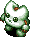
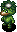
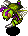
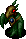

  

Highest difficulty among the three dice towers.

Monsters that appeared in the higher floors of Tower of the Present show up right away, 
so it's best to tackle this tower after you've collected items in the other two towers first.

One popular strategy includes clearing the easiest difficulty of Explosion Rocks 
a few times to collect multiple paralysis staves to help you clear this dungeon.

<ul class="quickLinksUL">
  <li><a href="#overview">Overview</a></li>
  <li><a href="#strategy">Strategy</a>
    <ul>
      <li><a href="#general">General</a></li>
      <li><a href="#farming">Farming</a></li>
    </ul>
  </li>
  <li><a href="#monsters">Monsters</a></li>
  <li><a href="#monster-list">Monster List</a></li>
  <li><a href="#items">Items</a></li>
  <li><a href="#traps">Traps</a></li>
  <li><a href="#npcs">NPCs</a></li>
</ul>

# Overview

<table class="dungeonOverview">
  <tr>
    <th>Unlock</th>
    <td class="highlightYellow">Available as soon as you arrive at the Tower of Fortune entrance.</td>
  </tr>
  <tr>
    <th>Entrance</th>
    <td class="highlightYellow">Tower of Fortune entrance (East)</td>
  </tr>
</table>

<table class="dungeonTable">
  <tr>
    <th>Floors</th>
    <td>7F</td>
    <th>Day / Night</th>
    <td>Day</td>
  </tr>
  <tr>
    <th>Bring Items</th>
    <td>Yes</td>
    <th>Allies</th>
    <td>3</td>
  </tr>
  <tr>
    <th>Unidentified</th>
    <td>Bracelets</td>
    <th>New Items</th>
    <td>Yes</td>
  </tr>
  <tr>
    <th>Shops</th>
    <td>Regular, Elite</td>
    <th>Monster Houses</th>
    <td>Regular, Sudden</td>
  </tr>
  <tr>
    <th>Initial Enemies</th>
    <td>8~10</td>
    <th>Spawn Rate</th>
    <td>30 turns</td>
  </tr>
  <tr>
    <th>Ominous aura</th>
    <td>No</td>
    <th>Wind of Kron</th>
    <td>1st: 1700 4th: 2000</td>
  </tr>
  <tr>
    <th>Clear Icon</th>
    <td class="clearIcon"></td>
    <th>Reward</th>
    <td>None</td>
  </tr>
</table>

※ Reading a Night-Day Scroll is the only way to change it to night.

# Strategy

### General

Fearabbit makes an appearance right away, and can be troublesome if it attracts Cheer-Ham at the same time. 
It's best to keep a Fear Scroll or Vacuum Slash Scrl on hand in case you get surrounded.

Be careful of Foly in large rooms, as it can unleash lightning that deals 15 damage to all creatures in the room. 
Its direct attacks hit very hard if it manages to level up, and it has a tendency to move along the wall in rooms. 
You'll want to defeat it before things get out of hand, but it moves at double speed so it's difficult to catch up to it. 
Practice predicting which tile it'll move to, and shoot arrows, throw a talisman, or swing a staff from a distance. 
Only 1 Foly can spawn at a time, so if you paralyze it or throw a Hide Pot at it, you won't need to worry about it.

### Farming

Mixers appear between 4-5F, and have a higher spawn rate than Tower of the Present. 
Synthesize runes onto your weapon and shield using the items you've collected up to this point.

Weapon:

- Warp Grass → Anti-Floating : x1.35 damage to Floating types.
- Sleepy Grass → Sedating : 12% chance to inflict Asleep status.
- Paralysis Staff → Paralyzing : 12% chance to inflict Paralyzed status.
- Confusion Grass → Confusing : 12% chance to inflict Confused status.
- Weeds → Anti-Plant : x1.35 damage to Plant types.
- Antidote Grass → Anti-Drain : x1.35 damage to Drain types.
- Dragon Grass → Anti-Dragon : x1.35 damage to Dragon types.
- Iron Arrow → Anti-Metal : x1.35 damage to Metal types.

Shield:

- Diet Shield → CR Diet : Fullness depletes at 1/2 speed.
- Binary Shield → Bit : Reduce damage by 50% if last digit of HP is 1 or 0.
- Day Shield → Diurnal : Reduce damage by 25% from day monsters.
- Dragon Grass → Anti-Fire : Reduce fire damage by 50%.
- Stomach Expander + Perception Grass x 2 → Agile : Raise your evasion from 12% → 22%.

Dagger Bees appear between 3-5F, and offer a ridiculous amount of skill points compared to other monsters, 
so try to hunt as many as you can to level up your equipment.

That said, Foly likes to ruin your day while waiting for Mixers and Dagger Bees to spawn, 
so use items like Hide Pot, Paralysis Staff, or Transient Staff on it to make it a non-issue for the current floor.

Zaloklefts appear between 5-7F, and always drop an item from a unique item table when defeated. (Z column below) 
They won't attack you unless you inflict Sealed status, so you can hide behind an ally to safely hunt them. 
Just be careful not to get separated from your allies due to Yanpii's headbutt from a distance.

Scoopies appear between 5-7F, and can be used to fill unneeded pots with Dirt to obain some extra grass items. 
Protect Preservation Pots by inserting single arrows, rocks, or talismans if you don't have enough items to fill them. 
Place important pots on the ground in hallways near the stairs room. (Zaloklefts can steal the pots if you place them in the room)

# Monsters

<button id="hideMonTblImgBtn" onClick={()=>{var mon_imgs = document.querySelectorAll('#monsterTable img');mon_imgs.forEach(e => e.classList.toggle('hidden'));}}>Toggle Monster Images</button>

Hover over or tap a monster's name for details. Monster Colors: Farming, Useful, Destroys Items, Dangerous, Very Dangerous

<table id="monsterTable" class="monsterTable">
  <thead>
    <tr>
      <th>F</th>
      <th colspan="5">Monsters</th>
    </tr>
  </thead>
  <tbody>
    <tr>
      <td rowspan="3" class="centeredText">1</td>
      <td class="day">
 Mid Chintala
- Mid Chintala - HP: 45 AP: 15 DP: 9 Exp: 33 GP: 10 Type: Normal Speed: Normal Sp.Atk Rate: 0% (near), 0% (far) Item Drop Rate: 4% ~ Ability ~ None.

</td>
      <td class="day">
 Cheer-Ham
- Cheer-Ham - HP: 34 AP: 10 DP: 7 Exp: 28 GP: 5 Type: Normal Speed: Normal Sp.Atk Rate: 0% (near), 0% (far) Item Drop Rate: 4% ~ Ability ~ Runs away from Shiren, but attacks when cornered. Moves toward monsters in view. Cheers for adjacent creatures, raising AP by 1 stage and letting them survive a fatal hit.

</td>
      <td class="day">
 Floaty
- Floaty - HP: 23 AP: 12 DP: 7 Exp: 18 GP: 6 Type: Normal Speed: Swift 1 Sp.Atk Rate: 23% (near), 0% (far) Item Drop Rate: 4% ~ Ability ~ Initially Napping in a group of 3. Shiren can be warped 1~3 floors when surrounded by 3 Floaty monsters.

</td>
      <td class="day">
 Acrid Nut
- Acrid Nut - HP: 36 AP: 21 DP: 8 Exp: 35 GP: 18 Type: Plant/Explode Speed: Normal Sp.Atk Rate: 0% (near), 0% (far) Item Drop Rate: 0% ~ Ability ~ Either doubles experience points (Max: x1024) or explodes (33% chance) each time it eats a thrown item.

</td>
      <td class="day">
 Polygon Spinna
- Polygon Spinna - HP: 45 AP: 15 DP: 9 Exp: 33 GP: 11 Type: Drain/Magic Speed: Normal Sp.Atk Rate: 32% (near), 0% (far) Item Drop Rate: 2% ~ Ability ~ Lowers Max HP by 1 or Max Fullness by 3 when adjacent. Warps in front of Shiren when in a room.

</td>
    </tr>
    <tr>
      <td class="day danger">
 Fearabbit
- Fearabbit - HP: 20 AP: 15 DP: 4 Exp: 15 GP: 9 Type: Magic Speed: Normal Sp.Atk Rate: 21% (near), 21% (far) Item Drop Rate: 4% ~ Ability ~ Attracts up to 3 creatures including Shiren to itself from anywhere in the same room.

</td>
      <td class="day">
 Bored Kappa
- Bored Kappa - HP: 50 AP: 18 DP: 11 Exp: 48 GP: 7 Type: Aquatic Speed: Normal Sp.Atk Rate: 0% (near), 0% (far) Item Drop Rate: 4% ~ Ability ~ Stands on an item and throws it at Shiren when he gets within 3 tiles. Catches projectiles and throws them back at Shiren. Items it throws always miss. Cannot throw weapons, shields, or Gitan.

</td>
      <td class="highlightGray2"></td>
      <td class="highlightGray2"></td>
      <td class="highlightGray2"></td>
    </tr>
    <tr>
      <td class="night">
 Hateful Seedie
- Hateful Seedie - HP: 35 AP: 30 DP: 4 Exp: 56 GP: 35 Type: Plant Speed: Normal Sp.Atk Rate: 0% (near), 0% (far) Item Drop Rate: 4% ~ Ability ~ Resists non-ability attacks.

</td>
      <td class="night">
 Bad Moseal
- Bad Moseal - HP: 23 AP: 18 DP: 1 Exp: 18 GP: 30 Type: Aquatic Speed: Normal Sp.Atk Rate: 50% (near), 32% (far) Item Drop Rate: 4% ~ Ability ~ Resists non-ability attacks. Performs a tackle that deals 15 damage when lined up vertically. Turns Apathetic after tackling. Doesn't move on its own.

</td>
      <td class="night farmNight">
 Dark Grass Kid
- Dark Grass Kid - HP: 23 AP: 14 DP: 1 Exp: 18 GP: 10 Type: Plant Speed: Normal Sp.Atk Rate: 21% (near), 16% (far) Item Drop Rate: 0% ~ Ability ~ Resists non-ability attacks. Spreads grass in a 1 tile radius when adjacent. Pierce-throws grass in a straight line at a distance. Carries 1 grass item. Becomes Foul Pin Kid with 0 grass.

</td>
      <td class="night">
 Foul Pin Kid
- Foul Pin Kid - HP: 23 AP: 14 DP: 1 Exp: 18 GP: 12 Type: Plant Speed: Swift 1 Sp.Atk Rate: 0% (near), 0% (far) Item Drop Rate: 0% ~ Ability ~ Resists non-ability attacks. Runs from Shiren, but attacks when adjacent. Becomes Dark Grass Kid when it picks up a grass item.

</td>
      <td class="highlightGray2"></td>
    </tr>
    <tr>
      <td colspan="6" class="purpleDivider"></td>
    </tr>
    <tr>
      <td rowspan="3" class="centeredText">2</td>
      <td class="day">
 Mid Chintala
- Mid Chintala - HP: 45 AP: 15 DP: 9 Exp: 33 GP: 10 Type: Normal Speed: Normal Sp.Atk Rate: 0% (near), 0% (far) Item Drop Rate: 4% ~ Ability ~ None.

</td>
      <td class="day">
 Cheer-Ham
- Cheer-Ham - HP: 34 AP: 10 DP: 7 Exp: 28 GP: 5 Type: Normal Speed: Normal Sp.Atk Rate: 0% (near), 0% (far) Item Drop Rate: 4% ~ Ability ~ Runs away from Shiren, but attacks when cornered. Moves toward monsters in view. Cheers for adjacent creatures, raising AP by 1 stage and letting them survive a fatal hit.

</td>
      <td class="day">
 Floaty
- Floaty - HP: 23 AP: 12 DP: 7 Exp: 18 GP: 6 Type: Normal Speed: Swift 1 Sp.Atk Rate: 23% (near), 0% (far) Item Drop Rate: 4% ~ Ability ~ Initially Napping in a group of 3. Shiren can be warped 1~3 floors when surrounded by 3 Floaty monsters.

</td>
      <td class="day">
 Acrid Nut
- Acrid Nut - HP: 36 AP: 21 DP: 8 Exp: 35 GP: 18 Type: Plant/Explode Speed: Normal Sp.Atk Rate: 0% (near), 0% (far) Item Drop Rate: 0% ~ Ability ~ Either doubles experience points (Max: x1024) or explodes (33% chance) each time it eats a thrown item.

</td>
      <td class="day">
 Polygon Spinna
- Polygon Spinna - HP: 45 AP: 15 DP: 9 Exp: 33 GP: 11 Type: Drain/Magic Speed: Normal Sp.Atk Rate: 32% (near), 0% (far) Item Drop Rate: 2% ~ Ability ~ Lowers Max HP by 1 or Max Fullness by 3 when adjacent. Warps in front of Shiren when in a room.

</td>
    </tr>
    <tr>
      <td class="day">
 Kid Squid
- Kid Squid - HP: 42 AP: 20 DP: 11 Exp: 66 GP: 5 Type: Aquatic Speed: Normal Sp.Atk Rate: 16% (near), 0% (far) Item Drop Rate: 4% ~ Ability ~ Inflicts Blind status on an adjacent target. Turns into a Squid Sushi Scroll when hit by thrown onigiri.

</td>
      <td class="day">
 Bored Kappa
- Bored Kappa - HP: 50 AP: 18 DP: 11 Exp: 48 GP: 7 Type: Aquatic Speed: Normal Sp.Atk Rate: 0% (near), 0% (far) Item Drop Rate: 4% ~ Ability ~ Stands on an item and throws it at Shiren when he gets within 3 tiles. Catches projectiles and throws them back at Shiren. Items it throws always miss. Cannot throw weapons, shields, or Gitan.

</td>
      <td class="highlightGray2"></td>
      <td class="highlightGray2"></td>
      <td class="highlightGray2"></td>
    </tr>
    <tr>
      <td class="night">
 Hateful Seedie
- Hateful Seedie - HP: 35 AP: 30 DP: 4 Exp: 56 GP: 35 Type: Plant Speed: Normal Sp.Atk Rate: 0% (near), 0% (far) Item Drop Rate: 4% ~ Ability ~ Resists non-ability attacks.

</td>
      <td class="night">
 Bad Moseal
- Bad Moseal - HP: 23 AP: 18 DP: 1 Exp: 18 GP: 30 Type: Aquatic Speed: Normal Sp.Atk Rate: 50% (near), 32% (far) Item Drop Rate: 4% ~ Ability ~ Resists non-ability attacks. Performs a tackle that deals 15 damage when lined up vertically. Turns Apathetic after tackling. Doesn't move on its own.

</td>
      <td class="night farmNight">
 Dark Grass Kid
- Dark Grass Kid - HP: 23 AP: 14 DP: 1 Exp: 18 GP: 10 Type: Plant Speed: Normal Sp.Atk Rate: 21% (near), 16% (far) Item Drop Rate: 0% ~ Ability ~ Resists non-ability attacks. Spreads grass in a 1 tile radius when adjacent. Pierce-throws grass in a straight line at a distance. Carries 1 grass item. Becomes Foul Pin Kid with 0 grass.

</td>
      <td class="night">
 Foul Pin Kid
- Foul Pin Kid - HP: 23 AP: 14 DP: 1 Exp: 18 GP: 12 Type: Plant Speed: Swift 1 Sp.Atk Rate: 0% (near), 0% (far) Item Drop Rate: 0% ~ Ability ~ Resists non-ability attacks. Runs from Shiren, but attacks when adjacent. Becomes Dark Grass Kid when it picks up a grass item.

</td>
      <td class="highlightGray2"></td>
    </tr>
    <tr>
      <td colspan="6" class="purpleDivider"></td>
    </tr>
    <tr>
      <td rowspan="3" class="centeredText">3</td>
      <td class="day">
 Hopodile
- Hopodile - HP: 50 AP: 22 DP: 10 Exp: 50 GP: 9 Type: Dragon/Aquatic Speed: Normal Sp.Atk Rate: 0% (near), 0% (far) Item Drop Rate: 4% ~ Ability ~ Moves like a chess knight when Shiren is in view. Performs a 10 damage jumping attack when Shiren is in range of a chess knight hop.

</td>
      <td class="day">
 Cheer-Ham
- Cheer-Ham - HP: 34 AP: 10 DP: 7 Exp: 28 GP: 5 Type: Normal Speed: Normal Sp.Atk Rate: 0% (near), 0% (far) Item Drop Rate: 4% ~ Ability ~ Runs away from Shiren, but attacks when cornered. Moves toward monsters in view. Cheers for adjacent creatures, raising AP by 1 stage and letting them survive a fatal hit.

</td>
      <td class="day farm">
 Dagger Bee
- Dagger Bee - HP: 46 AP: 27 DP: 14 Exp: 165 GP: 100 Type: Floating Speed: Normal Sp.Atk Rate: 16% (near), 0% (far) Item Drop Rate: 0% ~ Ability ~ Occasionally retreats after attacking. Stinger has double AP and inflicts Confused status, but it also collapses afterward.

</td>
      <td class="day">
 Acrid Nut
- Acrid Nut - HP: 36 AP: 21 DP: 8 Exp: 35 GP: 18 Type: Plant/Explode Speed: Normal Sp.Atk Rate: 0% (near), 0% (far) Item Drop Rate: 0% ~ Ability ~ Either doubles experience points (Max: x1024) or explodes (33% chance) each time it eats a thrown item.

</td>
      <td class="day">
 Polygon Spinna
- Polygon Spinna - HP: 45 AP: 15 DP: 9 Exp: 33 GP: 11 Type: Drain/Magic Speed: Normal Sp.Atk Rate: 32% (near), 0% (far) Item Drop Rate: 2% ~ Ability ~ Lowers Max HP by 1 or Max Fullness by 3 when adjacent. Warps in front of Shiren when in a room.

</td>
    </tr>
    <tr>
      <td class="day">
 Kid Squid
- Kid Squid - HP: 42 AP: 20 DP: 11 Exp: 66 GP: 5 Type: Aquatic Speed: Normal Sp.Atk Rate: 16% (near), 0% (far) Item Drop Rate: 4% ~ Ability ~ Inflicts Blind status on an adjacent target. Turns into a Squid Sushi Scroll when hit by thrown onigiri.

</td>
      <td class="day">
 Bored Kappa
- Bored Kappa - HP: 50 AP: 18 DP: 11 Exp: 48 GP: 7 Type: Aquatic Speed: Normal Sp.Atk Rate: 0% (near), 0% (far) Item Drop Rate: 4% ~ Ability ~ Stands on an item and throws it at Shiren when he gets within 3 tiles. Catches projectiles and throws them back at Shiren. Items it throws always miss. Cannot throw weapons, shields, or Gitan.

</td>
      <td class="highlightGray2"></td>
      <td class="highlightGray2"></td>
      <td class="highlightGray2"></td>
    </tr>
    <tr>
      <td class="night">
 Evil Hipadile
- Evil Hipadile - HP: 27 AP: 16 DP: 5 Exp: 100 GP: 75 Type: Dragon/Aquatic Speed: Normal Sp.Atk Rate: 0% (near), 0% (far) Item Drop Rate: 8% ~ Ability ~ Resists non-ability attacks. Moves like a chess knight when Shiren is in view. Performs a 25 damage jumping attack when Shiren is in range of a chess knight hop.

</td>
      <td class="night">
 Vile Sproutant
- Vile Sproutant - HP: 35 AP: 30 DP: 3 Exp: 43 GP: 36 Type: Plant Speed: Normal Sp.Atk Rate: 0% (near), 0% (far) Item Drop Rate: 4% ~ Ability ~ Resists non-ability attacks. Monster family becomes immune to most recent status inflicted upon it, excluding Sealed status.

</td>
      <td class="highlightGray2"></td>
      <td class="highlightGray2"></td>
      <td class="highlightGray2"></td>
    </tr>
    <tr>
      <td colspan="6" class="purpleDivider"></td>
    </tr>
    <tr>
      <td rowspan="3" class="centeredText">4</td>
      <td class="day">
 Hopodile
- Hopodile - HP: 50 AP: 22 DP: 10 Exp: 50 GP: 9 Type: Dragon/Aquatic Speed: Normal Sp.Atk Rate: 0% (near), 0% (far) Item Drop Rate: 4% ~ Ability ~ Moves like a chess knight when Shiren is in view. Performs a 10 damage jumping attack when Shiren is in range of a chess knight hop.

</td>
      <td class="day">
 Cheer-Ham
- Cheer-Ham - HP: 34 AP: 10 DP: 7 Exp: 28 GP: 5 Type: Normal Speed: Normal Sp.Atk Rate: 0% (near), 0% (far) Item Drop Rate: 4% ~ Ability ~ Runs away from Shiren, but attacks when cornered. Moves toward monsters in view. Cheers for adjacent creatures, raising AP by 1 stage and letting them survive a fatal hit.

</td>
      <td class="day farm">
 Dagger Bee
- Dagger Bee - HP: 46 AP: 27 DP: 14 Exp: 165 GP: 100 Type: Floating Speed: Normal Sp.Atk Rate: 16% (near), 0% (far) Item Drop Rate: 0% ~ Ability ~ Occasionally retreats after attacking. Stinger has double AP and inflicts Confused status, but it also collapses afterward.

</td>
      <td class="day danger">
 Foly
- Foly - HP: 46 AP: 20 DP: 2 Exp: 400 GP: 6 Type: Cyclops/Floating Speed: Swift 1 Sp.Atk Rate: 100% (near), 100% (far) Item Drop Rate: 0% ~ Ability ~ Moves along the wall in rooms, changes color and abilities every 8 turns. Nullifies and reflects direct attacks. Drops 15 damage lightning on all creatures in the room after it acts. Heals Shiren's HP by 100 after being hit with a direct attack. Counters with Berserk, Grounded, Inaccurate, Confused, or Shadow Bound status after being hit with a direct attack.

</td>
      <td class="day useful">
 Mixer
- Mixer - HP: 40 AP: 15 DP: 6 Exp: 15 GP: 8 Type: Normal Speed: Normal Sp.Atk Rate: 0% (near), 0% (far) Item Drop Rate: 0% ~ Ability ~ Eats up to 2 thrown items and synthesizes them. Gains 1 stage of Buffed status each time it eats an item.

</td>
    </tr>
    <tr>
      <td class="day">
 Kid Squid
- Kid Squid - HP: 42 AP: 20 DP: 11 Exp: 66 GP: 5 Type: Aquatic Speed: Normal Sp.Atk Rate: 16% (near), 0% (far) Item Drop Rate: 4% ~ Ability ~ Inflicts Blind status on an adjacent target. Turns into a Squid Sushi Scroll when hit by thrown onigiri.

</td>
      <td class="highlightGray2"></td>
      <td class="highlightGray2"></td>
      <td class="highlightGray2"></td>
      <td class="highlightGray2"></td>
    </tr>
    <tr>
      <td class="night">
 Evil Hipadile
- Evil Hipadile - HP: 27 AP: 16 DP: 5 Exp: 100 GP: 75 Type: Dragon/Aquatic Speed: Normal Sp.Atk Rate: 0% (near), 0% (far) Item Drop Rate: 8% ~ Ability ~ Resists non-ability attacks. Moves like a chess knight when Shiren is in view. Performs a 25 damage jumping attack when Shiren is in range of a chess knight hop.

</td>
      <td class="night">
 Vile Sproutant
- Vile Sproutant - HP: 35 AP: 30 DP: 3 Exp: 43 GP: 36 Type: Plant Speed: Normal Sp.Atk Rate: 0% (near), 0% (far) Item Drop Rate: 4% ~ Ability ~ Resists non-ability attacks. Monster family becomes immune to most recent status inflicted upon it, excluding Sealed status.

</td>
      <td class="highlightGray2"></td>
      <td class="highlightGray2"></td>
      <td class="highlightGray2"></td>
    </tr>
    <tr>
      <td colspan="6" class="purpleDivider"></td>
    </tr>
    <tr>
      <td rowspan="3" class="centeredText">5</td>
      <td class="day">
 Hopodile
- Hopodile - HP: 50 AP: 22 DP: 10 Exp: 50 GP: 9 Type: Dragon/Aquatic Speed: Normal Sp.Atk Rate: 0% (near), 0% (far) Item Drop Rate: 4% ~ Ability ~ Moves like a chess knight when Shiren is in view. Performs a 10 damage jumping attack when Shiren is in range of a chess knight hop.

</td>
      <td class="day farm">
 Zalokleft
- Zalokleft - HP: 43 AP: 14 DP: 9 Exp: 50 GP: 3 Type: Aquatic Speed: Normal Sp.Atk Rate: 20% (near), 0% (far) Item Drop Rate: 100% ~ Ability ~ Initially Napping. Steals an item from Shiren when adjacent or picks up an item on the ground, then warps. Runs away from Shiren after stealing an item. Doesn't use direct attacks. Always drops an item from a unique table if slain before stealing an item, otherwise drops the stolen item.

</td>
      <td class="day farm">
 Dagger Bee
- Dagger Bee - HP: 46 AP: 27 DP: 14 Exp: 165 GP: 100 Type: Floating Speed: Normal Sp.Atk Rate: 16% (near), 0% (far) Item Drop Rate: 0% ~ Ability ~ Occasionally retreats after attacking. Stinger has double AP and inflicts Confused status, but it also collapses afterward.

</td>
      <td class="day danger">
 Foly
- Foly - HP: 46 AP: 20 DP: 2 Exp: 400 GP: 6 Type: Cyclops/Floating Speed: Swift 1 Sp.Atk Rate: 100% (near), 100% (far) Item Drop Rate: 0% ~ Ability ~ Moves along the wall in rooms, changes color and abilities every 8 turns. Nullifies and reflects direct attacks. Drops 15 damage lightning on all creatures in the room after it acts. Heals Shiren's HP by 100 after being hit with a direct attack. Counters with Berserk, Grounded, Inaccurate, Confused, or Shadow Bound status after being hit with a direct attack.

</td>
      <td class="day useful">
 Mixer
- Mixer - HP: 40 AP: 15 DP: 6 Exp: 15 GP: 8 Type: Normal Speed: Normal Sp.Atk Rate: 0% (near), 0% (far) Item Drop Rate: 0% ~ Ability ~ Eats up to 2 thrown items and synthesizes them. Gains 1 stage of Buffed status each time it eats an item.

</td>
    </tr>
    <tr>
      <td class="highlightGray2"></td>
      <td class="highlightGray2"></td>
      <td class="highlightGray2"></td>
      <td class="highlightGray2"></td>
      <td class="day items">
 Scoopie
- Scoopie - HP: 43 AP: 16 DP: 11 Exp: 75 GP: 9 Type: Metal Speed: Normal Sp.Atk Rate: 16% (near), 0% (far) Item Drop Rate: 4% ~ Ability ~ Shovels dirt at an adjacent target, which can hit through corners. Dirt fills 1 pot in your inventory when it hits Shiren, or inflicts Blind status when it hits an ally. Dirt in pots eventually changes to grass items when advancing floors.

</td>
    </tr>
    <tr>
      <td class="night">
 Evil Hipadile
- Evil Hipadile - HP: 27 AP: 16 DP: 5 Exp: 100 GP: 75 Type: Dragon/Aquatic Speed: Normal Sp.Atk Rate: 0% (near), 0% (far) Item Drop Rate: 8% ~ Ability ~ Resists non-ability attacks. Moves like a chess knight when Shiren is in view. Performs a 25 damage jumping attack when Shiren is in range of a chess knight hop.

</td>
      <td class="night">
 Vile Sproutant
- Vile Sproutant - HP: 35 AP: 30 DP: 3 Exp: 43 GP: 36 Type: Plant Speed: Normal Sp.Atk Rate: 0% (near), 0% (far) Item Drop Rate: 4% ~ Ability ~ Resists non-ability attacks. Monster family becomes immune to most recent status inflicted upon it, excluding Sealed status.

</td>
      <td class="night">
 Dark Pit Mamel
- Dark Pit Mamel - HP: 35 AP: 30 DP: 4 Exp: 43 GP: 80 Type: Normal Speed: Normal Sp.Atk Rate: 0% (near), 0% (far) Item Drop Rate: 8% ~ Ability ~ Resists non-ability attacks.

</td>
      <td class="night itemsNight">
 Violent Gyairas
- Violent Gyairas - HP: 51 AP: 42 DP: 6 Exp: 230 GP: 80 Type: Floating Speed: Normal Sp.Atk Rate: 21% (near), 0% (far) Item Drop Rate: 8% ~ Ability ~ Resists non-ability attacks. Pecks a scroll or talisman from your inventory when adjacent, turning it into a Piece of Paper.

</td>
      <td class="highlightGray2"></td>
    </tr>
    <tr>
      <td colspan="6" class="purpleDivider"></td>
    </tr>
    <tr>
      <td rowspan="2" class="centeredText">6</td>
      <td class="day">
 Yanpii
- Yanpii - HP: 36 AP: 22 DP: 15 Exp: 170 GP: 6 Type: Normal Speed: Normal Sp.Atk Rate: 22% (near), 22% (far) Item Drop Rate: 4% ~ Ability ~ Headbutts Shiren when lined up, dealing 10 damage and knockback based on distance traveled. If Shiren is knocked into a wall, go into the wall 1 tile and take an additional 10 damage.

</td>
      <td class="day farm">
 Zalokleft
- Zalokleft - HP: 43 AP: 14 DP: 9 Exp: 50 GP: 3 Type: Aquatic Speed: Normal Sp.Atk Rate: 20% (near), 0% (far) Item Drop Rate: 100% ~ Ability ~ Initially Napping. Steals an item from Shiren when adjacent or picks up an item on the ground, then warps. Runs away from Shiren after stealing an item. Doesn't use direct attacks. Always drops an item from a unique table if slain before stealing an item, otherwise drops the stolen item.

</td>
      <td class="day">
 Flamebird
- Flamebird - HP: 33 AP: 16 DP: 11 Exp: 75 GP: 9 Type: Floating Speed: Normal Sp.Atk Rate: 56% (near), 0% (far) Item Drop Rate: 0% ~ Ability ~ Heals an adjacent monster's HP by 30. Items thrown at it burn up. Fire damage restores its HP. Multiplies from explosions.

</td>
      <td class="day danger">
 Foly
- Foly - HP: 46 AP: 20 DP: 2 Exp: 400 GP: 6 Type: Cyclops/Floating Speed: Swift 1 Sp.Atk Rate: 100% (near), 100% (far) Item Drop Rate: 0% ~ Ability ~ Moves along the wall in rooms, changes color and abilities every 8 turns. Nullifies and reflects direct attacks. Drops 15 damage lightning on all creatures in the room after it acts. Heals Shiren's HP by 100 after being hit with a direct attack. Counters with Berserk, Grounded, Inaccurate, Confused, or Shadow Bound status after being hit with a direct attack.

</td>
      <td class="day items">
 Scoopie
- Scoopie - HP: 43 AP: 16 DP: 11 Exp: 75 GP: 9 Type: Metal Speed: Normal Sp.Atk Rate: 16% (near), 0% (far) Item Drop Rate: 4% ~ Ability ~ Shovels dirt at an adjacent target, which can hit through corners. Dirt fills 1 pot in your inventory when it hits Shiren, or inflicts Blind status when it hits an ally. Dirt in pots eventually changes to grass items when advancing floors.

</td>
    </tr>
    <tr>
      <td class="night dangerNight">
 Dark MC Mage
- Dark MC Mage - HP: 36 AP: 30 DP: 6 Exp: 50 GP: 72 Type: Magic Speed: Normal Sp.Atk Rate: 64% (near), 47% (far) Item Drop Rate: 8% ~ Ability ~ Resists non-ability attacks. Fires a magic bullet with a random effect in a straight line: Blind, confused, transient, or 20 damage.

</td>
      <td class="night dangerNight">
 Dark Cross Cart
- Dark Cross Cart - HP: 35 AP: 30 DP: 4 Exp: 43 GP: 18 Type: Normal Speed: Swift 1 Sp.Atk Rate: 100% (near), 80% (far) Item Drop Rate: 8% ~ Ability ~ Resists non-ability attacks. Shoots Iron Arrows. Moves away if Shiren gets close. Can use direct attacks, and attacks even in hallways. Only drops Iron Arrows.

</td>
      <td class="night">
 Dark Pit Mamel
- Dark Pit Mamel - HP: 35 AP: 30 DP: 4 Exp: 43 GP: 80 Type: Normal Speed: Normal Sp.Atk Rate: 0% (near), 0% (far) Item Drop Rate: 8% ~ Ability ~ Resists non-ability attacks.

</td>
      <td class="night itemsNight">
 Violent Gyairas
- Violent Gyairas - HP: 51 AP: 42 DP: 6 Exp: 230 GP: 80 Type: Floating Speed: Normal Sp.Atk Rate: 21% (near), 0% (far) Item Drop Rate: 8% ~ Ability ~ Resists non-ability attacks. Pecks a scroll or talisman from your inventory when adjacent, turning it into a Piece of Paper.

</td>
      <td class="night dangerNight">
 Bad Cololum
- Bad Cololum - HP: 50 AP: 33 DP: 3 Exp: 90 GP: 60 Type: Normal Speed: Normal Sp.Atk Rate: 0% (near), 0% (far) Item Drop Rate: 8% ~ Ability ~ Resists non-ability attacks. Rolls backward 10 tiles when slain by a direct attack, damaging anything it hits equal to damage received.

</td>
    </tr>
    <tr>
      <td colspan="6" class="purpleDivider"></td>
    </tr>
    <tr>
      <td rowspan="2" class="centeredText">7</td>
      <td class="day">
 Yanpii
- Yanpii - HP: 36 AP: 22 DP: 15 Exp: 170 GP: 6 Type: Normal Speed: Normal Sp.Atk Rate: 22% (near), 22% (far) Item Drop Rate: 4% ~ Ability ~ Headbutts Shiren when lined up, dealing 10 damage and knockback based on distance traveled. If Shiren is knocked into a wall, go into the wall 1 tile and take an additional 10 damage.

</td>
      <td class="day farm">
 Zalokleft
- Zalokleft - HP: 43 AP: 14 DP: 9 Exp: 50 GP: 3 Type: Aquatic Speed: Normal Sp.Atk Rate: 20% (near), 0% (far) Item Drop Rate: 100% ~ Ability ~ Initially Napping. Steals an item from Shiren when adjacent or picks up an item on the ground, then warps. Runs away from Shiren after stealing an item. Doesn't use direct attacks. Always drops an item from a unique table if slain before stealing an item, otherwise drops the stolen item.

</td>
      <td class="day">
 Flamebird
- Flamebird - HP: 33 AP: 16 DP: 11 Exp: 75 GP: 9 Type: Floating Speed: Normal Sp.Atk Rate: 56% (near), 0% (far) Item Drop Rate: 0% ~ Ability ~ Heals an adjacent monster's HP by 30. Items thrown at it burn up. Fire damage restores its HP. Multiplies from explosions.

</td>
      <td class="highlightGray2"></td>
      <td class="day items">
 Scoopie
- Scoopie - HP: 43 AP: 16 DP: 11 Exp: 75 GP: 9 Type: Metal Speed: Normal Sp.Atk Rate: 16% (near), 0% (far) Item Drop Rate: 4% ~ Ability ~ Shovels dirt at an adjacent target, which can hit through corners. Dirt fills 1 pot in your inventory when it hits Shiren, or inflicts Blind status when it hits an ally. Dirt in pots eventually changes to grass items when advancing floors.

</td>
    </tr>
    <tr>
      <td class="night dangerNight">
 Dark MC Mage
- Dark MC Mage - HP: 36 AP: 30 DP: 6 Exp: 50 GP: 72 Type: Magic Speed: Normal Sp.Atk Rate: 64% (near), 47% (far) Item Drop Rate: 8% ~ Ability ~ Resists non-ability attacks. Fires a magic bullet with a random effect in a straight line: Blind, confused, transient, or 20 damage.

</td>
      <td class="night dangerNight">
 Dark Cross Cart
- Dark Cross Cart - HP: 35 AP: 30 DP: 4 Exp: 43 GP: 18 Type: Normal Speed: Swift 1 Sp.Atk Rate: 100% (near), 80% (far) Item Drop Rate: 8% ~ Ability ~ Resists non-ability attacks. Shoots Iron Arrows. Moves away if Shiren gets close. Can use direct attacks, and attacks even in hallways. Only drops Iron Arrows.

</td>
      <td class="night">
 Dark Pit Mamel
- Dark Pit Mamel - HP: 35 AP: 30 DP: 4 Exp: 43 GP: 80 Type: Normal Speed: Normal Sp.Atk Rate: 0% (near), 0% (far) Item Drop Rate: 8% ~ Ability ~ Resists non-ability attacks.

</td>
      <td class="night itemsNight">
 Violent Gyairas
- Violent Gyairas - HP: 51 AP: 42 DP: 6 Exp: 230 GP: 80 Type: Floating Speed: Normal Sp.Atk Rate: 21% (near), 0% (far) Item Drop Rate: 8% ~ Ability ~ Resists non-ability attacks. Pecks a scroll or talisman from your inventory when adjacent, turning it into a Piece of Paper.

</td>
      <td class="night dangerNight">
 Bad Cololum
- Bad Cololum - HP: 50 AP: 33 DP: 3 Exp: 90 GP: 60 Type: Normal Speed: Normal Sp.Atk Rate: 0% (near), 0% (far) Item Drop Rate: 8% ~ Ability ~ Resists non-ability attacks. Rolls backward 10 tiles when slain by a direct attack, damaging anything it hits equal to damage received.

</td>
    </tr>
  </tbody>
</table>

# Monster List

Red: Very Dangerous, Orange: Dangerous, Blue: Beneficial

 

<table class="dungeonMonsterList">
  <tr>
    <th>F</th>
    <th>Name</th>
    <th>HP</th>
    <th>AP</th>
    <th>DP</th>
    <th>Exp</th>
    <th>GP</th>
    <th>Rune / Item</th>
    <th>Notes</th>
  </tr>
  <tr>
    <td>1</td>
    <td class="highlightYellow">Fearabbit</td>
    <td>20</td>
    <td>15</td>
    <td>4</td>
    <td>15</td>
    <td>9</td>
    <td>Anti-Magic Unmoving</td>
    <td>Attracts Shiren and other characters toward itself and attacks. It won't use its special attack when you're adjacent to it.</td>
  </tr>
  <tr>
    <td>1-2</td>
    <td class="highlightYellow">Mid Chintala</td>
    <td>45</td>
    <td>15</td>
    <td>9</td>
    <td>33</td>
    <td>10</td>
    <td>-</td>
    <td>Some say it's cuter than Mamel.</td>
  </tr>
  <tr>
    <td>1-2</td>
    <td class="highlightYellow">Floaty</td>
    <td>23</td>
    <td>12</td>
    <td>7</td>
    <td>18</td>
    <td>6</td>
    <td>-</td>
    <td>Swift (1 attack), always generated in a group of 3. Occasionally warps you 1~3 floors when 3 surround you.</td>
  </tr>
  <tr>
    <td>1-3</td>
    <td class="highlightYellow">Bored Kappa</td>
    <td>50</td>
    <td>18</td>
    <td>11</td>
    <td>48</td>
    <td>7</td>
    <td>Anti-Aquatic</td>
    <td>Throws items in a 3 tile radius, always misses.</td>
  </tr>
  <tr>
    <td>1-3</td>
    <td class="highlightYellow">Polygon Spinna</td>
    <td>45</td>
    <td>15</td>
    <td>9</td>
    <td>33</td>
    <td>11</td>
    <td>Anti-Drain Anti-Magic Staunch Bracelet</td>
    <td>Lowers max HP by 1, or max fullness by 3.</td>
  </tr>
  <tr>
    <td>1-3</td>
    <td class="highlightYellow">Acrid Nut</td>
    <td>36</td>
    <td>21</td>
    <td>8</td>
    <td>35</td>
    <td>18</td>
    <td>Anti-Plant Anti-Explode</td>
    <td>Eats thrown items to multiply exp, but might explode.</td>
  </tr>
  <tr>
    <td>1-4</td>
    <td class="highlightYellow orangeText2">Cheer-Ham</td>
    <td>34</td>
    <td>10</td>
    <td>7</td>
    <td>28</td>
    <td>5</td>
    <td>-</td>
    <td>Raises attack by 1 stage, grants <a href="/shiren-5/system/status-conditions#enduring">Enduring</a> status while cheering.</td>
  </tr>
  <tr>
    <td>2-4</td>
    <td class="highlightYellow">Kid Squid</td>
    <td>42</td>
    <td>20</td>
    <td>11</td>
    <td>66</td>
    <td>5</td>
    <td>Anti-Aquatic</td>
    <td>Inflicts <a href="/shiren-5/system/status-conditions#blind">Blind</a> status 1 tile in front.</td>
  </tr>
  <tr>
    <td>3-5</td>
    <td class="highlightYellow">Dagger Bee</td>
    <td>46</td>
    <td>27</td>
    <td>14</td>
    <td>165</td>
    <td>100</td>
    <td>Anti-Floating Anti-Cnf. Bracelet</td>
    <td>Stinger inflicts <a href="/shiren-5/system/status-conditions#confused">Confused</a> status, and then it collapses.</td>
  </tr>
  <tr>
    <td>3-5</td>
    <td class="highlightYellow">Hopodile</td>
    <td>50</td>
    <td>22</td>
    <td>10</td>
    <td>50</td>
    <td>9</td>
    <td>Anti-Aquatic Anti-Dragon</td>
    <td>Chess knight movement, 10 damage body slam.</td>
  </tr>
  <tr>
    <td>4-5</td>
    <td class="highlightYellow blueText2">Mixer</td>
    <td>40</td>
    <td>15</td>
    <td>6</td>
    <td>15</td>
    <td>8</td>
    <td>-</td>
    <td>Swallows up to 2 items and <a href="/shiren-5/system/gameplay-basics#synthesis">synthesizes</a> them. Increases attack power by 1 stage every time it swallows an item.</td>
  </tr>
  <tr>
    <td>4-6</td>
    <td class="highlightYellow redText2">Foly</td>
    <td>46</td>
    <td>20</td>
    <td>2</td>
    <td>400</td>
    <td>6</td>
    <td>Anti-Floating Anti-Cyclops</td>
    <td>Swift (1 attack), red = reflect attack, green = heal 100 of your HP, blue = 15 damage to the room, purple = counters with an ailment.</td>
  </tr>
  <tr>
    <td>5-7</td>
    <td class="highlightYellow blueText2">Zalokleft</td>
    <td>43</td>
    <td>14</td>
    <td>9</td>
    <td>50</td>
    <td>3</td>
    <td>Anti-Aquatic Anti-Theft Perceptive Pot</td>
    <td>Steals an item and warps to a different room on the current floor.</td>
  </tr>
  <tr>
    <td>5-7</td>
    <td class="highlightYellow orangeText2">Scoopie</td>
    <td>43</td>
    <td>16</td>
    <td>11</td>
    <td>75</td>
    <td>9</td>
    <td>Anti-Metal Dodger Pot</td>
    <td>Throws <a href="/shiren-5/items/other-items#dirt">Dirt</a> into a pot 1 tile in front.</td>
  </tr>
  <tr>
    <td>6-7</td>
    <td class="highlightYellow">Flamebird</td>
    <td>33</td>
    <td>16</td>
    <td>11</td>
    <td>75</td>
    <td>9</td>
    <td>Anti-Floating</td>
    <td>Heals a monster's HP by 30.</td>
  </tr>
  <tr>
    <td>6-7</td>
    <td class="highlightYellow">Yanpii</td>
    <td>36</td>
    <td>22</td>
    <td>15</td>
    <td>170</td>
    <td>6</td>
    <td>Unmoving</td>
    <td>Headbutts, dealing 10 damage and knockback.</td>
  </tr>
</table>

# Items

- F = Floor, Daytime monster drop
- S = Shop, Shiny Object (yellow), Peddler
- P = Presto Pot
- Z = Zalokleft drop
- E = Elite shop, Shiny Object (blue)

 

<table class="dungeonItemTable">
  <tr>
    <th colspan="6" class="highlightPurple3">Weapon</th>
    <th rowspan="68"></th>
    <th colspan="6" class="highlightPurple3">Bracelet</th>
    <th rowspan="68"></th>
    <th colspan="6" class="highlightPurple3">Staff</th>
  </tr>
  <tr>
    <th>Name</th>
    <th>F</th>
    <th>S</th>
    <th>P</th>
    <th>Z</th>
    <th>E</th>
    <th>Name</th>
    <th>F</th>
    <th>S</th>
    <th>P</th>
    <th>Z</th>
    <th>E</th>
    <th>Name</th>
    <th>F</th>
    <th>S</th>
    <th>P</th>
    <th>Z</th>
    <th>E</th>
  </tr>
  <tr>
    <td class="leftText">Ordinary Stick</td>
    <td>X</td>
    <td></td>
    <td>X</td>
    <td>X</td>
    <td></td>
    <td class="leftText">Cleansing Bracelet</td>
    <td>X</td>
    <td></td>
    <td>X</td>
    <td>X</td>
    <td></td>
    <td class="leftText">Swap Staff</td>
    <td>X</td>
    <td></td>
    <td>X</td>
    <td>X</td>
    <td></td>
  </tr>
  <tr>
    <td class="leftText">Tin Blade</td>
    <td>X</td>
    <td></td>
    <td>X</td>
    <td>X</td>
    <td></td>
    <td class="leftText">Anti-Cnf. Bracelet</td>
    <td>X</td>
    <td></td>
    <td>X</td>
    <td>X</td>
    <td></td>
    <td class="leftText">Knockback Staff</td>
    <td>X</td>
    <td></td>
    <td>X</td>
    <td>X</td>
    <td></td>
  </tr>
  <tr>
    <td class="leftText">Katana</td>
    <td>X</td>
    <td>X</td>
    <td>X</td>
    <td>X</td>
    <td></td>
    <td class="leftText">Alert Bracelet</td>
    <td>X</td>
    <td></td>
    <td>X</td>
    <td>X</td>
    <td></td>
    <td class="leftText">Transient Staff</td>
    <td>X</td>
    <td></td>
    <td></td>
    <td>X</td>
    <td></td>
  </tr>
  <tr>
    <td class="leftText">Beast Fang</td>
    <td>X</td>
    <td>X</td>
    <td>X</td>
    <td>X</td>
    <td>X</td>
    <td class="leftText">Anti-Crs. Bracelet</td>
    <td></td>
    <td></td>
    <td></td>
    <td></td>
    <td>X</td>
    <td class="leftText">Seal Staff</td>
    <td></td>
    <td>X</td>
    <td></td>
    <td>X</td>
    <td>X</td>
  </tr>
  <tr>
    <td class="leftText">Dotanuki</td>
    <td>X</td>
    <td>X</td>
    <td>X</td>
    <td>X</td>
    <td>X</td>
    <td class="leftText">Staunch Bracelet</td>
    <td>X</td>
    <td></td>
    <td>X</td>
    <td>X</td>
    <td></td>
    <td class="leftText">Clone Staff</td>
    <td></td>
    <td>X</td>
    <td></td>
    <td></td>
    <td>X</td>
  </tr>
  <tr>
    <td class="leftText">Bladite</td>
    <td></td>
    <td></td>
    <td></td>
    <td></td>
    <td>X</td>
    <td class="leftText">Can. Arm Bracelet</td>
    <td>X</td>
    <td>X</td>
    <td></td>
    <td>X</td>
    <td>X</td>
    <td class="leftText">Paralysis Staff</td>
    <td></td>
    <td>X</td>
    <td></td>
    <td>X</td>
    <td>X</td>
  </tr>
  <tr>
    <td class="leftText">Red Blade</td>
    <td></td>
    <td></td>
    <td></td>
    <td></td>
    <td>X</td>
    <td class="leftText">Strength Bracelet</td>
    <td>X</td>
    <td>X</td>
    <td>X</td>
    <td>X</td>
    <td></td>
    <td class="leftText">Empathy Staff</td>
    <td></td>
    <td>X</td>
    <td></td>
    <td>X</td>
    <td>X</td>
  </tr>
  <tr>
    <td class="leftText">Kabura Katana</td>
    <td></td>
    <td></td>
    <td>X</td>
    <td></td>
    <td>X</td>
    <td class="leftText">Growth Bracelet</td>
    <td>X</td>
    <td>X</td>
    <td></td>
    <td>X</td>
    <td>X</td>
    <td class="leftText">Slow Staff</td>
    <td></td>
    <td>X</td>
    <td></td>
    <td>X</td>
    <td>X</td>
  </tr>
  <tr>
    <td class="leftText">Dull Gold Edge</td>
    <td>X</td>
    <td>X</td>
    <td>X</td>
    <td>X</td>
    <td></td>
    <td class="leftText">Heal Bracelet</td>
    <td></td>
    <td></td>
    <td></td>
    <td></td>
    <td>X</td>
    <td class="leftText">Mage Staff</td>
    <td>X</td>
    <td></td>
    <td>X</td>
    <td>X</td>
    <td>X</td>
  </tr>
  <tr>
    <td class="leftText">Bright Blade</td>
    <td>X</td>
    <td>X</td>
    <td></td>
    <td></td>
    <td></td>
    <td class="leftText">Bunch Bracelet</td>
    <td></td>
    <td></td>
    <td></td>
    <td></td>
    <td>X</td>
    <td class="leftText">Electric Staff</td>
    <td>X</td>
    <td>X</td>
    <td>X</td>
    <td>X</td>
    <td>X</td>
  </tr>
  <tr>
    <td class="leftText">Rusty Pickaxe</td>
    <td>X</td>
    <td></td>
    <td></td>
    <td></td>
    <td></td>
    <td class="leftText">Monster Detector</td>
    <td>X</td>
    <td>X</td>
    <td></td>
    <td>X</td>
    <td>X</td>
    <td class="leftText">Balance Staff</td>
    <td>X</td>
    <td></td>
    <td></td>
    <td></td>
    <td></td>
  </tr>
  <tr>
    <td class="leftText">Old Mallet</td>
    <td>X</td>
    <td></td>
    <td></td>
    <td></td>
    <td></td>
    <td class="leftText">Item Detector</td>
    <td>X</td>
    <td>X</td>
    <td></td>
    <td>X</td>
    <td>X</td>
    <td class="leftText">Fort. Staff</td>
    <td></td>
    <td></td>
    <td></td>
    <td></td>
    <td>X</td>
  </tr>
  <tr>
    <td class="leftText">Sky Splitter</td>
    <td>X</td>
    <td></td>
    <td>X</td>
    <td>X</td>
    <td></td>
    <th colspan="6" class="highlightPurple3">Scroll</th>
    <th colspan="6" class="highlightPurple3">Pot</th>
  </tr>
  <tr>
    <td class="leftText">Water Cutter</td>
    <td>X</td>
    <td></td>
    <td>X</td>
    <td>X</td>
    <td></td>
    <th>Name</th>
    <th>F</th>
    <th>S</th>
    <th>P</th>
    <th>Z</th>
    <th>E</th>
    <th>Name</th>
    <th>F</th>
    <th>S</th>
    <th>P</th>
    <th>Z</th>
    <th>E</th>
  </tr>
  <tr>
    <td class="leftText">Scythe</td>
    <td>X</td>
    <td></td>
    <td>X</td>
    <td>X</td>
    <td></td>
    <td class="leftText">Confusion Scroll</td>
    <td>X</td>
    <td>X</td>
    <td>X</td>
    <td>X</td>
    <td></td>
    <td class="leftText">Preservation Pot</td>
    <td>X</td>
    <td>X</td>
    <td></td>
    <td>X</td>
    <td></td>
  </tr>
  <tr>
    <td class="leftText">Myopic Masher</td>
    <td>X</td>
    <td></td>
    <td>X</td>
    <td>X</td>
    <td></td>
    <td class="leftText">Slumber Scroll</td>
    <td>X</td>
    <td>X</td>
    <td>X</td>
    <td>X</td>
    <td></td>
    <td class="leftText">Ordinary Pot</td>
    <td>X</td>
    <td>X</td>
    <td></td>
    <td>X</td>
    <td></td>
  </tr>
  <tr>
    <td class="leftText">Magic Masher</td>
    <td>X</td>
    <td></td>
    <td>X</td>
    <td>X</td>
    <td></td>
    <td class="leftText">Vacuum Slash Scrl</td>
    <td>X</td>
    <td>X</td>
    <td>X</td>
    <td>X</td>
    <td></td>
    <td class="leftText">Synthesis Pot</td>
    <td>X</td>
    <td>X</td>
    <td></td>
    <td>X</td>
    <td>X</td>
  </tr>
  <tr>
    <td class="leftText">Drain Dagger</td>
    <td>X</td>
    <td></td>
    <td>X</td>
    <td>X</td>
    <td></td>
    <td class="leftText">Fear Scroll</td>
    <td>X</td>
    <td>X</td>
    <td>X</td>
    <td>X</td>
    <td></td>
    <td class="leftText">Sale Pot</td>
    <td>X</td>
    <td>X</td>
    <td></td>
    <td>X</td>
    <td></td>
  </tr>
  <tr>
    <td class="leftText">Copper Cleaver</td>
    <td>X</td>
    <td></td>
    <td>X</td>
    <td>X</td>
    <td></td>
    <td class="leftText">Escape Scroll</td>
    <td>X</td>
    <td>X</td>
    <td>X</td>
    <td>X</td>
    <td></td>
    <td class="leftText">Presto Pot</td>
    <td>X</td>
    <td></td>
    <td></td>
    <td></td>
    <td></td>
  </tr>
  <tr>
    <td class="leftText">Crescent Katana</td>
    <td>X</td>
    <td></td>
    <td>X</td>
    <td>X</td>
    <td></td>
    <td class="leftText">Navigation Scroll</td>
    <td>X</td>
    <td></td>
    <td>X</td>
    <td>X</td>
    <td></td>
    <td class="leftText">Blessing Pot</td>
    <td></td>
    <td></td>
    <td></td>
    <td></td>
    <td>X</td>
  </tr>
  <tr>
    <td class="leftText">Lizard Lasher</td>
    <td>X</td>
    <td></td>
    <td>X</td>
    <td>X</td>
    <td></td>
    <td class="leftText">Dispel Aura Scroll</td>
    <td>X</td>
    <td></td>
    <td></td>
    <td></td>
    <td></td>
    <td class="leftText">Fever Pot</td>
    <td></td>
    <td></td>
    <td></td>
    <td></td>
    <td>X</td>
  </tr>
  <tr>
    <td class="leftText">Nap Rattle</td>
    <td></td>
    <td>X</td>
    <td></td>
    <td></td>
    <td></td>
    <td class="leftText">Trap Deletion Scrl</td>
    <td>X</td>
    <td></td>
    <td></td>
    <td></td>
    <td></td>
    <td class="leftText">Hide Pot</td>
    <td>X</td>
    <td>X</td>
    <td></td>
    <td>X</td>
    <td></td>
  </tr>
  <tr>
    <td class="leftText">Shockuto</td>
    <td></td>
    <td>X</td>
    <td></td>
    <td></td>
    <td></td>
    <td class="leftText">Identify Scroll</td>
    <td>X</td>
    <td></td>
    <td>X</td>
    <td>X</td>
    <td></td>
    <td class="leftText">Heal Pot</td>
    <td></td>
    <td></td>
    <td></td>
    <td></td>
    <td>X</td>
  </tr>
  <tr>
    <td class="leftText">Blurry Stick</td>
    <td></td>
    <td>X</td>
    <td></td>
    <td></td>
    <td></td>
    <td class="leftText">Exorcism Scroll</td>
    <td>X</td>
    <td>X</td>
    <td>X</td>
    <td>X</td>
    <td></td>
    <td class="leftText">Hilarious Pot</td>
    <td>X</td>
    <td>X</td>
    <td></td>
    <td>X</td>
    <td></td>
  </tr>
  <tr>
    <td class="leftText">Sealing Keisaku</td>
    <td></td>
    <td>X</td>
    <td></td>
    <td></td>
    <td></td>
    <td class="leftText">Fate Scroll</td>
    <td>X</td>
    <td>X</td>
    <td></td>
    <td>X</td>
    <td>X</td>
    <td class="leftText">Zalokleft Pot</td>
    <td></td>
    <td></td>
    <td></td>
    <td>X</td>
    <td></td>
  </tr>
  <tr>
    <td class="leftText">Baffle Axe</td>
    <td></td>
    <td>X</td>
    <td></td>
    <td></td>
    <td></td>
    <td class="leftText">Earth Scroll</td>
    <td>X</td>
    <td>X</td>
    <td></td>
    <td>X</td>
    <td>X</td>
    <td class="leftText">Klein Pot</td>
    <td></td>
    <td></td>
    <td></td>
    <td></td>
    <td>X</td>
  </tr>
  <tr>
    <td class="leftText">Hatchet</td>
    <td></td>
    <td></td>
    <td></td>
    <td></td>
    <td>X</td>
    <td class="leftText">Plating Scroll</td>
    <td>X</td>
    <td>X</td>
    <td></td>
    <td>X</td>
    <td>X</td>
    <td class="leftText">Water Pot</td>
    <td></td>
    <td>X</td>
    <td></td>
    <td></td>
    <td></td>
  </tr>
  <tr>
    <td class="leftText">Shoddy Dirk</td>
    <td></td>
    <td>X</td>
    <td></td>
    <td></td>
    <td></td>
    <td class="leftText">Sale Scroll</td>
    <td>X</td>
    <td></td>
    <td>X</td>
    <td>X</td>
    <td></td>
    <th colspan="6" class="highlightPurple3">Talisman</th>
  </tr>
  <tr>
    <td class="leftText">Glass Dirk</td>
    <td></td>
    <td></td>
    <td></td>
    <td></td>
    <td>X</td>
    <td class="leftText">Pot God Scroll</td>
    <td>X</td>
    <td></td>
    <td></td>
    <td>X</td>
    <td>X</td>
    <th>Name</th>
    <th>F</th>
    <th>S</th>
    <th>P</th>
    <th>Z</th>
    <th>E</th>
  </tr>
  <tr>
    <td class="leftText">Dirk of Debts</td>
    <td></td>
    <td></td>
    <td></td>
    <td></td>
    <td>X</td>
    <td class="leftText">Blessing Scroll</td>
    <td>X</td>
    <td>X</td>
    <td></td>
    <td>X</td>
    <td>X</td>
    <td class="leftText">Shadow Bind Tal.</td>
    <td>X</td>
    <td></td>
    <td>X</td>
    <td>X</td>
    <td></td>
  </tr>
  <tr>
    <td class="leftText">Breeze Blade</td>
    <td></td>
    <td></td>
    <td></td>
    <td></td>
    <td>X</td>
    <td class="leftText">Attraction Scroll</td>
    <td>X</td>
    <td></td>
    <td></td>
    <td></td>
    <td></td>
    <td class="leftText">Conf. Talisman</td>
    <td>X</td>
    <td></td>
    <td>X</td>
    <td>X</td>
    <td></td>
  </tr>
  <tr>
    <td class="leftText">Burning Blade</td>
    <td></td>
    <td></td>
    <td></td>
    <td></td>
    <td>X</td>
    <td class="leftText">Gathering Scroll</td>
    <td>X</td>
    <td>X</td>
    <td></td>
    <td></td>
    <td></td>
    <td class="leftText">Seal Talisman</td>
    <td>X</td>
    <td></td>
    <td>X</td>
    <td>X</td>
    <td></td>
  </tr>
  <tr>
    <th colspan="6" class="highlightPurple3">Shield</th>
    <td class="leftText">Oil Scroll</td>
    <td>X</td>
    <td></td>
    <td>X</td>
    <td></td>
    <td></td>
    <td class="leftText">Fear Talisman</td>
    <td></td>
    <td>X</td>
    <td></td>
    <td></td>
    <td>X</td>
  </tr>
  <tr>
    <th>Name</th>
    <th>F</th>
    <th>S</th>
    <th>P</th>
    <th>Z</th>
    <th>E</th>
    <td class="leftText">Sanctuary Scroll</td>
    <td></td>
    <td>X</td>
    <td></td>
    <td></td>
    <td>X</td>
    <td class="leftText">Berserker Tal.</td>
    <td></td>
    <td></td>
    <td></td>
    <td></td>
    <td>X</td>
  </tr>
  <tr>
    <td class="leftText">Plain Targe</td>
    <td>X</td>
    <td></td>
    <td>X</td>
    <td>X</td>
    <td></td>
    <td class="leftText">Recommend. Letter</td>
    <td></td>
    <td>X</td>
    <td></td>
    <td></td>
    <td></td>
    <td class="leftText">Inacc. Talisman</td>
    <td></td>
    <td></td>
    <td></td>
    <td></td>
    <td>X</td>
  </tr>
  <tr>
    <td class="leftText">Tin Shield</td>
    <td>X</td>
    <td></td>
    <td>X</td>
    <td>X</td>
    <td></td>
    <td class="leftText">Fixer Scroll</td>
    <td>X</td>
    <td></td>
    <td></td>
    <td>X</td>
    <td>X</td>
    <td class="leftText">Sleep Talisman</td>
    <td></td>
    <td>X</td>
    <td></td>
    <td></td>
    <td>X</td>
  </tr>
  <tr>
    <td class="leftText">Iron Targe</td>
    <td>X</td>
    <td>X</td>
    <td>X</td>
    <td>X</td>
    <td></td>
    <td class="leftText">Gambler's Scroll</td>
    <td></td>
    <td></td>
    <td></td>
    <td></td>
    <td>X</td>
    <td class="leftText">Slow Talisman</td>
    <td></td>
    <td>X</td>
    <td></td>
    <td></td>
    <td>X</td>
  </tr>
  <tr>
    <td class="leftText">Wolfshead</td>
    <td>X</td>
    <td>X</td>
    <td>X</td>
    <td>X</td>
    <td>X</td>
    <td class="leftText">Extinction Scroll</td>
    <td></td>
    <td></td>
    <td></td>
    <td></td>
    <td>X</td>
    <th colspan="6" class="highlightPurple3">Projectile</th>
  </tr>
  <tr>
    <td class="leftText">Beast Shield</td>
    <td>X</td>
    <td>X</td>
    <td>X</td>
    <td>X</td>
    <td>X</td>
    <td class="leftText">Blank Scroll</td>
    <td></td>
    <td>X</td>
    <td></td>
    <td></td>
    <td>X</td>
    <th>Name</th>
    <th>F</th>
    <th>S</th>
    <th>P</th>
    <th>Z</th>
    <th>E</th>
  </tr>
  <tr>
    <td class="leftText">Targite</td>
    <td></td>
    <td></td>
    <td></td>
    <td></td>
    <td>X</td>
    <th colspan="6" class="highlightPurple3">Grass</th>
    <td class="leftText">Wood Arrow</td>
    <td></td>
    <td>X</td>
    <td>X</td>
    <td>X</td>
    <td></td>
  </tr>
  <tr>
    <td class="leftText">Red Shield</td>
    <td></td>
    <td></td>
    <td></td>
    <td></td>
    <td>X</td>
    <th>Name</th>
    <th>F</th>
    <th>S</th>
    <th>P</th>
    <th>Z</th>
    <th>E</th>
    <td class="leftText">Iron Arrow</td>
    <td></td>
    <td>X</td>
    <td>X</td>
    <td>X</td>
    <td></td>
  </tr>
  <tr>
    <td class="leftText">Fuuma Shield</td>
    <td></td>
    <td></td>
    <td>X</td>
    <td></td>
    <td>X</td>
    <td class="leftText">Herb</td>
    <td>X</td>
    <td>X</td>
    <td>X</td>
    <td>X</td>
    <td></td>
    <td class="leftText">Silver Arrow</td>
    <td></td>
    <td>X</td>
    <td>X</td>
    <td>X</td>
    <td></td>
  </tr>
  <tr>
    <td class="leftText">Gold Shield</td>
    <td>X</td>
    <td>X</td>
    <td>X</td>
    <td>X</td>
    <td></td>
    <td class="leftText">Otogiriso</td>
    <td>X</td>
    <td>X</td>
    <td>X</td>
    <td>X</td>
    <td></td>
    <td class="leftText">Critical Arrow</td>
    <td></td>
    <td>X</td>
    <td>X</td>
    <td>X</td>
    <td></td>
  </tr>
  <tr>
    <td class="leftText">Diet Shield</td>
    <td>X</td>
    <td>X</td>
    <td>X</td>
    <td>X</td>
    <td></td>
    <td class="leftText">Heal Grass</td>
    <td>X</td>
    <td>X</td>
    <td>X</td>
    <td>X</td>
    <td>X</td>
    <td class="leftText">Poison Arrow</td>
    <td></td>
    <td>X</td>
    <td>X</td>
    <td>X</td>
    <td></td>
  </tr>
  <tr>
    <td class="leftText">Heavy Shield</td>
    <td>X</td>
    <td>X</td>
    <td>X</td>
    <td>X</td>
    <td></td>
    <td class="leftText">Life Grass</td>
    <td>X</td>
    <td>X</td>
    <td>X</td>
    <td>X</td>
    <td>X</td>
    <td class="leftText">Knockback Arrow</td>
    <td></td>
    <td>X</td>
    <td>X</td>
    <td>X</td>
    <td></td>
  </tr>
  <tr>
    <td class="leftText">Day Shield</td>
    <td>X</td>
    <td>X</td>
    <td></td>
    <td></td>
    <td></td>
    <td class="leftText">Strength Grass</td>
    <td>X</td>
    <td>X</td>
    <td>X</td>
    <td>X</td>
    <td>X</td>
    <td class="leftText">Truestrike Arrow</td>
    <td></td>
    <td>X</td>
    <td>X</td>
    <td>X</td>
    <td></td>
  </tr>
  <tr>
    <td class="leftText">Binary Shield</td>
    <td>X</td>
    <td>X</td>
    <td></td>
    <td></td>
    <td></td>
    <td class="leftText">Antidote Grass</td>
    <td>X</td>
    <td>X</td>
    <td>X</td>
    <td>X</td>
    <td></td>
    <td class="leftText">Killer Arrow</td>
    <td></td>
    <td>X</td>
    <td>X</td>
    <td>X</td>
    <td></td>
  </tr>
  <tr>
    <td class="leftText">Counter Shield</td>
    <td>X</td>
    <td></td>
    <td>X</td>
    <td>X</td>
    <td></td>
    <td class="leftText">Power Up Grass</td>
    <td>X</td>
    <td></td>
    <td>X</td>
    <td>X</td>
    <td></td>
    <td class="leftText">Drain Arrow</td>
    <td></td>
    <td>X</td>
    <td>X</td>
    <td>X</td>
    <td></td>
  </tr>
  <tr>
    <td class="leftText">Student Shield</td>
    <td>X</td>
    <td></td>
    <td></td>
    <td></td>
    <td></td>
    <td class="leftText">Upgrade Seed</td>
    <td>X</td>
    <td></td>
    <td>X</td>
    <td>X</td>
    <td></td>
    <td class="leftText">Random Arrow</td>
    <td></td>
    <td>X</td>
    <td>X</td>
    <td>X</td>
    <td></td>
  </tr>
  <tr>
    <td class="leftText">Bowl Shield</td>
    <td>X</td>
    <td></td>
    <td></td>
    <td></td>
    <td></td>
    <td class="leftText">Perception Grass</td>
    <td>X</td>
    <td>X</td>
    <td>X</td>
    <td>X</td>
    <td></td>
    <td class="leftText">Rock</td>
    <td>X</td>
    <td></td>
    <td>X</td>
    <td>X</td>
    <td></td>
  </tr>
  <tr>
    <td class="leftText">Spry Shield</td>
    <td></td>
    <td>X</td>
    <td></td>
    <td></td>
    <td></td>
    <td class="leftText">Invincible Grass</td>
    <td></td>
    <td>X</td>
    <td></td>
    <td></td>
    <td>X</td>
    <td class="leftText">Porky Rock</td>
    <td></td>
    <td></td>
    <td>X</td>
    <td>X</td>
    <td></td>
  </tr>
  <tr>
    <td class="leftText">Blast Shield</td>
    <td>X</td>
    <td></td>
    <td>X</td>
    <td>X</td>
    <td></td>
    <td class="leftText">Swift Grass</td>
    <td>X</td>
    <td>X</td>
    <td>X</td>
    <td>X</td>
    <td>X</td>
    <th colspan="6" class="highlightPurple3">Other</th>
  </tr>
  <tr>
    <td class="leftText">Lock Shield</td>
    <td>X</td>
    <td>X</td>
    <td>X</td>
    <td>X</td>
    <td></td>
    <td class="leftText">Warp Grass</td>
    <td>X</td>
    <td></td>
    <td>X</td>
    <td>X</td>
    <td></td>
    <th>Name</th>
    <th>F</th>
    <th>S</th>
    <th>P</th>
    <th>Z</th>
    <th>E</th>
  </tr>
  <tr>
    <td class="leftText">Safe Shield</td>
    <td>X</td>
    <td>X</td>
    <td>X</td>
    <td>X</td>
    <td></td>
    <td class="leftText">Dragon Grass</td>
    <td>X</td>
    <td></td>
    <td>X</td>
    <td>X</td>
    <td></td>
    <td class="leftText">Torch</td>
    <td></td>
    <td></td>
    <td></td>
    <td>X</td>
    <td></td>
  </tr>
  <tr>
    <td class="leftText">Gyadon Blocker</td>
    <td>X</td>
    <td>X</td>
    <td>X</td>
    <td>X</td>
    <td></td>
    <td class="leftText">Stomach Expander</td>
    <td>X</td>
    <td></td>
    <td>X</td>
    <td>X</td>
    <td></td>
    <td class="leftText">Fine Torch</td>
    <td></td>
    <td></td>
    <td></td>
    <td>X</td>
    <td></td>
  </tr>
  <tr>
    <td class="leftText">Snake Shield</td>
    <td>X</td>
    <td></td>
    <td></td>
    <td></td>
    <td></td>
    <td class="leftText">Revival Grass</td>
    <td>X</td>
    <td>X</td>
    <td></td>
    <td>X</td>
    <td>X</td>
    <td class="leftText">Super Torch</td>
    <td></td>
    <td></td>
    <td></td>
    <td>X</td>
    <td></td>
  </tr>
  <tr>
    <td class="leftText">Steady Shield</td>
    <td></td>
    <td>X</td>
    <td></td>
    <td></td>
    <td></td>
    <td class="leftText">Undo Grass</td>
    <td></td>
    <td>X</td>
    <td></td>
    <td></td>
    <td>X</td>
    <td class="leftText">Red Cat</td>
    <td></td>
    <td></td>
    <td></td>
    <td></td>
    <td>X</td>
  </tr>
  <tr>
    <td class="leftText">Anti-Gaze Trge</td>
    <td></td>
    <td></td>
    <td></td>
    <td></td>
    <td>X</td>
    <td class="leftText">Cheery Grass</td>
    <td></td>
    <td>X</td>
    <td></td>
    <td></td>
    <td>X</td>
    <td class="leftText">Orange Cat</td>
    <td></td>
    <td></td>
    <td></td>
    <td></td>
    <td>X</td>
  </tr>
  <tr>
    <td class="leftText">Swap Shield</td>
    <td></td>
    <td></td>
    <td></td>
    <td></td>
    <td>X</td>
    <th colspan="6" class="highlightPurple3">Food</th>
    <td class="leftText">Yellow Cat</td>
    <td></td>
    <td></td>
    <td></td>
    <td></td>
    <td>X</td>
  </tr>
  <tr>
    <td class="leftText">Shoddy Plank</td>
    <td></td>
    <td>X</td>
    <td></td>
    <td></td>
    <td></td>
    <th>Name</th>
    <th>F</th>
    <th>S</th>
    <th>P</th>
    <th>Z</th>
    <th>E</th>
    <td class="leftText">Green Cat</td>
    <td></td>
    <td></td>
    <td></td>
    <td></td>
    <td>X</td>
  </tr>
  <tr>
    <td class="leftText">Glass Buckler</td>
    <td></td>
    <td></td>
    <td></td>
    <td></td>
    <td>X</td>
    <td class="leftText">Onigiri</td>
    <td>X</td>
    <td>X</td>
    <td>X</td>
    <td></td>
    <td></td>
    <td class="leftText">Blue Cat</td>
    <td></td>
    <td></td>
    <td></td>
    <td></td>
    <td>X</td>
  </tr>
  <tr>
    <td class="leftText">Pauper's Plank</td>
    <td></td>
    <td></td>
    <td></td>
    <td></td>
    <td>X</td>
    <td class="leftText">Large Onigiri</td>
    <td>X</td>
    <td>X</td>
    <td>X</td>
    <td></td>
    <td></td>
    <td class="leftText">Indigo Cat</td>
    <td></td>
    <td></td>
    <td></td>
    <td></td>
    <td>X</td>
  </tr>
  <tr>
    <td class="leftText">Blazing Shield</td>
    <td></td>
    <td></td>
    <td></td>
    <td></td>
    <td>X</td>
    <td class="leftText">Special Onigiri</td>
    <td></td>
    <td>X</td>
    <td></td>
    <td></td>
    <td></td>
    <td class="leftText">Purple Cat</td>
    <td></td>
    <td></td>
    <td></td>
    <td></td>
    <td>X</td>
  </tr>
  <tr>
    <td rowspan="3" colspan="6" class="highlightGray"></td>
    <td class="leftText">Hard Peach</td>
    <td>X</td>
    <td></td>
    <td>X</td>
    <td></td>
    <td></td>
    <td class="leftText">Gitan</td>
    <td>X</td>
    <td></td>
    <td></td>
    <td></td>
    <td></td>
  </tr>
  <tr>
    <td class="leftText">Peach</td>
    <td>X</td>
    <td>X</td>
    <td>X</td>
    <td></td>
    <td></td>
    <td rowspan="2" colspan="6" class="highlightGray"></td>
  </tr>
  <tr>
    <td class="leftText">Juicy Peach</td>
    <td>X</td>
    <td>X</td>
    <td></td>
    <td></td>
    <td></td>
  </tr>
</table>

# Traps

See [Traps](/system/traps) for details.

<table class="dungeonItemTable">
  <tr>
    <th>Trap</th>
    <th>Floors</th>
    <th rowspan="7"></th>
    <th>Trap</th>
    <th>Floors</th>
  </tr>
  <tr>
    <td class="leftText highlightPurple">Point Switch</td>
    <td>1-7</td>
    <td class="leftText highlightPurple">Spring</td>
    <td>1-7</td>
  </tr>
  <tr>
    <td class="leftText highlightPurple">Shiny Object</td>
    <td>1-7</td>
    <td class="leftText highlightPurple">Log</td>
    <td>1-7</td>
  </tr>
  <tr>
    <td class="leftText highlightPurple">Iron Arrow</td>
    <td>1-7</td>
    <td class="leftText highlightPurple">Blind</td>
    <td>1-7</td>
  </tr>
  <tr>
    <td class="leftText highlightPurple">Poison Arrow</td>
    <td>1-7</td>
    <td class="leftText highlightPurple">Hunger</td>
    <td>1-7</td>
  </tr>
  <tr>
    <td class="leftText highlightPurple">Rust</td>
    <td>1-7</td>
    <td class="leftText highlightPurple">Rage</td>
    <td>1-7</td>
  </tr>
  <tr>
    <td class="leftText highlightPurple">Strip</td>
    <td>1-7</td>
    <td colspan="2" class="highlightGray"></td>
  </tr>
</table>

# NPCs

See [NPCs](/system/npcs) for details.

<table class="dungeonItemTable">
  <tr>
    <th>NPC</th>
    <th>Floors</th>
    <th rowspan="15"></th>
    <th>NPC</th>
    <th>Floors</th>
  </tr>
  <tr>
    <td class="leftText highlightGreen">Apprentice</td>
    <td>1-4</td>
    <td class="leftText highlightGreen">Upgrader</td>
    <td>1-7</td>
  </tr>
  <tr>
    <td class="leftText highlightGreen">Appraiser</td>
    <td>1-4</td>
    <td class="leftText highlightGreen">Researcher</td>
    <td>1-7</td>
  </tr>
  <tr>
    <td class="leftText highlightGreen">Curse Breaker</td>
    <td>1-4</td>
    <td class="leftText highlightGreen">Connoisseur</td>
    <td>1-7</td>
  </tr>
  <tr>
    <td class="leftText highlightGreen">Boy</td>
    <td>1-4</td>
    <td class="leftText highlightGreen">Lost Soul</td>
    <td>1-7</td>
  </tr>
  <tr>
    <td class="leftText highlightGreen">Madam Ateska</td>
    <td>1-6</td>
    <td class="leftText highlightGreen">Gambler</td>
    <td>1-7</td>
  </tr>
  <tr>
    <td class="leftText highlightGreen">Kojirouta</td>
    <td>1-7</td>
    <td class="leftText highlightGreen">Tagger</td>
    <td>1-7</td>
  </tr>
  <tr>
    <td class="leftText highlightGreen">Gen</td>
    <td>1-7</td>
    <td class="leftText highlightGreen">Calligrapher</td>
    <td>1-7</td>
  </tr>
  <tr>
    <td class="leftText highlightGreen">Tao</td>
    <td>1-7</td>
    <td class="leftText highlightGreen">Blacksmith 1</td>
    <td>4-7</td>
  </tr>
  <tr>
    <td class="leftText highlightGreen">Okon</td>
    <td>1-7</td>
    <td class="leftText highlightGreen">Blacksmith 2</td>
    <td>4-7</td>
  </tr>
  <tr>
    <td class="leftText highlightGreen">Koharu</td>
    <td>1-7</td>
    <td class="leftText highlightGreen">Peddler</td>
    <td>4-7</td>
  </tr>
  <tr>
    <td class="leftText highlightGreen">Sage 1</td>
    <td>1-7</td>
    <td class="leftText highlightGreen">Chiroro</td>
    <td>4-7</td>
  </tr>
  <tr>
    <td class="leftText highlightGreen">Sparrow</td>
    <td>1-7</td>
    <td class="leftText highlightGreen">Mekky</td>
    <td>4-7</td>
  </tr>
  <tr>
    <td class="leftText highlightGreen">Gachagacha</td>
    <td>1-7</td>
    <td class="leftText highlightGreen">Digger Don</td>
    <td>5-7</td>
  </tr>
  <tr>
    <td class="leftText highlightGreen">Tradesman</td>
    <td>1-7</td>
    <td colspan="2" class="highlightGray"></td>
  </tr>
</table>
