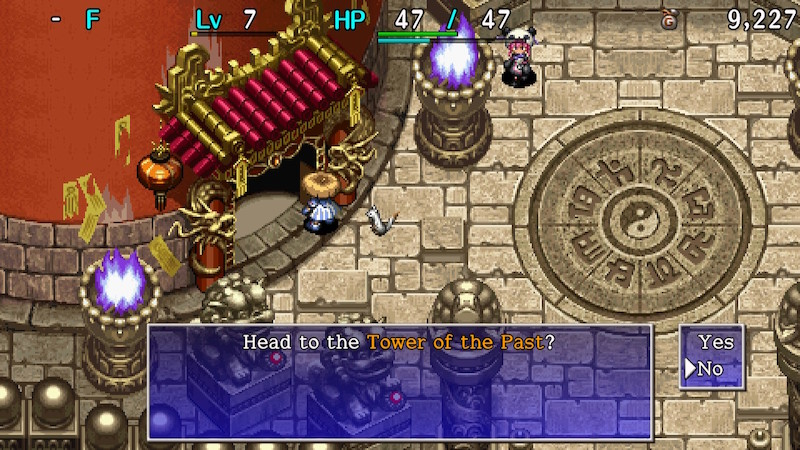
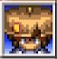
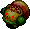

  

Easiest of the three dice towers.

However, there are some dangerous enemies like Curse Girl, Mudkin, and Swordsman, 
so don't let your guard down too much.

It's recommended to start with this tower instead of the other two, but some players 
prefer to start with Tower of the Present so that they can synthesize items using Mixers.

<ul class="quickLinksUL">
  <li><a href="#overview">Overview</a></li>
  <li><a href="#strategy">Strategy</a>
    <ul>
      <li><a href="#general">General</a></li>
      <li><a href="#farming">Farming</a></li>
    </ul>
  </li>
  <li><a href="#monsters">Monsters</a></li>
  <li><a href="#monster-list">Monster List</a></li>
  <li><a href="#items">Items</a></li>
  <li><a href="#traps">Traps</a></li>
  <li><a href="#npcs">NPCs</a></li>
</ul>

# Overview

<table class="dungeonOverview">
  <tr>
    <th>Unlock</th>
    <td class="highlightYellow">Available as soon as you arrive at the Tower of Fortune entrance.</td>
  </tr>
  <tr>
    <th>Entrance</th>
    <td class="highlightYellow">Tower of Fortune entrance (West)</td>
  </tr>
</table>

<table class="dungeonTable">
  <tr>
    <th>Floors</th>
    <td>7F</td>
    <th>Day / Night</th>
    <td>Day</td>
  </tr>
  <tr>
    <th>Bring Items</th>
    <td>Yes</td>
    <th>Allies</th>
    <td>3</td>
  </tr>
  <tr>
    <th>Unidentified</th>
    <td>Bracelets</td>
    <th>New Items</th>
    <td>Yes</td>
  </tr>
  <tr>
    <th>Shops</th>
    <td>Regular, Elite</td>
    <th>Monster Houses</th>
    <td>Regular</td>
  </tr>
  <tr>
    <th>Initial Enemies</th>
    <td>7~10</td>
    <th>Spawn Rate</th>
    <td>30 turns</td>
  </tr>
  <tr>
    <th>Ominous aura</th>
    <td>No</td>
    <th>Wind of Kron</th>
    <td>1st: 1700 4th: 2000</td>
  </tr>
  <tr>
    <th>Clear Icon</th>
    <td class="clearIcon"></td>
    <th>Reward</th>
    <td>None</td>
  </tr>
</table>

※ Reading a Night-Day Scroll is the only way to change it to night.

# Strategy

### General

Enemies shouldn't be too much of an issue if you proceed while keeping an eye on your remaining HP. 
However, don't bother Naptapirs. They occasionally inflict Asleep status when you walk next to them or when they're defeated, turning you into a sitting duck if other enemies are nearby.

Curse Girls can curse or seal your items, and Mudkins can weaken your equipped weapon or shield. 
Mutaikons can cause some trouble if they inflict Slow by throwing Poison Grass at you too.

Swordsman makes an appearance on 7F, and can disarm your equipped shield, sending it flying behind you. 
The shield will be lost if it lands on a water or air tile, or if it hits an enemy. 
Allies dodge flying equipment in this game, so you can fight with your back against a wall or ally to reduce risk.

### Farming

Karakuroid appears until 3F. 
Have it create Iron Arrow Traps and Poison Arrow Traps to collect Iron Arrows and Poison Arrows. 
Grass Kid appears on 1F, so you can farm grass items as well, but keep an eye on your remaining fullness. 
You can also hunt Froggos until 2F to collect Gitan.

If you get a chance, have a Swordsman use its special attack against an ally to obtain Weeds. 
Weeds provide the Anti-Plant rune when synthesized using a Mixer, and let you deal more damage to Plant types. 
The Anti-Plant rune can also be added by synthesizing a Scythe, but that weapon is somewhat rare. 
If you have an extra Revival Grass or Undo Grass, you can intentionally collapse to change the item in Weeds.

If you have an Alert or Anti-Cnf. bracelet, try to obtain Confusion or Sleepy grass from a leveled up Mutaikon. 
These grasses can be synthesized using a Mixer to add status inflicting runes to your weapon. 
Items like Fear Scroll can be used to level up a monster, and you can safely obtain said grasses 
by using items such as Knockback Staff + Shadow Bind Tal.

Save Stomach Expanders for Mixers to increase the number of items they can eat instead of eating them yourself.

# Monsters

<button id="hideMonTblImgBtn" onClick={()=>{var mon_imgs = document.querySelectorAll('#monsterTable img');mon_imgs.forEach(e => e.classList.toggle('hidden'));}}>Toggle Monster Images</button>

Hover over or tap a monster's name for details. Monster Colors: Farming, Useful, Destroys Items, Dangerous, Very Dangerous

<table id="monsterTable" class="monsterTable">
  <thead>
    <tr>
      <th>F</th>
      <th colspan="5">Monsters</th>
    </tr>
  </thead>
  <tbody>
    <tr>
      <td rowspan="4" class="centeredText">1</td>
      <td class="day useful">
 Karakuroid
- Karakuroid - HP: 32 AP: 14 DP: 8 Exp: 45 GP: 9 Type: Metal Speed: Swift 1 Sp.Atk Rate: 38% (near), 38% (far) Item Drop Rate: 4% ~ Ability ~ Initially Napping, wakes when Shiren enters or exits the room. Creates a trap on the ground, then stops acting for 2 turns. Occasionally creates a trap when slain.

</td>
      <td class="day">
 Sweet Nut
- Sweet Nut - HP: 16 AP: 11 DP: 5 Exp: 15 GP: 4 Type: Plant/Explode Speed: Normal Sp.Atk Rate: 0% (near), 0% (far) Item Drop Rate: 0% ~ Ability ~ Either doubles experience points (Max: x1024) or explodes (33% chance) each time it eats a thrown item.

</td>
      <td class="day">
 Nigiri Baby
- Nigiri Baby - HP: 23 AP: 12 DP: 7 Exp: 18 GP: 6 Type: Normal Speed: Normal Sp.Atk Rate: 0% (near), 0% (far) Item Drop Rate: 4% ~ Ability ~ Instantly collapses when hit by thrown onigiri.

</td>
      <td class="day farm">
 Froggo
- Froggo - HP: 23 AP: 12 DP: 7 Exp: 18 GP: 1 Type: Normal Speed: Normal Sp.Atk Rate: 24% (near), 0% (far) Item Drop Rate: 100% ~ Ability ~ Steals Gitan when adjacent and warps, then runs from Shiren at swift speed. Stands on Gitan it finds the ground. Doesn't use direct attacks. Heals HP when hit by thrown Gitan.

</td>
      <td class="day farm">
 Grass Kid
- Grass Kid - HP: 28 AP: 10 DP: 1 Exp: 5 GP: 3 Type: Plant Speed: Normal Sp.Atk Rate: 21% (near), 16% (far) Item Drop Rate: 0% ~ Ability ~ Spreads grass in a 1 tile radius when adjacent. Pierce-throws grass in a straight line at a distance. Carries 1 grass item. Becomes Pin Kid with 0 grass.

</td>
    </tr>
    <tr>
      <td class="day">
 Pin Kid
- Pin Kid - HP: 28 AP: 8 DP: 1 Exp: 5 GP: 1 Type: Plant Speed: Swift 1 Sp.Atk Rate: 0% (near), 0% (far) Item Drop Rate: 0% ~ Ability ~ Runs from Shiren, but attacks when adjacent. Becomes Grass Kid when it picks up a grass item.

</td>
      <td></td>
      <td></td>
      <td></td>
      <td></td>
    </tr>
    <tr>
      <td class="highlightGray3">
 Dark Pop Tank
- Dark Pop Tank - HP: 20 AP: 18 DP: 2 Exp: 24 GP: 18 Type: Metal/Explode Speed: Slow Sp.Atk Rate: 75% (near), 55% (far) Item Drop Rate: 4% ~ Ability ~ Resists non-ability attacks. Fires a 30 damage cannon in a straight line whenever Shiren is in range of the 1 tile blast radius. Can use direct attacks.

</td>
      <td class="highlightGray3 itemsNight">
 Shady Mudkin
- Shady Mudkin - HP: 20 AP: 18 DP: 2 Exp: 24 GP: 13 Type: Aquatic Speed: Normal Sp.Atk Rate: 56% (near), 0% (far) Item Drop Rate: 0% ~ Ability ~ Resists non-ability attacks. Extinguishes an equipped torch. Lowers upgrade value of equipped weapon or shield by 2. May also remove the item's tag. Chance to multiply when attacked. Can use direct attacks.

</td>
      <td class="highlightGray3">
 Evil Kid Squid
- Evil Kid Squid - HP: 20 AP: 18 DP: 2 Exp: 24 GP: 7 Type: Aquatic Speed: Normal Sp.Atk Rate: 23% (near), 0% (far) Item Drop Rate: 4% ~ Ability ~ Inflicts Blind status on an adjacent target. Turns into a Squid Sushi Scroll when hit by thrown onigiri.

</td>
      <td class="highlightGray3">
 Dark Kumonigiri
- Dark Kumonigiri - HP: 20 AP: 18 DP: 2 Exp: 24 GP: 20 Type: Normal Speed: Normal Sp.Atk Rate: 0% (near), 0% (far) Item Drop Rate: 4% ~ Ability ~ Only drops Onigiri.

</td>
      <td class="highlightGray3">
 Dark Flamebird
- Dark Flamebird - HP: 20 AP: 16 DP: 2 Exp: 24 GP: 13 Type: Floating Speed: Normal Sp.Atk Rate: 56% (near), 0% (far) Item Drop Rate: 0% ~ Ability ~ Resists non-ability attacks. Heals an adjacent monster's HP by 40. Items thrown at it burn up. Fire damage restores its HP. Multiplies from explosions.

</td>
    </tr>
    <tr>
      <td class="highlightGray3">
 Sinister Porky
- Sinister Porky - HP: 20 AP: 18 DP: 2 Exp: 50 GP: 30 Type: Normal Speed: Normal Sp.Atk Rate: 19% (near), 17% (far) Item Drop Rate: 6% ~ Ability ~ Resists non-ability attacks. Throws a Porky Rock that deals 20 damage within a 2 tile radius. Only drops Porky Rocks.

</td>
      <td></td>
      <td></td>
      <td></td>
      <td></td>
    </tr>
    <tr>
      <td colspan="6" class="purpleDivider"></td>
    </tr>
    <tr>
      <td rowspan="3" class="centeredText">2</td>
      <td class="day useful">
 Karakuroid
- Karakuroid - HP: 32 AP: 14 DP: 8 Exp: 45 GP: 9 Type: Metal Speed: Swift 1 Sp.Atk Rate: 38% (near), 38% (far) Item Drop Rate: 4% ~ Ability ~ Initially Napping, wakes when Shiren enters or exits the room. Creates a trap on the ground, then stops acting for 2 turns. Occasionally creates a trap when slain.

</td>
      <td class="day">
 Sweet Nut
- Sweet Nut - HP: 16 AP: 11 DP: 5 Exp: 15 GP: 4 Type: Plant/Explode Speed: Normal Sp.Atk Rate: 0% (near), 0% (far) Item Drop Rate: 0% ~ Ability ~ Either doubles experience points (Max: x1024) or explodes (33% chance) each time it eats a thrown item.

</td>
      <td class="day">
 Nigiri Baby
- Nigiri Baby - HP: 23 AP: 12 DP: 7 Exp: 18 GP: 6 Type: Normal Speed: Normal Sp.Atk Rate: 0% (near), 0% (far) Item Drop Rate: 4% ~ Ability ~ Instantly collapses when hit by thrown onigiri.

</td>
      <td class="day farm">
 Froggo
- Froggo - HP: 23 AP: 12 DP: 7 Exp: 18 GP: 1 Type: Normal Speed: Normal Sp.Atk Rate: 24% (near), 0% (far) Item Drop Rate: 100% ~ Ability ~ Steals Gitan when adjacent and warps, then runs from Shiren at swift speed. Stands on Gitan it finds the ground. Doesn't use direct attacks. Heals HP when hit by thrown Gitan.

</td>
      <td class="day">
 Tiger Tosser
- Tiger Tosser - HP: 32 AP: 16 DP: 10 Exp: 45 GP: 10 Type: Normal Speed: Normal Sp.Atk Rate: 33% (near), 33% (far) Item Drop Rate: 4% ~ Ability ~ Throws an adjacent creature at Shiren, or throws Shiren at another creature, onto a trap, or into a Monster House. Range of 5 tiles, deals 5 damage.

</td>
    </tr>
    <tr>
      <td class="highlightGray3">
 Dark Pop Tank
- Dark Pop Tank - HP: 20 AP: 18 DP: 2 Exp: 24 GP: 18 Type: Metal/Explode Speed: Slow Sp.Atk Rate: 75% (near), 55% (far) Item Drop Rate: 4% ~ Ability ~ Resists non-ability attacks. Fires a 30 damage cannon in a straight line whenever Shiren is in range of the 1 tile blast radius. Can use direct attacks.

</td>
      <td class="highlightGray3 itemsNight">
 Shady Mudkin
- Shady Mudkin - HP: 20 AP: 18 DP: 2 Exp: 24 GP: 13 Type: Aquatic Speed: Normal Sp.Atk Rate: 56% (near), 0% (far) Item Drop Rate: 0% ~ Ability ~ Resists non-ability attacks. Extinguishes an equipped torch. Lowers upgrade value of equipped weapon or shield by 2. May also remove the item's tag. Chance to multiply when attacked. Can use direct attacks.

</td>
      <td class="highlightGray3">
 Evil Kid Squid
- Evil Kid Squid - HP: 20 AP: 18 DP: 2 Exp: 24 GP: 7 Type: Aquatic Speed: Normal Sp.Atk Rate: 23% (near), 0% (far) Item Drop Rate: 4% ~ Ability ~ Inflicts Blind status on an adjacent target. Turns into a Squid Sushi Scroll when hit by thrown onigiri.

</td>
      <td class="highlightGray3">
 Dark Kumonigiri
- Dark Kumonigiri - HP: 20 AP: 18 DP: 2 Exp: 24 GP: 20 Type: Normal Speed: Normal Sp.Atk Rate: 0% (near), 0% (far) Item Drop Rate: 4% ~ Ability ~ Only drops Onigiri.

</td>
      <td class="highlightGray3">
 Dark Flamebird
- Dark Flamebird - HP: 20 AP: 16 DP: 2 Exp: 24 GP: 13 Type: Floating Speed: Normal Sp.Atk Rate: 56% (near), 0% (far) Item Drop Rate: 0% ~ Ability ~ Resists non-ability attacks. Heals an adjacent monster's HP by 40. Items thrown at it burn up. Fire damage restores its HP. Multiplies from explosions.

</td>
    </tr>
    <tr>
      <td class="highlightGray3">
 Sinister Porky
- Sinister Porky - HP: 20 AP: 18 DP: 2 Exp: 50 GP: 30 Type: Normal Speed: Normal Sp.Atk Rate: 19% (near), 17% (far) Item Drop Rate: 6% ~ Ability ~ Resists non-ability attacks. Throws a Porky Rock that deals 20 damage within a 2 tile radius. Only drops Porky Rocks.

</td>
      <td></td>
      <td></td>
      <td></td>
      <td></td>
    </tr>
    <tr>
      <td colspan="6" class="purpleDivider"></td>
    </tr>
    <tr>
      <td rowspan="2" class="centeredText">3</td>
      <td class="day useful">
 Karakuroid
- Karakuroid - HP: 32 AP: 14 DP: 8 Exp: 45 GP: 9 Type: Metal Speed: Swift 1 Sp.Atk Rate: 38% (near), 38% (far) Item Drop Rate: 4% ~ Ability ~ Initially Napping, wakes when Shiren enters or exits the room. Creates a trap on the ground, then stops acting for 2 turns. Occasionally creates a trap when slain.

</td>
      <td class="day items">
 Curse Girl
- Curse Girl - HP: 20 AP: 18 DP: 4 Exp: 24 GP: 7 Type: Normal Speed: Normal Sp.Atk Rate: 24% (near), 0% (far) Item Drop Rate: 0% ~ Ability ~ Curses or seals 1 item when adjacent.

</td>
      <td class="day">
 Nigiri Baby
- Nigiri Baby - HP: 23 AP: 12 DP: 7 Exp: 18 GP: 6 Type: Normal Speed: Normal Sp.Atk Rate: 0% (near), 0% (far) Item Drop Rate: 4% ~ Ability ~ Instantly collapses when hit by thrown onigiri.

</td>
      <td class="day danger">
 Fearabbit
- Fearabbit - HP: 20 AP: 15 DP: 4 Exp: 15 GP: 9 Type: Magic Speed: Normal Sp.Atk Rate: 21% (near), 21% (far) Item Drop Rate: 4% ~ Ability ~ Attracts up to 3 creatures including Shiren to itself from anywhere in the same room.

</td>
      <td class="day">
 Tiger Tosser
- Tiger Tosser - HP: 32 AP: 16 DP: 10 Exp: 45 GP: 10 Type: Normal Speed: Normal Sp.Atk Rate: 33% (near), 33% (far) Item Drop Rate: 4% ~ Ability ~ Throws an adjacent creature at Shiren, or throws Shiren at another creature, onto a trap, or into a Monster House. Range of 5 tiles, deals 5 damage.

</td>
    </tr>
    <tr>
      <td class="highlightGray3 itemsNight">
 Wicked Scoopie
- Wicked Scoopie - HP: 22 AP: 16 DP: 2 Exp: 22 GP: 20 Type: Metal Speed: Normal Sp.Atk Rate: 16% (near), 0% (far) Item Drop Rate: 4% ~ Ability ~ Resists non-ability attacks. Shovels dirt at an adjacent target, which can hit through corners. Dirt fills 1 pot in your inventory when it hits Shiren, or inflicts Blind status when it hits an ally. Dirt in pots eventually changes to grass items when advancing floors.

</td>
      <td class="highlightGray3 itemsNight">
 Shady Mudkin
- Shady Mudkin - HP: 20 AP: 18 DP: 2 Exp: 24 GP: 13 Type: Aquatic Speed: Normal Sp.Atk Rate: 56% (near), 0% (far) Item Drop Rate: 0% ~ Ability ~ Resists non-ability attacks. Extinguishes an equipped torch. Lowers upgrade value of equipped weapon or shield by 2. May also remove the item's tag. Chance to multiply when attacked. Can use direct attacks.

</td>
      <td class="highlightGray3">
 Dark DJ Mage
- Dark DJ Mage - HP: 22 AP: 16 DP: 2 Exp: 22 GP: 18 Type: Magic Speed: Normal Sp.Atk Rate: 64% (near), 47% (far) Item Drop Rate: 6% ~ Ability ~ Resists non-ability attacks. Fires a magic bullet with a random effect in a straight line: Warp, knockback, switch positions, or increase action speed by 1 stage.

</td>
      <td class="highlightGray3">
 Dark Kumonigiri
- Dark Kumonigiri - HP: 20 AP: 18 DP: 2 Exp: 24 GP: 20 Type: Normal Speed: Normal Sp.Atk Rate: 0% (near), 0% (far) Item Drop Rate: 4% ~ Ability ~ Only drops Onigiri.

</td>
      <td class="highlightGray3 farmNight">
 Plump Chow
- Plump Chow - HP: 12 AP: 4 DP: 1 Exp: 1 GP: 5 Type: Floating Speed: Swift 1 Sp.Atk Rate: 0% (near), 0% (far) Item Drop Rate: 100% ~ Ability ~ Resists non-ability attacks. Runs away from other creatures. Monsters focus on Plump Chow instead of Shiren and will level up if they defeat Plump Chow. Can use direct attacks. Always drops a floor table item when slain by Shiren.

</td>
    </tr>
    <tr>
      <td colspan="6" class="purpleDivider"></td>
    </tr>
    <tr>
      <td rowspan="4" class="centeredText">4</td>
      <td class="day">
 Floaty
- Floaty - HP: 23 AP: 12 DP: 7 Exp: 18 GP: 6 Type: Normal Speed: Swift 1 Sp.Atk Rate: 23% (near), 0% (far) Item Drop Rate: 4% ~ Ability ~ Initially Napping in a group of 3. Shiren can be warped 1~3 floors when surrounded by 3 Floaty monsters.

</td>
      <td class="day items">
 Curse Girl
- Curse Girl - HP: 20 AP: 18 DP: 4 Exp: 24 GP: 7 Type: Normal Speed: Normal Sp.Atk Rate: 24% (near), 0% (far) Item Drop Rate: 0% ~ Ability ~ Curses or seals 1 item when adjacent.

</td>
      <td class="day">
 Pumphantasm
- Pumphantasm - HP: 35 AP: 20 DP: 12 Exp: 43 GP: 24 Type: Plant/Floating Speed: Normal Sp.Atk Rate: 0% (near), 0% (far) Item Drop Rate: 0% ~ Ability ~ Can pass through walls. Unpredictable movement, but slowly approaches Shiren.

</td>
      <td class="day danger">
 Fearabbit
- Fearabbit - HP: 20 AP: 15 DP: 4 Exp: 15 GP: 9 Type: Magic Speed: Normal Sp.Atk Rate: 21% (near), 21% (far) Item Drop Rate: 4% ~ Ability ~ Attracts up to 3 creatures including Shiren to itself from anywhere in the same room.

</td>
      <td class="day">
 Tiger Tosser
- Tiger Tosser - HP: 32 AP: 16 DP: 10 Exp: 45 GP: 10 Type: Normal Speed: Normal Sp.Atk Rate: 33% (near), 33% (far) Item Drop Rate: 4% ~ Ability ~ Throws an adjacent creature at Shiren, or throws Shiren at another creature, onto a trap, or into a Monster House. Range of 5 tiles, deals 5 damage.

</td>
    </tr>
    <tr>
      <td class="day">
 Gyaza
- Gyaza - HP: 28 AP: 19 DP: 10 Exp: 45 GP: 20 Type: Aquatic Speed: Normal Sp.Atk Rate: 0% (near), 0% (far) Item Drop Rate: 4% ~ Ability ~ Converts most effects received other than direct attacks to 2 damage.

</td>
      <td></td>
      <td></td>
      <td></td>
      <td></td>
    </tr>
    <tr>
      <td class="highlightGray3 itemsNight">
 Wicked Scoopie
- Wicked Scoopie - HP: 22 AP: 16 DP: 2 Exp: 22 GP: 20 Type: Metal Speed: Normal Sp.Atk Rate: 16% (near), 0% (far) Item Drop Rate: 4% ~ Ability ~ Resists non-ability attacks. Shovels dirt at an adjacent target, which can hit through corners. Dirt fills 1 pot in your inventory when it hits Shiren, or inflicts Blind status when it hits an ally. Dirt in pots eventually changes to grass items when advancing floors.

</td>
      <td class="highlightGray3">
 Foul Nigiri Baby
- Foul Nigiri Baby - HP: 33 AP: 24 DP: 4 Exp: 40 GP: 15 Type: Normal Speed: Normal Sp.Atk Rate: 0% (near), 0% (far) Item Drop Rate: 4% ~ Ability ~ Resists non-ability attacks. Instantly collapses when hit by thrown onigiri.

</td>
      <td class="highlightGray3">
 Dark DJ Mage
- Dark DJ Mage - HP: 22 AP: 16 DP: 2 Exp: 22 GP: 18 Type: Magic Speed: Normal Sp.Atk Rate: 64% (near), 47% (far) Item Drop Rate: 6% ~ Ability ~ Resists non-ability attacks. Fires a magic bullet with a random effect in a straight line: Warp, knockback, switch positions, or increase action speed by 1 stage.

</td>
      <td class="highlightGray3 itemsNight">
 Evil Gazer
- Evil Gazer - HP: 33 AP: 24 DP: 3 Exp: 40 GP: 10 Type: Cyclops/Magic Speed: Normal Sp.Atk Rate: 43% (near), 0% (far) Item Drop Rate: 2% ~ Ability ~ Resists non-ability attacks. Hypnotizes Shiren when adjacent, forcing either item usage or an attack in a random direction.

</td>
      <td class="highlightGray3 farmNight">
 Plump Chow
- Plump Chow - HP: 12 AP: 4 DP: 1 Exp: 1 GP: 5 Type: Floating Speed: Swift 1 Sp.Atk Rate: 0% (near), 0% (far) Item Drop Rate: 100% ~ Ability ~ Resists non-ability attacks. Runs away from other creatures. Monsters focus on Plump Chow instead of Shiren and will level up if they defeat Plump Chow. Can use direct attacks. Always drops a floor table item when slain by Shiren.

</td>
    </tr>
    <tr>
      <td class="highlightGray3">
 Dark Mutaikon
- Dark Mutaikon - HP: 33 AP: 20 DP: 3 Exp: 40 GP: 7 Type: Plant Speed: Normal Sp.Atk Rate: 19% (near), 19% (far) Item Drop Rate: 6% ~ Ability ~ Resists non-ability attacks. Throws Poison Grass 2 tiles ahead. Only drops Poison Grass.

</td>
      <td></td>
      <td></td>
      <td></td>
      <td></td>
    </tr>
    <tr>
      <td colspan="6" class="purpleDivider"></td>
    </tr>
    <tr>
      <td rowspan="3" class="centeredText">5</td>
      <td class="day">
 Floaty
- Floaty - HP: 23 AP: 12 DP: 7 Exp: 18 GP: 6 Type: Normal Speed: Swift 1 Sp.Atk Rate: 23% (near), 0% (far) Item Drop Rate: 4% ~ Ability ~ Initially Napping in a group of 3. Shiren can be warped 1~3 floors when surrounded by 3 Floaty monsters.

</td>
      <td class="day">
 Gyaza
- Gyaza - HP: 28 AP: 19 DP: 10 Exp: 45 GP: 20 Type: Aquatic Speed: Normal Sp.Atk Rate: 0% (near), 0% (far) Item Drop Rate: 4% ~ Ability ~ Converts most effects received other than direct attacks to 2 damage.

</td>
      <td class="day">
 Pumphantasm
- Pumphantasm - HP: 35 AP: 20 DP: 12 Exp: 43 GP: 24 Type: Plant/Floating Speed: Normal Sp.Atk Rate: 0% (near), 0% (far) Item Drop Rate: 0% ~ Ability ~ Can pass through walls. Unpredictable movement, but slowly approaches Shiren.

</td>
      <td class="day">
 N'dubba
- N'dubba - HP: 32 AP: 16 DP: 8 Exp: 16 GP: 8 Type: Metal Speed: Normal Sp.Atk Rate: 0% (near), 0% (far) Item Drop Rate: 0% ~ Ability ~ Disguises itself as an item. Reveals itself and attacks when Shiren tries to pick it up. Identified when advancing floors.

</td>
      <td class="day">
 Naptapir
- Naptapir - HP: 32 AP: 27 DP: 11 Exp: 46 GP: 10 Type: Normal Speed: Normal Sp.Atk Rate: 23% (near), 0% (far) Item Drop Rate: 4% ~ Ability ~ Initially Napping, will not wake up when Shiren enters or exits the room. Occasionally inflicts Asleep status in a 1 tile radius when it's Napping, Asleep, or Sound Asleep. Chance to yawn when slain, inflicting Asleep status in a 1 tile radius.

</td>
    </tr>
    <tr>
      <td class="highlightGray3">
 Evil Mid Chintala
- Evil Mid Chintala - HP: 35 AP: 32 DP: 4 Exp: 56 GP: 50 Type: Normal Speed: Normal Sp.Atk Rate: 0% (near), 0% (far) Item Drop Rate: 8% ~ Ability ~ Resists non-ability attacks.

</td>
      <td class="highlightGray3">
 Foul Nigiri Baby
- Foul Nigiri Baby - HP: 33 AP: 24 DP: 4 Exp: 40 GP: 15 Type: Normal Speed: Normal Sp.Atk Rate: 0% (near), 0% (far) Item Drop Rate: 4% ~ Ability ~ Resists non-ability attacks. Instantly collapses when hit by thrown onigiri.

</td>
      <td class="highlightGray3">
 Evil Firepuff
- Evil Firepuff - HP: 33 AP: 24 DP: 4 Exp: 40 GP: 24 Type: Dragon/Floating Speed: Normal Sp.Atk Rate: 89% (near), 0% (far) Item Drop Rate: 4% ~ Ability ~ Resists non-ability attacks. Breathes 20 damage fire when adjacent, which can hit through corners. Occasionally fails at breathing fire.

</td>
      <td class="highlightGray3 itemsNight">
 Evil Gazer
- Evil Gazer - HP: 33 AP: 24 DP: 3 Exp: 40 GP: 10 Type: Cyclops/Magic Speed: Normal Sp.Atk Rate: 43% (near), 0% (far) Item Drop Rate: 2% ~ Ability ~ Resists non-ability attacks. Hypnotizes Shiren when adjacent, forcing either item usage or an attack in a random direction.

</td>
      <td class="highlightGray3 dangerNight">
 Dark N'dubba
- Dark N'dubba - HP: 35 AP: 32 DP: 4 Exp: 56 GP: 20 Type: Metal Speed: Normal Sp.Atk Rate: 0% (near), 0% (far) Item Drop Rate: 0% ~ Ability ~ Resists non-ability attacks. Disguises itself as an item. Reveals itself and attacks when Shiren tries to pick it up. Identified when advancing floors.

</td>
    </tr>
    <tr>
      <td class="highlightGray3">
 Dark Mutaikon
- Dark Mutaikon - HP: 33 AP: 20 DP: 3 Exp: 40 GP: 7 Type: Plant Speed: Normal Sp.Atk Rate: 19% (near), 19% (far) Item Drop Rate: 6% ~ Ability ~ Resists non-ability attacks. Throws Poison Grass 2 tiles ahead. Only drops Poison Grass.

</td>
      <td></td>
      <td></td>
      <td></td>
      <td></td>
    </tr>
    <tr>
      <td colspan="6" class="purpleDivider"></td>
    </tr>
    <tr>
      <td rowspan="2" class="centeredText">6</td>
      <td class="day">
 Floaty
- Floaty - HP: 23 AP: 12 DP: 7 Exp: 18 GP: 6 Type: Normal Speed: Swift 1 Sp.Atk Rate: 23% (near), 0% (far) Item Drop Rate: 4% ~ Ability ~ Initially Napping in a group of 3. Shiren can be warped 1~3 floors when surrounded by 3 Floaty monsters.

</td>
      <td class="day">
 Mutaikon
- Mutaikon - HP: 42 AP: 15 DP: 12 Exp: 49 GP: 8 Type: Plant Speed: Normal Sp.Atk Rate: 19% (near), 19% (far) Item Drop Rate: 6% ~ Ability ~ Throws Poison Grass 2 tiles ahead. Only drops Poison Grass.

</td>
      <td class="day">
 Pumphantasm
- Pumphantasm - HP: 35 AP: 20 DP: 12 Exp: 43 GP: 24 Type: Plant/Floating Speed: Normal Sp.Atk Rate: 0% (near), 0% (far) Item Drop Rate: 0% ~ Ability ~ Can pass through walls. Unpredictable movement, but slowly approaches Shiren.

</td>
      <td class="day">
 N'dubba
- N'dubba - HP: 32 AP: 16 DP: 8 Exp: 16 GP: 8 Type: Metal Speed: Normal Sp.Atk Rate: 0% (near), 0% (far) Item Drop Rate: 0% ~ Ability ~ Disguises itself as an item. Reveals itself and attacks when Shiren tries to pick it up. Identified when advancing floors.

</td>
      <td class="day">
 Naptapir
- Naptapir - HP: 32 AP: 27 DP: 11 Exp: 46 GP: 10 Type: Normal Speed: Normal Sp.Atk Rate: 23% (near), 0% (far) Item Drop Rate: 4% ~ Ability ~ Initially Napping, will not wake up when Shiren enters or exits the room. Occasionally inflicts Asleep status in a 1 tile radius when it's Napping, Asleep, or Sound Asleep. Chance to yawn when slain, inflicting Asleep status in a 1 tile radius.

</td>
    </tr>
    <tr>
      <td class="highlightGray3">
 Evil Mid Chintala
- Evil Mid Chintala - HP: 35 AP: 32 DP: 4 Exp: 56 GP: 50 Type: Normal Speed: Normal Sp.Atk Rate: 0% (near), 0% (far) Item Drop Rate: 8% ~ Ability ~ Resists non-ability attacks.

</td>
      <td class="highlightGray3">
 Foul Nigiri Baby
- Foul Nigiri Baby - HP: 33 AP: 24 DP: 4 Exp: 40 GP: 15 Type: Normal Speed: Normal Sp.Atk Rate: 0% (near), 0% (far) Item Drop Rate: 4% ~ Ability ~ Resists non-ability attacks. Instantly collapses when hit by thrown onigiri.

</td>
      <td class="highlightGray3">
 Evil Firepuff
- Evil Firepuff - HP: 33 AP: 24 DP: 4 Exp: 40 GP: 24 Type: Dragon/Floating Speed: Normal Sp.Atk Rate: 89% (near), 0% (far) Item Drop Rate: 4% ~ Ability ~ Resists non-ability attacks. Breathes 20 damage fire when adjacent, which can hit through corners. Occasionally fails at breathing fire.

</td>
      <td></td>
      <td class="highlightGray3 dangerNight">
 Dark N'dubba
- Dark N'dubba - HP: 35 AP: 32 DP: 4 Exp: 56 GP: 20 Type: Metal Speed: Normal Sp.Atk Rate: 0% (near), 0% (far) Item Drop Rate: 0% ~ Ability ~ Resists non-ability attacks. Disguises itself as an item. Reveals itself and attacks when Shiren tries to pick it up. Identified when advancing floors.

</td>
    </tr>
    <tr>
      <td colspan="6" class="purpleDivider"></td>
    </tr>
    <tr>
      <td rowspan="3" class="centeredText">7</td>
      <td class="day items">
 Swordsman
- Swordsman - HP: 45 AP: 15 DP: 9 Exp: 36 GP: 40 Type: Normal Speed: Normal Sp.Atk Rate: 19% (near), 0% (far) Item Drop Rate: 2% ~ Ability ~ Knocks away Shiren's equipped shield when adjacent, sending it 10 tiles backward.

</td>
      <td class="day">
 Mutaikon
- Mutaikon - HP: 42 AP: 15 DP: 12 Exp: 49 GP: 8 Type: Plant Speed: Normal Sp.Atk Rate: 19% (near), 19% (far) Item Drop Rate: 6% ~ Ability ~ Throws Poison Grass 2 tiles ahead. Only drops Poison Grass.

</td>
      <td class="day">
 Pumphantasm
- Pumphantasm - HP: 35 AP: 20 DP: 12 Exp: 43 GP: 24 Type: Plant/Floating Speed: Normal Sp.Atk Rate: 0% (near), 0% (far) Item Drop Rate: 0% ~ Ability ~ Can pass through walls. Unpredictable movement, but slowly approaches Shiren.

</td>
      <td class="day">
 Metalhead
- Metalhead - HP: 55 AP: 19 DP: 11 Exp: 55 GP: 15 Type: Cyclops Speed: Normal Sp.Atk Rate: 34% (near), 34% (far) Item Drop Rate: 4% ~ Ability ~ Attacks 2 tiles ahead and through corners. Charges strength to deal double damage on the next turn.

</td>
      <td class="day">
 Naptapir
- Naptapir - HP: 32 AP: 27 DP: 11 Exp: 46 GP: 10 Type: Normal Speed: Normal Sp.Atk Rate: 23% (near), 0% (far) Item Drop Rate: 4% ~ Ability ~ Initially Napping, will not wake up when Shiren enters or exits the room. Occasionally inflicts Asleep status in a 1 tile radius when it's Napping, Asleep, or Sound Asleep. Chance to yawn when slain, inflicting Asleep status in a 1 tile radius.

</td>
    </tr>
    <tr>
      <td class="day">
 Scorpion
- Scorpion - HP: 45 AP: 21 DP: 9 Exp: 41 GP: 12 Type: Drain Speed: Normal Sp.Atk Rate: 19% (near), 0% (far) Item Drop Rate: 2% ~ Ability ~ Lowers Strength by 1 when adjacent.

</td>
      <td class="day items">
 Mudkin
- Mudkin - HP: 45 AP: 15 DP: 9 Exp: 33 GP: 7 Type: Aquatic Speed: Normal Sp.Atk Rate: 38% (near), 0% (far) Item Drop Rate: 0% ~ Ability ~ Lowers upgrade value of equipped weapon or shield by 1. May also remove the item's tag. Chance to multiply when attacked. Doesn't use direct attacks.

</td>
      <td></td>
      <td></td>
      <td></td>
    </tr>
    <tr>
      <td class="highlightGray3">
 Evil Mid Chintala
- Evil Mid Chintala - HP: 35 AP: 32 DP: 4 Exp: 56 GP: 50 Type: Normal Speed: Normal Sp.Atk Rate: 0% (near), 0% (far) Item Drop Rate: 8% ~ Ability ~ Resists non-ability attacks.

</td>
      <td class="highlightGray3">
 Dark Blade Bee
- Dark Blade Bee - HP: 23 AP: 14 DP: 1 Exp: 18 GP: 15 Type: Floating Speed: Normal Sp.Atk Rate: 16% (near), 0% (far) Item Drop Rate: 4% ~ Ability ~ Resists non-ability attacks. Occasionally retreats after attacking. Stinger has double AP and inflicts Confused status, but it also collapses afterward.

</td>
      <td class="highlightGray3">
 Evil Firepuff
- Evil Firepuff - HP: 33 AP: 24 DP: 4 Exp: 40 GP: 24 Type: Dragon/Floating Speed: Normal Sp.Atk Rate: 89% (near), 0% (far) Item Drop Rate: 4% ~ Ability ~ Resists non-ability attacks. Breathes 20 damage fire when adjacent, which can hit through corners. Occasionally fails at breathing fire.

</td>
      <td class="highlightGray3">
 Mean Cheer-Ham
- Mean Cheer-Ham - HP: 23 AP: 14 DP: 1 Exp: 18 GP: 17 Type: Normal Speed: Normal Sp.Atk Rate: 0% (near), 0% (far) Item Drop Rate: 4% ~ Ability ~ Resists non-ability attacks. Runs away from Shiren, but attacks when cornered. Moves toward monsters in view. Cheers for adjacent creatures, raising AP by 1 stage and letting them survive a fatal hit.

</td>
      <td></td>
    </tr>
  </tbody>
</table>

※ Night-Day Scroll is required to encounter night monsters.

# Monster List

Orange: Dangerous, Blue: Beneficial

 

<table class="dungeonMonsterList">
  <tr>
    <th>F</th>
    <th>Name</th>
    <th>HP</th>
    <th>AP</th>
    <th>DP</th>
    <th>Exp</th>
    <th>GP</th>
    <th>Rune / Item</th>
    <th>Notes</th>
  </tr>
  <tr>
    <td>1</td>
    <td class="highlightYellow">Grass Kid</td>
    <td>28</td>
    <td>10</td>
    <td>1</td>
    <td>5</td>
    <td>3</td>
    <td>Anti-Plant</td>
    <td>Throws grass it's carrying from a distance with piercing properties, or spreads the effect to all creatures in a 1-tile radius if it's adjacent. Transforms into Pin Kid after using the grass item it was carrying. Always drops the grass item it's carrying when defeated.</td>
  </tr>
  <tr>
    <td>1</td>
    <td class="highlightYellow">Pin Kid</td>
    <td>28</td>
    <td>10</td>
    <td>1</td>
    <td>5</td>
    <td>1</td>
    <td>Anti-Plant</td>
    <td>Moves at double speed, but only attacks once. Transforms into Grass Kid if it finds grass, or if you throw grass at it. It tries to run away from Shiren, but will attack if you're next to it.</td>
  </tr>
  <tr>
    <td>1-2</td>
    <td class="highlightYellow">Sweet Nut</td>
    <td>16</td>
    <td>11</td>
    <td>5</td>
    <td>15</td>
    <td>4</td>
    <td>Anti-Plant Anti-Explode</td>
    <td>Eats thrown items and multiplies the exp it gives when slain. However, there's a chance it'll explode when it swallows an item. (about 1/3 chance to explode, x2→x4→x8→...→x1024 exp at max)</td>
  </tr>
  <tr>
    <td>1-2</td>
    <td class="highlightYellow">Froggo</td>
    <td>23</td>
    <td>12</td>
    <td>7</td>
    <td>18</td>
    <td>1</td>
    <td>Anti-Burgle</td>
    <td>Steals Gitan, and doesn't attack unless <a href="/shiren-5/system/status-conditions#sealed">Sealed</a>. If it finds Gitan on the ground, it'll move toward it and sit on top of it.</td>
  </tr>
  <tr>
    <td>1-3</td>
    <td class="highlightYellow">Nigiri Baby</td>
    <td>23</td>
    <td>12</td>
    <td>7</td>
    <td>18</td>
    <td>6</td>
    <td>-</td>
    <td>Can one-shot it by throwing an onigiri at it.</td>
  </tr>
  <tr>
    <td>1-3</td>
    <td class="highlightYellow">Karakuroid</td>
    <td>32</td>
    <td>14</td>
    <td>8</td>
    <td>45</td>
    <td>9</td>
    <td>Anti-Metal</td>
    <td>Moves at double speed, but only attacks once. Always generated <a href="/shiren-5/system/status-conditions#napping">Napping</a>, and wakes up when you enter the room. Creates traps (selected from that floor's trap table) inside rooms. Stops for 2 turns after creating a trap. Chance to create a trap when defeated.</td>
  </tr>
  <tr>
    <td>2-4</td>
    <td class="highlightYellow">Tiger Tosser</td>
    <td>32</td>
    <td>13</td>
    <td>10</td>
    <td>45</td>
    <td>10</td>
    <td>Unmoving</td>
    <td>Throws creatures at Shiren, or Shiren at other creatures / onto traps.</td>
  </tr>
  <tr>
    <td>3-4</td>
    <td class="highlightYellow">Fearabbit</td>
    <td>20</td>
    <td>15</td>
    <td>4</td>
    <td>15</td>
    <td>9</td>
    <td>Anti-Magic Unmoving</td>
    <td>Attracts Shiren and other characters toward itself and attacks. It won't use its special attack when you're adjacent to it.</td>
  </tr>
  <tr>
    <td>3-4</td>
    <td class="highlightYellow">Curse Girl</td>
    <td>20</td>
    <td>18</td>
    <td>4</td>
    <td>24</td>
    <td>7</td>
    <td>Anti-Crs. Bracelet</td>
    <td><a href="/shiren-5/system/gameplay-basics#blessing-curse-seal">Curses or seals</a> 1 item. Thrown <a href="/shiren-5/items/scrolls#exorcism-scroll">Exorcism Scroll</a> deals 100 damage.</td>
  </tr>
  <tr>
    <td>4-5</td>
    <td class="highlightYellow">Gyaza</td>
    <td>28</td>
    <td>19</td>
    <td>10</td>
    <td>45</td>
    <td>20</td>
    <td>Anti-Aquatic</td>
    <td>Converts most non-direct attacks / effects to 2 damage. Status inflicting runes still work, and explosions will one-shot it.</td>
  </tr>
  <tr>
    <td>4-6</td>
    <td class="highlightYellow">Floaty</td>
    <td>23</td>
    <td>12</td>
    <td>7</td>
    <td>18</td>
    <td>6</td>
    <td>-</td>
    <td>Moves at double speed, but only attacks once. Always generated <a href="/shiren-5/system/status-conditions#napping">Napping</a>, and wake up when you enter the room. If you get surrounded by 3 of them, they can warp you 1~3 floors.</td>
  </tr>
  <tr>
    <td>4-7</td>
    <td class="highlightYellow">Pumphantasm</td>
    <td>35</td>
    <td>20</td>
    <td>12</td>
    <td>43</td>
    <td>24</td>
    <td>Anti-Plant Anti-Floating</td>
    <td>Can move through walls, and also attack from inside walls. Moves around in an erratic manner.</td>
  </tr>
  <tr>
    <td>5-6</td>
    <td class="highlightYellow">N'dubba</td>
    <td>32</td>
    <td>16</td>
    <td>8</td>
    <td>16</td>
    <td>8</td>
    <td>Anti-Metal</td>
    <td>Disguises itself as an item, and attacks when you try to pick it up.</td>
  </tr>
  <tr>
    <td>5-7</td>
    <td class="highlightYellow">Naptapir</td>
    <td>32</td>
    <td>27</td>
    <td>11</td>
    <td>46</td>
    <td>10</td>
    <td>Alert Bracelet</td>
    <td>Can yawn, inflicting <a href="/shiren-5/system/status-conditions#asleep">Asleep</a> status to characters in a 1-tile radius. Always generated <a href="/shiren-5/system/status-conditions#napping">Napping</a>, and won't wake up when Shiren enters or exits the room or walks next to it.</td>
  </tr>
  <tr>
    <td>6-7</td>
    <td class="highlightYellow">Mutaikon</td>
    <td>42</td>
    <td>15</td>
    <td>12</td>
    <td>49</td>
    <td>8</td>
    <td>Anti-Plant Cleansing Bracelet</td>
    <td>Throws <a href="/shiren-5/items/grass#poison-grass">Poison Grass</a> at a target up to 2 tiles ahead. Throwing an <a href="/shiren-5/items/grass#antidote-grass">Antidote Grass</a> deals 50 damage. It can never drop anything besides Poison Grass when defeated.</td>
  </tr>
  <tr>
    <td>7</td>
    <td class="highlightYellow">Mudkin</td>
    <td>45</td>
    <td>15</td>
    <td>9</td>
    <td>33</td>
    <td>7</td>
    <td>Anti-Aquatic Rustproof</td>
    <td>Doesn't attack, but can lower weapon or shield upgrade value by 1. Equipment tags can be lost when upgrade value is lowered. Occasionally duplicates itself when hit by an attack.</td>
  </tr>
  <tr>
    <td>7</td>
    <td class="highlightYellow">Swordsman</td>
    <td>45</td>
    <td>15</td>
    <td>9</td>
    <td>36</td>
    <td>40</td>
    <td>Water Pot Anti-Parry Brce. Perceptive Pot Tag equipment</td>
    <td>Parries your equipped shield, flinging it behind you 10 tiles.</td>
  </tr>
  <tr>
    <td>7</td>
    <td class="highlightYellow">Scorpion</td>
    <td>45</td>
    <td>21</td>
    <td>9</td>
    <td>41</td>
    <td>12</td>
    <td>Anti-Drain Cleansing Bracelet</td>
    <td>Lowers strength by 1 when you're adjacent. (Ally: Inflicts <a href="/shiren-5/system/status-conditions#weakened">Weakened</a>) Throwing an <a href="/shiren-5/items/grass#antidote-grass">Antidote Grass</a> deals 50 damage.</td>
  </tr>
  <tr>
    <td>7</td>
    <td class="highlightYellow">Metalhead</td>
    <td>55</td>
    <td>19</td>
    <td>11</td>
    <td>55</td>
    <td>15</td>
    <td>Anti-Cyclops</td>
    <td>Attacks from up to 2 tiles away, and can attack through corners. Can charge its strength to deal a critical hit on the next turn. Its charge will be canceled if it moves.</td>
  </tr>
</table>

# Items

- F = Floor, Daytime monster drop
- S = Shop, Shiny Object (yellow), Peddler
- P = Presto Pot
- E = Elite shop, Shiny Object (blue)

 

<table class="dungeonItemTable">
  <tr>
    <th colspan="5" class="highlightPurple3">Weapon</th>
    <th rowspan="65"></th>
    <th colspan="5" class="highlightPurple3">Bracelet</th>
    <th rowspan="65"></th>
    <th colspan="5" class="highlightPurple3">Pot</th>
  </tr>
  <tr>
    <th>Name</th>
    <th>F</th>
    <th>S</th>
    <th>P</th>
    <th>E</th>
    <th>Name</th>
    <th>F</th>
    <th>S</th>
    <th>P</th>
    <th>E</th>
    <th>Name</th>
    <th>F</th>
    <th>S</th>
    <th>P</th>
    <th>E</th>
  </tr>
  <tr>
    <td class="leftText">Ordinary Stick</td>
    <td>X</td>
    <td></td>
    <td>X</td>
    <td></td>
    <td class="leftText">Cleansing Bracelet</td>
    <td>X</td>
    <td></td>
    <td>X</td>
    <td></td>
    <td class="leftText">Preservation Pot</td>
    <td>X</td>
    <td>X</td>
    <td></td>
    <td></td>
  </tr>
  <tr>
    <td class="leftText">Tin Blade</td>
    <td>X</td>
    <td></td>
    <td>X</td>
    <td></td>
    <td class="leftText">Anti-Cnf. Bracelet</td>
    <td>X</td>
    <td></td>
    <td>X</td>
    <td></td>
    <td class="leftText">Ordinary Pot</td>
    <td>X</td>
    <td>X</td>
    <td></td>
    <td></td>
  </tr>
  <tr>
    <td class="leftText">Katana</td>
    <td>X</td>
    <td>X</td>
    <td>X</td>
    <td></td>
    <td class="leftText">Alert Bracelet</td>
    <td>X</td>
    <td></td>
    <td>X</td>
    <td></td>
    <td class="leftText">Synthesis Pot</td>
    <td>X</td>
    <td>X</td>
    <td></td>
    <td>X</td>
  </tr>
  <tr>
    <td class="leftText">Beast Fang</td>
    <td>X</td>
    <td>X</td>
    <td>X</td>
    <td>X</td>
    <td class="leftText">Anti-Crs. Bracelet</td>
    <td></td>
    <td></td>
    <td></td>
    <td>X</td>
    <td class="leftText">Sale Pot</td>
    <td>X</td>
    <td>X</td>
    <td></td>
    <td></td>
  </tr>
  <tr>
    <td class="leftText">Dotanuki</td>
    <td>X</td>
    <td>X</td>
    <td>X</td>
    <td>X</td>
    <td class="leftText">Staunch Bracelet</td>
    <td>X</td>
    <td></td>
    <td>X</td>
    <td></td>
    <td class="leftText">Presto Pot</td>
    <td>X</td>
    <td></td>
    <td></td>
    <td></td>
  </tr>
  <tr>
    <td class="leftText">Bladite</td>
    <td></td>
    <td></td>
    <td></td>
    <td>X</td>
    <td class="leftText">Can. Arm Bracelet</td>
    <td>X</td>
    <td>X</td>
    <td></td>
    <td>X</td>
    <td class="leftText">Blessing Pot</td>
    <td></td>
    <td></td>
    <td></td>
    <td>X</td>
  </tr>
  <tr>
    <td class="leftText">Red Blade</td>
    <td></td>
    <td></td>
    <td></td>
    <td>X</td>
    <td class="leftText">Strength Bracelet</td>
    <td>X</td>
    <td>X</td>
    <td>X</td>
    <td></td>
    <td class="leftText">Fever Pot</td>
    <td></td>
    <td></td>
    <td></td>
    <td>X</td>
  </tr>
  <tr>
    <td class="leftText">Kabura Katana</td>
    <td></td>
    <td></td>
    <td>X</td>
    <td>X</td>
    <td class="leftText">Growth Bracelet</td>
    <td>X</td>
    <td>X</td>
    <td></td>
    <td>X</td>
    <td class="leftText">Hide Pot</td>
    <td>X</td>
    <td>X</td>
    <td></td>
    <td></td>
  </tr>
  <tr>
    <td class="leftText">Dull Gold Edge</td>
    <td>X</td>
    <td>X</td>
    <td>X</td>
    <td></td>
    <td class="leftText">Heal Bracelet</td>
    <td></td>
    <td></td>
    <td></td>
    <td>X</td>
    <td class="leftText">Heal Pot</td>
    <td></td>
    <td></td>
    <td></td>
    <td>X</td>
  </tr>
  <tr>
    <td class="leftText">Bright Blade</td>
    <td>X</td>
    <td>X</td>
    <td></td>
    <td></td>
    <td class="leftText">Bunch Bracelet</td>
    <td></td>
    <td></td>
    <td></td>
    <td>X</td>
    <td class="leftText">Hilarious Pot</td>
    <td>X</td>
    <td>X</td>
    <td></td>
    <td></td>
  </tr>
  <tr>
    <td class="leftText">Rusty Pickaxe</td>
    <td>X</td>
    <td></td>
    <td></td>
    <td></td>
    <td class="leftText">Monster Detector</td>
    <td>X</td>
    <td>X</td>
    <td></td>
    <td>X</td>
    <td class="leftText">Klein Pot</td>
    <td></td>
    <td></td>
    <td></td>
    <td>X</td>
  </tr>
  <tr>
    <td class="leftText">Old Mallet</td>
    <td>X</td>
    <td></td>
    <td></td>
    <td></td>
    <td class="leftText">Item Detector</td>
    <td>X</td>
    <td>X</td>
    <td></td>
    <td>X</td>
    <td class="leftText">Water Pot</td>
    <td></td>
    <td>X</td>
    <td></td>
    <td></td>
  </tr>
  <tr>
    <td class="leftText">Sky Splitter</td>
    <td>X</td>
    <td></td>
    <td>X</td>
    <td></td>
    <th colspan="5" class="highlightPurple3">Scroll</th>
    <th colspan="5" class="highlightPurple3">Talisman</th>
  </tr>
  <tr>
    <td class="leftText">Water Cutter</td>
    <td>X</td>
    <td></td>
    <td>X</td>
    <td></td>
    <th>Name</th>
    <th>F</th>
    <th>S</th>
    <th>P</th>
    <th>E</th>
    <th>Name</th>
    <th>F</th>
    <th>S</th>
    <th>P</th>
    <th>E</th>
  </tr>
  <tr>
    <td class="leftText">Scythe</td>
    <td>X</td>
    <td></td>
    <td>X</td>
    <td></td>
    <td class="leftText">Confusion Scroll</td>
    <td>X</td>
    <td>X</td>
    <td>X</td>
    <td></td>
    <td class="leftText">Shadow Bind Tal.</td>
    <td>X</td>
    <td></td>
    <td>X</td>
    <td></td>
  </tr>
  <tr>
    <td class="leftText">Myopic Masher</td>
    <td>X</td>
    <td></td>
    <td>X</td>
    <td></td>
    <td class="leftText">Slumber Scroll</td>
    <td>X</td>
    <td>X</td>
    <td>X</td>
    <td></td>
    <td class="leftText">Conf. Talisman</td>
    <td>X</td>
    <td></td>
    <td>X</td>
    <td></td>
  </tr>
  <tr>
    <td class="leftText">Magic Masher</td>
    <td>X</td>
    <td></td>
    <td>X</td>
    <td></td>
    <td class="leftText">Vacuum Slash Scrl</td>
    <td>X</td>
    <td>X</td>
    <td>X</td>
    <td></td>
    <td class="leftText">Seal Talisman</td>
    <td>X</td>
    <td></td>
    <td>X</td>
    <td></td>
  </tr>
  <tr>
    <td class="leftText">Drain Dagger</td>
    <td>X</td>
    <td></td>
    <td>X</td>
    <td></td>
    <td class="leftText">Fear Scroll</td>
    <td>X</td>
    <td>X</td>
    <td>X</td>
    <td></td>
    <td class="leftText">Fear Talisman</td>
    <td></td>
    <td>X</td>
    <td></td>
    <td>X</td>
  </tr>
  <tr>
    <td class="leftText">Copper Cleaver</td>
    <td>X</td>
    <td></td>
    <td>X</td>
    <td></td>
    <td class="leftText">Escape Scroll</td>
    <td>X</td>
    <td>X</td>
    <td>X</td>
    <td></td>
    <td class="leftText">Berserker Tal.</td>
    <td></td>
    <td></td>
    <td></td>
    <td>X</td>
  </tr>
  <tr>
    <td class="leftText">Crescent Katana</td>
    <td>X</td>
    <td></td>
    <td>X</td>
    <td></td>
    <td class="leftText">Navigation Scroll</td>
    <td>X</td>
    <td></td>
    <td>X</td>
    <td></td>
    <td class="leftText">Inacc. Talisman</td>
    <td></td>
    <td></td>
    <td></td>
    <td>X</td>
  </tr>
  <tr>
    <td class="leftText">Lizard Lasher</td>
    <td>X</td>
    <td></td>
    <td>X</td>
    <td></td>
    <td class="leftText">Dispel Aura Scroll</td>
    <td>X</td>
    <td></td>
    <td></td>
    <td></td>
    <td class="leftText">Sleep Talisman</td>
    <td></td>
    <td>X</td>
    <td></td>
    <td>X</td>
  </tr>
  <tr>
    <td class="leftText">Nap Rattle</td>
    <td></td>
    <td>X</td>
    <td></td>
    <td></td>
    <td class="leftText">Trap Deletion Scrl</td>
    <td>X</td>
    <td></td>
    <td></td>
    <td></td>
    <td class="leftText">Slow Talisman</td>
    <td></td>
    <td>X</td>
    <td></td>
    <td>X</td>
  </tr>
  <tr>
    <td class="leftText">Shockuto</td>
    <td></td>
    <td>X</td>
    <td></td>
    <td></td>
    <td class="leftText">Identify Scroll</td>
    <td>X</td>
    <td></td>
    <td>X</td>
    <td></td>
    <th colspan="5" class="highlightPurple3">Projectile</th>
  </tr>
  <tr>
    <td class="leftText">Blurry Stick</td>
    <td></td>
    <td>X</td>
    <td></td>
    <td></td>
    <td class="leftText">Exorcism Scroll</td>
    <td>X</td>
    <td>X</td>
    <td>X</td>
    <td></td>
    <th>Name</th>
    <th>F</th>
    <th>S</th>
    <th>P</th>
    <th>E</th>
  </tr>
  <tr>
    <td class="leftText">Sealing Keisaku</td>
    <td></td>
    <td>X</td>
    <td></td>
    <td></td>
    <td class="leftText">Fate Scroll</td>
    <td>X</td>
    <td>X</td>
    <td></td>
    <td>X</td>
    <td class="leftText">Wood Arrow</td>
    <td></td>
    <td>X</td>
    <td>X</td>
    <td></td>
  </tr>
  <tr>
    <td class="leftText">Baffle Axe</td>
    <td></td>
    <td>X</td>
    <td></td>
    <td></td>
    <td class="leftText">Earth Scroll</td>
    <td>X</td>
    <td>X</td>
    <td></td>
    <td>X</td>
    <td class="leftText">Iron Arrow</td>
    <td></td>
    <td>X</td>
    <td>X</td>
    <td></td>
  </tr>
  <tr>
    <td class="leftText">Hatchet</td>
    <td></td>
    <td></td>
    <td></td>
    <td>X</td>
    <td class="leftText">Plating Scroll</td>
    <td>X</td>
    <td>X</td>
    <td></td>
    <td>X</td>
    <td class="leftText">Silver Arrow</td>
    <td></td>
    <td>X</td>
    <td>X</td>
    <td></td>
  </tr>
  <tr>
    <td class="leftText">Shoddy Dirk</td>
    <td></td>
    <td>X</td>
    <td></td>
    <td></td>
    <td class="leftText">Sale Scroll</td>
    <td>X</td>
    <td></td>
    <td>X</td>
    <td></td>
    <td class="leftText">Critical Arrow</td>
    <td></td>
    <td>X</td>
    <td>X</td>
    <td></td>
  </tr>
  <tr>
    <td class="leftText">Glass Dirk</td>
    <td></td>
    <td></td>
    <td></td>
    <td>X</td>
    <td class="leftText">Pot God Scroll</td>
    <td>X</td>
    <td></td>
    <td></td>
    <td>X</td>
    <td class="leftText">Poison Arrow</td>
    <td></td>
    <td>X</td>
    <td>X</td>
    <td></td>
  </tr>
  <tr>
    <td class="leftText">Dirk of Debts</td>
    <td></td>
    <td></td>
    <td></td>
    <td>X</td>
    <td class="leftText">Blessing Scroll</td>
    <td>X</td>
    <td>X</td>
    <td></td>
    <td>X</td>
    <td class="leftText">Knockback Arrow</td>
    <td></td>
    <td>X</td>
    <td>X</td>
    <td></td>
  </tr>
  <tr>
    <td class="leftText">Breeze Blade</td>
    <td></td>
    <td></td>
    <td></td>
    <td>X</td>
    <td class="leftText">Attraction Scroll</td>
    <td>X</td>
    <td></td>
    <td></td>
    <td></td>
    <td class="leftText">Truestrike Arrow</td>
    <td></td>
    <td>X</td>
    <td>X</td>
    <td></td>
  </tr>
  <tr>
    <td class="leftText">Burning Blade</td>
    <td></td>
    <td></td>
    <td></td>
    <td>X</td>
    <td class="leftText">Gathering Scroll</td>
    <td>X</td>
    <td>X</td>
    <td></td>
    <td></td>
    <td class="leftText">Killer Arrow</td>
    <td></td>
    <td>X</td>
    <td>X</td>
    <td></td>
  </tr>
  <tr>
    <th colspan="5" class="highlightPurple3">Shield</th>
    <td class="leftText">Oil Scroll</td>
    <td>X</td>
    <td></td>
    <td>X</td>
    <td></td>
    <td class="leftText">Drain Arrow</td>
    <td></td>
    <td>X</td>
    <td>X</td>
    <td></td>
  </tr>
  <tr>
    <th>Name</th>
    <th>F</th>
    <th>S</th>
    <th>P</th>
    <th>E</th>
    <td class="leftText">Sanctuary Scroll</td>
    <td></td>
    <td>X</td>
    <td></td>
    <td>X</td>
    <td class="leftText">Random Arrow</td>
    <td></td>
    <td>X</td>
    <td>X</td>
    <td></td>
  </tr>
  <tr>
    <td class="leftText">Plain Targe</td>
    <td>X</td>
    <td></td>
    <td>X</td>
    <td></td>
    <td class="leftText">Recommend. Letter</td>
    <td></td>
    <td>X</td>
    <td></td>
    <td></td>
    <td class="leftText">Rock</td>
    <td>X</td>
    <td></td>
    <td>X</td>
    <td></td>
  </tr>
  <tr>
    <td class="leftText">Tin Shield</td>
    <td>X</td>
    <td></td>
    <td>X</td>
    <td></td>
    <td class="leftText">Fixer Scroll</td>
    <td>X</td>
    <td></td>
    <td></td>
    <td>X</td>
    <td class="leftText">Porky Rock</td>
    <td></td>
    <td></td>
    <td>X</td>
    <td></td>
  </tr>
  <tr>
    <td class="leftText">Iron Trage</td>
    <td>X</td>
    <td>X</td>
    <td>X</td>
    <td></td>
    <td class="leftText">Gambler's Scroll</td>
    <td></td>
    <td></td>
    <td></td>
    <td>X</td>
    <th colspan="5" class="highlightPurple3">Food</th>
  </tr>
  <tr>
    <td class="leftText">Wolfshead</td>
    <td>X</td>
    <td>X</td>
    <td>X</td>
    <td>X</td>
    <td class="leftText">Extinction Scroll</td>
    <td></td>
    <td></td>
    <td></td>
    <td>X</td>
    <th>Name</th>
    <th>F</th>
    <th>S</th>
    <th>P</th>
    <th>E</th>
  </tr>
  <tr>
    <td class="leftText">Beast Shield</td>
    <td>X</td>
    <td>X</td>
    <td>X</td>
    <td>X</td>
    <td class="leftText">Blank Scroll</td>
    <td></td>
    <td>X</td>
    <td></td>
    <td>X</td>
    <td class="leftText">Onigiri</td>
    <td>X</td>
    <td>X</td>
    <td>X</td>
    <td></td>
  </tr>
  <tr>
    <td class="leftText">Targite</td>
    <td></td>
    <td></td>
    <td></td>
    <td>X</td>
    <th colspan="5" class="highlightPurple3">Grass</th>
    <td class="leftText">Large Onigiri</td>
    <td>X</td>
    <td>X</td>
    <td>X</td>
    <td></td>
  </tr>
  <tr>
    <td class="leftText">Red Shield</td>
    <td></td>
    <td></td>
    <td></td>
    <td>X</td>
    <th>Name</th>
    <th>F</th>
    <th>S</th>
    <th>P</th>
    <th>E</th>
    <td class="leftText">Special Onigiri</td>
    <td></td>
    <td>X</td>
    <td></td>
    <td></td>
  </tr>
  <tr>
    <td class="leftText">Fuuma Shield</td>
    <td></td>
    <td></td>
    <td>X</td>
    <td>X</td>
    <td class="leftText">Herb</td>
    <td>X</td>
    <td>X</td>
    <td>X</td>
    <td></td>
    <td class="leftText">Hard Peach</td>
    <td>X</td>
    <td></td>
    <td>X</td>
    <td></td>
  </tr>
  <tr>
    <td class="leftText">Gold Shield</td>
    <td>X</td>
    <td>X</td>
    <td>X</td>
    <td></td>
    <td class="leftText">Otogiriso</td>
    <td>X</td>
    <td>X</td>
    <td>X</td>
    <td></td>
    <td class="leftText">Peach</td>
    <td>X</td>
    <td>X</td>
    <td>X</td>
    <td></td>
  </tr>
  <tr>
    <td class="leftText">Diet Shield</td>
    <td>X</td>
    <td>X</td>
    <td>X</td>
    <td></td>
    <td class="leftText">Heal Grass</td>
    <td>X</td>
    <td>X</td>
    <td>X</td>
    <td>X</td>
    <td class="leftText">Juicy Peach</td>
    <td>X</td>
    <td>X</td>
    <td></td>
    <td></td>
  </tr>
  <tr>
    <td class="leftText">Heavy Shield</td>
    <td>X</td>
    <td>X</td>
    <td>X</td>
    <td></td>
    <td class="leftText">Life Grass</td>
    <td>X</td>
    <td>X</td>
    <td>X</td>
    <td>X</td>
    <th colspan="5" class="highlightPurple3">Other</th>
  </tr>
  <tr>
    <td class="leftText">Day Shield</td>
    <td>X</td>
    <td>X</td>
    <td></td>
    <td></td>
    <td class="leftText">Strength Grass</td>
    <td>X</td>
    <td>X</td>
    <td>X</td>
    <td>X</td>
    <th>Name</th>
    <th>F</th>
    <th>S</th>
    <th>P</th>
    <th>E</th>
  </tr>
  <tr>
    <td class="leftText">Binary Shield</td>
    <td>X</td>
    <td>X</td>
    <td></td>
    <td></td>
    <td class="leftText">Antidote Grass</td>
    <td>X</td>
    <td>X</td>
    <td>X</td>
    <td></td>
    <td class="leftText">Red Cat</td>
    <td></td>
    <td></td>
    <td></td>
    <td>X</td>
  </tr>
  <tr>
    <td class="leftText">Counter Shield</td>
    <td>X</td>
    <td></td>
    <td>X</td>
    <td></td>
    <td class="leftText">Power Up Grass</td>
    <td>X</td>
    <td></td>
    <td>X</td>
    <td></td>
    <td class="leftText">Orange Cat</td>
    <td></td>
    <td></td>
    <td></td>
    <td>X</td>
  </tr>
  <tr>
    <td class="leftText">Student Shield</td>
    <td>X</td>
    <td></td>
    <td></td>
    <td></td>
    <td class="leftText">Upgrade Seed</td>
    <td>X</td>
    <td></td>
    <td>X</td>
    <td></td>
    <td class="leftText">Yellow Cat</td>
    <td></td>
    <td></td>
    <td></td>
    <td>X</td>
  </tr>
  <tr>
    <td class="leftText">Bowl Shield</td>
    <td>X</td>
    <td></td>
    <td></td>
    <td></td>
    <td class="leftText">Perception Grass</td>
    <td>X</td>
    <td>X</td>
    <td>X</td>
    <td></td>
    <td class="leftText">Green Cat</td>
    <td></td>
    <td></td>
    <td></td>
    <td>X</td>
  </tr>
  <tr>
    <td class="leftText">Spry Shield</td>
    <td></td>
    <td>X</td>
    <td></td>
    <td></td>
    <td class="leftText">Invincible Grass</td>
    <td></td>
    <td>X</td>
    <td></td>
    <td>X</td>
    <td class="leftText">Blue Cat</td>
    <td></td>
    <td></td>
    <td></td>
    <td>X</td>
  </tr>
  <tr>
    <td class="leftText">Blast Shield</td>
    <td>X</td>
    <td></td>
    <td>X</td>
    <td></td>
    <td class="leftText">Swift Grass</td>
    <td>X</td>
    <td>X</td>
    <td>X</td>
    <td>X</td>
    <td class="leftText">Indigo Cat</td>
    <td></td>
    <td></td>
    <td></td>
    <td>X</td>
  </tr>
  <tr>
    <td class="leftText">Lock Shield</td>
    <td>X</td>
    <td>X</td>
    <td>X</td>
    <td></td>
    <td class="leftText">Warp Grass</td>
    <td>X</td>
    <td></td>
    <td>X</td>
    <td></td>
    <td class="leftText">Purple Cat</td>
    <td></td>
    <td></td>
    <td></td>
    <td>X</td>
  </tr>
  <tr>
    <td class="leftText">Safe Shield</td>
    <td>X</td>
    <td>X</td>
    <td>X</td>
    <td></td>
    <td class="leftText">Dragon Grass</td>
    <td>X</td>
    <td></td>
    <td>X</td>
    <td></td>
    <td class="leftText">Gitan</td>
    <td>X</td>
    <td></td>
    <td></td>
    <td></td>
  </tr>
  <tr>
    <td class="leftText">Gyadon Blocker</td>
    <td>X</td>
    <td>X</td>
    <td>X</td>
    <td></td>
    <td class="leftText">Stomach Expander</td>
    <td>X</td>
    <td></td>
    <td>X</td>
    <td></td>
    <td rowspan="9" colspan="5" class="highlightGray"></td>
  </tr>
  <tr>
    <td class="leftText">Snake Shield</td>
    <td>X</td>
    <td></td>
    <td></td>
    <td></td>
    <td class="leftText">Revival Grass</td>
    <td>X</td>
    <td>X</td>
    <td></td>
    <td>X</td>
  </tr>
  <tr>
    <td class="leftText">Steady Shield</td>
    <td></td>
    <td>X</td>
    <td></td>
    <td></td>
    <td class="leftText">Undo Grass</td>
    <td></td>
    <td>X</td>
    <td></td>
    <td>X</td>
  </tr>
  <tr>
    <td class="leftText">Anti-Gaze Trge</td>
    <td></td>
    <td></td>
    <td></td>
    <td>X</td>
    <td class="leftText">Cheery Grass</td>
    <td></td>
    <td>X</td>
    <td></td>
    <td>X</td>
  </tr>
  <tr>
    <td class="leftText">Swap Shield</td>
    <td></td>
    <td></td>
    <td></td>
    <td>X</td>
    <td rowspan="5" colspan="5" class="highlightGray"></td>
  </tr>
  <tr>
    <td class="leftText">Shoddy Plank</td>
    <td></td>
    <td>X</td>
    <td></td>
    <td></td>
  </tr>
  <tr>
    <td class="leftText">Glass Buckler</td>
    <td></td>
    <td></td>
    <td></td>
    <td>X</td>
  </tr>
  <tr>
    <td class="leftText">Pauper's Plank</td>
    <td></td>
    <td></td>
    <td></td>
    <td>X</td>
  </tr>
  <tr>
    <td class="leftText">Blazing Shield</td>
    <td></td>
    <td></td>
    <td></td>
    <td>X</td>
  </tr>
</table>

# Traps

See [Traps](/system/traps) for details.

<table class="dungeonItemTable">
  <tr>
    <th>Trap</th>
    <th>Floors</th>
    <th rowspan="7"></th>
    <th>Trap</th>
    <th>Floors</th>
  </tr>
  <tr>
    <td class="leftText highlightPurple">Point Switch</td>
    <td>1-7</td>
    <td class="leftText highlightPurple">Rage</td>
    <td>1-7</td>
  </tr>
  <tr>
    <td class="leftText highlightPurple">Shiny Object</td>
    <td>1-7</td>
    <td class="leftText highlightPurple">Log</td>
    <td>1-7</td>
  </tr>
  <tr>
    <td class="leftText highlightPurple">Iron Arrow</td>
    <td>1-7</td>
    <td class="leftText highlightPurple">Rust</td>
    <td>1-7</td>
  </tr>
  <tr>
    <td class="leftText highlightPurple">Poison Arrow</td>
    <td>1-7</td>
    <td class="leftText highlightPurple">Spring</td>
    <td>1-7</td>
  </tr>
  <tr>
    <td class="leftText highlightPurple">Sleep</td>
    <td>1-7</td>
    <td class="leftText highlightPurple">Hunger</td>
    <td>1-7</td>
  </tr>
  <tr>
    <td class="leftText highlightPurple">Strip</td>
    <td>1-7</td>
    <td colspan="2" class="highlightGray"></td>
  </tr>
</table>

# NPCs

See [NPCs](/system/npcs) for details.

<table class="dungeonItemTable">
  <tr>
    <th>NPC</th>
    <th>Floors</th>
    <th rowspan="15"></th>
    <th>NPC</th>
    <th>Floors</th>
  </tr>
  <tr>
    <td class="leftText highlightGreen">Apprentice</td>
    <td>1-3</td>
    <td class="leftText highlightGreen">Upgrader</td>
    <td>1-7</td>
  </tr>
  <tr>
    <td class="leftText highlightGreen">Appraiser</td>
    <td>1-3</td>
    <td class="leftText highlightGreen">Researcher</td>
    <td>1-7</td>
  </tr>
  <tr>
    <td class="leftText highlightGreen">Curse Breaker</td>
    <td>1-3</td>
    <td class="leftText highlightGreen">Connoisseur</td>
    <td>1-7</td>
  </tr>
  <tr>
    <td class="leftText highlightGreen">Boy</td>
    <td>1-4</td>
    <td class="leftText highlightGreen">Lost Soul</td>
    <td>1-7</td>
  </tr>
  <tr>
    <td class="leftText highlightGreen">Madam Ateska</td>
    <td>1-6</td>
    <td class="leftText highlightGreen">Gambler</td>
    <td>1-7</td>
  </tr>
  <tr>
    <td class="leftText highlightGreen">Kojirouta</td>
    <td>1-7</td>
    <td class="leftText highlightGreen">Tagger</td>
    <td>1-7</td>
  </tr>
  <tr>
    <td class="leftText highlightGreen">Gen</td>
    <td>1-7</td>
    <td class="leftText highlightGreen">Calligrapher</td>
    <td>1-7</td>
  </tr>
  <tr>
    <td class="leftText highlightGreen">Tao</td>
    <td>1-7</td>
    <td class="leftText highlightGreen">Blacksmith 1</td>
    <td>4-7</td>
  </tr>
  <tr>
    <td class="leftText highlightGreen">Okon</td>
    <td>1-7</td>
    <td class="leftText highlightGreen">Blacksmith 2</td>
    <td>4-7</td>
  </tr>
  <tr>
    <td class="leftText highlightGreen">Koharu</td>
    <td>1-7</td>
    <td class="leftText highlightGreen">Peddler</td>
    <td>4-7</td>
  </tr>
  <tr>
    <td class="leftText highlightGreen">Sage 1</td>
    <td>1-7</td>
    <td class="leftText highlightGreen">Chiroro</td>
    <td>4-7</td>
  </tr>
  <tr>
    <td class="leftText highlightGreen">Sparrow</td>
    <td>1-7</td>
    <td class="leftText highlightGreen">Mekky</td>
    <td>4-7</td>
  </tr>
  <tr>
    <td class="leftText highlightGreen">Gachagacha</td>
    <td>1-7</td>
    <td class="leftText highlightGreen">Digger Don</td>
    <td>5-7</td>
  </tr>
  <tr>
    <td class="leftText highlightGreen">Tradesman</td>
    <td>1-7</td>
    <td colspan="2" class="highlightGray"></td>
  </tr>
</table>
