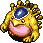
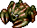
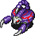
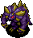
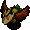
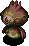
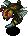
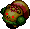
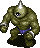
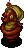

  

Medium difficulty among the three dice towers.

Mixers appears right away, so it's a popular spot to synthesize items.

<ul class="quickLinksUL">
  <li><a href="#overview">Overview</a></li>
  <li><a href="#strategy">Strategy</a>
    <ul>
      <li><a href="#general">General</a></li>
      <li><a href="#farming">Farming</a></li>
    </ul>
  </li>
  <li><a href="#monsters">Monsters</a></li>
  <li><a href="#monster-list">Monster List</a></li>
  <li><a href="#items">Items</a></li>
  <li><a href="#traps">Traps</a></li>
  <li><a href="#npcs">NPCs</a></li>
</ul>

# Overview

<table class="dungeonOverview">
  <tr>
    <th>Unlock</th>
    <td class="highlightYellow">Available as soon as you arrive at the Tower of Fortune entrance.</td>
  </tr>
  <tr>
    <th>Entrance</th>
    <td class="highlightYellow">Tower of Fortune entrance (North)</td>
  </tr>
</table>

<table class="dungeonTable">
  <tr>
    <th>Floors</th>
    <td>7F</td>
    <th>Day / Night</th>
    <td>Day</td>
  </tr>
  <tr>
    <th>Bring Items</th>
    <td>Yes</td>
    <th>Allies</th>
    <td>3</td>
  </tr>
  <tr>
    <th>Unidentified</th>
    <td>Bracelets</td>
    <th>New Items</th>
    <td>Yes</td>
  </tr>
  <tr>
    <th>Shops</th>
    <td>Regular, Elite</td>
    <th>Monster Houses</th>
    <td>Regular, Sudden</td>
  </tr>
  <tr>
    <th>Initial Enemies</th>
    <td>7~9</td>
    <th>Spawn Rate</th>
    <td>30 turns</td>
  </tr>
  <tr>
    <th>Ominous aura</th>
    <td>No</td>
    <th>Wind of Kron</th>
    <td>1st: 1700 4th: 2000</td>
  </tr>
  <tr>
    <th>Clear Icon</th>
    <td class="clearIcon"></td>
    <th>Reward</th>
    <td>None</td>
  </tr>
</table>

※ Reading a Night-Day Scroll is the only way to change it to night.

# Strategy

### General

Mutaikons and Scorpions lower your strength, decreasing damage dealt by your direct attacks and arrows. 
Curse Girls curse or seal items, making equipment unremovable, nullifying runes, or making items unusable. 
Fearabbits warp creatures in the room to itself, so you risk getting surrounded if it's in the room with other monsters. 
Gyazas convert most non-direct attack effects to 2 damage, but they're not a problem unless you get surrounded.

Exorcism Scroll, Cleansing Bracelet, Antidote Grass, Peach, Heal Pot, Fixer Scroll counteract poison and curses. 
Cleansing Bracelet is ideal since it negates all poison, including the Slow effect from Mutaikon's Poison Grass. 
If you don't have these items, use arrows to soften monsters before they're adjacent to you.

Swordsman can disarm your equipped shield, sending it flying behind you. 
The shield vanishes if it hits an enemy or lands on a water or air tile, so fight with your back against a wall or ally. 
(Allies always dodge equipment in Shiren 5 unless they're afflicted by select status conditions)

Mudkins have surprisingly high HP, so unequip your weapon and shield before fighting it unless they're plated. 
Unequip both weapon and shield in 1 turn by inserting them into a Preservation Pot using multi-select. (R button) 
Lastly, Mudkins can occasionally duplicate themselves when they receive damage.

### Farming

Mixers appear on 1-3F, making this the earliest point in the game to synthesize items without a Synthesis Pot. 
However, its spawn rate is very low, so it might be best to hurry forward if you don't have much food left. 
On average, you'll see roughly 3\~4 Mixers before the wind starts to blow on a floor.

Synthesize runes onto your weapon and shield using the items you've collected up to this point.

Weapon:

- Warp Grass → Anti-Floating : x1.35 damage to Floating types.
- Sleepy Grass → Sedating : 12% chance to inflict Asleep status.
- Paralysis Staff → Paralyzing : 12% chance to inflict Paralyzed status.
- Confusion Grass → Confusing : 12% chance to inflict Confused status.
- Weeds → Anti-Plant : x1.35 damage to Plant types.
- Antidote Grass → Anti-Drain : x1.35 damage to Drain types.
- Dragon Grass → Anti-Dragon : x1.35 damage to Dragon types.
- Iron Arrow → Anti-Metal : x1.35 damage to Metal types.

Shield:

- Diet Shield → CR Diet : Fullness depletes at 1/2 speed.
- Binary Shield → Bit : Reduce damage by 50% if last digit of HP is 1 or 0.
- Day Shield → Diurnal : Reduce damage by 25% from day monsters.
- Dragon Grass → Anti-Fire : Reduce fire damage by 50%.
- Stomach Expander + Perception Grass x 2 → Agile : Raise your evasion from 12% → 22%.

Use a sub weapon to defeat Mixers when synthesizing your main weapon, especially if your strength is low. 
If you have a Cleansing Bracelet, use Mutaikon's Poison Grass throw as a food source while waiting for Mixers. 
A regular Peach restores strength to max, so it's not that bad if you lose strength while waiting for Mixers. 
(Hard Peach ripens into a regular Peach as you advance floors)

# Monsters

<button id="hideMonTblImgBtn" onClick={()=>{var mon_imgs = document.querySelectorAll('#monsterTable img');mon_imgs.forEach(e => e.classList.toggle('hidden'));}}>Toggle Monster Images</button>

Hover over or tap a monster's name for details. Monster Colors: Farming, Useful, Destroys Items, Dangerous, Very Dangerous

<table id="monsterTable" class="monsterTable">
  <thead>
    <tr>
      <th>F</th>
      <th colspan="5">Monsters</th>
    </tr>
  </thead>
  <tbody>
    <tr>
      <td rowspan="4" class="centeredText">1</td>
      <td class="day useful">
 Mixer
- Mixer - HP: 40 AP: 15 DP: 6 Exp: 15 GP: 8 Type: Normal Speed: Normal Sp.Atk Rate: 0% (near), 0% (far) Item Drop Rate: 0% ~ Ability ~ Eats up to 2 thrown items and synthesizes them. Gains 1 stage of Buffed status each time it eats an item.

</td>
      <td class="day items">
 Curse Girl
- Curse Girl - HP: 20 AP: 18 DP: 4 Exp: 24 GP: 7 Type: Normal Speed: Normal Sp.Atk Rate: 24% (near), 0% (far) Item Drop Rate: 0% ~ Ability ~ Curses or seals 1 item when adjacent.

</td>
      <td class="day">
 Mutaikon
- Mutaikon - HP: 42 AP: 15 DP: 12 Exp: 49 GP: 8 Type: Plant Speed: Normal Sp.Atk Rate: 19% (near), 19% (far) Item Drop Rate: 6% ~ Ability ~ Throws Poison Grass 2 tiles ahead. Only drops Poison Grass.

</td>
      <td class="day">
 Gyaza
- Gyaza - HP: 28 AP: 19 DP: 10 Exp: 45 GP: 20 Type: Aquatic Speed: Normal Sp.Atk Rate: 0% (near), 0% (far) Item Drop Rate: 4% ~ Ability ~ Converts most effects received other than direct attacks to 2 damage.

</td>
      <td class="day">
 Scorpion
- Scorpion - HP: 45 AP: 21 DP: 9 Exp: 41 GP: 12 Type: Drain Speed: Normal Sp.Atk Rate: 19% (near), 0% (far) Item Drop Rate: 2% ~ Ability ~ Lowers Strength by 1 when adjacent.

</td>
    </tr>
    <tr>
      <td class="day danger">
 Fearabbit
- Fearabbit - HP: 20 AP: 15 DP: 4 Exp: 15 GP: 9 Type: Magic Speed: Normal Sp.Atk Rate: 21% (near), 21% (far) Item Drop Rate: 4% ~ Ability ~ Attracts up to 3 creatures including Shiren to itself from anywhere in the same room.

</td>
      <td></td>
      <td></td>
      <td></td>
      <td></td>
    </tr>
    <tr>
      <td class="highlightGray3">
 Dark DJ Mage
- Dark DJ Mage - HP: 22 AP: 16 DP: 2 Exp: 22 GP: 18 Type: Magic Speed: Normal Sp.Atk Rate: 64% (near), 47% (far) Item Drop Rate: 6% ~ Ability ~ Resists non-ability attacks. Fires a magic bullet with a random effect in a straight line: Warp, knockback, switch positions, or increase action speed by 1 stage.

</td>
      <td class="highlightGray3">
 Evil Floaty
- Evil Floaty - HP: 33 AP: 24 DP: 2 Exp: 40 GP: 14 Type: Normal Speed: Swift 1 Sp.Atk Rate: 23% (near), 0% (far) Item Drop Rate: 4% ~ Ability ~ Resists non-ability attacks. Initially Napping in a group of 3. Shiren can be warped 1~3 floors when surrounded by 3 Evil Floaty monsters.

</td>
      <td class="highlightGray3 itemsNight">
 Evil Gazer
- Evil Gazer - HP: 33 AP: 24 DP: 3 Exp: 40 GP: 10 Type: Cyclops/Magic Speed: Normal Sp.Atk Rate: 43% (near), 0% (far) Item Drop Rate: 2% ~ Ability ~ Resists non-ability attacks. Hypnotizes Shiren when adjacent, forcing either item usage or an attack in a random direction.

</td>
      <td class="highlightGray3">
 Dark Eligan
- Dark Eligan - HP: 33 AP: 24 DP: 4 Exp: 40 GP: 24 Type: Normal Speed: Normal Sp.Atk Rate: 0% (near), 0% (far) Item Drop Rate: 4% ~ Ability ~ Resists non-ability attacks.

</td>
      <td class="highlightGray3 itemsNight">
 Wicked Scoopie
- Wicked Scoopie - HP: 22 AP: 16 DP: 2 Exp: 22 GP: 20 Type: Metal Speed: Normal Sp.Atk Rate: 16% (near), 0% (far) Item Drop Rate: 4% ~ Ability ~ Resists non-ability attacks. Shovels dirt at an adjacent target, which can hit through corners. Dirt fills 1 pot in your inventory when it hits Shiren, or inflicts Blind status when it hits an ally. Dirt in pots eventually changes to grass items when advancing floors.

</td>
    </tr>
    <tr>
      <td class="highlightGray3">
 Dark Mutaikon
- Dark Mutaikon - HP: 33 AP: 20 DP: 3 Exp: 40 GP: 7 Type: Plant Speed: Normal Sp.Atk Rate: 19% (near), 19% (far) Item Drop Rate: 6% ~ Ability ~ Resists non-ability attacks. Throws Poison Grass 2 tiles ahead. Only drops Poison Grass.

</td>
      <td></td>
      <td></td>
      <td></td>
      <td></td>
    </tr>
    <tr>
      <td colspan="6" class="purpleDivider"></td>
    </tr>
    <tr>
      <td rowspan="3" class="centeredText">2</td>
      <td class="day useful">
 Mixer
- Mixer - HP: 40 AP: 15 DP: 6 Exp: 15 GP: 8 Type: Normal Speed: Normal Sp.Atk Rate: 0% (near), 0% (far) Item Drop Rate: 0% ~ Ability ~ Eats up to 2 thrown items and synthesizes them. Gains 1 stage of Buffed status each time it eats an item.

</td>
      <td class="day items">
 Curse Girl
- Curse Girl - HP: 20 AP: 18 DP: 4 Exp: 24 GP: 7 Type: Normal Speed: Normal Sp.Atk Rate: 24% (near), 0% (far) Item Drop Rate: 0% ~ Ability ~ Curses or seals 1 item when adjacent.

</td>
      <td class="day">
 Mutaikon
- Mutaikon - HP: 42 AP: 15 DP: 12 Exp: 49 GP: 8 Type: Plant Speed: Normal Sp.Atk Rate: 19% (near), 19% (far) Item Drop Rate: 6% ~ Ability ~ Throws Poison Grass 2 tiles ahead. Only drops Poison Grass.

</td>
      <td class="day">
 Gyaza
- Gyaza - HP: 28 AP: 19 DP: 10 Exp: 45 GP: 20 Type: Aquatic Speed: Normal Sp.Atk Rate: 0% (near), 0% (far) Item Drop Rate: 4% ~ Ability ~ Converts most effects received other than direct attacks to 2 damage.

</td>
      <td class="day">
 Scorpion
- Scorpion - HP: 45 AP: 21 DP: 9 Exp: 41 GP: 12 Type: Drain Speed: Normal Sp.Atk Rate: 19% (near), 0% (far) Item Drop Rate: 2% ~ Ability ~ Lowers Strength by 1 when adjacent.

</td>
    </tr>
    <tr>
      <td class="highlightGray3 dangerNight">
 Dark Foly
- Dark Foly - HP: 33 AP: 24 DP: 4 Exp: 8 GP: 19 Type: Cyclops/Floating Speed: Swift 1 Sp.Atk Rate: 100% (near), 100% (far) Item Drop Rate: 0% ~ Ability ~ Resists non-ability attacks. Moves along the wall in rooms, changes color and abilities every 8 turns. Nullifies and reflects direct attacks. Drops 15 damage lightning on all creatures in the room after it acts. Heals Shiren's HP by 100 after being hit with a direct attack. Counters with Berserk, Grounded, Inaccurate, Confused, or Shadow Bound status after being hit with a direct attack.

</td>
      <td class="highlightGray3">
 Evil Floaty
- Evil Floaty - HP: 33 AP: 24 DP: 2 Exp: 40 GP: 14 Type: Normal Speed: Swift 1 Sp.Atk Rate: 23% (near), 0% (far) Item Drop Rate: 4% ~ Ability ~ Resists non-ability attacks. Initially Napping in a group of 3. Shiren can be warped 1~3 floors when surrounded by 3 Evil Floaty monsters.

</td>
      <td class="highlightGray3 itemsNight">
 Evil Gazer
- Evil Gazer - HP: 33 AP: 24 DP: 3 Exp: 40 GP: 10 Type: Cyclops/Magic Speed: Normal Sp.Atk Rate: 43% (near), 0% (far) Item Drop Rate: 2% ~ Ability ~ Resists non-ability attacks. Hypnotizes Shiren when adjacent, forcing either item usage or an attack in a random direction.

</td>
      <td class="highlightGray3">
 Dark Eligan
- Dark Eligan - HP: 33 AP: 24 DP: 4 Exp: 40 GP: 24 Type: Normal Speed: Normal Sp.Atk Rate: 0% (near), 0% (far) Item Drop Rate: 4% ~ Ability ~ Resists non-ability attacks.

</td>
      <td class="highlightGray3">
 Evil Firepuff
- Evil Firepuff - HP: 33 AP: 24 DP: 4 Exp: 40 GP: 24 Type: Dragon/Floating Speed: Normal Sp.Atk Rate: 89% (near), 0% (far) Item Drop Rate: 4% ~ Ability ~ Resists non-ability attacks. Breathes 20 damage fire when adjacent, which can hit through corners. Occasionally fails at breathing fire.

</td>
    </tr>
    <tr>
      <td class="highlightGray3">
 Dark Mutaikon
- Dark Mutaikon - HP: 33 AP: 20 DP: 3 Exp: 40 GP: 7 Type: Plant Speed: Normal Sp.Atk Rate: 19% (near), 19% (far) Item Drop Rate: 6% ~ Ability ~ Resists non-ability attacks. Throws Poison Grass 2 tiles ahead. Only drops Poison Grass.

</td>
      <td></td>
      <td></td>
      <td></td>
      <td></td>
    </tr>
    <tr>
      <td colspan="6" class="purpleDivider"></td>
    </tr>
    <tr>
      <td rowspan="2" class="centeredText">3</td>
      <td class="day useful">
 Mixer
- Mixer - HP: 40 AP: 15 DP: 6 Exp: 15 GP: 8 Type: Normal Speed: Normal Sp.Atk Rate: 0% (near), 0% (far) Item Drop Rate: 0% ~ Ability ~ Eats up to 2 thrown items and synthesizes them. Gains 1 stage of Buffed status each time it eats an item.

</td>
      <td class="day">
 Naptapir
- Naptapir - HP: 32 AP: 27 DP: 11 Exp: 46 GP: 10 Type: Normal Speed: Normal Sp.Atk Rate: 23% (near), 0% (far) Item Drop Rate: 4% ~ Ability ~ Initially Napping, will not wake up when Shiren enters or exits the room. Occasionally inflicts Asleep status in a 1 tile radius when it's Napping, Asleep, or Sound Asleep. Chance to yawn when slain, inflicting Asleep status in a 1 tile radius.

</td>
      <td class="day">
 Pumphantasm
- Pumphantasm - HP: 35 AP: 20 DP: 12 Exp: 43 GP: 24 Type: Plant/Floating Speed: Normal Sp.Atk Rate: 0% (near), 0% (far) Item Drop Rate: 0% ~ Ability ~ Can pass through walls. Unpredictable movement, but slowly approaches Shiren.

</td>
      <td class="day">
 Gyaza
- Gyaza - HP: 28 AP: 19 DP: 10 Exp: 45 GP: 20 Type: Aquatic Speed: Normal Sp.Atk Rate: 0% (near), 0% (far) Item Drop Rate: 4% ~ Ability ~ Converts most effects received other than direct attacks to 2 damage.

</td>
      <td class="day">
 Scorpion
- Scorpion - HP: 45 AP: 21 DP: 9 Exp: 41 GP: 12 Type: Drain Speed: Normal Sp.Atk Rate: 19% (near), 0% (far) Item Drop Rate: 2% ~ Ability ~ Lowers Strength by 1 when adjacent.

</td>
    </tr>
    <tr>
      <td class="highlightGray3">
 Dark Blade Bee
- Dark Blade Bee - HP: 23 AP: 14 DP: 1 Exp: 18 GP: 15 Type: Floating Speed: Normal Sp.Atk Rate: 16% (near), 0% (far) Item Drop Rate: 4% ~ Ability ~ Resists non-ability attacks. Occasionally retreats after attacking. Stinger has double AP and inflicts Confused status, but it also collapses afterward.

</td>
      <td class="highlightGray3">
 Evil Floaty
- Evil Floaty - HP: 33 AP: 24 DP: 2 Exp: 40 GP: 14 Type: Normal Speed: Swift 1 Sp.Atk Rate: 23% (near), 0% (far) Item Drop Rate: 4% ~ Ability ~ Resists non-ability attacks. Initially Napping in a group of 3. Shiren can be warped 1~3 floors when surrounded by 3 Evil Floaty monsters.

</td>
      <td class="highlightGray3">
 Hateful Seedie
- Hateful Seedie - HP: 35 AP: 30 DP: 4 Exp: 56 GP: 35 Type: Plant Speed: Normal Sp.Atk Rate: 0% (near), 0% (far) Item Drop Rate: 4% ~ Ability ~ Resists non-ability attacks.

</td>
      <td class="highlightGray3">
 Dark Eligan
- Dark Eligan - HP: 33 AP: 24 DP: 4 Exp: 40 GP: 24 Type: Normal Speed: Normal Sp.Atk Rate: 0% (near), 0% (far) Item Drop Rate: 4% ~ Ability ~ Resists non-ability attacks.

</td>
      <td class="highlightGray3">
 Evil Firepuff
- Evil Firepuff - HP: 33 AP: 24 DP: 4 Exp: 40 GP: 24 Type: Dragon/Floating Speed: Normal Sp.Atk Rate: 89% (near), 0% (far) Item Drop Rate: 4% ~ Ability ~ Resists non-ability attacks. Breathes 20 damage fire when adjacent, which can hit through corners. Occasionally fails at breathing fire.

</td>
    </tr>
    <tr>
      <td colspan="6" class="purpleDivider"></td>
    </tr>
    <tr>
      <td rowspan="3" class="centeredText">4</td>
      <td class="day items">
 Swordsman
- Swordsman - HP: 45 AP: 15 DP: 9 Exp: 36 GP: 40 Type: Normal Speed: Normal Sp.Atk Rate: 19% (near), 0% (far) Item Drop Rate: 2% ~ Ability ~ Knocks away Shiren's equipped shield when adjacent, sending it 10 tiles backward.

</td>
      <td class="day">
 Naptapir
- Naptapir - HP: 32 AP: 27 DP: 11 Exp: 46 GP: 10 Type: Normal Speed: Normal Sp.Atk Rate: 23% (near), 0% (far) Item Drop Rate: 4% ~ Ability ~ Initially Napping, will not wake up when Shiren enters or exits the room. Occasionally inflicts Asleep status in a 1 tile radius when it's Napping, Asleep, or Sound Asleep. Chance to yawn when slain, inflicting Asleep status in a 1 tile radius.

</td>
      <td class="day">
 Pumphantasm
- Pumphantasm - HP: 35 AP: 20 DP: 12 Exp: 43 GP: 24 Type: Plant/Floating Speed: Normal Sp.Atk Rate: 0% (near), 0% (far) Item Drop Rate: 0% ~ Ability ~ Can pass through walls. Unpredictable movement, but slowly approaches Shiren.

</td>
      <td class="day">
 Mid Chintala
- Mid Chintala - HP: 45 AP: 15 DP: 9 Exp: 33 GP: 10 Type: Normal Speed: Normal Sp.Atk Rate: 0% (near), 0% (far) Item Drop Rate: 4% ~ Ability ~ None.

</td>
      <td class="day">
 Polygon Spinna
- Polygon Spinna - HP: 45 AP: 15 DP: 9 Exp: 33 GP: 11 Type: Drain/Magic Speed: Normal Sp.Atk Rate: 32% (near), 0% (far) Item Drop Rate: 2% ~ Ability ~ Lowers Max HP by 1 or Max Fullness by 3 when adjacent. Warps in front of Shiren when in a room.

</td>
    </tr>
    <tr>
      <td class="day items">
 Mudkin
- Mudkin - HP: 45 AP: 15 DP: 9 Exp: 33 GP: 7 Type: Aquatic Speed: Normal Sp.Atk Rate: 38% (near), 0% (far) Item Drop Rate: 0% ~ Ability ~ Lowers upgrade value of equipped weapon or shield by 1. May also remove the item's tag. Chance to multiply when attacked. Doesn't use direct attacks.

</td>
      <td class="day">
 Cololum
- Cololum - HP: 45 AP: 15 DP: 9 Exp: 33 GP: 16 Type: Normal Speed: Normal Sp.Atk Rate: 0% (near), 0% (far) Item Drop Rate: 4% ~ Ability ~ Rolls backward 10 tiles when slain by a direct attack, damaging anything it hits equal to damage received.

</td>
      <td></td>
      <td></td>
      <td></td>
    </tr>
    <tr>
      <td class="highlightGray3">
 Dark Blade Bee
- Dark Blade Bee - HP: 23 AP: 14 DP: 1 Exp: 18 GP: 15 Type: Floating Speed: Normal Sp.Atk Rate: 16% (near), 0% (far) Item Drop Rate: 4% ~ Ability ~ Resists non-ability attacks. Occasionally retreats after attacking. Stinger has double AP and inflicts Confused status, but it also collapses afterward.

</td>
      <td class="highlightGray3">
 Bad Moseal
- Bad Moseal - HP: 23 AP: 18 DP: 1 Exp: 18 GP: 30 Type: Aquatic Speed: Normal Sp.Atk Rate: 50% (near), 32% (far) Item Drop Rate: 4% ~ Ability ~ Resists non-ability attacks. Performs a tackle that deals 15 damage when lined up vertically. Turns Apathetic after tackling. Doesn't move on its own.

</td>
      <td class="highlightGray3">
 Hateful Seedie
- Hateful Seedie - HP: 35 AP: 30 DP: 4 Exp: 56 GP: 35 Type: Plant Speed: Normal Sp.Atk Rate: 0% (near), 0% (far) Item Drop Rate: 4% ~ Ability ~ Resists non-ability attacks.

</td>
      <td class="highlightGray3">
 Mean Cheer-Ham
- Mean Cheer-Ham - HP: 23 AP: 14 DP: 1 Exp: 18 GP: 17 Type: Normal Speed: Normal Sp.Atk Rate: 0% (near), 0% (far) Item Drop Rate: 4% ~ Ability ~ Resists non-ability attacks. Runs away from Shiren, but attacks when cornered. Moves toward monsters in view. Cheers for adjacent creatures, raising AP by 1 stage and letting them survive a fatal hit.

</td>
      <td></td>
    </tr>
    <tr>
      <td colspan="6" class="purpleDivider"></td>
    </tr>
    <tr>
      <td rowspan="3" class="centeredText">5</td>
      <td class="day items">
 Swordsman
- Swordsman - HP: 45 AP: 15 DP: 9 Exp: 36 GP: 40 Type: Normal Speed: Normal Sp.Atk Rate: 19% (near), 0% (far) Item Drop Rate: 2% ~ Ability ~ Knocks away Shiren's equipped shield when adjacent, sending it 10 tiles backward.

</td>
      <td class="day">
 Metalhead
- Metalhead - HP: 55 AP: 19 DP: 11 Exp: 55 GP: 15 Type: Cyclops Speed: Normal Sp.Atk Rate: 34% (near), 34% (far) Item Drop Rate: 4% ~ Ability ~ Attacks 2 tiles ahead and through corners. Charges strength to deal double damage on the next turn.

</td>
      <td class="day">
 Pumphantasm
- Pumphantasm - HP: 35 AP: 20 DP: 12 Exp: 43 GP: 24 Type: Plant/Floating Speed: Normal Sp.Atk Rate: 0% (near), 0% (far) Item Drop Rate: 0% ~ Ability ~ Can pass through walls. Unpredictable movement, but slowly approaches Shiren.

</td>
      <td class="day">
 Mid Chintala
- Mid Chintala - HP: 45 AP: 15 DP: 9 Exp: 33 GP: 10 Type: Normal Speed: Normal Sp.Atk Rate: 0% (near), 0% (far) Item Drop Rate: 4% ~ Ability ~ None.

</td>
      <td class="day">
 Polygon Spinna
- Polygon Spinna - HP: 45 AP: 15 DP: 9 Exp: 33 GP: 11 Type: Drain/Magic Speed: Normal Sp.Atk Rate: 32% (near), 0% (far) Item Drop Rate: 2% ~ Ability ~ Lowers Max HP by 1 or Max Fullness by 3 when adjacent. Warps in front of Shiren when in a room.

</td>
    </tr>
    <tr>
      <td class="day items">
 Mudkin
- Mudkin - HP: 45 AP: 15 DP: 9 Exp: 33 GP: 7 Type: Aquatic Speed: Normal Sp.Atk Rate: 38% (near), 0% (far) Item Drop Rate: 0% ~ Ability ~ Lowers upgrade value of equipped weapon or shield by 1. May also remove the item's tag. Chance to multiply when attacked. Doesn't use direct attacks.

</td>
      <td class="day">
 Cololum
- Cololum - HP: 45 AP: 15 DP: 9 Exp: 33 GP: 16 Type: Normal Speed: Normal Sp.Atk Rate: 0% (near), 0% (far) Item Drop Rate: 4% ~ Ability ~ Rolls backward 10 tiles when slain by a direct attack, damaging anything it hits equal to damage received.

</td>
      <td></td>
      <td></td>
      <td></td>
    </tr>
    <tr>
      <td class="highlightGray3">
 Dark Blade Bee
- Dark Blade Bee - HP: 23 AP: 14 DP: 1 Exp: 18 GP: 15 Type: Floating Speed: Normal Sp.Atk Rate: 16% (near), 0% (far) Item Drop Rate: 4% ~ Ability ~ Resists non-ability attacks. Occasionally retreats after attacking. Stinger has double AP and inflicts Confused status, but it also collapses afterward.

</td>
      <td class="highlightGray3">
 Bad Moseal
- Bad Moseal - HP: 23 AP: 18 DP: 1 Exp: 18 GP: 30 Type: Aquatic Speed: Normal Sp.Atk Rate: 50% (near), 32% (far) Item Drop Rate: 4% ~ Ability ~ Resists non-ability attacks. Performs a tackle that deals 15 damage when lined up vertically. Turns Apathetic after tackling. Doesn't move on its own.

</td>
      <td class="highlightGray3">
 Hateful Seedie
- Hateful Seedie - HP: 35 AP: 30 DP: 4 Exp: 56 GP: 35 Type: Plant Speed: Normal Sp.Atk Rate: 0% (near), 0% (far) Item Drop Rate: 4% ~ Ability ~ Resists non-ability attacks.

</td>
      <td class="highlightGray3">
 Mean Cheer-Ham
- Mean Cheer-Ham - HP: 23 AP: 14 DP: 1 Exp: 18 GP: 17 Type: Normal Speed: Normal Sp.Atk Rate: 0% (near), 0% (far) Item Drop Rate: 4% ~ Ability ~ Resists non-ability attacks. Runs away from Shiren, but attacks when cornered. Moves toward monsters in view. Cheers for adjacent creatures, raising AP by 1 stage and letting them survive a fatal hit.

</td>
      <td></td>
    </tr>
    <tr>
      <td colspan="6" class="purpleDivider"></td>
    </tr>
    <tr>
      <td rowspan="3" class="centeredText">6</td>
      <td class="day items">
 Swordsman
- Swordsman - HP: 45 AP: 15 DP: 9 Exp: 36 GP: 40 Type: Normal Speed: Normal Sp.Atk Rate: 19% (near), 0% (far) Item Drop Rate: 2% ~ Ability ~ Knocks away Shiren's equipped shield when adjacent, sending it 10 tiles backward.

</td>
      <td class="day">
 Metalhead
- Metalhead - HP: 55 AP: 19 DP: 11 Exp: 55 GP: 15 Type: Cyclops Speed: Normal Sp.Atk Rate: 34% (near), 34% (far) Item Drop Rate: 4% ~ Ability ~ Attacks 2 tiles ahead and through corners. Charges strength to deal double damage on the next turn.

</td>
      <td class="day">
 Cheer-Ham
- Cheer-Ham - HP: 34 AP: 10 DP: 7 Exp: 28 GP: 5 Type: Normal Speed: Normal Sp.Atk Rate: 0% (near), 0% (far) Item Drop Rate: 4% ~ Ability ~ Runs away from Shiren, but attacks when cornered. Moves toward monsters in view. Cheers for adjacent creatures, raising AP by 1 stage and letting them survive a fatal hit.

</td>
      <td class="day">
 Mid Chintala
- Mid Chintala - HP: 45 AP: 15 DP: 9 Exp: 33 GP: 10 Type: Normal Speed: Normal Sp.Atk Rate: 0% (near), 0% (far) Item Drop Rate: 4% ~ Ability ~ None.

</td>
      <td class="day">
 Acrid Nut
- Acrid Nut - HP: 36 AP: 21 DP: 8 Exp: 35 GP: 18 Type: Plant/Explode Speed: Normal Sp.Atk Rate: 0% (near), 0% (far) Item Drop Rate: 0% ~ Ability ~ Either doubles experience points (Max: x1024) or explodes (33% chance) each time it eats a thrown item.

</td>
    </tr>
    <tr>
      <td class="day items">
 Mudkin
- Mudkin - HP: 45 AP: 15 DP: 9 Exp: 33 GP: 7 Type: Aquatic Speed: Normal Sp.Atk Rate: 38% (near), 0% (far) Item Drop Rate: 0% ~ Ability ~ Lowers upgrade value of equipped weapon or shield by 1. May also remove the item's tag. Chance to multiply when attacked. Doesn't use direct attacks.

</td>
      <td class="day">
 Cololum
- Cololum - HP: 45 AP: 15 DP: 9 Exp: 33 GP: 16 Type: Normal Speed: Normal Sp.Atk Rate: 0% (near), 0% (far) Item Drop Rate: 4% ~ Ability ~ Rolls backward 10 tiles when slain by a direct attack, damaging anything it hits equal to damage received.

</td>
      <td></td>
      <td></td>
      <td></td>
    </tr>
    <tr>
      <td class="highlightGray3 itemsNight">
 Shady Muddy
- Shady Muddy - HP: 27 AP: 26 DP: 3 Exp: 28 GP: 48 Type: Aquatic Speed: Normal Sp.Atk Rate: 56% (near), 0% (far) Item Drop Rate: 0% ~ Ability ~ Resists non-ability attacks. Extinguishes an equipped torch. Lowers upgrade value of equipped weapon or shield by 4. May also remove the item's tag. Chance to multiply when attacked. Can use direct attacks.

</td>
      <td class="highlightGray3">
 Evil Hipadile
- Evil Hipadile - HP: 27 AP: 16 DP: 5 Exp: 100 GP: 75 Type: Dragon/Aquatic Speed: Normal Sp.Atk Rate: 0% (near), 0% (far) Item Drop Rate: 8% ~ Ability ~ Resists non-ability attacks. Moves like a chess knight when Shiren is in view. Performs a 25 damage jumping attack when Shiren is in range of a chess knight hop.

</td>
      <td></td>
      <td></td>
      <td></td>
    </tr>
    <tr>
      <td colspan="6" class="purpleDivider"></td>
    </tr>
    <tr>
      <td rowspan="2" class="centeredText">7</td>
      <td class="day">
 Kid Squid
- Kid Squid - HP: 42 AP: 20 DP: 11 Exp: 66 GP: 5 Type: Aquatic Speed: Normal Sp.Atk Rate: 16% (near), 0% (far) Item Drop Rate: 4% ~ Ability ~ Inflicts Blind status on an adjacent target. Turns into a Squid Sushi Scroll when hit by thrown onigiri.

</td>
      <td class="day">
 Metalhead
- Metalhead - HP: 55 AP: 19 DP: 11 Exp: 55 GP: 15 Type: Cyclops Speed: Normal Sp.Atk Rate: 34% (near), 34% (far) Item Drop Rate: 4% ~ Ability ~ Attacks 2 tiles ahead and through corners. Charges strength to deal double damage on the next turn.

</td>
      <td class="day">
 Cheer-Ham
- Cheer-Ham - HP: 34 AP: 10 DP: 7 Exp: 28 GP: 5 Type: Normal Speed: Normal Sp.Atk Rate: 0% (near), 0% (far) Item Drop Rate: 4% ~ Ability ~ Runs away from Shiren, but attacks when cornered. Moves toward monsters in view. Cheers for adjacent creatures, raising AP by 1 stage and letting them survive a fatal hit.

</td>
      <td class="day">
 Bored Kappa
- Bored Kappa - HP: 50 AP: 18 DP: 11 Exp: 48 GP: 7 Type: Aquatic Speed: Normal Sp.Atk Rate: 0% (near), 0% (far) Item Drop Rate: 4% ~ Ability ~ Stands on an item and throws it at Shiren when he gets within 3 tiles. Catches projectiles and throws them back at Shiren. Items it throws always miss. Cannot throw weapons, shields, or Gitan.

</td>
      <td class="day">
 Acrid Nut
- Acrid Nut - HP: 36 AP: 21 DP: 8 Exp: 35 GP: 18 Type: Plant/Explode Speed: Normal Sp.Atk Rate: 0% (near), 0% (far) Item Drop Rate: 0% ~ Ability ~ Either doubles experience points (Max: x1024) or explodes (33% chance) each time it eats a thrown item.

</td>
    </tr>
    <tr>
      <td class="highlightGray3 itemsNight">
 Shady Muddy
- Shady Muddy - HP: 27 AP: 26 DP: 3 Exp: 28 GP: 48 Type: Aquatic Speed: Normal Sp.Atk Rate: 56% (near), 0% (far) Item Drop Rate: 0% ~ Ability ~ Resists non-ability attacks. Extinguishes an equipped torch. Lowers upgrade value of equipped weapon or shield by 4. May also remove the item's tag. Chance to multiply when attacked. Can use direct attacks.

</td>
      <td class="highlightGray3">
 Evil Hipadile
- Evil Hipadile - HP: 27 AP: 16 DP: 5 Exp: 100 GP: 75 Type: Dragon/Aquatic Speed: Normal Sp.Atk Rate: 0% (near), 0% (far) Item Drop Rate: 8% ~ Ability ~ Resists non-ability attacks. Moves like a chess knight when Shiren is in view. Performs a 25 damage jumping attack when Shiren is in range of a chess knight hop.

</td>
      <td></td>
      <td></td>
      <td></td>
    </tr>
  </tbody>
</table>

# Monster List

Orange: Dangerous, Blue: Beneficial

 

<table class="dungeonMonsterList">
  <tr>
    <th>F</th>
    <th>Name</th>
    <th>HP</th>
    <th>AP</th>
    <th>DP</th>
    <th>Exp</th>
    <th>GP</th>
    <th>Rune / Item</th>
    <th>Notes</th>
  </tr>
  <tr>
    <td>1</td>
    <td class="highlightYellow">Fearabbit</td>
    <td>20</td>
    <td>15</td>
    <td>4</td>
    <td>15</td>
    <td>9</td>
    <td>Anti-Magic Unmoving</td>
    <td>Attracts Shiren and other characters toward itself and attacks. It won't use its special attack when you're adjacent to it.</td>
  </tr>
  <tr>
    <td>1-2</td>
    <td class="highlightYellow">Curse Girl</td>
    <td>20</td>
    <td>18</td>
    <td>4</td>
    <td>24</td>
    <td>7</td>
    <td>Anti-Crs. Bracelet</td>
    <td><a href="/shiren-5/system/gameplay-basics#blessing-curse-seal">Curses or seals</a> 1 item. Throwing an <a href="/shiren-5/items/scrolls#exorcism-scroll">Exorcism Scroll</a> deals 100 damage.</td>
  </tr>
  <tr>
    <td>1-2</td>
    <td class="highlightYellow">Mutaikon</td>
    <td>42</td>
    <td>15</td>
    <td>12</td>
    <td>49</td>
    <td>8</td>
    <td>Anti-Plant Cleansing Bracelet</td>
    <td>Throws <a href="/shiren-5/items/grass#poison-grass">Poison Grass</a> at a target up to 2 tiles ahead. Throwing an <a href="/shiren-5/items/grass#antidote-grass">Antidote Grass</a> deals 50 damage. It can never drop anything besides Poison Grass when defeated.</td>
  </tr>
  <tr>
    <td>1-3</td>
    <td class="highlightYellow blueText2">Mixer</td>
    <td>40</td>
    <td>15</td>
    <td>6</td>
    <td>15</td>
    <td>8</td>
    <td>-</td>
    <td>Swallows up to 2 items and <a href="/shiren-5/system/gameplay-basics#synthesis">synthesizes</a> them. Increases attack power by 1 stage every time it swallows an item. It has a pretty low spawn rate.</td>
  </tr>
  <tr>
    <td>1-3</td>
    <td class="highlightYellow">Gyaza</td>
    <td>28</td>
    <td>19</td>
    <td>10</td>
    <td>45</td>
    <td>20</td>
    <td>Anti-Aquatic</td>
    <td>Converts most non-direct attacks / effects to 2 damage. Status condition inflicting runes still work, and explosions will one-shot it.</td>
  </tr>
  <tr>
    <td>1-3</td>
    <td class="highlightYellow">Scorpion</td>
    <td>45</td>
    <td>21</td>
    <td>9</td>
    <td>41</td>
    <td>12</td>
    <td>Anti-Drain Cleansing Bracelet</td>
    <td>Lowers strength by 1 when you're adjacent to it. (Ally: Inflicts <a href="/shiren-5/system/status-conditions#weakened">Weakened</a>) Throwing an <a href="/shiren-5/items/grass#antidote-grass">Antidote Grass</a> deals 50 damage.</td>
  </tr>
  <tr>
    <td>3-4</td>
    <td class="highlightYellow">Naptapir</td>
    <td>32</td>
    <td>27</td>
    <td>11</td>
    <td>46</td>
    <td>10</td>
    <td>Alert Bracelet</td>
    <td>Occasionally yawns, inflicting <a href="/shiren-5/system/status-conditions#asleep">Asleep</a> status to characters in a 1-tile radius. Always generated <a href="/shiren-5/system/status-conditions#napping">Napping</a>, and won't wake up when Shiren enters or exits the room or walks next to it.</td>
  </tr>
  <tr>
    <td>3-5</td>
    <td class="highlightYellow">Pumphantasm</td>
    <td>35</td>
    <td>20</td>
    <td>12</td>
    <td>43</td>
    <td>24</td>
    <td>Anti-Plant Anti-Floating</td>
    <td>Can move through walls, and also attack from inside walls. Moves around in an erratic manner.</td>
  </tr>
  <tr>
    <td>4-5</td>
    <td class="highlightYellow">Polygon Spinna</td>
    <td>45</td>
    <td>15</td>
    <td>9</td>
    <td>33</td>
    <td>11</td>
    <td>Anti-Drain Anti-Magic Staunch Bracelet</td>
    <td>Warps in front of Shiren inside rooms. Decreases max fullness by 3 or max HP by 1.</td>
  </tr>
  <tr>
    <td>4-6</td>
    <td class="highlightYellow">Mid Chintala</td>
    <td>45</td>
    <td>15</td>
    <td>9</td>
    <td>33</td>
    <td>10</td>
    <td>-</td>
    <td>Some say it's cuter than Mamel.</td>
  </tr>
  <tr>
    <td>4-6</td>
    <td class="highlightYellow">Swordsman</td>
    <td>45</td>
    <td>15</td>
    <td>9</td>
    <td>36</td>
    <td>40</td>
    <td>Water Pot Anti-Parry Brce. Perceptive Pot Tag equipment</td>
    <td>Parries your equipped shield, flinging it behind you 10 tiles.</td>
  </tr>
  <tr>
    <td>4-6</td>
    <td class="highlightYellow">Mudkin</td>
    <td>45</td>
    <td>15</td>
    <td>9</td>
    <td>33</td>
    <td>7</td>
    <td>Anti-Aquatic Rustproof</td>
    <td>Doesn't attack, but lowers weapon or shield upgrade value by 1 instead. Equipment tags can be lost when the item's upgrade value is lowered. Occasionally duplicates itself when hit by an attack.</td>
  </tr>
  <tr>
    <td>4-6</td>
    <td class="highlightYellow">Cololum</td>
    <td>45</td>
    <td>15</td>
    <td>9</td>
    <td>33</td>
    <td>16</td>
    <td>-</td>
    <td>Rolls backward 10 tiles when slain, dealing damage to any creature it hits. (Damage is equal to the amount of damage it received when it was slain)</td>
  </tr>
  <tr>
    <td>5-7</td>
    <td class="highlightYellow">Metalhead</td>
    <td>55</td>
    <td>19</td>
    <td>11</td>
    <td>55</td>
    <td>15</td>
    <td>Anti-Cyclops</td>
    <td>Attacks from up to 2 tiles away, and can attack through corners. Can charge its strength to deal a critical hit on the next turn. Its charge will be canceled if it moves.</td>
  </tr>
  <tr>
    <td>5-7</td>
    <td class="highlightYellow">Cheer-Ham</td>
    <td>34</td>
    <td>10</td>
    <td>7</td>
    <td>28</td>
    <td>5</td>
    <td>-</td>
    <td>Runs away from Shiren, but attacks if cornered. Moves toward other monsters to cheer them on (1 tile radius), increasing attack power by 1 stage and providing <a href="/shiren-5/system/status-conditions#enduring">Enduring</a> status while it cheers. (Its cheer works for Shiren and his allies as well)</td>
  </tr>
  <tr>
    <td>6-7</td>
    <td class="highlightYellow">Acrid Nut</td>
    <td>36</td>
    <td>21</td>
    <td>8</td>
    <td>35</td>
    <td>18</td>
    <td>Anti-Plant Anti-Explode</td>
    <td>Eats thrown items and multiplies the amount of exp it gives when slain. However, there's a chance it'll explode when it swallows an item. (about 1/3 chance to explode, x2→x4→x8→...→x1024 exp at max)</td>
  </tr>
  <tr>
    <td>7</td>
    <td class="highlightYellow">Bored Kappa</td>
    <td>50</td>
    <td>18</td>
    <td>11</td>
    <td>48</td>
    <td>7</td>
    <td>Anti-Aquatic</td>
    <td>Moves toward items, and throws them at Shiren or his allies. (Throw misses 100% of the time)</td>
  </tr>
  <tr>
    <td>7</td>
    <td class="highlightYellow">Kid Squid</td>
    <td>42</td>
    <td>20</td>
    <td>11</td>
    <td>66</td>
    <td>5</td>
    <td>Anti-Aquatic</td>
    <td>Inflicts <a href="/shiren-5/system/status-conditions#blind">Blind</a> status when you're adjacent to it. Transforms into a <a href="/shiren-5/items/scrolls#squid-sushi-scroll">Squid Sushi Scroll</a> if you throw an onigiri at it.</td>
  </tr>
</table>

# Items

- F = Floor, Daytime monster drop
- S = Shop, Shiny Object (yellow), Peddler
- P = Presto Pot
- E = Elite shop, Shiny Object (blue)

 

<table class="dungeonItemTable">
  <tr>
    <th colspan="5" class="highlightPurple3">Weapon</th>
    <th rowspan="65"></th>
    <th colspan="5" class="highlightPurple3">Bracelet</th>
    <th rowspan="65"></th>
    <th colspan="5" class="highlightPurple3">Pot</th>
  </tr>
  <tr>
    <th>Name</th>
    <th>F</th>
    <th>S</th>
    <th>P</th>
    <th>E</th>
    <th>Name</th>
    <th>F</th>
    <th>S</th>
    <th>P</th>
    <th>E</th>
    <th>Name</th>
    <th>F</th>
    <th>S</th>
    <th>P</th>
    <th>E</th>
  </tr>
  <tr>
    <td class="leftText">Ordinary Stick</td>
    <td>X</td>
    <td></td>
    <td>X</td>
    <td></td>
    <td class="leftText">Cleansing Bracelet</td>
    <td>X</td>
    <td></td>
    <td>X</td>
    <td></td>
    <td class="leftText">Preservation Pot</td>
    <td>X</td>
    <td>X</td>
    <td></td>
    <td></td>
  </tr>
  <tr>
    <td class="leftText">Tin Blade</td>
    <td>X</td>
    <td></td>
    <td>X</td>
    <td></td>
    <td class="leftText">Anti-Cnf. Bracelet</td>
    <td>X</td>
    <td></td>
    <td>X</td>
    <td></td>
    <td class="leftText">Ordinary Pot</td>
    <td>X</td>
    <td>X</td>
    <td></td>
    <td></td>
  </tr>
  <tr>
    <td class="leftText">Katana</td>
    <td>X</td>
    <td>X</td>
    <td>X</td>
    <td></td>
    <td class="leftText">Alert Bracelet</td>
    <td>X</td>
    <td></td>
    <td>X</td>
    <td></td>
    <td class="leftText">Synthesis Pot</td>
    <td>X</td>
    <td>X</td>
    <td></td>
    <td>X</td>
  </tr>
  <tr>
    <td class="leftText">Beast Fang</td>
    <td>X</td>
    <td>X</td>
    <td>X</td>
    <td>X</td>
    <td class="leftText">Anti-Crs. Bracelet</td>
    <td></td>
    <td></td>
    <td></td>
    <td>X</td>
    <td class="leftText">Sale Pot</td>
    <td>X</td>
    <td>X</td>
    <td></td>
    <td></td>
  </tr>
  <tr>
    <td class="leftText">Dotanuki</td>
    <td>X</td>
    <td>X</td>
    <td>X</td>
    <td>X</td>
    <td class="leftText">Staunch Bracelet</td>
    <td>X</td>
    <td></td>
    <td>X</td>
    <td></td>
    <td class="leftText">Presto Pot</td>
    <td>X</td>
    <td></td>
    <td></td>
    <td></td>
  </tr>
  <tr>
    <td class="leftText">Bladite</td>
    <td></td>
    <td></td>
    <td></td>
    <td>X</td>
    <td class="leftText">Can. Arm Bracelet</td>
    <td>X</td>
    <td>X</td>
    <td></td>
    <td>X</td>
    <td class="leftText">Blessing Pot</td>
    <td></td>
    <td></td>
    <td></td>
    <td>X</td>
  </tr>
  <tr>
    <td class="leftText">Red Blade</td>
    <td></td>
    <td></td>
    <td></td>
    <td>X</td>
    <td class="leftText">Strength Bracelet</td>
    <td>X</td>
    <td>X</td>
    <td>X</td>
    <td></td>
    <td class="leftText">Fever Pot</td>
    <td></td>
    <td></td>
    <td></td>
    <td>X</td>
  </tr>
  <tr>
    <td class="leftText">Kabura Katana</td>
    <td></td>
    <td></td>
    <td>X</td>
    <td>X</td>
    <td class="leftText">Growth Bracelet</td>
    <td>X</td>
    <td>X</td>
    <td></td>
    <td>X</td>
    <td class="leftText">Hide Pot</td>
    <td>X</td>
    <td>X</td>
    <td></td>
    <td></td>
  </tr>
  <tr>
    <td class="leftText">Dull Gold Edge</td>
    <td>X</td>
    <td>X</td>
    <td>X</td>
    <td></td>
    <td class="leftText">Heal Bracelet</td>
    <td></td>
    <td></td>
    <td></td>
    <td>X</td>
    <td class="leftText">Heal Pot</td>
    <td></td>
    <td></td>
    <td></td>
    <td>X</td>
  </tr>
  <tr>
    <td class="leftText">Bright Blade</td>
    <td>X</td>
    <td>X</td>
    <td></td>
    <td></td>
    <td class="leftText">Bunch Bracelet</td>
    <td></td>
    <td></td>
    <td></td>
    <td>X</td>
    <td class="leftText">Hilarious Pot</td>
    <td>X</td>
    <td>X</td>
    <td></td>
    <td></td>
  </tr>
  <tr>
    <td class="leftText">Rusty Pickaxe</td>
    <td>X</td>
    <td></td>
    <td></td>
    <td></td>
    <td class="leftText">Monster Detector</td>
    <td>X</td>
    <td>X</td>
    <td></td>
    <td>X</td>
    <td class="leftText">Klein Pot</td>
    <td></td>
    <td></td>
    <td></td>
    <td>X</td>
  </tr>
  <tr>
    <td class="leftText">Old Mallet</td>
    <td>X</td>
    <td></td>
    <td></td>
    <td></td>
    <td class="leftText">Item Detector</td>
    <td>X</td>
    <td>X</td>
    <td></td>
    <td>X</td>
    <td class="leftText">Water Pot</td>
    <td></td>
    <td>X</td>
    <td></td>
    <td></td>
  </tr>
  <tr>
    <td class="leftText">Sky Splitter</td>
    <td>X</td>
    <td></td>
    <td>X</td>
    <td></td>
    <th colspan="5" class="highlightPurple3">Scroll</th>
    <th colspan="5" class="highlightPurple3">Staff</th>
  </tr>
  <tr>
    <td class="leftText">Water Cutter</td>
    <td>X</td>
    <td></td>
    <td>X</td>
    <td></td>
    <th>Name</th>
    <th>F</th>
    <th>S</th>
    <th>P</th>
    <th>E</th>
    <th>Name</th>
    <th>F</th>
    <th>S</th>
    <th>P</th>
    <th>E</th>
  </tr>
  <tr>
    <td class="leftText">Scythe</td>
    <td>X</td>
    <td></td>
    <td>X</td>
    <td></td>
    <td class="leftText">Confusion Scroll</td>
    <td>X</td>
    <td>X</td>
    <td>X</td>
    <td></td>
    <td class="leftText">Swap Staff</td>
    <td>X</td>
    <td></td>
    <td>X</td>
    <td></td>
  </tr>
  <tr>
    <td class="leftText">Myopic Masher</td>
    <td>X</td>
    <td></td>
    <td>X</td>
    <td></td>
    <td class="leftText">Slumber Scroll</td>
    <td>X</td>
    <td>X</td>
    <td>X</td>
    <td></td>
    <td class="leftText">Knockback Staff</td>
    <td>X</td>
    <td></td>
    <td>X</td>
    <td></td>
  </tr>
  <tr>
    <td class="leftText">Magic Masher</td>
    <td>X</td>
    <td></td>
    <td>X</td>
    <td></td>
    <td class="leftText">Vacuum Slash Scrl</td>
    <td>X</td>
    <td>X</td>
    <td>X</td>
    <td></td>
    <td class="leftText">Transient Staff</td>
    <td>X</td>
    <td></td>
    <td></td>
    <td></td>
  </tr>
  <tr>
    <td class="leftText">Drain Dagger</td>
    <td>X</td>
    <td></td>
    <td>X</td>
    <td></td>
    <td class="leftText">Fear Scroll</td>
    <td>X</td>
    <td>X</td>
    <td>X</td>
    <td></td>
    <td class="leftText">Seal Staff</td>
    <td></td>
    <td>X</td>
    <td></td>
    <td>X</td>
  </tr>
  <tr>
    <td class="leftText">Copper Cleaver</td>
    <td>X</td>
    <td></td>
    <td>X</td>
    <td></td>
    <td class="leftText">Escape Scroll</td>
    <td>X</td>
    <td>X</td>
    <td>X</td>
    <td></td>
    <td class="leftText">Clone Staff</td>
    <td></td>
    <td>X</td>
    <td></td>
    <td>X</td>
  </tr>
  <tr>
    <td class="leftText">Crescent Katana</td>
    <td>X</td>
    <td></td>
    <td>X</td>
    <td></td>
    <td class="leftText">Navigation Scroll</td>
    <td>X</td>
    <td></td>
    <td>X</td>
    <td></td>
    <td class="leftText">Paralysis Staff</td>
    <td></td>
    <td>X</td>
    <td></td>
    <td>X</td>
  </tr>
  <tr>
    <td class="leftText">Lizard Lasher</td>
    <td>X</td>
    <td></td>
    <td>X</td>
    <td></td>
    <td class="leftText">Dispel Aura Scroll</td>
    <td>X</td>
    <td></td>
    <td></td>
    <td></td>
    <td class="leftText">Empathy Staff</td>
    <td></td>
    <td>X</td>
    <td></td>
    <td>X</td>
  </tr>
  <tr>
    <td class="leftText">Nap Rattle</td>
    <td></td>
    <td>X</td>
    <td></td>
    <td></td>
    <td class="leftText">Trap Deletion Scrl</td>
    <td>X</td>
    <td></td>
    <td></td>
    <td></td>
    <td class="leftText">Slow Staff</td>
    <td></td>
    <td>X</td>
    <td></td>
    <td>X</td>
  </tr>
  <tr>
    <td class="leftText">Shockuto</td>
    <td></td>
    <td>X</td>
    <td></td>
    <td></td>
    <td class="leftText">Identify Scroll</td>
    <td>X</td>
    <td></td>
    <td>X</td>
    <td></td>
    <td class="leftText">Mage Staff</td>
    <td>X</td>
    <td></td>
    <td>X</td>
    <td></td>
  </tr>
  <tr>
    <td class="leftText">Blurry Stick</td>
    <td></td>
    <td>X</td>
    <td></td>
    <td></td>
    <td class="leftText">Exorcism Scroll</td>
    <td>X</td>
    <td>X</td>
    <td>X</td>
    <td></td>
    <td class="leftText">Electric Staff</td>
    <td>X</td>
    <td>X</td>
    <td>X</td>
    <td>X</td>
  </tr>
  <tr>
    <td class="leftText">Sealing Keisaku</td>
    <td></td>
    <td>X</td>
    <td></td>
    <td></td>
    <td class="leftText">Fate Scroll</td>
    <td>X</td>
    <td>X</td>
    <td></td>
    <td>X</td>
    <td class="leftText">Balance Staff</td>
    <td>X</td>
    <td></td>
    <td></td>
    <td></td>
  </tr>
  <tr>
    <td class="leftText">Baffle Axe</td>
    <td></td>
    <td>X</td>
    <td></td>
    <td></td>
    <td class="leftText">Earth Scroll</td>
    <td>X</td>
    <td>X</td>
    <td></td>
    <td>X</td>
    <td class="leftText">Fort. Staff</td>
    <td></td>
    <td></td>
    <td></td>
    <td>X</td>
  </tr>
  <tr>
    <td class="leftText">Hatchet</td>
    <td></td>
    <td></td>
    <td></td>
    <td>X</td>
    <td class="leftText">Plating Scroll</td>
    <td>X</td>
    <td>X</td>
    <td></td>
    <td>X</td>
    <th colspan="5" class="highlightPurple3">Projectile</th>
  </tr>
  <tr>
    <td class="leftText">Shoddy Dirk</td>
    <td></td>
    <td>X</td>
    <td></td>
    <td></td>
    <td class="leftText">Sale Scroll</td>
    <td>X</td>
    <td></td>
    <td>X</td>
    <td></td>
    <th>Name</th>
    <th>F</th>
    <th>S</th>
    <th>P</th>
    <th>E</th>
  </tr>
  <tr>
    <td class="leftText">Glass Dirk</td>
    <td></td>
    <td></td>
    <td></td>
    <td>X</td>
    <td class="leftText">Pot God Scroll</td>
    <td>X</td>
    <td></td>
    <td></td>
    <td>X</td>
    <td class="leftText">Wood Arrow</td>
    <td></td>
    <td>X</td>
    <td>X</td>
    <td></td>
  </tr>
  <tr>
    <td class="leftText">Dirk of Debts</td>
    <td></td>
    <td></td>
    <td></td>
    <td>X</td>
    <td class="leftText">Blessing Scroll</td>
    <td>X</td>
    <td>X</td>
    <td></td>
    <td>X</td>
    <td class="leftText">Iron Arrow</td>
    <td></td>
    <td>X</td>
    <td>X</td>
    <td></td>
  </tr>
  <tr>
    <td class="leftText">Breeze Blade</td>
    <td></td>
    <td></td>
    <td></td>
    <td>X</td>
    <td class="leftText">Attraction Scroll</td>
    <td>X</td>
    <td></td>
    <td></td>
    <td></td>
    <td class="leftText">Silver Arrow</td>
    <td></td>
    <td>X</td>
    <td>X</td>
    <td></td>
  </tr>
  <tr>
    <td class="leftText">Burning Blade</td>
    <td></td>
    <td></td>
    <td></td>
    <td>X</td>
    <td class="leftText">Gathering Scroll</td>
    <td>X</td>
    <td>X</td>
    <td></td>
    <td></td>
    <td class="leftText">Critical Arrow</td>
    <td></td>
    <td>X</td>
    <td>X</td>
    <td></td>
  </tr>
  <tr>
    <th colspan="5" class="highlightPurple3">Shield</th>
    <td class="leftText">Oil Scroll</td>
    <td>X</td>
    <td></td>
    <td>X</td>
    <td></td>
    <td class="leftText">Poison Arrow</td>
    <td></td>
    <td>X</td>
    <td>X</td>
    <td></td>
  </tr>
  <tr>
    <th>Name</th>
    <th>F</th>
    <th>S</th>
    <th>P</th>
    <th>E</th>
    <td class="leftText">Sanctuary Scroll</td>
    <td></td>
    <td>X</td>
    <td></td>
    <td>X</td>
    <td class="leftText">Knockback Arrow</td>
    <td></td>
    <td>X</td>
    <td>X</td>
    <td></td>
  </tr>
  <tr>
    <td class="leftText">Plain Targe</td>
    <td>X</td>
    <td></td>
    <td>X</td>
    <td></td>
    <td class="leftText">Recommend. Letter</td>
    <td></td>
    <td>X</td>
    <td></td>
    <td></td>
    <td class="leftText">Truestrike Arrow</td>
    <td></td>
    <td>X</td>
    <td>X</td>
    <td></td>
  </tr>
  <tr>
    <td class="leftText">Tin Shield</td>
    <td>X</td>
    <td></td>
    <td>X</td>
    <td></td>
    <td class="leftText">Fixer Scroll</td>
    <td>X</td>
    <td></td>
    <td></td>
    <td>X</td>
    <td class="leftText">Killer Arrow</td>
    <td></td>
    <td>X</td>
    <td>X</td>
    <td></td>
  </tr>
  <tr>
    <td class="leftText">Iron Trage</td>
    <td>X</td>
    <td>X</td>
    <td>X</td>
    <td></td>
    <td class="leftText">Gambler's Scroll</td>
    <td></td>
    <td></td>
    <td></td>
    <td>X</td>
    <td class="leftText">Drain Arrow</td>
    <td></td>
    <td>X</td>
    <td>X</td>
    <td></td>
  </tr>
  <tr>
    <td class="leftText">Wolfshead</td>
    <td>X</td>
    <td>X</td>
    <td>X</td>
    <td>X</td>
    <td class="leftText">Extinction Scroll</td>
    <td></td>
    <td></td>
    <td></td>
    <td>X</td>
    <td class="leftText">Random Arrow</td>
    <td></td>
    <td>X</td>
    <td>X</td>
    <td></td>
  </tr>
  <tr>
    <td class="leftText">Beast Shield</td>
    <td>X</td>
    <td>X</td>
    <td>X</td>
    <td>X</td>
    <td class="leftText">Blank Scroll</td>
    <td></td>
    <td>X</td>
    <td></td>
    <td>X</td>
    <td class="leftText">Rock</td>
    <td>X</td>
    <td></td>
    <td>X</td>
    <td></td>
  </tr>
  <tr>
    <td class="leftText">Targite</td>
    <td></td>
    <td></td>
    <td></td>
    <td>X</td>
    <th colspan="5" class="highlightPurple3">Grass</th>
    <td class="leftText">Porky Rock</td>
    <td></td>
    <td></td>
    <td>X</td>
    <td></td>
  </tr>
  <tr>
    <td class="leftText">Red Shield</td>
    <td></td>
    <td></td>
    <td></td>
    <td>X</td>
    <th>Name</th>
    <th>F</th>
    <th>S</th>
    <th>P</th>
    <th>E</th>
    <th colspan="5" class="highlightPurple3">Food</th>
  </tr>
  <tr>
    <td class="leftText">Fuuma Shield</td>
    <td></td>
    <td></td>
    <td>X</td>
    <td>X</td>
    <td class="leftText">Herb</td>
    <td>X</td>
    <td>X</td>
    <td>X</td>
    <td></td>
    <th>Name</th>
    <th>F</th>
    <th>S</th>
    <th>P</th>
    <th>E</th>
  </tr>
  <tr>
    <td class="leftText">Gold Shield</td>
    <td>X</td>
    <td>X</td>
    <td>X</td>
    <td></td>
    <td class="leftText">Otogiriso</td>
    <td>X</td>
    <td>X</td>
    <td>X</td>
    <td></td>
    <td class="leftText">Onigiri</td>
    <td>X</td>
    <td>X</td>
    <td>X</td>
    <td></td>
  </tr>
  <tr>
    <td class="leftText">Diet Shield</td>
    <td>X</td>
    <td>X</td>
    <td>X</td>
    <td></td>
    <td class="leftText">Heal Grass</td>
    <td>X</td>
    <td>X</td>
    <td>X</td>
    <td>X</td>
    <td class="leftText">Large Onigiri</td>
    <td>X</td>
    <td>X</td>
    <td>X</td>
    <td></td>
  </tr>
  <tr>
    <td class="leftText">Heavy Shield</td>
    <td>X</td>
    <td>X</td>
    <td>X</td>
    <td></td>
    <td class="leftText">Life Grass</td>
    <td>X</td>
    <td>X</td>
    <td>X</td>
    <td>X</td>
    <td class="leftText">Special Onigiri</td>
    <td></td>
    <td>X</td>
    <td></td>
    <td></td>
  </tr>
  <tr>
    <td class="leftText">Day Shield</td>
    <td>X</td>
    <td>X</td>
    <td></td>
    <td></td>
    <td class="leftText">Strength Grass</td>
    <td>X</td>
    <td>X</td>
    <td>X</td>
    <td>X</td>
    <td class="leftText">Hard Peach</td>
    <td>X</td>
    <td></td>
    <td>X</td>
    <td></td>
  </tr>
  <tr>
    <td class="leftText">Binary Shield</td>
    <td>X</td>
    <td>X</td>
    <td></td>
    <td></td>
    <td class="leftText">Antidote Grass</td>
    <td>X</td>
    <td>X</td>
    <td>X</td>
    <td></td>
    <td class="leftText">Peach</td>
    <td>X</td>
    <td>X</td>
    <td>X</td>
    <td></td>
  </tr>
  <tr>
    <td class="leftText">Counter Shield</td>
    <td>X</td>
    <td></td>
    <td>X</td>
    <td></td>
    <td class="leftText">Power Up Grass</td>
    <td>X</td>
    <td></td>
    <td>X</td>
    <td></td>
    <td class="leftText">Juicy Peach</td>
    <td>X</td>
    <td>X</td>
    <td></td>
    <td></td>
  </tr>
  <tr>
    <td class="leftText">Student Shield</td>
    <td>X</td>
    <td></td>
    <td></td>
    <td></td>
    <td class="leftText">Upgrade Seed</td>
    <td>X</td>
    <td></td>
    <td>X</td>
    <td></td>
    <th colspan="5" class="highlightPurple3">Other</th>
  </tr>
  <tr>
    <td class="leftText">Bowl Shield</td>
    <td>X</td>
    <td></td>
    <td></td>
    <td></td>
    <td class="leftText">Perception Grass</td>
    <td>X</td>
    <td>X</td>
    <td>X</td>
    <td></td>
    <th>Name</th>
    <th>F</th>
    <th>S</th>
    <th>P</th>
    <th>E</th>
  </tr>
  <tr>
    <td class="leftText">Spry Shield</td>
    <td></td>
    <td>X</td>
    <td></td>
    <td></td>
    <td class="leftText">Invincible Grass</td>
    <td></td>
    <td>X</td>
    <td></td>
    <td>X</td>
    <td class="leftText">Red Cat</td>
    <td></td>
    <td></td>
    <td></td>
    <td>X</td>
  </tr>
  <tr>
    <td class="leftText">Blast Shield</td>
    <td>X</td>
    <td></td>
    <td>X</td>
    <td></td>
    <td class="leftText">Swift Grass</td>
    <td>X</td>
    <td>X</td>
    <td>X</td>
    <td>X</td>
    <td class="leftText">Orange Cat</td>
    <td></td>
    <td></td>
    <td></td>
    <td>X</td>
  </tr>
  <tr>
    <td class="leftText">Lock Shield</td>
    <td>X</td>
    <td>X</td>
    <td>X</td>
    <td></td>
    <td class="leftText">Warp Grass</td>
    <td>X</td>
    <td></td>
    <td>X</td>
    <td></td>
    <td class="leftText">Yellow Cat</td>
    <td></td>
    <td></td>
    <td></td>
    <td>X</td>
  </tr>
  <tr>
    <td class="leftText">Safe Shield</td>
    <td>X</td>
    <td>X</td>
    <td>X</td>
    <td></td>
    <td class="leftText">Dragon Grass</td>
    <td>X</td>
    <td></td>
    <td>X</td>
    <td></td>
    <td class="leftText">Green Cat</td>
    <td></td>
    <td></td>
    <td></td>
    <td>X</td>
  </tr>
  <tr>
    <td class="leftText">Gyadon Blocker</td>
    <td>X</td>
    <td>X</td>
    <td>X</td>
    <td></td>
    <td class="leftText">Stomach Expander</td>
    <td>X</td>
    <td></td>
    <td>X</td>
    <td></td>
    <td class="leftText">Blue Cat</td>
    <td></td>
    <td></td>
    <td></td>
    <td>X</td>
  </tr>
  <tr>
    <td class="leftText">Snake Shield</td>
    <td>X</td>
    <td></td>
    <td></td>
    <td></td>
    <td class="leftText">Revival Grass</td>
    <td>X</td>
    <td>X</td>
    <td></td>
    <td>X</td>
    <td class="leftText">Indigo Cat</td>
    <td></td>
    <td></td>
    <td></td>
    <td>X</td>
  </tr>
  <tr>
    <td class="leftText">Steady Shield</td>
    <td></td>
    <td>X</td>
    <td></td>
    <td></td>
    <td class="leftText">Undo Grass</td>
    <td></td>
    <td>X</td>
    <td></td>
    <td>X</td>
    <td class="leftText">Purple Cat</td>
    <td></td>
    <td></td>
    <td></td>
    <td>X</td>
  </tr>
  <tr>
    <td class="leftText">Anti-Gaze Trge</td>
    <td></td>
    <td></td>
    <td></td>
    <td>X</td>
    <td class="leftText">Cheery Grass</td>
    <td></td>
    <td>X</td>
    <td></td>
    <td>X</td>
    <td class="leftText">Gitan</td>
    <td>X</td>
    <td></td>
    <td></td>
    <td></td>
  </tr>
  <tr>
    <td class="leftText">Swap Shield</td>
    <td></td>
    <td></td>
    <td></td>
    <td>X</td>
    <td rowspan="5" colspan="5" class="highlightGray"></td>
    <td rowspan="5" colspan="5" class="highlightGray"></td>
  </tr>
  <tr>
    <td class="leftText">Shoddy Plank</td>
    <td></td>
    <td>X</td>
    <td></td>
    <td></td>
  </tr>
  <tr>
    <td class="leftText">Glass Buckler</td>
    <td></td>
    <td></td>
    <td></td>
    <td>X</td>
  </tr>
  <tr>
    <td class="leftText">Pauper's Plank</td>
    <td></td>
    <td></td>
    <td></td>
    <td>X</td>
  </tr>
  <tr>
    <td class="leftText">Blazing Shield</td>
    <td></td>
    <td></td>
    <td></td>
    <td>X</td>
  </tr>
</table>

# Traps

See [Traps](/system/traps) for details.

<table class="dungeonItemTable">
  <tr>
    <th>Trap</th>
    <th>Floors</th>
    <th rowspan="7"></th>
    <th>Trap</th>
    <th>Floors</th>
  </tr>
  <tr>
    <td class="leftText highlightPurple">Point Switch</td>
    <td>1-7</td>
    <td class="leftText highlightPurple">Spring</td>
    <td>1-7</td>
  </tr>
  <tr>
    <td class="leftText highlightPurple">Shiny Object</td>
    <td>1-7</td>
    <td class="leftText highlightPurple">Log</td>
    <td>1-7</td>
  </tr>
  <tr>
    <td class="leftText highlightPurple">Iron Arrow</td>
    <td>1-7</td>
    <td class="leftText highlightPurple">Slow</td>
    <td>1-7</td>
  </tr>
  <tr>
    <td class="leftText highlightPurple">Poison Arrow</td>
    <td>1-7</td>
    <td class="leftText highlightPurple">Rage</td>
    <td>1-7</td>
  </tr>
  <tr>
    <td class="leftText highlightPurple">Rust</td>
    <td>1-7</td>
    <td class="leftText highlightPurple">Hunger</td>
    <td>1-7</td>
  </tr>
  <tr>
    <td class="leftText highlightPurple">Strip</td>
    <td>1-7</td>
    <td colspan="2" class="highlightGray"></td>
  </tr>
</table>

# NPCs

See [NPCs](/system/npcs) for details.

<table class="dungeonItemTable">
  <tr>
    <th>NPC</th>
    <th>Floors</th>
    <th rowspan="15"></th>
    <th>NPC</th>
    <th>Floors</th>
  </tr>
  <tr>
    <td class="leftText highlightGreen">Apprentice</td>
    <td>1-4</td>
    <td class="leftText highlightGreen">Upgrader</td>
    <td>1-7</td>
  </tr>
  <tr>
    <td class="leftText highlightGreen">Appraiser</td>
    <td>1-4</td>
    <td class="leftText highlightGreen">Researcher</td>
    <td>1-7</td>
  </tr>
  <tr>
    <td class="leftText highlightGreen">Curse Breaker</td>
    <td>1-4</td>
    <td class="leftText highlightGreen">Connoisseur</td>
    <td>1-7</td>
  </tr>
  <tr>
    <td class="leftText highlightGreen">Boy</td>
    <td>1-4</td>
    <td class="leftText highlightGreen">Lost Soul</td>
    <td>1-7</td>
  </tr>
  <tr>
    <td class="leftText highlightGreen">Madam Ateska</td>
    <td>1-6</td>
    <td class="leftText highlightGreen">Gambler</td>
    <td>1-7</td>
  </tr>
  <tr>
    <td class="leftText highlightGreen">Kojirouta</td>
    <td>1-7</td>
    <td class="leftText highlightGreen">Tagger</td>
    <td>1-7</td>
  </tr>
  <tr>
    <td class="leftText highlightGreen">Gen</td>
    <td>1-7</td>
    <td class="leftText highlightGreen">Calligrapher</td>
    <td>1-7</td>
  </tr>
  <tr>
    <td class="leftText highlightGreen">Tao</td>
    <td>1-7</td>
    <td class="leftText highlightGreen">Blacksmith 1</td>
    <td>4-7</td>
  </tr>
  <tr>
    <td class="leftText highlightGreen">Okon</td>
    <td>1-7</td>
    <td class="leftText highlightGreen">Blacksmith 2</td>
    <td>4-7</td>
  </tr>
  <tr>
    <td class="leftText highlightGreen">Koharu</td>
    <td>1-7</td>
    <td class="leftText highlightGreen">Peddler</td>
    <td>4-7</td>
  </tr>
  <tr>
    <td class="leftText highlightGreen">Sage 1</td>
    <td>1-7</td>
    <td class="leftText highlightGreen">Chiroro</td>
    <td>4-7</td>
  </tr>
  <tr>
    <td class="leftText highlightGreen">Sparrow</td>
    <td>1-7</td>
    <td class="leftText highlightGreen">Mekky</td>
    <td>4-7</td>
  </tr>
  <tr>
    <td class="leftText highlightGreen">Gachagacha</td>
    <td>1-7</td>
    <td class="leftText highlightGreen">Digger Don</td>
    <td>5-7</td>
  </tr>
  <tr>
    <td class="leftText highlightGreen">Tradesman</td>
    <td>1-7</td>
    <td colspan="2" class="highlightGray"></td>
  </tr>
</table>
