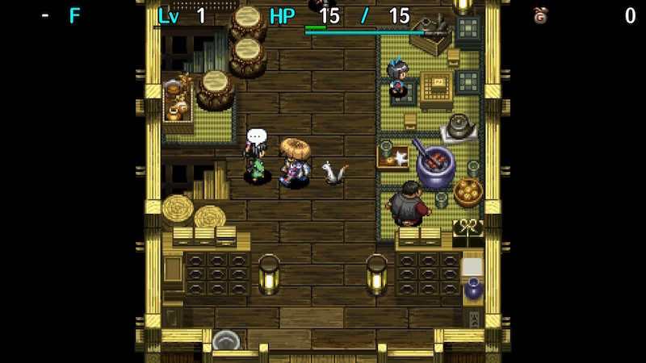
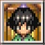

  

Optional tutorials on how to play the game.

You'll receive a random item each time you complete a topic for the first time.

# Overview

<table class="dungeonOverview">
  <tr>
    <th>Unlock</th>
    <td class="highlightYellow">Available from the start.</td>
  </tr>
  <tr>
    <th>Entrance</th>
    <td class="highlightYellow">Inori Village (Beginner House)</td>
  </tr>
</table>

<table class="dungeonTable">
  <tr>
    <th>Topics</th>
    <td>54</td>
  </tr>
  <tr>
    <th>Bring Items</th>
    <td>No</td>
  </tr>
  <tr>
    <th>Clear Icon</th>
    <td class="clearIcon"></td>
  </tr>
</table>

# Topics

There are a total of 54 topics.

<table class="trainingTable">
  <tr>
    <th>Page 1</th>
    <th>Page 2</th>
    <th>Page 3</th>
    <th>Page 4</th>
    <th>Page 5</th>
  </tr>
  <tr>
    <td>Finding the stairs</td>
    <td>Walk around to heal</td>
    <td>Corners are your friends</td>
    <td>Seals and blessings</td>
    <td>Launching creatures</td>
  </tr>
  <tr>
    <td>Moving diagonally</td>
    <td>Equipment is your friend</td>
    <td>Passageway duels</td>
    <td>Equipment upgrades</td>
    <td>Hiding in pots</td>
  </tr>
  <tr>
    <td>Effective dashing</td>
    <td>Projectiles and range</td>
    <td>Items in pots</td>
    <td>Annoying cursed items</td>
    <td>Lifesaving scrolls</td>
  </tr>
  <tr>
    <td>Turning in place</td>
    <td>Use grass or throw it</td>
    <td>Tide-turning talismans</td>
    <td>Equipment synthesis</td>
    <td>Sanctuary</td>
  </tr>
  <tr>
    <td>Dealing with hunger</td>
    <td>Staves and magic bullets</td>
    <td>Poison reduces strength</td>
    <td>Peaches</td>
    <td>Go nuts for Nuts</td>
  </tr>
  <tr>
    <td>Using the map</td>
    <td>Effective scroll usage</td>
    <td>Unidentified items</td>
    <td>Everyone hates traps</td>
    <td>Stop! Thief!</td>
  </tr>
  <tr>
    <th>Page 6</th>
    <th>Page 7</th>
    <th>Page 8</th>
    <th>Page 9</th>
    <th></th>
  </tr>
  <tr>
    <td>Dodge using diagonals</td>
    <td>Hunger for health</td>
    <td>Fragrant pots</td>
    <td>Hit & Run tactics</td>
    <td rowspan="6" class="highlightGray"></td>
  </tr>
  <tr>
    <td>The wind blows eventually</td>
    <td>Throw long</td>
    <td>Zalokleft, I choose you!</td>
    <td>Urchins can explode!</td>
  </tr>
  <tr>
    <td>Using Mixer</td>
    <td>An ounce of prevention...</td>
    <td>Mo' Gitan, mo' pain</td>
    <td>Combining</td>
  </tr>
  <tr>
    <td>Close the door</td>
    <td>Seal the bad traits</td>
    <td>Combining staves</td>
    <td>Tricky fakes</td>
  </tr>
  <tr>
    <td>Hidden passageway</td>
    <td>Use the staves to flee</td>
    <td>Resorting to brute force</td>
    <td>Bright Shield tricks*</td>
  </tr>
  <tr>
    <td>Monsters level up, too</td>
    <td>Effects of water</td>
    <td>Suspicious behavior</td>
    <td>Can't read in the dark*</td>
  </tr>
</table>

  
* Available after clearing Night Training Facility.

# Items

Each item has a frequency value (F), and a higher number means it's more common.

<table class="trainingTable">
  <tr>
    <th>Weapon</th>
    <th>F</th>
    <th>Shield</th>
    <th>F</th>
    <th>Bracelet</th>
    <th>F</th>
    <th>Grass</th>
    <th>F</th>
    <th>Scroll</th>
    <th>F</th>
    <th>Staff / Pot</th>
    <th>F</th>
  </tr>
  <tr>
    <td>Myopic Masher</td>
    <td>3</td>
    <td>Heavy Shield</td>
    <td>3</td>
    <td>Growth Bracelet</td>
    <td>5</td>
    <td>Revival Grass</td>
    <td>20</td>
    <td>Confusion Scroll</td>
    <td>60</td>
    <td>Seal Staff</td>
    <td>30</td>
  </tr>
  <tr>
    <td>Drain Dagger</td>
    <td>3</td>
    <td>Blast Shield</td>
    <td>3</td>
    <td>Anti-Cnf. Bracelet</td>
    <td>10</td>
    <td>Strength Grass</td>
    <td>20</td>
    <td>Slumber Scroll</td>
    <td>60</td>
    <td>Electric Staff</td>
    <td>60</td>
  </tr>
  <tr>
    <td>Copper Cleaver</td>
    <td>3</td>
    <td>Diet Shield</td>
    <td>3</td>
    <td>Alert Bracelet</td>
    <td>10</td>
    <td>Dragon Grass</td>
    <td>60</td>
    <td>Vacuum Slash Scrl</td>
    <td>60</td>
    <td>Empathy Staff</td>
    <td>30</td>
  </tr>
  <tr>
    <td>Crescent Katana</td>
    <td>3</td>
    <td>Counter Shield</td>
    <td>3</td>
    <td>Cleansing Bracelet</td>
    <td>10</td>
    <td>Stomach Expander</td>
    <td>60</td>
    <td>Fear Scroll</td>
    <td>60</td>
    <td>Transient Staff</td>
    <td>60</td>
  </tr>
  <tr>
    <td>Magic Masher</td>
    <td>3</td>
    <td>Wolfshead</td>
    <td>3</td>
    <td>Staunch Bracelet</td>
    <td>10</td>
    <td>Swift Grass</td>
    <td>60</td>
    <td>Trap Deletion Scrl</td>
    <td>60</td>
    <td>Paralysis Staff</td>
    <td>30</td>
  </tr>
  <tr>
    <td>Beast Fang</td>
    <td>3</td>
    <td>Gold Shield</td>
    <td>3</td>
    <td>Strength Bracelet</td>
    <td>20</td>
    <td>Perception Grass</td>
    <td>60</td>
    <td>Fate Scroll</td>
    <td>25</td>
    <td>Swap Staff</td>
    <td>60</td>
  </tr>
  <tr>
    <td>Katana</td>
    <td>12</td>
    <td>Iron Targe</td>
    <td>12</td>
    <th rowspan="6" colspan="2" class="highlightGray"></th>
    <td>Power Up Grass</td>
    <td>60</td>
    <td>Earth Scroll</td>
    <td>25</td>
    <td>Knockback Staff</td>
    <td>60</td>
  </tr>
  <tr>
    <td>Rusty Pickaxe</td>
    <td>3</td>
    <td>Tin Shield</td>
    <td>30</td>
    <td>Upgrade Seed</td>
    <td>60</td>
    <td>Plating Scroll</td>
    <td>25</td>
    <td>Pinning Staff</td>
    <td>60</td>
  </tr>
  <tr>
    <td>Dull Gold Edge</td>
    <td>3</td>
    <td>Plain Targe</td>
    <td>60</td>
    <td>Otogiriso</td>
    <td>60</td>
    <td>Navigation Scroll</td>
    <td>60</td>
    <td>Slow Staff</td>
    <td>30</td>
  </tr>
  <tr>
    <td>Tin Blade</td>
    <td>30</td>
    <th rowspan="3" colspan="2" class="highlightGray"></th>
    <td>Antidote Grass</td>
    <td>60</td>
    <td>Escape Scroll</td>
    <td>60</td>
    <td>Mage Staff</td>
    <td>60</td>
  </tr>
  <tr>
    <td>Ordinary Stick</td>
    <td>60</td>
    <td>Warp Grass</td>
    <td>60</td>
    <td>Oil Scroll</td>
    <td>60</td>
    <td>Preservation Pot</td>
    <td>100</td>
  </tr>
  <tr>
    <th colspan="2" class="highlightGray"></th>
    <td>Herb</td>
    <td>60</td>
    <th colspan="2" class="highlightGray"></th>
    <th colspan="2" class="highlightGray"></th>
  </tr>
</table>
