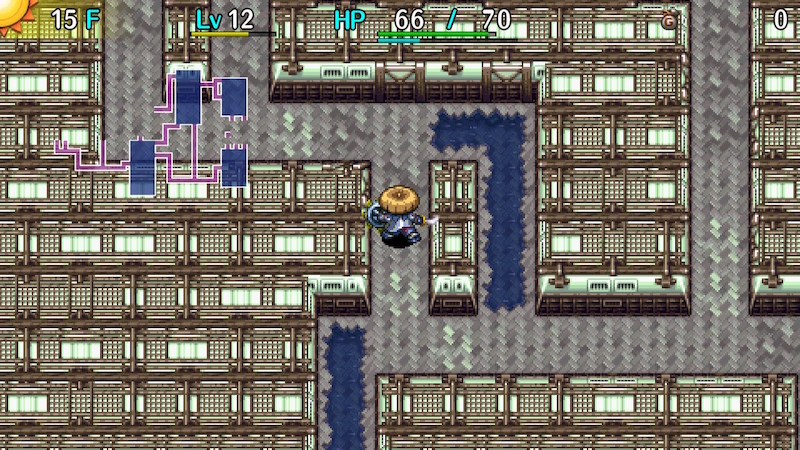

  

99F dungeon split into 10 floor sections called districts, which can be challenged in any order.

The player is supplied with items and experience points according to the chosen district. 
Field of view isn't limited, and the item table doesn't include negative effect items for the most part. 
Once the goal is reached, the player can exit with 4 items (excluding pots) from the run as a reward.

The general district (1-99F) is unlocked after all 10 individual districts are cleared.

<ul class="quickLinksUL">
  <li><a href="#overview-(d1-10)">Overview (D1-10)</a></li>
  <li><a href="#strategy-(d1-10)">Strategy (D1-10)</a></li>
  <li><a href="#items-(d1-10)">Items (D1-10)</a></li>
  <li><a href="#traps-(d1-10)">Traps (D1-10)</a></li>
  <li><a href="#overview-(gd)">Overview (GD)</a></li>
  <li><a href="#strategy-(gd)">Strategy (GD)</a></li>
  <li><a href="#items-(gd)">Items (GD)</a></li>
  <li><a href="#traps-(gd)">Traps (GD)</a></li>
  <li><a href="#monsters">Monsters</a>
    <ul>
      <li><a href="#day-monsters">Day Monsters</a></li>
      <li><a href="#night-monsters">Night Monsters</a></li>
    </ul>
  </li>
</ul>

# Overview (D1-10)

<table class="dungeonOverview">
  <tr>
    <th>Unlock</th>
    <td class="highlightYellow">Available as soon as you arrive in Nekomaneki Village.</td>
  </tr>
  <tr>
    <th>Entrance</th>
    <td class="highlightYellow">Talk to the woman inside the Dungeon Center.</td>
  </tr>
</table>

<table class="dungeonTable">
  <tr>
    <th>Floors</th>
    <td>10F</td>
    <th>Day / Night</th>
    <td>Day</td>
  </tr>
  <tr>
    <th>Bring Items</th>
    <td>No</td>
    <th>Allies</th>
    <td>No</td>
  </tr>
  <tr>
    <th>Unidentified</th>
    <td>All items</td>
    <th>New Items</th>
    <td>No</td>
  </tr>
  <tr>
    <th>Shops</th>
    <td>None</td>
    <th>Monster Houses</th>
    <td>Regular</td>
  </tr>
  <tr>
    <th>Initial Enemies</th>
    <td></td>
    <th>Spawn Rate</th>
    <td></td>
  </tr>
  <tr>
    <th>Ominous aura</th>
    <td>No</td>
    <th>Wind of Kron</th>
    <td>1st: 1700 4th: 2000</td>
  </tr>
  <tr>
    <th>Clear Icon</th>
    <td>None</td>
    <th>Reward</th>
    <td>4 items from the run (Excluding pots)</td>
  </tr>
</table>

# Strategy (D1-10)

Each district is only 10 floors, so run-away play is generally effective. 
Items are found unidentified except for the items you start with, so you'll likely rely on 
easy to identify item categories such as talismans and staves to defeat enemies. 
If you find a pot, insert a scroll or grass item to try and identify it.

<ul class="quickLinksUL">
  <li><a href="#district-1-(1-10f)">District 1 (1-10F)</a></li>
  <li><a href="#district-2-(11-20f)">District 2 (11-20F)</a></li>
  <li><a href="#district-3-(21-30f)">District 3 (21-30F)</a></li>
  <li><a href="#district-4-(31-40f)">District 4 (31-40F)</a></li>
  <li><a href="#district-5-(41-50f)">District 5 (41-50F)</a></li>
  <li><a href="#district-6-(51-60f)">District 6 (51-60F)</a></li>
  <li><a href="#district-7-(61-70f)">District 7 (61-70F)</a></li>
  <li><a href="#district-8-(71-80f)">District 8 (71-80F)</a></li>
  <li><a href="#district-9-(81-90f)">District 9 (81-90F)</a></li>
  <li><a href="#district-10-(91-99f)">District 10 (91-99F)</a></li>
</ul>

#### District 1 (1-10F)

- Level: 1
- Items: None

You shouldn't have issues as long as you go around the map for items and experience points. 
However, Dragon Grass can be found starting on 1F, so you might get one-shot by a Grass Kid if you're unlucky.

#### District 2 (11-20F)

- Level: 10
- Items: Katana, Iron Targe

Beware of Scorpions and Mutaikons at the start - lowered strength can make defeating enemies a struggle. 
It might be best to rush stairs for the first 2\~3 floors to skip past them.

#### District 3 (21-30F)

- Level: 25
- Items: Beast Fang+4, Beast Shield+2, Electric Staff[6], Otogiriso x 2

It's possible to hunt Grass Dudes and Green Zaloklefts for items on the first floor. 
Use items against Nigiri Morph (22-23F), Gyadon (23-24F), Hipadile (25-27F), and MC Mage (29-30F). 
It's a bit dangerous, but you could intentionally get hit by MC Mage's magic to warp to the stairs.

#### District 4 (31-40F)

- Level: 35
- Items: Dotanuki+8, Wolfshead+10, Knockback Staff[7], Heal Grass x 3

Power monsters like Shagga, Dragon, and Katana Bee appear right away. 
It's easy to lose encounters even with the supplied equipment, so use staves, scrolls, and talismans. 
Rush stairs between 34-36F to avoid Dazikons and Cave Mamels as much as possible. 
MC Wizards (37-38F) can inflict Berserk status, so do everything you can to prevent them from acting. 
Some players like to repeat this district to collect high upgrade value synthesis fodder.

#### District 5 (41-50F)

- Level: 45
- Items: Shoddy Dirk, Shoddy Plank, Fixer Scroll, Heal Grass x 3

From this district onward, it's best to advance to the next floor as soon as you find the stairs. 
Nashagga (40-42F) and Sky Dragon (41-43F) are major threats near the beginning, 
followed by Nigiri Boss (44-45F), Rally Ham (44-46F), and Concusschin (44-46F). 
Oingodile (46-48F), Ornery Tank (47-48F), and Porkon (49-50F) appear after that, 
so there isn't a single safe floor to catch your breath in this district.

#### District 6 (51-60F)

- Level: 50
- Items: Shoddy Dirk, Shoddy Plank, Strength Bracelet, Fixer Scroll, Heal Grass x 3

MC Sorceror fires off magic during the first half while accompanied by Jouncy and Vexing Kappa. 
Once you're past that, you pretty much just have to hope that Horrabbit (56-58F) doesn't end your run. 
Lashaggas (58-60F) have ridiculous attack power, so it's best to run away instead of fighting them.

#### District 7 (61-70F)

- Level: 55
- Items: Shoddy Dirk+10, Shoddy Plank+10, Strength Bracelet, Invincible Grass, Fixer Scroll, Heal Grass x 2

Super Gazer's hypnosis can make you consume supplied items, so try to avoid being adjacent to them. 
Bouncy (63-66F) is extremely dangerous, so avoid fighting them as much as possible. 
That said, you can use the supplied Invincible Grass to have them warp you to another floor. 
You can skip most Archdragon (66-68F) and Dozikon (67-68F) floors if you warp 3 floors on 65F or 66F.

#### District 8 (71-80F)

- Level: 60
- Items: Shoddy Dagger+14, Shoddy Targe+14, Strength Bracelet, Invincible Grass, Fixer Scroll, Heal Grass x 2

Enemies with dangerous long-ranged attacks such as Porgon (74-77F) and Knave King (75-76F) appear. 
Use a Dodger Pot if you're lucky enough to find one, and otherwise hurry to the stairs. 
There's no counterplay to Terrabbit (77-78F), so simply pray for good stairs luck.

#### District 9 (81-90F)

- Level: 65
- Items: Shoddy Blade+18, Shoddy Buckler+18, Strength Bracelet, Invincible Grass, Revival Grass, Fixer Scroll

Use the supplied Invincible Grass if you encounter a Gitan Mamel before you find an effective item. 
There's no worry of Kleptoads warping or otherwise running away from you when your Gitan total is 0G, 
so some players like to restart until they encounter a Kleptoad first so that they can throw Gitan at Gitan Mamels. 
※ Kleptoad and Blazebird are immune to thrown Gitan.

You can place Gitan into your inventory by stepping on it and swapping the Gitan with an inventory item. 
Be careful not to sort your inventory afterward, as that will move any Gitan outside of pots into your wallet.

#### District 10 (91-99F)

- Level: 70
- Items: Shoddy Edge+27, Shoddy Heater+27, Strength Bracelet, Invincible Grass, Revival Grass, Fixer Scroll

Elizgagon and Despoiler appear on all floors, and Ultra Gazer (89-91F), Cranky Tank (95-96F), 
and Abyss Dragon (97-99F) can easily finish you off when you're weakened after an encounter. 
There's a very high chance to encounter a single room Monster House, 
so try to save the supplied Invincible Grass as long as possible.

# Items (D1-10)

The values like "1-10" in columns represent the floor range where the item can appear. 
(Example: "31+" means the item can appear on any floor in the range of 31-99F)

- F = Floor, Daytime monster drop
- P = Presto Pot
- Z = Zalokleft drop
- M = Mealy drop

 

<table class="dungeonItemTable">
  <tr>
    <th colspan="5" class="highlightPurple3">Weapon</th>
    <td class="tableDivider" rowspan="46"></td>
    <th colspan="5" class="highlightPurple3">Bracelet</th>
    <td class="tableDivider" rowspan="46"></td>
    <th colspan="5" class="highlightPurple3">Scroll</th>
  </tr>
  <tr>
    <th>Name</th>
    <th>F</th>
    <th>P</th>
    <th>Z</th>
    <th>M</th>
    <th>Name</th>
    <th>F</th>
    <th>P</th>
    <th>Z</th>
    <th>M</th>
    <th>Name</th>
    <th>F</th>
    <th>P</th>
    <th>Z</th>
    <th>M</th>
  </tr>
  <tr>
    <td class="leftText">Ordinary Stick</td>
    <td>1-10</td>
    <td>X</td>
    <td>X</td>
    <td></td>
    <td class="leftText">Cleansing Bracelet</td>
    <td>X</td>
    <td>X</td>
    <td>X</td>
    <td>X</td>
    <td class="leftText">Confusion Scroll</td>
    <td>X</td>
    <td>X</td>
    <td>X</td>
    <td>X</td>
  </tr>
  <tr>
    <td class="leftText">Tin Blade</td>
    <td>1-30</td>
    <td>X</td>
    <td>X</td>
    <td></td>
    <td class="leftText">Anti-Cnf. Bracelet</td>
    <td>X</td>
    <td>X</td>
    <td>X</td>
    <td>X</td>
    <td class="leftText">Slumber Scroll</td>
    <td>X</td>
    <td>X</td>
    <td>X</td>
    <td>X</td>
  </tr>
  <tr>
    <td class="leftText">Katana</td>
    <td>1-50</td>
    <td>X</td>
    <td>X</td>
    <td></td>
    <td class="leftText">Alert Bracelet</td>
    <td>X</td>
    <td>X</td>
    <td>X</td>
    <td>X</td>
    <td class="leftText">Vacuum Slash Scrl</td>
    <td>X</td>
    <td>X</td>
    <td>X</td>
    <td>X</td>
  </tr>
  <tr>
    <td class="leftText">Beast Fang</td>
    <td>1-70</td>
    <td>X</td>
    <td>X</td>
    <td>X</td>
    <td class="leftText">Staunch Bracelet</td>
    <td>X</td>
    <td>X</td>
    <td>X</td>
    <td>X</td>
    <td class="leftText">Fear Scroll</td>
    <td>X</td>
    <td>X</td>
    <td>X</td>
    <td>X</td>
  </tr>
  <tr>
    <td class="leftText">Dotanuki</td>
    <td>X</td>
    <td>X</td>
    <td>X</td>
    <td>X</td>
    <td class="leftText">Strength Bracelet</td>
    <td>X</td>
    <td>X</td>
    <td>X</td>
    <td>X</td>
    <td class="leftText">Dispel Aura Scroll</td>
    <td>X</td>
    <td>X</td>
    <td>X</td>
    <td>X</td>
  </tr>
  <tr>
    <td class="leftText">Bladite</td>
    <td>41+</td>
    <td></td>
    <td></td>
    <td>X</td>
    <th colspan="5" class="highlightPurple3">Grass</th>
    <td class="leftText">Trap Deletion Scrl</td>
    <td>X</td>
    <td>X</td>
    <td>X</td>
    <td>X</td>
  </tr>
  <tr>
    <td class="leftText">Dull Gold Edge</td>
    <td>X</td>
    <td>X</td>
    <td>X</td>
    <td>X</td>
    <th>Name</th>
    <th>F</th>
    <th>P</th>
    <th>Z</th>
    <th>M</th>
    <td class="leftText">Identify Scroll</td>
    <td>X</td>
    <td>X</td>
    <td>X</td>
    <td>X</td>
  </tr>
  <tr>
    <td class="leftText">Bright Blade</td>
    <td>X</td>
    <td></td>
    <td></td>
    <td>X</td>
    <td class="leftText">Herb</td>
    <td>X</td>
    <td>X</td>
    <td>X</td>
    <td></td>
    <td class="leftText">Fate Scroll</td>
    <td>X</td>
    <td>X</td>
    <td>X</td>
    <td>X</td>
  </tr>
  <tr>
    <td class="leftText">Rusty Pickaxe</td>
    <td>1-30, 41+</td>
    <td></td>
    <td></td>
    <td></td>
    <td class="leftText">Otogiriso</td>
    <td>X</td>
    <td>X</td>
    <td>X</td>
    <td>X</td>
    <td class="leftText">Earth Scroll</td>
    <td>X</td>
    <td>X</td>
    <td>X</td>
    <td>X</td>
  </tr>
  <tr>
    <td class="leftText">Old Mallet</td>
    <td>31-40</td>
    <td></td>
    <td></td>
    <td></td>
    <td class="leftText">Heal Grass</td>
    <td>X</td>
    <td>X</td>
    <td>X</td>
    <td>X</td>
    <td class="leftText">Blessing Scroll</td>
    <td>X</td>
    <td>X</td>
    <td>X</td>
    <td>X</td>
  </tr>
  <tr>
    <td class="leftText">Sky Splitter</td>
    <td>X</td>
    <td>X</td>
    <td>X</td>
    <td>X</td>
    <td class="leftText">Strength Grass</td>
    <td>X</td>
    <td>X</td>
    <td>X</td>
    <td>X</td>
    <td class="leftText">Immunity Scroll</td>
    <td>X</td>
    <td>X</td>
    <td>X</td>
    <td>X</td>
  </tr>
  <tr>
    <td class="leftText">Water Cutter</td>
    <td>X</td>
    <td>X</td>
    <td>X</td>
    <td>X</td>
    <td class="leftText">Invincible Grass</td>
    <td>61+</td>
    <td></td>
    <td></td>
    <td></td>
    <td class="leftText">Collection Scroll</td>
    <td>X</td>
    <td>X</td>
    <td>X</td>
    <td>X</td>
  </tr>
  <tr>
    <td class="leftText">Scythe</td>
    <td>X</td>
    <td>X</td>
    <td>X</td>
    <td>X</td>
    <td class="leftText">Swift Grass</td>
    <td>X</td>
    <td>X</td>
    <td>X</td>
    <td>X</td>
    <td class="leftText">Fixer Scroll</td>
    <td>X</td>
    <td>X</td>
    <td>X</td>
    <td>X</td>
  </tr>
  <tr>
    <td class="leftText">Myopic Masher</td>
    <td>X</td>
    <td>X</td>
    <td>X</td>
    <td>X</td>
    <td class="leftText">Warp Grass</td>
    <td>X</td>
    <td>X</td>
    <td>X</td>
    <td>X</td>
    <th colspan="5" class="highlightPurple3">Talisman</th>
  </tr>
  <tr>
    <td class="leftText">Magic Masher</td>
    <td>X</td>
    <td>X</td>
    <td>X</td>
    <td>X</td>
    <td class="leftText">Dragon Grass</td>
    <td>X</td>
    <td>X</td>
    <td>X</td>
    <td>X</td>
    <th>Name</th>
    <th>F</th>
    <th>P</th>
    <th>Z</th>
    <th>M</th>
  </tr>
  <tr>
    <td class="leftText">Drain Dagger</td>
    <td>X</td>
    <td>X</td>
    <td>X</td>
    <td>X</td>
    <td class="leftText">Revival Grass</td>
    <td>X</td>
    <td></td>
    <td></td>
    <td>X</td>
    <td class="leftText">Shadow Bind Tal.</td>
    <td>X</td>
    <td>X</td>
    <td>X</td>
    <td>X</td>
  </tr>
  <tr>
    <td class="leftText">Copper Cleaver</td>
    <td>X</td>
    <td>X</td>
    <td>X</td>
    <td>X</td>
    <td class="leftText">Cheery Grass</td>
    <td></td>
    <td></td>
    <td></td>
    <td>X</td>
    <td class="leftText">Conf. Talisman</td>
    <td>X</td>
    <td>X</td>
    <td>X</td>
    <td>X</td>
  </tr>
  <tr>
    <td class="leftText">Crescent Katana</td>
    <td>X</td>
    <td>X</td>
    <td>X</td>
    <td>X</td>
    <th colspan="5" class="highlightPurple3">Staff</th>
    <td class="leftText">Seal Talisman</td>
    <td>X</td>
    <td>X</td>
    <td>X</td>
    <td>X</td>
  </tr>
  <tr>
    <td class="leftText">Lizard Lasher</td>
    <td>X</td>
    <td>X</td>
    <td>X</td>
    <td>X</td>
    <th>Name</th>
    <th>F</th>
    <th>P</th>
    <th>Z</th>
    <th>M</th>
    <td class="leftText">Fear Talisman</td>
    <td>X</td>
    <td>X</td>
    <td>X</td>
    <td>X</td>
  </tr>
  <tr>
    <td class="leftText">Shoddy Dirk</td>
    <td>31+</td>
    <td></td>
    <td></td>
    <td></td>
    <td class="leftText">Swap Staff</td>
    <td>X</td>
    <td>X</td>
    <td>X</td>
    <td>X</td>
    <td class="leftText">Sleep Talisman</td>
    <td>X</td>
    <td>X</td>
    <td>X</td>
    <td>X</td>
  </tr>
  <tr>
    <th colspan="5" class="highlightPurple3">Shield</th>
    <td class="leftText">Knockback Staff</td>
    <td>X</td>
    <td>X</td>
    <td>X</td>
    <td>X</td>
    <th colspan="5" class="highlightPurple3">Projectile</th>
  </tr>
  <tr>
    <th>Name</th>
    <th>F</th>
    <th>P</th>
    <th>Z</th>
    <th>M</th>
    <td class="leftText">Pinning Staff</td>
    <td>X</td>
    <td>X</td>
    <td>X</td>
    <td>X</td>
    <th>Name</th>
    <th>F</th>
    <th>P</th>
    <th>Z</th>
    <th>M</th>
  </tr>
  <tr>
    <td class="leftText">Plain Targe</td>
    <td>1-10</td>
    <td>X</td>
    <td>X</td>
    <td></td>
    <td class="leftText">Transient Staff</td>
    <td>X</td>
    <td>X</td>
    <td>X</td>
    <td>X</td>
    <td class="leftText">Wood Arrow</td>
    <td>※</td>
    <td>X</td>
    <td>X</td>
    <td></td>
  </tr>
  <tr>
    <td class="leftText">Tin Shield</td>
    <td>1-30</td>
    <td>X</td>
    <td>X</td>
    <td></td>
    <td class="leftText">Seal Staff</td>
    <td>X</td>
    <td>X</td>
    <td>X</td>
    <td>X</td>
    <td class="leftText">Iron Arrow</td>
    <td></td>
    <td>X</td>
    <td>X</td>
    <td></td>
  </tr>
  <tr>
    <td class="leftText">Iron Targe</td>
    <td>1-50</td>
    <td>X</td>
    <td>X</td>
    <td></td>
    <td class="leftText">Clone Staff</td>
    <td>X</td>
    <td></td>
    <td></td>
    <td>X</td>
    <td class="leftText">Silver Arrow</td>
    <td>※</td>
    <td>X</td>
    <td>X</td>
    <td></td>
  </tr>
  <tr>
    <td class="leftText">Wolfshead</td>
    <td>1-70</td>
    <td>X</td>
    <td>X</td>
    <td>X</td>
    <td class="leftText">Paralysis Staff</td>
    <td>X</td>
    <td></td>
    <td></td>
    <td>X</td>
    <td class="leftText">Critical Arrow</td>
    <td>※</td>
    <td>X</td>
    <td>X</td>
    <td></td>
  </tr>
  <tr>
    <td class="leftText">Beast Shield</td>
    <td>X</td>
    <td>X</td>
    <td>X</td>
    <td>X</td>
    <td class="leftText">Empathy Staff</td>
    <td>X</td>
    <td>X</td>
    <td>X</td>
    <td>X</td>
    <td class="leftText">Poison Arrow</td>
    <td>※</td>
    <td>X</td>
    <td>X</td>
    <td></td>
  </tr>
  <tr>
    <td class="leftText">Targite</td>
    <td>41+</td>
    <td></td>
    <td></td>
    <td>X</td>
    <td class="leftText">Slow Staff</td>
    <td>X</td>
    <td>X</td>
    <td>X</td>
    <td>X</td>
    <td class="leftText">Knockback Arrow</td>
    <td>※</td>
    <td>X</td>
    <td>X</td>
    <td></td>
  </tr>
  <tr>
    <td class="leftText">Gold Shield</td>
    <td>X</td>
    <td>X</td>
    <td>X</td>
    <td>X</td>
    <td class="leftText">Unlucky Staff</td>
    <td>X</td>
    <td>X</td>
    <td>X</td>
    <td>X</td>
    <td class="leftText">Truestrike Arrow</td>
    <td>※</td>
    <td>X</td>
    <td>X</td>
    <td></td>
  </tr>
  <tr>
    <td class="leftText">Diet Shield</td>
    <td>X</td>
    <td>X</td>
    <td>X</td>
    <td>X</td>
    <td class="leftText">Mage Staff</td>
    <td>X</td>
    <td>X</td>
    <td>X</td>
    <td>X</td>
    <td class="leftText">Killer Arrow</td>
    <td>※</td>
    <td>X</td>
    <td>X</td>
    <td></td>
  </tr>
  <tr>
    <td class="leftText">Heavy Shield</td>
    <td>X</td>
    <td>X</td>
    <td>X</td>
    <td>X</td>
    <td class="leftText">Electric Staff</td>
    <td>X</td>
    <td>X</td>
    <td>X</td>
    <td>X</td>
    <td class="leftText">Drain Arrow</td>
    <td>※</td>
    <td>X</td>
    <td>X</td>
    <td></td>
  </tr>
  <tr>
    <td class="leftText">Day Shield</td>
    <td>X</td>
    <td></td>
    <td></td>
    <td>X</td>
    <th colspan="5" class="highlightPurple3">Pot</th>
    <td class="leftText">Random Arrow</td>
    <td>※</td>
    <td>X</td>
    <td>X</td>
    <td></td>
  </tr>
  <tr>
    <td class="leftText">Binary Shield</td>
    <td>X</td>
    <td></td>
    <td></td>
    <td>X</td>
    <th>Name</th>
    <th>F</th>
    <th>P</th>
    <th>Z</th>
    <th>M</th>
    <td class="leftText">Suicide Arrow</td>
    <td>※</td>
    <td></td>
    <td></td>
    <td></td>
  </tr>
  <tr>
    <td class="leftText">Counter Shield</td>
    <td>X</td>
    <td>X</td>
    <td>X</td>
    <td>X</td>
    <td class="leftText">Preservation Pot</td>
    <td>X</td>
    <td></td>
    <td>X</td>
    <td>X</td>
    <td class="leftText">Rock</td>
    <td>※</td>
    <td>X</td>
    <td>X</td>
    <td></td>
  </tr>
  <tr>
    <td class="leftText">Student Shield</td>
    <td>X</td>
    <td></td>
    <td></td>
    <td>X</td>
    <td class="leftText">Synthesis Pot</td>
    <td>X</td>
    <td></td>
    <td>X</td>
    <td>X</td>
    <td class="leftText">Porky Rock</td>
    <td></td>
    <td>X</td>
    <td>X</td>
    <td></td>
  </tr>
  <tr>
    <td class="leftText">Bowl Shield</td>
    <td>X</td>
    <td></td>
    <td></td>
    <td>X</td>
    <td class="leftText">Presto Pot</td>
    <td>X</td>
    <td></td>
    <td>X</td>
    <td>X</td>
    <td class="leftText">Rightstone</td>
    <td>※</td>
    <td></td>
    <td></td>
    <td></td>
  </tr>
  <tr>
    <td class="leftText">Blast Shield</td>
    <td>X</td>
    <td>X</td>
    <td>X</td>
    <td>X</td>
    <td class="leftText">Identify Pot</td>
    <td>X</td>
    <td></td>
    <td>X</td>
    <td>X</td>
    <th colspan="5" class="highlightPurple3">Food</th>
  </tr>
  <tr>
    <td class="leftText">Lock Shield</td>
    <td>X</td>
    <td>X</td>
    <td>X</td>
    <td>X</td>
    <td class="leftText">Heal Pot</td>
    <td>31+</td>
    <td></td>
    <td>X</td>
    <td></td>
    <th>Name</th>
    <th>F</th>
    <th>P</th>
    <th>Z</th>
    <th>M</th>
  </tr>
  <tr>
    <td class="leftText">Safe Shield</td>
    <td>X</td>
    <td>X</td>
    <td>X</td>
    <td>X</td>
    <td class="leftText">Hilarious Pot</td>
    <td>X</td>
    <td></td>
    <td>X</td>
    <td>X</td>
    <td class="leftText">Onigiri</td>
    <td>※</td>
    <td>X</td>
    <td></td>
    <td></td>
  </tr>
  <tr>
    <td class="leftText">Gyadon Blocker</td>
    <td>X</td>
    <td>X</td>
    <td>X</td>
    <td>X</td>
    <td class="leftText">Zalokleft Pot</td>
    <td>X</td>
    <td></td>
    <td></td>
    <td>X</td>
    <td class="leftText">Large Onigiri</td>
    <td>※</td>
    <td>X</td>
    <td></td>
    <td></td>
  </tr>
  <tr>
    <td class="leftText">Snake Shield</td>
    <td>X</td>
    <td></td>
    <td></td>
    <td>X</td>
    <td class="leftText">Zen Pot</td>
    <td>X</td>
    <td></td>
    <td>X</td>
    <td>X</td>
    <td class="leftText">Hard Peach</td>
    <td>※</td>
    <td>X</td>
    <td></td>
    <td></td>
  </tr>
  <tr>
    <td class="leftText">Shoddy Plank</td>
    <td>31+</td>
    <td></td>
    <td></td>
    <td></td>
    <td class="leftText">Dodger Pot</td>
    <td>X</td>
    <td></td>
    <td>X</td>
    <td>X</td>
    <td class="leftText">Peach</td>
    <td>※</td>
    <td>X</td>
    <td></td>
    <td></td>
  </tr>
  <tr>
    <td rowspan="2" colspan="5" class="highlightGray"></td>
    <td class="leftText">Perceptive Pot</td>
    <td>X</td>
    <td></td>
    <td>X</td>
    <td>X</td>
    <td rowspan="2" colspan="5" class="highlightGray"></td>
  </tr>
  <tr>
    <td class="leftText">Reflection Pot</td>
    <td>X</td>
    <td></td>
    <td>X</td>
    <td>X</td>
  </tr>
</table>

  
※ 4-10, 14-20, 24-30, 34-40, 44-50, 54-60, 64-70, 74-80, 84-90, 94-99

# Traps (D1-10)

See [Traps](/system/traps) for details.

<table class="dungeonItemTable">
  <tr>
    <th>Trap</th>
    <th>Floors</th>
    <th rowspan="10"></th>
    <th>Trap</th>
    <th>Floors</th>
    <th rowspan="10"></th>
    <th>Trap</th>
    <th>Floors</th>
  </tr>
  <tr>
    <td class="leftText highlightPurple">Wood Arrow</td>
    <td>1-10</td>
    <td class="leftText highlightPurple">Sleep</td>
    <td>6-15, 31-35, 41-50, 56-65, 71-99</td>
    <td class="leftText highlightPurple">Multiplication</td>
    <td>31-50, 91-99</td>
  </tr>
  <tr>
    <td class="leftText highlightPurple">Spring</td>
    <td>1-90</td>
    <td class="leftText highlightPurple">Slow</td>
    <td>6-10, 16-20, 66-80, 91-99</td>
    <td class="leftText highlightPurple">Gauge Blind.</td>
    <td>31-40, 61-70</td>
  </tr>
  <tr>
    <td class="leftText highlightPurple">Hunger</td>
    <td>21-40, 81-90</td>
    <td class="leftText highlightPurple">Spin</td>
    <td>1-5, 21-25, 36-40 51-55, 66-70, 91-99</td>
    <td class="leftText highlightPurple">Rockslide</td>
    <td>31-99</td>
  </tr>
  <tr>
    <td class="leftText highlightPurple">Trip</td>
    <td>1-65, 81-99</td>
    <td class="leftText highlightPurple">Rage</td>
    <td>11-15, 21-30, 41-50, 56-65, 81-90</td>
    <td class="leftText highlightPurple">Onigiri</td>
    <td>41-50</td>
  </tr>
  <tr>
    <td class="leftText highlightPurple">Strip</td>
    <td>1-60, 66-99</td>
    <td class="leftText highlightPurple">Blind</td>
    <td>16-20, 26-30, 51-55, 61-90</td>
    <td class="leftText highlightPurple">Metal Block</td>
    <td>41-99</td>
  </tr>
  <tr>
    <td class="leftText highlightPurple">Summon</td>
    <td>1-70, 81-99</td>
    <td class="leftText highlightPurple">Monster</td>
    <td>21-30, 61-65, 81-90</td>
    <td class="leftText highlightPurple">Big Explosion</td>
    <td>41-99</td>
  </tr>
  <tr>
    <td class="leftText highlightPurple">Iron Arrow</td>
    <td>6-99</td>
    <td class="leftText highlightPurple">Log</td>
    <td>1-10, 31-40, 61-70, 81-90</td>
    <td class="leftText highlightPurple">Floor Warp</td>
    <td>51-60</td>
  </tr>
  <tr>
    <td class="leftText highlightPurple">Explosion</td>
    <td>21-99</td>
    <td class="leftText highlightPurple">Shadow Bind</td>
    <td>1-5, 36-40, 66-70, 81-99</td>
    <td class="leftText highlightPurple">Decay</td>
    <td>71-80</td>
  </tr>
  <tr>
    <td class="leftText highlightPurple">Poison Arrow</td>
    <td>1-99</td>
    <td class="leftText highlightPurple">Cure Monster</td>
    <td>31-35, 71-80, 91-99</td>
    <td class="leftText highlightPurple">Stairs?</td>
    <td>71-80, 91-99</td>
  </tr>
</table>

# Overview (GD)

<table class="dungeonOverview">
  <tr>
    <th>Unlock</th>
    <td class="highlightYellow">Available after clearing all 10 Underground Manor districts.</td>
  </tr>
  <tr>
    <th>Entrance</th>
    <td class="highlightYellow">Talk to the woman inside the Dungeon Center.</td>
  </tr>
</table>

<table class="dungeonTable">
  <tr>
    <th>Floors</th>
    <td>99F</td>
    <th>Day / Night</th>
    <td>Day</td>
  </tr>
  <tr>
    <th>Bring Items</th>
    <td>No</td>
    <th>Allies</th>
    <td>No</td>
  </tr>
  <tr>
    <th>Unidentified</th>
    <td>All items</td>
    <th>New Items</th>
    <td>No</td>
  </tr>
  <tr>
    <th>Shops</th>
    <td>Regular, Elite</td>
    <th>Monster Houses</th>
    <td>Regular</td>
  </tr>
  <tr>
    <th>Initial Enemies</th>
    <td></td>
    <th>Spawn Rate</th>
    <td>30</td>
  </tr>
  <tr>
    <th>Ominous aura</th>
    <td>No</td>
    <th>Wind of Kron</th>
    <td>1st: 1700 4th: 2000</td>
  </tr>
  <tr>
    <th>Clear Icon</th>
    <td class="clearIcon"></td>
    <th>Reward</th>
    <td>None</td>
  </tr>
</table>

99F dungeon that becomes available after clearing all 10 individual Underground Manor districts. 
Negative effect / imitation items like Dracon Grass mostly don't appear, making it beginner friendly. 
However, Mixers can't be found, so synthesis can only be performed using Synthesis Pots. 
Shops are guaranteed to appear on 11F, 21F, 31F, 41F, 51F, 61F, 71F, 81F, and 91F.

# Strategy (GD)

<ul class="quickLinksUL">
  <li><a href="#general">General</a></li>
  <li><a href="#identifying-items">Identifying Items</a></li>
  <li><a href="#equipment">Equipment</a></li>
  <li><a href="#farming">Farming</a></li>
</ul>

### General

The item table is different from the individual districts, and shops can now be generated. 
As mentioned above, Mixer family monsters don't appear, so synthesis can only be done using Synthesis Pots, 
making it difficult to add many of the typically high priority runes.

While most negative effect items don't appear, items that single-handedly resolve bad situations are also rare. 
It's important to farm items when you can so that you're prepared to rush stairs on specific floor ranges. 
Fragrance pots are key, and there isn't a lot of variety in how you approach late game floors. 
Dodger Pot and Zen Pot are the most valuable ones, so think carefully before using them.

### Identifying Items

Since negative effect items don't appear, you're unlikely to encounter trouble even if you identify items by using them.

Grass can't be synthesized due to the lack of Mixers, so it's fine to use them as you find them. 
However, you don't want to waste HP restoring grasses or Revival Grass if you can help it, 
so it might be best to wait until you encounter a shop to try and identify by price.

The two scrolls to watch out for are Sale Scroll and Attraction Scroll. 
Once these two have been identified, all other scrolls are safe to read at any time.

Dodger, Zen, and Synthesis pots are incredibly important, so identify unknown pots with care. 
A pot with a capacity of 5 could be a Synthesis Pot, so it's best to save those until you encounter a shop. 
Don't insert anything important when identifying pots by hand, since you'll lose the item if it's a Sale or Presto pot. 
Identify Scrolls are pretty common, so don't hesitate to use them.

Bracelets are safe to equip as soon as they're picked up. 
Monster Detector can be found on the ground, so it's actually recommended to do so in this dungeon. 
Of course, it helps to keep an Exorcism Scroll on hand in case a bracelet is cursed.

### Equipment

#### Weapon

Regular and type effective weapons can be found on the ground, and status inflicting weapons are shop-exclusive. 
A weapon's rune count isn't too important since you're unlikely to max out runes only using Synthesis Pots.

If you're using a Day Shield, just pick a weapon you find easy to use. 
For other shields, a Dotanuki or better that has type effective runes should be sufficient, 
especially if you activate 2 bracelet resonance and equip a Monster Detector + some other bracelet. 
If you have bad luck finding Synthesis Pots, you could level up a type effective weapon as a secondary option.

Dirk of Debts is exclusively found in elite shops.

#### Weapon Runes

- Tri-direction, Critical, Costly
    - Breeze Blade, Hatchet, and Dirk of Debts are exclusive to elite shops.
- Sedating, Confusing, Paralyzing, Blinding
    - Status inflicting weapons are shop-exclusive, so these are harder to obtain than other dungeons. Stacking status runes makes runs more consistent, but it really just comes down to luck with merchandise.
- Anti-Drain
    - Rune that counters Absorbiphant family monsters. If you're using a weapon with low base attack, you might not one-shot Absorbiphants even with this rune. Therefore, some prefer to level up a Drain Dagger to use as a secondary weapon instead of synthesizing it.
- Anti-Aquatic, Anti-Floating, Anti-Plant
    - Effective against a wide range of monster families. Water Cutter and Scythe can be used as a main weapon, but Sky Splitter has too low of base attack.
- Anti-Metal, Anti-Magic, Anti-Cyclops, Anti-Explode
    - You likely won't run out of rune slots even if you synthesize these, provided you skip status inflicting runes. Some like to use Copper Cleaver or Crescent Katana as a secondary weapon against Pop Tank monsters, but it still might be a struggle to one-shot Cranky Tank until the weapon reaches Lv8.

#### Shield

Day Shield can be found on the ground, so switch to using it as a main shield as soon as you find it. 
Shields with 2 bracelet resonance are decent since they let you keep Monster Detector equipped at all times, 
but you'll receive a noticeably higher amount of damage.

Certain shields gain useful runes as they level up, so aim to level them if possible:

- Binary Shield: Magi-Twister (Lv6)
- Red Shield: Anti-Fire (Lv8), Anti-Peck (Lv8)
- Lock Shield, Safe Shield: Anti-Blast (Lv8)
- Plain Targe: CR Diet (Lv8)
- Targite: Rustproof (Lv5), Anti-Theft (Lv8)
- Gyadon Blocker, Anti-Gaze Trge: Agile (Lv8)

#### Shield Runes

- Diurnal
    - It's best to use the Day Shield as a main shield instead of turning it into a rune.
- Anti-Blast
    - Reduces damage from Pop Tanks, Explochins, and explosion traps.
- Anti-Fire
    - Can only be obtained by synthesizing a Snake Shield or leveling up a Red Shield. Some prefer to level a Snake Shield to use as a secondary shield on Archdragon and Abyss Dragon floors, especially if they weren't able to obtain a Zen Pot or Extinction Scroll.
- Bit
    - Reduces damage when last digit of current HP is 1 or 0.
- Anti-Hypno
    - Hard to obtain, but nice to have for Ultra Gazer floors.
- Magi-Twister
    - Swap Shield is rare, but it can also be obtained by leveling a Binary Shield to Lv6. Nice to have on floors where higher level DJ Mage monsters appear.
- Agile
    - The effect isn't too dramatic, but it still helps lower the number of hits you take.
- CR Diet
    - Incredibly helpful for food management, and is nice to have if you often step in place to recover HP.
- Anti-Theft
    - Prevents accidents caused by Zaloklefts. Not a very high priority.
- Anti-Peck
    - Prevents accidents caused by Gyadon family monsters. Field of view isn't limited, so you shouldn't get pecked as a surprise attack. Try to have it synthesized by the time you reach Gyandora floors if possible.
- Unmoving
    - Counters higher level Fearabbit monsters. It's best to use it as a secondary shield instead of synthesizing it.

#### Bracelets

Monster Detector is pretty common compared to other dungeons, so there's a high probability 
of ending up with a 2 bracelet resonance set with Monster Detector + some other bracelet, 
with the second bracelet being one that protects you from poison, confusion, sleep, etc. as needed.

### Farming

#### Collecting Arrows

Equipment can't be strengthened using Mixer synthesis, so arrows are quite important. 
You're likely to find a Dodger Pot at some point, so use it on Boy Cart floors to collect Knockback Arrows. 
Also, be sure to make use of Karakuroid for Wood, Iron, and Poison arrows as well.

#### Grass Factory

Perform Grass Factory on 36F where Grass Poppas (36-38F) appear and MC Wizards (37-38F) aren't present. 
There's no need for Immunity Scroll since negative effect grasses don't appear, but Dragon Grass can damage you. 
It's not worth using a Zen Pot on 36F, but use it if you're performing it earlier by leveling up a Grass Kid (3-5F), 
since otherwise you risk getting one-shot by thrown Dragon Grass.

If you have a Reflection Pot, feel free to perform the technique on 37-38F too.

# Items (GD)

The values like "1-5" in columns represent the floor range where the item can appear. 
(Example: "3+" means the item can appear on any floor in the range of 3-99F)

- F = Floor, Daytime monster drop
- S = Shop, Shiny Object (yellow)
- P = Presto Pot
- Z = Zalokleft drop
- M = Mealy drop
- E = Elite shop, Shiny Object (blue)

 

<table class="dungeonItemTable">
  <tr>
    <th colspan="7" class="highlightPurple3">Weapon</th>
    <td class="tableDivider" rowspan="72"></td>
    <th colspan="7" class="highlightPurple3">Bracelet</th>
    <td class="tableDivider" rowspan="72"></td>
    <th colspan="7" class="highlightPurple3">Staff</th>
  </tr>
  <tr>
    <th>Name</th>
    <th>F</th>
    <th>S</th>
    <th>P</th>
    <th>Z</th>
    <th>M</th>
    <th>E</th>
    <th>Name</th>
    <th>F</th>
    <th>S</th>
    <th>P</th>
    <th>Z</th>
    <th>M</th>
    <th>E</th>
    <th>Name</th>
    <th>F</th>
    <th>S</th>
    <th>P</th>
    <th>Z</th>
    <th>M</th>
    <th>E</th>
  </tr>
  <tr>
    <td class="leftText">Ordinary Stick</td>
    <td>1-5</td>
    <td></td>
    <td>X</td>
    <td>X</td>
    <td></td>
    <td></td>
    <td class="leftText">Cleansing Bracelet</td>
    <td>X</td>
    <td></td>
    <td>X</td>
    <td>X</td>
    <td>X</td>
    <td></td>
    <td class="leftText">Swap Staff</td>
    <td>X</td>
    <td></td>
    <td>X</td>
    <td>X</td>
    <td>X</td>
    <td></td>
  </tr>
  <tr>
    <td class="leftText">Tin Blade</td>
    <td>1-17</td>
    <td></td>
    <td>X</td>
    <td>X</td>
    <td></td>
    <td></td>
    <td class="leftText">Anti-Cnf. Bracelet</td>
    <td>X</td>
    <td></td>
    <td>X</td>
    <td>X</td>
    <td>X</td>
    <td></td>
    <td class="leftText">Knockback Staff</td>
    <td>X</td>
    <td></td>
    <td>X</td>
    <td>X</td>
    <td>X</td>
    <td></td>
  </tr>
  <tr>
    <td class="leftText">Katana</td>
    <td>1-29</td>
    <td>1-17</td>
    <td>X</td>
    <td>X</td>
    <td></td>
    <td></td>
    <td class="leftText">Alert Bracelet</td>
    <td>X</td>
    <td></td>
    <td>X</td>
    <td>X</td>
    <td>X</td>
    <td></td>
    <td class="leftText">Pinning Staff</td>
    <td>X</td>
    <td></td>
    <td>X</td>
    <td>X</td>
    <td>X</td>
    <td></td>
  </tr>
  <tr>
    <td class="leftText">Beast Fang</td>
    <td>X</td>
    <td>1-29</td>
    <td>X</td>
    <td>X</td>
    <td>X</td>
    <td></td>
    <td class="leftText">Anti-Crs. Bracelet</td>
    <td></td>
    <td></td>
    <td></td>
    <td></td>
    <td></td>
    <td>X</td>
    <td class="leftText">Transient Staff</td>
    <td>X</td>
    <td></td>
    <td>X</td>
    <td>X</td>
    <td>X</td>
    <td></td>
  </tr>
  <tr>
    <td class="leftText">Dotanuki</td>
    <td>X</td>
    <td>X</td>
    <td>X</td>
    <td>X</td>
    <td>X</td>
    <td></td>
    <td class="leftText">Staunch Bracelet</td>
    <td>X</td>
    <td></td>
    <td>X</td>
    <td>X</td>
    <td>X</td>
    <td></td>
    <td class="leftText">Seal Staff</td>
    <td>X</td>
    <td>X</td>
    <td>X</td>
    <td>X</td>
    <td>X</td>
    <td></td>
  </tr>
  <tr>
    <td class="leftText">Bladite</td>
    <td>X</td>
    <td>X</td>
    <td>X</td>
    <td>X</td>
    <td>X</td>
    <td>X</td>
    <td class="leftText">Can. Arm Bracelet</td>
    <td>X</td>
    <td>X</td>
    <td></td>
    <td></td>
    <td>X</td>
    <td></td>
    <td class="leftText">Clone Staff</td>
    <td>X</td>
    <td>X</td>
    <td></td>
    <td></td>
    <td>X</td>
    <td>X</td>
  </tr>
  <tr>
    <td class="leftText">Red Blade</td>
    <td>X</td>
    <td>X</td>
    <td>X</td>
    <td>X</td>
    <td>X</td>
    <td>X</td>
    <td class="leftText">Strength Bracelet</td>
    <td>X</td>
    <td>X</td>
    <td>X</td>
    <td>X</td>
    <td>X</td>
    <td></td>
    <td class="leftText">Paralysis Staff</td>
    <td>X</td>
    <td>X</td>
    <td></td>
    <td></td>
    <td>X</td>
    <td>X</td>
  </tr>
  <tr>
    <td class="leftText">Kabura Katana</td>
    <td></td>
    <td></td>
    <td></td>
    <td></td>
    <td></td>
    <td>X</td>
    <td class="leftText">Growth Bracelet</td>
    <td>X</td>
    <td>X</td>
    <td></td>
    <td></td>
    <td>X</td>
    <td>X</td>
    <td class="leftText">Empathy Staff</td>
    <td>X</td>
    <td>X</td>
    <td>X</td>
    <td>X</td>
    <td>X</td>
    <td></td>
  </tr>
  <tr>
    <td class="leftText">Dull Gold Edge</td>
    <td>X</td>
    <td>X</td>
    <td>X</td>
    <td>X</td>
    <td>X</td>
    <td></td>
    <td class="leftText">Heal Bracelet</td>
    <td></td>
    <td></td>
    <td></td>
    <td></td>
    <td></td>
    <td>X</td>
    <td class="leftText">Slow Staff</td>
    <td>X</td>
    <td></td>
    <td>X</td>
    <td>X</td>
    <td>X</td>
    <td></td>
  </tr>
  <tr>
    <td class="leftText">Bright Blade</td>
    <td>X</td>
    <td>X</td>
    <td></td>
    <td></td>
    <td>X</td>
    <td></td>
    <td class="leftText">Bunch Bracelet</td>
    <td></td>
    <td></td>
    <td></td>
    <td></td>
    <td></td>
    <td>X</td>
    <td class="leftText">Unlucky Staff</td>
    <td>X</td>
    <td></td>
    <td>X</td>
    <td>X</td>
    <td>X</td>
    <td></td>
  </tr>
  <tr>
    <td class="leftText">Rusty Pickaxe</td>
    <td>X</td>
    <td></td>
    <td></td>
    <td></td>
    <td></td>
    <td></td>
    <td class="leftText">Monster Detector</td>
    <td>X</td>
    <td>X</td>
    <td></td>
    <td></td>
    <td>X</td>
    <td>X</td>
    <td class="leftText">Mage Staff</td>
    <td>X</td>
    <td>X</td>
    <td>X</td>
    <td>X</td>
    <td>X</td>
    <td>X</td>
  </tr>
  <tr>
    <td class="leftText">Sky Splitter</td>
    <td>X</td>
    <td></td>
    <td>X</td>
    <td>X</td>
    <td>X</td>
    <td></td>
    <td class="leftText">Item Detector</td>
    <td>X</td>
    <td>X</td>
    <td></td>
    <td></td>
    <td>X</td>
    <td>X</td>
    <td class="leftText">Electric Staff</td>
    <td>X</td>
    <td>X</td>
    <td>X</td>
    <td>X</td>
    <td>X</td>
    <td>X</td>
  </tr>
  <tr>
    <td class="leftText">Water Cutter</td>
    <td>X</td>
    <td></td>
    <td>X</td>
    <td>X</td>
    <td>X</td>
    <td></td>
    <td class="leftText">Alleyway Bracelet</td>
    <td>X</td>
    <td></td>
    <td>X</td>
    <td>X</td>
    <td>X</td>
    <td></td>
    <td class="leftText">Trap Del. Staff</td>
    <td>X</td>
    <td></td>
    <td>X</td>
    <td>X</td>
    <td>X</td>
    <td></td>
  </tr>
  <tr>
    <td class="leftText">Scythe</td>
    <td>X</td>
    <td></td>
    <td>X</td>
    <td>X</td>
    <td>X</td>
    <td></td>
    <th colspan="7" class="highlightPurple3">Scroll</th>
    <td class="leftText">Balance Staff</td>
    <td>X</td>
    <td></td>
    <td>X</td>
    <td>X</td>
    <td>X</td>
    <td></td>
  </tr>
  <tr>
    <td class="leftText">Myopic Masher</td>
    <td>X</td>
    <td></td>
    <td>X</td>
    <td>X</td>
    <td>X</td>
    <td></td>
    <th>Name</th>
    <th>F</th>
    <th>S</th>
    <th>P</th>
    <th>Z</th>
    <th>M</th>
    <th>E</th>
    <td class="leftText">Boring Staff</td>
    <td>X</td>
    <td></td>
    <td></td>
    <td></td>
    <td>X</td>
    <td></td>
  </tr>
  <tr>
    <td class="leftText">Magic Masher</td>
    <td>X</td>
    <td></td>
    <td>X</td>
    <td>X</td>
    <td>X</td>
    <td></td>
    <td class="leftText">Confusion Scroll</td>
    <td>X</td>
    <td>X</td>
    <td>X</td>
    <td>X</td>
    <td>X</td>
    <td></td>
    <td class="leftText">Fort. Staff</td>
    <td></td>
    <td>X</td>
    <td></td>
    <td></td>
    <td></td>
    <td>X</td>
  </tr>
  <tr>
    <td class="leftText">Drain Dagger</td>
    <td>X</td>
    <td></td>
    <td>X</td>
    <td>X</td>
    <td>X</td>
    <td></td>
    <td class="leftText">Slumber Scroll</td>
    <td>X</td>
    <td>X</td>
    <td>X</td>
    <td>X</td>
    <td>X</td>
    <td></td>
    <th colspan="7" class="highlightPurple3">Pot</th>
  </tr>
  <tr>
    <td class="leftText">Copper Cleaver</td>
    <td>X</td>
    <td></td>
    <td>X</td>
    <td>X</td>
    <td>X</td>
    <td></td>
    <td class="leftText">Vacuum Slash Scrl</td>
    <td>X</td>
    <td>X</td>
    <td>X</td>
    <td>X</td>
    <td>X</td>
    <td></td>
    <th>Name</th>
    <th>F</th>
    <th>S</th>
    <th>P</th>
    <th>Z</th>
    <th>M</th>
    <th>E</th>
  </tr>
  <tr>
    <td class="leftText">Crescent Katana</td>
    <td>X</td>
    <td></td>
    <td>X</td>
    <td>X</td>
    <td>X</td>
    <td></td>
    <td class="leftText">Fear Scroll</td>
    <td>X</td>
    <td>X</td>
    <td>X</td>
    <td>X</td>
    <td>X</td>
    <td></td>
    <td class="leftText">Preservation Pot</td>
    <td>X</td>
    <td>X</td>
    <td></td>
    <td>X</td>
    <td>X</td>
    <td></td>
  </tr>
  <tr>
    <td class="leftText">Lizard Lasher</td>
    <td>X</td>
    <td></td>
    <td>X</td>
    <td>X</td>
    <td>X</td>
    <td></td>
    <td class="leftText">Navigation Scroll</td>
    <td>X</td>
    <td></td>
    <td>X</td>
    <td>X</td>
    <td>X</td>
    <td></td>
    <td class="leftText">Ordinary Pot</td>
    <td>X</td>
    <td></td>
    <td></td>
    <td>X</td>
    <td>X</td>
    <td></td>
  </tr>
  <tr>
    <td class="leftText">Nap Rattle</td>
    <td></td>
    <td>X</td>
    <td></td>
    <td></td>
    <td></td>
    <td></td>
    <td class="leftText">Dispel Aura Scroll</td>
    <td>X</td>
    <td>X</td>
    <td>X</td>
    <td>X</td>
    <td>X</td>
    <td></td>
    <td class="leftText">Synthesis Pot</td>
    <td>X</td>
    <td>X</td>
    <td></td>
    <td>X</td>
    <td>X</td>
    <td>X</td>
  </tr>
  <tr>
    <td class="leftText">Shockuto</td>
    <td></td>
    <td>X</td>
    <td></td>
    <td></td>
    <td></td>
    <td></td>
    <td class="leftText">Trap Deletion Scrl</td>
    <td>X</td>
    <td></td>
    <td>X</td>
    <td>X</td>
    <td>X</td>
    <td></td>
    <td class="leftText">Sale Pot</td>
    <td>X</td>
    <td></td>
    <td></td>
    <td>X</td>
    <td>X</td>
    <td></td>
  </tr>
  <tr>
    <td class="leftText">Blurry Stick</td>
    <td></td>
    <td>X</td>
    <td></td>
    <td></td>
    <td></td>
    <td></td>
    <td class="leftText">Identify Scroll</td>
    <td>X</td>
    <td></td>
    <td>X</td>
    <td>X</td>
    <td>X</td>
    <td></td>
    <td class="leftText">Presto Pot</td>
    <td>X</td>
    <td>X</td>
    <td></td>
    <td>X</td>
    <td>X</td>
    <td></td>
  </tr>
  <tr>
    <td class="leftText">Sealing Keisaku</td>
    <td></td>
    <td>X</td>
    <td></td>
    <td></td>
    <td></td>
    <td></td>
    <td class="leftText">Exorcism Scroll</td>
    <td>X</td>
    <td>X</td>
    <td>X</td>
    <td>X</td>
    <td>X</td>
    <td></td>
    <td class="leftText">Identify Pot</td>
    <td>X</td>
    <td>X</td>
    <td></td>
    <td>X</td>
    <td>X</td>
    <td></td>
  </tr>
  <tr>
    <td class="leftText">Baffle Axe</td>
    <td></td>
    <td>X</td>
    <td></td>
    <td></td>
    <td></td>
    <td></td>
    <td class="leftText">Fate Scroll</td>
    <td>X</td>
    <td>X</td>
    <td>X</td>
    <td>X</td>
    <td>X</td>
    <td></td>
    <td class="leftText">Exorcism Pot</td>
    <td>X</td>
    <td>X</td>
    <td></td>
    <td>X</td>
    <td>X</td>
    <td></td>
  </tr>
  <tr>
    <td class="leftText">Hatchet</td>
    <td></td>
    <td></td>
    <td></td>
    <td></td>
    <td></td>
    <td>X</td>
    <td class="leftText">Earth Scroll</td>
    <td>X</td>
    <td>X</td>
    <td>X</td>
    <td>X</td>
    <td>X</td>
    <td></td>
    <td class="leftText">Blessing Pot</td>
    <td>X</td>
    <td>X</td>
    <td></td>
    <td></td>
    <td>X</td>
    <td>X</td>
  </tr>
  <tr>
    <td class="leftText">Shoddy Dirk</td>
    <td></td>
    <td>X</td>
    <td></td>
    <td></td>
    <td></td>
    <td></td>
    <td class="leftText">Plating Scroll</td>
    <td>X</td>
    <td>X</td>
    <td>X</td>
    <td>X</td>
    <td>X</td>
    <td></td>
    <td class="leftText">Fever Pot</td>
    <td></td>
    <td>X</td>
    <td></td>
    <td></td>
    <td></td>
    <td>X</td>
  </tr>
  <tr>
    <td class="leftText">Glass Dirk</td>
    <td></td>
    <td></td>
    <td></td>
    <td></td>
    <td></td>
    <td>X</td>
    <td class="leftText">Sale Scroll</td>
    <td>X</td>
    <td></td>
    <td>X</td>
    <td>X</td>
    <td>X</td>
    <td></td>
    <td class="leftText">Hide Pot</td>
    <td>X</td>
    <td>X</td>
    <td></td>
    <td>X</td>
    <td>X</td>
    <td></td>
  </tr>
  <tr>
    <td class="leftText">Dirk of Debts</td>
    <td></td>
    <td></td>
    <td></td>
    <td></td>
    <td></td>
    <td>X</td>
    <td class="leftText">Pot God Scroll</td>
    <td>X</td>
    <td>X</td>
    <td>X</td>
    <td>X</td>
    <td>X</td>
    <td></td>
    <td class="leftText">Heal Pot</td>
    <td>X</td>
    <td>X</td>
    <td></td>
    <td>X</td>
    <td>X</td>
    <td>X</td>
  </tr>
  <tr>
    <td class="leftText">Breeze Blade</td>
    <td></td>
    <td></td>
    <td></td>
    <td></td>
    <td></td>
    <td>X</td>
    <td class="leftText">Blessing Scroll</td>
    <td>X</td>
    <td>X</td>
    <td>X</td>
    <td>X</td>
    <td>X</td>
    <td>X</td>
    <td class="leftText">Hilarious Pot</td>
    <td>X</td>
    <td>X</td>
    <td></td>
    <td>X</td>
    <td>X</td>
    <td></td>
  </tr>
  <tr>
    <td class="leftText">Burning Blade</td>
    <td></td>
    <td></td>
    <td></td>
    <td></td>
    <td></td>
    <td>X</td>
    <td class="leftText">Immunity Scroll</td>
    <td>X</td>
    <td>X</td>
    <td>X</td>
    <td>X</td>
    <td>X</td>
    <td></td>
    <td class="leftText">Zalokleft Pot</td>
    <td>X</td>
    <td></td>
    <td></td>
    <td></td>
    <td>X</td>
    <td></td>
  </tr>
  <tr>
    <th colspan="7" class="highlightPurple3">Shield</th>
    <td class="leftText">Attraction Scroll</td>
    <td>X</td>
    <td></td>
    <td>X</td>
    <td>X</td>
    <td>X</td>
    <td></td>
    <td class="leftText">Klein Pot</td>
    <td></td>
    <td>X</td>
    <td></td>
    <td></td>
    <td></td>
    <td></td>
  </tr>
  <tr>
    <th>Name</th>
    <th>F</th>
    <th>S</th>
    <th>P</th>
    <th>Z</th>
    <th>M</th>
    <th>E</th>
    <td class="leftText">Collection Scroll</td>
    <td>X</td>
    <td></td>
    <td>X</td>
    <td>X</td>
    <td>X</td>
    <td></td>
    <td class="leftText">Zen Pot</td>
    <td>X</td>
    <td>X</td>
    <td></td>
    <td>X</td>
    <td>X</td>
    <td></td>
  </tr>
  <tr>
    <td class="leftText">Plain Targe</td>
    <td>1-5</td>
    <td></td>
    <td>X</td>
    <td>X</td>
    <td></td>
    <td></td>
    <td class="leftText">Oil Scroll</td>
    <td>X</td>
    <td></td>
    <td>X</td>
    <td></td>
    <td>X</td>
    <td></td>
    <td class="leftText">Dodger Pot</td>
    <td>X</td>
    <td>X</td>
    <td></td>
    <td>X</td>
    <td>X</td>
    <td></td>
  </tr>
  <tr>
    <td class="leftText">Tin Shield</td>
    <td>1-17</td>
    <td></td>
    <td>X</td>
    <td>X</td>
    <td></td>
    <td></td>
    <td class="leftText">Sanctuary Scroll</td>
    <td></td>
    <td>X</td>
    <td></td>
    <td></td>
    <td></td>
    <td>X</td>
    <td class="leftText">Perceptive Pot</td>
    <td>X</td>
    <td>X</td>
    <td></td>
    <td>X</td>
    <td>X</td>
    <td></td>
  </tr>
  <tr>
    <td class="leftText">Iron Targe</td>
    <td>1-29</td>
    <td>1-17</td>
    <td>X</td>
    <td>X</td>
    <td></td>
    <td></td>
    <td class="leftText">Recommend. Letter</td>
    <td></td>
    <td>X</td>
    <td></td>
    <td></td>
    <td></td>
    <td></td>
    <td class="leftText">Reflection Pot</td>
    <td>X</td>
    <td>X</td>
    <td></td>
    <td>X</td>
    <td>X</td>
    <td></td>
  </tr>
  <tr>
    <td class="leftText">Wolfshead</td>
    <td>X</td>
    <td>1-29</td>
    <td>X</td>
    <td>X</td>
    <td>X</td>
    <td></td>
    <td class="leftText">Fixer Scroll</td>
    <td>X</td>
    <td></td>
    <td>X</td>
    <td>X</td>
    <td>X</td>
    <td>X</td>
    <td class="leftText">Water Pot</td>
    <td></td>
    <td>X</td>
    <td></td>
    <td></td>
    <td></td>
    <td></td>
  </tr>
  <tr>
    <td class="leftText">Beast Shield</td>
    <td>X</td>
    <td>X</td>
    <td>X</td>
    <td>X</td>
    <td>X</td>
    <td></td>
    <td class="leftText">Gambler's Scroll</td>
    <td></td>
    <td></td>
    <td></td>
    <td></td>
    <td></td>
    <td>X</td>
    <th colspan="7" class="highlightPurple3">Projectile</th>
  </tr>
  <tr>
    <td class="leftText">Targite</td>
    <td>X</td>
    <td>X</td>
    <td>X</td>
    <td>X</td>
    <td>X</td>
    <td>X</td>
    <td class="leftText">Extinction Scroll</td>
    <td></td>
    <td></td>
    <td></td>
    <td></td>
    <td></td>
    <td>X</td>
    <th>Name</th>
    <th>F</th>
    <th>S</th>
    <th>P</th>
    <th>Z</th>
    <th>M</th>
    <th>E</th>
  </tr>
  <tr>
    <td class="leftText">Red Shield</td>
    <td>X</td>
    <td>X</td>
    <td>X</td>
    <td>X</td>
    <td>X</td>
    <td>X</td>
    <th colspan="7" class="highlightPurple3">Grass</th>
    <td class="leftText">Wood Arrow</td>
    <td>3+</td>
    <td>X</td>
    <td>X</td>
    <td>X</td>
    <td></td>
    <td></td>
  </tr>
  <tr>
    <td class="leftText">Fuuma Shield</td>
    <td></td>
    <td></td>
    <td></td>
    <td></td>
    <td></td>
    <td>X</td>
    <th>Name</th>
    <th>F</th>
    <th>S</th>
    <th>P</th>
    <th>Z</th>
    <th>M</th>
    <th>E</th>
    <td class="leftText">Iron Arrow</td>
    <td></td>
    <td>X</td>
    <td>X</td>
    <td>X</td>
    <td></td>
    <td></td>
  </tr>
  <tr>
    <td class="leftText">Gold Shield</td>
    <td>X</td>
    <td>X</td>
    <td>X</td>
    <td>X</td>
    <td>X</td>
    <td></td>
    <td class="leftText">Herb</td>
    <td>X</td>
    <td></td>
    <td>X</td>
    <td>X</td>
    <td>X</td>
    <td></td>
    <td class="leftText">Silver Arrow</td>
    <td>3+</td>
    <td>X</td>
    <td>X</td>
    <td>X</td>
    <td></td>
    <td>X</td>
  </tr>
  <tr>
    <td class="leftText">Diet Shield</td>
    <td>X</td>
    <td>X</td>
    <td>X</td>
    <td>X</td>
    <td>X</td>
    <td></td>
    <td class="leftText">Otogiriso</td>
    <td>X</td>
    <td></td>
    <td>X</td>
    <td>X</td>
    <td>X</td>
    <td></td>
    <td class="leftText">Critical Arrow</td>
    <td>3+</td>
    <td>X</td>
    <td>X</td>
    <td>X</td>
    <td></td>
    <td>X</td>
  </tr>
  <tr>
    <td class="leftText">Heavy Shield</td>
    <td>X</td>
    <td>X</td>
    <td>X</td>
    <td>X</td>
    <td>X</td>
    <td></td>
    <td class="leftText">Heal Grass</td>
    <td>X</td>
    <td>X</td>
    <td>X</td>
    <td>X</td>
    <td>X</td>
    <td></td>
    <td class="leftText">Poison Arrow</td>
    <td>3+</td>
    <td>X</td>
    <td>X</td>
    <td>X</td>
    <td></td>
    <td>X</td>
  </tr>
  <tr>
    <td class="leftText">Day Shield</td>
    <td>X</td>
    <td>X</td>
    <td></td>
    <td></td>
    <td>X</td>
    <td></td>
    <td class="leftText">Life Grass</td>
    <td>X</td>
    <td>X</td>
    <td>X</td>
    <td>X</td>
    <td>X</td>
    <td>X</td>
    <td class="leftText">Knockback Arrow</td>
    <td>3+</td>
    <td>X</td>
    <td>X</td>
    <td>X</td>
    <td></td>
    <td>X</td>
  </tr>
  <tr>
    <td class="leftText">Binary Shield</td>
    <td>X</td>
    <td>X</td>
    <td></td>
    <td></td>
    <td>X</td>
    <td></td>
    <td class="leftText">Strength Grass</td>
    <td>X</td>
    <td>X</td>
    <td>X</td>
    <td>X</td>
    <td>X</td>
    <td>X</td>
    <td class="leftText">Truestrike Arrow</td>
    <td>3+</td>
    <td>X</td>
    <td>X</td>
    <td>X</td>
    <td></td>
    <td>X</td>
  </tr>
  <tr>
    <td class="leftText">Counter Shield</td>
    <td>X</td>
    <td></td>
    <td>X</td>
    <td>X</td>
    <td>X</td>
    <td></td>
    <td class="leftText">Antidote Grass</td>
    <td>X</td>
    <td>X</td>
    <td>X</td>
    <td>X</td>
    <td>X</td>
    <td></td>
    <td class="leftText">Killer Arrow</td>
    <td>3+</td>
    <td>X</td>
    <td>X</td>
    <td>X</td>
    <td></td>
    <td>X</td>
  </tr>
  <tr>
    <td class="leftText">Student Shield</td>
    <td>X</td>
    <td></td>
    <td></td>
    <td></td>
    <td>X</td>
    <td></td>
    <td class="leftText">Power Up Grass</td>
    <td>X</td>
    <td></td>
    <td>X</td>
    <td>X</td>
    <td>X</td>
    <td></td>
    <td class="leftText">Drain Arrow</td>
    <td>3+</td>
    <td>X</td>
    <td>X</td>
    <td>X</td>
    <td></td>
    <td>X</td>
  </tr>
  <tr>
    <td class="leftText">Bowl Shield</td>
    <td>X</td>
    <td></td>
    <td></td>
    <td></td>
    <td>X</td>
    <td></td>
    <td class="leftText">Upgrade Seed</td>
    <td>X</td>
    <td></td>
    <td>X</td>
    <td>X</td>
    <td></td>
    <td></td>
    <td class="leftText">Random Arrow</td>
    <td>3+</td>
    <td>X</td>
    <td>X</td>
    <td>X</td>
    <td></td>
    <td>X</td>
  </tr>
  <tr>
    <td class="leftText">Spry Shield</td>
    <td></td>
    <td>X</td>
    <td></td>
    <td></td>
    <td></td>
    <td></td>
    <td class="leftText">Perception Grass</td>
    <td>X</td>
    <td>X</td>
    <td>X</td>
    <td>X</td>
    <td>X</td>
    <td></td>
    <td class="leftText">Suicide Arrow</td>
    <td>3+</td>
    <td></td>
    <td></td>
    <td></td>
    <td></td>
    <td></td>
  </tr>
  <tr>
    <td class="leftText">Blast Shield</td>
    <td>X</td>
    <td></td>
    <td>X</td>
    <td>X</td>
    <td>X</td>
    <td></td>
    <td class="leftText">Invincible Grass</td>
    <td></td>
    <td>X</td>
    <td></td>
    <td></td>
    <td></td>
    <td>X</td>
    <td class="leftText">Rock</td>
    <td>3+</td>
    <td></td>
    <td>X</td>
    <td>X</td>
    <td></td>
    <td></td>
  </tr>
  <tr>
    <td class="leftText">Lock Shield</td>
    <td>X</td>
    <td>X</td>
    <td>X</td>
    <td>X</td>
    <td>X</td>
    <td></td>
    <td class="leftText">Swift Grass</td>
    <td>X</td>
    <td>X</td>
    <td>X</td>
    <td>X</td>
    <td>X</td>
    <td></td>
    <td class="leftText">Porky Rock</td>
    <td></td>
    <td>X</td>
    <td>X</td>
    <td>X</td>
    <td></td>
    <td></td>
  </tr>
  <tr>
    <td class="leftText">Safe Shield</td>
    <td>X</td>
    <td>X</td>
    <td>X</td>
    <td>X</td>
    <td>X</td>
    <td></td>
    <td class="leftText">Warp Grass</td>
    <td>X</td>
    <td></td>
    <td>X</td>
    <td>X</td>
    <td>X</td>
    <td></td>
    <td class="leftText">Rightstone</td>
    <td>3+</td>
    <td></td>
    <td></td>
    <td></td>
    <td></td>
    <td></td>
  </tr>
  <tr>
    <td class="leftText">Gyadon Blocker</td>
    <td>X</td>
    <td>X</td>
    <td>X</td>
    <td>X</td>
    <td>X</td>
    <td></td>
    <td class="leftText">Dragon Grass</td>
    <td>X</td>
    <td></td>
    <td>X</td>
    <td>X</td>
    <td>X</td>
    <td></td>
    <th colspan="7" class="highlightPurple3">Other</th>
  </tr>
  <tr>
    <td class="leftText">Snake Shield</td>
    <td>X</td>
    <td></td>
    <td></td>
    <td></td>
    <td>X</td>
    <td></td>
    <td class="leftText">Stomach Expander</td>
    <td>X</td>
    <td></td>
    <td>X</td>
    <td>X</td>
    <td></td>
    <td></td>
    <th>Name</th>
    <th>F</th>
    <th>S</th>
    <th>P</th>
    <th>Z</th>
    <th>M</th>
    <th>E</th>
  </tr>
  <tr>
    <td class="leftText">Steady Shield</td>
    <td></td>
    <td>X</td>
    <td></td>
    <td></td>
    <td></td>
    <td></td>
    <td class="leftText">Revival Grass</td>
    <td>X</td>
    <td>X</td>
    <td></td>
    <td></td>
    <td>X</td>
    <td>X</td>
    <td class="leftText">Red Cat</td>
    <td></td>
    <td></td>
    <td></td>
    <td></td>
    <td></td>
    <td>X</td>
  </tr>
  <tr>
    <td class="leftText">Anti-Gaze Trge</td>
    <td></td>
    <td></td>
    <td></td>
    <td></td>
    <td></td>
    <td>X</td>
    <td class="leftText">Cheery Grass</td>
    <td></td>
    <td>X</td>
    <td></td>
    <td></td>
    <td>X</td>
    <td>X</td>
    <td class="leftText">Orange Cat</td>
    <td></td>
    <td></td>
    <td></td>
    <td></td>
    <td></td>
    <td>X</td>
  </tr>
  <tr>
    <td class="leftText">Swap Shield</td>
    <td></td>
    <td></td>
    <td></td>
    <td></td>
    <td></td>
    <td>X</td>
    <th colspan="7" class="highlightPurple3">Talisman</th>
    <td class="leftText">Yellow Cat</td>
    <td></td>
    <td></td>
    <td></td>
    <td></td>
    <td></td>
    <td>X</td>
  </tr>
  <tr>
    <td class="leftText">Shoddy Plank</td>
    <td></td>
    <td>X</td>
    <td></td>
    <td></td>
    <td></td>
    <td></td>
    <th>Name</th>
    <th>F</th>
    <th>S</th>
    <th>P</th>
    <th>Z</th>
    <th>M</th>
    <th>E</th>
    <td class="leftText">Green Cat</td>
    <td></td>
    <td></td>
    <td></td>
    <td></td>
    <td></td>
    <td>X</td>
  </tr>
  <tr>
    <td class="leftText">Glass Buckler</td>
    <td></td>
    <td></td>
    <td></td>
    <td></td>
    <td></td>
    <td>X</td>
    <td class="leftText">Shadow Bind Tal.</td>
    <td>X</td>
    <td></td>
    <td>X</td>
    <td>X</td>
    <td>X</td>
    <td></td>
    <td class="leftText">Blue Cat</td>
    <td></td>
    <td></td>
    <td></td>
    <td></td>
    <td></td>
    <td>X</td>
  </tr>
  <tr>
    <td class="leftText">Pauper's Plank</td>
    <td></td>
    <td></td>
    <td></td>
    <td></td>
    <td></td>
    <td>X</td>
    <td class="leftText">Conf. Talisman</td>
    <td>X</td>
    <td></td>
    <td>X</td>
    <td>X</td>
    <td>X</td>
    <td></td>
    <td class="leftText">Indigo Cat</td>
    <td></td>
    <td></td>
    <td></td>
    <td></td>
    <td></td>
    <td>X</td>
  </tr>
  <tr>
    <td class="leftText">Blazing Shield</td>
    <td></td>
    <td></td>
    <td></td>
    <td></td>
    <td></td>
    <td>X</td>
    <td class="leftText">Seal Talisman</td>
    <td>X</td>
    <td></td>
    <td>X</td>
    <td>X</td>
    <td>X</td>
    <td></td>
    <td class="leftText">Purple Cat</td>
    <td></td>
    <td></td>
    <td></td>
    <td></td>
    <td></td>
    <td>X</td>
  </tr>
  <tr>
    <th colspan="7" class="highlightPurple3">Food</th>
    <td class="leftText">Fear Talisman</td>
    <td>X</td>
    <td></td>
    <td>X</td>
    <td>X</td>
    <td>X</td>
    <td></td>
    <td class="leftText">Gitan</td>
    <td>X</td>
    <td></td>
    <td></td>
    <td></td>
    <td></td>
    <td></td>
  </tr>
  <tr>
    <th>Name</th>
    <th>F</th>
    <th>S</th>
    <th>P</th>
    <th>Z</th>
    <th>M</th>
    <th>E</th>
    <td class="leftText">Inacc. Talisman</td>
    <td></td>
    <td>X</td>
    <td></td>
    <td></td>
    <td></td>
    <td>X</td>
    <td rowspan="7" colspan="7" class="highlightGray"></td>
  </tr>
  <tr>
    <td class="leftText">Onigiri</td>
    <td>3+</td>
    <td>X</td>
    <td>X</td>
    <td></td>
    <td></td>
    <td></td>
    <td class="leftText">Sleep Talisman</td>
    <td>X</td>
    <td></td>
    <td>X</td>
    <td>X</td>
    <td>X</td>
    <td></td>
  </tr>
  <tr>
    <td class="leftText">Large Onigiri</td>
    <td>3+</td>
    <td>X</td>
    <td>X</td>
    <td></td>
    <td></td>
    <td></td>
    <td class="leftText">Slumber Talisman</td>
    <td></td>
    <td>X</td>
    <td></td>
    <td></td>
    <td></td>
    <td>X</td>
  </tr>
  <tr>
    <td class="leftText">Special Onigiri</td>
    <td></td>
    <td>X</td>
    <td></td>
    <td></td>
    <td></td>
    <td></td>
    <td class="leftText">Slow Talisman</td>
    <td></td>
    <td>X</td>
    <td></td>
    <td></td>
    <td></td>
    <td>X</td>
  </tr>
  <tr>
    <td class="leftText">Hard Peach</td>
    <td>3+</td>
    <td></td>
    <td>X</td>
    <td></td>
    <td></td>
    <td></td>
    <td rowspan="3" colspan="7" class="highlightGray"></td>
  </tr>
  <tr>
    <td class="leftText">Peach</td>
    <td>3+</td>
    <td>X</td>
    <td>X</td>
    <td></td>
    <td></td>
    <td></td>
  </tr>
  <tr>
    <td class="leftText">Juicy Peach</td>
    <td></td>
    <td>X</td>
    <td></td>
    <td></td>
    <td></td>
    <td></td>
  </tr>
</table>

# Traps (GD)

See [Traps](/system/traps) for details.

<table class="dungeonItemTable">
  <tr>
    <th>Trap</th>
    <th>Floors</th>
    <td rowspan="11" class="tableDivider"></td>
    <th>Trap</th>
    <th>Floors</th>
    <td rowspan="11" class="tableDivider"></td>
    <th>Trap</th>
    <th>Floors</th>
  </tr>
  <tr>
    <td class="leftText highlightPurple">Wood Arrow</td>
    <td>1-10</td>
    <td class="leftText highlightPurple">Spin</td>
    <td>1-5, 21-25, 36-40, 51-55, 66-70, 91-99</td>
    <td class="leftText highlightPurple">Hunger</td>
    <td>21-40, 81-90</td>
  </tr>
  <tr>
    <td class="leftText highlightPurple">Rockslide</td>
    <td>11-30</td>
    <td class="leftText highlightPurple">Log</td>
    <td>1-10, 31-40, 61-70, 81-90</td>
    <td class="leftText highlightPurple">Metal Block</td>
    <td>21-99</td>
  </tr>
  <tr>
    <td class="leftText highlightPurple">Spring</td>
    <td>1-30, 41-90</td>
    <td class="leftText highlightPurple">Trip</td>
    <td>1-10, 31-40, 51-60, 81-90</td>
    <td class="leftText highlightPurple">Explosion</td>
    <td>21-99</td>
  </tr>
  <tr>
    <td class="leftText highlightPurple">Curse</td>
    <td>11-40, 51-65, 81-99</td>
    <td class="leftText highlightPurple">Shadow Bind</td>
    <td>1-5, 36-40, 66-70, 81-99</td>
    <td class="leftText highlightPurple">Gauge Blind.</td>
    <td>31-40, 61-70</td>
  </tr>
  <tr>
    <td class="leftText highlightPurple">Strip</td>
    <td>1-50, 66-99</td>
    <td class="leftText highlightPurple">Sleep</td>
    <td>6-15, 31-35, 41-50, 56-65, 81-99</td>
    <td class="leftText highlightPurple">Multiplication</td>
    <td>31-50, 91-99</td>
  </tr>
  <tr>
    <td class="leftText highlightPurple">Summon</td>
    <td>1-20, 31-70, 81-99</td>
    <td class="leftText highlightPurple">Slow</td>
    <td>6-10, 16-20, 71-80, 91-99</td>
    <td class="leftText highlightPurple">Onigiri</td>
    <td>41-50</td>
  </tr>
  <tr>
    <td class="leftText highlightPurple">Iron Arrow</td>
    <td>6-20</td>
    <td class="leftText highlightPurple">Rage</td>
    <td>11-15, 21-30, 41-50, 56-65, 81-90</td>
    <td class="leftText highlightPurple">Big Explosion</td>
    <td>41-99</td>
  </tr>
  <tr>
    <td class="leftText highlightPurple">Monster</td>
    <td>21-30, 61-65</td>
    <td class="leftText highlightPurple">Blind</td>
    <td>16-20, 26-30, 51-55, 61-90</td>
    <td class="leftText highlightPurple">Floor Warp</td>
    <td>51-60</td>
  </tr>
  <tr>
    <td class="leftText highlightPurple">Poison Arrow</td>
    <td>1-99</td>
    <td class="leftText highlightPurple">Decay</td>
    <td>21-30, 61-65</td>
    <td class="leftText highlightPurple">Rust</td>
    <td>66-80</td>
  </tr>
  <tr>
    <td class="leftText highlightPurple">Shiny Object</td>
    <td>1-99</td>
    <td class="leftText highlightPurple">Cure Monster</td>
    <td>31-35, 71-80, 91-99</td>
    <td class="leftText highlightPurple">Stairs?</td>
    <td>71-80, 91-99</td>
  </tr>
</table>

# Monsters

See [Monsters](/system/monsters) for individual monster details.

Enemy Colors: Farming Situational Farming Destroys Items Dangerous Very Dangerous

<table class="dungeonMonsters">
  <tr>
    <th colspan="12">Day (Semi-Sorted)</th>
  </tr>
  <tr>
    <td>1</td>
    <td class="highlightYellow">Mamel</td>
    <td class="highlightYellow">Seedie</td>
    <td class="highlightYellow">Sproutant</td>
    <td></td>
    <td></td>
    <td></td>
    <td></td>
    <td></td>
    <td></td>
    <td></td>
    <td></td>
  </tr>
  <tr>
    <td>2</td>
    <td class="highlightYellow">Mamel</td>
    <td class="highlightYellow">Seedie</td>
    <td class="highlightYellow">Sproutant</td>
    <td class="highlightYellow">Colum</td>
    <td></td>
    <td></td>
    <td></td>
    <td></td>
    <td></td>
    <td></td>
    <td></td>
  </tr>
  <tr>
    <td>3</td>
    <td class="highlightYellow">Blade Bee</td>
    <td class="highlightGreen">Pit Mamel</td>
    <td class="highlightYellow">Sproutant</td>
    <td class="highlightYellow">Colum</td>
    <td class="highlightYellow">Chintala</td>
    <td class="highlightBlue">Grass Kid</td>
    <td class="highlightYellow">Pin Kid</td>
    <td></td>
    <td></td>
    <td></td>
    <td></td>
  </tr>
  <tr>
    <td>4</td>
    <td class="highlightYellow">Blade Bee</td>
    <td class="highlightGreen">Pit Mamel</td>
    <td class="highlightYellow">Sweet Nut</td>
    <td></td>
    <td class="highlightYellow">Chintala</td>
    <td class="highlightBlue">Grass Kid</td>
    <td class="highlightYellow">Pin Kid</td>
    <td></td>
    <td></td>
    <td></td>
    <td></td>
  </tr>
  <tr>
    <td>5</td>
    <td></td>
    <td class="highlightGreen">Pit Mamel</td>
    <td class="highlightYellow">Sweet Nut</td>
    <td></td>
    <td class="highlightYellow">Chintala</td>
    <td class="highlightBlue">Grass Kid</td>
    <td class="highlightYellow">Pin Kid</td>
    <td></td>
    <td></td>
    <td></td>
    <td></td>
  </tr>
  <tr>
    <td>6</td>
    <td class="highlightGreen">Froggo</td>
    <td class="highlightYellow">Nigiri Baby</td>
    <td class="highlightYellow">Karakuroid</td>
    <td class="highlightYellow">Floaty</td>
    <td class="highlightYellow">Moseal</td>
    <td></td>
    <td></td>
    <td></td>
    <td></td>
    <td></td>
    <td></td>
  </tr>
  <tr>
    <td>7</td>
    <td class="highlightGreen">Froggo</td>
    <td class="highlightYellow">Nigiri Baby</td>
    <td class="highlightYellow">Karakuroid</td>
    <td class="highlightYellow">Floaty</td>
    <td class="highlightYellow">Moseal</td>
    <td class="highlightYellow">Tiger Tosser</td>
    <td></td>
    <td></td>
    <td></td>
    <td></td>
    <td></td>
  </tr>
  <tr>
    <td>8</td>
    <td class="highlightPurple3">Curse Girl</td>
    <td class="highlightYellow">Nigiri Baby</td>
    <td class="highlightYellow">Karakuroid</td>
    <td class="highlightYellow">Floaty</td>
    <td class="highlightYellow">Moseal</td>
    <td class="highlightYellow">Tiger Tosser</td>
    <td class="highlightYellow">Fearabbit</td>
    <td class="highlightYellow">Pop Tank</td>
    <td></td>
    <td></td>
    <td></td>
  </tr>
  <tr>
    <td>9</td>
    <td class="highlightPurple3">Curse Girl</td>
    <td class="highlightYellow">Gyaza</td>
    <td></td>
    <td></td>
    <td></td>
    <td class="highlightYellow">Tiger Tosser</td>
    <td class="highlightYellow">Fearabbit</td>
    <td class="highlightYellow">Pop Tank</td>
    <td></td>
    <td></td>
    <td></td>
  </tr>
  <tr>
    <td>10</td>
    <td class="highlightYellow">N'dubba</td>
    <td class="highlightYellow">Gyaza</td>
    <td class="highlightYellow">Pumphantasm</td>
    <td class="highlightYellow">Kumonigiri</td>
    <td class="highlightYellow">Naptapir</td>
    <td></td>
    <td></td>
    <td class="highlightYellow">Pop Tank</td>
    <td></td>
    <td></td>
    <td></td>
  </tr>
  <tr>
    <td>11</td>
    <td class="highlightYellow">N'dubba</td>
    <td class="highlightYellow">Mutaikon</td>
    <td class="highlightYellow">Pumphantasm</td>
    <td class="highlightYellow">Kumonigiri</td>
    <td class="highlightYellow">Naptapir</td>
    <td></td>
    <td></td>
    <td></td>
    <td></td>
    <td></td>
    <td></td>
  </tr>
  <tr>
    <td>12</td>
    <td class="highlightPurple3">Swordsman</td>
    <td class="highlightYellow">Mutaikon</td>
    <td class="highlightYellow">Pumphantasm</td>
    <td class="highlightYellow">Kumonigiri</td>
    <td class="highlightYellow">Naptapir</td>
    <td class="highlightPurple3">Mudkin</td>
    <td class="highlightYellow">Metalhead</td>
    <td class="highlightYellow">Scorpion</td>
    <td></td>
    <td></td>
    <td></td>
  </tr>
  <tr>
    <td>13</td>
    <td class="highlightYellow">Mid Chintala</td>
    <td class="highlightYellow">Polygon Spinna</td>
    <td class="highlightYellow">Cololum</td>
    <td class="highlightYellow">Acrid Nut</td>
    <td class="highlightBlue">Snacky</td>
    <td class="highlightYellow">Cheer-Ham</td>
    <td></td>
    <td></td>
    <td></td>
    <td></td>
    <td></td>
  </tr>
  <tr>
    <td>14</td>
    <td class="highlightYellow">Kid Squid</td>
    <td class="highlightYellow">Polygon Spinna</td>
    <td class="highlightYellow">Cololum</td>
    <td class="highlightYellow">Acrid Nut</td>
    <td class="highlightBlue">Snacky</td>
    <td class="highlightYellow">Cheer-Ham</td>
    <td></td>
    <td></td>
    <td></td>
    <td></td>
    <td></td>
  </tr>
  <tr>
    <td>15</td>
    <td class="highlightYellow">Kid Squid</td>
    <td class="highlightYellow">Momoseal</td>
    <td class="highlightYellow">Bored Kappa</td>
    <td class="highlightOrange2">Foly</td>
    <td class="highlightBlue">Snacky</td>
    <td class="highlightYellow">Cheer-Ham</td>
    <td></td>
    <td></td>
    <td></td>
    <td></td>
    <td></td>
  </tr>
  <tr>
    <td>16</td>
    <td class="highlightYellow">Kid Squid</td>
    <td class="highlightYellow">Momoseal</td>
    <td class="highlightYellow">Bored Kappa</td>
    <td class="highlightOrange2">Foly</td>
    <td class="highlightYellow">Dagger Bee</td>
    <td class="highlightYellow">Yanpii</td>
    <td class="highlightYellow">Hopodile</td>
    <td></td>
    <td></td>
    <td></td>
    <td></td>
  </tr>
  <tr>
    <td>17</td>
    <td class="highlightBlue">Zalokleft</td>
    <td class="highlightYellow">Flamebird</td>
    <td class="highlightYellow">Bored Kappa</td>
    <td class="highlightOrange2">Foly</td>
    <td class="highlightYellow">Dagger Bee</td>
    <td class="highlightYellow">Yanpii</td>
    <td class="highlightYellow">Hopodile</td>
    <td class="highlightPurple3">Scoopie</td>
    <td></td>
    <td></td>
    <td></td>
  </tr>
  <tr>
    <td>18</td>
    <td class="highlightBlue">Zalokleft</td>
    <td class="highlightYellow">Flamebird</td>
    <td class="highlightOrange2">Grampa Tank</td>
    <td></td>
    <td class="highlightYellow">Dagger Bee</td>
    <td class="highlightYellow">Yanpii</td>
    <td class="highlightYellow">Hopodile</td>
    <td class="highlightPurple3">Scoopie</td>
    <td></td>
    <td></td>
    <td></td>
  </tr>
  <tr>
    <td>19</td>
    <td class="highlightYellow">Beanie</td>
    <td class="highlightYellow">DJ Mage</td>
    <td class="highlightOrange2">Grampa Tank</td>
    <td class="highlightYellow">Eligan</td>
    <td></td>
    <td></td>
    <td></td>
    <td class="highlightPurple3">Scoopie</td>
    <td></td>
    <td></td>
    <td></td>
  </tr>
  <tr>
    <td>20</td>
    <td class="highlightYellow">Beanie</td>
    <td class="highlightYellow">DJ Mage</td>
    <td class="highlightOrange2">Grampa Tank</td>
    <td class="highlightYellow">Eligan</td>
    <td class="highlightBlue">Grass Dude</td>
    <td class="highlightYellow">Pin Dude</td>
    <td></td>
    <td></td>
    <td></td>
    <td></td>
    <td></td>
  </tr>
  <tr>
    <td>21</td>
    <td class="highlightBlue">Green Zalokleft</td>
    <td class="highlightYellow">DJ Mage</td>
    <td class="highlightYellow">Sproutyrant</td>
    <td class="highlightYellow">Eligan</td>
    <td class="highlightBlue">Grass Dude</td>
    <td class="highlightYellow">Pin Dude</td>
    <td></td>
    <td></td>
    <td></td>
    <td></td>
    <td></td>
  </tr>
  <tr>
    <td>22</td>
    <td class="highlightBlue">Green Zalokleft</td>
    <td class="highlightPurple3">Nigiri Morph</td>
    <td class="highlightYellow">Sproutyrant</td>
    <td class="highlightYellow">Steamroid</td>
    <td class="highlightBlue">Grass Dude</td>
    <td class="highlightYellow">Pin Dude</td>
    <td class="highlightYellow">Poofy</td>
    <td></td>
    <td></td>
    <td></td>
    <td></td>
  </tr>
  <tr>
    <td>23</td>
    <td class="highlightBlue">Green Zalokleft</td>
    <td class="highlightPurple3">Nigiri Morph</td>
    <td class="highlightYellow">Sproutyrant</td>
    <td class="highlightYellow">Steamroid</td>
    <td class="highlightGreen">Froggucci</td>
    <td class="highlightGreen">Boy Cart</td>
    <td class="highlightYellow">Poofy</td>
    <td class="highlightPurple3">Gyadon</td>
    <td class="highlightYellow">Pandanigiri</td>
    <td class="highlightYellow">Snooztapir</td>
    <td class="highlightOrange2">Absorbiphant</td>
  </tr>
  <tr>
    <td>24</td>
    <td class="highlightYellow">Ironhead</td>
    <td></td>
    <td></td>
    <td></td>
    <td class="highlightGreen">Froggucci</td>
    <td class="highlightGreen">Boy Cart</td>
    <td class="highlightYellow">Poofy</td>
    <td class="highlightPurple3">Gyadon</td>
    <td class="highlightYellow">Pandanigiri</td>
    <td class="highlightYellow">Snooztapir</td>
    <td class="highlightOrange2">Absorbiphant</td>
  </tr>
  <tr>
    <td>25</td>
    <td class="highlightYellow">Ironhead</td>
    <td class="highlightPurple3">Cursister</td>
    <td class="highlightOrange2">Hipadile</td>
    <td class="highlightYellow">Punisher</td>
    <td></td>
    <td></td>
    <td></td>
    <td></td>
    <td></td>
    <td></td>
    <td class="highlightOrange2">Absorbiphant</td>
  </tr>
  <tr>
    <td>26</td>
    <td class="highlightPurple3">Muddy</td>
    <td class="highlightPurple3">Cursister</td>
    <td class="highlightOrange2">Hipadile</td>
    <td class="highlightYellow">Punisher</td>
    <td class="highlightYellow">Crow Tengu</td>
    <td class="highlightYellow">Firepuff</td>
    <td class="highlightYellow">Sr. Yanpii</td>
    <td class="highlightPurple3">Spadie</td>
    <td></td>
    <td></td>
    <td></td>
  </tr>
  <tr>
    <td>27</td>
    <td class="highlightPurple3">Muddy</td>
    <td class="highlightYellow">Explochin</td>
    <td class="highlightOrange2">Hipadile</td>
    <td class="highlightYellow">Punisher</td>
    <td class="highlightYellow">Crow Tengu</td>
    <td class="highlightYellow">Firepuff</td>
    <td class="highlightYellow">Sr. Yanpii</td>
    <td class="highlightPurple3">Spadie</td>
    <td></td>
    <td></td>
    <td></td>
  </tr>
  <tr>
    <td>28</td>
    <td class="highlightPurple3">Muddy</td>
    <td class="highlightYellow">Explochin</td>
    <td class="highlightGreen">Cross Cart</td>
    <td></td>
    <td class="highlightYellow">Crow Tengu</td>
    <td class="highlightYellow">Firepuff</td>
    <td class="highlightYellow">Sr. Yanpii</td>
    <td class="highlightPurple3">Spadie</td>
    <td></td>
    <td></td>
    <td></td>
  </tr>
  <tr>
    <td>29</td>
    <td class="highlightOrange2">Kappa Pest</td>
    <td class="highlightYellow">Explochin</td>
    <td class="highlightGreen">Cross Cart</td>
    <td class="highlightOrange2">MC Mage</td>
    <td class="highlightYellow">Go-Ham!</td>
    <td class="highlightOrange2">Scarabbit</td>
    <td class="highlightYellow">Zapdon</td>
    <td></td>
    <td></td>
    <td></td>
    <td class="highlightOrange2">Digestiphant</td>
  </tr>
  <tr>
    <td>30</td>
    <td class="highlightOrange2">Kappa Pest</td>
    <td class="highlightOrange2">N'twyn</td>
    <td></td>
    <td class="highlightOrange2">MC Mage</td>
    <td class="highlightYellow">Go-Ham!</td>
    <td class="highlightOrange2">Scarabbit</td>
    <td class="highlightYellow">Zapdon</td>
    <td></td>
    <td></td>
    <td></td>
    <td class="highlightOrange2">Digestiphant</td>
  </tr>
  <tr>
    <td>31</td>
    <td class="highlightYellow">Death Gyaza</td>
    <td class="highlightOrange2">N'twyn</td>
    <td class="highlightYellow">Katana Bee</td>
    <td class="highlightYellow">Dragon</td>
    <td class="highlightYellow">Shagga</td>
    <td></td>
    <td></td>
    <td></td>
    <td></td>
    <td></td>
    <td class="highlightOrange2">Digestiphant</td>
  </tr>
  <tr>
    <td>32</td>
    <td class="highlightYellow">Death Gyaza</td>
    <td></td>
    <td class="highlightYellow">Katana Bee</td>
    <td class="highlightYellow">Dragon</td>
    <td class="highlightYellow">Shagga</td>
    <td></td>
    <td></td>
    <td></td>
    <td></td>
    <td></td>
    <td class="highlightOrange2">Digestiphant</td>
  </tr>
  <tr>
    <td>33</td>
    <td class="highlightYellow">Death Gyaza</td>
    <td></td>
    <td class="highlightYellow">Katana Bee</td>
    <td class="highlightYellow">Dragon</td>
    <td class="highlightYellow">Shagga</td>
    <td></td>
    <td></td>
    <td></td>
    <td></td>
    <td></td>
    <td class="highlightOrange2">Digestiphant</td>
  </tr>
  <tr>
    <td>34</td>
    <td class="highlightYellow">Polygon Shaka</td>
    <td class="highlightYellow">Dazikon</td>
    <td class="highlightYellow">Pumphantom</td>
    <td class="highlightYellow">Falcon Tengu</td>
    <td class="highlightYellow">Flamepuff</td>
    <td></td>
    <td></td>
    <td></td>
    <td></td>
    <td></td>
    <td></td>
  </tr>
  <tr>
    <td>35</td>
    <td class="highlightYellow">Polygon Shaka</td>
    <td class="highlightYellow">Dazikon</td>
    <td class="highlightYellow">Pumphantom</td>
    <td class="highlightYellow">Falcon Tengu</td>
    <td class="highlightYellow">Flamepuff</td>
    <td class="highlightYellow">Cave Mamel</td>
    <td class="highlightYellow">VeniScorp</td>
    <td></td>
    <td></td>
    <td></td>
    <td></td>
  </tr>
  <tr>
    <td>36</td>
    <td class="highlightYellow">Tiger Hurler</td>
    <td class="highlightBlue">Grass Poppa</td>
    <td class="highlightYellow">Pin Poppa</td>
    <td class="highlightYellow">Falcon Tengu</td>
    <td class="highlightYellow">Flamepuff</td>
    <td class="highlightYellow">Cave Mamel</td>
    <td class="highlightYellow">VeniScorp</td>
    <td></td>
    <td></td>
    <td></td>
    <td></td>
  </tr>
  <tr>
    <td>37</td>
    <td class="highlightYellow">Tiger Hurler</td>
    <td class="highlightBlue">Grass Poppa</td>
    <td class="highlightYellow">Pin Poppa</td>
    <td class="highlightRed">MC Wizard</td>
    <td></td>
    <td></td>
    <td class="highlightYellow">VeniScorp</td>
    <td></td>
    <td></td>
    <td></td>
    <td></td>
  </tr>
  <tr>
    <td>38</td>
    <td class="highlightYellow">Tiger Hurler</td>
    <td class="highlightBlue">Grass Poppa</td>
    <td class="highlightYellow">Pin Poppa</td>
    <td class="highlightRed">MC Wizard</td>
    <td class="highlightPurple3">Gyairas</td>
    <td class="highlightYellow">Eligagan</td>
    <td class="highlightYellow">Huistdon</td>
    <td></td>
    <td></td>
    <td></td>
    <td></td>
  </tr>
  <tr>
    <td>39</td>
    <td class="highlightYellow">Sparkbird</td>
    <td></td>
    <td></td>
    <td></td>
    <td class="highlightPurple3">Gyairas</td>
    <td class="highlightYellow">Eligagan</td>
    <td class="highlightYellow">Huistdon</td>
    <td></td>
    <td></td>
    <td></td>
    <td></td>
  </tr>
  <tr>
    <td>40</td>
    <td class="highlightYellow">Sparkbird</td>
    <td class="highlightOrange2">Nashagga</td>
    <td class="highlightYellow">Momomoseal</td>
    <td></td>
    <td></td>
    <td class="highlightYellow">Eligagan</td>
    <td class="highlightYellow">Huistdon</td>
    <td></td>
    <td></td>
    <td></td>
    <td></td>
  </tr>
  <tr>
    <td>41</td>
    <td class="highlightYellow">Steelhead</td>
    <td class="highlightOrange2">Nashagga</td>
    <td class="highlightYellow">Momomoseal</td>
    <td class="highlightOrange2">Sky Dragon</td>
    <td></td>
    <td></td>
    <td class="highlightYellow">Huistdon</td>
    <td></td>
    <td></td>
    <td></td>
    <td></td>
  </tr>
  <tr>
    <td>42</td>
    <td class="highlightYellow">Steelhead</td>
    <td class="highlightOrange2">Nashagga</td>
    <td class="highlightYellow">Momomoseal</td>
    <td class="highlightOrange2">Sky Dragon</td>
    <td></td>
    <td></td>
    <td></td>
    <td></td>
    <td></td>
    <td></td>
    <td></td>
  </tr>
  <tr>
    <td>43</td>
    <td class="highlightYellow">Steelhead</td>
    <td></td>
    <td class="highlightYellow">Momomoseal</td>
    <td class="highlightOrange2">Sky Dragon</td>
    <td></td>
    <td></td>
    <td></td>
    <td></td>
    <td></td>
    <td></td>
    <td></td>
  </tr>
  <tr>
    <td>44</td>
    <td class="highlightOrange2">Nigiri Boss</td>
    <td class="highlightYellow">King Squid</td>
    <td class="highlightYellow">Concusschin</td>
    <td class="highlightYellow">Nuttie</td>
    <td class="highlightYellow">Rally Ham</td>
    <td class="highlightYellow">Spicy Nut</td>
    <td></td>
    <td></td>
    <td></td>
    <td></td>
    <td></td>
  </tr>
  <tr>
    <td>45</td>
    <td class="highlightOrange2">Nigiri Boss</td>
    <td class="highlightYellow">King Squid</td>
    <td class="highlightYellow">Concusschin</td>
    <td class="highlightYellow">Nuttie</td>
    <td class="highlightYellow">Rally Ham</td>
    <td class="highlightYellow">Spicy Nut</td>
    <td class="highlightYellow">Big Chintala</td>
    <td class="highlightBlue">Munchy</td>
    <td></td>
    <td></td>
    <td></td>
  </tr>
  <tr>
    <td>46</td>
    <td class="highlightYellow">Blazepuff</td>
    <td class="highlightOrange2">Oingodile</td>
    <td class="highlightYellow">Concusschin</td>
    <td class="highlightYellow">Nuttie</td>
    <td class="highlightYellow">Rally Ham</td>
    <td class="highlightYellow">Spicy Nut</td>
    <td class="highlightYellow">Big Chintala</td>
    <td class="highlightBlue">Munchy</td>
    <td></td>
    <td></td>
    <td></td>
  </tr>
  <tr>
    <td>47</td>
    <td class="highlightYellow">Blazepuff</td>
    <td class="highlightOrange2">Oingodile</td>
    <td class="highlightRed">Ornery Tank</td>
    <td class="highlightYellow">Eagle Tengu</td>
    <td class="highlightPurple3">Super Gazer</td>
    <td class="highlightPurple3">Trowelie</td>
    <td></td>
    <td></td>
    <td></td>
    <td></td>
    <td></td>
  </tr>
  <tr>
    <td>48</td>
    <td class="highlightYellow">Blazepuff</td>
    <td class="highlightOrange2">Oingodile</td>
    <td class="highlightRed">Ornery Tank</td>
    <td class="highlightYellow">Eagle Tengu</td>
    <td class="highlightPurple3">Super Gazer</td>
    <td class="highlightPurple3">Trowelie</td>
    <td class="highlightYellow">Colocolum</td>
    <td></td>
    <td></td>
    <td></td>
    <td></td>
  </tr>
  <tr>
    <td>49</td>
    <td class="highlightYellow">Electroid</td>
    <td class="highlightOrange2">Porkon</td>
    <td class="highlightGreen">Strong Cart</td>
    <td class="highlightYellow">Eagle Tengu</td>
    <td class="highlightPurple3">Super Gazer</td>
    <td class="highlightPurple3">Trowelie</td>
    <td class="highlightYellow">Colocolum</td>
    <td></td>
    <td></td>
    <td></td>
    <td></td>
  </tr>
  <tr>
    <td>50</td>
    <td class="highlightYellow">Electroid</td>
    <td class="highlightOrange2">Porkon</td>
    <td class="highlightGreen">Strong Cart</td>
    <td class="highlightOrange2">N'mach</td>
    <td class="highlightYellow">Doztapir</td>
    <td></td>
    <td class="highlightYellow">Colocolum</td>
    <td></td>
    <td></td>
    <td></td>
    <td></td>
  </tr>
  <tr>
    <td>51</td>
    <td class="highlightOrange2">Jouncy</td>
    <td class="highlightYellow">Debaser</td>
    <td class="highlightGreen">Strong Cart</td>
    <td class="highlightOrange2">N'mach</td>
    <td class="highlightYellow">Doztapir</td>
    <td></td>
    <td></td>
    <td></td>
    <td></td>
    <td></td>
    <td></td>
  </tr>
  <tr>
    <td>52</td>
    <td class="highlightOrange2">Jouncy</td>
    <td class="highlightYellow">Debaser</td>
    <td class="highlightOrange2">Vexing Kappa</td>
    <td class="highlightYellow">Sprouterror</td>
    <td class="highlightYellow">Doztapir</td>
    <td class="highlightRed">MC Sorceror</td>
    <td></td>
    <td></td>
    <td></td>
    <td></td>
    <td></td>
  </tr>
  <tr>
    <td>53</td>
    <td class="highlightOrange2">Jouncy</td>
    <td class="highlightYellow">Debaser</td>
    <td class="highlightOrange2">Vexing Kappa</td>
    <td class="highlightYellow">Sprouterror</td>
    <td class="highlightOrange2">Trillman</td>
    <td class="highlightRed">MC Sorceror</td>
    <td class="highlightPurple3">Mudster</td>
    <td></td>
    <td></td>
    <td></td>
    <td></td>
  </tr>
  <tr>
    <td>54</td>
    <td class="highlightOrange2">Jouncy</td>
    <td class="highlightYellow">Debaser</td>
    <td class="highlightYellow">StunScorp</td>
    <td class="highlightYellow">Pyrepuff</td>
    <td class="highlightOrange2">Pierce Cart</td>
    <td class="highlightRed">MC Sorceror</td>
    <td class="highlightPurple3">Mudster</td>
    <td></td>
    <td></td>
    <td></td>
    <td></td>
  </tr>
  <tr>
    <td>55</td>
    <td class="highlightYellow">Tiger Chucker</td>
    <td></td>
    <td class="highlightYellow">StunScorp</td>
    <td class="highlightYellow">Pyrepuff</td>
    <td class="highlightOrange2">Pierce Cart</td>
    <td></td>
    <td></td>
    <td></td>
    <td></td>
    <td></td>
    <td></td>
  </tr>
  <tr>
    <td>56</td>
    <td class="highlightYellow">Tiger Chucker</td>
    <td class="highlightPurple3">Curspinster</td>
    <td class="highlightYellow">Pumpanshee</td>
    <td class="highlightRed">Horrabbit</td>
    <td class="highlightOrange2">Pierce Cart</td>
    <td class="highlightYellow">Momomomoseal</td>
    <td></td>
    <td></td>
    <td></td>
    <td></td>
    <td></td>
  </tr>
  <tr>
    <td>57</td>
    <td class="highlightYellow">Tiger Chucker</td>
    <td class="highlightPurple3">Curspinster</td>
    <td class="highlightYellow">Pumpanshee</td>
    <td class="highlightRed">Horrabbit</td>
    <td class="highlightGreen">Froggon</td>
    <td class="highlightYellow">Momomomoseal</td>
    <td class="highlightOrange2">Spongiderm</td>
    <td></td>
    <td></td>
    <td></td>
    <td></td>
  </tr>
  <tr>
    <td>58</td>
    <td class="highlightOrange2">Lashagga</td>
    <td class="highlightPurple3">Curspinster</td>
    <td class="highlightYellow">Pumpanshee</td>
    <td class="highlightRed">Horrabbit</td>
    <td class="highlightGreen">Froggon</td>
    <td class="highlightYellow">Momomomoseal</td>
    <td class="highlightOrange2">Spongiderm</td>
    <td></td>
    <td></td>
    <td></td>
    <td></td>
  </tr>
  <tr>
    <td>59</td>
    <td class="highlightOrange2">Lashagga</td>
    <td class="highlightPurple3">Item Knave</td>
    <td class="highlightBlue">Iron Zalokleft</td>
    <td class="highlightPurple3">Gyandora</td>
    <td class="highlightGreen">Froggon</td>
    <td class="highlightYellow">Lt. Yanpii</td>
    <td class="highlightOrange2">Spongiderm</td>
    <td></td>
    <td></td>
    <td></td>
    <td></td>
  </tr>
  <tr>
    <td>60</td>
    <td class="highlightOrange2">Lashagga</td>
    <td class="highlightPurple3">Item Knave</td>
    <td class="highlightBlue">Iron Zalokleft</td>
    <td class="highlightPurple3">Gyandora</td>
    <td class="highlightYellow">Zanbeeto</td>
    <td class="highlightYellow">Lt. Yanpii</td>
    <td></td>
    <td></td>
    <td></td>
    <td></td>
    <td></td>
  </tr>
  <tr>
    <td>61</td>
    <td class="highlightBlue">Grass Gramps</td>
    <td class="highlightYellow">Pin Gramps</td>
    <td class="highlightYellow">Polygon Singa</td>
    <td class="highlightOrange2">Flarebird</td>
    <td class="highlightYellow">Zanbeeto</td>
    <td class="highlightYellow">Lt. Yanpii</td>
    <td class="highlightYellow">Bunchukdon</td>
    <td></td>
    <td></td>
    <td></td>
    <td></td>
  </tr>
  <tr>
    <td>62</td>
    <td class="highlightBlue">Grass Gramps</td>
    <td class="highlightYellow">Pin Gramps</td>
    <td class="highlightYellow">Polygon Singa</td>
    <td class="highlightOrange2">Flarebird</td>
    <td class="highlightPurple3">Sensei</td>
    <td></td>
    <td class="highlightYellow">Bunchukdon</td>
    <td></td>
    <td></td>
    <td></td>
    <td></td>
  </tr>
  <tr>
    <td>63</td>
    <td class="highlightYellow">Spirit Ham</td>
    <td class="highlightOrange2">Bouncy</td>
    <td class="highlightYellow">Polygon Singa</td>
    <td class="highlightOrange2">Flarebird</td>
    <td class="highlightPurple3">Sensei</td>
    <td></td>
    <td class="highlightYellow">Bunchukdon</td>
    <td></td>
    <td></td>
    <td></td>
    <td></td>
  </tr>
  <tr>
    <td>64</td>
    <td class="highlightYellow">Spirit Ham</td>
    <td class="highlightOrange2">Bouncy</td>
    <td class="highlightYellow">Onigirizzly</td>
    <td class="highlightYellow">Bitter Nut</td>
    <td class="highlightPurple3">Sensei</td>
    <td></td>
    <td></td>
    <td></td>
    <td></td>
    <td></td>
    <td></td>
  </tr>
  <tr>
    <td>65</td>
    <td class="highlightYellow">Spirit Ham</td>
    <td class="highlightOrange2">Bouncy</td>
    <td class="highlightYellow">Onigirizzly</td>
    <td class="highlightYellow">Bitter Nut</td>
    <td class="highlightYellow">Fulminachin</td>
    <td class="highlightPurple3">Hyper Gazer</td>
    <td></td>
    <td></td>
    <td></td>
    <td></td>
    <td></td>
  </tr>
  <tr>
    <td>66</td>
    <td class="highlightYellow">Phoenix Tengu</td>
    <td class="highlightOrange2">Bouncy</td>
    <td class="highlightRed">Archdragon</td>
    <td class="highlightYellow">Bitter Nut</td>
    <td class="highlightYellow">Fulminachin</td>
    <td class="highlightPurple3">Hyper Gazer</td>
    <td></td>
    <td></td>
    <td></td>
    <td></td>
    <td></td>
  </tr>
  <tr>
    <td>67</td>
    <td class="highlightYellow">Phoenix Tengu</td>
    <td class="highlightRed">Dozikon</td>
    <td class="highlightRed">Archdragon</td>
    <td></td>
    <td></td>
    <td class="highlightPurple3">Hyper Gazer</td>
    <td></td>
    <td></td>
    <td></td>
    <td></td>
    <td></td>
  </tr>
  <tr>
    <td>68</td>
    <td class="highlightYellow">Phoenix Tengu</td>
    <td class="highlightRed">Dozikon</td>
    <td class="highlightRed">Archdragon</td>
    <td class="highlightYellow">Comatapir</td>
    <td class="highlightYellow">Grainie</td>
    <td></td>
    <td></td>
    <td></td>
    <td></td>
    <td></td>
    <td></td>
  </tr>
  <tr>
    <td>69</td>
    <td class="highlightPurple3">Mudder</td>
    <td></td>
    <td></td>
    <td class="highlightYellow">Comatapir</td>
    <td class="highlightYellow">Grainie</td>
    <td></td>
    <td></td>
    <td></td>
    <td></td>
    <td></td>
    <td></td>
  </tr>
  <tr>
    <td>70</td>
    <td class="highlightPurple3">Mudder</td>
    <td class="highlightYellow">Huge Chintala</td>
    <td class="highlightYellow">Hell Gyaza</td>
    <td class="highlightOrange2">N'dup</td>
    <td class="highlightYellow">Grainie</td>
    <td></td>
    <td></td>
    <td></td>
    <td></td>
    <td></td>
    <td></td>
  </tr>
  <tr>
    <td>71</td>
    <td class="highlightPurple3">Mudder</td>
    <td class="highlightYellow">Huge Chintala</td>
    <td class="highlightYellow">Hell Gyaza</td>
    <td class="highlightOrange2">N'dup</td>
    <td class="highlightYellow">Eligagon</td>
    <td></td>
    <td></td>
    <td></td>
    <td></td>
    <td></td>
    <td></td>
  </tr>
  <tr>
    <td>72</td>
    <td class="highlightPurple3">Mudder</td>
    <td class="highlightYellow">Huge Chintala</td>
    <td class="highlightYellow">Hell Gyaza</td>
    <td class="highlightOrange2">N'dup</td>
    <td class="highlightYellow">Eligagon</td>
    <td class="highlightBlue">FO-UZZ</td>
    <td class="highlightYellow">Cyberoid</td>
    <td></td>
    <td></td>
    <td></td>
    <td></td>
  </tr>
  <tr>
    <td>73</td>
    <td class="highlightYellow">Detonachin</td>
    <td class="highlightPurple3">Cursenior</td>
    <td></td>
    <td class="highlightOrange2">N'dup</td>
    <td class="highlightYellow">Eligagon</td>
    <td class="highlightBlue">FO-UZZ</td>
    <td class="highlightYellow">Cyberoid</td>
    <td></td>
    <td></td>
    <td></td>
    <td></td>
  </tr>
  <tr>
    <td>74</td>
    <td class="highlightYellow">Detonachin</td>
    <td class="highlightPurple3">Cursenior</td>
    <td class="highlightPurple3">Shovelie</td>
    <td class="highlightYellow">Sproutitan</td>
    <td class="highlightRed">Porgon</td>
    <td></td>
    <td class="highlightYellow">Cyberoid</td>
    <td></td>
    <td></td>
    <td></td>
    <td></td>
  </tr>
  <tr>
    <td>75</td>
    <td class="highlightPurple3">Knave King</td>
    <td class="highlightPurple3">Cursenior</td>
    <td class="highlightPurple3">Shovelie</td>
    <td class="highlightYellow">Sproutitan</td>
    <td class="highlightRed">Porgon</td>
    <td class="highlightBlue">Mealy</td>
    <td class="highlightYellow">Ruiner</td>
    <td></td>
    <td></td>
    <td></td>
    <td></td>
  </tr>
  <tr>
    <td>76</td>
    <td class="highlightPurple3">Knave King</td>
    <td></td>
    <td></td>
    <td class="highlightYellow">Sproutitan</td>
    <td class="highlightRed">Porgon</td>
    <td class="highlightBlue">Mealy</td>
    <td class="highlightYellow">Ruiner</td>
    <td></td>
    <td></td>
    <td></td>
    <td></td>
  </tr>
  <tr>
    <td>77</td>
    <td class="highlightYellow">BlightScorp</td>
    <td class="highlightRed">Terrabbit</td>
    <td class="highlightYellow">Pumptergeist</td>
    <td class="highlightOrange2">Boingodile</td>
    <td class="highlightRed">Porgon</td>
    <td></td>
    <td class="highlightYellow">Ruiner</td>
    <td></td>
    <td></td>
    <td></td>
    <td></td>
  </tr>
  <tr>
    <td>78</td>
    <td class="highlightYellow">BlightScorp</td>
    <td class="highlightRed">Terrabbit</td>
    <td class="highlightYellow">Pumptergeist</td>
    <td class="highlightOrange2">Boingodile</td>
    <td class="highlightYellow">Squidperor</td>
    <td class="highlightYellow">Colocolocolum</td>
    <td class="highlightYellow">Ruiner</td>
    <td></td>
    <td></td>
    <td></td>
    <td></td>
  </tr>
  <tr>
    <td>79</td>
    <td class="highlightYellow">Kodionigiri</td>
    <td></td>
    <td class="highlightYellow">Pumptergeist</td>
    <td class="highlightOrange2">Boingodile</td>
    <td class="highlightYellow">Squidperor</td>
    <td class="highlightYellow">Colocolocolum</td>
    <td></td>
    <td></td>
    <td></td>
    <td></td>
    <td></td>
  </tr>
  <tr>
    <td>80</td>
    <td class="highlightYellow">Kodionigiri</td>
    <td class="highlightOrange2">Kappa Troll</td>
    <td class="highlightOrange2">Gitan Mamel</td>
    <td class="highlightGreen">Kleptoad</td>
    <td class="highlightOrange2">Osmammoth</td>
    <td class="highlightYellow">Colocolocolum</td>
    <td></td>
    <td></td>
    <td></td>
    <td></td>
    <td></td>
  </tr>
  <tr>
    <td>81</td>
    <td class="highlightYellow">Doomhead</td>
    <td class="highlightOrange2">Kappa Troll</td>
    <td class="highlightOrange2">Gitan Mamel</td>
    <td class="highlightGreen">Kleptoad</td>
    <td class="highlightOrange2">Osmammoth</td>
    <td></td>
    <td></td>
    <td></td>
    <td></td>
    <td></td>
    <td></td>
  </tr>
  <tr>
    <td>82</td>
    <td class="highlightYellow">Doomhead</td>
    <td class="highlightOrange2">Googoman</td>
    <td class="highlightOrange2">Gitan Mamel</td>
    <td class="highlightGreen">Kleptoad</td>
    <td class="highlightOrange2">Osmammoth</td>
    <td></td>
    <td></td>
    <td></td>
    <td></td>
    <td></td>
    <td></td>
  </tr>
  <tr>
    <td>83</td>
    <td class="highlightYellow">Doomhead</td>
    <td class="highlightOrange2">Googoman</td>
    <td class="highlightPurple3">Gyandoron</td>
    <td></td>
    <td class="highlightOrange2">Osmammoth</td>
    <td></td>
    <td></td>
    <td></td>
    <td></td>
    <td></td>
    <td></td>
  </tr>
  <tr>
    <td>84</td>
    <td class="highlightYellow">Polygon Stunna</td>
    <td class="highlightOrange2">Blazebird</td>
    <td class="highlightPurple3">Gyandoron</td>
    <td class="highlightYellow">Tiger Ace</td>
    <td></td>
    <td></td>
    <td></td>
    <td></td>
    <td></td>
    <td></td>
    <td></td>
  </tr>
  <tr>
    <td>85</td>
    <td class="highlightYellow">Polygon Stunna</td>
    <td class="highlightOrange2">Blazebird</td>
    <td class="highlightPurple3">Gyandoron</td>
    <td class="highlightYellow">Tiger Ace</td>
    <td class="highlightYellow">Zotdon</td>
    <td></td>
    <td></td>
    <td></td>
    <td></td>
    <td></td>
    <td></td>
  </tr>
  <tr>
    <td>86</td>
    <td class="highlightOrange2">Nigiri King</td>
    <td class="highlightYellow">Boss Yanpii</td>
    <td></td>
    <td class="highlightYellow">Tiger Ace</td>
    <td class="highlightYellow">Zotdon</td>
    <td></td>
    <td></td>
    <td></td>
    <td></td>
    <td></td>
    <td></td>
  </tr>
  <tr>
    <td>87</td>
    <td class="highlightOrange2">Nigiri King</td>
    <td class="highlightYellow">Boss Yanpii</td>
    <td class="highlightBlue">Zalokleft King</td>
    <td></td>
    <td class="highlightYellow">Zotdon</td>
    <td></td>
    <td></td>
    <td></td>
    <td></td>
    <td></td>
    <td></td>
  </tr>
  <tr>
    <td>88</td>
    <td class="highlightOrange2">Nigiri King</td>
    <td class="highlightYellow">Boss Yanpii</td>
    <td class="highlightBlue">Zalokleft King</td>
    <td></td>
    <td class="highlightYellow">Zotdon</td>
    <td></td>
    <td></td>
    <td></td>
    <td></td>
    <td></td>
    <td></td>
  </tr>
  <tr>
    <td>89</td>
    <td class="highlightRed">Ultra Gazer</td>
    <td class="highlightYellow">Boss Yanpii</td>
    <td class="highlightBlue">Zalokleft King</td>
    <td class="highlightYellow">Doom Gyaza</td>
    <td class="highlightYellow">Elizgagon</td>
    <td class="highlightYellow">Despoiler</td>
    <td></td>
    <td></td>
    <td></td>
    <td></td>
    <td></td>
  </tr>
  <tr>
    <td>90</td>
    <td class="highlightRed">Ultra Gazer</td>
    <td></td>
    <td></td>
    <td class="highlightYellow">Doom Gyaza</td>
    <td class="highlightYellow">Elizgagon</td>
    <td class="highlightYellow">Despoiler</td>
    <td></td>
    <td></td>
    <td></td>
    <td></td>
    <td></td>
  </tr>
  <tr>
    <td>91</td>
    <td class="highlightRed">Ultra Gazer</td>
    <td class="highlightPurple3">Swordmaster</td>
    <td></td>
    <td class="highlightYellow">Doom Gyaza</td>
    <td class="highlightYellow">Elizgagon</td>
    <td class="highlightYellow">Despoiler</td>
    <td></td>
    <td></td>
    <td></td>
    <td></td>
    <td></td>
  </tr>
  <tr>
    <td>92</td>
    <td></td>
    <td class="highlightPurple3">Swordmaster</td>
    <td></td>
    <td class="highlightYellow">Doom Gyaza</td>
    <td class="highlightYellow">Elizgagon</td>
    <td class="highlightYellow">Despoiler</td>
    <td></td>
    <td></td>
    <td></td>
    <td></td>
    <td></td>
  </tr>
  <tr>
    <td>93</td>
    <td></td>
    <td></td>
    <td></td>
    <td class="highlightYellow">Doom Gyaza</td>
    <td class="highlightYellow">Elizgagon</td>
    <td class="highlightYellow">Despoiler</td>
    <td></td>
    <td></td>
    <td></td>
    <td></td>
    <td></td>
  </tr>
  <tr>
    <td>94</td>
    <td></td>
    <td></td>
    <td></td>
    <td></td>
    <td class="highlightYellow">Elizgagon</td>
    <td class="highlightYellow">Despoiler</td>
    <td></td>
    <td></td>
    <td></td>
    <td></td>
    <td></td>
  </tr>
  <tr>
    <td>95</td>
    <td class="highlightRed">Cranky Tank</td>
    <td></td>
    <td></td>
    <td></td>
    <td class="highlightYellow">Elizgagon</td>
    <td class="highlightYellow">Despoiler</td>
    <td></td>
    <td></td>
    <td></td>
    <td></td>
    <td></td>
  </tr>
  <tr>
    <td>96</td>
    <td class="highlightRed">Cranky Tank</td>
    <td></td>
    <td></td>
    <td></td>
    <td class="highlightYellow">Elizgagon</td>
    <td class="highlightYellow">Despoiler</td>
    <td></td>
    <td></td>
    <td></td>
    <td></td>
    <td></td>
  </tr>
  <tr>
    <td>97</td>
    <td class="highlightRed">Abyss Dragon</td>
    <td></td>
    <td></td>
    <td></td>
    <td class="highlightYellow">Elizgagon</td>
    <td class="highlightYellow">Despoiler</td>
    <td></td>
    <td></td>
    <td></td>
    <td></td>
    <td></td>
  </tr>
  <tr>
    <td>98</td>
    <td class="highlightRed">Abyss Dragon</td>
    <td></td>
    <td></td>
    <td></td>
    <td class="highlightYellow">Elizgagon</td>
    <td class="highlightYellow">Despoiler</td>
    <td></td>
    <td></td>
    <td></td>
    <td></td>
    <td></td>
  </tr>
  <tr>
    <td>99</td>
    <td class="highlightRed">Abyss Dragon</td>
    <td></td>
    <td></td>
    <td></td>
    <td class="highlightYellow">Elizgagon</td>
    <td class="highlightYellow">Despoiler</td>
    <td></td>
    <td></td>
    <td></td>
    <td></td>
    <td></td>
  </tr>
</table>
