

  

99F dungeon split into 10 floor sections called districts, which can be challenged in any order.

The player is supplied with items and experience points according to the chosen district. 
Field of view isn't limited, and the item table doesn't include negative effect items for the most part. 
Once the goal is reached, the player can exit with 4 items (excluding pots) from the run as a reward.

The general district (1-99F) is unlocked after all 10 individual districts are cleared.

<ul class="quickLinksUL">
  <li><a href="#overview-(d1-10)">Overview (D1-10)</a></li>
  <li><a href="#strategy-(d1-10)">Strategy (D1-10)</a></li>
  <li><a href="#items-(d1-10)">Items (D1-10)</a></li>
  <li><a href="#traps-(d1-10)">Traps (D1-10)</a></li>
  <li><a href="#overview-(gd)">Overview (GD)</a></li>
  <li><a href="#strategy-(gd)">Strategy (GD)</a></li>
  <li><a href="#items-(gd)">Items (GD)</a></li>
  <li><a href="#traps-(gd)">Traps (GD)</a></li>
  <li><a href="#monsters">Monsters</a></li>
</ul>

# Overview (D1-10)

<table class="dungeonOverview">
  <tr>
    <th>Unlock</th>
    <td class="highlightYellow">Available as soon as you arrive in Nekomaneki Village.</td>
  </tr>
  <tr>
    <th>Entrance</th>
    <td class="highlightYellow">Talk to the woman inside the Dungeon Center.</td>
  </tr>
</table>

<table class="dungeonTable">
  <tr>
    <th>Floors</th>
    <td>10F</td>
    <th>Day / Night</th>
    <td>Day</td>
  </tr>
  <tr>
    <th>Bring Items</th>
    <td>No</td>
    <th>Allies</th>
    <td>No</td>
  </tr>
  <tr>
    <th>Unidentified</th>
    <td>All items</td>
    <th>New Items</th>
    <td>No</td>
  </tr>
  <tr>
    <th>Shops</th>
    <td>None</td>
    <th>Monster Houses</th>
    <td>Regular</td>
  </tr>
  <tr>
    <th>Initial Enemies</th>
    <td></td>
    <th>Spawn Rate</th>
    <td></td>
  </tr>
  <tr>
    <th>Ominous aura</th>
    <td>No</td>
    <th>Wind of Kron</th>
    <td>1st: 1700 4th: 2000</td>
  </tr>
  <tr>
    <th>Clear Icon</th>
    <td>None</td>
    <th>Reward</th>
    <td>4 items from the run (Excluding pots)</td>
  </tr>
</table>

# Strategy (D1-10)

Each district is only 10 floors, so run-away play is generally effective. 
Items are found unidentified except for the items you start with, so you'll likely rely on 
easy to identify item categories such as talismans and staves to defeat enemies. 
If you find a pot, insert a scroll or grass item to try and identify it.

<ul class="quickLinksUL">
  <li><a href="#district-1-(1-10f)">District 1 (1-10F)</a></li>
  <li><a href="#district-2-(11-20f)">District 2 (11-20F)</a></li>
  <li><a href="#district-3-(21-30f)">District 3 (21-30F)</a></li>
  <li><a href="#district-4-(31-40f)">District 4 (31-40F)</a></li>
  <li><a href="#district-5-(41-50f)">District 5 (41-50F)</a></li>
  <li><a href="#district-6-(51-60f)">District 6 (51-60F)</a></li>
  <li><a href="#district-7-(61-70f)">District 7 (61-70F)</a></li>
  <li><a href="#district-8-(71-80f)">District 8 (71-80F)</a></li>
  <li><a href="#district-9-(81-90f)">District 9 (81-90F)</a></li>
  <li><a href="#district-10-(91-99f)">District 10 (91-99F)</a></li>
</ul>

#### District 1 (1-10F)

- Level: 1
- Items: None

You shouldn't have issues as long as you go around the map for items and experience points. 
However, Dragon Grass can be found starting on 1F, so you might get one-shot by a Grass Kid if you're unlucky.

#### District 2 (11-20F)

- Level: 10
- Items: Katana, Iron Targe

Beware of Scorpions and Mutaikons at the start - lowered strength can make defeating enemies a struggle. 
It might be best to rush stairs for the first 2\~3 floors to skip past them.

#### District 3 (21-30F)

- Level: 25
- Items: Beast Fang+4, Beast Shield+2, Electric Staff[6], Otogiriso x 2

It's possible to hunt Grass Dudes and Green Zaloklefts for items on the first floor. 
Use items against Nigiri Morph (22-23F), Gyadon (23-24F), Hipadile (25-27F), and MC Mage (29-30F). 
It's a bit dangerous, but you could intentionally get hit by MC Mage's magic to warp to the stairs.

#### District 4 (31-40F)

- Level: 35
- Items: Dotanuki+8, Wolfshead+10, Knockback Staff[7], Heal Grass x 3

Power monsters like Shagga, Dragon, and Katana Bee appear right away. 
It's easy to lose encounters even with the supplied equipment, so use staves, scrolls, and talismans. 
Rush stairs between 34-36F to avoid Dazikons and Cave Mamels as much as possible. 
MC Wizards (37-38F) can inflict Berserk status, so do everything you can to prevent them from acting. 
Some players like to repeat this district to collect high upgrade value synthesis fodder.

#### District 5 (41-50F)

- Level: 45
- Items: Shoddy Dirk, Shoddy Plank, Fixer Scroll, Heal Grass x 3

From this district onward, it's best to advance to the next floor as soon as you find the stairs. 
Nashagga (40-42F) and Sky Dragon (41-43F) are major threats near the beginning, 
followed by Nigiri Boss (44-45F), Rally Ham (44-46F), and Concusschin (44-46F). 
Oingodile (46-48F), Ornery Tank (47-48F), and Porkon (49-50F) appear after that, 
so there isn't a single safe floor to catch your breath in this district.

#### District 6 (51-60F)

- Level: 50
- Items: Shoddy Dirk, Shoddy Plank, Strength Bracelet, Fixer Scroll, Heal Grass x 3

MC Sorceror fires off magic during the first half while accompanied by Jouncy and Vexing Kappa. 
Once you're past that, you pretty much just have to hope that Horrabbit (56-58F) doesn't end your run. 
Lashaggas (58-60F) have ridiculous attack power, so it's best to run away instead of fighting them.

#### District 7 (61-70F)

- Level: 55
- Items: Shoddy Dirk+10, Shoddy Plank+10, Strength Bracelet, Invincible Grass, Fixer Scroll, Heal Grass x 2

Super Gazer's hypnosis can make you consume supplied items, so try to avoid being adjacent to them. 
Bouncy (63-66F) is extremely dangerous, so avoid fighting them as much as possible. 
That said, you can use the supplied Invincible Grass to have them warp you to another floor. 
You can skip most Archdragon (66-68F) and Dozikon (67-68F) floors if you warp 3 floors on 65F or 66F.

#### District 8 (71-80F)

- Level: 60
- Items: Shoddy Dagger+14, Shoddy Targe+14, Strength Bracelet, Invincible Grass, Fixer Scroll, Heal Grass x 2

Enemies with dangerous long-ranged attacks such as Porgon (74-77F) and Knave King (75-76F) appear. 
Use a Dodger Pot if you're lucky enough to find one, and otherwise hurry to the stairs. 
There's no counterplay to Terrabbit (77-78F), so simply pray for good stairs luck.

#### District 9 (81-90F)

- Level: 65
- Items: Shoddy Blade+18, Shoddy Buckler+18, Strength Bracelet, Invincible Grass, Revival Grass, Fixer Scroll

Use the supplied Invincible Grass if you encounter a Gitan Mamel before you find an effective item. 
There's no worry of Kleptoads warping or otherwise running away from you when your Gitan total is 0G, 
so some players like to restart until they encounter a Kleptoad first so that they can throw Gitan at Gitan Mamels. 
※ Kleptoad and Blazebird are immune to thrown Gitan.

You can place Gitan into your inventory by stepping on it and swapping the Gitan with an inventory item. 
Be careful not to sort your inventory afterward, as that will move any Gitan outside of pots into your wallet.

#### District 10 (91-99F)

- Level: 70
- Items: Shoddy Edge+27, Shoddy Heater+27, Strength Bracelet, Invincible Grass, Revival Grass, Fixer Scroll

Elizgagon and Despoiler appear on all floors, and Ultra Gazer (89-91F), Cranky Tank (95-96F), 
and Abyss Dragon (97-99F) can easily finish you off when you're weakened after an encounter. 
There's a very high chance to encounter a single room Monster House, 
so try to save the supplied Invincible Grass as long as possible.

# Items (D1-10)

The values like "1-10" in columns represent the floor range where the item can appear. 
(Example: "31+" means the item can appear on any floor in the range of 31-99F)

- F = Floor, Daytime monster drop
- P = Presto Pot
- Z = Zalokleft drop
- M = Mealy drop

 

<table class="dungeonItemTable">
  <tr>
    <th colspan="5" class="highlightPurple3">Weapon</th>
    <td class="tableDivider" rowspan="46"></td>
    <th colspan="5" class="highlightPurple3">Bracelet</th>
    <td class="tableDivider" rowspan="46"></td>
    <th colspan="5" class="highlightPurple3">Scroll</th>
  </tr>
  <tr>
    <th>Name</th>
    <th>F</th>
    <th>P</th>
    <th>Z</th>
    <th>M</th>
    <th>Name</th>
    <th>F</th>
    <th>P</th>
    <th>Z</th>
    <th>M</th>
    <th>Name</th>
    <th>F</th>
    <th>P</th>
    <th>Z</th>
    <th>M</th>
  </tr>
  <tr>
    <td class="leftText">Ordinary Stick</td>
    <td>1-10</td>
    <td>X</td>
    <td>X</td>
    <td></td>
    <td class="leftText">Cleansing Bracelet</td>
    <td>X</td>
    <td>X</td>
    <td>X</td>
    <td>X</td>
    <td class="leftText">Confusion Scroll</td>
    <td>X</td>
    <td>X</td>
    <td>X</td>
    <td>X</td>
  </tr>
  <tr>
    <td class="leftText">Tin Blade</td>
    <td>1-30</td>
    <td>X</td>
    <td>X</td>
    <td></td>
    <td class="leftText">Anti-Cnf. Bracelet</td>
    <td>X</td>
    <td>X</td>
    <td>X</td>
    <td>X</td>
    <td class="leftText">Slumber Scroll</td>
    <td>X</td>
    <td>X</td>
    <td>X</td>
    <td>X</td>
  </tr>
  <tr>
    <td class="leftText">Katana</td>
    <td>1-50</td>
    <td>X</td>
    <td>X</td>
    <td></td>
    <td class="leftText">Alert Bracelet</td>
    <td>X</td>
    <td>X</td>
    <td>X</td>
    <td>X</td>
    <td class="leftText">Vacuum Slash Scrl</td>
    <td>X</td>
    <td>X</td>
    <td>X</td>
    <td>X</td>
  </tr>
  <tr>
    <td class="leftText">Beast Fang</td>
    <td>1-70</td>
    <td>X</td>
    <td>X</td>
    <td>X</td>
    <td class="leftText">Staunch Bracelet</td>
    <td>X</td>
    <td>X</td>
    <td>X</td>
    <td>X</td>
    <td class="leftText">Fear Scroll</td>
    <td>X</td>
    <td>X</td>
    <td>X</td>
    <td>X</td>
  </tr>
  <tr>
    <td class="leftText">Dotanuki</td>
    <td>X</td>
    <td>X</td>
    <td>X</td>
    <td>X</td>
    <td class="leftText">Strength Bracelet</td>
    <td>X</td>
    <td>X</td>
    <td>X</td>
    <td>X</td>
    <td class="leftText">Dispel Aura Scroll</td>
    <td>X</td>
    <td>X</td>
    <td>X</td>
    <td>X</td>
  </tr>
  <tr>
    <td class="leftText">Bladite</td>
    <td>41+</td>
    <td></td>
    <td></td>
    <td>X</td>
    <th colspan="5" class="highlightPurple3">Grass</th>
    <td class="leftText">Trap Deletion Scrl</td>
    <td>X</td>
    <td>X</td>
    <td>X</td>
    <td>X</td>
  </tr>
  <tr>
    <td class="leftText">Dull Gold Edge</td>
    <td>X</td>
    <td>X</td>
    <td>X</td>
    <td>X</td>
    <th>Name</th>
    <th>F</th>
    <th>P</th>
    <th>Z</th>
    <th>M</th>
    <td class="leftText">Identify Scroll</td>
    <td>X</td>
    <td>X</td>
    <td>X</td>
    <td>X</td>
  </tr>
  <tr>
    <td class="leftText">Bright Blade</td>
    <td>X</td>
    <td></td>
    <td></td>
    <td>X</td>
    <td class="leftText">Herb</td>
    <td>X</td>
    <td>X</td>
    <td>X</td>
    <td></td>
    <td class="leftText">Fate Scroll</td>
    <td>X</td>
    <td>X</td>
    <td>X</td>
    <td>X</td>
  </tr>
  <tr>
    <td class="leftText">Rusty Pickaxe</td>
    <td>1-30, 41+</td>
    <td></td>
    <td></td>
    <td></td>
    <td class="leftText">Otogiriso</td>
    <td>X</td>
    <td>X</td>
    <td>X</td>
    <td>X</td>
    <td class="leftText">Earth Scroll</td>
    <td>X</td>
    <td>X</td>
    <td>X</td>
    <td>X</td>
  </tr>
  <tr>
    <td class="leftText">Old Mallet</td>
    <td>31-40</td>
    <td></td>
    <td></td>
    <td></td>
    <td class="leftText">Heal Grass</td>
    <td>X</td>
    <td>X</td>
    <td>X</td>
    <td>X</td>
    <td class="leftText">Blessing Scroll</td>
    <td>X</td>
    <td>X</td>
    <td>X</td>
    <td>X</td>
  </tr>
  <tr>
    <td class="leftText">Sky Splitter</td>
    <td>X</td>
    <td>X</td>
    <td>X</td>
    <td>X</td>
    <td class="leftText">Strength Grass</td>
    <td>X</td>
    <td>X</td>
    <td>X</td>
    <td>X</td>
    <td class="leftText">Immunity Scroll</td>
    <td>X</td>
    <td>X</td>
    <td>X</td>
    <td>X</td>
  </tr>
  <tr>
    <td class="leftText">Water Cutter</td>
    <td>X</td>
    <td>X</td>
    <td>X</td>
    <td>X</td>
    <td class="leftText">Invincible Grass</td>
    <td>61+</td>
    <td></td>
    <td></td>
    <td></td>
    <td class="leftText">Collection Scroll</td>
    <td>X</td>
    <td>X</td>
    <td>X</td>
    <td>X</td>
  </tr>
  <tr>
    <td class="leftText">Scythe</td>
    <td>X</td>
    <td>X</td>
    <td>X</td>
    <td>X</td>
    <td class="leftText">Swift Grass</td>
    <td>X</td>
    <td>X</td>
    <td>X</td>
    <td>X</td>
    <td class="leftText">Fixer Scroll</td>
    <td>X</td>
    <td>X</td>
    <td>X</td>
    <td>X</td>
  </tr>
  <tr>
    <td class="leftText">Myopic Masher</td>
    <td>X</td>
    <td>X</td>
    <td>X</td>
    <td>X</td>
    <td class="leftText">Warp Grass</td>
    <td>X</td>
    <td>X</td>
    <td>X</td>
    <td>X</td>
    <th colspan="5" class="highlightPurple3">Talisman</th>
  </tr>
  <tr>
    <td class="leftText">Magic Masher</td>
    <td>X</td>
    <td>X</td>
    <td>X</td>
    <td>X</td>
    <td class="leftText">Dragon Grass</td>
    <td>X</td>
    <td>X</td>
    <td>X</td>
    <td>X</td>
    <th>Name</th>
    <th>F</th>
    <th>P</th>
    <th>Z</th>
    <th>M</th>
  </tr>
  <tr>
    <td class="leftText">Drain Dagger</td>
    <td>X</td>
    <td>X</td>
    <td>X</td>
    <td>X</td>
    <td class="leftText">Revival Grass</td>
    <td>X</td>
    <td></td>
    <td></td>
    <td>X</td>
    <td class="leftText">Shadow Bind Tal.</td>
    <td>X</td>
    <td>X</td>
    <td>X</td>
    <td>X</td>
  </tr>
  <tr>
    <td class="leftText">Copper Cleaver</td>
    <td>X</td>
    <td>X</td>
    <td>X</td>
    <td>X</td>
    <td class="leftText">Cheery Grass</td>
    <td></td>
    <td></td>
    <td></td>
    <td>X</td>
    <td class="leftText">Conf. Talisman</td>
    <td>X</td>
    <td>X</td>
    <td>X</td>
    <td>X</td>
  </tr>
  <tr>
    <td class="leftText">Crescent Katana</td>
    <td>X</td>
    <td>X</td>
    <td>X</td>
    <td>X</td>
    <th colspan="5" class="highlightPurple3">Staff</th>
    <td class="leftText">Seal Talisman</td>
    <td>X</td>
    <td>X</td>
    <td>X</td>
    <td>X</td>
  </tr>
  <tr>
    <td class="leftText">Lizard Lasher</td>
    <td>X</td>
    <td>X</td>
    <td>X</td>
    <td>X</td>
    <th>Name</th>
    <th>F</th>
    <th>P</th>
    <th>Z</th>
    <th>M</th>
    <td class="leftText">Fear Talisman</td>
    <td>X</td>
    <td>X</td>
    <td>X</td>
    <td>X</td>
  </tr>
  <tr>
    <td class="leftText">Shoddy Dirk</td>
    <td>31+</td>
    <td></td>
    <td></td>
    <td></td>
    <td class="leftText">Swap Staff</td>
    <td>X</td>
    <td>X</td>
    <td>X</td>
    <td>X</td>
    <td class="leftText">Sleep Talisman</td>
    <td>X</td>
    <td>X</td>
    <td>X</td>
    <td>X</td>
  </tr>
  <tr>
    <th colspan="5" class="highlightPurple3">Shield</th>
    <td class="leftText">Knockback Staff</td>
    <td>X</td>
    <td>X</td>
    <td>X</td>
    <td>X</td>
    <th colspan="5" class="highlightPurple3">Projectile</th>
  </tr>
  <tr>
    <th>Name</th>
    <th>F</th>
    <th>P</th>
    <th>Z</th>
    <th>M</th>
    <td class="leftText">Pinning Staff</td>
    <td>X</td>
    <td>X</td>
    <td>X</td>
    <td>X</td>
    <th>Name</th>
    <th>F</th>
    <th>P</th>
    <th>Z</th>
    <th>M</th>
  </tr>
  <tr>
    <td class="leftText">Plain Targe</td>
    <td>1-10</td>
    <td>X</td>
    <td>X</td>
    <td></td>
    <td class="leftText">Transient Staff</td>
    <td>X</td>
    <td>X</td>
    <td>X</td>
    <td>X</td>
    <td class="leftText">Wood Arrow</td>
    <td>※</td>
    <td>X</td>
    <td>X</td>
    <td></td>
  </tr>
  <tr>
    <td class="leftText">Tin Shield</td>
    <td>1-30</td>
    <td>X</td>
    <td>X</td>
    <td></td>
    <td class="leftText">Seal Staff</td>
    <td>X</td>
    <td>X</td>
    <td>X</td>
    <td>X</td>
    <td class="leftText">Iron Arrow</td>
    <td></td>
    <td>X</td>
    <td>X</td>
    <td></td>
  </tr>
  <tr>
    <td class="leftText">Iron Targe</td>
    <td>1-50</td>
    <td>X</td>
    <td>X</td>
    <td></td>
    <td class="leftText">Clone Staff</td>
    <td>X</td>
    <td></td>
    <td></td>
    <td>X</td>
    <td class="leftText">Silver Arrow</td>
    <td>※</td>
    <td>X</td>
    <td>X</td>
    <td></td>
  </tr>
  <tr>
    <td class="leftText">Wolfshead</td>
    <td>1-70</td>
    <td>X</td>
    <td>X</td>
    <td>X</td>
    <td class="leftText">Paralysis Staff</td>
    <td>X</td>
    <td></td>
    <td></td>
    <td>X</td>
    <td class="leftText">Critical Arrow</td>
    <td>※</td>
    <td>X</td>
    <td>X</td>
    <td></td>
  </tr>
  <tr>
    <td class="leftText">Beast Shield</td>
    <td>X</td>
    <td>X</td>
    <td>X</td>
    <td>X</td>
    <td class="leftText">Empathy Staff</td>
    <td>X</td>
    <td>X</td>
    <td>X</td>
    <td>X</td>
    <td class="leftText">Poison Arrow</td>
    <td>※</td>
    <td>X</td>
    <td>X</td>
    <td></td>
  </tr>
  <tr>
    <td class="leftText">Targite</td>
    <td>41+</td>
    <td></td>
    <td></td>
    <td>X</td>
    <td class="leftText">Slow Staff</td>
    <td>X</td>
    <td>X</td>
    <td>X</td>
    <td>X</td>
    <td class="leftText">Knockback Arrow</td>
    <td>※</td>
    <td>X</td>
    <td>X</td>
    <td></td>
  </tr>
  <tr>
    <td class="leftText">Gold Shield</td>
    <td>X</td>
    <td>X</td>
    <td>X</td>
    <td>X</td>
    <td class="leftText">Unlucky Staff</td>
    <td>X</td>
    <td>X</td>
    <td>X</td>
    <td>X</td>
    <td class="leftText">Truestrike Arrow</td>
    <td>※</td>
    <td>X</td>
    <td>X</td>
    <td></td>
  </tr>
  <tr>
    <td class="leftText">Diet Shield</td>
    <td>X</td>
    <td>X</td>
    <td>X</td>
    <td>X</td>
    <td class="leftText">Mage Staff</td>
    <td>X</td>
    <td>X</td>
    <td>X</td>
    <td>X</td>
    <td class="leftText">Killer Arrow</td>
    <td>※</td>
    <td>X</td>
    <td>X</td>
    <td></td>
  </tr>
  <tr>
    <td class="leftText">Heavy Shield</td>
    <td>X</td>
    <td>X</td>
    <td>X</td>
    <td>X</td>
    <td class="leftText">Electric Staff</td>
    <td>X</td>
    <td>X</td>
    <td>X</td>
    <td>X</td>
    <td class="leftText">Drain Arrow</td>
    <td>※</td>
    <td>X</td>
    <td>X</td>
    <td></td>
  </tr>
  <tr>
    <td class="leftText">Day Shield</td>
    <td>X</td>
    <td></td>
    <td></td>
    <td>X</td>
    <th colspan="5" class="highlightPurple3">Pot</th>
    <td class="leftText">Random Arrow</td>
    <td>※</td>
    <td>X</td>
    <td>X</td>
    <td></td>
  </tr>
  <tr>
    <td class="leftText">Binary Shield</td>
    <td>X</td>
    <td></td>
    <td></td>
    <td>X</td>
    <th>Name</th>
    <th>F</th>
    <th>P</th>
    <th>Z</th>
    <th>M</th>
    <td class="leftText">Suicide Arrow</td>
    <td>※</td>
    <td></td>
    <td></td>
    <td></td>
  </tr>
  <tr>
    <td class="leftText">Counter Shield</td>
    <td>X</td>
    <td>X</td>
    <td>X</td>
    <td>X</td>
    <td class="leftText">Preservation Pot</td>
    <td>X</td>
    <td></td>
    <td>X</td>
    <td>X</td>
    <td class="leftText">Rock</td>
    <td>※</td>
    <td>X</td>
    <td>X</td>
    <td></td>
  </tr>
  <tr>
    <td class="leftText">Student Shield</td>
    <td>X</td>
    <td></td>
    <td></td>
    <td>X</td>
    <td class="leftText">Synthesis Pot</td>
    <td>X</td>
    <td></td>
    <td>X</td>
    <td>X</td>
    <td class="leftText">Porky Rock</td>
    <td></td>
    <td>X</td>
    <td>X</td>
    <td></td>
  </tr>
  <tr>
    <td class="leftText">Bowl Shield</td>
    <td>X</td>
    <td></td>
    <td></td>
    <td>X</td>
    <td class="leftText">Presto Pot</td>
    <td>X</td>
    <td></td>
    <td>X</td>
    <td>X</td>
    <td class="leftText">Rightstone</td>
    <td>※</td>
    <td></td>
    <td></td>
    <td></td>
  </tr>
  <tr>
    <td class="leftText">Blast Shield</td>
    <td>X</td>
    <td>X</td>
    <td>X</td>
    <td>X</td>
    <td class="leftText">Identify Pot</td>
    <td>X</td>
    <td></td>
    <td>X</td>
    <td>X</td>
    <th colspan="5" class="highlightPurple3">Food</th>
  </tr>
  <tr>
    <td class="leftText">Lock Shield</td>
    <td>X</td>
    <td>X</td>
    <td>X</td>
    <td>X</td>
    <td class="leftText">Heal Pot</td>
    <td>31+</td>
    <td></td>
    <td>X</td>
    <td></td>
    <th>Name</th>
    <th>F</th>
    <th>P</th>
    <th>Z</th>
    <th>M</th>
  </tr>
  <tr>
    <td class="leftText">Safe Shield</td>
    <td>X</td>
    <td>X</td>
    <td>X</td>
    <td>X</td>
    <td class="leftText">Hilarious Pot</td>
    <td>X</td>
    <td></td>
    <td>X</td>
    <td>X</td>
    <td class="leftText">Onigiri</td>
    <td>※</td>
    <td>X</td>
    <td></td>
    <td></td>
  </tr>
  <tr>
    <td class="leftText">Gyadon Blocker</td>
    <td>X</td>
    <td>X</td>
    <td>X</td>
    <td>X</td>
    <td class="leftText">Zalokleft Pot</td>
    <td>X</td>
    <td></td>
    <td></td>
    <td>X</td>
    <td class="leftText">Large Onigiri</td>
    <td>※</td>
    <td>X</td>
    <td></td>
    <td></td>
  </tr>
  <tr>
    <td class="leftText">Snake Shield</td>
    <td>X</td>
    <td></td>
    <td></td>
    <td>X</td>
    <td class="leftText">Zen Pot</td>
    <td>X</td>
    <td></td>
    <td>X</td>
    <td>X</td>
    <td class="leftText">Hard Peach</td>
    <td>※</td>
    <td>X</td>
    <td></td>
    <td></td>
  </tr>
  <tr>
    <td class="leftText">Shoddy Plank</td>
    <td>31+</td>
    <td></td>
    <td></td>
    <td></td>
    <td class="leftText">Dodger Pot</td>
    <td>X</td>
    <td></td>
    <td>X</td>
    <td>X</td>
    <td class="leftText">Peach</td>
    <td>※</td>
    <td>X</td>
    <td></td>
    <td></td>
  </tr>
  <tr>
    <td rowspan="2" colspan="5" class="highlightGray"></td>
    <td class="leftText">Perceptive Pot</td>
    <td>X</td>
    <td></td>
    <td>X</td>
    <td>X</td>
    <td rowspan="2" colspan="5" class="highlightGray"></td>
  </tr>
  <tr>
    <td class="leftText">Reflection Pot</td>
    <td>X</td>
    <td></td>
    <td>X</td>
    <td>X</td>
  </tr>
</table>

  
※ 4-10, 14-20, 24-30, 34-40, 44-50, 54-60, 64-70, 74-80, 84-90, 94-99

# Traps (D1-10)

See [Traps](/system/traps) for details.

<table class="dungeonItemTable">
  <tr>
    <th>Trap</th>
    <th>Floors</th>
    <th rowspan="10"></th>
    <th>Trap</th>
    <th>Floors</th>
    <th rowspan="10"></th>
    <th>Trap</th>
    <th>Floors</th>
  </tr>
  <tr>
    <td class="leftText highlightPurple">Wood Arrow</td>
    <td>1-10</td>
    <td class="leftText highlightPurple">Sleep</td>
    <td>6-15, 31-35, 41-50, 56-65, 71-99</td>
    <td class="leftText highlightPurple">Multiplication</td>
    <td>31-50, 91-99</td>
  </tr>
  <tr>
    <td class="leftText highlightPurple">Spring</td>
    <td>1-90</td>
    <td class="leftText highlightPurple">Slow</td>
    <td>6-10, 16-20, 66-80, 91-99</td>
    <td class="leftText highlightPurple">Gauge Blind.</td>
    <td>31-40, 61-70</td>
  </tr>
  <tr>
    <td class="leftText highlightPurple">Hunger</td>
    <td>21-40, 81-90</td>
    <td class="leftText highlightPurple">Spin</td>
    <td>1-5, 21-25, 36-40 51-55, 66-70, 91-99</td>
    <td class="leftText highlightPurple">Rockslide</td>
    <td>31-99</td>
  </tr>
  <tr>
    <td class="leftText highlightPurple">Trip</td>
    <td>1-65, 81-99</td>
    <td class="leftText highlightPurple">Rage</td>
    <td>11-15, 21-30, 41-50, 56-65, 81-90</td>
    <td class="leftText highlightPurple">Onigiri</td>
    <td>41-50</td>
  </tr>
  <tr>
    <td class="leftText highlightPurple">Strip</td>
    <td>1-60, 66-99</td>
    <td class="leftText highlightPurple">Blind</td>
    <td>16-20, 26-30, 51-55, 61-90</td>
    <td class="leftText highlightPurple">Metal Block</td>
    <td>41-99</td>
  </tr>
  <tr>
    <td class="leftText highlightPurple">Summon</td>
    <td>1-70, 81-99</td>
    <td class="leftText highlightPurple">Monster</td>
    <td>21-30, 61-65, 81-90</td>
    <td class="leftText highlightPurple">Big Explosion</td>
    <td>41-99</td>
  </tr>
  <tr>
    <td class="leftText highlightPurple">Iron Arrow</td>
    <td>6-99</td>
    <td class="leftText highlightPurple">Log</td>
    <td>1-10, 31-40, 61-70, 81-90</td>
    <td class="leftText highlightPurple">Floor Warp</td>
    <td>51-60</td>
  </tr>
  <tr>
    <td class="leftText highlightPurple">Explosion</td>
    <td>21-99</td>
    <td class="leftText highlightPurple">Shadow Bind</td>
    <td>1-5, 36-40, 66-70, 81-99</td>
    <td class="leftText highlightPurple">Decay</td>
    <td>71-80</td>
  </tr>
  <tr>
    <td class="leftText highlightPurple">Poison Arrow</td>
    <td>1-99</td>
    <td class="leftText highlightPurple">Cure Monster</td>
    <td>31-35, 71-80, 91-99</td>
    <td class="leftText highlightPurple">Stairs?</td>
    <td>71-80, 91-99</td>
  </tr>
</table>

# Overview (GD)

<table class="dungeonOverview">
  <tr>
    <th>Unlock</th>
    <td class="highlightYellow">Available after clearing all 10 Underground Manor districts.</td>
  </tr>
  <tr>
    <th>Entrance</th>
    <td class="highlightYellow">Talk to the woman inside the Dungeon Center.</td>
  </tr>
</table>

<table class="dungeonTable">
  <tr>
    <th>Floors</th>
    <td>99F</td>
    <th>Day / Night</th>
    <td>Day</td>
  </tr>
  <tr>
    <th>Bring Items</th>
    <td>No</td>
    <th>Allies</th>
    <td>No</td>
  </tr>
  <tr>
    <th>Unidentified</th>
    <td>All items</td>
    <th>New Items</th>
    <td>No</td>
  </tr>
  <tr>
    <th>Shops</th>
    <td>Regular, Elite</td>
    <th>Monster Houses</th>
    <td>Regular</td>
  </tr>
  <tr>
    <th>Initial Enemies</th>
    <td></td>
    <th>Spawn Rate</th>
    <td>30</td>
  </tr>
  <tr>
    <th>Ominous aura</th>
    <td>No</td>
    <th>Wind of Kron</th>
    <td>1st: 1700 4th: 2000</td>
  </tr>
  <tr>
    <th>Clear Icon</th>
    <td class="clearIcon"></td>
    <th>Reward</th>
    <td>None</td>
  </tr>
</table>

99F dungeon that becomes available after clearing all 10 individual Underground Manor districts. 
Negative effect / imitation items like Dracon Grass mostly don't appear, making it beginner friendly. 
However, Mixers can't be found, so synthesis can only be performed using Synthesis Pots. 
Shops are guaranteed to appear on 11F, 21F, 31F, 41F, 51F, 61F, 71F, 81F, and 91F.

# Strategy (GD)

<ul class="quickLinksUL">
  <li><a href="#general">General</a></li>
  <li><a href="#identifying-items">Identifying Items</a></li>
  <li><a href="#equipment">Equipment</a></li>
  <li><a href="#farming">Farming</a></li>
</ul>

### General

The item table is different from the individual districts, and shops can now be generated. 
As mentioned above, Mixer family monsters don't appear, so synthesis can only be done using Synthesis Pots, 
making it difficult to add many of the typically high priority runes.

While most negative effect items don't appear, items that single-handedly resolve bad situations are also rare. 
It's important to farm items when you can so that you're prepared to rush stairs on specific floor ranges. 
Fragrance pots are key, and there isn't a lot of variety in how you approach late game floors. 
Dodger Pot and Zen Pot are the most valuable ones, so think carefully before using them.

### Identifying Items

Since negative effect items don't appear, you're unlikely to encounter trouble even if you identify items by using them.

Grass can't be synthesized due to the lack of Mixers, so it's fine to use them as you find them. 
However, you don't want to waste HP restoring grasses or Revival Grass if you can help it, 
so it might be best to wait until you encounter a shop to try and identify by price.

The two scrolls to watch out for are Sale Scroll and Attraction Scroll. 
Once these two have been identified, all other scrolls are safe to read at any time.

Dodger, Zen, and Synthesis pots are incredibly important, so identify unknown pots with care. 
A pot with a capacity of 5 could be a Synthesis Pot, so it's best to save those until you encounter a shop. 
Don't insert anything important when identifying pots by hand, since you'll lose the item if it's a Sale or Presto pot. 
Identify Scrolls are pretty common, so don't hesitate to use them.

Bracelets are safe to equip as soon as they're picked up. 
Monster Detector can be found on the ground, so it's actually recommended to do so in this dungeon. 
Of course, it helps to keep an Exorcism Scroll on hand in case a bracelet is cursed.

### Equipment

#### Weapon

Regular and type effective weapons can be found on the ground, and status inflicting weapons are shop-exclusive. 
A weapon's rune count isn't too important since you're unlikely to max out runes only using Synthesis Pots.

If you're using a Day Shield, just pick a weapon you find easy to use. 
For other shields, a Dotanuki or better that has type effective runes should be sufficient, 
especially if you activate 2 bracelet resonance and equip a Monster Detector + some other bracelet. 
If you have bad luck finding Synthesis Pots, you could level up a type effective weapon as a secondary option.

Dirk of Debts is exclusively found in elite shops.

#### Weapon Runes

- Tri-direction, Critical, Costly
    - Breeze Blade, Hatchet, and Dirk of Debts are exclusive to elite shops.
- Sedating, Confusing, Paralyzing, Blinding
    - Status inflicting weapons are shop-exclusive, so these are harder to obtain than other dungeons. Stacking status runes makes runs more consistent, but it really just comes down to luck with merchandise.
- Anti-Drain
    - Rune that counters Absorbiphant family monsters. If you're using a weapon with low base attack, you might not one-shot Absorbiphants even with this rune. Therefore, some prefer to level up a Drain Dagger to use as a secondary weapon instead of synthesizing it.
- Anti-Aquatic, Anti-Floating, Anti-Plant
    - Effective against a wide range of monster families. Water Cutter and Scythe can be used as a main weapon, but Sky Splitter has too low of base attack.
- Anti-Metal, Anti-Magic, Anti-Cyclops, Anti-Explode
    - You likely won't run out of rune slots even if you synthesize these, provided you skip status inflicting runes. Some like to use Copper Cleaver or Crescent Katana as a secondary weapon against Pop Tank monsters, but it still might be a struggle to one-shot Cranky Tank until the weapon reaches Lv8.

#### Shield

Day Shield can be found on the ground, so switch to using it as a main shield as soon as you find it. 
Shields with 2 bracelet resonance are decent since they let you keep Monster Detector equipped at all times, 
but you'll receive a noticeably higher amount of damage.

Certain shields gain useful runes as they level up, so aim to level them if possible:

- Binary Shield: Magi-Twister (Lv6)
- Red Shield: Anti-Fire (Lv8), Anti-Peck (Lv8)
- Lock Shield, Safe Shield: Anti-Blast (Lv8)
- Plain Targe: CR Diet (Lv8)
- Targite: Rustproof (Lv5), Anti-Theft (Lv8)
- Gyadon Blocker, Anti-Gaze Trge: Agile (Lv8)

#### Shield Runes

- Diurnal
    - It's best to use the Day Shield as a main shield instead of turning it into a rune.
- Anti-Blast
    - Reduces damage from Pop Tanks, Explochins, and explosion traps.
- Anti-Fire
    - Can only be obtained by synthesizing a Snake Shield or leveling up a Red Shield. Some prefer to level a Snake Shield to use as a secondary shield on Archdragon and Abyss Dragon floors, especially if they weren't able to obtain a Zen Pot or Extinction Scroll.
- Bit
    - Reduces damage when last digit of current HP is 1 or 0.
- Anti-Hypno
    - Hard to obtain, but nice to have for Ultra Gazer floors.
- Magi-Twister
    - Swap Shield is rare, but it can also be obtained by leveling a Binary Shield to Lv6. Nice to have on floors where higher level DJ Mage monsters appear.
- Agile
    - The effect isn't too dramatic, but it still helps lower the number of hits you take.
- CR Diet
    - Incredibly helpful for food management, and is nice to have if you often step in place to recover HP.
- Anti-Theft
    - Prevents accidents caused by Zaloklefts. Not a very high priority.
- Anti-Peck
    - Prevents accidents caused by Gyadon family monsters. Field of view isn't limited, so you shouldn't get pecked as a surprise attack. Try to have it synthesized by the time you reach Gyandora floors if possible.
- Unmoving
    - Counters higher level Fearabbit monsters. It's best to use it as a secondary shield instead of synthesizing it.

#### Bracelets

Monster Detector is pretty common compared to other dungeons, so there's a high probability 
of ending up with a 2 bracelet resonance set with Monster Detector + some other bracelet, 
with the second bracelet being one that protects you from poison, confusion, sleep, etc. as needed.

### Farming

#### Collecting Arrows

Equipment can't be strengthened using Mixer synthesis, so arrows are quite important. 
You're likely to find a Dodger Pot at some point, so use it on Boy Cart floors to collect Knockback Arrows. 
Also, be sure to make use of Karakuroid for Wood, Iron, and Poison arrows as well.

#### Grass Factory

Perform Grass Factory on 36F where Grass Poppas (36-38F) appear and MC Wizards (37-38F) aren't present. 
There's no need for Immunity Scroll since negative effect grasses don't appear, but Dragon Grass can damage you. 
It's not worth using a Zen Pot on 36F, but use it if you're performing it earlier by leveling up a Grass Kid (3-5F), 
since otherwise you risk getting one-shot by thrown Dragon Grass.

If you have a Reflection Pot, feel free to perform the technique on 37-38F too.

# Items (GD)

The values like "1-5" in columns represent the floor range where the item can appear. 
(Example: "3+" means the item can appear on any floor in the range of 3-99F)

- F = Floor, Daytime monster drop
- S = Shop, Shiny Object (yellow)
- P = Presto Pot
- Z = Zalokleft drop
- M = Mealy drop
- E = Elite shop, Shiny Object (blue)

 

<table class="dungeonItemTable">
  <tr>
    <th colspan="7" class="highlightPurple3">Weapon</th>
    <td class="tableDivider" rowspan="72"></td>
    <th colspan="7" class="highlightPurple3">Bracelet</th>
    <td class="tableDivider" rowspan="72"></td>
    <th colspan="7" class="highlightPurple3">Staff</th>
  </tr>
  <tr>
    <th>Name</th>
    <th>F</th>
    <th>S</th>
    <th>P</th>
    <th>Z</th>
    <th>M</th>
    <th>E</th>
    <th>Name</th>
    <th>F</th>
    <th>S</th>
    <th>P</th>
    <th>Z</th>
    <th>M</th>
    <th>E</th>
    <th>Name</th>
    <th>F</th>
    <th>S</th>
    <th>P</th>
    <th>Z</th>
    <th>M</th>
    <th>E</th>
  </tr>
  <tr>
    <td class="leftText">Ordinary Stick</td>
    <td>1-5</td>
    <td></td>
    <td>X</td>
    <td>X</td>
    <td></td>
    <td></td>
    <td class="leftText">Cleansing Bracelet</td>
    <td>X</td>
    <td></td>
    <td>X</td>
    <td>X</td>
    <td>X</td>
    <td></td>
    <td class="leftText">Swap Staff</td>
    <td>X</td>
    <td></td>
    <td>X</td>
    <td>X</td>
    <td>X</td>
    <td></td>
  </tr>
  <tr>
    <td class="leftText">Tin Blade</td>
    <td>1-17</td>
    <td></td>
    <td>X</td>
    <td>X</td>
    <td></td>
    <td></td>
    <td class="leftText">Anti-Cnf. Bracelet</td>
    <td>X</td>
    <td></td>
    <td>X</td>
    <td>X</td>
    <td>X</td>
    <td></td>
    <td class="leftText">Knockback Staff</td>
    <td>X</td>
    <td></td>
    <td>X</td>
    <td>X</td>
    <td>X</td>
    <td></td>
  </tr>
  <tr>
    <td class="leftText">Katana</td>
    <td>1-29</td>
    <td>1-17</td>
    <td>X</td>
    <td>X</td>
    <td></td>
    <td></td>
    <td class="leftText">Alert Bracelet</td>
    <td>X</td>
    <td></td>
    <td>X</td>
    <td>X</td>
    <td>X</td>
    <td></td>
    <td class="leftText">Pinning Staff</td>
    <td>X</td>
    <td></td>
    <td>X</td>
    <td>X</td>
    <td>X</td>
    <td></td>
  </tr>
  <tr>
    <td class="leftText">Beast Fang</td>
    <td>X</td>
    <td>1-29</td>
    <td>X</td>
    <td>X</td>
    <td>X</td>
    <td></td>
    <td class="leftText">Anti-Crs. Bracelet</td>
    <td></td>
    <td></td>
    <td></td>
    <td></td>
    <td></td>
    <td>X</td>
    <td class="leftText">Transient Staff</td>
    <td>X</td>
    <td></td>
    <td>X</td>
    <td>X</td>
    <td>X</td>
    <td></td>
  </tr>
  <tr>
    <td class="leftText">Dotanuki</td>
    <td>X</td>
    <td>X</td>
    <td>X</td>
    <td>X</td>
    <td>X</td>
    <td></td>
    <td class="leftText">Staunch Bracelet</td>
    <td>X</td>
    <td></td>
    <td>X</td>
    <td>X</td>
    <td>X</td>
    <td></td>
    <td class="leftText">Seal Staff</td>
    <td>X</td>
    <td>X</td>
    <td>X</td>
    <td>X</td>
    <td>X</td>
    <td></td>
  </tr>
  <tr>
    <td class="leftText">Bladite</td>
    <td>X</td>
    <td>X</td>
    <td>X</td>
    <td>X</td>
    <td>X</td>
    <td>X</td>
    <td class="leftText">Can. Arm Bracelet</td>
    <td>X</td>
    <td>X</td>
    <td></td>
    <td></td>
    <td>X</td>
    <td></td>
    <td class="leftText">Clone Staff</td>
    <td>X</td>
    <td>X</td>
    <td></td>
    <td></td>
    <td>X</td>
    <td>X</td>
  </tr>
  <tr>
    <td class="leftText">Red Blade</td>
    <td>X</td>
    <td>X</td>
    <td>X</td>
    <td>X</td>
    <td>X</td>
    <td>X</td>
    <td class="leftText">Strength Bracelet</td>
    <td>X</td>
    <td>X</td>
    <td>X</td>
    <td>X</td>
    <td>X</td>
    <td></td>
    <td class="leftText">Paralysis Staff</td>
    <td>X</td>
    <td>X</td>
    <td></td>
    <td></td>
    <td>X</td>
    <td>X</td>
  </tr>
  <tr>
    <td class="leftText">Kabura Katana</td>
    <td></td>
    <td></td>
    <td></td>
    <td></td>
    <td></td>
    <td>X</td>
    <td class="leftText">Growth Bracelet</td>
    <td>X</td>
    <td>X</td>
    <td></td>
    <td></td>
    <td>X</td>
    <td>X</td>
    <td class="leftText">Empathy Staff</td>
    <td>X</td>
    <td>X</td>
    <td>X</td>
    <td>X</td>
    <td>X</td>
    <td></td>
  </tr>
  <tr>
    <td class="leftText">Dull Gold Edge</td>
    <td>X</td>
    <td>X</td>
    <td>X</td>
    <td>X</td>
    <td>X</td>
    <td></td>
    <td class="leftText">Heal Bracelet</td>
    <td></td>
    <td></td>
    <td></td>
    <td></td>
    <td></td>
    <td>X</td>
    <td class="leftText">Slow Staff</td>
    <td>X</td>
    <td></td>
    <td>X</td>
    <td>X</td>
    <td>X</td>
    <td></td>
  </tr>
  <tr>
    <td class="leftText">Bright Blade</td>
    <td>X</td>
    <td>X</td>
    <td></td>
    <td></td>
    <td>X</td>
    <td></td>
    <td class="leftText">Bunch Bracelet</td>
    <td></td>
    <td></td>
    <td></td>
    <td></td>
    <td></td>
    <td>X</td>
    <td class="leftText">Unlucky Staff</td>
    <td>X</td>
    <td></td>
    <td>X</td>
    <td>X</td>
    <td>X</td>
    <td></td>
  </tr>
  <tr>
    <td class="leftText">Rusty Pickaxe</td>
    <td>X</td>
    <td></td>
    <td></td>
    <td></td>
    <td></td>
    <td></td>
    <td class="leftText">Monster Detector</td>
    <td>X</td>
    <td>X</td>
    <td></td>
    <td></td>
    <td>X</td>
    <td>X</td>
    <td class="leftText">Mage Staff</td>
    <td>X</td>
    <td>X</td>
    <td>X</td>
    <td>X</td>
    <td>X</td>
    <td>X</td>
  </tr>
  <tr>
    <td class="leftText">Sky Splitter</td>
    <td>X</td>
    <td></td>
    <td>X</td>
    <td>X</td>
    <td>X</td>
    <td></td>
    <td class="leftText">Item Detector</td>
    <td>X</td>
    <td>X</td>
    <td></td>
    <td></td>
    <td>X</td>
    <td>X</td>
    <td class="leftText">Electric Staff</td>
    <td>X</td>
    <td>X</td>
    <td>X</td>
    <td>X</td>
    <td>X</td>
    <td>X</td>
  </tr>
  <tr>
    <td class="leftText">Water Cutter</td>
    <td>X</td>
    <td></td>
    <td>X</td>
    <td>X</td>
    <td>X</td>
    <td></td>
    <td class="leftText">Alleyway Bracelet</td>
    <td>X</td>
    <td></td>
    <td>X</td>
    <td>X</td>
    <td>X</td>
    <td></td>
    <td class="leftText">Trap Del. Staff</td>
    <td>X</td>
    <td></td>
    <td>X</td>
    <td>X</td>
    <td>X</td>
    <td></td>
  </tr>
  <tr>
    <td class="leftText">Scythe</td>
    <td>X</td>
    <td></td>
    <td>X</td>
    <td>X</td>
    <td>X</td>
    <td></td>
    <th colspan="7" class="highlightPurple3">Scroll</th>
    <td class="leftText">Balance Staff</td>
    <td>X</td>
    <td></td>
    <td>X</td>
    <td>X</td>
    <td>X</td>
    <td></td>
  </tr>
  <tr>
    <td class="leftText">Myopic Masher</td>
    <td>X</td>
    <td></td>
    <td>X</td>
    <td>X</td>
    <td>X</td>
    <td></td>
    <th>Name</th>
    <th>F</th>
    <th>S</th>
    <th>P</th>
    <th>Z</th>
    <th>M</th>
    <th>E</th>
    <td class="leftText">Boring Staff</td>
    <td>X</td>
    <td></td>
    <td></td>
    <td></td>
    <td>X</td>
    <td></td>
  </tr>
  <tr>
    <td class="leftText">Magic Masher</td>
    <td>X</td>
    <td></td>
    <td>X</td>
    <td>X</td>
    <td>X</td>
    <td></td>
    <td class="leftText">Confusion Scroll</td>
    <td>X</td>
    <td>X</td>
    <td>X</td>
    <td>X</td>
    <td>X</td>
    <td></td>
    <td class="leftText">Fort. Staff</td>
    <td></td>
    <td>X</td>
    <td></td>
    <td></td>
    <td></td>
    <td>X</td>
  </tr>
  <tr>
    <td class="leftText">Drain Dagger</td>
    <td>X</td>
    <td></td>
    <td>X</td>
    <td>X</td>
    <td>X</td>
    <td></td>
    <td class="leftText">Slumber Scroll</td>
    <td>X</td>
    <td>X</td>
    <td>X</td>
    <td>X</td>
    <td>X</td>
    <td></td>
    <th colspan="7" class="highlightPurple3">Pot</th>
  </tr>
  <tr>
    <td class="leftText">Copper Cleaver</td>
    <td>X</td>
    <td></td>
    <td>X</td>
    <td>X</td>
    <td>X</td>
    <td></td>
    <td class="leftText">Vacuum Slash Scrl</td>
    <td>X</td>
    <td>X</td>
    <td>X</td>
    <td>X</td>
    <td>X</td>
    <td></td>
    <th>Name</th>
    <th>F</th>
    <th>S</th>
    <th>P</th>
    <th>Z</th>
    <th>M</th>
    <th>E</th>
  </tr>
  <tr>
    <td class="leftText">Crescent Katana</td>
    <td>X</td>
    <td></td>
    <td>X</td>
    <td>X</td>
    <td>X</td>
    <td></td>
    <td class="leftText">Fear Scroll</td>
    <td>X</td>
    <td>X</td>
    <td>X</td>
    <td>X</td>
    <td>X</td>
    <td></td>
    <td class="leftText">Preservation Pot</td>
    <td>X</td>
    <td>X</td>
    <td></td>
    <td>X</td>
    <td>X</td>
    <td></td>
  </tr>
  <tr>
    <td class="leftText">Lizard Lasher</td>
    <td>X</td>
    <td></td>
    <td>X</td>
    <td>X</td>
    <td>X</td>
    <td></td>
    <td class="leftText">Navigation Scroll</td>
    <td>X</td>
    <td></td>
    <td>X</td>
    <td>X</td>
    <td>X</td>
    <td></td>
    <td class="leftText">Ordinary Pot</td>
    <td>X</td>
    <td></td>
    <td></td>
    <td>X</td>
    <td>X</td>
    <td></td>
  </tr>
  <tr>
    <td class="leftText">Nap Rattle</td>
    <td></td>
    <td>X</td>
    <td></td>
    <td></td>
    <td></td>
    <td></td>
    <td class="leftText">Dispel Aura Scroll</td>
    <td>X</td>
    <td>X</td>
    <td>X</td>
    <td>X</td>
    <td>X</td>
    <td></td>
    <td class="leftText">Synthesis Pot</td>
    <td>X</td>
    <td>X</td>
    <td></td>
    <td>X</td>
    <td>X</td>
    <td>X</td>
  </tr>
  <tr>
    <td class="leftText">Shockuto</td>
    <td></td>
    <td>X</td>
    <td></td>
    <td></td>
    <td></td>
    <td></td>
    <td class="leftText">Trap Deletion Scrl</td>
    <td>X</td>
    <td></td>
    <td>X</td>
    <td>X</td>
    <td>X</td>
    <td></td>
    <td class="leftText">Sale Pot</td>
    <td>X</td>
    <td></td>
    <td></td>
    <td>X</td>
    <td>X</td>
    <td></td>
  </tr>
  <tr>
    <td class="leftText">Blurry Stick</td>
    <td></td>
    <td>X</td>
    <td></td>
    <td></td>
    <td></td>
    <td></td>
    <td class="leftText">Identify Scroll</td>
    <td>X</td>
    <td></td>
    <td>X</td>
    <td>X</td>
    <td>X</td>
    <td></td>
    <td class="leftText">Presto Pot</td>
    <td>X</td>
    <td>X</td>
    <td></td>
    <td>X</td>
    <td>X</td>
    <td></td>
  </tr>
  <tr>
    <td class="leftText">Sealing Keisaku</td>
    <td></td>
    <td>X</td>
    <td></td>
    <td></td>
    <td></td>
    <td></td>
    <td class="leftText">Exorcism Scroll</td>
    <td>X</td>
    <td>X</td>
    <td>X</td>
    <td>X</td>
    <td>X</td>
    <td></td>
    <td class="leftText">Identify Pot</td>
    <td>X</td>
    <td>X</td>
    <td></td>
    <td>X</td>
    <td>X</td>
    <td></td>
  </tr>
  <tr>
    <td class="leftText">Baffle Axe</td>
    <td></td>
    <td>X</td>
    <td></td>
    <td></td>
    <td></td>
    <td></td>
    <td class="leftText">Fate Scroll</td>
    <td>X</td>
    <td>X</td>
    <td>X</td>
    <td>X</td>
    <td>X</td>
    <td></td>
    <td class="leftText">Exorcism Pot</td>
    <td>X</td>
    <td>X</td>
    <td></td>
    <td>X</td>
    <td>X</td>
    <td></td>
  </tr>
  <tr>
    <td class="leftText">Hatchet</td>
    <td></td>
    <td></td>
    <td></td>
    <td></td>
    <td></td>
    <td>X</td>
    <td class="leftText">Earth Scroll</td>
    <td>X</td>
    <td>X</td>
    <td>X</td>
    <td>X</td>
    <td>X</td>
    <td></td>
    <td class="leftText">Blessing Pot</td>
    <td>X</td>
    <td>X</td>
    <td></td>
    <td></td>
    <td>X</td>
    <td>X</td>
  </tr>
  <tr>
    <td class="leftText">Shoddy Dirk</td>
    <td></td>
    <td>X</td>
    <td></td>
    <td></td>
    <td></td>
    <td></td>
    <td class="leftText">Plating Scroll</td>
    <td>X</td>
    <td>X</td>
    <td>X</td>
    <td>X</td>
    <td>X</td>
    <td></td>
    <td class="leftText">Fever Pot</td>
    <td></td>
    <td>X</td>
    <td></td>
    <td></td>
    <td></td>
    <td>X</td>
  </tr>
  <tr>
    <td class="leftText">Glass Dirk</td>
    <td></td>
    <td></td>
    <td></td>
    <td></td>
    <td></td>
    <td>X</td>
    <td class="leftText">Sale Scroll</td>
    <td>X</td>
    <td></td>
    <td>X</td>
    <td>X</td>
    <td>X</td>
    <td></td>
    <td class="leftText">Hide Pot</td>
    <td>X</td>
    <td>X</td>
    <td></td>
    <td>X</td>
    <td>X</td>
    <td></td>
  </tr>
  <tr>
    <td class="leftText">Dirk of Debts</td>
    <td></td>
    <td></td>
    <td></td>
    <td></td>
    <td></td>
    <td>X</td>
    <td class="leftText">Pot God Scroll</td>
    <td>X</td>
    <td>X</td>
    <td>X</td>
    <td>X</td>
    <td>X</td>
    <td></td>
    <td class="leftText">Heal Pot</td>
    <td>X</td>
    <td>X</td>
    <td></td>
    <td>X</td>
    <td>X</td>
    <td>X</td>
  </tr>
  <tr>
    <td class="leftText">Breeze Blade</td>
    <td></td>
    <td></td>
    <td></td>
    <td></td>
    <td></td>
    <td>X</td>
    <td class="leftText">Blessing Scroll</td>
    <td>X</td>
    <td>X</td>
    <td>X</td>
    <td>X</td>
    <td>X</td>
    <td>X</td>
    <td class="leftText">Hilarious Pot</td>
    <td>X</td>
    <td>X</td>
    <td></td>
    <td>X</td>
    <td>X</td>
    <td></td>
  </tr>
  <tr>
    <td class="leftText">Burning Blade</td>
    <td></td>
    <td></td>
    <td></td>
    <td></td>
    <td></td>
    <td>X</td>
    <td class="leftText">Immunity Scroll</td>
    <td>X</td>
    <td>X</td>
    <td>X</td>
    <td>X</td>
    <td>X</td>
    <td></td>
    <td class="leftText">Zalokleft Pot</td>
    <td>X</td>
    <td></td>
    <td></td>
    <td></td>
    <td>X</td>
    <td></td>
  </tr>
  <tr>
    <th colspan="7" class="highlightPurple3">Shield</th>
    <td class="leftText">Attraction Scroll</td>
    <td>X</td>
    <td></td>
    <td>X</td>
    <td>X</td>
    <td>X</td>
    <td></td>
    <td class="leftText">Klein Pot</td>
    <td></td>
    <td>X</td>
    <td></td>
    <td></td>
    <td></td>
    <td></td>
  </tr>
  <tr>
    <th>Name</th>
    <th>F</th>
    <th>S</th>
    <th>P</th>
    <th>Z</th>
    <th>M</th>
    <th>E</th>
    <td class="leftText">Collection Scroll</td>
    <td>X</td>
    <td></td>
    <td>X</td>
    <td>X</td>
    <td>X</td>
    <td></td>
    <td class="leftText">Zen Pot</td>
    <td>X</td>
    <td>X</td>
    <td></td>
    <td>X</td>
    <td>X</td>
    <td></td>
  </tr>
  <tr>
    <td class="leftText">Plain Targe</td>
    <td>1-5</td>
    <td></td>
    <td>X</td>
    <td>X</td>
    <td></td>
    <td></td>
    <td class="leftText">Oil Scroll</td>
    <td>X</td>
    <td></td>
    <td>X</td>
    <td></td>
    <td>X</td>
    <td></td>
    <td class="leftText">Dodger Pot</td>
    <td>X</td>
    <td>X</td>
    <td></td>
    <td>X</td>
    <td>X</td>
    <td></td>
  </tr>
  <tr>
    <td class="leftText">Tin Shield</td>
    <td>1-17</td>
    <td></td>
    <td>X</td>
    <td>X</td>
    <td></td>
    <td></td>
    <td class="leftText">Sanctuary Scroll</td>
    <td></td>
    <td>X</td>
    <td></td>
    <td></td>
    <td></td>
    <td>X</td>
    <td class="leftText">Perceptive Pot</td>
    <td>X</td>
    <td>X</td>
    <td></td>
    <td>X</td>
    <td>X</td>
    <td></td>
  </tr>
  <tr>
    <td class="leftText">Iron Targe</td>
    <td>1-29</td>
    <td>1-17</td>
    <td>X</td>
    <td>X</td>
    <td></td>
    <td></td>
    <td class="leftText">Recommend. Letter</td>
    <td></td>
    <td>X</td>
    <td></td>
    <td></td>
    <td></td>
    <td></td>
    <td class="leftText">Reflection Pot</td>
    <td>X</td>
    <td>X</td>
    <td></td>
    <td>X</td>
    <td>X</td>
    <td></td>
  </tr>
  <tr>
    <td class="leftText">Wolfshead</td>
    <td>X</td>
    <td>1-29</td>
    <td>X</td>
    <td>X</td>
    <td>X</td>
    <td></td>
    <td class="leftText">Fixer Scroll</td>
    <td>X</td>
    <td></td>
    <td>X</td>
    <td>X</td>
    <td>X</td>
    <td>X</td>
    <td class="leftText">Water Pot</td>
    <td></td>
    <td>X</td>
    <td></td>
    <td></td>
    <td></td>
    <td></td>
  </tr>
  <tr>
    <td class="leftText">Beast Shield</td>
    <td>X</td>
    <td>X</td>
    <td>X</td>
    <td>X</td>
    <td>X</td>
    <td></td>
    <td class="leftText">Gambler's Scroll</td>
    <td></td>
    <td></td>
    <td></td>
    <td></td>
    <td></td>
    <td>X</td>
    <th colspan="7" class="highlightPurple3">Projectile</th>
  </tr>
  <tr>
    <td class="leftText">Targite</td>
    <td>X</td>
    <td>X</td>
    <td>X</td>
    <td>X</td>
    <td>X</td>
    <td>X</td>
    <td class="leftText">Extinction Scroll</td>
    <td></td>
    <td></td>
    <td></td>
    <td></td>
    <td></td>
    <td>X</td>
    <th>Name</th>
    <th>F</th>
    <th>S</th>
    <th>P</th>
    <th>Z</th>
    <th>M</th>
    <th>E</th>
  </tr>
  <tr>
    <td class="leftText">Red Shield</td>
    <td>X</td>
    <td>X</td>
    <td>X</td>
    <td>X</td>
    <td>X</td>
    <td>X</td>
    <th colspan="7" class="highlightPurple3">Grass</th>
    <td class="leftText">Wood Arrow</td>
    <td>3+</td>
    <td>X</td>
    <td>X</td>
    <td>X</td>
    <td></td>
    <td></td>
  </tr>
  <tr>
    <td class="leftText">Fuuma Shield</td>
    <td></td>
    <td></td>
    <td></td>
    <td></td>
    <td></td>
    <td>X</td>
    <th>Name</th>
    <th>F</th>
    <th>S</th>
    <th>P</th>
    <th>Z</th>
    <th>M</th>
    <th>E</th>
    <td class="leftText">Iron Arrow</td>
    <td></td>
    <td>X</td>
    <td>X</td>
    <td>X</td>
    <td></td>
    <td></td>
  </tr>
  <tr>
    <td class="leftText">Gold Shield</td>
    <td>X</td>
    <td>X</td>
    <td>X</td>
    <td>X</td>
    <td>X</td>
    <td></td>
    <td class="leftText">Herb</td>
    <td>X</td>
    <td></td>
    <td>X</td>
    <td>X</td>
    <td>X</td>
    <td></td>
    <td class="leftText">Silver Arrow</td>
    <td>3+</td>
    <td>X</td>
    <td>X</td>
    <td>X</td>
    <td></td>
    <td>X</td>
  </tr>
  <tr>
    <td class="leftText">Diet Shield</td>
    <td>X</td>
    <td>X</td>
    <td>X</td>
    <td>X</td>
    <td>X</td>
    <td></td>
    <td class="leftText">Otogiriso</td>
    <td>X</td>
    <td></td>
    <td>X</td>
    <td>X</td>
    <td>X</td>
    <td></td>
    <td class="leftText">Critical Arrow</td>
    <td>3+</td>
    <td>X</td>
    <td>X</td>
    <td>X</td>
    <td></td>
    <td>X</td>
  </tr>
  <tr>
    <td class="leftText">Heavy Shield</td>
    <td>X</td>
    <td>X</td>
    <td>X</td>
    <td>X</td>
    <td>X</td>
    <td></td>
    <td class="leftText">Heal Grass</td>
    <td>X</td>
    <td>X</td>
    <td>X</td>
    <td>X</td>
    <td>X</td>
    <td></td>
    <td class="leftText">Poison Arrow</td>
    <td>3+</td>
    <td>X</td>
    <td>X</td>
    <td>X</td>
    <td></td>
    <td>X</td>
  </tr>
  <tr>
    <td class="leftText">Day Shield</td>
    <td>X</td>
    <td>X</td>
    <td></td>
    <td></td>
    <td>X</td>
    <td></td>
    <td class="leftText">Life Grass</td>
    <td>X</td>
    <td>X</td>
    <td>X</td>
    <td>X</td>
    <td>X</td>
    <td>X</td>
    <td class="leftText">Knockback Arrow</td>
    <td>3+</td>
    <td>X</td>
    <td>X</td>
    <td>X</td>
    <td></td>
    <td>X</td>
  </tr>
  <tr>
    <td class="leftText">Binary Shield</td>
    <td>X</td>
    <td>X</td>
    <td></td>
    <td></td>
    <td>X</td>
    <td></td>
    <td class="leftText">Strength Grass</td>
    <td>X</td>
    <td>X</td>
    <td>X</td>
    <td>X</td>
    <td>X</td>
    <td>X</td>
    <td class="leftText">Truestrike Arrow</td>
    <td>3+</td>
    <td>X</td>
    <td>X</td>
    <td>X</td>
    <td></td>
    <td>X</td>
  </tr>
  <tr>
    <td class="leftText">Counter Shield</td>
    <td>X</td>
    <td></td>
    <td>X</td>
    <td>X</td>
    <td>X</td>
    <td></td>
    <td class="leftText">Antidote Grass</td>
    <td>X</td>
    <td>X</td>
    <td>X</td>
    <td>X</td>
    <td>X</td>
    <td></td>
    <td class="leftText">Killer Arrow</td>
    <td>3+</td>
    <td>X</td>
    <td>X</td>
    <td>X</td>
    <td></td>
    <td>X</td>
  </tr>
  <tr>
    <td class="leftText">Student Shield</td>
    <td>X</td>
    <td></td>
    <td></td>
    <td></td>
    <td>X</td>
    <td></td>
    <td class="leftText">Power Up Grass</td>
    <td>X</td>
    <td></td>
    <td>X</td>
    <td>X</td>
    <td>X</td>
    <td></td>
    <td class="leftText">Drain Arrow</td>
    <td>3+</td>
    <td>X</td>
    <td>X</td>
    <td>X</td>
    <td></td>
    <td>X</td>
  </tr>
  <tr>
    <td class="leftText">Bowl Shield</td>
    <td>X</td>
    <td></td>
    <td></td>
    <td></td>
    <td>X</td>
    <td></td>
    <td class="leftText">Upgrade Seed</td>
    <td>X</td>
    <td></td>
    <td>X</td>
    <td>X</td>
    <td></td>
    <td></td>
    <td class="leftText">Random Arrow</td>
    <td>3+</td>
    <td>X</td>
    <td>X</td>
    <td>X</td>
    <td></td>
    <td>X</td>
  </tr>
  <tr>
    <td class="leftText">Spry Shield</td>
    <td></td>
    <td>X</td>
    <td></td>
    <td></td>
    <td></td>
    <td></td>
    <td class="leftText">Perception Grass</td>
    <td>X</td>
    <td>X</td>
    <td>X</td>
    <td>X</td>
    <td>X</td>
    <td></td>
    <td class="leftText">Suicide Arrow</td>
    <td>3+</td>
    <td></td>
    <td></td>
    <td></td>
    <td></td>
    <td></td>
  </tr>
  <tr>
    <td class="leftText">Blast Shield</td>
    <td>X</td>
    <td></td>
    <td>X</td>
    <td>X</td>
    <td>X</td>
    <td></td>
    <td class="leftText">Invincible Grass</td>
    <td></td>
    <td>X</td>
    <td></td>
    <td></td>
    <td></td>
    <td>X</td>
    <td class="leftText">Rock</td>
    <td>3+</td>
    <td></td>
    <td>X</td>
    <td>X</td>
    <td></td>
    <td></td>
  </tr>
  <tr>
    <td class="leftText">Lock Shield</td>
    <td>X</td>
    <td>X</td>
    <td>X</td>
    <td>X</td>
    <td>X</td>
    <td></td>
    <td class="leftText">Swift Grass</td>
    <td>X</td>
    <td>X</td>
    <td>X</td>
    <td>X</td>
    <td>X</td>
    <td></td>
    <td class="leftText">Porky Rock</td>
    <td></td>
    <td>X</td>
    <td>X</td>
    <td>X</td>
    <td></td>
    <td></td>
  </tr>
  <tr>
    <td class="leftText">Safe Shield</td>
    <td>X</td>
    <td>X</td>
    <td>X</td>
    <td>X</td>
    <td>X</td>
    <td></td>
    <td class="leftText">Warp Grass</td>
    <td>X</td>
    <td></td>
    <td>X</td>
    <td>X</td>
    <td>X</td>
    <td></td>
    <td class="leftText">Rightstone</td>
    <td>3+</td>
    <td></td>
    <td></td>
    <td></td>
    <td></td>
    <td></td>
  </tr>
  <tr>
    <td class="leftText">Gyadon Blocker</td>
    <td>X</td>
    <td>X</td>
    <td>X</td>
    <td>X</td>
    <td>X</td>
    <td></td>
    <td class="leftText">Dragon Grass</td>
    <td>X</td>
    <td></td>
    <td>X</td>
    <td>X</td>
    <td>X</td>
    <td></td>
    <th colspan="7" class="highlightPurple3">Other</th>
  </tr>
  <tr>
    <td class="leftText">Snake Shield</td>
    <td>X</td>
    <td></td>
    <td></td>
    <td></td>
    <td>X</td>
    <td></td>
    <td class="leftText">Stomach Expander</td>
    <td>X</td>
    <td></td>
    <td>X</td>
    <td>X</td>
    <td></td>
    <td></td>
    <th>Name</th>
    <th>F</th>
    <th>S</th>
    <th>P</th>
    <th>Z</th>
    <th>M</th>
    <th>E</th>
  </tr>
  <tr>
    <td class="leftText">Steady Shield</td>
    <td></td>
    <td>X</td>
    <td></td>
    <td></td>
    <td></td>
    <td></td>
    <td class="leftText">Revival Grass</td>
    <td>X</td>
    <td>X</td>
    <td></td>
    <td></td>
    <td>X</td>
    <td>X</td>
    <td class="leftText">Red Cat</td>
    <td></td>
    <td></td>
    <td></td>
    <td></td>
    <td></td>
    <td>X</td>
  </tr>
  <tr>
    <td class="leftText">Anti-Gaze Trge</td>
    <td></td>
    <td></td>
    <td></td>
    <td></td>
    <td></td>
    <td>X</td>
    <td class="leftText">Cheery Grass</td>
    <td></td>
    <td>X</td>
    <td></td>
    <td></td>
    <td>X</td>
    <td>X</td>
    <td class="leftText">Orange Cat</td>
    <td></td>
    <td></td>
    <td></td>
    <td></td>
    <td></td>
    <td>X</td>
  </tr>
  <tr>
    <td class="leftText">Swap Shield</td>
    <td></td>
    <td></td>
    <td></td>
    <td></td>
    <td></td>
    <td>X</td>
    <th colspan="7" class="highlightPurple3">Talisman</th>
    <td class="leftText">Yellow Cat</td>
    <td></td>
    <td></td>
    <td></td>
    <td></td>
    <td></td>
    <td>X</td>
  </tr>
  <tr>
    <td class="leftText">Shoddy Plank</td>
    <td></td>
    <td>X</td>
    <td></td>
    <td></td>
    <td></td>
    <td></td>
    <th>Name</th>
    <th>F</th>
    <th>S</th>
    <th>P</th>
    <th>Z</th>
    <th>M</th>
    <th>E</th>
    <td class="leftText">Green Cat</td>
    <td></td>
    <td></td>
    <td></td>
    <td></td>
    <td></td>
    <td>X</td>
  </tr>
  <tr>
    <td class="leftText">Glass Buckler</td>
    <td></td>
    <td></td>
    <td></td>
    <td></td>
    <td></td>
    <td>X</td>
    <td class="leftText">Shadow Bind Tal.</td>
    <td>X</td>
    <td></td>
    <td>X</td>
    <td>X</td>
    <td>X</td>
    <td></td>
    <td class="leftText">Blue Cat</td>
    <td></td>
    <td></td>
    <td></td>
    <td></td>
    <td></td>
    <td>X</td>
  </tr>
  <tr>
    <td class="leftText">Pauper's Plank</td>
    <td></td>
    <td></td>
    <td></td>
    <td></td>
    <td></td>
    <td>X</td>
    <td class="leftText">Conf. Talisman</td>
    <td>X</td>
    <td></td>
    <td>X</td>
    <td>X</td>
    <td>X</td>
    <td></td>
    <td class="leftText">Indigo Cat</td>
    <td></td>
    <td></td>
    <td></td>
    <td></td>
    <td></td>
    <td>X</td>
  </tr>
  <tr>
    <td class="leftText">Blazing Shield</td>
    <td></td>
    <td></td>
    <td></td>
    <td></td>
    <td></td>
    <td>X</td>
    <td class="leftText">Seal Talisman</td>
    <td>X</td>
    <td></td>
    <td>X</td>
    <td>X</td>
    <td>X</td>
    <td></td>
    <td class="leftText">Purple Cat</td>
    <td></td>
    <td></td>
    <td></td>
    <td></td>
    <td></td>
    <td>X</td>
  </tr>
  <tr>
    <th colspan="7" class="highlightPurple3">Food</th>
    <td class="leftText">Fear Talisman</td>
    <td>X</td>
    <td></td>
    <td>X</td>
    <td>X</td>
    <td>X</td>
    <td></td>
    <td class="leftText">Gitan</td>
    <td>X</td>
    <td></td>
    <td></td>
    <td></td>
    <td></td>
    <td></td>
  </tr>
  <tr>
    <th>Name</th>
    <th>F</th>
    <th>S</th>
    <th>P</th>
    <th>Z</th>
    <th>M</th>
    <th>E</th>
    <td class="leftText">Inacc. Talisman</td>
    <td></td>
    <td>X</td>
    <td></td>
    <td></td>
    <td></td>
    <td>X</td>
    <td rowspan="7" colspan="7" class="highlightGray"></td>
  </tr>
  <tr>
    <td class="leftText">Onigiri</td>
    <td>3+</td>
    <td>X</td>
    <td>X</td>
    <td></td>
    <td></td>
    <td></td>
    <td class="leftText">Sleep Talisman</td>
    <td>X</td>
    <td></td>
    <td>X</td>
    <td>X</td>
    <td>X</td>
    <td></td>
  </tr>
  <tr>
    <td class="leftText">Large Onigiri</td>
    <td>3+</td>
    <td>X</td>
    <td>X</td>
    <td></td>
    <td></td>
    <td></td>
    <td class="leftText">Slumber Talisman</td>
    <td></td>
    <td>X</td>
    <td></td>
    <td></td>
    <td></td>
    <td>X</td>
  </tr>
  <tr>
    <td class="leftText">Special Onigiri</td>
    <td></td>
    <td>X</td>
    <td></td>
    <td></td>
    <td></td>
    <td></td>
    <td class="leftText">Slow Talisman</td>
    <td></td>
    <td>X</td>
    <td></td>
    <td></td>
    <td></td>
    <td>X</td>
  </tr>
  <tr>
    <td class="leftText">Hard Peach</td>
    <td>3+</td>
    <td></td>
    <td>X</td>
    <td></td>
    <td></td>
    <td></td>
    <td rowspan="3" colspan="7" class="highlightGray"></td>
  </tr>
  <tr>
    <td class="leftText">Peach</td>
    <td>3+</td>
    <td>X</td>
    <td>X</td>
    <td></td>
    <td></td>
    <td></td>
  </tr>
  <tr>
    <td class="leftText">Juicy Peach</td>
    <td></td>
    <td>X</td>
    <td></td>
    <td></td>
    <td></td>
    <td></td>
  </tr>
</table>

# Traps (GD)

See [Traps](/system/traps) for details.

<table class="dungeonItemTable">
  <tr>
    <th>Trap</th>
    <th>Floors</th>
    <td rowspan="11" class="tableDivider"></td>
    <th>Trap</th>
    <th>Floors</th>
    <td rowspan="11" class="tableDivider"></td>
    <th>Trap</th>
    <th>Floors</th>
  </tr>
  <tr>
    <td class="leftText highlightPurple">Wood Arrow</td>
    <td>1-10</td>
    <td class="leftText highlightPurple">Spin</td>
    <td>1-5, 21-25, 36-40, 51-55, 66-70, 91-99</td>
    <td class="leftText highlightPurple">Hunger</td>
    <td>21-40, 81-90</td>
  </tr>
  <tr>
    <td class="leftText highlightPurple">Rockslide</td>
    <td>11-30</td>
    <td class="leftText highlightPurple">Log</td>
    <td>1-10, 31-40, 61-70, 81-90</td>
    <td class="leftText highlightPurple">Metal Block</td>
    <td>21-99</td>
  </tr>
  <tr>
    <td class="leftText highlightPurple">Spring</td>
    <td>1-30, 41-90</td>
    <td class="leftText highlightPurple">Trip</td>
    <td>1-10, 31-40, 51-60, 81-90</td>
    <td class="leftText highlightPurple">Explosion</td>
    <td>21-99</td>
  </tr>
  <tr>
    <td class="leftText highlightPurple">Curse</td>
    <td>11-40, 51-65, 81-99</td>
    <td class="leftText highlightPurple">Shadow Bind</td>
    <td>1-5, 36-40, 66-70, 81-99</td>
    <td class="leftText highlightPurple">Gauge Blind.</td>
    <td>31-40, 61-70</td>
  </tr>
  <tr>
    <td class="leftText highlightPurple">Strip</td>
    <td>1-50, 66-99</td>
    <td class="leftText highlightPurple">Sleep</td>
    <td>6-15, 31-35, 41-50, 56-65, 81-99</td>
    <td class="leftText highlightPurple">Multiplication</td>
    <td>31-50, 91-99</td>
  </tr>
  <tr>
    <td class="leftText highlightPurple">Summon</td>
    <td>1-20, 31-70, 81-99</td>
    <td class="leftText highlightPurple">Slow</td>
    <td>6-10, 16-20, 71-80, 91-99</td>
    <td class="leftText highlightPurple">Onigiri</td>
    <td>41-50</td>
  </tr>
  <tr>
    <td class="leftText highlightPurple">Iron Arrow</td>
    <td>6-20</td>
    <td class="leftText highlightPurple">Rage</td>
    <td>11-15, 21-30, 41-50, 56-65, 81-90</td>
    <td class="leftText highlightPurple">Big Explosion</td>
    <td>41-99</td>
  </tr>
  <tr>
    <td class="leftText highlightPurple">Monster</td>
    <td>21-30, 61-65</td>
    <td class="leftText highlightPurple">Blind</td>
    <td>16-20, 26-30, 51-55, 61-90</td>
    <td class="leftText highlightPurple">Floor Warp</td>
    <td>51-60</td>
  </tr>
  <tr>
    <td class="leftText highlightPurple">Poison Arrow</td>
    <td>1-99</td>
    <td class="leftText highlightPurple">Decay</td>
    <td>21-30, 61-65</td>
    <td class="leftText highlightPurple">Rust</td>
    <td>66-80</td>
  </tr>
  <tr>
    <td class="leftText highlightPurple">Shiny Object</td>
    <td>1-99</td>
    <td class="leftText highlightPurple">Cure Monster</td>
    <td>31-35, 71-80, 91-99</td>
    <td class="leftText highlightPurple">Stairs?</td>
    <td>71-80, 91-99</td>
  </tr>
</table>

# Monsters

<button id="hideMonTblImgBtn" onClick={()=>{var mon_imgs = document.querySelectorAll('#monsterTable img');mon_imgs.forEach(e => e.classList.toggle('hidden'));}}>Toggle Monster Images</button>

Hover over or tap a monster's name for details. Floor Colors: Guaranteed Shop (General District) Monster Colors: Farming, Useful, Destroys Items, Dangerous, Very Dangerous

<table id="monsterTable" class="monsterTable">
  <thead>
    <tr>
      <th>F</th>
      <th colspan="7">Monsters</th>
    </tr>
  </thead>
  <tbody>
    <tr>
      <td rowspan="1" class="centeredText">1</td>
      <td class="day">
 Mamel
- Mamel - HP: 5 AP: 2 DP: 1 Exp: 2 GP: 1 Type: Normal Speed: Normal Sp.Atk Rate: 0% (near), 0% (far) Item Drop Rate: 4% ~ Ability ~ None.

</td>
      <td class="day">
 Seedie
- Seedie - HP: 7 AP: 7 DP: 1 Exp: 4 GP: 1 Type: Plant Speed: Normal Sp.Atk Rate: 0% (near), 0% (far) Item Drop Rate: 4% ~ Ability ~ None.

</td>
      <td class="day">
 Sproutant
- Sproutant - HP: 5 AP: 2 DP: 1 Exp: 3 GP: 2 Type: Plant Speed: Normal Sp.Atk Rate: 0% (near), 0% (far) Item Drop Rate: 4% ~ Ability ~ Monster family becomes immune to most recent status inflicted upon it, excluding Sealed status.

</td>
      <td></td>
      <td></td>
      <td></td>
      <td></td>
    </tr>
    <tr>
      <td colspan="8" class="purpleDivider"></td>
    </tr>
    <tr>
      <td rowspan="1" class="centeredText">2</td>
      <td class="day">
 Mamel
- Mamel - HP: 5 AP: 2 DP: 1 Exp: 2 GP: 1 Type: Normal Speed: Normal Sp.Atk Rate: 0% (near), 0% (far) Item Drop Rate: 4% ~ Ability ~ None.

</td>
      <td class="day">
 Seedie
- Seedie - HP: 7 AP: 7 DP: 1 Exp: 4 GP: 1 Type: Plant Speed: Normal Sp.Atk Rate: 0% (near), 0% (far) Item Drop Rate: 4% ~ Ability ~ None.

</td>
      <td class="day">
 Sproutant
- Sproutant - HP: 5 AP: 2 DP: 1 Exp: 3 GP: 2 Type: Plant Speed: Normal Sp.Atk Rate: 0% (near), 0% (far) Item Drop Rate: 4% ~ Ability ~ Monster family becomes immune to most recent status inflicted upon it, excluding Sealed status.

</td>
      <td class="day">
 Colum
- Colum - HP: 7 AP: 7 DP: 1 Exp: 4 GP: 2 Type: Normal Speed: Normal Sp.Atk Rate: 0% (near), 0% (far) Item Drop Rate: 4% ~ Ability ~ Rolls backward 10 tiles when slain by a direct attack, damaging anything it hits equal to damage received.

</td>
      <td></td>
      <td></td>
      <td></td>
    </tr>
    <tr>
      <td colspan="8" class="purpleDivider"></td>
    </tr>
    <tr>
      <td rowspan="1" class="centeredText">3</td>
      <td class="day">
 Chintala
- Chintala - HP: 19 AP: 9 DP: 4 Exp: 12 GP: 6 Type: Normal Speed: Normal Sp.Atk Rate: 0% (near), 0% (far) Item Drop Rate: 4% ~ Ability ~ None.

</td>
      <td class="day">
 Pit Mamel
- Pit Mamel - HP: 11 AP: 6 DP: 3 Exp: 5 GP: 2 Type: Normal Speed: Normal Sp.Atk Rate: 0% (near), 0% (far) Item Drop Rate: 4% ~ Ability ~ None.

</td>
      <td class="day">
 Sproutant
- Sproutant - HP: 5 AP: 2 DP: 1 Exp: 3 GP: 2 Type: Plant Speed: Normal Sp.Atk Rate: 0% (near), 0% (far) Item Drop Rate: 4% ~ Ability ~ Monster family becomes immune to most recent status inflicted upon it, excluding Sealed status.

</td>
      <td class="day">
 Colum
- Colum - HP: 7 AP: 7 DP: 1 Exp: 4 GP: 2 Type: Normal Speed: Normal Sp.Atk Rate: 0% (near), 0% (far) Item Drop Rate: 4% ~ Ability ~ Rolls backward 10 tiles when slain by a direct attack, damaging anything it hits equal to damage received.

</td>
      <td class="day farm">
 Grass Kid
- Grass Kid - HP: 28 AP: 10 DP: 1 Exp: 5 GP: 3 Type: Plant Speed: Normal Sp.Atk Rate: 21% (near), 16% (far) Item Drop Rate: 0% ~ Ability ~ Spreads grass in a 1 tile radius when adjacent. Pierce-throws grass in a straight line at a distance. Carries 1 grass item. Becomes Pin Kid with 0 grass.

</td>
      <td class="day">
 Pin Kid
- Pin Kid - HP: 28 AP: 8 DP: 1 Exp: 5 GP: 1 Type: Plant Speed: Swift 1 Sp.Atk Rate: 0% (near), 0% (far) Item Drop Rate: 0% ~ Ability ~ Runs from Shiren, but attacks when adjacent. Becomes Grass Kid when it picks up a grass item.

</td>
      <td class="day">
 Blade Bee
- Blade Bee - HP: 28 AP: 10 DP: 1 Exp: 5 GP: 4 Type: Floating Speed: Normal Sp.Atk Rate: 16% (near), 0% (far) Item Drop Rate: 0% ~ Ability ~ Occasionally retreats after attacking. Stinger has double AP and inflicts Confused status, but it also collapses afterward.

</td>
    </tr>
    <tr>
      <td colspan="8" class="purpleDivider"></td>
    </tr>
    <tr>
      <td rowspan="1" class="centeredText">4</td>
      <td class="day">
 Chintala
- Chintala - HP: 19 AP: 9 DP: 4 Exp: 12 GP: 6 Type: Normal Speed: Normal Sp.Atk Rate: 0% (near), 0% (far) Item Drop Rate: 4% ~ Ability ~ None.

</td>
      <td class="day">
 Pit Mamel
- Pit Mamel - HP: 11 AP: 6 DP: 3 Exp: 5 GP: 2 Type: Normal Speed: Normal Sp.Atk Rate: 0% (near), 0% (far) Item Drop Rate: 4% ~ Ability ~ None.

</td>
      <td class="day">
 Sweet Nut
- Sweet Nut - HP: 16 AP: 11 DP: 5 Exp: 15 GP: 4 Type: Plant/Explode Speed: Normal Sp.Atk Rate: 0% (near), 0% (far) Item Drop Rate: 0% ~ Ability ~ Either doubles experience points (Max: x1024) or explodes (33% chance) each time it eats a thrown item.

</td>
      <td></td>
      <td class="day farm">
 Grass Kid
- Grass Kid - HP: 28 AP: 10 DP: 1 Exp: 5 GP: 3 Type: Plant Speed: Normal Sp.Atk Rate: 21% (near), 16% (far) Item Drop Rate: 0% ~ Ability ~ Spreads grass in a 1 tile radius when adjacent. Pierce-throws grass in a straight line at a distance. Carries 1 grass item. Becomes Pin Kid with 0 grass.

</td>
      <td class="day">
 Pin Kid
- Pin Kid - HP: 28 AP: 8 DP: 1 Exp: 5 GP: 1 Type: Plant Speed: Swift 1 Sp.Atk Rate: 0% (near), 0% (far) Item Drop Rate: 0% ~ Ability ~ Runs from Shiren, but attacks when adjacent. Becomes Grass Kid when it picks up a grass item.

</td>
      <td class="day">
 Blade Bee
- Blade Bee - HP: 28 AP: 10 DP: 1 Exp: 5 GP: 4 Type: Floating Speed: Normal Sp.Atk Rate: 16% (near), 0% (far) Item Drop Rate: 0% ~ Ability ~ Occasionally retreats after attacking. Stinger has double AP and inflicts Confused status, but it also collapses afterward.

</td>
    </tr>
    <tr>
      <td colspan="8" class="purpleDivider"></td>
    </tr>
    <tr>
      <td rowspan="1" class="centeredText">5</td>
      <td class="day">
 Chintala
- Chintala - HP: 19 AP: 9 DP: 4 Exp: 12 GP: 6 Type: Normal Speed: Normal Sp.Atk Rate: 0% (near), 0% (far) Item Drop Rate: 4% ~ Ability ~ None.

</td>
      <td class="day">
 Pit Mamel
- Pit Mamel - HP: 11 AP: 6 DP: 3 Exp: 5 GP: 2 Type: Normal Speed: Normal Sp.Atk Rate: 0% (near), 0% (far) Item Drop Rate: 4% ~ Ability ~ None.

</td>
      <td class="day">
 Sweet Nut
- Sweet Nut - HP: 16 AP: 11 DP: 5 Exp: 15 GP: 4 Type: Plant/Explode Speed: Normal Sp.Atk Rate: 0% (near), 0% (far) Item Drop Rate: 0% ~ Ability ~ Either doubles experience points (Max: x1024) or explodes (33% chance) each time it eats a thrown item.

</td>
      <td></td>
      <td class="day farm">
 Grass Kid
- Grass Kid - HP: 28 AP: 10 DP: 1 Exp: 5 GP: 3 Type: Plant Speed: Normal Sp.Atk Rate: 21% (near), 16% (far) Item Drop Rate: 0% ~ Ability ~ Spreads grass in a 1 tile radius when adjacent. Pierce-throws grass in a straight line at a distance. Carries 1 grass item. Becomes Pin Kid with 0 grass.

</td>
      <td class="day">
 Pin Kid
- Pin Kid - HP: 28 AP: 8 DP: 1 Exp: 5 GP: 1 Type: Plant Speed: Swift 1 Sp.Atk Rate: 0% (near), 0% (far) Item Drop Rate: 0% ~ Ability ~ Runs from Shiren, but attacks when adjacent. Becomes Grass Kid when it picks up a grass item.

</td>
      <td></td>
    </tr>
    <tr>
      <td colspan="8" class="purpleDivider"></td>
    </tr>
    <tr>
      <td rowspan="1" class="centeredText">6</td>
      <td class="day farm">
 Froggo
- Froggo - HP: 23 AP: 12 DP: 7 Exp: 18 GP: 1 Type: Normal Speed: Normal Sp.Atk Rate: 24% (near), 0% (far) Item Drop Rate: 100% ~ Ability ~ Steals Gitan when adjacent and warps, then runs from Shiren at swift speed. Stands on Gitan it finds the ground. Doesn't use direct attacks. Heals HP when hit by thrown Gitan.

</td>
      <td class="day">
 Nigiri Baby
- Nigiri Baby - HP: 23 AP: 12 DP: 7 Exp: 18 GP: 6 Type: Normal Speed: Normal Sp.Atk Rate: 0% (near), 0% (far) Item Drop Rate: 4% ~ Ability ~ Instantly collapses when hit by thrown onigiri.

</td>
      <td class="day useful">
 Karakuroid
- Karakuroid - HP: 32 AP: 14 DP: 8 Exp: 45 GP: 9 Type: Metal Speed: Swift 1 Sp.Atk Rate: 38% (near), 38% (far) Item Drop Rate: 4% ~ Ability ~ Initially Napping, wakes when Shiren enters or exits the room. Creates a trap on the ground, then stops acting for 2 turns. Occasionally creates a trap when slain.

</td>
      <td class="day">
 Floaty
- Floaty - HP: 23 AP: 12 DP: 7 Exp: 18 GP: 6 Type: Normal Speed: Swift 1 Sp.Atk Rate: 23% (near), 0% (far) Item Drop Rate: 4% ~ Ability ~ Initially Napping in a group of 3. Shiren can be warped 1~3 floors when surrounded by 3 Floaty monsters.

</td>
      <td class="day">
 Moseal
- Moseal - HP: 60 AP: 10 DP: 6 Exp: 25 GP: 4 Type: Aquatic Speed: Normal Sp.Atk Rate: 50% (near), 32% (far) Item Drop Rate: 10% ~ Ability ~ Performs a tackle that deals 10 damage when lined up vertically within 10 tiles. Turns Apathetic after tackling. Doesn't move on its own.

</td>
      <td></td>
      <td></td>
    </tr>
    <tr>
      <td colspan="8" class="purpleDivider"></td>
    </tr>
    <tr>
      <td rowspan="1" class="centeredText">7</td>
      <td class="day farm">
 Froggo
- Froggo - HP: 23 AP: 12 DP: 7 Exp: 18 GP: 1 Type: Normal Speed: Normal Sp.Atk Rate: 24% (near), 0% (far) Item Drop Rate: 100% ~ Ability ~ Steals Gitan when adjacent and warps, then runs from Shiren at swift speed. Stands on Gitan it finds the ground. Doesn't use direct attacks. Heals HP when hit by thrown Gitan.

</td>
      <td class="day">
 Nigiri Baby
- Nigiri Baby - HP: 23 AP: 12 DP: 7 Exp: 18 GP: 6 Type: Normal Speed: Normal Sp.Atk Rate: 0% (near), 0% (far) Item Drop Rate: 4% ~ Ability ~ Instantly collapses when hit by thrown onigiri.

</td>
      <td class="day useful">
 Karakuroid
- Karakuroid - HP: 32 AP: 14 DP: 8 Exp: 45 GP: 9 Type: Metal Speed: Swift 1 Sp.Atk Rate: 38% (near), 38% (far) Item Drop Rate: 4% ~ Ability ~ Initially Napping, wakes when Shiren enters or exits the room. Creates a trap on the ground, then stops acting for 2 turns. Occasionally creates a trap when slain.

</td>
      <td class="day">
 Floaty
- Floaty - HP: 23 AP: 12 DP: 7 Exp: 18 GP: 6 Type: Normal Speed: Swift 1 Sp.Atk Rate: 23% (near), 0% (far) Item Drop Rate: 4% ~ Ability ~ Initially Napping in a group of 3. Shiren can be warped 1~3 floors when surrounded by 3 Floaty monsters.

</td>
      <td class="day">
 Moseal
- Moseal - HP: 60 AP: 10 DP: 6 Exp: 25 GP: 4 Type: Aquatic Speed: Normal Sp.Atk Rate: 50% (near), 32% (far) Item Drop Rate: 10% ~ Ability ~ Performs a tackle that deals 10 damage when lined up vertically within 10 tiles. Turns Apathetic after tackling. Doesn't move on its own.

</td>
      <td class="day">
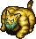 Tiger Tosser
- Tiger Tosser - HP: 32 AP: 16 DP: 10 Exp: 45 GP: 10 Type: Normal Speed: Normal Sp.Atk Rate: 33% (near), 33% (far) Item Drop Rate: 4% ~ Ability ~ Throws an adjacent creature at Shiren, or throws Shiren at another creature, onto a trap, or into a Monster House. Range of 5 tiles, deals 5 damage.

</td>
      <td></td>
    </tr>
    <tr>
      <td colspan="8" class="purpleDivider"></td>
    </tr>
    <tr>
      <td rowspan="2" class="centeredText">8</td>
      <td class="day items">
 Curse Girl
- Curse Girl - HP: 20 AP: 18 DP: 4 Exp: 24 GP: 7 Type: Normal Speed: Normal Sp.Atk Rate: 24% (near), 0% (far) Item Drop Rate: 0% ~ Ability ~ Curses or seals 1 item when adjacent.

</td>
      <td class="day">
 Nigiri Baby
- Nigiri Baby - HP: 23 AP: 12 DP: 7 Exp: 18 GP: 6 Type: Normal Speed: Normal Sp.Atk Rate: 0% (near), 0% (far) Item Drop Rate: 4% ~ Ability ~ Instantly collapses when hit by thrown onigiri.

</td>
      <td class="day useful">
 Karakuroid
- Karakuroid - HP: 32 AP: 14 DP: 8 Exp: 45 GP: 9 Type: Metal Speed: Swift 1 Sp.Atk Rate: 38% (near), 38% (far) Item Drop Rate: 4% ~ Ability ~ Initially Napping, wakes when Shiren enters or exits the room. Creates a trap on the ground, then stops acting for 2 turns. Occasionally creates a trap when slain.

</td>
      <td class="day">
 Floaty
- Floaty - HP: 23 AP: 12 DP: 7 Exp: 18 GP: 6 Type: Normal Speed: Swift 1 Sp.Atk Rate: 23% (near), 0% (far) Item Drop Rate: 4% ~ Ability ~ Initially Napping in a group of 3. Shiren can be warped 1~3 floors when surrounded by 3 Floaty monsters.

</td>
      <td class="day">
 Moseal
- Moseal - HP: 60 AP: 10 DP: 6 Exp: 25 GP: 4 Type: Aquatic Speed: Normal Sp.Atk Rate: 50% (near), 32% (far) Item Drop Rate: 10% ~ Ability ~ Performs a tackle that deals 10 damage when lined up vertically within 10 tiles. Turns Apathetic after tackling. Doesn't move on its own.

</td>
      <td class="day">
 Tiger Tosser
- Tiger Tosser - HP: 32 AP: 16 DP: 10 Exp: 45 GP: 10 Type: Normal Speed: Normal Sp.Atk Rate: 33% (near), 33% (far) Item Drop Rate: 4% ~ Ability ~ Throws an adjacent creature at Shiren, or throws Shiren at another creature, onto a trap, or into a Monster House. Range of 5 tiles, deals 5 damage.

</td>
      <td class="day">
 Pop Tank
- Pop Tank - HP: 40 AP: 25 DP: 12 Exp: 120 GP: 12 Type: Metal/Explode Speed: Slow Sp.Atk Rate: 75% (near), 40% (far) Item Drop Rate: 2% ~ Ability ~ Fires a 20 damage cannon in a straight line whenever Shiren is in range of the 1 tile blast radius.

</td>
    </tr>
    <tr>
      <td></td>
      <td></td>
      <td class="day danger">
 Fearabbit
- Fearabbit - HP: 20 AP: 15 DP: 4 Exp: 15 GP: 9 Type: Magic Speed: Normal Sp.Atk Rate: 21% (near), 21% (far) Item Drop Rate: 4% ~ Ability ~ Attracts up to 3 creatures including Shiren to itself from anywhere in the same room.

</td>
      <td></td>
      <td></td>
      <td></td>
      <td></td>
    </tr>
    <tr>
      <td colspan="8" class="purpleDivider"></td>
    </tr>
    <tr>
      <td rowspan="1" class="centeredText">9</td>
      <td class="day items">
 Curse Girl
- Curse Girl - HP: 20 AP: 18 DP: 4 Exp: 24 GP: 7 Type: Normal Speed: Normal Sp.Atk Rate: 24% (near), 0% (far) Item Drop Rate: 0% ~ Ability ~ Curses or seals 1 item when adjacent.

</td>
      <td class="day">
 Gyaza
- Gyaza - HP: 28 AP: 19 DP: 10 Exp: 45 GP: 20 Type: Aquatic Speed: Normal Sp.Atk Rate: 0% (near), 0% (far) Item Drop Rate: 4% ~ Ability ~ Converts most effects received other than direct attacks to 2 damage.

</td>
      <td class="day danger">
 Fearabbit
- Fearabbit - HP: 20 AP: 15 DP: 4 Exp: 15 GP: 9 Type: Magic Speed: Normal Sp.Atk Rate: 21% (near), 21% (far) Item Drop Rate: 4% ~ Ability ~ Attracts up to 3 creatures including Shiren to itself from anywhere in the same room.

</td>
      <td></td>
      <td></td>
      <td class="day">
 Tiger Tosser
- Tiger Tosser - HP: 32 AP: 16 DP: 10 Exp: 45 GP: 10 Type: Normal Speed: Normal Sp.Atk Rate: 33% (near), 33% (far) Item Drop Rate: 4% ~ Ability ~ Throws an adjacent creature at Shiren, or throws Shiren at another creature, onto a trap, or into a Monster House. Range of 5 tiles, deals 5 damage.

</td>
      <td class="day">
 Pop Tank
- Pop Tank - HP: 40 AP: 25 DP: 12 Exp: 120 GP: 12 Type: Metal/Explode Speed: Slow Sp.Atk Rate: 75% (near), 40% (far) Item Drop Rate: 2% ~ Ability ~ Fires a 20 damage cannon in a straight line whenever Shiren is in range of the 1 tile blast radius.

</td>
    </tr>
    <tr>
      <td colspan="8" class="purpleDivider"></td>
    </tr>
    <tr>
      <td rowspan="1" class="centeredText">10</td>
      <td class="day">
 N'dubba
- N'dubba - HP: 32 AP: 16 DP: 8 Exp: 16 GP: 8 Type: Metal Speed: Normal Sp.Atk Rate: 0% (near), 0% (far) Item Drop Rate: 0% ~ Ability ~ Disguises itself as an item. Reveals itself and attacks when Shiren tries to pick it up. Identified when advancing floors.

</td>
      <td class="day">
 Gyaza
- Gyaza - HP: 28 AP: 19 DP: 10 Exp: 45 GP: 20 Type: Aquatic Speed: Normal Sp.Atk Rate: 0% (near), 0% (far) Item Drop Rate: 4% ~ Ability ~ Converts most effects received other than direct attacks to 2 damage.

</td>
      <td class="day">
 Pumphantasm
- Pumphantasm - HP: 35 AP: 20 DP: 12 Exp: 43 GP: 24 Type: Plant/Floating Speed: Normal Sp.Atk Rate: 0% (near), 0% (far) Item Drop Rate: 0% ~ Ability ~ Can pass through walls. Unpredictable movement, but slowly approaches Shiren.

</td>
      <td class="day">
 Kumonigiri
- Kumonigiri - HP: 25 AP: 15 DP: 8 Exp: 35 GP: 18 Type: Normal Speed: Normal Sp.Atk Rate: 0% (near), 0% (far) Item Drop Rate: 4% ~ Ability ~ Only drops Onigiri.

</td>
      <td class="day">
 Naptapir
- Naptapir - HP: 32 AP: 27 DP: 11 Exp: 46 GP: 10 Type: Normal Speed: Normal Sp.Atk Rate: 23% (near), 0% (far) Item Drop Rate: 4% ~ Ability ~ Initially Napping, will not wake up when Shiren enters or exits the room. Occasionally inflicts Asleep status in a 1 tile radius when it's Napping, Asleep, or Sound Asleep. Chance to yawn when slain, inflicting Asleep status in a 1 tile radius.

</td>
      <td></td>
      <td class="day">
 Pop Tank
- Pop Tank - HP: 40 AP: 25 DP: 12 Exp: 120 GP: 12 Type: Metal/Explode Speed: Slow Sp.Atk Rate: 75% (near), 40% (far) Item Drop Rate: 2% ~ Ability ~ Fires a 20 damage cannon in a straight line whenever Shiren is in range of the 1 tile blast radius.

</td>
    </tr>
    <tr>
      <td colspan="8" class="purpleDivider"></td>
    </tr>
    <tr>
      <td rowspan="1" class="centeredText highlightShop2">11</td>
      <td class="day">
 N'dubba
- N'dubba - HP: 32 AP: 16 DP: 8 Exp: 16 GP: 8 Type: Metal Speed: Normal Sp.Atk Rate: 0% (near), 0% (far) Item Drop Rate: 0% ~ Ability ~ Disguises itself as an item. Reveals itself and attacks when Shiren tries to pick it up. Identified when advancing floors.

</td>
      <td class="day">
 Mutaikon
- Mutaikon - HP: 42 AP: 15 DP: 12 Exp: 49 GP: 8 Type: Plant Speed: Normal Sp.Atk Rate: 19% (near), 19% (far) Item Drop Rate: 6% ~ Ability ~ Throws Poison Grass 2 tiles ahead. Only drops Poison Grass.

</td>
      <td class="day">
 Pumphantasm
- Pumphantasm - HP: 35 AP: 20 DP: 12 Exp: 43 GP: 24 Type: Plant/Floating Speed: Normal Sp.Atk Rate: 0% (near), 0% (far) Item Drop Rate: 0% ~ Ability ~ Can pass through walls. Unpredictable movement, but slowly approaches Shiren.

</td>
      <td class="day">
 Kumonigiri
- Kumonigiri - HP: 25 AP: 15 DP: 8 Exp: 35 GP: 18 Type: Normal Speed: Normal Sp.Atk Rate: 0% (near), 0% (far) Item Drop Rate: 4% ~ Ability ~ Only drops Onigiri.

</td>
      <td class="day">
 Naptapir
- Naptapir - HP: 32 AP: 27 DP: 11 Exp: 46 GP: 10 Type: Normal Speed: Normal Sp.Atk Rate: 23% (near), 0% (far) Item Drop Rate: 4% ~ Ability ~ Initially Napping, will not wake up when Shiren enters or exits the room. Occasionally inflicts Asleep status in a 1 tile radius when it's Napping, Asleep, or Sound Asleep. Chance to yawn when slain, inflicting Asleep status in a 1 tile radius.

</td>
      <td></td>
      <td></td>
    </tr>
    <tr>
      <td colspan="8" class="purpleDivider"></td>
    </tr>
    <tr>
      <td rowspan="2" class="centeredText">12</td>
      <td class="day items">
 Swordsman
- Swordsman - HP: 45 AP: 15 DP: 9 Exp: 36 GP: 40 Type: Normal Speed: Normal Sp.Atk Rate: 19% (near), 0% (far) Item Drop Rate: 2% ~ Ability ~ Knocks away Shiren's equipped shield when adjacent, sending it 10 tiles backward.

</td>
      <td class="day">
 Mutaikon
- Mutaikon - HP: 42 AP: 15 DP: 12 Exp: 49 GP: 8 Type: Plant Speed: Normal Sp.Atk Rate: 19% (near), 19% (far) Item Drop Rate: 6% ~ Ability ~ Throws Poison Grass 2 tiles ahead. Only drops Poison Grass.

</td>
      <td class="day">
 Pumphantasm
- Pumphantasm - HP: 35 AP: 20 DP: 12 Exp: 43 GP: 24 Type: Plant/Floating Speed: Normal Sp.Atk Rate: 0% (near), 0% (far) Item Drop Rate: 0% ~ Ability ~ Can pass through walls. Unpredictable movement, but slowly approaches Shiren.

</td>
      <td class="day">
 Kumonigiri
- Kumonigiri - HP: 25 AP: 15 DP: 8 Exp: 35 GP: 18 Type: Normal Speed: Normal Sp.Atk Rate: 0% (near), 0% (far) Item Drop Rate: 4% ~ Ability ~ Only drops Onigiri.

</td>
      <td class="day">
 Naptapir
- Naptapir - HP: 32 AP: 27 DP: 11 Exp: 46 GP: 10 Type: Normal Speed: Normal Sp.Atk Rate: 23% (near), 0% (far) Item Drop Rate: 4% ~ Ability ~ Initially Napping, will not wake up when Shiren enters or exits the room. Occasionally inflicts Asleep status in a 1 tile radius when it's Napping, Asleep, or Sound Asleep. Chance to yawn when slain, inflicting Asleep status in a 1 tile radius.

</td>
      <td class="day items">
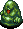 Mudkin
- Mudkin - HP: 45 AP: 15 DP: 9 Exp: 33 GP: 7 Type: Aquatic Speed: Normal Sp.Atk Rate: 38% (near), 0% (far) Item Drop Rate: 0% ~ Ability ~ Lowers upgrade value of equipped weapon or shield by 1. May also remove the item's tag. Chance to multiply when attacked. Doesn't use direct attacks.

</td>
      <td class="day">
 Scorpion
- Scorpion - HP: 45 AP: 21 DP: 9 Exp: 41 GP: 12 Type: Drain Speed: Normal Sp.Atk Rate: 19% (near), 0% (far) Item Drop Rate: 2% ~ Ability ~ Lowers Strength by 1 when adjacent.

</td>
    </tr>
    <tr>
      <td class="day">
 Metalhead
- Metalhead - HP: 55 AP: 19 DP: 11 Exp: 55 GP: 15 Type: Cyclops Speed: Normal Sp.Atk Rate: 34% (near), 34% (far) Item Drop Rate: 4% ~ Ability ~ Attacks 2 tiles ahead and through corners. Charges strength to deal double damage on the next turn.

</td>
      <td></td>
      <td></td>
      <td></td>
      <td></td>
      <td></td>
      <td></td>
    </tr>
    <tr>
      <td colspan="8" class="purpleDivider"></td>
    </tr>
    <tr>
      <td rowspan="1" class="centeredText">13</td>
      <td class="day">
 Mid Chintala
- Mid Chintala - HP: 45 AP: 15 DP: 9 Exp: 33 GP: 10 Type: Normal Speed: Normal Sp.Atk Rate: 0% (near), 0% (far) Item Drop Rate: 4% ~ Ability ~ None.

</td>
      <td class="day">
 Cololum
- Cololum - HP: 45 AP: 15 DP: 9 Exp: 33 GP: 16 Type: Normal Speed: Normal Sp.Atk Rate: 0% (near), 0% (far) Item Drop Rate: 4% ~ Ability ~ Rolls backward 10 tiles when slain by a direct attack, damaging anything it hits equal to damage received.

</td>
      <td class="day">
 Polygon Spinna
- Polygon Spinna - HP: 45 AP: 15 DP: 9 Exp: 33 GP: 11 Type: Drain/Magic Speed: Normal Sp.Atk Rate: 32% (near), 0% (far) Item Drop Rate: 2% ~ Ability ~ Lowers Max HP by 1 or Max Fullness by 3 when adjacent. Warps in front of Shiren when in a room.

</td>
      <td class="day">
 Cheer-Ham
- Cheer-Ham - HP: 34 AP: 10 DP: 7 Exp: 28 GP: 5 Type: Normal Speed: Normal Sp.Atk Rate: 0% (near), 0% (far) Item Drop Rate: 4% ~ Ability ~ Runs away from Shiren, but attacks when cornered. Moves toward monsters in view. Cheers for adjacent creatures, raising AP by 1 stage and letting them survive a fatal hit.

</td>
      <td class="day">
 Acrid Nut
- Acrid Nut - HP: 36 AP: 21 DP: 8 Exp: 35 GP: 18 Type: Plant/Explode Speed: Normal Sp.Atk Rate: 0% (near), 0% (far) Item Drop Rate: 0% ~ Ability ~ Either doubles experience points (Max: x1024) or explodes (33% chance) each time it eats a thrown item.

</td>
      <td class="day farm">
 Snacky
- Snacky - HP: 9 AP: 9 DP: 1 Exp: 1 GP: 2 Type: Floating Speed: Swift 1 Sp.Atk Rate: 0% (near), 0% (far) Item Drop Rate: 100% ~ Ability ~ Runs away from other creatures. Monsters focus on Snacky instead of Shiren and will level up if they defeat Snacky. Doesn't use direct attacks. Always drops a shop table item when slain by Shiren.

</td>
      <td></td>
    </tr>
    <tr>
      <td colspan="8" class="purpleDivider"></td>
    </tr>
    <tr>
      <td rowspan="1" class="centeredText">14</td>
      <td class="day">
 Kid Squid
- Kid Squid - HP: 42 AP: 20 DP: 11 Exp: 66 GP: 5 Type: Aquatic Speed: Normal Sp.Atk Rate: 16% (near), 0% (far) Item Drop Rate: 4% ~ Ability ~ Inflicts Blind status on an adjacent target. Turns into a Squid Sushi Scroll when hit by thrown onigiri.

</td>
      <td class="day">
 Cololum
- Cololum - HP: 45 AP: 15 DP: 9 Exp: 33 GP: 16 Type: Normal Speed: Normal Sp.Atk Rate: 0% (near), 0% (far) Item Drop Rate: 4% ~ Ability ~ Rolls backward 10 tiles when slain by a direct attack, damaging anything it hits equal to damage received.

</td>
      <td class="day">
 Polygon Spinna
- Polygon Spinna - HP: 45 AP: 15 DP: 9 Exp: 33 GP: 11 Type: Drain/Magic Speed: Normal Sp.Atk Rate: 32% (near), 0% (far) Item Drop Rate: 2% ~ Ability ~ Lowers Max HP by 1 or Max Fullness by 3 when adjacent. Warps in front of Shiren when in a room.

</td>
      <td class="day">
 Cheer-Ham
- Cheer-Ham - HP: 34 AP: 10 DP: 7 Exp: 28 GP: 5 Type: Normal Speed: Normal Sp.Atk Rate: 0% (near), 0% (far) Item Drop Rate: 4% ~ Ability ~ Runs away from Shiren, but attacks when cornered. Moves toward monsters in view. Cheers for adjacent creatures, raising AP by 1 stage and letting them survive a fatal hit.

</td>
      <td class="day">
 Acrid Nut
- Acrid Nut - HP: 36 AP: 21 DP: 8 Exp: 35 GP: 18 Type: Plant/Explode Speed: Normal Sp.Atk Rate: 0% (near), 0% (far) Item Drop Rate: 0% ~ Ability ~ Either doubles experience points (Max: x1024) or explodes (33% chance) each time it eats a thrown item.

</td>
      <td class="day farm">
 Snacky
- Snacky - HP: 9 AP: 9 DP: 1 Exp: 1 GP: 2 Type: Floating Speed: Swift 1 Sp.Atk Rate: 0% (near), 0% (far) Item Drop Rate: 100% ~ Ability ~ Runs away from other creatures. Monsters focus on Snacky instead of Shiren and will level up if they defeat Snacky. Doesn't use direct attacks. Always drops a shop table item when slain by Shiren.

</td>
      <td></td>
    </tr>
    <tr>
      <td colspan="8" class="purpleDivider"></td>
    </tr>
    <tr>
      <td rowspan="1" class="centeredText">15</td>
      <td class="day">
 Kid Squid
- Kid Squid - HP: 42 AP: 20 DP: 11 Exp: 66 GP: 5 Type: Aquatic Speed: Normal Sp.Atk Rate: 16% (near), 0% (far) Item Drop Rate: 4% ~ Ability ~ Inflicts Blind status on an adjacent target. Turns into a Squid Sushi Scroll when hit by thrown onigiri.

</td>
      <td class="day">
 Momoseal
- Momoseal - HP: 70 AP: 17 DP: 8 Exp: 40 GP: 12 Type: Aquatic Speed: Normal Sp.Atk Rate: 50% (near), 32% (far) Item Drop Rate: 12% ~ Ability ~ Performs a tackle that deals 20 damage when lined up vertically within 15 tiles. Turns Apathetic after tackling. Doesn't move on its own.

</td>
      <td class="day">
 Bored Kappa
- Bored Kappa - HP: 50 AP: 18 DP: 11 Exp: 48 GP: 7 Type: Aquatic Speed: Normal Sp.Atk Rate: 0% (near), 0% (far) Item Drop Rate: 4% ~ Ability ~ Stands on an item and throws it at Shiren when he gets within 3 tiles. Catches projectiles and throws them back at Shiren. Items it throws always miss. Cannot throw weapons, shields, or Gitan.

</td>
      <td class="day">
 Cheer-Ham
- Cheer-Ham - HP: 34 AP: 10 DP: 7 Exp: 28 GP: 5 Type: Normal Speed: Normal Sp.Atk Rate: 0% (near), 0% (far) Item Drop Rate: 4% ~ Ability ~ Runs away from Shiren, but attacks when cornered. Moves toward monsters in view. Cheers for adjacent creatures, raising AP by 1 stage and letting them survive a fatal hit.

</td>
      <td class="day danger">
 Foly
- Foly - HP: 46 AP: 20 DP: 2 Exp: 400 GP: 6 Type: Cyclops/Floating Speed: Swift 1 Sp.Atk Rate: 100% (near), 100% (far) Item Drop Rate: 0% ~ Ability ~ Moves along the wall in rooms, changes color and abilities every 8 turns. Nullifies and reflects direct attacks. Drops 15 damage lightning on all creatures in the room after it acts. Heals Shiren's HP by 100 after being hit with a direct attack. Counters with Berserk, Grounded, Inaccurate, Confused, or Shadow Bound status after being hit with a direct attack.

</td>
      <td class="day farm">
 Snacky
- Snacky - HP: 9 AP: 9 DP: 1 Exp: 1 GP: 2 Type: Floating Speed: Swift 1 Sp.Atk Rate: 0% (near), 0% (far) Item Drop Rate: 100% ~ Ability ~ Runs away from other creatures. Monsters focus on Snacky instead of Shiren and will level up if they defeat Snacky. Doesn't use direct attacks. Always drops a shop table item when slain by Shiren.

</td>
      <td></td>
    </tr>
    <tr>
      <td colspan="8" class="purpleDivider"></td>
    </tr>
    <tr>
      <td rowspan="1" class="centeredText">16</td>
      <td class="day">
 Kid Squid
- Kid Squid - HP: 42 AP: 20 DP: 11 Exp: 66 GP: 5 Type: Aquatic Speed: Normal Sp.Atk Rate: 16% (near), 0% (far) Item Drop Rate: 4% ~ Ability ~ Inflicts Blind status on an adjacent target. Turns into a Squid Sushi Scroll when hit by thrown onigiri.

</td>
      <td class="day">
 Momoseal
- Momoseal - HP: 70 AP: 17 DP: 8 Exp: 40 GP: 12 Type: Aquatic Speed: Normal Sp.Atk Rate: 50% (near), 32% (far) Item Drop Rate: 12% ~ Ability ~ Performs a tackle that deals 20 damage when lined up vertically within 15 tiles. Turns Apathetic after tackling. Doesn't move on its own.

</td>
      <td class="day">
 Bored Kappa
- Bored Kappa - HP: 50 AP: 18 DP: 11 Exp: 48 GP: 7 Type: Aquatic Speed: Normal Sp.Atk Rate: 0% (near), 0% (far) Item Drop Rate: 4% ~ Ability ~ Stands on an item and throws it at Shiren when he gets within 3 tiles. Catches projectiles and throws them back at Shiren. Items it throws always miss. Cannot throw weapons, shields, or Gitan.

</td>
      <td class="day farm">
 Dagger Bee
- Dagger Bee - HP: 46 AP: 27 DP: 14 Exp: 165 GP: 100 Type: Floating Speed: Normal Sp.Atk Rate: 16% (near), 0% (far) Item Drop Rate: 0% ~ Ability ~ Occasionally retreats after attacking. Stinger has double AP and inflicts Confused status, but it also collapses afterward.

</td>
      <td class="day danger">
 Foly
- Foly - HP: 46 AP: 20 DP: 2 Exp: 400 GP: 6 Type: Cyclops/Floating Speed: Swift 1 Sp.Atk Rate: 100% (near), 100% (far) Item Drop Rate: 0% ~ Ability ~ Moves along the wall in rooms, changes color and abilities every 8 turns. Nullifies and reflects direct attacks. Drops 15 damage lightning on all creatures in the room after it acts. Heals Shiren's HP by 100 after being hit with a direct attack. Counters with Berserk, Grounded, Inaccurate, Confused, or Shadow Bound status after being hit with a direct attack.

</td>
      <td class="day">
 Yanpii
- Yanpii - HP: 36 AP: 22 DP: 15 Exp: 170 GP: 6 Type: Normal Speed: Normal Sp.Atk Rate: 22% (near), 22% (far) Item Drop Rate: 4% ~ Ability ~ Headbutts Shiren when lined up, dealing 10 damage and knockback based on distance traveled. If Shiren is knocked into a wall, go into the wall 1 tile and take an additional 10 damage.

</td>
      <td class="day">
 Hopodile
- Hopodile - HP: 50 AP: 22 DP: 10 Exp: 50 GP: 9 Type: Dragon/Aquatic Speed: Normal Sp.Atk Rate: 0% (near), 0% (far) Item Drop Rate: 4% ~ Ability ~ Moves like a chess knight when Shiren is in view. Performs a 10 damage jumping attack when Shiren is in range of a chess knight hop.

</td>
    </tr>
    <tr>
      <td colspan="8" class="purpleDivider"></td>
    </tr>
    <tr>
      <td rowspan="2" class="centeredText">17</td>
      <td class="day farm">
 Zalokleft
- Zalokleft - HP: 43 AP: 14 DP: 9 Exp: 50 GP: 3 Type: Aquatic Speed: Normal Sp.Atk Rate: 20% (near), 0% (far) Item Drop Rate: 100% ~ Ability ~ Initially Napping. Steals an item from Shiren when adjacent or picks up an item on the ground, then warps. Runs away from Shiren after stealing an item. Doesn't use direct attacks. Always drops an item from a unique table if slain before stealing an item, otherwise drops the stolen item.

</td>
      <td class="day">
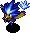 Flamebird
- Flamebird - HP: 33 AP: 16 DP: 11 Exp: 75 GP: 9 Type: Floating Speed: Normal Sp.Atk Rate: 56% (near), 0% (far) Item Drop Rate: 0% ~ Ability ~ Heals an adjacent monster's HP by 30. Items thrown at it burn up. Fire damage restores its HP. Multiplies from explosions.

</td>
      <td class="day">
 Bored Kappa
- Bored Kappa - HP: 50 AP: 18 DP: 11 Exp: 48 GP: 7 Type: Aquatic Speed: Normal Sp.Atk Rate: 0% (near), 0% (far) Item Drop Rate: 4% ~ Ability ~ Stands on an item and throws it at Shiren when he gets within 3 tiles. Catches projectiles and throws them back at Shiren. Items it throws always miss. Cannot throw weapons, shields, or Gitan.

</td>
      <td class="day farm">
 Dagger Bee
- Dagger Bee - HP: 46 AP: 27 DP: 14 Exp: 165 GP: 100 Type: Floating Speed: Normal Sp.Atk Rate: 16% (near), 0% (far) Item Drop Rate: 0% ~ Ability ~ Occasionally retreats after attacking. Stinger has double AP and inflicts Confused status, but it also collapses afterward.

</td>
      <td class="day danger">
 Foly
- Foly - HP: 46 AP: 20 DP: 2 Exp: 400 GP: 6 Type: Cyclops/Floating Speed: Swift 1 Sp.Atk Rate: 100% (near), 100% (far) Item Drop Rate: 0% ~ Ability ~ Moves along the wall in rooms, changes color and abilities every 8 turns. Nullifies and reflects direct attacks. Drops 15 damage lightning on all creatures in the room after it acts. Heals Shiren's HP by 100 after being hit with a direct attack. Counters with Berserk, Grounded, Inaccurate, Confused, or Shadow Bound status after being hit with a direct attack.

</td>
      <td class="day">
 Yanpii
- Yanpii - HP: 36 AP: 22 DP: 15 Exp: 170 GP: 6 Type: Normal Speed: Normal Sp.Atk Rate: 22% (near), 22% (far) Item Drop Rate: 4% ~ Ability ~ Headbutts Shiren when lined up, dealing 10 damage and knockback based on distance traveled. If Shiren is knocked into a wall, go into the wall 1 tile and take an additional 10 damage.

</td>
      <td class="day">
 Hopodile
- Hopodile - HP: 50 AP: 22 DP: 10 Exp: 50 GP: 9 Type: Dragon/Aquatic Speed: Normal Sp.Atk Rate: 0% (near), 0% (far) Item Drop Rate: 4% ~ Ability ~ Moves like a chess knight when Shiren is in view. Performs a 10 damage jumping attack when Shiren is in range of a chess knight hop.

</td>
    </tr>
    <tr>
      <td></td>
      <td></td>
      <td></td>
      <td></td>
      <td class="day items">
 Scoopie
- Scoopie - HP: 43 AP: 16 DP: 11 Exp: 75 GP: 9 Type: Metal Speed: Normal Sp.Atk Rate: 16% (near), 0% (far) Item Drop Rate: 4% ~ Ability ~ Shovels dirt at an adjacent target, which can hit through corners. Dirt fills 1 pot in your inventory when it hits Shiren, or inflicts Blind status when it hits an ally. Dirt in pots eventually changes to grass items when advancing floors.

</td>
      <td></td>
      <td></td>
    </tr>
    <tr>
      <td colspan="8" class="purpleDivider"></td>
    </tr>
    <tr>
      <td rowspan="1" class="centeredText">18</td>
      <td class="day farm">
 Zalokleft
- Zalokleft - HP: 43 AP: 14 DP: 9 Exp: 50 GP: 3 Type: Aquatic Speed: Normal Sp.Atk Rate: 20% (near), 0% (far) Item Drop Rate: 100% ~ Ability ~ Initially Napping. Steals an item from Shiren when adjacent or picks up an item on the ground, then warps. Runs away from Shiren after stealing an item. Doesn't use direct attacks. Always drops an item from a unique table if slain before stealing an item, otherwise drops the stolen item.

</td>
      <td class="day">
 Flamebird
- Flamebird - HP: 33 AP: 16 DP: 11 Exp: 75 GP: 9 Type: Floating Speed: Normal Sp.Atk Rate: 56% (near), 0% (far) Item Drop Rate: 0% ~ Ability ~ Heals an adjacent monster's HP by 30. Items thrown at it burn up. Fire damage restores its HP. Multiplies from explosions.

</td>
      <td class="day danger">
 Grampa Tank
- Grampa Tank - HP: 60 AP: 37 DP: 15 Exp: 400 GP: 75 Type: Metal/Explode Speed: Normal Sp.Atk Rate: 75% (near), 40% (far) Item Drop Rate: 2% ~ Ability ~ Fires a 30 damage cannon in a straight line whenever Shiren is in range of the 1 tile blast radius.

</td>
      <td class="day farm">
 Dagger Bee
- Dagger Bee - HP: 46 AP: 27 DP: 14 Exp: 165 GP: 100 Type: Floating Speed: Normal Sp.Atk Rate: 16% (near), 0% (far) Item Drop Rate: 0% ~ Ability ~ Occasionally retreats after attacking. Stinger has double AP and inflicts Confused status, but it also collapses afterward.

</td>
      <td class="day items">
 Scoopie
- Scoopie - HP: 43 AP: 16 DP: 11 Exp: 75 GP: 9 Type: Metal Speed: Normal Sp.Atk Rate: 16% (near), 0% (far) Item Drop Rate: 4% ~ Ability ~ Shovels dirt at an adjacent target, which can hit through corners. Dirt fills 1 pot in your inventory when it hits Shiren, or inflicts Blind status when it hits an ally. Dirt in pots eventually changes to grass items when advancing floors.

</td>
      <td class="day">
 Yanpii
- Yanpii - HP: 36 AP: 22 DP: 15 Exp: 170 GP: 6 Type: Normal Speed: Normal Sp.Atk Rate: 22% (near), 22% (far) Item Drop Rate: 4% ~ Ability ~ Headbutts Shiren when lined up, dealing 10 damage and knockback based on distance traveled. If Shiren is knocked into a wall, go into the wall 1 tile and take an additional 10 damage.

</td>
      <td class="day">
 Hopodile
- Hopodile - HP: 50 AP: 22 DP: 10 Exp: 50 GP: 9 Type: Dragon/Aquatic Speed: Normal Sp.Atk Rate: 0% (near), 0% (far) Item Drop Rate: 4% ~ Ability ~ Moves like a chess knight when Shiren is in view. Performs a 10 damage jumping attack when Shiren is in range of a chess knight hop.

</td>
    </tr>
    <tr>
      <td colspan="8" class="purpleDivider"></td>
    </tr>
    <tr>
      <td rowspan="1" class="centeredText">19</td>
      <td class="day">
 Beanie
- Beanie - HP: 45 AP: 23 DP: 10 Exp: 125 GP: 50 Type: Plant Speed: Normal Sp.Atk Rate: 0% (near), 0% (far) Item Drop Rate: 4% ~ Ability ~ None.

</td>
      <td class="day">
 DJ Mage
- DJ Mage - HP: 45 AP: 22 DP: 13 Exp: 110 GP: 8 Type: Magic Speed: Normal Sp.Atk Rate: 64% (near), 47% (far) Item Drop Rate: 6% ~ Ability ~ Fires a magic bullet with a random effect in a straight line: Warp, knockback, switch positions, or increase action speed by 1 stage.

</td>
      <td class="day danger">
 Grampa Tank
- Grampa Tank - HP: 60 AP: 37 DP: 15 Exp: 400 GP: 75 Type: Metal/Explode Speed: Normal Sp.Atk Rate: 75% (near), 40% (far) Item Drop Rate: 2% ~ Ability ~ Fires a 30 damage cannon in a straight line whenever Shiren is in range of the 1 tile blast radius.

</td>
      <td class="day">
 Eligan
- Eligan - HP: 58 AP: 32 DP: 16 Exp: 220 GP: 50 Type: Normal Speed: Normal Sp.Atk Rate: 0% (near), 0% (far) Item Drop Rate: 4% ~ Ability ~ None.

</td>
      <td class="day items">
 Scoopie
- Scoopie - HP: 43 AP: 16 DP: 11 Exp: 75 GP: 9 Type: Metal Speed: Normal Sp.Atk Rate: 16% (near), 0% (far) Item Drop Rate: 4% ~ Ability ~ Shovels dirt at an adjacent target, which can hit through corners. Dirt fills 1 pot in your inventory when it hits Shiren, or inflicts Blind status when it hits an ally. Dirt in pots eventually changes to grass items when advancing floors.

</td>
      <td></td>
      <td></td>
    </tr>
    <tr>
      <td colspan="8" class="purpleDivider"></td>
    </tr>
    <tr>
      <td rowspan="1" class="centeredText">20</td>
      <td class="day">
 Beanie
- Beanie - HP: 45 AP: 23 DP: 10 Exp: 125 GP: 50 Type: Plant Speed: Normal Sp.Atk Rate: 0% (near), 0% (far) Item Drop Rate: 4% ~ Ability ~ None.

</td>
      <td class="day">
 DJ Mage
- DJ Mage - HP: 45 AP: 22 DP: 13 Exp: 110 GP: 8 Type: Magic Speed: Normal Sp.Atk Rate: 64% (near), 47% (far) Item Drop Rate: 6% ~ Ability ~ Fires a magic bullet with a random effect in a straight line: Warp, knockback, switch positions, or increase action speed by 1 stage.

</td>
      <td class="day danger">
 Grampa Tank
- Grampa Tank - HP: 60 AP: 37 DP: 15 Exp: 400 GP: 75 Type: Metal/Explode Speed: Normal Sp.Atk Rate: 75% (near), 40% (far) Item Drop Rate: 2% ~ Ability ~ Fires a 30 damage cannon in a straight line whenever Shiren is in range of the 1 tile blast radius.

</td>
      <td class="day">
 Eligan
- Eligan - HP: 58 AP: 32 DP: 16 Exp: 220 GP: 50 Type: Normal Speed: Normal Sp.Atk Rate: 0% (near), 0% (far) Item Drop Rate: 4% ~ Ability ~ None.

</td>
      <td class="day farm">
 Grass Dude
- Grass Dude - HP: 60 AP: 25 DP: 11 Exp: 160 GP: 40 Type: Plant Speed: Normal Sp.Atk Rate: 21% (near), 16% (far) Item Drop Rate: 0% ~ Ability ~ Spreads grass in a 1 tile radius when adjacent. Pierce-throws grass in a straight line at a distance. Carries up to 2 grass items. Becomes Pin Dude with 0 grass.

</td>
      <td class="day">
 Pin Dude
- Pin Dude - HP: 60 AP: 20 DP: 10 Exp: 100 GP: 20 Type: Plant Speed: Swift 1 Sp.Atk Rate: 0% (near), 0% (far) Item Drop Rate: 0% ~ Ability ~ Runs from Shiren, but attacks when adjacent. Becomes Grass Dude when it picks up a grass item.

</td>
      <td></td>
    </tr>
    <tr>
      <td colspan="8" class="purpleDivider"></td>
    </tr>
    <tr>
      <td rowspan="1" class="centeredText highlightShop2">21</td>
      <td class="day">
 Sproutyrant
- Sproutyrant - HP: 60 AP: 22 DP: 10 Exp: 14 GP: 80 Type: Plant Speed: Normal Sp.Atk Rate: 0% (near), 0% (far) Item Drop Rate: 4% ~ Ability ~ Monster family becomes immune to most recent status inflicted upon it, excluding Sealed status.

</td>
      <td class="day">
 DJ Mage
- DJ Mage - HP: 45 AP: 22 DP: 13 Exp: 110 GP: 8 Type: Magic Speed: Normal Sp.Atk Rate: 64% (near), 47% (far) Item Drop Rate: 6% ~ Ability ~ Fires a magic bullet with a random effect in a straight line: Warp, knockback, switch positions, or increase action speed by 1 stage.

</td>
      <td class="day farm">
 Green Zalokleft
- Green Zalokleft - HP: 55 AP: 17 DP: 11 Exp: 240 GP: 10 Type: Aquatic Speed: Normal Sp.Atk Rate: 25% (near), 0% (far) Item Drop Rate: 100% ~ Ability ~ Initially Napping. Steals an item from Shiren when adjacent or picks up an item on the ground, then warps. Runs away from Shiren after stealing an item. Doesn't use direct attacks. Always drops an item from a unique table if slain before stealing an item, otherwise drops the stolen item.

</td>
      <td class="day">
 Eligan
- Eligan - HP: 58 AP: 32 DP: 16 Exp: 220 GP: 50 Type: Normal Speed: Normal Sp.Atk Rate: 0% (near), 0% (far) Item Drop Rate: 4% ~ Ability ~ None.

</td>
      <td class="day farm">
 Grass Dude
- Grass Dude - HP: 60 AP: 25 DP: 11 Exp: 160 GP: 40 Type: Plant Speed: Normal Sp.Atk Rate: 21% (near), 16% (far) Item Drop Rate: 0% ~ Ability ~ Spreads grass in a 1 tile radius when adjacent. Pierce-throws grass in a straight line at a distance. Carries up to 2 grass items. Becomes Pin Dude with 0 grass.

</td>
      <td class="day">
 Pin Dude
- Pin Dude - HP: 60 AP: 20 DP: 10 Exp: 100 GP: 20 Type: Plant Speed: Swift 1 Sp.Atk Rate: 0% (near), 0% (far) Item Drop Rate: 0% ~ Ability ~ Runs from Shiren, but attacks when adjacent. Becomes Grass Dude when it picks up a grass item.

</td>
      <td></td>
    </tr>
    <tr>
      <td colspan="8" class="purpleDivider"></td>
    </tr>
    <tr>
      <td rowspan="1" class="centeredText">22</td>
      <td class="day">
 Sproutyrant
- Sproutyrant - HP: 60 AP: 22 DP: 10 Exp: 14 GP: 80 Type: Plant Speed: Normal Sp.Atk Rate: 0% (near), 0% (far) Item Drop Rate: 4% ~ Ability ~ Monster family becomes immune to most recent status inflicted upon it, excluding Sealed status.

</td>
      <td class="day items">
 Nigiri Morph
- Nigiri Morph - HP: 55 AP: 20 DP: 11 Exp: 124 GP: 60 Type: Normal Speed: Normal Sp.Atk Rate: 18% (near), 0% (far) Item Drop Rate: 4% ~ Ability ~ Transforms an inventory item into Large Onigiri when adjacent, excluding equipped items. Instantly collapses when hit by thrown onigiri.

</td>
      <td class="day farm">
 Green Zalokleft
- Green Zalokleft - HP: 55 AP: 17 DP: 11 Exp: 240 GP: 10 Type: Aquatic Speed: Normal Sp.Atk Rate: 25% (near), 0% (far) Item Drop Rate: 100% ~ Ability ~ Initially Napping. Steals an item from Shiren when adjacent or picks up an item on the ground, then warps. Runs away from Shiren after stealing an item. Doesn't use direct attacks. Always drops an item from a unique table if slain before stealing an item, otherwise drops the stolen item.

</td>
      <td class="day useful">
 Steamroid
- Steamroid - HP: 55 AP: 25 DP: 16 Exp: 240 GP: 35 Type: Metal Speed: Swift 1 Sp.Atk Rate: 38% (near), 38% (far) Item Drop Rate: 4% ~ Ability ~ Initially Napping, wakes when Shiren enters or exits the room. Creates a trap on the ground, then stops acting for 2 turns. Occasionally creates a trap when slain.

</td>
      <td class="day farm">
 Grass Dude
- Grass Dude - HP: 60 AP: 25 DP: 11 Exp: 160 GP: 40 Type: Plant Speed: Normal Sp.Atk Rate: 21% (near), 16% (far) Item Drop Rate: 0% ~ Ability ~ Spreads grass in a 1 tile radius when adjacent. Pierce-throws grass in a straight line at a distance. Carries up to 2 grass items. Becomes Pin Dude with 0 grass.

</td>
      <td class="day">
 Pin Dude
- Pin Dude - HP: 60 AP: 20 DP: 10 Exp: 100 GP: 20 Type: Plant Speed: Swift 1 Sp.Atk Rate: 0% (near), 0% (far) Item Drop Rate: 0% ~ Ability ~ Runs from Shiren, but attacks when adjacent. Becomes Grass Dude when it picks up a grass item.

</td>
      <td class="day">
 Poofy
- Poofy - HP: 55 AP: 27 DP: 11 Exp: 24 GP: 40 Type: Normal Speed: Swift 1 Sp.Atk Rate: 23% (near), 0% (far) Item Drop Rate: 4% ~ Ability ~ Initially Napping in a group of 3. Shiren can be warped 1~3 floors when surrounded by 3 Poofy monsters.

</td>
    </tr>
    <tr>
      <td colspan="8" class="purpleDivider"></td>
    </tr>
    <tr>
      <td rowspan="2" class="centeredText">23</td>
      <td class="day">
 Sproutyrant
- Sproutyrant - HP: 60 AP: 22 DP: 10 Exp: 14 GP: 80 Type: Plant Speed: Normal Sp.Atk Rate: 0% (near), 0% (far) Item Drop Rate: 4% ~ Ability ~ Monster family becomes immune to most recent status inflicted upon it, excluding Sealed status.

</td>
      <td class="day items">
 Nigiri Morph
- Nigiri Morph - HP: 55 AP: 20 DP: 11 Exp: 124 GP: 60 Type: Normal Speed: Normal Sp.Atk Rate: 18% (near), 0% (far) Item Drop Rate: 4% ~ Ability ~ Transforms an inventory item into Large Onigiri when adjacent, excluding equipped items. Instantly collapses when hit by thrown onigiri.

</td>
      <td class="day farm">
 Green Zalokleft
- Green Zalokleft - HP: 55 AP: 17 DP: 11 Exp: 240 GP: 10 Type: Aquatic Speed: Normal Sp.Atk Rate: 25% (near), 0% (far) Item Drop Rate: 100% ~ Ability ~ Initially Napping. Steals an item from Shiren when adjacent or picks up an item on the ground, then warps. Runs away from Shiren after stealing an item. Doesn't use direct attacks. Always drops an item from a unique table if slain before stealing an item, otherwise drops the stolen item.

</td>
      <td class="day useful">
 Steamroid
- Steamroid - HP: 55 AP: 25 DP: 16 Exp: 240 GP: 35 Type: Metal Speed: Swift 1 Sp.Atk Rate: 38% (near), 38% (far) Item Drop Rate: 4% ~ Ability ~ Initially Napping, wakes when Shiren enters or exits the room. Creates a trap on the ground, then stops acting for 2 turns. Occasionally creates a trap when slain.

</td>
      <td class="day">
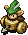 Boy Cart
- Boy Cart - HP: 43 AP: 20 DP: 11 Exp: 75 GP: 2 Type: Normal Speed: Swift 1 Sp.Atk Rate: 100% (near), 80% (far) Item Drop Rate: 6% ~ Ability ~ Shoots Wood Arrows. Moves away if Shiren gets close. Doesn't attack in hallways. Only drops Wood Arrows.

</td>
      <td class="day farm">
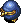 Froggucci
- Froggucci - HP: 47 AP: 26 DP: 15 Exp: 215 GP: 5 Type: Normal Speed: Normal Sp.Atk Rate: 26% (near), 0% (far) Item Drop Rate: 100% ~ Ability ~ Steals Gitan when adjacent and warps, then runs from Shiren at swift speed. Stands on Gitan it finds the ground. Doesn't use direct attacks. Heals HP when hit by thrown Gitan.

</td>
      <td class="day">
 Poofy
- Poofy - HP: 55 AP: 27 DP: 11 Exp: 24 GP: 40 Type: Normal Speed: Swift 1 Sp.Atk Rate: 23% (near), 0% (far) Item Drop Rate: 4% ~ Ability ~ Initially Napping in a group of 3. Shiren can be warped 1~3 floors when surrounded by 3 Poofy monsters.

</td>
    </tr>
    <tr>
      <td class="day items">
 Gyadon
- Gyadon - HP: 55 AP: 17 DP: 11 Exp: 165 GP: 19 Type: Floating Speed: Normal Sp.Atk Rate: 21% (near), 0% (far) Item Drop Rate: 4% ~ Ability ~ Pecks a staff from your inventory when adjacent, reducing its charges to 0.

</td>
      <td class="day">
 Pandanigiri
- Pandanigiri - HP: 55 AP: 40 DP: 18 Exp: 350 GP: 120 Type: Normal Speed: Normal Sp.Atk Rate: 0% (near), 0% (far) Item Drop Rate: 4% ~ Ability ~ Only drops Onigiri.

</td>
      <td class="day danger">
 Absorbiphant
- Absorbiphant - HP: 43 AP: 22 DP: 10 Exp: 110 GP: 12 Type: Drain Speed: Normal Sp.Atk Rate: 100% (near), 100% (far) Item Drop Rate: 4% ~ Ability ~ Absorbs status conditions inflicted on itself or from a creature within a 1 tile radius, fully restoring its own HP and raising AP by 1 stage.

</td>
      <td class="day">
 Snooztapir
- Snooztapir - HP: 80 AP: 50 DP: 15 Exp: 480 GP: 89 Type: Normal Speed: Normal Sp.Atk Rate: 23% (near), 0% (far) Item Drop Rate: 4% ~ Ability ~ Initially Napping, will not wake up when Shiren enters or exits the room. Occasionally inflicts Asleep status in a 1 tile radius when it's Napping, Asleep, or Sound Asleep. Chance to yawn when slain, inflicting Asleep status in a 1 tile radius.

</td>
      <td></td>
      <td></td>
      <td></td>
    </tr>
    <tr>
      <td colspan="8" class="purpleDivider"></td>
    </tr>
    <tr>
      <td rowspan="2" class="centeredText">24</td>
      <td class="day">
 Ironhead
- Ironhead - HP: 60 AP: 38 DP: 16 Exp: 230 GP: 70 Type: Cyclops Speed: Normal Sp.Atk Rate: 34% (near), 34% (far) Item Drop Rate: 4% ~ Ability ~ Attacks 2 tiles ahead and through corners. Charges strength to deal double damage on the next turn.

</td>
      <td class="day">
 Pandanigiri
- Pandanigiri - HP: 55 AP: 40 DP: 18 Exp: 350 GP: 120 Type: Normal Speed: Normal Sp.Atk Rate: 0% (near), 0% (far) Item Drop Rate: 4% ~ Ability ~ Only drops Onigiri.

</td>
      <td class="day danger">
 Absorbiphant
- Absorbiphant - HP: 43 AP: 22 DP: 10 Exp: 110 GP: 12 Type: Drain Speed: Normal Sp.Atk Rate: 100% (near), 100% (far) Item Drop Rate: 4% ~ Ability ~ Absorbs status conditions inflicted on itself or from a creature within a 1 tile radius, fully restoring its own HP and raising AP by 1 stage.

</td>
      <td class="day">
 Snooztapir
- Snooztapir - HP: 80 AP: 50 DP: 15 Exp: 480 GP: 89 Type: Normal Speed: Normal Sp.Atk Rate: 23% (near), 0% (far) Item Drop Rate: 4% ~ Ability ~ Initially Napping, will not wake up when Shiren enters or exits the room. Occasionally inflicts Asleep status in a 1 tile radius when it's Napping, Asleep, or Sound Asleep. Chance to yawn when slain, inflicting Asleep status in a 1 tile radius.

</td>
      <td class="day">
 Boy Cart
- Boy Cart - HP: 43 AP: 20 DP: 11 Exp: 75 GP: 2 Type: Normal Speed: Swift 1 Sp.Atk Rate: 100% (near), 80% (far) Item Drop Rate: 6% ~ Ability ~ Shoots Wood Arrows. Moves away if Shiren gets close. Doesn't attack in hallways. Only drops Wood Arrows.

</td>
      <td class="day farm">
 Froggucci
- Froggucci - HP: 47 AP: 26 DP: 15 Exp: 215 GP: 5 Type: Normal Speed: Normal Sp.Atk Rate: 26% (near), 0% (far) Item Drop Rate: 100% ~ Ability ~ Steals Gitan when adjacent and warps, then runs from Shiren at swift speed. Stands on Gitan it finds the ground. Doesn't use direct attacks. Heals HP when hit by thrown Gitan.

</td>
      <td class="day">
 Poofy
- Poofy - HP: 55 AP: 27 DP: 11 Exp: 24 GP: 40 Type: Normal Speed: Swift 1 Sp.Atk Rate: 23% (near), 0% (far) Item Drop Rate: 4% ~ Ability ~ Initially Napping in a group of 3. Shiren can be warped 1~3 floors when surrounded by 3 Poofy monsters.

</td>
    </tr>
    <tr>
      <td class="day items">
 Gyadon
- Gyadon - HP: 55 AP: 17 DP: 11 Exp: 165 GP: 19 Type: Floating Speed: Normal Sp.Atk Rate: 21% (near), 0% (far) Item Drop Rate: 4% ~ Ability ~ Pecks a staff from your inventory when adjacent, reducing its charges to 0.

</td>
      <td></td>
      <td></td>
      <td></td>
      <td></td>
      <td></td>
      <td></td>
    </tr>
    <tr>
      <td colspan="8" class="purpleDivider"></td>
    </tr>
    <tr>
      <td rowspan="1" class="centeredText">25</td>
      <td class="day">
 Ironhead
- Ironhead - HP: 60 AP: 38 DP: 16 Exp: 230 GP: 70 Type: Cyclops Speed: Normal Sp.Atk Rate: 34% (near), 34% (far) Item Drop Rate: 4% ~ Ability ~ Attacks 2 tiles ahead and through corners. Charges strength to deal double damage on the next turn.

</td>
      <td class="day items">
 Cursister
- Cursister - HP: 40 AP: 22 DP: 10 Exp: 110 GP: 20 Type: Normal Speed: Normal Sp.Atk Rate: 27% (near), 0% (far) Item Drop Rate: 0% ~ Ability ~ Curses or seals 1 item when adjacent.

</td>
      <td class="day danger">
 Absorbiphant
- Absorbiphant - HP: 43 AP: 22 DP: 10 Exp: 110 GP: 12 Type: Drain Speed: Normal Sp.Atk Rate: 100% (near), 100% (far) Item Drop Rate: 4% ~ Ability ~ Absorbs status conditions inflicted on itself or from a creature within a 1 tile radius, fully restoring its own HP and raising AP by 1 stage.

</td>
      <td class="day">
 Hipadile
- Hipadile - HP: 60 AP: 48 DP: 15 Exp: 480 GP: 40 Type: Dragon/Aquatic Speed: Normal Sp.Atk Rate: 0% (near), 0% (far) Item Drop Rate: 4% ~ Ability ~ Moves like a chess knight when Shiren is in view. Performs a 20 damage jumping attack when Shiren is in range of a chess knight hop.

</td>
      <td class="day">
 Punisher
- Punisher - HP: 55 AP: 42 DP: 10 Exp: 210 GP: 90 Type: Normal Speed: Normal Sp.Atk Rate: 13% (near), 0% (far) Item Drop Rate: 4% ~ Ability ~ Occasionally lands a critical hit that deals double damage.

</td>
      <td></td>
      <td></td>
    </tr>
    <tr>
      <td colspan="8" class="purpleDivider"></td>
    </tr>
    <tr>
      <td rowspan="2" class="centeredText">26</td>
      <td class="day items">
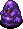 Muddy
- Muddy - HP: 55 AP: 17 DP: 11 Exp: 54 GP: 20 Type: Aquatic Speed: Normal Sp.Atk Rate: 38% (near), 0% (far) Item Drop Rate: 0% ~ Ability ~ Lowers upgrade value of equipped weapon or shield by 2. May also remove the item's tag. Chance to multiply when attacked. Doesn't use direct attacks.

</td>
      <td class="day items">
 Cursister
- Cursister - HP: 40 AP: 22 DP: 10 Exp: 110 GP: 20 Type: Normal Speed: Normal Sp.Atk Rate: 27% (near), 0% (far) Item Drop Rate: 0% ~ Ability ~ Curses or seals 1 item when adjacent.

</td>
      <td class="day">
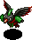 Crow Tengu
- Crow Tengu - HP: 37 AP: 16 DP: 11 Exp: 24 GP: 6 Type: Floating Speed: Normal Sp.Atk Rate: 0% (near), 0% (far) Item Drop Rate: 0% ~ Ability ~ Disguises itself as a different monster, but it can't use special attacks of the monster it's disguised as.

</td>
      <td class="day">
 Hipadile
- Hipadile - HP: 60 AP: 48 DP: 15 Exp: 480 GP: 40 Type: Dragon/Aquatic Speed: Normal Sp.Atk Rate: 0% (near), 0% (far) Item Drop Rate: 4% ~ Ability ~ Moves like a chess knight when Shiren is in view. Performs a 20 damage jumping attack when Shiren is in range of a chess knight hop.

</td>
      <td class="day">
 Punisher
- Punisher - HP: 55 AP: 42 DP: 10 Exp: 210 GP: 90 Type: Normal Speed: Normal Sp.Atk Rate: 13% (near), 0% (far) Item Drop Rate: 4% ~ Ability ~ Occasionally lands a critical hit that deals double damage.

</td>
      <td class="day">
 Firepuff
- Firepuff - HP: 50 AP: 25 DP: 20 Exp: 175 GP: 8 Type: Dragon/Floating Speed: Normal Sp.Atk Rate: 89% (near), 0% (far) Item Drop Rate: 4% ~ Ability ~ Breathes 10 damage fire when adjacent, which can hit through corners. Occasionally fails at breathing fire.

</td>
      <td class="day">
 Sr. Yanpii
- Sr. Yanpii - HP: 49 AP: 33 DP: 17 Exp: 450 GP: 90 Type: Normal Speed: Normal Sp.Atk Rate: 22% (near), 22% (far) Item Drop Rate: 4% ~ Ability ~ Headbutts Shiren when lined up, dealing 20 damage and knockback based on distance traveled. If Shiren is knocked into a wall, go into the wall 2 tiles and take an additional 20 damage.

</td>
    </tr>
    <tr>
      <td></td>
      <td></td>
      <td></td>
      <td></td>
      <td class="day items">
 Spadie
- Spadie - HP: 49 AP: 23 DP: 17 Exp: 190 GP: 45 Type: Metal Speed: Normal Sp.Atk Rate: 20% (near), 0% (far) Item Drop Rate: 4% ~ Ability ~ Shovels dirt at an adjacent target, which can hit through corners. Dirt fills 1 pot in your inventory when it hits Shiren, or inflicts Blind status when it hits an ally. Dirt in pots eventually changes to grass items when advancing floors.

</td>
      <td></td>
      <td></td>
    </tr>
    <tr>
      <td colspan="8" class="purpleDivider"></td>
    </tr>
    <tr>
      <td rowspan="2" class="centeredText">27</td>
      <td class="day items">
 Muddy
- Muddy - HP: 55 AP: 17 DP: 11 Exp: 54 GP: 20 Type: Aquatic Speed: Normal Sp.Atk Rate: 38% (near), 0% (far) Item Drop Rate: 0% ~ Ability ~ Lowers upgrade value of equipped weapon or shield by 2. May also remove the item's tag. Chance to multiply when attacked. Doesn't use direct attacks.

</td>
      <td class="day">
 Explochin
- Explochin - HP: 62 AP: 14 DP: 7 Exp: 15 GP: 7 Type: Aquatic/Cyclops/Explode Speed: Normal Sp.Atk Rate: 0% (near), 0% (far) Item Drop Rate: 0% ~ Ability ~ Turns red and stops acting after losing 35~49 HP. Explodes after losing 50~61 HP.

</td>
      <td class="day">
 Crow Tengu
- Crow Tengu - HP: 37 AP: 16 DP: 11 Exp: 24 GP: 6 Type: Floating Speed: Normal Sp.Atk Rate: 0% (near), 0% (far) Item Drop Rate: 0% ~ Ability ~ Disguises itself as a different monster, but it can't use special attacks of the monster it's disguised as.

</td>
      <td class="day">
 Hipadile
- Hipadile - HP: 60 AP: 48 DP: 15 Exp: 480 GP: 40 Type: Dragon/Aquatic Speed: Normal Sp.Atk Rate: 0% (near), 0% (far) Item Drop Rate: 4% ~ Ability ~ Moves like a chess knight when Shiren is in view. Performs a 20 damage jumping attack when Shiren is in range of a chess knight hop.

</td>
      <td class="day">
 Punisher
- Punisher - HP: 55 AP: 42 DP: 10 Exp: 210 GP: 90 Type: Normal Speed: Normal Sp.Atk Rate: 13% (near), 0% (far) Item Drop Rate: 4% ~ Ability ~ Occasionally lands a critical hit that deals double damage.

</td>
      <td class="day">
 Firepuff
- Firepuff - HP: 50 AP: 25 DP: 20 Exp: 175 GP: 8 Type: Dragon/Floating Speed: Normal Sp.Atk Rate: 89% (near), 0% (far) Item Drop Rate: 4% ~ Ability ~ Breathes 10 damage fire when adjacent, which can hit through corners. Occasionally fails at breathing fire.

</td>
      <td class="day">
 Sr. Yanpii
- Sr. Yanpii - HP: 49 AP: 33 DP: 17 Exp: 450 GP: 90 Type: Normal Speed: Normal Sp.Atk Rate: 22% (near), 22% (far) Item Drop Rate: 4% ~ Ability ~ Headbutts Shiren when lined up, dealing 20 damage and knockback based on distance traveled. If Shiren is knocked into a wall, go into the wall 2 tiles and take an additional 20 damage.

</td>
    </tr>
    <tr>
      <td></td>
      <td></td>
      <td></td>
      <td></td>
      <td class="day items">
 Spadie
- Spadie - HP: 49 AP: 23 DP: 17 Exp: 190 GP: 45 Type: Metal Speed: Normal Sp.Atk Rate: 20% (near), 0% (far) Item Drop Rate: 4% ~ Ability ~ Shovels dirt at an adjacent target, which can hit through corners. Dirt fills 1 pot in your inventory when it hits Shiren, or inflicts Blind status when it hits an ally. Dirt in pots eventually changes to grass items when advancing floors.

</td>
      <td></td>
      <td></td>
    </tr>
    <tr>
      <td colspan="8" class="purpleDivider"></td>
    </tr>
    <tr>
      <td rowspan="1" class="centeredText">28</td>
      <td class="day items">
 Muddy
- Muddy - HP: 55 AP: 17 DP: 11 Exp: 54 GP: 20 Type: Aquatic Speed: Normal Sp.Atk Rate: 38% (near), 0% (far) Item Drop Rate: 0% ~ Ability ~ Lowers upgrade value of equipped weapon or shield by 2. May also remove the item's tag. Chance to multiply when attacked. Doesn't use direct attacks.

</td>
      <td class="day">
 Explochin
- Explochin - HP: 62 AP: 14 DP: 7 Exp: 15 GP: 7 Type: Aquatic/Cyclops/Explode Speed: Normal Sp.Atk Rate: 0% (near), 0% (far) Item Drop Rate: 0% ~ Ability ~ Turns red and stops acting after losing 35~49 HP. Explodes after losing 50~61 HP.

</td>
      <td class="day">
 Crow Tengu
- Crow Tengu - HP: 37 AP: 16 DP: 11 Exp: 24 GP: 6 Type: Floating Speed: Normal Sp.Atk Rate: 0% (near), 0% (far) Item Drop Rate: 0% ~ Ability ~ Disguises itself as a different monster, but it can't use special attacks of the monster it's disguised as.

</td>
      <td class="day">
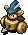 Cross Cart
- Cross Cart - HP: 56 AP: 28 DP: 17 Exp: 180 GP: 7 Type: Normal Speed: Swift 1 Sp.Atk Rate: 100% (near), 80% (far) Item Drop Rate: 6% ~ Ability ~ Shoots Iron Arrows. Moves away if Shiren gets close. Doesn't attack in hallways. Only drops Iron Arrows.

</td>
      <td class="day items">
 Spadie
- Spadie - HP: 49 AP: 23 DP: 17 Exp: 190 GP: 45 Type: Metal Speed: Normal Sp.Atk Rate: 20% (near), 0% (far) Item Drop Rate: 4% ~ Ability ~ Shovels dirt at an adjacent target, which can hit through corners. Dirt fills 1 pot in your inventory when it hits Shiren, or inflicts Blind status when it hits an ally. Dirt in pots eventually changes to grass items when advancing floors.

</td>
      <td class="day">
 Firepuff
- Firepuff - HP: 50 AP: 25 DP: 20 Exp: 175 GP: 8 Type: Dragon/Floating Speed: Normal Sp.Atk Rate: 89% (near), 0% (far) Item Drop Rate: 4% ~ Ability ~ Breathes 10 damage fire when adjacent, which can hit through corners. Occasionally fails at breathing fire.

</td>
      <td class="day">
 Sr. Yanpii
- Sr. Yanpii - HP: 49 AP: 33 DP: 17 Exp: 450 GP: 90 Type: Normal Speed: Normal Sp.Atk Rate: 22% (near), 22% (far) Item Drop Rate: 4% ~ Ability ~ Headbutts Shiren when lined up, dealing 20 damage and knockback based on distance traveled. If Shiren is knocked into a wall, go into the wall 2 tiles and take an additional 20 damage.

</td>
    </tr>
    <tr>
      <td colspan="8" class="purpleDivider"></td>
    </tr>
    <tr>
      <td rowspan="2" class="centeredText">29</td>
      <td class="day">
 Kappa Pest
- Kappa Pest - HP: 65 AP: 25 DP: 17 Exp: 180 GP: 20 Type: Aquatic Speed: Normal Sp.Atk Rate: 0% (near), 0% (far) Item Drop Rate: 4% ~ Ability ~ Stands on an item and throws it at Shiren when he gets within 5 tiles. Catches projectiles and throws them back at Shiren. Cannot throw weapons or Gitan.

</td>
      <td class="day">
 Explochin
- Explochin - HP: 62 AP: 14 DP: 7 Exp: 15 GP: 7 Type: Aquatic/Cyclops/Explode Speed: Normal Sp.Atk Rate: 0% (near), 0% (far) Item Drop Rate: 0% ~ Ability ~ Turns red and stops acting after losing 35~49 HP. Explodes after losing 50~61 HP.

</td>
      <td class="day">
 Go-Ham!
- Go-Ham! - HP: 45 AP: 15 DP: 10 Exp: 50 GP: 20 Type: Normal Speed: Normal Sp.Atk Rate: 0% (near), 0% (far) Item Drop Rate: 4% ~ Ability ~ Runs away from Shiren, but attacks when cornered. Moves toward monsters in view. Cheers for adjacent creatures, raising AP by 2 stages and letting them survive a fatal hit.

</td>
      <td class="day">
 Cross Cart
- Cross Cart - HP: 56 AP: 28 DP: 17 Exp: 180 GP: 7 Type: Normal Speed: Swift 1 Sp.Atk Rate: 100% (near), 80% (far) Item Drop Rate: 6% ~ Ability ~ Shoots Iron Arrows. Moves away if Shiren gets close. Doesn't attack in hallways. Only drops Iron Arrows.

</td>
      <td class="day danger">
 MC Mage
- MC Mage - HP: 56 AP: 26 DP: 17 Exp: 360 GP: 25 Type: Magic Speed: Normal Sp.Atk Rate: 64% (near), 47% (far) Item Drop Rate: 6% ~ Ability ~ Fires a magic bullet with a random effect in a straight line: Blind, confused, transient, or 20 damage.

</td>
      <td class="day danger">
 Scarabbit
- Scarabbit - HP: 55 AP: 26 DP: 13 Exp: 130 GP: 35 Type: Magic Speed: Normal Sp.Atk Rate: 21% (near), 21% (far) Item Drop Rate: 4% ~ Ability ~ Attracts up to 5 creatures including Shiren to itself from anywhere in the same room.

</td>
      <td class="day">
 Zapdon
- Zapdon - HP: 79 AP: 59 DP: 22 Exp: 330 GP: 33 Type: Normal Speed: Slow Sp.Atk Rate: 100% (near), 100% (far) Item Drop Rate: 4% ~ Ability ~ Counters with a 25 damage lightning attack when Shiren is in view after taking damage 3 times.

</td>
    </tr>
    <tr>
      <td></td>
      <td></td>
      <td></td>
      <td class="day danger">
 Digestiphant
- Digestiphant - HP: 56 AP: 28 DP: 17 Exp: 180 GP: 25 Type: Drain Speed: Normal Sp.Atk Rate: 100% (near), 100% (far) Item Drop Rate: 4% ~ Ability ~ Absorbs status conditions inflicted on itself or from a creature within a 1 tile radius, fully restoring its own HP and raising AP by 2 stages.

</td>
      <td></td>
      <td></td>
      <td></td>
    </tr>
    <tr>
      <td colspan="8" class="purpleDivider"></td>
    </tr>
    <tr>
      <td rowspan="1" class="centeredText">30</td>
      <td class="day">
 Kappa Pest
- Kappa Pest - HP: 65 AP: 25 DP: 17 Exp: 180 GP: 20 Type: Aquatic Speed: Normal Sp.Atk Rate: 0% (near), 0% (far) Item Drop Rate: 4% ~ Ability ~ Stands on an item and throws it at Shiren when he gets within 5 tiles. Catches projectiles and throws them back at Shiren. Cannot throw weapons or Gitan.

</td>
      <td class="day danger">
 N'twyn
- N'twyn - HP: 70 AP: 34 DP: 17 Exp: 360 GP: 20 Type: Metal Speed: Normal Sp.Atk Rate: 0% (near), 0% (far) Item Drop Rate: 0% ~ Ability ~ Disguises itself as an item. Reveals itself and attacks when Shiren tries to use or insert the item. Identified when advancing floors.

</td>
      <td class="day">
 Go-Ham!
- Go-Ham! - HP: 45 AP: 15 DP: 10 Exp: 50 GP: 20 Type: Normal Speed: Normal Sp.Atk Rate: 0% (near), 0% (far) Item Drop Rate: 4% ~ Ability ~ Runs away from Shiren, but attacks when cornered. Moves toward monsters in view. Cheers for adjacent creatures, raising AP by 2 stages and letting them survive a fatal hit.

</td>
      <td class="day danger">
 Digestiphant
- Digestiphant - HP: 56 AP: 28 DP: 17 Exp: 180 GP: 25 Type: Drain Speed: Normal Sp.Atk Rate: 100% (near), 100% (far) Item Drop Rate: 4% ~ Ability ~ Absorbs status conditions inflicted on itself or from a creature within a 1 tile radius, fully restoring its own HP and raising AP by 2 stages.

</td>
      <td class="day danger">
 MC Mage
- MC Mage - HP: 56 AP: 26 DP: 17 Exp: 360 GP: 25 Type: Magic Speed: Normal Sp.Atk Rate: 64% (near), 47% (far) Item Drop Rate: 6% ~ Ability ~ Fires a magic bullet with a random effect in a straight line: Blind, confused, transient, or 20 damage.

</td>
      <td class="day danger">
 Scarabbit
- Scarabbit - HP: 55 AP: 26 DP: 13 Exp: 130 GP: 35 Type: Magic Speed: Normal Sp.Atk Rate: 21% (near), 21% (far) Item Drop Rate: 4% ~ Ability ~ Attracts up to 5 creatures including Shiren to itself from anywhere in the same room.

</td>
      <td class="day">
 Zapdon
- Zapdon - HP: 79 AP: 59 DP: 22 Exp: 330 GP: 33 Type: Normal Speed: Slow Sp.Atk Rate: 100% (near), 100% (far) Item Drop Rate: 4% ~ Ability ~ Counters with a 25 damage lightning attack when Shiren is in view after taking damage 3 times.

</td>
    </tr>
    <tr>
      <td colspan="8" class="purpleDivider"></td>
    </tr>
    <tr>
      <td rowspan="1" class="centeredText highlightShop2">31</td>
      <td class="day">
 Death Gyaza
- Death Gyaza - HP: 55 AP: 37 DP: 20 Exp: 270 GP: 90 Type: Aquatic Speed: Normal Sp.Atk Rate: 0% (near), 0% (far) Item Drop Rate: 4% ~ Ability ~ Converts most effects received other than direct attacks to 2 damage.

</td>
      <td class="day danger">
 N'twyn
- N'twyn - HP: 70 AP: 34 DP: 17 Exp: 360 GP: 20 Type: Metal Speed: Normal Sp.Atk Rate: 0% (near), 0% (far) Item Drop Rate: 0% ~ Ability ~ Disguises itself as an item. Reveals itself and attacks when Shiren tries to use or insert the item. Identified when advancing floors.

</td>
      <td class="day">
 Katana Bee
- Katana Bee - HP: 75 AP: 47 DP: 20 Exp: 400 GP: 120 Type: Floating Speed: Normal Sp.Atk Rate: 16% (near), 0% (far) Item Drop Rate: 0% ~ Ability ~ Occasionally jumps to a tile within a 2 tile radius after attacking. Stinger has double AP and inflicts Confused status, but it also collapses afterward.

</td>
      <td class="day danger">
 Digestiphant
- Digestiphant - HP: 56 AP: 28 DP: 17 Exp: 180 GP: 25 Type: Drain Speed: Normal Sp.Atk Rate: 100% (near), 100% (far) Item Drop Rate: 4% ~ Ability ~ Absorbs status conditions inflicted on itself or from a creature within a 1 tile radius, fully restoring its own HP and raising AP by 2 stages.

</td>
      <td class="day">
 Dragon
- Dragon - HP: 75 AP: 42 DP: 22 Exp: 560 GP: 50 Type: Dragon Speed: Normal Sp.Atk Rate: 20% (near), 33% (far) Item Drop Rate: 22% ~ Ability ~ Spews a 20 damage flame that travels in a straight line.

</td>
      <td class="day">
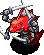 Shagga
- Shagga - HP: 70 AP: 44 DP: 25 Exp: 480 GP: 100 Type: Dragon Speed: Normal Sp.Atk Rate: 0% (near), 0% (far) Item Drop Rate: 4% ~ Ability ~ None.

</td>
      <td></td>
    </tr>
    <tr>
      <td colspan="8" class="purpleDivider"></td>
    </tr>
    <tr>
      <td rowspan="1" class="centeredText">32</td>
      <td class="day">
 Death Gyaza
- Death Gyaza - HP: 55 AP: 37 DP: 20 Exp: 270 GP: 90 Type: Aquatic Speed: Normal Sp.Atk Rate: 0% (near), 0% (far) Item Drop Rate: 4% ~ Ability ~ Converts most effects received other than direct attacks to 2 damage.

</td>
      <td></td>
      <td class="day">
 Katana Bee
- Katana Bee - HP: 75 AP: 47 DP: 20 Exp: 400 GP: 120 Type: Floating Speed: Normal Sp.Atk Rate: 16% (near), 0% (far) Item Drop Rate: 0% ~ Ability ~ Occasionally jumps to a tile within a 2 tile radius after attacking. Stinger has double AP and inflicts Confused status, but it also collapses afterward.

</td>
      <td class="day danger">
 Digestiphant
- Digestiphant - HP: 56 AP: 28 DP: 17 Exp: 180 GP: 25 Type: Drain Speed: Normal Sp.Atk Rate: 100% (near), 100% (far) Item Drop Rate: 4% ~ Ability ~ Absorbs status conditions inflicted on itself or from a creature within a 1 tile radius, fully restoring its own HP and raising AP by 2 stages.

</td>
      <td class="day">
 Dragon
- Dragon - HP: 75 AP: 42 DP: 22 Exp: 560 GP: 50 Type: Dragon Speed: Normal Sp.Atk Rate: 20% (near), 33% (far) Item Drop Rate: 22% ~ Ability ~ Spews a 20 damage flame that travels in a straight line.

</td>
      <td class="day">
 Shagga
- Shagga - HP: 70 AP: 44 DP: 25 Exp: 480 GP: 100 Type: Dragon Speed: Normal Sp.Atk Rate: 0% (near), 0% (far) Item Drop Rate: 4% ~ Ability ~ None.

</td>
      <td></td>
    </tr>
    <tr>
      <td colspan="8" class="purpleDivider"></td>
    </tr>
    <tr>
      <td rowspan="1" class="centeredText">33</td>
      <td class="day">
 Death Gyaza
- Death Gyaza - HP: 55 AP: 37 DP: 20 Exp: 270 GP: 90 Type: Aquatic Speed: Normal Sp.Atk Rate: 0% (near), 0% (far) Item Drop Rate: 4% ~ Ability ~ Converts most effects received other than direct attacks to 2 damage.

</td>
      <td></td>
      <td class="day">
 Katana Bee
- Katana Bee - HP: 75 AP: 47 DP: 20 Exp: 400 GP: 120 Type: Floating Speed: Normal Sp.Atk Rate: 16% (near), 0% (far) Item Drop Rate: 0% ~ Ability ~ Occasionally jumps to a tile within a 2 tile radius after attacking. Stinger has double AP and inflicts Confused status, but it also collapses afterward.

</td>
      <td class="day danger">
 Digestiphant
- Digestiphant - HP: 56 AP: 28 DP: 17 Exp: 180 GP: 25 Type: Drain Speed: Normal Sp.Atk Rate: 100% (near), 100% (far) Item Drop Rate: 4% ~ Ability ~ Absorbs status conditions inflicted on itself or from a creature within a 1 tile radius, fully restoring its own HP and raising AP by 2 stages.

</td>
      <td class="day">
 Dragon
- Dragon - HP: 75 AP: 42 DP: 22 Exp: 560 GP: 50 Type: Dragon Speed: Normal Sp.Atk Rate: 20% (near), 33% (far) Item Drop Rate: 22% ~ Ability ~ Spews a 20 damage flame that travels in a straight line.

</td>
      <td class="day">
 Shagga
- Shagga - HP: 70 AP: 44 DP: 25 Exp: 480 GP: 100 Type: Dragon Speed: Normal Sp.Atk Rate: 0% (near), 0% (far) Item Drop Rate: 4% ~ Ability ~ None.

</td>
      <td></td>
    </tr>
    <tr>
      <td colspan="8" class="purpleDivider"></td>
    </tr>
    <tr>
      <td rowspan="1" class="centeredText">34</td>
      <td class="day">
 Pumphantom
- Pumphantom - HP: 66 AP: 39 DP: 18 Exp: 390 GP: 40 Type: Plant/Floating Speed: Normal Sp.Atk Rate: 0% (near), 0% (far) Item Drop Rate: 0% ~ Ability ~ Can pass through walls. Unpredictable movement, but slowly approaches Shiren.

</td>
      <td class="day danger">
 Dazikon
- Dazikon - HP: 46 AP: 23 DP: 16 Exp: 260 GP: 20 Type: Plant Speed: Normal Sp.Atk Rate: 22% (near), 22% (far) Item Drop Rate: 6% ~ Ability ~ Throws Confusion Grass within a 2 tile radius. Throws Poison Grass if Shiren has Confused status. Only drops Confusion Grass.

</td>
      <td class="day">
 Polygon Shaka
- Polygon Shaka - HP: 70 AP: 34 DP: 11 Exp: 360 GP: 35 Type: Drain/Magic Speed: Normal Sp.Atk Rate: 28% (near), 0% (far) Item Drop Rate: 2% ~ Ability ~ Lowers Max HP by 2 or Max Fullness by 5 when adjacent. Warps in front of Shiren when in a room.

</td>
      <td class="day">
 Falcon Tengu
- Falcon Tengu - HP: 55 AP: 17 DP: 11 Exp: 66 GP: 20 Type: Floating Speed: Normal Sp.Atk Rate: 0% (near), 0% (far) Item Drop Rate: 0% ~ Ability ~ Disguises itself as a different monster, but it can't use special attacks of the monster it's disguised as.

</td>
      <td class="day">
 Flamepuff
- Flamepuff - HP: 64 AP: 39 DP: 22 Exp: 400 GP: 75 Type: Dragon/Floating Speed: Normal Sp.Atk Rate: 89% (near), 0% (far) Item Drop Rate: 4% ~ Ability ~ Breathes 20 damage fire when adjacent, which can hit through corners. Occasionally fails at breathing fire.

</td>
      <td></td>
      <td></td>
    </tr>
    <tr>
      <td colspan="8" class="purpleDivider"></td>
    </tr>
    <tr>
      <td rowspan="1" class="centeredText">35</td>
      <td class="day">
 Pumphantom
- Pumphantom - HP: 66 AP: 39 DP: 18 Exp: 390 GP: 40 Type: Plant/Floating Speed: Normal Sp.Atk Rate: 0% (near), 0% (far) Item Drop Rate: 0% ~ Ability ~ Can pass through walls. Unpredictable movement, but slowly approaches Shiren.

</td>
      <td class="day danger">
 Dazikon
- Dazikon - HP: 46 AP: 23 DP: 16 Exp: 260 GP: 20 Type: Plant Speed: Normal Sp.Atk Rate: 22% (near), 22% (far) Item Drop Rate: 6% ~ Ability ~ Throws Confusion Grass within a 2 tile radius. Throws Poison Grass if Shiren has Confused status. Only drops Confusion Grass.

</td>
      <td class="day">
 Polygon Shaka
- Polygon Shaka - HP: 70 AP: 34 DP: 11 Exp: 360 GP: 35 Type: Drain/Magic Speed: Normal Sp.Atk Rate: 28% (near), 0% (far) Item Drop Rate: 2% ~ Ability ~ Lowers Max HP by 2 or Max Fullness by 5 when adjacent. Warps in front of Shiren when in a room.

</td>
      <td class="day">
 Falcon Tengu
- Falcon Tengu - HP: 55 AP: 17 DP: 11 Exp: 66 GP: 20 Type: Floating Speed: Normal Sp.Atk Rate: 0% (near), 0% (far) Item Drop Rate: 0% ~ Ability ~ Disguises itself as a different monster, but it can't use special attacks of the monster it's disguised as.

</td>
      <td class="day">
 Flamepuff
- Flamepuff - HP: 64 AP: 39 DP: 22 Exp: 400 GP: 75 Type: Dragon/Floating Speed: Normal Sp.Atk Rate: 89% (near), 0% (far) Item Drop Rate: 4% ~ Ability ~ Breathes 20 damage fire when adjacent, which can hit through corners. Occasionally fails at breathing fire.

</td>
      <td class="day">
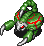 VeniScorp
- VeniScorp - HP: 70 AP: 45 DP: 22 Exp: 480 GP: 30 Type: Drain Speed: Normal Sp.Atk Rate: 19% (near), 0% (far) Item Drop Rate: 2% ~ Ability ~ Lowers Strength by 2 when adjacent.

</td>
      <td class="day">
 Cave Mamel
- Cave Mamel - HP: 6 AP: 60 DP: 19 Exp: 888 GP: 100 Type: Normal Speed: Normal Sp.Atk Rate: 0% (near), 0% (far) Item Drop Rate: 4% ~ Ability ~ Converts non-fixed damage received to 1 damage.

</td>
    </tr>
    <tr>
      <td colspan="8" class="purpleDivider"></td>
    </tr>
    <tr>
      <td rowspan="1" class="centeredText">36</td>
      <td class="day farm">
 Grass Poppa
- Grass Poppa - HP: 74 AP: 49 DP: 17 Exp: 640 GP: 210 Type: Plant Speed: Normal Sp.Atk Rate: 21% (near), 16% (far) Item Drop Rate: 0% ~ Ability ~ Spreads grass in a 1 tile radius when adjacent. Pierce-throws grass in a straight line at a distance. Carries up to 3 grass items. Becomes Pin Poppa with 0 grass.

</td>
      <td class="day">
 Pin Poppa
- Pin Poppa - HP: 76 AP: 48 DP: 16 Exp: 400 GP: 80 Type: Plant Speed: Swift 1 Sp.Atk Rate: 0% (near), 0% (far) Item Drop Rate: 0% ~ Ability ~ Runs from Shiren, but attacks when adjacent. Becomes Grass Poppa when it picks up a grass item. Generates its own grass as turns elapse.

</td>
      <td class="day">
 Tiger Hurler
- Tiger Hurler - HP: 68 AP: 45 DP: 18 Exp: 350 GP: 35 Type: Normal Speed: Normal Sp.Atk Rate: 33% (near), 33% (far) Item Drop Rate: 4% ~ Ability ~ Throws an adjacent creature at Shiren, or throws Shiren at another creature, onto a trap, or into a Monster House. Range of 10 tiles, deals 10 damage.

</td>
      <td class="day">
 Falcon Tengu
- Falcon Tengu - HP: 55 AP: 17 DP: 11 Exp: 66 GP: 20 Type: Floating Speed: Normal Sp.Atk Rate: 0% (near), 0% (far) Item Drop Rate: 0% ~ Ability ~ Disguises itself as a different monster, but it can't use special attacks of the monster it's disguised as.

</td>
      <td class="day">
 Flamepuff
- Flamepuff - HP: 64 AP: 39 DP: 22 Exp: 400 GP: 75 Type: Dragon/Floating Speed: Normal Sp.Atk Rate: 89% (near), 0% (far) Item Drop Rate: 4% ~ Ability ~ Breathes 20 damage fire when adjacent, which can hit through corners. Occasionally fails at breathing fire.

</td>
      <td class="day">
 VeniScorp
- VeniScorp - HP: 70 AP: 45 DP: 22 Exp: 480 GP: 30 Type: Drain Speed: Normal Sp.Atk Rate: 19% (near), 0% (far) Item Drop Rate: 2% ~ Ability ~ Lowers Strength by 2 when adjacent.

</td>
      <td class="day">
 Cave Mamel
- Cave Mamel - HP: 6 AP: 60 DP: 19 Exp: 888 GP: 100 Type: Normal Speed: Normal Sp.Atk Rate: 0% (near), 0% (far) Item Drop Rate: 4% ~ Ability ~ Converts non-fixed damage received to 1 damage.

</td>
    </tr>
    <tr>
      <td colspan="8" class="purpleDivider"></td>
    </tr>
    <tr>
      <td rowspan="1" class="centeredText">37</td>
      <td class="day farm">
 Grass Poppa
- Grass Poppa - HP: 74 AP: 49 DP: 17 Exp: 640 GP: 210 Type: Plant Speed: Normal Sp.Atk Rate: 21% (near), 16% (far) Item Drop Rate: 0% ~ Ability ~ Spreads grass in a 1 tile radius when adjacent. Pierce-throws grass in a straight line at a distance. Carries up to 3 grass items. Becomes Pin Poppa with 0 grass.

</td>
      <td class="day">
 Pin Poppa
- Pin Poppa - HP: 76 AP: 48 DP: 16 Exp: 400 GP: 80 Type: Plant Speed: Swift 1 Sp.Atk Rate: 0% (near), 0% (far) Item Drop Rate: 0% ~ Ability ~ Runs from Shiren, but attacks when adjacent. Becomes Grass Poppa when it picks up a grass item. Generates its own grass as turns elapse.

</td>
      <td class="day">
 Tiger Hurler
- Tiger Hurler - HP: 68 AP: 45 DP: 18 Exp: 350 GP: 35 Type: Normal Speed: Normal Sp.Atk Rate: 33% (near), 33% (far) Item Drop Rate: 4% ~ Ability ~ Throws an adjacent creature at Shiren, or throws Shiren at another creature, onto a trap, or into a Monster House. Range of 10 tiles, deals 10 damage.

</td>
      <td class="day extreme">
 MC Wizard
- MC Wizard - HP: 62 AP: 32 DP: 20 Exp: 800 GP: 60 Type: Magic Speed: Normal Sp.Atk Rate: 64% (near), 47% (far) Item Drop Rate: 6% ~ Ability ~ Fires a magic bullet with a random effect in a straight line: Level-1, sealed, paralyzed, cloned, or berserk.

</td>
      <td></td>
      <td class="day">
 VeniScorp
- VeniScorp - HP: 70 AP: 45 DP: 22 Exp: 480 GP: 30 Type: Drain Speed: Normal Sp.Atk Rate: 19% (near), 0% (far) Item Drop Rate: 2% ~ Ability ~ Lowers Strength by 2 when adjacent.

</td>
      <td></td>
    </tr>
    <tr>
      <td colspan="8" class="purpleDivider"></td>
    </tr>
    <tr>
      <td rowspan="1" class="centeredText">38</td>
      <td class="day farm">
 Grass Poppa
- Grass Poppa - HP: 74 AP: 49 DP: 17 Exp: 640 GP: 210 Type: Plant Speed: Normal Sp.Atk Rate: 21% (near), 16% (far) Item Drop Rate: 0% ~ Ability ~ Spreads grass in a 1 tile radius when adjacent. Pierce-throws grass in a straight line at a distance. Carries up to 3 grass items. Becomes Pin Poppa with 0 grass.

</td>
      <td class="day">
 Pin Poppa
- Pin Poppa - HP: 76 AP: 48 DP: 16 Exp: 400 GP: 80 Type: Plant Speed: Swift 1 Sp.Atk Rate: 0% (near), 0% (far) Item Drop Rate: 0% ~ Ability ~ Runs from Shiren, but attacks when adjacent. Becomes Grass Poppa when it picks up a grass item. Generates its own grass as turns elapse.

</td>
      <td class="day">
 Tiger Hurler
- Tiger Hurler - HP: 68 AP: 45 DP: 18 Exp: 350 GP: 35 Type: Normal Speed: Normal Sp.Atk Rate: 33% (near), 33% (far) Item Drop Rate: 4% ~ Ability ~ Throws an adjacent creature at Shiren, or throws Shiren at another creature, onto a trap, or into a Monster House. Range of 10 tiles, deals 10 damage.

</td>
      <td class="day extreme">
 MC Wizard
- MC Wizard - HP: 62 AP: 32 DP: 20 Exp: 800 GP: 60 Type: Magic Speed: Normal Sp.Atk Rate: 64% (near), 47% (far) Item Drop Rate: 6% ~ Ability ~ Fires a magic bullet with a random effect in a straight line: Level-1, sealed, paralyzed, cloned, or berserk.

</td>
      <td class="day">
 Huistdon
- Huistdon - HP: 108 AP: 69 DP: 25 Exp: 660 GP: 220 Type: Normal Speed: Slow Sp.Atk Rate: 100% (near), 100% (far) Item Drop Rate: 4% ~ Ability ~ Counters with a 30 damage lightning attack when Shiren is in view after taking damage 3 times.

</td>
      <td class="day">
 Eligagan
- Eligagan - HP: 62 AP: 62 DP: 22 Exp: 680 GP: 100 Type: Normal Speed: Normal Sp.Atk Rate: 0% (near), 0% (far) Item Drop Rate: 4% ~ Ability ~ None.

</td>
      <td class="day items">
 Gyairas
- Gyairas - HP: 64 AP: 49 DP: 22 Exp: 440 GP: 35 Type: Floating Speed: Normal Sp.Atk Rate: 21% (near), 0% (far) Item Drop Rate: 4% ~ Ability ~ Pecks a scroll or talisman from your inventory when adjacent, turning it into a Piece of Paper.

</td>
    </tr>
    <tr>
      <td colspan="8" class="purpleDivider"></td>
    </tr>
    <tr>
      <td rowspan="1" class="centeredText">39</td>
      <td></td>
      <td class="day">
 Sparkbird
- Sparkbird - HP: 43 AP: 20 DP: 25 Exp: 200 GP: 25 Type: Floating Speed: Normal Sp.Atk Rate: 56% (near), 0% (far) Item Drop Rate: 0% ~ Ability ~ Heals an adjacent monster's HP by 60. Items thrown at it burn up. Fire damage restores its HP. Multiplies from explosions.

</td>
      <td></td>
      <td></td>
      <td class="day">
 Huistdon
- Huistdon - HP: 108 AP: 69 DP: 25 Exp: 660 GP: 220 Type: Normal Speed: Slow Sp.Atk Rate: 100% (near), 100% (far) Item Drop Rate: 4% ~ Ability ~ Counters with a 30 damage lightning attack when Shiren is in view after taking damage 3 times.

</td>
      <td class="day">
 Eligagan
- Eligagan - HP: 62 AP: 62 DP: 22 Exp: 680 GP: 100 Type: Normal Speed: Normal Sp.Atk Rate: 0% (near), 0% (far) Item Drop Rate: 4% ~ Ability ~ None.

</td>
      <td class="day items">
 Gyairas
- Gyairas - HP: 64 AP: 49 DP: 22 Exp: 440 GP: 35 Type: Floating Speed: Normal Sp.Atk Rate: 21% (near), 0% (far) Item Drop Rate: 4% ~ Ability ~ Pecks a scroll or talisman from your inventory when adjacent, turning it into a Piece of Paper.

</td>
    </tr>
    <tr>
      <td colspan="8" class="purpleDivider"></td>
    </tr>
    <tr>
      <td rowspan="1" class="centeredText">40</td>
      <td class="day danger">
 Nashagga
- Nashagga - HP: 85 AP: 55 DP: 27 Exp: 1060 GP: 200 Type: Dragon Speed: Normal Sp.Atk Rate: 0% (near), 0% (far) Item Drop Rate: 4% ~ Ability ~ Attacks 2 times in 1 turn (single animation).

</td>
      <td class="day">
 Sparkbird
- Sparkbird - HP: 43 AP: 20 DP: 25 Exp: 200 GP: 25 Type: Floating Speed: Normal Sp.Atk Rate: 56% (near), 0% (far) Item Drop Rate: 0% ~ Ability ~ Heals an adjacent monster's HP by 60. Items thrown at it burn up. Fire damage restores its HP. Multiplies from explosions.

</td>
      <td class="day">
 Momomoseal
- Momomoseal - HP: 80 AP: 26 DP: 10 Exp: 400 GP: 80 Type: Aquatic Speed: Normal Sp.Atk Rate: 50% (near), 32% (far) Item Drop Rate: 14% ~ Ability ~ Performs a tackle that deals 30 damage when lined up vertically within 20 tiles. Turns Apathetic after tackling. Doesn't move on its own.

</td>
      <td></td>
      <td class="day">
 Huistdon
- Huistdon - HP: 108 AP: 69 DP: 25 Exp: 660 GP: 220 Type: Normal Speed: Slow Sp.Atk Rate: 100% (near), 100% (far) Item Drop Rate: 4% ~ Ability ~ Counters with a 30 damage lightning attack when Shiren is in view after taking damage 3 times.

</td>
      <td class="day">
 Eligagan
- Eligagan - HP: 62 AP: 62 DP: 22 Exp: 680 GP: 100 Type: Normal Speed: Normal Sp.Atk Rate: 0% (near), 0% (far) Item Drop Rate: 4% ~ Ability ~ None.

</td>
      <td></td>
    </tr>
    <tr>
      <td colspan="8" class="purpleDivider"></td>
    </tr>
    <tr>
      <td rowspan="1" class="centeredText highlightShop2">41</td>
      <td class="day danger">
 Nashagga
- Nashagga - HP: 85 AP: 55 DP: 27 Exp: 1060 GP: 200 Type: Dragon Speed: Normal Sp.Atk Rate: 0% (near), 0% (far) Item Drop Rate: 4% ~ Ability ~ Attacks 2 times in 1 turn (single animation).

</td>
      <td class="day">
 Steelhead
- Steelhead - HP: 65 AP: 58 DP: 25 Exp: 650 GP: 200 Type: Cyclops Speed: Normal Sp.Atk Rate: 34% (near), 34% (far) Item Drop Rate: 4% ~ Ability ~ Attacks 2 tiles ahead and through corners. Charges strength to deal double damage on the next turn.

</td>
      <td class="day">
 Momomoseal
- Momomoseal - HP: 80 AP: 26 DP: 10 Exp: 400 GP: 80 Type: Aquatic Speed: Normal Sp.Atk Rate: 50% (near), 32% (far) Item Drop Rate: 14% ~ Ability ~ Performs a tackle that deals 30 damage when lined up vertically within 20 tiles. Turns Apathetic after tackling. Doesn't move on its own.

</td>
      <td class="day danger">
 Sky Dragon
- Sky Dragon - HP: 80 AP: 55 DP: 26 Exp: 1600 GP: 120 Type: Dragon Speed: Normal Sp.Atk Rate: 25% (near), 15% (far) Item Drop Rate: 22% ~ Ability ~ Spews a homing 20 damage flame from anywhere in the same room.

</td>
      <td class="day">
 Huistdon
- Huistdon - HP: 108 AP: 69 DP: 25 Exp: 660 GP: 220 Type: Normal Speed: Slow Sp.Atk Rate: 100% (near), 100% (far) Item Drop Rate: 4% ~ Ability ~ Counters with a 30 damage lightning attack when Shiren is in view after taking damage 3 times.

</td>
      <td></td>
      <td></td>
    </tr>
    <tr>
      <td colspan="8" class="purpleDivider"></td>
    </tr>
    <tr>
      <td rowspan="1" class="centeredText">42</td>
      <td class="day danger">
 Nashagga
- Nashagga - HP: 85 AP: 55 DP: 27 Exp: 1060 GP: 200 Type: Dragon Speed: Normal Sp.Atk Rate: 0% (near), 0% (far) Item Drop Rate: 4% ~ Ability ~ Attacks 2 times in 1 turn (single animation).

</td>
      <td class="day">
 Steelhead
- Steelhead - HP: 65 AP: 58 DP: 25 Exp: 650 GP: 200 Type: Cyclops Speed: Normal Sp.Atk Rate: 34% (near), 34% (far) Item Drop Rate: 4% ~ Ability ~ Attacks 2 tiles ahead and through corners. Charges strength to deal double damage on the next turn.

</td>
      <td class="day">
 Momomoseal
- Momomoseal - HP: 80 AP: 26 DP: 10 Exp: 400 GP: 80 Type: Aquatic Speed: Normal Sp.Atk Rate: 50% (near), 32% (far) Item Drop Rate: 14% ~ Ability ~ Performs a tackle that deals 30 damage when lined up vertically within 20 tiles. Turns Apathetic after tackling. Doesn't move on its own.

</td>
      <td class="day danger">
 Sky Dragon
- Sky Dragon - HP: 80 AP: 55 DP: 26 Exp: 1600 GP: 120 Type: Dragon Speed: Normal Sp.Atk Rate: 25% (near), 15% (far) Item Drop Rate: 22% ~ Ability ~ Spews a homing 20 damage flame from anywhere in the same room.

</td>
      <td></td>
      <td></td>
      <td></td>
    </tr>
    <tr>
      <td colspan="8" class="purpleDivider"></td>
    </tr>
    <tr>
      <td rowspan="1" class="centeredText">43</td>
      <td></td>
      <td class="day">
 Steelhead
- Steelhead - HP: 65 AP: 58 DP: 25 Exp: 650 GP: 200 Type: Cyclops Speed: Normal Sp.Atk Rate: 34% (near), 34% (far) Item Drop Rate: 4% ~ Ability ~ Attacks 2 tiles ahead and through corners. Charges strength to deal double damage on the next turn.

</td>
      <td class="day">
 Momomoseal
- Momomoseal - HP: 80 AP: 26 DP: 10 Exp: 400 GP: 80 Type: Aquatic Speed: Normal Sp.Atk Rate: 50% (near), 32% (far) Item Drop Rate: 14% ~ Ability ~ Performs a tackle that deals 30 damage when lined up vertically within 20 tiles. Turns Apathetic after tackling. Doesn't move on its own.

</td>
      <td class="day danger">
 Sky Dragon
- Sky Dragon - HP: 80 AP: 55 DP: 26 Exp: 1600 GP: 120 Type: Dragon Speed: Normal Sp.Atk Rate: 25% (near), 15% (far) Item Drop Rate: 22% ~ Ability ~ Spews a homing 20 damage flame from anywhere in the same room.

</td>
      <td></td>
      <td></td>
      <td></td>
    </tr>
    <tr>
      <td colspan="8" class="purpleDivider"></td>
    </tr>
    <tr>
      <td rowspan="1" class="centeredText">44</td>
      <td class="day danger">
 Nigiri Boss
- Nigiri Boss - HP: 66 AP: 40 DP: 20 Exp: 550 GP: 125 Type: Normal Speed: Normal Sp.Atk Rate: 32% (near), 0% (far) Item Drop Rate: 4% ~ Ability ~ Inflicts Onigiri status when adjacent. Instantly collapses when hit by thrown onigiri.

</td>
      <td class="day danger">
 King Squid
- King Squid - HP: 65 AP: 55 DP: 24 Exp: 1300 GP: 50 Type: Aquatic Speed: Normal Sp.Atk Rate: 20% (near), 18% (far) Item Drop Rate: 4% ~ Ability ~ Inflicts Blind status on all targets in the same room. Turns into a Squid Sushi Scroll when hit by thrown onigiri.

</td>
      <td class="day">
 Concusschin
- Concusschin - HP: 72 AP: 18 DP: 8 Exp: 200 GP: 60 Type: Aquatic/Cyclops/Explode Speed: Normal Sp.Atk Rate: 0% (near), 0% (far) Item Drop Rate: 0% ~ Ability ~ Turns red and stops acting after losing 40~57 HP. Explodes after losing 58~71 HP.

</td>
      <td class="day">
 Rally Ham
- Rally Ham - HP: 55 AP: 22 DP: 15 Exp: 130 GP: 30 Type: Normal Speed: Normal Sp.Atk Rate: 0% (near), 0% (far) Item Drop Rate: 4% ~ Ability ~ Runs away from Shiren, but attacks when cornered. Moves toward monsters in view. Cheers for adjacent creatures, raising AP and DP by 1 stage and letting them survive a fatal hit.

</td>
      <td class="day">
 Nuttie
- Nuttie - HP: 57 AP: 51 DP: 16 Exp: 850 GP: 90 Type: Plant Speed: Normal Sp.Atk Rate: 0% (near), 0% (far) Item Drop Rate: 4% ~ Ability ~ None.

</td>
      <td class="day">
 Spicy Nut
- Spicy Nut - HP: 57 AP: 52 DP: 16 Exp: 150 GP: 270 Type: Plant/Explode Speed: Normal Sp.Atk Rate: 0% (near), 0% (far) Item Drop Rate: 0% ~ Ability ~ Either doubles experience points (Max: x1024) or explodes (33% chance) each time it eats a thrown item.

</td>
      <td></td>
    </tr>
    <tr>
      <td colspan="8" class="purpleDivider"></td>
    </tr>
    <tr>
      <td rowspan="2" class="centeredText">45</td>
      <td class="day danger">
 Nigiri Boss
- Nigiri Boss - HP: 66 AP: 40 DP: 20 Exp: 550 GP: 125 Type: Normal Speed: Normal Sp.Atk Rate: 32% (near), 0% (far) Item Drop Rate: 4% ~ Ability ~ Inflicts Onigiri status when adjacent. Instantly collapses when hit by thrown onigiri.

</td>
      <td class="day danger">
 King Squid
- King Squid - HP: 65 AP: 55 DP: 24 Exp: 1300 GP: 50 Type: Aquatic Speed: Normal Sp.Atk Rate: 20% (near), 18% (far) Item Drop Rate: 4% ~ Ability ~ Inflicts Blind status on all targets in the same room. Turns into a Squid Sushi Scroll when hit by thrown onigiri.

</td>
      <td class="day">
 Concusschin
- Concusschin - HP: 72 AP: 18 DP: 8 Exp: 200 GP: 60 Type: Aquatic/Cyclops/Explode Speed: Normal Sp.Atk Rate: 0% (near), 0% (far) Item Drop Rate: 0% ~ Ability ~ Turns red and stops acting after losing 40~57 HP. Explodes after losing 58~71 HP.

</td>
      <td class="day">
 Rally Ham
- Rally Ham - HP: 55 AP: 22 DP: 15 Exp: 130 GP: 30 Type: Normal Speed: Normal Sp.Atk Rate: 0% (near), 0% (far) Item Drop Rate: 4% ~ Ability ~ Runs away from Shiren, but attacks when cornered. Moves toward monsters in view. Cheers for adjacent creatures, raising AP and DP by 1 stage and letting them survive a fatal hit.

</td>
      <td class="day">
 Nuttie
- Nuttie - HP: 57 AP: 51 DP: 16 Exp: 850 GP: 90 Type: Plant Speed: Normal Sp.Atk Rate: 0% (near), 0% (far) Item Drop Rate: 4% ~ Ability ~ None.

</td>
      <td class="day">
 Spicy Nut
- Spicy Nut - HP: 57 AP: 52 DP: 16 Exp: 150 GP: 270 Type: Plant/Explode Speed: Normal Sp.Atk Rate: 0% (near), 0% (far) Item Drop Rate: 0% ~ Ability ~ Either doubles experience points (Max: x1024) or explodes (33% chance) each time it eats a thrown item.

</td>
      <td class="day">
 Big Chintala
- Big Chintala - HP: 65 AP: 30 DP: 11 Exp: 100 GP: 40 Type: Normal Speed: Normal Sp.Atk Rate: 0% (near), 0% (far) Item Drop Rate: 4% ~ Ability ~ None.

</td>
    </tr>
    <tr>
      <td class="day farm">
 Munchy
- Munchy - HP: 10 AP: 10 DP: 1 Exp: 1 GP: 3 Type: Floating Speed: Swift 1 Sp.Atk Rate: 0% (near), 0% (far) Item Drop Rate: 100% ~ Ability ~ Runs away from other creatures. Monsters focus on Munchy instead of Shiren and will level up if they defeat Munchy. Doesn't use direct attacks. Always drops a shop table item when slain by Shiren.

</td>
      <td></td>
      <td></td>
      <td></td>
      <td></td>
      <td></td>
      <td></td>
    </tr>
    <tr>
      <td colspan="8" class="purpleDivider"></td>
    </tr>
    <tr>
      <td rowspan="2" class="centeredText">46</td>
      <td class="day">
 Blazepuff
- Blazepuff - HP: 73 AP: 56 DP: 24 Exp: 1250 GP: 35 Type: Dragon/Floating Speed: Normal Sp.Atk Rate: 89% (near), 0% (far) Item Drop Rate: 4% ~ Ability ~ Breathes 30 damage fire when adjacent, which can hit through corners. Occasionally fails at breathing fire.

</td>
      <td class="day">
 Oingodile
- Oingodile - HP: 77 AP: 63 DP: 22 Exp: 1100 GP: 150 Type: Dragon/Aquatic Speed: Normal Sp.Atk Rate: 0% (near), 0% (far) Item Drop Rate: 4% ~ Ability ~ Moves like a chess knight when Shiren is in view. Performs a 30 damage jumping attack when Shiren is in range of a chess knight hop.

</td>
      <td class="day">
 Concusschin
- Concusschin - HP: 72 AP: 18 DP: 8 Exp: 200 GP: 60 Type: Aquatic/Cyclops/Explode Speed: Normal Sp.Atk Rate: 0% (near), 0% (far) Item Drop Rate: 0% ~ Ability ~ Turns red and stops acting after losing 40~57 HP. Explodes after losing 58~71 HP.

</td>
      <td class="day">
 Rally Ham
- Rally Ham - HP: 55 AP: 22 DP: 15 Exp: 130 GP: 30 Type: Normal Speed: Normal Sp.Atk Rate: 0% (near), 0% (far) Item Drop Rate: 4% ~ Ability ~ Runs away from Shiren, but attacks when cornered. Moves toward monsters in view. Cheers for adjacent creatures, raising AP and DP by 1 stage and letting them survive a fatal hit.

</td>
      <td class="day">
 Nuttie
- Nuttie - HP: 57 AP: 51 DP: 16 Exp: 850 GP: 90 Type: Plant Speed: Normal Sp.Atk Rate: 0% (near), 0% (far) Item Drop Rate: 4% ~ Ability ~ None.

</td>
      <td class="day">
 Spicy Nut
- Spicy Nut - HP: 57 AP: 52 DP: 16 Exp: 150 GP: 270 Type: Plant/Explode Speed: Normal Sp.Atk Rate: 0% (near), 0% (far) Item Drop Rate: 0% ~ Ability ~ Either doubles experience points (Max: x1024) or explodes (33% chance) each time it eats a thrown item.

</td>
      <td class="day">
 Big Chintala
- Big Chintala - HP: 65 AP: 30 DP: 11 Exp: 100 GP: 40 Type: Normal Speed: Normal Sp.Atk Rate: 0% (near), 0% (far) Item Drop Rate: 4% ~ Ability ~ None.

</td>
    </tr>
    <tr>
      <td class="day farm">
 Munchy
- Munchy - HP: 10 AP: 10 DP: 1 Exp: 1 GP: 3 Type: Floating Speed: Swift 1 Sp.Atk Rate: 0% (near), 0% (far) Item Drop Rate: 100% ~ Ability ~ Runs away from other creatures. Monsters focus on Munchy instead of Shiren and will level up if they defeat Munchy. Doesn't use direct attacks. Always drops a shop table item when slain by Shiren.

</td>
      <td></td>
      <td></td>
      <td></td>
      <td></td>
      <td></td>
      <td></td>
    </tr>
    <tr>
      <td colspan="8" class="purpleDivider"></td>
    </tr>
    <tr>
      <td rowspan="1" class="centeredText">47</td>
      <td class="day">
 Blazepuff
- Blazepuff - HP: 73 AP: 56 DP: 24 Exp: 1250 GP: 35 Type: Dragon/Floating Speed: Normal Sp.Atk Rate: 89% (near), 0% (far) Item Drop Rate: 4% ~ Ability ~ Breathes 30 damage fire when adjacent, which can hit through corners. Occasionally fails at breathing fire.

</td>
      <td class="day">
 Oingodile
- Oingodile - HP: 77 AP: 63 DP: 22 Exp: 1100 GP: 150 Type: Dragon/Aquatic Speed: Normal Sp.Atk Rate: 0% (near), 0% (far) Item Drop Rate: 4% ~ Ability ~ Moves like a chess knight when Shiren is in view. Performs a 30 damage jumping attack when Shiren is in range of a chess knight hop.

</td>
      <td class="day extreme">
 Ornery Tank
- Ornery Tank - HP: 83 AP: 48 DP: 19 Exp: 1600 GP: 80 Type: Metal/Explode Speed: Swift 1 Sp.Atk Rate: 75% (near), 40% (far) Item Drop Rate: 2% ~ Ability ~ Fires a 40 damage cannon in a straight line whenever Shiren is in range of the 1 tile blast radius.

</td>
      <td class="day items">
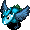 Trowelie
- Trowelie - HP: 66 AP: 40 DP: 20 Exp: 550 GP: 130 Type: Metal Speed: Normal Sp.Atk Rate: 22% (near), 18% (far) Item Drop Rate: 4% ~ Ability ~ Shovels dirt at a visible target within a 4 tile radius. Dirt fills 1 pot in your inventory when it hits Shiren, or inflicts Blind status when it hits an ally. Dirt in pots eventually changes to grass items when advancing floors.

</td>
      <td class="day items">
 Super Gazer
- Super Gazer - HP: 66 AP: 35 DP: 20 Exp: 550 GP: 15 Type: Cyclops/Magic Speed: Normal Sp.Atk Rate: 43% (near), 0% (far) Item Drop Rate: 2% ~ Ability ~ Hypnotizes Shiren when adjacent, forcing either item usage or an attack in a random direction.

</td>
      <td class="day">
 Eagle Tengu
- Eagle Tengu - HP: 65 AP: 26 DP: 13 Exp: 130 GP: 60 Type: Floating Speed: Normal Sp.Atk Rate: 0% (near), 0% (far) Item Drop Rate: 0% ~ Ability ~ Disguises itself as a different monster, but it can't use special attacks of the monster it's disguised as.

</td>
      <td></td>
    </tr>
    <tr>
      <td colspan="8" class="purpleDivider"></td>
    </tr>
    <tr>
      <td rowspan="1" class="centeredText">48</td>
      <td class="day">
 Blazepuff
- Blazepuff - HP: 73 AP: 56 DP: 24 Exp: 1250 GP: 35 Type: Dragon/Floating Speed: Normal Sp.Atk Rate: 89% (near), 0% (far) Item Drop Rate: 4% ~ Ability ~ Breathes 30 damage fire when adjacent, which can hit through corners. Occasionally fails at breathing fire.

</td>
      <td class="day">
 Oingodile
- Oingodile - HP: 77 AP: 63 DP: 22 Exp: 1100 GP: 150 Type: Dragon/Aquatic Speed: Normal Sp.Atk Rate: 0% (near), 0% (far) Item Drop Rate: 4% ~ Ability ~ Moves like a chess knight when Shiren is in view. Performs a 30 damage jumping attack when Shiren is in range of a chess knight hop.

</td>
      <td class="day extreme">
 Ornery Tank
- Ornery Tank - HP: 83 AP: 48 DP: 19 Exp: 1600 GP: 80 Type: Metal/Explode Speed: Swift 1 Sp.Atk Rate: 75% (near), 40% (far) Item Drop Rate: 2% ~ Ability ~ Fires a 40 damage cannon in a straight line whenever Shiren is in range of the 1 tile blast radius.

</td>
      <td class="day items">
 Trowelie
- Trowelie - HP: 66 AP: 40 DP: 20 Exp: 550 GP: 130 Type: Metal Speed: Normal Sp.Atk Rate: 22% (near), 18% (far) Item Drop Rate: 4% ~ Ability ~ Shovels dirt at a visible target within a 4 tile radius. Dirt fills 1 pot in your inventory when it hits Shiren, or inflicts Blind status when it hits an ally. Dirt in pots eventually changes to grass items when advancing floors.

</td>
      <td class="day items">
 Super Gazer
- Super Gazer - HP: 66 AP: 35 DP: 20 Exp: 550 GP: 15 Type: Cyclops/Magic Speed: Normal Sp.Atk Rate: 43% (near), 0% (far) Item Drop Rate: 2% ~ Ability ~ Hypnotizes Shiren when adjacent, forcing either item usage or an attack in a random direction.

</td>
      <td class="day">
 Eagle Tengu
- Eagle Tengu - HP: 65 AP: 26 DP: 13 Exp: 130 GP: 60 Type: Floating Speed: Normal Sp.Atk Rate: 0% (near), 0% (far) Item Drop Rate: 0% ~ Ability ~ Disguises itself as a different monster, but it can't use special attacks of the monster it's disguised as.

</td>
      <td class="day">
 Colocolum
- Colocolum - HP: 66 AP: 40 DP: 18 Exp: 550 GP: 150 Type: Normal Speed: Normal Sp.Atk Rate: 0% (near), 0% (far) Item Drop Rate: 4% ~ Ability ~ Rolls backward 10 tiles when slain by a direct attack, damaging anything it hits equal to damage received.

</td>
    </tr>
    <tr>
      <td colspan="8" class="purpleDivider"></td>
    </tr>
    <tr>
      <td rowspan="1" class="centeredText">49</td>
      <td class="day">
 Electroid
- Electroid - HP: 65 AP: 38 DP: 20 Exp: 770 GP: 80 Type: Metal Speed: Swift 1 Sp.Atk Rate: 38% (near), 38% (far) Item Drop Rate: 4% ~ Ability ~ Initially Napping, wakes when Shiren enters or exits the room. Creates a trap on the ground, then stops acting for 2 turns. Occasionally creates a trap when slain.

</td>
      <td class="day extreme">
 Porkon
- Porkon - HP: 75 AP: 52 DP: 20 Exp: 1600 GP: 200 Type: Normal Speed: Normal Sp.Atk Rate: 19% (near), 23% (far) Item Drop Rate: 6% ~ Ability ~ Throws a Porky Rock that deals 20 damage within a 6 tile radius. Only drops Porky Rocks.

</td>
      <td class="day">
 Strong Cart
- Strong Cart - HP: 65 AP: 38 DP: 20 Exp: 600 GP: 9 Type: Normal Speed: Swift 1 Sp.Atk Rate: 100% (near), 80% (far) Item Drop Rate: 6% ~ Ability ~ Shoots Knockback Arrows. Moves away if Shiren gets close. Doesn't attack in hallways. Only drops Knockback Arrows.

</td>
      <td class="day items">
 Trowelie
- Trowelie - HP: 66 AP: 40 DP: 20 Exp: 550 GP: 130 Type: Metal Speed: Normal Sp.Atk Rate: 22% (near), 18% (far) Item Drop Rate: 4% ~ Ability ~ Shovels dirt at a visible target within a 4 tile radius. Dirt fills 1 pot in your inventory when it hits Shiren, or inflicts Blind status when it hits an ally. Dirt in pots eventually changes to grass items when advancing floors.

</td>
      <td class="day items">
 Super Gazer
- Super Gazer - HP: 66 AP: 35 DP: 20 Exp: 550 GP: 15 Type: Cyclops/Magic Speed: Normal Sp.Atk Rate: 43% (near), 0% (far) Item Drop Rate: 2% ~ Ability ~ Hypnotizes Shiren when adjacent, forcing either item usage or an attack in a random direction.

</td>
      <td class="day">
 Eagle Tengu
- Eagle Tengu - HP: 65 AP: 26 DP: 13 Exp: 130 GP: 60 Type: Floating Speed: Normal Sp.Atk Rate: 0% (near), 0% (far) Item Drop Rate: 0% ~ Ability ~ Disguises itself as a different monster, but it can't use special attacks of the monster it's disguised as.

</td>
      <td class="day">
 Colocolum
- Colocolum - HP: 66 AP: 40 DP: 18 Exp: 550 GP: 150 Type: Normal Speed: Normal Sp.Atk Rate: 0% (near), 0% (far) Item Drop Rate: 4% ~ Ability ~ Rolls backward 10 tiles when slain by a direct attack, damaging anything it hits equal to damage received.

</td>
    </tr>
    <tr>
      <td colspan="8" class="purpleDivider"></td>
    </tr>
    <tr>
      <td rowspan="1" class="centeredText">50</td>
      <td class="day">
 Electroid
- Electroid - HP: 65 AP: 38 DP: 20 Exp: 770 GP: 80 Type: Metal Speed: Swift 1 Sp.Atk Rate: 38% (near), 38% (far) Item Drop Rate: 4% ~ Ability ~ Initially Napping, wakes when Shiren enters or exits the room. Creates a trap on the ground, then stops acting for 2 turns. Occasionally creates a trap when slain.

</td>
      <td class="day extreme">
 Porkon
- Porkon - HP: 75 AP: 52 DP: 20 Exp: 1600 GP: 200 Type: Normal Speed: Normal Sp.Atk Rate: 19% (near), 23% (far) Item Drop Rate: 6% ~ Ability ~ Throws a Porky Rock that deals 20 damage within a 6 tile radius. Only drops Porky Rocks.

</td>
      <td class="day">
 Strong Cart
- Strong Cart - HP: 65 AP: 38 DP: 20 Exp: 600 GP: 9 Type: Normal Speed: Swift 1 Sp.Atk Rate: 100% (near), 80% (far) Item Drop Rate: 6% ~ Ability ~ Shoots Knockback Arrows. Moves away if Shiren gets close. Doesn't attack in hallways. Only drops Knockback Arrows.

</td>
      <td class="day extreme">
 N'mach
- N'mach - HP: 77 AP: 48 DP: 22 Exp: 800 GP: 40 Type: Metal Speed: Normal Sp.Atk Rate: 0% (near), 0% (far) Item Drop Rate: 0% ~ Ability ~ Disguises itself as an item. Reveals itself and attacks when Shiren tries to use or insert the item. Not identified when advancing floors.

</td>
      <td class="day">
 Doztapir
- Doztapir - HP: 100 AP: 70 DP: 20 Exp: 800 GP: 170 Type: Normal Speed: Normal Sp.Atk Rate: 28% (near), 0% (far) Item Drop Rate: 4% ~ Ability ~ Initially Napping, will not wake up when Shiren enters or exits the room. Occasionally inflicts Asleep status in a 1 tile radius when it's Napping, Asleep, or Sound Asleep. Chance to yawn when slain, inflicting Asleep status in a 1 tile radius.

</td>
      <td></td>
      <td class="day">
 Colocolum
- Colocolum - HP: 66 AP: 40 DP: 18 Exp: 550 GP: 150 Type: Normal Speed: Normal Sp.Atk Rate: 0% (near), 0% (far) Item Drop Rate: 4% ~ Ability ~ Rolls backward 10 tiles when slain by a direct attack, damaging anything it hits equal to damage received.

</td>
    </tr>
    <tr>
      <td colspan="8" class="purpleDivider"></td>
    </tr>
    <tr>
      <td rowspan="1" class="centeredText highlightShop2">51</td>
      <td></td>
      <td class="day">
 Debaser
- Debaser - HP: 73 AP: 55 DP: 21 Exp: 680 GP: 240 Type: Normal Speed: Normal Sp.Atk Rate: 13% (near), 0% (far) Item Drop Rate: 4% ~ Ability ~ Occasionally lands a critical hit that deals double damage.

</td>
      <td class="day">
 Strong Cart
- Strong Cart - HP: 65 AP: 38 DP: 20 Exp: 600 GP: 9 Type: Normal Speed: Swift 1 Sp.Atk Rate: 100% (near), 80% (far) Item Drop Rate: 6% ~ Ability ~ Shoots Knockback Arrows. Moves away if Shiren gets close. Doesn't attack in hallways. Only drops Knockback Arrows.

</td>
      <td class="day extreme">
 N'mach
- N'mach - HP: 77 AP: 48 DP: 22 Exp: 800 GP: 40 Type: Metal Speed: Normal Sp.Atk Rate: 0% (near), 0% (far) Item Drop Rate: 0% ~ Ability ~ Disguises itself as an item. Reveals itself and attacks when Shiren tries to use or insert the item. Not identified when advancing floors.

</td>
      <td class="day">
 Doztapir
- Doztapir - HP: 100 AP: 70 DP: 20 Exp: 800 GP: 170 Type: Normal Speed: Normal Sp.Atk Rate: 28% (near), 0% (far) Item Drop Rate: 4% ~ Ability ~ Initially Napping, will not wake up when Shiren enters or exits the room. Occasionally inflicts Asleep status in a 1 tile radius when it's Napping, Asleep, or Sound Asleep. Chance to yawn when slain, inflicting Asleep status in a 1 tile radius.

</td>
      <td class="day">
 Jouncy
- Jouncy - HP: 73 AP: 45 DP: 21 Exp: 900 GP: 80 Type: Normal Speed: Swift 1 Sp.Atk Rate: 23% (near), 0% (far) Item Drop Rate: 4% ~ Ability ~ Initially Napping in a group of 3. Shiren can be warped 1~3 floors when surrounded by 3 Jouncy monsters.

</td>
      <td></td>
    </tr>
    <tr>
      <td colspan="8" class="purpleDivider"></td>
    </tr>
    <tr>
      <td rowspan="1" class="centeredText">52</td>
      <td class="day extreme">
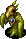 MC Sorceror
- MC Sorceror - HP: 73 AP: 45 DP: 21 Exp: 1000 GP: 100 Type: Magic Speed: Normal Sp.Atk Rate: 64% (near), 47% (far) Item Drop Rate: 6% ~ Ability ~ Fires a magic bullet with a random effect in a straight line: Level-3, empathy, onigiri, reduce HP to 1/4 of current value, or decrease action speed by 1 stage.

</td>
      <td class="day">
 Debaser
- Debaser - HP: 73 AP: 55 DP: 21 Exp: 680 GP: 240 Type: Normal Speed: Normal Sp.Atk Rate: 13% (near), 0% (far) Item Drop Rate: 4% ~ Ability ~ Occasionally lands a critical hit that deals double damage.

</td>
      <td class="day">
 Vexing Kappa
- Vexing Kappa - HP: 77 AP: 48 DP: 20 Exp: 800 GP: 60 Type: Aquatic Speed: Normal Sp.Atk Rate: 0% (near), 0% (far) Item Drop Rate: 4% ~ Ability ~ Stands on an item and throws it at Shiren when he gets within 10 tiles. Catches projectiles and throws them back at Shiren. Cannot throw Gitan.

</td>
      <td class="day">
 Sprouterror
- Sprouterror - HP: 88 AP: 44 DP: 24 Exp: 680 GP: 240 Type: Plant Speed: Normal Sp.Atk Rate: 0% (near), 0% (far) Item Drop Rate: 4% ~ Ability ~ Monster family becomes immune to most recent status inflicted upon it, excluding Sealed status.

</td>
      <td class="day">
 Doztapir
- Doztapir - HP: 100 AP: 70 DP: 20 Exp: 800 GP: 170 Type: Normal Speed: Normal Sp.Atk Rate: 28% (near), 0% (far) Item Drop Rate: 4% ~ Ability ~ Initially Napping, will not wake up when Shiren enters or exits the room. Occasionally inflicts Asleep status in a 1 tile radius when it's Napping, Asleep, or Sound Asleep. Chance to yawn when slain, inflicting Asleep status in a 1 tile radius.

</td>
      <td class="day">
 Jouncy
- Jouncy - HP: 73 AP: 45 DP: 21 Exp: 900 GP: 80 Type: Normal Speed: Swift 1 Sp.Atk Rate: 23% (near), 0% (far) Item Drop Rate: 4% ~ Ability ~ Initially Napping in a group of 3. Shiren can be warped 1~3 floors when surrounded by 3 Jouncy monsters.

</td>
      <td></td>
    </tr>
    <tr>
      <td colspan="8" class="purpleDivider"></td>
    </tr>
    <tr>
      <td rowspan="1" class="centeredText">53</td>
      <td class="day extreme">
 MC Sorceror
- MC Sorceror - HP: 73 AP: 45 DP: 21 Exp: 1000 GP: 100 Type: Magic Speed: Normal Sp.Atk Rate: 64% (near), 47% (far) Item Drop Rate: 6% ~ Ability ~ Fires a magic bullet with a random effect in a straight line: Level-3, empathy, onigiri, reduce HP to 1/4 of current value, or decrease action speed by 1 stage.

</td>
      <td class="day">
 Debaser
- Debaser - HP: 73 AP: 55 DP: 21 Exp: 680 GP: 240 Type: Normal Speed: Normal Sp.Atk Rate: 13% (near), 0% (far) Item Drop Rate: 4% ~ Ability ~ Occasionally lands a critical hit that deals double damage.

</td>
      <td class="day">
 Vexing Kappa
- Vexing Kappa - HP: 77 AP: 48 DP: 20 Exp: 800 GP: 60 Type: Aquatic Speed: Normal Sp.Atk Rate: 0% (near), 0% (far) Item Drop Rate: 4% ~ Ability ~ Stands on an item and throws it at Shiren when he gets within 10 tiles. Catches projectiles and throws them back at Shiren. Cannot throw Gitan.

</td>
      <td class="day">
 Sprouterror
- Sprouterror - HP: 88 AP: 44 DP: 24 Exp: 680 GP: 240 Type: Plant Speed: Normal Sp.Atk Rate: 0% (near), 0% (far) Item Drop Rate: 4% ~ Ability ~ Monster family becomes immune to most recent status inflicted upon it, excluding Sealed status.

</td>
      <td class="day">
 Trillman
- Trillman - HP: 118 AP: 51 DP: 18 Exp: 1050 GP: 150 Type: Drain Speed: Normal Sp.Atk Rate: 21% (near), 0% (far) Item Drop Rate: 4% ~ Ability ~ Inflicts Staffnesia when adjacent, which prevents Shiren from using or throwing staff items for 100 turns.

</td>
      <td class="day">
 Jouncy
- Jouncy - HP: 73 AP: 45 DP: 21 Exp: 900 GP: 80 Type: Normal Speed: Swift 1 Sp.Atk Rate: 23% (near), 0% (far) Item Drop Rate: 4% ~ Ability ~ Initially Napping in a group of 3. Shiren can be warped 1~3 floors when surrounded by 3 Jouncy monsters.

</td>
      <td class="day items">
 Mudster
- Mudster - HP: 77 AP: 40 DP: 20 Exp: 150 GP: 30 Type: Aquatic Speed: Normal Sp.Atk Rate: 38% (near), 0% (far) Item Drop Rate: 0% ~ Ability ~ Lowers upgrade value of equipped weapon and shield by 1. Erases 1 rune from an equipped weapon or shield. May also remove the item's tag. Chance to multiply when attacked. Doesn't use direct attacks.

</td>
    </tr>
    <tr>
      <td colspan="8" class="purpleDivider"></td>
    </tr>
    <tr>
      <td rowspan="1" class="centeredText">54</td>
      <td class="day extreme">
 MC Sorceror
- MC Sorceror - HP: 73 AP: 45 DP: 21 Exp: 1000 GP: 100 Type: Magic Speed: Normal Sp.Atk Rate: 64% (near), 47% (far) Item Drop Rate: 6% ~ Ability ~ Fires a magic bullet with a random effect in a straight line: Level-3, empathy, onigiri, reduce HP to 1/4 of current value, or decrease action speed by 1 stage.

</td>
      <td class="day">
 Debaser
- Debaser - HP: 73 AP: 55 DP: 21 Exp: 680 GP: 240 Type: Normal Speed: Normal Sp.Atk Rate: 13% (near), 0% (far) Item Drop Rate: 4% ~ Ability ~ Occasionally lands a critical hit that deals double damage.

</td>
      <td class="day">
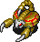 StunScorp
- StunScorp - HP: 80 AP: 60 DP: 25 Exp: 1100 GP: 80 Type: Drain Speed: Normal Sp.Atk Rate: 19% (near), 0% (far) Item Drop Rate: 2% ~ Ability ~ Lowers Max Strength by 1 when adjacent.

</td>
      <td class="day">
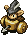 Pierce Cart
- Pierce Cart - HP: 74 AP: 50 DP: 22 Exp: 1100 GP: 15 Type: Normal Speed: Swift 1 Sp.Atk Rate: 100% (near), 80% (far) Item Drop Rate: 6% ~ Ability ~ Shoots Silver Arrows. Moves away if Shiren gets close. Doesn't attack in hallways. Only drops Silver Arrows.

</td>
      <td class="day">
 Pyrepuff
- Pyrepuff - HP: 85 AP: 70 DP: 26 Exp: 2650 GP: 80 Type: Dragon/Floating Speed: Normal Sp.Atk Rate: 89% (near), 0% (far) Item Drop Rate: 4% ~ Ability ~ Breathes 40 damage fire when adjacent, which can hit through corners. Occasionally fails at breathing fire.

</td>
      <td class="day">
 Jouncy
- Jouncy - HP: 73 AP: 45 DP: 21 Exp: 900 GP: 80 Type: Normal Speed: Swift 1 Sp.Atk Rate: 23% (near), 0% (far) Item Drop Rate: 4% ~ Ability ~ Initially Napping in a group of 3. Shiren can be warped 1~3 floors when surrounded by 3 Jouncy monsters.

</td>
      <td class="day items">
 Mudster
- Mudster - HP: 77 AP: 40 DP: 20 Exp: 150 GP: 30 Type: Aquatic Speed: Normal Sp.Atk Rate: 38% (near), 0% (far) Item Drop Rate: 0% ~ Ability ~ Lowers upgrade value of equipped weapon and shield by 1. Erases 1 rune from an equipped weapon or shield. May also remove the item's tag. Chance to multiply when attacked. Doesn't use direct attacks.

</td>
    </tr>
    <tr>
      <td colspan="8" class="purpleDivider"></td>
    </tr>
    <tr>
      <td rowspan="1" class="centeredText">55</td>
      <td></td>
      <td></td>
      <td class="day">
 StunScorp
- StunScorp - HP: 80 AP: 60 DP: 25 Exp: 1100 GP: 80 Type: Drain Speed: Normal Sp.Atk Rate: 19% (near), 0% (far) Item Drop Rate: 2% ~ Ability ~ Lowers Max Strength by 1 when adjacent.

</td>
      <td class="day">
 Pierce Cart
- Pierce Cart - HP: 74 AP: 50 DP: 22 Exp: 1100 GP: 15 Type: Normal Speed: Swift 1 Sp.Atk Rate: 100% (near), 80% (far) Item Drop Rate: 6% ~ Ability ~ Shoots Silver Arrows. Moves away if Shiren gets close. Doesn't attack in hallways. Only drops Silver Arrows.

</td>
      <td class="day">
 Pyrepuff
- Pyrepuff - HP: 85 AP: 70 DP: 26 Exp: 2650 GP: 80 Type: Dragon/Floating Speed: Normal Sp.Atk Rate: 89% (near), 0% (far) Item Drop Rate: 4% ~ Ability ~ Breathes 40 damage fire when adjacent, which can hit through corners. Occasionally fails at breathing fire.

</td>
      <td class="day">
 Tiger Chucker
- Tiger Chucker - HP: 71 AP: 58 DP: 24 Exp: 850 GP: 60 Type: Normal Speed: Normal Sp.Atk Rate: 33% (near), 33% (far) Item Drop Rate: 4% ~ Ability ~ Throws an adjacent creature at Shiren, or throws Shiren at another creature, onto a trap, or into a Monster House. Range of 15 tiles, deals 15 damage.

</td>
      <td></td>
    </tr>
    <tr>
      <td colspan="8" class="purpleDivider"></td>
    </tr>
    <tr>
      <td rowspan="1" class="centeredText">56</td>
      <td class="day">
 Pumpanshee
- Pumpanshee - HP: 77 AP: 52 DP: 20 Exp: 850 GP: 80 Type: Plant/Floating Speed: Normal Sp.Atk Rate: 0% (near), 0% (far) Item Drop Rate: 0% ~ Ability ~ Can pass through walls. Unpredictable movement, but slowly approaches Shiren.

</td>
      <td class="day extreme">
 Horrabbit
- Horrabbit - HP: 71 AP: 42 DP: 20 Exp: 850 GP: 80 Type: Magic Speed: Normal Sp.Atk Rate: 16% (near), 6% (far) Item Drop Rate: 4% ~ Ability ~ Attracts up to 3 creatures including Shiren to itself from anywhere on the current floor.

</td>
      <td class="day">
 Momomomoseal
- Momomomoseal - HP: 90 AP: 37 DP: 15 Exp: 670 GP: 100 Type: Aquatic Speed: Normal Sp.Atk Rate: 50% (near), 32% (far) Item Drop Rate: 16% ~ Ability ~ Performs a tackle that deals 40 damage when lined up vertically within 25 tiles. Turns Apathetic after tackling. Doesn't move on its own.

</td>
      <td class="day">
 Pierce Cart
- Pierce Cart - HP: 74 AP: 50 DP: 22 Exp: 1100 GP: 15 Type: Normal Speed: Swift 1 Sp.Atk Rate: 100% (near), 80% (far) Item Drop Rate: 6% ~ Ability ~ Shoots Silver Arrows. Moves away if Shiren gets close. Doesn't attack in hallways. Only drops Silver Arrows.

</td>
      <td class="day items">
 Curspinster
- Curspinster - HP: 54 AP: 34 DP: 21 Exp: 820 GP: 60 Type: Normal Speed: Normal Sp.Atk Rate: 30% (near), 0% (far) Item Drop Rate: 0% ~ Ability ~ Curses or seals 2 items when adjacent.

</td>
      <td class="day">
 Tiger Chucker
- Tiger Chucker - HP: 71 AP: 58 DP: 24 Exp: 850 GP: 60 Type: Normal Speed: Normal Sp.Atk Rate: 33% (near), 33% (far) Item Drop Rate: 4% ~ Ability ~ Throws an adjacent creature at Shiren, or throws Shiren at another creature, onto a trap, or into a Monster House. Range of 15 tiles, deals 15 damage.

</td>
      <td></td>
    </tr>
    <tr>
      <td colspan="8" class="purpleDivider"></td>
    </tr>
    <tr>
      <td rowspan="1" class="centeredText">57</td>
      <td class="day">
 Pumpanshee
- Pumpanshee - HP: 77 AP: 52 DP: 20 Exp: 850 GP: 80 Type: Plant/Floating Speed: Normal Sp.Atk Rate: 0% (near), 0% (far) Item Drop Rate: 0% ~ Ability ~ Can pass through walls. Unpredictable movement, but slowly approaches Shiren.

</td>
      <td class="day extreme">
 Horrabbit
- Horrabbit - HP: 71 AP: 42 DP: 20 Exp: 850 GP: 80 Type: Magic Speed: Normal Sp.Atk Rate: 16% (near), 6% (far) Item Drop Rate: 4% ~ Ability ~ Attracts up to 3 creatures including Shiren to itself from anywhere on the current floor.

</td>
      <td class="day">
 Momomomoseal
- Momomomoseal - HP: 90 AP: 37 DP: 15 Exp: 670 GP: 100 Type: Aquatic Speed: Normal Sp.Atk Rate: 50% (near), 32% (far) Item Drop Rate: 16% ~ Ability ~ Performs a tackle that deals 40 damage when lined up vertically within 25 tiles. Turns Apathetic after tackling. Doesn't move on its own.

</td>
      <td class="day farm">
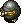 Froggon
- Froggon - HP: 67 AP: 40 DP: 20 Exp: 850 GP: 20 Type: Normal Speed: Normal Sp.Atk Rate: 28% (near), 0% (far) Item Drop Rate: 100% ~ Ability ~ Steals Gitan when adjacent and warps, then runs from Shiren at swift speed. Stands on Gitan it finds the ground. Doesn't use direct attacks. Heals HP when hit by thrown Gitan.

</td>
      <td class="day items">
 Curspinster
- Curspinster - HP: 54 AP: 34 DP: 21 Exp: 820 GP: 60 Type: Normal Speed: Normal Sp.Atk Rate: 30% (near), 0% (far) Item Drop Rate: 0% ~ Ability ~ Curses or seals 2 items when adjacent.

</td>
      <td class="day">
 Tiger Chucker
- Tiger Chucker - HP: 71 AP: 58 DP: 24 Exp: 850 GP: 60 Type: Normal Speed: Normal Sp.Atk Rate: 33% (near), 33% (far) Item Drop Rate: 4% ~ Ability ~ Throws an adjacent creature at Shiren, or throws Shiren at another creature, onto a trap, or into a Monster House. Range of 15 tiles, deals 15 damage.

</td>
      <td class="day danger">
 Spongiderm
- Spongiderm - HP: 71 AP: 42 DP: 20 Exp: 850 GP: 50 Type: Drain Speed: Normal Sp.Atk Rate: 100% (near), 100% (far) Item Drop Rate: 4% ~ Ability ~ Absorbs status conditions inflicted on itself or from a creature within a 1 tile radius, fully restoring its own HP and raising AP and DP by 1 stage.

</td>
    </tr>
    <tr>
      <td colspan="8" class="purpleDivider"></td>
    </tr>
    <tr>
      <td rowspan="1" class="centeredText">58</td>
      <td class="day">
 Pumpanshee
- Pumpanshee - HP: 77 AP: 52 DP: 20 Exp: 850 GP: 80 Type: Plant/Floating Speed: Normal Sp.Atk Rate: 0% (near), 0% (far) Item Drop Rate: 0% ~ Ability ~ Can pass through walls. Unpredictable movement, but slowly approaches Shiren.

</td>
      <td class="day extreme">
 Horrabbit
- Horrabbit - HP: 71 AP: 42 DP: 20 Exp: 850 GP: 80 Type: Magic Speed: Normal Sp.Atk Rate: 16% (near), 6% (far) Item Drop Rate: 4% ~ Ability ~ Attracts up to 3 creatures including Shiren to itself from anywhere on the current floor.

</td>
      <td class="day">
 Momomomoseal
- Momomomoseal - HP: 90 AP: 37 DP: 15 Exp: 670 GP: 100 Type: Aquatic Speed: Normal Sp.Atk Rate: 50% (near), 32% (far) Item Drop Rate: 16% ~ Ability ~ Performs a tackle that deals 40 damage when lined up vertically within 25 tiles. Turns Apathetic after tackling. Doesn't move on its own.

</td>
      <td class="day farm">
 Froggon
- Froggon - HP: 67 AP: 40 DP: 20 Exp: 850 GP: 20 Type: Normal Speed: Normal Sp.Atk Rate: 28% (near), 0% (far) Item Drop Rate: 100% ~ Ability ~ Steals Gitan when adjacent and warps, then runs from Shiren at swift speed. Stands on Gitan it finds the ground. Doesn't use direct attacks. Heals HP when hit by thrown Gitan.

</td>
      <td class="day items">
 Curspinster
- Curspinster - HP: 54 AP: 34 DP: 21 Exp: 820 GP: 60 Type: Normal Speed: Normal Sp.Atk Rate: 30% (near), 0% (far) Item Drop Rate: 0% ~ Ability ~ Curses or seals 2 items when adjacent.

</td>
      <td class="day danger">
 Lashagga
- Lashagga - HP: 106 AP: 70 DP: 32 Exp: 1980 GP: 300 Type: Dragon Speed: Normal Sp.Atk Rate: 0% (near), 0% (far) Item Drop Rate: 4% ~ Ability ~ Attacks 3 times in 1 turn (single animation).

</td>
      <td class="day danger">
 Spongiderm
- Spongiderm - HP: 71 AP: 42 DP: 20 Exp: 850 GP: 50 Type: Drain Speed: Normal Sp.Atk Rate: 100% (near), 100% (far) Item Drop Rate: 4% ~ Ability ~ Absorbs status conditions inflicted on itself or from a creature within a 1 tile radius, fully restoring its own HP and raising AP and DP by 1 stage.

</td>
    </tr>
    <tr>
      <td colspan="8" class="purpleDivider"></td>
    </tr>
    <tr>
      <td rowspan="1" class="centeredText">59</td>
      <td class="day farm">
 Iron Zalokleft
- Iron Zalokleft - HP: 71 AP: 42 DP: 13 Exp: 850 GP: 40 Type: Aquatic Speed: Normal Sp.Atk Rate: 33% (near), 0% (far) Item Drop Rate: 100% ~ Ability ~ Initially Napping. Steals an item from Shiren when adjacent or picks up an item on the ground, then warps. Runs away from Shiren after stealing an item. Doesn't use direct attacks. Always drops an item from a unique table if slain before stealing an item, otherwise drops the stolen item.

</td>
      <td class="day items">
 Gyandora
- Gyandora - HP: 83 AP: 59 DP: 27 Exp: 1200 GP: 80 Type: Floating Speed: Normal Sp.Atk Rate: 21% (near), 0% (far) Item Drop Rate: 4% ~ Ability ~ Pecks a pot from your inventory when adjacent, reducing its capacity to 0.

</td>
      <td class="day">
 Lt. Yanpii
- Lt. Yanpii - HP: 78 AP: 60 DP: 21 Exp: 1200 GP: 180 Type: Normal Speed: Normal Sp.Atk Rate: 22% (near), 22% (far) Item Drop Rate: 4% ~ Ability ~ Headbutts Shiren when lined up, dealing 30 damage and knockback based on distance traveled. If Shiren is knocked into a wall, go into the wall 3 tiles and take an additional 30 damage.

</td>
      <td class="day farm">
 Froggon
- Froggon - HP: 67 AP: 40 DP: 20 Exp: 850 GP: 20 Type: Normal Speed: Normal Sp.Atk Rate: 28% (near), 0% (far) Item Drop Rate: 100% ~ Ability ~ Steals Gitan when adjacent and warps, then runs from Shiren at swift speed. Stands on Gitan it finds the ground. Doesn't use direct attacks. Heals HP when hit by thrown Gitan.

</td>
      <td class="day items">
 Item Knave
- Item Knave - HP: 54 AP: 34 DP: 21 Exp: 820 GP: 40 Type: Normal Speed: Normal Sp.Atk Rate: 18% (near), 24% (far) Item Drop Rate: 2% ~ Ability ~ Transforms items on the ground into Weeds. Throws Weeds at Shiren in a straight line within 10 tiles, which knocks away an inventory item and takes that item's spot. Only drops Weeds.

</td>
      <td class="day danger">
 Lashagga
- Lashagga - HP: 106 AP: 70 DP: 32 Exp: 1980 GP: 300 Type: Dragon Speed: Normal Sp.Atk Rate: 0% (near), 0% (far) Item Drop Rate: 4% ~ Ability ~ Attacks 3 times in 1 turn (single animation).

</td>
      <td class="day danger">
 Spongiderm
- Spongiderm - HP: 71 AP: 42 DP: 20 Exp: 850 GP: 50 Type: Drain Speed: Normal Sp.Atk Rate: 100% (near), 100% (far) Item Drop Rate: 4% ~ Ability ~ Absorbs status conditions inflicted on itself or from a creature within a 1 tile radius, fully restoring its own HP and raising AP and DP by 1 stage.

</td>
    </tr>
    <tr>
      <td colspan="8" class="purpleDivider"></td>
    </tr>
    <tr>
      <td rowspan="1" class="centeredText">60</td>
      <td class="day farm">
 Iron Zalokleft
- Iron Zalokleft - HP: 71 AP: 42 DP: 13 Exp: 850 GP: 40 Type: Aquatic Speed: Normal Sp.Atk Rate: 33% (near), 0% (far) Item Drop Rate: 100% ~ Ability ~ Initially Napping. Steals an item from Shiren when adjacent or picks up an item on the ground, then warps. Runs away from Shiren after stealing an item. Doesn't use direct attacks. Always drops an item from a unique table if slain before stealing an item, otherwise drops the stolen item.

</td>
      <td class="day items">
 Gyandora
- Gyandora - HP: 83 AP: 59 DP: 27 Exp: 1200 GP: 80 Type: Floating Speed: Normal Sp.Atk Rate: 21% (near), 0% (far) Item Drop Rate: 4% ~ Ability ~ Pecks a pot from your inventory when adjacent, reducing its capacity to 0.

</td>
      <td class="day">
 Lt. Yanpii
- Lt. Yanpii - HP: 78 AP: 60 DP: 21 Exp: 1200 GP: 180 Type: Normal Speed: Normal Sp.Atk Rate: 22% (near), 22% (far) Item Drop Rate: 4% ~ Ability ~ Headbutts Shiren when lined up, dealing 30 damage and knockback based on distance traveled. If Shiren is knocked into a wall, go into the wall 3 tiles and take an additional 30 damage.

</td>
      <td class="day">
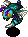 Zanbeeto
- Zanbeeto - HP: 83 AP: 63 DP: 27 Exp: 1200 GP: 250 Type: Floating Speed: Normal Sp.Atk Rate: 16% (near), 0% (far) Item Drop Rate: 0% ~ Ability ~ Occasionally jumps to a tile within a 2 tile radius after attacking. Stinger has double AP and inflicts Confused status, but it also collapses afterward.

</td>
      <td class="day items">
 Item Knave
- Item Knave - HP: 54 AP: 34 DP: 21 Exp: 820 GP: 40 Type: Normal Speed: Normal Sp.Atk Rate: 18% (near), 24% (far) Item Drop Rate: 2% ~ Ability ~ Transforms items on the ground into Weeds. Throws Weeds at Shiren in a straight line within 10 tiles, which knocks away an inventory item and takes that item's spot. Only drops Weeds.

</td>
      <td class="day danger">
 Lashagga
- Lashagga - HP: 106 AP: 70 DP: 32 Exp: 1980 GP: 300 Type: Dragon Speed: Normal Sp.Atk Rate: 0% (near), 0% (far) Item Drop Rate: 4% ~ Ability ~ Attacks 3 times in 1 turn (single animation).

</td>
      <td></td>
    </tr>
    <tr>
      <td colspan="8" class="purpleDivider"></td>
    </tr>
    <tr>
      <td rowspan="1" class="centeredText highlightShop2">61</td>
      <td class="day farm">
 Grass Gramps
- Grass Gramps - HP: 94 AP: 80 DP: 22 Exp: 1060 GP: 390 Type: Plant Speed: Normal Sp.Atk Rate: 21% (near), 16% (far) Item Drop Rate: 0% ~ Ability ~ Spreads grass in a 1 tile radius when adjacent. Pierce-throws grass in a straight line at a distance. Carries up to 4 grass items. Becomes Pin Gramps with 0 grass.

</td>
      <td class="day">
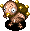 Pin Gramps
- Pin Gramps - HP: 94 AP: 60 DP: 20 Exp: 860 GP: 140 Type: Plant Speed: Swift 1 Sp.Atk Rate: 0% (near), 0% (far) Item Drop Rate: 0% ~ Ability ~ Runs from Shiren, but attacks when adjacent. Becomes Grass Gramps when it picks up a grass item. Generates its own grass as turns elapse.

</td>
      <td class="day">
 Lt. Yanpii
- Lt. Yanpii - HP: 78 AP: 60 DP: 21 Exp: 1200 GP: 180 Type: Normal Speed: Normal Sp.Atk Rate: 22% (near), 22% (far) Item Drop Rate: 4% ~ Ability ~ Headbutts Shiren when lined up, dealing 30 damage and knockback based on distance traveled. If Shiren is knocked into a wall, go into the wall 3 tiles and take an additional 30 damage.

</td>
      <td class="day">
 Zanbeeto
- Zanbeeto - HP: 83 AP: 63 DP: 27 Exp: 1200 GP: 250 Type: Floating Speed: Normal Sp.Atk Rate: 16% (near), 0% (far) Item Drop Rate: 0% ~ Ability ~ Occasionally jumps to a tile within a 2 tile radius after attacking. Stinger has double AP and inflicts Confused status, but it also collapses afterward.

</td>
      <td class="day">
 Bunchukdon
- Bunchukdon - HP: 137 AP: 79 DP: 28 Exp: 1280 GP: 400 Type: Normal Speed: Slow Sp.Atk Rate: 100% (near), 100% (far) Item Drop Rate: 4% ~ Ability ~ Counters with a 35 damage lightning attack when Shiren is in view after taking damage 3 times.

</td>
      <td class="day">
 Polygon Singa
- Polygon Singa - HP: 76 AP: 55 DP: 25 Exp: 820 GP: 60 Type: Drain/Magic Speed: Normal Sp.Atk Rate: 24% (near), 0% (far) Item Drop Rate: 2% ~ Ability ~ Lowers Max HP by 3 or Max Fullness by 7 when adjacent. Warps in front of Shiren when in a room.

</td>
      <td class="day danger">
 Flarebird
- Flarebird - HP: 54 AP: 34 DP: 28 Exp: 820 GP: 80 Type: Floating Speed: Normal Sp.Atk Rate: 100% (near), 100% (far) Item Drop Rate: 0% ~ Ability ~ Warps next to a monster within Shiren's view (3 tiles) and heals HP of all monsters within a 1 tile radius by 30. Items thrown at it burn up. Fire damage restores its HP. Multiplies from explosions.

</td>
    </tr>
    <tr>
      <td colspan="8" class="purpleDivider"></td>
    </tr>
    <tr>
      <td rowspan="1" class="centeredText">62</td>
      <td class="day farm">
 Grass Gramps
- Grass Gramps - HP: 94 AP: 80 DP: 22 Exp: 1060 GP: 390 Type: Plant Speed: Normal Sp.Atk Rate: 21% (near), 16% (far) Item Drop Rate: 0% ~ Ability ~ Spreads grass in a 1 tile radius when adjacent. Pierce-throws grass in a straight line at a distance. Carries up to 4 grass items. Becomes Pin Gramps with 0 grass.

</td>
      <td class="day">
 Pin Gramps
- Pin Gramps - HP: 94 AP: 60 DP: 20 Exp: 860 GP: 140 Type: Plant Speed: Swift 1 Sp.Atk Rate: 0% (near), 0% (far) Item Drop Rate: 0% ~ Ability ~ Runs from Shiren, but attacks when adjacent. Becomes Grass Gramps when it picks up a grass item. Generates its own grass as turns elapse.

</td>
      <td></td>
      <td class="day items">
 Sensei
- Sensei - HP: 75 AP: 55 DP: 30 Exp: 1500 GP: 250 Type: Normal Speed: Normal Sp.Atk Rate: 19% (near), 0% (far) Item Drop Rate: 2% ~ Ability ~ Knocks away Shiren's equipped weapon, shield, or bracelet when adjacent, sending it 10 tiles backward.

</td>
      <td class="day">
 Bunchukdon
- Bunchukdon - HP: 137 AP: 79 DP: 28 Exp: 1280 GP: 400 Type: Normal Speed: Slow Sp.Atk Rate: 100% (near), 100% (far) Item Drop Rate: 4% ~ Ability ~ Counters with a 35 damage lightning attack when Shiren is in view after taking damage 3 times.

</td>
      <td class="day">
 Polygon Singa
- Polygon Singa - HP: 76 AP: 55 DP: 25 Exp: 820 GP: 60 Type: Drain/Magic Speed: Normal Sp.Atk Rate: 24% (near), 0% (far) Item Drop Rate: 2% ~ Ability ~ Lowers Max HP by 3 or Max Fullness by 7 when adjacent. Warps in front of Shiren when in a room.

</td>
      <td class="day danger">
 Flarebird
- Flarebird - HP: 54 AP: 34 DP: 28 Exp: 820 GP: 80 Type: Floating Speed: Normal Sp.Atk Rate: 100% (near), 100% (far) Item Drop Rate: 0% ~ Ability ~ Warps next to a monster within Shiren's view (3 tiles) and heals HP of all monsters within a 1 tile radius by 30. Items thrown at it burn up. Fire damage restores its HP. Multiplies from explosions.

</td>
    </tr>
    <tr>
      <td colspan="8" class="purpleDivider"></td>
    </tr>
    <tr>
      <td rowspan="1" class="centeredText">63</td>
      <td class="day">
 Spirit Ham
- Spirit Ham - HP: 65 AP: 39 DP: 20 Exp: 790 GP: 50 Type: Normal Speed: Normal Sp.Atk Rate: 0% (near), 0% (far) Item Drop Rate: 4% ~ Ability ~ Runs away from Shiren, but attacks when cornered. Moves toward monsters in view. Cheers for adjacent creatures, raising AP and DP by 2 stages and letting them survive a fatal hit.

</td>
      <td class="day">
 Bouncy
- Bouncy - HP: 92 AP: 82 DP: 28 Exp: 4200 GP: 170 Type: Normal Speed: Swift 1 Sp.Atk Rate: 23% (near), 0% (far) Item Drop Rate: 4% ~ Ability ~ Initially Napping in a group of 3. Shiren can be warped 1~3 floors when surrounded by 3 Bouncy monsters.

</td>
      <td></td>
      <td class="day items">
 Sensei
- Sensei - HP: 75 AP: 55 DP: 30 Exp: 1500 GP: 250 Type: Normal Speed: Normal Sp.Atk Rate: 19% (near), 0% (far) Item Drop Rate: 2% ~ Ability ~ Knocks away Shiren's equipped weapon, shield, or bracelet when adjacent, sending it 10 tiles backward.

</td>
      <td class="day">
 Bunchukdon
- Bunchukdon - HP: 137 AP: 79 DP: 28 Exp: 1280 GP: 400 Type: Normal Speed: Slow Sp.Atk Rate: 100% (near), 100% (far) Item Drop Rate: 4% ~ Ability ~ Counters with a 35 damage lightning attack when Shiren is in view after taking damage 3 times.

</td>
      <td class="day">
 Polygon Singa
- Polygon Singa - HP: 76 AP: 55 DP: 25 Exp: 820 GP: 60 Type: Drain/Magic Speed: Normal Sp.Atk Rate: 24% (near), 0% (far) Item Drop Rate: 2% ~ Ability ~ Lowers Max HP by 3 or Max Fullness by 7 when adjacent. Warps in front of Shiren when in a room.

</td>
      <td class="day danger">
 Flarebird
- Flarebird - HP: 54 AP: 34 DP: 28 Exp: 820 GP: 80 Type: Floating Speed: Normal Sp.Atk Rate: 100% (near), 100% (far) Item Drop Rate: 0% ~ Ability ~ Warps next to a monster within Shiren's view (3 tiles) and heals HP of all monsters within a 1 tile radius by 30. Items thrown at it burn up. Fire damage restores its HP. Multiplies from explosions.

</td>
    </tr>
    <tr>
      <td colspan="8" class="purpleDivider"></td>
    </tr>
    <tr>
      <td rowspan="1" class="centeredText">64</td>
      <td class="day">
 Spirit Ham
- Spirit Ham - HP: 65 AP: 39 DP: 20 Exp: 790 GP: 50 Type: Normal Speed: Normal Sp.Atk Rate: 0% (near), 0% (far) Item Drop Rate: 4% ~ Ability ~ Runs away from Shiren, but attacks when cornered. Moves toward monsters in view. Cheers for adjacent creatures, raising AP and DP by 2 stages and letting them survive a fatal hit.

</td>
      <td class="day">
 Bouncy
- Bouncy - HP: 92 AP: 82 DP: 28 Exp: 4200 GP: 170 Type: Normal Speed: Swift 1 Sp.Atk Rate: 23% (near), 0% (far) Item Drop Rate: 4% ~ Ability ~ Initially Napping in a group of 3. Shiren can be warped 1~3 floors when surrounded by 3 Bouncy monsters.

</td>
      <td class="day">
 Onigirizzly
- Onigirizzly - HP: 69 AP: 52 DP: 29 Exp: 700 GP: 250 Type: Normal Speed: Normal Sp.Atk Rate: 0% (near), 0% (far) Item Drop Rate: 4% ~ Ability ~ Only drops Onigiri.

</td>
      <td class="day items">
 Sensei
- Sensei - HP: 75 AP: 55 DP: 30 Exp: 1500 GP: 250 Type: Normal Speed: Normal Sp.Atk Rate: 19% (near), 0% (far) Item Drop Rate: 2% ~ Ability ~ Knocks away Shiren's equipped weapon, shield, or bracelet when adjacent, sending it 10 tiles backward.

</td>
      <td class="day">
 Bitter Nut
- Bitter Nut - HP: 65 AP: 70 DP: 22 Exp: 400 GP: 430 Type: Plant/Explode Speed: Normal Sp.Atk Rate: 0% (near), 0% (far) Item Drop Rate: 0% ~ Ability ~ Either doubles experience points (Max: x1024) or explodes (33% chance) each time it eats a thrown item.

</td>
      <td></td>
      <td></td>
    </tr>
    <tr>
      <td colspan="8" class="purpleDivider"></td>
    </tr>
    <tr>
      <td rowspan="1" class="centeredText">65</td>
      <td class="day">
 Spirit Ham
- Spirit Ham - HP: 65 AP: 39 DP: 20 Exp: 790 GP: 50 Type: Normal Speed: Normal Sp.Atk Rate: 0% (near), 0% (far) Item Drop Rate: 4% ~ Ability ~ Runs away from Shiren, but attacks when cornered. Moves toward monsters in view. Cheers for adjacent creatures, raising AP and DP by 2 stages and letting them survive a fatal hit.

</td>
      <td class="day">
 Bouncy
- Bouncy - HP: 92 AP: 82 DP: 28 Exp: 4200 GP: 170 Type: Normal Speed: Swift 1 Sp.Atk Rate: 23% (near), 0% (far) Item Drop Rate: 4% ~ Ability ~ Initially Napping in a group of 3. Shiren can be warped 1~3 floors when surrounded by 3 Bouncy monsters.

</td>
      <td class="day">
 Onigirizzly
- Onigirizzly - HP: 69 AP: 52 DP: 29 Exp: 700 GP: 250 Type: Normal Speed: Normal Sp.Atk Rate: 0% (near), 0% (far) Item Drop Rate: 4% ~ Ability ~ Only drops Onigiri.

</td>
      <td class="day">
 Fulminachin
- Fulminachin - HP: 83 AP: 48 DP: 9 Exp: 1600 GP: 100 Type: Aquatic/Cyclops/Explode Speed: Normal Sp.Atk Rate: 0% (near), 0% (far) Item Drop Rate: 0% ~ Ability ~ Turns red and stops acting after losing 46~66 HP. Explodes after losing 67~82 HP.

</td>
      <td class="day">
 Bitter Nut
- Bitter Nut - HP: 65 AP: 70 DP: 22 Exp: 400 GP: 430 Type: Plant/Explode Speed: Normal Sp.Atk Rate: 0% (near), 0% (far) Item Drop Rate: 0% ~ Ability ~ Either doubles experience points (Max: x1024) or explodes (33% chance) each time it eats a thrown item.

</td>
      <td class="day items">
 Hyper Gazer
- Hyper Gazer - HP: 83 AP: 42 DP: 24 Exp: 1300 GP: 80 Type: Cyclops/Magic Speed: Normal Sp.Atk Rate: 43% (near), 0% (far) Item Drop Rate: 2% ~ Ability ~ Hypnotizes Shiren when adjacent, forcing either item usage or an attack in a random direction.

</td>
      <td></td>
    </tr>
    <tr>
      <td colspan="8" class="purpleDivider"></td>
    </tr>
    <tr>
      <td rowspan="1" class="centeredText">66</td>
      <td class="day extreme">
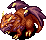 Archdragon
- Archdragon - HP: 92 AP: 82 DP: 30 Exp: 3333 GP: 240 Type: Dragon Speed: Normal Sp.Atk Rate: 30% (near), 6% (far) Item Drop Rate: 22% ~ Ability ~ Spews a homing 30 damage flame from anywhere on the current floor.

</td>
      <td class="day">
 Bouncy
- Bouncy - HP: 92 AP: 82 DP: 28 Exp: 4200 GP: 170 Type: Normal Speed: Swift 1 Sp.Atk Rate: 23% (near), 0% (far) Item Drop Rate: 4% ~ Ability ~ Initially Napping in a group of 3. Shiren can be warped 1~3 floors when surrounded by 3 Bouncy monsters.

</td>
      <td class="day">
 Phoenix Tengu
- Phoenix Tengu - HP: 70 AP: 34 DP: 25 Exp: 360 GP: 100 Type: Floating Speed: Normal Sp.Atk Rate: 0% (near), 0% (far) Item Drop Rate: 0% ~ Ability ~ Disguises itself as a different monster, but it can't use special attacks of the monster it's disguised as.

</td>
      <td class="day">
 Fulminachin
- Fulminachin - HP: 83 AP: 48 DP: 9 Exp: 1600 GP: 100 Type: Aquatic/Cyclops/Explode Speed: Normal Sp.Atk Rate: 0% (near), 0% (far) Item Drop Rate: 0% ~ Ability ~ Turns red and stops acting after losing 46~66 HP. Explodes after losing 67~82 HP.

</td>
      <td class="day">
 Bitter Nut
- Bitter Nut - HP: 65 AP: 70 DP: 22 Exp: 400 GP: 430 Type: Plant/Explode Speed: Normal Sp.Atk Rate: 0% (near), 0% (far) Item Drop Rate: 0% ~ Ability ~ Either doubles experience points (Max: x1024) or explodes (33% chance) each time it eats a thrown item.

</td>
      <td class="day items">
 Hyper Gazer
- Hyper Gazer - HP: 83 AP: 42 DP: 24 Exp: 1300 GP: 80 Type: Cyclops/Magic Speed: Normal Sp.Atk Rate: 43% (near), 0% (far) Item Drop Rate: 2% ~ Ability ~ Hypnotizes Shiren when adjacent, forcing either item usage or an attack in a random direction.

</td>
      <td></td>
    </tr>
    <tr>
      <td colspan="8" class="purpleDivider"></td>
    </tr>
    <tr>
      <td rowspan="1" class="centeredText">67</td>
      <td class="day extreme">
 Archdragon
- Archdragon - HP: 92 AP: 82 DP: 30 Exp: 3333 GP: 240 Type: Dragon Speed: Normal Sp.Atk Rate: 30% (near), 6% (far) Item Drop Rate: 22% ~ Ability ~ Spews a homing 30 damage flame from anywhere on the current floor.

</td>
      <td class="day extreme">
 Dozikon
- Dozikon - HP: 61 AP: 39 DP: 20 Exp: 790 GP: 80 Type: Plant Speed: Normal Sp.Atk Rate: 25% (near), 25% (far) Item Drop Rate: 6% ~ Ability ~ Throws Sleepy Grass within a 3 tile radius. Throws Poison Grass if Shiren has Asleep status. Only drops Sleepy Grass.

</td>
      <td class="day">
 Phoenix Tengu
- Phoenix Tengu - HP: 70 AP: 34 DP: 25 Exp: 360 GP: 100 Type: Floating Speed: Normal Sp.Atk Rate: 0% (near), 0% (far) Item Drop Rate: 0% ~ Ability ~ Disguises itself as a different monster, but it can't use special attacks of the monster it's disguised as.

</td>
      <td></td>
      <td></td>
      <td class="day items">
 Hyper Gazer
- Hyper Gazer - HP: 83 AP: 42 DP: 24 Exp: 1300 GP: 80 Type: Cyclops/Magic Speed: Normal Sp.Atk Rate: 43% (near), 0% (far) Item Drop Rate: 2% ~ Ability ~ Hypnotizes Shiren when adjacent, forcing either item usage or an attack in a random direction.

</td>
      <td></td>
    </tr>
    <tr>
      <td colspan="8" class="purpleDivider"></td>
    </tr>
    <tr>
      <td rowspan="1" class="centeredText">68</td>
      <td class="day extreme">
 Archdragon
- Archdragon - HP: 92 AP: 82 DP: 30 Exp: 3333 GP: 240 Type: Dragon Speed: Normal Sp.Atk Rate: 30% (near), 6% (far) Item Drop Rate: 22% ~ Ability ~ Spews a homing 30 damage flame from anywhere on the current floor.

</td>
      <td class="day extreme">
 Dozikon
- Dozikon - HP: 61 AP: 39 DP: 20 Exp: 790 GP: 80 Type: Plant Speed: Normal Sp.Atk Rate: 25% (near), 25% (far) Item Drop Rate: 6% ~ Ability ~ Throws Sleepy Grass within a 3 tile radius. Throws Poison Grass if Shiren has Asleep status. Only drops Sleepy Grass.

</td>
      <td class="day">
 Phoenix Tengu
- Phoenix Tengu - HP: 70 AP: 34 DP: 25 Exp: 360 GP: 100 Type: Floating Speed: Normal Sp.Atk Rate: 0% (near), 0% (far) Item Drop Rate: 0% ~ Ability ~ Disguises itself as a different monster, but it can't use special attacks of the monster it's disguised as.

</td>
      <td class="day">
 Grainie
- Grainie - HP: 83 AP: 70 DP: 27 Exp: 1250 GP: 250 Type: Plant Speed: Normal Sp.Atk Rate: 0% (near), 0% (far) Item Drop Rate: 4% ~ Ability ~ None.

</td>
      <td class="day">
 Comatapir
- Comatapir - HP: 120 AP: 90 DP: 27 Exp: 1150 GP: 300 Type: Normal Speed: Normal Sp.Atk Rate: 28% (near), 0% (far) Item Drop Rate: 4% ~ Ability ~ Initially Napping, will not wake up when Shiren enters or exits the room. Occasionally inflicts Asleep status in a 1 tile radius when it's Napping, Asleep, or Sound Asleep. Chance to yawn when slain, inflicting Asleep status in a 1 tile radius.

</td>
      <td></td>
      <td></td>
    </tr>
    <tr>
      <td colspan="8" class="purpleDivider"></td>
    </tr>
    <tr>
      <td rowspan="1" class="centeredText">69</td>
      <td class="day items">
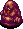 Mudder
- Mudder - HP: 83 AP: 50 DP: 24 Exp: 950 GP: 50 Type: Aquatic Speed: Normal Sp.Atk Rate: 38% (near), 0% (far) Item Drop Rate: 0% ~ Ability ~ Lowers upgrade value of equipped weapon and shield by 2. Erases 1 rune from an equipped weapon or shield. May also remove the item's tag. Turns invisible on water tiles. Chance to multiply when attacked. Doesn't use direct attacks.

</td>
      <td></td>
      <td></td>
      <td class="day">
 Grainie
- Grainie - HP: 83 AP: 70 DP: 27 Exp: 1250 GP: 250 Type: Plant Speed: Normal Sp.Atk Rate: 0% (near), 0% (far) Item Drop Rate: 4% ~ Ability ~ None.

</td>
      <td class="day">
 Comatapir
- Comatapir - HP: 120 AP: 90 DP: 27 Exp: 1150 GP: 300 Type: Normal Speed: Normal Sp.Atk Rate: 28% (near), 0% (far) Item Drop Rate: 4% ~ Ability ~ Initially Napping, will not wake up when Shiren enters or exits the room. Occasionally inflicts Asleep status in a 1 tile radius when it's Napping, Asleep, or Sound Asleep. Chance to yawn when slain, inflicting Asleep status in a 1 tile radius.

</td>
      <td></td>
      <td></td>
    </tr>
    <tr>
      <td colspan="8" class="purpleDivider"></td>
    </tr>
    <tr>
      <td rowspan="1" class="centeredText">70</td>
      <td class="day items">
 Mudder
- Mudder - HP: 83 AP: 50 DP: 24 Exp: 950 GP: 50 Type: Aquatic Speed: Normal Sp.Atk Rate: 38% (near), 0% (far) Item Drop Rate: 0% ~ Ability ~ Lowers upgrade value of equipped weapon and shield by 2. Erases 1 rune from an equipped weapon or shield. May also remove the item's tag. Turns invisible on water tiles. Chance to multiply when attacked. Doesn't use direct attacks.

</td>
      <td class="day">
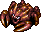 Hell Gyaza
- Hell Gyaza - HP: 70 AP: 62 DP: 30 Exp: 1340 GP: 300 Type: Aquatic Speed: Normal Sp.Atk Rate: 0% (near), 0% (far) Item Drop Rate: 4% ~ Ability ~ Converts most effects received other than direct attacks to 2 damage.

</td>
      <td class="day">
 Huge Chintala
- Huge Chintala - HP: 92 AP: 82 DP: 28 Exp: 3600 GP: 300 Type: Normal Speed: Normal Sp.Atk Rate: 0% (near), 0% (far) Item Drop Rate: 4% ~ Ability ~ None.

</td>
      <td class="day">
 Grainie
- Grainie - HP: 83 AP: 70 DP: 27 Exp: 1250 GP: 250 Type: Plant Speed: Normal Sp.Atk Rate: 0% (near), 0% (far) Item Drop Rate: 4% ~ Ability ~ None.

</td>
      <td class="day danger">
 N'dup
- N'dup - HP: 92 AP: 60 DP: 28 Exp: 3200 GP: 80 Type: Metal Speed: Normal Sp.Atk Rate: 0% (near), 0% (far) Item Drop Rate: 0% ~ Ability ~ Has the ability of N'dubba, N'twyn, or N'mach selected at random.

</td>
      <td></td>
      <td></td>
    </tr>
    <tr>
      <td colspan="8" class="purpleDivider"></td>
    </tr>
    <tr>
      <td rowspan="1" class="centeredText highlightShop2">71</td>
      <td class="day items">
 Mudder
- Mudder - HP: 83 AP: 50 DP: 24 Exp: 950 GP: 50 Type: Aquatic Speed: Normal Sp.Atk Rate: 38% (near), 0% (far) Item Drop Rate: 0% ~ Ability ~ Lowers upgrade value of equipped weapon and shield by 2. Erases 1 rune from an equipped weapon or shield. May also remove the item's tag. Turns invisible on water tiles. Chance to multiply when attacked. Doesn't use direct attacks.

</td>
      <td class="day">
 Hell Gyaza
- Hell Gyaza - HP: 70 AP: 62 DP: 30 Exp: 1340 GP: 300 Type: Aquatic Speed: Normal Sp.Atk Rate: 0% (near), 0% (far) Item Drop Rate: 4% ~ Ability ~ Converts most effects received other than direct attacks to 2 damage.

</td>
      <td class="day">
 Huge Chintala
- Huge Chintala - HP: 92 AP: 82 DP: 28 Exp: 3600 GP: 300 Type: Normal Speed: Normal Sp.Atk Rate: 0% (near), 0% (far) Item Drop Rate: 4% ~ Ability ~ None.

</td>
      <td class="day">
 Eligagon
- Eligagon - HP: 96 AP: 80 DP: 40 Exp: 3000 GP: 200 Type: Normal Speed: Normal Sp.Atk Rate: 0% (near), 0% (far) Item Drop Rate: 4% ~ Ability ~ None.

</td>
      <td class="day danger">
 N'dup
- N'dup - HP: 92 AP: 60 DP: 28 Exp: 3200 GP: 80 Type: Metal Speed: Normal Sp.Atk Rate: 0% (near), 0% (far) Item Drop Rate: 0% ~ Ability ~ Has the ability of N'dubba, N'twyn, or N'mach selected at random.

</td>
      <td></td>
      <td></td>
    </tr>
    <tr>
      <td colspan="8" class="purpleDivider"></td>
    </tr>
    <tr>
      <td rowspan="1" class="centeredText">72</td>
      <td class="day items">
 Mudder
- Mudder - HP: 83 AP: 50 DP: 24 Exp: 950 GP: 50 Type: Aquatic Speed: Normal Sp.Atk Rate: 38% (near), 0% (far) Item Drop Rate: 0% ~ Ability ~ Lowers upgrade value of equipped weapon and shield by 2. Erases 1 rune from an equipped weapon or shield. May also remove the item's tag. Turns invisible on water tiles. Chance to multiply when attacked. Doesn't use direct attacks.

</td>
      <td class="day">
 Hell Gyaza
- Hell Gyaza - HP: 70 AP: 62 DP: 30 Exp: 1340 GP: 300 Type: Aquatic Speed: Normal Sp.Atk Rate: 0% (near), 0% (far) Item Drop Rate: 4% ~ Ability ~ Converts most effects received other than direct attacks to 2 damage.

</td>
      <td class="day">
 Huge Chintala
- Huge Chintala - HP: 92 AP: 82 DP: 28 Exp: 3600 GP: 300 Type: Normal Speed: Normal Sp.Atk Rate: 0% (near), 0% (far) Item Drop Rate: 4% ~ Ability ~ None.

</td>
      <td class="day">
 Eligagon
- Eligagon - HP: 96 AP: 80 DP: 40 Exp: 3000 GP: 200 Type: Normal Speed: Normal Sp.Atk Rate: 0% (near), 0% (far) Item Drop Rate: 4% ~ Ability ~ None.

</td>
      <td class="day danger">
 N'dup
- N'dup - HP: 92 AP: 60 DP: 28 Exp: 3200 GP: 80 Type: Metal Speed: Normal Sp.Atk Rate: 0% (near), 0% (far) Item Drop Rate: 0% ~ Ability ~ Has the ability of N'dubba, N'twyn, or N'mach selected at random.

</td>
      <td class="day">
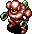 Cyberoid
- Cyberoid - HP: 96 AP: 80 DP: 40 Exp: 3950 GP: 300 Type: Metal Speed: Swift 1 Sp.Atk Rate: 38% (near), 38% (far) Item Drop Rate: 4% ~ Ability ~ Initially Napping, wakes when Shiren enters or exits the room. Creates a trap on the ground, then stops acting for 2 turns. Occasionally creates a trap when slain.

</td>
      <td class="day farm">
 FO-UZZ
- FO-UZZ - HP: 6 AP: 80 DP: 40 Exp: 5555 GP: 777 Type: Metal/Floating Speed: Swift 2 Sp.Atk Rate: 0% (near), 0% (far) Item Drop Rate: 100% ~ Ability ~ Runs away from Shiren, and converts damage received to 1 damage. Warps if Shiren gets within 3 tiles. Warps when attacked, and occasionally summons a Googoman at the same time. Drops 1~3 Revival Grass when slain.

</td>
    </tr>
    <tr>
      <td colspan="8" class="purpleDivider"></td>
    </tr>
    <tr>
      <td rowspan="1" class="centeredText">73</td>
      <td class="day items">
 Cursenior
- Cursenior - HP: 78 AP: 39 DP: 24 Exp: 1800 GP: 130 Type: Normal Speed: Normal Sp.Atk Rate: 33% (near), 0% (far) Item Drop Rate: 0% ~ Ability ~ Curses or seals 2 items when adjacent.

</td>
      <td></td>
      <td class="day">
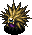 Detonachin
- Detonachin - HP: 96 AP: 70 DP: 10 Exp: 2300 GP: 130 Type: Aquatic/Cyclops/Explode Speed: Normal Sp.Atk Rate: 0% (near), 0% (far) Item Drop Rate: 0% ~ Ability ~ Turns red and stops acting after losing 53~76 HP. Explodes after losing 77~95 HP.

</td>
      <td class="day">
 Eligagon
- Eligagon - HP: 96 AP: 80 DP: 40 Exp: 3000 GP: 200 Type: Normal Speed: Normal Sp.Atk Rate: 0% (near), 0% (far) Item Drop Rate: 4% ~ Ability ~ None.

</td>
      <td class="day danger">
 N'dup
- N'dup - HP: 92 AP: 60 DP: 28 Exp: 3200 GP: 80 Type: Metal Speed: Normal Sp.Atk Rate: 0% (near), 0% (far) Item Drop Rate: 0% ~ Ability ~ Has the ability of N'dubba, N'twyn, or N'mach selected at random.

</td>
      <td class="day">
 Cyberoid
- Cyberoid - HP: 96 AP: 80 DP: 40 Exp: 3950 GP: 300 Type: Metal Speed: Swift 1 Sp.Atk Rate: 38% (near), 38% (far) Item Drop Rate: 4% ~ Ability ~ Initially Napping, wakes when Shiren enters or exits the room. Creates a trap on the ground, then stops acting for 2 turns. Occasionally creates a trap when slain.

</td>
      <td class="day farm">
 FO-UZZ
- FO-UZZ - HP: 6 AP: 80 DP: 40 Exp: 5555 GP: 777 Type: Metal/Floating Speed: Swift 2 Sp.Atk Rate: 0% (near), 0% (far) Item Drop Rate: 100% ~ Ability ~ Runs away from Shiren, and converts damage received to 1 damage. Warps if Shiren gets within 3 tiles. Warps when attacked, and occasionally summons a Googoman at the same time. Drops 1~3 Revival Grass when slain.

</td>
    </tr>
    <tr>
      <td colspan="8" class="purpleDivider"></td>
    </tr>
    <tr>
      <td rowspan="1" class="centeredText">74</td>
      <td class="day items">
 Cursenior
- Cursenior - HP: 78 AP: 39 DP: 24 Exp: 1800 GP: 130 Type: Normal Speed: Normal Sp.Atk Rate: 33% (near), 0% (far) Item Drop Rate: 0% ~ Ability ~ Curses or seals 2 items when adjacent.

</td>
      <td class="day extreme">
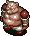 Porgon
- Porgon - HP: 86 AP: 85 DP: 35 Exp: 3700 GP: 400 Type: Normal Speed: Normal Sp.Atk Rate: 19% (near), 23% (far) Item Drop Rate: 6% ~ Ability ~ Throws a Porky Rock that deals 20 damage within a 10 tile radius. Only drops Porky Rocks.

</td>
      <td class="day">
 Detonachin
- Detonachin - HP: 96 AP: 70 DP: 10 Exp: 2300 GP: 130 Type: Aquatic/Cyclops/Explode Speed: Normal Sp.Atk Rate: 0% (near), 0% (far) Item Drop Rate: 0% ~ Ability ~ Turns red and stops acting after losing 53~76 HP. Explodes after losing 77~95 HP.

</td>
      <td class="day">
 Sproutitan
- Sproutitan - HP: 99 AP: 85 DP: 38 Exp: 1580 GP: 345 Type: Plant Speed: Normal Sp.Atk Rate: 0% (near), 0% (far) Item Drop Rate: 4% ~ Ability ~ Monster family becomes immune to most recent status inflicted upon it, excluding Sealed status.

</td>
      <td class="day items">
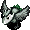 Shovelie
- Shovelie - HP: 86 AP: 85 DP: 35 Exp: 2345 GP: 345 Type: Metal Speed: Normal Sp.Atk Rate: 25% (near), 18% (far) Item Drop Rate: 4% ~ Ability ~ Shovels dirt at a visible target within a 6 tile radius. Dirt fills 1 pot in your inventory when it hits Shiren, or inflicts Blind status when it hits an ally. Dirt in pots eventually changes to grass items when advancing floors.

</td>
      <td class="day">
 Cyberoid
- Cyberoid - HP: 96 AP: 80 DP: 40 Exp: 3950 GP: 300 Type: Metal Speed: Swift 1 Sp.Atk Rate: 38% (near), 38% (far) Item Drop Rate: 4% ~ Ability ~ Initially Napping, wakes when Shiren enters or exits the room. Creates a trap on the ground, then stops acting for 2 turns. Occasionally creates a trap when slain.

</td>
      <td></td>
    </tr>
    <tr>
      <td colspan="8" class="purpleDivider"></td>
    </tr>
    <tr>
      <td rowspan="1" class="centeredText">75</td>
      <td class="day items">
 Cursenior
- Cursenior - HP: 78 AP: 39 DP: 24 Exp: 1800 GP: 130 Type: Normal Speed: Normal Sp.Atk Rate: 33% (near), 0% (far) Item Drop Rate: 0% ~ Ability ~ Curses or seals 2 items when adjacent.

</td>
      <td class="day extreme">
 Porgon
- Porgon - HP: 86 AP: 85 DP: 35 Exp: 3700 GP: 400 Type: Normal Speed: Normal Sp.Atk Rate: 19% (near), 23% (far) Item Drop Rate: 6% ~ Ability ~ Throws a Porky Rock that deals 20 damage within a 10 tile radius. Only drops Porky Rocks.

</td>
      <td class="day items">
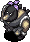 Knave King
- Knave King - HP: 78 AP: 39 DP: 24 Exp: 1800 GP: 90 Type: Normal Speed: Normal Sp.Atk Rate: 18% (near), 24% (far) Item Drop Rate: 2% ~ Ability ~ Transforms items on the ground into Weeds. Can transform 1 inventory item into Weeds when adjacent, including equipped items. Throws Weeds at Shiren in a straight line within 10 tiles, which knocks away an inventory item and takes that item's spot. Only drops Weeds.

</td>
      <td class="day">
 Sproutitan
- Sproutitan - HP: 99 AP: 85 DP: 38 Exp: 1580 GP: 345 Type: Plant Speed: Normal Sp.Atk Rate: 0% (near), 0% (far) Item Drop Rate: 4% ~ Ability ~ Monster family becomes immune to most recent status inflicted upon it, excluding Sealed status.

</td>
      <td class="day items">
 Shovelie
- Shovelie - HP: 86 AP: 85 DP: 35 Exp: 2345 GP: 345 Type: Metal Speed: Normal Sp.Atk Rate: 25% (near), 18% (far) Item Drop Rate: 4% ~ Ability ~ Shovels dirt at a visible target within a 6 tile radius. Dirt fills 1 pot in your inventory when it hits Shiren, or inflicts Blind status when it hits an ally. Dirt in pots eventually changes to grass items when advancing floors.

</td>
      <td class="day">
 Ruiner
- Ruiner - HP: 80 AP: 65 DP: 24 Exp: 1900 GP: 480 Type: Normal Speed: Normal Sp.Atk Rate: 18% (near), 0% (far) Item Drop Rate: 4% ~ Ability ~ Occasionally lands a critical hit that deals double damage.

</td>
      <td class="day farm">
 Mealy
- Mealy - HP: 11 AP: 15 DP: 1 Exp: 1 GP: 4 Type: Floating Speed: Swift 1 Sp.Atk Rate: 0% (near), 0% (far) Item Drop Rate: 100% ~ Ability ~ Runs away from other creatures. Monsters focus on Mealy instead of Shiren and will level up if they defeat Mealy. Doesn't use direct attacks. Always drops a Mealy table item when slain by Shiren.

</td>
    </tr>
    <tr>
      <td colspan="8" class="purpleDivider"></td>
    </tr>
    <tr>
      <td rowspan="1" class="centeredText">76</td>
      <td></td>
      <td class="day extreme">
 Porgon
- Porgon - HP: 86 AP: 85 DP: 35 Exp: 3700 GP: 400 Type: Normal Speed: Normal Sp.Atk Rate: 19% (near), 23% (far) Item Drop Rate: 6% ~ Ability ~ Throws a Porky Rock that deals 20 damage within a 10 tile radius. Only drops Porky Rocks.

</td>
      <td class="day items">
 Knave King
- Knave King - HP: 78 AP: 39 DP: 24 Exp: 1800 GP: 90 Type: Normal Speed: Normal Sp.Atk Rate: 18% (near), 24% (far) Item Drop Rate: 2% ~ Ability ~ Transforms items on the ground into Weeds. Can transform 1 inventory item into Weeds when adjacent, including equipped items. Throws Weeds at Shiren in a straight line within 10 tiles, which knocks away an inventory item and takes that item's spot. Only drops Weeds.

</td>
      <td class="day">
 Sproutitan
- Sproutitan - HP: 99 AP: 85 DP: 38 Exp: 1580 GP: 345 Type: Plant Speed: Normal Sp.Atk Rate: 0% (near), 0% (far) Item Drop Rate: 4% ~ Ability ~ Monster family becomes immune to most recent status inflicted upon it, excluding Sealed status.

</td>
      <td></td>
      <td class="day">
 Ruiner
- Ruiner - HP: 80 AP: 65 DP: 24 Exp: 1900 GP: 480 Type: Normal Speed: Normal Sp.Atk Rate: 18% (near), 0% (far) Item Drop Rate: 4% ~ Ability ~ Occasionally lands a critical hit that deals double damage.

</td>
      <td class="day farm">
 Mealy
- Mealy - HP: 11 AP: 15 DP: 1 Exp: 1 GP: 4 Type: Floating Speed: Swift 1 Sp.Atk Rate: 0% (near), 0% (far) Item Drop Rate: 100% ~ Ability ~ Runs away from other creatures. Monsters focus on Mealy instead of Shiren and will level up if they defeat Mealy. Doesn't use direct attacks. Always drops a Mealy table item when slain by Shiren.

</td>
    </tr>
    <tr>
      <td colspan="8" class="purpleDivider"></td>
    </tr>
    <tr>
      <td rowspan="1" class="centeredText">77</td>
      <td class="day extreme">
 Terrabbit
- Terrabbit - HP: 83 AP: 53 DP: 30 Exp: 1200 GP: 200 Type: Magic Speed: Normal Sp.Atk Rate: 16% (near), 6% (far) Item Drop Rate: 4% ~ Ability ~ Attracts up to 5 creatures including Shiren to itself from anywhere on the current floor.

</td>
      <td class="day extreme">
 Porgon
- Porgon - HP: 86 AP: 85 DP: 35 Exp: 3700 GP: 400 Type: Normal Speed: Normal Sp.Atk Rate: 19% (near), 23% (far) Item Drop Rate: 6% ~ Ability ~ Throws a Porky Rock that deals 20 damage within a 10 tile radius. Only drops Porky Rocks.

</td>
      <td></td>
      <td class="day">
 Pumptergeist
- Pumptergeist - HP: 84 AP: 80 DP: 24 Exp: 2500 GP: 170 Type: Plant/Floating Speed: Normal Sp.Atk Rate: 0% (near), 0% (far) Item Drop Rate: 0% ~ Ability ~ Can pass through walls. Unpredictable movement, but slowly approaches Shiren.

</td>
      <td class="day">
 BlightScorp
- BlightScorp - HP: 95 AP: 89 DP: 36 Exp: 2700 GP: 170 Type: Drain Speed: Normal Sp.Atk Rate: 19% (near), 0% (far) Item Drop Rate: 2% ~ Ability ~ Lowers Max Strength by 2 when adjacent.

</td>
      <td class="day">
 Ruiner
- Ruiner - HP: 80 AP: 65 DP: 24 Exp: 1900 GP: 480 Type: Normal Speed: Normal Sp.Atk Rate: 18% (near), 0% (far) Item Drop Rate: 4% ~ Ability ~ Occasionally lands a critical hit that deals double damage.

</td>
      <td class="day">
 Boingodile
- Boingodile - HP: 95 AP: 88 DP: 29 Exp: 4300 GP: 500 Type: Dragon/Aquatic Speed: Normal Sp.Atk Rate: 0% (near), 0% (far) Item Drop Rate: 4% ~ Ability ~ Moves like a chess knight when Shiren is in view. Performs a 40 damage jumping attack when Shiren is in range of a chess knight hop.

</td>
    </tr>
    <tr>
      <td colspan="8" class="purpleDivider"></td>
    </tr>
    <tr>
      <td rowspan="1" class="centeredText">78</td>
      <td class="day extreme">
 Terrabbit
- Terrabbit - HP: 83 AP: 53 DP: 30 Exp: 1200 GP: 200 Type: Magic Speed: Normal Sp.Atk Rate: 16% (near), 6% (far) Item Drop Rate: 4% ~ Ability ~ Attracts up to 5 creatures including Shiren to itself from anywhere on the current floor.

</td>
      <td class="day danger">
 Squidperor
- Squidperor - HP: 85 AP: 72 DP: 30 Exp: 2200 GP: 200 Type: Aquatic Speed: Normal Sp.Atk Rate: 25% (near), 18% (far) Item Drop Rate: 4% ~ Ability ~ Inflicts Blind status on all targets in the same room. Turns into a Squid Sushi Scroll when hit by thrown onigiri.

</td>
      <td class="day">
 Colocolocolum
- Colocolocolum - HP: 130 AP: 75 DP: 22 Exp: 1300 GP: 330 Type: Normal Speed: Normal Sp.Atk Rate: 0% (near), 0% (far) Item Drop Rate: 4% ~ Ability ~ Rolls backward 10 tiles when slain by a direct attack, damaging anything it hits equal to damage received.

</td>
      <td class="day">
 Pumptergeist
- Pumptergeist - HP: 84 AP: 80 DP: 24 Exp: 2500 GP: 170 Type: Plant/Floating Speed: Normal Sp.Atk Rate: 0% (near), 0% (far) Item Drop Rate: 0% ~ Ability ~ Can pass through walls. Unpredictable movement, but slowly approaches Shiren.

</td>
      <td class="day">
 BlightScorp
- BlightScorp - HP: 95 AP: 89 DP: 36 Exp: 2700 GP: 170 Type: Drain Speed: Normal Sp.Atk Rate: 19% (near), 0% (far) Item Drop Rate: 2% ~ Ability ~ Lowers Max Strength by 2 when adjacent.

</td>
      <td class="day">
 Ruiner
- Ruiner - HP: 80 AP: 65 DP: 24 Exp: 1900 GP: 480 Type: Normal Speed: Normal Sp.Atk Rate: 18% (near), 0% (far) Item Drop Rate: 4% ~ Ability ~ Occasionally lands a critical hit that deals double damage.

</td>
      <td class="day">
 Boingodile
- Boingodile - HP: 95 AP: 88 DP: 29 Exp: 4300 GP: 500 Type: Dragon/Aquatic Speed: Normal Sp.Atk Rate: 0% (near), 0% (far) Item Drop Rate: 4% ~ Ability ~ Moves like a chess knight when Shiren is in view. Performs a 40 damage jumping attack when Shiren is in range of a chess knight hop.

</td>
    </tr>
    <tr>
      <td colspan="8" class="purpleDivider"></td>
    </tr>
    <tr>
      <td rowspan="1" class="centeredText">79</td>
      <td class="day">
 Kodionigiri
- Kodionigiri - HP: 78 AP: 62 DP: 39 Exp: 1200 GP: 300 Type: Normal Speed: Normal Sp.Atk Rate: 0% (near), 0% (far) Item Drop Rate: 4% ~ Ability ~ Only drops Onigiri.

</td>
      <td class="day danger">
 Squidperor
- Squidperor - HP: 85 AP: 72 DP: 30 Exp: 2200 GP: 200 Type: Aquatic Speed: Normal Sp.Atk Rate: 25% (near), 18% (far) Item Drop Rate: 4% ~ Ability ~ Inflicts Blind status on all targets in the same room. Turns into a Squid Sushi Scroll when hit by thrown onigiri.

</td>
      <td class="day">
 Colocolocolum
- Colocolocolum - HP: 130 AP: 75 DP: 22 Exp: 1300 GP: 330 Type: Normal Speed: Normal Sp.Atk Rate: 0% (near), 0% (far) Item Drop Rate: 4% ~ Ability ~ Rolls backward 10 tiles when slain by a direct attack, damaging anything it hits equal to damage received.

</td>
      <td class="day">
 Pumptergeist
- Pumptergeist - HP: 84 AP: 80 DP: 24 Exp: 2500 GP: 170 Type: Plant/Floating Speed: Normal Sp.Atk Rate: 0% (near), 0% (far) Item Drop Rate: 0% ~ Ability ~ Can pass through walls. Unpredictable movement, but slowly approaches Shiren.

</td>
      <td></td>
      <td></td>
      <td class="day">
 Boingodile
- Boingodile - HP: 95 AP: 88 DP: 29 Exp: 4300 GP: 500 Type: Dragon/Aquatic Speed: Normal Sp.Atk Rate: 0% (near), 0% (far) Item Drop Rate: 4% ~ Ability ~ Moves like a chess knight when Shiren is in view. Performs a 40 damage jumping attack when Shiren is in range of a chess knight hop.

</td>
    </tr>
    <tr>
      <td colspan="8" class="purpleDivider"></td>
    </tr>
    <tr>
      <td rowspan="1" class="centeredText">80</td>
      <td class="day">
 Kodionigiri
- Kodionigiri - HP: 78 AP: 62 DP: 39 Exp: 1200 GP: 300 Type: Normal Speed: Normal Sp.Atk Rate: 0% (near), 0% (far) Item Drop Rate: 4% ~ Ability ~ Only drops Onigiri.

</td>
      <td class="day danger">
 Kappa Troll
- Kappa Troll - HP: 89 AP: 63 DP: 30 Exp: 1700 GP: 170 Type: Aquatic Speed: Normal Sp.Atk Rate: 0% (near), 0% (far) Item Drop Rate: 4% ~ Ability ~ Stands on an item and throws it at Shiren from anywhere on the current floor. Catches projectiles and throws them back at Shiren. Can throw any item category.

</td>
      <td class="day">
 Colocolocolum
- Colocolocolum - HP: 130 AP: 75 DP: 22 Exp: 1300 GP: 330 Type: Normal Speed: Normal Sp.Atk Rate: 0% (near), 0% (far) Item Drop Rate: 4% ~ Ability ~ Rolls backward 10 tiles when slain by a direct attack, damaging anything it hits equal to damage received.

</td>
      <td class="day danger">
 Gitan Mamel
- Gitan Mamel - HP: 12 AP: 84 DP: 38 Exp: 5500 GP: 444 Type: Normal Speed: Swift 2 Sp.Atk Rate: 0% (near), 0% (far) Item Drop Rate: 100% ~ Ability ~ Converts non-fixed damage received to 1 damage.

</td>
      <td class="day danger">
 Osmammoth
- Osmammoth - HP: 76 AP: 59 DP: 28 Exp: 1400 GP: 170 Type: Drain Speed: Normal Sp.Atk Rate: 100% (near), 100% (far) Item Drop Rate: 4% ~ Ability ~ Absorbs status conditions inflicted on itself or from a creature within a 1 tile radius, fully restoring its own HP and raising AP and DP by 2 stages.

</td>
      <td class="day farm">
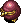 Kleptoad
- Kleptoad - HP: 80 AP: 55 DP: 17 Exp: 1000 GP: 100 Type: Normal Speed: Normal Sp.Atk Rate: 30% (near), 16% (far) Item Drop Rate: 100% ~ Ability ~ Picks up Gitan on the ground and throws it at Shiren in a straight line from up to 10 tiles away. Steals Gitan when adjacent and warps, then runs from Shiren at swift speed. Doesn't use direct attacks. Reflects thrown Gitan.

</td>
      <td></td>
    </tr>
    <tr>
      <td colspan="8" class="purpleDivider"></td>
    </tr>
    <tr>
      <td rowspan="1" class="centeredText highlightShop2">81</td>
      <td class="day">
 Doomhead
- Doomhead - HP: 73 AP: 90 DP: 35 Exp: 3800 GP: 500 Type: Cyclops Speed: Normal Sp.Atk Rate: 34% (near), 34% (far) Item Drop Rate: 4% ~ Ability ~ Attacks 2 tiles ahead and through corners. Charges strength to deal double damage on the next turn.

</td>
      <td class="day danger">
 Kappa Troll
- Kappa Troll - HP: 89 AP: 63 DP: 30 Exp: 1700 GP: 170 Type: Aquatic Speed: Normal Sp.Atk Rate: 0% (near), 0% (far) Item Drop Rate: 4% ~ Ability ~ Stands on an item and throws it at Shiren from anywhere on the current floor. Catches projectiles and throws them back at Shiren. Can throw any item category.

</td>
      <td></td>
      <td class="day danger">
 Gitan Mamel
- Gitan Mamel - HP: 12 AP: 84 DP: 38 Exp: 5500 GP: 444 Type: Normal Speed: Swift 2 Sp.Atk Rate: 0% (near), 0% (far) Item Drop Rate: 100% ~ Ability ~ Converts non-fixed damage received to 1 damage.

</td>
      <td class="day danger">
 Osmammoth
- Osmammoth - HP: 76 AP: 59 DP: 28 Exp: 1400 GP: 170 Type: Drain Speed: Normal Sp.Atk Rate: 100% (near), 100% (far) Item Drop Rate: 4% ~ Ability ~ Absorbs status conditions inflicted on itself or from a creature within a 1 tile radius, fully restoring its own HP and raising AP and DP by 2 stages.

</td>
      <td class="day farm">
 Kleptoad
- Kleptoad - HP: 80 AP: 55 DP: 17 Exp: 1000 GP: 100 Type: Normal Speed: Normal Sp.Atk Rate: 30% (near), 16% (far) Item Drop Rate: 100% ~ Ability ~ Picks up Gitan on the ground and throws it at Shiren in a straight line from up to 10 tiles away. Steals Gitan when adjacent and warps, then runs from Shiren at swift speed. Doesn't use direct attacks. Reflects thrown Gitan.

</td>
      <td></td>
    </tr>
    <tr>
      <td colspan="8" class="purpleDivider"></td>
    </tr>
    <tr>
      <td rowspan="1" class="centeredText">82</td>
      <td class="day">
 Doomhead
- Doomhead - HP: 73 AP: 90 DP: 35 Exp: 3800 GP: 500 Type: Cyclops Speed: Normal Sp.Atk Rate: 34% (near), 34% (far) Item Drop Rate: 4% ~ Ability ~ Attacks 2 tiles ahead and through corners. Charges strength to deal double damage on the next turn.

</td>
      <td class="day">
 Googoman
- Googoman - HP: 128 AP: 63 DP: 25 Exp: 2450 GP: 320 Type: Drain Speed: Normal Sp.Atk Rate: 21% (near), 0% (far) Item Drop Rate: 4% ~ Ability ~ Inflicts Potnesia when adjacent, which prevents Shiren from using or throwing pot items for 100 turns.

</td>
      <td></td>
      <td class="day danger">
 Gitan Mamel
- Gitan Mamel - HP: 12 AP: 84 DP: 38 Exp: 5500 GP: 444 Type: Normal Speed: Swift 2 Sp.Atk Rate: 0% (near), 0% (far) Item Drop Rate: 100% ~ Ability ~ Converts non-fixed damage received to 1 damage.

</td>
      <td class="day danger">
 Osmammoth
- Osmammoth - HP: 76 AP: 59 DP: 28 Exp: 1400 GP: 170 Type: Drain Speed: Normal Sp.Atk Rate: 100% (near), 100% (far) Item Drop Rate: 4% ~ Ability ~ Absorbs status conditions inflicted on itself or from a creature within a 1 tile radius, fully restoring its own HP and raising AP and DP by 2 stages.

</td>
      <td class="day farm">
 Kleptoad
- Kleptoad - HP: 80 AP: 55 DP: 17 Exp: 1000 GP: 100 Type: Normal Speed: Normal Sp.Atk Rate: 30% (near), 16% (far) Item Drop Rate: 100% ~ Ability ~ Picks up Gitan on the ground and throws it at Shiren in a straight line from up to 10 tiles away. Steals Gitan when adjacent and warps, then runs from Shiren at swift speed. Doesn't use direct attacks. Reflects thrown Gitan.

</td>
      <td></td>
    </tr>
    <tr>
      <td colspan="8" class="purpleDivider"></td>
    </tr>
    <tr>
      <td rowspan="1" class="centeredText">83</td>
      <td class="day">
 Doomhead
- Doomhead - HP: 73 AP: 90 DP: 35 Exp: 3800 GP: 500 Type: Cyclops Speed: Normal Sp.Atk Rate: 34% (near), 34% (far) Item Drop Rate: 4% ~ Ability ~ Attacks 2 tiles ahead and through corners. Charges strength to deal double damage on the next turn.

</td>
      <td class="day">
 Googoman
- Googoman - HP: 128 AP: 63 DP: 25 Exp: 2450 GP: 320 Type: Drain Speed: Normal Sp.Atk Rate: 21% (near), 0% (far) Item Drop Rate: 4% ~ Ability ~ Inflicts Potnesia when adjacent, which prevents Shiren from using or throwing pot items for 100 turns.

</td>
      <td></td>
      <td class="day items">
 Gyandoron
- Gyandoron - HP: 95 AP: 75 DP: 36 Exp: 2800 GP: 200 Type: Floating Speed: Normal Sp.Atk Rate: 21% (near), 0% (far) Item Drop Rate: 4% ~ Ability ~ Pecks a staff, scroll, talisman, pot, weapon, or shield from your inventory when adjacent. Staff: Charges reduced to 0. Scroll or Talisman: Turns into Piece of Paper. Pot: Capacity reduced to 0. Weapon or Shield: Erases 1 rune.

</td>
      <td class="day danger">
 Osmammoth
- Osmammoth - HP: 76 AP: 59 DP: 28 Exp: 1400 GP: 170 Type: Drain Speed: Normal Sp.Atk Rate: 100% (near), 100% (far) Item Drop Rate: 4% ~ Ability ~ Absorbs status conditions inflicted on itself or from a creature within a 1 tile radius, fully restoring its own HP and raising AP and DP by 2 stages.

</td>
      <td></td>
      <td></td>
    </tr>
    <tr>
      <td colspan="8" class="purpleDivider"></td>
    </tr>
    <tr>
      <td rowspan="1" class="centeredText">84</td>
      <td class="day danger">
 Blazebird
- Blazebird - HP: 76 AP: 59 DP: 33 Exp: 1400 GP: 170 Type: Floating Speed: Normal Sp.Atk Rate: 100% (near), 100% (far) Item Drop Rate: 0% ~ Ability ~ Warps next to a monster within Shiren's view (3 tiles) and heals HP of all monsters within a 1 tile radius by 60. Items thrown at it burn up. Fire damage restores its HP. Multiplies from explosions.

</td>
      <td class="day">
 Tiger Ace
- Tiger Ace - HP: 93 AP: 72 DP: 32 Exp: 2000 GP: 170 Type: Normal Speed: Normal Sp.Atk Rate: 33% (near), 33% (far) Item Drop Rate: 4% ~ Ability ~ Throws an adjacent creature at Shiren, or throws Shiren at another creature, onto a trap, or into a Monster House. Range of 20 tiles, deals 20 damage.

</td>
      <td class="day">
 Polygon Stunna
- Polygon Stunna - HP: 86 AP: 65 DP: 28 Exp: 1400 GP: 200 Type: Drain/Magic Speed: Normal Sp.Atk Rate: 20% (near), 0% (far) Item Drop Rate: 2% ~ Ability ~ Lowers Max HP by 5 or Max Fullness by 10 when adjacent. Warps in front of Shiren when in a room.

</td>
      <td class="day items">
 Gyandoron
- Gyandoron - HP: 95 AP: 75 DP: 36 Exp: 2800 GP: 200 Type: Floating Speed: Normal Sp.Atk Rate: 21% (near), 0% (far) Item Drop Rate: 4% ~ Ability ~ Pecks a staff, scroll, talisman, pot, weapon, or shield from your inventory when adjacent. Staff: Charges reduced to 0. Scroll or Talisman: Turns into Piece of Paper. Pot: Capacity reduced to 0. Weapon or Shield: Erases 1 rune.

</td>
      <td></td>
      <td></td>
      <td></td>
    </tr>
    <tr>
      <td colspan="8" class="purpleDivider"></td>
    </tr>
    <tr>
      <td rowspan="1" class="centeredText">85</td>
      <td class="day danger">
 Blazebird
- Blazebird - HP: 76 AP: 59 DP: 33 Exp: 1400 GP: 170 Type: Floating Speed: Normal Sp.Atk Rate: 100% (near), 100% (far) Item Drop Rate: 0% ~ Ability ~ Warps next to a monster within Shiren's view (3 tiles) and heals HP of all monsters within a 1 tile radius by 60. Items thrown at it burn up. Fire damage restores its HP. Multiplies from explosions.

</td>
      <td class="day">
 Tiger Ace
- Tiger Ace - HP: 93 AP: 72 DP: 32 Exp: 2000 GP: 170 Type: Normal Speed: Normal Sp.Atk Rate: 33% (near), 33% (far) Item Drop Rate: 4% ~ Ability ~ Throws an adjacent creature at Shiren, or throws Shiren at another creature, onto a trap, or into a Monster House. Range of 20 tiles, deals 20 damage.

</td>
      <td class="day">
 Polygon Stunna
- Polygon Stunna - HP: 86 AP: 65 DP: 28 Exp: 1400 GP: 200 Type: Drain/Magic Speed: Normal Sp.Atk Rate: 20% (near), 0% (far) Item Drop Rate: 2% ~ Ability ~ Lowers Max HP by 5 or Max Fullness by 10 when adjacent. Warps in front of Shiren when in a room.

</td>
      <td class="day items">
 Gyandoron
- Gyandoron - HP: 95 AP: 75 DP: 36 Exp: 2800 GP: 200 Type: Floating Speed: Normal Sp.Atk Rate: 21% (near), 0% (far) Item Drop Rate: 4% ~ Ability ~ Pecks a staff, scroll, talisman, pot, weapon, or shield from your inventory when adjacent. Staff: Charges reduced to 0. Scroll or Talisman: Turns into Piece of Paper. Pot: Capacity reduced to 0. Weapon or Shield: Erases 1 rune.

</td>
      <td class="day">
 Zotdon
- Zotdon - HP: 165 AP: 90 DP: 35 Exp: 2222 GP: 600 Type: Normal Speed: Slow Sp.Atk Rate: 100% (near), 100% (far) Item Drop Rate: 4% ~ Ability ~ Counters with a 40 damage lightning attack when Shiren is in view after taking damage 3 times.

</td>
      <td></td>
      <td></td>
    </tr>
    <tr>
      <td colspan="8" class="purpleDivider"></td>
    </tr>
    <tr>
      <td rowspan="1" class="centeredText">86</td>
      <td class="day items">
 Nigiri King
- Nigiri King - HP: 97 AP: 69 DP: 30 Exp: 3750 GP: 170 Type: Normal Speed: Normal Sp.Atk Rate: 18% (near), 0% (far) Item Drop Rate: 4% ~ Ability ~ Inflicts Onigiri status or transforms an inventory item (prioritizes pots) into Large Onigiri when adjacent. Instantly collapses when hit by thrown onigiri.

</td>
      <td class="day">
 Tiger Ace
- Tiger Ace - HP: 93 AP: 72 DP: 32 Exp: 2000 GP: 170 Type: Normal Speed: Normal Sp.Atk Rate: 33% (near), 33% (far) Item Drop Rate: 4% ~ Ability ~ Throws an adjacent creature at Shiren, or throws Shiren at another creature, onto a trap, or into a Monster House. Range of 20 tiles, deals 20 damage.

</td>
      <td></td>
      <td class="day">
 Boss Yanpii
- Boss Yanpii - HP: 97 AP: 71 DP: 35 Exp: 3200 GP: 250 Type: Normal Speed: Normal Sp.Atk Rate: 22% (near), 22% (far) Item Drop Rate: 4% ~ Ability ~ Headbutts Shiren when lined up, dealing 40 damage and knockback based on distance traveled. If Shiren is knocked into a wall, go into the wall 4 tiles and take an additional 40 damage.

</td>
      <td class="day">
 Zotdon
- Zotdon - HP: 165 AP: 90 DP: 35 Exp: 2222 GP: 600 Type: Normal Speed: Slow Sp.Atk Rate: 100% (near), 100% (far) Item Drop Rate: 4% ~ Ability ~ Counters with a 40 damage lightning attack when Shiren is in view after taking damage 3 times.

</td>
      <td></td>
      <td></td>
    </tr>
    <tr>
      <td colspan="8" class="purpleDivider"></td>
    </tr>
    <tr>
      <td rowspan="1" class="centeredText">87</td>
      <td class="day items">
 Nigiri King
- Nigiri King - HP: 97 AP: 69 DP: 30 Exp: 3750 GP: 170 Type: Normal Speed: Normal Sp.Atk Rate: 18% (near), 0% (far) Item Drop Rate: 4% ~ Ability ~ Inflicts Onigiri status or transforms an inventory item (prioritizes pots) into Large Onigiri when adjacent. Instantly collapses when hit by thrown onigiri.

</td>
      <td></td>
      <td class="day farm">
 Zalokleft King
- Zalokleft King - HP: 80 AP: 61 DP: 15 Exp: 1900 GP: 80 Type: Aquatic Speed: Normal Sp.Atk Rate: 25% (near), 0% (far) Item Drop Rate: 100% ~ Ability ~ Initially Napping. Steals an item from Shiren when adjacent or picks up an item on the ground, then vanishes from the dungeon. Doesn't use direct attacks. Always drops an item from a unique table if slain before stealing an item.

</td>
      <td class="day">
 Boss Yanpii
- Boss Yanpii - HP: 97 AP: 71 DP: 35 Exp: 3200 GP: 250 Type: Normal Speed: Normal Sp.Atk Rate: 22% (near), 22% (far) Item Drop Rate: 4% ~ Ability ~ Headbutts Shiren when lined up, dealing 40 damage and knockback based on distance traveled. If Shiren is knocked into a wall, go into the wall 4 tiles and take an additional 40 damage.

</td>
      <td class="day">
 Zotdon
- Zotdon - HP: 165 AP: 90 DP: 35 Exp: 2222 GP: 600 Type: Normal Speed: Slow Sp.Atk Rate: 100% (near), 100% (far) Item Drop Rate: 4% ~ Ability ~ Counters with a 40 damage lightning attack when Shiren is in view after taking damage 3 times.

</td>
      <td></td>
      <td></td>
    </tr>
    <tr>
      <td colspan="8" class="purpleDivider"></td>
    </tr>
    <tr>
      <td rowspan="1" class="centeredText">88</td>
      <td class="day items">
 Nigiri King
- Nigiri King - HP: 97 AP: 69 DP: 30 Exp: 3750 GP: 170 Type: Normal Speed: Normal Sp.Atk Rate: 18% (near), 0% (far) Item Drop Rate: 4% ~ Ability ~ Inflicts Onigiri status or transforms an inventory item (prioritizes pots) into Large Onigiri when adjacent. Instantly collapses when hit by thrown onigiri.

</td>
      <td></td>
      <td class="day farm">
 Zalokleft King
- Zalokleft King - HP: 80 AP: 61 DP: 15 Exp: 1900 GP: 80 Type: Aquatic Speed: Normal Sp.Atk Rate: 25% (near), 0% (far) Item Drop Rate: 100% ~ Ability ~ Initially Napping. Steals an item from Shiren when adjacent or picks up an item on the ground, then vanishes from the dungeon. Doesn't use direct attacks. Always drops an item from a unique table if slain before stealing an item.

</td>
      <td class="day">
 Boss Yanpii
- Boss Yanpii - HP: 97 AP: 71 DP: 35 Exp: 3200 GP: 250 Type: Normal Speed: Normal Sp.Atk Rate: 22% (near), 22% (far) Item Drop Rate: 4% ~ Ability ~ Headbutts Shiren when lined up, dealing 40 damage and knockback based on distance traveled. If Shiren is knocked into a wall, go into the wall 4 tiles and take an additional 40 damage.

</td>
      <td class="day">
 Zotdon
- Zotdon - HP: 165 AP: 90 DP: 35 Exp: 2222 GP: 600 Type: Normal Speed: Slow Sp.Atk Rate: 100% (near), 100% (far) Item Drop Rate: 4% ~ Ability ~ Counters with a 40 damage lightning attack when Shiren is in view after taking damage 3 times.

</td>
      <td></td>
      <td></td>
    </tr>
    <tr>
      <td colspan="8" class="purpleDivider"></td>
    </tr>
    <tr>
      <td rowspan="1" class="centeredText">89</td>
      <td class="day">
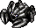 Doom Gyaza
- Doom Gyaza - HP: 85 AP: 80 DP: 35 Exp: 3200 GP: 600 Type: Aquatic Speed: Normal Sp.Atk Rate: 0% (near), 0% (far) Item Drop Rate: 4% ~ Ability ~ Converts most effects received other than direct attacks to 2 damage.

</td>
      <td class="day extreme">
 Ultra Gazer
- Ultra Gazer - HP: 93 AP: 62 DP: 38 Exp: 1850 GP: 130 Type: Cyclops/Magic Speed: Normal Sp.Atk Rate: 43% (near), 18% (far) Item Drop Rate: 100% ~ Ability ~ Hypnotizes Shiren from anywhere in the same room, forcing either item usage or an attack in a random direction.

</td>
      <td class="day farm">
 Zalokleft King
- Zalokleft King - HP: 80 AP: 61 DP: 15 Exp: 1900 GP: 80 Type: Aquatic Speed: Normal Sp.Atk Rate: 25% (near), 0% (far) Item Drop Rate: 100% ~ Ability ~ Initially Napping. Steals an item from Shiren when adjacent or picks up an item on the ground, then vanishes from the dungeon. Doesn't use direct attacks. Always drops an item from a unique table if slain before stealing an item.

</td>
      <td class="day">
 Boss Yanpii
- Boss Yanpii - HP: 97 AP: 71 DP: 35 Exp: 3200 GP: 250 Type: Normal Speed: Normal Sp.Atk Rate: 22% (near), 22% (far) Item Drop Rate: 4% ~ Ability ~ Headbutts Shiren when lined up, dealing 40 damage and knockback based on distance traveled. If Shiren is knocked into a wall, go into the wall 4 tiles and take an additional 40 damage.

</td>
      <td class="day">
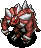 Elizgagon
- Elizgagon - HP: 100 AP: 103 DP: 48 Exp: 5000 GP: 400 Type: Normal Speed: Normal Sp.Atk Rate: 0% (near), 0% (far) Item Drop Rate: 4% ~ Ability ~ None.

</td>
      <td class="day">
 Despoiler
- Despoiler - HP: 95 AP: 85 DP: 30 Exp: 3600 GP: 720 Type: Normal Speed: Normal Sp.Atk Rate: 18% (near), 0% (far) Item Drop Rate: 4% ~ Ability ~ Occasionally lands a critical hit that deals double damage.

</td>
      <td></td>
    </tr>
    <tr>
      <td colspan="8" class="purpleDivider"></td>
    </tr>
    <tr>
      <td rowspan="1" class="centeredText">90</td>
      <td class="day">
 Doom Gyaza
- Doom Gyaza - HP: 85 AP: 80 DP: 35 Exp: 3200 GP: 600 Type: Aquatic Speed: Normal Sp.Atk Rate: 0% (near), 0% (far) Item Drop Rate: 4% ~ Ability ~ Converts most effects received other than direct attacks to 2 damage.

</td>
      <td class="day extreme">
 Ultra Gazer
- Ultra Gazer - HP: 93 AP: 62 DP: 38 Exp: 1850 GP: 130 Type: Cyclops/Magic Speed: Normal Sp.Atk Rate: 43% (near), 18% (far) Item Drop Rate: 100% ~ Ability ~ Hypnotizes Shiren from anywhere in the same room, forcing either item usage or an attack in a random direction.

</td>
      <td></td>
      <td></td>
      <td class="day">
 Elizgagon
- Elizgagon - HP: 100 AP: 103 DP: 48 Exp: 5000 GP: 400 Type: Normal Speed: Normal Sp.Atk Rate: 0% (near), 0% (far) Item Drop Rate: 4% ~ Ability ~ None.

</td>
      <td class="day">
 Despoiler
- Despoiler - HP: 95 AP: 85 DP: 30 Exp: 3600 GP: 720 Type: Normal Speed: Normal Sp.Atk Rate: 18% (near), 0% (far) Item Drop Rate: 4% ~ Ability ~ Occasionally lands a critical hit that deals double damage.

</td>
      <td></td>
    </tr>
    <tr>
      <td colspan="8" class="purpleDivider"></td>
    </tr>
    <tr>
      <td rowspan="1" class="centeredText highlightShop2">91</td>
      <td class="day">
 Doom Gyaza
- Doom Gyaza - HP: 85 AP: 80 DP: 35 Exp: 3200 GP: 600 Type: Aquatic Speed: Normal Sp.Atk Rate: 0% (near), 0% (far) Item Drop Rate: 4% ~ Ability ~ Converts most effects received other than direct attacks to 2 damage.

</td>
      <td class="day extreme">
 Ultra Gazer
- Ultra Gazer - HP: 93 AP: 62 DP: 38 Exp: 1850 GP: 130 Type: Cyclops/Magic Speed: Normal Sp.Atk Rate: 43% (near), 18% (far) Item Drop Rate: 100% ~ Ability ~ Hypnotizes Shiren from anywhere in the same room, forcing either item usage or an attack in a random direction.

</td>
      <td class="day items">
 Swordmaster
- Swordmaster - HP: 100 AP: 85 DP: 36 Exp: 3300 GP: 400 Type: Normal Speed: Normal Sp.Atk Rate: 19% (near), 0% (far) Item Drop Rate: 2% ~ Ability ~ Knocks away Shiren's equipped weapon, shield, or bracelet when adjacent, sending it somewhere within a 10 tile radius.

</td>
      <td></td>
      <td class="day">
 Elizgagon
- Elizgagon - HP: 100 AP: 103 DP: 48 Exp: 5000 GP: 400 Type: Normal Speed: Normal Sp.Atk Rate: 0% (near), 0% (far) Item Drop Rate: 4% ~ Ability ~ None.

</td>
      <td class="day">
 Despoiler
- Despoiler - HP: 95 AP: 85 DP: 30 Exp: 3600 GP: 720 Type: Normal Speed: Normal Sp.Atk Rate: 18% (near), 0% (far) Item Drop Rate: 4% ~ Ability ~ Occasionally lands a critical hit that deals double damage.

</td>
      <td></td>
    </tr>
    <tr>
      <td colspan="8" class="purpleDivider"></td>
    </tr>
    <tr>
      <td rowspan="1" class="centeredText">92</td>
      <td class="day">
 Doom Gyaza
- Doom Gyaza - HP: 85 AP: 80 DP: 35 Exp: 3200 GP: 600 Type: Aquatic Speed: Normal Sp.Atk Rate: 0% (near), 0% (far) Item Drop Rate: 4% ~ Ability ~ Converts most effects received other than direct attacks to 2 damage.

</td>
      <td></td>
      <td class="day items">
 Swordmaster
- Swordmaster - HP: 100 AP: 85 DP: 36 Exp: 3300 GP: 400 Type: Normal Speed: Normal Sp.Atk Rate: 19% (near), 0% (far) Item Drop Rate: 2% ~ Ability ~ Knocks away Shiren's equipped weapon, shield, or bracelet when adjacent, sending it somewhere within a 10 tile radius.

</td>
      <td></td>
      <td class="day">
 Elizgagon
- Elizgagon - HP: 100 AP: 103 DP: 48 Exp: 5000 GP: 400 Type: Normal Speed: Normal Sp.Atk Rate: 0% (near), 0% (far) Item Drop Rate: 4% ~ Ability ~ None.

</td>
      <td class="day">
 Despoiler
- Despoiler - HP: 95 AP: 85 DP: 30 Exp: 3600 GP: 720 Type: Normal Speed: Normal Sp.Atk Rate: 18% (near), 0% (far) Item Drop Rate: 4% ~ Ability ~ Occasionally lands a critical hit that deals double damage.

</td>
      <td></td>
    </tr>
    <tr>
      <td colspan="8" class="purpleDivider"></td>
    </tr>
    <tr>
      <td rowspan="1" class="centeredText">93</td>
      <td class="day">
 Doom Gyaza
- Doom Gyaza - HP: 85 AP: 80 DP: 35 Exp: 3200 GP: 600 Type: Aquatic Speed: Normal Sp.Atk Rate: 0% (near), 0% (far) Item Drop Rate: 4% ~ Ability ~ Converts most effects received other than direct attacks to 2 damage.

</td>
      <td></td>
      <td></td>
      <td></td>
      <td class="day">
 Elizgagon
- Elizgagon - HP: 100 AP: 103 DP: 48 Exp: 5000 GP: 400 Type: Normal Speed: Normal Sp.Atk Rate: 0% (near), 0% (far) Item Drop Rate: 4% ~ Ability ~ None.

</td>
      <td class="day">
 Despoiler
- Despoiler - HP: 95 AP: 85 DP: 30 Exp: 3600 GP: 720 Type: Normal Speed: Normal Sp.Atk Rate: 18% (near), 0% (far) Item Drop Rate: 4% ~ Ability ~ Occasionally lands a critical hit that deals double damage.

</td>
      <td></td>
    </tr>
    <tr>
      <td colspan="8" class="purpleDivider"></td>
    </tr>
    <tr>
      <td rowspan="1" class="centeredText">94</td>
      <td></td>
      <td></td>
      <td></td>
      <td></td>
      <td class="day">
 Elizgagon
- Elizgagon - HP: 100 AP: 103 DP: 48 Exp: 5000 GP: 400 Type: Normal Speed: Normal Sp.Atk Rate: 0% (near), 0% (far) Item Drop Rate: 4% ~ Ability ~ None.

</td>
      <td class="day">
 Despoiler
- Despoiler - HP: 95 AP: 85 DP: 30 Exp: 3600 GP: 720 Type: Normal Speed: Normal Sp.Atk Rate: 18% (near), 0% (far) Item Drop Rate: 4% ~ Ability ~ Occasionally lands a critical hit that deals double damage.

</td>
      <td></td>
    </tr>
    <tr>
      <td colspan="8" class="purpleDivider"></td>
    </tr>
    <tr>
      <td rowspan="1" class="centeredText">95</td>
      <td class="day extreme">
 Cranky Tank
- Cranky Tank - HP: 86 AP: 62 DP: 20 Exp: 3200 GP: 200 Type: Metal/Explode Speed: Swift 2 Sp.Atk Rate: 75% (near), 40% (far) Item Drop Rate: 2% ~ Ability ~ Fires a 50 damage cannon in a straight line whenever Shiren is in range of the 1 tile blast radius.

</td>
      <td></td>
      <td></td>
      <td></td>
      <td class="day">
 Elizgagon
- Elizgagon - HP: 100 AP: 103 DP: 48 Exp: 5000 GP: 400 Type: Normal Speed: Normal Sp.Atk Rate: 0% (near), 0% (far) Item Drop Rate: 4% ~ Ability ~ None.

</td>
      <td class="day">
 Despoiler
- Despoiler - HP: 95 AP: 85 DP: 30 Exp: 3600 GP: 720 Type: Normal Speed: Normal Sp.Atk Rate: 18% (near), 0% (far) Item Drop Rate: 4% ~ Ability ~ Occasionally lands a critical hit that deals double damage.

</td>
      <td></td>
    </tr>
    <tr>
      <td colspan="8" class="purpleDivider"></td>
    </tr>
    <tr>
      <td rowspan="1" class="centeredText">96</td>
      <td class="day extreme">
 Cranky Tank
- Cranky Tank - HP: 86 AP: 62 DP: 20 Exp: 3200 GP: 200 Type: Metal/Explode Speed: Swift 2 Sp.Atk Rate: 75% (near), 40% (far) Item Drop Rate: 2% ~ Ability ~ Fires a 50 damage cannon in a straight line whenever Shiren is in range of the 1 tile blast radius.

</td>
      <td></td>
      <td></td>
      <td></td>
      <td class="day">
 Elizgagon
- Elizgagon - HP: 100 AP: 103 DP: 48 Exp: 5000 GP: 400 Type: Normal Speed: Normal Sp.Atk Rate: 0% (near), 0% (far) Item Drop Rate: 4% ~ Ability ~ None.

</td>
      <td class="day">
 Despoiler
- Despoiler - HP: 95 AP: 85 DP: 30 Exp: 3600 GP: 720 Type: Normal Speed: Normal Sp.Atk Rate: 18% (near), 0% (far) Item Drop Rate: 4% ~ Ability ~ Occasionally lands a critical hit that deals double damage.

</td>
      <td></td>
    </tr>
    <tr>
      <td colspan="8" class="purpleDivider"></td>
    </tr>
    <tr>
      <td rowspan="1" class="centeredText">97</td>
      <td></td>
      <td></td>
      <td class="day extreme">
 Abyss Dragon
- Abyss Dragon - HP: 120 AP: 106 DP: 50 Exp: 6666 GP: 600 Type: Dragon Speed: Normal Sp.Atk Rate: 35% (near), 6% (far) Item Drop Rate: 22% ~ Ability ~ Spews a homing 40 damage flame from anywhere on the current floor.

</td>
      <td></td>
      <td class="day">
 Elizgagon
- Elizgagon - HP: 100 AP: 103 DP: 48 Exp: 5000 GP: 400 Type: Normal Speed: Normal Sp.Atk Rate: 0% (near), 0% (far) Item Drop Rate: 4% ~ Ability ~ None.

</td>
      <td class="day">
 Despoiler
- Despoiler - HP: 95 AP: 85 DP: 30 Exp: 3600 GP: 720 Type: Normal Speed: Normal Sp.Atk Rate: 18% (near), 0% (far) Item Drop Rate: 4% ~ Ability ~ Occasionally lands a critical hit that deals double damage.

</td>
      <td></td>
    </tr>
    <tr>
      <td colspan="8" class="purpleDivider"></td>
    </tr>
    <tr>
      <td rowspan="1" class="centeredText">98</td>
      <td></td>
      <td></td>
      <td class="day extreme">
 Abyss Dragon
- Abyss Dragon - HP: 120 AP: 106 DP: 50 Exp: 6666 GP: 600 Type: Dragon Speed: Normal Sp.Atk Rate: 35% (near), 6% (far) Item Drop Rate: 22% ~ Ability ~ Spews a homing 40 damage flame from anywhere on the current floor.

</td>
      <td></td>
      <td class="day">
 Elizgagon
- Elizgagon - HP: 100 AP: 103 DP: 48 Exp: 5000 GP: 400 Type: Normal Speed: Normal Sp.Atk Rate: 0% (near), 0% (far) Item Drop Rate: 4% ~ Ability ~ None.

</td>
      <td class="day">
 Despoiler
- Despoiler - HP: 95 AP: 85 DP: 30 Exp: 3600 GP: 720 Type: Normal Speed: Normal Sp.Atk Rate: 18% (near), 0% (far) Item Drop Rate: 4% ~ Ability ~ Occasionally lands a critical hit that deals double damage.

</td>
      <td></td>
    </tr>
    <tr>
      <td colspan="8" class="purpleDivider"></td>
    </tr>
    <tr>
      <td rowspan="1" class="centeredText">99</td>
      <td></td>
      <td></td>
      <td class="day extreme">
 Abyss Dragon
- Abyss Dragon - HP: 120 AP: 106 DP: 50 Exp: 6666 GP: 600 Type: Dragon Speed: Normal Sp.Atk Rate: 35% (near), 6% (far) Item Drop Rate: 22% ~ Ability ~ Spews a homing 40 damage flame from anywhere on the current floor.

</td>
      <td></td>
      <td class="day">
 Elizgagon
- Elizgagon - HP: 100 AP: 103 DP: 48 Exp: 5000 GP: 400 Type: Normal Speed: Normal Sp.Atk Rate: 0% (near), 0% (far) Item Drop Rate: 4% ~ Ability ~ None.

</td>
      <td class="day">
 Despoiler
- Despoiler - HP: 95 AP: 85 DP: 30 Exp: 3600 GP: 720 Type: Normal Speed: Normal Sp.Atk Rate: 18% (near), 0% (far) Item Drop Rate: 4% ~ Ability ~ Occasionally lands a critical hit that deals double damage.

</td>
      <td></td>
    </tr>
  </tbody>
</table>
