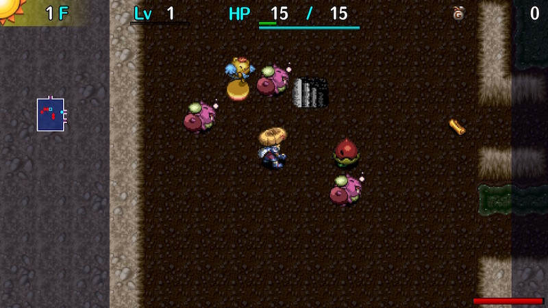

  

Dungeon where Wind of Kron blows extremely fast - You have 199 turns to make it to the stairs. There's a red bar indicating remaining turns in the lower right corner to help you keep track of the wind. Ominous Aura occurs after just 50 turns, so there's a constant threat of encountering Maneater types. Strong monsters appear from 1F, and time wasters like Mesmerikon and Terrabbit also appear. It's easy if you bring powerful items, but don't forget to bring an Escape Scroll just in case.

<ul class="quickLinksUL">
  <li><a href="#overview">Overview</a></li>
  <li><a href="#strategy">Strategy</a></li>
  <li><a href="#monsters">Monsters</a></li>
  <li><a href="#items">Items</a></li>
  <li><a href="#traps">Traps</a></li>
</ul>

# Overview

<table class="dungeonOverview">
  <tr>
    <th>Unlock</th>
    <td class="highlightYellow">Clear Ouma Shrine and arrive in Nekomaneki Village.</td>
  </tr>
  <tr>
    <th>Entrance</th>
    <td class="highlightYellow">Nekomaneki Village (Woman in Dungeon Center)</td>
  </tr>
</table>

<table class="dungeonTable">
  <tr>
    <th>Floors</th>
    <td>50F (first) / 99F</td>
    <th>Day / Night</th>
    <td>Day</td>
  </tr>
  <tr>
    <th>Bring Items</th>
    <td>Yes</td>
    <th>Allies</th>
    <td>No</td>
  </tr>
  <tr>
    <th>Unidentified</th>
    <td>Bracelets</td>
    <th>New Items</th>
    <td>No</td>
  </tr>
  <tr>
    <th>Shops</th>
    <td>Regular, Elite, Pick-A-Choice</td>
    <th>Monster Houses</th>
    <td>Regular, Special, Sudden</td>
  </tr>
  <tr>
    <th>Initial Enemies</th>
    <td></td>
    <th>Spawn Rate</th>
    <td>25</td>
  </tr>
  <tr>
    <th>Ominous aura</th>
    <td>Yes (50 turns)</td>
    <th>Wind of Kron</th>
    <td>1st: 150 / 4th: 200 </td>
  </tr>
  <tr>
    <th>Clear Icon</th>
    <td>None</td>
    <th>Reward</th>
    <td>Time Stop Bracelet</td>
  </tr>
</table>

# Strategy

### General

Similar to Lost Well, bring upgraded equipment along with lots of consumable items and rush stairs. There's no need to bring torches or a shield for nighttime, since this dungeon is daytime-only. Bring Pinning, Boring, Swap, and Knockback staves with lots of remaining uses. Alternatively, a [New Item](/system/new-items) staff with Transient + Swap effects makes the dungeon trivial.

Consider preparing a 2nd set of equipment you don't mind losing instead of bringing your main equipment, since this dungeon has a tendency to cause accidents leading to permanent item loss.

Items found on the ground can be pretty decent in quality, but you usually don't have time to pick them up. If you want to collect them, it's best to bring blessed Collection Scrolls.

Abyss Dragon2 appears between 80-99F, so increase your max HP and have healing items on hand.

### Equipment

#### Shield

It's a daytime-only dungeon, so Daytime Queen offers significant defense without any drawbacks. However, a set with 2 bracelet resonance is probably better unless you're using New Item bracelets. Don't synthesize Unmoving into your main shield, since it prevents Swap Staff and Pinning Staff usage.

If you're using a New Item shield, aim for the following abilities:

1. Reflects magic bullets, hypnosis, dance.
    - Magic bullets are reflected, so you don't take damage like Swap Shield.
2. All projectiles aimed at you will miss.
    - Makes Dozikon, Mesmerikon, Kappa Troll, Porgon, and other projectile monsters a non-issue.

#### Bracelets

Scout Bracelet (Monster Detector) - Use this alongside a Transient Staff to quickly locate the stairs. Blink Bracelet - Potentially conserve turns by warping to different rooms instead of using hallways. Wall Clip Bracelet - Cut through corners to conserve turns in hallways. Floating Bracelet - Avoid traps and take shortcuts along waterways.

# Monsters

See [Monsters](/system/monsters) for individual monster details.

- N = N'dubba Lv1 Lv2 Lv3 Lv4
- M = Maneater None Lv1 Lv2 Lv3 Lv4

Floor Colors: Limit break monsters Enemy Colors: Destroys Items Dangerous Very Dangerous

<table class="monsterTable">
  <thead>
    <tr>
      <th>F</th>
      <th colspan="5">Monsters</th>
      <th>N</th>
      <th>M</th>
    </tr>
  </thead>
  <tbody>
    <tr>
      <td rowspan="2">1</td>
      <td>Electroid</td>
      <td>Colocolum</td>
      <td>Rally Ham</td>
      <td>Spicy Nut</td>
      <td>Doztapir</td>
      <td rowspan="2" class="monsterTableNmach">3</td>
      <td rowspan="2" class="highlightBlack"></td>
    </tr>
    <tr>
      <td class="dangerDay">N'mach</td>
      <td class="highlightGray"></td>
      <td class="highlightGray"></td>
      <td class="highlightGray"></td>
      <td class="highlightGray"></td>
    </tr>
    <tr>
      <td colspan="8" class="monsterDivider"></td>
    </tr>
    <tr>
      <td rowspan="2">2</td>
      <td>Electroid</td>
      <td>Colocolum</td>
      <td>Rally Ham</td>
      <td>Spicy Nut</td>
      <td>Doztapir</td>
      <td rowspan="2" class="monsterTableNmach">3</td>
      <td rowspan="2" class="highlightBlack"></td>
    </tr>
    <tr>
      <td class="dangerDay">N'mach</td>
      <td>Debaser</td>
      <td>Vexing Kappa</td>
      <td>Mixergon</td>
      <td class="highlightGray"></td>
    </tr>
    <tr>
      <td colspan="8" class="monsterDivider"></td>
    </tr>
    <tr>
      <td rowspan="2">3</td>
      <td>Jouncy</td>
      <td>MC Wizard</td>
      <td>Strong Cart</td>
      <td>Spicy Nut</td>
      <td>Doztapir</td>
      <td rowspan="2" class="monsterTableNmach">3</td>
      <td rowspan="2" class="highlightBlack"></td>
    </tr>
    <tr>
      <td class="dangerDay">N'mach</td>
      <td>Debaser</td>
      <td>Vexing Kappa</td>
      <td>Mixergon</td>
      <td class="highlightGray"></td>
    </tr>
    <tr>
      <td colspan="8" class="monsterDivider"></td>
    </tr>
    <tr>
      <td rowspan="2">4</td>
      <td>Jouncy</td>
      <td>MC Wizard</td>
      <td>Strong Cart</td>
      <td>Porkon</td>
      <td class="highlightGray"></td>
      <td rowspan="2" class="highlightGray"></td>
      <td rowspan="2" class="highlightBlack"></td>
    </tr>
    <tr>
      <td class="highlightGray"></td>
      <td>Debaser</td>
      <td>Vexing Kappa</td>
      <td class="highlightGray"></td>
      <td class="highlightGray"></td>
    </tr>
    <tr>
      <td colspan="8" class="monsterDivider"></td>
    </tr>
    <tr>
      <td rowspan="2">5</td>
      <td>Jouncy</td>
      <td>MC Wizard</td>
      <td>Momomoseal</td>
      <td>Porkon</td>
      <td class="itemDay">Mudster</td>
      <td rowspan="2" class="highlightGray"></td>
      <td rowspan="2" class="monsterTableMounteater">3</td>
    </tr>
    <tr>
      <td>StunScorp</td>
      <td>Debaser</td>
      <td class="highlightGray"></td>
      <td class="highlightGray"></td>
      <td class="highlightGray"></td>
    </tr>
    <tr>
      <td colspan="8" class="monsterDivider"></td>
    </tr>
    <tr>
      <td rowspan="2">6</td>
      <td>Jouncy</td>
      <td>Horrabbit</td>
      <td>Momomoseal</td>
      <td>Froggon</td>
      <td class="itemDay">Mudster</td>
      <td rowspan="2" class="highlightGray"></td>
      <td rowspan="2" class="monsterTableMounteater">3</td>
    </tr>
    <tr>
      <td>StunScorp</td>
      <td>Debaser</td>
      <td class="itemDay">Curspinster</td>
      <td class="highlightGray"></td>
      <td class="highlightGray"></td>
    </tr>
    <tr>
      <td colspan="8" class="monsterDivider"></td>
    </tr>
    <tr>
      <td rowspan="2">7</td>
      <td>Pumpanshee</td>
      <td>Horrabbit</td>
      <td>Momomoseal</td>
      <td>Froggon</td>
      <td class="itemDay">Mudster</td>
      <td rowspan="2" class="highlightGray"></td>
      <td rowspan="2" class="monsterTableMounteater">3</td>
    </tr>
    <tr>
      <td>Tiger Chucker</td>
      <td class="highlightGray"></td>
      <td class="itemDay">Curspinster</td>
      <td class="highlightGray"></td>
      <td class="highlightGray"></td>
    </tr>
    <tr>
      <td colspan="8" class="monsterDivider"></td>
    </tr>
    <tr>
      <td rowspan="2">8</td>
      <td>Pumpanshee</td>
      <td>Horrabbit</td>
      <td>Gyandora</td>
      <td>Froggon</td>
      <td>Zanbeeto</td>
      <td rowspan="2" class="highlightGray"></td>
      <td rowspan="2" class="monsterTableMounteater">3</td>
    </tr>
    <tr>
      <td>Tiger Chucker</td>
      <td class="dangerDay">Spongiderm</td>
      <td class="itemDay">Curspinster</td>
      <td>Iron Zalokleft</td>
      <td class="highlightGray"></td>
    </tr>
    <tr>
      <td colspan="8" class="monsterDivider"></td>
    </tr>
    <tr>
      <td rowspan="2">9</td>
      <td>Pumpanshee</td>
      <td>Lashagga</td>
      <td>Gyandora</td>
      <td>Lt. Yanpii</td>
      <td>Zanbeeto</td>
      <td rowspan="2" class="highlightGray"></td>
      <td rowspan="2" class="monsterTableMounteater">3</td>
    </tr>
    <tr>
      <td>Tiger Chucker</td>
      <td class="dangerDay">Spongiderm</td>
      <td class="highlightGray"></td>
      <td>Iron Zalokleft</td>
      <td class="highlightGray"></td>
    </tr>
    <tr>
      <td colspan="8" class="monsterDivider"></td>
    </tr>
    <tr>
      <td rowspan="2">10</td>
      <td>Pumpanshee</td>
      <td>Lashagga</td>
      <td>Gyandora</td>
      <td>Lt. Yanpii</td>
      <td>Zanbeeto</td>
      <td rowspan="2" class="highlightGray"></td>
      <td rowspan="2" class="monsterTableMounteater">3</td>
    </tr>
    <tr>
      <td>Tiger Chucker</td>
      <td class="dangerDay">Spongiderm</td>
      <td>Polygon Singa</td>
      <td>Iron Zalokleft</td>
      <td class="itemDay">Item Knave</td>
    </tr>
    <tr>
      <td colspan="8" class="monsterDivider"></td>
    </tr>
    <tr>
      <td rowspan="2">11</td>
      <td>Sensei</td>
      <td>Lashagga</td>
      <td>Bunchukdon</td>
      <td>Lt. Yanpii</td>
      <td>Pierce Cart</td>
      <td rowspan="2" class="highlightGray"></td>
      <td rowspan="2" class="monsterTableMounteater">3</td>
    </tr>
    <tr>
      <td class="highlightGray"></td>
      <td class="highlightGray"></td>
      <td>Polygon Singa</td>
      <td class="highlightGray"></td>
      <td class="itemDay">Item Knave</td>
    </tr>
    <tr>
      <td colspan="8" class="monsterDivider"></td>
    </tr>
    <tr>
      <td rowspan="2">12</td>
      <td>Sensei</td>
      <td>Flarebird</td>
      <td>Bunchukdon</td>
      <td>Grass Poppa</td>
      <td>Pierce Cart</td>
      <td rowspan="2" class="highlightGray"></td>
      <td rowspan="2" class="monsterTableMounteater">3</td>
    </tr>
    <tr>
      <td class="highlightGray"></td>
      <td class="highlightGray"></td>
      <td>Polygon Singa</td>
      <td class="highlightGray"></td>
      <td class="highlightGray"></td>
    </tr>
    <tr>
      <td colspan="8" class="monsterDivider"></td>
    </tr>
    <tr>
      <td rowspan="2">13</td>
      <td>Sensei</td>
      <td>Flarebird</td>
      <td>Bunchukdon</td>
      <td>Grass Poppa</td>
      <td>Pierce Cart</td>
      <td rowspan="2" class="highlightGray"></td>
      <td rowspan="2" class="monsterTableMounteater">3</td>
    </tr>
    <tr>
      <td>Bitter Nut</td>
      <td>Blazepuff</td>
      <td>Polygon Singa</td>
      <td class="highlightGray"></td>
      <td class="highlightGray"></td>
    </tr>
    <tr>
      <td colspan="8" class="monsterDivider"></td>
    </tr>
    <tr>
      <td rowspan="2">14</td>
      <td>Sensei</td>
      <td>Flarebird</td>
      <td>Bunchukdon</td>
      <td>Bouncy</td>
      <td>Fulminachin</td>
      <td rowspan="2" class="highlightGray"></td>
      <td rowspan="2" class="monsterTableMounteater">3</td>
    </tr>
    <tr>
      <td>Bitter Nut</td>
      <td>Blazepuff</td>
      <td>Onigirizzly</td>
      <td>Spirit Ham</td>
      <td class="highlightGray"></td>
    </tr>
    <tr>
      <td colspan="8" class="monsterDivider"></td>
    </tr>
    <tr>
      <td rowspan="2">15</td>
      <td>Sensei</td>
      <td>Nigiri Boss</td>
      <td>Hyper Gazer</td>
      <td>Bouncy</td>
      <td>Fulminachin</td>
      <td rowspan="2" class="highlightGray"></td>
      <td rowspan="2" class="monsterTableMounteater">3</td>
    </tr>
    <tr>
      <td>Bitter Nut</td>
      <td>Blazepuff</td>
      <td>Onigirizzly</td>
      <td>Spirit Ham</td>
      <td class="highlightGray"></td>
    </tr>
    <tr>
      <td colspan="8" class="monsterDivider"></td>
    </tr>
    <tr>
      <td rowspan="2">16</td>
      <td>Phoenix Tengu</td>
      <td>Nigiri Boss</td>
      <td>Hyper Gazer</td>
      <td>Bouncy</td>
      <td>Fulminachin</td>
      <td rowspan="2" class="highlightGray"></td>
      <td rowspan="2" class="monsterTableMounteater">3</td>
    </tr>
    <tr>
      <td>Bitter Nut</td>
      <td>Dozikon</td>
      <td>Onigirizzly</td>
      <td>Spirit Ham</td>
      <td class="highlightGray"></td>
    </tr>
    <tr>
      <td colspan="8" class="monsterDivider"></td>
    </tr>
    <tr>
      <td rowspan="2">17</td>
      <td>Phoenix Tengu</td>
      <td>Nigiri Boss</td>
      <td>Hyper Gazer</td>
      <td>Archdragon</td>
      <td>Comatapir</td>
      <td rowspan="2" class="highlightGray"></td>
      <td rowspan="2" class="monsterTableMounteater">3</td>
    </tr>
    <tr>
      <td>Bitter Nut</td>
      <td>Dozikon</td>
      <td>King Squid</td>
      <td class="highlightGray"></td>
      <td class="highlightGray"></td>
    </tr>
    <tr>
      <td colspan="8" class="monsterDivider"></td>
    </tr>
    <tr>
      <td rowspan="2">18</td>
      <td>Phoenix Tengu</td>
      <td>Mudder</td>
      <td>Hyper Gazer</td>
      <td>Archdragon</td>
      <td>Comatapir</td>
      <td rowspan="2" class="highlightGray"></td>
      <td rowspan="2" class="monsterTableMounteater">3</td>
    </tr>
    <tr>
      <td class="highlightGray"></td>
      <td>Dozikon</td>
      <td class="highlightGray"></td>
      <td class="highlightGray"></td>
      <td class="highlightGray"></td>
    </tr>
    <tr>
      <td colspan="8" class="monsterDivider"></td>
    </tr>
    <tr>
      <td rowspan="2">19</td>
      <td>Phoenix Tengu</td>
      <td>Mudder</td>
      <td>Grainie</td>
      <td>Archdragon</td>
      <td>Comatapir</td>
      <td rowspan="2" class="highlightGray"></td>
      <td rowspan="2" class="monsterTableMounteater">3</td>
    </tr>
    <tr>
      <td>FO-UZ</td>
      <td class="highlightGray"></td>
      <td class="highlightGray"></td>
      <td class="highlightGray"></td>
      <td class="highlightGray"></td>
    </tr>
    <tr>
      <td colspan="8" class="monsterDivider"></td>
    </tr>
    <tr>
      <td>20</td>
      <td>Huge Chintala</td>
      <td>Mudder</td>
      <td>Grainie</td>
      <td>Cyberoid</td>
      <td>Trowelie</td>
      <td class="highlightGray"></td>
      <td class="monsterTableMounteater">3</td>
    </tr>
    <tr>
      <td colspan="8" class="monsterDivider"></td>
    </tr>
    <tr>
      <td rowspan="2">21</td>
      <td>Huge Chintala</td>
      <td class="dangerDay">N'dup</td>
      <td>Grainie</td>
      <td>Cyberoid</td>
      <td>Trowelie</td>
      <td rowspan="2" class="monsterTableNdup">4</td>
      <td rowspan="2" class="monsterTableMounteater">3</td>
    </tr>
    <tr>
      <td>Mixerdon</td>
      <td class="highlightGray"></td>
      <td class="highlightGray"></td>
      <td class="highlightGray"></td>
      <td class="highlightGray"></td>
    </tr>
    <tr>
      <td colspan="8" class="monsterDivider"></td>
    </tr>
    <tr>
      <td rowspan="2">22</td>
      <td>Huge Chintala</td>
      <td class="dangerDay">N'dup</td>
      <td>Grainie</td>
      <td>Cyberoid</td>
      <td>Trowelie</td>
      <td rowspan="2" class="monsterTableNdup">4</td>
      <td rowspan="2" class="monsterTableMounteater">3</td>
    </tr>
    <tr>
      <td>Mixerdon</td>
      <td>Detonachin</td>
      <td>Eligagon</td>
      <td class="highlightGray"></td>
      <td class="highlightGray"></td>
    </tr>
    <tr>
      <td colspan="8" class="monsterDivider"></td>
    </tr>
    <tr>
      <td rowspan="2">23</td>
      <td>Huge Chintala</td>
      <td class="dangerDay">N'dup</td>
      <td>Knave King</td>
      <td>Cyberoid</td>
      <td>Mealy</td>
      <td rowspan="2" class="monsterTableNdup">4</td>
      <td rowspan="2" class="monsterTableMounteater">3</td>
    </tr>
    <tr>
      <td>Mixerdon</td>
      <td>Detonachin</td>
      <td>Eligagon</td>
      <td class="highlightGray"></td>
      <td class="highlightGray"></td>
    </tr>
    <tr>
      <td colspan="8" class="monsterDivider"></td>
    </tr>
    <tr>
      <td rowspan="2">24</td>
      <td>Cursenior</td>
      <td class="dangerDay">N'dup</td>
      <td>Knave King</td>
      <td>Cyberoid</td>
      <td>Mealy</td>
      <td rowspan="2" class="monsterTableNdup">4</td>
      <td rowspan="2" class="monsterTableMounteater">3</td>
    </tr>
    <tr>
      <td class="highlightGray"></td>
      <td>Detonachin</td>
      <td>Eligagon</td>
      <td class="highlightGray"></td>
      <td class="highlightGray"></td>
    </tr>
    <tr>
      <td colspan="8" class="monsterDivider"></td>
    </tr>
    <tr>
      <td rowspan="2">25</td>
      <td>Cursenior</td>
      <td>Sproutitan</td>
      <td>Knave King</td>
      <td>Cyberoid</td>
      <td>Mealy</td>
      <td rowspan="2" class="highlightGray"></td>
      <td rowspan="2" class="monsterTableMounteater">3</td>
    </tr>
    <tr>
      <td class="extremeDay">Porgon</td>
      <td>Detonachin</td>
      <td>Eligagon</td>
      <td class="highlightGray"></td>
      <td class="highlightGray"></td>
    </tr>
    <tr>
      <td colspan="8" class="monsterDivider"></td>
    </tr>
    <tr>
      <td rowspan="2">26</td>
      <td>Cursenior</td>
      <td>Sproutitan</td>
      <td>Knave King</td>
      <td>Ruiner</td>
      <td>Mealy</td>
      <td rowspan="2" class="highlightGray"></td>
      <td rowspan="2" class="monsterTableMounteater">3</td>
    </tr>
    <tr>
      <td class="extremeDay">Porgon</td>
      <td>Squidperor</td>
      <td class="highlightGray"></td>
      <td class="highlightGray"></td>
      <td class="highlightGray"></td>
    </tr>
    <tr>
      <td colspan="8" class="monsterDivider"></td>
    </tr>
    <tr>
      <td rowspan="2">27</td>
      <td>Pumptergeist</td>
      <td>Sproutitan</td>
      <td>Terrabbit</td>
      <td>Ruiner</td>
      <td class="highlightGray"></td>
      <td rowspan="2" class="highlightGray"></td>
      <td rowspan="2" class="monsterTableMounteater">3</td>
    </tr>
    <tr>
      <td class="extremeDay">Porgon</td>
      <td>Squidperor</td>
      <td>Trillman</td>
      <td class="highlightGray"></td>
      <td class="highlightGray"></td>
    </tr>
    <tr>
      <td colspan="8" class="monsterDivider"></td>
    </tr>
    <tr>
      <td rowspan="2">28</td>
      <td>Pumptergeist</td>
      <td>Sproutitan</td>
      <td>Terrabbit</td>
      <td>Ruiner</td>
      <td>Oingodile</td>
      <td rowspan="2" class="highlightGray"></td>
      <td rowspan="2" class="monsterTableIsleater">4</td>
    </tr>
    <tr>
      <td class="dangerDay">Foly</td>
      <td class="highlightGray"></td>
      <td>Trillman</td>
      <td class="highlightGray"></td>
      <td class="highlightGray"></td>
    </tr>
    <tr>
      <td colspan="8" class="monsterDivider"></td>
    </tr>
    <tr>
      <td rowspan="2">29</td>
      <td>Pumptergeist</td>
      <td>Shovelie</td>
      <td>Terrabbit</td>
      <td>Ruiner</td>
      <td>Oingodile</td>
      <td rowspan="2" class="highlightGray"></td>
      <td rowspan="2" class="monsterTableIsleater">4</td>
    </tr>
    <tr>
      <td>Colocolocolum</td>
      <td class="highlightGray"></td>
      <td class="highlightGray"></td>
      <td class="highlightGray"></td>
      <td class="highlightGray"></td>
    </tr>
    <tr>
      <td colspan="8" class="monsterDivider"></td>
    </tr>
    <tr>
      <td rowspan="2">30</td>
      <td>Pumptergeist</td>
      <td>Shovelie</td>
      <td class="highlightGray"></td>
      <td>Ruiner</td>
      <td>Oingodile</td>
      <td rowspan="2" class="highlightGray"></td>
      <td rowspan="2" class="monsterTableIsleater">4</td>
    </tr>
    <tr>
      <td>Colocolocolum</td>
      <td class="highlightGray"></td>
      <td class="highlightGray"></td>
      <td class="highlightGray"></td>
      <td class="highlightGray"></td>
    </tr>
    <tr>
      <td colspan="8" class="monsterDivider"></td>
    </tr>
    <tr>
      <td rowspan="2">31</td>
      <td>Pumptergeist</td>
      <td>Shovelie</td>
      <td>Steelhead</td>
      <td>Grass Gramps</td>
      <td>Oingodile</td>
      <td rowspan="2" class="highlightGray"></td>
      <td rowspan="2" class="monsterTableIsleater">4</td>
    </tr>
    <tr>
      <td>Colocolocolum</td>
      <td>Kleptoad</td>
      <td>Kodionigiri</td>
      <td class="highlightGray"></td>
      <td class="highlightGray"></td>
    </tr>
    <tr>
      <td colspan="8" class="monsterDivider"></td>
    </tr>
    <tr>
      <td rowspan="2">32</td>
      <td>Pumptergeist</td>
      <td>Shovelie</td>
      <td>Steelhead</td>
      <td>Grass Gramps</td>
      <td>Hell Gyaza</td>
      <td rowspan="2" class="highlightGray"></td>
      <td rowspan="2" class="monsterTableIsleater">4</td>
    </tr>
    <tr>
      <td>Colocolocolum</td>
      <td>Kleptoad</td>
      <td>Kodionigiri</td>
      <td class="highlightGray"></td>
      <td class="highlightGray"></td>
    </tr>
    <tr>
      <td colspan="8" class="monsterDivider"></td>
    </tr>
    <tr>
      <td rowspan="2">33</td>
      <td>Bashagga</td>
      <td>Nigiri King</td>
      <td>Steelhead</td>
      <td>Grass Gramps</td>
      <td>Hell Gyaza</td>
      <td rowspan="2" class="highlightGray"></td>
      <td rowspan="2" class="monsterTableIsleater">4</td>
    </tr>
    <tr>
      <td>Osmammoth</td>
      <td>Kleptoad</td>
      <td>Kodionigiri</td>
      <td class="highlightGray"></td>
      <td class="highlightGray"></td>
    </tr>
    <tr>
      <td colspan="8" class="monsterDivider"></td>
    </tr>
    <tr>
      <td rowspan="2">34</td>
      <td>Bashagga</td>
      <td>Nigiri King</td>
      <td>Steelhead</td>
      <td>Grass Gramps</td>
      <td>Hell Gyaza</td>
      <td rowspan="2" class="highlightGray"></td>
      <td rowspan="2" class="monsterTableIsleater">4</td>
    </tr>
    <tr>
      <td>Osmammoth</td>
      <td>Kleptoad</td>
      <td>Kodionigiri</td>
      <td class="highlightGray"></td>
      <td class="highlightGray"></td>
    </tr>
    <tr>
      <td colspan="8" class="monsterDivider"></td>
    </tr>
    <tr>
      <td rowspan="2">35</td>
      <td>Bashagga</td>
      <td>Nigiri King</td>
      <td>Steelhead</td>
      <td>Gyandoron</td>
      <td>Hell Gyaza</td>
      <td rowspan="2" class="highlightGray"></td>
      <td rowspan="2" class="monsterTableIsleater">4</td>
    </tr>
    <tr>
      <td>Osmammoth</td>
      <td>Boss Yanpii</td>
      <td class="highlightGray"></td>
      <td class="highlightGray"></td>
      <td class="highlightGray"></td>
    </tr>
    <tr>
      <td colspan="8" class="monsterDivider"></td>
    </tr>
    <tr>
      <td rowspan="2">36</td>
      <td>Bashagga</td>
      <td>Nigiri King</td>
      <td>Blazebird</td>
      <td>Gyandoron</td>
      <td>BlightScorp</td>
      <td rowspan="2" class="highlightGray"></td>
      <td rowspan="2" class="monsterTableIsleater">4</td>
    </tr>
    <tr>
      <td>Osmammoth</td>
      <td>Boss Yanpii</td>
      <td>Zotdon</td>
      <td>Googoman</td>
      <td class="highlightGray"></td>
    </tr>
    <tr>
      <td colspan="8" class="monsterDivider"></td>
    </tr>
    <tr>
      <td rowspan="2">37</td>
      <td>Bashagga</td>
      <td>Nigiri King</td>
      <td>Blazebird</td>
      <td>Gyandoron</td>
      <td>BlightScorp</td>
      <td rowspan="2" class="highlightGray"></td>
      <td rowspan="2" class="monsterTableIsleater">4</td>
    </tr>
    <tr>
      <td>Osmammoth</td>
      <td>Boss Yanpii</td>
      <td>Zotdon</td>
      <td>Kappa Troll</td>
      <td class="highlightGray"></td>
    </tr>
    <tr>
      <td colspan="8" class="monsterDivider"></td>
    </tr>
    <tr>
      <td rowspan="2">38</td>
      <td>Mesmerikon</td>
      <td>Doom Gyaza</td>
      <td>Blazebird</td>
      <td>Gyandoron</td>
      <td>BlightScorp</td>
      <td rowspan="2" class="highlightGray"></td>
      <td rowspan="2" class="monsterTableIsleater">4</td>
    </tr>
    <tr>
      <td>Foly</td>
      <td class="highlightGray"></td>
      <td>Zotdon</td>
      <td>Kappa Troll</td>
      <td class="highlightGray"></td>
    </tr>
    <tr>
      <td colspan="8" class="monsterDivider"></td>
    </tr>
    <tr>
      <td rowspan="2">39</td>
      <td>Mesmerikon</td>
      <td>Doom Gyaza</td>
      <td>Polygon Stunna</td>
      <td>Gyandoron</td>
      <td class="highlightGray"></td>
      <td rowspan="2" class="highlightGray"></td>
      <td rowspan="2" class="monsterTableIsleater">4</td>
    </tr>
    <tr>
      <td>Foly</td>
      <td class="highlightGray"></td>
      <td>Zotdon</td>
      <td>Kappa Troll</td>
      <td class="highlightGray"></td>
    </tr>
    <tr>
      <td colspan="8" class="monsterDivider"></td>
    </tr>
    <tr>
      <td rowspan="2">40</td>
      <td>Mesmerikon</td>
      <td>Doom Gyaza</td>
      <td>Polygon Stunna</td>
      <td>Cyberoid</td>
      <td>Swordmaster</td>
      <td rowspan="2" class="highlightGray"></td>
      <td rowspan="2" class="monsterTableIsleater">4</td>
    </tr>
    <tr>
      <td>Ultra Gazer</td>
      <td class="highlightGray"></td>
      <td>Zotdon</td>
      <td>Kappa Troll</td>
      <td class="highlightGray"></td>
    </tr>
    <tr>
      <td colspan="8" class="monsterDivider"></td>
    </tr>
    <tr>
      <td rowspan="2">41</td>
      <td>Gitan Mamel</td>
      <td>Doom Gyaza</td>
      <td>Polygon Stunna</td>
      <td>Cyberoid</td>
      <td>Swordmaster</td>
      <td rowspan="2" class="highlightGray"></td>
      <td rowspan="2" class="monsterTableIsleater">4</td>
    </tr>
    <tr>
      <td>Ultra Gazer</td>
      <td class="highlightGray"></td>
      <td>Zotdon</td>
      <td class="highlightGray"></td>
      <td class="highlightGray"></td>
    </tr>
    <tr>
      <td colspan="8" class="monsterDivider"></td>
    </tr>
    <tr>
      <td rowspan="2">42</td>
      <td>Gitan Mamel</td>
      <td>Doom Gyaza</td>
      <td>Polygon Stunna</td>
      <td>Cyberoid</td>
      <td>Swordmaster</td>
      <td rowspan="2" class="highlightGray"></td>
      <td rowspan="2" class="monsterTableIsleater">4</td>
    </tr>
    <tr>
      <td>Ultra Gazer</td>
      <td class="highlightGray"></td>
      <td class="highlightGray"></td>
      <td class="highlightGray"></td>
      <td class="highlightGray"></td>
    </tr>
    <tr>
      <td colspan="8" class="monsterDivider"></td>
    </tr>
    <tr>
      <td rowspan="2">43</td>
      <td>Gitan Mamel</td>
      <td>Tiger Ace</td>
      <td>Polygon Stunna</td>
      <td>Cyberoid</td>
      <td>Swordmaster</td>
      <td rowspan="2" class="highlightGray"></td>
      <td rowspan="2" class="monsterTableIsleater">4</td>
    </tr>
    <tr>
      <td>Ultra Gazer</td>
      <td class="highlightGray"></td>
      <td class="highlightGray"></td>
      <td class="highlightGray"></td>
      <td class="highlightGray"></td>
    </tr>
    <tr>
      <td colspan="8" class="monsterDivider"></td>
    </tr>
    <tr>
      <td rowspan="2">44</td>
      <td>Gitan Mamel</td>
      <td>Tiger Ace</td>
      <td>MC Sorceror</td>
      <td>Cyberoid</td>
      <td>Swordmaster</td>
      <td rowspan="2" class="highlightGray"></td>
      <td rowspan="2" class="monsterTableIsleater">4</td>
    </tr>
    <tr>
      <td>Ultra Gazer</td>
      <td class="highlightGray"></td>
      <td class="highlightGray"></td>
      <td class="highlightGray"></td>
      <td class="highlightGray"></td>
    </tr>
    <tr>
      <td colspan="8" class="monsterDivider"></td>
    </tr>
    <tr>
      <td rowspan="2">45</td>
      <td>Gitan Mamel</td>
      <td>Tiger Ace</td>
      <td>MC Sorceror</td>
      <td>Cyberoid</td>
      <td>Despoiler</td>
      <td rowspan="2" class="highlightGray"></td>
      <td rowspan="2" class="monsterTableIsleater">4</td>
    </tr>
    <tr>
      <td>Ultra Gazer</td>
      <td>Chow</td>
      <td class="highlightGray"></td>
      <td class="highlightGray"></td>
      <td class="highlightGray"></td>
    </tr>
    <tr>
      <td colspan="8" class="monsterDivider"></td>
    </tr>
    <tr>
      <td rowspan="2">46</td>
      <td>Gitan Mamel</td>
      <td>Tiger Ace</td>
      <td>MC Sorceror</td>
      <td>Cyberoid</td>
      <td>Despoiler</td>
      <td rowspan="2" class="highlightGray"></td>
      <td rowspan="2" class="monsterTableIsleater">4</td>
    </tr>
    <tr>
      <td>Elizgagon</td>
      <td>Chow</td>
      <td>Abyss Dragon</td>
      <td>Ornery Tank</td>
      <td class="highlightGray"></td>
    </tr>
    <tr>
      <td colspan="8" class="monsterDivider"></td>
    </tr>
    <tr>
      <td rowspan="2">47</td>
      <td>Gitan Mamel</td>
      <td>Tiger Ace</td>
      <td>MC Sorceror</td>
      <td>Cyberoid</td>
      <td>Despoiler</td>
      <td rowspan="2" class="highlightGray"></td>
      <td rowspan="2" class="monsterTableIsleater">4</td>
    </tr>
    <tr>
      <td>Elizgagon</td>
      <td>Chow</td>
      <td>Abyss Dragon</td>
      <td>Ornery Tank</td>
      <td class="highlightGray"></td>
    </tr>
    <tr>
      <td colspan="8" class="monsterDivider"></td>
    </tr>
    <tr>
      <td rowspan="2">48</td>
      <td>Gitan Mamel</td>
      <td>Tiger Ace</td>
      <td>MC Sorceror</td>
      <td>Zalokleft King</td>
      <td>Despoiler</td>
      <td rowspan="2" class="highlightGray"></td>
      <td rowspan="2" class="monsterTableIsleater">4</td>
    </tr>
    <tr>
      <td>Elizgagon</td>
      <td>Chow</td>
      <td>Abyss Dragon</td>
      <td class="highlightGray"></td>
      <td class="highlightGray"></td>
    </tr>
    <tr>
      <td colspan="8" class="monsterDivider"></td>
    </tr>
    <tr>
      <td rowspan="2">49</td>
      <td>Gitan Mamel</td>
      <td>Tiger Ace</td>
      <td>MC Sorceror</td>
      <td>Zalokleft King</td>
      <td>Despoiler</td>
      <td rowspan="2" class="highlightGray"></td>
      <td rowspan="2" class="monsterTableIsleater">4</td>
    </tr>
    <tr>
      <td>Elizgagon</td>
      <td>Chow</td>
      <td>Abyss Dragon</td>
      <td class="highlightGray"></td>
      <td class="highlightGray"></td>
    </tr>
    <tr>
      <td colspan="8" class="monsterDivider"></td>
    </tr>
    <tr>
      <td rowspan="2">50</td>
      <td>Gitan Mamel</td>
      <td>Tiger Ace</td>
      <td>MC Sorceror</td>
      <td>Zalokleft King</td>
      <td>Despoiler</td>
      <td rowspan="2" class="highlightGray"></td>
      <td rowspan="2" class="monsterTableIsleater">4</td>
    </tr>
    <tr>
      <td>Elizgagon</td>
      <td>Chow</td>
      <td>Abyss Dragon</td>
      <td class="highlightGray"></td>
      <td class="highlightGray"></td>
    </tr>
    <tr>
      <td colspan="8" class="monsterDivider"></td>
    </tr>
    <tr>
      <td rowspan="2">51</td>
      <td>Gitan Mamel</td>
      <td>Froggon</td>
      <td>MC Sorceror</td>
      <td class="highlightGray"></td>
      <td>Despoiler</td>
      <td rowspan="2" class="highlightGray"></td>
      <td rowspan="2" class="monsterTableIsleater">4</td>
    </tr>
    <tr>
      <td>Elizgagon</td>
      <td class="highlightGray"></td>
      <td class="highlightGray"></td>
      <td class="highlightGray"></td>
      <td class="highlightGray"></td>
    </tr>
    <tr>
      <td colspan="8" class="monsterDivider"></td>
    </tr>
    <tr>
      <td rowspan="2">52</td>
      <td>Gitan Mamel</td>
      <td>Froggon</td>
      <td>MC Sorceror</td>
      <td>Sprouterror</td>
      <td>Trillman</td>
      <td rowspan="2" class="highlightGray"></td>
      <td rowspan="2" class="monsterTableIsleater">4</td>
    </tr>
    <tr>
      <td>Elizgagon</td>
      <td class="highlightGray"></td>
      <td class="highlightGray"></td>
      <td class="highlightGray"></td>
      <td class="highlightGray"></td>
    </tr>
    <tr>
      <td colspan="8" class="monsterDivider"></td>
    </tr>
    <tr>
      <td rowspan="2">53</td>
      <td>Jouncy</td>
      <td>Froggon</td>
      <td>MC Sorceror</td>
      <td>Sprouterror</td>
      <td>Vexing Kappa</td>
      <td rowspan="2" class="highlightGray"></td>
      <td rowspan="2" class="monsterTableIsleater">4</td>
    </tr>
    <tr>
      <td>Mudster</td>
      <td class="highlightGray"></td>
      <td class="highlightGray"></td>
      <td class="highlightGray"></td>
      <td class="highlightGray"></td>
    </tr>
    <tr>
      <td colspan="8" class="monsterDivider"></td>
    </tr>
    <tr>
      <td rowspan="2">54</td>
      <td>Jouncy</td>
      <td>Froggon</td>
      <td class="highlightGray"></td>
      <td>Sprouterror</td>
      <td>Vexing Kappa</td>
      <td rowspan="2" class="highlightGray"></td>
      <td rowspan="2" class="monsterTableIsleater">4</td>
    </tr>
    <tr>
      <td>Mudster</td>
      <td class="highlightGray"></td>
      <td class="highlightGray"></td>
      <td class="highlightGray"></td>
      <td class="highlightGray"></td>
    </tr>
    <tr>
      <td colspan="8" class="monsterDivider"></td>
    </tr>
    <tr>
      <td rowspan="2">55</td>
      <td>Jouncy</td>
      <td>Froggon</td>
      <td>Item Knave</td>
      <td>Horrabbit</td>
      <td>Vexing Kappa</td>
      <td rowspan="2" class="highlightGray"></td>
      <td rowspan="2" class="monsterTableIsleater">4</td>
    </tr>
    <tr>
      <td>Mudster</td>
      <td class="highlightGray"></td>
      <td class="highlightGray"></td>
      <td class="highlightGray"></td>
      <td class="highlightGray"></td>
    </tr>
    <tr>
      <td colspan="8" class="monsterDivider"></td>
    </tr>
    <tr>
      <td>56</td>
      <td>Spongiderm</td>
      <td>Froggon</td>
      <td>Item Knave</td>
      <td>Horrabbit</td>
      <td>BlightScorp</td>
      <td class="highlightGray"></td>
      <td class="monsterTableIsleater">4</td>
    </tr>
    <tr>
      <td colspan="8" class="monsterDivider"></td>
    </tr>
    <tr>
      <td>57</td>
      <td>Spongiderm</td>
      <td>Dozikon</td>
      <td>Item Knave</td>
      <td>Horrabbit</td>
      <td>BlightScorp</td>
      <td class="highlightGray"></td>
      <td class="monsterTableIsleater">4</td>
    </tr>
    <tr>
      <td colspan="8" class="monsterDivider"></td>
    </tr>
    <tr>
      <td rowspan="2">58</td>
      <td>Spongiderm</td>
      <td>Dozikon</td>
      <td>Item Knave</td>
      <td class="highlightGray"></td>
      <td class="highlightGray"></td>
      <td rowspan="2" class="highlightGray"></td>
      <td rowspan="2" class="monsterTableIsleater">4</td>
    </tr>
    <tr>
      <td>Iron Zalokleft</td>
      <td class="highlightGray"></td>
      <td class="highlightGray"></td>
      <td class="highlightGray"></td>
      <td class="highlightGray"></td>
    </tr>
    <tr>
      <td colspan="8" class="monsterDivider"></td>
    </tr>
    <tr>
      <td rowspan="2">59</td>
      <td>Bunchukdon</td>
      <td>Dozikon</td>
      <td>Item Knave</td>
      <td>Momomomoseal</td>
      <td>Curspinster</td>
      <td rowspan="2" class="highlightGray"></td>
      <td rowspan="2" class="monsterTableIsleater">4</td>
    </tr>
    <tr>
      <td>Iron Zalokleft</td>
      <td class="highlightGray"></td>
      <td class="highlightGray"></td>
      <td class="highlightGray"></td>
      <td class="highlightGray"></td>
    </tr>
    <tr>
      <td colspan="8" class="monsterDivider"></td>
    </tr>
    <tr>
      <td rowspan="2">60</td>
      <td>Bunchukdon</td>
      <td>Grass Gramps</td>
      <td>Lashagga</td>
      <td>Momomomoseal</td>
      <td>Curspinster</td>
      <td rowspan="2" class="highlightGray"></td>
      <td rowspan="2" class="monsterTableIsleater">4</td>
    </tr>
    <tr>
      <td>Iron Zalokleft</td>
      <td class="highlightGray"></td>
      <td class="highlightGray"></td>
      <td class="highlightGray"></td>
      <td class="highlightGray"></td>
    </tr>
    <tr>
      <td colspan="8" class="monsterDivider"></td>
    </tr>
    <tr>
      <td>61</td>
      <td>Bunchukdon</td>
      <td>Grass Gramps</td>
      <td>Lashagga</td>
      <td>Momomomoseal</td>
      <td>Curspinster</td>
      <td class="highlightGray"></td>
      <td class="monsterTableIsleater">4</td>
    </tr>
    <tr>
      <td colspan="8" class="monsterDivider"></td>
    </tr>
    <tr>
      <td>62</td>
      <td>Bunchukdon</td>
      <td>Grass Gramps</td>
      <td>Lashagga</td>
      <td>Momomomoseal</td>
      <td>Curspinster</td>
      <td class="highlightGray"></td>
      <td class="monsterTableIsleater">4</td>
    </tr>
    <tr>
      <td colspan="8" class="monsterDivider"></td>
    </tr>
    <tr>
      <td rowspan="2">63</td>
      <td>Bunchukdon</td>
      <td>Phoenix Tengu</td>
      <td>Lashagga</td>
      <td>Momomomoseal</td>
      <td>Polygon Singa</td>
      <td rowspan="2" class="highlightGray"></td>
      <td rowspan="2" class="monsterTableIsleater">4</td>
    </tr>
    <tr>
      <td>Fulminachin</td>
      <td class="highlightGray"></td>
      <td class="highlightGray"></td>
      <td class="highlightGray"></td>
      <td class="highlightGray"></td>
    </tr>
    <tr>
      <td colspan="8" class="monsterDivider"></td>
    </tr>
    <tr>
      <td rowspan="2">64</td>
      <td>Hyper Gazer</td>
      <td>Phoenix Tengu</td>
      <td>Bouncy</td>
      <td>Spirit Ham</td>
      <td>Polygon Singa</td>
      <td rowspan="2" class="highlightGray"></td>
      <td rowspan="2" class="monsterTableIsleater">4</td>
    </tr>
    <tr>
      <td>Fulminachin</td>
      <td class="highlightGray"></td>
      <td class="highlightGray"></td>
      <td class="highlightGray"></td>
      <td class="highlightGray"></td>
    </tr>
    <tr>
      <td colspan="8" class="monsterDivider"></td>
    </tr>
    <tr>
      <td rowspan="2">65</td>
      <td>Hyper Gazer</td>
      <td>Phoenix Tengu</td>
      <td>Bouncy</td>
      <td>Spirit Ham</td>
      <td>Polygon Singa</td>
      <td rowspan="2" class="highlightGray"></td>
      <td rowspan="2" class="monsterTableIsleater">4</td>
    </tr>
    <tr>
      <td>Fulminachin</td>
      <td class="highlightGray"></td>
      <td class="highlightGray"></td>
      <td class="highlightGray"></td>
      <td class="highlightGray"></td>
    </tr>
    <tr>
      <td colspan="8" class="monsterDivider"></td>
    </tr>
    <tr>
      <td rowspan="2">66</td>
      <td>Hyper Gazer</td>
      <td>Phoenix Tengu</td>
      <td>Bouncy</td>
      <td>Spirit Ham</td>
      <td>Polygon Singa</td>
      <td rowspan="2" class="highlightGray"></td>
      <td rowspan="2" class="monsterTableIsleater">4</td>
    </tr>
    <tr>
      <td>Flarebird</td>
      <td>Mixerdon</td>
      <td class="highlightGray"></td>
      <td class="highlightGray"></td>
      <td class="highlightGray"></td>
    </tr>
    <tr>
      <td colspan="8" class="monsterDivider"></td>
    </tr>
    <tr>
      <td rowspan="2">67</td>
      <td>Hyper Gazer</td>
      <td>Phoenix Tengu</td>
      <td>Bouncy</td>
      <td>Spirit Ham</td>
      <td class="highlightGray"></td>
      <td rowspan="2" class="highlightGray"></td>
      <td rowspan="2" class="monsterTableIsleater">4</td>
    </tr>
    <tr>
      <td>Flarebird</td>
      <td>Mixerdon</td>
      <td class="highlightGray"></td>
      <td class="highlightGray"></td>
      <td class="highlightGray"></td>
    </tr>
    <tr>
      <td colspan="8" class="monsterDivider"></td>
    </tr>
    <tr>
      <td rowspan="2">68</td>
      <td>Bitter Nut</td>
      <td>Phoenix Tengu</td>
      <td>Archdragon</td>
      <td>Mudder</td>
      <td>Comatapir</td>
      <td rowspan="2" class="highlightGray"></td>
      <td rowspan="2" class="monsterTableIsleater">4</td>
    </tr>
    <tr>
      <td>Flarebird</td>
      <td class="highlightGray"></td>
      <td class="highlightGray"></td>
      <td class="highlightGray"></td>
      <td class="highlightGray"></td>
    </tr>
    <tr>
      <td colspan="8" class="monsterDivider"></td>
    </tr>
    <tr>
      <td rowspan="2">69</td>
      <td>Bitter Nut</td>
      <td class="highlightGray"></td>
      <td>Archdragon</td>
      <td>Mudder</td>
      <td>Comatapir</td>
      <td rowspan="2" class="highlightGray"></td>
      <td rowspan="2" class="monsterTableIsleater">4</td>
    </tr>
    <tr>
      <td class="highlightGray"></td>
      <td>FO-UZZ</td>
      <td class="highlightGray"></td>
      <td class="highlightGray"></td>
      <td class="highlightGray"></td>
    </tr>
    <tr>
      <td colspan="8" class="monsterDivider"></td>
    </tr>
    <tr>
      <td rowspan="2">70</td>
      <td>Bitter Nut</td>
      <td>Huge Chintala</td>
      <td>Archdragon</td>
      <td>Mudder</td>
      <td>Comatapir</td>
      <td rowspan="2" class="highlightGray"></td>
      <td rowspan="2" class="monsterTableIsleater">4</td>
    </tr>
    <tr>
      <td>Eligagon</td>
      <td>FO-UZZ</td>
      <td class="highlightGray"></td>
      <td class="highlightGray"></td>
      <td class="highlightGray"></td>
    </tr>
    <tr>
      <td colspan="8" class="monsterDivider"></td>
    </tr>
    <tr>
      <td rowspan="2">71</td>
      <td>Bitter Nut</td>
      <td>Huge Chintala</td>
      <td>Shovelie</td>
      <td>Mudder</td>
      <td class="highlightGray"></td>
      <td rowspan="2" class="highlightGray"></td>
      <td rowspan="2" class="monsterTableIsleater">4</td>
    </tr>
    <tr>
      <td>Eligagon</td>
      <td>FO-UZZ</td>
      <td class="highlightGray"></td>
      <td class="highlightGray"></td>
      <td class="highlightGray"></td>
    </tr>
    <tr>
      <td colspan="8" class="monsterDivider"></td>
    </tr>
    <tr>
      <td rowspan="2">72</td>
      <td>Cursenior</td>
      <td>Huge Chintala</td>
      <td>Shovelie</td>
      <td>Detonachin</td>
      <td class="highlightGray"></td>
      <td rowspan="2" class="highlightGray"></td>
      <td rowspan="2" class="monsterTableIsleater">4</td>
    </tr>
    <tr>
      <td>Eligagon</td>
      <td class="highlightGray"></td>
      <td class="highlightGray"></td>
      <td class="highlightGray"></td>
      <td class="highlightGray"></td>
    </tr>
    <tr>
      <td colspan="8" class="monsterDivider"></td>
    </tr>
    <tr>
      <td rowspan="2">73</td>
      <td>Cursenior</td>
      <td>Huge Chintala</td>
      <td>Shovelie</td>
      <td>Detonachin</td>
      <td>Porgon</td>
      <td rowspan="2" class="highlightGray"></td>
      <td rowspan="2" class="monsterTableIsleater">4</td>
    </tr>
    <tr>
      <td>Eligagon</td>
      <td class="highlightGray"></td>
      <td class="highlightGray"></td>
      <td class="highlightGray"></td>
      <td class="highlightGray"></td>
    </tr>
    <tr>
      <td colspan="8" class="monsterDivider"></td>
    </tr>
    <tr>
      <td rowspan="2">74</td>
      <td>Cursenior</td>
      <td>Boingodile</td>
      <td>Sproutitan</td>
      <td>Detonachin</td>
      <td>Porgon</td>
      <td rowspan="2" class="highlightGray"></td>
      <td rowspan="2" class="monsterTableIsleater">4</td>
    </tr>
    <tr>
      <td>Knave King</td>
      <td class="highlightGray"></td>
      <td class="highlightGray"></td>
      <td class="highlightGray"></td>
      <td class="highlightGray"></td>
    </tr>
    <tr>
      <td colspan="8" class="monsterDivider"></td>
    </tr>
    <tr>
      <td rowspan="2" class="limitBreak">75</td>
      <td>Pumptergeist2</td>
      <td>Boingodile2</td>
      <td>Sproutitan2</td>
      <td class="highlightGray"></td>
      <td>Porgon2</td>
      <td rowspan="2" class="monsterTableNdup">4</td>
      <td rowspan="2" class="monsterTableIsleater">4</td>
    </tr>
    <tr>
      <td>Knave King2</td>
      <td>Ruiner</td>
      <td>N'dup2</td>
      <td class="highlightGray"></td>
      <td class="highlightGray"></td>
    </tr>
    <tr>
      <td colspan="8" class="monsterDivider"></td>
    </tr>
    <tr>
      <td rowspan="2" class="limitBreak">76</td>
      <td>Pumptergeist2</td>
      <td>Boingodile2</td>
      <td>Sproutitan2</td>
      <td class="dangerDay">Gitan Mamel2</td>
      <td>Porgon2</td>
      <td rowspan="2" class="monsterTableNdup">4</td>
      <td rowspan="2" class="monsterTableIsleater">4</td>
    </tr>
    <tr>
      <td>Knave King2</td>
      <td>Ruiner</td>
      <td>N'dup2</td>
      <td>Terrabbit2</td>
      <td class="highlightGray"></td>
    </tr>
    <tr>
      <td colspan="8" class="monsterDivider"></td>
    </tr>
    <tr>
      <td rowspan="2" class="limitBreak">77</td>
      <td>Pumptergeist2</td>
      <td>MC Sorceror2</td>
      <td>Sproutitan2</td>
      <td class="dangerDay">Gitan Mamel2</td>
      <td>Kodionigiri2</td>
      <td rowspan="2" class="monsterTableNdup">4</td>
      <td rowspan="2" class="monsterTableIsleater">4</td>
    </tr>
    <tr>
      <td>Knave King2</td>
      <td>Ruiner</td>
      <td>N'dup2</td>
      <td>Terrabbit2</td>
      <td class="highlightGray"></td>
    </tr>
    <tr>
      <td colspan="8" class="monsterDivider"></td>
    </tr>
    <tr>
      <td rowspan="2" class="limitBreak">78</td>
      <td>Pumptergeist2</td>
      <td>MC Sorceror2</td>
      <td>Squidperor2</td>
      <td class="dangerDay">Gitan Mamel2</td>
      <td>Kodionigiri2</td>
      <td rowspan="2" class="monsterTableNdup">4</td>
      <td rowspan="2" class="monsterTableIsleater">4</td>
    </tr>
    <tr>
      <td>Colocolocolum2</td>
      <td>Ruiner</td>
      <td>N'dup2</td>
      <td class="highlightGray"></td>
      <td class="highlightGray"></td>
    </tr>
    <tr>
      <td colspan="8" class="monsterDivider"></td>
    </tr>
    <tr>
      <td rowspan="2" class="limitBreak">79</td>
      <td>Pumptergeist2</td>
      <td>MC Sorceror2</td>
      <td>Squidperor2</td>
      <td class="dangerDay">Gitan Mamel2</td>
      <td>Kodionigiri2</td>
      <td rowspan="2" class="monsterTableNdup">4</td>
      <td rowspan="2" class="monsterTableIsleater">4</td>
    </tr>
    <tr>
      <td>Colocolocolum2</td>
      <td>BlightScorp2</td>
      <td>N'dup2</td>
      <td>Osmammoth2</td>
      <td class="highlightGray"></td>
    </tr>
    <tr>
      <td colspan="8" class="monsterDivider"></td>
    </tr>
    <tr>
      <td rowspan="2" class="limitBreak">80</td>
      <td class="extremeDay">Abyss Dragon2</td>
      <td>MC Sorceror2</td>
      <td>Kleptoad2</td>
      <td class="dangerDay">Gitan Mamel2</td>
      <td class="dangerDay">Kappa Troll2</td>
      <td rowspan="2" class="highlightGray"></td>
      <td rowspan="2" class="monsterTableIsleater">4</td>
    </tr>
    <tr>
      <td>Colocolocolum2</td>
      <td>BlightScorp2</td>
      <td>Doomhead2</td>
      <td>Osmammoth2</td>
      <td class="highlightGray"></td>
    </tr>
    <tr>
      <td colspan="8" class="monsterDivider"></td>
    </tr>
    <tr>
      <td rowspan="2" class="limitBreak">81</td>
      <td class="extremeDay">Abyss Dragon2</td>
      <td>MC Sorceror2</td>
      <td>Kleptoad2</td>
      <td class="dangerDay">Gitan Mamel2</td>
      <td class="dangerDay">Kappa Troll2</td>
      <td rowspan="2" class="highlightGray"></td>
      <td rowspan="2" class="monsterTableIsleater">4</td>
    </tr>
    <tr>
      <td class="highlightGray"></td>
      <td class="highlightGray"></td>
      <td>Doomhead2</td>
      <td>Osmammoth2</td>
      <td class="highlightGray"></td>
    </tr>
    <tr>
      <td colspan="8" class="monsterDivider"></td>
    </tr>
    <tr>
      <td rowspan="2" class="limitBreak">82</td>
      <td class="extremeDay">Abyss Dragon2</td>
      <td>MC Sorceror2</td>
      <td>Kleptoad2</td>
      <td class="dangerDay">Gitan Mamel2</td>
      <td class="dangerDay">Kappa Troll2</td>
      <td rowspan="2" class="highlightGray"></td>
      <td rowspan="2" class="monsterTableIsleater">4</td>
    </tr>
    <tr>
      <td class="dangerDay">Bashagga2</td>
      <td>Googoman2</td>
      <td>Doomhead2</td>
      <td>Osmammoth2</td>
      <td class="highlightGray"></td>
    </tr>
    <tr>
      <td colspan="8" class="monsterDivider"></td>
    </tr>
    <tr>
      <td rowspan="2" class="limitBreak">83</td>
      <td class="extremeDay">Abyss Dragon2</td>
      <td>MC Sorceror2</td>
      <td>Kleptoad2</td>
      <td class="dangerDay">Gitan Mamel2</td>
      <td class="dangerDay">Nigiri King2</td>
      <td rowspan="2" class="highlightGray"></td>
      <td rowspan="2" class="monsterTableIsleater">4</td>
    </tr>
    <tr>
      <td class="dangerDay">Bashagga2</td>
      <td class="itemDay">Gyandoron2</td>
      <td>Doomhead2</td>
      <td>Osmammoth2</td>
      <td class="highlightGray"></td>
    </tr>
    <tr>
      <td colspan="8" class="monsterDivider"></td>
    </tr>
    <tr>
      <td rowspan="2" class="limitBreak">84</td>
      <td class="extremeDay">Abyss Dragon2</td>
      <td>MC Sorceror2</td>
      <td>Kleptoad2</td>
      <td class="dangerDay">Gitan Mamel2</td>
      <td class="dangerDay">Nigiri King2</td>
      <td rowspan="2" class="highlightGray"></td>
      <td rowspan="2" class="monsterTableIsleater">4</td>
    </tr>
    <tr>
      <td class="dangerDay">Bashagga2</td>
      <td class="itemDay">Gyandoron2</td>
      <td class="highlightGray"></td>
      <td class="highlightGray"></td>
      <td class="highlightGray"></td>
    </tr>
    <tr>
      <td colspan="8" class="monsterDivider"></td>
    </tr>
    <tr>
      <td rowspan="2" class="limitBreak">85</td>
      <td class="extremeDay">Abyss Dragon2</td>
      <td>MC Sorceror2</td>
      <td class="highlightGray"></td>
      <td class="dangerDay">Gitan Mamel2</td>
      <td class="dangerDay">Nigiri King2</td>
      <td rowspan="2" class="highlightGray"></td>
      <td rowspan="2" class="monsterTableIsleater">4</td>
    </tr>
    <tr>
      <td class="dangerDay">Bashagga2</td>
      <td class="itemDay">Gyandoron2</td>
      <td class="highlightGray"></td>
      <td class="highlightGray"></td>
      <td class="highlightGray"></td>
    </tr>
    <tr>
      <td colspan="8" class="monsterDivider"></td>
    </tr>
    <tr>
      <td rowspan="2" class="limitBreak">86</td>
      <td class="extremeDay">Abyss Dragon2</td>
      <td>MC Sorceror2</td>
      <td>Cyberoid2</td>
      <td class="dangerDay">Gitan Mamel2</td>
      <td class="dangerDay">Nigiri King2</td>
      <td rowspan="2" class="highlightGray"></td>
      <td rowspan="2" class="monsterTableIsleater">4</td>
    </tr>
    <tr>
      <td>Tiger Ace2</td>
      <td>Blazebird2</td>
      <td>Zalokleft King2</td>
      <td class="dangerDay">Doom Gyaza2</td>
      <td class="highlightGray"></td>
    </tr>
    <tr>
      <td colspan="8" class="monsterDivider"></td>
    </tr>
    <tr>
      <td rowspan="2" class="limitBreak">87</td>
      <td class="extremeDay">Abyss Dragon2</td>
      <td>MC Sorceror2</td>
      <td>Cyberoid2</td>
      <td class="dangerDay">Gitan Mamel2</td>
      <td>Boss Yanpii2</td>
      <td rowspan="2" class="highlightGray"></td>
      <td rowspan="2" class="monsterTableIsleater">4</td>
    </tr>
    <tr>
      <td>Tiger Ace2</td>
      <td>Blazebird2</td>
      <td>Zalokleft King2</td>
      <td class="dangerDay">Doom Gyaza2</td>
      <td class="highlightGray"></td>
    </tr>
    <tr>
      <td colspan="8" class="monsterDivider"></td>
    </tr>
    <tr>
      <td rowspan="2" class="limitBreak">88</td>
      <td class="extremeDay">Abyss Dragon2</td>
      <td>MC Sorceror2</td>
      <td>Cyberoid2</td>
      <td class="dangerDay">Gitan Mamel2</td>
      <td>Boss Yanpii2</td>
      <td rowspan="2" class="highlightGray"></td>
      <td rowspan="2" class="monsterTableIsleater">4</td>
    </tr>
    <tr>
      <td>Tiger Ace2</td>
      <td>Blazebird2</td>
      <td>Zalokleft King2</td>
      <td class="dangerDay">Doom Gyaza2</td>
      <td>Polygon Stunna2</td>
    </tr>
    <tr>
      <td colspan="8" class="monsterDivider"></td>
    </tr>
    <tr>
      <td rowspan="2" class="limitBreak">89</td>
      <td class="extremeDay">Abyss Dragon2</td>
      <td>MC Sorceror2</td>
      <td>Cyberoid2</td>
      <td class="dangerDay">Gitan Mamel2</td>
      <td>Boss Yanpii2</td>
      <td rowspan="2" class="highlightGray"></td>
      <td rowspan="2" class="monsterTableIsleater">4</td>
    </tr>
    <tr>
      <td>Tiger Ace2</td>
      <td>Despoiler2</td>
      <td>Elizgagon2</td>
      <td class="dangerDay">Doom Gyaza2</td>
      <td>Polygon Stunna2</td>
    </tr>
    <tr>
      <td colspan="8" class="monsterDivider"></td>
    </tr>
    <tr>
      <td rowspan="2" class="limitBreak">90</td>
      <td class="extremeDay">Abyss Dragon2</td>
      <td>MC Sorceror2</td>
      <td>Cyberoid2</td>
      <td class="dangerDay">Gitan Mamel2</td>
      <td>Boss Yanpii2</td>
      <td rowspan="2" class="highlightGray"></td>
      <td rowspan="2" class="monsterTableIsleater">4</td>
    </tr>
    <tr>
      <td>Tiger Ace2</td>
      <td>Despoiler2</td>
      <td>Elizgagon2</td>
      <td class="dangerDay">Doom Gyaza2</td>
      <td>Polygon Stunna2</td>
    </tr>
    <tr>
      <td colspan="8" class="monsterDivider"></td>
    </tr>
    <tr>
      <td rowspan="2" class="limitBreak">91</td>
      <td class="extremeDay">Abyss Dragon2</td>
      <td>MC Sorceror2</td>
      <td>Cyberoid2</td>
      <td class="dangerDay">Gitan Mamel2</td>
      <td class="itemDay">Swordmaster2</td>
      <td rowspan="2" class="highlightGray"></td>
      <td rowspan="2" class="monsterTableIsleater">4</td>
    </tr>
    <tr>
      <td>Tiger Ace2</td>
      <td>Despoiler2</td>
      <td>Elizgagon2</td>
      <td>Chow</td>
      <td>Polygon Stunna2</td>
    </tr>
    <tr>
      <td colspan="8" class="monsterDivider"></td>
    </tr>
    <tr>
      <td rowspan="2" class="limitBreak">92</td>
      <td class="extremeDay">Abyss Dragon2</td>
      <td>MC Sorceror2</td>
      <td>Cyberoid2</td>
      <td class="dangerDay">Gitan Mamel2</td>
      <td class="itemDay">Swordmaster2</td>
      <td rowspan="2" class="highlightGray"></td>
      <td rowspan="2" class="monsterTableIsleater">4</td>
    </tr>
    <tr>
      <td>Tiger Ace2</td>
      <td>Despoiler2</td>
      <td>Elizgagon2</td>
      <td>Chow</td>
      <td>Polygon Stunna2</td>
    </tr>
    <tr>
      <td colspan="8" class="monsterDivider"></td>
    </tr>
    <tr>
      <td rowspan="2" class="limitBreak">93</td>
      <td class="extremeDay">Abyss Dragon2</td>
      <td>MC Sorceror2</td>
      <td>Cyberoid2</td>
      <td class="dangerDay">Gitan Mamel2</td>
      <td class="itemDay">Swordmaster2</td>
      <td rowspan="2" class="highlightGray"></td>
      <td rowspan="2" class="monsterTableIsleater">4</td>
    </tr>
    <tr>
      <td>Tiger Ace2</td>
      <td>Despoiler2</td>
      <td>Elizgagon2</td>
      <td>Chow</td>
      <td class="extremeDay">Ultra Gazer2</td>
    </tr>
    <tr>
      <td colspan="8" class="monsterDivider"></td>
    </tr>
    <tr>
      <td rowspan="2" class="limitBreak">94</td>
      <td class="extremeDay">Abyss Dragon2</td>
      <td>MC Sorceror2</td>
      <td>Cyberoid2</td>
      <td class="dangerDay">Gitan Mamel2</td>
      <td>Zotdon2</td>
      <td rowspan="2" class="highlightGray"></td>
      <td rowspan="2" class="monsterTableIsleater">4</td>
    </tr>
    <tr>
      <td>Tiger Ace2</td>
      <td>Despoiler2</td>
      <td>Elizgagon2</td>
      <td>Chow</td>
      <td class="extremeDay">Ultra Gazer2</td>
    </tr>
    <tr>
      <td colspan="8" class="monsterDivider"></td>
    </tr>
    <tr>
      <td rowspan="2" class="limitBreak">95</td>
      <td class="extremeDay">Abyss Dragon2</td>
      <td>MC Sorceror2</td>
      <td>Cyberoid2</td>
      <td class="dangerDay">Gitan Mamel2</td>
      <td>Zotdon2</td>
      <td rowspan="2" class="highlightGray"></td>
      <td rowspan="2" class="monsterTableIsleater">4</td>
    </tr>
    <tr>
      <td>Tiger Ace2</td>
      <td>Despoiler2</td>
      <td>Elizgagon2</td>
      <td>Chow</td>
      <td class="extremeDay">Ultra Gazer2</td>
    </tr>
    <tr>
      <td colspan="8" class="monsterDivider"></td>
    </tr>
    <tr>
      <td rowspan="2" class="limitBreak">96</td>
      <td class="extremeDay">Abyss Dragon2</td>
      <td>MC Sorceror2</td>
      <td>Cyberoid2</td>
      <td class="dangerDay">Gitan Mamel2</td>
      <td>Zotdon2</td>
      <td rowspan="2" class="highlightGray"></td>
      <td rowspan="2" class="monsterTableIsleater">4</td>
    </tr>
    <tr>
      <td class="extremeDay">Cranky Tank2</td>
      <td>Despoiler2</td>
      <td>Elizgagon2</td>
      <td>Chow</td>
      <td class="extremeDay">Ultra Gazer2</td>
    </tr>
    <tr>
      <td colspan="8" class="monsterDivider"></td>
    </tr>
    <tr>
      <td rowspan="2" class="limitBreak">97</td>
      <td class="extremeDay">Abyss Dragon2</td>
      <td>MC Sorceror2</td>
      <td>Cyberoid2</td>
      <td class="dangerDay">Gitan Mamel2</td>
      <td>Zotdon2</td>
      <td rowspan="2" class="highlightGray"></td>
      <td rowspan="2" class="monsterTableIsleater">4</td>
    </tr>
    <tr>
      <td class="extremeDay">Cranky Tank2</td>
      <td>Despoiler2</td>
      <td>Elizgagon2</td>
      <td>Chow</td>
      <td class="highlightGray"></td>
    </tr>
    <tr>
      <td colspan="8" class="monsterDivider"></td>
    </tr>
    <tr>
      <td rowspan="2" class="limitBreak">98</td>
      <td class="extremeDay">Abyss Dragon2</td>
      <td>MC Sorceror2</td>
      <td>Cyberoid2</td>
      <td class="dangerDay">Gitan Mamel2</td>
      <td>Zotdon2</td>
      <td rowspan="2" class="highlightGray"></td>
      <td rowspan="2" class="monsterTableIsleater">4</td>
    </tr>
    <tr>
      <td class="extremeDay">Cranky Tank2</td>
      <td>Despoiler2</td>
      <td>Elizgagon2</td>
      <td class="highlightGray"></td>
      <td class="highlightGray"></td>
    </tr>
    <tr>
      <td colspan="8" class="monsterDivider"></td>
    </tr>
    <tr>
      <td rowspan="2" class="limitBreak">99</td>
      <td class="extremeDay">Abyss Dragon2</td>
      <td>MC Sorceror2</td>
      <td>Cyberoid2</td>
      <td class="dangerDay">Gitan Mamel2</td>
      <td>Zotdon2</td>
      <td rowspan="2" class="highlightGray"></td>
      <td rowspan="2" class="monsterTableIsleater">4</td>
    </tr>
    <tr>
      <td class="extremeDay">Cranky Tank2</td>
      <td>Despoiler2</td>
      <td>Elizgagon2</td>
      <td class="highlightGray"></td>
      <td class="highlightGray"></td>
    </tr>
    <tr>
      <td colspan="8" class="monsterDivider"></td>
    </tr>
  </tbody>
</table>

# Items

※ Item Table is incomplete. If you find a drop that isn't listed, please add it to the table.

- F = Floor, Monster (day)
- S = Shop, Maneater, Shiny Object (yellow)
- P = Presto Pot
- Z = Zalokleft
- E = Elite Shop, Shiny Object (blue)

#### Weapons

<table class="dungeonItems">
  <tr>
    <th>Name</th>
    <th>F</th>
    <th>S</th>
    <th>P</th>
    <th>Z</th>
    <th>E</th>
    <th rowspan="15" class="tableDivider"></th>
    <th>Name</th>
    <th>F</th>
    <th>S</th>
    <th>P</th>
    <th>Z</th>
    <th>E</th>
    <th rowspan="15" class="tableDivider"></th>
    <th>Name</th>
    <th>F</th>
    <th>S</th>
    <th>P</th>
    <th>Z</th>
    <th>E</th>
  </tr>
  <tr>
    <td class="leftText highlightGray">Ordinary Stick</td>
    <td></td>
    <td></td>
    <td></td>
    <td></td>
    <td></td>
    <td class="leftText highlightGray">Rusty Pickaxe</td>
    <td></td>
    <td></td>
    <td></td>
    <td></td>
    <td></td>
    <td class="leftText highlightGray">Shockuto</td>
    <td></td>
    <td></td>
    <td></td>
    <td></td>
    <td></td>
  </tr>
  <tr>
    <td class="leftText highlightGray">Tin Blade</td>
    <td></td>
    <td></td>
    <td></td>
    <td></td>
    <td></td>
    <td class="leftText highlightGray">Old Mallet</td>
    <td></td>
    <td></td>
    <td></td>
    <td></td>
    <td></td>
    <td class="leftText highlightGray">Blurry Stick</td>
    <td></td>
    <td></td>
    <td></td>
    <td></td>
    <td></td>
  </tr>
  <tr>
    <td class="leftText highlightGray">Katana</td>
    <td></td>
    <td></td>
    <td></td>
    <td></td>
    <td></td>
    <td class="leftText highlightGray">Sky Splitter</td>
    <td></td>
    <td></td>
    <td></td>
    <td></td>
    <td></td>
    <td class="leftText highlightGray">Sealing Keisaku</td>
    <td></td>
    <td></td>
    <td></td>
    <td></td>
    <td></td>
  </tr>
  <tr>
    <td class="leftText highlightGray">Beast Fang</td>
    <td></td>
    <td></td>
    <td></td>
    <td></td>
    <td></td>
    <td class="leftText highlightGray">Water Cutter</td>
    <td></td>
    <td></td>
    <td></td>
    <td></td>
    <td></td>
    <td class="leftText highlightGray">Baffle Axe</td>
    <td></td>
    <td></td>
    <td></td>
    <td></td>
    <td></td>
  </tr>
  <tr>
    <td class="leftText highlightGray">Dotanuki</td>
    <td></td>
    <td></td>
    <td></td>
    <td></td>
    <td></td>
    <td class="leftText highlightGray">Scythe</td>
    <td></td>
    <td></td>
    <td></td>
    <td></td>
    <td></td>
    <td class="leftText highlightGray">Hatchet</td>
    <td></td>
    <td></td>
    <td></td>
    <td></td>
    <td></td>
  </tr>
  <tr>
    <td class="leftText highlightGray">Bladite</td>
    <td></td>
    <td></td>
    <td></td>
    <td></td>
    <td></td>
    <td class="leftText highlightGray">Myopic Masher</td>
    <td></td>
    <td></td>
    <td></td>
    <td></td>
    <td></td>
    <td class="leftText highlightGray">Shoddy Dirk</td>
    <td></td>
    <td></td>
    <td></td>
    <td></td>
    <td></td>
  </tr>
  <tr>
    <td class="leftText highlightGray">Red Blade</td>
    <td></td>
    <td></td>
    <td></td>
    <td></td>
    <td></td>
    <td class="leftText highlightGray">Magic Masher</td>
    <td></td>
    <td></td>
    <td></td>
    <td></td>
    <td></td>
    <td class="leftText highlightGray">Glass Dirk</td>
    <td></td>
    <td></td>
    <td></td>
    <td></td>
    <td></td>
  </tr>
  <tr>
    <td class="leftText highlightGray">Kabura Katana</td>
    <td></td>
    <td></td>
    <td></td>
    <td></td>
    <td></td>
    <td class="leftText highlightGray">Drain Dagger</td>
    <td></td>
    <td></td>
    <td></td>
    <td></td>
    <td></td>
    <td class="leftText highlightGray">Dirk of Debts</td>
    <td></td>
    <td></td>
    <td></td>
    <td></td>
    <td></td>
  </tr>
  <tr>
    <td class="leftText highlightGray">Fuuma Sword</td>
    <td></td>
    <td></td>
    <td></td>
    <td></td>
    <td></td>
    <td class="leftText highlightGray">Copper Cleaver</td>
    <td></td>
    <td></td>
    <td></td>
    <td></td>
    <td></td>
    <td class="leftText highlightGray">Extreme Sword</td>
    <td></td>
    <td></td>
    <td></td>
    <td></td>
    <td></td>
  </tr>
  <tr>
    <td class="leftText highlightGray">Pathetic Blade</td>
    <td></td>
    <td></td>
    <td></td>
    <td></td>
    <td></td>
    <td class="leftText highlightGray">Crescent Katana</td>
    <td></td>
    <td></td>
    <td></td>
    <td></td>
    <td></td>
    <td class="leftText highlightGray">Violent Blade</td>
    <td></td>
    <td></td>
    <td></td>
    <td></td>
    <td></td>
  </tr>
  <tr>
    <td class="leftText highlightGray">Dull Gold Edge</td>
    <td></td>
    <td></td>
    <td></td>
    <td></td>
    <td></td>
    <td class="leftText highlightGray">Lizard Lasher</td>
    <td></td>
    <td></td>
    <td></td>
    <td></td>
    <td></td>
    <td class="leftText highlightGray">Breeze Blade</td>
    <td></td>
    <td></td>
    <td></td>
    <td></td>
    <td></td>
  </tr>
  <tr>
    <td class="leftText highlightGray">Bright Blade</td>
    <td></td>
    <td></td>
    <td></td>
    <td></td>
    <td></td>
    <td class="leftText highlightGray">Nap Rattle</td>
    <td></td>
    <td></td>
    <td></td>
    <td></td>
    <td></td>
    <td class="leftText highlightGray">Burning Blade</td>
    <td></td>
    <td></td>
    <td></td>
    <td></td>
    <td></td>
  </tr>
  <tr>
    <td class="leftText highlightGray">True Knife</td>
    <td></td>
    <td></td>
    <td></td>
    <td></td>
    <td></td>
    <td class="leftText highlightGray">Wonder Pick</td>
    <td></td>
    <td></td>
    <td></td>
    <td></td>
    <td></td>
    <td class="leftText highlightGray">Sturdy Hammer</td>
    <td></td>
    <td></td>
    <td></td>
    <td></td>
    <td></td>
  </tr>
  <tr>
    <td class="leftText highlightGray">Kaburagi</td>
    <td></td>
    <td></td>
    <td></td>
    <td></td>
    <td></td>
    <td colspan="6"></td>
    <td colspan="6"></td>
  </tr>
</table>

#### Shields

<table class="dungeonItems">
  <tr>
    <th>Name</th>
    <th>F</th>
    <th>S</th>
    <th>P</th>
    <th>Z</th>
    <th>E</th>
    <th rowspan="13" class="tableDivider"></th>
    <th>Name</th>
    <th>F</th>
    <th>S</th>
    <th>P</th>
    <th>Z</th>
    <th>E</th>
    <th rowspan="13" class="tableDivider"></th>
    <th>Name</th>
    <th>F</th>
    <th>S</th>
    <th>P</th>
    <th>Z</th>
    <th>E</th>
  </tr>
  <tr>
    <td class="leftText highlightGray">Plain Targe</td>
    <td></td>
    <td></td>
    <td></td>
    <td></td>
    <td></td>
    <td class="leftText highlightGray">Heavy Shield</td>
    <td></td>
    <td></td>
    <td></td>
    <td></td>
    <td></td>
    <td class="leftText highlightGray">Gyadon Blocker</td>
    <td></td>
    <td></td>
    <td></td>
    <td></td>
    <td></td>
  </tr>
  <tr>
    <td class="leftText highlightGray">Tin Shield</td>
    <td></td>
    <td></td>
    <td></td>
    <td></td>
    <td></td>
    <td class="leftText highlightGray">Midnight Shield</td>
    <td></td>
    <td></td>
    <td></td>
    <td></td>
    <td></td>
    <td class="leftText highlightGray">Snake Shield</td>
    <td></td>
    <td></td>
    <td></td>
    <td></td>
    <td></td>
  </tr>
  <tr>
    <td class="leftText highlightGray">Iron Targe</td>
    <td></td>
    <td></td>
    <td></td>
    <td></td>
    <td></td>
    <td class="leftText highlightGray">Day Shield</td>
    <td></td>
    <td></td>
    <td></td>
    <td></td>
    <td></td>
    <td class="leftText highlightGray">Steady Shield</td>
    <td></td>
    <td></td>
    <td></td>
    <td></td>
    <td></td>
  </tr>
  <tr>
    <td class="leftText highlightGray">Wolfshead</td>
    <td></td>
    <td></td>
    <td></td>
    <td></td>
    <td></td>
    <td class="leftText highlightGray">Binary Shield</td>
    <td></td>
    <td></td>
    <td></td>
    <td></td>
    <td></td>
    <td class="leftText highlightGray">Anti-Gaze Trge</td>
    <td></td>
    <td></td>
    <td></td>
    <td></td>
    <td></td>
  </tr>
  <tr>
    <td class="leftText highlightGray">Beast Shield</td>
    <td></td>
    <td></td>
    <td></td>
    <td></td>
    <td></td>
    <td class="leftText highlightGray">Counter Shield</td>
    <td></td>
    <td></td>
    <td></td>
    <td></td>
    <td></td>
    <td class="leftText highlightGray">Swap Shield</td>
    <td></td>
    <td></td>
    <td></td>
    <td></td>
    <td></td>
  </tr>
  <tr>
    <td class="leftText highlightGray">Targite</td>
    <td></td>
    <td></td>
    <td></td>
    <td></td>
    <td></td>
    <td class="leftText highlightGray">Student Shield</td>
    <td></td>
    <td></td>
    <td></td>
    <td></td>
    <td></td>
    <td class="leftText highlightGray">Shoddy Plank</td>
    <td></td>
    <td></td>
    <td></td>
    <td></td>
    <td></td>
  </tr>
  <tr>
    <td class="leftText highlightGray">Red Shield</td>
    <td></td>
    <td></td>
    <td></td>
    <td></td>
    <td></td>
    <td class="leftText highlightGray">Bowl Shield</td>
    <td></td>
    <td></td>
    <td></td>
    <td></td>
    <td></td>
    <td class="leftText highlightGray">Glass Buckler</td>
    <td></td>
    <td></td>
    <td></td>
    <td></td>
    <td></td>
  </tr>
  <tr>
    <td class="leftText highlightGray">Fuuma Shield</td>
    <td></td>
    <td></td>
    <td></td>
    <td></td>
    <td></td>
    <td class="leftText highlightGray">Spry Shield</td>
    <td></td>
    <td></td>
    <td></td>
    <td></td>
    <td></td>
    <td class="leftText highlightGray">Pauper's Plank</td>
    <td></td>
    <td></td>
    <td></td>
    <td></td>
    <td></td>
  </tr>
  <tr>
    <td class="leftText highlightGray">Pathetic Shield</td>
    <td></td>
    <td></td>
    <td></td>
    <td></td>
    <td></td>
    <td class="leftText highlightGray">Blast Shield</td>
    <td></td>
    <td></td>
    <td></td>
    <td></td>
    <td></td>
    <td class="leftText highlightGray">Rush Shield</td>
    <td></td>
    <td></td>
    <td></td>
    <td></td>
    <td></td>
  </tr>
  <tr>
    <td class="leftText highlightGray">Gold Shield</td>
    <td></td>
    <td></td>
    <td></td>
    <td></td>
    <td></td>
    <td class="leftText highlightGray">Lock Shield</td>
    <td></td>
    <td></td>
    <td></td>
    <td></td>
    <td></td>
    <td class="leftText highlightGray">Blazing Shield</td>
    <td></td>
    <td></td>
    <td></td>
    <td></td>
    <td></td>
  </tr>
  <tr>
    <td class="leftText highlightGray">Diet Shield</td>
    <td></td>
    <td></td>
    <td></td>
    <td></td>
    <td></td>
    <td class="leftText highlightGray">Safe Shield</td>
    <td></td>
    <td></td>
    <td></td>
    <td></td>
    <td></td>
    <td class="leftText highlightGray">Onigiri Shield</td>
    <td></td>
    <td></td>
    <td></td>
    <td></td>
    <td></td>
  </tr>
  <tr>
    <td class="leftText highlightGray">Helix Shield</td>
    <td></td>
    <td></td>
    <td></td>
    <td></td>
    <td></td>
    <td class="leftText highlightGray">Parry Shield</td>
    <td></td>
    <td></td>
    <td></td>
    <td></td>
    <td></td>
    <td class="leftText highlightGray">Nirvana Board</td>
    <td></td>
    <td></td>
    <td></td>
    <td></td>
    <td></td>
  </tr>
</table>

#### Bracelets

<table class="dungeonItems">
  <tr>
    <th>Name</th>
    <th>F</th>
    <th>S</th>
    <th>P</th>
    <th>Z</th>
    <th>E</th>
    <th rowspan="13" class="tableDivider"></th>
    <th>Name</th>
    <th>F</th>
    <th>S</th>
    <th>P</th>
    <th>Z</th>
    <th>E</th>
    <th rowspan="13" class="tableDivider"></th>
    <th>Name</th>
    <th>F</th>
    <th>S</th>
    <th>P</th>
    <th>Z</th>
    <th>E</th>
  </tr>
  <tr>
    <td class="leftText highlightGray">Strength Bracelet</td>
    <td></td>
    <td></td>
    <td></td>
    <td></td>
    <td></td>
    <td class="leftText highlightGray">Dozer Bracelet</td>
    <td></td>
    <td></td>
    <td></td>
    <td></td>
    <td></td>
    <td class="leftText highlightGray">Nonary Bracelet</td>
    <td></td>
    <td></td>
    <td></td>
    <td></td>
    <td></td>
  </tr>
  <tr>
    <td class="leftText highlightGray">Can. Arm Bracelet</td>
    <td></td>
    <td></td>
    <td></td>
    <td></td>
    <td></td>
    <td class="leftText highlightGray">Trap Bracelet</td>
    <td></td>
    <td></td>
    <td></td>
    <td></td>
    <td></td>
    <td class="leftText highlightGray">Growth Bracelet</td>
    <td></td>
    <td></td>
    <td></td>
    <td></td>
    <td></td>
  </tr>
  <tr>
    <td class="leftText highlightGray">Inacc. Bracelet</td>
    <td></td>
    <td></td>
    <td></td>
    <td></td>
    <td></td>
    <td class="leftText highlightGray">Monster Detector</td>
    <td></td>
    <td></td>
    <td></td>
    <td></td>
    <td></td>
    <td class="leftText highlightGray">Anti-Parry Brce.</td>
    <td></td>
    <td></td>
    <td></td>
    <td></td>
    <td></td>
  </tr>
  <tr>
    <td class="leftText highlightGray">Bunch Bracelet</td>
    <td></td>
    <td></td>
    <td></td>
    <td></td>
    <td></td>
    <td class="leftText highlightGray">Monsterphobic</td>
    <td></td>
    <td></td>
    <td></td>
    <td></td>
    <td></td>
    <td class="leftText highlightGray">Time Stop Bracelet</td>
    <td></td>
    <td></td>
    <td></td>
    <td></td>
    <td></td>
  </tr>
  <tr>
    <td class="leftText highlightGray">Cleansing Bracelet</td>
    <td></td>
    <td></td>
    <td></td>
    <td></td>
    <td></td>
    <td class="leftText highlightGray">Item Detector</td>
    <td></td>
    <td></td>
    <td></td>
    <td></td>
    <td></td>
    <td class="leftText highlightGray">Floating Bracelet</td>
    <td></td>
    <td></td>
    <td></td>
    <td></td>
    <td></td>
  </tr>
  <tr>
    <td class="leftText highlightGray">Anti-Cnf. Bracelet</td>
    <td></td>
    <td></td>
    <td></td>
    <td></td>
    <td></td>
    <td class="leftText highlightGray">Itemphobic</td>
    <td></td>
    <td></td>
    <td></td>
    <td></td>
    <td></td>
    <td class="leftText highlightGray">Night Ward</td>
    <td></td>
    <td></td>
    <td></td>
    <td></td>
    <td></td>
  </tr>
  <tr>
    <td class="leftText highlightGray">Alert Bracelet</td>
    <td></td>
    <td></td>
    <td></td>
    <td></td>
    <td></td>
    <td class="leftText highlightGray">Waterwalk Bracelet</td>
    <td></td>
    <td></td>
    <td></td>
    <td></td>
    <td></td>
    <td class="leftText highlightGray">Scout Bracelet</td>
    <td></td>
    <td></td>
    <td></td>
    <td></td>
    <td></td>
  </tr>
  <tr>
    <td class="leftText highlightGray">Anti-Crs. Bracelet</td>
    <td></td>
    <td></td>
    <td></td>
    <td></td>
    <td></td>
    <td class="leftText highlightGray">Wall Clip Bracelet</td>
    <td></td>
    <td></td>
    <td></td>
    <td></td>
    <td></td>
    <td class="leftText highlightGray">Trapper Bracelet</td>
    <td></td>
    <td></td>
    <td></td>
    <td></td>
    <td></td>
  </tr>
  <tr>
    <td class="leftText highlightGray">Staunch Bracelet</td>
    <td></td>
    <td></td>
    <td></td>
    <td></td>
    <td></td>
    <td class="leftText highlightGray">Heal Bracelet</td>
    <td></td>
    <td></td>
    <td></td>
    <td></td>
    <td></td>
    <td class="leftText highlightGray">Identify Bracelet</td>
    <td></td>
    <td></td>
    <td></td>
    <td></td>
    <td></td>
  </tr>
  <tr>
    <td class="leftText highlightGray">Critical Bracelet</td>
    <td></td>
    <td></td>
    <td></td>
    <td></td>
    <td></td>
    <td class="leftText highlightGray">Alleyway Bracelet</td>
    <td></td>
    <td></td>
    <td></td>
    <td></td>
    <td></td>
    <td class="leftText highlightGray">VIP Bracelet</td>
    <td></td>
    <td></td>
    <td></td>
    <td></td>
    <td></td>
  </tr>
  <tr>
    <td class="leftText highlightGray">Mojo Bracelet</td>
    <td></td>
    <td></td>
    <td></td>
    <td></td>
    <td></td>
    <td class="leftText highlightGray">Blink Bracelet</td>
    <td></td>
    <td></td>
    <td></td>
    <td></td>
    <td></td>
    <td rowspan="2" colspan="6"></td>
  </tr>
  <tr>
    <td class="leftText highlightGray">Monster Summoner</td>
    <td></td>
    <td></td>
    <td></td>
    <td></td>
    <td></td>
    <td class="leftText highlightGray">Explosion Bracelet</td>
    <td></td>
    <td></td>
    <td></td>
    <td></td>
    <td></td>
  </tr>
</table>

#### Projectiles

<table class="dungeonItems">
  <tr>
    <th>Name</th>
    <th>F</th>
    <th>S</th>
    <th>P</th>
    <th>Z</th>
    <th>E</th>
    <th rowspan="6" class="tableDivider"></th>
    <th>Name</th>
    <th>F</th>
    <th>S</th>
    <th>P</th>
    <th>Z</th>
    <th>E</th>
    <th rowspan="6" class="tableDivider"></th>
    <th>Name</th>
    <th>F</th>
    <th>S</th>
    <th>P</th>
    <th>Z</th>
    <th>E</th>
  </tr>
  <tr>
    <td class="leftText highlightGray">Wood Arrow</td>
    <td></td>
    <td></td>
    <td></td>
    <td></td>
    <td></td>
    <td class="leftText highlightGray">Knockback Arrow</td>
    <td></td>
    <td></td>
    <td></td>
    <td></td>
    <td></td>
    <td class="leftText highlightGray">Suicide Arrow</td>
    <td></td>
    <td></td>
    <td></td>
    <td></td>
    <td></td>
  </tr>
  <tr>
    <td class="leftText highlightGray">Iron Arrow</td>
    <td></td>
    <td></td>
    <td></td>
    <td></td>
    <td></td>
    <td class="leftText highlightGray">Truestrike Arrow</td>
    <td></td>
    <td></td>
    <td></td>
    <td></td>
    <td></td>
    <td class="leftText highlightGray">Rock</td>
    <td></td>
    <td></td>
    <td></td>
    <td></td>
    <td></td>
  </tr>
  <tr>
    <td class="leftText highlightGray">Silver Arrow</td>
    <td></td>
    <td></td>
    <td></td>
    <td></td>
    <td></td>
    <td class="leftText highlightGray">Killer Arrow</td>
    <td></td>
    <td></td>
    <td></td>
    <td></td>
    <td></td>
    <td class="leftText highlightGray">Porky Rock</td>
    <td></td>
    <td></td>
    <td></td>
    <td></td>
    <td></td>
  </tr>
  <tr>
    <td class="leftText highlightGray">Critical Arrow</td>
    <td></td>
    <td></td>
    <td></td>
    <td></td>
    <td></td>
    <td class="leftText highlightGray">Drain Arrow</td>
    <td></td>
    <td></td>
    <td></td>
    <td></td>
    <td></td>
    <td class="leftText highlightGray">Rightstone</td>
    <td></td>
    <td></td>
    <td></td>
    <td></td>
    <td></td>
  </tr>
  <tr>
    <td class="leftText highlightGray">Poison Arrow</td>
    <td></td>
    <td></td>
    <td></td>
    <td></td>
    <td></td>
    <td class="leftText highlightGray">Random Arrow</td>
    <td></td>
    <td></td>
    <td></td>
    <td></td>
    <td></td>
    <td class="leftText highlightGray">David's Bullet</td>
    <td></td>
    <td></td>
    <td></td>
    <td></td>
    <td></td>
  </tr>
</table>

#### Staves

<table class="dungeonItems">
  <tr>
    <th>Name</th>
    <th>F</th>
    <th>S</th>
    <th>P</th>
    <th>Z</th>
    <th>E</th>
    <th rowspan="9" class="tableDivider"></th>
    <th>Name</th>
    <th>F</th>
    <th>S</th>
    <th>P</th>
    <th>Z</th>
    <th>E</th>
    <th rowspan="9" class="tableDivider"></th>
    <th>Name</th>
    <th>F</th>
    <th>S</th>
    <th>P</th>
    <th>Z</th>
    <th>E</th>
  </tr>
  <tr>
    <td class="leftText highlightGray">Swap Staff</td>
    <td></td>
    <td></td>
    <td></td>
    <td></td>
    <td></td>
    <td class="leftText highlightGray">Drama Staff</td>
    <td></td>
    <td></td>
    <td></td>
    <td></td>
    <td></td>
    <td class="leftText highlightGray">Seal Staff</td>
    <td></td>
    <td></td>
    <td></td>
    <td></td>
    <td></td>
  </tr>
  <tr>
    <td class="leftText highlightGray">Knockback Staff</td>
    <td></td>
    <td></td>
    <td></td>
    <td></td>
    <td></td>
    <td class="leftText highlightGray">Nagging Staff</td>
    <td></td>
    <td></td>
    <td></td>
    <td></td>
    <td></td>
    <td class="leftText highlightGray">Clone Staff</td>
    <td></td>
    <td></td>
    <td></td>
    <td></td>
    <td></td>
  </tr>
  <tr>
    <td class="leftText highlightGray">Pinning Staff</td>
    <td></td>
    <td></td>
    <td></td>
    <td></td>
    <td></td>
    <td class="leftText highlightGray">Balance Staff</td>
    <td></td>
    <td></td>
    <td></td>
    <td></td>
    <td></td>
    <td class="leftText highlightGray">Staff of Sacrifice</td>
    <td></td>
    <td></td>
    <td></td>
    <td></td>
    <td></td>
  </tr>
  <tr>
    <td class="leftText highlightGray">Mage Staff</td>
    <td></td>
    <td></td>
    <td></td>
    <td></td>
    <td></td>
    <td class="leftText highlightGray">Empathy Staff</td>
    <td></td>
    <td></td>
    <td></td>
    <td></td>
    <td></td>
    <td class="leftText highlightGray">Glorious Staff</td>
    <td></td>
    <td></td>
    <td></td>
    <td></td>
    <td></td>
  </tr>
  <tr>
    <td class="leftText highlightGray">Slow Staff</td>
    <td></td>
    <td></td>
    <td></td>
    <td></td>
    <td></td>
    <td class="leftText highlightGray">Ordinary Staff</td>
    <td></td>
    <td></td>
    <td></td>
    <td></td>
    <td></td>
    <td class="leftText highlightGray">Unlucky Staff</td>
    <td></td>
    <td></td>
    <td></td>
    <td></td>
    <td></td>
  </tr>
  <tr>
    <td class="leftText highlightGray">Swift Staff</td>
    <td></td>
    <td></td>
    <td></td>
    <td></td>
    <td></td>
    <td class="leftText highlightGray">Trap Del. Staff</td>
    <td></td>
    <td></td>
    <td></td>
    <td></td>
    <td></td>
    <td class="leftText highlightGray">Boring Staff</td>
    <td></td>
    <td></td>
    <td></td>
    <td></td>
    <td></td>
  </tr>
  <tr>
    <td class="leftText highlightGray">Transient Staff</td>
    <td></td>
    <td></td>
    <td></td>
    <td></td>
    <td></td>
    <td class="leftText highlightGray">Electric Staff</td>
    <td></td>
    <td></td>
    <td></td>
    <td></td>
    <td></td>
    <td class="leftText highlightGray">Fort. Staff</td>
    <td></td>
    <td></td>
    <td></td>
    <td></td>
    <td></td>
  </tr>
  <tr>
    <td class="leftText highlightGray">Paralysis Staff</td>
    <td></td>
    <td></td>
    <td></td>
    <td></td>
    <td></td>
    <td class="leftText highlightGray">Shocking Staff</td>
    <td></td>
    <td></td>
    <td></td>
    <td></td>
    <td></td>
    <td class="leftText highlightGray">Sharing Staff</td>
    <td></td>
    <td></td>
    <td></td>
    <td></td>
    <td></td>
  </tr>
</table>

#### Talismans

<table class="dungeonItems">
  <tr>
    <th>Name</th>
    <th>F</th>
    <th>S</th>
    <th>P</th>
    <th>Z</th>
    <th>E</th>
    <th rowspan="6" class="tableDivider"></th>
    <th>Name</th>
    <th>F</th>
    <th>S</th>
    <th>P</th>
    <th>Z</th>
    <th>E</th>
    <th rowspan="6" class="tableDivider"></th>
    <th>Name</th>
    <th>F</th>
    <th>S</th>
    <th>P</th>
    <th>Z</th>
    <th>E</th>
  </tr>
  <tr>
    <td class="leftText highlightGray">Shadow Bind Tal.</td>
    <td></td>
    <td></td>
    <td></td>
    <td></td>
    <td></td>
    <td class="leftText highlightGray">Inacc. Talisman</td>
    <td></td>
    <td></td>
    <td></td>
    <td></td>
    <td></td>
    <td class="leftText highlightGray">Enraged Talisman</td>
    <td></td>
    <td></td>
    <td></td>
    <td></td>
    <td></td>
  </tr>
  <tr>
    <td class="leftText highlightGray">Conf. Talisman</td>
    <td></td>
    <td></td>
    <td></td>
    <td></td>
    <td></td>
    <td class="leftText highlightGray">Sleep Talisman</td>
    <td></td>
    <td></td>
    <td></td>
    <td></td>
    <td></td>
    <td class="leftText highlightGray">Furious Talisman</td>
    <td></td>
    <td></td>
    <td></td>
    <td></td>
    <td></td>
  </tr>
  <tr>
    <td class="leftText highlightGray">Seal Talisman</td>
    <td></td>
    <td></td>
    <td></td>
    <td></td>
    <td></td>
    <td class="leftText highlightGray">Slumber Talisman</td>
    <td></td>
    <td></td>
    <td></td>
    <td></td>
    <td></td>
    <td class="leftText highlightGray">Glorious Talisman</td>
    <td></td>
    <td></td>
    <td></td>
    <td></td>
    <td></td>
  </tr>
  <tr>
    <td class="leftText highlightGray">Fear Talisman</td>
    <td></td>
    <td></td>
    <td></td>
    <td></td>
    <td></td>
    <td class="leftText highlightGray">Slow Talisman</td>
    <td></td>
    <td></td>
    <td></td>
    <td></td>
    <td></td>
    <td rowspan="2" colspan="6"></td>
  </tr>
  <tr>
    <td class="leftText highlightGray">Berserker Tal.</td>
    <td></td>
    <td></td>
    <td></td>
    <td></td>
    <td></td>
    <td class="leftText highlightGray">Swift Talisman</td>
    <td></td>
    <td></td>
    <td></td>
    <td></td>
    <td></td>
  </tr>
</table>

#### Scrolls

<table class="dungeonItems">
  <tr>
    <th>Name</th>
    <th>F</th>
    <th>S</th>
    <th>P</th>
    <th>Z</th>
    <th>E</th>
    <th rowspan="18" class="tableDivider"></th>
    <th>Name</th>
    <th>F</th>
    <th>S</th>
    <th>P</th>
    <th>Z</th>
    <th>E</th>
    <th rowspan="18" class="tableDivider"></th>
    <th>Name</th>
    <th>F</th>
    <th>S</th>
    <th>P</th>
    <th>Z</th>
    <th>E</th>
  </tr>
  <tr>
    <td class="leftText highlightGray">Escape Scroll</td>
    <td></td>
    <td></td>
    <td></td>
    <td></td>
    <td></td>
    <td class="leftText highlightGray">Pot God Scroll</td>
    <td></td>
    <td></td>
    <td></td>
    <td></td>
    <td></td>
    <td class="leftText highlightGray">Vacuum Slash Scrl</td>
    <td></td>
    <td></td>
    <td></td>
    <td></td>
    <td></td>
  </tr>
  <tr>
    <td class="leftText highlightGray">Navigation Scroll</td>
    <td></td>
    <td></td>
    <td></td>
    <td></td>
    <td></td>
    <td class="leftText highlightGray">Extraction Scroll</td>
    <td></td>
    <td></td>
    <td></td>
    <td></td>
    <td></td>
    <td class="leftText highlightGray">Dispel Aura Scroll</td>
    <td></td>
    <td></td>
    <td></td>
    <td></td>
    <td></td>
  </tr>
  <tr>
    <td class="leftText highlightGray">Oil Scroll</td>
    <td></td>
    <td></td>
    <td></td>
    <td></td>
    <td></td>
    <td class="leftText highlightGray">Blessing Scroll</td>
    <td></td>
    <td></td>
    <td></td>
    <td></td>
    <td></td>
    <td class="leftText highlightGray">Night-Day Scroll</td>
    <td></td>
    <td></td>
    <td></td>
    <td></td>
    <td></td>
  </tr>
  <tr>
    <td class="leftText highlightGray">Light Scroll</td>
    <td></td>
    <td></td>
    <td></td>
    <td></td>
    <td></td>
    <td class="leftText highlightGray">Curse Scroll</td>
    <td></td>
    <td></td>
    <td></td>
    <td></td>
    <td></td>
    <td class="leftText highlightGray">Swift Foe Scroll</td>
    <td></td>
    <td></td>
    <td></td>
    <td></td>
    <td></td>
  </tr>
  <tr>
    <td class="leftText highlightGray">Recommend. Letter</td>
    <td></td>
    <td></td>
    <td></td>
    <td></td>
    <td></td>
    <td class="leftText highlightGray">Coupon Scroll</td>
    <td></td>
    <td></td>
    <td></td>
    <td></td>
    <td></td>
    <td class="leftText highlightGray">Mnster House Scrl</td>
    <td></td>
    <td></td>
    <td></td>
    <td></td>
    <td></td>
  </tr>
  <tr>
    <td class="leftText highlightGray">Commend. Letter</td>
    <td></td>
    <td></td>
    <td></td>
    <td></td>
    <td></td>
    <td class="leftText highlightGray">Mate Scroll</td>
    <td></td>
    <td></td>
    <td></td>
    <td></td>
    <td></td>
    <td class="leftText highlightGray">Immunity Scroll</td>
    <td></td>
    <td></td>
    <td></td>
    <td></td>
    <td></td>
  </tr>
  <tr>
    <td class="leftText highlightGray">Identify Scroll</td>
    <td></td>
    <td></td>
    <td></td>
    <td></td>
    <td></td>
    <td class="leftText highlightGray">Darth Scroll</td>
    <td></td>
    <td></td>
    <td></td>
    <td></td>
    <td></td>
    <td class="leftText highlightGray">Replenish Scroll</td>
    <td></td>
    <td></td>
    <td></td>
    <td></td>
    <td></td>
  </tr>
  <tr>
    <td class="leftText highlightGray">Gathering Scroll</td>
    <td></td>
    <td></td>
    <td></td>
    <td></td>
    <td></td>
    <td class="leftText highlightGray">Pot Dog Scroll</td>
    <td></td>
    <td></td>
    <td></td>
    <td></td>
    <td></td>
    <td class="leftText highlightGray">Fixer Scroll</td>
    <td></td>
    <td></td>
    <td></td>
    <td></td>
    <td></td>
  </tr>
  <tr>
    <td class="leftText highlightGray">Collection Scroll</td>
    <td></td>
    <td></td>
    <td></td>
    <td></td>
    <td></td>
    <td class="leftText highlightGray">Fear Scroll</td>
    <td></td>
    <td></td>
    <td></td>
    <td></td>
    <td></td>
    <td class="leftText highlightGray">Gambler's Scroll</td>
    <td></td>
    <td></td>
    <td></td>
    <td></td>
    <td></td>
  </tr>
  <tr>
    <td class="leftText highlightGray">Squid Sushi Scroll</td>
    <td></td>
    <td></td>
    <td></td>
    <td></td>
    <td></td>
    <td class="leftText highlightGray">Trap Deletion Scrl</td>
    <td></td>
    <td></td>
    <td></td>
    <td></td>
    <td></td>
    <td class="leftText highlightGray">Arbor Scroll</td>
    <td></td>
    <td></td>
    <td></td>
    <td></td>
    <td></td>
  </tr>
  <tr>
    <td class="leftText highlightGray">Exorcism Scroll</td>
    <td></td>
    <td></td>
    <td></td>
    <td></td>
    <td></td>
    <td class="leftText highlightGray">Desert Scroll</td>
    <td></td>
    <td></td>
    <td></td>
    <td></td>
    <td></td>
    <td class="leftText highlightGray">Nixer Scroll</td>
    <td></td>
    <td></td>
    <td></td>
    <td></td>
    <td></td>
  </tr>
  <tr>
    <td class="leftText highlightGray">Fate Scroll</td>
    <td></td>
    <td></td>
    <td></td>
    <td></td>
    <td></td>
    <td class="leftText highlightGray">Trap Scroll</td>
    <td></td>
    <td></td>
    <td></td>
    <td></td>
    <td></td>
    <td class="leftText highlightGray">Lost Scroll</td>
    <td></td>
    <td></td>
    <td></td>
    <td></td>
    <td></td>
  </tr>
  <tr>
    <td class="leftText highlightGray">Earth Scroll</td>
    <td></td>
    <td></td>
    <td></td>
    <td></td>
    <td></td>
    <td class="leftText highlightGray">Muzzled Scroll</td>
    <td></td>
    <td></td>
    <td></td>
    <td></td>
    <td></td>
    <td class="leftText highlightGray">Sanctuary Scroll</td>
    <td></td>
    <td></td>
    <td></td>
    <td></td>
    <td></td>
  </tr>
  <tr>
    <td class="leftText highlightGray">Plating Scroll</td>
    <td></td>
    <td></td>
    <td></td>
    <td></td>
    <td></td>
    <td class="leftText highlightGray">Grounded Scroll</td>
    <td></td>
    <td></td>
    <td></td>
    <td></td>
    <td></td>
    <td class="leftText highlightGray">Expulsion Scroll</td>
    <td></td>
    <td></td>
    <td></td>
    <td></td>
    <td></td>
  </tr>
  <tr>
    <td class="leftText highlightGray">Tag Scroll</td>
    <td></td>
    <td></td>
    <td></td>
    <td></td>
    <td></td>
    <td class="leftText highlightGray">Attraction Scroll</td>
    <td></td>
    <td></td>
    <td></td>
    <td></td>
    <td></td>
    <td class="leftText highlightGray">Bankruptcy Scroll</td>
    <td></td>
    <td></td>
    <td></td>
    <td></td>
    <td></td>
  </tr>
  <tr>
    <td class="leftText highlightGray">Sale Scroll</td>
    <td></td>
    <td></td>
    <td></td>
    <td></td>
    <td></td>
    <td class="leftText highlightGray">Confusion Scroll</td>
    <td></td>
    <td></td>
    <td></td>
    <td></td>
    <td></td>
    <td class="leftText highlightGray">Blank Scroll</td>
    <td></td>
    <td></td>
    <td></td>
    <td></td>
    <td></td>
  </tr>
  <tr>
    <td class="leftText highlightGray">Onigiri Scroll</td>
    <td></td>
    <td></td>
    <td></td>
    <td></td>
    <td></td>
    <td class="leftText highlightGray">Slumber Scroll</td>
    <td></td>
    <td></td>
    <td></td>
    <td></td>
    <td></td>
    <td class="leftText highlightGray">Extinction Scroll</td>
    <td></td>
    <td></td>
    <td></td>
    <td></td>
    <td></td>
  </tr>
</table>

#### Grass

<table class="dungeonItems">
  <tr>
    <th>Name</th>
    <th>F</th>
    <th>S</th>
    <th>P</th>
    <th>Z</th>
    <th>E</th>
    <th rowspan="13" class="tableDivider"></th>
    <th>Name</th>
    <th>F</th>
    <th>S</th>
    <th>P</th>
    <th>Z</th>
    <th>E</th>
    <th rowspan="13" class="tableDivider"></th>
    <th>Name</th>
    <th>F</th>
    <th>S</th>
    <th>P</th>
    <th>Z</th>
    <th>E</th>
  </tr>
  <tr>
    <td class="leftText highlightGray">Weeds</td>
    <td></td>
    <td></td>
    <td></td>
    <td></td>
    <td></td>
    <td class="leftText highlightGray">Stomach Expander</td>
    <td></td>
    <td></td>
    <td></td>
    <td></td>
    <td></td>
    <td class="leftText highlightGray">Revival Grass</td>
    <td></td>
    <td></td>
    <td></td>
    <td></td>
    <td></td>
  </tr>
  <tr>
    <td class="leftText highlightGray">Herb</td>
    <td></td>
    <td></td>
    <td></td>
    <td></td>
    <td></td>
    <td class="leftText highlightGray">Stomach Shrinker</td>
    <td></td>
    <td></td>
    <td></td>
    <td></td>
    <td></td>
    <td class="leftText highlightGray">Gut Grass</td>
    <td></td>
    <td></td>
    <td></td>
    <td></td>
    <td></td>
  </tr>
  <tr>
    <td class="leftText highlightGray">Fine Grass</td>
    <td></td>
    <td></td>
    <td></td>
    <td></td>
    <td></td>
    <td class="leftText highlightGray">Confusion Grass</td>
    <td></td>
    <td></td>
    <td></td>
    <td></td>
    <td></td>
    <td class="leftText highlightGray">Undo Grass</td>
    <td></td>
    <td></td>
    <td></td>
    <td></td>
    <td></td>
  </tr>
  <tr>
    <td class="leftText highlightGray">Otogiriso</td>
    <td></td>
    <td></td>
    <td></td>
    <td></td>
    <td></td>
    <td class="leftText highlightGray">Blinding Grass</td>
    <td></td>
    <td></td>
    <td></td>
    <td></td>
    <td></td>
    <td class="leftText highlightGray">Repeat Grass</td>
    <td></td>
    <td></td>
    <td></td>
    <td></td>
    <td></td>
  </tr>
  <tr>
    <td class="leftText highlightGray">Antidote Grass</td>
    <td></td>
    <td></td>
    <td></td>
    <td></td>
    <td></td>
    <td class="leftText highlightGray">Nymph Grass</td>
    <td></td>
    <td></td>
    <td></td>
    <td></td>
    <td></td>
    <td class="leftText highlightGray">Invincible Grass</td>
    <td></td>
    <td></td>
    <td></td>
    <td></td>
    <td></td>
  </tr>
  <tr>
    <td class="leftText highlightGray">Poison Grass</td>
    <td></td>
    <td></td>
    <td></td>
    <td></td>
    <td></td>
    <td class="leftText highlightGray">Life Grass</td>
    <td></td>
    <td></td>
    <td></td>
    <td></td>
    <td></td>
    <td class="leftText highlightGray">Cheery Grass</td>
    <td></td>
    <td></td>
    <td></td>
    <td></td>
    <td></td>
  </tr>
  <tr>
    <td class="leftText highlightGray">Warp Grass</td>
    <td></td>
    <td></td>
    <td></td>
    <td></td>
    <td></td>
    <td class="leftText highlightGray">Strength Grass</td>
    <td></td>
    <td></td>
    <td></td>
    <td></td>
    <td></td>
    <td class="leftText highlightGray">Unlucky Seed</td>
    <td></td>
    <td></td>
    <td></td>
    <td></td>
    <td></td>
  </tr>
  <tr>
    <td class="leftText highlightGray">Heal Grass</td>
    <td></td>
    <td></td>
    <td></td>
    <td></td>
    <td></td>
    <td class="leftText highlightGray">Dragon Grass</td>
    <td></td>
    <td></td>
    <td></td>
    <td></td>
    <td></td>
    <td class="leftText highlightGray">Amnesia Grass</td>
    <td></td>
    <td></td>
    <td></td>
    <td></td>
    <td></td>
  </tr>
  <tr>
    <td class="leftText highlightGray">Power Up Grass</td>
    <td></td>
    <td></td>
    <td></td>
    <td></td>
    <td></td>
    <td class="leftText highlightGray">Sleepy Grass</td>
    <td></td>
    <td></td>
    <td></td>
    <td></td>
    <td></td>
    <td class="leftText highlightGray">Imabikiso</td>
    <td></td>
    <td></td>
    <td></td>
    <td></td>
    <td></td>
  </tr>
  <tr>
    <td class="leftText highlightGray">Upgrade Seed</td>
    <td></td>
    <td></td>
    <td></td>
    <td></td>
    <td></td>
    <td class="leftText highlightGray">Rage Grass</td>
    <td></td>
    <td></td>
    <td></td>
    <td></td>
    <td></td>
    <td class="leftText highlightGray">Angel Seed</td>
    <td></td>
    <td></td>
    <td></td>
    <td></td>
    <td></td>
  </tr>
  <tr>
    <td class="leftText highlightGray">Perception Grass</td>
    <td></td>
    <td></td>
    <td></td>
    <td></td>
    <td></td>
    <td class="leftText highlightGray">Dracon Grass</td>
    <td></td>
    <td></td>
    <td></td>
    <td></td>
    <td></td>
    <td class="leftText highlightGray">SuperUnlucky Seed</td>
    <td></td>
    <td></td>
    <td></td>
    <td></td>
    <td></td>
  </tr>
  <tr>
    <td class="leftText highlightGray">Swift Grass</td>
    <td></td>
    <td></td>
    <td></td>
    <td></td>
    <td></td>
    <td colspan="6"></td>
    <td colspan="6"></td>
  </tr>
</table>

#### Pots

<table class="dungeonItems">
  <tr>
    <th>Name</th>
    <th>F</th>
    <th>S</th>
    <th>P</th>
    <th>Z</th>
    <th>E</th>
    <th rowspan="12" class="tableDivider"></th>
    <th>Name</th>
    <th>F</th>
    <th>S</th>
    <th>P</th>
    <th>Z</th>
    <th>E</th>
    <th rowspan="12" class="tableDivider"></th>
    <th>Name</th>
    <th>F</th>
    <th>S</th>
    <th>P</th>
    <th>Z</th>
    <th>E</th>
  </tr>
  <tr>
    <td class="leftText highlightGray">Preservation Pot</td>
    <td></td>
    <td></td>
    <td></td>
    <td></td>
    <td></td>
    <td class="leftText highlightGray">Fever Pot</td>
    <td></td>
    <td></td>
    <td></td>
    <td></td>
    <td></td>
    <td class="leftText highlightGray">Monster Pot</td>
    <td></td>
    <td></td>
    <td></td>
    <td></td>
    <td></td>
  </tr>
  <tr>
    <td class="leftText highlightGray">Ordinary Pot</td>
    <td></td>
    <td></td>
    <td></td>
    <td></td>
    <td></td>
    <td class="leftText highlightGray">Exorcism Pot</td>
    <td></td>
    <td></td>
    <td></td>
    <td></td>
    <td></td>
    <td class="leftText highlightGray">Hilarious Pot</td>
    <td></td>
    <td></td>
    <td></td>
    <td></td>
    <td></td>
  </tr>
  <tr>
    <td class="leftText highlightGray">Identify Pot</td>
    <td></td>
    <td></td>
    <td></td>
    <td></td>
    <td></td>
    <td class="leftText highlightGray">Blessing Pot</td>
    <td></td>
    <td></td>
    <td></td>
    <td></td>
    <td></td>
    <td class="leftText highlightGray">Klein Pot</td>
    <td></td>
    <td></td>
    <td></td>
    <td></td>
    <td></td>
  </tr>
  <tr>
    <td class="leftText highlightGray">Hide Pot</td>
    <td></td>
    <td></td>
    <td></td>
    <td></td>
    <td></td>
    <td class="leftText highlightGray">Curse Pot</td>
    <td></td>
    <td></td>
    <td></td>
    <td></td>
    <td></td>
    <td class="leftText highlightGray">Synthesis Pot</td>
    <td></td>
    <td></td>
    <td></td>
    <td></td>
    <td></td>
  </tr>
  <tr>
    <td class="leftText highlightGray">4-2-8 Pot</td>
    <td></td>
    <td></td>
    <td></td>
    <td></td>
    <td></td>
    <td class="leftText highlightGray">Water Pot</td>
    <td></td>
    <td></td>
    <td></td>
    <td></td>
    <td></td>
    <td class="leftText highlightGray">Modder's Pot</td>
    <td></td>
    <td></td>
    <td></td>
    <td></td>
    <td></td>
  </tr>
  <tr>
    <td class="leftText highlightGray">Sale Pot</td>
    <td></td>
    <td></td>
    <td></td>
    <td></td>
    <td></td>
    <td class="leftText highlightGray">Zen Pot</td>
    <td></td>
    <td></td>
    <td></td>
    <td></td>
    <td></td>
    <td class="leftText highlightGray">Upgrade Pot</td>
    <td></td>
    <td></td>
    <td></td>
    <td></td>
    <td></td>
  </tr>
  <tr>
    <td class="leftText highlightGray">Presto Pot</td>
    <td></td>
    <td></td>
    <td></td>
    <td></td>
    <td></td>
    <td class="leftText highlightGray">Dodger Pot</td>
    <td></td>
    <td></td>
    <td></td>
    <td></td>
    <td></td>
    <td class="leftText highlightGray">Degrade Pot</td>
    <td></td>
    <td></td>
    <td></td>
    <td></td>
    <td></td>
  </tr>
  <tr>
    <td class="leftText highlightGray">Sticky Pot</td>
    <td></td>
    <td></td>
    <td></td>
    <td></td>
    <td></td>
    <td class="leftText highlightGray">Perceptive Pot</td>
    <td></td>
    <td></td>
    <td></td>
    <td></td>
    <td></td>
    <td class="leftText highlightGray">Lucky Pot</td>
    <td></td>
    <td></td>
    <td></td>
    <td></td>
    <td></td>
  </tr>
  <tr>
    <td class="leftText highlightGray">Unbreakable Pot</td>
    <td></td>
    <td></td>
    <td></td>
    <td></td>
    <td></td>
    <td class="leftText highlightGray">Reflection Pot</td>
    <td></td>
    <td></td>
    <td></td>
    <td></td>
    <td></td>
    <td class="leftText highlightGray">Unlucky Pot</td>
    <td></td>
    <td></td>
    <td></td>
    <td></td>
    <td></td>
  </tr>
  <tr>
    <td class="leftText highlightGray">Floramorph Pot</td>
    <td></td>
    <td></td>
    <td></td>
    <td></td>
    <td></td>
    <td class="leftText highlightGray">Heal Pot</td>
    <td></td>
    <td></td>
    <td></td>
    <td></td>
    <td></td>
    <td class="leftText highlightGray">Grilling Pot</td>
    <td></td>
    <td></td>
    <td></td>
    <td></td>
    <td></td>
  </tr>
  <tr>
    <td class="leftText highlightGray">Black Hole Pot</td>
    <td></td>
    <td></td>
    <td></td>
    <td></td>
    <td></td>
    <td class="leftText highlightGray">Zalokleft Pot</td>
    <td></td>
    <td></td>
    <td></td>
    <td></td>
    <td></td>
    <td colspan="6"></td>
  </tr>
</table>

#### Food

<table class="dungeonItems">
  <tr>
    <th>Name</th>
    <th>F</th>
    <th>S</th>
    <th>P</th>
    <th>Z</th>
    <th>E</th>
    <th rowspan="5" class="tableDivider"></th>
    <th>Name</th>
    <th>F</th>
    <th>S</th>
    <th>P</th>
    <th>Z</th>
    <th>E</th>
    <th rowspan="5" class="tableDivider"></th>
    <th>Name</th>
    <th>F</th>
    <th>S</th>
    <th>P</th>
    <th>Z</th>
    <th>E</th>
  </tr>
  <tr>
    <td class="leftText highlightGray">Onigiri</td>
    <td></td>
    <td></td>
    <td></td>
    <td></td>
    <td></td>
    <td class="leftText highlightGray">Grilled Onigiri</td>
    <td></td>
    <td></td>
    <td></td>
    <td></td>
    <td></td>
    <td class="leftText highlightGray">Hard Peach</td>
    <td></td>
    <td></td>
    <td></td>
    <td></td>
    <td></td>
  </tr>
  <tr>
    <td class="leftText highlightGray">Large Onigiri</td>
    <td></td>
    <td></td>
    <td></td>
    <td></td>
    <td></td>
    <td class="leftText highlightGray">Special Onigiri</td>
    <td></td>
    <td></td>
    <td></td>
    <td></td>
    <td></td>
    <td class="leftText highlightGray">Peach</td>
    <td></td>
    <td></td>
    <td></td>
    <td></td>
    <td></td>
  </tr>
  <tr>
    <td class="leftText highlightGray">Huge Onigiri</td>
    <td></td>
    <td></td>
    <td></td>
    <td></td>
    <td></td>
    <td class="leftText highlightGray">Dog Onigiri</td>
    <td></td>
    <td></td>
    <td></td>
    <td></td>
    <td></td>
    <td class="leftText highlightGray">Juicy Peach</td>
    <td></td>
    <td></td>
    <td></td>
    <td></td>
    <td></td>
  </tr>
  <tr>
    <td class="leftText highlightGray">Rotten Onigiri</td>
    <td></td>
    <td></td>
    <td></td>
    <td></td>
    <td></td>
    <td colspan="6"></td>
    <td class="leftText highlightGray">Rotten Peach</td>
    <td></td>
    <td></td>
    <td></td>
    <td></td>
    <td></td>
  </tr>
</table>

# Traps

[Trap Table]
