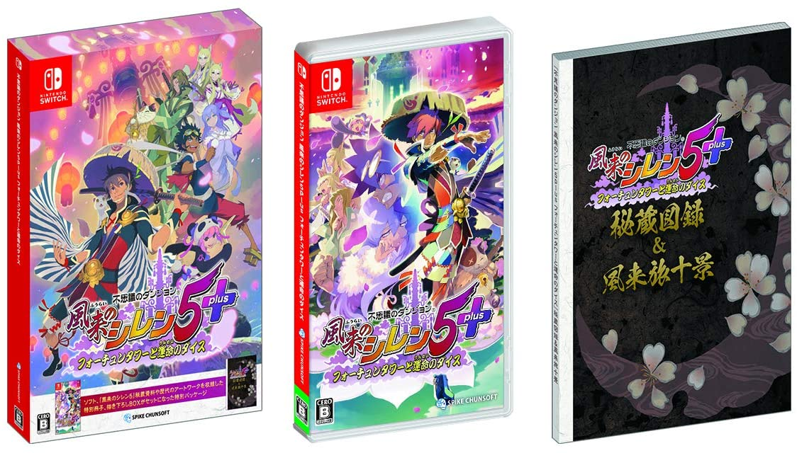
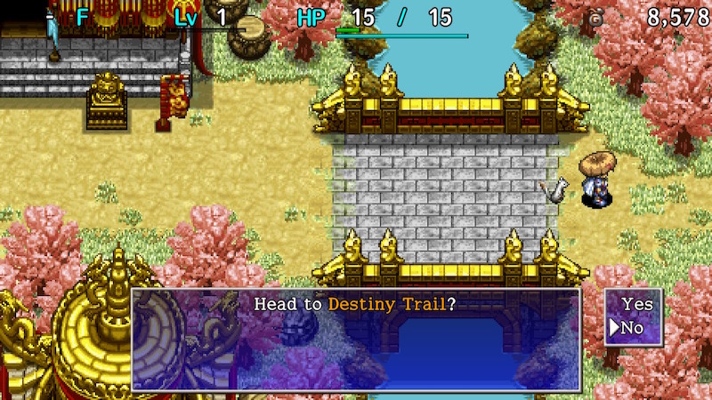

  

# Overview

First off, Shiren 5 is a traditional roguelike game.

- Tile-based movement and turn-based combat.
- Player level and stats reset between each adventure.
- You'll lose all items and money if you collapse.

That sounds a bit intimidating, but the game also features support systems.

- Allies who keep their level ups between each adventure.
- Equipment tags so that you can reclaim lost weapons or shields.
- Storehouse and bank to keep important items and money safe.
- Point shop that makes it easy to obtain revival or escape items.
- Side content to play as practice if the main story is too hard at first.

It can feel luck-based and unfair at first, but that's because you lack knowledge and experience. 
The game pushes you in the direction of growing as a player, rather than grinding until you win like a JRPG. If you stick with it, you'll find that it's a very rewarding gameplay experience.

<ul class="quickLinksUL">
  <li><a href="#manuals">Manuals</a></li>
  <li><a href="#first-steps">First Steps</a>
    <ul>
      <li><a href="#opening-~-destiny-trail">Opening ~ Destiny Trail</a></li>
      <li><a href="#destiny-trail-~-tower-of-the-past">Destiny Trail ~ Tower of the Past</a></li>
      <li><a href="#tower-of-the-present-~-tower-of-the-future">Tower of the Present ~ Tower of the Future</a></li>
      <li><a href="#hermit's-hermitage-and-beyond">Hermit's Hermitage and Beyond</a></li>
    </ul>
  </li>
  <li><a href="#explanations">Explanations</a>
    <ul>
      <li><a href="#basics">Basics</a></li>
      <li><a href="#item-related">Item Related</a></li>
      <li><a href="#dungeon-related">Dungeon Related</a></li>
    </ul>
  </li>
</ul>

# Manuals

#### Game Manual

- [Switch/Steam](https://www.spike-chunsoft.co.jp/shiren5plus/manual/steam/en/index.html)

#### Controls

- [Nintendo Switch Pro Controller](https://www.spike-chunsoft.co.jp/shiren5plus/manual/steam/en/Procon/Procon.html)
- [DUALSHOCK4](https://www.spike-chunsoft.co.jp/shiren5plus/manual/steam/en/DUALSHOCK4/DUALSHOCK4.html)
- [Xbox Controller](https://www.spike-chunsoft.co.jp/shiren5plus/manual/steam/en/Xboxcon/Xboxcon.html)
- [Keyboard: TypeA/B/C](https://www.spike-chunsoft.co.jp/shiren5plus/manual/steam/en/keyboard/keyboard.html)

# First Steps

### Opening ~ Destiny Trail

  

#### Inori Village

1. Optional: Enter the Rich Man's House and become Kojirouta's servant.
    - This sets the flag to have [Kojirouta](/system/allies#kojirouta) join you as an ally.
2. Optional: Enter the Beginner House and play through [Training Facility](/dungeons/training-facility) for extra items.
3. Note the small field near the entrance to Ouma Shrine.
    - If you lose a weapon or shield, you might be able to reclaim it by visiting this field.

#### Ouma Shrine

1. Read what Koppa has to say as you progress through the dungeon.

#### Nekomaneki Village

1. Go to the basement of Hotel Nekomaneki to view an event and receive items.
    - Encyclopedia - Records items you've obtained, and monsters you've defeated.
    - Secret Pots unlocked - Needed to create [New Items](/system/new-items).
        - This is an optional gameplay system that can be ignored for now.
2. Go to the Point Shop and talk to Pointman to receive a [Point Card](/system/gameplay-basics#point-card).
    - The Point Shop is located to the left of the Dungeon Center.
    - Carry this card and step on Point Switches to collect points, which can be exchanged for items.
        - Undo Grass costs 70 points, and is used to either revive or escape with your items and money.
3. Optional: Play [Explosion Rocks](/dungeons/explosion-rocks) or [Statue Cave](/dungeons/statue-cave) at the Dungeon Center for extra items.
4. Optional: Organize your items inside Hotel Nekomaneki.
    - The Storehouse lets you deposit up to 80 items.
        - Use Preservation Pots to increase the number of items you can store.
    - The Bank lets you save money, and offers rewards based on your balance.
    - The Shop sells a variety of items, and the selection changes per adventure.
    - The Warehouse (left of hotel) can be used as additional storage.
5. Enter [Destiny Trail](/dungeons/destiny-trail) via the East exit of Nekomaneki Village.

### Destiny Trail ~ Tower of the Past

  

Details about [Destiny Trail](/dungeons/destiny-trail) and [Tower of the Past](/dungeons/tower-of-the-past) can be found on their respective dungeon pages. For now, the focus will be getting used to how the game plays.

#### Basics

1. The player and monsters take turns. Turn ending actions include:
    - Attacking
    - Moving
    - Using an item
    - Talking to a NPC
    - Stepping in place
2. HP regenrates only when you move or step in place.
    - Step in place: Press B + A at the same time.
3. The player gets hungry as he performs actions, depleting fullness. (FG gauge)
    - Fullness decreases by 1 every 10 turns.
    - Once fullness reaches 0, you'll take 1 damage per turn.
    - Fullness can be replenished by eating onigiri, peach, or grass items.
4. Diagonal movement is equal to 2 orthogonal movements.
    - Hold R to guarantee diagonal movement.
    - Diagonal movement is key to conserving fullness and fleeing from enemies.
5. Hold B and move to perform a fast dash.
    - Turns pass like normal while dashing, so it can be risky if there are strong enemies around.
    - You can also hold B and move toward an item to step on it without picking it up.
6. Sort items in your inventory by pressing the Y button.
    - Gitan (money) and projectiles will become stacked if applicable.
7. Rocks, arrows, staves, or talismans can be "Set" from the item menu.
    - This lets you use the item by pressing L instead of having to open the menu.
8. Insert onigiri and peaches into Preservation Pots to keep them safe from spoiling.
    - Peaches ripen as you advance floors. (Hard Peach → Peach → Juicy Peach → Rotten Peach)
9. Equip weapons to raise attack power, and shields to raise defense.
    - Shiren's defense doesn't increase from leveling up.
10. Weapons and shields gain skill points when you defeat monsters using direct attacks.
    - Once the bar is full, the piece of equipment will level up and become stronger.
        - Attack or defense might increases.
        - Upgrade limit increases.
        - Rune slots might increase.

#### Combat

1. Lure enemies toward you by performing a direct attack instead of stepping toward them.
    - This avoids letting enemies get the first hit.
    - Some enemies have long-ranged attacks, so you'll want to zigzag against those.
2. If there are multiple enemies in the room, retreat into a hallway and fight them 1 vs 1.
3. If your HP is getting low, go ahead and retreat for a bit before continuing the fight.
    - If you're sandwiched by 2 enemies, consider using an item.
4. Don't hesitate to use items. You'll lose all items if you collapse, so don't be stingy.
    - Herb, Otogiriso, and Heal Grass can be used when your HP is full to increase max HP.
    - Weapons and shields you don't need can be thrown to deal damage from a distance.
    - Gitan bags can be thrown to deal (Gitan value / 10) points of damage.
    - Staves can be thrown to get one last use out of them even when remaining uses is 0.
5. If you're one hit away from collapsing, you need to use an item.
    - Gambling on a direct attack or projectile is a sure way to end up collapsed.
        - The player's direct attacks have 92\~95% accuracy, based on weapon level.
        - Projectiles have 84% accuracy.
6. If there's a tough enemy coming your way, soften it with projectiles.
    - Deal enough damage so that one direct attack finishes it off.
    - However, if your HP is full, consider fighting it normally to conserve items.

#### Other

1. If you linger on a floor for a very long time, [Wind of Kron](/system/dungeon-features#wind-of-kron) will begin to blow.
    - If you get blown away by the wind, you'll lose all items and money, as if you collapsed.
    - The wind gusts 3 times as warnings before finally blowing the player away.
        1. You feel the wind picking up.
        2. The wind blows harder.
        3. The wind gusts vigorously!
2. [Traps](/system/traps) can be hidden in the ground, and trigger when you step onto the tile.
    - Trip Traps can cause pots to break, so it's good to carry a Balance Staff if you find one.
3. Wandering NPCs can be found at times, and offer items or services to help you out.
    - See [NPCs](/system/npcs) for details.
4. Items can be [blessed, cursed, or sealed](/system/gameplay-basics#blessing-/-curse-/-seal).
    - Blessed items have stronger effects.
    - Cursed equipment can't be unequipped.
    - Sealed items can't be used.
    - Curses and seals can be removed using items like Exorcism Scroll, Exorcism Pot, etc.
    - Curses and seals can also be removed by the Curse Breaker in Nekomaneki Village.
5. Allies and NPCs always dodge flying equipment.
    - It's safe to fight Swordsman with your back against an ally.
6. If Jirokichi collapses and you try to advance, you'll return to Nekomaneki Village.
    - You'll keep all of your items and money when this happens.

### Tower of the Present ~ Tower of the Future

  

Details about [Tower of the Present](/dungeons/tower-of-the-present) and [Tower of the Future](/dungeons/tower-of-the-future) can be found on their respective dungeon pages. For now, the focus is still getting used to how the game plays.

#### Basics

1. Monsters that decrease strength begin to appear.
    - Strength affects damage dealt by the player's direct attacks and arrows.
    - Damage output changes on even numbered strength values.
        - Example: 8 strength and 9 strength are effectively the same.
2. A monster called [Foly](/system/monsters#foly) appears, and often serves as a bit of a wall for newcomers.
    - Only 1 Foly can spawn at a time, so paralyzing it makes it a non-issue for the current floor.
    - Its ability changes based on its body color.
        - Red: Reflects direct attacks.
        - Blue: 15 damage lightning to all creatures in the room.
        - Green: Heals the player's HP after being hit by their direct attack.
        - Purple: Counters with a negative status condition.
    - Foly floors
        - Tower of the Future: 4\~6F.

#### Synthesis

- A monster called [Mixer](/system/monsters#mixer) appears, and can be used to [synthesize](/system/gameplay-basics#synthesis) items.
    - This is an extremely important mechanic to understand and utilize.
    - Basically, throw 2 items at it to combine items, and then defeat it to collect the result.
        - See the above link for details, and the [Runes](/system/synthesis-runes) pages for a list of recipes.
    - Mixer floors
        - Tower of the Present: 1\~3F.
        - Tower of the Future: 4\~5F.

### Hermit's Hermitage and Beyond

  

See [Villages](/system/villages#hermit's-hermitage) for details about available facilities.

#### Basics

1. [Equipment tags](/system/gameplay-basics#equipment-tags) can now be placed on weapons or shields at shops for 3,000 Gitan each.
    - If you lose a tagged item, it'll be delivered to the Sentry in Hermit's Hermitage.
        - Basically a way to ensure you don't permanently lose your main weapon or shield.
        - You'll occasionally need to pay some Gitan to pick the item up.
    - However, there are some cases where a tagged item won't be delivered.
        - Item was turned into an onigiri or Weeds due to a monster's special attack.
        - Item was inserted into a Presto or Sale pot.
        - Quit the game without suspending properly / game froze.
2. Equipment can be [upgraded](/system/gameplay-basics#equipment-upgrade-value) at the Blacksmith.
    - You need to give the NPC a Juicy Peach to unlock his services.
    - The blacksmith can also erase unwanted runes.
3. As you defeat enemies, you might gain [Super](/system/gameplay-basics#super-status) status.
    - Basically, you gain an attack power boost + other special effects.

#### Night

- From this point onward, time of day will begin to cycle.
    - Optional: Talk to the NPC near the exit and play through [Night Training Facility](/dungeons/night-training-facility).
        - Don't worry, you'll return to Hermit's Hermitage afterward.
    - Current monsters vanish, and new monsters spawn when time of day changes.
        - Day to night: Day monsters vanish, and night monsters are generated.
        - Night to day: Night monsters vanish, and day monsters are generated.
    - Night characteristics
        - Night monsters only take 1 damage from attacks other than [abilities](/system/necklace-abilities).
            - Up to 8 abilities can be assigned, and each ability can only be used 1 time per floor.
            - You can refresh abilities by eating a peach item, or by reading a Replenish Scroll.
        - Field of view is reduced to a 1 tile radius, but can be expanded by equipping a torch.
            - Night monsters deal more damage to you if you don't have a torch equipped.
    - Day characteristics
        - Everything functions the same as you experienced up to this point.
            - Abilities cannot be used during the day.
    - Tip: If you don't have a torch, enter a hallway and step in place until it becomes daytime.
        - Wandering around without a light source is a sure way to collapse.

At this point, you should have a decent grasp of gameplay mechanics. 
Continue onward at your own pace, and don't forget that you can buy Undo Grass at the Point Shop.

# Explanations

This section offers either text or links to other pages that explain gameplay mechanics.

## Basics

### Suspending (Saving)

When you want to quit the game, select the Suspend command from the menu, 
then return to the top menu before closing the game.

If you close the game without suspending, you'll lose all items and money as if you collapsed, and will resume the game from Hotel Nekomaneki.

### Turns

If you move, attack, use an item, talk to a NPC, or step in place, monsters will then take a step or attack. As long as you don't act, nothing else will, so stay calm and think things through.

### Map

The areas you've traversed on the current floor will be recorded on the map.

Dot color explanation:

- White: The player
- Red: Monsters
- Blue: Items on the ground
- Yellow: Allies, NPCs

### Terrain

Normally, water, air, and wall tiles are not traversable. However, some monsters can walk on water, float in midair, or move inside walls.

### Fullness

As turns pass, your fullness will deplete at the rate of 1 per 10 turns. When your fullness reaches 0, your HP will start to decrease by 1 each turn. Eat onigiri, peach, or grass items to replenish fullness.

### Collapsing

If your HP goes to 0, you'll collapse. If you collapse, you'll lose all items and money, and will return to Hotel Nekomaneki. So if you're in a tough spot, don't be stingy - use your items!

### Wind of Kron

If you spend too many turns on the same floor, [Wind of Kron](/system/dungeon-features#wind-of-kron) will blow. When the 4th gust blows, you'll be blown out of the dungeon as if you had collapsed. Revival Grass and Undo Grass cannot save you from the gust, so hurry to the next floor.

Warnings:

1. You feel the wind picking up.
2. The wind blows harder.
3. The wind gusts vigorously!

### Abilities

As you continue your adventures, you'll reach a point where you can learn abilities. Abilities are effective for dealing damage to night monsters, but they can't be used during the day.

See [Abilities](/system/necklace-abilities) for details.

### Night

Some dungeons have a day and night cycle, which alternates based on elapsed turns.

At night:

- Field of view is reduced to a 1 tile radius, but can be expanded by equipping a torch.
    - Night monsters deal more damage to you if you don't have a torch equipped.
- Daytime monsters are replaced by night monsters.
    - Night monsters only take 1 damage from attacks other than abilities.
        - Up to 8 abilities can be assigned, and each ability can only be used 1 time per floor.
        - You can refresh abilities by eating a peach item, or by reading a Replenish Scroll.

See [Night](/system/gameplay-basics#night) for details.

### Speed and Status

Normally, you will take 1 turn to perform 1 action, but traps and items can change that formula.

- Slow: Act once every 2 turns.
- Swift: Act 2 times per turn.

Monsters can also have varying action speed.

- Slow: Act once every 2 turns.
- Swift 1: Act 2 times per turn, but attacking once ends its turn.
- Swift 2: Act 2 times per turn, and can attack twice.

Traps and items can give you or monsters different status conditions. For example, if you throw Sleepy Grass at a monster, it will be afflicted with Asleep status.

See [Status Conditions](/system/status-conditions) for details.

## Item Related

### Sorting

The player can hold up to 24 items, which can be sorted by pressing Y in the inventory menu. Keep your inventory organized so you can readily assess the strategic options you have available.

### Pot and Staff Numbers

Staves and pots have a number showing how many uses they have left.

The number on staves represent how many more times they can be swung. A staff can be thrown to get one last use out of it once its remaining uses reaches 0.

The number on a pot represents how many more items you can insert into it. Some pots are opened instead, and the number represents how many more times it can be opened.

### Onigiri & Preservation Pots

Onigiri and peaches are important items that replenish your fullness. That said, if you step on a Decay Trap, all onigiri and peaches in your inventory will become rotten. If you have a Preservation Pot, insert onigiri and peaches to protect them from that trap.

### Storehouse & Warehouse

Some villages have storage that can house your items. Items kept inside a storehouse or warehouse won't be lost if you collapse in a dungeon.

### Point Card

Item that lets you collect points from Point Switches. Points can be exchanged for valuable items such as Undo Grass, which lets you revive or escape.

See [Point Card](/system/gameplay-basics#point-card) for details.

### Equipment

Weapons increase the damage you deal to monsters, and shields reduce damage inflicted by monsters. Both have to be equipped using the Equip command to receive their effects.

### Upgrading Equipment

Weapons and shields can be upgraded by certain scrolls or by blacksmiths. A number representing upgrade value such as "+1" is displayed if an item has been upgraded.

### Leveling Up Equipment

Weapons and shields that are equipped gain skill points as you defeat monsters with direct attacks. Once the bar is full, the piece of equipment will level up and become stronger. Attack or defense might increase, upgrade limit increases, and rune slots might increase.

See [Equipment Growth](/system/gameplay-basics#equipment-growth) for details.

### Synthesizing Equipment

You can synthesize weapons with weapons or shields with shields using a Synthesis Pot. Once synthesized, the base item will have the items' abilities, and their upgrade value will be combined.

There's also a monster called Mixer which can synthesize items you throw at it. This monster lets you synthesize different category items together, such as a weapon and grass item.

See [Synthesis](/system/gameplay-basics#synthesis) for details.

### Equipment Tags

You can add tags to your weapons or shields at a shop, or by reading a Tag Scroll. If you lose a tagged item, it'll be delivered to the Sentry in Hermit's Hermitage.

However, there are some cases where a tagged item won't be delivered.

- Item was turned into an onigiri or Weeds due to a monster's special attack.
- Item was inserted into a Presto or Sale pot.
- Quit the game without suspending properly / game froze.

See [Equipment Tags](/system/gameplay-basics#equipment-tags) for details.

### Blessed, Cursed, Sealed

Items can be blessed, cursed, or sealed.

- Blessed items have stronger effects.
- Cursed equipment can't be unequipped.
- Sealed items can't be used.
- Curses and seals can be removed using items like Exorcism Scroll, Exorcism Pot, etc.
- Curses and seals can also be removed by the Curse Breaker in Nekomaneki Village.

See [Blessing / Curse / Seal](/system/gameplay-basics#blessing-/-curse-/-seal) for details.

### Unidentified Items

Items with yellow names are unidentified items. Use an Identify Scroll or Identify Pot to learn their true names and abilities.

## Dungeon Related

### Dungeon Shops

Shops can appear in dungeons at times.

If you want to buy something, pick it up and talk to the Shopkeeper to pay for it. If you want to sell something, place the item on the ground and talk to the Shopkeeper.

See [Shop](/system/dungeon-features#shop) for details.

### Gimmicks

As you progress through dungeons, you'll encounter contraptions like doors, moving floors, and more. Some doors can be opened and closed using the A button, while others open when monsters aren't nearby.

See [Dungeon Features](/system/dungeon-features) for details.
