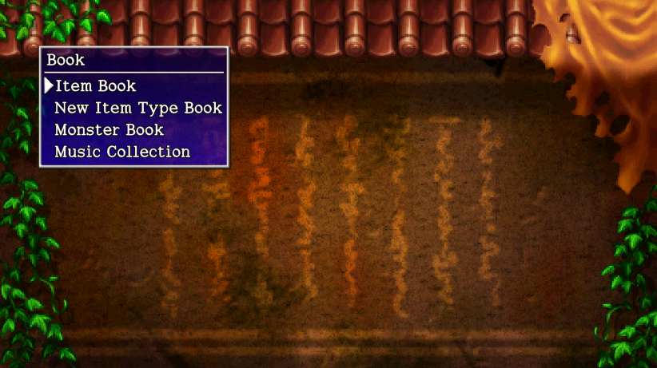

  

# Overview

The encyclopedia keeps a record of items you've obtained and monsters you've defeated. Each entry has its own visual preview and description, some of which can be pretty humorous.

There are a total of 900 items, 468 monsters, and 79 music tracks. As you can imagine, this is going to take serious effort to reach 100% completion.

# Item Book

### Preparations

### Weapon (41 types)

Each weapon type has 8 entries, corresponding to weapon level.

#### Page 1

- Ordinary Stick
- Tin Blade
- Katana
- Beast Fang
- Dotanuki
- Bladite
- Red Blade

#### Page 2

- Kabura Katana
- Fuuma Sword --- Upgrade a Storied Katana+99 at the Hermit Hermitage blacksmith.
- Dull Gold Edge
- Bright Blade
- Rusty Pickaxe
- Old Mallet
- Sky Splitter

#### Page 3

- Water Cutter
- Scythe --- Tanuki Password: Vegicide
- Myopic Masher
- Magic Masher
- Drain Dagger
- Copper Cleaver
- Crescent Katana

#### Page 4

- Lizard Lasher
- Nap Rattle
- Shockuto
- Blurry Stick
- Sealing Keisaku
- Baffle Axe
- Hatchet

#### Page 5

- Shoddy Dirk
- Glass Dirk
- Dirk of Debts --- Tanuki Password: Treasury
- Extreme Sword --- Tanuki Password: Critical
- Violent Blade --- Tanuki Password: Cursed Blade
- Breeze Blade
- Burning Blade

#### Page 6

- Wonder Pick --- Clear [Merchant's Hideout](/dungeons/merchants-hideout) (50F)
- Sturdy Hammer --- Clear [Bizarre Tower](/dungeons/bizarre-tower) (45F)
- True Knife --- Clear [Pitfall of Life](/dungeons/pitfall-of-life) (25F)
- Pathetic Blade
- Fox Kodachi --- Ask [Koharu](/system/allies#koharu) to turn into a weapon.
- Kaburagi --- Wish for an unstoppable weapon.

### Torch (3)

#### Page 1

- Torch
- Fine Torch
- Super Torch

### Shield (37 types)

Each shield type has 8 entries, corresponding to shield level.

#### Page 1

- Plain Targe
- Tin Shield
- Iron Targe
- Wolfshead
- Beast Shield
- Targite
- Red Shield

#### Page 2

- Fuuma Shield
- Gold Shield
- Diet Shield
- Heavy Shield
- Midnight Shield --- Tanuki Password: Carpe Noctem
- Day Shield --- Tanuki Password: Carpe Diem
- Binary Shield

#### Page 3

- Counter Shield
- Student Shield
- Bowl Shield
- Spry Shield
- Blast Shield
- Lock Shield
- Safe Shield

#### Page 4

- Gyadon Blocker
- Snake Shield
- Steady Shield
- Anti-Gaze Trge
- Swap Shield
- Shoddy Plank
- Glass Buckler

#### Page 5

- Pauper's Plank --- Tanuki Password: Golddigger
- Rush Shield --- Tanuki Password: O-FENCE!
- Blazing Shield
- Onigiri Shield --- Clear [Primordial Chasm](/dungeons/primordial-chasm) (50F)
- Parry Shield --- Clear [Lost Well](/dungeons/lost-well) (30F)
- Nirvana Board --- Clear [Master's Footprint](/dungeons/masters-footprint) (50F)
- Pathetic Shield

#### Page 6

- Fox Shield --- Ask [Koharu](/system/allies#koharu) to turn into a shield.
- Helix Shield --- Wish for an invincible shield.

### Bracelet (34)

#### Page 1

- Cleansing Bracelet
- Anti-Cnf. Bracelet
- Alert Bracelet
- Anti-Crs. Bracelet
- Anti-Parry Brce.
- Staunch Bracelet
- Can. Arm Bracelet

#### Page 2

- Inacc. Bracelet
- Strength Bracelet
- Growth Bracelet
- Heal Bracelet
- Bunch Bracelet --- Tanuki Password: Arms Race
- Mojo Bracelet
- Identify Bracelet --- Deposit 500,000 Gitan into your bank account.

#### Page 3

- Critical Bracelet
- Monster Detector
- Item Detector
- Alleyway Bracelet
- Scout Bracelet --- Purchase from Point Shop for 10,000 points.
- Blink Bracelet
- Explosion Bracelet

#### Page 4

- Trap Bracelet
- Monster Summoner
- Time Stop Bracelet --- Clear [Warning Valley](/dungeons/warning-valley) (50F)
- Waterwalk Bracelet
- Wall Clip Bracelet
- VIP Bracelet
- Nonary Bracelet --- Tanuki Password: Nonary Game

#### Page 5

- Monsterphobic
- Itemphobic
- Dozer Bracelet
- Trapper Bracelet --- Clear [Gen's Turf](/dungeons/gens-turf) (30F)
- Night Ward --- Wish for nothing.
- Floating Bracelet --- Wish for the ability to fly.

### Grass (34)

#### Page 1

- Herb
- Otogiriso
- Heal Grass
- Life Grass
- Strength Grass
- Antidote Grass
- Poison Grass

#### Page 2

- Power Up Grass
- Upgrade Grass
- Perception Grass
- Invincible Grass
- Swift Grass
- Warp Grass
- Dragon Grass

#### Page 3

- Stomach Expander
- Stomach Shrinker
- Weeds
- Revival Grass --- Tanuki Password: I Love Zombies!
- Undo Grass --- Tanuki Password: Lost and Found
- Confusion Grass
- Blinding Grass

#### Page 4

- Sleep Grass
- Rage Grass
- Cheery Grass --- Tanuki Password: Happy Grass
- Angel Seed
- Unlucky Seed
- SuperUnlucky Seed
- Amnesia Grass

#### Page 5

- Imabikiso
- Fine Grass
- Nymph Grass
- Dracon Grass
- Gut Grass
- Repeat Grass

### Scroll (53)

#### Page 1

- Confusion Scroll
- Slumber Scroll
- Vacuum Slash Scrl
- Fear Scroll
- Escape Scroll
- Navigation Scroll
- Dispel Aura Scroll

#### Page 2

- Trap Deletion Scrl
- Desert Scroll
- Night-Day Scroll
- Swift Foe Scroll
- Mnster House Scrl
- Trap Scroll
- Lost Scroll

#### Page 3

- Identify Scroll
- Exorcism Scroll
- Fate Scroll
- Earth Scroll
- Plating Scroll
- Tag Scroll
- Sale Scroll

#### Page 4

- Onigiri Scroll
- Pot God Scroll
- Extraction Scroll
- Blessing Scroll --- Tanuki Password: Furry Ferret
- Curse Scroll
- Immunity Scroll
- Replenish Scroll

#### Page 5

- Muzzled Scroll
- Grounded Scroll
- Attraction Scroll
- Gathering Scroll
- Collection Scroll
- Oil Scroll
- Sanctuary Scroll

#### Page 6

- Light Scroll
- Recommend. Letter
- Squid Sushi Scroll --- Common in [Explosion Rocks](/dungeons/explosion-rocks).
- Fixer Scroll
- Gambler's Scroll --- Tanuki Password: Gambler
- Extinction Scroll
- Expulsion Scroll --- Read all other scrolls, and then give a Blank Scroll to the calligrapher [NPC](/system/npcs).

#### Page 7

- Blank Scroll --- Tanuki Password: Carte Blanche
- Coupon Scroll --- Tanuki Password: Coupon Scroll
- Arbor Scroll
- Mate Scroll
- Darth Scroll
- Pot Dog Scroll
- Nixer Scroll

#### Page 8

- Commend. Letter
- Bankruptcy Scroll
- Wet Scroll
- Piece of Paper

### Pot (34)

[Developer Pot](/items/pots#developer-pot) does not get recorded in the Item Book.

#### Page 1

- Preservation Pot
- Ordinary Pot
- Synthesis Pot --- Tanuki Password: Synthesis Pot
- Sale Pot
- Presto Pot
- Identify Pot
- Exorcism Pot

#### Page 2

- Blessing Pot
- Curse Pot
- Black Hole Pot
- Fever Pot --- Tanuki Password: All Lucky 7s
- Sticky Pot
- Hide Pot
- Unbreakable Pot

#### Page 3

- Heal Pot
- Hilarious Pot --- Tanuki Password: Pot O' Laughs
- Zalokleft Pot
- Klein Pot
- Monster Pot
- Upgrade Pot --- Bring [Tao](/system/allies#tao) to the top of [Tower of Miracles](/dungeons/tower-of-miracles) after clearing the main story.
- Degrade Pot

#### Page 4

- Lucky Pot
- Unlucky Pot
- 4-2-8 Pot --- Starting item in [Explosion Rocks](/dungeons/explosion-rocks).
- Zen Pot
- Dodger Pot --- Tanuki Password: Miss Mist
- Perceptive Pot
- Reflection Pot

#### Page 5

- Water Pot
- Modder's Pot
- Floramorph Pot
- Grilling Pot
- Shrine Maid. Pot --- Wish to be popular with girls, then talk to a certain NPC.
- Heavenly Pot --- Clear [Heavenly Lake](/dungeons/heavenly-lake) (28F)

### Staff (24)

#### Page 1

- Swap Staff
- Knockback Staff
- Pinning Staff
- Transient Staff
- Seal Staff
- Clone Staff
- Paralysis Staff

#### Page 2

- Empathy Staff
- Slow Staff
- Swift Staff
- Glorious Staff
- Unlucky Staff
- Mage Staff
- Electric Staff

#### Page 3

- Trap Del. Staff
- Balance Staff
- Boring Staff
- Fort. Staff
- Ordinary Staff
- Drama Staff --- Tanuki Password: Shakespeare
- Sharing Staff

#### Page 4

- Staff of Sacrifice
- Shocking Staff
- Nagging Staff

### Talisman (13)

#### Page 1

- Shadow Bind Tal.
- Conf. Talisman
- Seal Talisman
- Fear Talisman
- Berserker Tal.
- Inacc. Talisman
- Sleep Talisman

#### Page 2

- Slumber Talisman
- Slow Talisman
- Swift Talisman
- Enraged Talisman
- Furious Talisman
- Glorious Talisman

### Onigiri (9)

#### Page 1

- Onigiri
- Large Onigiri
- Huge Onigiri
- Rotten Onigiri
- Grilled Onigiri
- Special Onigiri
- Dog Onigiri

#### Page 2

- Silver Onigiri --- Clear [Onigiri Hollow](/dungeons/onigiri-hollow) (20F)
- Gold Onigiri --- Clear [Onigiri Hollow](/dungeons/onigiri-hollow) (20F)

### Peach (4)

#### Page 1

- Hard Peach
- Peach
- Juicy Peach
- Rotten Peach

### Arrow (11)

#### Page 1

- Wood Arrow
- Iron Arrow
- Silver Arrow
- Critical Arrow
- Poison Arrow
- Knockback Arrow
- Truestrike Arrow

#### Page 2

- Killer Arrow
- Drain Arrow
- Random Arrow
- Suicide Arrow

### Stone (4)

#### Page 1

- Rock
- Porky Rock
- Rightstone
- David's Bullet --- Clear [Bladeless Wasteland](/dungeons/bladeless-wasteland) (25F), or wish to be popular with guys and talk to a certain NPC.

### Trap (33)

#### Page 1

- Wood Arrow Trap
- Iron Arrow Trap
- Poison Arrow Trap
- Log Trap
- Rockslide Trap
- Metal Block Trap
- Explosion Trap

#### Page 2

- Big Explosion Trap
- Rust Trap
- Strip Trap
- Trip Trap
- Decay Trap
- Curse Trap
- Spring Trap

#### Page 3

- Sleep Trap
- Blind Trap
- Shadow Bind Trap
- Spin Trap
- Gauge Blind. Trap
- Onigiri Trap
- Slow Trap

#### Page 4

- Hunger Trap
- Summon Trap
- Monster Trap
- Rage Trap
- Cure Monster Trap
- Multiplication Trap
- Time Switch Trap --- Can be found in [Old Road](/dungeons/old-road)

#### Page 5

- Pit Trap
- Floor Warp Trap
- Stairs? Trap --- Can be found deep inside [Primordial Chasm](/dungeons/primordial-chasm), [Destiny's Descent](/dungeons/destinys-descent), [Lost Well](/dungeons/lost-well), etc.
- Duelist Trap --- Can be found in [Gen's Turf](/dungeons/gens-turf)
- Point Switch

### Other (20)

#### Page 1

The Floramorph Pot in Statue Cave (What you need is...?) can be used to obtain all flowers.

- Gitan --- Tanuki Password: Tao's Stash
- Point Card --- Obtained at the Point Shop after Hotel Nekomaneki basement event.
- Red Cat --- Tanuki Password: Banana Prince
- Orange Cat --- Tanuki Password: Pumphantasm
- Yellow Cat --- Tanuki Password: Kitty Cat
- Green Cat --- Tanuki Password: Green Grass
- Blue Cat --- Tanuki Password: Chunsoft

#### Page 2

- Indigo Cat --- Tanuki Password: Shinya Kano
- Purple Cat --- Tanuki Password: Perfect
- Dirt --- Have a [Scoopie](/system/monsters#scoopie) throw dirt into a pot. (Tower of Fortune 1F)
- Rue --- Floramorph Pot
- Lily of the Valley --- Floramorph Pot
- Rose --- Floramorph Pot
- Plum Tree --- Floramorph Pot

#### Page 3

- Rafflesia --- Floramorph Pot
- Sunflower --- Floramorph Pot
- Red Spider Lily --- Floramorph Pot
- Gentian --- Floramorph Pot
- Queen of the Night --- Floramorph Pot
- Agave --- Floramorph Pot

# Monster Book

# Music Collection

See [Music Collection](/system/music-collection) for track names and locations.
