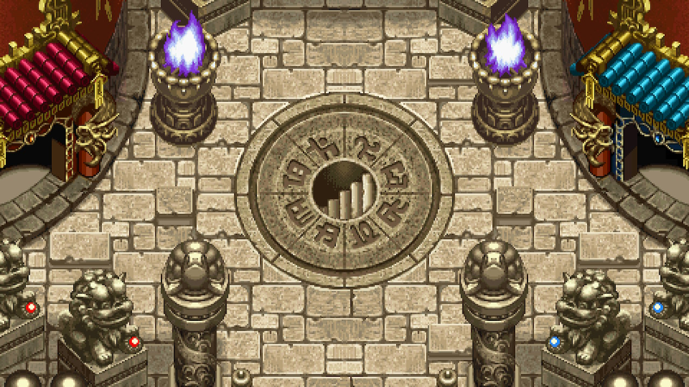
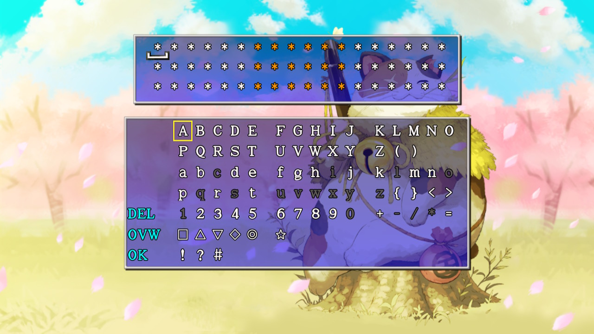
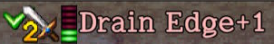
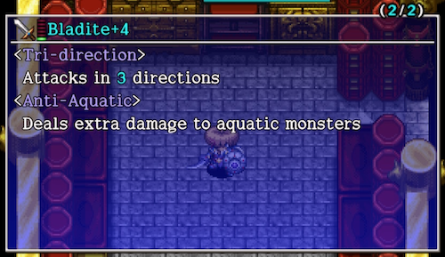
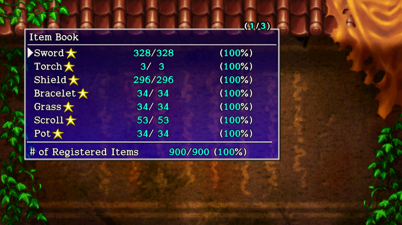
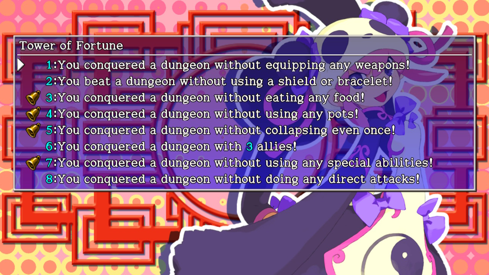
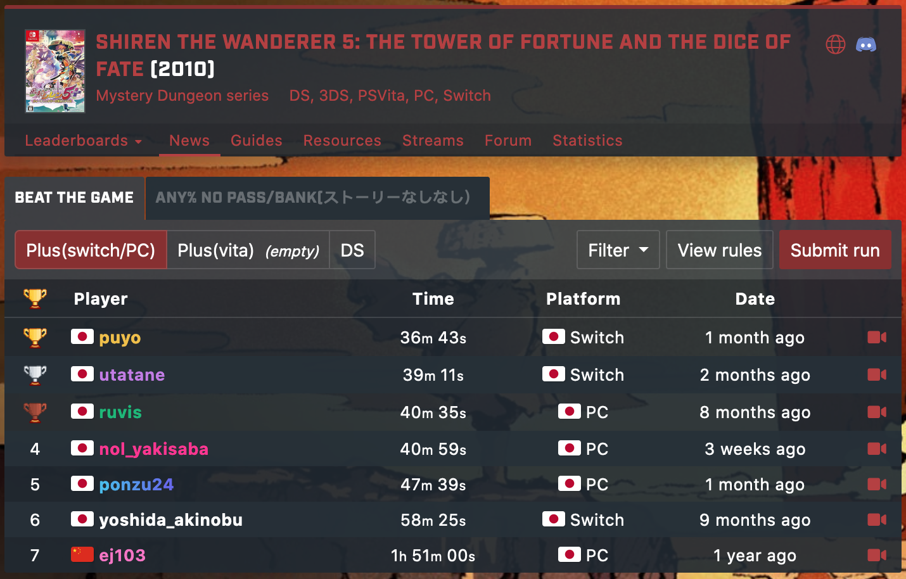

  

# Overview

Congratulations on clearing the main story! You're now finished with the tutorial. That's right - the main story was just the tip of the iceberg that is Shiren 5.

There are 30 other dungeons besides Tower of Fortune with a wide variety of rules. Not only that, there are mini-games and sidequests to tackle, and an encyclopedia to complete. And if you're playing on Vita or Steam, there are 55 [trophies](/system/trophies) to aim for.

This page provides a list of objectives to work toward, along with recommendations on where to start. Most importantly, what you do next depends on what sounds fun based on your playstyle.

# Objectives

Keep in mind that most objectives can be done in any order, and at your own pace. It's important to have fun with what you're doing, instead of treating it as a chore.

## Unlock Secret Pots

PS Vita / Switch / Steam

1. Clear the main story.
2. Talk to Ponta (basement of Hotel Nekomaneki) and select "Special" to unlock 4 additional secret pots.

See [New Items](/system/new-items) for details about creating new items.

## Unlock Dungeons

Some postgame dungeons must be unlocked before you can challenge them.

|Dungeon|Location|Unlock Condition|
|-|-|-|
|[Inori Cave](/dungeons/inori-cave)|Inori Village|Inside the Beginner House.|
|[Lost Well](/dungeons/lost-well)|Sparrow's Inn|Visit Sparrow's Inn.|
|[Gen's Turf](/dungeons/gens-turf)|Nekomaneki Village|Give catnip juice to [Gen](/system/allies#gen) inside Gen's House. (Catnip juice is obtained in Inori Village)|
|[Pitfall of Life](/dungeons/pitfall-of-life)|Inori Village|Guide [Kojirouta](/system/allies#kojirouta) to the top of Tower of Miracles.|
|[Heavenly Lake](/dungeons/heavenly-lake)|Nekomaneki Village|Talk to Charon outside the Dungeon Center.|
|[Old Road](/dungeons/old-road)|Inori Village|Have [Okon](/system/allies#okon), [Koharu](/system/allies#koharu), and [Gen](/system/allies#gen) join you as allies. Level Okon and Gen to Lv10, and Koharu to Lv2. Go to Hotel Nekomaneki → Gen's House. Check the letter on the ground inside the house.|
|[Bizarre Tower](/dungeons/bizarre-tower)|Tower of Fortune Entr.|Guide [Tao](/system/allies#tao) to the top of Tower of Fortune. Go to the 2nd floor of Sparrow's Inn for an event. Go to the top of Tower of Miracles.|
|[Onigiri Hollow](/dungeons/onigiri-hollow)|Inori Village|Talk to the girl near Nekomaneki Village's warehouse → ※ → Talk to her again. Talk to Decchi (north west) → ※ → Talk to him again (south west) Pray to the 6 cat statues inside the village. (Point Shop, Dungeon Center, Hotel) Check the large cat statue to obtain Revival Grass → ※ Talk to Decchi (south east) to obtain Undo Grass → ※ Talk to the girl from earlier to learn that Decchi went to Inori Village  → ※ Talk to Decchi in Inori Village (west) → ※ → Talk to him again (east) Clap twice at all 7 pots → Check the well to obtain a Kabura Katana → ※ The Onigiri Hollow unlock event plays when you return to the village. ※ means enter a dungeon and return.|
|[Primordial Chasm](/dungeons/primordial-chasm)|Hermit's Hermitage|Inside the blacksmith building.|
|[Destiny's Descent](/dungeons/destinys-descent)|Tower of Fortune Entr.|Wish to play a tougher dungeon in Inori Cave.|
|[Undergound Manor (General District)](/dungeons/underground-manor)|Dungeon Center|Clear all individual Underground Manor districts.|
|[Garden of Destiny](/dungeons/garden-of-destiny)|Dungeon Center|Automatically unlocked after clearing the main story. (Switch/Steam only)|

## Challenge Dungeons

Go ahead and start playing dungeons that look fun if you want. However, some dungeons expect you to have powerful equipment and items, so it's recommended to go through the "Become Ultra Powerful" objective first for those.

Below is a list of dungeons ordered by difficulty based on the second clear. Keep in mind that the difficulty ranking is an opinion piece, and isn't absolute.

#### No Carry-In Items

<table>
  <thead>
    <tr>
      <th>Difficulty</th>
      <th>Dungeon</th>
      <th>Notes</th>
    </tr>
  </thead>
  <tbody>
    <tr>
      <td rowspan="2" class="highlightGray centeredText">Super Hard</td>
      <td>Storm Forest</td>
      <td>Lots of Field Knaves, 1 item per floor.</td>
    </tr>
    <tr>
      <td>Rousing Paradise</td>
      <td>Out of depth monsters, fast monster spawns.</td>
    </tr>
    <tr>
      <td rowspan="5" class="highlightGray centeredText">Hard</td>
      <td>Cloister of Certain Doom (10,000)</td>
      <td>Set your own turn limit.</td>
    </tr>
    <tr>
      <td>Double Strike Trail</td>
      <td>HP set to 1 when hit for both you and enemies.</td>
    </tr>
    <tr>
      <td>Destiny's Descent</td>
      <td>Classic dungeon with day/night cycle.</td>
    </tr>
    <tr>
      <td>Merchant's Hideout (No carry-in items)</td>
      <td>Consumable items are rare.</td>
    </tr>
    <tr>
      <td>Master's Footprint</td>
      <td>Primordial Chasm without healing items.</td>
    </tr>
    <tr>
      <td rowspan="7" class="highlightGray centeredText">Medium Hard</td>
      <td>Primordial Chasm</td>
      <td>Classic day-only dungeon. Very popular.</td>
    </tr>
    <tr>
      <td>Onigiri Hollow</td>
      <td>Rooms collapse when you exit them.</td>
    </tr>
    <tr>
      <td>Heavenly Lake</td>
      <td>Items placed on the ground vanish.</td>
    </tr>
    <tr>
      <td>The Pinnacle</td>
      <td>Strong monsters, run away.</td>
    </tr>
    <tr>
      <td>Hunter Pond</td>
      <td>No items on ground, hunt enemies for drops.</td>
    </tr>
    <tr>
      <td>Perilous Rocks</td>
      <td>Monster houses are common.</td>
    </tr>
    <tr>
      <td>Garden of Destiny</td>
      <td>Earn more exp when you one-shot monsters.</td>
    </tr>
    <tr>
      <td rowspan="6" class="highlightGray centeredText">Medium</td>
      <td>Pitfall of Life</td>
      <td>The player's level is stuck at Lv1.</td>
    </tr>
    <tr>
      <td>Underground Manor (General District)</td>
      <td>Few negative effect items, no Mixers.</td>
    </tr>
    <tr>
      <td>Old Road</td>
      <td>Hunger depletes in real time.</td>
    </tr>
    <tr>
      <td>Aura Ruins</td>
      <td>Easily gain super status, enemies have auras.</td>
    </tr>
    <tr>
      <td>Cloister of Certain Doom (99,999)</td>
      <td>Set your own turn limit.</td>
    </tr>
    <tr>
      <td>Bladeless Wasteland</td>
      <td>The player's direct attacks deal 1 damage.</td>
    </tr>
    <tr>
      <td rowspan="7" class="highlightGray centeredText">Easy</td>
      <td>Gen's Turf</td>
      <td>Pick up traps and set them to trap monsters.</td>
    </tr>
    <tr>
      <td>Bizarre Tower</td>
      <td>Choose custom floor ranges as you climb.</td>
    </tr>
    <tr>
      <td>Sleeping Lands</td>
      <td>Night-only dungeon.</td>
    </tr>
    <tr>
      <td>Page of Youth</td>
      <td>Use Nixer Scrolls to befriend monsters.</td>
    </tr>
    <tr>
      <td>Monster Hotspot</td>
      <td>Single room monster house on every X9 floor.</td>
    </tr>
    <tr>
      <td>Trapper's Sandbox</td>
      <td>Pick up traps and set them to trap monsters.</td>
    </tr>
    <tr>
      <td>Froggo's Fury</td>
      <td>Utilize Dirk of Debts and Pauper's Plank.</td>
    </tr>
  </tbody>
</table>

#### Carry-In Items

These dungeons don't have a difficulty assigned, since it depends on the items you bring with you.

<table>
  <thead>
    <tr>
      <th>Difficulty</th>
      <th>Dungeon</th>
      <th>Notes</th>
    </tr>
  </thead>
  <tbody>
    <tr>
      <td rowspan="5" class="highlightGray centeredText">N/A</td>
      <td>Warning Valley</td>
      <td>Day-only dungeon, Wind of Kron blows very early.</td>
    </tr>
    <tr>
      <td>Lost Well</td>
      <td>Dungeon with day/night cycle, floor items are often negative.</td>
    </tr>
    <tr>
      <td>Merchant's Hideout</td>
      <td>Day-only dungeon, few consumable items.</td>
    </tr>
    <tr>
      <td>Gorger's Manor</td>
      <td>Day-only dungeon, lots of Special Onigiri.</td>
    </tr>
    <tr>
      <td>Inori Cave</td>
      <td>Dungeon with day/night cycle, bring 7 catstones to have a wish granted.</td>
    </tr>
  </tbody>
</table>

## Become Ultra Powerful

Some dungeons expect you to bring powerful equipment and items, so this section helps you get up to speed.

### Obtain Key Items

  

Important items include:

- Red Blade & Red Shield --- Strongest set that grants 2 bracelet resonance.
- Point Card --- Obtain at Point Shop after viewing the Hotel Nekomaneki basement event.
- Trap Bracelet x 2
- Blessing Pot
- Extraction Scroll
- Gambler's Scroll --- Tanuki Password: Gambler
- Blessing Scroll --- Tanuki Password: Furry Ferret
- Pot God Scroll
- Trap Scroll
- Extinction Scroll
- Fate Scroll --- Story dungeons
- Earth Scroll --- Story dungeons

Input rescue passwords to quickly obtain some of the above items. Bring an Escape Scroll so that you can reuse the passwords up to 3 times.

|Dungeon|Floor|Items|Password|
|-|-|-|-|
|Merchant's Hideout|5F|Blessing Pot x 2 Extraction Scroll Trap Scroll|◎ｊＣ＞６？　ＸＢＨＦＤＥ　△◎ＮＲ▽Ｉ ）７＞ｍ｛ｔ　｛｛Ｔ９９Ｍ　ＭＢｐｊ｛４ ＲＬａＫＱＰ　Ｃ△ＡＵ６Ｄ　Ｚｆｔ｛Ｐ＞|
|Merchant's Hideout|5F|Trap Bracelet x 3|＋ＯＡｈ４ｅ　６Ｉ？｝ＱＬ　Ａ８△ＡＱ＋ ３ＦｒｇＩＪ　９（Ｈ＃ＯＭ　Ｚ９ＲｊＲＡ ６Ｉ＃ＱＰＹ　ＩＬＥ＝ＪＹ　）Ｍ５Ｘ△Ｌ|

See [Rescue Passwords](/guides/rescue-passwords) for details.

### Collect Points

  

Lots of points are needed in order to quickly level up and upgrade equipment.

#### Destiny Trail

This can be done once you have a Point Card and 2 Trap Bracelets.

1\~2F of Destiny Trail only has Point Switches for traps, so the idea is to generate lots of Point Switches by passing turns while having both Trap Bracelets equipped. You usually get somewhere around 3,000 ~ 4,000 points per trip.

Needed Items:

- Trap Bracelet x 2
- Escape Scroll or Undo Grass

Steps:

1. Equip a weapon and shield that grants 2 bracelet [resonance](/system/resonance), and equip the Trap Bracelets.
2. Ensure you have an Escape Scroll or Undo Grass in your inventory.
3. Go to Destiny Trail, step in place to spawn Point Switches, and step on them to collect points.
4. Repeat until Wind of Kron blows.
5. Read the Escape Scroll or use the Undo Grass to return to Nekomaneki Village.

#### Gorger's Manor

This can be done once you've significantly upgraded your equipment.

Gorger's Manor offers 200 points per Point Switch near the end. (47\~50F) Bring Trap Scrolls, Trap Deletion Scrl, Extraction Scrolls, and Blessing Pot to generate Point Switches. You usually get somewhere around 30,000 ~ 50,000 points per trip.

Needed Items:

- Preservation Pot[5] --- blessed Trap Scroll x 4, blessed Trap Deletion Scrl x 1
- Preservation Pot[5] --- Extraction Scroll x 5 (Bring lots of these pots)
- Blessing Pot x 1
- Undo Grass

Steps:

1. Go to 47F of Gorger's Manor.
2. Read 4 Trap Scrolls (once per scroll), then read Trap Deletion Scrl.
3. Insert the 4 Trap Scrolls and 1 Trap Deletion Scrl into the Blessing Pot.
4. Read an Extraction Scroll to retrieve the 4 Trap Scrolls and 1 Trap Deletion Scroll.
5. Repeat 1~2 times if you want, and then step on all Point Switches.
6. Do this over and over until Wind of Kron blows.
7. Use the Undo Grass or clear the dungeon to return to Nekomaneki Village.

### Level Up Equipment

  

Once you have lots of points, you can start exchanging them to help with leveling up equipment. Blank Scrolls cost 200 points each, and can be turned into Gambler's Scrolls, Extraction Scrolls, etc. The idea is to read lots of Gambler's Scrolls in Destiny Trail for the weapon and shield level up effect.

Needed Items:

- Preservation Pot[5] --- blessed Gambler's Scroll x 5
- Preservation Pot[5] --- Extraction Scroll x 5 (Bring lots of these pots)
- Blessing Pot x 1
- Shield with Anti-Blast rune --- Keep this equipped.
- Weapons and shields --- Whichever ones you want to level up.
- Undo Grass

Steps:

1. Place whatever weapons and shields you want to level up in your inventory. (Outside of pots)
2. Go to Destiny Trail 5F.
3. Read 5 Gambler's Scrolls (once per scroll).
4. Insert the 5 Gambler's Scrolls into the Blessing Pot.
5. Read an Extraction Scroll to retrieve the 5 Gambler's Scrolls.
6. Repeat until all of your weapons and shields reach Lv8, or you run out of Extraction Scrolls.
7. Use the Undo Grass to return to Nekomaneki Village.

### Upgrade Equipment

  

Once your equipment is Lv8, it's time to read Fate and Earth scrolls to increase upgrade value. This can be done inside the Nekomaneki Village warehouse, provided there's enough space on the ground.

Needed Items:

- Preservation Pot[5] --- blessed Fate or Earth Scroll x 5
- Preservation Pot[5] --- Extraction Scroll x 5 (Bring lots of these pots)
- Blessing Pot x 1
- Weapons and shields --- Whichever ones you want to upgrade.

Steps:

1. Go inside the Nekomaneki Village warehouse, and ensure there's 5 tiles of space on the ground.
2. Read 5 Fate or Earth scrolls (once per scroll).
3. Insert the Fate or Earth scrolls into the Blessing Pot.
4. Read an Extraction Scroll to retrieve the 5 Fate or Earth scrolls.
5. Repeat until upgrade value reaches +99, or you run out of Extraction Scrolls.

### Synthesize Powerful Runes

  

It's time to finalize your main weapon and shield by synthesizing the best runes. Some of the ingredients can be tricky to find on your own, so check [Rescue Passwords](/guides/rescue-passwords).

※ If you're using Shugoseki Swd as a main weapon, it's recommended to erase Flame Shot.

Mixergons can be found between 1-2F of Lost Well, and can eat up to 4 items. If your equipment isn't strong enough yet, you can go to Tower of the Future or Inori Cave instead.

See [Runes](/system/synthesis-runes) for details.

#### Weapon

|Rune|Item|Effect|
|-|-|-|
|Tri-direction|Breeze Blade|Lets you attack in 3 forward directions.|
|Healing|Heal Bracelet +Heal Pot|Restore HP equal to 12% damage dealt.|
|Quick Hitting|Choose 2 from: Swift Grass Swift Talisman Swift Staff|12% chance to attack 2 times.|
|Critical|Hatchet|22% chance to deal a critical hit.|
|Paralyzing|Shockuto or Paralysis Staff|12% chance to inflict Paralyzed status.|
|Sedating|Nap Rattle or Sleepy Grass|12% chance to inflict Asleep status.|
|Bored|Lost Scroll|12% chance to inflict Apathetic status.|
|Anti-Explode|Crescent Katana|Deal x1.35 damage to Exploding types.|
|Anti-Aquatic|Water Cutter or Desert Scroll|Deal x1.35 damage to Aquatic types.|
|Anti-Floating|Sky Splitter or Warp Grass|Deal x1.35 damage to Floating types.|
|Anti-Cyclops|Myopic Masher or Perception Grass|Deal x1.35 damage to Cyclopean types.|
|Anti-Drain|Drain Dagger or Antidote Grass|Deal x1.35 damage to Drain types.|
|Anti-Dragon|Lizard Lasher or Dragon Grass|Deal x1.35 damage to Dragon types.|
|Anti-Metal|Copper Cleaver or Iron Arrow|Deal x1.35 damage to Metal types.|
|Anti-Plant|Scythe or Weeds|Deal x1.35 damage to Plant types.|
|Anti-Magic|Magic Masher or Ordinary Staff|Deal x1.35 damage to Magic types.|
|Lively|Herb|Max HP+5.|
|Uplifting|Otogiriso|Max HP+10.|
|Vitalizing|Heal Grass|Max HP+15.|
|Energizing|Life Grass|Max HP+20.|
|Enhancing|Cheery Grass|Attack +3.|
|Augmenting|Angel Seed|Attack +8.|
|Dispersing|Sharing Staff|Extra damage is dispersed next to you.|
|Redeeming|Bright Blade|After missing twice, deal a critical hit.|
|Rustproof|Dull Gold Edge or Plating Scroll|Upgrade value will never decrease.|

#### Shield

|Rune|Item|Effect|
|-|-|-|
|CR Diet|Diet Shield|Fullness depletes at half speed.|
|Diurnal|Day Shield|Reduce damage from day monsters by 25%.|
|Bit|Binary Shield|Reduce damage by 50% if last digit of HP is 0 or 1.|
|Anti-Fire|Snake Shield or Dragon Grass|Reduces fire damage by 50%.|
|Anti-Blast※|Immunity Scroll +Fort. Staff +Explosion Bracelet|Nullifies all explosion damage.|
|Anti-Hypno|Anti-Gaze Trge|Makes you immune to Gazer hypnosis.|
|Magi-Twister|Swap Shield|Magic bullet effects converted to 10 damage.|
|Anti-Onigiri|Onigiri Shield|Blocks onigiri-morphing attacks.|
|Agile|Spry Shield or Perception Grass x 2|Increases your chance to evade direct attacks.|
|Anti-Theft|Lock Shield|Your items will never be stolen.|
|Anti-Burgle|Safe Shield|Your Gitan will never be stolen.|
|Anti-Peck|Gyadon Blocker|Your items will never be pecked at.|
|Lively|Herb|Max HP+5.|
|Uplifting|Otogiriso|Max HP+10.|
|Vitalizing|Heal Grass|Max HP+15.|
|Energizing|Life Grass|Max HP+20.|
|Enhancing|Cheery Grass|Defense +3.|
|Augmenting|Angel Seed|Defense +8.|
|Rustproof|Gold Shield or Plating Scroll|Upgrade value will never decrease.|

### Create New Items

If you want to take things a step further than the above, you can get into New Items. Explanations and recommendations can be found on the dedicated page.

See [New Items](/system/new-items) for details.

  

## Learn Abilities

There are 30 abilities total, and some are pretty much mandatory to have a smooth time at night.

See [Abilities](/system/necklace-abilities) for a complete list, and [NPCs](/system/npcs) for locations where Master, Tradesman, and Apprentice appear.

|Ability|How to Learn|Notes|
|-|-|-|
|Stairlight|Master|Reveals the location of the stairs on the map.|
|Pot Party|Master|Damages all targets in the room, and then inflicts Hiding.|
|Kaboom Bullet|Derived from Sticky Shot|Shoot a damaging bullet in a straight line. Defeats most monsters in a single hit.|
|Sticky Shot|Apprentice|Shoot a damaging bullet in a straight line, then paralyzes.|
|Crawling Confusion|Tradesman|Warps monsters on the floor to you, and then inflicts Confused.|
|Electrocute|Level 16|Electric damage to a target in front and all adjacent targets.|
|Chakra Cleanse|Level 29|Any ailment you become afflicted with at night is instantly cured.|
|Room Healing Flash|Tradesman|Fully restores HP of you and any allies in the room.|
|Transmogrification|Inori Cave (wish)|One-shot a target in front of you by turning them into an item.|
|Three Screams|Level 99|Instantly defeats targets in front of you in 3 forward directions.|
|Self-Help|Level 24|Grants Fast Regen. (+1 HP recovered per turn)|

## Obtain Expulsion Scroll

Expulsion Scroll is a rare scroll that instantly defeats all monsters in a room. The main method to obtaining it is to read all other scrolls, and then give a Blank Scroll to the calligrapher NPC. ※ The calligrapher can also be utilized to obtain other scrolls you haven't read yet.

The calligrapher can be found in the following dungeons:

- Tower of the Past: 1-7F
- Tower of the Present: 1-7F
- Tower of the Future: 1-7F
- Tower of Fortune: 1-3F
- Lost Well: 1-14F
- Inori Cave: 70-83F

## Level Up Allies

Angel Seeds can be thrown at allies to quickly level them up.

Needed Items:

- Angel Seed --- At least 2~3 to get started.
- Blessing Pot x 1
- Extraction Scrolls
- Dracon Grass x 1 or Can. Arm Bracelet x 1
- Fever Pots --- see [Rescue Passwords](/guides/rescue-passwords)
- Escape Scroll or Undo Grass

Steps:

1. Obtain Angel Seeds from [Madam Ateska](/system/npcs#madam-ateska)'s fortune.
2. Duplicate the Angel Seeds using Fever Pots.
    - Use Pot God Scrolls to increase their capacity if desired.
3. Bless the Angel Seeds using a Blessing Pot + Extraction Scroll.
4. Optional: Equip a True Knife + Anti-Parry Brce. to ensure thrown items hit.
5. Bring Dracon Grass or Can. Arm Bracelet (if you're not using resonance).
6. Go to Destiny Trail with 3 allies you want to level up, and line them up in a hallway.
7. Eat the Dracon Grass, and throw the blessed Angel Seeds to increase level by 6 per throw.
8. Read the Escape Scroll or use the Undo Grass to return to Nekomaneki Village.

## Clear Icons

  

Some dungeons grant a clear icon for your save file when you clear them. It might be fun to see if you can obtain them all.

- Story dungeons
- Inori Cave
- Lost Well
- Gen's Turf
- Pitfall of Life
- Heavenly Lake
- Old Road
- Bizarre Tower
- Onigiri Hollow
- Primordial Chasm
- Destiny's Descent
- Underground Manor (General District)
- Explosion Rocks
- Statue Cave
- Training Facility
- Night Training Facility

## Book Completion

  

If you're up to the task of 100% completion, you'll need to tackle the encyclopedia.

See [Book Completion](/guides/book-completion) for details.

## Expert Badges

  

In-game achievements that are obtained by clearing dungeons with self-imposed restrictions.

See [Expert Badges](/system/expert-badges) for details.

## Speedrunning

  

Interested in competing for world records? Check out the [Shiren 5 page](https://www.speedrun.com/shiren5) on speedrun.com.

See [Speedrunning](/guides/speedrunning) for rules and routes.
