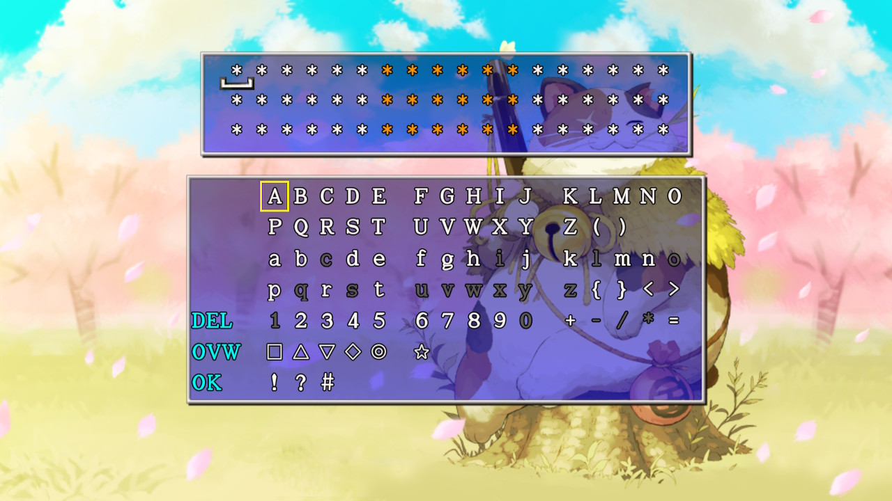

  

# Overview

※ These passwords are exclusive to the Switch / Steam version.

When a player goes on a rescue, the dungeon seed is set to the same seed as the player who collapsed. 
This means dungeon layout and items will be the same, resulting in the ability to share seeds with rare items.

<ul class="quickLinksUL">
  <li><a href="#notes">Notes</a>
    <ul>
      <li><a href="#using-passwords">Using Passwords</a></li>
      <li><a href="#creating-passwords">Creating Passwords</a></li>
    </ul>
  </li>
  <li><a href="#passwords">Passwords</a>
    <ul>
      <li><a href="#lost-well">Lost Well</a></li>
      <li><a href="#heavenly-lake">Heavenly Lake</a></li>
      <li><a href="#merchant's-hideout">Merchant's Hideout</a></li>
      <li><a href="#fever-pots">Fever Pots</a></li>
    </ul>
  </li>
</ul>

# Notes

### Using Passwords

- You can only go on a rescue if you've been to that dungeon and floor on your own before.
- Rescues that are successful, deleted, or result in failure 3 times are stored and can't be reused.
    - However, the history only stores 32 rescues, so you can reuse passwords after accepting 32 other rescues.
- You might need to reach Hermit's Hermitage first for the seed to be the same for Dungeon Center dungeons.
- Bring an Escape Scroll for rescues that allow carry-in items to obtain the listed items up to 3 times.

### Creating Passwords

- Internet rescue numbers can't be used, since they're deleted from the server when the rescue is completed.
- You need to intentionally collapse on the next floor after finding target items, since the collapsed floor changes.
    - This is also the case for Pick-A-Choice shops.
- Passwords for main story dungeons can't be used, since you don't go into the dungeon when rescuing.
- Wandering NPCs, shiny objects, enemy drops, correct Pick-A-Choice choices and rewards will be different.
- Floors changed by reading a Mnster House Scrl when a Monster House is already present can mess up the result.

# Passwords

### Lost Well

See Collecting Catstones for Lost Well Pick-A-Choice shops.

<table class="monsterTable">
  <tr>
    <th>No.</th>
    <th>Floor</th>
    <th>Items</th>
    <th>Password</th>
    <th>Notes</th>
  </tr>
  <tr>
    <td class="highlightGray">01</td>
    <td>7F</td>
    <td>6F Pick-A-Choice Shop (Collect Catstones)</td>
    <td><pre class="password">ＡＶＣｈＺ）　＃８ｔ｝ｐＧ　ＷＷｄＱＯ？ Ｄ＃Ｇ？！Ｆ　＞ロ８Ｌ（＃　ＷＹ！３ＥＩ ｂ？ＮＢ６７　Ｐ｝（ｒ◎△　ｈｔ！！ｊ☆</pre></td>
    <td>Bring blessed Collection + Extraction scrolls. Throw an Extinction Scroll at Dark Grass Guy or equip a Time Stop Bracelet so it remains daytime.</td>
  </tr>
  <tr>
    <td class="highlightGray">02</td>
    <td>9F</td>
    <td>8F Pick-A-Choice Shop (Collect Catstones)</td>
    <td><pre class="password">＋９Ａ☆▽Ｐ　ＤＰＡＹ｝Ｚ　）▽ＳｈｎＣ ＞ＸｍＵ２Ｆ　３＞４８Ｅｆ　Ｒ８ロＰ（Ｘ Ｂ▽ｔＣ＃Ｑ　｝４（Ｚｐｒ　ｂ！＝Ｙ８９</pre></td>
    <td>Bring blessed Collection + Extraction scrolls. Throw an Extinction Scroll at Horrabbit (daytime)</td>
  </tr>
  <tr>
    <td class="highlightGray">03</td>
    <td>36F</td>
    <td>Catstones (7 colors) Elite store x 3 Buried in walls</td>
    <td><pre class="password">ＹａＡＢ▽△　））☆＜ＮＥ　Ｉ＜ＰＥｇＤ Ｎ？ロｇＫ▽　｝△ＩｅＶ＜　Ｓ◇＜＝Ｐ？ ５ｅＸＩ５ａ　☆ＳｈＰ＞ｐ　Ｊ｛Ｐ＜ＦＺ </pre></td>
    <td>Bring Recommend. Letters, Item Detector / Scout Bracelet + digging item</td>
  </tr>
  <tr>
    <td class="highlightGray">04</td>
    <td>37F</td>
    <td>Catstones (7 colors) Elite store x 3 Buried in walls</td>
    <td><pre class="password">（ｊＣＥＰＬ　ＱＵｄＧＱ４　ＲａＵ△８！ ７ＮｄＨ｛Ｔ　◇ＦｄｇＹ＜　ｆＶ｝Ｑａｍ △Ｖｐ＝＃＋　？ＹＶロ３◎　ｈＦ◎Ｈ４ｍ </pre></td>
    <td>Same dungeon seed as No.03</td>
  </tr>
  <tr>
    <td class="highlightGray">05</td>
    <td>38F</td>
    <td>Catstones (7 colors) Elite store x 3 Buried in walls</td>
    <td><pre class="password">４ＳＡ５Ｈ５　｛ＥｄＱｐ＞　ｔ＜ＹＫＴＩ ＢＨ５ｊＧ６　ｄ！７◎！＋　Ｉ３Ｙ＜Ｓｄ ◇ｐ６ＶＦＩ　ＶＨＡｊＱ＞　＝６＞８＃Ｋ</pre></td>
    <td>Same dungeon seed as No.03</td>
  </tr>
</table>

### Primordial Chasm

<table class="monsterTable">
  <tr>
    <th>No.</th>
    <th>Floor</th>
    <th>Items</th>
    <th>Password</th>
    <th>Notes</th>
  </tr>
  <tr>
    <td class="highlightGray">01</td>
    <td>10F</td>
    <td>8F Breeze Blade 9F Identify Bracelet</td>
    <td><a href="https://i.imgur.com/NP46467.jpg">(Screenshot)</a></td>
    <td>Recommend. Letter, Undo Grass, Boring Staff, etc.</td>
  </tr>
</table>

### Heavenly Lake

<table class="monsterTable">
  <tr>
    <th>No.</th>
    <th>Floor</th>
    <th>Items</th>
    <th>Password</th>
    <th>Notes</th>
  </tr>
  <tr>
    <td class="highlightGray">01</td>
    <td>9F</td>
    <td>8F Time Stop Bracelet</td>
    <td><pre class="password">（｝ＡｇＡＩ　ｐｄｅ＜Ｊ▽　＜４！Ｖ９▽ ＹＦ☆Ｖｅ▽　２ＵＮ△２ｆ　ＡＡ＜Ｖｐ２ ｅｍ｛ｂ＋Ｖ　ＰＢＹｅＭｔ　４ＫロＵｄ◇</pre></td>
    <td>Sell pots and equipment to purchase it. The Blast Shield on 3F is cursed. Escape Scroll somewhere on 6F or 7F.</td>
  </tr>
  <tr>
    <td class="highlightGray">02</td>
    <td>10F</td>
    <td>7F Degrade Pot 7F Grilling Pot</td>
    <td><pre class="password">＃ＹＢｒＮＷ　＃Ｑ（＜ｈＱ　７ＫＴｎｔｒ ８６ＺＦ｝ｅ　Ｆｇ！ＺＥＦ　Ｃ９Ｍ＜ＪＢ ７ｆ｛ロＭＵ　ロ◎ＴＧ◇▽　Ｗ＜ｔ２ＩＧ</pre></td>
    <td>The shop with the pots is on 7F. Escape Scroll can be found.</td>
  </tr>
  <tr>
    <td class="highlightGray">03</td>
    <td>2F</td>
    <td>1F Swap Shield</td>
    <td><pre class="password">ＴａＢｇＷＧ　Ｅ▽｝ＶＯＸ　２ｅＺＮＣＡ ＋｛ｆ＜Ｘｆ　ＩＺｔｅＫロ　ＱＳＹａＴ☆ Ｍ９△２Ｅ△　ＳＳ＞ａ＋ｆ　ＷＹＰＫ９｝</pre></td>
    <td>-</td>
  </tr>
  <tr>
    <td class="highlightGray">04</td>
    <td>3F</td>
    <td>1F Anti-Gaze Trge 2F Burning Blade</td>
    <td><a href="https://i.imgur.com/Wu9KO5u.jpg">(Screenshot)</a></td>
    <td>-</td>
  </tr>
</table>

### Gen's Turf

<table class="monsterTable">
  <tr>
    <th>No.</th>
    <th>Floor</th>
    <th>Items</th>
    <th>Password</th>
    <th>Notes</th>
  </tr>
  <tr>
    <td class="highlightGray">01</td>
    <td>46F</td>
    <td>45F Trapper Bracelet</td>
    <td><a href="https://f.easyuploader.app/eu-prd/upload/20210109232245_685868376c785543364b6f6e32584f59.JPG">(Screenshot)</a></td>
    <td>-</td>
  </tr>
</table>

### Old Road

<table class="monsterTable">
  <tr>
    <th>No.</th>
    <th>Floor</th>
    <th>Items</th>
    <th>Password</th>
    <th>Notes</th>
  </tr>
  <tr>
    <td class="highlightGray">01</td>
    <td>2F</td>
    <td>Breeze Blade Blazing Shield x 2</td>
    <td><pre class="password">Ｊ５ＣｆｂＯ　ロＪＹＫｅＪ　ＰｍｅＴｇ＋ Ｄ６◇Ｒ＋Ｖ　ｎ｝＋ＡＲ＋　Ｎ＋５２Ｙ８ Ｐｆ▽ＳＸｊ　ｐ）８（ｊＶ　＞ｂｈ▽Ｂ｝</pre></td>
    <td>-</td>
  </tr>
  <tr>
    <td class="highlightGray">02</td>
    <td>96F</td>
    <td>95F Nirvana Board</td>
    <td><pre class="password">ＯｔＣｒａＭ　２Ｉ３）９ｄ　ＧｆＫＮｈＯ Ｄ◇ＱＤＷ４　＞ＸＬｇ２ｆ　ｊＹ２Ｍｆｎ ｇ△ＫｂＬＧ　ＢｆＪ｛ｈｂ　＃Ｇａ９＜Ｍ</pre></td>
    <td>-</td>
  </tr>
</table>

### Inori Cave

<table class="monsterTable">
  <tr>
    <th>No.</th>
    <th>Floor</th>
    <th>Items</th>
    <th>Password</th>
    <th>Notes</th>
  </tr>
  <tr>
    <td class="highlightGray">01</td>
    <td>4F</td>
    <td>3F Fort. Staff 3F Fever Pot</td>
    <td><a href="https://i.imgur.com/TYciSdd.jpg">(Screenshot)</a></td>
    <td>-</td>
  </tr>
  <tr>
    <td class="highlightGray">02</td>
    <td>12F</td>
    <td>11F Time Stop Bracelet</td>
    <td><pre class="password">Ｉ６Ｃａ◎｝　ＸＧ＃ＥＨ４　＜Ｃ◎｛Ｘ＋ ｒＹ＞ｄ４２　２＋ｂＵ◇＝　ｂＶ？Ｈ＃☆ ｊ＜）Ｈ＝Ｃ　☆８Ｂ＃Ｈ５　｛ｇＨＲ｝Ｅ</pre></td>
    <td>Bring Recommend. Letter</td>
  </tr>
</table>

### Merchant's Hideout

<table class="monsterTable">
  <tr>
    <th>No.</th>
    <th>Floor</th>
    <th>Items</th>
    <th>Password</th>
    <th>Notes</th>
  </tr>
  <tr>
    <td class="highlightGray">01</td>
    <td>5F</td>
    <td>Blessing Pot x 2 Extraction Scroll Trap Scroll Breeze Blade Anti-Gaze Trge</td>
    <td><pre class="password">◎ｊＣ＞６？　ＸＢＨＦＤＥ　△◎ＮＲ▽Ｉ ）７＞ｍ｛ｔ　｛｛Ｔ９９Ｍ　ＭＢｐｊ｛４ ＲＬａＫＱＰ　Ｃ△ＡＵ６Ｄ　Ｚｆｔ｛Ｐ＞</pre></td>
    <td>-</td>
  </tr>
  <tr>
    <td class="highlightGray">02</td>
    <td>5F</td>
    <td>Trap Bracelet x 3</td>
    <td><pre class="password">＋ＯＡｈ４ｅ　６Ｉ？｝ＱＬ　Ａ８△ＡＱ＋ ３ＦｒｇＩＪ　９（Ｈ＃ＯＭ　Ｚ９ＲｊＲＡ ６Ｉ＃ＱＰＹ　ＩＬＥ＝ＪＹ　）Ｍ５Ｘ△Ｌ</pre></td>
    <td>-</td>
  </tr>
  <tr>
    <td class="highlightGray">03</td>
    <td>9F</td>
    <td>8F Pick-A-Choice Shop</td>
    <td><pre class="password">ＲＭＢＲＱＧ　◇３６９ＹＢ　８Ｕｈ３ＴＱ ＰＳ７＞◎◎　Ｑ８）ＦｈＪ　Ｍ６ａ＝４ｇ ｇＫＷ）ｐ４　ＳＯ）Ｇ）Ｑ　ＸＰｂＶＩ△</pre></td>
    <td>Lucky Pot, Unlucky Pot, Glass Dirk, Glass Buckler, Wall Clip Bracelet, VIP Bracelet, Identify Bracelet, etc.</td>
  </tr>
</table>

### Monster Hotspot

<table class="monsterTable">
  <tr>
    <th>No.</th>
    <th>Floor</th>
    <th>Items</th>
    <th>Password</th>
    <th>Notes</th>
  </tr>
  <tr>
    <td class="highlightGray">01</td>
    <td>4F</td>
    <td>3F Onigiri Shield</td>
    <td><pre class="password">◇ａＤＫｎｍ　＜＝ＺＭＮＬ　Ｌ（＝ｔ＝＞ ＺＲ＃｝３Ｊ　ＪＶＳＶ！８　ｔＯＨＹＦＷ ）＞ｄＳＡＧ　Ｘｒ！４Ｃ◇　ＦｆＡ５ｊＡ</pre></td>
    <td>-</td>
  </tr>
  <tr>
    <td class="highlightGray">02</td>
    <td>3F</td>
    <td>Onigiri Shield</td>
    <td><pre class="password">６◇ＤＵ◎ｂ　２ｎ！！｛Ｅ　Ｕ☆）ｊ｛ｔ ◎８ｅ｛Ｐ▽　ＣＶｎ▽ｒｆ　Ｐｍ？＜◇Ｕ ｍ＜ａｇＦＱ　Ｓ｝６ＨＱ◇　▽Ｘ５Ｅ▽Ｎ</pre></td>
    <td>-</td>
  </tr>
</table>

### Bladeless Wasteland

<table class="monsterTable">
  <tr>
    <th>No.</th>
    <th>Floor</th>
    <th>Items</th>
    <th>Password</th>
    <th>Notes</th>
  </tr>
  <tr>
    <td class="highlightGray">01</td>
    <td>2F</td>
    <td>1F Heal Bracelet</td>
    <td><pre class="password">ｈ｛ＤＨ☆Ａ　ｎ◇ＨＯ△ｐ　ＪｅＷＧＨ９ ▽ＧＰｈＩ＃　 ＃？ＥＰ＋ｆ　ａ６ｇＲＹ８ ｆＱ＞＃ロＩ　！ｍ＞ＲＵＵ　５Ｅ６＃ｇａ</pre></td>
    <td>-</td>
  </tr>
</table>

### Garden of Destiny

<table class="monsterTable">
  <tr>
    <th>No.</th>
    <th>Floor</th>
    <th>Items</th>
    <th>Password</th>
    <th>Notes</th>
  </tr>
  <tr>
    <td class="highlightGray">01</td>
    <td>1F</td>
    <td>1F Sharing Staff</td>
    <td><a href="https://i.imgur.com/qb9nZce.jpg">(Screenshot)</a></td>
    <td>-</td>
  </tr>
</table>

### Fever Pots

#### Pitfall of Life

<ul>
  <li><a href="https://twitter.com/burakuri_sv/status/1335518261933342721">2F: Twitter(@burakuri_sv)</a>, <a href="https://twitter.com/burakuri_sv/status/1335579645161291776">2</a>, <a href="https://twitter.com/burakuri_sv/status/1335581069785985031">3</a>, <a href="https://twitter.com/burakuri_sv/status/1335628407246229504">4</a></li>
  <li><a href="https://twitter.com/Funny_Silkie/status/1336481067994234880">1F: Twitter(@Funny_Silkie)</a></li>
  <li><a href="https://pastebin.com/raw/AsAd2Lgy">Fever Pot Pastebin (35 passwords)</a></li>
</ul>

 

<table class="monsterTable">
  <tr>
    <th>No.</th>
    <th>Floor</th>
    <th>Items</th>
    <th>Password</th>
    <th>Notes</th>
  </tr>
  <tr>
    <td class="highlightGray">01</td>
    <td>2F</td>
    <td>1F Fever Pot</td>
    <td><pre class="password">ｇｒＤＭＢＰ　ｒ◇６５ｔ８　ＹＤｈ）ｔＧ ｈＳ７ＲＹ＜　７７９８９＋　？Ｖ＜Ｕ２Ｎ Ｃ（☆７＞Ｎ　３＃ｒＶＦＯ　ＥＣＮＭａｆ</pre></td>
    <td>-</td>
  </tr>
  <tr>
    <td class="highlightGray">02</td>
    <td>4F</td>
    <td>1F Extraction Scroll 3F Extraction Scroll 3F Fever Pot 3F Explosion Bracelet</td>
    <td><pre class="password">＃◇Ｃｊ（ｍ　ＤｔＤＹＮ３　４ＺＺ３Ｄ＃ （ＮＣｂ▽Ｉ　＝ＮＧ｝▽Ｍ　７（Ｏ４＞＃ ｐＵＪＭ８ａ　ｇｍ△ＶＪＸ　？ＥＲ＞◎Ｆ</pre></td>
    <td>-</td>
  </tr>
  <tr>
    <td class="highlightGray">03</td>
    <td>3F</td>
    <td>2F Fever Pot</td>
    <td><pre class="password">ＷＣＤ▽ｇｎ　＞｛９ｎ５＞　（Ｍ（ＳＨＨ ＰｎｎＵ４４　ｊＵａ｝Ｌ◎　３+Ｇ◎＝（ ３７＋＋◇＋　＞ＧＹ◇ｆ５　４｛Ｄ｛ＫＳ</pre></td>
    <td>-</td>
  </tr>
  <tr>
    <td class="highlightGray">04</td>
    <td>13F</td>
    <td>1F Fever Pot 3F Breeze Blade 3F Fever Pot 9F Fever Pot</td>
    <td><pre class="password">ＤＨＡｇ｛Ｙ　Ｃ９ＡＷｍＬ　ＯＣ｝ＪＢｅ ＞Ｍｍ４＃＃　＞◎ｄＷＮｒ　ｄ６◇６ＦＯ ｇＹＤＦＣ▽　ｔ３ＰＨ｝ｍ　ｔＪＡ９Ｂ＜</pre></td>
    <td>Blessing Pot x 2, Blessing Scroll x 6, Dirk of Debts, Monster House on 9F.</td>
  </tr>
  <tr>
    <td class="highlightGray">05</td>
    <td>5F</td>
    <td>1F Fever Pot 3F Fever Pot</td>
    <td><pre class="password">＝＜ＢｆｆＶ　Ｎ４ｒｊ＃Ｘ　Ｍ！ＢＴ？Ｉ Ｊ◎ＲＺ☆◎　＃◎ｍｎＳＶ　５５ｈＱ９＋ ＩＧＲＵ４＃　ｅ３Ｑ◎Ｇ３　６ＳＢＥ８Ｔ</pre></td>
    <td>-</td>
  </tr>
  <tr>
    <td class="highlightGray">06</td>
    <td>5F</td>
    <td>4F Anti-Parry Brce. 5F Fever Pot</td>
    <td><pre class="password">ＷＬＤＡＵ｝　ＲＭ＋８ＲＴ　ｔ（８ＰロＬ ｅＱ△ＯＸｇ　ｆＭＲＥ＃Ｐ　ａＸＴＷＢ３ Ｚｔロ☆Ｗ？　Ｏ＝△Ｖ（Ｂ　ｇ＝ｊ☆ＧＳ</pre></td>
    <td>-</td>
  </tr>
  <tr>
    <td class="highlightGray">07</td>
    <td>6F</td>
    <td>Breeze Blade x 3 Fever Pot x 2</td>
    <td><pre class="password">ＵＮＡ◇｝＜　Ｑ＞ｈｆ２ｔ　ＥＰｅ＝ＷＯ ＦＮＨロＪＮ　Ｆ（ｍＮｍＪ　ｎｊＳ＋Ｉ｝ ＵＦ＜ｇｍｅ　Ｑ◎＃Ｙ｝◎　｝Ｔ！（ＡＸ</pre></td>
    <td>Possibly an Item Detector on 1F.</td>
  </tr>
  <tr>
    <td class="highlightGray">08</td>
    <td>3F</td>
    <td>2F Extraction Scroll 2F Fever Pot</td>
    <td><pre class="password">△ＺＢ８Ｚ＜　９！ＯｎＸ＞　Ｆａｆ？ｎｐ Ｘ◇｝ＱｆＵ　ｆｊ３◎＞ｄ　５８ＴＤＰＬ ＵＥ６＞Ｋ）　｛ＨｈｒＵＳ　ｊ☆２ｈＺ△</pre></td>
    <td>-</td>
  </tr>
  <tr>
    <td class="highlightGray">09</td>
    <td>3F</td>
    <td>2F Fever Pot</td>
    <td><pre class="password">Ｃ９ＤＸ（？　Ｊ２＝ｄ＜）　！＋ｂ２Ｗ６ ？＞ＩＹＭ７　ＮＷｂＱＷ＃　ＡＳＵ＃ＢＴ ８＋ＧＴＫｎ　Ｊ◎ＡＶロＺ　Ｍｂ７ＲＩ８</pre></td>
    <td>-</td>
  </tr>
  <tr>
    <td class="highlightGray">10</td>
    <td>4F</td>
    <td>1F Fever Pot 3F Explosion Bracelet</td>
    <td><pre class="password">４ＭＡ＜Ａ｝　ｒＰ７ＮＥ６　ＡＮ＃Ｊ＃Ｙ Ｌｐ｝ｈＥ＜　！Ｚ☆２Ｋｄ　Ｋ５｝２Ｚ＜ ◎ＵＡＪＤＰ　ｂ▽｛ＣＡ９　ＫＹ＝ＭＫｄ</pre></td>
    <td>-</td>
  </tr>
</table>
