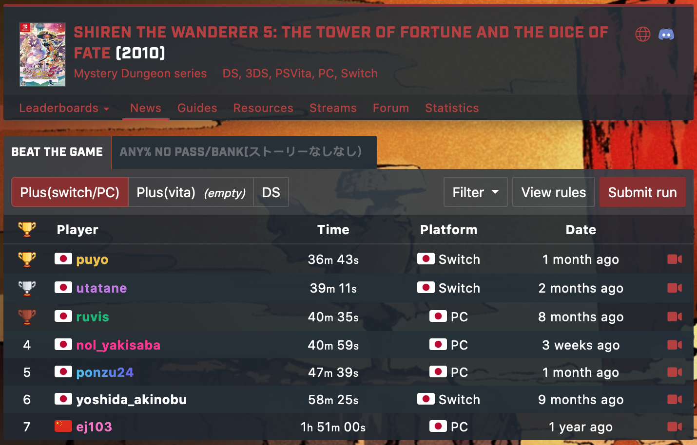

  

# Overview

The Shiren 5 speedrunning community uses [SPEEDRUN.COM](https://www.speedrun.com/shiren5) for submissions and leaderboards. Please feel free to submit runs, as long as they follow the rules.

# Rules

## Story RTA

The goal is to clear the main story as fast as possible. 
An external timer must be used. (See [speedrunning tools](https://www.speedrunslive.com/tools) for some examples)

Start from a new diary, but it's okay to change game settings before you start. Options such as text size and walk speed.

- Timer start: The moment you select "Yes" after inputting your name.
    - Create Diary → Name entry → Are you sure? → Yes
- Timer stop: The moment "Gr. Reeva Statue collapsed." is displayed.

### Beat the Game

The "anything goes" ruleset. (Also known as Any%)

Video Explanation (Japanese): [https://www.youtube.com/watch?v=-saFiBI5PvE](https://www.youtube.com/watch?v=-saFiBI5PvE)

### Any % No Pass/Bank

No utilizing Tanuki Passwords, Bank reward items, or entering unrelated dungeons.

## Dungeon TA

The goal is to clear the target dungeon as fast as possible. 
The Live Display in-game timer must be used, which can be enabled in Dungeon Settings 2. 
(Live Display mode displays your final time upon clearing the dungeon)

- Timer start: The frame when "[Dungeon name] 1F" is displayed on screen.
- Timer stop: The frame when adventure results appears on screen from the bottom.

1st clears of dungeons are not allowed - it must be the 2nd+ clear.

# Routes

## 1. Beat the Game (Any%)

※ Last updated: January 14th, 2022.

### Game Settings

Change the below settings in the options menu, along with any others based on preference.

- Common Settings
    - Set "B Skip Messages" to "Yes"
- Dungeon Settings 1
    - Set "Walk" to "Fast"
- Dungeon Settings 2
    - Set "Message Display" to "No Delay"
    - Set "Live Display" to "Enable"

### Ouma Shrine

#### 1F

- Dash over the Herb instead of picking it up.
- Ignore monsters and dash to the exit.

#### 2F

- Pick up some Gitan, but ignore equipment.
- Ignore monsters and dash to the exit.

#### 3F

- Ignore the Onigiri.
- Ignore monsters and dash to the exit.

### Nekomaneki Village

1. Go to the basement of Hotel Nekomaneki, and go through the Lot Shop event.
2. Go upstairs and talk to Pokopon, and input Tanuki Passwords.
    - Dirk of Debts = Treasury
    - Synthesis Pot [5] = Synthesis
    - Rush Shield = O-FENCE!
    - Scythe = Vegicide
    - Pauper's Plank = Golddigger
    - Day Shield = Carpe Diem
    - Blessing Scroll = Furry Ferret
    - Coupon Scroll = Coupon
    - 5,000 Gitan = Tao's Stash
    - Blank Scroll = Carte Blanche
    - Cheery Grass (Blessed) = Happy Grass
3. Enter Destiny Trail.

### Destiny Trail

1. Insert items into the Synthesis Pot in the following order:
    1. Dirk of Debts
    2. Rush Shield
    3. Scythe
    4. Pauper's Plank
    5. Day Shield
2. Equip Dirk of Debts and Rush Shield.
3. Read Blessing Scroll and select Coupon Scroll.
4. Clear Destiny Trail.

### Tower of Fortune Entrance

1. Do not hire Tao as a guide.
2. Enter Tower of the Past.

### Tower of the Past

1. If you find a shop, sell Dirk of Debts, Pauper's Plank, and Blank Scroll.
2. Read Coupon Scroll, and sell items again.
3. Read Coupon Scroll, and pick up Dirk of Debts, Pauper's Plank, and Blank Scroll.
4. Check shop items to see if there's anything worthwhile, and then sell back the leftovers.
5. If you encounter a trapped fox, go ahead and free it.
6. Clear Tower of the Past.

### Hotel Nekomaneki (2nd)

1. Sell unneeded items at the shop, and buy any useful items you see.
2. Enter Destiny Trail.

### Destiny Trail (2nd)

1. Clear Destiny Trail.

### Tower of the Present

1. Clear Tower of the Present.

### Hotel Nekomaneki (3rd)

1. Sell unneeded items at the shop, and buy any useful items you see.
2. Deposit your Gitan at the Bank to receive items.
    - Revival Grass
    - Undo Grass
    - Blank Scroll
2. Enter Destiny Trail.

### Destiny Trail (3rd)

1. If you have Strength Grass, turn a Blank Scroll into a Blessing Scroll and use it on the Strength Grass.
2. Throw blessed Cheery Grass at a Pit Mamel (3-5F), then defeat the Gitan Mamel to level up.
1. Clear Destiny Trail.

### Tower of the Future

1. Clear Tower of the Future.

### Hermit's Hermitage

1. Ignore the item shop if you feel good about your inventory.
2. Enter Tower of Fortune.

### Tower of Fortune

1. Don't change abilities if you learn new ones.
2. Clear Tower of Fortune.

### 1st Boss

Strategy varies based on items you've found.

Example fight:

1. Use Swift Grass and Power Up Grass.
2. Swing a Mage Staff at the Shagga to the left.
3. Throw a Rotten Peach at Reeva Statue.
4. Use direct attacks against Reeva Statue, ignoring all other monsters.

### Tower of Miracles (1st)

1. Clear Tower of Miracles (1st)

### Sparrow's Inn

1. Ignore the item shop if you feel good about your inventory.
2. Enter Tower of Miracles (2nd)

### Tower of Miracles (2nd)

1. Clear Tower of Miracles (2nd)

### Final Boss

Strategy varies based on items you've found.

Example fight:

1. Use Swift Grass, then equip your weapon and shield.
2. Use Power Up Grass
3. Throw a pot that has Oil Scrolls inside when you're adjacent to the boss to inflict Tottering status.
4. Use direct attacks to defeat the boss.
