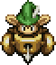
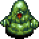

This page details useful techniques and general knowledge related to Shiren 5.

Related pages: 
[Gameplay Basics](/system/gameplay-basics) - overview of gameplay mechanics. 
[Dungeon Features](/system/dungeon-features) - details about dungeon shops, monster houses, doors, lava, etc. 
[Trivia and Glitches](/guides/trivia-and-glitches) - Miscellaneous knowledge and more obscure tips.

<ul class="quickLinksUL">
  <li><a href="#readiness">Readiness</a>
    <ul>
      <li><a href="#expect-the-worst">Expect the Worst</a></li>
      <li><a href="#common-missed-inputs">Common Missed Inputs</a></li>
    </ul>
  </li>
  <li><a href="#controls">Controls</a>
    <ul>
      <li><a href="#control-shortcuts">Control Shorcuts</a></li>
    </ul>
  </li>
  <li><a href="#food">Food</a>
    <ul>
      <li><a href="#replenishing-fullness">Replenishing Fullness</a></li>
      <li><a href="#protect-food-from-decay-traps">Protect Food from Decay Traps</a></li>
      <li><a href="#eating-priority">Eating Priority</a></li>
      <li><a href="#grilling-onigiri">Grilling Onigiri</a></li>
      <li><a href="#making-squid-sushi-scroll">Making Squid Sushi Scroll</a></li>
      <li><a href="#ripening-peaches">Ripening Peaches</a></li>
    </ul>
  </li>
  <li><a href="#dungeon">Dungeon</a>
    <ul>
      <li><a href="#early-game-combat">Early Game Combat</a></li>
      <li><a href="#step-in-place">Step in Place</a></li>
      <li><a href="#heal-before-advancing">Heal Before Advancing</a></li>
      <li><a href="#gang-up-on-monsters">Gang Up on Monsters</a></li>
      <li><a href="#attack-through-or-over-walls">Attack Through or Over Walls</a></li>
      <li><a href="#handling-confusion">Handling Confusion</a></li>
      <li><a href="#arrows-in-hallways">Arrows in Hallways</a></li>
      <li><a href="#warping-methods">Warping Methods</a></li>
      <li><a href="#utilize-traps">Utilize Traps</a></li>
      <li><a href="#check-for-stairs?-trap">Check for Stairs? Trap</a></li>
      <li><a href="#lag-check">Lag Check</a></li>
    </ul>
  </li>
  <li><a href="#monster">Monster</a>
    <ul>
      <li><a href="#enemies-immune-to-projectiles">Enemies Immune to Projectiles</a></li>
      <li><a href="#ranged-attackers---zigzag-movement">Ranged Attackers - Zigzag Movement</a></li>
      <li><a href="#naptapir---don't-get-close">Naptapir - Don't Get Close</a></li>
      <li><a href="#mudkin---unequip-items">Mudkin - Unequip Items</a></li>
      <li><a href="#foly---watch-its-color">Foly - Watch its Color</a></li>
      <li><a href="#swordsman---what's-behind-you?">Swordsman - What's Behind You?</a></li>
      <li><a href="#gyadon---keep-items-in-pots">Gyadon - Keep Items in Pots</a></li>
      <li><a href="#scoopie---place-pots-down">Scoopie - Place Pots Down</a></li>
    </ul>
  </li>
  <li><a href="#item">Item</a>
    <ul>
      <li><a href="#use-book-when-naming">Use Book when Naming</a></li>
      <li><a href="#name-preservation-pots">Name Preservation Pots</a></li>
      <li><a href="#gitan-as-a-projectile">Gitan as a Projectile</a></li>
      <li><a href="#increase-max-hp">Increase Max HP</a></li>
      <li><a href="#hit-and-run-tactics">Hit and Run Tactics</a></li>
      <li><a href="#throw-staves-with-0-uses">Throw Staves with 0 Uses</a></li>
      <li><a href="#inserting-into-presto-pots">Inserting into Presto Pots</a></li>
      <li><a href="#throw-pots-to-trigger-traps">Throw Pots to Trigger Traps</a></li>
      <li><a href="#cursing-/-sealing-items">Cursing / Sealing Items</a></li>
    </ul>
  </li>
  <li><a href="#equipment">Equipment</a>
    <ul>
      <li><a href="#sub-weapon">Sub Weapon</a></li>
      <li><a href="#diet-shield">Diet Shield</a></li>
      <li><a href="#binary-shield">Binary Shield</a></li>
      <li><a href="#shield-added-runes">Shield Added Runes</a></li>
    </ul>
  </li>
  <li><a href="#synthesis">Synthesis</a>
    <ul>
      <li><a href="#mixer-identification">Mixer Identification</a></li>
      <li><a href="#sub-equipment-to-reduce-risk">Sub Equipment to Reduce Risk</a></li>
      <li><a href="#transfer-upgrade-value">Transfer Upgrade Value</a></li>
      <li><a href="#increase-mixer-count---level-up">Increase Mixer Count - Level Up</a></li>
      <li><a href="#increase-mixer-count---stomach-expander">Increase Mixer Count - Stomach Expander</a></li>
    </ul>
  </li>
  <li><a href="#farming">Farming</a>
    <ul>
      <li><a href="#level-up-monsters">Level Up Monsters</a></li>
      <li><a href="#arrows">Arrows</a></li>
      <li><a href="#gitan">Gitan</a></li>
      <li><a href="#super-status">Super Status</a></li>
      <li><a href="#rotten-onigiri">Rotten Onigiri</a></li>
      <li><a href="#nigiri-morph-factory">Nigiri Morph Factory</a></li>
      <li><a href="#zalokleft-hunting">Zalokleft Hunting</a></li>
      <li><a href="#mutaikon-hunting">Mutaikon Hunting</a></li>
      <li><a href="#grass-kid-hunting">Grass Kid Hunting</a></li>
      <li><a href="#grass-factory">Grass Factory</a></li>
      <li><a href="#maneater-hunting">Maneater Hunting</a></li>
      <li><a href="#fo-uzz-for-revival-grass">FO-UZZ for Revival Grass</a></li>
    </ul>
  </li>
  <li><a href="#earning">Earning</a>
    <ul>
      <li><a href="#ally-level-ups">Ally Level Ups</a></li>
      <li><a href="#equipment,-upgrade-value,-synthesis-pots">Equipment, Upgrade Value, Synthesis Pots</a></li>
      <li><a href="#blessed-extraction-scroll-loop">Blessed Extraction Scroll Loop</a></li>
      <li><a href="#points">Points</a></li>
      <li><a href="#blank-scrolls">Blank Scrolls</a></li>
      <li><a href="#upgrade-value">Upgrade Value</a></li>
      <li><a href="#skill-points">Skill Points</a></li>
      <li><a href="#gitan---coupon-scroll">Gitan - Coupon Scroll</a></li>
      <li><a href="#catstones">Catstones</a></li>
      <li><a href="#always-win-pick-a-choice">Always Win Pick-A-Choice</a></li>
      <li><a href="#experience-points---past-lv99">Experience Points - Past Lv99</a></li>
      <li><a href="#new-item-bracelet-for-+99-items">New Item Bracelet for +99 Items</a></li>
    </ul>
  </li>
</ul>

# Readiness

#### Expect the Worst

The mantra of a roguelike is "Hope for the best, expect the worst". 
Generally, the more you plan for bad situations, the further you'll be able to progress.

- Don't move without purpose near enemies
    - Draw enemies closer by stepping in place so that you get the first hit.
    - If there's a group of enemies, retreat into a hallway and fight 1-on-1.
    - Check the identity of distant enemies in the room using the Scout command.
    - Dashing is dangerous. Always walk when there are strong enemies around, or when it's night.
- Act before your situation gets bad
    - Have an idea how much damage each enemy deals.
    - It can sometimes be too late even if you use an item after your situation becomes dire.
        - Don't be stingy with items. Collapsing when you still had powerful items is the worst.
    - HP regeneration slows as max HP increases, making it harder to heal by moving around.
        - Use items to avoid receiving damage in the first place to conserve healing items.
- What if this direct attack misses?
    - Direct attack accuracy is 92%, so the chance to land 2 in a row is ~85%.
        - Direct attack accuracy increases up to 95% depending on weapon level.
    - If you and an enemy are both 1 hit away from collapsing, don't gamble on a direct attack.
    - Don't mash the attack button without checking how much damage you're taking.
- What if this projectile misses?
    - Projectile accuracy is 84%, so the chance to land 3 in a row is less than 60%.
    - Position a monster on top of a trap to cover for missed throws.
    - If a strong monster is adjacent, use a staff or scroll instead of a projectile.
- Run from an enemy, and then what?
    - What will you do if you become sandwiched by enemies in a hallway if you run?
    - The player entering or leaving a room can cause napping monsters to wake up.
- Even stronger enemies might appear
    - Have I leveled up enough?
    - Should I break a pot so that I have more usable items on hand?
    - Do I understand what each of the items in my inventory do?
    - Have I identified all staves and talismans before advancing?
- I might not find any more food
    - Is it really fine to discard Rotten Onigiri and grass? (Grass items replenish 5 fullness)
- There may be hidden traps nearby
    - Use direct attacks to check for Pit Trap, Explosion Trap, etc. when moving toward items.
- Monster House Encounter
    - Use the Scout command before taking any actions and note escape routes.
    - Check your items to see if you have something that lets you overcome the situation.
    - There are lots of traps in a Monster House, so moving on ground tiles is dangerous.
- Categorize inventory items
    - If you're struggling to choose what to discard, think of items as categories.
    - "Food", "Restore HP", "For Monster House", "Emergency Escape", "1-vs-1", etc.
- Don't be in a rush
    - This isn't an action game, so there's no need for fast inputs.
        - You're likely to attack in the wrong direction or throw a Preservation Pot if you hurry.
    - If you're feeling annoyed for being put into a seemingly unfair situation, set the controller down.
        - Your thinking performance drops when you're irritated, so take a moment to gather yourself.

There's really an endless list of thoughts or worries that can cross your mind, so it's similar to driving, 
where you prepare for and are ready to react to situations. (Example: a squirrel running across the road). 
It's important to be aware of what has the potential to occur at any given time, and act accordingly.

That said, you don't want to overdo the thinking to the point of getting stuck in decision paralysis. 
Overthinking can lead to mistakes as well, so don't stress or worry too much, and enjoy the gameplay.

The key to the main story is to recognize when you're reaching your limit, and escape as needed to regroup. 
No one will give you a hard time for escaping, even if it's on an early floor.

#### Common Missed Inputs

- Inserted main equipment into a Presto Pot
    - Often occurs when you're tired, or nervous in late game floors.
    - Remember that the cursor moves to the top when you press right while viewing the item you're standing on.
    - Perhaps it's best to make a habit of selecting the item with R before inserting.
- Stepped on a trap that you revealed using a direct attack.
    - Occurs when you get into the habit of "Direct attack → take a step".
    - Slow down your inputs, or make an effort to pause after using a direct attack.
    - Reframe checking for traps as "Take a step → direct attack".
- Threw an item at a Shopkeeper while identifying
    - Often occurs when you're naming items while checking a price chart, and usually results in a failed adventure.
    - Place items away from the Shopkeeper, or make a habit to face away before opening your inventory.
- (DS version) Pressed B + L to Scout, but shot an arrow instead
    - Make a habit to press B before L. (Pressing B alone doesn't end your turn)
    - However, that will make you dash instead of scout if you miss the L input.
    - Perhaps it's best to always select the Scout option from the menu, instead of using shortcuts.
    - ※ Use the right analog stick to scout on PS Vita, Switch, and Steam versions.

# Controls

#### Control Shortcuts

Switch Pro Controller Inputs (From Game Manual) 
※ Button placements are generally the same for other controllers.

  

Shortcuts or easy to miss inputs:

- Scout: Right Stick
- Diagonal Movement: Hold R
- Sort Items: Y
- Item Multi-Select: R
- View Item Details: +
- Message Log: ZR or B + Y
- Ability Menu: X
- Check Ally HP: ZL or -

# Food

#### Replenishing Fullness

It might seem like eating food you find on the ground or buy from shops is the only way to replenish fullness, but there are actually a number of other ways to either replenish fullness or obtain edible items.

  

Food items:

|Item|Fullness|
|-|-|
|Rotten Onigiri|30|
|Special Onigiri|30|
|Dog Onigiri|50|
|Onigiri|50|
|Grilled Onigiri|60|
|Large Onigiri|100|
|Huge Onigiri|Max|
|Rotten Peach|15|
|Hard Peach|30|
|Peach|50|
|Juicy Peach|100|
|Squid Sushi Scroll|40|
|Any grass item|5|

Other sources:

|Source|Fullness|
|-|-|
|Read Fixer Scroll while starving|Max|
|Revive via Revival or Undo grass, Wanderer Rescue|Max|
|Get hit by Mutaikon family special attacks|5|
|Get hit by Grass Kid family special attacks|5|
|Get hit by a peach or grass thrown by Bored Kappa|Varies|
|Bowl Shield (Pain Fueled) - 6% chance|1|
|Stay at an Inn (Hermit's Hermitage, Sparrow's Inn)|Max|

Methods to obtain food / increase quality:

|Method|Item|
|-|-|
|Find food on the ground|Varies|
|Buy food from shops|Varies|
|Obtain food from Presto Pot|Varies|
|Read an Onigiri Scroll|Large Onigiri|
|Read a Commend. Letter|Large Onigiri|
|Get hit by fire or explosion damage (Rotten, Special, Dog, Onigiri)|Grilled Onigiri|
|Throw onigiri at Kid Squid monsters (Rotten, Special)|Squid Sushi Scroll|
|Trigger Decay Trap on a monster|Rotten Onigiri|
|Splash water on Onigiri status monster|Rotten Onigiri|
|Splash water on a peach to ripen it (Hard Peach, Peach)|Varies|
|Advance floors to ripen peaches|Varies|
|Defeat Kumonigiri or Nigiri Morph|Onigiri|
|Defeat Nigiri Boss|Large Onigiri|
|Defeat Nigiri King|Huge Onigiri|
|Defeat Foul Nigiri Morph, Boss, or King|Rotten Onigiri|
|Defeat Zalokleft family monsters|Varies|
|Get hit by Nigiri Morph's special attack|Large Onigiri|
|Get hit by Foul Nigiri Morph's sp.attack|Rotten Onigiri|
|Place items in a room with Field Knave|Weeds|
|Talk to Tao when you're starving|Onigiri|

#### Protect Food from Decay Traps

Decay Trap only affects onigiri and peaches that are not inside pots, 
so simply keep onigiri and peaches inside pots to keep them safe.

  

#### Eating Priority

If you don't have a pot to store food in, it's best to eat food that restores a lot of fullness first to reduce the loss from stepping on a Decay Trap.

If you have a pot to store food in, or there's no risk of stepping on a Decay Trap, 
it's best to eat food that restores the least amount of fullness first to free up inventory space.

#### Grilling Onigiri

   

Get hit by fire or explosion damage to turn all onigiri that aren't in pots into Grilled Onigiri (60 fullness, 40 HP). Seals and blessings are removed when onigiri are grilled, so it can be used to unseal onigiri items. Rotten Onigiri (30 → 60) and Onigiri (50 → 60) are the two best types of onigiri to grill.

Zen Pot can be used to grill onigiri without receiving damage from fire or explosions, 
but the Anti-Blast※ rune will make you unable to grill onigiri using explosions.

#### Making Squid Sushi Scroll

  

Kid Squid monsters turn into Squid Sushi Scroll when they get hit by an onigiri item, granting experience points and a food item that replenishes 40 fullness. Keep that in mind if you have Rotten Onigiri on hand.

#### Ripening Peaches

  

Changing floors ripens peaches outside of pots. (Hard Peach → Peach → Juicy Peach → Rotten Peach) 
It takes 3 floors to ripen a Hard Peach into a Peach, and 2 floors for the others.

Water also ripens a peach by 1 stage, and floor count isn't reset when a peach ripens due to water. 
(Example: Peach will become a Juicy Peach next floor, ripen it using water, it'll become a Rotten Peach next floor) 
Water sources include Water Pots, walking on water using a Waterwalk Bracelet, and tsunamis in the DS version. 
Decay Trap will always transform a peach into a Rotten Peach.

Juicy Peach restores the most fullness and refreshes 8 abilities, but Peach cures ailments and restores strength, 
and also grants the powerful Immune status when blessed, so remember that when managing ripeness using pots. 
Rotten Peach can be thrown at an enemy to lower their attack and defense.

# Dungeon

#### Early Game Combat

In this game, HP regenerates faster when your max HP is low. Get in the habit of retreating a few steps to recover HP while fighting near the start of an adventure. Watch out for Seedie's high attack power in particular when you don't have a shield.

#### Step in Place

HP only regenerates when you either move or step in place - not when you attack. So hold B and tap A to pass 1 turn when waiting for a monster to approach, rather than attacking to pass the turn. However, if your HP is full, performing an attack is better since it checks if the tile in front has a hidden trap. These are tiny optimizations, but can make a difference over the course of an adventure.

#### Heal Before Advancing

Step in place (B + A) while standing on the stairs to recover HP before advancing to the next floor. You don't know what type of situation you'll start in, so healing when you can is important. If a monster enters the stairs room, go ahead and advance.

#### Gang Up on Monsters

If you have an ally, position yourself so that you and your ally can both hit the enemy. Keep in mind that you only gain skill points when your direct attack is the finishing blow.

Example: When lined up vertically, step to the lower right diagonally.

<pre class="diagram">
S = Shiren A = Ally M = Monster 
 
□ M □ □   □ □ □ □ 
□ S □ □ → □ M □ □ 
□ A □ □   □ A S □
</pre>

#### Attack Through or Over Walls

Direct attacks can't hit enemies that are around corners like this unless you have the Tri-direction rune. However, projectiles like arrows and rocks, magic bullets from staves, and abilities can hit them.

<pre class="diagram">
S = Shiren M = Monster 
 
□ □ □ M □ 
■ ■ S ■ ■ 
■ ■ □ ■ ■ 
■ ■ □ ■ ■
</pre>

Rocks can also hit an enemy that's located on the other side of a wall:

<pre class="diagram">
S = Shiren M = Monster 
 
□ □ □ M □ □ □ 
■ □ ■ ■ ■ ■ ■ 
■ □ □ S □ □ ■ 
■ ■ ■ ■ ■ □ ■
</pre>

Rocks can even hit an enemy inside a wall, such as a Pumphantasm:

<pre class="diagram">
S = Shiren M = Monster 
 
□ □ □ S □ □ □ □ 
■ ■ ■ ■ ■ ■ ■ ■ 
■ ■ ■ ■ ■ M ■ ■ 
■ ■ ■ ■ ■ ■ ■ ■
</pre>

#### Handling Confusion

Confused status only affects your direct attacks and movement, 
so arrows, rocks, thrown items, magic bullets from staves, and abilities remain accurate. If you're adjacent to an enemy and confused in a hallway, you can only move in one direction, meaning you can still run away or buy time until the confusion wears off.

#### Arrows in Hallways

Most of the time, field of view is normally limited to a 1 tile radius in hallways. This means you're likely to get hit by a surprise attack if you simply walk through hallways. To counter this, you can shoot arrows or throw unneeded items to check for incoming monsters.

If that sounds too tedious, at least do it when you transition from a room to a hallway. If a monster was present, step in place and wait for it to enter the room.

#### Warping Methods

It can be faster to warp out of a bad situation, or to a different room if the stairs is across the map. 
This is especially true when speedrunning, or when you're rushing stairs during the night.

|Method|Notes|
|-|-|
|Warp Grass|Use the item|
|Blink Bracelet|Random chance|
|Waterwalk Bracelet|Unequip on a water tile|
|Floating Bracelet|Unequip on a water or air tile|
|Pinning Staff|Land on a water or air tile|
|Staff of Sacrifice|Land on a water or air tile|
|Swap Staff|Land on a water or air tile|
|Yanpii (Headbutt)|Land on a water or air tile|
|DJ Mage (Knockback)|Land on a water or air tile|
|MC Mage (Transient)|Warp to the stairs|
|Transient+Reflection Pot|Warp to the stairs|
|Whack and Warp|Necklace ability|
|"Surrounded" formation|See [Formations](/system/necklace-abilities#formations)|
|Black Hole Pot|Advance to the next floor|

#### Utilize Traps

  

Some traps can be utilized to give yourself an advantage, 
and visible traps can be created by dragging a Karakuroid along the wall in a room. 
※ You may need to inflict Slow status or lower its attack power, depending on your shield.

If a trap is visible, you can throw an item onto the trap to trigger it. 
Rocks can be thrown from 3 tiles away, and other items can be thrown from 10 tiles away. 
If the trap is against a wall, you can simple throw an item at the wall to trigger the trap.

It's also possible to trap monsters by luring them onto a trap and then missing with a projectile. Standard methods to trap monsters:

- Inacc. Bracelet or Dodger Pot
    - Projectiles are guaranteed to miss their target, ensuring trap activation.
- Throw a pot containing at least 1 item
    - If the pot hits the target, it'll break and the item inside the pot will land on the trap.
- Use projectiles until one of them misses
    - Projectiles have 84% accuracy, so one of them will eventually miss.

Usage examples:

- Wood Arrow → collect arrows
- Decay → obtain Rotten Onigiri
- Poison Arrow → weaken a Nigiri Morph for Nigiri Morph Factory
- Explosion → create Grilled Onigiri
- Strip → unequip cursed items / identify equipment
- Iron Arrow → synthesize Anti-Metal
- Idenitfy 3000G bracelets
    - Poison Arrow → Cleansing Bracelet
    - Spin → Anti-Cnf. Bracelet
    - Sleep → Alert Bracelet
    - Curse → Anti-Crs. Bracelet (place items down first)
- Trip → identify Nagging Staff (place pots down first)

#### Check for Stairs? Trap

  

Fake stairs called Stairs? Trap can be generated near the end in some dungeons. 
It's actually a random trap, and using a direct attack or throwing an item onto it doesn't reveal its true form, but there are a few standard methods you can use to check for them.

1. Trap Deletion Scrl or Trap Del. Staff or Water Pot
    - The above items destroy the fake stairs if it turned out to be a Stairs? Trap.
2. Transient Staff
    - The target always warps to the real stairs.
3. Stairlight
    - Stairlight always only displays the real stairs.
4. Dash next to the stairs
    - Position yourself so that you're off by 1 row or column, then dash in the direction of the stairs. If you stop on a tile that is diagonal from the stairs, it's real.

Stopping locations for method 4:

<pre class="diagram">
■ = Stairs　　S = Shiren 
Real:　　　　　　　　　Fake: 
□ □ S □ S □ □　　　　□ □ □ S □ □ □ 
□ □ □ ■ □ □ □　　　　□ □ S ■ S □ □ 
□ □ S □ S □ □　　　　□ □ □ S □ □ □
</pre>

Example for method 4:

<pre class="diagram">
■ = Stairs　　S = Shiren 
Start:　　　　　　　　Real:　　　　　　　　　Fake: 
□ □ □ □ □ S □　　　　□ □ □ □ S □ □　　　　□ □ □ S □ □ □ 
□ □ □ ■ □ □ □　　　　□ □ □ ■ □ □ □　　　　□ □ □ ■ □ □ □ 
□ □ □ □ □ □ □　　　　□ □ □ □ □ □ □　　　　□ □ □ □ □ □ □ 
※ Dash to the left from starting position.
</pre>

#### Lag Check

Perform a direct attack, then change the direction you're facing. 
If an enemy is nearby, there will be a bit of lag before the direction change. 
This technique is mostly used in hallways or at night where visibility is limited. 
It costs a turn to check each time, so you might want to avoid using it on floors with lava, and on floors where monsters have long-range or floor-wide attacks.

# Monster

#### Enemies Immune to Projectiles

        

Can. Arm Bracelet can be equipped to ensure projectiles don't get eaten or thrown back at you.

- Mixer - Eats thrown items and synthesizes them. (Number of items depends on level)
- Sweet Nut - Eats thrown items and multiplies experience points, but can explode.
- Bored Kappa - Catches projectiles and throws them back. (Categories depend on level)
- Flamebird - The projectile burns up.
- Grass Kid, Pin Kid - Dresses itself in grass if you throw a grass item.
- Froggo - Thrown Gitan heals it instead of dealing damage.
- Gyaza - Converts projectile damage and effects into 2 damage.

※ Projectiles will hit sleeping Mixers and Sweet Nuts. 
※ Grass Kid can dress itself in a number of grasses equal to its level. 
※ Kojirouta's Gitan toss has piercing properties, and doesn't work on Froggos.

#### Ranged Attackers - Zigzag Movement

     

Monsters like Grass Kid, DJ Mage, and Dragon have ranged attacks that travel in a straight line, so use diagonal movement as you approach them to ensure you don't get hit by their ranged attack. Boy Carts have swift movement, so you need to use an item or lure it into a hallway.

#### Naptapir - Don't Get Close

  

Naptapirs can inflict Asleep status within a 1 tile radius when they're Napping, Asleep, or Sound Asleep. They also have a chance to yawn when defeated, inflicting sleep status in a 1 tile radius, so it's best to leave them alone, especially since they have higher HP and attack power. If you encounter one that's awake inside a Monster House, go ahead and paralyze it.

#### Mudkin - Unequip Items

  

Mudkins lower upgrade value and erase runes, and can multiply when they receive damage. However, they're harmless if you don't have anything equipped, so just unequip your weapon and shield. Keep 2 slots open in a Preservation Pot, and use multi-select to insert both your weapon and shield into to the Preservation Pot on the same turn. (Use a Seal Staff if other enemies are nearby)

#### Foly - Watch its Color

  

Foly's special ability varies depending on its body color, which changes every 8 turns. It also tends to move along the walls inside rooms.

- Red: Nullifies direct attacks, reflects damage instead.
- Blue: Lightning damage (15 points) to all creatures in the room after it acts.
- Green: Heals your HP by 100 after getting hit by your direct attack.
- Purple: Counters with Berserk, Grounded, Inaccurate, Confused, or Shadow Bound after being hit.

It rapidly levels up when it's blue, so things can get out of hand if you don't defeat it quickly. Only use direct attacks when it's blue or green, and use items if it has leveled up.

#### Swordsman - What's Behind You?

  

Swordsman monsters knock away your equipped items, sending them flying behind you. Allies and NPCs always dodge flying equipment, but the items can hit monsters, so it's good to get into the habit of fighting Swordsman with your back facing a wall.

It's best to leave 1 tile open between you and the wall so that you can pick the item up without taking damage, as opposed to using the "Feet" command and taking damage that turn. However, be aware that there may be a hidden trap in the tile between you and the item.

If you have a Can. Arm Bracelet equipped or have Cannon Arm status from Dracon Grass, 
the disarmed equipment will fly forever, ensuring it's lost, so be very careful.

#### Gyadon - Keep Items in Pots

  

Keep items safe from Gyadon (staves) and Gyairas (scrolls, talismans) by inserting them into pots. Gyandora and Gyandoron can peck pots, so use arrows or staves before they're adjacent.

#### Scoopie - Place Pots Down

  

Scoopie shovels dirt into an open pot with its special attack. 
This ruins pots like Blessing Pot and fragrance pots, so place important pots down beforehand. Just don't forget to pick up the pots after defeating it.

# Item

#### Use Book when Naming

It's faster to name unidentified items by selecing the name from the item book, and you can also see what has already been named or identified when selecting the name.

  

#### Name Preservation Pots

If Preservation Pots are identified, you can assign a name from a list of preset options. It's easy to forget which pots you inserted specific items into when you have lots of pots, so it's good to get into a habit of naming them to keep things organized.

  

#### Gitan as a Projectile

Gitan deals fixed damage equal to its value / 10 when thrown. 
When the Gitan is blessed, it deals fixed damage equal to its value. 
1650G one-shots anything except monsters immune to projectiles, night monsters, and shopkeepers.

- Hold the dash button and step on the Gitan, then insert the Gitan into a Preservation Pot.
    - It's safe to sort items inside the pot, even if the pot contains Gitan.
- Hold the dash button and step on the Gitan, then swap it with an inventory item.
    - Don't sort your inventory afterward, since it'll get added to your wallet if you do so.

  

#### Increase Max HP

The following items can be used when your HP is full to increase max HP: 
Herb (+1), Otogiriso (+2), Heal Grass (+3)

  

#### Hit and Run Tactics

When you have swift status or if the enemy is slowed, you can loop direct attack → step away to defeat an enemy without receiving any damage.

#### Throw Staves with 0 Uses

Staves with 0 remaining uses can be thrown to get one last use out of them. 
Thrown staves can miss, and Pinning Staff doesn't have an effect when thrown at a wall. 
Can. Arm Bracelet can be used to increase the effectiveness of thrown staves.

  

#### Inserting into Presto Pots

Presto Pots randomly transform inserted items into other items. It's most cost effective to insert single arrows, rocks, or talismans at a time:

1. Shoot an arrow or throw a rock in the direction of a wall.
2. Hold the dash button and move toward the item to step on it.
3. Insert the item underfoot into the Presto Pot.

#### Throw Pots to Trigger Traps

If you have a pot containing at least 1 item, you can throw it at a monster standing on a trap to guarantee that the trap activates whether the pot hits or misses the target.

#### Cursing / Sealing Items

If you have a Mojo Bracelet, it can be beneficial to intentionally curse or seal items, and equipment like Glass Dirk and Shoddy Plank can be sealed to nullify their drawbacks. To do so, simply throw any items you want to curse or seal onto a Curse Trap.

  

# Equipment

#### Sub Weapon

Type effective weapons like Drain Dagger can one-shot applicable monsters once leveled up, so if you want to avoid trading hits, keep them as sub weapons instead of synthesizing them. This strategy is particularly effective against Aquatic and Dragon type monsters.

#### Diet Shield

If you're in a dungeon where field of view isn't limited or there are only weak enemies around, you can equip Diet Shield or Heavy Shield at specific times to conserve fullness:

- Diet Shield while exploring, switch to main shield when fighting.
- Main shield while exploring, switch to Heavy Shield when fighting.

#### Binary Shield

Binary Shield significantly reduces damage received when the last digit of current HP is 1 or 0. HP heals when you move or step in place, and doesn't heal when you use a direct attack, so you can gain a big advantage if you make a conscious effort to manage your HP. Just be careful of getting sandwiched in a hallway if you decide to retreat to adjust HP.

#### Shield Added Runes

Certain shields gain important runes when they level up, including the rare Magi-Twister rune. Tinkerer status lasts for the entire floor if it's gained through Super status or a blessed Upgrade Seed, so if the situation allows for it, aim to level up these shields in one sitting.

- Binary Shield → L6 Magi-Twister
- Red Shield → L8 Anti-Fire, L8 Anti-Peck
- Lock Shield, Safe Shield → L8 Anti-Blast
- Plain Targe → L8 CR Diet
- Targite → L5 Rustproof, L8 Anti-Theft
- Gyadon Blocker, Anti-Gaze Trge → L8 Agile

# Synthesis

See [Synthesis](/system/gameplay-basics#synthesis) for an overview of how synthesis works.

#### Mixer Identification

Unidentified items are automatically identified when Mixer synthesis succeeds. Grass items often succeed, so you can farm grasses from Grass Kids and then synthesize them to both identify the grass items and potentially add effective runes to your weapon at the same time. The best grass items for runes are those in the 100, 300, and 500 price range.

If you're concerned about synthesizing an unneeded rune, use a spare piece of equipment. This method can be used to identify harder to tell items like Ordinary Staff and Balance Staff.

#### Sub Equipment to Reduce Risk

There are some advantages to using sub weapons or shields in synthesis before your main equipment.

- Avoid main equipment getting cursed or sealed if using an unidentified item.
- Avoid synthesizing an unneeded rune if using an unidentified item.
- Synthesize lower priority runes on sub equipment, then add it to main once you have more slots.

#### Transfer Upgrade Value

If your main equipment doesn't have any unfilled rune slots left, it's safe to synthesize equipment with negative or risky runes in order to transfer upgrade value.

Example:

1. Add Anti-Metal to a Pathetic Blade (1 slot) by synthesizing an Iron Arrow.
2. Synthesize weapons with negative runes into Pathetic Blade, such as Rusty Pickaxe.
3. Synthesize the Pathetic Blade into your main weapon to transfer upgrade value.

#### Increase Mixer Count - Level Up

Mixers can eat more items at higher levels, and items they've eaten remain when they level up. ※ Keep in mind that status conditions reset and attack power increases.

Methods:

- Swing a Glorious Staff.
- Inflict Berserk status and have it defeat another monster.
- Throw Cheery Grass, Angel Seed, Glorious Talisman when it's full.
- Inflict Afraid status when there's a monster behind it.

#### Increase Mixer Count - Stomach Expander

Stomach Expander can be thrown at a Mixer to increase the number of items it can eat by 1. The max number is 8 using this method, and blessed Stomach Expanders increase the number by 2. ※ The Stomach Expander must be thrown before it's full.

# Farming

#### Level Up Monsters

  

Level up a monster and defeat it to gain lots of experience points and/or skill points. 
If Shiren causes a swift monster to level up via an item, the leveled up monster can still act once, but if the monster levels up by defeating another monster, its turn will end.

Level up methods:

- Swing or throw a Glorious Staff.
- Throw a Glorious Talisman, Cheery Grass, or Angel Seed.
- Swing a Clone Staff and have another monster defeat the monster with Cloned status.
- Throw a Berserker Tal. or Rage Grass and have the Berserk status monster defeat another monster.
- Throw a Fear Talisman or read a Fear Scroll and have the Afraid status monster defeat another monster.
- Throw a Conf. Talisman, read a Confusion Scroll, throw Confusion Grass, or trigger a Spin Trap and have the Confused status monster defeat another monster.
- Throw Blinding Grass or trigger a Blind trap and have the Blind status monster defeat another monster.
- Have a monster stand between you and the target monster so the target monster's attacks hit the monster.
    - Examples: Boy Cart's arrows, Yanpii's tackle, Dragon's fire breath, Moseal's tackle.
- Wait for a monster to use their special attack so that another monster takes damage.
    - Examples: Tiger Tosser's throw, Foly's lightning.
- Have a monster defeat an ally character.
- Be revived by the Boy's Sister [NPC](/system/npcs).

Notable monsters:

- Mamel family
    - Cave Mamel (6 HP, 888 exp, 100 skill points), Gitan Mamel (12 HP, 5500 exp, 444 skill points)
    - Defeat it using fixed damage like Rock (12), Gitan (value/10), Boring Staff (10), Electric Staff (25).
    - Seal its ability to convert damage to 1 point, then defeat it using a direct attack to gain skill points.
        - Use items like Fear Talisman, Inacc. Talisman, or Sanctuary Scroll for safety.
    - If you only have 1 item, have a Pit Mamel defeat a Colum so that the Colum rolls into another monster, resulting in the Pit Mamel leveling up twice and turning into a Gitan Mamel.
- Grass Kid family
    - Level it up into a Grass Poppa or Grass Gramps so that it generates grass on its own, then farm stat increasing effects (max strength, max HP, max fullness) by having it throw grass.
    - It can throw bad ones like Unlucky Seed and Rage Grass in some dungeons, so check the item table first.
- Nigiri Baby family
    - Nigiri King (3750 exp) - Instantly defeat it by throwing an onigiri item.
    - Nigiri Morph can be used to farm Large Onigiri. (Nigiri Morph Factory)
- Froggo family
    - Froggon (850 exp, 20 skill points) - The amount of Gitan it drops increases when it levels up.
    - Useful for collecting Gitan for shops, or storing a large sum of Gitan as a projectile.
- Kid Squid family
    - King Squid (1300 exp), Squidperor (2200 exp) - Instantly defeat it by throwing an onigiri item.
- Boy Cart family
    - Collect Iron Arrows (Cross Cart) or Knockback Arrows (Strong Cart) using a Dodger Pot.
- Pop Tank family
    - Ornery Tank (1600 exp, 80 skill points), Cranky Tank (3200 exp, 200 skill points)
    - Zen Pot makes you invulnerable to its attacks.
    - Pop Tank can be leveled down into a Pierce Cart (1100 exp), or even further into a Strong Cart or Cross Cart to collect Knockback Arrows or Iron Arrows using Dodger Pot.
- Zapdon family
    - Bunchukdon (1280 exp, 400 skill points), Zotdon (2222 exp, 600 skill points)
    - Innate Slow status, but has high attack and a lightning counter attack.
    - High defense, so you might not be able to damage it at low levels or with a weak weapon.
- Moseal family
    - Momomomoseal (670 exp, 100 skill points) - It won't attack you unless you're next to it.
    - It's best to hit it when it has Apathetic status after tackling.
- Mudkin family
    - Mudder (950 exp) - Completely harmless if you unequip your weapon and shield.
    - Hit it with weak attacks to have it multiply - best if it's standing on water so it heals HP each turn. Example: Equip an Inacc. Bracelet and trigger weak fixed damage traps.
- FO-Uβ family
    - FO-UZ (888 exp, 300 skill points), FO-UZZ (5555 exp, 777 skill points)
    - The grass it drops is based on level, so aim for FO-UZZ's Revival Grass drops.
    - It won't warp away if it's sealed, but it has high attack power so be careful.

#### Arrows

    

There are a few methods you can use to collect wood, iron, knockback, or poison arrows. 
Aim for Knockback Arrows if you use either of the first two Boy Cart family methods.

##### Throw items onto arrow traps

- Wood, Iron, or Poison arrow traps
    - If the trap isn't against a wall, throw Rocks or Porky Rocks, or throw items from 10 tiles away.
    - Pickaxes can be used to create distance, and Fort. Staff can create a wall next to the trap.

##### Use Boy Carts

- Dodger Pot
    - Dodger Pot makes all projectiles miss, so collect the arrows that land on the ground.
    - Use Slumber Scroll, Swift Foe Scroll, Swift Staff, Swift Talisman, Swift Grass to increase efficiency.
    - ※ Missed arrows will trigger traps, so don't forget to check for traps before you take a step.
- Bored Kappa
    - Position the Bored Kappa so it's between Shiren and the Boy Cart monster, then collect the arrows the Bored Kappa catches and throws at Shiren.
    - Don't apply Swift status to the Bored Kappa.
- Strong shield
    - Equip a strong shield and step in place while getting hit by arrows, then collect the arrows that miss.
    - If your HP gets low, enter a hallway to regenerate HP.
    - Shiren takes 1\~4 damage with Shoddy Plank (30 def), and 1 damage with Glass Buckler (35 def), so you can use either shield to farm arrows by intentionally sealing it beforehand. Other options include L8 Targite (25 def), Red Shield (27 def), or Fuuma Shield (30 def) + upgrade value.
    - Hard Peach, Rotten Peach, Poison Arrow, Poison Grass, or Super status can make up for lower defense.
    - Can obtain about 1 stack of arrows if done until the wind blows, but it depletes a lot of fullness.

##### Step on arrow traps

- Caution about this method
    - Arrow traps have 100% accuracy, and you'll lose Super or Awakened-ish status, so you'll generally want to use the thrown item method instead unless you're saving Fort. Staff uses.
- Dodger Pot
    - Dodger Pot causes arrow traps to miss, so dodge the arrows and pick them up.
    - Missed arrows won't land on the trap underfoot, so the trap can only be triggered once per turn.
    - It's wasteful to use Dodger Pot for Wood or Iron arrows as opposed to saving it for higher level Scoopie, Bored Kappa, Mutaikon, or Porky monsters, or collecting Knockback Arrows using Strong Cart.
- Mixer
    - Step on the trap so that Mixer eats the arrows that fly at you, then defeat the Mixer.
    - Extremely inefficient, so consider it more of a bonus than a realistic method to collect arrows.
- Bored Kappa
    - Place an item 3 or more tiles away so that Bored Kappa stands on it without throwing it, then step on the trap so that Bored Kappa catches the arrow and throws it toward you. If you're too close, the arrow will land on the trap underfoot and cause you to get hit by an arrow.
- Iron Door
    - Step on the trap while facing to the left of the door, then collect the arrows that hit the door.
    - Pretty inefficient, and it won't work with spear gates since projectiles can pass through them.

#### Gitan

- Hunt monsters
    - Hunt Froggo monsters, Gitan Mamels, and Ultra Gazers.
- Use shops
    - Sell inventory items, then either steal them back or read Coupon Scrolls.
    - Insert single arrows into Presto Pots for sale, then sell the contents.

#### Super Status

Duplicate Mudkin monsters and defeat them to gain Awakened-ish and Super status. 
Requires either water tiles or Flamebirds to restore their HP.

#### Rotten Onigiri

  

Technique mainly used on floors where Karakuroid monsters appear. 
Lure a monster onto a Decay Trap → throw items or shoot arrows until it misses and triggers the trap. 
Projectiles have 84% accuracy, but Inacc. Bracelet or Dodger Pot can be used to ensure it misses.  Killer Arrow can also be used, since it only has 12% accuracy and almost always misses. 
This works on Floating types, excluding Flamebirds since their body burns items. 
(However, if you inflict the Flamebird with Cloned status, you can trap them)

The Rotten Onigiri can be grilled using an Explosion Trap or Pop Tank monster, or thrown at a Kid Squid monster to create Squid Sushi Scroll.

#### Nigiri Morph Factory

  

#### Zalokleft Hunting

  

#### Mutaikon Hunting

  

#### Grass Kid Hunting

  

#### Grass Factory

#### Maneater Hunting

  

#### FO-UZZ for Revival Grass

  

# Earning

#### Ally Level Ups

#### Equipment, Upgrade Value, Synthesis Pots

#### Blessed Extraction Scroll Loop

#### Points

#### Blank Scrolls

#### Upgrade Value

#### Skill Points

#### Gitan - Coupon Scroll

#### Catstones

#### Always Win Pick-A-Choice

#### Experience Points - Past Lv99

#### New Item Bracelet for +99 Items

