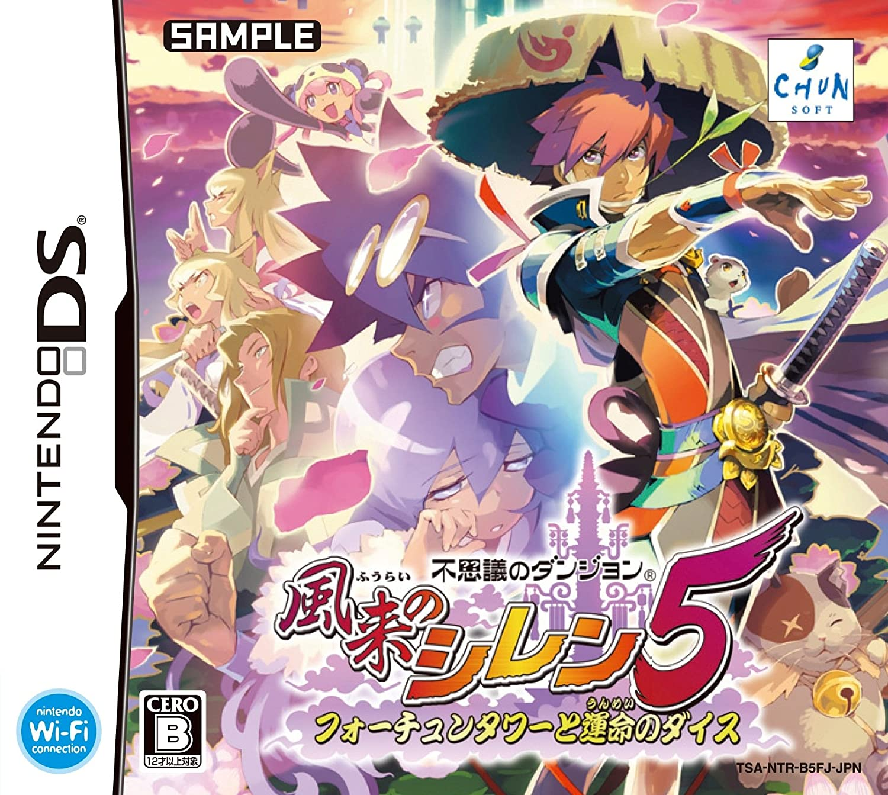
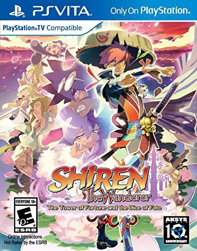
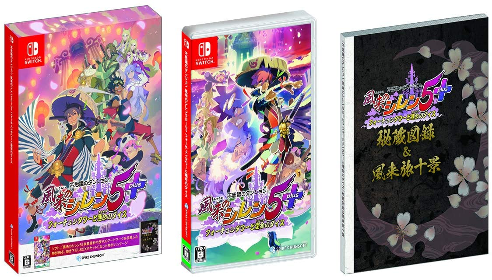

Welcome! This is a wiki for Shiren the Wanderer: The Tower of Fortune and the Dice of Fate. It's a work-in-progress, so some pages don't have content yet, and others may change in time.

If you spot any errors or wish to contribute, please post on [/r/ShirenTheWanderer](https://reddit.com/r/ShirenTheWanderer) or join the community [Discord server](https://discord.gg/5y7UDFc) and ping shark.

Of course, you're welcome to join just to hang out with other players and romhackers too.

A significant portion of the information found on this site is hand-translated from the [Japanese wiki](https://seesaawiki.jp/w/shiren5/).

<table>
  <tr>
    <th>Game Console</th>
    <td>Nintendo DS</td>
    <td>PlayStation Vita</td>
    <td>Nintendo Switch</td>
    <td>PC (Steam)</td>
  </tr>
  <tr>
    <th>Release Date</th>
    <td>December 9th, 2010</td>
    <td>July 26, 2016</td>
    <td colspan="2">December 2nd, 2020</td>
  </tr>
  <tr>
    <th>Price</th>
    <td>2,480 JPY</td>
    <td>$39.99</td>
    <td colspan="2">Digital: $19.99 / £17.99</td>
  </tr>
  <tr>
    <th>Players</th>
    <td>1~2</td>
    <td>1~2</td>
    <td colspan="2">1</td>
  </tr>
  <tr>
    <th>Link</th>
    <td>-</td>
    <td>-</td>
    <td><a href="https://www.nintendo.com/games/detail/shiren-the-wanderer-the-tower-of-fortune-and-the-dice-of-fate-switch/">Nintendo eShop (NA)</a> <a href="https://www.nintendo.co.uk/Games/Nintendo-Switch-download-software/Shiren-the-Wanderer-The-Tower-of-Fortune-and-the-Dice-of-Fate-1874057.html">Nintendo eShop (UK)</a></td>
    <td><a href="https://store.steampowered.com/app/1178790/">Steam</a></td>
  </tr>
  <tr>
    <th>Official Site</th>
    <td><a href="https://www.spike-chunsoft.co.jp/shiren5/">DS (Japanese)</a></td>
    <td><a href="https://www.spike-chunsoft.co.jp/shiren5plus/vita/">Vita (Japanese)</a></td>
    <td colspan="2"><a href="https://www.spike-chunsoft.co.jp/shiren5plus/en/">Nintendo Switch / Steam (English)</a></td>
  </tr>
  <tr>
    <th>Developer</th>
    <td>Chunsoft</td>
    <td>Spike Chunsoft</td>
    <td colspan="2">Spike Chunsoft</td>
  </tr>
  <tr>
    <th>Box Art</th>
    <td class="boxArt"></td>
    <td class="boxArt"></td>
    <td colspan="2" class="boxArt"></td>
  </tr>
</table>
