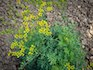
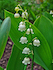
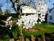
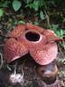
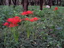
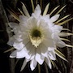
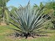

# Other List

<table class="itemListCentered3">
  <tr>
    <th colspan="3">Item Book Order</th>
  </tr>
  <tr>
    <th>1</th>
    <th>2</th>
    <th>3</th>
  </tr>
  <tr>
    <td class="highlightLightblue"><a href="#gitan">Gitan</a></td>
    <td class="highlightLightblue"><a href="#catstones">Indigo Cat</a></td>
    <td class="highlightLightblue"><a href="#flowers">Rafflesia</a></td>
  </tr>
  <tr>
    <td class="highlightLightblue"><a href="#point-card">Point Card</a></td>
    <td class="highlightLightblue"><a href="#catstones">Purple Cat</a></td>
    <td class="highlightLightblue"><a href="#flowers">Sunflower</a></td>
  </tr>
  <tr>
    <td class="highlightLightblue"><a href="#catstones">Red Cat</a></td>
    <td class="highlightLightblue"><a href="#item-id">Dirt</a></td>
    <td class="highlightLightblue"><a href="#flowers">Red Spider Lily</a></td>
  </tr>
  <tr>
    <td class="highlightLightblue"><a href="#catstones">Orange Cat</a></td>
    <td class="highlightLightblue"><a href="#flowers">Rue</a></td>
    <td class="highlightLightblue"><a href="#flowers">Gentian</a></td>
  </tr>
  <tr>
    <td class="highlightLightblue"><a href="#catstones">Yellow Cat</a></td>
    <td class="highlightLightblue"><a href="#flowers">Lily of the Valley</a></td>
    <td class="highlightLightblue"><a href="#flowers">Queen of the Night</a></td>
  </tr>
  <tr>
    <td class="highlightLightblue"><a href="#catstones">Green Cat</a></td>
    <td class="highlightLightblue"><a href="#flowers">Rose</a></td>
    <td class="highlightLightblue"><a href="#flowers">Agave</a></td>
  </tr>
  <tr>
    <td class="highlightLightblue"><a href="#catstones">Blue Cat</a></td>
    <td class="highlightLightblue"><a href="#flowers">Plum Tree</a></td>
    <td></td>
  </tr>
</table>

# Summary

<table class="itemListCentered3">
  <thead>
    <tr>
      <th>Name</th>
      <th>Info</th>
    </tr>
  </thead>
  <tbody>
    <tr>
      <td class="highlightYellow"><a href="#gitan">Gitan</a></td>
      <td class="leftText">Money. Deals damage equal to 1/10 of value when thrown.</td>
    </tr>
    <tr>
      <td class="highlightYellow"><a href="#point-card">Point Card</a></td>
      <td class="leftText">Step on Point Switches while carrying it to accumulate points. Exchange points for items in Nekomaneki Village.</td>
    </tr>
    <tr>
      <td class="highlightYellow"><a href="#catstone">Catstones</a></td>
      <td class="leftText">Collect all 7 colors and go to Inori Cave to have a wish granted.</td>
    </tr>
    <tr>
      <td class="highlightYellow"><a href="#dirt">Dirt</a></td>
      <td class="leftText">Dirt inside of a pot. Turns into grass items over time.</td>
    </tr>
    <tr>
      <td class="highlightYellow"><a href="#flowers">Flowers</a></td>
      <td class="leftText">Items that can only exist inside of a Floramorph Pot.</td>
    </tr>
    <tr>
      <td class="highlightYellow"><a href="#friendship-license">Friendship License</a></td>
      <td class="leftText">Carry it and the monster family matching the license will be your ally. Chance to turn into a Blank Scroll when you exit a floor where the monster family matching the license appears.</td>
    </tr>
    <tr>
      <td class="highlightYellow"><a href="#ndubba">N'dubba</a></td>
      <td class="leftText">N'dubba family monster disguised as an item.</td>
    </tr>
    <tr>
      <td class="highlightYellow"><a href="#unknown">Unknown</a></td>
      <td class="leftText">Contents of "Open" type pots.</td>
    </tr>
    <tr>
      <td class="highlightYellow"><a href="#water">Water</a></td>
      <td class="leftText">Contents of a filled Water Pot.</td>
    </tr>
    <tr>
      <td class="highlightYellow"><a href="#hot-spring-water">Hot Spring Water</a></td>
      <td class="leftText">Contents of a filled Heavenly Pot.</td>
    </tr>
  </tbody>
</table>

# Details

#### Locations Key

|Letter|Meaning|
|-|-|
|E|Elite store, Pick-A-Choice, Shiny Object (yellow, blue)|

### Gitan

Currency that gets picked up automatically when you walk on top of it. 
Hold B to step on Gitan without picking it up, and either trade it with an item 
or insert it into a Preservation Pot to use the bag of Gitan as an item.

Deals damage equal to 1/10 of the Gitan's value when thrown. 
Deals damage equal to value if blessed, and deals 2 damage if sealed. 
This is the same if you get hit by Gitan due to a Kappa Troll or Kleptoad. 
Froggo family monsters will restore HP if they get hit by Gitan.

Gitan thrown by Kojirouta has piercing properties, and is never blessed or sealed. 
Froggos, Gitan Mamel (2000G), and Ultra Gazer (5000G) always drop Gitan.

<table class="itemDetailsTable">
  <tr>
    <th>Item Book</th>
    <td>Currency used in exchange for goods and services. Basically, you'll need it to buy stuff. You can throw it and deal damage depending on how much you throw.</td>
  </tr>
</table>

Locations:

- Tanuki Password: Tao's Stash (5000G)

### Point Card

Step on Point Switches while carrying it to accumulate points. 
Double points if blessed, but the blessing wears off after one use. 
No effect if it's sealed or inside a pot.

The Point Shop can reissue it without a loss of points for 1000 Gitan. 
If you end the game without saving or set the system time backward, 
your point balance will be set to 0. (even if you weren't carrying the card)

<table class="itemDetailsTable">
  <tr>
    <th>Item Book</th>
    <td>Take this and step on a Point Switch to gain points. Even if you lose this card, your points stay with you, so you can have your card reissued. (The effect is nullified when it's inside a pot.) Your balance is n points.</td>
  </tr>
</table>

### Catstones

Treasures that can be found in 7 different colors. 
Bring all seven colors to the end of Inori Cave to have a wish granted. 
They can't be inserted into pots, so be prepared to have limited inventory space. 
See Tips and Tricks for tips on quickly obtaining Catstones.

Colors: Red Cat, Orange Cat, Yellow Cat, Green Cat, Blue Cat, Indigo Cat, Purple Cat.

<table class="itemDetailsTable">
  <tr>
    <th>Item Book</th>
    <td>One of the seven colored cats. [color description] Gather all seven colored cats and go to a designated location to have a wish granted.</td>
  </tr>
</table>

Locations:

- Purchase from Poo for 3000G each. (post-game, talk to Ah in Hotel Nekomaneki)
- Tanuki Password: Banana Prince (Red Cat)
- Tanuki Password: Pumphantasm (Orange Cat)
- Tanuki Password: Kitty Cat (Yellow Cat)
- Tanuki Password: Green Grass (Green Cat)
- Tanuki Password: Chunsoft (Blue Cat)
- Tanuki Password: Shinya Kano (Indigo Cat)
- Tanuki Password: Perfect (Purple Cat)

 

<table class="locationTable">
  <tr>
    <th>Trail</th>
    <th>Past</th>
    <th>Present</th>
    <th>Future</th>
    <th>Fortune</th>
    <th>Miracle</th>
    <th>Rocks</th>
    <th>Gen</th>
    <th>Pitfall</th>
    <th>Manor</th>
  </tr>
  <tr>
    <td>E</td>
    <td>E</td>
    <td>E</td>
    <td>E</td>
    <td>E</td>
    <td>-</td>
    <td>-</td>
    <td>E</td>
    <td>E</td>
    <td>E</td>
  </tr>
  <tr>
    <th>Bizarre</th>
    <th>Onigiri</th>
    <th>Chasm</th>
    <th>Well</th>
    <th>Lake</th>
    <th>Inori</th>
    <th>Old</th>
    <th>Descent</th>
    <th></th>
    <th></th>
  </tr>
  <tr>
    <td>E</td>
    <td>E</td>
    <td>E</td>
    <td>E</td>
    <td>E</td>
    <td>E</td>
    <td>E</td>
    <td>E</td>
    <td></td>
    <td></td>
  </tr>
</table>

### Dirt

Dirt inside a pot, caused by Scoopie family monster special attacks. 
Generally, pots that have been filled with dirt are unusable. 
Dirt has a chance to transform into a grass item when you change floors. 
Grass items generated from Dirt will never be blessed or sealed. 
If the capacity of a pot filled with Dirt is increased using a Pot God Scroll, 
the added slot will automatically fill with Dirt.

Scoopies throwing dirt into pots:

- Preservation
    - Pot fills with dirt, can't remove items until the dirt changes to grass.
- Ordinary, Synthesis, Sale, Presto, Identify, Exorcism, Blessing, Curse, Sticky, Unbreakable, Upgrade, Degrade, Lucky, Unlucky, 4-2-8, Modder's, Floramorph, Grilling
    - Pot fills with dirt.
- Hide, Heal, Hilarious, Zalokleft, Klein, Monster, Water, Shrine Maid., Heavenly
    - Dirt can't go inside the pot.
- Black Hole
    - Capacity is reduced to 0.
- Fever
    - If empty, the pot shatters. If there was an item inside, the pot explodes.
- Zen, Dodger, Perceptive, Reflection
    - Capacity is reduced to 0, and the fragrance effect activates.

 

<table class="detail-table">
  <tr>
    <th>Item Book</th>
    <td>There's dirt in this pot! Your hand can't go inside because of all the dirt. You look closely and see a small leaf inside.</td>
  </tr>
</table>

### Flowers

Items that can only exist inside of a Floramorph Pot. 
The flowers will vanish if you use an Extraction Scroll or break the pot.

The What you need is...? problem in Statue Cave has a Floramorph Pot 
which can be used to quickly fill out the flower entries in the Item Book.

<table class="itemDetailsTable">
  <tr>
    <th>Rue</th>
    <td>This small yellow flower looks adorable. You also feel like it's giving off an ominous aura, but I'm sure that's just your imagination. Pay no attention to it.</td>
    <td></img></td>
  </tr>
  <tr>
    <th>Lily of the Valley</th>
    <td>The row of bell-shapred white flowers looks beautiful. However, despite their looks, they're highly poisonous.</td>
    <td></img></td>
  </tr>
  <tr>
    <th>Rose</th>
    <td>They say that every rose has its thorn, just like every cowboy has a sad, sad song. Thorns on weeds are just annoying, but somehow a rose's thorns are seen as part of the flower's charm. It is almost as if the flowers themselves cast some kind of magic.</td>
    <td></img></td>
  </tr>
  <tr>
    <th>Plum Tree</th>
    <td>In springtime, white or pink flowers bloom on this plant. They're not as elegant as cherry blossoms, but the plum tree still has its own distinct, stately grace.</td>
    <td></img></td>
  </tr>
  <tr>
    <th>Rafflesia</th>
    <td>It stinks. It stinks SO bad. It does this to attract flies that will carry its pollen. Why did it have to be like that? Was having bees and butterflies collect pollen too mainstream for it? This is yet another mystery of the natural world.</td>
    <td></img></td>
  </tr>
  <tr>
    <th>Sunflower</th>
    <td>A large, round, bright yellow flower that turns itself to face the sun. If the seeds bear fruit, you can attract a Cheer-Ham and get it to ally with you.</td>
    <td></img></td>
  </tr>
  <tr>
    <th>Red Spider Lily</th>
    <td>On top of its thin stalk is a bright red flower with thin petals that spread outward. The flower looks graceful on its own, but they're a breathtaking sight when they grow in clusters. Some say that the flower is a bad omen. Could it be poisonous?</td>
    <td></img></td>
  </tr>
  <tr>
    <th>Gentian</th>
    <td>When you're traveling o'er hills and dales, you can look down and see these purple flowers. You feel compelled to make the dungeon a calming place befitting of these flowers. Part of the series of Floramorph Pot.</td>
    <td></img></td>
  </tr>
  <tr>
    <th>Queen of the Night</th>
    <td>This large white flower blooms at night and wilts by the morning. A transient beauty of the evening, if you will. While it's inside the pot it stays blossoming. This pot's wonderful, but it kills some of the romance of these things.</td>
    <td></img></td>
  </tr>
  <tr>
    <th>Agave</th>
    <td>This plant is famous for the liquor that that is made from nectar extracted from its core. It was taken to Cahitan Island from Texas and is being grown as a new kind of experimental crop.</td>
    <td></img></td>
  </tr>
</table>

### Friendship License

※ This item does not get registered to the Item Book

Item that serves as a replacement for monster meat found in previous games. 
Friendship Licenses are sold as individual monster licenses (example: Mamel Lic.), 
and can be purchased at the License Shop in Nekomaneki Village. 
They can also be obtained by defeating Dueling status monsters, 
or by reading a Nixer Scroll when a monster is adjacent to you.

If the license is in your inventory and not inside a pot, the matching monster family will 
become your ally. (example: Mamel Lic. = Mamel, Pit Mamel, Cave Mamel, Gitan Mamel) 
Hostile monsters won't attack ally monsters, and ally monsters who defeat enemies 
won't level up or grant experience points to Shiren.

If Shiren attacks an ally monster, all licenses in your inventory for that monster vanish, 
including licenses inside pots. Licenses inside pots or with sealed status are ineffective. 
If you only have a sealed license, attacking a matching monster won't make it vanish.

Licenses can turn into a Blank Scroll when you exit a floor where the matching monster appears. 
This also applies to licenses inside pots, and occurs roughly around 10\~20% of the time. 
Maneater licenses only turn into a Blank Scroll when you exit a floor where they spawned. 
Night monsters won't become your ally, and attacking a matching night monster 
won't make licenses vanish.

<table class="itemDetailsTable">
  <tr>
    <th>Item Book</th>
    <td>If you hold a monster's license, that particular type of monster will become your ally in the dungeon. Attacking an allied monster will destroy the license. If you exit the floor where that monster appears, the license may change into a different item.</td>
  </tr>
</table>

### N'dubba

N'dubba, N'twyn, N'mach, or N'dup disguised as an item. 
The monster reveals itself if you try to use the item or throw it at an enemy. 
It'll fail to reveal itself if you're currently in Thief Mode, and will vanish instead. 
It's somewhat common to see an N'mach when you return from a deep dungeon.

<table class="itemDetailsTable">
  <tr>
    <th>N'mach</th>
    <td>This item is not what it appears! It's an unscrupulous monster mimicking an item! It hasn't noticed that its chicanery has been uncovered.</td>
  </tr>
</table>

### Unknown

※ This item does not get registered to the Item Book

Exists in select pots, and shows its effect when the pot is opened or an Extraction Scroll is used. 
List includes Heal, Zalokleft, Monster, Shrine Maid., Klein, and Hilarious pots.

<table class="itemDetailsTable">
  <tr>
    <th>Item Book</th>
    <td>Unknown contents. Open it to figure out what it is.</td>
  </tr>
</table>

### Water

※ This item does not get registered to the Item Book

Exists inside a filled Water Pot, and can be splashed 1 tile ahead for various effects. 
See the Water Pot section on the Pots page for usage details.

<table class="itemDetailsTable">
  <tr>
    <th>Item Book</th>
    <td>When wet, fire monsters will take damage, machines will malfunction, and blades will rust. There are lots of effects to it.</td>
  </tr>
</table>

### Hot Spring Water

※ This item does not get registered to the Item Book

Exists inside a Heavenly Pot, which can be filled at the hot spring in Inori Village. 
Use it to fully restore Shiren's HP and cure most status conditions. 
Can also be splashed like a Water Pot to heal other creatures. 
Unlike Water Pots, scrolls won't get wet, and equipment won't rust.

Heavenly Pots can only be used in dungeons that allow carry-in items, 
which limits its usage to main story dungeons, Inori Cave, and Lost Well. 
Plus it can only be used 3 times, so it likely won't last until the end of 99F dungeons. 
Further, it's so rare that you don't want to discard it after using it, and carrying it 
comes with the risk of it shattering from a Trip Trap.

You can heal allies using items like Immunity Scroll and Heal Grass, 
so really, it's probably best to just keep the pot inside your storage.

<table class="itemDetailsTable">
  <tr>
    <th>Item Book</th>
    <td>When Shiren and allies are splashed with it, it will restore most of their HP and cure status ailments. A slight sulfuric smell wafts upward from the steam that rises from the milky water. If only you could use this water with Hide Pot.</td>
  </tr>
</table>
