# Shield List

<table class="itemListCentered">
  <tr>
    <th colspan="6">Item Book Order</th>
  </tr>
  <tr>
    <th>1</th>
    <th>2</th>
    <th>3</th>
    <th>4</th>
    <th>5</th>
    <th>6</th>
  </tr>
  <tr>
    <td class="highlightLightblue"><a href="#plain-targe">Plain Targe</a></td>
    <td class="highlightLightblue"><a href="#fuuma-shield">Fuuma Shield</a></td>
    <td class="highlightOrange"><a href="#counter-shield">Counter Shield</a></td>
    <td class="highlightOrange"><a href="#gyadon-blocker">Gyadon Blocker</a></td>
    <td class="highlightOrange"><a href="#paupers-plank">Pauper's Plank</a></td>
    <td class="highlightLightblue"><a href="#fox-shield">Fox Shield</a></td>
  </tr>
  <tr>
    <td class="highlightLightblue"><a href="#tin-shield">Tin Shield</a></td>
    <td class="highlightOrange"><a href="#gold-shield">Gold Shield</a></td>
    <td class="highlightOrange"><a href="#student-shield">Student Shield</a></td>
    <td class="highlightOrange"><a href="#snake-shield">Snake Shield</a></td>
    <td class="highlightOrange"><a href="#rush-shield">Rush Shield</a></td>
    <td class="highlightLightblue"><a href="#helix-shield">Helix Shield</a></td>
  </tr>
  <tr>
    <td class="highlightLightblue"><a href="#iron-targe">Iron Targe</a></td>
    <td class="highlightOrange"><a href="#diet-shield">Diet Shield</a></td>
    <td class="highlightOrange"><a href="#bowl-shield">Bowl Shield</a></td>
    <td class="highlightOrange"><a href="#steady-shield">Steady Shield</a></td>
    <td class="highlightOrange"><a href="#blazing-shield">Blazing Shield</a></td>
    <td></td>
  </tr>
  <tr>
    <td class="highlightLightblue"><a href="#wolfshead">Wolfshead</a></td>
    <td class="highlightOrange"><a href="#heavy-shield">Heavy Shield</a></td>
    <td class="highlightOrange"><a href="#spry-shield">Spry Shield</a></td>
    <td class="highlightOrange"><a href="#anti-gaze-trge">Anti-Gaze Trge</a></td>
    <td class="highlightOrange"><a href="#onigiri-shield">Onigiri Shield</a></td>
    <td></td>
  </tr>
  <tr>
    <td class="highlightLightblue"><a href="#beast-shield">Beast Shield</a></td>
    <td class="highlightOrange"><a href="#midnight-shield">Midnight Shield</a></td>
    <td class="highlightOrange"><a href="#blast-shield">Blast Shield</a></td>
    <td class="highlightOrange"><a href="#swap-shield">Swap Shield</a></td>
    <td class="highlightOrange"><a href="#parry-shield">Parry Shield</a></td>
    <td></td>
  </tr>
  <tr>
    <td class="highlightLightblue"><a href="#targite">Targite</a></td>
    <td class="highlightOrange"><a href="#day-shield">Day Shield</a></td>
    <td class="highlightOrange"><a href="#lock-shield">Lock Shield</a></td>
    <td class="highlightOrange"><a href="#shoddy-plank">Shoddy Plank</a></td>
    <td class="highlightOrange"><a href="#nirvana-board">Nirvana Board</a></td>
    <td></td>
  </tr>
  <tr>
    <td class="highlightLightblue"><a href="#red-shield">Red Shield</a></td>
    <td class="highlightOrange"><a href="#binary-shield">Binary Shield</a></td>
    <td class="highlightOrange"><a href="#safe-shield">Safe Shield</a></td>
    <td class="highlightOrange"><a href="#glass-buckler">Glass Buckler</a></td>
    <td class="highlightLightblue"><a href="#pathetic-shield">Pathetic Shield</a></td>
    <td></td>
  </tr>
</table>

# Lv8 Summary

<table class="itemTable">
  <thead>
    <tr>
      <th>Lv1</th>
      <th>Lv8</th>
      <th>Def</th>
      <th>Max</th>
      <th>Ct</th>
      <th>Rune</th>
      <th>Added</th>
      <th>Exp</th>
      <th>Resonance</th>
    </tr>
  </thead>
  <tbody>
    <tr>
      <td class="highlightLightblue"><a href="#plain-targe">Plain Targe</a></td>
      <td class="highlightYellow">Demon's Guard</td>
      <td>15</td>
      <td>99</td>
      <td>∞</td>
      <td>-</td>
      <td>Lively (Lv4) CR Diet (Lv8)</td>
      <td>28,410</td>
      <td><a href="/shiren5/item/weapons#ordinary-stick">Ordinary Stick</a> (Equip 2 bracelets)</td>
    </tr>
    <tr>
      <td class="highlightLightblue"><a href="#tin-shield">Tin Shield</a></td>
      <td class="highlightYellow">Bronze Bulwark</td>
      <td>18</td>
      <td>99</td>
      <td>∞</td>
      <td>-</td>
      <td>Lively (Lv4) Rustproof (Lv8)</td>
      <td>34,725</td>
      <td><a href="/shiren5/item/weapons#tin-blade">Tin Blade</a> (Equip 2 bracelets)</td>
    </tr>
    <tr>
      <td class="highlightLightblue"><a href="#iron-targe">Iron Targe</a></td>
      <td class="highlightYellow">Heirloom Shield</td>
      <td>20</td>
      <td>99</td>
      <td>∞</td>
      <td>-</td>
      <td>Uplifting (Lv4)</td>
      <td>41,070</td>
      <td><a href="/shiren5/item/weapons#katana">Katana</a> (Equip 2 bracelets)</td>
    </tr>
    <tr>
      <td class="highlightLightblue"><a href="#wolfshead">Wolfshead</a></td>
      <td class="highlightYellow">Epic Wolfshead</td>
      <td>22</td>
      <td>99</td>
      <td>∞</td>
      <td>-</td>
      <td>Lively (Lv4) Rustproof (Lv5)</td>
      <td>44,250</td>
      <td><a href="/shiren5/item/weapons#dotanuki">Dotanuki</a> (Equip 2 bracelets)</td>
    </tr>
    <tr>
      <td class="highlightLightblue"><a href="#beast-shield">Beast Shield</a></td>
      <td class="highlightYellow">Beastmaster</td>
      <td>23</td>
      <td>99</td>
      <td>∞</td>
      <td>-</td>
      <td>Uplifting (Lv4) Enhancing (Lv8)</td>
      <td>50,600</td>
      <td><a href="/shiren5/item/weapons#beast-fang">Beast Fang</a> (Equip 2 bracelets)</td>
    </tr>
    <tr>
      <td class="highlightLightblue"><a href="#targite">Targite</a></td>
      <td class="highlightYellow">Galaxy Guard</td>
      <td>25</td>
      <td>99</td>
      <td>∞</td>
      <td>-</td>
      <td>Uplifting (Lv4) Rustproof (Lv5) Anti-Theft (Lv8)</td>
      <td>57,000</td>
      <td><a href="/shiren5/item/weapons#bladite">Bladite</a> (Equip 2 bracelets)</td>
    </tr>
    <tr>
      <td class="highlightLightblue"><a href="#red-shield">Red Shield</a></td>
      <td class="highlightYellow">Shugouseki</td>
      <td>27</td>
      <td>99</td>
      <td>∞</td>
      <td>-</td>
      <td>Uplifting (Lv3) Anti-Fire (Lv8) Anti-Peck (Lv8)</td>
      <td>63,350</td>
      <td><a href="/shiren5/item/weapons#red-blade">Red Blade</a> (Equip 2 bracelets)</td>
    </tr>
    <tr>
      <td class="highlightLightblue"><a href="#fuuma-shield">Fuuma Shield</a></td>
      <td class="highlightYellow">Fuuma Legend</td>
      <td>30</td>
      <td>99</td>
      <td>∞</td>
      <td>-</td>
      <td>Tiger Mom (Lv8)</td>
      <td>107,700</td>
      <td><a href="/shiren5/item/weapons#kabura-katana">Kabura Katana</a> (Attack damage +5) <a href="/shiren5/item/weapons#fuuma-sword">Fuuma Sword</a> (Attack damage +5)</td>
    </tr>
    <tr>
      <td class="highlightOrange"><a href="#gold-shield">Gold Shield</a></td>
      <td class="highlightYellow">24K Gold Shield</td>
      <td>14</td>
      <td>99</td>
      <td>∞</td>
      <td>Rustproof</td>
      <td>Pain Fueled (Lv8)</td>
      <td>31,600</td>
      <td><a href="/shiren5/item/weapons#dull-gold-edge">Dull Gold Edge</a> (Max strength +3)</td>
    </tr>
    <tr>
      <td class="highlightOrange"><a href="#diet-shield">Diet Shield</a></td>
      <td class="highlightYellow">Surfeit Shield</td>
      <td>12</td>
      <td>99</td>
      <td>∞</td>
      <td>CR Diet</td>
      <td>Energizing (Lv8)</td>
      <td>63,000</td>
      <td>-</td>
    </tr>
    <tr>
      <td class="highlightOrange"><a href="#heavy-shield">Heavy Shield</a>※</td>
      <td class="highlightYellow">Ultimate Aegis</td>
      <td>28</td>
      <td>99</td>
      <td>∞</td>
      <td>Hungry</td>
      <td>Unmoving (Lv8) Anti-Burgle (Lv8)</td>
      <td>54,500</td>
      <td>-</td>
    </tr>
    <tr>
      <td class="highlightOrange"><a href="#midnight-shield">Midnight Shield</a>※</td>
      <td class="highlightYellow">Night Lord</td>
      <td>15</td>
      <td>99</td>
      <td>∞</td>
      <td>Nocturnal</td>
      <td>Rustproof (Lv6)</td>
      <td>54,500</td>
      <td><a href="/shiren5/item/weapons#breeze-blade">Breeze Blade</a> (Equipped items won't rust) <a href="/shiren5/item/weapons#torch">Torches</a> (Night enemies miss more)</td>
    </tr>
    <tr>
      <td class="highlightOrange"><a href="#day-shield">Day Shield</a>※</td>
      <td class="highlightYellow">Daytime Queen</td>
      <td>15</td>
      <td>99</td>
      <td>∞</td>
      <td>Diurnal</td>
      <td>Rustproof (Lv6)</td>
      <td>54,500</td>
      <td><a href="/shiren5/item/weapons#bright-blade">Bright Blade</a> (Read scrolls in the dark)</td>
    </tr>
    <tr>
      <td class="highlightOrange"><a href="#binary-shield">Binary Shield</a></td>
      <td class="highlightYellow">One/Zero Hero</td>
      <td>17</td>
      <td>99</td>
      <td>∞</td>
      <td>Bit</td>
      <td>Magi-Twister (Lv6)</td>
      <td>88,800</td>
      <td>-</td>
    </tr>
    <tr>
      <td class="highlightOrange"><a href="#counter-shield">Counter Shield</a></td>
      <td class="highlightYellow">Killer Counter</td>
      <td>13</td>
      <td>99</td>
      <td>∞</td>
      <td>Retribution</td>
      <td>Tiger Mom (Lv8)</td>
      <td>50,800</td>
      <td><a href="/shiren5/item/bracelets#strength-bracelet">Strength Bracelet</a> (Counter damage doubled)</td>
    </tr>
    <tr>
      <td class="highlightOrange"><a href="#student-shield">Student Shield</a></td>
      <td class="highlightYellow">Valedictorian</td>
      <td>15</td>
      <td>99</td>
      <td>∞</td>
      <td>Tiger Mom</td>
      <td>Lively (Lv5) Enhancing (Lv8)</td>
      <td>63,000</td>
      <td><a href="/shiren5/item/bracelets#growth-bracelet">Growth Bracelet</a> (Bracelet exp gain doubled)</td>
    </tr>
    <tr>
      <td class="highlightOrange"><a href="#bowl-shield">Bowl Shield</a></td>
      <td class="highlightYellow">Omega Bowl</td>
      <td>13</td>
      <td>99</td>
      <td>∞</td>
      <td>Pain Fueled</td>
      <td>Rustproof (Lv6)</td>
      <td>77,000</td>
      <td>-</td>
    </tr>
    <tr>
      <td class="highlightOrange"><a href="#spry-shield">Spry Shield</a></td>
      <td class="highlightYellow">Artful Dodger</td>
      <td>13</td>
      <td>99</td>
      <td>∞</td>
      <td>Agile</td>
      <td>Rustproof (Lv5)</td>
      <td>88,800</td>
      <td><a href="/shiren5/item/weapons#myopic-masher">Myopic Masher</a> (Attack and Defense +3)</td>
    </tr>
    <tr>
      <td class="highlightOrange"><a href="#blast-shield">Blast Shield</a></td>
      <td class="highlightYellow">Bomb Shelter</td>
      <td>15</td>
      <td>99</td>
      <td>∞</td>
      <td>Anti-Blast</td>
      <td>Rustproof (Lv8) Anti-Burgle (Lv8)</td>
      <td>77,700</td>
      <td><a href="/shiren5/item/weapons#crescent-katana">Crescent Katana</a> (Attack and Defense +3)</td>
    </tr>
    <tr>
      <td class="highlightOrange"><a href="#lock-shield">Lock Shield</a></td>
      <td class="highlightYellow">Retina Scan</td>
      <td>12</td>
      <td>99</td>
      <td>∞</td>
      <td>Anti-Theft</td>
      <td>Anti-Blast (Lv8)</td>
      <td>44,500</td>
      <td>-</td>
    </tr>
    <tr>
      <td class="highlightOrange"><a href="#safe-shield">Safe Shield</a></td>
      <td class="highlightYellow">Fort Knox</td>
      <td>13</td>
      <td>99</td>
      <td>∞</td>
      <td>Anti-Burgle</td>
      <td>Anti-Blast (Lv8)</td>
      <td>44,800</td>
      <td>-</td>
    </tr>
    <tr>
      <td class="highlightOrange"><a href="#gyadon-blocker">Gyadon Blocker</a></td>
      <td class="highlightYellow">Gyad-NON!</td>
      <td>14</td>
      <td>99</td>
      <td>∞</td>
      <td>Anti-Peck</td>
      <td>Agile (Lv8)</td>
      <td>77,700</td>
      <td>-</td>
    </tr>
    <tr>
      <td class="highlightOrange"><a href="#snake-shield">Snake Shield</a></td>
      <td class="highlightYellow">Dragonkeeper</td>
      <td>17</td>
      <td>99</td>
      <td>∞</td>
      <td>Anti-Fire</td>
      <td>Retribution (Lv8)</td>
      <td>84,000</td>
      <td><a href="/shiren5/item/weapons#lizard-lasher">Lizard Lasher</a> (Attack and Defense +3)</td>
    </tr>
    <tr>
      <td class="highlightOrange"><a href="#steady-shield">Steady Shield</a>※</td>
      <td class="highlightYellow">Stalwart Shield</td>
      <td>14</td>
      <td>99</td>
      <td>∞</td>
      <td>Unmoving</td>
      <td>Retribution (Lv8)</td>
      <td>44,500</td>
      <td>-</td>
    </tr>
    <tr>
      <td class="highlightOrange"><a href="#anti-gaze-trge">Anti-Gaze Trge</a></td>
      <td class="highlightYellow">Gazebuster</td>
      <td>13</td>
      <td>99</td>
      <td>∞</td>
      <td>Anti-Hypno</td>
      <td>Agile (Lv8)</td>
      <td>63,000</td>
      <td>-</td>
    </tr>
    <tr>
      <td class="highlightOrange"><a href="#swap-shield">Swap Shield</a></td>
      <td class="highlightYellow">Mega Prismagic</td>
      <td>19</td>
      <td>99</td>
      <td>∞</td>
      <td>Magi-Twister</td>
      <td>Uplifting (Lv8) Enhancing (Lv8)</td>
      <td>77,000</td>
      <td><a href="/shiren5/item/weapons#burning-blade">Burning Blade</a> (Boost Flame Shot damage)</td>
    </tr>
    <tr>
      <td class="highlightOrange"><a href="#shoddy-plank">Shoddy Plank</a>※</td>
      <td class="highlightYellow">Worthy Shield</td>
      <td>37</td>
      <td>99</td>
      <td>∞</td>
      <td>Expendable</td>
      <td>-</td>
      <td>112,000</td>
      <td><a href="/shiren5/item/weapons#shoddy-dirk">Shoddy Dirk</a> (Equipped items won't rust)</td>
    </tr>
    <tr>
      <td class="highlightOrange"><a href="#glass-buckler">Glass Buckler</a>※</td>
      <td class="highlightYellow">Frangible Shld</td>
      <td>42</td>
      <td>99</td>
      <td>11</td>
      <td>Unsound</td>
      <td>Stupefying (Lv8)</td>
      <td>103,000</td>
      <td><a href="/shiren5/item/weapons#glass-dirk">Glass Dirk</a> (Nullifies magic bullets)</td>
    </tr>
    <tr>
      <td class="highlightOrange"><a href="#paupers-plank">Pauper's Plank</a>※</td>
      <td class="highlightYellow">Gitan Ravager</td>
      <td>17</td>
      <td>99</td>
      <td>∞</td>
      <td>Costly</td>
      <td>-</td>
      <td>54,500</td>
      <td><a href="/shiren5/item/weapons#dirk-of-debts">Dirk of Debts</a> (Enemies drop Gitan often)</td>
    </tr>
    <tr>
      <td class="highlightOrange"><a href="#rush-shield">Rush Shield</a>※</td>
      <td class="highlightYellow">The Big Badass</td>
      <td>20</td>
      <td>99</td>
      <td>∞</td>
      <td>Offensive</td>
      <td>-</td>
      <td>127,000</td>
      <td><a href="/shiren5/item/weapons#extreme-sword">Extreme Sword</a> (Equip 2 bracelets)</td>
    </tr>
    <tr>
      <td class="highlightOrange"><a href="#blazing-shield">Blazing Shield</a></td>
      <td class="highlightYellow">The Burninator</td>
      <td>11</td>
      <td>99</td>
      <td>∞</td>
      <td>-</td>
      <td>-</td>
      <td>57,000</td>
      <td><a href="/shiren5/item/weapons#torch">Torches</a> (Light up screen at night)</td>
    </tr>
    <tr>
      <td class="highlightOrange"><a href="#onigiri-shield">Onigiri Shield</a></td>
      <td class="highlightYellow">Mom's Cooking</td>
      <td>16</td>
      <td>99</td>
      <td>∞</td>
      <td>Anti-Onigiri</td>
      <td>CR Diet (Lv6)</td>
      <td>31,600</td>
      <td>-</td>
    </tr>
    <tr>
      <td class="highlightOrange"><a href="#parry-shield">Parry Shield</a></td>
      <td class="highlightYellow">Untouchable</td>
      <td>15</td>
      <td>99</td>
      <td>∞</td>
      <td>Redirecting</td>
      <td>Retribution (Lv8) Unmoving (Lv8)</td>
      <td>127,000</td>
      <td>-</td>
    </tr>
    <tr>
      <td class="highlightOrange"><a href="#nirvana-board">Nirvana Board</a>※</td>
      <td class="highlightYellow">Nirvana Tower</td>
      <td>18</td>
      <td>99</td>
      <td>∞</td>
      <td>Unfamished</td>
      <td>Rustproof (Lv8) Tiger Mom (Lv8)</td>
      <td>127,000</td>
      <td><a href="/shiren5/item/weapons#wonder-pick">Wonder Pick</a> (Max HP +30)</td>
    </tr>
    <tr>
      <td class="highlightLightblue"><a href="#pathetic-shield">Pathetic Shield</a></td>
      <td class="highlightYellow">Rising Sun Shld</td>
      <td>38</td>
      <td>99</td>
      <td>∞</td>
      <td>-</td>
      <td>-</td>
      <td>127,000</td>
      <td><a href="/shiren5/item/weapons#pathetic-blade">Pathetic Blade</a> (Lv1-7: Equip 2 bracelets) (Lv8: Foes may step back)</td>
    </tr>
    <tr>
      <td class="highlightLightblue"><a href="#fox-shield">Fox Shield</a></td>
      <td class="highlightYellow">Koharu Shield</td>
      <td>30</td>
      <td>99</td>
      <td>5</td>
      <td>-</td>
      <td>Energizing (Lv2) Adaptive (Lv3) Ability Regen (Lv5) Critproof (Lv7) Curative (Lv8)</td>
      <td>306,070</td>
      <td>-</td>
    </tr>
    <tr>
      <td class="highlightLightblue"><a href="#helix-shield">Helix Shield</a></td>
      <td class="highlightYellow">Infinautilus</td>
      <td>40</td>
      <td>99</td>
      <td>∞</td>
      <td>-</td>
      <td>Anti-Hypno (Lv8) Tiger Mom (Lv8)</td>
      <td>305,535</td>
      <td><a href="/shiren5/item/weapons#fuuma-sword">Fuuma Sword</a> (Attack damage +10) <a href="/shiren5/item/weapons#kaburagi">Kaburagi</a> (Attack damage +10)</td>
    </tr>
  </tbody>
</table>

  
※ Shield with a drawback.

# Details

#### Growth Experience

The listed experience points per level is not an accumilated total. 
Extra exp from defeating a monster will not carry forward when a shield levels up. 
(Example: 100 exp until level up, defeat an Archdragon for 240 exp, 140 exp is lost)

#### Locations Key

|Letter|Meaning|
|-|-|
|F|Floor, Monster drop (day)|
|S|Store, Peddler, Shiny Object (yellow), Monster drop (night), Maneater drop|
|P|Presto Pot|
|Z|Zalokleft drop|
|M|Mealy drop|
|E|Elite store, Pick-A-Choice, Shiny Object (yellow, blue)|

### Plain Targe

<table class="itemDetailsTable">
  <tr>
    <th>Lv1-7</th>
    <th>Lv8</th>
    <th>Lv1 Description</th>
  </tr>
  <tr>
    <td></td>
    <td></td>
    <td>An ordinary shield made from carving a hunk of wood. It's plain. It's ordinary. Its defining feature is that it's devoid of any defining features, hence the name.</td>
  </tr>
</table>

It's weak, but levels up quickly. 
Gains CR Diet at Lv8, making it worthwhile to level as a secondary shield. 
Has the highest starting upgrade limit among all shields, so it shines 
in dungeons like Gen's Turf where you can obtain lots of Blank Scrolls. 

<table class="itemDetailsTable">
  <tbody>
    <tr>
      <th>Lv</th>
      <th>Name</th>
      <th>Rune</th>
      <th>Def</th>
      <th>Max</th>
      <th>Ct</th>
      <th>Exp</th>
      <th>Buy</th>
      <th>Sell</th>
      <th>Info</th>
    </tr>
    <tr>
      <td>1</td>
      <td>Plain Targe</td>
      <td rowspan="3">-</td>
      <td>2</td>
      <td>50</td>
      <td>5</td>
      <td>-</td>
      <td>360</td>
      <td>126</td>
      <td rowspan="8">Resonance: <a href="/shiren5/item/weapons#ordinary-stick">Ordinary Stick</a> (Equip 2 bracelets)</td>
    </tr>
    <tr>
      <td>2</td>
      <td>Solid Wd. Targe</td>
      <td>4</td>
      <td>55</td>
      <td>6</td>
      <td>60</td>
      <td>460</td>
      <td>161</td>
    </tr>
    <tr>
      <td>3</td>
      <td>Hard Wd. Targe</td>
      <td>6</td>
      <td>60</td>
      <td>6</td>
      <td>450</td>
      <td>560</td>
      <td>196</td>
    </tr>
    <tr>
      <td>4</td>
      <td>Nice Wd. Targe</td>
      <td rowspan="4">Lively</td>
      <td>8</td>
      <td>65</td>
      <td>7</td>
      <td>900</td>
      <td>1160</td>
      <td>406</td>
    </tr>
    <tr>
      <td>5</td>
      <td>Fine Wd. Targe</td>
      <td>10</td>
      <td>70</td>
      <td>7</td>
      <td>1800</td>
      <td>1260</td>
      <td>441</td>
    </tr>
    <tr>
      <td>6</td>
      <td>Big Wd. Targe</td>
      <td>11</td>
      <td>75</td>
      <td>8</td>
      <td>3600</td>
      <td>1360</td>
      <td>476</td>
    </tr>
    <tr>
      <td>7</td>
      <td>Wd. Kite Shield</td>
      <td>12</td>
      <td>80</td>
      <td>8</td>
      <td>7200</td>
      <td>1460</td>
      <td>511</td>
    </tr>
    <tr>
      <td>8</td>
      <td>Demon's Guard</td>
      <td>Lively CR Diet</td>
      <td>15</td>
      <td>99</td>
      <td>∞</td>
      <td>14400</td>
      <td>2300</td>
      <td>805</td>
    </tr>
  </tbody>
</table>

Locations:

<table class="locationTable">
  <tr>
    <th>Trail</th>
    <th>Past</th>
    <th>Present</th>
    <th>Future</th>
    <th>Fortune</th>
    <th>Miracle</th>
    <th>Rocks</th>
    <th>Gen</th>
    <th>Pitfall</th>
    <th>Manor</th>
  </tr>
  <tr>
    <td>FP</td>
    <td>FP</td>
    <td>FP</td>
    <td>FPZ</td>
    <td>PZ</td>
    <td>P</td>
    <td>Novice</td>
    <td>FPZ</td>
    <td>PZ</td>
    <td>FPZ</td>
  </tr>
  <tr>
    <th>Bizarre</th>
    <th>Onigiri</th>
    <th>Chasm</th>
    <th>Well</th>
    <th>Lake</th>
    <th>Inori</th>
    <th>Old</th>
    <th>Descent</th>
    <th></th>
    <th></th>
  </tr>
  <tr>
    <td>FPZ</td>
    <td>PZM</td>
    <td>FPZ</td>
    <td>-</td>
    <td>FP</td>
    <td>FPZ</td>
    <td>PZ</td>
    <td>FPZ</td>
    <td></td>
    <td></td>
  </tr>
</table>

### Tin Shield

<table class="itemDetailsTable">
  <tr>
    <th>Lv1-7</th>
    <th>Lv8</th>
    <th>Lv1 Description</th>
  </tr>
  <tr>
    <td></td>
    <td></td>
    <td>This is a shield made of tin. It's not that strong, but it offers better protection than a Plain Targe.</td>
  </tr>
</table>

Basic weak shield. A person has to love the design to bother using it.

<table class="itemDetailsTable">
  <tbody>
    <tr>
      <th>Lv</th>
      <th>Name</th>
      <th>Rune</th>
      <th>Def</th>
      <th>Max</th>
      <th>Ct</th>
      <th>Exp</th>
      <th>Buy</th>
      <th>Sell</th>
      <th>Info</th>
    </tr>
    <tr>
      <td>1</td>
      <td>Tin Shield</td>
      <td rowspan="3">-</td>
      <td>4</td>
      <td>10</td>
      <td>4</td>
      <td>-</td>
      <td>740</td>
      <td>259</td>
      <td rowspan="8">Resonance: <a href="/shiren5/item/weapons#tin-blade">Tin Blade</a> (Equip 2 bracelets)</td>
    </tr>
    <tr>
      <td>2</td>
      <td>Good Tin Shield</td>
      <td>5</td>
      <td>17</td>
      <td>5</td>
      <td>75</td>
      <td>840</td>
      <td>294</td>
    </tr>
    <tr>
      <td>3</td>
      <td>Nice Tin Shield</td>
      <td>7</td>
      <td>24</td>
      <td>5</td>
      <td>550</td>
      <td>940</td>
      <td>329</td>
    </tr>
    <tr>
      <td>4</td>
      <td>Fine Tin Shield</td>
      <td rowspan="4">Lively</td>
      <td>9</td>
      <td>32</td>
      <td>6</td>
      <td>1100</td>
      <td>1600</td>
      <td>560</td>
    </tr>
    <tr>
      <td>5</td>
      <td>Bronze Guard</td>
      <td>11</td>
      <td>41</td>
      <td>6</td>
      <td>2200</td>
      <td>1700</td>
      <td>595</td>
    </tr>
    <tr>
      <td>6</td>
      <td>Bronze Shield</td>
      <td>13</td>
      <td>50</td>
      <td>7</td>
      <td>4400</td>
      <td>1800</td>
      <td>630</td>
    </tr>
    <tr>
      <td>7</td>
      <td>Bronze Aspis</td>
      <td>15</td>
      <td>60</td>
      <td>7</td>
      <td>8800</td>
      <td>1900</td>
      <td>665</td>
    </tr>
    <tr>
      <td>8</td>
      <td>Bronze Bulwark</td>
      <td>Lively Rustproof</td>
      <td>18</td>
      <td>99</td>
      <td>∞</td>
      <td>17600</td>
      <td>2700</td>
      <td>945</td>
    </tr>
  </tbody>
</table>

Locations:

<table class="locationTable">
  <tr>
    <th>Trail</th>
    <th>Past</th>
    <th>Present</th>
    <th>Future</th>
    <th>Fortune</th>
    <th>Miracle</th>
    <th>Rocks</th>
    <th>Gen</th>
    <th>Pitfall</th>
    <th>Manor</th>
  </tr>
  <tr>
    <td>FP</td>
    <td>FP</td>
    <td>FP</td>
    <td>FPZ</td>
    <td>PZ</td>
    <td>P</td>
    <td>Novice, Veteran</td>
    <td>FPZ</td>
    <td>PZ</td>
    <td>FPZ</td>
  </tr>
  <tr>
    <th>Bizarre</th>
    <th>Onigiri</th>
    <th>Chasm</th>
    <th>Well</th>
    <th>Lake</th>
    <th>Inori</th>
    <th>Old</th>
    <th>Descent</th>
    <th></th>
    <th></th>
  </tr>
  <tr>
    <td>FPZ</td>
    <td>PZM</td>
    <td>FPZ</td>
    <td>-</td>
    <td>FP</td>
    <td>FPZ</td>
    <td>PZ</td>
    <td>FPZ</td>
    <td></td>
    <td></td>
  </tr>
</table>

### Iron Targe

<table class="itemDetailsTable">
  <tr>
    <th>Lv1-7</th>
    <th>Lv8</th>
    <th>Lv1 Description</th>
  </tr>
  <tr>
    <td></td>
    <td>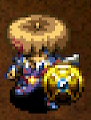</td>
    <td>This shield is made of tough iron. It's strong and stout, because it's not made from puny wood or bronze. IRON!</td>
  </tr>
</table>

Quick to level up, but low base defense. 
There are better options for 2 bracelet resonance.

<table class="itemDetailsTable">
  <tbody>
    <tr>
      <th>Lv</th>
      <th>Name</th>
      <th>Rune</th>
      <th>Def</th>
      <th>Max</th>
      <th>Ct</th>
      <th>Exp</th>
      <th>Buy</th>
      <th>Sell</th>
      <th>Info</th>
    </tr>
    <tr>
      <td>1</td>
      <td>Iron Targe</td>
      <td rowspan="3">-</td>
      <td>6</td>
      <td>10</td>
      <td>3</td>
      <td>-</td>
      <td>1300</td>
      <td>455</td>
      <td rowspan="8">Resonance: <a href="/shiren5/item/weapons#katana">Katana</a> (Equip 2 bracelets)</td>
    </tr>
    <tr>
      <td>2</td>
      <td>Good Iron Targe</td>
      <td>8</td>
      <td>17</td>
      <td>5</td>
      <td>120</td>
      <td>1400</td>
      <td>490</td>
    </tr>
    <tr>
      <td>3</td>
      <td>Rare Iron Targe</td>
      <td>10</td>
      <td>24</td>
      <td>5</td>
      <td>650</td>
      <td>1500</td>
      <td>525</td>
    </tr>
    <tr>
      <td>4</td>
      <td>Iron Aspis</td>
      <td rowspan="5">Uplifting</td>
      <td>12</td>
      <td>32</td>
      <td>7</td>
      <td>1300</td>
      <td>2100</td>
      <td>735</td>
    </tr>
    <tr>
      <td>5</td>
      <td>Rare Iron Aspis</td>
      <td>14</td>
      <td>41</td>
      <td>7</td>
      <td>2600</td>
      <td>2200</td>
      <td>770</td>
    </tr>
    <tr>
      <td>6</td>
      <td>Iron Carapace</td>
      <td>16</td>
      <td>50</td>
      <td>8</td>
      <td>5200</td>
      <td>2300</td>
      <td>805</td>
    </tr>
    <tr>
      <td>7</td>
      <td>Steel Carapace</td>
      <td>18</td>
      <td>60</td>
      <td>8</td>
      <td>10400</td>
      <td>2400</td>
      <td>840</td>
    </tr>
    <tr>
      <td>8</td>
      <td>Heirloom Shield</td>
      <td>20</td>
      <td>99</td>
      <td>∞</td>
      <td>20800</td>
      <td>2900</td>
      <td>1015</td>
    </tr>
  </tbody>
</table>

Locations:

<table class="locationTable">
  <tr>
    <th>Trail</th>
    <th>Past</th>
    <th>Present</th>
    <th>Future</th>
    <th>Fortune</th>
    <th>Miracle</th>
    <th>Rocks</th>
    <th>Gen</th>
    <th>Pitfall</th>
    <th>Manor</th>
  </tr>
  <tr>
    <td>FSP</td>
    <td>FSP</td>
    <td>FSP</td>
    <td>FSPZ</td>
    <td>FPZ</td>
    <td>P</td>
    <td>Novice, Veteran</td>
    <td>FSPZM</td>
    <td>PZ</td>
    <td>FSPZ</td>
  </tr>
  <tr>
    <th>Bizarre</th>
    <th>Onigiri</th>
    <th>Chasm</th>
    <th>Well</th>
    <th>Lake</th>
    <th>Inori</th>
    <th>Old</th>
    <th>Descent</th>
    <th></th>
    <th></th>
  </tr>
  <tr>
    <td>FSPZ</td>
    <td>SPZM</td>
    <td>FSPZ</td>
    <td>-</td>
    <td>FSP</td>
    <td>FSPZM</td>
    <td>PZM</td>
    <td>FPZ</td>
    <td></td>
    <td></td>
  </tr>
</table>

### Wolfshead

<table class="itemDetailsTable">
  <tr>
    <th>Lv1-7</th>
    <th>Lv8</th>
    <th>Lv1 Description</th>
  </tr>
  <tr>
    <td></td>
    <td>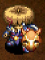</td>
    <td>The bladesmith of Dotanuki actually created this shield! It was originally called "sword breaker," and as you might have deduced, it was intended to break swords. However, because of the way it looks, everyone just calls it by its nickname.</td>
  </tr>
</table>

Defense lags behind Beast Shield at first, but only 1 point behind at Lv8. 
Dotanuki is pretty solid, so the set is viable as main equipment. 
You'll have to wait until Lv8 to add more runes if you add 6 at Lv2, 
since Lively and Rustproof will fill the 2 slots it gains while leveling.

<table class="itemDetailsTable">
  <tbody>
    <tr>
      <th>Lv</th>
      <th>Name</th>
      <th>Rune</th>
      <th>Def</th>
      <th>Max</th>
      <th>Ct</th>
      <th>Exp</th>
      <th>Buy</th>
      <th>Sell</th>
      <th>Info</th>
    </tr>
    <tr>
      <td>1</td>
      <td>Wolfshead</td>
      <td rowspan="3">-</td>
      <td>8</td>
      <td>10</td>
      <td>5</td>
      <td>-</td>
      <td>1800</td>
      <td>630</td>
      <td rowspan="8">Resonance: <a href="/shiren5/item/weapons#dotanuki">Dotanuki</a> (Equip 2 bracelets)</td>
    </tr>
    <tr>
      <td>2</td>
      <td>Good Wolfshead</td>
      <td>9</td>
      <td>17</td>
      <td>6</td>
      <td>150</td>
      <td>1900</td>
      <td>665</td>
    </tr>
    <tr>
      <td>3</td>
      <td>Nice Wolfshead</td>
      <td>10</td>
      <td>24</td>
      <td>6</td>
      <td>700</td>
      <td>2000</td>
      <td>700</td>
    </tr>
    <tr>
      <td>4</td>
      <td>Rare Wolfshead</td>
      <td>Lively</td>
      <td>14</td>
      <td>32</td>
      <td>7</td>
      <td>1400</td>
      <td>2600</td>
      <td>910</td>
    </tr>
    <tr>
      <td>5</td>
      <td>Big Wolfshead</td>
      <td rowspan="4">Lively Rustproof</td>
      <td>15</td>
      <td>41</td>
      <td>7</td>
      <td>2800</td>
      <td>3200</td>
      <td>1120</td>
    </tr>
    <tr>
      <td>6</td>
      <td>Huge Wolfshead</td>
      <td>16</td>
      <td>50</td>
      <td>8</td>
      <td>5600</td>
      <td>3300</td>
      <td>1155</td>
    </tr>
    <tr>
      <td>7</td>
      <td>Fine Wolfshead</td>
      <td>18</td>
      <td>60</td>
      <td>8</td>
      <td>11200</td>
      <td>3400</td>
      <td>1190</td>
    </tr>
    <tr>
      <td>8</td>
      <td>Epic Wolfshead</td>
      <td>22</td>
      <td>99</td>
      <td>∞</td>
      <td>22400</td>
      <td>3900</td>
      <td>1365</td>
    </tr>
  </tbody>
</table>

Locations:

<table class="locationTable">
  <tr>
    <th>Trail</th>
    <th>Past</th>
    <th>Present</th>
    <th>Future</th>
    <th>Fortune</th>
    <th>Miracle</th>
    <th>Rocks</th>
    <th>Gen</th>
    <th>Pitfall</th>
    <th>Manor</th>
  </tr>
  <tr>
    <td>FSPE</td>
    <td>FSPE</td>
    <td>FSPE</td>
    <td>FSPZE</td>
    <td>FSPZ</td>
    <td>FP</td>
    <td>Novice, Veteran</td>
    <td>FSPZME</td>
    <td>FPZM</td>
    <td>FSPZM</td>
  </tr>
  <tr>
    <th>Bizarre</th>
    <th>Onigiri</th>
    <th>Chasm</th>
    <th>Well</th>
    <th>Lake</th>
    <th>Inori</th>
    <th>Old</th>
    <th>Descent</th>
    <th></th>
    <th></th>
  </tr>
  <tr>
    <td>FSPZ</td>
    <td>SPZM</td>
    <td>FSPZM</td>
    <td>-</td>
    <td>FSP</td>
    <td>FSPZME</td>
    <td>SPZM</td>
    <td>FPZ</td>
    <td></td>
    <td></td>
  </tr>
</table>

### Beast Shield

<table class="itemDetailsTable">
  <tr>
    <th>Lv1-7</th>
    <th>Lv8</th>
    <th>Lv1 Description</th>
  </tr>
  <tr>
    <td>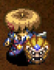</td>
    <td>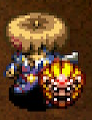</td>
    <td>The surface of the shield looks like a beast's face. It's so lifelike, it feels like it will jump out at you at any moment.</td>
  </tr>
</table>

Solid base defense for early game. 
Doesn't gain any noteworthy runes from leveling up.

<table class="itemDetailsTable">
  <tbody>
    <tr>
      <th>Lv</th>
      <th>Name</th>
      <th>Rune</th>
      <th>Def</th>
      <th>Max</th>
      <th>Ct</th>
      <th>Exp</th>
      <th>Buy</th>
      <th>Sell</th>
      <th>Info</th>
    </tr>
    <tr>
      <td>1</td>
      <td>Beast Shield</td>
      <td rowspan="3">-</td>
      <td>10</td>
      <td>10</td>
      <td>4</td>
      <td>-</td>
      <td>2400</td>
      <td>840</td>
      <td rowspan="8">Resonance: <a href="/shiren5/item/weapons#beast-fang">Beast Fang</a> (Equip 2 bracelets)</td>
    </tr>
    <tr>
      <td>2</td>
      <td>Good Beast Shld</td>
      <td>12</td>
      <td>17</td>
      <td>6</td>
      <td>200</td>
      <td>2500</td>
      <td>875</td>
    </tr>
    <tr>
      <td>3</td>
      <td>Rare Beast Shld</td>
      <td>14</td>
      <td>24</td>
      <td>6</td>
      <td>800</td>
      <td>2600</td>
      <td>910</td>
    </tr>
    <tr>
      <td>4</td>
      <td>Beast King Shld</td>
      <td rowspan="4">Uplifting</td>
      <td>16</td>
      <td>32</td>
      <td>8</td>
      <td>1600</td>
      <td>3200</td>
      <td>1120</td>
    </tr>
    <tr>
      <td>5</td>
      <td>Rare B.K. Shld</td>
      <td>18</td>
      <td>41</td>
      <td>8</td>
      <td>3200</td>
      <td>3300</td>
      <td>1155</td>
    </tr>
    <tr>
      <td>6</td>
      <td>Fine B.K. Shld</td>
      <td>20</td>
      <td>50</td>
      <td>9</td>
      <td>6400</td>
      <td>3400</td>
      <td>1190</td>
    </tr>
    <tr>
      <td>7</td>
      <td>Epic B.K. Shld</td>
      <td>21</td>
      <td>60</td>
      <td>9</td>
      <td>12800</td>
      <td>3500</td>
      <td>1225</td>
    </tr>
    <tr>
      <td>8</td>
      <td>Beastmaster</td>
      <td>Uplifting Enhancing</td>
      <td>23</td>
      <td>99</td>
      <td>∞</td>
      <td>25600</td>
      <td>4500</td>
      <td>1575</td>
    </tr>
  </tbody>
</table>

Locations:

<table class="locationTable">
  <tr>
    <th>Trail</th>
    <th>Past</th>
    <th>Present</th>
    <th>Future</th>
    <th>Fortune</th>
    <th>Miracle</th>
    <th>Rocks</th>
    <th>Gen</th>
    <th>Pitfall</th>
    <th>Manor</th>
  </tr>
  <tr>
    <td>FSPE</td>
    <td>FSPE</td>
    <td>FSPE</td>
    <td>FSPZE</td>
    <td>FSPZE</td>
    <td>FSP</td>
    <td>Veteran, Expert</td>
    <td>FSPZME</td>
    <td>FPZM</td>
    <td>FSPZM</td>
  </tr>
  <tr>
    <th>Bizarre</th>
    <th>Onigiri</th>
    <th>Chasm</th>
    <th>Well</th>
    <th>Lake</th>
    <th>Inori</th>
    <th>Old</th>
    <th>Descent</th>
    <th></th>
    <th></th>
  </tr>
  <tr>
    <td>FSPZE</td>
    <td>SPZME</td>
    <td>FSPZM</td>
    <td>-</td>
    <td>FSP</td>
    <td>FSPZME</td>
    <td>SPZM</td>
    <td>FPZM</td>
    <td></td>
    <td></td>
  </tr>
</table>

### Targite

<table class="itemDetailsTable">
  <tr>
    <th>Lv1-7</th>
    <th>Lv8</th>
    <th>Lv1 Description</th>
  </tr>
  <tr>
    <td></td>
    <td>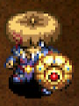</td>
    <td>One day, a tremendous tremor shook a mountain. Villagers searched and discovered a meteorite crater. The local bladesmith could hardly contain himself...</td>
  </tr>
</table>

Great base defense and rune count, and gains Anti-Theft at Lv8 
Defense reaches 16 at Lv2, making it very reliable for early game. 

<table class="itemDetailsTable">
  <tbody>
    <tr>
      <th>Lv</th>
      <th>Name</th>
      <th>Rune</th>
      <th>Def</th>
      <th>Max</th>
      <th>Ct</th>
      <th>Exp</th>
      <th>Buy</th>
      <th>Sell</th>
      <th>Info</th>
    </tr>
    <tr>
      <td>1</td>
      <td>Targite</td>
      <td rowspan="3">-</td>
      <td>12</td>
      <td>10</td>
      <td>5</td>
      <td>-</td>
      <td>3200</td>
      <td>1120</td>
      <td rowspan="8">Resonance: <a href="/shiren5/item/weapons#bladite">Bladite</a> (Equip 2 bracelets)</td>
    </tr>
    <tr>
      <td>2</td>
      <td>Aspisite</td>
      <td>16</td>
      <td>17</td>
      <td>6</td>
      <td>300</td>
      <td>3300</td>
      <td>1155</td>
    </tr>
    <tr>
      <td>3</td>
      <td>Shieldite</td>
      <td>16</td>
      <td>24</td>
      <td>7</td>
      <td>900</td>
      <td>3400</td>
      <td>1190</td>
    </tr>
    <tr>
      <td>4</td>
      <td>Good Shieldite</td>
      <td>Uplifting</td>
      <td>18</td>
      <td>32</td>
      <td>8</td>
      <td>1800</td>
      <td>4000</td>
      <td>1400</td>
    </tr>
    <tr>
      <td>5</td>
      <td>Fine Shieldite</td>
      <td rowspan="3">Uplifting Rustproof</td>
      <td>18</td>
      <td>41</td>
      <td>9</td>
      <td>3600</td>
      <td>4600</td>
      <td>1610</td>
    </tr>
    <tr>
      <td>6</td>
      <td>Epic Shieldite</td>
      <td>21</td>
      <td>50</td>
      <td>9</td>
      <td>7200</td>
      <td>4700</td>
      <td>1645</td>
    </tr>
    <tr>
      <td>7</td>
      <td>Kite Shieldite</td>
      <td>21</td>
      <td>60</td>
      <td>9</td>
      <td>14400</td>
      <td>4800</td>
      <td>1680</td>
    </tr>
    <tr>
      <td>8</td>
      <td>Galaxy Guard</td>
      <td>Uplifting Rustproof Anti-Theft</td>
      <td>25</td>
      <td>99</td>
      <td>∞</td>
      <td>28800</td>
      <td>6500</td>
      <td>2275</td>
    </tr>
  </tbody>
</table>

Locations:

<table class="locationTable">
  <tr>
    <th>Trail</th>
    <th>Past</th>
    <th>Present</th>
    <th>Future</th>
    <th>Fortune</th>
    <th>Miracle</th>
    <th>Rocks</th>
    <th>Gen</th>
    <th>Pitfall</th>
    <th>Manor</th>
  </tr>
  <tr>
    <td>E</td>
    <td>E</td>
    <td>E</td>
    <td>E</td>
    <td>FSE</td>
    <td>FS</td>
    <td>Expert</td>
    <td>FPZE</td>
    <td>FSM</td>
    <td>FSPZME</td>
  </tr>
  <tr>
    <th>Bizarre</th>
    <th>Onigiri</th>
    <th>Chasm</th>
    <th>Well</th>
    <th>Lake</th>
    <th>Inori</th>
    <th>Old</th>
    <th>Descent</th>
    <th></th>
    <th></th>
  </tr>
  <tr>
    <td>SE</td>
    <td>SE</td>
    <td>FSME</td>
    <td>-</td>
    <td>FSE</td>
    <td>FPZE</td>
    <td>SE</td>
    <td>FM</td>
    <td></td>
    <td></td>
  </tr>
</table>

### Red Shield

<table class="itemDetailsTable">
  <tr>
    <th>Lv1-7</th>
    <th>Lv8</th>
    <th>Lv1 Description</th>
  </tr>
  <tr>
    <td></td>
    <td>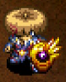</td>
    <td>This is a shield made from a hard, red mineral called Shugouseki. It's quite tough.</td>
  </tr>
</table>

Great base defense and good rune count. 
The best part of this shield is that it gains Anti-Fire and Anti-Peck at Lv8. It's worth leveling if you weren't able to synthesize Snake Shield or Dragon Grass before getting close to Archdragon or Abyssal Dragon floors. Some use it as a main shield even without set resonance.

<table class="itemDetailsTable">
  <tbody>
    <tr>
      <th>Lv</th>
      <th>Name</th>
      <th>Rune</th>
      <th>Def</th>
      <th>Max</th>
      <th>Ct</th>
      <th>Exp</th>
      <th>Buy</th>
      <th>Sell</th>
      <th>Info</th>
    </tr>
    <tr>
      <td>1</td>
      <td>Red Shield</td>
      <td rowspan="2">-</td>
      <td>14</td>
      <td>10</td>
      <td>4</td>
      <td>-</td>
      <td>4800</td>
      <td>1680</td>
      <td rowspan="8">Resonance: <a href="/shiren5/item/weapons#red-blade">Red Blade</a> (Equip 2 bracelets)</td>
    </tr>
    <tr>
      <td>2</td>
      <td>Good Red Shield</td>
      <td>16</td>
      <td>17</td>
      <td>5</td>
      <td>350</td>
      <td>4900</td>
      <td>1715</td>
    </tr>
    <tr>
      <td>3</td>
      <td>Rare Red Shield</td>
      <td rowspan="5">Uplifting</td>
      <td>17</td>
      <td>24</td>
      <td>6</td>
      <td>1000</td>
      <td>5500</td>
      <td>1925</td>
    </tr>
    <tr>
      <td>4</td>
      <td>Fine Red Shield</td>
      <td>18</td>
      <td>32</td>
      <td>6</td>
      <td>2000</td>
      <td>5600</td>
      <td>1960</td>
    </tr>
    <tr>
      <td>5</td>
      <td>Red Aspis</td>
      <td>19</td>
      <td>41</td>
      <td>7</td>
      <td>4000</td>
      <td>5700</td>
      <td>1995</td>
    </tr>
    <tr>
      <td>6</td>
      <td>Red Kite Shield</td>
      <td>21</td>
      <td>50</td>
      <td>7</td>
      <td>8000</td>
      <td>5800</td>
      <td>2030</td>
    </tr>
    <tr>
      <td>7</td>
      <td>Epic Red Shield</td>
      <td>23</td>
      <td>60</td>
      <td>8</td>
      <td>16000</td>
      <td>5900</td>
      <td>2065</td>
    </tr>
    <tr>
      <td>8</td>
      <td>Shugouseki</td>
      <td>Uplifting Anti-Fire Anti-Peck</td>
      <td>27</td>
      <td>99</td>
      <td>∞</td>
      <td>32000</td>
      <td>12400</td>
      <td>4340</td>
    </tr>
  </tbody>
</table>

Locations:

<table class="locationTable">
  <tr>
    <th>Trail</th>
    <th>Past</th>
    <th>Present</th>
    <th>Future</th>
    <th>Fortune</th>
    <th>Miracle</th>
    <th>Rocks</th>
    <th>Gen</th>
    <th>Pitfall</th>
    <th>Manor</th>
  </tr>
  <tr>
    <td>E</td>
    <td>E</td>
    <td>E</td>
    <td>E</td>
    <td>E</td>
    <td>S</td>
    <td>-</td>
    <td>E</td>
    <td>FSME</td>
    <td>FSPZME</td>
  </tr>
  <tr>
    <th>Bizarre</th>
    <th>Onigiri</th>
    <th>Chasm</th>
    <th>Well</th>
    <th>Lake</th>
    <th>Inori</th>
    <th>Old</th>
    <th>Descent</th>
    <th></th>
    <th></th>
  </tr>
  <tr>
    <td>E</td>
    <td>SE</td>
    <td>FSME</td>
    <td>-</td>
    <td>FSE</td>
    <td>E</td>
    <td>SE</td>
    <td>FM</td>
    <td></td>
    <td></td>
  </tr>
</table>

### Fuuma Shield

<table class="itemDetailsTable">
  <tr>
    <th>Lv1-7</th>
    <th>Lv8</th>
    <th>Lv1 Description</th>
  </tr>
  <tr>
    <td>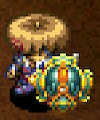</td>
    <td>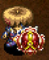</td>
    <td>This is a sturdy shield made with a special metal known as Fuuma Iron. It is difficult to create Fuuma Iron, so this shield is an uncommon item.</td>
  </tr>
</table>

Shield with high base defense, but slow to level up. 
Kabura Katana resonance increases attack damage by 5 points, 
which might help you be able to one-shot some monsters.

<table class="itemDetailsTable">
  <tbody>
    <tr>
      <th>Lv</th>
      <th>Name</th>
      <th>Rune</th>
      <th>Def</th>
      <th>Max</th>
      <th>Ct</th>
      <th>Exp</th>
      <th>Buy</th>
      <th>Sell</th>
      <th>Info</th>
    </tr>
    <tr>
      <td>1</td>
      <td>Fuuma Shield</td>
      <td rowspan="7">-</td>
      <td>16</td>
      <td>10</td>
      <td>3</td>
      <td>-</td>
      <td>8500</td>
      <td>2975</td>
      <td rowspan="8">Resonance: <a href="/shiren5/item/weapons#kabura-katana">Kabura Katana</a> (Attack damage +5)  Resonance: <a href="/shiren5/item/weapons#fuuma-sword">Fuuma Sword</a> (Attack damage +5)</td>
    </tr>
    <tr>
      <td>2</td>
      <td>Good Shield</td>
      <td>17</td>
      <td>17</td>
      <td>4</td>
      <td>600</td>
      <td>8600</td>
      <td>3010</td>
    </tr>
    <tr>
      <td>3</td>
      <td>Rare Shield</td>
      <td>18</td>
      <td>24</td>
      <td>5</td>
      <td>1700</td>
      <td>8700</td>
      <td>3045</td>
    </tr>
    <tr>
      <td>4</td>
      <td>Fine Shield</td>
      <td>19</td>
      <td>32</td>
      <td>6</td>
      <td>3400</td>
      <td>8800</td>
      <td>3080</td>
    </tr>
    <tr>
      <td>5</td>
      <td>Fuuma Aspis</td>
      <td>20</td>
      <td>41</td>
      <td>7</td>
      <td>6800</td>
      <td>8900</td>
      <td>3115</td>
    </tr>
    <tr>
      <td>6</td>
      <td>Fuuma Kite Shl</td>
      <td>23</td>
      <td>50</td>
      <td>9</td>
      <td>13600</td>
      <td>9000</td>
      <td>3150</td>
    </tr>
    <tr>
      <td>7</td>
      <td>Fuuma Twr Shl</td>
      <td>26</td>
      <td>60</td>
      <td>11</td>
      <td>27200</td>
      <td>9100</td>
      <td>3185</td>
    </tr>
    <tr>
      <td>8</td>
      <td>Fuuma Legend</td>
      <td>Tiger Mom</td>
      <td>30</td>
      <td>99</td>
      <td>∞</td>
      <td>54400</td>
      <td>12000</td>
      <td>4200</td>
    </tr>
  </tbody>
</table>

Locations:

<table class="locationTable">
  <tr>
    <th>Trail</th>
    <th>Past</th>
    <th>Present</th>
    <th>Future</th>
    <th>Fortune</th>
    <th>Miracle</th>
    <th>Rocks</th>
    <th>Gen</th>
    <th>Pitfall</th>
    <th>Manor</th>
  </tr>
  <tr>
    <td>PE</td>
    <td>PE</td>
    <td>PE</td>
    <td>PE</td>
    <td>PE</td>
    <td>P</td>
    <td>-</td>
    <td>PE</td>
    <td>SE</td>
    <td>E</td>
  </tr>
  <tr>
    <th>Bizarre</th>
    <th>Onigiri</th>
    <th>Chasm</th>
    <th>Well</th>
    <th>Lake</th>
    <th>Inori</th>
    <th>Old</th>
    <th>Descent</th>
    <th></th>
    <th></th>
  </tr>
  <tr>
    <td>E</td>
    <td>E</td>
    <td>FSME</td>
    <td>E</td>
    <td>FSE</td>
    <td>PE</td>
    <td>PZE</td>
    <td>FME</td>
    <td></td>
    <td></td>
  </tr>
</table>

### Gold Shield

<table class="itemDetailsTable">
  <tr>
    <th>Lv1-7</th>
    <th>Lv8</th>
    <th>Lv1 Description</th>
  </tr>
  <tr>
    <td></td>
    <td>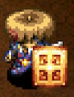</td>
    <td>This shield is rust-proof. A shield that is rust-proof?! How is that possible? It's all possible thanks to the power of gold! That's right, it's made of gold. It's a bit dirty, so it doesn't look like it's gold, but trust me. It totally is.</td>
  </tr>
</table>

High starting rune count, and pretty fast to level up. 
However, its base defense is very low, so it's mostly used as a container for runes 
while you're working on leveling a main shield to increase rune count. 
Its resonance effect is nice for digging up blue Shiny Objects.

<table class="itemDetailsTable">
  <tbody>
    <tr>
      <th>Lv</th>
      <th>Name</th>
      <th>Rune</th>
      <th>Def</th>
      <th>Max</th>
      <th>Ct</th>
      <th>Exp</th>
      <th>Buy</th>
      <th>Sell</th>
      <th>Info</th>
    </tr>
    <tr>
      <td>1</td>
      <td>Gold Shield</td>
      <td rowspan="7">(Rustproof)</td>
      <td>2</td>
      <td>15</td>
      <td>7</td>
      <td>-</td>
      <td>1500</td>
      <td>525</td>
      <td rowspan="8">This shield won't rust.  Resonance: <a href="/shiren5/item/weapons#dull-gold-edge">Dull Gold Edge</a> (Max strength +3)</td>
    </tr>
    <tr>
      <td>2</td>
      <td>Plain Gold Shld</td>
      <td>3</td>
      <td>25</td>
      <td>8</td>
      <td>100</td>
      <td>1800</td>
      <td>630</td>
    </tr>
    <tr>
      <td>3</td>
      <td>Shiny Gold Shld</td>
      <td>4</td>
      <td>35</td>
      <td>9</td>
      <td>500</td>
      <td>2100</td>
      <td>735</td>
    </tr>
    <tr>
      <td>4</td>
      <td>14K Gold Shield</td>
      <td>5</td>
      <td>45</td>
      <td>10</td>
      <td>1000</td>
      <td>2400</td>
      <td>840</td>
    </tr>
    <tr>
      <td>5</td>
      <td>Nice Gold Shld</td>
      <td>8</td>
      <td>55</td>
      <td>11</td>
      <td>2000</td>
      <td>2700</td>
      <td>945</td>
    </tr>
    <tr>
      <td>6</td>
      <td>Fine Gold Shld</td>
      <td>9</td>
      <td>65</td>
      <td>12</td>
      <td>4000</td>
      <td>7000</td>
      <td>2450</td>
    </tr>
    <tr>
      <td>7</td>
      <td>23K Gold Shield</td>
      <td>12</td>
      <td>75</td>
      <td>13</td>
      <td>8000</td>
      <td>8000</td>
      <td>2800</td>
    </tr>
    <tr>
      <td>8</td>
      <td>24K Gold Shield</td>
      <td>(Rustproof) Pain Fueled</td>
      <td>14</td>
      <td>99</td>
      <td>∞</td>
      <td>16000</td>
      <td>10000</td>
      <td>3500</td>
    </tr>
  </tbody>
</table>

Locations:

<table class="locationTable">
  <tr>
    <th>Trail</th>
    <th>Past</th>
    <th>Present</th>
    <th>Future</th>
    <th>Fortune</th>
    <th>Miracle</th>
    <th>Rocks</th>
    <th>Gen</th>
    <th>Pitfall</th>
    <th>Manor</th>
  </tr>
  <tr>
    <td>FSP</td>
    <td>FSP</td>
    <td>FSP</td>
    <td>FSPZ</td>
    <td>FSPZ</td>
    <td>FSP</td>
    <td>-</td>
    <td>FSPZM</td>
    <td>FPZM</td>
    <td>FSPZM</td>
  </tr>
  <tr>
    <th>Bizarre</th>
    <th>Onigiri</th>
    <th>Chasm</th>
    <th>Well</th>
    <th>Lake</th>
    <th>Inori</th>
    <th>Old</th>
    <th>Descent</th>
    <th></th>
    <th></th>
  </tr>
  <tr>
    <td>FSPZ</td>
    <td>FPZM</td>
    <td>FPZM</td>
    <td>-</td>
    <td>FP</td>
    <td>FSPZM</td>
    <td>FM</td>
    <td>SM</td>
    <td></td>
    <td></td>
  </tr>
</table>

### Diet Shield

<table class="itemDetailsTable">
  <tr>
    <th>Lv1-7</th>
    <th>Lv8</th>
    <th>Lv1 Description</th>
  </tr>
  <tr>
    <td>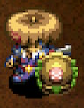</td>
    <td></td>
    <td>Resist hunger while this is equipped. A little less starvation, a little more action. "More filling!" "Less hunger!" "Tastes great?"</td>
  </tr>
</table>

Fullness depletion slows down even more as it levels up, 
but CR Diet is plenty to reduce the risk of starving, so just synthesize it.

<table class="itemDetailsTable">
  <tbody>
    <tr>
      <th>Lv</th>
      <th>Name</th>
      <th>Rune</th>
      <th>Def</th>
      <th>Max</th>
      <th>Ct</th>
      <th>Exp</th>
      <th>Buy</th>
      <th>Sell</th>
      <th>Info</th>
    </tr>
    <tr>
      <td>1</td>
      <td>Diet Shield</td>
      <td rowspan="7">(CR Diet)</td>
      <td>2</td>
      <td>15</td>
      <td>5</td>
      <td>-</td>
      <td>5000</td>
      <td>1750</td>
      <td rowspan="8">Decrease hunger rate. (50, 45, 45, 40, 40, 35, 35, 30%)</td>
    </tr>
    <tr>
      <td>2</td>
      <td>Fasting Shield</td>
      <td>4</td>
      <td>25</td>
      <td>6</td>
      <td>1000</td>
      <td>5500</td>
      <td>1925</td>
    </tr>
    <tr>
      <td>3</td>
      <td>Content Shield</td>
      <td>6</td>
      <td>35</td>
      <td>7</td>
      <td>2000</td>
      <td>6000</td>
      <td>2100</td>
    </tr>
    <tr>
      <td>4</td>
      <td>Satisfied Shield</td>
      <td>7</td>
      <td>45</td>
      <td>8</td>
      <td>4000</td>
      <td>6500</td>
      <td>2275</td>
    </tr>
    <tr>
      <td>5</td>
      <td>Satiated Shield</td>
      <td>8</td>
      <td>55</td>
      <td>9</td>
      <td>7000</td>
      <td>7000</td>
      <td>2450</td>
    </tr>
    <tr>
      <td>6</td>
      <td>Stuffed Shield</td>
      <td>10</td>
      <td>65</td>
      <td>10</td>
      <td>11000</td>
      <td>7500</td>
      <td>2625</td>
    </tr>
    <tr>
      <td>7</td>
      <td>Gratified Shld</td>
      <td>11</td>
      <td>75</td>
      <td>11</td>
      <td>16000</td>
      <td>8000</td>
      <td>2800</td>
    </tr>
    <tr>
      <td>8</td>
      <td>Surfeit Shield</td>
      <td>(CR Diet) Energizing</td>
      <td>12</td>
      <td>99</td>
      <td>∞</td>
      <td>22000</td>
      <td>10500</td>
      <td>3675</td>
    </tr>
  </tbody>
</table>

Locations:

<table class="locationTable">
  <tr>
    <th>Trail</th>
    <th>Past</th>
    <th>Present</th>
    <th>Future</th>
    <th>Fortune</th>
    <th>Miracle</th>
    <th>Rocks</th>
    <th>Gen</th>
    <th>Pitfall</th>
    <th>Manor</th>
  </tr>
  <tr>
    <td>FSP</td>
    <td>FSP</td>
    <td>FSP</td>
    <td>FSPZ</td>
    <td>FSPZ</td>
    <td>FSP</td>
    <td>Expert</td>
    <td>SM</td>
    <td>FSPZME</td>
    <td>FSPZM</td>
  </tr>
  <tr>
    <th>Bizarre</th>
    <th>Onigiri</th>
    <th>Chasm</th>
    <th>Well</th>
    <th>Lake</th>
    <th>Inori</th>
    <th>Old</th>
    <th>Descent</th>
    <th></th>
    <th></th>
  </tr>
  <tr>
    <td>FPZ</td>
    <td>-</td>
    <td>FPZM</td>
    <td>-</td>
    <td>FP</td>
    <td>FSPZM</td>
    <td>FM</td>
    <td>SPM</td>
    <td></td>
    <td></td>
  </tr>
</table>

### Heavy Shield

<table class="itemDetailsTable">
  <tr>
    <th>Lv1-7</th>
    <th>Lv8</th>
    <th>Lv1 Description</th>
  </tr>
  <tr>
    <td>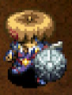</td>
    <td></td>
    <td>This shield has high defense, but the shield's heft makes you hungry quicker. You have to think hard about whether or not to equip this.</td>
  </tr>
</table>

Gains Unmoving at Lv8, making it a secondary option against high level Fearabbits. Fullness depletion slows as it levels up, so it's not too difficult to level mid game. Shines in Old Road, since hunger is basically a non-issue in that dungeon.

<table class="itemDetailsTable">
  <tbody>
    <tr>
      <th>Lv</th>
      <th>Name</th>
      <th>Rune</th>
      <th>Def</th>
      <th>Max</th>
      <th>Ct</th>
      <th>Exp</th>
      <th>Buy</th>
      <th>Sell</th>
      <th>Info</th>
    </tr>
    <tr>
      <td>1</td>
      <td>Heavy Shield</td>
      <td rowspan="7">(Hungry)</td>
      <td>12</td>
      <td>15</td>
      <td>9</td>
      <td>-</td>
      <td>6000</td>
      <td>2100</td>
      <td rowspan="8">Increase hunger rate, but decreases as it levels up. (200%, -10% per level up | Lv8: 130%)</td>
    </tr>
    <tr>
      <td>2</td>
      <td>Good Heavy Shld</td>
      <td>14</td>
      <td>25</td>
      <td>10</td>
      <td>500</td>
      <td>7000</td>
      <td>2450</td>
    </tr>
    <tr>
      <td>3</td>
      <td>Rare Heavy Shld</td>
      <td>16</td>
      <td>35</td>
      <td>11</td>
      <td>1000</td>
      <td>8000</td>
      <td>2800</td>
    </tr>
    <tr>
      <td>4</td>
      <td>Fine Heavy Shld</td>
      <td>18</td>
      <td>45</td>
      <td>12</td>
      <td>3000</td>
      <td>9000</td>
      <td>3150</td>
    </tr>
    <tr>
      <td>5</td>
      <td>Heavy Aspis</td>
      <td>21</td>
      <td>55</td>
      <td>13</td>
      <td>6000</td>
      <td>10000</td>
      <td>3500</td>
    </tr>
    <tr>
      <td>6</td>
      <td>Good Hvy Aspis</td>
      <td>24</td>
      <td>65</td>
      <td>14</td>
      <td>10000</td>
      <td>11000</td>
      <td>3850</td>
    </tr>
    <tr>
      <td>7</td>
      <td>Heavy Aegis</td>
      <td>26</td>
      <td>75</td>
      <td>15</td>
      <td>14000</td>
      <td>12000</td>
      <td>4200</td>
    </tr>
    <tr>
      <td>8</td>
      <td>Ultimate Aegis</td>
      <td>(Hungry) Unmoving Anti-Burgle</td>
      <td>28</td>
      <td>99</td>
      <td>∞</td>
      <td>20000</td>
      <td>14500</td>
      <td>5075</td>
    </tr>
  </tbody>
</table>

Locations:

<table class="locationTable">
  <tr>
    <th>Trail</th>
    <th>Past</th>
    <th>Present</th>
    <th>Future</th>
    <th>Fortune</th>
    <th>Miracle</th>
    <th>Rocks</th>
    <th>Gen</th>
    <th>Pitfall</th>
    <th>Manor</th>
  </tr>
  <tr>
    <td>FSP</td>
    <td>FSP</td>
    <td>FSP</td>
    <td>FSPZ</td>
    <td>FSPZ</td>
    <td>FSP</td>
    <td>Expert</td>
    <td>SM</td>
    <td>FSPZM</td>
    <td>FSPZM</td>
  </tr>
  <tr>
    <th>Bizarre</th>
    <th>Onigiri</th>
    <th>Chasm</th>
    <th>Well</th>
    <th>Lake</th>
    <th>Inori</th>
    <th>Old</th>
    <th>Descent</th>
    <th></th>
    <th></th>
  </tr>
  <tr>
    <td>FPZ</td>
    <td>-</td>
    <td>FPZM</td>
    <td>-</td>
    <td>FP</td>
    <td>FSPZM</td>
    <td>FM</td>
    <td>SPM</td>
    <td></td>
    <td></td>
  </tr>
</table>

### Midnight Shield

<table class="itemDetailsTable">
  <tr>
    <th>Lv1-7</th>
    <th>Lv8</th>
    <th>Lv1 Description</th>
  </tr>
  <tr>
    <td></td>
    <td></td>
    <td>This shield reduces damage taken from night monsters. However, you'll take more damage from day monsters, so you gotta be wary about when you equip it.</td>
  </tr>
</table>

Tricky to level up, since daytime monsters deal more damage to you. Often synthesized onto a secondary shield for night, such as a Blazing Shield. That said, its resonance with torches can come in handy at night.

<table class="itemDetailsTable">
  <tbody>
    <tr>
      <th>Lv</th>
      <th>Name</th>
      <th>Rune</th>
      <th>Def</th>
      <th>Max</th>
      <th>Ct</th>
      <th>Exp</th>
      <th>Buy</th>
      <th>Sell</th>
      <th>Info</th>
    </tr>
    <tr>
      <td>1</td>
      <td>Midnight Shield</td>
      <td rowspan="5">(Nocturnal)</td>
      <td>6</td>
      <td>15</td>
      <td>4</td>
      <td>-</td>
      <td>4200</td>
      <td>1470</td>
      <td rowspan="8">Increase damage from day monsters, reduce damage from night monsters. (Day: 50%, +10% per level up | Lv8: 120%) (Night: 25%, +5% per level up | Lv8: 60%)  Resonance: <a href="/shiren5/item/weapons#breeze-blade">Breeze Blade</a> (Equipped items won't rust)  Resonance: <a href="/shiren5/item/weapons#torch">Torches</a> (Night monsters miss more often)</td>
    </tr>
    <tr>
      <td>2</td>
      <td>2AM Shield</td>
      <td>7</td>
      <td>25</td>
      <td>5</td>
      <td>500</td>
      <td>4500</td>
      <td>1575</td>
    </tr>
    <tr>
      <td>3</td>
      <td>3AM Shield</td>
      <td>8</td>
      <td>35</td>
      <td>6</td>
      <td>1000</td>
      <td>4800</td>
      <td>1680</td>
    </tr>
    <tr>
      <td>4</td>
      <td>4AM Shield</td>
      <td>9</td>
      <td>45</td>
      <td>7</td>
      <td>3000</td>
      <td>5100</td>
      <td>1785</td>
    </tr>
    <tr>
      <td>5</td>
      <td>5AM Shield</td>
      <td>10</td>
      <td>55</td>
      <td>8</td>
      <td>6000</td>
      <td>5400</td>
      <td>1890</td>
    </tr>
    <tr>
      <td>6</td>
      <td>Sunrise Shield</td>
      <td rowspan="3">(Nocturnal) Rustproof</td>
      <td>11</td>
      <td>65</td>
      <td>9</td>
      <td>10000</td>
      <td>6200</td>
      <td>2170</td>
    </tr>
    <tr>
      <td>7</td>
      <td>Night Owl</td>
      <td>12</td>
      <td>75</td>
      <td>10</td>
      <td>14000</td>
      <td>6500</td>
      <td>2275</td>
    </tr>
    <tr>
      <td>8</td>
      <td>Night Lord</td>
      <td>15</td>
      <td>99</td>
      <td>∞</td>
      <td>20000</td>
      <td>7000</td>
      <td>2450</td>
    </tr>
  </tbody>
</table>

Locations:

- Tanuki Password: Carpe Noctem

 

<table class="locationTable">
  <tr>
    <th>Trail</th>
    <th>Past</th>
    <th>Present</th>
    <th>Future</th>
    <th>Fortune</th>
    <th>Miracle</th>
    <th>Rocks</th>
    <th>Gen</th>
    <th>Pitfall</th>
    <th>Manor</th>
  </tr>
  <tr>
    <td>-</td>
    <td>-</td>
    <td>-</td>
    <td>-</td>
    <td>-</td>
    <td>-</td>
    <td>-</td>
    <td>-</td>
    <td>-</td>
    <td>-</td>
  </tr>
  <tr>
    <th>Bizarre</th>
    <th>Onigiri</th>
    <th>Chasm</th>
    <th>Well</th>
    <th>Lake</th>
    <th>Inori</th>
    <th>Old</th>
    <th>Descent</th>
    <th></th>
    <th></th>
  </tr>
  <tr>
    <td>S</td>
    <td>-</td>
    <td>-</td>
    <td>E</td>
    <td>-</td>
    <td>-</td>
    <td>SPZ</td>
    <td>SZM</td>
    <td></td>
    <td></td>
  </tr>
</table>

### Day Shield

<table class="itemDetailsTable">
  <tr>
    <th>Lv1-7</th>
    <th>Lv8</th>
    <th>Lv1 Description</th>
  </tr>
  <tr>
    <td>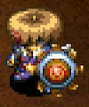</td>
    <td></td>
    <td>This shield reduces damage taken from day monsters. However, it will increase the damage that night monsters do to you. Be sure to remove this when night falls, Day Man.</td>
  </tr>
</table>

Strongest shield in the game by a wide margin. Reduces damage from day monsters by 25% at Lv1, or 60% at Lv8. There's no reason not to use it as a main shield if you come across it in a day only dungeon. That said, its base defense is low, so the effect won't be very visible early game. 

<table class="itemDetailsTable">
  <tbody>
    <tr>
      <th>Lv</th>
      <th>Name</th>
      <th>Rune</th>
      <th>Def</th>
      <th>Max</th>
      <th>Ct</th>
      <th>Exp</th>
      <th>Buy</th>
      <th>Sell</th>
      <th>Info</th>
    </tr>
    <tr>
      <td>1</td>
      <td>Day Shield</td>
      <td rowspan="5">(Diurnal)</td>
      <td>6</td>
      <td>15</td>
      <td>4</td>
      <td>-</td>
      <td>4200</td>
      <td>1470</td>
      <td rowspan="8">Reduce damage from day monsters, increase damage from night monsters. (Day: 25%, +5% per level up | Lv8: 60%) (Night: 50%, +10% per level up | Lv8: 120%)  Resonance: <a href="/shiren5/item/weapons#bright-blade">Bright Blade</a> (Read scrolls in the dark)</td>
    </tr>
    <tr>
      <td>2</td>
      <td>2PM Shield</td>
      <td>7</td>
      <td>25</td>
      <td>5</td>
      <td>500</td>
      <td>4500</td>
      <td>1575</td>
    </tr>
    <tr>
      <td>3</td>
      <td>3PM Shield</td>
      <td>8</td>
      <td>35</td>
      <td>6</td>
      <td>1000</td>
      <td>4800</td>
      <td>1680</td>
    </tr>
    <tr>
      <td>4</td>
      <td>4PM Shield</td>
      <td>9</td>
      <td>45</td>
      <td>7</td>
      <td>3000</td>
      <td>5100</td>
      <td>1785</td>
    </tr>
    <tr>
      <td>5</td>
      <td>5PM Shield</td>
      <td>10</td>
      <td>55</td>
      <td>8</td>
      <td>6000</td>
      <td>5400</td>
      <td>1890</td>
    </tr>
    <tr>
      <td>6</td>
      <td>Sunset Shield</td>
      <td rowspan="3">(Diurnal) Rustproof</td>
      <td>11</td>
      <td>65</td>
      <td>9</td>
      <td>10000</td>
      <td>6200</td>
      <td>2170</td>
    </tr>
    <tr>
      <td>7</td>
      <td>Noon Shield</td>
      <td>12</td>
      <td>75</td>
      <td>10</td>
      <td>14000</td>
      <td>6500</td>
      <td>2275</td>
    </tr>
    <tr>
      <td>8</td>
      <td>Daytime Queen</td>
      <td>15</td>
      <td>99</td>
      <td>∞</td>
      <td>20000</td>
      <td>7000</td>
      <td>2450</td>
    </tr>
  </tbody>
</table>

Locations:

- Tanuki Password: Carpe Diem

 

<table class="locationTable">
  <tr>
    <th>Trail</th>
    <th>Past</th>
    <th>Present</th>
    <th>Future</th>
    <th>Fortune</th>
    <th>Miracle</th>
    <th>Rocks</th>
    <th>Gen</th>
    <th>Pitfall</th>
    <th>Manor</th>
  </tr>
  <tr>
    <td>FS</td>
    <td>FS</td>
    <td>FS</td>
    <td>FS</td>
    <td>FS</td>
    <td>FS</td>
    <td>-</td>
    <td>-</td>
    <td>FSPZME</td>
    <td>FSM</td>
  </tr>
  <tr>
    <th>Bizarre</th>
    <th>Onigiri</th>
    <th>Chasm</th>
    <th>Well</th>
    <th>Lake</th>
    <th>Inori</th>
    <th>Old</th>
    <th>Descent</th>
    <th></th>
    <th></th>
  </tr>
  <tr>
    <td>S</td>
    <td>FPZM</td>
    <td>FSPZM</td>
    <td>-</td>
    <td>FSP</td>
    <td>FSM</td>
    <td>SPZ</td>
    <td>SZM</td>
    <td></td>
    <td></td>
  </tr>
</table>

### Binary Shield

<table class="itemDetailsTable">
  <tr>
    <th>Lv1-7</th>
    <th>Lv8</th>
    <th>Lv1 Description</th>
  </tr>
  <tr>
    <td></td>
    <td>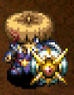</td>
    <td>When the first digit of your HP is 1 or 0, damage inflicted by enemies is halved.</td>
  </tr>
</table>

Reduces damage if last digit of current HP is 1 or 0 by 50% at Lv1, or 85% at Lv8. 
Powerful when paired with Monster Detector, and can surpass Day Shield if you manage your HP. It has decent base defense for early game, and gains Magi-Twister at Lv6.

<table class="itemDetailsTable">
  <tbody>
    <tr>
      <th>Lv</th>
      <th>Name</th>
      <th>Rune</th>
      <th>Def</th>
      <th>Max</th>
      <th>Ct</th>
      <th>Exp</th>
      <th>Buy</th>
      <th>Sell</th>
      <th>Info</th>
    </tr>
    <tr>
      <td>1</td>
      <td>Binary Shield</td>
      <td rowspan="5">(Bit)</td>
      <td>10</td>
      <td>15</td>
      <td>3</td>
      <td>-</td>
      <td>2500</td>
      <td>875</td>
      <td rowspan="8">Reduce damage taken when last digit of current HP is 1 or 0. (50%, +5% per level up | Lv8: 85%)</td>
    </tr>
    <tr>
      <td>2</td>
      <td>Nice 0/1 Shld</td>
      <td>11</td>
      <td>25</td>
      <td>4</td>
      <td>800</td>
      <td>2800</td>
      <td>980</td>
    </tr>
    <tr>
      <td>3</td>
      <td>Good 0/1 Shield</td>
      <td>12</td>
      <td>35</td>
      <td>5</td>
      <td>1600</td>
      <td>3100</td>
      <td>1085</td>
    </tr>
    <tr>
      <td>4</td>
      <td>Fine 0/1 Shield</td>
      <td>13</td>
      <td>45</td>
      <td>6</td>
      <td>3200</td>
      <td>3400</td>
      <td>1190</td>
    </tr>
    <tr>
      <td>5</td>
      <td>Rare 0/1 Shield</td>
      <td>14</td>
      <td>55</td>
      <td>7</td>
      <td>6400</td>
      <td>3700</td>
      <td>1295</td>
    </tr>
    <tr>
      <td>6</td>
      <td>Grt. 0/1 Shield</td>
      <td rowspan="3">(Bit) Magi-Twister</td>
      <td>15</td>
      <td>65</td>
      <td>8</td>
      <td>12800</td>
      <td>4500</td>
      <td>1575</td>
    </tr>
    <tr>
      <td>7</td>
      <td>Epic 0/1 Shield</td>
      <td>16</td>
      <td>75</td>
      <td>9</td>
      <td>25600</td>
      <td>4800</td>
      <td>1680</td>
    </tr>
    <tr>
      <td>8</td>
      <td>One/Zero Hero</td>
      <td>17</td>
      <td>99</td>
      <td>∞</td>
      <td>38400</td>
      <td>5300</td>
      <td>1855</td>
    </tr>
  </tbody>
</table>

Locations:

<table class="locationTable">
  <tr>
    <th>Trail</th>
    <th>Past</th>
    <th>Present</th>
    <th>Future</th>
    <th>Fortune</th>
    <th>Miracle</th>
    <th>Rocks</th>
    <th>Gen</th>
    <th>Pitfall</th>
    <th>Manor</th>
  </tr>
  <tr>
    <td>FS</td>
    <td>FS</td>
    <td>FS</td>
    <td>FS</td>
    <td>FS</td>
    <td>FS</td>
    <td>Expert</td>
    <td>-</td>
    <td>FSPZME</td>
    <td>FSM</td>
  </tr>
  <tr>
    <th>Bizarre</th>
    <th>Onigiri</th>
    <th>Chasm</th>
    <th>Well</th>
    <th>Lake</th>
    <th>Inori</th>
    <th>Old</th>
    <th>Descent</th>
    <th></th>
    <th></th>
  </tr>
  <tr>
    <td>FPZ</td>
    <td>FPZM</td>
    <td>FPZM</td>
    <td>-</td>
    <td>FP</td>
    <td>FSM</td>
    <td>FM</td>
    <td>SZM</td>
    <td></td>
    <td></td>
  </tr>
</table>

### Counter Shield

<table class="itemDetailsTable">
  <tr>
    <th>Lv1-7</th>
    <th>Lv8</th>
    <th>Lv1 Description</th>
  </tr>
  <tr>
    <td></td>
    <td></td>
    <td>Reflects a portion of damage inflicted via direct attacks. This is perfect for people who don't like to turn the other cheek.</td>
  </tr>
</table>

The portion of damage reflected increases as it levels up, 
and is roughly 100% at Lv8 when paired with a Strength Bracelet. 
It was used to counter Gyazas in Shiren 4, but it doesn't see much use in this game because Gyaza family monsters were significantly nerfed.

<table class="itemDetailsTable">
  <tbody>
    <tr>
      <th>Lv</th>
      <th>Name</th>
      <th>Rune</th>
      <th>Def</th>
      <th>Max</th>
      <th>Ct</th>
      <th>Exp</th>
      <th>Buy</th>
      <th>Sell</th>
      <th>Info</th>
    </tr>
    <tr>
      <td>1</td>
      <td>Counter Shield</td>
      <td rowspan="7">(Retribution)</td>
      <td>3</td>
      <td>15</td>
      <td>7</td>
      <td>-</td>
      <td>3000</td>
      <td>1050</td>
      <td rowspan="8">Reflects a portion of damage received back at an enemy. (28, 31, 34, 37, 40, 43, 46, 51%)  Resonance: <a href="/shiren5/item/bracelets#strength-bracelet">Strength Bracelet</a> (Counter damage doubled)</td>
    </tr>
    <tr>
      <td>2</td>
      <td>Solid Counter</td>
      <td>5</td>
      <td>25</td>
      <td>8</td>
      <td>400</td>
      <td>4000</td>
      <td>1400</td>
    </tr>
    <tr>
      <td>3</td>
      <td>Fine Counter</td>
      <td>7</td>
      <td>35</td>
      <td>9</td>
      <td>800</td>
      <td>5000</td>
      <td>1750</td>
    </tr>
    <tr>
      <td>4</td>
      <td>Timely Counter</td>
      <td>9</td>
      <td>45</td>
      <td>10</td>
      <td>1600</td>
      <td>6000</td>
      <td>2100</td>
    </tr>
    <tr>
      <td>5</td>
      <td>Great Counter</td>
      <td>10</td>
      <td>55</td>
      <td>11</td>
      <td>3200</td>
      <td>7000</td>
      <td>2450</td>
    </tr>
    <tr>
      <td>6</td>
      <td>Epic Counter</td>
      <td>11</td>
      <td>65</td>
      <td>12</td>
      <td>6400</td>
      <td>8000</td>
      <td>2800</td>
    </tr>
    <tr>
      <td>7</td>
      <td>Mega Counter</td>
      <td>12</td>
      <td>75</td>
      <td>13</td>
      <td>12800</td>
      <td>9000</td>
      <td>3150</td>
    </tr>
    <tr>
      <td>8</td>
      <td>Killer Counter</td>
      <td>(Retribution) Tiger Mom</td>
      <td>13</td>
      <td>99</td>
      <td>∞</td>
      <td>25600</td>
      <td>12000</td>
      <td>4200</td>
    </tr>
  </tbody>
</table>

Locations:

<table class="locationTable">
  <tr>
    <th>Trail</th>
    <th>Past</th>
    <th>Present</th>
    <th>Future</th>
    <th>Fortune</th>
    <th>Miracle</th>
    <th>Rocks</th>
    <th>Gen</th>
    <th>Pitfall</th>
    <th>Manor</th>
  </tr>
  <tr>
    <td>FP</td>
    <td>FP</td>
    <td>FP</td>
    <td>FPZ</td>
    <td>FPZ</td>
    <td>FP</td>
    <td>Expert</td>
    <td>SM</td>
    <td>FSPZM</td>
    <td>FPZM</td>
  </tr>
  <tr>
    <th>Bizarre</th>
    <th>Onigiri</th>
    <th>Chasm</th>
    <th>Well</th>
    <th>Lake</th>
    <th>Inori</th>
    <th>Old</th>
    <th>Descent</th>
    <th></th>
    <th></th>
  </tr>
  <tr>
    <td>FPZ</td>
    <td>FPZM</td>
    <td>FPZM</td>
    <td>-</td>
    <td>FP</td>
    <td>FPZM</td>
    <td>FM</td>
    <td>SZM</td>
    <td></td>
    <td></td>
  </tr>
</table>

### Student Shield

<table class="itemDetailsTable">
  <tr>
    <th>Lv1-7</th>
    <th>Lv8</th>
    <th>Lv1 Description</th>
  </tr>
  <tr>
    <td></td>
    <td></td>
    <td>This shield converts some direct damage into experience points. Pain is an effective teacher.</td>
  </tr>
</table>

Nice to equip for a bit if you find it on the ground right away, 
but not worth using as a main shield or rune. Sells for a decent amount.

<table class="itemDetailsTable">
  <tbody>
    <tr>
      <th>Lv</th>
      <th>Name</th>
      <th>Rune</th>
      <th>Def</th>
      <th>Max</th>
      <th>Ct</th>
      <th>Exp</th>
      <th>Buy</th>
      <th>Sell</th>
      <th>Info</th>
    </tr>
    <tr>
      <td>1</td>
      <td>Student Shield</td>
      <td rowspan="4">(Tiger Mom)</td>
      <td>3</td>
      <td>15</td>
      <td>4</td>
      <td>-</td>
      <td>8000</td>
      <td>2800</td>
      <td rowspan="8">Gain experience points equal to damage received.  Resonance: <a href="/shiren5/item/bracelets#growth-bracelet">Growth Bracelet</a> (Bracelet exp gain doubled)</td>
    </tr>
    <tr>
      <td>2</td>
      <td>1.5 GPA Shield</td>
      <td>5</td>
      <td>25</td>
      <td>5</td>
      <td>1000</td>
      <td>9000</td>
      <td>3150</td>
    </tr>
    <tr>
      <td>3</td>
      <td>2.0 GPA Shield</td>
      <td>7</td>
      <td>35</td>
      <td>6</td>
      <td>2000</td>
      <td>10000</td>
      <td>3500</td>
    </tr>
    <tr>
      <td>4</td>
      <td>3.0 GPA Shield</td>
      <td>8</td>
      <td>45</td>
      <td>7</td>
      <td>4000</td>
      <td>11000</td>
      <td>3850</td>
    </tr>
    <tr>
      <td>5</td>
      <td>3.5 GPA Shield</td>
      <td rowspan="3">(Tiger Mom) Lively</td>
      <td>9</td>
      <td>55</td>
      <td>8</td>
      <td>7000</td>
      <td>12500</td>
      <td>4375</td>
    </tr>
    <tr>
      <td>6</td>
      <td>Honor Roll</td>
      <td>10</td>
      <td>65</td>
      <td>9</td>
      <td>11000</td>
      <td>13500</td>
      <td>4725</td>
    </tr>
    <tr>
      <td>7</td>
      <td>Salutatorian</td>
      <td>11</td>
      <td>75</td>
      <td>10</td>
      <td>16000</td>
      <td>14500</td>
      <td>5075</td>
    </tr>
    <tr>
      <td>8</td>
      <td>Valedictorian</td>
      <td>(Tiger Mom) Lively Enhancing</td>
      <td>15</td>
      <td>99</td>
      <td>∞</td>
      <td>22000</td>
      <td>17000</td>
      <td>5950</td>
    </tr>
  </tbody>
</table>

Locations:

<table class="locationTable">
  <tr>
    <th>Trail</th>
    <th>Past</th>
    <th>Present</th>
    <th>Future</th>
    <th>Fortune</th>
    <th>Miracle</th>
    <th>Rocks</th>
    <th>Gen</th>
    <th>Pitfall</th>
    <th>Manor</th>
  </tr>
  <tr>
    <td>F</td>
    <td>F</td>
    <td>F</td>
    <td>F</td>
    <td>F</td>
    <td>F</td>
    <td>-</td>
    <td>-</td>
    <td>-</td>
    <td>FM</td>
  </tr>
  <tr>
    <th>Bizarre</th>
    <th>Onigiri</th>
    <th>Chasm</th>
    <th>Well</th>
    <th>Lake</th>
    <th>Inori</th>
    <th>Old</th>
    <th>Descent</th>
    <th></th>
    <th></th>
  </tr>
  <tr>
    <td>FSPZ</td>
    <td>S</td>
    <td>FSPZM</td>
    <td>-</td>
    <td>FSP</td>
    <td>FM</td>
    <td>FM</td>
    <td>SZM</td>
    <td></td>
    <td></td>
  </tr>
</table>

### Bowl Shield

<table class="itemDetailsTable">
  <tr>
    <th>Lv1-7</th>
    <th>Lv8</th>
    <th>Lv1 Description</th>
  </tr>
  <tr>
    <td></td>
    <td></td>
    <td>This shield will restore some fullness if you take direct damage. The effect will increase as the shield is upgraded.</td>
  </tr>
</table>

Not worth using as a main shield, and using it as a rune is a wasted slot. 
You can't replenish fullness by intentionally getting hit by a weak enemy, 
since it only has a 6% chance to replenish 1 fullness. Sells for a good amount, though.

<table class="itemDetailsTable">
  <tbody>
    <tr>
      <th>Lv</th>
      <th>Name</th>
      <th>Rune</th>
      <th>Def</th>
      <th>Max</th>
      <th>Ct</th>
      <th>Exp</th>
      <th>Buy</th>
      <th>Sell</th>
      <th>Info</th>
    </tr>
    <tr>
      <td>1</td>
      <td>Bowl Shield</td>
      <td rowspan="5">(Pain Fueled)</td>
      <td>4</td>
      <td>15</td>
      <td>4</td>
      <td>-</td>
      <td>10000</td>
      <td>3500</td>
      <td rowspan="8">Chance to restore fullness by 1 when you receive damage. (6%, +2% per level up | Lv8: 20%)</td>
    </tr>
    <tr>
      <td>2</td>
      <td>Med. Bowl Shld</td>
      <td>6</td>
      <td>25</td>
      <td>5</td>
      <td>1500</td>
      <td>11000</td>
      <td>3850</td>
    </tr>
    <tr>
      <td>3</td>
      <td>Combowl Shld</td>
      <td>7</td>
      <td>35</td>
      <td>6</td>
      <td>3000</td>
      <td>12000</td>
      <td>4200</td>
    </tr>
    <tr>
      <td>4</td>
      <td>Sp. Bowl Shld</td>
      <td>8</td>
      <td>45</td>
      <td>7</td>
      <td>5500</td>
      <td>13000</td>
      <td>4550</td>
    </tr>
    <tr>
      <td>5</td>
      <td>L-Bowl Shield</td>
      <td>10</td>
      <td>55</td>
      <td>8</td>
      <td>9000</td>
      <td>14000</td>
      <td>4900</td>
    </tr>
    <tr>
      <td>6</td>
      <td>XL-Bowl Shield</td>
      <td rowspan="3">(Pain Fueled) Rustproof</td>
      <td>11</td>
      <td>65</td>
      <td>9</td>
      <td>13500</td>
      <td>15500</td>
      <td>5425</td>
    </tr>
    <tr>
      <td>7</td>
      <td>XXL-Bowl Shld</td>
      <td>12</td>
      <td>75</td>
      <td>10</td>
      <td>19000</td>
      <td>16500</td>
      <td>5775</td>
    </tr>
    <tr>
      <td>8</td>
      <td>Omega Bowl</td>
      <td>13</td>
      <td>99</td>
      <td>∞</td>
      <td>25500</td>
      <td>18500</td>
      <td>6475</td>
    </tr>
  </tbody>
</table>

Locations:

<table class="locationTable">
  <tr>
    <th>Trail</th>
    <th>Past</th>
    <th>Present</th>
    <th>Future</th>
    <th>Fortune</th>
    <th>Miracle</th>
    <th>Rocks</th>
    <th>Gen</th>
    <th>Pitfall</th>
    <th>Manor</th>
  </tr>
  <tr>
    <td>F</td>
    <td>F</td>
    <td>F</td>
    <td>F</td>
    <td>F</td>
    <td>F</td>
    <td>-</td>
    <td>-</td>
    <td>FSPZME</td>
    <td>FM</td>
  </tr>
  <tr>
    <th>Bizarre</th>
    <th>Onigiri</th>
    <th>Chasm</th>
    <th>Well</th>
    <th>Lake</th>
    <th>Inori</th>
    <th>Old</th>
    <th>Descent</th>
    <th></th>
    <th></th>
  </tr>
  <tr>
    <td>FSPZ</td>
    <td>S</td>
    <td>FSPZM</td>
    <td>-</td>
    <td>FSP</td>
    <td>FM</td>
    <td>FM</td>
    <td>SPM</td>
    <td></td>
    <td></td>
  </tr>
</table>

### Spry Shield

<table class="itemDetailsTable">
  <tr>
    <th>Lv1-7</th>
    <th>Lv8</th>
    <th>Lv1 Description</th>
  </tr>
  <tr>
    <td></td>
    <td></td>
    <td>This shield helps you dodge direct attacks. It feels great when monsters miss their attacks. As the shield it upgraded, dodging becomes even easier!</td>
  </tr>
</table>

Evasion increases as it levels up, with rates being 22% at Lv1, and 43% at Lv8. 
However, it has low base defense and is very slow to level up, so it's usually synthesized onto a stronger shield instead.

<table class="itemDetailsTable">
  <tbody>
    <tr>
      <th>Lv</th>
      <th>Name</th>
      <th>Rune</th>
      <th>Def</th>
      <th>Max</th>
      <th>Ct</th>
      <th>Exp</th>
      <th>Buy</th>
      <th>Sell</th>
      <th>Info</th>
    </tr>
    <tr>
      <td>1</td>
      <td>Spry Shield</td>
      <td rowspan="4">(Agile)</td>
      <td>2</td>
      <td>15</td>
      <td>5</td>
      <td>-</td>
      <td>8000</td>
      <td>2800</td>
      <td rowspan="8">Increases evasion against monster direct attacks. (22%, +3% per level up | Lv8: 43%)  Resonance: <a href="/shiren5/item/weapons#myopic-masher">Myopic Masher</a> (Attack and Defense +3)</td>
    </tr>
    <tr>
      <td>2</td>
      <td>Good Spry Shld</td>
      <td>4</td>
      <td>25</td>
      <td>6</td>
      <td>800</td>
      <td>9000</td>
      <td>3150</td>
    </tr>
    <tr>
      <td>3</td>
      <td>Rare Spry Shld</td>
      <td>6</td>
      <td>35</td>
      <td>7</td>
      <td>1600</td>
      <td>10000</td>
      <td>3500</td>
    </tr>
    <tr>
      <td>4</td>
      <td>Fine Spry Shld</td>
      <td>8</td>
      <td>45</td>
      <td>8</td>
      <td>3200</td>
      <td>11000</td>
      <td>3850</td>
    </tr>
    <tr>
      <td>5</td>
      <td>Agile Shield</td>
      <td rowspan="4">(Agile) Rustproof</td>
      <td>10</td>
      <td>55</td>
      <td>9</td>
      <td>6400</td>
      <td>12500</td>
      <td>4375</td>
    </tr>
    <tr>
      <td>6</td>
      <td>Fine Agile Shld</td>
      <td>11</td>
      <td>65</td>
      <td>10</td>
      <td>12800</td>
      <td>13500</td>
      <td>4725</td>
    </tr>
    <tr>
      <td>7</td>
      <td>Epic Agile Shld</td>
      <td>12</td>
      <td>75</td>
      <td>11</td>
      <td>25600</td>
      <td>14500</td>
      <td>5075</td>
    </tr>
    <tr>
      <td>8</td>
      <td>Artful Dodger</td>
      <td>13</td>
      <td>99</td>
      <td>∞</td>
      <td>38400</td>
      <td>16500</td>
      <td>5775</td>
    </tr>
  </tbody>
</table>

Locations:

<table class="locationTable">
  <tr>
    <th>Trail</th>
    <th>Past</th>
    <th>Present</th>
    <th>Future</th>
    <th>Fortune</th>
    <th>Miracle</th>
    <th>Rocks</th>
    <th>Gen</th>
    <th>Pitfall</th>
    <th>Manor</th>
  </tr>
  <tr>
    <td>S</td>
    <td>S</td>
    <td>S</td>
    <td>S</td>
    <td>S</td>
    <td>S</td>
    <td>Expert</td>
    <td>E</td>
    <td>FSPZME</td>
    <td>S</td>
  </tr>
  <tr>
    <th>Bizarre</th>
    <th>Onigiri</th>
    <th>Chasm</th>
    <th>Well</th>
    <th>Lake</th>
    <th>Inori</th>
    <th>Old</th>
    <th>Descent</th>
    <th></th>
    <th></th>
  </tr>
  <tr>
    <td>SE</td>
    <td>S</td>
    <td>FSPZME</td>
    <td>-</td>
    <td>FSPE</td>
    <td>S</td>
    <td>FM</td>
    <td>E</td>
    <td></td>
    <td></td>
  </tr>
</table>

### Blast Shield

<table class="itemDetailsTable">
  <tr>
    <th>Lv1-7</th>
    <th>Lv8</th>
    <th>Lv1 Description</th>
  </tr>
  <tr>
    <td></td>
    <td>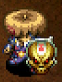</td>
    <td>This shield reduces explosive damage. The special effect on this shield is great.</td>
  </tr>
</table>

Reducing explosion damage from Pop Tanks, Explochins, and traps is fantastic. 
However, its base defense is low, so you'll likely struggle from around mid game. 
The Anti-Blast rune reduces explosion damage by 50%, so that's usually plenty.

<table class="itemDetailsTable">
  <tbody>
    <tr>
      <th>Lv</th>
      <th>Name</th>
      <th>Rune</th>
      <th>Def</th>
      <th>Max</th>
      <th>Ct</th>
      <th>Exp</th>
      <th>Buy</th>
      <th>Sell</th>
      <th>Info</th>
    </tr>
    <tr>
      <td>1</td>
      <td>Blast Shield</td>
      <td rowspan="7">(Anti-Blast)</td>
      <td>5</td>
      <td>15</td>
      <td>6</td>
      <td>-</td>
      <td>6000</td>
      <td>2100</td>
      <td rowspan="8">Reduces explosion damage. (50%, +5% per level up | Lv8: 85%)  Resonance: <a href="/shiren5/item/weapons#crescent-katana">Crescent Katana</a> (Attack and Defense +3)</td>
    </tr>
    <tr>
      <td>2</td>
      <td>Plain Blast Shld</td>
      <td>7</td>
      <td>25</td>
      <td>7</td>
      <td>700</td>
      <td>7000</td>
      <td>2450</td>
    </tr>
    <tr>
      <td>3</td>
      <td>Nice Blast Shld</td>
      <td>9</td>
      <td>35</td>
      <td>8</td>
      <td>1400</td>
      <td>8000</td>
      <td>2800</td>
    </tr>
    <tr>
      <td>4</td>
      <td>Good Blast Shld</td>
      <td>10</td>
      <td>45</td>
      <td>9</td>
      <td>2800</td>
      <td>9000</td>
      <td>3150</td>
    </tr>
    <tr>
      <td>5</td>
      <td>Rare Blast Shld</td>
      <td>11</td>
      <td>55</td>
      <td>10</td>
      <td>5600</td>
      <td>10000</td>
      <td>3500</td>
    </tr>
    <tr>
      <td>6</td>
      <td>Fine Blast Shld</td>
      <td>12</td>
      <td>65</td>
      <td>11</td>
      <td>11200</td>
      <td>11000</td>
      <td>3850</td>
    </tr>
    <tr>
      <td>7</td>
      <td>Epic Blast Shld</td>
      <td>14</td>
      <td>75</td>
      <td>12</td>
      <td>22400</td>
      <td>12000</td>
      <td>4200</td>
    </tr>
    <tr>
      <td>8</td>
      <td>Bomb Shelter</td>
      <td>(Anti-Blast) Rustproof Anti-Burgle</td>
      <td>15</td>
      <td>99</td>
      <td>∞</td>
      <td>33600</td>
      <td>15500</td>
      <td>5425</td>
    </tr>
  </tbody>
</table>

Locations:

<table class="locationTable">
  <tr>
    <th>Trail</th>
    <th>Past</th>
    <th>Present</th>
    <th>Future</th>
    <th>Fortune</th>
    <th>Miracle</th>
    <th>Rocks</th>
    <th>Gen</th>
    <th>Pitfall</th>
    <th>Manor</th>
  </tr>
  <tr>
    <td>FP</td>
    <td>FP</td>
    <td>FP</td>
    <td>FPZ</td>
    <td>FPZ</td>
    <td>FP</td>
    <td>Expert</td>
    <td>E</td>
    <td>FSPZME</td>
    <td>FPZM</td>
  </tr>
  <tr>
    <th>Bizarre</th>
    <th>Onigiri</th>
    <th>Chasm</th>
    <th>Well</th>
    <th>Lake</th>
    <th>Inori</th>
    <th>Old</th>
    <th>Descent</th>
    <th></th>
    <th></th>
  </tr>
  <tr>
    <td>FPZ</td>
    <td>S</td>
    <td>FSPZM</td>
    <td>-</td>
    <td>FSP</td>
    <td>FPZM</td>
    <td>SPZ</td>
    <td>SZM</td>
    <td></td>
    <td></td>
  </tr>
</table>

### Lock Shield

<table class="itemDetailsTable">
  <tr>
    <th>Lv1-7</th>
    <th>Lv8</th>
    <th>Lv1 Description</th>
  </tr>
  <tr>
    <td>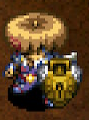</td>
    <td></td>
    <td>Zalokleft type monsters can't steal from you while you have this equipped. Your precious belongings won't be stolen anymore with this equipped. Never starve to death pursuing pesky purloining pilferers again!</td>
  </tr>
</table>

Lets you hunt Zaloklefts without risk of having items stolen. 
Not a strong shield, but gains Anti-Blast at Lv8 and levels up somewhat quickly. 
It's worth leveling as a secondary shield for synthesis if you're worried about Cranky Tanks.

<table class="itemDetailsTable">
  <tbody>
    <tr>
      <th>Lv</th>
      <th>Name</th>
      <th>Rune</th>
      <th>Def</th>
      <th>Max</th>
      <th>Ct</th>
      <th>Exp</th>
      <th>Buy</th>
      <th>Sell</th>
      <th>Info</th>
    </tr>
    <tr>
      <td>1</td>
      <td>Lock Shield</td>
      <td rowspan="7">(Anti-Theft)</td>
      <td>5</td>
      <td>15</td>
      <td>5</td>
      <td>-</td>
      <td>2000</td>
      <td>700</td>
      <td rowspan="8">Protects your items from being stolen by monsters.</td>
    </tr>
    <tr>
      <td>2</td>
      <td>Ward Lock Shld</td>
      <td>6</td>
      <td>25</td>
      <td>6</td>
      <td>500</td>
      <td>2400</td>
      <td>840</td>
    </tr>
    <tr>
      <td>3</td>
      <td>Padlock Shld</td>
      <td>7</td>
      <td>35</td>
      <td>7</td>
      <td>1500</td>
      <td>2800</td>
      <td>980</td>
    </tr>
    <tr>
      <td>4</td>
      <td>Deadbolt Shld</td>
      <td>8</td>
      <td>45</td>
      <td>8</td>
      <td>3000</td>
      <td>3200</td>
      <td>1120</td>
    </tr>
    <tr>
      <td>5</td>
      <td>Cyl Lock Shld</td>
      <td>9</td>
      <td>55</td>
      <td>9</td>
      <td>5000</td>
      <td>3600</td>
      <td>1260</td>
    </tr>
    <tr>
      <td>6</td>
      <td>Disc Lock Shld</td>
      <td>10</td>
      <td>65</td>
      <td>10</td>
      <td>7500</td>
      <td>4000</td>
      <td>1400</td>
    </tr>
    <tr>
      <td>7</td>
      <td>Smart Lock Shld</td>
      <td>11</td>
      <td>75</td>
      <td>11</td>
      <td>11000</td>
      <td>4400</td>
      <td>1540</td>
    </tr>
    <tr>
      <td>8</td>
      <td>Retina Scan</td>
      <td>(Anti-Theft) Anti-Blast</td>
      <td>12</td>
      <td>99</td>
      <td>∞</td>
      <td>16000</td>
      <td>5100</td>
      <td>1785</td>
    </tr>
  </tbody>
</table>

Locations:

<table class="locationTable">
  <tr>
    <th>Trail</th>
    <th>Past</th>
    <th>Present</th>
    <th>Future</th>
    <th>Fortune</th>
    <th>Miracle</th>
    <th>Rocks</th>
    <th>Gen</th>
    <th>Pitfall</th>
    <th>Manor</th>
  </tr>
  <tr>
    <td>FSP</td>
    <td>FSP</td>
    <td>FSP</td>
    <td>FSPZ</td>
    <td>FSPZ</td>
    <td>FSP</td>
    <td>Expert</td>
    <td>FPZM</td>
    <td>FSPZM</td>
    <td>FSPZM</td>
  </tr>
  <tr>
    <th>Bizarre</th>
    <th>Onigiri</th>
    <th>Chasm</th>
    <th>Well</th>
    <th>Lake</th>
    <th>Inori</th>
    <th>Old</th>
    <th>Descent</th>
    <th></th>
    <th></th>
  </tr>
  <tr>
    <td>FPZ</td>
    <td>FPZM</td>
    <td>FPZM</td>
    <td>-</td>
    <td>FP</td>
    <td>FSPZM</td>
    <td>FM</td>
    <td>SPM</td>
    <td></td>
    <td></td>
  </tr>
</table>

### Safe Shield

<table class="itemDetailsTable">
  <tr>
    <th>Lv1-7</th>
    <th>Lv8</th>
    <th>Lv1 Description</th>
  </tr>
  <tr>
    <td>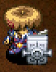</td>
    <td></td>
    <td>Froggo type monsters can't steal from you while you have this equipped. You'll never have to do on the fly cost-benefit analysis to figure out if its worth chasing down stolen cash again!</td>
  </tr>
</table>

Lets you hunt Froggos for Gitan without risk of having Gitan stolen. 
Not a strong shield, but gains Anti-Blast at Lv8 and levels up somewhat quickly. 
It's worth leveling as a secondary shield for synthesis if you're worried about Cranky Tanks. The Anti-Burgle rune gains value if you're using the Costly rune.

<table class="itemDetailsTable">
  <tbody>
    <tr>
      <th>Lv</th>
      <th>Name</th>
      <th>Rune</th>
      <th>Def</th>
      <th>Max</th>
      <th>Ct</th>
      <th>Exp</th>
      <th>Buy</th>
      <th>Sell</th>
      <th>Info</th>
    </tr>
    <tr>
      <td>1</td>
      <td>Safe Shield</td>
      <td rowspan="7">(Anti-Burgle)</td>
      <td>6</td>
      <td>15</td>
      <td>6</td>
      <td>-</td>
      <td>1800</td>
      <td>630</td>
      <td rowspan="8">Protects your Gitan from being stolen by monsters.</td>
    </tr>
    <tr>
      <td>2</td>
      <td>Coffer Shield</td>
      <td>7</td>
      <td>25</td>
      <td>7</td>
      <td>400</td>
      <td>2000</td>
      <td>700</td>
    </tr>
    <tr>
      <td>3</td>
      <td>Lockbox Shield</td>
      <td>8</td>
      <td>35</td>
      <td>8</td>
      <td>1200</td>
      <td>2200</td>
      <td>770</td>
    </tr>
    <tr>
      <td>4</td>
      <td>Cashbox Shield</td>
      <td>9</td>
      <td>45</td>
      <td>9</td>
      <td>2400</td>
      <td>2400</td>
      <td>840</td>
    </tr>
    <tr>
      <td>5</td>
      <td>Strongbox Shld</td>
      <td>10</td>
      <td>55</td>
      <td>10</td>
      <td>4800</td>
      <td>2600</td>
      <td>910</td>
    </tr>
    <tr>
      <td>6</td>
      <td>Vault Shield</td>
      <td>11</td>
      <td>65</td>
      <td>11</td>
      <td>7200</td>
      <td>2800</td>
      <td>980</td>
    </tr>
    <tr>
      <td>7</td>
      <td>Bank Shield</td>
      <td>12</td>
      <td>75</td>
      <td>12</td>
      <td>12000</td>
      <td>3000</td>
      <td>1050</td>
    </tr>
    <tr>
      <td>8</td>
      <td>Fort Knox</td>
      <td>(Anti-Burgle) Anti-Blast</td>
      <td>13</td>
      <td>99</td>
      <td>∞</td>
      <td>16800</td>
      <td>4100</td>
      <td>1435</td>
    </tr>
  </tbody>
</table>

Locations:

<table class="locationTable">
  <tr>
    <th>Trail</th>
    <th>Past</th>
    <th>Present</th>
    <th>Future</th>
    <th>Fortune</th>
    <th>Miracle</th>
    <th>Rocks</th>
    <th>Gen</th>
    <th>Pitfall</th>
    <th>Manor</th>
  </tr>
  <tr>
    <td>FSP</td>
    <td>FSP</td>
    <td>FSP</td>
    <td>FSPZ</td>
    <td>FSPZ</td>
    <td>FSP</td>
    <td>Expert</td>
    <td>FPZM</td>
    <td>FSPZM</td>
    <td>FSPZM</td>
  </tr>
  <tr>
    <th>Bizarre</th>
    <th>Onigiri</th>
    <th>Chasm</th>
    <th>Well</th>
    <th>Lake</th>
    <th>Inori</th>
    <th>Old</th>
    <th>Descent</th>
    <th></th>
    <th></th>
  </tr>
  <tr>
    <td>FPZ</td>
    <td>FPZM</td>
    <td>FPZM</td>
    <td>-</td>
    <td>FP</td>
    <td>FSPZM</td>
    <td>FM</td>
    <td>SPM</td>
    <td></td>
    <td></td>
  </tr>
</table>

### Gyadon Blocker

<table class="itemDetailsTable">
  <tr>
    <th>Lv1-7</th>
    <th>Lv8</th>
    <th>Lv1 Description</th>
  </tr>
  <tr>
    <td></td>
    <td></td>
    <td>Gyadon type monsters can't eat your items while you have this equipped. With this, you won't have to worry about your usage counts decreasing frivolously. What a relief.</td>
  </tr>
</table>

You can protect items against Gyadon and Gyairas by placing them down or into pots, 
but you can't fight Gyandora or Gyandoron worry-free unless you have Anti-Peck. It gains Agile at Lv8, but it's so slow to level up, it's not worth aiming for it.

<table class="itemDetailsTable">
  <tbody>
    <tr>
      <th>Lv</th>
      <th>Name</th>
      <th>Rune</th>
      <th>Def</th>
      <th>Max</th>
      <th>Ct</th>
      <th>Exp</th>
      <th>Buy</th>
      <th>Sell</th>
      <th>Info</th>
    </tr>
    <tr>
      <td>1</td>
      <td>Gyadon Blocker</td>
      <td rowspan="7">(Anti-Peck)</td>
      <td>7</td>
      <td>15</td>
      <td>7</td>
      <td>-</td>
      <td>4000</td>
      <td>1400</td>
      <td rowspan="8">Protects your items from being pecked by Gyadons.</td>
    </tr>
    <tr>
      <td>2</td>
      <td>Gyadon Shield</td>
      <td>8</td>
      <td>25</td>
      <td>8</td>
      <td>700</td>
      <td>4500</td>
      <td>1575</td>
    </tr>
    <tr>
      <td>3</td>
      <td>Gyadon Limiter</td>
      <td>9</td>
      <td>35</td>
      <td>9</td>
      <td>1400</td>
      <td>5000</td>
      <td>1750</td>
    </tr>
    <tr>
      <td>4</td>
      <td>Gyadon Resistor</td>
      <td>10</td>
      <td>45</td>
      <td>10</td>
      <td>2800</td>
      <td>5500</td>
      <td>1925</td>
    </tr>
    <tr>
      <td>5</td>
      <td>Gyadon Stopper</td>
      <td>11</td>
      <td>55</td>
      <td>11</td>
      <td>5600</td>
      <td>6000</td>
      <td>2100</td>
    </tr>
    <tr>
      <td>6</td>
      <td>Gyadon Foiler</td>
      <td>12</td>
      <td>65</td>
      <td>12</td>
      <td>11200</td>
      <td>6500</td>
      <td>2275</td>
    </tr>
    <tr>
      <td>7</td>
      <td>Gyadon Barrier</td>
      <td>13</td>
      <td>75</td>
      <td>13</td>
      <td>22400</td>
      <td>7000</td>
      <td>2450</td>
    </tr>
    <tr>
      <td>8</td>
      <td>Gyad-NON!</td>
      <td>(Anti-Peck) Agile</td>
      <td>14</td>
      <td>99</td>
      <td>∞</td>
      <td>33600</td>
      <td>11000</td>
      <td>3850</td>
    </tr>
  </tbody>
</table>

Locations:

<table class="locationTable">
  <tr>
    <th>Trail</th>
    <th>Past</th>
    <th>Present</th>
    <th>Future</th>
    <th>Fortune</th>
    <th>Miracle</th>
    <th>Rocks</th>
    <th>Gen</th>
    <th>Pitfall</th>
    <th>Manor</th>
  </tr>
  <tr>
    <td>FSP</td>
    <td>FSP</td>
    <td>FSP</td>
    <td>FSPZ</td>
    <td>FSPZ</td>
    <td>FSP</td>
    <td>Expert</td>
    <td>FPZM</td>
    <td>FSPZM</td>
    <td>FSPZM</td>
  </tr>
  <tr>
    <th>Bizarre</th>
    <th>Onigiri</th>
    <th>Chasm</th>
    <th>Well</th>
    <th>Lake</th>
    <th>Inori</th>
    <th>Old</th>
    <th>Descent</th>
    <th></th>
    <th></th>
  </tr>
  <tr>
    <td>FPZ</td>
    <td>FPZM</td>
    <td>FPZM</td>
    <td>-</td>
    <td>FP</td>
    <td>FSPZM</td>
    <td>FM</td>
    <td>SPM</td>
    <td></td>
    <td></td>
  </tr>
</table>

### Snake Shield

<table class="itemDetailsTable">
  <tr>
    <th>Lv1-7</th>
    <th>Lv8</th>
    <th>Lv1 Description</th>
  </tr>
  <tr>
    <td></td>
    <td></td>
    <td>A shield you made from lizard scales that can reduce fire damage dealt to you. You should've made it with dragon scales, but I guess you're not ready for that.</td>
  </tr>
</table>

Decent starting base defense, and reduces fire damage by 50% at Lv1, or 85% at Lv8. 
However, it's very slow to level up, and its defense only increases by 1 per level. Still, some players like to level it as a secondary shield for Abyssal Dragon floors.

<table class="itemDetailsTable">
  <tbody>
    <tr>
      <th>Lv</th>
      <th>Name</th>
      <th>Rune</th>
      <th>Def</th>
      <th>Max</th>
      <th>Ct</th>
      <th>Exp</th>
      <th>Buy</th>
      <th>Sell</th>
      <th>Info</th>
    </tr>
    <tr>
      <td>1</td>
      <td>Snake Shield</td>
      <td rowspan="7">(Anti-Fire)</td>
      <td>10</td>
      <td>15</td>
      <td>5</td>
      <td>-</td>
      <td>10000</td>
      <td>3500</td>
      <td rowspan="8">Reduces fire damage. (50%, +5% per level up | Lv8: 85%)  Resonance: <a href="/shiren5/item/weapons#lizard-lasher">Lizard Lasher</a> (Attack and Defense +3)</td>
    </tr>
    <tr>
      <td>2</td>
      <td>Fine Snake Shld</td>
      <td>11</td>
      <td>25</td>
      <td>6</td>
      <td>800</td>
      <td>12000</td>
      <td>4200</td>
    </tr>
    <tr>
      <td>3</td>
      <td>Asp Aspis</td>
      <td>12</td>
      <td>35</td>
      <td>7</td>
      <td>1600</td>
      <td>13000</td>
      <td>4550</td>
    </tr>
    <tr>
      <td>4</td>
      <td>Fine Asp Aspis</td>
      <td>13</td>
      <td>45</td>
      <td>8</td>
      <td>3200</td>
      <td>15000</td>
      <td>5250</td>
    </tr>
    <tr>
      <td>5</td>
      <td>Dracoshield</td>
      <td>14</td>
      <td>55</td>
      <td>9</td>
      <td>6400</td>
      <td>16000</td>
      <td>5600</td>
    </tr>
    <tr>
      <td>6</td>
      <td>Fine Dracoshld</td>
      <td>15</td>
      <td>65</td>
      <td>10</td>
      <td>12000</td>
      <td>17000</td>
      <td>5950</td>
    </tr>
    <tr>
      <td>7</td>
      <td>Dragon Aegis</td>
      <td>16</td>
      <td>75</td>
      <td>11</td>
      <td>24000</td>
      <td>18000</td>
      <td>6300</td>
    </tr>
    <tr>
      <td>8</td>
      <td>Dragonkeeper</td>
      <td>(Anti-Fire) Retribution</td>
      <td>17</td>
      <td>99</td>
      <td>∞</td>
      <td>36000</td>
      <td>25000</td>
      <td>8750</td>
    </tr>
  </tbody>
</table>

Locations:

<table class="locationTable">
  <tr>
    <th>Trail</th>
    <th>Past</th>
    <th>Present</th>
    <th>Future</th>
    <th>Fortune</th>
    <th>Miracle</th>
    <th>Rocks</th>
    <th>Gen</th>
    <th>Pitfall</th>
    <th>Manor</th>
  </tr>
  <tr>
    <td>F</td>
    <td>F</td>
    <td>F</td>
    <td>F</td>
    <td>F</td>
    <td>F</td>
    <td>Expert</td>
    <td>E</td>
    <td>FSPZME</td>
    <td>FM</td>
  </tr>
  <tr>
    <th>Bizarre</th>
    <th>Onigiri</th>
    <th>Chasm</th>
    <th>Well</th>
    <th>Lake</th>
    <th>Inori</th>
    <th>Old</th>
    <th>Descent</th>
    <th></th>
    <th></th>
  </tr>
  <tr>
    <td>FPZ</td>
    <td>S</td>
    <td>FSPZM</td>
    <td>-</td>
    <td>FSP</td>
    <td>FM</td>
    <td>SPZ</td>
    <td>SZM</td>
    <td></td>
    <td></td>
  </tr>
</table>

### Steady Shield

<table class="itemDetailsTable">
  <tr>
    <th>Lv1-7</th>
    <th>Lv8</th>
    <th>Lv1 Description</th>
  </tr>
  <tr>
    <td></td>
    <td></td>
    <td>Nullifies any effect that would move you from your position. In other words, even if you use Warp Grass or Swap Staff, it won't work. This sounds...useless.</td>
  </tr>
</table>

Essential for Horrabbit and Terrabbit floors. 
Without this shield, you could collapse on any given turn by being attracted. 
That said, Unmoving negates the effect of items like Pinning Staff and Warp Grass, so it may be better to keep it as a secondary shield instead of synthesizing it.

<table class="itemDetailsTable">
  <tbody>
    <tr>
      <th>Lv</th>
      <th>Name</th>
      <th>Rune</th>
      <th>Def</th>
      <th>Max</th>
      <th>Ct</th>
      <th>Exp</th>
      <th>Buy</th>
      <th>Sell</th>
      <th>Info</th>
    </tr>
    <tr>
      <td>1</td>
      <td>Steady Shield</td>
      <td rowspan="7">(Unmoving)</td>
      <td>4</td>
      <td>15</td>
      <td>6</td>
      <td>-</td>
      <td>3000</td>
      <td>1050</td>
      <td rowspan="8">Nullifies all movement effects. (<a href="/shiren5/system/monsters#fearabbit">Fearabbit</a> ability, etc.)</td>
    </tr>
    <tr>
      <td>2</td>
      <td>Bold Shield</td>
      <td>6</td>
      <td>25</td>
      <td>7</td>
      <td>500</td>
      <td>4000</td>
      <td>1400</td>
    </tr>
    <tr>
      <td>3</td>
      <td>Staunch Shield</td>
      <td>8</td>
      <td>35</td>
      <td>8</td>
      <td>1500</td>
      <td>5000</td>
      <td>1750</td>
    </tr>
    <tr>
      <td>4</td>
      <td>Dogged Shield</td>
      <td>10</td>
      <td>45</td>
      <td>9</td>
      <td>3000</td>
      <td>6000</td>
      <td>2100</td>
    </tr>
    <tr>
      <td>5</td>
      <td>Steadfast Shld</td>
      <td>11</td>
      <td>55</td>
      <td>10</td>
      <td>5000</td>
      <td>7000</td>
      <td>2450</td>
    </tr>
    <tr>
      <td>6</td>
      <td>Resolute Shield</td>
      <td>12</td>
      <td>65</td>
      <td>11</td>
      <td>7500</td>
      <td>8000</td>
      <td>2800</td>
    </tr>
    <tr>
      <td>7</td>
      <td>Valiant Shield</td>
      <td>13</td>
      <td>75</td>
      <td>12</td>
      <td>11000</td>
      <td>9000</td>
      <td>3150</td>
    </tr>
    <tr>
      <td>8</td>
      <td>Stalwart Shield</td>
      <td>(Unmoving) Retribution</td>
      <td>14</td>
      <td>99</td>
      <td>∞</td>
      <td>16000</td>
      <td>16000</td>
      <td>5600</td>
    </tr>
  </tbody>
</table>

Locations:

<table class="locationTable">
  <tr>
    <th>Trail</th>
    <th>Past</th>
    <th>Present</th>
    <th>Future</th>
    <th>Fortune</th>
    <th>Miracle</th>
    <th>Rocks</th>
    <th>Gen</th>
    <th>Pitfall</th>
    <th>Manor</th>
  </tr>
  <tr>
    <td>S</td>
    <td>S</td>
    <td>S</td>
    <td>S</td>
    <td>S</td>
    <td>S</td>
    <td>-</td>
    <td>S</td>
    <td>FPZM</td>
    <td>S</td>
  </tr>
  <tr>
    <th>Bizarre</th>
    <th>Onigiri</th>
    <th>Chasm</th>
    <th>Well</th>
    <th>Lake</th>
    <th>Inori</th>
    <th>Old</th>
    <th>Descent</th>
    <th></th>
    <th></th>
  </tr>
  <tr>
    <td>S</td>
    <td>S</td>
    <td>FPZM</td>
    <td>-</td>
    <td>FP</td>
    <td>S</td>
    <td>FM</td>
    <td>SPM</td>
    <td></td>
    <td></td>
  </tr>
</table>

### Anti-Gaze Trge

<table class="itemDetailsTable">
  <tr>
    <th>Lv1-7</th>
    <th>Lv8</th>
    <th>Lv1 Description</th>
  </tr>
  <tr>
    <td></td>
    <td></td>
    <td>This shield makes you immune to Gazer's hypnosis. Everyone hates being hypnotized, so this shield is pretty sweet.</td>
  </tr>
</table>

Fantastic for its exclusive Anti-Hypno rune, but lackluster as a main shield. 
Ultra Gazers in particular have the potential to cause many accidents.

<table class="itemDetailsTable">
  <tbody>
    <tr>
      <th>Lv</th>
      <th>Name</th>
      <th>Rune</th>
      <th>Def</th>
      <th>Max</th>
      <th>Ct</th>
      <th>Exp</th>
      <th>Buy</th>
      <th>Sell</th>
      <th>Info</th>
    </tr>
    <tr>
      <td>1</td>
      <td>Anti-Gaze Trge</td>
      <td rowspan="7">(Anti-Hypno)</td>
      <td>6</td>
      <td>15</td>
      <td>5</td>
      <td>-</td>
      <td>10000</td>
      <td>3500</td>
      <td rowspan="8">Protects against hypnosis. (Gazer special attacks)</td>
    </tr>
    <tr>
      <td>2</td>
      <td>Anti-Gaze Shld</td>
      <td>7</td>
      <td>25</td>
      <td>6</td>
      <td>1000</td>
      <td>11000</td>
      <td>3850</td>
    </tr>
    <tr>
      <td>3</td>
      <td>Non-Gaze Targe</td>
      <td>8</td>
      <td>35</td>
      <td>7</td>
      <td>2000</td>
      <td>12000</td>
      <td>4200</td>
    </tr>
    <tr>
      <td>4</td>
      <td>Non-Gaze Shld</td>
      <td>9</td>
      <td>45</td>
      <td>8</td>
      <td>4000</td>
      <td>13000</td>
      <td>4550</td>
    </tr>
    <tr>
      <td>5</td>
      <td>Gazeproof Trge</td>
      <td>10</td>
      <td>55</td>
      <td>9</td>
      <td>7000</td>
      <td>14000</td>
      <td>4900</td>
    </tr>
    <tr>
      <td>6</td>
      <td>Gazeproof Shld</td>
      <td>11</td>
      <td>65</td>
      <td>10</td>
      <td>11000</td>
      <td>15000</td>
      <td>5250</td>
    </tr>
    <tr>
      <td>7</td>
      <td>Gazestopper</td>
      <td>12</td>
      <td>75</td>
      <td>11</td>
      <td>16000</td>
      <td>16000</td>
      <td>5600</td>
    </tr>
    <tr>
      <td>8</td>
      <td>Gazebuster</td>
      <td>(Anti-Hypno) Agile</td>
      <td>13</td>
      <td>99</td>
      <td>∞</td>
      <td>22000</td>
      <td>21000</td>
      <td>7350</td>
    </tr>
  </tbody>
</table>

Locations:

<table class="locationTable">
  <tr>
    <th>Trail</th>
    <th>Past</th>
    <th>Present</th>
    <th>Future</th>
    <th>Fortune</th>
    <th>Miracle</th>
    <th>Rocks</th>
    <th>Gen</th>
    <th>Pitfall</th>
    <th>Manor</th>
  </tr>
  <tr>
    <td>E</td>
    <td>E</td>
    <td>E</td>
    <td>E</td>
    <td>E</td>
    <td>E</td>
    <td>-</td>
    <td>E</td>
    <td>SE</td>
    <td>E</td>
  </tr>
  <tr>
    <th>Bizarre</th>
    <th>Onigiri</th>
    <th>Chasm</th>
    <th>Well</th>
    <th>Lake</th>
    <th>Inori</th>
    <th>Old</th>
    <th>Descent</th>
    <th></th>
    <th></th>
  </tr>
  <tr>
    <td>E</td>
    <td>E</td>
    <td>FSPZME</td>
    <td>E</td>
    <td>FSPE</td>
    <td>E</td>
    <td>E</td>
    <td>E</td>
    <td></td>
    <td></td>
  </tr>
</table>

### Swap Shield

<table class="itemDetailsTable">
  <tr>
    <th>Lv1-7</th>
    <th>Lv8</th>
    <th>Lv1 Description</th>
  </tr>
  <tr>
    <td>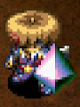</td>
    <td></td>
    <td>This shield transforms the effect of a Magic Bullet hit into damage. It's great that you'll be immune to the effects, but it'll hurt. Suck it up, buttercup.</td>
  </tr>
</table>

There's no reason to use it as a main shield unless you're using Burning Blade. The Magi-Twister rune converts magic bullet effects received into 10 damage, making it a fantastic answer to DJ Mage family monsters.

<table class="itemDetailsTable">
  <tbody>
    <tr>
      <th>Lv</th>
      <th>Name</th>
      <th>Rune</th>
      <th>Def</th>
      <th>Max</th>
      <th>Ct</th>
      <th>Exp</th>
      <th>Buy</th>
      <th>Sell</th>
      <th>Info</th>
    </tr>
    <tr>
      <td>1</td>
      <td>Swap Shield</td>
      <td rowspan="7">(Magi-Twister)</td>
      <td>7</td>
      <td>15</td>
      <td>7</td>
      <td>-</td>
      <td>6000</td>
      <td>2100</td>
      <td rowspan="8">Receive fixed damage instead of the effect when hit by a magic bullet. (10 damage, -1 per level up | Lv8: 3)  Resonance: <a href="/shiren5/item/weapons#burning-blade">Burning Blade</a> (Raise flame damage by 1 level) (30 damage at Lv8 / with Blue Flame rune)</td>
    </tr>
    <tr>
      <td>2</td>
      <td>Nice Swap Shld</td>
      <td>9</td>
      <td>25</td>
      <td>8</td>
      <td>1500</td>
      <td>7000</td>
      <td>2450</td>
    </tr>
    <tr>
      <td>3</td>
      <td>Good Swap Shld</td>
      <td>10</td>
      <td>35</td>
      <td>9</td>
      <td>3000</td>
      <td>8000</td>
      <td>2800</td>
    </tr>
    <tr>
      <td>4</td>
      <td>Rare Swap Shld</td>
      <td>11</td>
      <td>45</td>
      <td>10</td>
      <td>5500</td>
      <td>9000</td>
      <td>3150</td>
    </tr>
    <tr>
      <td>5</td>
      <td>Fine Swap Shld</td>
      <td>12</td>
      <td>55</td>
      <td>11</td>
      <td>9000</td>
      <td>10000</td>
      <td>3500</td>
    </tr>
    <tr>
      <td>6</td>
      <td>Epic Swap Shld</td>
      <td>14</td>
      <td>65</td>
      <td>12</td>
      <td>13500</td>
      <td>11000</td>
      <td>3850</td>
    </tr>
    <tr>
      <td>7</td>
      <td>Prismagic Shld</td>
      <td>15</td>
      <td>75</td>
      <td>13</td>
      <td>19000</td>
      <td>12000</td>
      <td>4200</td>
    </tr>
    <tr>
      <td>8</td>
      <td>Mega Prismagic</td>
      <td>(Magi-Twister) Uplifting Enhancing</td>
      <td>19</td>
      <td>99</td>
      <td>∞</td>
      <td>25500</td>
      <td>16000</td>
      <td>5600</td>
    </tr>
  </tbody>
</table>

Locations:

<table class="locationTable">
  <tr>
    <th>Trail</th>
    <th>Past</th>
    <th>Present</th>
    <th>Future</th>
    <th>Fortune</th>
    <th>Miracle</th>
    <th>Rocks</th>
    <th>Gen</th>
    <th>Pitfall</th>
    <th>Manor</th>
  </tr>
  <tr>
    <td>E</td>
    <td>E</td>
    <td>E</td>
    <td>E</td>
    <td>E</td>
    <td>E</td>
    <td>-</td>
    <td>E</td>
    <td>SE</td>
    <td>E</td>
  </tr>
  <tr>
    <th>Bizarre</th>
    <th>Onigiri</th>
    <th>Chasm</th>
    <th>Well</th>
    <th>Lake</th>
    <th>Inori</th>
    <th>Old</th>
    <th>Descent</th>
    <th></th>
    <th></th>
  </tr>
  <tr>
    <td>E</td>
    <td>E</td>
    <td>FSPZME</td>
    <td>E</td>
    <td>FSPE</td>
    <td>E</td>
    <td>E</td>
    <td>E</td>
    <td></td>
    <td></td>
  </tr>
</table>

### Shoddy Plank

<table class="itemDetailsTable">
  <tr>
    <th>Lv1-7</th>
    <th>Lv8</th>
    <th>Lv1 Description</th>
  </tr>
  <tr>
    <td></td>
    <td></td>
    <td>Its defense is strong at first, but it drops as the shield takes damage. In the end, you'll probably discard it. This process seems wasteful.</td>
  </tr>
</table>

Seal it and use it as a high stat shield until you find something better. 
Keep in mind that sealed equipment won't gain skill points, so you can't level it up.

<table class="itemDetailsTable">
  <tbody>
    <tr>
      <th>Lv</th>
      <th>Name</th>
      <th>Rune</th>
      <th>Def</th>
      <th>Max</th>
      <th>Ct</th>
      <th>Exp</th>
      <th>Buy</th>
      <th>Sell</th>
      <th>Info</th>
    </tr>
    <tr>
      <td>1</td>
      <td>Shoddy Plank</td>
      <td rowspan="8">(Expendable)</td>
      <td>30</td>
      <td>10</td>
      <td>10</td>
      <td>-</td>
      <td>4000</td>
      <td>1400</td>
      <td rowspan="8">Decrease shield upgrade value by 1 every time you get hit.  Resonance: <a href="/shiren5/item/weapons#shoddy-dirk">Shoddy Dirk</a> (Equipped items won't rust)</td>
    </tr>
    <tr>
      <td>2</td>
      <td>Shoddy Targe</td>
      <td>31</td>
      <td>20</td>
      <td>10</td>
      <td>1500</td>
      <td>4500</td>
      <td>1575</td>
    </tr>
    <tr>
      <td>3</td>
      <td>Shoddy Buckler</td>
      <td>32</td>
      <td>30</td>
      <td>10</td>
      <td>2500</td>
      <td>5000</td>
      <td>1750</td>
    </tr>
    <tr>
      <td>4</td>
      <td>Shoddy Heater</td>
      <td>33</td>
      <td>40</td>
      <td>10</td>
      <td>4500</td>
      <td>5500</td>
      <td>1925</td>
    </tr>
    <tr>
      <td>5</td>
      <td>Shoddy Aspis</td>
      <td>34</td>
      <td>50</td>
      <td>10</td>
      <td>8500</td>
      <td>6000</td>
      <td>2100</td>
    </tr>
    <tr>
      <td>6</td>
      <td>Shoddy Kite</td>
      <td>35</td>
      <td>60</td>
      <td>10</td>
      <td>17000</td>
      <td>6500</td>
      <td>2275</td>
    </tr>
    <tr>
      <td>7</td>
      <td>Shoddy Tower</td>
      <td>36</td>
      <td>70</td>
      <td>10</td>
      <td>26000</td>
      <td>7000</td>
      <td>2450</td>
    </tr>
    <tr>
      <td>8</td>
      <td>Worthy Shield</td>
      <td>37</td>
      <td>99</td>
      <td>∞</td>
      <td>52000</td>
      <td>8000</td>
      <td>2800</td>
    </tr>
  </tbody>
</table>

Locations:

<table class="locationTable">
  <tr>
    <th>Trail</th>
    <th>Past</th>
    <th>Present</th>
    <th>Future</th>
    <th>Fortune</th>
    <th>Miracle</th>
    <th>Rocks</th>
    <th>Gen</th>
    <th>Pitfall</th>
    <th>Manor</th>
  </tr>
  <tr>
    <td>S</td>
    <td>S</td>
    <td>S</td>
    <td>S</td>
    <td>S</td>
    <td>S</td>
    <td>-</td>
    <td>S</td>
    <td>SE</td>
    <td>S</td>
  </tr>
  <tr>
    <th>Bizarre</th>
    <th>Onigiri</th>
    <th>Chasm</th>
    <th>Well</th>
    <th>Lake</th>
    <th>Inori</th>
    <th>Old</th>
    <th>Descent</th>
    <th></th>
    <th></th>
  </tr>
  <tr>
    <td>S</td>
    <td>S</td>
    <td>FSPZM</td>
    <td>-</td>
    <td>FSP</td>
    <td>S</td>
    <td>SPZ</td>
    <td>SM</td>
    <td></td>
    <td></td>
  </tr>
</table>

### Glass Buckler

<table class="itemDetailsTable">
  <tr>
    <th>Lv1-7</th>
    <th>Lv8</th>
    <th>Lv1 Description</th>
  </tr>
  <tr>
    <td>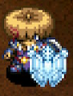</td>
    <td>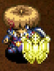</td>
    <td>A famed glassmaker created this work of art. It looks beautiful, but it shatters easily because it's made of glass. Who wants to use a shield made of glass?</td>
  </tr>
</table>

Seal it and use it as a high stat shield until you find something better. 
Keep in mind that sealed equipment won't gain skill points, so you can't level it up. Its resonance effect is great, but you're unlikely to come across both items in the same run.

<table class="itemDetailsTable">
  <tbody>
    <tr>
      <th>Lv</th>
      <th>Name</th>
      <th>Rune</th>
      <th>Def</th>
      <th>Max</th>
      <th>Ct</th>
      <th>Exp</th>
      <th>Buy</th>
      <th>Sell</th>
      <th>Info</th>
    </tr>
    <tr>
      <td>1</td>
      <td>Glass Buckler</td>
      <td rowspan="7">(Unsound)</td>
      <td>35</td>
      <td>15</td>
      <td>4</td>
      <td>-</td>
      <td>6000</td>
      <td>2100</td>
      <td rowspan="8">Chance for the shield to break when hit by an attack. (50%, -2% per level up | Lv8: 36%)  Resonance: <a href="/shiren5/item/weapons#glass-dirk">Glass Dirk</a> (Nullifies magic bullets received)</td>
    </tr>
    <tr>
      <td>2</td>
      <td>Glass Targe</td>
      <td>36</td>
      <td>25</td>
      <td>5</td>
      <td>1000</td>
      <td>6500</td>
      <td>2275</td>
    </tr>
    <tr>
      <td>3</td>
      <td>Glass Aspis</td>
      <td>37</td>
      <td>35</td>
      <td>6</td>
      <td>2000</td>
      <td>7000</td>
      <td>2450</td>
    </tr>
    <tr>
      <td>4</td>
      <td>Glass Kite</td>
      <td>38</td>
      <td>45</td>
      <td>7</td>
      <td>4000</td>
      <td>7500</td>
      <td>2625</td>
    </tr>
    <tr>
      <td>5</td>
      <td>Glass Tower</td>
      <td>39</td>
      <td>55</td>
      <td>8</td>
      <td>8000</td>
      <td>8000</td>
      <td>2800</td>
    </tr>
    <tr>
      <td>6</td>
      <td>Fragile Shield</td>
      <td>40</td>
      <td>65</td>
      <td>9</td>
      <td>16000</td>
      <td>8500</td>
      <td>2975</td>
    </tr>
    <tr>
      <td>7</td>
      <td>Delicate Shield</td>
      <td>41</td>
      <td>75</td>
      <td>10</td>
      <td>24000</td>
      <td>9000</td>
      <td>3150</td>
    </tr>
    <tr>
      <td>8</td>
      <td>Frangible Shld</td>
      <td>(Unsound) Stupefying</td>
      <td>42</td>
      <td>99</td>
      <td>11</td>
      <td>48000</td>
      <td>11000</td>
      <td>3850</td>
    </tr>
  </tbody>
</table>

Locations:

<table class="locationTable">
  <tr>
    <th>Trail</th>
    <th>Past</th>
    <th>Present</th>
    <th>Future</th>
    <th>Fortune</th>
    <th>Miracle</th>
    <th>Rocks</th>
    <th>Gen</th>
    <th>Pitfall</th>
    <th>Manor</th>
  </tr>
  <tr>
    <td>E</td>
    <td>E</td>
    <td>E</td>
    <td>E</td>
    <td>E</td>
    <td>-</td>
    <td>-</td>
    <td>E</td>
    <td>SE</td>
    <td>E</td>
  </tr>
  <tr>
    <th>Bizarre</th>
    <th>Onigiri</th>
    <th>Chasm</th>
    <th>Well</th>
    <th>Lake</th>
    <th>Inori</th>
    <th>Old</th>
    <th>Descent</th>
    <th></th>
    <th></th>
  </tr>
  <tr>
    <td>E</td>
    <td>E</td>
    <td>SE</td>
    <td>-</td>
    <td>SE</td>
    <td>E</td>
    <td>E</td>
    <td>SE</td>
    <td></td>
    <td></td>
  </tr>
</table>

### Pauper's Plank

<table class="itemDetailsTable">
  <tr>
    <th>Lv1-7</th>
    <th>Lv8</th>
    <th>Lv1 Description</th>
  </tr>
  <tr>
    <td></td>
    <td></td>
    <td>Every time damage it taken, Gitan is spent to reduce the damage. If you have no Gitan, the shield's strength is nullified. What a money grubbing shield.</td>
  </tr>
</table>

Receive less damage, but Gitan is subtracted every time you get hit. 
The rate is 30G / 15% reduction at Lv1, and 250G / 50% reduction at Lv8. 
If you don't have enough Gitan, defense falls to 0. 

It rivals Daytime Queen (60% reduction) at Lv8, but is strictly worse in day-only dungeons. Don't read unidentified scrolls in dungeons where Bankruptcy Scroll can appear. Consider synthesizing it onto a Day Shield or Binary Shield instead.

<table class="itemDetailsTable">
  <tbody>
    <tr>
      <th>Lv</th>
      <th>Name</th>
      <th>Rune</th>
      <th>Def</th>
      <th>Max</th>
      <th>Ct</th>
      <th>Exp</th>
      <th>Buy</th>
      <th>Sell</th>
      <th>Info</th>
    </tr>
    <tr>
      <td>1</td>
      <td>Pauper's Plank</td>
      <td rowspan="8">(Costly)</td>
      <td>7</td>
      <td>15</td>
      <td>5</td>
      <td>-</td>
      <td>2500</td>
      <td>875</td>
      <td rowspan="8">Pay Gitan per hit to reduce damage. 0 defense if you don't have enough Gitan. (15% and 30G, +5% and ~30G per level up) (Lv8: 50% and 250G)  Resonance: <a href="/shiren5/item/weapons#dirk-of-debts">Dirk of Debts</a> (20% chance for foes to drop 200-399 Gitan)</td>
    </tr>
    <tr>
      <td>2</td>
      <td>Broke Buckler</td>
      <td>9</td>
      <td>25</td>
      <td>7</td>
      <td>500</td>
      <td>2700</td>
      <td>945</td>
    </tr>
    <tr>
      <td>3</td>
      <td>Scarce Shield</td>
      <td>10</td>
      <td>35</td>
      <td>9</td>
      <td>1000</td>
      <td>2900</td>
      <td>1015</td>
    </tr>
    <tr>
      <td>4</td>
      <td>Haggard Hoblon</td>
      <td>11</td>
      <td>45</td>
      <td>11</td>
      <td>3000</td>
      <td>3100</td>
      <td>1085</td>
    </tr>
    <tr>
      <td>5</td>
      <td>Gitan Spender</td>
      <td>13</td>
      <td>55</td>
      <td>13</td>
      <td>6000</td>
      <td>3300</td>
      <td>1155</td>
    </tr>
    <tr>
      <td>6</td>
      <td>Gitan Waster</td>
      <td>14</td>
      <td>65</td>
      <td>15</td>
      <td>10000</td>
      <td>3500</td>
      <td>1225</td>
    </tr>
    <tr>
      <td>7</td>
      <td>Gitan Fritterer</td>
      <td>15</td>
      <td>75</td>
      <td>17</td>
      <td>14000</td>
      <td>3700</td>
      <td>1295</td>
    </tr>
    <tr>
      <td>8</td>
      <td>Gitan Ravager</td>
      <td>17</td>
      <td>99</td>
      <td>∞</td>
      <td>20000</td>
      <td>4000</td>
      <td>1400</td>
    </tr>
  </tbody>
</table>

Locations:

- Tanuki Password: Golddigger

 

<table class="locationTable">
  <tr>
    <th>Trail</th>
    <th>Past</th>
    <th>Present</th>
    <th>Future</th>
    <th>Fortune</th>
    <th>Miracle</th>
    <th>Rocks</th>
    <th>Gen</th>
    <th>Pitfall</th>
    <th>Manor</th>
  </tr>
  <tr>
    <td>E</td>
    <td>E</td>
    <td>E</td>
    <td>E</td>
    <td>E</td>
    <td>-</td>
    <td>-</td>
    <td>E</td>
    <td>FSPZME</td>
    <td>E</td>
  </tr>
  <tr>
    <th>Bizarre</th>
    <th>Onigiri</th>
    <th>Chasm</th>
    <th>Well</th>
    <th>Lake</th>
    <th>Inori</th>
    <th>Old</th>
    <th>Descent</th>
    <th></th>
    <th></th>
  </tr>
  <tr>
    <td>SE</td>
    <td>SE</td>
    <td>FSPZM</td>
    <td>-</td>
    <td>FSP</td>
    <td>E</td>
    <td>SPZE</td>
    <td>SM</td>
    <td></td>
    <td></td>
  </tr>
</table>

### Rush Shield

<table class="itemDetailsTable">
  <tr>
    <th>Lv1-7</th>
    <th>Lv8</th>
    <th>Lv1 Description</th>
  </tr>
  <tr>
    <td></td>
    <td></td>
    <td>"As the name implies, this shield is made for offense. It's not really even a shield. Why you ask?" (To be continued...)</td>
  </tr>
</table>

Shield strength is added to attack instead of defense. Its resonance effect conflicts with both items, since critical hits eliminate the need to increase attack, and defense is needed to cover for Extreme Sword's lower accuracy.

<table class="itemDetailsTable">
  <tbody>
    <tr>
      <th>Lv</th>
      <th>Name</th>
      <th>Rune</th>
      <th>Def</th>
      <th>Max</th>
      <th>Ct</th>
      <th>Exp</th>
      <th>Buy</th>
      <th>Sell</th>
      <th>Info</th>
    </tr>
    <tr>
      <td>1</td>
      <td>Rush Shield</td>
      <td rowspan="8">(Offensive)</td>
      <td>10</td>
      <td>15</td>
      <td>4</td>
      <td>-</td>
      <td>3000</td>
      <td>1050</td>
      <td rowspan="8">Shield strength is added to attack instead of defense.  Resonance: <a href="/shiren5/item/weapons#extreme-sword">Extreme Sword</a> (Equip 2 bracelets)</td>
    </tr>
    <tr>
      <td>2</td>
      <td>Charge Shield</td>
      <td>12</td>
      <td>25</td>
      <td>5</td>
      <td>1000</td>
      <td>4000</td>
      <td>1400</td>
    </tr>
    <tr>
      <td>3</td>
      <td>Attack Shield</td>
      <td>13</td>
      <td>35</td>
      <td>6</td>
      <td>2000</td>
      <td>5000</td>
      <td>1750</td>
    </tr>
    <tr>
      <td>4</td>
      <td>Blitz Shield</td>
      <td>14</td>
      <td>45</td>
      <td>7</td>
      <td>4000</td>
      <td>6000</td>
      <td>2100</td>
    </tr>
    <tr>
      <td>5</td>
      <td>Raid Shield</td>
      <td>16</td>
      <td>55</td>
      <td>8</td>
      <td>8000</td>
      <td>7000</td>
      <td>2450</td>
    </tr>
    <tr>
      <td>6</td>
      <td>Strike Shield</td>
      <td>17</td>
      <td>65</td>
      <td>9</td>
      <td>16000</td>
      <td>8000</td>
      <td>2800</td>
    </tr>
    <tr>
      <td>7</td>
      <td>Aggro Shield</td>
      <td>18</td>
      <td>75</td>
      <td>10</td>
      <td>32000</td>
      <td>9000</td>
      <td>3150</td>
    </tr>
    <tr>
      <td>8</td>
      <td>The Big Badass</td>
      <td>20</td>
      <td>99</td>
      <td>∞</td>
      <td>64000</td>
      <td>10000</td>
      <td>3500</td>
    </tr>
  </tbody>
</table>

Locations:

- Tanuki Password: O-FENCE!

 

<table class="locationTable">
  <tr>
    <th>Trail</th>
    <th>Past</th>
    <th>Present</th>
    <th>Future</th>
    <th>Fortune</th>
    <th>Miracle</th>
    <th>Rocks</th>
    <th>Gen</th>
    <th>Pitfall</th>
    <th>Manor</th>
  </tr>
  <tr>
    <td>-</td>
    <td>-</td>
    <td>-</td>
    <td>-</td>
    <td>-</td>
    <td>-</td>
    <td>-</td>
    <td>-</td>
    <td>FSPZME</td>
    <td>-</td>
  </tr>
  <tr>
    <th>Bizarre</th>
    <th>Onigiri</th>
    <th>Chasm</th>
    <th>Well</th>
    <th>Lake</th>
    <th>Inori</th>
    <th>Old</th>
    <th>Descent</th>
    <th></th>
    <th></th>
  </tr>
  <tr>
    <td>S</td>
    <td>FPZM</td>
    <td>FPZM</td>
    <td>-</td>
    <td>FP</td>
    <td>-</td>
    <td>FM</td>
    <td>SM</td>
    <td></td>
    <td></td>
  </tr>
</table>

### Blazing Shield

<table class="itemDetailsTable">
  <tr>
    <th>Lv1-7</th>
    <th>Lv8</th>
    <th>Lv1 Description</th>
  </tr>
  <tr>
    <td>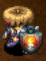</td>
    <td></td>
    <td>Burn items to illuminate surroundings. This ability cannot be synthesized. Hold the fire aloft and walk through the night.</td>
  </tr>
</table>

Quite rare, but makes for an excellent secondary shield for night. 
Its resonance effect illuminates everything on-screen, and activates with any torch.

<table class="itemDetailsTable">
  <tbody>
    <tr>
      <th>Lv</th>
      <th>Name</th>
      <th>Rune</th>
      <th>Def</th>
      <th>Max</th>
      <th>Ct</th>
      <th>Exp</th>
      <th>Buy</th>
      <th>Sell</th>
      <th>Info</th>
    </tr>
    <tr>
      <td>1</td>
      <td>Blazing Shield</td>
      <td rowspan="8">-</td>
      <td>4</td>
      <td>15</td>
      <td>4</td>
      <td>-</td>
      <td>1500</td>
      <td>525</td>
      <td rowspan="8">Burn items to create light in a 1 tile radius. (This ability cannot be synthesized)  Resonance: <a href="/shiren5/item/weapons#torch">Torches</a> (Light up everything on-screen at night)</td>
    </tr>
    <tr>
      <td>2</td>
      <td>Incendiary Shld</td>
      <td>5</td>
      <td>25</td>
      <td>5</td>
      <td>300</td>
      <td>1600</td>
      <td>560</td>
    </tr>
    <tr>
      <td>3</td>
      <td>Scalding Shield</td>
      <td>6</td>
      <td>35</td>
      <td>6</td>
      <td>900</td>
      <td>1700</td>
      <td>595</td>
    </tr>
    <tr>
      <td>4</td>
      <td>Igniting Shield</td>
      <td>7</td>
      <td>45</td>
      <td>7</td>
      <td>1800</td>
      <td>1800</td>
      <td>630</td>
    </tr>
    <tr>
      <td>5</td>
      <td>Sizzling Shield</td>
      <td>8</td>
      <td>55</td>
      <td>8</td>
      <td>3600</td>
      <td>1900</td>
      <td>665</td>
    </tr>
    <tr>
      <td>6</td>
      <td>Charring Shield</td>
      <td>9</td>
      <td>65</td>
      <td>9</td>
      <td>7200</td>
      <td>2000</td>
      <td>700</td>
    </tr>
    <tr>
      <td>7</td>
      <td>Cremating Shld</td>
      <td>10</td>
      <td>75</td>
      <td>10</td>
      <td>14400</td>
      <td>2100</td>
      <td>735</td>
    </tr>
    <tr>
      <td>8</td>
      <td>The Burninator</td>
      <td>11</td>
      <td>99</td>
      <td>∞</td>
      <td>28800</td>
      <td>2500</td>
      <td>875</td>
    </tr>
  </tbody>
</table>

Locations:

<table class="locationTable">
  <tr>
    <th>Trail</th>
    <th>Past</th>
    <th>Present</th>
    <th>Future</th>
    <th>Fortune</th>
    <th>Miracle</th>
    <th>Rocks</th>
    <th>Gen</th>
    <th>Pitfall</th>
    <th>Manor</th>
  </tr>
  <tr>
    <td>E</td>
    <td>E</td>
    <td>E</td>
    <td>E</td>
    <td>E</td>
    <td>-</td>
    <td>-</td>
    <td>-</td>
    <td>-</td>
    <td>E</td>
  </tr>
  <tr>
    <th>Bizarre</th>
    <th>Onigiri</th>
    <th>Chasm</th>
    <th>Well</th>
    <th>Lake</th>
    <th>Inori</th>
    <th>Old</th>
    <th>Descent</th>
    <th></th>
    <th></th>
  </tr>
  <tr>
    <td>SE</td>
    <td>-</td>
    <td>-</td>
    <td>E</td>
    <td>-</td>
    <td>E</td>
    <td>FME</td>
    <td>E</td>
    <td></td>
    <td></td>
  </tr>
</table>

### Onigiri Shield

<table class="itemDetailsTable">
  <tr>
    <th>Lv1-7</th>
    <th>Lv8</th>
    <th>Lv1 Description</th>
  </tr>
  <tr>
    <td>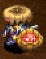</td>
    <td>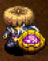</td>
    <td>Attacks that turn you or your items into onigiri are nullified. Now you can ensure your precious items' safety and make sure nothing is turned into friggin' onigiri.</td>
  </tr>
</table>

Fantastic as a rune, but its base defense is lacking as a main shield. That said, it's worth leveling it to Lv6 for CR Diet before synthesizing it. Basically exclusive to Primordial Chasm in the base game, but appears in PS Vita dungeons.

<table class="itemDetailsTable">
  <tbody>
    <tr>
      <th>Lv</th>
      <th>Name</th>
      <th>Rune</th>
      <th>Def</th>
      <th>Max</th>
      <th>Ct</th>
      <th>Exp</th>
      <th>Buy</th>
      <th>Sell</th>
      <th>Info</th>
    </tr>
    <tr>
      <td>1</td>
      <td>Onigiri Shield</td>
      <td rowspan="5">(Anti-Onigiri)</td>
      <td>5</td>
      <td>15</td>
      <td>5</td>
      <td>-</td>
      <td>12000</td>
      <td>4200</td>
      <td rowspan="8">Protects you and your items from being turned into onigiri by monster special attacks.</td>
    </tr>
    <tr>
      <td>2</td>
      <td>Big Onigiri</td>
      <td>7</td>
      <td>25</td>
      <td>6</td>
      <td>100</td>
      <td>13000</td>
      <td>4550</td>
    </tr>
    <tr>
      <td>3</td>
      <td>Onigiri-fest</td>
      <td>8</td>
      <td>35</td>
      <td>7</td>
      <td>500</td>
      <td>14000</td>
      <td>4900</td>
    </tr>
    <tr>
      <td>4</td>
      <td>Nigiri-Onigiri</td>
      <td>10</td>
      <td>45</td>
      <td>8</td>
      <td>1000</td>
      <td>15000</td>
      <td>5250</td>
    </tr>
    <tr>
      <td>5</td>
      <td>Salmon Onigiri</td>
      <td>11</td>
      <td>55</td>
      <td>9</td>
      <td>2000</td>
      <td>16000</td>
      <td>5600</td>
    </tr>
    <tr>
      <td>6</td>
      <td>Ume Onigiri</td>
      <td rowspan="3">(Anti-Onigiri) CR Diet</td>
      <td>13</td>
      <td>65</td>
      <td>10</td>
      <td>4000</td>
      <td>17500</td>
      <td>6125</td>
    </tr>
    <tr>
      <td>7</td>
      <td>Tenmusu Shld</td>
      <td>14</td>
      <td>75</td>
      <td>11</td>
      <td>8000</td>
      <td>18500</td>
      <td>6475</td>
    </tr>
    <tr>
      <td>8</td>
      <td>Mom's Cooking</td>
      <td>16</td>
      <td>99</td>
      <td>∞</td>
      <td>16000</td>
      <td>20500</td>
      <td>7175</td>
    </tr>
  </tbody>
</table>

Locations:

- Primordial Chasm (first clear)

 

<table class="locationTable">
  <tr>
    <th>Trail</th>
    <th>Past</th>
    <th>Present</th>
    <th>Future</th>
    <th>Fortune</th>
    <th>Miracle</th>
    <th>Rocks</th>
    <th>Gen</th>
    <th>Pitfall</th>
    <th>Manor</th>
  </tr>
  <tr>
    <td>-</td>
    <td>-</td>
    <td>-</td>
    <td>-</td>
    <td>-</td>
    <td>-</td>
    <td>-</td>
    <td>-</td>
    <td>-</td>
    <td>-</td>
  </tr>
  <tr>
    <th>Bizarre</th>
    <th>Onigiri</th>
    <th>Chasm</th>
    <th>Well</th>
    <th>Lake</th>
    <th>Inori</th>
    <th>Old</th>
    <th>Descent</th>
    <th></th>
    <th></th>
  </tr>
  <tr>
    <td>-</td>
    <td>-</td>
    <td>SE</td>
    <td>-</td>
    <td>-</td>
    <td>E</td>
    <td>-</td>
    <td>-</td>
    <td></td>
    <td></td>
  </tr>
</table>

### Parry Shield

<table class="itemDetailsTable">
  <tr>
    <th>Lv1-7</th>
    <th>Lv8</th>
    <th>Lv1 Description</th>
  </tr>
  <tr>
    <td>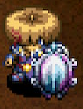</td>
    <td>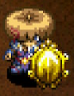</td>
    <td>This shield occasionally deflects direct damage to nearby creatures. As the shield is upgraded, the likelihood of getting a deflection increases!</td>
  </tr>
</table>

Occasionally redirects direct attack damage to another creature within a 1 tile radius. The chance to redirect damage is 30% at Lv1, or 51% at Lv8.

This ability might sound beneficial at first glance, but there are a few drawbacks. The attacker levels up if they defeat a monster through redirected damage, redirected damage can cancel paralysis if there are paralyzed enemies nearby, and if using it as a main shield, it gains Unmoving at Lv8 which hinders run-away play.

<table class="itemDetailsTable">
  <tbody>
    <tr>
      <th>Lv</th>
      <th>Name</th>
      <th>Rune</th>
      <th>Def</th>
      <th>Max</th>
      <th>Ct</th>
      <th>Exp</th>
      <th>Buy</th>
      <th>Sell</th>
      <th>Info</th>
    </tr>
    <tr>
      <td>1</td>
      <td>Parry Shield</td>
      <td rowspan="7">(Redirecting)</td>
      <td>8</td>
      <td>15</td>
      <td>4</td>
      <td>-</td>
      <td>9000</td>
      <td>3150</td>
      <td rowspan="8">Chance to redirect enemy direct attacks to adjacent creatures. (30%, +3% per level up | Lv8: 51%)</td>
    </tr>
    <tr>
      <td>2</td>
      <td>Good Parry Shld</td>
      <td>9</td>
      <td>25</td>
      <td>5</td>
      <td>1000</td>
      <td>10000</td>
      <td>3500</td>
    </tr>
    <tr>
      <td>3</td>
      <td>Nice Parry Shld</td>
      <td>10</td>
      <td>35</td>
      <td>6</td>
      <td>2000</td>
      <td>11000</td>
      <td>3850</td>
    </tr>
    <tr>
      <td>4</td>
      <td>Rare Parry Shld</td>
      <td>11</td>
      <td>45</td>
      <td>7</td>
      <td>4000</td>
      <td>12000</td>
      <td>4200</td>
    </tr>
    <tr>
      <td>5</td>
      <td>Fine Parry Shld</td>
      <td>12</td>
      <td>55</td>
      <td>8</td>
      <td>8000</td>
      <td>13000</td>
      <td>4550</td>
    </tr>
    <tr>
      <td>6</td>
      <td>Grt. Parry Shld</td>
      <td>13</td>
      <td>65</td>
      <td>9</td>
      <td>16000</td>
      <td>14000</td>
      <td>4900</td>
    </tr>
    <tr>
      <td>7</td>
      <td>Epic Parry Shld</td>
      <td>14</td>
      <td>75</td>
      <td>10</td>
      <td>32000</td>
      <td>15000</td>
      <td>5250</td>
    </tr>
    <tr>
      <td>8</td>
      <td>Untouchable</td>
      <td>(Redirecting) Retribution Unmoving</td>
      <td>15</td>
      <td>99</td>
      <td>∞</td>
      <td>64000</td>
      <td>22500</td>
      <td>7875</td>
    </tr>
  </tbody>
</table>

Locations:

- Lost Well (first clear)

 

<table class="locationTable">
  <tr>
    <th>Trail</th>
    <th>Past</th>
    <th>Present</th>
    <th>Future</th>
    <th>Fortune</th>
    <th>Miracle</th>
    <th>Rocks</th>
    <th>Gen</th>
    <th>Pitfall</th>
    <th>Manor</th>
  </tr>
  <tr>
    <td>-</td>
    <td>-</td>
    <td>-</td>
    <td>-</td>
    <td>-</td>
    <td>-</td>
    <td>-</td>
    <td>-</td>
    <td>-</td>
    <td>-</td>
  </tr>
  <tr>
    <th>Bizarre</th>
    <th>Onigiri</th>
    <th>Chasm</th>
    <th>Well</th>
    <th>Lake</th>
    <th>Inori</th>
    <th>Old</th>
    <th>Descent</th>
    <th></th>
    <th></th>
  </tr>
  <tr>
    <td>-</td>
    <td>-</td>
    <td>-</td>
    <td>E</td>
    <td>-</td>
    <td>-</td>
    <td>-</td>
    <td>-</td>
    <td></td>
    <td></td>
  </tr>
</table>

### Nirvana Board

<table class="itemDetailsTable">
  <tr>
    <th>Lv1-7</th>
    <th>Lv8</th>
    <th>Lv1 Description</th>
  </tr>
  <tr>
    <td>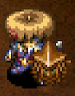</td>
    <td></td>
    <td>Actions won't make you hungry, but max fullness is set to 1. Your max fullness won't return to normal even after unequipping the shield, so be very sure you want to equip this.</td>
  </tr>
</table>

Stops natural fullness depletion while equipped, and sets max fullness to 1. 
Powerful ability, but losing the shield due to a Swordsman or Gazer can end your run. 

<table class="itemDetailsTable">
  <tbody>
    <tr>
      <th>Lv</th>
      <th>Name</th>
      <th>Rune</th>
      <th>Def</th>
      <th>Max</th>
      <th>Ct</th>
      <th>Exp</th>
      <th>Buy</th>
      <th>Sell</th>
      <th>Info</th>
    </tr>
    <tr>
      <td>1</td>
      <td>Nirvana Board</td>
      <td rowspan="7">(Unfamished)</td>
      <td>7</td>
      <td>15</td>
      <td>6</td>
      <td>-</td>
      <td>14000</td>
      <td>4900</td>
      <td rowspan="8">Decreases max fullness to 1, but also stops fullness depletion.  Resonance: <a href="/shiren5/item/weapons#wonder-pick">Wonder Pick</a> (Max HP +30)</td>
    </tr>
    <tr>
      <td>2</td>
      <td>Nirvana Guard</td>
      <td>9</td>
      <td>25</td>
      <td>7</td>
      <td>1000</td>
      <td>16000</td>
      <td>5600</td>
    </tr>
    <tr>
      <td>3</td>
      <td>Nirvana Targe</td>
      <td>11</td>
      <td>35</td>
      <td>8</td>
      <td>2000</td>
      <td>18000</td>
      <td>6300</td>
    </tr>
    <tr>
      <td>4</td>
      <td>Nirvana Plate</td>
      <td>13</td>
      <td>45</td>
      <td>9</td>
      <td>4000</td>
      <td>20000</td>
      <td>7000</td>
    </tr>
    <tr>
      <td>5</td>
      <td>Nirvana Shield</td>
      <td>15</td>
      <td>55</td>
      <td>10</td>
      <td>8000</td>
      <td>22000</td>
      <td>7700</td>
    </tr>
    <tr>
      <td>6</td>
      <td>Nirvana Aspis</td>
      <td>16</td>
      <td>65</td>
      <td>11</td>
      <td>16000</td>
      <td>24000</td>
      <td>8400</td>
    </tr>
    <tr>
      <td>7</td>
      <td>Nirvana Kite</td>
      <td>17</td>
      <td>75</td>
      <td>12</td>
      <td>32000</td>
      <td>26000</td>
      <td>9100</td>
    </tr>
    <tr>
      <td>8</td>
      <td>Nirvana Tower</td>
      <td>(Unfamished) Rustproof Tiger Mom</td>
      <td>18</td>
      <td>99</td>
      <td>∞</td>
      <td>64000</td>
      <td>31500</td>
      <td>11025</td>
    </tr>
  </tbody>
</table>

Locations:

- Master's Footprint (clear reward)

 

<table class="locationTable">
  <tr>
    <th>Trail</th>
    <th>Past</th>
    <th>Present</th>
    <th>Future</th>
    <th>Fortune</th>
    <th>Miracle</th>
    <th>Rocks</th>
    <th>Gen</th>
    <th>Pitfall</th>
    <th>Manor</th>
  </tr>
  <tr>
    <td>-</td>
    <td>-</td>
    <td>-</td>
    <td>-</td>
    <td>-</td>
    <td>-</td>
    <td>-</td>
    <td>-</td>
    <td>-</td>
    <td>-</td>
  </tr>
  <tr>
    <th>Bizarre</th>
    <th>Onigiri</th>
    <th>Chasm</th>
    <th>Well</th>
    <th>Lake</th>
    <th>Inori</th>
    <th>Old</th>
    <th>Descent</th>
    <th></th>
    <th></th>
  </tr>
  <tr>
    <td>-</td>
    <td>-</td>
    <td>-</td>
    <td>-</td>
    <td>-</td>
    <td>-</td>
    <td>SE</td>
    <td>-</td>
    <td></td>
    <td></td>
  </tr>
</table>

### Pathetic Shield

<table class="itemDetailsTable">
  <tr>
    <th>Lv1-7</th>
    <th>Lv8</th>
    <th>Lv1 Description</th>
  </tr>
  <tr>
    <td>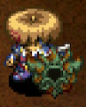</td>
    <td>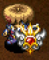</td>
    <td>A very weathered and battered shield. Its stats are quite low. It's better than nothing...barely.</td>
  </tr>
</table>

Extremely slow to level up, and is nearly worthless before Lv8. 
It unfortunately loses its 2 bracelet resonance effect when it reaches Lv8, 
and instead makes monsters occasionally take 1 step back. 
It's only used in dungeons that allow carry-in items by enthusiasts who like the design.

<table class="itemDetailsTable">
  <tbody>
    <tr>
      <th>Lv</th>
      <th>Name</th>
      <th>Rune</th>
      <th>Def</th>
      <th>Max</th>
      <th>Ct</th>
      <th>Exp</th>
      <th>Buy</th>
      <th>Sell</th>
      <th>Info</th>
    </tr>
    <tr>
      <td>1</td>
      <td>Pathetic Shield</td>
      <td rowspan="8">-</td>
      <td>2</td>
      <td>15</td>
      <td>1</td>
      <td>-</td>
      <td>360</td>
      <td>126</td>
      <td rowspan="7">Resonance: <a href="/shiren5/item/weapons#pathetic-blade">Pathetic Blade</a> (Equip 2 bracelets)</td>
    </tr>
    <tr>
      <td>2</td>
      <td>Awful Shield</td>
      <td>3</td>
      <td>25</td>
      <td>2</td>
      <td>1000</td>
      <td>460</td>
      <td>161</td>
    </tr>
    <tr>
      <td>3</td>
      <td>Battered Shield</td>
      <td>4</td>
      <td>35</td>
      <td>3</td>
      <td>2000</td>
      <td>560</td>
      <td>196</td>
    </tr>
    <tr>
      <td>4</td>
      <td>Rusty Shield</td>
      <td>5</td>
      <td>45</td>
      <td>4</td>
      <td>4000</td>
      <td>660</td>
      <td>231</td>
    </tr>
    <tr>
      <td>5</td>
      <td>Worn Shield</td>
      <td>6</td>
      <td>55</td>
      <td>5</td>
      <td>8000</td>
      <td>760</td>
      <td>266</td>
    </tr>
    <tr>
      <td>6</td>
      <td>Shabby Shield</td>
      <td>7</td>
      <td>65</td>
      <td>6</td>
      <td>16000</td>
      <td>860</td>
      <td>301</td>
    </tr>
    <tr>
      <td>7</td>
      <td>Dingy Shield</td>
      <td>8</td>
      <td>75</td>
      <td>7</td>
      <td>32000</td>
      <td>960</td>
      <td>336</td>
    </tr>
    <tr>
      <td>8</td>
      <td>Rising Sun Shld</td>
      <td>38</td>
      <td>99</td>
      <td>∞</td>
      <td>64000</td>
      <td>25000</td>
      <td>8750</td>
      <td>Resonance: <a href="/shiren5/item/weapons#pathetic-blade">Rising Sun</a> (Foes may step back)</td>
    </tr>
  </tbody>
</table>

Locations:

<table class="locationTable">
  <tr>
    <th>Trail</th>
    <th>Past</th>
    <th>Present</th>
    <th>Future</th>
    <th>Fortune</th>
    <th>Miracle</th>
    <th>Rocks</th>
    <th>Gen</th>
    <th>Pitfall</th>
    <th>Manor</th>
  </tr>
  <tr>
    <td>-</td>
    <td>-</td>
    <td>-</td>
    <td>-</td>
    <td>-</td>
    <td>-</td>
    <td>-</td>
    <td>-</td>
    <td>SE</td>
    <td>-</td>
  </tr>
  <tr>
    <th>Bizarre</th>
    <th>Onigiri</th>
    <th>Chasm</th>
    <th>Well</th>
    <th>Lake</th>
    <th>Inori</th>
    <th>Old</th>
    <th>Descent</th>
    <th></th>
    <th></th>
  </tr>
  <tr>
    <td>E</td>
    <td>FPZM</td>
    <td>FPZM</td>
    <td>-</td>
    <td>FP</td>
    <td>-</td>
    <td>FM</td>
    <td>FM</td>
    <td></td>
    <td></td>
  </tr>
</table>

### Fox Shield

<table class="itemDetailsTable">
  <tr>
    <th>Lv1-7</th>
    <th>Lv8</th>
    <th>Lv1 Description</th>
  </tr>
  <tr>
    <td></td>
    <td></td>
    <td>This is Koharu morphed into a shield. "Shiren! It's me! I'm Koharu! I'll work hard as your shield! I'll do my best to protect you, Shiren!"</td>
  </tr>
</table>

Obtained by asking Koharu to transform into a shield. 
High defense, but effectively 0 rune slots and has the slowest growth rate among all shields. 
The only sane way to level up this shield is to use the Gambler's Scroll technique.

<table class="itemDetailsTable">
  <tbody>
    <tr>
      <th>Lv</th>
      <th>Name</th>
      <th>Rune</th>
      <th>Def</th>
      <th>Max</th>
      <th>Ct</th>
      <th>Exp</th>
      <th>Buy</th>
      <th>Sell</th>
      <th>Info</th>
    </tr>
    <tr>
      <td>1</td>
      <td>Fox Shield</td>
      <td>-</td>
      <td>9</td>
      <td>25</td>
      <td>0</td>
      <td>-</td>
      <td>-</td>
      <td>-</td>
      <td rowspan="8">Ask <a href="/shiren5/system/allies#koharu">Koharu</a> to change into a shield.</td>
    </tr>
    <tr>
      <td>2</td>
      <td>Good Fox Shield</td>
      <td>Energizing</td>
      <td>12</td>
      <td>30</td>
      <td>1</td>
      <td>15000</td>
      <td>-</td>
      <td>-</td>
    </tr>
    <tr>
      <td>3</td>
      <td>Fine Fox Shield</td>
      <td rowspan="2">Energizing Adaptive</td>
      <td>15</td>
      <td>35</td>
      <td>2</td>
      <td>25000</td>
      <td>-</td>
      <td>-</td>
    </tr>
    <tr>
      <td>4</td>
      <td>Cute Shield</td>
      <td>18</td>
      <td>40</td>
      <td>2</td>
      <td>35000</td>
      <td>-</td>
      <td>-</td>
    </tr>
    <tr>
      <td>5</td>
      <td>Shy Shield</td>
      <td rowspan="2">Energizing Adaptive Ability Regen</td>
      <td>21</td>
      <td>45</td>
      <td>3</td>
      <td>45000</td>
      <td>-</td>
      <td>-</td>
    </tr>
    <tr>
      <td>6</td>
      <td>Loving Shield</td>
      <td>24</td>
      <td>50</td>
      <td>3</td>
      <td>55000</td>
      <td>-</td>
      <td>-</td>
    </tr>
    <tr>
      <td>7</td>
      <td>Smitten Shield</td>
      <td>Energizing Adaptive Ability Regen Critproof</td>
      <td>27</td>
      <td>55</td>
      <td>4</td>
      <td>65535</td>
      <td>-</td>
      <td>-</td>
    </tr>
    <tr>
      <td>8</td>
      <td>Koharu Shield</td>
      <td>Energizing Adaptive Ability Regen Critproof Curative</td>
      <td>30</td>
      <td>99</td>
      <td>5</td>
      <td>65535</td>
      <td>-</td>
      <td>-</td>
    </tr>
  </tbody>
</table>

Locations:

- Ask Koharu to change into a shield.

 

<table class="locationTable">
  <tr>
    <th>Trail</th>
    <th>Past</th>
    <th>Present</th>
    <th>Future</th>
    <th>Fortune</th>
    <th>Miracle</th>
    <th>Rocks</th>
    <th>Gen</th>
    <th>Pitfall</th>
    <th>Manor</th>
  </tr>
  <tr>
    <td>-</td>
    <td>-</td>
    <td>-</td>
    <td>-</td>
    <td>-</td>
    <td>-</td>
    <td>-</td>
    <td>-</td>
    <td>-</td>
    <td>-</td>
  </tr>
  <tr>
    <th>Bizarre</th>
    <th>Onigiri</th>
    <th>Chasm</th>
    <th>Well</th>
    <th>Lake</th>
    <th>Inori</th>
    <th>Old</th>
    <th>Descent</th>
    <th></th>
    <th></th>
  </tr>
  <tr>
    <td>-</td>
    <td>-</td>
    <td>-</td>
    <td>-</td>
    <td>-</td>
    <td>-</td>
    <td>-</td>
    <td>-</td>
    <td></td>
    <td></td>
  </tr>
</table>

### Helix Shield

<table class="itemDetailsTable">
  <tr>
    <th>Lv1-7</th>
    <th>Lv8</th>
    <th>Lv1 Description</th>
  </tr>
  <tr>
    <td></td>
    <td>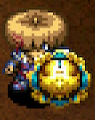</td>
    <td>This miraculous shield's existence still defies belief. Its spiral shape will enhance the effectiveness of Fuuma Iron.</td>
  </tr>
</table>

Obtained by wishing for an invincible shield in Inori Cave. 
Strongest regular shield, but can't compete with Daytime Queen's damage reduction. 
Its resonance effect lets you deal slightly meaningful damage to night monsters, which can be boosted further by equipping a Night Ward.

<table class="itemDetailsTable">
  <tbody>
    <tr>
      <th>Lv</th>
      <th>Name</th>
      <th>Rune</th>
      <th>Def</th>
      <th>Max</th>
      <th>Ct</th>
      <th>Exp</th>
      <th>Buy</th>
      <th>Sell</th>
      <th>Info</th>
    </tr>
    <tr>
      <td>1</td>
      <td>Helix Shield</td>
      <td rowspan="7">-</td>
      <td>25</td>
      <td>10</td>
      <td>∞</td>
      <td>-</td>
      <td>12000</td>
      <td>4200</td>
      <td rowspan="8">Clear Inori Cave with 7 catstones and wish for an invincible shield.  Resonance: <a href="/shiren5/item/weapons#fuuma-sword">Fuuma Sword</a> (Attack damage +10)  Resonance: <a href="/shiren5/item/weapons#kaburagi">Kaburagi</a> (Attack damage +10)</td>
    </tr>
    <tr>
      <td>2</td>
      <td>Good Helix Shld</td>
      <td>26</td>
      <td>17</td>
      <td>∞</td>
      <td>20000</td>
      <td>13000</td>
      <td>4550</td>
    </tr>
    <tr>
      <td>3</td>
      <td>Rare Helix Shld</td>
      <td>27</td>
      <td>24</td>
      <td>∞</td>
      <td>28000</td>
      <td>14000</td>
      <td>4900</td>
    </tr>
    <tr>
      <td>4</td>
      <td>Fine Helix Shld</td>
      <td>28</td>
      <td>32</td>
      <td>∞</td>
      <td>36000</td>
      <td>15000</td>
      <td>5250</td>
    </tr>
    <tr>
      <td>5</td>
      <td>Super Helix</td>
      <td>29</td>
      <td>41</td>
      <td>∞</td>
      <td>44000</td>
      <td>16000</td>
      <td>5600</td>
    </tr>
    <tr>
      <td>6</td>
      <td>Double Helix</td>
      <td>30</td>
      <td>50</td>
      <td>∞</td>
      <td>52000</td>
      <td>17000</td>
      <td>5950</td>
    </tr>
    <tr>
      <td>7</td>
      <td>Epic Dbl Helix</td>
      <td>31</td>
      <td>60</td>
      <td>∞</td>
      <td>60000</td>
      <td>18000</td>
      <td>6300</td>
    </tr>
    <tr>
      <td>8</td>
      <td>Infinautilus</td>
      <td>Anti-Hypno Tiger Mom</td>
      <td>40</td>
      <td>99</td>
      <td>∞</td>
      <td>65535</td>
      <td>29000</td>
      <td>10150</td>
    </tr>
  </tbody>
</table>

Locations:

- Wish for an invincible shield in Inori Cave.

 

<table class="locationTable">
  <tr>
    <th>Trail</th>
    <th>Past</th>
    <th>Present</th>
    <th>Future</th>
    <th>Fortune</th>
    <th>Miracle</th>
    <th>Rocks</th>
    <th>Gen</th>
    <th>Pitfall</th>
    <th>Manor</th>
  </tr>
  <tr>
    <td>-</td>
    <td>-</td>
    <td>-</td>
    <td>-</td>
    <td>-</td>
    <td>-</td>
    <td>-</td>
    <td>-</td>
    <td>-</td>
    <td>-</td>
  </tr>
  <tr>
    <th>Bizarre</th>
    <th>Onigiri</th>
    <th>Chasm</th>
    <th>Well</th>
    <th>Lake</th>
    <th>Inori</th>
    <th>Old</th>
    <th>Descent</th>
    <th></th>
    <th></th>
  </tr>
  <tr>
    <td>-</td>
    <td>-</td>
    <td>-</td>
    <td>-</td>
    <td>-</td>
    <td>-</td>
    <td>-</td>
    <td>-</td>
    <td></td>
    <td></td>
  </tr>
</table>
