# Weapon List

<table class="itemListCentered">
  <tr>
    <th colspan="6">Item Book Order</th>
  </tr>
  <tr>
    <th>1</th>
    <th>2</th>
    <th>3</th>
    <th>4</th>
    <th>5</th>
    <th>6</th>
  </tr>
  <tr>
    <td class="highlightLightblue"><a href="#ordinary-stick">Ordinary Stick</a></td>
    <td class="highlightLightblue"><a href="#kabura-katana">Kabura Katana</a></td>
    <td class="highlightOrange"><a href="#water-cutter">Water Cutter</a></td>
    <td class="highlightOrange"><a href="#lizard-lasher">Lizard Lasher</a></td>
    <td class="highlightOrange"><a href="#shoddy-dirk">Shoddy Dirk</a></td>
    <td class="highlightOrange"><a href="#wonder-pick">Wonder Pick</a></td>
  </tr>
  <tr>
    <td class="highlightLightblue"><a href="#tin-blade">Tin Blade</a></td>
    <td class="highlightLightblue"><a href="#fuuma-sword">Fuuma Sword</a></td>
    <td class="highlightOrange"><a href="#scythe">Scythe</a></td>
    <td class="highlightOrange"><a href="#nap-rattle">Nap Rattle</a></td>
    <td class="highlightOrange"><a href="#glass-dirk">Glass Dirk</a></td>
    <td class="highlightOrange"><a href="#sturdy-hammer">Sturdy Hammer</a></td>
  </tr>
  <tr>
    <td class="highlightLightblue"><a href="#katana">Katana</a></td>
    <td class="highlightOrange"><a href="#dull-gold-edge">Dull Gold Edge</a></td>
    <td class="highlightOrange"><a href="#myopic-masher">Myopic Masher</a></td>
    <td class="highlightOrange"><a href="#shockuto">Shockuto</a></td>
    <td class="highlightOrange"><a href="#dirk-of-debts">Dirk of Debts</a></td>
    <td class="highlightOrange"><a href="#true-knife">True Knife</a></td>
  </tr>
  <tr>
    <td class="highlightLightblue"><a href="#beast-fang">Beast Fang</a></td>
    <td class="highlightOrange"><a href="#bright-blade">Bright Blade</a></td>
    <td class="highlightOrange"><a href="#magic-masher">Magic Masher</a></td>
    <td class="highlightOrange"><a href="#blurry-stick">Blurry Stick</a></td>
    <td class="highlightOrange"><a href="#extreme-sword">Extreme Sword</a></td>
    <td class="highlightLightblue"><a href="#pathetic-blade">Pathetic Blade</a></td>
  </tr>
  <tr>
    <td class="highlightLightblue"><a href="#dotanuki">Dotanuki</a></td>
    <td class="highlightOrange"><a href="#rusty-pickaxe">Rusty Pickaxe</a></td>
    <td class="highlightOrange"><a href="#drain-dagger">Drain Dagger</a></td>
    <td class="highlightOrange"><a href="#sealing-keisaku">Sealing Keisaku</a></td>
    <td class="highlightOrange"><a href="#violent-blade">Violent Blade</a></td>
    <td class="highlightLightblue"><a href="#fox-kodachi">Fox Kodachi</a></td>
  </tr>
  <tr>
    <td class="highlightLightblue"><a href="#bladite">Bladite</a></td>
    <td class="highlightOrange"><a href="#old-mallet">Old Mallet</a></td>
    <td class="highlightOrange"><a href="#copper-cleaver">Copper Cleaver</a></td>
    <td class="highlightOrange"><a href="#baffle-axe">Baffle Axe</a></td>
    <td class="highlightOrange"><a href="#breeze-blade">Breeze Blade</a></td>
    <td class="highlightLightblue"><a href="#kaburagi">Kaburagi</a></td>
  </tr>
  <tr>
    <td class="highlightLightblue"><a href="#red-blade">Red Blade</a></td>
    <td class="highlightOrange"><a href="#sky-splitter">Sky Splitter</a></td>
    <td class="highlightOrange"><a href="#crescent-katana">Crescent Katana</a></td>
    <td class="highlightOrange"><a href="#hatchet">Hatchet</a></td>
    <td class="highlightOrange"><a href="#burning-blade">Burning Blade</a></td>
    <td class="highlightOrange"><a href="#torch">Torch</a></td>
  </tr>
</table>

# Lv8 Summary

<table class="itemTable">
  <thead>
    <tr>
      <th>Lv1</th>
      <th>Lv8</th>
      <th>Atk</th>
      <th>Max</th>
      <th>Ct</th>
      <th>Rune</th>
      <th>Added</th>
      <th>Exp</th>
      <th>Resonance</th>
    </tr>
  </thead>
  <tbody>
    <tr>
      <td class="highlightLightblue"><a href="#ordinary-stick">Ordinary Stick</a></td>
      <td class="highlightYellow">Ogre's Club</td>
      <td>15</td>
      <td>99</td>
      <td>∞</td>
      <td>-</td>
      <td>Redeeming (Lv8)</td>
      <td>25,250</td>
      <td><a href="/items/shields#plain-targe">Plain Targe</a> (Equip 2 bracelets)</td>
    </tr>
    <tr>
      <td class="highlightLightblue"><a href="#tin-blade">Tin Blade</a></td>
      <td class="highlightYellow">Bronze Dancer</td>
      <td>18</td>
      <td>99</td>
      <td>∞</td>
      <td>-</td>
      <td>Rustproof (Lv8)</td>
      <td>31,570</td>
      <td><a href="/items/shields#tin-shield">Tin Shield</a> (Equip 2 bracelets)</td>
    </tr>
    <tr>
      <td class="highlightLightblue"><a href="#katana">Katana</a></td>
      <td class="highlightYellow">Storied Katana</td>
      <td>22</td>
      <td>99</td>
      <td>∞</td>
      <td>-</td>
      <td>Rustproof (Lv8)</td>
      <td>49,300</td>
      <td><a href="/items/shields#iron-targe">Iron Targe</a> (Equip 2 bracelets)</td>
    </tr>
    <tr>
      <td class="highlightLightblue"><a href="#beast-fang">Beast Fang</a></td>
      <td class="highlightYellow">Beastmaster</td>
      <td>20</td>
      <td>99</td>
      <td>∞</td>
      <td>-</td>
      <td>Rustproof (Lv5)</td>
      <td>37,900</td>
      <td><a href="/items/shields#beast-shield">Beast Shield</a> (Equip 2 bracelets)</td>
    </tr>
    <tr>
      <td class="highlightLightblue"><a href="#dotanuki">Dotanuki</a></td>
      <td class="highlightYellow">Epic Dotanuki</td>
      <td>23</td>
      <td>99</td>
      <td>∞</td>
      <td>-</td>
      <td>Enhancing (Lv8)</td>
      <td>44,250</td>
      <td><a href="/items/shields#wolfshead">Wolfshead</a> (Equip 2 bracelets)</td>
    </tr>
    <tr>
      <td class="highlightLightblue"><a href="#bladite">Bladite</a></td>
      <td class="highlightYellow">Starcutter</td>
      <td>25</td>
      <td>99</td>
      <td>∞</td>
      <td>-</td>
      <td>Uplifting (Lv4) Rustproof (Lv8)</td>
      <td>50,600</td>
      <td><a href="/items/shields#targite">Targite</a> (Equip 2 bracelets)</td>
    </tr>
    <tr>
      <td class="highlightLightblue"><a href="#red-blade">Red Blade</a></td>
      <td class="highlightYellow">Shugoseki Swd</td>
      <td>27</td>
      <td>99</td>
      <td>∞</td>
      <td>-</td>
      <td>Uplifting (Lv3) Flame Shot (Lv8)</td>
      <td>56,950</td>
      <td><a href="/items/shields#red-shield">Red Shield</a> (Equip 2 bracelets)</td>
    </tr>
    <tr>
      <td class="highlightLightblue"><a href="#kabura-katana">Kabura Katana</a></td>
      <td class="highlightYellow">S-Class Kabura</td>
      <td>30</td>
      <td>99</td>
      <td>∞</td>
      <td>-</td>
      <td>Quick Hitting (Lv8)</td>
      <td>95,000</td>
      <td><a href="/items/shields#fuuma-shield">Fuuma Shield</a> (Attack damage +5)</td>
    </tr>
    <tr>
      <td class="highlightLightblue"><a href="#fuuma-sword">Fuuma Sword</a></td>
      <td class="highlightYellow">Hellfire Fuuma</td>
      <td>35</td>
      <td>99</td>
      <td>∞</td>
      <td>-</td>
      <td>Flame Shot (Lv7)</td>
      <td>175,000</td>
      <td><a href="/items/shields#fuuma-shield">Fuuma Shield</a> (Attack damage +5) <a href="/items/shields#helix-shield">Helix Shield</a> (Attack damage +10)</td>
    </tr>
    <tr>
      <td class="highlightOrange"><a href="#dull-gold-edge">Dull Gold Edge</a></td>
      <td class="highlightYellow">Pure Gold Blade</td>
      <td>14</td>
      <td>99</td>
      <td>∞</td>
      <td>Rustproof</td>
      <td>Paralyzing (Lv8)</td>
      <td>18,950</td>
      <td><a href="/items/shields#gold-shield">Gold Shield</a> (Max strength +3)</td>
    </tr>
    <tr>
      <td class="highlightOrange"><a href="#bright-blade">Bright Blade</a></td>
      <td class="highlightYellow">Flash Sword</td>
      <td>17</td>
      <td>99</td>
      <td>∞</td>
      <td>Redeeming</td>
      <td>Lively (Lv5) Confusing (Lv8)</td>
      <td>25,300</td>
      <td><a href="/items/shields#day-shield">Day Shield</a> (Read scrolls in the dark)</td>
    </tr>
    <tr>
      <td class="highlightOrange"><a href="#rusty-pickaxe">Rusty Pickaxe</a>※</td>
      <td class="highlightYellow">Luxury Pickaxe</td>
      <td>14</td>
      <td>99</td>
      <td>∞</td>
      <td>Wall Dig</td>
      <td>Blinding (Lv5)</td>
      <td>19,000</td>
      <td>-</td>
    </tr>
    <tr>
      <td class="highlightOrange"><a href="#old-mallet">Old Mallet</a>※</td>
      <td class="highlightYellow">Master's Mallet</td>
      <td>16</td>
      <td>99</td>
      <td>∞</td>
      <td>Trap Busting</td>
      <td>Confusing (Lv5)</td>
      <td>31,700</td>
      <td>-</td>
    </tr>
    <tr>
      <td class="highlightOrange"><a href="#sky-splitter">Sky Splitter</a></td>
      <td class="highlightYellow">Aerial Assault</td>
      <td>12</td>
      <td>99</td>
      <td>∞</td>
      <td>Anti-Floating</td>
      <td>Rustproof (Lv8)</td>
      <td>63,500</td>
      <td>-</td>
    </tr>
    <tr>
      <td class="highlightOrange"><a href="#water-cutter">Water Cutter</a></td>
      <td class="highlightYellow">Sea King Sword</td>
      <td>15</td>
      <td>99</td>
      <td>∞</td>
      <td>Anti-Aquatic</td>
      <td>Rustproof (Lv8)</td>
      <td>38,100</td>
      <td>-</td>
    </tr>
    <tr>
      <td class="highlightOrange"><a href="#scythe">Scythe</a></td>
      <td class="highlightYellow">Vegicide</td>
      <td>13</td>
      <td>99</td>
      <td>∞</td>
      <td>Anti-Plant</td>
      <td>Rustproof (Lv8)</td>
      <td>31,750</td>
      <td>-</td>
    </tr>
    <tr>
      <td class="highlightOrange"><a href="#myopic-masher">Myopic Masher</a></td>
      <td class="highlightYellow">Cyclopicide</td>
      <td>16</td>
      <td>99</td>
      <td>∞</td>
      <td>Anti-Cyclops</td>
      <td>Rustproof (Lv8)</td>
      <td>31,750</td>
      <td><a href="/items/shields#spry-shield">Spry Shield</a> (Attack and Defense +3)</td>
    </tr>
    <tr>
      <td class="highlightOrange"><a href="#magic-masher">Magic Masher</a></td>
      <td class="highlightYellow">Die Magic Die</td>
      <td>15</td>
      <td>99</td>
      <td>∞</td>
      <td>Anti-Magic</td>
      <td>Rustproof (Lv8)</td>
      <td>38,100</td>
      <td>-</td>
    </tr>
    <tr>
      <td class="highlightOrange"><a href="#drain-dagger">Drain Dagger</a></td>
      <td class="highlightYellow">Drain Master</td>
      <td>13</td>
      <td>99</td>
      <td>∞</td>
      <td>Anti-Drain</td>
      <td>Rustproof (Lv8)</td>
      <td>38,100</td>
      <td>-</td>
    </tr>
    <tr>
      <td class="highlightOrange"><a href="#copper-cleaver">Copper Cleaver</a></td>
      <td class="highlightYellow">Lightbringer</td>
      <td>15</td>
      <td>99</td>
      <td>∞</td>
      <td>Anti-Metal</td>
      <td>Rustproof (Lv8)</td>
      <td>63,500</td>
      <td>-</td>
    </tr>
    <tr>
      <td class="highlightOrange"><a href="#crescent-katana">Crescent Katana</a></td>
      <td class="highlightYellow">Lunar Sword</td>
      <td>14</td>
      <td>99</td>
      <td>∞</td>
      <td>Anti-Explode</td>
      <td>Rustproof (Lv8)</td>
      <td>50,800</td>
      <td><a href="/items/shields#blast-shield">Blast Shield</a> (Attack and Defense +3)</td>
    </tr>
    <tr>
      <td class="highlightOrange"><a href="#lizard-lasher">Lizard Lasher</a></td>
      <td class="highlightYellow">Dragons' Bane</td>
      <td>17</td>
      <td>99</td>
      <td>∞</td>
      <td>Anti-Dragon</td>
      <td>Rustproof (Lv8)</td>
      <td>63,500</td>
      <td><a href="/items/shields#snake-shield">Snake Shield</a> (Attack and Defense +3)</td>
    </tr>
    <tr>
      <td class="highlightOrange"><a href="#nap-rattle">Nap Rattle</a></td>
      <td class="highlightYellow">Ultimate Rattle</td>
      <td>16</td>
      <td>99</td>
      <td>11</td>
      <td>Sedating</td>
      <td>Rustproof (Lv8)</td>
      <td>50,700</td>
      <td><a href="/items/bracelets#alert-bracelet">Alert Bracelet</a> (Sleep chance +2%)</td>
    </tr>
    <tr>
      <td class="highlightOrange"><a href="#shockuto">Shockuto</a></td>
      <td class="highlightYellow">The Paralyzer</td>
      <td>15</td>
      <td>99</td>
      <td>12</td>
      <td>Paralyzing</td>
      <td>Rustproof (Lv8)</td>
      <td>50,700</td>
      <td>-</td>
    </tr>
    <tr>
      <td class="highlightOrange"><a href="#blurry-stick">Blurry Stick</a></td>
      <td class="highlightYellow">Blind Stick</td>
      <td>15</td>
      <td>99</td>
      <td>∞</td>
      <td>Blinding</td>
      <td>Rustproof (Lv8)</td>
      <td>59,900</td>
      <td>-</td>
    </tr>
    <tr>
      <td class="highlightOrange"><a href="#sealing-keisaku">Sealing Keisaku</a></td>
      <td class="highlightYellow">Divine Keisaku</td>
      <td>15</td>
      <td>99</td>
      <td>∞</td>
      <td>Sealing</td>
      <td>Rustproof (Lv8)</td>
      <td>38,000</td>
      <td>-</td>
    </tr>
    <tr>
      <td class="highlightOrange"><a href="#baffle-axe">Baffle Axe</a></td>
      <td class="highlightYellow">Epic Baffle Axe</td>
      <td>16</td>
      <td>99</td>
      <td>∞</td>
      <td>Confusing</td>
      <td>Rustproof (Lv8)</td>
      <td>38,000</td>
      <td><a href="/items/bracelets#anti-cnf-bracelet">Anti-Cnf. Bracelet</a> (Confusion chance +2%)</td>
    </tr>
    <tr>
      <td class="highlightOrange"><a href="#hatchet">Hatchet</a></td>
      <td class="highlightYellow">War God's Axe</td>
      <td>12</td>
      <td>99</td>
      <td>11</td>
      <td>Critical</td>
      <td>Lively (Lv5) Paralyzing (Lv8)</td>
      <td>38,000</td>
      <td>-</td>
    </tr>
    <tr>
      <td class="highlightOrange"><a href="#shoddy-dirk">Shoddy Dirk</a>※</td>
      <td class="highlightYellow">Worthy Sword</td>
      <td>37</td>
      <td>99</td>
      <td>∞</td>
      <td>Expendable</td>
      <td>Critical (Lv8) Quick Hitting (Lv8)</td>
      <td>103,000</td>
      <td><a href="/items/shields#shoddy-plank">Shoddy Plank</a> (Equipped items won't rust)</td>
    </tr>
    <tr>
      <td class="highlightOrange"><a href="#glass-dirk">Glass Dirk</a>※</td>
      <td class="highlightYellow">Frangible Edge</td>
      <td>42</td>
      <td>99</td>
      <td>11</td>
      <td>Unsound</td>
      <td>Stupefying (Lv8)</td>
      <td>103,000</td>
      <td><a href="/items/shields#glass-buckler">Glass Buckler</a> (Nullifies magic bullets)</td>
    </tr>
    <tr>
      <td class="highlightOrange"><a href="#dirk-of-debts">Dirk of Debts</a>※</td>
      <td class="highlightYellow">Gitan Gorger</td>
      <td>17</td>
      <td>99</td>
      <td>∞</td>
      <td>Costly</td>
      <td>-</td>
      <td>38,100</td>
      <td><a href="/items/shields#paupers-plank">Pauper's Plank</a> (Enemies drop Gitan often)</td>
    </tr>
    <tr>
      <td class="highlightOrange"><a href="#extreme-sword">Extreme Sword</a>※</td>
      <td class="highlightYellow">All-in Sword</td>
      <td>30</td>
      <td>99</td>
      <td>∞</td>
      <td>Focusing</td>
      <td>-</td>
      <td>63,000</td>
      <td><a href="/items/shields#rush-shield">Rush Shield</a> (Equip 2 bracelets)</td>
    </tr>
    <tr>
      <td class="highlightOrange"><a href="#violent-blade">Violent Blade</a>※</td>
      <td class="highlightYellow">Muramasa</td>
      <td>20</td>
      <td>99</td>
      <td>∞</td>
      <td>Obsessive</td>
      <td>Anti-Cyclops (Lv6) Blinding (Lv8)</td>
      <td>50,700</td>
      <td><a href="/items/bracelets#mojo-bracelet">Mojo Bracelet</a> (Chance to slow target)</td>
    </tr>
    <tr>
      <td class="highlightOrange"><a href="#breeze-blade">Breeze Blade</a></td>
      <td class="highlightYellow">Deathwind</td>
      <td>13</td>
      <td>99</td>
      <td>∞</td>
      <td>Tri-direction</td>
      <td>Energizing (Lv8)</td>
      <td>50,800</td>
      <td><a href="/items/shields#midnight-shield">Midnight Shield</a> (Equipped items won't rust)</td>
    </tr>
    <tr>
      <td class="highlightOrange"><a href="#burning-blade">Burning Blade</a></td>
      <td class="highlightYellow">Hellfire Katana</td>
      <td>16</td>
      <td>99</td>
      <td>∞</td>
      <td>Flame Shot</td>
      <td>Uplifting (Lv5) Anti-Explode (Lv8)</td>
      <td>63,000</td>
      <td><a href="/items/shields#swap-shield">Swap Shield</a> (Boost Flame Shot damage)</td>
    </tr>
    <tr>
      <td class="highlightOrange"><a href="#wonder-pick">Wonder Pick</a></td>
      <td class="highlightYellow">Wonder Wreckr</td>
      <td>18</td>
      <td>99</td>
      <td>∞</td>
      <td>Max Wall Dig</td>
      <td>Blinding (Lv5)</td>
      <td>127,000</td>
      <td><a href="/items/shields#nirvana-board">Nirvana Board</a> (Max HP +30)</td>
    </tr>
    <tr>
      <td class="highlightOrange"><a href="#sturdy-hammer">Sturdy Hammer</a></td>
      <td class="highlightYellow">Epic Hammer</td>
      <td>17</td>
      <td>99</td>
      <td>∞</td>
      <td>Trap Killing</td>
      <td>Confusing (Lv5)</td>
      <td>127,000</td>
      <td>-</td>
    </tr>
    <tr>
      <td class="highlightOrange"><a href="#true-knife">True Knife</a></td>
      <td class="highlightYellow">True Striker-X</td>
      <td>8</td>
      <td>99</td>
      <td>∞</td>
      <td>Accurate</td>
      <td>Critical (Lv8)</td>
      <td>127,000</td>
      <td><a href="/items/bracelets#anti-parry-brce">Anti-Parry Brce.</a> (Projectiles always hit)</td>
    </tr>
    <tr>
      <td class="highlightLightblue"><a href="#pathetic-blade">Pathetic Blade</a></td>
      <td class="highlightYellow">Rising Sun</td>
      <td>38</td>
      <td>99</td>
      <td>∞</td>
      <td>-</td>
      <td>-</td>
      <td>127,000</td>
      <td><a href="/items/shields#pathetic-shield">Pathetic Shield</a> (Lv1-7: Equip 2 bracelets) (Lv8: Foes may step back)</td>
    </tr>
    <tr>
      <td class="highlightLightblue"><a href="#fox-kodachi">Fox Kodachi</a></td>
      <td class="highlightYellow">Koharu Sword</td>
      <td>30</td>
      <td>99</td>
      <td>5</td>
      <td>-</td>
      <td>Energizing (Lv2) Clutch (Lv3) Enlightening (Lv5) Anointing (Lv7) Healing (Lv8) </td>
      <td>306,070</td>
      <td>-</td>
    </tr>
    <tr>
      <td class="highlightLightblue"><a href="#kaburagi">Kaburagi</a></td>
      <td class="highlightYellow">Kaburasutegi</td>
      <td>40</td>
      <td>99</td>
      <td>∞</td>
      <td>-</td>
      <td>Critical (Lv8) Quick Hitting (Lv8)</td>
      <td>305,535</td>
      <td><a href="/items/shields#helix-shield">Helix Shield</a> (Attack damage +10)</td>
    </tr>
  </tbody>
</table>

  
※ Weapon with a drawback.

# Details

#### Growth Experience

The listed experience points per level is not an accumilated total. 
Extra exp from defeating a monster will not carry forward when a weapon levels up. 
(Example: 100 exp until level up, defeat an Archdragon for 240 exp, 140 exp is lost)

#### Locations Key

|Letter|Meaning|
|-|-|
|F|Floor, Monster drop (day)|
|S|Store, Peddler, Shiny Object (yellow), Monster drop (night), Maneater drop|
|P|Presto Pot|
|Z|Zalokleft drop|
|M|Mealy drop|
|E|Elite store, Pick-A-Choice, Shiny Object (yellow, blue)|

### Ordinary Stick

<table class="itemDetailsTable">
  <tr>
    <th>Lv1-7</th>
    <th>Lv8</th>
    <th>Lv1 Description</th>
  </tr>
  <tr>
    <td></td>
    <td></td>
    <td>It's an ordinary stick. Totally ordinary. It's ubiquitous!</td>
  </tr>
</table>

It's weak, but levels up quickly. Has the highest starting upgrade limit among all weapons, so it shines in dungeons like Gen's Turf where you can obtain lots of Blank Scrolls. Good weapon to insert into Upgrade Pots.

<table class="itemDetailsTable">
  <tbody>
    <tr>
      <th>Lv</th>
      <th>Name</th>
      <th>Rune</th>
      <th>Atk</th>
      <th>Max</th>
      <th>Ct</th>
      <th>Exp</th>
      <th>Buy</th>
      <th>Sell</th>
      <th>Info</th>
    </tr>
    <tr>
      <td>1</td>
      <td>Ordinary Stick</td>
      <td rowspan="7">-</td>
      <td>2</td>
      <td>50</td>
      <td>5</td>
      <td>-</td>
      <td>300</td>
      <td>105</td>
      <td rowspan="8">Resonance: <a href="/items/shields#plain-targe">Plain Targe</a> (Equip 2 bracelets)</td>
    </tr>
    <tr>
      <td>2</td>
      <td>Good Stick</td>
      <td>3</td>
      <td>55</td>
      <td>6</td>
      <td>50</td>
      <td>400</td>
      <td>140</td>
    </tr>
    <tr>
      <td>3</td>
      <td>Stout Stick</td>
      <td>5</td>
      <td>60</td>
      <td>6</td>
      <td>400</td>
      <td>500</td>
      <td>175</td>
    </tr>
    <tr>
      <td>4</td>
      <td>Fine Stick</td>
      <td>6</td>
      <td>65</td>
      <td>7</td>
      <td>800</td>
      <td>600</td>
      <td>210</td>
    </tr>
    <tr>
      <td>5</td>
      <td>Sturdy Club</td>
      <td>8</td>
      <td>70</td>
      <td>7</td>
      <td>1600</td>
      <td>700</td>
      <td>245</td>
    </tr>
    <tr>
      <td>6</td>
      <td>Big Club</td>
      <td>9</td>
      <td>75</td>
      <td>8</td>
      <td>3200</td>
      <td>800</td>
      <td>280</td>
    </tr>
    <tr>
      <td>7</td>
      <td>Vicious Club</td>
      <td>11</td>
      <td>80</td>
      <td>8</td>
      <td>6400</td>
      <td>900</td>
      <td>315</td>
    </tr>
    <tr>
      <td>8</td>
      <td>Ogre's Club</td>
      <td>Redeeming</td>
      <td>15</td>
      <td>99</td>
      <td>∞</td>
      <td>12800</td>
      <td>1200</td>
      <td>420</td>
    </tr>
  </tbody>
</table>

Locations:

<table class="locationTable">
  <tr>
    <th>Trail</th>
    <th>Past</th>
    <th>Present</th>
    <th>Future</th>
    <th>Fortune</th>
    <th>Miracle</th>
    <th>Rocks</th>
    <th>Gen</th>
    <th>Pitfall</th>
    <th>Manor</th>
  </tr>
  <tr>
    <td>FP</td>
    <td>FP</td>
    <td>FP</td>
    <td>FPZ</td>
    <td>PZ</td>
    <td>P</td>
    <td>Novice</td>
    <td>FPZ</td>
    <td>PZ</td>
    <td>FPZ</td>
  </tr>
  <tr>
    <th>Bizarre</th>
    <th>Onigiri</th>
    <th>Chasm</th>
    <th>Well</th>
    <th>Lake</th>
    <th>Inori</th>
    <th>Old</th>
    <th>Descent</th>
    <th></th>
    <th></th>
  </tr>
  <tr>
    <td>FPZ</td>
    <td>PZ</td>
    <td>FPZ</td>
    <td>-</td>
    <td>FP</td>
    <td>FPZ</td>
    <td>PZ</td>
    <td>FPZ</td>
    <td></td>
    <td></td>
  </tr>
</table>

### Tin Blade

<table class="itemDetailsTable">
  <tr>
    <th>Lv1-7</th>
    <th>Lv8</th>
    <th>Lv1 Description</th>
  </tr>
  <tr>
    <td></td>
    <td></td>
    <td>A weapon made from sharpening tin. It gleams dully in the light.</td>
  </tr>
</table>

Basic weak weapon. It doesn't really have any redeeming qualities.

<table class="itemDetailsTable">
  <tbody>
    <tr>
      <th>Lv</th>
      <th>Name</th>
      <th>Rune</th>
      <th>Atk</th>
      <th>Max</th>
      <th>Ct</th>
      <th>Exp</th>
      <th>Buy</th>
      <th>Sell</th>
      <th>Info</th>
    </tr>
    <tr>
      <td>1</td>
      <td>Tin Blade</td>
      <td rowspan="7">-</td>
      <td>4</td>
      <td>8</td>
      <td>4</td>
      <td>-</td>
      <td>700</td>
      <td>245</td>
      <td rowspan="8">Resonance: <a href="/items/shields#tin-shield">Tin Shield</a> (Equip 2 bracelets)</td>
    </tr>
    <tr>
      <td>2</td>
      <td>Tin Sword</td>
      <td>5</td>
      <td>15</td>
      <td>5</td>
      <td>70</td>
      <td>800</td>
      <td>280</td>
    </tr>
    <tr>
      <td>3</td>
      <td>Keen Tin Sword</td>
      <td>7</td>
      <td>22</td>
      <td>5</td>
      <td>500</td>
      <td>900</td>
      <td>315</td>
    </tr>
    <tr>
      <td>4</td>
      <td>Fine Tin Sword</td>
      <td>8</td>
      <td>30</td>
      <td>6</td>
      <td>1000</td>
      <td>1000</td>
      <td>350</td>
    </tr>
    <tr>
      <td>5</td>
      <td>Bronze Blade</td>
      <td>10</td>
      <td>38</td>
      <td>6</td>
      <td>2000</td>
      <td>1100</td>
      <td>385</td>
    </tr>
    <tr>
      <td>6</td>
      <td>Bronze Rapier</td>
      <td>11</td>
      <td>46</td>
      <td>7</td>
      <td>4000</td>
      <td>1200</td>
      <td>420</td>
    </tr>
    <tr>
      <td>7</td>
      <td>Bronze Sword</td>
      <td>13</td>
      <td>55</td>
      <td>7</td>
      <td>8000</td>
      <td>1300</td>
      <td>455</td>
    </tr>
    <tr>
      <td>8</td>
      <td>Bronze Dancer</td>
      <td>Rustproof</td>
      <td>18</td>
      <td>99</td>
      <td>∞</td>
      <td>16000</td>
      <td>1600</td>
      <td>560</td>
    </tr>
  </tbody>
</table>

Locations:

<table class="locationTable">
  <tr>
    <th>Trail</th>
    <th>Past</th>
    <th>Present</th>
    <th>Future</th>
    <th>Fortune</th>
    <th>Miracle</th>
    <th>Rocks</th>
    <th>Gen</th>
    <th>Pitfall</th>
    <th>Manor</th>
  </tr>
  <tr>
    <td>FP</td>
    <td>FP</td>
    <td>FP</td>
    <td>FPZ</td>
    <td>PZ</td>
    <td>P</td>
    <td>Novice, Veteran</td>
    <td>FPZ</td>
    <td>PZ</td>
    <td>FPZ</td>
  </tr>
  <tr>
    <th>Bizarre</th>
    <th>Onigiri</th>
    <th>Chasm</th>
    <th>Well</th>
    <th>Lake</th>
    <th>Inori</th>
    <th>Old</th>
    <th>Descent</th>
    <th></th>
    <th></th>
  </tr>
  <tr>
    <td>FPZ</td>
    <td>PZ</td>
    <td>FPZ</td>
    <td>-</td>
    <td>FP</td>
    <td>FPZ</td>
    <td>PZ</td>
    <td>FPZ</td>
    <td></td>
    <td></td>
  </tr>
</table>

### Katana

<table class="itemDetailsTable">
  <tr>
    <th>Lv1-7</th>
    <th>Lv8</th>
    <th>Lv1 Description</th>
  </tr>
  <tr>
    <td></td>
    <td></td>
    <td>A standard weapon that is common wanderer gear.</td>
  </tr>
</table>

It has more rune slots than in Shiren 4, but it's still quite weak. Use it only if you're desperate to activate 2 bracelet resonance.

<table class="itemDetailsTable">
  <tbody>
    <tr>
      <th>Lv</th>
      <th>Name</th>
      <th>Rune</th>
      <th>Atk</th>
      <th>Max</th>
      <th>Ct</th>
      <th>Exp</th>
      <th>Buy</th>
      <th>Sell</th>
      <th>Info</th>
    </tr>
    <tr>
      <td>1</td>
      <td>Katana</td>
      <td rowspan="7">-</td>
      <td>6</td>
      <td>8</td>
      <td>4</td>
      <td>-</td>
      <td>1100</td>
      <td>385</td>
      <td rowspan="8">Resonance: <a href="/items/shields#iron-targe">Iron Targe</a> (Equip 2 bracelets)  Hone a Storied Katana+99 at the Hermit's Hermitage Blacksmith to transform it into a Fuuma Sword.</td>
    </tr>
    <tr>
      <td>2</td>
      <td>Good Katana</td>
      <td>7</td>
      <td>15</td>
      <td>4</td>
      <td>300</td>
      <td>1200</td>
      <td>420</td>
    </tr>
    <tr>
      <td>3</td>
      <td>Fine Katana</td>
      <td>8</td>
      <td>22</td>
      <td>5</td>
      <td>1000</td>
      <td>1300</td>
      <td>455</td>
    </tr>
    <tr>
      <td>4</td>
      <td>Keen Katana</td>
      <td>9</td>
      <td>30</td>
      <td>5</td>
      <td>2000</td>
      <td>1400</td>
      <td>490</td>
    </tr>
    <tr>
      <td>5</td>
      <td>Sharp Katana</td>
      <td>10</td>
      <td>38</td>
      <td>6</td>
      <td>4000</td>
      <td>1500</td>
      <td>525</td>
    </tr>
    <tr>
      <td>6</td>
      <td>Majestic Katana</td>
      <td>11</td>
      <td>46</td>
      <td>6</td>
      <td>8000</td>
      <td>1600</td>
      <td>560</td>
    </tr>
    <tr>
      <td>7</td>
      <td>Famous Katana</td>
      <td>12</td>
      <td>55</td>
      <td>7</td>
      <td>14000</td>
      <td>1700</td>
      <td>595</td>
    </tr>
    <tr>
      <td>8</td>
      <td>Storied Katana</td>
      <td>Rustproof</td>
      <td>22</td>
      <td>99</td>
      <td>∞</td>
      <td>20000</td>
      <td>2300</td>
      <td>808</td>
    </tr>
  </tbody>
</table>

Locations:

<table class="locationTable">
  <tr>
    <th>Trail</th>
    <th>Past</th>
    <th>Present</th>
    <th>Future</th>
    <th>Fortune</th>
    <th>Miracle</th>
    <th>Rocks</th>
    <th>Gen</th>
    <th>Pitfall</th>
    <th>Manor</th>
  </tr>
  <tr>
    <td>FSP</td>
    <td>FSP</td>
    <td>FSP</td>
    <td>FSPZ</td>
    <td>FPZ</td>
    <td>P</td>
    <td>Novice, Veteran</td>
    <td>FSPZM</td>
    <td>PZ</td>
    <td>FSPZ</td>
  </tr>
  <tr>
    <th>Bizarre</th>
    <th>Onigiri</th>
    <th>Chasm</th>
    <th>Well</th>
    <th>Lake</th>
    <th>Inori</th>
    <th>Old</th>
    <th>Descent</th>
    <th></th>
    <th></th>
  </tr>
  <tr>
    <td>FSPZ</td>
    <td>SPZ</td>
    <td>FSPZ</td>
    <td>-</td>
    <td>FSP</td>
    <td>FSPZM</td>
    <td>PZM</td>
    <td>FPZ</td>
    <td></td>
    <td></td>
  </tr>
</table>

### Beast Fang

<table class="itemDetailsTable">
  <tr>
    <th>Lv1-7</th>
    <th>Lv8</th>
    <th>Lv1 Description</th>
  </tr>
  <tr>
    <td></td>
    <td></td>
    <td>This weapon was crafted from the fang of a beast. It probably hurt to be hit by this.</td>
  </tr>
</table>

Decent interim weapon that gains the Rustproof rune at Lv5. It doesn't have many rune slots, so choose your runes carefully.

<table class="itemDetailsTable">
  <tbody>
    <tr>
      <th>Lv</th>
      <th>Name</th>
      <th>Rune</th>
      <th>Atk</th>
      <th>Max</th>
      <th>Ct</th>
      <th>Exp</th>
      <th>Buy</th>
      <th>Sell</th>
      <th>Info</th>
    </tr>
    <tr>
      <td>1</td>
      <td>Beast Fang</td>
      <td rowspan="4">-</td>
      <td>8</td>
      <td>8</td>
      <td>3</td>
      <td>-</td>
      <td>1600</td>
      <td>560</td>
      <td rowspan="8">Resonance: <a href="/items/shields#beast-shield">Beast Shield</a> (Equip 2 bracelets)</td>
    </tr>
    <tr>
      <td>2</td>
      <td>Big Fang</td>
      <td>9</td>
      <td>15</td>
      <td>5</td>
      <td>100</td>
      <td>1700</td>
      <td>595</td>
    </tr>
    <tr>
      <td>3</td>
      <td>Sharp Fang</td>
      <td>11</td>
      <td>22</td>
      <td>5</td>
      <td>600</td>
      <td>1800</td>
      <td>630</td>
    </tr>
    <tr>
      <td>4</td>
      <td>Fang Katana</td>
      <td>12</td>
      <td>30</td>
      <td>5</td>
      <td>1200</td>
      <td>1900</td>
      <td>665</td>
    </tr>
    <tr>
      <td>5</td>
      <td>Fang Blade</td>
      <td rowspan="4">Rustproof</td>
      <td>14</td>
      <td>38</td>
      <td>7</td>
      <td>2400</td>
      <td>2500</td>
      <td>875</td>
    </tr>
    <tr>
      <td>6</td>
      <td>Fang Sword</td>
      <td>15</td>
      <td>46</td>
      <td>7</td>
      <td>4800</td>
      <td>2600</td>
      <td>910</td>
    </tr>
    <tr>
      <td>7</td>
      <td>Beast King</td>
      <td>17</td>
      <td>55</td>
      <td>7</td>
      <td>9600</td>
      <td>2700</td>
      <td>945</td>
    </tr>
    <tr>
      <td>8</td>
      <td>Beastmaster</td>
      <td>20</td>
      <td>99</td>
      <td>∞</td>
      <td>19200</td>
      <td>3300</td>
      <td>1155</td>
    </tr>
  </tbody>
</table>

Locations:

<table class="locationTable">
  <tr>
    <th>Trail</th>
    <th>Past</th>
    <th>Present</th>
    <th>Future</th>
    <th>Fortune</th>
    <th>Miracle</th>
    <th>Rocks</th>
    <th>Gen</th>
    <th>Pitfall</th>
    <th>Manor</th>
  </tr>
  <tr>
    <td>FSPE</td>
    <td>FSPE</td>
    <td>FSPE</td>
    <td>FSPZE</td>
    <td>FSPZ</td>
    <td>FSPZ</td>
    <td>Novice, Veteran</td>
    <td>FSPZME</td>
    <td>FPZM</td>
    <td>FSPZM</td>
  </tr>
  <tr>
    <th>Bizarre</th>
    <th>Onigiri</th>
    <th>Chasm</th>
    <th>Well</th>
    <th>Lake</th>
    <th>Inori</th>
    <th>Old</th>
    <th>Descent</th>
    <th></th>
    <th></th>
  </tr>
  <tr>
    <td>FSPZ</td>
    <td>SPZ</td>
    <td>FSPZM</td>
    <td>-</td>
    <td>FSP</td>
    <td>FSPZME</td>
    <td>SPZM</td>
    <td>FPZ</td>
    <td></td>
    <td></td>
  </tr>
</table>

### Dotanuki

<table class="itemDetailsTable">
  <tr>
    <th>Lv1-7</th>
    <th>Lv8</th>
    <th>Lv1 Description</th>
  </tr>
  <tr>
    <td></td>
    <td></td>
    <td>A first-rate katana forged by a seasoned bladesmith. A common weapon among wanderers.</td>
  </tr>
</table>

Pretty fast growth, and has more starting rune slots than Bladite and Red Blade. It doesn't have any added runes before Lv8, so it's easy to transfer to stronger weapons. Solid choice for Destiny's Descent, since special weapons can't be found on the floor.

<table class="itemDetailsTable">
  <tbody>
    <tr>
      <th>Lv</th>
      <th>Name</th>
      <th>Rune</th>
      <th>Atk</th>
      <th>Max</th>
      <th>Ct</th>
      <th>Exp</th>
      <th>Buy</th>
      <th>Sell</th>
      <th>Info</th>
    </tr>
    <tr>
      <td>1</td>
      <td>Dotanuki</td>
      <td rowspan="7">-</td>
      <td>10</td>
      <td>8</td>
      <td>5</td>
      <td>-</td>
      <td>2200</td>
      <td>770</td>
      <td rowspan="8">Resonance: <a href="/items/shields#wolfshead">Wolfshead</a> (Equip 2 bracelets)</td>
    </tr>
    <tr>
      <td>2</td>
      <td>Plain Dotanuki</td>
      <td>11</td>
      <td>15</td>
      <td>6</td>
      <td>150</td>
      <td>2300</td>
      <td>805</td>
    </tr>
    <tr>
      <td>3</td>
      <td>Honed Dotanuki</td>
      <td>12</td>
      <td>22</td>
      <td>6</td>
      <td>700</td>
      <td>2400</td>
      <td>840</td>
    </tr>
    <tr>
      <td>4</td>
      <td>Keen Dotanuki</td>
      <td>15</td>
      <td>30</td>
      <td>7</td>
      <td>1400</td>
      <td>2500</td>
      <td>875</td>
    </tr>
    <tr>
      <td>5</td>
      <td>Rare Dotanuki</td>
      <td>16</td>
      <td>38</td>
      <td>7</td>
      <td>2800</td>
      <td>2600</td>
      <td>910</td>
    </tr>
    <tr>
      <td>6</td>
      <td>Fine Dotanuki</td>
      <td>17</td>
      <td>46</td>
      <td>8</td>
      <td>5600</td>
      <td>2700</td>
      <td>945</td>
    </tr>
    <tr>
      <td>7</td>
      <td>Great Dotanuki</td>
      <td>18</td>
      <td>55</td>
      <td>8</td>
      <td>11200</td>
      <td>2800</td>
      <td>980</td>
    </tr>
    <tr>
      <td>8</td>
      <td>Epic Dotanuki</td>
      <td>Enhancing</td>
      <td>23</td>
      <td>99</td>
      <td>∞</td>
      <td>22400</td>
      <td>4300</td>
      <td>1505</td>
    </tr>
  </tbody>
</table>

Locations:

<table class="locationTable">
  <tr>
    <th>Trail</th>
    <th>Past</th>
    <th>Present</th>
    <th>Future</th>
    <th>Fortune</th>
    <th>Miracle</th>
    <th>Rocks</th>
    <th>Gen</th>
    <th>Pitfall</th>
    <th>Manor</th>
  </tr>
  <tr>
    <td>FSPE</td>
    <td>FSPE</td>
    <td>FSPE</td>
    <td>FSPZE</td>
    <td>FSPZE</td>
    <td>FSP</td>
    <td>Veteran, Expert</td>
    <td>FSPZM</td>
    <td>FPZM</td>
    <td>FSPZM</td>
  </tr>
  <tr>
    <th>Bizarre</th>
    <th>Onigiri</th>
    <th>Chasm</th>
    <th>Well</th>
    <th>Lake</th>
    <th>Inori</th>
    <th>Old</th>
    <th>Descent</th>
    <th></th>
    <th></th>
  </tr>
  <tr>
    <td>FSPZE</td>
    <td>FPZE</td>
    <td>FSPZM</td>
    <td>-</td>
    <td>FSP</td>
    <td>FSPZME</td>
    <td>FPZM</td>
    <td>FPZM</td>
    <td></td>
    <td></td>
  </tr>
</table>

### Bladite

<table class="itemDetailsTable">
  <tr>
    <th>Lv1-7</th>
    <th>Lv8</th>
    <th>Lv1 Description</th>
  </tr>
  <tr>
    <td>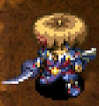</td>
    <td></td>
    <td>A meteorite fell to earth and shattered into a million pieces. A blacksmith forged those pieces into this weapon.</td>
  </tr>
</table>

Faster growth than Red Blade. Targite is a strong shield, so the set is excellent for 2 bracelet resonance. Good rune count early on, but you'll be stuck at 8 slots for quite a while.

<table class="itemDetailsTable">
  <tbody>
    <tr>
      <th>Lv</th>
      <th>Name</th>
      <th>Rune</th>
      <th>Atk</th>
      <th>Max</th>
      <th>Ct</th>
      <th>Exp</th>
      <th>Buy</th>
      <th>Sell</th>
      <th>Info</th>
    </tr>
    <tr>
      <td>1</td>
      <td>Bladite</td>
      <td rowspan="3">-</td>
      <td>12</td>
      <td>8</td>
      <td>4</td>
      <td>-</td>
      <td>3000</td>
      <td>1050</td>
      <td rowspan="8">Resonance: <a href="/items/shields#targite">Targite</a> (Equip 2 bracelets)</td>
    </tr>
    <tr>
      <td>2</td>
      <td>Fine Bladite</td>
      <td>14</td>
      <td>15</td>
      <td>6</td>
      <td>200</td>
      <td>3100</td>
      <td>1085</td>
    </tr>
    <tr>
      <td>3</td>
      <td>Swordite</td>
      <td>15</td>
      <td>22</td>
      <td>6</td>
      <td>800</td>
      <td>3200</td>
      <td>1120</td>
    </tr>
    <tr>
      <td>4</td>
      <td>Fine Swordite</td>
      <td rowspan="4">Uplifting</td>
      <td>16</td>
      <td>30</td>
      <td>6</td>
      <td>1600</td>
      <td>4300</td>
      <td>1505</td>
    </tr>
    <tr>
      <td>5</td>
      <td>Katanite</td>
      <td>18</td>
      <td>38</td>
      <td>8</td>
      <td>3200</td>
      <td>4400</td>
      <td>1540</td>
    </tr>
    <tr>
      <td>6</td>
      <td>Fine Katanite</td>
      <td>19</td>
      <td>46</td>
      <td>8</td>
      <td>6400</td>
      <td>4500</td>
      <td>1575</td>
    </tr>
    <tr>
      <td>7</td>
      <td>Epic Katanite</td>
      <td>20</td>
      <td>55</td>
      <td>8</td>
      <td>12800</td>
      <td>4600</td>
      <td>1610</td>
    </tr>
    <tr>
      <td>8</td>
      <td>Starcutter</td>
      <td>Uplifting Rustproof</td>
      <td>25</td>
      <td>99</td>
      <td>∞</td>
      <td>25600</td>
      <td>5800</td>
      <td>2030</td>
    </tr>
  </tbody>
</table>

Locations:

<table class="locationTable">
  <tr>
    <th>Trail</th>
    <th>Past</th>
    <th>Present</th>
    <th>Future</th>
    <th>Fortune</th>
    <th>Miracle</th>
    <th>Rocks</th>
    <th>Gen</th>
    <th>Pitfall</th>
    <th>Manor</th>
  </tr>
  <tr>
    <td>E</td>
    <td>E</td>
    <td>E</td>
    <td>E</td>
    <td>FSE</td>
    <td>FS</td>
    <td>Expert</td>
    <td>FPZE</td>
    <td>FSM</td>
    <td>FSPZME</td>
  </tr>
  <tr>
    <th>Bizarre</th>
    <th>Onigiri</th>
    <th>Chasm</th>
    <th>Well</th>
    <th>Lake</th>
    <th>Inori</th>
    <th>Old</th>
    <th>Descent</th>
    <th></th>
    <th></th>
  </tr>
  <tr>
    <td>SE</td>
    <td>SE</td>
    <td>FSME</td>
    <td>-</td>
    <td>FSE</td>
    <td>FPZE</td>
    <td>SE</td>
    <td>FM</td>
    <td></td>
    <td></td>
  </tr>
</table>

### Red Blade

<table class="itemDetailsTable">
  <tr>
    <th>Lv1-7</th>
    <th>Lv8</th>
    <th>Lv1 Description</th>
  </tr>
  <tr>
    <td></td>
    <td></td>
    <td>This is a weapon made from a red hard stone called Shugouseki. The reddish- black color of the weapon is eerie.</td>
  </tr>
</table>

High attack, but low rune count for early ~ mid game. Slow growth, and the Uplifting rune is added early on which doesn't help. Flame Shot often slows down the pace of the game or causes accidents. Choose your runes carefully, and unless you're using it with a Red Shield for 2 bracelet resonance, it's better to go with Bladite or Dotanuki.

<table class="itemDetailsTable">
  <tbody>
    <tr>
      <th>Lv</th>
      <th>Name</th>
      <th>Rune</th>
      <th>Atk</th>
      <th>Max</th>
      <th>Ct</th>
      <th>Exp</th>
      <th>Buy</th>
      <th>Sell</th>
      <th>Info</th>
    </tr>
    <tr>
      <td>1</td>
      <td>Red Blade</td>
      <td rowspan="2">-</td>
      <td>14</td>
      <td>8</td>
      <td>3</td>
      <td>-</td>
      <td>4200</td>
      <td>1470</td>
      <td rowspan="8">Resonance: <a href="/items/shields#red-shield">Red Shield</a> (Equip 2 bracelets)</td>
    </tr>
    <tr>
      <td>2</td>
      <td>Fine Red Blade</td>
      <td>16</td>
      <td>15</td>
      <td>4</td>
      <td>250</td>
      <td>4300</td>
      <td>1505</td>
    </tr>
    <tr>
      <td>3</td>
      <td>Red Dagger</td>
      <td rowspan="5">Uplifting</td>
      <td>18</td>
      <td>22</td>
      <td>5</td>
      <td>900</td>
      <td>4400</td>
      <td>1540</td>
    </tr>
    <tr>
      <td>4</td>
      <td>Red Katana</td>
      <td>20</td>
      <td>30</td>
      <td>6</td>
      <td>1800</td>
      <td>4500</td>
      <td>1575</td>
    </tr>
    <tr>
      <td>5</td>
      <td>Red Sword</td>
      <td>21</td>
      <td>38</td>
      <td>7</td>
      <td>3600</td>
      <td>4600</td>
      <td>1610</td>
    </tr>
    <tr>
      <td>6</td>
      <td>Red Greatsword</td>
      <td>22</td>
      <td>46</td>
      <td>8</td>
      <td>7200</td>
      <td>4700</td>
      <td>1645</td>
    </tr>
    <tr>
      <td>7</td>
      <td>Epic Red Sword</td>
      <td>23</td>
      <td>55</td>
      <td>9</td>
      <td>14400</td>
      <td>4800</td>
      <td>1680</td>
    </tr>
    <tr>
      <td>8</td>
      <td>Shugoseki Swd</td>
      <td>Uplifting Flame Shot</td>
      <td>27</td>
      <td>99</td>
      <td>∞</td>
      <td>28800</td>
      <td>6000</td>
      <td>2100</td>
    </tr>
  </tbody>
</table>

Locations:

<table class="locationTable">
  <tr>
    <th>Trail</th>
    <th>Past</th>
    <th>Present</th>
    <th>Future</th>
    <th>Fortune</th>
    <th>Miracle</th>
    <th>Rocks</th>
    <th>Gen</th>
    <th>Pitfall</th>
    <th>Manor</th>
  </tr>
  <tr>
    <td>E</td>
    <td>E</td>
    <td>E</td>
    <td>E</td>
    <td>E</td>
    <td>S</td>
    <td>-</td>
    <td>E</td>
    <td>FSME</td>
    <td>FSPZME</td>
  </tr>
  <tr>
    <th>Bizarre</th>
    <th>Onigiri</th>
    <th>Chasm</th>
    <th>Well</th>
    <th>Lake</th>
    <th>Inori</th>
    <th>Old</th>
    <th>Descent</th>
    <th></th>
    <th></th>
  </tr>
  <tr>
    <td>E</td>
    <td>SE</td>
    <td>FSME</td>
    <td>-</td>
    <td>FSE</td>
    <td>E</td>
    <td>SE</td>
    <td>FM</td>
    <td></td>
    <td></td>
  </tr>
</table>

### Kabura Katana

<table class="itemDetailsTable">
  <tr>
    <th>Lv1-7</th>
    <th>Lv8</th>
    <th>Lv1 Description</th>
  </tr>
  <tr>
    <td>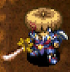</td>
    <td>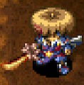</td>
    <td>A katana made by the legendary bladesmith, Kabura. Wanderers say it's the best katana, but it's exceptionally rare.</td>
  </tr>
</table>

High base attack, and the Quick Hitting rune is a solid addition. However, the weapon is very slow to level up, and it has low rune count for early ~ mid game. Basically a worse option than Bladite or Red Blade until it reaches Lv8. It also lacks 2 bracelet resonance, and increases damage dealt by 5 instead. It's actually decent since it works on all enemies, but you still can't one-shot Gitan Mamel.

<table class="itemDetailsTable">
  <tbody>
    <tr>
      <th>Lv</th>
      <th>Name</th>
      <th>Rune</th>
      <th>Atk</th>
      <th>Max</th>
      <th>Ct</th>
      <th>Exp</th>
      <th>Buy</th>
      <th>Sell</th>
      <th>Info</th>
    </tr>
    <tr>
      <td>1</td>
      <td>Kabura Katana</td>
      <td rowspan="7">-</td>
      <td>16</td>
      <td>8</td>
      <td>2</td>
      <td>-</td>
      <td>7400</td>
      <td>2590</td>
      <td rowspan="8">Resonance: <a href="/items/shields#fuuma-shield">Fuuma Shield</a> (Attack damage +5)</td>
    </tr>
    <tr>
      <td>2</td>
      <td>C-Class Kabura</td>
      <td>17</td>
      <td>15</td>
      <td>3</td>
      <td>500</td>
      <td>7500</td>
      <td>2625</td>
    </tr>
    <tr>
      <td>3</td>
      <td>B-Class Kabura</td>
      <td>19</td>
      <td>22</td>
      <td>4</td>
      <td>1500</td>
      <td>7600</td>
      <td>2660</td>
    </tr>
    <tr>
      <td>4</td>
      <td>Fine Kabura</td>
      <td>20</td>
      <td>30</td>
      <td>5</td>
      <td>3000</td>
      <td>7700</td>
      <td>2695</td>
    </tr>
    <tr>
      <td>5</td>
      <td>A-Class Kabura</td>
      <td>23</td>
      <td>38</td>
      <td>6</td>
      <td>6000</td>
      <td>7800</td>
      <td>2730</td>
    </tr>
    <tr>
      <td>6</td>
      <td>Kabura's Choice</td>
      <td>24</td>
      <td>46</td>
      <td>8</td>
      <td>12000</td>
      <td>7900</td>
      <td>2765</td>
    </tr>
    <tr>
      <td>7</td>
      <td>Kabura's Finest</td>
      <td>28</td>
      <td>55</td>
      <td>10</td>
      <td>24000</td>
      <td>8000</td>
      <td>2800</td>
    </tr>
    <tr>
      <td>8</td>
      <td>S-Class Kabura</td>
      <td>Quick Hitting</td>
      <td>30</td>
      <td>99</td>
      <td>∞</td>
      <td>48000</td>
      <td>10000</td>
      <td>3500</td>
    </tr>
  </tbody>
</table>

Locations:

<table class="locationTable">
  <tr>
    <th>Trail</th>
    <th>Past</th>
    <th>Present</th>
    <th>Future</th>
    <th>Fortune</th>
    <th>Miracle</th>
    <th>Rocks</th>
    <th>Gen</th>
    <th>Pitfall</th>
    <th>Manor</th>
  </tr>
  <tr>
    <td>PE</td>
    <td>PE</td>
    <td>PE</td>
    <td>PE</td>
    <td>PE</td>
    <td>P</td>
    <td>-</td>
    <td>PE</td>
    <td>SE</td>
    <td>E</td>
  </tr>
  <tr>
    <th>Bizarre</th>
    <th>Onigiri</th>
    <th>Chasm</th>
    <th>Well</th>
    <th>Lake</th>
    <th>Inori</th>
    <th>Old</th>
    <th>Descent</th>
    <th></th>
    <th></th>
  </tr>
  <tr>
    <td>E</td>
    <td>E</td>
    <td>FSME</td>
    <td>E</td>
    <td>FSE</td>
    <td>PE</td>
    <td>PZE</td>
    <td>FME</td>
    <td></td>
    <td></td>
  </tr>
</table>

### Fuuma Sword

<table class="itemDetailsTable">
  <tr>
    <th>Lv1-7</th>
    <th>Lv8</th>
    <th>Lv1 Description</th>
  </tr>
  <tr>
    <td></td>
    <td></td>
    <td>Thanks to the work of a skilled smith, the Storied Katana has been reborn! It's been remade with Fuuma iron!</td>
  </tr>
</table>

Basically a better Kabura Katana, but only usable in dungeons that allow carry-in items. Its resonance with Helix Shield lets you deal slightly meaningful damage to night monsters, which can be boosted further by equipping a <a href="/items/bracelets#night-ward">Night Ward</a>.

<table class="itemDetailsTable">
  <tbody>
    <tr>
      <th>Lv</th>
      <th>Name</th>
      <th>Rune</th>
      <th>Atk</th>
      <th>Max</th>
      <th>Ct</th>
      <th>Exp</th>
      <th>Buy</th>
      <th>Sell</th>
      <th>Info</th>
    </tr>
    <tr>
      <td>1</td>
      <td>Fuuma Sword</td>
      <td rowspan="6">-</td>
      <td>25</td>
      <td>8</td>
      <td>∞</td>
      <td>-</td>
      <td>10000</td>
      <td>3500</td>
      <td rowspan="8">Resonance: <a href="/items/shields#fuuma-shield">Fuuma Shield</a> (Attack damage +5)  Resonance: <a href="/items/shields#helix-shield">Helix Shield</a> (Attack damage +10)  Hone a Storied Katana+99 at the Hermit's Hermitage Blacksmith to transform it into a Fuuma Sword.</td>
    </tr>
    <tr>
      <td>2</td>
      <td>C-Class Fuuma</td>
      <td>26</td>
      <td>15</td>
      <td>∞</td>
      <td>10000</td>
      <td>11000</td>
      <td>3850</td>
    </tr>
    <tr>
      <td>3</td>
      <td>B-Class Fuuma</td>
      <td>27</td>
      <td>22</td>
      <td>∞</td>
      <td>15000</td>
      <td>12000</td>
      <td>4200</td>
    </tr>
    <tr>
      <td>4</td>
      <td>A-Class Fuuma</td>
      <td>28</td>
      <td>30</td>
      <td>∞</td>
      <td>20000</td>
      <td>13000</td>
      <td>4550</td>
    </tr>
    <tr>
      <td>5</td>
      <td>Fuuma Katana</td>
      <td>29</td>
      <td>38</td>
      <td>∞</td>
      <td>25000</td>
      <td>14000</td>
      <td>4900</td>
    </tr>
    <tr>
      <td>6</td>
      <td>Grand Fuuma</td>
      <td>30</td>
      <td>46</td>
      <td>∞</td>
      <td>30000</td>
      <td>15000</td>
      <td>5250</td>
    </tr>
    <tr>
      <td>7</td>
      <td>Fiery Fuuma</td>
      <td rowspan="2">Flame Shot</td>
      <td>31</td>
      <td>55</td>
      <td>∞</td>
      <td>35000</td>
      <td>16000</td>
      <td>5600</td>
    </tr>
    <tr>
      <td>8</td>
      <td>Hellfire Fuuma</td>
      <td>35</td>
      <td>99</td>
      <td>∞</td>
      <td>40000</td>
      <td>20000</td>
      <td>7000</td>
    </tr>
  </tbody>
</table>

Locations:

- Hone a Storied Katana+99 at the Hermit's Hermitage Blacksmith.

 

<table class="locationTable">
  <tr>
    <th>Trail</th>
    <th>Past</th>
    <th>Present</th>
    <th>Future</th>
    <th>Fortune</th>
    <th>Miracle</th>
    <th>Rocks</th>
    <th>Gen</th>
    <th>Pitfall</th>
    <th>Manor</th>
  </tr>
  <tr>
    <td>-</td>
    <td>-</td>
    <td>-</td>
    <td>-</td>
    <td>-</td>
    <td>-</td>
    <td>-</td>
    <td>-</td>
    <td>-</td>
    <td>-</td>
  </tr>
  <tr>
    <th>Bizarre</th>
    <th>Onigiri</th>
    <th>Chasm</th>
    <th>Well</th>
    <th>Lake</th>
    <th>Inori</th>
    <th>Old</th>
    <th>Descent</th>
    <th></th>
    <th></th>
  </tr>
  <tr>
    <td>-</td>
    <td>-</td>
    <td>-</td>
    <td>-</td>
    <td>-</td>
    <td>-</td>
    <td>-</td>
    <td>-</td>
    <td></td>
    <td></td>
  </tr>
</table>

### Dull Gold Edge

<table class="itemDetailsTable">
  <tr>
    <th>Lv1-7</th>
    <th>Lv8</th>
    <th>Lv1 Description</th>
  </tr>
  <tr>
    <td>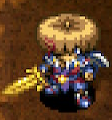</td>
    <td></td>
    <td>It's dull and has lost some of its luster, but it's made of gold, so it won't ever rust.</td>
  </tr>
</table>

Decent starting rune count, and levels up quickly. However, its base attack is very low, so it's mostly used as a container for runes while you're working on leveling a main weapon to increase rune count. Its resonance effect is nice for digging up blue Shiny Objects.

<table class="itemDetailsTable">
  <tbody>
    <tr>
      <th>Lv</th>
      <th>Name</th>
      <th>Rune</th>
      <th>Atk</th>
      <th>Max</th>
      <th>Ct</th>
      <th>Exp</th>
      <th>Buy</th>
      <th>Sell</th>
      <th>Info</th>
    </tr>
    <tr>
      <td>1</td>
      <td>Dull Gold Edge</td>
      <td rowspan="7">(Rustproof)</td>
      <td>2</td>
      <td>12</td>
      <td>6</td>
      <td>-</td>
      <td>1000</td>
      <td>350</td>
      <td rowspan="8">This weapon won't rust.  Resonance: <a href="/items/shields#gold-shield">Gold Shield</a> (Max strength +3)</td>
    </tr>
    <tr>
      <td>2</td>
      <td>Gold Edge</td>
      <td>3</td>
      <td>20</td>
      <td>7</td>
      <td>50</td>
      <td>1200</td>
      <td>420</td>
    </tr>
    <tr>
      <td>3</td>
      <td>Gold Blade</td>
      <td>4</td>
      <td>29</td>
      <td>8</td>
      <td>300</td>
      <td>1400</td>
      <td>490</td>
    </tr>
    <tr>
      <td>4</td>
      <td>14K Gold Blade</td>
      <td>5</td>
      <td>39</td>
      <td>9</td>
      <td>600</td>
      <td>1600</td>
      <td>560</td>
    </tr>
    <tr>
      <td>5</td>
      <td>Nice Gold Blade</td>
      <td>8</td>
      <td>50</td>
      <td>10</td>
      <td>1200</td>
      <td>1800</td>
      <td>630</td>
    </tr>
    <tr>
      <td>6</td>
      <td>Fine Gold Blade</td>
      <td>9</td>
      <td>62</td>
      <td>11</td>
      <td>2400</td>
      <td>6000</td>
      <td>2100</td>
    </tr>
    <tr>
      <td>7</td>
      <td>23K Gold Blade</td>
      <td>12</td>
      <td>75</td>
      <td>12</td>
      <td>4800</td>
      <td>7000</td>
      <td>2450</td>
    </tr>
    <tr>
      <td>8</td>
      <td>Pure Gold Blade</td>
      <td>(Rustproof) Paralyzing</td>
      <td>14</td>
      <td>99</td>
      <td>∞</td>
      <td>9600</td>
      <td>9000</td>
      <td>3150</td>
    </tr>
  </tbody>
</table>

Locations:

<table class="locationTable">
  <tr>
    <th>Trail</th>
    <th>Past</th>
    <th>Present</th>
    <th>Future</th>
    <th>Fortune</th>
    <th>Miracle</th>
    <th>Rocks</th>
    <th>Gen</th>
    <th>Pitfall</th>
    <th>Manor</th>
  </tr>
  <tr>
    <td>FSP</td>
    <td>FSP</td>
    <td>FSP</td>
    <td>FSPZ</td>
    <td>FSPZ</td>
    <td>FSP</td>
    <td>-</td>
    <td>FSPZM</td>
    <td>FPZM</td>
    <td>FSPZM</td>
  </tr>
  <tr>
    <th>Bizarre</th>
    <th>Onigiri</th>
    <th>Chasm</th>
    <th>Well</th>
    <th>Lake</th>
    <th>Inori</th>
    <th>Old</th>
    <th>Descent</th>
    <th></th>
    <th></th>
  </tr>
  <tr>
    <td>FSPZ</td>
    <td>FPZM</td>
    <td>FPZM</td>
    <td>-</td>
    <td>FP</td>
    <td>FSPZM</td>
    <td>FPZM</td>
    <td>SM</td>
    <td></td>
    <td></td>
  </tr>
</table>

### Bright Blade

<table class="itemDetailsTable">
  <tr>
    <th>Lv1-7</th>
    <th>Lv8</th>
    <th>Lv1 Description</th>
  </tr>
  <tr>
    <td></td>
    <td></td>
    <td>"Hey. I'm a proud weapon, so whenever I miss, I get so damn mad that I start shining. I always hit the next time, and and it'll be a critical to boot!"</td>
  </tr>
</table>

Decent rune count, and levels up pretty quickly. Its innate Redeeming rune can help make up for its low base attack a bit, but it's mostly used as a rune container while leveling a better weapon. Day Shield increases the amount of damage you receive from night monsters, so keep that in mind if you aim to utilize this weapon's resonance effect.

<table class="itemDetailsTable">
  <tbody>
    <tr>
      <th>Lv</th>
      <th>Name</th>
      <th>Rune</th>
      <th>Atk</th>
      <th>Max</th>
      <th>Ct</th>
      <th>Exp</th>
      <th>Buy</th>
      <th>Sell</th>
      <th>Info</th>
    </tr>
    <tr>
      <td>1</td>
      <td>Bright Blade</td>
      <td rowspan="4">(Redeeming)</td>
      <td>3</td>
      <td>12</td>
      <td>6</td>
      <td>-</td>
      <td>3000</td>
      <td>1050</td>
      <td rowspan="8">Deal a critical hit after 2 missed attacks.  Resonance: <a href="/items/shields#day-shield">Day Shield</a> (Read scrolls in the dark)</td>
    </tr>
    <tr>
      <td>2</td>
      <td>Bright Rapier</td>
      <td>5</td>
      <td>20</td>
      <td>7</td>
      <td>100</td>
      <td>3100</td>
      <td>1085</td>
    </tr>
    <tr>
      <td>3</td>
      <td>Bright Sword</td>
      <td>7</td>
      <td>29</td>
      <td>8</td>
      <td>400</td>
      <td>3200</td>
      <td>1120</td>
    </tr>
    <tr>
      <td>4</td>
      <td>Spark Rapier</td>
      <td>9</td>
      <td>39</td>
      <td>9</td>
      <td>800</td>
      <td>3300</td>
      <td>1155</td>
    </tr>
    <tr>
      <td>5</td>
      <td>Spark Sword</td>
      <td rowspan="3">(Redeeming) Lively</td>
      <td>11</td>
      <td>50</td>
      <td>10</td>
      <td>1600</td>
      <td>5400</td>
      <td>1890</td>
    </tr>
    <tr>
      <td>6</td>
      <td>Flash Blade</td>
      <td>13</td>
      <td>62</td>
      <td>11</td>
      <td>3200</td>
      <td>5500</td>
      <td>1925</td>
    </tr>
    <tr>
      <td>7</td>
      <td>Flash Saber</td>
      <td>15</td>
      <td>75</td>
      <td>12</td>
      <td>6400</td>
      <td>5600</td>
      <td>1960</td>
    </tr>
    <tr>
      <td>8</td>
      <td>Flash Sword</td>
      <td>(Redeeming) Lively Confusing</td>
      <td>17</td>
      <td>99</td>
      <td>∞</td>
      <td>12800</td>
      <td>7500</td>
      <td>2625</td>
    </tr>
  </tbody>
</table>

Locations:

<table class="locationTable">
  <tr>
    <th>Trail</th>
    <th>Past</th>
    <th>Present</th>
    <th>Future</th>
    <th>Fortune</th>
    <th>Miracle</th>
    <th>Rocks</th>
    <th>Gen</th>
    <th>Pitfall</th>
    <th>Manor</th>
  </tr>
  <tr>
    <td>FS</td>
    <td>FS</td>
    <td>FS</td>
    <td>FS</td>
    <td>FS</td>
    <td>FS</td>
    <td>Expert</td>
    <td>FSM</td>
    <td>FPZM</td>
    <td>FPM</td>
  </tr>
  <tr>
    <th>Bizarre</th>
    <th>Onigiri</th>
    <th>Chasm</th>
    <th>Well</th>
    <th>Lake</th>
    <th>Inori</th>
    <th>Old</th>
    <th>Descent</th>
    <th></th>
    <th></th>
  </tr>
  <tr>
    <td>FPZ</td>
    <td>S</td>
    <td>FPZM</td>
    <td>-</td>
    <td>FP</td>
    <td>FSM</td>
    <td>-</td>
    <td>SM</td>
    <td></td>
    <td></td>
  </tr>
</table>

### Rusty Pickaxe

<table class="itemDetailsTable">
  <tr>
    <th>Lv1-7</th>
    <th>Lv8</th>
    <th>Lv1 Description</th>
  </tr>
  <tr>
    <td></td>
    <td></td>
    <td>This can be used to dig holes in walls. However, digging with it may cause it to break, so be careful.</td>
  </tr>
</table>

Low attack, but very high rune count, and quick to level up. It gains the Blinding rune at Lv5, so it's overall not a bad weapon. Be careful not to dig walls when you use it as a main weapon, such as in Onigiri Hollow.

<table class="itemDetailsTable">
  <tbody>
    <tr>
      <th>Lv</th>
      <th>Name</th>
      <th>Rune</th>
      <th>Atk</th>
      <th>Max</th>
      <th>Ct</th>
      <th>Exp</th>
      <th>Buy</th>
      <th>Sell</th>
      <th>Info</th>
    </tr>
    <tr>
      <td>1</td>
      <td>Rusty Pickaxe</td>
      <td rowspan="4">(Wall Dig)</td>
      <td>3</td>
      <td>12</td>
      <td>9</td>
      <td>-</td>
      <td>1000</td>
      <td>350</td>
      <td rowspan="8">Can dig holes in walls, but there's a chance the weapon will break while digging.</td>
    </tr>
    <tr>
      <td>2</td>
      <td>Plain Pickaxe</td>
      <td>5</td>
      <td>20</td>
      <td>10</td>
      <td>100</td>
      <td>1200</td>
      <td>420</td>
    </tr>
    <tr>
      <td>3</td>
      <td>Nice Pickaxe</td>
      <td>7</td>
      <td>29</td>
      <td>11</td>
      <td>300</td>
      <td>1400</td>
      <td>490</td>
    </tr>
    <tr>
      <td>4</td>
      <td>Good Pickaxe</td>
      <td>9</td>
      <td>39</td>
      <td>12</td>
      <td>600</td>
      <td>1600</td>
      <td>560</td>
    </tr>
    <tr>
      <td>5</td>
      <td>Sturdy Pickaxe</td>
      <td rowspan="4">(Wall Dig) Blinding</td>
      <td>11</td>
      <td>50</td>
      <td>13</td>
      <td>1200</td>
      <td>2800</td>
      <td>980</td>
    </tr>
    <tr>
      <td>6</td>
      <td>Quality Pickaxe</td>
      <td>12</td>
      <td>62</td>
      <td>14</td>
      <td>2400</td>
      <td>3000</td>
      <td>1050</td>
    </tr>
    <tr>
      <td>7</td>
      <td>Pricy Pickaxe</td>
      <td>13</td>
      <td>75</td>
      <td>15</td>
      <td>4800</td>
      <td>3200</td>
      <td>1120</td>
    </tr>
    <tr>
      <td>8</td>
      <td>Luxury Pickaxe</td>
      <td>14</td>
      <td>99</td>
      <td>∞</td>
      <td>9600</td>
      <td>3500</td>
      <td>1225</td>
    </tr>
  </tbody>
</table>

Locations:

<table class="locationTable">
  <tr>
    <th>Trail</th>
    <th>Past</th>
    <th>Present</th>
    <th>Future</th>
    <th>Fortune</th>
    <th>Miracle</th>
    <th>Rocks</th>
    <th>Gen</th>
    <th>Pitfall</th>
    <th>Manor</th>
  </tr>
  <tr>
    <td>-</td>
    <td>F</td>
    <td>F</td>
    <td>F</td>
    <td>F</td>
    <td>F</td>
    <td>-</td>
    <td>F</td>
    <td>FPZM</td>
    <td>F</td>
  </tr>
  <tr>
    <th>Bizarre</th>
    <th>Onigiri</th>
    <th>Chasm</th>
    <th>Well</th>
    <th>Lake</th>
    <th>Inori</th>
    <th>Old</th>
    <th>Descent</th>
    <th></th>
    <th></th>
  </tr>
  <tr>
    <td>FPZ</td>
    <td>FPZM</td>
    <td>FPZM</td>
    <td>-</td>
    <td>FP</td>
    <td>F</td>
    <td>FPZM</td>
    <td>PZM</td>
    <td></td>
    <td></td>
  </tr>
</table>

### Old Mallet

<table class="itemDetailsTable">
  <tr>
    <th>Lv1-7</th>
    <th>Lv8</th>
    <th>Lv1 Description</th>
  </tr>
  <tr>
    <td>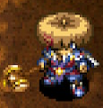</td>
    <td>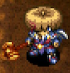</td>
    <td>It destroys traps and items on the ground, but the mallet may break instead. "Hi, everybody! It's Picotan! Everyone's favorite mallet wieldin-- What?! You haven't heard of me?!"</td>
  </tr>
</table>

It's easy to accidently destroy the weapon if you reveal a hidden trap with a direct attack. You also might destroy items by mistake, so it's not recommended as a main weapon. However, it gains the Confusing rune at Lv5, so it's not all bad.

<table class="itemDetailsTable">
  <tbody>
    <tr>
      <th>Lv</th>
      <th>Name</th>
      <th>Rune</th>
      <th>Atk</th>
      <th>Max</th>
      <th>Ct</th>
      <th>Exp</th>
      <th>Buy</th>
      <th>Sell</th>
      <th>Info</th>
    </tr>
    <tr>
      <td>1</td>
      <td>Old Mallet</td>
      <td rowspan="4">(Trap Busting)</td>
      <td>5</td>
      <td>12</td>
      <td>8</td>
      <td>-</td>
      <td>2000</td>
      <td>700</td>
      <td rowspan="8">Can destroy traps, but the weapon might break afterward.</td>
    </tr>
    <tr>
      <td>2</td>
      <td>OK Mallet</td>
      <td>6</td>
      <td>20</td>
      <td>9</td>
      <td>200</td>
      <td>2200</td>
      <td>770</td>
    </tr>
    <tr>
      <td>3</td>
      <td>Decent Mallet</td>
      <td>7</td>
      <td>29</td>
      <td>10</td>
      <td>500</td>
      <td>2400</td>
      <td>840</td>
    </tr>
    <tr>
      <td>4</td>
      <td>Good Mallet</td>
      <td>9</td>
      <td>39</td>
      <td>11</td>
      <td>1000</td>
      <td>2600</td>
      <td>910</td>
    </tr>
    <tr>
      <td>5</td>
      <td>Fine Mallet</td>
      <td rowspan="4">(Trap Busting) Confusing</td>
      <td>11</td>
      <td>50</td>
      <td>12</td>
      <td>2000</td>
      <td>3800</td>
      <td>1330</td>
    </tr>
    <tr>
      <td>6</td>
      <td>Luxury Mallet</td>
      <td>13</td>
      <td>62</td>
      <td>13</td>
      <td>4000</td>
      <td>4000</td>
      <td>1400</td>
    </tr>
    <tr>
      <td>7</td>
      <td>Student Mallet</td>
      <td>14</td>
      <td>75</td>
      <td>14</td>
      <td>8000</td>
      <td>4200</td>
      <td>1470</td>
    </tr>
    <tr>
      <td>8</td>
      <td>Master's Mallet</td>
      <td>16</td>
      <td>99</td>
      <td>∞</td>
      <td>16000</td>
      <td>4500</td>
      <td>1575</td>
    </tr>
  </tbody>
</table>

Locations:

<table class="locationTable">
  <tr>
    <th>Trail</th>
    <th>Past</th>
    <th>Present</th>
    <th>Future</th>
    <th>Fortune</th>
    <th>Miracle</th>
    <th>Rocks</th>
    <th>Gen</th>
    <th>Pitfall</th>
    <th>Manor</th>
  </tr>
  <tr>
    <td>F</td>
    <td>F</td>
    <td>F</td>
    <td>F</td>
    <td>F</td>
    <td>F</td>
    <td>-</td>
    <td>FM</td>
    <td>FPZM</td>
    <td>F</td>
  </tr>
  <tr>
    <th>Bizarre</th>
    <th>Onigiri</th>
    <th>Chasm</th>
    <th>Well</th>
    <th>Lake</th>
    <th>Inori</th>
    <th>Old</th>
    <th>Descent</th>
    <th></th>
    <th></th>
  </tr>
  <tr>
    <td>FPZ</td>
    <td>FPZM</td>
    <td>FPZM</td>
    <td>-</td>
    <td>FP</td>
    <td>FM</td>
    <td>FM</td>
    <td>SPZM</td>
    <td></td>
    <td></td>
  </tr>
</table>

### Sky Splitter

<table class="itemDetailsTable">
  <tr>
    <th>Lv1-7</th>
    <th>Lv8</th>
    <th>Lv1 Description</th>
  </tr>
  <tr>
    <td></td>
    <td>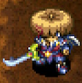</td>
    <td>This sword deals bonus damage to floating monster types. There are a lot of floating monsters, so you could say this weapon is very versatile.</td>
  </tr>
</table>

It's very slow to level up, and its low base attack makes it difficult to use as a main weapon. However, if you manage to level it using Modder status (Super) or by hunting Maneaters, it'll prove to be a reliable weapon capable of wiping out many monster families.

<table class="itemDetailsTable">
  <tbody>
    <tr>
      <th>Lv</th>
      <th>Name</th>
      <th>Rune</th>
      <th>Atk</th>
      <th>Max</th>
      <th>Ct</th>
      <th>Exp</th>
      <th>Buy</th>
      <th>Sell</th>
      <th>Info</th>
    </tr>
    <tr>
      <td>1</td>
      <td>Sky Splitter</td>
      <td rowspan="7">(Anti-Floating)</td>
      <td>2</td>
      <td>12</td>
      <td>5</td>
      <td>-</td>
      <td>7500</td>
      <td>2625</td>
      <td rowspan="8">Deal more damage to Floating types. (135%, +25% per level up | Lv8: 310%)  Families: Crow Tengu, Gyadon, Blade Bee, Chow, Pumphantasm, Firepuff, Flamebird, FO-Uβ, Foly</td>
    </tr>
    <tr>
      <td>2</td>
      <td>Cloud Cutter</td>
      <td>4</td>
      <td>20</td>
      <td>6</td>
      <td>500</td>
      <td>7600</td>
      <td>2660</td>
    </tr>
    <tr>
      <td>3</td>
      <td>Sky Slicer</td>
      <td>6</td>
      <td>29</td>
      <td>7</td>
      <td>1000</td>
      <td>7700</td>
      <td>2695</td>
    </tr>
    <tr>
      <td>4</td>
      <td>Heaven Hewer</td>
      <td>7</td>
      <td>39</td>
      <td>8</td>
      <td>2000</td>
      <td>7800</td>
      <td>2730</td>
    </tr>
    <tr>
      <td>5</td>
      <td>Cloud Cleaver</td>
      <td>8</td>
      <td>50</td>
      <td>9</td>
      <td>4000</td>
      <td>7900</td>
      <td>2765</td>
    </tr>
    <tr>
      <td>6</td>
      <td>Cirrus Chopper</td>
      <td>10</td>
      <td>62</td>
      <td>10</td>
      <td>8000</td>
      <td>8000</td>
      <td>2800</td>
    </tr>
    <tr>
      <td>7</td>
      <td>Sky Scourge</td>
      <td>11</td>
      <td>75</td>
      <td>11</td>
      <td>16000</td>
      <td>8100</td>
      <td>2835</td>
    </tr>
    <tr>
      <td>8</td>
      <td>Aerial Assault</td>
      <td>(Anti-Floating) Rustproof</td>
      <td>12</td>
      <td>99</td>
      <td>∞</td>
      <td>32000</td>
      <td>9000</td>
      <td>3150</td>
    </tr>
  </tbody>
</table>

Locations:

<table class="locationTable">
  <tr>
    <th>Trail</th>
    <th>Past</th>
    <th>Present</th>
    <th>Future</th>
    <th>Fortune</th>
    <th>Miracle</th>
    <th>Rocks</th>
    <th>Gen</th>
    <th>Pitfall</th>
    <th>Manor</th>
  </tr>
  <tr>
    <td>FP</td>
    <td>FP</td>
    <td>FP</td>
    <td>FPZ</td>
    <td>FPZ</td>
    <td>FP</td>
    <td>Expert</td>
    <td>SPZM</td>
    <td>FSPZM</td>
    <td>FPZM</td>
  </tr>
  <tr>
    <th>Bizarre</th>
    <th>Onigiri</th>
    <th>Chasm</th>
    <th>Well</th>
    <th>Lake</th>
    <th>Inori</th>
    <th>Old</th>
    <th>Descent</th>
    <th></th>
    <th></th>
  </tr>
  <tr>
    <td>FPZ</td>
    <td>S</td>
    <td>FPZM</td>
    <td>-</td>
    <td>FP</td>
    <td>FPZM</td>
    <td>SPZ</td>
    <td>SZM</td>
    <td></td>
    <td></td>
  </tr>
</table>

### Water Cutter

<table class="itemDetailsTable">
  <tr>
    <th>Lv1-7</th>
    <th>Lv8</th>
    <th>Lv1 Description</th>
  </tr>
  <tr>
    <td></td>
    <td></td>
    <td>This sword deals bonus damage to aquatic monster types. By repelling the water first, it cuts deeper into the aquatic creatures.</td>
  </tr>
</table>

High rune count and pretty fast to level up, making it a solid option for a main weapon. Being able to deal more damage to Gyaza and Hopodile families is nice in particular, along with making hunting Zaloklefts for items more consistent.

<table class="itemDetailsTable">
  <tbody>
    <tr>
      <th>Lv</th>
      <th>Name</th>
      <th>Rune</th>
      <th>Atk</th>
      <th>Max</th>
      <th>Ct</th>
      <th>Exp</th>
      <th>Buy</th>
      <th>Sell</th>
      <th>Info</th>
    </tr>
    <tr>
      <td>1</td>
      <td>Water Cutter</td>
      <td rowspan="7">(Anti-Aquatic)</td>
      <td>4</td>
      <td>12</td>
      <td>7</td>
      <td>-</td>
      <td>6500</td>
      <td>2275</td>
      <td rowspan="8">Deal more damage to Aquatic types. (135%, +25% per level up | Lv8: 310%)  Families: Kid Squid, Gyaza, Zalokleft, Explochin, Bored Kappa, Hopodile, Mudkin, Moseal</td>
    </tr>
    <tr>
      <td>2</td>
      <td>Wave Cutter</td>
      <td>6</td>
      <td>20</td>
      <td>7</td>
      <td>300</td>
      <td>6600</td>
      <td>2310</td>
    </tr>
    <tr>
      <td>3</td>
      <td>Scale Splitter</td>
      <td>8</td>
      <td>29</td>
      <td>8</td>
      <td>600</td>
      <td>6700</td>
      <td>2345</td>
    </tr>
    <tr>
      <td>4</td>
      <td>Shell Splitter</td>
      <td>10</td>
      <td>39</td>
      <td>8</td>
      <td>1200</td>
      <td>6800</td>
      <td>2380</td>
    </tr>
    <tr>
      <td>5</td>
      <td>Sea Snake Blade</td>
      <td>11</td>
      <td>50</td>
      <td>9</td>
      <td>2400</td>
      <td>6900</td>
      <td>2415</td>
    </tr>
    <tr>
      <td>6</td>
      <td>Shark Sword</td>
      <td>12</td>
      <td>62</td>
      <td>9</td>
      <td>4800</td>
      <td>7000</td>
      <td>2450</td>
    </tr>
    <tr>
      <td>7</td>
      <td>Leviathan Blade</td>
      <td>13</td>
      <td>75</td>
      <td>10</td>
      <td>9600</td>
      <td>7100</td>
      <td>2485</td>
    </tr>
    <tr>
      <td>8</td>
      <td>Sea King Sword</td>
      <td>(Anti-Aquatic) Rustproof</td>
      <td>15</td>
      <td>99</td>
      <td>∞</td>
      <td>19200</td>
      <td>8000</td>
      <td>2800</td>
    </tr>
  </tbody>
</table>

Locations:

<table class="locationTable">
  <tr>
    <th>Trail</th>
    <th>Past</th>
    <th>Present</th>
    <th>Future</th>
    <th>Fortune</th>
    <th>Miracle</th>
    <th>Rocks</th>
    <th>Gen</th>
    <th>Pitfall</th>
    <th>Manor</th>
  </tr>
  <tr>
    <td>FP</td>
    <td>FP</td>
    <td>FP</td>
    <td>FPZ</td>
    <td>FPZ</td>
    <td>FP</td>
    <td>Expert</td>
    <td>SPZM</td>
    <td>FSPZM</td>
    <td>FPZM</td>
  </tr>
  <tr>
    <th>Bizarre</th>
    <th>Onigiri</th>
    <th>Chasm</th>
    <th>Well</th>
    <th>Lake</th>
    <th>Inori</th>
    <th>Old</th>
    <th>Descent</th>
    <th></th>
    <th></th>
  </tr>
  <tr>
    <td>FPZ</td>
    <td>S</td>
    <td>FPZM</td>
    <td>-</td>
    <td>FP</td>
    <td>FPZM</td>
    <td>SPZ</td>
    <td>SZM</td>
    <td></td>
    <td></td>
  </tr>
</table>

### Scythe

<table class="itemDetailsTable">
  <tr>
    <th>Lv1-7</th>
    <th>Lv8</th>
    <th>Lv1 Description</th>
  </tr>
  <tr>
    <td>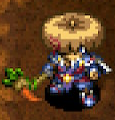</td>
    <td></td>
    <td>As its name suggests, it's a scythe made to cut grass. That's why it deals extra damage to plant monsters.</td>
  </tr>
</table>

Fast to level up, solid rune count, and effective against many high attack power monsters. In particular, it makes it easier to farm grass items from Grass Kid monsters, and eliminates the worry of not defeating a Mutaikon monster in one hit.

<table class="itemDetailsTable">
  <tbody>
    <tr>
      <th>Lv</th>
      <th>Name</th>
      <th>Rune</th>
      <th>Atk</th>
      <th>Max</th>
      <th>Ct</th>
      <th>Exp</th>
      <th>Buy</th>
      <th>Sell</th>
      <th>Info</th>
    </tr>
    <tr>
      <td>1</td>
      <td>Scythe</td>
      <td rowspan="7">(Anti-Plant)</td>
      <td>4</td>
      <td>12</td>
      <td>6</td>
      <td>-</td>
      <td>5500</td>
      <td>1925</td>
      <td rowspan="8">Deal more damage to Plant types. (135%, +25% per level up | Lv8: 310%)  Families: Sweet Nut, Sproutant, Mutaikon, Grass Kid, Pin Kid, Seedie, Pumphantasm</td>
    </tr>
    <tr>
      <td>2</td>
      <td>Harvest Scythe</td>
      <td>6</td>
      <td>20</td>
      <td>7</td>
      <td>250</td>
      <td>5600</td>
      <td>1960</td>
    </tr>
    <tr>
      <td>3</td>
      <td>Plant Buster</td>
      <td>7</td>
      <td>29</td>
      <td>8</td>
      <td>500</td>
      <td>5700</td>
      <td>1995</td>
    </tr>
    <tr>
      <td>4</td>
      <td>Plant Killer</td>
      <td>9</td>
      <td>39</td>
      <td>9</td>
      <td>1000</td>
      <td>5800</td>
      <td>2030</td>
    </tr>
    <tr>
      <td>5</td>
      <td>Veggie Doom</td>
      <td>10</td>
      <td>50</td>
      <td>10</td>
      <td>2000</td>
      <td>5900</td>
      <td>2065</td>
    </tr>
    <tr>
      <td>6</td>
      <td>Veggie Slayer</td>
      <td>11</td>
      <td>62</td>
      <td>11</td>
      <td>4000</td>
      <td>6000</td>
      <td>2100</td>
    </tr>
    <tr>
      <td>7</td>
      <td>Vegan's Joy</td>
      <td>12</td>
      <td>75</td>
      <td>12</td>
      <td>8000</td>
      <td>6100</td>
      <td>2135</td>
    </tr>
    <tr>
      <td>8</td>
      <td>Vegicide</td>
      <td>(Anti-Plant) Rustproof</td>
      <td>13</td>
      <td>99</td>
      <td>∞</td>
      <td>16000</td>
      <td>7000</td>
      <td>2450</td>
    </tr>
  </tbody>
</table>

Locations:

- Tanuki Password: Vegicide

 

<table class="locationTable">
  <tr>
    <th>Trail</th>
    <th>Past</th>
    <th>Present</th>
    <th>Future</th>
    <th>Fortune</th>
    <th>Miracle</th>
    <th>Rocks</th>
    <th>Gen</th>
    <th>Pitfall</th>
    <th>Manor</th>
  </tr>
  <tr>
    <td>FP</td>
    <td>FP</td>
    <td>FP</td>
    <td>FPZ</td>
    <td>FPZ</td>
    <td>FP</td>
    <td>Expert</td>
    <td>SPZM</td>
    <td>FSPZM</td>
    <td>FPZM</td>
  </tr>
  <tr>
    <th>Bizarre</th>
    <th>Onigiri</th>
    <th>Chasm</th>
    <th>Well</th>
    <th>Lake</th>
    <th>Inori</th>
    <th>Old</th>
    <th>Descent</th>
    <th></th>
    <th></th>
  </tr>
  <tr>
    <td>FPZ</td>
    <td>S</td>
    <td>FPZM</td>
    <td>-</td>
    <td>FP</td>
    <td>FPZM</td>
    <td>SPZ</td>
    <td>SZM</td>
    <td></td>
    <td></td>
  </tr>
</table>

### Myopic Masher

<table class="itemDetailsTable">
  <tr>
    <th>Lv1-7</th>
    <th>Lv8</th>
    <th>Lv1 Description</th>
  </tr>
  <tr>
    <td>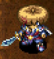</td>
    <td></td>
    <td>This weapon deals bonus damage to cyclopean monster types. As the designation suggests, they are monsters with only one eye. Any other questions?</td>
  </tr>
</table>

Fast to level up and high rune count. However, the range of effectiveness is limited, as there are only four Cyclopean monster families. Metalhead family monsters aren't as threatening in this game compared to Shiren 4, and you typically want to avoid being adjacent to Gazer family monsters.

<table class="itemDetailsTable">
  <tbody>
    <tr>
      <th>Lv</th>
      <th>Name</th>
      <th>Rune</th>
      <th>Atk</th>
      <th>Max</th>
      <th>Ct</th>
      <th>Exp</th>
      <th>Buy</th>
      <th>Sell</th>
      <th>Info</th>
    </tr>
    <tr>
      <td>1</td>
      <td>Myopic Masher</td>
      <td rowspan="7">(Anti-Cyclops)</td>
      <td>5</td>
      <td>12</td>
      <td>6</td>
      <td>-</td>
      <td>5500</td>
      <td>1925</td>
      <td rowspan="8">Deal more damage to Cyclopean types. (135%, +25% per level up | Lv8: 310%)  Resonance: <a href="/items/shields#spry-shield">Spry Shield</a> (Attack and Defense +3)  Families: Explochin, Metalhead, Gazer, Foly</td>
    </tr>
    <tr>
      <td>2</td>
      <td>Myopic Mauler</td>
      <td>7</td>
      <td>20</td>
      <td>7</td>
      <td>250</td>
      <td>5600</td>
      <td>1960</td>
    </tr>
    <tr>
      <td>3</td>
      <td>Myopic Mangler</td>
      <td>9</td>
      <td>29</td>
      <td>8</td>
      <td>500</td>
      <td>5700</td>
      <td>1995</td>
    </tr>
    <tr>
      <td>4</td>
      <td>Myopic Master</td>
      <td>11</td>
      <td>39</td>
      <td>9</td>
      <td>1000</td>
      <td>5800</td>
      <td>2030</td>
    </tr>
    <tr>
      <td>5</td>
      <td>Cyclops Clubber</td>
      <td>12</td>
      <td>50</td>
      <td>10</td>
      <td>2000</td>
      <td>5900</td>
      <td>2065</td>
    </tr>
    <tr>
      <td>6</td>
      <td>Cyclops Crushr</td>
      <td>13</td>
      <td>62</td>
      <td>11</td>
      <td>4000</td>
      <td>6000</td>
      <td>2100</td>
    </tr>
    <tr>
      <td>7</td>
      <td>Cyclops Culler</td>
      <td>15</td>
      <td>75</td>
      <td>12</td>
      <td>8000</td>
      <td>6100</td>
      <td>2135</td>
    </tr>
    <tr>
      <td>8</td>
      <td>Cyclopicide</td>
      <td>(Anti-Cyclops) Rustproof</td>
      <td>16</td>
      <td>99</td>
      <td>∞</td>
      <td>16000</td>
      <td>7000</td>
      <td>2450</td>
    </tr>
  </tbody>
</table>

Locations:

<table class="locationTable">
  <tr>
    <th>Trail</th>
    <th>Past</th>
    <th>Present</th>
    <th>Future</th>
    <th>Fortune</th>
    <th>Miracle</th>
    <th>Rocks</th>
    <th>Gen</th>
    <th>Pitfall</th>
    <th>Manor</th>
  </tr>
  <tr>
    <td>FP</td>
    <td>FP</td>
    <td>FP</td>
    <td>FPZ</td>
    <td>FPZ</td>
    <td>FP</td>
    <td>Expert</td>
    <td>SPZM</td>
    <td>FSPZM</td>
    <td>FPZM</td>
  </tr>
  <tr>
    <th>Bizarre</th>
    <th>Onigiri</th>
    <th>Chasm</th>
    <th>Well</th>
    <th>Lake</th>
    <th>Inori</th>
    <th>Old</th>
    <th>Descent</th>
    <th></th>
    <th></th>
  </tr>
  <tr>
    <td>FPZ</td>
    <td>S</td>
    <td>FPZM</td>
    <td>-</td>
    <td>FP</td>
    <td>FPZM</td>
    <td>SPZ</td>
    <td>SZM</td>
    <td></td>
    <td></td>
  </tr>
</table>

### Magic Masher

<table class="itemDetailsTable">
  <tr>
    <th>Lv1-7</th>
    <th>Lv8</th>
    <th>Lv1 Description</th>
  </tr>
  <tr>
    <td></td>
    <td></td>
    <td>The edge of this weapon looks like a talisman. You're supposed to swat with it, rather than slice. I don't know how it works, but it deals more damage to magic monster types.</td>
  </tr>
</table>

Pretty fast to level up, but somewhat low rune count. The range of effectiveness is limited, as there are only four Magic monster families. You don't want to give Magic types a chance to act due to their dangerous special attacks, so deciding to use a direct attack that can miss is a bad idea to begin with.

<table class="itemDetailsTable">
  <tbody>
    <tr>
      <th>Lv</th>
      <th>Name</th>
      <th>Rune</th>
      <th>Atk</th>
      <th>Max</th>
      <th>Ct</th>
      <th>Exp</th>
      <th>Buy</th>
      <th>Sell</th>
      <th>Info</th>
    </tr>
    <tr>
      <td>1</td>
      <td>Magic Masher</td>
      <td rowspan="7">(Anti-Magic)</td>
      <td>5</td>
      <td>12</td>
      <td>4</td>
      <td>-</td>
      <td>2500</td>
      <td>875</td>
      <td rowspan="8">Deal more damage to Magic types. (135%, +25% per level up | Lv8: 310%)  Families: Fearabbit, DJ Mage, Polygon Spinna, Gazer</td>
    </tr>
    <tr>
      <td>2</td>
      <td>Magic Mauler</td>
      <td>6</td>
      <td>20</td>
      <td>5</td>
      <td>300</td>
      <td>2600</td>
      <td>910</td>
    </tr>
    <tr>
      <td>3</td>
      <td>Magic Mangler</td>
      <td>8</td>
      <td>29</td>
      <td>6</td>
      <td>600</td>
      <td>2700</td>
      <td>945</td>
    </tr>
    <tr>
      <td>4</td>
      <td>Magic Murderer</td>
      <td>10</td>
      <td>39</td>
      <td>7</td>
      <td>1200</td>
      <td>2800</td>
      <td>980</td>
    </tr>
    <tr>
      <td>5</td>
      <td>Magic Crusher</td>
      <td>11</td>
      <td>50</td>
      <td>8</td>
      <td>2400</td>
      <td>2900</td>
      <td>1015</td>
    </tr>
    <tr>
      <td>6</td>
      <td>Magic Slayer</td>
      <td>12</td>
      <td>69</td>
      <td>9</td>
      <td>4800</td>
      <td>3000</td>
      <td>1050</td>
    </tr>
    <tr>
      <td>7</td>
      <td>Magic Massacre</td>
      <td>14</td>
      <td>75</td>
      <td>10</td>
      <td>9600</td>
      <td>3100</td>
      <td>1085</td>
    </tr>
    <tr>
      <td>8</td>
      <td>Die Magic Die</td>
      <td>(Anti-Magic) Rustproof</td>
      <td>15</td>
      <td>99</td>
      <td>∞</td>
      <td>19200</td>
      <td>4000</td>
      <td>1400</td>
    </tr>
  </tbody>
</table>

Locations:

<table class="locationTable">
  <tr>
    <th>Trail</th>
    <th>Past</th>
    <th>Present</th>
    <th>Future</th>
    <th>Fortune</th>
    <th>Miracle</th>
    <th>Rocks</th>
    <th>Gen</th>
    <th>Pitfall</th>
    <th>Manor</th>
  </tr>
  <tr>
    <td>FP</td>
    <td>FP</td>
    <td>FP</td>
    <td>FPZ</td>
    <td>FPZ</td>
    <td>FP</td>
    <td>Expert</td>
    <td>SPZM</td>
    <td>FSPZM</td>
    <td>FPZM</td>
  </tr>
  <tr>
    <th>Bizarre</th>
    <th>Onigiri</th>
    <th>Chasm</th>
    <th>Well</th>
    <th>Lake</th>
    <th>Inori</th>
    <th>Old</th>
    <th>Descent</th>
    <th></th>
    <th></th>
  </tr>
  <tr>
    <td>FPZ</td>
    <td>S</td>
    <td>FPZM</td>
    <td>-</td>
    <td>FP</td>
    <td>FPZM</td>
    <td>SPZ</td>
    <td>SZM</td>
    <td></td>
    <td></td>
  </tr>
</table>

### Drain Dagger

<table class="itemDetailsTable">
  <tr>
    <th>Lv1-7</th>
    <th>Lv8</th>
    <th>Lv1 Description</th>
  </tr>
  <tr>
    <td>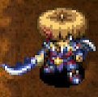</td>
    <td></td>
    <td>This weapon deals bonus damage to draining monster types. There aren't many monsters classified as draining types, but the ones that are all have very dangerous special abilities.</td>
  </tr>
</table>

Pretty fast to level up, and solid rune count. Its ability to one-shot Absorbiphants makes up for the limited range of effectiveness, since you don't need to spend arrows softening Absorbiphants before using a direct attack if your weapon has status condition inflicting runes synthesized.

<table class="itemDetailsTable">
  <tbody>
    <tr>
      <th>Lv</th>
      <th>Name</th>
      <th>Rune</th>
      <th>Atk</th>
      <th>Max</th>
      <th>Ct</th>
      <th>Exp</th>
      <th>Buy</th>
      <th>Sell</th>
      <th>Info</th>
    </tr>
    <tr>
      <td>1</td>
      <td>Drain Dagger</td>
      <td rowspan="7">(Anti-Drain)</td>
      <td>6</td>
      <td>12</td>
      <td>7</td>
      <td>-</td>
      <td>4500</td>
      <td>1575</td>
      <td rowspan="8">Deal more damage to Draining types. (135%, +25% per level up | Lv8: 310%)  Families: Scorpion, Polygon Spinna, Absorbiphant, Myriman</td>
    </tr>
    <tr>
      <td>2</td>
      <td>Drain Edge</td>
      <td>7</td>
      <td>20</td>
      <td>8</td>
      <td>300</td>
      <td>4600</td>
      <td>1610</td>
    </tr>
    <tr>
      <td>3</td>
      <td>Drain Dirk</td>
      <td>8</td>
      <td>29</td>
      <td>8</td>
      <td>600</td>
      <td>4700</td>
      <td>1645</td>
    </tr>
    <tr>
      <td>4</td>
      <td>Drain Knife</td>
      <td>9</td>
      <td>39</td>
      <td>9</td>
      <td>1200</td>
      <td>4800</td>
      <td>1680</td>
    </tr>
    <tr>
      <td>5</td>
      <td>Drain Epee</td>
      <td>10</td>
      <td>50</td>
      <td>9</td>
      <td>2400</td>
      <td>4900</td>
      <td>1715</td>
    </tr>
    <tr>
      <td>6</td>
      <td>Drain Rapier</td>
      <td>11</td>
      <td>62</td>
      <td>10</td>
      <td>4800</td>
      <td>5000</td>
      <td>1750</td>
    </tr>
    <tr>
      <td>7</td>
      <td>Drain Sabre</td>
      <td>12</td>
      <td>75</td>
      <td>10</td>
      <td>9600</td>
      <td>5100</td>
      <td>1785</td>
    </tr>
    <tr>
      <td>8</td>
      <td>Drain Master</td>
      <td>(Anti-Drain) Rustproof</td>
      <td>13</td>
      <td>99</td>
      <td>∞</td>
      <td>19200</td>
      <td>6000</td>
      <td>2100</td>
    </tr>
  </tbody>
</table>

Locations:

<table class="locationTable">
  <tr>
    <th>Trail</th>
    <th>Past</th>
    <th>Present</th>
    <th>Future</th>
    <th>Fortune</th>
    <th>Miracle</th>
    <th>Rocks</th>
    <th>Gen</th>
    <th>Pitfall</th>
    <th>Manor</th>
  </tr>
  <tr>
    <td>FP</td>
    <td>FP</td>
    <td>FP</td>
    <td>FPZ</td>
    <td>FPZ</td>
    <td>FP</td>
    <td>Expert</td>
    <td>SPZM</td>
    <td>FSPZM</td>
    <td>FPZM</td>
  </tr>
  <tr>
    <th>Bizarre</th>
    <th>Onigiri</th>
    <th>Chasm</th>
    <th>Well</th>
    <th>Lake</th>
    <th>Inori</th>
    <th>Old</th>
    <th>Descent</th>
    <th></th>
    <th></th>
  </tr>
  <tr>
    <td>FPZ</td>
    <td>S</td>
    <td>FPZM</td>
    <td>-</td>
    <td>FP</td>
    <td>FPZM</td>
    <td>SPZ</td>
    <td>SZM</td>
    <td></td>
    <td></td>
  </tr>
</table>

### Copper Cleaver

<table class="itemDetailsTable">
  <tr>
    <th>Lv1-7</th>
    <th>Lv8</th>
    <th>Lv1 Description</th>
  </tr>
  <tr>
    <td></td>
    <td></td>
    <td>This weapon deals bonus damage to metal monster types. It boasts a big blade and looks powerful.</td>
  </tr>
</table>

Decent starting base attack and range of effectiveness, but very slow to level up. Its starting rune count is pretty good, and rune count increases every level, so you likely won't run out of space. So it's not exactly a bad option, despite its growth rate.

<table class="itemDetailsTable">
  <tbody>
    <tr>
      <th>Lv</th>
      <th>Name</th>
      <th>Rune</th>
      <th>Atk</th>
      <th>Max</th>
      <th>Ct</th>
      <th>Exp</th>
      <th>Buy</th>
      <th>Sell</th>
      <th>Info</th>
    </tr>
    <tr>
      <td>1</td>
      <td>Copper Cleaver</td>
      <td rowspan="7">(Anti-Metal)</td>
      <td>7</td>
      <td>12</td>
      <td>6</td>
      <td>-</td>
      <td>3500</td>
      <td>1225</td>
      <td rowspan="8">Deal more damage to Metal types. (135%, +25% per level up | Lv8: 310%)  Families: Pop Tank, Karakuroid, Scoopie, N'dubba, FO-Uβ</td>
    </tr>
    <tr>
      <td>2</td>
      <td>Tin Tearer</td>
      <td>8</td>
      <td>20</td>
      <td>7</td>
      <td>500</td>
      <td>3600</td>
      <td>1260</td>
    </tr>
    <tr>
      <td>3</td>
      <td>Bronze Breaker</td>
      <td>9</td>
      <td>29</td>
      <td>8</td>
      <td>1000</td>
      <td>3700</td>
      <td>1295</td>
    </tr>
    <tr>
      <td>4</td>
      <td>Iron Splitter</td>
      <td>10</td>
      <td>39</td>
      <td>9</td>
      <td>2000</td>
      <td>3800</td>
      <td>1330</td>
    </tr>
    <tr>
      <td>5</td>
      <td>Chrome Cutter</td>
      <td>11</td>
      <td>50</td>
      <td>10</td>
      <td>4000</td>
      <td>3900</td>
      <td>1365</td>
    </tr>
    <tr>
      <td>6</td>
      <td>Steel Slicer</td>
      <td>12</td>
      <td>62</td>
      <td>11</td>
      <td>8000</td>
      <td>4000</td>
      <td>1400</td>
    </tr>
    <tr>
      <td>7</td>
      <td>Kurogane</td>
      <td>13</td>
      <td>75</td>
      <td>12</td>
      <td>16000</td>
      <td>4100</td>
      <td>1435</td>
    </tr>
    <tr>
      <td>8</td>
      <td>Lightbringer</td>
      <td>(Anti-Metal) Rustproof</td>
      <td>15</td>
      <td>99</td>
      <td>∞</td>
      <td>32000</td>
      <td>5000</td>
      <td>1750</td>
    </tr>
  </tbody>
</table>

Locations:

<table class="locationTable">
  <tr>
    <th>Trail</th>
    <th>Past</th>
    <th>Present</th>
    <th>Future</th>
    <th>Fortune</th>
    <th>Miracle</th>
    <th>Rocks</th>
    <th>Gen</th>
    <th>Pitfall</th>
    <th>Manor</th>
  </tr>
  <tr>
    <td>FP</td>
    <td>FP</td>
    <td>FP</td>
    <td>FPZ</td>
    <td>FPZ</td>
    <td>FP</td>
    <td>Expert</td>
    <td>SPZM</td>
    <td>FSPZM</td>
    <td>FPZM</td>
  </tr>
  <tr>
    <th>Bizarre</th>
    <th>Onigiri</th>
    <th>Chasm</th>
    <th>Well</th>
    <th>Lake</th>
    <th>Inori</th>
    <th>Old</th>
    <th>Descent</th>
    <th></th>
    <th></th>
  </tr>
  <tr>
    <td>FPZ</td>
    <td>S</td>
    <td>FPZM</td>
    <td>-</td>
    <td>FP</td>
    <td>FPZM</td>
    <td>SPZ</td>
    <td>SZM</td>
    <td></td>
    <td></td>
  </tr>
</table>

### Crescent Katana

<table class="itemDetailsTable">
  <tr>
    <th>Lv1-7</th>
    <th>Lv8</th>
    <th>Lv1 Description</th>
  </tr>
  <tr>
    <td></td>
    <td>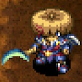</td>
    <td>A katana shaped like a crescent moon that deals more damage to exploding monster types. It's great how it's effective even on Pop Tank.</td>
  </tr>
</table>

Its growth rate and range of effectiveness leave a lot to be desired. Its rune count is slow to increase, and it doesn't have particularly high base attack, so there's basically no reason to choose this as a main weapon.

<table class="itemDetailsTable">
  <tbody>
    <tr>
      <th>Lv</th>
      <th>Name</th>
      <th>Rune</th>
      <th>Atk</th>
      <th>Max</th>
      <th>Ct</th>
      <th>Exp</th>
      <th>Buy</th>
      <th>Sell</th>
      <th>Info</th>
    </tr>
    <tr>
      <td>1</td>
      <td>Crescent Katana</td>
      <td rowspan="7">(Anti-Explode)</td>
      <td>7</td>
      <td>12</td>
      <td>6</td>
      <td>-</td>
      <td>2500</td>
      <td>875</td>
      <td rowspan="8">Deal more damage to Exploding types. (135%, +25% per level up | Lv8: 310%)  Resonance: <a href="/items/shields#blast-shield">Blast Shield</a> (Attack and Defense +3)  Families: Pop Tank, Explochin, Sweet Nut</td>
    </tr>
    <tr>
      <td>2</td>
      <td>Curved Katana</td>
      <td>8</td>
      <td>20</td>
      <td>6</td>
      <td>400</td>
      <td>2600</td>
      <td>910</td>
    </tr>
    <tr>
      <td>3</td>
      <td>Moon Edge</td>
      <td>9</td>
      <td>29</td>
      <td>7</td>
      <td>800</td>
      <td>2700</td>
      <td>945</td>
    </tr>
    <tr>
      <td>4</td>
      <td>Moon Blade</td>
      <td>10</td>
      <td>39</td>
      <td>7</td>
      <td>1600</td>
      <td>2800</td>
      <td>980</td>
    </tr>
    <tr>
      <td>5</td>
      <td>Moon Sword</td>
      <td>11</td>
      <td>50</td>
      <td>8</td>
      <td>3200</td>
      <td>2900</td>
      <td>1015</td>
    </tr>
    <tr>
      <td>6</td>
      <td>Moon Katana</td>
      <td>12</td>
      <td>62</td>
      <td>8</td>
      <td>6400</td>
      <td>3000</td>
      <td>1050</td>
    </tr>
    <tr>
      <td>7</td>
      <td>Lunar Blade</td>
      <td>13</td>
      <td>75</td>
      <td>9</td>
      <td>12800</td>
      <td>3100</td>
      <td>1085</td>
    </tr>
    <tr>
      <td>8</td>
      <td>Lunar Sword</td>
      <td>(Anti-Explode) Rustproof</td>
      <td>14</td>
      <td>99</td>
      <td>∞</td>
      <td>25600</td>
      <td>4000</td>
      <td>1400</td>
    </tr>
  </tbody>
</table>

Locations:

<table class="locationTable">
  <tr>
    <th>Trail</th>
    <th>Past</th>
    <th>Present</th>
    <th>Future</th>
    <th>Fortune</th>
    <th>Miracle</th>
    <th>Rocks</th>
    <th>Gen</th>
    <th>Pitfall</th>
    <th>Manor</th>
  </tr>
  <tr>
    <td>FP</td>
    <td>FP</td>
    <td>FP</td>
    <td>FPZ</td>
    <td>FPZ</td>
    <td>FP</td>
    <td>Expert</td>
    <td>SPZM</td>
    <td>FSPZM</td>
    <td>FPZM</td>
  </tr>
  <tr>
    <th>Bizarre</th>
    <th>Onigiri</th>
    <th>Chasm</th>
    <th>Well</th>
    <th>Lake</th>
    <th>Inori</th>
    <th>Old</th>
    <th>Descent</th>
    <th></th>
    <th></th>
  </tr>
  <tr>
    <td>FPZ</td>
    <td>S</td>
    <td>FPZM</td>
    <td>-</td>
    <td>FP</td>
    <td>FPZM</td>
    <td>SPZ</td>
    <td>SZM</td>
    <td></td>
    <td></td>
  </tr>
</table>

### Lizard Lasher

<table class="itemDetailsTable">
  <tr>
    <th>Lv1-7</th>
    <th>Lv8</th>
    <th>Lv1 Description</th>
  </tr>
  <tr>
    <td></td>
    <td></td>
    <td>This weapon deals bonus damage to draconic monster types. It's a specially designed blade made to cut through dragon scales. Don't let the dragons consume you!</td>
  </tr>
</table>

Very slow to level up and low starting rune count, but high base attack at Lv1. Its range of effectiveness is limited to four monster families, but it includes fearsome mid-game monsters like Dragon, Shagga, and Hipadile, so it's a solid main weapon option.

<table class="itemDetailsTable">
  <tbody>
    <tr>
      <th>Lv</th>
      <th>Name</th>
      <th>Rune</th>
      <th>Atk</th>
      <th>Max</th>
      <th>Ct</th>
      <th>Exp</th>
      <th>Buy</th>
      <th>Sell</th>
      <th>Info</th>
    </tr>
    <tr>
      <td>1</td>
      <td>Lizard Lasher</td>
      <td rowspan="7">(Anti-Dragon)</td>
      <td>10</td>
      <td>12</td>
      <td>4</td>
      <td>-</td>
      <td>3500</td>
      <td>1225</td>
      <td rowspan="8">Deal more damage to Dragon types. (135%, +25% per level up | Lv8: 310%)  Resonance: <a href="/items/shields#snake-shield">Snake Shield</a> (Attack and Defense +3)  Families: Dragon, Flamepuff, Shagga, Hopodile</td>
    </tr>
    <tr>
      <td>2</td>
      <td>Lizard Lancer</td>
      <td>11</td>
      <td>20</td>
      <td>5</td>
      <td>500</td>
      <td>3600</td>
      <td>1260</td>
    </tr>
    <tr>
      <td>3</td>
      <td>Serpent Slasher</td>
      <td>12</td>
      <td>29</td>
      <td>6</td>
      <td>1000</td>
      <td>3700</td>
      <td>1295</td>
    </tr>
    <tr>
      <td>4</td>
      <td>Serpent Slayer</td>
      <td>13</td>
      <td>39</td>
      <td>7</td>
      <td>2000</td>
      <td>3800</td>
      <td>1330</td>
    </tr>
    <tr>
      <td>5</td>
      <td>Dragon Sword</td>
      <td>14</td>
      <td>50</td>
      <td>8</td>
      <td>4000</td>
      <td>3900</td>
      <td>1365</td>
    </tr>
    <tr>
      <td>6</td>
      <td>Dragon Blade</td>
      <td>15</td>
      <td>62</td>
      <td>9</td>
      <td>8000</td>
      <td>4000</td>
      <td>1400</td>
    </tr>
    <tr>
      <td>7</td>
      <td>Dragon Killer</td>
      <td>16</td>
      <td>75</td>
      <td>10</td>
      <td>16000</td>
      <td>4100</td>
      <td>1435</td>
    </tr>
    <tr>
      <td>8</td>
      <td>Dragons' Bane</td>
      <td>(Anti-Dragon) Rustproof</td>
      <td>17</td>
      <td>99</td>
      <td>∞</td>
      <td>32000</td>
      <td>5000</td>
      <td>1750</td>
    </tr>
  </tbody>
</table>

Locations:

<table class="locationTable">
  <tr>
    <th>Trail</th>
    <th>Past</th>
    <th>Present</th>
    <th>Future</th>
    <th>Fortune</th>
    <th>Miracle</th>
    <th>Rocks</th>
    <th>Gen</th>
    <th>Pitfall</th>
    <th>Manor</th>
  </tr>
  <tr>
    <td>FP</td>
    <td>FP</td>
    <td>FP</td>
    <td>FPZ</td>
    <td>FPZ</td>
    <td>FP</td>
    <td>Expert</td>
    <td>SPZM</td>
    <td>FSPZM</td>
    <td>FPZM</td>
  </tr>
  <tr>
    <th>Bizarre</th>
    <th>Onigiri</th>
    <th>Chasm</th>
    <th>Well</th>
    <th>Lake</th>
    <th>Inori</th>
    <th>Old</th>
    <th>Descent</th>
    <th></th>
    <th></th>
  </tr>
  <tr>
    <td>FPZ</td>
    <td>S</td>
    <td>FPZM</td>
    <td>-</td>
    <td>FP</td>
    <td>FPZM</td>
    <td>SPZ</td>
    <td>SZM</td>
    <td></td>
    <td></td>
  </tr>
</table>

### Nap Rattle

<table class="itemDetailsTable">
  <tr>
    <th>Lv1-7</th>
    <th>Lv8</th>
    <th>Lv1 Description</th>
  </tr>
  <tr>
    <td>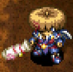</td>
    <td></td>
    <td>You may recognize these rattles as a baby toy. How can you use it as a weapon, you ask? Don't underestimate it. If you hit with it, the target can be afflicted with Asleep. Powerful stuff, man.</td>
  </tr>
</table>

Slow to level up and has very low starting base attack, but can inflict Asleep status. The chance is 12% at Lv1, and 26% at Lv8, and the sleeping enemy won't be able to act for 6 turns, so as long as it activates, you'll generally win any 1-vs-1 encounter. Just be careful of Absorbiphant and Naptapir family monsters.

<table class="itemDetailsTable">
  <tbody>
    <tr>
      <th>Lv</th>
      <th>Name</th>
      <th>Rune</th>
      <th>Atk</th>
      <th>Max</th>
      <th>Ct</th>
      <th>Exp</th>
      <th>Buy</th>
      <th>Sell</th>
      <th>Info</th>
    </tr>
    <tr>
      <td>1</td>
      <td>Nap Rattle</td>
      <td rowspan="7">(Sedating)</td>
      <td>2</td>
      <td>12</td>
      <td>4</td>
      <td>-</td>
      <td>7000</td>
      <td>2450</td>
      <td rowspan="8">Chance to inflict <a href="/system/status-conditions#asleep">Asleep</a>. (12%, +2% per level up | Lv8: 26%)  Resonance: <a href="/items/bracelets#alert-bracelet">Alert Bracelet</a> (Sleep chance +2%)</td>
    </tr>
    <tr>
      <td>2</td>
      <td>Sleep Rattle</td>
      <td>4</td>
      <td>20</td>
      <td>5</td>
      <td>300</td>
      <td>7100</td>
      <td>2485</td>
    </tr>
    <tr>
      <td>3</td>
      <td>Snooze Rattle</td>
      <td>6</td>
      <td>29</td>
      <td>6</td>
      <td>800</td>
      <td>7200</td>
      <td>2520</td>
    </tr>
    <tr>
      <td>4</td>
      <td>Doze Rattle</td>
      <td>8</td>
      <td>39</td>
      <td>7</td>
      <td>1600</td>
      <td>7300</td>
      <td>2555</td>
    </tr>
    <tr>
      <td>5</td>
      <td>Slumber Rattle</td>
      <td>10</td>
      <td>50</td>
      <td>8</td>
      <td>3200</td>
      <td>7400</td>
      <td>2590</td>
    </tr>
    <tr>
      <td>6</td>
      <td>Snore Rattle</td>
      <td>12</td>
      <td>62</td>
      <td>9</td>
      <td>6400</td>
      <td>7500</td>
      <td>2625</td>
    </tr>
    <tr>
      <td>7</td>
      <td>Coma Rattle</td>
      <td>14</td>
      <td>75</td>
      <td>10</td>
      <td>12800</td>
      <td>7600</td>
      <td>2660</td>
    </tr>
    <tr>
      <td>8</td>
      <td>Ultimate Rattle</td>
      <td>(Sedating) Rustproof</td>
      <td>16</td>
      <td>99</td>
      <td>11</td>
      <td>25600</td>
      <td>8500</td>
      <td>2975</td>
    </tr>
  </tbody>
</table>

Locations:

<table class="locationTable">
  <tr>
    <th>Trail</th>
    <th>Past</th>
    <th>Present</th>
    <th>Future</th>
    <th>Fortune</th>
    <th>Miracle</th>
    <th>Rocks</th>
    <th>Gen</th>
    <th>Pitfall</th>
    <th>Manor</th>
  </tr>
  <tr>
    <td>S</td>
    <td>S</td>
    <td>S</td>
    <td>S</td>
    <td>S</td>
    <td>S</td>
    <td>-</td>
    <td>-</td>
    <td>FSPZME</td>
    <td>S</td>
  </tr>
  <tr>
    <th>Bizarre</th>
    <th>Onigiri</th>
    <th>Chasm</th>
    <th>Well</th>
    <th>Lake</th>
    <th>Inori</th>
    <th>Old</th>
    <th>Descent</th>
    <th></th>
    <th></th>
  </tr>
  <tr>
    <td>S</td>
    <td>FPZM</td>
    <td>FSPZM</td>
    <td>-</td>
    <td>FSP</td>
    <td>S</td>
    <td>FM</td>
    <td>SPM</td>
    <td></td>
    <td></td>
  </tr>
</table>

### Shockuto

<table class="itemDetailsTable">
  <tr>
    <th>Lv1-7</th>
    <th>Lv8</th>
    <th>Lv1 Description</th>
  </tr>
  <tr>
    <td>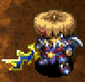</td>
    <td></td>
    <td>Occasionally afflicts target with Paralyzed. This older style Japanese straight blade can sometimes stop enemies in their tracks, which is very convenient.</td>
  </tr>
</table>

Slow to level up and low starting base attack, but can inflict Paralyzed status. Paralysis shuts down an enemy, making them unable to act until they're hit by an attack or effect. This really shines in dungeons that require run away or progress-during-night gameplay. Be careful not to synthesize Flame Shot, since the fireball will immediately undo the paralysis. Unlike other status weapons/runes, Quick Hitting doesn't mathematically impact the activation rate.

<table class="itemDetailsTable">
  <tbody>
    <tr>
      <th>Lv</th>
      <th>Name</th>
      <th>Rune</th>
      <th>Atk</th>
      <th>Max</th>
      <th>Ct</th>
      <th>Exp</th>
      <th>Buy</th>
      <th>Sell</th>
      <th>Info</th>
    </tr>
    <tr>
      <td>1</td>
      <td>Shockuto</td>
      <td rowspan="7">(Paralyzing)</td>
      <td>3</td>
      <td>12</td>
      <td>5</td>
      <td>-</td>
      <td>4000</td>
      <td>1400</td>
      <td rowspan="8">Chance to inflict <a href="/system/status-conditions#paralyzed">Paralyzed</a>. (12%, +2% per level up | Lv8: 26%)</td>
    </tr>
    <tr>
      <td>2</td>
      <td>Good Shockuto</td>
      <td>5</td>
      <td>20</td>
      <td>6</td>
      <td>300</td>
      <td>4100</td>
      <td>1435</td>
    </tr>
    <tr>
      <td>3</td>
      <td>Fine Shockuto</td>
      <td>7</td>
      <td>29</td>
      <td>7</td>
      <td>800</td>
      <td>4200</td>
      <td>1470</td>
    </tr>
    <tr>
      <td>4</td>
      <td>Disabling Edge</td>
      <td>10</td>
      <td>39</td>
      <td>8</td>
      <td>1600</td>
      <td>4300</td>
      <td>1505</td>
    </tr>
    <tr>
      <td>5</td>
      <td>Disabling Dirk</td>
      <td>11</td>
      <td>50</td>
      <td>9</td>
      <td>3200</td>
      <td>4400</td>
      <td>1540</td>
    </tr>
    <tr>
      <td>6</td>
      <td>Disabling Blade</td>
      <td>12</td>
      <td>62</td>
      <td>10</td>
      <td>6400</td>
      <td>4500</td>
      <td>1575</td>
    </tr>
    <tr>
      <td>7</td>
      <td>Disabling Sword</td>
      <td>13</td>
      <td>75</td>
      <td>11</td>
      <td>12800</td>
      <td>4600</td>
      <td>1610</td>
    </tr>
    <tr>
      <td>8</td>
      <td>The Paralyzer</td>
      <td>(Paralyzing) Rustproof</td>
      <td>15</td>
      <td>99</td>
      <td>12</td>
      <td>25600</td>
      <td>5500</td>
      <td>1925</td>
    </tr>
  </tbody>
</table>

Locations:

<table class="locationTable">
  <tr>
    <th>Trail</th>
    <th>Past</th>
    <th>Present</th>
    <th>Future</th>
    <th>Fortune</th>
    <th>Miracle</th>
    <th>Rocks</th>
    <th>Gen</th>
    <th>Pitfall</th>
    <th>Manor</th>
  </tr>
  <tr>
    <td>S</td>
    <td>S</td>
    <td>S</td>
    <td>S</td>
    <td>S</td>
    <td>S</td>
    <td>-</td>
    <td>-</td>
    <td>FSPZME</td>
    <td>S</td>
  </tr>
  <tr>
    <th>Bizarre</th>
    <th>Onigiri</th>
    <th>Chasm</th>
    <th>Well</th>
    <th>Lake</th>
    <th>Inori</th>
    <th>Old</th>
    <th>Descent</th>
    <th></th>
    <th></th>
  </tr>
  <tr>
    <td>S</td>
    <td>FPZM</td>
    <td>FSPZM</td>
    <td>-</td>
    <td>FSP</td>
    <td>S</td>
    <td>FM</td>
    <td>SPM</td>
    <td></td>
    <td></td>
  </tr>
</table>

### Blurry Stick

<table class="itemDetailsTable">
  <tr>
    <th>Lv1-7</th>
    <th>Lv8</th>
    <th>Lv1 Description</th>
  </tr>
  <tr>
    <td>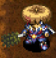</td>
    <td></td>
    <td>Occasionally afflicts target with Blind. It's like an inverse white cane. Tilt the odds in your favor against powerful enemies! They're not so tough when they can't see!</td>
  </tr>
</table>

Basically a worse Baffle Axe - lower starting base attack, rune count, and slower growth. However, it's on par with Baffle Axe at Lv8, so it's actually a decent main weapon option. Blind status makes enemies walk in a straight line until they bump into a character or wall, so the predictable movement usually causes fewer accidents than Confused status. Just keep in mind that Blind status lasts half the duration of Confused status.

<table class="itemDetailsTable">
  <tbody>
    <tr>
      <th>Lv</th>
      <th>Name</th>
      <th>Rune</th>
      <th>Atk</th>
      <th>Max</th>
      <th>Ct</th>
      <th>Exp</th>
      <th>Buy</th>
      <th>Sell</th>
      <th>Info</th>
    </tr>
    <tr>
      <td>1</td>
      <td>Blurry Stick</td>
      <td rowspan="7">(Blinding)</td>
      <td>4</td>
      <td>12</td>
      <td>5</td>
      <td>-</td>
      <td>6000</td>
      <td>2100</td>
      <td rowspan="8">Chance to inflict <a href="/system/status-conditions#blind">Blind</a>. (12%→16%, then +2% per level up) (Lv8: 28%)</td>
    </tr>
    <tr>
      <td>2</td>
      <td>Bleary Stick</td>
      <td>6</td>
      <td>20</td>
      <td>6</td>
      <td>400</td>
      <td>6100</td>
      <td>2135</td>
    </tr>
    <tr>
      <td>3</td>
      <td>Dazed Stick</td>
      <td>8</td>
      <td>29</td>
      <td>7</td>
      <td>900</td>
      <td>6200</td>
      <td>2170</td>
    </tr>
    <tr>
      <td>4</td>
      <td>Mole Stick</td>
      <td>10</td>
      <td>39</td>
      <td>8</td>
      <td>1800</td>
      <td>6300</td>
      <td>2205</td>
    </tr>
    <tr>
      <td>5</td>
      <td>Worm Stick</td>
      <td>11</td>
      <td>50</td>
      <td>9</td>
      <td>3600</td>
      <td>6400</td>
      <td>2240</td>
    </tr>
    <tr>
      <td>6</td>
      <td>Bat Stick</td>
      <td>12</td>
      <td>62</td>
      <td>10</td>
      <td>7200</td>
      <td>6500</td>
      <td>2275</td>
    </tr>
    <tr>
      <td>7</td>
      <td>Typhlosis Stick</td>
      <td>13</td>
      <td>75</td>
      <td>11</td>
      <td>14400</td>
      <td>6600</td>
      <td>2310</td>
    </tr>
    <tr>
      <td>8</td>
      <td>Blind Stick</td>
      <td>(Blinding) Rustproof</td>
      <td>15</td>
      <td>99</td>
      <td>∞</td>
      <td>28800</td>
      <td>7500</td>
      <td>2625</td>
    </tr>
  </tbody>
</table>

Locations:

<table class="locationTable">
  <tr>
    <th>Trail</th>
    <th>Past</th>
    <th>Present</th>
    <th>Future</th>
    <th>Fortune</th>
    <th>Miracle</th>
    <th>Rocks</th>
    <th>Gen</th>
    <th>Pitfall</th>
    <th>Manor</th>
  </tr>
  <tr>
    <td>S</td>
    <td>S</td>
    <td>S</td>
    <td>S</td>
    <td>S</td>
    <td>S</td>
    <td>-</td>
    <td>-</td>
    <td>FSPZME</td>
    <td>S</td>
  </tr>
  <tr>
    <th>Bizarre</th>
    <th>Onigiri</th>
    <th>Chasm</th>
    <th>Well</th>
    <th>Lake</th>
    <th>Inori</th>
    <th>Old</th>
    <th>Descent</th>
    <th></th>
    <th></th>
  </tr>
  <tr>
    <td>S</td>
    <td>FPZM</td>
    <td>FPZM</td>
    <td>-</td>
    <td>FP</td>
    <td>S</td>
    <td>FM</td>
    <td>SPM</td>
    <td></td>
    <td></td>
  </tr>
</table>

### Sealing Keisaku

<table class="itemDetailsTable">
  <tr>
    <th>Lv1-7</th>
    <th>Lv8</th>
    <th>Lv1 Description</th>
  </tr>
  <tr>
    <td></td>
    <td></td>
    <td>Occasionally afflicts target with Sealed. This weapon can Seal away enemies' special abilities. What a wonderful world!</td>
  </tr>
</table>

Pretty fast growth rate like Baffle Axe, and its stats are on par with Blurry Stick. That might look decent on paper among status inflicting weapons, but Sealed status doesn't stop enemies from attacking, so there's no reason to use it as a main weapon.

<table class="itemDetailsTable">
  <tbody>
    <tr>
      <th>Lv</th>
      <th>Name</th>
      <th>Rune</th>
      <th>Atk</th>
      <th>Max</th>
      <th>Ct</th>
      <th>Exp</th>
      <th>Buy</th>
      <th>Sell</th>
      <th>Info</th>
    </tr>
    <tr>
      <td>1</td>
      <td>Sealing Keisaku</td>
      <td rowspan="7">(Sealing)</td>
      <td>5</td>
      <td>12</td>
      <td>5</td>
      <td>-</td>
      <td>3300</td>
      <td>1155</td>
      <td rowspan="8">Chance to inflict <a href="/system/status-conditions#sealed">Sealed</a>. (12%→16%, then +2% per level up) (Lv8: 28%)</td>
    </tr>
    <tr>
      <td>2</td>
      <td>Nice Keisaku</td>
      <td>7</td>
      <td>20</td>
      <td>6</td>
      <td>200</td>
      <td>3400</td>
      <td>1190</td>
    </tr>
    <tr>
      <td>3</td>
      <td>Good Keisaku</td>
      <td>9</td>
      <td>29</td>
      <td>7</td>
      <td>600</td>
      <td>3500</td>
      <td>1225</td>
    </tr>
    <tr>
      <td>4</td>
      <td>Fine Keisaku</td>
      <td>10</td>
      <td>39</td>
      <td>8</td>
      <td>1200</td>
      <td>3600</td>
      <td>1260</td>
    </tr>
    <tr>
      <td>5</td>
      <td>Super Keisaku</td>
      <td>11</td>
      <td>50</td>
      <td>9</td>
      <td>2400</td>
      <td>3700</td>
      <td>1295</td>
    </tr>
    <tr>
      <td>6</td>
      <td>Power Keisaku</td>
      <td>12</td>
      <td>62</td>
      <td>10</td>
      <td>4800</td>
      <td>3800</td>
      <td>1330</td>
    </tr>
    <tr>
      <td>7</td>
      <td>Epic Keisaku</td>
      <td>13</td>
      <td>75</td>
      <td>11</td>
      <td>9600</td>
      <td>3900</td>
      <td>1365</td>
    </tr>
    <tr>
      <td>8</td>
      <td>Divine Keisaku</td>
      <td>(Sealing) Rustproof</td>
      <td>15</td>
      <td>99</td>
      <td>∞</td>
      <td>19200</td>
      <td>5000</td>
      <td>1750</td>
    </tr>
  </tbody>
</table>

Locations:

<table class="locationTable">
  <tr>
    <th>Trail</th>
    <th>Past</th>
    <th>Present</th>
    <th>Future</th>
    <th>Fortune</th>
    <th>Miracle</th>
    <th>Rocks</th>
    <th>Gen</th>
    <th>Pitfall</th>
    <th>Manor</th>
  </tr>
  <tr>
    <td>S</td>
    <td>S</td>
    <td>S</td>
    <td>S</td>
    <td>S</td>
    <td>S</td>
    <td>-</td>
    <td>-</td>
    <td>FSPZME</td>
    <td>S</td>
  </tr>
  <tr>
    <th>Bizarre</th>
    <th>Onigiri</th>
    <th>Chasm</th>
    <th>Well</th>
    <th>Lake</th>
    <th>Inori</th>
    <th>Old</th>
    <th>Descent</th>
    <th></th>
    <th></th>
  </tr>
  <tr>
    <td>S</td>
    <td>FPZM</td>
    <td>FPZM</td>
    <td>-</td>
    <td>FP</td>
    <td>S</td>
    <td>FM</td>
    <td>SPM</td>
    <td></td>
    <td></td>
  </tr>
</table>

### Baffle Axe

<table class="itemDetailsTable">
  <tr>
    <th>Lv1-7</th>
    <th>Lv8</th>
    <th>Lv1 Description</th>
  </tr>
  <tr>
    <td></td>
    <td>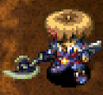</td>
    <td>Occasionally afflicts target with Confused. Once they get Confused, take advantage and beat the crap outta them. Easy!</td>
  </tr>
</table>

Pretty fast to level up, okay base attack, high rune count, and can inflict Confused status. The chance to inflict Confused status is 12% at Lv1, and 28% at Lv8. Downside is that Confused status doesn't completely shut down enemies like Asleep status, but it's still a strong main weapon option.

<table class="itemDetailsTable">
  <tbody>
    <tr>
      <th>Lv</th>
      <th>Name</th>
      <th>Rune</th>
      <th>Atk</th>
      <th>Max</th>
      <th>Ct</th>
      <th>Exp</th>
      <th>Buy</th>
      <th>Sell</th>
      <th>Info</th>
    </tr>
    <tr>
      <td>1</td>
      <td>Baffle Axe</td>
      <td rowspan="7">(Confusing)</td>
      <td>6</td>
      <td>12</td>
      <td>7</td>
      <td>-</td>
      <td>2000</td>
      <td>700</td>
      <td rowspan="8">Chance to inflict <a href="/system/status-conditions#confused">Confused</a>. (12%→16%, then +2% per level up) (Lv8: 28%)  Resonance: <a href="/items/bracelets#anti-cnf-bracelet">Anti-Cnf. Bracelet</a> (Confusion chance +2%)</td>
    </tr>
    <tr>
      <td>2</td>
      <td>Good Baffle Axe</td>
      <td>8</td>
      <td>20</td>
      <td>8</td>
      <td>200</td>
      <td>2100</td>
      <td>735</td>
    </tr>
    <tr>
      <td>3</td>
      <td>Nice Baffle Axe</td>
      <td>9</td>
      <td>29</td>
      <td>9</td>
      <td>600</td>
      <td>2200</td>
      <td>770</td>
    </tr>
    <tr>
      <td>4</td>
      <td>Fine Baffle Axe</td>
      <td>10</td>
      <td>39</td>
      <td>10</td>
      <td>1200</td>
      <td>2300</td>
      <td>805</td>
    </tr>
    <tr>
      <td>5</td>
      <td>Big Baffle Axe</td>
      <td>12</td>
      <td>50</td>
      <td>11</td>
      <td>2400</td>
      <td>2400</td>
      <td>840</td>
    </tr>
    <tr>
      <td>6</td>
      <td>Huge Baffle Axe</td>
      <td>13</td>
      <td>62</td>
      <td>12</td>
      <td>4800</td>
      <td>2500</td>
      <td>875</td>
    </tr>
    <tr>
      <td>7</td>
      <td>Rare Baffle Axe</td>
      <td>14</td>
      <td>75</td>
      <td>13</td>
      <td>9600</td>
      <td>2600</td>
      <td>910</td>
    </tr>
    <tr>
      <td>8</td>
      <td>Epic Baffle Axe</td>
      <td>(Confusing) Rustproof</td>
      <td>16</td>
      <td>99</td>
      <td>∞</td>
      <td>19200</td>
      <td>3500</td>
      <td>1225</td>
    </tr>
  </tbody>
</table>

Locations:

<table class="locationTable">
  <tr>
    <th>Trail</th>
    <th>Past</th>
    <th>Present</th>
    <th>Future</th>
    <th>Fortune</th>
    <th>Miracle</th>
    <th>Rocks</th>
    <th>Gen</th>
    <th>Pitfall</th>
    <th>Manor</th>
  </tr>
  <tr>
    <td>S</td>
    <td>S</td>
    <td>S</td>
    <td>S</td>
    <td>S</td>
    <td>S</td>
    <td>-</td>
    <td>-</td>
    <td>FSPZME</td>
    <td>S</td>
  </tr>
  <tr>
    <th>Bizarre</th>
    <th>Onigiri</th>
    <th>Chasm</th>
    <th>Well</th>
    <th>Lake</th>
    <th>Inori</th>
    <th>Old</th>
    <th>Descent</th>
    <th></th>
    <th></th>
  </tr>
  <tr>
    <td>S</td>
    <td>FPZM</td>
    <td>FPZM</td>
    <td>-</td>
    <td>FP</td>
    <td>S</td>
    <td>FM</td>
    <td>SPM</td>
    <td></td>
    <td></td>
  </tr>
</table>

### Hatchet

<table class="itemDetailsTable">
  <tr>
    <th>Lv1-7</th>
    <th>Lv8</th>
    <th>Lv1 Description</th>
  </tr>
  <tr>
    <td></td>
    <td></td>
    <td>An axe renowned for its critical hits. Whenever this axe crits, it hits for massive damage.</td>
  </tr>
</table>

Pretty fast to level up, and has a chance to deal a x2.0 damage critical hit. (22% at Lv1, 38% at Lv8) However, it's difficult to defeat enemies in one hit with low attack, so it can be a little unreliable. It gains Paralyzing at Lv8, which can help cover cases where a critical hit doesn't defeat an enemy. Prioritize type effective runes and Costly instead of status runes if using it as a main weapon. Healing and Dispersing are also good rune options, but are extremely rare to come across.

<table class="itemDetailsTable">
  <tbody>
    <tr>
      <th>Lv</th>
      <th>Name</th>
      <th>Rune</th>
      <th>Atk</th>
      <th>Max</th>
      <th>Ct</th>
      <th>Exp</th>
      <th>Buy</th>
      <th>Sell</th>
      <th>Info</th>
    </tr>
    <tr>
      <td>1</td>
      <td>Hatchet</td>
      <td rowspan="4">(Critical)</td>
      <td>5</td>
      <td>8</td>
      <td>4</td>
      <td>-</td>
      <td>5000</td>
      <td>1750</td>
      <td rowspan="8">Chance to deal a critical hit. (22%→25%→28%, then +2% per level up) (Lv8: 38%)</td>
    </tr>
    <tr>
      <td>2</td>
      <td>Battle Axe</td>
      <td>6</td>
      <td>15</td>
      <td>5</td>
      <td>200</td>
      <td>5100</td>
      <td>1785</td>
    </tr>
    <tr>
      <td>3</td>
      <td>Tabar</td>
      <td>7</td>
      <td>22</td>
      <td>6</td>
      <td>600</td>
      <td>5200</td>
      <td>1820</td>
    </tr>
    <tr>
      <td>4</td>
      <td>War Axe</td>
      <td>8</td>
      <td>30</td>
      <td>7</td>
      <td>1200</td>
      <td>5300</td>
      <td>1855</td>
    </tr>
    <tr>
      <td>5</td>
      <td>Tomahawk</td>
      <td rowspan="3">(Critical) Lively</td>
      <td>9</td>
      <td>38</td>
      <td>8</td>
      <td>2400</td>
      <td>7400</td>
      <td>2590</td>
    </tr>
    <tr>
      <td>6</td>
      <td>Parashu</td>
      <td>10</td>
      <td>46</td>
      <td>9</td>
      <td>4800</td>
      <td>7500</td>
      <td>2625</td>
    </tr>
    <tr>
      <td>7</td>
      <td>Pollaxe</td>
      <td>11</td>
      <td>55</td>
      <td>10</td>
      <td>9600</td>
      <td>7600</td>
      <td>2660</td>
    </tr>
    <tr>
      <td>8</td>
      <td>War God's Axe</td>
      <td>(Critical) Lively Paralyzing</td>
      <td>12</td>
      <td>99</td>
      <td>11</td>
      <td>19200</td>
      <td>9500</td>
      <td>3325</td>
    </tr>
  </tbody>
</table>

Locations:

<table class="locationTable">
  <tr>
    <th>Trail</th>
    <th>Past</th>
    <th>Present</th>
    <th>Future</th>
    <th>Fortune</th>
    <th>Miracle</th>
    <th>Rocks</th>
    <th>Gen</th>
    <th>Pitfall</th>
    <th>Manor</th>
  </tr>
  <tr>
    <td>E</td>
    <td>E</td>
    <td>E</td>
    <td>E</td>
    <td>E</td>
    <td>-</td>
    <td>-</td>
    <td>E</td>
    <td>SE</td>
    <td>E</td>
  </tr>
  <tr>
    <th>Bizarre</th>
    <th>Onigiri</th>
    <th>Chasm</th>
    <th>Well</th>
    <th>Lake</th>
    <th>Inori</th>
    <th>Old</th>
    <th>Descent</th>
    <th></th>
    <th></th>
  </tr>
  <tr>
    <td>E</td>
    <td>E</td>
    <td>SE</td>
    <td>E</td>
    <td>SE</td>
    <td>E</td>
    <td>FME</td>
    <td>E</td>
    <td></td>
    <td></td>
  </tr>
</table>

### Shoddy Dirk

<table class="itemDetailsTable">
  <tr>
    <th>Lv1-7</th>
    <th>Lv8</th>
    <th>Lv1 Description</th>
  </tr>
  <tr>
    <td></td>
    <td>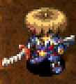</td>
    <td>It's a powerful sword, but it grows weaker every time it's used. Oh? Did I hear something just now? (Bark!)</td>
  </tr>
</table>

Very high base attack, but quickly degrades if used normally. It's best to seal it and use it as a raw stat weapon for early game.

<table class="itemDetailsTable">
  <tbody>
    <tr>
      <th>Lv</th>
      <th>Name</th>
      <th>Rune</th>
      <th>Atk</th>
      <th>Max</th>
      <th>Ct</th>
      <th>Exp</th>
      <th>Buy</th>
      <th>Sell</th>
      <th>Info</th>
    </tr>
    <tr>
      <td>1</td>
      <td>Shoddy Dirk</td>
      <td rowspan="7">(Expendable)</td>
      <td>30</td>
      <td>10</td>
      <td>10</td>
      <td>-</td>
      <td>3000</td>
      <td>1050</td>
      <td rowspan="8">Decrease weapon upgrade value by 1 every time you hit an enemy.  Resonance: <a href="/items/shields#shoddy-plank">Shoddy Plank</a> (Equipped items won't rust)</td>
    </tr>
    <tr>
      <td>2</td>
      <td>Shoddy Dagger</td>
      <td>31</td>
      <td>20</td>
      <td>10</td>
      <td>1000</td>
      <td>3200</td>
      <td>1120</td>
    </tr>
    <tr>
      <td>3</td>
      <td>Shoddy Blade</td>
      <td>32</td>
      <td>30</td>
      <td>10</td>
      <td>2000</td>
      <td>3400</td>
      <td>1190</td>
    </tr>
    <tr>
      <td>4</td>
      <td>Shoddy Edge</td>
      <td>33</td>
      <td>40</td>
      <td>10</td>
      <td>4000</td>
      <td>3600</td>
      <td>1260</td>
    </tr>
    <tr>
      <td>5</td>
      <td>Shoddy Rapier</td>
      <td>34</td>
      <td>50</td>
      <td>10</td>
      <td>8000</td>
      <td>3800</td>
      <td>1330</td>
    </tr>
    <tr>
      <td>6</td>
      <td>Shoddy Sword</td>
      <td>35</td>
      <td>60</td>
      <td>10</td>
      <td>16000</td>
      <td>4000</td>
      <td>1400</td>
    </tr>
    <tr>
      <td>7</td>
      <td>Shoddy Katana</td>
      <td>36</td>
      <td>70</td>
      <td>10</td>
      <td>24000</td>
      <td>4200</td>
      <td>1470</td>
    </tr>
    <tr>
      <td>8</td>
      <td>Worthy Sword</td>
      <td>(Expendable) Critical Quick Hitting</td>
      <td>37</td>
      <td>99</td>
      <td>∞</td>
      <td>48000</td>
      <td>7000</td>
      <td>2450</td>
    </tr>
  </tbody>
</table>

Locations:

<table class="locationTable">
  <tr>
    <th>Trail</th>
    <th>Past</th>
    <th>Present</th>
    <th>Future</th>
    <th>Fortune</th>
    <th>Miracle</th>
    <th>Rocks</th>
    <th>Gen</th>
    <th>Pitfall</th>
    <th>Manor</th>
  </tr>
  <tr>
    <td>S</td>
    <td>S</td>
    <td>S</td>
    <td>S</td>
    <td>S</td>
    <td>S</td>
    <td>-</td>
    <td>S</td>
    <td>SE</td>
    <td>FE</td>
  </tr>
  <tr>
    <th>Bizarre</th>
    <th>Onigiri</th>
    <th>Chasm</th>
    <th>Well</th>
    <th>Lake</th>
    <th>Inori</th>
    <th>Old</th>
    <th>Descent</th>
    <th></th>
    <th></th>
  </tr>
  <tr>
    <td>S</td>
    <td>S</td>
    <td>FSPZM</td>
    <td>-</td>
    <td>FSP</td>
    <td>S</td>
    <td>S</td>
    <td>SM</td>
    <td></td>
    <td></td>
  </tr>
</table>

### Glass Dirk

<table class="itemDetailsTable">
  <tr>
    <th>Lv1-7</th>
    <th>Lv8</th>
    <th>Lv1 Description</th>
  </tr>
  <tr>
    <td>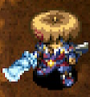</td>
    <td></td>
    <td>The blade is very beautiful, but because it's made of glass, it may shatter when it is used to attack. Who the heck made this, anyway?</td>
  </tr>
</table>

Very high base attack, but quickly breaks if used normally. It's best to seal it and use it as a raw stat weapon for early game. Its resonance effect with Glass Buckler nullifies magic bullets received, so that can be used on floors where high level DJ Mages appear on rare occasions.

<table class="itemDetailsTable">
  <tbody>
    <tr>
      <th>Lv</th>
      <th>Name</th>
      <th>Rune</th>
      <th>Atk</th>
      <th>Max</th>
      <th>Ct</th>
      <th>Exp</th>
      <th>Buy</th>
      <th>Sell</th>
      <th>Info</th>
    </tr>
    <tr>
      <td>1</td>
      <td>Glass Dirk</td>
      <td rowspan="7">(Unsound)</td>
      <td>35</td>
      <td>15</td>
      <td>4</td>
      <td>-</td>
      <td>5000</td>
      <td>1750</td>
      <td rowspan="8">Chance for the weapon to break when attacking. (50%, -2% per level up | Lv8: 36%)  Resonance: <a href="/items/shields#glass-buckler">Glass Buckler</a> (Nullifies magic bullets received)</td>
    </tr>
    <tr>
      <td>2</td>
      <td>Glass Dagger</td>
      <td>36</td>
      <td>25</td>
      <td>5</td>
      <td>1000</td>
      <td>5500</td>
      <td>1925</td>
    </tr>
    <tr>
      <td>3</td>
      <td>Glass Blade</td>
      <td>37</td>
      <td>35</td>
      <td>6</td>
      <td>2000</td>
      <td>6000</td>
      <td>2100</td>
    </tr>
    <tr>
      <td>4</td>
      <td>Glass Edge</td>
      <td>38</td>
      <td>45</td>
      <td>7</td>
      <td>4000</td>
      <td>6500</td>
      <td>2275</td>
    </tr>
    <tr>
      <td>5</td>
      <td>Glass Sword</td>
      <td>39</td>
      <td>55</td>
      <td>8</td>
      <td>8000</td>
      <td>7000</td>
      <td>2450</td>
    </tr>
    <tr>
      <td>6</td>
      <td>Fragile Sword</td>
      <td>40</td>
      <td>65</td>
      <td>9</td>
      <td>16000</td>
      <td>7500</td>
      <td>2625</td>
    </tr>
    <tr>
      <td>7</td>
      <td>Delicate Sword</td>
      <td>41</td>
      <td>75</td>
      <td>10</td>
      <td>24000</td>
      <td>8000</td>
      <td>2800</td>
    </tr>
    <tr>
      <td>8</td>
      <td>Frangible Edge</td>
      <td>(Unsound) Stupefying</td>
      <td>42</td>
      <td>99</td>
      <td>11</td>
      <td>48000</td>
      <td>17000</td>
      <td>5950</td>
    </tr>
  </tbody>
</table>

Locations:

<table class="locationTable">
  <tr>
    <th>Trail</th>
    <th>Past</th>
    <th>Present</th>
    <th>Future</th>
    <th>Fortune</th>
    <th>Miracle</th>
    <th>Rocks</th>
    <th>Gen</th>
    <th>Pitfall</th>
    <th>Manor</th>
  </tr>
  <tr>
    <td>E</td>
    <td>E</td>
    <td>E</td>
    <td>E</td>
    <td>E</td>
    <td>-</td>
    <td>-</td>
    <td>E</td>
    <td>SE</td>
    <td>E</td>
  </tr>
  <tr>
    <th>Bizarre</th>
    <th>Onigiri</th>
    <th>Chasm</th>
    <th>Well</th>
    <th>Lake</th>
    <th>Inori</th>
    <th>Old</th>
    <th>Descent</th>
    <th></th>
    <th></th>
  </tr>
  <tr>
    <td>E</td>
    <td>E</td>
    <td>SE</td>
    <td>E</td>
    <td>SE</td>
    <td>E</td>
    <td>E</td>
    <td>SE</td>
    <td></td>
    <td></td>
  </tr>
</table>

### Dirk of Debts

<table class="itemDetailsTable">
  <tr>
    <th>Lv1-7</th>
    <th>Lv8</th>
    <th>Lv1 Description</th>
  </tr>
  <tr>
    <td></td>
    <td></td>
    <td>When attacking, you'll trade some of your Gitan to increase damage dealt. If you don't have any Gitan, the weapon's attack will become 0. This weapon is a Gitan sink!</td>
  </tr>
</table>

Direct attacks deal more damage, but Gitan is subtracted every time you land an attack. The rate is 30G / x1.3 damage at Lv1, and 250G / x2.0 damage at Lv8. If you don't have enough Gitan, both attack power and damage multiplier fall to 0. You'll want to steal from every store you come across if using it as a main weapon. Don't read unidentified scrolls in dungeons where Bankruptcy Scroll can appear.

It levels up pretty quickly and gains 2 rune slots per level up, so synthesis isn't an issue. Prioritize type effective runes over status runes so that it takes fewer hits to defeat enemies, and use arrows to soften enemies first if you can't defeat them with one direct attack. It's best to transition to it mid-game (Mixergon zone or so) instead of trying to use it right away, since using it early will just make you run out of Gitan and end up stranded without a main weapon.

<table class="itemDetailsTable">
  <tbody>
    <tr>
      <th>Lv</th>
      <th>Name</th>
      <th>Rune</th>
      <th>Atk</th>
      <th>Max</th>
      <th>Ct</th>
      <th>Exp</th>
      <th>Buy</th>
      <th>Sell</th>
      <th>Info</th>
    </tr>
    <tr>
      <td>1</td>
      <td>Dirk of Debts</td>
      <td rowspan="8">(Costly)</td>
      <td>7</td>
      <td>12</td>
      <td>4</td>
      <td>-</td>
      <td>3000</td>
      <td>1050</td>
      <td rowspan="8">Pay Gitan per attack to boost damage. 0 attack if you don't have enough Gitan. (130% and 30G, +10% and ~30G per level up) (Lv8: 200% and 250G)  Resonance: <a href="/items/shields#paupers-plank">Pauper's Plank</a> (20% chance for foes to drop 200-399 Gitan)</td>
    </tr>
    <tr>
      <td>2</td>
      <td>Bankrupt Blade</td>
      <td>9</td>
      <td>20</td>
      <td>6</td>
      <td>300</td>
      <td>3300</td>
      <td>1155</td>
    </tr>
    <tr>
      <td>3</td>
      <td>Scarcity Sword</td>
      <td>10</td>
      <td>29</td>
      <td>8</td>
      <td>600</td>
      <td>3600</td>
      <td>1260</td>
    </tr>
    <tr>
      <td>4</td>
      <td>Gitan Eater</td>
      <td>11</td>
      <td>39</td>
      <td>10</td>
      <td>1200</td>
      <td>3900</td>
      <td>1365</td>
    </tr>
    <tr>
      <td>5</td>
      <td>Gitan Swallower</td>
      <td>13</td>
      <td>50</td>
      <td>12</td>
      <td>2400</td>
      <td>4200</td>
      <td>1470</td>
    </tr>
    <tr>
      <td>6</td>
      <td>Gitan Devourer</td>
      <td>14</td>
      <td>62</td>
      <td>14</td>
      <td>4800</td>
      <td>4500</td>
      <td>1575</td>
    </tr>
    <tr>
      <td>7</td>
      <td>Gitan Gulper</td>
      <td>15</td>
      <td>75</td>
      <td>16</td>
      <td>9600</td>
      <td>4800</td>
      <td>1680</td>
    </tr>
    <tr>
      <td>8</td>
      <td>Gitan Gorger</td>
      <td>17</td>
      <td>99</td>
      <td>∞</td>
      <td>19200</td>
      <td>5400</td>
      <td>1890</td>
    </tr>
  </tbody>
</table>

Locations:

- Tanuki Password: Treasury

 

<table class="locationTable">
  <tr>
    <th>Trail</th>
    <th>Past</th>
    <th>Present</th>
    <th>Future</th>
    <th>Fortune</th>
    <th>Miracle</th>
    <th>Rocks</th>
    <th>Gen</th>
    <th>Pitfall</th>
    <th>Manor</th>
  </tr>
  <tr>
    <td>E</td>
    <td>E</td>
    <td>E</td>
    <td>E</td>
    <td>E</td>
    <td>E</td>
    <td>-</td>
    <td>E</td>
    <td>FSPZME</td>
    <td>E</td>
  </tr>
  <tr>
    <th>Bizarre</th>
    <th>Onigiri</th>
    <th>Chasm</th>
    <th>Well</th>
    <th>Lake</th>
    <th>Inori</th>
    <th>Old</th>
    <th>Descent</th>
    <th></th>
    <th></th>
  </tr>
  <tr>
    <td>SE</td>
    <td>SE</td>
    <td>FSPZM</td>
    <td>-</td>
    <td>FSP</td>
    <td>E</td>
    <td>SE</td>
    <td>SM</td>
    <td></td>
    <td></td>
  </tr>
</table>

### Extreme Sword

<table class="itemDetailsTable">
  <tr>
    <th>Lv1-7</th>
    <th>Lv8</th>
    <th>Lv1 Description</th>
  </tr>
  <tr>
    <td></td>
    <td></td>
    <td>All attacks with this weapon are either a critical hit or a miss. Talk about a game of chance. You knew what you were getting into when you saw its name.</td>
  </tr>
</table>

Direct attacks have lower accuracy, but always deal a critical hit. (50% at Lv1, 71% at Lv8) It's useless as a rune, but has the potential to be extremely strong as a main weapon. However, some late game monsters can survive critical hits, and relying on even 71% accuracy introduces a lot of risk, so it's pretty much only used by enthusiasts.

<table class="itemDetailsTable">
  <tbody>
    <tr>
      <th>Lv</th>
      <th>Name</th>
      <th>Rune</th>
      <th>Atk</th>
      <th>Max</th>
      <th>Ct</th>
      <th>Exp</th>
      <th>Buy</th>
      <th>Sell</th>
      <th>Info</th>
    </tr>
    <tr>
      <td>1</td>
      <td>Extreme Sword</td>
      <td rowspan="8">(Focusing)</td>
      <td>20</td>
      <td>12</td>
      <td>5</td>
      <td>-</td>
      <td>2000</td>
      <td>700</td>
      <td rowspan="8">Attacks always deal a critical hit, but you also have lower accuracy. (50% accuracy, +3% per level up | Lv8: 71%)  Resonance: <a href="/items/shields#rush-shield">Rush Shield</a> (Equip 2 bracelets)</td>
    </tr>
    <tr>
      <td>2</td>
      <td>Stressful Blade</td>
      <td>22</td>
      <td>20</td>
      <td>6</td>
      <td>1000</td>
      <td>2400</td>
      <td>840</td>
    </tr>
    <tr>
      <td>3</td>
      <td>Stressful Sword</td>
      <td>23</td>
      <td>29</td>
      <td>7</td>
      <td>2000</td>
      <td>2800</td>
      <td>980</td>
    </tr>
    <tr>
      <td>4</td>
      <td>Stress Buster</td>
      <td>24</td>
      <td>39</td>
      <td>8</td>
      <td>4000</td>
      <td>3200</td>
      <td>1120</td>
    </tr>
    <tr>
      <td>5</td>
      <td>Risky Blade</td>
      <td>26</td>
      <td>50</td>
      <td>9</td>
      <td>7000</td>
      <td>3600</td>
      <td>1260</td>
    </tr>
    <tr>
      <td>6</td>
      <td>Risky Sword</td>
      <td>27</td>
      <td>62</td>
      <td>10</td>
      <td>11000</td>
      <td>4000</td>
      <td>1400</td>
    </tr>
    <tr>
      <td>7</td>
      <td>Gambler's Edge</td>
      <td>28</td>
      <td>75</td>
      <td>11</td>
      <td>16000</td>
      <td>4400</td>
      <td>1540</td>
    </tr>
    <tr>
      <td>8</td>
      <td>All-in Sword</td>
      <td>30</td>
      <td>99</td>
      <td>∞</td>
      <td>22000</td>
      <td>5000</td>
      <td>1750</td>
    </tr>
  </tbody>
</table>

Locations:

- Tanuki Password: Critical

 

<table class="locationTable">
  <tr>
    <th>Trail</th>
    <th>Past</th>
    <th>Present</th>
    <th>Future</th>
    <th>Fortune</th>
    <th>Miracle</th>
    <th>Rocks</th>
    <th>Gen</th>
    <th>Pitfall</th>
    <th>Manor</th>
  </tr>
  <tr>
    <td>-</td>
    <td>-</td>
    <td>-</td>
    <td>-</td>
    <td>-</td>
    <td>-</td>
    <td>-</td>
    <td>-</td>
    <td>FSPZME</td>
    <td>-</td>
  </tr>
  <tr>
    <th>Bizarre</th>
    <th>Onigiri</th>
    <th>Chasm</th>
    <th>Well</th>
    <th>Lake</th>
    <th>Inori</th>
    <th>Old</th>
    <th>Descent</th>
    <th></th>
    <th></th>
  </tr>
  <tr>
    <td>S</td>
    <td>FPZM</td>
    <td>FPZM</td>
    <td>-</td>
    <td>FP</td>
    <td>-</td>
    <td>FM</td>
    <td>SM</td>
    <td></td>
    <td></td>
  </tr>
</table>

### Violent Blade

<table class="itemDetailsTable">
  <tr>
    <th>Lv1-7</th>
    <th>Lv8</th>
    <th>Lv1 Description</th>
  </tr>
  <tr>
    <td></td>
    <td></td>
    <td>This cursed blade constantly thirsts for blood. If enemies get next to you, you can't flee from the enemy and the enemy can't flee from you. Once you're adjacent to each other, you're in a mortal duel.</td>
  </tr>
</table>

Having this equipped makes you unable to move when you're next to a monster. This drawback can easily end your adventure, especially if you encounter a Monster House. However, its high starting base attack can be useful early game before you find a better weapon. Equipping a Mojo Bracelet with this weapon grants a chance to inflict Slow status to enemies, but since you can't back away, it's not as good as it might appear at first glance.

<table class="itemDetailsTable">
  <tbody>
    <tr>
      <th>Lv</th>
      <th>Name</th>
      <th>Rune</th>
      <th>Atk</th>
      <th>Max</th>
      <th>Ct</th>
      <th>Exp</th>
      <th>Buy</th>
      <th>Sell</th>
      <th>Info</th>
    </tr>
    <tr>
      <td>1</td>
      <td>Violent Blade</td>
      <td rowspan="5">(Obsessive)</td>
      <td>12</td>
      <td>12</td>
      <td>6</td>
      <td>-</td>
      <td>2500</td>
      <td>875</td>
      <td rowspan="8">Prevents movement when next to a monster.  Resonance: <a href="/items/bracelets#mojo-bracelet">Mojo Bracelet</a> (Chance to slow foes you hit)</td>
    </tr>
    <tr>
      <td>2</td>
      <td>Violent Katana</td>
      <td>13</td>
      <td>20</td>
      <td>7</td>
      <td>300</td>
      <td>2600</td>
      <td>910</td>
    </tr>
    <tr>
      <td>3</td>
      <td>Brutal Blade</td>
      <td>14</td>
      <td>29</td>
      <td>8</td>
      <td>800</td>
      <td>2700</td>
      <td>945</td>
    </tr>
    <tr>
      <td>4</td>
      <td>Cursed Cleaver</td>
      <td>15</td>
      <td>39</td>
      <td>9</td>
      <td>1600</td>
      <td>2800</td>
      <td>980</td>
    </tr>
    <tr>
      <td>5</td>
      <td>Vile Katana</td>
      <td>16</td>
      <td>50</td>
      <td>10</td>
      <td>3200</td>
      <td>2900</td>
      <td>1015</td>
    </tr>
    <tr>
      <td>6</td>
      <td>Evil Blade</td>
      <td rowspan="2">(Obsessive) Anti-Cyclops</td>
      <td>17</td>
      <td>62</td>
      <td>11</td>
      <td>6400</td>
      <td>3500</td>
      <td>1225</td>
    </tr>
    <tr>
      <td>7</td>
      <td>Evil Katana</td>
      <td>18</td>
      <td>75</td>
      <td>12</td>
      <td>12800</td>
      <td>3600</td>
      <td>1260</td>
    </tr>
    <tr>
      <td>8</td>
      <td>Muramasa</td>
      <td>(Obsessive) Anti-Cyclops Blinding</td>
      <td>20</td>
      <td>99</td>
      <td>∞</td>
      <td>25600</td>
      <td>5000</td>
      <td>1750</td>
    </tr>
  </tbody>
</table>

Locations:

- Tanuki Password: Cursed Blade

 

<table class="locationTable">
  <tr>
    <th>Trail</th>
    <th>Past</th>
    <th>Present</th>
    <th>Future</th>
    <th>Fortune</th>
    <th>Miracle</th>
    <th>Rocks</th>
    <th>Gen</th>
    <th>Pitfall</th>
    <th>Manor</th>
  </tr>
  <tr>
    <td>-</td>
    <td>-</td>
    <td>-</td>
    <td>-</td>
    <td>-</td>
    <td>-</td>
    <td>-</td>
    <td>-</td>
    <td>FSPZM</td>
    <td>-</td>
  </tr>
  <tr>
    <th>Bizarre</th>
    <th>Onigiri</th>
    <th>Chasm</th>
    <th>Well</th>
    <th>Lake</th>
    <th>Inori</th>
    <th>Old</th>
    <th>Descent</th>
    <th></th>
    <th></th>
  </tr>
  <tr>
    <td>S</td>
    <td>FPZM</td>
    <td>FPZM</td>
    <td>-</td>
    <td>FP</td>
    <td>-</td>
    <td>FM</td>
    <td>SPZM</td>
    <td></td>
    <td></td>
  </tr>
</table>

### Breeze Blade

<table class="itemDetailsTable">
  <tr>
    <th>Lv1-7</th>
    <th>Lv8</th>
    <th>Lv1 Description</th>
  </tr>
  <tr>
    <td></td>
    <td></td>
    <td>Attacks in 3 forward directions. This weapon's attack properties are quite useful in passageways.</td>
  </tr>
</table>

Very low base attack, and slow to level up. It doesn't gain any notable runes through level ups, and the Tri-direction rune offers an identical effect, so there's no reason to use this as a main weapon.

<table class="itemDetailsTable">
  <tbody>
    <tr>
      <th>Lv</th>
      <th>Name</th>
      <th>Rune</th>
      <th>Atk</th>
      <th>Max</th>
      <th>Ct</th>
      <th>Exp</th>
      <th>Buy</th>
      <th>Sell</th>
      <th>Info</th>
    </tr>
    <tr>
      <td>1</td>
      <td>Breeze Blade</td>
      <td rowspan="7">(Tri-direction)</td>
      <td>2</td>
      <td>12</td>
      <td>6</td>
      <td>-</td>
      <td>8000</td>
      <td>2800</td>
      <td rowspan="8">Attacks in 3 forward directions.  Resonance: <a href="/items/shields#midnight-shield">Midnight Shield</a> (Equipped items won't rust)</td>
    </tr>
    <tr>
      <td>2</td>
      <td>Wind Cutter</td>
      <td>4</td>
      <td>20</td>
      <td>7</td>
      <td>400</td>
      <td>8100</td>
      <td>2835</td>
    </tr>
    <tr>
      <td>3</td>
      <td>Gust Gouger</td>
      <td>6</td>
      <td>29</td>
      <td>8</td>
      <td>800</td>
      <td>8200</td>
      <td>2870</td>
    </tr>
    <tr>
      <td>4</td>
      <td>Flurry Flayer</td>
      <td>8</td>
      <td>39</td>
      <td>9</td>
      <td>1600</td>
      <td>8300</td>
      <td>2905</td>
    </tr>
    <tr>
      <td>5</td>
      <td>Gale Gutter</td>
      <td>10</td>
      <td>50</td>
      <td>10</td>
      <td>3200</td>
      <td>8400</td>
      <td>2940</td>
    </tr>
    <tr>
      <td>6</td>
      <td>Storm Slicer</td>
      <td>11</td>
      <td>62</td>
      <td>11</td>
      <td>6400</td>
      <td>8500</td>
      <td>2975</td>
    </tr>
    <tr>
      <td>7</td>
      <td>Typhoon Tearer</td>
      <td>12</td>
      <td>75</td>
      <td>12</td>
      <td>12800</td>
      <td>8600</td>
      <td>3010</td>
    </tr>
    <tr>
      <td>8</td>
      <td>Deathwind</td>
      <td>(Tri-direction) Energizing</td>
      <td>13</td>
      <td>99</td>
      <td>∞</td>
      <td>25600</td>
      <td>12500</td>
      <td>4375</td>
    </tr>
  </tbody>
</table>

Locations:

<table class="locationTable">
  <tr>
    <th>Trail</th>
    <th>Past</th>
    <th>Present</th>
    <th>Future</th>
    <th>Fortune</th>
    <th>Miracle</th>
    <th>Rocks</th>
    <th>Gen</th>
    <th>Pitfall</th>
    <th>Manor</th>
  </tr>
  <tr>
    <td>E</td>
    <td>E</td>
    <td>E</td>
    <td>E</td>
    <td>E</td>
    <td>-</td>
    <td>Expert</td>
    <td>E</td>
    <td>FSPZME</td>
    <td>E</td>
  </tr>
  <tr>
    <th>Bizarre</th>
    <th>Onigiri</th>
    <th>Chasm</th>
    <th>Well</th>
    <th>Lake</th>
    <th>Inori</th>
    <th>Old</th>
    <th>Descent</th>
    <th></th>
    <th></th>
  </tr>
  <tr>
    <td>E</td>
    <td>SE</td>
    <td>FSPZME</td>
    <td>E</td>
    <td>FSPE</td>
    <td>E</td>
    <td>FME</td>
    <td>E</td>
    <td></td>
    <td></td>
  </tr>
</table>

### Burning Blade

<table class="itemDetailsTable">
  <tr>
    <th>Lv1-7</th>
    <th>Lv8</th>
    <th>Lv1 Description</th>
  </tr>
  <tr>
    <td>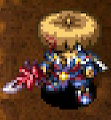</td>
    <td></td>
    <td>When your HP is full and you swing the sword, it'll shoot fireballs. This weapon gives the user the power to manipulate flames.</td>
  </tr>
</table>

Swing the weapon when your HP is full to shoot a flame that deals fixed damage. (100% accuracy) Pair it with a Monster Detector or Monsterphobic to safely clear out enemies from a distance. Deals 8 damage at Lv1 (10 with resonance), and 25 damage at Lv8 (30 with resonance), and the fixed damage can defeat Gitan Mamels in one hit from Lv3. (Lv2 with resonance)

Despite its powerful ability, it does have some drawbacks. It's easy to accidentally step on traps even when you check for them due to the flame's lag, and you won't earn any weapon or shield experience if you defeat an enemy using flame damage. It's easy to accidentally hit a Shopkeeper with a flame, which can potentially end an adventure. Lastly, it has higher base attack, but a low starting rune count and is very slow to level up.

<table class="itemDetailsTable">
  <tbody>
    <tr>
      <th>Lv</th>
      <th>Name</th>
      <th>Rune</th>
      <th>Atk</th>
      <th>Max</th>
      <th>Ct</th>
      <th>Exp</th>
      <th>Buy</th>
      <th>Sell</th>
      <th>Info</th>
    </tr>
    <tr>
      <td>1</td>
      <td>Burning Blade</td>
      <td rowspan="4">(Flame Shot)</td>
      <td>9</td>
      <td>12</td>
      <td>4</td>
      <td>-</td>
      <td>10000</td>
      <td>3500</td>
      <td rowspan="8">Shoot a flame when your HP is full. (Damage: 8, 10, 12, 14, 16, 18, 21, 25)  Resonance: <a href="/items/shields#swap-shield">Swap Shield</a> (Raise flame damage by 1 level) (30 damage at Lv8 / with Blue Flame rune)</td>
    </tr>
    <tr>
      <td>2</td>
      <td>Burning Sword</td>
      <td>10</td>
      <td>20</td>
      <td>5</td>
      <td>1000</td>
      <td>11000</td>
      <td>3850</td>
    </tr>
    <tr>
      <td>3</td>
      <td>Flame Sword</td>
      <td>11</td>
      <td>29</td>
      <td>6</td>
      <td>2000</td>
      <td>12000</td>
      <td>4200</td>
    </tr>
    <tr>
      <td>4</td>
      <td>Flame Katana</td>
      <td>12</td>
      <td>39</td>
      <td>7</td>
      <td>4000</td>
      <td>13000</td>
      <td>4550</td>
    </tr>
    <tr>
      <td>5</td>
      <td>Fire Sword</td>
      <td rowspan="3">(Flame Shot) Uplifting</td>
      <td>13</td>
      <td>50</td>
      <td>8</td>
      <td>7000</td>
      <td>15000</td>
      <td>5250</td>
    </tr>
    <tr>
      <td>6</td>
      <td>Fire Saber</td>
      <td>14</td>
      <td>62</td>
      <td>9</td>
      <td>11000</td>
      <td>16000</td>
      <td>5600</td>
    </tr>
    <tr>
      <td>7</td>
      <td>Scorch Sword</td>
      <td>15</td>
      <td>75</td>
      <td>10</td>
      <td>16000</td>
      <td>17000</td>
      <td>5950</td>
    </tr>
    <tr>
      <td>8</td>
      <td>Hellfire Katana</td>
      <td>(Flame Shot) Uplifting Anti-Explode</td>
      <td>16</td>
      <td>99</td>
      <td>∞</td>
      <td>22000</td>
      <td>21500</td>
      <td>7525</td>
    </tr>
  </tbody>
</table>

Locations:

<table class="locationTable">
  <tr>
    <th>Trail</th>
    <th>Past</th>
    <th>Present</th>
    <th>Future</th>
    <th>Fortune</th>
    <th>Miracle</th>
    <th>Rocks</th>
    <th>Gen</th>
    <th>Pitfall</th>
    <th>Manor</th>
  </tr>
  <tr>
    <td>E</td>
    <td>E</td>
    <td>E</td>
    <td>E</td>
    <td>E</td>
    <td>-</td>
    <td>Expert</td>
    <td>E</td>
    <td>SE</td>
    <td>E</td>
  </tr>
  <tr>
    <th>Bizarre</th>
    <th>Onigiri</th>
    <th>Chasm</th>
    <th>Well</th>
    <th>Lake</th>
    <th>Inori</th>
    <th>Old</th>
    <th>Descent</th>
    <th></th>
    <th></th>
  </tr>
  <tr>
    <td>E</td>
    <td>E</td>
    <td>FSPZME</td>
    <td>E</td>
    <td>FSPE</td>
    <td>E</td>
    <td>SE</td>
    <td>E</td>
    <td></td>
    <td></td>
  </tr>
</table>

### Wonder Pick

<table class="itemDetailsTable">
  <tr>
    <th>Lv1-7</th>
    <th>Lv8</th>
    <th>Lv1 Description</th>
  </tr>
  <tr>
    <td></td>
    <td></td>
    <td>It can dig into walls, but it will never break, no matter how much you use it. It's the pickaxe of your dreams.</td>
  </tr>
</table>

Incredibly rare in the base game, but can be obtained easily by clearing <a href="/dungeons/merchants-hideout">Merchant's Hideout</a>. It's mostly a weapon that's only usable in dungeons that allow carry-in items, so there's no reason to use it as a main weapon.

However, you'll need to use its resonance effect to attain 630 HP for <a href="/system/adventure-footprints">Adventure Footprints</a> and level it to Lv8 for the Item Book if you're a completionist, so don't synthesize it right away.

<table class="itemDetailsTable">
  <tbody>
    <tr>
      <th>Lv</th>
      <th>Name</th>
      <th>Rune</th>
      <th>Atk</th>
      <th>Max</th>
      <th>Ct</th>
      <th>Exp</th>
      <th>Buy</th>
      <th>Sell</th>
      <th>Info</th>
    </tr>
    <tr>
      <td>1</td>
      <td>Wonder Pick</td>
      <td rowspan="4">(Max Wall Dig)</td>
      <td>7</td>
      <td>12</td>
      <td>5</td>
      <td>-</td>
      <td>10000</td>
      <td>3500</td>
      <td rowspan="8">Can dig holes in walls, and will never break.  Resonance: <a href="/items/shields#nirvana-board">Nirvana Board</a> (Max HP +30)</td>
    </tr>
    <tr>
      <td>2</td>
      <td>Wonder Buster</td>
      <td>9</td>
      <td>20</td>
      <td>6</td>
      <td>1000</td>
      <td>12000</td>
      <td>4200</td>
    </tr>
    <tr>
      <td>3</td>
      <td>Wonder Breaker</td>
      <td>11</td>
      <td>29</td>
      <td>7</td>
      <td>2000</td>
      <td>14000</td>
      <td>4900</td>
    </tr>
    <tr>
      <td>4</td>
      <td>Wonder Crusher</td>
      <td>13</td>
      <td>39</td>
      <td>8</td>
      <td>4000</td>
      <td>16000</td>
      <td>5600</td>
    </tr>
    <tr>
      <td>5</td>
      <td>Wonder Basher</td>
      <td rowspan="4">(Max Wall Dig) Blinding</td>
      <td>15</td>
      <td>50</td>
      <td>9</td>
      <td>8000</td>
      <td>19000</td>
      <td>6650</td>
    </tr>
    <tr>
      <td>6</td>
      <td>Wonder Masher</td>
      <td>16</td>
      <td>62</td>
      <td>10</td>
      <td>16000</td>
      <td>21000</td>
      <td>7350</td>
    </tr>
    <tr>
      <td>7</td>
      <td>Wonder Ruiner</td>
      <td>17</td>
      <td>75</td>
      <td>11</td>
      <td>32000</td>
      <td>23000</td>
      <td>8050</td>
    </tr>
    <tr>
      <td>8</td>
      <td>Wonder Wreckr</td>
      <td>18</td>
      <td>99</td>
      <td>∞</td>
      <td>64000</td>
      <td>26000</td>
      <td>9100</td>
    </tr>
  </tbody>
</table>

Locations:

- Merchant's Hideout (Clear reward)

 

<table class="locationTable">
  <tr>
    <th>Trail</th>
    <th>Past</th>
    <th>Present</th>
    <th>Future</th>
    <th>Fortune</th>
    <th>Miracle</th>
    <th>Rocks</th>
    <th>Gen</th>
    <th>Pitfall</th>
    <th>Manor</th>
  </tr>
  <tr>
    <td>-</td>
    <td>-</td>
    <td>-</td>
    <td>-</td>
    <td>-</td>
    <td>-</td>
    <td>-</td>
    <td>-</td>
    <td>-</td>
    <td>-</td>
  </tr>
  <tr>
    <th>Bizarre</th>
    <th>Onigiri</th>
    <th>Chasm</th>
    <th>Well</th>
    <th>Lake</th>
    <th>Inori</th>
    <th>Old</th>
    <th>Descent</th>
    <th></th>
    <th></th>
  </tr>
  <tr>
    <td>-</td>
    <td>SE</td>
    <td>-</td>
    <td>-</td>
    <td>-</td>
    <td>-</td>
    <td>-</td>
    <td>-</td>
    <td></td>
    <td></td>
  </tr>
</table>

### Sturdy Hammer

<table class="itemDetailsTable">
  <tr>
    <th>Lv1-7</th>
    <th>Lv8</th>
    <th>Lv1 Description</th>
  </tr>
  <tr>
    <td></td>
    <td></td>
    <td>It destroys traps and items on the ground. It looks old, but unlike mallets, it doesn't break. Isn't that magnificent?!</td>
  </tr>
</table>

Obtained by clearing <a href="/dungeons/bizarre-tower">Bizarre Tower</a>. Only usable in dungeons that allow carry-in items, so there's no reason to use it as a main weapon. Its ability is identical to Old Mallet, but simply never breaks.

<table class="itemDetailsTable">
  <tbody>
    <tr>
      <th>Lv</th>
      <th>Name</th>
      <th>Rune</th>
      <th>Atk</th>
      <th>Max</th>
      <th>Ct</th>
      <th>Exp</th>
      <th>Buy</th>
      <th>Sell</th>
      <th>Info</th>
    </tr>
    <tr>
      <td>1</td>
      <td>Sturdy Hammer</td>
      <td rowspan="4">(Trap Killing)</td>
      <td>7</td>
      <td>12</td>
      <td>5</td>
      <td>-</td>
      <td>15000</td>
      <td>5250</td>
      <td rowspan="8">Can destroy traps, and will never break.</td>
    </tr>
    <tr>
      <td>2</td>
      <td>Plain Hammer</td>
      <td>8</td>
      <td>20</td>
      <td>6</td>
      <td>1000</td>
      <td>16000</td>
      <td>5600</td>
    </tr>
    <tr>
      <td>3</td>
      <td>Nice Hammer</td>
      <td>10</td>
      <td>29</td>
      <td>7</td>
      <td>2000</td>
      <td>17000</td>
      <td>5950</td>
    </tr>
    <tr>
      <td>4</td>
      <td>Good Hammer</td>
      <td>11</td>
      <td>39</td>
      <td>8</td>
      <td>4000</td>
      <td>18000</td>
      <td>6300</td>
    </tr>
    <tr>
      <td>5</td>
      <td>Fine Hammer</td>
      <td rowspan="4">(Trap Killing) Confusing</td>
      <td>12</td>
      <td>50</td>
      <td>9</td>
      <td>8000</td>
      <td>20000</td>
      <td>7000</td>
    </tr>
    <tr>
      <td>6</td>
      <td>Strong Hammer</td>
      <td>13</td>
      <td>62</td>
      <td>10</td>
      <td>16000</td>
      <td>21000</td>
      <td>7350</td>
    </tr>
    <tr>
      <td>7</td>
      <td>Steel Hammer</td>
      <td>15</td>
      <td>75</td>
      <td>11</td>
      <td>32000</td>
      <td>22000</td>
      <td>7700</td>
    </tr>
    <tr>
      <td>8</td>
      <td>Epic Hammer</td>
      <td>17</td>
      <td>99</td>
      <td>∞</td>
      <td>64000</td>
      <td>26000</td>
      <td>9100</td>
    </tr>
  </tbody>
</table>

Locations:

- Bizarre Tower (Clear reward)

 

<table class="locationTable">
  <tr>
    <th>Trail</th>
    <th>Past</th>
    <th>Present</th>
    <th>Future</th>
    <th>Fortune</th>
    <th>Miracle</th>
    <th>Rocks</th>
    <th>Gen</th>
    <th>Pitfall</th>
    <th>Manor</th>
  </tr>
  <tr>
    <td>-</td>
    <td>-</td>
    <td>-</td>
    <td>-</td>
    <td>-</td>
    <td>-</td>
    <td>-</td>
    <td>-</td>
    <td>-</td>
    <td>-</td>
  </tr>
  <tr>
    <th>Bizarre</th>
    <th>Onigiri</th>
    <th>Chasm</th>
    <th>Well</th>
    <th>Lake</th>
    <th>Inori</th>
    <th>Old</th>
    <th>Descent</th>
    <th></th>
    <th></th>
  </tr>
  <tr>
    <td>-</td>
    <td>-</td>
    <td>-</td>
    <td>-</td>
    <td>-</td>
    <td>-</td>
    <td>-</td>
    <td>-</td>
    <td></td>
    <td></td>
  </tr>
</table>

### True Knife

<table class="itemDetailsTable">
  <tr>
    <th>Lv1-7</th>
    <th>Lv8</th>
    <th>Lv1 Description</th>
  </tr>
  <tr>
    <td></td>
    <td></td>
    <td>Attacks with this weapon always hit. It's comforting to know that it will never miss.</td>
  </tr>
</table>

Obtained by clearing <a href="/dungeons/pitfall-of-life">Pitfall of Life</a>. Only usable in dungeons that allow carry-in items, so there's no reason to use it as a main weapon. Its ability ensures that your direct attacks always connect. (Focusing overrides this ability)

<table class="itemDetailsTable">
  <tbody>
    <tr>
      <th>Lv</th>
      <th>Name</th>
      <th>Rune</th>
      <th>Atk</th>
      <th>Max</th>
      <th>Ct</th>
      <th>Exp</th>
      <th>Buy</th>
      <th>Sell</th>
      <th>Info</th>
    </tr>
    <tr>
      <td>1</td>
      <td>True Knife</td>
      <td rowspan="7">(Accurate)</td>
      <td>1</td>
      <td>12</td>
      <td>10</td>
      <td>-</td>
      <td>20000</td>
      <td>7000</td>
      <td rowspan="8">Attacks always hit.  Resonance: <a href="/items/bracelets#anti-parry-brce">Anti-Parry Brce.</a> (Projectiles always hit)</td>
    </tr>
    <tr>
      <td>2</td>
      <td>True Blade</td>
      <td>2</td>
      <td>20</td>
      <td>11</td>
      <td>1000</td>
      <td>21000</td>
      <td>7350</td>
    </tr>
    <tr>
      <td>3</td>
      <td>True Katana</td>
      <td>3</td>
      <td>29</td>
      <td>12</td>
      <td>2000</td>
      <td>22000</td>
      <td>7700</td>
    </tr>
    <tr>
      <td>4</td>
      <td>True Rapier</td>
      <td>4</td>
      <td>39</td>
      <td>13</td>
      <td>4000</td>
      <td>23000</td>
      <td>8050</td>
    </tr>
    <tr>
      <td>5</td>
      <td>True Sword</td>
      <td>5</td>
      <td>50</td>
      <td>14</td>
      <td>8000</td>
      <td>24000</td>
      <td>8400</td>
    </tr>
    <tr>
      <td>6</td>
      <td>True Nodachi</td>
      <td>6</td>
      <td>62</td>
      <td>15</td>
      <td>16000</td>
      <td>25000</td>
      <td>8750</td>
    </tr>
    <tr>
      <td>7</td>
      <td>True Zanbatou</td>
      <td>7</td>
      <td>75</td>
      <td>16</td>
      <td>32000</td>
      <td>26000</td>
      <td>9100</td>
    </tr>
    <tr>
      <td>8</td>
      <td>True Striker-X</td>
      <td>(Accurate) Critical</td>
      <td>8</td>
      <td>99</td>
      <td>∞</td>
      <td>64000</td>
      <td>31000</td>
      <td>10850</td>
    </tr>
  </tbody>
</table>

Locations:

- Pitfall of Life (Clear reward)

 

<table class="locationTable">
  <tr>
    <th>Trail</th>
    <th>Past</th>
    <th>Present</th>
    <th>Future</th>
    <th>Fortune</th>
    <th>Miracle</th>
    <th>Rocks</th>
    <th>Gen</th>
    <th>Pitfall</th>
    <th>Manor</th>
  </tr>
  <tr>
    <td>-</td>
    <td>-</td>
    <td>-</td>
    <td>-</td>
    <td>-</td>
    <td>-</td>
    <td>-</td>
    <td>-</td>
    <td>-</td>
    <td>-</td>
  </tr>
  <tr>
    <th>Bizarre</th>
    <th>Onigiri</th>
    <th>Chasm</th>
    <th>Well</th>
    <th>Lake</th>
    <th>Inori</th>
    <th>Old</th>
    <th>Descent</th>
    <th></th>
    <th></th>
  </tr>
  <tr>
    <td>-</td>
    <td>-</td>
    <td>-</td>
    <td>-</td>
    <td>-</td>
    <td>-</td>
    <td>-</td>
    <td>-</td>
    <td></td>
    <td></td>
  </tr>
</table>

### Pathetic Blade

<table class="itemDetailsTable">
  <tr>
    <th>Lv1-7</th>
    <th>Lv8</th>
    <th>Lv1 Description</th>
  </tr>
  <tr>
    <td></td>
    <td>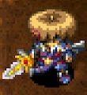</td>
    <td>It's evident that this is a pretty dilapidated sword. It's only natural that its max reinforcement level is low. The number of runes you can put on it is low, too. Get some better equipment.</td>
  </tr>
</table>

Extremely slow to level up, and is nearly worthless before Lv8. It unfortunately loses its 2 bracelet resonance effect when it reaches Lv8, and instead makes monsters occasionally take 1 step back. It's only used in dungeons that allow carry-in items by enthusiasts who like the design.

<table class="itemDetailsTable">
  <tbody>
    <tr>
      <th>Lv</th>
      <th>Name</th>
      <th>Rune</th>
      <th>Atk</th>
      <th>Max</th>
      <th>Ct</th>
      <th>Exp</th>
      <th>Buy</th>
      <th>Sell</th>
      <th>Info</th>
    </tr>
    <tr>
      <td>1</td>
      <td>Pathetic Blade</td>
      <td rowspan="8">-</td>
      <td>2</td>
      <td>12</td>
      <td>1</td>
      <td>-</td>
      <td>300</td>
      <td>105</td>
      <td rowspan="7">Resonance: <a href="/items/shields#pathetic-shield">Pathetic Shield</a> (Equip 2 bracelets)</td>
    </tr>
    <tr>
      <td>2</td>
      <td>Awful Blade</td>
      <td>3</td>
      <td>20</td>
      <td>2</td>
      <td>1000</td>
      <td>400</td>
      <td>140</td>
    </tr>
    <tr>
      <td>3</td>
      <td>Battered Blade</td>
      <td>4</td>
      <td>29</td>
      <td>3</td>
      <td>2000</td>
      <td>500</td>
      <td>175</td>
    </tr>
    <tr>
      <td>4</td>
      <td>Rusty Sword</td>
      <td>5</td>
      <td>39</td>
      <td>4</td>
      <td>4000</td>
      <td>600</td>
      <td>210</td>
    </tr>
    <tr>
      <td>5</td>
      <td>Worn Sword</td>
      <td>6</td>
      <td>50</td>
      <td>5</td>
      <td>8000</td>
      <td>700</td>
      <td>245</td>
    </tr>
    <tr>
      <td>6</td>
      <td>Rickety Sword</td>
      <td>7</td>
      <td>62</td>
      <td>6</td>
      <td>16000</td>
      <td>800</td>
      <td>280</td>
    </tr>
    <tr>
      <td>7</td>
      <td>Dingy Sword</td>
      <td>8</td>
      <td>75</td>
      <td>7</td>
      <td>32000</td>
      <td>900</td>
      <td>315</td>
    </tr>
    <tr>
      <td>8</td>
      <td>Rising Sun</td>
      <td>38</td>
      <td>99</td>
      <td>∞</td>
      <td>64000</td>
      <td>23000</td>
      <td>8050</td>
      <td>Resonance: <a href="/items/shields#pathetic-shield">Rising Sun Shld</a> (Adjacent foes may step back)</td>
    </tr>
  </tbody>
</table>

Locations:

<table class="locationTable">
  <tr>
    <th>Trail</th>
    <th>Past</th>
    <th>Present</th>
    <th>Future</th>
    <th>Fortune</th>
    <th>Miracle</th>
    <th>Rocks</th>
    <th>Gen</th>
    <th>Pitfall</th>
    <th>Manor</th>
  </tr>
  <tr>
    <td>-</td>
    <td>-</td>
    <td>-</td>
    <td>-</td>
    <td>-</td>
    <td>-</td>
    <td>-</td>
    <td>-</td>
    <td>SE</td>
    <td>-</td>
  </tr>
  <tr>
    <th>Bizarre</th>
    <th>Onigiri</th>
    <th>Chasm</th>
    <th>Well</th>
    <th>Lake</th>
    <th>Inori</th>
    <th>Old</th>
    <th>Descent</th>
    <th></th>
    <th></th>
  </tr>
  <tr>
    <td>E</td>
    <td>F</td>
    <td>FPZM</td>
    <td>-</td>
    <td>FP</td>
    <td>-</td>
    <td>FM</td>
    <td>FM</td>
    <td></td>
    <td></td>
  </tr>
</table>

### Fox Kodachi

<table class="itemDetailsTable">
  <tr>
    <th>Lv1-7</th>
    <th>Lv8</th>
    <th>Lv1 Description</th>
  </tr>
  <tr>
    <td></td>
    <td>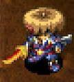</td>
    <td>It's Koharu morphed into a weapon. "Shiren! It's me, Koharu! I'm a weapon now!"</td>
  </tr>
</table>

Obtained by asking <a href="/system/allies#koharu">Koharu</a> to transform into a weapon. High attack, but effectively 0 rune slots and has the slowest growth rate among all weapons. The only sane way to level up this weapon is to use the <a href="/guides/tips-and-tricks#equipment-level">Gambler's Scroll technique</a>.

<table class="itemDetailsTable">
  <tbody>
    <tr>
      <th>Lv</th>
      <th>Name</th>
      <th>Rune</th>
      <th>Atk</th>
      <th>Max</th>
      <th>Ct</th>
      <th>Exp</th>
      <th>Buy</th>
      <th>Sell</th>
      <th>Info</th>
    </tr>
    <tr>
      <td>1</td>
      <td>Fox Kodachi</td>
      <td>-</td>
      <td>9</td>
      <td>25</td>
      <td>0</td>
      <td>-</td>
      <td>-</td>
      <td>-</td>
      <td rowspan="8">Ask <a href="/system/allies#koharu">Koharu</a> to change into a weapon.</td>
    </tr>
    <tr>
      <td>2</td>
      <td>Fox Katana</td>
      <td>Energizing</td>
      <td>12</td>
      <td>30</td>
      <td>1</td>
      <td>15000</td>
      <td>-</td>
      <td>-</td>
    </tr>
    <tr>
      <td>3</td>
      <td>Fine Fox Katana</td>
      <td rowspan="2">Energizing Clutch</td>
      <td>15</td>
      <td>35</td>
      <td>2</td>
      <td>25000</td>
      <td>-</td>
      <td>-</td>
    </tr>
    <tr>
      <td>4</td>
      <td>Cute Sword</td>
      <td>18</td>
      <td>40</td>
      <td>2</td>
      <td>35000</td>
      <td>-</td>
      <td>-</td>
    </tr>
    <tr>
      <td>5</td>
      <td>Shy Sword</td>
      <td rowspan="2">Energizing Clutch Enlightening</td>
      <td>21</td>
      <td>45</td>
      <td>3</td>
      <td>45000</td>
      <td>-</td>
      <td>-</td>
    </tr>
    <tr>
      <td>6</td>
      <td>Loving Sword</td>
      <td>24</td>
      <td>50</td>
      <td>3</td>
      <td>55000</td>
      <td>-</td>
      <td>-</td>
    </tr>
    <tr>
      <td>7</td>
      <td>Smitten Sword</td>
      <td>Energizing Clutch Enlightening Anointing</td>
      <td>27</td>
      <td>55</td>
      <td>4</td>
      <td>65535</td>
      <td>-</td>
      <td>-</td>
    </tr>
    <tr>
      <td>8</td>
      <td>Koharu Sword</td>
      <td>Energizing Clutch Enlightening Anointing Healing</td>
      <td>30</td>
      <td>99</td>
      <td>5</td>
      <td>65535</td>
      <td>-</td>
      <td>-</td>
    </tr>
  </tbody>
</table>

Locations:

- Ask Koharu to change into a weapon.

 

<table class="locationTable">
  <tr>
    <th>Trail</th>
    <th>Past</th>
    <th>Present</th>
    <th>Future</th>
    <th>Fortune</th>
    <th>Miracle</th>
    <th>Rocks</th>
    <th>Gen</th>
    <th>Pitfall</th>
    <th>Manor</th>
  </tr>
  <tr>
    <td>-</td>
    <td>-</td>
    <td>-</td>
    <td>-</td>
    <td>-</td>
    <td>-</td>
    <td>-</td>
    <td>-</td>
    <td>-</td>
    <td>-</td>
  </tr>
  <tr>
    <th>Bizarre</th>
    <th>Onigiri</th>
    <th>Chasm</th>
    <th>Well</th>
    <th>Lake</th>
    <th>Inori</th>
    <th>Old</th>
    <th>Descent</th>
    <th></th>
    <th></th>
  </tr>
  <tr>
    <td>-</td>
    <td>-</td>
    <td>-</td>
    <td>-</td>
    <td>-</td>
    <td>-</td>
    <td>-</td>
    <td>-</td>
    <td></td>
    <td></td>
  </tr>
</table>

### Kaburagi

<table class="itemDetailsTable">
  <tr>
    <th>Lv1-7</th>
    <th>Lv8</th>
    <th>Lv1 Description</th>
  </tr>
  <tr>
    <td></td>
    <td></td>
    <td>The strongest sword in the world, it was even sought after by Kabura. Holding it aloft will make it shine.</td>
  </tr>
</table>

Obtained by wishing for an unstoppable weapon in <a href="/dungeons/inori-cave">Inori Cave</a>. Strongest regular weapon, and its resonance effect lets you deal slightly meaningful damage to night monsters, which can be boosted further by equipping a <a href="/items/bracelets#night-ward">Night Ward</a>.

Shugoseki Swd vs. Kaburasutegi as a main weapon for dungeons that allow carry-in items comes down to whether or not you want to equip 2 bracelets.

<table class="itemDetailsTable">
  <tbody>
    <tr>
      <th>Lv</th>
      <th>Name</th>
      <th>Rune</th>
      <th>Atk</th>
      <th>Max</th>
      <th>Ct</th>
      <th>Exp</th>
      <th>Buy</th>
      <th>Sell</th>
      <th>Info</th>
    </tr>
    <tr>
      <td>1</td>
      <td>Kaburagi</td>
      <td rowspan="7">-</td>
      <td>25</td>
      <td>8</td>
      <td>∞</td>
      <td>-</td>
      <td>15000</td>
      <td>5250</td>
      <td rowspan="8">Clear <a href="/dungeons/inori-cave">Inori Cave</a> with 7 Catstones and wish for an unstoppable weapon.  Resonance: <a href="/items/shields#helix-shield">Helix Shield</a> (Attack damage +10)</td>
    </tr>
    <tr>
      <td>2</td>
      <td>Good Kaburagi</td>
      <td>27</td>
      <td>15</td>
      <td>∞</td>
      <td>20000</td>
      <td>16000</td>
      <td>5600</td>
    </tr>
    <tr>
      <td>3</td>
      <td>Keen Kaburagi</td>
      <td>29</td>
      <td>22</td>
      <td>∞</td>
      <td>28000</td>
      <td>17000</td>
      <td>5950</td>
    </tr>
    <tr>
      <td>4</td>
      <td>Rare Kaburagi</td>
      <td>31</td>
      <td>30</td>
      <td>∞</td>
      <td>36000</td>
      <td>18000</td>
      <td>6300</td>
    </tr>
    <tr>
      <td>5</td>
      <td>Fine Kaburagi</td>
      <td>33</td>
      <td>38</td>
      <td>∞</td>
      <td>44000</td>
      <td>19000</td>
      <td>6650</td>
    </tr>
    <tr>
      <td>6</td>
      <td>Elite Kaburagi</td>
      <td>35</td>
      <td>46</td>
      <td>∞</td>
      <td>52000</td>
      <td>20000</td>
      <td>7000</td>
    </tr>
    <tr>
      <td>7</td>
      <td>Epic Kaburagi</td>
      <td>37</td>
      <td>55</td>
      <td>∞</td>
      <td>60000</td>
      <td>21000</td>
      <td>7350</td>
    </tr>
    <tr>
      <td>8</td>
      <td>Kaburasutegi</td>
      <td>Critical Quick Hitting</td>
      <td>40</td>
      <td>99</td>
      <td>∞</td>
      <td>65535</td>
      <td>27000</td>
      <td>9450</td>
    </tr>
  </tbody>
</table>

Locations:

- Wish for an unstoppable weapon in Inori Cave.

 

<table class="locationTable">
  <tr>
    <th>Trail</th>
    <th>Past</th>
    <th>Present</th>
    <th>Future</th>
    <th>Fortune</th>
    <th>Miracle</th>
    <th>Rocks</th>
    <th>Gen</th>
    <th>Pitfall</th>
    <th>Manor</th>
  </tr>
  <tr>
    <td>-</td>
    <td>-</td>
    <td>-</td>
    <td>-</td>
    <td>-</td>
    <td>-</td>
    <td>-</td>
    <td>-</td>
    <td>-</td>
    <td>-</td>
  </tr>
  <tr>
    <th>Bizarre</th>
    <th>Onigiri</th>
    <th>Chasm</th>
    <th>Well</th>
    <th>Lake</th>
    <th>Inori</th>
    <th>Old</th>
    <th>Descent</th>
    <th></th>
    <th></th>
  </tr>
  <tr>
    <td>-</td>
    <td>-</td>
    <td>-</td>
    <td>-</td>
    <td>-</td>
    <td>-</td>
    <td>-</td>
    <td>-</td>
    <td></td>
    <td></td>
  </tr>
</table>

### Torch

<table class="itemDetailsTable">
  <tr>
    <th>Image</th>
    <th>Description</th>
  </tr>
  <tr>
    <td></td>
    <td>Equip this and it will light up and illuminate your surroundings. It burns out after a few turns. (You can read scrolls at night with light, and night monsters get weaker.)</td>
  </tr>
</table>

Technically not a weapon, but it's equipped in the same slot as a sword. Torches dim by 1 stage every 250 turns, and burn out once the radius falls below 1. (Example: Fine Torch dims after 250 turns, and lasts a total of 500 turns) Blessed torches dim every 500 turns, making them last twice as long.

<table class="itemDetailsTable">
  <tbody>
    <tr>
      <th>Name</th>
      <th>Buy</th>
      <th>Sell</th>
      <th>Radius</th>
      <th>Info</th>
    </tr>
    <tr>
      <td>Torch</td>
      <td>100</td>
      <td>35</td>
      <td>1 tile</td>
      <td rowspan="3">Lights up your surroundings at night. Dims by 1 stage every 250 turns. (500 if blessed)  Resonance: <a href="/items/shields#blazing-shield">Blazing Shield</a> (Light up an entire room at night)  Resonance: <a href="/items/shields#midnight-shield">Midnight Shield</a> (Night enemies miss more often)</td>
    </tr>
    <tr>
      <td>Fine Torch</td>
      <td>200</td>
      <td>70</td>
      <td>2 tiles</td>
    </tr>
    <tr>
      <td>Super Torch</td>
      <td>400</td>
      <td>140</td>
      <td>3 tiles</td>
    </tr>
  </tbody>
</table>

Locations:

- Dungeons that have day / night cycles.

 

<table class="locationTable">
  <tr>
    <th>Trail</th>
    <th>Past</th>
    <th>Present</th>
    <th>Future</th>
    <th>Fortune</th>
    <th>Miracle</th>
    <th>Rocks</th>
    <th>Gen</th>
    <th>Pitfall</th>
    <th>Manor</th>
  </tr>
  <tr>
    <td>-</td>
    <td>-</td>
    <td>-</td>
    <td>-</td>
    <td>-</td>
    <td>-</td>
    <td>-</td>
    <td>-</td>
    <td>-</td>
    <td>-</td>
  </tr>
  <tr>
    <th>Bizarre</th>
    <th>Onigiri</th>
    <th>Chasm</th>
    <th>Well</th>
    <th>Lake</th>
    <th>Inori</th>
    <th>Old</th>
    <th>Descent</th>
    <th></th>
    <th></th>
  </tr>
  <tr>
    <td>-</td>
    <td>-</td>
    <td>-</td>
    <td>-</td>
    <td>-</td>
    <td>-</td>
    <td>-</td>
    <td>-</td>
    <td></td>
    <td></td>
  </tr>
</table>
