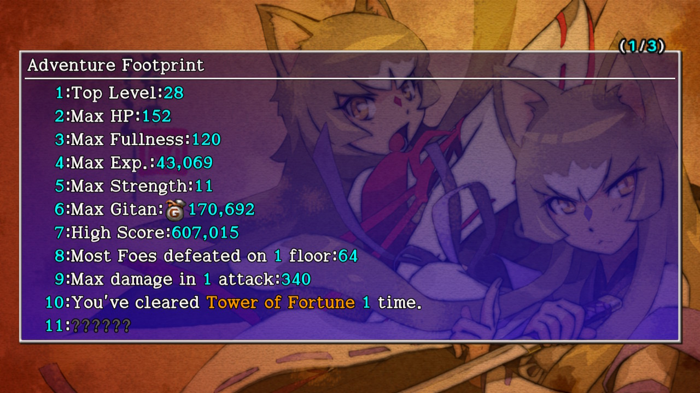

  

In-game achievements that automatically update as you play the game.

## Switch / Steam

|No.|Footprint|Notes|
|-|-|-|
|1|Top Level: N (Max: 99)|Easily achieved using Gambler's Scrolls.|
|2|Max HP: N (Max: 630)|500 (stats) + 100 (runes) + 30 (resonance) Resonance: Wonder Pick + Nirvana Board|
|3|Max Fullness: N (Max: 200)|-|
|4|Max Exp.: N (Max: 9,999,999)|Over double the exp needed to reach Lv99. Monster Summoner is required.|
|5|Max Strength: N (Max: 56)|Requires 2 Strength Bracelets or 1 Strength Bracelet + gold set resonance.|
|6|Max Gitan: N (Max: 999,999)|Bring 999,999 Gitan into a dungeon that allows carry-in items.|
|7|High Score: N|Clear bonus and exp have a large impact.|
|8|Most Foes defeated on 1 floor: N (Max: 9999)|Wind doesn't blow in the "I wish to fight Gendolucika" boss battle.|
|9|Max damage in 1 attack: N (Max: 999)|Get hit by a high level night monster or blessed Gitan.|
|10|You've cleared Tower of Fortune N times.|-|
|11|You've cleared Inori Cave N times.|-|
|12|You've cleared Primordial Chasm N times.|-|
|13|You've cleared Destiny's Descent N times.|-|
|14|You've cleared Bizarre Tower N times.|-|
|15|You've cleared Onigiri Hollow N times.|-|
|16|You've cleared Pitfall of Life N times.|-|
|17|You've cleared Heavenly Lake N times.|-|
|18|You've cleared Old Road N times.|-|
|19|You've cleared Gen's Turf N times.|-|
|20|You've cleared Lost Well N times.|-|
|21|You've cleared N questions of the Training Facility. You've cleared all of the Training Facility.|-|
|22|You've cleared Explosion Rocks N times.|-|
|23|You've cleared N sections of the Underground Manor. You've cleared all of the Underground Manor.|-|
|24|You've cleared N questions at Statue Cave.|-|
|25|You've awakened Super status N times.|See Super status.|
|26|You successfully stole N times.|Triggering thief mode isn't required, so you can use a Pit Trap inside a store.|
|27|You failed to steal N times.|Collapse while in thief mode. (Ending the game without suspending doesn't count)|
|28|You made N successful rescues.|-|
|29|You created N new items.|Items discarded without registering count.|
|30|You've succeeded N times at the Pick-A-Choice Shop.|Collection Scroll doesn't count.|
|31|You've failed N times at the Pick-A-Choice Shop.|-|
|32|You had N wishes granted.|"I don't wish for anything" doesn't count.|
|33|You learned N abilities. You learned all abilities.|30 abilities total.|
