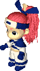
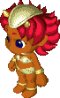
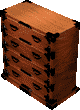

Allies are NPC characters who fight monsters alongside Shiren. 
Shiren 2 features five ally characters - Himakichi, Riku, Asuka, Kirara, and Mamo. 
See Story Progression to check requirements for each character becoming your ally.

<ul class="quickLinksUL">
  <li><a href="#overview">Overview</a></li>
  <li><a href="#characters">Characters</a>
    <ul>
      <li><a href="#himakichi">Himakichi</a></li>
      <li><a href="#riku">Riku</a></li>
      <li><a href="#asuka">Asuka</a></li>
      <li><a href="#kirara">Kirara</a></li>
      <li><a href="#mamo">Mamo</a></li>
    </ul>
  </li>
  <li><a href="#dialogue">Dialogue</a></li>
</ul>

### Overview

Ally characters follow Shiren, and automatically move toward enemies to attack them. 
Allies retreat if their HP falls below 25%, and enemies level up if they defeat an ally. 
Shopkeepers, Sheriffs, and Guard Dogs won't attack allies, so they can be used as a barrier.

Allies gain experience points when Shiren defeats an enemy, 
and Shiren and other allies also gain experience points if an ally defeats an enemy. 
Level, HP, strength, Landmine damage, etc. basically function the same as Shiren, 
but unlike Shiren, their defense increases with level ups, they don't have hunger, 
and the amount of experience points needed to level up differs per character.

See the Exp & Stats page for details about ally stats.

### Characters

#### Himakichi

  

A Bored Kappa who always has more time than he knows what to do with. 
He takes an interest in fighting Oni after some convincing by Koppa.

He can catch any thrown item and toss it at an enemy within range. 
However, he can't catch items that have piercing properties, such as Silver Arrows. 
Catching and tossing items doesn't end his turn, so he can move or attack afterwards. 
The amount of damage the thrown item deals is based on Himakichi's attack power. 

Himakichi will drop the item on the ground if an enemy isn't within range or view. 
However, he'll throw stones at an adjacent tile instead of dropping them on the ground. 
If Shiren takes control of a Bow Boy monster, he can collect Wooden Arrows, Iron Arrows, or Cannonballs simply by shooting them at Himakichi.

Since he's a Bored Kappa monster, he can enter water and attack underwater enemies. 
He will also toss underwater items toward Shiren so that Shiren can pick them up.

Himakichi will eat grass or seed items that have a positive effect when thrown at him, 
and will eat Dragon Grass or Flame Grass when an enemy is in range of the fire breath. 
He eats Herb and Otogiriso unlike other allies, so it's possible to increase his max HP. 
If you want to hit him with a grass or seed that he won't eat such as Antidote Grass, 
you'll need to seal him or equip a Pierce Bracelet to ensure he doesn't catch it.

Due to his ability, he's effectively invincible against Bow Boy and Boy Cart. 
He can also toss Pop Tank Cannonballs and Wolf Droid bombs back at monsters, 
but will get hit by the explosions if the monsters are standing next to Himakichi. 
(If Himakichi collapses from that, "Himakichi self-destructed!" will be displayed).

As shown in demo 4, you can help Himakichi defeat enemies by shooting arrows at him. 
However, you should avoid having him fight at close range, since he has decent defense but only average attack, where even Riku surpasses his attack strength starting at Lv18. 
He's nice for Shuten Trails and Onigashima, but the lack of power and utility becomes apparant in Sealed Room when compared to allies like Asuka and Mamo. 

Throw Range:

|Level|Throw Range (Tiles)|
|-|-|
|1-30|5|
|31-60|7|
|61-99|9|

Grass Items Himakichi Can Eat:

|Item|Notes|
|-|-|
|Boost Grass|-|
|Swift Grass|-|
|Herb|Increases max HP if full.|
|Otogiriso|Increases max HP if full.|
|Life Grass|-|
|Strength Grass|-|
|Happy Grass|-|
|Angel Seed|-|
|Dragon Grass|Only eats if fire breath can hit an enemy.|
|Flame Grass|Only eats if fire breath can hit an enemy.|

#### Riku

  

A delicate child who lives in Napus Village. 
He was inspired by Shiren's efforts to build a castle and became an ally.

He shoots a slingshot at an enemy within 2 tiles, dealing fixed damage based on level. 
It's similar to Porky Stones, but it's treated as a direct attack rather than a ranged attack. 
The slingshot can't be reflected by Tonosamadon, and isn't affected by Hoarder Statue. 
Riku receives counter damage from Samuraidon, and it's affected by Knockback Statue.

He tends to run toward monsters on his own despite lacking in both HP and strength, 
and often collapses before you can rescue him, resulting in a monster leveling up. 
This can be used to level up a monster for more experience points in Sealed Room 
(ex: Stun Scorpion on 1F), or to capture a higher level monster for Monster Kingdom.

Due to his tendency to collapse, the nickname "Blue Snacky" became popular over time. 
A proper blue colored Snacky family monster was then introduced in Shiren 4, and one 
of the night monsters in Shiren 5 includes a reference to Riku as the Blue Snacky.

Slingshot Damage:

|Level|Slingshot Damage|
|-|-|
|1-9|4|
|10-14|6|
|15-19|8|
|20-29|10|
|30-99|15|

#### Asuka

  

A wanderer who was rescued by Shiren when she was surrounded by Kengo monsters at Shuten Halfway. 
She joins Shiren from that point, and proves to be an invaluable ally throughout his adventure.

She is the only ally character who can equip weapons, shields, and bracelets (excluding 2-handed). 
Asuka equips these items by catching them in the air when they are thrown her way, 
and can therefore save Shiren's equipment if it gets knocked away by a Kengo monster. 
Asuka will prioritize equipping thrown items, even if she has a Reflect Shield or Dodge Shield equipped.

However, if she is currently unable to act (ex: sleeping), the thrown item will simply hit her. 
Also, she cannot catch items with piercing properties, so be sure to unequip Pierce Bracelet 
and check for possible Pierce Statues in the room before throwing equipment at her. 
If you neglect to do so, you might end up accidentally one-shotting her if you throw powerful equipment.

If Asuka equips a cursed item, you can read a Purify Scroll while standing next to her to remove the curse.

As for seals on equipment, Asuka will actively make use of 火 and 水 on her own. 
Other seals still take effect, but she will never dig walls with 掘 or サ, or break traps with 木 or 鉄. 
Note that Asuka won't attack an enemy unless the enemy is directly in front of her, 
so she won't attack around corners or such with the 三 seal. (But her attacks still hit in a 3-way pattern). 
Since she doesn't have hunger, she can equip Heavy Shield and Heal Bracelet without any negatives.

If both of you have Phantasm Bracelets equipped, Asuka will follow you over water and through walls. 
Like Shiren, she loses HP every turn she spends inside a wall, so you'll want to keep an eye on her HP.

Asuka will drop her equipment on the ground if she is defeated. 
However, if Shiren was the only one to collapse inside of a dungeon, her equipment won't be lost, but 
if you select "Return to Napus Village" from the main menu / copy a journal, she will lose her equipment. 
It also appears she can lose her equipment as a result of certain event scenes, 
so if you care about her equipment, it's best to store the items inside Napus Storage when not in use.

Asuka will drop her previous equipment on the ground if you throw a new piece of equipment at her. 
If you don't have 2+ weapons or shields (or 3+ bracelets), you'll have to defeat her to reclaim equipment.

Overall, giving her powerful equipment and bringing her along is like having 2 Shirens inside the dungeon, 
so there's no contest who the strongest ally character is, as Asuka leaves the other four in the dust. 
Even if you take her weapon away, she still has the best base attack growth rate, 
and you can have her equip a shield to cover for any lack of HP or defense.

She's the only ally able to fight monsters in Sealed Room on even footing, 
and you can further increase her damage output by having her equip two Strength Bracelets. 
However, even when she has powerful equipment, you'll still want to keep an eye on her 
since she won't hesitate to rush toward Kengo and Weather Doll family monsters by herself.

#### Kirara

  

Boss Oni's daughter. 
Shiren helped her out of a trap prior to arriving at Napus Village, but she left without a thanks. 
However, she grows a crush on Shiren as she watches him build a castle, and later joins him as an ally.

She can breathe fire at monsters from a distance, dealing a fixed amount of damage based on her level. 
Early game monsters can be wiped out quickly thanks to this ability, 
but unlike a Dragon's breath attack, she can't breathe fire at targets around corners. 
She will never breathe fire in a way that the flame accidentally hits Shiren.

Kirara is immune to fire damage, and therefore is a decent counter against Dragon family monsters. 
Sources for fire damage include: Blaze Scroll, Fire Staff, Flame Grass, Dragon Grass, 
Dragon family monster special attacks, and the 火 seal on a weapon.

She has higher base attack than Himakichi and Riku, and has average defense. 
She can prove to be a reliable ally for the Shuten Trails and Onigashima, but like Himakichi and Riku, 
her inability to equip weapons or shields leaves her underpowered for Sealed Room.

Despite being a member of the Oni family, nothing happens when Oni-repelling Water is thrown at her. 
...Yes, someone was mean enough to try that.

Fire Damage:

|Level|Fire Damage|
|-|-|
|1-19|10|
|20-39|15|
|40-99|20|

#### Mamo

  

Shuten Mountain's guardian deity, Mamori Gami, entered the physical realm as a dresser to help Shiren. 
Despite having the appearance of a dresser, Mamo is able to walk and talk like other characters. 
Unlike other allies, Mamo never attacks monsters, but can instead store up to 10 items inside its drawers. 
In other words, it's essentially a walking high-grade Storage Pot[10]. 
It can store any item including castle materials and pots, though note that items inside pots will vanish. 
Simply talk to Mamo to deposit or retrieve items from its drawers at any time.

Mamo has 100 HP and 20 defense (= 40 shield strength), so it can withstand quite a few hits early on. 
However, Mamo cannot level up, so its stats never grow beyond those numbers. 
Monsters generally ignore Mamo for the most part, but will attack if Mamo is blocking the way 
such as in hallways, or if Mamo is lined up with a monster that has a ranged attack.

If Mamo is defeated, all items that were inside its drawers will be spread on the ground. 
Some items will vanish if there isn't enough space for them to be dropped on the ground, 
such as if Mamo is defeated in a hallway and was carrying 4 or more items. (only space for 3 items). 
So it's best to keep an eye on Mamo at all times, and avoid having it wander into hallways on its own.

Unlike Shiren GB2, items thrown at Mamo will simply hit them rather than storing the item in its drawers, 
so it's easy to lose equipment if you encounter a Kengo in a hallway with Mamo behind you. 
Given that fact, it's best to be extra careful on floors where Kengo family monsters can appear. 
Mamo's items will vanish if you select "Return to Napus Village" from the main menu / copy a journal.

### Dialogue

Talk to allies in dungeons to get a rough idea how much HP they have left without ending your turn. 
The amount of HP displayed when using a Knowledge Staff represents their max HP. 
There are 4 levels of dialogue based on remaining HP. (1~24%, 25~49%, 50~74%, and 75~100%). 
Alternate lines are spoken when an ally gets hit or caught by a trap, or when an ally defeats a monster. 
Lastly, allies will have different dialogue altogether outside of dungeons.

#### Himakichi

<table>
  <tr>
    <th>HP</th>
    <th>Normal</th>
    <th>Monster</th>
    <th>Trap</th>
  </tr>
  <tr>
    <td>75~100%</td>
    <td>Throw an item at me and I'll toss it at a monster.  I have too much free time. I really do...</td>
    <td>That [Monster name] looked like it was pretty bored.</td>
    <td>[Trap name]? Nah, I'm still bored.</td>
  </tr>
  <tr>
    <td>50~74%</td>
    <td>I might have slightly less time on my hands...</td>
    <td>That [Monster name] wasted a lot of time.</td>
    <td>Not good! I took a big hit from [Trap name]!</td>
  </tr>
  <tr>
    <td>25~49%</td>
    <td colspan="3">Darn it, my vision is fading away...</td>
  </tr>
  <tr>
    <td>1~24%</td>
    <td colspan="3">I'm done for. I had a leisurely life...</td>
  </tr>
  <tr>
    <td>Overworld</td>
    <td colspan="3">Let's waste some time.</td>
  </tr>
</table>

#### Asuka

<table>
  <tr>
    <th>HP</th>
    <th>Normal</th>
    <th>Monster</th>
    <th>Trap</th>
  </tr>
  <tr>
    <td>75~100%</td>
    <td>Throw a weapon, shield, or bracelet at me and I'll equip it.</td>
    <td>[Monster name] is no match for me!</td>
    <td>Don't worry, I am all right.</td>
  </tr>
  <tr>
    <td>50~74%</td>
    <td>You're concerned for me? I'm thankful.</td>
    <td>That [Monster name] was a formidable opponent.</td>
    <td>Ugh, [Trap name] hurts!</td>
  </tr>
  <tr>
    <td>25~49%</td>
    <td colspan="3">I must fight through the pain. Until the very end!</td>
  </tr>
  <tr>
    <td>1~24%</td>
    <td colspan="3">I-I can't go on...</td>
  </tr>
  <tr>
    <td>Overworld</td>
    <td colspan="3">I'll follow you, [Player name].</td>
  </tr>
</table>

#### Riku

<table>
  <tr>
    <th>HP</th>
    <th>Normal</th>
    <th>Monster</th>
    <th>Trap</th>
  </tr>
  <tr>
    <td>75~100%</td>
    <td>Let's get going.</td>
    <td>Let's be careful. Stronger enemies might be nearby.</td>
    <td>[Trap name] is no big deal.</td>
  </tr>
  <tr>
    <td>50~74%</td>
    <td>This is getting a bit hard...</td>
    <td>That [Monster name] was pretty tough, huh.</td>
    <td>Ouch... [Trap name] got me pretty good.</td>
  </tr>
  <tr>
    <td>25~49%</td>
    <td colspan="3">I feel like I'm going to collapse...</td>
  </tr>
  <tr>
    <td>1~24%</td>
    <td colspan="3">Help... [Player name]...</td>
  </tr>
  <tr>
    <td>Overworld</td>
    <td colspan="3">Let's do our best!</td>
  </tr>
</table>

#### Kirara

<table>
  <tr>
    <th>HP</th>
    <th>Normal</th>
    <th>Monster</th>
    <th>Trap</th>
  </tr>
  <tr>
    <td>75~100%</td>
    <td>Let's stay cheerful!</td>
    <td>[Monster name]? Easy peasy.</td>
    <td>I can handle [Trap name] just fine.</td>
  </tr>
  <tr>
    <td>50~74%</td>
    <td>I might be in trouble.</td>
    <td>That [Monster name] was a tough one.</td>
    <td>[Trap name] hit hard. I'm really feeling it now...</td>
  </tr>
  <tr>
    <td>25~49%</td>
    <td colspan="3">I'm hurting so much...</td>
  </tr>
  <tr>
    <td>1~24%</td>
    <td colspan="3">I'm sorry. This is it for me...</td>
  </tr>
  <tr>
    <td>Overworld</td>
    <td colspan="3">Let's do our best together!</td>
  </tr>
</table>

#### Mamo

<table>
  <tr>
    <th>HP</th>
    <th>Normal</th>
    <th>Monster (Unused)</th>
    <th>Trap</th>
  </tr>
  <tr>
    <td>75~100%</td>
    <td>Want to shuno something?</td>
    <td>I'm doing well.</td>
    <td>I won't break apart from a mere [Trap name].</td>
  </tr>
  <tr>
    <td>50~74%</td>
    <td>I hear a bit of rattling...</td>
    <td>[Monster name] is a rowdy one.</td>
    <td>That [Trap name] was painful.</td>
  </tr>
  <tr>
    <td>25~49%</td>
    <td colspan="3">I hear a lot of creaking. I might break pretty soon...</td>
  </tr>
  <tr>
    <td>1~24%</td>
    <td colspan="3">Goodbye [Player name]. I'm going to fall apart now...</td>
  </tr>
  <tr>
    <td>Overworld</td>
    <td colspan="3">Let's go! Mamori head out!</td>
  </tr>
</table>
