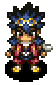
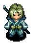
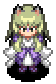
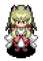
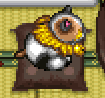

Allies are NPC characters who fight monsters alongside Shiren. 
Shiren 5 features six ally characters - Jirokichi, Tao, Okon, Koharu, and Gen. 
Each character comes with a unique ability, and can grow stronger through leveling up.

Those looking for a more classic roguelike experience can leave everyone except Jirokichi 
behind during the main story, but considering most post-game dungeons don't allow allies, 
it might be fun to experience them and see their abilities while you can.

<ul class="quickLinksUL">
  <li><a href="#overview">Overview</a></li>
  <li><a href="#characters">Characters</a>
    <ul>
      <li><a href="#jirokichi">Jirokichi</a></li>
      <li><a href="#tao">Tao</a></li>
      <li><a href="#kojirouta">Kojirouta</a></li>
      <li><a href="#okon">Okon</a></li>
      <li><a href="#koharu">Koharu</a></li>
      <li><a href="#gen">Gen</a></li>
      <li><a href="#sage-/-sparrow">Sage / Sparrow</a></li>
    </ul>
  </li>
</ul>

## Overview

Allies must be unlocked before they can join your adventures. 
The unlock conditions are generally pretty lax, with some characters simply joining 
you automatically when you reach certain points of the main story.

Level ups for allies persist between adventures. 
Due to this, they typically require more experience points to level up. 
It's best to use items like Cheery Grass or Angel Seed to level them up once they reach high levels.

Turn order: Shiren → Allies → Monsters.

All allies except for Kojirouta prioritize following Shiren. 
They won't attack monsters who aren't an immediate threat. (Example: Napping or paralyzed monsters)

Press Select (- or ZL on Nintendo Switch) to view their current HP. 
You can also talk to them to get a rough idea, but keep in mind that talking is a turn ending action. 

If an ally is defeated, the monster that defeated the ally levels up. 

Experience points are distributed to all party members regardless of who defeated the monster. The amount of experience points doesn't change based on number of party members.

Allies follow you when you switch places with a wandering NPC. 
Doors wait to close until Shiren and all allies pass through the door. 
However, blue doors still close immediately if a monster is present in the room you enter.

Except for Kojirouta, allies follow you to the next floor even if you were in different rooms. Levels can be gained or lost by level-changing items such as Cheery Grass or Unlucky Staff. Koharu and allies who are in wandering NPC mode aren't affected. 

The most efficient way to level up allies:

1. Use Fever Pots and blessed Extraction Scrolls to prepare lots of blessed Angel Seeds.
    - Alternatively, register an Angel Seed as a New Item, and then purchase a bunch of that item.
2. Equip a Can. Arm Bracelet and enter a dungeon with 3 allies.
3. Line them up in a hallway and throw the Angel Seeds.

Herb, Otogiriso, Heal Grass, and Life Grass will restore HP when thrown at an ally. 
Max HP won't increase when they're at full HP.

They dodge flying equipment, include equipment disarmed by a Swordsman's special attack. 
The number of allies you can have with you depends on the dungeon, but it's usually 3 characters.

## Characters

### Jirokichi

  

#### Location

- No permanent location.
- Automatically joins when you reach the first 3 towers. (Past, Present, or Future)
    - Mandatory ally during the main story.
        - This means only 2 other allies can join you during the main story.
    - If you collapse or advance while Jirokichi is a gravestone, you have to reach the same floor before you can recruit him again.
- Permanently becomes unavailable as an ally after clearing the main story.
    - However, he can be recruited in Garden of Destiny (Switch/Steam exclusive), so it may be worth leveling him during the main story.

#### Characteristics

- Highest HP among all allies, and levels up quickly.
- He transforms into a gravestone when he collapses.
    - Revive him by throwing an item like Herb, Otogiriso, Heal Grass, Life Grass, Heal Pot (with at least 1 capacity), Revival Grass, or Undo Grass.
    - Throwing a non-healing item at the gravestone will make the item vanish. (Example: Throw a Preservation Pot with items inside, the pot and all contents are lost)
- The gravestone is treated as a NPC.
    - You can switch places with the gravestone, and enemies can't move through it.
- Advancing while Jirokichi is a gravestone returns you to Nekomaneki Village.
    - This can be used to return with your items if you forgot an Escape Scroll or Undo Grass.
    - Throw a Hide Pot at him to keep him safe from enemies.
        - He can't break free unless you talk to him or he gets hit by an effect.
    - Floaty monsters can't warp you with their special attack in this state.
    - You can still progress if he collapses during a boss fight.
    - If you advance while he's a gravestone in Garden of Destiny, he just disappears.
- If you collapse while he's alive, he'll keep any untagged items you had equipped.

### Tao

  

#### Location

- Tower of Fortune Entrance. (Requires a payment of 1500 Gitan)
    - Randomly appears between Destiny Trail ~ Tower of Fortune Unexplored Area)
    - She'll raise the price to 2000 Gitan if you decline her first offer.
    - Can be found inside the Beginner House in Inori Village after clearing the main story.

#### Characteristics

- Throws a boomerang that deals fixed damage from a distance.
    - Starts at 10 damage, and goes up to 55 damage.
    - It flies in a square pattern, and ignores walls and allies.
    - This attack can accidentally wake up napping or paralyzed enemies.
- She offers to sell you an item if you talk to her under special circumstances.
    - Only 1 item can be purchased per floor.

Items for Sale:

|Item|Price|Condition|
|-|-|-|
|Exorcism Scroll|1500|Have a cursed item equipped. (Not sealed)|
|Antidote Grass|500|Strength has been lowered.|
|Onigiri|500|Fullness is at 0.|
|Fine Torch|800|It's night.|
|Replenish Scroll|3000|It's night, and used all abilities.|

#### Sidequest

Unlocking Bizarre Tower (Post-game):

1. Bring her to the top of Tower of Fortune.
2. Talk to her inside Sparrow's Inn.
3. Reach the top of Tower of Miracles.
4. Go to the Tower of Fortune Entrance.

### Kojirouta

  

#### How to Unlock

1. Talk to Kojirouta inside the Rich Man's House (Inori Village) and become his servant.
2. Kojirouta will rescue you if you collapse in Destiny Trail.
    - It's about a 1/3 chance for him to appear.
    - The event won't occur if you have Revival Grass or Undo Grass.
    - He won't appear if you already have 3 allies with you.
- Step 2 is skipped after you clear the main story.

#### Location

Rich Man's House (Inori Village)

#### Characteristics

- High HP and attack from the start, but average defense and collapses easily.
- Throws a bag of Gitan that deals fixed damage to a single target.
    - Range and damage increase as he levels up.
        - It only hits adjacent enemies at first.
    - It has piercing properties, so it damages Bored Kappa, Mixer, Sweet Nut, etc.
    - Froggos are dangerous for Kojirouta, since they're healed by thrown Gitan.
        - He can collapse if there are multiple enemies around besides the Froggo.
- He has an offensive AI and charges at enemies.
    - He won't approach at night, if he's about to collapse, or if the enemy is paralyzed.
- He can randomly disappear when advancing to the next floor.
    - Disappears if you use the Sparrow's Shuttle before completing his quest.
    - Disappears if you reach Tower of Fortune 14F with Tao and haven't finished her quest.
- It seems he stops disappearing once you've cleared Tao and Kojirouta's sidequests.

#### Sidequest

Unlocking Pitfall of Life (Post-game):

1. Bring him to the top of Tower of Fortune.
2. Bring him to the top of Tower of Miracles.
3. Go to the Rich Man's House. (Inori Village)

※ The game prioritizes Tao's sidequest if both allies are with you.

### Okon

  

#### How to Unlock

1. Help the trapped fox when you randomly encounter it inside a dungeon.
    - The event will occur again later if you decide not to help the fox.
2. Return to Nekomaneki Village.

#### Location

Next to the Lot Shop. (Basement of Hotel Nekomaneki)

#### Characteristics

- Low HP and collapses extremely easily.
    - Expect her to collapse if you get separated from her.
- Transforms into a monster and uses its special attack.
    - Talk to Okon to enable/disable specific transformations.
    - She'll learn new transformations as she levels up.
    - Guaranteed to transform if the special attack will work.
        - Example: An enemy is adjacent → Transforms into Gazer and confuse them.

Transformation List:

|Lv|Monster|Effect|
|-|-|-|
|1|Blade Bee|Retreat 1 tile after attacking.|
|5|Gazer|Inflicts Confused status to a monster in front.|
|9|Moseal|Body slams a monster either to the north or south.|
|14|DJ Mage|Fires a magic bullet in a straight line that either knocks a target back, or warps them to a different location on the same floor.|
|20|Curse Girl|Inflicts Sealed status to a monster in front.|
|27|Scoopie|Inflicts Blind status from a distance. However, it can miss, and Flamebirds burn the dirt on contact.|
|35|Grass Boy|Throws a random grass with piercing properties. It can miss, and it won't hit Shiren if he's visible to Okon.|
|44|Absorbiphant|Cures ailments for allies, and erases enemy auras and positive effects. Okon's HP will be fully restored, and she'll gain the Buffed status.|
|54|Naptapir|Infclits Asleep status to all monsters within a 1 tile radius.|
|65|Flamebird|Restores 30 HP when Shiren, an ally, or Okon has Danger status.|

#### Tips

Generally, it's dangerous for her to have many transformations enabled at the same time, since the AI might choose to an attacking transformation instead of one that disables an adjacent enemy.

If you're worried, it's best to only leave Naptapir (or Gazer) enabled for general play, and toggle other transformations for one turn as needed.

- Blade Bee is her main method to deal with Gyazas and Absorbiphants.
- Gazer is necessary to win (or even survive) 1-vs-1 fights until she learns Naptapir.
- Moseal should be disabled at all times, since it places her away from Shiren.
- DJ Mage can be handy to avoid fights at night or in single-room Monster Houses.
- Curse Girl should be disabled at all times, since Okon will easily collapse if she's attacked.
- Scoopie is excellent at disabling enemies in rooms, though note that it can miss.
- Grass Boy is a decent long range option, but enemies can level up if she throws Rage Grass.
    - Throws Poison, Confusion, Sleepy, Blinding, Rage, Dragon, Amnesia, or Warp grass.
- Absorbiphant offers fantastic support for Shiren, and greatly increases Okon's offense.
- Naptapir should be enabled at all times, since it completely shuts down most enemies.
    - Except when fighting Gyazas, since they convert the effect into 2 damage.
- Flamebird should be used to restore HP after a fight, rather than enabling it while fighting.

#### Sidequest

Unlocking Old Road (Post-game):

1. Level Okon and Gen to at least Lv10, and Koharu's equipment level to at least 2.
2. Visit Gen's House and check the letter on the floor.
3. Talk to the NPC near the south entrance of Inori Village.

### Koharu

  

#### How to Unlock

1. Appears next to the Lot Shop after Okon joins and you go on 3 adventures.

#### Location

Next to the Lot Shop. (Basement of Hotel Nekomaneki)

#### Characteristics

- She can transform into an equippable Fox Kodachi or Fox Shield if you talk to her.
    - You must have an open inventory slot for her to transform.
    - Equipment level is shared between the two, and both are registered to the Item Book.
    - However, upgrade value is separate.
    - She can only transform into equipment one time per floor.
    - She'll warp if there isn't enough space when you undo the transformation.
- Doesn't gain exp by defeating enemies, but instead levels up when equipment level increases.
    - Lv8 is her max level, and she reaches a pretty solid 95 HP.
    - Upgrade value of Fox Kodachi is added to her attack.
    - Upgrade value of Fox Shield is added to her defense.
    - Use Fate and Earth scrolls, Hermit's Hermitage Blacksmith to increase upgrade value.
        - "Boost buff rates and # of usable items" New Item bracelet ability is also effective.
    - Incredible attack and defense at +99, and proves to be a very reliable ally.
- The transformation wears off if an effect other than increasing upgrade value occurs.
    - If you try to tag the equipment, or the item is about to rust, turn into an onigiri, etc.

#### Sidequest

Unlocking Old Road (Post-game):

1. Level Okon and Gen to at least Lv10, and Koharu's equipment level to at least 2.
2. Visit Gen's House and check the letter on the floor.
3. Talk to the NPC near the south entrance of Inori Village.

### Gen

  

#### How to Unlock

1. Reach Hermit's Hermitage.
2. Obtain catnip juice in Inori Village. (2nd house from the left)
3. Go to Gen's House in Nekomaneki Village, and give him the catnip juice.

#### Location

Gen's House (Nekomaneki Village)

#### Characteristics

- High stats and fast to level up, and can deal damage to night monsters.
    - He shines at night, but can put up a fight during the day as well.
- Shoots enemies with his rifle at night, dealing fixed damage to a single target.
    - Starts at 40 damage, and goes up to 70 damage.
    - The shot can also inflict a random status condition.
        - Shadow Bound, Weakened, Wizened, and possibly others.
    - Doesn't shoot if an ally is blocking his line of sight.
    - It's not an ability, so it only deals 2 damage to Gyaza monsters.

#### Sidequest

Unlocking Gen's Turf (Post-game):

1. Examine the glowing pot inside Gen's House.

Unlocking Old Road (Post-game):

1. Level Okon and Gen to at least Lv10, and Koharu's equipment level to at least 2.
2. Visit Gen's House and check the letter on the floor.
3. Talk to the NPC near the south entrance of Inori Village.

### Sage / Sparrow

   

NPCs who ask to be guided to different overworld areas. 
Both are Lv1 and have 100 HP, and won't fight enemies even if attacked. 
Sage → Hermit's Hermitage 
Sparrow → Sparrow's Inn 

Guiding the sage to Hermit's Hermitage unlocks a side quest to learn Staccato Wave.

- Clearing the main story lets you skip having to guide the sage.

Guiding the sparrow unlocks the Sparrow NPC.

- Offers to heal you for 500G when you're in danger.
- The event only occurs in dungeons that have wandering NPCs.
- The interruptions can get annoying, so some players intentionally skip this sidequest.

