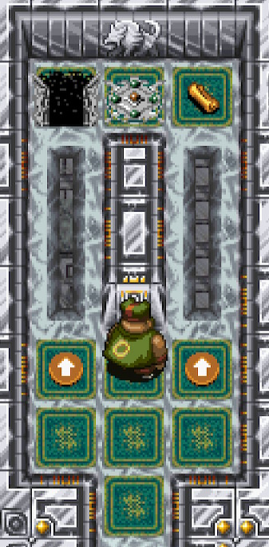
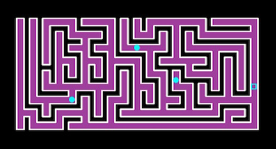

This page offers explanations for dungeon features and gimmicks.

<ul class="quickLinksUL">
  <li><a href="#shop">Shop</a></li>
  <li><a href="#monster-house">Monster House</a></li>
  <li><a href="#traps">Traps</a></li>
  <li><a href="#wind-of-kron">Wind of Kron</a></li>
  <li><a href="#hidden-room">Hidden Room</a></li>
  <li><a href="#hidden-hallway">Hidden Hallway</a></li>
  <li><a href="#shiny-object">Shiny Object</a></li>
  <li><a href="#item-island">Item Island</a></li>
  <li><a href="#gitan-room">Gitan Room</a></li>
  <li><a href="#buried-item">Buried Items</a></li>
  <li><a href="#maze-room">Maze Room</a></li>
  <li><a href="#moving-floor">Moving Floor</a></li>
  <li><a href="#launch-pad">Launch Pad</a></li>
  <li><a href="#spear-door">Spear Door</a></li>
  <li><a href="#iron-door">Iron Door</a></li>
  <li><a href="#special-door">Special Door</a></li>
  <li><a href="#lava">Lava</a></li>
  <li><a href="#tidal-wave">Tidal Wave</a></li>
</ul>

### Shop

#### Regular

Shops are rooms containing a single shopkeeper and merchandise for sale. 
The ground is covered in carpet, and there are no traps inside the room. 
It's possible to create Pit Traps by breaking a Black Hole Pot. Zalokleft Pot is nullified while standing on a carpeted tile.

  

The shopkeeper will offer to place a tag or identify merchandise if you talk to him when you haven't picked up any merchandise.

- Place a Tag
    - Costs 2000 Gitan.
    - Nice way to take home rare items in dungeons that don't allow carry-in items.
- Identify Merchandise
    - Give him an identified Identify Scroll and he'll identify all items with a price tag.
    - Items inside pots are also identified, as long as they have a price tag.
    - The disguise of N'twyn, N'mach, and N'dup will be canceled if present.

Disguised N'dubba monsters can be sold to the shopkeeper. 
However, if you then cancel their disguise, the shopkeeper will ask for payment.

Like Shiren 4, Shopkeepers won't attack monsters even if they're hit by them. 
Shopkeepers warp to you if you're about to leave the shop while carrying merchandise, but won't warp if you're standing diagonal to the entrance. He'll ask for payment every turn in this position.

The color of carpet varies based on the current floor's wall and ground tile set.

#### Elite

Shop hidden inside a wall and guarded by a shopkeeper at the end of a hallway. 
Either a Recommend. Letter or VIP Bracelet is needed to be granted entry. 
There are 6 items for sale, which are usually much higher in quality. 
Like regular shops, the shopkeeper can place a tag or identify merchandise.

   

Recommend. Letter is a scroll, so it can be written on a Blank Scroll after you've read it once. The Recommend. Letter is consumed when it's shown to the shopkeeper, but the letter can be used again if it was blessed. (Blessing wears off) 
Showing a Commend. Letter forces you to purchase a Large Onigiri for all of your Gitan.

The shop can be revealed by punching the wall, and doing so won't trigger Thief Mode. However, if you step inside the shop without being granted entry, Thief Mode will be triggered. Unlike regular shops, an elite shop won't join together with other rooms if you expand it.

#### Pick-A-Choice

Shop featuring a mini-game where you either obtain a rare item or fall into a Pit Trap.

- Costs 1000 Gitan per play.
- Wins and losses are recorded in Adventure Footprints.
- If you win, you can challenge it again on the same floor.
    - Rare item and Pit Trap placements can change sides from the previous play.
- It's possible to cheat by reading a Collection Scroll.
    - Obtaining the item this way doesn't count as a win for Adventure Footprints.
- Reading a Coupon Scroll lets you play for free 1 time.

 

  

Other notes:

- Entrance layout is selected from 3 patterns.
- The walls of the shop can't be destroyed.
- It's possible to switch positions with the shopkeeper.
- The launch pads and Pit Traps inside the shop always activate.
    - Even if you have a Floating Bracelet or Trapper Bracelet equipped.
- End points are hidden each time you play.
- The rock throwing trick from Shiren 4 doesn't work in this game.

#### Merchandise

- Price tag is removed if a Mixer eats the item, or if the item is thrown outside the shop.
    - This means merchandise can be synthesized.
    - The shopkeeper will require payment for said item.
- Won't transform into a different item if inserted into a Presto Pot.
    - Sale Pot, Sale Scroll, and Onigiri Scroll are effective.
- Won't be synthesized if inserted into a Synthesis Pot.
    - The item gets synthesized if you pay for the item and insert another item.
- Cannot write on Blank Scrolls that have a price tag.
    - This is to prevent getting items for free by writing Coupon Scroll.
- Price tags are removed from all items on the current floor when a Coupon Scroll is read.
    - You can then read a Collection Scroll to gather shop items, including elite shops.

#### Item Table

The item table for dungeons is split into the following categories:

- Floor items, day monster drops
- Regular shops, night monster drops, Maneater drops, shiny object (yellow)
- Elite shops, Pick-A-Choice shops, shiny object (blue)
- Presto Pot
- Zalokleft drops
- Mealy drops, rescue reward

#### Shopkeeper

Shopkeepers turn hostile if you deal damage, hit them with an item or magic bullet, etc. The dot representing the shopkeeper on the map changes from yellow to red. You cannot talk to a hostile shopkeeper, so you have to either fight or run.

Their anger subsides once they've defeated you, unless Thief Mode is active. (So if you revive using Revival Grass, you can talk to them again)

They have special dialogue if you talk while they're wandering around outside their shop.

#### Thief Mode

Occurs when you exit a shop without paying for merchandise, or if you enter an elite shop without showing a Recommend. Letter or VIP Bracelet.

- All enemies on the current floor change to shopkeepers.
- New shopkeepers are immediately generated until the 20 character limit is reached.
- Enemy spawn cycle speeds up. (1 shopkeeper every 5 turns)
- Monsters that were on water, air, or wall tiles will warp to a room.
- Monster house turns into an enforcer house. (Special monster house)

Hostile Shopkeepers:

- Status conditions are effective, including abilities like Pot Party.
    - However, they're immune to Three Screams and Transmogrification.
- Ignore Sanctuary Scrolls.
- Receive damage from thrown Gitan like normal. (Unlike Maneaters)
- Don't change color when they level up.

Changes to Actions:

- Cannot return to Nekomaneki Village via Escape Scroll or Undo Grass.
- Cannot request a rescue if you collapse.
- Cannot talk to allies or wandering NPCs.
- Equipment tags are nullified.
- Floor warp effect of Gambler's Scroll is still effective.

### Monster House

Monster houses are rooms packed with monsters, items, and hidden traps.

  

#### Characteristics

There are 2 categories of monster houses:

- Regular: Contains monsters chosen from the current floor's monster table.
- Special: Contains specific families even if they're not in the current floor's monster table.

Encounter types:

- Initial: Monster house is present and visible from the start of the floor.
- Sudden: Monster house suddenly appears while walking inside a room.
- Re-entry: Monster house appears when you re-enter a room.

The music changes, and an announcement is displayed in the scrolling messages window. The music differs between regular and special monster houses, and returns to normal once there are no monsters left in the room.

Mnster House Scrl can be read to generate a monster house, but enemies will get 1 action after being generated before you can act unless you ate Swift Grass beforehand. 
If the scroll is read in a hallway or shop, you'll warp to a random room first. 
If there's already a monster house, the next floor turns into a single room monster house.

#### Encounter Types

Initial: Monster house is present and visible from the start of the floor.

- Items like Monster Detector can be used to detect the monster house beforehand.
- Easy to tell if there are lots of monsters and items near a room's entrance.
- All enemies in the room have Napping status, and wake up when you enter the room.
    - Includes Absorbiphant and Naptapir monsters.
- Thin out monsters before entering using arrows, talismans, Can. Arm Bracelet, etc.

Sudden: Monster house suddenly appears while walking inside a room.

- Cannot be avoided by checking for traps or eating Perception Grass.
- The exact trigger condition is unknown.
    - Possibly completely random, or caused by stepping on a specific tile.
- Can trigger at the same time as stepping on a trap.
- The most dangerous type, since you can get caught in the middle of a room.
- Use items like Pinning Staff, Warp Grass, or Confusion Scroll to overcome it.

Re-entry: Monster house appears when you re-enter a room.

- Often catches players off guard since they've already been inside the room.
- Dangerous if you're running from an enemy in a hallway.
    - High level Gyazas in particular can end a run unless you have Warp Grass.
- If you're not in a rush, go ahead and re-enter rooms to check for these.

#### Special Monster House

<table class="firstYellowTable">
  <tr>
    <th>Name</th>
    <th>Monsters (Family)</th>
    <th>Notes</th>
  </tr>
  <tr>
    <td>Explosive</td>
    <td>Pop Tank, Dragon, Flamebird, Explochin, Firepuff, Sweet Nut</td>
    <td>Monsters deal explosion and fire damage. Zen Pot helps. Flamebirds can quickly multiply due to explosions. Exit the room right away, but that's not enough to ensure safety if there are Cranky Tanks and Abyssal Dragons.</td>
  </tr>
  <tr>
    <td>Greed</td>
    <td>Swordsman, Zalokleft, Froggo, Gyadon, Mixer, Curse Girl, Sweet Nut</td>
    <td>Monsters with item related special attacks or abilities. Enemies don't use special attacks unless adjacent. Likely need to track down Zaloklefts if you want items.</td>
  </tr>
  <tr>
    <td>Aquatic</td>
    <td>Gyaza, Bored Kappa, Hopodile, Explochin, Zalokleft, Kid Squid, Moseal, Mudkin</td>
    <td>Monsters that can move over water tiles. Dangerous if encountered on a water floor without walls. Bored Kappas can throw items, leaving no reward.</td>
  </tr>
  <tr>
    <td>Sky</td>
    <td>Pumphantasm, Gyadon, Foly, Firepuff, Blade Bee, Flamebird, Crow Tengu</td>
    <td>Not bad if you have Anti-Floating rune, but keep an eye on Pumphantasms so you don't get surrounded. Foly can potentially wipe out the room. Blade Bees can inflict Confused, so don't let them act.</td>
  </tr>
  <tr>
    <td>Power</td>
    <td>Absorbiphant, Pop Tank, Porky, Eligan, Metalhead, Zapdon, Gyadon, Sproutant, Scorpion</td>
    <td>High stat monsters, along with ranged attackers Porky and Pop Tank, and tricky to deal with Absorbiphant. Absorbiphant makes it rather difficult to overcome.</td>
  </tr>
  <tr>
    <td>Projectile</td>
    <td>Porky, Mutaikon, Bored Kappa, Grass Kid, Tiger Tosser, Floaty, Field Knave, Scoopie, Boy Cart</td>
    <td>Monsters that attack using projectiles. Dodger Pot helps. Enemies still see you if you take 1 step out of the room, so Tiger Tosser can throw a monster and block your path. Mutaikon and Porky can attack even if they can't see you, so simply leaving the room isn't enough to ensure safety. Field Knaves and Bored Kappas ruin items.</td>
  </tr>
  <tr>
    <td>Harassment</td>
    <td>DJ Mage, Fearabbit, Myriman, Gazer, Polygon Spinna, Yanpii, Scoopie, Explochin, Karakuroid, Absorbiphant, Cheer-Ham</td>
    <td>Monsters with irritating special attacks and abilities. Expect to collapse if Fearabbit warps you into the room. If there's a Horrabbit or Terrabbit, don't let them act. Higher level DJ Mages can ruin your escape plans.</td>
  </tr>
  <tr>
    <td>Enforcers</td>
    <td>Shopkeeper</td>
    <td>Only encountered while in Thief Mode. Use scrolls, Swap Staff, or Pinning Staff to escape. Remember, Shopkeepers are immune to Three Screams and Transmogrification.</td>
  </tr>
</table>

#### Useful Items

- Warp Grass
    - Escape from the room without fail.
    - Not great for single room monster houses.
- Swift Grass
    - Lets you take 2 actions per turn. Use it alongside other items to give yourself a big advantage.
- Invincible Grass
    - Receive 0 damage for 20 turns.
    - Good for muscling your way through enemies, but you can still get hit by non-damage effects, so it's lackluster for harassment houses.
    - Nice for explosive and sky houses in particular.
- Pinning Staff
    - Typically swing toward a wall to escape the monster house.
    - Can be used to warp to a random room if you land on a water or air tile.
- Swap Staff
    - Reduces damage / number of turns when rushing stairs or escaping into a hallway.
    - Key item to get through single room monster house floors.
    - Plays well with Confusion and Slumber scrolls.
- Clone Staff
    - Nice for larger monster houses where enemies have some distance between them.
    - It's best to target distant monsters or monsters that leveled up.
- Electric Staff
    - Decent option for small monster houses where enemies are packed closely.
    - You'll take damage if you're adjacent to an enemy, so don't self-destruct.
- Confusion Scroll
    - Useful when you want to rush stairs or escape into a hallway.
    - Key item to survive monster houses at the start of a new floor.
    - Swift enemies recover quickly, and Gyaza and Absorbiphants are immune.
- Slumber Scroll
    - Close to Confusion Scroll, but completely shuts down targets.
    - Enemies turn swift when they wake up, so it's mainly used for escaping.
    - Use Swap Staff and Pinning Staff to rush stairs after reading it.
    - Swift enemies recover quickly, and Gyaza and Absorbiphants are immune.
- Vacuum Slash Scrl
    - Single-handedly wipes out early game monster houses.
    - Nice for softening up monsters so that they can be defeated in a single hit.
    - Not great for mid to late game unless you use 2 scrolls in a row.
- Fixer Scroll
    - Paralyzes enemies when you're surrounded.
    - However, it doesn't exactly let you escape the situation.
- Night-Day Scroll
    - Wipes out all enemies on the current floor.
    - However, newly generated enemies can hit you on the same turn.
- Expulsion Scroll
    - Wipes out all enemies in the room.
    - The only downside is needing a light to read it at night.
- Hilarious Pot
    - Make an enemy at the entrance laugh to wake up the room without stepping inside.
    - Particularly handy technique in Onigiri Hollow.

### Traps

List of traps and their effects. 
→ <a href="/system/traps">Traps</a>

    

### Wind of Kron

If you linger on a floor too long, wind will blow you away. 
The first 3 gusts are warnings, and the 4th forces you back to Nekomaneki Village. 
Revival Grass and Undo Grass don't take effect, and you lose all items and Gitan.

  

The number of turns until wind begins to blow varies by dungeon. 
It's best to hurry to the exit when a warning is displayed, and use an Escape Scroll or Undo Grass if you don't think you can make it in time.

Warning Messages:

1. You feel the wind picking up.
2. The wind blows harder.
3. The wind gusts vigorously!

### Hidden Room

Room buried inside a wall, which can be revealed by attacking the room's edge. 
It can also be revealed by equipping an Alleyway Bracelet and approaching the entrance, or by equipping a Wall Clip Bracelet and stepping into the buried room.

  

The stairs are never located inside hidden rooms. 
Lost Well can rarely feature floors where most hallways and rooms are hidden. 
People online aren't joking when they say punch walls on floors where there's no path forward.

### Hidden Hallway

Hallway buried inside a wall, which can be revealed by attacking the entrance. 
It can also be revealed by equipping an Alleyway Bracelet and approaching the entrance, or by equipping a Wall Clip Bracelet and stepping into the buried hallway. 
Shiren will stop next to a hidden hallway's entrance if you dash along the wall.

### Shiny Object

Tile where either an item or monster is buried in the ground. 
Only 1 shiny object can be generated on a floor.

If it's an item, it's randomly selected from the shop / night monster drop table. 
They're not visible on the map, so use the Scout command to search for them.

  

There's a rare variant that requires at least 9 strength to dig up. In this case, the item is randomly selected from the elite shop table.

  

### Item Island

Ground surrounded by a waterway with 3 items and a Spring Trap.

  

How to Obtain Items:

- Use a Zalokleft Pot.
- Read a Desert Scroll.
- Swing a Swap Staff or Pinning Staff at a Floating type monster.
- Equip a Waterwalk Bracelet and walk across the water tiles.

### Gitan Room

Room surrounded by wall tiles, containing 15 bags of Gitan and 1 Spring Trap. 
One Napping enemy is always generated inside the room at the start of the floor.

  

Can be detected using Monster Detector, Item Detector, Navigation Scroll, etc. 
Items like Rusty Pickaxe, Boring Staff, or Warp Grass are needed to enter. 
Rarely connected to a waterway, letting you enter using a Waterwalk Bracelet. 
Wandering NPCs can occasionally be generated inside the room.

### Buried Items

Items generated inside walls at the start of the floor. Only appears in a few dungeons like Onigiri Hollow and Lost Well. Items seem to have a unique item table, and while projectiles or Gitan are common, it can occasionally be a higher quality item such as a Catstone.

Shiren will stop 1 tile before a buried item if you dash along the wall. 
If nothing happens when you punch the wall after Shiren stops, take 1 step forward and destroy the adjacent wall tile to locate a buried item. (Wall Clip Bracelet can be used to obtain the item without destroying the wall)

### Maze Room

Room shaped like a maze. 
It's treated as a room despite consisting of hallways, meaning items can be found. However, traps and stairs are never generated in mazes. 
It's also possible for the entire floor to be a maze.

  

### Moving Floor

Room where the ground tiles shift around every few turns. 
Only appears on floors with air tiles.

  

### Launch Pad

Floor featuring launch pads instead of hallways to traverse between rooms. 
The lack of hallways is rather dangerous since you risk getting surrounded, and you can also get hit by monsters at the end point if you jump to another room.

  

### Spear Door

Door that automatically closes when Shiren walks past. 
Monsters have to break it before they can move past it, and it breaks rather easily. 
Projectiles and magic bullets can fly through it and hit characters on the other side. The stairs are never located inside rooms with spear doors.

  

Face the door and press A to manually open the door. (Doesn't end your turn) Unfortunately, this means you can't attack an enemy standing in front of a door unless you have the Tri-direct rune and aim diagonally. 

### Iron Door

Door that automatically closes when Shiren walks past. 
Monsters have to break it before they can move past it, and it's sturdier than spear doors. Projectiles and magic bullets cannot fly through it. 
The stairs are never located inside rooms with iron doors.

  

Face the door and press A to manually open the door. (Doesn't end your turn) Like spear gates, you need the Tri-direction rune to hit an enemy standing in front of the door.

### Special Door

Door that automatically closes when Shiren enters the room and there's at least 1 monster. The doors only open after all monsters are defeated, or if you warp out of the room. Monsters won't try to break the doors, and will instead turn around. The stairs are never located inside rooms with special doors.

  

### Lava

Tile where lava flows out and deals 30 damage to characters in a 1 tile radius after a few turns. Items are also destroyed, and the tile becomes impassable before lava flows out. Lava won't flow out if there's an object on the glowing tile. The stairs are never located inside rooms with lava.

  

It's fire damage, so Zen Pot and the Anti-Fire rune are effective, and Flamebirds will be healed. Lava won't flow out inside a Monster House until all initially placed monsters are defeated, and if the entire floor was a monster house, lava won't flow out at all. 

### Tidal Wave

Event exclusive to the DS version of the game.

The message "It's an earthquake! A tidal wave is impending." is displayed, 
and then a tidal wave that affects the entire floor occurs after a few turns. 
Unlike Flood Traps in Shiren 2, tidal waves don't deal any damage.

The terrain changes, items vanish, upgrade value of all equipment not in pots decreases by 1, scrolls get wet, peaches ripen by 1 stage, and onigiri turn into Rotten Onigiri.

There's a decent length of time before the tidal wave occurs, so you can usually make it to the stairs if you hurry unless you're very far away.

